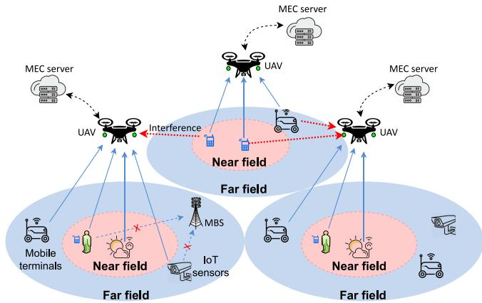
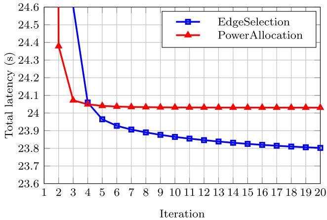
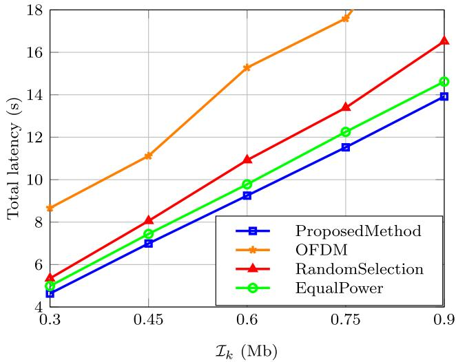
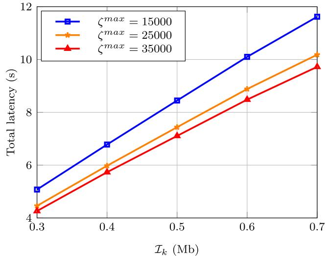
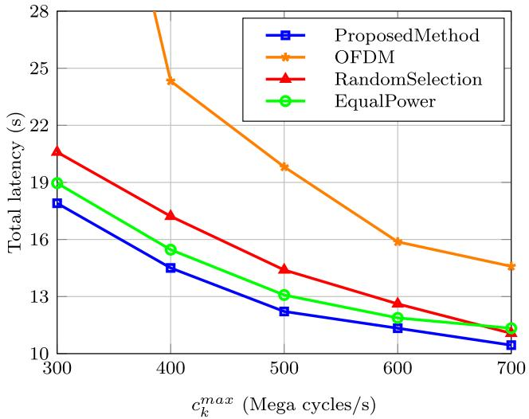
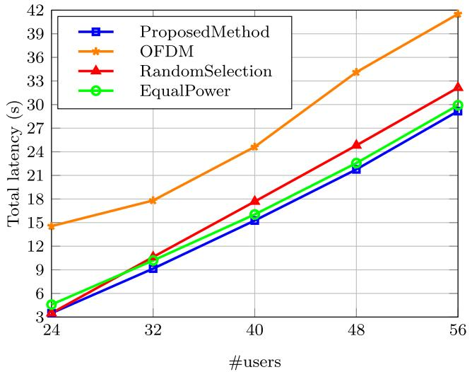
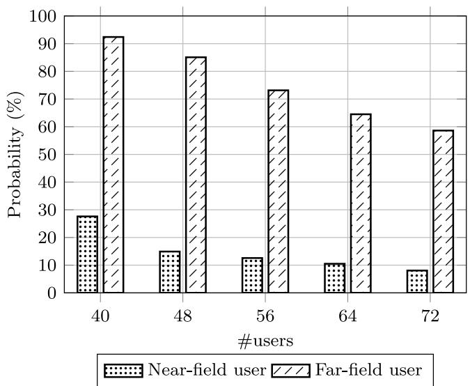

# Task Offloading Optimization for UAV-Aided NOMA Networks With Coexistence of Near-Field and Far-Field Communications

Tinh T. Bui, Student Member, IEEE, Thinh Quang Do , Graduate Student Member, IEEE, Dang Van Huynh, Member, IEEE, Tan Do-Duy , Member, IEEE, Long D. Nguyen , Member, IEEE, Tuan-Vu Cao, Vishal Sharma, Senior Member, IEEE, and Trung Q. Duong , Fellow, IEEE

Abstract—Mobile edge computing (MEC) is widely employed to allow users to offload computation-intensive tasks due to high energy efficiency, low latency, enhanced privacy, and security. Thanks to advances in manufacturing technologies, MEC-based unmanned aerial vehicle (UAV) networks can be extensions or replacements for edge servers at ground base stations to improve the network flexibility and quality of communication. This study focuses on the non-orthogonal multiple access (NOMA) scheme,

Digital Object Identifier 10.1109/TGCN.2024.3417697

emphasizing the coexistence of near-field and far-field regions, particularly in the context of multiple UAVs integrated with edge servers. We address the challenge of the latency minimization problem by efficiently optimizing both communications and computing variables such as user association, capacity allocation, and transmit power. The designed optimization problem is a mixed integer programming problem that has extremely high complexity. To solve this problem, we propose an iterative algorithm that is designed by using block coordinate descent, convex transformation, and relaxation. Through extensive simulations, our proposed solution demonstrates effectiveness in minimizing total task offloading latency across various scenarios. The findings not only contribute a practical convex optimization method to reduce the latency in MEC systems using UAV-aided NOMA networks but also enable the operations of modern applications such as augmented reality and virtual reality on handheld user devices.

Index Terms—Edge computing, NOMA, near-field communications, task offloading, UAV.

## I. INTRODUCTION

less communication networks. The diverse applications and research gaps in this domain have been studied in a comprehensive survey [1]. In the context of disaster communication, an approach has been proposed in which real-time UAV deployment and resource allocation are optimized using clustering and convex optimization techniques [2]. The integration of UAVs for mission-critical communications in shared spectrum environments has also been addressed, with learning-based deployment and power allocation algorithms proposed [3]. The growing interest in UAV communications underlines its potential, particularly when cooperating with emerging technologies like mobile edge computing (MEC), which opens doors for transformative applications in modern connectivity [4], [5], [6], [7].

MEC technology plays a pivotal role in facilitating time-sensitive, computation-intensive services within wireless networks. A review [8] offers a comprehensive overview of computation offloading, highlighting features unique to edge computing and exemplifying its application scenarios. In the context of MEC, joint computation, and communication cooperation have been explored, including both partial and binary offloading schemes, with an emphasis on minimizing total energy consumption while adhering to

Vishal Sharma is with the School of Electronics, Electrical Engineering and Computer Science, Queen’s University Belfast, BT7 1NN Belfast, U.K. (e-mail: v.sharma@qub.ac.uk).

user latency constraints [9]. The integration of communication and computation in hierarchical edge-cloud systems with ultra-reliable and low-latency communication links has also been studied. An iterative algorithm with inner convex approximations was employed to address queuing-aware latency minimization challenges [10]. Moreover, research has investigated intelligent task offloading in MEC contexts, leveraging digital twin-assisted techniques to optimize minmax fairness end-to-end latency for users. This is achieved through the proposal of alternating optimization algorithms that jointly optimize various communication and computation variables [11], [12]. These studies highlight MEC’s crucial role in enabling efficient and low-latency computation offloading strategies across diverse applications within wireless ecosystems [13], [14], [15].

The convergence of UAV technology and MEC has driven transformative progress in wireless systems. Studies have addressed the joint optimization of UAV trajectories and task offloading for MEC systems, actively tackling efficient resource allocation by optimizing UAV trajectory, task offloading decisions, and user scheduling variables while adhering to energy constraints [4]. Energy-efficient operation in UAV-UE setups has been explored through iterative algorithms, minimizing energy consumption by optimizing UAV trajectories and resource allocation [16]. Additionally, the optimization of energy consumption in both UAVs and user devices within MEC contexts has been investigated, using alternating iterative algorithms for effective problem-solving [5]. Furthermore, the integration of UAVs with MEC for latency optimization in virtual reality applications under Rician fading channels has been studied [17], highlighting the significance of addressing latency sensitivities in emerging applications. Collectively, these inquiries underscore the considerable potential of merging UAV capabilities with MEC, yielding dynamic and efficient wireless networks [18], [19].

While many of the aforementioned researches put far-field communications into perspective, which are the typical cases, some studies on the near-field region have also been conducted for increasing connectivity, energy efficiency, and better latency handling. The near-field region, which is bounded by the Rayleigh distance, in most cases does not meet the standard plane-wave assumption but offers spherical waves instead, hence creating different communication scenarios compared to far-field communication [20]. Since this region is located around the transmission devices, those studies focus on either increasing near-field coverage area using reconfigurable intelligence surface (RIS) and extremely large aperture arrays (ELAA) [21], [22], or enhancing communications within the area itself, especially for multiple-user capacity, by implementing techniques such as distance-aware precoding (DAP), non-orthogonal multiple access (NOMA) or artificial intelligence (AI) models [23], [24]. Some challenges, however, occurring in the near-field region can also be found as of difficult channel estimation and energy-reducing beam splitting effect, for which some researches have tried to find a solution [25], [26].

Currently, the NOMA-based transmission is a promising radio access technique for the next generation of wireless networks which can enhance spectrum efficiency, reduce latency with high reliability, and enable massive connectivity [27], [28], [29], [30]. In [31], a UAV as a MEC server is used for enabling ground users to offload their computingintensive tasks through the NOMA technique. Although there are some improvements in the optimal methods, near-field communication, which can account for a large area in the network coverage when the usage frequency is high and the distance between antennas increases, is not considered in [31] and [4], [5], [8], [9], [10], [11], [12], [13], [14], [15], [16], [17], [18], [19]. In [32], the coexistence of near-field and far-field massive multiple-input multiple-output (MIMO) communications was studied to maximize the sum data rate. In [33], a near-field NOMA scheme was investigated with the results of high-spectral efficiency compared to far-field NOMA and nearfield orthogonal multiple access. However, building a network with high flexibility supported by MEC-based UAVs was not considered in [32], [33]. Therefore, in this paper, we further develop the model of [31] by considering both near-field and far-field communication with different channel models. The system model is extended by investigating a network with multiple UAVs causing complex scenarios of high interference. The optimization problem and solving methods are enhanced by taking into account both near-field and far-field users and their constraints. Additionally, differing from [21], [22], [23], [24], [25], [26], we study to optimize computation and communication resource allocation for UAV-assisted MEC systems under the NOMA scheme which is used for taking advantage of the difference in both near-field and far-field regions to improve the quality of communication. Various communication and computation variables, namely user association, transmit power, and computing capacity allocation of UAV-MEC are jointly optimized in order to minimize the total latency of ground users (UEs). Due to the highly complex formulated problem, we tackle the challenge by solving the problem in the fashion of an iterative approach. Our proposed approach outperforms benchmark schemes in both reducing total latency and optimizing the resource allocation within the considered system model. The key contributions of this paper are summarized as follows

First, this research proposes communication models of UAV networks with the consideration of mathematical formulas for communication and offloading in both near-field and far-field regions. By transforming abstract definitions into specific numbers and mathematical expressions, the arising problems can hence be solved efficiently and explicitly. Modifications of the models for other related problems can also be achieved without much effort.

Second, this study proposes solutions to the problems above using various convex optimization techniques as well as mathematical transformations. While optimizing multiple variable problems can be difficult, we propose an iterative algorithm for handling variables sequentially.

Finally, this study provides simulation scenarios in detail with specific evaluations on the results, using intuitive graphs and data. Consequently, this study proves the efficiency of the proposed method over other benchmark schemes, where both near-field and far-field task offloading optimizations were assured. The collected figures over near-field cases show that the model obtains better results in the specific region, and suggests more developments on this area in the future.

  
Fig. 1. An illustration of a NOMA-enabled UAV-MEC system with the coexistence of near-field and far-field regions.

The rest of this paper is structured as follows. In Section II, the system model and the optimization problem are formulated with objective functions and related constraints. Based on the previous formulation of the problem, we design an optimization approach to solve with blocks of variable Section III. Since the objective functions have multiple variables to optimize, we propose a process to efficiently handle the problems according to the convex optimization theories. The simulation results are presented in Section IV to prove the effectiveness of our proposed method. The results then are analyzed and visualized in graphs and tables, with the addition of our assessments. The last section is the conclusion, where we summarize the problem, state our findings, and suggest further development on the work.

## II. SYSTEM MODEL AND PROBLEM FORMULATION

In this paper, multiple UAVs are used for offloading tasks of UEs that are located in both near-field and far-field regions from the locations of UAVs, with illustration from Fig. 1. Each UAV as a flying mobile edge server (MES) is equipped with an N-antenna uniform linear array. The set of UAVs is denoted by $( \mathcal { U } = \{ 1 , 2 , \dots , U \} )$ while the set of UEs is presented by $( \mathcal { K } = \{ 1 , 2 , \dots \colon \ O _ { k } \} )$ . Additionally, the 3D coordinate of the kth UE is given by

$$
{ \mathbf q } _ { k } = \{ x _ { k } , y _ { k } , 0 \} .\tag{1}
$$

The 3D coordinate of the uth UAV is $\mathbf { q } _ { u , 0 } = \{ x _ { u , 0 } , y _ { u , 0 } , z _ { u , 0 } \}$ (0 means the center of the UAV’s antenna array), and $\mathbf { q } _ { u , n }$ represents the coordinate of the nth antenna in the antenna array of the uth UAV. The distance between UE k and UAV u is given by

$$
d _ { u , k } = | | \mathbf { q } _ { k } - \mathbf { q } _ { u , 0 } | | .\tag{2}
$$

According to [32], Rayleigh distance is defined as

and

$$
d _ { R } = { \frac { 2 D ^ { 2 } } { \lambda } } = { \frac { 2 ( N - 1 ) ^ { 2 } d ^ { 2 } } { \lambda } } ,\tag{3}
$$

where D represents the antenna array aperture, N is the number of antennas, d is the antenna spacing, and λ denotes for the carrier wavelength.

## A. Channel Model

Depending on the distance between UAVs and UEs compared to the Rayleigh distance, there are two types of uplink channels for near-field and far-field communications [32].

Near-field communications: where the distance between UE k and UAV u is smaller than the Rayleigh distance $( d _ { u , k } < d _ { R } )$ . With λ being the carrier wavelength and $f _ { c }$ being the carrier frequency, the channel vector from UE k to UAV u which complies with the spherical-wave propagation is expressed as

$$
\mathbf { h } _ { k , u } ^ { N F } = g _ { k , u } ^ { N F } \Big [ e ^ { - j \frac { 2 \pi } { \lambda } | | \mathbf { q } _ { k } - \mathbf { q } _ { u , 1 } | | } \cdot \cdot \cdot e ^ { - j \frac { 2 \pi } { \lambda } | | \mathbf { q } _ { k } - \mathbf { q } _ { u , N } | | } \Big ] ,\tag{4}
$$

where the free space path loss in near-field case is

$$
g _ { k , u } ^ { N F } = \frac { c } { 4 \pi f _ { c } | | \mathbf { q } _ { k } - \mathbf { q } _ { u , 0 } | | } .\tag{5}
$$

Far-field communications: where the distance between UE k and UAV u is larger than the Rayleigh distance $( d _ { u , k } > d _ { R } )$ (The channel vector from UE k to UAV u is expressed as

$$
\begin{array} { r l } & { \mathbf { h } _ { k , u } ^ { F F } = g _ { k , u } ^ { F F } e ^ { - j \frac { 2 \pi } { \lambda } | | \mathbf { q } _ { k } - \mathbf { q } _ { u , 1 } | | } \left[ 1 \quad e ^ { - j \frac { 2 \pi d } { \lambda } \sin \left( \theta _ { k , u } \right) } \right. } \\ & { \left. \qquad \cdot \cdot \quad e ^ { - j \frac { 2 \pi d } { \lambda } ( N - 1 ) \sin \left( \theta _ { k , u } \right) } \right] , } \end{array}\tag{6}
$$

where $\theta _ { k , u }$ denotes the angle of arrival from UE u to UAV k. In addition, the free space path loss in the far-field case is given by

$$
g _ { k , u } ^ { F F } = \frac { c } { 4 \pi f _ { c } | | \mathbf { q } _ { k } - \mathbf { q } _ { u , 0 } | | } .\tag{7}
$$

The received waveform causes the fundamental difference between near-field and far-field channel models, i.e., spherical waveform received at near-field users and planar waveform received at far-field users. Therefore, the main modelling parameters are different, specifically the locations of antennas for near-field communication and the angle of arrival for far-field communication. The maximal ratio combining (MRC) technique is used for beamforming design at the massive MIMO antenna array of UAVs. The decoding vector for receiving the signal from UE k at UAV u is formulated as $\mathbf { f } _ { k , u } ~ = ~ \mathbf { h } _ { k , u } ^ { * } / | | \mathbf { h } _ { k , u } | |$ with $\mathbf { h } _ { k , u }$ being $\mathbf { h } _ { k , u } ^ { N F }$ or $\mathbf { h } _ { k , u } ^ { F F }$ depending on the distance between UE k and UAV u.

## B. NOMA-Based Mobile Edge Computing Model

Assume that the coverage areas of UAVs are given and do not overlap each other. Therefore, the set of UEs in the coverage of UAV u is denoted by $\kappa _ { u }$ . For all UAV $u ^ { \prime } \ne u$ we have

$$
\mathcal { K } _ { u } \cap \mathcal { K } _ { u ^ { \prime } } = \emptyset\tag{8}
$$

$$
\cup _ { u \in \mathcal { U } } K _ { u } = \mathcal { K } .\tag{9}
$$

In each UE cluster $\kappa _ { u } .$ , UAV u is able to choose to receive the offloading data from some UEs. The user association vector is denoted by

$$
\pi _ { u } = \left\{ \pi _ { k , u } \right\} _ { k \in \mathcal { K } _ { u } } = \{ 0 , 1 \} .\tag{10}
$$

If $\pi _ { k , u } = 1$ , the task of UE k is offloaded by UAV u. In contrast, if $\pi _ { k , u } = 0$ , UE k has to process its own task.

We assume that the UAV exploits the successive interference cancellation (SIC) technique to split the overlapped signals in a successive manner [27], [34]. In particular, the received signal corresponding to the strongest channel user is decoded first at the UAV-MEC and experiences interference caused by the signals from all other users with weaker channels [35]. Therefore, without loss of generality, we assume that the order of UEs in the cluster $\kappa _ { u }$ is the same as the descending order as

$$
\begin{array} { r } { | \mathbf { h } _ { 1 , u } ^ { T } \mathbf { f } _ { 1 , u } | ^ { 2 } \geq | \mathbf { h } _ { 2 , u } ^ { T } \mathbf { f } _ { 2 , u } | ^ { 2 } \geq \cdot \cdot \cdot \geq | \mathbf { h } _ { | K _ { u } | , u } ^ { T } \mathbf { f } _ { | K _ { u } | , u } | ^ { 2 } , } \end{array}\tag{11}
$$

where $| \mathcal { K } _ { u } |$ is the number of UEs in the cluster $\kappa _ { u } .$ . The $\kappa _ { u } ^ { N F }$ $\mathcal { K } _ { u } ^ { F F }$ are the sets of the near-field and far-field UEs in the cluster $\kappa _ { u }$ . The relation between $\kappa _ { u } , \kappa _ { u } ^ { N F }$ , and $\kappa _ { u } ^ { F F }$ can be shown as

$$
\mathcal { K } _ { u } = \mathcal { K } _ { u } ^ { N F } \cup \mathcal { K } _ { u } ^ { F F }\tag{12}
$$

and

$$
\begin{array} { r } { \mathcal { K } _ { u } ^ { N F } \cap \mathcal { K } _ { u } ^ { F F } = \emptyset . } \end{array}\tag{13}
$$

For SIC, UAV u decodes the data of UEs according to this order. Therefore, when extracting the data of UE k, the UAV knows the data of the ith UEs $( i < k )$ . The interference is the data received from the remaining UEs in both the coverage of UAV u and the other UAVs $u ^ { \prime } \ne u$ . Since the signals received from the near-field UEs are mostly interfered with by the UEs in the same cluster, the throughput of the kth near-field UE in the coverage of UAV u is expressed as

$$
R _ { k } ^ { N F } ( \mathbf { p } , \pmb { \pi } ) = W \log _ { 2 } \left( 1 + \frac { \pi _ { k , u } p _ { k } | \mathbf { h } _ { k , u } ^ { T } \mathbf { f } _ { k , u } | ^ { 2 } } { \sum _ { j = k + 1 } ^ { | K _ { u } | } \pi _ { j , u } p _ { j } | \mathbf { h } _ { j , u } ^ { T } \mathbf { f } _ { j , u } | ^ { 2 } + \sigma ^ { 2 } } \right) ,\tag{14}
$$

where $\mathbf { p } = [ p _ { k } ] _ { k = 1 } ^ { K }$ denotes the power control coefficients of K UEs; $\pmb { \pi } = [ \overset \cdots { } | \overset \cdots { } | \overset / { \pi } _ { u } ] _ { u = 1 } ^ { \top }$ represents the set of user association vector of UAVs; W (in Hz) denotes the system bandwidth.

On the other hand, the signals from far-field UEs in the boundary are interfered with by both the UEs in the same cluster and the UEs in the other clusters. The throughput of the kth far-field UE in the coverage of UAV u is expressed as

$$
R _ { k } ^ { F F } ( \mathbf { p } , \pmb { \pi } ) = { { W \log } _ { 2 } } \bigg ( 1 + \frac { \pi _ { k , u } p _ { k } | \mathbf { h } _ { k , u } ^ { T } \mathbf { f } _ { k , u } | ^ { 2 } } { { { I } _ { k } } ( \mathbf { p } , \pmb { \pi } ) + { \sigma } ^ { 2 } } \bigg ) ,\tag{15}
$$

where

$$
\begin{array} { l } { { \displaystyle I _ { k } ( { \bf p } , { \boldsymbol \pi } ) = \sum _ { j = k + 1 } ^ { | K _ { u } | } \pi _ { j , u } p _ { j } \vert { \bf h } _ { j , u } ^ { T } { \bf f } _ { j , u } \vert ^ { 2 } } } \\ { { \displaystyle \quad \quad + \sum _ { u ^ { \prime } \in \mathcal { U } \setminus u } \sum _ { j = 1 } ^ { | K _ { u ^ { \prime } } | } \pi _ { j , u ^ { \prime } } p _ { j } \vert { \bf h } _ { j , u } ^ { T } { \bf f } _ { j , u ^ { \prime } } \vert ^ { 2 } } . } \end{array}\tag{16}
$$

## C. Offloading Model

We denote $\mathcal { T } _ { k }$ (in bits) as the offloading task size of the kth UE and $\mathcal { F } _ { k }$ (in cycles/bit) as the number of CPU cycles required to compute each bit of task $\mathcal { T } _ { k }$ . We also define the latency for local computing at the kth UE and for offloading of task $\mathcal { T } _ { k }$ to the UAV-MEC, respectively, as follows:

1) Local Processing: Denote $c _ { k }$ (in cycles/second) as the computing capacity at each kth UE. If the kth UE executes its task locally, the local computing time can be written as [36]

$$
T _ { k } ^ { l } = \frac { ( 1 - \pi _ { k } ) \mathcal { T } _ { k } \mathcal { F } _ { k } } { c _ { k } } , \ k \in \mathcal { K } .\tag{17}
$$

2) Edge Processing: The kth near-field UE $( k \in \mathcal { K } ^ { N F } )$ offloads the task to the uth UAV where ${ \kappa } ^ { N F }$ denotes the set of all near-field UEs, the offloading transmission time of UE k can be expressed as [36]

$$
T _ { k } ^ { t x \_ N F } ( \mathbf { p } , \pmb { \pi } ) = \frac { \pi _ { k } \mathcal { T } _ { k } } { R _ { k } ^ { N F } ( \mathbf { p } , \pmb { \pi } ) } ,\tag{18}
$$

where $T _ { k } ^ { t x \_ N F }$ is the offload transmission (tx) time for kth near-field (NF) UE, and $R _ { k } ^ { N F } ( \mathbf { p } , \pmb { \pi } )$ is given in (14).

Also, if the kth far-field UE $( k \in \mathcal { K } ^ { F F } ) ~ ( \mathcal { K } ^ { F F }$ denotes the set of all far-field UEs) offloads the task to the uth UAV, the offloading transmission time can be expressed as [36]

$$
T _ { k } ^ { t x \_ F F } ( \mathbf { p } , \pmb { \pi } ) = \frac { \pi _ { k } \mathcal { T } _ { k } } { R _ { k } ^ { F F } ( \mathbf { p } , \pmb { \pi } ) } ,\tag{19}
$$

where $T _ { k } ^ { t x \_ F F }$ is the offload transmission tx time for kth far-field (NF) UE, and $R _ { k } ^ { F F } ( \mathbf { p } , \pmb { \pi } )$ is given in (15).

As a result, the computing time for the offloaded task at the uth UAV-MEC can be given as

$$
T _ { k } ^ { c o m } \big ( \zeta _ { k , u } \big ) = \frac { \pi _ { k } \mathcal { T } _ { k } \mathcal { F } _ { k } } { \zeta _ { k , u } } , \ k \in \mathcal { K } ,\tag{20}
$$

where $\zeta _ { k , u }$ (in cycles/second) denotes the computing capacity of the uth UAV-MEC allocated to process the task of the kth UE. For convenience, let $\boldsymbol { \xi } = [ \zeta _ { k , u } ] _ { k \in \mathcal { K } , u \in \mathcal { U } }$ denote the UAV-MEC computing capacity allocation according to K UEs. From (17)–(20), hence, the total latency for executing the task of the kth UE for the near-field and far-field cases can be written respectively as

$$
T _ { k } ^ { N F } ( { \bf p } , { \pmb \pi } , \xi ) = T _ { k } ^ { l } + T _ { k } ^ { t x _ { - } N F } + T _ { k } ^ { c o m } ,
$$

$$
T _ { k } ^ { F F } ( { \bf p } , { \pmb \pi } , \xi ) = T _ { k } ^ { l } + T _ { k } ^ { t x \_ F F } + T _ { k } ^ { c o m } .\tag{21}
$$

(22)

Here, we can ignore the time required for transmitting the computation results from the UAV back to the UEs since such latency is dominated by the total latency for executing the task [36].

## D. Problem Formulation

In the problem, our main objective is to minimize the maximum latency of both far-field and near-field UEs based on optimizing transmit power, user association, and allocated computing capacity of the UAV-MEC. Hence, the optimization problem can be formulated as follows:

$$
\operatorname* { m i n } _ { \mathbf { p } , \pi , \boldsymbol { \xi } } \sum _ { k \in \mathcal { K } ^ { N F } } T _ { k } ^ { N F } ( \mathbf { p } , \pi , \boldsymbol { \xi } ) + \sum _ { k \in \mathcal { K } ^ { F F } } T _ { k } ^ { F F } ( \mathbf { p } , \pi , \boldsymbol { \xi } )\tag{23a}
$$

$$
{ \mathrm { s . t . } } p _ { k } \leq P _ { k } ^ { m a x } \forall k \in K ,\tag{23b}
$$

$$
\pi _ { k , u } \in \{ 0 , 1 \} , \ \forall k \in K , u \in \mathcal { U } ,\tag{23c}
$$

$$
\sum _ { k \in \mathcal { K } _ { u } } \pi _ { k } \leq \Pi ^ { m a x } , \ \forall u \in \mathcal { U } ,\tag{23d}
$$

$$
T _ { k } \left( \mathbf { p } , \pmb { \pi } , \zeta _ { k , u } \right) \leq T ^ { m a x } , \forall k \in \mathcal { K } ,\tag{23e}
$$

$$
R _ { k } ( \mathbf { p } , \pmb { \pi } ) \geq \pi _ { k , u } R _ { m i n } ^ { u l } , \ \forall k \in \mathcal { K } , u \in \mathcal { U } ,\tag{23f}
$$

$$
\sum _ { k \in \mathcal { K } _ { u } } \pi _ { k , u } \zeta _ { k , u } \leq \zeta ^ { m a x } , \ \forall u \in \mathcal { U } ,\tag{23g}
$$

where $P _ { k } ^ { m a x }$ is the maximum transmit power of the UEs; max is the maximum number of UEs which one UAV Πcan serve; T max is the maximum latency required by all UEs; $R _ { m i n } ^ { u l }$ is the minimum transmission rate requirement for uplink transmission from the UEs to the UAV-MEC; and ζmax is the maximum computing capacity of the UAV-MEC. We formulate the optimization problem (23) concerning the following constraints. The constraint (23b) represents the power constraint at the UEs. The constraints (23c) and (23d) reflect the user association indicators and the maximum number of UEs that the UAV-MEC can serve. (23d) guarantees the quality of service in communication and allows UAVs to reduce offloading overhead caused by connecting many users. The constraint (23e) denotes the maximum latency constraint for every offloading task. The constraint (23f) shows the minimum transmission rate requirement for uplink transmission from the UEs to the UAV-MEC. The constraint (23g) reflects the computation resource limitations at the UAV-MEC.

Unfortunately, the problem (23) is a nonlinear integer programming problem with the non-convex property of constraints (23a), (23e), (23f), which is difficult to solve. Especially, the complexity of problem (23) significantly increases with the large number of UEs. Therefore, we propose an alternating solution for solving the problem (23) as presented in the next section.

## III. OPTIMIZATION METHOD

In this section, we proposed a solution to solve the problem (23). Solving this problem directly is computationally challenging due to the non-smooth, non-convex objective function, non-convex constraints, and strongly coupling binary and continuous variables. Therefore, we propose an alternative optimization approach to tackle this challenging problem, where a repetitive process is executed. This process would optimize each block of variables within the objective function in sequence, where only one type of variable is handled at once to avoid the aforementioned issues and reduce the inherent high complexity of the original problem (23). As a result, the following subsections are provided to address optimization problems for offloading decisions, power allocation, and computing capacity allocation, respectively.

## A. Optimal Offloading Decisions

We are in the position of solving for the optimal user association policies with given optimal transmit power and computing capacity allocation. It is reasonable to optimize the offloading decisions in the first place since it would immediately assign users to respective UAVs. This results in simpler calculations during the next optimization of power allocation and computing capacity, and each connection from a UAV to a UE would be certain to determine if it is the near-field or far-field region.

To solve user association optimization, fixed power allocation p and computing capacity ζ are required, and the optimal user association policy is obtained after some iterations of running the optimization algorithm. The subproblem of user association optimization can then be expressed as

$$
\operatorname* { m i n } _ { \pmb { \pi } } \sum _ { k \in \mathcal { K } ^ { N F } } T _ { k } ^ { N F } ( \pmb { \pi } ) + \sum _ { k \in \mathcal { K } ^ { F F } } T _ { k } ^ { F F } ( \pmb { \pi } )\tag{24a}
$$

$$
{ \mathrm { s . t . } } ( 2 3 \mathrm { c } ) , ( 2 3 \mathrm { d } ) , ( 2 3 \mathrm { e } ) , ( 2 3 \mathrm { f } ) , ( 2 3 \mathrm { g } ) ,\tag{24b}
$$

where $\mathcal { K } ^ { N F } = \cup _ { u \in \mathcal { U } } \mathcal { K } _ { u } ^ { N F }$ is the set of near-field UEs which are in the near-field regions of their UAVs, and $\begin{array} { r l } { \kappa ^ { F F } } & { { } = } \end{array}$ $\cup _ { u \in \mathcal { U } } \mathcal { K } _ { u } ^ { F F }$ denotes the set of far-field UEs which are in the far-field regions of their UAVs. As observed in subproblem (24), the objective function and the constraints (23e), (23f) are non-convex. To solve problem (24), we use the logarithmic inequality given in [37], [38], which follows from the convexity of the function $f ( x , y ) = \log _ { 2 } ( 1 + 1 / x y )$ as

$$
f ( x , y ) = \log _ { 2 } \left( 1 + { \frac { 1 } { x y } } \right) \geq { \hat { f } } ( x , y ) ,\tag{25}
$$

where, for $\forall x > 0 , \bar { x } > 0 , y > 0 , \bar { y } > 0$ , we have

$$
\begin{array} { c l c r } { { \hat { f } ( x , y ) = \log _ { 2 } \left( 1 + \displaystyle \frac { 1 } { \bar { x } \bar { y } } \right) + \displaystyle \frac { 2 } { ( \bar { x } \bar { y } + 1 ) } - \frac { x } { \bar { x } ( \bar { x } \bar { y } + 1 ) } } } \\ { { - \displaystyle \frac { y } { \bar { y } \left( \bar { x } \bar { y } + 1 \right) } . } } \end{array}\tag{26}
$$

Let i denote the ith iteration. By applying the above inequality, the throughput of any kth UE at the ith iteration can be approximated as

$$
\begin{array} { r } { R _ { k } ( \pmb { \pi } ) \geq \hat { R } _ { k } ^ { ( i ) } ( \pmb { \pi } ) , k \in \mathcal { K } , } \end{array}\tag{27}
$$

where

$$
\begin{array} { r } { \hat { R } _ { k } ^ { ( i ) } ( \pmb { \pi } ) = W \Big ( \log _ { 2 } \bigg ( 1 + \frac { 1 } { \bar { x } _ { 1 } \bar { y } _ { 1 } } \bigg ) + \frac { 2 } { ( \bar { x } _ { 1 } \bar { y } _ { 1 } + 1 ) } } \\ { - \frac { x _ { 1 } } { \bar { x } _ { 1 } ( \bar { x } _ { 1 } \bar { y } _ { 1 } + 1 ) } - \frac { y _ { 1 } } { \bar { y } _ { 1 } ( \bar { x } _ { 1 } \bar { y } _ { 1 } + 1 ) } \Big ) , } \end{array}\tag{28}
$$

$$
\begin{array} { r } { x _ { 1 } = \frac { 1 } { \pi _ { k } p _ { k } | { \bf h } _ { k , u } ^ { T } { \bf f } _ { k , u } | ^ { 2 } } , \bar { x } _ { 1 } = x _ { 1 } ^ { ( i ) } = \frac { 1 } { \pi _ { k } ^ { ( i ) } p _ { k } | { \bf h } _ { k , u } ^ { T } { \bf f } _ { k , u } | ^ { 2 } } , } \end{array}
$$

$$
\begin{array} { r } { y _ { 1 } = \left\{ \begin{array} { c } { \sum _ { j = k + 1 } ^ { K } \pi _ { j } p _ { j } | { \bf h } _ { j , u } ^ { T } { \bf f } _ { j , u } | ^ { 2 } + \sigma ^ { 2 } , k \in \mathcal { K } ^ { N F } } \\ { I _ { k } ( \pmb { \pi } ) + \sigma ^ { 2 } , k \in \mathcal { K } ^ { F F } } \end{array} \right. } \end{array}
$$

and

$$
\bar { y } _ { 1 } = y _ { 1 } ^ { ( i ) } = \left\{ \begin{array} { c c } { \sum _ { j = k + 1 } ^ { K } \pi _ { j } ^ { ( i ) } p _ { j } | { \bf h } _ { j , u } ^ { T } { \bf f } _ { j , u } | ^ { 2 } + \sigma ^ { 2 } , k \in K ^ { N F } } & \\ { I _ { k } \Big ( \pmb { \pi } ^ { ( i ) } \Big ) + \sigma ^ { 2 } , ~ k \in K ^ { F F } } & \end{array} \right.
$$

Hence, constraint (23f) is equivalently approximated as

$$
\hat { R } _ { k } ^ { ( i ) } ( \pmb { \pi } ) \geq \pi _ { k , u } R _ { m i n } ^ { u l } .\tag{29}
$$

Second, we introduce new variables $\tilde { \mathbf { r } } \triangleq \{ \tilde { r } _ { k } | \forall k \in \mathcal { K } \}$ that satisfy $\begin{array} { r } { \frac { 1 } { R _ { k } ( \pmb { \pi } ) } \leq \tilde { r } _ { k } } \end{array}$ . Let the total latency for UE k

$$
T _ { k } ^ { t o t } ( \mathbf { p } , \pi , \xi ) = \left\{ \begin{array} { l l } { T _ { k } ^ { N F } ( \mathbf { p } , \pi , \xi ) , k \in K ^ { N F } } \\ { T _ { k } ^ { F F } ( \mathbf { p } , \pi , \xi ) , k \in K ^ { F F } } \end{array} \right.\tag{30}
$$

The function $T _ { k } ^ { t o t } ( { \pmb \pi } )$ can be upper-bounded as

$$
T _ { k } ^ { t o t } ( { \pmb \pi } , \tilde { r } _ { k } ) \leq T _ { k } ^ { l } + \pi _ { k } \tilde { r } _ { k } \mathcal { T } _ { k } + T _ { k } ^ { c o m } .\tag{31}
$$

Applying the inequality [15]

$$
x y \leq \frac { 1 } { 2 } \bigg ( \frac { \bar { y } x ^ { 2 } } { \bar { x } } + \frac { \bar { x } y ^ { 2 } } { \bar { y } } \bigg ) ,\tag{32}
$$

we have

$$
T _ { k } ^ { t o t } ( \pmb { \pi } , \tilde { r } _ { k } ) \leq T _ { k } ^ { l } + \frac { \mathcal { T } _ { k } } { 2 } \bigg ( \frac { \tilde { r } _ { k } ^ { ( i ) } } { \pi _ { k } ^ { ( i ) } } \pi _ { k } ^ { 2 } + \frac { \pi _ { k } ^ { ( i ) } } { \tilde { r } _ { k } ^ { ( i ) } } \tilde { r } _ { k } ^ { 2 } \bigg ) + T _ { k } ^ { c o m } .\tag{33}
$$

We can express (23e) as in the following constraints

$$
\begin{array} { r } { \left\{ \begin{array} { l l } { T _ { k } ^ { l } + \displaystyle \frac { \mathcal { T } _ { k } } { 2 } \left( \frac { \tilde { r } _ { k } ^ { ( i ) } } { \pi _ { k } ^ { ( i ) } } \pi _ { k } ^ { 2 } + \frac { \pi _ { k } ^ { ( i ) } } { \tilde { r } _ { k } ^ { ( i ) } } \tilde { r } _ { k } ^ { 2 } \right) + T _ { k } ^ { c o m } \le T _ { k } ^ { m a x } , } \\ { \qquad \quad \frac { 1 } { \hat { R } _ { k } ^ { ( i ) } ( \pi ) } \le \tilde { r } _ { k } . } \end{array} \right. } \end{array}\tag{34a}
$$

(34b)

Consequently, at the ith iteration, we solve the following convex problem of (24):

$$
\operatorname* { m i n } _ { \pi , \tilde { \mathbf { r } } } \ \sum _ { k = 1 } ^ { K } \left( T _ { k } ^ { l } + \frac { \mathcal { T } _ { k } } { 2 } \left( \frac { \tilde { r } _ { k } ^ { ( i ) } } { \pi _ { k } ^ { ( i ) } } \pi _ { k } ^ { 2 } + \frac { \pi _ { k } ^ { ( i ) } } { \tilde { r } _ { k } ^ { ( i ) } } \tilde { r } _ { k } ^ { 2 } \right) + T _ { k } ^ { c o m } \right)\tag{35a}
$$

$$
s . t . ( 2 3 \mathrm { d } ) , ( 2 9 ) , ( 3 4 \mathrm { a } ) , ( 3 4 \mathrm { b } ) , ( 2 3 \mathrm { g } ) ,\tag{35b}
$$

$$
\pi _ { k , u } \in ( 0 , 1 ) , \ \forall k \in K , u \in \mathcal { U } .\tag{35c}
$$

By relaxing the constraint (23c) into (35c), the initial integer programming problem (24) is converted into the convex problem (35). Thus, it can be efficiently solved by convex optimization solvers, e.g., CVX [39]. In the iterative algorithm to solve (24), the intermediate solutions $\pi ^ { * }$ and $\tilde { \mathbf { r } } ^ { * }$ at the (i−1)th iteration are used as $\pmb { \pi } ^ { ( i ) }$ and $\tilde { \mathbf { r } } ^ { ( i ) }$ for the next iteration. The algorithm is stopped when the convergence of the objective function is achieved. After obtaining the solution, for each UAV $u ,$ max UEs which have the largest value of $\pi _ { k , u }$ are chosen to offload their tasks toward the UAV.

## B. Optimal Power Allocation

In this subsection, we optimize the power allocation for UEs to offload the data of tasks to UAVs with fixed values of user association π and computing capacity allocation ζ . Those ( ) ( )fixed values must comply with the respective constraints of (23).

The problem (23) can be rewritten as

$$
\operatorname* { m i n } _ { \mathbf { p } } \sum _ { k \in K ^ { N F } } T _ { k } ^ { N F } ( \mathbf { p } ) + \sum _ { k \in K ^ { F F } } T _ { k } ^ { F F } ( \mathbf { p } )\tag{36a}
$$

$$
{ \mathrm { s . t . } } ( 2 3 \mathrm { b } ) , ( 2 3 \mathrm { e } ) , ( 2 3 \mathrm { f } ) .\tag{36b}
$$

To solve subproblem (36), we also use the logarithmic inequality (25) to approximate the throughput. Let i denote the ith iteration and exploit

$$
\begin{array} { r } { x _ { 2 } = \frac { 1 } { \pi _ { k } p _ { k } | { \bf h } _ { k , u } ^ { T } { \bf f } _ { k , u } | ^ { 2 } } , ~ \bar { x } _ { 2 } = x _ { 2 } ^ { ( i ) } = \frac { 1 } { \pi _ { k } p _ { k } ^ { ( i ) } | { \bf h } _ { k , u } ^ { T } { \bf f } _ { k , u } | ^ { 2 } } } \end{array}
$$

$$
\begin{array} { r } { y _ { 2 } = \left\{ \begin{array} { c } { \sum _ { j = k + 1 } ^ { K } \pi _ { j } p _ { j } | { \bf h } _ { j , u } ^ { T } { \bf f } _ { j , u } | ^ { 2 } + \sigma ^ { 2 } , k \in K ^ { N F } } \\ { I _ { k } ( { \bf p } ) + \sigma ^ { 2 } , k \in K ^ { F F } } \end{array} \right. } \end{array}
$$

and

$$
\bar { y } _ { 2 } = y _ { 2 } ^ { ( i ) } = \left\{ \begin{array} { c c } { \sum _ { j = k + 1 } ^ { K } \pi _ { j } p _ { j } ^ { ( i ) } | \mathbf { h } _ { j , u } ^ { T } \mathbf { f } _ { j , u } | ^ { 2 } + \sigma ^ { 2 } , k \in K ^ { N F } } \\ { I _ { k } \Big ( \mathbf { p } ^ { ( i ) } \Big ) + \sigma ^ { 2 } , ~ k \in K ^ { F F } } \end{array} \right.
$$

for approximating the information throughput of the kth UE at the UAV-MEC in (14) and (15) as

$$
R _ { k } ( \mathbf { p } ) \geq \hat { R } _ { k } ^ { ( i ) } ( \mathbf { p } ) , \forall k \in \mathcal { K } ,\tag{37}
$$

where

$$
\begin{array} { r } { \hat { R } _ { k } ^ { ( i ) } ( \mathbf { p } ) = W \Big ( \log _ { 2 } \Big ( 1 + \frac { 1 } { \bar { x } _ { 2 } \bar { y } _ { 2 } } \Big ) + \frac { 2 } { ( \bar { x } _ { 2 } \bar { y } _ { 2 } + 1 ) } } \\ { - \frac { x _ { 2 } } { \bar { x } _ { 2 } ( \bar { x } _ { 2 } \bar { y } _ { 2 } + 1 ) } - \frac { y _ { 2 } } { \bar { y } _ { 2 } ( \bar { x } _ { 2 } \bar { y } _ { 2 } + 1 ) } \Big ) . } \end{array}\tag{38}
$$

Hence, the constraint (23f) can be rewritten as

$$
\hat { R } _ { k } ^ { ( i ) } ( \mathbf { p } ) \geq \pi _ { k } R _ { m i n } ^ { u l } , \forall k \in \mathcal { K } .\tag{39}
$$

Next, by introducing the new variables $\mathbf { r } \triangleq \{ r _ { k } \} \ ( \forall k \in \mathcal { K } )$ that satisfy $\frac { 1 } { R _ { k } ( { \bf p } ) } \le r _ { k }$ , the function $T _ { m } ^ { t o t } ( \mathbf { p } )$ can be upperbounded as $T _ { k } ^ { \dot { \tau } o t } ( { \mathbf { p } } ) \leq \hat { T } _ { k } ^ { t o t } ( { \mathbf { r } } )$ where

$$
\begin{array} { r } { \hat { T } _ { k } ^ { t o t } ( r _ { k } ) \le T _ { k } ^ { l } + \pi _ { k } r _ { k } \mathcal { Z } _ { k } + T _ { k } ^ { c o m } . } \end{array}\tag{40}
$$

We can express (23e) as

$$
\left\{ { \begin{array} { l } { { \displaystyle T _ { k } ^ { l } + \pi _ { k } r _ { k } \mathbb { Z } _ { k } + T _ { k } ^ { c o m } \leq T _ { k } ^ { m a x } , } } \\ { { \displaystyle \qquad \frac { 1 } { \hat { R } _ { k } ^ { ( i ) } ( { \bf p } ) } \leq r _ { k } , \forall k \in \mathcal { K } . } } \end{array} } \right.\tag{41a}
$$

(41b)

Consequently, problem (36) is equivalent to the following problem to generate a feasible point at the ith iteration:

$$
\operatorname* { m i n } _ { \mathbf { p } , \mathbf { r } } \ \sum _ { k = 1 } ^ { K } \bigl ( T _ { k } ^ { l } + \pi _ { k } r _ { k } \mathcal { T } _ { k } + T _ { k } ^ { c o m } \bigr )
$$

$$
\mathrm { s . t . ( 2 3 b ) , ( 3 9 ) , ( 4 1 a ) , ( 4 1 b ) . }\tag{42a}
$$

(42b)

Hence, problem (42) is now a standard convex program and can be efficiently solved by convex optimization solvers. To obtain the optimal solution of the original problem (36), problem (42) is solved in an iterative algorithm where the intermediate solutions $\mathbf { p } ^ { * }$ and $\mathbf { r } ^ { * }$ at the (i−1)th iteration are used as $\mathbf { p } ^ { ( i ) }$ and $\mathbf { r } ^ { ( i ) }$ for the next iteration. The algorithm is stopped when the convergence of the objective function is achieved.

## C. Optimal Computing Capacity

Finally, we resolve optimal computing capacity allocation for UAV-MEC servers with given values of optimal transmit power and user association policies. Therefore, the considered optimization problem can be rewritten as follows

$$
\operatorname* { m i n } _ { \boldsymbol { \xi } } \sum _ { \boldsymbol { k } \in \boldsymbol { K } ^ { N F } } T _ { \boldsymbol { k } } ^ { N F } ( \boldsymbol { \xi } ) + \sum _ { \boldsymbol { k } \in \boldsymbol { K } ^ { F F } } T _ { \boldsymbol { k } } ^ { F F } ( \boldsymbol { \xi } )\tag{43a}
$$

$$
{ \mathrm { s . t . } } \ ( 2 3 \mathrm { e } ) , \ ( 2 3 \mathrm { g } ) .\tag{43b}
$$

Since both the objective function and the constraints (23e) and (23g) are convex with respect to ζ . Hence, the problem (43) is convex and can be efficiently solved by CVX.

Consequently, based on the above development, the optimal resource allocation for UEs and MEC servers can be efficiently solved by following an iterative optimization algorithm [11], [38]. Based on the above development, we proposed Algorithm 1 to solve the problem (23). In the ih iteration, three sub-problems are solved in order of offloading selection, power allocation, and computing capacity allocation. The optimal solution of each sub-problem is used as the input parameters to solve the next sub-problem. In Algorithm 1, two stop conditions are used. First, we use a tolerance ε to determine the convergence of Algorithm 1. When the change in the optimal value of the total latency varies in the range less than ε, the convergence condition is achieved. Otherwise, the algorithm must be stopped if the number of iterations is greater than I max.

Algorithm 1 The Iterative Algorithm for Optimizing Task   
Offloading in UAV-Aided NOMA Networks   
Require: Set $\overline { { \textit { i } \ = \ \textit { 0 } } }$ and randomly choose initial   
feasible points $\pi ^ { ( 0 ) } , \mathrm { ~ \bf ~ p ^ { ( 0 ) } ~ }$ and $\chi ^ { \smash { \tilde { ( 0 ) } } }$ complying to   
constraints (23b), (23c), (23d), (23e), (23f), (23g); Set   
the tolerance $\varepsilon ~ = ~ 0 . 0 1$ and the maximum number of   
iterations $I ^ { \mathrm { m a x } } = 2 0$   
1: repeat   
2: Solve problem (24) with given $\mathbf { p } ^ { ( i ) }$ and $\pmb { \zeta } ^ { ( i ) }$ with the   
iterative algorithm described in Section III-A to obtain   
the solution for offloading decisions $\left( \pi ^ { * } \right)$ and update   
$\pmb { \pi } ^ { ( i + 1 ) } = \pmb { \pi } ^ { * }$   
3: =Solve problem (36) for given $\pmb { \pi } ^ { ( i + 1 ) }$ and $\zeta ^ { ( i ) }$ with   
the iterative algorithm described in Section III-B to   
obtain the solution of power allocation $\left( \mathbf { p } ^ { * } \right)$ and update   
$\mathbf { p } ^ { ( i + 1 ) } = \mathbf { p } ^ { * }$   
4: =Solve problem (43) with given $\pi ^ { ( i + 1 ) } , \mathbf { p } ^ { ( i + 1 ) }$ to obtain   
the next solution of $( \pmb { \zeta } ^ { * } )$ and update $\pmb { \zeta } ^ { ( i + 1 ) } = ( \pmb { \zeta } ^ { * } )$   
5: Set $i = i + 1$   
= + 16: until Convergence or $i > I ^ { \mathrm { m a x } } .$   
7: Output: $\left\{ \underline { { \mathbf { p } } } ^ { * } , \pmb { \pi } ^ { * } , \pmb { \zeta } ^ { * } \right\}$ and the value of   
$\begin{array} { r } { \sum _ { k \in K ^ { N F } } T _ { k } ^ { \hat { N } \hat { F } } ( \mathbf { p } ^ { * } , \pmb { \pi } ^ { * } , \pmb { \zeta } ^ { * } ) + \sum _ { k \in K ^ { F F } } T _ { k } ^ { F F } ( \mathbf { p } ^ { * } , \pmb { \pi } ^ { * } , \pmb { \zeta } ^ { * } ) . } \end{array}$

## IV. NUMERICAL RESULTS

In this section, we investigate the effectiveness of the proposed method in UAV-MEC networks by evaluating the performance in several different scenarios. For comparison, three traditional methods are introduced such as

“OFDM”: The used spectrum is divided into multiple orthogonal equal parts for data exchange between UAVs and UEs. The intra-cell interference between UEs offloading to the same UAV is fully removed in this method. The optimal solution is obtained using the same optimization technique as our method.

“RandomSelection”: The offloading decisions are selected randomly while guaranteeing the constraints of (24). The power allocation and computing allocation are optimized using the approaches presented in Sections III-B and III-C.

“EqualPower”: The maximum power $P _ { k } ^ { m a x }$ is used for all UEs to offload their tasks to UAVs. The offloading decisions and computing allocation are optimized using the approaches presented in Sections III-A and III-C.

TABLE I  
SIMULATION PARAMETERS [3], [11], [36], [40]
<table><tr><td>Parameter</td><td>Numerical value</td></tr><tr><td>Carrier frequency,  $\overline { { f _ { c } } }$  Bandwidth, W</td><td>28 GHz</td></tr><tr><td></td><td>5MHz</td></tr><tr><td>UAVs&#x27; altitude,  $z _ { u , 0 }$  Number of antennas per UAV, N</td><td>40 m</td></tr><tr><td>The antenna spacing, d</td><td>128</td></tr><tr><td>Maximum transmit power of users,  $P _ { k } ^ { \mathrm { m a x } }$ </td><td> $\lambda / 2 = 5 .$  36 mm</td></tr><tr><td>The noise power,  $\sigma ^ { \bar { 2 } }$ </td><td>30 dBm (1W)</td></tr><tr><td>CPU cycles required per bit,  $\mathcal { F } _ { k }$ </td><td>-174 dBm/Hz</td></tr><tr><td>The minimum transmission rate,  $R _ { m i n } ^ { u l }$ </td><td>400 cycles/bit</td></tr><tr><td>The maximum latency, Tmax</td><td>0.3466 Mbps</td></tr><tr><td>The maximum number of UEs served by</td><td>2 s</td></tr><tr><td>each UAV, ⅡImax</td><td>6 UEs</td></tr></table>

## A. Parameter Setting

We consider a UAV-MEC network consisting of multiple UAVs and many UEs in a considered area of 600 m × 600 m. UAVs are distributed at the centers of non-overlapping and equal small areas (i.e., the coordinates of UAVs (150, 150, 40), (450, 150, 40), (150, 450, 40), and (450, 450, 40). All signal transmission of both near-field and far-field communication is operated using the carrier in the frequency of $f _ { c } = 2 8$ GHz with the system bandwidth of W 5 MHz. A uniform linear =array of 128 antennas is equipped at each UAV to serve multiple users simultaneously at the same spectrum. Each UE is equipped with one omnidirectional antenna with the maximum transmit power of $P _ { k } ^ { m a x } = 3 0$ dBm [31]. The noise power density is set to $\sigma ^ { 2 } = - 1 7 4$ dBm/Hz. The summary of simulation parameters is shown in Table I. According to (3), the Rayleigh distance $d _ { R }$ in this setup equals 86.45 m. Nearfield UEs of a UAV u are located in an annulus which has the center of the projection of UAV u on the ground, the radius of the inner circle being 5 m, and the radius of the outer circle being $\sqrt { d _ { R } ^ { 2 } - z _ { u , 0 } ^ { 2 } } .$ . The UAV altitude of 40 m is chosen to guarantee the existence of near-field regions on the ground around UAVs. Meanwhile, far-field UEs are deployed in the remaining area with the distance to UAV u greater than $\sqrt { d _ { R } ^ { 2 } - z _ { u , 0 } ^ { 2 } } + 4 0$ m. A UE is a near-field or far-field user of a UAV depending on the distance to this UAV compared to the Rayleigh distance.

Regarding system parameters, the offloading task size at the kth UE is set to the range $I _ { k } \in ( 0 . 3 , 0 . 9 )$ Mb [36]. The number of CPU cycles required to compute each bit is set to $\mathcal { F } _ { k } = 4 0 0$ cycles/bit [11]. The computing capacity of each UE and UAV-MEC is $c _ { k } \in ( 3 0 0 , 7 0 0 )$ and $\zeta ^ { m a x } \in ( 1 5 0 0 0 , 3 5 0 0 0 )$ Mega cycles/s, respectively [40]. The UAV-MEC can serve up to $\Pi ^ { m a x } = 6 ~ \mathrm { U E s }$ . Simulations are performed using MATLAB, while optimal solutions for convex problems are obtained through the CVX package.

## B. Simulation Results

To prove the effectiveness and highlight the advantages of our proposed research, we conduct simulations in multiple scenarios. First, the convergence behavior of iterative algorithms for optimizing the offloading decisions and power allocation is investigated. Additionally, the main objective, i.e., total network latency is used to compare our proposed method and the others to prove enhancement when the system parameters and network size change. Finally, we consider the difference in the probability of near-field and far-field UEs chosen to offload tasks to minimize the latency.

  
Fig. 2. Convergence behaviour of optimal methods for edge selection and power allocation in a specific case.

1) Convergence Behavior: To prove the convergence of algorithms and evaluate their speed, in this scenario, we consider a UAV-MEC network consisting of 4 UAVs, 16 near-field UEs, and 20 far-field UEs where the number of UEs for each type is divided equally among UAVs. It is a heterogeneous network with the local computing capacity of UEs in the range (250, 500) Mega cycles/s, the computing capacity of UAVs being 20000 Mega cycles/bit and offloading task size $I _ { k } = 0 . 8$ Mb. The convergence speed of iterative algorithms for edge selection and power allocation is shown in Fig. 2. Both are monotonic decreasing with different speeds. In more detail, the power allocation algorithm requires only 3 iterations to reach the value of less than 1% difference with a convergence value of 24.03 s while it takes the edge selection algorithm 5 iterations with a convergence value of 23.8 s.

2) Impact of Offloading Task Size: In this simulation, we investigate the impact of offloading task size on the network performance of our proposed method and the other three traditional ones. The same system parameters in Section IV-B1 are used with the changes in offloading task size $\mathcal { T } _ { k }$ from 0.3 to 0.9 Mb. The results in Fig. 3 show that the proposed method has the lowest total latency in all five scenarios from 4.6337 s with $\mathcal { T } _ { k } = 0 . 3$ Mb to 13.9175 s with $\mathcal { T } _ { k } = 0 . 9 ~ \mathrm { M b }$ Additionally, the total latency of “RandomSelection” is greater than the one of “EqualPower”. Compared to the proposed method, the total latency of “RandomSelection” increases from 15.24% to 18.68% while an increase of 5.04% to 7.66% in latency is witnessed by ‘EqualPower”. This proves that an optimal edge selection is more important than optimal power allocation in this case since local computing latency is significantly greater than the total latency of data exchange and computing time at UAV-MEC servers. In addition, the performance of methods using NOMA outweighs OFDM since the total latency of the OFDM method is highest in all cases.

3) Impact of Offloading Task Size and Computing Capacity of UAV-MEC Servers: Fig. 4 shows the total latency of the proposed method when offloading task size $\mathcal { T } _ { k }$ increases from 0.3 to 0.9 Mb and computing capacity of UAV-MEC servers $\zeta ^ { m a x } = \{ 1 5 0 0 0 , 2 5 0 0 0 , 3 5 0 0 0 \}$ Mega cycles/s. Network size and other parameters are the same as in IV-B1. Although the total latency decreases when increasing the computing capacity of edge servers, the improvement lessens gradually. Indeed, the gap in the total latency with $\zeta ^ { m a x } = 1 5 0 0 0$ Mega cycles/s and $\zeta ^ { m a x } = 2 5 0 0 0$ Mega cycles/s varies from 0.62 s to 1.44 s while the one between $\zeta ^ { m a x } \ : = \ : 2 5 0 0 0$ Mega cycles/s and $\zeta ^ { m a x } = 3 5 0 0 0$ Mega cycles/s ranges from 0.2 s to 0.46 s. The reason is that when increasing the computing capacity of MEC servers, only the computing time for the offloaded tasks is improved while the number of UE served is still limited.

  
Fig. 3. Impact of offloading task size.

  
Fig. 4. Impact of offloading task size and computing capacity of UAV-MEC servers.

4) Impact of Local Computing Capacity of UEs: In this simulation, we study the impact of the computing capacity of UEs which has the maximum value in the range from 300 to 700 Mega cycles/s on the network performance. Assume that a heterogeneous network is considered where the computing capacity of each UE is a random number from half to the full maximum value of $c _ { k } ^ { m a x }$ . Fig. 5 shows the decrease in the total network latency of four methods with different levels along with the increase of computing capacity. When the local computing capacity is high, 700 Mega cycles/s for example, the difference in the performance of three methods such as “ProposedMethod”, “RandomSelection”, and “EqualPower” is small (i.e., 0.8876 s). In this case, UEs have enough capacity to process their tasks themselves within lower latency compared to offloading. Additionally, the optimal selection in ’‘EqualPower” cannot improve the performance as optimal power allocation for NOMA in “RandomSelection”, causing a minor higher gap of the total latency of ’‘EqualPower” compared to “RandomSelection”.

  
Fig. 5. Performance comparison of our proposed method and the benchmarks with different computing capacities of UEs.

5) Impact of the Number of UEs: In this experiment, the number of UEs changes from 24 to 56 while the number of UAVs is fixed by 4. The number of near-field and far-field UEs are equal and they are divided equally for 4 UAVs. For example, with the number of 24, there are 6 UEs including 3 near-field UEs and 3 far-field UEs which can be served by each UAV. The simulation result is shown in Fig. 6. The total latency of “ProposedMethod” and “EqualPower” is equal in the case of 24 UEs since one UAV can serve up to 6 UEs, and all 6 UEs served by each UAV choose to offload their tasks. Using the proposed method still achieves the lowest network latency from 3.5 s to around 29.2 s in all cases of different network sizes. Additionally, because of the limitation in the maximum number of serving UEs, the improvement of “ProposedMethod” decreases when the number of UEs increases. In more detail, the total latency of “EqualPower” is 31.2% higher than the one of “ProposedMethod” in the case of 24 UEs while the gap is 2.6% in the case of 56 UEs. Therefore, the decision for the number of UAV-MEC servers to provide offloading services to a given number of UEs needs to be optimized to achieve maximum performance enhancement.

6) Probability of Offloading Decisions Between Near-Field and Far-Field UEs: In this simulation, we investigate the difference in the probability of offloading decisions between near-field and far-field UEs. The number of UEs changes from 40 to 72 while the number of UAVs is fixed by 4, and the maximum number of UEs served by one UAV is 6. The same as in Section IV-B5, the number of near-field and far-field UEs are equal and they are divided equally for UAVs. The result in Fig. 7 shows that the probability of far-field UEs chosen for task offloading is higher than the one of near-field UEs from 3.35 to 7.28 folds. Regarding uplink transmission using NOMA, the signals from UEs are decoded in descending order defined in (11). The signals from near-field UEs which usually have a higher channel gain to UAVs than far-field UEs can be decoded before those from far-field UEs. Thus, a high amount of interference is canceled in the signals of far-field UEs, consequently, high-throughput and low-latency links are created for communication.

  
Fig. 6. The comparison in total latency between our proposed method and the benchmarks with different numbers of UEs.

  
Fig. 7. Offloading probability of near-field and far-field UEs with the different number of UEs.

## V. CONCLUSION

In summary, this paper has investigated task offloading in UAV-aided NOMA networks, where both near-field and farfield communications coexist. To meet stringent constraints of latency in the new generation networks, we have designed an optimization problem for minimizing the total network latency for both offloading operations. The formulated optimization problem has been solved by leveraging inner approximations and an iterative approach. By comprehensive simulations in different scenarios, our proposed solution has demonstrated its efficiency by outperforming benchmark schemes. Notably, it excels in minimizing latency and optimizing resource allocation, affirming its superiority and relevance in advancing the field of UAV-aided NOMA networks.

Looking ahead, future work holds promise in jointly considering UAV deployment with resource allocation problems to practically address real-world requirements of UAV-aided networks, especially when the number of users increases significantly in both near-field and far-field regions. Differ to ground base stations, the movement capability of UAVs allows them to provide line-of-sight connections, but changes near-field and far-field regions relative to the locations of UAVs. Therefore, optimal deployment of UAV networks can not only provide high-data-rate communication but also use more efficiently limited resources such as energy, spectrum, and the number of UAVs.

## REFERENCES

[1] M. Mozaffari, W. Saad, M. Bennis, Y.-H. Nam, and M. Debbah, “A tutorial on UAVs for wireless networks: Applications, challenges, and open problems,” IEEE Commun. Surveys Tuts., vol. 21, no. 3, pp. 2334–2360, 3rd Quart., 2019.

[2] T. Do-Duy, L. D. Nguyen, T. Q. Duong, S. R. Khosravirad, and H. Claussen, “Joint Optimisation of real-time deployment and resource allocation for UAV-aided disaster emergency communications,” IEEE J. Sel. Areas Commun., vol. 39, no. 11, pp. 3411–3424, Nov. 2021.

[3] M.-H. T. Nguyen, E. Garcia-Palacios, T. Do-Duy, L. D. Nguyen, S. T. Mai, and T. Q. Duong, “Spectrum-sharing UAV-assisted missioncritical communication: Learning-aided real-time optimisation,” IEEE Access, vol. 9, pp. 11622–11632, 2021.

[4] Q. Hu, Y. Cai, G. Yu, Z. Qin, M. Zhao, and G. Y. Li, “Joint offloading and trajectory design for UAV-enabled mobile edge computing systems,” IEEE Internet Things J., vol. 6, no. 2, pp. 1879–1892, Apr. 2019.

[5] J. Ji, K. Zhu, C. Yi, and D. Niyato, “Energy consumption minimization in UAV-assisted mobile-edge computing systems: Joint resource allocation and trajectory design,” IEEE Internet Things J., vol. 8, no. 10, pp. 8570–8584, May 2021.

[6] T. Q. Duong, D. V. Huynh, Y. Li, E. Garcia-Palacios, and K. Sun, “Digital twin-enabled 6G aerial edge computing with ultra-reliable and low-latency communications,” in Proc. 1st Int. Conf. 6G Netw. (6GNet), Paris, France, 2022, pp. 1–5.

[7] Y. Li, D. V. Huynh, T. Do-Duy, E. Garcia-Palacios, and T. Q. Duong, “Unmanned aerial vehicles-aided edge networks with ultra-reliable lowlatency communications: A digital twin approach,” IET Signal Process., vol. 16, no. 8, pp. 897–908, 2022.

[8] L. Lin, X. Liao, H. Jin, and P. Li, “Computation offloading toward edge computing,” Proc. IEEE, vol. 107, no. 8, pp. 1584–1607, Aug. 2019.

[9] X. Cao, F. Wang, J. Xu, R. Zhang, and S. Cui, “Joint computation and communication cooperation for energy-efficient mobile edge computing,” IEEE Internet Things J., vol. 6, no. 3, pp. 4188–4200, Jun. 2019.

[10] D. Van Huynh, V.-D. Nguyen, S. Chatzinotas, S. R. Khosravirad, H. V. Poor, and T. Q. Duong, “Joint communication and computation offloading for ultra-reliable and low-latency with multi-tier computing,” IEEE J. Sel. Areas Commun., vol. 41, no. 2, pp. 521–537, Feb. 2023.

[11] T. Do-Duy, D. Van Huynh, O. A. Dobre, B. Canberk, and T. Q. Duong, “Digital twin-aided intelligent offloading with edge selection in mobile edge computing,” IEEE Wireless Commun. Lett., vol. 11, no. 4, pp. 806–810, Apr. 2022.

[12] M. Elkashlan, T. Q. Duong, and H.-H. Chen, “Millimeter-wave communications for 5G—Part 2: Applications [guest editorial],” IEEE Commun. Mag., vol. 53, no. 1, pp. 166–167, Jan. 2015.

[13] D. Van Huynh et al., “URLLC edge networks with joint optimal user association, task offloading and resource allocation: A digital twin approach,” IEEE Trans. Commun., vol. 70, no. 11, pp. 7669–7682, Nov. 2022.

[14] D. Van Huynh, V.-D. Nguyen, S. R. Khosravirad, and T. Q. Duong, “Fairness-aware latency minimisation in digital twin-aided edge computing with ultra-reliable and low-latency communications: A distributed optimisation approach,” in Proc. Asilomar Conf. Signals Syst. Comput., Pacific Grove, CA, USA, 2022, pp. 1045–1049.

[15] D. Van Huynh, S. R. Khosravirad, A. Masaracchia, O. A. Dobre, and T. Q. Duong, “Edge intelligence-based ultra-reliable and low-latency communications for digital twin-enabled metaverse,” IEEE Wireless Commun. Lett., vol. 11, no. 8, pp. 1733–1737, Aug. 2022.

[16] X. Hu, K.-K. Wong, K. Yang, and Z. Zheng, “UAV-assisted relaying and edge computing: Scheduling and trajectory optimization,” IEEE Trans. Wireless Commun., vol. 18, no. 10, pp. 4738–4752, Oct. 2019.

[17] A. A. Nasir, “Latency optimization of UAV-enabled MEC system for virtual reality applications under Rician fading channels,” IEEE Wireless Commun. Lett., vol. 10, no. 8, pp. 1633–1637, Aug. 2021.

[18] M. Li, N. Cheng, J. Gao, Y. Wang, L. Zhao, and X. Shen, “Energyefficient UAV-assisted mobile edge computing: Resource allocation and trajectory optimization,” IEEE Trans. Veh. Technol., vol. 69, no. 3, pp. 3424–3438, Mar. 2020.

[19] I. Budhiraja, N. Kumar, S. Tyagi, and S. Tanwar, “Energy consumption minimization scheme for NOMA-based mobile edge computation networks underlaying UAV,” IEEE Syst. J., vol. 15, no. 4, pp. 5724–5733, Dec. 2021.

[20] H. Zhang, N. Shlezinger, F. Guidi, D. Dardari, and Y. C. Eldar, “6G wireless communications: From far-field beam steering to near-field beam focusing,” IEEE Commun. Mag., vol. 106, no. 4, pp. 72–77, Apr. 2023.

[21] P. Ramezani and E. Björnson, “Near-field beamforming and multiplexing using extremely large aperture arrays,” in Fundamentals of 6G Communications and Networking (Signals and Communication Technology), X. Lin, J. Zhang, Y. Liu, and J. Kim, Eds., Cham, Switzerland: Springer Int. Publ., 2024, pp. 317–349. [Online]. Available: https://doi.org/10.1007/978-3-031-37920-8\_12

[22] Y. Jiang, F. Gao, M. Jian, S. Zhang, and W. Zhang, “Reconfigurable intelligent surface for near field communications: Beamforming and sensing,” IEEE Trans. Wireless Commun., vol. 22, no. 5, pp. 3447–3459, May 2023.

[23] M. Cui, Z. Wu, Y. Lu, X. Wei, and L. Dai, “Near-field MIMO communications for 6G: Fundamentals, challenges, potentials, and future directions,” IEEE Commun. Mag., vol. 61, no. 1, pp. 40–46, Jan. 2023.

[24] X. Zhang, Z. Wang, H. Zhang, and L. Yang, “Near-field channel estimation for extremely large-scale array communications: A modelbased deep learning approach,” IEEE Commun. Lett., vol. 27, no. 4, pp. 1155–1159, Apr. 2023.

[25] Y. Lu and L. Dai, “Near-field channel estimation in mixed LoS/NLoS environments for extremely large-scale MIMO systems,” IEEE Trans. Commun., vol. 71, no. 6, pp. 3694–3707, Jun. 2023.

[26] A. M. Elbir, K. Vijay Mishra, and S. Chatzinotas, “NBA-OMP: Nearfield beam-split-aware orthogonal matching pursuit for wideband THz channel estimation,” in Proc. IEEE Int. Conf. Acoust. Speech Signal Process. (ICASSP), 2023, pp. 1–5.

[27] Z. Ding, X. Lei, G. K. Karagiannidis, R. Schober, J. Yuan, and V. K. Bhargava, “A survey on non-orthogonal multiple access for 5G networks: Research challenges and future trends,” IEEE J. Sel. Areas Commun., vol. 35, no. 10, pp. 2181–2195, Oct. 2017.

[28] Y. Liu, Z. Qin, M. Elkashlan, Z. Ding, A. Nallanathan, and L. Hanzo, “Nonorthogonal multiple access for 5G and beyond,” Proc. IEEE, vol. 105, no. 12, pp. 2347–2381, Dec. 2017.

[29] Y. Saito, Y. Kishiyama, A. Benjebbour, T. Nakamura, A. Li, and K. Higuchi, “Non-orthogonal multiple access (NOMA) for cellular future radio access,” in Proc. IEEE 77th Veh. Technol. Conf., Dresden, Germany, 2013, pp. 1–5.

[30] D.-B. Ha, V.-T. Truong, and Y. Lee, “Performance analysis for RF energy harvesting mobile edge computing networks with SIMO/MISO-NOMA schemes,” EAI Endorsed Trans. Ind. Netw. Intell. Syst., vol. 8, no. 27, pp. 1–14, Apr. 2021.

[31] T. D. Duy, D. V. Huynh, E. Garcia-Palacios, T.-V. Cao, and T. Q. Duong, “Joint computation and communication resource allocation for unmanned aerial vehicle NOMA systems,” in Proc. 28th Int. Workshop Comput. Aided Model. Design Commun. Links Netw. (CAMAD), Edinburgh, U.K., 2023, pp. 290–295.

[32] Z. Ding, R. Schober, and H. V. Poor, “NOMA-based coexistence of near-field and far-field massive MIMO communications,” IEEE Wireless Commun. Lett., vol. 12, no. 8, pp. 1429–1433, Aug. 2023.

[33] J. Zuo, X. Mu, and Y. Liu, “Near-field non-orthogonal multiple access communications,” in Proc. IEEE Global Commun. Conf. (GLOBECOM), 2023, pp. 649–654.

[34] M. Al-Imari, P. Xiao, M. A. Imran, and R. Tafazolli, “Uplink nonorthogonal multiple access for 5G wireless networks,” in Proc. 11th Int. Symp. Wireless Commun. Syst. (ISWCS), 2014, pp. 781–785.

[35] H. Tabassum, M. S. Ali, E. Hossain, M. J. Hossain, and D. I. Kim, “Uplink vs. downlink NOMA in cellular networks: Challenges and research directions,” in Proc. IEEE 85th Veh. Technol. Conf., 2017, pp. 1–7.

[36] Y. Zhou et al., “Offloading optimization for low-latency secure mobile edge computing systems,” IEEE Wireless Commun. Lett., vol. 9, no. 4, pp. 480–484, Apr. 2020.

[37] L. D. Nguyen, H. D. Tuan, T. Q. Duong, O. A. Dobre, and H. V. Poor, “Downlink beamforming for energy-efficient heterogeneous networks with massive MIMO and small cells,” IEEE Trans. Wireless Commun., vol. 17, no. 5, pp. 3386–3400, May 2018.

[38] L. D. Nguyen, H. D. Tuan, T. Q. Duong, and H. V. Poor, “Multi-user regularized zero-forcing beamforming,” IEEE Trans. Signal Process., vol. 67, no. 11, pp. 2839–2853, Jun. 2019.

[39] M. Grant and S. Boyd. “CVX: MATLAB software for disciplined convex programming, version 2.1.” Mar. 2014. [Online]. Available: http://cvxr. com/cvx

[40] M. Merluzzi, P. D. Lorenzo, S. Barbarossa, and V. Frascolla, “Dynamic computation offloading in multi-access edge computing via ultra-reliable and low-latency communications,” IEEE Trans. Signal Inf. Process. Netw., vol. 6, pp. 342–356, Mar. 2020.

Tinh T. Bui (Student Member, IEEE) is currently pursuing the Ph.D. degree with Memorial University, Canada. His research interests include convex optimization and applied artificial intelligence in integrated satellite-UAVterrestrial networks.

Thinh Quang Do (Graduate Student Member, IEEE) is currently pursuing the Ph.D. degree with Memorial University, Canada. His field of research includes IC design, machine learning, encryption/decryption, quantum algorithms, and computer arithmetic.

Dang Van Huynh (Member, IEEE) is currently a Postdoctoral Fellow with Memorial University, Canada. His research interests include resource allocation in wireless communications, edge/cloud computing, convex optimization, and applied artificial intelligence.

Tan Do-Duy (Member, IEEE) is currently a Lecturer with the Department of Computer and Communication Engineering, HCMC University of Technology and Education, Vietnam. His main research interests include wireless cooperative communications, and network coding applications for wireless networking.

Long D. Nguyen (Member, IEEE) is an Adjunct Assistant Professor with Duy Tan University and also a Lecturer with Dong Nai University. His research interests include convex optimization techniques for resource management in wireless communications, energy efficiency approaches, real-time embedded optimization for wireless networks, and the Internet of Things.

Tuan-Vu Cao is a Senior Scientist with the Norwegian Institute for Air Research (NILU). His research interests include enabling technologies and autonomous systems for environmental monitoring and management.

Vishal Sharma (Senior Member, IEEE) is currently working as a Senior Lecturer (Associate Professor) with Queen’s University Belfast, Belfast, U.K. His research interests include defence and security, distributed ledger technology and digital twins.

Trung Q. Duong (Fellow, IEEE) is the Canada Excellence Research Chair and a Full Professor with Memorial University, Canada. He is also the Adjunct Chair Professor of Telecommunications with Queen’s University Belfast, U.K., and the Research Chair of the Royal Academy of Engineering, U.K. He was a Distinguished Advisory Professor with Inje University, South Korea, from 2017 to 2019, and a Visiting Professor (under Eminent Scholar Program) with Kyung Hee University, South Korea, from 2023 to 2025. He has been an Adjunct Professor and the Director of Institute for AI and Big Data, Duy Tan University, Vietnam, since 2012. His current research interests include quantum communications, wireless communications, quantum machine learning, and optimization.