# Task-Driven Priority-Aware Computation Offloading Using Deep Reinforcement Learningl

Hao Hao , Changqiao $\mathrm { { X u } } ^ { \mathbb { P } }$ , Senior Member, IEEE, Wei Zhang , Shujie Yang , and Gabriel-Miro Muntean , Fellow, IEEE

Abstract—Computation offloading is an effective method for reducing the pressure put on networks and improving the service experience. However, most existing research on computation offloading is timeslot-driven and treats all tasks equally, resulting in decision waiting delays and failure to complete some important tasks. In this paper, we propose a novel priority-aware taskdriven computation offloading model with system performance gain as the optimization objective based on a combination of task delay and energy consumption aspects. The new model is formulated as a Markov decision process (MDP). Considering the discrete-continuous hybrid action space of the optimization problem, we construct a dependence-aware latent space and propose a novel algorithm based on the Twin Delayed Deep Deterministic policy gradient algorithm (TD3). Additionally, we present the neural network structure and analyze the complexity of the algorithm. Extensive simulations show how our algorithm achieves superior performance compared to three state-of-the-art alternative approaches.

Index Terms—Computation offloading, edge computing, deep reinforcement learning.

# I. INTRODUCTION

HE latest rapid development of mobile smart devices has enabled the emergence of many new computationintensive and delay-sensitive network services. These services have a great potential to enrich our lives; however, they also put additional communication and computation pressure on existing networks and devices. It is estimated that by 2035, the

Received 15 January 2024; revised 26 August 2024, 12 December 2024, and 13 March 2025; accepted 19 April 2025. Date of publication 7 May 2025; date of current version 14 October 2025. This work was supported in part by the Key Research and Development Program of Shandong Province, China, under Grant 2022CXGC020106; in part by the National Natural Science Foundation of China (NSFC) under Grant 62401304 and Grant 62225105; in part by Shandong Provincial Natural Science Foundation under Project ZR2022QF040; and in part by the Qilu University of Technology (QLU) Talent Research Project under Grant 2023RCKY138. The associate editor coordinating the review of this article and approving it for publication was C. Joe-Wong. (Corresponding authors: Wei Zhang; Shujie Yang.)

Hao Hao and Wei Zhang are with the Key Laboratory of Computing Power Network and Information Security, Ministry of Education, Shandong Computer Science Center (National Supercomputer Center in Jinan), Qilu University of Technology (Shandong Academy of Sciences), Jinan 250316, China, and also with Shandong Provincial Key Laboratory of Computing Power Internet and Service Computing, Shandong Fundamental Research Center for Computer Science, Jinan 250031, China (e-mail: haoh@sdas.org; wzhang@sdas.org).

Changqiao Xu and Shujie Yang are with the State Key Laboratory of Networking and Switching Technology, Beijing University of Posts and Telecommunications, Beijing 100876, China (e-mail: cqxu@bupt.edu.cn; sjyang@bupt.edu.cn).

Gabriel-Miro Muntean is with the Performance Engineering Laboratory, School of Electronic Engineering, Dublin City University, Dublin 9, D09 V209 Ireland (e-mail: gabriel.muntean@dcu.ie).

Digital Object Identifier 10.1109/TWC.2025.3564356

per capita demand for computation power will reach 10,000 Gflops, which is 21 times that of 2018 [1]. However, due to the limitations of technology and the gradual failure of Moore’s law, the growth space of computation power in traditional intensive data centers is extremely limited. Moreover, the traditional cloud computing model, which offloads computational tasks to the cloud, finds increasingly difficult to meet the needs of latest remotely-located computational tasks. In this context, the multi-access (or mobile) edge computing (MEC) [2] is employed to address many limitations of existing solutions. Compared with cloud computing, MEC provides computing power at the network edge nodes to support computationintensive network services closer to where they are needed, reducing the transmission delay of computational tasks and decreasing the computation pressure on the remote cloud servers. The cloud-edge-end computing architecture composed of remote cloud servers, edge nodes and devices is gradually becoming the preferred solution for any deployment. However, as the computing resources of the devices and edge nodes are limited, making computation offloading decisions has become a very important problem.

Researchers have put a lot of effort into designing task offloading solutions and have achieved a series of excellent results. There are two avenues in terms of computation offloading: partial offloading and binary offloading. Partial offloading assumes that tasks can be divided into partitions of certain sizes, allowing for flexibility in resource allocation for smaller sub-tasks. Binary offloading treats the task as indivisible and offloads it as a whole [3]. Binary offloading is particularly suitable for situations where tasks cannot be easily divided. It is especially attractive in specific IoT networks where computational tasks cannot be partitioned [4]. Although binary offloading may not be appropriate for all situations, it is important to be explored as a complementary approach to partial offloading. It offers additional options in achieving optimal task offloading performance in various scenarios. From a mathematical perspective, optimizing binary offloading involves the challenging task of selecting the most suitable offloading combination, which adds to the problem complexity when compared to partial offloading. There are many challenges related to the complexity of the binary offloading problem. Specifically, the following aspects are worth considering.

1) Decision Waiting Delay. Most works on computation offloading are timeslot-driven in order to simplify problem modeling [5]. Researchers discretize the timeline

and make offloading decisions at the beginning or end of a time slot only, leading to decision waiting delays. On one hand, the average waiting time is related to the time slot interval, which usually cannot be ignored. The time slot is typically strongly correlated with the coherence time of the wireless channel, and is generally set to 10ms-100ms [6], [7]. On the other hand, if the time slot intervals are set so short that they can be ignored, we have to make offloading decisions frequently, resulting in a complicated implementation of the offloading scheme. Therefore, discretization of timeline may increase the delay of computational tasks or the complexity of scheme.

2) Task Priority. The failure of different tasks may have various negative effects on the system [8]. For example, not completing navigation or road-sensing tasks within some expected time limits may have serious consequences, such as car accidents. At the same time, failure of live video streaming tasks affects users’ experience only. However, very few works consider the priority of tasks. Most existing works treat tasks equally, and there is an equal probability for all tasks to be offloaded to servers according to the proposed offloading decision algorithms. Furthermore, applying some preemptive scheduling methods may result in starvation of some computational tasks.   
3) Algorithm Scalability. There are multiple computational tasks to be scheduled in each time slot. A computation offloading algorithm needs to determine the offloading status of all computational tasks, so the decision is related to the number of tasks. For instance, some algorithms based on deep reinforcement learning (DRL) have the number of output neurons also depending on the number of computational tasks [9]. However, in reality, new computational tasks continue to emerge, and the number of output neurons also needs to change dynamically. This implies that the DRL model needs to be retrained, resulting in a waste of computational resources. To simplify this problem, many works have the implicit assumption that the total number of computational tasks remains unchanged, which affects the scalability of algorithms.

In this paper, we conduct our study from the perspective of a service provider. We innovatively describe the evolution of the system by task arrivals instead of time slots, and construct a task-driven binary offloading model which also takes task priority into account. In the proposed model, we define the system gain as our optimization objective, taking into account both task delay and energy consumption. Then, we tackle the challenge of problem’s hybrid action space by designing a dependence-aware latent space, and propose a novel DRL method to effectively solve the problem. Finally, we carry out comprehensive experiments and contrast our proposed algorithm with state-of-the-art alternatives to evaluate its performance.

The major contributions of this paper are summarized next.

• Task-driven Priority-aware Model: We describe the system time evolution by the arrival of tasks instead of time

slots, and we propose a task-driven offloading model, which triggers making offloading decisions by the arrival of tasks. There are two advantages of such a task-driven model. First, we can make offloading decisions as soon as the task arrives instead of the end of time slots, which can avoid the decision waiting delay. Second, we only need to make offloading decisions for one task at a time, which means that our task-driven model has low complexity and is more scalable. In addition, the priority of tasks is seldom considered in existing works. However, in reality, some tasks (e.g., real-time control data analysis) are urgent and need to be processed faster. We consider task priority in our model and introduce a priority utility function. Such a task-driven priority-aware scheme may not be universally applicable, but it does serve as an excellent option for computation offloading; importantly, it yields exceptional performance in many scenarios.

• Novel DRL Algorithm: Binary offloading optimization is a complex problem of joint optimization of discrete and continuous variables. Due to the discrete-continuous hybrid action space, conventional DRL algorithms cannot be applied directly. The model performance may decrease if the hybrid action space is directly converted into either a discrete or a continuous action space, primarily due to the scalability issues and the additional difficulty in approximation. To address this challenge, we construct a dependence-aware latent space representation algorithm which takes into account the interdependence between discrete actions and continuous actions, and then propose a novel DRL algorithm by combining the representation algorithm with the TD3 algorithm. Note that the number of output neurons is independent of the number of computational tasks and does not need to be modified even if the number of tasks changes. This supports the scalability of the proposed algorithm.   
• Comparison-based Evaluation: To evaluate the performance of our algorithm, we perform extensive simulations. The results verify the convergence of our proposed algorithm, and show that it achieves better performance in comparison with three state-of-the-art alternative solutions.

The remainder of this paper is structured as follows. Section II discusses related works and Section III presents the system model. The problem is formulated as a Markov Decision Process (MDP) in Section IV. Section V describes the design and analysis of the proposed algorithm. Section VI analyses the performance of the experimental testing results. Finally, Section VII concludes this paper.

# II. RELATED WORKS

In recent years, the computation offloading problem has attracted a lot of attention. Numerous studies have investigated computation offloading in a scenario involving a single edge node. In [10], authors considered a three-layer architecture. They jointly optimized the computation offloading and bandwidth allocation, and constructed the problem as a piecewise convex programming problem, which was solved by an optimization algorithm with strong robustness.

Guo et al. [11] formulated the same problem as an energy cost minimization problem that satisfied task dependence requirements and time deadline constraints. To solve the problem, an optimal dynamic offloading algorithm was proposed which dynamically changed the offloading rate based on the wireless channel state. In [12], authors jointly considered the task delay and energy consumption, and transformed the computation offloading into a multi-objective optimization problem. Then, a novel method was designed by combining a parallel deep neural network and a deep Q learning algorithm. In [13], the authors optimized the long-term average task delay while guaranteeing fairness. They proposed a DRL algorithm that dramatically reduces the action space and optimizes the goal with an $\alpha$ -fair utility function.

In a multiple edge nodes scenario, the number of devices and computational tasks are different in the coverage area of edge nodes. Directly utilizing single edge node offloading model can lead to imbalanced computation workloads. This means that some edge nodes may carry a heavy computation workload, while others remain idle. Such an imbalance significantly affects the overall system performance. So, recent works have explored the potential of cooperation between multiple edge nodes to collectively complete computational tasks. Li et al. [14] focused on the statistical quality of service (QoS) guarantee. The authors relaxed the restriction on delay threshold of computational tasks, and changed it to the threshold of tasks completion probability. The computation offloading was expressed as a mixed integer nonlinear programming problem, featuring statistical task delay constraints, and was solved by the convex optimization theory. In [15], the authors took into account the balance between task delay and energy consumption. Through the prediction of system traffic, a distributed scheme was proposed, which achieves significant reductions in task delay by leveraging prediction information. In [16], the authors proposed an architecture which allows for the integrated management of both network and computation resources. To provide highquality computation offloading services, the authors further proposed a two-level strategy based on DRL. Due to the mobility of devices, the connection between devices and edge nodes may experience instability, which could impact offloading decisions and potentially result in task failures. In [17], the authors considered the mobility of devices and developed a highly robust strategy with fault recovery, aiming to minimize energy consumption and reduce task completion time. In [18], researchers focused on the dependent relations between subtasks, and proposed an intelligent scheme for dependent applications. The scheme converted the dependency relationship into a transition of device state, which was solved based on an actor-critic algorithm. The user preference was considered in [19]. The authors created a list of each user’s preferences and designed a preference-aware offloading strategy to achieve global optimization. A study [20] was conducted on the issue in the industrial Internet of Things. The authors designed a collaborative framework that integrated migration cost and task delay, and proposed a collaborative algorithm to minimize system cost without complete system information.

The importance of different computational tasks differs, and the impact of execution failure is also different. Authors of [21] addressed the issue of task priority in computation offloading decisions. The authors introduced a priority assignment mechanism based on task deadlines and optimized task scheduling to reduce the waiting delay. The authors of [22] designed another scheme based on task deadlines. To minimize task delay while meeting deadlines, the scheme chooses the most suitable computing node for tasks considering the availability of computing resources and transmission time. In these works, the closer the task deadline, the higher the task priority is, without consideration of task characteristics. Authors of [23] focused on a vehicular fog computing performance problem with emphasis on task priorities. The problem was formulated as a MDP and a DRL algorithm was proposed to solve it. In [24], the authors categorized the tasks into high, medium and low priority according to their execution status. Then they designed a dynamic priority-based task offloading algorithm for dynamically changed tasks.

As noted, most related studies are timeslot-driven and they may introduce additional waiting delays, negatively impacting the system performance. Additionally, as some DRL-based offloading algorithms only consider a fixed number of computational tasks, they are associated with poor scalability. In contrast to these existing works, this study focuses on the task-driven priority-aware computation offloading problem and proposes a scalable DRL solution to jointly optimize the task delay and system energy consumption.

# III. SYSTEM MODEL

This section describes the scenario considered for taskdriven priority-aware computation offloading, introduces diverse models, including the task model, and discusses local computing, edge computing, and cloud computing.

Table I includes the key symbols used in this paper.

# A. Scenario Description

From many application scenarios for task-driven priorityaware computation offloading, we select a real-world example. In a cloud-edge-end collaboration system, there are different types of IoT devices, such as gateways for smart farms, earthquake seismic monitors, etc. These IoT devices have their own computing tasks to perform. Gateways for smart farms need to regularly collect the generated data by the farm sensors, and process the data through models, which generates computing tasks. The frequency of task generation is low due to the long cycle of data collection (few minutes or few hours). Similarly, the earthquake seismic monitors also generate computing tasks (i.e. gathering information and predicting the probability of an earthquake). Considering the limited computational capacity, gateways or seismic monitors can perform their computing tasks locally or offload them to BSs or cloud server. The decision on what action is performed should consider the task delay and energy consumption. In the system, seismic monitors should have high priority for their tasks because they need timely response, but gateways in smart farming can have low priority because they are

TABLE I MATHEMATICAL NOTATIONS   

<table><tr><td>Notation</td><td>Explanation</td><td>Notation</td><td>Explanation</td></tr><tr><td>M</td><td>set of devices</td><td>N</td><td>set of BSs</td></tr><tr><td>fdm</td><td>computing capability of device m</td><td>fb</td><td>computing capability of BS n</td></tr><tr><td>fmc</td><td>cloud server allocates fixed computing capability to device m</td><td>qm(k)</td><td>computation queue of device m when task k arriving</td></tr><tr><td>Qn(k)</td><td>computation queue when task k arriving</td><td>pm(k)</td><td>transmission power of device m for task k</td></tr><tr><td>uk</td><td>transmission data size of task k</td><td>tk</td><td>arrival time of task k</td></tr><tr><td>mk</td><td>device that generates task k</td><td>dk</td><td>allowed delay threshold time of task k</td></tr><tr><td>ok</td><td>priority of task k</td><td>ck</td><td>computing workload of task k</td></tr><tr><td>T(k)</td><td>service delay of task k</td><td>U(k)</td><td>utility function of task k</td></tr><tr><td>E(k)</td><td>energy consumption of task k</td><td>F(k)</td><td>system gain of task k</td></tr><tr><td>U(k)</td><td>utility function of task delay</td><td>ω</td><td>parameters of embedding table</td></tr><tr><td>φ</td><td>parameters of endcoder</td><td>ψ</td><td>parameters of decoder</td></tr><tr><td>θ</td><td>parameters of critic networks</td><td>ζ</td><td>parameters of actor network</td></tr><tr><td>l1</td><td>dimension of the discrete variable encoding</td><td>l2</td><td>dimension of the continuous variable encoding</td></tr><tr><td>Pmaxmk</td><td>maximum transmission power of device mk</td><td></td><td></td></tr></table>

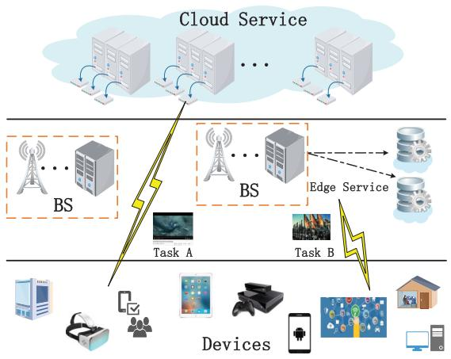  
Fig. 1. Illustration of MEC-enabled network system.

often less sensitive to delay. In this case, the task generation frequency is low and the delay requirement is high. Our proposed task-driven scheme can make decisions at the time of task generation, which avoids decision waiting delay and has a smaller implementation complexity by reducing the frequency of taking offloading decision.

In the above application scenario, we consider a MECenabled network system as illustrated in Fig. 1. There is a cloud server as well as $N$ base stations (BSs) and $M$ IoT devices. Denote the set of IoT devices as $\mathcal { M } = \{ 1 , 2 , \dots , M \}$ , and the computing capability of device $m$ , which can be used to process computational tasks, as $f _ { m } ^ { d }$ . The set of BSs is denoted as $\mathcal { N } = \{ 1 , 2 , \dots , N \}$ . Each BS n is equipped with an edge server with $f _ { n } ^ { b }$ computing capability (e.g. the maximum frequency of CPU). The cloud server has sufficient computing power and allocates fixed computing capability $f _ { m } ^ { c }$ to device $m$ [25]. We assume that all devices are connected to BSs through wireless links and can process tasks locally, offload them to any BSs, or offload them to the cloud server.

Consider the binary task offloading problem, which means that any task is offloaded as a whole [26]. We use a multivariate variable $i _ { k } \in \{ 0 , 1 , \ldots , N , N + 1 \}$ which denotes the offloading situation of task k. $i _ { k } \ = \ 0$ means that task $k$ is processed by the device, $i _ { k } \in \{ 1 , \ldots , N \}$ means that task $k$ is offloaded to BS $i _ { k }$ , and $i _ { k } = N + 1$ indicates that the task is offloaded to the cloud.

# B. Task Model

Timeslot-driven schemes generally discretize the system time into time slots, and make offloading decisions at each time slot. In other words, they describe the system time evolution by the increase of time slots and trigger the action of making offloading decisions at the end of each time slot, leading to decision waiting delays. To avoid this delay, we design a task-driven scheme, which triggers making offloading decisions by the arrival of tasks. These offloading decisions are made as soon as the task arrives and the evolution of system time is determined by the arrival of computational tasks. In order to reflect the task arrival order, we make some changes to the description of the tasks. Task $k$ in our scheme does not represent a specific computational task, rather than represents the $k$ -th arriving task in the system. For example, device a generates the computational task of decoding video A, which is the 6th task in the system, so we use task 6 to represent it. Then, device $^ b$ generates the same task, which is the 9th task in system. Although device a and device $^ b$ generate the same task, arrival times are different. So we use task 9 to represent the task generated by devices b. In many papers, the authors often use the same task number to describe the same task, and do not consider the task arrival time. Such a task-driven scheme is most suitable for scenarios with high latency requirements and low to average task frequency. In our task-driven scheme, when there are multiple tasks, the device will make decisions for each task in turn according to the task generation time. Although multiple tasks may be generated at the same time, the device can make decisions for these tasks in random order, and does not cause the task-driven scheme to crash. In situations with very high concurrency, due to the large number of tasks to be processed simultaneously, the computation queue will not reflect the current computation load well, decreasing the accuracy of model decisions.

We classify tasks into high priority and low priority based on whether the tasks have strict delay constraints or not. The tasks that have strict delay constraints have associated high priority. In this case, if the service delay exceeds the allowed task delay, the task will fail and any potential support will not be useful. For example, in vehicle road sensing, if an obstacle on the road cannot be recognized in time, the vehicle may

already have encountered the obstacle and its late recognition is meaningless. For low priority tasks, the task delays are not strict. If the server delay exceeds the allowed delay threshold, this may only affect user experience, but the result is still useful. For example, in video coding and decoding, if a task cannot be finished within delay threshold, it will lead to video stuttering, but the calculation result remains valid.

To implement the task-driven scheme, a continuous value $t _ { k }$ is introduced to describe the arrival time of task $k$ . We represent task $k$ using a six-tuple $( c _ { k } , u _ { k } , t _ { k } , m _ { k } , d _ { k } , o _ { k } )$ , where $c _ { k }$ is the computing workload, $u _ { k }$ is the transmission data size, $m _ { k }$ is the device that generates task $k$ , $d _ { k }$ is the allowed delay threshold, $O _ { k }$ is the service priority level. The service priority is a binary integer, where $o _ { k } = 0$ denotes that task $k$ has high priority and $o _ { k } = 1$ indicates that task $k$ has low priority.

To prevent low-priority tasks from experiencing starvation, we define different utility functions to reflect the priority of tasks, instead of using preemptive scheduling methods directly. We define the utility of a task based on its priority, completion time (service delay), and the allowed delay threshold.

High-priority tasks must be finished within the designated time limit and only when a high-priority task meets its delay threshold, it becomes available. The value associated with the task is positive and decreases as the completion time increases. Otherwise, we consider task failure and assign the task a negative value as a penalty. Similar to [21] and [27], we define the utility function of a high-priority task as follows:

$$
U ^ {H} (k) = \left\{ \begin{array}{l l} \log \left(1 + d _ {k} - T (k)\right), & T (k) \leq d _ {k} \\ - P ^ {H}, & T (k) > d _ {k} \end{array} \right. \tag {1}
$$

where $T ( k )$ is the completion time of task $k$ , and $- P ^ { H }$ represents a negative constant and serves as the penalty for not completing the task within its designated time limit. For a low-priority task, the completion time requirement is more relaxed. If the task is completed within its allowed delay threshold, the utility is a positive constant and serves as a reward. However, if the task cannot be completed within the allotted time, the utility decreases exponentially with time, but task’s result remains available. The utility function is defined as follows:

$$
U ^ {L} (k) = \left\{ \begin{array}{l l} P ^ {L}, & T (k) \leq d _ {k} \\ P ^ {L} e ^ {- b (T (k) - d _ {k})}, & T (k) > d _ {k} \end{array} \right. \tag {2}
$$

where $P ^ { L }$ is a positive constant that represents the reward obtained when a low-priority task is completed within its allowed delay threshold and $b > 0$ is a constant. If a task cannot be completed (indicated by $t _ { n } = - \infty$ ), then the utility is zero.

The task priority model incorporates the use of logarithmic and negative exponential functions in its formulation. As these functions have a long-tail effect which is close to how the user experience is influenced by delay, their use in the task priority model is appropriate. Additionally, the parameter settings in the task-priority model guarantee that the utility of a task decreases over time if it is not completed within its allowed delay threshold.

# C. Local Computing

If a computational task is processed locally, we need to add the task to the local computation queues. The computation queues update process can be divided into two stages: update of the device which generates the computational task, and update of other devices.

For the device $m _ { k }$ which generates task $k$ , the update of its computation queue is as follows:

$$
q _ {m _ {k}} (k) = \left[ q _ {m _ {k}} (k - 1) - \left(t _ {k} - t _ {k - 1}\right) f _ {m _ {k}} ^ {d} \right] ^ {+} + c _ {k} \tag {3}
$$

where $q _ { m _ { k } } ( k )$ is the computation queue of device $m _ { k }$ when task $k$ arrives, operator $[ z ] ^ { + } = m a x \{ 0 , z \}$ , $t _ { k } - t _ { k - 1 }$ is interval time between the arrival of task $k - 1$ and that of task $k$ , and $\left( t _ { k } - t _ { k - 1 } \right) f _ { m _ { k } } ^ { d }$ is the finished computing workload during the interval time.

For other devices $\mathbf { \nabla } _ { m } \neq m _ { k } ,$ ), the computation queues are:

$$
q _ {m} (k) = \left[ q _ {m} (k - 1) - \left(t _ {k} - t _ {k - 1}\right) f _ {m} ^ {d} \right] ^ {+} \tag {4}
$$

In summary, the update of computation queues of devices is expressed as:

$$
q _ {m} (k) = \left[ q _ {m} (k - 1) - \left(t _ {k} - t _ {k - 1}\right) f _ {m} ^ {d} \right] ^ {+} + \mathbf {1} _ {\{m = = m _ {k} \}} c _ {k} \tag {5}
$$

where $\mathbf { 1 } _ { \{ z \} } = 1$ if condition $z$ is true, otherwise $\mathbf { 1 } _ { \{ z \} } = 0$

There are no transmission delay if task $k$ is processed locally, so service delay is the delay of processing task $k$ locally:

$$
T ^ {l} (k) = \frac {q _ {m _ {k}} (k)}{f _ {m _ {k}} ^ {d}} \tag {6}
$$

where $f _ { m _ { k } } ^ { d }$ is the computing capability of device $m _ { k }$

The energy consumption of local computing is:

$$
E ^ {l} (k) = e _ {m _ {k}} c _ {k} \tag {7}
$$

where $e _ { m _ { k } }$ is the unit energy consumption of device $m _ { k }$

# D. Edge Computing

In edge computing, devices need to transmit the task to BSs. Within the wireless network model, devices operate on orthogonal channels, ensuring interference-free transmission [25]. The transmission rate for device $m$ to BS $n$ over the wireless link is:

$$
\operatorname {r a t e} _ {m, n} (k) = w _ {m, n} \log_ {2} \left(1 + \frac {\left| h _ {m , n} \right| ^ {2} p _ {m} (k)}{\sigma_ {m} ^ {2}}\right) \tag {8}
$$

where $w _ { m , n }$ is the uplink bandwidth from device $m$ to $\mathrm { B S } ~ n$ $h _ { m , n }$ is the channel gain, $\sigma _ { m } ^ { 2 }$ is the additive white Gaussian noise power at device m, $p _ { m } ( k )$ is the transmission power. As we focus on binary offloading, task $k$ is transmitted to one BS only. Note that the transmission power of device $m$ is not fixed, but varies with the task. If computational task $k$ is processed at BS, the transmission delay is:

$$
t ^ {u} (k) = \frac {u _ {k}}{\operatorname {r a t e} _ {m _ {k} , i _ {k}} (k)} \tag {9}
$$

Due to the limited computing capacity of BSs, there are also computation queues in BSs. Similar to devices, the update of

computation queues in BSs also can be divided into two cases, as follows:

$$
Q _ {n} (k) = \left[ Q _ {n} (k - 1) - \left(t _ {k} - t _ {k - 1}\right) f _ {n} ^ {e} \right] ^ {+} + \mathbf {1} _ {\{n = = i _ {k} \}} c _ {k} \tag {10}
$$

where $Q _ { n } ( k )$ is the computation queue of BS n when task $k$ arrives, $\mathbf { 1 } _ { \{ n = = i _ { k } \} }$ indicates whether BS n is the offloading target or not. Note that BSs are often fitted with multiple cores, but in general, it is difficult to manipulate each core individually. Therefore, we do not subdivide the computation queue further. However, if we could control each core or processor independently, we could easily extend the computation queue model to a multi-core computation queue model. We only need to change the offloading target from which server to which core on the server. In other words, we can build compute queues for each processor or core.

The computing delay of edge computing for task $k$ is:

$$
t ^ {b} (k) = \frac {Q _ {i _ {k}} (k)}{f _ {i _ {k}} ^ {b}} \tag {11}
$$

where $f _ { i _ { k } } ^ { b }$ is the computing capability of BS $i _ { k }$ . The service delay of edge computing consists of transmission delay, computing delay and propagation delay (which is the time interval between sending data from a device and receiving it at the other). So the service delay is:

$$
T ^ {e} (k) = t ^ {u} (k) + t ^ {b} (k) + \tau_ {m _ {k}, i _ {k}} \tag {12}
$$

where $\tau _ { m _ { k } , i _ { k } }$ is a constant which means the propagation delay between device $m _ { k }$ and ${ \mathrm { B S ~ } } i _ { k }$ $i _ { k }$ .

By contrast, the energy on devices is much more important than the energy on BS, so we just focus on the energy consumption on devices. In edge computing, the energy consumption of device is only the transmission energy consumption:

$$
E ^ {e} (k) = p _ {m _ {k}} (k) t ^ {u} (k) \tag {13}
$$

# E. Cloud Computing

Different from BSs, the cloud server has sufficient computing resources, and can provide fixed computing resources for each device to process their tasks. If computational task $k$ is offloaded to the cloud server, the computing delay is:

$$
t ^ {c} (k) = \frac {c _ {k}}{f _ {m _ {k}} ^ {c}} \tag {14}
$$

where f cmk $f _ { m _ { k } } ^ { c }$ is the fixed computing capability that the cloud server allocates to device $m _ { k }$ .

In cloud computing, computational tasks should be transmitted to the cloud server. Similar to edge computing, the transmission rate for device $m$ to the cloud server over the wireless link is:

$$
\operatorname {R a t e} _ {m} (k) = W _ {m} \log_ {2} \left(1 + \frac {\left| H _ {m} \right| ^ {2} p _ {m} (k)}{\sigma_ {m} ^ {2}}\right) \tag {15}
$$

where $W _ { m }$ is the uplink bandwidth from device $m$ to the cloud server and $H _ { m }$ is the channel gain between device m and the cloud server. Although we use a similar transmission model to that used for the BSs, the transmission delay of

the cloud server is different. Under the same conditions, long transmission distance means large path loss and low transmission rate. As the cloud server is farther away from the device m than BSs, the transmission rate between the cloud server and devices is always much lower than the transmission rate between BSs and devices when the bandwidth and transmission power and other conditions are the same.

The service delay of cloud computing also consists of transmission delay, computing delay and propagation delay, which is as follows:

$$
T ^ {c} (k) = T ^ {u} (k) + t ^ {c} (k) + \tau_ {m _ {k}, N + 1} \tag {16}
$$

where $T ^ { u } ( k ) ~ = ~ u _ { k } / R a t e _ { m _ { k } } ( k )$ is the transmission delay, $\tau _ { m _ { k } , N + 1 }$ is the propagation delay between device $m _ { k }$ and the cloud server. In general, the propagation delay of cloud computing is much higher than that of edge computing due to the longer transmission distance.

The device energy consumption is:

$$
E ^ {c} (k) = p _ {m _ {k}} (k) T ^ {u} (k) \tag {17}
$$

# IV. OPTIMIZATION PROBLEM FORMULATION

First, we formulate the computation offloading optimization problem, then we transform it into a MDP.

# A. Problem Formulation

In a collaborative system, computational tasks can be processed on devices, any BSs or the cloud server. The service delay of task $k$ is:

$$
\begin{array}{l} T (k) = \mathbf {1} _ {\{i _ {k} = = 0 \}} T ^ {l} (k) + \mathbf {1} _ {\{i _ {k} \neq 0 \& i _ {k} \neq N + 1 \}} T ^ {e} (k) \\ + \mathbf {1} _ {\{i _ {k} = = N + 1 \}} T ^ {c} (k) \tag {18} \\ \end{array}
$$

As mentioned before, computational tasks with different priorities have different requirements for service delay. We do not directly optimize service delay but the priority-based utility function of task delay:

$$
U (k) = \left(1 - o _ {k}\right) U ^ {H} (k) + o _ {k} U ^ {L} (k) \tag {19}
$$

In addition to service delay, the energy consumption of IoT devices is also an important factor to be considered in IoT. The energy consumption is:

$$
\begin{array}{l} E (k) = \mathbf {1} _ {\{i _ {k} = = 0 \}} E ^ {l} (k) + \mathbf {1} _ {\{i _ {k} \neq 0 \& i _ {k} \neq N + 1 \}} E ^ {e} (k) \\ + \mathbf {1} _ {\{i _ {k} = = N + 1 \}} E ^ {c} (k) \tag {20} \\ \end{array}
$$

Similar to [28] and [29], we can use a weighted sum of energy consumption $E ( k )$ and priority-based utility function $U ( k )$ to construct the system gain of task $k$ , defined as follows:

$$
F (k) = w _ {1} U (k) - w _ {2} E (k) \tag {21}
$$

where $w _ { 1 }$ and $w _ { 2 }$ are the weights to indicate the importance of service delay and energy consumption, respectively.

Thus, by jointly optimizing offloading decision $i _ { k }$ , and transmit power $p _ { m } ( k )$ , the goal of computation offloading

optimization is long-term average system gain. We formulate the problem as:

$$
\max  _ {i _ {k}, p _ {m} (k)} \lim  _ {K \rightarrow \infty} \frac {1}{K} \sum_ {k = 1} ^ {K} F (k)
$$

$$
s. t. (6) - (7), (1 2) - (1 3), (1 6) - (1 7) \tag {22a}
$$

$$
0 \leq p _ {m} (k) \leq P _ {m} ^ {\max }, \forall m \in \mathcal {M} \tag {22b}
$$

$$
i _ {k} \in \{0, 1, \dots , N, N + 1 \} \tag {22c}
$$

where constraint (22a) describes the service delay and energy consumption of local computing, edge computing and cloud computing, (22b) is about transmit power of devices, (22c) denotes the constraints of computation offloading variables.

The goal is to optimize the average system gain over a long time. Generally, classical approaches such as dynamic programming typically require the full knowledge of state transition probabilities in order to address the issue. But, certain unknown variables (i.e., user requests) may influence the system gain, especially in the dynamic network. It is intractable to solve the computation offloading problem by traditional methods. DRL achieves model-free learning through data sampling rather than relying on explicit state transition modeling, that is, it only needs the current state without predicting future information, which is effective to solve such problems. In the following subsection, we will convert the problem into a MDP, enabling its resolution through a modelfree reinforcement learning approach.

# B. MDP Formulation

Considering there are no time slots in the task-driven model, the state transition based on the change of time slot is infeasible. Therefore, we describe the state transition by the increase in the number of computational tasks, which means each new arriving computational task is a state node instead of a time slot. In this model, computation offloading decisions are driven by the arriving time of task and not the time slot. Thus, the decision epoch means the time point when an task arrives. The general idea is as follows. The agents of running the reinforcement learning algorithm are the devices. The generation of a task triggers the device to make an offloading decision. When a new computational task arrives, devices observe the system state (e.g. task size, computing queue information), and then select an offloading action for the task. The system will produce a reward that mirrors the value of the action.

1) System State: The current workload of the device that generated task $k$ is a key factor that affects the offloading decision. We use the waiting delay before task $k$ to denote the current workload of device, which is defined as follows:

$$
t ^ {d} (k) = \frac {\left[ q _ {m _ {k}} (k - 1) - \left(t _ {k} - t _ {k - 1}\right) f _ {m _ {k}} ^ {d} \right] ^ {+}}{f _ {m _ {k}} ^ {d}} \tag {23}
$$

where the numerator is the backlog of the computational task on device $m _ { k }$ when task $k$ arrives and the denominator is the computing capability of device $m _ { k }$ .

Similar to the device, the current workload of each BS n is also an important factor affecting the offloading decision. We use the computing waiting delay to define it.

$$
T _ {n} ^ {d} (k) = \frac {\left[ Q _ {n} (k - 1) - \left(t _ {k} - t _ {k - 1}\right) f _ {n} ^ {b} \right] ^ {+}}{f _ {n} ^ {b}} \tag {24}
$$

In addition, the communication delay and some properties of the task itself should also be part of the system state. The communication delay of task $k$ to other nodes (BSs or cloud server) is the sum of transmission delay and propagation delay, which can be defined as a vector:

$$
\mathbf {T} ^ {\mathbf {m}} (\mathbf {k}) = \left[ T _ {1} ^ {u} (k) + \tau_ {m _ {k}, 1}, \dots , T _ {N + 1} ^ {u} (k) + \tau_ {m _ {k}, N + 1} \right] \tag {25}
$$

To be specific, the system state when task $k$ arrives is defined as:

$$
s _ {k} = \left(t ^ {d} (k), f _ {m _ {k}} ^ {d}, \mathbf {T} ^ {\mathbf {d}} (\mathbf {k}), \mathbf {T} ^ {\mathbf {m}} (\mathbf {k}), \mathbf {f} ^ {\mathbf {b}}, f _ {m _ {k}} ^ {c}, c _ {k}, d _ {k}, o _ {k}\right) \tag {26}
$$

where $\mathbf { T ^ { d } } ( \mathbf { k } ) \ = \ [ T _ { 1 } ^ { d } ( k ) , T _ { 2 } ^ { d } ( k ) , \ldots , T _ { N } ^ { d } ( k ) ]$ is the vector composed of the current workload of all BSs and ${ \bf f } ^ { \bf b } \mathrm { ~ \tiny ~ = ~ }$ $[ f _ { 1 } ^ { b } , f _ { 2 } ^ { b } , \ldots , f _ { N } ^ { b } ]$ is the vector composed of computing capability of all BSs.

2) Action Space: When task $k$ arrives, we need to determine the offloading position and transmission power of device $m _ { k }$ . The action can be expressed as:

$$
a _ {k} = \left(i _ {k}, p _ {m _ {k}} (k)\right) \tag {27}
$$

The action space consists of discrete actions $( i _ { k } )$ and continuous actions $( p _ { m _ { k } } ( k ) )$ . The dimension of the discrete actions is $N { + 2 }$ . In some computation offloading strategies based on time discretization, we need make offloading decision at each time slot, and action space is often exponential to the number of computational tasks. Moreover, the number of computational tasks often changes dynamically, and we need to retrain the decision model when the number of tasks changes.

In our task-driven scheme, we only need to make offloading decisions for one task at a time, which means that action space is only linear with the number of edge nodes and independent of the number of services. So, our model has low complexity and is more scalable.

3) Reward Function: The objective of problem (22) is maximizing system gain while adhering to specific constraints. Consequently, an action will receive a higher reward if it leads to a greater system gain and fulfills all the constraints. Conversely, if a constraint is violated, the reward function will incorporate penalties. We define the reward function as:

$$
r _ {k} = \left\{ \begin{array}{l l} F (k), & \text {i f s a s t i f i e s a l l c o n s t r a i n t s} \\ - P u, & \text {o t h e r w i s e} \end{array} \right. \tag {28}
$$

# V. ALGORITHM DESIGN BASED ON DRL

Due to the discrete-continuous hybrid action space of the MDP, conventional DRL algorithms are not compatible with it. The model performance may decrease if the hybrid action space is directly converted into either a discrete or a continuous action space, primarily because of the scalability issues and the additional difficulty in approximation. In this section, we propose the Task-driven and Priority-aware Offloading (TPO) algorithm based on hybrid action representation [30] to solve above problems.

# A. Dependence-Aware Latent Space

A hybrid action representation which takes into account the interdependence between discrete actions and continuous actions transforms hybrid action space issue into a continuous policy learning problem. In order to clarify the algorithm, we get rid temporarily of the subscript $k$ (i.e., action $a = ( i , p ) )$ . Discrete variables and continuous variables in the action space jointly influence the environment. If only discrete variables are represented, this may not cover appropriately the association between discrete and continuous variables. Instead, our method simultaneously trains the entire space.

First, an embedding table $\dot { G _ { \omega } } ~ \in ~ \mathbb { R } ^ { ( N + 2 ) \times l _ { 1 } }$ is established with learnable parameters $\omega$ to denote the $N + 2$ discrete actions. In the table, each row $g _ { \omega , i } = G _ { \omega } ( i )$ is a $l _ { 1 }$ -dimensional continuous vector for the discrete action i. The embedding table is not predefined but trained, and it is trained together with continuous variables. The loss function will be given later. Then, to create a latent representation space of $l _ { 2 }$ -dimension for the continuous variables, a conditional Variational Auto-Encoder (VAE) [31] is employed. In mathematical description, the encoder $q _ { \phi } ( z | p , s , g _ { \omega , i } )$ with parameters $\phi$ maps $p$ into the latent variable $z \in \mathbb { R } ^ { l _ { 2 } }$ in the condition of $s$ and $g _ { \omega , i }$ . Here, we utilize a Gaussian latent distribution $\Gamma ( \mu _ { q } , \sigma _ { q } )$ to characterize the encoder $q _ { \phi } ( z | p , s , g _ { \omega , i } )$ . The encoder can produce both the mean $\mu _ { q }$ and standard deviation $\sigma _ { q }$ . By sampling, we obtain the latent representation $z \sim \Gamma ( \mu _ { q } , \sigma _ { q } )$ .

In identical conditions, the decoder $q _ { \psi } ( \tilde { p } | z , s , g _ { \omega , i } )$ parameterized by $\psi$ reconstructs the continuous variable $\tilde { p }$ from z. For any sample $z \sim \Gamma ( \mu _ { q } , \sigma _ { q } )$ , the decoder deterministically decodes it, i.e. $\tilde { p } = q _ { \psi } ( z , s , g _ { \omega , i } )$ . By performing a nearestneighbor lookup in the embedding table for $g _ { \omega , i }$ , the discrete $i$ is decoded.

By leveraging the encoder, we establish a representation space $\left( \in \begin{array} { l } { \mathbb { R } ^ { l _ { 1 } + l _ { 2 } } } \end{array} \right)$ . Furthermore, we are able to decode the latent variables $\boldsymbol { g } \in \mathbb { R } ^ { l _ { 1 } }$ and $z \in \mathbb { R } ^ { l _ { 2 } }$ into hybrid action $( i , p )$ in accordance with the decoder. Formally, the process can be summarized as follows:

# Encoding:

$$
g _ {\omega , i} = G _ {\omega} (i), \quad z \sim q _ {\phi} (\cdot | p, s, g _ {\omega , i}) \tag {29}
$$

Decoding:

$$
i = \operatorname {a r g m i n} _ {i ^ {\prime} \in \mathcal {I}} | | g _ {\omega , i ^ {\prime}} - g | | _ {2}, \quad p = q _ {\psi} (z, s, g _ {\omega , i}) \tag {30}
$$

By using the experiences in buffer $\mathcal { D }$ , we train $G _ { \omega }$ and $q _ { \phi } , q _ { \psi }$ together by minimizing the loss function:

$$
L _ {V} (\psi , \phi , \omega) = \mathbb {E} [ | | p - \tilde {p} | | _ {2} ^ {2} + L (q _ {\phi} (\cdot | p, s, g _ {\omega , i}) | \Gamma (0, I)) ] \tag {31}
$$

where the first term represents the square of the $L _ { 2 }$ -norm reconstruction error, and the second component denotes the Kullback-Leibler divergence (DKL) between the variational posterior of the latent variable $z$ and the standard Gaussian distribution.

Considering that hybrid actions have different influence on environment, we adopt a cascaded structure. For any experience sample $( s , i , p , s ^ { \prime } )$ , the state residual is $\delta _ { s , s ^ { \prime } } = s ^ { \prime } - s$ . As we add the cascaded structure in decoder, we can produce the prediction by decoder as follows:

$$
\bar {\delta} _ {s, s ^ {\prime}} = q _ {\psi} (z, s, g _ {\omega , i}), \text {f o r} z, s, g _ {\omega , i} \tag {32}
$$

Then the $L _ { 2 }$ -norm square prediction error is:

$$
L _ {D} (\psi , \phi , \omega) = \mathbb {E} [ \| \bar {\delta} _ {s, s ^ {\prime}} - \delta_ {s, s ^ {\prime}} \| _ {2} ^ {2} ] \tag {33}
$$

So, the ultimate training loss is:

$$
L _ {H} (\psi , \phi , \omega) = L _ {V} (\psi , \phi , \omega) + \alpha L _ {D} (\psi , \phi , \omega) \tag {34}
$$

where $\alpha$ is a weight-parameter, which depends on the importance of dynamics predictive representation loss. We denote the dimension of system state $s$ as dim. The network structures of encoder and decoder are shown in Table II.

# B. Problem Solving Using DRL

Here, we will combine the representation space and Twin Delayed Deep Deterministic policy gradient algorithm (TD3) [32] to solve the computation offloading problem.

TD3 is a reinforcement learning algorithm that follows a deterministic strategy, which is suitable for high dimensional continuous action space. Actor and critic networks are two distinct types of networks employed in the algorithm. Actor maps different states to corresponding actions, which decides actions. Critic can tell the agent how many scores they will get when taking different actions under different states, which decides the value of action.

We combine representation space method and TD3 algorithm, and propose a novel DRL algorithm for discretecontinuous hybrid action space. Actor and critic in TD3 are respectively implemented by different neural networks, whose network structures are shown in Tab. III. For the actor network, the input is state $s$ , and the output is the latent action vector (i.e. $g , z \ = \ \pi _ { \zeta } ( s )$ where $g \in \mathbb { R } ^ { l _ { 1 } } , z \in \mathbb { R } ^ { l _ { 2 } } )$ . Subsequently, we employ the decoder to translate vector $( g , z )$ into action $( i , p )$ . The double critic networks $Q _ { \theta _ { 1 } } , Q _ { \theta _ { 2 } }$ take $( i , p )$ as the input and approximate hybrid-action value function $Q ^ { \pi _ { \zeta } }$ . With experience $( s , i , p , r , s ^ { \prime } )$ in buffer $\mathcal { D }$ , we train critic networks by Clipped Double Q-learning, and loss function is:

$$
L _ {C D Q} \left(\theta_ {j}\right) = \mathbb {E} \left[ \left(v - Q _ {\theta_ {j}} (s, g, z)\right) ^ {2} \right], \quad f o r j = 1, 2 \tag {35}
$$

where $v = r + \gamma m i n Q _ { \bar { \theta } _ { j } } ( s ^ { \prime } , \pi _ { \bar { \zeta } } ( s ^ { \prime } ) )$ and $\bar { \theta } _ { j } , \bar { \zeta }$ are the target network parameters. The actor undergoes updates using the Deterministic Policy Gradient [33] as follows:

$$
\nabla_ {\zeta} J (\zeta) = \mathbb {E} \left[ \nabla_ {\pi_ {\zeta} (s)} Q _ {\theta_ {1}} \left(s, \pi_ {\zeta} (s)\right) \nabla_ {\zeta} \pi_ {\zeta} (s) \right] \tag {36}
$$

The proposed TPO algorithm will eventually run on IoT devices. Considering the limited computing resources, IoT devices may not support the training of model. Therefore, we assist the devices in model training by BSs, as shown in Fig. 2. The main idea is as following. The device is responsible for information collection, and the BS is responsible for model training. The device collect experiences (state, action, reward and next action) and transmit them to the corresponding BS. Then the BS uses the experience information to train neural networks and obtains model parameters. Finally, the BS sends model parameters back to the device, and the device makes the computation offloading decision by the trained model directly. The proposed TPO algorithm is detailed in Algorithm 1 and Algorithm 2.

TABLE II   
NETWORK STRUCTURES OF ENCODER AND DECODER   

<table><tr><td>Model Component</td><td>Layer</td><td>Structure</td><td>Layer</td><td>Structure</td></tr><tr><td>Discrete Action Embedding Table Gω</td><td>Parameterized Table</td><td>(RN+2, RL1)</td><td></td><td></td></tr><tr><td>Conditional Encoder Network qφ(z|pmk(k),sk, gω,i)</td><td>Fully Connected(ENCODING)
Fully Connected(condition)
Element-wise Product
Fully Connected
Activation</td><td>(1, 128)
(dim + RL1, 128)
ReLU · RELU
(128, 128)
ReLU</td><td>Fully Connected(mean)
Activation
Fully Connected(log_std)
Activation</td><td>(128, RL2)
None
(128, RL2)
None</td></tr><tr><td>Conditional Decoder &amp;
Prediction Network
qψ(pmk(k)|z, sk, gω,i)</td><td>Fully Connected(latent)
Fully Connected(condition)
Element-wise Product
Fully Connected
Activation
Fully Connected(reconstruction)</td><td>(Rl2, 128)
(dim + RL1, 128)
ReLU · RELU
(128, 128)
ReLU
(128, 1)</td><td>Activation
Fully Connected
Activation
Fully Connected(prediction)
Activation</td><td>None
(128, 128)
ReLU
(128, dim)
None</td></tr></table>

# Algorithm 1 TPO Algorithm in Device

1 Initialize state information $s _ { 1 }$ ；  
2 while model training do   
3 if device m generates new task $k$ then 4 Send a model parameters request to the nearest BS;   
5Receive the newest model parameters;   
6 Obtain the queue backlog information from controller or nearest BS;   
7 According to the received information, observe current system state $s$ ；   
$g , z = \pi _ { \zeta } ( s ) + \epsilon _ { g }$ with $\epsilon _ { g } \sim \Gamma ( 0 , \sigma )$   
$i = f _ { D } ( g ) , p = q _ { \psi } ( z , s , g )$ according Eq.(30);   
10Execute $( i , p )$ ， get reward $r$ and new state $s ^ { \prime }$   
11Send $( s , i , p , g , z , r , s ^ { \prime } )$ to the nearest BS;   
12end   
13 end

Algorithm 1 describes the algorithm in device which is mainly responsible for the collection of information. When the first computational task is generated, the state information on device is initialized:

$$
s _ {1} = \left(t ^ {d} (1), f _ {m _ {1}} ^ {d}, \mathbf {T} ^ {\mathbf {d}} (\mathbf {1}), \mathbf {T} ^ {\mathbf {m}} (\mathbf {1}), \mathbf {f} ^ {\mathbf {b}}, f _ {m _ {1}} ^ {c}, c _ {1}, d _ {1}, l _ {1}\right) \tag {37}
$$

where $t ^ { d } ( 1 ) = 0 , \mathbf { T ^ { d } ( 1 ) } = \mathbf { 0 }$ means that neither the IoT device nor the BS has a backlog of computational tasks when the first computational task is generated. In the system state s, there are two ways for devices to obtain the queue backlog information. If the system is a SDN network which means that it has its own controller, the controller can monitor the queue backlog information and devices can obtain all queue backlog from the controller directly. However, if there is no controller in the system, adding a controller may change the system network structure and require a lot of effort for redebugging and configuration. In this case, BSs can exchange their queue backlog information with each other regularly, and devices can obtain queue backlog information from the nearest BS. In the two approaches, the queue backlog information is a number of CPU cycles (GHz) that represents the computing

workload. It can be stored as a float, which takes up 4 or 8 Bytes only. The amount of data is much smaller than the transmission size of task which is a few hundred KB or even a few MB. In general, the extra delay is proportional to the number of BSs. In huge network systems, we may need to consider this extra delay, but in most small and medium networks, this can be ignored. In line 6 of Algorithm 1, a device needs to obtain the queue backlog information from a controller or nearest BS. Then the device can observe current system state s based on the received information. At line 8, the actor generates a latent action $( g , z )$ that is perturbed by Gaussian exploration noise, taking into account the current state s Next, at line 9, the decoder translates latent action $( g , z )$ back into the original action $( i , p )$ , which is then used to interact with the environment. Finally, the device sends the experience $( s , i , p , g , z , r , s ^ { \prime } )$ to BS and then obtains the reward and new state (lines 10-11). The reward is related to the task energy consumption and service delay of the task. The service delay can be obtained by subtracting the task arrival time from the task completion time, and calculated locally on the device. The energy consumption consists of transmission energy consumption of the device and local computing energy consumption, and both can be obtained locally by the device. Therefore, the device can compute the reward locally.

Model training is performed in BS and is introduced in Algorithm 2. The process can typically be divided into two primary stages: the warm-up stage and the training stage. During the warm-up stage, the encoder and decoder undergo pretraining using experiences stored in the replay buffer $\mathcal { D }$ (line 10-12). By the way, these experiences are collected by device, and device sends them to the replay buffer $\mathcal { D }$ of the BS. During the training stage, we update the parameters of actor and critic networks with the data sampled from $\mathcal { D }$ (lines 14-16). The encoder and decoder are simultaneously updated to adapt the changes in the data distribution (lines 17-19). Note that our proposed algorithm runs in an online manner. It can make offloading decisions one by one in a sequential fashion and it does not need to know all the task arrival status information to begin with. By the way, before the system runs, BS trains the model by simulated data, and the generation

Algorithm 2 TPO Algorithm in BS   
1 Initialize actor $\pi_{\zeta}$ and critic networks $Q_{\theta_1},Q_{\theta_2}$ with random parameters $\zeta ,\theta_{1},\theta_{2}$ 2 Initialize discrete action embedding table $G_{\omega}$ and conditional VAE $q_{\phi},q_{\psi}$ with random parameters $\omega ,\phi ,\psi$ 3 Prepare replay buffer $\mathcal{D}$ 4 if receive parameters request from device m then   
5 | Sent parameters to device m;   
6 end   
7 if receive the experience information then   
8 | Store the experience $(s,i,p,g,z,r,s^{\prime})$ in $\mathcal{D}$ 9 end   
10 while not reach maximum warm-up training times do   
11 | Update $\omega ,\phi ,\psi$ using samples in $\mathcal{D}$ by Eq.(34);   
12 end   
13 while not reach maximum total environment steps do   
14 Sample a mini-batch experience from $\mathcal{D}$ 15 Update $Q_{\theta_1},Q_{\theta_2}$ according to the loss function Eq.(35);   
16 Update $\pi_{\zeta}$ with policy gradient according to Eq.(36);   
17 while not reach maximum representation training times do   
18 | Update $\omega ,\phi ,\psi$ using samples in $\mathcal{D}$ by Eq.(34);   
19 end   
20 end

of tasks is also simulated. When the system is running, the training data is the historical information collected by the device, including task generation.

The proposed TPO algorithm does not require the future information about user requests or workload of BSs, it makes decisions only based on current information. Besides, TPO is based on TD3 algorithm, and the update of policy (or value function) is step-by-step not episode-by-episode. Therefore, TPO algorithm runs on-line. As for the overhead of algorithm implementation, the additional information that the device needs to obtain is mainly the queue backlog information. As we mentioned before, the queue backlog information can be stored as a float type, which is much smaller than the transmission size of task. So, the overhead of information exchange in algorithm implementation can be negligible. Similarly, we do not design a synchronization mechanism between BS and device. The delay is low due to the small amount of exchanged information. In addition, even if there are high delay caused by network congestion, we can use previous information and it will only affect the current decision, causing some performance loss, but will not lead to the collapse of the algorithm or system. The algorithm can still make the right decision based on the latest information in the next time. Instead, a poor synchronization mechanism may lead to more additional overhead. Therefore, we currently do not design a synchronization mechanism to forcibly synchronize the device and the BS.

There is no real data before the system operation starts. We can train the model only in BSs using simulated data, but the system is dynamic, and the model needs to be updated. As the system runs, the device collects real and up-to-date

experience data (i.e. state, action, reward, and next state). We use this experience data to train and update the model and perform better. In this phase, the BS and device do not need to be synchronized. The device needs to send the experience data to the BS, which trains and updates the model. Then, the BS sends the latest parameters to the device. We can update the model at regular intervals, such as, for instance, every two weeks. Data transmission is also not performed in real time, and can be done when the network is idle.

# C. Complexity Analysis

The complexity of the proposed algorithm can be primarily attributed to two components. The first is the encoding and decoding of hybrid actions. The second component involves training the actor and critic networks. According to [34] and [35], the computational complexity of a fully-connected neural network can be expressed as directly proportional to the multiplication of input size and output size. In the encoder, the input size is $d i m + l _ { 1 } + 1 \ = \ 3 N + 8 + l _ { 1 }$ where $d i m = 3 N + 7$ , the output size is $l _ { 2 }$ , so the computational complexity is $\mathcal { O } ( ( N + l _ { 1 } ) l _ { 2 } )$ . In the decoder, the input size is $d i m + l _ { 1 } + l _ { 2 } = 3 N + 7 + l _ { 1 } + l _ { 2 }$ , the output size is $d i m + 1 = 3 N + 8$ , so the complexity is $\mathcal { O } ( ( N + l _ { 1 } + l _ { 2 } ) N )$ . In the actor network, the input size is the dimension of system space $d i m = 3 N + 7$ , the output size is the dimension of hybrid action representation space $l _ { 1 } + l _ { 2 }$ , so the complexity is $\mathcal { O } ( ( l _ { 1 } + l _ { 2 } ) N )$ . The input size of critic is $d i m + 2$ , the output is 1, so the complexity of critic is $\mathcal { O } ( N )$ . Finally, in a period, the complexity of our algorithm is $\mathcal { O } ( ( N + l _ { 1 } ) l _ { 2 } ) + \mathcal { O } ( ( N + l _ { 1 } +$ $l _ { 2 } ) N ) + \mathcal { O } ( ( l _ { 1 } + l _ { 2 } ) N ) + \mathcal { O } ( N ) = \mathcal { O } ( N ^ { 2 } + N l _ { 1 } + N l _ { 2 } + l _ { 1 } l _ { 2 } )$ .

We also analyse the memory footprint of our algorithm. As a major part of the algorithm memory footprint, the space complexity of neural networks is related to model parameters. The number of parameters of encoder network is $\mathcal { O } ( 1 \times 1 2 8 +$ $( d i m + l _ { 1 } ) \times 1 2 8 + 1 2 8 \times 1 2 8 + 1 2 8 \times l _ { 2 } + 1 2 8 \times l _ { 2 } ) =$ $\mathcal { O } ( N + l _ { 1 } + l _ { 2 } )$ . The number of parameters of decoder network is $\mathcal { O } ( l _ { 2 } \times 1 2 8 + ( d i m + l _ { 1 } ) \times 1 2 8 + 1 2 8 \times 1 2 8 + 1 2 8 \times 1 + 1 2 8 \times 1 )$ $1 2 8 + 1 2 8 \times d i m ) = \mathcal { O } ( N + l _ { 1 } + l _ { 2 } )$ . The number of parameters of actor network is $\mathcal { O } ( d i m { \times } 1 2 8 + 1 2 8 { \times } 1 2 8 + 1 2 8 { \times } ( l _ { 1 } + l _ { 2 } ) ) =$ $\mathcal { O } ( N + l _ { 1 } + l _ { 2 } )$ . The number of parameters of actor network is $\mathcal { O } ( d i m \times 1 2 8 + 1 2 8 \times 1 2 8 + 1 2 8 \times 1 ) = \mathcal { O } ( N )$ . So the space complexity of the neural networks is $\mathcal { O } ( N + l _ { 1 } + l _ { 2 } )$ . In addition, the memory footprint of our algorithm includes the memory footprint of the replay buffer and distributed training, which depends on the actual setup.

# VI. SIMULATION RESULTS

This section describes the experiments conducted to evaluate the performance of our algorithm. We performed extensive experiments on the simulator and Kubernetes-based testbed, respectively. We evaluated the proposed algorithm by comparing it with three alternative solutions.

# A. Simulation Setup

We consider a network scenario with 20 IoT devices, 6 edge nodes, and a remote cloud server. The transmission bandwidth between devices and BSs is uniform randomly chosen from the

TABLE III NETWORK STRUCTURES OF TD3   

<table><tr><td>Model Component</td><td>Layer</td><td>Structure</td><td>Layer</td><td>Structure</td></tr><tr><td>Actor Network πζ</td><td>Fully Connected Activation Fully Connected</td><td>(dim, 128)ReLU (128,128)</td><td>Activation Fully Connected Activation</td><td>ReLU (128,RL1+l2) Tanh</td></tr><tr><td>Critic Network Qθj</td><td>Fully Connected Activation Fully Connected</td><td>(dim + 2,128)ReLU (128,128)</td><td>Activation Fully Connected Activation</td><td>ReLU (128,1) None</td></tr></table>

TABLE IV EXPERIMENT PARAMETERS   

<table><tr><td>Parameters</td><td>Value</td></tr><tr><td>Number of devices (M)</td><td>20</td></tr><tr><td>Number of BS (N)</td><td>6</td></tr><tr><td>Computing capacity of IoT devices (fdm)</td><td>[2,3]GHz</td></tr><tr><td>Computing capacity of BSs (fnb)</td><td>[30,40]GHz</td></tr><tr><td>Allocated computing capacity (fmc)</td><td>[10,20]GHz</td></tr><tr><td>Bandwidth from devices to BSs (wm,n)</td><td>[10,15]Mbps</td></tr><tr><td>Bandwidth from devices to cloud (Wm)</td><td>[2.5,3.5]Mbps</td></tr><tr><td>Maximum transmit power (Pmmax)</td><td>0.5W</td></tr><tr><td>Transmission data size of tasks (uk)</td><td>[0.1,0.3]MB</td></tr><tr><td>Noise power (σm2)</td><td>-100dBm</td></tr><tr><td>Computing workload of tasks (ck)</td><td>[0.5,1.5] Gigacycles</td></tr><tr><td>Actor learning rate (γ1)</td><td>3 × 10-3</td></tr><tr><td>Critic learning rate (γ2)</td><td>3 × 10-3</td></tr><tr><td>Representation model learning rate (γ3)</td><td>1 × 10-3</td></tr><tr><td>Batch size</td><td>64</td></tr><tr><td>Discount Factor</td><td>0.99</td></tr><tr><td>Optimizer</td><td>Adam</td></tr></table>

[10,15]Mbps range, and the transmission bandwidth between devices and the remote cloud server is uniform randomly chosen from the [2.5, 3.5]Mbps range. The computing capacity of devices and BSs is generated randomly within [2, 3]GHz and [30, 40]GHz, respectively. The maximum transmit power of IoT devices is 0.5W. The transmission data size of tasks is in the range of [0.1, 0.3]MB, and the computing workload of tasks is set within [0.5, 1.5]Gigacycles. The deadlines for the high-priority tasks and low-priority tasks are 400ms and 500ms, respectively. Regarding the neural network, the batch size of training is 64, the discount factor is 0.99, and the optimizer is Adam. The specific parameter settings of the experiment are shown in Table III.

To validate our proposed algorithm, we use the following three state-of-the-art solutions for comparison:

Single node without considering priority (SNP) [36]: SNP considers a single BS without considering the priority of tasks. It assumes that the timeline is slot and propose a DRL algorithm to minimize the task delay without considering the system energy consumption.   
• Multi-node cooperation without priority (MNP) [10]: MNP considers collaboration between multiple edge nodes without the priority of tasks. It optimizes the system performance of the current time slot and transforms it into a piecewise convex programming problem.

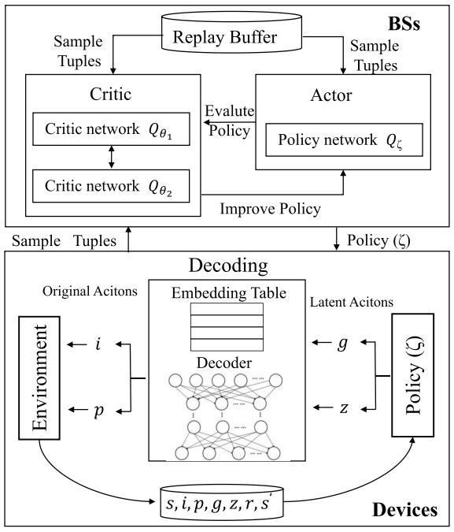  
Fig. 2. The framework of our algorithms.

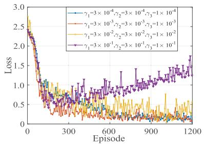  
Fig. 3. Convergence with parameters.

• Multi-node cooperation considering priority (MCP) [22]: MCP considers the scenario of collaboration of multiple edge nodes with priority of tasks. It proposes a priorityaware strategy for to minimize task delay.

# B. Algorithm Performance

We evaluate the algorithm convergence under different learning rates, as shown in Fig. 3. With different learning rates, the learning effect and convergence rate of the model are also different. When the magnitude of learning rate is $1 0 ^ { - 1 }$ , the model will not even converge. When the magnitude of learning rate is $1 0 ^ { - 2 }$ , although the model converges gradually, it also

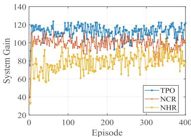  
Fig. 4. Ablation experiment.

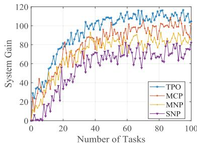  
Fig. 5. System gain for algorithms.

produces large fluctuations. When the magnitude of learning rate is $1 0 ^ { - 3 }$ , the model can converge quickly. When the magnitude of learning rate is $1 0 ^ { - 4 }$ , the convergence state remains stable, but the convergence rate is slow. Therefore, we set the learning rates to: $\gamma _ { 1 } = 3 \times 1 0 ^ { - 3 } , \gamma _ { 2 } = 3 \times 1 0 ^ { - 3 } , \gamma _ { 3 } = 1 \times 1 0 ^ { - 3 }$ $\gamma _ { 1 } = 3 { \times } 1 0 ^ { - 3 }$ $\gamma _ { 2 } = 3 { \times } 1 0 ^ { - 3 }$ $\gamma _ { 3 } = 1 \times 1 0 ^ { - 3 }$ .

In Fig. 4, we conduct ablation experiments to demonstrate the efficacy of hybrid action representation, which aims to convert discrete variables into continuous values. Considering the interconnectedness between discrete and continuous variables, the hybrid action representation trains the entire action space holistically. Consequently, we compared two methods in our ablation experiments: the first being the No Hybrid action Representation (NHR) method, which solely discretizes variables using a direct rounding approach without employing any action representation algorithm, and the second being the No Continuous variables Representation (NCR), which indicates that the representation only accounts for discrete variables and does not consider the correlation between discrete and continuous variables in the action space, thereby neglecting the representation of the continuous variables. Considering that the optimization goal is system gain, we present the system gain of the three algorithms after the model training is completed in Fig. 4. We observe that NHR demonstrates the poorest performance with significant fluctuations, using a crude approximation method leads to a significant decline in model performance. NCR, even though it only represents discrete variables, outperforms NHR but falls short of PTO due to its failure to capture the correlation between discrete and continuous variables. On the other hand, PTO, which represents the entire action space, achieves the highest system gain among the three methods.

Fig. 5 shows the system gain. We find that the system gains of all four algorithms will plateau with the number of tasks. Our algorithm TPO, which is task-driven and considers priority of tasks, has the largest system gain among the four algorithms. Compared to MNP, MCP takes the priority of tasks

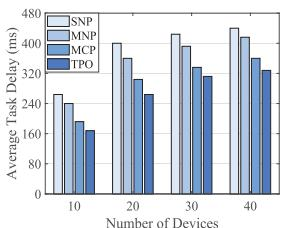  
(a)

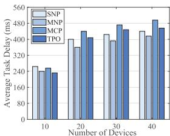  
(b)

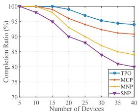  
Fig. 6. Task delay vs. number of devices. (a) high-priority tasks. (b) lowpriority tasks.   
(a)

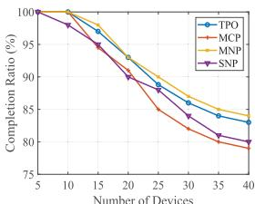  
(b)   
Fig. 7. Completion ratio vs. number of devices. (a) highpriority tasks. (b) low-priority tasks.

into account, which results in greater system gain. SNP which considers the computation offloading optimization in a single edge node scenario and ignores the priority and system energy consumption, has the worst system gain.

Fig. 6 shows the task delay. Overall, the average task delay increases with the number of devices. The delay of highpriority tasks is shown in Fig. 6a. We can note that SNP has the largest average task delay due to the lack of collaboration. MCP is better than MNP, because high-priority tasks can be scheduled with high priority, while MNP does not consider the priority. Our algorithm TPO is better than the other three baseline algorithms. Fig. 6b shows the delay of low-priority tasks. MCP and TPO prioritize high-priority tasks and sacrifice part of the performance of low-priority tasks, so they are inferior to MNP in low-priority tasks. SNP and MNP do not consider the priority, they treat high-priority tasks and lowpriority tasks equally.

Fig. 7 shows the proportion of tasks that can be completed within the specified delay threshold. We also consider high priority tasks and low priority tasks, separately. As shown in Fig. 7a, TPO and MCP can finish most of the high-priority tasks within the delay threshold, while MNP and SNP perform poorly. Regarding the low-priority tasks data shown in Fig. 7b, MNP and SNP basically achieve the same performance as for high-priority tasks, but TPO and MCP perform worse. Notably MCP has the worst performance of the four algorithms. From Fig. 7c, we find out that the priority-aware algorithms tend to sacrifice the performance of low priority tasks to guarantee the completion of tasks with high priority.

Fig. 8 shows the average workload, which is also the computing waiting delay. We note that the workload gap between BSs is large in SNP. The reason is that SNP only considers the optimization of a single BS. For different BSs, the number of devices and the amount of tasks are also different. So it is easy to lead to unbalanced load between BSs, and the overall edge computing resources cannot be

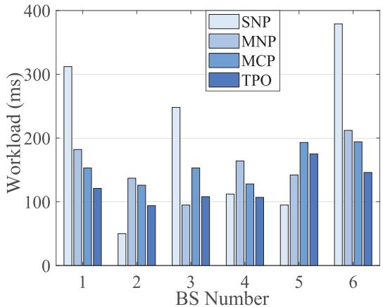  
Fig. 8. Workload of BS.

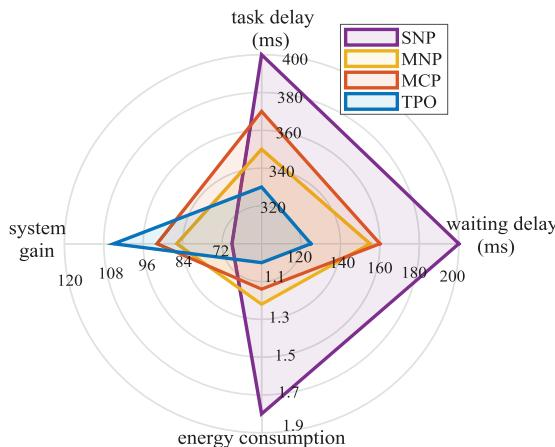  
Fig. 9. Performance indicators.

fully utilized. As for MNP, MCP and TPO, they consider cooperation between multiple edge nodes. If an edge node has too many computational tasks in its coverage, it can offload some computational tasks to other nodes which have enough computing resources. Therefore, the computing workload of these three algorithms is relatively balanced on nodes, and the utilization efficiency of computing resources is also high.

Our proposed algorithm is compared with three alternative solutions in relation to four performance indicators, as shown in Fig. 9. We first introduce the four metrics. Task delay $T ( k )$ is the average time required for a task to complete. Waiting delay is the average waiting delay before task processing. Energy consumption $E ( k )$ is the average energy consumption of a task. We set the energy consumption of our method as a standard quantity in Fig 9, and others are the ratios to our method. System gain is the average system gain value $F ( k )$ which is the optimization goal of our method. Fig. 9 shows that SNP has maximum task delay and waiting delay due to the lack of cooperation between multiple edge nodes. Besides, it does not consider the constraint of system energy. So the system gain of SNP is the minimum. Since MCP considers the priority of task, it performs worse than MNP in task delay and waiting delay. But MCP gives priority to the completion of high-priority tasks, which leads to higher system gain than MNP. TPO has lowest task delay and waiting delay because of task-driven model. It also considers energy consumption and priority, which leads to maximum system gain.

# C. Kubernetes-Based Testbed

The simulation in Section VI-B can quickly verify the accuracy and efficiency of our algorithm. However, communication between nodes is simulated within the simulation program rather than performed in real life based on the TCP/IP protocol. To validate the practicality and applicability of our algorithm, we have further built a real testbed based on Kubernetes.

The testbed architecture consists of three layers: DRL Layer, Control Layer, and Execution Layer. The DRL Layer is designed to train DRL models, with the DRL trainer operating as a Pod within the Kubernetes environment. We implement the DRL algorithm using the Deep Java Library (DJL), a deep learning framework for Java. This algorithm is divided into three components: Model, Buffer, and Agent. The Model encompasses the neural network architecture of the DRL models, while the Buffer stores transitions that include observations, actions, and rewards. These transitions are derived from logs stored in the database. The Agent provides two primary functions: predict and train. The predict function enables the Agent to choose an action based on the current observation, and the train function uses the Buffer to update the DRL model. The DRL model training is performed within a container using a GPU.

The Control Layer functions as a coordinator between devices and BSs. It is responsible for configuring the network environment and generating tasks. Users can specify the configuration through Service Configuration. The Node Configuration and Network Configuration then parse these configuration files into specific deployments. The Controller subsequently records the deployment details in the Database. The Task Configuration parses the Service Configuration to generate tasks. The Task Generation component acts as the device, creating tasks and sending them to Edge Nodes for task offloading. Overall, the Controller operates as a virtual node rather than a centralized scheduler, tasked with network configuration and task generation. It does not manage task offloading decisions, delegating this responsibility to individual nodes for autonomous task scheduling.

The Execution Layer is tasked with retrieving information from the database and executing tasks. Each Edge Node operates as a Pod in the Kubernetes environment. When configuring the Edge Nodes, the Network Deployment and Node Deployment modules read the network and node information from the database to facilitate deployment. Each Edge Node includes an execution queue for processing tasks. The Application denotes the type of application running on each Edge Node. The Scheduler module within each Edge Node determines the offloading strategy for computational tasks within the application. The Scheduler can be either a heuristic scheduler or a DRL-based scheduler.

Fig. 10 shows the average task delay with different task sizes. Note that, in the experiments with the Kubernetes-based testbed, the computing workload of a task is related to the transmission data size, i.e. $c _ { k } = \omega _ { k } u _ { k }$ , where $\omega _ { k }$ is a scaling factor and different for high-priority and low-priority tasks. So, we use the task size to describe the attribute instead of

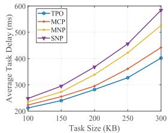  
(a)

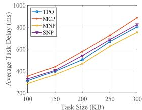

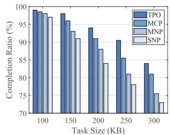  
Fig. 10. Average task delay vs. task size. (a) high-priority tasks. (b) lowpriority tasks.   
(a)

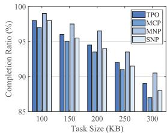  
(b)   
Fig. 11. Completion ratio vs. task size. (a) high-priority tasks. (b) low-priority tasks.

transmission data size or computing workload. The average task delay of high-priority tasks is shown in Fig. 10a. In general, as the task size increases, the average task delay of all algorithms also increases significantly. Increasing the task size means more transmission data and higher computing workload, which results in longer transmission delay and higher computation time. Since TPO and MCP consider the priority of tasks, their average task delay of high-priority tasks is significantly lower than that of MNP and SNP. The average task delay of low-priority tasks is different from that of highpriority tasks, as shown in Fig. 10b. MNP achieves the lowest average task delay while MCP has the highest average task delay. The reason is that algorithms TPO and MCP sacrifice some performance of the low-priority tasks to guarantee that of the high-priority tasks.

A similar situation also occurs in Fig. 11, which shows the task completion rate with different task sizes. Our TPO algorithm has the highest completion rates for the high-priority tasks, but is slightly worse than that of MNP for the lowpriority tasks. With the increase of task size, task delay also increases, which leads to decreases of the task completion rates. Because the deadline of low-priority tasks is much higher than that of high-priority tasks, the completion rates of the low-priority tasks are better than those of the high-priority tasks for all algorithms.

# VII. CONCLUSION

This paper focuses on a MEC system with multiple devices and multiple BSs that interact collaboratively. A task-driven priority-aware computation offloading model which jointly optimizes the computational task allocation and power of transmission was constructed from the perspective of computational task itself rather than that of a time slot. We transformed the optimization problem into a MDP. Considering hybrid action space, a novel model-free DRL algorithm based on hybrid action representation and TD3 was proposed to maximize the system gain. Simulation results showed how our

TPO algorithm significantly reduces task delay and improves system gain compared with three other alternative methods.

Future work will involve real experimental testing of the proposed solution. Additionally, we will consider offloading scenarios in which each task is partitioned into a limited number of sub-tasks and we will focus on the design of an improved offloading scheme which considers the interdependency between sub-tasks. Additionally, we will also refine the task-priority model to combine the high and low priority task behavior using a unified utility function. High concurrency scenarios are also the focus of our future research.

# REFERENCES

[1] Huawei.(2022). Ubiquitous Computing Power: The Cornerstone of Intelligent Society. [Online]. Available: http://www-file.huawei.com/ media/corporate/pdf/publicolicy/ubiquitous   
[2] Y. Mao, C. You, J. Zhang, K. Huang, and K. B. Letaief, “A survey on mobile edge computing: The communication perspective,” IEEE Commun. Surveys Tuts., vol. 19, no. 4, pp. 2322–2358, 4th Quart., 2017.   
[3] F. S. Abkenar et al., “A survey on mobility of edge computing networks in IoT: State-of-the-art, architectures, and challenges,” IEEE Commun. Surveys Tuts., vol. 24, no. 4, pp. 2329–2365, 4th Quart., 2022.   
[4] G. Chen, Q. Wu, R. Liu, J. Wu, and C. Fang, “IRS aided MEC systems with binary offloading: A unified framework for dynamic IRS beamforming,” IEEE J. Sel. Areas Commun., vol. 41, no. 2, pp. 349–365, Feb. 2023.   
[5] Z. Wei, B. Zhao, and J. Su, “Event-driven computation offloading in IoT with edge computing,” IEEE Trans. Wireless Commun., vol. 21, no. 9, pp. 6847–6860, Sep. 2022.   
[6] J. Zheng, Y. Cai, Y. Wu, and X. Shen, “Dynamic computation offloading for mobile cloud computing: A stochastic game-theoretic approach,” IEEE Trans. Mobile Comput., vol. 18, no. 4, pp. 771–786, Apr. 2019.   
[7] A. Samanta and J. Tang, “Dyme: Dynamic microservice scheduling in edge computing enabled IoT,” IEEE Internet Things J., vol. 7, no. 7, pp. 6164–6174, Jul. 2020.   
[8] C.-Y. Hsieh, Y. Ren, and J.-C. Chen, “Edge-cloud offloading: Knapsack potential game in 5G multi-access edge computing,” IEEE Trans. Wireless Commun., vol. 22, no. 11, pp. 7158–7171, Nov. 2023.   
[9] A. Naouri, H. Wu, N. A. Nouri, S. Dhelim, and H. Ning, “A novel framework for mobile-edge computing by optimizing task offloading,” IEEE Internet Things J., vol. 8, no. 16, pp. 13065–13076, Aug. 2021.   
[10] K. Guo, M. Yang, Y. Zhang, and J. Cao, “Joint computation offloading and bandwidth assignment in cloud-assisted edge computing,” IEEE Trans. Cloud Comput., vol. 10, no. 1, pp. 451–460, Jan. 2022.   
[11] S. Guo, J. Liu, Y. Yang, B. Xiao, and Z. Li, “Energy-efficient dynamic computation offloading and cooperative task scheduling in mobile cloud computing,” IEEE Trans. Mobile Comput., vol. 18, no. 2, pp. 319–333, Feb. 2019.   
[12] G. Qu, H. Wu, R. Li, and P. Jiao, “DMRO: A deep meta reinforcement learning-based task offloading framework for edge-cloud computing,” IEEE Trans. Netw. Service Manag., vol. 18, no. 3, pp. 3448–3459, Sep. 2021.   
[13] H. Hao, C. Xu, W. Zhang, S. Yang, and G.-M. Muntean, “Computing offloading with fairness guarantee: A deep reinforcement learning method,” IEEE Trans. Circuits Syst. Video Technol., vol. 33, no. 10, pp. 6117–6130, Oct. 2023.   
[14] Q. Li, S. Wang, A. Zhou, X. Ma, F. Yang, and A. X. Liu, “QoS driven task offloading with statistical guarantee in mobile edge computing,” IEEE Trans. Mobile Comput., vol. 21, no. 1, pp. 278–290, Jan. 2022.   
[15] X. Gao, X. Huang, S. Bian, Z. Shao, and Y. Yang, “PORA: Predictive offloading and resource allocation in dynamic fog computing systems,” IEEE Internet Things J., vol. 7, no. 1, pp. 72–87, Jan. 2020.   
[16] L. Wang, J. Zhang, T. Wang, and K. Wu, “A fine-grained multi- access edge computing architecture for cloud-network integration,” J. Comput. Res. Develop., vol. 58, no. 6, pp. 1275–1290, Jun. 2021.   
[17] M. Chen et al., “Robust computation offloading and resource scheduling in cloudlet-based mobile cloud computing,” IEEE Trans. Mobile Comput., vol. 20, no. 5, pp. 2025–2040, May 2021.   
[18] H. Xiao, C. Xu, Y. Ma, S. Yang, L. Zhong, and G.-M. Muntean, “Edge intelligence: A computational task offloading scheme for dependent IoT application,” IEEE Trans. Wireless Commun., vol. 21, no. 9, pp. 7222–7237, Sep. 2022.

[19] S. Tian, C. Chang, S. Long, S. Oh, Z. Li, and J. Long, “User preferencebased hierarchical offloading for collaborative cloud-edge computing,” IEEE Trans. Services Comput., vol. 16, no. 1, pp. 684–697, Jan./Feb. 2023.   
[20] X. Dai et al., “Task co-offloading for D2D-assisted mobile edge computing in industrial Internet of Things,” IEEE Trans. Ind. Informat., vol. 19, no. 1, pp. 480–490, Jan. 2023.   
[21] J. Shi, J. Du, J. Wang, J. Wang, and J. Yuan, “Priority-aware task offloading in vehicular fog computing based on deep reinforcement learning,” IEEE Trans. Veh. Technol., vol. 69, no. 12, pp. 16067–16081, Dec. 2020.   
[22] M. Adhikari, M. Mukherjee, and S. N. Srirama, “DPTO: A deadline and priority-aware task offloading in fog computing framework leveraging multilevel feedback queueing,” IEEE Internet Things J., vol. 7, no. 7, pp. 5773–5782, Jul. 2020.   
[23] W. Zhou et al., “Priority-aware resource scheduling for UAV-mounted mobile edge computing networks,” IEEE Trans. Veh. Technol., vol. 72, no. 7, pp. 9682–9687, Jul. 2023.   
[24] Y. Yuan, C. Yi, B. Chen, Y. Shi, and J. Cai, “A computation offloading game for jointly managing local pre-processing time-length and priority selection in edge computing,” IEEE Trans. Veh. Technol., vol. 71, no. 9, pp. 9868–9883, Sep. 2022.   
[25] Z. Tan, F. R. Yu, X. Li, H. Ji, and V. C. M. Leung, “Virtual resource allocation for heterogeneous services in full duplex-enabled SCNs with mobile edge computing and caching,” IEEE Trans. Veh. Technol., vol. 67, no. 2, pp. 1794–1808, Feb. 2018.   
[26] Z. Liu, K. Li, L. Wu, Z. Wang, and Y. Yang, “CATS: Cost aware task scheduling in multi-tier computing networks,” J. Comput. Res. Develop., vol. 57, no. 9, pp. 1810–1822, Sep. 2020.   
[27] J. Zhao, Q. Li, Y. Gong, and K. Zhang, “Computation offloading and resource allocation for cloud assisted mobile edge computing in vehicular networks,” IEEE Trans. Veh. Technol., vol. 68, no. 8, pp. 7944–7956, Aug. 2019.   
[28] Z. Yu, Y. Gong, S. Gong, and Y. Guo, “Joint task offloading and resource allocation in UAV-enabled mobile edge computing,” IEEE Internet Things J., vol. 7, no. 4, pp. 3147–3159, Apr. 2020.   
[29] A. Asheralieva and D. Niyato, “Hierarchical game-theoretic and reinforcement learning framework for computational offloading in UAV-enabled mobile edge computing networks with multiple service providers,” IEEE Internet Things J., vol. 6, no. 5, pp. 8753–8769, Oct. 2019.   
[30] B. Li et al., “HyAR: Addressing discrete-continuous action reinforcement learning via hybrid action representation,” in Proc. Int. Conf. Learn. Represent. (ICLR), Jan. 2021.   
[31] D. P. Kingma and M. Welling, “Auto-encoding variational Bayes,” in Proc. Int. Conf. Learn. Represent. (ICLR), Jan. 2014.   
[32] S. Fujimoto, H. van Hoof, and D. Meger, “Addressing function approximation error in actor-critic methods,” in Proc. 35th Int. Conf. Mach. Learn., (ICML), 2018, pp. 1582–1591.   
[33] D. Silver, G. Lever, N. Heess, T. Degris, D. Wierstra, and M. Riedmiller, “Deterministic policy gradient algorithms,” in Proc. Int. Conf. Mach. Learn., 2014, pp. 387–395.   
[34] M. Sipper, “A serial complexity measure of neural networks,” in Proc. IEEE Int. Conf. Neural Netw., vol. 2, Mar./Apr. 1993, pp. 962–966.   
[35] H. Hao, C. Xu, W. Zhang, S. Yang, and G.-M. Muntean, “Joint task offloading, resource allocation, and trajectory design for multi-UAV cooperative edge computing with task priority,” IEEE Trans. Mobile Comput., vol. 23, no. 9, pp. 8649–8663, Sep. 2024.   
[36] H. Hao, C. Xu, L. Zhong, and G.-M. Muntean, “A multi-update deep reinforcement learning algorithm for edge computing service offloading,” in Proc. 28th ACM Int. Conf. Multimedia, Oct. 2020, pp. 3256–3264.

  
Hao Hao received the Ph.D. degree in computer science and technology from Beijing University of Posts and Telecommunications, Beijing, China, in 2021. He is currently a Lecturer with Shandong Computer Science Center (National Supercomputing Center in Jinan), Qilu University of Technology (Shandong Academy of Sciences). His research interests include MEC and content caching over the wireless networks and multimedia communications.

  
Changqiao Xu (Senior Member, IEEE) received the Ph.D. degree from the Institute of Software, Chinese Academy of Sciences (ISCAS), in January 2009. He was an Assistant Research Fellow and the Research and Development Project Manager with ISCAS from 2002 to 2007. He was a Researcher with the Athlone Institute of Technology and the Joint Ph.D. Scholar with Dublin City University, Ireland, from 2007 to 2009. He joined Beijing University of Posts and Telecommunications (BUPT), China, in December 2009. Currently, he is a Full Professor with the   
State Key Laboratory of Networking and Switching Technology, and the Director of the Next Generation Internet Technology Research Center, BUPT. He has published over 200 technical papers in prestigious international journals and conferences, including IEEE COMMUNICATIONS SURVEYS AND TUTORIALS, IEEE WIRELESS COMMUNICATIONS, IEEE Communications Magazine, and IEEE/ACM TRANSACTIONS ON NETWORKING. His research interests include future internet technology, mobile networking, multimedia communications, and network security. He has served on many international conferences and workshops, as the co-chair and a technical program committee member. He is currently serving as the Editor-in-Chief for Transactions on Emerging Telecommunications Technologies (Wiley).

  
Wei Zhang received the B.E. degree from Zhejiang University in 2004, the M.S. degree from Liaoning University in 2008, and the Ph.D. degree from Shandong University of Science and Technology in 2018. He is currently a Professor with Shandong Computer Science Center (National Supercomputing Center in Jinan), Qilu University of Technology (Shandong Academy of Sciences). His research interests include future generation network architectures, edge computing, and edge intelligence.

  
Shujie Yang received the Ph.D. degree from the Institute of Network Technology, Beijing University of Posts and Telecommunications, Beijing, China, in 2017. He is currently a Lecturer with the State Key Laboratory of Networking and Switching Technology, Beijing University of Posts and Telecommunications. His major research interests are in the areas of wireless communications and wireless networking.

  
Gabriel-Miro Muntean (Fellow, IEEE) is a Professor with the School of Electronic Engineering, Dublin City University (DCU), Ireland, and the $\mathbf { \boldsymbol { C } _ { 0 } }$ -Director of the DCU Performance Engineering Laboratory. He has published over 500 papers in top-level international journals and conferences, authored four books and 29 book chapters, and edited six additional books. He has supervised to completion of 29 Ph.D. students and has mentored 20 post-doctoral researchers and fellows. He was the Project Coordinator of the EU project NEWTON   
and the DCU Principal Investigator of the EU projects TRACTION and HEAT. His research interests include quality, performance, and energy saving issues related to rich media content delivery; technology-enhanced learning; and other data communications over heterogeneous networks. He is the chair and a reviewer of important international journals, conferences, and funding agencies. He is an Associate Editor of IEEE TRANSACTIONS ON BROADCASTING and an Area Editor of IEEE COMMUNICATIONS SURVEYS AND TUTORIALS on multimedia communications.