# Task-Oriented Sensing, Computation, and Communication Integration for Multi-Device Edge AI

Dingzhu Wen , Member, IEEE, Peixi Liu , Guangxu Zhu , Member, IEEE, Yuanming Shi , Senior Member, IEEE, Jie Xu , Senior Member, IEEE, Yonina C. Eldar , Fellow, IEEE, and Shuguang Cui , Fellow, IEEE

Abstract— This paper studies a new multi-device edge artificialintelligent (AI) system, which jointly exploits the AI model split inference and integrated sensing and communication (ISAC) to enable low-latency intelligent services at the network edge. In this system, multiple ISAC devices perform radar sensing to obtain multi-view data, and then offload the quantized version of extracted features to a centralized edge server, which conducts model inference based on the cascaded feature vectors. Under this setup and by considering classification tasks, we measure the inference accuracy by adopting an approximate but tractable metric, namely discriminant gain, which is defined as the distance of two classes in the Euclidean feature space under normalized covariance. To maximize the discriminant gain, we first quantify

Manuscript received 20 April 2023; revised 24 June 2023; accepted 24 July 2023. Date of publication 14 August 2023; date of current version 12 March 2024. The work of Dingzhu Wen was supported by the Shanghai Sailing Program under Grant 23YF1427400. The work of Guangxu Zhu was supported in part by the National Natural Science Foundation of China under Grant 62001310, in part by the Guangdong Basic and Applied Basic Research Foundation under Grant 2022A1515010109, and in part by the Internal Project Fund through the Shenzhen Research Institute of Big Data under Grant J00120230001. The work of Yuanming Shi was supported in part by the National Natural Science Foundation of China under Grant 62271318 and in part by the Natural Science Foundation of Shanghai under Grant 21ZR1442700. The work of Jie Xu was supported in part by the National Natural Science Foundation of China under Grant U2001208 and Grant 92267202, in part by the Basic Research Project of Hetao Shenzhen-HK S&T Cooperation Zone under Grant HZQB-KCZYZ-2021067, in part by the Shenzhen Fundamental Research Program under Grant JCYJ20210324133405015, and in part by the Guangdong Provincial Key Laboratory of Future Networks of Intelligence under Grant 2022B1212010001. The work of Yonina C. Eldar was supported in part by the Israel Science Foundation under Grant 536/22 and in part by the European Research Council (ERC) through the European Union’s Horizon 2020 Research and Innovation Programme under Grant 101000967. The work of Shuguang Cui was supported in part by the NSFC under Grant 62293482, in part by the Basic Research Project of Hetao Shenzhen-Hong Kong Science and Technology (HK S&T) Cooperation Zone under Grant HZQB-KCZYZ-2021067, in part by the National Key Research and Development Program of China under Grant 2018YFB1800800, in part by the Shenzhen Outstanding Talents Training Fund under Grant 202002, in part by the Guangdong Research Projects under Grant 2017ZT07X152 and Grant 2019CX01X104, in part by the Guangdong Provincial Key Laboratory of Future Networks of Intelligence under Grant 2022B1212010001, in part by the Shenzhen Key Laboratory of Big Data and Artificial Intelligence under Grant ZDSYS201707251409055, and in part by the Key Area Research and Development Program of Guangdong Province under Grant 2018B030338001. The associate editor coordinating the review of this article and approving it for publication was C. Poellabauer. (Corresponding author: Guangxu Zhu.)

Please see the Acknowledgment section of this article for the author affiliations.

Color versions of one or more figures in this article are available at https://doi.org/10.1109/TWC.2023.3303232.

Digital Object Identifier 10.1109/TWC.2023.3303232

the influence of the sensing, computation, and communication processes on it with a derived closed-form expression. Then, an end-to-end task-oriented resource management approach is developed by integrating the three processes into a joint design. This integrated sensing, computation, and communication (ISCC) design approach, however, leads to a challenging non-convex optimization problem, due to the complicated form of discriminant gain and the device heterogeneity in terms of channel gain, quantization level, and generated feature subsets. Remarkably, the considered non-convex problem can be optimally solved based on the sum-of-ratios method. This gives the optimal ISCC scheme, that jointly determines the transmit power and time allocation at multiple devices for sensing and communication, as well as their quantization bits allocation for computation distortion control. By using human motions recognition as a concrete AI inference task, extensive experiments are conducted to verify the performance of our derived optimal ISCC scheme.

Index Terms— Task-oriented communications, integrated sensing-communication- computation, edge AI.

# I. INTRODUCTION

E DGE artificial intelligence (AI) has emerged as a promis-ing technique to support a variety of intelligent appliedge [1], [2], [3], [4], [5], [6]. To enable these intelligent services, it is desirable to deploy well-trained machine learning models and utilize their inference capability for making decisions. This leads to a new research paradigm called edge AI model inference, or edge inference [7], [8].

Several techniques have been proposed for efficient implementation of edge inference. The first is called on-device inference (see, e.g., [9], [10], [11], [12]), in which the inference task is implemented at resource-limited devices. To alleviate the computation loads, in on-device inference we need to design dedicated light models such as MobileNets, or compress the deep models to reduce their sizes by e.g., pruning and quantization. However, as there are various AI tasks with many different models, this technique still has heavy storage and computation cost. To address this challenge, the technique of on-server inference has been suggested (see e.g., [13], [14]). In this scheme, edge devices upload the input data to an edge server, which performs the model inference and sends the results back to the devices. Although on-server inference can significantly alleviate the hardware requirements of the devices, they are prone to data privacy leakage. To tackle this issue, the technique of split inference is proposed, which splits the AI model into two submodels (see e.g., [15], [16], [17], [18], [19], [20], [21], [22], [23]), one deployed at the devices for feature extraction, e.g. principal component analysis (PCA) and convolutional layers, and the other at the edge server for the remaining inference task. As a result, split inference can preserve privacy by avoiding raw data transmission and reduce the hardware requirements at edge devices by offloading heavy computation loads to the edge server. Here we focus on the split inference technique to exploit these advantages.

Existing designs for split inference (see e.g., [15], [16], [17], [18], [19], [20], [21], [22], [23]) mainly focus on reducing the devices’ overhead on computation or communication. However, the workflow of split inference consists of three key processes including sensing, computation, and communication, and its full potential can hardly be unleashed by optimization from a single perspective. This thus calls for a joint design from a systematic view integrating sensing, computation, and communication. As shown in Fig. 1, the accuracy of split inference depends on the input feature vector’s distortion level arising from three processes, i.e., data acquisition (sensing), feature extraction and quantization (computation), and feature transmission to edge server (communication). Particularly, sensing and communication compete for radio resources [24], [25], and the allowed communication resource further determines the required quantization (distortion) level such that the quantized features can be transmitted reliably to the edge server under a delay constraint. Thereby the three processes are highly coupled and need to be jointly considered. Furthermore, the implementation of integrated sensing, communication and computation (ISCC) should be designed under a new taskoriented principle that concerns the successful completion of the subsequent inference task [26], [27]. In the context of split inference, the performance metric of interest for the system is no longer throughput, but inference accuracy and latency. Therefore, a real-time inference-task-oriented ISCC scheme should maximize the inference accuracy by jointly designing sensing, quantization, and transmission, under constraints on low latency and on-device resources.

To achieve task-oriented ISCC design, the employment of the recently proposed technique, called integrated sensing and communication (ISAC), is essential as it allows efficient sensing data acquisition and feature offloading with a shared hardware [28]. The efficiency comes from the potentially smaller form factor of the devices due to the use of shared hardware for dual functions, and better management of the shared radio resources like power and bandwidth [24]. As one of the key potential techniques in 6G networks, ISAC has been widely studied in the existing literature, for example, optimal waveform designs for dual functional radar-and-communication (DFRC) systems in [29], [30], and [31], the beamforming designs for ISAC systems in [32] and [33], the ISAC assisted orthogonal time frequency space (OTFS) modulation for vehicular networks in [34], and the integration of ISAC with over-the-air computation in [35]. In the aforementioned systems, sensing and communication are designed for separate goals: sensing targets obtaining high-quality localization data and communication aims at throughput maximization. However, in the context of edge AI, sensing (data acquisition) and communication (feature transmission) work together for a common goal, i.e., improving edge AI performance.

Several pioneering works investigated task-oriented ISAC schemes for edge AI. For instance, an ISAC based centralized learning system was proposed in [36], which accelerates the learning process by generating and uploading as many training data as possible from the sensing devices to the edge server. The authors in [37] proposed a vertical federated learning based ISAC system for human motions recognition. However, the prior works above fall short in ignoring the influence of computation, and focusing only on the training phase that can usually be performed in an offline way. There still remains an uncharted area for task-oriented ISCC targeting edge inference, thus motivating the main theme of the current work.

In this paper, we consider a multi-view ISAC based edge inference system with classification tasks. There is no requirement for the way to obtain the well-trained AI models. They can be trained in a centralized way in a server, in an egdedevice collaborative way like in [20], or in a federated way like in [38], etc. There is one mobile edge server (e.g., vehicle) and multiple ISAC devices equipped with DFRC systems. In this system, multiple ISAC devices perform radar sensing to obtain multi-view sensing data, and then offload the quantized version of extracted features to a centralized edge server, which conducts the model inference based on the cascaded feature vectors. The objective of this system is to maximize the inference accuracy in a real-time manner, i.e., completing the task under a latency constraint. Efficient implementation of the considered edge inference system relies on the design of ISCC, which faces the following technical challenges. The first main difficulty is the lack of tractable measures for inference accuracy. To address this issue, we adopt a new metric for classification tasks called discriminant gain, which is proposed in [21] and derived from the well-known Kullback-Leibler (KL) divergence [39]. The discriminant gain measures the discernibility between two classes in the Euclidean feature space, as shown in Fig. 2. Specifically, the geometric interpretation of discriminant gain between two classes is the distance between the corresponding two classes in the feature space under normalized feature covariance. Thereby, with larger discriminant gain, the classes can be better differentiated, which leads to larger inference accuracy. As discriminant gain can provide theoretical guidance for enhancing inference accuracy, it is adopted in this work as an approximate but tractable measure. However, maximizing the discriminant gain still faces challenges arising from its complicated form of covariance normalized distance, as well as the coupling among sensing, computation, and communication, and the device heterogeneity in terms of channel gain, quantization level, and the feature elements’ importance.

To address the challenges above, a non-convex inference accuracy maximization problem is formulated under the constraints of limited on-device resources and low-latency requirement. We then propose an optimal ISCC scheme, based on the sum-of-ratios method, to jointly determine the transmit power and time allocation at multiple devices for sensing and communication, as well as their quantization bits allocation for computation distortion control. To the best of our knowledge, this work represents the first attempt to design task-oriented ISCC schemes for edge AI inference systems. The detailed contributions of this work are summarized as follows:

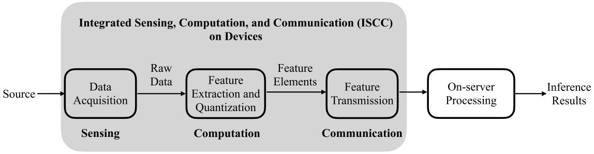

<details>
<summary>flowchart</summary>


</details>

Fig. 1. Integrated Sensing, Computation, and Communication (ISCC) in Edge AI Inference.

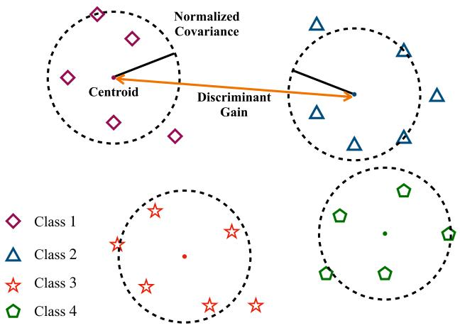

<details>
<summary>flowchart</summary>

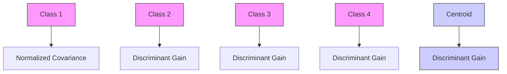
</details>

Fig. 2. Geometry of discriminant gain in the feature space.

• ISCC based Edge Inference System: A multi-view radar sensing based system is established for real-time inference tasks with concrete modeling of the sensing, computation, and communication processes. Under the system settings, we quantify the influence of sensing noise, quantization distortion, and communication capacity on the inference accuracy measured discriminant gain with a derived closed-form expression.   
• Inference Accuracy Maximization via ISCC Design: Targeting maximizing the inference accuracy measured by discriminant gain, an ISCC design problem that concerns joint allocation of sensing and transmit power, communication time, and quantization bits is formulated. We then show that this problem can be transformed into an equivalent problem with the objective being the sum of multiple quasi-linear ratios, subject to a set of convex constraints.   
• Sum-of-ratios based Optimal Solution: We adopt the method of sum-of-ratios to optimally solve the reformulated problem in an iterative manner. In each iteration, a convex problem is solved, which minimizes the sum of

weighted sensing and quantization distortion under given discriminant gains of class pairs. Then, the discriminant gains are updated using the previously solved distortion level of sensing and quantization.

• Performance Evaluation: Extensive simulations over a high-fidelity wireless sensing simulator proposed in [40] are conducted to evaluate the performance of our proposed ISCC scheme by considering a concrete task of multi-view human motion recognition with two inference models, i.e., support vector machine (SVM) and multilayer perception (MLP) neural network, respectively. It is shown that maximizing the discriminant gain is effective in maximizing the inference accuracy for both models with SVM and MLP neural networks. It is also shown that the proposed optimal ISCC scheme achieves significantly higher inference accuracy than the benchmark schemes, where sensing, quantization, and communication are separately designed or partially optimized. The superiority of multi-view inference over single-view inference is also validated.

The organization of this paper is as follows. The system model is introduced in Section II. Then, the problem is formulated and simplified in Section III. The optimal ISCC scheme is proposed in Section IV, followed by the performance evaluation in Section V. Finally, Section VI concludes the paper.

# II. SYSTEM MODEL

In this section, the models of network, radar sensing and feature generation, quantization, and the metric of AI model inference accuracy are introduced.

# A. Network Model

As mentioned in [41] and [42], a single ISAC device only obtains a narrow view of the source target, which is insufficient for completing the task. Therefore, this work considers a multi-view radar sensing based edge inference system, that can obtain a number of different views of the source as shown in Fig. 3. There is one mobile edge server with a single-antenna access point (AP) and K single-antenna ISAC devices equipped with DFRC transceivers. In practice, this multi-view radar sensing system can be deployed in many intelligent services, like auto-driving, health monitoring, traffic surveillance, smart factories and homes (see, e.g., in [43]). For example, in auto-driving systems, the edge server may correspond to high-mobility vehicles like cars, and the ISAC devices correspond to radar sensors. Time-division multiple access (TDMA) is used. The edge server needs to make a real-time decision, such as obstacle detection in the wild, via inferring a well-trained machine learning model. Its features are collected from the ISAC devices. The detailed procedure for data acquisition (sensing), feature extraction and quantization (computation), and feature transmission to the server (communication) at each device is presented in Fig. 4. Specifically, the server first requests all devices to sense the environment. Then, the sensing data of each device is processed and quantized locally to a subset of features. Next, all feature subsets are fed back to the edge server via wireless links and are cascaded for completing the reference task. The ISAC devices remain mute to save the energy consumption when there is no request.

As shown in Fig. 4, the DFRC transceiver implements ISAC by switching between the sensing mode and communication mode flexibly in a time-division manner using a shared radio-frequency front-end circuit [44].1 In sensing mode, frequency-modulated continuous-wave (FMCW) signal consisting of multiple up-ramp chirps is transmitted [44]. Then, by processing the received radar echo signals, sensing data that contain the motion information of the sensing target can be attained at the ISAC devices. In communication mode, constant-frequency carrier modulated by communication data using digital modulation scheme (e.g., QAM) is transmitted. The total permitted time to finish the real-time inference task is denoted as T . For an arbitrary device, say the k-th, its sensing time is denoted as $T _ { r , k }$ and its computation time is denoted as $T _ { m , k } ,$ , which both are assumed to be constant. The communication time to transmit the features is denoted as $T _ { c , k }$ and the total communication bandwidth is B. The wireless channels are assumed to be static, as the time duration T is short and smaller than the channel coherence time. The channel gain of the link between the k-th device and server is denoted as $H _ { c , k }$ . The AP is assumed to work as a coordinator and can acquire the global channel state information (CSI).

# B. Radar Sensing and Feature Generation Model

In this section, we first model the radar sensing channel for obtaining the sensing data. Then, the signal processing for feature generation is introduced.

1) Sensing Signal: All ISAC devices transmit linear frequency up-ramp chirp sequences as the sensing signals. Consider an arbitrary ISAC device, say the k-th. A sensing snapshot consists of M chirps, each of which has a duration of $T _ { 0 } = T _ { r , k } / M$ . The sensing signal in a snapshot is

$$
\begin{array}{l} s _ {k} (t) = \sum_ {m = 0} ^ {M - 1} \operatorname{rect} \left(\frac {t - m T _ {0}}{T _ {0}}\right) \\ \times \cos \left(2 \pi f _ {c, k} (t - m T _ {0}) + \pi \mu (t - m T _ {0}) ^ {2}\right), \\ \end{array}
$$

where rect(·) is the rectangular-shaped pulse function with width of 1 centered at $t ~ = ~ 0 , ~ f _ { c , k }$ is the sensing carrier

1Practical implementations of the DFRC transceiver via software-defined radio solution have been demonstrated in [28], [44], and [45].

frequency for the k-th ISAC device, $\mu = B _ { s } { \mathrm { / } } T _ { 0 }$ is the scope of each chirp, and $B _ { s }$ is the bandwidth of the sensing signal. The echo signal at time t can be written as

$$
r _ {k} (t) = u _ {k} (t) + \sum_ {j = 1} ^ {J} v _ {k, j} (t) + n _ {r} (t). \tag {1}
$$

In (1), $u _ { k } ( t )$ is the desired echo signal directly reflected by the target and is given by

$$
u _ {k} (t) = H _ {r, k} (t) s _ {k} (t - \tau). \tag {2}
$$

Here, $H _ { r , k } ( t )$ is the reflection coefficient including the roundtrip path-loss, τ denotes the round-trip delay, $v _ { k , j } ( t )$ is the echo signal reflected indirectly by the target from the j-th indirect reflection path, which is given by

$$
v _ {k, j} (t) = C _ {r, k, j} (t) s _ {k} (t - \tau_ {j}), \tag {3}
$$

where $C _ { r , k , j } ( t )$ and $\tau _ { j }$ are the reflection coefficient from and the signal delay of the j-th path respectively, J is the total number of indirect reflection paths, and $n _ { r } ( t )$ is the Gaussian noise at the sensing receiver. It is assumed that the values of $H _ { r , k } ( t )$ and $C _ { r , k , j } ( t )$ can be estimated before sensing.

2) Sensing Signal Processing: Consider the k-th ISAC device, the steps to process the received radar echo signals are as follows:

Signal sampling: For sensing snapshot m, the received signal $r _ { k } ( t )$ in (1) is sampled into a complex-valued vector $\mathbf { r } _ { k , m } \in \mathbb { C } ^ { \dot { M } T _ { 0 } f _ { s } }$ , where $f _ { s }$ is the sampling rate. Arrange ${ \bf r } _ { k , m }$ in a two-dimensional data matrix $\mathbf { R } _ { k , m } \in \mathbb { C } ^ { T _ { 0 } f _ { s } \times M }$ , in which $T _ { 0 } f _ { s }$ is the length of the fast-time dimension, and M is the length of the slow-time dimension.2

Data filtering: To mitigate the clutter and extract useful information, we apply a singular value decomposition (SVD) based linear filter to $\mathbf { R } _ { k , m } \ [ 4 0 ]$ . The data matrix after filtering is given by $\begin{array} { r } { \tilde { \mathbf { R } } _ { k , m } \ = \ \sum _ { i = r _ { 1 } } ^ { r _ { 2 } } \sigma _ { i } \mathbf { v } _ { i } \mathbf { u } _ { i } . } \end{array}$ Pi=r1 r 2 , where $\sigma _ { i } , \ \mathbf { v } _ { i } ,$ and $\mathbf { u } _ { i }$ denote the i-th singular value, the i-th left-singular vector, and the i-th right-singular vector of $\mathbf { R } _ { k , m } ,$ respectively, and $r _ { 1 }$ and $r _ { 2 }$ are empirical parameters.

Feature extraction: We extract features in the slow-time dimension for inference. First, we transform $\ddot { \mathbf { R } } _ { k , m }$ into a real vector $\tilde { \mathbf { r } } _ { k , m } \in \mathbb { R } ^ { 1 \times 2 M }$ by cascading the real part and imaginary part of ${ \bf R } _ { k , m }$ into a real matrix and then vectorize it. Next, PCA is used to extract the principle feature elements from $\widetilde { \mathbf { r } } _ { k , m } ,$ , and thus make different feature elements uncorrelated. Note that the principle eigen-space can be obtained during the model training process and is obtained at the AP, which is then broadcast to the ISAC devices. The number of extracted feature elements is denoted as $N _ { k }$ . Since all the processing steps are linear, the nk-th feature element, following (1), is given by

$$
\bar {r} _ {k} (n _ {k}) = \bar {u} _ {k} (n _ {k}) + \sum_ {j = 1} ^ {J} \bar {v} _ {k, j} (n _ {k}) + \bar {n} _ {r} (n _ {k}), \tag {4}
$$

2The fast time dimension is referred to as range dimension whose sample intervals can be used for ranging, whereas processing data in the slow-time dimension allows one to estimate the Doppler spectrum at a given fast time dimension.

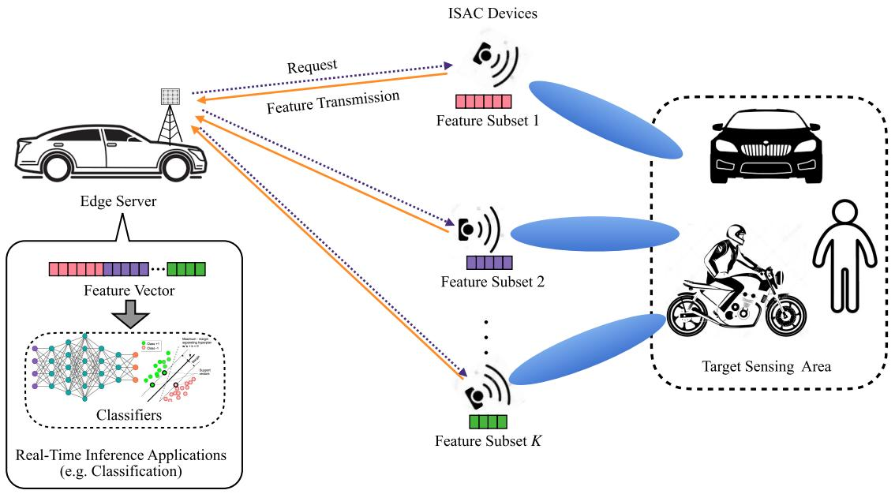

<details>
<summary>flowchart</summary>

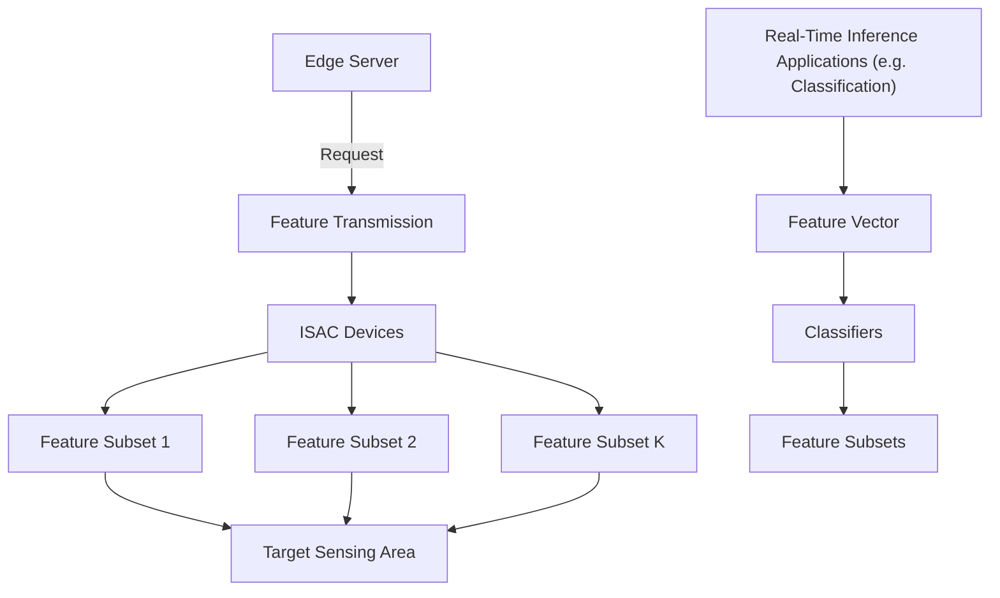
</details>

Fig. 3. Edge inference systems with multi-device sensing.

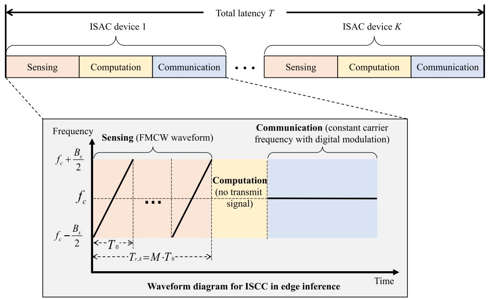

<details>
<summary>flowchart</summary>

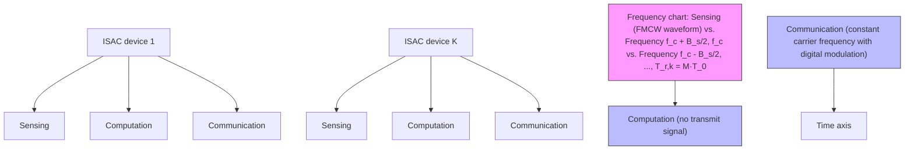
</details>

Fig. 4. Edge inference systems with multi-device sensing.

where ${ { \bar { u } } _ { k } } ( { { n } _ { k } } )$ is the desired ground-truth feature, $\bar { v } _ { k } ( n _ { k } )$ is additive information in feature element brought by the clutter signal from the j-th path, $\bar { n } _ { r } ( n _ { k } )$ is the noise in feature element.

Each feature element is normalized by the transmit radar sensing power, say $\sqrt { P _ { r , k } }$ . Specifically, the $n _ { k } { \mathrm { - } } { \mathrm { } } { \mathrm { } } { \mathrm { } } { \mathrm { ~ } }$ feature element is

$$
\hat {x} (n _ {k}) = \frac {r _ {k} (n)}{\sqrt {P _ {r , k}}} = x (n _ {k}) + c _ {r, k} (n _ {k}) + \frac {n _ {r} (n _ {k})}{\sqrt {P _ {r , k}}}, \tag {5}
$$

where $x ( n _ { k } ) = \bar { u } _ { k } ( n _ { k } ) / \sqrt { P _ { r , k } }$ is the ground-true feature and

$$
c _ {r, k} (n _ {k}) = \sum_ {j = 1} ^ {J} \frac {\bar {v} _ {k , j} (n _ {k})}{\sqrt {P _ {r , k}}}, \tag {6}
$$

is the normalized clutter. From (5), one can observe that the sensed feature is polluted by the clutter, say $c _ { r , k } ( n _ { k } )$ , and the sensing noise $n _ { r } ( n _ { k } )$ . According to the central limit theorem, $c _ { r , k } ( n _ { k } )$ is assumed to follow a Gaussian distribution, as the number of independent reflection paths J is large. Its distribution is given as

$$
c _ {r, k} (n _ {k}) \sim \mathcal {N} (0, \sigma_ {c, k} ^ {2}), \tag {7}
$$

where $\mathcal { N } ( \cdot , \cdot )$ represents the Gaussian distribution and $\sigma _ { c , k } ^ { 2 }$ is the constant variance and can be estimated before sensing. The normalized sensing noise also has a Gaussian distribution:

$$
n _ {r} (n _ {k}) / \sqrt {P _ {r , k}} \sim \mathcal {N} \left(0, \sigma_ {r} ^ {2} / P _ {r, k}\right), \tag {8}
$$

where $\sigma _ { r } ^ { 2 }$ is the noise variance.

The feature subset generated by ISAC device k is $\hat { \mathbf { x } } _ { k } ~ =$ $\{ { \hat { x } } ( n _ { k } ) , 1 \leq n _ { k } \leq N _ { k } \}$ , where $N _ { k }$ is the total number of generated feature elements. Furthermore, different feature subsets generated by different ISAC devices are assumed to be independent, as the ISAC devices are sparsely deployed and the corresponding sensing areas are non-overlapping.

# C. Quantization Model

Consider the k-th ISAC device, whose feature subset is $\hat { \mathbf { x } } _ { k }$ . Each feature element is quantized using the same linear quantizer. Specifically, for the nk-th feature element, according to [46] and by using high quantization bit range, its quantized version is given by

$$
z (n _ {k}) = \sqrt {Q _ {k}} \hat {x} (n _ {k}) + d _ {k}, \tag {9}
$$

where $\hat { x } ( n _ { k } )$ is the original feature element defined in (5), $\sqrt { Q _ { k } }$ is the quantization gain, $d _ { k }$ is the approximate Gaussian quantization distortion, given as

$$
d _ {k} \sim \mathcal {N} (0, \delta_ {k} ^ {2}), \tag {10}
$$

and $\delta _ { k } ^ { 2 }$ is the variance. At the receiver, the quantized feature is recovered as

$$
\tilde {x} (n _ {k}) = \frac {z (n _ {k})}{\sqrt {Q _ {k}}} = \hat {x} (n _ {k}) + \frac {d _ {k}}{\sqrt {Q _ {k}}}, \tag {11}
$$

where the notations follow that in (9). Note that in (11), higher quantization gain, say larger $\sqrt { Q _ { k } } .$ , can lead to lower quantization distortion in the recovered feature at the receiver. The mutual information of the recovered feature subset $\tilde { \mathbf { x } } _ { k } =$ $\{ \tilde { x } ( 1 _ { k } ) , \tilde { x } ( 2 _ { k } ) , \dots , \tilde { x } ( N _ { k } ) \}$ and the generated feature subset $\hat { \mathbf { x } } _ { k }$ under the additive Gaussian distortion approximation can be derived as

$$
I (\tilde {\mathbf {x}} _ {k}; \hat {\mathbf {x}} _ {k}) = N _ {k} \log_ {2} \left(1 + \frac {Q _ {k}}{\delta_ {k} ^ {2}}\right), \forall k, \tag {12}
$$

which is also the overhead of device k for transmitting the feature subset to the server.

# D. Discriminant Gain

Following [21], we adopt discriminant gain, which is derived from the well-known KL divergence proposed in [39], as the inference accuracy metric of the classification task.

First, consider an arbitrary feature element generated by the k-th ISAC device $\tilde { x } ( n _ { k } )$ ). By substituting $\hat { x } ( n _ { k } )$ in (5) into $\tilde { x } ( n _ { k } )$ in (11), it can be written as

$$
\tilde {x} (n _ {k}) = x (n _ {k}) + c _ {r, k} (n _ {k}) + \frac {n _ {r} (n _ {k})}{\sqrt {P _ {r , k}}} + \frac {d _ {k}}{\sqrt {Q _ {k}}}, \tag {13}
$$

where the notations follow that in (5), (7), and (11).

According to [21], the ground-truth feature element $x ( n _ { k } )$ is assumed to have a mixed Gaussian distribution. Its probability density function is

$$
f \left(x (n _ {k})\right) = \frac {1}{L} \sum_ {\ell = 1} ^ {L} \mathcal {N} \left(\mu_ {\ell , n _ {k}}, \sigma_ {n _ {k}} ^ {2}\right), \forall n _ {k}, \forall k, \tag {14}
$$

where L is the total number of classes in the inference task, $\mu _ { \ell , n _ { k } }$ is the centroid of the ℓ-th class, and $\sigma _ { n _ { k } } ^ { 2 }$ is the variance.3

By substituting the distributions of the ground-truth feature in (14), the clutter distribution in (7), the normalized sensing noise in (8), and the quantization distortion in (10), into the recovered feature element $\tilde { x } ( n _ { k } )$ , its distribution can be derived as

$$
f \left(\tilde {x} (n _ {k})\right) = \frac {1}{L} \sum_ {\ell = 1} ^ {L} f _ {\ell} \left(\tilde {x} (n _ {k})\right), \forall n _ {k}, \forall k, \tag {15}
$$

where $f _ { \ell } \left( \tilde { x } ( n _ { k } ) \right)$ is the probability density function of $\tilde { x } ( n _ { k } )$ in terms of the ℓ-th class and is given by

$$
f _ {\ell} \left(\tilde {x} (n _ {k})\right) = \mathcal {N} \big (\mu_ {\ell , n _ {k}}, \sigma_ {n _ {k}} ^ {2} + \sigma_ {c, k} ^ {2} + \frac {\sigma_ {r} ^ {2}}{P _ {r , k}} + \frac {\delta_ {k} ^ {2}}{Q _ {k}} \big), \forall \ell . \tag {16}
$$

Next, the discriminant gain of $\tilde { x } ( n _ { k } )$ can be derived from the well-established KL divergence [21]. Specifically, consider an arbitrary class pair, say classes ℓ and ℓ′. Its discriminant gain is

$$
\begin{array}{l} G _ {\ell , \ell^ {\prime}} (\tilde {x} (n _ {k})) = D _ {K L} \left[ f _ {\ell} (\tilde {x} (n _ {k})) \| f _ {\ell^ {\prime}} (\tilde {x} (n _ {k})) \right] \\ + D _ {K L} \left[ f _ {\ell^ {\prime}} (\tilde {x} (n _ {k})) \| f _ {\ell} (\tilde {x} (n _ {k})) \right], \\ = \int_ {\tilde {x} (n _ {k})} \left\{f _ {\ell} (\tilde {x} (n _ {k})) \log \left[ \frac {f _ {\ell^ {\prime}} (\tilde {x} (n _ {k}))}{f _ {\ell} (\tilde {x} (n _ {k}))} \right] \right. \\ \left. + f _ {\ell^ {\prime}} \left(\tilde {x} (n _ {k})\right) \log \left[ \frac {f _ {\ell} \left(\tilde {x} (n _ {k})\right)}{f _ {\ell^ {\prime}} \left(\tilde {x} (n _ {k})\right)} \right] \right\} \mathrm{d} \tilde {x} (n _ {k}), \\ = \frac {\left(\mu_ {\ell , n _ {k}} - \mu_ {\ell^ {\prime} , n _ {k}}\right) ^ {2}}{\sigma_ {n _ {k}} ^ {2} + \sigma_ {c , k} ^ {2} + \sigma_ {r} ^ {2} / P _ {r , k} + \delta_ {k} ^ {2} / Q _ {k}}, \forall (\ell , \ell^ {\prime}), \tag {17} \\ \end{array}
$$

where $D _ { K L } \left[ \cdot \| \cdot \right]$ is the KL divergence defined in [39], and the other notations follow that in (15). It follows that the discriminant gain of the whole feature vector $\tilde { \mathbf { x } } = \left\{ \tilde { \mathbf { x } } _ { 1 } , \tilde { \mathbf { x } } _ { 2 } , \ldots , \tilde { \mathbf { x } } _ { K } \right\}$ , where $\tilde { \mathbf { x } } _ { k } = \{ \tilde { x } ( 1 _ { k } ) , \tilde { x } ( 2 _ { k } ) , \dots , \tilde { x } ( N _ { k } ) \}$ , in terms of this class pair is given by

$$
\begin{array}{l} G _ {\ell , \ell^ {\prime}} (\tilde {\mathbf {x}}) = D _ {K L} \left[ f _ {\ell} (\tilde {\mathbf {x}}) \| f _ {\ell^ {\prime}} (\tilde {\mathbf {x}}) \right] + D _ {K L} \left[ f _ {\ell^ {\prime}} (\tilde {\mathbf {x}}) \| f _ {\ell} (\tilde {\mathbf {x}}) \right], \\ = \sum_ {k = 1} ^ {K} \sum_ {n _ {k} = 1} ^ {N _ {k}} G _ {\ell , \ell^ {\prime}} \left(\tilde {x} (n _ {k})\right), \tag {18} \\ \end{array}
$$

since different feature elements in x˜ are independent. The overall discriminant gain of x˜ is defined as the average of all class pairs:

$$
G = \frac {2}{L (L - 1)} \sum_ {k = 1} ^ {K} \sum_ {n _ {k} = 1} ^ {N _ {k}} \sum_ {\ell^ {\prime} = 1} ^ {L} \sum_ {\ell <   \ell^ {\prime}} G _ {\ell , \ell^ {\prime}} (\tilde {x} (n _ {k})) \tag {19}
$$

# III. PROBLEM FORMULATION & SIMPLIFICATION

# A. Problem Formulation

Our objective is to maximize the total discriminant gain in (19) under the constraints on latency, successful transmission, and energy. The objective can be written as

$$
\max _ {P _ {c, k}, P _ {r, k}, T _ {c, k}, Q _ {k}} G, \tag {20}
$$

where the notations follow that in (17) and (19). Next, we formulate the various constraints.

3These statistics can be pre-estimated at the AP using the training dataset.

1) Latency Constraint: The total allocated sensing, computation, and communication time should be less than the permitted latency of the real-time inference task:

$$
\sum_ {k = 1} ^ {K} (T _ {r, k} + T _ {m, k} + T _ {c, k}) \leq T, \tag {21}
$$

where $T _ { r , k } , T _ { m , k }$ , and $T _ { c , k }$ are the constant sensing time, the constant computation time, and the allocated communication time of ISAC device k respectively, and T is the permitted latency to finish the task.

2) Successful Transmission Constraint: To ensure successful transmission of the quantized feature subset to the receiver, the mutual information between the generated feature subset $\hat { \mathbf { x } } _ { k }$ and the recovered one $\tilde { \mathbf { x } } _ { k }$ should be less than the channel capacity as formally stated below [47]:

$$
I (\tilde {\mathbf {x}} _ {k}; \hat {\mathbf {x}} _ {k}) \leq R _ {k}, \forall k, \tag {22}
$$

where $R _ { k }$ is the channel capacity of ISAC device k. It is given by

$$
R _ {k} = T _ {c, k} B \log_ {2} \left(1 + \frac {P _ {c , k} H _ {c , k}}{\delta_ {c} ^ {2}}\right), \forall k, \tag {23}
$$

where B is the system bandwidth, $\delta _ { c } ^ { 2 }$ is the channel noise power, $T _ { c , k }$ is the allocated time slot, $P _ { c , k }$ is the transmit power, and $H _ { c , k }$ is the channel gain. By substituting the mutual information in (12) and the data rate in (23) into the transmission constraint in (22), it can be written as

$$
N _ {k} \log_ {2} \left(1 + \frac {Q _ {k}}{\delta_ {k} ^ {2}}\right) \leq T _ {c, k} B \log_ {2} \left(1 + \frac {P _ {c , k} H _ {c , k}}{\delta_ {c} ^ {2}}\right), \forall k. \tag {24}
$$

3) Energy Constraint: The energy consumption of each ISAC device should be bounded:

$$
P _ {r, k} T _ {r, k} + E _ {m, k} + P _ {c, k} T _ {c, k} \leq E _ {k}, \forall k, \tag {25}
$$

where $P _ { r , k } , \ P _ { c , k } , \ T _ { r , k } , \ T _ { c , k } , \ E _ { m , k }$ , and $E _ { k }$ are the sensing power, the transmit power, the constant sensing time, the communication time, the constant computation energy consumption, and the energy threshold of ISAC device k, respectively.

Under the three kinds of constraints above, the problem of maximizing discriminant gain is formulated as

$$
\begin{array}{l} \text {(P1)} \max _ {P _ {c, k}, P _ {r, k}, T _ {c, k}, Q _ {k}} G, \\ \text { s.t. } P _ {c, k}, P _ {r, k}, T _ {c, k}, Q _ {k} \in \mathbb {R} ^ {+}, \forall k, \\ (\mathrm{C} 1) \sim (\mathrm{C} 3). \tag {26} \\ \end{array}
$$

(P1) is a non-convex problem due to the non-convexity of the objective function and Constraints (C2) and (C3) therein. Although the discriminant gain maximization problem is investigated in [21] via progress feature transmission, this work is the first to enhance the inference performance from a systematic view, i.e., the integration of sensing, computation and communication. In the sequel, an equivalent simplified problem is derived.

# B. Problem Simplification

To simplify (P1), the following variable transformations are applied:

$$
S _ {k} = \frac {\sigma_ {r} ^ {2}}{P _ {r , k}}, \quad D _ {k} = \frac {\delta_ {k} ^ {2}}{Q _ {k}}, \quad E _ {c, k} = P _ {c, k} T _ {c, k}, \tag {27}
$$

where $S _ { k } , D _ { k }$ , and $E _ { c , k }$ can be interpreted as the normalized sensing noise power, the normalized quantization distortion, and the communication energy consumption of ISAC device $k ,$ respectively. By substituting (27) into (P1), it can be equivalently derived as

$$
\max_{\substack{E_{c,k},S_{k},\\ T_{c,k},D_{k}}}G = \frac{2}{L(L - 1)}\sum_{k = 1}^{K}\sum_{n_{k} = 1}^{N_{k}}\sum_{\ell^{\prime} = 1}^{L}\sum_{\ell <  \ell^{\prime}}\hat{G}_{\ell ,\ell^{\prime}}\left(\tilde{x} (n_{k})\right), \tag{P2}
$$

$$
\text { s.t. } P _ {c, k}, P _ {r, k}, T _ {c, k}, Q _ {k} \in \mathbb {R} ^ {+}, \forall k,
$$

$$
\sum_ {k = 1} ^ {K} (T _ {r, k} + T _ {m, k} + T _ {c, k}) \leq T,
$$

$$
N _ {k} \log_ {2} (1 + \frac {1}{D _ {k}})
$$

$$
\leq T _ {c, k} B \log_ {2} \left(1 + \frac {E _ {c , k} H _ {c , k}}{T _ {c , k} \delta_ {c} ^ {2}}\right), \forall k,
$$

$$
\frac {\sigma_ {r} ^ {2} T _ {r , k}}{S _ {k}} + E _ {m, k} + E _ {c, k} \leq E _ {k}, \forall k,
$$

where

$$
\hat {G} _ {\ell , \ell^ {\prime}} (\tilde {x} (n _ {k})) = \frac {\left(\mu_ {\ell , n _ {k}} - \mu_ {\ell^ {\prime} , n _ {k}}\right) ^ {2}}{\sigma_ {n _ {k}} ^ {2} + \sigma_ {c , k} ^ {2} + S _ {k} + D _ {k}}. \tag {28}
$$

In (P2), all constraints are convex but the objective function (in the form of summation over multiple ratios) to be maximized is non-concave, thus making (P2) non-convex. To tackle the problem, the sum-of-ratios method is used in the following.

# IV. OPTIMAL ISCC SCHEME

In this section, an optimal ISCC scheme for joint sensing & transmit power, time, and quantization bits allocation, is proposed to solve (P2). The solution process is presented in Fig. 5. Specifically, (P2) is optimally tackled by an iterative method, called sum-of-ratios. In each iteration, the auxiliary variables are first introduced to derive a convex problem from (P2), called sum of weighted distortion minimization. Then, the convex problem is addressed by alternately solving the problem of joint power and quantization bits allocation and the problem of communication time allocation.

# A. The Sum-of-Ratios Method

In this part, the sum-of ratios method in [48] is utilized to optimally address (P2) by alternating between two steps: 1) solving a convex sub-problem, that is derived from (P2) to minimize the sum of weighted sensing and quantization distortion under given discriminant gains, and 2) updating the discriminant gains using the solved distortion level of sensing and quantization. These two steps iterate till convergence. The detailed procedure is elaborated in the sequel.

To begin with, we show that the sum-of ratios method can be applied to solve (P2), as shown in the lemma below.

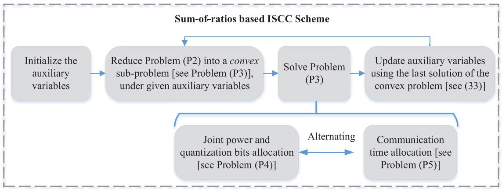

<details>
<summary>flowchart</summary>

```mermaid
graph TD
    A["Initialize the auxiliary variables"] --> B["Reduce Problem (P2) into a convex sub-problem [see Problem (P3)"], under given auxiliary variables]
    B --> C["Solve Problem (P3)"]
    C --> D["Update auxiliary variables using the last solution of the convex problem [see (33)"]]
    D --> E["Joint power and quantization bits allocation [see Problem (P4)"]]
    E --> F["Alternating"]
    F --> G["Communication time allocation [see Problem (P5)"]]
```
</details>

Fig. 5. Solution Methodology of the ISCC scheme.

Lemma 1: The objective function of (P2) is the sum of multiple quasi-linear ratios. (P2) can be optimally solved using the sum-of-ratios method.

Proof: See Appendix.

Based on Lemma 1, the detailed solution process via using the sum-of-ratios method is presented as follows. First, the objective function of (P2) is rewritten as

$$
G = \sum_ {k = 1} ^ {K} \sum_ {n _ {k} = 1} ^ {N _ {k}} \sum_ {\ell^ {\prime} = 1} ^ {L} \sum_ {\ell <   \ell^ {\prime}} \frac {\mathcal {A} _ {\ell , \ell^ {\prime} , n _ {k}}}{\mathcal {B} _ {\ell , \ell^ {\prime} , n _ {k}} \left(S _ {k} , D _ {k}\right)}, \tag {29}
$$

where $\boldsymbol { \mathcal { A } } _ { \boldsymbol { \ell } , \boldsymbol { \ell ^ { \prime } } , n _ { k } }$ and $B _ { \ell , \ell ^ { \prime } , n _ { k } } \left( S _ { k } , D _ { k } \right)$ are

$$
\left\{ \begin{array}{l} \mathcal {A} _ {\ell , \ell^ {\prime}, n _ {k}} = 1, \\ \mathcal {B} _ {\ell , \ell^ {\prime}, n _ {k}} \left(S _ {k}, D _ {k}\right) = \frac {L (L - 1) (\sigma_ {n _ {k}} ^ {2} + \sigma_ {c , k} ^ {2} + S _ {k} + D _ {k})}{2 \big (\mu_ {\ell , n _ {k}} - \mu_ {\ell^ {\prime} , n _ {k}} \big) ^ {2}}, \end{array} \right. \tag {30}
$$

for all $( \ell , \ell ^ { \prime } , n _ { k } )$ . We then create the following sub-problem:

$$
\begin{array}{l} \max_{\substack{E_{c,k},S_{k},\\ T_{c,k},D_{k}}}\quad \sum_{k = 1}^{K}\sum_{n_{k} = 1}^{N_{k}}\sum_{\ell^{\prime} = 1}^{L}\sum_{\ell <  \ell^{\prime}}x_{\ell ,\ell^{\prime},n_{k}}\left[\mathcal{A}_{\ell ,\ell^{\prime},n_{k}}\right. \\ \left. - y _ {\ell , \ell^ {\prime}, n _ {k}} \mathcal {B} _ {\ell , \ell^ {\prime}, n _ {k}} \left(S _ {k}, D _ {k}\right) \right], \\ \end{array}
$$

s.t. All constraints in (P2), (31)

where $\left\{ x _ { \ell , \ell ^ { \prime } , n _ { k } } \right\}$ and $\left\{ y _ { \ell , \ell ^ { \prime } , n _ { k } } \right\}$ are the introduced auxiliary variables, and $\mathcal { A } _ { \ell , \ell ^ { \prime } , n _ { k } }$ and $B _ { \ell , \ell ^ { \prime } , n _ { k } } ^ { \dot { } } \left( S _ { k } , D _ { k } \right)$ are defined in (30). In (P3), each term in the objective function is a scale of the sum of sensing noise power $\{ S _ { k } \}$ and quantization distortion $\{ D _ { k } \}$ , giving its name of sum of weighted distortion minimization problem. It is easy to show that (P3) is convex.

Next, according to [48] and Theorem 1 in [49], (P2) can be optimally addressed by alternating between optimally solving the sub-problem in (P3) under given auxiliary variables $\left\{ x _ { \ell , \ell ^ { \prime } , n _ { k } } \right\}$ and $\left\{ y _ { \ell , \ell ^ { \prime } , n _ { k } } \right\}$ , and updating them based on the correspondingly obtained solution. Hence, based on the convexity of (P3), (P2) can be optimally solved by iteratively performing the following two steps till convergence.

• Step 1: Optimally solving (P3) with given auxiliary variables $\left\{ x _ { \ell , \ell ^ { \prime } , n _ { k } } \right\}$ and $\left\{ y _ { \ell , \ell ^ { \prime } , n _ { k } } \right\}$ .

• Step 2: For all $( \ell , \ell ^ { \prime } , n _ { k } )$ , updating the auxiliary variables $\left\{ x _ { \ell , \ell ^ { \prime } , n _ { k } } \right\}$ and $\left\{ y _ { \ell , \ell ^ { \prime } , n _ { k } } \right\}$ as

$$
x _ {\ell , \ell^ {\prime}, n _ {k}} = \frac {1}{\mathcal {B} _ {\ell , \ell^ {\prime} , n _ {k}} (S _ {k} , D _ {k})},
$$

$$
y _ {\ell , \ell^ {\prime}, n _ {k}} = \frac {\mathcal {A} _ {\ell , \ell^ {\prime} , n _ {k}}}{\mathcal {B} _ {\ell , \ell^ {\prime} , n _ {k}} (S _ {k} , D _ {k})} = \frac {1}{\mathcal {B} _ {\ell , \ell^ {\prime} , n _ {k}} (S _ {k} , D _ {k})}, \tag {32}
$$

where $B _ { \ell , \ell ^ { \prime } , n _ { k } } \left( S _ { k } , D _ { k } \right)$ is defined in (30). From the above equation, it can be observed that

$$
x _ {\ell , \ell^ {\prime}, n _ {k}} = y _ {\ell , \ell^ {\prime}, n _ {k}}, \tag {33}
$$

and they are the discriminant gain of feature $n _ { k }$ between the classes ℓ and ℓ′.

The above process can be interpreted as iterating over addressing the sum of weighted distortion minimization problem under given discriminant gain, and updating the discriminant gain using the solved sensing and communication distortion level.

# B. An Alternating Method for Solving (P3)

In this section, an alternating algorithm is proposed to solve the convex sub-problem in (P3) with given auxiliary variables $\left\{ x _ { \ell , \ell ^ { \prime } , n _ { k } } \right\}$ and $\left\{ y _ { \ell , \ell ^ { \prime } , n _ { k } } \right\}$ . This allows closed-form solutions with structural properties and can achieve low computational complexity. Next, the two sub-problems are first introduced, followed by a summary of the alternating algorithm.

1) Joint Power and Quantization Bits Allocation: In this case, the communication time, say $\{ T _ { c , k } \}$ , is given. By substituting (33) and $\mathcal { A } _ { \ell , \ell ^ { \prime } , n _ { k } }$ in (30), (P3) can be written as

$$
\max_{\substack{E_{c,k},S_{k},\\ D_{k}}}\sum_{k = 1}^{K}\sum_{n_{k} = 1}^{N_{k}}\sum_{\ell^{\prime} = 1}\sum_{\ell <  \ell^{\prime}}\left[y_{\ell ,\ell^{\prime},n_{k}}\right.
$$

$$
\left. - y _ {\ell , \ell^ {\prime}, n _ {k}} ^ {2} \mathcal {B} _ {\ell , \ell^ {\prime}, n _ {k}} (S _ {k}, D _ {k}) \right],
$$

$\mathrm { s . t . } E _ { c , k } , S _ { k } , D _ { k } \in \mathbb { R } ^ { + } , \forall k ,$

$$
N _ {k} \log_ {2} (1 + \frac {1}{D _ {k}})
$$

$$
\leq T _ {c, k} B \log_ {2} \left(1 + \frac {E _ {c , k} H _ {c , k}}{T _ {c , k} \delta_ {c} ^ {2}}\right), \forall k,
$$

$$
\sigma_ {r} ^ {2} T _ {r, k} / S _ {k} + E _ {m, k} + E _ {c, k} \leq E _ {k}, \forall k,
$$

which is a convex problem. The Karush-Kuhn-Tucker (KKT) conditions are used to solve (P4). The Lagrangian is given by

$$
\begin{array}{l} \mathcal {L} _ {\mathrm{P4}} = - \sum_ {k = 1} ^ {K} \sum_ {n _ {k} = 1} ^ {N _ {k}} \sum_ {\ell^ {\prime} = 1} ^ {L} \sum_ {\ell <   \ell^ {\prime}} [ y _ {\ell , \ell^ {\prime}, n _ {k}} - y _ {\ell , \ell^ {\prime}, n _ {k}} ^ {2} \mathcal {B} _ {\ell , \ell^ {\prime}, n _ {k}} (S _ {k}, D _ {k}) ], \\ + \sum_ {k = 1} ^ {K} \alpha_ {k} \left[ N _ {k} \log_ {2} \left(1 + \frac {1}{D _ {k}}\right) \right. \\ \left. - T _ {c, k} B \log_ {2} \left(1 + \frac {E _ {c , k} H _ {c , k}}{T _ {c , k} \delta_ {c} ^ {2}}\right) \right], \\ + \sum_ {k = 1} ^ {K} \beta_ {k} \left(\frac {T _ {r , k}}{S _ {k}} + E _ {m, k} + E _ {c, k} - E _ {k}\right), \tag {34} \\ \end{array}
$$

where $\{ \alpha _ { k } \ \geq \ 0 \}$ and $\left\{ \beta _ { k } \begin{array} { c c } { { \geq } } &  { 0 \} } \end{array} \right.$ are the corresponding Lagrange multipliers, and $B _ { \ell , \ell ^ { \prime } , n _ { k } } \left( S _ { k } , D _ { k } \right)$ is defined in (30).

The first KKT condition can be written as

$$
\frac {\partial \mathcal {L} _ {\mathrm{P} 4}}{\partial S _ {k}} = \sum_ {\ell^ {\prime} = 1} ^ {L} \sum_ {\ell <   \ell^ {\prime}} \left(y _ {\ell , \ell^ {\prime}, n _ {k}} ^ {2} \times \frac {\partial \mathcal {B} _ {\ell , \ell^ {\prime} , n _ {k}}}{\partial S _ {k}}\right) - \frac {\beta_ {k} T _ {r , k}}{S _ {k} ^ {2}} = 0, \forall k, \tag {35}
$$

where, according to (30),

$$
\frac {\partial B _ {\ell , \ell^ {\prime} , n _ {k}}}{\partial S _ {k}} = \frac {L (L - 1)}{2 \left(\mu_ {\ell , n _ {k}} - \mu_ {\ell^ {\prime} , n _ {k}}\right) ^ {2}}. \tag {36}
$$

It follows that

$$
\frac {1}{S _ {k}} = \sqrt {\sum_ {\ell^ {\prime} = 1} ^ {L} \sum_ {\ell <   \ell^ {\prime}} \frac {L (L - 1) y _ {\ell , \ell^ {\prime} , n _ {k}} ^ {2}}{2 \left(\mu_ {\ell , n _ {k}} - \mu_ {\ell^ {\prime} , n _ {k}}\right) ^ {2}} \times \frac {1}{\beta_ {k} T _ {r , k}}}. \tag {37}
$$

By substituting $S _ { k }$ in (27) into (37), the following optimal sensing power allocation scheme can be obtained.

Lemma 2: The optimal sensing power for ISAC device k must satisfy

$$
P _ {r, k} = \sigma_ {r} ^ {2} \times \sqrt {\sum_ {\ell^ {\prime} = 1} ^ {L} \sum_ {\ell <   \ell^ {\prime}} \frac {L (L - 1) y _ {\ell , \ell^ {\prime} , n _ {k}} ^ {2}}{2 \left(\mu_ {\ell , n _ {k}} - \mu_ {\ell^ {\prime} , n _ {k}}\right) ^ {2}} \times \frac {1}{\beta_ {k} T _ {r , k}}}, \forall k, \tag {38}
$$

where $\{ \beta _ { k } \}$ are the Lagrangian multipliers.

From (38), we conclude the following. Consider an arbitrary ISAC device, say the k-th one. First, if the number of classes L is large, or the required discriminant gains $\left\{ y _ { \ell , \ell ^ { \prime } , n _ { k } } \right\}$ are large, more power should be allocated for sensing. Then, if the centroid distances, say $\{ \left( \mu _ { \ell , n _ { k } } - \mu _ { \ell ^ { \prime } , n _ { k } } \right) ^ { 2 } \}$ , are large, or the sensing noise variance $\sigma _ { r } ^ { 2 }$ is small, the required sensing power can be reduced. In addition, long sensing time, i.e., larger $T _ { r , k }$ , can also reduce the required sensing power.

The second KKT condition is given by

$$
\begin{array}{l} \frac {\partial \mathcal {L} _ {\mathrm{P4}}}{\partial D _ {k}} = \sum_ {\ell^ {\prime} = 1} ^ {L} \sum_ {\ell <   \ell^ {\prime}} \left(y _ {\ell , \ell^ {\prime}, n _ {k}} ^ {2} \times \frac {\partial \mathcal {B} _ {\ell , \ell^ {\prime} , n _ {k}}}{\partial D _ {k}}\right) \\ - \frac {\alpha_ {k} N _ {k} \ln 2}{D _ {k} (D _ {k} + 1)} = 0, \forall k, \tag {39} \\ \end{array}
$$

which, by substituting $B _ { \ell , \ell ^ { \prime } , n _ { k } } \left( S _ { k } , D _ { k } \right)$ in (30), can be derived as

$$
D _ {k} = \sqrt {\frac {1}{4} + \frac {\alpha_ {k} N _ {k} \ln 2}{\sum_ {\ell^ {\prime} = 1} ^ {L} \sum_ {\ell <   \ell^ {\prime}} \frac {L (L - 1) y _ {\ell , \ell^ {\prime} , n _ {k}} ^ {2}}{2 \left(\mu_ {\ell , n _ {k}} - \mu_ {\ell^ {\prime} , n _ {k}}\right) ^ {2}}}} - \frac {1}{2}, \forall k, \tag {40}
$$

where $\{ \alpha _ { k } \}$ are the Lagrangian multipliers. By substituting $D _ { k }$ in (27) into (40), we obtain the following lemma.

Lemma 3: The optimal quantization gain satisfies

$$
Q _ {k} = \frac {\delta_ {k} ^ {2}}{D _ {k}}, \quad \forall k, \tag {41}
$$

where $\delta _ { k } ^ { 2 }$ is the quantization distortion and $D _ { k }$ is defined in $( 4 0 )$ .

Several observations can be made from (41). For an arbitrary ISAC device, say the k-th, larger number of classes L, larger number of feature elements $N _ { k }$ , and larger required discriminant gains $\left\{ y _ { \ell , \ell ^ { \prime } , n _ { k } } \right\}$ , call for greater quantization gain (or level), as it requires more fine-grained feature representations to increase the differentiability among them. In addition, larger centroid distances between classes, say $\{ \left( \mu _ { \ell , n _ { k } } - \mu _ { \ell ^ { \prime } , n _ { k } } \right) ^ { 2 } \}$ , require smaller quantization gain, since different classes are well separated and thus low-resolution feature representation is fine for discriminating them.

The third KKT condition can be written as

$$
\frac {\partial \mathcal {L} _ {\mathrm{P4}}}{\partial E _ {c , k}} = - \frac {\alpha_ {k} B T _ {c , k} H _ {c , k}}{\left(E _ {c , k} H _ {c , k} + T _ {c , k} \delta_ {c} ^ {2}\right) \ln 2} + \beta_ {k} = 0. \tag {42}
$$

It follows that

$$
E _ {c, k} = \max \left\{\frac {\alpha_ {k} B T _ {c , k}}{\beta_ {k} \ln 2} - \frac {T _ {c , k} \delta_ {c} ^ {2}}{H _ {c , k}}, \quad 0 \right\}. \tag {43}
$$

By substituting $E _ { c , k }$ in (27) into (43), we have the following optimal power allocation.

Lemma 4: The optimal communication power for each ISAC device should be

$$
P _ {c, k} = \max \left\{\frac {\alpha_ {k} B}{\beta_ {k} \ln 2} - \frac {\delta_ {c} ^ {2}}{H _ {c , k}}, \quad 0 \right\}, \quad \forall k. \tag {44}
$$

Based on the results above, the primal-dual method can be used to solve (P4), as summarized in Algorithm 1.

2) Communication Time Allocation: In this case, the normalized sensing noise power $\{ S _ { k } \}$ , communication energy $\{ E _ { c , k } \}$ , and normalized quantization distortion $\{ D _ { k } \}$ are first solved by Algorithm 1. To determine the communication time allocation $\{ T _ { c , k } \}$ , a feasibility problem of (P3) is first derived, as shown in (P5). It obtains the minimum required time, denoted as $T ^ { * }$ , under given weighted distortion determined by $\{ S _ { k } \} , \ \{ E _ { c , k } \}$ , and $\{ D _ { k } \}$ . Then, following the methods used in [50] and [51], the tractability of (P3) under the current weighted distortion is determined by the comparison between $T ^ { * }$ and the permitted latency T , as described below.

• Case $o f T ^ { * } > T$ : In this case, the given $\{ S _ { k } \} , \{ D _ { k } \}$ , and $\{ E _ { c , k } \}$ are not in the feasible region of (P3). The reason is that the latency constraint therein cannot be satisfied. To this end, the latency of all ISAC devices should be reduced to satisfy the constraint.4

4If the initial point is feasible, the solution will not fall into this case by using the sequel algorithm.

# Algorithm 1 Joint Power and Quantization Bits Allocation

1: Input: Channel gains $\{ H _ { c , k } \}$ , auxiliary variables $\{ y _ { \ell , \ell ^ { \prime } , n _ { k } } \}$ , feature elements’ class centroids $\{ \mu _ { \ell , n _ { k } } \}$ and variances $\{ \sigma _ { n _ { k } } ^ { 2 } \}$ , and the given communication latencies $\{ T _ { c , k } \} .$ .

2: Initialize $\{ \alpha _ { k } ^ { ( 0 ) } \} , \{ \beta _ { k } ^ { ( 0 ) } \}$ , the step sizes $\{ \eta _ { \alpha _ { k } } \}$ and $\{ \eta _ { \beta _ { k } } \}$ , and $i = 0 .$

#

4: Solve $\{ S _ { k } \} , \{ D _ { k } \}$ , and $\{ E _ { c , k } \}$ using (37), (40), and (43), respectively.

5: Update the multipliers as

$$
\left\{ \begin{array}{l} \alpha_ {k} ^ {(i + 1)} = \max \left\{\alpha_ {k} ^ {(i)} + \eta_ {\alpha_ {k}} \frac {\partial \mathcal {L} _ {\mathrm{P4}}}{\partial \alpha_ {k}}, \quad 0 \right\},   \forall k, \\ \beta_ {k} ^ {(i + 1)} = \max \left\{\beta_ {k} ^ {(i)} + \eta_ {\beta_ {k}} \frac {\partial \mathcal {L} _ {\mathrm{P4}}}{\partial \beta_ {k}}, \quad 0 \right\},   \forall k, \end{array} \right.
$$

6: $i = i + 1 .$

# 7: Until Convergence

8: Calculate $B _ { \ell , \ell ^ { \prime } , n _ { k } } \left( S _ { k } , D _ { k } \right)$ using (30).

9: Output: $\{ B _ { \ell , \ell ^ { \prime } , n _ { k } } \left( S _ { k } , D _ { k } \right) \} , \ \{ S _ { k } \} , \ \{ D _ { k } \}$ , and $\{ E _ { c , k } \}$ .

• Case of ${ \mathrm { : } } T ^ { * } < T .$ : In this case, more time can be allocated to all ISAC devices to achieve discriminant gain in (P3).   
• Case of $T ^ { * } = T { \mathrm { : } }$ : The current time allocation is optimal.

Based on the observations above, for the first two cases, a time updating rule is proposed to re-allocate the remaining (exceeding) time $( T - T ^ { * } )$ to all devices, which can guarantee (P3) is feasible in the next iterations, and reduce the total weighted distortion. In the sequel, the detailed procedure is described.

First, the feasibility problem is given by

$$
\text {(P5)} T ^ {*} = \min _ {T _ {c, k}} \sum_ {k = 1} ^ {K} (T _ {c, k} + T _ {m, k} + T _ {r, k}),
$$

$\mathrm { s . t . } T _ { c , k } \in \mathbb { R } ^ { + } , \forall k ,$

$$
N _ {k} \log_ {2} \left(1 + \frac {1}{D _ {k}}\right)
$$

$$
\leq T _ {c, k} B \log_ {2} \left(1 + \frac {E _ {c , k} H _ {c , k}}{T _ {c , k} \delta_ {c} ^ {2}}\right), \forall k.
$$

To solve (P5), its Lagrange function is derived as

$$
\begin{array}{l} \mathcal {L} _ {\mathrm{P5}} \\ = \sum_ {k = 1} ^ {K} (T _ {c, k} + T _ {m, k} + T _ {r, k}) \\ + \sum_ {k = 1} ^ {K} \lambda_ {k} \left[ N _ {k} \log_ {2} \left(1 + \frac {1}{D _ {k}}\right) \right. \\ \left. - T _ {c, k} B \log_ {2} \left(1 + \frac {E _ {c , k} H _ {c , k}}{T _ {c , k} \delta_ {c} ^ {2}}\right) \right], \tag {45} \\ \end{array}
$$

where $\left\{ \lambda _ { k } \ \geq \ 0 \right\}$ are the Lagrangian multipliers. As (P5) is convex, the primal-dual method can be used to obtain the optimal solution, where the optimizer are denoted as $\{ T _ { c , k } ^ { * } \}$ .

Then, the communication time updating to re-allocate the remaining (exceeding) time $( T - T ^ { * } )$ is designed as follows:

$$
T _ {c, k} = T _ {c, k} ^ {*} + \frac {\gamma_ {k}}{\sum_ {k = 1} ^ {K} \gamma_ {k}} \times (T - T ^ {*}), \quad \forall k, \tag {46}
$$

where $T ^ { * }$ is the obtained optimal total duration, $T _ { c , k } ^ { * }$ is the solved optimal communication time of ISAC device k, $\gamma _ { k }$ is defined as

$$
\begin{array}{l} \gamma_ {k} = \left. \frac {\partial \mathcal {L} _ {\mathrm{P5}}}{\partial \lambda_ {k}} \right| _ {\lambda_ {k} = \lambda_ {k} ^ {*}}, \\ = N _ {k} \log_ {2} \left(1 + \frac {1}{D _ {k}}\right) - T _ {c, k} B \log_ {2} \left(1 + \frac {E _ {c , k} H _ {c , k}}{T _ {c , k} ^ {*} \delta_ {c} ^ {2}}\right). \tag {47} \\ \end{array}
$$

Several observations can be made from (46). First, if the current total weighted distortion is not feasible in the given delay, i.e., $T ^ { * } \ > \ T$ , using the updating rule in (46) can make (P3) feasible in the next iterations. Then, it is observed $\gamma _ { k }$ represents the throughput gap of device k between the required communication load for reliably transmitting the quantized feature subset and the available channel capacity. If the minimum required latency is less than the permitted one, i.e., $T ^ { * } < T$ , the updating rule indicates that the device requiring more communication capacity is allocated with more time.

Proposition 1: (Enhanced Discriminant Gain via Additional Time Allocation) The time updating rule in (46) leads to smaller weighted distortion level for (P3) and results in enhanced discriminant gain.

Proof: See Appendix.

Overall, the primal dual method to solve (P5) and the communication time updating are summarized in Algorithm 2, where $\eta _ { \lambda _ { k } }$ and $\eta _ { k }$ are the step sizes, and

$$
\begin{array}{l} \frac {\partial \mathcal {L} _ {\mathrm{P5}}}{\partial T _ {c , k}} = 1 - \lambda_ {k} \left[ B \log_ {2} \left(1 + \frac {E _ {c , k} H _ {c , k}}{T _ {c , k} \delta_ {c} ^ {2}}\right) \right. \\ \left. + \frac {E _ {c , k} H _ {c , k}}{\left(E _ {c , k} H _ {c , k} + T _ {c , k} \delta_ {c} ^ {2}\right) \ln 2} \right], \forall k, \tag {48} \\ \end{array}
$$

where the notations follow those in (23) and (27).

3) Alternating Algorithm for Solving (P3): Based on Proposition 1, the alternating optimization between Algorithms 1 and 2 leads to monotonically decreasing weighted distortion for (P3). Since (P3) is convex, the alternating method can optimally solve (P3), as summarized in Algorithm 3, which suggests a linear convergence rate according to [52].

# C. Solution to (P2)

Based on the previous results, (P3) can be optimally solved using the method of sum-or-ratios, together with the alternating algorithm in Algorithm 3. The detailed procedure is summarized in Algorithm 4. Then, by substituting the solution into the variable transformations in (27), the optimal solution of (P2) can be obtained.

Algorithm 2 Communication Time Allocation for Solving (P5)   
1: Input: $\{S_{k}\}$ , $\{E_{c,k}\}$ , and $\{D_{k}\}$ .
2: Initialize $\{\lambda_{k}^{(0)}\}$ , the step sizes $\{\eta_{\lambda_{k}}\}$ and $\{\eta_{k}\}$ , and i = 0.
3: Loop
4: Update the multipliers as $\lambda_{k}^{(i+1)} = \max\left\{\lambda_{k}^{(i)} + \eta_{\lambda_{k}} \frac{\partial \mathcal{L}_{\mathrm{P5}}}{\partial \lambda_{k}}, 0\right\}, \forall k.$ 5: Initialize $T_{c,k}^{(0)}$ and t = 0.
6: Loop
7: $T_{c,k}^{(t+1)} = \max\left\{T_{c,k}^{(t)} - \eta_{k} \frac{\partial \mathcal{L}_{\mathrm{P5}}}{\partial T_{c,k}^{(t)}}, 0\right\}.$ 8: $t = t + 1.$ 9: Until Convergence
10: Until Convergence
11: $\{T_{c,k}^{*} = T_{c,k}, \forall k\}$ and calculate $T^{*}$ .
12: Update the communication time $\{T_{c,k}\}$ using (46).
13: Output: $\{T_{c,k}\}$ .

Algorithm 3 Alternating Algorithm for Solving (P3)   
1: Input: Channel gains $\{H_{c,k}\}$ and auxiliary variables $y_{\ell,\ell',n_k}$ .
2: Initialize communication time $\{T_{c,k}\}$ .
3: Loop
4: Solve sensing noise power $\{S_k\}$ , quantization distortion $\{D_k\}$ , and communication energy $\{E_{c,k}\}$ and discriminant gains $\{\mathcal{B}_{\ell,\ell',n_k}(S_k,D_k)\}$ , using Algorithm 1.
5: Solve communication time $\{T_{c,k}\}$ using Algorithm 2.
6: Until Convergence
7: Output: $\{\mathcal{B}_{\ell,\ell',n_k}(S_k,D_k)\},\{S_k\},\{D_k\},\{E_{c,k}\},$ and $\{T_{c,k}\}$ .

# D. Discussion

Although the PCA based feature extraction approach is adopted for analysis in this work, the theoretical analysis above is general and feasible for all feature extraction methods, as long as the assumption that the global feature vector follows a mixture of Gaussians distribution. To deal with this issue that this assumption does not strictly hold in some AI tasks, one practical approach is to fit their feature vectors to the Gaussian mixture distributions. Then, the proposed ISCC scheme can be applied to these AI tasks.

# V. PERFORMANCE EVALUATION

# A. Experiment Setup

1) Communication Model: In this experiment, we consider a network of $K \ = \ 3 \ \mathrm { I S A C }$ devices, which are randomly located in a circular area of radius 50 meters. The distance between the circle center and the AP is 450 meters. The channel gain $H _ { k }$ is modeled as $H _ { k } = \left| \phi _ { k } h _ { k } \right| ^ { 2 }$ , where $\phi _ { k }$ and $h _ { k }$ are the large-scale fading propagation coefficient and small-scale fading propagation coefficient, respectively. The large-scale

Algorithm 4 Sum-of-Ratios Based Optimal ISCC Scheme for Solving (P2)   
1: Input: Channel gains $\{H_{c,k}\}$ .
2: Initialize auxiliary variables $\{y_{\ell,\ell',n_{k}}\}$ .
3: Loop
4: Solve (P3) under given $\{y_{\ell,\ell',n_{k}}\}$ , using Algorithm 3, and get $\{S_{k}\},\{D_{k}\},\{E_{c,k}\},\{T_{c,k}\}$ , and $\{\mathcal{B}_{\ell,\ell',n_{k}}(S_{k},D_{k})\}$ .
5: Update the auxiliary variables as $y_{\ell,\ell',n_{k}}=\frac{1}{\mathcal{B}_{\ell,\ell',n_{k}}(S_{k},D_{k})},\forall(\ell,\ell',n_{k})$ ,
6: Until Convergence
7: Output: $\{\mathcal{B}_{\ell,\ell',n_{k}}(S_{k},D_{k})\},\{S_{k}\},\{D_{k}\},\{E_{c,k}\}$ , and $\{T_{c,k}\}$ .

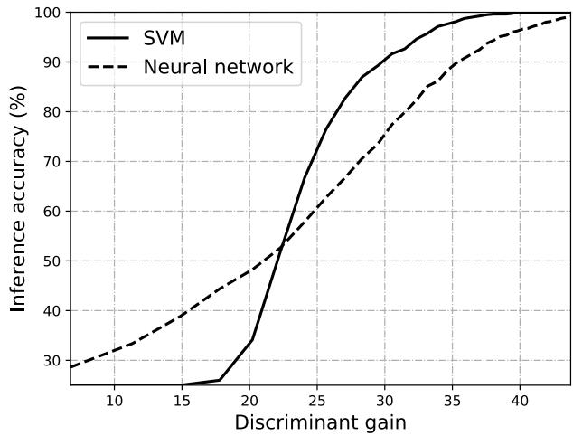

<details>
<summary>line</summary>

| Discriminant gain | SVM  | Neural network |
| ----------------- | ---- | -------------- |
| 10                | 28   | 30             |
| 15                | 28   | 35             |
| 20                | 35   | 45             |
| 25                | 70   | 60             |
| 30                | 90   | 75             |
| 35                | 98   | 90             |
| 40                | 100  | 98             |
</details>

Fig. 6. Inference accuracy versus discriminant gain.

propagation coefficient in dB from device k to the edge server is modeled as $[ \phi _ { k } ] _ { \mathrm { d B } } = - [ \mathrm { P L } _ { k } ] _ { \mathrm { d B } } + [ \zeta _ { k } ] _ { \mathrm { d B } }$ , where $\left[ \mathrm { P L } _ { k } \right] _ { \mathrm { d B } } =$ $1 2 8 . 1 + 3 7 . 6 \log _ { 1 0 } \mathrm { d i s t } _ { k } \ ( \mathrm { d i s t } _ { k }$ is the distance in kilometer) is the path loss in dB, and $[ \zeta _ { k } ] _ { \mathrm { d B } }$ accounts for the shadowing in dB. In the simulation, $[ \zeta _ { k } ] _ { \mathrm { d B } }$ is Gauss-distributed random variable with mean zero and variance $\sigma _ { \zeta } ^ { 2 } .$ . The small-scale fading is assumed to be Rayleigh fading, i.e., $h _ { k } \sim \mathcal { C N } ( 0 , 1 )$ .

2) Inference Task: In our simulation, we apply the wireless sensing simulator in [40] to simulate various high-fidelity human motions and generate human motion datasets. The inference task is to identify four different human motions, i.e., child walking, child pacing, adult walking, and adult pacing via the design of ISCC. Similar to the setup in [53], the heights of children and adults are assumed to be uniformly distributed in interval [0.9m, 1.2m] and [1.6m, 1.9m], respectively. The speed of standing, walking, and pacing are 0 m/s, 0.5H m/s, and 0.25H m/s, respectively, where H is the height value. The heading of the moving human is set to be uniformly distributed in [−180◦, 180◦].   
3) Inference Model: Two machine learning models, i.e., SVM and MLP neural network, are considered for inference in the experiments, respectively. The magnitudes of the feature elements are taken as the inputs of the learning models. The neural network model has 2 hidden layers with 80 and 40 neurons, respectively. Both models are trained on 800 data

TABLE I   
SIMULATION PARAMETERS 

<table><tr><td>Parameter</td><td>Value</td><td>Parameter</td><td>Value</td></tr><tr><td>Number of ISAC devices,  $K$ </td><td>3</td><td>Sensing noise variance,  $\sigma_{r}^{2}$ </td><td>1</td></tr><tr><td>Clutter variance,  $\sigma_{c,k}^{2}$ </td><td>1, 0.1, 0.5</td><td>Quantization variance,  $\delta_{k}^{2}$ </td><td>1</td></tr><tr><td>Number of features after PCA,  $N_{K}$ </td><td>50</td><td>Number of classes,  $L$ </td><td>4</td></tr><tr><td>Permitted latency,  $T$ </td><td>1.85 s</td><td>Energy threshold,  $E_{k}$ </td><td>0.15 Joule</td></tr><tr><td>Computation time for each device,  $T_{m,k}$ </td><td>0.1s</td><td>Computation energy for each device,  $E_{m,k}$ </td><td>0.01 Joule</td></tr><tr><td>Variance of shadow fading,  $\sigma_{\zeta}^{2}$ </td><td>8 dB</td><td>Communication channel noise power,  $\delta_{c}^{2}$ </td><td> $10^{-12}$  W</td></tr><tr><td>Bandwidth for communication,  $B$ </td><td>200 Hz</td><td>Bandwidth for sensing,  $B_{s}$ </td><td>10 MHz</td></tr><tr><td>Sensing carrier frequency,  $f_{c}$ </td><td>60 GHz</td><td>Chirp duration,  $T_{0}$ </td><td>10μs</td></tr><tr><td>Unit sensing time,  $T_{r,k}$ </td><td>0.5 s</td><td>Sampling rate,  $f_{s}$ </td><td>10 MHz</td></tr></table>

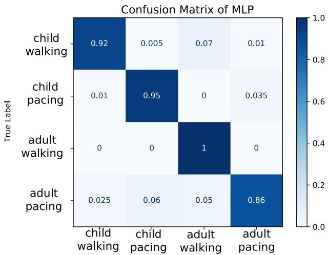

<details>
<summary>heatmap</summary>

Confusion Matrix of MLP
| True Label | child walking | child pacing | adult walking | adult pacing |
| :--- | :--- | :--- | :--- | :--- |
| child walking | 0.92 | 0.005 | 0.07 | 0.01 |
| child pacing | 0.01 | 0.95 | 0 | 0.035 |
| adult walking | 0 | 0 | 1 | 0 |
| adult pacing | 0.025 | 0.06 | 0.05 | 0.86 |
</details>

(a) Confusion matrix of MLP Predicted Label

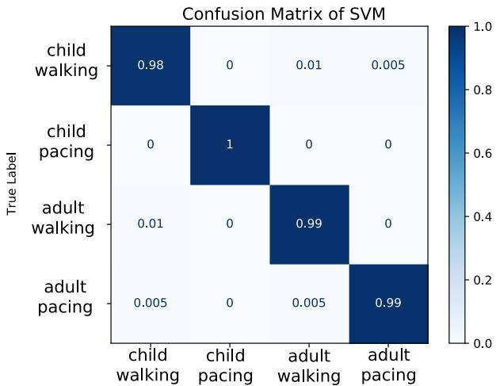

<details>
<summary>heatmap</summary>

Confusion Matrix of SVM
| True Label | child walking | child pacing | adult walking | adult pacing |
|---|---|---|---|---|
| child walking | 0.98 | 0 | 0.01 | 0.005 |
| child pacing | 0 | 1 | 0 | 0 |
| adult walking | 0.01 | 0 | 0.99 | 0 |
| adult pacing | 0.005 | 0 | 0.005 | 0.99 |
</details>

(b) Confusion matrix of SVM Predicted Label

Fig. 7. Confusion matrices.   
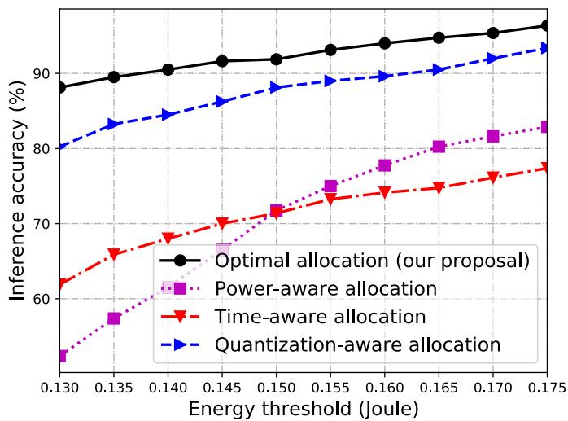

<details>
<summary>line</summary>

| Energy threshold (Joule) | Optimal allocation (our proposal) | Power-aware allocation | Time-aware allocation | Quantization-aware allocation |
| ------------------------ | ---------------------------------- | ---------------------- | --------------------- | ----------------------------- |
| 0.130                    | 89.0                               | 54.0                   | 62.0                  | 80.0                          |
| 0.135                    | 90.0                               | 57.0                   | 66.0                  | 83.0                          |
| 0.140                    | 90.5                               | 60.0                   | 68.0                  | 85.0                          |
| 0.145                    | 91.0                               | 63.0                   | 70.0                  | 87.0                          |
| 0.150                    | 91.5                               | 66.0                   | 72.0                  | 89.0                          |
| 0.155                    | 92.0                               | 69.0                   | 74.0                  | 90.0                          |
| 0.160                    | 92.5                               | 72.0                   | 75.0                  | 91.0                          |
| 0.165                    | 93.0                               | 75.0                   | 76.0                  | 92.0                          |
| 0.170                    | 93.5                               | 78.0                   | 77.0                  | 93.0                          |
| 0.175                    | 94.0                               | 81.0                   | 78.0                  | 94.0                          |
</details>

(a) Inference accuracy versus energy threshold

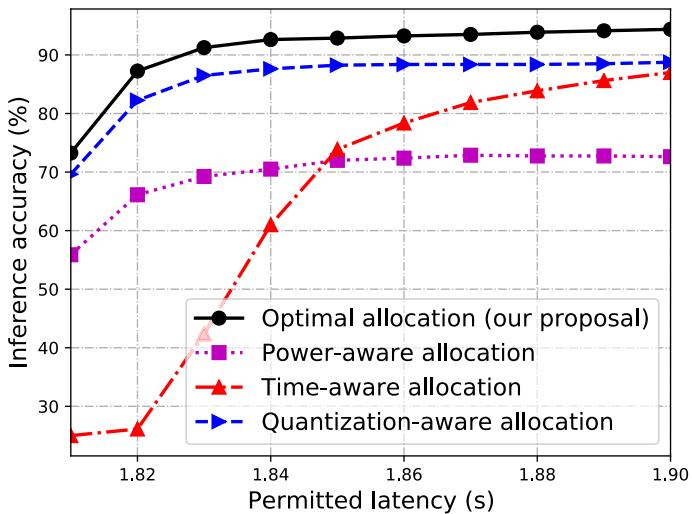

<details>
<summary>line</summary>

| Permitted latency (s) | Optimal allocation (our proposal) | Power-aware allocation | Time-aware allocation | Quantization-aware allocation |
| --------------------- | ---------------------------------- | ---------------------- | --------------------- | ----------------------------- |
| 1.82                  | 75                                 | 55                     | 25                    | 70                            |
| 1.84                  | 90                                 | 70                     | 60                    | 85                            |
| 1.86                  | 92                                 | 72                     | 75                    | 88                            |
| 1.88                  | 93                                 | 73                     | 80                    | 89                            |
| 1.90                  | 94                                 | 73                     | 85                    | 90                            |
</details>

(b) Inference accuracy versus permitted latency   
Fig. 8. Performance comparison of the SVM among different schemes.

samples without any distortion, i.e., sensing clutter, sensing noise, and quantization distortion. The inference experiments for test accuracy are implemented over 200 data samples with distortion. Moreover, all the data samples are distributed uniformly over the four classes.

Unless specified otherwise, other simulation parameters are stated in Table I. All experiments are implemented using Python 3.8 on a Linux server with one NVIDIA® GeForce® RTX 3090 GPU 24GB and one Intel® Xeon® Gold 5218 CPU.

# B. Inference Algorithms

For comparison, we consider four schemes as follows.

• Power-aware allocation: The sensing power is first allocated randomly and then the other parameters are allocated by the scheme in Algorithm 4.   
• Time-aware allocation: The communication time is firstly allocated equally and then the other parameters are allocated by the scheme in Algorithm 4.

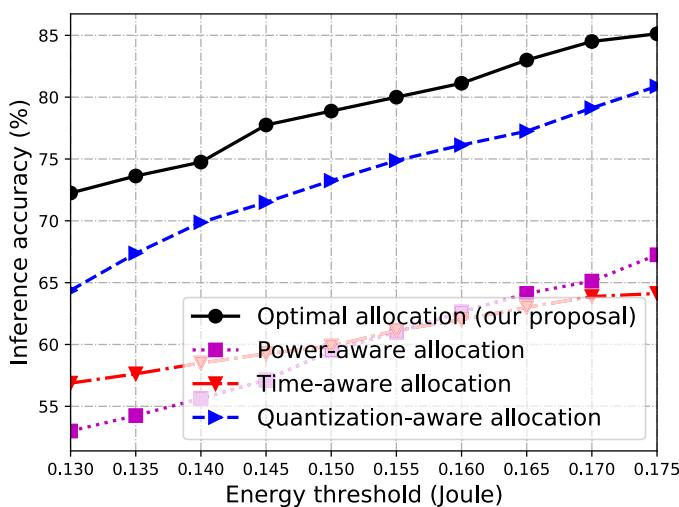

<details>
<summary>line</summary>

| Energy threshold (Joule) | Optimal allocation (our proposal) | Power-aware allocation | Time-aware allocation | Quantization-aware allocation |
| ------------------------ | ---------------------------------- | ---------------------- | --------------------- | ----------------------------- |
| 0.130                    | 72.5                               | 53.0                   | 57.0                  | 64.0                          |
| 0.135                    | 73.5                               | 54.5                   | 57.5                  | 67.0                          |
| 0.140                    | 74.5                               | 56.0                   | 58.0                  | 69.0                          |
| 0.145                    | 77.5                               | 57.5                   | 59.0                  | 71.0                          |
| 0.150                    | 78.5                               | 59.0                   | 60.0                  | 73.0                          |
| 0.155                    | 79.5                               | 60.5                   | 61.0                  | 74.5                          |
| 0.160                    | 80.5                               | 62.0                   | 62.0                  | 76.0                          |
| 0.165                    | 81.5                               | 63.5                   | 63.0                  | 77.5                          |
| 0.170                    | 83.0                               | 65.0                   | 64.0                  | 79.0                          |
| 0.175                    | 84.5                               | 67.0                   | 64.5                  | 81.0                          |
</details>

(a)Inference accuracy versus energy threshold

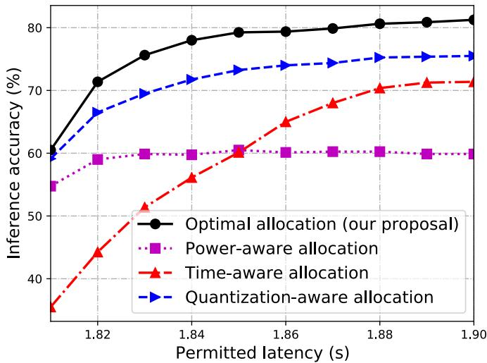

<details>
<summary>line</summary>

| Permitted latency (s) | Optimal allocation (our proposal) | Power-aware allocation | Time-aware allocation | Quantization-aware allocation |
| --------------------- | ---------------------------------- | ---------------------- | --------------------- | ----------------------------- |
| 1.82                  | 71                                 | 59                     | 44                    | 67                            |
| 1.84                  | 78                                 | 60                     | 56                    | 72                            |
| 1.86                  | 79                                 | 60                     | 65                    | 74                            |
| 1.88                  | 80                                 | 60                     | 70                    | 75                            |
| 1.90                  | 81                                 | 60                     | 71                    | 76                            |
</details>

(b) Inference accuracy versus permitted latency

Fig. 9. Performance comparison of the neural network among different schemes.   
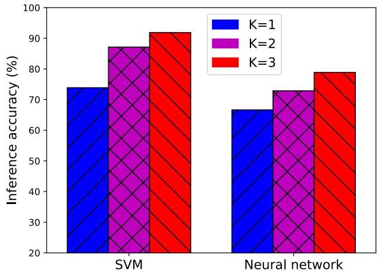

<details>
<summary>bar</summary>

| Model          | K=1  | K=2  | K=3  |
| -------------- | ---- | ---- | ---- |
| SVM            | 74   | 87   | 92   |
| Neural network | 67   | 73   | 79   |
</details>

Fig. 10. Inference accuracy comparison among different models under different number of ISAC devices.

• Quantization-aware allocation: The quantization bits are first allocated as 16 bits for each ISAC device and then the other parameters are allocated by the scheme in Algorithm 4.   
• Optimal allocation (our proposal): All the parameters are allocated by the optimal ISCC scheme in Algorithm 4.

# C. Experimental Results

In this part, the relations between the inference accuracy and discriminant gain regarding the two models are first presented. Then, the four algorithms are compared in terms of the SVM model and the neural network, respectively. Finally, the influence of the number of participating devices on the inference accuracy is shown.

1) Inference Accuracy v.s. Discriminant Gain: The relations between the inference accuracy and discriminant gain regarding the SVM model and the MLP neural network are shown in Fig. 6. It is observed that the inference accuracy increases as the discriminant gain grows for both models. Besides, when the discriminant gain is large, i.e., the distortion of the samples caused by sensing and quantization is small, the SVM outperforms the MLP neural network. This is because the well-trained MLP neural network is more sensitive to small distortion than the SVM model. However, the neural network is more robust than the SVM when the discriminant gain is small, i.e., the distortion is large. It is also observed that when the discriminant gain is too large, the accuracy increases slowly because the centroids of different classes are too far apart in this case, and increasing the discriminant gain does not help much to increase the accuracy. To further demonstrate the effectiveness of the models, the confusion matrices of MLP and SVM are shown in Fig. 7.

2) Inference Accuracy of SVM: The inference accuracy of the SVM model is presented in Fig 8. From the figure, the performance of all schemes increases as the resources, i.e., energy threshold of each device and the permitted latency for the inference task, increase. Besides, the proposed optimal allocation scheme outperforms the other three baseline schemes. Furthermore, in the case of long permitted latency, the performance of the power-aware allocation scheme remains unchanged as the permitted latency continuously increases. The reason is that the sensing noise is dominant in this case.   
3) Inference Accuracy of Neural Network: The inference accuracy of the MLP neural network model in terms of the energy threshold and the permitted latency is shown in Fig. 9. Again, as more resources are allocated, the performance of all schemes increases. Besides, the proposed optimal allocation scheme achieves the best performance. Furthermore, the longer permitted latency will not lead to better performance for the power-aware allocation scheme when the latency is large, for a similar reason in the scenario of the SVM model.   
4) Inference Accuracy v.s. Number of ISAC Devices: In Fig. 10, the inference accuracy of both models in terms of different number of ISAC devices are presented. For both cases, as the number of devices increases, better inference accuracy is achieved. The reason is that providing more features to the inference task can lead to a larger feature space, which can further make the distance, i.e., the discriminant gain, between arbitrary two different classes larger. In addition, the

SVM outperforms the MLP, since the MLP neural network is more sensitive to small feature distortion than the SVM model.

The extensive experimental results above show that the proposed optimal ISCC scheme has the best performance and verifies our theoretical analysis.

# VI. CONCLUSION

In this paper, we propose an optimal task-oriented ISCC scheme for edge AI inference. To begin with, the influence of sensing, computation, and communication on the inference accuracy measured by discriminant gain is characterized. Accordingly, an ISCC problem is formulated to optimize the inference accuracy. Then, by ingeniously utilizing some variables transmission, the original complicated non-convex problem is equivalently converted to a problem with a quasi-linear objective function and a convex feasible region. Benefiting from this new structure, the sum-of-ratios method is adopted to develop an optimal algorithm, that jointly allocates the sensing and communication power, quantization bits, and communication time.

This work opens several interesting directions for inferencetask-oriented designs. One is the ISAC device scheduling, i.e., the feature selection, for inference accuracy maximization when the radio resources, e.g., time and frequency bands, are scarce. Another is to enhance the inference accuracy in the broadband systems with frequency-selective wireless channels.

# APPENDIX

# A. Proof of Lemma 1

The objective function of (P2) can be re-written as (29), where all $\{ \mathcal { A } _ { \ell , \ell ^ { \prime } , n _ { k } } \}$ are constants. In addition, $\left\{ - B _ { \ell , \ell ^ { \prime } , n _ { k } } \left( S _ { k } , D _ { k } \right) \right\}$ for all $( \ell , \ell ^ { \prime } , n _ { k } )$ are linear. Obviously, each ratio is quasi-linear. Hence, (P2) can be optimally solved by the sum-of-ratios method if its feasible region is convex, according to [48] and [49]. In the next, we will show that the constraints are convex. The first constraint in (P2) is $\begin{array} { r } { \sum _ { k = 1 } ^ { K } ( T _ { r , k } + T _ { m , k } + T _ { c , k } ) \le T } \end{array}$ , which forms a linear set and hence is convex. In the second constraint,

$$
N _ {k} \log_ {2} \left(1 + \frac {1}{D _ {k}}\right) \leq T _ {c, k} B \log_ {2} \left(1 + \frac {E _ {c , k} H _ {c , k}}{T _ {c , k} \delta_ {c} ^ {2}}\right), \forall k, \tag {49}
$$

the left part is convex, as its second derivative is positive. The right part of the second constraint can be linearly transformed from $f ( x , y ) = x \log _ { 2 } ( 1 + y / x )$ , which can be easily shown to be concave. As a linear transformation preserves convexity, the right part of the second constraint is a concave function. Thus, the second constraint forms a convex set. Next, the third constraint, i.e., $\sigma _ { r } ^ { 2 } T _ { r , k } / S _ { k } + E _ { m , k } + E _ { c , k } \leq E _ { k }$ , also forms a convex set.

# B. Proof of Proposition 1

In (P3), the second constraint is

$$
N _ {k} \log_ {2} \left(1 + \frac {1}{D _ {k}}\right) \leq T _ {c, k} B \log_ {2} \left(1 + \frac {E _ {c , k} H _ {c , k}}{T _ {c , k} \delta_ {c} ^ {2}}\right), \forall k, \tag {50}
$$

whose right-hand part is a strictly decreasing function of $T _ { c , k }$ . That is to say, with increasing $T _ { c , k }$ , smaller communication energy $E _ { c , k }$ is used to satisfy this constraint for each device. Then, consider the final constraint in (P3), given as $\left\{ \sigma _ { r } ^ { 2 } T _ { r , k } / S _ { k } + E _ { m , k } + E _ { c , k } \le E _ { k } \right.$ , ∀k	 , where smaller $E _ { c , k }$ can lead to smaller sensing noise $S _ { k }$ . Next, according to $B _ { \ell , \ell ^ { \prime } , n _ { k } } \left( S _ { k } , D _ { k } \right)$ defined in (30), it is a linearly increasing function of $S _ { k }$ . Hence, the objective function of (P3) increases, which further leads to an enhanced discriminant gain according to (29).

# ACKNOWLEDGMENT

Dingzhu Wen was with the Shenzhen Research Institute of Big Data, Shenzhen 518172, China. He is now with the Network Intelligence Center, School of Information Science and Technology, ShanghaiTech University, Shanghai 201210, China (e-mail: wendzh@shanghaitech.edu.cn).

Peixi Liu is with the State Key Laboratory of Advanced Optical Communication Systems and Networks, School of Electronics, Peking University, Beijing 100871, China, and also with the Shenzhen Research Institute of Big Data, Shenzhen 518172, China (e-mail: liupeixi@pku.edu.cn).

Guangxu Zhu is with the Shenzhen Research Institute of Big Data, Shenzhen 518172, China (e-mail: gxzhu@sribd.cn).

Yuanming Shi is with the Network Intelligence Center, School of Information Science and Technology, ShanghaiTech University, Shanghai 201210, China (e-mail: shiym@shanghaitech.edu.cn).

Jie Xu is with the School of Science and Engineering (SSE) and the Future Network of Intelligence Institute (FNii), The Chinese University of Hong Kong (Shenzhen), Shenzhen 518100, China (e-mail: xujie@cuhk.edu.cn).

Yonina C. Eldar is with the Weizmann Institute of Science, Rehovot 7610001, Israel (e-mail: yonina.eldar@weizmann.ac.il).

Shuguang Cui is with the School of Science and Engineering (SSE), the Future Network of Intelligence Institute (FNii), and the Guangdong Provincial Key Laboratory of Future Networks of Intelligence, The Chinese University of Hong Kong (Shenzhen), Shenzhen 518100, China, also with the Shenzhen Research Institute of Big Data, Shenzhen 518172, China, and also with the Peng Cheng Laboratory, Shenzhen 518066, China (e-mail: shuguangcui@cuhk.edu.cn).

# REFERENCES

[1] K. B. Letaief, Y. Shi, J. Lu, and J. Lu, “Edge artificial intelligence for 6G: Vision, enabling technologies, and applications,” IEEE J. Sel. Areas Commun., vol. 40, no. 1, pp. 5–36, Jan. 2022.   
[2] G. Zhu, D. Liu, Y. Du, C. You, J. Zhang, and K. Huang, “Toward an intelligent edge: Wireless communication meets machine learning,” IEEE Commun. Mag., vol. 58, no. 1, pp. 19–25, Jan. 2020.   
[3] J. Park, S. Samarakoon, M. Bennis, and M. Debbah, “Wireless network intelligence at the edge,” Proc. IEEE, vol. 107, no. 11, pp. 2204–2239, Nov. 2019.   
[4] Y. Shi, K. Yang, T. Jiang, J. Zhang, and K. B. Letaief, “Communication-efficient edge AI: Algorithms and systems,” IEEE Commun. Surveys Tuts., vol. 22, no. 4, pp. 2167–2191, 4th Quart., 2020.   
[5] M. Chen, N. Shlezinger, H. V. Poor, Y. C. Eldar, and S. Cui, “Communication-efficient federated learning,” Proc. Natl. Acad. Sci., vol. 118, no. 17, Apr. 2021, Art. no. e2024789118.   
[6] D. Wen, K.-J. Jeon, and K. Huang, “Federated dropout—A simple approach for enabling federated learning on resource constrained devices,” IEEE Wireless Commun. Lett., vol. 11, no. 5, pp. 923–927, May 2022.   
[7] M. Chen et al., “Distributed learning in wireless networks: Recent progress and future challenges,” IEEE J. Sel. Areas Commun., vol. 39, no. 12, pp. 3579–3605, Dec. 2021.   
[8] X. Wang, Y. Han, V. C. M. Leung, D. Niyato, X. Yan, and X. Chen, “Convergence of edge computing and deep learning: A comprehensive survey,” IEEE Commun. Surveys Tuts., vol. 22, no. 2, pp. 869–904, 2nd Quart., 2020.   
[9] S. Han, H. Mao, and W. J. Dally, “Deep compression: Compressing deep neural networks with pruning, trained quantization and Huffman coding,” 2015, arXiv:1510.00149.   
[10] A. G. Howard et al., “MobileNets: Efficient convolutional neural networks for mobile vision applications,” 2017, arXiv:1704.04861.   
[11] J. Chen and X. Ran, “Deep learning with edge computing: A review,” Proc. IEEE, vol. 107, no. 8, pp. 1655–1674, Aug. 2019.

[12] M. Lee, G. Yu, and H. Dai, “Decentralized inference with graph neural networks in wireless communication systems,” IEEE Trans. Mobile Comput., vol. 22, no. 5, pp. 2582–2598, May 2023.   
[13] K. Yang, Y. Shi, W. Yu, and Z. Ding, “Energy-efficient processing and robust wireless cooperative transmission for edge inference,” IEEE Internet Things J., vol. 7, no. 10, pp. 9456–9470, Oct. 2020.   
[14] S. Hua, Y. Zhou, K. Yang, Y. Shi, and K. Wang, “Reconfigurable intelligent surface for green edge inference,” IEEE Trans. Green Commun. Netw., vol. 5, no. 2, pp. 964–979, Jun. 2021.   
[15] W. Shi, Y. Hou, S. Zhou, Z. Niu, Y. Zhang, and L. Geng, “Improving device-edge cooperative inference of deep learning via 2-step pruning,” in Proc. IEEE Conf. Comput. Commun. Workshops, May 2019, pp. 1–6.   
[16] X. Huang and S. Zhou, “Dynamic compression ratio selection for edge inference systems with hard deadlines,” IEEE Internet Things J., vol. 7, no. 9, pp. 8800–8810, Sep. 2020.   
[17] E. Li, L. Zeng, Z. Zhou, and X. Chen, “Edge AI: On-demand accelerating deep neural network inference via edge computing,” IEEE Trans. Wireless Commun., vol. 19, no. 1, pp. 447–457, Jan. 2020.   
[18] J. Shao and J. Zhang, “Communication-computation trade-off in resource-constrained edge inference,” IEEE Commun. Mag., vol. 58, no. 12, pp. 20–26, Dec. 2020.   
[19] M. Jankowski, D. Gündüz, and K. Mikolajczyk, “Joint device-edge inference over wireless links with pruning,” in Proc. IEEE 21st Int. Workshop Signal Process. Adv. Wireless Commun. (SPAWC), May 2020, pp. 1–5.   
[20] J. Shao, Y. Mao, and J. Zhang, “Learning task-oriented communication for edge inference: An information bottleneck approach,” IEEE J. Sel. Areas Commun., vol. 40, no. 1, pp. 197–211, Jan. 2022.   
[21] Q. Lan, Q. Zeng, P. Popovski, D. Gündüz, and K. Huang, “Progressive feature transmission for split classification at the wireless edge,” IEEE Trans. Wireless Commun., vol. 22, no. 6, pp. 3837–3852, Jun. 2023.   
[22] J. Yan, S. Bi, and Y.-J.-A. Zhang, “Optimal model placement and online model splitting for device-edge co-inference,” IEEE Trans. Wireless Commun., vol. 21, no. 10, pp. 8354–8367, Oct. 2022.   
[23] Z. Liu, Q. Lan, and K. Huang, “Resource allocation for multiuser edge inference with batching and early exiting,” IEEE J. Sel. Areas Commun., vol. 41, no. 4, pp. 1186–1200, Apr. 2023.   
[24] F. Liu et al., “Integrated sensing and communications: Toward dual-functional wireless networks for 6G and beyond,” IEEE J. Sel. Areas Commun., vol. 40, no. 6, pp. 1728–1767, Jun. 2022.   
[25] Y. Cui, F. Liu, X. Jing, and J. Mu, “Integrating sensing and communications for ubiquitous IoT: Applications, trends, and challenges,” IEEE Netw., vol. 35, no. 5, pp. 158–167, Sep. 2021.   
[26] F. Xi, N. Shlezinger, and Y. C. Eldar, “BiLiMO: Bit-limited MIMO radar via task-based quantization,” IEEE Trans. Signal Process., vol. 69, pp. 6267–6282, 2021.   
[27] P. Neuhaus, N. Shlezinger, M. Dörpinghaus, Y. C. Eldar, and G. Fettweis, “Task-based analog-to-digital converters,” IEEE Trans. Signal Process., vol. 69, pp. 5403–5418, 2021.   
[28] D. Ma et al., “Spatial modulation for joint radar-communications systems: Design, analysis, and hardware prototype,” IEEE Trans. Veh. Technol., vol. 70, no. 3, pp. 2283–2298, Mar. 2021.   
[29] F. Liu, L. Zhou, C. Masouros, A. Li, W. Luo, and A. Petropulu, “Toward dual-functional radar-communication systems: Optimal waveform design,” IEEE Trans. Signal Process., vol. 66, no. 16, pp. 4264–4279, Aug. 2018.   
[30] D. Ma, N. Shlezinger, T. Huang, Y. Liu, and Y. C. Eldar, “Joint radarcommunication strategies for autonomous vehicles: Combining two key automotive technologies,” IEEE Signal Process. Mag., vol. 37, no. 4, pp. 85–97, Jul. 2020.   
[31] J. Pritzker, J. Ward, and Y. C. Eldar, “Transmit precoder design approaches for dual-function radar-communication systems,” 2022, arXiv:2203.09571.   
[32] Y. He, Y. Cai, H. Mao, and G. Yu, “RIS-assisted communication radar coexistence: Joint beamforming design and analysis,” IEEE J. Sel. Areas Commun., vol. 40, no. 7, pp. 2131–2145, Jul. 2022.

[33] H. Hua, J. Xu, and T. X. Han, “Optimal transmit beamforming for integrated sensing and communication,” IEEE Trans. Veh. Technol., early access, Mar. 29, 2023, doi: 10.1109/TVT.2023.3262513.   
[34] W. Yuan, Z. Wei, S. Li, J. Yuan, and D. W. K. Ng, “Integrated sensing and communication-assisted orthogonal time frequency space transmission for vehicular networks,” IEEE J. Sel. Topics Signal Process., vol. 15, no. 6, pp. 1515–1528, Nov. 2021.   
[35] X. Li et al., “Integrated sensing and over-the-air computation: Dual-functional MIMO beamforming design,” IEEE Trans. Wireless Commun., early access, Jan. 10, 2023, doi: 10.1109/TWC. 2022.3233795.   
[36] T. Zhang, S. Wang, G. Li, F. Liu, G. Zhu, and R. Wang, “Accelerating edge intelligence via integrated sensing and communication,” in Proc. IEEE Int. Conf. Commun., May 2022, pp. 1586–1592.   
[37] P. Liu, G. Zhu, W. Jiang, W. Luo, J. Xu, and S. Cui, “Vertical federated edge learning with distributed integrated sensing and communication,” IEEE Commun. Lett., vol. 26, no. 9, pp. 2091–2095, Sep. 2022.   
[38] G. Zhu, Y. Du, D. Gündüz, and K. Huang, “One-bit over-the-air aggregation for communication-efficient federated edge learning: Design and convergence analysis,” IEEE Trans. Wireless Commun., vol. 20, no. 3, pp. 2120–2135, Mar. 2021.   
[39] S. Kullback and R. A. Leibler, “On information and sufficiency,” Ann. Math. Statist., vol. 22, no. 1, pp. 79–86, 1951.   
[40] G. Li et al., “Wireless sensing with deep spectrogram network and primitive based autoregressive hybrid channel model,” in Proc. IEEE 22nd Int. Workshop Signal Process. Adv. Wireless Commun. (SPAWC), Sep. 2021, pp. 481–485.   
[41] W. Jiang, Z. Wei, B. Li, Z. Feng, and Z. Fang, “Improve radar sensing performance of multiple roadside units cooperation via space registration,” IEEE Trans. Veh. Technol., vol. 71, no. 10, pp. 10975–10990, Oct. 2022.   
[42] J. Liang and Q. Liang, “Design and analysis of distributed radar sensor networks,” IEEE Trans. Parallel Distrib. Syst., vol. 22, no. 11, pp. 1926–1933, Nov. 2011.   
[43] G. Zhu et al., “Pushing AI to wireless network edge: An overview on integrated sensing, communication, and computation towards 6G,” Sci. China Inf. Sci., vol. 66, no. 3, Feb. 2023, Art. no. 130301.   
[44] L. Han and K. Wu, “Joint wireless communication and radar sensing systems—State of the art and future prospects,” IET Microw., Antennas Propag., vol. 7, no. 11, pp. 876–885, Aug. 2013.   
[45] D. Ma, N. Shlezinger, T. Huang, Y. Liu, and Y. C. Eldar, “FRaC: FMCW-based joint radar-communications system via index modulation,” IEEE J. Sel. Topics Signal Process., vol. 15, no. 6, pp. 1348–1364, Nov. 2021.   
[46] N. Shlezinger and Y. C. Eldar, “Deep task-based quantization,” Entropy, vol. 23, no. 1, pp. 1–18, 2021. [Online]. Available: https://www.mdpi.com/1099-4300/23/1/104   
[47] S.-H. Park, O. Simeone, O. Sahin, and S. Shamai (Shitz), “Joint precoding and multivariate backhaul compression for the downlink of cloud radio access networks,” IEEE Trans. Signal Process., vol. 61, no. 22, pp. 5646–5658, Nov. 2013.   
[48] Y. Jong, “An efficient global optimization algorithm for nonlinear sumof-ratios problem,” Optim. Online, pp. 1–21, May 2012. [Online]. Available: https://www.optimization-online.org/DB\_FILE/2012/08/3586.pdf   
[49] G. Yu, Q. Chen, R. Yin, H. Zhang, and G. Y. Li, “Joint downlink and uplink resource allocation for energy-efficient carrier aggregation,” IEEE Trans. Wireless Commun., vol. 14, no. 6, pp. 3207–3218, Jun. 2015.   
[50] D. Wen, M. Bennis, and K. Huang, “Joint parameter-and-bandwidth allocation for improving the efficiency of partitioned edge learning,” IEEE Trans. Wireless Commun., vol. 19, no. 12, pp. 8272–8286, Dec. 2020.   
[51] D. Wen, K.-J. Jeon, M. Bennis, and K. Huang, “Adaptive subcarrier, parameter, and power allocation for partitioned edge learning over broadband channels,” IEEE Trans. Wireless Commun., vol. 20, no. 12, pp. 8348–8361, Dec. 2021.   
[52] N. H. Tran, W. Bao, A. Zomaya, M. N. H. Nguyen, and C. S. Hong, “Federated learning over wireless networks: Optimization model design and analysis,” in Proc. IEEE INFOCOM Conf. Comput. Commun., Apr. 2019, pp. 1387–1395.   
[53] MathWorks. (2022). Pedestrian and Bicyclist Classification Using Deep Learning. [Online]. Available: https://ww2.mathworks. cn/help/radar/ug/pedestrian-and-bicyclist-classification-using-deeplearning.html


<details>
<summary>natural_image</summary>

Portrait photo of a man in a suit and white shirt (no text or symbols visible)
</details>

Dingzhu Wen (Member, IEEE) received the bachelor’s and master’s degrees from the Department (School) of Information Science and Electronic Engineering, Zhejiang University, in 2014 and 2017, respectively, and the Ph.D. degree from the Department of Electrical and Electronic Engineering, The University of Hong Kong, in 2021. He is currently an Assistant Professor with the School of Information Science and Technology, ShanghaiTech University. His research interests include federated edge learning, edge artificial intelligent inference, integrated sensing-communication-computation, over-the-air computation, in-band fullduplex communications, and device-to-device communications. He served as the Session Chair for APEMC 2022 and IEEE ICC 2023, the TPC Member of IEEE ICC 2023, IEEE GlobeCom 2022, IEEE VTC-Fall 2020, and IEEE WCSP 2018, and the TPC Co-Chair of IEEE PIMRC 2023 workshop on “Edge Learning for 5G Mobile Networks and Beyond” and the Co-Chair of IEEE VTC 2023-Fall workshop on “Task-Oriented Communications and Networking for 6G.” He was elected as the exemplary reviewer of IEEE TRANSACTIONS ON COMMUNICATIONS in 2023.


<details>
<summary>natural_image</summary>

Portrait of a man wearing glasses and a black shirt, standing in front of a brick wall with directional signs (no readable text)
</details>

Peixi Liu received the B.Eng. and M.Eng. degrees from Northwestern Polytechnical University and the Ph.D. degree from Peking University in 2022. His research interests include edge intelligence, distributed machine learning, and next-G technologies, such as integrated sensing, computation, and communication (ISCC).


<details>
<summary>natural_image</summary>

Portrait photo of a young man in formal attire (no text or symbols visible)
</details>

Guangxu Zhu (Member, IEEE) received the B.Eng. and M.Eng. degrees from Zhejiang University and the Ph.D. degree from The University of Hong Kong in 2019. He is currently a Research Scientist with the Shenzhen Research Institute of Big Data. His research interests include edge intelligence, distributed machine learning, and integrated sensing and communications. He was a recipient of the 2022 “AI 2000 Most Influential Scholar Award Honorable Mention,” the UCOM 2023 Young Scientist Award, the Hong Kong Postgraduate Fellowship (HKPF), the Best Paper Award from WCSP 2013, and the First Prize of National ”Bloom Cup” 5G Industrial Competition in 2022. He served as the Track/Symposium/Workshop Co-Chair for many IEEE conferences, including IEEE PIMRC 2021, WCSP 2023, and IEEE Globecom 2023.


<details>
<summary>natural_image</summary>

Portrait of a man wearing glasses and a light blue shirt (no text or symbols visible)
</details>

Yuanming Shi (Senior Member, IEEE) received the B.S. degree in electronic engineering from Tsinghua University, Beijing, China, in 2011, and the Ph.D. degree in electronic and computer engineering from The Hong Kong University of Science and Technology (HKUST) in 2015. Since September 2015, he has been with the School of Information Science and Technology, ShanghaiTech University, where he is currently a tenured Associate Professor. He visited the University of California at Berkeley, Berkeley, CA, USA, from October 2016 to February 2017. His research interests include federated learning, edge AI, and satellite networks. He was a recipient of the IEEE Marconi Prize Paper Award in Wireless Communications in 2016, the Young Author Best Paper Award by the IEEE Signal Processing Society in 2016, the IEEE ComSoc Asia-Pacific Outstanding Young Researcher Award in 2021, and the Chinese Institute of Electronics First Prize in Natural Science in 2022. He is an Editor of IEEE TRANSACTIONS ON WIRELESS COMMUNICATIONS, IEEE JOURNAL ON SELECTED AREAS IN COMMUNICATIONS, and Journal of Communications and Information Networks.


<details>
<summary>natural_image</summary>

Portrait of a man wearing glasses and a suit (no text or symbols visible)
</details>

Jie Xu (Senior Member, IEEE) received the B.E. and Ph.D. degrees from the University of Science and Technology of China in 2007 and 2012, respectively. From 2012 to 2014, he was a Research Fellow with the Department of Electrical and Computer Engineering, National University of Singapore. From 2015 to 2016, he was a Post-Doctoral Research Fellow with the Engineering Systems and Design Pillar, Singapore University of Technology and Design. From 2016 to 2019, he was a Professor with the School of Information Engineering, Guangdong University of Technology, China. He is currently an Associate Professor with the School of Science and Engineering, The Chinese University of Hong Kong, Shenzhen, China. His research interests include wireless communications, wireless information and power transfer, UAV communications, edge computing and intelligence, and integrated sensing and communication (ISAC). He was a recipient of the 2017 IEEE Signal Processing Society Young Author Best Paper Award, the IEEE/CIC ICCC 2019 Best Paper Award, the 2019 IEEE Communications Society Asia-Pacific Outstanding Young Researcher Award, and the 2019 Wireless Communications Technical Committee Outstanding Young Researcher Award. He is the Symposium Co-Chair of the IEEE GLOBECOM 2019 Wireless Communications Symposium, the workshop co-chair of several IEEE ICC and GLOBECOM workshops, the Tutorial Co-Chair of the IEEE/CIC ICCC 2019, the Vice Chair of the IEEE Wireless Communications Technical Committee (WTC), and the Vice Co-Chair of the IEEE Emerging Technology Initiative (ETI) on ISAC. He served or is serving as an Editor for the IEEE TRANSACTIONS ON WIRELESS COMMUNICATIONS, IEEE TRANSACTIONS ON COMMUNI-CATIONS, IEEE WIRELESS COMMUNICATIONS LETTERS, and Journal of Communications and Information Networks, an Associate Editor for IEEE ACCESS, and a Guest Editor for the IEEE WIRELESS COMMUNICATIONS, IEEE JOURNAL ON SELECTED AREAS IN COMMUNICATIONS, and Science China Information Sciences.


<details>
<summary>natural_image</summary>

Portrait of a smiling woman with shoulder-length brown hair and gold earrings (no text or symbols visible)
</details>

Yonina C. Eldar (Fellow, IEEE) received the B.Sc. degree in physics and the B.Sc. degree in electrical engineering from Tel Aviv University (TAU), Tel Aviv, Israel, in 1995 and 1996, respectively, and the Ph.D. degree in electrical engineering and computer science from the Massachusetts Institute of Technology (MIT), Cambridge, MA, USA, in 2002.

She was a Professor with the Department of Electrical Engineering, Technion—Israel Institute of Technology, Haifa, Israel, where she held the Edwards Chair in Engineering. She was a Visiting Professor with Stanford University, Stanford, CA, USA. She is currently a Professor with the Department of Mathematics and Computer Science, Weizmann Institute of Science, Rehovot, Israel, where she holds the Dorothy and Patrick Gorman Professorial Chair and heads the Center for Biomedical Engineering. She is also a Visiting Professor at MIT, a Visiting Scientist at the Broad Institute, a Visiting Research Collaborator at Princeton University, an Adjunct Professor at Duke University, an Advisory Professor of Fudan University, and a Distinguished Visiting Professor of Tsinghua University. She was the co-chair and the technical co-chair of several international conferences and workshops. She is the author of the book Sampling Theory: Beyond Bandlimited Systems and the coauthor of seven other books. Her research interests include statistical signal processing, sampling theory and compressed sensing, learning and optimization methods, and their applications to biology, medical imaging, and optics.

Dr. Eldar was a member of the IEEE Signal Processing Theory and Methods and Bio Imaging Signal Processing technical committees. She was also a member of the Young Israel Academy of Science and Humanities and the Israel Committee for Higher Education. She was a Horev Fellow of the Leaders in Science and Technology Program at the Technion and an Alon Fellow. She is a member of the IEEE Sensor Array and Multichannel Technical Committee and serves on several other IEEE committees. She is also a member of the Israel Academy of Sciences and Humanities (elected 2017) and the Academia Europaea (elected 2023), a EURASIP Fellow, a fellow of the Asia-Pacific Artificial Intelligence Association, and a fellow of the 8400 Health Network. She has received many awards for excellence in research and teaching, including the IEEE Signal Processing Society Technical Achievement Award in 2013, the IEEE/AESS Fred Nathanson Memorial Radar Award in 2014, and the IEEE Kiyo Tomiyasu Award in 2016. She also received the Michael Bruno Memorial Award from the Rothschild Foundation, the Weizmann Prize for Exact Sciences, the Wolf Foundation Krill Prize for Excellence in Scientific Research, the Henry Taub Prize for Excellence in Research (twice), the Hershel Rich Innovation Award (three times), the Award for Women with Distinguished Contributions, the Andre and Bella Meyer Lectureship, the Career Development Chair from the Technion, the Muriel and David Jacknow Award for Excellence in Teaching, and the Technion’s Award for Excellence in Teaching (two times). She received several best paper awards and best demo awards together with her research students and colleagues, including the SIAM Outstanding Paper Prize, the UFFC Outstanding Paper Award, the Signal Processing Society Best Paper Award, and the IET Circuits, Devices and Systems Premium Award. She was selected as one of the 50 most influential women in Israel and in Asia, and is a highly cited researcher. She is the Editor-in-Chief of Foundations and Trends in Signal Processing. In the past, she was a Signal Processing Society Distinguished Lecturer, and served as an Associate Editor for the IEEE TRANSACTIONS ON SIGNAL PROCESSING, the EURASIP Journal of Signal Processing, the SIAM Journal on Matrix Analysis and Applications, and the SIAM Journal on Imaging Sciences.


<details>
<summary>natural_image</summary>

Portrait of a man wearing glasses and a dark shirt (no text or symbols visible)
</details>

Shuguang Cui (Fellow, IEEE) received the Ph.D. degree in electrical engineering from Stanford University, Stanford, CA, USA, in 2005. Afterwards, he has been working as an Assistant Professor, an Associate Professor, a Full Professor, and the Chair Professor in electrical and computer engineering with The University of Arizona, Texas A&M University, the University of California, Davis, and The Chinese University of Hong Kong, Shenzhen (CUHK, Shenzhen), respectively. He has also served as the Executive Dean with the School of Science and Engineering, CUHK, Shenzhen, and the Executive Vice Director with the Shenzhen Research Institute of Big Data. His current research interests include data driven large-scale system control and resource management, large data set analysis, the IoT system design, energy harvesting-based communication system design, and cognitive network optimization. He was selected as the Thomson Reuters Highly Cited Researcher and listed in the Worlds’ Most Influential Scientific Minds by ScienceWatch in 2014. He was a recipient of the IEEE Signal Processing Society 2012 Best Paper Award. He has served as the general co-chair and TPC co-chairs for many IEEE conferences. He has also been serving as an Area Editor for IEEE Signal Processing Magazine, and an Associate Editor for IEEE TRANSACTIONS ON BIG DATA, IEEE TRANSACTIONS ON SIGNAL PROCESSING, IEEE JOURNAL ON SELECTED AREAS IN COMMUNICATIONS (JSAC) Series on Green Communications and Networking, and IEEE TRANSACTIONS ON WIRELESS COMMUNICATIONS. He has been the elected member of IEEE Signal Processing Society SPCOM Technical Committee (2009–2014) and the elected Chair of IEEE ComSoc Wireless Technical Committee (2017–2018). He is a member of the Steering Committee for IEEE TRANSACTIONS ON BIG DATA and the Chair of the Steering Committee for IEEE TRANSACTIONS ON COGNITIVE COMMUNI-CATIONS AND NETWORKING. He is also the Vice Chair of the IEEE VT Fellow Evaluation Committee and a member of the IEEE ComSoc Award Committee. He was elected as an IEEE ComSoc Distinguished Lecturer in 2014 and IEEE VT Society Distinguished Lecturer in 2019. In 2020, he won the IEEE ICC Best Paper Award, ICIP Best Paper Finalist, and the IEEE Globecom Best Paper Award. In 2021, he won the IEEE WCNC Best Paper Award. In 2023, he won the IEEE Marconi Best Paper Award, got elected as a fellow of the Canadian Academy of Engineering, and starts to serve as the Editor-in-Chief for IEEE TRANSACTIONS ON MOBILE COMPUTING.