# Temporal Spectrum Cartography in Low-Altitude Economy Networks: A Generative AI Framework With Multi-Agent Learning

Changyuan Zhao , Graduate Student Member, IEEE, Ruichen Zhang , Member, IEEE, Jiacheng Wang , Member, IEEE, Dusit Niyato , Fellow, IEEE, Geng Sun , Senior Member, IEEE, Hongyang Du , Member, IEEE, Zan Li , Fellow, IEEE, Abbas Jamalipour , Fellow, IEEE, and Dong In Kim , Life Fellow, IEEE

Abstract—This paper introduces a two-stage generative AI (GenAI) framework tailored for temporal spectrum cartography in low-altitude economy networks (LAENets). LAENets, characterized by diverse aerial devices such as UAVs, rely heavily on wireless communication technologies while facing challenges, including spectrum congestion and dynamic environmental interference. Traditional spectrum cartography methods have limitations in handling the temporal and spatial complexities inherent to these networks. Addressing these challenges, the proposed framework first employs a Reconstructive Masked Autoencoder (RecMAE) capable of accurately reconstructing spectrum maps from sparse and temporally varying sensor data using a novel dual-mask mechanism. This approach significantly enhances the precision of reconstructed radio frequency (RF) power maps. In the second

Hongyang Du is with the Department of Electrical and Electronic Engineering, University of Hong Kong, Hong Kong (e-mail: duhy@eee.hku.hk).

Zan Li is with the State Key Laboratory of Integrated Services Networks, Xidian University, Xian 710071, China (e-mail: zanli@xidian.edu.cn).

Abbas Jamalipour is with the School of Electrical and Computer Engineering, University of Sydney, Camperdown, NSW 2050, Australia, and also with the Graduate School of Information Sciences, Tohoku University, Sendai 980-8577, Japan (e-mail: a.jamalipour@ieee.org).

Dong In Kim is with the Department of Electrical and Computer Engineering, Sungkyunkwan University, Suwon 16419, South Korea (e-mail: dongin@ skku.edu).

Digital Object Identifier 10.1109/TMC.2025.3647029

stage, the Multi-agent Diffusion Policy (MADP) method integrates diffusion-based reinforcement learning to optimize the trajectories of dynamic UAV sensors. By leveraging temporal-attention encoding, this method effectively manages spatial exploration and exploitation to minimize cumulative reconstruction errors. Extensive numerical experiments show that this integrated GenAI framework consistently surpasses traditional interpolation and deep learning methods, especially under sparse sensing conditions. The proposed trajectory planner substantially improves spectrum map accuracy, reconstruction stability, and sensor deployment efficiency in dynamically evolving low-altitude environments.

Index Terms—Low-altitude networks, generative AI, spectrum cartography, multi-agent learning.

## I. INTRODUCTION

OW-ALTITUDE economy networks (LAENets) refer to altitudes, including uncrewed aerial vehicle (UAVs), urban air mobility (UAM) systems, and drone-based services for logistics, agriculture, and surveillance [1]. These networks heavily rely on wireless communication technologies for control, coordination, and data exchange. However, the dynamic nature of LAENets, combined with varying interference conditions, fluctuating channel states, and heterogeneous traffic demands, leads to significant challenges such as spectrum congestion and inefficient frequency management. Particularly, spectrum information supports a wide range of downstream wireless applications, such as indoor positioning, interference-free routing, and adaptive networking [2], all of which are critical for enabling low-altitude economic activities. Therefore, accurately estimating radio frequency (RF) spectrum usage in LAENets is essential for improving the efficiency and reliability of such social activities.

Spectrum cartography is a technique that enables the visualization and spatial mapping of RF spectrum usage across different geographic locations. It provides detailed insights into signal power, interference power, and power spectral density (PSD) by constructing high-resolution maps of wireless signal propagation across a geographic area [3]. Conventional spectrum cartography relies on deployed sensors to collect radio information, which is then used to reconstruct a map of the entire area. Formally, spectrum mapping is formulated as a sparse inverse problem, where the objective is to recover missing values from limited observations. The primary challenge arises from data sensitivity, emphasizing how sensor placement and the number of sensing points significantly impact the accuracy of the final spectrum mapping. Numerical methods primarily exploit the spatial smoothness of power propagation as a physical assumption and implement various interpolation techniques. For instance, G. Boccolini et al. utilized Kriging [4], while S. Üreten et al. applied thin-plate splines (TPS) [5] for spectrum cartography. With the advancement of artificial intelligence (AI) technology, particularly generative AI (GenAI), which can learn data distributions and supplement missing information based on limited data, an increasing number of spectrum mapping algorithms based on machine learning and deep learning have been proposed. These algorithms typically do not rely on physical assumptions, giving them enhanced generalization capabilities. For example, S. Shrestha et al. and Y. Teganya et al. introduced the autoencoder (AE) structure to complete the missing spectrum [6], [7].

The preceding approaches mainly emphasize the deployment and measurement of static sensors, leading to the construction of time-invariant spectrum maps. However, in applications of LAENets, such as air traffic management and logistics, spectrum signals in the environment exhibit temporal variations. Relying solely on static spectrum diagrams poses challenges in accurately supporting operations in these dynamic scenarios [8]. Moreover, with UAVs evolving into mobile wireless sensing and relay units, the focus can shift from static sensor deployment to adaptive sensing strategies, enabling dynamic selection of target areas for more effective spectrum monitoring [9]. Meanwhile, the complexity of the low-altitude environment, characterized by variable wind speeds, increases uncertainty for sensing equipment, potentially disrupting system decision-making [10]. Therefore, developing an effective cartography algorithm is essential.

Recently, the Masked Autoencoder (MAE), a GenAI model that employs a masking mechanism to enhance feature extraction in self-supervised learning, has been widely adopted as the backbone in Transformer and Vision Transformer (ViT) training [11]. MAE enables effective feature representation for data recovery through pre-training and facilitates the learning process of various downstream tasks followed by fine-tuning. This approach has been successfully applied in the development of Large Language Models (LLMs) and Large Vision Models (LVMs) [12]. In addition, diffusion-based reinforcement learning [13], which formulates policy generation as a denoising process, shifts the focus from deterministic policy modeling to policy distribution. This method has demonstrated promising performance in handling uncertainty and ensuring robust decision-making in dynamic environments [10].

Based on these achievements of GenAI models, we propose a two-stage GenAI framework, which integrates temporal spectrum cartography with trajectory optimization for dynamic sensors, to tackle the aforementioned challenges. This framework estimates the power map over time by leveraging both static and dynamic UAV sensor data. In the first stage, we employ an MAE [14], which can reconstruct data from limited input to generate a temporal power map for each time slot. Subsequently, in the second stage, we apply diffusion-based reinforcement learning [13] to determine the optimal placement of dynamic UAV sensors in the next time slot, thereby enhancing spectrum mapping accuracy. Our main contributions are summarized as follows:

We propose a two-stage GenAI framework that reconstructs the spectrum map and optimizes the trajectories of multi-agent dynamic sensors to map the temporal spectrum during a certain period accurately. To the best of our knowledge, this is the first work that considers temporal spectrum cartography with trajectory optimization in dynamic environments.

We present a Reconstructive Masked Autoencoder (Rec-MAE) designed to recover the temporal spectrum map through a dual-mask mechanism. The first mask operates at the pixel level, applied directly to the original image to simulate sparsely collected sensor data. The second mask, applied at the patch level, is introduced after patch embedding. Leveraging self-supervised learning, the dualmask mechanism enhances the model’s ability to learn fine-grained details and reconstruct the spectrum precisely.

For trajectory optimization, we propose a Multi-agent Diffusion Policy (MADP) framework that integrates diffusionbased policy learning into multi-agent learning. We design a temporal-attention state encoder that enables the selection of optimal strategies based on temporal and highdimensional state information. The framework effectively focuses on critical features by tightly integrating diffusion policies with the attention mechanism, even when only sparse or partial sensory data is available.

The structure of this paper is as follows. Section II provides an overview of related research. The system models are introduced in Section III. Section IV focuses on the detailed design of the proposed two-stage GenAI framework, including RecMAE and MADP. Then, Section V presents the numerical results, followed by the conclusion in Section VI.

## II. RELATED WORK

## A. Spectrum Cartography Approaches

Spectrum cartography aims to characterize and visualize the utilization of RF power over a geographical region. Traditional spectrum cartography relies on Maxwell’s equations to model RF signal propagation. However, due to limited computational resources, early methods were restricted to simple scenarios, such as estimating fields from a dipole source [15]. More recent methods adopt spatial interpolation techniques based on assumptions, including path-loss models and signal smoothness. For instance, Kriging-based approaches estimate missing values by exploiting spatial correlations through covariance functions [4], while TPS have shown strong performance with dense sampling [5]. Further research has explored the multidimensional correlation of spectrum data using tensor and matrix completion techniques [16], [17], [18]. In [16], the authors employed coupled block-term decompositions to reconstruct radio maps across varied sensing patterns, ensuring identifiability under systematic sampling. Another approach enhanced coverage estimates by combining low-rank and smoothness constraints, using total variation regularization to robustly recover incomplete spatio-spectral data [17]. The authors in [18] introduced a joint completion-prediction framework that leverages historical measurements to improve reconstruction accuracy. However, these methods often rely on stationary models, which can struggle in dynamic environments or under sparse sensor deployments. This limits their ability to adapt to rapidly fluctuating interference and traffic demands, which commonly arise in LAENets.

## B. Learning Approaches for Cartography

With the advancement of machine learning and deep learning technologies, an increasing number of learning-based methods have been proposed for radio map reconstruction and related tasks [6], [7], [19], [20], [21]. Compared to traditional numerical approaches, learning-based algorithms can autonomously extract spectral features via neural networks, thereby reducing reliance on strong prior assumptions. For instance, in [19], the authors employed a neural network model trained on sampled data, leveraging transfer learning to adapt to varying deployment scenarios. In [20], a convolutional neural network (CNN) was designed to reconstruct radio maps, while [21] utilized a long short-term memory (LSTM) network to capture temporal dynamics in V2X communications. Furthermore, [6] proposed integrating deep learning with nonnegative matrix factorization to enhance reconstruction performance. Recently, diffusion models have emerged as a powerful class of GenAI techniques capable of generating highly realistic and detailed images. For instance, [22] utilized denoising diffusion models to estimate radio maps, achieving improved reconstruction fidelity. However, despite their superior generative performance, [23] demonstrated that diffusion-based methods require nearly ten times longer inference time compared to GAN-based baselines, primarily due to their iterative denoising process. Such computational overhead limits the direct application of diffusion models to high-dimensional spatio-temporal spectrum completion tasks, where efficiency is a critical requirement.

Although the above methods adopt different model architectures, most are built upon the AE framework [7]. AE-based generative models offer certain advantages in data generation and recovery due to their ability to learn compact representations of input data. However, the compression inherent to AE structures often leads to information loss, making fine-grained reconstruction difficult [24]. To address this limitation, advanced generative AI models such as the MAE [14] have been developed. Building upon the efficient one-step reconstruction paradigm of traditional autoencoders, MAEs further maintain spatial dimensions and preserve structural details through patch masking, effectively mitigating the information loss caused by latent compression. Consequently, MAE architectures have been widely adopted in ViTs [25], LLMs [26], and LVMs [12], enabling powerful generation and completion capabilities across multiple modalities. In contrast to existing AE-based methods, this paper employs an MAE framework to achieve efficient yet high-fidelity spectrum reconstruction.

## C. Optimization Techniques in Cartography

When transitioning from static to temporal cartography, the design of sensor deployment and mobility strategies becomes crucial. Early approaches typically assumed that sensor nodes were either strictly stationary or deployed based on a one-time optimization procedure [27]. With the advancement of lowaltitude technologies, UAVs have emerged as mobile wireless devices capable of dynamic sensing and communication [28], [29], [30]. For instance, the authors in [28] studied trajectory planning in three-dimensional space, emphasizing the challenge of maintaining reliable connectivity in aerial space. To address connectivity issues, reinforcement learning has been increasingly employed. In [29], the authors proposed a reinforcement learning-based trajectory optimization method using an outage probability map to reflect the connection quality between UAVs and ground base stations. Similarly, in [30], the authors tackled the challenge of sparse and delayed feedback, which hinders the performance of traditional methods. They proposed a Proximal Policy Optimization (PPO)-based framework to learn navigation policies using delayed interaction feedback from base stations, enabling effective decision-making despite limited real-time information. In general, on-policy algorithms such as PPO offer stable updates but require discarding past samples after each iteration, leading to lower sample efficiency. In contrast, offpolicy algorithms, including deep deterministic policy gradient (DDPG), enable experience reuse through replay buffers, making them more suitable for computationally expensive tasks [31]. Despite these advances, most existing works focus on static spectrum cartography and often overlook the potential of cooperation among multiple UAVs, which is the key aspect addressed in this paper.

Furthermore, diffusion policy has emerged as a promising GenAI framework for sequential decision-making [32]. By generating actions through multi-step denoising processes, diffusion models have demonstrated strong potential in wireless communication tasks such as sensor placement [33], resource allocation [34], signal direction of arrival estimation [35], and beamforming [35]. Due to their superior performance in dynamic environments, diffusion policies show particular promise for application in LAENets. While existing literature has developed powerful techniques for static cartography, applying these methods to dynamic LAENet scenarios remains an open challenge. The convergence of multi-agent learning and GenAI offers a promising research direction to address current limitations. To this end, this paper proposes an MADP framework aimed at accurate and scalable temporal spectrum cartography through collaborative UAV sensing and navigation.

## III. SYSTEM MODEL

In this section, we first introduce temporal spectrum cartography within LAENet scenarios. Then, we formulate temporal radio map cartography as a dynamic tensor completion

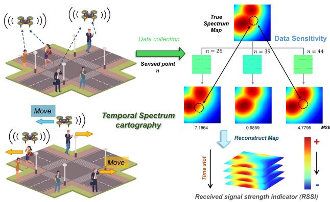  
Fig. 1. System model of temporal spectrum cartography in LAENets. Lowaltitude devices (e.g., UAVs) collect RSSI measurements and reconstruct radio maps over time. The reconstruction quality is sensitive to the locations and number of the sensed points.

optimization, where UAVs sequentially collect measurements and update the global map.

## A. System Overview

As illustrated in Fig. 1, we consider low-altitude economic activity scenarios in urban environments, where N mobile ground devices engage in communication. Within a predefined range X, the propagated signals will form a spectrum diagram. At a certain height $h _ { s e n s o r }$ in the air, low-altitude sensing equipment, consisting of M sensors, which include $M _ { d }$ dynamic UAVs and $M _ { s }$ static sensors, senses the spectrum by receiving these signals. The sensing regions for dynamic drones and static sensors are denoted as $R _ { d }$ and $R _ { s }$ , respectively. Note that in the considered temporal spectrum cartography task, the low-altitude sensing equipment operates at a constant altitude $h _ { s e n s o r }$ to construct 2-D spectrum maps [9].

Given the continuous economic activities in LAENets, monitoring the spectrum in a time period $T _ { s }$ is crucial. We divide the sensing period $T _ { s }$ into $n _ { T }$ time slots $\begin{array} { r } { T _ { i } , \mathrm { i . e . , } T _ { s } = \sum _ { i = 1 } ^ { n _ { T } } T _ { i } } \end{array}$ During each slot, $T _ { i }$ , the low-altitude sensing devices remain stationary to ensure stable measurements. To accurately capture spectral variations caused by mobile devices, we assume that data collection occurs at $n _ { T _ { i } }$ moments within slot $T _ { i } ,$ , where $i =$ $1 , \ldots , n _ { T }$ . At the end of each slot, sensor data is aggregated to generate the spectrum for that slot. Subsequently, dynamic sensors adjust their positions for the next slot based on control center instructions to enhance cartography accuracy [36]. Between consecutive slots, UAV mobility is restricted by a maximum displacement bound, ensuring that each UAV only moves to adjacent grids. This setting effectively constrains flight distance and energy consumption, ensuring that each UAV possesses adequate energy to accomplish its sensing and mobility tasks over the entire nT -slot operation horizon. To facilitate analysis, we discretize the sensing area X into a grid with intervals $\Delta x$ and $\Delta y .$ , forming an $H \times W$ lattice. The corresponding gridded spectrum map is represented as $\mathbf { P } \in \mathbb { R } ^ { H \times W }$ [15]. Similarly, UAV mobility is modeled through grid-based movements, which not only simplifies trajectory planning but also ensures adequate inter-agent spacing to mitigate potential collision risks.

## B. Signal Model

In this paper, we estimate the power map for spectrum cartography [15]. The power can be computed effectively by the received signal strength indicator (RSSI) [37].

Specifically, we define the set of user equipment (UE) positions as

$$
\mathcal { T } = \{ ( x _ { i } , y _ { i } ) \} _ { i = 1 } ^ { N } ,
$$

where $N$ is the number of UEs, and $\mathrm { U E } _ { i }$ is located at $( x _ { i } , y _ { i } )$ For a grid point $( x , y ) \in X$ and UEi, the 3D distance between $\mathrm { U E } _ { i }$ and the point with sensors’ height $h _ { \mathrm { s e n s o r } }$ is given by:

$$
d _ { 3 D } = \sqrt { d _ { 2 D } ^ { 2 } + h _ { s e n s o r } ^ { 2 } } ,
$$

where $d _ { 2 D } = \sqrt { ( x - x _ { i } ) ^ { 2 } + ( y - y _ { i } ) ^ { 2 } }$ denotes the plane distance. Additionally, the elevation angle θ is given by:

$$
\theta = \arctan \left( \frac { h _ { \mathrm { s e n s o r } } } { d _ { 2 D } } \right) .\tag{1}
$$

In our study, we consider a probabilistic line-of-sight (LOS) model, which accounts for both LOS and non-line-of-sight (NLOS) conditions. The LOS probability is computed as [38]:

$$
P _ { \mathrm { L O S } } = \frac { 1 } { 1 + a _ { \mathrm { L O S } } \cdot e ^ { - b _ { \mathrm { L O S } } ( \theta - a _ { \mathrm { L O S } } ) } } ,\tag{2}
$$

where $a _ { \mathrm { L O S } }$ and $b _ { \mathrm { L O S } }$ are model parameters. Then, the NLOS probability can be computed by:

$$
\begin{array} { r } { P _ { \mathrm { N L O S } } = 1 - P _ { \mathrm { L O S } } . } \end{array}\tag{3}
$$

The path loss in dB for LOS and NLOS cases is given by [38]:

$$
P L _ { \mathrm { L O S } } = P L _ { d _ { 0 } } + 1 0 n _ { \mathrm { L O S } } \log _ { 1 0 } \left( \frac { d _ { \mathrm { 3 D } } } { d _ { 0 } } \right) ,\tag{4}
$$

$$
P L _ { \mathrm { { N L O S } } } = P L _ { d _ { 0 } } + 1 0 n _ { \mathrm { { N L O S } } } \log _ { 1 0 } \left( { \frac { d _ { \mathrm { { 3 D } } } } { d _ { 0 } } } \right) + X _ { \mathrm { { N L O S } } } ,\tag{5}
$$

where $P L _ { d _ { 0 } }$ is the reference path loss, $n _ { \mathrm { L O S } }$ and nNLOS are path loss exponents, $X _ { \mathrm { N L O S } } \sim \mathcal { N } ( 0 , \sigma _ { \mathrm { N L O S } } ^ { 2 } )$ represents a normally distributed random variable modeling shadow fading, and σNLOS denotes the standard deviation.

Note that the random shadow fading is spatially correlated. For grid points $( x , y )$ and $( m , n )$ , it holds that

$$
\begin{array} { r } { \mathrm { C o v } [ X _ { \mathrm { N L O S } } ^ { x , y } , X _ { \mathrm { N L O S } } ^ { m , n } ] = \sigma _ { i } ^ { 2 } e ^ { - \frac { d ( ( x , y ) , ( m , n ) ) } { d _ { \mathrm { c o r r } } } } , } \end{array}\tag{6}
$$

where $\mathrm { C o v } [ \cdot , \cdot ]$ denotes the covariance, $d ( \cdot , \cdot )$ denotes the distance between two grid points, and $d _ { \mathrm { c o r r } }$ is the shadowing decorrelation distance [39]. We focus on the signal strength at a specific frequency f to support targeted low-altitude economic activities. Additionally, we consider low-speed scenarios where the frequency shift caused by the Doppler effect can be neglected. Based on these assumptions, the reference path loss can be computed by:

$$
P L _ { d _ { 0 } } = 2 0 \log _ { 1 0 } ( \lambda / ( 4 \pi d _ { 0 } ) ) ,
$$

where $d _ { 0 }$ is the reference distance, $\lambda = c / f$ is the wavelength, c denotes the speed of light, and $f$ represents the sensed frequency. Then, the received power from $\mathrm { U E } _ { i }$ at grid point $( x , y )$ can be

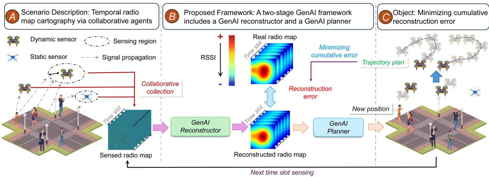  
Fig. 2. The workflow of the proposed two-stage GenAI framework. Part A presents the LAENet-based radio map cartography scenario, where dynamic and static sensors collaboratively collect RSSI within a certain sensing region. Part B details the two-stage GenAI framework, consisting of the GenAI-based reconstructor that generates the temporal radio map using sensed data and the GenAI-based planner that determines the next position of dynamic sensors. Part C highlights the objective of this framework: to minimize the cumulative reconstruction error across time slots by optimizing the trajectories of multiple agent sensors, thereby improving the overall quality of the estimated radio map.

defined as follows:

$$
P _ { x , y , i } ^ { \mathrm { d B m } } = P _ { \mathrm { U E } _ { i } } ^ { \mathrm { d B m } } - \left( P _ { \mathrm { L O s } } P L _ { \mathrm { L O s } } + P _ { \mathrm { N L O s } } P L _ { \mathrm { N L O S } } \right) ,\tag{7}
$$

where $P _ { \mathrm { U E } _ { i } } ^ { \mathrm { d B m } }$ represents the transmission power of $\mathrm { U E } _ { i }$ . Finally, the power map is updated as:

$$
P _ { x , y } = \sum _ { i = 1 } ^ { N } 1 0 ^ { P _ { x , y , i } ^ { \mathrm { d B m } } / 1 0 } ,\tag{8}
$$

which can be converted back to dBm by

$$
P _ { x , y } ^ { \mathrm { d B m } } = 1 0 \log _ { 1 0 } P _ { x , y } ,\tag{9}
$$

where $P _ { x , y } ^ { \mathrm { d B m } }$ is the $( x , y )$ -th element of radio power map P.

## C. Temporal Tensor Completion

Following the signal model, we define the power map at time slot $T _ { i }$ as $\check { \mathbf { P } ^ { i } } \in \mathbb { R } ^ { \check { n } _ { T _ { i } } \times H \times W }$ . The sensing operation at the time slot $T _ { i }$ is represented by the binary matrix $\dot { \mathbf { W } } ^ { i } \in \mathbb { R } ^ { H \times W }$ , where each element $\mathbf { W } _ { x , y } ^ { i } = 1$ if and only if $( x , y ) \in X$ falls within the sensing range of the deployed sensors, as illustrated in Fig. 2 Part A. Consequently, the sensed power map can be expressed as follows:

$$
\tilde { \mathbf { P } } ^ { i } = \mathbf { W } ^ { i } \circ \mathbf { P } ^ { i } ,\tag{10}
$$

where ◦ represents the Hadamard (element-wise) product. We define the reconstructed power map as ${ \hat { \mathbf { P } } } ^ { i }$ to recover the complete power map. The reconstruction error of time slot $T _ { i }$ is then given by

$$
E ^ { i } = | | \tilde { \mathbf { P } } ^ { i } - \hat { \mathbf { P } } ^ { i } | | _ { 2 } .\tag{11}
$$

By aggregating the reconstruction errors across all time slots, the total reconstruction error over the period $T$ is

$$
E = \sum _ { i = 1 } ^ { n _ { T } } { E ^ { i } } .\tag{12}
$$

The reconstruction quality heavily depends on the sensor placement and the number of deployed sensors. As shown in

Fig. 1, improper placement can significantly degrade the algorithm’s performance even with a larger number of sensors. Therefore, optimizing the sensor placement at each time slot, which is dictated by $\mathbf { W } ^ { i }$ , to minimize the total reconstruction error constitutes a temporal tensor completion problem. Unlike static tensor completion, where the observed entries are fixed, dynamic tensor completion aims to adaptively select the observed location over time to enhance reconstruction quality. Mathematically, the goal is to optimize $\mathbf { W } ^ { i }$ such that

$$
\operatorname* { m i n } _ { \mathbf { W } ^ { 1 } , \dots , \mathbf { W } ^ { n _ { T } } } E = \sum _ { t = 1 } ^ { n _ { T } } \left\| \tilde { \mathbf { P } } ^ { t } - \hat { \mathbf { P } } ^ { t } \right\| _ { 2 } ,\tag{13}
$$

as shown in Fig. 2 Part C.

Let $\mathcal { U } _ { t }$ denote the positions of the dynamic UAV sensors at time slot t, and let S denote the set of static sensors. We consider that each dynamic UAV sensor can move with a limited distance between consecutive time slots. For simplicity, we model this constraint as a movement between adjacent grids, denoted by $d _ { m }$ . Formally, the optimization problem is formulated as follows:

(14)

$$
\begin{array} { r l } { \mathrm { s . t . } } & { \mathbf { W } _ { i , j } ^ { t } = 1 \iff } \\ & { \left( \left| d \left( ( x , y ) , ( x _ { u } ^ { t } , y _ { u } ^ { t } ) \right) \right| \leq R _ { d } \mathrm { o r } \right) } \\ & { \left( \left| d \left( ( x , y ) , d ( x _ { s } , y _ { s } ) \right) \right| \leq R _ { s } \right) } \\ & { \forall ( x _ { u } ^ { t } , y _ { u } ^ { t } ) \in \mathcal { U } _ { t } , ( x _ { s } , y _ { s } ) \in \mathcal { S } , t = 1 , \ldots , n _ { T } , } \end{array}\tag{15}
$$

$$
\begin{array} { r l } & { \textstyle | d \left( ( x _ { u } ^ { t } , y _ { u } ^ { t } ) , d ( x _ { u } ^ { t + 1 } , y _ { u } ^ { t + 1 } ) \right) | \le d _ { m } , } \\ & { \textstyle \qquad \forall ( x _ { u } ^ { t } , y _ { u } ^ { t } ) \in \mathcal { U } _ { t } , ~ ( x _ { u } ^ { t + 1 } , y _ { u } ^ { t + 1 } ) \in \mathcal { U } _ { t + 1 } , } \end{array}\tag{16}
$$

$$
| \mathcal { U } _ { t } | = M _ { d } , \quad | \mathcal { S } | = M _ { s } , \quad \forall t = 1 , \ldots , n _ { T } .\tag{17}
$$

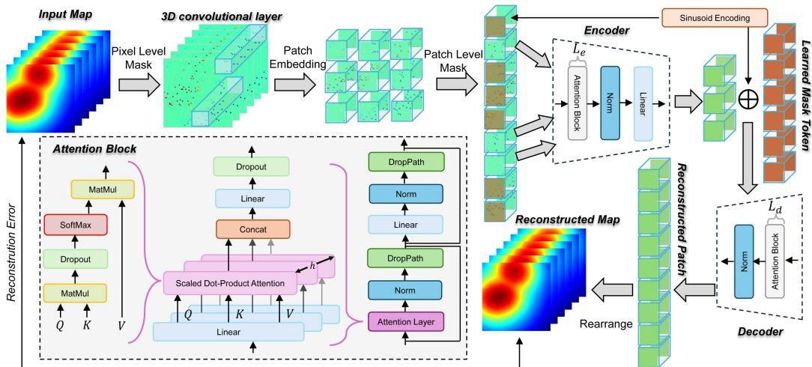  
Fig. 3. Overview of the RecMAE framework. The model processes masked spatiotemporal radio maps using 3D convolutions and patch embeddings. Visible patches are encoded with attention blocks, while masked tokens are learned and combined in the decoder to reconstruct spectrum maps. Reconstruction error guides self-supervised training.

The constraint in (15) ensures that the element $\mathbf { W } _ { i , j } ^ { t }$ is sensed by either dynamic or static sensors. The constraint in (16) specifies the movement range of dynamic UAVs during each time slot. The constraint in (17) ensures the number of sensors remains constant during the sensing period.

## IV. PROPOSED TWO-STAGE GENERATIVE AI FRAMEWORK

In response to the aforementioned optimization, we propose a two-stage GenAI framework, as illustrated in Fig. 2 Part B. First, we introduce a GenAI reconstructor that reconstructs the radio power map from sensed data. The proposed GenAI reconstructor leverages the generative capability to achieve higher reconstruction accuracy than existing methods. Next, we design a GenAI planner to optimize UAV positions using multi-agent reinforcement learning. By utilizing its distribution learning ability, GenAI can generate a more reliable multi-agent policy, effectively balancing exploration and exploitation. In this section, we define the proposed framework and its key components.

## A. Reconstructive Masked Autoencoder

For the GenAI reconstructor, we propose a RecMAE extending the MAE [14] for spatio-temporal radio map recovery. MAE efficiently learns representations via patch masking, enabling precise and deterministic reconstruction. In contrast, diffusion-based models, though powerful in visual synthesis, require iterative denoising with high computational cost, making MAE a more practical choice for spectrum completion.

In the following, we detail the key components and formulation of RecMAE, including the attention mechanism, patch embedding, positional encoding in both space and time, the encoder-decoder structure, temporal modeling across frames, dual-mask mechanism, and the loss functions used for training.

1) Self-Attention: The self-attention mechanism is based on the scaled dot-product attention as introduced in Transformers [40]. Given a set of query vectors $\mathbf { Q } \in \mathbb { R } ^ { n \times d }$ , key vectors $\mathbf { K } \in \mathbb { R } ^ { m \times d }$ , and value vectors $\mathbf { V } \in \mathbb { R } ^ { m \times d _ { v } }$ , the attention output is a weighted sum of values, where weights are computed by the dot product of queries and keys, scaled by the dimensionality.

Specifically, for a query Q and keys K, the attention is:

$$
{ \mathrm { A t t } } ( \mathbf { Q } , \mathbf { K } , \mathbf { V } ) = { \mathrm { s o f t m a x } } \left( { \frac { \mathbf { Q } \mathbf { K } ^ { \top } } { \sqrt { d } } } \right) \cdot \mathbf { V } ,\tag{18}
$$

where d is the dimensionality of the query/key vectors, and softmax denotes the softmax activation function. This operation produces an output of size $n \times d _ { v }$ as each query attends to all key-value pairs. As shown in Fig. 3, self-attention allows each patch token to adaptively aggregate information from other tokens, thereby capturing spatial and temporal dependencies.

2) Multi-Head Attention: To increase the expressiveness of the attention mechanism, RecMAE employs multi-head attention [41]. Instead of using a single attention function, the multi-head attention uses h parallel attention heads. For head i, the queries, keys, and values are linearly projected into a subspace using learned projection matrices $\bar { \mathbf { W } } _ { i } ^ { Q }$ $\mathbf { \bar { W } } _ { i } ^ { K }$ , and $\mathbf { W } _ { i } ^ { V }$ . The head output is computed as headi $\operatorname { A t t } ( \mathbf { Q } \mathbf { W } _ { i } ^ { Q } , \mathbf { K } \mathbf { \bar { W } } _ { i } ^ { K } , \mathbf { V } \mathbf { W } _ { i } ^ { V } )$ . The outputs of all heads are then concatenated and projected again to form the final output:

$$
\mathbf { M H A } ( \mathbf { Q } , \mathbf { K } , \mathbf { V } ) = \operatorname { C o n c a t } ( \operatorname { h e a d } _ { 1 } , \operatorname { h e a d } _ { 2 } , \dots , \operatorname { h e a d } _ { h } ) \cdot \mathbf { W } ^ { O } ,\tag{19}
$$

where Concat denotes the concatenation operation, and $\mathbf { W } ^ { O }$ is the output projection matrix. Multi-head attention allows the model to attend to different representation subspaces simultaneously, which is crucial for capturing complex spatiotemporal patterns in the radio map data. In the context of Rec-MAE, we use multi-head self-attention within each Transformer encoder/decoder layer. As shown in Fig. 3, multi-head selfattention employs multiple parallel scaled dot-product attention heads, where the original queries, keys, and values are split across heads to capture different aspects of spatial or temporal information.

3) Patch Embedding: To embed the spatio-temporal input for Transformer-based processing, we adopt a tubelet embedding strategy implemented via a 3D convolutional layer [11], as illustrated in Fig. 3. Let the input be a sequence of $T$ radio maps $\{ \mathbf { X } _ { t } \} _ { t = 1 } ^ { T }$ , where each frame $\mathbf { X } _ { t } \in \mathbb { R } ^ { \mathbf { \hat { H } } \times W }$ represents a

2D spatial field. We first stack these frames into a 3D tensor $\mathbf { X } \in \overset { \cdot } { \mathbb { R } } ^ { C \times T \times H \times W }$ , where C is the number of input channels.

We then divide the 3D volume into non-overlapping spatiotemporal patches of size $P _ { t } \times P _ { h } \times P _ { w }$ , where $P _ { t }$ denotes the temporal patch size, i.e., the tubelet size, and $P _ { h } , P _ { w }$ are the height and width of each spatial patch. By letting T , H, and W be divisible by $P _ { t } , P _ { h }$ , and $P _ { w } ,$ , respectively, this process yields a total number of patches:

$$
N _ { p a t c h } = \frac { T } { P _ { t } } \cdot \frac { H } { P _ { h } } \cdot \frac { W } { P _ { w } } .\tag{20}
$$

Each patch is projected into a D-dimensional latent token using a learnable 3D convolution with kernel size $\left( P _ { t } , P _ { h } , P _ { w } \right)$ and stride $\left( P _ { t } , P _ { h } , P _ { w } \right)$ :

$$
\mathbf { Z } = \operatorname { C o n v 3 D } ( \mathbf { X } ) \in \mathbb { R } ^ { D \times T ^ { \prime } \times H ^ { \prime } \times W ^ { \prime } } ,\tag{21}
$$

where $T ^ { \prime } = T / P _ { t } , \ H ^ { \prime } = H / P _ { h } , \ W ^ { \prime } = W / P _ { w }$ , and Conv3D represents the learnable 3D convolution. The resulting tensor is reshaped into a sequence of tokens $\mathbf { z } _ { n } \in \mathbb { R } ^ { D }$ for $n =$ $1 , \ldots , N _ { p a t c h }$ , which are then fed into the Transformer encoder.

By dividing the input along both spatial and temporal dimensions, this patch embedding approach effectively captures spatial features and temporal patterns within each token, resulting in a compact and expressive representation for downstream processing.

4) Positional Embedding: Since the Transformer architecture is inherently permutation-invariant with respect to the input token order, it is essential to incorporate positional information that reflects spatial structure. We employ fixed sinusoidal positional encodings [40]. Let D denote the embedding dimension. For a token $\mathbf { z } _ { n }$ located at spatial position n of the tokens sequence, we compute its spatial positional encoding ${ \bf e } _ { n } ^ { \mathrm { s p a } } \in \mathbb { R } ^ { D }$ using the sinusoidal formulation:

$$
\mathrm { P E } _ { ( n , 2 k ) } = \sin \left( \frac { n } { P _ { P E } ^ { 2 k / D } } \right) ,
$$

$$
\mathrm { P E } _ { ( n , 2 k + 1 ) } = \cos \left( \frac { n } { P _ { P E } ^ { 2 k / D } } \right) ,\tag{22}
$$

where n is the position index, $k = 0 , 1 , \ldots , D / 2 - 1$ , PPE is a = 0 1predefined number usually set as 10000, and $\mathbf { e } _ { n } ^ { \mathrm { s p a } } = [ P E _ { ( n , 0 ) }$ $\ldots , P E _ { ( n , D - 1 ) } ]$

]Each final token input to the Transformer encoder is the sum of the patch embedding and its positional encodings:

$$
{ \bf y } _ { n } = { \bf z } _ { n } + { \bf e } _ { n } ^ { \mathrm { s p a } } .\tag{23}
$$

The spatio-temporal patch embedding and positional encodings help the model reason over both spatial structures and temporal dynamics. The same positional encodings are applied in both the encoder and decoder to preserve alignment across the two stages.

5) Model Architecture: Masking and Encoder: Following the MAE paradigm [14], a subset of the tokens is randomly masked out and omitted from the encoder input. We define a binary mask over the set of all tokens. Let M denote the set of indices of masked patches and V denote the set of visible (unmasked) patch indices, such that ${ \mathcal { M } } \cup \nu$ includes all patches, i.e., $| \mathcal { M } | + | \mathcal { V } | = N _ { p a t c h }$ . Typically, a high masking ratio $r _ { p a t c h }$ is used, e.g., mask $7 0 \% - 9 0 \%$ of tokens [14], so that the model learns to infer a large portion of missing data from a small portion of visible context. As shown in Fig. 3, the encoder receives as input only the tokens corresponding to V. Namely, we feed $\{ \mathbf { y } _ { n _ { v } } , n _ { v } \in \mathcal { V } \}$ into a Transformer encoder consisting of $L _ { e }$ layers of multi-head self-attention and feed-forward network blocks. Through these layers, each visible token’s representation is updated by attending to other visible tokens. Let $\mathbf { h } _ { n _ { v } }$ denote the encoded representation of a visible token ${ \bf y } _ { n _ { v } }$ after the final encoder layer. Note that tokens with indices in $\mathcal { M }$ are invisible tokens and are the input to the encoder in the proposed framework.

Decoder and Reconstruction: The decoder network aims to reconstruct the original radio map from the encoded visible tokens and the masked tokens. To this end, we introduce the masked patches into the token sequence by adding a learned mask token for each index in M. Specifically, for each masked patch index $n _ { m } \in \mathcal { M }$ , we create a token

$$
\mathbf { h } _ { n _ { m } } = \mathbf { m } + \mathbf { e } _ { n _ { m } } ^ { \mathrm { s p a } } ,
$$

where m $\in \mathbb { R } ^ { D }$ is a learned mask vector shared for all masked positions, and we add the same positional encodings as used in the encoder to indicate where this token belongs. For each visible patch $n _ { v } \in \mathcal { V }$ , we take its encoded representation $\mathbf { h } _ { n _ { v } }$ from the encoder and also add the positional encodings $\mathbf { e } _ { n _ { v } } ^ { \mathrm { s p a } }$ This combined set of tokens, of size $N _ { p a t c h }$ covering both originally visible and masked patches, is then passed through the Transformer decoder, which consists of $L _ { d }$ layers of multi-head self-attention and feed-forward blocks. In the decoder, tokens can attend to both original visible tokens and the mask tokens, allowing information to flow from observed regions to infer missing regions.

The output of the decoder is a set of $N _ { p a t c h }$ decoded vectors, $\mathrm { i . e . , ~ } \{ \mathbf { o } _ { n } \}$ , one for each patch position at each time. The final step is to map these output vectors to reconstructed patch values. We apply a linear projection that inverts the patch embedding, producing $\hat { \mathbf { z } } _ { n } \in \mathbb { R } ^ { \mathbf { \tilde { P } } _ { t } \times \mathbf { \tilde { P } } _ { h } \times P _ { w } }$ from $\mathbf { o } _ { n }$ . In other words, the decoder outputs are transformed to the same dimensionality as the flattened patch input, yielding a reconstructed patch $\hat { \mathbf { Z } } _ { n }$ for both originally visible and masked patches. The set of all reconstructed patches $\{ \hat { \mathbf { X } } _ { n } \} _ { n = 1 } ^ { N _ { p a t c h } }$ can be reassembled into T full reconstructed frames, which we denote as $\hat { \mathbf { X } } _ { 1 } , \hat { \mathbf { X } } _ { 2 } , \hdots , \hat { \mathbf { X } } _ { T }$ as present in Fig. 3.

6) Dual-Mask Mechanism: To robustly reconstruct radio maps from limited sensor measurements, we propose a dualmasking strategy that conceals information at two distinct scales: the patch (token) level and the pixel level. The pixel-level masking simulates limited sensor coverage by randomly dropping out individual pixel measurements in the input radio map, reflecting real-world scenarios where sensor readings are available only at certain spatial locations On top of this, the patch-level mask (as discussed in the above RecMAE training) is applied to withhold entire regions from the encoder [14]. By combining fine-grained pixel masking with coarse patch masking, the model is forced to learn both local and global context to fill in missing signal values. Consequently, the RecMAE decoder aims to reconstruct the original unmasked radio map, simulating the task of accurately completing data from limited sensor measurements. This dual-masked mechanism thus learns to infer a complete radio map from highly incomplete data, improving its reconstruction ability under sensing limitations.

Formally, considering a sequence of $T$ radio maps $\{ \mathbf { X } _ { t } \} _ { t = 1 } ^ { T }$ we define a binary pixel mask tubelet $\mathbf { M } ^ { p i x e l } \in \{ 0 , 1 \} ^ { \mathsf { \bar { T } } \times \bar { H } \times \bar { W } }$ where $\mathbf { M } ^ { p i x e l } ( t , i , j ) = 1$ indicates that the pixel at location $( i , j )$ is observed (available) at time $t , \mathbf { M } ^ { p i x e l } ( t , i , j ) = 0$ means the pixel’s value is missing to simulate lack of sensor data. Moreover, the pixel mask radio is $r _ { p i x e l }$ , which is usually chosen based on the number of sensors. Since the sensor positions are fixed within a certain time slot, the mask values are held consistent along the temporal dimension, i.e.,

$$
\mathbf { M } ^ { p i x e l } ( t , i , j ) = \mathbf { M } ^ { p i x e l } ( t ^ { \prime } , i , j ) , \forall t , t ^ { \prime } \in [ 1 , T ] .\tag{24}
$$

The pixel-masked input ${ \bf X } ^ { p i x e l }$ is obtained by element-wise applying this mask to the original image:

$$
\mathbf { X } ^ { p i x e l } = \mathbf { M } ^ { p i x e l } \circ \mathbf { X } .\tag{25}
$$

Next, the pixel-masked data ${ \bf X } ^ { p i x e l }$ is divided into patches, and subsequently, a patch-level mask is applied to these patches before feeding them into the encoder, as we introduced above.

7) Loss Functions: Training of RecMAE uses a loss function that penalizes reconstruction errors in both space and time. Therefore, the training objective is to make the stacked reconstructed frames $\hat { \mathbf X }$ as close as possible to the ground-truth X despite both pixel and patch level masks. In practice, we compute the reconstruction loss using the mean squared error (MSE) between reconstructed patches and their corresponding original patches, defined as follows:

$$
L o s s = \frac { 1 } { N _ { p a t c h } } \sum _ { i = 1 } ^ { N _ { p a t c h } } \left| \hat { \mathbf { z } } _ { i } - \mathbf { z } _ { i } \right| ^ { 2 } ,\tag{26}
$$

which directly measures the reconstruction error since the patchto-image transformation involves only reshaping operations without additional data transformations. By minimizing $L o s s \mathrm { . }$ the RecMAE model learns to accurately fill in missing spatial data in each frame while also ensuring that the reconstructed sequence of frames is temporally coherent. This loss formulation drives the encoder-decoder to learn meaningful spatio-temporal representations of the radio map data, enabling effective reconstruction even under high masking ratios.

8) Reconstruction Inference: The reconstruction process in the RecMAE framework involves encoding observed spatiotemporal data into latent representations and subsequently decoding these representations to reconstruct the complete spatiotemporal sequence. Given that sensor observations inherently provide partial information, the input data ${ \tilde { \mathbf { P } } } ^ { i }$ already incorporates a pixel-level mask $\mathbf { W } ^ { i }$ . Subsequently, the collected data undergo an additional patch-level masking step to form the encoder’s input. In the decoding stage, the latent representations are utilized to reconstruct the entire radio map. Leveraging the GenAI paradigm of unsupervised learning, transformer-based decoder blocks iteratively refine the reconstruction, progressively recovering complete frames from partially masked inputs.

Algorithm 1: RecMAE Training and Inference.   
Input: Encoder network $f _ { \theta } ,$ Decoder network ${ \mathit { g } } _ { \phi } ,$   
Radio Map Dataset D, Masking ratio rpatch and $r _ { p i x e l } ,$   
Learning rate $\gamma ,$ # of training epochs $N _ { e } ;$   
Procedure 1: RecMAE Training;   
for $e p o c h = 1 , 2 , . . . , N _ { e }$ do   
Šample a batch of stacked radio data X from   
dataset D   
Generate masked data ${ \bf X } ^ { p i x e l }$ by Eq. (25) with   
ratio $r _ { p i x e l }$   
Encode visible patches by encoder:   
$\mathbf { Z } = f _ { \theta } ( \mathbf { X } ^ { p i x e l } )$   
Generate masked patch indices V by randomly   
masking patches with ratio $r _ { p a t c h }$   
Decode latent representation by decoder:   
$\hat { \mathbf { X } } = g _ { \phi } ( \mathbf { Z } )$   
Compute reconstruction loss in Eq. (26)   
Update parameters θ, φ by gradient descent using   
learning rate $\gamma$   
end   
Procedure 2: RecMAE Inference;   
Given an observed spatio-temporal radio data X   
Generate masked patch indices V by randomly   
masking patches with ratio $r _ { p a t c h }$   
Encode visible patches: $\mathbf { Z } = f _ { \theta } ( \mathbf { X } )$   
Decode latent representation: $\hat { \mathbf { X } } = g _ { \phi } ( \mathbf { Z } )$   
Output: Reconstructed image 文

The complete GenAI reconstructor algorithm is detailed in Algorithm 1.

## B. Multi-Agent Spectrum Cartography

In our multi-agent spectrum cartography scenario involving dynamic UAV sensors, each UAV can only collect radio signal information within a limited sensing range from its current vantage point. Consequently, the true environmental state, the spatial distribution of RF power, which is typically critical for determining the $\mathrm { U A V } _ { \mathrm { \Delta } }$ next position, cannot be fully observed by any single agent at any given time slot. This discrepancy between the global state and each UAV’s local observations results in partial observability: they never have complete knowledge of the underlying state. Instead, each UAV must make decisions under uncertainty, using only incomplete observations of the radio map. This is the reason for the complexity of the temporal spectrum, as the UAVs must infer unobserved spectrum conditions from limited RSSI data and coordinate their exploration of the environment over time.

1) Partially Observable Markov Decision Process: To model collaborative sensing and decision-making among multiple UAVs, we formulate the trajectory planning process as a multi-agent partially observable Markov decision process (POMDP) [42]. In this formulation, each UAV makes decentralized decisions based on its local observations while sharing a common reward function that quantifies the overall reconstruction performance. This global reward is computed from the aggregated sensing results across all UAVs and shared with each agent to guide coordinated policy updates, ensuring that every UAV’s local action contributes to improving the team-wide sensing quality. Consequently, the collective sensing accuracy and reconstruction performance depend on their joint actions, reflecting the inherently cooperative nature of multi-UAV spectrum cartography.

A POMDP is defined by the tuple $( S , A , { \mathcal { O } } , P , O , R , \gamma )$ where:

\- S (State Space): The set of all possible environment states. A state $s \in S$ represents the true radio spectrum map at the current time.

\- A (Action Space): The set of actions that the agent can take. For a single UAV, an action $a \in { \mathcal { A } }$ controls the UAV’s next position.

\- O (Observation Space): The set of possible observations. An observation $o \in \mathcal { O }$ corresponds to the local measurement RSSI data the UAV receives from its sensors during a time slot.

$P ( s ^ { \prime } \mid s , a )$ (Transition Probability): The state transition model, defining the probability of moving to a new state $s ^ { \prime }$ when the agent takes action a in state s.

$O ( o \mid s ^ { \prime } , a )$ (Observation Function): The observation model, giving the probability of receiving observation o after taking action a and ending up in state $s ^ { \prime } .$

$R ( s , a )$ (Reward Function): The immediate reward obtained by the agent for taking action a in state s. We design the reward to encourage accurate and efficient mapping of the spectrum based on reconstruction error.

\- γ (Discount Factor): A factor $0 \leq \gamma < 1$ that discounts 0 1future rewards relative to immediate rewards.

Under this POMDP formulation, the UAV agent operates in time slots, $\mathrm { i . e . , } T _ { 1 } , \ldots , T _ { n _ { t } }$ . At each time slot t, the environment is in some hidden state $s _ { t } \in S$ . The UAV does not directly observe environment state st; instead, it receives an observation $o _ { t } \in \mathcal { O }$ correlated with $s _ { t } .$ . Based on this local observation $o _ { t }$ the UAV chooses an action $a _ { t } \in { \mathcal { A } }$ to move to a new position.

2) Multi-Agent POMDP: For multiple UAVs, we consider $M _ { d }$ dynamic UAV agents, operating simultaneously, which extends the POMDP to a multi-agent POMDP setting. Each UAV i receives its own observation $o _ { t } ^ { i } \in \mathcal { O } _ { i } .$ , where $\mathcal { O } _ { i }$ is the observation space for agent i. In practice, $o _ { t } ^ { i }$ consists of the sensor readings UAV i collects at time t. Due to the limited range, $o _ { t } ^ { i }$ only depends on a local slice of the state $s _ { t } ,$ , and may differ from $o _ { t } ^ { j }$ of another UAV j. No single agent can observe the state of full positions, but collectively their observations $o _ { t } ^ { 1 } , \ldots , o _ { t } ^ { N }$ provide complete information about the spectrum. Each UAV makes its decision decentrally based on its own observation. Agent i chooses an action $a _ { t } ^ { i } \in { \mathcal { A } } _ { i }$ , from its action space $\mathcal { A } _ { i }$ Then, all agents share the same reward function $R ,$ defined on the global state $s _ { t }$ and joint action $\mathbf { a } _ { t } = ( a _ { t } ^ { 1 } , a _ { t } ^ { 2 } , \ldots , a _ { t } ^ { N } )$ . This shared reward encourages the UAVs to collaborate to improve the overall spectrum map.

3) Multi-Agent Reinforcement Learning: We formulate this cooperative multi-UAV trajectory optimization problem as a multi-agent reinforcement learning (MARL) task under partial observability. Each UAV i employs a policy $\pi ^ { i }$ that maps its observation history to actions. During execution, the policy is conditioned on the current observation $o _ { t } ^ { i }$ for decision-making. The policies are decentralized in that there is no single controller; each agent makes its own decision independently based on local information. However, the learning of these policies is centralized or coordinated during training to encourage cooperation.

The objective for the team of agents is to find a set of policies $( \pi ^ { 1 } , \dot { \pi } ^ { 2 } , \dots , \pi ^ { N } )$ that maximizes the expected cumulative reward, equivalently, minimizes the long-term mapping error. In formal terms, by letting $\pmb { \pi } = ( \pi ^ { 1 } , \dots , \bar { \pi ^ { N } } )$ denote the collection of policies, the MARL optimization can be written as follows:

$$
\pi ^ { * } = \arg \operatorname* { m a x } _ { \pi ^ { 1 } , \ldots , \pi ^ { N } } \mathbb { E } \left[ \sum _ { t = 0 } ^ { \infty } \gamma ^ { t } R \left( s _ { t } , a _ { t } ^ { 1 } , \ldots , a _ { t } ^ { N } \right) \right] ,\tag{27}
$$

subject to each agent i choosing actions according to its policy, $a _ { t } ^ { i } \sim \pi ^ { i } ( o _ { t } ^ { i } )$ , at every time step.

## C. Multi-Agent Diffusion Policy

For the GenAI planner, we propose an MADP that extends the generative diffusion model optimization framework [13] in multi-agent scenarios.

1) Diffusion Process Background: We build upon denoising diffusion probabilistic models (DDPMs) to enrich the policy representation. A DDPM includes a forward diffusion process that gradually adds noise to data, and a learned reverse process that removes noise to recover data samples [43].

Formally, let $x _ { 0 }$ represent an input action data, which is considered to be a sample from the optimal action distribution, and $a _ { n }$ its noisy version after n diffusion steps. The forward process is a Markov chain

$$
q ( x _ { 1 } , \dots , x _ { T } \mid x _ { 0 } ) = \prod _ { n = 1 } ^ { T } q ( x _ { n } \mid x _ { n - 1 } )\tag{28}
$$

with Gaussian transitions

$$
q ( x _ { n } \mid x _ { n - 1 } ) = { \mathcal { N } } \left( x _ { n } ; { \sqrt { \alpha _ { n } } } x _ { n - 1 } , ( 1 - \alpha _ { n } ) \mathbf { I } \right) ,\tag{29}
$$

for $n = 1 , 2 , \dots , T$ , where $x _ { n }$ is the intermediate noisy action at the n-th diffusion step $\alpha _ { n } \in ( 0 , 1 )$ is a variance schedule, and I denotes the identity covariance matrix used in the Gaussian transition. After the $T$ steps, aT is approximately distributed as a normal Gaussian distribution.

The generative reverse process is a parametric Markov chain

$$
p _ { \theta } ( x _ { 0 : T } \mid c ) = p ( x _ { T } ) \prod _ { n = 1 } ^ { T } p _ { \theta } ( x _ { n - 1 } \mid x _ { n } , c ) ,\tag{30}
$$

which learns to invert the diffusion. Here c denotes conditioning information, which is the observation $o \in \mathcal { O }$ in our case. Each reverse step is modeled by a Gaussian

$$
p _ { \theta } ( x _ { n - 1 } \mid x _ { n } , c ) = \mathcal { N } \left( x _ { n - 1 } ; \mu _ { \theta } ( x _ { n } , c , n ) , \Sigma _ { \theta } ( x _ { n } , c , n ) \right) ,\tag{31}
$$

where $\mu _ { \theta }$ and $\Sigma _ { \theta }$ are the predicted mean and covariance at step n given input $a _ { n }$ and condition c.

The denoising network $\epsilon _ { \theta }$ is trained by minimizing a weighted sum of mean-squared errors at each diffusion step. The objective is:

$$
\begin{array} { r l r } & { } & { L o s s _ { \mathrm { d i f f u s i o n } } ( \theta ) = \mathbb { E } _ { n , x _ { 0 } , \epsilon } \Big [ \left| \epsilon - \epsilon _ { \theta } \left( \sqrt { \bar { \alpha } _ { n } } x _ { 0 } \right. } \\ & { } & { + \left. \sqrt { 1 - \bar { \alpha } _ { n } } \epsilon , c , n \right) \right| ^ { 2 } \Big ] , } \end{array}\tag{32}
$$

where ${ \bar { \alpha } } _ { n } = \Pi _ { i = 1 } ^ { n } \alpha _ { n }$ . The loss function encourages θ $\mathbf { \Psi } _ { | } ( x _ { n } , c , n )$ to correctly predict the noise  added to the clean input $x _ { 0 }$ at every step. By learning this reverse diffusion model, the network can generate sample actions $x _ { 0 }$ from pure noise $x _ { T } \sim \mathcal { N } ( 0 , \mathbf { I } )$ via iterative denoising.

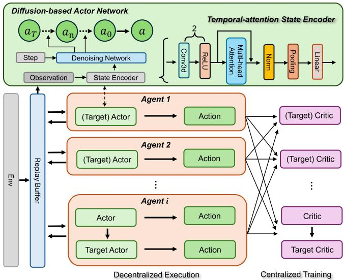  
Fig. 4. Overview of the MADP framework. The framework combines a diffusion-based actor network with a temporal-attention state encoder to guide multi-agent policy learning. Each agent selects actions independently via decentralized execution, while a centralized critic network enables training using shared information.

2) Diffusion-Based Actor Network: In our MADP architecture, each agent’s actor policy is implemented as a conditional denoising diffusion model framework. This means that instead of outputting an action in one forward pass, the actor generates actions by simulating the denoising conditioned on the agent’s state.

Specifically, let $o _ { t } ^ { i }$ be the observation for agent i at time t. The actor draws an initial noise $x _ { T } ^ { i } \sim \mathcal { N } ( 0 , \mathbf { I } )$ and iteratively applies the learned denoising mapping $T$ times:

$$
x _ { n - 1 } ^ { i } = \frac { 1 } { \sqrt { \alpha _ { t } } } \left( x _ { t } ^ { i } - \frac { 1 - \alpha _ { t } } { \sqrt { 1 - \bar { \alpha } _ { n } } } \epsilon _ { \theta } ( x _ { n } ^ { i } , o _ { t } ^ { i } , n ) \right) + \sigma _ { n } z _ { n } ,\tag{33}
$$

where $n = T , T - 1 , \dots , 1$ $\sigma _ { n } = \sqrt { 1 - \alpha _ { n } } , z _ { n } \sim \mathcal { N } ( 0 , \mathbf { I } )$ added noise, and $\epsilon _ { \theta } ^ { i }$ is the actor network for agent i.

After $T$ reverse steps, we obtain $x _ { 0 } ^ { i }$ , which corresponds to the action $a _ { t } ^ { i }$ for agent i at time t. In other words, $\pi _ { \theta } ^ { i } ( o _ { t } ^ { i } ) \equiv a _ { t } ^ { i }$ is generated via $a _ { t } ^ { i } = x _ { 0 } ^ { i }$ , where $x _ { 0 } ^ { i }$ is produced by the diffusion model $\epsilon _ { \theta } ^ { i }$ conditioned on $o _ { t } ^ { i }$ . Specifically, the denoising process is integrated into the actor network, enabling it to refine random noise into coherent, state-conditioned actions, rather than producing deterministic point estimates as in vanilla DDPG. This diffusion-based formulation allows the actor to model and sample from an implicit action distribution, thereby introducing beneficial stochasticity that enhances exploration and helps discover multiple optimal behaviors when they exist. The conditioning observation $o _ { t } ^ { i }$ guides the denoising network at each step, ensuring that the generated actions remain aligned with both the learned action manifold and high-value regions in the Q-function [32].

Temporal-attention State Encoder: To effectively condition the diffusion policy on relevant history, we introduce a temporalattention state encoder for each agent, as illustrated in Fig. 4. This encoder, denoted $g _ { \psi }$ , produces an enhanced state representation $h _ { t } ^ { i }$ that captures temporal context from a sequence of observations via the attention mechanism introduced in Section IV-A1. Specifically, $g _ { \psi }$ is implemented using a CNN augmented with a temporal self-attention mechanism to effectively capture sequential dependencies and emphasize informative time steps. This design helps the encoder approximate the underlying state by incorporating temporal information, which is especially useful under partial observability in POMDP.

3) MADP Framework: We follow the multi-agent deep deterministic policy gradient framework (MADDPG) to train our MADP. Consider an $M _ { d } .$ -agent POMDP defined by the tuple $( \mathcal { S } , \{ \mathcal { A } \} _ { i = 1 } ^ { M _ { d } } , \{ \mathcal { O } \} _ { i = 1 } ^ { M _ { d } } , P , O , \mathbf { \bar { \it R } } , \gamma )$ . Each agent i has a diffusion-(based actor $\pi _ { \theta } ^ { i }$ )and a Q-function critic $Q _ { \phi } ^ { i }$ . Under decentralized execution, agent i chooses actions $a _ { t } ^ { i } = \bar { \pi } _ { \theta } ^ { i } ( o _ { t } ^ { i } )$ based only on its own observation $o _ { t } ^ { i }$

During centralized training, the critic for agent i is augmented with global information, which takes as the collection of all agents’ observations $\mathbf { o } _ { t } = ( o _ { t } ^ { i } , \dots , o _ { t } ^ { M _ { d } } )$ and the joint action $\mathbf { a } _ { t } = ( a _ { t } ^ { i } , \ldots , a _ { t } ^ { M _ { d } } )$ . The critic $Q _ { \phi } ^ { i } ( \mathbf { o } _ { t } , \mathbf { a } _ { t } )$ estimates cumulative discounted reward for agent i starting from state $s _ { t }$ after all agents execute actions $\mathbf { a } _ { t }$ and follow policy $\Pi _ { \theta } ^ { i }$ thereafter. Each agent aims at maximizing a cooperative team reward over nT time slots, defined as follows:

$$
R _ { i } = R = \mathbb { E } \bigg [ \sum _ { t = 0 } ^ { n _ { T } - 1 } \gamma ^ { t } r ( s _ { t } , \mathbf { a } _ { t } ) \bigg ] ,\tag{34}
$$

where $r ( s _ { t } , \mathbf { a } _ { t } )$ represents the reward function in time slot t.

( )The MADP training alternates between updates of the critics φ and actors θ using experiences from a replay buffer, as present in Fig. 4. For a given transition $s = ( s _ { t } , \mathbf { a } _ { t } , r \big ( s _ { t } , \mathbf { a } _ { t } \big ) , s _ { t + 1 } )$ sampled from the replay buffer $\mathcal { D }$ , the critic for agent i is updated by minimizing the reward error:

$$
L o s s _ { \mathrm { c r i t i c } } ^ { i } ( \phi _ { i } ) = \mathbb { E } \left[ \left( Q _ { \phi } ^ { i } ( \mathbf { o } _ { t } , \mathbf { a } _ { t } ) - y _ { t } ^ { i } \right) ^ { 2 } \right] ,\tag{35}
$$

and

$$
y _ { t } ^ { i } = r ( s _ { t } , \mathbf { a } _ { t } ) + \gamma Q _ { \phi } ^ { \prime i } ( \mathbf { o } _ { t + 1 } , \mathbf { a } _ { t + 1 } ^ { \prime i } ) ,\tag{36}
$$

where $\mathbf { a } _ { t + 1 } ^ { \prime i } = \pi _ { \theta } ^ { i } ( o _ { j , t + 1 } )$ is the next action for agent i given by the target actor network, which is a delayed copy of $\pi _ { \theta } ^ { j } .$ , and $Q ^ { \prime }$ is the target critic network [44]. To maximize the critic’s estimate of the return, we then define the actor loss for each agent i as [45]:

$$
L o s s _ { a c t o r } ^ { i } ( \theta _ { i } ) = - \mathbb { E } _ { s \sim \mathcal { D } } \left[ Q _ { \phi } ^ { i } \left( \mathbf { o } , \mathbf { a } \right) \right] ,\tag{37}
$$

where $\mathcal { D }$ is the replay buffer distribution.

4) MADP Execution Process: During the inference phase, the learned policies of each agent are deployed in a decentralized manner. Specifically, at each time step t, each agent i receives its local observation $o _ { i } ^ { t }$ . Then, the agent computes its action with diffusion-based actor network $a _ { i } ^ { t } = \pi _ { \theta } ^ { i } ( o _ { i } ^ { t } )$ . All agents simultaneously execute their actions in the environment, resulting in a new joint state and individual observations for the next time step. This process repeats until the episode terminates. Unlike the training phase, which leverages centralized training with access to the collection of observations and actions of all agents, the inference process operates in a fully decentralized execution setting, relying solely on individual observations. This enables agents to act independently in real-time scenarios while benefiting from the coordinated policies learned during training. From the computational complexity, the primary overhead of the proposed MADP model lies in its multi-step diffusion process. As each individual step incurs a similar computational cost to that of traditional methods, the overall complexity is approximately T times, where T denotes the number of denoising steps.

<table><tr><td rowspan=1 colspan=4>TABLE IEXPERIMENTAL SETTINGS FOR THREE SCENARIOS: URBAN-1, URBAN-2,AND SUBURBAN</td></tr><tr><td rowspan=1 colspan=4>(A) Common Parameters</td></tr><tr><td rowspan=1 colspan=1>Parameter</td><td rowspan=1 colspan=1>Value</td><td rowspan=1 colspan=1>Parameter</td><td rowspan=1 colspan=1>Value</td></tr><tr><td rowspan=1 colspan=1>X $\Delta x , \Delta y$  $H , W$  $L _ { e } , L _ { d }$  $r _ { \mathrm { p a t c h } } , \ : r _ { \mathrm { p i x e l } }$  $d _ { \mathrm { c o r r } } \left[ 4 9 \right]$ </td><td rowspan=1 colspan=1> $2 5 6 \mathrm { m } \times 2 5 6 \mathrm { m }$  $4 \mathrm { m } , 4 \mathrm { m }$ 64,6412,120.75, 0.9050 m</td><td rowspan=1 colspan=1> $P _ { \mathrm { U E } _ { i } } ^ { \mathrm { d B m } }$  $n _ { T }$  $f$  $P _ { t } , P _ { h } , P _ { w }$  $\sigma _ { \mathrm { N L O S } } \ [ 4 9 ]$  $n _ { T _ { i } }$ </td><td rowspan=1 colspan=1>20 dBm101.8 GHz2,8,86 dB16</td></tr><tr><td rowspan=1 colspan=4>(B) Urban-1 Scenario</td></tr><tr><td rowspan=1 colspan=1> $h _ { \mathrm { { s e n s o r } } } \left[ 5 0 \right]$  $a _ { \mathrm { L O S } } , b _ { \mathrm { L O S } } [ 5 1 ]$ </td><td rowspan=1 colspan=1>50 m9.61, 0.16</td><td rowspan=1 colspan=1> $N$  $n _ { \mathrm { L O S } } , n _ { \mathrm { N L O S } } \ [ 4 9 ]$ </td><td rowspan=1 colspan=1>[3,5]2.2, 3.8</td></tr><tr><td rowspan=1 colspan=4>(C) Urban-2 Scenario</td></tr><tr><td rowspan=1 colspan=1> $h _ { \mathrm { { s e n s o r } } }$  $a _ { \mathrm { L O S } } , b _ { \mathrm { L O S } }$ </td><td rowspan=1 colspan=1> $_ { 1 0 0 \mathrm { m } }$  $9 . 6 1 , 0 . 1 6$ </td><td rowspan=1 colspan=1> $N$ nLOS, nNLOS</td><td rowspan=1 colspan=1>[4, 6]2.2, 3.8</td></tr><tr><td rowspan=1 colspan=4>(D) Suburban Scenario</td></tr><tr><td rowspan=1 colspan=1> $h _ { \mathrm { { s e n s o r } } }$  $a _ { \mathrm { L O S } } , b _ { \mathrm { L O S } } \left[ 4 9 \right]$ </td><td rowspan=1 colspan=1>50m4.88, 0.43</td><td rowspan=1 colspan=1> $N$  $n _ { \mathrm { L O S } } , n _ { \mathrm { N L O S } }$ </td><td rowspan=1 colspan=1>[3,5]2.1, 3.5</td></tr></table>

In summary, the complete GenAI planner algorithm is detailed in Algorithm 2.

## D. Summary

In summary, we propose an integrated two-stage framework that reconstructs spectrum maps and optimizes multi-UAV trajectories to accurately capture temporal spectrum variations over a given sensing period. In Stage I (Section IV-A), we train a RecMAE reconstructor using a dual-mask strategy, where pixel-level masking simulates random sensor availability, while patch-level masking enhances global context, thereby improving generalization and robustness under sparse sensing conditions. In Stage II (Section IV-B), we propose an MADP to optimize UAV trajectories using the pretrained reconstructor as guidance, minimizing cumulative reconstruction error and identifying the most informative sensing locations. As illustrated in Fig. 2, both stages interact through the reconstruction loss, where Stage I builds a robust reconstructor, and Stage II exploits it to achieve efficient and accurate spectrum mapping.

## V. NUMERICAL RESULTS

In this section, we evaluate the proposed two-stage GenAI spectrum cartography framework through extensive experiments. Specifically, we assess the performance of both components: the GenAI Reconstructor (RecMAE) and the GenAI

Algorithm 2: MADP Training and Execution.   
Input: Actor networks $\{ \mu _ { \theta _ { i } } \} _ { i = 1 } ^ { N }$ , Critic networks   
$\{ \bar { Q } _ { \phi _ { i } } ^ { i } \} _ { i = 1 , } ^ { N }$ Replay buffer ${ \mathcal { D } } ,$ Learning rate $\gamma ,$ Discount   
factor $\delta ,$ Soft update parameter $\tau ,$ Number of agents   
$M _ { d } ,$ # of episodes $N _ { e } ^ { ^ { \bullet } } ,$ # of time slots nτ;   
Procedure 1: MADP Training;   
for $e p i s o d e = 1 , 2 , . . . , N _ { e }$ do   
Initialize environment $\{ s _ { i } \} _ { i = 1 } ^ { n _ { t } }$ and observe initial   
states $\{ o _ { 0 } ^ { i } \} _ { i = 1 } ^ { N }$   
for $t = 0 , 1 , \ldots , n _ { T } - 1$ do   
Each agent i selects action $a _ { t } ^ { i } = \mu _ { \theta } ^ { i } ( o _ { t } ^ { i } )$   
Execute joint action ${ \mathbf a } _ { t } = ( a _ { t } ^ { 1 } , \dots , a _ { t } ^ { N } )$ and   
observe $r ( s _ { t } , \mathbf { a } _ { t } )$   
Store transition $( s _ { t } , \mathbf { a } _ { t } , r \big ( s _ { t } , \mathbf { a } _ { t } \big ) , s _ { t + 1 } \big )$ in   
buffer $\mathcal { D }$   
Sample minibatch from buffer D   
for each agent $i = 1 , \ldots , N$ do   
Compute target action $\mathbf { a } _ { i } ^ { \prime } = \pi _ { \theta } ^ { \prime i } ( o _ { t } ^ { i } )$   
Compute target Q-value:   
$y _ { t } ^ { i } = r ( s _ { t } , \dot { \mathbf { a } } _ { t } ) + \gamma \check { Q } _ { \phi } ^ { \prime i } ( \mathbf { o } _ { t + 1 } , \mathbf { a } _ { t + 1 } ^ { \prime } )$   
Update critic by minimizing loss:   
$L = \left( \bar { Q _ { \phi } ^ { i } } ( \mathbf { s } , \mathbf { a } ) - y _ { i } \right) ^ { 2 }$   
Update actor by minimizing loss:   
$\begin{array} { r } { L o s s _ { \mathrm { a c t o r } } ^ { i } ( \theta _ { i } ) = - \mathbb { E } _ { s \sim \mathcal { D } } \left[ Q _ { \phi } ^ { i } \big ( \mathbf { o } , \mathbf { a } \big ) \right] , } \end{array}$   
Soft update target networks:   
$\theta _ { i } ^ { \prime }  \tau \theta _ { i } + \mathbf { \dot { ( } 1 - } \tau ) \theta _ { i } ^ { \prime }$ and   
$\phi _ { i } ^ { \prime }  \tau \phi _ { i } + ( 1 - \tau ) \phi _ { i } ^ { \prime }$   
end   
end   
end   
Procedure 2: MADP Execution;   
Given current environment states $s _ { t }$   
Each agent i selects action $a _ { t } ^ { i } = \phi _ { \theta } ^ { i } ( o _ { t } ^ { i } )$   
Output: Joint action $\mathbf { a } _ { t } = ( a _ { t } ^ { 1 } , \ldots , a _ { t } ^ { N } )$

Planner (MADP). We also provide a detailed analysis of the experimental results. The experiments are conducted on a server equipped with three NVIDIA RTX A6000 GPUs, an Intel(R) Xeon(R) Silver 4410Y 12-core processor. The system runs Ubuntu 22.04 operating system and utilizes PyTorch for implementation.

## A. Performance Analysis of the GenAI Reconstructor Stage

To evaluate the performance of the proposed RecMAE, we consider a temporal spectrum reconstruction scenario with $n _ { T } =$ = discrete time slots. In each slot, sensors are randomly deployed based on a coverage level characterized by the sensing ratio $\rho .$ The reconstruction quality is assessed using the mean squared error (MSE) between the predicted and ground truth radio power maps.

Baseline Methods: We compare the proposed RecMAE against several baseline methods, including classical interpolation and deep learning models. The key methods and their abbreviations are as follows:

– AE: An autoencoder baseline for spectrum completion [7].

– cGAN: A conditional generative adversarial network baseline for radio map estimation [46].

– NN: A nearest neighbor interpolation method to reconstruct the incomplete radio map matrix [47].

TABLE II  
COMPARISON OF MEAN SQUARED ERROR (MSE) AND INFERENCE TIME (IN SECONDS) UNDER DIFFERENT SENSING RATIOS ρ ACROSS THREE ENVIRONMENTS. “NA” INDICATES THAT NO REPEATED EXPERIMENTS WERE CONDUCTED.
<table><tr><td rowspan="2">Scenario</td><td rowspan="2"> $\rho$ </td><td>RecMAE (Ours)</td><td>AE</td><td>cGAN</td><td>NN</td><td>Kriging</td></tr><tr><td>MSE / Time (s)</td><td>MSE / Time (s)</td><td>MSE / Time (s)</td><td>MSE / Time (s)</td><td>MSE / Time (s)</td></tr><tr><td rowspan="5">Urban-1</td><td>10%</td><td> $0 . 3 9 \pm 0 . 0 0$ </td><td> $0 . 5 6 \pm 0 . 0 0$ </td><td> ${ \bf 0 . 3 7 \pm 0 . 0 0 }$ </td><td> $1 . 0 5 \pm \mathrm { N A }$ </td><td> $0 . 5 4 \pm \mathrm { N A }$ </td></tr><tr><td rowspan="2">5%</td><td> $2 4 . 9 9 \pm 1 . 5 6$ </td><td> $5 . 8 1 \pm 0 . 2 8$ </td><td> ${ \bf 5 . 0 4 \pm 0 . 0 8 }$ </td><td> $5 6 5 3 . 4 1 \pm \mathrm { N A }$ </td><td> $1 0 9 7 3 . 5 \pm \mathrm { N A }$ </td></tr><tr><td> $\mathbf { 0 . 5 3 \pm 0 . 0 1 }$ </td><td> $1 . 8 8 \pm 0 . 0 5$ </td><td> $0 . 9 0 \pm 0 . 0 2$ </td><td> $2 . 0 0 \pm \mathrm { N A }$ </td><td> $1 . 6 5 \pm \mathrm { N A }$ </td></tr><tr><td rowspan="2">3%</td><td> $2 5 . 1 3 \pm 0 . 2 2$ </td><td> $5 . 7 6 \pm 0 . 0 8$ </td><td> ${ \bf 4 . 9 9 \pm 0 . 0 4 }$ </td><td> $5 6 9 4 . 6 4 \pm \mathrm { N A }$ </td><td> $1 0 1 9 1 . 4 \pm \mathrm { N A }$ </td></tr><tr><td> ${ \bf 0 . 9 0 \pm 0 . 0 2 }$ </td><td> $7 . 9 5 \pm 0 . 1 4$ </td><td> $3 . 9 4 \pm 0 . 1 0$ </td><td> $2 . 2 7 \pm \mathrm { N A }$ </td><td> $2 . 1 1 \pm \mathrm { N A }$ </td></tr><tr><td rowspan="5">Urban-2</td><td></td><td> $2 5 . 8 9 \pm 1 . 3 7$ </td><td> $5 . 8 0 \pm 0 . 1 6$ </td><td> $4 . 9 7 \pm 0 . 0 6$ </td><td> $5 7 8 4 . 6 3 \pm \mathrm { N A }$ </td><td> $8 7 5 4 . 0 6 \pm \mathrm { N A }$ </td></tr><tr><td rowspan="2">10%</td><td> $\mathbf { 0 . 0 8 4 \ : \pm 0 . 0 0 1 }$ </td><td> $0 . 3 3 5 \pm 0 . 0 0$ </td><td> $0 . 0 9 0 \pm 0 . 0 0 1$ </td><td> $0 . 1 3 2 \pm \mathrm { N A }$ </td><td> $0 . 1 2 7 \pm \mathrm { N A }$ </td></tr><tr><td> $2 4 . 3 7 \pm 0 . 6 9$ </td><td> $5 . 6 8 \pm 0 . 2 7$ </td><td> ${ \bf 5 . 4 8 \pm 0 . 2 7 }$ </td><td> $6 3 5 0 . 4 4 \pm \mathrm { N A }$ </td><td> $1 1 6 1 8 . 5 3 \pm \mathrm { N A }$ </td></tr><tr><td rowspan="2">5%</td><td> ${ \bf 0 . 0 9 9 \pm 0 . 0 0 2 }$ </td><td> $2 . 3 0 6 \pm 0 . 1 5 2$ </td><td> $0 . 3 3 1 \pm 0 . 0 0 8$ </td><td> $0 . 2 3 8 \pm \mathrm { N A }$ </td><td> $0 . 3 1 3 \pm \mathrm { N A }$ </td></tr><tr><td> $2 4 . 5 6 \pm 0 . 6 0$ </td><td> $5 . 6 9 \pm 0 . 2 3$ </td><td> ${ \bf 5 . 5 2 \pm 0 . 1 0 }$ </td><td> $5 6 5 3 . 9 5 \pm \mathrm { N A }$ </td><td> $1 1 2 3 2 . 8 6 \pm \mathrm { N A }$ </td></tr><tr><td rowspan="6">Suburban</td><td>3%</td><td> $\mathbf { 0 . 1 7 8 \pm 0 . 0 1 2 }$   $2 5 . 0 0 \pm 0 . 3 5$ </td><td> $2 3 . 5 6 4 \pm 0 . 8 3 9$   $5 . 6 6 \pm 0 . 2 9$ </td><td> $1 . 8 1 1 \pm 0 . 0 6 4$   ${ \bf 5 . 1 9 \pm 0 . 2 4 }$ </td><td> $0 . 2 6 6 \pm \mathrm { N A }$   $5 0 1 0 . 5 6 \pm \mathrm { N A }$ </td><td> $0 . 3 8 2 \pm \mathrm { N A }$   $9 7 6 3 . 1 7 \pm \mathrm { N A }$ </td></tr><tr><td rowspan="2">10%</td><td> $0 . 0 8 8 \pm 0 . 0 0 1$ </td><td> $0 . 0 7 5 \pm 0 . 0 0 1$ </td><td></td><td></td><td></td></tr><tr><td> $2 5 . 9 1 \pm 1 . 4 7$ </td><td></td><td> ${ \bf 0 . 0 6 9 \pm 0 . 0 0 1 }$ </td><td> $0 . 0 6 7 \pm \mathrm { N A }$ </td><td> $0 . 1 7 7 \pm \mathrm { N A }$ </td></tr><tr><td rowspan="2">5%</td><td></td><td> ${ \bf 5 . 0 6 \pm 0 . 1 1 }$ </td><td> $5 . 0 9 \pm 0 . 2 2$ </td><td> $6 3 7 4 . 7 2 \pm \mathrm { N A }$ </td><td> $1 1 6 3 3 . 8 \pm \mathrm { N A }$ </td></tr><tr><td> $\mathbf { 0 . 0 9 8 \pm 0 . 0 0 3 }$ </td><td> $1 . 4 5 8 \pm 0 . 1 5 6$ </td><td> $3 . 3 6 4 \pm 0 . 4 5 6$ </td><td> $0 . 1 2 8 \pm \mathrm { N A }$ </td><td> $0 . 3 7 6 7 \pm \mathrm { N A }$ </td></tr><tr><td rowspan="2">3%</td><td> $2 5 . 9 6 \pm 1 . 4 2$ </td><td> ${ \bf 5 . 1 2 \pm 0 . 2 6 }$ </td><td> $5 . 2 1 \pm 0 . 2 9$ </td><td> $5 5 9 6 . 7 9 \pm \mathrm { N A }$ </td><td> $1 1 0 8 7 . 6 9 \pm \mathrm { N A }$ </td></tr><tr><td> ${ \bf 0 . 1 1 9 \pm 0 . 0 0 3 }$   $2 5 . 2 5 \pm 0 . 8 7$ </td><td> $1 5 . 4 1 6 \pm 0 . 9 6 3$   $5 . 1 0 \pm 0 . 1 7$ </td><td> $1 7 8 . 8 1 3 \pm 3 . 1 3 1$   ${ \bf 5 . 0 5 \pm 0 . 4 6 }$ </td><td> $0 . 1 4 5 \pm \mathrm { N A }$   $5 5 6 7 . 3 3 \pm \mathrm { N A }$ </td><td> $0 . 4 4 2 \pm \mathrm { N A }$   $9 5 7 8 . 5 7 \pm \mathrm { N A }$ </td></tr></table>

– Kriging: A kernel-based Kriging interpolation method for spatial spectrum completion [4].  
corresponding channel parameters follow $a _ { \mathrm { L O S } } = 4 . 8 8 ,$ $b _ { \mathrm { L O S } } = 0 . 4 3 , n _ { \mathrm { L O S } } = 2 . 1$ , and $n _ { \mathrm { N L O S } } = 3 . 5 .$

Note that not all baselines are originally designed for temporal data, and we made modifications to adapt them accordingly.

Experiment Settings: In this study, we simulate three lowaltitude economic activity scenarios to comprehensively evaluate the proposed framework. The key parameters are summarized in Table I. All propagation characteristics are derived from the 3GPP TR 38.901 v16.1.0 model [48], ensuring consistency with standardized urban and suburban environments. The considered sensing area corresponds to a dense communication region of × , where ground users move with walking-level speeds of . , . / to mimic human walking behavior. We consider a crossroad scenario located at the center of the region, where the simulated humans are walking along the road.

Specifically, three deployment scenarios are designed:

1) Urban-1 Scenario: A dense-urban environment with the sensing UAV deployed at an altitude of $h _ { s e n s o r } = 5 0 \mathrm { m } ,$ which preserves near-ground spatial resolution while maintaining reliable LOS links. The number of active emitters is uniformly sampled from $N \in [ 3 , 5 ]$

= 0 43 = 2 1 = 3 5We generate 1,000 training samples and 200 test samples following (9). The learning models are trained for 2,000 epochs using a sensing ratio of $\rho = 1 0 \%$ , and evaluated under three different sensing ratios: $\rho \in \{ 1 0 \% , 5 \% , 3 \% \}$ to emulate varying UAV deployment densities. This multi-scenario design enables a fair comparison across different urban morphologies and verifies the generalization capability of the proposed framework. The detailed network architectures and hyperparameters are provided in Table III.

[3 5]2) Urban-2 Scenario: A higher-altitude urban sensing configuration with $h _ { s e n s o r } = 1 0 0 \mathrm { m }$ and $N \in [ 4 , 6 ]$ maintaining the same LOS/NLOS coefficients as the Urban-1 case. This scenario reflects broader coverage but lower spatial granularity, allowing us to analyze altituderelated sensing trade-offs.

3) Suburban Scenario: A lower-density environment characterized by more open space and weaker shadowing. The

Evaluation: Table II summarizes the average reconstruction error and runtime for each method across the Urban-1, Urban-2, and Suburban environments under different sensing ratios $\rho .$

At $\rho = 1 0 \%$ , corresponding to the training configuration, RecMAE achieves consistently low errors similar to the best baseline. In Urban-1, RecMAE attains 0.39, very close to 0.37 from cGAN and lower than 0.54 from Kriging and 0.56 from AE. In Urban-2, it reaches 0.084, slightly higher than cGAN at 0.090 but clearly below AE and Kriging with 0.335 and 0.127. In the Suburban environment, RecMAE obtains 0.088, slightly higher than cGAN and AE, which yield 0.069 and 0.075. These results show that when sensing is sufficient, RecMAE performs stably across different propagation conditions with minimal variation among top methods.

When the sensing ratio decreases to 5%, RecMAE becomes the overall best performer in all scenarios. In Urban-1, its error increases modestly to 0.53, while cGAN and Kriging rise to 0.90 and 1.65. In Urban-2, RecMAE remains at 0.099, whereas cGAN and Kriging increase to 0.331 and 0.313. In the Suburban case, RecMAE achieves 0.098, much lower than AE at 1.458 and cGAN at 3.364. These outcomes confirm that RecMAE maintains accurate spatial and temporal learning even as other methods begin to lose stability under reduced sensor coverage.

TABLE III  
NETWORK CONFIGURATIONS FOR STAGE-1 (RECMAE) AND STAGE-2 (MADP) IN THE PROPOSED FRAMEWORK
<table><tr><td rowspan=1 colspan=9>(A) Stage-1: RecMAE Network and Training Configuration</td></tr><tr><td rowspan=1 colspan=1>Parameter</td><td rowspan=1 colspan=1>Symbol / Value</td><td rowspan=1 colspan=3>Parameter</td><td rowspan=1 colspan=2>Symbol / Value</td><td rowspan=1 colspan=1>Parameter</td><td rowspan=1 colspan=1>Symbol / Value</td></tr><tr><td rowspan=1 colspan=1>Input resolution</td><td rowspan=1 colspan=1> $H \times W = 6 4 \times 6 4$ </td><td rowspan=1 colspan=3>Input channels</td><td rowspan=1 colspan=2> $C = 3$ </td><td rowspan=1 colspan=1>Tubelet size</td><td rowspan=1 colspan=1> $P _ { t } = 2$ </td></tr><tr><td rowspan=1 colspan=1>Patch size</td><td rowspan=1 colspan=1> $( P _ { h } , P _ { w } ) = ( 8 , 8 )$ </td><td rowspan=1 colspan=3>Activation function</td><td rowspan=1 colspan=2>GELU</td><td rowspan=1 colspan=1>Mask ratio</td><td rowspan=1 colspan=1> $( r _ { \mathrm { p a t c h } } , r _ { \mathrm { p i x e l } } ) = ( 0 . 7 5 , 0 . 9 0 )$ </td></tr><tr><td rowspan=1 colspan=1>Encoder layers</td><td rowspan=1 colspan=1> $L _ { e } = 1 2$ </td><td rowspan=1 colspan=3>Decoder layers</td><td rowspan=1 colspan=2> $L _ { d } = 8$ </td><td rowspan=1 colspan=1>Embedding dimension</td><td rowspan=1 colspan=1> $D _ { e } = 7 6 8$ </td></tr><tr><td rowspan=1 colspan=1>Decoder embedding</td><td rowspan=1 colspan=1> $D _ { d } = 1 0 2 4$ </td><td rowspan=1 colspan=3>Multi-head attention</td><td rowspan=2 colspan=2> $h = 1 2$ Sinusoidal (fixed)</td><td rowspan=1 colspan=1>MLP expansion ratio</td><td rowspan=5 colspan=1> $\alpha _ { \mathrm { m l p } } = 4$  $\mathrm { A d a m W }$  $N _ { e } = 2 0 0 0$ Cosine decay</td></tr><tr><td rowspan=1 colspan=1>Normalization</td><td rowspan=1 colspan=1> $\mathrm { L a y e r N o r m } ( \varepsilon = 1 0 ^ { - 6 } )$ </td><td rowspan=1 colspan=3>Positional encoding</td><td rowspan=1 colspan=1>Sinusoió</td><td rowspan=1 colspan=1>Optimizer</td><td rowspan=1 colspan=1></td></tr><tr><td rowspan=2 colspan=1>Learning rate</td><td rowspan=3 colspan=1> $\eta = 5 \times 1 0 ^ { - 4 }$  $B = 6 4$ </td><td rowspan=2 colspan=2></td><td rowspan=2 colspan=1>Weight decay</td><td rowspan=3 colspan=2> $\lambda = 0 . 0 5$  $N _ { \mathrm { w a r m } } = 4 0$ </td><td rowspan=2 colspan=1></td><td rowspan=2 colspan=1>Epochs</td></tr><tr><td rowspan=1 colspan=1></td></tr><tr><td rowspan=1 colspan=1>Batch size</td><td rowspan=1 colspan=3>Warm-up epochs</td><td rowspan=1 colspan=1>LR schedule</td></tr><tr><td rowspan=1 colspan=1></td><td rowspan=1 colspan=7>(B) Stage-2: MADP Network and Training Configuration</td><td rowspan=1 colspan=1></td></tr><tr><td rowspan=1 colspan=1>Parameter</td><td rowspan=1 colspan=1>Symbol / Value</td><td rowspan=1 colspan=3>Parameter</td><td rowspan=1 colspan=2>Symbol / Value</td><td rowspan=1 colspan=1>Parameter</td><td rowspan=1 colspan=1>Symbol / Value</td></tr><tr><td rowspan=1 colspan=1>Actor layers $L _ { a }$ </td><td rowspan=1 colspan=1>3</td><td rowspan=1 colspan=3>Critic layers $L _ { c }$ </td><td rowspan=1 colspan=2>3</td><td rowspan=1 colspan=1>Hidden units / layer</td><td rowspan=1 colspan=1>256</td></tr><tr><td rowspan=1 colspan=1>State encoder</td><td rowspan=1 colspan=1>3D Conv + Temporal Attention</td><td rowspan=1 colspan=3>Conv channels</td><td rowspan=1 colspan=2>(16, 32, 64)</td><td rowspan=1 colspan=1>Attention heads</td><td rowspan=1 colspan=1> $h = 4$ </td></tr><tr><td rowspan=1 colspan=1>Activation</td><td rowspan=1 colspan=1>ReLU</td><td rowspan=1 colspan=3>Normalization</td><td rowspan=1 colspan=2>LayerNorm</td><td rowspan=1 colspan=1>Max action</td><td rowspan=1 colspan=1> $a _ { \operatorname* { m a x } } = 1$ </td></tr><tr><td rowspan=1 colspan=1>Diffusion steps</td><td rowspan=1 colspan=1> $T = 6$ </td><td rowspan=1 colspan=3>Variance schedule</td><td rowspan=1 colspan=2> $^ { \prime \prime } \mathrm { { v p } ^ { \prime \prime } }$ </td><td rowspan=1 colspan=1>Replay buffer size</td><td rowspan=1 colspan=1> $| \mathcal { D } | = 1 0 ^ { 4 }$ </td></tr><tr><td rowspan=1 colspan=1>Actor learning rate</td><td rowspan=1 colspan=1> $\eta _ { \mathrm { a c t o r } } = 1 \times 1 0 ^ { - 4 }$ </td><td rowspan=1 colspan=3>Critic learning rate</td><td rowspan=1 colspan=2> $\eta _ { \mathrm { c r i t i c } } = 1 \times 1 0 ^ { - 4 }$ </td><td rowspan=1 colspan=1>Discount factor</td><td rowspan=1 colspan=1> $\gamma = 0 . 9 9$ </td></tr><tr><td rowspan=1 colspan=1>Soft update rate</td><td rowspan=1 colspan=1> $\tau = 0 . 0 1$ </td><td rowspan=1 colspan=3>Batch size</td><td rowspan=1 colspan=2> $B = 1 2 8$ </td><td rowspan=1 colspan=1>Exploration</td><td rowspan=1 colspan=1>e-greedy (1.0→0.05, 0.995)</td></tr><tr><td rowspan=1 colspan=1>Training episodes</td><td rowspan=1 colspan=1> $N _ { e } = 2 0 0 0$ </td><td rowspan=1 colspan=3>Optimizer</td><td rowspan=1 colspan=2>Adam</td><td rowspan=1 colspan=1> $\mathrm { E R } \left( \alpha , \beta _ { 0 } , N _ { \beta } \right)$ </td><td rowspan=1 colspan=1> $( 0 . 6 , 0 . 4 , 1 0 ^ { 5 } )$ </td></tr></table>

At the extremely sparse level $\rho = 3 \%$ , the difference becomes more pronounced. In Urban-1, RecMAE yields 0.90, while AE and cGAN rapidly deteriorate to 7.95 and 3.94, and Kriging reaches 2.11. In Urban-2, RecMAE records 0.178 against 23.56 for AE and 1.81 for cGAN, with Kriging at 0.382. In Suburban conditions, RecMAE maintains 0.119, far below AE at 15.42 and cGAN at 178.81.

Across all three environments, baseline methods experience rapid degradation as sensor density decreases, reflecting limited generalization to unseen sparsity patterns. In contrast, RecMAE maintains low reconstruction error and stable variance, revealing a strong capacity to infer missing information from highly incomplete observations.

Regarding inference time, RecMAE takes approximately 24 to 26 seconds to reconstruct the full map over the entire test dataset. While the inference time is about four times longer than the AE and cGAN baselines, which take around 5 to 6 seconds, it is quite reasonable considering the RecMAE’s accuracy gains. From a practical standpoint, this computational load remains acceptable. The test dataset contains 200 samples, which are processed in four batches with a batch size of 64. The average inference time per batch is under 6 seconds. Additionally, each test sample includes 10 time slots with 16 frames, corresponding to a 16-second sensing window. In the considered LAENets scenario, the UAVs remain stationary within each sensing slot to collect data and only move during the subsequent slot. Hence, the decision–movement cycle operates on a per-slot basis rather than at millisecond granularity. The observed latency is therefore more than sufficient to process the reconstructed map in real time and provide timely guidance for the GenAI planner’s next UAV deployment. By contrast, NN and Kriging are substantially slower, requiring approximately $5 . 5 \times 1 0 ^ { 3 }$ and $1 . 0 \times 1 0 ^ { 4 }$ seconds, respectively, to interpolate the entire test dataset. Such excessive time costs render them impractical for large-scale or repeated experiments, which is also why multiple trials were not conducted for these two baselines (indicated as “NA” in Table II). This is mainly because traditional interpolation algorithms perform point-wise distance computation or covariance matrix inversion for every query location, leading to quadratic or even cubic computational complexity with respect to the number of samples. In contrast, AI-based models perform forward inference through optimized neural networks, which allows batch parallelization on GPUs and significantly reduces runtime.

Fig. 5 illustrates the reconstruction error over 10 time slots at an extremely sparse coverage $\rho = 3 \%$ for different methods. = 3%From the visual comparison of the reconstructed maps, the proposed method yields results that closely resemble the original image, effectively preserving both global structure and finegrained details. In contrast, the AE method introduces noticeable MSEs, particularly in regions with strong and weak signal variations, resulting in significant deviations. While the NN and Kriging interpolation algorithm can roughly localize signal strengths, which achieves a lower MSE than the AE baseline by approximately 60%, its performance is heavily dependent on the choice of the kernel function. It often leads to uneven interpolation, compromising the quality of the reconstructed map. These substantial improvements underscore the effectiveness of our approach for map reconstruction under the same sensing conditions.

## B. Performance Analysis of the GenAI Planning Stage

To evaluate the performance of the proposed MADP, we consider a temporal spectrum reconstruction scenario with $n _ { T } = 1 0$ discrete time slots. In each round of spectrum reconstruction, the UAV starts from a fixed initial state and infers the distance of the next move based on the currently acquired perception information.

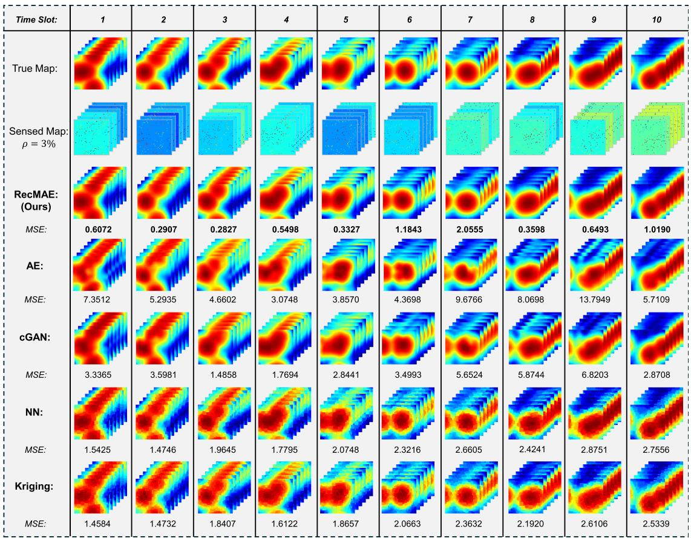  
Fig. 5. The reconstruction comparison of different methods within 10-time slots and sensing radio ρ = 3%.

Baseline Methods: We compare the proposed MADP framework with several baseline methods to evaluate its effectiveness from both off-policy and on-policy perspectives. The baselines include variants of DRL models commonly applied to multiagent trajectory optimization tasks. The key methods and their abbreviations are summarized as follows:

– CNN: The standard MADDPG algorithm [44], where CNNs are used for state feature extraction.

– CNN-Attention: An enhanced MADDPG variant that incorporates the temporal-attention state encoder described in Section IV-C2.

– PPO: A Multi-Agent Proximal Policy Optimization (MAPPO) baseline built with CNN-based state encoders, representing an on-policy framework.

– Random: A control baseline where UAVs move randomly without policy guidance, used to verify the learning effectiveness of all DRL-based methods.

Experiment Settings: In this section, we consider the same scenario setting as in the previous experiments, where each grid cell has a size of  × . We assume that dynamic sensors can sense a surrounding  ×  grid of radio signals, whereas static sensors are limited to sensing only a  ×  area [9]. The static sensors are assumed to be evenly distributed across the environment. During each time step, the dynamic sensors can move up to two grid cells in either the east-west or north-south direction.

The learning models are trained over 2000 epochs. During the initial 500 epochs, the proportion of random exploration is gradually reduced. From epoch 1300 onward, the learning rate progressively decreases until it reaches zero, ensuring stable convergence. The reward function is defined as 30 minus the reconstruction error E (12). The constant value 30 is derived from the mean of reconstruction errors obtained through random sampling and serves as a normalization term to keep the reward distribution centered and unbiased during training. More detailed network architectures and hyperparameters are shown in Table III.

Evaluation: First, we evaluate the performance of the proposed MADP in the GenAI planning stage by comparing it against baseline strategies and analyzing its learning behavior. Fig. 6 presents the learning curves and final reconstruction errors for MADP and three baseline methods under a given scenario, where the number of UAVs is 4 and static sensor spacing is 16.

As shown in Fig. 6(a), MADP achieves a substantially higher average reward during training, converging faster and more stably than the alternatives. The MADP agents’ reward generally improves over time, showing quick recovery from occasional drops, particularly as random exploration is gradually reduced after 500 epochs and the learning rate decays after about 1300 epochs. In contrast, the CNN and CNN-Attention baselines improve more slowly, with CNN-Attention exhibiting larger fluctuations in reward, even when the learning rate is low. By the end of the training, MADP attains the highest reward and demonstrates the most stable learning trajectory, indicating superior training stability.

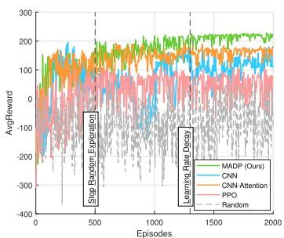  
(a) Training Curve

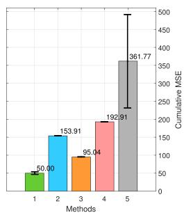  
(b) Cumulative MSE

Fig. 6. The training curve and cumulative MSE of 5 methods.  
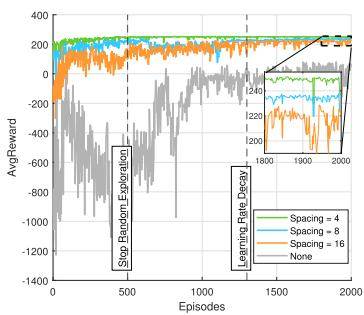  
(a) Training Curve

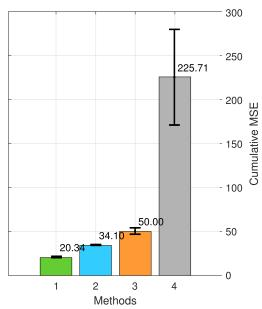  
(b) Cumulative MSE

Fig. 7. The training curve and cumulative MSE of different spacing  
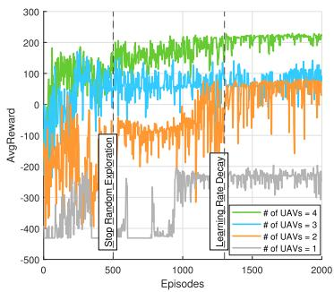  
(a) Training Curve

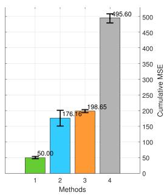  
(b) Cumulative MSE  
Fig. 8. The training curve and cumulative MSE of different numbers.

As shown in Fig. 6(a), the proposed MADP achieves a substantially higher average reward throughout training, converging faster and more stably than all baseline methods. The MADP agents’ reward generally improves over time, showing quick recovery from occasional drops, particularly as random exploration is gradually reduced after 500 epochs and the learning rate decays after about 1300 epochs. In comparison, the CNN and CNN-Attention baselines show slower convergence and larger oscillations, particularly in the early training stages. The PPO baseline, while capable of maintaining smooth policy updates due to its on-policy nature, exhibits limited exploration efficiency and converges to a suboptimal reward under the same number of environment interactions. This contrast underscores the advantage of the off-policy design in MADP, which allows reusing historical experience through a replay buffer, thus achieving better sample efficiency within the same interaction budget.

Fig. 6(b) further compares the cumulative reconstruction MSE across five repeated runs. The proposed MADP achieves the lowest MSE of 50.00, significantly outperforming the CNN baseline at 153.91, the CNN-Attention baselines at 95.04, and the PPO baselines at 192.91, while the Random policy performs the worst with 361.77. In other words, MADP reduces cumulative reconstruction error by about 67.5% compared with the standard CNN-based MADDPG, 47.4% compared with the attentionaugmented variant, and 74.1% compared with the PPO baseline. These results demonstrate that the diffusion-based multi-agent planner ensures stable convergence and achieves more efficient learning by leveraging replayed trajectories. Notably, while PPO benefits from smoother on-policy updates, the off-policy MADP exhibits superior performance under the same number of environment interactions, verifying that efficient experience reuse can markedly enhance learning stability and mapping accuracy.

We further investigate how sensor deployment density affects performance. Fig. 7 examines the impact of varying the static sensor spacing on mapping accuracy, with the number of UAVs fixed at 4. As expected, having more densely distributed static sensors markedly improves reconstruction quality. In Fig. 7(a), the cumulative MSE achieved by MADP increases from 20.34 with a very dense static network (spacing 4) to 34.10 at moderate density (spacing 8) and 50.00 at sparse deployment (spacing 16). In the extreme case with no static sensors, the MSE spikes to 225.71, reflecting the much heavier burden on the UAVs to sense the entire area. Correspondingly, the training curves in Fig. 7(b) show faster convergence and higher final rewards when more static measurements are available, since the GenAI reconstructor can rely on richer initial reducing requirements for dynamic sensor locations. When static sensors are removed, the MADP agents can still learn a policy to cover the area; however, convergence is slower, and the final reward is lower due to increased uncertainty. These trends indicate that while our MADP framework can function with only mobile sensors, having even a sparsely distributed static sensor grid significantly enhances mapping performance by providing valuable observations.

Fig. 8 illustrates the impact of UAV team size on learning performance, under the condition of a fixed static sensor spacing of 16. The results demonstrate that increasing the number of UAV agents enhances both training efficiency and final reconstruction accuracy, highlighting the benefits of multi-agent cooperation. Particularly, using four UAVs yields a cumulative MSE of 50.00, whereas reducing to three, two, or one UAV degrades the accuracy to roughly 176.16, 198.65, and 495.60, respectively This dramatic increase in MSE with fewer agents indicates that additional UAVs provide complementary coverage and more data, which directly translates to higher mapping fidelity. Unlike static sensors, UAVs exert a greater influence on reconstruction performance due to their mobility and dynamic sensing capabilities. These observations underscore the importance of cooperative multi-UAV exploration: a greater number of agents can divide the sensing task and explore the region in parallel, thereby reducing the cumulative error and improving the robustness of the cartography process.

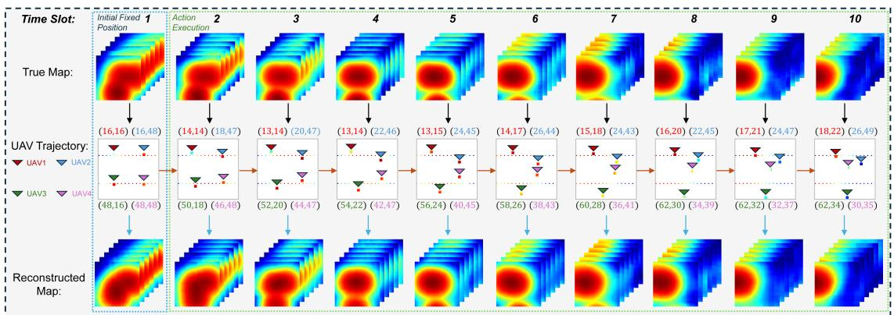  
Fig. 9. The illustration of the MADP execution process and a UAV trajectory example.

Finally, Fig. 9 illustrates the trajectories followed by the UAVs under the learned MADP policy, alongside the true spectrum map and the reconstructed map for the region. For reconstructed maps, during the first time slot, the UAV’s initial position is fixed, resulting in only partial recovery. However, starting from the second time slot, the MADP strategy gradually enhances reconstruction performance by adjusting UAVs’ trajectories. Over the 10-time-slot horizon, the UAV’s flight paths reflect an increasingly efficient coverage strategy. Each UAV agent disperses to cover a different sub-area of the field, and their paths collectively ensure that diverse locations are observed over time. Notably, the agents coordinate implicitly to avoid redundant coverage via sequentially visiting distinct waypoints. This effective spatial exploration is evident from the correspondence between features in the true map and the reconstructed map: the learned trajectories allow the GenAI reconstructor to capture the major signal variations across the region. Thus, the proposed approach minimizes reconstruction error quantitatively and produces qualitatively sensible flight paths that enhance mapping performance by gathering information from all critical areas of the LAENets.

## VI. CONCLUSION

In this work, we have proposed a two-stage GenAI framework for temporal spectrum cartography in LAENets. The framework consists of a GenAI reconstructor and a GenAI planner, each responsible for one stage of the process. In the reconstruction stage, we introduced RecMAE, a masked autoencoder designed to recover temporal spectrum maps using a dual-mask mechanism. This design enhances the model’s ability to capture finegrained details and enables more accurate spectrum reconstruction. In the planning stage, we presented MADP, a multi-agent diffusion policy learner built upon a temporal-attention state encoder. This encoder effectively extracts temporal context from sequential observations, facilitating robust decision-making in dynamic environments. Extensive simulation results demonstrate that our framework outperforms existing spectrum editing methods in both reconstruction and planning, enabling more effective and accurate spectrum cartography for low-altitude economy activities.

## REFERENCES

[1] X. Zheng et al., “UAV swarm-enabled collaborative post-disaster communications in low altitude economy via a two-stage optimization approach,” in Proc. IEEE Trans. Mob. Comput., vol. 24, no. 11, pp. 11833–11851, 2025.

[2] X. Chen, J. Wang, and Q. Huang, “Dynamic spectrum cartography: Reconstructing spatial-spectral-temporal radio frequency map via tensor completion,” IEEE Trans. Signal Process., vol. 73, pp. 1184–1199, 2025.

[3] J. Chen, O. Esrafilian, D. Gesbert, and U. Mitra, “Efficient algorithms for air-to-ground channel reconstruction in UAV-aided communications,” in Proc. 2017 IEEE Globecom Workshops, 2017, pp. 1–6.

[4] G. Boccolini, G. Hernandez-Penaloza, and B. Beferull-Lozano, “Wireless sensor network for spectrum cartography based on kriging interpolation,” in Proc. IEEE 23rd Int. Symp. Pers., Indoor Mobile Radio Commun., 2012, pp. 1565–1570.

[5] S. Üreten, A. Yongaço ˘glu, and E. Petriu, “A comparison of interference cartography generation techniques in cognitive radio networks,” in Proc. 2012 IEEE Int. Conf. Commun., 2012, pp. 1879–1883.

[6] S. Shrestha, X. Fu, and M. Hong, “Deep spectrum cartography: Completing radio map tensors using learned neural models,” IEEE Trans. Signal Process., vol. 70, pp. 1170–1184, 2022.

[7] Y. Teganya and D. Romero, “Deep completion autoencoders for radio map estimation,” IEEE Trans. Wireless Commun., vol. 21, no. 3, pp. 1710–1724, Mar. 2022.

[8] Y. S. Reddy, A. Kumar, O. J. Pandey, and L. R. Cenkeramaddi, “Spectrum cartography techniques, challenges, opportunities, and applications: A survey,” Pervasive Mobile Comput., vol. 79, 2022, Art. no. 101511.

[9] R. Shrestha, D. Romero, and S. P. Chepuri, “Spectrum Surveying: Active radio map estimation with autonomous UAVs,” IEEE Trans. Wireless Commun., vol. 22, no. 1, pp. 627–641, Jan. 2023.

[10] C. Zhao et al., “Generative AI-enabled wireless communications for robust low-altitude economy networking,” in Proc. IEEE Wireless Comm., early access.

[11] Z. Tong, Y. Song, J. Wang, and L. Wang, “VideoMAE: Masked autoencoders are data-efficient learners for self-supervised video pre-training,” in Proc. Adv. Neural Inf. Process. Syst., 2022, pp. 10078–10093.

[12] Q. Han, G. Zhang, J. Huang, P. Gao, Z. Wei, and S. Lu, “Efficient MAE towards large-scale vision transformers,” in Proc. IEEE/CVF Winter Conf. Appl. Comput. Vis., 2024, pp. 606–615.

[13] H. Du et al., “Enhancing deep reinforcement learning: A tutorial on generative diffusion models in network optimization,” IEEE Commun. Surveys Tuts., vol. 26, no. 4, pp. 2611–2646, Fourthquarter 2024.

[14] K. He, X. Chen, S. Xie, Y. Li, P. Dollár, and R. Girshick, “Masked autoencoders are scalable vision learners,” in Proc. IEEE/CVF Conf. Comput. Vis. Pattern Recognit., 2022, pp. 16000–16009.

[15] D. Romero and S.-J. Kim, “Radio map estimation: A data-driven approach to spectrum cartography,” IEEE Signal Process. Mag., vol. 39, no. 6, pp. 53–72, Nov. 2022.

[16] M. Tang, G. Ding, Q. Wu, Z. Xue, and T. A. Tsiftsis, “A joint tensor completion and prediction scheme for multi-dimensional spectrum map construction,” IEEE Access, vol. 4, pp. 8044–8052, 2016.

[17] D. Schäufele, R. L. Cavalcante, and S. Stanczak, “Tensor completion for radio map reconstruction using low rank and smoothness,” in Proc. IEEE 20th Int. Workshop Signal Process. Adv. Wireless Commun., 2019, pp. 1–5.

[18] G. Zhang, X. Fu, J. Wang, X.-L. Zhao, and M. Hong, “Spectrum cartography via coupled block-term tensor decomposition,” IEEE Trans. Signal Process., vol. 68, pp. 3660–3675, 2020.

[19] X. Han, L. Xue, Y. Xu, and Z. Liu, “A two-phase transfer learning-based power spectrum maps reconstruction algorithm for underlay cognitive radio networks,” IEEE Access, vol. 8, pp. 81232–81245, 2020.

[20] R. Levie, Ç. Yapar, G. Kutyniok, and G. Caire, “RadioUNet: Fast radio map estimation with convolutional neural networks,” IEEE Trans. Wireless Commun., vol. 20, no. 6, pp. 4001–4015, Jun. 2021.

[21] S. Roger, M. Brambilla, B. C. Tedeschini, C. Botella-Mascarell, M. Cobos, and M. Nicoli, “Deep-learning-based radio map reconstruction for V2X communications,” IEEE Trans. Veh. Technol., vol. 73, no. 3, pp. 3863–3871, Mar. 2024.

[22] X. Luo, Z. Li, Z. Peng, M. Chen, and Y. Liu, “Denoising diffusion probabilistic model for radio map estimation in generative wireless networks,” IEEE Trans. Cogn. Commun. Netw., vol. 11, no. 2, pp. 751–763, Apr. 2025.

[23] X. Wang et al., “RadioDiff: An effective generative diffusion model for sampling-free dynamic radio map construction,” IEEE Trans. Cogn. Commun. Netw., vol. 11, no. 2, pp. 738–750, Apr. 2025.

[24] C. Zhao et al., “Generative AI for secure physical layer communications: A survey,” IEEE Trans. Cogn. Commun. Netw., vol. 11, no. 1, pp. 3–26, Feb. 2025.

[25] K. Han et al., “A survey on vision transformer,” IEEE Trans. Pattern Anal. Mach. Intell., vol. 45, no. 1, pp. 87–110, Jan. 2023.

[26] H. Zhou et al., “Large language model (LLM) for telecommunications: A comprehensive survey on principles, key techniques, and opportunities,” IEEE Commun. Surveys Tuts., vol. 27, no. 3, pp. 1955–2005, Jun. 2025.

[27] S. Sorour, Y. Lostanlen, S. Valaee, and K. Majeed, “Joint indoor localization and radio map construction with limited deployment load,” IEEE Trans. Mobile Comput., vol. 14, no. 5, pp. 1031–1043, May 2015.

[28] Q. Gong, F. Wu, D. Yang, L. Xiao, and Z. Liu, “3D radio map reconstruction and trajectory optimization for cellular-connected UAVs,” J. Commun. Inf. Netw., vol. 8, no. 4, pp. 357–368, 2023.

[29] H. Zhao et al., “Online trajectory optimization for energy-efficient cellularconnected UAVs with map reconstruction,” IEEE Trans. Veh. Technol., vol. 73, no. 3, pp. 3445–3456, Mar. 2024.

[30] L. Li, W. Li, J. Wang, X. Chen, Q. Peng, and W. Huang, “UAV trajectory optimization for spectrum cartography: A PPO approach,” IEEE Commun. Lett., vol. 27, no. 6, pp. 1575–1579, Jun. 2023.

[31] V. François-Lavet et al., “An introduction to deep reinforcement learning,” Foundations Trends Mach. Learn., vol. 11, no. 3-4, pp. 219–354, 2018.

[32] C. Chi et al., “Diffusion Policy: Visuomotor policy learning via action diffusion,” Int. J. Robot. Res., vol. 44, pp. 1684–1704, 2023.

[33] C. Zhao et al., “Generative AI enabled robust sensor placement in cyber-physical power systems: A graph diffusion approach,” 2025, arXiv:2501.06756.

[34] C. Zhao et al., “Enhancing physical layer communication security through generative AI with mixture of experts,” IEEE Wireless Commun., vol. 32, no. 3, pp. 176–184, Jun. 2025.

[35] J. Wang et al., “Generative AI for integrated sensing and communication: Insights from the physical layer perspective,” IEEE Wireless Commun., vol. 31, no. 5, pp. 246–255, Oct. 2024.

[36] Ç. Yapar, R. Levie, G. Kutyniok, and G. Caire, “Real-time outdoor localization using radio maps: A deep learning approach,” IEEE Trans. Wireless Commun., vol. 22, no. 12, pp. 9703–9717, Dec. 2023.

[37] W. Xue, Q. Li, X. Hua, K. Yu, W. Qiu, and B. Zhou, “A new algorithm for indoor RSSI radio map reconstruction,” IEEE Access, vol. 6, pp. 76118– 76 125, 2018.

[38] Q. Zhu, C.-X. Wang, B. Hua, K. Mao, S. Jiang, and M. Yao, “Wiley 5G ref: The essential 5G reference online,” 3GPP, Sophia Antipolis, France, Tech. Rep. 38.901, 2021.

[39] M. Gudmundson, “Correlation model for shadow fading in mobile radio systems,” Electron. Lett., vol. 27, no. 23, pp. 2145–2146, 1991.

[40] A. Vaswani et al., “Attention is all you need,” in Proc. Adv. Neural Inf. Process. Syst., pp. 6000–6010, 2017.

[41] E. Voita, D. Talbot, F. Moiseev, R. Sennrich, and I. Titov, “Analyzing multi-head self-attention: Specialized heads do the heavy lifting, the rest can be pruned,” in Proc. 57th Annu. Meeting Assoc. Computat. Linguistics, 2019, pp. 5797–5808.

[42] M. T. Spaan, “Partially observable Markov decision processes,” in Reinforcement Learning: State-of-the-Art. Berlin, Germany: Springer, 2012, pp. 387–414.

[43] J. Ho, A. Jain, and P. Abbeel, “Denoising diffusion probabilistic models,” in Proc. Adv. Neural Inf. Process. Syst., 2020, pp. 6840–6851.

[44] R. Lowe, Y. I. Wu, A. Tamar, J. Harb, O. P. Abbeel, and I. Mordatch, “Multiagent actor-critic for mixed cooperative-competitive environments,” in Proc. Adv. Neural Inf. Process. Syst., pp. 6382–6393, 2017.

[45] D. Silver, G. Lever, N. Heess, T. Degris, D. Wierstra, and M. Riedmiller, “Deterministic policy gradient algorithms,” in Proc. Int. Conf. Mach. Learn., 2014, pp. 387–395.

[46] S. Zhang, A. Wijesinghe, and Z. Ding, “RME-GAN: A learning framework for radio map estimation based on conditional generative adversarial network,” IEEE Internet Things J., vol. 10, no. 20, pp. 18016–18027, Oct. 2023.

[47] X. Ren, H. Mosavat-Jahromi, L. Cai, and D. Kidston, “Spatio-temporal spectrum load prediction using convolutional neural network and ResNet,” IEEE Trans. Cogn. Commun. Netw., vol. 8, no. 2, pp. 502–513, Jun. 2022.

[48] 3rd Generation Partnership Project (3GPP), “Study on channel model for frequencies from 0.5 to 100 GHz,” 3GPP, Sophia Antipolis, France, Tech. Rep. 38.901, Nov. 2020, release 16.

[49] X. Chen, X. Zhong, Z. Zhang, L. Dai, and S. Zhou, “High-efficiency urban 3D radio map estimation based on sparse measurements,” in Proc. IEEE Trans. Veh. Technol, vol. 74, no. 10, pp. 16488–16493, 2025.

[50] M. Alzenad, A. El-Keyi, and H. Yanikomeroglu, “3-D placement of an unmanned aerial vehicle base station for maximum coverage of users with different QoS requirements,” IEEE Wireless Commun. Lett., vol. 7, no. 1, pp. 38–41, Feb. 2018.

Changyuan Zhao (Graduate Student Member, IEEE) received the BSc degree in computing and information science from the University of Science and Technology of China, Hefei, China, in 2020, and the MAEng degree in computer science from the Institute of Software, CAS, Beijing, China, in 2023. He is currently working toward the PhD degree with the College of Computing and Data Science, Nanyang Technological University, Singapore. His research interests include low-altitude wireless network, generative AI, large language models, and their

application in wireless communication systems.  
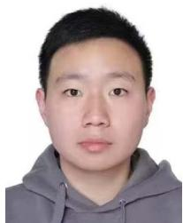

Ruichen Zhang (Member, IEEE) is currently a postdoctoral research fellow with the College of Computing and Data Science, Nanyang Technological University, Singapore. In 2024, he was a visiting scholar with the College of Information and Communication Engineering, Sungkyunkwan University, Suwon, South Korea. His research interests include the Internet of Agents, LLM-empowered networking, reinforcement learning-enabled wireless communication, generative AI models, and heterogeneous networks.

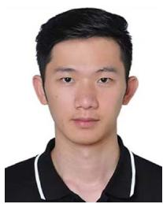

Jiacheng Wang (Member, IEEE) received the MS and PhD degrees from the School of Communication and Information Engineering, Chongqing University of Posts and Telecommunications, in 2018 and 2022, respectively. From 2021 to 2022, he was a visiting researcher with the College of Computing and Data Science, Nanyang Technological University, Singapore, where he is currently working. His research interests include generative AI, integrated sensing and communications, network optimization, and edge intelligence. He has authored or coauthored more than

40 papers including IEEE Journal on Selected Areas in Communications, IEEE Transactions on Mobile Computing, IEEE Transactions on Wireless Communications, IEEE Transactions on Cognitive Communications and Networking, IEEE Transactions on Vehicular Technology, IEEE Communications Surveys and Tutorials, IEEE Wireless Communications, IEEE Network, IEEE Wireless Communications Letters, IEEE GLOBECOM, IEEE ICC, and IEEE WCNC. He was the recipient of IEEE ICC 2025 Best Paper Award. He was a guest editor of IEEE Transactions on Cognitive Communications and Networking, IEEE Transactions on Network Science and Engineering, Wireless Communications, IEEE Open Journal of the Communications Society, IEEE Internet of Things Magazine, and IEEE Networking Letters. He is an associate editor for IEEE Transactions on Network and Service Management and IEEE Open Journal of the Communications Society.

  
Dusit Niyato (Fellow, IEEE) is a professor in the College of Computing and Data Science, at Nanyang Technological University, Singapore. He received the BEng degree from the King Mongkuts Institute of Technology Ladkrabang (KMITL), Thailand, and the PhD degree in electrical and computer engineering from the University of Manitoba, Canada. His research interests are in the areas of mobile generative AI, edge general intelligence, quantum computing and networking, and incentive mechanism design.

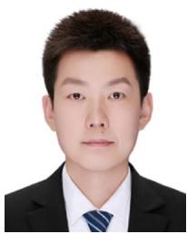

Geng Sun (Senior Member, IEEE) received the BS degree in communication engineering from Dalian Polytechnic University, in 2011, and the PhD degree in computer science and technology from Jilin University, in 2018. He was a visiting researcher with the School of Electrical and Computer Engineering, Georgia Institute of Technology, USA. He is currently a professor with the College of Computer Science and Technology, Jilin University. He is currently a visiting scholar with the College of Computing and Data Science, Nanyang Technological University, Singapore.

He has authored or coauthored more than 100 high-quality papers, including IEEE Transactions on Mobile Computing, IEEE Journal on Selected Areas in Communications, IEEE/ACM Transactions on Networking, IEEE Transactions on Wireless Communications, IEEE Transactions on Communications, IEEE Transactions on Antennas and Propagation, IEEE Internet of Things Journal, IEEE Transactions on Instrumentation and Measurement, IEEE INFOCOM, IEEE GLOBECOM, and IEEE ICC. His research interests include low-altitude wireless networks, UAV communications and networking, mobile edge computing, intelligent reflecting surface, generative AI, agentic AI, and deep reinforcement learning. He is an associate editor for IEEE Communications Surveys & Tutorials, IEEE Transactions on Communications, IEEE Transactions on Vehicular Technology, IEEE Transactions on Network Science and Engineering, IEEE Transactions on Network and Service Management, and IEEE Networking Letters. He is also the lead guest editor of Special Issues for IEEE Transactions on Network Science and Engineering, IEEE Internet of Things Journal, IEEE Networking Letters. He is the guest editor of Special Issues for IEEE Transactions on Services Computing, IEEE Communications Magazine, and IEEE Open Journal of the Communications Society.

Hongyang Du (Member, IEEE) received the BEng degree from Beijing Jiaotong University, China, and the PhD degree from Nanyang Technological University, Singapore. He is currently an assistant professor with the Department of Electrical and Electronic Engineering, The University of Hong Kong, where he directs the Network Intelligence and Computing Ecosystem Laboratory. His research interests include edge intelligence, generative AI, and network management. He was an editor-in-chief assistant from 2022 to 2024, and an editor since 2025 of IEEE Com-

munications Surveys & Tutorials, IEEE Transactions on Communications, IEEE Transactions on Vehicular Technology, IEEE Open Journal of the Communications Society, and the Guest Editor of IEEE Vehicular Technology Magazine. He was the recipient of the IEEE ComSoc Young Professional Award for Best Early Career Researcher in 2024, IEEE Daniel E. Noble Fellowship Award from the IEEE Vehicular Technology Society in 2022, the IEEE Signal Processing Society Scholarship from the IEEE Signal Processing Society in 2023, the Singapore Data Science Consortium Dissertation Research Fellowship in 2023, and NTU Graduate College’s Research Excellence Award in 2024. He was recognized as an exemplary reviewer of the IEEE Transactions on Communications and IEEE Communications Letters.

Zan Li (Fellow, IEEE) received the BSc degree in communications engineering and the MSc and PhD degrees in communication and information systems from Xidian University, Xian, China, in 1998, 2001, and 2006, respectively. Since 2001, she has been a faculty member with the School of Telecommunication Engineering, Xidian University, China, where she is currently the vice president with Xidian University and a full professor with the State Key Laboratory of ISN. Her current research interests include wireless communication and signal processing, particularly

covert communication, weak signal detection, spectrum sensing, and cooperative communication. She was a recipient of China Youth WOMEN Scientists Award, China Youth Science & Technology Award, and XPLORER PRIZE, Distinguished Young Researcher from NSFC, and a Changjiang Scholar from the Ministry of Education, China. She is a fellow of the Institution of Engineering and Technology, the China Institute of Electronics, and the China Institute of Communications. She is an associate editor for IEEE Transactions on Cognitive Communications and Networking and China Communications.

Abbas Jamalipour (Fellow, IEEE) received the PhD degree in electrical engineering from Nagoya University, Nagoya, Japan, in 1996. He is currently a professor of ubiquitous mobile networking with The University of Sydney, Camperdown, NSW, Australia. He has authored nine technical books, 11 book chapters, more than 650 technical papers, and five patents, all in wireless communications and networking. He is an editor-in-chief of IEEE Transactions on Vehicular Technology. Prof. Jamalipour is a recipient of the number of prestigious awards, including 15 Best

Paper Awards. He was the president of the IEEE Vehicular Technology Society from 2020 to 2021. He held the positions of the executive vice-president and the editor-in-chief of VTS Mobile World. He has been an elected member of the Board of Governors of the IEEE Vehicular Technology Society since 2014. He was the editor-in-chief of IEEE Wireless Communications, the vice president-Conferences, and a member of Board of Governors of the IEEE Communications Society. He is a fellow of the Institute of Electrical, Information, and Communication Engineers, the Institution of Engineers Australia, and the International Artificial Intelligence Industry Alliance, an ACM Professional member, and an IEEE distinguished speaker.

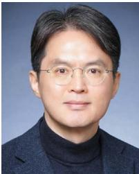

Dong In Kim (Life Fellow, IEEE) received the PhD degree in electrical engineering from the University of Southern California, Los Angeles, CA, USA, in 1990. He was a tenured professor with the School of Engineering Science, Simon Fraser University, Burnaby, BC, Canada. He is currently a distinguished professor with the College of Information and Communication Engineering, Sungkyunkwan University, Suwon, South Korea. He is a fellow of the Korean Academy of Science and Technology and a life member of the National Academy of Engineering of Korea. He was the first recipient of the NRF of Korea Engineering Research Center in Wireless Communications for RF Energy Harvesting from 2014 to 2021, several research awards, including the 2023 IEEE ComSoc Best Survey Paper Award and the 2022 IEEE Best Land Transportation Paper Award. He was selected the 2019 recipient of the IEEE ComSoc Joseph LoCicero Award for Exemplary Service to Publications. He was the general chair of the IEEE ICC 2022, Seoul. From 2001 to 2024, he was an editor, an editor at large, and an area editor of Wireless Communications I for IEEE Transactions on Communications. From 2002 to 2011, he was an editor and a Founding area editor of Cross-Layer Design and Optimization for IEEE Transactions on Wireless Communications. From 2008 to 2011, he was the co-editor-in-chief of IEEE/KICS Journal of Communications and Networks. He was the Founding editor-in-chief of IEEE Wireless Communications Letters from 2012 to 2015. He has been listed as a 2020 (Cross-Field)/2022 (Cross-Field)/2025 (Computer Science) Highly Cited Researcher (HCR) by Clarivate Analytics.