# Terahertz Communication Multi-UAV-Assisted Mobile Edge Computing System

Heekang Song, Student Member, IEEE, Hyowoon Seo, Member, IEEE, and Wan Choi, Fellow, IEEE

Abstract—Mobile edge computing (MEC) and terahertz (THz)- enabled unmanned aerial vehicle (UAV) communications have been actively studied to support computation-intensive and delay-sensitive services in future wireless networks. However, existing MEC systems are often limited by spectrum scarcity and blockage-prone links, while most UAV-aided MEC studies focus on single-UAV deployment, UAV-side computation, or shortterm delay minimization. This paper proposes a THz-enabled MEC architecture assisted by multiple UAV communication relays to reduce long-term user service delay. We formulate a joint optimization problem for UAV relay selection, UAV power control, UAV deployment, and user-resource association, accounting for both distance- and frequency-dependent THz channel characteristics and MEC computation queueing delay. Since the resulting problem is a mixed-integer nonlinear program with tightly coupled binary and continuous variables, we develop a penalty dual decomposition (PDD)-based iterative algorithm that decomposes it into four tractable subproblems. We further derive closed-form solution structures for UAV relay selection and power control at convergence and analyze the convergence and computational complexity of the proposed method. Numerical results show that the proposed algorithm consistently outperforms benchmark schemes by jointly balancing communication and computation delays. In a representative scenario, it achieves an average service delay of 2.3687 s, approaching the 2.1319 s exhaustive-search benchmark while maintaining polynomial-time complexity.

Index Terms—Mobile edge computing, terahertz communications, unmanned aerial vehicle, penalty dual decomposition.

## I. INTRODUCTION

The rapid advancements in software and hardware have led to a surge in internet-connected devices like smart cameras, smartphones, and vehicles, driving Internet of Things (IoT) adoption and significantly increasing data generation. This growth fuels innovations in VR, AR, and high-definition streaming but strains network infrastructures, requiring improved communication and computation. Many IoT devices, with limited capabilities, struggle to support these applications. While cloud computing was initially used for managing resource-intensive tasks [1], the physical distance between clients and centralized servers often degrades Quality-of-Experience (QoE), particularly in wireless networks.

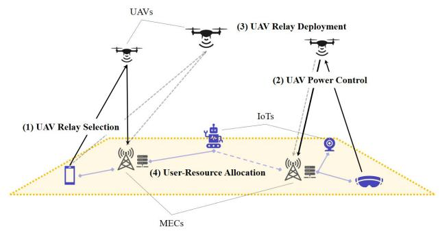  
Fig. 1. An illustration of THz-enabled MEC system with multi-UAV communication relays.

Recently, mobile edge computing has emerged as a promising approach to enhance QoE by offloading tasks to distributed edge servers using idle computational resources [2], [3], albeit at the cost of communication resources. A key challenge in MEC is minimizing user service delay, which includes both communication and computation delays—dependent on useredge server channel conditions and the availability of idle computing resources, respectively. Prior studies have explored task offloading strategies, such as scheduling and server deployment, to address these delays [4]–[7], [11]. However, increasing wireless traffic and limited spectral resources in gigahertz (GHz) wireless communication systems restrict QoE improvements. To overcome this, terahertz wireless communication (0.1–10 THz) has emerged as a viable solution for wireless MEC [12]–[14].

THz communication faces challenges such as blockage susceptibility, high path loss, and molecular absorption loss [15], [16]. Ensuring stable pathways in THz-enabled MEC is critical, as traditional base station deployment is inefficient in THz scenarios. UAVs offer a flexible and mobile solution to enhance communication reliability [17]. Studies on THz-UAV networks [17]–[19] highlight their potential, with recent research [19] showing promise for integration into vehicular aerial communication systems. Strategic UAV relay placement can address blockages, reduce transmission distances, and improve link quality [20]–[23].

Our goal is to design a THz-enabled MEC system using UAV communication relays to meet stringent delay requirements for computation-intensive tasks. Key challenges include optimizing (1) UAV relay selection, (2) UAV power control, (3) UAV deployment, and (4) user-resource association to satisfy service delay constraints. Unlike GHz communications, THz channel path loss includes molecular absorption, influenced by link distance [26], impacting relay selection, placement, and offloading strategies. Path loss also varies with frequency bands [27], requiring efficient power control and sub-band allocation to maintain QoE. Additionally, optimizing user-resource associations reduces computation delay by balancing server loads. Jointly addressing these aspects is critical but challenging for developing a THz-enabled MEC system with multi-UAV relays.

## A. Related Works

Reducing user service delays and energy consumption in MEC systems is a complex challenge. Task offloading has proven effective [4]–[11], though it introduces transmission and computation delays. Strategies like optimizing server placement to reduce communication distances and scheduling servers to avoid overloading can mitigate these delays. For example, [4] proposed a stochastic scheduling rule using a Markov chain model to minimize single-user task delay, while [5] extended to multi-user scenarios with a game-theoretic approach to find Nash equilibrium. [6] addressed energy minimization by considering both communication and computation energy. However, these methods were limited to single base station setups, making them less applicable to dense networks. To overcome this, [7] focused on minimizing computation delays in multi-edge server scenarios by optimizing task offloading and transmission times.

To enhance QoE in computation offloading, Fu et al. [8] studied a single terrestrial relay assisting IoT devices, effective with sufficient Line of Sight (LoS) but constrained by high costs and low flexibility. [9] proposed a multi-UAV-aided MEC framework where UAVs serve as mobile-edge nodes, employing differential evolution-based deployment and DRLaided task scheduling for load balancing and QoS. Similarly, [10] introduced a multi-UAV-enabled MEC system to maximize IoT service coverage under time constraints by optimizing UAV trajectories, resource allocation, and computation offloading. However, most UAV-aided MEC networks perform computations within UAVs, which is inefficient for compute-intensive applications like AI. While existing MEC studies mainly focus on minimizing delays for single tasks in computation-abundant scenarios, continuous computation requests in smart farms or cities with limited capacities require a computation queue model to address long-term delays. Recently, [11] proposed a genetic algorithm-based strategy using a computation queue model to jointly optimize task offloading and server deployment, effectively reducing expected service delays with real data from Oulu, Finland.

Despite advancements in MEC systems, spectrum limitations remain a challenge. Recent research has explored ultra-wideband THz links to enhance MEC-assisted wireless VR scenarios by reducing latency and energy consumption. [12] optimized rendering offloading and power control to minimize long-term energy consumption, while [13] proposed a learning-based approach for long-term QoE optimization in indoor THz VR networks. Additionally, [14] investigated THz’s potential for high-rate, reliable, and low-latency VR communication. However, these studies primarily focused on indoor VR scenarios, limiting their applicability.

THz communications face challenges like blockage, high path loss, and molecular absorption, limiting their range. To enhance coverage, UAV relay-aided THz communication has been explored [20]–[23]. For instance, [20] optimized secrecy energy efficiency in untrusted UAV-relay systems, while [21] minimized delay by jointly optimizing UAV location, bandwidth, and power. [22] focused on maximizing sum rates in UAV-aided THz communication. Although these studies primarily addressed single UAV relays, [23] investigated multi-UAV architectures to maximize overall throughput.

Recent studies have explored UAV-aided MEC systems with a focus on single UAVs. [24] investigated a mmWave/THzenabled cellular MEC system for UAV computation requests, emphasizing energy efficiency, while [25] applied deep reinforcement learning to optimize UAV placement, resource allocation, and computation offloading, minimizing short-term delays for single-task users. To our knowledge, this study is the first to propose a comprehensive framework for THzenabled MEC systems with multi-UAV communication relays, targeting the minimization of long-term user service delays.

## B. Contributions and Organization

The major contributions of this paper are listed below.

1) Leveraging the ultra-wideband THz frequencies and cost-effective UAV relays, we propose a novel THzenabled MEC architecture with multi-UAV relays to address IoT devices’ power and coverage limitations.

2) To minimize user service delay, we jointly optimize UAV relay selection, UAV transmission power control, UAV relay deployment, and user-resource association. Our optimization problem is highly complicated due to the THz link characteristics influenced by communication distance and frequency.

3) To tackle the problem’s complexity, we employ an iterative penalty dual decomposition algorithm, leveraging the convexity of each subproblem. We derive closedform expressions for two subproblems as the algorithm converges to a stationary point. We also analyze convergence and computational complexity, ensuring polynomial-time convergence to at least a suboptimum.

4) Simulations validate the superiority of our design over existing methods, highlighting the critical role of jointly optimizing communication and computation delays in a THz-enabled MEC system with multi-UAV relays.

The rest of the paper is structured as follows: Section II introduces the THz channel, data transmission, and task computation models, formulates user service delay, and defines the joint optimization problem to minimize expected delay under constraints. Section III details the proposed PDD-based iterative algorithm. Section IV evaluates the algorithm’s performance against benchmark methods. Finally, conclusions are presented in Section V. A list of our main notations can be found in Table I.

TABLE I SUMMARY OF NOTATIONS
<table><tr><td>Symbol</td><td>Meaning</td></tr><tr><td> $\overline { { I , \mathcal { I } } }$ </td><td>Number / set of IoT devices</td></tr><tr><td> $J , \mathcal { T }$ </td><td>Number / set of MEC servers</td></tr><tr><td> $M , { \mathcal { M } }$ </td><td>Number / set of UAV relays</td></tr><tr><td> $U , u$ </td><td>Set of THz sub-bands</td></tr><tr><td> ${ \bf u } _ { k }$ </td><td>3-D position of ground node k</td></tr><tr><td> ${ \bf q } _ { m }$ </td><td>3-D position of UAV m</td></tr><tr><td> $H$ </td><td>UAV altitude</td></tr><tr><td> $d _ { ( k , l ) }$ </td><td>Euclidean distance between nodes k and l</td></tr><tr><td> $B$ </td><td>Bandwidth of each sub-band</td></tr><tr><td> $f _ { o } , f _ { u }$ </td><td>Lowest carrier frequency; centre frequency of band u</td></tr><tr><td> $K ( f )$ </td><td>Molecular absorption coefficient at f</td></tr><tr><td> $P _ { \mathsf { l o T } } , P _ { \mathsf { U A V } }$ </td><td>IoT power budget; UAV power budget</td></tr><tr><td> $N _ { 0 }$ </td><td>Noise spectral density</td></tr><tr><td> $\alpha _ { i , m }$ </td><td>indicator; 1 iff IoT i uses UAV relay m</td></tr><tr><td> $z _ { j , i } ^ { u }$ </td><td>indicator; 1 iff IoT i offloads to MEC j on band u</td></tr><tr><td> $P _ { i , m }$ </td><td>Power allocated by UAV m for IoT i</td></tr><tr><td> $s , \mu$ </td><td>Number of computing units; service rate of a unit</td></tr><tr><td> $\lambda _ { i }$ </td><td>Task arrival rate of IoT i</td></tr><tr><td> $D _ { \mathrm { i n } }$ </td><td>Input data size of one task</td></tr></table>

## II. SYSTEM MODEL

This section describes the system model under study. As shown in Fig. 1, consider a THz communication-based UAVassisted MEC system, wherein M UAVs are deployed to relay the data transmissions from I IoT devices to J MEC servers. The finite sets of UAVs, IoT devices, and MECs are denoted by $\mathcal { M } \triangleq \{ 1 , . . . , M \} , \mathcal { T } \triangleq \{ 1 , . . . , I \}$ , and $\mathcal { I } \triangleq \{ 1 , . . . , J \}$ respectively. Each IoT $i \in \mathcal { Z }$ generates computation-intensive and delay-sensitive task requests with an arrival rate $\lambda _ { i }$ periodically, which follows the Poisson process [3], [11]. The IoT devices possess no computational power to handle the tasks by themselves, and thus they offload the tasks to the MEC servers and receive the task results.

The location of a ground entity $k \in \mathcal { T } \cup \mathcal { T }$ is denoted by the 3-dimensional Cartesian coordinates $\mathbf u _ { k } = [ x _ { k } , y _ { k } , 0 ]$ , and that of $\mathrm { U A V } \ m \in { \mathcal { M } }$ is denoted by $\mathbf { q } _ { m } = [ x _ { m } , y _ { m } , z _ { m } ] ,$ , while the altitude of UAVs is fixed at $z _ { m } = H$ . The nature of THz radiation, such as a high molecular absorption loss and vulnerability to blockage [26], hinders direct communication between two entities that are located far apart or using low transmit power. On balance, it is beneficial that the multiple UAVs act as an aerial relay node to overcome the obstacles. As a consequence, there exist three different types of directional communications, i.e., IoT-to-MEC, IoT-to-UAV, and UAV-to-MEC, where the set of all possible communication pairs are denoted by ${ \mathcal { C } } =$ $\{ ( k , l ) \mid ( \bar { k } , l ) \in ( \mathbb { Z } , \mathcal { T } ) \cup ( \mathbb { Z } , \mathcal { M } ) \cup ( \mathcal { M } , \mathcal { T } ) \}$ . The Euclidean distance between a communication pair $( k , l ) \in \mathcal { C }$ is denoted by $d _ { ( k , l ) } = \sqrt { ( x _ { k } - x _ { l } ) ^ { 2 } + ( y _ { k } - y _ { l } ) ^ { 2 } + ( z _ { k } - z _ { l } ) ^ { 2 } }$

## A. THz Communication Channel Model

THz bands are generally divided into two regions based on absorption loss: the absorption loss peak regions and the ultra-wideband THz transmission windows [15], [27]. Given the high signal attenuation in the absorption loss peak regions, we focus exclusively on the ultra-wideband THz transmission windows, ensuring no molecular absorption peaks occur within the selected transmission window. In our scenario, the spectrum of interest is divided into U sub-bands, i.e., ${ \mathcal { U } } \triangleq { \mathrm { \{ 1 , . . . , U \} } }$ , with equal bandwidth B. Thus, the center frequency $f _ { u }$ of a sub-band $u \in \mathcal { U }$ is

$$
f _ { u } = f _ { o } + \left( u - \frac { 1 } { 2 } \right) B ,\tag{1}
$$

where $f _ { o }$ represents the lowest carrier frequency of the spectrum under consideration. THz channel propagation is primarily influenced by free space spreading and molecular absorption losses. As the Line-of-Sight (LoS) path is dominant [15], [26], [27], the impact of non-LoS paths is assumed to be negligible. Hence, the channel gain of a communication pair $c \in { \mathcal { C } }$ through the frequency $f _ { u }$ is obtained as

$$
\left| h _ { c } ^ { u } \right| ^ { 2 } = \left( \frac { s _ { \mathrm { l i g h t } } } { 4 \pi f _ { u } d _ { c } } \right) ^ { 2 } e ^ { - K \left( f _ { u } \right) d _ { c } } ,\tag{2}
$$

where $s _ { \mathrm { l i g h t } }$ is the speed of light, $d _ { c }$ is the distance between the communication pair c, and $K ( f _ { u } )$ is the molecular absorption coefficient at the sub-band u. Note that $e ^ { - K ( f _ { u } ) d _ { c } }$ is the molecular absorption loss, which incorporates the effect of the oxygen and water vapor molecule absorbing the signal energy. The absorption coefficient $K ( f _ { u } )$ can be calculated from $\begin{array} { r } { K ( f _ { u } ) = \frac { p } { \bar { p } } \frac { \overline { { T } } } { T } \sum _ { i , g } Q ^ { i , g } \sigma ^ { i , g } ( f _ { u } ) } \end{array}$ , wherein $p$ and $T$ are the pressure and the temperature of transmission environment, respectively, while p and T represent the standard pressure and temperature, respectively. Further, $Q ^ { i , g }$ and $\sigma ^ { i , g } ( f _ { u } )$ are the total number of molecules per unit volume and the absorption cross section for the isotopologue i of gas $g$ at frequency $f _ { u }$ [15]. Using the HITRAN database [30], the absorption coefficient can be easily obtained without any complex calculations.

Blockages significantly affect the performance of THz communication systems due to the inherent properties of THz radiation. A comprehensive understanding of blockage effects is crucial for gaining deeper insights into THz communication characteristics. As outlined in [27], the non-blockage probability is modeled statistically, incorporating randomly moving blockers defined by their height $\psi _ { \mathsf { b } }$ and radius $\tau _ { \mathrm { b } } .$ These blockers are distributed according to a Poisson point process (PPP) with uniform intensity $\beta _ { \mathrm { b } }$ . The probability of non-blockage for the direct communication pair c becomes

$$
P r ^ { \mathsf { n b } } ( d _ { c } ) = e ^ { - 2 \beta _ { \mathsf { b } } \tau _ { \mathsf { b } } ^ { 2 } } \cdot e ^ { - \delta _ { \mathsf { b } } d _ { c } } , ~ \forall c \in ( \mathbb { Z } , \mathcal { T } ) ,\tag{3}
$$

where $\delta _ { \mathsf { b } } ~ = ~ 2 \beta _ { \mathsf { b } } \tau _ { \mathsf { b } } ( \psi _ { \mathsf { b } } - \psi _ { \mathsf { l o T } } ) / ( \psi _ { \mathsf { M E C } } - \psi _ { \mathsf { l o T } } )$ , with ψMEC and ψ representing the heights of MEC and IoT, respectively. We assume that a user only transmits data through its associated links when the links are unobstructed by dynamic blockers, deemed impenetrable [27], [28]; concurrently, UAV communication relays maintain robustness and are unaffected by such blockages.

Therefore, the long-term throughput of the communication pair $c \in { \mathcal { C } }$ when using u-th sub-band is

$$
\begin{array} { r } { R _ { c } ^ { u } = \left\{ { P r ^ { \mathrm { n b } } ( d _ { c } ) \cdot B \log _ { 2 } \bigg ( 1 + \frac { P _ { c } | h _ { c } ^ { u } | ^ { 2 } } { B N _ { 0 } } \bigg ) , \forall c \in ( \mathbb { Z } , \mathcal { I } ) } , \right. } \\ { \left. B \log _ { 2 } \bigg ( 1 + \frac { P _ { c } | h _ { c } ^ { u } | ^ { 2 } } { B N _ { 0 } } \bigg ) , \quad \forall c \in ( \mathbb { Z } , \mathcal { M } ) \cup ( \mathcal { M } , \mathcal { I } ) , \right. } \end{array}\tag{4}
$$

where $P _ { c }$ is the transmit power of source unit in communication pair $c \ ( { \mathrm { e . g . } }$ , the transmit power of IoT or UAV) and $N _ { 0 }$ is the noise spectral density.

## B. Data Transmission Model

In the considered network, there exists two different types of communication path that IoT devices can use to offload the tasks. One of them is a direct path, e.g., an IoT $i \in \mathcal { Z }$ transmitting a computing task to an MEC server $j ~ \in ~ \mathcal { T }$ directly. The other is a relay path, $\mathrm { e . g . }$ , an IoT $i \in \mathcal { Z }$ first communicates with a selected UAV m ∈ M to route a computing task, then the UAV relays to an MEC server $j \in \mathcal I$ For the sake of convenience, indicator variables

$$
\alpha _ { i , m } = \left\{ \begin{array} { l l } { 1 , } & { \mathrm { i f ~ I o T ~ } i \mathrm { ~ s e l e c t s ~ U A V ~ } m \mathrm { ~ a s ~ a ~ r e l a y , } } \\ { 0 , } & { \mathrm { o t h e r w i s e . } } \end{array} \right.\tag{5}
$$

$\forall i \in \mathcal { T }$ , ∀m $\in { \mathcal { M } }$ , are used hereinafter. Correspondingly, note that $\begin{array} { r } { \alpha _ { i } = \sum _ { m } \alpha _ { i , m } , \forall i \in \mathcal { I } } \end{array}$ indicates the type of communication path that the IoT devices are using, for example, $\alpha _ { i } = 1$ if the IoT i utilizes the UAV relay and $\alpha _ { i } = 0$ if the direct path is selected to transmit. Here, it is assumed that the associated pair $( i , j ) \in \mathcal { T } \times \mathcal { T }$ for offloading can only get help from at most one relaying UAV, leading to a constraint

$$
\alpha _ { i } \leq 1 , \quad \forall i \in \mathcal { T } .\tag{6}
$$

Since the collision avoidance is crucial when deploying UAVs, we explicitly impose a minimum distance constraint between UAVs to avoid close positioning throughout deployment, as

$$
\begin{array} { r } { \big \| \mathbf { q } _ { m } - \mathbf { q } _ { m ^ { \prime } } \big \| ^ { 2 } \geq d _ { \operatorname* { m i n } } ^ { 2 } , \ \forall m , m ^ { \prime } \in \mathcal { M } , m \neq m ^ { \prime } . } \end{array}\tag{7}
$$

Each UAV splits and adaptively allocates the transmit power for the IoT devices that are using it as a relay. Let $P _ { i , m }$ be the transmit power allocated by UAV m for IoT device i. Then,

$$
\sum _ { i } P _ { i , m } \leq P _ { \mathsf { U A V } } , \quad \forall m \in { \cal M } .\tag{8}
$$

where $P _ { \mathsf { U A V } }$ is the total transmit power of each UAV.

Each IoT device selects an MEC server to offload its tasks and a sub-band for communication. To prevent interference, we adopt orthogonal multiple access (OMA) [11] throughout this work. 1 In other words, no same sub-band is assigned to more than one IoT. Define by

$$
z _ { j , i } ^ { u } = \left\{ \begin{array} { l l } { { 1 , } } & { { \mathrm { i f ~ I o T ~ } i \mathrm { ~ o f f o a d s ~ t o ~ M E C ~ } j \mathrm { ~ v i a ~ s u b - b a n d ~ } u , } } \\ { { 0 , } } & { { \mathrm { o t h e r w i s e , } } } \end{array} \right.\tag{9}
$$

the indicator of association between the IoT i and MEC j, $\forall ( i , j ) \in \mathcal { I } \times \mathcal { I }$ and $\forall u \in \mathcal { U }$ . Since one sub-band is assigned to one association pair, we have

$$
\sum _ { i } \sum _ { j } z _ { j , i } ^ { u } = 1 , \quad \forall u \in \mathcal { U } ,\tag{10}
$$

and since one IoT is associated with one MEC, we have

$$
\sum _ { j } \sum _ { u } z _ { j , i } ^ { u } = 1 , \quad \forall i \in \mathcal { T } .\tag{11}
$$

Owing to the distance and frequency-dependent THz characteristics [15], [26], the frequency resources need to be allocated adaptively with respect to the communication distance and sub-band frequency to avoid severe molecular absorption loss, thereby attaining high spectral efficiency.

## C. Task Computation Model

As aforesaid, each IoT generates task requests following the Poisson process of rate $\lambda _ { i }$ . The task computation system of an MEC server is modeled as a multi-computing unit queue model [11], i.e., $M / M / s$ queueing system2, where s stands for the total number of computing units. The task operation delay can be modeled as a sum of queueing delay and task computation delay. The average operation delay of a task arriving at $M / M / s$ queue with given task arrival rate λ is

$$
t _ { \mathsf { o p e r } } ( s , \lambda ) = \frac { C \left( s , \displaystyle \frac \lambda \mu \right) } { s \mu - \lambda } + \frac 1 \mu ,\tag{12}
$$

where

$$
C ( s , \rho ) = \frac { \left( \frac { ( s \rho ) ^ { s } } { s ! } \right) \left( \frac { 1 } { 1 - \rho } \right) } { \sum _ { k = 0 } ^ { s - 1 } \frac { { ( s \rho ) ^ { k } } } { k ! } + { \left( \frac { { ( s \rho ) ^ { s } } } { s ! } \right) \left( \frac { 1 } { { 1 - \rho } } \right) } } ,\tag{13}
$$

and $\mu$ is the service rate of a computing unit. Here, the service rate $\mu$ of each computing unit is implicitly determined by the CPU frequency fMEC of the MEC server, the number of CPU cycles per bit cMEC, and the input size $D _ { \mathsf { i n } }$ of a single task, i.e., $\begin{array} { r } { \dot { \mu } = \frac { \mathsf { \bar { f } } _ { \mathsf { M E C } } } { D _ { \mathsf { i n } } \cdot c _ { \mathsf { M E C } } } } \end{array}$ . Note that (13) is referred to Erlang’s C formula, which depicts the probability that an arriving task is forced to join the queue. To ensure the stability of each edge server queue, the constraint

$$
s > \frac { 1 } { \mu } \sum _ { i } \sum _ { u } z _ { j , i } ^ { u } \cdot \lambda _ { i } , \quad \forall j \in \mathcal { I } ,\tag{14}
$$

must be satisfied. In other words, (14) ensures the incoming request rate does not exceed the system’s processing capacity, maintaining queue stability and efficient processing.

## D. Performance Metric and Problem Formulation

Define user service delay by the time elapsed from the generation of an IoT task request to the receipt of the processed task output from a server. Then, the user service delay of IoT $i \in \mathcal { Z }$ is represented as the sum of communication delay $t _ { \mathsf { c o m m } , i }$ and computation delay $t _ { \mathsf { c o m p } , i } , \mathsf { i . e . }$

$$
t _ { \mathsf { s e r v } , i } = t _ { \mathsf { c o m m } , i } + t _ { \mathsf { c o m p } , i } .\tag{15}
$$

Each term is explicitly calculated as follows; first, recall the two types of communication paths, i.e., direct and relay paths. The communication delay of IoT i offloading to MEC j with sub-band u can be expressed as

$$
t _ { \mathrm { c o m m } , i , j } ^ { u } = ( 1 - \alpha _ { i } ) t _ { \mathrm { d i r e c t } , i , j } ^ { u } + \sum _ { m } \alpha _ { i , m } t _ { \mathrm { r e l a y } , i , j , m } ^ { u } ,\tag{16}
$$

where the uplink delay through the direct path is obtained as

$$
t _ { \mathrm { d i r e c t } , i , j } ^ { u } = \frac { D _ { \mathrm { i n } } } { R _ { i , j } ^ { u } } ,\tag{17}
$$

and the uplink delay of relay link is obtained as 3

$$
t _ { \mathsf { r e l a y } , i , j , m } ^ { u } = \frac { D _ { \mathsf { i n } } } { R _ { i , m } ^ { u } } + \frac { D _ { \mathsf { i n } } } { R _ { m , j } ^ { u } } ,\tag{18}
$$

where $D _ { \mathsf { i n } }$ refers to the task input size. The downlink delay is ignored as the output data size is smaller than the input, and the MEC server’s transmit power ensures fast transmission [7], [8], making it negligible compared to the uplink delay. Hence, the overall communication delay of IoT $i \in \mathcal { T }$ can be obtained:

$$
t _ { \mathsf { c o m m } , i } = \sum _ { j } \sum _ { u } z _ { j , i } ^ { u } t _ { \mathsf { c o m m } , i , j } ^ { u } .\tag{19}
$$

The uplink delay of each IoT depends on user-resource associations and UAV locations. Given the distance- and frequencydependent characteristics of THz bands, these variables jointly influence the uplink delay of all IoT devices, making it a complex yet critical problem4.

Second, the computation delay is determined by the average operation delay of the edge server that processes the user’s task request. The computation delay of IoT $i \in \mathcal { T }$ can be written:

$$
t _ { \mathrm { c o m p } , i } = \sum _ { j } \sum _ { u } z _ { j , i } ^ { u } t _ { \mathsf { o p e r } } \left( s , \sum _ { i ^ { \prime } } \sum _ { u } z _ { j , i ^ { \prime } } ^ { u } \lambda _ { i ^ { \prime } } \right) ,\tag{20}
$$

where the second argument $\begin{array} { r } { \sum _ { i ^ { \prime } } \sum _ { u } z _ { j , i ^ { \prime } } ^ { u } \lambda _ { i ^ { \prime } } } \end{array}$ refers to the total task arrival rate at MEC server $j \in \mathcal I$ , and the computation delay increases as the task requests are overloaded to a server.

In this respect, we aim at minimizing the expected user service delay of overall IoT devices by jointly optimizing the UAV relay selection ${ \pmb { \alpha } } = [ \alpha _ { i , m } ] _ { { \pmb { \mathbb { T } } } \times { \pmb { \mathcal { M } } } } .$ , UAV power control $\mathbf { P } = [ P _ { i , m } ] _ { \mathcal { T } \times \mathcal { M } }$ , UAV deployment $\mathbf { q } = [ \mathbf { q } _ { m } ] _ { \mathcal { M } }$ , and userresource associations $\mathbf { z } = [ z _ { j , i } ^ { u } ] _ { \mathcal { T } \times \mathcal { T } \times \mathcal { U } }$ . The overall expected user service delay minimization problem is formulated as

$$
( \mathbf { P 1 } ) : \operatorname* { m i n } _ { \alpha , \mathbf { P } , \mathbf { q } , \mathbf { z } } \ \frac { 1 } { | \mathcal { T } | } \sum _ { i \in \mathcal { T } } t _ { s \mathrm { e r v } , i }\tag{21}
$$

3A decode-and-forward (DF) relay system operating in a half-duplex mode with adaptive slot length is considered as in [11], [21].

$$
\begin{array} { r l } { \mathrm { s . t . } \quad } & { { } ( 6 ) , ( 7 ) , ( 8 ) , ( 1 0 ) , ( 1 1 ) , ( 1 4 ) , } \end{array}\tag{22}
$$

$$
\alpha _ { i , m } , \in \{ 0 , 1 \} , \ \forall ( i , m ) \in \mathcal { I } \times \mathcal { M } ,\tag{23}
$$

$$
z _ { j , i } ^ { u } \in \{ 0 , 1 \} , ~ \forall ( i , j , u ) \in \mathcal { T } \times \mathcal { I } \times \mathcal { U } .\tag{24}
$$

Note that energy consumption is a critical factor in UAVenabled MEC systems [6], [20], [24]. In our scenario, we address this by incorporating transmit power constraints, $P _ { \mathrm { I o T } }$ and $P _ { \mathrm { U A V } }$ , into the problem formulation, aiming to minimize service delay while optimizing energy usage. In addition, our system focuses on long-term average performance in scenarios like smart farms or factories with limited user mobility, where stationary UAVs consume energy mainly for transmission and hovering. By constraining transmit power, we effectively manage energy, allocating the remaining energy for transmission. To ensure long-term viability, UAVs are categorized into service and charging groups. When service group batteries deplete, the charging group replaces them, ensuring uninterrupted operation.

The problem (P1) is a mixed-integer non-linear programming (MINLP) problem that is generally difficult to solve using existing optimization techniques. Specifically, the search space of binary variables (i.e., α and z) grows exponentially with I , J , M , and U , resulting in $2 ^ { I ^ { 2 } J { \ ' } M { \ ' } U }$ possible candidate solutions. Furthermore, all four optimization variables are coupled in the uplink delay, and optimizing the Erlang C formula with the binary variable poses a significant challenge. To overcome the difficulty of handling the combinatorial MINLP problem, we adopt a PDD-based iterative method [36] to effectively optimize $( \mathbf { P 1 } ) ^ { 5 }$

## III. THE PROPOSED PENALTY DUAL DECOMPOSITION-BASED DELAY MINIMIZATION

The binary variables (α and z) and challenges inherent in MINLP problems make directly solving (P1) nearly impossible. To address this, we adopt a double-loop PDD-based approach. Initially, we transform the binary constraints into equality constraints by introducing slack variables α˜ and z˜:

$$
\left\{ \begin{array} { l l } { \alpha _ { i , m } ( \widetilde { \alpha } _ { i , m } - 1 ) = 0 , } & { \forall ( i , m ) \in \mathbb { Z } \times \mathcal { M } , } \\ { \alpha _ { i , m } - \widetilde { \alpha } _ { i , m } = 0 , } & { \forall ( i , m ) \in \mathbb { Z } \times \mathcal { M } , } \end{array} \right.\tag{25}
$$

and

$$
\left\{ \begin{array} { l l } { z _ { j , i } ^ { u } ( \tilde { z } _ { j , i } ^ { u } - 1 ) = 0 , } & { \forall ( i , j , u ) \in \mathbb { Z } \times \mathcal { I } \times \mathcal { U } , } \\ { z _ { j , i } ^ { u } - \tilde { z } _ { j , i } ^ { u } = 0 , } & { \forall ( i , j , u ) \in \mathbb { Z } \times \mathcal { I } \times \mathcal { U } . } \end{array} \right.\tag{26}
$$

Subsequently, the original problem (P1) can be reformulated into an augmented Lagrangian (AL) problem by dualizing and penalizing the equality constraints, specifically (10), (11), (25), and (26), utilizing the penalized parameters $\rho _ { \alpha }$ and $\rho _ { z }$ . This is achieved as outlined in the following.

$$
( { \bf P 2 } ) : \operatorname* { m i n } _ { ( { \boldsymbol { \alpha } } , { \boldsymbol { \tilde { \alpha } } } , { \bf P } , { \bf q } , { \bf z } , { \tilde { \bf z } } } \ \sum _ { i } t _ { { \sf s e r v } , i } + \frac { 1 } { 2 \rho _ { \alpha } } \Lambda _ { \alpha } + \frac { 1 } { 2 \rho _ { z } } \Lambda _ { z }\tag{27}
$$

$$
\begin{array} { r l } { \mathrm { s . t . } \qquad } & { { } ( 6 ) , ( 7 ) , ( 8 ) , ( 1 4 ) . } \end{array}\tag{28}
$$

Here, $\Lambda _ { \alpha } = \textstyle \sum _ { i } \sum _ { m } \Lambda _ { i , m } ^ { \alpha }$ and $\begin{array} { r } { \Lambda _ { z } ~ = ~ \sum _ { j } \sum _ { i } \sum _ { u } \Lambda _ { j , i , u } ^ { z } + } \end{array}$ $\begin{array} { r } { \sum _ { u } \Lambda _ { u } ^ { z } + \sum _ { i } \overline { { \Lambda _ { i } ^ { z } } } } \end{array}$ , where

$$
\begin{array} { r } { \Lambda _ { i , m } ^ { \alpha } = \big | \alpha _ { i , m } ( \tilde { \alpha } _ { i , m } - 1 ) + \rho _ { \alpha } \eta _ { i , m } ^ { \alpha , 1 } \big | ^ { 2 } + \big | \alpha _ { i , m } - \tilde { \alpha } _ { i , m } + \rho _ { \alpha } \eta _ { i , m } ^ { \alpha , 2 } \big | ^ { 2 } , } \\ { ( 2 9 ) \qquad } \end{array}
$$

$$
\Lambda _ { j , i , u } ^ { z } = \big | z _ { j , i } ^ { u } ( \tilde { z } _ { j , i } ^ { u } - 1 ) + \rho _ { z } \eta _ { j , i , u } ^ { z , 1 } \big | ^ { 2 } + \big | z _ { j , i } ^ { u } - \tilde { z } _ { j , i } ^ { u } + \rho _ { z } \eta _ { j , i , u } ^ { z , 2 } \big | ^ { 2 } ,\tag{30}
$$

$$
\Lambda _ { u } ^ { z } = \bigg | \sum _ { j } \sum _ { i } z _ { j , i } ^ { u } - 1 + \rho _ { z } \eta _ { u } ^ { z } \bigg | ^ { 2 } , \Lambda _ { i } ^ { z } = \bigg | \sum _ { j } \sum _ { u } z _ { j , i } ^ { u } - 1 + \rho _ { z } \eta _ { i } ^ { z } \bigg | ^ { 2 }\tag{31}
$$

and $\{ \eta _ { i , m } ^ { \alpha , 1 } , \eta _ { i , m } ^ { \alpha , 2 } , \eta _ { j , i , u } ^ { z , 1 } , \eta _ { j , i , u } ^ { z , 2 } , \eta _ { u } ^ { z } , \eta _ { i } ^ { z } \}$ are dual variables. It is important to note that the problem (P2) becomes equivalent to the original problem (P1) as the penalized parameters $\rho _ { \alpha }$ and $\rho _ { z }$ approach zero.

The proposed method incorporates a dual-loop structure to optimize (P2). Within the inner loop, with penalty parameters and dual variables held constant and (P2) is divided into four distinct sub-problems: UAV relay selection, UAV power control, UAV deployment, and user-resource association optimization, each addressed separately. Conversely, in the outer loop, both the penalized parameters $\rho _ { \alpha } , \rho _ { z }$ and the dual variables $\{ \eta _ { i , m } ^ { \alpha , 1 } , \eta _ { i , m } ^ { \dot { \alpha } , 2 } , \eta _ { j , i , u } ^ { z , 1 } , \dot { \eta } _ { j , i , u } ^ { z , 2 } , \eta _ { u } ^ { z } , \eta _ { i } ^ { z } \}$ undergo updates. The detailed procedures are elaborated in subsequent subsections.

It is importatn to note that the PDD iterative method simplifies complex, high-dimensional optimization by independently addressing sub-problems, reducing computational complexity while achieving near-optimal solutions. Each iteration updates one variable while keeping others fixed, maintaining interdependence and coupled effects.

## A. Inner Loop: UAV Relay Selection

When the UAV location ${ \bf q } ,$ UAV power control P, and userresource associations $\mathbf { z } , \tilde { \mathbf { z } }$ are given, the optimization problem (P2) reduces to

$$
( \mathbf { S P 1 } ) : \operatorname* { m i n } _ { \alpha , \tilde { \alpha } } \sum _ { i } t _ { \mathrm { c o m m } , i } + \frac { 1 } { 2 \rho _ { \alpha } } \Lambda _ { \alpha }\tag{32}
$$

$$
{ \mathrm { s . t . } } \sum _ { m } \alpha _ { i , m } \leq 1 , \ \forall i \in { \mathcal { I } } ,\tag{33}
$$

where $\begin{array} { r } { t _ { \mathsf { c o m m } , i } ~ = ~ ( 1 - \alpha _ { i } ) t _ { \mathsf { d i r e c t } , i } + \sum _ { m } \alpha _ { i , m } t _ { \mathsf { r e l a y } , i , m } } \end{array}$ and $\begin{array} { r } { t _ { \mathsf { r e l a y } , i , m } = \sum _ { j } \sum _ { u } z _ { j , i } ^ { u } t _ { \mathsf { r e l a y } , i , j , m } ^ { u } . } \end{array}$ Since the UAV relay selection is decided by users independently, (SP1) can be further divided into per-user optimization for user i as

$$
\operatorname* { m i n } _ { \alpha _ { i } , \tilde { \alpha } _ { i } } t _ { \mathsf { c o m m } , i } + \frac { 1 } { 2 \rho _ { \alpha } } \Lambda _ { i } ^ { \alpha }\tag{34}
$$

$$
\mathrm { s . t . } \sum _ { m } \alpha _ { i , m } \leq 1 ,\tag{35}
$$

where $\begin{array} { r } { \Lambda _ { i } ^ { \alpha } = \sum _ { m } \left\{ | \alpha _ { i , m } ( \tilde { \alpha } _ { i , m } - 1 ) + \rho _ { \alpha } \eta _ { i , m } ^ { \alpha , 1 } | ^ { 2 } + | \alpha _ { i , m } - \frac { } { } \right. } \end{array}$ $\widetilde { \alpha } _ { i , m } + \rho _ { \alpha } \eta _ { i , m } ^ { \alpha , 2 } | ^ { 2 } \}$ . Since the (34) is convex in terms of ${ \tilde { \alpha } } _ { i , m } ,$ by solving $\frac { \partial \Lambda _ { i } ^ { \alpha } } { \partial \tilde { \alpha } _ { i , m } } = 0$ , the closed-form solution of $\tilde { \alpha } _ { i , m }$ to (34) is given by

$$
\tilde { \alpha } _ { i , m } ^ { * } = \frac { \alpha _ { i , m } ^ { 2 } + ( 1 - \rho _ { \alpha } \eta _ { i , m } ^ { \alpha , 1 } ) \alpha _ { i , m } + \rho _ { \alpha } \eta _ { i , m } ^ { \alpha , 2 } } { \alpha _ { i , m } ^ { 2 } + 1 }\tag{36}
$$

Accordingly, using the result above,(34) can be rewritten as

$$
\operatorname* { m i n } _ { \alpha _ { i } } { t _ { \mathsf { c o m m } , i } } + \frac { 1 } { 2 \rho _ { \alpha } } \Lambda _ { i } ^ { \alpha \prime }\tag{37}
$$

$$
\mathrm { s . t . } \sum _ { m } \alpha _ { i , m } \leq 1 ,\tag{38}
$$

where $\begin{array} { r } { \Lambda _ { i } ^ { \alpha \prime } = \sum _ { m } \big \{ \vert \alpha _ { i , m } ( \tilde { \alpha } _ { i , m } ^ { * } - 1 ) + \rho _ { \alpha } \eta _ { i , m } ^ { \alpha , 1 } \vert ^ { 2 } + \vert \alpha _ { i , m } - \tilde { \alpha } _ { i , m } ^ { * } + } \end{array}$ $\rho _ { \alpha } \eta _ { i , m } ^ { \alpha , 2 } | ^ { 2 } \}$ . After several straightforward derivation steps, it becomes evident that the problem is convex. Consequently, it can be efficiently solved using convex optimization tools such as CVX [31] and YALMIP [32].

Nonetheless, we introduce the following theorem to present the closed-form solution of (SP1) that can be obtained when the algorithm ultimately reaches convergence, i.e., $\rho _ { \alpha } \to 0$

## Theorem 1. The optimal solution for (SP1) is given by

$$
\alpha _ { i , m } ^ { * } = \left\{ { 1 , i f m = \mathrm { a r g m i n } _ { m ^ { \prime } } t _ { \mathrm { r e l a y } , i , m ^ { \prime } } a n d { t } _ { \mathrm { d i r e c t } , i } > t _ { \mathrm { r e l a y } , i , m } } \right.\tag{39}
$$

for all $i \in \mathcal { Z } ,$ , as $\rho _ { \alpha }  0 .$

Proof: After plugging $\tilde { \alpha } _ { i , m } ^ { * }$ into $\Lambda _ { i } ^ { \alpha \prime }$ and some derivations, we can rewrite $\Lambda _ { i } ^ { \alpha \prime }$ as

$$
\Lambda _ { i } ^ { \alpha \prime } = \sum _ { m } \bigg \{ \frac { ( \alpha _ { i , m } ^ { 2 } + ( \rho _ { \alpha } \eta _ { i , m } ^ { \alpha , 2 } - 1 ) \alpha _ { i , m } + \rho _ { \alpha } \eta _ { i , m } ^ { \alpha , 1 } ) ^ { 2 } } { 1 + \alpha _ { i , m } ^ { 2 } } \bigg \}\tag{40}
$$

As $\rho _ { \alpha } \to 0$ , we have the minimization of

$$
\operatorname* { m i n } _ { \alpha _ { i } } \ \sum _ { m } \left\{ \alpha _ { i , m } ( t _ { \mathrm { r e l a y } , i , m } - t _ { \mathrm { d i r e c t } , i } ) + \operatorname* { l i m } _ { \rho _ { \alpha } \to 0 } \frac { 1 } { 2 \rho _ { \alpha } } \Lambda _ { i } ^ { \alpha \prime } \right\}\tag{41}
$$

$$
\mathrm { s . t . } \sum _ { m } \alpha _ { i , m } \leq 1 .\tag{42}
$$

The penalty term becomes

$$
\operatorname * { l i m } _ { \rho _ { \alpha } \to 0 } \frac { 1 } { 2 \rho _ { \alpha } } \Lambda _ { i } ^ { \alpha \prime } = \frac { \alpha _ { i , m } ( \alpha _ { i , m } - 1 ) ( \eta _ { i , m } ^ { \alpha , 1 } + \eta _ { i , m } ^ { \alpha , 2 } \alpha _ { i , m } ) } { 2 ( 1 + \alpha _ { i , m } ^ { 2 } ) }\tag{43}
$$

$$
+ \operatorname* { l i m } _ { \rho _ { \alpha } \to 0 } \frac { 1 } { 2 \rho _ { \alpha } } \frac { \alpha _ { i , m } ^ { 2 } ( \alpha _ { i , m } - 1 ) ^ { 2 } } { 1 + \alpha _ { i , m } ^ { 2 } } ,\tag{44}
$$

implying that the penalty term diverges if $\alpha _ { i , m }$ is neither 0 nor 1. Therefore, in terms of minimizing $\begin{array} { r } { \sum _ { m } \alpha _ { i , m } ( t _ { \mathsf { r e l a y } , i , m } - } \end{array}$ $t _ { \mathsf { d i r e c t } , i } )$ while also ensuring that at most one UAV is selected for IoT i, each IoT $\textit { i } \in \textit { \textbf { Z } }$ selects a UAV only when the minimum communication delay of the relay path among UAVs is smaller than that of the direct path, i.e., $t _ { \mathsf { d i r e c t } , i } >$ min $\_ m \ t _ { \mathrm { r e l a y } , i , m }$ . Thus, for all $i \in \mathcal { T }$ , we have

$$
\alpha _ { i , m } ^ { * } = \left\{ { 1 , \mathrm { i f } \ m = \mathrm { a r g m i n } _ { m ^ { \prime } } t _ { \mathrm { r e l a y } , i , m ^ { \prime } } \ { \mathrm { a n d } \ t } _ { \mathrm { d i r e c t } , i } > t _ { \mathrm { r e l a y } , i , m } } \right.\tag{45}
$$

## B. Inner Loop: UAV Power Control

Given the UAV relay selection α, α˜, UAV positioning q, and user-resource associations ${ \mathbf { z } } , \tilde { { \mathbf { z } } } ,$ , the original optimization problem (P2) is reformulated as

$$
( \mathbf { S P 2 } ) : \operatorname* { m i n } _ { \mathbf { P } } \sum _ { i } t _ { \mathsf { c o m m } , i }\tag{46}
$$

$$
\mathrm { s . t . } \sum _ { i } P _ { i , m } \leq P _ { \mathsf { U A V } } , \forall m \in \mathcal { M } ,\tag{47}
$$

where the UAV power control P is also independent of the computation delay but only has a dependency on the communication delay. After several straightforward derivations, it can be easily verified that the Hessian matrix of the objective function (46) is positive definite, confirming that the objective function is convex with respect to the power control P.

Hence, the subproblem (SP2) is a convex problem, which can be efficiently solved via well-known convex optimization tools such as CVX [31] and YALMIP [32].

In addition, as the algorithm converges and z approaches binary values, the optimal solution structure of (SP2) can be elucidated as follows. Using the Karush-Kuhn-Tucker (KKT) condition of (SP2), we can obtain the optimal power control.

Theorem 2. The optimal solution for (SP2) is given by

$$
P _ { i , m } ^ { * } = \frac { 1 } { \gamma _ { i , m } } \bigg ( e ^ { 2 W \left( \frac { 1 } { 2 } \sqrt { \frac { l _ { i , m } } { \mu _ { m } } } \right) } - 1 \bigg ) ,\tag{48}
$$

where $\begin{array} { r } { \gamma _ { i , m } ~ = ~ \frac { | h _ { m , j } ^ { u } | ^ { 2 } } { B N _ { 0 } } , ~ l _ { i , m } ~ = ~ \frac { D _ { i n } \ln { 2 } } { B } \alpha _ { i , m } \gamma _ { i , m } \sum _ { j } \sum _ { u } z _ { j , i } ^ { u } } \end{array}$ $\mu _ { m }$ is a Lagrangian multiplier for UAV m, and $\bar { W ( \cdot ) }$ is the Lambert W function, as $\rho _ { z }  0$

Proof: The Lagrangian dual function of (SP2) is

$$
\mathcal { L } ( \mathbf { q } , \mu ) = \sum _ { i } t _ { \mathrm { c o m m } , i } + \sum _ { m } \mu _ { m } ( \sum _ { i } P _ { i , m } - P _ { \mathrm { U A V } } ) ,\tag{49}
$$

where $\mu _ { m }$ is a Lagrangian multiplier for UAV m.

By KKT condition, we have

$$
\begin{array} { r } { \left\{ \begin{array} { l l } { \frac { \partial \mathcal { L } } { \partial P _ { i , m } } = \mu _ { m } - \frac { l _ { i , m } } { ( \ln { ( 1 + \gamma _ { i , m } P _ { i , m } ) } ) ^ { 2 } ( 1 + \gamma _ { i , m } P _ { i , m } ) } = 0 , \forall i , m , } \\ { \sum _ { i } P _ { i , m } \leq P _ { \mathrm { U A V } } , \forall m , } \\ { \mu _ { m } \geq 0 , \forall m , } \\ { \mu _ { m } ( \sum _ { i } P _ { i , m } - P _ { \mathrm { U A V } } ) = 0 , \forall m , } \end{array} \right. } \end{array}\tag{50}
$$

where $\begin{array} { r } { \gamma _ { i , m } ~ = ~ \frac { | h _ { m , j } ^ { u } | ^ { 2 } } { B N _ { 0 } } , ~ l _ { i , m } ~ = ~ \frac { D _ { \mathrm { i n } } \ln { 2 } } { B } \alpha _ { i , m } \gamma _ { i , m } \sum _ { j } \sum _ { u } z _ { j , i } ^ { u } . } \end{array}$ To satisfy the complementary slackness (i.e., $\begin{array} { r } { \mu _ { m } ( et { } { ' } \sum _ { i } P _ { i , m } - } \end{array}$ $P _ { \mathrm { U A V } } ) = 0 )$ , we have two cases as below.

Case $( l ) \mu _ { m } = 0$ : From the stationarity condition, we have

$$
\frac { l _ { i , m } } { ( \ln { ( 1 + \gamma _ { i , m } P _ { i , m } ) } ) ^ { 2 } ( 1 + \gamma _ { i , m } P _ { i , m } ) } = 0 ,\tag{51}
$$

where the solution for this equation becomes $P _ { i , m } ~ = ~ \infty$ which is infeasible.

Case (2) $\mu _ { m } \neq 0$ and $\begin{array} { r } { \sum _ { i } P _ { i , m } - P _ { U A V } = 0 } \end{array}$ : From the stationarity condition, we have

$$
\frac { l _ { i , m } } { ( \ln { ( 1 + \gamma _ { i , m } P _ { i , m } ) } ) ^ { 2 } ( 1 + \gamma _ { i , m } P _ { i , m } ) } = \mu _ { m }\tag{52}
$$

$$
\frac { l _ { i , m } } { \mu _ { m } } = ( \ln { ( 1 + \gamma _ { i , m } P _ { i , m } ) } e ^ { \frac { \ln { ( 1 + \gamma _ { i , m } P _ { i , m } ) } } { 2 } } ) ^ { 2 }\tag{53}
$$

$$
\ : \ln { ( 1 + \gamma _ { i , m } P _ { i , m } ) } = 2 \cdot W \biggl ( \frac { 1 } { 2 } \sqrt { \frac { l _ { i , m } } { \mu _ { m } } } \biggr ) ,\tag{54}
$$

where $W ( \cdot )$ is the Lambert W function. From this aspect, the feasible power control can be obtained by

$$
P _ { i , m } = \frac { 1 } { \gamma _ { i , m } } \bigg ( e ^ { 2 W \left( \frac { 1 } { 2 } \sqrt { \frac { l _ { i , m } } { \mu _ { m } } } \right) } - 1 \bigg ) .\tag{55}
$$

Then, we should show that the feasible solution (55) can satisfy $\begin{array} { r } { \sum _ { i } P _ { i , m } ~ = ~ P _ { \mathrm { U A V } } } \end{array}$ . We know that $\begin{array} { r } { \frac { l _ { i , m } } { \mu _ { m } } > 0 } \end{array}$ , thus $W \big ( \textstyle { \frac { 1 } { 2 } } \sqrt { \frac { l _ { i , m } } { \mu _ { m } } } \big ) \ > \ 0$ , which is decreasing with respect to $\mu _ { m } .$ Therefore, we can always determine $\{ \mu _ { m } , \forall m \in \mathcal { M } \}$ such that $\begin{array} { r } { \sum _ { i } \frac { 1 } { \gamma _ { i , m } } \big ( e ^ { 2 W \big ( \frac { 1 } { 2 } \sqrt { \frac { l _ { i , m } } { \mu _ { m } } } \big ) } - 1 \big ) = P _ { \mathrm { U A V } } } \end{array}$ and $\mu _ { m } > 0$ , which can be obtained via the bisection search, and (55) is the feasible.

## C. Inner Loop: UAV Positioning

For fixed UAV relay selection $\alpha , \tilde { \alpha } ,$ , UAV power control $\mathbf { P } ,$ and user-resource associations z, z˜, the optimization problem (P1) can be recast as

$$
\begin{array} { r l r } {  { ( \mathbf { S P 3 } ) : \operatorname* { m i n } _ { \mathbf { q } } \sum _ { i } t _ { \mathrm { c o m m } , i } } } \\ & { } & { \mathrm { s . t . ~ } \| \mathbf { q } _ { m } - \mathbf { q } _ { m ^ { \prime } } \| ^ { 2 } \geq d _ { \operatorname* { m i n } } ^ { 2 } , \ \forall m , m ^ { \prime } \in \mathcal { M } , m \neq m ^ { \prime } , } \end{array}\tag{57}
$$

It is noted that the UAV placements affect only the relay path’s uplink delay, not the direct path, leading us to focus on minimizing the relay uplink delay. To solve the subproblem (SP3), we first prove the convexity of (56).

Lemma 1. The objective function (56) is convex with respect to the UAV placement q under the condition, for all $m \in { \mathcal { M } } ,$

$$
d ( \mathbf { q } _ { m } ) > \frac { 1 } { K } \left( \sqrt { \frac { 2 g ( \mathbf { q } _ { m } ) \ln g ( \mathbf { q } _ { m } ) } { 2 g ( \mathbf { q } _ { m } ) - 2 - \ln g ( \mathbf { q } _ { m } ) } - 2 } \right) ,\tag{58}
$$

where K represents the molecular absorption coefficient and $\begin{array} { r } { g ( \mathbf q _ { m } ) = 1 + \frac { P | h ( \mathbf q _ { m } ) | ^ { 2 } } { B N _ { 0 } } } \end{array}$

Proof: To begin with, note that the objective function in (56) is equivalent to $\begin{array} { r } { \sum _ { i } \sum _ { m } \alpha _ { i , m } D _ { \mathsf { i n } } \frac { \ln 2 } { B } \cdot \left( t _ { ( \mathbf { S P 3 } ) , 1 } ( \mathbf { q } _ { m } ) + \right. } \end{array}$ $t _ { ( \mathbf { S P 3 } ) , 2 } \big ( \mathbf { q } _ { m } \big ) \big )$ for fixed variables $\alpha , \mathrm { ~ \bf ~ P ~ } _ { i }$ , and z, where $\scriptstyle { \frac { \ln 2 } { B } } t _ { ( \mathbf { S P 3 } ) , 1 }$ and $\frac { \ln 2 } { B } t _ { ( \mathbf { S P 3 } ) , 2 }$ refer to a reciprocal of the data rate of $\mathrm { I o T - t o - U A \bar { V } }$ and ${ \bf U } { \bf A } { \bf V - t o - M E C }$ , respectively. Since the sum of convex functions is also convex, let us focus on proving the convexity of a function $\begin{array} { r } { t _ { ( \mathbf { S P 3 } ) } ( \mathbf { q } _ { m } ) = \frac { 1 } { \ln \left( g ( \mathbf { q } _ { m } ) \right) } } \end{array}$ , where $\begin{array} { r } { g ( \mathbf q _ { m } ) = 1 + \frac { P | h ( \mathbf q _ { m } ) | ^ { 2 } } { B N _ { 0 } } } \end{array}$

The channel gain can be rewritten as

$$
| h ( { \bf q } _ { m } ) | ^ { 2 } = \left( \frac { s _ { \mathrm { l i g h t } } } { 4 \pi f d ( { \bf q } _ { m } ) } \right) ^ { 2 } e ^ { - K ( f ) d ( { \bf q } _ { m } ) }\tag{59}
$$

where $d ( \mathbf { q } _ { m } ) = \sqrt { ( x _ { m } - x ) ^ { 2 } + ( y _ { m } - y ) ^ { 2 } + H ^ { 2 } }$ . Here, we set the coordinates of the IoT or MEC server that communicates with the UAV m as $[ x , y , 0 ]$ for the ease of expression.

To prove the convexity, we need to prove whether the principal minors of the Hessian matrix are positive or not. Hereinafter, $t _ { ( \mathbf { S P 3 } ) } ( \mathbf { q } _ { m } ) , g ( \mathbf { q } _ { m } ) , d ( \mathbf { q } _ { m } )$ , and $K ( f )$ are shortened to $t _ { ( \mathbf { S P 3 } ) } , g , d ,$ and K for the sake of brevity. The firstorder principal minor of $x _ { m } \ ( \mathrm { o r } \ y _ { m } )$ can be deployed as

$$
\frac { \partial ^ { 2 } t _ { ( \mathbf { S P 3 } ) } } { \partial x _ { m } ^ { 2 } } = \frac { g - 1 } { d ^ { 2 } g ^ { 2 } \ln ^ { 3 } g } Q ,\tag{60}
$$

where $Q = g \ln g ( 2 + K d ) d ^ { 2 } + ( x _ { m } - x ) ^ { 2 } \{ ( 2 g - 2 - \ln g ) ( 2 +$ ${ \cal K } d ) ^ { 2 } - g \ln g ( 2 + { \cal K } d ) - 2 g \ln g \}$ . Since $g \ > \ 1$ , we now concentrate on proving the positivity of Q. First, it is obvious that if $( 2 g - 2 - \ln g ) ( 2 + K d ) ^ { 2 } - g \ln g ( 2 + K d ) - 2 g \ln g \geq 0 ,$ then $Q > 0 . \mathrm { I f } \ ( 2 g - 2 - \ln g ) ( 2 + K d ) ^ { 2 } - g \ln g ( 2 + K d ) -$ $2 g \ln g < 0$ , since $d ^ { 2 } \geq ( x _ { m } - x ) ^ { 2 }$ , the lower bound of $Q$ can be obtained as

$$
Q \geq d ^ { 2 } [ g \ln g ( 2 + K d ) - g \ln g ( 2 + K d )\tag{61}
$$

$$
{ } + ( 2 g - 2 - \ln g ) ( 2 + K d ) ^ { 2 } - 2 g \ln g ]\tag{62}
$$

$$
= d ^ { 2 } [ ( 2 g - 2 - \ln g ) ( 2 + K d ) ^ { 2 } - 2 g \ln g ]\tag{63}
$$

Thus, if the right-hand-side (RHS) of (63) is positive, then so is Q. Since $g > 1$ from the definition, $2 g - 2 - \ln g > 0$ and thus the condition for the RHS of (63) being positive is (58). The procedures on $y _ { m }$ is the same. To shed light on this condition (58) of convexity, we introduce some notable intuitions, which will be discussed in Remark 1.

Next, we prove the positivity of the second-order principal minor, which can be represented as

$$
| \frac { \frac { \partial ^ { 2 } t _ { ( \mathbf { S P 3 } ) } } { \partial x _ { m } ^ { 2 } } } { \frac { \partial ^ { 2 } t _ { ( \mathbf { S P 3 } ) } } { \partial y _ { m } } }  \frac { \partial ^ { 2 } t _ { ( \mathbf { S P 3 } ) } } { \partial x _ { m } \partial y _ { m } } | = \frac { ( g - 1 ) ^ { 2 } } { d ^ { 6 } g ^ { 3 } \ln ^ { 3 } g } W ,\tag{64}
$$

where $W = H ^ { 2 } ( 2 + K d ) g \ln g + ( d ^ { 2 } - H ^ { 2 } ) \{ ( 2 g - 2 - \ln g ) ( 2 +$ $K d ) ^ { 2 } \mathrm { ~ - ~ } 2 g \ln g \}$ . From the fact that $K d \ge 0$ , W is lower bounded as

$$
W \geq 2 H ^ { 2 } g \ln g + ( d ^ { 2 } - H ^ { 2 } ) \{ 8 g - 8 - 4 \ln g - 2 g \ln g \} .\tag{65}
$$

Note that if $( 2 g - 2 - \ln g ) ( 2 + 0 ) ^ { 2 } - 2 g$ ln g is positive, then the RHS of (65) is positive. Thus, if the condition (58) is satisfied, the second-order principal minor is positive.

On this account, $t _ { ( \mathbf { S P 3 } ) } \bigl ( \mathbf { q } _ { m } \bigr )$ is convex with respect to $\mathbf { q } _ { m }$ when satisfying (58), and also the variables $\mathbf { q } _ { m } , \forall m \in \mathcal { M }$ independently influence to (56), thus we can conclude that the objective function (56) is convex with respect to the UAV placement variable q when satisfying the condition (58).

Secondly, we transform the non-convex constraint into the convex form. For all $m , m ^ { \prime } \in \mathcal { M } , m \neq m ^ { \prime }$ , we have

$$
\begin{array} { r } { \| \mathbf { q } _ { m } - \mathbf { q } _ { m ^ { \prime } } \| ^ { 2 } \geq d _ { \operatorname* { m i n } } ^ { 2 } . } \end{array}\tag{66}
$$

By applying the first-order Taylor expansion at the given local points in the n-th iteration, i.e., $\mathbf { q } _ { m } ^ { ( n ) }$ and $\mathbf { q } _ { m ^ { \prime } } ^ { ( n ) }$ , we obtain

$$
| | \mathbf { q } _ { m } - \mathbf { q } _ { m ^ { \prime } } | | ^ { 2 } \geq - | | \mathbf { q } _ { m } ^ { ( n ) } - \mathbf { q } _ { m ^ { \prime } } ^ { ( n ) } | | ^ { 2 } + 2 ( \mathbf { q } _ { m } ^ { ( n ) } - \mathbf { q } _ { m ^ { \prime } } ^ { ( n ) } ) ^ { T } ( \mathbf { q } _ { m } - \mathbf { q } _ { m ^ { \prime } } ) ,\tag{67}
$$

and thus the constraint is transformed into a linear form

$$
- | | \mathbf { q } _ { m } ^ { ( n ) } - \mathbf { q } _ { m ^ { \prime } } ^ { ( n ) } | | ^ { 2 } + 2 ( \mathbf { q } _ { m } ^ { ( n ) } - \mathbf { q } _ { m ^ { \prime } } ^ { ( n ) } ) ^ { T } ( \mathbf { q } _ { m } - \mathbf { q } _ { m ^ { \prime } } ) \geq d _ { \operatorname* { m i n } } ^ { 2 }\tag{68}
$$

Put together, (SP3) can also be solved by standard convex optimization tools.

Remark 1. Since $K d \geq 0 ,$ , the condition (58) can be relaxed to $\begin{array} { r }  \sqrt { \frac { 2 g \ln g } { 2 g - 2 - \ln g } } < 2 \end{array}$ , which is satisfied when the signal-to-noise ratio $( \bar { S } N R ) \ \bar { g } < 4 1 . 4 1 2$ . Note that g increases with transmit power and channel path gain but decreases with bandwidth. In the THz band, this condition is easily met with wide-band usage, as shown in Fig. 2. The figure illustrates uplink data rates and g values for different communication distances in the [0.34, 0.38] THz band with $B = 1 G H z$ and $P = 2 W$ as [20]–[23], [27]. These results show that g is generally below $8 ,$ much smaller than 41.412, while providing sufficient uplink data rates. Thus, the convexity of (SP3) is typically satisfied.

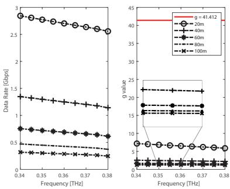  
Fig. 2. Comparison of uplink data rate and g value with respect to different communication distances with $B = 1 \mathrm { G H z }$ and $P = 2 \mathsf { W }$

## D. Inner Loop: User-resource associations

Given the UAV selection $\mathbf { \alpha } _ { \alpha , \tilde { \alpha } , }$ , UAV power control P, and the UAV positioning ${ \bf q } ,$ the problem (P1) reduces to

$$
( \mathbf { S P 4 } ) : \operatorname* { m i n } _ { \mathbf { z } , \tilde { \mathbf { z } } } \sum _ { i } \left( t _ { \mathsf { c o m m } , i } + t _ { \mathsf { c o m p } , i } \right) + \frac { 1 } { 2 \rho _ { z } } \Lambda _ { z }\tag{69}
$$

$$
{ \mathrm { s . t . ~ } } ( 1 0 ) , ( 1 1 ) { \mathrm { ~ a n d ~ } } ( 1 4 ) ,\tag{70}
$$

Note that the major difficulty of resolving the subproblem (SP4) is in handling the Erlang C formula in $t _ { \mathsf { c o m p } , i }$ , that is extremely hard. To alleviate the colossal complexity of Erlang C formula, we apply the tight and tractable upper bound6 proposed in [34], which is

$$
C \left( s , \frac \lambda { \mu } \right) < \left( \frac \lambda { s \mu } \right) ^ { \sqrt { s } } , \quad s \ge 2 .\tag{71}
$$

Considering this, the task operation delay (12) can be rewritten:

$$
t _ { \mathsf { o p e r } } ( s , \lambda ) < \frac { \left( \lambda / s \mu \right) ^ { \sqrt { s } } } { s \mu - \lambda } + \frac { 1 } { \mu } \triangleq \bar { t } _ { \mathsf { o p e r } } ( s , \lambda ) .\tag{72}
$$

Consequently, we have

$$
t _ { \mathrm { c o m p } , i } < \sum _ { j } \sum _ { u } z _ { j , i } ^ { u } { \bar { t } } _ { \mathrm { o p e r } } \left( s , \sum _ { i ^ { \prime } } \sum _ { u } z _ { j , i ^ { \prime } } ^ { u } \lambda _ { i ^ { \prime } } \right) \triangleq { \bar { t } } _ { \mathrm { c o m p , i } } .\tag{73}
$$

On balance, the subproblem (SP4) can be reformulated as

$$
( \mathbf { S P 4 . 1 } ) : \operatorname* { m i n } _ { \mathbf { z } , \tilde { \mathbf { z } } } \sum _ { i } \left( t _ { \mathsf { c o m m } , i } + \bar { t } _ { \mathsf { c o m p } , i } \right) + \frac { 1 } { 2 \rho _ { z } } \Lambda _ { z }\tag{74}
$$

$$
\begin{array} { r l } { \mathrm { s . t . } } & { { } ( 1 4 ) . } \end{array}\tag{75}
$$

Subsequently, (SP4.1) is partitioned into two separate opti mization blocks, designated for z and z˜, respectively.

(1) Updating z : To initiate the optimization of $\mathbf { z } ,$ we observe that $t _ { \mathsf { c o m m } , i }$ exhibits linearity, while the penalty term embodies a convex function with respect to $z _ { j , i } ^ { u }$ . For the purpose of optimizing z through convex optimization methods, it becomes imperative to ensure that $\bar { t } _ { \mathsf { c o m p } , i }$ is rendered convex, signifying that the upper-bounded objective $\bar { t } _ { \mathsf { s e r v } , i }$ also adopts a convex form. In light of this requirement, we introduce the following lemma to unveil the convexity of $\overline { { t } } _ { \mathsf { c o m p } , i }$

Lemma 2. $\overline { { t } } _ { \mathsf { c o m p } , i }$ is a convex function with respect to $z _ { j , i } ^ { u }$

Proof: To offer the proof of convexity, we first provide the proof that $\boldsymbol { \bar { t } } _ { \circ { \mathsf { p e r } } } ( s , \lambda )$ is convex with respect to λ, where λ is an affine function of $z _ { j , i } ^ { u }$ . The second-order derivative is

$$
\frac { \partial ^ { 2 } \bar { t } _ { \mathsf { o p e r } } ( s , \lambda ) } { \partial \lambda ^ { 2 } } = \frac { \lambda ^ { \sqrt { s } - 2 } } { ( s \mu - \lambda ) ^ { 3 } } E ,\tag{76}
$$

where $\begin{array} { r } { E = ( 2 - \sqrt { s } ) ( 1 - \sqrt { s } ) \left( \lambda ^ { 2 } + \frac { 2 \mu s ^ { 3 / 2 } } { 1 - \sqrt { s } } \lambda + \frac { \mu ^ { 2 } s ^ { 5 / 2 } } { \sqrt { s } - 2 } \right) } \end{array}$ , for $\lambda < s \mu$ and $s \geq 2 .$ . Then, we need to prove whether E is positive or not. We have two cases; $( 1 ) \ { \sqrt { 2 } } \leq { \sqrt { s } } < 2$ and (2) $\sqrt { s } > 2$ . Note that $E = 0$ when $\sqrt { s } = 2$

Case (1) ${ \sqrt { 2 } } \ \leq \ { \sqrt { s } } \ < \ 2 \ :$ Since $( 2 - { \sqrt { s } } ) ( 1 - { \sqrt { s } } )$ is negative, $\frac { E } { ( 2 - \sqrt { s } ) ( 1 - \sqrt { s } ) }$ should also be negative. Note that $\lambda ^ { 2 } +$ $\frac { 2 \mu s ^ { 3 / 2 } } { 1 - \sqrt { s } } \lambda + \frac { \mu ^ { 2 } s ^ { 5 / 2 } } { \sqrt { s } - 2 }$ can be seen as a quadratic equation of $\lambda ,$ and its discriminant is

$$
{ \frac { \mu ^ { 2 } s ^ { 3 } } { { \sqrt { s } } ( 1 - { \sqrt { s } } ) ^ { 2 } ( 2 - { \sqrt { s } } ) } } ,\tag{77}
$$

which is positive. Thus, there are two λ-axis intercepts, which are $\begin{array} { r } { \lambda _ { + } ~ = ~ \frac { \mu s ^ { 3 / 2 } } { \sqrt { s } - 1 } ( 1 + ( \sqrt { s } ( 2 - \sqrt { s } ) ) ^ { - \frac { 1 } { 2 } } ) } \end{array}$ and $\lambda _ { - } ~ =$ $\frac { \mu s ^ { 3 / 2 } } { \sqrt { s } - 1 } ( 1 - ( \sqrt { s } ( 2 - \sqrt { s } ) ) ^ { - \frac { 1 } { 2 } } )$ . Since $0 < \lambda < s \mu$ , the two intercepts should respectively satisfy $\lambda _ { - } ~ < ~ 0$ and $\lambda _ { + } ~ >$ sµ to make $\frac { E } { ( 2 - { \sqrt { s } } ) ( 1 - { \sqrt { s } } ) }$ negative. Since ${ \frac { \mu s ^ { 3 / 2 } } { \sqrt { s } - 1 } } ~ > ~ 0$ and $1 - ( \sqrt { s } ( 2 - \sqrt { s } ) ) ^ { - \frac { 1 } { 2 } } < 0 , \lambda _ { - } < 0$ holds. On the other hand, since $\begin{array} { r } { \frac { \sqrt { s } } { \sqrt { s } - 1 } > 1 } \end{array}$ and $1 + ( \sqrt { s } ( 2 - \sqrt { s } ) ) ^ { - \frac { 1 } { 2 } } > 1 , \lambda _ { + }$ holds. Therefore, $\frac { E } { ( 2 - { \sqrt { s } } ) ( 1 - { \sqrt { s } } ) }$ is negative and E is positive.

Case $( 2 ) \ { \sqrt { s } } > 2 \ :$ : Similarly, since $( 2 - { \sqrt { s } } ) ( 1 - { \sqrt { s } } )$ is positive, $\frac { E } { ( 2 - { \sqrt { s } } ) ( 1 - { \sqrt { s } } ) }$ should be positive. In this case, its discriminant (77) is negative, so that the quadratic function $\frac { E } { ( 2 - { \sqrt { s } } ) ( 1 - { \sqrt { s } } ) }$ is always above the λ-axis. Thus, E is positive. Put together, the second derivative of $\boldsymbol { \bar { t } } _ { \circ { \mathsf { p e r } } } ( s , \lambda )$ is always positive, implicating that the function $\overline { { t } } _ { \tt o p e r } ( s , \lambda )$ is convex with respect to λ. Besides, the composition of the convex function with affine mapping (i.e., $\begin{array} { r } { \bar { t } _ { \mathsf { o p e r } } ( s , \sum _ { i ^ { \prime } } \sum _ { u } z _ { i , i ^ { \prime } } ^ { u } \lambda _ { i ^ { \prime } } ) ) } \end{array}$ and the product of linear and increasing convex function $( \mathrm { i . e . , } \sum _ { j } \bar { \sum } _ { u } z _ { j , i } ^ { u } \bar { t } _ { \mathsf { o p e r } } ( s , \sum _ { i ^ { \prime } } \sum _ { u } z _ { j , i ^ { \prime } } ^ { u } \lambda _ { i ^ { \prime } } ) )$ are also known as a convex [35], we conclude that $\bar { t } _ { \mathsf { c o m p } , i }$ is a convex function.

As a result, z can be effectively optimized by using the standard convex optimization solvers such as CVX and YALMIP. (2) Updating z˜ : Then, the slack variable z˜ can be updated by the closed-form solution for $\tilde { z } _ { j , i } ^ { u }$ in (74) for a given $z _ { j , i } ^ { u } \mathrm { : }$

$$
( \tilde { z } _ { j , i } ^ { u } ) ^ { * } = \frac { ( z _ { j , i } ^ { u } ) ^ { 2 } + ( 1 - \rho _ { z } \eta _ { j , i , u } ^ { z , 1 } ) z _ { j , i } ^ { u } + \rho _ { z } \eta _ { j , i , u } ^ { z , 2 } } { ( z _ { j , i } ^ { u } ) ^ { 2 } + 1 }\tag{78}
$$

This is because that the (74) is convex with respect to $\tilde { z } _ { j , i } ^ { u }$ , it can simply be derived by solving $\begin{array} { r } { \frac { \partial \Lambda _ { z } } { \partial \tilde { z } _ { j , i } ^ { u } } = 0 } \end{array}$

## E. Outer Loop: Dual variables and penalized parameters

In the outer loop, the dual variables η = $\{ \eta _ { i , m } ^ { \alpha , 1 } , \eta _ { i , m } ^ { \alpha , 2 } , \eta _ { j , i , u } ^ { z , 1 } , \eta _ { j , i , u } ^ { z , 2 } , \mathbf { \bar { \eta } } _ { \eta _ { u } } ^ { z } , \eta _ { i } ^ { z } \}$ and the penalized parameters $\rho = \{ \rho _ { \alpha } , \rho _ { z } \}$ are updated by the following expressions:

$$
\eta _ { i , m } ^ { \alpha , 1 } \gets \eta _ { i , m } ^ { \alpha , 1 } + \frac { 1 } { \rho _ { \alpha } } \cdot \alpha _ { i , m } ( \tilde { \alpha } _ { i , m } - 1 ) , ~ \forall i , m ,\tag{79}
$$

$$
\eta _ { i , m } ^ { \alpha , 2 }  \eta _ { i , m } ^ { \alpha , 2 } + \frac { 1 } { \rho _ { \alpha } } \cdot ( \alpha _ { i , m } - \tilde { \alpha } _ { i , m } ) , \forall i , m ,\tag{80}
$$

$$
\eta _ { j , i , u } ^ { z , 1 }  \eta _ { j , i , u } ^ { z , 1 } + \frac { 1 } { \rho _ { z } } \cdot z _ { j , i } ^ { u } \big ( \tilde { z } _ { j , i } ^ { u } - 1 \big ) , \ \forall j , i , u ,\tag{81}
$$

$$
\eta _ { j , i , u } ^ { z , 2 }  \eta _ { j , i , u } ^ { z , 2 } + \frac { 1 } { \rho _ { z } } \cdot \bigl ( z _ { j , i } ^ { u } - \tilde { z } _ { j , i } ^ { u } \bigr ) , \ \forall j , i , u ,\tag{82}
$$

$$
\eta _ { u } ^ { z } \gets \eta _ { u } ^ { z } + \frac { 1 } { \rho _ { z } } \cdot \bigg ( \sum _ { j } \sum _ { i } z _ { j , i } ^ { u } - 1 \bigg ) , ~ \forall u ,\tag{83}
$$

$$
\eta _ { i } ^ { z } \gets \eta _ { i } ^ { z } + \frac { 1 } { \rho _ { z } } \cdot \bigg ( \sum _ { j } \sum _ { u } z _ { j , i } ^ { u } - 1 \bigg ) , ~ \forall i ,\tag{84}
$$

$$
\rho _ { \alpha }  c \rho _ { \alpha } \mathrm { a n d } \rho _ { z }  c \rho _ { z } ,\tag{85}
$$

where $0 < c < 1$

We define the indicators of constraint violation as follows:

$$
h ( \alpha , \tilde { \alpha } , \mathbf { z } , \tilde { \mathbf { z } } ) = \operatorname* { m a x } _ { j , i , m , u } \bigg [ | \alpha _ { i , m } ( \tilde { \alpha } _ { i , m } - 1 ) | , | \alpha _ { i , m } - \tilde { \alpha } _ { i , m } | ,\tag{86}
$$

$$
| z _ { j , i } ^ { u } \big ( \tilde { z } _ { j , i } ^ { u } - 1 \big ) | , | z _ { j , i } ^ { u } - \tilde { z } _ { j , i } ^ { u } | , \big | \sum _ { j } \sum _ { i } z _ { j , i } ^ { u } - 1 \big | , \big | \sum _ { j } \sum _ { u } z _ { j , i } ^ { u } - 1 \big | ] .\tag{87}
$$

By comparing $h ( \alpha , \tilde { \alpha } , \mathbf { z } , \tilde { \mathbf { z } } )$ with the predefined tolerance for accuracy, we can ascertain when to terminate the outer loop.

## F. Overall Algorithm Description and Analysis

Building on the groundwork laid out in previous sections, we present the proposed overall PDD-based algorithm. In each iteration of the inner loop, subproblems (SP1), (SP2), (SP3), and (SP4.1) are iteratively updated with the other variables held constant. Subsequently, the dual variables and penalized parameters are updated in the outer loop. Note that we denote the objective function in (P2) by E and that of the n-th iterations by $\begin{array} { r } { \mathcal { E } ^ { ( n ) } \ ( \mathrm { i . e . , } \ \mathcal { E } \ = \ \frac { 1 } { I } \sum _ { i } t _ { s \mathrm { e r v } , i } } \end{array}$ and $\pmb { \mathcal { E } } ^ { ( n ) } = \pmb { \mathcal { E } } ( \pmb { \alpha } ^ { ( n ) } , \tilde { \pmb { \alpha } } ^ { ( n ) } , \mathbf { P } ^ { ( n ) } , \mathbf { q } ^ { ( n ) } , \mathbf { z } ^ { ( n ) } , \tilde { \mathbf { z } } ^ { ( n ) } ) )$ . In the outer loop, η and $\rho$ are updated. The details are summarized in Algorithm 1.

As outlined in the analysis found in [36], the double-loop PDD approach can find the stationary point under Robinson’s condition. Thus, we derive the following lemma.

## Lemma 3. Let

$$
\begin{array} { r } { \pmb { \xi } \triangleq \left[ \mathrm { v e c } ( \pmb { \alpha } ) , \mathrm { v e c } ( \tilde { \pmb { \alpha } } ) , \mathrm { v e c } ( \mathbf { P } ) , \mathrm { v e c } ( \mathbf { q } ) , \mathrm { v e c } ( \mathbf { z } ) , \mathrm { v e c } ( \tilde { \mathbf { z } } ) \right] ^ { \top } \in \mathbb { R } ^ { d } , } \end{array}\tag{88}
$$

where vec(·) stacks the corresponding matrix into a vector. Then, every feasible point $\xi ^ { \star }$ of the optimization problem (P2) satisfies Robinson’s constraint qualification (RCQ).

Proof: To invoke Robinson’s condition it suffices to show that

$$
0 \in \mathrm { i n t } \Big [ F ( \pmb { \xi } ^ { \star } ) + D F ( \pmb { \xi } ^ { \star } ) \big ( \mathbb { R } ^ { n } \big ) + \mathbb { R } _ { + } ^ { p } \Big ] ,\tag{89}
$$

where $F ( \pmb \xi )$ stacks all constraint functions and n (resp. p) is the dimension of ξ (resp. F ). From the observation in [36], a standard sufficient condition is Mangasarian–Fromovitz constraint qualification (MFCQ); Define the sets of inequality constraint functions, where all inequality constraints (6), (7),(8), and (14) in (P2) fall into four families:

$$
\mathcal { G } _ { 1 } ( \pmb { \xi } _ { i } ) \triangleq \sum _ { m } \alpha _ { i , m } - 1 \leq 0 ,\tag{90}
$$

$$
\begin{array} { r } { \mathcal { G } _ { 2 } ( \pmb { \xi } _ { m , m ^ { \prime } } ) \triangleq d _ { \operatorname* { m i n } } ^ { 2 } - \| \mathbf { q } _ { m } - \mathbf { q } _ { m ^ { \prime } } \| _ { 2 } ^ { 2 } \leq 0 , } \end{array}\tag{91}
$$

$$
\mathcal { G } _ { 3 } ( \pmb { \xi } _ { m } ) \triangleq \sum _ { i } P _ { i , m } - P _ { \mathrm { U A V } } \leq 0 ,\tag{92}
$$

$$
\mathcal { G } _ { 4 } ( \pmb { \xi } _ { j } ) \triangleq \frac { 1 } { \mu } \sum _ { i , u } z _ { j , i } ^ { u } \lambda _ { i } - s \leq 0 ,\tag{93}
$$

where, for notational simplicity, $\mathcal { G } _ { 1 } , \mathcal { G } _ { 2 } , \mathcal { G } _ { 3 } ,$ , and $\mathcal { G } _ { 4 }$ denote the functions corresponding to UAV relay selection, UAV collision avoidance, UAV power budget, and server load stability, respectively. Then, at a feasible point $\xi ^ { \star }$ , Robinson’s condition is satisfied if there exists the feasible direction d such that

$$
\exists \mathbf { d } \in \mathbb { R } ^ { d } : \mathcal { G } _ { q } ( \pmb { \xi } ^ { \star } ) + \nabla \mathcal { G } _ { q } ( \pmb { \xi } ^ { \star } ) ^ { \top } \mathbf { d } < 0 , \forall q \in \{ 1 , 2 , 3 , 4 \} ,\tag{94}
$$

where the vector d represents an infinitesimal change in each variable that strictly decreases every constraint function holding with equality at the feasible point $\xi ^ { \star }$ ; that is, for each $q$ with $\mathcal { G } _ { q } ( \pmb { \xi } ^ { \star } ) = 0$ , we have $\nabla \mathcal { G } _ { q } ( \pmb { \xi } ^ { \star } ) ^ { \top } \mathbf { d } < 0$ . This ensures that a small displacement in the direction d leads to strict feasibility of the inequalities. Let $\mathcal { A } _ { 1 } = \{ i \ | \ \mathcal { G } _ { 1 } ( \pmb { \xi } _ { i } ) = 0 , \forall i \}$ ${ \mathcal A } _ { 2 } ~ = ~ \{ ( m , m ^ { \prime } ) ~ | ~ { \mathcal G } _ { 2 } ( { \pmb \xi } _ { m , m ^ { \prime } } ) ~ = ~ 0 , \forall m , m ^ { \prime } \} , ~ { \mathcal A } _ { 3 } ~ = ~ \{ m ~ | $ $\mathcal { G } _ { 3 } ( \pmb { \xi } _ { m } ) = 0 , \forall m \}$ , and $\mathcal { A } _ { 4 } = \{ j \ | \ \mathcal { G } _ { 4 } ( \pmb { \xi } _ { j } ) = 0 , \forall j \}$ denote the indices of the four inequality groups in (90), (91), (92), and (93), respectively. We construct the feasible direction vector d by assigning its components as follows (for a sufficiently small $\varepsilon > 0 )$

$$
{ \bf d } _ { \alpha _ { i , m } } = - \varepsilon , \quad \forall i \in \mathcal { A } _ { 1 } ,\tag{95}
$$

$$
\begin{array} { r } { \mathbf { d } _ { \mathbf { q } _ { m } } = \frac { \varepsilon } { 2 } ( \mathbf { q } _ { m } ^ { \star } - \mathbf { q } _ { m ^ { \prime } } ^ { \star } ) , ~ \mathbf { d } _ { \mathbf { q } _ { m ^ { \prime } } } = - \mathbf { d } _ { \mathbf { q } _ { m } } , ~ \forall ( m , m ^ { \prime } ) \in \mathcal { A } _ { 2 } , } \end{array}\tag{96}
$$

$$
\mathbf { d } _ { P _ { i , m } } = - \varepsilon , \quad \forall m \in \mathcal { A } _ { 3 } ,\tag{97}
$$

$$
\mathbf { d } _ { z _ { j , i } ^ { u } } = - \varepsilon , \ \mathbf { d } _ { z _ { j _ { 0 } , i } ^ { u } } = + \varepsilon , \forall j \in \mathcal { A } _ { 4 } , \ j _ { 0 } \notin \mathcal { A } _ { 4 } ,\tag{98}
$$

and set all remaining components of d to 0. Specifically, for each $\alpha _ { i , m }$ in the set $\mathcal { A } _ { 1 }$ , we slightly decrease its value to obtain the strict inequality corresponding constraint. In the case of an UAV collision avoidance constraint, identified by $( m , m ^ { \prime } ) \in$ $\boldsymbol { A } _ { 2 }$ , we move the positions $\mathbf { q } _ { m }$ and $\mathbf { q } _ { m ^ { \prime } }$ further apart to increase their separation. In particular, since $\nabla _ { ( \mathbf { q } _ { m } , \mathbf { q } _ { m ^ { \prime } } ) } \mathcal { G } _ { 2 } ( \pmb { \xi } ) =$ $[ - 2 ( { \bf q } _ { m } - { \bf q } _ { m ^ { \prime } } ) , 2 ( { \bf q } _ { m } - { \bf q } _ { m ^ { \prime } } ) ]$ and $\lVert \mathbf { q } _ { m } ^ { \star } - \mathbf { q } _ { m ^ { \prime } } ^ { \star } \rVert _ { 2 } ^ { 2 } = d _ { \operatorname* { m i n } } ^ { 2 } ,$ we have $\nabla \mathcal { G } _ { 2 } ( \boldsymbol { \xi } ^ { \star } ) ^ { \top } \mathbf { d } = - 2 \varepsilon \| \mathbf { q } _ { m } ^ { \star } - \mathbf { q } _ { m ^ { \prime } } ^ { \star } \| _ { 2 } ^ { 2 } = - 2 \varepsilon d _ { \mathrm { m i n } } ^ { 2 } < 0 \mathrm { , }$ . For each UAV power budget constraint with $m \in A _ { 3 } ,$ , we reduce the corresponding $P _ { i , m }$ to let the inequality constraint be strictly inequal. Finally, for each server load stability constraint indexed by $j \in \ A _ { 4 } .$ , we decrease the variable $z _ { j , i } ^ { u }$ while simultaneously increasing $z _ { j _ { 0 } , i } ^ { u } , j _ { 0 } \notin \mathcal { A } _ { 4 }$ , thereby ensuring the strict satisfaction of the inequality. With this choice, we have $\nabla \mathcal { G } _ { q } ( \pmb { \xi } ^ { \star } ) ^ { \top } \mathbf { d } < 0$ for all inequalities, hence MFCQ holds.

Therefore, the problem satisfies Robinson’s constraint qualification at every feasible point.

In addition, the convergence analysis of the proposed algorithm is provided in the following.

Algorithm 1 Overall Proposed PDD-based Algorithm   
Initialize $\{ { \pmb \alpha } ^ { ( 0 ) } , \tilde { { \pmb \alpha } } ^ { ( 0 ) } , { \bf P } ^ { ( 0 ) } , { \bf q } ^ { ( 0 ) } , { \bf z } ^ { ( 0 ) } , \tilde { \bf z } ^ { ( 0 ) } \}$ ${ \mathcal { E } } ^ { ( 0 ) }$ . Set the   
outer loop criterion $\epsilon _ { 1 } .$ , the inner loop criterion $\epsilon _ { 2 } .$   
Initialize outer loop count $m = 1 .$   
repeat   
Initialize inner loop count $n = 1 .$   
repeat   
Update ${ \pmb { \alpha } } ^ { ( n ) } , \tilde { { \pmb { \alpha } } } ^ { ( n ) }$ by solving (SP1).   
Update $\mathbf { P } ^ { ( n ) }$ by solving (SP2).   
Update $\mathbf { q } ^ { ( n ) }$ by solving (SP3).   
Update $\mathbf { z } ^ { ( n ) } , \tilde { \mathbf { z } } ^ { ( n ) }$ by solving (SP4.1).   
Calculate $\xi ^ { ( n ) } = \bar { \mathcal { E } ( { \pmb { \alpha } ^ { ( n ) } } , \tilde { \pmb { \alpha } ^ { ( n ) } } , { \bf P } ^ { ( n ) } , { \bf q } ^ { ( n ) } , { \bf z } ^ { ( n ) } , \tilde { \bf z } ^ { ( n ) } ) }$   
Update inner loop count $n = n + 1 .$   
until $| \mathcal { E } ^ { ( n ) } - \mathcal { E } ^ { ( n - 1 ) } | \le \epsilon _ { 2 }$ or $n > n _ { \sf m a x } .$   
Update η and $\rho .$   
Update outer loop count $m = m + 1 .$   
until $h ( \alpha , \tilde { \alpha } , \mathbf { z } , \tilde { \mathbf { z } } ) \leq \epsilon _ { 1 }$ or m $> m _ { \mathrm { m a x } } .$

Theorem 3. The sequence $\{ \xi ^ { k } \} _ { k \geq 0 }$ generated by the proposed algorithm is guaranteed to converge, in the sense that every accumulation point $\xi ^ { \star }$ is a KKT point of (P2).

Proof: The proof follows directly from Theorem 3.1 of [36], whose convergence result requires verifying the following assumptions. We confirm that these assumptions indeed hold for the considered problem (P2):

• Locally Lipschitz & Lower Bounded Objective: The objective function of (P2) is continuously differentiable on its feasible set, and hence locally Lipschitz. Moreover, the total service delay is inherently non-negative, implying that the objective is bounded below (with infimum zero).

• Robinson’s Constraint Qualification: Lemma 3 explicitly establishes RCQ for the feasible region of (P2).

Since all these assumptions are met, we invoke Theorem 3.1 of [36] to conclude that every accumulation point $\xi ^ { \star }$ of the sequence generated by the proposed algorithm is a KKT solution of (P2). ■

The computation complexity of the proposed algorithm depends on the four subproblems at each iteration. To solve the convex optimization problems (SP1), (SP2), (SP3) and (SP4.1), interior point method is employed by CVX software [37], whose complexities $\begin{array} { r l r l r } { \mathrm { a r e } } & { { } } & { \mathcal { O } ( ( I M ) ^ { 3 . 5 } \log ( 1 / \epsilon ) ) , } & { } & { \mathcal { O } ( ( I M ) ^ { 3 . 5 } \log ( 1 / \epsilon ) ) } \end{array}$ , $\mathcal { O } ( ( 2 M ) ^ { 3 . 5 } \log ( 1 / \epsilon ) )$ and $\mathcal { O } ( ( I J U ) ^ { 3 . 5 } \log ( 1 / \epsilon ) )$ , respectively. Therefore, the overall complexity can be expressed as $\mathcal { O } ( m _ { \mathrm { m a x } } n _ { \mathrm { m a x } } ( ( I M ) ^ { 3 . 5 } \log ( 1 / \bar { \epsilon } ) + ( I J U ) ^ { 3 . 5 } \log ( 1 / \bar { \epsilon } ) ) )$

Notably, the binary variable search space grows exponentially as $\dot { \mathcal { O } } ( 2 ^ { I ^ { 2 } J M U } )$ , making a polynomial-complexity algorithm essential for feasible network operation. Our framework, designed for minimally dynamic IoT environments, maximizes long-term performance by identifying sustainable solutions that simplify practical implementation, balancing computational efficiency and feasibility.

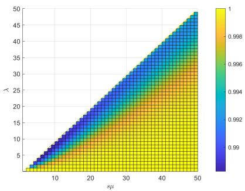

Fig. 3. Ratio between the expected user service delay and its upper bound. TABLE II NETWORK SYSTEM PARAMETERS
<table><tr><td rowspan=1 colspan=1>Parameters</td><td rowspan=1 colspan=1>Settings</td></tr><tr><td rowspan=1 colspan=1>Number of computing units, s</td><td rowspan=1 colspan=1>2</td></tr><tr><td rowspan=1 colspan=1>Service rate of each computing unit, µ</td><td rowspan=1 colspan=1>4 tasks/sec</td></tr><tr><td rowspan=1 colspan=1>Average user request rate, $\lambda _ { \mathrm { a v g } }$ </td><td rowspan=1 colspan=1>1.2 tasks/sec</td></tr><tr><td rowspan=1 colspan=1>Carrier frequency, $f _ { o }$ </td><td rowspan=1 colspan=1>0.34 THz</td></tr><tr><td rowspan=1 colspan=1>Bandwidth, B</td><td rowspan=1 colspan=1>1 GHz</td></tr><tr><td rowspan=1 colspan=1>Noise spectral density, $N _ { 0 }$ </td><td rowspan=1 colspan=1>-174 dBm</td></tr><tr><td rowspan=1 colspan=1>Task input data size, $D _ { \mathsf { i n } }$ </td><td rowspan=1 colspan=1>10 MB</td></tr><tr><td rowspan=1 colspan=1>Transmit power (IoT), $P _ { \mathrm { l o T } }$ </td><td rowspan=1 colspan=1>200 mW</td></tr><tr><td rowspan=1 colspan=1>Transmit power (UAV), $P _ { \mathsf { U A V } }$ </td><td rowspan=1 colspan=1>2W</td></tr><tr><td rowspan=1 colspan=1>UAV altitude, H</td><td rowspan=1 colspan=1>10 m</td></tr><tr><td rowspan=1 colspan=1>Heights of MEC and IoT, ψMEC, $\psi _ { \mathsf { I o T } }$ </td><td rowspan=1 colspan=1>3.0 m, 0.3 m</td></tr><tr><td rowspan=1 colspan=1>Height and radius of blockers, $\psi _ { \boldsymbol { \mathbf { b } } } , \tau _ { \boldsymbol { \mathbf { b } } }$ </td><td rowspan=1 colspan=1> $\overline { { 1 . 7 ~ \mathrm { m } , 0 . 3 ~ \mathrm { m } } }$ </td></tr><tr><td rowspan=1 colspan=1>Density of blockers, $\beta _ { \mathrm { b } }$ </td><td rowspan=1 colspan=1> $\overline { { 0 . 2 \mathrm { ~ m ~ } ^ { - 2 } } }$ </td></tr></table>

## G. Low-complexity Alternating Optimization

We further introduce a low-complexity alternating optimization (LAO) algorithm that leverages our theoretical findings in combination with clustering and greedy strategies. In each iteration, closed-form updates for (SP1) and (SP2) are applied directly based on Theorems 1 and 2. For (SP3), UAV locations are updated via M-means clustering over virtual points defined for each IoT–MEC pair, where each virtual point is given by $\tilde { \mathbf { u } } _ { i } = \omega \mathbf { u } _ { i } + ( 1 - \omega ) \mathbf { u } _ { j }$ , with $\omega = P _ { \mathrm { I o T } } / ( P _ { \mathrm { I o T } } + \bar { P } _ { \mathrm { U A V } } )$ and $\begin{array} { r } { \bar { P } _ { \mathrm { U A V } } = M P _ { \mathrm { U A V } } / | \{ i : \sum _ { m } \alpha _ { i , m } = 1 \} | } \end{array}$ . In (SP4), each IoT device is greedily associated with the nearest feasible MEC server, and lower-frequency THz sub-bands are assigned to pairs with longer links. The overall per-iteration complexity is $\mathcal { O } \left( L I ( M + J + U ) \right)$ , where L is the number of AO iterations. This is substantially lower than the complexity of the PDD algorithm, thereby ensuring practical scalability for large-scale networks.

Remark 2. Fig. 3 depicts the ratio $\frac { \mathcal { E } } { \mathcal { E } ^ { \mathrm { u b } } }$ against the total service rate sµ and the user request rate λ. For a given sµ, we average the ratio $\frac { \mathcal { E } } { \mathcal { E } ^ { \mathsf { u b } } }$ over all s and $\mu ,$ showing that E closely approximates ${ \mathcal { E } } ^ { \mathrm { u b } }$ with a ratio above 0.988.

## IV. NUMERICAL RESULTS

In our network configuration, we consider 20 IoT devices, 4 MEC servers and 3 UAVs within 400m × 400m squared area network, where IoT devices and MECs are uniformly distributed and the locations of UAVs are initialized using the l mean clustering algorithm. The UAVs are assumed to be located at a fixed altitude of 10m, with a minimum separation distance $d _ { \mathrm { m i n } }$ of 1m. We select the reference carrier frequency $f _ { o }$ at 0.34 THz to evaluate, which is known that there is a large transmission window with no path loss peak [38], and the bandwidth of 1GHz for each sub-band $u \in \mathcal { U } .$ . In addition, the molecular absorption coefficient $K ( f )$ is referred to the HITRAN database [30]. The specific environmental details of our simulations are given in Table II, unless otherwise stated7. Besides, the statistically distributed IoT device topology is averaged over 50 simulation runs, accounting for IoT mobility through aggregated snapshots [11], [39]. To evaluate our proposed algorithm, we adopt the following baseline algorithms:

1) UAV optimization (UO): Optimizing UAV design variables α, P, and q by solving subproblems (SP1), (SP2), and (SP3) iteratively. The tasks are offloaded to the nearest MEC server without exceeding the service rate.

2) User-resource associations optimization (UAO): Only optimizing the user-resource associations z by resolving subproblem (SP4.1) with UAV selection when the IoT-MEC distance surpasses that of IoT-UAV, and using equal power allocation.

3) No relay with successive convex approximation based user-resource association optimization (NR-SCA): No UAV relay is considered and the user-resource association optimization is conducted using the SCA, as described in [33].

4) UAV optimization and genetic algorithm based userresource association optimization (UO-GUAO): The genetic algorithm-based method for user-resource associations [11] is adopted along with the proposed UAV optimization, where subproblems (SP1), (SP2), and (SP3) are iteratively solved.

5) Block coordinate descent and successive convex approximation based optimization (BCD-SCA): A block coordinate descent based algorithm [37] is adopted, where subproblems (SP1), (SP2), (SP3), and (SP4.1) are iteratively solved without double-loop structure. The solutions to (SP1) and (SP2) are obtained using Theorems 1 and 2, respectively. Additionally, the SCA based user-resource association is conducted [33].

6) Differential evolution based UAV deployment optimization (DE): We employ the differential evolution-based algorithm from [42] for UAV deployment optimization. This method iteratively solves subproblems (SP1), (SP2), and (SP4.1), while using the differential evolution algorithm specifically for UAV deployments.

7) One-to-one matching game based user-resource association optimization (MG): The user-resource association optimization leverages a one-to-one matching game approach as presented in [41]. Here, subproblems (SP1), (SP2), and (SP3) are solved iteratively, with the matching game algorithm replacing subproblem (SP4.1).

8) Deep Reinforcement Learning (DRL): The Proximal

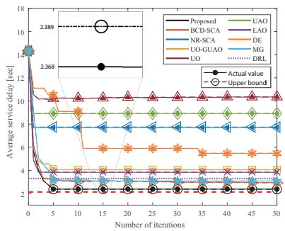  
(a)

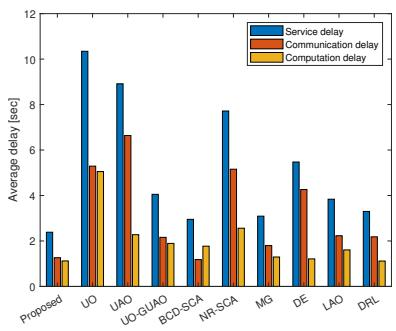  
(b)  
Fig. 4. (a) Convergence of the proposed algorithm and its upper bound, (b) communication and computation delay of the converged user service delay.

Policy Optimization (PPO) is adopted. The actor network maps the global state to discrete UAV relay selection and user association (modeled by Categorical distribution) and continuous UAV placement and power allocation (modeled by Gaussian distribution). Both actor and critic networks consist of two fully connected hidden layers with 512 neurons and ReLU activations8. The model is trained for 15,000 epochs with learning rates of $3 \times 1 0 ^ { - 4 }$ (actor) and $1 \times 1 0 ^ { - 3 }$ (critic).

In addition, in order to analyze the optimality gap, we adopt a method of discretizing the continuous variables by quantizing them with $n _ { q 1 }$ and $n _ { q 2 }$ for a network of size $l _ { \mathrm { n e t } } \times l _ { \mathrm { n e t } } ,$ where $P _ { i , m } \in \{ 0 , \Delta _ { 1 } , 2 \bar { \Delta _ { 1 } } , . . . , P _ { \mathrm { U A V } } \}$ and $x _ { m } , y _ { m } \in$ $\{ 0 , \Delta _ { 2 } , , 2 \Delta _ { 2 } , . . . , l _ { \mathrm { n e t } } \} , \mathrm { i . e . , } \Delta _ { 1 } = P _ { \mathrm { U A V } } / ( n _ { q 1 } - 1 )$ and $\Delta _ { 2 } =$ $l _ { \mathrm { n e t } } / ( n _ { q 2 } \mathrm { ~ - ~ } 1 )$ . In our simulation, we set the quantization levels as $n _ { q 1 } ~ = ~ 2 0$ and $n _ { q 2 } ~ = ~ 4 0 ~$ , resulting in a total of 1,600 quantized points in the UAV deployment. Through this discretization, we perform an exhaustive search (ES) to identify the near-global optimum solution.

In Fig. 4(a), we present the convergence of our proposed design and compare it with benchmarks. It is shown that the PDD-based proposed algorithm and benchmarks reach the local optimum within a finite number of iterations. However, our proposed solution outperforms the others. Furthermore, the upper-bounded solutions, denoted by the dash-dotted line in the figure, are very close to their exact values. Specifically, the proposed solution converges to 2.3687 seconds, and its upper bound is 2.3894 seconds, resulting in a ratio of $\frac { \varepsilon } { \varepsilon ^ { \mathrm { u b } } } \approx \stackrel { \sim } { 0 . 9 9 } 1 3$ . Therefore, the solutions can be considered approximately equivalent. Comparatively, the UAO optimizes $t _ { \mathsf { c o m p } } ,$ while the UO primarily enhances $t _ { \mathsf { c o m m } } .$ . Consequently, in a general context, the UAO tends to outperform the UO, given the exponential increase in queueing delay when MEC becomes overloaded. NR-SCA outperforms UO and UAO, revealing that, in scenarios where UO and UAO are not jointly optimized, it is more advantageous to transmit without the use of UAV relays. Conversely, alternative methods with UAV optimization, such as BCD-SCA and UO-GUAO, demonstrate superiority over NR-SCA, indicating that UAV relays can prevent overloads while reducing communication delays, thereby enhancing performance. Additionally, DRL underperforms the proposed method. Although the alternating optimization methods converge to a suboptimal value that is lower than those achieved by UO, UAO, and NR-SCA, our proposed solution achieves a more favorable suboptimal outcome. Furthermore, our solution outperforms the DRL baseline, attributed to DRL’s struggle with the hybrid action space and the non-convex objective’s instability. Notably, the red dotted line represents the optimal solution driven by the exhaustive search (denoted by ES) mentioned earlier, with a value of 2.1319 seconds. As in Fig. 4(a), our proposed technique achieves solutions that are near-optimal while maintaining polynomial time complexity with respect to system parameters.

More specifically, Fig. 4(b) presents the communication and computation delay associated with the converged user service delay for each scheme. UO reduces communication delay through UAV selection, power allocation, and placement but fails to address task overloading. Conversely, UAO effectively handles task overload and minimizes computation delay but lacks full UAV optimization for communication delay reduction. The proposed algorithm and all other alternating benchmarks jointly optimize both aspects, enhancing overall performance. Notably, LAO efficiently achieves suboptimal solutions with significantly reduced computational complexity. While genetic-based UAO can achieve better suboptimal solutions with longer generations or larger populations, it comes at the cost of higher computational complexity.

Fig. 5 describes an example of (a) resulting UAV positioning and IoT’s transmission links, (b) the server utilization, for a given network topology. Colored x marks, purple asterisk marks, and light blue dots describe the MECs, UAVs, and IoT devices each. Also, line and dashed line represent direct link and relay link, respectively. As depicted in Fig. 5(a), two IoT devices positioned at the upper-left corner offload to the distant MEC with index 3 (yellow x mark) using a UAV relay. To minimize transmission delay, the logical choice would be to associate with the nearest MEC, such as MEC 1 (blue x mark) or 4 (green x mark). However, due to overloading in these MECs, queueing delay might drastically rise. To address this, the IoT devices opt to offload tasks to more distant yet feasible MECs, like MEC 3, for load balancing. Similarly, the IoT situated in the lower-left area employs a UAV relay to counter significant path loss. Fig. 5(b) presents MEC server utilization, distinguishing between direct link offloading (blue) and relay path (orange) for server usage. The server queue becomes unstable when task offloading surpasses computing capacity, indicated by the absence of a yellow bar in Fig. 5(b). In this context, Fig. 5(b) illustrates that every MEC server maintains a well-balanced load, resulting in a stabilized computation delay.

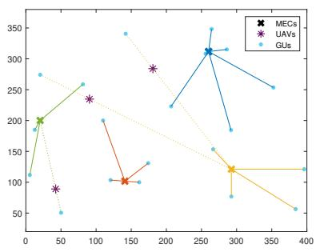  
(a)

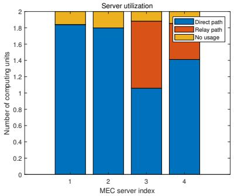  
(b)

Fig. 5. (a) An example of network topology and (b) server utilization.  
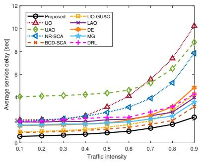  
Fig. 6. Expected user service delay with respect to traffic intensity.

Fig. 6 compares average service delay performance with respect to the traffic intensity, ${ \frac { \lambda } { s \mu } } ,$ which represents the total offloaded task load relative to server capacity. As traffic intensity increases and the system becomes computation-limited, all schemes experience higher delays due to rising queue waiting times. In low-intensity scenarios, UO has lower delays than UAO due to minimal queuing. However, in the computationlimited regime, UAO outperforms UO by effectively balancing traffic loads through IoT-MEC server associations, reducing queuing delays even at high intensities. While UAO still faces communication delays, proper UAV selection, power control, and placement can further improve performance. The proposed method, along with the alternating benchmarks (i.e., BCD-SCA, UO-GUAO, DE, and MG), achieves performance gains. Notably, the proposed approach outperforms all baselines, i.e.,

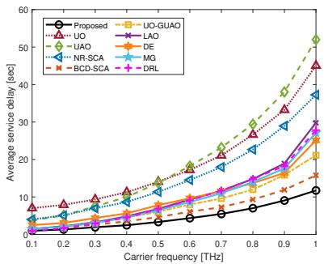

Fig. 7. Expected user service delay with respect to the carrier frequency.  
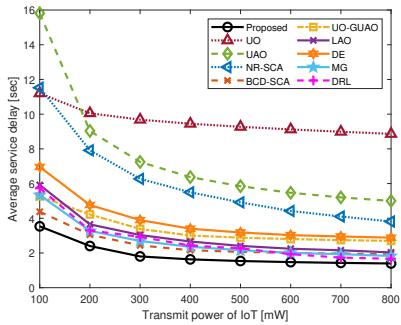  
Fig. 8. Expected user service delay with respect to the IoT’s transmit power.

BCD-SCA, UO-GUAO, DE, MG, and DRL.

Fig. 7 compares the converged expected user service delay across different baselines as a function of the reference carrier frequency, $f _ { o } ,$ ranging from 0.1 THz to 1 THz. At higher frequencies, increased vulnerability to molecular absorption loss results in performance degradation across all methods. Notably, in the communication-limited regime where path loss becomes severe, UO outperforms UAO. This is because, under severe path loss, IoT devices rely more heavily on the UAV relay. However, UAO cannot fully control the transmission paths for all associations. Conversely, in the low-frequency band, where computation delay is more prominent, UAO achieves a lower delay. Overall, the proposed method demonstrates superior performance compared to the other approaches.

Fig 8 illustrates the expected user service delay with respect to the transmit power of IoT devices, i.e., $P _ { \mathrm { l o T } }$ . Notably, UAO exhibits a significant advantage in this context. Intuitively, at lower transmit power levels, most IoT devices rely on the UAV relay, which makes UAV optimization essential. In contrast, at higher transmit power levels, direct communication becomes more advantageous, thereby reducing the dependence on UAV relays. Consequently, NR-SCA performs well in high transmit power scenarios, approaching the performance of UO-GUAO. The proposed solution, along with BCD-SCA, UO-GUAO, DE, MG, and DRL, accounts for both factors, resulting in a lower expected service delay compared to the other schemes.

We emphasize that jointly optimizing communication and computation factors is critical in MEC networks. Our design minimizes expected user service delay, theoretically and experimentally yielding superior suboptimal solutions compared to baselines such as BCD-SCA, UO-GUAO, DE, MG, and DRL across diverse system parameters. Notably, the DRL method’s performance gap stems from two main factors: the intrinsic difficulty of exploring a hybrid action space (combining discrete selection/association with continuous placement/power), and the learning instability induced by the noisy, heavy-tailed rewards of the highly non-convex, queue-coupled objective.

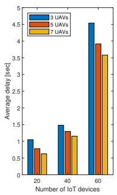

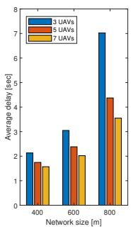

Fig. 9. Expected user service delay with respect to the network scale.  
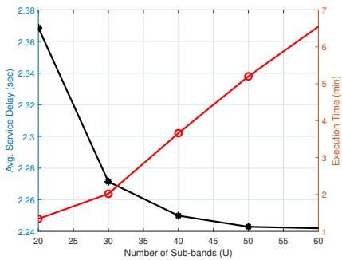  
Fig. 10. Expected user service delay and execution time with respect to the number of sub-bands.

We further investigate the performance of our proposed approach under various scaled network conditions, specifically varying the number of IoT devices, UAVs, and network dimensions. Fig. 9 (left) illustrates the average delay when increasing the number of IoT devices I from 20 to 60, whereas Fig. 9 (right) depicts delay variations as the network size expands from 400m to 800m. Both figures compare scenarios with different numbers of UAVs $( M = 3 , 5 , 7 )$ , represented by blue, orange, and yellow bars, respectively. From Fig. 9 (left), we observe a significant rise in delay as the number of devices increases, which is primarily attributed to higher queue delays causing server overloads. Meanwhile, the right figure indicates that delay grows with increasing network size, reflecting the increased communication delay due to the enlarged physical distance between devices and MEC servers. Additionally, we note a clear benefit from increasing the number of UAVs, particularly pronounced at larger network scales. This result implies that IoT devices become increasingly reliant on UAV relays as distances expand.

In Fig. 10, we investigate the sensitivity of the proposed method to the number of THz sub-bands U. The results show that increasing U reduces the average service delay, since a finer sub-band partition enables more refined absorption-aware resource allocation over the THz window and captures the frequency selectivity of molecular absorption more accurately. However, the execution time also increases with U, which is consistent with the computational complexity of the proposed PDD algorithm. Moreover, the delay improvement gradually saturates as U becomes large, while the computational overhead continues to increase. These results reveal a practical trade-off between delay performance and computational complexity.

## V. CONCLUSION

In this article, we proposed a THz-enabled MEC system architecture with multi-UAV communication relays. To minimize user service delay, we formulated a joint optimization problem for UAV selection, power allocation, deployment, and user offloading-sub-band associations. The MINLP problem was decomposed into four subproblems and solved using an iterative PDD algorithm. Simulation results demonstrated that the proposed algorithm achieves high-quality suboptimal solutions in polynomial time and outperforms benchmarks.

## REFERENCES

[1] H. T. Dinh et al., ”A survey of mobile cloud computing: Architecture, applications, and approaches,” Wireless Commun. Mobile Comput., vol. 13, no. 18, pp. 1587-1611, Nov. 2013.

[2] W. Shi et al., ”Edge computing: Vision and challenges,” IEEE Internet Things J., vol. 3, no. 5, pp. 637-646, Oct. 2016.

[3] Y. Mao et al., ”A Survey on Mobile edge computing: The communication perspective,” IEEE Commun. Surveys Tuts., vol. 19, no. 4, pp. 2322-2358, 4th Quart., 2017.

[4] J. Liu et al., “Delay-optimal computation task scheduling for mobileedge computing systems,” in Proc. IEEE Int. Symp. Inf. Theory, 2016, pp. 1451–1455.

[5] X. Chen et al., “Efficient multi-user computation offloading for mobileedge cloud computing,” IEEE/ACM Trans. Netw., vol. 24, no. 5, pp. 2795–2808, Oct. 2016.

[6] K. Zhang et al., “Energy-efficient offloading for mobile edge computing in 5G heterogeneous networks,” IEEE Access, vol. 4, pp. 5896–5907, 2016.

[7] Y. Wu et al., “NOMA assisted multi-access mobile edge computing: A joint optimization of computation offloading and time allocation,” IEEE Trans. Veh. Technol., vol. 67, no. 12, pp. 12244–12258, Dec. 2018.

[8] S. Fu et al., ”Resource allocation in a relay-aided mobile edge computing system,” IEEE Internet Things J., vol. 9, no. 23, pp. 23659-23669, Dec. 2022.

[9] L. Yang et al., ”Multi-UAV-enabled load-balance mobile-edge computing for IoT networks,” IEEE Internet Things J., vol. 7, no. 8, pp. 6898-6908, Aug. 2020.

[10] C. Zhan et al., “Multi-UAV-enabled mobile-edge computing for timeconstrained IoT applications,” IEEE Internet Things J., vol. 8, no. 20, pp. 15553-15567, Oct. 2021.

[11] H. Song et al., ”Joint optimization of edge computing server deployment and user offloading associations in wireless edge network via a genetic algorithm,” IEEE Trans. Netw. Sci. Eng., vol. 9, no. 4, pp. 2535-2548, Jul.-Aug. 2022.

[12] J. Du et al., ”MEC-assisted immersive VR video streaming over terahertz wireless networks: A deep reinforcement learning approach,” IEEE Internet Things J., vol. 7, no. 10, pp. 9517-9529, Oct. 2020.

[13] X. Liu et al., ”Learning-based prediction, rendering, and transmission for interactive virtual reality in RIS-assisted terahertz networks,” IEEE J. Sel. Areas Commun., vol. 40, no. 2, pp. 710-724, Feb. 2022.

[14] C. Chaccour et al., ”Can terahertz provide high-rate reliable low-latency communications for wireless VR?,” IEEE Internet Things J., vol. 9, no. 12, pp. 9712-9729, Jun. 2022.

[15] J. M. Jornet and I. F. Akyildiz, ”Channel modeling and capacity analysis for electromagnetic wireless nanonetworks in the terahertz band,” IEEE Trans. Wireless Commun., vol. 10, no. 10, pp. 3211-3221, Oct. 2011.

[16] J. Ye et al., ”On outage performance of terahertz wireless communication systems,” IEEE Trans. Commun., vol. 70, no. 1, pp. 649-663, Jan. 2022.

[17] M. M. Azari et al., ”THz-empowered UAVs in 6G: Opportunities, challenges, and trade-offs,” IEEE Commun. Mag., vol. 60, no. 5, pp. 24-30, May 2022.

[18] O.A. Amodu et al., “THz-enabled UAV communications: Motivations, results, applications, challenges, and future considerations,” Ad Hoc Net., 2023.

[19] A. Saeed et al., ”Variable-bandwidth model and capacity analysis for aerial communications in the terahertz band,” IEEE J. Sel. Areas Commun., vol. 39, no. 6, pp. 1768-1784, Jun. 2021.

[20] M. T. Mamaghani and Y. Hong, ”Terahertz meets untrusted UAVrelaying: Minimum secrecy energy efficiency maximization via trajectory and communication co-design,” IEEE Trans. Veh. Technol., vol. 71, no. 5, pp. 4991-5006, May 2022.

[21] L. Xu et al., ”Joint location, bandwidth, and power optimization for THz-enabled UAV communications,” IEEE Commun. Lett., vol. 25, no. 6, pp. 1984-1988, Jun. 2021.

[22] Y. Pan et al., ”UAV-assisted and intelligent reflecting surfaces-supported terahertz communications,” IEEE Wireless Commun. Lett., vol. 10, no. 6, pp. 1256-1260, Jun. 2021.

[23] S. Hassan et al., ”3TO: THz-enabled throughput and trajectory optimization of UAVs in 6G networks by proximal policy optimization deep reinforcement learning,” in Proc. IEEE Int. Conf. Commun. (ICC), Seoul, South Korea, May 2022, pp. 5712–5718.

[24] M. M. Azari and S. Chatzinotas, ”UAVs over mmWave/THz cellular MEC networks: A comparative study for energy efficiency,” Aug. 2022. [Online]. Available: arXiv:2208.04617.

[25] H. Wang et al., ”Joint UAV placement optimization, resource allocation, and computation offloading for THz band: A DRL approach,” IEEE Trans. Wireless Commun., vol. 22, no. 7, pp. 4890-4900, Jul. 2023.

[26] C. Han and I. F. Akyildiz, “Distance-aware bandwidth-adaptive resource allocation for wireless systems in the terahertz band,” IEEE Trans. THz Sci. Technol., vol. 6, no. 4, pp. 541–553, Jul. 2016.

[27] A. Shafie et al., ”Spectrum allocation with adaptive sub-band bandwidth for terahertz communication systems,” IEEE Trans. Commun., vol. 70, no. 2, pp. 1407-1422, Feb. 2022.

[28] V. Petrov et al., “Dynamic multi-connectivity performance in ultra-dense urban mmWave deployments,” IEEE J. Sel. Areas Commun., vol. 35, no. 9, pp. 2038–2055, Sep. 2017.

[29] S. -W. Ko et al., ”Wireless networks for mobile edge computing: Spatial modeling and latency analysis,” IEEE Trans. Wireless Commun., vol. 17, no. 8, pp. 5225-5240, Aug. 2018.

[30] L. Rothman et al., ”The HITRAN 2008 molecular spectroscopic database,” J. Quant. Spectrosc. Radiat. Transf., vol. 110, no. 9, pp. 533–572, July 2009.

[31] M. Grant and S. Boyd, “CVX: Matlab software for disciplined convex programming, v2.1,” http://cvxr.com/cvx, Mar. 2014.

[32] J. Lofberg, “YALMIP: A toolbox for modeling and optimization in MATLAB,” in Proc. IEEE Int. Conf. Robot. Automat., Sep. 2004, pp. 284–289.

[33] S. A. Alvi et al., ”Sequencing and scheduling for multi-user machinetype communication,” IEEE Trans. Commun., vol. 68, no. 4, pp. 2459–2473, Apr. 2020.

[34] A. Harel, “Sharp and simple bounds for the Erlang delay and loss formulae,” Queueing Syst., vol. 64, no. 2, pp. 119–143, 2010.

[35] S. Boyd and L. Vandenberghe, Convex optimization, Cambridge, U.K.: Cambridge Univ. Press, 2004.

[36] Q. Shi and M. Hong, “Penalty dual decomposition method for non smooth nonconvex optimization–Part I: Algorithms and convergence analysis,” IEEE Trans. Signal Process., vol. 68, pp. 4108–4122, Jun. 2020.

[37] Z. Kang et al., ”3D placement for multi-UAV relaying: An iterative Gibbs-sampling and block coordinate descent optimization approach,” IEEE Trans. Commun., vol. 69, no. 3, pp. 2047-2062, Mar. 2021.

[38] C. Wang et al., “0.34-Thz wireless link based on high-order modulation for future wireless local area network applications,” IEEE Trans. THz Sci. Technol., vol. 4, no. 1, pp. 75–85, Jan. 2014.

[39] M. Jia, J. Cao and W. Liang, ”Optimal cloudlet placement and user to cloudlet allocation in wireless metropolitan area networks,” IEEE Trans. Cloud Comput., vol. 5, no. 4, pp. 725-737, 1 Oct.-Dec. 2017.

[40] P. Ribeiro, A. Coelho, and R. Campos, ”On the energy consumption of rotary-wing and fixed-wing UAVs in flying networks,” in Proc. 20th Wireless On-Demand Netw. Syst. Serv. Conf. (WONS), Hintertux, Austria, Feb. 2025, pp. 1–4.

[41] Y. K. Tun et al., ”Joint UAV deployment and resource allocation in THz-assisted MEC-enabled integrated space-air-ground networks,” IEEE Trans. Mob. Comput., vol. 24, no. 5, pp. 3794-3808, May 2025.

[42] L. Yang, H. Yao, X. Zhang, J. Wang, and Y. Liu, ”Multi-UAV deployment for MEC-enhanced IoT networks,” in Proc. IEEE/CIC Int. Conf. Commun. China (ICCC), Chongqing, China, Aug. 2020, pp. 436-441.