# Through the Wall Detection and Localization of Autonomous Mobile Device in Indoor Scenario

Jiacheng Wang , Hongyang Du , Graduate Student Member, IEEE, Dusit Niyato , Fellow, IEEE, Mu Zhou , Senior Member, IEEE, Jiawen Kang , Senior Member, IEEE, Zehui Xiong , and Abbas Jamalipour , Fellow, IEEE

Abstract— In the intelligent logistics and warehouses, the autonomous mobile device (AMD) holds a key position as it is equipped with the ability to carry out functions like material transportation and inventory inspection. Nevertheless, the effective execution of these functions necessitates the location of the AMD. Given the increasing proliferation of networks like WiFi and 5G, leveraging these signals to achieve AMD localization is a desirable solution. Therefore, this paper proposes a channel state information (CSI) based system for through-the-wall (TTW) passive AMD detection and localization, named T-DeLo. T-DeLo first establishes a reference channel and utilizes it to cancel the strong signal interference (SSI) and phase errors, ensuring that the reflections introduced by the AMD can be estimated.

Manuscript received 15 February 2023; revised 14 June 2023; accepted 13 August 2023. Date of publication 9 October 2023; date of current version 19 December 2023. This work was supported in part by the National Research Foundation, Singapore; in part by the Infocomm Media Development Authority under its Future Communications Research and Development Program, DSO National Laboratories, under the Artificial Intelligence (AI) Singapore Program (AISG) under Award AISG2-RP-2020-019; in part by the Energy Research Test-Bed and Industry Partnership Funding Initiative, Energy Grid (EG) 2.0 Programme; in part by the DesCartes and the Campus for Research Excellence and Technological Enterprise (CREATE) Programme; in part by the Ministry of Education (MOE) Tier 1 under Grant RG87/22; in part by the Chongqing Natural Science Foundation Project under Grant CSTB2022NSCQ-MSX0895; in part by the Youth Innovation Group Support Program of Information and Communication Engineering (ICE) Discipline of the Chongqing University of Posts and Telecommunications under Grant SCIE-QN-2022-06; in part by NSFC under Grant 62102099; in part by the Guangzhou Basic Research Program under Grant 2023A04J1699; in part by the Singapore University of Technology and Design (SUTD) under Grant SRG-ISTD-2021-165; in part by the SUTD-ZJU IDEA under Grant SUTD-ZJU (VP) 202102; and in part by the MOE, Singapore, under its SUTD Kickstarter Initiative under Grant SKI 20210204. (Corresponding author: Mu Zhou.)

Jiacheng Wang, Hongyang Du, and Dusit Niyato are with the School of Computer Science and Engineering, Nanyang Technological University, Singapore 639798 (e-mail: jiacheng.wang@ntu.edu.sg; hongyang001@ e.ntu.edu.sg; dniyato@ntu.edu.sg).

Mu Zhou is with the School of Communications and Information Engineering, Chongqing University of Posts and Telecommunications, Chongqing 400065, China (e-mail: zhoumu@cqupt.edu.cn).

Jiawen Kang is with the Key Laboratory of Intelligent Information Processing and System Integration of IoT, Ministry of Education, and the School of Automation, Guangdong University of Technology (GDUT), Guangzhou 510006, China (e-mail: kavinkang@gdut.edu.cn).

Zehui Xiong is with the Pillar of Information Systems Technology and Design, Singapore University of Technology and Design, Singapore 487372 (e-mail: zehui\_xiong@sutd.edu.sg).

Abbas Jamalipour is with the School of Electrical and Information Engineering, The University of Sydney, Sydney, NSW 2006, Australia (e-mail: a.jamalipour@ieee.org).

Color versions of one or more figures in this article are available at https://doi.org/10.1109/JSAC.2023.3322819.

Digital Object Identifier 10.1109/JSAC.2023.3322819

Built upon this core, it uses the proposed novel two-dimensional matrix pencil algorithm to estimate jointly the path length change rate (PLCR) and time of flight (ToF) of the AMD induced reflections, in the TTW scenario. Unlike existing algorithms, this algorithm aggregates multiple measurements to improve the estimation performance under conditions of low signal-tonoise ratio (SNR). Finally, leveraging the estimated ToF and PLCR, T-DeLo realizes TTW AMD detection and localization via statistical and geometric analysis, respectively. In the TTW glass and brick wall scenarios, the extensive experimental evaluation shows that the AMD detection accuracy of T-DeLo is 0.964 and 0.952, while the median localization errors are 1.65 m and 2.05 m, respectively, laying a solid foundation for practical and ubiquitous AMD passive detection and localization.

Index Terms— Autonomous mobile device detection and localization, channel state information, through-the-wall scenario.

# I. INTRODUCTION

T HE utilization of indoor autonomous mobile device(AMD), such as smart delivery vehicles and robots, hospital, etc., with the aim of enhancing the efficiency of transporting goods or patients [1], as shown in Fig. 1. With an increase in the number of these devices, the requirement for an indoor intelligent transportation system (ITS) to coordinate their operations becomes increasingly apparent. Conventionally, ITS refers to the latest iteration of intelligent transportation systems [2], [3], which leverages a variety of technologies to gather information regarding traffic conditions, and employs this data to make informed decisions aimed at enhancing the efficiency, safety, and sustainability of the transportation system [4]. Key areas of usage include traffic management, vehicle and pedestrian tracking, dynamic route planning, and the like [5], [6]. In outdoor ITS, the acquisition of vehicle location is the most important and foundational aspect. Similarly, in indoor scenarios, the most critical step in constructing an indoor ITS is the localization of automated equipment. This not only affects the ability of devices such as robots to move accurately from one location to another, but also impacts the path planning among various devices.

In outdoor environments, ITS employs established localization technologies, e.g., cellular network and Global Positioning System (GPS), to acquire vehicle location information with an acceptable accuracy [7], [8]. For indoor scenarios, achieving accurate positioning is more challenging. Compared to outdoor environments, indoor spaces are characterized by higher complexity, presenting more obstacles that may interfere with signal propagation. Meanwhile, the smaller dimensions of indoor environments also magnify the impact of even minor errors, increasing the level of precision required for indoor localization [9]. The current body of research has investigated various techniques for indoor localization, including camera [10], Bluetooth [11], radio frequency technology [12], and so forth. Among these techniques, visually-based localization, such as simultaneous localization and mapping (SLAM) [13], holds a dominant position. However, visually-based localization can be influenced by various factors during the localization process, such as camera calibration, data synchronization, white background, and occlusion [14]. Furthermore, in some more practical and challenging cases, such as nonline-of-sight (NLoS) and through-the-wall (TTW) scenarios, the visually-based localization is nearly inoperable.

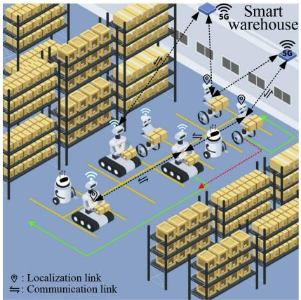

text_image

Smart
warehouse
5G
5G
: Localization link
: Communication link

text_image

Smart factory
5G
5G
5G
5G
: Localization link
: Communication link

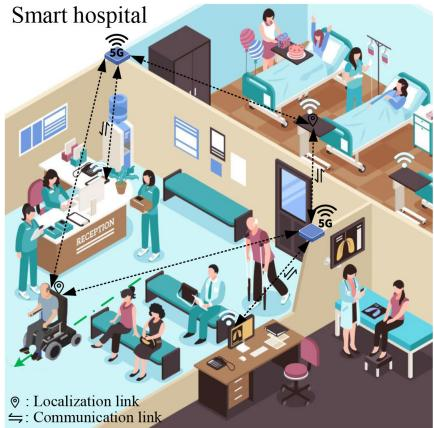

text_image

Smart hospital
5G
5G
5G
: Localization link
: Communication link

Fig. 1. There are three prominent applications of AMD. In smart warehouses and factories, AMDs primarily serve as self-guided robots for moving, managing, and inspecting goods. In intelligent hospitals, AMDs can function as automated wheelchairs to assist in moving patients and medical equipment. CSI-based localization can be divided into two categories: active localization, represented by a link with both localization and communication labels, and passive localization, indicated by a link with solely the localization label. The proposed T-DeLo is a passive localization system, which realizes TTW localization by detecting, processing, and analyzing the echoes introduced by the AMD. From theoretical foundations to practical implementation, we believe that the proposed T-DeLo can be effectively deployed in wireless networks utilizing OFDM modulation techniques and multiple antennas, such as 5G and WiFi.

As a more feasible and practical alternative, the employment of widely-used wireless signals, such as 5G and WiFi, is becoming increasingly popular. Particularly, with the high acceptance of wireless infrastructure by the general public, advancements in integrated sensing and communication (ISAC) and Multiple-Input Multiple-Output (MIMO) technologies, wireless signal based localization is receiving increased attention. So far, numerous wireless based AMD localization technologies, such as radio SLAM and WiFi, have been proposed. While feasible, most systems only consider localization in line-of-sight (LoS) scenarios in the active mode. For instance, in an LoS scenario, radio SLAM based localization often requires the target AMD to carry wireless sensors. These sensors receive or scan signals and subsequently report the collected observations to the server, thereby achieving localization [12]. However, in reality, passive AMD localization in NLoS scenarios, such as TTW situations, is equally essential. For instance, in warehouse security, to ensure the safety of valuable goods, the manager not only needs active localization for the AMD, but more importantly, passive detection and localization as well. This can help them to locate the unauthorized AMDs that intrude the warehouse, who are unlikely to share any measurements or data with the warehouse manager.

This paper proposes T-DeLo, the first unified AMD detection and localization system using CSI extracted from orthogonal frequency division multiplexing (OFDM) signal in the TTW scenario. Inspired by the passive radar, T-DeLo first establishes a reference channel to receive the signal and use the obtained CSI to cancel the strong signal interference (SSI) and the phase error caused by the loose synchronization, making the moving AMD induced reflection can be observed by the surveillance channel. On this basis, an improved matrix pencil algorithm is proposed to jointly estimate the path length change rate (PLCR) and absolute time of flight (ToF) of the subtle AMD induced reflection. Unlike the existing algorithms, the proposed one aggregates multiple CSI measurements to enhance the estimation performance under conditions of low SNR in the TTW scenario. With the obtained PLCR and ToF, the AMD detection and localization are finally achieved by statistical distribution and geometric analysis, respectively. In TTW scenarios, we prototype T-DeLo on the IEEE 802.11ac protocol-based devices and evaluate its performance via comprehensive experiments. Experimental results demonstrate that T-DeLo can effectively realize AMD detection and localization with appreciable accuracy. Our core contributions are summarized as follows.

• We borrow the idea of passive radar to build a reference channel and innovatively employ the CSI obtained from the reference channel to eliminate the SSI and phase error in surveillance channel, laying the foundation for reflection detection and parameter estimation.   
• We propose a novel packet aggregation based twodimensional matrix pencil algorithm. This algorithm is designed to stack multiple measurements to boost the performance of joint PLCR and ToF estimation of the AMD induced reflection in the TTW scenario, where the SNR resides at a low level.

• We developed an affordable prototype of T-DeLo on the IEEE 802.11ac protocol-based devices and conducted experiments in TTW scenarios. The experimental results indicate that T-DeLo can achieve an AMD detection accuracy of 0.964 and 0.951, and median localization error of 1.65 m and 2.05 m, in the TTW glass and brick wall scenarios, respectively.

The rest of the paper is organized as follows. We review some related works in Section II. Section III presents the proposed system’s design in detail, including the phase error and SSI elimination, joint PLCR and absolute ToF estimation, and the AMD detection and localization. The system evaluation is given in Section IV. Finally, the conclusion of our work and the future plan are presented in Section V.

# II. RELATED WORK

The design and implementation of T-DeLo are closely related to localization systems, which are elaborated below.

# A. Radio SLAM Based Localization

The SLAM technology for robot localization can be briefly divided into vision based [10] and radio based SLAM [12]. The radio signals are not affected by light and are considered better for ensuring privacy. Therefore, they are widely and deeply researched [15]. For instance, in [16], the authors integrated features from the WiFi signal with odometry into the GraphSLAM backend to realize indoor robot localization, and the results show that it achieved an improvement of six times compared to the odometry-only estimation. Another work [17] presented a centralized solution to optimize the trajectory and introduced a new model, which combines received signal strength with detection likelihood of an access point (AP), to further improve the performance. Through tests, they showed that the localization error of this system can reach 3.261 m, which realizes an improvement of 10.8% compared to the Gaussian similarity model. Based on radio frequency identification (RFID) technology, the authors in [18] proposed to use phase measurement and odometer data as the front end, and the relative tags position and odometer constraint as the back end to realize localization. In the LoS scenario, the results showed that the localization accuracy of robot and tag is about 5 cm and 10 cm, respectively.

Besides WiFi and RFID, the millimeter waves based SLAM has also been extensively studied. In [19], authors proposed a distributed mmWave SLAM algorithm, which can operate with no initial information about the network deployment or the environment, and the real world tests indicated this system achieves sub-meter accuracy. Later, the authors exploited triangulate validate and AoA difference to estimate the location of the client based on mmWave [20], and the results report a localization error less than 2 m. While promising, relying solely on active localization like SLAM may not be sufficient for some applications like warehouse security. Hence, researching radio signals based passive localization is also indispensable.

# B. WiFi Based Localization

Besides SLAM, WiFi is also commonly used for target localization in indoor scenarios [21]. For instance, the authors in [14] proposed a deep fuzzy forest combined with deep neural networks to achieve robot localization, and its meansquare and mean absolute localization error are 3.2 m and 1.36 m, respectively. In Widar 2.0 [22], authors devised an algorithm for joint AoA, ToF, and Doppler shifts estimation and accomplished localization based on estimated parameters. In the LoS scenario, the Widar 2.0’s median localization error is 0.7 m. In MaTrack [23], the authors presented dynamic-MUSIC to obtain the AoA of the target reflection. By utilizing the AoAs from multiple links, MaTrack accomplishes passive localization of moving humans in LoS conditions, with a median error of 0.6 m. In [24], authors used two-dimensional multiple signal classification (2D-MUSIC) algorithm to estimate the AoA and motion parameters corresponding to human, and further utilized a particle filter to track multiple people. Extensive experiments show that the system’s median tracking error is 0.38 m. In the NLoS scenario, the authors in [25] integrated results from fine time measurement (FTM) and the MUSIC algorithm to facilitate target localization, achieving a median localization error of 1.94 m. For more challenging TTW scenario, Wi-Vi [26] used a novel signal nulling technique to cancel signals from static objects. Then, it estimates the AoA of the signal reflected off the target to track the target’s relative movement. From the above analysis, it is clear that WiFi localization in LoS scenarios has achieved promising results, while research for more challenging NLoS and TTW scenarios remains relatively insufficient.

# C. Radar Based Localization

In addition to above mentioned techniques, radar is also one of the main technologies for target localization [27]. For instance, WiTrack [28] employed specialized hardware to generate frequency modulated carrier wave (FMCW) signals with a bandwidth exceeding 1 GHz. This facilitated highprecision ToF estimation for TTW passive target tracking, yielding a median tracking error of around 0.2 m. Based on RFID technology, Tadar [29] filters out stronger reflections off walls and extracts human induced reflections from multiple back scatters. After that, it tracks the moving target in TTW scenario via the Hidden Markov Model and achieves median tracking errors of about 0.2 m. Moreover, the authors in [30] combined Hough transform with short-time Fourier transform (STFT) to extract the Doppler frequency and realize target localization by processing Doppler, with an average error is about 0.15 m. Based on a low-frequency ultrawideband (UWB) MIMO radar, authors in [31] proposed the three-dimensional higher-order cumulant (HOC) to locate multiple targets in the TTW scenario, and the evaluation shows that its localization error is about 0.1 m. Besides that, the work [32] employed MUSIC to identify the wall shapes and used adaptive interference cancellation techniques to suppress interference caused by multipath effects, thereby achieving the localization of multiple targets hidden behind walls. The radar based approaches have achieved impressive results in TTW localization, providing reference ideas for passive localization system design. However, the need for specialized hardware and the corresponding costs poses a non-negligible burden.

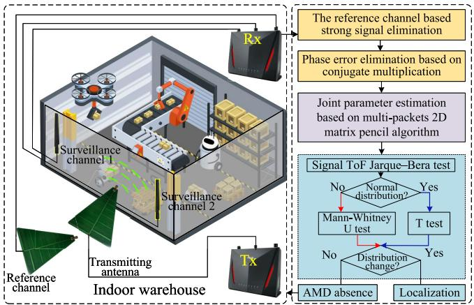

flowchart

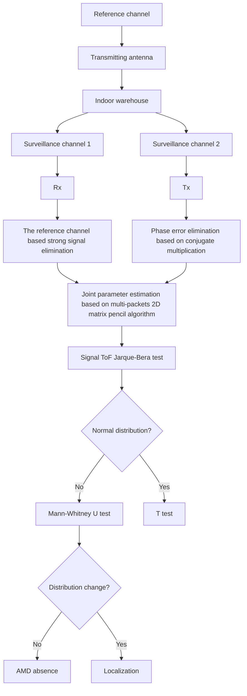

Fig. 2. The architecture of the T-DeLo system can be broadly divided into three components: pre-processing, which includes SSI and phase error elimination; signal parameter estimation; and AMD detection and localization, represented by yellow, purple, and blue modules respectively. During the operation, the transceiver pair is positioned outside the monitored room and perform signal transmission and reception, respectively. Upon detection of the AMD, the system conducts AMD localization. Otherwise it keeps collecting data and executing AMD detection following the procedure.

Unlike above mentioned systems, this paper presents T-DeLo, a CSI based system which realizes AMD passive detection and localization in the TTW scenario, without the requirement for a specialized hardware, multiple transceivers, or extra support from inertial sensors, paving the way for ubiquitous application. Meanwhile, T-DeLo is different from the previous work [33], as it focuses on the strong signal interference elimination and joint ToF and PLCR estimation, while [33] concentrates on theoretical derivation and analysis of joint hypothesis testing models. Furthermore, the joint parameter estimation proposed in this paper also differs from the work [34] in several aspects, including signal model, estimation methods, parameter pairing, and so forth.

# III. SYSTEM MODEL

In this section, we present the design of T-DeLo. The overall architecture of T-DeLo, as shown in Fig. 2, includes three key components, the reference channel-based SSI and phase error elimination, joint ToF and PLCR estimation, and AMD passive detection and localization. T-DeLo first utilizes the CSI extracted from the reference channel to cancel the SSI contained in the surveillance channel and the phase error induced by loose synchronization between the transmitter and receiver. After that, the second component utilizes the proposed packet aggregation-based two-dimensional matrix pencil algorithm to jointly estimate the PLCR and ToF of AMD induced reflections. Finally, T-DeLo scrutinizes fluctuations in ToF via the hypothesis test to detect the presence of the AMD. Upon confirmation, the estimated ToF and antenna locations are employed to realize AMD localization.

# A. SSI Cancellation and Phase Error Elimination

To obtain the PLCR and ToF of the reflection in the TTW scenario accurately, the SSI and phase error must be canceled first. In the TTW scenario with no AMD, assuming an IEEE 802.11 protocol-based transmitter sends the OFDM signal1 via data packets and the receiver samples the wireless signal with multiple antennas. Concretely, one antenna at the receiver is designated to gather the signal from the reference channel, while the other antennas are tasked with capturing the signal from the surveillance channel, as illustrated in Fig. 2. At the time t, the receiver applies the fast Fourier transformation (FFT) to process the received signal and output the n-th subcarrier corresponding to the reference and surveillance channel, which are expressed as

$$
\left\{ \begin{array}{l} U _ {R, n} = X _ {n} \alpha_ {R, n} e ^ {- j (\omega_ {0} + \omega_ {n}) \tau_ {r}} + n _ {R, n} \\ U _ {S, n} = X _ {n} \times \sum_ {d \in P _ {s}} \alpha_ {S, d, n} e ^ {- j (\omega_ {0} + \omega_ {n}) \tau_ {s, d}} \\ \quad + X _ {n} \times \sum_ {i \in P _ {w}} \alpha_ {S, i, n} e ^ {- j (\omega_ {0} + \omega_ {n}) \tau_ {s, i}} + n _ {S, n} \end{array} , \right. \tag {1}
$$

where $X _ { n } { } ^ { 2 }$ is the transmitted symbol, $\alpha _ { R , n } , \alpha _ { S , i , n } .$ , and $\alpha _ { S , d , n }$ are the signal attenuation, $P _ { s }$ is the set of strong signals, including the signal directly travels from transmitter to the receiver and strong reflections caused by the wall, $P _ { w }$ is the set of weak signals, including signals reflected by the objects inside the room, $\tau _ { r } , \tau _ { s , d } ,$ and $\tau _ { s , i }$ are the signal propagation delays, $\omega _ { 0 } = 2 \pi f _ { 0 } , f _ { 0 }$ is the minimum carrier frequency, $\omega _ { n } =$ $2 ( n - 1 ) \pi / T , 1 / T = \Delta f$ is the frequency spacing between adjacent subcarriers, and $n _ { R , n }$ and $n _ { S , n }$ represent noise. At the receiver, synchronization and channel parameter estimation are accomplished through the use of training sequences. Hence, the channel frequency response (CFR) of both channels are

$$
\left\{ \begin{array}{l} h _ {R, n} = \alpha_ {R, n} e ^ {- j 2 \pi (f _ {0} + (n - 1) \Delta f) \tau_ {r}} + n _ {R, n} ^ {\prime} \\ h _ {S, n} = \sum_ {d \in P _ {s}} \alpha_ {S, d, n} e ^ {- j 2 \pi (f _ {0} + (n - 1) \Delta f) \tau_ {s, d}} \\ \quad + \sum_ {i \in P _ {w}} \alpha_ {S, i, n} e ^ {- j 2 \pi (f _ {0} + (n - 1) \Delta f) \tau_ {s, i}} + n _ {S, n} ^ {\prime} \end{array} , \right. \tag {2}
$$

respectively. However, due to the hardware imperfection, the CSI, which is a sampled representation of CFR, reported by the wireless network interface card (NIC) is contaminated with various phase errors. In practice, therefore, the measured CSI of the reference channel is

$$
\begin{array}{l} h _ {R, n} = \alpha_ {R, n} e ^ {- j 2 \pi (f _ {0} + (n - 1) \Delta f) \tau_ {r}} e ^ {- j 2 \pi (f _ {0} + (n - 1) \Delta f) \lambda_ {b}} \\ \times e ^ {- j 2 \pi (f _ {0} + (n - 1) \Delta f) \lambda_ {o}} e ^ {- j 2 \pi \beta} + n _ {R, n} ^ {\prime}, \tag {3} \\ \end{array}
$$

where $e ^ { - j 2 \pi ( f _ { 0 } + n \Delta f ) \lambda _ { b } }$ is the phase errors caused by the packet detection delay (PDD), $e ^ { - j 2 \pi ( f _ { 0 } + k \Delta f ) \lambda _ { o } }$ is introduced by sampling time offset (SFO), and $e ^ { - j 2 \pi \beta }$ is caused by central frequency offset (CFO). As the two channels share the time generated by the same crystal oscillator, the CSI of the surveillance channel is subject to the same phase errors as

1For a better understanding, it is assumed that the transceiver is based on the 802.11ac protocol. However, T-DeLo is essentially a system based on CSI, which exists in various wireless networks. Hence, the proposed algorithms can not only be applied to WiFi, but also 5G.   
2According to the chapter 7 in [35], the $X _ { n }$ has the value of +1 or -1.

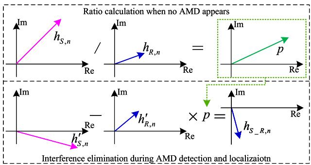

text_image

Ratio calculation when no AMD appears
Im hS,n / Im hR,n = Im p
Re Re
Im - Im × p = Im hS_R,n
h'_{S,n} Re Re
Interference elimination during AMD detection and localizaiton

Fig. 3. The calculation and use of the ratio $p .$

that of the reference channel, and hence we have

$$
\begin{array}{l} h _ {S, n} = \left(\sum_ {d \in P _ {s}} \alpha_ {S, d, n} e ^ {- j 2 \pi (f _ {0} + (n - 1) \Delta f) \tau_ {s, d}} \right. \\ \left. + \sum_ {i \in P _ {w}} \alpha_ {S, i, n} e ^ {- j 2 \pi (f _ {0} + (n - 1) \Delta f) \tau_ {s, i}}\right) \\ \times e ^ {- j 2 \pi (f _ {0} + (n - 1) \Delta f) \lambda_ {b}} \\ \times e ^ {- j 2 \pi (f _ {0} + (n - 1) \Delta f) \lambda_ {o}} e ^ {- j 2 \pi \beta} + n _ {S, n} ^ {\prime}. \tag {4} \\ \end{array}
$$

Leveraging the CSI extracted from the reference and surveillance channel, T-DeLo calculates

$$
p = h _ {S, n} / h _ {R, n}, \tag {5}
$$

which is essentially the ratio between the CSI of the multipath signal from surveillance channel and the CSI extracted from reference channel. These two channels have the same phase error, as shown in equation (3) and (4), and hence, the calculated $p$ does not carry any phase error. When an AMD appears in the monitored area, the signal captured by the surveillance channel includes both the original multipath signal and AMD induced reflections. At this time, multiplying p by the CSI of the reference channel yields the CSI of the surveillance channel without the AMD reflection. On this basis, we can subtract the product from the captured CSI of the surveillance channel to eliminate strong signal interference, thereby obtaining the CSI corresponding to the AMD reflection. Such a process is briefly depicted in Fig. 3. Therefore, assuming $h _ { R , n } ^ { \prime }$ and $h _ { S , n } ^ { \prime }$ are the CSI of the reference channel and surveillance channel obtained during the detection and localization process As the transceiver pair is placed outside the targeted room, it is reasonable to assume that the signal captured by the reference channel would not be affected by the presence of an AMD inside the targeted room., then, the obtained ratio $p$ is employed to realize SSI elimination through

$$
h _ {S \_ R, n} = h _ {S, n} ^ {\prime} - h _ {R, n} ^ {\prime} \times p, \tag {6}
$$

where $h _ { S _ { - } R , n }$ is the residual CSI after the SSI elimination. If no AMD appears inside the room, which means the environment inside the room remains unchanged, then we have $h _ { S \_ R , n } \approx 0$ . However, once the AMD appears, the AMD induced CSI would be recorded in $h _ { S _ { - } R } .$ . Therefore, one can see that, through the utilization of the computed ratio $p ,$ the SSI can be mitigated, laying the foundation for the parameter estimation of AMD induced reflection.

After the SSI cancellation, M CSI measurements from the surveillance channel, are used to form the matrix

$$
\mathbf {H} _ {S _ {-} R} = \left[ \begin{array}{c c c} h _ {S _ {-} R, 1, 1} & \dots & h _ {S _ {-} R, 1, N} \\ \vdots & \ddots & \vdots \\ h _ {S _ {-} R, M, 1} & \dots & h _ {S _ {-} R, M, N} \end{array} \right], \tag {7}
$$

where $h _ { S _ { - } R , m , n }$ is the CSI from m-th packet of n-th subcarrier, $N$ is the number of subcarriers. Once the AMD appears inside the room, it introduces new reflections. Without loss of generality, we can assume that the l-th propagation path is caused by the AMD. Then, regardless of noise, we have

$$
h _ {S \_ R, 1, n} ^ {l} = \alpha_ {1, n} ^ {l} e ^ {- j 2 \pi f _ {n} \tau_ {l}} e ^ {- j 2 \pi (f _ {n} (\lambda_ {b} + \lambda_ {o}) + \beta)}, \tag {8}
$$

where $\alpha _ { 1 , n } ^ { l }$ is the amplitude, $\tau _ { l }$ is the propagation delay of l-th path, and $f _ { n } ~ = ~ f _ { 0 } + ( n - 1 ) \Delta f$ is the frequency of n-th subcarrier. For the AMD induced reflection, path length changes with the its movement, triggering a frequency shift

$$
f _ {P L C R} = f _ {n} \times v / c, \tag {9}
$$

where v is the PLCR, and c is the propagation speed of signal. Therefore, for the m-th packet, we have

$$
\begin{array}{l} h _ {S \_ R, m, n} ^ {l} = h _ {S \_ R, 1, n} ^ {l} \times \varphi (v ^ {l}) \\ = \alpha_ {m, n} ^ {l} e ^ {- j 2 \pi f _ {n} (\tau_ {l} + (m - 1) \Delta t \times v ^ {l} / c)} \\ \times e ^ {- j 2 \pi (f _ {n} (\lambda_ {b} + \lambda_ {o}) + \beta)}, \tag {10} \\ \end{array}
$$

where $\Delta t$ is the time interval between adjacent CSI measurements. Considering all propagation paths, we have

$$
\begin{array}{l} h _ {S \_ R, m, n} = \sum_ {l \in (P _ {s} \cup P _ {w})} \alpha_ {m, n} ^ {l} e ^ {- j 2 \pi f _ {n} (\tau_ {l} + (m - 1) \Delta t \times v ^ {l} / c)} \\ \times e ^ {- j 2 \pi (f _ {n} (\lambda_ {b} + \lambda_ {o}) + \beta)}. \tag {11} \\ \end{array}
$$

Since the two channels share the same clock, here, the conjugate multiplication is applied to remove the phase offsets

$$
\begin{array}{l} \mathbf {H} _ {S \_ R R} = \mathbf {H} _ {S \_ R} * \bar {\mathbf {H}} _ {R} \\ = \left[ \begin{array}{c c c} h _ {S _ {-} R R, 1, 1} & \dots & h _ {S _ {-} R R, 1, N} \\ \vdots & \ddots & \vdots \\ h _ {S _ {-} R R, M, 1} & \dots & h _ {S _ {-} R R, M, N} \end{array} \right] \tag {12} \\ \end{array}
$$

where ∗ denotes the Hadamard product, and $\bar { \mathbf { H } } _ { R }$ is the conjugate of the matrix $\mathbf { H } _ { R } ,$ which contains M CSI measurements obtained from the reference channel. After conjugate multiplication, one can see that, in $\mathbf { H } _ { S _ { - } R R } .$ , for any propagation path, the phase difference between two adjacent CSI measurements and subcarriers are

$$
\left\{ \begin{array}{l} x ^ {l} = e ^ {- j 2 \pi f \frac {\Delta t v _ {l}}{c}} = e ^ {j u ^ {l}} \\ y ^ {l} = e ^ {- j 2 \pi \Delta f \tau_ {l}} = e ^ {j v ^ {l}} \end{array} , \right. \tag {13}
$$

where $f$ is the signal frequency. This indicates that ${ \bf H } _ { S _ { - } R R }$ no longer contains phase errors and can be used for joint parameter estimation3.

3The phase shift introduced by the propagation delay of direct signal is a constant value that can be easily calculated and compensated. As a result, this term is disregarded in the derivation process.

# B. Joint PLCR and ToF Estimation

To realize joint PLCR and ToF estimation, M CSI measurements are used to build the Hankel block matrix first

$$
\mathbf {Z} _ {1} = \left[ \begin{array}{c c c c} \mathbf {H} _ {S _ {-} R R, 1} & \mathbf {H} _ {S _ {-} R R, 2} & \dots & \mathbf {H} _ {S _ {-} R R, M - K + 1} \\ \vdots & \vdots & \ddots & \vdots \\ \mathbf {H} _ {S _ {-} R R, K} & \mathbf {H} _ {S _ {-} R R, K + 1} & \dots & \mathbf {H} _ {S _ {-} R R, M} \end{array} \right], \tag {14}
$$

where

$$
\mathbf {H} _ {S \_ R R, m} = \left[ \begin{array}{c c c} h _ {S \_ R R, m, 1} & \dots & h _ {S \_ R R, m, N - P + 1} \\ \vdots & \ddots & \vdots \\ h _ {S \_ R R, m, P} & \dots & h _ {S \_ R R, m, N} \end{array} \right], \tag {15}
$$

K and P are adjustable pencil parameters utilized for noise filtration [36]. Theoretically, PLCR and ToF can be estimated based on $\mathbf { Z } _ { 1 }$ . However, to combat the low SNR in the TTW scenario, we propose to aggregate multiple Hankel block matrices to build an enhanced Hankel block matrix

$$
\mathbf {Z} _ {E} = \left[ \mathbf {Z} _ {1} \dots \mathbf {Z} _ {i} \dots \mathbf {Z} _ {I} \right], \tag {16}
$$

where

$$
\mathbf {Z} _ {i} = \left[ \begin{array}{c c c c} \mathbf {H} _ {S _ {-} R R, i} & \mathbf {H} _ {S _ {-} R R, i + 1} & \dots & \mathbf {H} _ {S _ {-} R R, M - K + i} \\ \vdots & \vdots & \ddots & \vdots \\ \mathbf {H} _ {S _ {-} R R, K + i - 1} & \mathbf {H} _ {S _ {-} R R, K + i} & \dots & \mathbf {H} _ {S _ {-} R R, M - 1 + i} \end{array} \right]. \tag {17}
$$

On this basis, to derive the selection matrices for signal parameter estimation, the Hankel block matrix is rewritten as

$$
\mathbf {Z} _ {i} = \left(\mathbf {X} _ {i} \odot \mathbf {Y} _ {i}\right) \boldsymbol {\Sigma} _ {x, i} \boldsymbol {\Sigma} _ {y, i} \mathbf {A} _ {i} \mathbf {D} _ {i}, \tag {18}
$$

where

$$
\mathbf {X} _ {i} = \left[ \begin{array}{c c c c} {\left[ x _ {i} ^ {1} \right] ^ {- \frac {K - 1}{2}}} & {\left[ x _ {i} ^ {2} \right] ^ {- \frac {K - 1}{2}}} & {\dots} & {\left[ x _ {i} ^ {L} \right] ^ {- \frac {K - 1}{2}}} \\ {\left[ x _ {i} ^ {1} \right] ^ {- \frac {K - 3}{2}}} & {\left[ x _ {i} ^ {2} \right] ^ {- \frac {K - 3}{2}}} & {\dots} & {\left[ x _ {i} ^ {L} \right] ^ {- \frac {K - 3}{2}}} \\ {\vdots} & {\vdots} & {\vdots} & {\vdots} \\ {\left[ x _ {i} ^ {1} \right] ^ {\frac {K - 3}{2}}} & {\left[ x _ {i} ^ {2} \right] ^ {\frac {K - 3}{2}}} & {\dots} & {\left[ x _ {i} ^ {L} \right] ^ {\frac {K - 3}{2}}} \\ {\left[ x _ {i} ^ {1} \right] ^ {\frac {K - 1}{2}}} & {\left[ x _ {i} ^ {2} \right] ^ {\frac {K - 1}{2}}} & {\dots} & {\left[ x _ {i} ^ {L} \right] ^ {\frac {K - 1}{2}}} \end{array} \right], \tag {19}
$$

$$
\mathbf {Y} _ {i} = \left[ \begin{array}{c c c c} {\left[ y _ {i} ^ {1} \right] ^ {- \frac {P - 1}{2}}} & {\left[ y _ {i} ^ {2} \right] ^ {- \frac {P - 1}{2}}} & \dots & {\left[ y _ {i} ^ {L} \right] ^ {- \frac {P - 1}{2}}} \\ {\left[ y _ {i} ^ {1} \right] ^ {- \frac {P - 3}{2}}} & {\left[ y _ {i} ^ {2} \right] ^ {- \frac {P - 3}{2}}} & \dots & {\left[ y _ {i} ^ {L} \right] ^ {- \frac {P - 3}{2}}} \\ \vdots & \vdots & \vdots & \vdots \\ {\left[ y _ {i} ^ {1} \right] ^ {\frac {P - 3}{2}}} & {\left[ y _ {i} ^ {2} \right] ^ {\frac {P - 3}{2}}} & \dots & {\left[ y _ {i} ^ {L} \right] ^ {\frac {P - 3}{2}}} \\ {\left[ y _ {i} ^ {1} \right] ^ {\frac {P - 1}{2}}} & {\left[ y _ {i} ^ {2} \right] ^ {\frac {P - 1}{2}}} & \dots & {\left[ y _ {i} ^ {L} \right] ^ {\frac {K - 1}{2}}} \end{array} \right], \tag {20}
$$

$$
\boldsymbol {\Sigma} _ {x, i} = \operatorname{diag} \left(\left[ x _ {i} ^ {1} \right] ^ {\frac {K - 1}{2}}, \left[ x _ {i} ^ {2} \right] ^ {\frac {K - 1}{2}}, \dots , \left[ x _ {i} ^ {L} \right] ^ {\frac {K - 1}{2}}\right), \tag {21}
$$

$$
\boldsymbol {\Sigma} _ {y, i} = \operatorname{diag} \left(\left[ y _ {i} ^ {1} \right] ^ {\frac {P - 1}{2}}, \left[ y _ {i} ^ {2} \right] ^ {\frac {P - 1}{2}}, \dots , \left[ y _ {i} ^ {L} \right] ^ {\frac {P - 1}{2}}\right), \tag {22}
$$

$$
\mathbf {A} _ {i} = \operatorname{diag} \left(\alpha_ {i} ^ {1}, \alpha_ {i} ^ {2}, \dots , \alpha_ {i} ^ {L}\right), \tag {23}
$$

$$
\mathbf {D} _ {i} = \left[ \left[ \begin{array}{c c c} 1 & \dots & \left[ x _ {i} ^ {1} \right] ^ {M - K} \\ 1 & \dots & \left[ x _ {i} ^ {2} \right] ^ {M - K} \\ \vdots & \vdots & \vdots \\ 1 & \dots & \left[ x _ {i} ^ {L} \right] ^ {M - K} \end{array} \right] ^ {\mathrm{T}} \odot \left[ \begin{array}{c c c} 1 & \dots & \left[ y _ {i} ^ {1} \right] ^ {N - P} \\ 1 & \dots & \left[ y _ {i} ^ {2} \right] ^ {N - P} \\ \vdots & \vdots & \vdots \\ 1 & \dots & \left[ y _ {i} ^ {L} \right] ^ {N - P} \end{array} \right] ^ {\mathrm{T}} \right] ^ {\mathrm{T}}, \tag {24}
$$

and the symbol ⊙ denotes the Khatri-Rao product. Based on the expressions in (18) to (24), the enhanced Hankel block matrix presented in equation (16) is now expressed as

$$
\mathbf {Z} _ {E} = \left[ \begin{array}{c} {\left[ \left(\mathbf {X} _ {1} \odot \mathbf {Y} _ {1}\right) \boldsymbol {\Sigma} _ {x, 1} \boldsymbol {\Sigma} _ {y, 1} \mathbf {A} _ {1} \mathbf {D} _ {1} \right] ^ {\mathrm{T}}} \\ \vdots \\ {\left[ \left(\mathbf {X} _ {i} \odot \mathbf {Y} _ {i}\right) \boldsymbol {\Sigma} _ {x, i} \boldsymbol {\Sigma} _ {y, i} \mathbf {A} _ {i} \mathbf {D} _ {i} \right] ^ {\mathrm{T}}} \\ \vdots \\ {\left[ \left(\mathbf {X} _ {I} \odot \mathbf {Y} _ {I}\right) \boldsymbol {\Sigma} _ {x, I} \boldsymbol {\Sigma} _ {y, I} \mathbf {A} _ {I} \mathbf {D} _ {I} \right] ^ {\mathrm{T}}} \end{array} \right] ^ {\mathrm{T}}. \tag {25}
$$

To reduce computational complexity, the Discrete Fourier Transform (DFT) matrix is introduced to map the array-space measurement to beam-space. Let ${ \bf W } _ { K }$ be the DFT matrix with a size of $K \times K$ . The conjugate central symmetrized k-th row in $\mathbf { W } _ { K }$ can be expressed as

$$
\mathbf {w} _ {k} ^ {\mathrm{H}} = e ^ {j \left(\frac {K - 1}{2}\right) k \frac {2 \pi}{K}} \times \left[ 1, e ^ {- j k \frac {2 \pi}{K}}, \dots , e ^ {- j (K - 1) k \frac {2 \pi}{K}} \right], \tag {26}
$$

which means a DFT beam is directed towards the spatial frequency of $2 \pi k / K \left( 0 \le k \le K - 1 \right)$ and the superscript $\mathbf { \hat { H } } ^ { \prime }$ represents the conjugate transpose operation. Similarly, we assume another DFT matrix $\mathbf { W } _ { P }$ and the conjugate central symmetrized version of the $p \mathrm { - }$ th row $( 0 \leq p \leq P - 1 )$ can be expressed in the same way as $\mathbf { w } _ { k } ^ { \mathrm { H } }$ . Leveraging ${ \bf W } _ { K }$ and $\mathbf { W } _ { P }$ two beam-space manifold matrices can be constructed as

$$
\left\{ \begin{array}{l} \mathbf {B} _ {K, i} = \mathbf {W} _ {K} ^ {\mathrm{H}} \mathbf {X} _ {i} \\ \mathbf {B} _ {P, i} = \mathbf {W} _ {P} ^ {\mathrm{H}} \mathbf {Y} _ {i} \end{array} . \right. \tag {27}
$$

The l-th column of $\mathbf { B } _ { K , \mathcal { i } }$ i and $\mathbf { B } _ { P , i }$ can be denoted as

$$
\left\{ \begin{array}{l} \mathbf {b} _ {K} \left(u _ {i} ^ {l}\right) = \left[ b _ {0} (u _ {i} ^ {l}), b _ {1} (u _ {i} ^ {l}), \dots , b _ {K - 1} (u _ {i} ^ {l}) \right] ^ {\mathrm{T}} \\ \mathbf {b} _ {P} \left(v _ {i} ^ {l}\right) = \left[ b _ {0} (v _ {i} ^ {l}), b _ {1} (v _ {i} ^ {l}), \dots , b _ {P - 1} (v _ {i} ^ {l}) \right] ^ {\mathrm{T}} \end{array} \right., \tag {28}
$$

respectively, where

$$
\left\{ \begin{array}{l} b _ {k} (u _ {i} ^ {l}) = \sin \left[ \frac {K}{2} \left(u _ {i} ^ {l} - k \frac {2 \pi}{K}\right) \right] / \sin \left[ \frac {1}{2} \left(u _ {i} ^ {l} - k \frac {2 \pi}{K}\right) \right] \\ b _ {p} (v _ {i} ^ {l}) = \sin \left[ \frac {P}{2} \left(v _ {i} ^ {l} - p \frac {2 \pi}{P}\right) \right] / \sin \left[ \frac {1}{2} \left(v _ {i} ^ {l} - p \frac {2 \pi}{P}\right) \right]. \end{array} \right. \tag {29}
$$

According to expressions in (28) and (29), the relationship between the $b _ { k } ( u _ { i } ^ { l } )$ and $b _ { k + 1 } ( u _ { i } ^ { l } )$ can be described as

$$
\begin{array}{l} \tan \left(\frac {u _ {i} ^ {l}}{2}\right) \left\{\cos (k \frac {\pi}{K}) b _ {k} \left(u _ {i} ^ {l}\right) + \cos \left[ \frac {\pi}{K} (k + 1) \right] b _ {k + 1} \left(u _ {i} ^ {l}\right) \right\} \\ = \sin \left(k \frac {\pi}{K}\right) b _ {k} \left(u _ {i} ^ {l}\right) + \sin \left[ \frac {\pi}{K} (k + 1) \right] b _ {k + 1} \left(u _ {i} ^ {l}\right). \tag {30} \\ \end{array}
$$

Since $0 \leq k \leq K - 1$ , then K equations, which share the same form as equation (30), can be simplified into a matrix

$$
\tan \left(\frac {u _ {i} ^ {l}}{2}\right) \mathbf {\Gamma} _ {K, 1} \mathbf {b} _ {K} \left(u _ {i} ^ {l}\right) = \mathbf {\Gamma} _ {K, 2} \mathbf {b} _ {K} \left(u _ {i} ^ {l}\right), \tag {31}
$$

where

$$
\boldsymbol {\Gamma} _ {K, 1} = \left[ \begin{array}{c c c c c} 1 & \cos \left(\frac {\pi}{K}\right) & 0 & \dots & 0 \\ 0 & \cos \left(\frac {\pi}{K}\right) & \cos \left(2 \frac {\pi}{K}\right) & \dots & 0 \\ 0 & 0 & \cos \left(2 \frac {\pi}{K}\right) & \dots & 0 \\ \vdots & \vdots & \vdots & \ddots & \vdots \\ (- 1) ^ {K} & 0 & 0 & \dots & \cos \left(\frac {(K - 1) \pi}{K}\right) \end{array} \right] \tag {32}
$$

and

$$
\boldsymbol {\Gamma} _ {K, 2} = \left[ \begin{array}{c c c c c} 0 & \sin \left(\frac {\pi}{K}\right) & 0 & \dots & 0 \\ 0 & \sin \left(\frac {\pi}{K}\right) & \sin \left(2 \frac {\pi}{K}\right) & \dots & 0 \\ 0 & 0 & \sin \left(2 \frac {\pi}{K}\right) & \dots & 0 \\ \vdots & \vdots & \vdots & \ddots & \vdots \\ 0 & 0 & 0 & \dots & \sin \left(\frac {(K - 1) \pi}{K}\right) \end{array} \right] \tag {33}
$$

are two selection matrices. Considering there are L propagation paths in total, then equation (31) can be simplified as

$$
\boldsymbol {\Gamma} _ {K, 1} \mathbf {B} _ {K, i} \boldsymbol {\Omega} _ {i, u} = \boldsymbol {\Gamma} _ {K, 2} \mathbf {B} _ {K, i}, \tag {34}
$$

where $\begin{array} { r } { \Omega _ { i , u } = d i a g \left[ \tan \left( \frac { u _ { i } ^ { 1 } } { 2 } \right) , \tan \left( \frac { u _ { i } ^ { 2 } } { 2 } \right) , \cdots , \tan \left( \frac { u _ { i } ^ { L } } { 2 } \right) \right] } \end{array}$ In the same way, the relationship between $\dot { b } _ { p } ( v _ { i } ^ { l } )$ and $b _ { p + 1 } ( v _ { i } ^ { l } )$ can also be obtained as follow

$$
\boldsymbol {\Gamma} _ {P, 1} \mathbf {B} _ {P, i} \boldsymbol {\Omega} _ {i, v} = \boldsymbol {\Gamma} _ {P, 2} \mathbf {B} _ {P, i}. \tag {35}
$$

Based on the above derivation, one can see that

$$
\left\{ \begin{array}{l} \boldsymbol {\Gamma} _ {K, 1} ^ {\prime} \mathbf {B} _ {K P, i} = \left(\boldsymbol {\Gamma} _ {K, 1} \otimes \mathbf {E} _ {P}\right) \left(\mathbf {B} _ {K, i} \odot \mathbf {B} _ {P, i}\right) \\ = \left(\boldsymbol {\Gamma} _ {K, 1} \mathbf {B} _ {K, i}\right) \odot \mathbf {B} _ {P, i} \\ \boldsymbol {\Gamma} _ {K, 2} ^ {\prime} \mathbf {B} _ {K P, i} = \left(\boldsymbol {\Gamma} _ {K, 2} \otimes \mathbf {E} _ {P}\right) \left(\mathbf {B} _ {K, i} \odot \mathbf {B} _ {P, i}\right) \\ = \left(\boldsymbol {\Gamma} _ {K, 2} \mathbf {B} _ {K, i}\right) \odot \mathbf {B} _ {P, i} \end{array} , \right. \tag {36}
$$

where $\mathbf { r } ^ { \prime } { } _ { K , 1 } = \mathbf { r } _ { K , 1 } \otimes \mathbf { E } _ { P } , \mathbf { r } ^ { \prime } { } _ { K , 2 } = \mathbf { r } _ { K , 2 } \otimes \mathbf { E } _ { P } , \mathbf { B } _ { K P , i } =$ $\mathbf { B } _ { K , i } \odot \mathbf { B } _ { P , i } , \mathbf { E } _ { P }$ is the unit matrix with the size of $P \times P ,$ and ⊗ is the Kronecker product. According to the equation (34) to (36), the following equation can be obtained

$$
\left\{ \begin{array}{l} \boldsymbol {\Gamma} _ {K, 2} ^ {\prime} \mathbf {B} _ {K P, i} = \boldsymbol {\Gamma} _ {K, 1} ^ {\prime} \mathbf {B} _ {K P, i} \boldsymbol {\Omega} _ {i, u} \\ \boldsymbol {\Gamma} _ {P, 2} ^ {\prime} \mathbf {B} _ {K P, i} = \boldsymbol {\Gamma} _ {P, 1} ^ {\prime} \mathbf {B} _ {K P, i} \boldsymbol {\Omega} _ {i, v} \end{array} , \right. \tag {37}
$$

where $\mathbf { { r } } ^ { \prime } { } _ { P , 2 } = \mathbf { { r } } _ { P , 2 } \otimes \mathbf { { E } } _ { K } , \mathbf { { r } } ^ { \prime } { } _ { P , 1 } = \mathbf { { r } } _ { P , 1 } \otimes \mathbf { { E } } _ { K }$ , and $\mathbf { E } _ { K }$ is the unit matrix with the size of $K \times K$ . After that, the enhanced Hankel block matrix $\mathbf { Z } _ { E }$ is multiplied by DFT matrix $\left( \mathbf { W } _ { K } ^ { \mathrm { H } } \otimes \mathbf { W } _ { P } ^ { \mathrm { H } } \right)$ from left to get

$$
\begin{array}{l} \mathbf {Z} _ {W E} = \left(\mathbf {W} _ {K} ^ {\mathrm{H}} \otimes \mathbf {W} _ {P} ^ {\mathrm{H}}\right) \mathbf {Z} _ {E} \\ = \left[ \begin{array}{c} \left[ (\mathbf {W} _ {K} ^ {\mathrm{H}} \mathbf {X} _ {1} \odot \mathbf {W} _ {P} ^ {\mathrm{H}} \mathbf {Y} _ {1}) \boldsymbol {\Sigma} _ {x, 1} \boldsymbol {\Sigma} _ {y, 1} \mathbf {A} _ {1} \mathbf {D} _ {1} \right] ^ {\mathrm{T}} \\ \left[ (\mathbf {W} _ {K} ^ {\mathrm{H}} \mathbf {X} _ {2} \odot \mathbf {W} _ {P} ^ {\mathrm{H}} \mathbf {Y} _ {2}) \boldsymbol {\Sigma} _ {x, 2} \boldsymbol {\Sigma} _ {y, 2} \mathbf {A} _ {2} \mathbf {D} _ {2} \right] ^ {\mathrm{T}} \\ \dots \\ \left[ (\mathbf {W} _ {K} ^ {\mathrm{H}} \mathbf {X} _ {I} \odot \mathbf {W} _ {P} ^ {\mathrm{H}} \mathbf {Y} _ {I}) \boldsymbol {\Sigma} _ {x, I} \boldsymbol {\Sigma} _ {y, I} \mathbf {A} _ {I} \mathbf {D} _ {I} \right] ^ {\mathrm{T}} \end{array} \right] ^ {\mathrm{T}} \\ = \left[ \begin{array}{c} {\left[ \mathbf {B} _ {K P, 1} \boldsymbol {\Sigma} _ {x, 1} \boldsymbol {\Sigma} _ {y, 1} \mathbf {A} _ {1} \mathbf {D} _ {1} \right] ^ {\mathrm{T}}} \\ {\left[ \mathbf {B} _ {K P, 2} \boldsymbol {\Sigma} _ {x, 2} \boldsymbol {\Sigma} _ {y, 2} \mathbf {A} _ {2} \mathbf {D} _ {2} \right] ^ {\mathrm{T}}} \\ \dots \\ {\left[ \mathbf {B} _ {K P, I} \boldsymbol {\Sigma} _ {x, I} \boldsymbol {\Sigma} _ {y, I} \mathbf {A} _ {I} \mathbf {D} _ {I} \right] ^ {\mathrm{T}}} \end{array} \right] ^ {\mathrm{T}}. \tag {38} \\ \end{array}
$$

One can notice from (38) that matrices to the right of ${ \bf B } _ { K P , i }$ are full rank matrices, indicating ${ \bf B } _ { K P , i }$ and ${ \mathbf { Z } } _ { W E , i }$ share the same column space. Therefore, a matrix made of real numbers can be built as

$$
\mathbf {Z} _ {W E \_ R} = \left[ \operatorname{Re} \left(\mathbf {Z} _ {W E}\right), \operatorname{Im} \left(\mathbf {Z} _ {W E}\right) \right]. \tag {39}
$$

After that, the singular value decomposition (SVD) is conducted on ${ \bf Z } _ { W E , R }$ , then we have

$$
\begin{array}{l} \mathbf {Z} _ {W E \_ R} = \mathbf {Q} _ {W E \_ R} \boldsymbol {\Sigma} _ {W E \_ R} \mathbf {R} _ {W E \_ R} ^ {\mathrm{H}} \\ = \mathbf {Q} _ {W E _ {-} R} ^ {[ s ]} \boldsymbol {\Sigma} _ {W E _ {-} R} ^ {[ s ]} \left[ \mathbf {R} _ {W E _ {-} R} ^ {[ s ]} \right] ^ {\mathrm{H}} \\ + \mathbf {Q} _ {W E _ {-} R} ^ {[ n ]} \boldsymbol {\Sigma} _ {W E _ {-} R} ^ {[ n ]} \left[ \mathbf {R} _ {W E _ {-} R} ^ {[ n ]} \right] ^ {\mathrm{H}}, \tag {40} \\ \end{array}
$$

where Q[s]W E\_R $\mathbf { Q } _ { W E \_ R } ^ { [ s ] }$ includes the left singular vectors, spanning the subspace of signal associated with the L largest singular values. Combining $\mathbf { Q } _ { W E \_ R } ^ { [ s ] }$ with the shuffling matrix R, we have

$$
\left[ \mathbf {Q} _ {W E _ {-} R} ^ {[ s ]} \right] ^ {\prime} = \mathbf {R Q} _ {W E _ {-} R} ^ {[ s ]}, \tag {41}
$$

where

$$
\mathbf {R} = \left[ \begin{array}{c} \mathbf {r} (1) \\ \mathbf {r} (1 + P) \\ \vdots \\ \mathbf {r} (1 + (K - 1) P) \\ \vdots \\ \mathbf {r} (P) \\ \mathbf {r} (P + P) \\ \vdots \\ \mathbf {r} (P + (K - 1) P) \end{array} \right] \tag {42}
$$

and $\mathbf { r } ( p + ( k - 1 ) P )$ is a row vector with the size of $1 \times K P .$ . Specifically, the value of the $( p + ( k - 1 ) P )$ -th column in $\mathbf { r } ( p + ( k - 1 ) P )$ is 1, while the rest are zeros. On this basis, the eigenvalue of matrices

$$
\left\{ \begin{array}{l} \boldsymbol {\Psi} _ {u} = (\mathbf {\Gamma} _ {K, 1} ^ {\prime} \mathbf {Q} _ {W E _ {-} R} ^ {[ s ]}) ^ {\dagger} \boldsymbol {\Gamma} _ {K, 2} ^ {\prime} \mathbf {Q} _ {W E _ {-} R} ^ {[ s ]} \\ \boldsymbol {\Psi} _ {v} = (\mathbf {\Gamma} _ {P, 1} ^ {\prime} [ \mathbf {Q} _ {W E _ {-} R} ^ {[ s ]} ] ^ {\prime}) ^ {\dagger} \boldsymbol {\Gamma} _ {P, 2} ^ {\prime} [ \mathbf {Q} _ {W E _ {-} R} ^ {[ s ]} ] ^ {\prime} \end{array} \right. \tag {43}
$$

are computed, where superscript † denotes the Moore-Penrose pseudo inverse. Assuming the obtained eigenvalue of $\Psi _ { u }$ and $\Psi _ { v }$ are $\lambda _ { l }$ and ςl, respectively, where $l = [ 1 , 2 , \ldots , L ]$ , then according to equation (13), $\Omega _ { i , u } .$ , and $\Omega _ { i , v }$ (presented in equation (34) and (35), respectively), the PLCR and ToF of the reflection can be obtained

$$
\left\{ \begin{array}{l} v _ {l} = \left(c \tan^ {- 1} (\lambda_ {l})\right) / - \pi f _ {c} \Delta t \\ \tau_ {l} = \tan^ {- 1} (\varsigma_ {l}) / - \pi \Delta f. \end{array} \right. \tag {44}
$$

Based on the aggregated multiple CSI measurements, T-DeLo achieves TTW the joint PLCR and ToF estimation of reflections after SSI cancellation and phase error elimination. Next, we detail how to utilize the estimated parameters for passive detection and localization of AMD.

# C. AMD Passive Detection and Localization

In the TTW AMD absence case, the PLCR and ToF distributions of reflections tend to be stable. However, these distributions change once the AMD appears in the monitored room, since the AMD affects the propagation of the multipath signal via diffraction, refraction, and reflection. Leveraging this observation, T-DeLo first extracts ToF distributions of reflections in the TTW AMD absence scenario and considers them as template distribution. Then, the joint hypothesis test is employed to observe fluctuation in ToF distributions, thereby achieving the passive detection of AMD in TTW scenarios.

Given that the distribution of ToF in real-world TTW scenarios is unpredictable, to achieve improved detection performance, T-DeLo first employs a Jarque-Bera test to assess the template ToF. Assuming ToFs of reflections extracted in the TTW scenario without AMD are $\tau _ { i } ( i = 1 , \cdots , n )$ , T-DeLo builds the null hypothesis $\{ H _ { 0 } \colon$ the template ToF distribution obeys the normal distribution}, and the alternative hypothesis $\{ H _ { 1 }$ : the template ToF distribution follows the nonnormal pattern}. Then, it calculates the skewness and kurtosis coefficients of the template ToF distribution

$$
\left\{ \begin{array}{l} S = \left(\frac {1}{n} \sum_ {i = 1} ^ {n} \left(\tau_ {i} - \bar {\tau}\right) ^ {3}\right) / \left(\frac {1}{n} \sum_ {i = 1} ^ {n} \left(\tau_ {i} - \bar {\tau}\right) ^ {2}\right) ^ {3 / 2} = \frac {\hat {\mu} _ {3}}{\hat {\sigma} ^ {3}} \\ Q = \left(\frac {1}{n} \sum_ {i = 1} ^ {n} \left(\tau_ {i} - \bar {\tau}\right) ^ {4}\right) / \left(\frac {1}{n} \sum_ {i = 1} ^ {n} \left(\tau_ {i} - \bar {\tau}\right) ^ {2}\right) ^ {2} = \frac {\hat {\mu} _ {4}}{\hat {\sigma} ^ {4}}, \end{array} \right. \tag {45}
$$

where $\bar { \tau }$ is the ToF sample mean value, σˆ is the standard deviation, and $\hat { \mu } _ { 3 }$ and $\hat { \mu } _ { 4 }$ are the third order and fourth order central moment, respectively. Based on S and Q, the test statistic is calculated as

$$
J _ {B} = \frac {n}{6} \left[ S ^ {2} + (Q - 3) ^ {2} / 4 \right], \tag {46}
$$

which follows the Chi-Square distribution, i.e., $J _ { B } = { \hat { J } } _ { B } \sim$ $\mathcal { X } ^ { 2 } \left( 2 \right)$ , when the template ToF distribution follows the normal distribution. Hence, the decision value is set as

$$
p _ {J B} = P _ {\mathcal {X} ^ {2}} \left\{J _ {B} > \hat {J} _ {B} \right\}. \tag {47}
$$

This value represents the probability of $J _ { B } > \hat { J } _ { B }$ under $\mathcal { X } ^ { 2 }$ distribution. At last, the normality analysis of template ToF distribution is realized via

$$
\left\{ \begin{array}{l} \text { if } p _ {J B} \geq \alpha , H _ {0} \text { is   accepted } \\ \text { otherwise }, H _ {1} \text { is   accepted } \end{array} \right., \tag {48}
$$

where $\alpha = 0 . 0 5$ is the significance level.

Considering the hypothesis testing efficiency [33], T-DeLo employs the T-test to detect fluctuations in the ToF distribution, if the template samples is normally distributed. Assuming that set F contains n ToF samples drawn from a population distribution that has a mean of $v _ { f }$ and a variance of $\sigma _ { f } ^ { 2 } .$ The set G to be analyzed contains m ToF samples from another population distribution, which has the mean of $v _ { g }$ and variance of $\sigma _ { g } ^ { 2 } .$ To analyze whether the two distributions come from the same population, T-DeLo first builds {H0: $v _ { f } = v _ { g } \}$ and $\{ H _ { 1 } \colon$ $v _ { f } \ne v _ { g } \}$ , and then computes the sample mean and unbiased sample variance

$$
\left\{ \begin{array}{l} \bar {F} = \frac {1}{n} \sum_ {i = 1} ^ {n} f _ {i}, \bar {G} = \frac {1}{m} \sum_ {i = 1} ^ {m} g _ {i} \\ S _ {f} ^ {2} = \frac {1}{n - 1} \sum_ {i = 1} ^ {n} \left(f _ {i} - \bar {F}\right) ^ {2}, S _ {g} ^ {2} = \frac {1}{m - 1} \sum_ {i = 1} ^ {m} \left(g _ {i} - \bar {G}\right) ^ {2}. \end{array} \right. \tag {49}
$$

In the condition that $\sigma _ { \it f } ^ { 2 } \ = \ \sigma _ { \it q } ^ { 2 } \ = \ \sigma ^ { 2 }$ , one can see that $\bar { F } - \bar { G } \sim N \left( v _ { f } - v _ { g } , \stackrel { \prime } { \sigma } ^ { 2 } / n + \stackrel { \prime } { \sigma } ^ { 2 } / m \right)$ . Using the additive property of $\chi ^ { 2 }$ distribution, as well as the relationships of $\left( n - 1 \right) S _ { f } ^ { 2 } \Big / \sigma ^ { 2 } \sim \mathcal { X } ^ { 2 } \left( n - 1 \right)$ and $\left( m - 1 \right) S _ { g } ^ { 2 } / \sigma ^ { 2 } \sim$ $\mathcal { X } ^ { 2 } \left( m - 1 \right)$ , we have

$$
t = \frac {(\bar {F} - \bar {G}) - (v _ {f} - v _ {g})}{S _ {\omega} \sqrt {(m + n) / m n}} \sim t (n + m - 2), \tag {50}
$$

where $\begin{array} { l l l } { S _ { \omega } ^ { 2 } } & { = } & { \Big ( ( n - 1 ) S _ { f } ^ { 2 } + ( m - 1 ) S _ { g } ^ { 2 } \Big ) \Big / ( m + n - 2 ) } \end{array}$ In the circumstance that $v _ { f } ~ = ~ v _ { g } ,$ the statistic of T-test is obtained as follow

$$
t ^ {\prime} = \left(\bar {F} - \bar {G}\right) / \left(S _ {\omega} \sqrt {(m + n) / n m}\right) \tag {51}
$$

On this basis, we set the decision threshold as $\begin{array} { r l } { p _ { t } } & { { } = } \end{array}$ $P \left\{ t \geq | t ^ { \prime } | \right\}$ . If $p _ { t } ~ > ~ \alpha ~ = ~ 0 . 0 5$ , T-DeLo accepts $H _ { 0 } ,$ i.e. the template set and the set to be analyzed come from the same population, which means the ToF distribution remains unchanged and no AMD appears in the room. If not, $H _ { 1 }$ is accepted and T-DeLo reports that the AMD has appeared.

When the template distribution does not follow a normal distribution, T-DeLo applies the Mann-Whitney U test to detect ToF fluctuation. Concretely, T-DeLo first establishes the $\{ H _ { 0 } \colon F \ = \ G \}$ and $\{ H _ { 1 } \colon F \neq G \}$ , where $F$ and G represent the population distribution corresponding to F and G, respectively. Subsequently, arranging ToF samples in F∪G in ascending order and determining the rank of each ToF sample as their sorted index, represented as $\{ r _ { f , 1 } , \hdots , r _ { f , n } \}$ and $\{ r _ { g , 1 } , \hdots , r _ { g , m } \}$ . For the ToF samples with identical values, indicating the presence of a tie in $\mathbf { F } \cup \mathbf { G }$ , the ranks assigned to these ToFs are the average of their respective ranks. By utilizing the obtained rank, the rank sum of the two sample sets can be respectively calculated as

$$
\left\{ \begin{array}{l} u _ {F} = \sum_ {i = 1} ^ {n} r _ {f, i} - \frac {n (n + 1)}{2} \\ u _ {G} = \sum_ {i = 1} ^ {m} r _ {g, i} - \frac {m (m + 1)}{2} \end{array} . \right. \tag {52}
$$

In the condition of a large sample size, the statistic of Mann-Whitney U test is set to the smaller one between $u _ { F }$ and $u _ { G }$ . In case of ${ \textbf { F } } = { \textbf { G } }$ , the selected statistic obeys the normal distribution, $\mathrm { i . e . , ~ } u \sim { \cal N } ( n m / 2 , ( n + m + 1 ) n m / 1 2 )$ . This can be further converted into

$$
u ^ {\prime} = \frac {u - \frac {m n}{2}}{\sqrt {\frac {m n (n + m + 1)}{1 2}}} - \frac {m n \sum_ {i = 1} ^ {o} \left(\gamma_ {i} ^ {3} - \gamma_ {i}\right)}{1 2 (m + n) (m + n - 1)} \sim N (0, 1), \tag {53}
$$

where o represents the total number of ties, and $\gamma _ { i }$ signifies the number of samples in the i-th tie. Similarly, we set $p _ { u } =$ $P \left\{ u \geq | u ^ { \prime } | \right\}$ , and $H _ { 0 }$ is accepted if $p _ { u } \ > \alpha$ , which implies that the ToF distribution remains unchanged. Otherwise, $H _ { 1 }$ is accepted and T-DeLo reports that the AMD has appeared.

On the basis of detecting the AMD, T-DeLo singles out the AMD’s reflection by analyzing the PLCR information and extracts the corresponding ToF. Finally, T-DeLo constructs geometric constraints by using the extracted ToF and locations of antennas to realize the AMD localization. Assuming the locations of the transmitting antenna, two receiving antennas corresponding to surveillance channels, and the AMD are ${ \bf T } \ = \ [ x _ { t } , y _ { t } ] , \ { \bf R _ { 1 } } \ = \ [ x _ { 1 } , y _ { 1 } ] , \ { \bf R _ { 2 } } \ = \ [ x _ { 2 } , y _ { 2 } ]$ , and $\textbf { M } =$ $[ x _ { m } , y _ { m } ]$ , respectively. Then, the following two constraints can be established

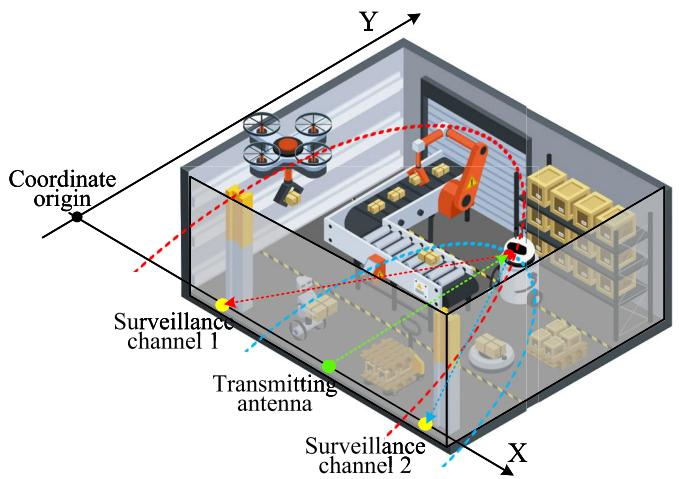

text_image

Coordinate origin
Y
Surveillance channel 1
Transmitting antenna
Surveillance channel 2
X

Fig. 4. An illustration of through-the-wall localization. During the localization process, the transmission antenna and two surveillance channel antennas are treated as the foci of ellipses, constructing two ellipses denoted by the red and blue dotted lines. By calculating the intersection of these two ellipses, the AMD’s location can be determined. If more surveillance channels are available, the localization can be achieved by using optimization algorithms, such as the least squares algorithm.

$$
\left\{ \begin{array}{l} \| \mathbf {T M} \| + \| \mathbf {M R} _ {1} \| = c \tau_ {1} \\ \| \mathbf {T M} \| + \| \mathbf {M R} _ {2} \| = c \tau_ {2}, \end{array} \right. \tag {54}
$$

where, ∥·∥ is the 2-norm operator, τ1 and τ2 are ToFs of the AMD induced reflections extracted from two surveillance channels, respectively, M is the AMD location, which needs to be computed. One can see from the expression in (54), these two constraints represent two ellipses and the AMD is located at the intersection point of these two ellipses, as shown in Fig. 4. Based on the equation (54) and above discussion, therefore, the location of AMD can be calculated as

$$
\left\{ \begin{array}{l} x _ {m} = V y + Z, \\ y _ {m} = \frac {- L \pm \sqrt {L ^ {2} - 4 S U}}{2 S}, \end{array} \right. \tag {55}
$$

where

$$
\begin{array}{l} L = \left\{2 \left[ (x _ {t} - Z) ^ {2} + y _ {t} ^ {2} + \tau_ {1} ^ {2} c ^ {2} - (x _ {1} - Z) ^ {2} - y _ {1} ^ {2} \right] \right. \\ \times \left(- 2 V x _ {t} - 2 y _ {t} + 2 V x _ {1} + 2 y _ {1}\right) \\ \left. + 8 \tau_ {1} ^ {2} c ^ {2} V (x _ {t} - Z) + 8 \tau_ {1} ^ {2} c ^ {2} y _ {t} \right\}, \tag {56} \\ \end{array}
$$

$$
S = - 2 V x _ {t} - 2 y _ {t} + 2 V x _ {1} + 2 y _ {1} - 4 \tau_ {1} ^ {2} c ^ {2} V ^ {2} - 4 \tau_ {1} ^ {2} c ^ {2}, \tag {57}
$$

$$
\begin{array}{l} U = \left[ (x _ {t} - Z) ^ {2} + y _ {t} ^ {2} + \tau_ {1} ^ {2} c ^ {2} - (x _ {1} - Z) ^ {2} - y _ {1} ^ {2} \right] ^ {2} \\ - 4 \tau_ {1} ^ {2} c ^ {2} (x _ {t} - Z) ^ {2} - 4 \tau_ {1} ^ {2} c ^ {2} y _ {t} ^ {2}, \tag {58} \\ \end{array}
$$

$$
V = \frac {2 \left(\tau_ {2} - \tau_ {1}\right) y _ {t} - 2 \tau_ {2} y _ {1} + 2 \tau_ {1} y _ {2}}{- 2 \left(\tau_ {2} - \tau_ {1}\right) x _ {t} + 2 \tau_ {2} x _ {1} - 2 \tau_ {1} x _ {2}}, \tag {59}
$$

and

$$
\begin{array}{l} Z = \frac {- (\tau_ {2} - \tau_ {1}) (x _ {t} ^ {2} + y _ {t} ^ {2}) + \tau_ {1} \tau_ {2} c ^ {2} (\tau_ {1} - \tau_ {2})}{- 2 (\tau_ {2} - \tau_ {1}) x _ {t} + 2 \tau_ {2} x _ {1} - 2 \tau_ {1} x _ {2}} \\ + \frac {\tau_ {2} \left(x _ {1} ^ {2} + y _ {1} ^ {2}\right) - \tau_ {1} \left(x _ {2} ^ {2} + y _ {2} ^ {2}\right)}{- 2 \left(\tau_ {2} - \tau_ {1}\right) x _ {t} + 2 \tau_ {2} x _ {1} - 2 \tau_ {1} x _ {2}}. \tag {60} \\ \end{array}
$$

It should be noted that, if there are multiple surveillance channels available during the localization process, then a set of non-linear over-determined equations can be constructed based on the same pattern described in equation (54). For this set of equations, various methods can be employed for optimization, such as the least squares algorithm. In practical applications, it is recommended to maximize the number of surveillance channels utilized, as this can enhance the accuracy of the AMD localization.

# D. Computational Complexity Analysis

As shown in Fig. 2, the proposed system can be divided into three components. Given that the computational complexity of the first and third components is substantially lower than the second one, we use real multiplications [37] to examine the computational complexity of the second component, i.e., the joint parameter estimation. Overall, the proposed joint parameter estimation algorithm involves two core steps, i.e., DFT transformation and singular value decomposition (SVD) decomposition. Hence, the computational complexity is the sum of $\left( K P \right) ^ { 2 } \left( N - P + 1 \right) \left( M - K + 1 \right) I$ and $\begin{array} { r } { \frac { 1 1 } { 4 } \big ( \dot { K } P \big ) ^ { 3 } + } \end{array}$ $\left( K P \right) ^ { 2 } \left( N - P + 1 \right) \left( M - K + 1 \right) i$ . Besides that, we conduct 5000 times of joint parameter estimation using MATLAB 2018a with the settings of I = 40, K = 10 and $P = 1 5$ , and find that the average computation time for each estimation is approximately 0.55 seconds. Taking the time spent on preprocessing and AMD detection and localization into account, our system can update the detection and localization results once per second, which is acceptable according to our prior experience in constructing real-time localization system [38].

# IV. IMPLEMENTATION AND EVALUATION

In this section, we validate the proposed T-DeLo using devices based on the IEEE 802.11ac protocol through extensive experiments across various TTW scenarios.

# A. Implementation and Experimental Methodology

The experiments are conducted in two typical TTW scenarios, including a meeting room with glass wall and an office room with a brick wall, as shown in Fig. 5. Both rooms contain bookcases, chairs, and other furniture made of wood, plastic, and metal, creating a complex indoor environment abundant in multipath signals. A router based on the IEEE 802.11ac protocol with directional antenna acts as the transmitter to emit the signal on channel 161, which corresponds to 5.805 GHz with the packet transmission rate of 600 Hz and bandwidth of 80 MHz, while another router equipped with the Broadcom 4366C0 NIC and Nexmon tool [39] is configured to capture the signal and report CSI. The receiver has 4 RF channels, three of which are external and one is built-in. During the experiment, we use three external channels, one of which is equipped with a directional antenna to receive signals that directly travel from the transmitter to the receiver, while the other two are fitted with omni-directional antennas to capture multipath signals. The gathered data are processed offline using MATLAB 2018a on a server powered by an Intel i7-7800X 3.5GHz CPU.

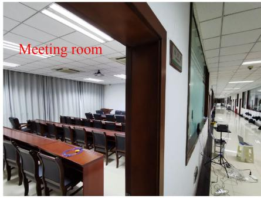

text_image

Meeting room

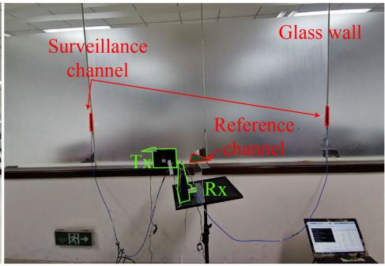

text_image

Surveillance
channel
Glass wall
Reference
channel
Rx

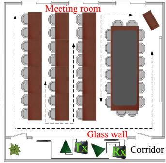

flowchart

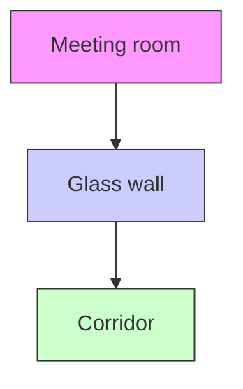

(a) TTW glass wall scenario.   
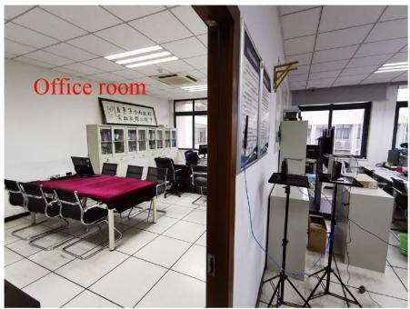

text_image

Office room

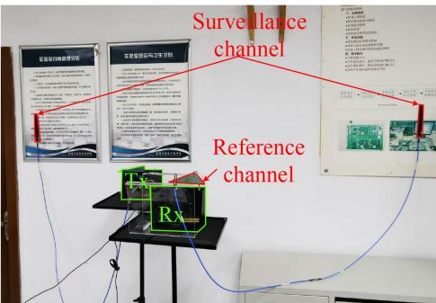

text_image

Surveillance
channel
Reference
channel
Rx

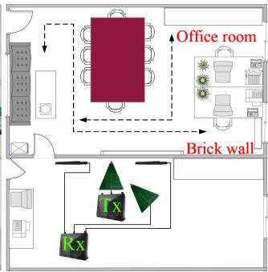

text_image

Office room
Brick wall

(b）TTW brick wall scenario.   
Fig. 5. The TTW experimental scenarios. The first one is a meeting room with a glass wall, approximately 3 cm thick. The second scenario is an office room with a brick wall, approximately 15 cm thick. During the test, the transceiver pair is positioned outside the room, while the simulated AMD moves inside the room.

The evaluation of the algorithms is performed from three perspectives: ToF estimation, AMD detection, and localization. For these evaluations, two types of data are collected: (i) when no AMD is present in the monitored room (absence of AMD), and (ii) when a human-simulated AMD moves along a predefined trajectory within the monitored room (presence of AMD). To increase proximity to a moving AMD and ensure that each algorithm can estimate the parameters of the reflected signal to a reasonable extent, a tester is instructed to mimic the movement of a mobile AMD by walking along a predetermined path while holding a steel plate.

Leveraging the obtained data, we first analyze the ToF and PLCR distributions in different conditions and compare the ToF estimation accuracy of the proposed T-DeLo with the existing methods reported in [40], [41], and [42], which are denoted as S-JEAT, JDTE, and CRS-CRL, respectively. Each of these methods employs a distinct parameter estimation approach, including the matrix pencil, MUSIC, and cross correlation. Then, we evaluate the performance of the moving AMD detection through the analysis of True Positive (TP) rate (representing the correct detection of the moving AMD), True Negative (TN) rate (denoting the correct detection of AMD absence), and detection accuracy (indicating the overall performance). We conduct a comparison between the T-DeLo and the methodologies detailed in R-TTWD [43], TW-See [44], and PWR [45]. Specifically, R-TTWD extract the first-order difference of eigenvector of CSI across different subcarriers, and uses a trained support vector machine (SVM) to achieve TTW moving human detection. TW-See uses the opposite robust principal component analysis to obtain correlation features, it then segments the data using a normalized variance sliding window and finally achieves TTW human detection via back propagation neural network (BPNN). The PWR approach utilizes cross ambiguity function and time-frequency transforms to generate range-Doppler maps and Doppler spectrum, respectively. It then employs a convolutional neural network (CNN) to analyze the spectrums and accomplish detection, after eliminating interference. Finally, we present the passive localization accuracy, and analyze the impact of the number of packets and signal bandwidth on the localization performance.

# B. Performance Evaluation

1) ToF and PLCR Distributions Analysis: Prior to the moving AMD detection and localization performance evaluation, a comprehensive examination of the ToF and PLCR distributions in different TTW conditions is first conducted. The Fig. 6 and Fig. 7 present distributions of ToF and PLCR in the presence and absence of the moving AMD, in both TTW scenarios. In the case of AMD presence, the distributions of ToF and PLCR corresponding to the AMD at three distinct locations (denoted as L1, L2, and L3) are analyzed. Taking the TTW brick wall scenario as a reference, the results, depicted in Figs. 7(a), (b), and (c), indicate that when no AMD is present in the targeted room, the PLCR of reflections is predominantly concentrated around zero, while the ToF of reflections exhibits a range of values approximately -5 ns to 30 ns. This reveals that static objects at different locations inside the room create multiple reflection paths with the PLCR of zero but different ToFs. Furthermore, a portion of the ToF estimates are found to be less than zero. We believe that this phenomenon can be attributed to the presence of noise and is therefore reasonable.

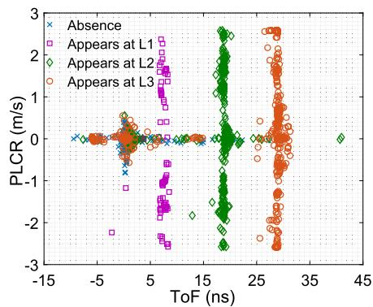

scatter

| ToF (ns) | PLCR (m/s) | Category        |
| -------- | ---------- | --------------- |
| -10      | 0          | Absence         |
| -5       | 0          | Absence         |
| 0        | 0          | Absence         |
| 5        | 0          | Absence         |
| 10       | 0          | Absence         |
| 15       | 0          | Absence         |
| 20       | 0          | Absence         |
| 25       | 0          | Absence         |
| 30       | 0          | Absence         |
| 35       | 0          | Absence         |
| 40       | 0          | Absence         |
| -10      | 0          | Appears at L1    |
| -5       | 0          | Appears at L1    |
| 0        | 0          | Appears at L1    |
| 5        | 0          | Appears at L1    |
| 10       | 0          | Appears at L1    |
| 15       | 0          | Appears at L1    |
| 20       | 0          | Appears at L1    |
| 25       | 0          | Appears at L1    |
| 30       | 0          | Appears at L1    |
| 35       | 0          | Appears at L1    |
| 40       | 0          | Appears at L1    |
| -10      | 0          | Appears at L2    |
| -5       | 0          | Appears at L2    |
| 0        | 0          | Appears at L2    |
| 5        | 0          | Appears at L2    |
| 10       | 0          | Appears at L2    |
| 15       | 0          | Appears at L2    |
| 20       | 0          | Appears at L2    |
| 25       | 0          | Appears at L2    |
| 30       | 0          | Appears at L2    |
| 35       | 0          | Appears at L2    |
| 40       | 0          | Appears at L2    |
| -10      | 0          | Appears at L3    |
| -5       | 0          | Appears at L3    |
| 0        | 0          | Appears at L3    |
| 5        | 0          | Appears at L3    |
| 10       | 0          | Appears at L3    |
| 15       | 0          | Appears at L3    |
| 20       | 0          | Appears at L3    |
| 25       | 0          | Appears at L3    |
| 30       | 0          | Appears at L3    |
| 35       | 0          | Appears at L3    |
| 40       | 0          | Appears at L3    |

(a) The PLCR and ToF distributions.

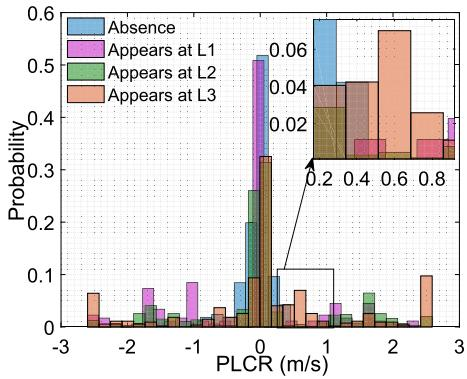

bar

| PLCR (m/s) | Absence | Appears at L1 | Appears at L2 | Appears at L3 |
| ---------- | ------- | ------------- | ------------- | ------------- |
| -3         | 0.00    | 0.00          | 0.00          | 0.07          |
| -2         | 0.00    | 0.08          | 0.00          | 0.00          |
| -1         | 0.00    | 0.09          | 0.00          | 0.00          |
| 0          | 0.20    | 0.52          | 0.33          | 0.10          |
| 1          | 0.60    | 0.04          | 0.04          | 0.04          |
| 2          | 0.00    | 0.02          | 0.07          | 0.58          |
| 3          | 0.00    | 0.40          | 0.00          | 0.11          |

(b）The PLCR distributions analysis.

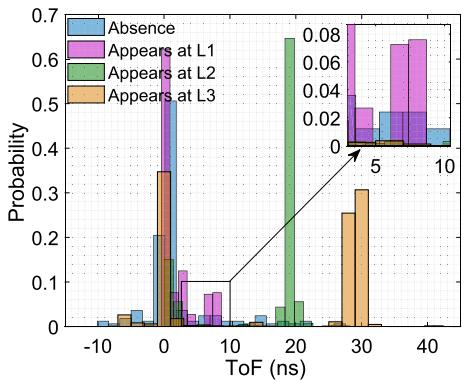

bar

| ToF (ns) | Absence | Appears at L1 | Appears at L2 | Appears at L3 |
| -------- | ------- | ------------- | ------------- | ------------- |
| -10      | 0.01    | 0.00          | 0.00          | 0.00          |
| 0        | 0.21    | 0.68          | 0.00          | 0.35          |
| 5        | 0.01    | 0.12          | 0.00          | 0.00          |
| 10       | 0.01    | 0.08          | 0.00          | 0.00          |
| 15       | 0.01    | 0.00          | 0.65          | 0.00          |
| 20       | 0.01    | 0.00          | 0.05          | 0.00          |
| 25       | 0.01    | 0.00          | 0.00          | 0.26          |
| 30       | 0.01    | 0.00          | 0.00          | 0.31          |
| 35       | 0.01    | 0.78          | 0.00          | 0.01          |
| 40       | 0.01    | 0.78          | 0.00          | 0.01          |

(c） The ToF distributions analysis.

Fig. 6. ToF and PLCR distributions analysis in the TTW glass wall scenario.   
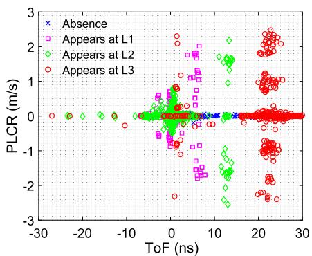

scatter

| ToF (ns) | PLCR (m/s) | Category        |
| -------- | ---------- | --------------- |
| -30      | 0          | Absence         |
| -20      | 0          | Absence         |
| -10      | 0          | Absence         |
| 0        | 0          | Absence         |
| 10       | 0          | Absence         |
| 20       | 0          | Absence         |
| 30       | 0          | Absence         |
| -30      | 0          | Appears at L1    |
| -20      | 0          | Appears at L1    |
| -10      | 0          | Appears at L1    |
| 0        | 0          | Appears at L1    |
| 10       | 0          | Appears at L1    |
| 20       | 0          | Appears at L1    |
| 30       | 0          | Appears at L1    |
| -30      | 0          | Appears at L2    |
| -20      | 0          | Appears at L2    |
| -10      | 0          | Appears at L2    |
| 0        | 0          | Appears at L2    |
| 10       | 0          | Appears at L2    |
| 20       | 0          | Appears at L2    |
| 30       | 0          | Appears at L2    |
| -30      | 0          | Appears at L3    |
| -20      | 0          | Appears at L3    |
| -10      | 0          | Appears at L3    |
| 0        | 0          | Appears at L3    |
| 10       | 0          | Appears at L3    |
| 20       | 0          | Appears at L3    |
| 30       | 0          | Appears at L3    |

(a)The PLCR and ToF distributions.

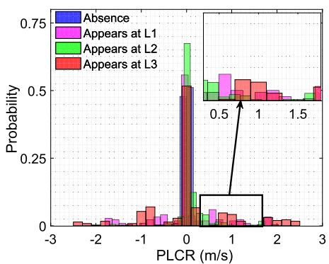

bar

| PLCR (m/s) | Absence | Appears at L1 | Appears at L2 | Appears at L3 |
| ---------- | ------- | ------------- | ------------- | ------------- |
| -3         | 0.0     | 0.0           | 0.0           | 0.0           |
| -2         | 0.0     | 0.0           | 0.0           | 0.0           |
| -1         | 0.0     | 0.0           | 0.0           | 0.0           |
| 0          | 0.5     | 0.6           | 0.7           | 0.5           |
| 1          | 0.0     | 0.5           | 0.5           | 0.5           |
| 2          | 0.0     | 0.5           | 0.5           | 0.5           |
| 3          | 0.0     | 0.5           | 0.5           | 0.5           |

(b） The PLCR distributions analysis.

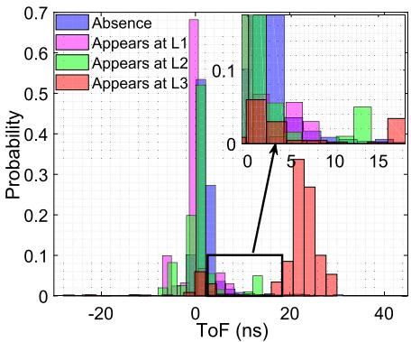

bar

| ToF (ns) | Absence | Appears at L1 | Appears at L2 | Appears at L3 |
| -------- | ------- | ------------- | ------------- | ------------- |
| -20      | 0.0     | 0.0           | 0.0           | 0.0           |
| -10      | 0.0     | 0.1           | 0.0           | 0.0           |
| 0        | 0.28    | 0.68          | 0.55          | 0.0           |
| 10       | 0.0     | 0.0           | 0.0           | 0.1           |
| 20       | 0.0     | 0.0           | 0.0           | 0.35          |
| 30       | 0.0     | 0.0           | 0.0           | 0.1           |
| 40       | 0.0     | 0.0           | 0.0           | 0.45          |

(c） The ToF distributions analysis.  
Fig. 7. ToF and PLCR distributions analysis in the TTW brick wall scenario.

The appearance of the AMD at different locations results in alterations to the corresponding ToF and PLCR distributions, as the purple, green, and red dots depict in Figs. 7(a). Specifically, as illustrated in Figs. 7(b) and (c), it can be observed that the proportion of PLCR in non-zero regions is increased, and the ToFs tend to concentrate in specific bins around 23 ns. These values are approximately equal to the ToF of the reflected signals caused by the moving AMD. The same trend is observed in the TTW glass wall scenario, as depicted in Fig. 6. These results demonstrate that the reflections caused by the AMD disrupt the original distribution of signal ToF and PLCR, while also implying that T-DeLo is capable of capturing the AMD reflections and effectively estimating their corresponding parameters, which provides a solid foundation for subsequent detection and localization.

2) ToF Estimation Accuracy Analysis: Following the analysis of distributions, Fig. 8 illustrates the ToF estimation error in two TTW scenarios. The results indicate that the TTW brick scenario exhibits higher ToF estimation errors compared to the TTW glass wall scenario across all algorithms. Concretely, the ToF estimation errors for T-DeLo, S-JEAT, JDTE, and CRS-CRL at the ratio of 66.7% are approximately 2.595 ns, 3.712 ns, 4.523 ns, and 5.393 ns, respectively, in the TTW

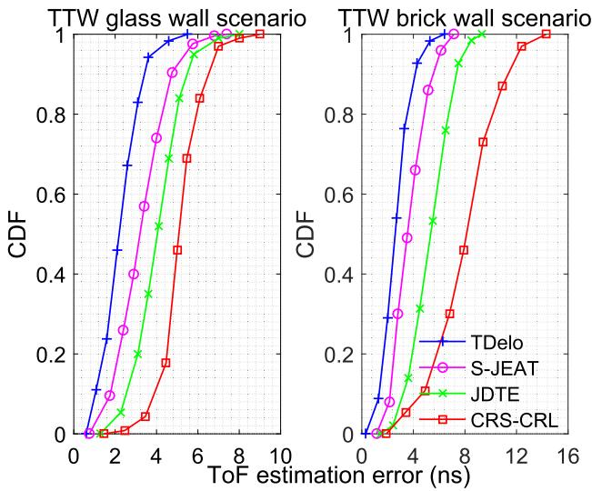

line

| ToF estimation error (ns) | TDelo CDF | S-JEAT CDF | JDTE CDF | CRS-CRL CDF |
| ------------------------- | --------- | ---------- | -------- | ----------- |
| 0                         | 0.0       | 0.0        | 0.0      | 0.0         |
| 2                         | 0.1       | 0.1        | 0.05     | 0.0         |
| 4                         | 0.4       | 0.3        | 0.2      | 0.1         |
| 6                         | 0.8       | 0.7        | 0.6      | 0.4         |
| 8                         | 0.95      | 0.9        | 0.85     | 0.7         |
| 10                        | 1.0       | 1.0        | 1.0      | 1.0         |

Fig. 8. The ToF estimation accuracy comparison in different TTW scenarios.

glass wall scenario. In the TTW brick wall scenario, T-DeLo shows an increase in ToF estimation error by approximately 0.446 ns at a ratio of 66.7%, while the increases for S-JEAT, JDTE, and CRS-CRL are 0.566 ns, 1.604 ns, and 3.711 ns, respectively. This is because the material of the brick wall is more complex than that of glass wall, leading to a greater attenuation of the signal and reduction in the SNR of the AMD induced reflection, ultimately resulting in a decrease in the estimation accuracy. Benefiting from the proposed SSI cancellation and the data packet aggregation, it is observe that T-DeLo demonstrates superior performance in comparison to other algorithms across both TTW scenarios. Moreover, the minor degradation that T-DeLo experiences when transitioning from the TTW glass wall to the brick wall scenario highlights its superior stability in ToF estimation compared to other methods.

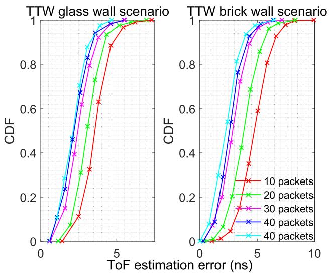

line

| ToF estimation error (ns) | TTW glass wall scenario (10 packets) | TTW glass wall scenario (20 packets) | TTW glass wall scenario (30 packets) | TTW glass wall scenario (40 packets) | TTW brick wall scenario (10 packets) | TTW brick wall scenario (20 packets) | TTW brick wall scenario (30 packets) | TTW brick wall scenario (40 packets) |
| ------------------------- | ------------------------------------- | ------------------------------------- | ------------------------------------- | ------------------------------------- | ------------------------------------- | ------------------------------------- | ------------------------------------- | ------------------------------------- |
| 0                         | 0.0                                   | 0.0                                   | 0.0                                   | 0.0                                   | 0.0                                   | 0.0                                   | 0.0                                   | 0.0                                   |
| 1                         | 0.1                                   | 0.2                                   | 0.3                                   | 0.4                                   | 0.1                                   | 0.2                                   | 0.3                                   | 0.4                                   |
| 2                         | 0.3                                   | 0.5                                   | 0.6                                   | 0.7                                   | 0.3                                   | 0.5                                   | 0.6                                   | 0.7                                   |
| 3                         | 0.5                                   | 0.7                                   | 0.8                                   | 0.9                                   | 0.5                                   | 0.7                                   | 0.8                                   | 0.9                                   |
| 4                         | 0.7                                   | 0.9                                   | 0.95                                  | 1.0                                   | 0.7                                   | 0.9                                   | 1.0                                   | 1.0                                   |
| 5                         | 0.9                                   | 1.0                                   | 1.0                                   | 1.0                                   | 0.9                                   | 1.0                                   | 1.0                                   | 1.0                                   |
| 6                         | 1.0                                   | 1.0                                   | 1.0                                   | 1.0                                   | 1.0                                   | 1.0                                   | 1.0                                   | 1.0                                   |
| 7                         | 1.0                                   | 1.0                                   | 1.0                                   | 1.0                                   | 1.0                                   | 1.0                                   | 1.0                                   | 1.0                                   |
| 8                         | 1.0                                   | 1.0                                   | 1.0                                   | 1.0                                   | 1.0                                   | 1.0                                   | 1.0                                   | 1.0                                   |
| 9                         | 1.0                                   | 1.0                                   | 1.0                                   | 1.0                                   | 1.0                                   | 1.0                                   | 1.0                                   | 1.0                                   |
| 10                        | 1.0                                   | 1.0                                   | 1.0                                   | 1.0                                   | 1.0                                   | 1.0                                   | 1.0                                   | 1.0                                   |

Fig. 9. The ToF estimation accuracy with the aggregation of different numbers of data packets in the TTW scenario.

Furthermore, we compare the ToF estimation accuracy across different numbers of packets to evaluate the impact of packet aggregation on estimation performance. The experimental results are shown in Fig. 9. From the figure, we can see that as the number of aggregated packets increases, the accuracy of parameter estimation gradually improves. Taking the TTW brick wall scenario as an example, when we aggregate 10 data packets, the median ToF estimation error is 4.732 ns. For aggregated measurements of 20, 30, and 40 packets, the median estimation error decreases to 3.726 ns, 2.903 ns, and 2.531 ns, respectively, validating the enhancement of packet aggregation on the ToF estimation accuracy under low SNR conditions. Meanwhile, as the number of packets increases, the rate of improvement gradually diminishes. For instance, when the number of packets increase from 10 to 20, the median error is reduced by approximately 1 ns, while this number drops to about 0.4 ns when the number of aggregated measurements increase from 30 to 40. Therefore, rather than indiscriminately increasing the number of data packets, which would raise the computational complexity, it is preferable to strike a balance between estimation performance and complexity depending on the specific requirements.

3) Detection Performance Analysis: Using the collected data, the moving AMD detection performance investigation is carried out, and Fig. 10 shows the results. As depicted in Fig. 10(a), T-DeLo’s TP rate is 0.959, outperforming the PWR’s 0.942, TW-See’s 0.945, and R-TTWD’s 0.934, in the TTW glass wall scenario. In the TTW brick wall scenario, the TP rates of PWR, TW-See, and R-TTWD experience a decline of 0.021, 0.020, and 0.024, respectively, while T-DeLo displays a comparatively modest decrease in TP rate, amounting to 0.013. In addition to TP rate, Fig. 10(b) shows T-DeLo’s TN rates are 0.970 and 0.957 in the TTW glass and brick wall scenarios, respectively. Meanwhile, PWR, TW-See, and R-TTWD can also offer acceptable TN rates, with the values of 0.957 and 0.942 for PWR, 0.951 and 0.935 for TW-See, and 0.950 and 0.933 for R-TTWD, in the glass and brick wall scenarios, respectively. Overall, in the TTW glass and brick wall scenarios, we can see from Fig. 10(c), the detection accuracy of T-DeLo, PWR, TW-See, and R-TTWD are 0.964 and 0.952, 0.949 and 0.932, 0.948 and 0.930, and 0.942 and 0.922, respectively. These results demonstrate that T-DeLo performs better than other methods in detection accuracy and robustness. The reasons are twofold. First, T-DeLo effectively eliminates SSI through the implementation of a reference channel, thereby reducing the risk of the AMD induced reflections being overpowered by strong signals.

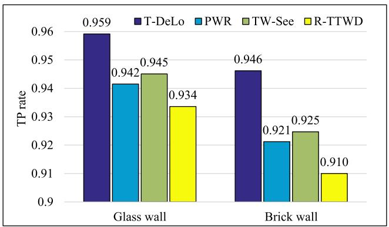

bar

| Category | T-DeLo | PWR | TW-See | R-TTWD |
| :--- | :--- | :--- | :--- | :--- |
| Glass wall | 0.959 | 0.942 | 0.945 | 0.934 |
| Brick wall | 0.946 | 0.921 | 0.925 | 0.910 |

(a) The AMD detection TP rate.

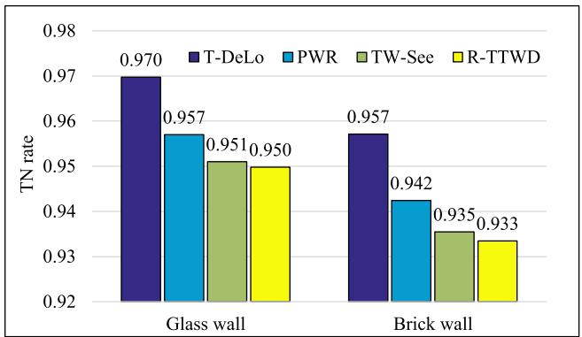

bar

| Wall Type | T-DeLo | PWR | TW-See | R-TTWD |
| :--- | :--- | :--- | :--- | :--- |
| Glass wall | 0.970 | 0.957 | 0.951 | 0.950 |
| Brick wall | 0.957 | 0.942 | 0.935 | 0.933 |

(b） The AMD detection TN rate.   
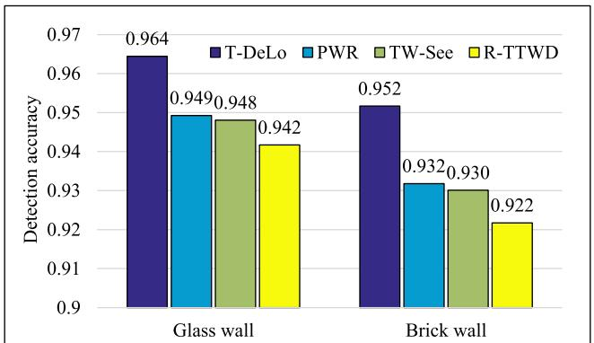

bar

| Category    | T-DeLo | PWR   | TW-See | R-TTWD |
| ----------- | ------ | ----- | ------ | ------ |
| Glass wall  | 0.964  | 0.949 | 0.948  | 0.942  |
| Brick wall  | 0.952  | 0.932 | 0.930  | 0.922  |

(c） The AMD detection accuracy.   
Fig. 10. The results of AMD detection in different scenarios.

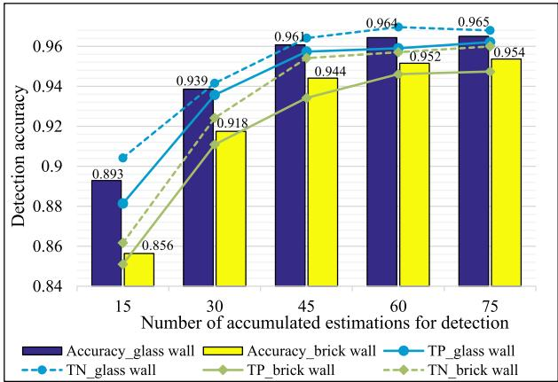

bar_line

| Number of accumulated estimations for detection | Accuracy_glass wall | Accuracy_brick wall | TP_glass wall | TN_glass wall | TP_brick wall | TN_brick wall |
|---|---|---|---|---|---|---|
| 15 | 0.893 | 0.856 | 0.882 | 0.905 | 0.862 | 0.874 |
| 30 | 0.939 | 0.918 | 0.940 | 0.945 | 0.915 | 0.925 |
| 45 | 0.961 | 0.944 | 0.958 | 0.959 | 0.938 | 0.947 |
| 60 | 0.964 | 0.952 | 0.961 | 0.962 | 0.947 | 0.953 |
| 75 | 0.965 | 0.954 | 0.962 | 0.963 | 0.951 | 0.955 |

(a）The AMD detection accuracy versus the number of aggregated ToF estimations in the TTW scenarios.   
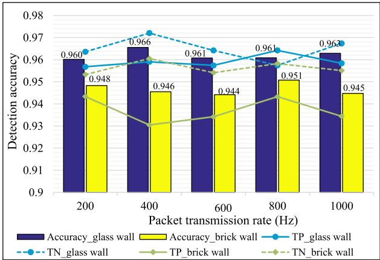

bar_line

| Packet transmission rate (Hz) | Accuracy_glass wall | Accuracy_brick wall | TP_glass wall | TN_glass wall | TP_brick wall | TN_brick wall |
|---|---|---|---|---|---|---|
| 200 | 0.960 | 0.948 | 0.957 | 0.966 | 0.944 | 0.948 |
| 400 | 0.966 | 0.946 | 0.961 | 0.973 | 0.931 | 0.959 |
| 600 | 0.961 | 0.944 | 0.958 | 0.965 | 0.935 | 0.955 |
| 800 | 0.961 | 0.951 | 0.964 | 0.961 | 0.943 | 0.957 |
| 1000 | 0.963 | 0.945 | 0.958 | 0.967 | 0.934 | 0.955 |

(b） The AMD detection accuracy versus the packet transmission rate in the TTW scenarios.   
Fig. 11. Analysis of detection performance in different situations.

This ensures that the parameters corresponding to the AMD induced reflections can be estimated. Second, the aggregation of multiple data packets for a single estimation process enhances the accuracy and stability of parameter estimation, thereby enabling a more accurate determination of the fluctuations in the ToF and PLCR distribution.

Besides that, we investigate the impact of some key parameters on detection performance and present the results in Fig. 11. As we can see, in the TTW glass and brick wall scenario, T-DeLo’s moving AMD detection accuracy is 0.893 and 0.856, respectively, with 15 ToF estimation results involved. An increase in the accumulated ToF estimations to 75 yields an improvement in accuracy, with increases of 0.072 and 0.098 observed in the respective scenarios. Such results suggest a positive correlation between the detection accuracy and the number of accumulated estimations. This is because T-DeLo performs detection by monitoring the distribution of signal parameters, and a larger amount of data results in a more accurate portrayal of the distribution and its changes.

In addition, the impact of the packet transmission rate on the detection accuracy is explored while keeping the aggregated estimations quantity fixed. As shown in Fig. 11(b), one can see that T-DeLo provides satisfactory performance with different sampling rates. More concretely, the average TP and TN rates can reach about 0.959 and 0.965, respectively, when tested in the TTW glass wall scenario. In comparison to the TTW glass wall scenario, the average TP and TN rates are decreased by 0.022 and 0.087, respectively, in the brick wall scenario. Overall, the detection accuracy in all cases remains stably above 0.940, manifesting the robustness of T-DeLo’s detection performance in the varied sampling rates, which makes it a favorable choice for real-world applications.

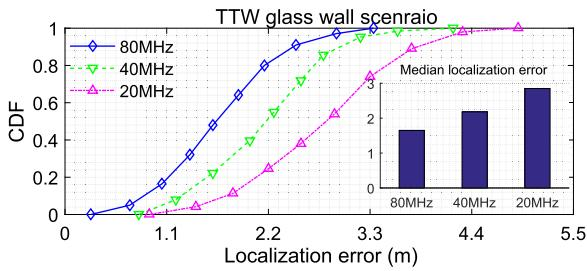

line

| Localization error (m) | 80MHz CDF | 40MHz CDF | 20MHz CDF |
| ---------------------- | --------- | --------- | --------- |
| 0.0                    | 0.0       | 0.0       | 0.0       |
| 1.1                    | 0.2       | 0.1       | 0.05      |
| 2.2                    | 0.6       | 0.4       | 0.2       |
| 3.3                    | 0.9       | 0.7       | 0.5       |
| 4.4                    | 1.0       | 0.9       | 0.8       |
| 5.5                    | 1.0       | 1.0       | 1.0       |

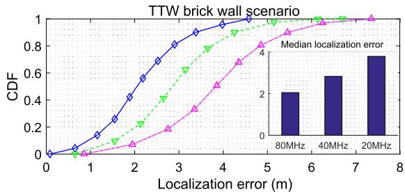

line

| Localization error (m) | CDF (Blue Line) | CDF (Green Line) | CDF (Pink Line) |
| ---------------------- | --------------- | ---------------- | --------------- |
| 0                      | 0.0             | 0.0              | 0.0             |
| 1                      | 0.1             | 0.05             | 0.02            |
| 2                      | 0.3             | 0.15             | 0.05            |
| 3                      | 0.6             | 0.3              | 0.1             |
| 4                      | 0.8             | 0.5              | 0.2             |
| 5                      | 0.95            | 0.7              | 0.4             |
| 6                      | 0.98            | 0.85             | 0.6             |
| 7                      | 0.99            | 0.9              | 0.8             |
| 8                      | 1.0             | 0.95             | 0.9             |

Fig. 12. The impact of bandwidth on the AMD localization performance.

4) TTW Localization Performance Analysis: Finally, the moving AMD localization performance in the TTW scenarios is analyzed with 20 measurements involved in parameter estimation for each time. Specifically, in the TTW glass wall scenario, Fig. 12 shows that when the signal bandwidth is set to 80 MHz, 40 MHz, and 20 MHz, the median localization errors are 1.65 m, 2.18 m, and 2.85 m, respectively. In the TTW brick wall scenario, the median localization error increases by 0.4 m, 0.75 m, and 0.94 m for the three bandwidths, respectively. These results demonstrate that, compared to glass walls, the T-DeLo exhibits higher localization error in brick wall scenarios. Furthermore, the reduction in signal bandwidth appears to have a greater impact on localization performance in brick wall scenarios than in glass wall scenarios. We also compare these results with systems operating in NLoS scenarios. Specifically, the FTM-based methods [25] and [46] report localization errors of 1.94 meters (at ratio of 50%) and 2.14 meters (at ratio of 75%), respectively, and the CSI-based LiFS [47] records a median localization error of 1.1 meters. In contrast, T-DeLo’s median localization error is 1.65 m and 2.05 m, in TTW glass and brick wall scenario, respectively, demonstrating that T-DeLo offers a comparable localization accuracy to that of systems operating in NLoS scenarios, although the TTW scenario is more complex and challenging.

Moreover, the impact of the number of data packets involved in each ToF estimation on localization accuracy is analyzed. From the results in Fig. 13, it can be observed that in both test scenarios, the localization accuracy steadily improves as the number of data packets increases. Taking the brick wall as an example, when the number of data packets involved in ToF estimation is 10, 20, 30, and 40, the median localization errors are 2.53 m, 2.05 m, 1.90 m, and 1.78 m, respectively. The experimental results in the TTW glass wall scenario also exhibit a similar trend. Seemingly, the above experimental results suggest that the localization accuracy is influenced by factors such as the bandwidth, the material of the wall, and the number of data packets. However, fundamentally, these factors directly affect the accuracy of the ToF estimation of the signal, which subsequently influences the localization accuracy. As an illustration, a decrease in bandwidth would lower the resolution of the ToF. This impairs the ToF estimation accuracy, which finally results in a degradation of the localization performance. Therefore, the key to improving the localization accuracy is to boost the parameter estimation performance, which can be achieved through actions such as increasing the bandwidth and the number of aggregated data packets for ToF estimation.

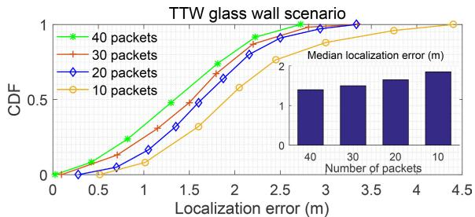

line

| Number of packets | CDF (40 packets) | CDF (30 packets) | CDF (20 packets) | CDF (10 packets) |
| ----------------- | ---------------- | ---------------- | ---------------- | ---------------- |
| 40                | 0.0              | 0.0              | 0.0              | 0.0              |
| 30                | 0.5              | 0.5              | 0.5              | 0.5              |
| 20                | 0.8              | 0.8              | 0.8              | 0.8              |
| 10                | 1.0              | 1.0              | 1.0              | 1.0              |

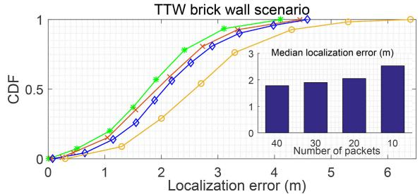

line

| Number of packets | Median localization error (m) |
| ----------------- | ----------------------------- |
| 40                | 2.0                           |
| 30                | 2.0                           |
| 20                | 2.0                           |
| 10                | 2.5                           |

Fig. 13. The impact of the number of the aggregated CSI packets on the AMD localization performance.

# V. CONCLUSION AND FUTURE WORK

This paper presents T-DeLo, a through the wall AMD passive detection and localization system that can serve as a cornerstone component of indoor intelligent transportation systems. The core of T-DeLo lies in two aspects. Firstly, a reference channel is constructed to receive direct signals from the transmitter to the receiver, which are then employed as reference to mitigate strong signal interference and phase error. This paves the way for parameter estimation of AMDinduced reflection in TTW scenarios. Secondly, a packet aggregation based joint PLCR and TOF estimation algorithm is proposed, which enhances the parameter estimation performance by aggregating multiple measurements in each estimation. By utilizing the estimated parameters, T-DeLo realizes the passive detection and localization of AMD in the TTW scenarios through analyzing the parameter distribution and constructing spatial constraints. Experimental results and evaluations demonstrate that T-DeLo can effectively detect and locate AMD in the typical real-world TTW scenarios with an impressive accuracy. This offers a robust foundation for the anticipated broad-scale implementation of AMD and the progression of indoor ITS.

# REFERENCES

[1] X. An, C. Wu, Y. Lin, M. Lin, T. Yoshinaga, and Y. Ji, “Multi-robot systems and cooperative object transport: Communications, platforms, and challenges,” IEEE Open J. Comput. Soc., vol. 4, pp. 23–36, 2023.   
[2] H. T. Cheng, H. Shan, and W. Zhuang, “Infotainment and road safety service support in vehicular networking: From a communication perspective,” Mech. Syst. Signal Process., vol. 25, no. 6, pp. 2020–2038, Aug. 2011.   
[3] J. Feng, Z. Liu, C. Wu, and Y. Ji, “AVE: Autonomous vehicular edge computing framework with ACO-based scheduling,” IEEE Trans. Veh. Technol., vol. 66, no. 12, pp. 10660–10675, Dec. 2017.   
[4] H. A. Omar, N. Lu, and W. Zhuang, “Wireless access technologies for vehicular network safety applications,” IEEE Netw., vol. 30, no. 4, pp. 22–26, Jul. 2016.   
[5] H. Peng et al., “Resource allocation for cellular-based inter-vehicle communications in autonomous multiplatoons,” IEEE Trans. Veh. Technol., vol. 66, no. 12, pp. 11249–11263, Dec. 2017.   
[6] J. Feng, Z. Liu, C. Wu, and Y. Ji, “Mobile edge computing for the Internet of Vehicles: Offloading framework and job scheduling,” IEEE Veh. Technol. Mag., vol. 14, no. 1, pp. 28–36, Mar. 2019.   
[7] L. Cong and W. Zhuang, “Hybrid TDOA/AOA mobile user location for wideband CDMA cellular systems,” IEEE Trans. Wireless Commun., vol. 1, no. 3, pp. 439–447, Jul. 2002.   
[8] L. Cong and W. Zhuang, “Nonline-of-sight error mitigation in mobile location,” IEEE Trans. Wireless Commun., vol. 4, no. 2, pp. 560–573, Mar. 2005.   
[9] H. Du et al., “Semantic communications for wireless sensing: RIS-aided encoding and self-supervised decoding,” 2022, arXiv:2211.12727.   
[10] I. A. Kazerouni, L. Fitzgerald, G. Dooly, and D. Toal, “A survey of stateof-the-art on visual SLAM,” Expert Syst. Appl., vol. 205, Nov. 2022, Art. no. 117734.   
[11] Y. Zhuang, C. Zhang, J. Huai, Y. Li, L. Chen, and R. Chen, “Bluetooth localization technology: Principles, applications, and future trends,” IEEE Internet Things J., vol. 9, no. 23, pp. 23506–23524, Dec. 2022.   
[12] B. Amjad, Q. Z. Ahmed, P. I. Lazaridis, M. Hafeez, F. A. Khan, and Z. D. Zaharis, “Radio SLAM: A review on radio-based simultaneous localization and mapping,” IEEE Access, vol. 11, pp. 9260–9278, 2023.   
[13] J. Jung, S.-M. Lee, and H. Myung, “Indoor mobile robot localization and mapping based on ambient magnetic fields and aiding radio sources,” IEEE Trans. Instrum. Meas., vol. 64, no. 7, pp. 1922–1934, Jul. 2015.   
[14] L. Zhang et al., “WiFi-based indoor robot positioning using deep fuzzy forests,” IEEE Internet Things J., vol. 7, no. 11, pp. 10773–10781, Nov. 2020.   
[15] J. J. Morales, J. J. Khalife, and Z. M. Kassas, “Information fusion strategies for collaborative inertial radio SLAM,” IEEE Trans. Intell. Transp. Syst., vol. 23, no. 8, pp. 12935–12952, Aug. 2022.   
[16] A. Arun, R. Ayyalasomayajula, W. Hunter, and D. Bharadia, “P2SLAM: Bearing based WiFi SLAM for indoor robots,” IEEE Robot. Autom. Lett., vol. 7, no. 2, pp. 3326–3333, Apr. 2022.   
[17] R. Liu et al., “Collaborative radio SLAM for multiple robots based on WiFi fingerprint similarity,” in Proc. IEEE Int. Conf. Robot. Biomimetics (ROBIO), Dec. 2021, pp. 795–801.   
[18] C. Wu, Z. Gong, B. Tao, K. Tan, Z. Gu, and Z. Yin, “RF-SLAM: UHF-RFID based simultaneous tags mapping and robot localization algorithm for smart warehouse position service,” IEEE Trans. Ind. Informat., early access, Mar. 3, 2023, doi: 10.1109/TII.2023.3252405.   
[19] J. Palacios, G. Bielsa, P. Casari, and J. Widmer, “Communication-driven localization and mapping for millimeter wave networks,” in Proc. IEEE Conf. Comput. Commun. (INFOCOM), Apr. 2018, pp. 2402–2410.   
[20] J. Palacios, G. Bielsa, P. Casari, and J. Widmer, “Single- and multipleaccess point indoor localization for millimeter-wave networks,” IEEE Trans. Wireless Commun., vol. 18, no. 3, pp. 1927–1942, Mar. 2019.   
[21] C. K. Ravindranath, Robotic RF Sensing With Off-the-Shelf Devices. Santa Barbara, CA, USA: University of California, 2020.   
[22] K. Qian, C. Wu, Y. Zhang, G. Zhang, Z. Yang, and Y. Liu, “Widar2.0: Passive human tracking with a single Wi-Fi link,” in Proc. 16th Annu. Int. Conf. Mobile Syst., Appl., Services, 2018, pp. 350–361.

[23] X. Li, S. Li, D. Zhang, J. Xiong, Y. Wang, and H. Mei, “Dynamic-MUSIC: Accurate device-free indoor localization,” in Proc. ACM Int. Joint Conf. Pervasive Ubiquitous Comput., Sep. 2016, pp. 196–207.   
[24] C. R. Karanam, B. Korany, and Y. Mostofi, “Tracking from one side– multi-person passive tracking with WiFi magnitude measurements,” in Proc. 18th ACM/IEEE Int. Conf. Inf. Process. Sensor Netw. (IPSN), Apr. 2019, pp. 181–192.   
[25] K. Jiokeng, G. Jakllari, A. Tchana, and A.-L. Beylot, “When FTM discovered MUSIC: Accurate WiFi-based ranging in the presence of multipath,” in Proc. IEEE Conf. Comput. Commun. (INFOCOM), Jul. 2020, pp. 1857–1866.   
[26] F. Adib and D. Katabi, “See through walls with WiFi!” in Proc. ACM SIGCOMM Conf. SIGCOMM, Aug. 2013, pp. 75–86.   
[27] Harikesh, S. S. Chauhan, A. Basu, M. P. Abegaonkar, and S. K. Koul, “Through the wall human subject localization and respiration rate detection using multichannel Doppler radar,” IEEE Sensors J., vol. 21, no. 2, pp. 1510–1518, Jan. 2021.   
[28] F. Adib, Z. Kabelac, D. Katabi, and R. C. Miller, “3D tracking via body radio reflections,” in Proc. 11th USENIX Symp. Netw. Syst. Design Implement. (NSDI), 2014, pp. 317–329.   
[29] L. Yang, Q. Lin, X. Li, T. Liu, and Y. Liu, “See through walls with COTS RFID system!” in Proc. 21st Annu. Int. Conf. Mobile Comput. Netw., Sep. 2015, pp. 487–499.   
[30] Y. Ding, Y. Sun, G. Huang, R. Liu, X. Yu, and X. Xu, “Human target localization using Doppler through-wall radar based on micro-Doppler frequency estimation,” IEEE Sensors J., vol. 20, no. 15, pp. 8778–8788, Aug. 2020.   
[31] Z. Li, T. Jin, Y. Dai, and Y. Song, “Through-wall multi-subject localization and vital signs monitoring using UWB MIMO imaging radar,” Remote Sens., vol. 13, no. 15, p. 2905, Jul. 2021.   
[32] C. Zhang, Y. Kuga, and A. Ishimaru, “Hard-wall radar imaging: Localization of objects shadowed by metallic walls with MIMO radar,” IEEE Trans. Antennas Propag., vol. 66, no. 8, pp. 4240–4251, Aug. 2018.   
[33] J. Wang, Z. Tian, M. Zhou, J. Wang, X. Yang, and X. Liu, “Leveraging hypothesis testing for CSI based passive human intrusion direction detection,” IEEE Trans. Veh. Technol., vol. 70, no. 8, pp. 7749–7763, Aug. 2021.   
[34] J. Wang, Z. Tian, X. Yang, and M. Zhou, “CSI-based ToF estimation for reflection path under the TTW scenario,” IEEE Wireless Commun. Lett., vol. 10, no. 5, pp. 1010–1013, May 2021.   
[35] E. Perahia and R. Stacey, Next Generation Wireless LANs: 802.11 n and 802.11 ac. Cambridge, U.K.: Cambridge Univ. Press, 2013.   
[36] Y. Hua, “Estimating two-dimensional frequencies by matrix enhancement and matrix pencil,” IEEE Trans. Signal Process., vol. 40, no. 9, pp. 2267–2280, Sep. 1992.   
[37] J. Zhuang, H. Xiong, W. Wang, and Z. Chen, “Application of manifold separation to parametric localization for incoherently distributed sources,” IEEE Trans. Signal Process., vol. 66, no. 11, pp. 2849–2860, Jun. 2018.   
[38] M. Zhou, B. Wang, Z. Tian, J. Wang, and Q. Zhang, “A case study of cross-floor localization system using hybrid wireless sensing,” in Proc. IEEE Global Commun. Conf. (GLOBECOM), Dec. 2017, pp. 1–6.   
[39] M. Schulz, D. Wegemer, and M. Hollick, “DEMO: Using NexMon, the C-based WiFi firmware modification framework,” in Proc. 9th ACM Conf. Secur. Privacy Wireless Mobile Netw., Jul. 2016, pp. 213–215.   
[40] A. Bazzi, D. T. M. Slock, and L. Meilhac, “Single snapshot joint estimation of angles and times of arrival: A 2D matrix pencil approach,” in Proc. IEEE Int. Conf. Commun. (ICC), May 2016, pp. 1–6.   
[41] L. Chen, W. Qi, E. Yuan, and Y. Zhao, “Joint 2-D DOA and TOA estimation for multipath OFDM signals based on three antennas,” IEEE Commun. Lett., vol. 22, no. 2, pp. 324–327, Feb. 2018.   
[42] B. Tan, K. Woodbridge, and K. Chetty, “Awireless passive radar system for real-time through-wall movement detection,” IEEE Trans. Aerosp. Electron. Syst., vol. 52, no. 5, pp. 2596–2603, Oct. 2016.   
[43] H. Zhu, F. Xiao, L. Sun, R. Wang, and P. Yang, “R-TTWD: Robust device-free through-the-wall detection of moving human with WiFi,” IEEE J. Sel. Areas Commun., vol. 35, no. 5, pp. 1090–1103, May 2017.   
[44] X. Wu, Z. Chu, P. Yang, C. Xiang, X. Zheng, and W. Huang, “TWsee: Human activity recognition through the wall with commodity Wi-Fi devices,” IEEE Trans. Veh. Technol., vol. 68, no. 1, pp. 306–319, Jan. 2019.   
[45] C. Tang, W. Li, S. Vishwakarma, K. Chetty, S. Julier, and K. Woodbridge, “Occupancy detection and people counting using WiFi passive radar,” in Proc. IEEE Radar Conf. (RadarConf), Sep. 2020, pp. 1–6.

[46] M. Sun et al., “Simultaneous WiFi ranging compensation and localization for indoor NLoS environments,” IEEE Commun. Lett., vol. 26, no. 9, pp. 2052–2056, Sep. 2022.   
[47] J. Wang et al., “LiFS: Low human-effort, device-free localization with fine-grained subcarrier information,” in Proc. 22nd Annu. Int. Conf. Mobile Comput. Netw., Oct. 2016, pp. 243–256.

natural_image

Portrait photo of a young man in a black polo shirt (no text or symbols visible)

Jiacheng Wang received the Ph.D. degree from the School of Communications and Information Engineering, Chongqing University of Posts and Telecommunications, Chongqing, China. He is currently a Research Fellow in computer science and engineering with Nanyang Technological University, Singapore. His research interests include wireless sensing, semantic communications, and metaverse.

natural_image

Portrait of a young man wearing glasses and a dark shirt, with a sculptural background (no visible text or symbols)

Hongyang Du (Graduate Student Member, IEEE) received the B.Sc. degree from Beijing Jiaotong University, Beijing, China, in 2021. He is currently pursuing the Ph.D. degree with the School of Computer Science and Engineering, Energy Research Institute @ NTU, Nanyang Technological University, Singapore, under the Interdisciplinary Graduate Program. He was recognized as an Exemplary Reviewer of IEEE TRANSACTIONS ON COMMU-NICATIONS in 2021. He was a recipient of IEEE Daniel E. Noble Fellowship Award in 2022. His

research interests include semantic communications, resource allocation, and communication theory.

natural_image

Portrait of a person wearing glasses and a dark jacket (no visible text or symbols)

Dusit Niyato (Fellow, IEEE) received the B.Eng. degree from the King Mongkuts Institute of Technology Ladkrabang (KMITL), Thailand, in 1999, and the Ph.D. degree in electrical and computer engineering from the University of Manitoba, Canada, in 2008. He is currently a Professor with the School of Computer Science and Engineering, Nanyang Technological University, Singapore. His research interests include sustainability, edge intelligence, decentralized machine learning, and incentive mechanism design.

natural_image

Portrait of a man in formal business attire (no text or symbols visible)

Mu Zhou (Senior Member, IEEE) received the B.S., M.S., and Ph.D. degrees in information and communication engineering from the Harbin Institute of Technology, Harbin, China, in 2006, 2008, and 2012, respectively. He was a joint-cultivated Ph.D. Student with the University of Pittsburgh, USA, and a Post-Doctoral Research Fellow with The Hong Kong University of Science and Technology, China. Afterward, he joined the Chongqing University of Posts and Telecommunications (CQUPT), Chongqing, China, where he has been a Full Pro-

fessor since 2014. He is currently the Associate Dean of the Graduate School, CQUPT, and the Vice Director of Mobile Communications Engineering Research Center, Ministry of Education. He serves as an Editor for Physical Communication (Elsevier) and EURASIP Journal on Wireless Communications and Networking (Springer), and an Early Career Advisory Board Member for IEEE/CAA JOURNAL OF AUTOMATICA SINICA. His research interests include quantum radar, wireless localization and sensing, information fusion, and machine learning.

natural_image

Portrait of a young man wearing glasses and a black polo shirt against a blue background (no text or symbols visible)

Jiawen Kang (Senior Member, IEEE) received the Ph.D. degree from the Guangdong University of Technology, China, in 2018. He was a Post-Doctoral Researcher with Nanyang Technological University, Singapore, from 2018 to 2021. He is currently a Professor with the Guangdong University of Technology. His research interests include blockchain, security, and privacy protection in wireless communications and networking.

natural_image

Portrait of a man in formal attire (no visible text or symbols)

Zehui Xiong received the Ph.D. degree from Nanyang Technological University (NTU), Singapore. He is currently an Assistant Professor with the Singapore University of Technology and Design and also an Honorary Adjunct Senior Research Scientist with Alibaba-NTU Singapore Joint Research Institute, Singapore. He was a Visiting Scholar with Princeton University and University of Waterloo. His research interests include wireless communications, the Internet of Things, blockchain, edge intelligence, and metaverse. He has published more than 200 research papers in leading journals and flagship conferences and many of them are ESI Highly Cited Papers. He has won over ten best paper awards in international conferences and is listed in the World’s Top 2% Scientists identified by Stanford University. He is also serving as an Editor or a Guest Editor for many leading journals, including IEEE JOURNAL ON SELECTED AREAS IN COMMUNICATIONS, IEEE TRANSACTIONS ON VEHICULAR TECHNOLOGY, IEEE INTERNET OF THINGS JOURNAL, IEEE TRANSACTIONS ON COGNITIVE COMMUNICATIONS AND NETWORKING, and IEEE TRANSACTIONS ON NETWORK SCIENCE AND ENGINEERING. He was a recipient of the IEEE Early Career Researcher Award for Excellence in Scalable Computing, the IEEE Technical Committee on Blockchain and Distributed Ledger Technologies Early Career Award, the IEEE Internet Technical Committee Early Achievement Award, the IEEE TCSVC Rising Star Award, the IEEE TCI Rising Star Award, the IEEE TCCLD Rising Star Award, the IEEE Best Land Transportation Paper Award, the IEEE CSIM Technical Committee Best Journal Paper Award, the IEEE SPCC Technical Committee Best Paper Award, the IEEE VTS Singapore Best Paper Award, the Chinese Government Award for Outstanding Students Abroad, and the NTU SCSE Best Ph.D. Thesis Runner-Up Award. He is also serving as the Associate Director of Future Communications Research and Development Program. In 2023, he was featured on the list of Forbes Asia 30 under 30.

natural_image

Portrait of a man in formal attire (no visible text or symbols)

Abbas Jamalipour (Fellow, IEEE) received the Ph.D. degree in electrical engineering from Nagoya University, Nagoya, Japan, in 1996. He is currently a Professor of Ubiquitous Mobile Networking with The University of Sydney. Since January 2022, he has been the Editor-in-Chief of IEEE TRANS-ACTIONS ON VEHICULAR TECHNOLOGY. He has authored nine technical books, 11 book chapters, over 550 technical papers, and five patents, all in the area of wireless communications and networking. He is a recipient of the number of prestigious awards, such as the 2019 IEEE ComSoc Distinguished Technical Achievement Award in Green Communications, the 2016 IEEE ComSoc Distinguished Technical Achievement Award in Communications Switching and Routing, the 2010 IEEE ComSoc Harold Sobol Award, the 2006 IEEE ComSoc Best Tutorial Paper Award, and over 15 best paper awards. He was the President of the IEEE Vehicular Technology Society (2020–2021). Previously, he held the positions of the Executive Vice-President and the Editor-in-Chief of VTS Mobile World and he has been an Elected Member of the Board of Governors of the IEEE Vehicular Technology Society since 2014. He was the Editor-in-Chief of IEEE WIRELESS COMMUNICATIONS, the Vice President-Conferences, and a member of Board of Governors of the IEEE Communications Society. He is an Editorial Board Member of IEEE ACCESS and several other journals. He is a member of Advisory Board of IEEE INTERNET OF THINGS JOURNAL. He has been the General Chair or the Technical Program Chair for several prestigious conferences, including IEEE ICC, GLOBECOM, WCNC, and PIMRC. He is a fellow of the Institute of Electrical, Information, and Communication Engineers (IEICE), and the Institution of Engineers Australia, an ACM Professional Member, and an IEEE Distinguished Speaker.