# Throughput Maximization for UAV-Enabled Mobile Relaying Systems

Yong Zeng, Member, IEEE, Rui Zhang, Senior Member, IEEE, and Teng Joon Lim, Senior Member, IEEE

Abstract— In this paper, we consider a novel mobile relaying technique, where the relay nodes are mounted on unmanned aerial vehicles (UAVs) and hence are capable of moving at high speed. Compared with conventional static relaying, mobile relaying offers a new degree of freedom for performance enhancement via careful relay trajectory design. We study the throughput maximization problem in mobile relaying systems by optimizing the source/relay transmit power along with the relay trajectory, subject to practical mobility constraints (on the UAV’s speed and initial/final relay locations), as well as the information-causality constraint at the relay. It is shown that for the fixed relay trajectory, the throughput-optimal source/relay power allocations over time follow a “staircase” water filling structure, with nonincreasing and non-decreasing water levels at the source and relay, respectively. On the other hand, with given power allocations, the throughput can be further improved by optimizing the UAV’s trajectory via successive convex optimization. An iterative algorithm is thus proposed to optimize the power allocations and relay trajectory alternately. Furthermore, for the special case with free initial and final relay locations, the jointly optimal power allocation and relay trajectory are derived. Numerical results show that by optimizing the trajectory of the relay and power allocations adaptive to its induced channel variation, mobile relaying is able to achieve significant throughput gains over the conventional static relaying.

Index Terms— Cooperative communication, mobile relaying, UAV communication, power allocation, trajectory optimization.

# I. INTRODUCTION

N WIRELESS communication systems, relaying is an I effective technique for throughput/reliability improvement as well as range extension [1]–[7]. However, due to the practical constraints such as limited node mobility and wired backhauls, most of the existing relaying techniques are based on relays deployed in fixed locations, or static relaying. In this paper, we study a new relaying technique, termed mobile relaying, where the relay nodes are assumed to be capable of moving at relatively high speed, e.g., enabled by terminals mounted on aerial vehicles. We note that the practical deployment of high-mobility wireless relays is becoming

Manuscript received April 8, 2016; revised July 14, 2016; accepted September 7, 2016. Date of publication September 20, 2016; date of current version December 15, 2016. This work will be presented in part at the IEEE Global Communications Conference Workshops, December 4–8, 2016, Washington, DC, USA. The associate editor coordinating the review of this paper and approving it for publication was I. Krikidis.

Y. Zeng and T. J. Lim are with the Department of Electrical and Computer Engineering, National University of Singapore, Singapore 117583 (e-mail: elezeng@nus.edu.sg; eleltj@nus.edu.sg).

R. Zhang is with the Department of Electrical and Computer Engineering, National University of Singapore, Singapore 117583, and also with the Institute for Infocomm Research, Agency for Science, Technology and Research, Singapore 138632 (e-mail: elezhang@nus.edu.sg).

Color versions of one or more of the figures in this paper are available online at http://ieeexplore.ieee.org.

Digital Object Identifier 10.1109/TCOMM.2016.2611512

more feasible than ever before, thanks to the continuous cost reduction in unmanned aerial vehicles (UAVs) [8]–[10], as well as device miniaturization in communication equipment.

Compared with conventional static relaying, mobile relaying has several key advantages. First, on-demand mobile relaying systems are more cost-effective and can be much more swiftly deployed, which make them especially suitable for unexpected or temporary events [11], such as emergency response, military operation, etc. Besides, the high mobility of mobile relays offers new opportunities for performance enhancement through the dynamic adjustment of relay locations to best suit the communication environment, a technique that is especially promising for delay-tolerant applications [12]–[14], such as periodic sensing, large data uploading/downloading, etc. Note that while node mobility has been well studied for upper layer designs in communication networks [15]–[17], its exploitation for more efficient physical layer designs has only received limited attention recently [18]–[25]. In [18] and [19], the UAV-assisted communications have been studied, with the UAV’s heading dynamically adjusted to improve the communication performance. In [20], the authors study a mobile relaying system where the relay node is assumed to move randomly following a certain mobility model. The source and relay power allocations are optimized for average throughput maximization based on the statistical characteristics of the relay movement. In [21], a mobile relay node is deployed to carry independent data to different user groups. The data volume as well as the relay trajectory in terms of the visiting sequence to the different user groups are optimized based on a genetic algorithm. In [22], the authors consider the data collection problem with an UAV flying over the ground sensor nodes to gather their data. A shortest-tour trajectory design scheme is proposed based on the so-called policy gradient reinforcement learning technique, i.e., the trajectory is updated in situ via estimating the gradient of the reward function with respect to the trajectory parameters. In [23] and [24], the deployment/movement of UAVs is optimized to improve the network connectivity of a UAV-assisted wireless network. In [25], a field experiment has been conducted with an UAV as a communication relay to assist the data downloading from an autonomous underwater vehicle to a ground station.

We consider in this paper the classic three-node cooperative communication system consisting of fixed source and destination nodes assisted by a mobile relay. We study the throughput maximization problem for this mobile relaying system by optimizing both the relay trajectory and the source/relay power allocations over a finite time horizon. Note that for mobile relaying systems, trajectory planning and adaptive communication are two important design aspects that are closely coupled with each other. On one hand, adaptive communication such as transmit power allocation should exploit the predictable channel variation induced by relay movement, e.g., the source/relay should transmit with more power when the relay moves closer to the source/destination to exploit better channels. On the other hand, the optimal relay trajectory design needs to strike a balance between the source-relay and relay-destination throughput, which also depends on the power allocation at the source/relay transmitters. To tackle such a tradeoff, we jointly optimize the transmit power allocations and relay trajectory to maximize the throughput, subject to the average transmit power constraints at the source/relay, as well as the practical mobility constraints on the relay’s maximum speed and its initial and final locations.

We assume that the relay operates in frequency division duplexing (FDD) mode with equal bandwidth allocated for information reception from the source and transmission to the destination. To maximally exploit the movement-induced channel variations under such a setup, the data received by the relay from the source may need to be temporarily stored in a buffer before being forwarded to the destination. We therefore need to consider the information-causality constraint at the relay, i.e., the relay can only forward the data that has been previously received from the source. Note that compared to the conventional static relaying with essentially instantaneous information forwarding in the time scale of symbol or packet duration, information-causality constraint is more critical for the mobile relaying systems, where the data may need to be buffered for much longer duration for the relay to reach a better position for information forwarding. Though a larger delay may have to be tolerated by some of the packets transmitted, mobile relaying with optimally designed power allocation and relay trajectory is able to achieve significant throughput gains over the conventional static relaying, as will be shown later in this paper. Specifically, the main contributions of this paper are summarized as follows.

• We present the basic model for a UAV-enabled mobile relaying system, where a mobile relay with a given maximum speed as well as initial and final locations is employed to assist the communication from a source to a destination, as shown in Fig. 1. A throughput maximization problem is then formulated to optimize the relay trajectory and the source/relay power allocations in a finite time horizon, subject to practical mobility, transmit power, and information-causality constraints.

• For fixed relay trajectory, we show that the optimal source/relay power allocations over time follow a “staircase” water-filling (WF) structure, with non-increasing and non-decreasing water levels at the source and relay, respectively. It is interesting to note that such a result is analogous to the optimal power allocation in energy harvesting communications [26]–[28], though they are owing to two different causality constraints, i.e., informationcausality and energy-causality, respectively. Furthermore, for the particular relay trajectory such that the sourcerelay and relay-destination channel gains are respectively non-increasing and non-decreasing over time, it is shown that the optimal source/relay power allocations reduce

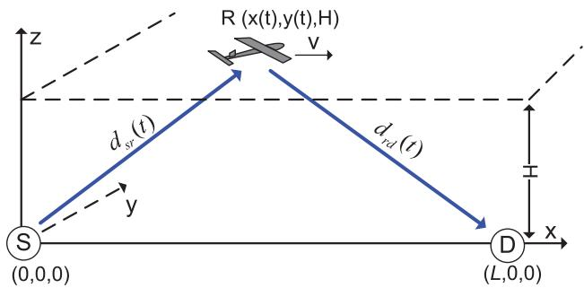

text_image

R (x(t),y(t),H)
z
v
d_{sr}(t)
d_{rd}(t)
y
S
(0,0,0)
D
(L,0,0)
x

Fig. 1. A UAV-enabled mobile relaying system.

to the conventional WF solution with constant water levels, and either the source or relay should use up all its available transmit power.

• Next, for a given source/relay power allocation, we propose an efficient algorithm to optimize the relay trajectory to further improve the throughput via applying successive convex optimization techniques. Specifically, the relay trajectory is successively updated by finding the optimal trajectory incremental that maximizes a lower bound of the throughput. An iterative algorithm is then proposed to optimize both the power allocation and relay trajectory alternately.

• Lastly, for the special case with free initial and final relay locations, we analytically derive the jointly optimal trajectory and power allocation solution for the throughput maximization problem. In this case, it is shown that the relay with the optimal trajectory has only two states: either moves unidirectionally from the source to the destination with its maximum speed or stays stationary above the source or destination for a certain optimal duration.

It is worth pointing out that unlike existing buffer-aided static relaying techniques [29], [30], which rely on random channel fading for opportunistic link selections to enhance performance, the proposed mobile relaying in this paper can pro-actively construct favorable channels via careful mobility control, and thus provides an additional degree of freedom for performance improvement.

The rest of this paper is organized as follows. Section II introduces the system model and presents the problem formulation for throughput maximization. In Section III, the optimal source/relay power allocations are obtained for fixed relay trajectory. Section IV optimizes the relay trajectory by assuming that the power allocations are fixed. In Section V, an iterative algorithm is proposed to optimize both power allocation and relay trajectory by leveraging their individual optimized designs. In Section VI, the jointly optimal relay trajectory and power allocation solution is analytically derived for the special case without pre-determined initial or final relay locations. In Section VII, numerical results are presented to compare the proposed mobile relaying design with existing techniques. Finally, we conclude the paper in Section VIII.

# II. SYSTEM MODEL AND PROBLEM FORMULATION

As shown in Fig. 1, we consider a wireless system with a source node S and a destination node D which are separated by L meters. While we assume that S and D have fixed locations, the algorithms developed in Sections III-V are also applicable for moving S and D with their locations over time known. We assume that the direct link between S and D is negligible due to e.g., severe blockage. Thus, a relay R needs to be deployed to assist the communication from S to D. Unlike the conventional static relaying with fixed relay location, we assume that a relay of sufficiently high mobility is employed. Note that the extension of the mobile relaying design to the more general cooperative system with non-negligible direct links [31], [32] will be left as our future work. In this paper, we focus on the UAV-enabled mobile relaying without the direct link to emphasize the great potential of UAVs in future wireless communication systems [10].

Without loss of generality, we consider a Cartesian coordinate system with S and D located at (0, 0, 0) and $( L , 0 , 0 )$ , respectively, as shown in Fig. 1. We assume that a UAV flying at a fixed altitude H is employed as a mobile relay for a finite time horizon T . In practice, H could correspond to the minimum altitude that is required for terrain or building avoidance without frequent aircraft ascending or descending. Note that for simplicity, we have ignored the UAV’s take-off and landing phases, but instead focus on its operation period of time horizon T . The time-varying coordinate of the relay node R can be expressed as ${ \big ( } x ( t ) , y ( t ) , H { \big ) } , 0 \leq t \leq T$ , with x (t) and y(t) denoting the relay’s time-varying x- and y-coordinates, respectively. Unless otherwise stated, we consider the scenario where the initial and final locations of the mobile relay are pre-determined, which are denoted as $( x _ { 0 } , y _ { 0 } , H )$ and $( x _ { F } , y _ { F } , H )$ , respectively. This is because in practice, the initial and final relay locations depend on various factors such as the UAV’s launching/landing locations as well as its pre- and post-mission flying paths, etc. In Section VI, we also consider the case when the UAV is freely deployed to help relay information from S to D, and as a result, there are no constraints on its initial and final locations. The minimum distance the relay needs to travel within the time horizon T is $d _ { \operatorname* { m i n } } = \sqrt { ( x _ { F } - x _ { 0 } ) ^ { 2 } + ( y _ { F } - y _ { 0 } ) ^ { 2 } }$ . Denote the maximum UAV speed as V˜ , where $\tilde { V } \ \geq \ d _ { \operatorname* { m i n } } / T$ so that there exists at least one feasible trajectory from the relay’s initial to final locations. We thus have $\sqrt { \dot { x } ^ { 2 } ( t ) + \dot { y } ^ { 2 } ( t ) } \le \tilde { V } , 0 \le t \le T$ , with x˙(t) and y˙(t) denoting the time-derivatives of x (t) and $y ( t )$ , respectively.

For ease of exposition, the time horizon T is discretized into N equally spaced time slots, i.e., $\begin{array} { r } { T \ = \ N \delta _ { t } } \end{array}$ , with $\delta _ { t }$ denoting the elemental slot length, which is chosen to be sufficiently small so that the UAV’s location can be assumed to be approximately constant within each slot. Thus, the UAV’s trajectory $\left( x ( t ) , y ( t ) \right)$ over T can be approximated by the N-length se $\left\{ x [ n ] , y [ n ] \right\} _ { n = 1 } ^ { N }$ , where - x [n], y[n] n $\mathrm { U A V ^ { \prime } s \_ x - j }$ the relay’s mobility constraints, including both its initial and final location constraints as well as speed constraint, can be expressed as

$$
\left(x [ 1 ] - x _ {0}\right) ^ {2} + \left(y [ 1 ] - y _ {0}\right) ^ {2} \leq V ^ {2}, \tag {1}
$$

$$
\left(x [ n + 1 ] - x [ n ]\right) ^ {2} + \left(y [ n + 1 ] - y [ n ]\right) ^ {2} \leq V ^ {2},
$$

$$
n = 1, \dots , N - 1, \tag {2}
$$

$$
\left(x _ {F} - x [ N ]\right) ^ {2} + \left(y _ {F} - y [ N ]\right) ^ {2} \leq V ^ {2}, \tag {3}
$$

where $V \triangleq \tilde { V } \delta _ { t }$ denotes the maximum relay displacement for each time slot.

For simplicity, we assume that the relay R is equipped with a data buffer of sufficiently large size, and it operates in a FDD mode with equal bandwidth allocated for information reception from S and transmission to D. Furthermore, we assume that the communication channels from S to R and that from R to D are dominated by line-of-sight (LoS) links, and the Doppler effect due to the relay’s mobility is assumed to be perfectly compensated [33]. Thus, at slot n, the channel power from S to R follows the free-space path loss model as

$$
h _ {\mathrm{sr}} [ n ] = \beta_ {0} d _ {\mathrm{sr}} ^ {- 2} [ n ] = \frac {\beta_ {0}}{H ^ {2} + x ^ {2} [ n ] + y ^ {2} [ n ]}, n = 1, \dots , N,
$$

where $\beta _ { 0 }$ denotes the channel power at the reference distance $d _ { 0 } = 1$ meter, whose value depends on the carrier frequency, antenna gain, etc., and $d _ { \mathrm { s r } } [ n ] \stackrel { \cdot } { = } \sqrt { H ^ { 2 } + x ^ { 2 } [ n ] + y ^ { 2 } [ n ] }$ is the link distance between S and R at slot n. Let $p _ { s } [ n ]$ denote the transmission power by S at slot n. The maximum transmission rate from S to R in bits/second/Hz (bps/Hz) for slot n can be expressed as

$$
\begin{array}{l} \bar {R} _ {s} [ n ] = \log_ {2} \left(1 + \frac {p _ {s} [ n ] h _ {\mathrm{sr}} [ n ]}{\sigma^ {2}}\right), \\ = \log_ {2} \left(1 + \frac {p _ {s} [ n ] \gamma_ {0}}{H ^ {2} + x ^ {2} [ n ] + y ^ {2} [ n ]}\right), \quad n = 1, \dots , N, \tag {4} \\ \end{array}
$$

where $\sigma ^ { 2 }$ denotes the noise power, and $\gamma _ { 0 } ~ \triangleq ~ \beta _ { 0 } / \sigma ^ { 2 }$ represents the reference signal-to-noise ratio (SNR). Similarly, the channel from R to D at slot n can be expressed as $h _ { \mathrm { r d } } [ n ] = \beta _ { 0 } / ( H ^ { 2 } + ( L - x [ n ] ) ^ { 2 } + y ^ { 2 } [ n ] )$ , and the maximum transmission rate from R to D is

$$
\bar {R} _ {r} [ n ] = \log_ {2} \left(1 + \frac {p _ {r} [ n ] \gamma_ {0}}{H ^ {2} + (L - x [ n ]) ^ {2} + y ^ {2} [ n ]}\right), \quad n = 1, \dots , N, \tag {5}
$$

where $p _ { r } [ n ]$ represents the transmission power by R at slot n. It follows from (4) and (5) that there in general exists a tradeoff in optimizing {x[n]} between maximizing $\{ \bar { R } _ { s } [ n ] \}$ versus {R¯r [n]} over the time slots.

Moreover, at each slot n, R can only forward the data that has already been received from S. By assuming that the processing delay at R is one slot, we have the following information-causality constraint:

$$
\bar {R} _ {r} [ 1 ] = 0, \sum_ {i = 2} ^ {n} \bar {R} _ {r} [ i ] \leq \sum_ {i = 1} ^ {n - 1} \bar {R} _ {s} [ i ], n = 2, \dots , N. \tag {6}
$$

It is not difficult to see that S should not transmit at the last slot N. We thus have $\bar { R } _ { s } [ N ] = \bar { R } _ { r } [ 1 ] = 0$ , and hence $p _ { s } [ N ] = p _ { r } [ 1 ] = 0$ without loss of optimality.

For a given relay trajectory $\{ x [ n ] , y [ n ] \} _ { n = 1 } ^ { N }$ , define the timedependent channel-to-noise power ratios for the S-R and R-D links as

$$
\gamma_ {\mathrm{sr}} [ n ] \triangleq \frac {\gamma_ {0}}{H ^ {2} + x ^ {2} [ n ] + y ^ {2} [ n ]}, \tag {7}
$$

$$
\gamma_ {\mathrm{rd}} [ n ] \triangleq \frac {\gamma_ {0}}{H ^ {2} + (L - x [ n ]) ^ {2} + y ^ {2} [ n ]}, \forall n. \tag {8}
$$

Our objective is to maximize the end-to-end throughput from S toallocations $\{ p _ { s } [ n ] \} _ { n = 1 } ^ { N - 1 }$ imiziand $\bar { \{ p _ { r } [ n ] \} } _ { n = 2 } ^ { N }$ e source/relay poweras well as the relay trajectory {x [n], y[n] $\} _ { n = 1 } ^ { N }$ . The problem can be formulated as follows.

$$
\text{(P1)}:\max_{\substack{\{x[n],y[n]\} ,\\ \{p_{s}[n],p_{r}[n]\}}}\sum_{n = 2}^{N}\log_{2}\left(1 + p_{r}[n]\gamma_{\mathrm{rd}}[n]\right)
$$

$$
\text { s.t. } \quad \sum_ {i = 2} ^ {n} \log_ {2} \left(1 + p _ {r} [ i ] \gamma_ {\mathrm{rd}} [ i ]\right)
$$

$$
\leq \sum_ {i = 1} ^ {n - 1} \log_ {2} \left(1 + p _ {s} [ i ] \gamma_ {\mathrm{sr}} [ i ]\right), \quad n = 2, \dots , N, \tag {9}
$$

$$
\frac {1}{N} \sum_ {n = 1} ^ {N - 1} p _ {s} [ n ] \leq \bar {P} _ {s}, \frac {1}{N} \sum_ {n = 2} ^ {N} p _ {r} [ n ] \leq \bar {P} _ {r}, \tag {10}
$$

$$
p _ {s} [ n ] \geq 0, n = 1,..., N - 1, \tag {11}
$$

$$
p _ {r} [ n ] \geq 0, n = 2,..., N, \tag {12}
$$

$$
\left(x [ 1 ] - x _ {0}\right) ^ {2} + \left(y [ 1 ] - y _ {0}\right) ^ {2} \leq V ^ {2}, \tag {13}
$$

$$
\left(x [ n + 1 ] - x [ n ]\right) ^ {2} + \left(y [ n + 1 ] - y [ n ]\right) ^ {2} \leq V ^ {2},
$$

$$
n = 1, \dots , N - 1, \tag {14}
$$

$$
\left(x _ {F} - x [ N ]\right) ^ {2} + \left(y _ {F} - y [ N ]\right) ^ {2} \leq V ^ {2}, \tag {15}
$$

where (10) represents the average transmit power constraints over T , with $\bar { P } _ { s }$ and $\bar { P } _ { r }$ denoting the average power limits at S and R, respectively.

(P1) is a non-convex optimization problem, which thus cannot be directly solved with standard convex optimization techniques. In the following, we first consider two sub-problems of (P1), namely power optimization with fixed relay trajectory and trajectory optimization with fixed power allocation. Based on the solutions obtained, an iterative algorithm is then proposed for (P1) via alternately optimizing the power and trajectory. Last, for the special case without pre-determined initial or final relay locations, i.e., in the absence of constraints (13) and (15), we obtain the jointly optimal power allocation and relay trajectory solution to (P1).

# III. POWER OPTIMIZATION WITH FIXED TRAJECTORY

In this section, we consider the sub-problem of (P1) for optimizing the power allocations by assuming that the relay’s trajectory $\{ x [ n ] , y [ n ] \} _ { n = 1 } ^ { N }$ is fixed. Besides being a subproblem of (P1), this may also correspond to the practical scenario when the relay’s trajectory is pre-determined due to other tasks (e.g., surveillance) rather than being optimized for communication performance. In this case, it follows from (7) and (8) that the time-dependent channels $\{ \gamma _ { \mathrm { s r } } [ n ] \}$ and $\{ \gamma _ { \mathrm { r d } } [ n ] \}$ are given. However, the power allocation problem in the form of (P1) is still non-convex due to the non-convex informationcausality constraint in (9). By introducing the slack variables $\{ R _ { r } [ n ] \} _ { n = 2 } ^ { \overline { { N } } }$ , (P1) with given $\{ \gamma _ { \mathrm { s r } } [ n ] \}$ and $\{ \gamma _ { \mathrm { r d } } [ n ] \}$ can be reformulated as

$$
\text{(P1.1)}:\max_{\substack{\{p_{s}[n]\}_{n = 1}^{N - 1},\\ \{p_{r}[n],R_{r}[n]\}_{n = 2}^{N}}}\sum_{n = 2}^{N}R_{r}[n]
$$

$$
\text { s.t. } \sum_ {i = 2} ^ {n} R _ {r} [ i ] \leq \sum_ {i = 1} ^ {n - 1} \log_ {2} \left(1 + p _ {s} [ i ] \gamma_ {\mathrm{sr}} [ i ]\right), n = 2, \dots , N \tag {16}
$$

$$
R _ {r} [ n ] \leq \log_ {2} \left(1 + p _ {r} [ n ] \gamma_ {\mathrm{rd}} [ n ]\right), n = 2, \dots , N \tag {17}
$$

$$
\sum_ {n = 1} ^ {N - 1} p _ {s} [ n ] \leq E _ {s}, \sum_ {n = 2} ^ {N} p _ {r} [ n ] \leq E _ {r}, \tag {18}
$$

$$
p _ {s} [ n ] \geq 0, \quad n = 1,..., N - 1, \tag {19}
$$

$$
p _ {r} [ n ] \geq 0, \quad n = 2,..., N, \tag {20}
$$

where we have defined $E _ { s } \triangleq N P _ { s }$ and $E _ { r } \triangleq N P _ { r }$ . Note that if at the optimal solution to (P1.1), there exists a slot $n ^ { \prime }$ such that the constraint in (17) is satisfied with strict inequality, we can always reduce the corresponding power $p _ { r } [ n ^ { \prime } ]$ to make (17) active, yet without decreasing the objective value of (P1.1). Thus, there always exists an optimal solution to (P1.1) such that all constraints in (17) are satisfied with equality. As a result, for any fixed relay trajectory, (P1.1) is equivalent to (P1). Note that (P1.1) is a convex optimization problem, which can be numerically solved by standard convex optimization techniques, such as the interior-point method [34]. However, by applying the Lagrange dual method, the structural properties of the optimal solution to (P1.1) can be obtained, based on which new insights can be drawn.

# A. Optimal Solution to (P1.1)

It can be verified that (P1.1) satisfies the Slater’s condition, thus, strong duality holds and its optimal solution can be obtained via solving the dual problem [34]. Furthermore, the power and rate allocations for S and R in (P1.1) are only coupled via the information-causality constraints in (16), which can be decoupled by studying its partial Lagrangian. Let $\lambda _ { n } \ge 0 , n = 2 , \cdot \cdot \cdot , N .$ , be the Lagrange dual variables corresponding to (16). The partial Lagrangian of (P1.1) can then be expressed as

$$
L \left(\left\{p _ {s} [ n ] \right\}, \left\{p _ {r} [ n ], R _ {r} [ n ], \lambda_ {n} \right\}\right)
$$

$$
= \sum_ {n = 2} ^ {N} R _ {r} [ n ] + \sum_ {n = 2} ^ {N} \lambda_ {n} \left(\sum_ {i = 1} ^ {n - 1} \log_ {2} (1 + p _ {s} [ i ] \gamma_ {\mathrm{sr}} [ i ]) - \sum_ {i = 2} ^ {n} R _ {r} [ i ]\right)
$$

$$
= \sum_ {n = 2} ^ {N} \nu_ {n} R _ {r} [ n ] + \sum_ {n = 1} ^ {N - 1} \beta_ {n} \log_ {2} \left(1 + p _ {s} [ n ] \gamma_ {\mathrm{sr}} [ n ]\right), \tag {21}
$$

where

$$
\beta_ {n} \triangleq \sum_ {i = n + 1} ^ {N} \lambda_ {i}, n = 1, \dots , N - 1, \tag {22}
$$

$$
\nu_ {n} \triangleq 1 - \sum_ {i = n} ^ {N} \lambda_ {i}, n = 2, \dots , N. \tag {23}
$$

The Lagrange dual function of (P1.1) is then defined as

$$
g \left(\{\lambda_ {n} \}\right) = \left\{ \begin{array}{c} \max _ {\{p _ {s} [ n ] \} _ {n = 1} ^ {N - 1},} L \left(\{p _ {s} [ n ] \}, \{p _ {r} [ n ], R _ {r} [ n ], \lambda_ {n} \}\right) \\ \{p _ {r} [ n ], R _ {r} [ n ] \} _ {n = 2} ^ {N} \\ \text { s. t. (17), (18), (19), (20).} \end{array} \right.
$$

The dual problem of (P1.1), denoted as (P1.1-D), is defined as min ${ \mathfrak { l } } _ { \lambda _ { n } \geq 0 , \forall n } g ( \{ \lambda _ { n } \} )$ . Since (P1.1) can be solved equivalently by solving (P1.1-D), in the following, we first maximize the Lagrangian to obtain the dual function with fixed $\{ \lambda _ { n } \}$ , and then find the optimal dual solutions $\{ \lambda _ { n } ^ { \star } \}$ } to minimize the dual function. The optimal power and rate allocations at S and R are then obtained based on the dual optimal solution $\{ \lambda _ { n } ^ { \star } \}$ }.

Consider first the problem of maximizing the Lagrangian over $\{ p _ { s } [ n ] \}$ and $\{ p _ { r } [ n ] , R _ { r } [ n ] \}$ with fixed $\{ \lambda _ { n } \}$ . It follows from (21) that $g ( \{ \lambda _ { n } \} )$ can be decomposed as $g \left( \{ \lambda _ { n } \} \right) = g _ { s } \left( \{ \lambda _ { n } \} \right) + g _ { r } \left( \{ \lambda _ { n } \} \right)$ ), where

$$
g _ {s} \left(\left\{\lambda_ {n} \right\}\right) = \left\{ \begin{array}{l l} \max _ {\left\{p _ {s} [ n ] \right\}} & \sum_ {n = 1} ^ {N - 1} \beta_ {n} \log_ {2} \left(1 + p _ {s} [ n ] \gamma_ {\mathrm{sr}} [ n ]\right) \\ \text { s   .   t   . } & \sum_ {n = 1} ^ {N - 1} p _ {s} [ n ] \leq E _ {s}, \\ & p _ {s} [ n ] \geq 0, n = 1, \dots , N - 1, \end{array} \right. \tag {24}
$$

and

$$
g _ {r} \left(\left\{\lambda_ {n} \right\}\right) = \left\{ \begin{array}{l l} \max _ {\left\{p _ {r} [ n ], R _ {r} [ n ] \right\}} & \sum_ {n = 2} ^ {N} v _ {n} R _ {r} [ n ] \\ \text { s.   t. } & R _ {r} [ n ] \leq \log_ {2} \left(1 + p _ {r} [ n ] \gamma_ {\mathrm{rd}} [ n ]\right), \forall n \\ & \sum_ {n = 2} ^ {N} p _ {r} [ n ] \leq E _ {r}, \\ & p _ {r} [ n ] \geq 0, n = 2, \dots , N. \end{array} \right. \tag {25}
$$

In other words, for any given dual variables $\{ \lambda _ { n } \}$ , the optimal primal variables for Lagrangian maximization can be obtained by solving two parallel sub-problems (24) and (25) for S and R, respectively. Note that both (24) and (25) are weighted sum-rate maximization problparallel sub-channels, with the weights over and $N - 1$ $\{ \beta _ { n } \} _ { n = 1 } ^ { N - 1 }$ $\{ \nu _ { n } \} _ { n = 2 } ^ { N }$ determined by $\{ \lambda _ { n } \} _ { n = 2 } ^ { N }$ n=1 n=2given in (22) and (23), respectively. Since $\lambda _ { n } ~ \geq ~ 0$ , ∀n, we have $\beta _ { n } \geq 0$ , ∀n, and $\{ \beta _ { n } \} _ { n = 1 } ^ { N - 1 }$ and $\{ \nu _ { n } \} _ { n = 2 } ^ { N }$ n 1are non-increasing and non-decreasing over n, respectively. Furthermore, for problem (25) to have bounded optimal value, we must have $\nu _ { n } \geq 0$ , ∀n. To see this, suppose that there exists an $n ^ { \prime }$ such that $\nu _ { n ^ { \prime } } \ < \ 0$ . Then problem (25) is unbounded when we let $R _ { r } [ n ^ { \prime } ] = - t$ , with $t \to \infty$ . Since (P1.1) should have a bounded optimal value, it follows that the optimal primal and dual solutions of (P1.1) are obtained only when $\nu _ { n } \geq 0 , \forall n$ , or equivalently $\textstyle \sum _ { n = 2 } ^ { N } \lambda _ { n } \leq 1$ due to (23).

By applying the standard Lagrange method and the Karush-Kuhn-Tucker (KKT) conditions, it can be shown that the optimal solutions to (24) and (25) are respectively given by

$$
p _ {s} ^ {\star} [ n ] = \left[ \eta \beta_ {n} - \frac {1}{\gamma_ {\mathrm{sr}} [ n ]} \right] ^ {+}, \forall n, \tag {26}
$$

$$
p _ {r} ^ {\star} [ n ] = \left[ \xi \nu_ {n} - \frac {1}{\gamma_ {\mathrm{rd}} [ n ]} \right] ^ {+}, R _ {r} ^ {\star} [ n ] = \left[ \log_ {2} \left(\xi \nu_ {n} \gamma_ {\mathrm{rd}} [ n ]\right) \right] ^ {+}, \forall n, \tag {27}
$$

$\xi$ parameters ensurin, respectively, and $\begin{array} { r } { \sum _ { n = 1 } ^ { N - 1 } p _ { s } ^ { \star } [ n ] = E _ { s } } \end{array}$ and $\begin{array} { r } { \sum _ { n = 2 } ^ { N } p _ { r } ^ { \star } [ n ] = E _ { r } } \end{array}$ $[ a ] ^ { + } \triangleq$

Next, we address how to solve the dual problem (P1.1-D) by minimizing the dual function $g ( \{ \lambda _ { n } \} )$ subject to $\lambda _ { n } \geq 0 .$ , $\forall n$ , and the new constraint $\begin{array} { l l l } { \sum _ { n = 2 } ^ { N } \lambda _ { n } } & { \leq } & { { \mathrm { i } } } \end{array}$ N . This can be done by applying subgradient-based method, e.g., the ellipsoid method [35]. It can be shown that the subgradient of $g ( \{ \lambda _ { n } \} )$ $s _ { n } \ = \ \sum _ { i = 1 } ^ { n - 1 }$ at point log2 $\begin{array} { r } { \left( 1 + p _ { s } ^ { \star } [ i ] \gamma _ { \mathrm { s r } } [ i ] \right) - \sum _ { i = 2 } ^ { n } R _ { r } ^ { \star } [ i ] } \end{array}$ $\{ \lambda _ { n } \}$ is given by $\mathbf { s } = [ s _ { 2 } , \cdots , s _ { N } ] ^ { T }$ , ∀n, where , with $\{ p _ { s } ^ { \star } [ n ] \}$ and { Rr [n]} are the solutions in (26) and (27) for the given $\{ \lambda _ { n } \}$ . The procedures for finding the optimal dual solutions $\{ \lambda _ { n } ^ { \star } \}$ using the ellipsoid method are summarized in Algorithm 1.

With the dual optimal solution $\{ \lambda _ { n } ^ { \star } \}$ to (P1.1-D) obtained, the primal optimal solution to (P1.1), denoted as $\{ p _ { s } ^ { * } [ n ] \}$ and $\{ p _ { r } ^ { * } [ n ] , R _ { r } ^ { * } [ n ] \}$ , can be obtained by separately considering the following four cases.

Case $I \colon \beta _ { 1 } ^ { \star } \ > \ 0$ and $\nu _ { N } ^ { \star } ~ > ~ 0$ , which is equivalent to $\textstyle \sum _ { n = 2 } ^ { N } \lambda _ { n } ^ { \star } \ > \ \dot { 0 }$ and $\lambda _ { N } ^ { \star } < 1$ . In this case, both the weight vectors $\{ \beta _ { n } ^ { \star } \}$ in (24) and $\{ \nu _ { n } ^ { \star } \}$ in (25) have strictly positive components, and hence (24) and (25) are strict convex optimization problems and therefore have unique solutions. As a result, the solution given in (26) and (27) corresponding to the dual optimal variable $\{ \lambda _ { n } ^ { \star } \}$ must be the primal optimal solution to (P1.1). Note that in this case, S and R both use up their maximum transmission power. Furthermore, (26) and (27) show that the optimal power allocations across the different slots are given by the “staircase” WF solution [27], with non-increasing and non-decreasing water levels at S and R, respectively.

Case 2: $\beta _ { 1 } ^ { \star } ~ > ~ 0$ and $\nu _ { N } ^ { \star } = 0 ,$ , or equivalently $\lambda _ { N } ^ { \star } = 1$ and $\lambda _ { 2 } ^ { \star } = \cdot \cdot \cdot = \lambda _ { N - 1 } ^ { \star } = 0$ . We then have $\beta _ { n } ^ { \star } = 1$ , ∀n, and $\nu _ { n } ^ { \star } = 0 .$ , ∀n. In this case, the weighted sum-rate maximization problem (24) reduces to sum-rate maximization problem, and its solution reduces to the classic WF power allocation with a constant water level [36], i.e., $p _ { s } ^ { \star } [ n ] \dot { = } \left[ \eta - 1 / \gamma _ { \mathrm { s r } } [ n ] \right] ^ { + }$ , ∀n, with $\eta$ chosen such that $\begin{array} { r } { \sum _ { n = 1 } ^ { N - 1 } p _ { s } ^ { \star } [ n ] = \mathbf { \bar { E } } _ { s } } \end{array}$ . In this case, the unique Lagrangian maximizer $\{ p _ { s } ^ { \star } [ n ] \}$ must be the optimal power allocation for S corresponding to the primal optimal solution to (P1.1), i.e., $p _ { s } ^ { * } [ n ] = p _ { s } ^ { \star } [ n ] ,$ , ∀n. On the other hand, since $\nu _ { n } ^ { \star } = 0$ , ∀n, problem (25) has non-unique solutions for Lagrangian maximization. The primal optimal solution can then be obtained by solving (P1.1) with the given optimal source power allocation $\{ p _ { s } ^ { * } [ n ] \}$ . The resulting problem is a convex optimization problem of reduced complexity as compared to (P1.1).

Note that since $\lambda _ { N } ^ { \star } = 1$ for Case 2, the complementary slackness condition implies that $\begin{array} { r } { \sum _ { n = 2 } ^ { N } R _ { r } ^ { * } [ n ] = \sum _ { n = 1 } ^ { \operatorname { \bar { N } } - 1 } R _ { s } ^ { * } [ n ] } \end{array}$ i.e., the aggregated transmission rates at S and R are equal. Furthermore, as S (while not necessarily R) must use up all its power to achieve such a rate balance, Case 2 corresponds to the scenario where the S-R link is the bottleneck due to $\mathrm { e . g . }$ , limited power budget $E _ { s }$ at S and/or poor channels $\{ \gamma _ { \mathrm { s r } } [ n ] \}$ .

Case 3: $\beta _ { 1 } ^ { \star } = 0$ and $\nu _ { N } ^ { \star } > 0 _ { }$ , which corresponds to ${ \lambda } _ { n } ^ { \star } = 0$ , ∀n. Thus, we have $\beta _ { n } ^ { \star } = 0 , \forall n$ , and $\nu _ { n } ^ { \star } = 1 , \forall n$ . In this case, the optimal power allocation at R is given by the classic WF solution with a constant water level, i.e., $p _ { r } ^ { * } [ n ] = \left[ \xi - 1 / \gamma _ { \mathrm { r d } } [ n ] \right] ^ { + }$ , $\forall n .$ , with $\xi$ satisfying $\begin{array} { r } { \sum _ { n = 2 } ^ { N } p _ { r } ^ { \star } [ n ] = E _ { r } } \end{array}$ , and the resulting relay transmission rates are $\bar { R } _ { r } ^ { * } [ n ] = \left[ \log _ { 2 } \left( \xi \gamma _ { \mathrm { r d } } [ n ] \right) \right] ^ { + }$ . On the other hand, as the source power allocation for the Lagrangian maximization (26) is not unique, we may obtain one as the primal optimal solution that minimizes the source transmission power while satisfying the information-causality constraint with the given relay transmission rates.

Case 4: $\beta _ { 1 } ^ { \star } = 0$ and $\nu _ { N } ^ { \star } = 0$ . This requires ${ \lambda } _ { n } ^ { \star } = 0 , { \forall n }$ , on one hand, and also $\lambda _ { N } ^ { \star } = 1$ on the other hand. Thus, this case will not occur.

The complete algorithm for solving (P1.1) is summarized in Algorithm 1.

# B. Optimal Power Allocation With Non-Increasing $\gamma _ { s r } [ n ]$ and Non-Decreasing $\gamma _ { r d } [ n ]$

For the special case when the channels $\gamma _ { \mathrm { s r } } [ n ]$ are $\gamma _ { \mathrm { r d } } [ n ]$ are non-increasing and non-decreasing over n, respectively, the optimal power allocation to (P1.1) can be obtained in closedform. To this end, we first show the following result.

Algorithm 1 Optimal Power Allocation With Fixed Relay Trajectory.   
1: Initialize $\lambda_{n} \geq 0$ , $\forall n$ , and $\sum_{n=2}^{N} \lambda_{n} \leq 1$ .
2: repeat
3: Obtain $\{p_{s}^{\star}[n]\}$ and $\{p_{r}^{\star}[n], R_{r}^{\star}[n]\}$ using the staircase water-filling solution.
4: Compute the subgradient of $g(\{\lambda_{n}\})$ .
5: Update $\{\lambda_{n}\}$ using the ellipsoid method subject to $\lambda_{n} \geq 0$ , $\forall n$ and $\sum_{n=2}^{N} \lambda_{n} \leq 1$ .
6: until $\{\lambda_{n}\}$ converges to the prescribed accuracy.
7: Output $\{p_{s}^{\star}[n]\}$ and $\{p_{r}^{\star}[n], R_{r}^{\star}[n]\}$ corresponding to the optimal $\{\lambda_{n}^{\star}\}$ .

Lemma $I \colon I f \ \gamma _ { s r } [ n ]$ is non-increasing and $\gamma _ { r d } [ n ]$ is nondecreasing over n, the dual optimal solution $\{ \lambda _ { n } ^ { \star } \}$ to $( P l . I )$ must satisfy $\lambda _ { n } ^ { \star } = 0 , \forall n = 2 , \cdot \cdot \cdot , N - 1$ .

Proof: Please refer to Appendix A.

Note that Lemma 1 only shows the vanishing of the dual variables associated with the information-causality constraints (16) for slots up to $N - 1$ , whereas $\lambda _ { N } ^ { \star }$ for the final slot could still be positive. In this case, it follows from (22) and (23) that $\beta _ { n } ^ { \star } = \lambda _ { N } ^ { \star }$ , and $\nu _ { n } ^ { \star } = 1 - \lambda _ { N } ^ { \star }$ , ∀n. As a result, the source and relay power allocations given in (26) and (27) with fixed dual optimal variables both reduce to the classic WF solutions with constant water levels. With Lemma 1, the primal optimal solution to (P1.1) can be obtained in closed-form, as shown next.

For ease of presentation, we first define the following $0 \leq \tilde { E } _ { s } \leq E _ { s }$ , define ted rate t $R _ { s } ^ { \mathrm { c w f } } ( \tilde { E } _ { s } ) \stackrel { \Delta } { = }$ ${ \begin{array} { r l } { ~ } & { { \sum _ { n = 1 } ^ { N - 1 } \left[ \log _ { 2 } { ( \eta \gamma _ { \mathrm { s r } } [ { { n } } ] ) } \right] } ^ { + } } \end{array} }$ $\mathrm { \bf S }$ mission power $\tilde { E } _ { s }$ , and $p _ { s , n } ^ { \mathrm { { { \scriptsize ~ c w f } } } } ( \tilde { E } _ { s } ) \triangleq \left[ \eta - 1 / \gamma _ { \mathrm { s r } } [ n ] \right] ^ { + }$ as the corresponding power allocation for slot n, with η satisfying $\begin{array} { r } { \sum _ { n = 1 } ^ { N - 1 } \left[ \eta - 1 / \gamma _ { \mathrm { s r } } [ n ] \right] ^ { + } = \tilde { E } _ { s } } \end{array}$ . Similarly, for $0 \leq \tilde { E } _ { r } \leq E _ { r } ,$ define $\begin{array} { r } { \dot { R } _ { r } ^ { \mathrm { c w f } } ( \tilde { E } _ { r } ) \triangleq \dot { \sum _ { n = 2 } ^ { N } } \left[ \log _ { 2 } \left( \xi \gamma _ { \mathrm { r d } } [ n ] \right) \right] ^ { + } } \end{array}$ , and $p _ { r , n } ^ { \mathrm { c w f } } ( \tilde { E } _ { r } ) \triangleq$ $\left[ \xi - 1 / \gamma _ { \mathrm { r d } } [ n ] \right] ^ { + }$ , with $\xi$ satisfying $\begin{array} { r l r } { \sum _ { n = 2 } ^ { N } \left[ \xi - 1 / \gamma _ { \mathrm { r d } } [ n ] \right] ^ { + } = } & { { } } & { } \end{array}$ $\tilde { E } _ { r }$ . We then have the following result.

Theorem $I \colon I f \ \gamma _ { s r } [ n ]$ is non-increasing and $\gamma _ { r d } [ n ]$ is nondecreasing over n, an optimal power allocation to (P1.1) is $p _ { s } ^ { * } [ n ] = { \bar { p } } _ { s , n } ^ { c w f } ( { \tilde { E } } _ { s } ^ { * } ) , \ p _ { r } ^ { * } [ n ] = p _ { r , n } ^ { c \bar { w } f } ( { \tilde { E } } _ { r } ^ { * } )$ , ∀n,

$$
w h e r e \left(\tilde {E} _ {s} ^ {*}, \tilde {E} _ {r} ^ {*}\right) = \left\{ \begin{array}{l l} \big (E _ {s}, \hat {E} _ {r} \big) & \text { if } R _ {s} ^ {c w f} (E _ {s}) \leq R _ {r} ^ {c w f} (E _ {r}) \\ \big (\hat {E} _ {s}, E _ {r} \big), & \text { otherwise }, \end{array} \right.
$$

with $\hat { E } _ { s }$ and $\hat { E } _ { r }$ denoting the unique solution to the equation $R _ { s } ^ { c w f } ( \tilde { E } _ { s } ) = R _ { r } ^ { c w f } ( E _ { r } )$ and $R _ { r } ^ { c w f } ( \tilde { E _ { r } } ) = R _ { s } ^ { c w f } ( E _ { s } )$ , respectively. Furthermore, the corresponding optimal value of (P1.1) is

$$
R ^ {*} = \min \{R _ {s} ^ {c w f} (E _ {s}), R _ {r} ^ {c w f} (E _ {r}) \}. \tag {28}
$$

Proof: Please refer to Appendix B.

Theorem 1 states that if the relay moves unidirectionally from S to D so that $\gamma _ { \mathrm { s r } } [ n ]$ and $\gamma _ { \mathrm { r d } } [ n ]$ are non-increasing and non-decreasing over n, respectively, the optimal power allocations at both S and R reduce to the classic WF solution with optimized total transmit power $\tilde { E } _ { s } ^ { * }$ and $\tilde { E } _ { r } ^ { * }$ , respectively. Specifically, by ignoring the information-causality constraints (16), the transmitter corresponding to the “bottleneck” link which has smaller aggregate rate $R _ { s } ^ { \mathrm { c w f } } ( E _ { s } )$ or $R _ { r } ^ { \mathrm { c w f } } ( E _ { r } )$ should use up all its available power, whereas the other transmitter may reduce its power so as to balance the rates over the two links. Under such transmission strategies, the informationcausality constraints are automatically guaranteed, which is intuitively understood since the S-R link always has better channels, and hence higher power and rate, in earlier slots, whereas the reverse is true for the R-D link.

# IV. TRAJECTORY OPTIMIZATION WITH FIXED POWER

In this section, we consider another sub-problem of (P1) for optimizing the relay’s trajectory $\{ x [ n ] , y [ n ] \} _ { n = 1 } ^ { N }$ with fixed source and relay power allocations $\{ p _ { s } [ n ] \} _ { n = 1 } ^ { N - 1 }$ and $\{ p _ { r } [ n ] \} _ { n = 2 } ^ { N }$ . Notice that this sub-problem is particularly relevant when the relay and source can only transmit with constant power due to practical hardware limitations. The problem can be written as

$$
\begin{array}{l} \text{(P1.2)}:\max_{\substack{\{x[n],y[n]\}_{n = 1}^{N}\\ \{R_{r}[n]\}_{n = 2}^{N}}}\sum_{n = 2}^{N}R_{r}[n] \\ \text { s.t. } \quad \sum_ {i = 2} ^ {n} R _ {r} [ i ] \leq \sum_ {i = 1} ^ {n - 1} \log_ {2} \left(1 + \frac {\gamma_ {s} [ i ]}{H ^ {2} + x ^ {2} [ i ] + y ^ {2} [ i ]}\right), \\ n = 2, \dots , N, \tag {29} \\ \end{array}
$$

$$
R _ {r} [ n ] \leq \log_ {2} \left(1 + \frac {\gamma_ {r} [ n ]}{H ^ {2} + (L - x [ n ]) ^ {2} + y ^ {2} [ n ]}\right),
$$

$$
n = 2, \dots , N, \tag {30}
$$

$$
\left(x [ 1 ] - x _ {0}\right) ^ {2} + \left(y [ 1 ] - y _ {0}\right) ^ {2} \leq V ^ {2}, \tag {31}
$$

$$
\left(x [ n + 1 ] - x [ n ]\right) ^ {2} + \left(y [ n + 1 ] - y [ n ]\right) ^ {2} \leq V ^ {2},
$$

$$
n = 1, \dots , N - 1, (3 2)
$$

$$
\left(x _ {F} - x [ N ]\right) ^ {2} + \left(y _ {F} - y [ N ]\right) ^ {2} \leq V ^ {2}, \tag {33}
$$

where $R _ { r } [ n ]$ is the slack variable denoting the relay’s transmission rate at slot n, $\begin{array} { r l r } { \gamma _ { s } [ n ] } & { { } \triangleq } & { \boldsymbol { \bar { p } } _ { s } [ n ] / \sigma ^ { 2 } } \end{array}$ and $\gamma _ { r } [ n ] \triangleq p _ { r } [ n ] / \sigma ^ { 2 } , \forall n$ .

(P1.2) is a non-convex optimization problem due to the non-convex constraints (29) and (30). Therefore, it is quite challenging to find its optimal solution efficiently. In the following, we obtain an efficient approximate solution to (P1.2) based on the successive convex optimization technique. The main idea is to successively maximize a lower bound of (P1.2) via optimizing the incrementrajectory at each iteration. Specifically, let $\{ x _ { l } [ n ] , y _ { l } [ n ] \} _ { n = 1 } ^ { \bar { N } }$ be the resulting relay trajectory after the lth iteration, and $\begin{array} { r c l } { R _ { s , l } [ n ] } & { \triangleq } & { \log _ { 2 } \bigg ( 1 + \frac { \gamma _ { s } [ n ] } { H ^ { 2 } + x _ { l } ^ { 2 } [ n ] + y _ { l } ^ { 2 } [ n ] } \bigg ) } \end{array}$ and $R _ { r , l } [ n ] \ \triangleq$ log2 $\begin{array} { r } { \bigg ( 1 + \frac { \gamma _ { r } [ n ] } { H ^ { 2 } + ( L - x _ { l } [ n ] ) ^ { 2 } + y _ { l } ^ { 2 } [ n ] } \bigg ) } \end{array}$ be the corresponding channel capacity for the S-R and R-D links, respectively. Further denote $\{ \delta _ { l } [ n ] , \xi _ { l } [ n ] \} _ { n = 1 } ^ { N }$ as the trajectory incremental from the l th to the $( l + 1 ) \mathrm { t h }$ h iteration, i.e., $x _ { l + 1 } [ n ] = x _ { l } [ n ] + \delta _ { l } [ n ]$ , $y _ { l + 1 } [ n ] = y _ { l } [ n ] + \xi _ { l } [ n ]$ , ∀n. We then have the following result.

Lemma 2: For any trajectory incremental {δl[n]} and {ξl [n]}, the following inequalities hold

$$
\begin{array}{l} R _ {s, l + 1} [ n ] \geq R _ {s, l + 1} ^ {l b} [ n ] \triangleq R _ {s, l} [ n ] - a _ {s, l} [ n ] \left(\delta_ {l} ^ {2} [ n ] + \xi_ {l} ^ {2} [ n ]\right) \\ - b _ {s, l} [ n ] \delta_ {l} [ n ] - c _ {s, l} [ n ] \xi_ {l} [ n ], \tag {34} \\ \end{array}
$$

Algorithm 2 Successive Trajectory Optimization With Fixed Power Allocation.   
1: Initialize the relay's trajectory as $\{x_{0}[n], y_{0}[n]\}_{n=1}^{N}$ , and let l=0.
2: repeat
3: Find the optimal solution $\{\delta_{l}^{\star}[n], \xi_{l}^{\star}[n]\}_{n=1}^{N}$ to (P1.3).
4: Update the trajectory $x_{l+1}[n] = x_{l}[n] + \delta_{l}^{\star}[n]$ and $y_{l+1}[n] = y_{l}[n] + \xi_{l}^{\star}[n], \forall n = 1, \cdots, N.$ 5: Update $l = l + 1$ .
6: until convergence or a maximum number of iterations has been reached.

$$
\begin{array}{l} R _ {r, l + 1} [ n ] \geq R _ {r, l + 1} ^ {l b} [ n ] \triangleq R _ {r, l} [ n ] - a _ {r, l} [ n ] \left(\delta_ {l} ^ {2} [ n ] + \xi_ {l} ^ {2} [ n ]\right) \\ - b _ {r, l} [ n ] \delta_ {l} [ n ] - c _ {r, l} [ n ] \xi_ {l} [ n ], \forall n, \tag {35} \\ \end{array}
$$

where $a _ { s , l } [ n ] , a _ { r , l } [ n ] \geq 0 , b _ { s , l } [ n ] , c _ { s , l } [ n ] , b _ { r , l } [ n ] ,$ , and $c _ { r , l } [ n ]$ are coefficients given by (61) and (62) of Appendix C.

Proof: Please refer to Appendix C.

Lemma 2 shows that for any existing relay trajectory {xl [n], yl [n]} and an additional trajectory incremental {δl[n], ξl [n]}, the resulting new channel capacity $R _ { s , l + 1 }$ [n] and $R _ { r , l + 1 } [ n ]$ are lower-bounded by $R _ { s , l + 1 } ^ { \mathrm { l b } } [ n ]$ Rlbs,l+1[n] and Rlbr,l+ $R _ { r , l + 1 } ^ { \mathrm { l b } } [ n ] ,$ , respectively, which are concave quadratic functions of δl[n] and $\xi _ { l } [ n ]$ since $a _ { s , l } [ n ] , a _ { r , l } [ n ] \ \geq \ 0$ . It then follows that the optimal value of (P1.2), denoted as $R ^ { * }$ , is lower-bounded by that of the following problem for any given trajectory {xl [n], yl [n]},

$$
\text{(P1.3)}:\max_{\substack{\{\delta_{l}[n],\xi_{l}[n]\}_{n = 1}^{N}\\ \{R_{r}[n]\}_{n = 2}^{N}}}\sum_{n = 2}^{N}R_{r}[n]
$$

$$
\text { s.t. } \quad \sum_ {i = 2} ^ {n} R _ {r} [ i ] \leq \sum_ {i = 1} ^ {n - 1} R _ {s, l + 1} ^ {\mathrm{lb}} [ i ], n = 2, \dots , N, \tag {36}
$$

$$
R _ {r} [ n ] \leq R _ {r, l + 1} ^ {\mathrm{lb}} [ n ], n = 2, \dots , N, \tag {37}
$$

$$
\left(x _ {l} [ 1 ] + \delta_ {l} [ 1 ] - x _ {0}\right) ^ {2} + \left(y _ {l} [ 1 ] + \xi_ {l} [ 1 ] - y _ {0}\right) ^ {2} \leq V ^ {2}, \tag {38}
$$

$$
\left(x _ {l} [ n + 1 ] + \delta_ {l} [ n + 1 ] - x _ {l} [ n ] - \delta_ {l} [ n ]\right) ^ {2} +
$$

$$
\left(y _ {l} [ n + 1 ] + \xi_ {l} [ n + 1 ] - y _ {l} [ n ] - \xi_ {l} [ n ]\right) ^ {2} \leq V ^ {2}, \forall n, \tag {39}
$$

$$
\left(x _ {F} - x _ {l} [ N ] - \delta_ {l} [ N ]\right) ^ {2} + \left(y _ {F} - y _ {l} [ N ] - \xi_ {l} [ N ]\right) ^ {2} \leq V ^ {2}. \tag {40}
$$

(P1.3) is a convex quadratic programming problem, which thus can be efficiently solved with the standard convex optimization technique or existing software tools such as CVX [37]. As a result, (P1.2) can then be approximately solved by successively updating the trajectory based on the optimal solution to (P1.3), which is summarized in Algorithm 2.

It can be shown that with Algorithm 2, the resulting optimal values of (P1.3) are non-decreasing over the iteration l, which are further upper-bounded by the optimal value of (P1.2). Thus, Algorithm 2 is guaranteed to converge.

# V. ITERATIVE POWER AND TRAJECTORY OPTIMIZATION

Based on the solutions to its two sub-problems obtained in Sections III and IV, we propose the iterative algorithm for the joint power and trajectory optimization problem (P1), which is summarized in Algorithm 3.

Algorithm 3 Iterative Power and Trajectory Optimization.   
1: Initialize the relay's trajectory.  
2: repeat  
3: Fix the relay's trajectory, find the optimal power allocations using Algorithm 1.  
4: Fix the power allocation, update the relay's trajectory using Algorithm 2.  
5: until convergence or a maximum number of iterations has been reached.

Note that as each iteration of Algorithm 3 only requires solving convex optimization problems, the overall complexity of Algorithm 3 is polynomial in the worst scenario. However, since the sub-problem (P1.2) for trajectory optimization cannot be guaranteed to be optimally solved by Algorithm 2, no optimality can be theoretically declared for Algorithm 3. However, for the special case without pre-determined initial or final relay locations, where the jointly optimal solution to (P1) can be analytically obtained as shown in the next section, the numerical results in Section VII show that Algorithm 3 yields near optimal performance.

# VI. OPTIMAL SOLUTION WITH FREE INITIAL/FINAL RELAY LOCATION

In this section, we derive the jointly optimal solution to (P1) for the particular case when there is no pre-specified initial or final relay location. In practice, this could correspond to the scenario where the UAV is dedicated to assist communication and thus can be launched/landed in any optimized location via e.g., ground transportation before mission starts and after mission completes. In this case, (P1) is solved by removing the constraints (13) and (15). The resulting problem is denoted as (P1’). We first present the following result.

Lemma 3: Without loss of optimality to (P1’), we have $0 \leq x [ n ] \leq L$ and $y [ n ] = 0 ,$ ∀n.

Proof: First, it can be shown that {y[n]} should be all equal to zeros. To see this, suppose at the optimal solution, we have $y ^ { \star } [ n ] \neq 0$ for some n. Then by setting $y [ n ] = 0 { \mathrm { . } }$ , ∀n, both channels in (7) and (8) can be improved, and the feasible region for {x [n]} in (14) can be enlarged, which leads to larger value for (P1’). Thus, $y ^ { \star } [ n ] \neq 0$ cannot be the optimal solution. Also, it follows from (7) and (8) that we should have $0 \leq x [ n ] \leq L .$ , since otherwise, we can always find an alternative relay location within the interval [0, L] that results in higher $\gamma _ { \mathrm { s r } } [ n ]$ and/or γrd[n].

To obtain the optimal solution to (P1’), we first show that the optimal relay trajectory {x [n]} is non-decreasing over n, i.e., the relay should move unidirectionally towards D. As a result, it then follows from Lemma 3 that the channels $\gamma _ { \mathrm { s r } } [ n ]$ and $\gamma _ { \mathrm { r d } } [ n ]$ in (7) and (8) are non-increasing and non-decreasing, respectively. Therefore, the optimal power allocations can be obtained in closed-form given by Theorem 1. With slight abuse of notations, we first denote $R _ { s } ^ { \mathrm { c w f } } ( E _ { s } )$ and $R _ { r } ^ { \mathrm { c w f } } ( E _ { r } )$ in (28) as $R _ { s } ^ { \mathrm { c w f } } ( \{ x [ n ] \} )$ and

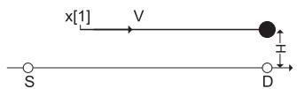  
(a): Hovering only above D

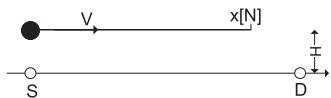  
(b): Hovering only above S

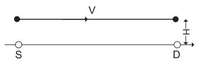  
(c): Hovering both above S and D

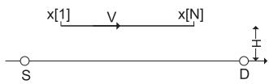  
(d): No hovering   
Fig. 2. Four scenarios of optimal relay trajectory for (P1’).

$R _ { r } ^ { \mathrm { c w f } } ( \{ x [ n ] \} )$ , i.e., as the functions of the relay trajectory {x [n]} explicitly.

Theorem 2: Without loss of optimality to $( P l ^ { \prime } ) _ { ; }$ , the relay trajectory {x [n]} is non-decreasing over n.

Proof: Please refer to Appendix D.

It then follows from Theorem 1 and Theorem 2 that problem (P1’) for joint power and trajectory optimization reduces to determining the optimal relay trajectory {x [n]} by solving

$( \mathrm { P 2 } ) \colon \operatorname* { m a x } _ { \{ x [ n ] \} } \ \operatorname* { m i n } _ { } \left\{ R _ { r } ^ { \mathrm { c w f } } \left( \{ x [ n ] \} \right) , R _ { s } ^ { \mathrm { c w f } } \left( \{ x [ n ] \} \right) \right\}$

$$
\text { s.t. } \quad 0 \leq x [ n + 1 ] - x [ n ] \leq V, \forall n \tag {41}
$$

$$
0 \leq x [ n ] \leq L, \forall n, \tag {42}
$$

where (41) follows from the speed constraint (14) by applying both Lemma 3 and Theorem 2.

Theorem 3: Without loss of optimality to (P2), {x [n]} satisfies

$$
v [ n ] = \left\{ \begin{array}{l l} V, & \text { if   } 0 <   x [ n ] <   L, \\ 0, & \text { if   } x [ n ] = L, \\ V \text {   or   } 0, & \text { if   } x [ n ] = 0, \end{array} \right. \tag {43}
$$

where v[n] ${ \stackrel { \Delta } { = } } x [ n + 1 ] - x [ n ]$ is the speed at slot n.

Proof: Please refer to Appendix E.

Theorem 3 shows that a binary speed with v[n] equal to either 0 or V is optimal to (P2). Furthermore, the relay stays stationary, i.e., $\upsilon [ n ] = 0 ,$ , only if $x [ n ] = 0 { \mathrm { ~ o r ~ } } x [ n ] = L$ , when it enjoys the best channel either from the source or to the destination. As a result, (P2) can be optimally solved by considering the following four scenarios.

1) Scenario (a), Hovering Only Above D: As illustrated in Fig. 2(a), in this scenario, R moves from a starting position $x [ 1 ] \ge 0$ towards D with the maximum speed V , and remains stationary after it reaches D. Thus, the relay trajectory can be parameterized by x[1] as $x [ n ] = \left[ x [ 1 ] + ( n - 1 ) \bar { V } \right] _ { 0 } ^ { L } , \forall n .$ where $[ \cdot ] _ { a } ^ { b }$ represents projection into the interval [a, b]. As a result, (P2) reduces to determining the optimal starting position x [1]. Since $R _ { s } ^ { \mathrm { c w f } } ( \cdot )$ and $R _ { r } ^ { \mathrm { c w f } } ( \cdot )$ are respectively non-increasing and non-decreasing functions over x[1], the optimal x[1] to (P2) can be efficiently obtained via bisection search over the interval [0, L].

2) Scenario (b), Hovering Only Above S: As illustrated in Fig. 2(b), in this scenario, starting from S, R hovers above S for some duration (if N is sufficiently large), and moves towards D with the maximum speed. In this case, the trajectory can be parameterized by the final position x[N] as $x [ n ] =$ $[ x [ N ] -  ( N - n ) V ] _ { 0 } ^ { L } , \forall n$ . Similar to scenario (a), the optimal x[N] to (P2) can be efficiently obtained via bisection method.

3) Scenario (c), Hovering Both Above S and D: As illustrated in Fig. 2(c), in this scenario, R moves from S to D with the maximum speed, and remains stationary for some durations when it is both above S and D. Thus, the trajectory can be expressed as

$$
x [ n ] = \left\{ \begin{array}{l l} 0, & 1 \leq n \leq N _ {1} \\ V (n - N _ {1}), & N _ {1} <   n \leq N _ {1} + \frac {L}{V} \\ L, & N _ {1} + \frac {L}{V} <   n \leq N, \end{array} \right. \tag {44}
$$

where $N _ { 1 }$ is the number of slots for R hovering above S. Note that this case is possible only if the speed V is sufficiently large such that $N V ~ > ~ L$ . With (44), (P2) reduces to determining the optimal N1. As $R _ { s } ^ { \mathrm { c w f } } ( \cdot )$ and $R _ { r } ^ { \mathrm { c w f } } ( \cdot )$ are respectively nondecreasing and non-increasing functions over $N _ { 1 }$ , the optimal $N _ { 1 }$ to (P2) can be efficiently obtained by bisection method.

4) Scenario (d), Hovering Neither Above S nor D: It can be shown that this scenario is a special case of Scenario (a) or (b). Thus, no separate optimization is needed.

The optimal solution to (P2), and hence that to (P1’), is then obtained by comparing the optimal values corresponding to the first three scenarios discussed above.

# VII. NUMERICAL RESULTS

In this section, numerical results are provided to validate our proposed mobile relaying design. We consider a system with the source S and the destination D separated by $L = 2 0 0 0 \mathrm { m }$ . The communication bandwidth per link is 20MHz with the carrier frequency at 5GHz, and the noise power spectrum density is −169dBm/Hz. Thus, the reference SNR at the distance $d _ { 0 } = 1 \mathrm { m }$ can be obtained as $\gamma _ { 0 } ~ = ~ 8 0 \mathrm { d B }$ . For the mobile relaying system, the maximum UAV speed is assumed to be $\tilde { V } = \mathrm { { 5 0 m } / \mathrm { { s } } } { } .$ , which could correspond to the future high speed fixed-wing or hybrid fixed-and-rotary-wing UAVs [38]. The UAV’s flying altitude is fixed to $H = 1 0 0 \mathrm { m }$ , which could correspond to the minimum altitude required in moderate mountainous area. For the benchmark static relaying system, the relay is assumed to be fixed at the location $( L / 2 , 0 , H )$ . Unless otherwise specified, the maximum average transmit power at S and R is assumed to be $\bar { P } _ { s } = \bar { P } _ { r } = 1 0$ dBm.

# A. Power Optimization With Fixed Trajectory

First, we consider the mobile relaying system with fixed relay trajectory, whereas the power allocations at the source and relay are optimized as in Section III. Note that the initial dual variables $\lambda _ { n }$ of Algorithm 1 for power allocations is set as $\lambda _ { n } = 1 / ( N - 1 )$ , ∀n. To illustrate the effects on the optimal source/relay power allocations under the informationcausality constraints, we consider three specific UAV/relay trajectories: (a) unidirectional towards D, for which the UAV moves unidirectionally from S to D with the maximum speed; (b) unidirectional towards S, where the UAV moves in the reverse direction from D to S with the maximum speed; (c) cyclic between $L / 4$ and 3L/4. Fig. 3 illustrates the optimal power allocations at S and R over different slots for the three trajectories. It is observed from Fig. 3(a) that for unidirectional movement to D, the power allocations at both S and R follow the classic WF with a certain constant water level, which is in accordance with Theorem 1; whereas for Fig. 3(b) with the reverse movement, the water levels at S and R keep decreasing and increasing, respectively, which implies that the information-causality constraint is always active, i.e., the received data at R is immediately forwarded at the subsequent slot. For the cyclic movement shown in Fig. 3(c), the water levels at both S and R are initially constant, and then decrease and increase respectively after certain time.

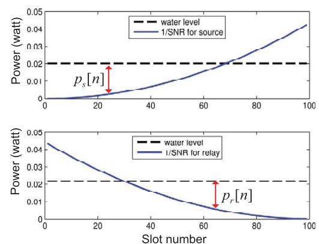

line

| Slot number | water level (water level) | 1/SNR for source (power) | 1/SNR for relay (power) |
| ----------- | -------------------------- | ------------------------ | ----------------------- |
| 0           | 0.02                       | 0.00                     | 0.04                    |
| 20          | 0.02                       | 0.005                    | 0.03                    |
| 40          | 0.02                       | 0.01                     | 0.02                    |
| 60          | 0.02                       | 0.02                     | 0.01                    |
| 80          | 0.02                       | 0.03                     | 0.005                   |
| 100         | 0.02                       | 0.04                     | 0.00                    |

(a): trajectory 1,unidirectional towards destination

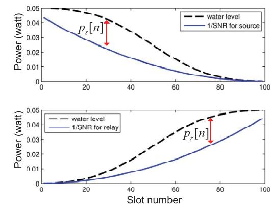

line

| Slot number | Power (watt) - water level | Power (watt) - 1/SNR for source | Power (watt) - water level | Power (watt) - 1/SNR for relay |
|---|---|---|---|---|
| 0 | 0.05 | 0.045 | 0.00 | 0.00 |
| 20 | 0.045 | 0.035 | 0.005 | 0.002 |
| 40 | 0.035 | 0.025 | 0.015 | 0.008 |
| 60 | 0.025 | 0.015 | 0.025 | 0.015 |
| 80 | 0.01 | 0.005 | 0.035 | 0.025 |
| 100 | 0.005 | 0.002 | 0.045 | 0.035 |

(b): trajectory 2, unidirectional towards source

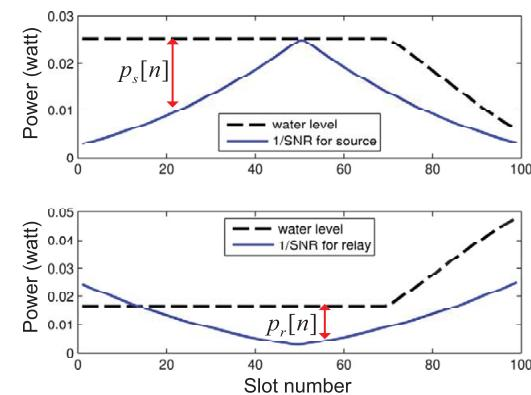

line

| Slot number | Water level (p_s[n]) | 1/SNR for source (p_s[n]) | Water level (p_r[n]) | 1/SNR for relay (p_r[n]) |
| ----------- | --------------------- | -------------------------- | --------------------- | ------------------------- |
| 0           | 0.025                 | 0.005                      | 0.015                 | 0.022                     |
| 20          | 0.025                 | 0.010                      | 0.015                 | 0.015                     |
| 40          | 0.025                 | 0.020                      | 0.015                 | 0.010                     |
| 60          | 0.025                 | 0.025                      | 0.015                 | 0.005                     |
| 80          | 0.020                 | 0.015                      | 0.025                 | 0.015                     |
| 100         | 0.010                 | 0.005                      | 0.035                 | 0.025                     |

(c): trajectory 3, cyclic   
Fig. 3. Illustration of the staircase WF power allocation for source and relay nodes with three different UAV trajectories.

In Fig. 4, the throughput in bps/Hz versus T is plotted for the static versus mobile relaying with the three aforementioned relay trajectories. Note that when T is sufficiently large, the UAV for the two unidirectional schemes could stay stationary above S (and above D) for certain period before it moves towards D (after it arrives above D). It is observed that with the UAV moving unidirectionally towards D, the mobile relaying scheme significantly outperforms the conventional static relaying, thanks to the reduced link distances for both information reception and forwarding by relay movement from S to D. In contrast, for unidirectional relay movement from D to S, the performance is even worse than the conventional static relaying. This is expected since with this specific relay movement, both S and R are forced to allocate more power on weak channels due to the information-causality constraint, as can be seen from Fig. 3(b). Such results imply the necessity of joint UAV trajectory and power allocations in order to realize the full benefit of mobile relaying technique.

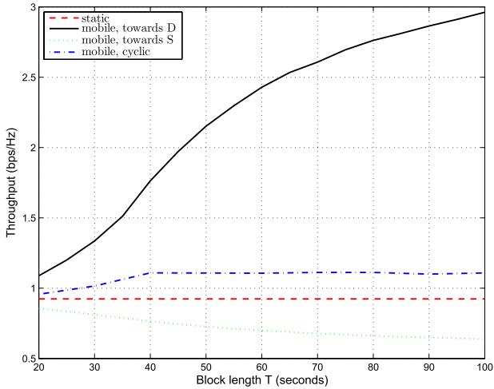

line

| Block length T (seconds) | static | mobile, towards D | mobile, towards S | mobile, cyclic |
| ------------------------ | ------ | ----------------- | ----------------- | -------------- |
| 20                       | 0.9    | 1.1               | 0.85              | 0.95           |
| 30                       | 0.9    | 1.4               | 0.8               | 1.0            |
| 40                       | 0.9    | 1.8               | 0.75              | 1.1            |
| 50                       | 0.9    | 2.2               | 0.7               | 1.1            |
| 60                       | 0.9    | 2.5               | 0.65              | 1.1            |
| 70                       | 0.9    | 2.7               | 0.6               | 1.1            |
| 80                       | 0.9    | 2.8               | 0.6               | 1.1            |
| 90                       | 0.9    | 2.9               | 0.6               | 1.1            |
| 100                      | 0.9    | 3.0               | 0.6               | 1.1            |

Fig. 4. Throughput versus block length T of static versus mobile relaying with different UAV trajectories.

# B. Trajectory Optimization With Fixed Power Allocation

Next, we consider the mobile relaying system where the power allocations at the source and relay over different time slots are fixed, whereas the relay’s trajectory is optimized as in Section IV. We assume that the relay’s initial and final x-y coordinates are pre-determined and given by $( x _ { 0 } , y _ { 0 } ) = ( 1 0 0 0 , 5 0 0 )$ and $( x _ { F } , y _ { F } ) = ( 1 5 0 0 , 5 0 0 )$ ), respectively, as shown in Fig. 5. Therefore, the minimum distance that the relay needs to travel within the time horizon T is $d _ { \operatorname* { m i n } } = 5 0 0 \mathrm { m }$ . We assume that equal power allocation across different time slots is applied at both the source and relay, and Algorithm 2 is applied to successively optimize the relay trajectory, where the relay’s initial trajectory is set to be the direct path from (x0, y0) to $( x _ { F } , y _ { F } )$ with constant traveling speed.

For $T = 1 0 0 \mathrm { s }$ , Fig. 5 shows the projected relay trajectories onto the horizontal plane obtained with different iterations of Algorithm 2. It is observed that instead of following the direct path, the optimized trajectory first moves towards S and then to D before heading towards its final location. This is expected since the fact that $\tilde { V } T > d _ { \mathrm { m i n } }$ offers the degree of freedom for dynamically adjusting the relay’s position to enhance the S-R and R-D links, respectively. To gain more insight,

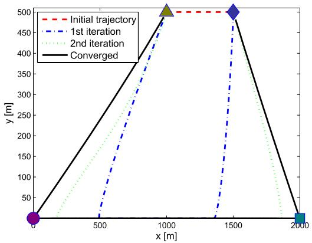

line

| x [m] | Initial trajectory | 1st iteration | 2nd iteration | Converged |
|-------|--------------------|---------------|---------------|-----------|
| 0     | 0                  | 0             | 0             | 0         |
| 1000  | 500                | 500           | 500           | 500       |
| 1500  | 500                | 500           | 500           | 500       |
| 2000  | 0                  | 0             | 0             | 0         |

Fig. 5. UAV trajectory evolution by Algorithm 2. The circle, square, triangle, and diamond represent the source, destination, and initial and final relay locations, respectively.

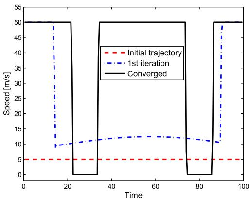

line

| Time | Initial trajectory | 1st iteration | Converged |
|------|---------------------|---------------|---------|
| 0    | 5                   | 50            | 50      |
| 20   | 5                   | 9             | 50      |
| 40   | 5                   | 12            | 50      |
| 60   | 5                   | 13            | 50      |
| 80   | 5                   | 12            | 50      |
| 100  | 5                   | 10            | 50      |

Fig. 6. The speed of the mobile relay over time for three different trajectories from Fig. 5.

Fig. 6 shows the relay speed versus the flying time for three different trajectories shown in Fig. 5. It is observed that at the converged trajectory, the relay employs a binary speed, i.e., it remains stationary for certain duration when it reaches S and D and moves at the maximum speed otherwise.

In Fig. 7, both the exact throughput and that based on the lower bound in Lemma 2 are plotted versus the iteration number of Algorithm 2. Comparing the converged throughput versus the initial throughput in Fig. 7, it is shown that the trajectory optimization significantly improves the mobile relaying system throughput, even with constant source/relay transmit power. It is also observed that Algorithm 2 is quite efficient since it converges in just a few iterations. Besides, this figure shows that Lemma 2 provides a reasonable throughput lower bound for trajectory optimization.

# C. Joint Power and Trajectory Optimization

Last, we consider the mobile relaying system where the power allocation and the relay trajectory are jointly optimized for throughput maximization. We consider the setup without pre-specified initial or final relay locations, for which the jointly optimal power allocation and relay trajectory design has been obtained in Section VI. Note that similar performance can also be observed for the setup with constrained initial and final relay locations, for which the simulation results are not shown due to space limitations. Besides static relaying, we also consider another benchmark scheme called data ferrying [16], where the UAV first loads the data from S when it is within some pre-determined range $d _ { 1 }$ from S, travels towards D without any concurrent data reception/transmission, and then unloads the data to D when it is within range d2 from D. For the numerical results shown below, we set $d _ { 1 } = d _ { 2 } = 1 0 0 \mathrm { m }$ .

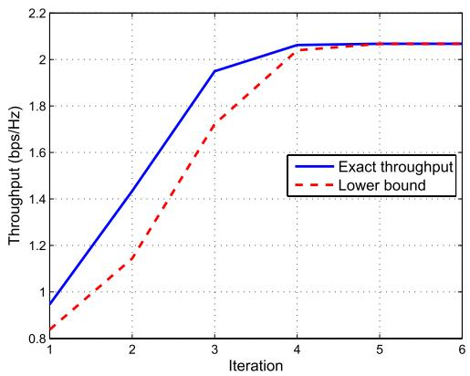

line

| Iteration | Exact throughput | Lower bound |
| --------- | ---------------- | ----------- |
| 1         | 0.9              | 0.8         |
| 2         | 1.4              | 1.2         |
| 3         | 1.95             | 1.7         |
| 4         | 2.05             | 2.05        |
| 5         | 2.05             | 2.05        |
| 6         | 2.05             | 2.05        |

Fig. 7. Convergence plot of Algorithm 2.

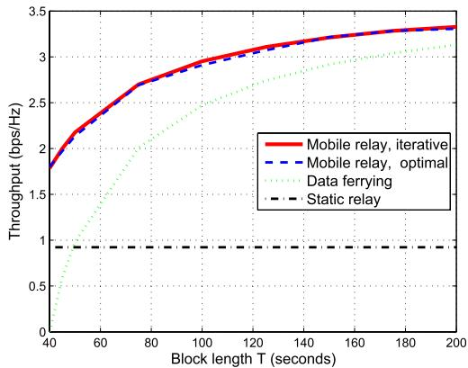

line

| Block length T (seconds) | Mobile relay, iterative | Mobile relay, optimal | Data ferrying | Static relay |
| ------------------------ | ------------------------ | ---------------------- | ------------- | ------------ |
| 40                       | 1.8                      | 1.8                    | 0.0           | 0.9          |
| 60                       | 2.3                      | 2.3                    | 1.5           | 0.9          |
| 80                       | 2.7                      | 2.7                    | 2.0           | 0.9          |
| 100                      | 2.9                      | 2.9                    | 2.5           | 0.9          |
| 120                      | 3.0                      | 3.0                    | 2.8           | 0.9          |
| 140                      | 3.1                      | 3.1                    | 2.9           | 0.9          |
| 160                      | 3.2                      | 3.2                    | 3.0           | 0.9          |
| 180                      | 3.3                      | 3.3                    | 3.1           | 0.9          |
| 200                      | 3.4                      | 3.4                    | 3.2           | 0.9          |

Fig. 8. Throughput for mobile relaying with jointly optimized power allocation and trajectory versus static relaying and data ferrying.

In Fig. 8, the end-to-end throughput achieved by the various schemes is plotted versus the duration T . It is first observed that for the mobile relaying scheme, the iterative algorithm proposed in Section V, which is applicable for the more general setup with initial/final relay location constraints, achieves almost identical performance as the theoretically optimal solution in Section VI. Furthermore, it is observed that the optimized mobile relaying schemes significantly outperform the conventional static relaying technique. On the other hand, the data ferrying scheme performs even worse than static relaying for small T , which is expected since in this case, the UAV’s traveling time from S to D is quite significant and hence only limited time is available for data loading/unloading. When T gets sufficiently large so that the UAV’s traveling time is negligible, data ferrying approaches to mobile relaying since in this case, both schemes essentially concentrate most of the power to time slots with the best link qualities, i.e., when the UAV is near to S or D.

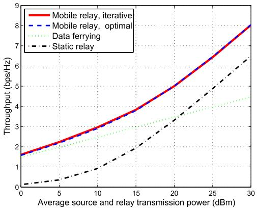

line

| Average source and relay transmission power (dBm) | Mobile relay, iterative | Mobile relay, optimal | Data ferrying | Static relay |
| ------------------------------------------------- | ------------------------ | ---------------------- | ------------- | ------------ |
| 0                                                 | 1.5                      | 1.5                    | 1.5           | 0.0          |
| 5                                                 | 2.0                      | 2.0                    | 2.0           | 0.5          |
| 10                                                | 3.0                      | 3.0                    | 2.5           | 1.0          |
| 15                                                | 4.0                      | 4.0                    | 3.0           | 2.0          |
| 20                                                | 5.0                      | 5.0                    | 3.5           | 3.0          |
| 25                                                | 6.5                      | 6.5                    | 4.0           | 4.5          |
| 30                                                | 8.0                      | 8.0                    | 4.5           | 6.5          |

Fig. 9. Throughput versus average source/relay power P¯.

In Fig. 9, the throughput is plotted against the source/relay’s average power $\bar { P } \triangleq \bar { P } _ { s } = \bar { P } _ { r }$ by assuming $T = 1 0 0 \mathrm { s } .$ . It is observed that data ferrying outperforms static relaying only in power-limited regime with small ${ \bar { P } } ,$ whereas it performs even worse than static relaying for large P¯ . On the other hand, the proposed mobile relaying achieves higher throughput than both static relaying and data ferrying in all power regime.

# VIII. CONCLUSIONS

This paper studies a new mobile relaying technique with high-mobility relays. By exploiting the controllable channel variation induced by relay mobility, the end-to-end throughput is maximized via optimizing both the relay trajectory as well as the source/relay power allocation. With fixed relay trajectory, it is shown that the optimal source/relay power allocation follows a staircase water filling structure with non-increasing and nondecreasing water levels at the source and relay, respectively. Besides, with given power allocation, the relay trajectory can be optimized via successive convex optimization. Based on these results, an iterative algorithm is proposed to jointly optimize the power allocation and relay trajectory in an alternating manner. Furthermore, for the special case with free initial and final relay locations, the jointly optimal trajectory and power allocation is analytically derived. Numerical results show that compared with the conventional static relaying, a significant throughput gain is achieved by the proposed mobile relaying design, which shows the great potential of mobile relaying for future wireless communication systems. The results in this paper can be further extended by considering the different UAV-ground channel models [39], [40], adaptive bandwidth allocation, limited buffer size, throughput-delay tradeoff, etc., which will be left as future work.

# APPENDIX A PROOF OF LEMMA 1

We show Lemma 1 by contradiction. Suppose, on the contrary that for the dual optimal solution $\{ \lambda _ { n } ^ { \star } \}$ there exists $2 \leq n ^ { \prime } \leq N - 1$ such that $\lambda _ { n ^ { \prime } } ^ { \star } > 0 .$ . Then this must correspond to Case 1 as discussed in Section III. Thus, the transmission rates at S and R corresponding to the primal optimal solution of (P1.1) can be expressed as

$$
R _ {s} ^ {*} [ n ] = \left[ \log_ {2} \left(\eta \beta_ {n} ^ {\star} \gamma_ {\mathrm{sr}} [ n ]\right) \right] ^ {+}, n = 1, \dots , N - 1, (4 5)
$$

$$
R _ {r} ^ {*} [ n ] = \left[ \log_ {2} \left(\xi \nu_ {n} ^ {\star} \gamma_ {\mathrm{rd}} [ n ]\right) \right] ^ {+}, n = 2, \dots , N. \tag {46}
$$

Since both $\{ \beta _ { n } ^ { \star } \}$ and $\{ \gamma _ { \mathrm { s r } } [ n ] \}$ are non-increasing over n, it follows from (45) that $R _ { s } ^ { * } [ n ]$ is non-increasing over n too. We thus have $R _ { s } ^ { * } [ 1 ] \ge \bar { R } _ { s } ^ { * } [ 2 ] \ge \cdots \ge R _ { s } ^ { * } [ n ^ { \prime } - 1 ]$ , which implies

$$
\sum_ {n = 1} ^ {n ^ {\prime} - 1} R _ {s} ^ {*} [ n ] \geq (n ^ {\prime} - 1) R _ {s} ^ {*} [ n ^ {\prime} - 1 ]. \tag {47}
$$

On the other hand, since both $\gamma _ { \mathrm { r d } } [ n ]$ and $\nu _ { n } ^ { \star }$ are non-decreasing over n, it follows from (46) that $R _ { r } ^ { * } [ n ]$ is non-decreasing over n, or $R _ { r } ^ { * } [ 2 ] \leq R _ { r } ^ { * } [ 3 ] \leq \cdot \cdot \cdot \leq R _ { r } ^ { * } [ n ^ { \prime } ]$ , which leads to

$$
\sum_ {n = 2} ^ {n ^ {\prime}} R _ {r} ^ {*} [ n ] \leq (n ^ {\prime} - 1) R _ {r} ^ {*} [ n ^ {\prime} ]. \tag {48}
$$

Furthermore, by applying the complementary slackness condition for primal and dual optimal solutions, the assumption $\lambda _ { n ^ { \prime } } ^ { \star } > 0$ implies that the information-causality constraint at slot n must be active, i.e.,

$$
\sum_ {n = 1} ^ {n ^ {\prime} - 1} R _ {s} ^ {*} [ n ] = \sum_ {n = 2} ^ {n ^ {\prime}} R _ {r} ^ {*} [ n ]. \tag {49}
$$

The relations in (47)-(49) lead to

$$
R _ {s} ^ {*} [ n ^ {\prime} - 1 ] \leq R _ {r} ^ {*} [ n ^ {\prime} ]. \tag {50}
$$

Now consider the slots from $n ^ { \prime }$ to N. Based on the nonincreasing property of $R _ { s } ^ { * } [ n ]$ , we have

$$
R _ {s} ^ {*} [ N - 1 ] \leq \dots \leq R _ {s} ^ {*} [ n ^ {\prime} ] <   R _ {s} ^ {*} [ n ^ {\prime} - 1 ], \tag {51}
$$

where the strict inequality is true since $\lambda _ { n ^ { \prime } } ^ { \star } ~ > ~ 0$ implies $\beta _ { n ^ { \prime } } ^ { \star } < \beta _ { n ^ { \prime } - 1 } ^ { \star }$ , as can be seen from (22). Similarly, we have

$$
R _ {r} ^ {*} [ n ^ {\prime} ] <   R _ {r} ^ {*} [ n ^ {\prime} + 1 ] \leq \dots \leq R _ {r} ^ {*} [ N ]. \tag {52}
$$

The relations in (50)-(52) jointly lead to

$$
\sum_ {n = n ^ {\prime}} ^ {N - 1} R _ {s} ^ {*} [ n ] <   \sum_ {n = n ^ {\prime} + 1} ^ {N} R _ {r} ^ {*} [ n ]. \tag {53}
$$

By adding (49) and (53), we have $\begin{array} { r l } { \sum _ { n = 1 } ^ { N - 1 } R _ { s } ^ { * } [ n ] } & { { } < } \end{array}$ $\begin{array} { r } { \sum _ { n = 2 } ^ { N } R _ { r } ^ { * } [ n ] } \end{array}$ , which obviously violates the informationcausality constraint (16) at slot N. Thus, the assumption $\lambda _ { n ^ { \prime } } ^ { \star } > 0$ for $2 \leq n ^ { \prime } \leq N - 1$ is invalid. This completes the proof of Lemma 1.

# APPENDIX B PROOF OF THEOREM 1

Based on the discussions presented in Section III, for any given dual optimal solution optimal solution to (P1.1) $\{ \bar { \lambda } _ { n } ^ { \star } \} _ { n = 2 } ^ { N }$ , the corresponding primale obtained by separately considering the first three cases given in Section III. In the following, we first show how to obtain the primal optimal solution to (P1.1) for Case 2.

As discussed in Section III, for Case 2, the optimal power allocation $p _ { s } ^ { * } [ n ]$ at S is given by the classic WF solution with full power, i.e., $p _ { s } ^ { * } [ n ] = p _ { s , n } ^ { \mathrm { c w f } } ( E _ { s } )$ , ∀n, and the corresponding source transmission rate is $R _ { s } ^ { * } [ n ] = \left[ \log _ { 2 } ( \eta \gamma _ { \mathrm { s r } } [ n ] ) \right] ^ { + }$ , ∀n, with η denoting the water level. Furthermore, the optimal power and rate allocations at R can be obtained by solving (P1.1) with

the the obtained $R _ { s } ^ { * } [ n ]$ , i.e.,

$$
\max _ {\left\{p _ {r} [ n ], R _ {r} [ n ] \right\} _ {n = 2} ^ {N}} \sum_ {n = 2} ^ {N} R _ {r} [ n ]
$$

$\mathrm { s . t . } \sum _ { i = 2 } ^ { n } R _ { r } [ i ] \leq \sum _ { i = 1 } ^ { n - 1 } R _ { s } ^ { * } [ i ] , \ \forall n ,$

$$
R _ {r} [ n ] \leq \log_ {2} \left(1 + p _ {r} [ n ] \gamma_ {\mathrm{rd}} [ n ]\right), \forall n,
$$

$$
\sum_ {n = 2} ^ {N} p _ {r} [ n ] \leq E _ {r}, p _ {r} [ n ] \geq 0, \forall n. \tag {54}
$$

To solve problem (54), we first consider its relaxed problem by discarding the information-causality constraint from slot 2 to slot $N - 1$ , i.e., by solving

$$
\max _ {\left\{p _ {r} [ n ], R _ {r} [ n ] \right\} _ {n = 2} ^ {N}} \sum_ {n = 2} ^ {N} R _ {r} [ n ]
$$

$\mathrm { s . t . } \sum _ { n = 2 } ^ { N } R _ { r } [ n ] \leq \sum _ { n = 1 } ^ { N - 1 } R _ { s } ^ { * } [ n ] ,$

$$
R _ {r} [ n ] \leq \log_ {2} \left(1 + p _ {r} [ n ] \gamma_ {\mathrm{rd}} [ n ]\right), \forall n,
$$

$$
\sum_ {n = 2} ^ {N} p _ {r} [ n ] \leq E _ {r}, p _ {r} [ n ] \geq 0, \forall n. \tag {55}
$$

Lemma 4: The optimal power allocation to problem (55) is $p _ { r } ^ { * } [ n ] = p _ { r , n } ^ { c w f } ( \hat { E } _ { r } )$ , with $p _ { r , n } ^ { c w f } ( \cdot )$ and $\hat { E } _ { r }$ defined in Theorem 1.

Proof: With the function $R _ { r } ^ { \mathrm { c w f } } ( \tilde { E } _ { r } )$ for any $0 \leq \tilde { E } _ { r } \leq E _ { r }$ defined in Theorem 1, it is not difficult to see that problem (55) is equivalent to finding the optimal total transmission power $\tilde { E } _ { r }$ at R via solving

$$
\max _ {0 \leq \tilde {E} _ {r} \leq E _ {r}} R _ {r} ^ {\mathrm{cwf}} (\tilde {E} _ {r}), \quad \text { s.t. } R _ {r} ^ {\mathrm{cwf}} (\tilde {E} _ {r}) \leq \sum_ {n = 1} ^ {N - 1} R _ {s} ^ {*} [ n ]. \tag {56}
$$

Using the fact that $R _ { r } ^ { \mathrm { c w f } } ( \tilde { E } _ { r } )$ monotonically increases with ${ \tilde { E } } _ { r }$ the results in Lemma 4 can be readily obtained.

Lemma 5: $I f ~ \gamma _ { s r } [ n ]$ is non-increasing and $\gamma _ { r d } [ n ]$ is nondecreasing over n, problems (54) and (55) are equivalent.

Proof: Note that problem (55) is a relaxation of (54). Thus, if the optimal solution to (55) given in Lemma 4 is also feasible to problem (54), then it must also be the optimal solution to (54), and hence the two problems are equivalent. We show this by contradiction.

Suppose, on the contrary, that the solution given in Lemma 4 is not feasible to problem (54), i.e., the information-causality constraint is violated for some slot from 2 to $N - 1$ . Then let $n ^ { \prime }$ be the smallest value in $\{ 2 , \cdots , N - 1 \}$ that violates the constraint, $\mathrm { i . e . , ~ } n ^ { \prime }$ is the slot such that $\begin{array} { r } { \sum _ { i = 2 } ^ { n ^ { \prime } } R _ { r } ^ { * } [ i ] ~ > } \end{array}$ $\Sigma _ { i = 1 } ^ { n ^ { \prime } - 1 } R _ { s } ^ { * } [ i ]$ and $\begin{array} { r } { \sum _ { i = 2 } ^ { n ^ { \prime } - 1 } R _ { r } ^ { * } [ i ] \leq \sum _ { i = 1 } ^ { n ^ { \prime } - 2 } R _ { s } ^ { * } [ i ] } \end{array}$ , where $R _ { r } ^ { * } [ i ]$ denotes the optimal transmission rate by R for problem (55). Then we must have $R _ { r } ^ { * } [ n ^ { \prime } ] ~ > ~ R _ { s } ^ { * } [ n ^ { \prime } ~ - ~ 1 ]$ . Furthermore, since $\gamma _ { \mathrm { s r } } [ n ]$ and $\gamma _ { \mathrm { r d } } [ n ]$ are non-increasing and non-decreasing over n, we have $R _ { s } ^ { * } [ n ]$ and $R _ { r } ^ { * } [ n ]$ non-increasing and nondecreasing, respectively, which gives

$$
\begin{array}{l} R _ {s} ^ {*} [ N - 1 ] \leq \dots \leq R _ {s} ^ {*} [ n ^ {\prime} ] \leq R _ {s} ^ {*} [ n ^ {\prime} - 1 ] \\ <   R _ {r} ^ {*} [ n ^ {\prime} ] \leq R _ {r} ^ {*} [ n ^ {\prime} + 1 ] \dots \leq R _ {r} ^ {*} [ N ]. \tag {57} \\ \end{array}
$$

The inequality in (57) implies that $\begin{array} { r l } { \sum _ { i = n ^ { \prime } + 1 } ^ { N } R _ { r } ^ { * } [ i ] } & { { } > } \end{array}$ $\textstyle \sum _ { i = n ^ { \prime } } ^ { N - 1 } R _ { s } ^ { * } [ i ]$ $\begin{array} { r } { \sum _ { i = 1 } ^ { n ^ { \prime } - 1 } R _ { s } ^ { * } [ i ] } \end{array}$ . Together with the assumption , we have $\begin{array} { r } { \sum _ { i = 2 } ^ { N } R _ { r } ^ { * } [ i ] ~ > ~ \sum _ { i = 1 } ^ { N - 1 } \dot { R } _ { s } ^ { * } [ i ] } \end{array}$ $\begin{array} { r } { \sum _ { i = 2 } ^ { n ^ { \prime } } R _ { r } ^ { * } [ i ] ~ > } \end{array}$ r  , which contradicts the first constraint of problem (55), and hence $\{ R _ { r } ^ { * } [ i ] \}$ cannot be the optimal solution to (55). Thus, the assumption is invalid, or the solution given in Lemma 4 must be feasible, and hence the optimal solution to problem (54). This completes the proof of Lemma 5.

With Lemma 4 and Lemma 5, the optimal power allocation for the case when $R _ { s } ^ { \mathrm { c w f } } ( E _ { s } ) \leq R _ { r } ^ { \mathrm { c w f } } ( E _ { r } )$ as given in Theorem 1 is obtained. For Case 1 and Case 3 given in Section III, the primal optimal power allocations can be obtained similarly, which results in the solution in Theorem 1 corresponding to $R _ { s } ^ { \mathrm { c w f } } ( E _ { s } ) \geq R _ { r } ^ { \mathrm { c w f } } ( E _ { r } )$ . The details are omitted for brevity. This thus completes the proof of Theorem 1.

# APPENDIX C

# PROOF OF LEMMA 2

To show Lemma 2, we first define the function $f ( z ) \triangleq$ $\begin{array} { r } { \log _ { 2 } \left( 1 + \frac { \gamma } { A + z } \right) } \end{array}$ 1 + γA+z for some constant $\gamma \geq 0$ and A, which can be shown to be convex with respect to $z \geq - A$ . Using the property that the first-order Taylor approximation of a convex function is a global under-estimator [34], for any given z0, we have $f ( z ) \geq f ( z _ { 0 } ) + f ^ { \prime } ( z _ { 0 } ) ( z - z _ { 0 } )$ , ∀z, where $f ^ { \prime } ( z _ { 0 } ) =$ $\frac { - ( \log _ { 2 } { e } ) \gamma } { ( A + z _ { 0 } ) ( A + \gamma + z _ { 0 } ) }$ is the derivative of $f ( z )$ at point z0. By letting $z _ { 0 } = 0$ , we have the following inequality

$$
\log_ {2} \left(1 + \frac {\gamma}{A + z}\right) \geq \log_ {2} \left(1 + \frac {\gamma}{A}\right) - \frac {(\log_ {2} e) \gamma z}{A (A + \gamma)}, \forall z. \tag {58}
$$

The channel capacity $R _ { s , l + 1 } [ n ]$ can thus be expressed as

$$
\begin{array}{l} R _ {s, l + 1} [ n ] = \log_ {2} \left(1 + \frac {\gamma_ {s} [ n ]}{H ^ {2} + x _ {l + 1} ^ {2} [ n ] + y _ {l + 1} ^ {2} [ n ]}\right) (59) \\ = \log_ {2} \left(1 + \frac {\gamma_ {s} [ n ]}{d _ {\mathrm{sr} , l} ^ {2} [ n ] + \Delta}\right), (60) \\ \end{array}
$$

where $d _ { \mathrm { s r } , l } [ n ] \ \triangleq \ \sqrt { H ^ { 2 } + x _ { l } ^ { 2 } [ n ] + y _ { l } ^ { 2 } [ n ] }$ and $\Delta \ \triangleq \ \delta _ { l } ^ { 2 } [ n ] +$ $\xi _ { l } ^ { 2 } [ n ] + 2 x _ { l } [ n ] \delta _ { l } [ n ] ^ { \mathbf { \prime } } + 2 y _ { l } [ n ] \xi _ { l } [ n ]$ . Note that in (60), we have used the identity $x _ { l + 1 } [ n ] = x _ { l } [ n ] + \delta _ { l } [ n ]$ and $y _ { l + 1 } [ n ] = y _ { l } [ n ] +$ ξl [n]. As a result, (34) follows from (58) by letting $\gamma = \gamma _ { s } [ n ]$ , $A = d _ { \mathrm { s r } , l } ^ { 2 } [ n ]$ , and $z = \Delta$ , and the coefficients $a _ { s , l } [ n ] , b _ { s , l } [ n ]$ , and $c _ { s , l } [ n ]$ in (34) can be obtained as

$$
a _ {s, l} [ n ] = \frac {\gamma_ {s} [ n ] \log_ {2} e}{d _ {\mathrm{sr} , l} ^ {2} [ n ] \left(\gamma_ {s} [ n ] + d _ {\mathrm{sr} , l} ^ {2} [ n ]\right)},
$$

$$
b _ {s, l} [ n ] = 2 x _ {l} [ n ] a _ {s, l} [ n ], c _ {s, l} [ n ] = 2 y _ {l} [ n ] a _ {s, l} [ n ], \forall n. \tag {61}
$$

Similarly, the lower bound (35) can be obtained, and the corresponding coefficients can be obtained as

$$
a _ {r, l} [ n ] = \frac {\gamma_ {r} [ n ] \log_ {2} e}{d _ {\mathrm{rd} , l} ^ {2} [ n ] (\gamma_ {r} [ n ] + d _ {\mathrm{rd} , l} ^ {2} [ n ])},
$$

$$
b _ {r, l} [ n ] = - 2 \left(L - x _ {l} [ n ]\right) a _ {r, l} [ n ], c _ {r, l} [ n ] = 2 y _ {l} [ n ] a _ {r, l} [ n ], \quad \forall n, \tag {62}
$$

with $d _ { \mathrm { r d } , l } [ n ] \ \triangleq \ \sqrt { H ^ { 2 } + ( L - x _ { l } [ n ] ) ^ { 2 } + y _ { l } ^ { 2 } [ n ] }$ denoting the link distance between R and D at slot n.

# APPENDIX D

# PROOF OF THEOREM 2

Denote by $\{ x ^ { * } [ n ] \}$ an optimal relay trajectory to the throughput maximization problem (P1’), and $\{ \gamma _ { \mathrm { s r } } ^ { * } [ n ] \}$ and $\{ \gamma _ { \mathrm { r d } } ^ { * } [ n ] \}$ the corresponding time-dependent channels. We construct an alternative sequence { ˜x[n]} by re-ordering the elements in $\{ x ^ { * } [ n ] \}$ in non-decreasing order. It can be shown that $\{ x ^ { * } [ n ] \}$ is also a feasible trajectory, i.e., it satisfies the speed constraint (14) (recall that $y [ n ] = 0$ , ∀n). Furthermore, the new timedependent channels, denoted as $\{ \tilde { \gamma } _ { \mathrm { s r } } [ n ] \}$ and $\{ \tilde { \gamma } _ { \mathrm { r d } } [ n ] \}$ contains identical elements as $\{ \gamma _ { \mathrm { s r } } ^ { * } [ n ] \}$ and $\{ \gamma _ { \mathrm { r d } } ^ { * } [ n ] \}$ , respectively, but with different orders. Let $R ^ { * } ( \{ x [ n ] \} )$ be the optimal value of problem (P1.1) with optimized source and relay power allocations for any fixed relay trajectory {x [n]}. We aim to show that $R ^ { * } ( \{ { \tilde { x } } [ n ] \} ) ~ \geq ~ R ^ { * } ( \{ x ^ { * } [ n ] \} )$ , i.e., the newly constructed trajectory { ˜x[n]} achieves no smaller throughput than $\{ x ^ { * } [ n ] \}$ , and thus must also be optimal. We have the following relations:

$$
R ^ {*} (\{\tilde {x} [ n ] \}) = \min \left\{R _ {s} ^ {\mathrm{cwf}} (\{\tilde {x} [ n ] \}), R _ {r} ^ {\mathrm{cwf}} (\{\tilde {x} [ n ] \}) \right\} \tag {63}
$$

$$
= \min \left\{R _ {s} ^ {\mathrm{cwf}} \left(\left\{x ^ {*} [ n ] \right\}\right), R _ {r} ^ {\mathrm{cwf}} \left(\left\{x ^ {*} [ n ] \right\}\right) \right\} \tag {64}
$$

$$
\geq R ^ {*} \left(\left\{x ^ {*} [ n ] \right\}\right), \tag {65}
$$

where (63) follows from Theorem 1 and the fact that { ˜x[n]} is non-decreasing over n, (64) is true since { ˜x[n]} has identical elements as $\{ x ^ { * } [ n ] \}$ , or the corresponding channels are identical except the different ordering across slots, which makes no difference to the classic WF power allocation solutions, (65) is true since the expression given in (64) in fact corresponds to the optimal value of problem (P1.1) by ignoring the information-causality constraints (16) up to slot $N - 1$ , and thus it serves as an upper bound for the optimal value of (P1.1) with the fixed trajectory $\{ x ^ { * } [ n ] \}$ . This thus completes the proof of Theorem 2.

# APPENDIX E PROOF OF THEOREM 3

Theorem 3 can be shown by using the fact that $R _ { s } ^ { \mathrm { c w f } } \left( \{ x [ n ] \} \right)$ and $R _ { r } ^ { \mathrm { c w f } } \bigl ( \{ x [ n ] \} \bigr )$ are element-wise non-increasing and nondecreasing functions of $\{ x [ n ] \}$ , respectively. Suppose at the optimal trajectory {x [n]}, there exists a slot $n ^ { \prime }$ such that $0 ~ <$ $x [ n ^ { \prime } ] \ < \ L$ and $\upsilon [ n ^ { \prime } ] \stackrel { \triangle } { = } x [ n ^ { \prime } + 1 ] - x [ n ^ { \prime } ] < V$ . Then if the S-R link is the bottleneck, i.e., $R _ { s } ^ { \mathrm { c w f } } \left( \{ x [ n ] \} \right) \leq R _ { r } ^ { \mathrm { c w f } } \left( \{ x [ n ] \} \right)$ , one may slightly reduce x $[ 1 ] , \cdots x [ n ^ { \prime } ]$ to increase $R _ { s } ^ { \mathrm { c w f } }$ (while also slightly reducing $R _ { r } ^ { \mathrm { { c w f } } } )$ , yet without violating the mobility constraints (41) and (42) or decreasing the objective value of (P2). On the other hand, if the R-D link is the bottleneck, one may slightly increase $x [ n ^ { \prime } + 1 ] , \cdot \cdot \cdot x [ N ]$ to enhance the R-D link. The process continues until $\upsilon [ n ^ { \prime } ] = V$ . Thus, without loss of optimality to (P2), we have v[n] = V if $0 < x [ n ] < L$ . For $x [ n ] = L$ , we must have $\upsilon [ n ] = 0 $ , since otherwise R may move out of the interval $[ 0 , L ] .$ . Similarly for $x [ n ] = 0$ , v[n] should be either 0 or V . This thus completes the proof of Theorem 3.

# REFERENCES

[1] T. M. Cover and A. A. El Gamal, “Capacity theorems for the relay channel,” IEEE Trans. Inf. Theory, vol. 25, no. 5, pp. 572–584, Sep. 1979.   
[2] A. Sendonaris, E. Erkip, and B. Aazhang, “User cooperation diversity. Part I. System description,” IEEE Trans. Commun., vol. 51, no. 11, pp. 1927–1938, Nov. 2003.   
[3] A. Sendonaris, E. Erkip, and B. Aazhang, “User cooperation diversity. Part II. Implementation aspects and performance analysiss,” IEEE Trans. Commun., vol. 51, no. 11, pp. 1939–1948, Nov. 2003.

[4] J. N. Laneman, D. N. C. Tse, and G. W. Wornell, “Cooperative diversity in wireless networks: Efficient protocols and outage behavior,” IEEE Trans. Inf. Theory, vol. 50, no. 12, pp. 3062–3080, Dec. 2004.   
[5] Y. Zhao, R. Adve, and T. J. Lim, “Improving amplify-and-forward relay networks: Optimal power allocation versus selection,” IEEE Trans. Wireless Commun., vol. 6, no. 8, pp. 3114–3123, Aug. 2007.   
[6] Y. W. Hong, W. J. Huang, F. H. Chiu, and C. C. J. Luo, “Cooperative communications in resource-constrained wireless networks,” IEEE Signal Process. Mag., vol. 24, no. 3, pp. 47–57, May 2007.   
[7] M. Thakur, N. Fawaz, and M. Médard, “Optimal relay location and power allocation for low SNR broadcast relay channels,” in Proc. IEEE Int. Conf. Comput. Commun. (INFOCOM), Shanghai, China, Apr. 2011, pp. 2822–2830.   
[8] K. P. Valavanis and G. J. Vachtsevanos, Handbook of Unmanned Aerial Vehicles. Dordrecht, The Netherlands: Springer, 2015.   
[9] E. W. Frew and T. X. Brown, “Airborne communication networks for small unmanned aircraft systems,” Proc. IEEE, vol. 96, no. 12, pp. 2008–2027, Dec. 2008.   
[10] Y. Zeng, R. Zhang, and T. J. Lim, “Wireless communications with unmanned aerial vehicles: Opportunities and challenges,” IEEE Commun. Mag., vol. 54, no. 5, pp. 36–42, May 2016.   
[11] A. Merwaday and I. Guvenc, “UAV assisted heterogeneous networks for public safety communications,” in Proc. IEEE Wireless Commun. Netw. Conf. (WCNC), Mar. 2015, pp. 329–334.   
[12] S. Jain, K. Fall, and R. Patra, “Routing in a delay tolerant network,” in Proc. ACM SIGCOMM, New York, NY, USA, Jan. 2004, pp. 145–158.   
[13] Z. Zhang, “Routing in intermittently connected mobile ad hoc networks and delay tolerant networks: Overview and challenges,” IEEE Commun. Surveys Tuts., vol. 8, no. 1, pp. 24–37, 1st Quart. 2006.   
[14] M. J. Khabbaz, C. M. Assi, and W. F. Fawaz, “Disruption-tolerant networking: A comprehensive survey on recent developments and persisting challenges,” IEEE Commun. Surveys Tuts., vol. 14, no. 2, pp. 607–640, 2nd Quart. 2012.   
[15] M. Grossglauser and D. N. C. Tse, “Mobility increases the capacity of ad hoc wireless networks,” IEEE/ACM Trans. Netw., vol. 10, no. 4, pp. 477–486, Aug. 2002.   
[16] W. Zhao, M. Ammar, and E. Zegura, “A message ferrying approach for data delivery in sparse mobile ad hoc networks,” in Proc. ACM Mobihoc, New York, NY, USA, May 2004, pp. 187–198.   
[17] J. Burgess, B. Gallagher, D. Jensen, and B. N. Levine, “MaxProp: Routing for vehicle-based disruption-tolerant networks,” in Proc. IEEE Int. Conf. Comput. Commun. Proc. (INFOCOM), Apr. 2006, pp. 1–11.   
[18] P. Zhan, K. Yu, and A. L. Swindlehurst, “Wireless relay communications with unmanned aerial vehicles: Performance and optimization,” IEEE Trans. Aerosp. Electron. Syst., vol. 47, no. 3, pp. 2068–2085, Jul. 2011.   
[19] F. Jiang and A. L. Swindlehurst, “Optimization of UAV heading for the ground-to-air uplink,” IEEE J. Sel. Areas Commun., vol. 30, no. 5, pp. 993–1005, Jun. 2012.   
[20] Z. Kenan and T. M. Lok, “Optimal power allocation for relayed transmission through a mobile relay node,” in Proc. IEEE Veh. Technol. Conf. (VTC), Taipei, Taiwan, May 2010, pp. 1–5.   
[21] K. Anazawa, P. Li, T. Miyazaki, and S. Guo, “Trajectory and data planning for mobile relay to enable efficient Internet access after disasters,” in Proc. IEEE Global Commun. Conf. (GLOBECOM), San Diego, CA, USA, Dec. 2015, pp. 1–6.   
[22] B. Pearre and T. X. Brown, “Model-free trajectory optimization for wireless data ferries among multiple sources,” in Proc. IEEE Global Commun. Conf. (GLOBECOM), Miami, FL, USA, Dec. 2010, pp. 1793–1798.   
[23] Z. Han, A. L. Swindlehurst, and K. J. R. Liu, “Optimization of MANET connectivity via smart deployment/movement of unmanned air vehicles,” IEEE Trans. Veh. Technol., vol. 58, no. 7, pp. 3533–3546, Sep. 2009.   
[24] S. Kim, H. Oh, J. Suk, and A. Tsourdos, “Coordinated trajectory planning for efficient communication relay using multiple UAVs,” Control Eng. Pract., vol. 29, pp. 42–49, May 2014.   
[25] T. A. Johansen, A. Zolich, T. Hansen, and A. J. Sorensen, “Unmanned aerial vehicle as communication relay for autonomous underwater vehicles–field tests,” in Proc. IEEE Global Commun. Conf. (GLOBECOM), Austin, TX, USA, Dec. 2014, pp. 1469–1474.   
[26] O. Ozel, K. Tutuncuoglu, J. Yang, S. Ulukus, and A. Yener, “Transmission with energy harvesting nodes in fading wireless channels: Optimal policies,” IEEE J. Sel. Areas Commun., vol. 29, no. 8, pp. 1732–1743, Sep. 2011.

[27] C. K. Ho and R. Zhang, “Optimal energy allocation for wireless communications with energy harvesting constraints,” IEEE Trans. Signal Process., vol. 60, no. 9, pp. 4808–4818, Sep. 2012.   
[28] C. Huang, R. Zhang, and S. Cui, “Throughput maximization for the gaussian relay channel with energy harvesting constraints,” IEEE J. Sel. Areas Commun., vol. 31, no. 8, pp. 1469–1479, Aug. 2013.   
[29] N. Zlatanov, R. Schober, and P. Popovski, “Buffer-aided relaying with adaptive link selection,” IEEE J. Sel. Areas Commun., vol. 31, no. 8, pp. 1530–1542, Aug. 2013.   
[30] N. Zlatanov, A. Ikhlef, T. Islam, and R. Schober, “Buffer-aided cooperative communications: Opportunities and challenges,” IEEE Commun. Mag., vol. 52, no. 4, pp. 146–153, Apr. 2014.   
[31] S. Lee, W. Su, S. N. Batalama, and J. D. Matyjas, “Cooperative decode-and-forward ARQ relaying: Performance analysis and power optimization,” IEEE Trans. Wireless Commun., vol. 9, no. 8, pp. 2632–2642, Aug. 2010.   
[32] Z. Mo, W. Su, S. Batalama, and J. D. Matyjas, “Cooperative communication protocol designs based on optimum power and time allocation,” IEEE Trans. Wireless Commun., vol. 13, no. 8, pp. 4283–4296, Aug. 2014.   
[33] U. Mengali and A. N. D’Andrea, Synchronization Techniques for Digital Receivers. New York, NY, USA: Springer, 1997.   
[34] S. Boyd and L. Vandenberghe, Convex Optimization. Cambridge, U.K.: Cambridge Univ. Press, 2004.   
[35] S. Boyd. EE364b Convex Optimization II, Course Notes, accessed on Mar. 24, 2016. [Online]. Available: http://www.stanford.edu/class/ee364b/   
[36] T. M. Cover and J. A. Thomas, Elements of Information Theory. Hoboken, NJ, USA: Wiley, 2006.   
[37] M. Grant and S. Boyd. CVX: MATLAB Software for Disciplined Convex Programming, Version 2.1, accessed on Mar. 2, 2016. [Online]. Available: http://cvxr.com/cvx   
[38] Fixed Wing Vertical Takeoff and Landing Aircraft, accessed on Jun. 28, 2016. [Online]. Available: https://pixhawk.org/platforms/vtol/start   
[39] Q. Feng, E. K. Tameh, A. R. Nix, and J. McGeehan, “Modelling the likelihood of line-of-sight for air-to-ground radio propagation in urban environments,” in Proc. IEEE Global Commun. (GLOBECOM), Nov. 2006, pp. 1–5.   
[40] D. W. Matolak and R. Sun, “Unmanned aircraft systems: Air-ground channel characterization for future applications,” IEEE Veh. Technol. Mag., vol. 10, no. 2, pp. 79–85, Jun. 2015.

natural_image

Portrait of a smiling man wearing glasses and a suit (no text or symbols visible)

Rui Zhang (S’00–M’07–SM’15) received the B.Eng. (First-Class Hons.) and M.Eng. degrees from the National University of Singapore in 2000 and 2001, respectively, and the Ph.D. degree from the Stanford University, Stanford, CA, USA, in 2007, all in electrical engineering. From 2007 to 2009, he was with the Institute for Infocomm Research, A\*STAR, Singapore, where he currently holds a Senior Research Scientist joint appointment. Since 2010, he has been with the Department of Electrical and Computer Engineering, National University of

Singapore, where he is an Associate Professor. His current research interests include energy-efficient and energy-harvesting-enabled wireless communications, wireless information and power transfer, multiuser MIMO, cognitive radio, and optimization methods.

Dr. Zhang has published over 200 papers. He has been an elected member of the SPCOM and SAM Technical Committees for the IEEE Signal Processing Society. He was the a co-recipient of the Best Paper Award from the IEEE PIMRC in 2005, and the IEEE Marconi Prize Paper Award in wireless communications in 2015. He was the recipient of the 6th IEEE Communications Society Asia-Pacific Region Best Young Researcher Award in 2011, and the Young Researcher Award of the National University of Singapore in 2015. He has served for over 30 IEEE conferences as the TPC/Organizing Committee Chair or member. He served as the Vice Chair of the IEEE ComSoc Asia-Pacific Board Technical Affairs Committee. He is an Editor of the IEEE TRANSACTIONS ON WIRELESS COMMUNICATIONS, the IEEE TRANSACTIONS ON SIGNAL PROCESSING, and the IEEE JOURNAL ON SELECTED AREAS IN COMMUNICATIONS (Green Communications and Networking Series). He has been listed as a Highly Cited Researcher (also known as the World’s Most Influential Scientific Minds) by Thomson Reuters.

natural_image

Portrait photo of a man with short dark hair wearing a dark shirt (no text or symbols visible)

Yong Zeng (S’12–M’14) received the B.Eng. (First-Class Hons.) and the Ph.D. degrees in electrical and electronic engineering (EEE) from the Nanyang Technological University (NTU), Singapore, in 2009 and 2014, respectively. Since September 2013, he has worked as a Research Fellow with the Department of Electrical and Computer Engineering, National University of Singapore. From June 2010 to October 2010, he was an Intern Student at the Research and Innovation Center (Bell Labs China), Alcatel-Lucent Shanghai Bell Company, Ltd., China. His current research interests include MIMO transceiver optimization for wireless systems, wireless power transfer, massive MIMO, millimeter wave communications, UAV-assisted communications, and other 5G related topics.

natural_image

Portrait of a man wearing glasses and a tie (no text or symbols visible)

Teng Joon (T. J.) Lim (S’92–M’95–SM’12) was born in Singapore. He obtained the B.Eng. degree (Hons.) in electrical engineering with first-class honours from the National University of Singapore in 1992, and the Ph.D. degree from the University of Cambridge in 1996. From September 1995 to November 2000, he was a Researcher with the Center for Wireless Communications in Singapore, one of the predecessors of the Institute for Infocomm Research (I2R). From December 2000 to May 2011, he was Assistant Professor, an Associate Professor, then a Professor with the University of Toronto’s Edward S. Rogers Sr. Department of Electrical and Computer Engineering. Since June 2011, he has been a Professor with the Electrical and Computer Engineering Department, National University of Singapore, where he served as the Deputy Head (Research and Graduate Programs) from July 2014 to August 2015. He currently serves as the Vice-Dean (Graduate Programmes) in the Faculty of Engineering.

Prof. Lim’s research interests span many topics within wireless communications, including the Internet of Things, heterogeneous networks, cooperative transmission, energy-optimized communication networks, multi-carrier modulation, MIMO, cooperative diversity, cognitive radio, and stochastic geometry for wireless networks. He has also co-chaired a number of IEEE conferences and is a regular TPC member at major international conferences. He was an Associate Editor of the IEEE SIGNAL PROCESSING LETTERS, the IEEE TRANSACTIONS ON VEHICULAR TECHNOLOGY, and the IEEE TRANSAC-TIONS ON WIRELESS COMMUNICATIONS. He is currently serving as an Area Editor (in Wireless Communications Theory and Systems I) of the IEEE TRANSACTIONS ON WIRELESS COMMUNICATIONS, an Associate Editor for the IEEE WIRELESS COMMUNICATIONS LETTERS, and an Executive Editor for Transactions on Emerging Telecommunications Technologies (Wiley).