# Time-Constrained Service Handoff for Mobile Edge Computing in 5G

Nafiseh Sharghivand , Lena Mashayekhy , SeniorMember, IEEE, Weibin Ma, Student Member, IEEE, and Schahram Dustdar , Fellow, IEEE

Abstract—Many mobile device applications require low end-to-end latency to edge computing infrastructure when offloading thei computation tasks in order to achieve real-time perception and cognition for users. User mobility brings significant challenges in providing low-latency offloading due to the limited coverage area of cloudlets. Virtual machine (VM)/container handoff is a promising solution to seamlessly transfer services from one cloudlet to another to maintain low latency as users move. However. an inefficient path planning for the handoff can result in system congestion and consequently poor Quality of Service (QoS). The situation can even worsen by selfish users who intentionally lie about their true parameters to achieve better service at the cost of degrading the whole system's performance. To fill this research gap, we propose an Online Service Handoff Mechanism (OSHM) to provide an efficient path dynamically for transferring VM/container from the current serving cloudlet to a nearby cloudlet at the destination of a mobile user. Our proposed path planning algorithm is based on a label correction methodology, leading to polynomial time complexity. OSHM is accompanied by our proposed payment determination function to discourage misreporting of unknown parameters. We discuss th theoretical properties of our proposed mechanism in implementing a system equilibrium and ensuring truthfulness. We also perform a comprehensive assessment through extensive experiments which show the efficiency of OSHM in terms of workload, handoff time consumed energy, and other metrics compared to several benchmarks. Experimental results show that OSHM outperforms other algorithms, reducing at least 61% in average workload, 33% in average handoff time, and 29% in average energy consumption.

Index Terms—Mechanism design, mobile edge computing, path planning, pricing, quality of service, service handoff

## 1 INTRODUCTION

HE explosive growth of time-sensitive mobile applications Thas ignited a surging demand for low latency, fast response time computing services. As a result, Mobile Edge Computing (MEC) and the Fifth-Generation (5G) cellular networks, 5G MEC, have started to gain prominence to provide such services in recent years. One of the primary goals of 5G is to provide significantly high data rates (e.g., 10 Gbps) anytime and anywhere by combining a variety of new technologies, such as Small Cell Networks (SCN) [1]. In SCNs, multiple classes of Base Stations (BSs) such as Macro BSs (MBSs) and Small BSs (SBSs) are incorporated into the network to provide better coverage for users. SBSs are low-power BSs that provide ultra-dense network coverage. They further alleviate the load on MBSs by enhancing the network capacity. However, users may frequently switch from one BS to another due to their mobility and limited coverage area of each BS.

MEC is a new computing paradigm that aims at providing computing services in the proximity of users. In MEC, cloudlets (small-sized clouds or mini data centers) are integrated with wireless BSs at the edge of the network to offer edge services in the form of Virtual Machines (VMs) or containers to users [2], [3]. In the ideal case, the cloudlet is only one hop away from the user, and thus, the logical network distance and subsequently the end-to-end latency is minimal. However, once a mobile user moves, the intermediate hops to that cloudlet may grow substantially despite physical proximity [4], [5]. This in turn may cause significant Quality-of-Service (QoS) degradation because now the user’s data must travel a longer distance to reach that cloudlet. The imposed delay is also accompanied with migration overhead and massive data movement over the network.

An initial idea to solve this problem is to switch to a closer cloudlet via live VM/container migration. However, live migration is not applicable in MEC due to requiring long migration time, which leads to significant latency. Inspired by VM synthesis [6], Ha et al. [7] proposed VM handoff, which is based on the fact that most VM images are derived from a small set of widely-used VMs that can be pre-populated in the cloudlets. Therefore, instead of transferring the whole VM or container, the binary difference between the launched one and its base is adaptively computed, compressed, and seamlessly transferred. Clearly, when the service is already replicated at the destination, only the user-specific data is transferred via handoff.

Dynamic path planning is a critical component of a service handoff. Path planning should be performed online (as soon as a new service handoff is required) and with low computational overhead to be applicable in real-time. However, a successful path planning depends on several parameters from both user and system perspectives. While each user expects the service handoff to be completed as soon as possible, accommodating all requests on a common path will lead to severe congestion and consequently poor QoS. Furthermore, as users interact with the system, they may intentionally misreport their parameters that are unknown to the system with a desire to receive better service. Such an action could inversely decrease the overall MEC system efficiency.

We propose a novel Online Service Handoff Mechanism in 5G MEC, namely OSHM, to address these challenges. Our approach relies on efficient path planning and mechanism design concepts. The path planning algorithm considers specific time bounds from user side and resource limitations of the system to guarantee QoS for a dynamic service handoff. Mechanism design is a subfield of game theory concerned with how to implement system-wide optimal solutions considering preferences and incentives of rational agents. By designing a suitable payment function, OSHM guarantees truthfulness, where revealing the true preferences is always in the users’ best interests preventing the users from manipulating the system that may lead to congestion and poor overall service. Note that designing a payment function may not be necessary when the users preferences are publicly known and cannot be misreported.

To the best of our knowledge, this is the first study that designs a system equilibrium for the service handoff path planning and pricing in 5G MEC by utilizing mechanism design.

## 1.1 Our Contribution

In this paper, we assume a two-tier SCN in 5G MEC, where mobile users offload their computational tasks through SBSs to cloudlets at MBSs. Once a mobile user starts to move, his1 assigned VM/container is seamlessly transferred through intra-edge-computing-infrastructure paths to a nearby cloudlet at his destination by our novel mechanism. Therefore, low end-to-end latency is preserved between the user application and its serving cloudlet at any time. Our key contributions are summarized as follows:

We formulate the Service-Handoff Intra-edge Path Planning Problem (SHIP3) optimally as a Constrained Shortest Path (CSP) problem, considering the time requirements of users and the energy constraints of BSs for transferring VMs/containers.

We propose an Online Service Handoff Mechanism (OSHM) using mechanism design to solve SHIP3 efficiently in an online setting. OSHM consists of a path planning algorithm and a payment determination function. OSHM performs service handoffs in real-time.

Our proposed path planning solution is based on label correction. It improves the satisfaction ratio of mobile users by meeting their time requirements for the service handoff, and it increases the energy efficiency of BSs by considering their energy limitations for the service handoffs.

A novel payment function using a marginal cost principle is proposed to charge users based on their assigned paths for the service handoffs.

We provide a theoretical analysis of the properties of our proposed mechanism including: truthfulness and weakly budget balance.

We provide a comprehensive assessment through extensive performance analysis experiments.

## 1.2 Paper Organization

The rest of the paper is organized as follows. In Section 2, we review previous studies in this domain. In Section 3, we describe the system model. In Section 4, we formally present the path planning problem for the service handoff problem, SHIP3. In Section 5, we propose our OSHM mechanism to solve the SHIP3 problem. In Section 6, we evaluate our proposed mechanism through extensive experiments. Finally, in Section 7, we summarize our results and present possible directions for future research.

## 2 RELATED WORK

We review existing studies in the literature that are related to our work from different perspectives.

VM/Container Handoff in MEC. The conventional live VM/ Container migration approach, widely used in centralized cloud data centers, is not applicable in MEC due to requiring long completion time [7]. Therefore, researchers have tried to address this problem by proposing suitable approaches. In [7], the limitations of conventional live VM migration in MEC have been highlighted, and the idea of VM handoff among cloudlets has been proposed. Ma et al. [8] presented service handoff across edge servers in MEC via a Docker container. Chen and Liao [9] proposed Service Function Chaining (SFC) handover in 5G wireless networks with MEC. Particle Swarm Optimization (PSO) is employed in [10] to minimize the number of wireless handoffs and the energy consumption of a MEC server. In their approach, the coverage area of each MEC server is adjusted by controlling the transmission power to achieve the optimization objective. Puliafito et al. [11] proposed an Open-Stack-based platform for container migration in fog computing to support device mobility. In [12], a genetic algorithm-based method is employed to solve service consumption plan optimization problem for an efficient service migration in MEC.

Providing an efficient path planning approach is essential for a seamless service handoff. However, none of the above studies consider path planning. To address this issue, Anwar et al. [13] proposed a distributed traffic steering model in MEC based on Branch-and-Bound algorithms for live service migration. Xu et al. [14] aimed to provide the best set of available paths that can minimize the total transferring time with limited bandwidth of each network connection; in a software defined network (SDN) manner. However, these studies do not consider user-specific time constraints nor energy budgets of the edge infrastructure.

Energy Efficiency and Latency in MEC. Rausch et al. [19] designed an end-to-end system for operating energy-aware cloudlets. Sharghivand et al. [15] proposed efficient twocloudlets ensuring required QoS. Bhatta and Mashayekhy [20] proposed a cloudlet placement approach to guarantee a bounded latency and placement cost. Yang et al. [21] proposed a heuristic approach for service deployment of latency-sensitive applications in MEC. Ma and Mashayekhy [16] proposed a truthful mechanism to jointly optimize the access point allocation and service placement problems in MEC to reduce latency. Chen et al. [22] considered the specific case of augmented reality applications and proposed an energy-efficient task offloading and resource allocation scheme in both a single-MEC and a multi-MEC system. Yadav et al. [17] proposed an energy-efficient dynamic computation offloading and resource allocation scheme to reduce energy consumption and service latency in vehicular fog computing. An energy-efficient computation offloading approach is proposed in [23] for edgeenabled sensor networks in healthcare systems using reinforcement learning.

TABLE 1  
The Comparison of Related Works With Our Study

<table><tr><td>Study</td><td>Handoff</td><td>Path Planning</td><td>Energy</td><td>Latency</td><td>Online</td><td>Mech. Design</td><td>Mobility</td><td>5G</td></tr><tr><td>Ma et al. [8]</td><td>✓</td><td></td><td></td><td></td><td>✓</td><td></td><td>✓</td><td></td></tr><tr><td>Cao et al. [10]</td><td>✓</td><td></td><td>✓</td><td></td><td></td><td></td><td>✓</td><td></td></tr><tr><td>Anwar et al. [13]</td><td>✓</td><td>✓</td><td></td><td></td><td>✓</td><td></td><td>✓</td><td>✓</td></tr><tr><td>Xu et al. [14]</td><td>✓</td><td>✓</td><td></td><td>✓</td><td>✓</td><td></td><td></td><td>✓</td></tr><tr><td>Sharghivand et al. [15]</td><td></td><td></td><td></td><td>✓</td><td></td><td>✓</td><td></td><td></td></tr><tr><td>Ma et al. [16]</td><td></td><td></td><td></td><td>✓</td><td>✓</td><td>✓</td><td></td><td></td></tr><tr><td>Yadav et al. [17]</td><td></td><td></td><td>✓</td><td>✓</td><td></td><td></td><td></td><td></td></tr><tr><td>Ma et al. [18]</td><td></td><td></td><td>✓</td><td>✓</td><td>✓</td><td></td><td>✓</td><td></td></tr><tr><td>Our Study</td><td>✓</td><td>✓</td><td>✓</td><td>✓</td><td>✓</td><td>✓</td><td>✓</td><td>✓</td></tr></table>

Moreover, several other studies have considered the features of 5G communication systems in their scheme design for energy-efficient task offloading in MEC. In [24], [25], the problem of energy-efficient task offloading in 5G MEC has been modeled as an NP-hard optimization problem. The former uses a heuristic algorithm, and the latter designs type classification and priority assignment for mobile devices to solve the problem in tractable time. Chen et al. [26] proposed an energy-efficient task offloading and channel resource allocation approach based on the differential evolution algorithm in 5G MEC.

All the above studies have assumed users as stationary entities and thus do not address user mobility in the environment or switching of the services to nearby cloudlets.

Mobility in MEC. User mobility brings significant challenges in MEC. Zhang et al. [27] proposed a deep reinforcement learning approach for a single user to migrate his task based on user mobility. Farhangi Maleki and Mashayekhy [28] proposed two offloading approaches utilizing predicted dynamics of mobile applications including user mobility to reduce the turnaround time of the applications. Ma et al. [18] formulated the video offloading problem as a two-stage stochastic program to model the uncertainties caused by user mobility, and they devised a novel clustering-based sample average approximation approach. Ouyang et al. [29] studied the requirement of migrating services dynamically among multiple cloudlets due to user mobility to maintain satisfactory user experience. Wang et al. [30] proposed a Markov Decision Process (MDP) to formulate live migration of an edge application (service) of a single user considering the distances between the user and the cloudlets before possible migration. However, the above studies either do not consider the necessity of service handoff in MEC or do not perform path planning.

To the best of our knowledge, this is the first study that proposes a mechanism for the path planning and pricing of the service handoff considering user mobility, while addressing application time constraints and MEC energy limitations. Table 1 shows a comparison of our study with the related research in the field.

## 3 SYSTEM MODEL

In this paper, we assume a heterogeneous 5G network integrated with MEC, where mobile users offload their computational tasks to cloudlets over 5G. In 5G deployment, a twotier Small-Cell Network (SCN) is considered consisting of Small Base Stations (SBSs) and Macro Base Stations (MBSs). Many SBSs are dispersed at the edge of the network acting as a relay for MBSs that are co-located with cloudlets. Cloudlets offer various computing services in the form of VMs/containers to users. Within their range, SBSs are connected to adjacent SBSs via fronthaul links and to MBSs via backhaul links [31]. Fig. 1 shows different mobile devices offloading their computational tasks through SBSs to cloudlets.

Each cloudlet has a limited coverage area, and thus, mobile users may experience significant QoS degradation as they exit this area. Hence, to avoid QoS dropping, it is necessary to transfer the associated services to a closer cloudlet via VM/container handoff

An Edge Manager (EM) is a system entity that decides when and where a service handoff should be performed for a user (each EM can manage a part of the network). To do so, the user needs to specify the physical route to his desired destination as well as his travel time. Each user can simply obtain a suitable route2 and estimated travel time to his destination using common Mapping/Navigation Services (MS), such as Google Maps [32] or Waze [33]. However, if exact traveling route cannot be provided by MSs for any reason, travel route prediction methods can be used instead.

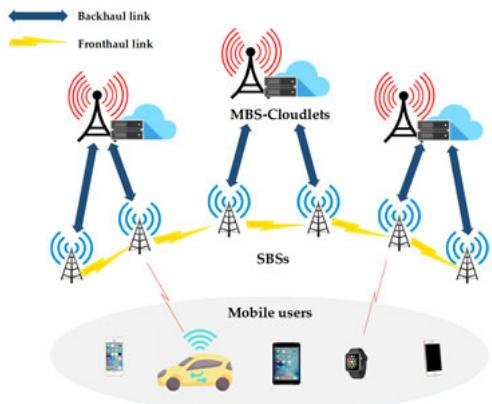  
Fig. 1. System model.

In this study, we assume the user travel information is available by any form (exact or predicted).

According to the declared information by the user, the EM must perform service handoff between the source and destination cloudlets within specific time bounds to preserve transparency [34]. Each service handoff can start as soon as the user enters the coverage area of the new cloudlet and should be completed by the time it exits the coverage area of the current cloudlet. For example, according to Fig. 2, the service handoff from the source cloudlet A to the destination cloudlet B must begin at $t _ { 1 }$ and end by $t _ { 2 } .$ . Thus, the required time constraint to complete the service handoff is defined by $t _ { 2 } - t _ { 1 }$

The EM performs path planning to find a suitable path for the service handoff from the currently assigned cloudlet to the destination cloudlet, satisfying the required time constraint. Path planning is important in service handoff because different paths can result in various QoS for users. Existing congestion over a selected path directly affects the time duration of service handoff. Moreover, the EM should consider the energy budget of each BS during path planning to ensure the feasibility of service handoff over the assigned path due to the limited energy resources for BSs.

Furthermore, a pricing function is required to charge users to enforce truthfulness in the system. The pricing function preserves rational selfish users from misreporting their parameters to receive a better QoS. Note that the pricing function becomes unnecessary whenever the users preferences are publicly known and cannot be misreported.

To sum up, the problem of online service handoff is to find a time-efficient path and payment for service handoff with the major goal of preserving QoS for mobile users, while achieving the secondary goals of minimum congestion, energy consumption reduction, and discouragement of misreporting by penalizing users for the cost of the distortion.

Fig. 3 illustrates an example of a smart car traveling from a specific starting point to a specific destination point requiring edge services. The user obtains a suitable route and an estimated travel time to his destination from an MS. The user then passes the obtained information as his prefer ences to the EM. The EM then performs path planning to find a suitable path to the destination cloudlet for the service handoff, considering the required time constraint.

Finally, the service handoff is carried out from the source cloudlet A to the destination cloudlet B, and the user is charged for the service handoff.

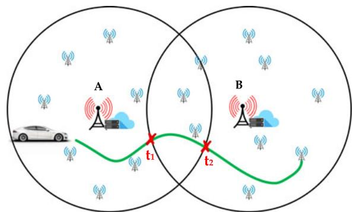  
Fig. 2. Time constraint computation for service handoff.

In the next section, we formulate the path planning as an optimization problem.

## 4 SERVICE HANDOFF PROBLEM FORMULATION

In this section, we describe our optimal mathematical formulation for the Service Handoff Intra-edge Path Planning Problem (SHIP³)

A set of mobile users $\mathcal { T } = \{ 1 , 2 , \hdots , I \}$ offload their computational tasks through SBSs $\mathcal { I } = \{ 1 , 2 , \dots , J \}$ to MBSs ${ \mathcal { K } } = \{ 1 , 2 , \ldots , K \}$ integrated with cloudlets. We use the terms MBS and cloudlet interchangeably. We represent the edge infrastructure (i.e., SBSs and MBSs) and 5G intracommunication links as a directed graph $\mathcal { G } = ( \mathcal { N } , \mathcal { L } )$ where ${ \mathcal { N } } = { \mathcal { I } } \cup { \mathcal { K } }$ denotes the BSs and $\mathcal { L }$ denotes the communication links. SBSs communicate with each other through fronthaul links $\mathcal { L } ^ { f } ,$ , while they are connected to MBSs using backhaul links $ { \boldsymbol { { \mathcal { L } } } } ^ { b }$ . Therefore, we have $\boldsymbol { \mathcal { L } } = \boldsymbol { \mathcal { L } } ^ { f }$ [ $\mathcal { L } ^ { b } .$ . Each link l can also be denoted by the nodes it is connecting.

Energy consumption is a critical factor in determining the operating costs of BSs [35], while reducing carbon emissions is one of the most effective and necessary climate actions. Therefore, we consider energy consumption as a resource limitation for BSs. Each BS $n \in \mathcal N$ has an energy budget of $\epsilon _ { n } ,$ which defines the maximum energy that it can spend for transferring VMs/containers. The energy constraint $\epsilon _ { n }$ is continuously updated by BS n based on its current status.

Each mobile user $i \in \mathcal { T }$ has a required time constraint for his service handoff, denoted by $\theta _ { i , }$ , which is computed by the EM based on the user’s route and travel time as explained in Section $3 ( \mathrm { i . e . , } \theta _ { i } = t _ { 2 } ^ { i } - t _ { 1 } ^ { i } )$ ). Each user i also has a specific time valuation, which depends on the type of service that he uses. We assume that MEC offers S types of services denoted by $\mathcal { S } = \{ 1 , 2 , \dots , S \}$ . Hence, when user i uses service $s \in S ,$ the user declares $\lambda _ { i } ^ { s }$ (simply denoted by $\lambda _ { i } )$ indicating the monetary value of service s per unit of time.

Once mobile user m starts to move and requires a service handoff, a service-handoff path needs to be assigned by the EM. We define P as the set of all feasible paths for the service handoff between the source and destination cloudlets. $\mathrm { A }$ path $p$ can be represented as sequences of adjacent BS nodes such as $p = \{ n _ { 1 } , n _ { 2 } , . . . \}$ or of adjacent links such as $p = \{ n _ { 1 } n _ { 2 } , n _ { 2 } n _ { 3 } , . . . \}$ . If the starting and ending nodes of a path coincide, the path is called a cycle. We assume that A. Downloaded on August 18,2026 at 14:07:44 UTC fřom IEEE Xplore. Restrictions a each path does not have any cycles. The valuation of user m for service-handoff path $p$ is defined as follows:

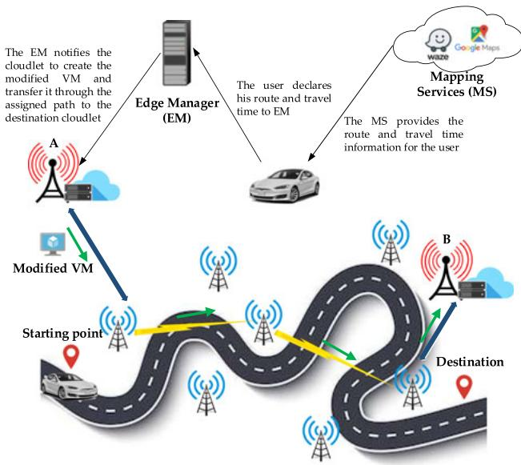  
Fig. 3. Service handoff scenario.

$$
v _ {m} = \lambda_ {m} (\theta_ {m} - \tau_ {m}),\tag{1}
$$

where $\tau _ { m }$ denotes the service handoff duration over path $p ,$ and $\theta _ { m }$ is the required time constraint for the service handoff. We will describe how to obtain the duration of time for the service handoff, i. $\mathrm { . } , \tau _ { m } ,$ in Section 4.1. Respectively, we define the utility of user m as the difference between his valuation and his payment as follows:

$$
u _ {m} = v _ {m} - \pi_ {m},\tag{2}
$$

where $\pi _ { m }$ shows the payment of user m to the EM to perform the service handoff.

The main objective of the EM is then to find a path such that it minimizes the total duration of time for all current service handoffs as well as the duration of time for the latest service handoff, i.e., for user $m ,$ considering their priorities. The service handoff duration may change for the existing users if their assigned paths overlap (fully or partially) with path $p$ that is now serving the service handoff of user m. Therefore, the valuation of the EM for assigning path $p$ to user m is defined as follows:

$$
v _ {e} = - \sum_ {i \in \mathcal {I}} \lambda_ {i} ^ {e} \tau_ {i} ^ {\prime} - \lambda_ {m} ^ {e} \tau_ {m},\tag{3}
$$

where $\boldsymbol { \tau } _ { i } ^ { \prime }$ is the new service handoff duration for user $i \in \mathcal { T }$ when path $p$ is used to perform the service handoff for new user $m ,$ , and $\lambda _ { i } ^ { e }$ is the unit-time valuation of the EM. We consider the EM classifies user applications into H heterogeneous priority classes, defined based on their urgency or time sensitivity. For example, online medical operations may own the highest priority to receive real-time computing services, whereas applications such as augmented reality are classified as a lower priority, even though all applications require acceptable response time. We define $\mathcal { H } \overset { \vartriangle } { = } \{ 1 , 2 , \ldots , \hat { H } \}$ to denote the set of all heterogeneous applications, where each class $h \in \mathcal H$ defines a set of applications with similar priorities. We define $\lambda _ { h } ^ { e }$ to show the unit-time valuation of the EM for each class h. Therefore, $\lambda _ { h } ^ { e }$ is identical for all users whose applications belong to class $h ,$ i.e., they have the same priority (if $i \in {  { h _ { i } } }$ , then $\lambda _ { i } ^ { e } = \lambda _ { h } ^ { e } )$ ).

To optimally formulate the problem, we need to provide more details on how to compute the duration of time and energy consumption for the service handoff over each feasible path. In Sections 4.1 and 4.2, we explain them, respectively.

## 4.1 Duration of Time for Service Handoff

Once a modified VM/container image is created to be transferred via a service handoff to the destination cloudlet, it may traverse a set of different fronthaul and backhaul links, which is time-consuming. Moreover, at each BS (either SBS or MBS), the VM/container may remain in the queuing buffer until a link channel is assigned for transmission. Hence, both VM/container transmission duration and buffering duration should be computed based on the properties of the network.

We consider a multi-user OFDMA (Orthogonal Frequency-Division Multiple Access) system [1], [31], [36], which is a common type of digital transmission in 5G. In OFDMA, each BS $j \in \mathcal N$ has $C _ { j }$ orthogonal Resource Blocks (RB) each with bandwidth of $B _ { j } ^ { c }$ . For fronthaul link $j j ^ { \prime } \in \mathcal { L } ^ { f }$ connecting SBS $\mathbf { \nabla } _ { j }$ and $j ^ { \prime } ,$ , the data transmission rate is given by:

$$
R _ {j j ^ {\prime}} = \sum_ {c = 1} ^ {C _ {j}} B _ {j} ^ {c} \mathrm{log} _ {2} \left(1 + \frac {\rho_ {j} ^ {c} g _ {j j ^ {\prime}} ^ {c}}{\sigma_ {j c} ^ {2} + \sum_ {a \in \mathcal {J}} \sum_ {b \in \mathcal {J} \backslash j} \rho_ {a} ^ {c} g _ {b j ^ {\prime}} ^ {c}}\right),\tag{4}
$$

where $\rho _ { j } ^ { c }$ is the transmission power of SBS j over RB $c , g _ { j j ^ { \prime } } ^ { c }$ is the channel gain between these two SBSs on RB $c ,$ and $\sigma _ { j c } ^ { 2 }$ is the variance of the zero mean additive white Gaussian noise [31], [36].

Similarly, for backhaul link $j k \in \mathcal { L } ^ { b }$ connecting SBS $j$ to MBS $k ,$ the data transmission rate is computed as follows:

$$
R _ {j k} = \sum_ {c = 1} ^ {C _ {j}} B _ {j} ^ {c} \log_ {2} \left(1 + \frac {\rho_ {j} ^ {c} g _ {j k} ^ {c}}{\sigma_ {j c} ^ {2} + \sum_ {a \in \mathcal {K}} \sum_ {b \in \mathcal {J} \backslash j} \rho_ {a} ^ {c} g _ {b k} ^ {c}}\right).\tag{5}
$$

Note that $R _ { j j ^ { \prime } }$ and $R _ { j k }$ formulations may change using different technologies. Our approach can be extended to support other data transmission technologies.

In service handoff, the binary difference of the launched VM/container and its base is adaptively computed, compressed, and then transferred. Assuming $d _ { i }$ denotes the size of the VM/container being transferred for user $i ,$ , then the service handoff duration through link l is computed as:

$$
\tau_ {i} ^ {l} = \frac {d _ {i}}{R _ {l}},\tag{6}
$$

where l can be either fronthaul link $j j ^ { \prime } \in \mathcal { L } ^ { f }$ between SBSs $j$ and $j ^ { \prime }$ or backhaul link $j k \in \mathcal { L } ^ { b }$ connecting SBS j to MBS k.

Furthermore, each BS has a queuing buffer to support the cases when no empty RB is left for the VM/container transmission to the next BS. Hence, we compute the waiting time (or queuing time) at each BS for the service handoff. Inspired by [37], we model the queuing buffer at each BS as an ${ \bf \bar { \Phi } } _ { M / M / C }$ queue, where the RBs act as servers. Let $\mathcal { N } _ { j }$ denote the set of $N _ { i }$ BSs that are currently communicating A. Downloaded on August 18,2026 at 14:07:44 UTC from IEEE Xplore. Restrictions with (sending data to) SBS j. If $N _ { j } \leq C _ { j } ,$ , the waiting time at SBS $j$ is zero. When $N _ { j } > C _ { j } ,$ , then the expected waiting time incurred by packets generated at each $\bar { n } \in \mathcal { N } _ { j }$ to reach SBS j is given by:

$$
\tau_ {n} ^ {q} = E [ n ] / \omega ,\tag{7}
$$

where $E [ n ]$ denotes the expected number of packets in the queue at BS n and v is the packet arrival rate. The waiting time for each MBS to assign an RB for transmission is computed similarly.

Therefore, the required duration of time to perform service handoff for user i over path p is computed as follows:

$$
\tau_ {i} = \sum_ {l \in p} \tau_ {i} ^ {l} + \sum_ {j \in p ^ {N}} \tau_ {j} ^ {q},\tag{8}
$$

where $\tau _ { i } ^ { l }$ denotes the duration of time for the service handoff over link $l \in p$ according to Eq. (6). Moreover, $\tau _ { j } ^ { q }$ denotes the waiting time that any user experiences at node j of the path, calculated based on Eq. (7). For simplicity of notation, we use $p ^ { N }$ to denote the set of nodes along path $p .$

## 4.2 Energy Computation

Computing infrastructure plays an important role in global greenhouse gas emissions. Furthermore, energy consumption accounts for a substantial part of the operating cost of a BS [35]. Therefore, we consider energy budget as a main resource constraint of the system. In 5G, each BS consumes energy [38] to transfer data to the next BS. The consumed energy by SBS $j$ for transferring a VM/container of size $d _ { i }$ for user i over fronthaul or backhaul link l, connecting SBS j with another SBS or an MBS, is computed as follows:

$$
e _ {j} ^ {i l} = \sum_ {c = 1} ^ {C _ {j}} \delta_ {j} \rho_ {j} ^ {c} \tau_ {i} ^ {l},\tag{9}
$$

where $\delta _ { j }$ determines the energy coefficient for transferring data through the network [38].

## 4.3 Optimization Model

We formulate the Service Handoff Intra-edge Path Planning Problem (SHIP3) as a Constrained Shortest Path (CSP) problem to find optimal service-handoff paths maximizing sequential social surplus, the sum of the valuations of the participants, subject to the energy constraints of BSs and the users’ required time constraints. Assuming cloudlets $o \in \mathcal N$ and $d \in \mathcal N$ as the source and destination cloudlets, respectively, the $\mathrm { S H I P ^ { 3 } }$ problem is defined as follows:

$$
\max _ {p \in \mathcal {P}} v _ {e} + v _ {m}\tag{10}
$$

Subject to:

$$
\tau_ {m} \leq \theta_ {m},\tag{10a}
$$

$$
e _ {j} ^ {m l} \leq \bar {\epsilon} _ {j}, \quad \forall j \in p ^ {N}, \forall l \in p.\tag{10b}
$$

This optimization model aims to find a suitable path $p$ for the service handoff, maximizing the sequential social surplus, which includes the valuation of the EM for all existing users $( v _ { e } )$ and the valuation of user m $( v _ { m } )$

Constraint (10a) ensures that the service handoff for user m is performed within his time constraint $\theta _ { m }$ to satisfy the QoS. Constraint (10b) guarantees that the energy consumption for the service handoff at each BS j does not exceed its energy budget $\bar { \epsilon } _ { j }$ for transferring VMs/ containers. Note that $\bar { \epsilon } _ { j }$ is the remaining energy budget based on already allocated transmission links (formally defined in Eq. (13e)).

We can further rewrite the objective function as follows:

$$
\begin{array}{l} v _ {e} + v _ {m} = - \sum_ {i \in \mathcal {I}} \lambda_ {i} ^ {e} \tau_ {i} ^ {\prime} - \lambda_ {m} ^ {e} \tau_ {m} + \lambda_ {m} (\theta_ {m} - \tau_ {m}) \\ = \sum_ {i \in \mathcal {I}} \sum_ {l \in \mathcal {L} \backslash p} \sum_ {j \in \mathcal {N} \backslash p ^ {N}} - \lambda_ {i} ^ {e} (\tau_ {i} ^ {l} + \tau_ {j} ^ {q}) + \lambda_ {m} \theta_ {m} - \sum_ {i \in \mathcal {I}} \sum_ {l \in p} \sum_ {j \in p ^ {N}} \\ \left(\lambda_ {i} ^ {e} (\tau_ {i} ^ {l} + \tau_ {j} ^ {\prime q}) + \lambda_ {m} ^ {e} (\tau_ {m} ^ {l} + \tau_ {j} ^ {q}) + \lambda_ {m} (\tau_ {m} ^ {l} + \tau_ {j} ^ {q})\right) \end{array}
$$

Note that $\tau _ { i } ^ { l }$ does not change due to the new service handoff This is due to the fact that each new service handoff may only increase the queuing times in the BSs and not the transfer times over the links. Then, by moving the previous duration of time of existing users that are using path $p$ from the second part of the formula to the first part, we have:

$$
\begin{array}{l} v _ {e} + v _ {m} = \sum_ {i \in \mathcal {I}} \sum_ {l \in \mathcal {L}} \sum_ {j \in \mathcal {N}} - \lambda_ {i} ^ {e} (\tau_ {i} ^ {l} + \tau_ {j} ^ {q}) + \lambda_ {m} \theta_ {m} \\ \qquad - \sum_ {i \in \mathcal {I}} \sum_ {l \in p} \sum_ {j \in p ^ {N}} \left(\lambda_ {i} ^ {e} \Big ((\tau_ {i} ^ {l} + \tau_ {j} ^ {\prime q}) - (\tau_ {i} ^ {l} + \tau_ {j} ^ {q}) \Big) \right. \\ \qquad \qquad \qquad \qquad \qquad \left. + \lambda_ {m} ^ {e} (\tau_ {m} ^ {l} + \tau_ {j} ^ {q}) + \lambda_ {m} (\tau_ {m} ^ {l} + \tau_ {j} ^ {q})\right) \end{array}\tag{11}
$$

Clearly, the terms $\begin{array} { r } { - \sum _ { i \in \mathcal { T } } \sum _ { l \in \mathcal { L } } \sum _ { j \in \mathcal { N } } \lambda _ { i } ^ { e } ( \tau _ { i } ^ { l } + \tau _ { j } ^ { q } ) } \end{array}$ and $\lambda _ { m } \theta _ { m }$ P P Pin the above equation are constant. This is due to the fact that the duration of time for all current service handoffs using other links and BSs (not overlapping with path $p )$ does not change. Furthermore, user m’s valuation of time $( \lambda _ { m } )$ and time constraint $( \theta _ { m } )$ are already known. Therefore, these two terms can be excluded from the objective function. Therefore, our modified SHIP3 optimization model, called SHIP3-M, can be rewritten as:

$$
\min _ {p \in \mathcal {P}} \sum_ {i \in \mathcal {I}} \sum_ {l \in p} \sum_ {j \in p ^ {N}} \left(\lambda_ {i} ^ {e} (\tau_ {j} ^ {\prime q} - \tau_ {j} ^ {q}) + \lambda_ {m} ^ {e} (\tau_ {m} ^ {l} + \tau_ {j} ^ {q}) + \lambda_ {m} (\tau_ {m} ^ {l} + \tau_ {j} ^ {q})\right)
$$

Subject to:

$$
\begin{array}{l} \tau_ {m} \leq \theta_ {m}, \\ e _ {j} ^ {m l} \leq \bar {\epsilon} _ {j}, \quad \forall j \in p ^ {N}, \forall l \in p. \end{array}\tag{12}
$$

To extract a feasible path, we provide the link-based formulation of our optimization model as well. We first define a set of binary decision variables: $x _ { l } = 1$ if link $l \in \mathcal L$ is on the assigned path $p$ for the service handoff; and $x _ { l } = 0$ otherwise. We also need to define the following notations used in this formulation: $n ^ { + }$ refers to a set of outgoing links from node n $( \mathbf { e . g . } , n j \in { \mathcal { L } } ) .$ ; similarly, $n ^ { - }$ refers to the set of incoming links to node n (such as $j n \in \mathcal { L } )$

Our link-based optimization model of $\mathrm { S H I P ^ { 3 } }$ , called ${ \mathrm { S H I P ^ { 3 } - L } } ,$ , is presented as follows:

$$
\begin{array}{l} \min \sum_ {i \in \mathcal {I}} \sum_ {l \in L} x _ {l} \Big (\lambda_ {i} ^ {e} (\tau_ {j ^ {+}} ^ {\prime q} - \tau_ {j ^ {+}} ^ {q}) \\ \quad + \lambda_ {m} ^ {e} (\tau_ {m} ^ {l} + \tau_ {j ^ {+}} ^ {q}) + \lambda_ {m} (\tau_ {m} ^ {l} + \tau_ {j ^ {+}} ^ {q}) \Big) \end{array}\tag{13}
$$

Subject to:

$$
\sum_ {l \in o ^ {+}} x _ {l} = 1,\tag{13a}
$$

$$
\sum_ {l \in d ^ {-}} - x _ {l} = - 1,\tag{13b}
$$

$$
\sum_ {l \in j ^ {+}} x _ {l} - \sum_ {l \in j ^ {-}} x _ {l} = 0, \quad \forall j \in \mathcal {N} \setminus \{o, d \},\tag{13c}
$$

$$
\sum_ {l \in j ^ {+}, j \in \mathcal {N}} x _ {l} (\tau_ {m} ^ {l} + \tau_ {j ^ {+}} ^ {q}) \leq \theta_ {m},\tag{13d}
$$

$$
x _ {l} e _ {j} ^ {m l} \leq \epsilon_ {j} - \sum_ {l ^ {\prime} \in j ^ {+}, i \in \mathcal {I}} e _ {j} ^ {i l ^ {\prime}}, \quad \forall l \in j ^ {+},\tag{13e}
$$

$$
x _ {l} \in \{0, 1 \}, \quad \forall l \in \mathcal {L}.\tag{13f}
$$

The first three constraints (13a)–(13c) are necessary to achieve a path from cloudlet o to cloudlet $d$ for the service handoff. In this respect, constraint (13a) ensures that only one outgoing link is selected from origin cloudlet $o ,$ and similarly constraint (13b) guarantees only one incoming link is selected towards destination cloudlet $d .$ In addition, constraint (13c) is a flow constraint, which guarantees that the sum of incoming and outgoing links at each node $j \in \mathcal { N } ,$ except o and $d ,$ is equal to zero. Constraint (13d) ensures that the duration of time for the service handoff on the selected path does not exceed the required time constraint $\theta _ { m } .$ Constraint (13e) restricts the energy consumption at each node along the assigned path to the energy limitation of that node, which is denoted by $\begin{array} { r } { \bar { \epsilon } _ { j } = \epsilon _ { j } - \sum _ { l ^ { \prime } \in j ^ { + } , i \in \mathcal { T } } e _ { j } ^ { i l ^ { \prime } } } \end{array}$

The coefficient of $x _ { l }$ in the objective function denotes the cost of link $l ,$ and we use notation $c _ { l }$ to represent this cost. The coefficients of $x _ { l }$ in constraints (13d) and (13e) are called link weights, denoted by $t _ { l }$ and $e _ { l } ,$ respectively. We will use these values in our algorithm in the next section.

It is worth noting that the objective function also demonstrates how the valuation of user m for time, i.e., $\lambda _ { m } ,$ and the valuation of time of EM for users, i.e., $\lambda _ { i } ^ { e }$ can affect the selection of the path for the service handoff. As the ratio of $\lambda _ { m }$ to $\lambda _ { i } ^ { e }$ increases, it means the service handoff is urgent for user $m ,$ and the EM can deliberately neglect some lowpriority service handoffs to minimize the duration of time for the service handoff $m .$ . In contrast, as the ratio of $\lambda _ { i } ^ { e }$ to $\lambda _ { m }$ grows, the EM minimizes the duration of time for users with the highest priority. Therefore, it provides services to users with highly time-sensitive applications by choosing faster paths to transfer their VMs/containers to their destination cloudlets, or to users who pay more to receive better quality of experience. The latter is in alignment with the new development of ultra-low-latency-as-a-service such as AWS Wavelength [39] for user applications including connected autonomous cars, augmented and virtual reality, interactive virtual learning, and online games.

The formulated $\mathrm { S H I P ^ { 3 } – L }$ problem can be reduced to a general constrained shortest path problem with possible negative edge costs, which is an NP-hard problem [40]. Moreover, $\mathrm { S H I P ^ { 3 } – L }$ is an offline problem, assuming that the users’ preferences are available simultaneously $( \mathrm { i . e . }$ , they do not arrive over time). Therefore, we propose an Online time-constrained Service Handoff Mechanism (OSHM) to find the optimal path for each service handoff in an online setting, where users can join and leave over time. The description of OSHM is provided in the next section.

## 5 ONLINE SERVICE HANDOFF MECHANISM(OSHM)

While path planning is an essential part of our proposed mechanism, OSHM, there is a concern that each mobile user could increase his utility by lying about his true preferences. Such manipulation would result in an incorrect required time constraint for the service handoff, and thus, it would negatively affect the overall system efficiency. To avoid this issue, our proposed OSHM mechanism includes a payment determination function that ensures truthfulness, i.e., mobile users have no incentive to lie about their preferences.

In this section, we describe how path planning and payment determination are designed. Both functions are online, meaning that they invoke as soon as a new service handoff is required. Our proposed path planning algorithm employs a label-correcting algorithm [41], [42] to solve the $\mathrm { \Delta \hat { S H I P ^ { 3 } - L } }$ problem in tractable time. Our novel payment function uses the marginal cost principle to charge the users based on their assigned paths.

## 5.1 Path Planning

The goal of the path planning function is to find the optimal path for the service handoff. In our design, we aim to explore different feasible paths from origin cloudlet o to destination cloudlet d in order to find the optimal path. Therefore, our algorithm keeps a history of explored paths at each step. This can be done by maintaining a set of Pareto-optimal labels at each BS $n \in \mathcal N .$ , where each label shows the information of one single explored path from o to n.

Each label z at node n is denoted by $( \mathcal { C } _ { n } ^ { z } , T _ { n } ^ { z } , \mathbf { P } _ { n } ^ { z } )$ Þ, where $\mathcal { C } _ { n } ^ { z }$ refers to the cost component, $\boldsymbol { \mathcal { T } } _ { n } ^ { z }$ refers to the duration of the time component, and P is the pointer component of the service handoff from o to n by following the induced path from label z. In particular, components $\mathcal { C } _ { n } ^ { z }$ and $\boldsymbol { \mathcal { T } } _ { n } ^ { z }$ are respectively equal to the sum of the costs and time weights of all existing links along the path induced by label $z ,$ where the cost of each link $l$ (denoted by $c _ { l } )$ is equal to the coefficient of $x _ { l }$ in the objective of the $\mathrm { S H \bar { I } P ^ { 3 } \ – I }$ problem in Eq. (13), and the coefficient of $x _ { l }$ in constraint (13d) shows the time weight of link $l ,$ denoted by $t _ { l } .$ . For instance: $\begin{array} { r } { \mathcal { C } _ { n } ^ { z } = \sum _ { l \in \bar { p } } c _ { l } } \end{array}$ , where $\bar { p }$ is a subpath of $p$ from o to $n .$ . The pointer P is denoted by $( j , y )$ where $j$ refers to the previous BS in the induced path by label $z ,$ and y refers to the label index at node j.

Each label owns a priority value, which is equal to the cost component of the label. All labels are stored in minheap Q based on their priority values. At each iteration, the label with the highest priority (i.e., minimum cost) is extracted from $Q$ and processed to explore new paths until destination cloudlet d is reached.

The detailed description of our proposed path planning algorithm, PPA, is given in Algorithm 1. PPA takes network graph ${ \mathcal { G } } ,$ origin o and destination d cloudlets for the service handoff $m ,$ , the associated time constraint for the service handoff $( \theta _ { m } )$ the time valuation of user $m \ : \ : \left( \lambda _ { m } \right) ,$ and on August 18 2026 at 14:07:44 UTC from IEEE Pestrictions the time valuation of the EM for all users as its inputs. PPA includes these steps:

Step 1 (Initialization). A new label is created for origin cloudlet o and inserted into the min-heap (lines 2-4). The cost and time components of the label are set to zero, and the pointer does not refer to any previous node. We use $b _ { n }$ to denote the number of labels at BS n that have been created and stored. These values are initialized in lines 5-8.

Algorithm 1. PPA: Path Planning Algorithm for the Handoff
1: Input: $\mathcal{G} = (\mathcal{N}, \mathcal{L})$, $o, d, \theta_m, \lambda_m, \lambda_i^e$, $\forall i \in \mathcal{I}$
2: /*Initialization*/
3: $(\mathcal{C}_o^1, \mathcal{T}_o^1, \mathbf{P}_o^1) \leftarrow (0, 0, 0, \emptyset)$
4: $Q$. INSERT($\mathcal{C}_o^1, \mathcal{T}_o^1, \mathbf{P}_o^1$) /*$Q$: min heap based on cost*/
5: for all $j \in N \setminus o$ do
6: $b_j \leftarrow 0$; /*$b_j$: number of existing labels at node $j$*/
7: end for
8: $b_o \leftarrow 1$;
9: /*Path Planning*/
10: while $Q \neq \emptyset$ do
11: $(\mathcal{C}_j^y, \mathcal{T}_j^y, \mathbf{P}_j^y) \leftarrow Q$. EXTRACT() /*Label Selection*/
12: for all $n \in \mathcal{N}$, $jn \in \mathcal{L}$ do
13: if $\mathcal{T}_j^y + t_l \leq \theta_m \wedge e_l \leq \bar{\epsilon}_j$ then
14: /*$l$ is the direct link connecting node $j$ to $n$*/
15: flag ← 1
16: for $z = 1$ to $b_n$ do
17: if $\mathcal{C}_j^y + c_l \geq \mathcal{C}_n^z \wedge T_j^y + t_l \geq \mathcal{T}_n^z$ then
18: flag ← 0
19: end if
20: end for
21: if flag = 1 then
22: $b_n \leftarrow b_n + 1$
23: ($\mathcal{C}_n^{b_n}, \mathcal{T}_n^{b_n}, \mathbf{P}_n^{b_n}$) ← ($\mathcal{C}_j^y + c_l, \mathcal{T}_j^y + t_l, (j, y)$)
24: if $n \neq d$ then
25: $Q$. INSERT($\mathcal{C}_n^{b_n}, \mathcal{T}_n^{b_n}, \mathbf{P}_n^{b_n}$)
26: end if
27: for all ($\mathcal{C}_n^z, \mathcal{T}_n^z, \mathbf{P}_n^z$) ∈ $Q$ do
28: if $\mathcal{C}_n^z \geq \mathcal{C}_n^{b_n} \wedge \mathcal{T}_n^z \geq \mathcal{T}_n^{b_n}$ then
29: $Q \leftarrow Q \setminus (\mathcal{C}_n^z, \mathcal{T}_n^z, \mathbf{P}_n^z)$;
30: end if
31: end for
32: end if
33: end if
34: end for
35: end while
36: $p^* \leftarrow$ BESTPATH($\mathcal{C}_d, \mathcal{T}_d, \mathbf{P}_d$);
37: Output: $p^*$

Step 2 (Label selection). If the min-heap is empty, PPA terminates. Otherwise, a label $( \mathcal { C } _ { j } ^ { y } , T _ { j } ^ { y } , \mathbf { P } _ { j } ^ { y } ) \ : ( \mathbf { \hat { e } . g . } , z )$ with the minimum cost is extracted from Q and passed to the next step in order to be processed (lines 10-11).

Step 3 (Label processing). For each neighboring BS n of current extracted BS j from label $y ,$ the added duration of time for the service handoff using link l that connects BS j to n is computed. In addition, the energy consumed by BS j for the service handoff through link l to BS $n$ is computed. This investigates whether the newly explored path does not violate the time and energy constraints (lines 12-13). If the duration of time for the service handoff using the new path including link l exceeds the time preference of the user, or the energy consumption goes beyond the specified energy budget by BS $j ,$ then BS $n$ is disregarded, and the next neighboring BS will be examined. Otherwise, the new obtained path is compared with the existing paths suggested by other labels in BS $n .$

If there is an existing path with a lower cost and duration of time, then the newly found path is discarded and the next neighboring BS is explored (lines 16-20). Otherwise, a new label is created at BS $n ,$ , which includes the cost and duration of time for the service handoff using the newly explored path (lines 21-23). Hence, at each time a Paretooptimal set of paths are maintained in min-heap Q. If the destination cloudlet at BS n has not reached yet $( \mathrm { i } . \mathbf { e } . , n \neq d ) ,$ the new label is added to $Q$ to be later processed (lines 24- 26). Next, all other labels at BS $n$ that are dominated by the new label (with higher costs and duration of times) are excluded from $Q$ to expedite PPA’s running time (lines 27- 31). PPA then returns to Step 2.

Step 4 (Finding the best path). When PPA finishes processing the entire labels in $Q ,$ the set of all Pareto-optimal paths from o to $d ,$ satisfying the time and energy constraints, are obtained at cloudlet (BS) d. Therefore, BESTPATH() procedure returns the best path $p ^ { * }$ among all existing labels at BS $d ,$ which is the path with the lowest cost from o to d (line 36). Path $p ^ { * }$ can be obtained by tracing the previous pointers backward from d to $o .$ PPA returns the optimal path $p ^ { * }$ as its output.

PPA runs in polynomial time as it finds the shortest paths, similar to other label correction approaches [43].

## 5.2 Payment Function

One of the challenges in using any path planning solution is when users act strategically to receive better paths for their service handoffs (to increase their utility through obtaining better QoS). Therefore, they may decide to withhold some information or send false information. Such actions negatively impact the outcome of the system by changing other users’ paths and eventually leading to congestion. Our goal is to eliminate the need for users to consider either strategic behavior or lying. Mechanism design allows implementing a system equilibrium, such that reporting private information truthfully is a (weakly) dominant strategy for users. The design of a payment function as a part of OSHM incentivizes the users to report their preferences truthfully out of their own self-interest.

Given the optimized solution from Eq. (12), we now propose a novel payment determination function using the marginal cost principle. Assuming $p ^ { * }$ is the optimal path obtained from PPA to perform the service handoff for user $m ,$ this user’s payment is determined as follows:

$$
\begin{array}{r l} & {\pi_ {m} = v _ {e} ^ {- m} - v _ {e} = - \sum_ {i \in \mathcal {I}} \lambda_ {i} ^ {e} \tau_ {i} + \sum_ {i \in \mathcal {I}} \lambda_ {i} ^ {e} \tau_ {i} ^ {\prime} + \lambda_ {m} ^ {e} \tau_ {m}} \\ & {\qquad = \sum_ {i \in \mathcal {I}} \lambda_ {i} ^ {e} (\tau_ {i} ^ {\prime} - \tau_ {i}) + \lambda_ {m} ^ {e} \tau_ {m},} \end{array}\tag{14}
$$

where ${ v _ { e } ^ { - m } }$ denotes the valuation of the EM when user m is excluded, and $v _ { e }$ denotes the valuation of the EM when the service handoff for user m is performed through path $p ^ { * }$ A. Downloaded on August 18,2026 at 14:07:44 UTC from IEEE Xplore. Restrictions apply.

The payments of different classes of users are distinct based on the EM’s priority preferences for a particular class. Also, it is worth noting that the payment computations can be performed anytime before, during, or even after the service handoff. Hence, the payment calculations do not affect the required time for path planning. The payment function has a polynomial time complexity of OðIÞ in the worst case, where I is the number of users.

Our proposed payment function differs significantly from the celebrated Vickrey-Clarke-Groves (VCG) pricing [44]. In particular, the conventional VCG mechanism is offline, whereas our proposed OSHM mechanism is online and runs as soon as a new service handoff is required. We further prove in Theorem 1 that our proposed mechanism maintains the truthfulness property, despite the modifications.

## 5.3 Theoretical Properties

A main property of OSHM is that it implements truthfulness.

Theorem 1. The truthful declaration of route and travel time is a weakly dominant strategy for users in OSHM.

Proof. The proof is by contradiction. We assume that truthtelling is not a weakly dominant strategy for user $m ,$ and therefore he can increase his utility by misreporting his route and travel time information resulting in a different time constraint $\theta _ { m } ^ { \prime } .$ . Clearly, no rational user is interested in misreporting his true information such that his true time requirements are violated. Therefore, we have $\theta _ { m } ^ { \prime } < \theta _ { m } .$ We assume $u _ { m } ^ { \prime }$ denotes the achieved higher utility of the user with time constraint $\theta _ { m } ^ { \prime } ,$ while $u _ { m }$ denotes the utility of user with time constraint $\theta _ { m } .$ . Hence, we have:

$$
u _ {m} ^ {\prime} > u _ {m},\tag{15}
$$

while $\theta _ { m } ^ { \prime }$ still satisfies the true time preference of the user, i.e., $\tau _ { m } ^ { \prime } \leq \theta _ { m } ,$ where $\tau _ { m } ^ { \prime }$ is the duration of time for service handoff experience by user m reporting $\theta _ { m } ^ { \prime } .$ . In other words, the user can still experience a transparent service handoff, while achieving a higher utility. However according to Eq. (10) as long as there is a feasible path for the service handoff satisfying the true time constraint $\theta _ { m } ,$ we have $\tau _ { m } = \tau _ { m } ^ { \prime }$ . This is because the objective aims to find the shortest feasible path, and if it can satisfy $\theta _ { m } ^ { \prime } ,$ clearly it will be able to satisfy $\theta _ { m }$ as well. Hence, the obtained optimal path $p ^ { * }$ does not change, no matter the user declares the smaller value $\theta _ { m } ^ { \prime }$ instead of $\theta _ { m }$ . Therefore, the utility of the user does not change as well. This is however in contradiction with Eq. (15). Hence, reporting information truthfully is always the optimal (weakly dominant) strategy for users. □

Another important property of OSHM is that it does not suffer any loss or deficit. This property is called weakly Budget Balance.

Theorem 2. User m’s payment $\pi _ { m }$ is always non-negative, and thus, the mechanism never pays a positive payment to users.

Proof. In the payment determination Eq. (14), it is clear that $\tau _ { m }$ is always non-negative. Moreover, adding a new service handoff transfer to the system may increase the duration of time for previous service handoffs if their assigned paths overlap with the one assigned to the new service handoff. Therefore, we always have $\tau _ { i } ^ { \prime } \geq \tau _ { i } , \forall i \in \mathcal { T }$ Note that $\boldsymbol { \tau } _ { i } ^ { \prime }$ is the new experienced delay for existing user i. Since $\lambda _ { m } ^ { e }$ and $\lambda _ { i } ^ { e }$ are also non-negative, we will have $\pi _ { m } \geq 0$ tu

## 6 EVALUATION

We perform extensive experiments to evaluate the performance of OSHM (both PPA and payment components). In this section, we describe the experimental setup and analyze the experimental results.

## 6.1 Experimental Setup

To ensure reproducibility of the results, we provide the necessary information on the setup of the experiments. The simulation area is a $\mathrm { 1 0 0 0 \times 1 0 0 0 ~ m ^ { 2 } }$ square covered by 10 MBSs and 50 SBSs, deployed evenly in this area. Each MBS covers a circular area with a radius of 450m [31]. Each SBS is positioned at the center of a circle area with a radius of 75m [31]. The number of RBs is equal to 50 [36], while each of them has a bandwidth of 180 kHz, leading to the total bandwidth of 9 MHz for each link [36], [38]. Moreover, the transmission power of each MBS and SBS is 1 Watt and 0.25 Watt, respectively. The noise power density is $1 0 ^ { - 1 3 }$ Watt/Hz [36]. The energy coefficient for data transfer is 3 [38]. As representative cloudlet workloads, we use MAR, the augmented reality application, and OBJECT, an object recognition application [4]. The transfer size for VM handoff for the MAR and OBJECT applications are set to 0.27 GB and 0.06 GB, respectively, according to [4]. We consider four priority classes for the applications. The unittime valuation of the EM for the priority classes of 1 to 4 is \$2, \$4, \$8, and \$16, respectively. Also, each user has a time valuation of \$1 to \$4, depending on the type of service that he uses.

To ensure our generated networks can reach congestion, we consider the service handoff arrival events as a Poisson process with an arrival rate 7500/3600=2.08, meaning that 7500 service handoffs (on 180 links) will happen per hour in the system. We simulate a real-time environment for a duration of one hour when users can join at any location.

## 6.2 Performance Benchmark

The classic mechanism design computes the allocation function and the payment function for all agents simultaneously, which can become computationally intractable as the problem size becomes larger. Instead, our proposed mechanism is online, and it computes these functions for each joining user sequentially. In this sequential decision making, OSHM computes the best path with a corresponding payment for each service handoff in much lower time complexity.

Due to the dynamic system changes in which users with service handoffs join and leave the system over time, we cannot compare our solution with other similar works as they do not consider dynamic changes when studying the service handoff problem. Therefore, to evaluate the performance of our proposed mechanism, we compare it with the following online algorithms:

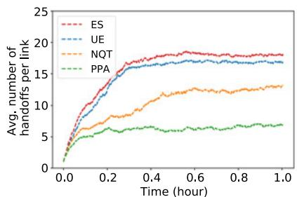  
(a) Average workload per link

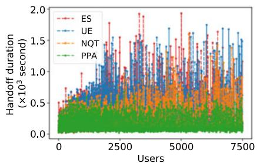  
(b) Handoff duratior

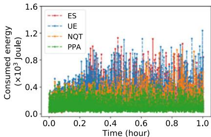  
(c) Energy usage  
Fig. 4. Performance evaluation on workload, service duration, and energy consumption under real-time monitoring.

Energy Path Selection (ES):The ES strategy finds a path with the minimum consumed energy for each service handoff.

User Equilibrium (UE): To investigate the impact of users’ selfish behavior on the system performance, we devise the UE strategy that computes a path with the minimum service handoff time for each service handoff.

No Queuing Time (NQT): The impact of the new handoff on existing service handoffs using the same link can be reflected by the queuing time. For comparison, we develop the NQT strategy that computes a path without considering the queuing time in the objective function (13).

All the algorithms are implemented using Python 3.6, and the experiments are conducted on 2.3 GHz Intel Core i5 with 16 GB of RAM.

## 6.3 Experimental Results

## 6.3.1 Performance Evaluation on Workload, Service Duration, andEnergyConsumption.

Average workload per link. Fig. 4a illustrates the average number of service handoffs per link to evaluate the workload distribution using different algorithms. The results show that ES and UE obtain similar numbers of service handoffs on average per link as time passes. This is because the required energy of a service handoff over a link is directly related to the service handoff duration. Moreover, they cause congestion very quickly after 0.2 h. The average number of service handoffs per link increases over time in NQT. Since the queuing time is not considered, the impact of a new service handoff on other existing handoffs is not considered, leading to an accumulated workload, negatively impacting the system. On the other hand, our proposed PPA maintains a stably lower number of handoffs per link over time. It can efficiently allocate paths for service handoffs to balance the workload over time, which is an important property of PPA.

Service HandoffDuration. Fig. 4 bs shows the performance of PPA compared to other algorithms in terms of the service handoff duration as users join and leave over time. The results show that PPA achieves a more efficient path allocation for all service handoffs such that each experienced service handoff duration is much lower (compared to other algorithms) and balanced on average as more users join. This is because PPA computes a service handoff path by considering its impact on the existing users using (some part of) the same path. Therefore, PPA mostly obtains similar service handoff durations and does not lead to congestion. Other algorithms obtain up to four times worse service handoff durations for the users.

Energy Usage. Energy consumption is another important factor for the system. Fig. 4c shows the performance of the algorithms in terms of energy consumption over time. The results show that PPA achieves lower energy consumption for transmitting service handoffs over time compared to those of other benchmarks. This is because the experienced service handoff durations of users by our proposed PPA is much lower compared to other benchmarks, shown in Fig. 4c. Note that even though ES assigns a path with the minimum energy consumption to each service handoff of users, it is not guaranteed that the overall energy consumption will be the lowest as users join and leave over time.

In summary, our proposed PPA achieves better performance compared to other benchmarks, reducing at least 61% on average workload distribution over the system, 33% on average service handoff duration, and 29% on average energy consumption, as the system’s state changes over time.

## 6.3.2 SensitivityAnalysis ofthe Ratio ofUnassigned Users (RUU).

The number of users who cannot receive a feasible service handoff path is an important factor that reflects the system’s efficiency. We define the ratio of unassigned users (RUU) as the value of the total number of unassigned users divided by the total number of users.

The impact of the arrival rate of Poisson process is analyzed in Fig. 5a. After the arrival rate reaches 1.67 (i.e., 6000 service handoffs happen per hour), the number of users who cannot be assigned a feasible path by using ES, UE, and NQT starts increasing as the arrival rate increases, while our PPA can always assign a feasible path to each user in a real-time environment until the arrival rate reaches a higher value of 2.5 (i.e., up to 9000 service handoffs happen per hour). Thus, we conclude that PPA avoids congestion significantly compared to other benchmarks.

The impact of bandwidth is shown in Fig. 5b. As bandwidth for each link increases, the RUU can be improved. Our proposed PPA quickly guarantees 100% assignment for all users when the bandwidth for each link reaches 6 MHz, while NQT can ensure this metric until the bandwidth reaches 11 MHz. Besides, ES and UE require much more bandwidth. This is because PPA allocates the service handoffs over all links in a balanced manner.

The impact of the size of VM/container for handoff is studied in Fig. 5c. As the VM/container handoff size increases, the duration of handoff grows. Therefore, the . Downloaded on August 18,2026 at 14:07:44 UTC from IEEE Xplore. Restrictions apply.

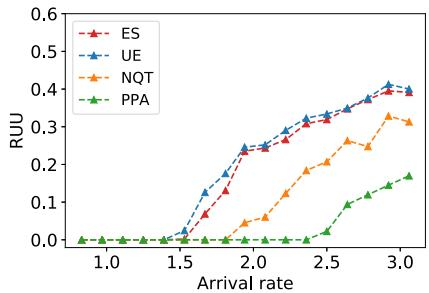  
(a) under various arrival rate

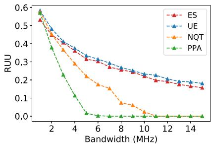  
(b) under various bandwidth  
Fig. 5. Sensitivity analysis of ratio of unassigned users (RUU).

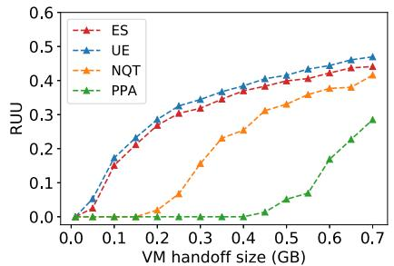  
(c) under various VM/container handoff size

number of handoffs that cannot be assigned a feasible path increases leading to unsatisfactory system performance. The results show that our proposed PPA outperforms other algorithms in terms of the RUU as the handoff size increases. This again supports the fact that our PPA balances the workload among links over time.

In summary, our proposed PPA outperforms other algorithms in terms of the ratio of unassigned users. More specifically, PPA guarantees 100% path assignment for all users under the regular arrival rate, bandwidth, and handoff size, while other algorithms quickly cause higher RUU, leading to poor QoS.

## 6.3.3 Experimental Analysis ofthe Deadline, Valuation, andPayments.

We analyze the performance of OSHM mechanism in terms of user experience based on the acquired service handoff duration. In doing so, we compare the experienced service handoff duration obtained by our mechanism with the user’s reported deadline. For the ease of analysis, we divide the reported deadline and the experienced duration by the minimum duration. Fig. 6a shows that the experienced handoff duration by our PPA is closer to the minimum handoff duration. The figure also shows that the experienced handoff duration of each user never exceeds his deadline.

Our proposed handoff mechanism, OSHM, uses monetary payment to incentivize users to report their preferences truthfully. We show the users’ payment (Eq. (14)), valuation (Eq. (1)), and utility (Eq.( 2)) over time in Fig. 6b. The results show that both the payments and valuations of users are non-negative. This supports our Theorem 2.

Next, we analyze the impact of time valuation. According to the objective function (Eq. (13)), increasing the ratio of time valuation of user m $( \lambda _ { m } )$ to the time valuation of the EM (e) implies that the service handoff for user m is urgent and requires a path with lower handoff duration. To analyze this property, we show the handoff duration of users from the same class type with different time valuations. In this figure, the class of users with the lowest time valuation of \$1 is selected. The time ratio is calculated as the ratio of the experienced handoff duration by our PPA to the minimum possible handoff duration. We then adjust the time valuations of these users to \$50 for the time interval between 0.2 h and 0.6 h, while keeping their time valuation \$1 for other times. Fig. 6c shows that increasing time valuations of users will decrease the handoff duration $( \lambda _ { m } = 1$ has the highest ratio compared with other values). This is because a higher user valuation indicates an urgent service handoff for the user, and the system will compute the path to prioritize minimizing his service handoff duration. On the other hand, the users out of (0.2,0.6) time experience similar service handoff duration as they have the same time valuation. The minor changes are due to the impact of different path planning results during (0.2,0.6).

The average runtime of UE and PPA is 0.016 seconds and 0.039 seconds, respectively. This is because our proposed PPA takes more time to compute a proper path for each user to avoid congestion over time, while UE does not have any strategy for this. However, the running time of our mechanism is still very low, which shows its applicability in real-world scenarios.

From all the above results, we conclude that our proposal mechanism, OSHM, finds efficient paths for service handoffs online, while determining reasonable payments for the services to guarantee the truthfulness and budget-balanced properties.

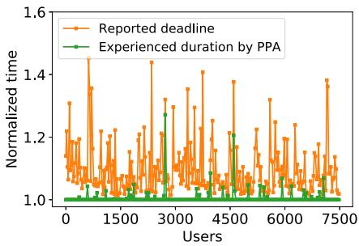  
(a) Service handoff duration

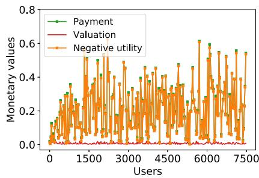  
(b) Monetary costs and valuations  
Fig. 6. Experimental analysis on valuations and payments.

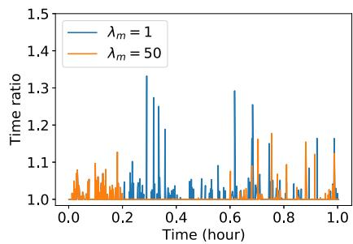  
(c) Impact of valuations of users on the handoff duration.

## 7 CONCLUSION

Computation offloading in 5G MEC to achieve the desired quality of service for mobile users and energy savings for the edge infrastructures is a challenging problem. When a user moves, it is critical to ensure service continuity. In this paper, we proposed a novel online mechanism for the service handoff in 5G MEC to address this challenge. Our mechanism consists of a path planning algorithm and a payment determination function to find a low-latency and energy-aware path for each service handoff of users and calculate their payments. We showed theoretically that our proposed mechanism is truthful and weakly budget balance. The experimental results show that the proposed mechanism leads to system equilibrium, avoids congestion, and balances load, making it suitable for MEC and 5G technology. Our proposed mechanism is extendable to any other problems where an efficient path planning within time constraints is needed. In the future, we aim to perform multi-service path planning, where each user application may consist of multiple dependent services. We also aim to employ machine learning approaches to predict the trajectory of mobile users in the absence of the information associated with the traveling route of mobile users.

## REFERENCES

[1] M. Agiwal, A. Roy, and N. Saxena, “Next generation 5G wireless networks: A comprehensive survey,” IEEE Commun. Surv. Tuts., vol. 18, no. 3, pp. 1617–1655, 3rd Quart. 2016.

[2] W. Shi and S. Dustdar, “The promise of edge computing,” Computer, vol. 49, no. 5, pp. 78–81, 2016.

[3] N. Sharghivand, F. Derakhshan, and N. Siasi, “A comprehensive survey on auction mechanism design for cloud/edge resource management and pricing,” IEEE Access, vol. 9, pp. 126 502–126 529, 2021.

[4] K. Ha et al., “Adaptive VM handoff across cloudlets,” School Comput. Sci., Carnegie Mellon Univ., Tech. Rep. CMU-CS-15–113, 2015.

[5] S. Wang, J. Xu, N. Zhang, and Y. Liu, “A survey on service migration in mobile edge computing,” IEEE Access, vol. 6, pp. 23 511–23 528, 2018.

[6] M. Satyanarayanan, P. Bahl, R. Caceres, and N. Davies, “The case for VM-based cloudlets in mobile computing,” IEEE Pervasive Comput., vol. 8, no. 4, pp. 14–23, 4th Quart. 2009.

[7] K. Ha et al., “You can teach elephants to dance: Agile VM handoff for edge computing,” in Proc. 2nd ACM/IEEE Symp. Edge Comput., 2017, pp. 1–14.

[8] L. Ma, S. Yi, and Q. Li, “Efficient service handoff across edge servers via docker container migration,” in Proc. 2nd ACM/IEEE Symp. Edge Comput., 2017, pp. 1–13.

[9] Y.-T. Chen and W. Liao, “Mobility-aware service function chaining in 5G wireless networks with mobile edge computing,” in Proc. IEEE Int. Conf. Commun., 2019, pp. 1–6.

[10] Q. Cao, Q. Wu, B. Liu, S. Zhang, and Y. Zhang, “An optimization method for mobile edge service migration in cyberphysical power system,” Wireless Commun. Mobile Comput., vol., p. 12, 2021.

[11] C. Puliafito, C. Vallati, E. Mingozzi, G. Merlino, and F. Longo, “Design and evaluation of a fog platform supporting device mobility through container migration,” Pervasive Mobile Comput., vol. 74, 2021, Art. no. 101415.

[12] M. Lee and I.-Y. Ko, “Service consumption planning for efficient service migration in mobile edge computing environments,” in Proc. 36th Annu. ACM Symp. Appl. Comput., 2021, pp. 744–751.

[13] M. R. Anwar, S. Wang, M. F. Akram, S. Raza, and S. Mahmood, ”5G-enabled MEC: A distributed traffic steering for seamless service migration of internet of vehicles,” IEEE Internet Things J., vol. 9, no. 1, pp. 648–661, Jan. 2022.

[14] J. Xu, X. Ma, A. Zhou, Q. Duan, and S. Wang, “Path selection for seamless service migration in vehicular edge computing,” IEEE Internet Things J., vol. 7, no. 9, pp. 9040–9049, Sep. 2020.

[15] N. Sharghivand, F. Derakhshan, L. Mashayekhy, and L. M. Khanli, “An edge computing matching framework with guaran teed quality of service,” IEEE Trans. Cloud Comput., vol. 10, no. 3, pp. 1557–1570, Jul.–Sep. 2020.

[16] W. Ma and L. Mashayekhy, “Truthful computation offloading mechanisms for edge computing,” in Proc. IEEE 6th Intl. Conf. Edge Comput. Scalable Cloud, 2020, pp. 199–206.

[17] R. Yadav, W. Zhang, O. Kaiwartya, H. Song, and S. Yu, “Energy latency tradeoff for dynamic computation offloading in vehicular fog computing,” IEEE Trans. Veh. Technol., vol. 69, no. 12, pp. 14 198–14 211, Dec. 2020.

[18] W. Ma and L. Mashayekhy, “Quality-aware video offloading in mobile edge computing: A data-driven two-stage stochastic optimization,” in Proc. IEEE 14th Int. Conf. Cloud Comput., 2021, pp. 594–599.

[19] T. Rausch, P. Raith, P. Pillai, and S. Dustdar, “A system for operating energy-aware cloudlets,” in Proc. 4th ACM/IEEE Symp. Edge Comput., 2019, pp. 307–309.

[20] D. Bhatta and L. Mashayekhy, “A bifactor approximation algorithm for cloudlet placement in edge computing,” IEEE Trans. Parallel Distrib. Syst., vol. 33, no. 8, pp. 1787–1798, Aug. 2022.

[21] L. Yang, B. Liu, J. Cao, Y. Sahni, and Z. Wang, “Joint computation partitioning and resource allocation for latency sensitive applications in mobile edge clouds,” IEEE Trans. Serv. Comput., vol. 14, no. 5, pp. 1439–1452, Sep./Oct. 2021

[22] X. Chen and G. Liu, “Energy-efficient task offloading and resource allocation via deep reinforcement learning for augmented reality in mobile edge networks,” IEEE Internet Things J., vol. 8, no. 13, pp. 10 843–10 856, Jul. 2021.

[23] R. Yadav et al., “Smart healthcare: Rl-based task offloading IEEE Sensors J. no. 22, pp. 24 910–24 918, Nov. 2021.

[24] L. Yang, H. Zhang, M. Li, J. Guo, and H. Ji, “Mobile edge comput ing empowered energy efficient task offloading in 5G,” IEEE Trans. Veh. Technol., vol. 67, no. 7, pp. 6398–6409, Jul. 2018.

[25] K. Zhang et al., “Energy-efficient offloading for mobile edge computing in 5G heterogeneous networks,” IEEE Access, vol. 4, pp. 5896–5907, 2016.

[26] X. Chen, Z. Liu, Y. Chen, and Z. Li, “Mobile edge computing based task offloading and resource allocation in 5G ultra-dense networks,” IEEE Access, vol. 7, pp. 184 172–184 182, 2019

[27] C. Zhang and Z. Zheng, “Task migration for mobile edge comput ing using deep reinforcement learning,” Future Gener. Comput. Syst., vol. 96, pp. 111–118, 2019.

[28] E. Farhangi Maleki, L. Mashayekhy, and S. M. Nabavinejad, “Mobility-aware computation offloading in edge computing using machine learning,” IEEE Trans. Mobile Comput., to be published, doi: 10.1109/TMC.2021.3085527

[29] T. Ouyang, Z. Zhou, and X. Chen, “Follow me at the edge: Mobility-aware dynamic service placement for mobile edge computing,” IEEE J. Sel. Areas Commun., vol. 36, no. 10, pp. 2333–2345, Oct. 2018.

[30] S. Wang, R. Urgaonkar, M. Zafer, T. He, K. Chan, and K. K. Leung, “Dynamic service migration in mobile edge computing based on markov decision process,” IEEE/ACM Trans. Netw., vol. 27, no. 3, pp. 1272–1288, Jun. 2019.

[31] S. Rezvani, N. Mokari, M. R. Javan, and E. Jorswieck, “Fairness and transmission-aware caching and delivery policies in OFDMA-based hetnets,” IEEE Trans. Mobile Comput., vol. 19, no. 2, pp. 331–346, Feb. 2020.

[32] “Google maps platform,” 2021. [Online]. Available: https:// cloud.google.com/maps-platform,

[33] Waze, 2021. [Online]. Available: https://www.waze.com/waze

[34] T. G. Rodrigues, K. Suto, H. Nishiyama, N. Kato, and K. Temma, “Cloudlets activation scheme for scalable mobile edge computing with transmission power control and virtual machine migration,” IEEE Trans. Comput., vol. 67, no. 9, pp. 1287–1300, Sep. 2018.

[35] Z. Li, N. Zhu, D. Wu, H. Wang, and R. Wang, “Energy-efficien mobile edge computing under delay constraints,” IEEE Trans. Green Commun. Netw., vol. 6, no. 2, pp. 776–786, Jun. 2022.

[36] N.-T. Le, L.-N. Tran, Q.-D. Vu, and D. Jayalath, “Energy-efficient resource allocation for OFDMA heterogeneous networks,” IEEE Trans. Commun., vol. 67, no. 10, pp. 7043–7057, Oct. 2019.

[37] M. Patra, R. Thakur, and C. S. R. Murthy, “Improving delay and energy efficiency of vehicular networks using mobile femto access points,” IEEE Trans. Veh. Technol., vol. 66, no. 2, pp. 1496–1505, Feb. 2017.

[38] M. Munir et al., “Multi-agent meta-reinforcement learning for selfpowered and sustainable edge computing systems,” IEEE Trans. Netw. Service Manag., vol. 18, no. 3, pp. 3353–3374, Sep. 2020.

[39] AWS Wavelength, 2021. [Online]. Available: https://aws. amazon.com/wavelength/

[40] M. R. Garey and D. S. Johnson, Computers and Intractability: A Guide to the Theory of NP-Completeness. New York, NY, USA: W. H. Freeman & Co., 1979.

[41] M. Desrochers and F. Soumis, “A generalized permanent labelling algorithm for the shortest path problem with time windows,” INFOR: Inf. Syst. Oper. Res., vol. 26, no. 3, pp. 191–212, 1988.

[42] K. Holmberg and D. Yuan, “A multicommodity network-flow problem with side constraints on paths solved by column generation,” Informs J. Comput., vol. 15, no. 1, pp. 42–57, 2003.

[43] Y. Kergosien, A. Giret, E. Neron, and G. Sauvanet, “An efficient label-correcting algorithm for the multiobjective shortest path problem,” Informs J. Comput., vol. 34, no. 1, pp. 76–92, 2022.

[44] W. Vickrey, “Counterspeculation, auctions, and competitive sealed tenders,” J. Finance, vol. 16, no. 1, pp. 8–37, 1961.

  
Nafiseh Sharghivand received the BSc, MSc, and PhD degrees in computer engineering from the University of Tabriz, Tabriz, Iran. She is currently a lecturer with the Department of Computer Engineering, University of Tabriz. Her research interests include cloud and edge computing, Internet of Things, game theory, mechanism design, machine learning, and multiagent systems.

Lena Mashayekhy (Senior Member, IEEE) is currently an associate professor with the Department of Computer and Information Sciences, University of Delaware. Her research interests include edge cloud computing, data-intensive computing, Internet of Things, and algorithmic game theory. She is a recipient of the 2016 IEEE TCSC Outstanding PhD Dissertation Award, the 2017 IEEE TCSC Award for Excellence in Scalable Computing for Early Career Researchers, the 2022 NSF CAREER Award, and several best paper awards.

Weibin Ma (Student Member) received the MSc degree in engineering science from the State University of New York at Buffalo, in 2018. He is currently working toward the PhD degree in computer science at the University of Delaware. His research interests include edge computing, game theory, and optimization.

Schahram Dustdar (Fellow, IEEE) is Full Profes sor of computer science heading the Research Division of Distributed Systems, TU Wien, Austria. He holds several honorary positions: University of California (USC) Los Angeles; Monash University in Melbourne, Shanghai University, Macquarie University in Sydney, and University o Groningen (RuG), The Netherlands (2004-2010). From Dec. 2016 until Jan 2017 he was a visiting professor with the University of Sevilla, Spain and from January until June 2017 he was a visiting professor with UC Berkeley. He is founding co-editor-in-chief of the new ACM Transactions on Internet ofThings (ACM TIoT) as well as editor-inchief of Computing (Springer). He is an associate editor of IEEE Transactions on Services Computing, IEEE Transactions on Cloud Computing, ACM Transactions on the Web, and ACM Transactions on Internet Technology, as well as on the editorial board of IEEEInternetComputing and IEEE Computer. He is recipient of the ACM Distinguished Scientist Award (2009), the IBM Faculty Award (2012), an elected member of the Academia Europaea: The Academy of Europe, where he is chairman of the Informatics Section.

" For more information on this or any other computing topic please visit our Digital Library at www.computer.org/csdl.