# Toward Adaptive IoT Service Balance in Low-Altitude Economy: Multi-UAV-Aided Bi-Objective Wireless Data Collection and Wireless Energy Transfer

Zeyu Zhao, Yueling Che , Member, IEEE, Sheng Luo , Member, IEEE, Kaishun Wu, Fellow, IEEE, and Victor C. M. Leung , Life Fellow, IEEE

Abstract—The rapid development of the low-altitude economy (LAE) has significantly enhanced the service diversity of the Internet of Things (IoT) networks, necessitating efficient coordination among the unmanned aerial vehicles (UAVs). In this work, we utilize multiple UAVs to provide both wireless data collection (WDC) service and wireless energy transfer (WET) service, and divide the IoT devices into the I-devices that only need the WDC service and the E-devices that only need the WET service, respectively, from the multiple UAVs. Due to their conflicting service demands on the UAVs with limited resources, we formulate the bi-objective optimization problem (BOOP) to minimize the age of information (AoI) for the I-devices and the hungry-level of energy (HoE) for the E-devices at the same time, by jointly optimizing all the UAVs’ trajectories and WET decisions over time slots and their WDC decisions over sub-slots. To efficiently solve the complex BOOP, we innovatively transform it into a single-objective optimization problem (SOOP), in which the two conflicting objectives are scalarized via a self-adaptive objective weight. Unlike the conventional approach reliant on fixed and pre-defined objective weights, we optimize the objective weight jointly with other decision variables, enabling automatic adaptation to various network environments without

human intervention. However, the proposed SOOP is NP-hard with a large number of decision variables. Accordingly, we propose a new Multi-Agent Adaptive and Hierarchical Deep Reinforcement Learning (MA2HDRL) framework, which leverages a central controller (CC) to guide the local training of multiple individual UAV agents. In this framework, each UAV agent employs a two-tier hierarchical DRL model: tier-1 optimizes the trajectory and WET policies over the time slots, while tier-2 optimizes the WDC policy across the sub-slots. Meanwhile, the CC trains the global reward preference for all the UAV agents over the training episodes, to adaptively balance the WDC and WET service demands. Finally, extensive simulation results are conducted to demonstrate the outstanding performance of the proposed MA2HDRL approach as compared to state-of-the-art benchmarks.

Index Terms—Wireless energy transfer (WET), wireless data collection (WDC), unmanned aerial vehicles (UAVs), bi-objective optimization, deep reinforcement learning (DRL), Low-Altitude Economy (LAE).

## I. INTRODUCTION

below 1,000 meters) as its core carrier for various commercial activities [1]. Regulatory reforms have opened up previously underutilized airspace for commercial use. As a result, this new economic sphere has emerged as a critical catalyst for industrial transformation and technological innovation. With far-reaching impacts across multiple fields, spanning last-mile logistics, precision agriculture, emergency response, and urban management, the LAE is creating new market values to promote high-quality and sustainable economic growth.

The rapid development of LAE relies largely on the utilization of unmanned aerial vehicles (UAVs). Thanks to their lineof-sight (LoS) dominated air-to-ground channels and flexible mobility, the UAVs enable the LAE to overcome ground-based network limitations, thereby significantly enhancing the capabilities and diversity of Internet of Things (IoT) services. For example, equipped with lightweight sensors, the UAVs are able to provide quick and remote sensing more efficiently for crop monitoring and health assessment [2] and [3]. By adjusting their flight trajectories, the UAVs are able to fly closely to the wireless devices to perform high-rate wireless data collections (WDC) in remote areas without infrastructures, to extend network coverage [4]. Moreover, the UAVs can efficiently work as an aerial wireless charging network, where the UAVs can cooperatively perform radio frequency (RF) wireless energy transfer (WET) to low-power IoT devices (e.g., smart meters) over shortened transmission distances, to develop an energy-sustainable IoT system [5]. However, existing work primarily focused on the optimal design of the UAV system to support only a single IoT service, neglecting the capability of the UAVs to carry out diversified tasks at the same time and the heterogeneous service nature of the IoT networks. By proposing diversified service requirements on the UAVs’ trajectories and resource allocations, different IoT services may bring conflict design criteria on the UAV system [6] and [7]. Among others, this paper focuses on two typical IoT services in the upcoming 6G era [8], which are the UAV-aided WDC and WET, respectively, with the aim at designing an efficient UAV system that meets diversified IoT service requirements at the same time.

## A. Related Works

UAV-aided WDC or WET (Single service): A great deal of works have studied either UAV-aided WDC or UAV-aided WET for the IoT networks. The work in [9] focused on a single UAV’s WDC from the IoT devices, where the UAV’s trajectory and IoT device scheduling are alternatively optimized via the successive convex approximation (SCA) technique, with the purpose to max-min the average transmission rate. The authors in [10] also utilized the SCA technique to jointly optimize a single UAV’s WET decisions over time and its trajectory, so as to maximize the total harvested energy at the IoT devices. As compared to the WDC, due to generally high power sensitivity at the energy harvester, the UAV needs to maintain a much shorter transmission distance to each of the IoT devices for WET, to assure non-zero energy harvesting (EH) at the IoT devices.

Considering the UAV’s limited on-board battery energy, a single UAV may not be able to provide proper WDC or WET service in a large IoT network. To enhance the service quality for a large IoT network, multiple UAVs have been adopted in [11], [12], [13]. Due to the complex coupling of the transmission decisions and the trajectories between the multiple UAVs, conventional optimization methods generally involve high complexity to solve. Recent studies have adopted the multi-agent deep reinforcement learning (MADRL) framework to optimize the action decisions of the UAVs over time. For example, by making each UAV act as an independent agent, the communication fairness for different IoT devices was assured in a multi-UAV aided WDC system [12]. Moreover, to achieve timely and sufficient WET from the UAVs to the low-power IoT devices, the metric of hunger-level of energy (HoE) was proposed in [13], where the total HoE of all the IoT devices was minimized under the assistance of multiple UAVs.

UAV-aided WDC and WET (Multiple services): The design of the UAV system needs to simultaneously meet different (or even conflicting) service demands from all the IoT devices, when considering the more practical IoT networks with multi-service demands. To enhance the performance of the wireless powered communication network (WPCN), the authors in [14] and [15] adopted a single UAV or multiple UAVs to transmit energy to low-power IoT devices in the downlinks to support their wireless information transmissions in the uplinks, respectively. The authors in [6] further applied the HoE metric to improve the WET performance in the enhanced WPCN with dynamic and on-demand transmissions of energy and information. Although considering both WDC and WET services, the design of the WPCN is focusing on the UAVs’ communication performance under sufficiently-high WET efficiency.

By classifying the IoT devices into the I-devices that only need the communication service and the E-devices that only need to harvest energy, the IoT networks with heterogeneous wireless devices have been studied under the assistance of a single UAV [16] or multiple UAVs [17], respectively. However, despite of the different service objectives from the WET and the WDC, the existing works primarily designed the UAV networks under the formulation of a single-objective optimization problem (SOOP) [18], where the different WET and WDC service metrics are scalarized into a weighted-sum objective, or only one of them is taken as the objective with the other as a constraint. The complicated tradeoffs between the WET and the WDC performances are generally hard to fully exploit under the simplified SOOP formulation.

With the purpose to simultaneously maximize the UAV-aided WET and the WDC performances, there have been a few works designing the UAV networks under a multi-objective optimization problem (MOOP) formulation, where both of the multipolicy [19] and single-policy [20] deep reinforcement learning (DRL) algorithms were exploited. For the multi-policy DRL, the authors in [21] employed an evolutionary multi-objective reinforcement learning algorithm to minimize the task latency and the energy consumption of the UAV, and at the same time, to maximize its collected number of tasks. Although performing well in simulations, the multi-policy DRL method in [21] is difficult to deploy in the real world, due to the maintenance of a large policy population for evolutionary. In contrast, the single-policy DRL approaches, aiming at training a single optimal policy, are lightweight to implement for practical UAV networks. In [22], [23], [24], by transforming the MOOP into a SOOP with fixed and pre-defined weights to scalarize the multiple objectives into a single objective, the optimal UAV policy for the SOOP is trained by the DDPG algorithm and/or its variants. However the pre-defined objective weights required for the MOOP-to-SOOP transformation are very challenging to obtain optimally, which usually demand repeated manual trial and error, to cater to different network environments. This burdens the UAV system deployment in dynamic networks and impedes the application of the single-policy approach in practice.

## B. Our Contributions

In this paper, we consider a multi-UAV-aided IoT network with the I-devices and the E-devices. The UAVs collect data wirelessly from the I-devices in the uplinks, and transmit RF energy to the E-devices in the downlinks. We use the AoI and the HoE to measure the service quality of the UAVs’ WDC and WET, respectively. By jointly optimizing all the UAVs’ trajectories, WET decisions, and WDC decisions over time, we aim to simultaneously minimize the overall AoI of the I-devices and the overall HoE of the E-devices in the UAVs’ task period, under various constraints on all the UAVs’ flight and battery usage. This problem is formulated as a bi-objective optimization problem (BOOP).

We focus on the single-policy approach to solve the BOOP to assure the practical implementation of the UAV system with limited resources. We propose a novel BOOP-to-SOOP transformation approach with a self-adaptive objective weight. Unlike the conventional approach reliant on fixed and pre-defined objective weights, we optimize the objective weight jointly with other decision variables, enabling automatic adaptation to various network environments without human intervention. However, the new SOOP is very challenging to solve in general, not just because of the tight coupling between all the UAVs’ trajectories, WET decisions, and WDC decisions, but also due to their complicated entanglement with the objective weight for optimization. Accordingly, we propose a new multi-agent adaptive hierarchical deep reinforcement learning $( \mathrm { M A ^ { 2 } H D R L } )$ framework, where a two-tier hierarchical DRL model is individually trained at each UAV agent under the guidance of the adaptive reward preference adjustment (ARPA) model that is globally trained at the central controller (CC).

The main contributions of this paper are summarized as follows.

Practical System Model: We model the multi-UAV-aided WDC and WET for supporting heterogeneous IoT services under a line-of-sight (LoS) probability based channel model. For the I-devices, we develop the I-devices’ uplink information models over sub-slots, and adopt the AoI to measure the I-devices’ data freshness. For the E-devices, we utilize the practical non-linear EH model to measure each E-device’s harvested energy over time slots, and use the HoE to measure the E-devices’ energy demand urgency. By modeling each UAV’s energy consumption, we also construct each UAV’s battery energy variation model over time.

BOOP Formulation and Novel Transformation to SOOP: We formulate the BOOP to simultaneously minimize the I-devices’ overall AoI and the E-devices’ overall HoE, by jointly optimizing all the UAVs’ trajectories and WET decisions over time slots and their WDC decisions over sub-slots. To address the BOOP efficiently, we then transform the BOOP into a novel SOOP with a self-adaptive objective weight, where the objective weight is optimized jointly with other decision variables instead of being tuned manually, enabling automatic and optimal service balance between the I-devices and the E-devices.

\- New $M A ^ { 2 } H D R L$ Framework with Global Reward Preference: To address the transformed SOOP that is NP-hard in general, we propose a new MA2HDRL framework. In each training episode, the CC trains its ARPA model to globally determine the optimal reward preference for all the UAV agents; Each UAV agent then trains its local two-tier DRL model, where tier-1 outputs the optimal trajectory and WET policies over time slots, and tier-2 outputs WDC policy over sub-slots. The optimal objective weight of the SOOP and the UAVs’ optimal policies are then obtained as that jointly lead to the minimum AoI and HoE rewards over all the training episodes.

Hierarchical Training with Low-Complexity Algorithm: For the global training of the ARPA model at the CC, we utilize the DDPG algorithm that has continuous outputs with low time complexity. For the local two-tier DRL model at each UAV agent, we employ the SAC algorithm in tier-1 to obtain the continuous trajectory and WET policies, leveraging entropy for effective large state space exploration, whereas the discrete actions of the WDC policy in tier-2 are trained using the lower-complexity DQN algorithm. The overall $\mathbf { M A ^ { 2 } H D R I }$ algorithm is of linear time complexity over the number of UAVs.

Extensive Simulations for Performance Evaluation: Extensive simulations are conducted to validate the superior performance of the proposed MA2HDRL approach as compared to the state-of-the-art benchmarks, including the traditional fixed-weight single-policy approach, in terms of convergence and balancing the conflicting AoI (of Idevices) and HoE (of E-devices) objectives. Moreover, we also demonstrate an UAV network example under our proposed $\mathbf { M A } ^ { 2 } \mathbf { H D R I }$ approach to show its quick adaptation to the dynamic network environment.

It also came to our notice that to find adaptive objective weights for the BOOP-to-SOOP transformation, the neighborhood-based parameter transfer strategy (NPTS) that was proposed in [25] has been recently applied to the aircraft engine maintenance [26]. Although no longer requiring pre-defined objective weights to solve the BOOPs, the NPTS may cause the catastrophic forgetting issue during the policy parameter transfer [27], due to stepwise mutations in reward preferences. Unlike the NPTS, our proposed $\mathbf { M A ^ { 2 } H D R L }$ approach can adaptively and smoothly adjust reward preferences, and thus alleviate catastrophic forgetting issue. To the best of our knowledge, both of our proposed BOOP-to-SOOP transformation with self-adaptive objective weights and the corresponding $\mathbf { M A ^ { 2 } H D R I }$ approach have not been reported in the literature yet.

The rest of this paper is organized as follows: Section II presents the system model, Section III details the BOOP formulation and its transformation to the novel SOOP, as well as the new MA2HDRL framework, Section IV gives the MDP modeling for the two-tier DRL model at each UAV agent and the ARPA model at the CC, Section V elaborates the MA2HDRL training flow and the algorithm with complex analysis, and at last, the simulation results are given in Section VI.

## II. SYSTEM MODEL

As shown in Fig. 1, consider that in total of $U > 1 \mathrm { U A V s }$ are dispatched to serve L IoT devices for a task period consisting of $T$ slots, $\mathbb { U } = \{ 1 , . . . , U \}$ and $\mathbb { T } = \{ 1 , . . . , T \}$ . According to the different service requirements of the IoT devices for the information transmissions or the RF energy harvesting (EH), we divide the IoT devices into two categories, where the IoT devices that transmit their data to the UAVs are referred to as I-devices, and that demand to harvest energy from the UAVs WET to sustain their operations (e.g., for environmental monitoring) are referred to as E-devices. Let $\mathbb { N } \triangleq \{ 1 , . . . , N \}$ and $\mathbb { W } \triangleq \{ 1 , . . . , W \}$ denote the set of the I-devices and the Edevices, respectively. We also use $\mathbb { L } \triangleq \{ 1 , . . . , L \}$ to denote the set of all the IoT devices with N $\cup \mathbb { W } = \mathbb { L }$ . It is also assumed that all the N I-devices are always energy-sufficient and the W E-devices have no data to deliver to the UAVs in the considered task period, i.e., $\mathbb { N } \cap \mathbb { W } = \emptyset$ . Each of the UAVs is installed with two antennas, and hence is able to use one antenna to collect data from the I-devices in the uplinks, and the other to transmit energy to the E-devices in the downlinks at the same time, over two different and non-overlapped frequency bands. Each of the E-devices is equipped with a rectenna for EH and a rechargeable battery to store its harvested energy for future use.

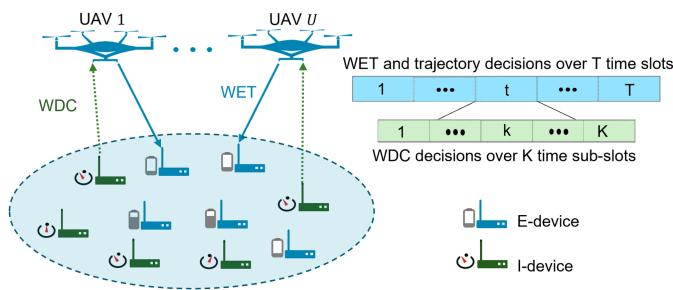  
Fig. 1. Multi-UAV-aided WET and WDC for the IoT networks with heterogeneous service demands.

TABLE I NOTATIONS OF KEY PARAMETERS
<table><tr><td>Notations</td><td>Description</td></tr><tr><td> $q _ { u } \left[ t \right]$ </td><td>Location of UAV-u in slot t</td></tr><tr><td> $d _ { u } ^ { l } \left[ t \right]$ </td><td>Distance between UAV-u and IoT device l in slot t</td></tr><tr><td> $\vartheta , \varrho$ </td><td>Time length of a slot or a sub-slot</td></tr><tr><td> $P _ { n } , P _ { u }$ </td><td>Transmit power of I-device n or UAV-u</td></tr><tr><td> $G _ { u } ^ { l } [ t ]$ </td><td>Channel gain between IoT device l and UAV-u in slot t</td></tr><tr><td> $D _ { u , n } ^ { t } [ k ]$ </td><td>UAV-u&#x27;s WDC decision for I-device n at sub-slot k in slot t</td></tr><tr><td> $E _ { w } ^ { h a r } [ t ]$ </td><td>Harvested energy at E-device w in slot t</td></tr><tr><td> $C _ { u } ^ { n } [ t ]$ </td><td>Total data size collected by UAV-u from I-device n in slot t</td></tr><tr><td> $A _ { n } [ t ]$ </td><td>AoI of I-device n in slot t</td></tr><tr><td> $B _ { w } [ t ] , B _ { u } [ t ]$ </td><td>Battery level of E-device w or UAV-u at slot t</td></tr><tr><td> $H _ { w } [ t ]$ </td><td>HoE of E-device w in slot t</td></tr><tr><td> $S [ e ]$ </td><td>Objective weight in SOOP (P2), linearly increasing over episodes</td></tr></table>

Denote the fixed ground location of IoT device $l \in \mathbb { L }$ as $q _ { l } =$ $\{ x \ i , y \ i , 0 \}$ . The UAVs fly at a fixed altitude of $h _ { f i x } > 0$ meters (m). The coordinate of UAV-u in slot t is denoted as $q _ { u } [ t ] =$ $\{ x _ { u } ( t ) , y _ { u } ( t ) , h _ { f i x } \}$ , ∀t $\in \mathbb { T } , \forall u \in \mathbb { U }$ . We denote $d _ { u } ^ { l } [ t ]$ as the distance between UAV-u and IoT device l in slot t, which is given as

$$
d _ { u } ^ { l } [ t ] = \| q _ { u } [ t ] - q _ { l } \|\tag{1}
$$

with $| | \cdot | |$ representing the Euclidean norm. Table I gives the notations of the key parameters in this paper.

## A. Channel Model

We consider the line-of-sight (LoS) probability based channel model between each UAV and each IoT device. In any time slot $t \in \mathbb { T } ,$ let $P _ { L o S , u } ^ { l } [ t ]$ represent the LoS probability between IoT device $l \in \mathbb { L }$ and $\mathrm { U A V } { \cdot } u \in \mathbb { U }$ . According to [28], we consider that $\begin{array} { r } { P _ { L o S , u } ^ { l } [ t ] = \frac { 1 } { 1 + a e ^ { - b ( \beta _ { u } ^ { l } [ t ] - a ) } } } \end{array}$ , where $\begin{array} { r } { \beta _ { u } ^ { l } [ t ] = \sin ^ { - 1 } ( \frac { h _ { f i x } } { d _ { u } ^ { l } [ t ] } ) } \end{array}$ denotes the elevation angle between UAV-u and IoT device l in slot $t ,$ and a and b are constants measured from the environment. The corresponding non-line-of-sight (NLoS) probability is then obtained as $P _ { N L o S , u } ^ { l } [ t ] = 1 - P _ { L o S , u } ^ { \bar { l } } [ t ]$ . Thereby, the average channel power gain between UAV-u and IoT device l in slot t is expressed as

$$
G _ { u } ^ { l } [ t ] = P _ { L o S , u } ^ { l } [ t ] G _ { 0 } d _ { u } ^ { l } [ t ] ^ { - \alpha _ { L } } + P _ { N L o S , u } ^ { l } [ t ] G _ { 0 } d _ { u } ^ { l } [ t ] ^ { - \alpha _ { N } } ,\tag{2}
$$

where $G _ { 0 }$ denotes the average channel power gain at a reference distance of 1 m, and $\alpha _ { L }$ and $\alpha _ { N }$ with $\alpha _ { L } < \alpha _ { N }$ are the path-loss exponents of the LoS and the NLoS links, respectively.

## B. UAVs’ WDCs From I-Devices in Uplinks

Consider time-sensitive data collections at the UAVs from the I-devices. We apply the metric of AoI to measure the freshness of the data collected at the UAVs from each I-device. As shown in Fig. 1, to increase each I-device’s data transmission opportunities for real-time information updating in each slot, we divide each time slot of time length ϑ into K sub-slots, where the time length of each sub-slot is $\varrho$ with $\varrho K = \vartheta$ . At each sub-slot, to reduce the I-devices’ co-channel data transmission interference, each UAV collects data from at most one I-device, and each I-device transmits data to at most one UAV. Let $D _ { u , n } ^ { t } [ k ] \in \{ 0 , 1 \}$ represent UAV-u’s WDC decision for I-device n ∈ N at the k-th sub-slot in slot t, where $D _ { u , n } ^ { t } [ k ] = 1$ , if UAV-u decides to collect data from I-device n at the k-th sub-slot in slot t, or $D _ { u , n } ^ { t } [ k ] = 0$ otherwise. We obtain the UAVs’ WDC decision constraints for any sub-slot $k \in \{ 1 , . . . , K \}$ in slot $t \in \mathbb { T }$ as follows:

$$
\sum _ { u = 1 } ^ { U } D _ { u , n } ^ { t } [ k ] \leq 1 \mathrm { ~ a n d ~ } \sum _ { n = 1 } ^ { N } D _ { u , n } ^ { t } [ k ] \leq 1 .\tag{3}
$$

It is assumed that the time slot length ϑ is sufficiently short, such that each UAV’s position is unchanged over all K sub-slots in each slot, but may change over different time slots. Hence, $G _ { u } ^ { n } [ t ]$ in (2) is also utilized to represent the average channel power gain from I-device n to UAV-u at each of the K sub-slots in slot t. Denote $P _ { n }$ as I-device n’s fixed transmit power. The instantaneous data rate received at UAV-u from I-device n at the k-th sub-slot in slot t, denoted by $M _ { u , n } ^ { t } [ k ]$ ], is obtained as

$$
M _ { u , n } ^ { t } [ k ] = B _ { 0 } \log _ { 2 } ( 1 + \Gamma _ { u , n } ^ { t } [ k ] ) ,\tag{4}
$$

where $B _ { 0 }$ is the channel bandwidth in Hz, and $\Gamma _ { u , n } ^ { t } [ k ] =$ Dt [k]PnGn[t] $\begin{array} { r l } { ~ } & { { } \overline { { \sum _ { u ^ { \prime } = 1 , u ^ { \prime } \neq u } ^ { U } \sum _ { n ^ { \prime } = 1 , n ^ { \prime } \neq n } ^ { N } D _ { u ^ { \prime } , n ^ { \prime } } ^ { t } [ k ] P _ { n ^ { \prime } } G _ { u } ^ { n ^ { \prime } } [ t ] + \sigma ^ { 2 } } } } \end{array}$ is the average signalto-interference-plus-noise ratio (SINR) received at UAV-u from I-device n at the k-th sub-slot in slot t, with $\sigma ^ { 2 }$ denoting the white Gaussian noise power received at UAV-u. The total amounts of data delivered from I-device n to UAV-u over all K sub-slots in slot t, denoted by $C _ { u } ^ { n } [ t ]$ , is expressed as

$$
C _ { u } ^ { n } [ t ] = \sum _ { k = 1 } ^ { K } D _ { u , n } ^ { t } [ k ] \varrho M _ { u , n } ^ { t } [ k ] .\tag{5}
$$

We assume that all the UAVs are able to obtain each I-device n’s total transmitted data with size $\textstyle \sum _ { u = 1 } ^ { U } C _ { u } ^ { n } [ t ]$ in each slot $t , \forall n \in \mathbb { N }$ , by sharing their own received data, each with size $C _ { u } ^ { n } [ t ]$ , via a common channel [15], for collaboratively updating I-device n’s transmitted information in each slot. Denote $A _ { n } [ t ]$ as I-device n’s AoI at the beginning of slot $t , \forall n \in \mathbb { N }$ and ∀t ∈ T. As in [15], each UAV updates $A _ { n } [ t ]$ at the beginning of slot t as follows:

$$
A _ { n } [ t ] = \left\{ { 0 , \atop { A _ { n } [ t - 1 ] + 1 , } } \mathrm { i f } \sum _ { u = 1 } ^ { U } C _ { u } ^ { n } [ t - 1 ] \geq \mathrm { C } _ { \operatorname* { m i n } } , \right.\tag{6}
$$

where $\mathrm { C } _ { \mathrm { m i n } }$ is the minimum required data size for the UAVs to accurately update I-device n’s real-time information in each slot. We set $A _ { n } [ 0 ] = 0$ at the initial. From $\begin{array} { r } { ( 6 ) , \mathrm { i f } \sum _ { u = 1 } ^ { U } C _ { u } ^ { n } [ t - 1 ] \geq } \end{array}$ $\mathrm { C } _ { \mathrm { m i n } } .$ , the UAVs can timely update I-device n’s information at the beginning of slot t, and thus set $A _ { n } [ t ] = 0 ;$ or otherwise, the UAVs cannot obtain I-device n’s fresh information in slot $t - 1$ , and thereby increase $A _ { n } [ t ]$ by 1 at the beginning of slot t. Denote $A _ { t o t a l }$ as the total data freshness received at the UAVs from all the I-devices over all the T slots, which is expressed as

$$
A _ { t o t a l } = \sum _ { t = 1 } ^ { T } \sum _ { n = 1 } ^ { N } A _ { n } [ t ] .\tag{7}
$$

From $( 7 ) ,$ , if the UAVs’ received data amount from each I-device is at least $\mathrm { C } _ { \mathrm { m i n } }$ in each of the T time slots, we have $A _ { t o t a l } = 0 ;$ in this case, all the I-devices’ data freshness is properly assured over all the time slots.

## C. UAVs’ WETs to E-Devices in Downlinks

The UAVs transmit energy to the E-devices in the downlinks. Due to the generally low end-to-end wireless energy transmission efficiency, only trivial difference can be found between the harvested energy amounts over different sub-slots at each E-device. Hence, unlike the UAVs’ WDC decisions for all the I-devices that vary over sub-slots to assure the data freshness, the UAVs’ WET decisions for all the E-devices vary over time slots. Let $Z _ { u } [ t ] \in \{ 0 , 1 \}$ } denote UAV-u’s WET decision in slot t, where $Z _ { u } [ t ] = 1$ represents that UAV-u transmits energy in slot $t ,$ or $Z _ { u } [ t ] = 0$ , otherwise.

As in [29], we adopt the following non-linear EH model to transform each E-device’s received RF power $p _ { r f } \geq 0$ at the rectenna into the direct circuit (DC) power $\mathcal { P } ( p _ { r f } ) \colon$

$$
\mathcal { P } ( p _ { r f } ) = \left\{ \begin{array} { l l } { 0 , } & { p _ { r f } \in [ 0 , P _ { s e n } ) , } \\ { \hbar ( p _ { r f } ) , } & { p _ { r f } \in [ P _ { s e n } , P _ { s a t } ) , } \\ { \hbar ( P _ { s a t } ) , } & { p _ { r f } \in [ P _ { s a t } , + \infty ] , } \end{array} \right.\tag{8}
$$

where $P _ { s e n }$ and $P _ { s a t }$ denote the power sensitivity and the power saturation at each E-device’s energy harvester, respectively, and $\hbar ( \cdot )$ is the non-linear power transformation function that can be obtained based on the practical energy harvester’s performance data, using the curve fitting techniques [29].

Denote $P _ { u }$ as UAV-u’s fixed transmit power for WET in the downlinks. For any $w \in \mathbb { W }$ , E-device w’s total received RF power at its rectenna from all the UAVs in slot t is $\begin{array} { r } { \sum _ { u = 1 } ^ { U ^ { \star } } P _ { u } Z _ { u } [ t ] G _ { u } ^ { w } [ t ] } \end{array}$ . Based on (8), the total amount of energy harvested at E-device w in slot t is obtained as

$$
E _ { w } ^ { h a r } [ t ] = \mathcal { P } \left( \sum _ { u = 1 } ^ { U } P _ { u } Z _ { u } [ t ] G _ { u } ^ { w } [ t ] \right) \vartheta .\tag{9}
$$

In practice, $P _ { s e n }$ usually has a high value (of, e.g., −10 dBm) [30]. Hence, from (9), E-device w can harvest non-trivial amount of energy in each slot t only if $\begin{array} { r } { \sum _ { u = 1 } ^ { U } P _ { u } Z _ { u } [ t ] G _ { u } ^ { w } [ t ] \geq P _ { s e n } } \end{array}$ . This requires the UAVs with $Z _ { u } [ t ] = 1$ in slot t to increase their $G _ { u } ^ { w } [ t ] \mathrm { : }$ ’s by flying sufficiently close to E-device w.

By storing the harvested DC energy $E _ { w } ^ { h a r } [ t ]$ in the rechargeable battery, the battery level of E-device w at the beginning of slot $t , \forall w \in \mathbb { W }$ and $\forall t \in \mathbb { T }$ , is updated as follows:

$$
B _ { w } [ t ] = \operatorname* { m i n } \left( B _ { w } [ t - 1 ] + E _ { w } ^ { h a r } [ t - 1 ] , \mathrm { B } _ { \mathrm { w } } ^ { \operatorname* { m a x } } \right) ,\tag{10}
$$

where $\mathrm { B } _ { \mathrm { w } } ^ { \mathrm { m a x } }$ is the battery capacity of E-device w, and the initial battery level is $B _ { w } [ 0 ] \ge 0$ . Denote $B _ { \Gamma }$ as E-devices’ energy sufficiency threshold.1 We say E-device w is energy-hungry in slot t if $B _ { w } [ t ] < B _ { \Gamma }$ , or energy-satisfied in slot t, otherwise. Once E-device w becomes energy-satisfied in slot t, it no longer needs to harvest energy from the current slot t to the last slot with $t = T$ . We assume that $B _ { w } [ 0 ] < B _ { \Gamma } \leq \mathrm { B } _ { \mathrm { w } } ^ { \mathrm { m a x } }$ , without loss of generality.

## D. Hunger-Level of Energy At E-Devices

Given B , we refer to $\begin{array} { r } { E _ { a v e , w } = \frac { B _ { \Gamma } - B _ { w } [ 0 ] } { T } } \end{array}$ as E-device w’s average energy demand per time slot. However, under improperly designed trajectories and WET decisions for the UAVs, E-device w’s harvested energy in each slot may hardly achieve $E _ { a v e , w } ;$ and in this case, E-device w’s desire to accumulate $B _ { \Gamma }$ amount of battery energy within T slots becomes increasingly urgent as t increases. We thus use the metric of HoE to measure the urgency of each E-device’s energy demand over time [6] and [13].

Denote $H _ { w } [ t ]$ as the HoE of E-device w at the beginning of slot t. Based on (9) and $( 1 0 ) , H _ { w } [ t ]$ evolves over time as follows:

$$
\begin{array} { r } { H _ { w } [ t ] = \left\{ \begin{array} { l l } { \operatorname* { m a x } ( H _ { w } [ t - 1 ] - 1 , 1 ) , } & { \mathrm { i f ~ } E _ { w } ^ { h a r } [ t - 1 ] \geq E _ { a v e , w } } \\ & { \mathrm { a n d ~ } B _ { w } [ t ] < B _ { \Gamma } , } \\ { H _ { w } [ t - 1 ] + 1 , } & { \mathrm { i f ~ } E _ { w } ^ { h a r } [ t - 1 ] < E _ { a v e , w } } \\ & { \mathrm { a n d ~ } B _ { w } [ t ] < B _ { \Gamma } , } \\ { 0 , } & { \mathrm { i f ~ } B _ { w } [ t ] \geq B _ { \Gamma } , } \end{array} \right. } \end{array}\tag{11}
$$

where the initial value of HoE is $H _ { w } [ 0 ] = 1$ . From (11), for the case with energy-hungry E-device w $( \mathrm { i } . \mathrm { e } . , B _ { w } [ t ] < B _ { \Gamma } )$ in slot t, if its harvested energy amount $E _ { w } ^ { h a r } [ t - 1 ]$ in slot $t - 1$ is no smaller than $E _ { a v e , w } , H _ { w } [ t ]$ is reduced by 1 but staying no lower than the initial HoE; and if $E _ { w } ^ { h a r } [ t - 1 ] < E _ { a v e }$ in slot $t - 1 , H _ { w } [ t ]$ is increased by 1. Moreover, for the case with energy-satisfied E-device w $( \mathrm { i } . \mathrm { e } . , B _ { w } [ t ] \geq E _ { \Gamma } )$ in slot t, $H _ { w } [ t ]$ in slot t becomes $0 ;$ and in this case, E-device w no longer needs $\mathrm { U A V s } '$ WET in and after slot t. From (11), the higher value of $H _ { w } [ t ]$ is, the more impending energy demand of E-device w is in slot $t ;$ and vice versa.

Further, let $\mathbb { W } _ { h } [ t ] = \{ w | B _ { w } [ t ] + E _ { w } ^ { h a r } [ t ] < B _ { \Gamma } \}$ represent the set of energy-hungry E-devices at the end of slot t. The size of $\mathbb { W } _ { h } [ t ]$ is generally non-increasing over the time slot t. We focus on the energy-hungry E-devices from the set $\mathbb { W } _ { h } [ T ]$ at the end of the last slot with $t = T$ , whose battery energy cannot achieve $B _ { \Gamma }$ within the UAVs’ task period. As in [13], we use $H _ { t o t a l }$ to denote the total HoE of all the E-devices from the set $\mathbb { W } _ { h } [ T ]$ over all T slots, which is expressed by

$$
H _ { t o t a l } = \sum _ { w \in \mathbb { W } _ { h } [ T ] } \sum _ { t = 1 } ^ { T } H _ { w } [ t ] .\tag{12}
$$

If all the E-devices are energy-satisfied at the end of the last slot with $t = T$ , the set $\mathbb { W } _ { h } [ T ]$ becomes empty and thus $H _ { t o t a l }$ is 0.

## E. UAVs’ Energy Consumption Model

We consider that each UAV’s energy is mainly consumed for its propulsion and performing the WET and the WDC.

First, according to [31], the propulsion power consumption of UAV-u in slot t is modeled as

$$
\begin{array} { l } { { \displaystyle P _ { p r o } ( V _ { u } [ t ] ) = P _ { a } \left( 1 + \frac { 3 V _ { u } [ t ] ^ { 2 } } { V _ { t i p } ^ { 2 } } \right) + \varpi V _ { u } [ t ] ^ { 3 } } } \\ { { \displaystyle ~ + P _ { b } \left( \sqrt { 1 + \frac { V _ { u } [ t ] ^ { 4 } } { 4 f _ { 0 } ^ { 4 } } } - \frac { V _ { u } [ t ] ^ { 2 } } { 2 f _ { 0 } ^ { 2 } } \right) ^ { \frac { 1 } { 2 } } , } } \end{array}\tag{13}
$$

where $\begin{array} { r } { V _ { u } [ t ] = \frac { | | q _ { u } [ t ] - q _ { u } [ t - 1 ] | | } { \vartheta } } \end{array}$ is UAV-u’s speed in slot $t ,$ and the mechanical parameters $V _ { t i p } , P _ { a } , P _ { b } , \varpi$ , and $f _ { 0 }$ are all considered as constants as in [31]. Hence, UAV-u’s propulsion energy in slot t is $P _ { p r o } ( V _ { u } [ t ] ) \vartheta$ . Then, from Section II-C, it is obtained that UAV-u’s energy consumption for WET in slot t is obtained as $Z _ { u } [ t ] P _ { u } \vartheta$ . Moreover, from Section II-B, to assure the data freshness, each UAV may always need to perform WDC over all the sub-slots in each slot [6]. We thus consider a constant WDC energy consumption eWDC > 0 for each UAV in each slot. As a result, UAV-u’s total energy consumption in slot t is obtained as $E _ { u } [ t ] = P _ { p r o p } ( V _ { u } [ t ] ) \vartheta + Z _ { u } [ t ] P _ { u } \vartheta + \mathrm { e } _ { \mathrm { W D C } }$ . Let $B _ { u } [ t ]$ denote $\mathrm { U A V } { - } u ^ { \prime } \mathrm { s }$ battery level at the beginning of slot $t \in \mathbb { T }$ . We have

$$
B _ { u } [ t ] = \operatorname* { m a x } \left( B _ { u } [ t - 1 ] - E _ { u } [ t - 1 ] , 0 \right) ,\tag{14}
$$

where the UAV-u’s initial battery level is $B _ { u } [ 0 ] \in [ 0 , \mathrm { B } _ { \mathrm { u } } ^ { \mathrm { m a x } } ]$ with $\mathrm { B } _ { \mathrm { u } } ^ { \mathrm { m a x } }$ representing UAV-u’s battery capacity. At the end of the last slot $t = T$ , UAV-u’s remained battery energy $B _ { u } ^ { e n d }$ is obtained by substituting $t = T + 1$ into (14).

## III. BI-OBJECTIVE PROBLEM FORMULATION AND MA2HDRL FRAMEWORK

## A. Problem Formulation

Our goal is to simultaneously minimize the I-devices $A _ { t o t a l }$ in (7) and the E-devices $H _ { t o t a l }$ in (12). To this end, we jointly optimize the $\mathrm { U A V s } '$ trajectories $Q = \{ q _ { u } [ t ] \}$ and WET decisions $Z = \{ Z _ { u } [ t ] \}$ over time slots, as well as their WDC decisions $D = \{ D _ { u , n } ^ { t } [ k ] \}$ over sub-slots, subject to various operational constraints of the UAVs and the IoT devices in practice. This problem is therefore formulated as a bi-objective optimization problem (BOOP) as follows:

$$
( \mathrm { P 1 } ) \colon \operatorname* { m i n } _ { Q , D , Z } \{ A _ { t o t a l } \left( Q , D , Z \right) , H _ { t o t a l } \left( Q , D , Z \right) \} ,\tag{15}
$$

s.t. (3), (6), (10), (11), (14),

$$
Z _ { u } [ t ] \in \{ 0 , 1 \} , \forall u \in \mathbb { U } , \forall t \in \mathbb { T } ,\tag{16}
$$

$$
D _ { u , n } ^ { t } [ k ] \in \{ 0 , 1 \} , \forall u \in \mathbb { U } , \forall t \in \mathbb { T } , \forall n \in \mathbb { N } ,
$$

$$
\forall k \in \{ 1 , . . . , K \} ,\tag{17}
$$

$$
\begin{array} { r } { \| q _ { u } [ t ] - q _ { u } [ t - 1 ] \| \le \mathrm { V } _ { \mathrm { u } } ^ { \operatorname* { m a x } } \vartheta , \forall \mathrm { u } \in \mathbb { U } , \forall \mathrm { t } \in \mathbb { T } , } \end{array}\tag{18}
$$

$$
B _ { u } ^ { e n d } \geq \mathrm { B } _ { \mathrm { u } } ^ { \mathrm { m i n } } , \ \forall \mathrm { u } \in \mathbb { U } ,\tag{19}
$$

$$
d _ { u } ^ { u ^ { \prime } } [ t ] \geq \mathrm { d } _ { \operatorname* { m i n } } , \forall \mathrm { u } , \mathrm { u } ^ { \prime } \in \mathbb { U } , \mathrm { u } \neq \mathrm { u } ^ { \prime } , \forall \mathrm { t } \in \mathbb { T } .\tag{20}
$$

In problem (P1), the constraint in (16) restricts each UAV’s WET decision in each slot to be binary; the constraint in (18) ensures that each UAV-u’s flying speed does not exceed its maximally allowable speed $\mathrm { V } _ { \mathrm { u } } ^ { \mathrm { m a x } } > 0 \mathrm { ; }$ ; the constraint in (19) ensures that $B _ { u } ^ { e n d }$ is no lower than a given threshold $\mathrm { B } _ { \mathrm { u } } ^ { \mathrm { m i n } } > 0$ for supporting, $\mathrm { e . g . }$ , a safe returning flight; and at last, the constraint in (20) ensures that the distance $d _ { u ^ { \prime } } ^ { u } [ t ]$ between any two arbitrary UAV-u and $\mathrm { U A V } – u ^ { \prime }$ in each slot t is no smaller than a safe separation distance $\mathrm { { d } _ { \operatorname* { m i n } } > 0 }$

Due to the binary decisions in (16) and (17), and the nonconvex constraints in (18) and (19), problem (P1) is a mixedinteger and non-convex BOOP, which is NP-hard to solve in general. It is observed from problem (P1) that the I-devices and the E-devices may provide conflicting requirements on the UAVs’ trajectories. For example, to properly serve the I-devices, the UAVs generally need to keep a longer distance from each other to alleviate the received interference from the I-devices data transmissions. In contrast, the E-devices usually require the UAVs to stay closer to increase the E-devices’ harvested energy amounts. Hence, how to balance these two conflicting objectives in problem (P1) while minimizing both simultaneously in the dynamic networks is generally challenging. Moreover, it is noted from problem (P1) that all the UAVs’ trajectories, WDC and WET decisions are tightly coupled over time under the timevarying $A _ { n } [ t ]$ in (6) and $H _ { w } [ t ]$ in (11). Last but not the least, the UAVs’ complicated action decisions over different timescales of time slots and sub-slots further increase the difficulty of solving problem (P1).

## B. Novel Problem Transformation

One classic approach to deal with the BOOP (P1) is to transform it into a SOOP [25] and [32], where the single objective is obtained by scalarizing the two objectives $A _ { t o t a l }$ and $H _ { t o t a l }$ into $\varsigma A _ { t o t a l } + ( 1 - \varsigma ) H _ { t o t a l }$ , under the objective weight $\varsigma \in [ 0 , 1 ]$ (or equivalently, $1 - \varsigma \in [ 0 , 1 ] ) $ ). However, the critical weight ς (and thus $1 - \varsigma )$ is usually set as a constant by experience in the existing work [22], [25] and [33], which may not be able to provide a best tradeoff between the two conflicting objectives in the dynamically-changing network environment.

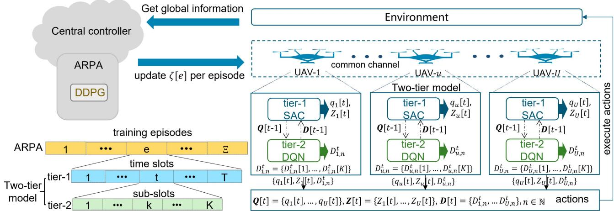  
Fig. 2. Illustration of the proposed MA2HDRL approach: In each training episode, the CC trains the ARPA model to determine the global reward preferenc ζ[e] for all the UAV agents, and each UAV agent trains its local two-tier hierarchical model to determine the optimal trajectory and WET policy over time slots as well as the WDC policy over sub-slots under ζ[e].

Therefore, instead of using a fixed objective weight, we consider ς as a decision variable that needs to be jointly optimized with Q, D, and $z ,$ and novelly formulate the transformed SOOP from the BOOP (P1) as follows:

$$
\begin{array} { r l r } { \mathrm { ( P 2 ) } \colon } & { \displaystyle \operatorname* { m i n } _ { Q , D , Z , \varsigma } F _ { s u m } ( Q , D , { Z } , \varsigma ) \triangleq \varsigma A _ { t o t a l } + ( 1 - \varsigma ) H _ { t o t a l } , } & \\ & { \mathrm { s . t . } } & { ( 3 ) , ( 6 ) , ( 1 0 ) , ( 1 1 ) , ( 1 4 ) , ( 1 6 ) - ( 2 0 ) , \qquad ( 2 1 } \end{array}
$$

where the optimal $\varsigma ^ { * }$ to problem (P2) is able to automatically adapt to different network environments, ensuring a proper trade-off between the minimization of $A _ { t o t a l }$ and $H _ { t o t a l }$

However, under the constraints in (16)-(18), the SOOP (P2) is still a mixed-integer and non-convex optimization problem, which is NP-hard in general with a large number of decision variables. Moreover, although ς is a scalar to optimize, its value is closely coupled with all the other vector-form decision variables Q, D, and Z. Hence, it is still challenging to solve the SOOP (P2) by using the traditional optimization methods.

## C. MA2HDRL Framework

To efficiently solve problem (P2), we exploit the DRL tools and propose the MA2HDRL approach. As shown in Fig. 2, each UAV is considered as an individual agent to determine its own trajectory, WET and WDC decisions, under the assistance of a central controller (CC) that is deployed, e.g., at the cloud.

Considering the different timescales of the UAVs’ decisions, we propose the two-tier hierarchical DRL model for each UAV agent, where each UAV determines its trajectory and WET policies over time slots in tier-1 and its WDC policy over sub-slots in tier-2, respectively. Tier-1 and Tier-2 are coupled: tier-1 affects tier-2 through the UAV-trajectory outcomes, while tier-2 in turn influences tier-1 via reward. The CC trains the ARPA model to determine the global reward prference to balance the I-devices $A _ { t o t a l }$ and the E-devices $H _ { t o t a l }$ for all the UAV agents. We focus on introducing the framework of the $\mathbf { M A } ^ { 2 } \mathbf { H D R I }$ approach in this subsection, and will elaborate the DRL models at each UAV and the CC in the next section.

Consider that there are in total of Ξ training episodes, and each episode includes a complete UAV task period of $T$ time slots, where each time slot consists of K subslots. We let the objective weight ς in (21) increase linearly over the training episodes, and use $\begin{array} { r } { \varsigma [ e ] = \frac { e } { \Xi } , 1 \leq e \leq \Xi . } \end{array}$ to represent the value of the objective weight in each training episode e.

As illustrated in Fig. 2, at the beginning of each episode $e ,$ the CC collects the global network information, and determines the global reward preference ζ[e]. As will be detailed later in Section IV, the episode-varying reward preference ζ[e] is used to determine the reward function at each UAV’s two-tier model and its value is not equal to the linear-increasing objective weight $\varsigma [ e ]$ in general. Upon receiving $\zeta [ e ]$ from the CC via the common channel, each UAV then trains tier-1 and tier-2 over all T slots and all K sub-slots in each slot, respectively, both under ζ[e] in episode e. At the end of each episode $e , A _ { t o t a l } [ e ]$ and $H _ { t o t a l } [ e ]$ are obtained according to (7) and (12), respectively. Based on (21), we rewrite $F _ { s u m }$ in episode e as $F _ { s u m } [ e ]$ and calculate $F _ { s u m } [ e ]$ as

$$
F _ { s u m } [ e ] = \varsigma [ e ] A _ { t o t a l } [ e ] + ( 1 - \varsigma [ e ] ) H _ { t o t a l } [ e ] .\tag{22}
$$

At last, the optimal $\varsigma ^ { * }$ and the optimal policies that determine the UAVs’ trajectory, WET and WDC decisions to SOOP (P2) are obtained as those jointly lead to the lowest $F _ { s u m } [ e ]$ over all the training episodes. We also assume a sufficiently-large $\Xi$ to assure the proper exploration of the optimal $\varsigma ^ { * }$ and the optimal polices.

## IV. MDP MODELING IN MA2HDRL

This section specifies the MDP modeling for the ARPA model at the CC and the two-tier model at each UAV agent.

## A. MDP Modeling for ARPA

The ARPA model at the CC determines the global reward preference $\zeta [ e ]$ for all the UAV agents, to balance the minimization of the I-devices’ AoI and the E-devices’ HoE in each episode $e , 1 \leq e \leq \Xi$ . The ARPA model adopts the DDPG algorithm to support the continuous action output $\zeta [ e ] \in [ 0 , 1 ]$ with low computational complexity. This subsection models the MDP for the DDPG algorithm at the ARPA model.

Define $\begin{array} { r } { { s _ { d d p g } } [ e ] = \{ \zeta [ e - 1 ] , A _ { t o t a l } [ e - 1 ] , H _ { t o t a l } [ e - 1 ] , F _ { s u m } } \end{array}$ $[ e - 1 ] \}$ as the MDP state at the beginning of the e-th episode, where the global network information $A _ { t o t a l } [ e - 1 ] , H _ { t o t a l } [ e -$ $1 ] ,$ , and $F _ { s u m } [ e - 1 ]$ are collected by the CC at the beginning of the e-th episode, $1 \leq e \leq \Xi$ . The state space is thus obtained as $\mathbb { S } _ { d d p g } = \mathbf { R } ^ { 4 }$ . The MDP action in each episode e is denoted by $\boldsymbol { a } _ { d d p g } [ \boldsymbol { e } ] = \boldsymbol { \zeta } [ \boldsymbol { e } ]$ , where the action space is $\mathbb { A } _ { d d p g } = \mathbf { R } ^ { 1 } \in [ 0 , 1 ]$ As will be detailed later in Section IV-B, since the MDP reward values at each UAV’s two-tier model are sensitive to the variation of ζ[e], we adopt a soft update with $a _ { d d p g } [ e ]  0 . 9 9 5 a _ { d d p g } [ e -$ $1 ] + 0 . 0 0 5 a _ { d d p g } [ e ]$ [34], to avoid significant MDP reward variations at each UAV agent over any two successive episodes.

For any given state $s _ { d d p g } [ e ] \in \mathbb { S } _ { d d p g }$ at the beginning of episode e, the CC applies the DDPG policy $\pi _ { d d p g }$ to determine its action $a _ { d d p g } [ e ] \in \mathbb { A } _ { d d p g }$ in episode e, and then gets a reward $r _ { d d p g } [ e ] \in \mathbb { R } _ { d d p g }$ at the end of episode e. With the purpose to reduce $F _ { s u m } [ e ]$ in (22), the reward function is defined as

$$
r _ { d d p g } [ e ] = - F _ { s u m } [ e ] .\tag{23}
$$

## B. Two-Tier Model: MDP Modeling for Tier-1

Upon receiving ζ[e] that is broadcasted by the CC over the common channel, each UAV trains its own two-tier model under $\zeta [ e ]$ in episode $e , 1 \leq e \leq \Xi { : }$ : as shown in Fig. 2, for tier-1, by employing the SAC algorithm with continuous action outputs, tier-1 trains the policy $\pi _ { s a c , u } ^ { e }$ for determining UAV-u’s trajectory and WET decisions over all the T time slots within episode e; for tier-2, by applying the DQN algorithm with discrete action outputs, tier-2 trains the policy $\pi _ { d q n , u } ^ { e }$ for determining UAV-u’s WDC decisions over all the K sub-slots within each time slot t for episode e.

This subsection models the MDP for the SAC algorithm in tier-1 of each UAV-u’s local two-tier model, $\forall u \in \mathbb { U }$ , to train $\pi _ { s a c , u } ^ { e }$ in each episode e, $1 \leq e \leq \Xi$ . The MDP modeling for tier-2 will be introduced in the next subsection. Denote the SAC state, action and reward of UAV-u in slot t of episode $e , \forall t \in \mathbb { T }$ as $s _ { s a c , u } ^ { e } [ t ] , a _ { s a c , u } ^ { e } [ t ]$ , and $r _ { s a c , u } ^ { e } [ t ]$ , respectively.

For each $\mathrm { U A V - } u \in \mathbb { U } , s _ { s a c , u } ^ { e } [ t ]$ is defined as

$$
\begin{array} { r l } & { s _ { s a c , u } ^ { e } [ t ] = \{ \{ x _ { u } [ t ] \} _ { u \in \mathbb { U } } , \{ y _ { u } [ t ] \} _ { u \in \mathbb { U } } , \{ A _ { n } [ t ] \} _ { n \in \mathbb { N } } , } \\ & { ~ \{ B _ { w } [ t ] \} _ { w \in \mathbb { W } } , B _ { u } [ t ] , \zeta [ e ] \} , } \end{array}\tag{24}
$$

which contains all the UAVs’ locations in slot t, all the I-devices’ AoI at the beginning of slot t, and all the E-devices’ battery energy levels at the beginning of slot t, the UAV-u’s own battery energy level at the beginning of slot t, and the reward preference received from the CC for episode e. It is assumed that all the UAVs share their locations at the beginning of each slot via the common channel, so that $\{ x _ { u } [ t ] \} _ { u \in \mathbb { U } }$ and $\{ y _ { u } [ t ] \} _ { u \in \mathbb { U } }$ in (24) are all obtained at each UAV-u. As explained in Section II-B, $\{ A _ { n } [ t ] \} _ { n \in \mathbb { N } }$ is also easily obtained at each UAV-u. Moreover, as in [6], we consider that each E-device broadcasts its own battery energy level to the UAVs at the beginning of each slot t with a sufficiently low transmit power; and the UAVs that receive the E-devices’ battery energy information further share it to all the UAVs via the common channel, so that $\{ B _ { w } [ t ] \} _ { w \in \mathbb { W } }$ is also obtained at each UAV-u. Denote the SAC state space as $\mathbb { S } _ { s a c }$ . It is obtained from (24) that the state space is $\mathbb { S } _ { s a c } \overset { \cdot } { = } \mathbf { R } ^ { 2 U + \widetilde { N + } W + 2 }$ with $s _ { s a c , u } ^ { e } [ t ] \in \mathbb { S } _ { s a c }$

Denote $\chi _ { u } [ t ]$ as $\mathrm { U A V } { - } u ^ { \prime } \mathrm { s }$ horizontal rotation angle in slot t. UAV-u’s horizontal location $( x _ { u } [ t + 1 ] , y _ { u } [ t + 1 ] )$ at the beginning of slot t + 1 is determined if $\chi _ { u } [ t ]$ and $V _ { u } [ t ]$ are obtained. To determine UAV-u’s trajectory and WET decision for problem (P2), the MDP action for the SAC algorithm is defined as

$$
a _ { s a c , u } ^ { e } [ t ] = \{ V _ { u } [ t ] , \chi _ { u } [ t ] , Z _ { u } [ t ] \} .\tag{25}
$$

The action space, denoted by $\mathbb { A } _ { s a c } ,$ is obtained as $\mathbb { A } _ { s a c } = \mathbf { R } ^ { 3 }$ with $a _ { s a c , u } ^ { e } [ t ] \in \mathbb { A } _ { s a c } .$ Since the SAC algorithm has continuous action outputs, to properly determine the binary $Z _ { u } [ t ]$ that meets the constraint in (16), we let $Z _ { u } [ t ] = 0$ if the SAC algorithm output is negative, or $Z _ { u } [ t ] = 1$ , otherwise.

The MDP reward space for the SAC algorithm is denoted as $\mathbb { R } _ { s a c } = \mathbf { R }$ . For any given state $s _ { s a c , u } ^ { e } [ t ] \in \mathbb { S } _ { s a c }$ at the beginning of slot t in episode e, UAV-u applies the SAC policy $\pi _ { s a c , u } ^ { e }$ to determine its action $a _ { s a c , u } ^ { e } [ t ] \in \mathbb { A } _ { s a c }$ in slot $t ,$ and then gets a reward $r _ { s a c , u } ^ { e } [ t ] \in \mathbb { R } _ { s a c }$ at the end of slot t. The reward function $r _ { s a c , u } ^ { e } [ t ]$ for the SAC algorithm is designed to achieve a proper trade-off between minimizing the E-devices’ HoE and the Inodes’ AoI under the constraints given in (16)-(20) for problem (P2). To be specific, our proposed reward function for the SAC algorithm consists of the following five parts:

Reward $r _ { u , 0 } [ t ]$ for reducing I-devices’ AoI: Each UAV’s trajectory determined by the SAC algorithm in tier-1 affects not only the E-devices’s HoE, but also the I-devices’ AoI. We use the negative of the average AoI of all the I-devices to represent $r _ { u , 0 } [ t ]$ as follows:

$$
r _ { u , 0 } [ t ] = - \frac { 1 } { N } \sum _ { n \in \mathbb { N } } A _ { n } [ t + 1 ] ,\tag{26}
$$

which increases as the AoI of all the I-devices decreases.

\- Reward $r _ { u , 1 } [ t ]$ for reducing E-devices’ HoE: The Edevices’ HoE is affected by each UAV’s trajectory and WET decisions that are both determined in tier-1. Following [6], we use $\begin{array} { r } { \kappa _ { u } [ t ] \triangleq \sum _ { w = 1 } ^ { W } \frac { \mathcal { P } ( P _ { u } Z _ { u } [ t ] G _ { u } ^ { w } [ t ] ) \cdot \vartheta } { E _ { \ldots } ^ { h a r } [ t ] } } \end{array}$ to represent the effectiveness of UAV-u’s WET in slot t in increasing all the E-devices’ battery energy. By further considering all the E-devices’ battery energy change in slot t due to the UAVs’ WET, we use $\begin{array} { r } { \dot { b } _ { u } ^ { W E T } \dot { [ t ] } = \dot { \kappa _ { u } [ t ] } \cdot \sum _ { w \in \mathbb { W } } ( B _ { w } [ t + } \end{array}$ $1 ] - B _ { w } [ t ] ) \cdot H _ { w } [ t + 1 ]$ to represent UAV-u’s WET reward, where $H _ { w } [ t + 1 ]$ is considered to encourage UAV-u to charge energy-hungry E-devices more frequently. Dividing $b _ { u } ^ { W E T } [ t ]$ by $\begin{array} { r } { 1 + \sum _ { w \in \mathbb { W } } H _ { w } [ t + 1 ] , r _ { u , 0 } [ t ] } \end{array}$ is set as

$$
r _ { u , 1 } [ t ] = \frac { b _ { u } ^ { W E T } [ t ] } { 1 + \sum _ { w \in \mathbb { W } } H _ { w } [ t + 1 ] } .\tag{27}
$$

\- Reward $r _ { u , 2 } [ t ] f o r$ saving $U A V  – u ' s$ own battery energy: We let $r _ { u , 2 } [ t ] = B _ { u } [ t + 1 ] - \mathrm { B _ { u } ^ { m i n } }$ , which requires to be positive to meet the constraint in (19).

\- Reward $r _ { u , 3 } [ t ]$ for keeping safe distances from all other UAVs: We set $r _ { u , 3 } [ t ] = - 1$ if the constraint in (20) is not satisfied, or $r _ { u , 3 } [ t ] = 0$ , otherwise.

\- Reward $r _ { u , 4 } [ t ] f o r f l y i n g$ within the service area: Similar to [6], for efficient WET and WDC, we constrain each UAV’s trajectory within a service area. We set $r _ { u , 4 } [ t ] = - 1$ if UAV-u locates outside of the provided service area, or $r _ { u , 4 } [ t ] = 0$ , otherwise.

By summing the above five parts, $r _ { s a c , u } ^ { e } [ t ]$ is obtained as follows:

$$
\begin{array} { r } { r _ { s a c , u } ^ { e } [ t ] = \zeta [ e ] r _ { u , 0 } [ t ] + ( 1 - \zeta [ e ] ) r _ { u , 1 } [ t ] } \\ { + r _ { u , 2 } [ t ] + r _ { u , 3 } [ t ] + r _ { u , 4 } [ t ] . } \end{array}\tag{28}
$$

In (28), the episode-varying reward preference $\zeta [ e ] \in [ 0 , 1 ]$ is used to achieve a globally balanced reward from $r _ { u , 0 } [ t ]$ and $r _ { u , 1 } [ t ]$ , in each time slot t of episode e.

It is worth noting from (28) that the global reward preference ζ[e] is used to balance the real-time rewards $r _ { u , 0 } [ t ]$ and $r _ { u , 1 } [ t ]$ received by $\mathrm { U A V } { - } u$ at the end of each time slot, while ς[e] in (22) is used to balance the overall $A _ { t o t a l } [ e ]$ and $H _ { t o t a l } [ e ]$ for an entire episode. Hence, ζ[e] and ς[e] work over different scales to assure a well-balanced and joint minimization of AoI and HoE, and thus generally have different values. In fact, the value of ζ[e] generally changes more agilely than the linearly increasing ς[e], to react to the the dynamic environment that changes over the training episodes, as will be illustrated by simulations later in Section VI. Moreover, as shown in Fig. 2, since the determined trajectory under ζ[e] in tier-1 is further utilized as the input for determining the WDC policy in tier-2, all the policies in both tiers at each UAV agent are largely affected by ζ[e]. As a result, the ARPA model at the CC plays a key role in adaptively adjusting the service preference of each UAV agent for the joint minimization of the overall AoI and HoE in dynamic networks.

## C. Two-Tier Model: MDP Modeling for Tier-2

This subsection models the MDP for the DQN algorithm in tier-2 of each UAV-u’s local two-tier model, $\forall u \in \mathbb { U }$ , to train each UAV’s WDC policy $\pi _ { d q n , u } ^ { e }$ in each episode $e , 1 \leq e \leq \Xi$ Denote the DQN state, action and reward of UAV-u at sub-slot k in slot t of episode $e , \forall t \in \mathbb { T } , k \in \{ 1 , . . . , K \}$ , as $s _ { d q n , u } ^ { t , e } [ k ]$ $a _ { d q n , u } ^ { t , e } [ k ]$ , and $r _ { d q n , u } ^ { t , e } [ k ]$ , respectively.

As illustrated in Fig. 2, UAV-u uses $q _ { u } [ t - 1 ]$ in slot t − 1 from tier-1 as the input of the DQN algorithm in tier-2 to determine its WDC decision $D _ { u . n } ^ { t } [ k ]$ in the k-th sub-slot of slot t.

For each $\mathrm { U A V - } u \in \mathbb { U }$ , the MDP state at sub-slot $k \in$ $\{ 1 , . . . , K \}$ in slot $t \in \mathbb { T }$ for the DQN in tier-2 is defined as

$$
s _ { d q n , u } ^ { t , e } [ k ] = \{ x _ { u } [ t ] , y _ { u } [ t ] , \{ A _ { n } [ t ] \} _ { n \in \mathbb { N } } , \{ M _ { u , n } ^ { t - 1 } [ k ] \} _ { n \in \mathbb { N } } , k \} ,\tag{29}
$$

which contains its own location, all the I-devices’ AoI at the beginning of slot t, their achieved data rates $M _ { u , n } ^ { t - 1 } [ k ] ^ { \ast } \mathrm { s }$ in the k-th sub-slot of slot t − 1, and the sub-slot index k. Similar to $\{ A _ { n } [ t ] \} _ { n \in \mathbb { N } }$ , the set $\{ M _ { u , n } ^ { t - 1 } [ k ] \} _ { n \in \mathbb { N } }$ is also shared by the UAVs over the common channel at the beginning of each slot t. From (29), the DQN state space is obtained as $\mathbb { S } _ { d q n } = { \bf R } ^ { 2 N + 3 }$ with $s _ { d q n , u } ^ { t , e } [ k ] \in \bar { \mathbb { S } } _ { d q n }$

Denote $a _ { d q n , u } ^ { t , e } [ k ] = n ^ { \star } \in \mathbb { N }$ as the DQN action of UAV-u at sub-slot k in slot t for episode e. Following the method in [6], UAV-u selects I-device $n ^ { \star }$ with $D _ { u , n ^ { \star } } ^ { t } [ k ] = 1$ under the oneto-one association constraints in (3). The action space is thus obtained as $\mathbb { A } _ { d q n } = \mathbf { R } ^ { N }$ with $a _ { d q n , u } ^ { t , e } [ k ] \in \mathbb { A } _ { d q n }$

For any given state $s _ { d q n , u } ^ { t , e } [ k ] \in \mathbb { S } _ { d q n }$ at the beginning of subslot $k , \mathrm { U A V } { - } u$ applies the DQN policy $\pi _ { d q n , u } ^ { e }$ to determine its action $a _ { d q n , u } ^ { t , e } [ k ] \in \mathbb { A } _ { d q n }$ , and then gets a reward $r _ { d q n , u } ^ { t , e } [ k ] \in \mathbb { R } _ { d q n }$ at the end of sub-slot k. It is noted that $A _ { n } [ t ]$ in (6) is only updated at beginning of each slot rather than each sub-slot. To obtain the DQN reward in each sub-slot based on the updated AoI, we consider a constant reward $r _ { d q n , u } ^ { t , e }$ for all the sub-slots in slot t, i.e., $r _ { d q n , u } ^ { t , e } = r _ { d q n , u } ^ { t , e } [ 1 ] = r _ { d q n , u } ^ { t , e } [ 2 ] = . . . = r _ { d q n , u } ^ { t , e } [ K ]$

For any arbitrary $\mathrm { U A } \mathbf { \bar { V } } \mathbf { - } u , u \in \mathbb { U }$ , the MDP reward function is set as follows:

$$
r _ { d q n , u } ^ { t , e } = \frac { \frac { 1 } { N \cdot K } \sum _ { n \in \mathbb { N } } \sum _ { k \in \mathbb { K } } M _ { u , n } ^ { t } [ k ] } { 1 + \sum _ { n \in \mathbb { N } } A _ { n } [ t + 1 ] } , \forall u \in \mathbb { U } , t \in \mathbb { T } .\tag{30}
$$

In (30), the numerator is the average data transmission rate that $\mathrm { U A V } – u$ receives per I-device and per sub-slot in slot t, and the denominator is the resultant total AoI of all the I-devices at the beginning of slot t + 1, which are obtained based on (4) and (6), respectively. Moreover, to avoid zero denominator, we plus 1 to $\textstyle \sum _ { n \in \mathbb { N } } A _ { n } [ t + 1 ]$

## V. MA2HDRL TRAINING AND ALGORITHM

This section first specifies the ARPA model training at the CC and the two-tier model training at each UAV, respectively, and then proposes the MA2HDRL algorithm to solve SOOP (P2) and thus BOOP (P1). All the neural networks in the two-tier model at each UAV and the ARPA model at the CC apply the stochastic gradient descent (SGD) algorithm to update their own parameters during the training.

## A. ARPA Training At Central Controller

The ARPA model is trained at the CC across the training episodes and is consisted of four neural networks: 1) a policy network P olicy, which generates the action $a _ { d d p g } [ e ]$ from the current state $s _ { d d p g } [ e ] ; 2 )$ a Q-network $Q _ { d d p g }$ , which estimates the expected future rewards for each action under a given state; 3) a target policy network T arget P olicy, designed as a delayed copy of the policy network to ensure stable training; and 4) a target Q-network T arget $Q _ { d d p g }$ , which provides stable Qvalue targets during the updating of P olicy. These networks are trained for the corresponding functions $\pi _ { d d p g } ( \cdot ) , Q _ { d d p g } ( \cdot )$ $\pi _ { d d p g } ^ { t a r g e t } ( \cdot )$ , and $Q _ { d d p q } ^ { t a r g e t } ( \cdot )$

As shown in Fig. 3, the CC stores the experience $( s _ { d d p g } [ e ]$ $a _ { d d p g } [ e ] , r _ { d d p g } [ e ] , s _ { d d p g } [ e + 1 ] )$ at the end of the e-th episode into the experience replay buffer $\mathcal { D } _ { d d p g }$ , and uses the i-th experience $( s _ { i } , a _ { i } , r _ { i } , s _ { i } ^ { \prime } )$ from the mini-batch $\mathcal { D } _ { d d p g } ^ { i } .$

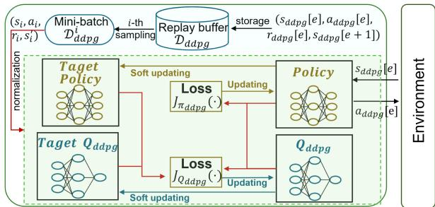  
Fig. 3. ARPA training flow at the Central Controller.

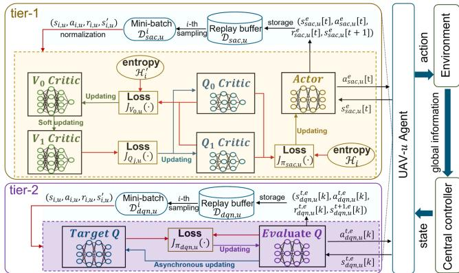  
Fig. 4. Two-tier model training flow at each UAV-u in each training episode.

The loss function of the Q-network with the parameter $\phi ^ { Q _ { d d p g } } \mathrm { ; }$

$$
J _ { Q _ { d d p g } } ( \phi ^ { Q _ { d d p g } } ) = \mathbb { E } \left[ \frac { 1 } { 2 } \big ( y _ { d d p g } ^ { i } - Q _ { d d p g } ( s _ { i } , a _ { i } ; \phi ^ { Q _ { d d p g } } ) \big ) ^ { 2 } \right] ,\tag{31}
$$

where $y _ { d d p g } ^ { i } = r _ { i } + \gamma Q _ { d d p g } ^ { t a r g e t } ( s _ { i } ^ { \prime } , \pi _ { d d p g } ^ { t a r g e t } ( s _ { i } ^ { \prime } ) )$ is the target $\mathrm { Q } \mathrm { - }$ value and $\gamma \in [ 0 , 1 ]$ is a discount factor. The loss function of the policy network with the parameter $\theta ^ { \pi _ { d d p g } }$

$$
J _ { \pi _ { d d p g } } \left( \theta ^ { \pi _ { d d p g } } \right) = - \mathbb { E } \left[ Q _ { d d p g } ( s _ { i } , \pi _ { d d p g } ( s _ { i } ) ; \theta ^ { \pi _ { d d p g } } ) \right] .\tag{32}
$$

Moreover, the parameters of the target Q-network and the target policy network are both adjusted via soft updates as $\phi ^ { Q _ { d d p g } ^ { t \bar { a } r g e t } }  \tau \phi ^ { Q _ { d d p g } ^ { t a r g e t } } + ( 1 - \tau ) \dot { \phi } ^ { Q _ { d d p g } }$ and $\theta ^ { \pi _ { d d p g } ^ { t a r g e t } } $ $\tau \theta ^ { \pi _ { d d p g } ^ { t a r g e t } } + ( 1 - \tau ) \theta ^ { \pi _ { d d p g } } , \tau \in [ 0 , 1 )$ , respectively.

## B. Two-Tier Model Training At Each UAV

This subsection focuses on the training of the two-tier model at each UAV agent within each episode $e , \forall e \in \{ 1 , . . . , \Xi \}$ . As shown in Fig. 4, at any arbitrary agent $\mathrm { U A V }  – u , \forall u \in \mathbb { U }$ , the twotier model training flow includes two parts, where one is the SAC training over time slots in tier-1, and the other is the DQN training over sub-slots in tier-2. The training flows in each of the two tiers are specified in the following, where we apply the same loss functions and the same network parameter updating methods as that in our previous work [6] in each tier.

1) SAC Training in Tier-1: As shown in Fig. 4, to improve the SAC algorithm stability, similar to [35], we adopt five neural networks for the SAC training, which are the SAC policy network Actor, the two SAC Q-networks $Q _ { 0 } C r i t i c$ and $Q _ { 1 } ~ C r i t i c ,$ and the two V-networks $V _ { 0 } \ C r i t i c$ and $V _ { 1 } ~ C r i t i c .$ , respectively. Among the five neural networks, the SAC policy network Actor is trained for the policy function $\pi _ { s a c , u } ( \cdot )$ that maps UAV-u’s state $s _ { s a c , u } ^ { e } [ t ]$ to its action $a _ { s a c , u } ^ { e } [ t ]$ , the two SAC Q-networks are trained for the state-action functions $Q _ { 0 , u } ( \cdot )$ and $Q _ { 1 , u } ( \cdot )$ respectively, and the two V-networks are trained for the state functions $V _ { 0 , u } ( \cdot )$ and $V _ { 1 , u } ( \cdot )$ , respectively.

The information entropy is defined as $\mathcal { H } \triangleq \log ( \pi _ { s a c , u }$ $( a _ { s a c , u } ^ { e } [ t ] | s _ { s a c , u } ^ { e } [ t ] ; \theta ^ { \pi _ { s a c , u } } ) )$ , with θπsac,u denoting the SAC policy network Actor’s parameter. Based on $\mathcal { H } .$ , the optimal policy $\pi _ { s a c , u } ^ { * }$ for the SAC policy network Actor is obtained as

$$
\pi _ { s a c , u } ^ { * } = \arg \operatorname* { m a x } _ { \pi _ { s a c , u } } \sum _ { t \in \mathbb { T } } \mathbb { E } \left[ r _ { s a c , u } ^ { e } [ t ] + \alpha _ { u } \mathcal { H } \left( \pi _ { s a c , u } ( \cdot | s _ { s a c , u } ^ { e } [ t ] ) \right) \right] ,\tag{33}
$$

where the temperature parameter $\alpha _ { u }$ is used to weight H for determining the optimal policy $\pi _ { s a c , u } ^ { * } .$ Moreover, when UAV-u takes action $a _ { s a c , u } ^ { e } [ t ]$ in state $s _ { s a c , u } ^ { e } [ t ]$ , its state-action performance is evaluated by the two SAC Q-networks $Q _ { 0 } C r i t i c$ and $Q _ { 1 } ~ C r i t i c$ as $Q _ { j , u } ( s _ { s a c , u } ^ { e } [ t ] , a _ { s a c , u } ^ { e } [ t ] ) =$ $r _ { s a c , u } ^ { e } [ t ] + \gamma \mathbb { E } [ V _ { 1 , u } ( s _ { s a c , u } ^ { e } [ t + 1 ] ) ]$ , ∀j ∈ {0, 1}, respectively, where $r _ { s a c , u } ^ { e } [ t ]$ is given in (28). The state-value of UAV-u in state $s _ { s a c , u } ^ { e } [ t ]$ is evaluated by the V-network V1 Critic, with $V _ { 1 , u } ( s _ { s a c , u } ^ { e } [ t ] ) = \mathbb { E } _ { a _ { u } ^ { \prime } \sim \pi _ { s a c , u } ^ { e } } [ Q _ { \operatorname* { m i n } } ( s _ { s a c , u } ^ { e } [ t ] , a _ { s a c , u } ^ { e } [ t ] )$ $- \alpha _ { u } \log \pi _ { s a c , u } ^ { e } ( a _ { u } ^ { \prime } | s _ { s a c , u } ^ { e } [ t ] ) ]$ , where $a _ { u } ^ { \prime } \sim \pi _ { s a c , u } ^ { e }$ denotes the action taken from the policy $\pi _ { s a c , u } ^ { e }$ and $Q _ { \mathrm { m i n } } \triangleq \operatorname* { m i n } ($ $Q _ { 0 , u } ( \cdot ) , Q _ { 1 , u } ( \cdot ) )$

As shown in Fig. 4, by interacting with the environment and tier-2, a tuple of $( s _ { s a c , u } ^ { e } [ t ] , a _ { s a c , u } ^ { e } [ t ] , r _ { s a c , u } ^ { e } [ t ] , s _ { s a c , u } ^ { e } [ t + 1 ] )$ is stored in the experience replay buffer $\mathcal { D } _ { s a c , u } . \mathrm { U A V }  – \mathcal { U }$ receives the i-th experience $( s _ { i , u } , a _ { i , u } , r _ { i , u } , s _ { i , u } ^ { \prime } )$ from the mini-batch $\mathcal { D } _ { s a c , u } ^ { i }$ to calculate the loss functions $J _ { \pi _ { s a c , u } ^ { e } } ( \theta ^ { \pi _ { s a c , u } ^ { e } } ) , \ J _ { V _ { 0 , u } } ( \phi _ { 0 , u } )$ and ${ \cal J } _ { Q _ { j , u } } ( \eta _ { j , u } )$ of the Actor network, the $V _ { 0 }$ Critic network, and the $Q _ { j }$ Critic networks, $j \in \{ 0 , 1 \}$ , respectively, and then update the corresponding network parameters $\theta ^ { \pi _ { s a c , u } ^ { e } } , \phi _ { 0 , u } ,$ , and $\eta _ { j , u }$ . For the $V _ { 1 }$ Critic network, with the parameter $\phi _ { 1 , u } ,$ we update $\phi _ { 1 , u }$ via soft updating with $\phi _ { 1 , u }  \tau \phi _ { 1 , u } + ( 1 - \tau ) \phi _ { 0 , u } ,$ $\tau \in [ 0 , 1 )$

2) DQN Training in Tier-2: As shown in tier-2 of Fig. 4, two neural networks are designed for the DQN training, which are the DQN policy network Evaluate Q and the DQN Qnetwork T arget $Q ,$ respectively. The DQN policy network is trained to learn the policy function $\pi _ { d q n , u } ( \cdot )$ that maps UAV-u’s state $s _ { d q n , u } ^ { t , e } [ k ]$ in (24) to its action $\bar { ( a _ { d q n , u } ^ { t , e } [ k ] }$ , and the DQN Q-network is trained to learn the target state-action function $Q _ { d q n , u } ( \cdot )$ . According to [36], the optimal policy $\pi _ { d q n , u } ^ { * }$ is given as

$$
\pi _ { d q n , u } ^ { * } ( s , a ) = r _ { d q n , u } ^ { t , e } [ k ] + \gamma \sum _ { s ^ { \prime } \in \mathbb { S } _ { d q n , u } } \mathcal { P } _ { s s ^ { \prime } } ^ { a } \operatorname* { m a x } _ { a ^ { \prime } } \pi _ { d q n , u } ^ { * } ( s ^ { \prime } , a ^ { \prime } ) ,\tag{34}
$$

where $s = s _ { d q n , u } ^ { t , e } [ k ] , a = a _ { d q n , u } ^ { t , e } [ k ] , s ^ { \prime } = s _ { d q n , u } ^ { t + 1 , e } [ k ]$ , and $\mathcal { P } _ { s s ^ { \prime } } ^ { a }$ is the probability of getting to the next state $s ^ { \gamma }$ given the current state s and action a.

Denote the parameters of the DQN policy network Evaluate $Q$ and the DQN Q-Network T arget $Q$ as $\theta ^ { \pi _ { d q n , u } }$ and $\theta ^ { Q _ { d q n , u } }$ , respectively. From Fig. 4, by interacting with the environment and tier-1, a tuple with $( s _ { d q n , u } ^ { \bar { t } , e } [ k ] , a _ { d q n , u } ^ { t , e } [ k ]$ $r _ { d q n , u } ^ { t , e } [ k ] , s _ { d q n , u } ^ { t + 1 , e } [ k ] )$ is stored in the experience replay buffer $\mathcal { D } _ { d q n , u }$ . Following the loss function design and parameter update method in [6], UAV-u utilizes the i-th experience $( s _ { i , u } , a _ { i , u } , r _ { i , u } ,$ $s _ { i , u } ^ { \prime } )$ from the mini-batch $\mathcal { D } _ { d q n , u } ^ { i } ,$ to calculate the loss function $J _ { \pi _ { d q n , u } } ( \theta ^ { \pi _ { d q n , u } } )$ and update $\theta ^ { \pi _ { d q n , u } }$ and $\theta ^ { Q _ { d q n , u } }$ , respectively.

Algorithm $\mathbf { 1 } { : } \mathrm { M A ^ { 2 } H D R L } .$   
1: Inputs: the replay buffer $\mathcal { D } _ { s a c , u } , \mathcal { D } _ { d q n , u } ,$ , and $\mathcal { D } _ { d d p g } ,$   
the learning rate, the discount factor $\gamma _ { : }$ , the soft update   
weight τ and the temperature factor $\alpha _ { u } , \forall u \in \mathbb { U }$   
Initialize all the network parameters for the $\mathrm { S A C } .$ , the   
DQN and the DDPG.   
2: Outputs: the optimal network parameters $\theta ^ { * , \pi _ { s a c , u } }$   
and $\bar { { \theta } } ^ { \ast , \pi _ { d q n , u } } .$ , and the optimal objective weight $\varsigma ^ { * } ;$   
3: Initialize $F _ { o p t i m a l }$ . Initialize $s _ { d d p g } [ 0 ]$ and $\{ q _ { l } \} ;$   
4: for $\mathbf { e }  1 , . . . , \Xi$ do   
5: Initialize $\{ q _ { u } [ 0 ] \} , \{ B _ { u } [ 0 ] \} , \{ B _ { w } [ 0 ] \}$ , the $\mathrm { S A C }$ state   
$\{ s _ { s a c , u } [ 0 ] \}$ , and the DQN state $\{ \dot { s } _ { d q n , u } ^ { 0 } [ k ] \}$ }. Set   
$\begin{array} { r } { \varsigma [ e ] = \frac { e } { \Xi } ; } \end{array}$   
6: Central controller gets action $a _ { d d p g } [ e ]$ and executes   
action by broadcasting $a _ { d d p g } [ e ]$ to all the UAVs;   
7: for $t  { 1 , . . . , T }$ do   
8: Each UAV gets and executes action $a _ { s a c , u } ^ { e } [ t ]$ in   
tier-1 and $a _ { d q n , u } ^ { t , e } [ k ]$ in tier-2. Each UAV updates   
$s _ { s a c , u } ^ { e } [ t + 1 ]$ in (24) in tier-1 and $s _ { d q n , u } ^ { t + 1 , e } [ k ]$ in (29)   
in tier-2;   
9: Each UAV stores into $\mathcal { D } _ { s a c , u }$ and $\mathcal { D } _ { d q n , u }$ the   
experience   
$( s _ { s a c , u } ^ { \dot { e } } [ t ] , a _ { s a c , u } ^ { e } [ t ] , r _ { s a c , u } ^ { e } [ t ] , s _ { s a c , u } ^ { e } [ t + 1 ] )$ in   
tier-1 and   
$( s _ { d q n , u } ^ { t , e } [ k ] , a _ { d q n , u } ^ { t , e } [ k ] , r _ { d q n , u } ^ { t , e } [ k ] , s _ { d q n , u } ^ { t + 1 , e } [ k ] )$ in   
tier-2, respectively;   
10: Each UAV updates SAC and DQN parameters   
$\phi _ { 0 , u } , \eta _ { j , u } , j \in \{ 0 , 1 \} , \theta ^ { \pi _ { s a c , u } }$ and $\bar { \theta ^ { \pi _ { d q n , u } } }$ as in   
Section V-B;   
11: Each UAV conducts state transfer:   
$s _ { s a c , u } ^ { e } [ t ] \gets s _ { s a c , u } ^ { e } [ t + 1 ]$ and   
$s _ { d q n , u } ^ { t , e } [ k ] \gets s _ { d q n , u } ^ { t + 1 , e } [ k ] , k \in \{ 1 , . . . , K \} ;$   
12: end for   
13: Central Controller stores experience $( s _ { d d p g } [ e ]$   
$a _ { d d p g } [ e ] , s _ { d d p g } [ e + 1 ] , r _ { d d p g } [ e ] )$ into $\mathcal { D } _ { d d p g } .$   
14: Central Controller updates $\mathbf { A R P A }$ parameters   
$\phi ^ { Q _ { d d p g } } , \theta ^ { \pi _ { d d p g } } , \phi ^ { Q _ { d d p g } ^ { t a r g e t } }$ , and $\theta ^ { \pi _ { d d p g } ^ { t a r g e t } }$ as in   
SectionV-A.   
15: Central controller conducts state transfer:   
$s _ { d d p g } [ e ]  s _ { d d p g } [ e + 1 ] ;$   
16: Record optimums: $F _ { o p t i m a l }  F _ { s u m } [ e ] ,$   
$\theta ^ { * , \pi _ { s a c , u } } \gets \theta ^ { \pi _ { s a c , u } } , \theta ^ { * , \dot { \pi } _ { d q n , u } } \gets \theta ^ { \pi _ { d q n , \hat { u } } }$ and $\begin{array} { r } { \varsigma ^ { * } = \frac { e } { \Xi } } \end{array}$   
$\mathrm { i f } \ F _ { s u m } [ e ] \leq F _ { o p t i m a l } ;$   
17: if $F _ { o p t i m a l }$ keeps unchanged for $\Delta$ consecutive   
episodes; then   
18: $\dot { \theta ^ { \pi _ { s a c , u } } } \gets \hat { \tau } \theta ^ { * , \pi _ { s a c , u } } + ( 1 - \hat { \tau } ) \theta ^ { \pi _ { s a c , u } }$ and   
$\theta ^ { \pi _ { d q n , u } }  \hat { \tau } \theta ^ { * , \pi _ { d q n , u } } + \mathrm { \widetilde { ( 1 - \hat { \tau } ) } } \theta ^ { \pi _ { d q n , u } } ;$   
19: end if   
20: end for

## C. MA2HDRL Algorithm

By summarizing the ARPA model training and the two-tier model training in the previous two subsections, this subsection proposes the MA2HDRL algorithm for solving problem (P2). The MA2HDRL algorithm is specified in Algorithm 1, where $F _ { o p t i m a l } = \operatorname* { m i n } \{ F _ { s u m } [ e ] \} _ { 1 \leq e \leq \Xi }$ . As shown from lines 17 to 19 in Algorithm 1, to avoid the occurrence of cataclysmic forgetting for both of the Actor network in tier-1 and the Evaluate $Q$ network in tier-2 [37], we obtain $\theta ^ { \pi _ { s a c , u } }$ and θπdqn,u via the soft update method by $\theta ^ { \pi _ { s a c , u } }  \hat { \tau } \theta ^ { * , \pi _ { s a c , u } } +$ $( 1 - \hat { \tau } ) \theta ^ { \pi _ { s a c , u } }$ and $\theta ^ { \pi _ { d q n , u } }  \hat { \tau } \theta ^ { * , \pi _ { d q n , u } } + ( 1 - \hat { \tau } ) \theta ^ { \pi _ { d q n , u } } ,$ respectively, if $F _ { o p t i m a l }$ keeps unchanged for $\Delta$ consecutive episodes, where ${ \hat { \tau } } \in [ 0 , 1 ]$ and $1 < \Delta < \Xi$

We now analyze the time complexity of Algorithm 1, which is mainly related to the dimensions of the input layers, the hidden layers, and the output layers in each neural network [15].

1) Complexity of DDPG training in ARPA model: Denote $\mathcal { A } _ { a }$ and ${ \mathcal { Q } } _ { a }$ as the number of fully connected layers in the $P o l i c y$ and $Q _ { d d p g }$ networks, respectively. Denote ${ \mathfrak { a } } _ { i }$ and $\mathfrak { q } _ { z }$ as the number of neurons in the i-th layer of $P o l i c y$ network and the z-th layer of $Q _ { d d p g }$ network, respectively. The update costs for the T arget $P o l i c y$ and T arget $Q _ { d d p g }$ networks are constants, due to their soft updates. As a result, the time complexity of training the ARPA model is obtained as $\Pi _ { a } =$ $\begin{array} { r } { \mathcal { O } ( \Xi \times ( \sum _ { i = 1 } ^ { A _ { a } - 1 } { \mathfrak { a } } _ { i } \cdot { \mathfrak { a } } _ { i + 1 } + \sum _ { i = 1 } ^ { Q _ { a } - 1 } { \mathfrak { q } } _ { i } \cdot { \mathfrak { q } } _ { i + 1 } ) ) } \end{array}$

2) Complexity of SAC training in Tier-1 of the two-tier model: Denote $\mathcal { A } _ { s } , \mathcal { V } _ { 0 } , \mathcal { Q } _ { 0 }$ as the number of the layers of the fully connected layers in the Actor, $V _ { j } ~ C r i t i c .$ , and $Q _ { j } ~ C r i t i c$ networks, respectively, for any $j \in \{ 0 , 1 \}$ . Let ${ \mathfrak { a } } _ { i } , { \mathfrak { v } } _ { 0 , c } ,$ and $\mathfrak { e } _ { 0 , i }$ z be the number of neurons in the $i , c ,$ and z-th layer of the Actor network, the $V _ { 0 } \ C r i t i c$ network, and the $Q _ { 0 } C r i t i c$ network, respectively. The complexity of the $V _ { 1 }$ Critic network’s soft update is also a constant. As a result, the time complexity of training tier-1 is calculated as $\begin{array} { r } { \Pi _ { s } = \mathcal { O } ( \Xi \times T \times ( \sum _ { i = 1 } ^ { A _ { s } - 1 } \mathfrak { a } _ { i } \cdot \mathfrak { a } _ { i + 1 } + } \end{array}$ $\begin{array} { r } { \sum _ { c = 1 } ^ { \mathcal { V } _ { 0 } - 1 } \mathfrak { v } _ { 0 , c } { \cdot } \mathfrak { v } _ { 0 , c + 1 } + 2 \sum _ { z = 1 } ^ { \mathcal { Q } _ { 0 } - 1 } \mathfrak { e } _ { 0 , z } { \cdot } \mathfrak { e } _ { 0 , z + 1 } ) ) } \end{array}$

3) Complexity of DQN training in Tier-2 of the two-tier model: Denote $\mathcal { Q } _ { E v }$ as the number of layers of the fully connected layers in both of the neural networks Evaluate $Q$ and T arget $Q .$ Let $\mathfrak { e } _ { E v , i }$ be the number of neurons in the i-th layer of the Evaluate $Q$ network. It is noted that the updating of $\theta ^ { Q _ { d q n , u } }$ is directly from $\theta ^ { \pi _ { d q n , u } }$ , due to the asynchronous update, which does not increase the complexity of the algorithm. We thus only focus on the Evaluate Q network for calculating the complexity. As a result, the complexity of training tier-2 is calculated as $\begin{array} { r } { \dot { \Pi _ { d } } = \mathcal { O } ( \Xi \times T \times K \times ( \bar { \sum _ { i = 1 } ^ { Q _ { E v } - 1 } } \mathfrak { e } _ { E v , i } \cdot \mathfrak { e } _ { E v , i + 1 } ) ) } \end{array}$

Therefore, the total time complexity of Algorithm 1 is $\Pi _ { t r a i n } = \Pi _ { a } + \Pi _ { s } + \Pi _ { d }$ . In the test phase, since $\pi _ { s a c , u } ^ { * } , \pi _ { d q n , u } ^ { * } ,$ and $\varsigma ^ { * }$ are all obtained, we only get actions based on $\pi _ { s a c , u } ^ { * }$ and $\pi _ { d q n , u } ^ { * }$ , respectively. Hence, the total time complexity in the test phase is $\begin{array} { r } { \Pi _ { t e s t } { = } \mathcal { O } ( T \times \sum _ { j = 1 } ^ { A - 1 } \mathfrak { a } _ { j } \cdot \mathfrak { a } _ { j + 1 } { + } T \times K \times } \end{array}$ $\begin{array} { r } { \sum _ { i = 1 } ^ { Q _ { E v } - 1 } \mathfrak { e } _ { E v , i } { \cdot } \mathfrak { e } _ { E v , i + 1 } \big ) } \end{array}$

## VI. PERFORMANCE EVALUATION VIA SIMULATIONS

This section provides simulation results to show the performance of the proposed $\mathbf { M A ^ { 2 } H D R L }$ approach to solve SOOP (P2) and thus BOOP (P1). The simulation is implemented in Python 3.11.7 with PyTorch 2.2.1 integration. Unless specified otherwise, we consider $T = 1 0 0$ slots, $K = 4$ sub-slots, and a service area of $2 0 0 \times 2 0 0 ~ \mathrm { m ^ { 2 } }$ with 3 UAVs, 3 E-devices, and 5 I-devices. For all the UAVs, we set $\mathrm { V } _ { \mathrm { u } } ^ { \mathrm { m a x } } = 3 0$ m/s and $h _ { f i x } = 5$ m, and set the parameters in the UAV propulsion model according to [31]. Moreover, since the different reward functions $r _ { u , i } [ t ] ^ { \ast } \mathrm { s }$ in $( 2 8 ) , i \in \{ 0 , 1 , 2 \}$ , may achieve largely diversified values during the training, to normalize the different reward value of each $r _ { u , i } [ t ]$ into the same range of $[ - 1 0 , 1 0 ]$ we use the following regulation functions as in [38]: $r _ { u , 0 } [ t ] \gets$ $0 . 1 r _ { u , 0 } [ t ] , r _ { u , 1 } [ t ] \gets 4 0 r _ { u , 1 } [ t ] .$ , and $r _ { u , 2 } [ t ] \gets 1 0 ^ { - 5 } r _ { u , 2 } [ t ]$ . Similarly, we also normalize $F _ { s u m } [ e ]$ in (23) into the range of [−10, 10] with $F _ { s u m } [ e ] \gets 0 . 0 0 0 2 F _ { s u m } [ e ]$

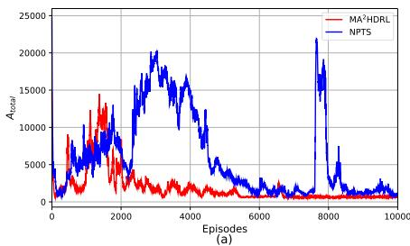

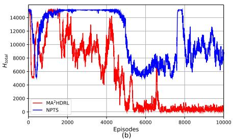

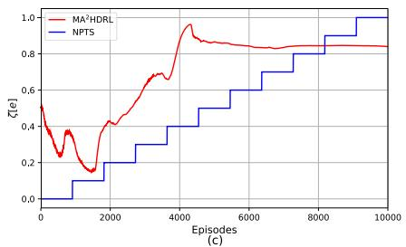  
Fig. 5. Convergence validation and comparison with benchmark: (a) variation of $A _ { t o t a l } ,$ (b) variation of $H _ { t o t a l } .$ , and (c) variation of the ratio of rewards ζ[e] in (28).

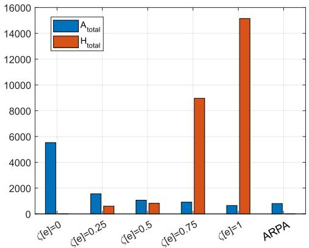  
Fig. 6. Comparison of $A _ { t o t a l }$ and $H _ { t o t a l }$ under constant and ARPAdetermined $\zeta [ e ] ^ { \cdot } \mathrm { s }$ .

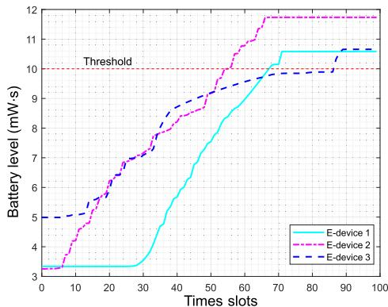  
(a) E-devices' battery level variations (with HoE).

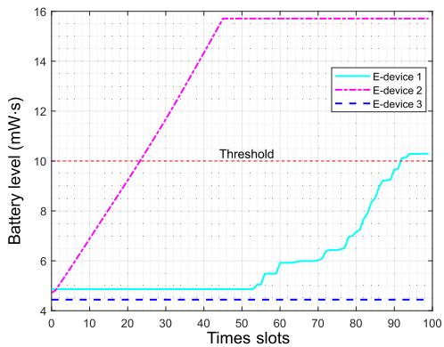  
(b) E-devices' battery level variations (without HoE).  
Fig. 7. The impact of HoE on the UAVs’ WET.

TABLE II SIMULATION PARAMETERS
<table><tr><td>Parameter</td><td>setting</td><td>Parameter</td><td>setting</td></tr><tr><td> $P _ { u }$ </td><td>30 dBm</td><td> $\sigma ^ { 2 }$ </td><td>-90 dBm</td></tr><tr><td> $P _ { n }$ </td><td>-20 dBm</td><td> $\alpha _ { L } , \alpha _ { N }$ </td><td>3,5</td></tr><tr><td> ${ \mathrm { a } } , { \mathrm { b } }$ </td><td> $1 2 . 0 8 , 0 . 1 1$ </td><td> $C _ { m i n }$ </td><td>1e5 bits</td></tr><tr><td> $P _ { s e n }$ </td><td> $- 1 0 ~ \mathrm { d B m }$ </td><td> $P _ { s a t }$ </td><td>3.2 dBm</td></tr><tr><td> $B _ { \Gamma }$ </td><td> $1 0 \ \mathrm { m W { \cdot s } }$ </td><td> $B _ { \ast \ast } ^ { m i n }$ </td><td>10,000 W·s</td></tr><tr><td> $\mathrm { { d } \it { _ { \mathrm { m i n } } } }$ </td><td>1 m</td><td> $\mathrm { B } _ { \mathrm { u } } ^ { \mathrm { u } }$ </td><td>140,000 W·s</td></tr><tr><td>size of  $\mathcal { D } _ { d d p g }$ </td><td>2,000</td><td>sizes of  $\mathcal { D } _ { s a c , u }$  and  $\mathcal { D } _ { d q n , u }$ </td><td> $2 ^ { 1 7 }$ </td></tr><tr><td>size of  $\mathcal { D } _ { d d p g } ^ { \iota }$ </td><td>32</td><td>sizes of  $\mathcal { D } _ { s a c , u } ^ { i }$  and  $\mathcal { D } _ { d q n , u } ^ { i }$ </td><td>256</td></tr><tr><td> $\gamma , \tau$ </td><td>0.99, 0.999</td><td> $\Delta , \hat { \tau }$ </td><td>200,0.9</td></tr></table>

For the neural network parameters, the number of layers of each neural network in the ARPA model and the twotier model are set to 3 and 4, respectively, with the hidden layer size fixed at 256 units. In the ARPA model, the learning rates of the P olicy network and the $Q _ { d d p g }$ network are decayed from $1 e - 4$ to $1 e - 5$ and from $1 e - 3$ to $1 e - 4$ , respectively. For the SAC algorithm in the twotier model, the learning rates for the Actor, $Q _ { 0 } C r i t i c ,$ $Q _ { 1 } ~ C r i t i c .$ , and $V _ { 0 } \ C r i t i c$ networks are all set to $3 e - 4 .$ . For the DQN algorithm in the two-tier model, the $Q _ { E v a l u a t e }$ network’s learning rate is decayed from 0.01 to $1 e - 5$ . Please refer to Table II for more specified simulation parameter settings.

In the following, we first validate the convergence and show the performance of the proposed $\mathbf { M A ^ { 2 } H D R L }$ algorithm, and then give an network example to show the $\mathrm { U A V s } '$ trajectories and the achieved HoE and AoI for the IoT network.

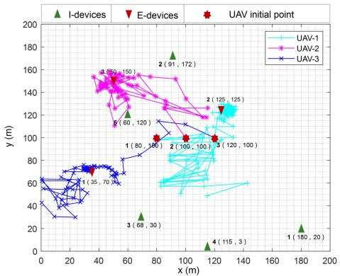  
(a) $\mathrm { U A V s } ^ { \prime }$ trajectories.

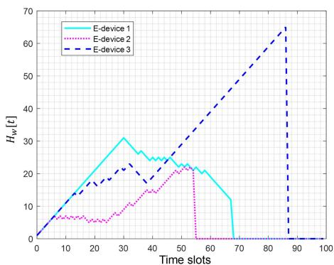  
(c) E-devices’ HoE $( H _ { t o t a l } = 0 )$  
Fig. 8. Network example of 3 UAV, 5 I-devices and 3 E-devices.

## A. Convergence Validation and Performance Comparison

First, we train our proposed $\mathbf { M A ^ { 2 } H D R L }$ algorithm for $\Xi =$ 10, 000 episodes and show $A _ { t o t a l } [ e ]$ and $H _ { t o t a l } [ e ]$ over the episodes in Figs. 5(a) and (b), respectively, where the optimal objective weight $c ^ { * } = 0 . 7 1 2 5$ is obtained at $e = 7 1 2 5$ for problem (P2). It is observed that both $A _ { t o t a l } [ e ]$ and $H _ { t o t a l } [ e ]$ in Fig. 5(a) and (b) gradually converge after about 6,000 episodes under our proposed MA2HDRL approach, as expected.

Next, to show the effectiveness of the proposed ARPA model, we consider a benchmark scheme, where the NPTS approach proposed in [25] is adopted at the CC, while the two-tier model remains unchanged at each UAV agent. More specifically, for the training of the NPTS, Ξ = 10, 000 episodes are divided into 11 stages, where we train $\lfloor \frac { \Xi } { 1 1 } \rfloor$ episodes with the same $\zeta [ e ] = 0 . 1 ( i - 1 )$ for all the episodes in each stage $i , 1 \leq i \leq 1 1$ with · representing the floor operation. Hence, unlike our proposed MA2HDRL approach with the ARPA model, under the NPTS approach, once the policy adapts to a new ζ[e], the neural networks in the two-tier model at each UAV tend to forget previously learned information [37].

Fig. 5(c) shows the variations of ζ[e] over the training episodes under our proposed $\mathbf { M A ^ { 2 } H D R I }$ approach and the benchmark, where the former can be adaptively adjusted over episodes to effectively balance the two conflicting objectives $A _ { t o t a l }$ and $H _ { t o t a l }$ , and the later increases linearly over stages regardless of the network changes. It is also obvious that unlike $\textstyle \zeta [ e ] = { \frac { e } { \overline { { \Xi } } } }$ that linearly increases over the training episodes, the variation of the reward preference ζ[e] is self-adjusted and thus more complicated, as stated in Section IV-B. Moreover, as shown in Figs. 5(a) and (b), as compared to the benchmark approach, it is evident that both $A _ { t o t a l }$ and $H _ { t o t a l }$ under the proposed MA2HDRL approach converge faster with much smaller fluctuations, and also achieve lower values after convergence.

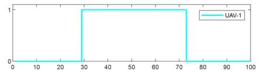

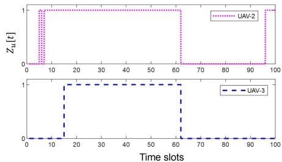  
(b) $\mathrm { U A V s } ^ { \prime }$ WET decisions.

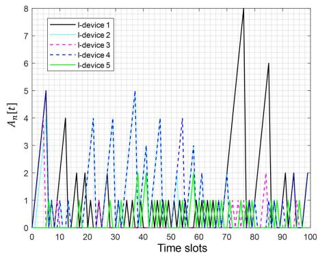  
(d) I-devices' AoI $( A _ { t o t a l } = 4 6 4 )$

In addition, we investigate the impact of the global reward preference ζ[e]. We consider $\Xi = 1 0$ episodes, and compare the average values of $A _ { t o t a l }$ and $H _ { t o t a l }$ achieved under different but fixed ζ[e] with that achieved under our proposed $\mathbf { M A } ^ { 2 } \mathbf { H D R I }$ approach with self-adjusted $\zeta [ e ] .$ , respectively. As shown in Fig. 6, as the fixed ζ[e] for all the episodes increases, $A _ { t o t a l }$ decreases but $H _ { t o t a l }$ increases. This suggests that it is difficult (or even impossible) to simultaneously minimize $A _ { t o t a l }$ and $H _ { t o t a l }$ under a fixed global reward preference. In contrast, by dynamically adjusting ζ[e] under the proposed ARPA model, as shown in Fig. 6, the proposed $\mathbf { M A ^ { 2 } H D R L }$ approach enables the UAV agents to autonomously balance between the minimizations of $A _ { t o t a l }$ and $H _ { t o t a l }$ , and thus leads to the low values of $A _ { t o t a l }$ and $H _ { t o t a l }$ at the same time.

## B. Network Example

In this subsection, we validate the effectiveness of the HoE metric and giving a network example study.

Since the effectiveness of the AoI metric to maintain the data freshness has been validated in the existing work [39], we show the effectiveness of the HoE metric. Fig. 7 compares the battery levels of the three E-devices with and without considering HoE, respectively. In particular, when not considering the HoE metric,

(27) is reduced to

$$
r _ { u , 1 } [ t ] = \kappa _ { u } [ t ] \cdot \sum _ { w \in \mathbb { W } } ( B _ { w } [ t + 1 ] - B _ { w } [ t ] ) ,\tag{35}
$$

while all other settings remain unchanged. It is observed from Fig. 7(a) that all the E-devices’ battery energy levels achieve the energy sufficiency threshold $B _ { \Gamma }$ when considering the HoE for each E-device. In contrast, without considering the HoE, the harvested energy of the 3 E-devices become significantly unbalanced in Fig. 7(b), which leads to increased battery energy gaps between E-devices 1 and 2 over time and zero-energy harvested at E-device 3.

The distributions of the five I-devices and three E-devices are shown in Fig. 8(a). We have the following observations from Fig. 8:

It is first observed from Fig. 8(a) that although both $A _ { t o t a l }$ and $H _ { t o t a l }$ need to be minimized, due to the much lower power sensitivity for EH at the E-devices, all the three UAVs cost most of the time to fly in the neighborhood of each E-devices for WET.

\- It is also observed from Fig. 8(b) that all the UAVs do not continuously provide WET services. To conserve the limited on-board energy, they selectively deactivate the WET mechanism when distant from the E-devices.

\- Moreover, as shown in Fig. 8(c), all the E-devices’ battery energy amounts are non-decreasing over time slots and reach the energy sufficiency threshold B before the last time slot. This indicates that the HoE of each E-device becomes zero at the end of the task period in this example.

\- The AoI of each I-device is further shown in Fig. 8(d), which varies over time in general. It is observed that Idevices 1 and 4 display higher AoI as compared to others, since their positions are close to the edge of the service area and thus generally have longer transmission distances to all the UAVs in the example.

In the example shown in Fig. 8, we also find that the minimum distance between any two UAVs throughout the entire task period is 5.8 m, which satisfies the constraint in (20) with $\mathrm { d } _ { \operatorname* { m i n } } = 1$ m. At the end of the task, the remained battery energy of the 3 UAVs is 21,289.47 W · s, 31,982.63W· s, and 25,949.32W· s, respectively, all meeting the constraint in (19) with $\mathrm { B _ { u } ^ { m i n } = 2 0 , 0 0 0 W \cdot s . }$

## VII. CONCLUSION

This study proposes a comprehensive approach for optimizing UAVs’ trajectories, WDC decisions, and WET decisions in heterogeneous IoT networks, focusing on balancing energy transmission and real-time data collection. A MA2HDRL framework is developed, integrating the SAC algorithm to optimize continuous UAV trajectory and WDC decisions, with the DQN algorithm handling discrete WET decisions. The primary contribution lies in the ARPA mechanism, which employs DDPG algorithm to dynamically adjust bi-objective reward weights. This innovation eliminates manual trial-and-error in reward function design, enabling efficient bi-objective optimization. Simulation results demonstrate that the MA2HDRL framework achieves higher energy efficiency and lower AoI compared to baseline methods. Future work will investigate the framework’s scalability in large-scale IoT deployments to enhance practical applicability.

## REFERENCES

[1] Y. Jiang et al., “Integrated sensing and communication for low altitude economy: Opportunities and challenges,” IEEE Commun. Mag., vol. 63, no. 12, pp. 72–78, Dec. 2025.

[2] N. H. Motlagh, T. Taleb, and O. Arouk, “Low-altitude unmanned aerial vehicles-based Internet of Things services: Comprehensive survey and future perspectives,” IEEE Internet Things J., vol. 3, no. 6, pp. 899–922, Dec. 2016.

[3] Z. Wei et al., “UAV-assisted data collection for Internet of Things: A survey,” IEEE Internet Things J., vol. 9, no. 17, pp. 15460–15483, Sep. 2022.

[4] X. Gu and G. Zhang, “A survey on UAV-assisted wireless communications: Recent advances and future trends,” Comput. Commun., vol. 208, pp. 44–78, May 2023.

[5] Y. Che, Z. Zhao, S. Luo, K. Wu, L. Duan, and V. C. Leung, “UAV-aided wireless energy transfer for sustaining Internet of Everything in 6G,” Drones, vol. 7, no. 10, Oct. 2023, Art. no. 628.

[6] Z. Y. Zhao, Y. L. Che, S. Luo, G. Luo, K. Wu, and V. C. Leung, “On designing multi-UAV aided wireless powered dynamic communication via hierarchical deep reinforcement learning,” IEEE Trans. Mobile Comput., vol. 23, no. 12, pp. 13991–14004, Dec. 2024.

[7] X. Jing, F. Liu, C. Masouros, and Y. Zeng, “ISAC from the sky: UAV trajectory design for joint communication and target localization,” IEEE Trans. Wireless Commun., vol. 23, no. 10, pp. 12857–12872, Oct. 2024.

[8] W. Saad, M. Bennis, and M. Chen, “A vision of 6G wireless systems: Applications, trends, technologies, and open research problems,” IEEE Netw., vol. 34, no. 3, pp. 134–142, May/Jun. 2020.

[9] X. Zhou, S. Yan, F. Shu, R. Chen, and J. Li, “UAV-enabled covert wireless data collection,” IEEE J. Sel. Areas Commun., vol. 39, no. 11, pp. 3348–3362, Nov. 2021.

[10] Y. Hu, X. Yuan, J. Xu, and A. Schmeink, “Optimal 1D trajectory design for UAV-enabled multiuser wireless power transfer,” IEEE Trans. Commun., vol. 67, no. 8, pp. 5674–5688, Aug. 2019.

[11] C. Kim, H.-H. Choi, and K. Lee, “Joint optimization of trajectory and resource allocation for multi-UAV-enabled wireless-powered communication networks,” IEEE Trans. Commun., vol. 72, no. 9, pp. 5752–5764, Sep. 2024.

[12] G. B. Tarekegn et al., “Trajectory control and fair communications for multi-UAV networks: A federated multi-agent deep reinforcement learning approach,” IEEE Trans. Wireless Commun., vol. 24, no. 9, pp. 7598–7611, Sep. 2025.

[13] Z. Y. Zhao, Y. Che, S. Luo, K. Wu, and V. C. Leung, “Multi-agent graph reinforcement learning based on-demand wireless energy transfer in multiuav-aided iot network,” in Proc. 21st Int. Symp. Model. Optim. Mobile, Ad Hoc, Wireless Netw., 2023, pp. 1–8.

[14] L. Xie, J. Xu, and R. Zhang, “Throughput maximization for UAV-enabled wireless powered communication networks,” IEEE Internet Things J., vol. 6, no. 2, pp. 1690–1703, Apr. 2019.

[15] O. S. Oubbati, M. Atiquzzaman, H. Lim, A. Rachedi, and A. Lakas, “Synchronizing UAV teams for timely data collection and energy transfer by deep reinforcement learning,” IEEE Trans. Veh. Technol., vol. 71, no. 6, pp. 6682–6697, Jun. 2022.

[16] Y. Che, Y. Lai, S. Luo, K. Wu, and L. Duan, “UAV-aided information and energy transmissions for cognitive and sustainable 5G networks,” IEEE Trans. Wireless Commun., vol. 20, no. 3, pp. 1668–1683, Mar. 2021.

[17] K. Shi, J. Liu, L. Xie, Z. Zhou, H. Chen, and G. Feng, “AoI-aware data collection and energy replenishment for multi-UAV-enabled IoT systems,” IEEE Trans. Green Commun. Netw., vol. 9, no. 4, pp. 1755–1768, Dec. 2025.

[18] H. Qi, M. Wu, Z. Zhang, and M. Zhao, “Trajectory design for multi-UAV-enabled wireless powered communication networks: A multi-agent DRL approach,” in Proc. IEEE Wireless Commun. Netw. Conf., 2023, pp. 1–6.

[19] J. Xu, Y. Tian, P. Ma, D. Rus, S. Sueda, and W. Matusik, “Prediction-guided multi-objective reinforcement learning for continuous robot control,” in Proc. 37th Int. Conf. Mach. Learn., 2020, pp. 10607–10616.

[20] R. Yang, X. Sun, and K. Narasimhan, “A generalized algorithm for multi-objective reinforcement learning and policy adaptation,” in Proc. Adv. Neural Inf. Process. Syst., 2019.

[21] F. Song et al., “Evolutionary multi-objective reinforcement learning based trajectory control and task offloading in UAV-assisted mobile edge computing,” IEEE Trans. Mobile Comput., vol. 22, no. 12, pp. 7387–7405, Dec. 2023.

[22] Y. Yu, J. Tang, J. Huang, X. Zhang, D. K. C. So, and K.-K. Wong, “Multiobjective optimization for UAV-assisted wireless powered iot networks based on extended DDPG algorithm,” IEEE Trans. Commun., vol. 69, no. 9, pp. 6361–6374, Sep. 2021.

[23] J. Pan, Y. Li, R. Chai, S. Xia, and L. Zuo, “Multiobjective trajectory planning for UAV-assisted IoT networks based on DRL approach,” IEEE Internet Things J., vol. 12, no. 11, pp. 15840–15852, Jun. 2025.

[24] W. Xie et al., “Multi-objective aerial IRS-assisted ISAC optimization via generative AI-enhanced deep reinforcement learning,” 2025, arXiv:2502.10687.

[25] K. Li, T. Zhang, and R. Wang, “Deep reinforcement learning for multi-objective optimization,” IEEE Trans. Cybern., vol. 51, no. 6, pp. 3103–3114, Jun. 2021.

[26] Z. Wei, Z. Zhao, Z. Zhou, J. Ren, Y. Tang, and R. Yan, “A deep reinforcement learning-driven multi-objective optimization and its applications on aero-engine maintenance strategy,” J. Manuf. Syst., vol. 74, pp. 316–328, Jun. 2024.

[27] V. V. Ramasesh, A. Lewkowycz, and E. Dyer, “Effect of scale on catastrophic forgetting in neural networks,” in Proc. Ninth Int. Conf. Learn. Representations, 2021.

[28] A. Al-Hourani, S. Kandeepan, and S. Lardner, “Optimal LAP altitude for maximum coverage,” IEEE Wireless Commun. Lett., vol. 3, no. 6, pp. 569–572, Dec. 2014.

[29] P. N. Alevizos and A. Bletsas, “Sensitive and nonlinear far-field RF energy harvesting in wireless communications,” IEEE Trans. Wireless Commun., vol. 17, no. 6, pp. 3670–3685, Jun. 2018.

[30] Powercast Corporation, “P2110B powerharvester receiver datasheet,” 2024, Accessed: Mar. 2026. [Online]. Available: https://www. powercastco.com/hubfs/WP%20PDFs/New-P2110B-Datasheet.pdf

[31] Y. Zeng, J. Xu, and R. Zhang, “Energy minimization for wireless communication with rotary-wing UAV,” IEEE Trans. Wireless Commun., vol. 18, no. 4, pp. 2329–2345, Apr. 2019.

[32] B. Roy, “Problems and methods with multiple objective functions,” Math. Program., vol. 1, no. 1, pp. 239–266, Dec. 1971.

[33] C. Dai, K. Zhu, and E. Hossain, “Multi-agent deep reinforcement learning for joint decoupled user association and trajectory design in full-duplex multi-UAV networks,” IEEE Trans. Mobile Comput., vol. 22, no. 10, pp. 6056–6070, Oct. 2023.

[34] T. P. Lillicrap et al., “Continuous control with deep reinforcement learning,” in Proc. 4th Int. Conf. Learn. Representations, 2016.

[35] T. Haarnoja et al., “Soft actor-critic algorithms and applications,” 2018, arXiv:1812.05905.

[36] V. Mnih et al., “Human-level control through deep reinforcement learning,” Nature, vol. 518, no. 7540, pp. 529–533, Feb. 2015.

[37] S. Dohare, J. F. Hernandez-Garcia, Q. Lan, P. Rahman, A. R. Mahmood, and R. S. Sutton, “Loss of plasticity in deep continual learning,” Nature, vol. 632, no. 8026, pp. 768–774, Aug. 2024.

[38] J. Eschmann, “Reward function design in reinforcement learning,” in Proc. Reinforcement Learn. Algorithms: Analysis Appl., vol. 883. Cham, Switzerland: Springer, Jan. 2021, pp. 25–33.

[39] R. D. Yates, Y. Sun, D. R. Brown, S. K. Kaul, E. Modiano, and S. Ulukus, “Age of information: An introduction and survey,” IEEE J. Sel. Areas Commun., vol. 39, no. 5, pp. 1183–1210, May 2021.

  
Zeyu Zhao received the BEng degree in computer science and technology from Jishou University, Hunan, China, in 2021, and the MEng degree in computer science and technology, in 2024, from Shenzhen University, Shenzhen, China, where he is currently working toward the PhD degree with the College of Computer Science and Software Engineering. His research interests include deep reinforcement learning, multi-objective optimization, UAV-enabled mobile communications, and wireless information and power transfer.

Yueling Che (Member, IEEE) received the BEng and MEng degrees in electrical engineering from the University of Electronic Science and Technology of China, in 2006 and 2009, respectively, and the PhD degree in electrical engineering from Nanyang Technological University, Singapore, in 2014. From 2014 to 2016, she was a postdoc research fellow with Engineering Systems and Design Pillar, Singapore University of Technology and Design. She is currently an associate professor with the College of Computer Science and Software Engineering, Shenzhen Uni-

versity. Her research interests include energy-efficient wireless communication systems, AI-enabled wireless communications, UAV-enabled mobile communications, wireless information and power transfer, and stochastic modeling and optimization methods.

Sheng Luo (Member, IEEE) received the BEng and MEng degrees in communication engineering from the University of Electronic Science and Technology of China, in 2009 and 2012, respectively, and the PhD degree in communication engineering from Nanyang Technological University, Singapore, in 2017. Since 2017, he has been with Shenzhen University, where he is currently an associate professor with the College of Computer Science and Software Engineering. He has authored or coauthored more than 40 papers in top international journals and international conferences,

such as IEEE Transactions on Wireless Communications and IEEE Transactions on Communication. His research interests include wireless sensing, wireless information and power transfer, mmWave communication, and spatial modulation.

Kaishun Wu (Fellow, IEEE) received the PhD degree from the Hong Kong University of Science and Technology, Hong Kong, in 2011. He is currently a professor with Information Hub, Hong Kong University of Science and Technology (Guangzhou). His research interests include wireless communications and mobile computing. He won several best paper awards of international conferences, such as IEEE Globecom 2012 and IEEE MASS 2014.

Victor C. M. Leung (Life Fellow, IEEE) is currently the dean of the Artificial Intelligence Research Institute and professor of engineering with Shenzhen MSU-BIT University, China, distinguished professor of computer science and software engineering with Shenzhen University, China, and emeritus professor of electrical and computer engineering, and director of the Laboratory for Wireless Networks and Mobile Systems, University of British Columbia (UBC), Canada. He has authored or coauthored widely in his research interests which include wireless networks

and mobile systems. His published works have together attracted more than 80,000 citations. He was named in the Clarivate Analytics list of “Highly Cited Researchers” in 2018-2023. Dr. Leung is on the editorial boards of IEEE Transactions on Green Communications and Networking, IEEE Transactions on Computational Social Systems, and several other journals. He was the recipient of 1977 APEBC Gold Medal, 1977-1981 NSERC Postgraduate Scholarships, IEEE Vancouver Section Centennial Award, 2011 UBC Killam Research Prize, 2017 Canadian Award for Telecommunications Research, 2018 IEEE TCGCC Distinguished Technical Achievement Recognition Award, and 2018 ACM MSWiM Reginald Fessenden Award. He co-authored papers that were selected for 2017 IEEE ComSoc Fred W. Ellersick Prize, 2017 IEEE Systems Journal Best Paper Award, 2018 IEEE CSIM Best Journal Paper Award, and 2019 IEEE TCGCC Best Journal Paper Award. He is a fellow of the Royal Society of Canada (Academy of Science), Canadian Academy of Engineering, and Engineering Institute of Canada.