# Toward Inference Latency Optimization for Scalable Collaborative Multi-UAV Analytics

Ying Wang , Jingling Yuan , Senior Member, IEEE, Wenbo Wu , Quanfeng Yao, Donglei Xu, and Zhishu Shen , Member, IEEE

Abstract—Collaborative multiple uncrewed aerial vehicles (UAVs) demonstrate significant potential for real-time video analytics applications. Current multi-UAV systems face challenges such as inference latency and endurance. These problems primarily stem from limited computational resource and energy constraints of UAVs. The scale of UAV deployment is a crucial factor, as it imposes varying degrees of limitations on both inference latency and UAV endurance. This paper proposes a scalable cooperative UAV architecture for video analytics, which is optimized for diferent UAV scales and suitable for both centralized and distributed control modes. To minimize inference latency and enhance energy eficiency, we develop mathematical models and optimization algorithms for UAV collaboration-based video analytics, addressing both centralized and distributed scenarios. The centralized method uses a two-layer optimization algorithm to jointly optimize UAV deployment and task scheduling (JDTSO), while the distributed method integrates multi-agent proximal policy optimization (MAPPO) with a directed acyclic graph (DAG) partition strategy (MAPDP). Extensive analysis and numerical results demonstrate the superior performance of the proposed architecture.

Index Terms—Collaborative multi-UAV, computation ofloading, DAG partition.

## I. INTRODUCTION

tial and advantages in various applications, including object monitoring and detection from an aerial perspective [1], disaster rescue [2], and cargo transportation [3]. Collaborative UAVs provide cost-efectiveness, superior maneuverability, and eficient data collection capabilities for scenarios requiring rapid response [4]. A common application involves deploying UAVs to collect ground-based information, such as real-time video streams [5], which are subsequently processed using deep learning (DL) algorithms to identify objects within the captured frames.

Collaborative multiple UAVs are highly sensitive to inference latency and energy consumption in video analytics, particularly in trafic surveillance [6]. These UAVs conduct real-time vehicle tracking and identification using video analytics. High inference latency risks overlooking crucial trafic violations, while high energy consumption can shorten UAV flight endurance and surveillance time, thereby diminishing UAV system service eficiency.

Recently, computer vision systems using deep neural networks (DNNs) to recognize attributes captured by UAVs have shown significant advancements. Due to their complex structure and extensive data processing requirements, DNNs necessitate substantial computing resource for inference analysis [7]. Previous research has investigated various scenarios involving multiple UAVs for surveillance applications. One method utilizes UAVs to capture aerial imagery and transmit the data to edge servers, where convolutional neural networks (CNNs) perform processing [8]. Although this method leverages the computational resource of edge clusters, its high inference latency limits its suitability for real-time video analysis. An alternative method partitions the collected data, processing some locally on UAVs while ofloading the remainder to remote servers. As demonstrated in [9], this method partitions images based on quality, with higher-quality segments processed remotely and lighter segments processed locally. Another strategy distributes neural network layers among multiple UAVs to reduce inference latency in object classification [10].

In time-sensitive video applications, transmitting all video data to a base station (BS) may lead to intermittent communication or transmission delays due to wireless channel volatility and UAV power constraints. Therefore, this study focuses on utilizing the BS to collect environmental and UAV data for control decisions. For smaller-scale deployment of UAVs, where communication latency is not a bottleneck, a centralized control method is a viable option. For larger-scale UAVs, a distributed control model is more appropriate. To address scenarios of varying scales, we propose a scalable architecture for UAV collaboration. The choice of partition points is crucial when partitioning a DNN model. In this paper, we reduce partitioning dificulty by representing task-specific module as a directed acyclic graph (DAG) [11]. In a DAG, the task-specific module selects a specific branch based on the type of object captured. Each branch uses a sequence of sequentially ordered classifiers to further identify the object’s attributes.

In this article, we investigate the problem of minimizing inference latency and energy consumption in video analytics-based collaborative multi-UAV across various scales. Considering that UAVs can provide both static and dynamic ground coverage, the co-optimization of UAV development and task scheduling (computation ofloading, communication resource allocation, and DAG partition) is proposed. To our knowledge, this is the first study to employ scalable collaborative UAVs for video analytics assisted by DAG partition to reduce inference latency and enhance energy eficiency. The main contributions are summarized as follows.

• We develop an adaptive multi-UAV collaborative video analytics architecture (UCAA), which incorporates both centralized and distributed control modes. This architecture is designed to capture real-time video and process it using DNN-based classifiers.

The centralized UAV collaboration video analytics model is formulated as a mixed-integer nonlinear programming (MINLP) problem to reduce the inference latency and energy consumption. Consider a video analytics scenario involving dynamic UAVs, where UAV positions are deployed based on ground targets. A two-layer optimization algorithm, called JDTSO, is employed to jointly optimize the deployment of UAVs and task scheduling. At the upper layer optimization, a genetic algorithm (GA) is presented to determine UAV positions. At the lower layer optimization, dynamic programming (DP) and a DAG partition strategy are used to obtain the exact-optimal solution.

• Furthermore, we develop a mathematical model for the distributed UAV collaboration video analytics. The proposed algorithm, MAPDP, combines multi-agent proximal policy optimization (MAPPO) with a DAG partition strategy. By decoupling and optimizing DAG partition selection, the DAG partition points strategy efectively mitigates the dificulty of policy training.

• We conduct extensive experiments to analyze the efectiveness of our proposed architecture. Evaluation results indicate that our architecture achieves substantial results in inference latency, energy consumption, and throughput.

Our work is organized as follows. In Section II, the related works are introduced. Section III describes the challenges and overall design. Section IV describes our network topology and analyzes the computing and energy consumption models. Section V presents the centralized UAV collaboration video analytics problem and the optimization algorithm. Section VI presents the distributed UAV collaboration video analytics problem and the optimization algorithm. Section VII presents and analyzes the simulation results. Finally, Section VIII provides the conclusion of the paper.

## II. RELATED WORKS

Significant research has been devoted to developing collaborative methods for UAVs. This paper categorizes related work into three areas: collaborative video analytics using UAVs, computation ofloading in multi-UAV systems, and DNN partition for video analytics based on UAVs. Studies on collaborative video analytics have examined Internet of Things (IoT) platform designs for UAVs and associated optimization strategies. Research on computation ofloading has focused on task scheduling methods, while studies on DNN partition in video analytics have investigated optimization strategies to reduce latency or energy consumption.

## A. Collaborative Video Analytics using UAVs

The use of collaborative multi-UAV for video analysis has demonstrated significant potential. Motlagh et al. [12] designed a UAV-based IoT platform and validated it through a crowd-surveillance use case. To ensure that UAV-based video analytics meet user experience quality standards, Qu et al. [13] developed a dynamic framework for computation ofloading and control. This framework is applicable in scenarios involving BS. In a separate study, Mohamadi et al. [14] jointly optimized UAV selection and deployment to achieve eficient area coverage for IoT-driven applications. Savkin and Huang [15] investigated the problem of video surveillance for ground vehicles via UAVs. They further proposed an efective multi-UAV path planning algorithm that aims to maximize the line-of-sight (LoS) duration between UAVs and targets.

## B. Computation Ofloading in Multi-UAV Systems

Several previous works have allowed UAVs to ofload computational tasks to edge clusters or neighboring UAVs [12], [16]. Zhao et al. [17] utilized multiple UAVs and edge clouds to support the computing tasks of user equipment, and employed a cooperative multi-agent deep reinforcement learning (MADRL) method to minimize latency and energy consumption. Nguyen et al. [18] proposed a computation ofloading problem to minimize user execution latency through ofloading decisions for dependent tasks and the allocation of UAV resource. They decomposed it into two subproblems, addressing the former with a whale optimization algorithm and the latter with a splitting conic solver. Li et al. [19] proposed an optimization scheme that integrates trajectory planning and computation ofloading to improve energy eficiency and service fairness. They developed a DRL method equipped with a collision avoidance-based action adjustment strategy to determine trajectory control decisions, while adopting an optimization approach to determine ofloading decisions. Guo et al. [20] proposed a two-hop task ofloading model utilizing both device and UAV layers. Wang et al. [21] investigated a digital twin-driven multi-UAV computing power network framework to promote the realization of converged computing and networking in the sky.

All the aforementioned articles have employed a centralized processing method that necessitated a powerful computing server for resource scheduling, which may result in high communication latency [22]. He et al. [23] studied multihop task ofloading in aerial computation and proposed two distributed algorithms to optimize resource allocation and UAV deployment. Gao et al. [24] explored trajectory planning and task ofloading strategies for multi-UAV collaboration, where UAVs deliver computational services to the ground. They proposed a decentralized method utilizing multi-agent actor-critic. Busacca et al. [25] designed a new distributed multi-player multi-armed bandit algorithms to optimize job processing latencies and energy-saving decisions. Shao et al. [26] proposed a ground-air cooperative edge computing framework, in which UAVs can perform local computations or ofload tasks to unmanned ground vehicles.

TABLE I  
COMPARISON OF VARIOUS WORK ON MULTI-UAV ANALYTICS
<table><tr><td rowspan="2">Ref</td><td rowspan="2">Collaborative uavs</td><td colspan="2">Location of UAVs</td><td colspan="2">Control Mode</td><td colspan="3">Optimization Objective</td></tr><tr><td>Static</td><td>Dynamic</td><td>Centralized</td><td>Distributed</td><td>Latency</td><td>Energy consumption</td><td>Throughput</td></tr><tr><td>[18]</td><td>√</td><td>√</td><td></td><td>√</td><td></td><td>√</td><td></td><td></td></tr><tr><td>[19]</td><td></td><td></td><td>√</td><td>√</td><td></td><td></td><td>√</td><td></td></tr><tr><td>[20]</td><td>√</td><td>√</td><td></td><td>√</td><td></td><td>√</td><td>√</td><td></td></tr><tr><td>[24]</td><td></td><td></td><td>√</td><td></td><td>√</td><td>√</td><td>√</td><td></td></tr><tr><td>[25]</td><td>√</td><td>√</td><td></td><td></td><td>√</td><td>√</td><td>√</td><td></td></tr><tr><td>[26]</td><td></td><td>√</td><td></td><td></td><td>√</td><td>√</td><td>√</td><td></td></tr><tr><td>[30]</td><td></td><td></td><td>√</td><td>√</td><td></td><td>√</td><td>√</td><td></td></tr><tr><td>[31]</td><td>√</td><td></td><td>√</td><td></td><td>√</td><td>√</td><td></td><td></td></tr><tr><td>[32]</td><td>√</td><td></td><td>√</td><td></td><td>√</td><td>√</td><td></td><td></td></tr><tr><td>This work</td><td>√</td><td>√</td><td>√</td><td>√</td><td>√</td><td>√</td><td>√</td><td>√</td></tr></table>

## C. Using DNN Partition for Video Analytics based on UAVs

Through DNN technologies, UAVs have been widely used for video analytics in trafic monitoring and disaster management [27], [28], [29]. Numerous UAVs captured and transmitted images to a CNN network hosted on the edge cluster for processing [8]. However, this method relied on the computational capacity of remote servers, which were unsuitable for real-time applications due to their sensitivity to latency. Yang et al. [30] designed a framework in which the lower-level layers of the DNN were implemented on UAVs, and the higher-level layers were deployed on BSs. Another method involves deploying the DNN model on resourceconstrained devices like UAVs for complete inference and local final classification, thereby avoiding dependence on remote servers. Dhuheir et al. [31] studied the integration of CNNs into surveillance UAV systems. These UAVs work together to reduce the final classification latency. Sun et al. [32] designed an elastic scheduling scheme to partition DL model computation tasks between UAV clusters and within each UAV cluster. These methods have partitioned DNNs at the layer-wise granularity, which has increased the complexity of DNN-specific partitioning solutions and has overlooked variations in optimal partition points. This paper focuses on partitioning classifiers at the classifier level. Table I summarizes comparisons between our work and existing studies. Some studies have investigated cooperation among UAVs (i.e., UAVs can ofload tasks to one another). However, no existing work has integrated three key elements simultaneously: cooperation among UAVs, static and dynamic UAV-enabled ground coverage, and centralized and distributed UAV control modes. In contrast, our work not only integrates these three elements concurrently but also optimizes the throughput of the entire

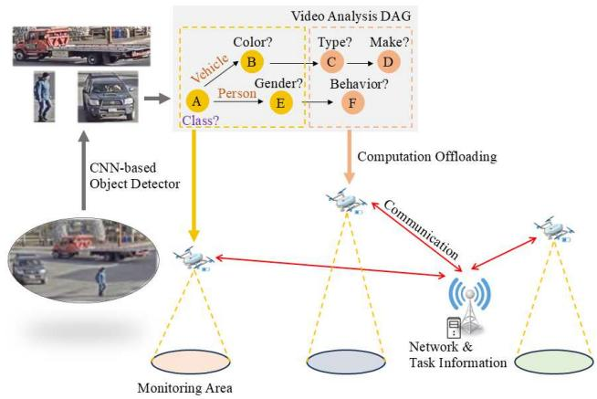  
Fig. 1. Real-time video analytics by collaborative UAVs.

UAV system while optimizing inference latency and energy consumption.

## III. BACKGROUND AND OVERALL DESIGN

## A. Background on Real-Time Video Analytics by UAVs

1) Real-Time Video Analytics Pipeline: In real-time video analysis systems, a lightweight background subtractor [33] is first employed to extract regions of interest (ROIs) from each frame. This background subtractor then sends these ROIs to a classifier for object identification. A task-specific module can typically be modeled as a DAG. In our study, we define attribute recognition as the function of the task-specific module. Each vertex in the DAG represents a DNN classifier that categorizes an attribute of an object. Each directed edge indicates the data flow from one classifier to the next. The DAG illustrated in Fig. 1 consists of two branches, each of which can be selected based on whether the object is a vehicle or a person. Each branch uses a sequence of cascading classifiers to identify the attributes of the target object.

2) Collaborative Video Analytics on UAVs: An illustration of collaborative multi-UAV systems in the context of realtime video streaming is shown in Fig. 1. The UAVs are interconnected and linked to a BS equipped with a computing server through wireless technologies, such as Wi-Fi and Radioover-IP. Each UAV collects real-time video from the ground and uses DNN models to recognize objects in the extracted frames.The extracted ROIs are treated as multiple tasks, processed in chronological order. Moreover, tasks generated by the UAVs are sequentially classified according to the flow direction specified by the DAG. Object classification continues until the DAG partition points are reached on the UAVs. At the same time, tasks are ofloaded to adjacent UAVs for further classification beyond the DAG partition points.

## B. Challenges and Goals

The scale of UAV deployment and the characteristics of diferent network environments determine the selection of control methods. The centralized mode is suited for operations involving a small number of UAVs or environments with reliable network connectivity. In this mode, a BS equipped with a server acts as a central supervisor, possessing comprehensive knowledge of the network. When UAVs cannot communicate with the BS or when a large number of UAVs cause high communication latency, the distributed mode should be employed. Under the distributed mode, UAVs take autonomous action based on their individual conditions and the surrounding environment.

1) Challenges: Collaborative real-time video analytics conducted by UAVs faces several challenges. Firstly, it is essential to develop distinct solutions for the centralized and distributed scenarios, ensuring these methods adapt to the scale of UAVs. Secondly, aerial video analytics faces the challenge of limited onboard energy. In contrast to pre-configured terrestrial cameras, UAVs consume additional power for propulsion and hovering, which must be managed eficiently to minimize the duration of video analysis [34]. Consequently, the joint design of UAV development, task scheduling, and DAG partition for aerial surveillance with the collaborative multiple UAVs should address the trade-of between inference latency and energy consumption. Furthermore, the problem of collaborative video analytics among UAVs belongs to the class of NP-complete problems. Consequently, it is crucial to design an optimization method that can solve this problem eficiently within a given time.

2) Goals: The challenge of collaborative video analytics using UAVs is complex due to multiple variables, including deployment location, computation ofloading, communication resource allocation, and DAG partition. Additionally, it is influenced by nonlinear factors such as inference latency and energy consumption of UAVs. Consequently, developing optimization methods for this non-convex problem is crucial. The purpose of this study is to minimize inference latency and enhance energy eficiency within feasible computation time, while designing a scalable multi-UAV collaboration architecture for two distinct scenarios.

## C. Overall Design

1) The UCAA Model: The overall architecture of UCAA, a real-time video analytics architecture that incorporates both centralized and distributed control modes based on UAVs, is depicted in Fig. 2. The autonomous monitor continuously monitors the position and resource usage of each UAV. The

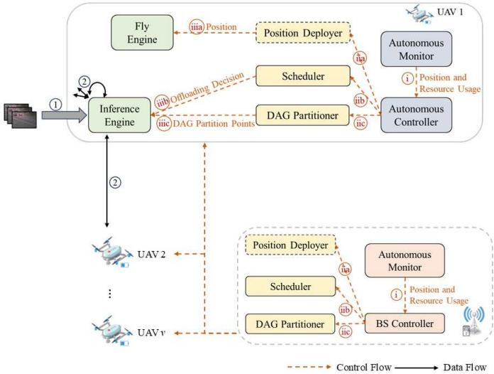  
Fig. 2. System architecture of UCAA.

BS controller or autonomous controller is used to trigger the position deployer, scheduler, and DAG partitioner. The position deployer is responsible for changing the positions of the UAVs, the scheduler is responsible for scheduling tasks and allocating communication resource, and the DAG partitioner determines the optimal DAG partition points for each UAV. The fly engine supports the flight of the entire vehicle, while the inference engine analyzes the video data in real time.

2) The Workflow of Smaonuav: The UCAA model is described based on the control plane and the data plane. Within the control plane, the autonomous monitor sends the collected information to the BS controller or autonomous controller (O1 in Fig. 2). In the context of dynamic monitoring, once all UAVs are idle or a UAV’s resource is insuficient, the BS Controller or autonomous controller triggers the position deployer ( ii-a) to reposition the UAVs, and the optimal position results are then sent to the fly engine on each UAV (iii-a). Subsequently, the scheduler ( ii-b) and DAG partitioner ( ii-c) are triggered. And the corresponding ofloading decision, communication resource allocation, and DAG partition results are sent to the inference engine on each UAV (iii, iii-c). In the context of static monitoring, the position deployer and fly engine will not work. Within the data plane, upon capturing a video frame, a UAV utilizes its onboard background subtractor to extract ROIs in the frame and sequentially appends them to a local queue (O1 in Fig. 2). Each task (ROI) in the queue is partially processed by its own inference engine based on its segmented DAG. Subsequently, the partially processed task is transmitted to another UAV, whose inference engine completes further processing of the tasks (O2 ). Finally, the UAV’s inference results are then collected on the UAV.

## IV. SYSTEM MODELING

We present a system model for real-time video inference using collaborative UAVs. Subsection A discusses the topological relationship between UAVs and the BS. Subsection B presents the formulation of inference latency for video analytics on UAVs. Subsection C provides the formula for UAV energy consumption.

## A. Network Modeling

A scenario is presented in which the BS makes decisions. In this case, the BS is crucial for the decision-making and scheduling process, and is responsible for monitoring UAV positions, calculation ofloading, communication resource allocation, and DAG partition points selection. Each UAV $( \nu \in \mathcal { V } )$ can collect real-time video from the ground during hovering and is equipped with an engine that performs video inference tasks. These UAVs are not only capable of processing tasks independently but can also ofload tasks to neighboring UAVs for additional processing. The position of UAV v is represented by $d _ { \nu } = ( x _ { \nu } , y _ { \nu } )$ . Throughout its flight, all UAVs maintains a constant altitude h, which is set to the minimum altitude to avoid collisions and reduce interference with other UAVs, as highlighted in previous studies [35]. The position of the BS is (xb yb 0). Let $B ^ { \nu , \nu ^ { \prime } }$ be the direct communication bandwidth between UAV v and $\nu ^ { \prime } ,$ , and $B _ { m m } ^ { \nu  b }$ be the bandwidth allocated between the BS and UAV v. The coverage range of UAV v is $C _ { \nu }$

## B. Computing Modeling

The set of time-sensitive computing tasks generated by UAV v is denoted as $\mathcal { M } _ { \nu }$ , and the i-th task of UAV v is $M _ { \nu , i } = ( S _ { \nu , i } ,$ $T _ { \nu , i } )$ . Here, $S _ { \nu , i }$ , ,represents the size of task i generated by UAV $\nu ,$ , and $T _ { \nu , i }$ ,signifies the maximum acceptable latency for video ,inference. The total number of tasks in $\mathcal { M } _ { \nu }$ is $M _ { \nu }$ . The task can be ofloaded to the associated UAVs if their resource is available. Let $U _ { \nu , i } ^ { \nu ^ { \prime } }$ represent whether the task is ofloaded to UAV $\nu ^ { \prime } ,$ where $U _ { \nu , i } ^ { \nu ^ { \prime } } = 1$ indicates that task i generated by UAV v is ofloaded to $\nu ^ { \prime } ,$ while $U _ { \nu , i } ^ { \nu ^ { \prime } } = 0$ indicates it is not.

,1) Executing on the UAV: The latency for transmitting task i of UAV v from UAV v to $\nu ^ { \prime }$ becomes:

$$
t _ { \nu , i } ^ { \nu  \nu ^ { \prime } } = \frac { S _ { \nu , i } } { R ^ { \nu  \nu ^ { \prime } } }\tag{1}
$$

where $R ^ { \nu  \nu ^ { \prime } }$ is the transmission speed from UAV v to $\nu ^ { \prime }$ , and can be defined as:

$$
R ^ { \nu  \nu ^ { \prime } } = B ^ { \nu , \nu ^ { \prime } } \log _ { 2 } ( 1 + \frac { P _ { \nu } G _ { \nu , \nu ^ { \prime } } } { \sigma ^ { 2 } } )\tag{2}
$$

where $P _ { \nu }$ represents the transmission power of UAV $\nu , \ \sigma ^ { 2 }$ indicates the power of white noise, and $G ^ { \nu , \nu ^ { \prime } }$ represents the achievable channel gain. The communication channel between UAVs involves a LoS link, with the channel gain as specified in [36], is defined as follows:

$$
G ^ { \nu , \nu ^ { \prime } } = 1 0 ^ { - \left( L _ { \nu , \nu ^ { \prime } } / 1 0 \right) }\tag{3}
$$

where $L _ { \nu , \nu ^ { \prime } } = \Theta _ { \nu , \nu ^ { \prime } } + \Gamma _ { L o S }$ denotes the path loss between two , ,UAVs. Specially, $\Gamma _ { L o S }$ is the additional attenuation factor for LoS link [36], and $\Theta _ { \nu , \nu ^ { \prime } }$ is given by:

$$
\begin{array} { c c c } { { \Theta _ { \nu , \nu ^ { \prime } } ( { \bf d B } ) = 2 0 \log _ { 1 0 } ( d ^ { \nu , \nu ^ { \prime } } ) + 2 0 \log _ { 1 0 } ( f _ { c } ) } } \\ { { + 1 0 \log _ { 1 0 } \displaystyle \left[ \left( \displaystyle \frac { 4 \pi } { c } \right) ^ { 2 } \right] } } \end{array}\tag{4}
$$

where c is the light speed, $f _ { c }$ denotes the carrier frequency,and $d _ { \nu , \nu ^ { \prime } }$ denotes the distance between two UAVs, as defined by:

$$
d ^ { \nu , \nu ^ { \prime } } = \sqrt { ( x _ { \nu } - x _ { \nu ^ { \prime } } ) ^ { 2 } + ( y _ { \nu } - y _ { \nu ^ { \prime } } ) ^ { 2 } }\tag{5}
$$

2) Data Collecting at the BS: As previously stated, the BS serves as the central manager, responsible for coordinating computation ofloading and others. For this purpose, UAVs supporting video analytics must send their position, available energy, and DAG partition points (indicated as $D _ { \nu } )$ to the BS. Hence, the latency of UAV v for transmitting this data to the BS is

$$
t ^ { \nu  b } = \frac { D _ { \nu } } { R ^ { \nu  b } }\tag{6}
$$

where $R ^ { \nu  b }$ is the transmission speed from UAV v to the BS and expressed as follows [37]:

$$
R ^ { \nu  b } = B _ { \mathrm { m m } } ^ { \nu  b } \log _ { 2 } ( 1 + \frac { P _ { b , \nu } } { B _ { \mathrm { m m } } ^ { \nu  b } \sigma ^ { 2 } } )\tag{7}
$$

where $P _ { b , \nu }$ represents the power received by the BS, which is given by:

$$
P _ { b , \nu } = P ^ { \nu  b } G _ { \nu } ^ { t x } G _ { b } ^ { r x } \frac { c } { 4 \pi d _ { \nu } ^ { b } B _ { c } ^ { \mathrm { m m } } }\tag{8}
$$

where $P ^ { \nu  b }$ is the transmit power to the BS, $B _ { c } ^ { m m }$ is the carrier frequency of the mmWave link. $G _ { \nu } ^ { t x }$ and $G _ { b } ^ { r x }$ are the antenna gains of the transmitter of UAV v and the receiver at the BS, respectively. $d _ { b } ^ { \nu }$ represents the distance from UAV v to the BS.

## C. Energy Consumption Modeling

UAVs possess limited energy, which is supplied by of-theshelf batteries. The energy expended in ofloading the task from UAV v to $\nu ^ { \prime }$ is then given by

$$
E _ { \nu , i } ^ { \nu  \nu ^ { \prime } } = P _ { \nu } ( \frac { S _ { \nu , i } } { R ^ { \nu  \nu ^ { \prime } } } )\tag{9}
$$

The energy consumption of UAV v for transmitting infor mation to the BS can be given by:

$$
E ^ { \nu  b } = P ^ { \nu  b } \frac { D _ { \nu } } { R ^ { \nu  b } }\tag{10}
$$

The overall energy consumption of a UAV encompasses the transmission energy from UAV v to the BS, the energy required for processing the inference tasks generated by other UAVs or itself, the energy for transmitting data generated by v to adjacent UAVs, and the energy consumed for hovering in the air. Thus, the formula can be succinctly presented as:

$$
\begin{array} { c } { { E _ { \nu } ^ { a l l } = E ^ { \nu  b } + \displaystyle \sum _ { i } E _ { \nu , i } ^ { \nu , \mathrm { e x e } } + \displaystyle \sum _ { \nu ^ { \prime \prime } } \sum _ { i } U _ { \nu , i } ^ { \nu ^ { \prime \prime } } E _ { \nu , i } ^ { \nu  \nu ^ { \prime \prime } } } } \\ { { + \displaystyle \sum _ { \nu ^ { \prime } } \sum _ { i } U _ { \nu ^ { \prime } , i } ^ { \nu } E _ { \nu ^ { \prime } , i } ^ { \nu , \mathrm { e x e } } + E ^ { \nu , h o \nu } } } \end{array}\tag{11}
$$

where $E _ { \nu , i } ^ { \nu , \mathrm { e x e } }$ is volume energy of UAV v employed to process ,task i of UAV v. $E ^ { \nu , h o \nu }$ represents the hovering energy, as defined by [38]:

$$
E ^ { \nu , h o \nu } = P ^ { \nu , h o \nu } t ^ { \nu , h o \nu } = \frac { \eta \sqrt { \eta } } { 2 \phi _ { \nu } \sqrt { 2 \pi q r ^ { 2 } \kappa } } t ^ { \nu , h o \nu }\tag{12}
$$

where $P ^ { \nu , h o \nu }$ represents the hovering power of UAV v, $\phi _ { \nu }$ denotes the energy eficiency, q is the number of rotors, r

is the rotor radius,  is the air density, and  is a coeficient proportional to the UAV’s weight. The hovering time of UAV v denoted as $t ^ { \nu , h o \nu }$ , can be calculated as

$$
\begin{array} { r l r } {  { t ^ { \nu , h o \nu } = \operatorname* { m a x } [ t ^ { \nu  b } + \operatorname* { m a x } ( \sum _ { \nu ^ { \prime } } \sum _ { i } U _ { \nu ^ { \prime } , i } ^ { \nu } ( t _ { \nu ^ { \prime } , i } ^ { \nu ^ { \prime }  \nu } + t _ { \nu ^ { \prime } , i } ^ { \nu , \mathrm { e x e } } ) ,   } } \\ & { } & { \times   \sum _ { i } t _ { \nu , i } ^ { \nu , \mathrm { e x e } } , \sum _ { \nu ^ { \prime \prime } } \sum _ { i } U _ { \nu , i } ^ { \nu ^ { \prime \prime } } ( t _ { \nu , i } ^ { \nu  \nu ^ { \prime \prime } } + t _ { \nu , i } ^ { \nu ^ { \prime \prime } , \mathrm { e x e } } ) ) ] } \end{array}\tag{13}
$$

where $t ^ { \nu  b }$ represents transmit latency from UAV v to the BS.

## V. CENTRALIZED VIDEO ANALYTICS PROBLEM AND ALGORITHM

A video inference system is proposed, supported by multiple UAVs, including a BS and V UAVs. The BS ofers centralized network control and manages resource. It gathers and disseminates real-time information regarding UAVs, ensuring the real-time adjustment of it operations. Additionally, it optimizes the location and task scheduling of UAVs, and allocates the results to each UAV. Subsection A defines the video analytics problem of a centralized swarm. Subsection B designs an optimization algorithm to address this problem.

## A. Problem Formulation

To maximize the endurance of UAVs and optimize resource utilization, the goal is to minimize inference latency and enhance energy eficiency. Balancing energy consumption is also essential for efective power management within UAV network. Real-time video inference latency refers to the time from receiving data to generating inference results. Specifically, inference latency d can be divided into two components: (1) task transmission latency and (2) task processing latency, both of which are essential for generating inference results.

$$
d = \frac { \underset { \nu } { \sum } \sum _ { i } ( t ^ { \nu  b } + \operatorname* { m a x } ( t _ { \nu , i } ^ { \nu , \mathrm { e x e } } , U _ { \nu , i } ^ { \nu ^ { \prime } } ( t _ { \nu , i } ^ { \nu  \nu ^ { \prime } } + t _ { \nu , i } ^ { \nu ^ { \prime } , \mathrm { e x e } } ) ) ) } { V \times \sum _ { \nu } M _ { \nu } }\tag{14}
$$

where $t _ { \nu , i } ^ { \nu , \mathrm { e x e } }$ is the time required for task i of UAV v to be ,executed on UAV v.

Balancing energy consumption is also essential for efective power management within UAV network. The average energy consumption of the UAVs is formulated as

$$
\bar { E } = E _ { \nu } ^ { \mathrm { a l l } } \ / V\tag{15}
$$

The problem is structured as follows:

$$
\begin{array} { r l } { \mathrm { P 1 } } & { { } \operatorname* { m i n } \beta _ { 1 } d + \beta _ { 2 } \bar { E } } \end{array}\tag{16}
$$

$$
\mathrm { s . t . } \quad \cup C _ { \nu } = S\tag{17}
$$

$$
d ^ { \nu , \nu ^ { \prime } } \geq d _ { \mathrm { m i n } }\tag{18}
$$

$$
\operatorname* { m a x } ( t _ { \nu , i } ^ { \nu , \mathrm { e x e } } , t _ { \nu , i } ^ { \nu  \nu ^ { \prime } } + U _ { \nu , i } ^ { \nu ^ { \prime } } t _ { \nu , i } ^ { \nu ^ { \prime } , \mathrm { e x e } } ) \leq T _ { \nu , i }\tag{19}
$$

$$
\sum _ { \nu \in \mathcal { V } } ( B ^ { \nu , \nu ^ { \prime } } + B _ { m m } ^ { \nu  b } ) \leq B ^ { \mathrm { m a x } }\tag{20}
$$

$$
E _ { \nu } ^ { a l l } \leq E _ { \nu } ^ { \mathrm { m a x } }\tag{21}
$$

In Equation (16), $\beta _ { 1 } , \beta _ { 2 }$ are weight coeficients. Equation (17) ensures that the overall monitoring area S under UAVs remains unchanged. Equation (18) guarantees the non-collision among UAVs during the flight. Equation (19) ensures that inference latency remains below the given threshold. Equation (20) ensures that communication resource requirements do not exceed the total communication resource capacity. Equation (21) ensures that the UAV’s energy consumption remains within the predefined threshold.

## B. Algorithm

It is a programming problem where UAV position variables are coupled with other optimization variables, including continuous variables and binary ofloading variables. Therefore, it is a MINLP problem that is both NP-hard and nonconvex [39]. The two-layer JDTSO algorithm decomposes the problem into two distinct layers. The upper layer focuses on the deployment of UAVs and the lower layer adjusts the ofloading decisions, communication resource allocation, and DAG partition under the given deployment of UAVs. Initially, the upper layer determines the positions of UAVs, which reduces the solution space of the problem. This reduction enables higher-quality scheduling results. Based on the task scheduling at the lower layer, the performance of UAV deployment can be accurately assessed. The method ultimately enhances both UAV deployment and task scheduling.

Algorithm 1 Proposed JDTSO Algorithm   
1: Initialize population $\mathcal { Q } = \{ q _ { 1 } . q _ { 2 } , . . . , q _ { V } \}$ (i.e., an initial   
. , . . . ,deployment of UAVs), iterations number = 1;   
2: while number $\leq$ numbe $\boldsymbol { r } _ { m a x }$ do   
3: Obtain encoded individuals, $x _ { j } ~ = ~ E n c o d e ( q _ { j } ) , j ~ =$   
$1 , \ldots , N _ { p } / 2 ;$   
4: , . .for $i = 1 , \ldots , N _ { p } / 2$ do   
5: , . . . , /Perform crossover operation, $x _ { i } ^ { \prime }$ =   
Crossover( $x _ { m } , x _ { n } , P _ { c } ) ;$   
6: Perform mutation operation, $x _ { i } ^ { \prime \prime } = M u t a t e ( x _ { i } ^ { \prime } , P _ { m } ) ;$   
7: Restore encoded individuals, $q _ { i } ^ { \prime \prime } = D e c o d e ( x _ { i } ^ { \prime \prime } ) ;$   
8: end for   
9: Calculate the fitness function for all individuals based   
on max $\cup C _ { \nu } ;$   
10: Select V individuals with high fitness values from   
$\{ q _ { 1 } , \ldots , q _ { N _ { p } } , q _ { 1 } ^ { \prime \prime } , \ldots , , q _ { N _ { p / 2 } } ^ { \prime \prime } \}$ for the next generation;   
11: number = number + 1;   
12: end while   
13: Optimize the computation ofloading U for all UAVs using   
DP;   
14: Allocate communication resource based on a convex opti  
mization tool;   
15: Determine DAG partition points C for all UAVs according   
to Equation (16);   
16: return {Q U B C}

The overall process of JDTSO is outlined in Algorithm 1. Initially, a population Q comprising $N _ { p }$ individuals (i.e., an initial deployment of UAVs) is generated. The GA is applied to determine UAV positions (lines 2-12). During iteration, a crossover operation generates new individuals within the population (line 5). A mutation operation is subsequently performed to further explore the solution space (line 6). The objective of the GA is to maximize the coverage area of all UAVs. Thus, the fitness function for all individuals in the population is defined in accordance with this objective (line 9). Individuals with higher fitness values are selected to form the next generation (line 10). This process continues until the maximum number of iterations $( n u m b e r _ { m a x } )$ is reached. Each UAV updates the computation ofloading decision U using DP (line 13). Communication resource is optimized using a convex optimization tool (line 14). The DAG partition points C for each UAV are determined via brute-force enumeration based on the maximization objective in Equation (16) (line 15).

1) Position Deployment: Given the value of computation ofloading, the communication resource allocation, and the DAG partition, the subproblem P2 can be formulated by the objective function (17) and constraint (18). It is evident that P2 is a nonconvex nonlinear optimization problem. Conventional optimization methods, such as Newton’s method, are inadequate for resolving it. GA is a promising approach owing to its population-based heuristic search methodology, which ofers low computational complexity by avoiding the need for gradient calculations.

2) Ofloading Decision and Resource Allocation: Depending on the deployment and DAG partition of UAVs, the calculation ofloading subproblem P3 can be formulated by the objective function (16) and the constraints (19), and (21). The optimization of the ofloading decision is a 0-1 programming problem, which can be solved by DP within pseudo-polynomial runtime. The insight is that the minimal inference latency and energy consumption for ofloading the first i task is determined by the optimal solution of the first i−1 task, indicating that the optimal solution can be constructed from the subproblems. This ofloading decision optimization problem exhibits the optimal subproblem property, a fundamental characteristic that justifies the adoption of DP. The resource allocation subproblem P4 can be formulated by the objective function (16) and the constraints (19), (20), and (21). According to the objective function, the computation ofloading and the resource allocation variables are independent. Consequently, the communication resource is independent of the ofloading decisions made by the BS. The problem can be proven to be convex and solved using the convex optimization tools.

## C. Complexity Analysis

We analyze the complexity of the proposed algorithm. For problem (P1), it is decomposed into the upper and lower layer optimization to find an optimal solution. In the upper layer optimization problem (P2), the time complexity of GA is $O ( n u m b e r _ { m a x } N _ { p } ) .$ , where numbe $r _ { m a x }$ is the number of optimization iterations, and $N _ { p }$ is the size of population. The lower layer optimization problem is further decoupled into three subproblems. The time complexity of DP algorithm is $O ( V M _ { m a x } )$ , where V is the number of UAVs, and $M _ { m a x }$ is the maximum number of tasks generated by any UAV. The time complexity of communication resource algorithm is O(V). The time complexity of DAG partitioning algorithm is $O ( a ^ { V } )$ , where a is the number of possible DAG partition points on each UAV. We observe that the computational complexity of DAG partitioning becomes prohibitively high when enumeration methods are applied to large-scale UAVs. We thus introduce a maximum enumeration limit R to ensure that suboptimal solutions can be obtained within a reasonable computational time. Consequently, the total complexity to solve the problem (P1) is $O ( n u m b e r _ { m a x } N _ { p } + V M _ { m a x } + V + a ^ { V } )$

## VI. DISTRIBUTED VIDEO ANALYTICS PROBLEM AND ALGORITHMS

Communication between UAVs and the BS consumes significant energy, thereby shortening the network lifespan. Communication failures can result in collisions. Specifically, UAVs lack awareness of their neighbors’ positions and rely solely on their local environmental perception. In this context, UAVs can communicate with each other to obtain critical information. Initially, the video analytics problem for a distributed UAV swarm is examined. An optimization algorithm, MAPDP, is then proposed to address this issue.

## A. Problem Formulation

Our objective is to jointly optimize ofloading decisions, resource allocation, and DAG partition to minimize inference latency and enhance energy eficiency across all UAVs.

$$
d = \frac { \underset { \nu } { \sum _ { \nu } } \sum _ { i } ( \operatorname* { m a x } ( t _ { \nu , i } ^ { \nu , \mathrm { e x e } } , U _ { \nu , i } ^ { \nu ^ { \prime } } ( t _ { \nu , i } ^ { \nu  \nu ^ { \prime } } + t _ { \nu , i } ^ { \nu ^ { \prime } , \mathrm { e x e } } ) ) ) } )  { V \times \underset { \nu } { \sum _ { \nu } } M _ { \nu } }\tag{22}
$$

Formally, the problem is defined as follows:

$$
\begin{array} { r l } { \mathrm { P } 5 } & { { } \{ d , \bar { E } \} } \end{array}
$$

$$
\mathrm { s . t . } \quad \left( 1 9 \right) \sim \ \left( 2 1 \right)\tag{23}
$$

(24)

Addressing the scheduling problem of video inference tasks using hovering UAVs involves several challenges, including real-time requirements, node selection, high bandwidth demands, and varying computing resource among UAVs. Enhancing the performance of the video analysis requires considering factors such as data transmission, resource allocation, load balancing, and optimization methods.

The problem belongs to the domain of distributed task scheduling, an area in which meta-heuristic algorithms, greedy algorithms, and DRL algorithms are typically employed. DRL algorithms are particularly efective in this context due to their capability for autonomous decision-making, and high adaptability in complex environments. There are two primary categories of DRL algorithms: single-agent and multiagent. The primary application of single-agent DRL is in dynamic environments characterized by limited state and action spaces. Multi-agent DRL enables collaboration within a complex, high-dimensional state spaces, exemplified by the MAPPO algorithm. Based on policy optimization, the MAPPO algorithm ofers greater flexibility in adjusting strategies to varying environmental conditions and dynamic changes, thereby enhancing its adaptability to noise and uncertainty.

## B. Algorithm

The aforementioned problem requires the simultaneous optimization of calculation ofloading, communication resource allocation, and DAG partition. Due to the rapid solving capability of DRL algorithm for complex problems, they are employed for optimization. Furthermore, to reduce the complexity of the action space, DAG partitioning is decoupled from MAPPO. And it is addressed using brute-force enumeration. Subsequently, the problem is solved using MAPPO. In conclusion, an optimization algorithm is proposed that integrates MAPPO with a DAG partition strategy to solve the cooperative video analytics problem in a distributed UAV swarm.

Given the static distribution of UAVs and their localized observations, the task scheduling problem is formulated as a Decentralized Partially Observable Markov Decision Process (Dec-POMDP). Dec-POMDP is a mathematical model employed to solve multi-agent action-making problems. Thus, UAVs are considered distributed agents that implement video analytics strategies by leveraging their local observations. Specifically, information exchange occurs among UAVs and their neighboring nodes within the communication range [40]. The observations, states, actions, and rewards at time t are denoted as O S A, and R. Below are the detailed definitions of each element.

State S (t): During time slot t, the agent gathers environmental data within its observation range. This data encompasses the UAV’s position and DAG partition points. Consequently, the local observation of the v-th agent at time slot t is denoted as $O _ { \nu } ( t ) = \{ C _ { \nu } ( t ) , P _ { \nu } ( t ) \}$ , where $C _ { \nu } ( t ) = \{ c _ { \nu } ( t ) , c _ { \nu ^ { \prime } } ( t ) \}$ $P _ { \nu } ( t ) = \{ p a r _ { \nu } ( t ) , p a r _ { \nu ^ { \prime } } ( t ) \} , \nu ^ { \prime } \in \mathcal { U } _ { \nu }$ , denote the coordinates and the partition points of the UAVs that can be observed by UAV v during time slot t, respectively. As a result, the global state space is $S \left( t \right) = \left\{ o _ { 1 } ( t ) , o _ { 2 } ( t ) , \ldots , o _ { V } ( t ) \right\}$

, , . . . ,Action A(t): The agent’s behavior is determined by the actions prescribed by the policy function within the MDP framework. The action space for UAVs can be expressed as follows:

$$
A ( t ) = \left\{ U _ { \nu , i } ^ { \nu ^ { \prime } } , B ^ { \nu , \nu ^ { \prime } } \right\}\tag{25}
$$

Reward R(t): The reward signifies the outcome obtained by an agent following its interaction with the environment. In collaborative UAV video analytics, all UAVs have a shared objective of minimizing inference latency and enhancing energy eficiency. Utilizing Equation (23), the reward for all UAVs during time slot t can be calculated as follows:

$$
R ( t ) = - \left( \beta _ { 1 } d _ { t } + \beta _ { 2 } \frac { 1 } { V } \sum _ { \nu = 1 } ^ { V } E _ { \nu , t } ^ { \mathrm { a l l } } \right)\tag{26}
$$

$d _ { t }$ is the inference latency at time slot $t , E _ { \nu , t } ^ { \mathrm { a l l } }$ is the energy consumption of UAV v at time slot t, and $\beta _ { 1 } , \beta _ { 2 }$ are weight coeficients. Ensuring a balanced distribution of energy consumption among UAVs during video analysis is crucial for eficient inference. Uneven energy distribution can lead to neglected tasks and performance degradation.

To address the constructed Dec-POMDP, MAPPO utilizes a centralized value function and distributed policy function. This strategy facilitates distributed execution while maximizing rewards, which is essential for solving the task scheduling problem in UAV cooperation. The actor network determines actions according to a policy, while the critic network assesses the value of these actions. Algorithm 2 outlines the algorithmic framework of MAPDP. Firstly, the actor network, the critic network, and other training parameters are initialized. The DAG partition points C for each UAV are determined via brute-force enumeration based on the maximization objective in Equation (26) (line 3). Specifically, network training comprises two stages: (1) the experience collection stage and (2) the policy update stage. The experience collection stage is executed in lines 6-10, where each UAV samples a sequence of experiences. The reward $r _ { t } ,$ along with the next states $s _ { t + 1 }$ and observation $o _ { t + 1 }$ , can be obtained (line 8). The experience $\{ s _ { t } ^ { \nu } , o _ { t } ^ { \nu } , a _ { t } ^ { \nu } , r _ { t } ^ { \nu } , s _ { t + 1 } ^ { \nu } , o _ { t + 1 } ^ { \nu } \}$ of the slot are stored in the replay bufer until the maximum time step T is reached. Lines 11- 18 correspond to the policy update stage, where the policy network $\pi _ { \theta }$ is optimized for K times, and the state value network $V _ { \phi }$ is optimized K epochs on the mini-batch B of data sampled from the shufled memory bufer D. Subsequently, the replay bufer is emptied.

Algorithm 2 Proposed MAPDP Algorithm   
1: Initialize policy network $\pi _ { \theta _ { \nu } }$ with $\theta ^ { \nu } { } _ { ; }$ , and value network   
$V _ { \phi _ { \nu } }$ with $\phi ^ { \nu }$ πθ θfor each UAV v, respectively;   
2: Initialize a memory bufer $D ;$   
3: Determine DAG partition points C according to Equation   
(26);   
4: for episode $\mathbf { \Lambda } = 1 { , } 2 { , } . . . , E$ do   
5: $s _ { 1 } =$ initialize state;   
6: for $t = 1 , 2 , . . . , T$ do   
7: , , . . . ,Each agent v executes action according to $\pi _ { \theta _ { \nu } } ( a _ { t } ^ { \nu } | o _ { t } ^ { \nu } ) ;$   
8: Get the reward $r _ { t } ,$ and the next state $s _ { t + 1 } , o _ { t + 1 } ;$   
9: Store data $\{ s _ { t } ^ { \nu } , o _ { t } ^ { \nu } , a _ { t } ^ { \nu } , r _ { t } ^ { \nu } , s _ { t + 1 } ^ { \nu } , o _ { t + 1 } ^ { \nu } \} _ { \nu = 1 } ^ { V }$ ,into bufer $D ;$   
10: end for   
11: Compute advantages $\{ A ^ { \nu } ( s _ { t } ^ { \nu } , a _ { t } ) \} _ { t = 1 } ^ { T }$   
12: for $k = 1 , 2 , \ldots , K$ do   
13: for $\nu = 1 , 2 , \ldots , V$ do   
14: Randomly sample B group of experiences from   
bufer $D ;$   
15: Update the policy network parameter v with   
Adam optimizer;   
16: Update the policy network parameter $\phi ^ { \nu }$ with   
Adam optimizer;   
17: end for   
18: end for   
19: $D \gets \emptyset ;$   
20: end for   
21: return $\theta ^ { \nu }$

## C. Complexity Analysis

The actor and critic networks in the proposed MAPPO algorithm comprise an input layer, L fully connected layers, and an output layer. Denote $\beta _ { i } ^ { a }$ and $\beta _ { i } ^ { c }$ as the number of neurons in the i-th fully connected layer for the actor and critic network, respectively. For the input layer, the number of neurons for the actor and critic network are $\beta _ { 0 } ^ { a } = o _ { \nu }$ and $\begin{array} { r } { \beta _ { 0 } ^ { c } = \sum _ { i = 1 } ^ { V } o _ { i } . } \end{array}$ , respectively. For the output layer, the number of neurons for the actor and critic network are $\beta _ { L + 1 } ^ { a } = a _ { \nu }$ and $\beta _ { L + 1 } ^ { c } = 1$ , respectively.

TABLE II  
PARAMETERS OF UAV PERFORMANCES
<table><tr><td>Parameter</td><td>Description</td><td>Value</td></tr><tr><td>V</td><td>Number of UAVs</td><td>5, 10, 20, 40, 60, 100, 200</td></tr><tr><td> $h$ </td><td>Hovering altitude</td><td>200m</td></tr><tr><td> $P _ { v }$ </td><td>Transmission power of UAV v</td><td>30 dBm</td></tr><tr><td> $\sigma ^ { 2 }$ </td><td>White gaussian noise power</td><td> $- 1 7 4 ~ \mathrm { d B m }$ </td></tr><tr><td> $\Gamma _ { L o S }$ </td><td>Additional attenuation factor for LoS link</td><td> $5 \mathrm { d B } \ [ 3 6 ]$ </td></tr><tr><td> $c$ </td><td>Light speed</td><td> $3 \times 1 0 ^ { 8 } \mathrm { m / s }$ </td></tr><tr><td> $f _ { c }$ </td><td>Carrier frequency</td><td>2GHz</td></tr><tr><td> $P ^ { v  b }$ </td><td>Transmit power to the BS</td><td>30 dBm</td></tr><tr><td> $B _ { c } ^ { m m }$ </td><td>Carrier frequency of the mmWave link</td><td>28GHz</td></tr><tr><td> $( x _ { b } , y _ { b } , 0 )$ </td><td>Coordinate of the BS</td><td>(0,0,0)</td></tr><tr><td> $P ^ { v , h o v }$ </td><td>Hovering power of UAV v</td><td>60 w [42]</td></tr><tr><td> $\eta$ </td><td>Trust that is proportional to the UAV&#x27;s mass</td><td>30 N [38]</td></tr><tr><td> $\phi _ { v }$ </td><td>Energy efficiency</td><td>70% [38]</td></tr><tr><td> $q$ </td><td>Number of rotors belonging to a single UAV</td><td>4 [38]</td></tr><tr><td> $r$ </td><td>Rotor radius</td><td>0.254 m [38]</td></tr><tr><td> $\kappa$ </td><td>Air density</td><td>1.225 kg/m³ [38]</td></tr><tr><td> $B _ { v } ^ { m a x }$ </td><td>Total available bandwidth at UAV v</td><td>20 MHz</td></tr><tr><td> $E _ { v } ^ { \mathit { \ ' } n a x }$ </td><td>Maximum energy consumption of UAV v</td><td>500 KJ [43]</td></tr><tr><td> $d _ { m i n }$ </td><td>Minimum distance between two UAVs</td><td>10 m [44]</td></tr></table>

Furthermore, during the training phase, V agents interact with the environment in parallel: local observations are fed into the actor networks to select actions, while state-value is assessed via the critic networks. Accordingly, in the training phase, the computational complexity of the proposed MAPPO algorithm is approximately $O \left( V \cdot E \cdot T \cdot \sum _ { i } ^ { L + 1 } \left( \beta _ { i - 1 } ^ { a } \cdot \beta _ { i } ^ { a } + \beta _ { i - 1 } ^ { c } \cdot \beta _ { i } ^ { c } \right) \right)$ , where E denotes the maximum number of episodes, and T represents the number of time slots per episode. The time complexity of DAG partitioning algorithm is $O ( a ^ { V } )$ , where a is the number of possible DAG partition points on each UAV. We observe that the computational complexity of DAG partitioning becomes prohibitively high when brute-force methods are applied to large-scale UAVs. We thus introduce a maximum enumeration limit R to ensure that suboptimal solutions can be obtained within a reasonable computational time. Thus, the total complexity to solve the problem (P5) is $O \left( V \cdot E \cdot T \cdot \sum _ { i } ^ { L + 1 } \left( \beta _ { i - 1 } ^ { a } \cdot \beta _ { i } ^ { a } + \beta _ { i - 1 } ^ { c } \cdot \beta _ { i } ^ { c } \right) + a ^ { V } \right)$

## VII. NUMERICAL RESULTS

We perform extensive simulations to evaluate our algorithm’s performance under various conditions, and compare it with other benchmark solutions. The simulations are implemented using PyTorch 2.3.0 with Python 3.8.19 on an Intel Core i7-13700KF CPU server with two NVIDIA GeForce RTX 4090 24GB GPUs.

## A. Methodology

1) Video Analytics Pipeline: We adopt OpenCV 3.2.0 for real-time video processing. For the inference engine, we use an eficient YOLOv3-tiny model for each classifier [41]. The intrinsic features of the tiny model render it ideal for advanced artificial intelligence applications in embedded systems, especially when enhanced by hardware accelerators. Each UAV collects sensor data to monitor targets and generates ROIs using its onboard background subtractor. The tasks are the extracted ROIs that contain vehicles or persons from a video camera frame every 10 frames.

2) Simulation Setup: The evaluation is conducted in a surveillance-based scenario. We set the target region as a 500m × 500m area. The surveillance area covered by each UAV is $\pi ( 1 0 0 ) ^ { 2 } \mathrm { m } ^ { 2 }$ . We use two types of UAVs, each equipped with a Raspberry Pi 3 B+ and an Intel Movidius Neural Computing Stick (NCS). The advanced NCS2 demonstrates superior performance compared to its predecessor in both frame rate and power eficiency under identical operating conditions. $t _ { \nu , i } ^ { \nu , \mathrm { e x e } }$ and $E _ { \nu , i } ^ { \nu , \mathrm { e x e } }$ of the YOLOv3-tiny model pro-, ,cessed on a UAV can be measured in advance [41]. The Raspberry Pi 3B+ combined with the NCS1 execution model exhibits a latency of 0.25s and power consumption of 6W, and the Raspberry Pi 3B+ combined with the NCS2 execution model demonstrates a latency of 0.2s and power consumption of 5.6W. Table II presents the key parameters used in our simulation.

We employ the CVXPY toolkit to address the communication resource allocation problem. For each hyperparameter of MAPPO, we select the optimal value by evaluating multiple candidates through testing experiments. We configure 10,000 episodes, each consisting of 5 steps. The policy and value networks are both designed with one hidden layer, each with 64 neurons and using the ReLU activation function. We set the generalized advantage estimator (GAE) parameter $\varrho = 0 . 9 5$ and the discount factor $\gamma = 0 . 9 9$ . The clip rate $\epsilon = 0 . 2$ . is the best empirical value [45].

3) Baselines: We compare JDTSO and MAPDP against five fundamental benchmark methods.

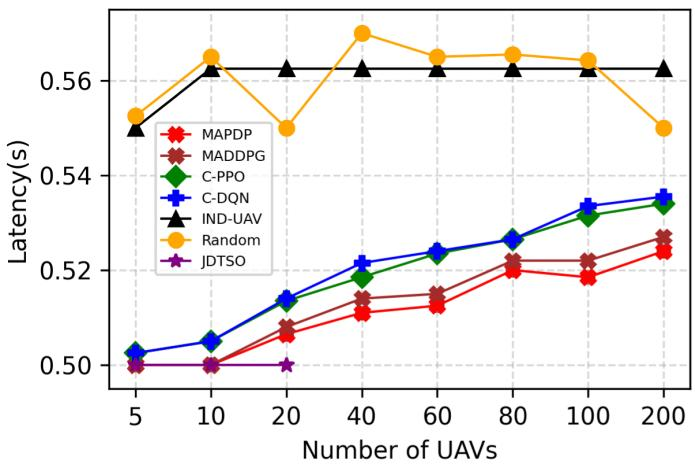  
Fig. 3. Comparison of inference latency across diferent algorithms and UAV scales.

• Centralized Global Optimization Based on PPO (C-PPO) [46]: It is assumed that a central controller is installed in a UAV to coordinate the behaviors of all UAVs.

• Centralized Global Optimization Based on DQN (C-DQN) [47]: Similar to the C-PPO algorithm, we adopt the assumption that a central manager on a UAV is responsible for managing the operations of all UAVs.

• Multi-agent deep deterministic policy gradient (MAD-DPG) [48]: Similar to the mechanism of our proposed MAPPO algorithm, the BS is only responsible for training, while UAVs themselves execute the decision.

• Random: Based on available computing resource, decisions are made randomly without considering any potential inference latency.

• IND-UAV [9]: Each UAV independently performs the inference tasks it generates.

4) Evaluation Metrics: The efectiveness of our algorithm and baseline methods is assessed using three distinct metrics.

• Inference latency: Since real-time video analytics applications necessitate immediate analytics results, we use inference latency as the primary metric to evaluate the system’s responsiveness. Inference latency is determined as the total time from generating a workload to the generation of an inference result, encompassing both processing and transmission latency.

• Energy Consumption: Energy consumption is another critical metric in UAV collaboration. The overall endurance of a UAV swarm is primarily determined by the average energy consumption, as uneven energy depletion among UAVs can result in premature mission termination and ineficient resource utilization.

• Throughput: Continuous processing of streaming video frames is crucial for real-time video analytics systems, where high throughput ensures timely analysis of incoming video streams. Consequently, we assess throughput by the number of inferences processed per second (IPS) [11].

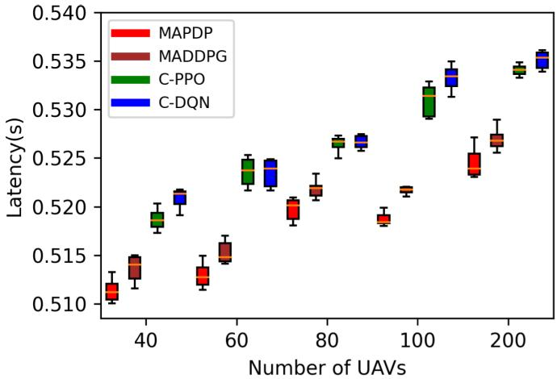  
Fig. 4. Box plot of inference latency across diferent algorithms and UAV scales.

## B. Ablation Study

This section presents line charts and box plots to evaluate inference latency, energy consumption, and throughput across diferent algorithms and UAV scales. Fig. 3 compares the average inference latency of diferent algorithms across UAV counts ranging from 5 to 200. As the number of UAVs increases, the inference latency for JDTSO, C-DQN, C-PPO, MADDPG, Random, and MAPDP also increases, whereas the inference latency of IND-UAV remains relatively stable. This increase in inference latency is attributed to the reduction in system bandwidth allocation as the number of UAVs grows. Reduced bandwidth lowers data transfer rates, thereby increasing inference latency. In contrast, IND-UAV does not transmit images to neighboring UAVs, so its inference latency depends solely on the heterogeneous computing resource of these UAVs. Consequently, variations in wireless bandwidth do not afect the eficiency of IND-UAV.

The JDTSO algorithm achieved the lowest inference latency when the UAV’s number is 20 or fewer. Compared to baseline methods, our proposed algorithm achieves faster convergence to the global optimum while demonstrating superior optimization eficiency and solution quality. As the number of UAVs increased, this algorithm not find a suitable solution within a realistic calculation time using this algorithm. However, the MAPDP algorithm can provide better solutions for larger UAV scales. This supports the architecture UCAA we designed for UAV collaborative inference system: JDTSO algorithm is suitable for small-scale UAVs or setups with a central BS, while MAPDP algorithm is preferable for large-scale UAVs or setups lacking a BS. Our method outperforms the Random algorithm, demonstrating superior policy learning in complex state spaces. Furthermore, our algorithm outperforms the optimization results of the single-agent algorithms C-DQN and C-PPO, highlighting the superiority of our multiagent method for the complex large-scale UAVs collaborative video analysis problem. Our algorithm also outperforms the MADDPG algorithm, highlighting the advantage of stochastic strategy-based MADRL algorithms in complex problems. As shown in Fig. 4, we use box plots of inference latency across diferent algorithms, with the number of UAVs ranging from 40 to 200, to reflect performance stability.

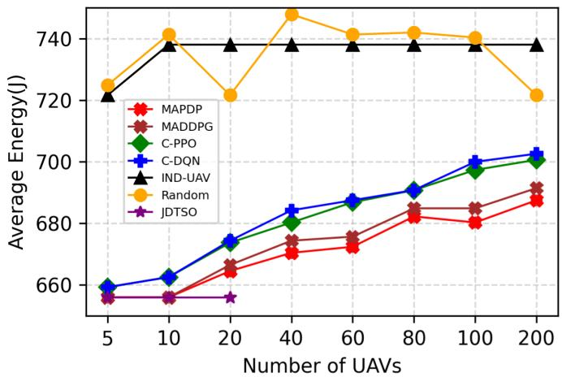  
Fig. 5. Comparison of energy consumption across diferent algorithms and UAV scales.

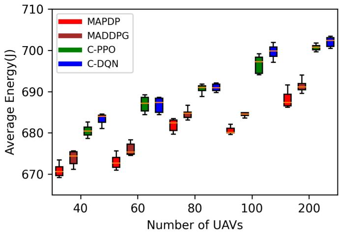  
Fig. 6. Box plot of energy consumption across diferent algorithms and UAV scales.

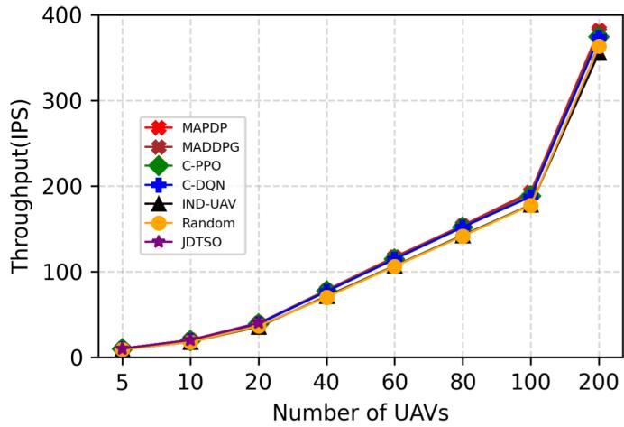  
Fig. 7. Comparison of throughput across diferent algorithms and UAV scales.

According to Fig. 5 and Fig. 6, the JDTSO algorithm achieves the lowest average energy consumption when the number of UAVs is 20 or fewer, while the MAPDP algorithm achieves the minimum average energy consumption for UAV counts exceeding 20. Similarly, as shown in Fig. 7 and Fig. 8, the JDTSO algorithm attains the highest throughput in deployments with 20 or fewer UAVs, while the MAPDP algorithm achieves the highest throughput when the number of UAVs exceeds 20. These findings further validate the scalable nature of the UCAA architecture and its optimization efectiveness. Our proposed algorithm shows optimal performance in experiments measuring average inference latency, energy consumption, and throughput compared to other algorithms.

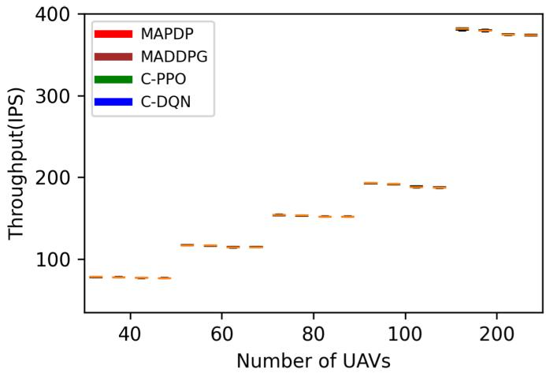  
Fig. 8. Box plot of throughput across diferent algorithms and UAV scales.

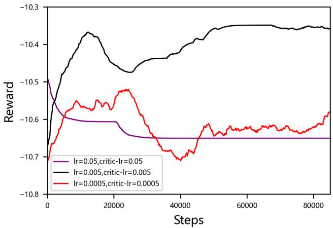  
Fig. 9. Convergence of reward for MAPDP under diferent learning rates.

## C. Sensitivity Analysis

Fig. 9 depicts the trend of the overall system reward, reflecting the cumulative average reward received by all UAVs in a single step. The term lr represents the learning rate in the policy network, while critic − lr denotes the learning rate of the value network. Our assessment focus on the convergence speed of the MAPDP algorithm under diferent learning rates, utilizing 60 UAVs during the experiment. It is evident that if the learning rate is too low or too high, algorithm convergence becomes unattainable. Setting the learning rate to 0.005 efectively balances the convergence speed with the mean system reward. Fig. 10 and Fig. 11 depict the inference latency and average energy consumption of the UAVs under the same setting, respectively, revealing an inverse relationship between inference latency and the reward function, as well as between energy consumption and the reward function.

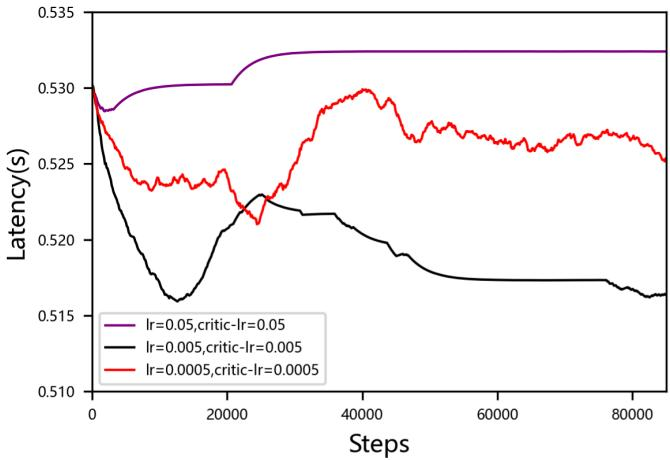  
Fig. 10. Convergence of inference latency for MAPDP under diferent learning rates.

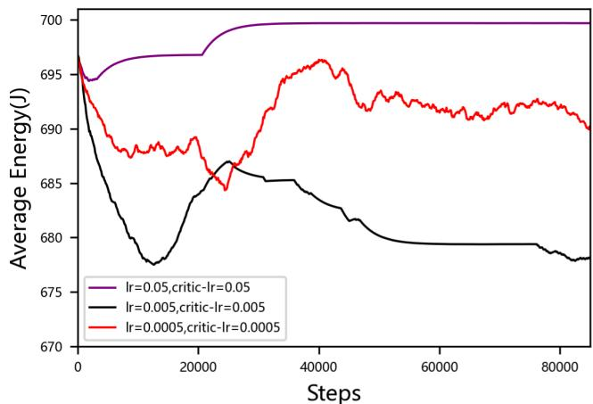  
Fig. 11. Convergence of energy consumption for MAPDP under diferent learning rates.

TABLE III  
SENSITIVITY OF ENERGY EFFICIENCY
<table><tr><td>Energy efficiency</td><td>Inference latency (s)</td><td>Energy consumption (J)</td><td>Throughput (IPS)</td></tr><tr><td>0.6</td><td>0.515</td><td>778.7</td><td>116.6</td></tr><tr><td>0.7</td><td>0.511</td><td>670.8</td><td>117.4</td></tr><tr><td>0.8</td><td>0.513</td><td>596.1</td><td>117.1</td></tr></table>

Table III presents the sensitivity analysis results for the energy eficiency with 60 UAVs. Evidently, as energy eficiency is enhanced, the average energy consumption of UAVs decreases. The average latency and throughput of UAVs do not exhibit significant changes.

## VIII. CONCLUSION

We put forward the joint optimization of UAV deployment, computation ofloading, communication resource allocation, and DAG partition in a collaborative UAV video analytics system for attribute recognition service. We have also developed a scalable collaborative video analytics architecture for the centralized and distributed UAV swarms. The optimization problem has been formulated as a MINLP problem. Its objective has been to minimize the inference latency and enhance energy eficiency. For the centralized UAVs video analytics system, we have presented a two-layer optimization method named JDTSO. At the upper layer, a GA has been employed to adjust the positions of the UAVs. At the lower layer, a DP algorithm, a convex optimization tool, and a DAG partition strategy have been employed to optimize computation ofloading, allocation of communication resource, and selection of DAG partition points, respectively. In the distributed UAV video analytics system, we have integrated the MAPPO algorithm with a DAG partition strategy to optimize computation ofloading, communication resource allocation, and DAG partition. Our extensive simulations have demonstrated that our proposed algorithm outperforms existing algorithms. In future work, we will consider UAV trajectory planning, mobility constraints (e.g., minimum turning radius and climb rate), and interference from other UAVs. Additionally, we will incorporate DRL algorithms to better adapt to highly dynamic and complex scenarios.

## REFERENCES

[1] K. Kanistras, G. Martins, M. J. Rutherford, and K. P. Valavanis, “A survey of unmanned aerial vehicles (UAVs) for trafic monitoring,” in Proc. Int. Conf. Unmanned Aircr. Syst. (ICUAS), May 2013, pp. 221–234.

[2] S. M. S. Mohd Daud et al., “Applications of drone in disaster management: A scoping review,” Sci. Justice, vol. 62, no. 1, pp. 30–42, Jan. 2022.

[3] S. Sawadsitang, D. Niyato, P.-S. Tan, and P. Wang, “Joint ground and aerial package delivery services: A stochastic optimization approach,” IEEE Trans. Intell. Transp. Syst., vol. 20, no. 6, pp. 2241–2254, Jun. 2019.

[4] Z. Shen et al., “A survey of next-generation computing technologies in Space-air-ground integrated networks,” ACM Comput. Surveys, vol. 56, no. 1, pp. 1–40, Aug. 2023.

[5] C. Peng et al., “Joint energy and completion time diference minimization for UAV-enabled intelligent transportation systems: A constrained multi-objective optimization approach,” IEEE Trans. Intell. Transp. Syst., vol. 25, no. 10, pp. 14040–14053, Oct. 2024.

[6] H. Kim, L. Mokdad, and J. Ben-Othman, “Designing UAV surveillance frameworks for smart city and extensive ocean with diferential perspectives,” IEEE Commun. Mag., vol. 56, no. 4, pp. 98–104, Apr. 2018.

[7] H. Liang et al., “DNN surgery: Accelerating DNN inference on the edge through layer partitioning,” IEEE Trans. Cloud Comput., vol. 11, no. 3, pp. 3111–3125, Jul. 2023.

[8] S. Teerapittayanon, B. McDanel, and H. T. Kung, “Distributed deep neural networks over the cloud, the edge and end devices,” in Proc. IEEE 37th Int. Conf. Distrib. Comput. Syst. (ICDCS), Jun. 2017, pp. 328–339.

[9] J. Yao and N. Ansari, “QoS-aware machine learning task ofloading and power control in Internet of Drones,” IEEE Internet Things J., vol. 10, no. 7, pp. 6100–6110, Apr. 2023.

[10] M. Dhuheir, A. Erbad, and S. Sabeeh, “LLHR: Low latency and high reliability CNN distributed inference for resource-constrained UAV swarms,” in Proc. IEEE Wireless Commun. Netw. Conf. (WCNC), Mar. 2023, pp. 1–6.

[11] X. Zeng, B. Fang, H. Shen, and M. Zhang, “Distream: Scaling live video analytics with workload-adaptive distributed edge intelligence,” in Proc. 18th Conf. Embedded Networked Sensor Syst., Nov. 2020, pp. 409–421.

[12] N. H. Motlagh, M. Bagaa, and T. Taleb, “UAV-based IoT platform: A crowd surveillance use case,” IEEE Commun. Mag., vol. 55, no. 2, pp. 128–134, Feb. 2017.

[13] C. Qu, S. Wang, and P. Calyam, “DyCOCo: A dynamic computation ofloading and control framework for drone video analytics,” in Proc. IEEE 27th Int. Conf. Netw. Protocols (ICNP), Oct. 2019, pp. 1–2.

[14] H. E. Mohamadi, N. Kara, and M. Lagha, “Eficient algorithms for decision making and coverage deployment of connected multi-lowaltitude platforms,” Expert Syst. Appl., vol. 184, Dec. 2021, Art. no. 115529.

[15] A. V. Savkin and H. Huang, “Multi-UAV navigation for optimized video surveillance of ground vehicles on uneven terrains,” IEEE Trans. Intell. Transp. Syst., vol. 24, no. 9, pp. 10238–10242, Sep. 2023.

[16] X. Qin et al., “Timeliness-oriented asynchronous task ofloading in UAVedge-computing systems,” IEEE Trans. Netw. Sci. Eng., vol. 11, no. 1, pp. 900–912, Jan. 2023.

[17] N. Zhao, Z. Ye, Y. Pei, Y.-C. Liang, and D. Niyato, “Multi-agent deep reinforcement learning for task ofloading in UAV-assisted mobile edge computing,” IEEE Trans. Wireless Commun., vol. 21, no. 9, pp. 6949–6960, Sep. 2022.

[18] L. X. Nguyen, Y. K. Tun, T. N. Dang, Y. M. Park, Z. Han, and C. S. Hong, “Dependency tasks ofloading and communication resource allocation in collaborative UAV networks: A metaheuristic approach,” IEEE Internet Things J., vol. 10, no. 10, pp. 9062–9076, May 2023.

[19] X. Li, X. Du, N. Zhao, and X. Wang, “Computing over the sky: Joint UAV trajectory and task ofloading scheme based on optimizationembedding multi-agent deep reinforcement learning,” IEEE Trans. Commun., vol. 72, no. 3, pp. 1355–1369, Mar. 2024.

[20] H. Guo, Y. Wang, J. Liu, and C. Liu, “Multi-UAV cooperative task ofloading and resource allocation in 5G advanced and beyond,” IEEE Trans. Wireless Commun., vol. 23, no. 1, pp. 347–359, Jan. 2024.

[21] W. Chao et al., “Computing power in the sky: Digital twin-assisted collaborative computing with multi-UAV networks,” IEEE Trans. Veh. Technol., vol. 74, no. 9, pp. 14466–14482, Sep. 2025.

[22] M.-A. Messous, S.-M. Senouci, H. Sedjelmaci, and S. Cherkaoui, “A game theory based eficient computation ofloading in an UAV network,” IEEE Trans. Veh. Technol., vol. 68, no. 5, pp. 4964–4974, May 2019.

[23] X. He, R. Jin, and H. Dai, “Multi-hop task ofloading with on-thefly computation for multi-UAV remote edge computing,” IEEE Trans. Commun., vol. 70, no. 2, pp. 1332–1344, Feb. 2022.

[24] Z. Gao, J. Fu, Z. Jing, Y. Dai, and L. Yang, “MOIPC-MAAC: Communication-assisted multiobjective MARL for trajectory planning and task ofloading in multi-UAV-assisted MEC,” IEEE Internet Things J., vol. 11, no. 10, pp. 18483–18502, May 2024.

[25] F. Busacca, S. Palazzo, R. Raftopoulos, and G. Schembra, “MARBLE: Multi-player multi-armed bandit for lightweight and eficient job ofloading in UAV-based mobile networks,” in Proc. ICC - IEEE Int. Conf. Commun., Jun. 2024, pp. 4936–4941.

[26] Y. Shao et al., “An energy-eficient distributed computation ofloading algorithm for ground-air cooperative networks,” Veh. Commun., vol. 52, Apr. 2025, Art. no. 100875.

[27] V. Mnih and G. E. Hinton, “Learning to label aerial images from noisy data,” in Proc. Int. Conf. Mach. Learn. (ICML), 2012, pp. 203–210.

[28] J. Sharma, O. Granmo, M. Goodwin, and J. T. Fidje, “Deep convolutional neural networks for fire detection in images,” in Proc. Int. Conf. Eng. Appl. Neural Netw., 2017, pp. 183–193.

[29] Y. Jiang, Y. Miao, B. Alzahrani, A. Barnawi, R. Alotaibi, and L. Hu, “Ultra large-scale crowd monitoring system architecture and design issues,” IEEE Internet Things J., vol. 8, no. 13, pp. 10356–10366, Jul. 2021.

[30] B. Yang, X. Cao, C. Yuen, and L. Qian, “Ofloading optimization in edge computing for deep-learning-enabled target tracking by Internet of UAVs,” IEEE Internet Things J., vol. 8, no. 12, pp. 9878–9893, Jun. 2021.

[31] M. A. Dhuheir, E. Baccour, A. Erbad, S. S. Al-Obaidi, and M. Hamdi, “Deep reinforcement learning for trajectory path planning and distributed inference in resource-constrained UAV swarms,” IEEE Internet Things J., vol. 10, no. 9, pp. 8185–8201, May 2023.

[32] H. Sun et al., “All-sky autonomous computing in UAV swarm,” IEEE Trans. Mobile Comput., vol. 23, no. 12, pp. 13258–13274, Dec. 2024.

[33] Z. Zivkovic and F. van der Heijden, “Eficient adaptive density estimation per image pixel for the task of background subtraction,” Pattern Recognit. Lett., vol. 27, no. 7, pp. 773–780, May 2006.

[34] Y. Zeng, J. Xu, and R. Zhang, “Energy minimization for wireless communication with rotary-wing UAV,” IEEE Trans. Wireless Commun., vol. 18, no. 4, pp. 2329–2345, Apr. 2019.

[35] X. Hu, K.-K. Wong, K. Yang, and Z. Zheng, “UAV-assisted relaying and edge computing: Scheduling and trajectory optimization,” IEEE Trans. Wireless Commun., vol. 18, no. 10, pp. 4738–4752, Oct. 2019.

[36] U. Challita and W. Saad, “Network formation in the sky: Unmanned aerial vehicles for multi-hop wireless backhauling,” in Proc. IEEE Global Commun. Conf., Dec. 2017, pp. 1–6.

[37] C.-C. Lai, L.-C. Wang, and Z. Han, “Data-driven 3D placement of UAV base stations for arbitrarily distributed crowds,” in Proc. IEEE Global Commun. Conf. (GLOBECOM), Dec. 2019, pp. 1–6.

[38] M. Monwar, O. Semiari, and W. Saad, “Optimized path planning for inspection by unmanned aerial vehicles swarm with energy constraints,” in Proc. IEEE Global Commun. Conf. (GLOBECOM), Dec. 2018, pp. 1–6.

[39] L. Yang, H. Yao, J. Wang, C. Jiang, A. Benslimane, and Y. Liu, “Multi-UAV-enabled load-balance mobile-edge computing for IoT networks,” IEEE Internet Things J., vol. 7, no. 8, pp. 6898–6908, Aug. 2020.

[40] Q. You, Z. Chen, and Y. Li, “A multihop transmission scheme with detect-and-forward protocol and network coding in two-way relay fading channels,” IEEE Trans. Veh. Technol., vol. 61, no. 1, pp. 433–438, Jan. 2012.

[41] V. Mazzia, A. Khaliq, F. Salvetti, and M. Chiaberge, “Real-time apple detection system using embedded systems with hardware accelerators: An edge AI application,” IEEE Access, vol. 8, pp. 9102–9114, 2020.

[42] H. Yan, W. Bao, X. Zhu, J. Wang, and L. Liu, “Data ofloading enabled by heterogeneous UAVs for IoT applications under uncertain environments,” IEEE Internet Things J., vol. 10, no. 5, pp. 3928–3943, Mar. 2023.

[43] Y. K. Tun, T. N. Dang, K. Kim, M. Alsenwi, W. Saad, and C. S. Hong, “Collaboration in the sky: A distributed framework for task ofloading and resource allocation in multi-access edge computing,” IEEE Internet Things J., vol. 9, no. 23, pp. 24221–24235, Dec. 2022.

[44] D. Rahbari, M. M. Alam, Y. L. Moullec, and M. Jenihhin, “Fast and fair computation ofloading management in a swarm of drones using a rating-based federated learning approach,” IEEE Access, vol. 9, pp. 113832–113849, 2021.

[45] R. Ding, F. Gao, and X. S. Shen, “3D UAV trajectory design and frequency band allocation for energy-eficient and fair communication: A deep reinforcement learning approach,” IEEE Trans. Wireless Commun., vol. 19, no. 12, pp. 7796–7809, Dec. 2020.

[46] J. Schulman, F. Wolski, P. Dhariwal, A. Radford, and O. Klimov, “Proximal policy optimization algorithms,” 2017, arXiv:1707.06347.

[47] H. Zhang, H. Zhao, R. Liu, X. Gao, and S. Xu, “Dynamic user association and computation ofloading in satellite edge computing networks via deep reinforcement learning,” IEEE Trans. Green Commun. Netw., vol. 8, no. 4, pp. 1888–1901, Dec. 2024.

[48] R. Lowe, Y. Wu, A. Tamar, J. Harb, P. Abbeel, and I. Mordatch, “Multiagent actor-critic for mixed cooperative-competitive environments,” in Proc. Adv. Neural Inf. Process. Syst., 2017, pp. 6379–6390.

Ying Wang received the M.E. degree in management science and engineering from Anhui University of Technology, Ma’anshan, China, in 2022. She is currently pursuing the Ph.D. degree with the School of Computer Science and Artificial Intelligence, Wuhan University of Technology, Wuhan, China. Her research interests include reinforcement learning, distributed computing, and the Internet of Things.

Jingling Yuan (Senior Member, IEEE) received the Ph.D. degree from Wuhan University of Technology, Wuhan, China, in 2004. She was a Visiting Scholar with the University of Florida, Gainesville, FL, USA, from 2008 to 2009, and a Research Scholar with the University of Bristol, Bristol, U.K., in 2018. She is currently a Professor with the School of Computer Science and Artificial Intelligence, Wuhan University of Technology. Her research interests include machine learning, edge video analytics, and green computing.

Donglei Xu received the master’s degree in arts from the Zhongnan University of Economics and Law, Wuhan, China, in June 2011. He is currently an Intermediate Engineer with Wuhan Fiberhome Technical Services Company Ltd. His research interests include digital management and technology management.

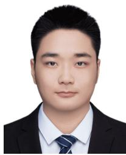

Wenbo Wu received the B.Eng. degree from Wuhan University of Technology, Wuhan, China, in 2023, where he is currently pursuing the master’s degree in computer science and artificial intelligence. His current research interests include machine learning and edge computing.

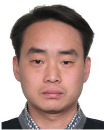

Quanfeng Yao received the B.E. degree from Harbin Institute of Technology, Harbin, China, in July 2001. He is currently an Intermediate Engineer with Wuhan Fiberhome Technical Services Company Ltd. His research interests include the intelligent operation and maintenance of information and communication networks.

Zhishu Shen (Member, IEEE) received the B.E. degree from the School of Information Engineering, Wuhan University of Technology, Wuhan, China, in 2009, and the M.E. and Ph.D. degrees in electrical and electronic engineering and computer science from Nagoya University, Japan, in 2012 and 2015, respectively. From 2016 to 2021, he was a Research Engineer of KDDI Research, Inc., Japan. He is currently an Associate Professor with the School of Computer Science and Artificial Intelligence, Wuhan University of Technology. His research interests

include network design and optimization, data learning, edge computing, and the Internet of Things.