# Towards Reliable Service Provisioning for Dynamic UAV Clusters in Low-Altitude Economy Networks

Yanwei Gong, Ruichen Zhang, Xiaoqing Wang, Xiaolin Chang, Bo Ai, Fellow, IEEE, Junchao Fan, Bocheng Ju, and Dusit Niyato, Fellow, IEEE

Abstract—Unmanned Aerial Vehicle (UAV) cluster services are crucial for promoting the low-altitude economy by enabling scalable, flexible, and adaptive aerial networks. To meet diverse service demands, clusters must dynamically incorporate a New UAVs (NUAVs) or an Existing UAV (EUAV). However, achieving sustained service reliability remains challenging due to the need for efficient and scalable NUAV authentication, privacy-preserving cross-cluster authentication for EUAVs, and robust protection of the cluster session key, including both forward and backward secrecy. To address these challenges, we propose a Lightweight and Privacy-Preserving Cluster Authentication and Session Key Update (LP2-CASKU) scheme tailored for dynamic UAV clusters in low-altitude economy networks. LP2-CASKU integrates an efficient batch authentication mechanism that simultaneously authenticates multiple NUAVs with minimal communication overhead. It further introduces a lightweight cross-cluster authentication mechanism that ensures EUAV anonymity and unlinkability. Additionally, a secure session key update mechanism is incorporated to maintain key confidentiality over time, thereby preserving both forward and backward secrecy. We provide a comprehensive security analysis and evaluate LP2-CASKU performance through both theoretical analysis and OMNeT++ simulations. Experimental results demonstrate that, compared to the baseline, LP2- CASKU achieves a latency reduction of 82.8%–90.8% by across different UAV swarm configurations and network bitrates, demonstrating strong adaptability to dynamic communication environments. Besides, under varying UAV swarm configurations, LP2-CASKU reduces the energy consumption by approximately 37.6%–72.6%, while effectively supporting privacy-preserving authentication in highly dynamic UAV cluster environments. A demonstration video is available at: https://github.com/BJTU-STIC/UAV-simulation-demonstration.

Index Terms—Entity authenticity, Low-altitude economy, Privacy preservation, Service reliability, UAV cluster.

## 1 INTRODUCTION

as drones, have become integral to advancing the lowaltitude economy by leveraging near-ground airspace to deliver efficient and real-time services [1], [2]. In particular, UAV clusters enhance task efficiency, coverage scale, and intelligent coordination, supporting a wide range of applications such as aerial photography, precision agriculture, infrastructure inspection, disaster response, and logistics [3]– [8]. Recent advances in technologies such as artificial intelligence, 5G connectivity, and swarm intelligence have further enabled autonomous and large-scale UAV cluster operations, significantly accelerating their integration into smart cities and low-altitude economic infrastructures [9]– [13].

To efficiently deliver these services, UAVs operating in low-altitude economic networks are typically organized into hierarchically structured swarms. As illustrated in Fig.1 [14], each swarm is divided into clusters, each consisting of a Cluster Head (CH) and multiple Cluster Members (CMs).

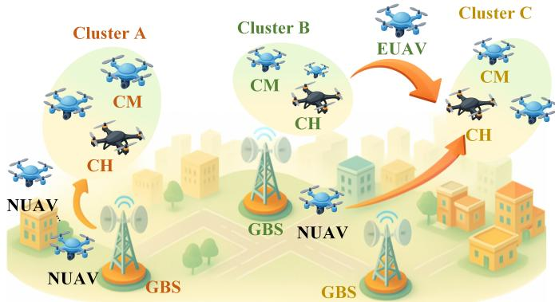  
Fig. 1: Hierarchical UAV swarm architecture for low-altitude economy networking. A UAV swarm consists of multiple UAV clusters, each coordinated by a CH. The architecture enables scalable cluster-based services with dynamic UAV membership management across clusters.

The CH coordinates cluster tasks and manages CMs, leveraging a shared cluster session key to ensure secure internal communications. In addition, Ground Base Stations (GBSs) oversee multiple UAV clusters by distributing instructions to CHs and collecting task results, thereby ensuring system responsiveness, efficiency, and scalability—core requirements for low-altitude economy applications [15].

Despite these advantages, UAV clusters inherently exhibit high dynamism [16]. For instance, a CM may lose connectivity with its CH or with other CMs, leading to reduced service reliability [17]. Moreover, to meet the real-time, scalable, and dependable service demands of the low-altitude economy, UAV clusters often require dynamic reconfiguration, such as the recruitment of additional UAVs. Typically, a CH may request support from its associated GBS to deploy New UAVs (NUAVs), or coordinate with other clusters to incorporate Existing UAVs (EUAVs). Consequently, ensuring continuous reliability necessitates secure authentication of these UAVs and robust protection of the cluster session key, as the dynamic joining or departure of UAVs may expose the existing session key to potential compromise. These needs introduce several critical challenges, detailed as follows:

• Challenge 1: Efficient and scalable cluster authentication of multiple NUAVs. To maintain the reliability of a dynamic UAV cluster, the CH and CMs must authenticate each NUAV. Moreover, considering that a NUAV may later join other clusters as a EUAV, the CHs of those clusters must also authenticate it. These processes of authenticating NUAVs is referred to as cluster authentication. However, when multiple NU-AVs attempt to join simultaneously, performing individual authentication sequentially incurs substantial communication overhead and latency, as the CH must forward each request to its CMs. This is inadequate for time-sensitive applications in the low-altitude economy. Therefore, developing an efficient batch authentication mechanism that supports simultaneous authentication of multiple NUAVs while minimizing communication costs remains a critical challenge.

• Challenge 2: Efficient cross-cluster authentication with privacy protection. To maintain service reliability, it is essential to authenticate EUAVs when they join a cluster, a process termed cross-cluster authentication. In addition, since a EUAV may participate in multiple such processes, preserving its privacy is vital to prevent inference attacks on its flight trajectory [18], a particularly serious concern in urban low-altitude airspace, where both privacy and security risks are critical. To prevent adversaries from linking different authentication sessions and reconstructing the EUAV’s movement patterns, it is necessary to ensure that the authentication messages across clusters cannot be correlated. Achieving this requires that messages exchanged during different cross-cluster authentications of the same EUAV remain unlinkable, thereby preventing the attacker from associating these sessions to a single UAV identity or tracking its path over time. Thus, the challenge is to design an efficient and privacy-preserving cross-cluster authentication mechanism.

• Challenge 3: Forward and backward secrecy of the cluster session key. Ensuring the secrecy of the cluster session key is critical to the reliability of dynamic UAV cluster services. When NUAVs or EUAVs join a cluster, the cluster session key must be updated to maintain forward secrecy. Similarly, when a CM departs, whether due to failure or is reassigned as a EUAV to another UAV cluster, the cluster session key must be updated to preserve backward secrecy. This ensures that the departing CM can no longer access subsequent intracluster communications. These mechanisms are essential to meeting the data security requirements of the low-altitude economy [19]. Therefore, designing a secure session key update mechanism that guarantees both forward and backward secrecy remains a key challenge.

Existing authentication and key management schemes for UAV networks [20]– [31] face critical challenges in dynamic UAV cluster environments. They often lack efficient support for batch authentication of multiple NUAVs, fail to ensure EUAV privacy through anonymity and unlinkability, and overlook backward secrecy in session key updates. Furthermore, many [20], [21], [24], [25] rely on computationly intensive techniques or incur excessive overhead, making them unsuitable for real-time, resource-constrained lowaltitude scenarios. To address these limitations, we propose the first Lightweight and Privacy-Preserving Cluster Authentication and Session Key Update (LP2-CASKU) scheme for dynamic UAV clusters. LP2-CASKU integrates three key mechanisms to enhance authentication efficiency, strengthen privacy protection, and ensure the secrecy of the cluster session key, thereby maintaining reliable UAV cluster services. Its novel features are as follows:

• Message aggregation for efficient cluster authentication. LP2-CASKU incorporates a message aggregation mechanism in terms of signature aggregation and public key aggregation, enabling the cluster to authenticate multiple NUAVs simultaneously while reducing communication overhead and latency. This addresses Challenge 1.

• Lightweight cross-cluster authentication with anonymity and unlinkability. LP2-CASKU introduces a lightweight cross-cluster authentication mechanism that allows the CH to efficiently authenticate EUAVs. It also ensures EUAV anonymity and unlinkability of messages exchanged during different cross-cluster authentications of the same EUAV, thereby preserving privacy and addressing Challenge 2.

• Cluster session key update with forward and backward secrecy. LP2-CASKU provides a cluster session key update mechanism to ensure the secrecy of the cluster session key. This mechanism guarantees forward secrecy when UAVs join a cluster and backward secrecy when UAVs leave, thereby fulfilling Challenge 3.

We conduct both formal and illustrative security analyses to validate the proposed LP2-CASKU, and provide theoretical evaluations of its computation and communication overheads. To assess practical feasibility, we conduct OMNeT++ [32]-based simulations under realistic UAV configurations by taking multiple realistic factors into consideration, such as UAV flight speed, signal transmission power network communication protocol stack, and so on. Specifically, compared to the baseline, the message aggregation mechanism significantly reduces authentication latency by 82.8%–90.8% under varying UAV swarm configurations, and achieves consistent latency reductions of 88.0%–89.5% across different network bitrates. In parallel, LP2-CASKU reduces energy consumption by 36.1%–72.6% for CHs and CMs, and by 40.9%–70.9% for other CHs and NUAVs. These results demonstrate that LP2-CASKU effectively mitigates communication and computation burdens while ensuring efficient, secure, and privacy-preserving authentication in dynamic UAV cluster environments.

The remainder of the paper is organized as follows. Section 2 reviews related works, and Section 3 introduces the preliminaries and system model. Section 4 presents the design of LP2-CASKU. Sections 5 and 6 analyze the security and evaluate the performance, respectively. Section 7 concludes the paper.

## 2 RELATED WORK

We present related works about UAV authentication in this section. For each work, we discuss its limitations to clarify the motivation of this paper and highlight the advantages of LP2-CASKU. Table 1 provides a comparative summary between existing schemes and LP2-CASKU.

Tan et al. [20] proposed an authentication scheme for UAVs using blockchain and smart contracts. However, the blockchain introduced additional latency due to transaction confirmation time, which failed to meet the real-time requirements of low-altitude economy networks. Moreover, cross-cluster authentication was not considered. Feng et al. [21] also designed a blockchain-based authentication scheme for UAVs. Although it supported cross-cluster au thentication, it did not include a cluster session key update mechanism. In addition, the latency issue caused by blockchain remained unresolved. Zhang et al. [22] proposed a cluster session key agreement scheme for UAVs. While it satisfied forward and backward secrecy through key updates, it lacked support for cross-cluster authentication. Karmakar et al. [23] introduced a distributed UAV authentication scheme based on blockchain. Their method supported cross-cluster authentication and maintained forward secrecy for session keys, but neglected backward secrecy. Xie et al. [24] designed an authentication protocol for UAV-assisted Internet of Vehicles (IoV), employing multiple public key generators for distributed registration. However, their scheme did not address scenarios where UAVs dynamically join or leave a cluster. Ali et al. [25] proposed a lightweight authentication scheme using resourceefficient cryptographic primitives. Yet, the scheme focused on mutual authentication between GBS and UAVs, mak ing it inapplicable to cluster-based authentication. Wang et al. [26] presented a lightweight UAV authentication protocol, which similarly focused on mutual authentication rather than cluster authentication. Tanveer et al. [27] proposed a mutual authentication mechanism between UAVs and service users. Like [25], [26], it did not support either cluster or cross-cluster authentication. Bansal et al. [28] proposed a secret-sharing-based UAV authentication scheme robust to Physical Unclonable Function (PUF) noise. However, it focused on point-to-point authentication and did not support dynamic cluster operations. Yang et al. [29] de signed a decentralized authentication scheme using Decentralized Identifiers (DIDs) and PUF-generated keys with accumulator-based management, but it did not address cluster-based authentication or session key updates. Xie et al. [30] introduced a blockchain-assisted zero-trust authentication scheme, which emphasized access control rathe than dynamic cluster authentication. Xie et al. [31] further proposed a blockchain-assisted cross-domain authentication scheme, yet it did not consider secure cluster session key updates in dynamic UAV clusters.

Current Limitations: Although extensive research [20]– [31] has explored authentication and key management for UAV networks, significant gaps remain in the context of dynamic UAV clusters. Most existing schemes [21], [24]– [31] do not support scalable and efficient cluster authentication, particularly for simultaneous onboarding of multiple NU-AVs. Moreover, privacy-preserving cross-cluster authentication remains largely unaddressed. Several schemes fail to ensure anonymity or unlinkability, thereby exposing EUAVs to flight trajectory inference attacks. In terms of session key management, many works either overlook backward secrecy or rely on computationly expensive operations, especially bilinear pairings [24], which renders them impractical for resource-constrained UAV platforms. Furthermore, blockchain-based solutions [20], [21], [23] impose excessive computation and communication overheads, making them unsuitable for real-time, latency-sensitive applications in low-altitude economy environments.

These limitations hinder the reliability of UAV cluster services, thereby constraining their deployment in realworld low-altitude economic scenarios. To overcome these challenges, we propose LP2-CASKU that ensures reliable UAV cluster service delivery.

## 3 PRELIMINARIES AND SYSTEM DESCRIPTION

The background knowledge and the system description are introduced in this section.

## 3.1 Background Knowledge

This section presents computationly hard problems, on which cryptograph primitives used in LP2-CASKU are based.

Discrete Logarithm Problem (DLP) [33]: Given a large prime p, a generator of the multiplicative group $\mathbb { Z } _ { p } ^ { * }$ modulo $p ,$ and $b \in \mathbb { Z } _ { p } ^ { * } ,$ it is computationly hard for any polynomialtime bounded algorithm to find $\dot { a } \in \mathbb { Z } _ { p } ^ { * }$ so that $\bar { b } = g ^ { a }$

Diffie-Hellman Problem (DHP) [34]: Given a large prime $p ,$ a generator of the multiplicative group $\mathbb { Z } _ { p } ^ { * }$ modulo $p ,$ and $\mathring { g } ^ { a } , g ^ { b } \in \mathbb { Z } _ { p } ^ { * }$ , it is computationly hard for any polynomial-time bounded algorithm to compute $g ^ { a b } \in \mathbb { Z } _ { p } ^ { * }$

## 3.2 System Description

This section presents system entities, the threat model, design goals, and the security model. Table 2 gives the symbols used in the rest of this paper.

## 3.2.1 System Entity

As illustrated in Fig. 2, the proposed system involves five key entities: GBSs, CHs, CMs, NUAVs, and EUAVs. In the following, we provide a detailed description of these entities—not merely to define their roles, but to explain how each contributes to the reliability of UAV cluster services in the proposed scheme. Specifically, we describe the responsibilities of each entity in managing or participating in dynamic cluster operations, as well as their interaction with other entities to enable secure authentication, session key update, and coordinated task execution.

TABLE 1: Comparison of Related Works
<table><tr><td>Ref.</td><td>Main cryptographic primi- tives or technologies</td><td>Cluster authentica- tion</td><td>Cross-cluster au- thentication</td><td>Cluster session key up- date</td><td>Privacy protection</td></tr><tr><td>BDLA+ [20] 2022</td><td>ECC/Hasha</td><td>√</td><td>X</td><td>X</td><td>Anonymity</td></tr><tr><td>BCDA+ [21] 2022</td><td>ECC/SEA/Hashb</td><td>X</td><td>√</td><td>X</td><td>Anonymity</td></tr><tr><td>TAGKA [22] 2023</td><td>CM/SS/Hashc</td><td>√</td><td>×</td><td>√</td><td>Anonymity</td></tr><tr><td>SwarmAuth [23] 2024</td><td>Hash/XOR/SEA</td><td>√</td><td>√</td><td>√</td><td>Anonymity</td></tr><tr><td>BASUV [24] 2024</td><td>BM/Hash</td><td>×</td><td>X</td><td>X</td><td>Anonymity</td></tr><tr><td>IOOSC-U2G [25] 2024</td><td>ECC/Hash/XOR</td><td>×</td><td>×</td><td>×</td><td>Anonymity/Unlinkability</td></tr><tr><td>LBMA+ [26] 2024</td><td>ECC/Hash/XOR</td><td>X</td><td>X</td><td>×</td><td>Anonymity</td></tr><tr><td>SAAF-IoD+ [27] 2024</td><td>CM/SEA/Hash</td><td>X</td><td>X</td><td>X</td><td>Anonymity</td></tr><tr><td>ASRU+ [28] 2025</td><td>SS/PUFd</td><td>X</td><td>X</td><td>X</td><td>Anonymity</td></tr><tr><td>ALAS+ [29] 2025 BAZAM [30] 2025</td><td>PUF/DIDe PUF</td><td>X</td><td>X</td><td>X</td><td>Anonymity</td></tr><tr><td>BALC+ [31] 2025</td><td>DID</td><td>× ×</td><td>× ×</td><td>×</td><td>Anonymity</td></tr><tr><td>LP2-CASKU 2025</td><td>Elgamal/Hash</td><td>√</td><td>√</td><td>× √</td><td>Anonymity/Unlinkability</td></tr><tr><td></td><td></td><td></td><td></td><td></td><td>Anonymity/Unlinkability</td></tr></table>

a-e ECC denotes elliptic curve cryptography, SEA denotes symmetric encryption algorithm, CM denotes chaotic map, SS denotes secret sharing, PUF denotes physical unclonable function, and DID denotes decentralized identifier.

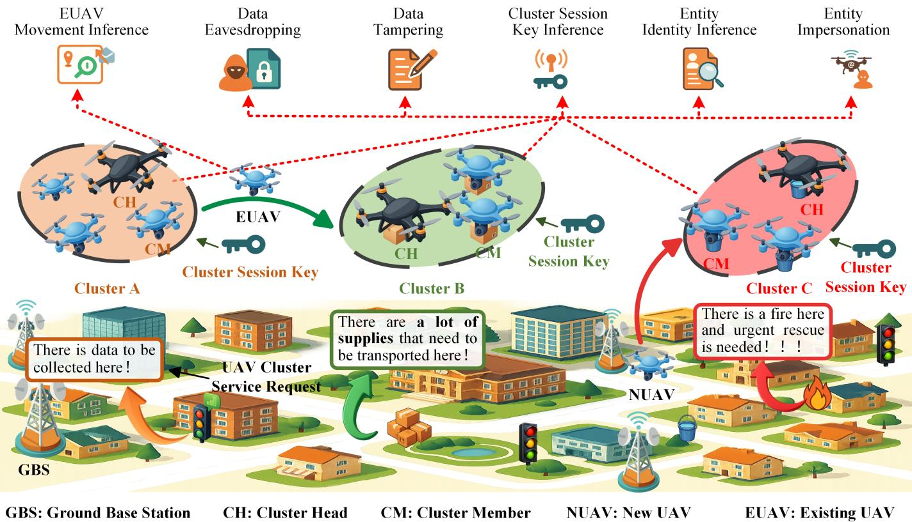  
Fig. 2: Illustration of UAV cluster operations and potential security threats in low-altitude economy networks. Multiple UAV clusters dynamically provide services. Text boxes denote various UAV cluster service requests, including such as data collection, logistics transportation, and emergency rescue within the urban environment. Red dashed arrows indicate potential attack paths, each corresponding to specific attacks such as Data Eavesdropping, Data Tampering, Cluster Session Key Inference, EUAV Movement Inference, Entity Identity Inference, and Entity Impersonation mentioned in Section 3.2.2. The proposed LP2-CASKU addresses these attacks by enabling secure, privacy-preserving authentication and efficient UAV cluster management.

GBS: Each GBS oversees multiple UAV clusters within its designated swarm and is assumed to be fully trusted by all associated clusters. It is responsible for cluster formation, CH assignment, UAV registration, and global coordination. Upon receiving a request for reinforcement, the GBS registers NUAVs and dispatches them to the requesting cluster. Each GBS maintains a secure database containing identity credentials of all UAVs within the swarm.

CH: The CH is randomly selected by the GBS to serve as the coordinator of its respective cluster and is trusted by all CMs. Upon registration, the CH obtains a publicprivate key pair and a cluster session key from the GBS, enabling secure intra-cluster communication. Additionally, the CH receives a cross-cluster communication token, collaboratively generated by all GBSs, which authorizes secure interactions with CHs from other clusters, regardless of GBS affiliation. When additional UAVs are required, the CH may request NUAVs from its GBS or EUAVs from other CHs. All incoming NUAVs and EUAVs must be authenticated by the CH prior to integration into the cluster.

TABLE 2: Definitions of Symbols
<table><tr><td>Symbol</td><td>Description</td></tr><tr><td>CNUAVs</td><td>Aggregated auxiliary information of  $\overline { { \{ V _ { k } \} _ { k = 1 } ^ { N _ { \mathrm { N U A V } } } } }$ </td></tr><tr><td> $\operatorname { C H } _ { i , j }$ </td><td>The j-th CH managed by GBSi</td></tr><tr><td> $\mathrm { C J T } _ { i , j }$ </td><td>Cluster joining token of the cluster managed by  $\operatorname { C H } _ { i , j }$ </td></tr><tr><td> $\mathrm { C M } _ { i , j , l }$ </td><td>The l-th CM in the cluster managed by  $\operatorname { C H } _ { i , j }$ </td></tr><tr><td> $\mathrm { C T }$ </td><td>Cross-cluster communication token</td></tr><tr><td> $g$ </td><td>Generator of  $\mathbb { Z } _ { p } ^ { \ast }$ </td></tr><tr><td> $\mathrm { G B S } _ { i }$ </td><td>The i-th GBS</td></tr><tr><td>H</td><td>Hash function</td></tr><tr><td> $\operatorname { k e y } _ { i , j }$ </td><td>Cluster session key of the cluster managed by  $\operatorname { C H } _ { i , j }$ </td></tr><tr><td> $\mathrm { k e y } _ { i , j } ^ { \mathrm { n e w } }$ </td><td>Updated cluster session key of the cluster managed by  $\operatorname { C H } _ { i , j }$ </td></tr><tr><td> $N _ { \mathrm { X X } }$ </td><td>Number of entity  $\mathrm { X X ~ ( X X ~ \in ~ \{ G B S , N U A V , C H , } ~ $  CM})</td></tr><tr><td> $\mathrm { p k _ { C M s } }$   $\left( \mathrm { p k } _ { \mathrm { X X } } , \mathrm { s k } _ { \mathrm { X X } } \right)$ </td><td> $\{ \mathrm { p k } _ { \mathrm { C M } _ { i , j , l } } \} _ { l = 1 } ^ { N _ { i , j , \mathrm { C M } } }$  Aggregated public key of Public-private key pair of entity XX (XX ∈ {GBS, NUAV, CH, CM, EUAV})</td></tr><tr><td>pp</td><td>Public parameters</td></tr><tr><td> $\mathrm { P I D } _ { \mathrm { X X } }$ </td><td>Pseudonymous identity of entity XX (XX ∈ {NUAV, CH, CM, EUAV})</td></tr><tr><td> $\mathrm { r e q } _ { \mathrm { r e g } }$ </td><td>Registration request message</td></tr><tr><td> $\mathrm { r e s u l t } _ { i , j , l }$   $r _ { \mathrm { X X } }$ </td><td>Authentication result obtained by  $\mathrm { C M } _ { i , j , l }$  Random number for pseudonymous identity gen-</td></tr><tr><td> $\mathrm { R I D } _ { \mathrm { X X } }$ </td><td>eration of XX  $( \mathrm { X X } \in \dot { \{ \mathrm { N U A V } , \mathrm { \bar { C M } \} } } )$ </td></tr><tr><td></td><td>Real identity of entity XX  $( \mathrm { X X } ~ \in ~ \{ \mathrm { N U A V } , \mathrm { C H } ,$  CM})</td></tr><tr><td> $s _ { i , j , l }$   $\mathrm { s i g } _ { k }$ </td><td>Random number used by  $\mathrm { C M } _ { i , j , l }$ </td></tr><tr><td></td><td>Signature generated by  $\mathrm { N U A V } _ { k }$  for joining the cluster</td></tr><tr><td> $\mathrm { s i g } _ { \mathrm { C M } _ { i , j , l } }$ </td><td>Signature generated by  $\mathrm { C M } _ { i , j , l }$ </td></tr><tr><td> $\mathrm { { s i g } _ { C M s } }$ </td><td> $\{ \mathrm { s i g } _ { \mathrm { C M } _ { i , j , l } } \} _ { l = 1 } ^ { N _ { i , j , \mathrm { C M } } }$  Aggregated signature of</td></tr><tr><td> $\mathrm { \ s i g _ { N U A V s } }$ </td><td>Aggregated signature of  $\{ \mathrm { s i g } _ { k } \} _ { k = 1 } ^ { N _ { \mathrm { N U A V } } ^ { \mathrm { v } } }$ </td></tr><tr><td> $\mathrm { T _ { 1 } , T _ { 2 } , T _ { 3 } , T _ { 4 } }$  Timestamps</td><td></td></tr><tr><td> $u _ { i , j } , \ u _ { i , j , l }$ </td><td>Random numbers for cluster session key update</td></tr><tr><td> $v _ { k }$ </td><td>Random number selected by  $\mathrm { N U A V } _ { k }$ </td></tr><tr><td> $V _ { k }$ </td><td>Auxiliary information generated by  $\mathrm { N U A V } _ { k }$  for signature verification</td></tr><tr><td> $\mathbb { Z } _ { p } ^ { * }$ </td><td>Multiplicative group modulo a large prime p</td></tr><tr><td> $\lambda$ </td><td>Security parameter</td></tr><tr><td> $\oplus$ </td><td>Exclusive OR operation</td></tr></table>

CM: CMs are UAVs managed under a common CH within the same cluster. They register with the GBS to obtain individual public-private key pairs and the cluster session key, which enable secure communication and coordinated task execution.

NUAV: NUAVs refer to UAVs newly introduced by the GBS to enhance the capabilities of a specific cluster. After registration, each NUAV obtains a public-private key pair and a cluster joining token. The NUAV initiates communication with the destination cluster’s CH, and upon successful authentication by both the CH and its CMs, it receives the cluster session key and begins participating in coordinated operations.

EUAV: EUAVs are UAVs dynamically reassigned from one cluster to another upon the request of the destination cluster’s CH. The source and destination clusters may operate under different GBSs. A EUAV may originate either from a CM that was part of the initial cluster formation or from a NUAV that joined the cluster during dynamic expansion. Prior to integration, the EUAV is authenticated by the destination CH using identity credentials retrieved from the GBS database, thereby completing the cross-cluster authentication process. Before initiating the transfer, the EUAV uploads its current state and mission-related data to the corresponding GBS via the source cluster’s CH. To preserve both forward and backward secrecy, the cluster session keys of both the source and destination clusters are updated upon successful authentication and migration of the EUAV.

## 3.2.2 Threat Model

In this section, we examine potential security threats faced during UAV cluster service provision. Given that UAVs communicate over open wireless channels, the system is inherently susceptible to various attacks, including but not limited to data eavesdropping, data tampering, and entity impersonation. To systematically analyze these threats, we adopt the Dolev-Yao adversarial model [35], which assumes that attackers have complete control over the communication channel, including the ability to intercept, modify, and fabricate messages. It is worth noting that denial-of-service attacks are beyond the scope of this work. The attacks considered in our model are illustrated in Fig. 2 and are described in detail as follows:

• Entity impersonation attack: An adversary attempts to impersonate a legitimate system entity (e.g., CH, CM, EUAV, or NUAV) to gain unauthorized access or disrupt system operations during the dynamic changes of the UAV cluster [42], [43].

• Entity identity inference attack: By analyzing communication content and patterns, particularly during the cluster authentication, an adversary seeks to deduce the true identity of participating entities.

• EUAV movement inference attack: Through correlating pseudonymous identifiers across multiple sessions, an adversary may infer the mobility trajectory of a EUAV, thereby violating its location privacy.

• Data eavesdropping attack: Sensitive information transmitted during the authentication and joining processes may be intercepted by an adversary monitoring the communication channel.

• Data tampering attack: An adversary actively modifies the content of messages exchanged during NUAV or EUAV authentication and integration, potentially compromising system integrity.

• Cluster session key inference attack: By exploiting intercepted protocol messages, an adversary attempts to infer the current or historical cluster session keys, thereby undermining the confidentiality of intra-cluster communications.

## 3.2.3 Design Goals

This section presents the design goals of LP2-CASKU, encompassing both security and performance considerations. The security goals aim to ensure the reliability of dynamic

UAV cluster services in adversarial environments. In contrast, the performance goals address the stringent real-time requirements inherent to low-altitude economy networks.

Security Goals: To achieve secure UAV cluster operations, the proposed scheme is designed to fulfill the following security goals, which are analyzed in Section 5:

• S1) Authenticity of NUAVs and EUAVs: The authenticity of NUAVs must be verified by both CH and CM before the integration of the cluster. Similarly, the authenticity of EUAVs must be validated by the destination CH during cross-cluster joining.

• S2) Anonymity: The true identities of CHs, CMs, NU-AVs, and EUAVs must remain concealed from adversaries throughout the communication process.

• S3) Unlinkability: Messages generated by a EUAV across different cross-cluster authentication processes must not be linkable by adversaries, thereby preventing mobility trajectory inference.

• S4) Enhanced forward secrecy: Attackers cannot infer the new cluster session key even if they know the previous cluster session key. Besides, when a EUAV leaves its previous cluster, it cannot infer the new cluster session key even if it knows the previous cluster session key.

• S5) Enhanced backward secrecy: Attackers cannot infer the previous cluster session key even if they know the present cluster session key. Besides, when a NUAV or EUAV join a new cluster, it cannot infer the previous cluster session key even if it knows the present cluster session key.

• S6) Message unforgeability: All communication messages exchanged during NUAV and EUAV joining procedures must be protected against unauthorized modification and forgery.

• S7) Message confidentiality: The confidentiality of sensitive messages exchanged during NUAV joining and EUAV cross-cluster processes must be ensured.

Performance Goals: To support real-time operation and scalability in dynamic UAV cluster environments, we design LP2-CASKU to meet the following performance goals, which are evaluated in Section 6.4:

• P1) Lightweight cross-cluster authentication: The authentication overhead incurred when a EUAV joins a new cluster should be significantly lower than that of a NUAV, thereby enabling rapid UAV integration.

• P2) Low communication overhead for multiple NU-AVs authentication: When N NUAVs simultaneously request to join a cluster, the total communication overhead should remain substantially below N times the cost of authenticating a single NUAV, ensuring scalability.

## 3.2.4 Security Model

Security goals S6 and S7 ensure the unforgeability and confidentiality of transmitted data, forming the foundation of the scheme’s overall security. Their formal analysis enables a systematic evaluation of data transmission security throughout the scheme. Therefore, we define the security model and conduct the formal analysis of S6 and S7 in this section. To be specific, we define cryptographic games [36] to simulate the interaction between entities in LP2-CASKU.

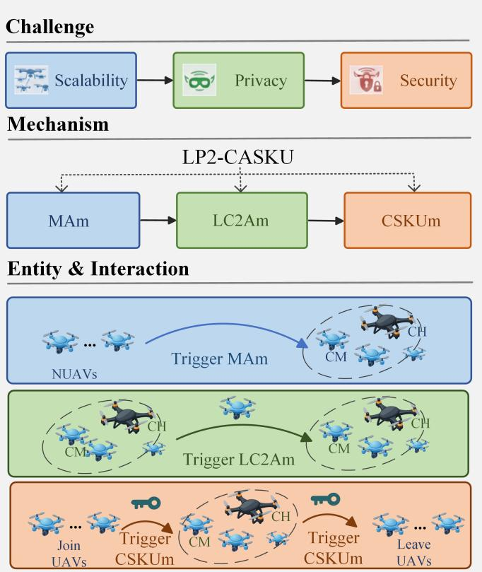  
Fig. 3: Overall architectural overview of LP2-CASKU, integrating identified challenges, corresponding mechanisms, system entities, and interaction procedures.

Based on defined cryptographic games, we utilize a formal analysis tool [37] to conduct a comprehensive analysis of the vulnerabilities that exist in the system. Different security goals involve different interactions between entities and thus need to define different cryptographic games. Therefore, we define the data unforgeability game (DUG) and the data confidentiality game (DCG) for S6 and S7, respectively. Due to the space limitation, we present the definition in the supplementary file.

## 4 CONSTRUCTION OF LP2-CASKU

This section details the construction of LP2-CASKU. To provide a unified view of the global design logic, Fig. 3 presents an overall architectural overview of LP2-CASKU, illustrating the relationships among challenges, mechanisms, entities, and their interactions. Before given the detailed description about LP2-CASKU, we firstly introduce the main idea about why and how we design it.

## 4.1 Main Idea

To ensure reliable UAV cluster services in highly dynamic and resource-constrained environments, it is imperative to address several critical challenges, including efficient scalable cluster authentication, privacy-preserving cross-cluster authentication, and secure cluster session key management. Existing schemes often fail to simultaneously satisfy these requirements, particularly under the stringent latency and efficiency constraints imposed by low-altitude economy networks. To bridge this gap, we propose LP2-CASKU, which comprises three core mechanisms: a message aggregation mechanism (MAm), a lightweight cross-cluster authentication mechanism (LC2Am), and a cluster session key update mechanism (CSKUm).

LP2-CASKU guarantees the authenticity of dynamically joining UAVs, including both NUAVs and EUAVs, thereby preventing adversaries from forging UAV identities during cluster evolution. It also ensures the confidentiality and integrity of intra-cluster communications through secure session key updates, even in the presence of UAV joins and leaves. In addition, LP2-CASKU mitigates privacy risks associated with EUAV mobility across clusters, by preserving anonymity and unlinkability. Furthermore, the proposed design significantly reduces the authentication and key update overhead introduced by frequent cluster changes, achieving lightweight performance without sacrificing security. These combined capabilities enable LP2-CASKU to effectively address the above three critical challenges. The detailed threat model and design goals are presented in Sections 3.2.2 and 3.

Motivation: The motivations behind the design of these mechanisms are outlined as follows:

• MAm: In LP2-CASKU, when a NUAV joins a cluster, it must be authenticated by both the CH and all associated CMs. Moreover, since a NUAV may subsequently serve as a EUAV in other clusters, its authentication result must also be shared with other CHs. In scenarios involving the deployment of multiple NUAVs, performing individual authentication and communication for each NUAV would incur excessive overhead and latency. To address this, MAm is introduced to aggregate authentication requests and responses. Specifically, the CH aggregates multiple NUAV join requests and broadcasts them collectively to the CMs, rather than sending them individually. Similarly, authentication responses from CMs are aggregated and forwarded as a single result to other CHs. This significantly reduces latency, enabling efficient and scalable cluster authentication suitable for low-latency UAV networks.

• LC2Am: EUAVs are typically legitimate CMs that have already undergone initial authentication. To avoid redundant authentication and protect EUAV privacy, LC2Am leverages the principles of Single Sign-On (SSO) [38]. This mechanism ensures that EUAVs can be authenticated across clusters while maintaining both anonymity and unlinkability, thus preserving privacy without sacrificing efficiency.

• CSKUm: When a UAV dynamically joins or leaves a cluster—whether as a NUAV or EUAV—it is essential to update the cluster session key to preserve its secrecy. CSKUm is designed to ensure both forward secrecy (i.e., newly NUAV cannot access previous keys) and backward secrecy (i.e., departed UAVs cannot access future keys), thereby strengthening overall key confidentiality and system robustness.

By integrating these mechanisms, LP2-CASKU effectively addresses the challenges outlined in Section 1 and ensures the secure, efficient, and privacy-preserving operation of dynamic UAV clusters in low-altitude economy scenarios.

## 4.2 Overall Process

LP2-CASKU consists of five phases: Setup, Registration, Join, Cross-cluster, and Cluster Session Key Update.

• Setup Phase: All GBSs jointly generate the public parameters for system initialization.

• Registration Phase: Each CH and CM registers its identity via its associated GBS, which stores the verified identities for future use.

• Join Phase: When a cluster needs additional UAVs, the CH sends a request to the GBS, which assigns NUAVs. Mutual authentication between the NUAVs and the cluster is performed using MAm. Once authenticated, the NUAVs join the cluster.

• Cross-cluster Phase: A CH may recruit EUAVs from other clusters. Before integration, each EUAV is authenticated using the proposed LC2Am.

• Cluster Session Key Update Phase: The proposed CSKUm is invoked to update the cluster session key when UAVs join or leave, ensuring forward and backward secrecy.

## 4.2.1 Setup Phase

In this phase, all GBSs jointly determine the public parameters. Assuming there are $N _ { \mathrm { G B S } }$ GBSs, the detailed steps are as follows:

Step 1: Given the security parameter λ and a large prime p with generator $\begin{array} { r } { g \in \mathbb { Z } _ { p } ^ { * } , } \end{array}$ each GBSi randomly selects $\mathbf { \mathrm { s k } } _ { \mathrm { G B S } _ { i } } ~  ~ \mathbb { Z } _ { p } ^ { * }$ and computes its public key $\mathrm { p k } _ { \mathrm { G B S } _ { i } }$ as follows:

$$
\mathrm { p k } _ { \mathrm { G B S } _ { i } } = g ^ { \mathrm { s k } _ { \mathrm { G B S } _ { i } } } .\tag{1}
$$

Here, the security parameter λ determines the bit length of the prime $p ,$ thereby controlling the cryptographic strength of the system [44]. A larger λ provides a higher level of security by increasing the computational difficulty of solving discrete logarithm problems over $\mathbb { Z } _ { p } ^ { * } ,$ at the cost of greater computational and communication overhead. We assume that GBSs are fully trusted and serve as a lightweight public key infrastructure, responsible for securely generating and distributing public keys to network entities. This assumption, common in cryptographic systems, allows each public key to be verifiably associated with the identity of its corresponding entity [45]. Then all GBSs jointly select a hash function $\bar { \mathrm { H } } : \mathbb { Z } _ { p } ^ { * } \to \mathbb { Z } _ { p } ^ { * }$ and the cross-cluster communication token $\mathrm { C T }  \mathbb { Z } _ { p } ^ { * } .$

Step 2: Finally, all GBSs publish the public parameters, which can be denoted as follows:

$$
\mathrm { p p } = \{ p , g , \{ \mathrm { p k } _ { \mathrm { G B S } _ { i } } \} _ { i = 1 } ^ { N _ { \mathrm { G B S } } } , \mathrm { H } \} .\tag{2}
$$

LP2-CASKU assumes that GBSs serve as trusted authorities for registration and cross-cluster coordination. If a GBS is compromised, identity issuance and token management may be affected, while established cluster session keys remain protected due to forward and backward secrecy. Temporary GBS unavailability does not impact ongoing intra-cluster communication. In practical deployments, distributed GBS designs and threshold-based authority mechanisms can further enhance resilience.

## 4.2.2 Registration Phase

In this phase, each CH and CM register their identity information via the GBS they belong to. After that, the GBS stores their identity information in its database.

CH Registration: Assume there are $N _ { i , \mathrm { C H } }$ clusters managed by GBSi. Taking $\mathrm { C H } _ { i , j } \ ( j \in [ 1 , N _ { i , \mathrm { C H } } ] )$ as an example, the detailed CH registration process is as follows:

Step 1: $\mathrm { C H } _ { i , j }$ initiates the registration procedure by sending the message $\{ \mathrm { R I D } _ { \mathrm { C H } _ { i , j } } , \mathrm { r e q } _ { \mathrm { r e g } } \}$ to GBSi via a secure channel.

Step 2: Upon receiving the message, GBSi returns the message $\left\{ \mathrm { C T } , \mathrm { k e y } _ { i , j } , \tilde { \mathrm { C J T } } _ { i , j } , \mathrm { s k } _ { \mathrm { C H } _ { i , j } } , \mathrm { p k } _ { \mathrm { C H } _ { i , j } } , \mathrm { P I D } _ { \mathrm { C H } _ { i , j } } \right\}$ to $\mathrm { C H } _ { i , j }$ over the secure channel. Among the message, CT is obtained in the Setup Phase, $\mathrm { k e y } _ { i , j } , \mathrm { C J T } _ { i , j }$ are selected from $\mathbb { Z } _ { p } ^ { * } ,$ , and other values are computed as follows:

$$
\left\{ \begin{array} { l l } { \mathrm { s k } _ { \mathrm { C H } _ { i , j } } = r _ { \mathrm { C H } _ { i , j } } + \mathrm { s k } _ { \mathrm { G B S } _ { i } } \cdot \mathrm { H } ( \mathrm { C J T } _ { i , j } ) , } \\ { \mathrm { p k } _ { \mathrm { C H } _ { i , j } } = g ^ { r _ { \mathrm { C H } _ { i , j } } } , } \\ { \mathrm { P I D } _ { \mathrm { C H } _ { i , j } } = \mathrm { H } ( \mathrm { s k } _ { \mathrm { C H } _ { i , j } } , r _ { \mathrm { C H } _ { i , j } } ) , } \end{array} \right.\tag{3}
$$

where $r _ { \mathrm { C H } _ { i , j } }$ is also selected from $\mathbb { Z } _ { p } ^ { * } .$   
Step 3: Finally, GBSi records ke $\mathrm { y } _ { i , j } , \mathrm { C J T } _ { i , j }$ , and $\mathrm { P I D } _ { \mathrm { C H } _ { i , i } }$ in its local database and broadcasts the message $\{ \mathrm { P I D } _ { \mathrm { C H } _ { i , j } } \}$ to all other GBSs, which also store $\mathrm { P I D } _ { \mathrm { C H } _ { i , j } }$ locally for future authentication purposes.

CM Registration: Assume there are $N _ { i , j , \mathrm { C M } }$ CMs in the j-th cluster of GBSi. Taking $\mathrm { C M } _ { i , j , l } ~ ( l \in [ \bar { 1 } , N _ { i , j , \mathrm { C M } } ] )$ as an example, the detailed CM registration process is as follows: Step $\begin{array} { r } { \mathbf { 1 } \colon \mathrm { C M } _ { i , j , l } } \end{array}$ sends the message $\left\{ \mathrm { R I D } _ { \mathrm { C M } _ { i , j , l } } , \mathrm { r e q } _ { \mathrm { r e g } } \right\}$ to GBSi via a secure channel.

Step 2: Upon receiving the message, GBSi retrieves $\mathrm { ^ { 3 y } } _ { i , j }$ from its database and returns the message $\{ \mathrm { k e y } _ { i , j } ^ {  \sim } , \mathrm { s k } _ { \mathrm { C M } _ { i , j , l } } , \mathrm { p k } _ { \mathrm { C M } _ { i , j , l } } , \mathrm { P I D } _ { \mathrm { C M } _ { i , j , l } } \}$ to $\mathrm { C M } _ { i , j , l }$ via a secure channel. Among the message, sk $\mathrm { \dot { ~ } C M } _ { i , j , l }$ is selected from $\mathbb { Z } _ { p } ^ { * }$ and other values are computed as follows:

$$
\left\{ \begin{array} { l l } { \mathrm { p k } _ { \mathrm { C M } _ { i , j , l } } = g ^ { \mathrm { s k } _ { \mathrm { C M } _ { i , j , l } } } , } \\ { \mathrm { P I D } _ { \mathrm { C M } _ { i , j , l } } = \mathrm { H } ( \mathrm { s k } _ { \mathrm { C M } _ { i , j , l } } , r _ { \mathrm { C M } _ { i , j , l } } ) , } \end{array} \right.\tag{4}
$$

where $r _ { \mathrm { C M } _ { i , j , l } }$ is also selected from $\mathbb { Z } _ { p } ^ { * } .$ It is worth noting that the CH and all associated CMs within the same UAV cluster share a common symmetric key $\mathrm { k e y } _ { i , j }$

Step 3: Finally, GBSi stores $\mathrm { P I D } _ { \mathrm { C M } _ { i , j , l } }$ in its database and broadcasts it to other GBSs, which also store $\mathrm { P I D } _ { \mathrm { C M } _ { i , j , l } }$ in their respective databases.

Upon completing the registration process, each CH and its associated CMs form a UAV cluster to execute collaborative tasks. Each cluster consists of one CH and multiple CMs. Secure communication between the CH and its CMs is enabled via the shared symmetric key $\mathrm { k e y } _ { i , j }$ established during registration.

## 4.2.3 Join Phase with MAm

In this phase, a NUAV joins an existing UAV cluster. Specifically, when a cluster requires additional UAVs to complete assigned tasks, its corresponding CH sends a request to the associated GBS. Upon receiving the request, the GBS initializes a set of NUAVs to serve as supplementary members. Subsequently, the proposed MAm is used to facilitate efficient mutual authentication between the NUAVs and the cluster. Once authenticated, NUAVs are authorized to join the cluster and participate in task execution.

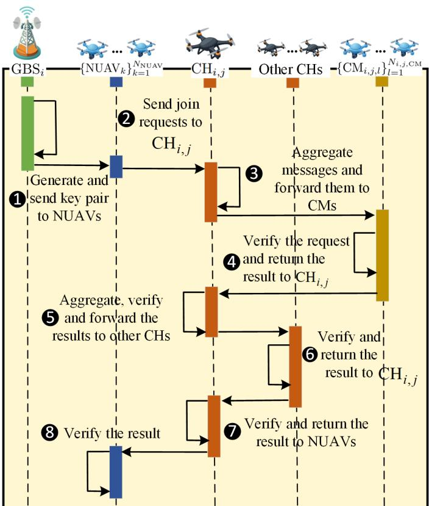  
Fig. 4: The brief workflow of Cluster Authentication. NU-AVs obtain keys from GBS and send join requests to the destination CH. CH aggregates and forwards requests to CMs, and returns verification results to NUAVs after collaboration with other CHs.

Cluster Authentication: Let $\mathrm { G B S } _ { i } ( i \in [ 1 , N _ { \mathrm { G B S } } ] )$ denote the GBS, $\mathrm { C H } _ { i , j } ~ ( i \in [ 1 , N _ { \mathrm { G B S } } ] , j \in [ 1 , N _ { i , \mathrm { C H } } ] ) .$ denotes the CH of the cluster that NUAVs join, $\{ \mathrm { C M } _ { i , j , l } \} _ { l = 1 } ^ { N _ { i , j , \mathrm { C M } } }$ denote the group of CMs managed by $\mathrm { C H } _ { i , j } ,$ and $\{ \mathrm { N U A V } _ { k } \} _ { k = 1 } ^ { N _ { \mathrm { N U A V } } }$ denote the group of NUAVs. The brief workflow is illustrated in Fig. 4 and the details of each step are as follows:

Step 1: GBSi sends the message $\{ \mathrm { H } ( \mathrm { C J T } _ { i , j } ) , \mathrm { p k } _ { \mathrm { C H } _ { i , j } } ,$ $\mathrm { P I D } _ { \mathrm { C H } _ { i , j } }$ , skNU $\mathrm { \Delta A V _ { \mathit { k } } } , \mathrm { p k _ { N U A V _ { \mathit { k } } } }$ , PIDNUAV } to the corresponding $\mathrm { N U A V } _ { k } ^ { \because }$ via a secure channel. Among the message, $\mathrm { C J T } _ { i , j }$ is retrieved from the internal database of GBS , skNUAV is selected from $\mathbb { Z } _ { p } ^ { * } , \mathrm { p k } _ { \mathrm { C H } _ { i , j } }$ and $\mathrm { P I D } _ { \mathrm { C H } _ { i , j } }$ are the public key and PID of $\mathrm { C H } _ { i , j } ,$ respectively, and the remaining value are obtained as shown in the following equation:

$$
\left\{ \begin{array} { l l } { \mathrm { p k } _ { \mathrm { N U A V } _ { k } } = g ^ { \mathrm { s k } _ { \mathrm { N U A V } _ { k } } } , } \\ { \mathrm { P I D } _ { \mathrm { N U A V } _ { k } } = \mathrm { H } ( \mathrm { s k } _ { \mathrm { N U A V } _ { k } } , r _ { \mathrm { N U A V } _ { k } } ) , } \end{array} \right.\tag{5}
$$

where rNUAV is also selected from $\mathbb { Z } _ { p } ^ { * } .$ Step 2: Each $\mathrm { \Delta N U A V } _ { k }$ sends the message $\{ \mathrm { P I D } _ { \mathrm { N U A V } _ { k } } ,$ $\mathrm { p k } _ { \mathrm { N U A V } _ { k } } , \mathrm { P I D } _ { \mathrm { C H } _ { i , j } } , V _ { k } , \mathrm { s i g } _ { k } \big \}$ to $\mathrm { C H } _ { i , j }$ . Among the message, PIDNUAV and pkNUAV are the public key and PID of $\mathrm { N U A V } _ { k } ,$ respectively, $\mathrm { P } \mathrm { \tilde { I D } } _ { \mathrm { C H } _ { i , j } }$ is the PID of $\mathrm { C H } _ { i , j } ,$ and other values are computed as follows:

$$
\left\{ \begin{array} { l l } { V _ { k } = g ^ { v _ { k } } , } \\ { \mathrm { s i g } _ { k } = D _ { k } ^ { v _ { k } w _ { k } } , } \end{array} \right.\tag{6}
$$

where $v _ { k }$ is selected from $\mathbb { Z } _ { p } ^ { * }$ and $D _ { k }$ and $w _ { k }$ are computed as follows:

$$
\begin{array} { r } { \left\{ \begin{array} { l l } { D _ { k } = \mathrm { p k } _ { \mathrm { G B S } _ { i } } ^ { \mathrm { H } ( \mathrm { C J T } _ { i , j } ) } \cdot \mathrm { p k } _ { \mathrm { C H } _ { i , j } } , } \\ { w _ { k } = \mathrm { H } ( \mathrm { P I D } _ { \mathrm { N U A V } _ { k } } , \mathrm { P I D } _ { \mathrm { C H } _ { i , j } } , \mathrm { p k } _ { \mathrm { N U A V } _ { k } } ) . } \end{array} \right. } \end{array}\tag{7}
$$

Step 3: After receiving messages from $\begin{array} { r } { \{ \mathrm { N U A V } _ { k } \} _ { k = 1 } ^ { N _ { \mathrm { N U A V } } } , } \end{array}$ $\mathrm { C H } _ { i , j }$ sends the message $\begin{array} { r } { \{ \mathrm { P I D } _ { \mathrm { C H } _ { i , j } } , \mathrm { T } _ { 1 } , \mathrm { s i g } _ { \mathrm { N U A V s } } , c _ { \mathrm { N U A V s } } , } \end{array}$ $S _ { i , j , l } , M , K _ { \mathrm { C M } _ { i , j , l } } \}$ to each $\mathrm { C M } _ { i , j , l } .$ . Among the message, $\mathrm { P I D } _ { \mathrm { C H } _ { i , j } }$ is the PID of $\mathrm { C H } _ { i , j } , \mathrm { T } _ { 1 }$ is a timestamp, and other values are computed as follows:

$$
\{ \begin{array} { l l } { \mathrm { s i g } _ { \mathrm { N U N S } } = \mathrm { H } ( ( \displaystyle \sum _ { k = 1 } ^ { N _ { \mathrm { r o x } } } \mathrm { ~ s i g } _ { k } ) ^ { \mathrm { { s k } - \mathrm { { c } } \mathrm { { t } } _ { i , j } } } ) \oplus \mathrm { { k e } } { \mathrm { y } } _ { i , j } , } \\ { c _ { \mathrm { N U N S } } = \displaystyle \prod _ { k = 1 } ^ { N _ { \mathrm { x u x } } } V _ { k } ^ { \mathrm { { H } ( \mathrm { r } / \mathrm { { D } } _ { \mathrm { N U N } _ { k } } , \mathrm { { r } } ^ { \mathrm { { P I D } } } \mathrm { { c u } } _ { i , j } , \mathrm { { p } } ^ { \mathrm { { b } } _ { \mathrm { N U S } } } ) } } , } \\ { \quad \quad \quad \quad \quad \quad \quad \quad \quad \quad \quad \quad \quad \quad \quad \quad \quad \quad \quad \quad \quad \quad \quad \quad } \\ { \quad \quad \quad \quad \quad \quad \quad \quad \quad \quad \quad \quad \quad \quad \quad \quad \quad \quad \quad \quad \quad \quad \quad \quad \quad \quad \quad \quad \quad \quad \quad \quad \quad } \\ { \quad \quad \quad \quad \quad \quad \quad \quad \quad \quad \quad \quad \quad \quad \quad \quad \quad \quad \quad \quad \quad \quad \quad \quad \quad \quad \quad \quad \quad \quad \quad \quad \quad \quad } \\ { \quad \quad \quad \quad \quad \quad \quad \quad \quad \quad \quad \quad \quad \quad \quad \quad \quad \quad \quad \quad \quad \quad \quad \quad \quad \quad \quad \quad \quad \quad \quad \quad \quad } \\ { \quad \quad \quad \quad \quad \quad \quad \quad \quad \quad \quad \quad \quad \quad \quad \quad \quad \quad \quad \quad \quad \quad \quad \quad \quad \quad \quad \quad \quad \quad \quad } \\ { \quad \quad \quad \quad \quad \quad \quad \quad \quad \quad \quad \quad \quad \quad \quad \quad \quad \quad \quad \quad \quad \quad \quad \quad \quad \quad \quad \quad \quad \quad \quad } \\  \quad \quad \quad \quad \quad \quad \quad \quad \quad \quad \quad \quad \quad \quad \quad \quad \quad \quad \quad \quad \quad \quad \quad \quad \quad \quad \end{array}\tag{8}
$$

where $s _ { i , j , l }$ is selected from $\mathbb { Z } _ { p } ^ { * } .$

Step 4: Upon receiving the message from $\mathrm { C H } _ { i , j } ,$ , each $\mathrm { C M } _ { i , j , l }$ first verifies the freshness of $\mathrm { { \bar { T } _ { 1 } } . \mathrm { { I f } \cdot T _ { 1 } } }$ is determined to be fresh, each $\mathrm { C M } _ { i , j , l }$ proceeds to verify the following equation:

$$
\begin{array} { r } { \mathrm { s i g } _ { \mathrm { N U A V s } } \oplus \mathrm { k e y } _ { i , j } \stackrel { ? } { = } \mathrm { H } ( c _ { \mathrm { N U A V s } } ) . } \end{array}\tag{9}
$$

If Eq. (9) holds, each $\mathrm { C M } _ { i , j , l }$ continues to validate the following equality:

$$
K _ { \mathrm { C M } _ { i , j , l } } \stackrel { ? } { = } \mathrm { H } ( s _ { i , j , l } ^ { \prime } , \mathrm { P I D } _ { \mathrm { C M } _ { i , j , l } } , M ) ,\tag{10}
$$

where $s _ { i , j , l } ^ { \prime }$ is a recovered share, computed as follows:

$$
s _ { i , j , l } ^ { \prime } = S _ { i , j , l } \oplus \mathrm { H } ( \mathrm { k e y } _ { i , j } , \mathrm { T } _ { 1 } ) .\tag{11}
$$

If Eq. (10) is satisfied, the shared result is computed as follows:

$$
\mathrm { r e s u l t } = \mathrm { H } ( \mathrm { P I D } _ { \mathrm { C H } _ { i , j } } , \mathrm { T } _ { 1 } , \mathrm { k e y } _ { i , j } ) ;\tag{12}
$$

otherwise, a fallback result is computed as follows:

$$
\begin{array} { r } { \mathrm { r e s u l t } = \mathrm { H } ( \mathrm { T } _ { 1 } , \mathrm { k e y } _ { i , j } ) . } \end{array}\tag{13}
$$

Finally, each $\mathrm { C M } _ { i , j , l }$ sends the message $\{ \mathrm { T } _ { 1 } , \ \underline { { \mathrm { s i g } } } _ { \mathrm { C M } _ { i , j , l } } ,$ $c _ { \mathrm { C M } _ { i , j , l } } \}$ back to $\mathrm { C H } _ { i , j }$ . Among the message, T1 is the timestamp received and the values $\mathrm { s i g } _ { \mathrm { C M } _ { i , j , l } }$ and $c _ { \mathrm { C M } _ { i , j , l } }$ are computed as follows:

$$
\left\{ \begin{array} { l } { { \displaystyle \mathrm { s i g } _ { \mathrm { C M } _ { i , j , l } } = g ^ { \left( N _ { i , j , \mathrm { C M } } \cdot \mathrm { H } ( \mathrm { r e s u l t } ) - \mathrm { s k } _ { \mathrm { C M } _ { i , j , l } } \cdot M \right) s _ { i , j , l } ^ { - 1 } } , } } \\ { { \displaystyle c _ { \mathrm { C M } _ { i , j , l } } = \mathrm { r e s u l t } \oplus \mathrm { k e y } _ { i , j } , } } \end{array} \right.\tag{14}
$$

where the result is computed from $\operatorname { E q . } ( 1 2 )$ if $\operatorname { E q . } ( 1 0 )$ is satisfied; otherwise, it is computed from Eq. (13). In both cases, M is obtained from $\mathrm { C H } _ { i , j } ^ { \setminus }$ and $\mathrm { s k } _ { \mathrm { C M } _ { i , j , l } }$ is the private key of $\mathrm { C M } _ { i , j , l }$

Step 5: Upon receiving messages from $\{ \mathrm { C M } _ { i , j , l } \} _ { l = 1 } ^ { N _ { i , j , \mathrm { C M } } }$ , if the timestamp $\mathrm { T _ { 1 } }$ is verified as fresh, $\mathrm { C H } _ { i , j }$ proceeds to compute the following equation:

$$
\begin{array} { r l } & { \{ \mathrm { r e s u l t } _ { i , j , l } = c _ { \mathrm { C M } _ { i , j , l } } \oplus \mathrm { k e y } _ { i , j } , \quad \forall l \in [ 1 , N _ { i , j , \mathrm { C M } } ] ,  } \\ & {  \mathrm { ~  ~ } } \\ & {   \mathrm { ~  ~ } } \end{array}\tag{15}
$$

Then $\mathrm { C H } _ { i , j }$ verifies the following equation:

$$
\mathrm { r e s u l t } _ { i , j , 1 } \stackrel { ? } { = } \cdot \cdot \cdot \stackrel { ? } { = } \mathrm { r e s u l t } _ { i , j , N _ { i , j , \mathrm { C M } } } .\tag{16}
$$

If the consistency of all result ${ \mathrm { ~ , ~ } } i , j , l$ values is confirmed as in Eq. (16), $\mathrm { C H } _ { i , j }$ verifies the correctness of the aggregated signature as follows:

$$
g ^ { \mathrm { H } ( \mathrm { r e s u l t } _ { i , j , 1 } ) } \overset { ? } { = } \mathrm { s i g } _ { \mathrm { C M s } } \cdot \mathrm { p k } _ { \mathrm { C M s } } ,\tag{17}
$$

where the aggregated signature $\mathrm { s i g } _ { \mathrm { C M s } }$ and public key $\mathrm { p k _ { C M s } }$ are computed as:

$$
\begin{array} { r } { \left\{ \begin{array} { l l } { \displaystyle \mathrm { s i g } _ { \mathrm { C M s } } = \sum _ { l = 1 } ^ { N _ { i , j , \mathrm { C M } } } \mathrm { s i g } _ { \mathrm { C M } _ { i , j , l } } ^ { s _ { i , j , l } } , } \\ { \displaystyle \mathrm { p k } _ { \mathrm { C M s } } = \left( \sum _ { l = 1 } ^ { N _ { i , j , \mathrm { C M } } } \mathrm { p k } _ { \mathrm { C M } _ { i , j , l } } \right) ^ { M } . } \end{array} \right. } \end{array}\tag{18}
$$

If Eq. (17) holds, then $\mathrm { C H } _ { i , j }$ broadcasts the message $\{ \mathrm { s i g } _ { \mathrm { C M s } } , \mathrm { p k } _ { \mathrm { C M s } } , c _ { \mathrm { C H } _ { i , j } } , Q _ { \mathrm { C H } _ { i , j } } , \bar { \mathrm { T } } _ { 2 } \}$ to each neighboring $\mathrm { C H } _ { i , n } ,$ where $n \in [ \bar { 1 } , N _ { i , \mathrm { C H } } ] , n \neq j$ , and $\mathrm { T _ { 2 } }$ is a newly generated timestamp. $c _ { \mathrm { C H } _ { i , j } }$ and $Q _ { \mathrm { C H } _ { i , j } }$ are computed as follows:

$$
\left\{ \begin{array} { l l } { c _ { \mathrm { C H } _ { i , j } } = \mathrm { r e s u l t } _ { i , j , 1 } \oplus \mathrm { C T } \oplus \mathrm { T } _ { 2 } , } \\ { Q _ { \mathrm { C H } _ { i , j } } = \mathrm { H } ( \mathrm { r e s u l t } _ { i , j , 1 } , \mathrm { T } _ { 2 } ) . } \end{array} \right.\tag{19}
$$

Step 6: Upon receiving the message from $\mathrm { C H } _ { i , j } ,$ each neighboring $\mathrm { C } \bar { \mathrm { H } } _ { i , n }$ , where $\breve { n } \in [ 1 , N _ { i , \mathrm { C H } } ] , n \neq j ,$ , first verifies the freshness of timestamp $\mathrm { T _ { 2 } }$ . If $\mathrm { T _ { 2 } }$ is valid, $\operatorname { C H } _ { i , n }$ proceeds to compute the following equation:

$$
\mathrm { r e s u l t } _ { i , j , 1 } ^ { \prime } = c _ { \mathrm { C H } _ { i , j } } \oplus \mathrm { C T } \oplus \mathrm { T } _ { 2 } .\tag{20}
$$

Then $\operatorname { C H } _ { i , n }$ verifies the following equation:

$$
Q _ { \mathrm { C H } _ { i , j } } \stackrel { ? } { = } \mathrm { H } ( \mathrm { r e s u l t } _ { i , j , 1 } ^ { \prime } , \mathrm { T } _ { 2 } ) .\tag{21}
$$

If Eq. (21) holds, $\operatorname { C H } _ { i , n }$ continues by verifying the integrity of the received authentication information through the following equation:

$$
g ^ { \mathrm { r e s u l t } _ { i , j , 1 } ^ { \prime } } \stackrel { ? } { = } \mathrm { s i g } _ { \mathrm { C M s } } \cdot \mathrm { p k } _ { \mathrm { C M s } } .\tag{22}
$$

If Eq. (22) is satisfied, then $\operatorname { C H } _ { i , n }$ generates a confirmation message and replies to $\mathrm { C H } _ { i , j }$ with $\{ Q _ { \mathrm { C H } _ { i , n } } , \mathrm { T } _ { 2 } \}$ , where $Q _ { \mathrm { C H } _ { i , n } }$ is computed as follows:

$$
Q _ { \mathrm { C H } _ { i , n } } = \mathrm { H } ( \mathrm { r e s u l t } _ { i , j , 1 } ^ { \prime } , \mathrm { T } _ { 2 } ) .\tag{23}
$$

Step 7: Upon receiving responses from the set of $\{ \mathrm { C \dot { H } } _ { i , n } \} _ { n = 1 , n \neq j } ^ { \tilde { N } _ { i , \mathrm { C H } } } , \mathrm { C H } _ { i , j }$ verifies the freshness of timestamp $\mathrm { T _ { 2 } }$ . If valid, it proceeds to check whether the following condition holds:

$$
Q _ { \mathrm { C H } _ { i , n } } \stackrel { ? } { = } \mathrm { H } ( \mathrm { r e s u l t } _ { i , j , 1 } , \mathrm { T } _ { 2 } ) .\tag{24}
$$

If Eq. (24) is satisfied for all ${ \mathrm { C H } } _ { i , n } ,$ then $\mathrm { C H } _ { i , j }$ sends the set of identifiers $ { \{ \mathrm { P I D } _ { \mathrm { N U A V } _ { k } } \} } _ { k = 1 } ^ { N _ { \mathrm { N U A V } } }$ to the corresponding ground base station GBSi. Upon receiving the identifiers, $\mathrm { \bar { G } B S } _ { i }$ stores them in its local database for subsequent management. Following the storage confirmation, $\mathrm { \bar { C H } } _ { i , j }$ sends the message $\{ \mathrm { r e s } _ { k } , \mathrm { p k } _ { \mathrm { C H } _ { i , j } } \}$ to each $\mathrm { N U A V } _ { k } ,$ where the response value $\mathrm { r e s } _ { k }$ is computed as follows:

$$
\mathrm { r e s } _ { k } = \mathrm { H } ( \mathrm { H } ( \mathrm { C J T } _ { i , j } ) , \mathrm { P I D } _ { \mathrm { N U A V } _ { k } } , \mathrm { p k } _ { \mathrm { C H } _ { i , j } } ) .\tag{25}
$$

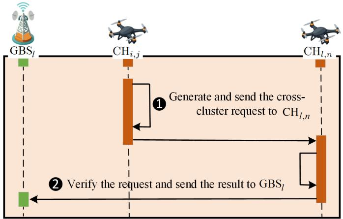  
Fig. 5: The brief workflow of Cross-cluster Authentication. The CH of the source cluster initiates a cross-cluster authentication request to the destination CH, which verifies the request and returns the result to the corresponding GBS.

Step 8: Upon receiving the message from $\mathrm { C H } _ { i , j } ,$ each $\mathrm { N U A V } _ { k }$ verifies the authenticity of $\mathrm { \bar { C H } } _ { i , j }$ by locally computing the following hash value:

$$
\mathrm { r e s } _ { k } ^ { \prime } = \mathrm { H } ( \mathrm { H } ( \mathrm { C J T } _ { i , j } ) , \mathrm { P I D } _ { \mathrm { N U A V } _ { k } } ) .\tag{26}
$$

If $\mathrm { r e s } _ { k } ^ { \prime }$ matches the received $\operatorname { r e s } _ { k }$ , i.e., $\mathrm { r e s } _ { k } ^ { \prime } \ = \ \mathrm { r e s } _ { k }$ , then $\mathrm { N U A V } _ { k }$ successfully authenticates $\mathrm { C H } _ { i , j }$ and completes the cluster authentication process.

Consequently, all $\mathrm { N U A V } _ { k } ~ ( k \in \left[ 1 , N _ { \mathrm { N U A V } } \right] )$ are successfully authenticated and integrated into the j-th UAV cluster under the control of GBSi.

## 4.2.4 Cross-cluster Phase with LC2Am

When a UAV cluster requires additional UAVs to perform its designated tasks, its CH can request support from other CHs by recruiting UAVs from their clusters. These recruited UAVs are referred to as EUAVs. Prior to their integration, the requesting CH must authenticate the EUAVs, a process known as cross-cluster authentication, which is implemented via LC2Am.

Cross-cluster Authentication: Let $\mathrm { E U A V } _ { i , j , l }$ denote a UAV originating from the j-th cluster of $\mathrm { G B S } _ { i } ,$ with $\mathrm { C H } _ { i , j }$ representing its CH. Let $\mathrm { C H } _ { l , n }$ be the CH of the destination cluster, where $l \in [ 1 , N _ { \mathrm { G B S } } ]$ and $n \in [ 1 , N _ { l , \mathrm { C H } } ]$ . Note that $\mathrm { C H } _ { i , j }$ and $\mathrm { C H } _ { l , n }$ belong to different clusters, which may or may not be under the administration of the same GBS. The overall procedure is illustrated in Fig. 5, and the detailed steps are as follows:

Step $\pmb { 1 } \colon \mathrm { C H } _ { i , j }$ sends a message $\{ C _ { i , j } , \mathrm { P I D } _ { \mathrm { E U A V } _ { i , j , l } } , \mathrm { T } _ { 3 } \}$ to $\mathrm { C H } _ { l , n } ,$ where $\mathrm { T _ { 3 } }$ denotes a timestamp and $C _ { i , j }$ is computed as follows:

$$
C _ { i , j } = \mathrm { H } ( \mathrm { P I D } _ { \mathrm { E U A V } _ { i , j , l } } , \mathrm { T } _ { 3 } , \mathrm { C T } ) \oplus \mathrm { C T } .\tag{27}
$$

Step 2: Upon receiving the message, $\mathrm { C H } _ { l , n }$ first checks the freshness of $\mathrm { T _ { 3 } }$ . If valid, it verifies the following equation:

$$
\mathrm { H } ( \mathrm { P I D } _ { \mathrm { E U A V } _ { i , j , l } } , \mathrm { T } _ { 3 } , \mathrm { C T } ) \stackrel { ? } { = } C _ { i , j } \oplus \mathrm { C T } .\tag{28}
$$

If the verification succeeds, $\mathrm { C H } _ { l , n }$ queries GBSl to confirm whether $\mathrm { P I D } _ { \mathrm { E U A V } _ { i , j , l } }$ exists in its database. If a match

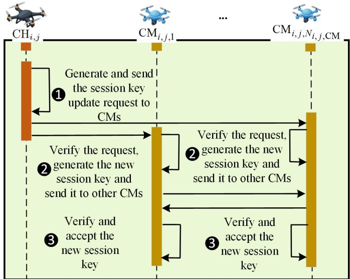  
Fig. 6: The brief workflow of Cluster Session Key Update. The CH initiates the session key update request, CMs verify the request, generate a new session key, and distribute it to other CMs. All CMs verify and accept the new session key to maintain secure intra-cluster communication.

is found, $\mathrm { C H } _ { l , n }$ accepts $\mathrm { E U A V } _ { i , j , l }$ and assigns it a new pseudonymous identity, computed as follows:

$$
\mathrm { P I D } _ { \mathrm { E U A V } _ { i , j , l } } ^ { \mathrm { n e w } } = \mathrm { H } ( \mathrm { P I D } _ { \mathrm { E U A V } _ { i , j , l } } , \mathrm { T } _ { 3 } , \mathrm { C T } ) .\tag{29}
$$

Subsequently, $\mathrm { C H } _ { l , n }$ sends $\mathrm { P I D } _ { \mathrm { E U A V } _ { i , j , l } } ^ { \mathrm { n e w } }$ to $\mathrm { G B S } _ { l } ,$ which updates its internal database accordingly.

## 4.2.5 Cluster Session Key Update Phase with CSKUm

When UAVs join or leave a cluster, the corresponding cluster session key must be updated to preserve forward and backward secrecy. This update process is realized by the proposed CSKUm.

Cluster Session Key Update: Let $\mathrm { C H } _ { i , j }$ represent the CH of the j-th cluster managed by GBSi, and $\{ \mathrm { \dot { C } M } _ { i , j , l } \} _ { l = 1 } ^ { N _ { i , j , \mathrm { C M } } }$ denote the associated CMs. Let $\mathrm { k e y } _ { i , j }$ be the previous session key. The overall procedure is depicted in Fig. 6, and the detailed steps are described as follows:

Step $\pmb { 1 } \colon \mathrm { C H } _ { i , j }$ generates a new session key key $\tau _ { i , j } ^ { \mathrm { n e w } }  \mathbb { Z } _ { p } ^ { * } ,$ a fresh timestamp $\mathrm { T } _ { 4 } ,$ , and constructs a random polynomial of degree $N _ { i , j , \mathrm { C M } } - 1 \mathrm { : }$

$$
f ( \boldsymbol { x } ) = \mathrm { k e y } _ { i , j } ^ { \mathrm { n e w } } + b _ { 1 } \boldsymbol { x } + \cdot \cdot \cdot + b _ { N _ { i , j , \mathrm { C M } } - 1 } \boldsymbol { x } ^ { N _ { i , j , \mathrm { C M } } - 1 } .\tag{30}
$$

Then, $\mathrm { C H } _ { i , j }$ sends to each $\mathrm { C M } _ { i , j , l }$ the message $\{ \mathrm { T _ { 4 } }$ $F _ { \mathrm { C M } _ { i , j , l } } , \{ g ^ { \bar { f } ( x _ { i , j , n } ) } \} _ { n = 1 , n \neq l } ^ { N _ { i , j , \mathrm { C M } } } , \mathrm { H ( k e y } _ { i , j } ^ { \mathrm { n e w } } , \mathrm { T } _ { 4 } ) \}$ , where $\mathrm { T _ { 4 } }$ is a timestamp and $x _ { i , j , n }$ and $F _ { \mathrm { C M } _ { i , j , l } }$ are computed as follows:

$$
\left\{ \begin{array} { l l } { \quad x _ { i , j , n } = \mathrm { H } ( \mathrm { P I D } _ { \mathrm { C M } _ { i , j , n } } ) , } \\ { F _ { \mathrm { C M } _ { i , j , l } } = f \left( \mathrm { H } ( \mathrm { P I D } _ { \mathrm { C M } _ { i , j , l } } ) \right) \oplus \mathrm { H } ( \mathrm { s k } _ { \mathrm { C M } _ { i , j , l } } , \mathrm { T } _ { 4 } ) . } \end{array} \right.\tag{31}
$$

Step 2: Upon receiving the message, each $\mathrm { C M } _ { i , j , l }$ first checks the freshness of $\mathrm { T _ { 4 } }$ . If valid, it recovers its own share as follows:

$$
f ( x _ { i , j , l } ) ^ { \prime } = F _ { \mathrm { C M } _ { i , j , l } } \oplus \mathrm { H } ( \mathrm { s k } _ { \mathrm { C M } _ { i , j , l } } , \mathrm { T } _ { 4 } ) .\tag{32}
$$

Then, each $\mathrm { C M } _ { i , j , l }$ sends the message $\{ \{ U _ { i , j , n } \} _ { n = 1 , n \ne l } ^ { N _ { i , j , \mathrm { C M } } } \}$ to all other CMs, where $\{ U _ { i , j , n } \} _ { n = 1 , n \ne l } ^ { N _ { i , j , \mathrm { C M } } }$ is computed as follows:

$$
\left\{ U _ { i , j , n } = g ^ { f ( x _ { i , j , n } ) f ( x _ { i , j , l } ) ^ { \prime } } \oplus f ( x _ { i , j , l } ) ^ { \prime } \right\} _ { n = 1 , n \ne l } ^ { N _ { i , j , \mathrm { C M } } } .\tag{33}
$$

Step 3: After receiving responses from other members, each $\operatorname { C M } _ { i , j , n }$ reconstructs the updated session key. First, it computes the following equation:

$$
\left\{ \mathrm { k e y } _ { i , j , l } ^ { \mathrm { n e w } } = U _ { i , j , l } \oplus g ^ { f ( x _ { i , j , l } ) ^ { \prime } f ( x _ { i , j , n } ) } \right\} _ { l = 1 , l \ne n } ^ { N _ { i , j , \mathrm { C M } } } ,\tag{34}
$$

followed by

$$
\begin{array} { l } { \displaystyle \mathrm { k e y } _ { i , j } ^ { \mathrm { n e w } ^ { \prime } } = } \\ { \displaystyle \sum _ { l = 1 } ^ { N _ { i , j , \mathrm { C M } } } \left( \mathrm { k e y } _ { i , j , l } ^ { \mathrm { n e w } } \prod _ { n = 1 , n \neq l } ^ { N _ { i , j , \mathrm { C M } } } \left( - \frac { x _ { i , j , n } } { x _ { i , j , l } - x _ { i , j , n } } \right) \right) . } \end{array}\tag{35}
$$

Finally, $\operatorname { C M } _ { i , j , n }$ verifies the following equation:

$$
\begin{array} { r } { \mathrm { H } ( \mathrm { k e y } _ { i , j } ^ { \mathrm { n e w } ^ { \prime } } , \mathrm { T } _ { 4 } ) \stackrel { ? } { = } \mathrm { H } ( \mathrm { k e y } _ { i , j } ^ { \mathrm { n e w } } , \mathrm { T } _ { 4 } ) . } \end{array}\tag{36}
$$

If the verification holds, key $\tau _ { i , j } ^ { \mathrm { n e w ^ { \prime } } }$ is accepted as the valid updated cluster session key.

Note that, in the current design, cluster authentication and session key update are performed based on the set of active CMs within the cluster. In practice, temporarily disconnected or busy CMs can be excluded from the active-member set maintained by the CH, and authentication or rekeying can proceed among the currently responsive members. The present implementation adopts a fullparticipation model to ensure strong consistency and strict forward/backward secrecy. However, the mechanism can be extended to a threshold-based (t-out-of-n) reconstruction scheme to tolerate higher churn or partial member availability. Such an extension represents a trade-off between robustness and strict security consistency.

## 5 SECURITY ANALYSIS

This section provides the security analysis for security goals S1–S7 introduced in Section 3.2.3. Specifically, S1–S5 are analyzed by illustrative analysis while S6 and S7 are analyzed by formal analysis. Due to the space limitation, we present the illustrative and fomarl analysis in the supplementary file. Furthermore, the security goal comparison between related works [20]– [31] and LP2-CASKU is presented to highlight the superiority of LP2-CASKU.

## 6 PERFORMANCE ANALYSIS

In this section, we present a comprehensive performance evaluation of the proposed LP2-CASKU. First, we conduct a theoretical analysis of LP2-CASKU in terms of both computation and communication overheads. We further compare these overheads against those of representative baseline schemes to highlight the efficiency of LP2-CASKU. In addition, we implement simulation experiments using the Omnet++ framework [32] to assess the practical performance of LP2-CASKU and to validate the effectiveness of the proposed MAm in reducing communication overhead, which is critical for maintaining low latency in low-altitude economy networks environments. Finally, we evaluate the extent to which LP2-CASKU fulfills the performance goals P1 and P2 as defined in Section 3.2.3, which is given in the supplementary file.

TABLE 3: Comparison of Security Goals
<table><tr><td>Ref.</td><td>S1</td><td>S2</td><td>S3</td><td>S4</td><td>S5</td></tr><tr><td>BDLA+ [20] 2022</td><td>X</td><td>√</td><td>X</td><td>√</td><td>√</td></tr><tr><td>BCDA+ [21] 2022</td><td>√</td><td>√</td><td>×</td><td>×</td><td>×</td></tr><tr><td>TAGKA [22] 2023</td><td>X</td><td>√</td><td>×</td><td>√</td><td>√</td></tr><tr><td>SwarmAuth [23] 2024</td><td>√</td><td>√</td><td>×</td><td>√</td><td>×</td></tr><tr><td>BASUV [24] 2024</td><td>X</td><td>√</td><td>×</td><td>×</td><td>×</td></tr><tr><td>IOOSC-U2G [25] 2024</td><td>X</td><td>√</td><td>√</td><td>√</td><td>X</td></tr><tr><td>LBMA+ [26] 2024</td><td>X</td><td>√</td><td>×</td><td>×</td><td>×</td></tr><tr><td>SAAF-IoD+ [27] 2024</td><td>×</td><td>√</td><td>×</td><td>√</td><td>×</td></tr><tr><td>ASRU+ [28] 2025</td><td>×</td><td>√</td><td>×</td><td>×</td><td>×</td></tr><tr><td>ALAS+ [29] 2025</td><td>×</td><td>√</td><td>×</td><td>×</td><td>×</td></tr><tr><td>BAZAM [30] 2025</td><td>×</td><td>√</td><td>×</td><td>×</td><td>×</td></tr><tr><td>BALC+ [31] 2025</td><td>X</td><td>√</td><td>√</td><td>×</td><td>×</td></tr><tr><td>LP2-CASKU ours 2025</td><td>√</td><td>√</td><td>√</td><td>√</td><td>√</td></tr></table>

TABLE 4: Notations of Basic Operation Time Cost
<table><tr><td>Notation</td><td>Operations</td></tr><tr><td> $T _ { \mathrm { H F } }$ </td><td>Hash function</td></tr><tr><td> $T _ { \mathrm { M E } }$ </td><td>Modular exponential operation</td></tr><tr><td> $T _ { \mathrm { M M } }$ </td><td>Modular multiplication operation</td></tr><tr><td> $T _ { \mathrm { P U F } }$ </td><td>PUF operation</td></tr><tr><td> $T _ { \mathrm { X O R } }$ </td><td>XOR operation</td></tr><tr><td> $T _ { \mathrm { E C P M } }$ </td><td>Elliptic curve point multiplication operation</td></tr><tr><td> $T _ { \mathrm { E C P A } }$ </td><td>Elliptic curve point addition operation</td></tr><tr><td> $T _ { \mathrm { B M } }$ </td><td>Bilinear mapping operation</td></tr><tr><td> $T _ { \mathrm { S S S } }$ </td><td>Secret shared shard operation</td></tr><tr><td> $T _ { \mathrm { F G A } }$ </td><td>Fuzzy generator algorithm</td></tr><tr><td> $T _ { \mathrm { E } }$ </td><td>Symmetric encryption</td></tr><tr><td> $T _ { \mathrm { D } }$ </td><td>Symmetric decryption</td></tr></table>

## 6.1 Computation Overhead Analysis

Given the heterogeneity in experimental settings, such as differences in hardware platforms and software environments, across existing schemes for evaluating computation overhead, we adopt a generalized and fair approach to represent the computation cost. Specifically, we quantify the overhead in terms of the number of fundamental cryptographic operations involved. Table 4 summarizes the notations used to denote these basic operations for LP2-CASKU and the compared baseline schemes.

Using the notations from Table 4, we compile the computation overheads of LP2-CASKU and representative related works [20]– [27] in Table 5, categorized by the number of operations incurred in each scheme. To ensure consistency in comparison, we divide the authentication workflows into three stages: (i) initialization, (ii) UAV authentication, and (iii) cluster session key update. The initialization stage corresponds to system bootstrapping and entity registration, while the UAV authentication stage includes intra-cluster joining and inter-cluster (cross-cluster) authentication procedures. The cluster session key update stage refers to the dynamic session key update process to ensure secure communication among authenticated UAVs.

TABLE 5: Comparison of Computation Overhead Between LP2-CASKU and Related Works
<table><tr><td>Ref.</td><td>Initialization</td><td>UAV Authentication</td><td>Cluster Session Key Update</td></tr><tr><td> $\overline { { \mathrm { B D L A } + \left[ 2 0 \right] 2 0 2 2 \ 2 T _ { \mathrm { H F } } + T _ { \mathrm { X O R } } + 5 T _ { \mathrm { E C P M } } } }$ </td><td></td><td> $\overline { { ( 2 N _ { \mathrm { C M } } + 6 ) T _ { \mathrm { H F } } + T _ { \mathrm { M M } } } } +$   $2 T _ { \mathrm { E C P M } } + 2 T _ { \mathrm { E C P A } }$ </td><td>Not applicable</td></tr><tr><td>BCDA+ [21] 2022  $N _ { \mathrm { G B S } } T _ { \mathrm { E C P M } } \textit { \textbf { a } }$ </td><td> $3 N _ { \mathrm { G B S } } T _ { \mathrm { H F } } + 3 N _ { \mathrm { G B S } } T _ { \mathrm { X O R } } +$ </td><td> $\overline { { 4 T _ { \mathrm { H F } } + 1 8 T _ { \mathrm { E C P M } } + 1 0 T _ { \mathrm { E C P A } } + } }$   $T _ { \mathrm { B M } } + 3 T _ { \mathrm { E } } + 3 T _ { \mathrm { D } }$ </td><td>Not applicable</td></tr><tr><td>TAGKA [22] 2023</td><td> $\overline { { { N _ { \mathrm { C M } } T _ { \mathrm { S S S } } } ^ { b } } }$ </td><td> $\overline { { 1 3 T _ { \mathrm { H F } } + ( 2 N _ { \mathrm { C M } } ^ { 2 } + N _ { \mathrm { C M } } ) T _ { \mathrm { M M } } + } }$   $( 3 N _ { \mathrm { C M } } ^ { 2 } + 2 ) T _ { \mathrm { X O R } } ^ { \cdots } + 2 T _ { \mathrm { E } } + 2 T _ { \mathrm { D } }$ </td><td>Not applicable</td></tr><tr><td>SwarmAuth [23] 2024</td><td> $2 T _ { \mathrm { H F } } + T _ { \mathrm { P U F } } + 1 1 T _ { \mathrm { X O R } }$ </td><td> $\overline { { 9 T _ { \mathrm { H F } } + T _ { \mathrm { P U F } } + ( 2 N _ { \mathrm { C M } } + } }$   $1 4 ) T _ { \mathrm { X O R } } + 2 N _ { \mathrm { C M } } T _ { \mathrm { E } }$ </td><td> $\overline { { N _ { \mathrm { C M } } ^ { 2 } T _ { \mathrm { M M } } } }$ </td></tr><tr><td>BASUV [24] 2024</td><td> $T _ { \mathrm { H F } } + ( N _ { \mathrm { G B S } } - 1 ) T _ { \mathrm { M M } } + ( N _ { \mathrm { G B S } } +$   $1 ) T _ { \mathrm { E C P M } } + N _ { \mathrm { G B S } } T _ { \mathrm { E C P A } } + T _ { \mathrm { B M } }$ </td><td> $\overline { { 6 T _ { \mathrm { H F } } + 2 T _ { \mathrm { M M } } + 4 T _ { \mathrm { X O R } } + } }$   $2 T _ { \mathrm { E C P M } } + 4 T _ { \mathrm { B M } }$ </td><td>Not applicable</td></tr><tr><td>IOOSC-U2G [25] 2024</td><td> $T _ { \mathrm { H F } } + T _ { \mathrm { M M } } + 3 T _ { \mathrm { E C P M } }$ </td><td> $5 T _ { \mathrm { H F } } + 2 T _ { \mathrm { X O R } } + T _ { \mathrm { M M } } +$   $\frac { 6 T _ { \mathrm { E C P M } } + T _ { \mathrm { E C P A } } } { \Delta }$ </td><td>Not applicable</td></tr><tr><td>LBMA+ [26] 2024 6THF</td><td></td><td> $2 0 T _ { \mathrm { H F } } + 1 4 T _ { \mathrm { X O R } }$ </td><td>Not applicable</td></tr><tr><td>SAAF-IoD+ [27] 2024</td><td> $2 T _ { \mathrm { H F } } + T _ { \mathrm { F G A } } + T _ { \mathrm { E } }$ </td><td> $1 3 T _ { \mathrm { H F } } + 2 0 T _ { \mathrm { X O R } } + T _ { \mathrm { F G A } } + 3 T _ { \mathrm { E } } +$  3TD</td><td>Not applicable</td></tr><tr><td> $\overline { { \mathrm { L P 2 - C A S K U ~ O u r s } } }$  2025</td><td> $\overline { { 3 T _ { \mathrm { H F } } + 2 T _ { \mathrm { M E } } + T _ { \mathrm { M M } } } }$ </td><td> $( N _ { \mathrm { C M } } + 1 8 ) T _ { \mathrm { H F } } + 8 T _ { \mathrm { M E } } + ( N _ { \mathrm { N U A V } } + ~ ( N _ { \mathrm { C M } } + 2 ) T _ { \mathrm { H F } } + ( 3 N _ { \mathrm { C M } } - 1 ) T _ { \mathrm { M E } } + ( N _ { \mathrm { C M } } + 1 ) T _ { \mathrm { G B } } )$   $_ { c } 2  { N _ { \mathrm { C M } } } + 3 )  { T _ { \mathrm { M M } } } + (  { N _ { \mathrm { C M } } } + 1 0 )  { T _ { \mathrm { X O R } } }$  C</td><td> $( N _ { \mathrm { C M } } ^ { 2 } - 1 ) T _ { \mathrm { M M } } + ( 2 N _ { \mathrm { C M } } +$   $1 0 ) \ddot { T } _ { \mathrm { X O R } } + N _ { \mathrm { C M } } T _ { \mathrm { S S S } }$ </td></tr><tr><td colspan="4"> $^ { \mathrm { a - c } } N _ { \mathrm { G B S } }$  is the number of GBSs.  $N _ { \mathrm { C M } }$  is the number of CMs.  $N _ { \mathrm { N U A V } }$  is the number of NUAVs.</td></tr></table>

a-c N is the number of GBSs. N is the number of CMs. N is the number of NUAVs.

In the context of LP2-CASKU, the initialization stage encompasses the Setup and Registration Phases as detailed in Sections 4.2.1 and 2. The UAV authentication stage covers the Join and Cross-cluster Authentication Phases described in Sections 4.2.3 and 4. The cluster session key update stage pertains to the process outlined in Section 4.2.5. As presented in Table 5, LP2-CASKU incurs substantially lower computation overhead compared to schemes such as [20], [21], [24], [25], which are based on elliptic curve cryptography. Notably, the scheme in [25] employs bilinear pairing operations, which are known to be computationly expensive, typically requiring a computation time approximately two orders of magnitude greater than modular multiplication operations $( \mathrm { i . e . , 1 0 ^ { 2 } \times } )$ .

Unlike schemes [21]– [23], [27] that rely on symmetric encryption/decryption, LP2-CASKU avoids such operations, thereby eliminating related performance bottlenecks. Although it involves a relatively larger number of basic operations, the overall computation overhead remains low due to the predominant use of lightweight primitives (e.g., hash and XOR). In addition, LP2-CASKU supports concurrent authentication of multiple NUAVs with an extra cost of $N _ { \mathrm { N U A V } } T _ { \mathrm { M M } } ,$ where $T _ { \mathrm { M M } }$ denotes the cost of a modular multiplication. This multi-entity capability is not supported by most compared schemes, which focus on single-entity authentication.

Furthermore, LP2-CASKU integrates a dedicated cluster session key update mechanism (CSKUm) to ensure forward and backward secrecy, a feature not provided in [20]– [22], [24]– [27]. Compared with [23], LP2-CASKU incurs slightly higher basic operation counts but uniquely guarantees backward secrecy. Overall, despite the additional overhead introduced by cross-cluster authentication and secure key updates, LP2-CASKU maintains acceptable computation cost due to its lightweight design, making it suitable for computation-constrained low-altitude economy network scenarios [39].

## 6.2 Communication Overhead Analysis

To ensure a consistent and fair comparison, we adopt a generalized approach to assess the communication overhead of LP2-CASKU and related schemes. Specifically, we quantify communication costs in terms of the number and size of basic elements transmitted during protocol execution. The notations representing the lengths of basic elements are summarized in Table 6. Based on these notations, Table 7 presents the communication overheads of LP2-CASKU and representative schemes [20]– [27] across three functional stages, consistent with those defined in Table 5.

As illustrated in Table 7, LP2-CASKU primarily utilizes lightweight cryptographic primitives, with hash function outputs represented as elements in $\mathbb { Z } _ { p } ^ { * } .$ Consequently, the protocol exchanges are composed mainly of group elements from $\mathbb { Z } _ { p }$ and timestamps, similar to the design in [26]. To support dynamic cluster scalability, LP2-CASKU introduces collaborative authentication mechanisms involving multiple CHs. This leads to an additional communication overhead of $4 N _ { \mathrm { C H } } | \mathbb { Z } _ { p } | + N _ { \mathrm { C H } } | \mathrm { T } |$ bits for NUAV authentication, where $\displaystyle | \mathbb { Z } _ { p } |$ and |T| denote the bit-lengths of group elements and timestamps, respectively.

Furthermore, the integration of the proposed LC2Am for cross-cluster authentication introduces additional communication costs. However, such operations are event-driven and occur only when EUAV mobility is needed. Although the communication overhead incurred during the Cluster Session Key Update Phase is higher than that of [23], these updates are performed infrequently and remain within acceptable bounds for real-world deployments.

In addition, LP2-CASKU incorporates MAm to mitigate redundant transmissions during NUAV authentication. This optimization yields a communication reduction of $( \ 5 N _ { \mathrm { N U A V } } ^ { - } + 2 N _ { \mathrm { C H } } ) | \mathbb { Z } _ { p } ^ { * } |$ bits when authenticating NNUAV NUAVs, thereby substantially improving transmission efficiency. This feature is particularly advantageous in bandwidth-constrained scenarios typical of low-altitude economy networks environments [40].

In conclusion, LP2-CASKU achieves low overall communication overhead by leveraging compact cryptographic primitives. While collaborative authentication and cluster session key update procedures introduce additional communication costs, their infrequent occurrence ensures these costs remain acceptable. Meanwhile, the deployment of MAm significantly reduces overhead during NUAV onboarding, underscoring LP2-CASKU’s practicality and efficiency for low-bandwidth UAV networks.

TABLE 6: Notations of Basic Element Size
<table><tr><td>Notation</td><td>Element</td></tr><tr><td>|PUF()|</td><td>Size of PUF output</td></tr><tr><td> $\left| \mathbb { G } _ { E } \right|$ </td><td>Size of element in elliptic curve cyclic group  $\mathbb { G } _ { E }$ </td></tr><tr><td> $| \mathbb { Z } _ { p } ^ { * } |$ </td><td>Size of element in integrity group  $\mathbb { Z } _ { p } ^ { * }$ </td></tr><tr><td>|m|</td><td>Size of message m</td></tr><tr><td>|T|</td><td>Size of timestamp T</td></tr><tr><td>|V|</td><td>Row vector of matrix M</td></tr><tr><td> $| C P |$ </td><td>Size of Chebyshev polynomial</td></tr></table>

## 6.3 Simulation Experiments

In this section, we conduct simulation-based experiments to evaluate the practical applicability of LP2-CASKU and to demonstrate the effectiveness of the proposed MAm in reducing communication overhead. 1

## 6.3.1 Experiment Settings

To evaluate the practicability of LP2-CASKU and validate the effectiveness of the proposed MAm in reducing communication overhead, we implement simulations using the Omnet++ network simulator in conjunction with the INET framework [41]. The hardware and software environments utilized for the simulation are summarized in Table 8.

To ensure the reliability and relevance of the simulation results, various practical considerations are incorporated into the experimental design. Parameters related to network configuration, UAV mobility, and energy consumption are listed in the supplementary file.

## 6.3.2 Latency Analysis

To quantitatively evaluate the effectiveness of MAm in reducing overall latency through communication overhead mitigation, we compare the latency performance of LP2- CASKU under two configurations: with and without the use of MAm. When MAm is enabled, LP2-CASKU operates as described in Section 4, wherein the CH aggregates the join requests of NUAVs along with the authentication results provided by CMs to authenticate the NUAVs. In contrast, when MAm is disabled, the CH processes each NUAV’s join request and its corresponding authentication result from CMs independently, without aggregation.

It is evident that the latency of the join phase in LP2- CASKU is influenced by several key parameters, including the number of NUAVs $( N _ { \mathrm { { N U A V } } } )$ , the number of CMs $( N _ { \mathrm { C M } } )$ within a cluster, and the number of CHs $( N _ { \mathrm { C H } } )$ in the UAV swarm. Accordingly, we perform a latency analysis under varying values of these parameters, which are modeled as discrete uniform distributions as follows:

$N _ { \mathrm { { N U A V } } } .$ : Discrete uniform distribution over the set $\{ 3 , 4 , 5 , 6 , 7 \}$

$N _ { \mathrm { { C M } } } { \mathrm { { : } } }$ Discrete uniform distribution over the set $\{ 3 , 4 , 5 , 6 , 7 \}$

$N _ { \mathrm { { C H } } } { \mathrm { { : } } }$ Discrete uniform distribution over the set $\{ 3 , 4 , 5 , 6 , 7 \}$

1. The demonstration video and source code are available at: https: //github.com/BJTU-STIC/UAV-simulation-demonstration.

We choose the discrete uniform distribution because, in the absence of precise real-world statistics, it represents an unbiased scenario in which each feasible value within the tested range is equally likely. This modeling assumption avoids introducing undue bias into simulation results and is widely used in network and performance evaluations when only bounded ranges are known [50], [51]. It allows us to systematically explore system behavior across the entire plausible domain, ensuring that latency trends are not skewed toward any particular parameter value. Moreover, prior works in UAV cluster deployment have demonstrated that cluster sizes ranging from 7 to 15 UAVs are commonly used in both experimental and simulation studies [48], [49], validating the relevance of our selected range.

The latency results are presented in Fig. 7. As shown in Fig. 7(a), when the number of NUAVs $( \bar { N } _ { \mathrm { { N U A V } } } )$ increases from 3 to 7, the latency of LP2-CASKU with MAm exhibits only a modest increase from 9.86 ms to 14.15 ms. In contrast, the latency of LP2-CASKU without MAm grows substantially, from 57.43 ms to 132.98 ms. This indicates that MAm reduces the latency by approximately 82.8% to 89.5% as $N _ { \mathrm { { N U A V } } }$ increases. The minor latency introduce by MAm is attributed to the aggregation overhead incurred during the join phase.

Consistent trends are observed in Fig. 7(b) and Fig. 7(c). As the number of CMs (NCM) and CHs (NCH) increases from 3 to 7, the latency of LP2-CASKU with MAm remains relatively stable, varying from 9.60 ms to 12.02 ms and from 9.95 ms to 12.00 ms, respectively. Conversely, without MAm, the latency increases significantly, reaching 130.92 ms and 124.09 ms, respectively. These results demonstrate that MAm reduces latency by approximately 83.8% to 90.8% under varying $N _ { \mathrm { C M } } ,$ , and 84.8% to 90.3% under varying $N _ { \mathrm { C H } }$

The observed latency reduction is primarily due to the ability of MAm to aggregate and broadcast authentication results from multiple CMs to other CHs in a single operation. This parallelized processing approach mitigates the impact of increasing cluster size on latency, thereby enhancing scalability and responsiveness in low-altitude UAV swarm networks.

We further evaluate the latency of LP2-CASKU under different network bitrates (Fig. 8). The results consistently show the effectiveness of MAm in reducing delay. At 1 Mbps, the latency with MAm is 59.72 ms, compared to 566.51 ms without it, achieving an 89.5% reduction. At 11 Mbps, the latency decreases to 24.10 ms with MAm, while the baseline remains 224.63 ms, corresponding to an 89.3% reduction. Even at higher bitrates (24–54 Mbps), MAm maintains low latency (11.23–11.82 ms), whereas the baseline exceeds 94.51 ms, indicating reductions above 88%. These results confirm that MAm significantly mitigates communication overhead and sustains low-latency performance across diverse network conditions.

In summary, the integration of MAm within LP2- CASKU leads to significant latency reduction, particularly under challenging network conditions such as limited bandwidth or large-scale UAV deployments. As illustrated in Fig. 7, the latency remains stable despite increases in the number of NUAVs, CMs, and CHs, with reductions consistently exceeding 82.0%. Furthermore, Fig. 8 validates the resilience of LP2-CASKU under constrained bandwidth conditions, achieving an 89.5% latency reduction even at 1 Mbps.

TABLE 7: Comparison of Communication Overhead Between LP2-CASKU and Related Works
<table><tr><td>Ref.</td><td>Initialization</td><td>UAV Authentication</td><td>Cluster Session Key Update</td></tr><tr><td>BDLA+ [20] 2022 2|Z*|</td><td></td><td> $\overline { { | \mathbb { G } _ { \mathrm { E } } | + ( N _ { \mathrm { M } } + 4 ) | \mathbb { Z } _ { p } ^ { * } | + ( N _ { \mathrm { M } } + 1 ) | m | + } }$  |T|</td><td>Not applicable</td></tr><tr><td>BCDA+ [21] 2022 4|T|a</td><td> $\overline { { ( 3 N _ { \mathrm { G B S } } + 1 ) | \mathbb { G } _ { \mathrm { E } } | + ( 5 N _ { \mathrm { G B S } } + 7 ) | \mathbb { Z } _ { p } ^ { * } | } } -$  1</td><td> $\overline { { 2 N _ { \mathrm { C M } } | \mathbb { G } _ { \mathrm { E } } | \ + \ ( 7 N _ { \mathrm { C M } } \ - \ 1 ) | \mathbb { Z } _ { p } ^ { * } | } }$   $( 3 N _ { \mathrm { C M } } - 1 ) | \mathrm { T } | ^ { \mathrm { b } }$ </td><td>+ Not applicable</td></tr><tr><td>TAGKA [22] 2023</td><td> $\overline { { 2 N _ { \mathrm { C M } } | \mathbb { Z } _ { p } ^ { * } | + N _ { \mathrm { C M } } | C P | } }$ </td><td> $\overline { { 6 ( N _ { \mathrm { C M } } - 1 ) | \mathbb { Z } _ { p } ^ { * } | + 5 ( N _ { \mathrm { C M } } - 1 ) | m | + } }$   $5 ( N _ { \mathrm { C M } } - 1 ) | \tilde { C } P |$ </td><td>Not applicable</td></tr><tr><td>SwarmAuth [23] 2024 6|PUF()|</td><td></td><td> $\mathrm { 5 } | \mathrm { P U F } ( ) | + 2 ( N _ { \mathrm { C M } } ^ { 2 } - N _ { \mathrm { C M } } ) | m |$ </td><td> $4 ( N _ { \mathrm { C M } } - 1 ) | \mathbb { Z } _ { p } ^ { * } | + 2 ( N _ { \mathrm { C M } } - 1 ) | m | +$ </td></tr><tr><td>BASUV [24] 2024  $\overline { { | \mathbb { G } _ { \mathrm { E } } | + 3 | \mathbb { Z } _ { p } ^ { * } | } }$ </td><td></td><td> $\overline { { 3 | \mathbb { G } _ { \mathrm { E } } | + 1 3 | \mathbb { Z } _ { p } ^ { * } | + 2 | m | } }$ </td><td> $2 ( N _ { \mathrm { C M } } - 1 ) | C ^ { \prime } \bar { P } |$  Not applicable</td></tr><tr><td>IOOSC-U2G [25] 2024</td><td> $2 | \mathbb { G } _ { \mathrm { E } } | + 2 | \mathbb { Z } _ { p } ^ { * } |$ </td><td> $\overline { { ( 2 { \cal N } _ { \mathrm { C M } } + 3 ) | \mathbb { G } _ { \mathrm { E } } | + ( { \cal N } _ { \mathrm { C M } } + 4 ) | \mathbb { Z } _ { p } ^ { * } | + \mathrm { \Delta { N o t } a p p l i c a b l e } } }$   $( N _ { \mathrm { C M } } + 1 ) | m | + 2 | \mathrm { T } |$ </td><td></td></tr><tr><td>LBMA+ [26] 2024</td><td> $\overline { { ( N _ { \mathrm { C M } } + 8 ) | \mathbb { Z } _ { p } ^ { * } | + | \mathbb { T } | } }$ </td><td> $\overline { { ( 5 N _ { \mathrm { C M } } + 3 ) | \mathbb { Z } _ { p } ^ { * } | + ( 2 N _ { \mathrm { C M } } + 1 ) | \mathrm { T } | } }$ </td><td>Not applicable</td></tr><tr><td>SAAF-IoD+ [27] 2024</td><td> $5 | \mathbb { Z } _ { p } ^ { * } | + 2 | C P |$ </td><td> $\overline { { 6 | \mathbb { Z } _ { p } ^ { * } | + 3 | \mathrm { T } | + 3 | C P | } }$ </td><td>Not applicable</td></tr><tr><td>LP2-CASKU Ours 2025</td><td> $1 0 | \mathbb { Z } _ { p } ^ { \ast } |$ </td><td> $\underline { { N _ { \mathrm { C H } } + 4 ) | \mathrm { T } | ^ { \mathrm { c } } } }$ </td><td> $\overline { { ( 6 N _ { \mathrm { C M } } + 4 N _ { \mathrm { C H } } + 1 8 ) | \mathbb { Z } _ { p } ^ { * } | + ( 6 N _ { \mathrm { C M } } + \ ( N _ { \mathrm { C M } } ^ { 2 } + 5 N _ { \mathrm { C M } } - 1 ) | \mathbb { Z } _ { p } ^ { * } | + N _ { \mathrm { C M } } | \mathbb { T } | } }$ </td></tr></table>

$^ { a - c } N _ { \mathrm { G B S } }$ is the number of GBSs. $N _ { \mathrm { C M } }$ is the number of CMs. $N _ { \mathrm { N U A V } }$ is the number of NUAVs.

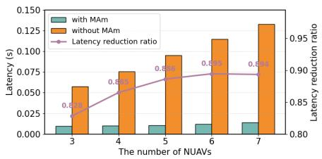  
(a) Latency of LP2-CASKU when $N _ { \mathrm { { N U A V } } }$ grows and $N _ { \mathrm { C M } } = N _ { \mathrm { C H } } = 5$

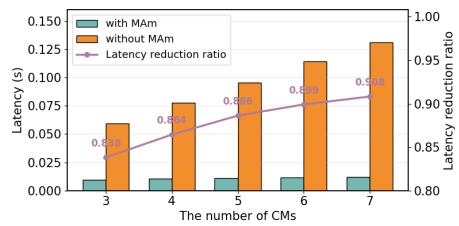  
(b) Latency of LP2-CASKU when $N _ { \mathrm { C M } }$ grows and $N _ { \mathrm { { N U A V } } } = N _ { \mathrm { { C H } } } = 5$

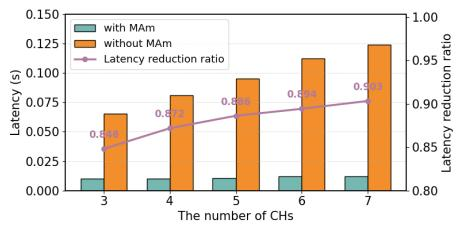  
(c) Latency of LP2-CASKU when $N _ { \mathrm { C H } }$ grows and $N _ { \mathrm { N U A V } } = N _ { \mathrm { C M } } = 5$  
Fig. 7: Latency of LP2-CASKU in the Join Phase under varying $N _ { \mathrm { N U A V } } , N _ { \mathrm { C M } } ,$ and $N _ { \mathrm { C H } } ,$ , comparing scenarios with and without MAm. Results demonstrate that MAm effectively stabilizes latency as UAV swarm scale increases.

TABLE 8: The Configuration of Hardware and Software Platforms
<table><tr><td>Platform</td><td>Configuration</td></tr><tr><td>CPU</td><td>Intel(R) Core(TM) i7-10700 CPU @ 2.90GHz</td></tr><tr><td>Operating System</td><td>Ubuntu 20.04</td></tr><tr><td>Simulation Software</td><td>Omnet++ 6.0.3 / inet 4.5.4</td></tr></table>

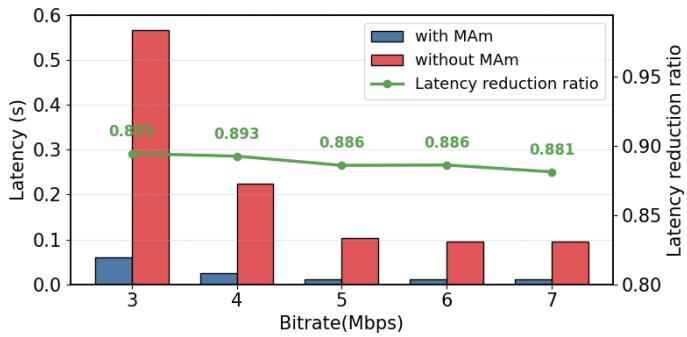  
Fig. 8: Latency of LP2-CASKU under different network bitrates with and without MAm. Even at high bitrates, MAm significantly reduces latency by minimizing communication overhead.

These findings collectively confirm that LP2-CASKU effectively supports fast and scalable UAV cluster formation. In particular, its low-latency characteristics enable timely response and high service reliability, meeting the real-time communication demands inherent to low-altitude economy network scenarios. It is worth noting that the observed latency reduction mainly results from the algorithm-level optimization introduced by MAm, which reduces authentication rounds and communication interactions. Even when practical UAV platform effects (e.g., CPU limitations, radio dynamics, packet loss, or Doppler variations) are considered, both the “with $\mathrm { M A m ^ { \prime \prime } }$ and “without MAm” configurations would be subject to the same physical-layer conditions. Therefore, under identical platform constraints, the reduction in communication steps provided by MAm would still proportionally decrease the overall authentication latency.

## 6.3.3 Energy Consumption Analysis

To evaluate the practicality of LP2-CASKU, we analyze its energy efficiency with and without MAm by measuring the energy consumption of NUAVs, CMs, and CHs under varying numbers of NUAVs, CMs, and CHs (Fig. 9–Fig. 11). Here, “CH” denotes the cluster head joined by the NUAV, and “other CHs” refer to the heads of remaining clusters.

As shown in Fig. 9 and Fig. 10, increasing the numbers of NUAVs or CMs significantly raises energy consumption in the baseline scheme (without MAm), while LP2-CASKU with MAm remains nearly stable. Specifically, the CH’s energy consumption is reduced by about 72%, the CM’s by nearly 60%, and other CHs by over 62%. This improvement results from message aggregation, which eliminates redundant authentication operations.

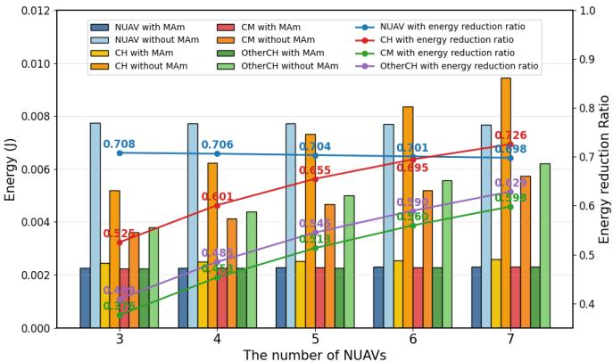

Fig. 9: Energy consumption of NUAV, CM, and CH under different numbers of NUAVs (NNUAV), with $N _ { \mathrm { C M } } = N _ { \mathrm { C H } } =$ 5. MAm reduces overall energy consumption for CMs and CHs as NNUAV grows.  
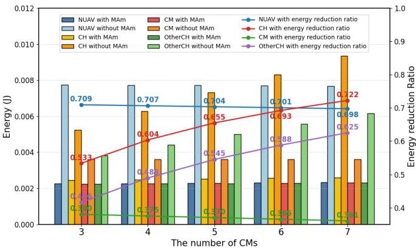  
Fig. 10: Energy consumption of NUAV, CM, and CH under different numbers of CMs $( N _ { \mathrm { C M } } )$ , with $N _ { \mathrm { N U A V } } = N _ { \mathrm { C H } } = 5 .$ MAm mitigates the increase in energy overhead for CHs and CMs as $N _ { \mathrm { C M } }$ increases.

Fig. 11 shows that varying the number of CHs has minimal impact on energy consumption in both schemes, confirming the scalability of LP2-CASKU. Moreover, NUAV energy usage remains nearly constant in all scenarios.

Overall, MAm introduces negligible computation overhead while substantially reducing system energy consumption, making LP2-CASKU suitable for large-scale, resourceconstrained low-altitude economy networks.

## 7 CONCLUSION

To ensure the reliability of dynamic Unmanned Aerial Vechiles (UAV) cluster services, specifically in terms of UAV authenticity and the confidentiality of the cluster session key, this paper has proposed the first Lightweight and Privacy-Preserving Cluster Authentication and Session Key Update (LP2-CASKU) scheme. LP2-CASKU has addressed three key challenges: 1) efficient and scalable authentication of new UAVs (NUAVs), 2) privacy-preserving cross-cluster authentication for existing UAVs, and 3) the ensurance of both forward and backward secrecy of cluster session key. The security properties of LP2-CASKU have been rigorously validated through formal analysis, while its computation and communication performance has been assessed via theoretical evaluation and simulation experiments. Results have demonstrated that LP2-CASKU, supported by its proposed message aggregation mechanism, has enabled the concurrent authentication of multiple NUAVs with significantly reduced latency and energy overhead. These findings have confirmed the scheme’s practicality and effectiveness in maintaining secure and efficient UAV cluster operations in real-time, bandwidth- and energy-constrained environments characteristic of low-altitude economy networks.

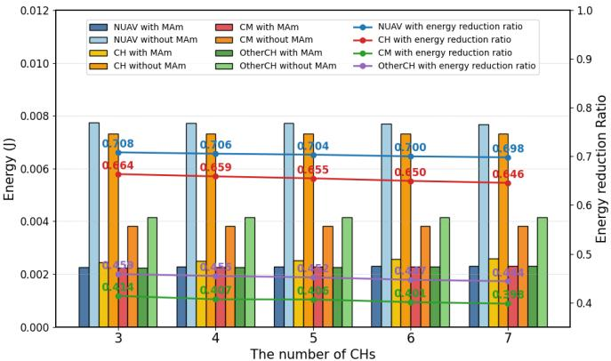  
Fig. 11: Energy consumption of NUAV, CM, and CH under different numbers of CHs $( N _ { \mathrm { C H } } )$ , with $N _ { \mathrm { N U A V } } = N _ { \mathrm { C M } } =$ 5. The energy overhead of CMs and CHs remains stable, confirming the scalability of LP2-CASKU with MAm.

Future work will focus on addressing additional challenges in UAV cluster service provisioning, particularly the design of robust and lightweight Cluster Head (CH) re-election mechanisms to ensure service continuity under CH failure, mobility-induced disruptions, or dynamic topology changes. Moreover, investigating adaptive and decentralized CH management strategies to further enhance scalability and resilience in highly dynamic low-altitude environments remains an important research direction. We will also include hardware-in-the-loop evaluations and linklayer loss sensitivity studies to further validate protocol robustness under realistic UAV communication environments.

## REFERENCES

[1] Z. Liu, J. Zhang, Y. Zeng, and B. Ai, “Energy-efficient multiagent reinforcement learning for UAV trajectory optimization in cell-free massive MIMO networks,” IEEE Transactions on Wireless Communications, 2025.

[2] Y. Jiang, X. Li, G. Zhu, H. Li, J. Deng, K. Han, et al., “6G nonterrestrial networks enabled low-altitude economy: Opportunities and challenges,” arXiv preprint arXiv:2311.09047, 2023.

[3] B. Jiang, J. Yang, and H. Song, “Protecting Privacy From Aerial Photography: State of the Art, Opportunities, and Challenges,” in Proc. IEEE INFOCOM Workshops, 2020, pp. 799–804.

[4] P. I. Radoglou-Grammatikis, P. G. Sarigiannidis, T. Lagkas, and I. D. Moscholios, “A Compilation of UAV Applications for Precision Agriculture,” Comput. Networks, vol. 172, Art. no. 107148, 2020.

[5] A. Raja, L. Njilla, and J. Yuan, “Adversarial Attacks and Defenses Toward AI-Assisted UAV Infrastructure Inspection,” IEEE Internet Things J., vol. 9, no. 23, pp. 23379–23389, 2022.

[6] Y. Wan, Y. Zhong, A. Ma, and L. Zhang, “An Accurate UAV 3-D Path Planning Method for Disaster Emergency Response Based on an Improved Multiobjective Swarm Intelligence Algorithm,” IEEE Trans. Cybern., vol. 53, no. 4, pp. 2658–2671, 2023.

[7] N. U. I. Hossain, N. Sakib, and K. Govindan, “Assessing the Performance of Unmanned Aerial Vehicle for Logistics and Transportation Leveraging the Bayesian Network Approach,” Expert Syst. Appl., vol. 209, Art. no. 118301, 2022.

[8] R. Zhang, H. Du, Y. Liu, D. Niyato, J. Kang, Z. Xiong, A. Jamalipour, and D. I. Kim, “Generative AI agents with large language model for satellite networks via a mixture of experts transmission,” IEEE J. Sel. Areas Commun., vol. 42, no. 12, pp. 3581–3596, Dec. 2024, doi: 10.1109/JSAC.2024.3459037.

[9] R. Zhang, H. Du, D. Niyato, J. Kang, Z. Xiong, A. Jamalipour, et al., “Generative AI for space-air-ground integrated networks,” IEEE Wireless Communications, vol. 31, no. 6, pp. 10–20, Dec. 2024.

[10] W. Mao, Y. Lu, B. Ai, and T. Q. Quek, “Covert communications in MEC-based networked ISAC systems towards low-altitude economy,” arXiv preprint arXiv:2507.18194, 2025.

[11] Z. Ma, R. Zhang, B. Ai, Z. Lian, L. Zeng, and D. Niyato, “Deep reinforcement learning for energy efficiency maximization in RSMA-IRS-assisted ISAC system,” IEEE Trans. Veh. Technol., early access, 2025, doi: 10.1109/TVT.2025.3580859.

[12] B. Ai, Y. Lu, Y. Fang, D. Niyato, R. He, W. Chen, et al., “6G-enabled smart railways,” arXiv preprint arXiv:2505.12946, 2025.

[13] R. Zhang, K. Xiong, Y. Lu, P. Fan, D. W. K. Ng, and K. B. Letaief, “Energy efficiency maximization in RIS-assisted SWIPT networks with RSMA: A PPO-based approach,” IEEE J. Sel. Areas Commun., vol. 41, no. 5, pp. 1413–1430, May 2023, doi: 10.1109/JSAC.2023.3240707.

[14] L. Zhou, S. Leng, Q. Liu, and Q. Wang, “Intelligent UAV Swarm Cooperation for Multiple Targets Tracking,” IEEE Internet Things J., vol. 9, no. 1, pp. 743–754, 2022.

[15] P. Cao, L. Lei, S. Cai, G. Shen, X. Liu, X. Wang, L. Zhang, L. Zhou, and M. Guizani, “computation Intelligence Algorithms for UAV Swarm Networking and Collaboration: A Comprehensive Survey and Future Directions,” IEEE Commun. Surv. Tutorials, vol. 26, no. 4, pp. 2684–2728, 2024.

[16] S. Javed, A. Hassan, R. Ahmad, W. Ahmed, R. Ahmed, A. Saadat, and M. Guizani, “State-of-the-Art and Future Research Challenges in UAV Swarms,” IEEE Internet Things J., vol. 11, no. 11, pp. 19023– 19045, 2024.

[17] L. Gupta, R. Jain, and G. Vaszkun, “Survey of Important Issues in UAV Communication Networks,” IEEE Commun. Surv. Tutorials, vol. 18, no. 2, pp. 1123–1152, 2016.

[18] A. Perrusqu´ıa and W. Guo, “Closed-Loop Output Error Approaches for Drone’s Physics Informed Trajectory Inference,” IEEE Trans. Autom. Control., vol. 68, no. 12, pp. 7824–7831, 2023.

[19] L. Cai, Y. Zhang, Y. Liu, C. Hu, K. Zhang, B. Yang, Y. Shen, and Z. Yan, “Secure physical layer communications for low-altitude economy networking: A survey,” arXiv preprint arXiv:2504.09153, 2025.

[20] Y. Tan, J. Wang, J. Liu, and N. Kato, “Blockchain-Assisted Distributed and Lightweight Authentication Service for Industrial Unmanned Aerial Vehicles,” IEEE Internet Things J., vol. 9, no. 18, pp. 16928–16940, 2022.

[21] C. Feng, B. Liu, Z. Guo, K. Yu, Z. Qin, and K. K. R. Choo, “Blockchain-Based Cross-Domain Authentication for Intelligent 5G-Enabled Internet of Drones,” IEEE Internet Things J., vol. 9, no. 8, pp. 6224–6238, 2022.

[22] Z. Zhang, X. Li, Y. Wang, Y. Miao, X. Liu, J. Weng, and R. H. Deng, “TAGKA: Threshold Authenticated Group Key Agreement Protocol Against Member Disconnect for UANET,” IEEE Trans. Veh. Technol., vol. 72, no. 11, pp. 14987–15001, 2023.

[23] R. Karmakar, G. Kaddoum, and O. Akhrif, “A Blockchain-Based Distributed and Intelligent Clustering-Enabled Authentication Protocol for UAV Swarms,” IEEE Trans. Mob. Comput., vol. 23, no. 5, pp. 6178–6195, 2024.

[24] M. Xie, Z. Chang, H. Li, and G. Min, “BASUV: A Blockchain-Enabled UAV Authentication Scheme for Internet of Vehicles,” IEEE Trans. Inf. Forensics Secur., vol. 19, pp. 9055–9069, 2024.

[25] I. Ali, J. Li, J. Chen, Y. Chen, S. Ullah, and S. Khan, “IOOSC-U2G: An Identity-Based Online/Offline Signcryption Scheme for Unmanned Aerial Vehicle to Ground Station Communication,” IEEE Internet Things J., vol. 11, no. 18, pp. 29941–29955, 2024.

[26] W. Wang, Z. Han, T. R. Gadekallu, S. Raza, J. Tanveer, and C. Su, “Lightweight Blockchain-Enhanced Mutual Authentication Protocol for UAVs,” IEEE Internet Things J., vol. 11, no. 6, pp. 9547– 9557, 2024.

[27] M. Tanveer, H. Alasmary, N. Kumar, and A. Nayak, “SAAF-IoD: Secure and Anonymous Authentication Framework for the Internet of Drones,” IEEE Trans. Veh. Technol., vol. 73, no. 1, pp. 232–244, 2024.

[28] G. Bansal and B. Sikdar, “Achieving secure and reliable UAV

authentication: A Shamir’s secret sharing based approach,” IEEE Trans. Netw. Sci. Eng., vol. 11, no. 4, pp. 3598–3610, 2024.

[29] W. Yang, C. Ma, S. Wang, S. Wu, and X. Yang, “A lightweight authentication scheme with dynamic management for UAVs in agriculture and food industries,” IEEE Internet Things J., vol. 12, no. 23, pp. 49221–49232, 2025.

[30] M. Xie, Z. Chang, A. R. Ndjiongue, T. Chen, and H. Li, “BAZAM: A blockchain-assisted zero-trust authentication in multi-UAV wireless networks,” IEEE Internet Things J., vol. 12, no. 22, pp. 47532– 47545, 2025.

[31] M. Xie, Z. Chang, L. Wang, and G. Min, “Blockchain-assisted lightweight cross-domain authentication for multi-UAV wireless networks,” IEEE Trans. Mobile Comput., vol. 24, no. 11, pp. 11449 –11464, 2025.

[32] Omnet++, “OMNeT++ 6.0.3,” [Online]. Available: https:// omnetpp.org/download-items/omnetpp/omnetpp-603.

[33] K. S. McCurley, “The discrete logarithm problem,” in Proc. Symp. Appl. Math., vol. 42, 1990.

[34] D. R. L. Brown and R. P. Gallant, “The Static Diffie-Hellman Problem,” IACR Cryptol. ePrint Arch., no. 306, 2004.

[35] D. Dolev and A. C. C. Yao, “On the Security of Public Key Protocols,” IEEE Trans. Inf. Theory, vol. 29, no. 2, pp. 198–207, 1983.

[36] D. Stebila, “An Introduction to Provable Security,” Lecture Notes, AMSI Winter School on Cryptography, [Online]. Available: https://d1kjwivbowugqa.cloudfront.net/files/ teaching/amsi-winter-school/Lecture-23-Provable-security.pdf.

[37] V. Shoup, “Sequences of Games: A Tool for Taming Complexity in Security Proofs,” IACR Cryptol. ePrint Arch., no. 332, 2004.

[38] J. De Clercq, “Single Sign-On Architectures,” in Proc. InfraSec, pp. 40–58, 2002.

[39] X. Xia, S. M. M. Fattah, and M. A. Babar, “A Survey on UAV-Enabled Edge Computing: Resource Management Perspective,” ACM Comput. Surv., vol. 56, no. 3, Art. no. 78, 2024.

[40] L. Xu, M. Chen, M. Chen, Z. Yang, C. Chaccour, W. Saad, and C. S. Hong, “Joint Location, Bandwidth and Power Optimization for THz-Enabled UAV Communications,” IEEE Commun. Lett., vol. 25, no. 6, pp. 1984–1988, 2021.

[41] INET Framework, “INET 4.5.4 Released,” [Online]. Available: https://inet.omnetpp.org/2024-10-29-INET-4.5.4-released.html.

[42] X. Wang, Z. Zhao, L. Yi, Z. Ning, L. Guo, F. R. Yu, and S. Guo, “A survey on security of UAV swarm networks: Attacks and countermeasures,” ACM Computing Surveys, vol. 57, no. 3, pp. 1– 37, 2024.

[43] O. Ceviz, S. Sen, and P. Sadioglu, “A survey of security in UAVs and FANETs: Issues, threats, analysis of attacks, and solutions,” IEEE Communications Surveys & Tutorials, early access, 2024.

[44] S. Goldwasser and M. Bellare, Lecture Notes on Cryptography. Summer course “Cryptography and Computer Security” at MIT, 1999.

[45] A. Albarqi, E. Alzaid, F. AlGhamdi, S. Asiri, and J. Kar, “Public Key Infrastructure: A Survey,” Journal of Information Security, vol. 6, pp. 31–37, 2015.

[46] O. Goldreich, Foundations of Cryptography, Volume 2, Cambridge University Press, 2004.

[47] J. Katz and Y. Lindell, Introduction to modern cryptography: principles and protocols , Chapman & Hall/CRC, 2007.

[48] G. Vas´ arhelyi, C. Vir´ agh, N. Tarcai, T. Sz´ ori, G. Somorjai, T. Ne-˝ pusz, and T. Vicsek, “Outdoor flocking and formation flight with autonomous aerial robots,” in IEEE/RSJ International Conference on Intelligent Robots and Systems (IROS), 2014, pp. 3866–3873.

[49] H. L. Kwa, J. Philippot, and R. Bouffanais, “Effect of swarm density on collective tracking performance,” Swarm Intelligence, vol. 17, no. 3, pp. 253–281, 2023.

[50] T. Bogon, F. Lorig, and I. J. Timm, “Visualizing the Impact of Probability Distributions on Particle Swarm Optimization,” in Advances in Swarm Intelligence (ICSI), Lecture Notes in Computer Science, vol. 7928, Springer, 2013.

[51] H. Li, C. Feng, H. Ehrhard, Y. Shen, B. Cobos, F. Zhang, K. Elamvazhuthi, S. Berman, and A. L. Bertozzi, “Decentralized Stochastic Control of Robotic Swarm Density: Theory, Simulation, and Experiment,” in IROS, 2017.