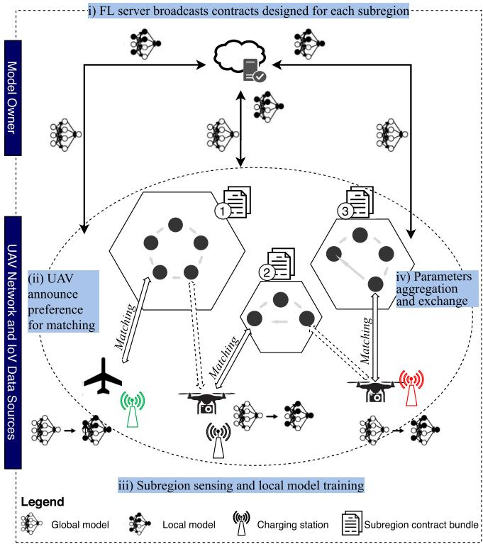
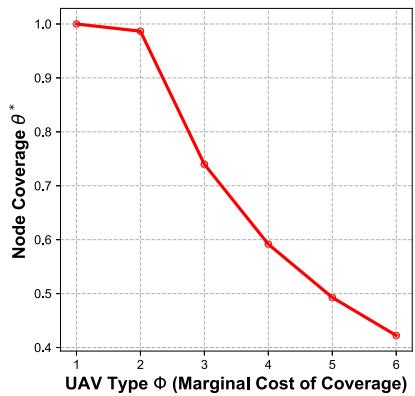
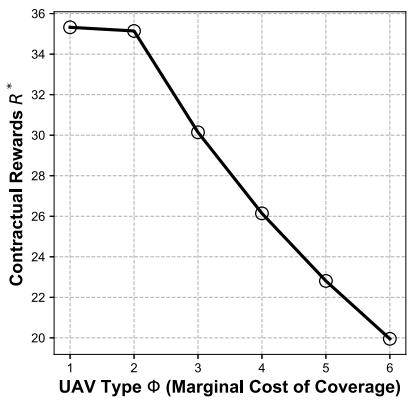
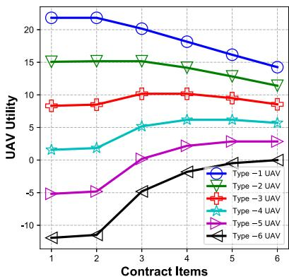
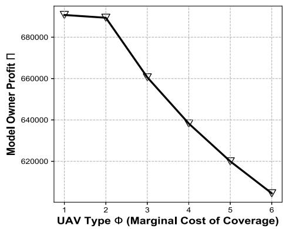
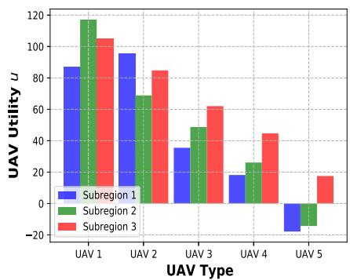
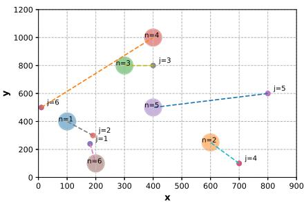
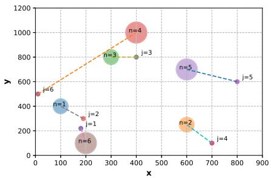
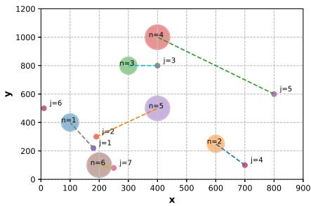

# Towards Federated Learning in UAV-Enabled Internet of Vehicles: A Multi-Dimensional Contract-Matching Approach

Wei Yang Bryan Lim , Jianqiang Huang, Zehui Xiong , Member, IEEE, Jiawen Kang Dusit Niyato , Fellow, IEEE, Xian-Sheng Hua , Fellow, IEEE, Cyril Leung , and Chunyan Miao

Abstract— Coupled with the rise of Deep Learning, the wealth of data and enhanced computation capabilities of Internet of Vehicles (IoV) components enable effective Artificial Intelligence (AI) based models to be built. Beyond ground data sources, Unmanned Aerial Vehicles (UAVs) based service providers for data collection and AI model training, i.e., Drones-as-a-Service (DaaS), is becoming increasingly popular in recent years. However, the stringent regulations governing data privacy potentially impedes data sharing across independently owned UAVs. To this end, we propose the adoption of a Federated Learning (FL) based approach to enable privacy-preserving collaborative Machine Learning across a federation of independent DaaS providers for the development of IoV applications, e.g., for traffic prediction and car park occupancy management. Given the information asymmetry and incentive mismatches between the UAVs and model owners, we leverage on the self-revealing properties of a multi-dimensional contract to ensure truthful reporting of the UAV types, while accounting for the multiple sources of heterogeneity, e.g., in sensing, computation, and transmission costs. Then, we adopt the Gale-Shapley algorithm to match the lowest cost UAV to each subregion. The simulation results validate the incentive compatibility of our contract design, and shows the efficiency of our matching, thus guaranteeing profit maximization for the model owner amid information asymmetry.

Index Terms— Federated learning, incentive mechanism, unmanned aerial vehicles, contract theory, matching.

## I. INTRODUCTION

F OLLOWING the advancements in the Internet ofThings (IoT) and edge computing paradigm, traditional Things (IoT) and edge computing paradigm, traditional Vehicular Ad-Hoc Networks (VANETs) that focus mainly on Vehicle-to-Vehicle (V2V) and Vehicle-to-Infrastructure (V2I) communications [1], [2] are gradually evolving into the Internet of Vehicles (IoV) paradigm [3], [4].

The IoV is an open and integrated network system which leverages on the enhanced sensing, communication, and computation capabilities of its component data sources, e.g., vehicular sensors, IoT devices, and Roadside Units (RSUs) [5], to build data-driven applications for Intelligent Transport Systems, e.g., for traffic prediction [6], traffic management [7], and other smart city applications. Coupled with the rise of Deep Learning, the wealth of data and enhanced computation capabilities of IoV components enable effective Artificial Intelligence (AI) based models to be built [8].

Beyond ground data sources, aerial platforms are increasingly important today given that modern day traffic networks have grown in complexity. In particular, Unmanned Aerial Vehicles (UAVs) are commonly used today to provide data collection and computation offloading support in the IoV paradigm. The UAVs feature the benefits of high mobility, flexible deployment, cost effectiveness [9], and can also provide a more comprehensive coverage as compared to ground users. UAVs can be deployed, e.g., to capture images of car parks for the management and analysis of parking occupancy [10], to capture images of roads and highways for traffic monitoring applications [11], [12], and also to aggregate data from stationary vehicles and roadside units that in turn collect data of other passing vehicles periodically [13]. Apart from data collection, the UAVs have also been used to provide computation offloading support for resource constrained IoV components [14].

As such, studies proposing the Internet of Drones (IoD) and Drones-as-a-Service (DaaS) [15] have gained traction recently. Moreover, the DaaS industry is a rapidly growing one [16] that comprises independent drone owners which provide on-demand data collection and model training for businesses and city planners.

Naturally, to build a better inference model, the independently owned UAV companies can collaborate by sharing their data collected from various sources, e.g., carparks, RSUs, and highways, for collaborative model training. However, in recent years, the regulations governing data privacy, e.g., General Data Protection Regulation (GDPR) are increasingly stringent. As such, this can potentially prevent the sharing of data across DaaS providers. To this end, we propose the adoption of a Federated Learning (FL) based [17] approach to enable privacy-preserving collaborative machine learning (ML) across a federation of independent DaaS providers [18].

Our proposed approach has three advantages. Firstly, the resource constrained IoV components are aided by the UAV deployment for completion of time sensitive sensing and model training tasks. Secondly, it preserves the privacy of the UAV-collected data through eliminating the need of data sharing across UAVs. Thirdly, it is communication efficient. The reason is that traditional methods of data sharing will require the raw data to be uploaded to an aggregating cloud server. With FL, only the model parameters need to be transmitted by the UAVs.

However, there exists an incentive mismatch between the model owner and the UAVs. On one hand, the model owners aim to maximize their profits by selecting the optimal UAVs which can complete the stipulated task at the lowest cost, e.g., in terms of sensing, transmission, and computation costs. On the other hand, the UAVs can take advantage of the information asymmetry and misreport their types so as to seek higher compensation. To that end, we leverage on the self-revealing properties of contract theory [19] as an incentive mechanism design to appropriately reward the UAVs based on their actual types. In particular, given the complexity of the sensing and collaborative learning task, we consider a multi-dimensional contract to account for the multi-dimensional sources of heterogeneity in terms of UAV sensing, learning, and transmission capabilities.

In general, our system model is as presented in Fig. 1. A client, hereinafter model owner, is interested in collecting data from a region for model training, e.g., for traffic prediction. Given the energy constraints of UAVs [20], the region is further divided into smaller subregions. The model owner first announces an FL task (step i), e.g., the capturing of real-time traffic flow over multiple subregions for model training. For each subregion, a bundle of contracts, i.e., subregion coverage-reward pairs, are designed to motivate the UAVs’ participation. After considering the contract bundles of each subregion, the UAVs announce their preferences (step ii). The UAVs are then matched through the Gale-Shapley (GS) [21] matching-based algorithm to assign the optimal UAVs to each subregion (step iii). After the UAV collects the sensing data, model training takes place on each UAV charging station separately, following which only the updated model parameters are transmitted to the model owner for global aggregation (step iv).

The contribution of this paper is as follows:

• We propose an FL based sensing and collaborative learning scheme in which UAVs collect the data and participate in privacy-preserving collaborative model training for applications in the IoV paradigm towards the development of an Intelligent Transport System.

  
Fig. 1. Our proposed system model involving UAV-subregion contractmatching, and FL based collaborative learning within a federation of multiple UAVs. Note that each hexagon indicates a subregion, and within the subregion are nodes, e.g., RSUs, to visit as stipulated by the model owner.

• In consideration of the incentive mismatches and information asymmetry between the UAVs and model owner, we propose a multi-dimensional contract-matching based incentive mechanism design that aims to leverage on the self-revealing properties of an optimal contract, such that the most optimal UAV can be matched to a subregion.

• Our incentive mechanism design considers a general UAV sensing, computation, and transmission model, and thus can be extended to specific FL based applications in the IoV paradigm.

The organization of this paper is as follows. Section II reviews the related works, Section III introduces the system model and problem formulation, Section IV discusses the multi-dimensional contract formulation, Section V considers a matching-based UAV-subregion assignment, Section VI presents the performance evaluation of our proposed incentive mechanism design, and Section VII concludes.

## II. RELATED WORK

In recent years, given the rising popularity of UAVs, there is an increasing number of UAV-related studies in the literature. One group of studies focus on the fundamental issues related to the challenges of UAV deployment, e.g., trajectory optimization [20], communication constraints [22], [23], as well as the efficient assignment and deployment of UAVs [24].

Another group of studies propose specific applications of UAVs, e.g., as flying base stations [25], with mobile cloudlets for computation offloading [26], and for search and rescue missions [27]. In particular, the UAVs are also increasingly considered for providing sensing services, i.e., data collection, [28] and for the development of IoV related applications, e.g., for traffic prediction [11], localization of ground vehicles [29], and to facilitate vehicular communications [3], [30].

The market of UAVs as service providers, e.g., in ondemand data collection, is a rapidly growing one [16]. Given the heterogeneity in UAV types, e.g., in energy constraints and computation capabilities, the incentive mechanism design for UAV systems is an important issue. The study in [31] adopts a game theoretic approach to analyze the offloading decisions of UAVs acting as flying cloudlets for IoT devices. In contrast, the study in [32] proposes the contract-theoretic approach to incentivize UAV base stations to contribute higher transmit power for enhanced coverage over wireless networks. In consideration of the limited availability of mobile charging stations for ${ \mathrm { U A V s } } ,$ the study in [33] proposes an auction-based approach to efficiently assign the UAVs to specific charging time slots so as to reduce congestion.

However, given the nascent field of $\mathrm { F L } .$ , there are relatively few works that propose FL based collaborative learning schemes involving UAVs. To the best of our knowledge, the study of [34], [35] are among the first to propose the implementation of FL for joint power allocation and scheduling of UAV swarms and UAV for facilitating FL training respectively. With the increasingly stringent regulations related to data privacy, the adoption of FL can facilitate collaborative learning for the development of effective AI models, without the exchange of potentially sensitive raw data [36]–[38]. As such, there is an urgent need to consider the incentive mechanism design [39] for FL in UAV networks.

To that end, we can take reference from the growing literature related to incentive mechanism design for FL. For example, the study in [40] adopts a contract-theoretic approach [41] to motivate workers to contribute more computation resource for efficient FL. As an extension, the study in [42] uses a Stackelberg game formulation together with Deep Reinforcement Learning to design a learning-based [39] incentive mechanism for FL. For a comprehensive survey in this area, we refer the readers to [43].

Apart from the traditional considerations of incentive design in FL, the UAV systems involve other sources of heterogeneity in UAV types, e.g., traversal costs. As such, the multi-dimensional sources of heterogeneity in UAVs have inspired us to adopt the multi-dimensional contract theoretic approach [44] in our incentive mechanism design. Moreover, in contrast to traditional works in contract theoretic mechanism design, our system model only involves the matching of a single, optimal UAV type to each subregion. This necessitates the use of the matching-based algorithm such as the GS algorithm. The use of matching for UAVs to subregions have also been studied in [28]. However, [28] does not have any mechanism in place to ensure truthful reporting, while we leverage on the self-revealing properties of contract theory to that end. While the study of contract-matching has also been explored for resource allocation in vehicular fog computing [45], the contract considered is single-dimensional with simpler considerations.

In summary, our study considers the adoption of FL to facilitate privacy preserving sensing and collaborative learning in the UAV services market, and proposes a multi-dimensional contract-matching design that aims to match the most optimal UAV to each sensing subregion, while accounting for the multiple sources of heterogeneity in UAV types.

## III. SYSTEM MODEL AND PROBLEM FORMULATION

We consider a network in which a model owner aims to collect data from stipulated nodes, e.g., from RSUs or images of segments in the highway, in a target sensing region to fulfill a time-sensitive task. One UAV is selected by the task publisher to cover each of the subregions. Given information asymmetry and the multiple sources of heterogeneity in UAV cost types, the model owner leverages on the self-revealing properties of a multi-dimensional contract theoretic approach to choose one UAV suited to cover each of the subregion. After data collection, the UAV returns to their respective UAV bases for Federated Learning (FL) based model training.

Following [28], the target sensing region can be modeled as a graph and divided into N smaller graphs, i.e., subregions whose set is denoted $\mathcal { N } = \{ 1 , \dots , n , \dots , N \}$ , e.g., through the multilevel graph partition algorithm [46]. The set of nodes in each subregion is denoted $\mathcal { T } = \{ I _ { 1 } , \ldots , I _ { n } , \ldots , I _ { N } \}$ with the node i in subregion n, i.e., $i \in I _ { n } ,$ located at $\pmb { x } _ { i } ^ { n } \in \mathbb { R } ^ { 3 }$ . The Euclidean distance between two nodes i and $i ^ { \prime }$ located within subregion n, $\forall i , i ^ { \prime } \in I _ { n } , i \quad \neq i ^ { \prime }$ is expressed as $l _ { i , i ^ { \prime } } ^ { n }$ where $l _ { i , i ^ { \prime } } ^ { n } = | | \pmb { x } _ { i } ^ { n } - \pmb { x } _ { i ^ { \prime } } ^ { n } | | < \infty .$ , i.e., all nodes are inter-accessible.

A set $\mathcal { I } = \left. 1 , \ldots , j , \ldots , J \right.$ of J unmanned aerial vehicles (UAVs) are located at bases situated around the target sensing region. Without loss of generality, we assume that each base owns a single UAV and $J ~ \geq ~ N$ . Moreover, our model can be easily extended to scenarios in which a UAV swarm1 is required for sensing in each subregion. Denote $\mathcal { C } = \{ C _ { 1 } , \ldots , C _ { j } , \ldots , C _ { J } \}$ as the set of bases where $C _ { j }$ refers to the base of UAV j located at $\ b { y } _ { C _ { i } } \in \mathbb { R } ^ { 3 }$ . The Euclidean distance between the base of $\mathrm { U A V } ^ { \prime } \ j$ and subregion n is expressed as $l _ { C _ { j } } ^ { n } .$ , where $l _ { C _ { j } } ^ { n } = | | \mathbf { y } _ { C _ { j } } - \mathbf { x } _ { \tilde { i } } ^ { n } | | < \infty$ and ˜i denotes a designated node of the subregion, e.g., selected2 due to its importance for coverage.

There are two stages in our system model as follows:

1) Multi-Dimensional Contract Design: The UAV types, e.g., characterized by heterogeneous sensing, traversal, and transmission costs, are private information not known to the model owner. As such, the model owner designs a set of contracts comprising proportion of node coverage-reward pairs for each subregion to offer to the UAVs for selection.

2) UAV-Subregion Assignment: For each subregion, the utility maximizing UAV announces its preferred contract. Then, also considering the subregion’s preference, a UAV-subregion matching is derived using the Gale-Shapley (GS) algorithm.

TABLE I TABLE OF COMMONLY USED NOTATIONS
<table><tr><td rowspan=1 colspan=1>Notation</td><td rowspan=1 colspan=1>Description</td></tr><tr><td rowspan=1 colspan=1>n</td><td rowspan=1 colspan=1>Subregion</td></tr><tr><td rowspan=1 colspan=1>j</td><td rowspan=1 colspan=1>UAV</td></tr><tr><td rowspan=1 colspan=1> $\overline { { C _ { j } } }$ </td><td rowspan=1 colspan=1>Base of UAV j</td></tr><tr><td rowspan=1 colspan=1> $\overline { { l _ { i } ^ { n } } }$ </td><td rowspan=1 colspan=1>Total sensing distance (node coverage and sensing task)</td></tr><tr><td rowspan=1 colspan=1> $\overline { { l _ { C _ { i } } ^ { n } } }$ </td><td rowspan=1 colspan=1>Total traversal distance (charging point to target region)</td></tr><tr><td rowspan=1 colspan=1> $\overline { { \tau _ { P } ^ { j , n } } }$ </td><td rowspan=1 colspan=1>Total duration taken for traversal and sensing</td></tr><tr><td rowspan=1 colspan=1> $\overline { { E _ { P } ^ { j , n } } }$ </td><td rowspan=1 colspan=1>Total energy taken for traversal and sensing</td></tr><tr><td rowspan=1 colspan=1> $\alpha _ { i } ^ { n }$ </td><td rowspan=1 colspan=1>Marginal cost of node coverage for sensing</td></tr><tr><td rowspan=1 colspan=1> $\overline { { \psi _ { i } ^ { n } } }$ </td><td rowspan=1 colspan=1>Traversal cost</td></tr><tr><td rowspan=1 colspan=1> $\overline { { \tau _ { C } ^ { j , n } } }$ </td><td rowspan=1 colspan=1>Local computation duration</td></tr><tr><td rowspan=1 colspan=1> $\overline { { E _ { C } ^ { j , n } } }$ </td><td rowspan=1 colspan=1>Total energy taken for computation</td></tr><tr><td rowspan=1 colspan=1> $\overline { { \beta _ { j } } }$ </td><td rowspan=1 colspan=1>Marginal cost of node coverage for computation</td></tr><tr><td rowspan=1 colspan=1> $\smash { \overline { { \tau _ { m } ^ { j , n } } } }$ </td><td rowspan=1 colspan=1>Total duration for transmission</td></tr><tr><td rowspan=1 colspan=1> $\zeta _ { j } ^ { \prime \iota }$ </td><td rowspan=1 colspan=1>Energy taken for transmission</td></tr><tr><td rowspan=1 colspan=1> $\overline { { u _ { i } ^ { n } } }$ </td><td rowspan=1 colspan=1>UAV utility</td></tr><tr><td rowspan=1 colspan=1> $\overline { { R _ { j } ^ { n } } }$ </td><td rowspan=1 colspan=1>Contractual rewards</td></tr><tr><td rowspan=1 colspan=1>φ</td><td rowspan=1 colspan=1>Unit cost of energy for the UAV</td></tr><tr><td rowspan=1 colspan=1>Ⅱ</td><td rowspan=1 colspan=1>Model owner profit</td></tr><tr><td rowspan=1 colspan=1> $\overline { { \Omega ^ { n } , \omega ^ { n } } }$ </td><td rowspan=1 colspan=1>Contract set and individual contract</td></tr><tr><td rowspan=1 colspan=1> $\tilde { R }$ </td><td rowspan=1 colspan=1>Compensation for sensing and computation costs</td></tr><tr><td rowspan=1 colspan=1> $\hat { R }$ </td><td rowspan=1 colspan=1>Compensation for traversal and transmission costs</td></tr><tr><td rowspan=1 colspan=1> $\overline { { \upsilon ( \alpha _ { y } , \beta _ { z } ) } }$ </td><td rowspan=1 colspan=1>Marginal cost of node coverage</td></tr><tr><td rowspan=1 colspan=1> $\overline { { \Phi _ { i } } }$ </td><td rowspan=1 colspan=1>UAV auxiliary type</td></tr></table>

In the following, we consider the sensing, computation, and data transmission model of a representative UAV.

## A. UAV Sensing Model

We consider a representative UAV j tasked by the model owner to cover a proportion of nodes in the subregion n. Denote the node coverage assignment of UAV j in subregion n to be ${ \mathcal { A } } ^ { j , n } = \left\{ a _ { i . i ^ { \prime } } ^ { j , n } | \forall i , i ^ { \prime } \in I _ { n } , i \neq i ^ { \prime } \right\}$ where $a _ { i , i ^ { \prime } } ^ { j , n } = 1$ represents that the UAV has to fly through the segment between nodes i and $i ^ { \prime } ,$ and $a _ { i , i ^ { \prime } } ^ { j , n } = 0$ implies otherwise.

The total distance $l _ { j } ^ { n }$ traveled for sensing by UAV j under assignment $\mathcal { A } ^ { j , n }$ is as follows:

$$
l _ { j } ^ { n } = \sum _ { i ^ { \prime } \neq i , i ^ { \prime } \in \mathcal { T } _ { n } } a _ { i , i ^ { \prime } } ^ { j , n } l _ { i , i ^ { \prime } } ^ { n } .\tag{1}
$$

Denote $\begin{array} { r } { \theta _ { j } ^ { n } = \frac { \sum _ { i ^ { \prime } \neq i , i ^ { \prime } \in \mathcal { T } _ { n } } a _ { i , i ^ { \prime } } ^ { j , n } } { | I _ { n } | } } \end{array}$ where | · | indicates cardinality, i.e., $\theta _ { j } ^ { n }$ refers to the proportion of node coverage by UAV j in subregion n where $0 \leq \theta _ { i } ^ { n } \leq 1$

Apart from traveling between the nodes, the UAV has to travel to and from its base. Denote the total distance traveled by the UAV as $L _ { j } ^ { n } = l _ { j } ^ { n } + l _ { C _ { j } } ^ { n }$ . Hereinafter, we refer to $l _ { j } ^ { n }$ as the sensing distance, whereas $l _ { C } ^ { \acute { n } }$ refers to the traversal distance.

Following the works of [32], each UAV travels with an average velocity $v _ { j }$ and expends a fixed propulsion power $\begin{array} { r } { p _ { j } = { \stackrel { - } { c } } _ { j , 1 } \upsilon _ { j } ^ { 3 } + \frac { { \stackrel { - } { c } } _ { j , 2 } } { \upsilon _ { j } } } \end{array}$ throughout the task for tractability, where $c _ { j , 1 }$ and $c _ { j , 2 }$ refers to the required power to balance the parasitic drag caused by skin friction and required power to balance the drag force of air redirection respectively.3 Note that the propulsion power consumed by the UAV when it changes its direction is negligible [20]. The total duration taken for traversal and sensing is denoted $\begin{array} { r } { \tau _ { P } ^ { j , n } = \frac { L _ { j } ^ { n } } { \upsilon _ { j } } } \end{array}$ , whereas the total energy consumed to cover the traversal and sensing distance is as follows:

$$
\begin{array} { c } { { E _ { P } ^ { j , n } = \displaystyle \frac { L _ { j } ^ { n } } { \upsilon _ { j } } p _ { j } = \displaystyle \frac { \theta _ { j } ^ { n } l ^ { n } + l _ { C _ { j } } ^ { n } } { \upsilon _ { j } } p _ { j } } } \\ { { = \displaystyle \frac { p _ { j } l ^ { n } } { \upsilon _ { j } } \theta _ { j } ^ { n } + \displaystyle \frac { l _ { C _ { j } } ^ { n } } { \upsilon _ { j } } p _ { j } } } \\ { { = \alpha _ { j } ^ { n } \theta _ { j } ^ { n } + \psi _ { j } ^ { n } , } } \end{array}\tag{2}
$$

where $l ^ { n }$ is the distance traveled by the UAV if it covers all nodes, i.e., $\begin{array} { r } { \theta _ { j } ^ { n } \ = \ 1 , \ \alpha _ { j } ^ { n } \ = \ \frac { p _ { j } l ^ { n } } { \upsilon _ { j } } } \end{array}$ and $\begin{array} { r } { \psi _ { j } ^ { n } ~ = ~ \frac { l _ { C _ { j } } ^ { n } } { \upsilon _ { j } } p _ { j } } \end{array}$ for notation simplicity. Note that $a _ { j } ^ { n }$ represents the sensing cost, i.e., marginal cost of node coverage for sensing in the subregion, whereas $\psi _ { j } ^ { n }$ refers to the traversal cost, i.e., the energy cost of traveling to and from the base. A higher $a _ { j } ^ { n }$ can imply that the UAV j requires greater propulsion power to complete the task, e.g., due to its larger weight or wing-aspect ratio, whereas a higher $\psi _ { j } ^ { n }$ implies either a greater propulsion power to move, or a greater traversal cost, i.e., the subregion is farther away from the base. While the value of $a _ { j } ^ { n }$ varies across subregions due to the varying $l _ { n } ,$ , i.e., the marginal cost of node coverage varies according to the sensing area of the subregion, the ordering of the UAV types based on the sensing costs is retained. On the other hand, the order of UAVs by traversal costs varies across subregions, based on the distance between the UAV base and each of the subregions.

## B. UAV Computation Model

After the UAV j covers its assigned set of nodes following assignment $\mathcal { A } ^ { j , n }$ , it returns to the base $C _ { j }$ for an FL based model training over K global iterations where $\mathcal { K } = \{ 1 , . . . , k , . . . , K \}$ to minimize the global loss $F ^ { K }$ (w). Each training iteration k consists of three steps [47] namely: (i) Local Computation: the UAV trains the received global model ${ \pmb w } ^ { ( k ) }$ locally using the sensing data, (ii) Wireless Transmission: the UAV transmits the model parameter update $\pmb { h } _ { j } ^ { ( k ) }$ to the model owner, and (iii) Global Model Parameter Update: all parameter updates derived from the N subregions are aggregated to derive an updated global model ${ \pmb w } ^ { ( k + 1 ) }$ , where $\begin{array} { r } { \pmb { w } ^ { ( k + 1 ) } = \cup _ { j \in \mathcal { N } } ( \pmb { w } _ { j } ^ { ( k ) } + \pmb { h } _ { j } ^ { \dag k ) } ) } \end{array}$ , which is then transmitted back to the UAVs for the $( k + 1 ) ^ { t h }$ training iteration.

In general, a series of local model training is performed by the UAV to minimize an L-Lipschitz and γ -strongly convex local loss function $G _ { j }$ up to the target accuracy $A ^ { * }$ defined by the model owner to derive the parameter update. Note that a larger value of $A ^ { * }$ implies greater deviation from the optimal value. Moreover, $0 < A ^ { * } < 1$ , i.e., the local solution $\pmb { h } _ { j } ^ { ( k ) }$ does not have to be trained to optimality, e.g., to reduce local computation duration especially for time sensitive tasks. In particular, following the formulation in [48]:

$$
\begin{array} { r l } & { G _ { j } \left( \pmb { w } ^ { ( k ) } , \pmb { h } _ { j } ^ { ( k ) } \right) - G _ { j } \left( \pmb { w } ^ { ( k ) } , \pmb { h } _ { j } ^ { ( k ) * } \right) } \\ & { \qquad \leq A ^ { * } \left( G _ { j } \left( \pmb { w } ^ { ( k ) } , \pmb { 0 } \right) - G _ { j } \left( \pmb { w } ^ { ( k ) } , \pmb { h } _ { j } ^ { ( k ) * } \right) \right) . } \end{array}\tag{3}
$$

The FL training is completed after $\begin{array} { r } { K } { \ = \ \frac { a } { 1 - A ^ { * } } } \end{array}$ global iterations where $\begin{array} { r } { a = \frac { 2 L ^ { 2 } } { \gamma ^ { 2 } \xi } } \end{array}$ and $\begin{array} { r } { 0 \le \xi \le \frac { \gamma } { L } } \end{array}$ . The total local computation duration $\tau _ { C } ^ { j , n }$ is as follows:

$$
\tau _ { C } ^ { j , n } = K \left( \frac { V C _ { j } \theta _ { j } ^ { n } D ^ { n } \log _ { 2 } ( 1 / A ^ { * } ) } { f _ { j } } \right) ,\tag{4}
$$

whereas the energy consumption of UAV j for computation is as follows:

$$
E _ { C } ^ { j , n } = K \left( \kappa C _ { j } \theta ^ { j , n } D ^ { n } V \log _ { 2 } ( 1 / A ^ { * } ) f _ { j } ^ { 2 } \right) = \beta _ { j } \theta _ { j } ^ { n } .\tag{5}
$$

$\kappa$ is the effective switched capacitance that depends on the chip architecture [49], $C _ { j }$ is the cycles per bit for computing one sample data of UAV $j , \ \theta ^ { j , n } D ^ { n }$ is the unit of data samples collected by UAV $j , V \log _ { 2 } ( 1 / A ^ { * } )$ refers to the lower bound on number of local iterations required to achieve local accuracy $A ^ { * }$ [48] where $\begin{array} { r } { V \ = \ \frac { 2 } { ( 2 - L \delta ) \delta \gamma } } \end{array}$ , and $f _ { j }$ refers to the computation capacity of the $\begin{array} { r } { \dot { \mathrm { ~ U A V ~ } _ { j } } . } \end{array}$ measured by CPU cycles per second. For ease of notation, we denote $\beta _ { j } ~ =$ $\kappa K C _ { j } D ^ { n } V \log _ { 2 } ( 1 / A ^ { * } ) f _ { j } ^ { 2 }$ , i.e., a higher $\beta _ { j }$ implies greater energy cost for computation per additional node coverage. Similar to $a _ { j } ^ { n }$ , the value of $\beta _ { j } ^ { n }$ varies across subregion due to the different units of data samples available for computation. However, the ordering of the UAV types is retained since it is dependent on computation capabilities.

## C. UAV Transmission Model

After local computation, the wireless transmission takes place from the selected UAVs to the model owner. For simplicity, we denote the achievable rate of the UAV $j$ to be a product of its transmit power $\rho _ { j }$ and a scaling factor $\lambda _ { j } ^ { n }$ which covers other considerations, e.g., bandwidth allocation and channel gain.

The total time $\tau _ { T } ^ { j , n }$ taken by the UAV to upload parameter update $\pmb { h } _ { j } ^ { ( k ) }$ of size H is as follows: $\begin{array} { r } { \tau _ { T } ^ { j , n } = K \frac { H } { \lambda _ { i } ^ { n } \rho _ { j } } } \end{array}$ . Note that the model upload size is constant regardless of the number of global iterations or quantity of data collected, given the fixed dimensions of the model update. The transmission energy consumption, denoted $\zeta _ { j } ^ { n }$ , is as follows:

$$
E _ { T } ^ { j , n } = \tau _ { T } ^ { j , n } \rho _ { j } = \zeta _ { j } ^ { n } .\tag{6}
$$

## D. UAV and Model Owner Utility Modeling

The utility function of a representative UAV j covering subregion n can be expressed as follows:

$$
\begin{array} { r l } & { u _ { j } ^ { n } ( \theta _ { j } ^ { n } ) = R _ { j } ^ { n } ( \theta _ { j } ^ { n } ) - \phi \left( E _ { P } ^ { j , n } + E _ { C } ^ { j , n } + E _ { T } ^ { j , n } \right) } \\ & { \qquad = R _ { j } ^ { n } ( \theta _ { j } ^ { n } ) - \phi \left( \alpha _ { j } ^ { n } \theta _ { j } ^ { n } + \psi _ { j } ^ { n } + \beta _ { j } ^ { n } \theta _ { j } ^ { n } + \zeta _ { j } ^ { n } \right) , } \end{array}\tag{7}
$$

where $R _ { j } ^ { n } ( \theta _ { j } ^ { n } )$ refers to the contractual rewards and $\phi$ refers to the unit cost of energy.

Following [42], the FL model accuracy $\begin{array} { r } { \Upsilon ( \sum _ { n = 1 } ^ { N } \theta _ { j ^ { * } } ^ { n } D ^ { n } ) } \end{array}$ is a concave function of the aggregate data collected across N subregions by the N selected UAVs. In particular, the inference accuracy of the model is improved when more nodes are covered, i.e., a model trained using data across a more comprehensive coverage of classes may be built. Without loss of generality, we consider the aggregate model performance to be an average of node coverage across all regions, analogous to the Federated Averaging algorithm:

$$
\Upsilon \left( \sum _ { n = 1 } ^ { N } \theta _ { j ^ { * } } ^ { n } D ^ { n } \right) = \frac { 1 } { N } \sum _ { n = 1 } ^ { N } l o g ( 1 + \mu \theta _ { j ^ { * } } ^ { n } D ^ { n } ) ,\tag{8}
$$

where $\mu > 0$ is the system parameter. The total profit obtained from all UAVs is thus as follows:

$$
\Pi ( \Omega ) = \sigma \Upsilon \left( \sum _ { n = 1 } ^ { N } \theta _ { j ^ { * } } ^ { n } D ^ { n } \right) - \sum _ { n = 1 } ^ { N } R _ { j * } ^ { n }\tag{9}
$$

where $\sigma > 0$ refers to the conversion parameter from model performance to profits, and the contractual reward expense for each selected UAV is denoted as $R _ { j ^ { * } } ^ { n }$ . In the next section, we devise the optimal contract which satisfies the Individual Rationality and Incentive Compatibility constraints.

## IV. MULTI-DIMENSIONAL CONTRACT DESIGN

In this section, we first consider a multi-dimensional contract formulation. To solve the multi-dimensional contract, we sort the UAV types according to an auxiliary variable which reflects the marginal cost of node coverage. Then, we relax the constraints for contract feasibility and include a fixed compensation component for traversal and transmission costs so as to solve for the optimal contract.

## A. Contract Condition Analysis

Given that the sensing cost α, traversal cost ψ, computation cost $\beta ,$ and transmission cost $\zeta$ are all private information that are not precisely known by the model owner, we consider the multi-dimensional contract theoretic incentive mechanism design to leverage on its self-revealing properties.

The UAVs can be classified into different types to characterize their heterogeneity. In particular, the UAVs can be categorized into a set $\Psi = \{ \psi _ { x } ^ { n } : 1 \leq x \leq X \}$ of X traversal cost types, set $\mathcal { A } = \{ \alpha _ { v } ^ { n } : 1 \leq \ddot { y } \leq Y \}$ of Y sensing cost types, set $B = \{ \beta _ { z } ^ { n } : 1 \le z \le Z \}$ of Z computation cost types, and set $\mathcal { C } = \{ \zeta _ { q } ^ { n } : 1 \leq q \leq Q \}$ of Q transmission cost types.

Without loss of generality, we also assume that the user types are indexed in non-decreasing orders in all four dimensions: $0 < \psi _ { 1 } \leq \psi _ { 2 } \leq \cdots \leq \psi _ { X } , 0 < \alpha _ { 1 } ^ { n } \leq \alpha _ { 2 } ^ { n } \leq \cdots \leq \alpha _ { Y } ^ { n }$ $0 < \beta _ { 1 } ^ { n } \le \beta _ { 2 } ^ { n } \le \cdot \cdot \cdot \le \beta _ { Z } ^ { n }$ , and $0 < \zeta _ { 1 } ^ { n } \leq \zeta _ { 2 } ^ { n } \leq \cdot \cdot \cdot \leq \zeta _ { O } ^ { n }$ . For ease of notation, we represent a UAV of traversal cost type x, sensing cost type y, computation cost type z, and transmission cost type q to be that of $\mathrm { t y p e } - ( x , y , z , q )$

To enforce the UAVs to truthfully reveal their private information, we adopt a two-step procedure for the contract design:

1) Multi-Dimensional Contract Design: We convert the multi-dimensional problem into a single-dimensional contract formulation following the approach in [41]. In particular, we sort the UAVs by an auxiliary, one-dimensional type $\Phi ( \alpha _ { y } ^ { n } , \beta _ { z } ^ { n } )$ in the ascending order based on the marginal cost of node coverage, i.e., sensing and computation cost types. Then, we solve for the optimal contract for each subregion n denoted $\Omega ^ { n } ( \mathcal { A } , \mathcal { B } ) = \{ \omega _ { y , z } ^ { n } : 1 \le y \le Y , 1 \le z \le Z \}$ where $n \in \mathcal N$ to derive the optimal node coverage-contract reward bundle $\{ \theta _ { y , z } ^ { n } , \tilde { R } _ { y , z } ^ { n } \}$

2) Traversal Cost Compensation: In contrast to existing works on multi-dimensional contracts, the UAVs also incur the additional traversal cost and transmission cost components, both of which are not coupled with the marginal cost of node coverage. In other words, these costs have to be incurred regardless of the number of nodes a UAV decides to cover in the subregion. For each contractual reward, we add in a fixed compensation Rˆ to derive the final contract bundle $\{ \theta _ { y , z } ^ { n } , ( \tilde { R } _ { y , z } ^ { n } + \hat { R } ) \}$

We first discuss the multi-dimensional contract formulation as follows. A contract is feasible only if the Individual Rationality (IR) and Incentive Compatibility (IC) constraints hold simultaneously.

Definition 1: Individual Rationality (IR): Each type-(y, z) UAV achieves non-negative utility if it chooses the contract item designed for its type, i.e., contract item $\omega _ { y , z }$

$$
u _ { y , z } ( \omega _ { y , z } ) \geq 0 , 1 \leq y \leq Y , 1 \leq z \leq Z .\tag{10}
$$

Definition 2: Incentive Compatibility (IC): Each type- $( y , z )$ UAV achieves the maximum utility if it chooses the contract item designed for its type, i.e., contract item $\omega _ { y , z }$ . As such, it has no incentive to choose contracts designed for other types.

$$
\begin{array} { r l r } & { } & { u _ { y , z } ( \omega _ { y , z } ) \geq u _ { y , z } ( \omega _ { y ^ { \prime } , z ^ { \prime } } ) , 1 \leq y \leq Y , 1 \leq z \leq Z , \quad } \\ & { } & { y \neq y ^ { \prime } , z \neq z ^ { \prime } . } \end{array}\tag{11}
$$

The multi-dimensional contract formulation is as follows:

$$
\begin{array} { l } { \displaystyle \operatorname* { m a x } _ { \Omega } \Pi ( \Omega ^ { n } ( \mathcal { A } , \mathcal { B } ) ) } \\ { \displaystyle \mathrm { s . t . } \ ( 1 0 ) , ( 1 1 ) . } \end{array}\tag{12}
$$

However, the optimization problem in (12) involves $Y Z ,$ i.e., IR constraints and $Y Z ( Y Z - 1 )$ , i.e., IC constraints, all of which are non-convex. Therefore, we first convert the contract into a single-dimensional formulation in the next section.

## B. Conversion Into a Single-Dimensional Contract

In order to account for the marginal cost of node coverage, we consider a revised utility $\tilde { u } _ { y , z }$ of the UAV type-(y, z) that excludes the traversal and transmission costs as follows:

$$
\tilde { u } _ { y , z } ( \theta ( y , z ) , \tilde { R } _ { y , z } ) = \eta ( \alpha _ { y } , \beta _ { z } ) + \tilde { R } _ { y , z } ,\tag{13}
$$

where we denote $\eta ( \alpha _ { y } , \beta _ { z } ) = - \phi \theta ( y , z ) ( \alpha _ { y } + \beta _ { z } )$ for ease of notation, and $\tilde { R } _ { y , z }$ refers to the contractual reward arising from the multi-dimensional contract design. To focus on a representative contract, we drop the n superscripts for now. Given that the ranking of marginal cost types does not change across subregion, note that our contract design is a general one applicable to all subregions.

We derive the marginal cost of node coverage $\phantom { } _ { \upsilon } ( \alpha _ { y } , \beta _ { z } )$ for the type-(y, z) UAV as follows:

$$
\upsilon \left( \alpha _ { y } , \beta _ { z } \right) = - \frac { \hat { \upsilon } \eta ( \alpha _ { y } , \beta _ { z } ) } { \hat { \upsilon } \theta ( y , z ) } = \phi ( \alpha _ { y } + \beta _ { z } ) .\tag{14}
$$

Intuitively, $\frac { \partial \eta ( \alpha _ { y } , \beta _ { z } ) } { \partial \theta ( y , z ) } \ : < \ : 0$ since the coverage of an additional node results in the additional expenses of sensing and computation costs. A larger value of $\upsilon ( \alpha _ { y } , \beta _ { z } )$ implies a larger marginal cost of node coverage, due to the greater sensing and computation costs incurred for a particular UAV type.

We can now sort the Y Z UAVs according to their marginal cost of node coverage in a non-decreasing order as follows:

$$
\Phi _ { 1 } ( \theta ) , \Phi _ { 2 } ( \theta ) , \ldots , \Phi _ { i } ( \theta ) , \ldots , \Phi _ { Y Z } ( \theta ) ,\tag{15}
$$

where $\Phi _ { i } ( \theta )$ denotes the auxiliary type-i(θ ) user. Given the sorting order, the UAV types are in an ascending order based on their marginal cost of node coverage:

$$
\upsilon \left( \theta , \Phi _ { 1 } \right) \leq \upsilon \left( \theta , \Phi _ { 2 } \right) \leq \cdot \cdot \cdot \leq \upsilon \left( \theta , \Phi _ { i } \right) \leq \cdot \cdot \cdot \leq \upsilon \left( \theta , \Phi _ { Y Z } \right) ,\tag{16}
$$

Note that for ease of notation, we use type-i or type-i interchangeably to represent the auxiliary type-i user. In addition, we refer to $\eta _ { i } ( \theta _ { i } )$ and $\eta ( \theta _ { i } , \Phi _ { i } )$ interchangeably to represent the new ordering subsequently. Similarly, to represent the marginal cost of node coverage, we use $\upsilon _ { i } ( \theta _ { i } )$ and $\upsilon ( \theta _ { i } , \Phi _ { i } )$ In the next section, we derive the necessary and sufficient conditions for the contract design.

## C. Conditions for Contract Feasibility

We derive the necessary conditions to guarantee contract feasibility based on the IR and IC constraints as follows.

Lemma 1: For any feasible contract $\Omega \{ { \mathcal { A } } , B \}$ , we have $\theta _ { i } <$ $\theta _ { i ^ { \prime } }$ if and only if $\tilde { R _ { i } } < \tilde { R } _ { i ^ { \prime } } , i \neq i ^ { \prime } $

Proof: We first prove the sufficiency, i.e., if $\tilde { R } _ { i } < \tilde { R } _ { i ^ { \prime } } \Rightarrow$ $\theta _ { i } < \theta _ { i } ,$ . From the IC constraint of type-i UAV we have:

$$
\begin{array} { r l } & { \eta ( \theta _ { i } , \Phi _ { i } ) + \tilde { R } _ { i } \geq \eta ( \theta _ { i } , \Phi _ { i ^ { \prime } } ) + \tilde { R } _ { i ^ { \prime } } , } \\ & { \eta ( \theta _ { i } , \Phi _ { i } ) - \eta ( \theta _ { i } , \Phi _ { i ^ { \prime } } ) \geq \tilde { R } _ { i ^ { \prime } } - \tilde { R } _ { i } > 0 , } \end{array}\tag{17}
$$

which implies:

$$
\eta ( \theta _ { i } , \Phi _ { i } ) \geq \eta ( \theta _ { i } , \Phi _ { i ^ { \prime } } ) ,\tag{18}
$$

Given that $\begin{array} { r } { \frac { \hat { c } \eta ( \theta _ { i } , \Phi _ { i } ) } { \hat { \sigma } \theta _ { i } } < 0 } \end{array}$ , we can deduce $\theta _ { i } < \theta _ { i ^ { \prime } }$

Next, we prove the necessity, i.e., $\theta _ { i } \ < \theta _ { i ^ { \prime } } \Rightarrow \tilde { R } _ { i } \ < \ \tilde { R } _ { i ^ { \prime } }$ Similarly, we consider the IC constraint of the type-i UAV:

$$
\begin{array} { r l } & { \eta ( \theta _ { i } , \Phi _ { i } ) + \tilde { R } _ { i } \geq \eta ( \theta _ { i ^ { \prime } } , \Phi _ { i } ) + \tilde { R } _ { i ^ { \prime } } , } \\ & { \eta ( \theta _ { i } , \Phi _ { i } ) - \eta ( \theta _ { i ^ { \prime } } , \Phi _ { i } ) \geq \tilde { R } _ { i ^ { \prime } } - \tilde { R } _ { i } . } \end{array}\tag{19}
$$

Given $\theta _ { i } \ < \ \theta _ { i ^ { \prime } }$ , we deduce $\eta ( \theta _ { i } , \Phi _ { i } ) ~ < ~ \eta ( \theta _ { i ^ { \prime } } , \Phi _ { i } )$ , which follows that $\tilde { R } _ { i ^ { \prime } } < \tilde { R } _ { i }$ . The proof is now completed. - Lemma 2: Monotonicity: For any feasible contract $\Omega \{ { \mathcal { A } } , B \}$ , if $\upsilon \left( \theta _ { i } , \Phi _ { i } \right) > \upsilon \left( \theta _ { i } , \Phi _ { i ^ { \prime } } \right)$ , it follows that $\theta _ { i } \leq \theta _ { i ^ { \prime } }$

Proof: We adopt the proof by contradiction to validate the monotonicity condition. We first assume that there exists $\theta _ { i } > \theta _ { i ^ { \prime } }$ such that $\upsilon \left( \theta _ { i } , \Phi _ { i } \right) > \upsilon \left( \theta _ { i } , \Phi _ { i ^ { \prime } } \right)$

We consider the IC constraints for the type $\Phi _ { i }$ and $\Phi _ { i ^ { \prime } } \mathrm { \ U A V } ;$

$$
\begin{array} { r l } & { \eta ( \theta _ { i } , \Phi _ { i } ) + \tilde { R } _ { i } \geq \eta ( \theta _ { i ^ { \prime } } , \Phi _ { i } ) + \tilde { R } _ { i ^ { \prime } } , } \\ & { \eta ( \theta _ { i ^ { \prime } } , \Phi _ { i ^ { \prime } } ) + \tilde { R } _ { i ^ { \prime } } \geq \eta ( \theta _ { i } , \Phi _ { i ^ { \prime } } ) + \tilde { R } _ { i } . } \end{array}
$$

Then, we add the constraints together and rearrange the terms to obtain:

$$
[ \eta ( \theta _ { i } , \Phi _ { i } ) - \eta ( \theta _ { i ^ { \prime } } , \Phi _ { i } ) ] - [ \eta ( \theta _ { i } , \Phi _ { i ^ { \prime } } ) - \eta ( \theta _ { i ^ { \prime } } , \Phi _ { i ^ { \prime } } ) ] \ge 0 .\tag{20}
$$

By the fundamental theorem of calculus, we have:

$$
\begin{array} { r l } & { [ \eta ( \theta _ { i } , \Phi _ { i } ) - \eta ( \theta _ { i ^ { \prime } } , \Phi _ { i } ) ] - [ \eta ( \theta _ { i } , \Phi _ { i ^ { \prime } } ) - \eta ( \theta _ { i ^ { \prime } } , \Phi _ { i ^ { \prime } } ) ] } \\ & { \quad = \displaystyle \int _ { \theta _ { i ^ { \prime } } } ^ { \theta _ { i } } \frac { \hat { c } \eta ( \theta , \Phi _ { i } ) } { \hat { c } \theta } d \theta - \int _ { \theta _ { i ^ { \prime } } } ^ { \theta _ { i } } \frac { \hat { c } \eta ( \theta , \Phi _ { i ^ { \prime } } ) } { \hat { c } \theta } d \theta } \\ & { \quad = \displaystyle \int _ { \theta _ { i ^ { \prime } } } ^ { \theta _ { i } } \left[ \frac { \hat { c } \eta ( \theta , \Phi _ { i } ) } { \hat { c } \theta } - \frac { \hat { c } \eta ( \theta , \Phi _ { i ^ { \prime } } ) } { \hat { \sigma } \theta } \right] d \theta } \\ & { \quad = \displaystyle - \int _ { \theta _ { i ^ { \prime } } } ^ { \theta _ { i } } [ \upsilon ( \theta , \Phi _ { i } ) - \upsilon ( \theta , \Phi _ { i ^ { \prime } } ) ] d \theta . } \end{array}\tag{21}
$$

Given (12), as well as the assumption $\theta _ { i } > \theta _ { i ^ { \prime } }$ and $\eta ( \theta _ { i } , \Phi _ { i } ) >$ $\eta ( \theta _ { i } , \Phi _ { i ^ { \prime } } )$ , we can deduce that (21) is negative, which contradicts with (20). As such, there does not exist $\theta _ { i } \quad >$ $\theta _ { i ^ { \prime } }$ and $\eta ( \theta _ { i } , \Phi _ { i } ) ~ > ~ \eta ( \theta _ { i } , \Phi _ { i ^ { \prime } } )$ for the feasible contract, which confirms that the lemma is correct. The proof is now completed. -

As such, Lemmas 1 and 2 give us the necessary conditions of the feasible contract in the following theorem.

Theorem 1: A feasible contract must meet the following conditions:

$$
\left\{ \begin{array} { l l } { \theta _ { 1 } \geq \theta _ { 2 } \geq \dots \geq \theta _ { i } \geq \dots \geq \theta _ { Y Z } } \\ { \tilde { R } _ { 1 } \geq \tilde { R } _ { 2 } \geq \dots \geq \tilde { R } _ { i } \geq \dots \geq \tilde { R } _ { Y Z } } \end{array} \right.\tag{22}
$$

Next, we further relax the IR and IC constraints. Due to the independence of $\Phi _ { i }$ on the contract item $\{ \theta , { \tilde { R } } \}$ $\mathrm { i . e . , ~ } \Phi _ { i } ( \theta , \tilde { R } ) = \Phi _ { i } ( \theta ^ { \prime } , \tilde { R } ^ { \prime } ) , \theta \neq \theta ^ { \prime } , \tilde { R } \neq \tilde { R } ^ { \prime }$ , the UAV type does not change with the node coverage and contract rewards. In addition, the ordering of the type by marginal costs does not change with the subregion n. As such, we are able to deduce the minimum utility $\mathrm { U A V } \ \Phi _ { m a x } = \Phi _ { Y Z } , \mathrm { i . e }$ ., the UAV characterized by $\{ \alpha _ { Y } , \beta _ { Z } \}$ is the UAV which incurs the highest marginal cost of node coverage, and hence it is the minimum utility UAV.

Lemma 3: If the IR constraint of the minimum utility UAV type $\Phi _ { Y Z }$ is satisfied, the other IR constraints will also hold.

Proof: From the IC constraint and the sorting order $\eta _ { 1 } ( \theta _ { 1 } ) \ge \dots \ge \eta _ { i } ( \theta _ { i } ) \cdot \cdot \cdot \ge \eta _ { Y Z } ( \theta _ { Y Z } )$ , we have the following relation:

$$
\eta _ { i } ( \theta _ { i } ) + \tilde { R } _ { i } \ge \eta _ { i } ( \theta _ { Y Z } ) + \tilde { R } _ { Y Z } \ge \eta _ { Y Z } ( \theta _ { Y Z } ) + \tilde { R } _ { Y Z } \ge 0 .
$$

As such, as long as the IR constraint of the UAV type $\Phi _ { Y Z }$ is satisfied, it follows that the IR constraints of the other UAVs will also hold. -

Lemma 4: For a feasible contract, if $\omega _ { i - 1 } \stackrel { P I C } { \Leftrightarrow } \omega _ { i }$ and $\omega _ { i } \stackrel { P I C } { \Leftrightarrow } \omega _ { i + 1 }$ , then $\omega _ { i - 1 } \stackrel { P I C } { \Leftrightarrow } \omega _ { i + 1 }$

Note that the relation $\omega _ { i } \stackrel { P I C } { \Leftrightarrow } \omega _ { i ^ { \prime } } , i \neq i ^ { \prime }$ implies the Pairwise Incentive Compatibility (PIC), which is fulfilled under the following condition:

$$
\begin{array} { r } { \left\{ \begin{array} { l l } { u _ { i } \left( \omega _ { i } \right) \geq u _ { i } \left( \omega _ { i ^ { \prime } } \right) , } \\ { u _ { i ^ { \prime } } \left( \omega _ { i ^ { \prime } } \right) \geq u _ { i ^ { \prime } } \left( \omega _ { i } \right) . } \end{array} \right. } \end{array}
$$

Proof: Suppose we have three UAV types $\Phi _ { i - 1 } , \Phi _ { i }$ , and $\Phi _ { i + 1 }$ where $i - 1 < i < i + 1$ . The Local Upward Incentive Constraint (LUIC), i.e., IC constraint between the $i ^ { t h }$ and $( i + 1 ) ^ { t h }$ UAV is as follows:

$$
\begin{array} { r l } & { \eta \left( \theta _ { i - 1 } , \Phi _ { i - 1 } \right) + \tilde { R } _ { i - 1 } \geq \eta \left( \theta _ { i } , \Phi _ { i - 1 } \right) + \tilde { R } _ { i } } \\ & { \qquad \eta \left( \theta _ { i } , \Phi _ { i } \right) + \tilde { R } _ { i } \geq \eta \left( \theta _ { i + 1 } , \Phi _ { i } \right) + \tilde { R } _ { i + 1 } . } \end{array}\tag{23}
$$

In addition, we consider:

$$
\begin{array} { r l r } {  { [ \eta ( \theta _ { i + 1 } , \Phi _ { i } ) - \eta ( \theta _ { i } , \Phi _ { i } ) ] - [ \eta ( \theta _ { i + 1 } , \Phi _ { i - 1 } ) - \eta ( \theta _ { i } , \Phi _ { i - 1 } ) ] } } \\ & { } & { = \int _ { \theta _ { i } } ^ { \theta _ { i + 1 } } \frac { \hat { \sigma } \eta ( \theta , \Phi _ { i } ) } { \hat { \sigma } \theta } d \theta - \int _ { \theta _ { i } } ^ { \theta _ { i + 1 } } \frac { \hat { \sigma } \eta ( \theta , \Phi _ { i - 1 } ) } { \hat { \sigma } \theta } d \theta } \\ & { } & { = \int _ { \theta _ { i } } ^ { \theta _ { i + 1 } } \frac { \hat { \sigma } \eta ( \theta , \Phi _ { i } ) } { \hat { \sigma } \theta } - \frac { \hat { \sigma } \eta ( \theta , \Phi _ { i - 1 } ) } { \hat { \sigma } \theta } d \theta } \\ & { } & { = - \int _ { \theta _ { i } } ^ { \theta _ { i + 1 } } [ \nu ( \theta , \Phi _ { i } ) - \nu ( \theta , \Phi _ { i - 1 } ) ] d \theta } \\ & { } & { = \int _ { \theta _ { i + 1 } } ^ { \theta _ { i } } [ \nu ( \theta , \Phi _ { i } ) - \nu ( \theta , \Phi _ { i - 1 } ) ] d \theta . \quad \quad \quad ( 2 4 } \end{array}\tag{}
$$

Given the order of marginal cost of node coverage in (16), it follows that (24) is positive. As such, we have:

$$
\eta \left( \theta _ { i + 1 } , \Phi _ { i } \right) - \eta \left( \theta _ { i } , \Phi _ { i } \right) \geq \eta \left( \theta _ { i + 1 } , \Phi _ { i - 1 } \right) - \eta \left( \theta _ { i } , \Phi _ { i - 1 } \right) ( 2 5 )
$$

Adding the LUIC inequalities presented in (32) together with that of (25), we have:

$$
\eta ( \theta _ { i - 1 } , \Phi _ { i - 1 } ) + \tilde { R } _ { i - 1 } \geq \eta ( \theta _ { i + 1 } , \Phi _ { i - 1 } ) + \tilde { R } _ { i + 1 } .\tag{26}
$$

By considering the Local Downward Incentive Constraint (LDIC), i.e., IC constraint between the $i ^ { t h }$ and $( i \mathrm { ~ - ~ } 1 ) ^ { t h } ~ \mathrm { U A V } ,$ as well as adopting the approach in (24), we derive that:

$$
\eta ( \theta _ { i + 1 } , \Phi _ { i + 1 } ) + \tilde { R } _ { i + 1 } \geq \eta ( \theta _ { i - 1 } , \Phi _ { i + 1 } ) + \tilde { R } _ { i - 1 } .\tag{27}
$$

As such, given that the LUIC and LDIC hold, we have proven that the PIC of the contracts hold, i.e., $\omega _ { i - 1 } \stackrel { P I C } { \Leftrightarrow } \omega _ { i + 1 }$ -

With Lemma 3, we are able to reduce Y Z IR constraints into a single constraint, i.e., as long as the minimum utility type $\Phi _ { Y Z } \ \mathrm { U A V }$ has a non-negative utility, it follows that the other IR constraints will hold. Moreover, with Lemma 4, we are able to reduce $Y Z ( Y Z - 1 )$ ) constraints into $Y Z - 1$ constraints, i.e., as long as the PIC constraint of the type i and type $\Phi _ { i + 1 } ~ \mathrm { U A V }$ holds, it follows that the IC constraints between the type $\Phi _ { i }$ and all other UAV types will hold.

With this, we are able to derive a tractable set of sufficient conditions for the feasible contract in Theorem 2 as follows. The first condition refers to the reduced IR condition corresponding to Lemma (3), whereas the second condition refers to the PIC condition between the type $\Phi _ { i }$ and type $\Phi _ { i + 1 } ~ \mathrm { U A V }$ corresponding to Lemma (4).

Theorem 2: A feasible contract must meet the following sufficient conditions:

$$
\begin{array} { r l } { { 1 ) } } & { \eta _ { Y Z } ( \theta _ { Y Z } ) + \tilde { R } _ { Y Z } \geq 0 } \\ { { 2 ) } } & { \tilde { R } _ { i + 1 } + \eta ( \theta _ { i + 1 } , \Phi _ { i + 1 } ) - \eta ( \theta _ { i } , \Phi _ { i + 1 } ) \geq \tilde { R } _ { i } \geq \tilde { R } _ { i + 1 } + } \\ & { \eta ( \theta _ { i + 1 } , \Phi _ { i } ) - \eta ( \theta _ { i } , \Phi _ { i } ) . } \end{array}
$$

## D. Contract Optimality

To solve for the optimal contract rewards $\tilde { R } _ { i } ^ { * }$ , we first establish the dependence of optimal contract rewards R on route coverage θ. Thereafter, we solve the problem in (12) with θ only. Specifically, we obtain the optimal rewards $R ^ { * } ( \pmb \theta )$ given a set of feasible node coverages from each UAV which satisfies the monotonicity constraint $\theta _ { 1 } \geq \theta _ { 2 } \geq \cdot \cdot \cdot \geq \theta _ { i } \geq$ $\cdots \geq \theta _ { Y Z } .$

In addition, the multi-dimensional contract formulation that we have thus far only considers the self-revelation for two types, i.e., sensing and computation costs. To account for traversal and transmission cost types, we add an additional fixed compensation $\hat { R }$ into the contract rewards. The traversal cost can be derived from the historical information of the UAV, and can be calibrated based on the response that the model owner receives. In the following theorem, we prove that the addition of a fixed rewards compensation does not violate the IC constraints, i.e., the self-revealing properties of the contract is still preserved, whereas it is inconsequential even if the IR constraint is violated, given that $\tilde { R }$ has already been designed to sufficiently compensate marginal costs, and only one optimal UAV is required to serve each subregion. The optimal rewarding scheme is summarized as follows.

Theorem 3: For a known set of node coverage θ satisfying $\theta _ { 1 } \ \geq \ \theta _ { 2 } \ \geq \ \cdot \cdot \cdot \geq \ \theta _ { i } \ \geq \ \cdot \cdot \cdot \geq \ \theta _ { Y Z }$ in a feasible contract, the optimal reward is given by:

$$
\begin{array} { r } { R _ { i } ^ { * } = \left\{ \begin{array} { l l } { \hat { R } - \eta ( \theta _ { i } , \Phi _ { i } ) , } & { i f ~ i = Y Z , } \\ { \hat { R } + \tilde { R } _ { i + 1 } + \eta ( \theta _ { i + 1 } , \Phi _ { i } ) - \eta ( \theta _ { i } , \Phi _ { i } ) , ~ o t h e r w i s e . } \end{array} \right. } \end{array}\tag{28}
$$

Proof: There are two parts to the proof. Firstly, we prove by contradiction that the reward design for the two-dimensional contract is optimal. Assume there exists some $\mathbf { R } ^ { \dagger }$ that yields greater profit for the model owner, meaning that the theorem is incorrect, i.e., $\Pi ( R ^ { \dagger } ) > \Pi ( R ^ { * } )$ For simplicity, we need to consider only the rewards portion of the model owner’s profit function in this proof, $\begin{array} { r } { \mathrm { i . e . , } \sum _ { i = 1 } ^ { Y Z } R _ { i } ^ { \dagger } < \sum _ { i = 1 } ^ { Y Z } R _ { i } ^ { * } } \end{array}$ . This implies there exists at least a $t \in \{ 1 , 2 , . . . , Y Z \}$ that satisfies the inequality $R _ { t } ^ { \dagger } < R _ { t } ^ { * }$

According to the PIC constraint of Lemma (4), we have:

$$
R _ { t } ^ { \dagger } \geq R _ { t + 1 } ^ { \dagger } + \eta \left( \theta _ { t + 1 } , \Phi _ { t + 1 } \right) - \eta \left( \theta _ { t } , \Phi _ { t } \right) .\tag{29}
$$

In contrast from Theorem 3, we have:

$$
R _ { t } ^ { * } = R _ { t + 1 } ^ { * } + \eta \left( \theta _ { t + 1 } , \Phi _ { t + 1 } \right) - \eta \left( \theta _ { t } , \Phi _ { t } \right) .\tag{30}
$$

From (29) and (30), we can deduce that $R _ { t + 1 } ^ { \dagger } ~ < ~ R _ { t + 1 } ^ { * } .$ Continuing the process up to $t \ = \ Y Z$ , we $R _ { Y Z } ^ { \dagger } \ \le \ R _ { Y Z } ^ { * } \ =$ $- \eta ( \theta _ { i } , \Phi _ { i } )$ , which violates the IR constraint. As such, there does not exist the rewards $\mathbf { R } ^ { \dagger }$ in the feasible contract that yields greater profit for the model owner. Intuitively, the model owner chooses the lowest reward that satisfies the IR and IC constraints for profit maximization.

Secondly, we show that adding a fixed traversal cost reward does not violate the IC constraint. Within a subregion, when we consider the complete utility function of the auxiliary UAV with type $i , i \neq i ^ { \prime }$

$$
\begin{array} { r l } & { \eta \left( \theta _ { i } , \Phi _ { i } \right) + \tilde { R } _ { i } + \hat { R } - \psi _ { i } ^ { n } - \zeta _ { i } ^ { n } } \\ & { \qquad \geq \eta \left( \theta _ { i ^ { \prime } } , \Phi _ { i } \right) + \tilde { R } _ { i } + \hat { R } - \psi _ { i } ^ { n } - \zeta _ { i } ^ { n } . } \end{array}\tag{31}
$$

Intuitively, the traversal and transmission cost are structurally separate from the marginal costs, i.e., sensing and computation cost types of the UAV within a subregion n. As such, the fixed reward terms cancel out and the self-revealing properties of the contract is preserved.

Note that the IR constraint may no longer hold for some i where

$$
\psi _ { i } > \eta ( \theta _ { i } , \Phi _ { i } ) + \tilde { R } _ { i } + \hat { R } ^ { n } .\tag{32}
$$

However, this is inconsequential given that unlike the conventional contract theoretic formulations, we only require a type of UAV to serve a subregion. Moreover, ${ \tilde { R } } ^ { n }$ is already designed such that the IR constraints hold to compensate marginal costs sufficiently. -

Following (28), we can re-express the optimal rewards as:

$$
R _ { i } ^ { * } = \hat { R } - \eta ( \theta _ { Y Z } , \Phi _ { Y Z } ) + \sum _ { t = i } ^ { Y Z } \Delta _ { t } ,\tag{33}
$$

where $\Delta _ { Y Z } = 0 , \ : \Delta _ { t } = \eta ( \theta _ { i + 1 } , \Phi _ { i } ) - \eta ( \theta _ { i } , \Phi _ { i } )$ , and $t \_ =$ $1 , 2 , \ldots , Y Z - 1$

Unlike conventional contract theoretic formulations, the model owner only requires a single contract to be rewarded per subregion n for the optimal UAV. From (9), we can deduce that the optimal type-i∗ UAV to serve each subregion is $\begin{array} { r l r } { i ^ { * } \mathrm {  ~ \tau ~ } = \mathrm {  ~ \arg \operatorname* { m a x } } _ { \Phi _ { i } \in \Phi } \Pi ( \Omega \{ \mathcal { A } , \mathcal { B } \} ) \mathrm {  ~ \tau ~ } = \mathrm {  ~ \arg \operatorname* { m i n } } _ { \Phi _ { i } \in \Phi } \Phi _ { i } } \end{array}$ Intuitively, for each region, the model owner leverages on the self-revealing properties of the multi-dimensional contract formulation to obtain an optimal UAV with the lowest marginal cost of node coverage for profit maximization. In other words, this is the UAV that can cover the largest proportion of the subregion at the lowest cost, among all feasible UAVs that can complete the task. We can substitute the optimal rewards into the profit function of the model owner and rewrite the profit maximization problem as follows:

$$
\begin{array} { r l r } {  { \operatorname* { m a x } _ { ( R , \theta _ { i ^ { * } } ^ { n } ) } \Pi ( \Omega ^ { n } ) = \sum _ { n = 1 } ^ { N } G ^ { n } ( \theta _ { i ^ { * } } ^ { n } ) , } } \\ & { } & { \mathrm { s . t . } \ C 1 : \ \theta _ { 1 } ^ { n } \geq \theta _ { 2 } ^ { n } \geq \cdots \geq \theta _ { i } ^ { n } \geq \cdots \geq \theta _ { Y Z } ^ { n } , } \\ & { } & { \ C 2 : \ 0 \leq \theta _ { 1 } ^ { n } \leq 1 , } \end{array}\tag{34}
$$

where:

$$
\begin{array} { l } { { G ^ { n } = \displaystyle \frac { \sigma } { N } l o g ( 1 + \mu \theta _ { i ^ { * } } ^ { n } D ^ { n } ) - R _ { i ^ { * } } ^ { * } } } \\ { { \ = \displaystyle \frac { \sigma } { N } l o g ( 1 + \mu \theta _ { i ^ { * } } ^ { n } D ^ { n } ) - \hat { R } - \phi ( \alpha _ { i ^ { * } } ^ { n } \theta _ { i ^ { * } } ^ { n } + \beta _ { 1 } \theta _ { i ^ { * } } ^ { n } ) . } } \end{array}
$$

Note that C1 refers to the monotonicity constraint of the contract whereas C2 specifies the upper and lower bounds of the route coverage. To derive the optimal rewards for any type-i ∗ UAV, it is necessary to obtain the rewards for type-$i ^ { * } + 1 , \ldots , \mathrm { t y p e } { \cdot } Y Z \ \mathrm { U A V } .$ To compute the rewards, we first assume obtain a hypothetical $R _ { Y Z }$ . With this, we can then work from backwards towards deriving $R _ { Y Z - 1 } , \ldots , R _ { i ^ { * } }$ . If the derived contract pairs satisfy the monotonicity conditions, they are the optimal contract formulation. Otherwise, we use the iterative adjusted algorithm, i.e., “Bunching and Ironing” algorithm, to return the results that satisfy the monotonicity constraint. The optimality of the results is preserved given the concavity of $G ^ { n }$ [50]. Thereafter, the model owner specifies route assignment $\bar { \mathcal { A } } ^ { i ^ { * } , n }$ for the optimal UAV such that $\begin{array} { r } { \theta _ { i ^ { * } } ^ { n * } = \frac { \sum _ { i ^ { \prime } \neq i , i ^ { \prime } \in { \mathcal { T } } _ { n } } a _ { i , i ^ { \prime } } ^ { i ^ { * } , n } } { | { \mathcal { T } } _ { n } | } } \end{array}$

Algorithm 1 GS Algorithm for UAV-Subregion Assignment   
1: Input: $\mathcal { N } , \bar { \tau _ { n } } , \mathcal { I } , \Psi , \mathcal { A } , \mathcal { B } , \mathcal { C } , E _ { j }$   
2: Output: $\mathcal { M } ^ { \ast } ( j ) , \forall j \in \mathcal { T }$   
3: Phase I: Initialization   
4: if $\tau _ { P } ^ { j , n } ( \hat { \theta } ^ { n } ) + \tau _ { C } ^ { j , n } ( \hat { \theta } ^ { n } ) + \tau _ { T } ^ { j , n } \leq \bar { \tau _ { n } } ( \hat { \theta } ^ { n } )$ then   
5: UAV $j \in \mathcal { I }$ report preferred contract to subregion n   
6: Sort $\Phi ( \alpha _ { j } ^ { n } , \beta _ { j } ^ { n } )$ in an ascending order to derive $\mathcal { P } _ { n }$   
7: Set $\mathcal { R } = \mathcal { N } , \mathcal { M } = \emptyset$   
8: Phase II: Iterative Matching   
9: while $\overline { { \mathcal { R } \neq \emptyset } }$ and ${ \overline { { \mathcal { P } _ { n } \neq \emptyset , \forall n \in \mathcal { R } } } }$ do   
10: for n in $\mathcal { R }$ do   
11: $j ^ { * } = \arg \operatorname* { m i n } _ { \Phi _ { i } \in \Phi } \Phi _ { i }$   
12: Formulate $( \theta _ { j ^ { * } } ^ { n } , R _ { j ^ { * } } ^ { n } )$ and propose contract   
13: while n has more than one optimal UAV do   
14: $\tilde { R } ^ { n } = \tilde { R } ^ { n } - \Delta \tilde { R } ^ { n }$   
15: if $u _ { j ^ { * } } ^ { n } ( \theta _ { j ^ { * } } ^ { n } ) > u _ { j ^ { * } } ^ { n ^ { \prime } } ( \theta _ { j ^ { * } } ^ { n ^ { \prime } } )$ then   
16: $\dot { \mathcal { M } } ( j ^ { * } ) = n$   
17: Remove n from and add $n ^ { \prime }$ to   
18: else   
19: Remove $j ^ { * }$ from $\mathcal { P } _ { n }$

In the next section, we consider the UAV-subregion assignment.

## V. UAV-SUBREGION ASSIGNMENT

In this section, we consider the matching-based UAV-subregion assignment using the GS algorithm. In Section IV, we note that the optimal UAV for each subregion has to be the lowest cost UAV type. However, given that the subregion preferences may coincide, there exist a need to consider a two-side matching such that the optimal UAVs are matched to the subregions efficiently.

## A. Matching Rules

We introduce a complete, reflexive, and transitive binary preference relation [51], i.e., $^ { 6 6 } \succ ^ { 7 9 }$ to study the preferences of the UAV. For example, $n \succ j \ n ^ { \prime }$ implies that the UAV j strictly prefers subregion n to $n ^ { \prime } .$ , whereas $n \succeq _ { j } n ^ { \prime }$ indicates that the UAV j prefers the subregion n at least as much as UAV $j ^ { \prime } .$ We also consider the core definitions as follows:

Definition 3 (Matching): For the formulated matching problem $( \mathcal { I } , \mathcal { N } , \mathcal { P } _ { n } , \mathcal { P } _ { j } )$ , where $\mathcal { I }$ and $\mathcal { N }$ denote the set of UAVs and the set of subregions respectively, whereas $\mathcal { P } _ { n }$ and $\mathcal { P } _ { j }$ denote the preferences of the subregions and UAVs respectively. The matching $\mathcal { M } ( j ) = n$ indicates that the UAV j has been matched to subregion n, whereas the matching $\mathcal { M } ( j ) = \emptyset$ implies that the UAV j has not been matched to any subregion.

Definition 4 (Propose Rule): The UAV $j \in \mathcal { I }$ announces its preferred contracts to all the eligible subregions based on feasibility of task completion. Then, the subregion proposes to its most preferred UAV $j ^ { * }$ in its preference set $\mathcal { P } _ { n } , \mathrm { i . e . , } n ^ { * } \succ _ { j }$ $n ^ { * \prime } , n ^ { * } \forall n \in \mathcal { N } , n ^ { * } \neq n ^ { * \prime }$ . Note that the preference of the subregion is managed by the FL model owner.

Definition 5 (Reject Rule): The UAV $j ~ \in ~ \mathcal { T }$ rejects the subregion if a better matching candidate exists. Otherwise, the subregion that is not rejected will be retained as a matching candidate.

However, given that the subregion preference for UAV type is only based on two of four type dimensions, i.e., marginal costs, some subregions may have multiple preferred UAVs with the same marginal costs. To that end, adopting the approach in [45], we introduce the rewards calibration rule by adjusting the traversal and transmission compensation downward to further reduce the number of eligible UAVs matched to each subregion.

Definition 6 (Rewards Calibration Rule): For the subregion $n \in \mathcal N$ that has more than one optimal UAV matched, the contractual rewards can be adjusted downwards, following which the preference of the UAVs are renewed for another iteration of matching. The adjustment is as follows:

$$
\tilde { R } ^ { n } = \tilde { R } ^ { n } - \Delta \tilde { R } ^ { n } .\tag{35}
$$

## B. Matching Implementation and Algorithm

We now explain the implementation procedure of the UAV-subregion assignment.

## Phase 1: Initialization

• The model owner announces the sensing subregions and time constraint $\bar { \tau _ { n } }$ for task completion to all UAVs in $\mathcal { I } .$ Since $\theta _ { j } ^ { n }$ is not known apriori, it can be a pre-specified lower bound, $\mathrm { e . g . , } \hat { \theta } ^ { n }$ given by the model owner4 (Line 4 of Algorithm 1).

• The UAVs consider the contracts and report its preferred contract to the subregion (Line 5).

• We initialize (Lines 6, 7):

– M as an empty set

–  as the set of subregions that have yet to be matched, i.e., $\mathcal { R } = \mathcal { N }$ at initialization

$\mathcal { P } _ { n }$ as the set of subregion preferences based on the ascending order of marginal costs $\Phi ( \alpha _ { j } ^ { n } , \beta _ { j } ^ { n } )$ as discussed in Section IV-D.

## Phase 2: Iterative Matching

Each iteration of matching consists of the four stages.

• Proposal: For each subregion $ { \mathcal { n } } _ { \mathrm { ~ \tiny ~ \textnormal ~ { ~ \in ~ } ~ } } \mathcal { R } _ { }$ , the node coverage-contract reward pair is formulated for the most optimal UAV $j ^ { * } = \arg \operatorname* { m i n } _ { \Phi _ { i } \in \Phi } \Phi _ { i }$ in the preference set $\mathcal { P } _ { n }$ . Then, the subregion proposes to an optimal UAV (Lines 11-12).

• Rewards Calibration: If the subregion has more than one optimal UAV, the contract reward is calibrated downward until a one-to-one matching is achieved (Line 13-14).

• Rejection: If the UAV has a better matching candidate $u _ { { j ^ { * } } } ^ { n } ( \theta _ { { j ^ { * } } } ^ { n } ) ~ < ~ u _ { { j ^ { * } } } ^ { n ^ { \prime } } ( \theta _ { { j ^ { * } } } ^ { n ^ { \prime } } )$ , the subregion is rejected. If not, the UAV keeps the subregion as a matching candidate.

• Update: If a subregion has been matched, remove it from (Line 17). If a prevailing matching candidate has been rejected, add it back to  (line 17). Update $\mathcal { P } _ { n }$ by removing the UAV that has issued a rejection in this iteration (Line 19).

The iterations are repeated until all subregions have been matched, i.e., ${ \mathcal { R } } = \emptyset ,$ or the remaining subregion has been rejected by all UAVs in its preference list, i.e., $\mathcal { P } _ { n } = \varnothing$ . The pseudocode is presented in Algorithm 1.

The stability and optimality properties of the GS algorithm are ensured following the proofs in [52]. As such, the selfrevealing properties of our multi-dimensional contract design assures truthful type reporting, whereas the matching algorithm ensures that the optimal UAV is matched to each region. In the following, we perform the performance evaluation.

## VI. PERFORMANCE EVALUATION

In this section, we consider the optimality of our devised contract. To illustrate the contract optimality, we first consider the case of six UAVs and a single subregion. Then, we study a single iteration of matching between 5 UAVs and 3 subregions. Finally, we study the GS matching-based UAV-subregion assignment that involves up to 7 UAVs and 6 subregions. Unless otherwise stated, the list of value ranges for the key simulation parameters are as summarized in Table II. The key parameters we use are with reference to studies involving UAV and FL optimization [48].

## A. Contract Optimality

To illustrate the optimality of our multi-dimensional contract design, we first consider a highly simplified and demonstrative case of a single subregion and six UAVs of ascending marginal cost of route coverage. The values of $\alpha$ for the UAVs lie in the range of [250, 875], with increments of 125, whereas the $\beta$ values lie in the range of [20, 70], with increments of 10. The values are varied as presented in Table II. Then, the auxiliary types are derived following (16), and arranged in an ascending order for contract derivation. Type-1 UAV has the lowest marginal cost of node coverage, whereas type-6 UAV has the highest marginal cost of node coverage. To focus our study on the optimality of our contract design, we hold the traversal and transmission cost types of the UAV constant for now. In addition, we assume that all the UAVs can complete the task within the time constraints.

Fig. 2 and Fig. 3 consider the hypothetical scenarios in which each particular UAV type takes turn to be matched to the subregion. As an illustration, if UAV type-1 has been matched to serve the subregion, the optimal node coverage is 1, whereas the contractual rewards is 35. In contrast, if UAV type-6 is matched, the optimal node coverage is close to 0.4, whereas the rewards is 20. From Fig. 2 and Fig. 3, we can observe that the monotonicity condition discussed in Theorem 1 holds. In other words, the higher is the marginal cost of node coverage, the lower is the optimal node coverage and contract rewards.

TABLE OF KEY SIMULATION PARAMETERS  
TABLE II
<table><tr><td rowspan=1 colspan=1>Simulation Parameters</td><td rowspan=1 colspan=1>Value</td></tr><tr><td rowspan=1 colspan=1>UAV Sensing and Trave</td><td rowspan=1 colspan=1>rsal Parameters</td></tr><tr><td rowspan=1 colspan=1>p</td><td rowspan=1 colspan=1>10 - 35</td></tr><tr><td rowspan=1 colspan=1>v</td><td rowspan=1 colspan=1>10 - 20 m/s</td></tr><tr><td rowspan=1 colspan=1> $\overline { { { l } ^ { n } } }$ </td><td rowspan=1 colspan=1>1000 - 2000 m</td></tr><tr><td rowspan=1 colspan=1> $\overline { { l _ { C _ { j } } ^ { n } } }$ </td><td rowspan=1 colspan=1>500 - 1000 m</td></tr><tr><td rowspan=1 colspan=1>UAV Computation</td><td rowspan=1 colspan=1>Parameters</td></tr><tr><td rowspan=1 colspan=1> $\overline { { L } }$ </td><td rowspan=1 colspan=1>4</td></tr><tr><td rowspan=1 colspan=1> $\varepsilon$ </td><td rowspan=1 colspan=1></td></tr><tr><td rowspan=1 colspan=1> $\overline { { \delta } }$ </td><td rowspan=1 colspan=1></td></tr><tr><td rowspan=1 colspan=1></td><td rowspan=1 colspan=1>2</td></tr><tr><td rowspan=1 colspan=1></td><td rowspan=1 colspan=1>0.6</td></tr><tr><td rowspan=1 colspan=1> $\varepsilon$ </td><td rowspan=1 colspan=1>H13</td></tr><tr><td rowspan=1 colspan=1> $\overline { { C } }$ </td><td rowspan=1 colspan=1>10 — 30 cycles/bit</td></tr><tr><td rowspan=1 colspan=1> $\overline { { K } }$ </td><td rowspan=1 colspan=1>24</td></tr><tr><td rowspan=1 colspan=1> $\overline { V }$ </td><td rowspan=1 colspan=1>4</td></tr><tr><td rowspan=1 colspan=1>κ</td><td rowspan=1 colspan=1>10-28</td></tr><tr><td rowspan=1 colspan=1>f</td><td rowspan=1 colspan=1>2 GHz</td></tr><tr><td rowspan=1 colspan=1>UAV Transmission</td><td rowspan=1 colspan=1>Parameters</td></tr><tr><td rowspan=1 colspan=1> $\overline { { D ^ { n } } }$ </td><td rowspan=1 colspan=1>500 - 1000 MB</td></tr><tr><td rowspan=1 colspan=1> $\overline { { \lambda ^ { n } } }$ </td><td rowspan=1 colspan=1>10000 - 15000</td></tr><tr><td rowspan=1 colspan=1> $\overline { { H } }$ </td><td rowspan=1 colspan=1>1 MB</td></tr><tr><td rowspan=1 colspan=1> $\rho$ </td><td rowspan=1 colspan=1>8- 18</td></tr><tr><td rowspan=1 colspan=1>UAV and Model Owner Uti</td><td rowspan=1 colspan=1>lity Parameters</td></tr><tr><td rowspan=1 colspan=1>φ</td><td rowspan=1 colspan=1>0.05</td></tr><tr><td rowspan=1 colspan=1>µ</td><td rowspan=1 colspan=1>1</td></tr><tr><td rowspan=1 colspan=1>σ</td><td rowspan=1 colspan=1>100000</td></tr></table>

  
Fig. 2. UAV node coverage vs. auxiliary types.

In Fig. 4, we consider that each UAV type is awarded different contract items meant for all varying types. Then, the utility of each UAV is derived. Fig. 4 shows that the IC constraints of the contract holds. As an illustration, we consider the type-6 UAV, i.e., the UAV with the maximum marginal cost of node coverage. The type-6 UAV derives negative utility if it misreports its type, i.e., to imitate any other lower marginal cost UAV types 1−5. As discussed in Definition (2), each UAV derives the highest utility only if it reports its type truthfully to the model owner. This validates the self-revealing mechanism of our contract.

  
Fig. 3. Contract rewards vs. auxiliary types.

  
Fig. 4. Contract items vs. UAV utilities.

  
Fig. 5. The model owner profits vs. UAV auxiliary types.

Fig. 5 shows that the model owner profits are the highest when it is able to be matched with the UAV of the lowest marginal cost of node coverage. This validates our discussion in Section IV-D, and confirms the model owner preference. In other words, among UAVs that are able to complete the task, the model owner prefers the UAV that incurs the lowest cost.

## B. UAV-Subregion Preference Analysis

To analyze the preferences of the UAVs and subregions before we proceed with matching, we consider 5 UAV types and 2 subregions. In particular, the auxiliary types of the UAVs are shown in Table III. Similarly, the types are derived from the calibration of the parameters listed in Table II. The UAVs are sorted in the ascending order based on marginal cost of node coverage. Besides, we consider three subregions 1, 2, 3 of coordinates (1000, 1000), (50, 50), (500, 500). The subregion preference for each UAV is also presented in the last column of Table III.

TABLE III  
UAV TYPES FOR PREFERENCE ANALYSIS WITH THREE SUBREGIONS CONSIDERED
<table><tr><td>UAV Type</td><td>Coordinates</td><td>α</td><td>β</td><td>Subregion Preference</td></tr><tr><td>1</td><td>(100,100)</td><td>500</td><td>20</td><td>(2, 3, 1)</td></tr><tr><td>2</td><td>(900, 900)</td><td>500</td><td>20</td><td>(1, 3,2)</td></tr><tr><td>3</td><td>(400, 400)</td><td>750</td><td>30</td><td>(3, 2, 1)</td></tr><tr><td>4</td><td>(450, 450)</td><td>750</td><td>30</td><td>(3,2, 1)</td></tr><tr><td>5</td><td>(500, 500)</td><td>1000</td><td>40</td><td>(3)</td></tr></table>

  
Fig. 6. The UAV utility for each subregion vs. types.

Following our discussion in Section IV-D, the subregions prefer the UAV types with lower marginal cost. Naturally, the preferences for all three subregions are similar as follows: (1, 2, 3, 4, 5). Note that the subregions are indifferent between types 1 and 2, as well as types 4 and 5 given that the pairs have the same marginal cost of node coverage.

To consider the UAV preferences, we plot the potential profits that each UAV may gain from covering the different subregions in Fig. 6. Note that this profit is a hypothetical one in some cases, since the profits can only be realized if the UAV has been matched to cover the subregion. However, given that the UAV is not aware if it will be matched to the subregion apriori, the preference list of the UAV can only be constructed with the assumption that it is indeed matched to the subregion. We note that UAV 1 prefers subregion 2, whereas UAV 2 prefers subregion 1 and so on. Intuitively, the preference for subregions relies on the traversal costs, i.e., the cost of traveling to and from the subregion. As such, the preferences for the UAVs 1 and 2 are (2, 3, 1) and (1, 3, 2) respectively.

On the other hand, the UAV 5 prefers only the closest region 3, given the potential negative profits derived if it serves the other two subregions, as a result of the high marginal costs incurred for task completion. As such, we are able to derive the matching of (Region 2, UAV 1) and (Region 1, UAV 2) given that the UAV-subregion preferences match perfectly.

  
Fig. 7. UAV matching for homogeneous subregions.

The consideration for subregion 3 is clearly more challenging than that of 1 and 2 given that the subregion is indifferent between the two remaining UAVs 3 and 4, and that the UAVs also rank the subregion highest, in terms of preference. To that end, we consider the rewards calibration rule proposed in Definition 6. The contract rewards are calibrated downwards till a UAV emerges as the only choice left. In this case, after the downward calibration of rewards ${ \tilde { R } } ,$ UAV 4 will clearly be matched with subregion 3, given its close proximity to the subregion.

Through this relatively straightforward example, we are able to derive an insight, i.e., a successful match will have the lowest marginal cost type UAVs matched to the subregion that it is situated closest to. Clearly, Fig. 6 also validates the efficiency of our incentive mechanism design, i.e., the best available UAV is matched to the respective subregion.

## C. Matching-Based UAV-Subregion Assignment

In this section, we consider the matching-based UAVsubregion assignment. In particular, we consider three scenarios to illustrate the matching-based assignment.

In the first scenario, six UAVs of ascending marginal cost types are initialized to choose among six subregions that are of varying distances from each UAV. Each of the subregions is calibrated to hold the same quantities of data $( D ^ { n } )$ and sensing area $( l ^ { n } )$ for coverage. For ease of exposition, the UAVs are all able to complete their tasks within their energy capacities and stipulated time constraint. The coordinates of the subregions and UAVs, as well as the matching outcomes, are presented in Fig. 7. The preference list of the UAVs are presented in Table IV. Note that the preference list of each subregion is simply (1, 2, 3, 4, 5, 6), i.e., among all feasible UAVs that can cover the subregion within the time and energy constraints, the UAV with the lowest marginal cost is preferred.

From Fig. 7, we observe that the UAV 1 is matched to its most preferred subregion 6. Though UAV 2 also prefers subregion 6, it is unable to be matched to the subregion given that UAV 1 is higher up on the list of preferences of subregion 6. As such, UAV 2 is matched to its second choice. Naturally, the matching between UAV 3 and subregion 3, UAV 4 and subregion 2, as well as UAV 5 and subregion 5 is intuitive, given the unavailability of the other more preferred UAVs for the subregions to match with. We observe that UAV 6 is finally matched with its fifth choice, given that the UAV 6 has the lowest priority among subregions.

In the second scenario, we consider the same UAV types but with heterogeneous subregions of different data quantities and sensing areas for coverage. As was expected, the sizes of the regions do not affect the matching outcomes and the matching remains the same (Fig. 8). This is given that the preference rankings of the subregion and the UAV remain constant. While the varying values of $D ^ { n }$ and $l ^ { n }$ affects the magnitude of UAV types, the ordering of the UAV types, and thus their preferences, is retained. This is important to ensure that the monotonicity of our contract design holds across subregions, so as to preserve the contract optimality.

TABLE IV  
UAV TYPE AND PREFERENCE FOR SUBREGIONS
<table><tr><td>UAV Type</td><td>Subregion Preference</td></tr><tr><td>1</td><td>(6, 1, 5, 2, 3, 4)</td></tr><tr><td>2</td><td>(6, 1, 5, 3, 2, 4)</td></tr><tr><td>3</td><td>(3, 4, 5, 1, 2, 6)</td></tr><tr><td>4</td><td>(2, 5, 6, 1, 3, 4)</td></tr><tr><td>5</td><td>(2, 5, 3, 4, 1, 6)</td></tr><tr><td>6</td><td>(1, 5, 3, 6, 4, 2)</td></tr></table>

  
Fig. 8. UAV matching for subregions with different data quantities and coverage area (indicated by size of circle).

  
Fig. 9. UAV matching where $J > N .$

In the third scenario, we consider the case where $J > N ,$ i.e., the number of UAVs exceed that of the number of subregions available. As an illustration, we add in the UAV 7, which has the lowest marginal cost of node coverage relative to that of the other six available UAVs from the aforementioned scenarios. We observe from Fig. 9 that the matching outcomes have changed. UAV 7 is now matched with its most preferred subregion, i.e., subregion 6, in place of UAV 1. Naturally, this affects the assignment for the other UAVs. For example, UAV 1 has to be matched to its second choice now, whereas UAV 2 has to be matched to its third choice. We observe that the UAV of the largest type, i.e., UAV 6 is left out of the assignment as a result.

The simulation results allow us to validate the efficiency of our mechanism design. Firstly, the contract design ensures truthful type reporting and the incentive compatibility of our contract is validated. Secondly, with consideration of the preferences, the available UAV with the lowest marginal cost of node coverage is matched to the subregion. This ensures the profit maximization of the model owner.

## VII. CONCLUSION

In this paper, we have considered an FL based sensing and collaborative learning scheme involving UAVs for applications in the IoV paradigm. Given the incentive mismatches between the UAVs and the model owners, we have proposed a multi-dimensional contract-matching incentive design such that the UAV with the lowest marginal cost of node coverage is assigned to each subregion for task completion. For future works, we may consider the adoption of wireless charging techniques with energy harvesting [53], [54] such that the UAVs can perform sensing and model training simultaneously, without the need to return to their bases. In that case, the incentive mechanism design will involve the considerations of one more player type, i.e., the wireless charging service provider. Moreover, in consideration of the mobility of vehicles across subregions, a deep reinforcement learning approach may also be adopted to optimize resource allocation.

## ACKNOWLEDGMENT

Any opinions, findings and conclusions or recommendations expressed in this material are those of the author(s) and do not reflect the views of National Research Foundation, Singapore.

## REFERENCES

[1] F. Li and Y. Wang, “Routing in vehicular ad hoc networks: A survey,” IEEE Veh. Technol. Mag., vol. 2, no. 2, pp. 12–22, Jun. 2007.

[2] H. Hartenstein and K. P. Laberteaux, “A tutorial survey on vehicular ad hoc networks,” IEEE Commun. Mag., vol. 46, no. 6, pp. 164–171, Jun. 2008.

[3] W. Zhuang, Q. Ye, F. Lyu, N. Cheng, and J. Ren, “SDN/NFV-empowered future IoV with enhanced communication, computing, and caching,” Proc. IEEE, vol. 108, no. 2, pp. 274–291, 2019.

[4] F. Lyu et al., “Characterizing urban vehicle-to-vehicle communications for reliable safety applications,” IEEE Trans. Intell. Transp. Syst., vol. 21, no. 6, pp. 2586–2602, Jun. 2020.

[5] F. Yang, S. Wang, J. Li, Z. Liu, and Q. Sun, “An overview of Internet of Vehicles,” China Commun., vol. 11, no. 10, pp. 1–15, Oct. 2014.

[6] J. Wang, C. Jiang, Z. Han, Y. Ren, and L. Hanzo, “Internet of Vehicles: Sensing-aided transportation information collection and diffusion,” IEEE Trans. Veh. Technol., vol. 67, no. 5, pp. 3813–3825, May 2018.

[7] P. M. Kumar, U. Devi G, G. Manogaran, R. Sundarasekar, N. Chilamkurti, and R. Varatharajan, “Ant colony optimization algorithm with Internet of Vehicles for intelligent traffic control system,” Comput. Netw., vol. 144, pp. 154–162, Oct. 2018.

[8] C. Jiang, H. Zhang, Y. Ren, Z. Han, K.-C. Chen, and L. Hanzo, “Machine learning paradigms for next-generation wireless networks,” IEEE Wireless Commun., vol. 24, no. 2, pp. 98–105, Apr. 2017.

[9] H. Zhou, H. Kong, L. Wei, D. Creighton, and S. Nahavandi, “Efficient road detection and tracking for unmanned aerial vehicle,” IEEE Trans. Intell. Transp. Syst., vol. 16, no. 1, pp. 297–309, Feb. 2015.

[10] H. Zhou, L. Wei, M. Fielding, D. Creighton, S. Deshpande, and S. Nahavandi, “Car park occupancy analysis using UAV images,” in Proc. IEEE Int. Conf. Syst., Man, Cybern. (SMC), Oct. 2017, pp. 3261–3265.

[11] M. Elloumi, R. Dhaou, B. Escrig, H. Idoudi, and L. A. Saidane, “Monitoring road traffic with a UAV-based system,” in Proc. IEEE Wireless Commun. Netw. Conf. (WCNC), Apr. 2018, pp. 1–6.

[12] B. Coifman, M. McCord, R. G. Mishalani, M. Iswalt, and Y. Ji, “Roadway traffic monitoring from an unmanned aerial vehicle,” IEE Proc. Intell. Transp. Syst., vol. 153, no. 1, pp. 11–20, Mar. 2006.

[13] H. Binol, E. Bulut, K. Akkaya, and I. Guvenc, “Time optimal multi-UAV path planning for gathering its data from roadside units,” in Proc. IEEE 88th Veh. Technol. Conf. (VTC-Fall), Aug. 2018, pp. 1–5.

[14] O. Bekkouche, T. Taleb, and M. Bagaa, “UAVs traffic control based on multi-access edge computing,” in Proc. IEEE Global Commun. Conf. (GLOBECOM), Dec. 2018, pp. 1–6.

[15] A. Koubaa and B. Qureshi, “DroneTrack: Cloud-based real-time object tracking using unmanned aerial vehicles over the Internet,” IEEE Access, vol. 6, pp. 13810–13824, 2018.

[16] H. Menouar, I. Guvenc, K. Akkaya, A. S. Uluagac, A. Kadri, and A. Tuncer, “UAV-enabled intelligent transportation systems for the smart city: Applications and challenges,” IEEE Commun. Mag., vol. 55, no. 3, pp. 22–28, 2017.

[17] H. B. McMahan, E. Moore, D. Ramage, S. Hampson, and B. A. Y. Arcas, “Communication-efficient learning of deep networks from decentralized data,” 2016, arXiv:1602.05629. [Online]. Available: http://arxiv.org/abs/1602.05629

[18] J. Wang, C. Jiang, H. Zhang, Y. Ren, K.-C. Chen, and L. Hanzo, “Thirty years of machine learning: The road to Pareto-optimal wireless networks,” IEEE Commun. Surveys Tuts., vol. 22, no. 3, pp. 1472–1514, 3rd Quart., 2020.

[19] J. Du, E. Gelenbe, C. Jiang, H. Zhang, and Y. Ren, “Contract design for traffic offloading and resource allocation in heterogeneous ultra-dense networks,” IEEE J. Sel. Areas Commun., vol. 35, no. 11, pp. 2457–2467, Nov. 2017.

[20] Y. Zeng and R. Zhang, “Energy-efficient UAV communication with trajectory optimization,” IEEE Trans. Wireless Commun., vol. 16, no. 6, pp. 3747–3760, Jun. 2017.

[21] L. E. Dubins and D. A. Freedman, “Machiavelli and the Gale-Shapley algorithm,” Amer. Math. Monthly, vol. 88, no. 7, pp. 485–494, Aug. 1981.

[22] A. E. A. A. Abdulla, Z. M. Fadlullah, H. Nishiyama, N. Kato, F. Ono, and R. Miura, “An optimal data collection technique for improved utility in UAS-aided networks,” in Proc. IEEE Conf. Comput. Commun. (INFOCOM), Apr. 2014, pp. 736–744.

[23] T. S. Alemayehu and J.-H. Kim, “Efficient nearest neighbor heuristic TSP algorithms for reducing data acquisition latency of UAV relay WSN,” Wireless Pers. Commun., vol. 95, no. 3, pp. 3271–3285, Aug. 2017.

[24] P. Boccardo, F. Chiabrando, F. Dutto, F. Tonolo, and A. Lingua, “UAV deployment exercise for mapping purposes: Evaluation of emergency response applications,” Sensors, vol. 15, no. 7, pp. 15717–15737, Jul. 2015.

[25] M. Alzenad, A. El-Keyi, F. Lagum, and H. Yanikomeroglu, “3-D placement of an unmanned aerial vehicle base station (UAV-BS) for energyefficient maximal coverage,” IEEE Wireless Commun. Lett., vol. 6, no. 4, pp. 434–437, Aug. 2017.

[26] S. Jeong, O. Simeone, and J. Kang, “Mobile edge computing via a UAVmounted cloudlet: Optimization of bit allocation and path planning,” IEEE Trans. Veh. Technol., vol. 67, no. 3, pp. 2049–2063, Mar. 2018.

[27] J. Scherer et al., “An autonomous multi-UAV system for search and rescue,” in Proc. 1st Workshop Micro Aerial Vehicle Netw., Syst., Appl. Civilian Use, May 2015, pp. 33–38.

[28] Z. Zhou et al., “When mobile crowd sensing meets UAV: Energyefficient task assignment and route planning,” IEEE Trans. Commun., vol. 66, no. 11, pp. 5526–5538, Nov. 2018.

[29] Y. Liu and Y. Shen, “UAV-aided high-accuracy relative localization of ground vehicles,” in Proc. IEEE Int. Conf. Commun. (ICC), May 2018, pp. 1–6.

[30] K. B. Letaief, W. Chen, Y. Shi, J. Zhang, and Y.-J.-A. Zhang, “The roadmap to 6G: AI empowered wireless networks,” IEEE Commun. Mag., vol. 57, no. 8, pp. 84–90, Aug. 2019.

[31] W. Ma, X. Liu, and L. Mashayekhy, “A strategic game for task offloading among capacitated UAV-mounted cloudlets,” in Proc. IEEE Int. Congr. Internet Things (ICIOT), Jul. 2019, pp. 61–68.

[32] Q. Zhang, W. Saad, M. Bennis, X. Lu, M. Debbah, and W. Zuo, “Predictive deployment of UAV base stations in wireless networks: Machine learning meets contract theory,” 2018, arXiv:1811.01149. [Online]. Available: http://arxiv.org/abs/1811.01149

[33] M. Shin, J. Kim, and M. Levorato, “Auction-based charging scheduling with deep learning framework for multi-drone networks,” IEEE Trans. Veh. Technol., vol. 68, no. 5, pp. 4235–4248, May 2019.

[34] T. Zeng, O. Semiari, M. Mozaffari, M. Chen, W. Saad, and M. Bennis, “Federated learning in the sky: Joint power allocation and scheduling with UAV swarms,” 2020, arXiv:2002.08196. [Online]. Available: http://arxiv.org/abs/2002.08196

[35] J. Shyuan Ng et al., “Joint auction-coalition formation framework for communication-efficient federated learning in UAV-enabled Internet of Vehicles,” 2020, arXiv:2007.06378. [Online]. Available: http://arxiv.org/abs/2007.06378

[36] K. Yang, T. Jiang, Y. Shi, and Z. Ding, “Federated learning via overthe-air computation,” IEEE Trans. Wireless Commun., vol. 19, no. 3, pp. 2022–2035, Mar. 2020.

[37] M. Chen, Z. Yang, W. Saad, C. Yin, H. Vincent Poor, and S. Cui, “A joint learning and communications framework for federated learning over wireless networks,” 2019, arXiv:1909.07972. [Online]. Available: http://arxiv.org/abs/1909.07972

[38] M. Chen, O. Semiari, W. Saad, X. Liu, and C. Yin, “Federated echo state learning for minimizing breaks in presence in wireless virtual reality networks,” IEEE Trans. Wireless Commun., vol. 19, no. 1, pp. 177–191, Jan. 2020.

[39] W. Y. B. Lim et al., “Incentive mechanism design for resource sharing in collaborative edge learning,” 2020, arXiv:2006.00511. [Online]. Available: http://arxiv.org/abs/2006.00511

[40] J. Kang, Z. Xiong, D. Niyato, Y. Zou, Y. Zhang, and M. Guizani, “Reliable federated learning for mobile networks,” IEEE Wireless Commun., vol. 27, no. 2, pp. 72–80, Apr. 2020.

[41] Z. Xiong, W. Y. B. Lim, J. Kang, D. Niyato, P. Wang, and C. Miao, “Incentive mechanism design for mobile data rewards using multidimensional contract,” in Proc. IEEE Wireless Commun. Netw. Conf. (WCNC), May 2020, pp. 1–6.

[42] Y. Zhan, P. Li, Z. Qu, D. Zeng, and S. Guo, “A learning-based incentive mechanism for federated learning,” IEEE Internet Things J., vol. 7, no. 7, pp. 6360–6368, Jul. 2020.

[43] W. Y. B. Lim et al., “Federated learning in mobile edge networks: A comprehensive survey,” 2019, arXiv:1909.11875. [Online]. Available: http://arxiv.org/abs/1909.11875

[44] Z. Wang, L. Gao, and J. Huang, “Multi-cap optimization for wireless data plans with time flexibility,” IEEE Trans. Mobile Comput., vol. 19, no. 9, pp. 2145–2159, Sep. 2020.

[45] Z. Zhou, P. Liu, J. Feng, Y. Zhang, S. Mumtaz, and J. Rodriguez, “Computation resource allocation and task assignment optimization in vehicular fog computing: A contract-matching approach,” IEEE Trans. Veh. Technol., vol. 68, no. 4, pp. 3113–3125, Apr. 2019.

[46] G. Karypis and V. Kumar, “Multilevel graph partitioning schemes,” in Proc. ICPP, vol. 3, Aug. 1995, pp. 113–122.

[47] J. Koneˇcný, H. Brendan McMahan, D. Ramage, and P. Richtárik, “Federated optimization: Distributed machine learning for ondevice intelligence,” 2016, arXiv:1610.02527. [Online]. Available: http://arxiv.org/abs/1610.02527

[48] Z. Yang, M. Chen, W. Saad, C. Seon Hong, and M. Shikh-Bahaei, “Energy efficient federated learning over wireless communication networks,” 2019, arXiv:1911.02417. [Online]. Available: http://arxiv.org/abs/1911.02417

[49] Y. Mao, J. Zhang, and K. B. Letaief, “Dynamic computation offloading for mobile-edge computing with energy harvesting devices,” IEEE J. Sel. Areas Commun., vol. 34, no. 12, pp. 3590–3605, Dec. 2016.

[50] J. Kang, Z. Xiong, D. Niyato, H. Yu, Y.-C. Liang, and D. I. Kim, “Incentive design for efficient federated learning in mobile networks: A contract theory approach,” in Proc. IEEE VTS Asia Pacific Wireless Commun. Symp. (APWCS), Aug. 2019, pp. 1–5.

[51] A. E. Roth and M. Sotomayor, “Two-sided matching,” in Handbook of Game Theory With Economic Applications, vol. 1. Amsterdam, The Netherlands: Elsevier, 1992, pp. 485–541.

[52] G. O’Malley, “Algorithmic aspects of stable matching problems,” Ph.D. dissertation, College Sci. Eng., School Comput. Sci., Univ. Glasgow, Glasgow, U.K., 2007.

[53] M. Lu, M. Bagheri, A. P. James, and T. Phung, “Wireless charging techniques for UAVs: A review, reconceptualization, and extension,” IEEE Access, vol. 6, pp. 29865–29884, 2018.

[54] Q. Ye, J. Li, K. Qu, W. Zhuang, X. S. Shen, and X. Li, “End-to-end quality of service in 5G networks: Examining the effectiveness of a network slicing framework,” IEEE Veh. Technol. Mag., vol. 13, no. 2, pp. 65–74, Jun. 2018.

  
Wei Yang Bryan Lim received the dual degree in economics and business administration (finance) from the National University of Singapore (NUS), in 2018. He is currently pursuing the Ph.D. degree with the Alibaba Group and the Alibaba-NTU Joint Research Institute, Nanyang Technological University, Singapore. His research interests include federated learning and edge intelligence.

Jianqiang Huang is currently the Director of the Alibaba DAMO Academy. His research interest includes visual intelligence in the city brain project of Alibaba. He received the Second Prize of the National Science and Technology Progress Award in 2010.

Zehui Xiong (Member, IEEE) received the Ph.D. degree from Nanyang Technological University, Singapore. He was a researcher with Alibaba-NTU Joint Research Institute, Singapore. He was the Visiting Scholar with Princeton University and the University of Waterloo. He is currently an Assistant Professor with the Pillar of Information Systems Technology and Design, Singapore University of Technology Design. His research interests include wireless communications, network games and economics, blockchain, and edge intelligence. He has published

more than 90 research papers in leading journals and flagship conferences and four of them are ESI Highly Cited Papers. He has won five Best Paper awards in international conferences and technical committee. He is also serving as the Editor or a Guest Editor for many leading journals, including IEEE TRANSACTIONS. He was a recipient of the Chinese Government Award for Outstanding Students Abroad in 2019 and the NTU SCSE Best PhD Thesis Runner-Up Award in 2020.

Jiawen Kang received the M.S. and Ph.D. degrees from the Guangdong University of Technology, China, in 2015 and 2018, respectively. He is currently a Post-Doctoral Researcher with Nanyang Technological University, Singapore. His main research interests include blockchain, security, and privacy protection in wireless communications and networking.

Dusit Niyato (Fellow, IEEE) received the B.E. degree from the King Mongkuk’s Institute of Technology Ladkrabang (KMITL), Thailand, in 1999, and the Ph.D. degree in electrical and computer engineering from the University of Manitoba, Winnipeg, MB, Canada, in 2008. He is currently a Professor with the School of Computer Science and Engineering and, by courtesy, the School of Physical and Mathematical Sciences, Nanyang Technological University, Singapore. He has published more than 380 technical articlees in the area of wireless and mobile networking, and is an Inventor of four U.S. and German patents. He has authored four books, including Game Theory in Wireless and Communication Networks: Theory, Models, and Applications (Cambridge University Press). He won the Best Young Researcher Award of IEEE Communications Society (ComSoc) Asia–Pacific (AP) and The 2011 IEEE Communications Society Fred W. Ellersick Prize Paper Award. He is currently serving as a Senior Editor of IEEE WIRELESS COMMUNICATIONS LETTER, an Area Editor of IEEE TRANSACTIONS ON WIRELESS COMMUNICATIONS (Radio Management and Multiple Access), an Area Editor of IEEE Communications Surveys and Tutorials (Network and Service Management and Green Communication), an Editor of IEEE TRANSACTIONS ON COMMUNICATIONS, an Associate Editor of IEEE TRANSACTIONS ON MOBILE COMPUTING, IEEE Transactions on Vehicular Technology, and IEEE TRANSACTIONS ON COGNITIVE COMMUNICATIONS AND NETWORKING. He was a Guest Editor of IEEE JOURNAL ON SELECTED AREAS ON COMMUNICATIONS. He was a Distinguished Lecturer of the IEEE Communications Society from 2016 to 2017. He was named the 2017, 2018, and 2019 highly cited researcher in computer science.

Xian-Sheng Hua (Fellow, IEEE) received the B.S. and Ph.D. degrees in applied mathematics from Peking University, Beijing, China, in 1996 and 2001, respectively. He joined Microsoft Research Asia, Beijing, in 2001, as a Researcher. He was a Principal Research and a Development Lead in multimedia search with Microsoft Search Engine, Bing, Redmond, WA, USA, from 2011 to 2013. He was a Senior Researcher with Microsoft Research Redmond, Redmond, WA, from 2013 to 2015. He became a Researcher and the Senior Director

of the Alibaba Group, Hangzhou, China, in 2015, where he is currently leading the Search Division, Visual Computing Team, Alibaba Cloud, and DAMO Academy. He is also a Distinguished Engineer/Vice President of Alibaba Group, where he is also leading a team working on large-scale visual intelligence on cloud. He has authored or coauthored more than 200 research articles and has filed more than 90 patents. His research interests include big multimedia data search, advertising, understanding and mining, pattern recognition, and machine learning. He is also an ACM Distinguished Scientist. He was a recipient of the 2008 MIT Technology Review TR35 Young Innovator Award for his outstanding contributions on video search. He was also a recipient of the Best Paper Award from ACM Multimedia 2007 and the Best Paper Award of the IEEE TRANSACTIONS ON CIRCUITS AND SYSTEMS FOR VIDEO TECHNOLOGY in 2014. He has served as the Program Co-Chair for the IEEE ICME 2012, ACM Multimedia 2012, and the IEEE ICME 2013. He will be serving as the General Co-Chair for ACM Multimedia in 2020.

Cyril Leung received the B.Sc. degree (Hons.) from the Imperial College, University of London, U.K., and the M.S. and Ph.D. degrees in electrical engineering from Stanford University. He has been an Assistant Professor with the Department of Electrical Engineering and Computer Science, Massachusetts Institute of Technology, and the Department of Systems Engineering and Computing Science, Carleton University. Since 1980, he has been with the Department of Electrical and Computer Engineering, The University of British Columbia (UBC),

Vancouver, BC, Canada, where he is currently a Professor and also holds the PMC-Sierra Professorship in Networking and Communications. He served as the Associate Dean of Research and Graduate Studies with the Faculty of Applied Science, UBC, from 2008 to 2011. His research interests include wireless communication systems, data security, and technologies to support ageless aging for the elderly. He is a member of the Association of Professional Engineers and Geoscientists of British Columbia, Canada.

Chunyan Miao received the B.S. degree from Shandong University, Jinan, China, in 1988, and the M.S. and Ph.D. degrees from Nanyang Technological University (NTU), Singapore, in 1998 and 2003, respectively. She is currently a Professor with the School of Computer Science and Engineering, NTU, and the Director of the Joint NTU-UBC Research Centre of Excellence in Active Living for the Elderly (LILY). Her research interests include infusing intelligent agents into interactive new media (virtual, mixed, mobile, and pervasive media) to create novel experiences and dimensions in game design, interactive narrative, and other real world agent systems.