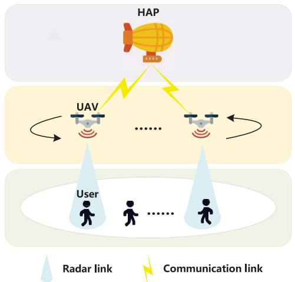
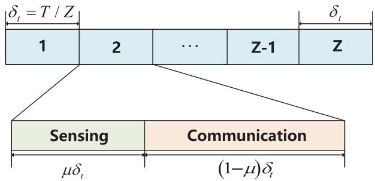
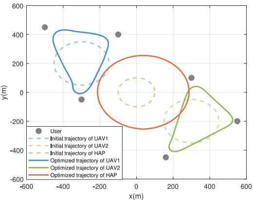
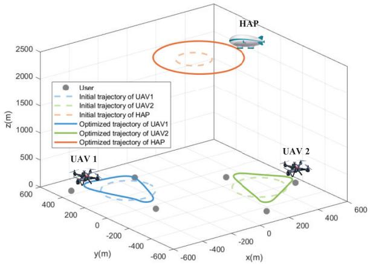
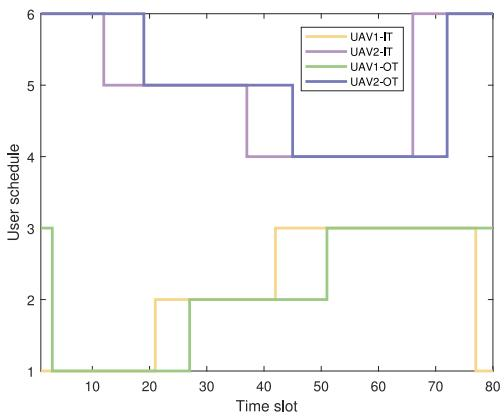
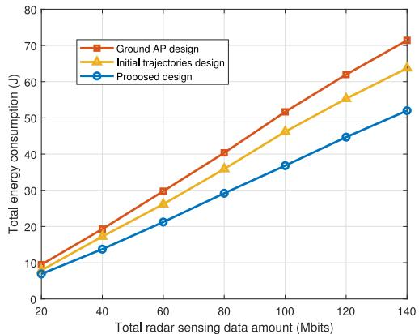
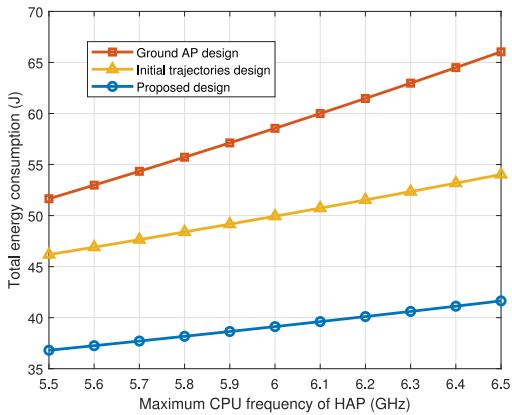
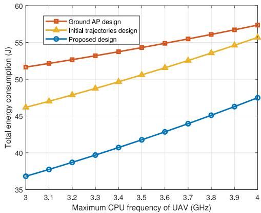
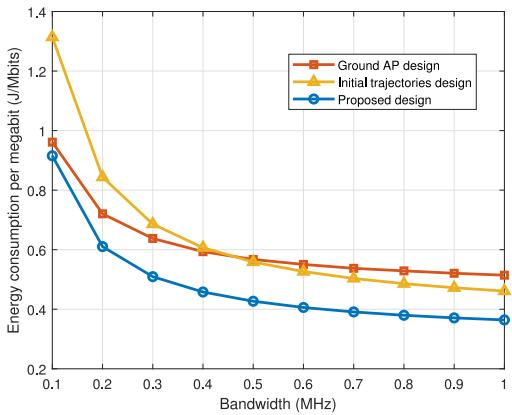

# Trade-Off Between Radar Sensing and Energy Consumption in Integrated Sensing, Computing, and Communication UAV Network

Yige Zhou and Xin Liu , Senior Member, IEEE

Abstract—In this paper, a multi-UAV enabled integrated sensing, computing, and communication (ISCAC) system model is proposed, in which multiple UAVs sense ground Users and offload sensing data to a high altitude platform (HAP) for processing through mobile edge computing (MEC). To maximize sensing data acquisition while minimizing total energy consumption of the ISCAC system, we present a trade-off optimization problem between UAV radar sensing and total energy consumption of the system. We transform the established non-convex optimization problem into three subproblems: sensing scheduling optimization, UAV transmit power optimization, and UAV-HAP trajectory optimization. We solve these subproblems using successive convex approximation (SCA) and relaxation methods, and propose a three-layer iterative optimization algorithm to solve the original optimization problem. Simulation results demonstrate that, compared to the benchmark schemes, the proposed algorithm can significantly improve the system performance.

Index Terms—Radar sensing, UAV, mobile edge computing, trajectory optimization.

## I. INTRODUCTION

NTEGRATED sensing and communications (ISAC) has emerged as a pivotal technology for the next generation of wireless networks [1], [2]. Unlike traditional systems that operate radar sensing and communication independently, ISAC enables the simultaneous transmission of data and sensing of targets, thereby significantly enhancing spectral efficiency. Uncrewed aerial vehicles (UAVs), with their advantages of high mobility, rapid deployment, and line-of-sight (LoS) connections [3], [4], [5], present a promising platform for ISAC deployment. By integrating ISAC capabilities, UAVs can flexibly expand network coverage, providing aerial sensing and communication services while optimizing resource utilization. In UAV-enabled ISAC system, UAVs acquire sensing information by detecting ground objects. However, due to their limited onboard computing capacity and energy constraints, UAVs often cannot process these data independently. Mobile edge computing (MEC) technology, which extends cloud computing capabilities to the network edge, can effectively alleviate core network congestion and enhance user service quality [6], [7], [8]. UAVs leverage MEC to offload sensing data to edge servers for remote processing. This integrated sensing, computing, and communication (ISCAC) framework synergizes shared radio resource management with enhanced edge computing, leading to superior system performance [9], [10].

Significant progress has been made in ISAC studies. In [11], Chiriyath et al. designed a joint signal model for radar and communication, defined a radar rate evaluation criterion based on the Cramér-Rao bound (CRB), and proposed a theoretical evaluation criterion for joint estimation of radar and communication. In [12], Kobayashi et al. investigated channel state parameters estimation using generalized channel feedback and explored the performance limit of ISAC systems. In [13], Chen et al. applied dual-functional radarcommunication (DFRC) systems to multi-user and multi antenna scenarios, and achieved improvements in network sensing and communication performance through the design of optimal transceivers.

However, the ground-based ISAC systems face limitations in environments with insufficient or damaged infrastructure, restricting their sensing capabilities. Several studies have demonstrated the feasibility of UAV-enabled ISAC systems. In [14], Liu et al. proposed a joint optimization of user scheduling, transmit power, and UAV trajectory with the goal of maximizing energy efficiency and radar mutual information (MI), based on the sensing fairness for each user. In [15], Wu et al. proposed a UAV-enabled ISAC model. They adopted the extended Kalman filtering (EKF) to optimize the UAV trajectory and maximize real-time secrecy rate. In [16], Meng et al. introduced a throughput maximization mechanism for UAV-ISAC, balancing a trade-off between sensing and communication. In [17], Hu et al. leveraged downlink signals as excitation signals, optimizing UAV trajectories to minimize propulsion power consumption. In [18], Jiang et al. analyzed UAV motion states in ISAC scenarios, minimizing a weighted sum of predicted posterior CRB (PCRB) for moving targets. In [19], Wu et al. enhanced beamtracking performance by dividing ISAC transmission into sensing and communication phases, using angle-of-arrival/departure (AoA/AoD)

estimation for beam alignment. In [20], Lyu et al. proposed an ISAC model using UAVs as dual-functional access points (APs) in the air, comparing static and mobile UAV scenarios to maximize the weighted communication rates of users. In [21], Salem et al. proposed a reconfigurable intelligent surfaces (RIS) assisted UAV-ISAC security system, in which UAVs act as eavesdroppers. By jointly optimizing the radar receiving beamformers, the active RIS reflection coefficients, and the transmitting beamformers, the secrecy rate of the active RIS system is maximized.

Significant studies efforts have been devoted to UAVenabled MEC systems, which can establish low-cost communication systems in the event of ground connection disruptions. In [22], Du et al. proposed a wirelessly-powered UAV-MEC system that minimizes the total energy consumption of the UAV. In [23], Liu et al. introduced a multiple-input single-output (MISO) UAV-assisted MEC network, which was optimized to minimize the weighted total energy consumption of all UEs and UAV. In [24], Han et al. considered UAV assisted MEC network. By using a Particle Swarm Optimization (PSO) algorithm to jointly optimize user association and UAV deployment, the average task delay is minimized. In [25], Ding et al. established a secure UAV-MEC communication framework, which tried to maximize secure computation efficiency through optimal task offloading decisions and resource management. In [26], He et al. designed a 3-D dynamic multi-UAV-assisted MEC system, which was optimized to achieve minimum energy consumption while ensuring fairness between UAVs. In [27], Qin et al. proposed a RIS-assisted UAV-enabled MEC systems, and the energy efficiency was maximized by proposing a double-loop iterative algorithm to jointly optimize bit allocation, transmission power, phase shift, and UAV trajectory. In [28], Tian et al. formulated a joint optimization problem for task offloading decisions and UAV scheduling strategies to maximize total user satisfaction.

Currently, there have been a lot of studies on ISCAC for terrestrial networks. In [29], Yang et al. proposed a multiuser MIMO ISCAC vehicular network framework that jointly optimized beamforming and power resource allocation to maximize the achievable data rate while ensuring sensing and computing performance. In [30], Qi et al. proposed two beamforming algorithms to address the multi-objective optimization problem, aiming to simultaneously maximize the overall system performance and minimize the total transmit power. In [31], Huang et al. proposed a joint optimization framework for radar sensing beamforming and communication offloading beamforming to maximize the energy efficiency of ISAC systems. However, studies on UAV enabled ISCAC remains relatively scarce. In [32], Tang et al. proposed a novel federated edge learning (FEEL) framework that jointly optimized UAV deployment and resource allocation to minimize the total training time. References [33] and [34] investigated joint optimization frameworks for UAV-assisted ISAC systems, where trajectory design, beamforming vectors, and computation offloading strategies were co-optimized to maximize computing efficiency and computational throughput, respectively, under the sensing quality constraints. However, these works only considered the case of a single UAV and ground base station. In this paper, we investigate the scenario involving multiple UAVs, which enhances the sensing coverage of the UAVs. Additionally, a high altitude platform (HAP) is introduced as an edge computing server. Compared with traditional ground base stations, HAP offers greater flexibility and lower deployment costs. The contributions of this paper are summarized as follows.

  
Fig. 1. System model.

A multi-UAV enabled ISCAC model is proposed, in which UAVs perform three essential functions: sensing users for acquiring radar detection information, executing computation tasks, and offloading incomplete tasks to the HAP for further processing. By analyzing the relationship between user-UAV radar sensing and UAV-HAP data transmission, we formulate a trade-off optimization problem between maximizing sensing data and minimizing total energy consumption of the system.

The original optimization problem is non-convex. To solve this problem, it is divided into three subproblems: sensing scheduling optimization, UAV transmit power optimization, and UAV-HAP trajectory optimization. We solve these subproblems using successive convex approximation (SCA) and relaxation methods.

The numerical results indicate that compared with other benchmark schemes, our algorithm not only achieves higher accuracy, but also performs better in terms of energy efficiency and effectiveness.

The remainder of this paper is structured as follows. Section II introduces the system model and formulates the optimization problem. Section III develops the solutions to the optimization problem. Section IV presents and analyzes numerical simulation results. Finally, Section V concludes the paper.

## II. SYSTEM MODEL

As shown in Fig. 1, we consider a multi-UAV enabled ISCAC system consisting of K users, N UAVs and a HAP. Each UAV is equipped with an ISAC device and a MEC server to simultaneously perform radar sensing, communication, and computing. UAVs sense ground users and obtain radar sensing data. However, considering the performance requirements of UAVs such as computing power and processing latency, the UAVs cannot perform data processing independently.1 Therefore, it is necessary to set up a HAP at higher altitudes and equip it with MEC servers to assist UAVs in computation.2

  
Fig. 2. Time slot division.

Define ${ \cal K } = \{ 1 , 2 , \dots , K \}$ and $\mathcal { N } = \{ 1 , 2 , \dots , N \}$ as sets of users and UAVs, respectively. We uniformly divide the task completion time T into $Z$ time slots, and define $\mathcal { Z } =$ $\{ 1 , 2 , \ldots , Z \}$ as the set of time slots. The length of each time slot is $\delta _ { t } = T / Z$ . The position of user k is fixed and denotes as $\boldsymbol { u } _ { k } = ( x _ { k } , y _ { k } ) ^ { T }$ . The horizontal position of UAV n in time slot $z \ \mathrm { i s } q _ { n } [ z ] = ( x _ { n } [ z ] , y _ { n } [ z ] ) ^ { T }$ , and the flight altitude of UAV n is $H _ { n }$ = ( [ ] [ ]). Similarly, the horizontal position of HAP in time slot z is $\begin{array} { r } { q _ { 0 } [ z ] = ( x _ { 0 } [ z ] , y _ { 0 } [ z ] ) ^ { T } } \end{array}$ , and the flight altitude of HAP is $H _ { 0 }$ . As shown in Fig. 2, each time slot is further divided into two sub-time slots. In the first sub-time slot, the UAV senses the users, and in the second sub-time slot, it sends the sensing data to the HAP.

## A. User-UAV Radar Sensing

Based on the scattering transmission characteristics of radar detection signal [35], the channel power gain of the radar detection link between UAV n and user k at time slot z can be denoted as

$$
h _ { n , k } ^ { r a d } [ z ] = \frac { G _ { t } G _ { r } \lambda ^ { 2 } \sigma } { \left( 4 \pi \right) ^ { 3 } \left( d _ { n , k } [ z ] \right) ^ { 4 } } = \frac { \beta _ { r a d } } { \left( d _ { n , k } [ z ] \right) ^ { 4 } } , \forall z ,\tag{1}
$$

where $G _ { t }$ and $G _ { r }$ denote the antenna gains of UAV transmitter and radar receiver, respectively; $\begin{array} { r l } { d _ { n , k } [ z ] } & { { } = } \end{array}$ $\sqrt { \| q _ { n } [ z ] - u _ { k } \| ^ { 2 } + H _ { n } ^ { 2 } }$ denotes the distance from UAV n to user $k ; \lambda = c / f _ { c }$ indicates the signal wavelength, where c and $f _ { c }$ =denote the speed of light and signal carrier frequency, respectively; σ denotes radar cross-section (RCS) of the target; $\begin{array} { r } { \beta _ { r a d } = \frac { G _ { t } ^ { \bullet } G _ { r } \lambda ^ { 2 } \sigma } { ( 4 \pi ) ^ { 3 } } } \end{array}$

We introduce variables $\alpha _ { n , k } [ z ]$ to denote the sensing [ ]scheduling. When UAV n senses user k in time slot z, $\alpha _ { n , k } [ z ] = 1$ , otherwise $\alpha _ { n , k } [ z ] = 0$ . We assume that one user can be serviced by only one UAV at most in each time slot, and one UAV can service only one user at most in each time slot. Hence, it holds

$$
\alpha _ { n , k } [ z ] \in \{ 0 , 1 \} , \forall k , n , z ,\tag{2}
$$

$$
\sum _ { k = 1 } ^ { K } \alpha _ { n , k } [ z ] \leq 1 , \forall n , z ,\tag{3}
$$

$$
\sum _ { m = 1 } ^ { M } \alpha _ { n , k } [ z ] \leq 1 , \forall k , z ,\tag{4}
$$

The signal-to-noise ratio (SINR) received at UAV n can be given by

$$
\Gamma _ { n , k } ^ { r a d } [ z ] = \frac { p _ { n } [ z ] h _ { n , k } ^ { r a d } [ z ] } { \sum _ { n ^ { \prime } \in N , n ^ { \prime } \neq n } p _ { n ^ { \prime } } [ z ] h _ { n ^ { \prime } , k } ^ { r a d } [ z ] + \sigma _ { u } ^ { 2 } } ,\tag{5}
$$

where $\begin{array} { r c l } { { h _ { n ^ { \prime } , k } ^ { r a d } [ z ] } } & { { = } } & { { \frac { \beta _ { r a d } } { ( d _ { n , k } [ z ] ) ^ { 2 } ( d _ { n ^ { \prime } , k } [ z ] ) ^ { 2 } } } } \end{array}$ denotes the channel gain of radar detection link between UAV $n ^ { \prime }$ and user k. To avoid radar interference between UAVs [36], [37], we utilize matched filtering (MF) on each UAV to eliminate the cross-link echo signal from UAV $n ^ { \prime } .$ In other words, the sensing signal transmitted by each UAV only receives the echo reflected from the target.

The radar estimation rate of UAV n sensing user k at time slot $z$ is

$$
R _ { n , k } ^ { r a d } [ z ] = { B _ { n , k } } { \log _ { 2 } } { \left( 1 + \frac { p _ { n } [ z ] h _ { n , k } ^ { r a d } [ z ] } { \sigma _ { u } ^ { 2 } } \right) } ,\tag{6}
$$

where $p _ { n }$ denotes the transmission power of UAV n, $\sigma _ { u } ^ { 2 }$ denotes the noise power, and $B _ { n , k }$ denotes the bandwidth between user k and UAV n. Consequently, the total radar estimation rate of user k under the UAV schedule can be written as

$$
R _ { k } ^ { r a d } = \sum _ { z \in Z } \sum _ { n \in N } \alpha _ { n , k } [ z ] R _ { n , k } ^ { r a d } [ z ] ,\tag{7}
$$

To implement data sampling via radar sensing, the radar information rate must be greater than a threshold denoted by $\eta ,$ which means that

$$
R _ { k } ^ { r a d } \geq \eta \sum _ { z \in Z } \sum _ { n \in N } \alpha _ { n , k } [ z ] , \forall k ,\tag{8}
$$

Then, the total number of sensing bits of UAV n during Z time slots is

$$
l _ { n , r a d } = \sum _ { z \in Z } \sum _ { k \in K } \alpha _ { n , k } [ z ] \mu R _ { n , k } ^ { r a d } [ z ] \delta _ { t } .\tag{9}
$$

## B. UAV-HAP Data Transmission

The communication link between UAV n and HAP is LoS link. Specifically, the channel power gain of the communication link between UAV n and HAP at time slot z can be denoted as

$$
h _ { n , h a p } [ z ] = \frac { G _ { t } G _ { c } \lambda ^ { 2 } } { \left( 4 \pi \right) ^ { 2 } \left( d _ { n , 0 } [ z ] \right) ^ { 2 } } = \frac { \beta _ { c o m } } { \left( d _ { n , 0 } [ z ] \right) ^ { 2 } } , \forall z ,\tag{10}
$$

where $G _ { c }$ denotes the antenna gain of HAP communication receiver; $d _ { n , 0 } = { \sqrt { \| q _ { 0 } [ z ] - q _ { n } [ z ] \| ^ { 2 } + \| H _ { 0 } - H _ { n } \| ^ { 2 } } }$ denotes the distance from UAV n to the $\begin{array} { r } { \mathrm { H A P ; ~ } \beta _ { c o m } = \frac { G _ { t } G _ { c } \lambda ^ { 2 } } { \left( 4 \pi \right) ^ { 2 } } } \end{array}$

The offloading rate of UAV n at time slot z is

$$
R _ { n , o f f } [ z ] = B _ { n } \mathrm { l o g } _ { 2 } \bigg ( 1 + { \frac { p _ { n } [ z ] h _ { n , 0 } [ z ] } { \sigma _ { u } ^ { 2 } } } \bigg ) ,\tag{11}
$$

where $B _ { n }$ denotes the bandwidth allocated by the HAP to each UAV.

Then, the total number of offloading bits of UAV n during Z time slots is

$$
l _ { n , o f f } = \sum _ { z \in Z } ( 1 - \mu ) R _ { n , o f f } [ z ] \delta _ { t } .\tag{12}
$$

## C. Computation Model

UAV n offloads sensing bits to HAP for processing. Since the number of offloading bits cannot exceed the total number of sensing bits, we can obtain

$$
l _ { n , o f f } \leq l _ { n , r a d } , \forall n ,\tag{13}
$$

The delay for UAV n to perform the remaining computational tasks is

$$
t _ { n , u a v } = \frac { C _ { n } ^ { u a v } \left( l _ { n , r a d } - l _ { n , o f f } \right) } { f _ { n } ^ { u a v } } ,\tag{14}
$$

where $f _ { n } ^ { u a v }$ and $C _ { n } ^ { u a v }$ denote the CPU frequency of UAV n and the CPU cycles consumed by UAV n in processing one bit of sensing data, respectively.

The delay for HAP to complete the offloaded computation tasks is

$$
t _ { h a p } = \frac { C _ { h a p } \sum _ { n \in N } l _ { n , o f f } } { f _ { h a p } } ,\tag{15}
$$

where $f _ { h a p }$ and $C _ { h a p }$ denote the CPU frequency of HAP and the CPU cycles consumed by the HAP to process one bit data, respectively.

Due to that the computational tasks are processed by UAV and HAP in parallel, the processing delay is the maximum of the above two delays. Therefore, the delay of completing all the computational tasks can be expressed as

$$
T _ { t o t } = \operatorname* { m a x } \bigg \{ \operatorname* { m a x } _ { n \in N } \left\{ t _ { n , u a v } \right\} , t _ { h a p } \bigg \} ,\tag{16}
$$

The processing delay cannot exceed the maximum allowed processing delay Tmax

$$
T _ { t o t } \leq T _ { \operatorname* { m a x } } ,\tag{17}
$$

Equation (17) can be rewritten as the following two constraints:

$$
t _ { n , u a v } \leq T _ { \mathrm { m a x } } , \forall n ,\tag{18}
$$

$$
t _ { h a p } \leq T _ { \operatorname* { m a x } } ,\tag{19}
$$

By substituting (14) into constraint (18), we can obtain

$$
C _ { n } ^ { u a v } \big ( l _ { n , r a d } - l _ { n , o f f } \big ) - f _ { n } ^ { u a v } T _ { \operatorname* { m a x } } \leq 0 , \forall n ,\tag{20}
$$

By substituting (15) into constraint (19), we can obtain

$$
C _ { h a p } \sum _ { n \in N } l _ { n , o f f } - f _ { h a p } T _ { \operatorname* { m a x } } \le 0 .\tag{21}
$$

## D. Energy Consumption

1) UAV Energy Consumption: The energy consumption of multi-UAV consists of three parts: transmission energy consumption for executing radar sensing and offloading, computation energy consumption and flight energy consumption.

According to [38], the propulsion energy consumption of UAV n within the task completion time T can be expressed as

$$
E _ { n } ^ { f l y } = \sum _ { z \in Z } \bigg ( c _ { 1 } \| v _ { n } [ z ] \| ^ { 3 } + \frac { c _ { 2 } } { \| v _ { n } [ z ] \| } \bigg ) \delta _ { t } ,\tag{22}
$$

where c1 and $c _ { 2 }$ are constant parameters related to the UAV weight, wing area and air density. $\left. v _ { n } [ z ] \right.$ is the flight speed of UAV n at time slot z, which can be expressed as

$$
\| v _ { n } [ z ] \| = \frac { q _ { n } [ z + 1 ] - q _ { n } [ z ] } { \delta _ { t } } , \forall n , z ,\tag{23}
$$

Thus, the UAVs’ total energy consumption for transmission, computation and flight is

$$
E _ { u a v } = \sum _ { n \in N } { \left( \sum _ { z \in Z } { p _ { n } [ z ] \delta _ { t } } + k _ { u } ( f _ { n } ^ { u a v } ) ^ { 3 } t _ { n , u a v } \right)} + \omega _ { 1 } E _ { n } ^ { f i y }   ,\tag{24}
$$

where $k _ { u }$ denotes the CPU effective capacitance coefficient and $\omega _ { 1 }$ is the weight of UAVs’ flying energy consumption.

2) HAP Energy Consumption: The energy consumption of HAP consists of two parts: computation energy consumption and flight energy consumption.

At time slot z, the flight speed of HAP is

$$
\| v _ { 0 } [ z ] \| = \frac { q _ { 0 } [ z + 1 ] - q _ { 0 } [ z ] } { \delta _ { t } } , \forall z ,\tag{25}
$$

Then, the propulsion energy consumption of HAP within the task completion time T can be expressed as

$$
E _ { h a p } ^ { f i y } = \sum _ { z \in Z } { \left( c _ { 1 } \| v _ { 0 } [ z ] \| ^ { 3 } + \frac { c _ { 2 } } { \| v _ { 0 } [ z ] \| } \right) } \delta _ { t } ,\tag{26}
$$

Thus, the total energy consumption of HAP is

$$
E _ { h a p } = k _ { u } \left( f _ { h a p } \right) ^ { 3 } t _ { h a p } + \omega _ { 2 } E _ { h a p } ^ { f l y } ,\tag{27}
$$

where $\omega _ { 2 }$ is the weight of HAP’s flying energy consumption.

The energy consumption of the UAVs and HAP is included in the system’s total energy consumption, which can be expressed as

$$
E _ { t o t } = E _ { u a v } + E _ { h a p } .\tag{28}
$$

## E. Problem Formulation

To simultaneously optimize the total sensed target information $\begin{array} { r } { ( \mathrm { i . e . , } \sum _ { n \in N } l _ { n , r a d } ) } \end{array}$ and total energy consumption of the system $\mathrm { ( i . e . , ~ } E _ { t o t } \mathrm { ) }$ , we introduce a regularization parameter $\xi ~ \ge ~ 0$ to characterize the trade-off. Thus, the optimization problem is formulated as

$$
\operatorname* { m a x } _ { \mathbf { A } , \mathbf { P } , \mathbf { Q } } \sum _ { n \in N } l _ { n , r a d } - \xi E _ { t o t }\tag{29a}
$$

$$
\begin{array} { r l } { \mathrm { s . t . } \ } & { { } C _ { n } ^ { u a v } \big ( l _ { n , r a d } - l _ { n , o f f } \big ) - f _ { n } ^ { u a v } T _ { \mathrm { m a x } } \leq 0 , \forall n , } \end{array}\tag{29b}
$$

$$
C _ { h a p } \sum _ { n \in N } l _ { n , o f f } - f _ { h a p } T _ { \operatorname* { m a x } } \le 0 ,\tag{29c}
$$

$$
l _ { n , o f f } \leq l _ { n , r a d } , \forall n ,\tag{29d}
$$

$$
\alpha _ { n , k } [ z ] \in \{ 0 , 1 \} , \forall k , n , z ,\tag{29e}
$$

$$
\sum _ { k = 1 } ^ { K } \alpha _ { n , k } [ z ] \leq 1 , \forall n , z ,\tag{29f}
$$

$$
\sum _ { n = 1 } ^ { N } \alpha _ { n , k } [ z ] \leq 1 , \forall k , z ,\tag{29g}
$$

$$
R _ { k } ^ { r a d } \geq \eta \sum _ { z \in Z } \sum _ { n \in N } \alpha _ { n , k } [ z ] , \forall k ,\tag{29h}
$$

$$
0 \leq p _ { n } [ z ] \leq p _ { \mathrm { m a x } } , \forall n , z ,\tag{29i}
$$

$$
\begin{array} { r } { q _ { n } [ 1 ] = q _ { n } [ Z ] , q _ { 0 } [ 1 ] = q _ { 0 } [ Z ] , \forall n , } \end{array}\tag{29j}
$$

$$
\| q _ { n } [ z + 1 ] - q _ { n } [ z ] \| \leq V _ { \operatorname* { m a x } } \delta _ { t } ,
$$

$$
\begin{array} { r } { \| q _ { 0 } [ z + 1 ] - q _ { 0 } [ z ] \| \leq V _ { \operatorname* { m a x } } \delta _ { t } , \forall n , z = 1 , \ldots , Z - 1 , } \end{array}\tag{29k}
$$

$$
d _ { \operatorname* { m i n } } ^ { 2 } \leq \| q _ { n } [ z ] - q _ { s } [ z ] \| ^ { 2 } , \forall n , z , s \neq n .\tag{29l}
$$

where $\mathrm { ~ \bf ~ A ~ } = \{ \alpha _ { n , k } [ z ] \}$ denotes sensing scheduling, $\begin{array} { r l } { \mathbf { P } } & { { } = } \end{array}$ $\{ p _ { n } [ z ] \}$ = [ ]denotes the transmit power of UAV n, and ${ \textbf { Q } } =$ $\{ q _ { 0 } [ z ] , q _ { n } [ z ] \}$ denotes the trajectories of HAP and UAV n. (29b) ensures that the processing latency of UAV n does not exceed the maximum allowable latency; (29c) ensures that the HAP processing latency remains within the maximum permissible limit; (29i) is the maximum transmission power constraint of UAV n; (29j) ensures that all UAVs and HAP are flying periodically, with the same initial and final positions; (29k) is the maximum flight speed constraint for both UAVs and HAP; $d _ { \mathrm { m i n } }$ in constraint (29l) denotes the minimum safe distance to avoid collisions between UAVs.

## III. PROBLEM SOLUTION

In this section, we present the joint optimization framework for multi-UAV enabled ISCAC system. Due to the nonconvexity of the objective function and constraints (29b), (29c), (29d), (29h), we propose a three-stage alternating optimization algorithm to solve the original problem (29). This algorithm decomposes the original problem into three subproblems: sensing scheduling optimization, UAV transmit power optimization, and UAV-HAP trajectory optimization.

## A. Sensing Scheduling Optimization

For fixed power allocation P and UAV-HAP trajectory Q, the sensing scheduling problem can be formulated as follows

$$
\operatorname* { m a x } _ { \mathbf { A } } \chi _ { 1 } ( \mathbf { A } , \mathbf { P } , \mathbf { Q } )\tag{30a}
$$

$$
\mathrm { s . t . } \quad ( 2 9 \mathrm { b } ) , ( 2 9 \mathrm { d } ) - ( 2 9 \mathrm { h } ) ,\tag{30b}
$$

The specific expression for optimization objective $\chi _ { 1 }$ is provided in (31), shown at the bottom of the page and can be found at the bottom of the current page. It is evident that problem (30) is an integer optimization problem. We use the relaxation method to relax $\alpha _ { n , k } [ z ] ~ \in ~ \{ 0 , 1 \}$ into $0 ~ \leq ~ \alpha _ { n , k } [ z ] ~ \leq ~ 1 , \forall k , n , z$ . Thus, problem (30) can be rewritten as

$$
\operatorname* { m a x } _ { \mathbf { A } } \chi _ { 1 } ( \mathbf { A } , \mathbf { P } , \mathbf { Q } )\tag{32a}
$$

$$
\mathrm { s . t . } \qquad C _ { n } ^ { u a v } \left( \sum _ { z \in Z } \sum _ { k \in K } \alpha _ { n , k } [ z ] \mu R _ { n , k } ^ { r a d } [ z ] \delta _ { t } - \right.
$$

$$
\sum _ { z \in Z } ( 1 - \mu ) R _ { n , o f f } [ z ] \delta _ { t } \Bigg ) - f _ { n } ^ { u a v } T _ { \operatorname* { m a x } } \leq 0 , \forall n ,\tag{32b}
$$

$$
\sum _ { z \in Z } ( 1 - \mu ) R _ { n , o f f } [ z ] \delta _ { t } \leq \sum _ { z \in Z } \sum _ { k \in K } \alpha _ { n , k } [ z ] \mu R _ { n , k } ^ { r a d } [ z ] \delta _ { t } , \forall n ,\tag{32c}
$$

$$
\sum _ { z \in Z } \sum _ { n \in N } \alpha _ { n , k } [ z ] R _ { n , k } ^ { r a d } [ z ] \geq \eta \sum _ { z \in Z } \sum _ { n \in N } \alpha _ { n , k } [ z ] , \forall k ,\tag{32d}
$$

$$
0 \leq \alpha _ { n , k } [ z ] \leq 1 , \forall k , n , z ,\tag{32e}
$$

$$
( 2 9 \mathrm { f } ) , ( 2 9 \mathrm { g } ) .\tag{32f}
$$

This is a standard linear problem, which can be directly solved using CVX. By setting $\alpha _ { n , k } [ z ]$ to 1 for the maximum value and to 0 for the rest, we can obtain the binary integer solution for A.

## B. UAV Transmit Power Optimization

For fixed sensing task scheduling A and UAV-HAP trajectory Q, the UAV transmit power problem can be formulated as follows

$$
\operatorname* { m a x } _ { \mathbf { P } } \chi _ { 1 } ( \mathbf { A } , \mathbf { P } , \mathbf { Q } )\tag{33a}
$$

$$
\mathrm { s . t . } \quad ( 2 9 \mathrm { b } ) - ( 2 9 \mathrm { d } ) , ( 2 9 \mathrm { h } ) , ( 2 9 \mathrm { i } ) ,\tag{33b}
$$

Since the objective function (33a) and the constraints (29b), (29c), (29d), (29h) are all non-convex, it is evident (33) is not convex. To proceed, we use the SCA technique to transform the non-convex (33) into a convex problem. By defining $p _ { n } ^ { r } [ z ]$ as the local point provided at the r-th iteration, we can respectively derive the upper bounds for the first-order Taylor expansions of $R _ { n , k } ^ { r a d } [ z ]$ and $R _ { n , o f f } [ z ]$

$$
\begin{array} { c } { { R _ { n , k } ^ { r a d } [ z ] \leq B _ { n , k } \mathrm { l o g } _ { 2 } \left( 1 + \displaystyle \frac { p _ { n } ^ { r } [ z ] h _ { n , k } ^ { r a d } [ z ] } { \sigma _ { u } ^ { 2 } } \right) } } \\ { { + B _ { n , k } \displaystyle \frac { h _ { n , k } ^ { r a d } [ z ] \log _ { 2 } ( e ) } { p _ { n } ^ { r } [ z ] h _ { n , k } ^ { r a d } [ z ] + \sigma _ { u } ^ { 2 } } } } \\ { { \times ( p _ { n } [ z ] - p _ { n } ^ { r } [ z ] ) \stackrel { \Delta } { = } \tilde { R } _ { n , k } ^ { r a d } [ z ] , } } \end{array}\tag{34}
$$

$$
R _ { n , o f f } [ z ] \leq B _ { n } \mathrm { l o g } _ { 2 } \bigg ( 1 + \frac { p _ { n } ^ { r } [ z ] h _ { n , h a p } [ z ] } { \sigma _ { u } ^ { 2 } } \bigg )
$$

$$
\begin{array} { r l r } {  { \chi _ { 1 } = \sum _ { n \in N } \sum _ { z \in L } \sum _ { k \in K } \alpha _ { n , k } [ z ] \mu R _ { n , k } ^ { \mathrm { r o d e } } [ z ] \delta _ { t } - \xi \sum _ { n \in N } k _ { n } C _ { n } ^ { \mathrm { t a n v } } ( \sum _ { z \in L } \sum _ { k \in K } \alpha _ { n , k } [ z ] \mu R _ { n , k } ^ { \mathrm { r o d e } } [ z ] \delta _ { t } - \sum _ { z \in Z } ( 1 - \mu ) R _ { n , o p } [ z ] \delta _ { t } ) ( f _ { n } ^ { \mathrm { s a r } } ) ^ { 2 } } } \\ & { } & { - \xi \sum _ { n \in N } \sum _ { z \in Z } p _ { n } [ z ] \delta _ { t } - \xi \omega _ { 1 } \sum _ { n \in N } E _ { n } ^ { \mathrm { f f } } - \xi k _ { n } C _ { n \omega } \sum _ { n \in N } \sum _ { z \in Z } ( 1 - \mu ) R _ { n , o p } [ z ] \delta _ { t } ( f _ { h a p } ) ^ { 2 } - \xi \omega _ { 2 } E _ { h a p } ^ { \mathrm { f f } } \qquad ( 3 1 \pi ) } \end{array}
$$

$$
+ B _ { n } \frac { h _ { n , h a p } [ z ] \mathrm { l o g } _ { 2 } ( e ) } { p _ { n } ^ { r } [ n ] h _ { n , h a p } [ z ] + \sigma _ { u } ^ { 2 } }
$$

$$
\times ( p _ { n } [ z ] - p _ { n } ^ { r } [ z ] ) \stackrel { \Delta } { = } \tilde { R } _ { n , o f f } [ z ] .\tag{35}
$$

Thus, problem (33) can be rewritten as

$$
\operatorname* { m a x } _ { \mathbf { P } , \gamma _ { n } [ z ] } \chi _ { 2 } ( \mathbf { A } , \mathbf { P } , \mathbf { Q } )\tag{36a}
$$

$$
\mathrm { s . t . } \quad C _ { n } ^ { u a v } \left( \sum _ { z \in Z } \gamma _ { n } [ z ] \delta _ { t } - \sum _ { z \in Z } ( 1 - \mu ) \tilde { R } _ { n , o f f } [ z ] \delta _ { t } \right)
$$

$$
- f _ { n } ^ { u a v } T _ { \mathrm { m a x } } \leq 0 , \forall n ,\tag{36b}
$$

$$
\gamma _ { n } [ z ] \leq \sum _ { k \in { \cal K } } \alpha _ { n , k } [ z ] \mu \tilde { R } _ { n , k } ^ { r a d } [ z ] , \forall n ,\tag{36c}
$$

$$
C _ { h a p } \left( \sum _ { n \in N } \sum _ { z \in Z } \left( 1 - \mu \right) \tilde { R } _ { n , o f f } [ z ] \delta _ { t } \right) - f _ { h a p } T _ { \operatorname* { m a x } } \leq 0 ,\tag{36d}
$$

$$
\sum _ { z \in Z } ( 1 - \mu ) \tilde { R } _ { n , o f f } [ z ] \delta _ { t } \leq \sum _ { z \in Z } \sum _ { k \in K } \alpha _ { n , k } [ z ] \mu \tilde { R } _ { n , k } ^ { r a d } [ z ] \delta _ { t } , \forall n ,\tag{36e}
$$

$$
\sum _ { z \in Z } \sum _ { n \in N } \alpha _ { n , k } [ z ] \tilde { R } _ { n , k } ^ { r a d } [ z ] \geq \eta \sum _ { z \in Z } \sum _ { n \in N } \alpha _ { n , k } [ z ] , \forall k ,\tag{36f}
$$

$$
0 \leq p _ { n } [ z ] \leq p _ { \mathrm { m a x } } , \forall n , z .\tag{36g}
$$

where $\gamma _ { n } [ z ]$ are the auxiliary variables, and $\chi _ { 2 }$ is provided in (37), shown at the bottom of the page which can be found at the bottom of the current page. (36) is a convex optimization problem and can be directly solved by the CVX.

## C. UAV-HAP Trajectory Optimization

For fixed sensing task scheduling A and UAV transmit power allocation P, the trajectory optimization problem for HAP and UAV n can be formulated as follows

$$
\operatorname* { m a x } _ { \mathbf { Q } } \chi _ { 1 } ( \mathbf { A } , \mathbf { P } , \mathbf { Q } )\tag{38a}
$$

$$
\mathrm { s . t . } \quad ( 2 9 \mathrm { b } ) - ( 2 9 \mathrm { d } ) , ( 2 9 \mathrm { h } ) , ( 2 9 \mathrm { j } ) - ( 2 9 \mathrm { l } ) ,\tag{38b}
$$

Since the subproblem (38) involves two variables $q _ { n } [ z ]$ and $q _ { 0 } [ z ]$ , we can solve (38) by separately optimizing the UAV trajectory and HAP trajectory.

1) HAP Trajectory Optimization: By fixing the UAV trajectory $q _ { n } [ z ]$ , the trajectory optimization problem of HAP can be expressed as

$$
\operatorname* { m a x } _ { q _ { 0 } [ z ] } \chi _ { 1 } ( \mathbf { A } , \mathbf { P } , \mathbf { Q } )\tag{39a}
$$

$$
\mathrm { s . t . } \qquad ( 2 9 \mathrm { b } ) - ( 2 9 \mathrm { d } ) ,\tag{39b}
$$

$$
q _ { 0 } [ 1 ] = q _ { 0 } [ Z ] ,\tag{39c}
$$

$$
\| q _ { 0 } [ z + 1 ] - q _ { 0 } [ z ] \| \leq V _ { \operatorname* { m a x } } \delta _ { t } , \quad z = 1 , \ldots , Z - 1 .\tag{39d}
$$

Due to that the objective function (39a) and the constraints (29b), (29c), (29d) are all non-convex, (39) is a non-convex optimization problem. To solve this problem, we first introduce the auxiliary variables $\kappa _ { 0 } [ z ]$ that satisfy

$$
\begin{array} { r } { \| v _ { 0 } [ z ] \| ^ { 2 } \geq ( \kappa _ { 0 } [ z ] ) ^ { 2 } , } \end{array}\tag{40a}
$$

$$
\kappa _ { 0 } [ z ] \geq 0 .\tag{40b}
$$

For $\kappa _ { 0 } [ z ]$ and $v _ { 0 } [ z ]$ , the energy $E _ { h a p } ^ { f l y } [ z ]$ is jointly convex. However, (40a) is still non-convex, thus we can replace it with its first-order Taylor expansion. For any given local point $v _ { 0 } ^ { r } [ z ]$ , the approximation can be denoted as

$$
\begin{array} { r l } & { \| v _ { 0 } [ z ] \| ^ { 2 } \geq \| v _ { 0 } ^ { r } [ z ] \| ^ { 2 } + 2 ( v _ { 0 } ^ { r } [ z ] ) ^ { \mathrm { T } } \times ( v _ { 0 } [ z ] - v _ { 0 } ^ { r } [ z ] ) } \\ & { \qquad \overset { \Delta } { = } \Xi [ z ] , } \end{array}\tag{41}
$$

Then, we use SCA technology to obtain an effective approximate solution to problem (39). After the r-th iteration at the given local point $\Vert { q } _ { 0 } ^ { r } [ z ] - { q } _ { n } [ z ] \Vert ^ { 2 }$ , the inequality holds in (42), shown at the bottom of the page which can be found at the bottom of the next page.

Therefore, problem (39) can be rewritten as

$$
\operatorname* { m a x } _ { q _ { 0 } [ z ] , \tau _ { n } [ z ] } \chi _ { 3 } ( \mathbf { A } , \mathbf { P } , \mathbf { Q } )\tag{43a}
$$

$$
\mathrm { s . t . } C _ { n } ^ { u a v } \left( \sum _ { z \in Z } \sum _ { k \in K } \alpha _ { n , k } [ z ] \mu R _ { n , k } ^ { r a d } [ z ] \delta _ { t } - \right.
$$

$$
\sum _ { z \in Z } ( 1 - \mu ) R _ { n , o f f } ^ { l b } [ z ] \delta _ { t } \Bigg ) - f _ { n } ^ { u a v } T _ { \operatorname* { m a x } } \leq 0 , \quad \forall n ,\tag{43b}
$$

$$
\begin{array} { r l r } {  { \chi _ { 2 } = \sum _ { n \in N } ( 1 - \xi k _ { u } C _ { n } ^ { u a v } ( f _ { n } ^ { u a v } ) ^ { 2 } ) \sum _ { m \in M } \sum _ { k \in K } \alpha _ { n , k } [ n ] \mu \tilde { R } _ { n , k } ^ { r a d } [ z ] \delta _ { t } - \xi \sum _ { n \in N } \sum _ { z \in Z } p _ { n } [ z ] \delta _ { t } } } \\ & { } & { + \xi \sum _ { n \in N } k _ { u } C _ { n } ^ { u a v } \sum _ { z \in Z } ( 1 - \mu ) \tilde { R } _ { n , o f } [ z ] \delta _ { t } ( f _ { n } ^ { u a v } ) ^ { 2 } - \xi k _ { u } C _ { h a p } \sum _ { n \in N } \sum _ { z \in Z } ( 1 - \mu ) \tilde { R } _ { n , o f } [ z ] \delta _ { t } \bigl ( f _ { h a p } \bigr ) ^ { 2 } } \end{array}\tag{37}
$$

$$
\begin{array} { r l } & { R _ { n , o f } [ z ] \geq B _ { n } \log _ { 2 } ( 1 + \frac { p _ { n } [ z ] \beta _ { o m } } { \sigma _ { u } ^ { 2 } ( \| q _ { 0 } ^ { r } [ z ] - q _ { n } [ z ] \| ^ { 2 } + ( H _ { 0 } - H _ { n } ) ^ { 2 } ) } ) } \\ & { \qquad - B _ { n } \frac { p _ { n } [ z ] \beta _ { c o m } \log _ { 2 } ( e ) } { \sigma _ { u } ^ { 2 } ( \| q _ { 0 } ^ { r } [ z ] - q _ { n } [ z ] \| ^ { 2 } + ( H _ { 0 } - H _ { n } ) ^ { 2 } ) ^ { 2 } + p _ { n } [ z ] \beta _ { c o m } ( \| q _ { 0 } ^ { r } [ z ] - q _ { n } [ z ] \| ^ { 2 } + ( H _ { 0 } - H _ { n } ) ^ { 2 } ) } } \\ & { \qquad \times ( \| q _ { 0 } [ z ] - q _ { n } [ z ] \| ^ { 2 } - \| q _ { 0 } ^ { r } [ z ] - q _ { n } [ z ] \| ^ { 2 } ) \triangleq R _ { n , o f } ^ { b b } [ z ] , } \end{array}\tag{42}
$$

$$
C _ { h a p } \sum _ { n \in N } \sum _ { z \in Z } \tau _ { n } [ z ] \delta _ { t } - f _ { h a p } T _ { \operatorname* { m a x } } \leq 0 ,\tag{43c}
$$

$$
\tau _ { n } [ z ] \leq ( 1 - \mu ) R _ { n , o f f } ^ { l b } [ z ] , \forall n ,\tag{43d}
$$

$$
\sum _ { z \in Z } \tau _ { n } [ z ] \delta _ { t } \leq \sum _ { z \in Z } \sum _ { k \in K } \alpha _ { n , k } [ z ] \mu R _ { n , k } ^ { r a d } [ z ] \delta _ { t } , \forall n ,\tag{43e}
$$

$$
\Xi [ z ] \ \geq \ ( \kappa _ { 0 } [ z ] ) ^ { 2 } ,\tag{43f}
$$

$$
( 3 9 \mathrm { c } ) , ( 3 9 \mathrm { d } ) , ( 4 0 \mathrm { b } ) .\tag{43g}
$$

where $\tau _ { n } [ z ]$ are the auxiliary variables, and $\chi _ { 3 }$ is provided in (44), shown at the bottom of the page which can be found at the bottom of the next page.

2) UAV Trajectory Optimization: By fixing the HAP trajectory $q _ { 0 } [ z ]$ , the trajectory optimization problem of UAV can be expressed as

$$
\operatorname* { m a x } _ { { q _ { n } [ z ] } } \chi _ { 1 } ( \mathbf { A } , \mathbf { P } , \mathbf { Q } )\tag{45a}
$$

$$
\begin{array} { r l } { \mathrm { s . t . } \quad } & { { } ( 2 9 \mathrm { b } ) - ( 2 9 \mathrm { d } ) , ( 2 9 \mathrm { h } ) , ( 2 9 \mathrm { l } ) } \end{array}\tag{45b}
$$

$$
q _ { n } [ 1 ] = q _ { n } [ Z ] , \forall n ,\tag{45c}
$$

$$
\begin{array} { r } { \| q _ { n } [ z + 1 ] - q _ { n } [ z ] \| \leq V _ { \operatorname* { m a x } } \delta _ { t } , \forall n , \quad z = 1 , \ldots , Z - 1 . } \end{array}\tag{45d}
$$

The optimization problem is non-convex because of the nonconvex objective function (45a) and the non-convex constraints (29b), (29c), (29d), (29h), (29l). Similarly, we first introduce the auxiliary variables $\kappa _ { n } [ z ]$ that satisfy

$$
\| v _ { n } [ z ] \| ^ { 2 } \geq ( \kappa _ { n } [ z ] ) ^ { 2 } , \forall n ,\tag{46a}
$$

$$
\kappa _ { n } [ z ] \geq 0 , \forall n .\tag{46b}
$$

For $\kappa _ { n } [ z ]$ and $v _ { n } [ z ]$ , the energy $E _ { n } ^ { \mathcal { H } y } [ z ]$ is jointly convex. [ ] [ ] [ ]However, (46a) is still non-convex, thus we can replace it with its first-order Taylor expansion. For any given local point $v _ { n } ^ { r } [ z ]$ , the approximation can be denoted as

$$
\begin{array} { r l } & { \| v _ { n } [ z ] \| ^ { 2 } \geq \| v _ { n } ^ { r } [ z ] \| ^ { 2 } + 2 ( v _ { n } ^ { r } [ z ] ) ^ { \mathrm { T } } \times \left( v _ { n } [ z ] - v _ { n } ^ { r } [ z ] \right) } \\ & { \qquad \overset { \Delta } { = } f _ { n } ^ { l b } [ z ] , } \end{array}\tag{47}
$$

Consequently, through the first-order Taylor expansion, the lower bound of $\lVert q _ { n } [ z ] ^ { - } - q _ { s } [ z ] \rVert ^ { 2 }$ is

$$
\begin{array} { r } { \| q _ { n } [ z ] - q _ { s } [ z ] \| ^ { 2 } \geq - \| q _ { n } ^ { r } [ z ] - q _ { s } ^ { r } [ z ] \| ^ { 2 } + 2 ( q _ { n } ^ { r } [ z ] - q _ { s } ^ { r } [ z ] ) ^ { \mathrm { T } } } \end{array}
$$

$$
\times ( q _ { n } [ z ] - q _ { s } [ z ] ) \overset { \Delta } { = } g _ { l b } [ z ] ,\tag{48}
$$

$R _ { n , o f f } [ z ]$ and $R _ { n , k } ^ { r a d } [ z ]$ can be replaced by their first-order Taylor expansions at the given local point $\| q _ { n } ^ { r } [ z ] - q _ { 0 } [ z ] \| ^ { 2 }$ and $\| q _ { n } ^ { r } [ z ] - u _ { k } \| ^ { 2 }$ , respectively, as provided in (49) and (50), shown at the bottom of the page, which can be found at the bottom of the next page.

Therefore, problem (45) can be rewritten as

$$
\operatorname* { m a x } _ { q _ { n } [ z ] , \psi _ { n } [ z ] , \varphi _ { n } [ z ] } \chi _ { 4 } ( \mathbf { A } , \mathbf { P } , \mathbf { Q } )\tag{51a}
$$

$$
\mathrm { s . t . } \qquad C _ { n } ^ { u a v } \left( \sum _ { z \in Z } \psi _ { n } [ z ] \delta _ { t } - \sum _ { z \in Z } ( 1 - \mu ) \hat { R } _ { n , o f f } [ z ] \delta _ { t } \right)
$$

$$
- f _ { n } ^ { u a v } T _ { \mathrm { m a x } } \leq 0 , \forall n ,\tag{51b}
$$

$$
\psi _ { n } [ z ] \leq \sum _ { k \in { \cal K } } \alpha _ { n , k } [ z ] \mu \hat { R } _ { n , k } ^ { r a d } [ z ] , \forall n ,\tag{51c}
$$

$$
C _ { h a p } \sum _ { n \in N } \sum _ { z \in Z } \varphi _ { n } [ z ] \delta _ { t } - f _ { h a p } T _ { \operatorname* { m a x } } \le 0 ,\tag{51d}
$$

$$
\varphi _ { n } [ z ] \leq ( 1 - \mu ) \hat { R } _ { n , o f f } [ z ] , \forall n ,\tag{51e}
$$

$$
\sum _ { z \in Z } \varphi [ z ] \delta _ { t } \leq \sum _ { z \in Z } \sum _ { k \in K } \alpha _ { n , k } [ z ] \mu \hat { R } _ { n , k } ^ { r a d } [ z ] \delta _ { t } , \forall n ,\tag{51f}
$$

$$
\sum _ { z \in Z } \sum _ { n \in N } \alpha _ { n , k } [ z ] \hat { R } _ { n , k } ^ { r a d } [ z ] \geq \eta \sum _ { z \in Z } \sum _ { n \in N } \alpha _ { n , k } [ z ] , \forall k ,\tag{51g}
$$

$$
d _ { \mathrm { m i n } } ^ { 2 } \leq g _ { l b } [ z ] ,
$$

$$
f _ { n } ^ { l b } [ z ] \ge ( \kappa _ { n } [ z ] ) ^ { 2 } , \forall n ,\tag{51h}
$$

(51i)

$$
( 4 5 \mathrm { c } ) , ( 4 5 \mathrm { d } ) , ( 4 6 \mathrm { b } ) .\tag{51j}
$$

where $\chi _ { 4 }$ is provided in (52), shown at the bottom of the next page which can be found at the bottom of the next page; ψn z and $\varphi _ { n } [ z ]$ are the auxiliary variables.

$$
\chi _ { 3 } = - \xi \omega _ { 2 } \sum _ { n \in N } \sum _ { z \in \mathbb { Z } } \left( c _ { 1 } \| v _ { 0 } [ z ] \| ^ { 3 } + \frac { c _ { 2 } } { \| \kappa _ { 0 } [ z ] \| } \right) \delta _ { t } + \xi \sum _ { n \in N } k _ { u } C _ { n } ^ { \mathrm { u a v } } \sum _ { z \in \mathbb { Z } } \tau _ { n } [ z ] \delta _ { t } ( f _ { n } ^ { \mathrm { a a v } } ) ^ { 2 } - \xi k _ { u } C _ { h a p } \sum _ { n \in N } \sum _ { z \in \mathbb { Z } } \tau _ { n } [ z ] \delta _ { t } ( f _ { h a p } ) ^ { 2 }\tag{44}
$$

$$
\begin{array} { r l } & { R _ { n , o f } [ z ] \geq B _ { n } \log _ { 2 } \left( 1 + \frac { p _ { n } [ z ] \beta _ { c o m } } { \sigma _ { u } ^ { 2 } \left( \left\| q _ { n } ^ { r } [ z ] - q _ { 0 } [ z ] \right\| ^ { 2 } + ( H _ { n } - H _ { 0 } ) ^ { 2 } \right) } \right) } \\ & { \quad \quad - \ B _ { n } \frac { p _ { n } [ z ] \beta _ { c o m } \log _ { 2 } ( e ) } { \sigma _ { u } ^ { 2 } \left( \left\| q _ { n } ^ { r } [ z ] - q _ { 0 } [ z ] \right\| ^ { 2 } + \left( H _ { n } - H _ { 0 } \right) ^ { 2 } \right) ^ { 2 } + p _ { n } [ z ] \beta _ { c o m } \left( \left\| q _ { n } ^ { r } [ z ] - q _ { 0 } [ z ] \right\| ^ { 2 } + \left( H _ { n } - H _ { 0 } \right) ^ { 2 } \right) } } \\ & { \quad \quad \times \left( \left\| q _ { n } [ z ] - q _ { 0 } [ z ] \right\| ^ { 2 } - \left\| q _ { n } ^ { r } [ z ] - q _ { 0 } [ z ] \right\| ^ { 2 } \right) \triangleq \widehat { R } _ { n , o f } [ z ] , } \end{array}\tag{49}
$$

$$
\begin{array} { r } { R _ { n , k } ^ { n d } [ z ] \geq B _ { n , k } \log _ { 2 } \left( 1 + \frac { \frac { p _ { n } [ z ] \beta _ { n d } } { ( \| q _ { n } ^ { * } [ z ] - u _ { k } \| ^ { 2 } + H _ { n } ^ { 2 } ) ^ { 2 } } } { \sigma _ { u } ^ { 2 } } \right) - B _ { n , k } \frac { \frac { 2 p _ { n } [ z ] \beta _ { n d } } { ( \| q _ { n } ^ { * } [ z ] - u _ { k } \| ^ { 2 } + H _ { n } ^ { 2 } ) ^ { 3 } } \log _ { 2 } ( e ) } { \frac { p _ { n } [ z ] \beta _ { n d } } { ( \| q _ { n } ^ { * } [ z ] - u _ { k } \| ^ { 2 } + H _ { n } ^ { 2 } ) ^ { 2 } } + \sigma _ { u } ^ { 2 } } \quad \times \left( \| q _ { n } [ z ] - u _ { k } \| ^ { 2 } - \| q _ { n } ^ { * } [ z ] - u _ { k } \| ^ { 2 } \right) } \\ { \triangleq \widehat { R } _ { n , k } ^ { n u d } [ z ] . \quad \quad \quad \quad \quad \quad \quad \quad \quad \quad ( 5 0 ) } \end{array}
$$

Algorithm 1 UAV-HAP Trajectory Optimization   
1: Initialize: iteration index $r { = } 0 .$ , multi-UAV trajectories   
$q _ { n } ^ { r } [ z ]$ for $n ~ = ~ 1 , 2 , . . . , N .$ =, HAP trajectory $q _ { 0 } ^ { r } [ z ]$ , and   
tolerance error $\varepsilon ;$   
2: repeat   
3: fixing $q _ { n } ^ { r } [ z ] .$ , solve (43) to get solution $q _ { 0 } ^ { r + 1 } [ z ] ;$   
4: fixing $q _ { 0 } ^ { r + 1 } [ z ]$ , solve (51) to get solution $q _ { n } ^ { r + 1 } [ z ] ;$   
5: $r = r + 1 ;$   
= + 16: until the target value converges within the error of ε;   
7: Output: multi-UAV trajectories $q _ { n } [ z ]$ and HAP trajectory   
$q _ { 0 } [ z ] .$

Algorithm 2 Three-Layer Iterative Optimization   
1: Initialize: iterative index $r { = } 0 ,$ sensing scheduling $\mathbf { A } ^ { ( \mathbf { r } ) }$   
UAV transmit power $\mathbf { P } ^ { ( \mathbf { r } ) }$ , UAV-HAP trajectory $\mathbf { Q } ^ { \left( \mathbf { r } \right) }$ and   
tolerance error $\varepsilon ;$   
2: repeat   
3: given ${ \bf Q } ^ { ( { \bf r } ) }$ and $\mathbf { P } ^ { ( \mathbf { r } ) }$ , solve (32) to obtain $\mathbf { A } ^ { ( \mathbf { r } + \mathbf { 1 } ) } \equiv$   
4: given $\bar { \mathbf { A } ^ { ( \mathbf { r } + 1 ) } }$ and ${ \bf Q } ^ { ( { \bf r } ) }$ , solve (36) to obtain $\mathbf { P } ^ { ( \mathbf { r } + \mathbf { \bar { 1 } } ) } \mathrm { ; }$   
5: given $\mathbf { P } ^ { ( \mathbf { r } + 1 ) }$ and $\mathbf { A } ^ { ( \mathbf { r } + \mathbf { \bar { 1 } } ) }$ , solve (38) to obtain ${ \bf Q } ^ { ( { \bf r } + { \bf i } ) }$   
6: $r = r + 1 ;$   
= + 17: until the target value converges within the error of $\varepsilon ;$   
8: Output: sensing scheduling A, UAV transmit power $\mathbf { P } ,$   
UAV-HAP trajectory Q.

Obviously, both problems (43) and (51) are convex problems that can be solved directly by the CVX. Then, as described in Algorithm 1, we propose an iterative optimization algorithm to solve (38).

## D. Three-Layer Alternative Optimization Algorithm

We use the proposed three-layer iterative algorithm to solve the original problem (29). Specifically, in the r-th iteration, we solve problem (32) by any given UAV transmit power $\mathbf { P } ^ { ( \mathbf { r } ) }$ and UAV-HAP trajectory ${ \bf Q } ^ { ( { \bf r } ) }$ to obtain the optimal sensing scheduling $\mathbf { A } ^ { ( \mathbf { r } + 1 ) }$ . Secondly, we solve problem (36) by any given sensing scheduling $\mathbf { \delta A } ^ { ( \mathbf { r } + \mathbf { 1 } ) }$ and UAV-HAP trajectory $\bar { \mathbf { Q } } ^ { ( \mathbf { r } ) }$ to obtain the optimal UAV transmit power $\mathbf { P } ^ { ( \mathbf { r } + 1 ) }$ . Then, we solve problem (38) by any given UAV transmit power $\mathbf { P } ^ { ( \mathbf { r } + \mathbf { 1 } ) }$ and sensing scheduling $\mathbf { A } ^ { \top ( \mathbf { r } + \mathbf { 1 } ) }$ to obtain the optimal UAV-HAP trajectory ${ \bf Q } ^ { ( { \bf r + 1 } ) }$ . Based on analysis similar to [39], the three-layer iterative optimization algorithm can converge to at least one local optimal solution of the optimization problem. The specific details of the algorithm are summarized in Algorithm 2.

TABLE I SIMULATION PARAMETERS
<table><tr><td rowspan=1 colspan=1>Parameter</td><td rowspan=1 colspan=1>Value</td></tr><tr><td rowspan=1 colspan=1>time slot number</td><td rowspan=1 colspan=1> $\overline { { Z = 8 0 } }$ </td></tr><tr><td rowspan=1 colspan=1>amount of Users</td><td rowspan=1 colspan=1> $K = 6$ </td></tr><tr><td rowspan=1 colspan=1>amount of UAVs</td><td rowspan=1 colspan=1> $\overline { { N = 2 } }$ </td></tr><tr><td rowspan=1 colspan=1>CPU effective capacitance coefficient</td><td rowspan=1 colspan=1> $\overline { { k _ { u } = 1 0 ^ { - 2 8 } } }$ </td></tr><tr><td rowspan=1 colspan=1>propulsion energy consumption coefficient</td><td rowspan=1 colspan=1> $\overline { { C _ { 1 } = 0 . 0 0 1 , C _ { 2 } = 2 2 5 0 } }$ </td></tr><tr><td rowspan=1 colspan=1>safe distance between UAVs</td><td rowspan=1 colspan=1> $\overline { { d _ { m i n } = 3 0 \mathrm { ~ m ~ } } }$ </td></tr><tr><td rowspan=1 colspan=1>maximum allowed processing delay</td><td rowspan=1 colspan=1> $\overline { { T _ { \mathrm { m a x } } = 4 \mathrm { ~ s ~ } } }$ </td></tr><tr><td rowspan=1 colspan=1>UAV flight altitude</td><td rowspan=1 colspan=1> $\overline { { H _ { n } = 1 0 0 \mathrm { ~ m ~ } } }$ </td></tr><tr><td rowspan=1 colspan=1>HAP flight altitude</td><td rowspan=1 colspan=1> $\overline { { H _ { 0 } = 2 5 0 0 \mathrm { ~ m ~ } } }$ </td></tr><tr><td rowspan=1 colspan=1>maximum UAV transmit power</td><td rowspan=1 colspan=1> $\overline { { p _ { \mathrm { m a x } } = 0 . 1 \ \mathrm { W } } }$ </td></tr><tr><td rowspan=1 colspan=1>maximum speed</td><td rowspan=1 colspan=1> $\overline { { V _ { \mathrm { m a x } } = 4 0 ~ \mathrm { m / s } } }$ </td></tr><tr><td rowspan=1 colspan=1>UAV transmitter antenna gain</td><td rowspan=1 colspan=1> $\overline { { G _ { t } = 4 0 \ d B i } }$ </td></tr><tr><td rowspan=1 colspan=1>UAV receiver antenna gain</td><td rowspan=1 colspan=1> $\overline { { G _ { t } = 3 0 \ d B i } }$ </td></tr><tr><td rowspan=1 colspan=1>HAP receiver antenna gain</td><td rowspan=1 colspan=1> $\overline { { G _ { t } = 0 \mathrm { \ d B i } } }$ </td></tr><tr><td rowspan=1 colspan=1>bandwidth between HAP and UAV</td><td rowspan=1 colspan=1> $\overline { { B _ { n } = 0 . 5 ~ \mathrm { M H z } } }$ </td></tr><tr><td rowspan=1 colspan=1>bandwidth between UAV and User</td><td rowspan=1 colspan=1> $\overline { { B _ { n , k } = 1 \mathrm { ~ M H z } } }$ </td></tr><tr><td rowspan=1 colspan=1>noise power</td><td rowspan=1 colspan=1> $\overline { { \sigma _ { u } ^ { 2 } = 1 0 ^ { - 1 2 } } }$ </td></tr><tr><td rowspan=1 colspan=1>CPU cycles per bit of UAV</td><td rowspan=1 colspan=1> $\overbrace { C _ { n } ^ { u a v } = 2 0 0 \mathrm { ~ c y c l e s } / \mathrm { b i t } } ^ { \mathrm { ~ \tiny ~ { ~ w ~ } ~ } }$ </td></tr><tr><td rowspan=1 colspan=1>CPU cycles per bit of HAP</td><td rowspan=1 colspan=1> $C _ { h a p } = 2 0 0 ~ \mathrm { c y c l e s / b i t }$ </td></tr><tr><td rowspan=1 colspan=1>CPU frequency of UAV</td><td rowspan=1 colspan=1> $\overline { { f _ { n } ^ { u a v } = 3 \ : \mathrm { G H z } } }$ </td></tr><tr><td rowspan=1 colspan=1>CPU frequency of HAP</td><td rowspan=1 colspan=1> $\overline { { f _ { h a p } = 5 . 5 ~ \mathrm { G H z } } }$ </td></tr></table>

The complexity of the optimization problem proposed in this paper is determined by the computational complexities of Algorithm 1 and Algorithm 2. Algorithm 1 involves solving (43) and (51), with the respective numbers of variables being $Z + N Z$ and 3NZ. Let $S _ { 1 }$ represent the +number of iterations of Algorithm 1. Consequently, the total computational complexity of Algorithm 1 can be expressed as $\bar { O } ( S _ { 1 } ( ( Z + N Z ) ^ { 3 } + ( 3 N Z ) ^ { 3 } ) \mathrm { \bar { l o g } } ( \varepsilon ^ { - 1 } ) )$ , where ε denotes the accepted duality gap. Let $S _ { 2 }$ denote the number of iterations of Algorithm 2. Therefore, the overall computational complexity of the proposed optimization problem is represented as $O ( S _ { 2 } S _ { 1 } ( ( Z + N Z ) ^ { 3 } \stackrel { . } { + } ( 3 N Z ) ^ { 3 } ) \stackrel { . } { \log } ( \varepsilon ^ { - 1 } ) \enspace +$ $S _ { 2 } ( K N Z + 2 N Z ) )$

## IV. NUMERICAL RESULTS

In this section, some numerical results are presented to validate the effectiveness of the proposed scheme. We consider a square area of 1.2km × 1.2km, where the users are randomly distributed. The other parameter configurations in this model are shown in Table I.

Fig. 3 compares the initial and optimized 2D trajectories of the UAVs and HAP, demonstrating how the proposed optimization framework improves system efficiency. While a larger radar coverage area enhances detection capabilities, it also increases energy consumption due to extended flight paths and active sensing. Thus, the optimized trajectories strike a trade-off between maximizing radar information acquisition and minimizing energy consumption, ensuring

$$
\begin{array} { c } { { \chi _ { 4 } = \displaystyle \sum _ { n \in N } \left( 1 - \xi k _ { u } C _ { n } ^ { u a v } ( f _ { n } ^ { u a v } ) ^ { 2 } \right) \displaystyle \sum _ { z \in Z } \displaystyle \sum _ { k \in K } \alpha _ { n , k } [ z ] \mu \hat { R } _ { n , k } ^ { r a d } [ z ] \delta _ { t } - \xi \omega _ { 1 } \displaystyle \sum _ { n \in N } \sum _ { z \in Z } \left( c _ { 1 } \| v _ { n } [ z ] \| ^ { 3 } + \frac { c _ { 2 } } { \| \kappa _ { n } [ z ] \| } \right) \delta _ { t } } } \\ { { + \xi \displaystyle \sum _ { n \in N } k _ { u } C _ { n } ^ { u a v } \displaystyle \sum _ { z \in Z } ( 1 - \mu ) \hat { R } _ { n , o f } [ z ] \delta _ { t } ( f _ { n } ^ { u a v } ) ^ { 2 } - \xi k _ { u } C _ { h a p } \displaystyle \sum _ { n \in N } \sum _ { z \in Z } ( 1 - \mu ) \hat { R } _ { n , o f } [ z ] \delta _ { t } \left( f _ { h a p } \right) ^ { 2 } } } \end{array}\tag{52}
$$

  
Fig. 3. Initial and optimized multi-UAV 2D trajectories.

Fig. 4. Initial and optimized multi-UAV 3D trajectories.  
  
Fig. 5. Sensing schedule of UAVs in each time slot.

sustainable operation. Fig. 4 further illustrates the 3D trajectory optimization, where the HAP maintains its minimum preset altitude to preserve LoS connectivity with the UAVs. This altitude constraint ensures reliable communication links while minimizing unnecessary energy consumption on vertical mobility.

Fig. 5 shows the sensing scheduling scheme of UAVs in each time slot, where UAV1-IT and UAV1-OT represent the initial and optimized trajectory scheduling schemes for UAV1, respectively, UAV2-IT and UAV2-OT denote the corresponding scheduling schemes for UAV2. The optimized scheduling strategy demonstrates an effective user allocation configuration, where UAV1 is assigned to serve users 1, 2, and 3, while UAV2 is responsible for users 4, 5, and 6, avoiding collisions between UAVs.

  
Fig. 6. The total energy consumption versus the total radar sensing data amount of UAVs under different schemes.

To verify the effectiveness of our proposed scheme, we compared it with two benchmark schemes. The first scheme is the conventional ground AP design: the UAV maintains a fixed flight altitude while employing conventional ground AP design to jointly optimize scheduling, transmission power, and UAV trajectory. To account for practical propagation conditions, the channel model incorporates both LoS and nonline-of-sight (NLoS) components, with path loss calculations considering potential occlusion effects in air-to-ground links. The optimization process follows the algorithmic framework described in Algorithm 2 of Section III, with appropriate modifications to accommodate ground AP constraints. The second scheme is the initial trajectories design: both the UAV and HAP follow predetermined circular trajectories with constant velocity and fixed radius, maintaining their initial flight patterns throughout the mission. While preserving these constrained mobility patterns, we apply Algorithm 2 to determine optimal scheduling and power allocation strategies.

Fig. 6 provides the fundamental trade-off relationship between total radar sensing data amount and total energy consumption of the system under different schemes. The experimental results demonstrate that: 1) when maintaining an equivalent sensing data amount (100Mbits), our scheme reduces energy consumption by 28.7% compared to the ground AP design and by 20.3% versus the initial trajectories design; 2) under identical energy constraints (40J), it achieves 34.7% and 24.6% improvements in sensing performance, respectively. These quantitative results validate that our proposed optimization framework, which simultaneously maximizes sensing data amount while minimizing energy consumption, is an efficient solution for energy-constrained UAV applications.

Fig. 7 shows the energy consumption comparison under different schemes with increasing HAP’s CPU frequency while maintaining a fixed radar sensing data amount (100Mbits). The results clearly indicate a consistent upward trend in total system energy consumption as the CPU frequency escalates, with our proposed solution consistently exhibiting the lowest energy consumption. In addition, the higher the

  
Fig. 7. The total energy consumption versus the maximum CPU frequency of HAP under different schemes.

  
Fig. 8. The total energy consumption versus the maximum CPU frequency of UAVs under different schemes.

CPU frequency of the HAP, the greater the gap between our solution and the other two benchmarks. This is because under high-frequency conditions, in order to reduce the energy consumption of the system, our solution chooses to reduce the amount of data offloaded to HAP for processing.

Fig. 8 shows the energy consumption comparison under different schemes with increasing UAV’s CPU frequency while maintaining a constant radar sensing data amount (100Mbits). Consistent with the results shown in Fig. 7, our proposed scheme maintains the lowest total energy consumption by appropriately controlling the amount of data offloaded from UAVs to HAP. As the CPU frequency of UAVs gradually increases, the energy consumption gap between different schemes shows a diminishing trend, indicating that enhanced computational capability can partially compensate for suboptimal offloading strategies, although our approach consistently maintains its energy-saving advantage throughout the entire operational frequency range.

To better characterize the performance of the algorithm, we define the energy consumption per megabit as $E _ { t o t } / \sum _ { n \in N } l _ { n , r a d }$ , where $E _ { t o t }$ represents the total system energy consumption and $\sum l _ { n , r a d }$ denotes the total amount of radar sensing data. The lower the energy consumption per megabit, the lower the total energy consumption of the system and the greater the amount of sensing data, the better the performance of this scheme. Due to the change in bandwidth, both the total energy consumption of the system and the amount of radar sensing data will change. Here, we use the energy consumption per megabit to measure the performance of the algorithm. Fig. 9 shows the comparison of energy consumption per megabit between our proposed scheme and the other schemes with different bandwidths. We can observe that as the bandwidth allocated by UAVs increases, the energy consumption per megabit of all schemes shows a decreasing trend, mainly due to the higher data transmission efficiency brought by larger bandwidth. More notably, under identical bandwidth conditions, our proposed scheme consistently achieves the lowest energy consumption per megabit.

  
Fig. 9. The energy consumption per megabit versus the bandwidth under different schemes.

## V. CONCLUSION

In this paper, we propose a multi-UAV enabled ISCAC system, where the UAVs sense users and offload sensing data to the HAP through MEC. We investigate the tradeoff between radar sensing and total energy consumption of the system. Under the constraints of task processing latency, power consumption, and sensing threshold, a three-layer iterative algorithm is proposed to jointly optimize sensing scheduling, UAV transmit power, and UAV-HAP trajectories. Simulation results show that compared to the benchmark schemes, the proposed scheme can significantly improve the system performance.

## REFERENCES

[1] F. Liu et al., “Integrated sensing and communications: Toward dualfunctional wireless networks for 6G and beyond,” IEEE J. Sel. Areas Commun., vol. 40, no. 6, pp. 1728–1767, Jun. 2022.

[2] J. A. Zhang et al., “Enabling joint communication and radar sensing in mobile networks—A survey,” IEEE Commun. Surveys Tuts., vol. 24, no. 1, pp. 306–345, 1st Quart., 2022.

[3] Y. Zeng, R. Zhang, and T. J. Lim, “Wireless communications with unmanned aerial vehicles: Opportunities and challenges,” IEEE Commun. Mag., vol. 54, no. 5, pp. 36–42, May 2016.

[4] Q. Wu, Y. Zeng, and R. Zhang, “Joint trajectory and communication design for multi-UAV enabled wireless networks,” IEEE Trans. Wireless Commun., vol. 17, no. 3, pp. 2109–2121, Mar. 2018.

[5] Y. Zeng, Q. Wu, and R. Zhang, “Accessing from the sky: A tutorial on UAV communications for 5G and beyond,” Proc. IEEE, vol. 107, no. 12, pp. 2327–2375, Dec. 2019.

[6] F. Wang, J. Xu, X. Wang, and S. Cui, “Joint offloading and computing optimization in wireless powered mobile-edge computing systems,” IEEE Trans. Wireless Commun., vol. 17, no. 3, pp. 1784–1797, Mar. 2018.

[7] W. Zhang, G. Zhang, and S. Mao, “Joint parallel offloading and load balancing for cooperative-MEC systems with delay constraints,” IEEE Trans. Veh. Technol., vol. 71, no. 4, pp. 4249–4263, Apr. 2022.

[8] H. Jiang, X. Dai, Z. Xiao, and A. Iyengar, “Joint task offloading and resource allocation for energy-constrained mobile edge computing,” IEEE Trans. Mobile Comput., vol. 22, no. 7, pp. 4000–4015, Jul. 2023.

[9] W. Xu, Z. Yang, D. W. K. Ng, M. Levorato, Y. C. Eldar, and M. Debbah, “Edge learning for B5G networks with distributed signal processing: Semantic communication, edge computing, and wireless sensing,” IEEE J. Sel. Topics Signal Process., vol. 17, no. 1, pp. 9–39, Jan. 2023.

[10] D. Wen, Y. Zhou, X. Li, Y. Shi, K. Huang, and K. B. Letaief, “A survey on integrated sensing, communication, and computation,” IEEE Commun. Surveys Tuts., early access, Dec. 23, 2024, doi: 10.1109/COMST.2024.3521498.

[11] A. R. Chiriyath, B. Paul, G. M. Jacyna, and D. W. Bliss, “Inner bounds on performance of radar and communications co-existence,” IEEE Trans. Signal Process., vol. 64, no. 2, pp. 464–474, Jan. 2016.

[12] M. Kobayashi, H. Hamad, G. Kramer, and G. Caire, “Joint state sensing and communication over memoryless multiple access channels,” in Proc. IEEE Int. Symp. Inf. Theory (ISIT), 2019, pp. 270–274.

[13] L. Chen, Z. Wang, Y. Du, Y. Chen, and F. R. Yu, “Generalized transceiver beamforming for DFRC with MIMO radar and MU-MIMO communication,” IEEE J. Sel. Areas Commun., vol. 40, no. 6, pp. 1795–1808, Jun. 2022.

[14] Y. Liu, S. Liu, X. Liu, Z. Liu, and T. S. Durrani, “Sensing fairnessbased energy efficiency optimization for UAV enabled integrated sensing and communication,” IEEE Wireless Commun. Lett., vol. 12, no. 10, pp. 1702–1706, Oct. 2023.

[15] J. Wu, W. Yuan, and L. Hanzo, “When UAVs meet ISAC: Realtime trajectory design for secure communications,” IEEE Trans. Veh. Technol., vol. 72, no. 12, pp. 16766–16771, Dec. 2023.

[16] K. Meng, Q. Wu, S. Ma, W. Chen, K. Wang, and J. Li, “Throughput Maximization for UAV-enabled integrated periodic sensing and communication,” IEEE Trans. Wireless Commun., vol. 22, no. 1, pp. 671–687, Jan. 2023.

[17] S. Hu, X. Yuan, W. Ni, and X. Wang, “Trajectory planning of cellularconnected UAV for communication-assisted radar sensing,” IEEE Trans. Commun., vol. 70, no. 9, pp. 6385–6396, Sep. 2022.

[18] Y. Jiang, Q. Wu, W. Chen, and K. Meng, “UAV-enabled integrated sensing and communication: Tracking design and optimization,” IEEE Commun. Lett., vol. 28, no. 5, pp. 1024–1028, May 2024.

[19] Y. Wu, C. Liu, X. Hu, and M. Peng, “Sensing and Beamtracking scheme design for UAV-enabled ISAC systems,” in Proc. Int. Conf. Wireless Commun. Signal Process. (WCSP), 2023, pp. 146–151.

[20] Z. Lyu, G. Zhu, and J. Xu, “Joint maneuver and Beamforming design for UAV-enabled integrated sensing and communication,” IEEE Trans. Wireless Commun., vol. 22, no. 4, pp. 2424–2440, Apr. 2023.

[21] A. A. Salem, M. H. Ismail, and A. S. Ibrahim, “Active reconfigurable intelligent surface-assisted MISO integrated sensing and communication systems for secure operation,” IEEE Trans. Veh. Technol., vol. 72, no. 4, pp. 4919–4931, Apr. 2023.

[22] Y. Du, K. Yang, K. Wang, G. Zhang, Y. Zhao, and D. Chen, “Joint resources and workflow scheduling in UAV-enabled wirelessly-powered MEC for IoT systems,” IEEE Trans. Veh. Technol., vol. 68, no. 10, pp. 10187–10200, Oct. 2019.

[23] B. Liu, Y. Wan, F. Zhou, Q. Wu, and R. Q. Hu, “Resource allocation and trajectory design for MISO UAV-assisted MEC networks,” IEEE Trans. Veh. Technol., vol. 71, no. 5, pp. 4933–4948, May 2022.

[24] Z. Han, T. Zhou, T. Xu, and H. Hu, “Joint user association and deployment optimization for delay-minimized UAV-aided MEC networks,” IEEE Wireless Commun. Lett., vol. 12, no. 10, pp. 1791–1795, Oct. 2023.

[25] Y. Ding et al., “Online edge learning offloading and resource management for UAV-assisted MEC secure communications,” IEEE J. Sel. Topics Signal Process., vol. 17, no. 1, pp. 54–65, Jan. 2023.

[26] Y. He, Y. Gan, H. Cui, and M. Guizani, “Fairness-based 3-D multi-UAV trajectory optimization in multi-UAV-assisted MEC system,” IEEE Internet Things J., vol. 10, no. 13, pp. 11383–11395, Jul. 2023.

[27] X. Qin, Z. Song, T. Hou, W. Yu, J. Wang, and X. Sun, “Joint optimization of resource allocation, phase shift, and UAV trajectory for energyefficient RIS-assisted UAV-enabled MEC systems,” IEEE Trans. Green Commun. Netw., vol. 7, no. 4, pp. 1778–1792, Dec. 2023.

[28] J. Tian, D. Wang, H. Zhang, and D. Wu, “Service satisfactionoriented task offloading and UAV scheduling in UAV-enabled MEC networks,” IEEE Trans. Wireless Commun., vol. 22, no. 12, pp. 8949–8964, Dec. 2023.

[29] L. Yang, Y. Wei, Z. Feng, Q. Zhang, and Z. Han, “Deep reinforcement learning-based resource allocation for integrated sensing, communication, and computation in vehicular network,” IEEE Trans. Wireless Commun., vol. 23, no. 12, pp. 18608–18622, Dec. 2024.

[30] Q. Qi, X. Chen, A. Khalili, C. Zhong, Z. Zhang, and D. W. K. Ng, “Integrating sensing, computing, and communication in 6G wireless networks: Design and optimization,” IEEE Trans. Commun., vol. 70, no. 9, pp. 6212–6227, Sep. 2022.

[31] N. Huang, C. Dou, Y. Wu, L. Qian, and R. Lu, “Energy-efficient integrated sensing and communication: A multi-access edge computing design,” IEEE Wireless Commun. Lett., vol. 12, no. 12, pp. 2053–2057, Dec. 2023.

[32] Y. Tang, G. Zhu, W. Xu, M. H. Cheung, T.-M. Lok, and S. Cui, “Integrated sensing, computation, and communication for UAV-assisted federated edge learning,” IEEE Trans. Wireless Commun., vol. 24, no. 4, pp. 2647–2662, Apr. 2025.

[33] J. Chen, Y. Xu, D. Yang, and T. Zhang, “UAV-assisted ISCC networks: Joint resource and trajectory optimization,” IEEE Wireless Commun. Lett., vol. 13, no. 9, pp. 2372–2376, Sep. 2024.

[34] P. Qin, Y. Fu, Z. Yu, J. Zhang, and X. Zhao, “URLLC-aware trajectory plan and beamforming design for NOMA-aided UAV integrated sensing, communication, and computation networks,” IEEE Trans. Veh. Technol., vol. 74, no. 1, pp. 1610–1625, Jan. 2025.

[35] X. Jing, F. Liu, C. Masouros, and Y. Zeng, “ISAC from the sky: UAV trajectory design for joint communication and target Localization,” IEEE Trans. Wireless Commun., vol. 23, no. 10, pp. 12857–12872, Oct. 2024.

[36] W. Ding et al., “Multi-UAV-enabled integrated sensing and communications: Joint UAV placement and power control,” in Proc. IEEE Globecom Workshops (GC Wkshps), 2023, pp. 842–847.

[37] C. Deng, X. Fang, and X. Wang, “Integrated sensing, communication, and computation with adaptive DNN splitting in multi-UAV networks,” IEEE Trans. Wireless Commun., vol. 23, no. 11, pp. 17429–17445, Nov. 2024.

[38] J. Ji, K. Zhu, C. Yi, and D. Niyato, “Energy consumption minimization in UAV-assisted mobile-edge computing systems: Joint resource allocation and trajectory design,” IEEE Internet Things J., vol. 8, no. 10, pp. 8570–8584, May 2021.

[39] Z. Liu, X. Liu, Y. Liu, V. C. M. Leung, and T. S. Durrani, “UAV assisted integrated sensing and communications for Internet of Things: 3D trajectory optimization and resource allocation,” IEEE Trans. Wireless Commun., vol. 23, no. 8, pp. 8654–8667, Aug. 2024.

[40] Z. Wang, X. Mu, Y. Liu, X. Xu, and P. Zhang, “NOMA-aided joint communication, sensing, and multi-tier computing systems,” IEEE J. Sel. Areas Commun., vol. 41, no. 3, pp. 574–588, Mar. 2023.

  
Yige Zhou received the B.Sc. degree in communication engineering from Jilin University, China, in 2022. She is currently pursuing the M.Sc. degree with the School of Information and Communication Engineering, Dalian University of Technology, Dalian, China. Her research interests include mobile edge computing, integrated sensing and communication, and communication resource optimization.

Xin Liu (Senior Member, IEEE) received the M.Eng. and Ph.D. degrees in communication engineering from the Harbin Institute of Technology in 2008 and 2012, respectively. He is currently an Associate Professor with the School of Information and Communication Engineering, Dalian University of Technology, China. He is also a part-time Researcher in the National Key Laboratory of Advanced Communication Networks, Electronics Technology Group Corporation No. 54 Research Institute, China. From 2012 to 2013, he was a

Research Fellow with the School of Electrical and Electronic Engineering, Nanyang Technological University, Singapore. From 2013 to 2016, he was a Lecturer with the College of Astronautics, Nanjing University of Aeronautics and Astronautics, China. His research interests focus on communication signal processing, cognitive radio, spectrum resource allocation, and broadband satellite communications.