# Traffic-Aware Asynchronous Trajectory Planning and Scheduling in UAV-Assisted Wireless Networks With Heterogeneous Traffic Demands

Che Chen , Bo Gu , Member, IEEE, Bin Lyu , Senior Member, IEEE, Shimin Gong , Member, IEEE, Zhi Liu , Senior Member, IEEE, and Yuming Fang , Fellow, IEEE

Abstract—In this paper, we consider an uncrewed aerial vehicle (UAV)-assisted wireless network, where UAVs serve as agile relays to capture traffic data from user devices (UDs) and transmit data to target UDs using non-orthogonal multiple access (NOMA) technique. However, the high traffic density exacerbates the complexity of managing UAV-assisted networks, particularly for machine-tomachine (M2M) data communications, where each UD generates traffic demands directed to different target UDs with heterogeneous traffic patterns. To maximize the uplink and downlink throughput among UDs, we first propose a spatial-temporal graph attention network (STGAN) to analyze the UDs’ historical traffic flows and then cluster different UDs according to their traffic features. As such, the UAVs can serve simultaneously the UDs with similar traffic patterns, thereby enhancing spectrum efficiency and reducing the system complexity. We further develop a traffic-aware asynchronous trajectory planning and scheduling approach that enables UAVs to independently optimize their trajectories, scheduling, and time allocation. Moreover, considering the complex and dynamic spatial-temporal relationships between UAVs and UDs’ clusters, we propose a graph neural network (GNN)-enhanced deep reinforcement learning (DRL) framework, which employs a graph neural network to enhance UAVs’ perception of the network state during model training. Simulation results demonstrate that our proposed method significantly improves traffic throughput compared to benchmark methods.

Index Terms—UAV, asynchronous, trajectory planning, spatialtemporal graph attention, deep reinforcement learning.

Received 5 June 2025; revised 29 December 2025; accepted 13 January 2026. Date of publication 21 January 2026; date of current version 5 June 2026. The work of Shimin Gong was supported in part by the National Natural Science Foundation of China under Grant 62372488 and in part by Shenzhen Fundamental Research Program under Grant JCYJ20220818103201004. The work of Bin Lyu was supported by the Major Science and Technology Project of Jiangsu Province under Grant BG2024002. Recommended for acceptance by Z. Sun. (Corresponding author: Shimin Gong.)

Digital Object Identifier 10.1109/TMC.2026.3656507

## I. INTRODUCTION

UTURE IoT systems are expected to be predominantly munications, enabling direct data exchange without human intervention [1]. Autonomous machine-type communications provide massive data flows to realize a variety of IoT applications, such as smart grids, healthcare monitoring, and intelligent transportation [2]. With the widespread deployment of wireless IoT devices, the wireless M2M communications become dominant in the future networks, posing significant challenges for network design and optimization with limited wireless resources. Machine-type user devices (UDs) typically exhibit stable and heterogeneous traffic patterns [3]. For example, in smart homes, cameras or motion sensors detect abnormality and report the information to the security alarm system [4]. To enable intelligent transportation, the vehicular devices typically communicate with the roadside units to exchange data or control information. Similarly, the autonomous drones in the low altitude economy constantly report their status information to the ground station for safety monitoring [5]. Different from wireless communications with human in the loop, the machine-type communications typically have clear and fixed target devices to receive and process the information flow, and help make autonomous decisions to enable smart IoT applications. This motivates more flexible and on-demand wireless transmission solutions for M2M communications.

Recently, the uncrewed aerial vehicle (UAV) has emerged as a promising solution for enhancing transmission flexibility and capacity in M2M wireless networks [6]. The UAV’s mobility and adaptability enable it to maneuver around ground obstacles and establish line-of-sight (LoS) links, ensuring reliable delivery of heterogeneous traffic data to respective target UDs [7]. Specifically, UAVs can handle heterogeneous traffic across distinct spatial locations and traffic patterns, thereby preventing congestion on machine-type UDs’ transmission links [8], [9]. However, the network resources of UAV-assisted networks are limited, while the M2M traffic demand exhibits high density, heterogeneity, and volatility. By analyzing M2M traffic patterns and optimizing the UAVs’ trajectory planning and transmission scheduling simultaneously, the UAVs’ service capacity for the UDs can be significantly enhanced.

## A. Motivations and Challenges

Analyzing traffic patterns can enhance data transmission efficiency and simplify network optimization, especially in

Che Chen, Bo Gu, and Shimin Gong are with the School of Intelligent Systems Engineering, Shenzhen Campus of Sun Yat-sen University, Shenzhen 518000, China, and also with Southern Marine Science and Engineering Guangdong Laboratory (Zhuhai), Zhuhai 519082, China (e-mail: chench576@ mail2.sysu.edu.cn; gubo@mail.sysu.edu.cn; gongshm5@mail.sysu.edu.cn).

Bin Lyu is with the School of Communications and Information Engineering, Nanjing University of Posts and Telecommunications, Nanjing 210023, China (e-mail: blyu@njupt.edu.cn).

Yuming Fang is with the School of Computing and Artificial Intelligence, Jiangxi University of Finance and Economics, Nanchang 330032, China (e-mail: fa0001ng@e.ntu.edu.sg).

UAV-assisted wireless systems [10]. For example, sensor nodes continuously transmit data to specific control centers, while surveillance terminals upload video streams to centralized servers [11]. Such directional traffic patterns result in nonuniform resource demands, which can lead to data congestion at some UAVs while leaving others underutilized. By clustering the UDs with similar traffic patterns, e.g., with the same set of target receivers, the system can aggregate directional traffic flows, thereby reducing transmission interference. Traditional clustering methods have primarily focused on spatial proximity and the priority of data traffic. However, in large-scale M2M deployments where UDs can be geographically dispersed, relying solely on distance or data priority can lead to suboptimal clusters that ignore the inherent directionality of traffic flows. The M2M communications exhibit high consistency in traffic patterns [12]. In particular, traffic flows are stable and directional from information sources to a few destined receivers requesting sensing services. The traditional clustering methods may fail to accurately capture the directional traffic features in M2M communications. Hence, it becomes essential to consider both spatial distribution and traffic features to design the adaptive traffic clustering methods for M2M wireless networks. This can simplify the UAVs’ trajectories and scheduling by enabling the service of aggregated clusters.

Clustering UDs with similar traffic patterns can create imbalances in the system’s spatial distribution and aggregated traffic demand. For example, large clusters generate heavy traffic requiring prolonged service time, while smaller clusters still demand fair coverage. This imbalance complicates UAVs’ coordination and trajectory design. As such, the UAVs’ trajectory planning and scheduling strategies must be tailored to balance the trade-off between the high traffic demands of large clusters and the coverage for smaller ones. This enables more precise resource allocation and scheduling by assigning resources to each cluster based on its aggregated demand rather than to each UD individually. Besides, compared with individually managing a large number of UDs, managing a smaller number of clusters can simplify scheduling strategies and reduce computational overhead. However, each cluster presents distinct traffic demands, posing challenges for UAVs’ collaboration in uplink sensing and downlink transmission.

To facilitate UAVs’ collaboration, most existing works adopt synchronous control scheme for coordination [13], which requires all UAVs to operate under a unified time-slotted framework and thus lacks the flexibility to adapt individual UAV’s slot durations based on local heterogeneous traffic demands. This approach is incompatible with the heterogeneous traffic flow characteristics observed across different clusters. For example, a UAV hovering near a high-demand cluster may need to extend its data sensing duration, whereas when carrying traffic toward a target UD, it should prioritize downlink data transmission time [14]. A feasible solution to mitigate this incompatibility is to allow the UAVs to operate asynchronously according to their local data conditions by optimizing individuals’ time slot divisions among data sensing, flying, and forward transmission. This asynchronous strategy reduces redundant flying overhead and enhances overall transmission efficiency [15]. However, UAVs’ asynchronous control also complicates interference management and most prior work addresses it via simplified assumptions [16]. A critical challenge is to develop a coordination scheme where UAVs can schedule interfering traffic flows in non-overlapping time slots, thereby mitigating transmission interference.

## B. Solutions and Contributions

In this paper, we consider a UAV-assisted wireless network, where UAVs can collaboratively collect the UDs’ heterogeneous traffic data and transmit it to the target UDs. However, as the data volumes increase and the traffic patterns become more diverse, it becomes difficult for the UAVs to directly schedule UDs with heterogeneous traffic demands. Hence, we analyze the UDs’ historical traffic according to their spatial locations, transmission directions and data volumes. The UDs with spatial proximity and similar traffic features can be clustered, enabling UAVs to collect heterogeneous traffic on a per-cluster basis. However, due to the large number of UDs and the distinct traffic features in different clusters, coordinated control among multiple UAVs becomes challenging. To tackle this, the UAVs adapt their transmission strategies asynchronously based on each cluster’s traffic conditions. When there is a large amount of traffic data waiting to be collected within one UAV’s coverage area, it can allocate more time for data sensing. When a UAV has accumulated sufficient traffic data and is approaching the target UD, it dedicates more time to downlink transmission. Meanwhile, when UAVs are in close proximity, they can engage in UAV-to-UAV (U2U) relaying to exchange information, thereby reducing mobility overhead. The UAVs’ trajectories and transmission strategies determine the efficiency of data collection and transmission, while the spatial-temporal traffic features guide the UAVs toward more efficient clustering and asynchronous control decisions.

To improve traffic throughput, we develop a traffic-aware asynchronous trajectory planning and scheduling strategy. We decompose the joint optimization problem into two parts. We first apply a spatial-temporal graph attention network (STGAN) to cluster UDs by analyzing historical traffic data with heterogeneous characteristics. UDs can be grouped together and served simultaneously by the UAV if they have similar traffic flows directed to a few common target receivers. Based on the clustering results, we then employ a deep reinforcement learning (DRL) approach to optimize UAVs’ trajectory planning and scheduling strategies. To capture the spatial dependency between UAVs and clusters, a graph neural network (GNN) is proposed to model the association strength between UAVs and clusters, enabling effective learning of the network’s topological structure. Thus, we propose a GNN-enhanced DRL framework for UAV-assisted wireless networks, enabling more efficient UAVs’ trajectory planning and scheduling. Numerical results demonstrate that our method achieves higher rewards and significantly improves the traffic throughput compared to benchmark methods by leveraging UAVs’ cooperation. The main contributions of this paper are summarized as follows:

UAV-assisted heterogeneous M2M traffic delivery: Multiple UAVs collect uplink traffic data from UDs and then downlink transmit it to the corresponding target UDs. Considering the heterogeneity of M2M traffic, UAVs can be rapidly deployed and dynamically scheduled to meet diverse requirements, providing greater service flexibility. We maximize overall uplink-downlink traffic throughput by jointly optimize UAVs’ trajectory planning, UDs scheduling, and time allocation.

\- STGAN for clustering UDs’ traffic: We propose a STGAN approach to cluster UDs with diverse traffic flows by jointly analyzing the spatial proximity and the heterogeneous traffic patterns. Each UAV performs scheduling at the cluster level, considering only the UDs within each cluster. This hierarchical decomposition isolates clusters, reducing inter-cluster coordination and interference. As such, once the clustering results are obtained, the complexity of the UAVs’ trajectory planning and scheduling is substantially reduced.

GNN-enhanced PPO for UAVs’ asynchronous control: We enhance learning efficiency of conventional PPO by integrating a GNN to model the dynamic spatial topology. The GNN representation captures critical spatial dependencies, including inter-UAV coordination for interference management and UAV-cluster association strength for efficient service allocation. By encoding topological structure, the agent can better understand cooperative opportunities and avoid redundant coverage, leading to more efficient resource utilization. Numerical results indicate that the proposed GNN-enhanced PPO approach significantly improves the traffic flow throughput compared to both synchronous time allocation and fixed asynchronous time allocation strategies.

Some preliminary results of this work have been presented in our conference paper [17], which primarily focused on clustering UDs and mining traffic information for potential network optimization and design. This study extends our previous work by exploiting the traffic information for optimizing the resource allocation and service capacity in UAV-assisted wireless networks. We aim to maximize system throughput through the joint optimization of traffic clustering, UAVs’ trajectories, scheduling, and time allocation. The remainder of this paper is organized as follows. Section II discusses the related work, and Section III introduces our system model. In Sections IV and V, the proposed solution is decomposed into the clustering phase and the UAVs’ trajectory optimization phase. Section VI describes the experimental setup and evaluates the effectiveness of our approach, and Section VII presents the conclusions.

## II. RELATED WORKS

## A. Clustering-Based Traffic Analysis for Data Transmission

Previous research on traffic analysis for clustering UDs has predominantly focused on spatial distribution, data urgency, and energy consumption. The authors in [18] have employed spatial clustering based on the geographical distribution and the connectivity of the UDs. The authors in [19] utilized bandwidth requirements to group UDs with similar communication patterns. Furthermore, the authors in [20] utilized representation learning to map nodes to vectors, thereby facilitating UDs’ clustering in large-scale networks with dense connections. These methods have demonstrated effectiveness in scenarios where spatial density and data volume heterogeneity exert a dominant influence on traffic flows. However, large-scale M2M communication environments are shaped by additional factors beyond these alone. M2M traffic patterns typically exhibit high consistency [21], indicating that flows remain stable and predominantly directional. Conventional clustering techniques may struggle to accurately capture such directional characteristics in M2M traffic, potentially undermining their ability to group similar flows. To address these limitations, recent studies have begun to focus on traffic flows’ directionality and heterogeneity. The authors in [22] considered the network structure and attribute information including UDs’ flow directions, designing a multimodality fusion approach for the UDs’ clustering. The authors in [23] integrated flow directionality by considering the source-target relationships and the corresponding traffic demands between UDs. The above works focused on a simple case with omnidirectional traffic flows. However, for more complicated traffic patterns, it is still an open question to efficiently capture the dynamic spatial-temporal correlations for the UDs’ clustering in a large-scale IoT system. This motivates us to explore a more generalized traffic analyzing approach for the UAV-assisted data transmissions in this paper.

## B. Asynchronous Control for Multi-UAV Collaboration

Most studies on UAVs’ collaboration have predominantly adopted a synchronous control strategy, where UAVs operate within uniformly coordinated time periods. The authors in [24] proposed a synchronized TDMA-based scheduling scheme that optimizes UAVs’ trajectories and transmission phases to minimize interference in static networks. Similarly, the authors in [25] developed a synchronized framework that requires realtime synchronization for UAVs’ dispatching tasks. Although these methods ensure deterministic coordination among UAVs, they face critical limitations in dynamic and large-scale wireless networks. Synchronous UAVs’ operation strategy is not suitable for situations where local burst traffic fluctuations or topology changes caused by UDs’ mobility. To address these issues, the authors in [26] investigated an age-aware computation offloading scheme for asynchronous MEC systems, in which taskgeneration instants are heterogeneous across UAVs. The authors in [27] proposed an asynchronous advantage actor-critic-based UAVs’ placement and resource allocation framework to maximize network capacity while satisfying UDs’ task requirements. However, existing asynchronous methods in UAV-assisted networks still suffer from unresolved limitations. Most studies assume that traffic arrivals are both sparse and independently asynchronous across UAVs, overlooking the fact that in practice traffic often arrives in dense, bursty flows. Analyzing varying and complex traffic features is essential for the UAVs’ trajectory planning and scheduling. Therefore, this paper explores a trafficaware trajectory planning and scheduling method to enhance the UAV-assisted network transmission performance.

## C. Optimization for UAV-Assisted Traffic Transmission

In existing research, the optimization of UAV-assisted wireless networks generally relies on traditional methods, which employ approximate solutions and iterative optimization techniques, such as alternating optimization and semidefinite relaxation. The authors in [28] utilize successive convex approximation combined with alternating optimization to solve UAV’s trajectory and user scheduling strategies. However, the complexity of this method increases significantly with the number of network users. The authors in [29] consider the application of game theory to UAVs’ resource optimization, where interactions among UAVs are modeled using different game models. Through mutual competition and cooperation, UAVs achieve optimal resource allocation and task coordination. Although traditional optimization methods can guarantee convergence to local optima, they struggle to adapt to dynamically changing environments. Any changes in the surrounding environment introduce additional complexity to the optimization problem, leading to communication delays and energy consumption overhead. Machine learning is a more promising approach compared to traditional optimization methods, as it can significantly reduce computational time. The authors in [30] investigate a complex scenario where UAVs serve tasks with dependencies, employing deep reinforcement learning-based algorithms to address the joint UAVs’ trajectory planning and dependent task scheduling problem. The authors in [31] apply a deep Q-Network (DQN) algorithm to adaptively select transmission methods while ensuring the normal operation of the WiFi system, aiming to maximize network throughput. The authors in [32] develop a novel multi-agent learning framework for the joint design of transmit beamforming and discrete phase-shifting strategies. The authors in [33] propose a distributed deep reinforcement learning approach to optimize uplink beamforming in non-cellular networks. However, traditional deep reinforcement learning approaches often require prolonged training times. To fully exploit the potential of DRL methods, the authors in [15] introduce an optimization-driven multi-agent deep deterministic policy gradient (MADDPG) approach to optimize UAV’s data collection trajectories and network formation. The authors in [34] propose an innovative QMIX method that enables each agent to independently infer optimal channel access behaviors based on its local observations. Traditional DRL methods still face significant challenges in dealing with the dynamic and complex topology in wireless networks. We propose a GNN enhancement mechanism for the DRL to better adapt to the dynamic topology in wireless networks, accelerating the learning process in UAV-assisted wireless networks.

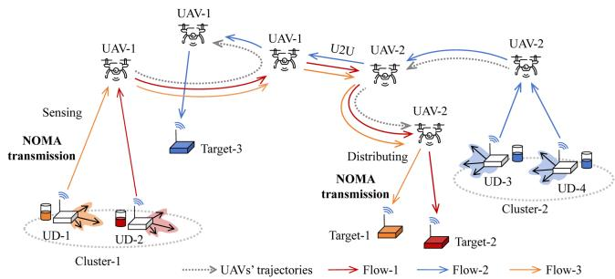  
Fig. 1. UAV-assisted wireless system for multiple traffic flows.

## III. SYSTEM MODEL AND PROBLEM FORMULATION

We consider a UAV-assisted wireless M2M network, which consists of multiple UAVs and UDs, as shown in Fig. 1. The set of UAVs is denoted as $\mathcal { N } = \{ 1 , 2 , \dots , N \}$ and the set of UDs is denoted as $\mathcal { M } = \{ 1 , 2 , \dots , \overset { \cdot } { M } \}$ 2. Due to the limited transmission range and the obstacles on the ground, direct communication links among UDs are unavailable. We target a post-disaster sensing-and-forwarding M2M scenario where terrestrial infrastructure is impaired. The UAVs collect directional sensing flows from source UDs and deliver them to target UDs, motivating a relay architecture without direct UD-to-UD links [35], [36], [37]. This setting also arises in industrial Internet of Things (IIoT) deployments, e.g., sensor data relayed to controllers in obstructed environments [2]. Given the spatial and temporal heterogeneity of M2M traffic flows, we introduce asynchronous time allocation that enables UAVs to adjust sensing and transmission strategies based on traffic conditions. To capture this heterogeneity, we characterize the historical traffic as a radiation pattern starting from each UD to receivers in different directions. We denote the set of traffic flows as $\mathcal { K } = \{ 1 , 2 , \ldots , K \}$ in the system. = 1 2Collecting individuals’ traffic flows with different transmission directions can increase the UAVs’ time overhead and introduce additional flying costs. Thus, the UAVs not only consider channel conditions and traffic data volumes, but also account for traffic directions to adaptively schedule UDs. Once the data is collected, the UAVs need to transmit it to target UDs through trajectory planning, scheduling, and time allocation, which is expected to significantly enhance transmission efficiency.

## A. Modeling UDs’ Traffic Flows as Radiation Patterns

To fully capture the heterogeneous traffic features of each UD, we characterize each UD’s out-going traffic flows by a dynamic radiation pattern, which reflects the UD’s spatial distribution of traffic demands and its targeted receivers in different directions. In the historical period $t \in \mathcal { T } _ { h }$ , we model UD-m’s traffic as a densely sampled radiation pattern over the full circle , π . Given the dense spatial distribution of traffic flows, we discretize the radiation pattern into a tractable feature vector. This is achieved by partitioning the angular domain into equal-sized sectors. The dense discrete samples are aggregated into $K _ { \mathrm { m a x } }$ equally sized angular sectors and each sector spans an angular width of $\Delta \theta = \mathrm { \bar { 2 } \pi } / K _ { \mathrm { m a x } } .$ . The sector boundary is defined as $\theta _ { k } = k \Delta \theta .$ Δ = 2, where $\dot { k } \in \{ 0 , 1 , \ldots , K _ { \operatorname* { m a x } } \}$ , so that the k-th sector covers the interval $[ \theta _ { k - 1 } , \theta _ { k } )$ . Let $\mathcal { F } _ { m } ( t , \theta _ { j } )$ denote the discrete [data volume in angles $\theta _ { j }$ ) ( )of the UD-m at historical time slot t. By accumulating the data volume in the corresponding angle sector, the aggregated data of the UD-m in the k-th direction can be denoted as follows:

$$
D _ { m } ^ { k } = \frac { K _ { \mathrm { m a x } } } { 2 \pi | \mathcal { T } _ { h } | } \sum _ { t \in \mathcal { T } _ { h } } \sum _ { \theta _ { j } \in [ \theta _ { k - 1 } , \theta _ { k } ) } \mathcal { F } _ { m } ( t , \theta _ { j } ) \Delta \theta _ { j } ,
$$

where $\Delta \theta _ { j }$ is the angular resolution of the dense transmis-Δsion directions. By quantifying the spatial distribution of traffic data across angular sectors, we can identify the primary traffic transmission directions and the data volumes. This knowledge will guide the UAVs’ asynchronous time allocation, trajectory planning, and scheduling, as detailed in the following section.

## B. Asynchronous Time Allocation and Trajectory Planning

We consider the UAVs’ trajectory planning in a time-slotted structure $t \in { \mathfrak { T } } ,$ as shown in Fig. 2. Each time slot has a fixed length δ. While most existing studies assume synchronous transmission control under unified time slots, this coordination is often inefficient in heterogeneous traffic scenarios. Hence, we adopt asynchronous sub-slot allocation within each time slot t based on UAVs’ local conditions. This flexibility reduces redundant hovering time and balances service among heterogeneous clusters. For UAV-i, each time slot is divided into four sub-slots for flying, uplink data sensing, U2U relaying, and downlink data transmission, such that:

$$
\tau _ { i , f } + \tau _ { i , s } + \tau _ { i , r } + \tau _ { i , d } \leq \delta .\tag{1}
$$

In the flying sub-slot $\tau _ { i , f }$ , the UAV-i can fly to an optimal location at a controllable speed $v _ { i }$ . It then hovers at that location during the uplink data sensing sub-slot $\tau _ { i , s } ,$ the U2U relaying sub-slot $\tau _ { i , r } ,$ and the downlink data transmission sub-slot $\tau _ { i , d } .$ The UAV-to-UD and U2U channel conditions remain constant in one time slot, and may change over different time slots as the UAVs fly over the trajectories. In the uplink data sensing sub-slot $\tau _ { i , s } ,$ the UAVs can adopt the NOMA protocol to collect UDs’ information. The U2U relaying sub-slot $\tau _ { i , r }$ is used for the UAV-i to exchange information with other UAVs. In the downlink data transmission sub-slot $\tau _ { i , d } ,$ the UAV-i is allowed to transmit its information to the target UDs. After the initial time allocation of the four operational modes within each time slot, we introduce mini-slots as the smallest scheduling units to achieve fine-grained adaptation to dynamic environmental conditions. We consider that the UAV’s mode is fixed within each mini-slot τ , and each sub-slot consists of multiple mini-slots. To facilitate distinction, the indices of other UAVs are denoted as UAV-n. The UAV-n’s operation mode during the mini-slot τ is denoted as $f _ { n } ^ { \tau } , x _ { n } ^ { \tau } , y _ { n } ^ { \tau }$ , and $z _ { n } ^ { \tau }$ representing flying mode, data sensing mode, U2U relaying mode, and downlink data transmission mode, respectively.

F: Flying S: Sensing R: U2U relaying D: Downlink transmission  
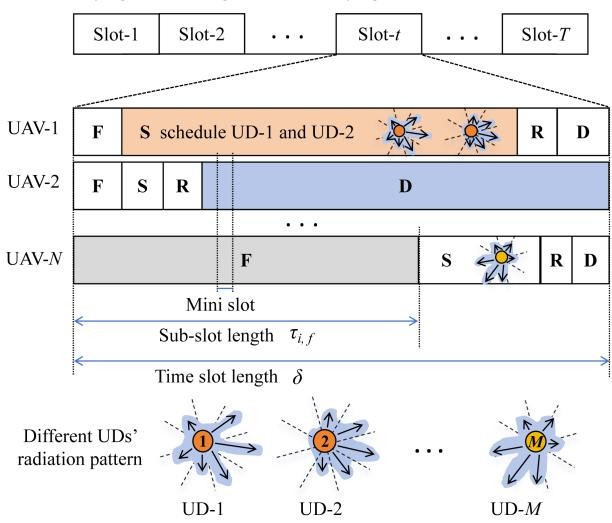  
Fig. 2. UAVs’ asynchronous time allocation.

Each UAV-i’s trajectory can be defined as a set of locations over different time slots, i.e., $\mathcal { L } _ { i } = [ \ell _ { i } ( t ) ] _ { t \in \mathcal { T } }$ . Each lo-= [ ( )]cation is specified by a 3-dimensional (3D) coordinate, i.e., $\ell _ { i } ( t ) = ( x , \overset { \cdot } { y } , H )$ , where H denotes the UAVs’ fixed altitude. ( ) = ( )Given that UAV-i moves in direction $\varsigma _ { i } ( t )$ with the limited speed $\varsigma _ { i } ( t ) \leq \varsigma _ { \mathrm { m a x } }$ ( ), UAV-i’s location in the next time slot can ( )be updated as $\ell _ { i } ( t + 1 ) = \ell _ { i } ( t ) + \varsigma _ { i } ( t ) \tau _ { i , f } \varsigma _ { i } ( t )$ . We have the ( + 1) = ( ) + ( ) ( )following inequalities to regulate UAVs’ mobility:

$$
\begin{array} { r } { \| \ell _ { i } ( t ) - \ell _ { j } ( t ) \| \geq d _ { \operatorname* { m i n } } , } \end{array}\tag{2a}
$$

$$
\begin{array} { r } { \| \ell _ { i } ( t + 1 ) - \ell _ { i } ( t ) \| \le v _ { \operatorname* { m a x } } \tau _ { i , f } , } \end{array}\tag{2b}
$$

where $d _ { \mathrm { m i n } }$ denotes the minimum allowable distance between two UAVs to ensure safety. Note that the UAVs’ velocity directly influences system performance [38]. Slower movement allows UAVs to maintain stable links for reliable data sensing and downlink transmission, while faster movement enables broader coverage and more timely service. Given the UD-m’s location $\ell _ { m } .$ , its distance to the UAV-i is given by $d _ { i , m } ( t ) = \lVert \boldsymbol { \ell } _ { i } ( t ) -$ $\ell _ { m } \|$ ( ) = ( ). We consider a realistic channel model consisting of both line-of-sight (LOS) and non-line-of-sight (NLOS) components. Let $h _ { i , m } ( t )$ denote the channel coefficient between the UAV-i ( )and the UD-m in the time slot t, which can be modeled as $h _ { i , m } ( t ) = \sqrt { \psi _ { i , m } ( t ) } \tilde { h } _ { i , m } ( t )$ , where $\psi _ { i , m } ( t ) = \omega _ { 0 } ( d _ { i , m } ( t ) ) ^ { - \alpha }$ ( ) = ( ) ( ) ( ) = ( ( ))denotes large-scale fading and α denotes the path-loss constant. The small-scale fading is characterized as $\tilde { h } _ { i , m } ( t )$ , which is related to the LOS and NLOS component [39].

## C. Traffic Transmission With UAVs’ Asynchronous Control

Once the UAVs complete asynchronous time allocation and hover stably, it initiates scheduling for UDs and begins data transmission. The transmission strategies employed include uplink data sensing, U2U relaying, and downlink data transmission. We employ NOMA on both uplink and downlink within each UAV’s scheduled set. Let $\mathcal { N } _ { i } ^ { a } ( t )$ and $\boldsymbol { \mathcal { M } } _ { i } ^ { b } ( t )$ denote the ( ) ( )sets of UDs scheduled at time slot t to upload sensing data to the UAV-i and to receive data from the UAV-i, respectively. When different UAVs execute different modes simultaneously, cross-mode interference arises. For tractable interference management, the interference at the receiver is decomposed into an intra-UAV part and an inter-UAV part. For the intra-UAV part, it originates from NOMA superposition within the serving UAV in the same sub-slot and equals the residual signal that remains after successive interference cancellation (SIC) according to the decoding order. For the inter-UAV part, let $p _ { m ^ { \prime } }$ and $p _ { n }$ denote the transmit power of the UD-m and the $\mathrm { U A V } _ { - } n ,$ respectively. If the UAV-n is in the downlink data transmission mode then $\begin{array} { r } { p _ { n } = \sum _ { u \in \mathcal { M } _ { n } ^ { b } } p _ { n , u } . } \end{array}$ . The interference received by the UAV-i from the UAV-n operating in mode $ { \boldsymbol { x } } _ { n } ^ { \tau }$ during mini-slot τ is defined as:

$$
\mathcal { U } _ { i , n } ^ { \tau } = x _ { n } ^ { \tau } \sum _ { m ^ { \prime } \in \mathcal { M } _ { n } ^ { a } } p _ { m ^ { \prime } } | h _ { m ^ { \prime } , i } | ^ { 2 } + ( y _ { n } ^ { \tau } + z _ { n } ^ { \tau } ) p _ { n } | h _ { n , i } | ^ { 2 } .\tag{3}
$$

1) Data Sensing Mode: When a UAV’s data buffer is low, the UAV tends to allocate more time to the data sensing sub-slot to schedule UDs and receive their traffic flows. Note that as the UAV’s hovering position changes, the data carried by the UAV may move further away from the target UDs. As such, when scheduling UDs, the UAV must carefully consider the directions of the traffic flows. Coordinating the scheduling of traffic flows with similar directions can significantly enhance the transmission efficiency of the UAV-assisted network. Let $\phi _ { m , i } ^ { k } ( t ) \in \{ 0 , 1 \}$ denote the access control strategy between the ( ) 0 1UAV-i and the UD-m for transmitting the traffic flow-k. When the UAV-i sensing data flow-k from UD-m in the uplink data sensing sub-slot $\tau _ { i , s ; }$ , the access strategy $\phi _ { m . i } ^ { k } ( t ) = 1$

( ) = 1To enhance the channel transmission capacity, we consider employing NOMA to transmit traffic flows with similar spatialtemporal features. This requires the UAV to design an access control policy to improve the uplink data sensing throughput. When the channel disparity between UDs and the UAV is significant, the scheduled UDs can adopt NOMA transmission simultaneously during the data sensing sub-slot $\tau _ { i , s } ,$ achieving additional throughput gains. The UAV can leverage SIC technology to decode the data from multiple UDs in descending order of signal strength. In the uplink data sensing sub-slot $\begin{array} { r } { \tau _ { i , s } , } \end{array}$ let $p _ { m }$ denote the pre-configured uplink transmit power of the UD-m and $n _ { o }$ the receiver noise [40]. The mixed signal received at the UAV-i can be represented as $\sum _ { m \in \mathfrak { M } _ { i } ^ { a } } \sqrt { p _ { m } } h _ { i , m } o _ { m } + n _ { o } ,$ where $o _ { m }$ is the information symbol transmitted by the UD-m.

Then, the signal-to-interference-plus-noise ratio (SINR) for the UD-m transmitting to the UAV-i during mini-slot τ is defined as follows and must satisfy:

$$
\begin{array} { r } { \gamma _ { m , i } ^ { \tau } = \frac { p _ { m } | h _ { m , i } | ^ { 2 } } { \sum _ { j = m + 1 } ^ { | \mathcal { M } _ { i } ^ { a } | } p _ { j } | h _ { j , i } | ^ { 2 } + \sum _ { n \in \mathcal { N } , n \ne i } \mathcal { U } _ { i , n } ^ { \tau } + \sigma ^ { 2 } } \geq \gamma _ { t h } , } \end{array}\tag{4}
$$

where $\gamma _ { t h }$ is the decoding threshold of the SIC receivers and $p _ { m }$ is the UD-m’s transmit power. As such, the throughput of the traffic flow-k from the UD-m to the UAV-i in the uplink sensing sub-slot $\tau _ { i , s }$ is denoted as follows:

$$
s _ { m , i } ^ { k } ( t ) = \phi _ { m , i } ^ { k } ( t ) \sum _ { \tau = 1 } ^ { \delta } x _ { i } ^ { \tau } \log _ { 2 } \left( 1 + \gamma _ { m , i } ^ { \tau } \right) .\tag{5}
$$

Leveraging the throughput formulation, we characterize the temporal evolution of each UD’s data buffer. Let $\mathcal { F } _ { m } ^ { k } ( t )$ denote ( )the size of traffic flow-k arriving at the UD-m at the beginning of the time slot t. The traffic data remains in its data buffer until the UD is scheduled by the UAVs for its data sensing. Let $D _ { m } ^ { k } ( t )$ ( )denote the remaining size of traffic flow-k in the UD-m’s buffer, which is updated as follows:

$$
D _ { m } ^ { k } ( t + 1 ) = \operatorname* { m i n } \left\{ \left[ D _ { m } ^ { k } ( t ) - s _ { m , i } ^ { k } ( t ) \right] ^ { + } + \mathcal { F } _ { m } ^ { k } ( t ) , D _ { \operatorname* { m a x } } \right\} .\tag{6}
$$

2) U2U Relaying Mode: When the buffer of a UAV is full and there are nearby idle UAVs or UAVs with better channel conditions, it tends to allocate more U2U relaying sub-slot. During the U2U relaying sub-slot, UAVs can collaboratively transmit information by constructing a network topology. Each UAV is required to either send data or receive data from other UAVs during the U2U relaying phase. By transmitting the data to a nearby UAV with better channel conditions, the data buffer pressure among UAVs can be alleviated. To ensure that the UD-m accesses only one UAV during the U2U relaying sub-slot $\tau _ { i , r } .$ , we impose the constraint $\begin{array} { r } { \sum _ { i \in \mathcal { N } } \phi _ { m , i } ^ { k } ( t ) \leq 1 } \end{array}$ . Since ( ) 1all UAVs share the same set of channels, the interference may occur between different transmitter-receiver pairs. Let $p _ { i }$ denote the constant UAV-i’s transmit power. The SINR of the UAV-i transmitting to the UAV-j is defined and subject to the following constraint:

$$
\gamma _ { i , j } ^ { \tau } = \frac { p _ { i } | h _ { i , j } | ^ { 2 } } { \sum _ { n \in \mathbb { N } , n \neq i , n \neq j } \mathcal { U } _ { i , n } ^ { \tau } + \sigma ^ { 2 } } \geq \gamma _ { t h } .\tag{7}
$$

Then, the throughput of traffic flow-k from UAV-i to UAV-j in the U2U relaying sub-slot $\tau _ { i , r }$ is then given by:

$$
O _ { i , j } ^ { k } ( t ) = \phi _ { i , j } ^ { k } ( t ) \sum _ { \tau = 1 } ^ { \delta } x _ { i } ^ { \tau } \log _ { 2 } \left( 1 + \gamma _ { i , j } ^ { \tau } \right) .\tag{8}
$$

3) Downlink Data Transmission Mode: When the target UD of the UAV-carried data is within its coverage area and channel conditions are favorable, the UAV can switch to the downlink transmission mode to transmit data directly to the target UD. When the UAV-i transmits data flow-k to the UD-m in the downlink data transmission sub-slot $\tau _ { i , d } ,$ the access strategy is set as ${ \phi _ { m , i } ^ { k } ( t ) = 1 . \operatorname { L e t } p _ { i , m } }$ denote the UAV-i’s pre-configured ( ) = 1transmit power allocated to the UD-m. Accordingly, the SINR of the UAV-i for transmitting traffic flow-k to the target UD-m is subject to the following constraint:

$$
\gamma _ { m , i } ^ { \tau } = \frac { p _ { i , m } | h _ { m , i } | ^ { 2 } } { \sum _ { j = m + 1 } ^ { | \mathfrak { M } _ { i } ^ { b } | } p _ { i , j } | h _ { m , i } | ^ { 2 } + \sum _ { n \in \mathbb { N } , n \ne i } \mathcal { U } _ { m , n } ^ { \tau } + \sigma ^ { 2 } } \geq \gamma _ { t h } .\tag{9}
$$

The downlink throughput of traffic flow-k from the UAV-i to the UD-m in the downlink data transmission sub-slot $\tau _ { i , d }$ is given by:

$$
\mathcal { R } _ { i , m } ^ { k } ( t ) = \phi _ { m , i } ^ { k } ( t ) \sum _ { \tau = 1 } ^ { \delta } z _ { i } ^ { \tau } \log _ { 2 } \left( 1 + \gamma _ { m , i } ^ { \tau } \right) .\tag{10}
$$

The downlink throughput largely depends on access mode while hovering and on traffic dynamics. The UAV-i collects similar traffic flows within coverage and forwards the buffered data to a nearby UAV or directly to the destination UD. Thus, there is a dynamic update of the UAVs’ data queues over time. We denote the out-going data from the UAV-i as follows:

$$
\mathcal { P } _ { i } ^ { k } ( t ) = \sum _ { j \in \mathbb { N } } O _ { i , j } ^ { k } ( t ) + \sum _ { m \in \mathbb { M } } \mathcal { R } _ { i , m } ^ { k } ( t ) ,\tag{11}
$$

where the U2U relaying throughput is defined in (8) and the downlink data transmission throughput is defined in (10). Hence, the queue of traffic flow-k at the UAV-i is updated as:

$$
\zeta _ { i } ^ { k } ( t + 1 ) = \operatorname* { m i n } \left\{ \left[ \zeta _ { i } ^ { k } ( t ) - \mathcal { P } _ { i } ^ { k } ( t ) \right] ^ { + } + s _ { i } ^ { k } ( t ) , \zeta _ { \operatorname* { m a x } } \right\} ,\tag{12}
$$

where $[ X ] ^ { + } = \operatorname* { m a x } \{ 0 , X \}$ , and $\begin{array} { r } { s _ { i } ^ { k } ( t ) = \sum _ { m \in \mathcal { M } } s _ { m , i } ^ { k } ( t ) } \end{array}$ de-[ ] = max 0 ( ) = ( )notes the total amount of sensing data collected by the UAV-i in time slot t.

## D. Problem Formulation

We aim to maximize the minimum throughput of traffic flows reaching their respective targets. The decision variables are the UAVs’ trajectory planning, asynchronous time allocation, UDs scheduling, and network formation strategies $( \ell , \tau , \Phi )$ . Let - $\{ \ell _ { i } ( t ) \} _ { i \in \mathcal { N } , t \in \mathcal { T } }$ and $\tau = \{ \tau _ { i , f } ( t ) , \tau _ { i , s } ( t ) , \overline { { \tau } } _ { i , r } ( t ) , \tau _ { i , d } ( \dot { t } ) \} _ { i \in \mathbb { N } , t }$ ∈T ( ) = ( ) ( ) ( ) ( )represent the UAVs’ trajectory planning and the time allocation, respectively. Let $\dot { \Phi } = \{ \phi _ { m , i } ^ { k } ( \bar { t } ) \}$ }k∈K,m∈M,i∈N,t∈T denote the Φ = ( )UDs’ scheduling and the UAVs’ network formation strategies, respectively. It is clear that the throughput performance is intricately coupled with the above control variables. We define the traffic flow-k’s throughput as $\begin{array} { r } { \Re ^ { k } ( t ) = \sum _ { i \in \mathcal { N } } \sum _ { m \in \mathcal { M } } \mathcal { R } _ { i , m } ^ { k } ( t ) } \end{array}$ ( ) = ( )Based on the above, we formulate the minimum traffic data throughput maximization as follows:

$$
\operatorname* { m a x } _ { \ell , \tau , \Phi } \operatorname* { m i n } _ { k \in \mathcal { K } } \ \frac { 1 } { T } \sum _ { t = 0 } ^ { T - 1 } \mathbb { E } \left[ \Re ^ { k } ( t ) \right] \ \quad s . t . \ ( 1 ) - ( 1 2 )\tag{13}
$$

Problem (13) is intractable due to its mixed-integer nature and the strong coupling among the control variables. Moreover, directly planning trajectories and scheduling UDs based on channel conditions and the heterogeneity of traffic flows can lead to significant signaling and computational overhead.

To tackle this challenge, we propose a traffic-aware asynchronous trajectory planning and scheduling approach, as illustrated in Fig. 3. The core idea of this framework is to decompose problem (13) into two parts. To reduce the complexity of UDs scheduling with heterogeneous traffic, we first propose a STGAN approach to cluster UDs by analyzing the UDs transmission patterns and the spatial locations. After having the clustering results, the traditional DRL can be employed to jointly update UAVs’ trajectory planning, scheduling, and time allocation strategies. However, it is challenging for the traditional DRL to capture the dynamic topology among UAVs and clusters. As such, we further develop a GNN-enhanced DRL to exploit the dynamic spatial relationships. We construct UAVs and clusters as a dynamic graph and then employ GNN to enhance the network’s ability for learning the dynamic topology within U2U and UAV-to-cluster relationships. The enhancements are expected to significantly improve the training speed and learning performance of DRL. In next two sections, we detail the two parts of the traffic-aware asynchronous trajectory planning and scheduling framework.

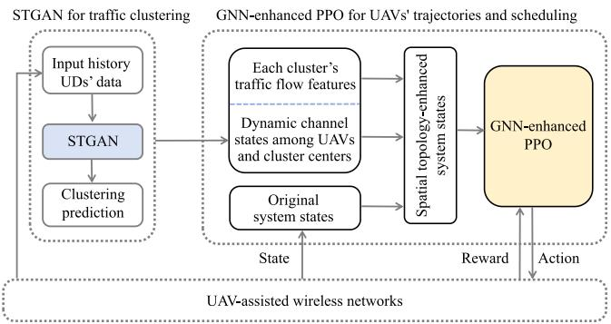  
Fig. 3. Traffic-aware asynchronous trajectory planning and scheduling framework.

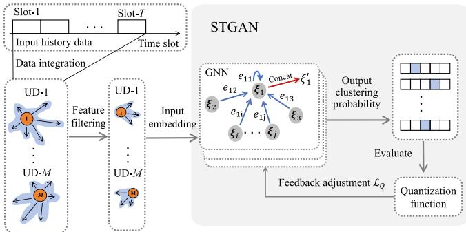  
Fig. 4. STGAN framework for traffic clustering.

## IV. STGAN FOR CLUSTERING UDS’ TRAFFIC

The overview of the proposed STGAN framework is shown in Fig. 4. We model UDs’ dynamic traffic flows in a large-scale IoT system as a graph G, where each node represents a UD and edges capture similarities between UDs based on spatial proximity and traffic flow features. Given the spatial heterogeneity of traffic flows, we characterize the historical traffic features as a radiation pattern, which describes the data transmissions from the UD to receivers in various directions. To reduce dimensionality, the radiation pattern can be discretized equally by angles and represented by a few dominant flow directions with the highest traffic demands. The resulting vector embedding of each UD serves as the input to the subsequent graph attention module, which extracts spatial-temporal correlations through graph computations and outputs clustering results. The proposed STGAN framework consists of three main modules. The first module extracts dominant traffic flows to characterize each UD’s radiation pattern by analyzing historical data to determine traffic demand across different directions. The extracted traffic feature vectors are concatenated into a unified embedding, which is then processed by the second module of the STGAN framework. This module integrates a GNN and an attention mechanism to explore spatial-temporal dependencies of UDs’ traffic flows. The GNN captures such dependencies by aggregating features from neighboring UDs, where spatial characteristics are encoded by their positions and temporal characteristics captured by traffic flow distributions. UDs with close spatial proximity and similar data flow distributions exhibit strong similarities. The attention mechanism dynamically adjusts the importance of neighboring nodes during graph computations, allowing the model to focus on the most relevant information. The final module evaluates the clustering quality via a flow similarity metric that combines KL divergence and spatial compactness to quantify the differences in UDs’ traffic patterns. This metric also serves as a label-free training loss for STGAN. Hence, no ground-truth cluster labels are required. By leveraging the spatial-temporal dependencies of UDs’ traffic flows, the STGAN framework effectively clusters UDs with similar traffic demands, enabling more efficient coordination in UAV-assisted IoT networks.

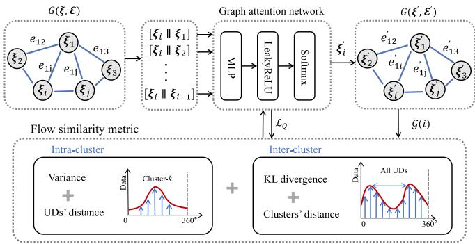  
Fig. 5. Structure of spatial-temporal graph attention module.

As shown in Fig. 5, each node $v _ { i }$ in the graph G represents a UD, and each edge $e _ { i j }$ captures the relationship between the UD-i and the UD-j, where $i , j \in \mathcal { M }$ . We use an adjacency matrix $\mathcal { E } = \{ e _ { i , j } \} _ { i , j \in \mathcal { M } }$ to reflect the relationship between the UDs, =where elements $e _ { i , j }$ represent the similarity between UD-i and UD-j. Consequently, we denote the UD-i’s input feature vector as $\pmb { \xi } _ { i } = ( \pmb { \ell } _ { i } , \mathbf { D } _ { i } )$ , where $\ell _ { i }$ represents the UD-i’s spatial position and $\mathbf { \dot { D } } _ { i } = \{ D _ { i } ^ { 1 } , \dots , D _ { i } ^ { K } \}$ represents the aggregated historical D =data in the history time period. The output is a new set of node representations $\{ \pmb { \xi } _ { i } ^ { \prime } \in \mathbb { R } ^ { K } | \forall i \in \mathbb { M } \}$ , with K dimensions, indicating that there can be at most K clustering cases. Then, we employ GNNs to capture the spatial and temporal dependencies in UDs’ traffic flows. However, as the number of UDs increases and traffic flows become more dense and heterogeneous, traditional GNNs face difficulties in modeling spatial-temporal dependencies, particularly under noisy or irregular traffic patterns. To address these challenges and further enhance learning performance, we propose the following improvements.

## A. Spatial-Temporal Attention

Traditional aggregation methods often assign predefined weights to all neighboring nodes, which leads to poor adaptability in complex scenarios. Attention mechanism is able to dynamically evaluate the importance of each neighboring node during the aggregation process. This enables significant neighbors to contribute more effectively to feature aggregation, thereby enhancing the GNN’s ability to capture similarity. Moreover, UDs’ similarity is influenced not only by spatial proximity but also by the distribution of data flows over past time periods. Thus, we use the spatial-temporal attention layer in GNN to capture the local structural properties of the graph. The correlation between UD-i and UD-j is computed as:

$$
\begin{array} { r } { \rho _ { i , j } = \mathrm { L e a k y R e L U } \left( \kappa ^ { \top } \left[ \mathbf { W } \boldsymbol { \xi } _ { i } \left\| \mathbf { W } \boldsymbol { \xi } _ { j } \right\| \right) , \right. } \end{array}\tag{14}
$$

where is the trainable weight matrix, κ is the single-layer Wfeedforward neural network, and  denotes the concatenation operation. The LeakyReLU activation introduces non-linearity and retains negative values to some extent. After computing $\rho _ { i , j }$ for each neighbor $j \in \Omega _ { i }$ , where $\Omega _ { i }$ denotes the set of the $\mathrm { U D } { - } i \mathrm { ' s }$ Ω Ωneighbors, we apply a softmax function to obtain the attention coefficients $e _ { i , j } = \mathrm { s o f t m a x } ( \rho _ { i , j } )$ . Let $\pmb { \xi } _ { i } ^ { ( l ) }$ be the feature vector of UD-i at the l-th layer. Then, $\xi _ { i } ^ { ( l + \bar { 1 } ) }$ can be computed as follows:

$$
\pmb { \xi } _ { i } ^ { ( l + 1 ) } = \mathrm { L e a k y R e L U } \left( \Xi ^ { ( l ) } \left( \pmb { \xi } _ { i } ^ { ( l ) } , \left\{ e _ { i , j } ^ { ( l ) } \mathbf { W } ^ { ( l ) } \pmb { \xi } _ { j } ^ { ( l ) } \right\} _ { j \in \Omega _ { i } } \right) \right)\tag{15}
$$

where $\mathbf { W } ^ { ( l ) }$ is the trainable weight matrix for the l-th layer and $e _ { i , j } ^ { ( l ) }$ is the attention coefficient specific to the l-th layer. The function $\Xi ^ { ( l ) }$ denotes the aggregation operation that combines Ξthe weighted features of neighboring nodes and the self-node’s features to update the representation of UD-i in the l-th layer. After several layers of message passing and feature aggregation, the GNN outputs a final result for each UD, denoted as $\pmb { \xi } _ { i } ^ { ( L ) }$ where L is the number of GNN layers. The output vector $\pmb { \xi } _ { i } ^ { ( L ) }$ contains K elements, each representing the score for a potential cluster, and is used to determine the clustering assignment of UD-i. Specifically, the UD-i is assigned to the k-th cluster if $\pmb { \xi } _ { i , k } ^ { ( L ) }$ is the maximum among all K elements. Then, the assignment is given by:

$$
\mathcal { G } ( i ) = \arg \operatorname* { m a x } _ { k } \left( \pmb { \xi } _ { i , k } ^ { ( L ) } \right) .\tag{16}
$$

## B. Flow Similarity Metric

To evaluate clustering performance in the absence of ground truth labels, we propose a flow similarity metric that measures traffic flow similarity among UDs. The metric analyzes both the intra-cluster and the inter-cluster similarities from spatial and temporal perspectives, as depicted in Fig. 5. For the intra-cluster, since traffic flows in M2M communication are typically dense and directional, the discrete flow data within each cluster can be approximated by Gaussian distributions to facilitate similarity evaluation. We define the set of clusters as $\mathcal { C } = \{ 1 , 2 , \hdots , \overline { { C } } \}$ . For each cluster $c \in \mathcal { C } ,$ , the set of UDs = 1 2assigned to it is denoted as $\mathcal { C } _ { c } = \{ i | \mathcal { G } ( i ) = c \}$ . The distributions = (within the cluster-c are aggregated as $\{ ( \theta _ { c } ( t ) , D _ { c } ( t ) ) | t \in \mathcal { T } _ { h } \}$ ( ( ) ( ))and the intra-cluster variance is analyzed to determine flow similarity. A smaller variance indicates a sharper distribution of traffic flows, implying that the directional flows are more concentrated. The mean of the traffic direction is defined as $\begin{array} { r } { \mu _ { c } = \frac { 1 } { \sum _ { t \in \mathcal { T } _ { h } } D _ { c } ( t ) } \sum _ { t \in \mathcal { T } _ { h } } \theta _ { c } ( t ) D _ { c } ( t ) } \end{array}$ , serving as the center of the Gaussian distribution for the cluster-c over the historical period $\mathcal { T } _ { h }$ . Next, we denote the standard deviation of the directional data as $\begin{array} { r } { \sigma _ { c } = \big ( \frac { 1 } { \sum _ { t \in \mathcal { T } _ { h } } D _ { c } ( t ) } \sum _ { t \in \mathcal { T } _ { h } } ( \theta _ { c } ( t ) - \mu _ { c } ) ^ { 2 } \big ) ^ { \frac { 1 } { 2 } } } \end{array}$ , which represents the dispersion of the directional flows over a time period $\mathcal { T } _ { h }$ in the cluster-c. Based on the above, the discrete data direction and volumes are modeled as continuous Gaussian distributions. We denote the flow similarity loss in the cluster-c as ${ \mathcal L } _ { c , \sigma } ,$ determined by the variance of the Gaussian distribution. In addition, spatial proximity is incorporated to assess clustering performance within each cluster. We denote the average distance loss between any two UDs within the cluster-c as $\bar { \mathcal { L } _ { c , d } }$ and the weighting factor as α. Then, the intra-cluster loss for cluster-c can be defined as:

$$
\mathcal { L } _ { c , \mathrm { i n t r a } } = \mathcal { L } _ { c , d } + \alpha \cdot \mathcal { L } _ { c , \sigma } .\tag{17}
$$

For the inter-cluster, to measure the separability between different clusters, we evaluate the KL divergence and the distance among cluster centers. KL divergence effectively quantifies the difference between the probability distributions of any two clusters. Meanwhile, the distance between cluster centers provides a spatial measure of their separability. If the KL divergence among clusters is large, it indicates that the distributions of clusters are significantly different. This indicates that the clusters are well-separated with distinct patterns. Let c and $c ^ { \prime }$ be the different clusters. Then, we denote the cluster-c’s probability distributions and center location as $P _ { c }$ and $\begin{array} { r } { L _ { c } = \frac { 1 } { \left. \mathcal { C } _ { c } \right. } \sum _ { i \in \mathcal { C } _ { c } } \ell _ { i } } \end{array}$ , respectively. The inter-cluster loss is given by:

$$
{ \mathcal { L } } _ { \mathrm { i n t e r } } = \sum _ { c \in { \mathcal { C } } } \sum _ { c ^ { \prime } \in { \mathcal { C } } } \left( { \mathrm { K L } } ( P _ { c } | | P _ { c ^ { \prime } } ) + { \boldsymbol { \beta } } \cdot d ( L _ { c } , L _ { c } ^ { \prime } ) \right) ,\tag{18}
$$

where $\beta$ is a weighting factor balancing the KL divergence and spatial distance. By combining KL divergence and inter-cluster distance, $\mathcal { L } _ { \mathrm { { i n t e r } } }$ ensures clusters are distinct in both their data distributions and spatial locations.

Overall, we use the weight factors $\lambda _ { 1 }$ and $\lambda _ { 2 }$ to assign different priorities to the intra-cluster and inter-cluster losses. The flow similarity metric is defined as:

$$
\mathcal { L } _ { Q } = \lambda _ { 1 } \sum _ { c \in \mathcal { C } } \mathcal { L } _ { c , \mathrm { i n t r a } } - \lambda _ { 2 } \mathcal { L } _ { \mathrm { i n t e r } } .\tag{19}
$$

In practice, traffic distributions tend to drift gradually over extended periods. To accommodate slow drifts in traffic flows induced by persistent UAVs’ scheduling and data collection operations, we adopt periodic and drift-triggered re-clustering over a sliding window. When a drift is detected, we re-run STGAN and refresh the policy on the central server before deploying the updated parameters to the UAVs.

## V. GNN-ENHANCED PPO FOR UAVS’ ASYNCHRONOUS TRAJECTORY PLANNING AND SCHEDULING

Given the clustering results, the UAVs’ trajectory planning and scheduling strategies can be further optimized. The UAVs can schedule UDs with similar traffic patterns within the same cluster during each time interval, thereby reducing scheduling complexity. Since UDs’ scheduling, UAVs’ trajectory planning, and time allocation are interdependent and temporally coupled, and each decision sequentially influencing subsequent decisions and system states, we reformulate the problem as a Markov decision process (MDP) and solve it using DRL. However, as the number of UDs and the diversity of traffic demands increase, the heterogeneity among clusters becomes more complex. Conventional DRL methods relying only on UAVs’ local observations struggle to capture the spatial relationships between UAVs and clusters. Poor spatial awareness may cause transmission congestion, further complicating UAVs’ trajectory planning and clusters’ scheduling. Fortunately, GNNs can explicitly capture spatial topology through adjacency matrices and effectively learn the features of neighboring nodes. This makes GNNs particularly well-suited for the UAV-assisted networks with dynamic topologies. This motivates us to design a GNN enhancement mechanism, enhancing the spatial topology representation capability in UAV-assisted wireless networks. As such, we construct a graph structure comprising UAVs and clusters. This allows UAVs to acquire the spatial-temporal features of neighboring UAVs or clusters, thereby enhancing their spatial topology awareness. Next, we provide a detailed description from the perspectives of graph construction, the GNN-enhanced PPO framework, and the MDP process with guided rewards.

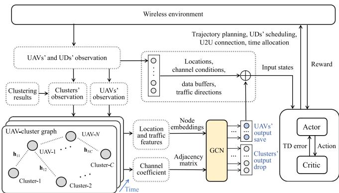  
Fig. 6. The GNN-enhanced PPO framework.

The proposed GNN-enhanced PPO framework consists of three main modules, as illustrated in Fig. 6. The first is the graph construction module, which builds a heterogeneous graph based on the UAVs’ observations, the UDs’ states, and the clustering results. This graph integrates the UAVs’ and clusters’ observations, effectively capturing their spatial relationships over time. The heterogeneous dynamic graph is treated as topological input, while the original observations of UAVs and UDs are considered as raw inputs. Both are fed into the second module, the GNN-enhanced feature fusion module, which integrates the topological and raw observations. The resulting fused features serve as the state input to the third module, enabling decisionmaking for UAVs in the DRL framework. For the deployment, the PPO is trained on a ground control server, and the learned policy is deployed to individual UAVs for lightweight inference. When traffic distribution drift is detected or at periodic intervals, the STGAN clustering module and the PPO policy are retrained or fine-tuned on the ground control server and then pushed to the UAVs. This design separates our core algorithmic contributions, i.e., GNN-enhanced states, asynchronous time allocation, and reward design, from system training infrastructure, enabling practical deployment while maintaining real-time control performance.

## A. Dynamic Graph for Observation Enhancement

1) Graph Construction Module: To capture the dynamic spatial topology correlations of heterogeneous nodes, we construct a graph $G _ { t } ^ { \prime } = ( \mathcal { O } _ { t } , \mathcal { H } _ { t } )$ , where each node in the graph = ( )represents a UAV or a cluster, as shown in Fig. 7. We consider that there are $C$ clusters after clustering. Each edge in the graph indicates the channel coefficient between node-i and node-j, where $i , j \in \mathcal { N } \cup \mathcal { C }$ . In time slot t, we use an adjacency matrix $\mathcal { H } _ { t }$ to reflect the channel strength between nodes. Let $\mathbf { W } _ { t } ^ { \mathcal { N N } } \in \mathbb { R } ^ { N \times N }$ and $\mathbf { W } _ { t } ^ { \mathcal { N C } } \in \mathbb { R } ^ { N \times C }$ denote UAV-to-UAV edge W Wweights and UAV-to-cluster edge weights, respectively. Then, we define the weighted adjacency matrix as:

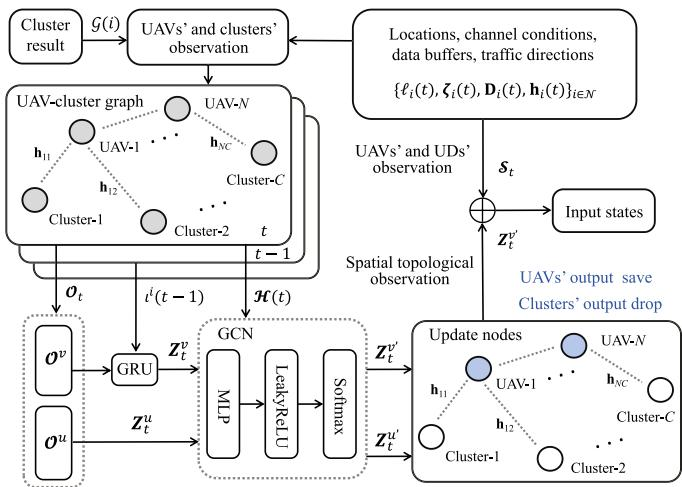  
Fig. 7. Network structure leveraging clustering graphs to improve observability.

$$
\mathcal { H } _ { t } \in \mathbb { R } ^ { ( N + C ) \times ( N + C ) } = \left[ \begin{array} { l l } { \mathbf { W } _ { t } ^ { \mathrm { \scriptscriptstyle { N N } } } } & { \mathbf { W } _ { t } ^ { \mathrm { \scriptscriptstyle { N } } \mathrm { \scriptscriptstyle { e } } } } \\ { \big ( \mathbf { W } _ { t } ^ { \mathrm { \scriptscriptstyle { N } } \mathrm { \scriptscriptstyle { e } } } \big ) ^ { \top } } & { \mathbf { 0 } _ { C \times C } \mathbf { \right] } , } \end{array}\tag{20}
$$

where $[ \mathbf { W } _ { t } ^ { \mathcal { N N } } ] _ { i , j } = f _ { \mathcal { N N } } ( \tilde { h } _ { i , j } ( t ) )$ and $[ \mathbf { W } _ { t } ^ { \mathrm { N C } } ] _ { i , c } = f _ { \mathrm { N C } } ( \tilde { h } _ { i , c } ( t ) )$ Both $f _ { \mathcal { N N } }$ ] = ( ( )) [W ] = ( ( ))and fNC are the monotonically increasing mapping functions. The $\tilde { h } _ { i , j } ( t )$ denotes the channel gains between the UAV-i and the UAV-j. The $\tilde { h } _ { i , c } ( t )$ denotes the channel gains ( )between the UAV-i and the cluster-c. For example, the average channel gain between the UAV-i and the cluster-c can be expressed as $\begin{array} { r } { \tilde { h } _ { i , c } = \frac { 1 } { | { \mathcal C } _ { c } | } \sum _ { j \in { \mathcal C } _ { c } } h _ { i , j } } \end{array}$

Having defined the adjacency matrix $\mathcal { H } _ { t }$ , which encodes the channel strengths among all UAVs and cluster nodes, we define the per-node feature descriptions as graph node inputs. We denote the observation set of heterogeneous nodes in time slot t as $\mathcal { O } _ { t } = \{ \mathcal { O } _ { t } ^ { v } , \mathcal { O } ^ { u } \}$ }. The matrix $\mathcal { O } _ { t } ^ { v } = \{ { \mathcal { O } } _ { t } ^ { 1 } , . . . , { \mathcal { O } } _ { t } ^ { N } \}$ and $\mathcal { O } ^ { u } = \{ \mathcal { O } ^ { 1 } , \ldots , \mathcal { O } ^ { C } \}$ represent the observation information of =UAV nodes and cluster nodes, respectively. The UAV nodes’ observations vary every time slot. In contrast, the cluster nodes observations are aggregates over the historical window $\mathcal { T } _ { h }$ with fixed centroids and remain constant between periodic. Hence, we write ${ \mathcal { O } } ^ { u }$ and omit the time index. The input feature vector consists of the heterogeneous nodes’ location, the storage traffic data sizes, and the transmission directions. For the cluster node-c, the observation at the node-c can be denoted as $\mathcal { O } _ { c } = \left( L _ { c } , \mathbf { D } _ { c } \right)$ where $L _ { c }$ = ( D )represents the centroid of the cluster-c’s location and $\mathbf { D } _ { c }$ is the aggregated historical data. To characterize data Dtransmission directions, we define the set of all possible discrete directions as $\boldsymbol { \Theta } = \{ \theta _ { 1 } , \theta _ { 2 } , \dots , \theta _ { K } \}$ , where $\theta _ { k }$ represents Θ =a specific discrete angle. The total transmitted data in direction $\theta _ { k }$ is given by $\begin{array} { r } { D _ { c } ^ { k } = \breve { \sum } _ { t \in \mathcal { T } _ { h } } \sum _ { i \in \mathcal { C } _ { c } } D _ { i } ( \theta _ { k } , t ) } \end{array}$ . Consequently, the aggregated data transmission across all directions for cluster-c in time slot t can be expressed as the vector $\mathbf { D } _ { c } = \{ D _ { c } ^ { 1 } , \ldots , D _ { c } ^ { K } \}$ D =For the UAV nodes-i, the observation at the node-i can be denoted as $\mathcal { O } _ { t } ^ { i } = ( L _ { i } ( t ) , \zeta _ { i } ( t ) )$ , where $L _ { i } ( t )$ represents the UAV-$i \mathrm { \ ' } _ { \mathrm { s } }$ =location and $\zeta _ { i } ( t )$ ) ( )) ( )is the collected data in time slot t. The ( )data transmission across all directions for UAV-i in time slot t is denoted as a vector $\zeta _ { i } ( t ) = \{ \zeta _ { i } ^ { 1 } ( t ) , \ldots , \zeta _ { i } ^ { K } ( t ) \}$ , where each $\zeta _ { i } ^ { k } ( t )$ corresponds to the amount of data transmitted in direction $\theta _ { k }$

2) GNN-Enhanced Feature Fusion Module: In our framework, the dynamic topology graph at different time instances can be represented as a matrix, where the rows correspond to the nodes and the columns correspond to their respective features. Due to the inherent heterogeneity between UAVs and cluster nodes, it is necessary to harmonize the observation results from each type of node. Specifically, UAVs are mobile and change positions over time, whereas clusters remain fixed. This difference in dynamics results in distinct observation characteristics. UAVs’ observations not only capture spatial data but also exhibit temporal dynamics, while cluster observations tend to be static.

To reconcile these differences and obtain a unified representation for all nodes, we first pre-process the observations to map them into a common feature space. In particular, for UAV-i, we consider both the current observation ${ \mathcal { O } } _ { t } ^ { i }$ at time slot-t and the hidden state from the previous time step $\check { \iota } ^ { i } ( t - 1 )$ . ( 1)This combination enables the learning of temporal dependencies and captures the evolving relationships in the dynamic graph. To extract a hidden representation that captures these temporal features, we employ a gated recurrent unit (GRU). Then, the UAV-i’s feature representation is given by:

$$
\mathbf { Z } _ { t } ^ { i } = \operatorname { G R U } \left( { \mathcal { O } } _ { t } ^ { i } , \iota ^ { i } ( t - 1 ) \right) .\tag{21}
$$

This step effectively harmonizes the observations by integrating current spatial data with historical temporal information, enabling the framework to capture the time-varying relationships in the heterogeneous graph. In contrast, due to the static nature of cluster nodes, the clusters’ observations are input into multi-layer perceptrons (MLPs). Each cluster-c directly inputs its observation $\bar { ( ) _ { t } ^ { c } }$ into the MLP to obtain the corresponding feature representation, which is given by:

$$
\mathbf { Z } _ { t } ^ { c } = \mathbf { M } \mathbf { L } \mathbf { P } ( \mathcal { O } _ { t } ^ { c } ) .\tag{22}
$$

This approach indicates that clusters’ observations are primarily independent static data and do not require temporal dependency modeling. Finally, the feature representations from UAVs and clusters are denoted as $\mathbf { Z } _ { t } ^ { v } = ( \mathbf { Z } _ { t } ^ { i } ) _ { i \in \mathcal { N } }$ and $\begin{array} { r } { \mathbf Z _ { t } ^ { u } = ( \mathbf Z _ { t } ^ { c } ) _ { c \in \mathcal C } , } \end{array}$ Z = (Z ) Z = (Z )respectively. The graph representations of the UAVs and the clusters, which serve as the spatial-enhanced state features, are jointly input into the GNN to model multi-node interactions,

formulated as $\mathbf { Z } _ { t } = \left[ \mathbf { Z } _ { t } ^ { v } \right]$

ZWe integrate both global observation embeddings and graphbased node embeddings as input features for the actor network to generate action strategies, while the critic computes the state values to guide strategy optimization. To process graphbased observations, we introduce a graph convolutional network (GCN) that aggregates local neighborhood information, thereby capturing the spatial relation among nodes. In the UAV-to-cluster network, we quantify channel strengths as edge weights in the adjacency matrix, which inherently encode the spatial topology. By employing the GCN, we directly leverage these channel coefficients during the convolution operation, allowing each node’s feature update to be weighted by its actual link quality to neighbors. The GCN’s fixed weight-sharing mechanism uses the physical edge weights for feature propagation. Since the spatial topology is directly correlated with the channel gains and the channel gains play a dominant role in reflecting the underlying spatial structure, it is unnecessary to relearn edge weights through an additional attention mechanism as in the graph attention network. This design both preserves the quantitative channel information and accelerates the learning process. The GCN produces a set of updated node feature representations, denoted as:

$$
\mathbf { Z } _ { t } ^ { \prime } = \operatorname { G C N } \left( \mathbf { Z } _ { t } , \mathcal { F } _ { t } \right) .\tag{23}
$$

For the subsequent action decision-making process, only the updated features $\begin{array} { r } { \mathbf { Z } _ { t } ^ { v ^ { \prime } } = \mathbf { Z } _ { t } ^ { \prime } [ \mathcal { N } , : ] } \end{array}$ corresponding to the UAV nodes are retained, while the updated features $\begin{array} { r } { \mathbf { Z } _ { t } ^ { c ^ { \prime } } = \mathbf { Z } _ { t } ^ { \prime } [ \mathcal { C } , : ] } \end{array}$ for cluster Z = Z [ :]nodes are discarded as they are not directly required for policy learning. This selective retention is motivated by the fact that UAVs are the principal decision-makers in the network, and their updated features information is more critical for decisionmaking.

To further enhance the spatial correlation between UAVs and clusters, we fuse the original system states with the GCNgenerated UAV node representations. Let $\mathbf { g } _ { t } ^ { v } = \operatorname { R e a d o u t } ( \mathbf { Z } _ { t } ^ { v ^ { \prime } } )$ be g = (Z )the topology graph embedding, and let  denote concatenation. The original system state embeddings and the GNN-extracted UAV feature representations are concatenated to form the state input to the DRL framework $\mathbf { s } _ { t } = \mathcal { S } _ { t } \| \mathbf { g } _ { t } ^ { v }$ , where $\mathcal { S } _ { t }$ is the original s = gsystem state. The details regarding the definitions of DRL are provided in the following subsection.

## B. DRL for UAVs’ Trajectories and Scheduling

Based on the clustering results, we employ DRL to dynamically optimize the UAVs’ trajectory planning, UDs’ scheduling, and time allocation strategies. Specifically, we adopt the PPO algorithm, whose clipped surrogate objective and advantage estimation mechanism have been shown to significantly improve convergence stability and sample efficiency [41]. As illustrated in Fig. 7, the GNN-enhanced state is used as the input to the PPO agent. We formulate the UAV-assisted wireless network as an MDP characterized by the tuple $( \mathcal { S } , \mathcal { A } , R , P )$ , where $\mathbf { s } _ { t } \in \mathcal { S } \mathrm { d e } -$ notes the system state, $\mathbf { a } _ { t } \in \mathcal A$ ( )denotes the action, $r _ { t } = R ( \mathbf { s } _ { t } , \mathbf { a } _ { t } )$ denotes the immediate reward, and $P$ is the transition kernel. Following the model-free DRL paradigm [42], transition dynamics are implicitly defined by the environment, and the next state $\mathbf { s } _ { t + 1 }$ is observed after executing $\mathbf { a } _ { t }$ s. We describe each component in detail below.

1) State: The original system state in time slot t is denoted as $\mathcal { S } _ { t } = ( \mathbf { s } _ { 1 } ( t ) , \mathbf { s } _ { 2 } ( t ) , \bar { \mathbf { \Xi } } , \mathbf { \Xi } . \mathbf { \Xi } . \mathbf { \Xi } , \bar { \mathbf { s } _ { N } } ( t ) )$ , which consists of each UAV’s = (s ( ) s ( ) s ( ))observation. The original system state $\mathcal { S } _ { t }$ comprises the UAVs’ location $\{ \ell _ { i } ( t ) \} _ { i \in \mathcal { N } }$ , the UAVs’ buffer size $\{ \zeta _ { i } ( t ) \} _ { i \in \mathcal { N } }$ , the UDs’ buffer size $\{ \mathbf { D } _ { i } ( t ) \} _ { i \in \mathcal { M } } .$ ( ), and the set of channel coefficients $\{ \mathbf { h } _ { i } ( t ) \} _ { i \in \mathbb { N } }$ D ( )between UAVs and UDs. Meanwhile, the spatial h ( )topological observation ${ \mathcal { O } } _ { t }$ captures the interactions among UAVs and clusters. It is then processed by the GCN to produce the UAV node representations $\mathbf { g } _ { t } ^ { v }$ . To obtain a unified DRL state, gwe fuse the original system state with the GCN-extracted UAV features. The original system state $\mathcal { S } _ { t }$ provides a comprehensive view of the network, while the UAV node representations $\mathbf { g } _ { t } ^ { v }$ gleverages structural dependencies for better coordination. By integrating these two, we define the unified system state as $\mathbf { s } _ { t } = \mathcal { S } _ { t } \| \mathbf { g } _ { t } ^ { v }$ . This construction enables more coordinated and s = gadaptive decision-making.

$^ { 2 ) }$ Action: The $\mathrm { U A V s } ^ { \prime }$ actions in each time slot are defined as the vector $\mathbf { a } _ { t } = ( \mathbf { a } _ { 1 } ( t ) , \mathbf { a } _ { 2 } ( t ) , \ldots , \mathbf { a } _ { N } ( t ) )$ . In time slot t, we a = (a ( ) a ( ) a ( ))adopt a hybrid action design that couples discrete scheduling decisions with continuous trajectory and time allocation controls [43]. Then, the action of the UAV-i is denoted as:

$$
\mathbf { a } _ { i } ( t ) \triangleq \left( \mathbf { a } _ { i } ^ { \mathrm { D } } ( t ) , \mathbf { a } _ { i } ^ { \mathrm { C } } ( t ) \right) ,\tag{24}
$$

where ${ \bf a } _ { i } ^ { \mathrm { D } } ( t )$ collects discrete choices and ${ \bf a } _ { i } ^ { \mathrm { C } } ( t )$ collects con-a ( ) a ( )tinuous controls. Specifically, the discrete action is defined as $\mathbf { a } _ { i } ^ { \mathrm { D } } ( t ) = ( c _ { i } ( t ) , \Phi _ { i } ^ { c _ { i } ( t ) } ( t ) , \{ \phi _ { i , j } ( t ) \} _ { j \in \mathcal { N } \backslash \{ i \} } , \ \mathcal { M } _ { i } ^ { d } ( t ) )$ , and the continuous action is defined as $\mathbf { a } _ { i } ^ { \mathrm { C } } ( t ) = ( \ell _ { i } ( t ) , \tau _ { i } ( t ) )$ , where $\pmb { \tau } _ { i } ( t ) = ( \tau _ { i , f } ( t ) , \tau _ { i , s } ( t ) , \tau _ { i , r } ( t ) , \tau _ { i , d } ( t ) )$ ( ( ) ( ))denotes the time allocation vector.

For the discrete part ${ \bf a } _ { i } ^ { \mathrm { D } } ( t )$ , since the STGAN clustering pro-a ( )vides fixed cluster memberships $\{ \mathcal { C } _ { c } \} _ { c = 1 } ^ { C }$ based on their spatialtemporal traffic patterns, we leverage this structure to reduce the complexity of the action space search. Instead of scheduling UDs on a large scale simultaneously, we design a hierarchical action selection process that comprises two decisions, i.e., the cluster selection and the intra-cluster UD selection. The UAV-i first selects one cluster to serve, denoted as $c _ { i } ( t ) \in \mathcal { C }$ , and then ( )schedules UDs within that cluster under NOMA constraints. Let $\Phi _ { i } ^ { c } ( t ) = \{ \phi _ { m , i } ( t ) \} _ { m \in \mathcal { C } _ { c } }$ indicate whether the UD-m in Φ ( ) = ( )the cluster-c is scheduled by the UAV-i in the uplink sensing sub-slot. Only the UDs in the selected cluster are eligible, i.e., $\Re _ { i } ^ { a } ( t ) \subseteq \mathcal { C } _ { c _ { i } ( t ) } \subseteq \mathbb { M }$ . In the U2U relaying sub-slot, the ( )UAV-i optionally selects at most one peer for one-hop relaying, which is given by $\textstyle \sum _ { j \in { \mathcal { N } } \backslash \{ i \} } \phi _ { i , j } ( t ) \dot { \leq } 1$ . In the downlink data transmission sub-slot, the $\mathrm { \bar { U } A V } { - } i$ directly selects a NOMA set of target UDs from UDs in $\mathcal { M } _ { i } ^ { d } ( t ) \subseteq \mathcal { M }$

For the continuous part ${ \bf a } _ { i } ^ { \mathrm { C } } ( { t } )$ ), the UAV-i controls the tra-a ( )jectory -i t and the asynchronous time allocation among the ( )four modes $\pmb { \tau } _ { i } ( t ) = ( \bar { \tau _ { i , f } } ( t ) , \tau _ { i , s } ( t ) , \tau _ { i , r } ( t ) , \tau _ { i , d } ( t ) )$ , subject ( ) = ( ( ) ( ) ( ) ( ))to (1) and (2). The speed control is realized implicitly via the continuous trajectory update and the allocation of the flying sub-slot. The DRL agent can balance the tradeoff between speed and other operational requirements by dynamically optimizing the trajectory and time allocation based on real-time system states and the global objective. The continuous time allocation determines the number of mini-slots assigned to each mode. Let $\Delta$ be the mini-slot duration and δ be the number of mini-slots Δper slot and then we have $\begin{array} { r } { \sum _ { \tau = 1 } ^ { \delta } x _ { i } ^ { \tau } = \big \lfloor \tau _ { i , s } ( t ) / \Delta \big \rfloor , \sum _ { \tau = 1 } ^ { \delta } y _ { i } ^ { \tau } = } \end{array}$ $\begin{array} { r } { \big \lfloor \tau _ { i , r } ( t ) / \Delta \big \rfloor , \sum _ { \tau = 1 } ^ { \delta } z _ { i } ^ { \tau } = \big \lfloor \tau _ { i , d } ( t ) / \Delta \big \rfloor } \end{array}$ . The flying part takes the residual mini-slots. The $\lfloor \cdot \rfloor$ denotes the floor operator, i.e., greatest integer less than or equal to its argument.

In the implementation, the graph encoder first extracts GNNenhanced representations of the communication graph and concatenates them with the raw system observations to form the actor’s input. The actor then parameterizes distinct probabilistic heads for the continuous controls and discrete choices, yielding a decomposed policy $\pi _ { \omega } ( \mathbf { a } _ { t } | \mathbf { s } _ { t } ) = \pi _ { \omega } ^ { \mathrm { C } } ( \mathbf { a } _ { t } ^ { \mathrm { C } } | \mathbf { s } _ { t } ) { \cdot } \pi _ { \omega } ^ { \mathrm { D } } ( \mathbf { a } _ { t _ { - } } ^ { \mathrm { D } } | \bar { \mathbf { s } } _ { t } )$ , where (a s ) = (a s )the continuous policy further decomposes as $\pi _ { \omega } ^ { \mathrm { C } } ( \mathbf { a } _ { t } ^ { \mathrm { C } } \mid \mathbf { s } _ { t } ) =$ $\pi _ { \omega } ^ { \mathrm { t r a j } } ( \ell _ { t } \mid \mathbf { s } _ { t } ) { \boldsymbol { \cdot } } \pi _ { \omega } ^ { \mathrm { t i m } } ( \tau _ { t } \mid \mathbf { s } _ { t } )$ , and the discrete policy factorizes as $\pi _ { \omega } ^ { \mathrm { D } } ( \mathbf { a } _ { t } ^ { \mathrm { D } } | \mathbf { \dot { s } } _ { t } ) = \pi _ { \omega } ^ { \mathrm { c l u s t } } ( c _ { t } | \mathbf { s } _ { t } ) \cdot \pi _ { \omega } ^ { \mathrm { s c h e } } ( \Phi _ { t } ^ { c _ { t } } | \mathbf { s } _ { t } , c _ { t } )$ . Accordingly, dis-(a s ) = ( s ) (Φ s )crete samples are converted to binary actions via a standard post-processing operator, while continuous controls are used directly.

3) Reward: The immediate reward $r _ { t }$ is defined when all UAVs take action $\mathbf { a } _ { t }$ in the time slot according to the state $\mathbf { s } _ { t }$ aThe immediate reward $r _ { t }$ sis characterized by three components: the throughput reward $r _ { 1 }$ , the trajectory-flow similarity reward $r _ { 2 } .$ , and the penalty term $r _ { 3 }$

First, to align the reinforcement learning objective with the global optimization problem (13), we define the throughput reward from the perspective of max-min fairness. Specifically, the instantaneous throughput of traffic flow-k in time slot t is $\mathcal { R } ^ { k } ( t )$ . To ensure differentiability during training, the minimum traffic throughput $\mathbf { \rho } _ { 1 _ { k } } \mathbf { \mathcal { R } } ^ { k } ( t )$ is approximated by a smooth soft-min function, which is given by:

$$
r _ { t h } ( t ) = - \log \left( \sum _ { k \in \mathcal { K } } e ^ { - \beta \mathcal { R } ^ { k } ( t ) } \right) ,\tag{25}
$$

This design ensures that improving the lowest-throughput flows contributes most to the reward, thereby driving the policy toward traffic fairness.

Next, we introduce the trajectory-flow similarity reward. During the data sensing sub-slot, it is preferable for the UAVs’ flying directions to align with the transmission directions of the traffic flows. The trajectory-flow reward function effectively guides the UAVs to collect data aligned with the traffic flow direction, preventing reverse sensing. The movement direction of the UAV-i is $\varsigma _ { i } ( t )$ , and the primary traffic flow direction of ( )UD-m is denoted as $\varsigma _ { m } .$ , representing the direction with the highest data transmission volume. We employ cosine similarity to quantify the alignment between the UAVs’ trajectories and the UDs’ traffic flow directions. The trajectory-flow similarity reward function is expressed as:

$$
r _ { t f } = \sum _ { i \in \mathcal { N } } \sum _ { m \in \mathcal { M } _ { i } ^ { a } } \cos ( \theta _ { i , m } ) ,\tag{26}
$$

where $\begin{array} { r } { ( \theta _ { i , m } ) = \frac { \varsigma _ { i } \varsigma _ { m } } { \| \varsigma _ { i } \| \| \varsigma _ { m } \| } } \end{array}$ for $i \in \mathcal N$ and $m \in \mathcal { M } _ { i } ^ { a }$ , and $\theta _ { i , m }$ denotes the angle between the UAV-i’s trajectory and the UD-$m \mathrm { { : } }$ data flow direction. A $( \theta _ { i , m } )$ value close to 1 indicates a cos( )high degree of similarity, while a value approaching − suggests an opposing direction.

Besides, a penalty term $r _ { p }$ is added to the reward function to avoid interference and collisions between UAVs. The penalty term is defined as:

$$
r _ { p } = \sum _ { i \in \mathcal { N } } \sum _ { j \in \mathcal { N } , j \ne i } \mathbf { I } ( d _ { i , j } < d _ { \operatorname* { m i n } } ) ,\tag{27}
$$

where $\mathbf { I } ( \cdot )$ is the indicator function. We use the constant weight parameters $\eta _ { 1 } , ~ \eta _ { 2 }$ and $\eta _ { 3 }$ to assign different priorities to the different rewards. Then, the total reward is given by:

$$
r _ { t } = \eta _ { 1 } r _ { t h } + \eta _ { 2 } r _ { t f } - \eta _ { 3 } r _ { p } .\tag{28}
$$

Since throughput is the primary objective, $\eta _ { 1 }$ should be assigned the largest weight. Moreover, if emphasizing the trajectory-flow reward $\eta _ { 2 }$ significantly boosts throughput, $\eta _ { 2 }$ should be increased to incentivize idle UAVs to uplink collect and downlink transmit traffic flows more efficiently. Finally, a higher $\eta _ { 3 }$ can more effectively discourage UAV collisions and reduce interference.

4) Return and Advantage: Having specified the MDP and the instantaneous reward in (28), we compute the generalized advantage estimates (GAE) from rollouts and optimize the policy accordingly [44]. We adopt the PPO-clip variant with the clipped surrogate objective. Let $\Psi _ { t } = r _ { t } + \varrho V _ { \omega } ( \mathbf { s } _ { t + 1 } ) - V _ { \omega } ( \mathbf { s } _ { t } )$ and $\begin{array} { r } { A _ { t } = \sum _ { l > 0 } ( \mathsf { \bar { \varrho } } \lambda ) ^ { l } \Psi _ { t + l } } \end{array}$ Ψ = + (s ) (s )be the temporal difference (TD) residual = ( ) Ψand the advantage, respectively. Then, we can define the value target as $\hat { R } _ { t } = A _ { t } + V _ { \omega } ( \mathbf { s } _ { t } )$ . Let $\begin{array} { r } { \rho _ { t } ( \omega ) = \frac { \pi _ { \omega } ( \mathbf { a } _ { t } | \mathbf { s } _ { t } ) } { \pi _ { \omega _ { \mathrm { o l d } } } ( \mathbf { a } _ { t } | \mathbf { s } _ { t } ) } } \end{array}$ denote the importance weight between the current policy $\pi _ { \omega }$ and the behavior policy $\pi _ { \omega _ { \mathrm { o l d } } }$ that generated the rollouts. Then, we can minimize the following objective:

TABLE I  
PPO’S HYPERPARAMETERS AND TRAINING SETTINGS
<table><tr><td>Hyperparameter</td><td>Value</td></tr><tr><td>Optimizer Adam Learning rate η</td><td> $\overline { { 1 \times 1 0 ^ { - 5 } } }$   $5 \times 1 0 ^ { - 4 }$ </td></tr><tr><td>Discount factor  $\gamma$  GAE parameter  $\lambda$ </td><td>0.99 0.95</td></tr><tr><td>PPO clip coefficient</td><td>0.20</td></tr><tr><td>Value loss coefficient  $c _ { v }$ </td><td>5.0</td></tr><tr><td>Gradient clip</td><td>0.5</td></tr><tr><td>Normalize advantages</td><td>True</td></tr><tr><td>Batch size N</td><td>2000</td></tr><tr><td>Total time steps</td><td>50,000</td></tr></table>

$$
\begin{array} { r l } & { \mathcal { L } _ { \omega } = \mathrm { ~ - ~ } \mathbb { E } _ { t } [ \operatorname* { m i n } ( \rho _ { t } ( \omega ) A _ { t } , \mathrm { { \ c l i p } } ( \rho _ { t } ( \omega ) , 1 - \epsilon , 1 + \epsilon ) A _ { t } ) ] } \\ & { \quad \quad \quad + c _ { v } \mathbb { E } _ { t } \Big ( V _ { \omega } ( \mathbf { s } _ { t } ) - \hat { R } _ { t } \Big ) ^ { 2 } - c _ { \mathrm { e n t } } \mathbb { E } _ { t } [ \mathcal { H } ( \pi _ { \omega } ( \cdot | \mathbf { s } _ { t } ) ) ] , } \end{array}\tag{29}
$$

where $\epsilon , c _ { v } , c _ { \mathrm { e n t } }$ are PPO clip coefficient, value-function loss coefficient, and entropy-bonus coefficient, respectively.

## VI. NUMERICAL RESULTS

In this section, we evaluate the performance of the proposed traffic-aware asynchronous trajectory planning and scheduling algorithm. Without loss of generality, we focus on UAV-assisted wireless networks, where the UAVs collect traffic data from randomly distributed UDs in a two-dimensional coordinate system, and then transmit data to the respective target UDs. We consider three UAVs to strike a balance between realism and controllability. The coordinate system is scaled to the range , . We [0 1000]assume that all UDs are located sufficiently far from the target UDs, precluding any direct communication links among them. Signal propagation is modeled using a log-distance path loss model with a reference path loss of $L _ { 0 } = 3 0$ dB. Furthermore, = 30the path loss exponents for the UAV-UD and UAV-UAV channels are set to 3.5 and 2.8, respectively. A similar configuration for both large-scale and small-scale fading channel models has been employed in [45]. The other hyperparameters are summarized in Table I.

## A. Reward Performance and Convergence

In Fig. 8, we validate the convergence performance of the cluster-based traffic-aware asynchronous trajectory planning and scheduling control (Cluster-AC) strategy. In Cluster-AC, we employ STGAN to cluster UDs with similar traffic patterns, thereby enriching the UAVs’ spatial-topology awareness and decision-making. In Fig. 8(a), we compare the Cluster-AC with the cluster-based synchronous control (Cluster-SC) strategy, as well as with strategies that do not incorporate clustering, i.e., denoted as Non-cluster-AC and Non-cluster-SC, respectively. We observe that the rewards in the Non-cluster AC and the

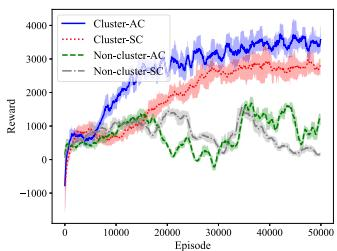  
(a) Impact of clustering on reward

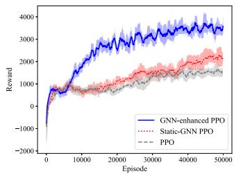  
(b) GNN-enhanced PPO vs. PPO  
Fig. 8. Convergence performance of different algorithms.

Non-cluster-SC strategies fail to converge. The absence of clustering forces the agent to contend with a high-dimensional action space. This introduces instability in the DRL learning process, making optimal policy exploration highly challenging. In contrast, both the Cluster-AC and Cluster-SC strategies efficiently achieve convergence. This is because Cluster-AC and Cluster-SC cluster UDs with the spatial proximity and the similar traffic patterns, the UAVs only need to explore a reduced space within their assigned clusters. Moreover, compared to Cluster-SC, the Cluster-AC approach achieves higher reward values, validating that leveraging flexible asynchronous time allocation for UAVs can improve the system’s data transmission efficiency.

Fig. 8(b) evaluates the convergence and reward performance of GNN-enhanced PPO compared to conventional PPO and static-GNN PPO. The conventional PPO without a GNNenhanced module relies on a MLP to process a flattened state vector comprising the UAVs’ states. The static-GNN PPO augments the conventional architecture by embedding the UAV-to-cluster connectivity graph via a GNN. At each step, the agent receives a graph representation of the current topology. However, this graph is reconstructed independently at every time slot without temporal memory mechanisms, e.g., GRU. It is observed that all the strategies converge successfully. However, both the traditional PPO and the static-GNN PPO get trapped in local optima. This is because in conventional PPO, the UAVs’ observations are processed by the MLP, which tends to overlook the spatial relationships between UAVs and clusters. Besides, although the static-GNN PPO takes spatial structure into account, the model cannot capture the evolution of the topology over time, making it difficult to anticipate state changes under the UAVs’ movements. This makes it more challenging for the agent to explore optimal strategies using these two approaches. In contrast, as the UAVs continuously adjust their trajectories, the GNN-enhanced PPO leverages graph neural networks to capture the spatial relationships between the UAVs and clusters, thereby facilitating more effective policy learning. The higher rewards obtained by the GNN-enhanced PPO compared to both conventional PPO and static-GNN PPO validate that our proposed algorithm better adapts to dynamic environments.

Fig. 9 compares the variation in traffic data size reaching the target UDs under Cluster-SC and Cluster-AC over time slots. We consider three distinct traffic flows, each directed to a different target UD. In Fig. 9(a), the traffic data size under the Cluster-SC scheme shows a linear growth trend, while data transmission remains limited. This is because the Cluster-SC scheme relies on synchronous time allocation with fixed time slots for transmission. In contrast, the Cluster-AC scheme achieves a higher traffic data throughput, which is attributed to the asynchronous time allocation strategy. The UAVs in Cluster-AC can flexibly adapt their time slots for data sensing, U2U relaying, or downlink transmission based on channel conditions and data buffer sizes. Furthermore, the Cluster-AC scheme’s flexible decision-making drives continuous traffic data growth and avoids transmission interference, as illustrated in Fig. 9(b).

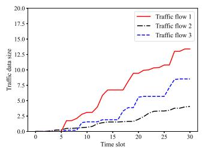  
(a) Cluster-SC scheme

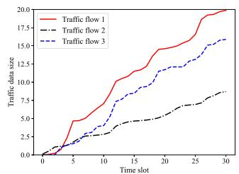  
(b) Cluster-AC scheme  
Fig. 9. Dynamics of traffic data size in different time slots.

## B. Clustering Performance With Cluster-AC Framework

Effective clustering significantly influences the UAVs’ trajectory planning and scheduling strategies. To investigate this impact, we evaluate the clustering performance of the STGAN. The cluster analysis experiments are based on an IP network traffic dataset collected from a network section of University of Cauca [46]. This dataset records the data packets at different times over six days. Besides, to account for the influence of network topology on the clustering process, we assign each IP in the dataset a physical location and treat it as a UD within a simulated × meter space. The dataset contains 1000 10003,577,296 flow instances and 87 traffic features, including source and destination IP addresses, ports, and packet sizes. We then identify 120 UDs by analyzing the flow patterns associated with each source IP. To better reflect real-world clustering, we segment the dataset into half-hour intervals, enabling us to observe temporal fluctuations in network traffic. During each interval, we compute each UD’s traffic pattern by structuring every flow as a source-target pair and summarizing the UD’s traffic features. Since our analysis focuses on traffic-related features, we primarily consider the dataset’s data volume and the number of traffic flows, which are critical in capturing UDs traffic patterns.

To intuitively evaluate the effectiveness of our clustering approach, we visualize the spatial distribution of UDs and the transmission directions of their traffic flows, as shown in Fig. 10. We consider two scenarios with markedly different distributions, e.g., the dense scenario I and the dispersed scenario II. In Fig. 10(a) and (c), each arrow represents the transmission direction of a UD’s traffic flow, with its length indicating the flow intensity. The six distinct colors correspond to different clusters. In scenario I, it is observed that the UDs separated by large spatial distances tend to be assigned to different clusters, ensuring that geographically distant nodes are not grouped together, as shown in Fig. 10(a). However, some UDs in close spatial proximity are nonetheless assigned to different clusters because their traffic flow directions differ. This demonstrates that STGAN not only considers spatial proximity but also incorporates traffic flow directionality into the clustering process. Furthermore, Fig. 10(b) illustrates the cumulative distribution of transmission directions and flow intensities within different clusters under the guidance of STGAN. The x-axis represents the transmission angle, while the y-axis denotes the flow intensity. The broad, uniquely colored curves show each cluster’s aggregated traffic distribution, while the thinner curves represent the traffic distributions of individual UDs within those clusters. The presence of sharp peaks with minimal overlap between the wide curves suggests that transmission directions differ significantly among clusters, resulting in a high degree of separation. This indicates that even spatially proximate UDs can be assigned to different clusters if their traffic flow directions differ substantially. This validates that STGAN adaptively cluster UDs based on their traffic patterns and spatial proximity. In scenario II, the UDs are spatially dispersed and share similar flow directions. The algorithm correctly groups UDs based on subtle flow direction features and spatial differences, as shown in Fig. 10(c). The flow intensity versus angle plots in Fig. 10(d) reveal comparable but distinguishable peaks for each cluster. These results demonstrate that the proposed method reliably captures and leverages both spatial and flow information to achieve accurate clustering across diverse traffic flow scenarios.

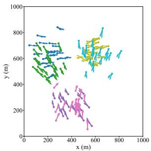  
(a) UDs' clustering in scenario I

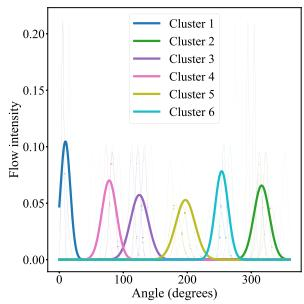  
(b) Flow intensity vs. angle in scenario I

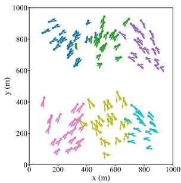  
(c) UDs’ clustering in scenario II

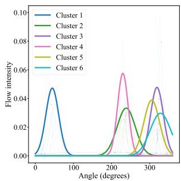  
(d) Flow intensity vs. angle in scenario II  
Fig. 10. UDs’ clustering and flow direction analysis in Unicauca network flows.

We further evaluate robustness using the balance network dataset [47]. Similarly, we map each IP in the dataset a physical location and treat it as a UD within a simulated × 1000 1000meter space. It features a larger number of target nodes and sparser traffic flows. As shown in Fig. 11(a), compared with the Unicauca network flows dataset, transmission arrows are less aligned and more widely dispersed in angle. This reflects flows spread across many distinct targets. Even under this weaker directional coherence and lower sample density, STGAN still forms geographically coherent groups while separating nearby UDs that point to different targets. The flow angle distributions in Fig. 11(b) corroborate these observations. Compared with Fig. 10, the wide curves, i.e., cluster aggregates, exhibit broader bases and lower peaks, and the thin per-UD curves display greater angular spread with increased overlap across clusters. However, each cluster’s aggregate still maintains discernible dominant directions, indicating that STGAN continues to exploit joint spatial-directional cues to produce reasonable partitions when traffic is both less concentrated and more sparse.

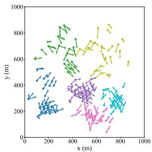  
(a) UDs’ clustering

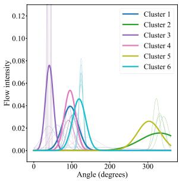  
(b) Flow intensity vs. angle

Fig. 11. UDs’ clustering and flow direction analysis in balance network.  
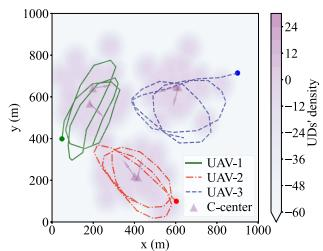  
(a) Cluster-AC

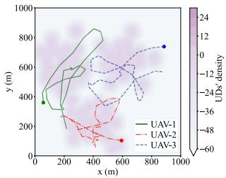  
(b) Non-cluster-AC

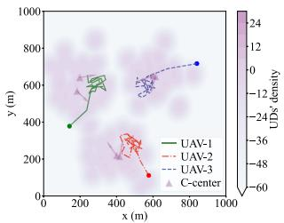  
(c) Static-GNN-AC

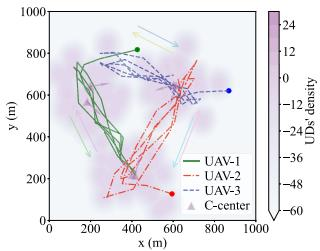  
(d) Non-U2U-AC

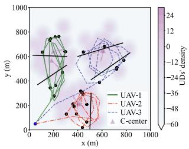  
(e) Same start node

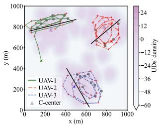  
(f) Short-range traffic flows  
Fig. 12. UAVs’ trajectories with different schemes.

## C. Trajectory Planning With Cluster-AC and Other Schemes

In this part, we compare the proposed Cluster-AC scheme to different algorithms and visualize the UAVs’ trajectories, as shown in Fig. 12. In the Non-cluster-AC, the algorithm fails to effectively cluster the UDs. In the Static-GNN-AC, the algorithm is a GNN-enhanced PPO agent that omits the GRU module, thereby removing its ability to model temporal dependencies. For the Non-U2U-AC, it retains both GNN-based topology awareness and the GRU temporal encoder of our Cluster-AC agent but disables all UAV-to-UAV relaying links. In Fig. 12, the UAVs adjust their trajectories based on real-time environmental observations. The background in each subfigure is a UD spatial density heat map obtained via kernel density estimation darker regions indicate higher UDs’ concentration. The triangles mark the learned cluster centers (C-center), and a short arrow at each center denotes the dominant transmission direction of that cluster, computed from the aggregate source-to-destination vectors. The three UAVs’ trajectories are shown in red, blue, and green, respectively. In Fig. 12(a), three UAVs in the Cluster-AC scheme autonomously partition six UD clusters into three distinct service groups based on their locations and traffic patterns. Each UAV focuses on serving the UDs within its designated clusters and can utilize the U2U links to relay data to other UAVs that are spatially closer to the target UDs. Through U2U relaying cooperation, the UAVs minimize redundant flying, thereby enabling more efficient data transmission. However, compared to the Cluster-AC strategy, the Non-cluster-AC scheme lacks a clear division of service regions and an effective coordination mechanism among UAVs, as shown in Fig. 12(b). As a result, the UAVs fly in an uncoordinated manner. These results highlight the importance of clustering for the UAVs’ trajectory planning, leading to more effective UAVs’ cooperation and optimization.

Furthermore, compared with the proposed Cluster-AC, the Static-GNN-AC scheme exhibits reduced inter-UAV coordination and less efficient trajectory planning, as shown in Fig. 12(c). Although the UAVs still manage to collect and transmit traffic flows in a rough sense, dynamic trajectory changes undermine the static graph’s capacity to capture up-to-date state information. Because the static topology cannot accommodate temporal variations, trajectory dynamics introduce perturbations that the model cannot represent, causing UAVs to favor hovering at optimal positions rather than actively repositioning. This performance gap underscores the necessity of temporal modeling. Incorporating a GRU module enables the agent to learn shortterm mobility patterns and anticipate future states, thereby facilitating smoother trajectory evolution and enhanced spatial reuse. Furthermore, in Fig. 12(d), UAVs are seen shuttling between different clusters. This behavior stems from their inability to perform U2U relaying transmissions, which forces them to incur additional flying overhead in order to deliver traffic data directly to target UDs. By contrast, the Cluster-AC strategy leverages U2U cooperation to balance UAVs’ resource allocation across clusters in accordance with UDs’ traffic demands and spatial topology.

We further validate the Cluster-AC’s U2U relaying transmission performance and trajectory planning, as illustrated in Fig. 12(e). We consider the UAVs start from the same initial positions. The identical initial positions imply that UAVs require more reliable trajectory planning and scheduling capabilities to ensure efficient transmission services for all data flows. Furthermore, the dynamic variations in UAVs’ asynchronous time allocation are represented by different markers along the UAVs’ trajectories. The black dots indicate the time slots in which UAVs allocate the longest time for the U2U relaying. To provide a more intuitive representation, we further use black solid lines to roughly delineate whether UAVs allocate the maximum time slots for U2U communication. One key observation is that in regions where UAVs are in close proximity, the density of black dots is significantly higher. This indicates that when UAVs are spatially in close proximity, they allocate more time to U2U communication. In contrast, when UAVs are farther apart, fewer black dots appear. This implies that less time is allocated to U2U communication, as UAVs rely more on individual data collection and direct transmission to target UDs. These results validate that the Cluster-AC scheme can adjust the UAVs’ asynchronous to adapt the dynamic network environments. In Fig. 12(f), we present the UAVs’ trajectories in the short-range traffic flow scenario. Red plus signs indicate the traffic flows for which UAVs are allocated the maximum number of time for data sensing, while gray circles represent the traffic flows receiving the maximum time allocation for downlink transmission to the target UDs. As observed in the figure, since the source and target nodes are spatially in close proximity and the service areas of different UAVs are spatially well separated, there is no need for the U2U communication among the UAVs. It clearly demonstrates that when the source and target nodes are geographically close, UAVs can efficiently manage their respective traffic flows independently, without requiring additional U2U cooperation. This observation further verifies the effectiveness of our asynchronous time allocation strategy. It is worth noting that the observed clustering effect is driven by both spatial proximity and directional coherence in traffic flows. If UDs were uniformly distributed with similar traffic patterns, STGAN would naturally produce more uniform partitions, as the spatial-temporal features would exhibit lower variance. Consequently, the trajectory and resource allocation would simplify to nearly uniform strategies across UDs.

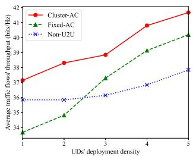  
Fig. 13. Comparison of UDs’ deployment density.

## D. Performance Comparison With Fixed Strategies

We evaluate the performance gains in average traffic throughput by comparing the Cluster-AC strategy against the Fixed-AC and Non-U2U schemes across various system parameters. In the Non-U2U scheme, UAVs operate solely in data sensing and downlink transmission modes, without UAV-to-UAV (U2U) communication capabilities. The Fixed-AC strategy assigns each UAV a fixed, independently determined asynchronous time allocation, whereas the Cluster-AC strategy dynamically adjusts both access control and time allocation in response to environmental dynamics. In Fig. 13, we investigate the impact of different time allocation schemes on throughput performance by varying the UDs’ deployment density. We normalize the deployment density and vary it from 1 to 5 while keeping the distribution pattern consistent to assess the impact on system throughput. It is observed that as the UDs’ deployment density increases, the throughput of all three schemes exhibits an upward trend, due to the enhanced spatial reuse and denser communication opportunities. When the UDs’ deployment density is below 2, the Non-U2U scheme exhibits higher throughput than the Fixed-AC scheme. This is because the Non-U2U scheme can independently collect and transmit traffic data without relying heavily on U2U communication in sparse deployment scenarios. However, as the UDs’ density gradually increases, the throughput performance of the Fixed-AC scheme surpasses that of the Non-U2U scheme. The Non-U2U scheme handles more flows but cannot leverage U2U communication, which constrains the system’s throughput gains. In contrast, the Fixed-AC scheme allocates U2U relaying time slots, enabling the UAVs to accelerate data transmission through cooperative U2U communication and achieve higher throughput in high-density scenarios. Overall, the Cluster-AC scheme achieves the highest overall throughput among the compared schemes, as it allows UAVs to dynamically adjust time allocation based on UDs’ deployment density.

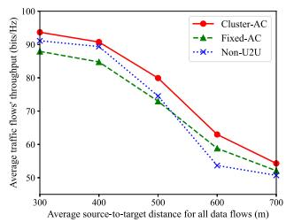  
Fig. 14. Impact of flows’ source-to-target distance.

In Fig. 14, we evaluate the impact of different traffic flows source-to-target distances on the average traffic throughput under the Cluster-AC, Fixed-AC, and Non-U2U strategies. As the distance increases, the UAVs require more time to complete the data sensing and downlink transmission processes, leading to a significant decrease in throughput across all strategies. Note that the Cluster-AC strategy consistently achieves the highest performance due to its ability to adaptively adjust asynchronous time allocation and coordinate UAVs’ transmission. When the average distance is below 500, the Fixed-AC scheme exhibits higher throughput than the Non-U2U scheme. However, as the average distance gradually increases, the throughput performance of the Fixed-AC scheme surpasses that of the Non-U2U scheme. This occurs because shorter source-to-target distances allow UAVs to efficiently serve their assigned UDs through optimized trajectory planning without relying on U2U communication. However, as the distance increases, the Non-U2U scheme’s sole reliance on trajectory planning limits system’s throughput performance, since longer distances result in extended flying times and reduced transmission efficiency. In contrast, the Fixed-AC scheme allocates extra U2U relaying slots to enable cooperative communication among UAVs, accelerating traffic transmission and achieving higher throughput over long source-to-target distances.

To evaluate the efficacy of the proposed Cluster-AC approach, we compare the Cluster-AC strategy against the Static-GNN-AC, the Non-U2U, and the Random schemes over a 30 time slot horizon, as shown in Fig. 15(a). The Random scheme indicates that each UAV randomly allocates its sub-slots in each time slot. It is observed that the Cluster-AC scheme achieves the highest cumulative throughput. Besides, we plot the U2U connection frequency in Fig. 15(b). An interesting observation is that the Cluster-AC’s relay usage fluctuates markedly between 25% and 50% of time slots. This fluctuation indicates that our strategy is able to dynamically adjust the asynchronous time-slot allocation based on each UAV’s current traffic buffer occupancy and real-time position. This adaptive relay scheduling not only maximizes data handoff opportunities when they are most beneficial but also prevents unnecessary relaying overhead. This further illustrates that our algorithm is not only robust to network dynamics but also highly flexible in orchestrating collaborative, asynchronous trajectory planning and scheduling among the UAVs.

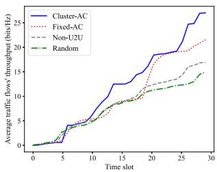  
(a) Traffic throughput

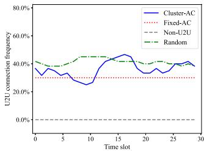  
(b) U2U connection frequency  
Fig. 15. Frequent U2U data exchange enhances throughput.

## VII. CONCLUSION

In this paper, we have focused on maximizing the minimum traffic flows’ throughput in UAV-assisted wireless networks with heterogeneous traffic flows. A traffic-aware asynchronous trajectory planning and scheduling approach has been proposed to enhance the efficiency of data transmission and reduce the co-channel interference among UAVs. First, we employ an STGAN to cluster UDs based on spatial-temporal traffic features and geographic correlations, thereby reducing UAVs’ trajectory planning and scheduling complexity. Then, a traffic-aware asynchronous trajectory planning and scheduling control approach is proposed to enhance throughput by balancing flying flexibility and interference control. Furthermore, a GNN-enhanced PPO enables UAVs to dynamically capture inter-cluster spatial topologies and channel conditions, thereby maximizing the minimum traffic flows’ throughput and reducing collision rates. Simulation results demonstrate that our proposed approach outperforms the benchmark methods, validating the efficacy of combining spatial-temporal traffic clustering and asynchronous control for efficient UAV-assisted network operations. While increasing the number of UAVs improves coverage, it introduces more complex coordination. The traffic-aware asynchronous control provide a potential basis for extension. Future work will focus on extending this framework to incorporate heterogeneous UAVs’ capabilities and dynamic UDs’ mobility patterns.

## REFERENCES

[1] E. H. Houssein, M. A. Othman, W. M. Mohamed, and M. Younan, “Internet of Things in smart cities: Comprehensive review, open issues and challenges,” IEEE Internet Things J., vol. 11, no. 21, pp. 34941–34952, Nov. 2024.

[2] X.-R. Xu, Y.-H. Xu, L. Suo, W. Zhou, G. Yu, and A. Nallanathan, “UAVserved energy harvesting-enabled M2M networks for green industry— A perspective of energy efficient resource management scheme,” IEEE Trans. Green Commun. Netw., vol. 7, no. 4, pp. 1877–1891, Dec. 2023.

[3] R. Djehaiche, S. Aidel, A. Sawalmeh, N. Saeed, and A. H. Alenezi, “Adaptive control of IoT/M2M devices in smart buildings using heterogeneous wireless networks,” IEEE Sensors J., vol. 23, no. 7, pp. 7836–7849, Apr. 2023.

[4] Z. Wang et al., “A survey on IoT-enabled home automation systems: Attacks and defenses,” IEEE Commun. Surveys Tuts., vol. 24, no. 4, pp. 2292–2328, 4th Quart. 2022.

[5] K. Belwafi, R. Alkadi, S. A. Alameri, H. Al Hamadi, and A. Shoufan, “Unmanned aerial vehicles’ remote identification: A tutorial and survey,” IEEE Access, vol. 10, pp. 87577–87601, 2022.

[6] L. Zhang, X. Ma, Z. Zhuang, H. Xu, V. Sharma, and Z. Han, “Q-learning aided intelligent routing with maximum utility in cognitive UAV swarm for emergency communications,” IEEE Trans. Veh. Technol., vol. 72, no. 3, pp. 3707–3723, Mar. 2023.

[7] M. Matracia, M. A. Kishk, and M.-S. Alouini, “UAV-aided post-disaster cellular networks: A novel stochastic geometry approach,” IEEE Trans. Veh. Technol., vol. 72, no. 7, pp. 9406–9418, Jul. 2023.

[8] P. McEnroe, S. Wang, and M. Liyanage, “A survey on the convergence of edge computing and AI for UAVs: Opportunities and challenges,” IEEE Internet Things J., vol. 9, no. 17, pp. 15435–15459, Sep. 2022.

[9] R. Han, L. Bai, Y. Wen, J. Liu, J. Choi, and W. Zhang, “UAV-Aided backscatter communications: Performance analysis and trajectory optimization,” IEEE J. Sel. Areas Commun., vol. 39, no. 10, pp. 3129–3143, Oct. 2021.

[10] Z. Lu, G. Wu, F. Zhou, and Q. Wu, “Intelligently joint task assignment and trajectory planning for UAV cluster with limited communication,” IEEE Trans. Veh. Technol., vol. 73, no. 9, pp. 13122–13137, Sep. 2024.

[11] Z. Liu et al., “Point cloud video streaming: Challenges and solutions,” IEEE Netw., vol. 35, no. 5, pp. 202–209, Sep./Oct. 2021.

[12] N. Alhussien and T. A. Gulliver, “Joint resource and power allocation for clustered cognitive M2M communications underlaying cellular networks,” IEEE Trans. Veh. Technol., vol. 71, no. 8, pp. 8548–8560, Aug. 2022.

[13] D.-H. Tran, V.-D. Nguyen, S. Chatzinotas, T. X. Vu, and B. Ottersten, “UAV relay-assisted emergency communications in IoT networks: Resource allocation and trajectory optimization,” IEEE Trans. Wireless Commun., vol. 21, no. 3, pp. 1621–1637, Mar. 2022.

[14] J. Zheng et al., “An efficient strategy for accurate detection and localization of UAV swarms,” IEEE Internet Things J., vol. 8, no. 20, pp. 15372–15381, Oct. 2021.

[15] S. Gong, M. Wang, B. Gu, W. Zhang, D. T. Hoang, and D. Niyato, “Bayesian optimization enhanced deep reinforcement learning for trajectory planning and network formation in multi-UAV networks,” IEEE Trans. Veh. Technol., vol. 72, no. 8, pp. 10933–10948, Aug. 2023.

[16] C.-X. Wanget al., “On the road to 6G: Visions, requirements, key technologies, and testbeds,” IEEE Commun. Surveys Tuts., vol. 25, no. 2, pp. 905–974, 2nd Quart. 2023.

[17] H. Zheng, C. Chen, B. Gu, B. Lyu, and S. Gong, “Experience-driven spatial-temporal graph attention for clustering IoT traffic in wireless networks,” in Proc. IEEE Veh. Technol. Conf., Chengdu, China, 2025, pp. 1–6.

[18] M. Michalopoulou and P. Mähönen, “The critical range in clustered ad hoc networks: An analysis for gaussian distributed nodes,” IEEE Commun. Lett., vol. 19, no. 5, pp. 811–814, May 2015.

[19] G. Mavros, V. Asteriou, K. F. Kantelis, P. Nicopolitidis, and G. I. Papadimitriou, “Node classification-based bandwidth allocation: A new scheduling algorithm for TDMA-based LANs,” IEEE Access, vol. 10, pp. 96212–96223, 2022.

[20] J. Li, J. Wu, W. He, and P. Zhou, “Large-Scale nodes classification with deep aggregation network,” IEEE Trans. Knowl. Data Eng., vol. 33, no. 6, pp. 2560–2572, Jun. 2021.

[21] A. Fahim and Y. Gadallah, “An optimized LTE-based technique for drone base station dynamic 3D placement and resource allocation in delaysensitive M2M networks,” IEEE Trans. Mobile Comput., vol. 22, no. 2, pp. 732–743, Feb. 2023.

[22] Z. Zhang, X. Li, and C. Gan, “Multimodality fusion for node classification in D2D communications,” IEEE Access, vol. 6, pp. 63748–63756, 2018.

[23] L. Nie et al., “A reinforcement learning-based network traffic prediction mechanism in intelligent Internet of Things,” IEEE Trans. Ind. Informat., vol. 17, no. 3, pp. 2169–2180, Mar. 2021.

[24] E. E. Aydin, A. Akcasoy, F. Cakir, B. S. Cansiz, G. Secinti, and B. Canberk, “Distributed TDMA scheduling for autonomous aerial swarms: A selforganizing approach,” IEEE Access, vol. 12, pp. 45631–45643, 2024.

[25] S. Halder, A. Ghosal, and M. Conti, “Dynamic super round-based distributed task scheduling for UAV networks,” IEEE Trans. Wireless Commun., vol. 22, no. 2, pp. 1014–1028, Feb. 2023.

[26] X. Qin et al., “Timeliness-oriented asynchronous task offloading in UAVedge-computing systems,” IEEE Trans. Netw. Sci. Eng., vol. 11, no. 1, pp. 900–912, Jan./Feb. 2024.

[27] H. Yang, J. Zhao, J. Nie, N. Kumar, K.-Y. Lam, and Z. Xiong, “UAVassisted 5G/6G networks: Joint scheduling and resource allocation based on asynchronous reinforcement learning,” in Proc. IEEE Conf. Comput. Commun., Vancouver, BC, Canada, 2021, pp. 1–6.

[28] M. Hua, L. Yang, Q. Wu, and A. L. Swindlehurst, “3D UAV trajectory and communication design for simultaneous uplink and downlink transmission,” IEEE Trans. Commun., vol. 68, no. 9, pp. 5908–5923, Sep. 2020.

[29] M. E. Mkiramweni, C. Yang, J. Li, and W. Zhang, “A survey of game theory in unmanned aerial vehicles communications,” IEEE Commun. Surveys Tuts., vol. 21, no. 4, pp. 3386–3416, 4th Quart. 2019.

[30] X. Wei, L. Cai, N. Wei, P. Zou, J. Zhang, and S. Subramaniam, “Joint UAV trajectory planning, DAG task scheduling, and service function deployment based on DRL in UAV-empowered edge computing,” IEEE Internet Things J., vol. 10, no. 14, pp. 12826–12838, Jul. 2023.

[31] H. Jiang, S. Han, G. Sun, and Y.-C. Liang, “Contention or symbiosis: The model-based and model-less transmission mode selections for Internet of Things in unlicensed band,” IEEE Internet Things J., vol. 10, no. 7, pp. 6164–6181, Apr. 2023.

[32] J. Zhang et al., “Collaborative intelligent reflecting surface networks with multi-agent reinforcement learning,” IEEE J. Sel. Topics Signal Process., vol. 16, no. 3, pp. 532–545, Apr. 2022.

[33] F. Fredj, Y. Al-Eryani, S. Maghsudi, M. Akrout, and E. Hossain, “Distributed beamforming techniques for cell-free wireless networks using deep reinforcement learning,” IEEE Trans. Cogni. Commun. Netw., vol. 8, no. 2, pp. 1186–1201, Jun. 2022.

[34] Z. Guo, Z. Chen, P. Liu, J. Luo, X. Yang, and X. Sun, “Multi-agent reinforcement learning-based distributed channel access for next generation wireless networks,” IEEE J. Sel. Areas Commun., vol. 40, no. 5, pp. 1587–1599, May 2022.

[35] M. Aljehani and M. Inoue, “Multi-uav tracking and scanning systems in M2M communication for disaster response,” in Proc. IEEE 5th Glob. Conf. Consum. Electron., Kyoto, Japan, 2016, pp. 1–2.

[36] X. Liu and N. Ansari, “Resource allocation in UAV-assisted M2M communications for disaster rescue,” IEEE Wireless Commun. Lett., vol. 8, no. 2, pp. 580–583, Apr. 2019.

[37] M. Li, F. R. Yu, P. Si, R. Yang, Z. Wang, and Y. Zhang, “UAV-assisted data transmission in blockchain-enabled M2M communications with mobile edge computing,” IEEE Netw., vol. 34, no. 6, pp. 242–249, Nov./Dec. 2020.

[38] R. Wang, K. Meng, and D. Li, “Multi-UAV collaborative trajectory planning for seamless data collection and transmission,” in Proc. IEEE Wireless Commun. Netw. Conf., Milan, Italy, 2025, pp. 1–7.

[39] X. Luo, C. Chen, C. Zeng, C. Li, J. Xu, and S. Gong, “Deep reinforcement learning for joint trajectory planning, transmission scheduling, and access control in UAV-assisted wireless sensor networks,” Sensors, vol. 23, no. 10, May 2023, Art. no. 4691.

[40] J. Huang, H. Lu, J. Tang, N. Zhao, Z. Shi, and X. Wang, “NOMA assisted semi-grant-free transmission for UAV networks: A multi-user scheduling approach,” IEEE Trans. Commun., vol. 73, no. 8, pp. 6780–6797, Aug. 2025.

[41] S. Gong, L. Cui, B. Gu, B. Lyu, D. T. Hoang, and D. Niyato, “Hierarchical deep reinforcement learning for age-of-information minimization in IRS-aided and wireless-powered wireless networks,” IEEE Trans. Wireless Commun., vol. 22, no. 11, pp. 8114–8127, Nov. 2023.

[42] J. Schulman, S. Levine, P. Abbeel, M. Jordan, and P. Moritz, “Trust region policy optimization,” in Proc. Int. Conf. Mach. Learn., 2015, pp. 1889–1897.

[43] E. Jang, S. Gu, and B. Poole, “Categorical reparameterization with gumbelsoftmax,” 2016, arXiv:1611.01144.

[44] J. Schulman, F. Wolski, P. Dhariwal, A. Radford, and O. Klimov, “Proximal policy optimization algorithms,” 2017, arXiv:1707.06347.

[45] S. Zhao et al., “Exploiting NOMA transmissions in multi-UAV-assisted wireless networks: From aerial-RIS to mode-switching UAVs,” IEEE Trans. Wireless Commun., vol. 24, no. 3, pp. 2530–2544, Mar. 2025.

[46] J. S. Rojas, A. Rendon, and J. C. Corrales, “Consumption behavior analysis of over the top services: Incremental learning or traditional methods?,” IEEE Access, vol. 7, pp. 136581–136591, 2019.

[47] I. Ullah, “Balance\_network,” Hugging Face Datasets, Sep. 2023. [Online]. Available: https://huggingface.co/datasets/Imran1/balance\_network

  
Che Chen received the BE degree from the Changchun University of Science and Technology, China, in 2019, and the ME degree from Minnan Normal University, China, in 2023. He is currently working toward the Ph.D. degree with Sun Yat-sen University, China. He was an exchange student with the University of Electro-Communications, Tokyo, Japan. His research interests include UAV-assisted wireless networks and 360◦ video streaming.

Bo Gu (Member, IEEE) received the PhD degree from Waseda University, Tokyo, Japan, in 2013. From 2007 to 2011, he was a research engineer with Sony Digital Network Applications, Tokyo, assistant professor with Waseda University from 2011 to 2016, and associate professor with Kogakuin University, Tokyo, from 2016 to 2018. He is currently a professor with the School of Intelligent Systems Engineering, Sun Yat-sen University, Shenzhen, China. His research interests include Internet of Things, edge computing, and machine learning.

Bin Lyu (Senior Member, IEEE) received the BE and PhD degrees from the Nanjing University of Posts and Telecommunications, Nanjing, China, in 2013 and 2018, respectively. He is currently an associate professor with the Nanjing University of Posts and Telecommunications. His research interests include symbiotic communications, wireless powered communications, backscatter communications, and movable antenna-assisted communication.

Shimin Gong (Member, IEEE) received the BE and ME degrees in electronics and information engineering from the Huazhong University of Science and Technology, Wuhan, China, in 2008 and 2012, respectively, and the PhD degree in computer engineering from Nanyang Technological University, Singapore, in 2014. He is currently a professor with the School of Intelligent Systems Engineering, Sun Yat-sen University, Shenzhen, China. His research interests include wireless powered communications, backscatter communications, and machine learning in wireless

communications. He was a corecipient of IEEE WCNC 2019 Best Paper Award on MAC and Cross-layer Design, and 2023 IEEE Communications Society Best Survey Paper Award. He is an associate editor for IEEE Transactions on Vehicular Technology.

Zhi Liu (Senior Member, IEEE) received the PhD degree in informatics from the National Institute of Informatics. He is currently an associate professor with The University of Electro-Communications. His research interests include video network transmission and mobile edge computing. He is an editorial board member of IEEE Transactions on Multimedia, IEEE Transactions on Circuits and Systems for Video Technology, IEEE Network, IEEE Transactions on Network Science and Engineering, and IEEE Internet of Things Journal. He has been serving as area chair

of ACM MM24/23, area chair of IEEE ICME23/25. He was the receipt of the Suematsu-Yasuharu Award, IEEE TCBD Outstanding Mid-Career Achievement Award and best paper awards from six IEEE conferences. He is secretary of IEEE ComSoc Multimedia Communications Technical Committee.

Yuming Fang (Fellow, IEEE) received the BE degree from Sichuan University, Chengdu, China, the MS degree from the Beijing University of Technology, Beijing, China, and the PhD degree from Nanyang Technological University, Singapore. He is currently a professor with the School of Computing and Artificial Intelligence, Jiangxi University of Finance and Economics, Nanchang, China. His research interests include visual attention modeling, visual quality assessment, image retargeting, computer vision, and 3D image/video processing. He serves as an associate

editor for IEEE Transactions on Multimedia. He is the editorial board of Signa Processing: Image Communication.