# Traffic-Aware Lightweight Hierarchical Offloading Toward Adaptive Slicing-Enabled SAGIN

Zheyi Chen , Member, IEEE, Junjie Zhang , Geyong Min , Member, IEEE, Zhaolong Ning , Senior Member, IEEE, and Jie Li , Fellow, IEEE

Abstract— The emerging Space-Air-Ground Integrated Networks (SAGIN) empower Mobile Edge Computing (MEC) with wider communication coverage and more flexible network access. However, the fluctuating user traffic and constrained computing architecture seriously hinder the Quality-of-Service (QoS) and resource utilization in SAGIN. Existing solutions generally depend on prior knowledge or adopt static resource provisioning, lacking adaptability and resulting in serious system overheads. To address these important challenges, we propose THOAS, a novel Traffic-aware lightweight Hierarchical Offloading framework towards Adaptive Slicing-enabled SAGIN. First, we innovatively separate SAGIN into Communication Access Platforms (CAPs) and Computation Offloading Platforms (COPs). Next, we design a new self-attention-based prediction method to accurately capture the traffic changes on each platform, enabling adaptive slice resource adjustments. Finally, we develop an improved deep reinforcement learning method based on proximal clipping with dynamic confidence intervals to reach optimal offloading. Notably, we employ knowledge distillation to compress offloading policies into lightweight networks, enhancing their adaptability in resource-limited SAGIN. Using real-world datasets of user traffic, extensive experiments are conducted. The results show that the THOAS can accurately predict traffic and make adaptive resource adjustments and offloading decisions, which outperforms other benchmark methods on multiple metrics under various scenarios.

Received 7 March 2024; revised 30 June 2024; accepted 5 August 2024. Date of publication 3 October 2024; date of current version 22 November 2024. This work was supported in part by the National Natural Science Foundation of China under Grant 62202103, in part by the Central Funds Guiding the Local Science and Technology Development under Grant 2022L3004, in part by the National Natural Science Foundation of Chongqing under Grant CSTB2024NSCQ-JQX0013, in part by Fujian Province Technology and Economy Integration Service Platform under Grant 2023XRH001, and in part by Fuzhou-Xiamen-Quanzhou National Independent Innovation Demonstration Zone Collaborative Innovation Platform under Grant 2022FX5. (Corresponding authors: Geyong Min; Zhaolong Ning.)

Zheyi Chen and Junjie Zhang are with the College of Computer and Data Science and Fujian Key Laboratory of Network Computing and Intelligent Information Processing, Fuzhou University, Fuzhou 350116, China, and also with the Engineering Research Center of Big Data Intelligence, Ministry of Education, Fuzhou 350002, China (e-mail: z.chen@fzu.edu.cn; junjiefzu@qq.com).

Geyong Min is with the Department of Computer Science, Faculty of Environment, Science and Economy, University of Exeter, EX4 4QF Exeter, U.K. (e-mail: g.min@exeter.ac.uk).

Zhaolong Ning is with the School of Communications and Information Engineering, Chongqing University of Posts and Telecommunications, Chongqing 400065, China (e-mail: z.ning@ieee.org).

Jie Li is with the Department of Computer Science and Engineering, Shanghai Jiao Tong University, Shanghai 200240, China (e-mail: lijiecs@sjtu.edu.cn).

Color versions of one or more figures in this article are available at https://doi.org/10.1109/JSAC.2024.3459020.

Digital Object Identifier 10.1109/JSAC.2024.3459020

Index Terms— Space-air-ground integrated networks, computation offloading, slice resource allocation, deep reinforcement learning, model compression.

# I. INTRODUCTION

HE emerging intelligent applications such as autonomous driving and video analysis exhibit computation-intensive and latency-sensitive characteristics, while the finite computing resources on end devices hinder their further development and popularity. To ameliorate this issue, Mobile Edge Computing (MEC) has been considered as a promising computing paradigm with bright prospects [1]. By deploying computing and storage resources at the network edge close to end devices, the bandwidth pressure and transmission delay can be greatly reduced. However, due to limited communication coverage and fixed network architecture, existing ground infrastructures cannot well meet the high Quality-of-Service (QoS) requirements of intelligent applications. Meanwhile, it is hard for terrestrial networks to provide stable and continuous access services to users worldwide. More than 50% of the world’s regions, especially for some complex terrains such as oceans and islands, still lack network coverage [2]. Moreover, as the core infrastructures in the MEC paradigm, the ground base stations (BSs) might be seriously affected by natural disasters, leading to the interruption of communication services.

To relieve the above issues, space and air communication technologies have been rapidly developed and recently integrated into the MEC paradigm. Commonly, the satellite networks composed of Low-Earth Orbit (LEO) satellites offer communication services with wide coverage and universal connection, while the aerial networks composed of Unmanned Aerial Vehicles (UAVs) and civil aircraft provide alternative communication services in some densely-populated areas for flexible deployment and low communication delay [3]. Therefore, by synergizing the complementary advantages of satellite, aerial, and ground networks, Space-Air-Ground Integrated Networks (SAGIN) can better empower MEC to offer seamless and global access services to intelligent applications with high demands in real-time data sensing and complex task processing [4]. However, due to limited resources in SAGIN, unreasonable resource provisioning may seriously degrade QoS and cause excessive system overheads. To better utilize resources, through leveraging software-defined networking and virtualization technologies, Infrastructure Providers (InP) can virtualize communication and computing resources into network slices and sell them to Edge Service Providers (ESP). Thus, the ESP can provide resource-customized services by deploying them on appropriate slices. When users send requests for task offloading, the ESP receives the requests via SAGIN and uses slice resources to execute tasks and return results. Despite the promising prospects, designing an efficient offloading and slicing framework for SAGIN still faces the following significant challenges.

• Continuous Traffic Fluctuations. To guarantee seamless services across multiple regions, the ESP needs to rent and manage resources from many communication and computing platforms. However, due to the high mobility of users, the traffic in SAGIN may change over time, causing an uneven spatio-temporal distribution of system loads. Therefore, the ESP should well consider continuous traffic fluctuations to guarantee high QoS and avoid resource under-supply or over-supply.   
• High Resource Heterogeneity. Commonly, a single platform in SAGIN may not be equipped with sufficient communication and computing resources simultaneously. For example, satellites and UAVs own strong capabilities of network access but they only have limited computational capabilities, thereby struggling to process computation-intensive tasks. In contrast, BSs are equipped with more computing resources, but remote users may not access them directly due to their fixed locations.   
• Excessive System Overheads. When designing an efficient algorithm, the system overheads of training and executing the algorithm must be fully considered. However, it is difficult to deploy the existing algorithms [5], [6] in real-world SAGIN due to the limited computing resources and low-power architecture design of satellites and UAVs. As the problem scale continues to increase, the excessive system overheads caused by running algorithms may become unacceptable, which seriously affects their application practicality in SAGIN.

To address these important challenges, we comprehensively analyze the strengths and weaknesses of the communication and computing platforms in SAGIN and propose THOAS, a novel Traffic-aware lightweight Hierarchical Offloading framework towards Adaptive Slicing-enabled SAGIN. In THOAS, users can access the offloading services provided by the ESP and upload their tasks to available communication platforms. Based on the analysis of traffic distribution and available resources on different platforms, users’ tasks will be transmitted from communication platforms to appropriate computing platforms for execution. Specifically, a new traffic prediction method and improved Deep Reinforcement Learning (DRL) are introduced to conduct slice resource allocation and make offloading decisions with the goal of maximizing ESP profits. To enhance the adaptability of THOAS to resource-limited SAGIN, we customize a knowledge distillation technology [7] to compress the effective policies in DRL to shallow neural networks, thereby reducing the system overheads of model inference. The main contributions of this work are summarized as follows.

• We propose a new hierarchical offloading framework for slicing-enabled SAGIN. We separate SAGIN into Communication Access Platforms (CAPs) and Computation Offloading Platforms (COPs) for fine-grained and on-demand resource provisioning. Notably, the communication and computing resources in SAGIN are modeled as network slices, aiming to achieve efficient monitoring, analysis, and resource allocation on different platforms.   
• We design an adaptive slice resource allocation method to cope with dynamic system loads caused by traffic fluctuations in SAGIN. First, we design a new traffic prediction method that combines probsparse self-attention and self-attention distillation to accurately capture traffic changes. Next, we infer future resource demands based on predicted traffic and current system loads. Finally, by comprehensively considering revenues and costs, the proposed method can make adaptive slice resource adjustments for maximizing ESP profits.   
• We develop an improved lightweight DRL method to schedule the offloaded tasks in SAGIN. First, we adopt Generalized Advantage Estimation (GAE) to improve the accuracy of value estimation for offloading actions. Next, we introduce the proximal clipping with dynamic confidence intervals to reduce the impact of traffic fluctuations on policy updates. Notably, we compress the converged policies into shallow neural networks to lighten the overheads of model inference and make the model better adapted to resource-limited SAGIN environments.   
• Using real-world datasets of user traffic, we conduct extensive experiments. The results show that the THOAS can accurately capture traffic fluctuations and adaptively adjust slice resources to better match system loads and meet user demands. Meanwhile, it can forward and offload tasks between different platforms according to the available resources in SAGIN. Compared with benchmark methods, the THOAS achieves superior performance in terms of ESP profits, traffic prediction accuracy, resource utilization, and delay violation rate.

The rest of this paper is arranged as follows. Section II analyzes the related studies. Section III describes the system model and formulates the problem. Section IV details the THOAS. Section V conducts performance evaluation for the THOAS. Finally, Section VI concludes this work.

# II. RELATED WORK

Recently, resource allocation and computation offloading in SAGIN have drawn widespread attention, and many studies have contributed to addressing these two essential problems.

# A. Resource Allocation and Network Slicing in SAGIN

1) Resource Allocation: Gong et al. [8] considered a three-layer model that integrated communication and computing resources in space, air, and ground networks, and then they developed a Lyapunov-assisted multi-agent proximal optimization algorithm to maximize the total rate of ground devices.

Cheng et al. [9] developed a DRL-based approach to schedule the offloaded tasks in SAGIN. Wang et al. [10] proposed a distributed DRL-based resource allocation algorithm in response to the limited storage capacity of space-air networks, aiming to achieve high-reliability communication. However, the above studies only considered static user traffic and fixed resource capacity, which may lead to resource under-supply or oversupply when facing real-world SAGIN with dynamic user traffic and demands.

2) Network Slicing: To achieve on-demand resource allocation, network slicing has been regarded as a promising technique. Shen et al. [11] proposed a collaborative offloading framework with radio access network slicing for SAGIN and designed a regression-based prediction algorithm to make the slicing window adapted to traffic fluctuations. Kim et al. [12] investigated a network slicing-based architecture for satelliteenabled edge computing and utilized a heuristic algorithm to optimize the offloading rate and task processing delays. Asheralieva et al. [13] studied the slicing problem in SAGIN with limited resources and used Graph Neural Networks (GNNs) with message passing to estimate the hidden node states in dynamic environments. Although the above studies attempted to construct network slices in SAGIN to achieve better resource adaptation, they did not consider the costs of different slices in space, air, and terrestrial networks. Moreover, they just assumed that all resources in SAGIN could be adjusted at any time, ignoring the service interruptions and extra system overheads caused by the frequent adjustments.

# B. Classic and RL-Based Offloading in SAGIN

1) Classic Offloading Methods: Yu et al. [2] proposed a SAGIN-enabled vehicular edge system and proposed an imitation-learning-based offloading and caching algorithm to minimize task completion time. Cui et al. [14] studied a hybrid orbit satellite network and adopted convex optimization to minimize offloading latency. He et al. [15] modeled a collaborative offloading framework for LEO satellites and designed a channel-aware association algorithm for partial offloading. Zhang et al. [16] utilized UAVs to offload tasks to LEO satellites and constructed it as a stochastic game. Liu et al. [17] modeled an SGAIN architecture with wireless power transmission and adopted Lyapunov optimization to minimize long-term network costs. However, in real-world SGAIN, satellites struggle to fulfill the assumption of the above studies on their computational capabilities because they are mainly used for communication purposes. In contrast, some studies regarded satellites as communication relays that forwarded tasks to ground BSs. Chen et al. [3] proposed a multi-layer offloading framework and applied a successive convex approximation to derive the solution. He et al. [5] designed an approximation algorithm to handle the offloading problem in SAGIN, aiming to balance energy consumption and mean makespan. Song et al. [18] designed an offloading framework for terrestrial-satellite networks and proposed a Lagrangian-based method to minimize energy consumption. Liu et al. [19] proposed a Lagrangian-based theory to determine the relationship between vehicles and BSs for meeting the latency requirements in SAGIN. Xu et al. [20] developed a hierarchical bandwidth allocation scheme for SAGIN, where a gradient-descent algorithm was designed to optimize pricing policy. The above studies commonly adopted approximation and optimization methods to cope with the offloading problem. As the problem scale increases, the system overheads of running these methods may become too excessive to be acceptable for resource-limited SAGIN.

2) RL-Based Offloading Methods: As an emerging branch of machine learning, RL can make offloading decisions by interacting with SAGIN environments. Tang et al. [21] proposed a Q-learning-based traffic offloading for SAGIN by considering the high mobility of nodes and frequent changes of link state. Zhang et al. [22] converted the offloading in SAGIN to a multi-domain Virtual Network Embedding (VNE) problem, which was solved by using a latency-sensitive DRL-based algorithm. Zhang et al. [23] developed a distributed DRL algorithm to handle the offloading problem in SAGIN, aiming to reduce transmission delay. Liu et al. [24] proposed a federated DRL-based offloading method to find sub-optimal decisions, considering the privacy protection and communication failure in SAGIN. Xu et al. [25] designed a DRL-based offloading algorithm to minimize the average latency and potential risks in selecting edge servers. Although the well-trained RL models can obtain the offloading decision by one inference, it is still hard for the SAGIN with weak computing units to process the complex neural networks in DRL. To relieve this issue, Feriani et al. [26] integrated a load-balancing strategy with meta-RL, reducing the extra training costs of agents when facing new environments. Kang et al. [27] utilized a multi-teacher knowledge distillation to train DRL for adapting to dynamic traffic patterns. Wang et al. [28] developed a multi-agent DRLbased method with transfer learning and knowledge distillation to handle beamforming coordination and resource allocation. The above studies focused on reducing the training costs of RL algorithms, but they did not well consider optimizing the system overheads and application practicality of model inference in real-world SAGIN with constrained resources.

To the best of our knowledge, this is the first of its kind to propose a traffic-aware hierarchical framework that integrates lightweight DRL with self-attention-based prediction for addressing the joint problem of slice resource allocation and computation offloading in SAGIN.

# III. SYSTEM MODEL AND PROBLEM FORMULATION

As shown in Fig. 1, the proposed hierarchical offloading framework for slicing-enabled SAGIN consists of a satellite, a ground BS, and multiple UAVs, whose equipped wireless communication channels provide network access to users, called Communication Access Platforms (CAPs). The set of CAPs is denoted as $A = \{ a _ { 1 } , a _ { 2 } , \ldots , a _ { R } \}$ . With the Orthogonal Frequency Division Multiplexing (OFDM) technology, a CAP channel can be divided into several orthogonal subchannels (SCs), and the maximum number of SCs on $a _ { j } \in A$ is denoted as $B _ { j } ^ { \mathrm { m a x } }$ . The BS and UAVs own computing units for processing offloaded tasks, called Computation Offloading Platforms (COPs), and the set of COPs is denoted as

$O = \{ o _ { 1 } , o _ { 2 } , . . . , o _ { S } \}$ . The computing resources of COPs are provisioned by virtual machines (VMs), and the maximum number of VMs on $o _ { j } \in O$ is denoted as $F _ { j } ^ { \mathrm { m a x } }$ .

In the proposed framework, the SCs in CAPs and VMs in COPs are maintained by the InP and provisioned to ESP in the form of communication and computing slices, respectively. First, the ESP sends requests to the InP for renting slices and deploys services on slices after obtaining slice resources. Next, the ESP can earn revenues by allocating slice resources to complete the offloaded tasks from users. To better meet the demands of offloading requests in various scenarios and save the costs of renting slice resources, the ESP should continuously monitor and dynamically adjust the slice resources in SAGIN. The numbers of SCs and VMs configured by the ESP on $a _ { j }$ and $o _ { j }$ are denoted as $B _ { j }$ and $F _ { j }$ , respectively. When users send offloading requests, they first access their nearest CAPs and upload the input data of tasks. Next, the tasks will be transmitted to COPs for execution and the results will be returned via CAPs. If tasks are completed within the maximum tolerable delay, users will make payments to the ESP. The set of users served by the ESP is denoted as $U ~ = ~ \{ u _ { 1 } , u _ { 2 } , . . . , u _ { N } \}$ . CAPs are located in different geographical locations with various communication coverages, as and the number of users under the coverage of $N _ { j }$ , where $\begin{array} { r } { N = \sum _ { i = 1 } ^ { R } N _ { j } } \end{array}$ . $a _ { j }$ is marked

Due to the high mobility of users, the uneven and fluctuating spatio-temporal distribution of traffic and loads may happen on the CAPs and COPs in SAGIN. In response to this problem, the ESP needs to monitor and analyze user traffic and system loads in different regions, thus making proper adjustments to resource slices for higher QoS and system efficiency. Thus, we specify the time slot $t \in \{ 1 , 2 , \ldots , T \}$ . At the start of $t ,$ the ESP allocates slice resources to the offloaded tasks from users. At the end of t, the ESP collects the traffic and load information on each slice. Through analyzing the information, the ESP can predict future system demands and adjust the resource slices on CAPs and COPs accordingly.

# A. Communication Model

A task of the user $u _ { i } ~ \in ~ U$ is denoted as a 6-tuple $<$ $d _ { i } , \eta _ { i } , \rho _ { i } , a _ { i } , l _ { i } , o _ { i } > ,$ , where $d _ { i }$ is the data size, $\eta _ { i }$ is the computational density, $\rho _ { i }$ is the priority of $u _ { i } , \ a _ { i }$ is the CAP that $u _ { i }$ is connected, $l _ { i }$ is the distance from $u _ { i }$ to ${ { a } _ { i } } ,$ and $o _ { i }$ is the COP that executes the task. Different from satellites and UAVs, BSs own more stable communication links and more cost-effective channel costs. Outside the communication coverage of BS, UAVs can offer flexible expansion with certain communication and computing resources. However, for some remote regions that BSs and UAVs cannot cover such as sea and desert, satellites are the only available communication platforms for users to access network services. Specifically, when $u _ { i }$ uploads the input data of its task to CAPs, we consider the following two communication scenarios.

• If $u _ { i }$ is within the coverage of the BS or UAVs, it will upload the task via one of them. The Signal-to-Noise Ratio (SNR) during task transmission is defined as

$$
S N R = \frac {p _ {u} 1 0 ^ {- \frac {P _ {\text { loss }}}{1 0}}}{\sigma^ {2}}, \tag {1}
$$

where $p _ { u }$ is the upload power, $\sigma ^ { 2 }$ is the noise power, $P _ { l o s s } = 1 0 \beta l o g ( l _ { i } ) + C + X _ { G }$ is the average path loss, $\beta$ is the path loss exponent, $C$ is a constant that depends on operating frequency and antennas gains, and $X _ { G }$ is the Gaussian random variable [21].

• If $u _ { i }$ is outside the coverage of the BS and UAVs, it will upload the task via the satellite. The SNR during task transmission is defined as

$$
S N R = \frac {p _ {u} G _ {u} G _ {s} \lambda^ {2} 1 0 ^ {- \frac {F _ {\text { r   a   i   n }}}{1 0}}}{\sigma^ {2} (4 \pi l _ {i}) ^ {2}}, \tag {2}
$$

where $G _ { u }$ and $G _ { s }$ are the antenna gains of the user and satellite, respectively. λ is the wavelength, and $F _ { r a i n }$ is the rain attenuation that follows Weibull distribution [29].

When the number of SCs allocated to $u _ { i }$ is $b _ { i } ,$ according to Shannon’s theorem, the rate of uploading tasks is

$$
r _ {i} = b _ {i} H \log_ {2} (1 + S N R), \tag {3}
$$

where H is the bandwidth of a SC. Therefore, the task upload time is defined as

$$
T _ {i} ^ {u p} = \frac {d _ {i}}{r _ {i}}. \tag {4}
$$

Although satellites might offer limited computing services, their resource costs are much more expensive than ground BSs. Thus, in real-world scenarios, it is unsuitable to regard satellites as computing nodes because the costs seriously exceed the revenues. Considering that satellites can simultaneously connect to the users in remote regions and the ground BSs with rich resources, it is feasible to transmit users’ tasks in remote regions to ground BSs via space-ground links for execution, which can bridge long-distance communication and save resource costs. Moreover, UAVs can provide flexible computing services by carrying small computing units. However, due to limited computational capabilities and battery storage, UAVs may not be able to meet the demands of all tasks. With this regard, it is necessary to properly consider whether the tasks need to be forwarded from UAVs to ground BSs for execution.

Therefore, when tasks are uploaded to CAPs, they will be transmitted to appropriate COPs specified by the ESP for execution. If the connected CAP is a ground BS, the task can be executed on the BS directly. If the connected CAP is a satellite, the task will be transmitted to the ground BS for execution through the space-ground link. If the connected CAP is a UAV, the task might be executed on the UAV or forwarded to the ground BS for execution. If the forwarding happens, the task will be transmitted via the air-space and space-ground links. Considering the above situations, the task transmission time between CAPs and COPs is defined as

$$
T _ {i} ^ {\text { tran }} = \left\{ \begin{array}{l l} 0, & a _ {i} = o _ {i}, \\ \frac {d _ {i}}{R ^ {s 2 g}}, & a _ {i} \in \text { Satellites }, \\ \frac {d _ {i}}{R ^ {a 2 s}} + \frac {d _ {i}}{R ^ {s 2 g}}, & \text { otherwise }, \end{array} \right. \tag {5}
$$

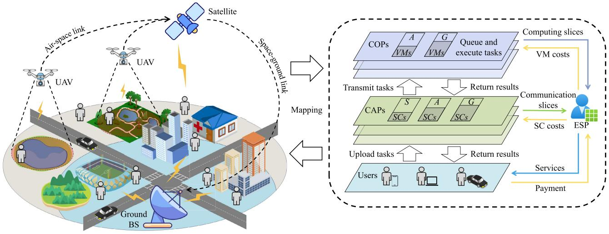

flowchart

```mermaid
graph TD
    A["Air-space link"] --> B["Satellite"]
    C["UAV"] --> B
    D["Ground BS"] --> B
    E["Space-ground link"] --> B
    B --> F["Mapping"]
    F --> G["Computing slices"]
    G --> H["VM costs"]
    H --> I["Communication slices"]
    I --> J["ESP"]
    J --> K["Services"]
    K --> L["Payment"]
    L --> M["Return results"]
    M --> N["Communication slices"]
    N --> O["SC costs"]
    O --> P["Return results"]
    P --> Q["Upload tasks"]
    Q --> R["Customers"]
    R --> S["User"]
    S --> T["Communication slices"]
    T --> U["Communication slices"]
    U --> V["Communication slices"]
    V --> W["Communication slices"]
    W --> X["Communication slices"]
    X --> Y["Communication slices"]
    Y --> Z["Communication slices"]
    Z --> AA["Communication slices"]
    AA --> AB["Communication slices"]
    AB --> AC["Communication slices"]
    AC --> AD["Communication slices"]
    AD --> AE["Communication slices"]
    AE --> AF["Communication slices"]
    AF --> AG["Communication slices"]
    AG --> AH["Communication slices"]
    AH --> AI["Communication slices"]
    AI --> AJ["Communication slices"]
    AJ --> AK["Communication slices"]
    AK --> AL["Communication slices"]
    AL --> AM["Communication slices"]
    AM --> AN["Communication slices"]
    AN --> AO["Communication slices"]
    AO --> AP["Communication slices"]
    AP --> AQ["Communication slices"]
    AQ --> AR["Communication slices"]
    AR --> AS["Communication slices"]
    AS --> AT["Communication slices"]
    AT --> AU["Communication slices"]
    AU --> AV["Communication slices"]
    AV --> AW["Communication slices"]
    AW --> AX["Communication slices"]
    AX --> AY["Communication slices"]
    AY --> AZ["Communication slices"]
    AZ --> BA["Communication slices"]
    BA --> BB["Communication slices"]
    BB --> BC["Communication slices"]
    BC --> BD["Communication slices"]
    BD --> BE["Communication slices"]
    BE --> BF["Communication slices"]
    BF --> BG["Communication slices"]
    BG --> BH["Communication slices"]
    BH --> BI["Communication slices"]
    BI --> BJ["Communication slices"]
    BJ --> BK["Communication slices"]
    BK --> BL["Communication slices"]
    BL --> BM["Communication slices"]
    BM --> BN["Communication slices"]
    BN --> BO["Communication slices"]
    BO --> BP["Communication slices"]
    BP --> BQ["Communication slices"]
    BQ --> BR["Communication slices"]
    BR --> BS["Communication slices"]
    BS --> BT["Communication slices"]
    BT --> BU["Communication slices"]
    BU --> BV["Communication slices"]
    BV --> BW["Communication slices"]
    BW --> BX["Communication slices"]
    BX --> BY["Communication slices"]
    BY --> BZ["Communication slices"]
    BZ --> CA["Communication slices"]
    CA --> CB["Communication slices"]
    CB --> CC["Communication slices"]
    CC --> CD["Communication slices"]
    CD --> CE["Communication slices"]
    CE --> CF["Communication slices"]
    CF --> CG["Communication slices"]
    CG --> CH["Communication slices"]
    CH --> CI["Communication slices"]
    CI --> CJ["Communication slices"]
    CJ --> CK["Communication slices"]
```

Fig. 1. The proposed hierarchical offloading framework for slicing-enabled SAGIN.

where $R ^ { s 2 g }$ and $R ^ { a 2 s }$ indicate the communication rates of the space-ground and air-space links, respectively.

# B. Computation Model

After a task is transmitted to a COP, the COP will schedule the task to a specific VM for execution. A VM may simultaneously process many tasks and thus it maintains a task waiting queue. The task queuing time is defined as

$$
T _ {i} ^ {q u e} = \sum_ {k = 1} ^ {| Q |} \frac {d _ {k} \eta_ {k}}{f ^ {e d g e}}, \tag {6}
$$

where $Q$ indicates the task waiting queue that already exists when the task arrives at the VM, and $f ^ { e d g e }$ indicates the computational frequency of the VM on $o _ { i }$ .

Moreover, the task execution time is defined as

$$
T _ {i} ^ {e x e} = \frac {d _ {i} \eta_ {i}}{f ^ {e d g e}}. \tag {7}
$$

After completing tasks, the results will be returned to users via CAPs. Since the output data is much smaller than the input data, the result download time is ignorable.

# C. Profit Model

Through integrating the communication and computation models, the task completion time can be calculated by

$$
T _ {i} ^ {\text { total }} = T _ {i} ^ {u p} + T _ {i} ^ {\text { tran }} + T _ {i} ^ {\text { que }} + T _ {i} ^ {\text { exe }}. \tag {8}
$$

First, the ESP obtains revenues from users by providing services. If a task is completed before the maximum tolerable delay $T ^ { \mathrm { m a x } }$ , the ESP will obtain the revenue Φ. Otherwise, the ESP will not obtain revenues. Specifically, the revenue obtained by the ESP from $u _ { i }$ within t is defined as

$$
\varphi_ {i} ^ {t} = \left\{ \begin{array}{l l} \Phi , & T _ {i} ^ {\text { total }} \leq T ^ {\max}, \\ 0, & \text { otherwise }. \end{array} \right. \tag {9}
$$

Meanwhile, the ESP obtains different revenues when it completes tasks with various priorities. Thus, the revenues received by the ESP from all users within t are defined as

$$
R ^ {t} = \sum_ {i = 1} ^ {N} \varphi_ {i} ^ {t} \rho_ {i}. \tag {10}
$$

Next, the ESP makes payment for the rented SCs and VMs, and the renting costs within t are defined as

$$
C ^ {t} = \sum_ {j = 1} ^ {R} B _ {j} \zeta_ {j} ^ {b} + \sum_ {j = 1} ^ {S} F _ {j} \zeta_ {j} ^ {f}, \tag {11}
$$

where $\zeta _ { j } ^ { b }$ and $\zeta _ { j } ^ { f }$ indicate the unit price of renting SCs and VMs, respectively.

# D. Problem Formulation

The objective of the proposed system model is to maximize the long-term profits of the ESP, and thus the optimization problem can be formulated as

$$
P 1: \quad \max _ {B, F, \pi} \sum_ {t = 1} ^ {T} (R ^ {t} - C ^ {t})
$$

$$
\text { s.t. } \quad C 1: B _ {j} \leq B _ {j} ^ {\max}, \forall j, \forall t,
$$

$$
C 2: F _ {j} \leq F _ {j} ^ {\max}, \forall j, \forall t, \tag {12}
$$

where B and F indicate the slice adjustment policies for communication and computing resources, respectively. π indicates the offloading policy that determines the VMs of executing tasks. The constraints C1 and C2 indicate that the numbers of SCs and VMs cannot exceed the upper bound, respectively.

Lemma 1: P1 is an NP-hard problem.

Proof: First, we aim to prove that the difficulty of solving the proposed offloading problem is at least equivalent to the Multiple Knapsack Problem (MKP) that is NP-hard. For a MKP with N items and B backpacks, we can transform it to an instance of P1. We regard the revenues and required resources of N offloading requests as the values and weights of items. The slices with B resources represent the backpacks with capacities. When N and B are fixed, the optimization objective of this instance is defined as

$$
\max \sum_ {i = 1} ^ {N} \varphi_ {i} ^ {t}
$$

$$
\text { s.t. } \sum_ {i = 1} ^ {N} b _ {i} <   B, \tag {13}
$$

which is equivalent to the NP-hard MKP for maximizing the values subject to the capacities of backpacks.

Therefore, we prove that P1 is an NP-hard problem because it extends the above instance to a joint problem of network slicing and computation offloading with higher complexity. Specially, when the fluctuation of user traffic happens, the current offloading policy may not well meet the demands of all offloaded tasks, and thus the slices need to be properly adjusted to offer more suitable resource provisioning. Meanwhile, the slice resource adjustments will affect the offloading decisions. Therefore, the network slicing and computation offloading are coupled with each other, and it is expected to achieve reasonable offloading while adapting to the dynamic changes of user traffic and slice resources in SAGIN.

# IV. THE PROPOSED THOAS

# A. Overview

To address the optimization problem and maximize ESP profits, we propose THOAS, a novel Traffic-aware lightweight Hierarchical Offloading framework towards Adaptive Slicingenabled SAGIN. As shown in Fig. 2, the ESP provides computation offloading while conducting resource allocation. For resource allocation, we design a new traffic prediction method to analyze and predict future traffic fluctuations. Next, the adaptive network slicing is performed based on predicted traffic and system loads. For computation offloading, the communication and computing processes are separated. First, SCs are allocated on-demand according to channel conditions. Next, we develop an improved DRL to efficiently allocate VMs to tasks, where the converged policies are distilled into lightweight neural networks for online inference and better adapting to resource-limited SAGIN.

Algorithm 1 outlines the main workflow of the proposed THOAS. First, we call Algorithm 2 to adjust slice resources according to traffic changes, system loads, and task conditions (Lines 2∼4). Since frequent adjustments will cause excessive system overheads, Algorithm 2 is called every $T ^ { s l i c e }$ time slots. Next, users send offloading requests for their tasks to the nearest available CAPs (Line 6). After receiving the requests, the ESP allocates SCs, and the tasks are uploaded to CAPs (Line 7). Then, the tasks are transmitted from CAPs to COPs via the dedicated links in SAGIN (Line 8).

To better complete tasks while saving resource costs, it is expected that fewer resources are used to satisfy the requirements of users’ tasks on delays. Considering the difference between communication and computing processes, we divide the maximum task tolerable delay into the maximum communication and computing tolerable delays as

$$
T _ {c a p} ^ {\max} = \omega T ^ {\max}, T _ {c o p} ^ {\max} = (1 - \omega) T ^ {\max}, \tag {14}
$$

Algorithm 1 The Proposed THOAS   
Input: $B^{max}$ , $F^{max}$ , $\zeta^{b}$ , $\zeta^{f}$ Output: Slicing and offloading policies

1 for $t = 1, 2, \ldots, T$ do

2 if $t \% T^{slice} == 0$ then

3 | Call Algorithm 2 to adjust slice resources;

4 end

5 for $i = 1, 2, \ldots, N_{j}$ do

6 Users send offloading requests;

7 Allocate SCs and upload tasks to CAPs;

8 Transmit tasks from CAPs to COPs;

9 Call Algorithm 3 to offload tasks;

10 Return execution results of tasks;

11 end

12 Collect information about system states;

13 end

where $\omega$ indicates the communication delay ratio. Further, the number of SCs allocated to $u _ { i }$ is defined as

$$
b _ {i} = \left\lceil \frac {d _ {i}}{T _ {c a p} ^ {\max} H \log (1 + S N R ^ {m i n})} \right\rceil , \tag {15}
$$

where the $S N R ^ { m i n }$ is the minimum possible SNR that depends on the connected CAP. ⌈⌉ indicates the rounding, which ensures that the SC obtained by Eq. (15) is an integer and not less than the required SC when $T ^ { u p } \leq T _ { c a p } ^ { \mathrm { m a x } } ,$ .

$2 \colon \ b _ { i } m e e t s T ^ { u p } \leq T _ { c a p } ^ { \mathrm { m a x } }$

Proof: Since most parameters can be obtained by task attributes, we focus on discussing $X _ { G }$ in Eq. (1). Let $X _ { G } \sim$ $N \left( \mu , \sigma ^ { 2 } \right)$ , according to the Three-Sigma Rule, $\operatorname* { P r } ( \mu + 3 \sigma \geq$ $X _ { G } ) ~ \approx ~ 9 9 . 7 \%$ . Let $S N R ^ { m i n } \ = \ S N R ( \mu + 3 \sigma )$ , When calculating Eq. (1) with $b _ { i } ,$ there is

$$
T ^ {u p} = \frac {T _ {c a p} ^ {\max} \log (1 + S N R ^ {m i n})}{\log (1 + S N R (X _ {G}))}, \tag {16}
$$

where $\mathrm { P r } [ { \frac { S N R ^ { m i n } } { S N R ( X _ { G } ) } } ~ \leq ~ 1 ] ~ \approx ~ 9 9 . 7 \% ,$ SNRmin and thus $\mathrm { P r } ( T ^ { u p } ~ \leq$ $T _ { c a p } ^ { \mathrm { m a x } } ) \approx 9 9 . 7 \% .$ . Thus, we prove that Lemma 2 holds.

After tasks are transmitted from CAPs to COPs, we call Algorithm 3 to schedule the tasks to VMs for execution, and the results will be returned to users after the tasks are completed (Lines 9∼10). Finally, the ESP collects information about system states including task completion status, system loads, and user traffic for subsequent decisions (Line 12).

# B. Adaptive Slice Resource Allocation

Through analyzing system loads and predicting resource demands, the performance of SAGIN can be greatly improved. Commonly, system loads might be affected by user traffic and service demands. By using advanced time-series prediction methods, future traffic trends can be accurately predicted. Moreover, service demands depend on the services provided by the ESP, which can be estimated by analyzing historical tasks and loads. Thus, we derive future loads by combining traffic prediction and demand analysis, thereby adjusting slice resources to keep system loads within a reasonable range.

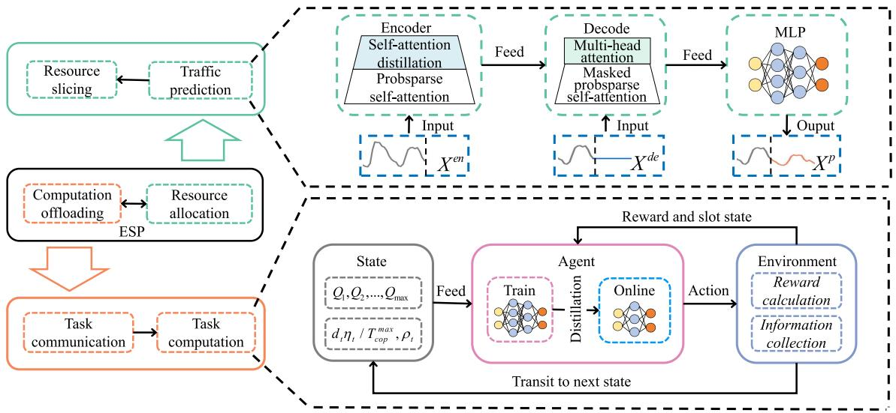

flowchart

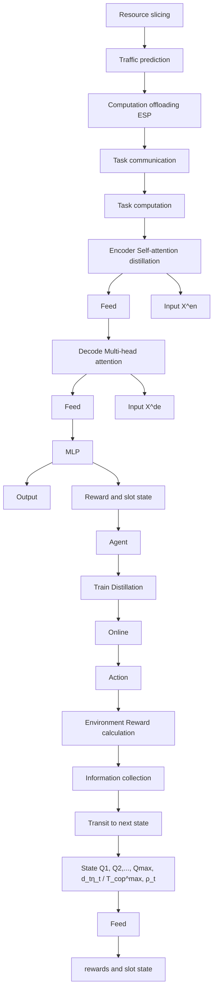

Fig. 2. Overview of the proposed THOAS.

In SAGIN, the traffic exhibits long-term changes (impacted by application popularity) and short-term fluctuations (impacted by user mobility). Moreover, the traffic sequences own different lengths, leading to the dynamic slicing windows. These factors pose significant challenges to traffic prediction. Compared to Recurrent Neural Networks (RNNs) and Convolutional Neural Networks (CNNs), the emerging Transformer [30] has demonstrated superior performance in capturing memory dependencies and handling time-series prediction problems. Considering its excellent ability, we design a new self-attention mechanism to process the traffic data with different sequence lengths and thus predict the traffic in different slicing windows. With traffic prediction and demand analysis, we propose an adaptive slice resource allocation method, whose key steps are presented in Algorithm 2.

# Algorithm 2 Adaptive Slice Resource Allocation

Input: Historical system states

Output: $B ^ { t + 1 } , F ^ { t + 1 }$

1 Construct input vectors: $X ^ { e n }  X ^ { h i s }$   
2 Output of encoder: $H _ { 1 } = \dot { E } n c o d e r ( X ^ { e n } ) ;$   
3 Output of decoder: $H _ { 2 } = D e c o d e r ( H _ { 1 } , X ^ { d e } ) ;$   
4 Predict future traffic: $X ^ { p } = M L P ( H _ { 2 } ) ;$   
5 Estimate future loads and demands:

$$
X ^ {d e} \leftarrow C o n c a t \left(X ^ {c u r}, X ^ {0}\right);
$$

$$
B ^ {n e e d} = \frac {B ^ {u s e d}}{B ^ {t}} \frac {X ^ {p}}{X ^ {c u r}}, F ^ {n e e d} = \frac {F ^ {t} (T ^ {q u e} + T ^ {e x e})}{T _ {c o p} ^ {\max}} \frac {X ^ {p}}{X ^ {c u r}};
$$

6 Calculate expected slice resources:

$$
B ^ {*} = (1 + \delta) \max (B ^ {n e e d}), F ^ {*} = (1 + \delta) \max (F ^ {n e e d});
$$

7 Calculate expected profits $\Delta P ;$

8 Calculate expected interruption costs $C ^ { i n t } ;$

9 if $\Delta P - C ^ { i \bar { n } t } > 0$ then

$$
\mathbf {1 0} \quad | \quad B ^ {t + 1} = B ^ {*}, F ^ {t + 1} = F ^ {*};
$$

11 end

Step 1: Predict Future Traffic. We design a new selfattention-based traffic prediction method. First, the input vectors of the encoder and decoder are constructed by using historical traffic (Line 1). $X ^ { h i s }$ indicates all historical traffic, $X ^ { c u r }$ indicates the traffic collected in the current slicing window, and $X ^ { 0 }$ indicates the time sampling of the target traffic sequence to be predicted. In classic self-attention mechanisms, the attention weights of all historical time slots should be calculated when constructing the encoder, leading to high computational complexity. To alleviate this problem, inspired by the design ideas in an improved Transformer variant [31], we introduce a probsparse self-attention into the encoder and adopt a self-attention distilling between layers to reduce network overheads (Line 2). Specifically, the feature extraction from j-th to (j + 1)-th layers is defined as

$$
X _ {j + 1} ^ {\text {en}} = \operatorname{MaxPool} \left(\mathrm{ELU} \left(\operatorname{Conv1d} \left([ X _ {j} ^ {\text {en}} ] _ {\text {attention}}\right)\right)\right), \tag {17}
$$

$$
[ \cdot ] _ {\text { attention }} = \operatorname{Softmax} \left(\frac {\bar {Q} K ^ {\mathrm{T}}}{\sqrt {d}}\right) V, \tag {18}
$$

where []attention $[ \cdot ] _ { a t t e n t i o n }$ indicates the probsparse self-attention, d is the dimension of $X _ { j } ^ { e n }$ , Conv1d indicates the one-dimensional convolution, ELU is the activation function, and MaxPool indicates the maximum pooling. $\bar { Q }$ is a sparse matrix and only contains the Top-u queries, which makes the probsparse self-attention only need to calculate $O ( \log L )$ dot-product for each query-key lookup, where L is the length of $X ^ { c u r }$ .

Next, the output of the encoder is fed into the decoder, which consists of a multi-head probsparse self-attention and a masked multi-head attention (Line 3). Finally, the output of the decoder is fed into the Multi-Layer Perceptron (MLP), and the future traffic $( \mathrm { i } . \mathrm { e } . , X ^ { p } )$ can be predicted (Line 4).

Step 2: Estimate Future Loads and Demands. Since system loads are positively correlated with user traffic, load changes can be derived from traffic fluctuations. Specifically, we define the communication and computing loads in the system. The communication load within t is the ratio between used SCs $( \mathrm { i } . \mathrm { e } . , \mathrm { ~ } B ^ { u s e d } )$ and total $\mathbf { S C s } ~ ( \mathrm { i . e . , ~ } B ^ { t } )$ , and the computing load is the ratio between the sum of $T ^ { q u e }$ and $T ^ { e x e }$ and $T _ { c o p } ^ { \mathrm { m a x } }$ , which can be used to measure the extent that slice resources meet user demands. After estimating system loads, the future resource demands can be calculated by further considering current and future traffic (Line 5).

Step 3: Adjust Slice Resources. During the adjustment process, we regard $1 + \delta$ times of the load peak as the expected slice resources, where δ indicates the slice expansion ratio (Line 6). Commonly, the slice adjustments may affect ESP revenues and bring extra system overheads. Moreover, it may cause service interruption or unavailability, leading to additional costs [32]. Therefore, the ESP must consider the above factors when adjusting slice resources. The expected profits by slice resource adjustments (Line 7) are defined as

$$
\Delta P = \Delta R - \Delta C, \tag {19}
$$

where $\Delta R$ indicates the difference between the expected revenues by adjusting slice resources and maintaining current configurations. $\Delta C$ indicates the difference between the expected costs by adjusting slice resources and maintaining current configurations.

Moreover, the expected interruption costs by adjusting slice resources (Line 8) are defined as

$$
C ^ {i n t} = \sum_ {t = 1} ^ {T ^ {i n t}} \sum_ {i = 1} ^ {N _ {j}} \rho_ {i} \Phi , \tag {20}
$$

where $T ^ { i n t }$ indicates the number of time slots required to adjust slice resources.

If the difference between the revenues and interruption costs is greater than 0, the communication and computing slices resources will be adjusted to $B ^ { * }$ and $F ^ { * }$ , respectively. Otherwise, the slice resources remain unchanged (Lines 9∼11).

Lemma 3: Adaptive slice resource allocation can improve ESP profits with accurate traffic prediction.

Proof: For clarity, we consider $B \ ( \mathrm { i . e . , S C s } )$ as the resources to be analyzed. With accurate traffic prediction, we denote the SC demands in the future slicing window as $\{ B ^ { 1 } , B ^ { 2 } , \ldots B ^ { T } \}$ and the revenues as $\{ R ^ { 1 } , R ^ { 2 } , \ldots \bar { R ^ { T } } \}$ , respectively. Therefore, the difference in the revenues before and after adjusting slice resources is

$$
\Delta R = \sum_ {t = 1} ^ {T} R ^ {t} \max (\frac {B ^ {\text { new }}}{B ^ {t}}, 1) - \sum_ {t = 1} ^ {T} R ^ {t} \max (\frac {B ^ {\text { old }}}{B ^ {t}}, 1). \tag {21}
$$

where $B ^ { n e w }$ and $B ^ { o l d }$ are the slice capacity before and after slice adjustments, respectively.

Meanwhile, the difference in costs is

$$
\Delta C = (B ^ {n e w} - B ^ {o l d}) \zeta^ {b}. \tag {22}
$$

If $\Delta R - \Delta C - C ^ { \mathrm { i n t } } > 0$ , the revenues of adjusting slice resources will exceed the costs, thereby ESP profits can be improved. Otherwise, $B ^ { o l d }$ is maintained. Notably, when user traffic fluctuates drastically, the prediction model struggles to capture the change patterns, and δ can be adjusted to maintain a balance between slice capacity and resource costs. With the above analysis, we prove that Lemma 3 holds.

# C. Improved Lightweight DRL for Offloading

Based on the adaptive slice resource allocation, we further devise an improved lightweight DRL-based method to explore the optimal offloading policy under dynamic SAGIN environments. Although the deep network structure may help enhance the fitting ability of DRL for complex problems, it undoubtedly introduces excessive overheads, limiting its practical application in resource-constrained SAGIN. When training a DRL agent for an environment with limited problem space, the optimizer continuously updates the network parameters to obtain better policies. When the agent tends to converge, the network parameters with the essential impact on the action output will decrease significantly [33]. Therefore, it is necessary to design a lightweight model to improve decision-making efficiency while maintaining its superior performance.

With this regard, the emerging knowledge distillation exhibits good ability in model compression, which can transfer knowledge from deep teacher networks to shallow student networks. For an actor-critic-based DRL, by interacting the well-trained actor’s network with the environment, the actions’ probability distribution of the teacher model can be collected and used as the target of distillation. Next, the network parameters of the student model are trained by the loss function and optimizer, promising the output is consistent with the teacher model. Following this idea, we design an improved lightweight offloading method that effectively integrates DRL with knowledge distillation. Specifically, we first formulate the interaction between the DRL agent and the SAGIN environment as a Markov decision process, where the state space, action space, and reward function are described as follows.

• State Space. It contains the task queues on COPs, task attributes, and user priority. To better capture state features, we convert the maximum computing tolerable delay and required CPU cycles into computational frequency, which indicates the required computational resources of a task. Thus, the state at the time slot t is defined as

$$
s _ {t} = \{Q _ {1}, Q _ {2}, \dots , Q _ {\max}, \frac {d _ {t} \eta_ {t}}{T _ {\text { cop }} ^ {\max}}, \rho_ {t} \}. \tag {23}
$$

• Action Space. If UAVs cannot meet the offloading demands of tasks, the tasks may be forwarded to the BS for execution. Considering the difference between UAVs and the BS, we use two action spaces. When tasks are executed on the BS, the action space contains VMs. When tasks are executed on UAVs, the action space contains VMs and the BS. Thus, the action at t is defined as

$$
a _ {t} \in \{V M _ {G}, V M _ {1}, V M _ {2}, \dots , V M _ {\max} \}, \tag {24}
$$

where $V M _ { G }$ indicates that tasks are forwarded to the BS and the BS will reallocate VMs.

• Reward Function. Following the optimization objective of $P l ,$ the reward function is considered to be the revenues of completing tasks. If tasks are forwarded from UAVs to the BS, the revenues will be calculated on the BS. Thus, the reward at t is defined as

$$
r _ {t} = \left\{ \begin{array}{l l} \varepsilon , & a ^ {t} = V M _ {G}, \\ \varphi_ {i} ^ {t} \rho_ {i}, & o t h e r w i s e, \end{array} \right. \tag {25}
$$

where a small positive value ε is used as the reward to distinguish the forwarded and failed tasks.

Following the above definitions, the key steps of the proposed improved lightweight DRL-based offloading method are given in Algorithm 3. For each training epoch, we first initialize the environment (Line 3). For each task, we input the state $s _ { t }$ to the actor’s network, and an offloading action is chosen following the policy π (Line 5). After executing the action, the SAGIN environment feedbacks the next state $s _ { t + 1 }$ , immediate reward $r _ { t } ,$ , and slot state $\omega _ { t } .$ , where $\omega _ { t }$ indicates whether the task is the last one in the current slot. Next, the discount rewards can be calculated (Line 6).

Algorithm 3 Improved DRL for Offloading   
Input: VM, Task
Output: $\pi^{*}$ 1 Initialize: $\pi$ and V
2 for epoch = 1, 2, ..., E do
3 Initialize $s_{0} = env.init();$ 4 for task = 1, 2, ..., $N_{j}$ do
5 Choose an offloading action: $a_{t} = \pi_{\theta}(s_{t})$ ;
6 Feedback after taking the action: $s_{t+1}, r_{t}, \omega_{t} = env.step(a_{t})$ ;
7 Calculate discount rewards: $R_{t} = \sum_{k=0}^{N-1} \gamma^{k} \cdot r_{t+k+1};$ 8 Calculate the advantage function: $\hat{A}_{t} = \sum_{k=0}^{\infty} (\gamma \lambda)^{k} \delta_{t+k};$ 9 Minimize $L^{actor}(\theta)$ for optimizing $\pi$ ;
10 Minimize $L^{critic}(\phi)$ for optimizing V;
11 end
12 end
13 Teacher model stores state-transition samples into RB;
14 for epoch = 1, 2, ..., E do
15 $K * (s_{t}, a_{t}, r_{t}, s_{t+1}, \omega_{t}) \leftarrow RB.Sample(K);$ 16 Minimize $L^{dis}(\theta_{s})$ by Adam optimizer for optimizing the student model.
17 end

Since offloading actions may affect the queuing and execution time of subsequent tasks, we consider the discounted rewards of subsequent tasks (Line 7), which is defined as

$$
R _ {t} = \sum_ {k = 0} ^ {N - 1} \gamma^ {k} \cdot r _ {t + k + 1}. \tag {26}
$$

To reduce the impact of noises on gradient estimation, we introduce the Generalized Advantage Estimation (GAE) as the target of network update (Line 8), which is defined as

$$
\hat {A} (s _ {t}, a _ {t}) = \sum_ {k = 0} ^ {\infty} (\gamma \lambda) ^ {k} \delta_ {t + l}, \tag {27}
$$

$$
\delta_ {t} = R _ {t} + \gamma V _ {\phi} (s _ {t + 1}) - V _ {\phi} (s _ {t}), \tag {28}
$$

where $\gamma$ is the reward discount rate, λ is the discount rate of the advantage function, $\delta _ { t }$ is the Temporal-Difference (TD) error, and V is the state-value function.

However, due to the high dynamics of SAGIN, it is hard to decide the step size of updating policy. To solve this issue, we adopt a clipping mechanism to control that each update is within a certain range. Thus, the loss function of the actor’s network (Line 9) is defined as

$$
L ^ {a c t o r} (\theta) = E [ \min (r (\theta) \hat {A} (s _ {t}, a _ {t}), \tilde {r} (\theta) \hat {A} (s _ {t}, a _ {t})) ], \tag {29}
$$

where $r ( \theta )$ is the ratio of sample weights under new and old policies. By using the clipping function, excessive policy updates can be avoided. Meanwhile, to prevent the slow update caused by the fixed confidence interval, we design a new two-layer confidence interval, which is defined as

$$
r (\theta) = \frac {\pi_ {\theta} (a _ {t} | s _ {t})}{\pi_ {o l d} (a _ {t} | s _ {t})}, \tag {30}
$$

$$
\tilde {r} (\theta) = \left\{ \begin{array}{l l} 1 - \alpha_ {t}, & (1 - \alpha_ {t}) \leq r (\theta) <   1, \\ 1 + \alpha_ {t}, & 1 <   r (\theta) \leq (1 + \alpha_ {t}), \\ \text { clip } (r (\theta), 1 - \epsilon , 1 + \epsilon), \text { otherwise }, \end{array} \right. \tag {31}
$$

where ϵ is the clipping ratio. $\alpha _ { t }$ is a dynamic confidence factor that is adjusted based on the TD error, which is defined as

$$
\alpha_ {t} = \left\{ \begin{array}{l l} \kappa \alpha_ {t - 1}, & \delta_ {t - 1} \geq 0, \\ \alpha_ {t - 1} / \kappa , & o t h e r w i s e, \end{array} \right. \tag {32}
$$

where $\kappa$ is used to control the update speed of $\alpha _ { t }$

Meanwhile, the loss function of the critic’s network (Line 10) is defined as

$$
L ^ {c r i t i c} (\phi) = E [ R _ {t} + \gamma V (s _ {t + 1}) - V (s _ {t}) ] ^ {2}. \tag {33}
$$

Next, through interacting with the SAGIN environment, the teacher model stores state-transition samples into the replay buffer (RB) (Line 13). Then, the samples are randomly picked from the RB for policy distillation (Line 15). Accordingly, we construct the loss function based on the Kullback-Leibler divergence (Line 16), which is defined as

$$
L ^ {d i s} (\theta_ {s}) = \sum_ {k = 1} ^ {K} \text { Softmax } (\frac {q _ {k} ^ {T}}{\tau}) \ln \frac {\text { Softmax } (\frac {q _ {k} ^ {T}}{\tau})}{\text { Softmax } (q _ {k} ^ {S})}, \tag {34}
$$

where $q _ { k } ^ { T }$ and $q _ { k } ^ { S }$ are the actions’ probability distribution output by the teacher and student models, respectively. $\tau$ is the temperature of the relaxed Softmax. Using the softmaxed probability instead of Q-value as the distillation target leads to a smaller variance of the loss function and makes it easier for the student model to converge.

Lemma 4: Policy distillation makes the student model approximate the teacher model while reducing the complexity.

Proof: The system state and output of the teacher model are used as the input and target output of the student model, respectively. Thus, the policy distillation can be regarded as a limited-sample supervised learning. By defining the loss function and optimizer, the parameters of the student model are updated via gradient descent until approximating the policy of the teacher model, which is defined as

$$
\theta_ {s} = \theta_ {s} ^ {\text { old }} - \alpha \frac {\partial L ^ {\text { dis }} (\theta_ {s})}{\partial \theta_ {s}}. \tag {35}
$$

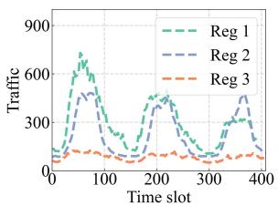

line

| Time slot | Reg 1 | Reg 2 | Reg 3 |
| --------- | ----- | ----- | ----- |
| 0         | 0     | 0     | 0     |
| 50        | 600   | 500   | 100   |
| 100       | 200   | 300   | 50    |
| 150       | 400   | 500   | 100   |
| 200       | 200   | 300   | 50    |
| 250       | 400   | 500   | 100   |
| 300       | 200   | 300   | 50    |
| 350       | 400   | 500   | 100   |
| 400       | 200   | 300   | 50    |

(a) Long-term traffic changes.

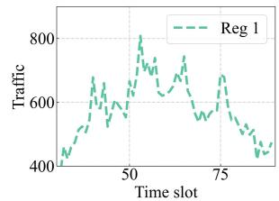

line

| Time slot | Traffic |
| --------- | ------- |
| 40        | 420     |
| 45        | 500     |
| 50        | 600     |
| 55        | 700     |
| 60        | 650     |
| 65        | 750     |
| 70        | 600     |
| 75        | 700     |
| 80        | 500     |
| 85        | 450     |

(b) Short-term traffic fluctuations.   
Fig. 3. Long-term changes and short-term fluctuations of user traffic.

When the depth and width of neural networks are denoted as P and $n _ { p }$ , the computational complexity of a DRL model is $\begin{array} { r } { O ( \sum _ { p = 0 } ^ { P } \bar { n _ { p } } n _ { p - 1 } ) } \end{array}$ P . As for the distillation process, $n _ { p } ^ { S } < n _ { p } ^ { T } .$ < n Tp , and thus $\begin{array} { r } { \sum _ { p = 0 } ^ { P } n _ { p } ^ { S } n _ { p - 1 } ^ { S } < \sum _ { p = 0 } ^ { P } n _ { p } ^ { T } n _ { p - 1 } ^ { T } } \end{array}$ n Tp nTp−1. According to the above analysis, we prove that Lemma 4 holds.

# V. PERFORMANCE EVALUATION

This section evaluates the proposed THOAS and compares it with benchmark methods.

# A. Experiment Setup

1) Datasets and Settings: On a workstation with 8- core Intel(R) Xeon(R) Silver 4208 CPU@3.2GHz, NVIDIA GeForce RTX 3090 GPU, and 32GB RAM, we use PyTorch to implement the proposed system and THOAS. We adopt real-world datasets of cellular traffic in Milan [34] to simulate the dynamic traffic of user requests in SAGIN, which contain three types of services including message, call, and Internet. The traffic was recorded in two months by using a sampling frequency of 10 min.

We adopt real-world datasets of cellular traffic in Milan [34] to simulate the dynamic traffic of user requests in SAGIN. The datasets record the traffic for two months with a sampling frequency of 10 min and contain three types of services including messaging, calling, and Internet. Three neighboring regions in the datasets are selected as the coverage regions of BS, UAV, and satellite, represented as Reg1, Reg2, and Reg3, respectively. The traffic of Internet service recorded in each sampling is normalized and rounded to an integer as the traffic of user requests in the three regions. Figs. 3 (a) and (b) illustrate the long-term traffic changes in different regions and the short-term traffic fluctuations in a single region, respectively. The traffic follows a periodic pattern but there exist differences among each region. Moreover, the settings of the main parameters in our experiments are listed in Table I, where different parameters of satellite, UAV, and BS are represented in the form of the triplet list.

2) Performance Metrics: Apart from the ESP profits and task completion time, the following performance metrics are adopted to evaluate the THOAS.

• Resource Utilization (RU): The ratio between the resources utilized to process tasks and the resources rented by the ESP in each time slot.   
• Deadline-Violating Ratio (DVR): The ratio between the number of tasks violating the delay constraint and the total number of tasks in each time slot.

TABLE I SETTINGS OF PARAMETERS 

<table><tr><td>Param</td><td>Value</td><td>Param</td><td>Value</td></tr><tr><td> $B_{j}^{\max }$ </td><td>[10, 15, 20]</td><td> $G_u$ </td><td>10 dB</td></tr><tr><td> $F_{j}^{\max }$ </td><td>[0, 3, 6]</td><td> $G_s$ </td><td>30 dB [35]</td></tr><tr><td> $N_j$ </td><td>[[1, 4], [1, 6], [1, 10]]</td><td>H</td><td>1 Mbps [16]</td></tr><tr><td> $d_i$ </td><td>[200, 500] KB [36]</td><td> $f^{edge}$ </td><td>[0, 1.5, 2.0] GHz</td></tr><tr><td> $η_i$ </td><td>[1, 10] [36]</td><td> $T^{\max }$ </td><td>1.0 s</td></tr><tr><td> $ρ_i$ </td><td>{1,2,3}</td><td> $ζ^b$ </td><td>[0.2, 0.1, 0.1] $</td></tr><tr><td> $l_i$ </td><td>[1000, [1, 5], [1, 10]] km</td><td> $ζ^f$ </td><td>[0, 0.4, 0.2] $</td></tr><tr><td> $p_u$ </td><td>100 mW</td><td>Φ</td><td>1.0 $</td></tr><tr><td> $σ^2$ </td><td>-110 dBm [11]</td><td>ω</td><td>0.2</td></tr><tr><td>κ</td><td>2 [37]</td><td>δ</td><td>0.05</td></tr><tr><td>β</td><td>3.04 [38]</td><td> $T^{int}$ </td><td>3</td></tr><tr><td> $R^{s2g}$ </td><td>15 Mbps</td><td>ε</td><td>0.2 [37]</td></tr><tr><td> $R^{a2s}$ </td><td>20 Mbps [21]</td><td>τ</td><td>0.01 [33]</td></tr></table>

3) Comparison Methods: To verify the superiority of the proposed THOAS, we compare it with the following benchmark methods for traffic prediction, slicing, and offloading.

• GL-TCN [39]: A Global-Local Temporal Convolutional Network is used to make traffic prediction and resource slicing, which adopts the dilated convolution to capture the dependencies in traffic sequences.   
• PredRNN [40]: A Predictive Recurrent Neural Network is used to make traffic prediction and resource slicing, which adopts a gate mechanism to capture the dependencies in traffic sequences.   
• Static: There is no traffic prediction and the resources rented by the ESP always remain unchanged.   
• PPO-TO [25]: A Proximal Policy Optimization based Task Offloading method is designed to make offloading decisions, which adopts a fixed clipping range to ensure the stability of policy updates.   
• DDQN-TS [11]: A Double Deep Q-Network based Task Scheduling method is designed to make offloading decisions, where the online network selects actions and target network estimates state values.   
• DQNM [41]: A Deep Q-Network Method is designed to make offloading decisions, where the target network is used to select actions and estimate state values.

# B. Experiment Results and Analysis

1) Traffic Prediction and Adaptive Slicing: We evaluate the performance of the proposed THOAS in traffic prediction and adaptive slicing, where the real traffic is adopted for prediction and the integer one is used to simulate the number of user requests. As shown in Fig. 4, when user traffic suddenly rises (from around the time slot 50), the THOAS can accurately capture such growth trends by using Transformer to analyze historical traffic fluctuations. Based on predicted traffic growth, the THOAS first calculates expected system loads and resource demands and then increases the slice resources (i.e., the number of SCs and VMs) rented by the ESP to improve revenues. When user traffic decreases (from around the time slot 100), the THOAS adaptively reduces the slice resources rented by ESP to save resource costs. It is worth noting that the

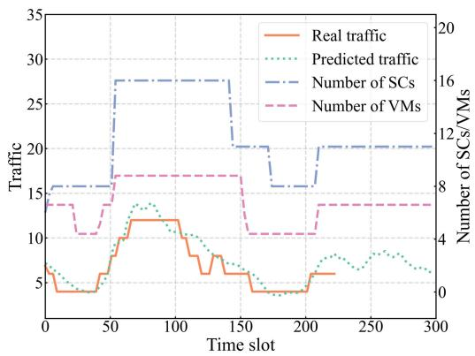

line

| Time slot | Real traffic | Predicted traffic | Number of SCs | Number of VMs |
| --------- | ------------ | ----------------- | ------------- | ------------- |
| 0         | 7            | 6                 | 15            | 14            |
| 50        | 12           | 10                | 28            | 17            |
| 100       | 12           | 12                | 28            | 17            |
| 150       | 8            | 8                 | 20            | 17            |
| 200       | 6            | 4                 | 20            | 11            |
| 250       | 6            | 8                 | 20            | 14            |
| 300       | 6            | 6                 | 20            | 14            |

Fig. 4. Performance of the THOAS on traffic prediction and adaptive slicing.

THOAS does not make frequent adjustments of slice resources for scenarios with slight traffic changes. This is because the THOAS performs traffic prediction and slice resource adjustments at regular intervals while considering the interruption costs caused by frequent adjustments. Therefore, the proposed THOAS can effectively cut down system overheads and avoid service interruptions caused by frequent operations.

2) Convergence Comparison: We compare the convergence of different methods and the distillation process. As depicted in Fig. 5, the DDQN-TS achieves higher rewards and more stable convergence than the DQNM. This is because the target network is used for action selection and evaluation in DQNM, causing Q-value overestimation. In contrast, the DDQN-TS uses the online network for selecting actions, improving the stability of training. Compared to the DQNM and DDQN-TS, the PPO-TO converges to higher rewards. This is because the proximal policy clipping in PPO-TO limits the step size of updates, mitigating the impact of dynamics including traffic and resource changes on policy updates. However, such a fixed clipping range restricts the efficiency of policy exploration, causing insufficient sample utilization. To solve this problem, the THOAS designs a new clipping mechanism with dynamic confidence intervals, where the range of policy updates can be adjusted according to the advantage values of samples, and thus the THOAS significantly improves convergence performance. In addition, the training process of distillation in THOAS is also excellent, which only takes about 50 epochs rounds to approach convergence. The results validate that the proposed distillation can quickly transfer the experience from deep to shallow neural networks, thereby compressing complex models and reducing system overheads.

3) Performance Changes with Distillation: We test the impact of different network sizes of the student model on the performance of the THOAS. As illustrated in Fig. 6, when the student model adopts the identical network size as the teacher model, there is no significant difference in performance between them. When the network size of the student model reduces to 6% of the original one, the distilled model even maintains 73% of the original performance. This is because when facing the limited action space in SAGIN, the policies of a converged DRL model are mainly influenced by some network parameters. In the proposed policy distillation, the

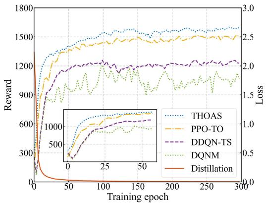

line

| Training epoch | THOAS Reward | PPO-TO Reward | DDQN-TS Reward | DQNМ Reward | Distillation Reward | THOAS Loss | PPO-TO Loss | DDQN-TS Loss | DQNМ Loss | Distillation Loss |
| -------------- | ------------ | ------------ | ------------- | ---------- | ------------------ | ---------- | ----------- | ------------ | --------- | ----------------- |
| 0              | 0            | 0            | 0             | 0          | 0                  | 0.0        | 0.0         | 0.0          | 0.0       | 0.0               |
| 50             | 1400         | 1300         | 1200          | 900        | 100                | 1.5        | 1.5         | 1.5          | 1.5       | 1.5               |
| 100            | 1500         | 1400         | 1250          | 1000       | 120                | 2.0        | 2.0         | 2.0          | 2.0       | 2.0               |
| 150            | 1550         | 1450         | 1250          | 1100       | 130                | 2.2        | 2.2         | 2.2          | 2.2       | 2.2               |
| 200            | 1550         | 1450         | 1250          | 1150       | 135                | 2.3        | 2.3         | 2.3          | 2.3       | 2.3               |
| 250            | 1550         | 1450         | 1250          | 1200       | 140                | 2.4        | 2.4         | 2.4          | 2.4       | 2.4               |
| 300            | 1600         | 1450         | 1250          | 1250       | 145                | 2.5        | 2.5         | 2.5          | 2.5       | 2.5               |

Fig. 5. Convergence of different methods and the distillation process.

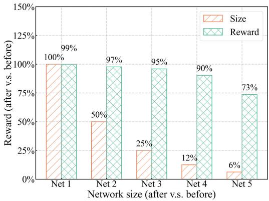

bar

| Network size (after v.s. before) | Size (%) | Reward (%) |
|---|---|---|
| Net 1 | 100 | 99 |
| Net 2 | 50 | 97 |
| Net 3 | 25 | 95 |
| Net 4 | 12 | 90 |
| Net 5 | 6 | 73 |

Fig. 6. Performance changes of the THOAS by using distillation.

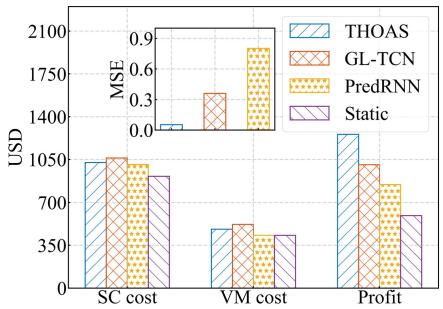

bar

| Metric | THOAS (USD) | GL-TCN (USD) | PredRNN (USD) | Static (USD) | MSE |
| :--- | :--- | :--- | :--- | :--- | :--- |
| SC cost | 1050 | 1050 | 1050 | 900 | 0.1 |
| VM cost | 600 | 650 | 350 | 350 | 0.6 |
| Profit | 1400 | 1050 | 850 | 700 | 0.9 |

Fig. 7. ESP costs and profits of different methods.

teacher model outputs the actions’ probability distribution, which is used as training samples to transfer the core network parameters to a shallow network. Therefore, by introducing distillation, the THOAS significantly reduces the network size of a DRL model while maintaining superior performance. Compared to agents with small-scale networks, large-scale networks own better exploration efficiency and fitting ability during training. Moreover, the distillation can converge quickly. Thus, it is worthwhile to balance the performance and overhead of the DRL agent by distilling large-scale networks instead of using small-scale networks. This advantage enhances the application practicality of the THOAS in resource-limited SAGIN environments.

4) Comparison of ESP Costs and Profits: We analyze the impact of different traffic prediction methods on ESP costs and profits. As depicted in Fig. 7, when using adaptive slicing, the SC/VM costs of the THOAS, GL-TCN, and PredRNN are slightly higher than the Static, but they significantly improve the profits. This is because static slice resources cannot meet demands as user traffic increases, causing the completion time of some tasks to exceed the maximum tolerable delay, and thus the ESP cannot obtain revenues. Compared to the GL-TCN and PredRNN, the proposed THOAS achieves lower Mean-Square Error (MSE) while obtaining higher profits. This is because the THOAS introduces self-attention mechanism that can effectively capture the sequence dependencies and solve the gradient explosion, thereby promising higher prediction accuracy. The results also demonstrate that more precise traffic prediction can better support enhancing ESP profits.

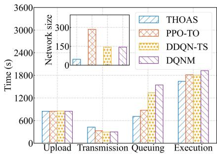

bar

| Category | THOAS (s) | PPO-TO (s) | DDQN-TS (s) | DQNM (s) |
|---|---|---|---|---|
| Upload | 800 | 800 | 800 | 800 |
| Transmission | 500 | 400 | 400 | 400 |
| Queuing | 600 | 900 | 1300 | 1700 |
| Execution | 1700 | 1900 | 1900 | 2000 |
The inset box shows Network size distribution across categories. The chart displays a bar chart with an inset zoom highlighting the distribution between upload and transmission stages.

Fig. 8. Task completion time of different methods.   
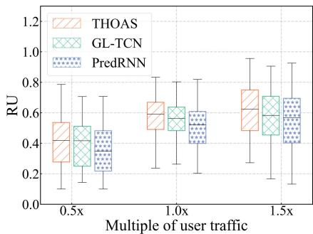

boxplot

| Multiple of user traffic | THOAS | GL-TCN | PredRNN |
| ------------------------- | ----- | ------ | ------- |
| 0.5x                      | 0.5   | 0.4    | 0.3     |
| 1.0x                      | 0.65  | 0.55   | 0.5     |
| 1.5x                      | 0.75  | 0.7    | 0.65    |

Fig. 9. RU with various user traffic.

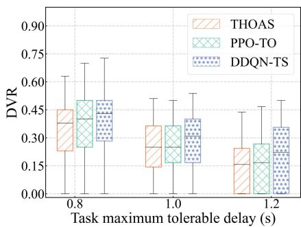

bar

| Task maximum tolerable delay (s) | THOAS | PPO-TO | DDQN-TS |
| -------------------------------- | ----- | ------ | ------- |
| 0.8                              | 0.45  | 0.45   | 0.45    |
| 1.0                              | 0.35  | 0.35   | 0.35    |
| 1.2                              | 0.25  | 0.25   | 0.25    |

Fig. 10. DVR with various tolerable delays.   
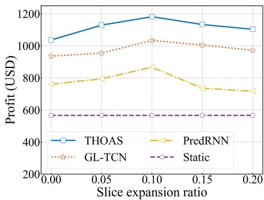

line

| Slice expansion ratio | THOAS | PredRNN | GL-TCN | Static |
| --------------------- | ----- | ------- | ------ | ------ |
| 0.00                  | 1050  | 750     | 950    | 550    |
| 0.05                  | 1150  | 800     | 980    | 550    |
| 0.10                  | 1200  | 880     | 1050   | 550    |
| 0.15                  | 1150  | 720     | 1020   | 550    |
| 0.20                  | 1120  | 700     | 980    | 550    |

Fig. 11. ESP profits with various slice expansions.

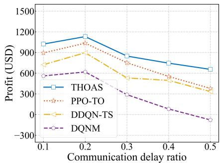

line

| Communication delay ratio | THOAS | PPO-TO | DDQN-TS | DQNM |
| ------------------------- | ----- | ------ | ------- | ---- |
| 0.1                       | 1100  | 900    | 700     | 600  |
| 0.2                       | 1200  | 1100   | 900     | 600  |
| 0.3                       | 900   | 800    | 600     | 300  |
| 0.4                       | 700   | 600    | 500     | 100  |
| 0.5                       | 600   | 400    | 300     | -100 |

Fig. 12. ESP profits with various delay ratios.

5) Comparison of Task Completion Time: We compare the task completion time of different offloading methods, consisting of upload, transmission, queuing, and execution times. As shown in Fig. 8, the upload times of all methods are equal when using the same SC allocation. Compared to the other methods, the DQNM and DDQN-TS exhibit much longer queuing time. This is because they cannot schedule tasks to appropriate VMs, leading to long waiting queues on some VMs. Compared to other DRL-based methods, the THOAS reveals slightly longer transmission time but shorter execution and queuing times. This is because the user demands within the coverage area of UAVs may exceed their computational capabilities as the traffic increases. To cope with this situation, the THOAS may forward tasks to the ground BS for execution via the wireless link in SAGIN. The BS owns more powerful capabilities, thereby reducing the queuing and execution times. Since the transmission time caused by task forwarding is less than the saved queuing and execution times, the task completion time of the THOAS is less than other methods. In addition, the network size of the PPO-TO is larger than the DQNM and DDQN-TS. This is because the PPO-TO adopts an actor-critic structure to select and evaluate offloading actions, resulting in higher complexity than the DQNM and DDQN-TS. Compared to other methods, the THOAS uses knowledge distillation to compress the network size, significantly reducing the model complexity and running overheads, which is more suitable for real-world SAGIN with constrained resources.

6) Comparison of RU: We evaluate the RU of different prediction methods with various multiples of user traffic. As illustrated in Fig. 9, the RU declines significantly as the multiple decreases from 1.0x to 0.5x. This is because the probability of using the expanded slice resources reduces when the user traffic decreases. Even if the user traffic approaches 0 in some slots, the ESP still needs to maintain basic resources to ensure service availability, and thus the RU is close to 0. It is worth noting that the sparse traffic may cause high prediction errors, and thus the RU in the 0.5x scenario is lower than the

1.0x scenario. When the multiple rises from 1.0x to 1.5x, the RU increases slightly. This is because the probability of using the expanded slice resources becomes higher as the user traffic increases, leading to fewer remaining resources and higher RU. Compared to the GL-TCN and PredRNN, the proposed THOAS promises higher traffic prediction accuracy and higher RU, which also verifies that superior prediction performance can better improve the RU in SAGIN.

7) Comparison of DVR: We compare the DVR of different offloading methods with various task maximum tolerable delays. As depicted in Fig. 10, the DVR falls with the increase of the delay constraint. This is because there is more time to complete tasks, and thus the number of failed tasks reduces. As the delay constraint continues to grow, the DVR closes to 0 since the resources rented by the ESP can well meet service demands. Compared to the PPO-TO and DDQN-TS, the proposed THOAS can complete more tasks under the same delay constraint, thereby achieving lower DVR. This is because the THOAS introduces the GAE and the proximal policy clipping with dynamic confidence intervals to improve decision-making performance. Therefore, the THOAS can adaptively make rational decisions in dynamic SAGIN scenarios and complete more tasks successfully.

8) ESP Profits with Various Slice Expansions: We assess the ESP profits of different prediction methods with various slice expansion ratios δ. As shown in Fig. 11, as δ increases, the ESP profits of the Static remain unchanged because it does not perform traffic prediction and slice resource adjustment. The ESP profits of the other three methods first incline and then decline. This is because the slice resources rented by the ESP may not meet user demands when δ is small, which makes some tasks exceed the maximum tolerable delay and leads to lower ESP profits. With the increase of $\delta ,$ the slice resources rise, alleviating the above issue and thus enhancing ESP profits. As δ continues to grow, ESP profits begin to drop. This is because the costs of expanding slice resources may exceed the revenues, causing a reduction in ESP profits. The results show that proper expansion of slice resources with traffic prediction can raise ESP profits. With different values of δ, the THOAS always outperforms other methods, validating the superiority of the proposed accurate traffic prediction and adaptive network slicing in improving ESP profits.

9) ESP Profits with Various Delay Ratios: We analyze the ESP profits of different offloading methods with various communication delay ratios ω. As illustrated in Fig. 12, as ω inclines, the ESP profits of all methods first increase and then decrease. This is because the available task upload time is short when ω is small, and thus the ESP needs to allocate more SCs to tasks, causing the cost growth of renting resources. With the increase of ω, there is more available upload time, alleviating the above issue. However, when $\omega$ continues to increase, the available task queuing and execution times decrease accordingly. Meanwhile, the maximum task tolerable delay may not be satisfied, causing some tasks to fail and thus reducing ESP profits. The results show that separating the maximum tolerable delay in the proposed THOAS can improve

the efficiency of resource allocation and task scheduling. Compared to the PPO-TO, DDQN-TS, and DQNM, the THOAS achieves higher ESP profits under different scenarios, demonstrating its superiority in handling the offloading problem in SAGIN.

# VI. CONCLUSION

In this paper, we propose THOAS, a novel traffic-aware lightweight hierarchical offloading framework towards achieving adaptive slicing-enabled SAGIN. First, we separate SAGIN into CAPs and COPs and use network slices to manage resources on each platform. Next, we design a new traffic prediction method with the probsparse self-attention to capture the dynamic traffic changes and then devise an adaptive network slicing method. Finally, we develop an improved lightweight DRL-based offloading method, which can reduce network complexity while retaining superior performance. Extensive experiments with real-world traffic datasets are conducted to validate the superiority of the THOAS. Compared to benchmark methods, the THOAS makes better slice adjustments and offloading decisions, exhibiting higher performance on ESP profits, task completion time, RU, and DVR. Especially, the THOAS can greatly lower the model complexity while retaining original performance, further demonstrating its practicality in resource-constrained SAGIN environments. In our future work, we will further study and improve the collaborative efficiency in SGAIN from the perspectives of parallel offloading, efficient communication, and service caching.

# REFERENCES

[1] X. Chen et al., “Traffic prediction-assisted federated deep reinforcement learning for service migration in digital twins-enabled MEC networks,” IEEE J. Sel. Areas Commun., vol. 41, no. 10, pp. 3212–3229, Oct. 2023.   
[2] S. Yu, X. Gong, Q. Shi, X. Wang, and X. Chen, “EC-SAGINs: Edgecomputing-enhanced space–air–ground-integrated networks for Internet of Vehicles,” IEEE Internet Things J., vol. 9, no. 8, pp. 5742–5754, Apr. 2022.   
[3] Q. Chen, W. Meng, T. Q. S. Quek, and S. Chen, “Multi-tier hybrid offloading for computation-aware IoT applications in civil aircraftaugmented SAGIN,” IEEE J. Sel. Areas Commun., vol. 41, no. 2, pp. 399–417, Feb. 2023.   
[4] A. Asheralieva, D. Niyato, and X. Wei, “Ultrareliable low-latency slicing in space–air–ground multiaccess edge computing networks for nextgeneration Internet of Things and mobile applications,” IEEE Internet Things J., vol. 11, no. 3, pp. 3956–3978, Feb. 2024.   
[5] L. He, J. Li, Y. Wang, J. Zheng, and L. He, “Balancing total energy consumption and mean makespan in data offloading for space-air-ground integrated networks,” IEEE Trans. Mobile Comput., vol. 23, no. 1, pp. 209–222, Jan. 2024.   
[6] L. Zhu, L. Bai, L. Zhou, and J. Choi, “Efficient user scheduling for uplink hybrid satellite-terrestrial communication,” IEEE Trans. Wireless Commun., vol. 22, no. 3, pp. 1885–1899, Mar. 2023.   
[7] J. Yim, D. Joo, J. Bae, and J. Kim, “A gift from knowledge distillation: Fast optimization, network minimization and transfer learning,” in Proc. IEEE Conf. Comput. Vis. Pattern Recognit. (CVPR), Jul. 2017, pp. 4133–4141.   
[8] Y. Gong, H. Yao, Z. Xiong, S. Guo, F. R. Yu, and D. Niyato, “Computation offloading and energy harvesting schemes for sum rate maximization in space-air-ground networks,” in Proc. IEEE Global Commun. Conf. (GLOBECOM), Dec. 2022, pp. 3941–3946.   
[9] N. Cheng et al., “Space/aerial-assisted computing offloading for IoT applications: A learning-based approach,” IEEE J. Sel. Areas Commun., vol. 37, no. 5, pp. 1117–1129, May 2019.

[10] C. Wang, L. Liu, C. Jiang, S. Wang, P. Zhang, and S. Shen, “Incorporating distributed DRL into storage resource optimization of space-air-ground integrated wireless communication network,” IEEE J. Sel. Topics Signal Process., vol. 16, no. 3, pp. 434–446, Apr. 2022.   
[11] H. Shen, Y. Tian, T. Wang, and G. Bai, “Slicing-based task offloading in space-air-ground integrated vehicular networks,” IEEE Trans. Mobile Comput., vol. 23, no. 5, pp. 4009–4024, May 2024.   
[12] T. Kim, J. Kwak, and J. P. Choi, “Satellite edge computing architecture and network slice scheduling for IoT support,” IEEE Internet Things J., vol. 9, no. 16, pp. 14938–14951, Aug. 2022.   
[13] A. Asheralieva, D. Niyato, and Y. Miyanaga, “Efficient dynamic distributed resource slicing in 6G multi-access edge computing networks with online ADMM and message passing graph neural networks,” IEEE Trans. Mobile Comput., vol. 23, no. 4, pp. 2614–2638, Apr. 2024.   
[14] G. Cui, P. Duan, L. Xu, and W. Wang, “Latency optimization for hybrid GEO–LEO satellite-assisted IoT networks,” IEEE Internet Things J., vol. 10, no. 7, pp. 6286–6297, Nov. 2022.   
[15] P. He, J. Hu, X. Fan, D. Wu, R. Wang, and Y. Cui, “Load-balanced collaborative offloading for LEO satellite networks,” IEEE Internet Things J., vol. 10, no. 21, pp. 19075–19086, Nov. 2023.   
[16] S. Zhang, A. Liu, C. Han, X. Liang, X. Xu, and G. Wang, “Multiagent reinforcement learning-based orbital edge offloading in SAGIN supporting Internet of Remote Things,” IEEE Internet Things J., vol. 10, no. 23, pp. 20472–20483, Dec. 2023.   
[17] J. Liu, X. Zhao, P. Qin, S. Geng, and S. Meng, “Joint dynamic task offloading and resource scheduling for WPT enabled space-air-ground power Internet of Things,” IEEE Trans. Netw. Sci. Eng., vol. 9, no. 2, pp. 660–677, Mar. 2022.   
[18] Z. Song, Y. Hao, Y. Liu, and X. Sun, “Energy-efficient multiaccess edge computing for terrestrial-satellite Internet of Things,” IEEE Internet Things J., vol. 8, no. 18, pp. 14202–14218, Sep. 2021.   
[19] Y. Liu, H. Zhang, H. Zhou, K. Long, and V. C. M. Leung, “User association, subchannel and power allocation in space-air-ground integrated vehicular network with delay constraints,” IEEE Trans. Netw. Sci. Eng., vol. 10, no. 3, pp. 1203–1213, May 2023.   
[20] Q. Xu, Z. Su, D. Fang, and Y. Wu, “Hierarchical bandwidth allocation for social community-oriented multicast in space-air-ground integrated networks,” IEEE Trans. Wireless Commun., vol. 22, no. 3, pp. 1915–1930, Mar. 2023.   
[21] F. Tang, H. Hofner, N. Kato, K. Kaneko, Y. Yamashita, and M. Hangai, “A deep reinforcement learning-based dynamic traffic offloading in space-air-ground integrated networks (SAGIN),” IEEE J. Sel. Areas Commun., vol. 40, no. 1, pp. 276–289, Jan. 2022.   
[22] P. Zhang, Y. Zhang, N. Kumar, and C.-H. Hsu, “Deep reinforcement learning algorithm for latency-oriented IIoT resource orchestration,” IEEE Internet Things J., vol. 10, no. 8, pp. 7153–7163, Apr. 2023.   
[23] P. Zhang, Y. Li, N. Kumar, N. Chen, C.-H. Hsu, and A. Barnawi, “Distributed deep reinforcement learning assisted resource allocation algorithm for space-air-ground integrated networks,” IEEE Trans. Netw. Service Manage., vol. 20, no. 3, pp. 3348–3358, Sep. 2023.   
[24] Y. Liu, L. Jiang, Q. Qi, and S. Xie, “Energy-efficient space–air–ground integrated edge computing for Internet of Remote Things: A federated DRL approach,” IEEE Internet Things J., vol. 10, no. 6, pp. 4845–4856, Mar. 2023.   
[25] D. Xu, X. Su, H. Wang, S. Tarkoma, and P. Hui, “Towards risk-averse edge computing with deep reinforcement learning,” IEEE Trans. Mobile Comput., vol. 23, no. 6, pp. 7030–7047, Jun. 2024.   
[26] A. Feriani et al., “Multiobjective load balancing for multiband downlink cellular networks: A meta-reinforcement learning approach,” IEEE J. Sel. Areas Commun., vol. 40, no. 9, pp. 2614–2629, Sep. 2022.   
[27] J. Kang, J. Wang, C. Hu, X. Liu, and G. Dudek, “A generalized load balancing policy with multi-teacher reinforcement learning,” in Proc. IEEE Global Commun. Conf., Dec. 2022, pp. 3096–3101.   
[28] X. Wang, G. Sun, Y. Xin, T. Liu, and Y. Xu, “Deep transfer reinforcement learning for beamforming and resource allocation in multi-cell MISO-OFDMA systems,” IEEE Trans. Signal Inf. Process. Netw., vol. 8, pp. 815–829, 2022.

[29] S. A. Kanellopoulos, C. I. Kourogiorgas, A. D. Panagopoulos, S. N. Livieratos, and G. E. Chatzarakis, “Channel model for satellite communication links above 10 GHz based on Weibull distribution,” IEEE Commun. Lett., vol. 18, no. 4, pp. 568–571, Apr. 2014.   
[30] Q. Wen et al., “Transformers in time series: A survey,” 2022, arXiv:2202.07125.   
[31] H. Zhou et al., “Informer: Beyond efficient transformer for long sequence time-series forecasting,” in Proc. AAAI Conf. Artif. Intell. (AAAI), vol. 35, 2021, pp. 11106–11115.   
[32] F. Wei, G. Feng, Y. Sun, Y. Wang, S. Qin, and Y.-C. Liang, “Network slice reconfiguration by exploiting deep reinforcement learning with large action space,” IEEE Trans. Netw. Service Manag., vol. 17, no. 4, pp. 2197–2211, Dec. 2020.   
[33] A. A. Rusu et al., “Policy distillation,” 2015, arXiv:1511.06295.   
[34] G. Barlacchi et al., “A multi-source dataset of urban life in the city of Milan and the Province of Trentino,” Sci. Data, vol. 2, no. 1, pp. 1–15, Oct. 2015.   
[35] F. Tang, C. Wen, L. Luo, M. Zhao, and N. Kato, “Blockchainbased trusted traffic offloading in space-air-ground integrated networks (SAGIN): A federated reinforcement learning approach,” IEEE J. Sel. Areas Commun., vol. 40, no. 12, pp. 3501–3516, Dec. 2022.   
[36] S. Guo, J. Liu, Y. Yang, B. Xiao, and Z. Li, “Energy-efficient dynamic computation offloading and cooperative task scheduling in mobile cloud computing,” IEEE Trans. Mobile Comput., vol. 18, no. 2, pp. 319–333, Feb. 2019.   
[37] J. Schulman, F. Wolski, P. Dhariwal, A. Radford, and O. Klimov, “Proximal policy optimization algorithms,” 2017, arXiv:1707.06347.   
[38] A. Al-Hourani and K. Gomez, “Modeling cellular-to-UAV path-loss for suburban environments,” IEEE Wireless Commun. Lett., vol. 7, no. 1, pp. 82–85, Feb. 2018.   
[39] Y. Ren, D. Zhao, D. Luo, H. Ma, and P. Duan, “Global–local temporal convolutional network for traffic flow prediction,” IEEE Trans. Intell. Transp. Syst., vol. 23, no. 2, pp. 1578–1584, Feb. 2022.   
[40] Y. Wang et al., “PredRNN: A recurrent neural network for spatiotemporal predictive learning,” IEEE Trans. Pattern Anal. Mach. Intell., vol. 45, no. 2, pp. 2208–2225, Feb. 2022.   
[41] H. Zhou, T. Wu, H. Zhang, and J. Wu, “Incentive-driven deep reinforcement learning for content caching and D2D offloading,” IEEE J. Sel. Areas Commun., vol. 39, no. 8, pp. 2445–2460, Aug. 2021.

natural_image

Portrait photo of a young man in formal attire (no text or symbols visible)

Zheyi Chen (Member, IEEE) received the M.Sc. degree in computer science and technology from Tsinghua University, China, in 2017, and the Ph.D. degree in computer science from the University of Exeter, U.K., in 2021. He is currently a Professor and a Qishan Scholar with the College of Computer and Data Science, Fuzhou University, China. He has published over 30 research papers in reputable international journals and conferences, such as IEEE TRANSACTIONS ON PARALLEL AND DISTRIBUTED SYSTEMS, IEEE JOURNAL ON SELECTED AREAS

IN COMMUNICATIONS, IEEE TRANSACTIONS ON MOBILE COMPUTING, IEEE INFOCOM, ACM SIGKDD, IEEE TRANSACTIONS ON INDUSTRIAL INFORMATICS, IEEE Communications Magazine, IEEE TRANSACTIONS ON CLOUD COMPUTING, IEEE INTERNET OF THINGS JOURNAL, and IEEE ICC. His research interests include cloud-edge computing, resource optimization, deep learning, and reinforcement learning.

natural_image

Portrait photo of a man in formal attire (suit and tie), no visible text or symbols

Junjie Zhang received the B.S. degree in computer science from Anhui Agricultural University, Hefei, China, in 2022. He is currently pursuing the M.S. degree in computer science with the College of Computer and Data Science, Fuzhou University, China. His current research interests include mobile edge computing, network slicing, and reinforcement learning.

natural_image

Portrait photo of a man in formal attire (no text or symbols visible)

Geyong Min (Member, IEEE) received the B.Sc. degree in computer science from the Huazhong University of Science and Technology, China, in 1995, and the Ph.D. degree in computing science from the University of Glasgow, U.K., in 2003. He is currently a Professor of high-performance computing and networking with the Department of Computer Science, Faculty of Environment, Science and Economy, University of Exeter, U.K. His research interests include future internet, computer networks, wireless communications, multimedia systems, information security, high-performance computing, ubiquitous computing, modeling, and performance engineering.

natural_image

Portrait of a man wearing glasses, suit, and tie (no text or symbols visible)

Zhaolong Ning (Senior Member, IEEE) received the Ph.D. degree from Northeastern University, China, in 2014. He was a Research Fellow with Kyushu University, Japan, from 2013 to 2014. Currently, he is a Full Professor with the School of Communications and Information Engineering, Chongqing University of Posts and Telecommunications, Chongqing, China. He has published over 150 scientific papers in international journals and conferences. His research interests include mobile edge computing, 6G networks, machine learning, and resource management. He serves as an Associate Editor or the Guest Editor for several journals, such as IEEE TRANSACTIONS ON INDUSTRIAL INFORMATICS, IEEE TRANSACTIONS ON SOCIAL COMPUTATIONAL SYS-TEMS, and IEEE INTERNET OF THINGS JOURNAL. He is a Highly Cited Researcher (Web of Science) since 2020.

natural_image

Portrait of a man wearing glasses and a suit (no text or symbols visible)

Jie Li (Fellow, IEEE) received the B.E. degree in computer science from Zhejiang University, Hangzhou, China, the M.E. degree in electronic engineering and communication systems from China Academy of Posts and Telecommunications, Beijing, China, and the Dr.Eng. degree from The University of Electro-Communications, Tokyo, Japan. He was a Professor with the Department of Computer Science, University of Tsukuba, Japan. He was a Visiting Professor with Yale University, USA, Inria Sophia Antipolis, and Inria Grenoble-Rhone-Aples, France. He is currently with the Department of Computer Science and Engineering, Shanghai Jiao Tong University, Shanghai, China, where he is a Chair Professor. He is the Director of Shanghai Jiao Tong University Blockchain Research Centre. His current research interests include big data and AI, blockchain, edge computing, networking and security, OS, and information system architecture. He is the Co-Chair of the IEEE Technical Community on Big Data and the Founding Chair of the IEEE ComSoc Technical Committee on Big Data. He serves as an associate editor for many IEEE journals and transactions. He has also served on the program committees for several international conferences.