# Trajectory Design and Beamforming in UAV-Assisted Wireless Networks: A Fine-Tuned M2LLM-Driven DRL-Based Framework

Baolin Yin , Xuming Fang , Senior Member, IEEE, Xianbin Wang , Fellow, IEEE, Li Yan , Member, IEEE, Junjie Wu , and Jingyu Wang

Abstract—Optimizing unmanned aerial vehicle (UAV)-assisted wireless networks to serve mobile users (MUs) via beamforming presents significant challenges, mainly due to the dynamic and complex environments. Traditional single-modal data-based modeling methods are often insufficient for capturing the varying environmental characteristics, leading to inaccurate UAV trajectory design and beamforming. To address these issues, we propose a multi-UAV-assisted integrated sensing, communication, and computation (ISCC) framework that processes multi-modal data to enhance environmental awareness and improve communication performance. We then formulate an optimization problem to maximize the average sum rate by jointly optimizing the UAV trajectory and beamforming vectors. Given the non-convex nature of the problem, traditional optimization techniques are inadequate. To this end, we introduce a fine-tuned multi-modal large language model (M2LLM)-driven deep reinforcement learning (DRL)- based joint optimization framework. Specifically, a pre-trained M2LLM is first fine-tuned to predict future MU positions by leveraging historical multi-modal data, including texts, images, and wireless sensing data. The fine-tuned M2LLM is then employed to extract environmental features, where the output of the fine-tuned M2LLM’s last hidden layer is regarded as the environment state vector to eliminate the output uncertainty of the M2LLM. Subsequently, we use a DRL agent to optimize the UAV trajectory and beamforming in a coordinated manner. Extensive simulation results demonstrate that the proposed framework can significantly enhance network performance by enabling environment-aware and adaptive trajectory design and beamforming. The code is available in https://huggingface.co/ blYin/MmllmDrlUavTdBf

Index Terms—Unmanned aerial vehicle communication, trajectory optimization, beamforming, multi-modal, large language model (LLM), deep reinforcement learning.

## I. INTRODUCTION

nication functions in sixth-generation (6G) networks [1], unmanned aerial vehicle (UAV)-enabled integrated sensing, communication, and computation (ISCC) emerges as a promising solution [2]. On the one hand, UAVs can deliver on-demand and high-quality communication services for users in areas lacking terrestrial infrastructure, while simultaneously integrating sensing capabilities to either enhance communication performance or enable value-added sensing services [1]. Moreover, the integrated sensing and communication functionality allows for acquiring multi-modal data, providing richer information to support network optimization [3]. On the other hand, UAV-mounted computing units can offer computation capabilities to users [4], and leverage artificial intelligence (AI) techniques to optimize both communication and sensing performance, including deep reinforcement learning (DRL) to optimize UAV trajectory [5], [6], and pre-trained AI models to process sensing data [4], [7].

In UAV-assisted ISCC networks, UAV trajectory design and beamforming attract significant research attention as key enablers for enhancing communication and sensing performance [8], [9]. However, most existing studies only consider UAV mobility, while assuming that users remain stationary, which makes the above approaches no longer applicable when the UAV serves ground or aerial mobile users (MUs). In order to provide high-quality communication services for MUs, some studies assumed that UAVs fly along a pre-defined trajectory, and implement beam tracking employing either filter-based methods [10], [11], [12] or learning-based methods [13], [14], [15]. Although these strategies can yield effective beamforming by simplifying the UAV trajectory, they typically overlook the coupling effect between trajectory and beamforming, thereby constraining overall system performance. Therefore, it is essential to explore high-performance schemes that consider both UAV and MU mobility and can dynamically adapt UAV trajectories and beamforming to maximize performance.

To jointly optimize UAV trajectory and beamforming, DRL, combining the powerful fitting ability of neural networks, has been regarded as a promising solution. However, these approaches face some critical limitations when the UAVs and MUs are both mobile. This is mainly because the performance of DRL strongly depends on the accuracy of the environment modeling [16]. As a result, the network optimization is often constrained by handcrafted modeling assumptions and prior knowledge, making the learned policy less robust in dynamic and complex environments. Also, most existing studies only use single-modal data to optimize UAV trajectory and beamforming, such as UAV position, MU position and channel state information to train the DRL agent [5], [17], [18], which restricts the expressive ability as well as optimization performance. To capture more comprehensive environment features, a potential way is to use the multimodal data obtained by the UAVs, including wireless sensing, text and image data, to make the optimal decision. Finally, the inherent limitation of fixed input and output dimensions in neural networks significantly diminishes the generalization capability of DRL approaches. Consequently, a DRL model may become impractical in scenarios where the number of UAVs or users fluctuates dynamically [17], [18].

Based on these observations, we thus aim to jointly optimize UAV trajectory and beamforming, taking into account the mobility of both UAVs and MUs. Specifically, we consider a multi-UAV-assisted ISCC (MUAV-assisted ISCC) network, where UAVs collect multi-modal data, including the image and wireless sensing data. To represent the environment more accurately, the text, image and wireless sensing data are leveraged to describe the network environment, where the text data is used to describe tasks and organize the wireless sensing and image data. We then formulate an optimization problem aimed at maximizing the average sum rate, where UAV trajectory and beamforming vectors are optimized. To solve this problem, we propose a fine-tuned multi-modal large language model (M2LLM)-driven DRL-based joint optimization framework. In this framework, we first collect a multi-modal dataset and fine-tune a pre-trained M2LLM to predict the trajectory of MUs. Then, the operational environment is built based on the predictions of the fine-tuned M2LLM. Finally, we reformulate the original optimization problem as a fully observable Markov decision process (MDP) and solve it using DRL. Unlike traditional DRL methods, we apply the fine-tuned M2LLM to extract environmental states from multi-modal data, thereby improving the DRL’s understanding of the environment and enhancing its generalization capabilities. Specifically, the key contributions are summarized as follows:

Leveraging multi-modal data from MUAV-assisted ISCC for network state and MU trajectory analysis: We consider an MUAV-assisted ISCC network, where the mobility of both UAVs and MUs is simultaneously accounted for, more accurately reflecting real-world scenarios. To obtain a more precise representation of the environment that closely approximates reality, and to reduce the impact of modeling inaccuracies on network performance, we process the multi-modal data using an M2LLM to derive the network state, which serves as the input for the subsequent DRL. Furthermore, since there will be some time consumption due to the collection and processing of multi-modal data, we leverage an M2LLM to predict the MU trajectory, enabling the system to adapt to dynamic environmental changes.

• Applying fine-tuned M2LLM to characterize dynamic environment: To enhance the ability of the M2LLM to understand multi-modal data in the MUAV-assisted ISCC network, we first construct a dataset and fine-tune a pre-trained M2LLM. Then, we use the fine-tuned

M2LLM to process multi-modal data to characterize the state of the environment. In order to eliminate the uncertainty of the M2LLM output to obtain a one-toone correspondence between the physical environment and the state vector, we treat the output of the finetuned M2LLM’s last hidden layer as the state of the environment. We then map the last hidden layer outputs to specific dimensions through a pre-defined linear neural network, and the mapped results are regarded as the input of the DRL agent.

Fine-tuned M2LLM-driven DRL-based joint optimization framework: To reduce the impact of multimodal data collection and processing delay on network performance, we predict the MU trajectory by the finetuned M2LLM based on historical multi-modal data. Leveraging on the prediction results, we then build the environment and apply DRL to optimize the UAV trajectory and beamforming vector to maximize the average sum rate. Different from traditional DRL, we use multimodal data, including text, image, and wireless sensing data, to extract environmental features through fine-tuned M2LLM to obtain a more accurate and detailed representation of the environment.

The remainder of this paper is organized as follows: The related works are summarized in Section II. The system model and problem formulation are introduced in Section III, while the fine-tuned M2LLM-driven DRL-based joint optimization framework is proposed in Section IV. Simulation results are discussed in Section V, and the conclusion and future work of this paper are summarized in Section VI.

## II. RELATED WORKS

## A. Environment Modeling Enhancement for DRL in Communication Networks

As an advanced technology, DRL can directly solve nonconvex optimization problems, and has been widely used in UAV-assisted network performance optimization [5], [6], [8], [19], [20], [21], where the environment modeling directly affects the decision-making performance of DRL [16]. In the early stage, the environment state modeling is completely based on empirical choices, such as taking UAV position and channel gain directly as the state [5], [20], [21]. Moreover, some studies combine techniques including filtering [22], [23] and feature extraction based on neural networks [17], [18] to process the original state to obtain more accurate environmental states. For instance, Chen et al. and Xue et al. in [17] and [22] applied an extended Kalman filter and a pre-trained Transformer, respectively, to process original state data for enhancing DRL performance. Specifically, the former uses the extended Kalman filter technology to estimate and denoise the motion trajectory of the UAV to enhance the accuracy of the state, while the latter uses the Transformer to extract important features in the original state. To further improve state modeling capabilities, several studies have focused on modeling environments based on multi-modal data [24], [25], where image data and numerical data (such as UAV position) are processed by a pre-trained convolutional neural network and multi-layer perceptron respectively in [24].

Although existing studies significantly enhance environment modeling through filtering and multi-modal data to improve DRL performance, the performance of modeling is still affected by human experience. In addition, it is difficult to mine the association features between different modal data when they are used independently. Therefore, how to achieve fully autonomous, high-performance and cross-modal environment modeling still needs to be explored.

## B. UAV Trajectory and Beamforming Design for MUs

It is challenging to jointly design the UAV trajectory and beamforming when the MUs are on the move, and existing studies usually decompose it into trajectory design and beamforming to solve them separately [10], [11], [12], [13], [14], [15]. In cases where the UAV trajectory is either pre-defined or optimized independently [26], beamforming is typically performed based on time-series predictions [11], [12], [13], where recurrent neural networks [14], long short-term memory [15], and Transformer [13] are utilized to directly output the beam index. In the above prediction methods, a codebook needs to be defined in advance and a dataset is constructed to train the model, where single-modal data including channel state information and the location of MUs are usually regarded as features [13], [14]. As one of the key factors affecting the UAV-assisted communication networks, the optimization of UAV trajectory has been widely concerned [2], [8], [9], [17], where convex optimization [2] and DRL [8], [20], [21] are commonly used. In order to design UAV trajectories to adapt to MUs mobility, the UAV trajectory design based on user trajectory prediction is proved to be effective [5], [27], [28]. In particular, the movement trajectory of MUs is modeled as a time series, and then statistical-based methods are used to predict the future trajectory. Based on the prediction, the UAV trajectory is optimized by convex optimization [27], [28] or DRL [5].

Based on the above analysis, how to jointly optimize the UAV trajectory and beamforming to provide high-quality communication services to MUs still needs to be solved to adapt to the high dynamic characteristics of the network. In addition, the rational use of multi-modal data to enhance network performance is a problem worth exploring, including enhancing prediction and decision-making performance.

## C. Integrated LLM Into Communication Networks

The integration of large language models (LLMs) into communication networks has garnered significant attention, with applications ranging from communication knowledge question answering [29] to fault diagnosis and log analysis [30]. Furthermore, some studies leverage the context-understanding capabilities of LLMs to optimize network performance. For example, Du et al. in [31] proposed a power allocation scheme based on in-context learning (ICL). Moreover, some studies have applied LLMs’ understanding capabilities to address reward function design in DRL [30], [32]. In these cases, prompts can be used to instruct LLMs to design a closedform reward expression based on parameters such as sum rate, delay, and packet loss probability [30], [32]. The LLM then assigns appropriate weights to sum rate, delay, and packet loss probability based on channel state information and user service requirements. The closed-form rewards are then used for DRL training. However, existing studies have primarily focused on relatively simple tasks such as power allocation [31] and knowledge question answering [29], making it challenging to achieve optimal solutions in more complex network optimization scenarios. Moreover, how to effectively utilize M2LLM to process multi-modal network data and further enhance network performance remains an open issue.

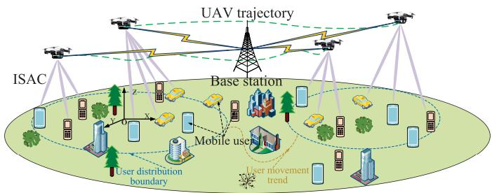  
Fig. 1. The system of the MUAV-assisted ISCC network.

## III. SYSTEM MODEL AND PROBLEM FORMULATION

We assume an MUAV-assisted ISCC network in the realworld environment, such as field cluster communication scenarios, which consists of M UAVs, N MUs, a ground base station equipped with powerful computing processor to be an edge computing server, and some obstacles (such as trees, buildings, etc), as shown in Fig. 1. The UAVs access the core network through the base station, are equipped with a uniform linear array (ULA) with P antennas to cooperatively provide ISAC services for single-antenna MUs. In this paper, we apply the sensing and computation function to improve communication performance, where the sensing task is defined as obtaining the position of the MUs based on wireless sensing and the environment image obtained from the airborne camera. Subsequently, the joint optimization of UAV trajectory and beamforming is completed by AI inference at the base station. To ensure the normal operation of the network, we assume that the network operates in a system period $T _ { P } ,$ , and each period is divided into $N _ { P }$ time slots, where the length of a time slot is $\delta = T _ { P } / N _ { P }$ . For ease of analysis, we only focus on the optimization for K consecutive periods. Moreover, since the sensing targets are for MUs, the same beam is applied for communication and sensing, which is realized by time division methods [33]. Similar to [34], we assume that the sensing task is implemented periodically, and the sensing frequency is defined as f <sup>sense</sup>. In this paper, the base station works as a centralized control center and manages the network. Besides, we only focus on improving the service quality of the MUs by UAVs, and the communication between the UAVs and the base station is out of the scope of this paper. For readability, we summarize the key symbols with explanations in Table I.

## A. Modeling of ISAC Channel

We establish a three-dimensional Cartesian coordinate system with the initial distribution center of MUs as the origin $\textbf { O } =  \} ( 0 , 0 , 0 )$ Therefore, the position of the m-th UAV and n-th MU at the time slot i are represented as ${ \bf q } _ { m } ^ { u } [ i ] = $ $( x _ { m } ^ { u } [ i ] , y _ { m } ^ { u } [ i ] , h _ { m } )$ and $\mathbf { q } _ { n } ^ { c } [ i ] = ( x _ { n } ^ { c } [ i ] , y _ { n } ^ { c } [ i ] , 0 )$ , respectively, where $h _ { m }$ is the fly height of the m-th UAV. Moreover, we define the bandwidth of the network as B, and UAVs can communicate with multiple MUs simultaneously through different beams. For ease of analysis, we assume that UAVs always communicate with pre-determined MUs. We apply the probabilistic line-of-sight (LoS) transmission model to describe the wireless channel between the UAVs and the MUs. We give the Euclidean distance between the m-th UAV and the n-th MU at the time slot i as $d _ { m , n } [ i ] = | | \mathbf { q } _ { m } ^ { u } [ i ] - \mathbf { q } _ { n } ^ { c } [ i ] | |$ , and the elevation angle can be derived as $\theta _ { m , n } [ i ] = \arcsin ( h _ { m } / d _ { m , n } [ i ] )$ Therefore, the probability of LoS transmission between the m-th UAV and the n-th MU at the time slot i is expressed as

TABLE I KEY SYMBOLS AND EXPLANATIONS
<table><tr><td rowspan=1 colspan=4>Key Symbols</td><td rowspan=1 colspan=1>Corresponding Explanation</td></tr><tr><td rowspan=1 colspan=4>M</td><td rowspan=1 colspan=1>the number of UAVs</td></tr><tr><td rowspan=1 colspan=4>N</td><td rowspan=1 colspan=1>the number of MUs</td></tr><tr><td rowspan=1 colspan=4> $\overline { { \mathbf { q } _ { m } ^ { u } [ i ] } }$ </td><td rowspan=1 colspan=1>the position of the UAV</td></tr><tr><td rowspan=1 colspan=4> $\overline { { \mathbf { q } _ { n } ^ { c } [ i ] } }$ </td><td rowspan=1 colspan=1>the position of the MU</td></tr><tr><td rowspan=1 colspan=4> $h _ { m }$ </td><td rowspan=1 colspan=1>the flight height of UAVs</td></tr><tr><td rowspan=1 colspan=4> $\overline { { v _ { m } [ i ] } }$ </td><td rowspan=1 colspan=1>the flight speed of UAVs</td></tr><tr><td rowspan=1 colspan=4> $\underline { { \overline { { P _ { \mathrm { m a x } } } } } }$ </td><td rowspan=1 colspan=1>the maximum transmit power of UAVs</td></tr><tr><td rowspan=1 colspan=4> $\overline { { V _ { \mathrm { m a x } } } }$ </td><td rowspan=1 colspan=1>the maximum flight speed of UAVs</td></tr><tr><td rowspan=1 colspan=4> $\overline { { E _ { \mathrm { m a x } } ^ { \mathrm { U A V } } } }$ </td><td rowspan=1 colspan=1>the maximum energy consumption of UAVs</td></tr><tr><td rowspan=1 colspan=1>αm,n [i</td><td></td><td rowspan=1 colspan=2>] ∈ {0, 1}</td><td rowspan=1 colspan=1>the communication indicator</td></tr><tr><td rowspan=1 colspan=1>βm,n [i</td><td></td><td rowspan=1 colspan=2>] ∈ {0, 1}</td><td rowspan=1 colspan=1>the sensing indicator</td></tr><tr><td rowspan=1 colspan=4> $\overbrace { \Gamma ^ { \mathrm { T H } } }$ </td><td rowspan=1 colspan=1>the minimum sensing performance</td></tr><tr><td rowspan=1 colspan=4> $\overline { { R ^ { \mathrm { T H } } } }$ </td><td rowspan=1 colspan=1>the minimum communication performance</td></tr><tr><td rowspan=1 colspan=4> $\overline { { B } }$ </td><td rowspan=1 colspan=1>the bandwidth</td></tr><tr><td rowspan=1 colspan=4> $\overline { { \mathbf { w } _ { m , n } [ i ] } }$ </td><td rowspan=1 colspan=1>the beamforming vector</td></tr><tr><td rowspan=1 colspan=4> $\scriptstyle { \overline { { f ^ { \mathrm { s e n s e } } } } }$ </td><td rowspan=1 colspan=1>the sensing frequency</td></tr><tr><td rowspan=1 colspan=2> $\overline { { { \bf { a } }</td><td></td><td rowspan=1 colspan=1>[ i ] } }$ </td><td rowspan=1 colspan=1>the action of DRL agent</td></tr><tr><td rowspan=1 colspan=2></td><td></td><td rowspan=1 colspan=1></td><td rowspan=1 colspan=1>the state of DRL agent</td></tr><tr><td rowspan=1 colspan=3><eq>\overline { { \Phi [ i ] } }</</td><td rowspan=1 colspan=1>eq></td><td rowspan=1 colspan=1>the reward function for training DRL agent</td></tr></table>

$$
P _ { m , n } ^ { \mathrm { L o S } } [ i ] = \frac { 1 } { 1 + A \exp ( - B ( \theta _ { m , n } [ i ] - A ) ) } ,\tag{1}
$$

where A and B are constants depending on the environment. Subsequently, the probability of non-LoS (NLoS) transmission is derived as $\begin{array} { r } { P _ { m , n } ^ { \mathrm { N L o S } } [ i ] \ \dot { \ } = \ 1 - \ P _ { m , n } ^ { \mathrm { L o S } } [ i ] } \end{array}$ . We define the beam steering vector for communication and sensing between the m-th UAV and the n-th MU at the time slot i as $\mathbf { a } _ { m , n } [ i ] ~ = ~ \left\lceil 1 , e ^ { \frac { j 2 \pi d \sin \left( \theta _ { m , n } [ i ] \right) } { \lambda } } , \ldots , e ^ { \frac { j 2 \pi d \sin \left( \theta _ { m , n } [ i ] \right) } { \lambda } } \right\rceil ^ { T }$ , where d and λ represent the antenna spacing and carrier wavelength, respectively. Then, the channel gain between the m-th UAV and the n-th MU at the time slot i is given by

$$
\begin{array} { r l } & { \mathbf { h } _ { m , n } [ i ] = \sqrt { P _ { m , n } ^ { \mathrm { L o S } } [ i ] ( \beta _ { 0 } d _ { m , n } ^ { - 2 } [ i ] ) } \mathbf { a } _ { m , n } [ i ] } \\ & { \qquad + \sqrt { P _ { m , n } ^ { \mathrm { N L o S } } [ i ] ( \xi \beta _ { 0 } d _ { m , n } ^ { - 2 } [ i ] ) } \mathbf { b } _ { m , n } [ i ] , } \end{array}\tag{2}
$$

where $\beta _ { 0 }$ and $\xi ~ < ~ 1$ denote the channel gain when the reference distance is 1 meter and additional attenuation factor for NLoS transmission, respectively, and $ { \mathbf { b } } _ { m , n } [ i ]$ is a complex Gaussian random vector with zero mean and unit covariance matrix. Then, we can obtain the communication rate between the m-th UAV and the n-th MU at the time slot i based on the following formula,

$$
R _ { m , n } [ i ] = \alpha _ { m , n } [ i ] { \cal B } \log _ { 2 } \left( 1 + \frac { | ( { \bf h } _ { m , n } [ i ] ) ^ { H } { \bf w } _ { m , n } [ i ] | ^ { 2 } } { I _ { m , n } [ i ] + z _ { 0 } } \right) ,\tag{3}
$$

where $z _ { \mathrm { 0 } }$ and $\mathbf { w } _ { m , n } [ i ]$ denote the noise power and the beamforming vector for communication or sensing. $I _ { m , n } [ i ]$ is the interference caused by the communication or sensing between the m-th UAV and the n<sup>0</sup>-th $( n ^ { \prime } \neq n )$ MU at the time slot $i ,$ which is given by

$$
\begin{array} { l } { { \displaystyle I _ { m , n } [ i ] = \sum _ { n \neq n ^ { \prime } } ^ { N } \alpha _ { m , n } [ i ] \vert ( \mathbf { h } _ { m , n } [ i ] ) ^ { H } \mathbf { w } _ { m , n ^ { \prime } } [ i ] \vert ^ { 2 } } \ ~ } \\ { { \displaystyle ~ + \sum _ { n \neq n ^ { \prime } } ^ { N } \beta _ { m , n } [ i ] \vert ( \mathbf { h } _ { m , n } [ i ] ) ^ { H } \mathbf { w } _ { m , n ^ { \prime } } [ i ] \vert ^ { 2 } } , } \end{array}\tag{4}
$$

where $\alpha _ { m , n } [ i ] \in \{ 0 , 1 \}$ and $\beta _ { m , n } [ i ] \ \in \ \{ 0 , 1 \}$ represent the communication indicator and sensing indicator, respectively. It is assumed that the interference between UAVs can be eliminated by a narrow beam, similar to [2]. When the m-th UAV communicates with the n-th MU or senses the n-th MU at the time slot $i , \ \alpha _ { m , n } [ i ] = 1$ or $\beta _ { m , n } [ i ] = 1$ . Otherwise, $\alpha _ { m , n } [ i ] = 0 \mathrm { ~ o r ~ } \beta _ { m , n } [ i ] = 0$ . When UAVs perform sensing tasks, they first send the dedicated ISAC signal through the beam and process the echo signal reflected by the MUs to obtain the state of the MUs. Normally, signal to interference plus noise ratio (SINR) is widely used to measure sensing performance [35], thus we herein define the minimum sensing SINR as $\Gamma ^ { \mathrm { T H } }$ . Therefore, we can give the following constraint:

$$
\beta _ { m , n } [ i ] \frac { | ( \mathbf { h } _ { m , n } [ i ] ) ^ { H } \mathbf { w } _ { m , n } [ i ] | ^ { 2 } } { I _ { m , n } [ i ] + z _ { 0 } } \geq \beta _ { m , n } [ i ] \Gamma ^ { \mathrm { T H } } .\tag{5}
$$

## B. Modeling of the UAV Mobility

When a time slot is short enough, the motion of the UAV in a time slot can be regarded as a uniform linear motion [1], [2]. Let $v _ { m } [ i ]$ represent the speed of the m-th UAV at the time slot i. Then, we define the $\theta _ { m } ^ { \mathrm { { \bar { T D } } } } [ i ]$ as the flight direction of the m-th UAV. Based on the above definition, the position of the UAV is updated based on the following formulas

$$
\begin{array} { r } { \mathbf q _ { m } ^ { u } [ i + 1 ] [ 0 ] = \mathbf q _ { m } ^ { u } [ i ] [ 0 ] + v _ { m } [ i ] \cos ( \theta _ { m } ^ { \mathrm { T D } } [ i ] ) \delta , } \\ { \mathbf q _ { m } ^ { u } [ i + 1 ] [ 1 ] = \mathbf q _ { m } ^ { u } [ i ] [ 1 ] + v _ { m } [ i ] \sin ( \theta _ { m } ^ { \mathrm { T D } } [ i ] ) \delta . } \end{array}\tag{6}
$$

## C. Modeling of the UAV Energy

In this paper, the energy consumption of UAVs mainly consists of two parts: communication energy consumption $E _ { m } ^ { \mathrm { C O M } } [ i ]$ and navigation energy consumption $\breve { E } _ { m } ^ { \mathrm { N A V } } [ i ]$ , they are calculated separately by the following formulas

$$
E _ { m } ^ { \mathrm { C O M } } [ i ] = \sum _ { i ^ { \prime } = 1 } ^ { i } \sum _ { n = 1 } ^ { N } , \alpha _ { m , n } [ i ^ { \prime } ] p _ { m , n } [ i ^ { \prime } ] \delta ,\tag{7}
$$

$$
E _ { m } ^ { \mathrm { N A V } } [ i ] = \left( E _ { 1 } + E _ { 2 } + c _ { 0 } v _ { m } ^ { 3 } \right) \delta ,\tag{8}
$$

where $p _ { m , n } [ i ^ { \prime } ]$ represents the transmit power allocated to the n-th MU by the m-th UAV, $\begin{array} { r } { E _ { 1 } \ = \ \dot { P } _ { 1 } \Big ( 1 + \frac { 3 v _ { m } ^ { 2 } } { u _ { \mathrm { p } } ^ { 2 } } \Big ) , \ E _ { 2 } \ = \ } \end{array}$ $\begin{array} { r } { P _ { 2 } \left( \sqrt { 1 + \frac { v _ { m } ^ { 4 } } { 4 v _ { 0 } ^ { 2 } } } - \frac { v _ { m } ^ { 2 } } { 2 v _ { 0 } ^ { 2 } } \right) } \end{array}$ , and $\mu$ is the effective switched capacitance of CPU processor [2]. $P _ { 1 }$ and $P _ { 2 }$ represent the blade profile power and induced hovering power, respectively. The other parameters $u _ { p } , \ v _ { 0 } ,$ , and $c _ { 0 }$ are related to the aerodynamics of UAVs [2]. Let $E _ { \mathrm { m a x } } ^ { \mathrm { U A V } }$ denote the maximum energy consumption, the following constraint should be satisfied

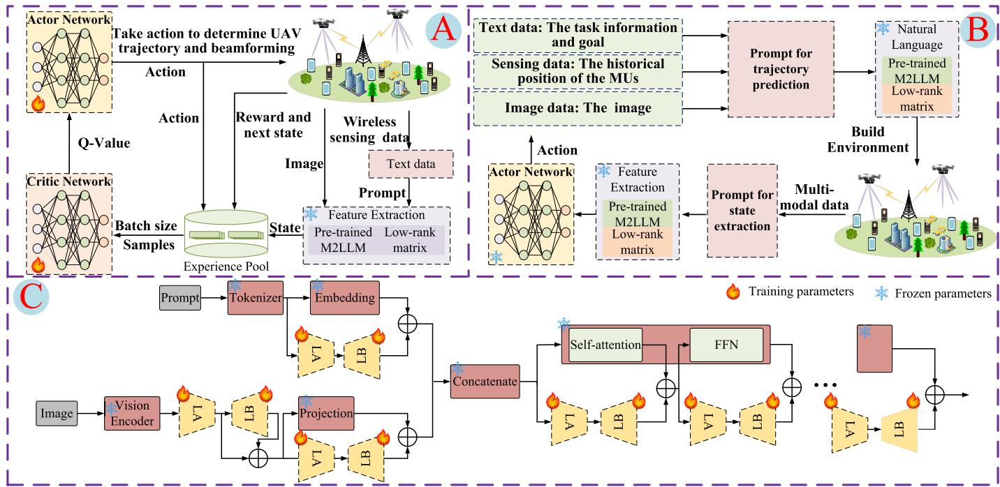  
Fig. 2. The framework of the M2LLM-enabled DRL joint optimization scheme. (A) Training flow structure diagram. (B) Execution flow structure diagram. (C) LoRA fine-tuning structure.

$$
E _ { m } ^ { \mathrm { C O M } } [ i ] + E _ { m } ^ { \mathrm { N A V } } [ i ] \leq E _ { \operatorname* { m a x } } ^ { \mathrm { U A V } } , \forall m , i .\tag{9}
$$

## D. Optimization Problem Formulation

We focus on the joint optimization of coupled UAV trajectory and beamforming to maximize the average sum rate, while considering the mobility of both UAVs and MUs. Therefore, the optimization problem is formulated as follows

$$
( \mathrm { P 1 } ) { : \operatorname* { m a x } _ { \mathcal { Q } , \mathcal { B } } } \frac { 1 } { K T _ { P } } \sum _ { i = 1 } ^ { K N _ { P } } \sum _ { m = 1 } ^ { M } \sum _ { n = 1 } ^ { N } { R _ { m , n } [ i ] }\tag{10}
$$

$$
s . t . \quad \alpha _ { m , n } [ i ] \in \{ 0 , 1 \} , \quad \forall m , n , i ,
$$

$$
\beta _ { m , n } [ i ] \in \{ 0 , 1 \} , \quad \forall m , n , i ,\tag{10a}
$$

(10b)

$$
\begin{array} { r } { | \mathbf { q } _ { m } ^ { u } [ i ] - \mathbf { q } _ { m } ^ { u } [ i - 1 ] | \leq V _ { \operatorname* { m a x } } \delta , \forall m , i , } \end{array}\tag{10c}
$$

$$
\sum _ { n = 1 } ^ { N } ( \alpha _ { m , n } [ i ] + \beta _ { m , n } [ i ] ) | \mathbf { w } _ { m , n } [ i ] | ^ { 2 } \leq P _ { \operatorname* { m a x } } ,\tag{∀m, i,}
$$

(10d)

$$
\alpha _ { m , n } [ i ] { R } _ { m , n } [ i ] \geq \alpha _ { m , n } [ i ] { R } ^ { \mathrm { T H } } , \forall m , n , i ,\tag{10e}
$$

$$
\begin{array} { r } { \sqrt { | \mathbf { q } _ { m } ^ { u } [ i ] - \mathbf { q } _ { m ^ { \prime } } ^ { u } [ i ] | ^ { 2 } \geq H ^ { \mathrm { s a f e } } } , \quad \forall m \neq m ^ { \prime } , i , } \end{array}\tag{10f}
$$

$$
( 5 ) , ( 6 ) , ( 9 ) ,\tag{10g}
$$

where $\mathcal { Q } = \{ \mathbf { q } _ { m } ^ { u } [ i ] , \forall m , i \} , \mathcal { B } = \{ \mathbf { w } _ { m , n } [ i ] , \forall m , n , i \} , \mathbf { q } _ { m } ^ { u }$ $\mathbf { q } _ { m } ^ { u } [ i ]$ and $\mathbf { w } _ { m , n } [ i ]$ represent the position of the m-th UAV at the time slot i and the beamforming vector between the m-th UAV and the n-th MU, respectively. The constraints (10a) and (10b) represent the $\alpha _ { m , n } [ i ]$ and $\beta _ { m , n } [ i ]$ are binary variables. If $\alpha _ { m , n } [ i ] = 1$ or $\beta _ { m , n } [ i ] = 1$ , it indicates the m-th UAV communicate with the n-th MU or sense the n-th MU at the time slot i. Otherwise, $\alpha _ { m , n } [ i ] = 0$ or $\beta _ { m , n } [ i ] = 0$ . The UAV flight speed $v _ { m } [ i ] \in [ 0 , V _ { \mathrm { m a x } } ]$ is guaranteed by the constraint (10c), where $V _ { \mathrm { m a x } }$ is the maximum flight speed of UAVs, and the maximum transmit power $P _ { \mathrm { m a x } }$ is limited by (10d). The minimum communication performance $R ^ { \mathrm { T H } }$ is ensured by the constraints (10e). Finally, the safe flight of UAVs is guaranteed by the constraint (10f) in which the distance between any two UAVs at any time should be larger than the safe distance $H ^ { \mathrm { s a f e } }$ Since the above problem is non-convex, it is difficult to obtain the optimal solution directly through traditional optimization techniques, thus we apply DRL to get the solution [5], [6].

$$
\begin{array} { r } { \mathrm { I V . ~ M 2 L L M \mathrm { \mathrm { - } D R I V E N ~ D E E P ~ R E I N F O R C E M E N T } } } \\ { \mathrm { L E A R N I N G \mathrm { \mathrm { - } B A S E D ~ J O I N T ~ O P T I M I Z A T I O N ~ F R A M E W O R K } } } \end{array}
$$

The framework of the M2LLM-driven DRL-based joint optimization framework is shown in Fig. 2, where (A), (B) and (C) represent training flow, execution flow and fine-tuning structure by low-rank adaptation of large language models (LoRA), respectively. To be specific, the fine-tuned M2LLM in Fig. 2 (C) is used for feature extraction in Fig. 2 (A) and (B). In addition, the fine-tuned M2LLM in Fig. 2 (C) is also used for MU trajectory prediction in Fig. 2 (B). Considering that the inference of M2LLM requires sufficient computation capacity and energy, it is deployed on the base station to perform MU trajectory prediction and state extraction. In addition, UAVs are assumed to transmit the obtained data (wireless sensing data and image data) to the base station through a specific channel. Therefore, the environment is fully observable for the base station, and we convert the optimization problem (P1) into a fully observable MDP, then deploy a DRL agent on the base station to complete the joint optimization of the UAV trajectory and beamforming. In this paper, we deploy the pretrained large language and vision assistant (LLaVA) [36] as the M2LLM to predict the MU trajectory and extract the state. Moreover, we build a dataset to fine-tune LLaVA to ensure the performance of the MU trajectory prediction and state extraction. Leveraging the long-text processing capability of the fine-tuned M2LLM and its ability to transform environmental states into fixed-dimensional vectors, the proposed framework can optimize complex environments in the centralized base station, regardless of the number of UAVs and MUs. In addition, in the proposed framework, the M2LLM is trained offline and performs inference operations only during online execution. The training and deployment of DRL follow a similar approach to [5] and [6], with both offline and online training phases, while execution occurs exclusively online. In the following, the combination of M2LLM and the network will be described in III-A, the fine-tuning is introduced in III-B, the multi-modal data fusion mechanism is analyzed in III-C, the MDP modeling is described in III-D, the execution and training are elaborated in III-E, and the complexity is analyzed in III-F.

## A. Integrated Multi-Modal Large Language Models Into UAV-Assisted ISCC Networks

M2LLM is applied for MU trajectory prediction: To provide high-quality service to MUs, an effective way is first to predict the trajectory of MUs and then to optimize the communication performance based on the prediction [5], [27], [28]. To predict the MU trajectory, statistics-based and learning-based schemes are widely applied [5], [27], [28]. However, these prediction approaches only rely on the singlemodal historical position of MUs, which can only dig out the rules in the data, ignoring the influence of realistic factors such as terrain, roads and buildings on the trajectory. Therefore, to comprehensively consider the impact of multiple factors in the real environment on MUs trajectory and obtain more accurate prediction results, we should collect multi-modal data in the environment, and apply the multi-modal data processing ability of M2LLM with the time series prediction ability [37] to predict the trajectory of MUs. Moreover, to better understand multi-modal data in communication scenarios, we build a dataset to fine-tune a pre-trained M2LLM for further improving the prediction performance.

M2LLM is applied for state extraction: The fine-tuned M2LLM can better understand and process multi-modal data [38], and it can capture the environmental features contained in multi-modal data. Meanwhile, the feature information processed by M2LLM can be mapped to any dimension by a simple linear neural network. Therefore, using M2LLM to extract states from multi-modal data can not only accurately describe the state of the environment, but also greatly reduce the dimension of the feature vector, providing richer information for network optimization with less data.

M2LLM is not applied for optimization: Although there have been some studies using LLM for network performance optimization, such as using ICL for power allocation [31], LLM can only deal with simple optimization tasks. Currently, UAV trajectory optimization and beamforming are still difficult to complete by LLM. Moreover, it is difficult to obtain the best optimization results using LLM due to the illusion problem, such as ICL [30], [31], which essentially obtains feasible solutions instead of optimal ones. Therefore, we do not yet choose LLM to optimize trajectory and beamforming, and we only use it to predict MU trajectory and extract the state.

## B. Fine-Tune M2LLM for Trajectory Prediction of MUs

LLaVA is a pre-trained M2LLM with strong text and image understanding, but it is not trained for time series prediction tasks. Therefore, we construct a dataset and fine-tune LLaVA using LoRA to ensure the predicted performance. LoRA is an LLM fine-tuning technique that creates two trainable low-rank matrices in some layers [39], which is shown in Fig. 2(D), where LA and LB are defined as a pair of trainable low-rank matrices. In LLaVA, Vicuna is applied as the language model and the pre-trained contrastive languageimage pre-training (CLIP) model is used to process the image data [36]. Therefore, the prompt is transformed into feature vectors by the tokenizer and embedding, while image data are transformed into feature vectors by the vision encoder and mapped into the space of text feature vectors by projection. Then, the text feature vector and the image feature vector are concatenated and the concatenated result is regarded as the input of the Vicuna for inference. Given that we need to finetune M2LLM to handle multi-modal data for predicting the MUs trajectory, we need to fine-tune the embedding, vision encoder, projection, self-attention, and feedforward networks (FFN) in each Transformer. Therefore, we should add a new bypass consisting of low-rank matrices LA and LB in each of the above modules. Moreover, the input of the bypass is the same as the input of the fine-tuned part, and the output of the two is added as the final output. During the LoRA fine-tuning process, the parameters of M2LLM remain unchanged, and only the parameters of LA and LB are updated, which greatly reduces the computational cost and training time [39].

1) Data Collection: In this paper, the data for fine-tuning LLaVA mainly include three types, that is, text data, MU position obtained by wireless sensing, and environment image, where text data are taken to describe the task information and inform the goal to the M2LLM, including predicting the trajectory of the MUs based on the historical multi-modal data and extracting the state of the environment [37]. Therefore, we need to collect the position of the MUs and environment images to make the dataset for fine-tuning LLaVA. To achieve that, we build a simulation environment through AirSim [40], and collect multi-modal data from the simulation environment.

2) Dataset Production: After collecting enough data from the simulation environment, we need to make a dataset to finetune LLaVA, the dataset is presented in the form of dialogue [37]. In this paper, we fine-tune the pre-trained LLaVA through supervised fine-tuning (SFT). Specifically, the samples for fine-tuning the LLaVA are in the form of dialogue, and the features are the content input to LLaVA, that is, the prompt and images, and the labels are the output of LLaVA. In the prompt, we need to inform LLaVA that the task is to predict the future trajectory of MU based on historical multi-modal data. Therefore, the prompt contains two parts: task description and historical multi-modal data. In addition, the label of samples is the trajectory of MU in the next system period. The sample form for fine-tuning LLaVA is shown in Fig. 3. From Fig. 3, we can see that LLaVA is informed in the prompt to pay attention to the environment of MUs in the image, thus LLaVA can learn the influence of buildings, roads, and other real factors of the environment on the trajectory of MUs, thereby improving the prediction performance.

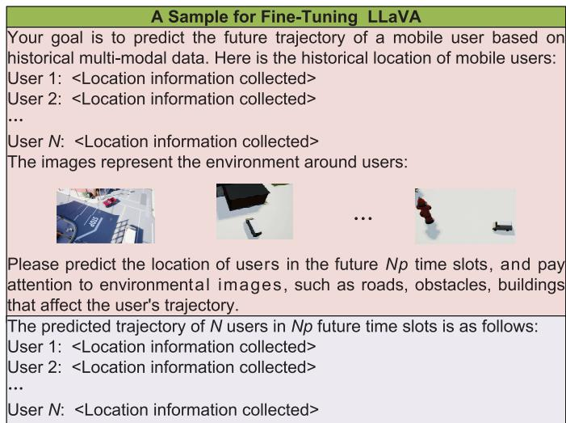  
Fig. 3. The sample form for fine-tuning LLaVA.

3) LoRA Fine-Tune: After making the dataset, we need to fine-tune the pre-trained LLaVA by LoRA. To be specific, we define the modules to be fine-tuned as the set ${ \mathcal { I } } ,$ which includes the embedding, vision encoder, projection, selfattention, and FNN in each Transformer. Therefore, aiming for the j-th $( j \in { \mathcal { I } } )$ fine-tuned module, the original parameters of LLaVA are denoted as $\mathbf { W } _ { j } \in \mathbb { R } ^ { a _ { j } \times b _ { j } }$ , where $a _ { j }$ and $b _ { j }$ represent the input and output dimensions of the j-th fine-tuned module, respectively. To fine-tune the LLaVA by LoRA, we need to add a bypass consisting of two low-rank matrices LA and LB to the j-th fine-tuned module, where the parameters of the LA and LB are represented as $\mathbf { W } _ { j } ^ { \mathrm { L B } } \in \mathbb { R } ^ { r \times b _ { j } }$ and $\mathbf { W } _ { i } ^ { \mathrm { L A } } \ \in \ \mathbb { R } ^ { a _ { j } \times r }$ , respectively, with r representing the rank and $r ~ \ll$ min $( a _ { j } , b _ { j } )$ [37]. Therefore, for a given input $\mathbf { x } _ { j } ~ \in ~ \mathbb { R } _ { j } ^ { a }$ , the output of the j-th fine-tuned module during forward propagation is given by

$$
\mathbf { y } _ { j } = \left( \mathbf { W } _ { j } + \mathbf { W } _ { j } ^ { \mathrm { L A } } \mathbf { W } _ { j } ^ { \mathrm { L B } } \right) \mathbf { x } _ { j } .\tag{11}
$$

Since it is a regression problem when fine-tuning LLaVA by SFT, the mean square error loss function L that is built on $\mathbf { y } _ { j }$ and labels is used to measure the error between the predicted value and the true value. Therefore, the update formula of the low-rank matrices LA and LB is given by

$$
\hat { \mathbf { W } } _ { j } ^ { \mathrm { L A } }  \mathbf { W } _ { j } ^ { \mathrm { L A } } - \alpha ^ { \mathrm { L o R A } } \frac { \partial \mathcal { L } } { \partial \mathbf { W } _ { j } ^ { \mathrm { L A } } } ,
$$

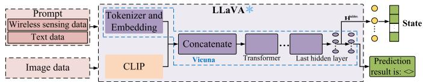  
Fig. 4. The structure of the multi-modal data fusion process.

$$
\hat { \mathbf { W } } _ { j } ^ { \mathrm { L B } }  \mathbf { W } _ { j } ^ { \mathrm { L B } } - \alpha ^ { \mathrm { L o R A } } \frac { \partial \mathcal { L } } { \partial \mathbf { W } _ { j } ^ { \mathrm { L B } } } ,\tag{12}
$$

where $\alpha ^ { \mathrm { L o R A } }$ is defined as the learning rate. After fine-tuning LLaVA, the fine-tuned LLaVA can be directly applied for MU trajectory prediction. Therefore, we can input the prompt and images into the fine-tuned LLaVA shown in Fig. 3, and the fine-tuned LLaVA can accurately predict the MU trajectory. In addition, thanks to the strong generalization ability and context understanding ability of LLM, the fine-tuned LLaVA can not only accurately predict the MU trajectory through a small amount of historical data, but also complete the prediction for any length of time.

## C. Multi-Modal Data Fusion Mechanism

In this paper, we utilize LLaVA to process multi-modal data directly for MU trajectory prediction and environmental state representation, where the multi-modal data include image, wireless sensing, and text data. To fully leverage these multimodal data for representing the environment and exploring the relationships between different modalities to enhance environmental representation, we perform multi-modal data fusion through mid-term fusion and late fusion [36]. Specifically, the multi-modal data are divided into two types of processing within LLaVA: the prompt containing wireless sensing and text data, and image data. In the mid-term fusion stage, the prompt (including wireless sensing and text data) is processed by the tokenizer and embedding layers of the Vicuna model, while the image data are processed by the CLIP model to obtain their respective feature representations. Vicuna, being the foundation of LLaVA, handles reasoning and processes the prompt, whereas CLIP maps the images into the same feature space as the text features. The feature representations of both the prompt and the image are then concatenated to form a unified feature representation containing the multi-modal data. After completing the mid-term fusion, the concatenated feature representations are passed into Vicuna for further inference, resulting in the final state representation. This state representation not only contains the features from each modality but also captures the relationships between them, which is referred to as late fusion. The structure of the multi-modal data fusion process is illustrated in Fig. 4. Although both MU trajectory prediction and state extraction are based on multimodal data and the M2LLM implementation, the inputs and outputs are different when executing MU trajectory prediction and state extraction. In particular, MU trajectory prediction is performed when the input contains historical multi-modal data, and the output is the prediction result in the form of natural language. In contrast, for state extraction, the input consists of the multi-modal data at the current time slot, and the output is a deterministic vector obtained from the last hidden layer, which is explained in detail in III-D.

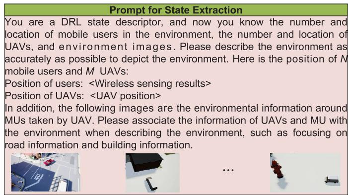  
Fig. 5. The prompt for state extraction.

To achieve MU trajectory prediction and state extraction based on multi-modal data, we need to acquire multi-modal data for each time slot. For each set of multi-modal data, it is always aligned temporally and semantically, ensuring that it is collected synchronously and within the same physical environment. Therefore, under the proposed framework, no additional alignment operations are necessary, which simplifies the process.

## D. Modeling of Markov Decision Process

In this paper, we transform the optimization problem (P1) into a fully observable MDP, which is formulated as a tuple $< A , S , R , P , \gamma >$ , where A, S, R, P and $\gamma \in [ 0 , 1 ]$ represent the action space, state space, reward function, state transition matrix, and the reward discount coefficient, respectively. Since the environment state transition is uniquely determined, the state transition matrix can be ignored. Moreover, to adapt to the dynamically changing environment, we build the environment based on the predicted results of M2LLM, and the fully observable MDP is defined as follows, where the base station is regarded as the agent.

1) Action Space: The action for optimizing the trajectory and beamforming of the m-th UAV at the time slot i is represented as $\mathbf { a } _ { m } [ i ] ~ = ~ \left( \theta _ { m } ^ { \mathrm { T D } } [ i ] , v _ { m } [ i ] , \mathbf { w } _ { m , n } [ i ] \right)$ , where $\theta _ { m } ^ { \mathrm { T D } } [ i ] \in [ 0 , 2 \pi ]$ is defined as the movement direction of the m-th UAV. Therefore, the action of the agent at the time slot i is denoted as $\mathbf { a } [ i ] = ( \mathbf { a } _ { 1 } [ i ] , \mathbf { a } _ { 2 } [ i ] , \dots , \mathbf { a } _ { M } [ i ] )$

2) State Space: Similar to the MU trajectory prediction, state extraction also relies on prompt engineering, with the specific prompt used for state extraction shown in Fig. 5. We define $s ^ { \mathrm { t e x t } } [ i ]$ and $s ^ { \mathrm { i m a g e } } [ i ]$ as the text data and environmental images representing the state at time slot $i ,$ respectively. The prompt $s ^ { \mathrm { p r o m p t } } ( s ^ { \mathrm { t e x t } } [ i ] )$ is then built based on $s ^ { \mathrm { t e x t } } [ i ]$ and input along with $s ^ { \mathrm { i m a g e } } [ i ]$ into M2LLM for inference. According to Fig. 4, the primary purpose of M2LLM when extracting the state is not to generate natural language output, we only need to retrieve the output from the last hidden layer of M2LLM, which is denoted as $\mathbf { H } ^ { \mathrm { h i d d e n } } ( s ^ { \mathrm { p r o m p t } } ( s ^ { \mathrm { t e x t } } [ i ] ) , s ^ { \mathrm { i m a g e } } [ i ] )$ ). Given the large scale of M2LLM, the dimension of $\mathbf { H } ^ { \mathrm { { \bar { h i d d e n } } } } ( s ^ { \mathrm { p r o m p t } } ( s ^ { \mathrm { t e x t } } [ i ] ) , s ^ { \mathrm { i m a g e } } [ i ] )$

remains large. To convert this to a fixed-dimensional state vector, we define a linear layer $f ^ { \mathrm { l i n e a r } } ( )$ , where the input dimension matches that of $\bar { \mathbf { H } } ^ { \mathrm { h i d d e n } } ( s ^ { \mathrm { p r o m p t } } ( s ^ { \mathrm { t e x t } } [ i ] ) , s ^ { \mathrm { i m a g e } } [ i ] )$ , and the output dimension is $N ^ { \mathrm { s t a t e } }$ . Therefore, the state at time slot i is represented as:

$$
\begin{array} { r } { \mathbf { s } [ i ] = f ^ { \mathrm { l i n e a r } } ( \mathbf { H } ^ { \mathrm { h i d d e n } } ( s ^ { \mathrm { p r o m p t } } ( s ^ { \mathrm { t e x t } } [ i ] ) , s ^ { \mathrm { i m a g e } } [ i ] ) ) . } \end{array}\tag{13}
$$

Since the M2LLM is fine-tuned to achieve MU trajectory prediction in UAV-assisted ISCC networks, the fine-tuned M2LLM can effectively describe the environment in combination with multi-modal data. In addition, we eliminate the uncertainty of M2LLM output by outputting the data of the last hidden layer. Therefore, the physical environment and the feature representation are in one-to-one correspondence, which provides a necessary condition for DRL work.

3) Reward Function: Since we aim to jointly optimize the UAV trajectory and beamforming for maximizing the average sum rate, the sum rate is regarded as the reward in this paper. To ensure minimum communication and sensing performance, we transform the constraints into penalty terms in the reward function. Therefore, the reward function is given by

$$
\begin{array} { l } { \displaystyle \Phi [ i ] = \sum _ { m = 1 } ^ { M } \sum _ { n = 1 } ^ { N } \left[ \alpha _ { m , n } [ i ] \left( 2 R _ { m , n } [ i ] - R ^ { \mathrm { T H } } \right) \right. } \\ { \displaystyle \qquad + \left. \beta _ { m , n } [ i ] \left( \frac { \left| \left( \mathbf { h } _ { m , n } [ i ] \right) ^ { H } \mathbf { w } _ { m , n } [ i ] \right| ^ { 2 } } { I _ { m , n } [ i ] + z _ { 0 } } - \Gamma ^ { \mathrm { T H } } \right) \right] } \\ { \displaystyle \qquad + \sum _ { m = 1 } ^ { M } \left[ E _ { m } ^ { \mathrm { c o M } } [ i ] + E _ { m } ^ { \mathrm { N A V } } [ i ] - E _ { \mathrm { m a x } } ^ { \mathrm { U A } } \right. } \\ { \displaystyle \qquad + \left. \sum _ { m ^ { \prime } = 1 , m ^ { \prime } \neq m } ^ { M } \left( \sqrt { | \mathbf { q } _ { m } ^ { u } [ i ] - \mathbf { q } _ { m ^ { \prime } } ^ { u } [ i ] | ^ { 2 } } - H ^ { \mathrm { s a f } } \right) \right] . } \end{array}\tag{14}
$$

In this paper, the beamforming action output by the agent is first normalized when executed, and then the power allocation is determined by a simple power allocation algorithm to ensure the maximum power constraint of the UAV, where the power water-filling algorithm is used to optimize the power allocation. Therefore, through the design of the action and reward function, DRL can satisfy all constraints when solving the optimization problem (P1).

## E. Training and Execution of M2LLM-Enabled DRL Scheme

The deep deterministic policy gradient (DDPG) is applied for jointly optimizing UAV trajectory and beamforming, and the training architecture is described in Fig. 2 (A), in which the fine-tuned M2LLM is used. Since the DRL agent only needs to optimize the UAV trajectory and beamforming for a given MU trajectory, the M2LLM is only used for state extraction during the training phase. To be specific, under the given MU trajectory $\mathbf { Q } ^ { \mathrm { M U } } [ k + 1 ]$ in the (k + 1)-th period, we first build the training environment. In addition, we model the (k + 1)-th period as an MDP, where the agent obtains sample $< \mathbf { s } [ i ] , \mathbf { a } [ i ] , \mathbf { s } [ i + 1 ] , \Phi [ i ] > \mathrm { b y }$ interacting with the environment and stores it in the experience pool. Once a sufficient number of samples are stored in the experience pool, a batch of samples in the experience pool is randomly selected and the network parameters are updated through the backpropagation algorithm. The training phase is shown in Algorithm 1.

Algorithm 1 The Training Process of the M2LLM-Enabled   
DRL Joint Optimization Scheme   
Input: The number of the UAVs M, the number of   
the MUs $N ,$ the trajectory of MUs $\mathbf { Q } ^ { \mathrm { M U } } [ k + 1 ]$   
in the $( k + 1 )$ -th period.   
Output: A DRL model for optimizing UAV trajectory   
and beamforming.   
Create the environment and DRL model, initialize the   
maximum episode $E _ { \mathrm { m a x } } ,$ , the number of episodes that   
the training starts $N ^ { \mathrm { T } }$ , and the maximum steps in   
each episode $S _ { \mathrm { m a x } } = N _ { P }$   
for $e = 1 : E _ { \operatorname* { m a x } }$ do   
Reset the environment and obtain the initial state.   
for $s t = 1 : S _ { \operatorname* { m a x } }$ do   
The agent determines the action $\mathbf { a } [ s t ]$ based on   
the state $\mathbf { s } [ s t ] .$   
The action a[st] is executed, then the reward   
$\Phi [ s t ]$ and the next state s $[ s t + 1 ]$ are obtained.   
Next, the sample $< { \bf s } [ i ] , \bar { \bf a } [ i ] , { \bf s } [ i + 1 ] , \Phi [ s t ] >$   
is stored into the experience pool.   
$\mathbf { i } \mathbf { f } \ e \geq N ^ { T }$ then   
The agent randomly selects a batch of   
samples from the experience pool.   
Update the critic network and actor network   
based on the backpropagation algorithm.   
end   
Update the state of the environment.   
end   
end

After training the DRL agent, we can optimize UAV trajectory and beamforming through the trained actor network and fine-tuned M2LLM, which is depicted in Fig. 2 (B), and the execution phase is described in Algorithm 2. To adapt to the dynamic characteristics of the network, the agent determines the UAV trajectory and beamforming in the next period based on the prediction. Therefore, the M2LLM is applied for MU trajectory prediction and state extraction in the execution phase. Specifically, in the k-th period, M2LLM predicts the trajectory of MUs in the (k + 1)-th period through multimodal historical data, and then makes decisions on UAV flight action and beamforming at each time slot to obtain the UAV trajectory and beamforming in the $( k + 1 )$ -th period. In the execution phase, the state of the environment is obtained by the formula (13). Although M2LLM inference takes a certain amount of time, it can meet the time requirements in practical applications because it decides the trajectory and beamforming in a period. In addition, the initial position of the UAVs is obtained by the K-Means in the execution phase.

## F. Complexity Analysis

Since DRL is used to solve the problem (P1) in this paper, we can analyze the complexity in the training phase and execution phase separately. In the training phase, we not only need to update the critic network and actor network parameters, but also need M2LLM to participate in inference. The complexity of the former can be expressed as $O ( N ^ { \mathrm { s t a t e } } N _ { \mathrm { n e u } } + ( N _ { \mathrm { h i d d e n } } - 1 ) N _ { \mathrm { n e u } } ^ { 2 } + N ^ { \mathrm { a c t i o n } } N _ { \mathrm { n e u } } + ( M +$ $1 ) ( N ^ { \mathrm { s t a t e } } + N ^ { \mathrm { a c t i o n } } ) N _ { \mathrm { n e u } } + ( N _ { \mathrm { h i d d e n } } - 1 ) N _ { \mathrm { n e u } } ^ { 2 } + N ^ { \mathrm { a c t i o n } } )$ , where $N ^ { \mathrm { a c t i o n } } , \ N _ { \mathrm { h i d d e n } }$ and $N _ { \mathrm { n e u } }$ represent the dimension of the action, the number of hidden layers of the actor and critic networks and the number of neurons in each hidden layer. Since M2LLM needs to process both image data and text data, we assume that the height and width of images and the number of channels are H, W and $C ,$ and the complexity of processing the image is $O ( H W C )$ . In addition, the current LLM is mainly based on the Transformer to process text, and the complexity of the inference is $O ( L ^ { 2 } )$ for text data of length L. Moreover, the fusion of the two modalities will bring additional complexity. The dimensions of image features and text features are defined as $D ^ { \mathrm { I M } }$ and $D ^ { \mathrm { T E } }$ , and the additional complexity is $O ( D ^ { \mathrm { I M } } D ^ { \mathrm { T E } } )$ . In summary, the inference complexity of the M2LLM is $O ( H W C + \bar { N ^ { \mathrm { T R A N S } } } L ^ { 2 } + D ^ { \mathrm { I M } } D ^ { \mathrm { T E } } )$ where $N ^ { \mathrm { T R A N S } }$ denotes the number of the Transformer in the M2LLM. Therefore, the complexity in the training phase can be written as $O ( E _ { \mathrm { m a x } } S _ { \mathrm { m a x } } ( N ^ { \mathrm { s t a t e } } N _ { \mathrm { n e u } } + ( N _ { \mathrm { h i d d e n } } - 1 ) N _ { \mathrm { n e u } } ^ { 2 } +$ $\ N ^ { \mathrm { a c t i o n } } N _ { \mathrm { n e u } } + ( M + 1 ) ( N ^ { \mathrm { s t a t e } } + N ^ { \mathrm { a c t i o n } } ) N _ { \mathrm { n e u } } + ( N _ { \mathrm { h i d d e n } } -$ $1 ) N _ { \mathrm { n e u } } ^ { 2 } + N ^ { \mathrm { a c t i o n } } ) ( H W C + N ^ { \mathrm { T R A N S } } L ^ { 2 } + D ^ { \mathrm { I M } } D ^ { \mathrm { T E } } ) )$ , and we can reduce the training complexity by reducing the state dimension, choosing the reasonable neural network scale, and designing short prompts. In the execution phase, we also need the M2LLM to process data, and the complexity is $O ( N _ { P } ( N ^ { \mathrm { a c t i o n } } N ^ { \mathrm { s t a t e } } + ( \hat { H } W C + N ^ { \mathrm { T R A N S } } L ^ { 2 } + D ^ { \mathrm { I M } } D ^ { \mathrm { \hat { T } E } } ) ) )$ . The complexity of the proposed scheme is acceptable on edge servers with general computing power.

```powershell
Algorithm 2 The Execution Process of the M2LLM-Enabled
DRL Joint Optimization Scheme
Input: The historical multi-modal data.
Output: The optimal UAV trajectory and
beamforming in the next period.
M2LLM predicts the MU trajectory in the next period
$\mathbf { Q } ^ { \mathrm { M U } } [ k \overset { \cdot } { + } 1 ]$ based on historical multi-modal data
The environment is built based on $\mathbf { Q } ^ { \mathrm { M U } } [ k + 1 ]$
Define empty arrays $\mathcal { T D } [ k + 1 ]$ and $B \mathcal { F } [ k + 1 ]$ to store
trajectory and beamforming vectors, respectively, and
$\begin{array} { r } { T \dot { \mathcal { D } } [ k + 1 ] [ 1 ] = \mathcal { Q } ^ { \mathrm { U A V } } [ 1 ] } \end{array}$ , where $\mathcal { Q } ^ { \mathrm { U A V } } [ 1 ]$ is obtained
by K-Means.
for $s t = 1 : N _ { P }$ do
The agent obtains the state $\mathbf { s } [ s t ]$ based on the
formula (13), where the M2LLM is applied.
The agent chooses an action $\mathbf { a } [ s t ]$ to determine the
UAV movement and beamforming at time slot st.
$\mathbf { x } [ s t + 1 ] = { \mathcal { Q } } ^ { \mathrm { U A V } } [ s t ] [ 1 ] + \mathbf { d } [ s t ] \times \cos ( \theta [ s t ] )$
$\mathbf { y } [ s t + 1 ] = \mathcal { Q } ^ { \mathrm { U A V } } [ s t ] [ 2 ] + \mathbf { d } [ s t ] \times \sin ( \theta [ s t ] )$
$\begin{array} { r } { T \mathcal { D } [ k + 1 ] [ s t + 1 ] = [ \mathbf { x } [ s t + 1 ] , \mathbf { y } [ s t + 1 ] ] . } \end{array}$
$B \mathcal { F } [ k + 1 ] [ s t ] = \mathbf { w } _ { m , n } [ i ] .$
Update the environment.
end
```

## V. SIMULATION RESULTS

In this section, we demonstrate the effectiveness of the proposed scheme through numerical simulations. We build a rectangular environment with a length and width of 1000 meters by AirSim as shown in Fig. 6, where there are many buildings, trees and mobile vehicles in the environment to simulate a real environment. We set the number of UAVs as $M = 3 .$ , and each UAV serves 2 MUs simultaneously, that is, the number of MUs is $N = 6$ . In addition, the time for each wireless sensing by the UAV is defined as 0.4 second [2], and the UAVs sense the position of the MU 10 times in each system period, thus the sensing frequency $f ^ { \mathrm { s e n s e } }$ is set as 1 time per second. We define the maximum speed of the MUs as $v _ { \mathrm { m a x } } ^ { \bar { \mathrm { M U } } } = 3 0$ m/s, thus the speed of MUs at each time slot is in [0, 30]. Other simulation parameters are shown in Table II. In this section, we apply the following schemes as the benchmark schemes to verify the performance improvement of the M2LLM-driven DRL-based joint optimization framework:

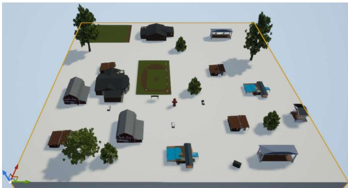  
Fig. 6. The simulation scenario.

TABLE II  
SIMULATION PARAMETERS
<table><tr><td rowspan=1 colspan=1>Parameters</td><td rowspan=1 colspan=1>Value</td><td rowspan=1 colspan=1>Description</td></tr><tr><td rowspan=1 colspan=1> $\overline { { P } }$ </td><td rowspan=1 colspan=1>8 [2]</td><td rowspan=1 colspan=1>the number of antennas</td></tr><tr><td rowspan=1 colspan=1> $\overline { { K } }$ </td><td rowspan=1 colspan=1>2</td><td rowspan=1 colspan=1>the number of periods</td></tr><tr><td rowspan=1 colspan=1> $\overline { { T _ { p } } }$ </td><td rowspan=1 colspan=1>10 s</td><td rowspan=1 colspan=1>the length of a system period</td></tr><tr><td rowspan=1 colspan=1> $N _ { p }$ </td><td rowspan=1 colspan=1>10</td><td rowspan=1 colspan=1>the number of time slots</td></tr><tr><td rowspan=1 colspan=1> $\overline { { B } }$ </td><td rowspan=1 colspan=1>1 MHz [2]</td><td rowspan=1 colspan=1>the bandwidth</td></tr><tr><td rowspan=1 colspan=1> $\overline { { P _ { \mathrm { m a x } } } }$ </td><td rowspan=1 colspan=1>37 dBm [2]</td><td rowspan=1 colspan=1>the maximum transmit power</td></tr><tr><td rowspan=1 colspan=1> $A$ </td><td rowspan=1 colspan=1>10 [42]</td><td rowspan=1 colspan=1>the channel parameter</td></tr><tr><td rowspan=1 colspan=1> $\overline { B }$ </td><td rowspan=1 colspan=1>0.6 [42]</td><td rowspan=1 colspan=1>the channel parameter</td></tr><tr><td rowspan=1 colspan=1>ξ</td><td rowspan=1 colspan=1>0.2 [42]</td><td rowspan=1 colspan=1>the channel parameter</td></tr><tr><td rowspan=1 colspan=1> $z _ { 0 }$ </td><td rowspan=1 colspan=1>-110 dBm [2]</td><td rowspan=1 colspan=1>the noise power</td></tr><tr><td rowspan=1 colspan=1> $\overline { { V _ { \mathrm { m a x } } } }$ </td><td rowspan=1 colspan=1>40 m/s</td><td rowspan=1 colspan=1>the maximum speed of UAVs</td></tr><tr><td rowspan=1 colspan=1> $d$ </td><td rowspan=1 colspan=1>0.0625 m</td><td rowspan=1 colspan=1>the antenna spacing</td></tr><tr><td rowspan=1 colspan=1> $\bar { \lambda }$ </td><td rowspan=1 colspan=1>0.125 m</td><td rowspan=1 colspan=1>the carrier wavelength</td></tr></table>

Traditional DRL scheme (TdDRLS): Similar to [5], [19] and [20], the information such as the numbers and positions of UAVs and MUs is regarded as the state, and the DDPG agent determines the action according to the real-time observation. The scheme follows the common approach used in existing studies, where the UAV trajectory and beamforming are optimized jointly through DRL. Therefore, the scheme is normally used to verify whether M2LLM can bring a performance gain.

Single-modal prediction and multi-modal decisionmaking scheme (SmpMmdS): Similarly to [5], [27] and [28], this scheme only uses the historical position of MUs to predict the future trajectory, but the UAV trajectory and beamforming are determined by the proposed M2LLM-enabled DRL scheme. In this paper, we use a pre-trained recurrent neural network (RNN) to predict the trajectory of MUs, which is regarded as a classical learning-based prediction method for comparison to assess whether the multi-modal data could enhance network performance.

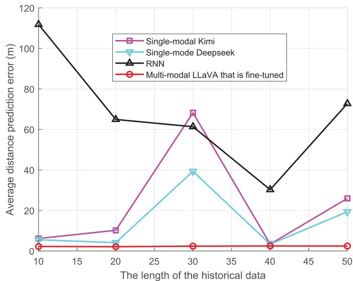  
Fig. 7. Average distance prediction error versus historical data length under different schemes.

Multi-modal prediction and single-modal decisionmaking scheme (MmpSmdS): The scheme applies multimodal data to predict MU trajectory, and the UAV trajectory and beamforming are determined by DRL, but the state is similar to [5] and [19]. The scheme can instruct whether decision-making based on multi-modal data is significant.

UAV trajectory optimization and beam tracking scheme (ToBtS): Similarly to the scheme independently optimizes UAV trajectory and beamforming, where DDPG and RNN are used to optimize the UAV trajectory and to achieve beam tracking. Similarly, the scheme is also regarded as a classical learning-based prediction method, and it can instruct whether the joint optimization of UAV trajectory and beamforming is necessary.

To verify that the fine-tuned M2LLM can predict the MU trajectory with superior performance, Fig. 7 illustrates the relationship between the length of historical data and the average distance prediction error under different schemes, where the prediction time length is set to 10 seconds. In theory, a longer historical data length should lead to more accurate predictions. However, the simulation results reveal that prediction accuracy may decrease as the length of historical data increases, primarily due to two factors. First, single-modal data struggles to capture the impact of realistic factors on MU movement, such as obstacles and roadways, leading to larger prediction errors. For instance, it may be challenging for AI models to learn MU turns caused by buildings using single-modal data. Second, the ability of single-modal LLMs to capture time-series data may result in degraded prediction performance. Specifically, when there are a few historical data and their regularities are unclear, single-modal LLMs tend to predict trajectory using more accurate models, such as calculating the MU’s acceleration at each time slot. However, when there are abundant historical data with strong regularities, single-modal LLMs apply simpler models, leading to lower prediction performance. As shown in Fig. 7, when the historical data length is 30, the distribution of the data aligns more with linear motion. Consequently, the single-modal LLM predicts the MU trajectory using a simplistic linear model, which results in significantly poorer prediction performance. In contrast, the fine-tuned M2LLM ensures high prediction accuracy regardless of the historical data length. This can be attributed to its ability to effectively integrate multi-modal data, providing a more accurate understanding of the environment and thereby improving prediction performance. The above analysis highlights the necessity of incorporating multimodal data and demonstrates that the fine-tuned M2LLM can predict the MU trajectory with higher performance.

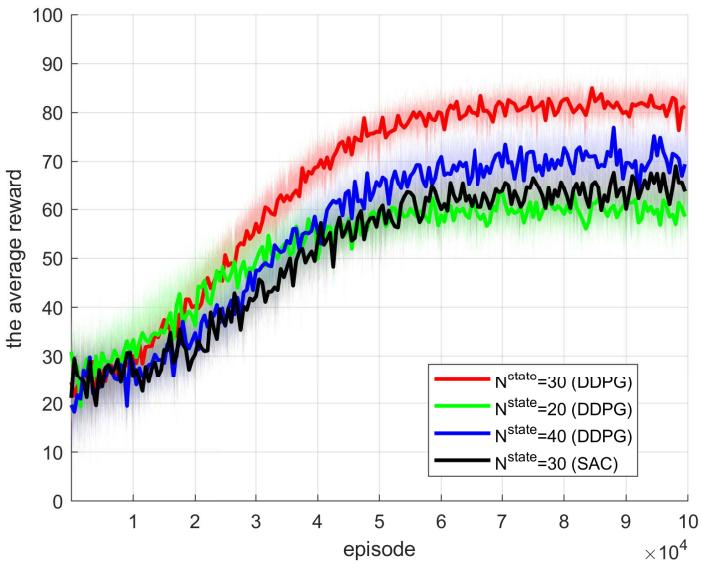  
Fig. 8. Average reward versus episode under different N <sup>state</sup>.

Fig. 8 depicts the relationship between the average reward and the episode count for the proposed scheme during the training phase, across different values of N <sup>state</sup>, with an average window size of 100. In this simulation, the DRL agent employs a three-layer fully connected actor-critic network with 32 hidden neurons. From Fig. 8, two key observations can be observed. First, the average reward shows a clear upward trend as the number of episodes increases, indicating that the agent successfully refines its policy based on experience gained from environmental interactions. This improvement is consistent with the strong correlation between the reward function and the objective function in the optimization problem (P1), which enables the agent to progressively enhance the decisionmaking performance in UAV trajectory and beamforming, thus improving communication performance. Second, the state dimension has a significant impact on DRL performance, which aligns with theoretical expectations. When the state dimension is low $( { \bf e . g . } , N ^ { \mathrm { s t a t e } } = 2 0 )$ , the model struggles to capture the environmental nuances, leading to suboptimal or stagnant learning. As the state dimension increases, the DRL agent’s environmental perception improves, facilitating more effective policy learning. However, excessively large state dimensions introduce higher computational costs and a greater risk of overfitting. Specifically, when the state dimension is set to 40, performance declines compared to when the state dimension is 30. Through a comprehensive analysis, the optimal state dimension is determined to be 30. In addition, we have also tried soft actor-critic (SAC) to train as an agent when N<sup>state</sup> = 30, and it can be seen that its final performance is lower than that of DDPG. Therefore, DDPG is selected for our design due to its demonstrated superiority in this specific task setting.

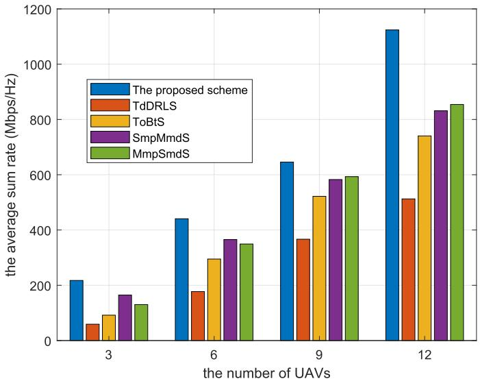  
Fig. 9. Average sum rate versus the number of UAVs under different schemes.

Fig. 9 shows the relationship between the average sum rate and the number of UAVs across different schemes. The results indicate that, for the same number of UAVs, the proposed scheme achieves the highest performance, while TdDRLS exhibits the lowest performance. This proves that the M2LLM enhances network performance by improving the prediction accuracy of MU trajectory and the environmental description capabilities of DRL. The poor performance of TdDRLS further confirms that prediction-based optimization significantly enhances network performance through beamforming and UAV trajectory optimization in mobile scenarios. Moreover, the proposed scheme demonstrates stronger generalization compared to TdDRLS. Specifically, the proposed scheme processes multi-modal data, including wireless sensing, image, and text data, into a constant-dimensional state vector via the fine-tuned M2LLM, ensuring that it can work effectively regardless of the number of UAVs and MUs. In contrast, TdDRLS requires retraining the agent whenever the number of UAVs or MUs changes, as the environmental state dimension must align with the input dimension of the neural network.

Fig. 10 simulates the relationship between the maximum speed of MUs and the average sum rate under different schemes. The results show that, except for TdDRLS, the average sum rate of the other schemes remains relatively stable as MU speed increases. This demonstrates that optimizing UAV trajectory and beamforming based on MU trajectory prediction effectively mitigates the impact of MU mobility on network performance. Furthermore, the proposed scheme consistently outperforms the others under identical parameter settings. The superior performance is attributed to the accurate MU trajectory prediction achieved by processing historical multi-modal data with the fine-tuned M2LLM, as well as its enhanced ability to extract network states, thereby improving the performance of DRL. In contrast, TdDRLS struggles to adapt to high-speed MU movement due to delays in state collection and data processing, as well as its limited capacity for environmental characterization. Specifically, at low MU speeds (10 and 20 m/s), the distance traveled of MUs during state collection is minimal, resulting in only a slight performance gap between TdDRLS and the proposed scheme, which is primarily due to differences in environment description. However, as MU speed increases, the performance of TdDRLS deteriorates rapidly. When MUs move at high speeds, the distance traveled during state collection becomes significant. As a result, UAV trajectory and beamforming decisions based on outdated states in TdDRLS become misaligned with the current environment, leading to inferior performance.

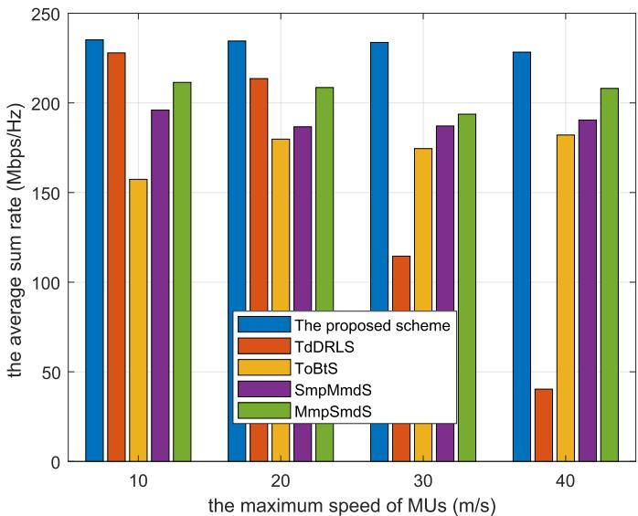  
Fig. 10. Average sum rate versus the maximum speed of MUs under different schemes.

Fig. 11 explores the impact of sensing frequency on the average sum rate across different schemes. In the proposed scheme, since the M2LLM can achieve accurate predictions with fewer data [37], increases in sensing frequency yield minimal performance improvements and may even degrade the average sum rate due to the increased communication resource consumption. In contrast, SmpMmdS and ToBts rely heavily on historical data for MU trajectory prediction and beam tracking. Their performance improves with an increased sensing frequency but starts to decline when the frequency exceeds 1.5, due to the reduced communication time. Since TdDRLS does not predict MU trajectories, increasing the sensing frequency merely reduces communication time without providing any performance benefits, leading to a negative correlation between the average sum rate and sensing frequency.

To further assess the generalization ability of the proposed scheme, we train the agent in the environment depicted in Fig. 6 and create a distinct testing environment, with the results shown in Fig. 12. The new testing environment, although maintaining the same rectangular dimensions of 1000 meters by 1000 meters, differs significantly from the training environment, such as the number and position of obstacles. Fig. 12 illustrates that all schemes experience a reduction in performance in the new environment compared to the training phase. This decline is attributed to the entirely new environmental features, which challenge the adaptability of DRL agents. However, the proposed scheme demonstrates the least performance degradation among the benchmark schemes. This resilience suggests that the integration of M2LLM enhances the DRL’s ability to understand and generalize across diverse environments. Moreover, the proposed scheme not only exhibits the lowest degradation ratio but also maintains optimal performance in the new environment, further emphasizing its superiority. The performance comparison between SmpMmdS and MmpSmdS in the new environment highlights that effective environmental state description is essential for DRL generalization. The substantial performance drop of TdDRLS in the new environment reinforces this conclusion, underscoring the importance of robust environmental understanding in DRL-based schemes.

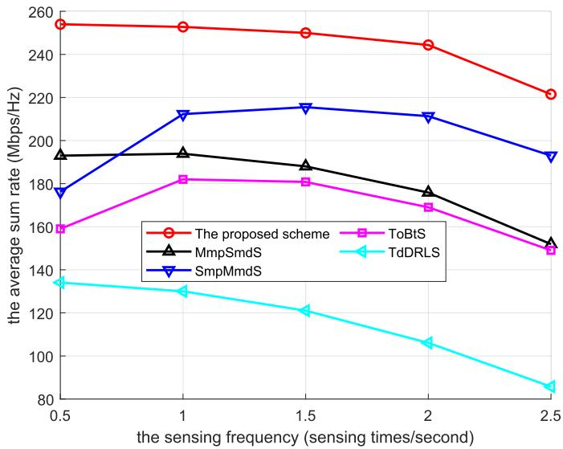

Fig. 11. Average sum rate versus the sensing frequency of MUs under different schemes.  
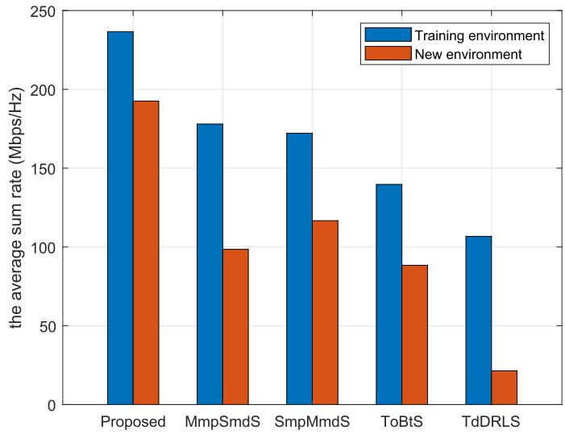

Fig. 12. Average sum rate under different schemes in different environments.  
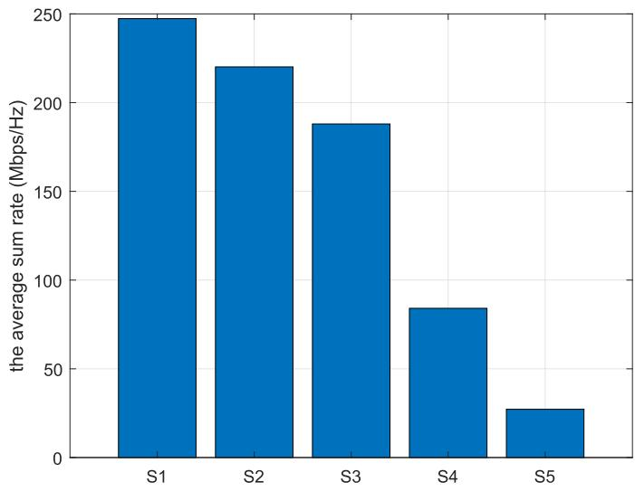  
Fig. 13. The ablation experiment of the proposed framework.

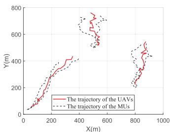  
(a) Proposed scheme (233.12 Mbps)

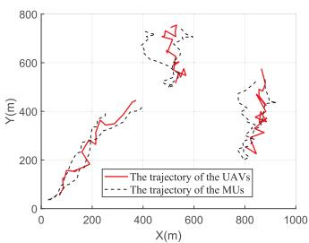  
(b) TdDRLS (105.64 Mbps).

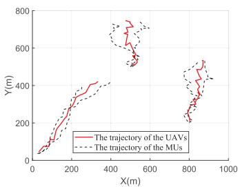  
(c) ToBtS (152.67 Mbps).

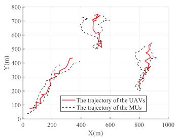  
(d) MmpSmdS (209.12 Mbps)  
Fig. 14. The designed trajectory of the UAVs and average sum rate under the different schemes.

To investigate the contribution of each key component in the proposed framework, we conduct ablation experiments, and the results are presented in Fig. 13. Specifically, the different schemes are defined as follows. S1: The complete proposed framework. S2: The framework without M2LLM, instead, image and wireless sensing data are processed by a convolutional neural network and an RNN, respectively. S3: The framework with wireless sensing and text data, and image data is excluded. S4: The framework with image and text data as input. S5: The framework where M2LLM directly outputs control actions without DRL-based decision making. As shown in Fig. 13, each component plays a critical role in the overall performance. First, comparing S1 and S2 demonstrates that the M2LLM significantly enhances environmental perception and reasoning capabilities over traditional perception modules, thereby improving network performance. Second, the results of S3 and S4 highlight the benefits of multi-modal sensing: using multiple data modalities can provide more comprehensive environmental understanding, which leads to better decision-making. Finally, the comparison between S1 and S5 shows that DRL is indispensable for achieving precise control of UAV trajectory and beamforming. While M2LLM can provide a high-performance environment representation, its probabilistic outputs are not well-suited for precise control, which requires continuous and fine-grained adjustments.

Moreover, it is inherently difficult for M2LLM to internalize such control strategies purely through gradient-based learning. Therefore, the above results justify the necessity of different components in the proposed framework.

Fig. 14 shows the UAV trajectory design results under different schemes. As seen from Fig. 14, the UAVs follow the movements of the serving MUs to provide high-quality service under all schemes. However, due to the limited environmental description capabilities of DRL, the performance of MmpSmdS is inferior to that of the proposed scheme. Furthermore, since UAV trajectory and beamforming are optimized independently in ToBtS, the UAV trajectory is not optimal for a given communication beam, leading to lower communication performance compared to joint optimization schemes, such as the proposed scheme and MmpSmdS. TdDRLS exhibits the worst communication performance among all schemes, also requiring many unnecessary movements by the UAVs. This is because TdDRLS does not predict the MU trajectory, resulting in delays in state collection and processing, as well as poor decision-making performance when MUs are moving rapidly. Additionally, the empirical modeling approach used in TdDRLS makes it difficult for the DRL to accurately capture the environmental characteristics. In conclusion, the results demonstrate that the proposed scheme can optimize UAV trajectory and beamforming to improve network performance.

## VI. CONCLUSION AND FUTURE WORK

In this paper, to improve the communication performance of the MUAV-assisted ISCC wireless network, we propose an M2LLM-driven DRL-based joint UAV trajectory and beamforming optimization framework. Specifically, we accurately predict the future trajectory of MUs by an M2LLM processing multi-modal data, including text, image and sensing data. Based on the prediction, we optimize the trajectory with beamforming by DRL. Meanwhile, we apply M2LLM to understand multi-modal data to depict environmental states, which not only improves the state description ability, but also enables DRL to adapt to environmental changes, especially the number of UAVs and MUs. To ensure the performance of the prediction and the accuracy of the state characterization, we obtain the multi-modal dataset through simulation and fine-tune a pre-trained M2LLM. Simulation results prove the effectiveness of the proposed scheme. Compared with the existing studies, the proposed prediction-driven joint optimization method can not only use multi-modal data to predict

MU trajectory more accurately, but also improve the network performance through coordinated UAV trajectory and beamforming optimization. Moreover, the integration of M2LLM enhances the DRL agent’s environmental awareness, thereby improving its adaptability to dynamic network conditions.

We have preliminarily explored the application of LLM combined with DRL in UAV network optimization, however, we believe that several promising directions remain for future investigation. First, this study considers the single-agent DRL scenario, extending M2LLM to the multi-agent scenario needs further research, can further enhance the flexibility of the framework. In addition, using LLM to further enhance DRL is another compelling direction—for example, by using LLM to design the reward function, or even directly taking LLM as an agent to generate executable actions. Moreover, we can focus on how to improve the robustness of the network, that is, how to adapt to changes in the number of UAVs and MUs during the operation of the network to ensure the overall performance of the network.

## REFERENCES

[1] W. Mao, Y. Lu, G. Pan, and B. Ai, “UAV-assisted communications in SAGIN-ISAC: Mobile user tracking and robust beamforming,” IEEE J. Sel. Areas Commun., vol. 43, no. 1, pp. 186–200, Jan. 2025.

[2] C. Deng, X. Fang, and X. Wang, “Integrated sensing, communication, and computation with adaptive DNN splitting in multi-UAV networks,” IEEE Trans. Wireless Commun., vol. 23, no. 11, pp. 17429–17445, Nov. 2024.

[3] N. Chen et al., “Integrated sensing, communication, and computing for cost-effective multimodal federated perception,” ACM Trans. Multimedia Comput. Commun. Appl., vol. 20, no. 8, pp. 1–28, Jun. 2024.

[4] X. Li and S. Bi, “Optimal AI model splitting and resource allocation for device-edge co-inference in multi-user wireless sensing systems,” IEEE Trans. Wireless Commun., vol. 23, no. 9, pp. 11094–11108, Sep. 2024.

[5] B. Yin, X. Fang, and X. Wang, “Joint optimization of trajectory control, resource allocation, and user association based on DRL for multi-fixedwing UAV networks,” IEEE Trans. Wireless Commun., vol. 23, no. 10, pp. 13330–13343, Oct. 2024.

[6] H. Yang, J. Zhao, Z. Xiong, K.-Y. Lam, S. Sun, and L. Xiao, “Privacy-preserving federated learning for UAV-enabled networks: Learning-based joint scheduling and resource management,” IEEE J. Sel. Areas Commun., vol. 39, no. 10, pp. 3144–3159, Oct. 2021.

[7] Y. He, G. Yu, Y. Cai, and H. Luo, “Integrated sensing, computation, and communication: System framework and performance optimization,” IEEE Trans. Wireless Commun., vol. 23, no. 2, pp. 1114–1128, Feb. 2024.

[8] R. Zhang, Y. Zhang, R. Tang, H. Zhao, Q. Xiao, and C. Wang, “A joint UAV trajectory, user association, and beamforming design strategy for multi-UAV-assisted ISAC systems,” IEEE Internet Things J., vol. 11, no. 18, pp. 29360–29374, Sep. 2024.

[9] J. Ge, Y.-C. Liang, J. Joung, and S. Sun, “Deep reinforcement learning for distributed dynamic MISO downlink-beamforming coordination,” IEEE Trans. Commun., vol. 68, no. 10, pp. 6070–6085, Oct. 2020.

[10] L. Chen, S. Zhou, and W. Wang, “MmWave beam tracking with spatial information based on extended Kalman filter,” IEEE Wireless Commun. Lett., vol. 12, no. 4, pp. 615–619, Apr. 2023.

[11] C. Liang, J. Kuang, F. Wu, and J. Chen, “Millimetre-wave beam tracking: An intelligent machine learning and Kalman filter fusion technology,” IEEE Trans. Cognit. Commun. Netw., vol. 10, no. 2, pp. 487–498, Apr. 2024.

[12] Q. Zhang, K. Ji, Z. Feng, Z. Han, and H. Gao, “Vehicle behaviorcognition-based particle-filter-enabled mmWave beam tracking for connected automated vehicles,” IEEE Internet Things J., vol. 9, no. 21, pp. 21292–21304, Nov. 2022.

[13] Y. Cui et al., “Sensing-assisted high reliable communication: A transformer-based beamforming approach,” IEEE J. Sel. Topics Signal Process., vol. 18, no. 5, pp. 782–795, Jul. 2024.

[14] H. Han, T. Jiang, and W. Yu, “Active sensing for multiuser beam tracking with reconfigurable intelligent surface,” IEEE Trans. Wireless Commun., vol. 24, no. 1, pp. 540–554, Jan. 2025.

[15] Y. Zhao, X. Zhang, X. Gao, K. Yang, Z. Xiong, and Z. Han, “LSTMbased predictive mmWave beam tracking via sub-6 GHz channels for V2I communications,” IEEE Trans. Commun., vol. 72, no. 10, pp. 6254–6270, Oct. 2024.

[16] N. C. Luong et al., “Applications of deep reinforcement learning in communications and networking: A survey,” IEEE Commun. Surveys Tuts., vol. 21, no. 4, pp. 3133–3174, 4th Quart., 2019.

[17] D. Chen, Q. Qi, Q. Fu, J. Wang, J. Liao, and Z. Han, “Transformerbased reinforcement learning for scalable multi-UAV area coverage,” IEEE Trans. Intell. Transp. Syst., vol. 25, no. 8, pp. 10062–10077, Aug. 2024.

[18] M. Kim, H. Lee, S. Hwang, M. Debbah, and I. Lee, “Cooperative multiagent deep reinforcement learning methods for UAV-aided mobile edge computing networks,” IEEE Internet Things J., vol. 11, no. 23, pp. 38040–38053, Dec. 2024.

[19] L. Zhang, J. Peng, W. Yi, H. Lin, L. Lei, and X. Song, “A statedecomposition DDPG algorithm for UAV autonomous navigation in 3-D complex environments,” IEEE Internet Things J., vol. 11, no. 6, pp. 10778–10790, Mar. 2024.

[20] A. Paul, R. Allu, K. Singh, C.-P. Li, and T. Q. Duong, “Hybridized MA-DRL for serving xURLLC with cognizable RIS and UAV integration,” IEEE Trans. Wireless Commun., vol. 23, no. 10, pp. 15507–15524, Oct. 2024.

[21] Y. Guan, S. Zou, H. Peng, W. Ni, Y. Sun, and H. Gao, “Cooperative UAV trajectory design for disaster area emergency communications: A multiagent PPO method,” IEEE Internet Things J., vol. 11, no. 5, pp. 8848–8859, Mar. 2024.

[22] L. Xue, B. Ma, J. Liu, C. Mu, and D. C. Wunsch, “Extended Kalman filter based resilient formation tracking control of multiple unmanned vehicles via game-theoretical reinforcement learning,” IEEE Trans. Intell. Vehicles, vol. 8, no. 3, pp. 2307–2318, Mar. 2023.

[23] R. Wang, C. Xu, J. Sun, S. Duan, and X. Zhang, “Cooperative localization for multi-agents based on reinforcement learning compensated filter,” IEEE J. Sel. Areas Commun., vol. 42, no. 10, pp. 2820–2831, Oct. 2024.

[24] Y. Bai, B. Xie, Y. Liu, Z. Chang, and R. Jantti, “Dynamic UAV¨ deployment in multi-UAV wireless networks: A multimodal-featurebased deep reinforcement learning approach,” IEEE Internet Things J., vol. 12, no. 12, pp. 18765–18778, Jun. 2025.

[25] Q. Lin et al., “RL-based USV path planning under the marine multimodal features considerations,” IEEE Internet Things J., vol. 12, no. 11, pp. 15274–15287, Jun. 2025.

[26] X. Pang, S. Guo, J. Tang, N. Zhao, and N. Al-Dhahir, “Dynamic ISAC beamforming design for UAV-enabled vehicular networks,” IEEE Trans. Wireless Commun., vol. 23, no. 11, pp. 16852–16864, Nov. 2024.

[27] Z. Cheng et al., “Joint user association and resource allocation in HetNets based on user mobility prediction,” Comput. Netw., vol. 177, Feb. 2020, Art. no. 107312.

[28] X. Yan, X. Fang, C. Deng, and X. Wang, “Joint optimization of resource allocation and trajectory control for mobile group users in fixedwing UAV-enabled wireless network,” IEEE Trans. Wireless Commun., vol. 23, no. 2, pp. 1608–1621, Feb. 2024.

[29] Z. Chen, Z. Zhang, and Z. Yang, “Big AI models for 6G wireless networks: Opportunities, challenges, and research directions,” IEEE Wireless Commun., vol. 31, no. 5, pp. 164–172, Oct. 2024.

[30] H. Zhou et al., “Large language model (LLM) for telecommunications: A comprehensive survey on principles, key techniques, and opportunities,” IEEE Commun. Surveys Tuts., vol. 27, no. 3, pp. 1955–2005, Jun. 2025.

[31] Y. Du, H. Deng, S. Chang Liew, K. Chen, Y. Shao, and H. Chen, “The power of large language models for wireless communication system development: A case study on FPGA platforms,” 2023, arXiv:2307.07319.

[32] X. Han, Q. Yang, X. Chen, Z. Cai, X. Chu, and M. Zhu, “AutoReward: Closed-loop reward design with large language models for autonomous driving,” IEEE Trans. Intell. Vehicles, early access, Oct. 24, 2024, doi: 10.1109/TIV.2024.3485964.

[33] Y. Liu et al., “Secure rate maximization for ISAC-UAV assisted communication amidst multiple eavesdroppers,” IEEE Trans. Veh. Technol., vol. 73, no. 10, pp. 15843–15847, Oct. 2024.

[34] K. Meng, Q. Wu, S. Ma, W. Chen, and T. Q. S. Quek, “UAV trajectory and beamforming optimization for integrated periodic sensing and communication,” IEEE Wireless Commun. Lett., vol. 11, no. 6, pp. 1211–1215, Jun. 2022.

[35] M. B. Salman, O. T. Demir, and E. Bj<sup>¨</sup> ornson, “When are sensing¨ symbols required for ISAC?,” IEEE Trans. Veh. Technol., vol. 73, no. 10, pp. 15709–15714, Oct. 2024.

[36] H. Liu, C. Li, Q. Wu, and Y. J. Lee, “Visual instruction tuning,” 2023, arXiv:2304.08485.

[37] M. Jin et al., “Time-LLM: Time series forecasting by reprogramming large language models,” in Proc. 12th Int. Conf. Learn. Represent., 2024. [Online]. Available: https://openreview.net/forum?id=Unb5CVPtae

[38] B. Wang et al., “LLM-empowered state representation for reinforcement learning,” 2024, arXiv:2407.13237.

[39] Y. Chang et al., “A survey on evaluation of large language models,” ACM Trans. Intell. Syst. Technol., vol. 15, no. 3, pp. 1–45, Mar. 2024.

[40] S. Shah, D. Dey, C. Lovett, and A. Kapoor, “AirSim: High-fidelity visual and physical simulation for autonomous vehicles,” in Field and Service Robotics: Results of the 11th International Conference, Springer, 2017, pp. 621–635.

[41] C. Deng, X. Fang, and X. Wang, “Beamforming design and trajectory optimization for UAV-empowered adaptable integrated sensing and communication,” IEEE Trans. Wireless Commun., vol. 22, no. 11, pp. 8512–8526, Nov. 2023.

  
cation and computation.  
Baolin Yin received the B.E. degree in communication engineering from the Southwest University of Science and Technology, Mianyang, China, in 2022, the master’s degree from the Key Laboratory of Information Coding and Transmission, School of Information Science and Technology, Southwest Jiaotong University, Chengdu, China, in 2024, where he is currently pursuing the Ph.D. degree. His current research interests include unmanned aerial vehicle communications, resource management for 5G/6G networks, and AI for integrated sensing, communi-


Xuming Fang (Senior Member, IEEE) received the B.E. degree in electrical engineering, the M.E. degree in computer engineering, and the Ph.D. degree in communication engineering from Southwest Jiaotong University, Chengdu, China, in 1984, 1989, and 1999, respectively. He was a Faculty Member with the Department of Electrical Engineering, Tongji University, Shanghai, China, in 1984. Then, he joined the School of Information Science and Technology, Southwest Jiaotong University, where he has been a Professor since 2001, and the Chair of the Department of Communication Engineering since 2006. He held visiting positions with the Institute of Railway Technology, Technical University at Berlin, Berlin, Germany, from 1998 to 1999, and the Center for Advanced Telecommunication Systems and Services, The University of Texas at Dallas, Richardson, from 2000 to 2001. He has around 200 high-quality research papers in journals and conference publications to his credit. He has authored or co-authored five books or textbooks. His research interests include wireless broadband access control, radio resource management, multihop relay networks, and broadband wireless access for high speed railway. He was the Chair of the IEEE Vehicular Technology Society of Chengdu Chapter. He has been an Editor of several journals, including IEEE TRANSACTIONS ON VEHICULAR TECHNOLOGY.


Xianbin Wang (Fellow, IEEE) received the Ph.D. degree in electrical and computer engineering from the National University of Singapore in 2001. Since 2008, he has been with Western University, Canada, where he is currently a Distinguished University Professor and a Tier-1 Canada Research Chair in trusted communications and computing. Prior to joining Western University, he was with the Communications Research Centre, Canada, as a Research Scientist, and later a Senior Research Scientist from 2002 to 2007. From 2001 to 2002, he was a System

Designer with STMicroelectronics. He has over 600 highly cited journals and conference papers, over 30 granted and pending patents, and several standard contributions. His current research interests include 5G/6G technologies, the Internet of Things, machine learning, communications security, digital twin, and intelligent communications. He is a fellow of Canadian Academy of Engineering and the Engineering Institute of Canada. He has received many prestigious awards and recognitions, including the IEEE Canada R. A. Fessenden Award, the Canada Research Chair, the Engineering Research Excellence Award at Western University, the Canadian Federal Government Public Service Award, the Ontario Early Researcher Award, and ten best paper awards. He is a member of the Senate, the Senate Committee on Academic Policy, and the Senate Committee on University Planning at Western. He also serves on NSERC Discovery Grant Review Panel for Computer Science. He has been involved in many flagship conferences, including IEEE GLOBE-COM, ICC, VTC, PIMRC, WCNC, CCECE, and ICNC, in different roles, such as the General Chair, the TPC Chair, the Symposium Chair, a Tutorial Instructor, the Track Chair, the Session Chair, and a Keynote Speaker. He was the Chair of the IEEE ComSoc Signal Processing and Computing for Communications (SPCC) Technical Committee. He is serving as the Central Area Chair for IEEE Canada. He has serves/served as the Editor-in-Chief, the Associate Editor-in-Chief, an area editor, and an editor/associate editor for over ten journals.

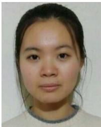

Li Yan (Member, IEEE) received the B.E. degree in communication engineering and the Ph.D. degree in communication and information systems from Southwest Jiaotong University, China, in 2012 and 2018, respectively. She is an Associate Professor with Southwest Jiaotong University. She was a Visiting Student with the Department of Electrical and Computer Engineering, University of Florida, USA, from September 2017 to September 2018. Her research interests include 5G communications, mobility managements, network architecture, millimeter wave communications, and HSR wireless communications.

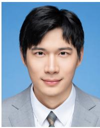

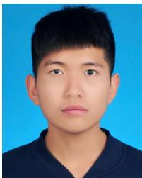

Junjie Wu received the M.E. degree in software engineering from Nanchang University, Nanchang, China, in 2021. He is currently pursuing the Ph.D. degree with the Key Laboratory of Information Coding and Transmission, School of Information Science and Technology, Southwest Jiaotong University, Chengdu, China. His research interests include deep reinforcement learning, AI for wireless communication resource management, Wi-Fi network technology, federated learning for distributed wireless communication, and generative AI.

Jingyu Wang received the B.E. degree in communication engineering from Chongqing University of Posts and Telecommunications, Chongqing, China, in 2020. He is currently pursuing the Ph.D. degree with the Key Laboratory of Information Coding and Transmission, School of Information Science and Technology, Southwest Jiaotong University, Chengdu, China. His current research interests include deep reinforcement learning, AI for unmanned aerial vehicle communications, and resource management for 5G/6G networks.