# Trajectory Design and Resource Allocation for Multi-UAV Networks: Deep Reinforcement Learning Approaches

Zheng Chang , Senior Member, IEEE, Hengwei Deng, Li You , Senior Member, IEEE, Geyong Min , Member, IEEE, Sahil Garg , Member, IEEE, and Georges Kaddoum , Member, IEEE

Abstract—The future mobile communication system is expected to provide ubiquitous connectivity and unprecedented services over billions of devices. The unmanned aerial vehicle (UAV), which is prominent in its flexibility and low cost, emerges as a significant network entity to realize such ambitious targets. In this work, novel machine learning-based trajectory design and resource allocation schemes are presented for a multi-UAV communications system. In the considered system, the UAVs act as aerial Base Stations (BSs) and provide ubiquitous coverage. In particular, with the objective to maximize the system utility over all served users, a joint user association, power allocation and trajectory design problem is presented. To solve the problem caused by high dimensionality in state space, we first propose a machine learning-based strategic resource allocation algorithm which comprises of reinforcement learning and deep learning to design the optimal policy of all the UAVs. Then, we also present a multi-agent deep reinforcement learning scheme for distributed implementation without knowing a priori knowledge of the dynamic nature of networks. Extensive simulation studies are conducted and illustrated to evaluate the advantages of the proposed scheme.

Index Terms—Trajectory design, resource allocation, multiagent reinforcement learning, deep learning, UAV, drone.

Manuscript received November 27, 2021; revised April 3, 2022; accepted April 25, 2022. Date of publication May 3, 2022; date of current version September 20, 2023. An earlier version of this work was presented in IEEE ICC’20 workshop [9]. The work of Li You was supported in part by the Young Elite Scientist Sponsorship Program by China Institute of Communications, in part by Jiangsu Province Basic Research Project under Grant BK20192002, and in part by the Fundamental Research Funds for the Central Universities. This work was supported in part by the National Natural Science Foundation of China under Grant 62071105. Recommended for acceptance by Dr. Xingwang Li. (Corresponding author: Zheng Chang.)

Zheng Chang is with the School of Computer Science and Engineering, University of Electronic Science and Technology of China, Chengdu 611731, China, and also with the Faculty of Information Technology, University of Jyvaskyla, Jyvaskyla, Keski-Suomi, Finland (e-mail: zheng.chang@jyu.fi).

€ €Hengwei Deng is with the School of Computer Science and Engineering, University of Electronic Science and Technology of China, Chengdu 611731, China (e-mail: denghw1997@gmail.com).

Li You is with National Mobile Communications Research Laboratory, Southeast University, Nanjing 210096, China, and also with Purple Mountain Laboratories, Nanjing 211100, China (e-mail: lyou@seu.edu.cn).

Geyong Min is with the Department of Computer Science, University of Exeter, EX4 4QF Exeter, U.K. (e-mail: G.Min@exeter.ac.).

Sahil Garg is with Resilient Machine Learning Institute (ReMI), Acole de Technologie Superieure, Montreal QC H3C 1K3, Canada (e-mail: sahil. garg@ieee.org).

Georges Kaddoum is with Electrical Engineering Department, Ecole de Technologie Superieure, Montreal QC H3C 1K3, Canada (e-mail: georges. kaddoum@etsmtl.ca).

Digital Object Identifier 10.1109/TNSE.2022.3171600

# I. INTRODUCTION

# A. Background and Motivation

HE increasing demand for high quality wireless services urges the future wireless communication system to provide ubiquitous connectivity and coverage over all kind of mobile devices. The diversity of network applications also poses strict requirements on network capacity, service latency and energy consumption for trillions of mobile devices. To realize the vision of essentially unlimited access to wireless data anywhere and anytime for anything, the recent emerging unmanned aerial vehicle (UAV)-based flying platforms are able to break the limitations of traditional network infrastructure [1], which urges to rethink the development of next generation communication systems. The UAV, also known as drone, has attracted many attentions due to its prominent in flexibility, easy and low cost deployment [2]. Because of its high flying attitude, the UAV-based platform can establish the effective Line-of-Sight (LoS) links with the ground-users (GUs), thus to reduce the energy consumption for reliable connectivity [3]. Therefore, an UAVs-based flying mobile communication system provides a cost- and energy-efficient solution with limited territorial cellular infrastructure for the GUs.

Developing an UAV-enabled wireless communications system has received attracted a large amount of research interests. To date, majority of the works have dedicated on the single UAV two-dimension (2-D) or 3-dimension (3-D) deployment/ placement optimization problems, with the assumption that UAV can serve as aerial quasi-static base stations (BS) or relay. Although adding a single UAV into the cellular network has shown its potential on performance enhancement, it has limited communications, caching and computing capability in general, which is not preferred for mission-critical services and a large number of GUs. Correspondingly, deployment of a swarm of UAVs is motivated. In the multi-UAV communication system, multiple UAVs may cooperatively serve the GUs in a large area. Moreover, different GUs could be served simultaneously with lower latency and higher throughput, which could address some throughput- and latency-related problems brought by a single-UAV system.

On the other hand, current works on the multi-UAV network usually focus on the proposals of trajectory design and resource allocations in a static manner considering the UAVs can act as BSs. In order to provide long-term effective connectivity and reliable coverage, UAV-based network with high mobility needs to be carefully designed and different UAVs should autonomously work as a team and their interactions should be explored. Therefore, establishing an efficient, smart and autonomous multi-UAV network emerges as a research topic with profound importance while is still under-investigated. Addressing such a topic is typically challenging. First, due to its high cost and limited communication capability, the mobility/route of different UAVs should be designed and coordinated with high accuracy to cover a large area over a long run. Moreover, fairness is also critical for the UAV network as the UAVs should move around to ensure the communication coverage. In addition, the energy consumption issues should be seriously considered as the UAVs are typically with limited energy supply and should be recharged from time to time. Last but not the least, the UAVs are usually deployed to where the network access is limited to execute mission-critical services. Certain degree of autonomy or self-organizing is highly preferred.

To address the aforementioned problems, and develop a smart and autonomous multi-UAV communication systems, we propose to leverage deep reinforcement learning (DRL) framework, which recently demonstrates a potential on improving the performance of wireless network. Due to the fact that RL can enable UAVs to choose their policies for optimizing the objectives without a priori knowledge of the environment, it is suitable to address the trajectory control and resource allocation in the multi-UAV wireless networks. Specifically, we consider that all the UAVs share the same spectrum to serve the GUs. By focusing on the downlink of the network, i.e. transmissions from the UAVs to GUs, the objective of this work is to maximize the system utility among all the GUs by jointly optimizing the power allocation, user association, and UAV trajectory in a given finite period. Addressing the formulated joint optimization is challenging, because the transmit power allocation, user association, and UAV trajectory design optimizations are actually coupled. Correspondingly, for the formulated problem, the DRL is able to provide a promising solution because it can solve the problem of high dimensionality in state-action space and also handle the time-varying environment [4]. The DRL uses Deep Neural Networks (DNNs) to the decision making process, which can offer significant performance improvement to many learning problems with limited or even zero knowledge. Moreover, developing decentralized approaches is becoming more needed than ever due to the complexity of the multi-UAV wireless networks. Though it can be very challenging to design them, decentralized approaches scale well, as they typically incur little to no communication and computational overhead while still performing relatively well. Thus, we also consider the decentralized feature of multi-UAV system, and propose to utilize the multi-agent DRL to design a distributed algorithm [5], which enables the way towards an autonomous UAV communications system.

# B. Related Works

The research on the UAV-based wireless communication systems have mainly concentrated on the UAV placement and resource optimization [3]-[19], with the assumptions that UAV can serve as aerial BSs or aerial relay to support GUs. For the trajectory design, the altitude of the UAV can be optimized with or without the horizontal location based on different considerations and QoS requirements. In [3], the authors aim to maximize the communication coverage by optimizing the altitude of the a single UAV wireless network. The authors of [6] utilize stochastic geometry-based approach to analyze two-tier wireless network consisting of BSs and aerial BS. General probabilistic LoS and NLoS propagation models are assumed and coverage probability and spectral efficiency are derived with the consideration of the height of the aerial BS. In [7], the authors jointly optimize the altitude of UAVs, the duration of transmission phases and the antenna configuration to maximize the coverage, under the assumptions of UAV and ground BS with distributed access points and multiple antennas.

In contrast, there are several papers working on the twodimensional (2-D) trajectory design (e.g. the horizontal positions) of the UAV by fixing its altitude. To address the problem of control over a group of UAVs in a long term, the authors of [8] utilize the deep reinforcement learning to minimize the energy consumption of the overall network while maintaining the reliable connectivity. In [10], the authors consider the UAV flies to a given location for certain mission and it needs reliable communication with BSs at each time slot. The aim is to minimize the completion time of the UAV by 2-D trajectory optimization, subject to the connectivity constraint of BS-UAV link. The authors of [11] investigate the cooperation of a group of UAVs, and propose mode selection between UAV-to-infrastructure and UAV-to-UAV modes for data delivery. Then the resource allocation and speed optimization are propose to maximize the uplink data rate. In [12], the authors investigate the UAV-based secure communication. A two-UAV system is considered where one is for data transmission and the other one is to jam the eavesdroppers on the ground. The minimum worstcase secrecy data rate of the GUs is optimized by designing UAVs’ trajectories and user scheduling.

As for the 3-D trajectory design, in [13], both periodic and temporal operation modes are considered for the UAV system. In each case, the aim is to minimize the duration of UAV flight or mission completion time. In [14], the authors propose to maximize the minimum throughput of all the GUs in order to achieve fair performance. The route design, power allocation and user scheduling schemes are presented. The authors of [15] consider UAV provides services for a group of GUs in a dynamic channel scenario, and propose a transmit power allocation and 3-D trajectory design optimization scheme to maximize the minimum throughput of the group in a given time duration. In [16], a drone-based small cell placement problem is explored to maximize the overall system utility. In [17] and [18], by considering joint optimization of the mobility and location of the UAVs, transmit power allocation and user association schemes are presented to improve reliability of the uplink. The authors of [19] investigate the trajectory design and resource allocation problem for maximizing the throughput of a solar powered UAV system over a given time period.

In general, the (deep) multi-agent reinforcement learning has been explored to address control-related problems [20]-[23]. There are increasing efforts to investigate the potential of multi-agent reinforcement learning (MARL) on the resource allocations in the wireless communication system. The authors of [24] utilize the MARL to address the power allocation problem in D2D communications, while the MARL-based approach is applied to address computation offloading and interference coordination in [27]. The authors explore the MARL on improving the secure performance of wireless network in [28]. In addition, the spectrum access problems in different types of wireless network are addressed via MARL in [29] and [30]. Recently, MARL-based schemes have been gradually applied to the UAV networks [31] [32]. The authors of [31] has utilized the MARL to present distributed trajectory design of multi-UAV network. In [32], MARL-based scheme is also applied for trajectory design when considering a UAV-assisted edge computing system.

As one can observe, there is a lack of works utilizing learning-based schemes on the proposal of joint optimization of trajectory design, power allocation and user association, to effectively and efficiently operate multi-UAV network. Moreover, there is spare study towards an autonomous multi-UAV communication system, which is of profoundly importance towards fully utilizing UAVs in the development of wireless communication system.

# C. Contribution

In this work, our main target is to utilize collaborative machine learning, i.e., DRL-based scheme and multi-agent DRL-based scheme to tackle the problem of power allocation, user association and trajectory design for multi-UAV communications system. Bearing in mind the above mentioned works, main contributions of this paper are summarized in the following.

A multi-UAV communication system is considered to serve multiple GUs. A central base controller is assumed to carry out the learning process. With the objective to maximize the system utility, the problem of trajectory design, user association and power allocation is investigated. To address the problems related to the high dimensionality in state space, we first propose a machine learning-based strategic resource allocation algorithm which comprises of reinforcement learning and deep learning to explore the optimal policy of all the UAVs. The proposed centralized DRL process can be carried out at the central base and the UAVs are controlled via the signaling exchange with the base.

Because the UAV-based network is expected to solve mission-critical problems in reality, an autonomous communication system is preferred. Thus, we further consider a complex scenario and propose to decentralize the considered multi-UAV system. In this setting, no UAVs can observe the underlying Markov state. Instead, each UAV only obtains a private observation correlated with that state. The UAVs are able to utilize

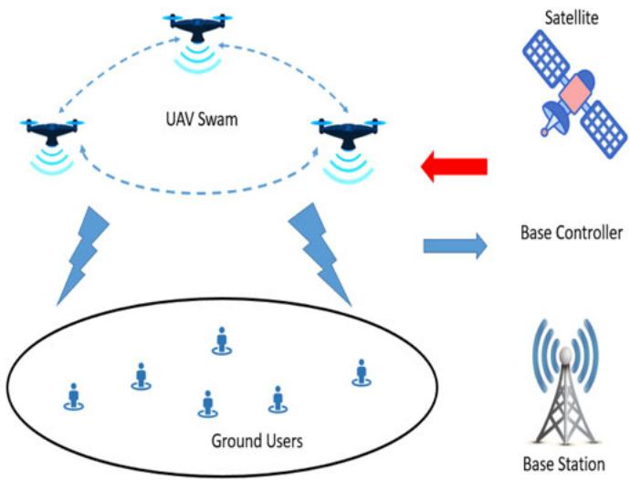

flowchart

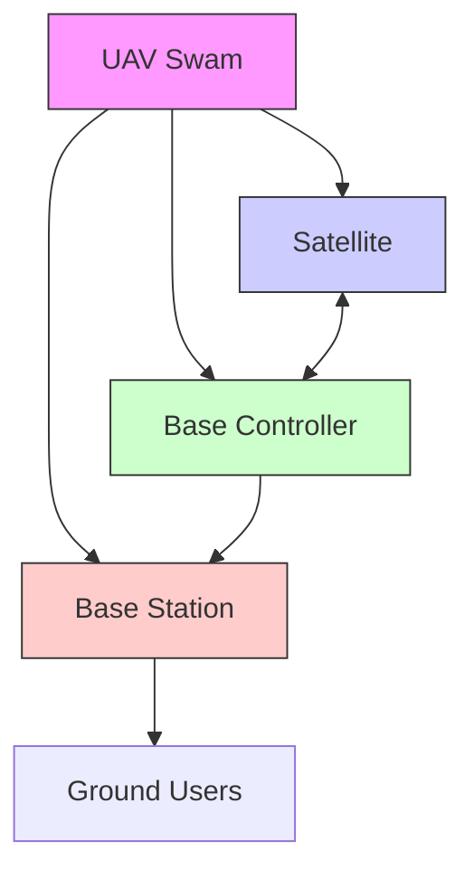

Fig. 1. UAV system model.

dedicated limited-bandwidth channel to communicate with each other, and are fully cooperative and share the goal of maximizing the system utility. However, due to the partial observability and limitation of communication channel, the UAVs have to find a communication protocol which is able to coordinate their behavior and policy.

Consequently, we propose to utilize the centralized learning and decentralized execution. A deep multiagent reinforcement learning is proposed where the UAVs are considered as the agents. In the proposed scheme, learning is performed via the centralized algorithm, while during execution, the UAVs can communicate through the dedicated limited-bandwidth channel and learn the communication protocol.

# D. Organization

The reminder of this paper is organized as follows. In Section II, the system model is depicted. Section III present the problem formulation and we propose the DRL-based resource allocation and trajectory design algorithms in Section IV. In Section V, we conduct the performance evaluation through simulation study. Section VI concludes this work.

# II. SYSTEM MODEL AND ASSUMPTION

# A. System Model

The system model is depicted in Fig. 1. There are $M > 1$ 1UAVs sharing the same frequency spectrum and serving a group of $U > 1$ GUs. The UAV swam and GU set are 1denoted as  and $u ,$ respectively. Apparently, we have $| { \mathcal { M } } | = M$ Mand $| \mathcal { U } | = U$ . All the UAVs provide services to the users in consecutive time slots. We denote the time slot as $t ,$ and $t \in \{ 1 , 2 , . . . , T \}$ . The overall period is denoted as $\mathcal { T } .$ . In 2 f1 2 . . . g Tthis work, we consider a 3-D Cartesian coordinate system where the fixed location of each GU u denoted by horizontal and vertical coordinates, e.g., $\pmb { \phi } _ { u } = \left[ x _ { u } , y _ { u } \right] ^ { T } \in \mathring { \mathbb { R } } ^ { 2 \times 1 } , u \in \mathcal { U } .$ f ¼ ½ All UAVs are assumed to fly at a fixed altitude $d _ { h } = H$ 2 Uabove ground and the coordinate of UAV m at time t is denoted by $\mathsf { \bar {psi } } _ { m } ( t ) = [ x _ { m } ( t ) , y _ { m } ( t ) ] ^ { T } \in \mathbb { R } ^ { 2 \times 1 }$ . We consider there is a base controller carrying out the proposed learning process, which can be satellite or BS. In addition, the UAVs are able to communicate within the swam.

We consider all the UAVs will fly back to the base so the trajectories should satisfy the following constraint

$$
\boldsymbol {\psi} _ {m} (1) = \boldsymbol {\psi} _ {m} (T). \tag {1}
$$

In addition, the trajectories of the UAVs are also subjected to certain constraints of speed and distance, which are

$$
\left\| \boldsymbol {\psi} _ {m} (t + 1) - \boldsymbol {\psi} _ {m} (t) \right\| \leq V _ {\max}, \tag {2}
$$

$$
\left\| \boldsymbol {\psi} _ {m} (t) - \boldsymbol {\psi} _ {j} (t) \right\| \geq S _ {\min}, \tag {3}
$$

where $V _ { m a x }$ is the maximum speed of the UAV and $S _ { m i n }$ is the minimum inter-UAV distance to avoid certain interference or collision. Accordingly, the distance between UAV m and user u in time slot t is given as

$$
d _ {m, u} (t) = \sqrt {H ^ {2} + \left\| \boldsymbol {\psi} _ {m} (t) - \boldsymbol {\psi} _ {u} \right\| ^ {2}}. \tag {4}
$$

# B. Path Loss Model

As a flexible flying platform, the UAV is able to establish a LoS link with the GUs. However, due to the fact that the changes of practical environment (rural, suburban, urban etc) are usually unpredictable, the randomness associated with the LoS and Non-LoS (NLoS) in a certain time should be taken into consideration when designing the UAV system. Accordingly, it is practical to consider the GU connects with the UAV via a LoS link with certain probability which we refer as LoS probability. The LoS probability will depend on the environment, the position of the UAV and GU. One commonly used expression can be given as

$$
\rho_ {m, u} ^ {l o s} (t) = \frac {1}{1 + \xi_ {1} \exp [ - \xi_ {2} (\theta_ {m , u} (t) - \xi_ {1}) ]}, \tag {5}
$$

where $\xi _ { 1 }$ and $\xi _ { 2 }$ are constant, the value of which the value 1 2depend on the carrier frequency and environment. $\theta _ { m , u } ( t )$ is the elevation angle, and we have

$$
\theta_ {m, u} (t) = \frac {1 8 0}{\pi \sin \left(H / d _ {m , u} (t)\right)}. \tag {6}
$$

The LoS and NLoS path loss models between the UAV m and user u is given as

$$
\hat {L} _ {m, u} (t) = \left\{ \begin{array}{l l} \eta_ {1} (\frac {4 \pi f _ {c} d _ {m , u} (t)}{c}) ^ {\alpha}, & \text {   LoS   link,   } \\ \eta_ {2} (\frac {4 \pi f _ {c} d _ {m , u} (t)}{c}) ^ {\alpha}, & \text {   NLoS   link,   } \end{array} \right. \tag {7}
$$

where $\eta _ { 1 }$ and $\eta _ { 2 }$ are the excessive coefficients in LoS and NLoS h1 h2links, respectively. $f _ { c }$ is the carrier frequency,  is the path loss aexponent, and c is the speed of light. Given the locations of the UAVs and GUs, it is difficult to determine whether a LoS or NLoS path loss model should be used in the considered UAV system. Thus, we consider an average over both the LoS and NLoS links, i.e.,

$$
\begin{array}{l} L _ {m, u} (t) = \rho_ {m, u} ^ {l o s} (t) \eta_ {1} \left(\frac {4 \pi f _ {c} d _ {m , u} (t)}{c}\right) ^ {\alpha} \\ + (1 - \rho_ {m, u} ^ {l o s} (t)) \eta_ {2} \left(\frac {4 \pi f _ {c} d _ {m , u} (t)}{c}\right) ^ {\alpha}. \tag {8} \\ \end{array}
$$

# C. Transmission Model

To express the user association between UAVs and GUs, a binary variable $\beta _ { m , u } ( t )$ is defined as the user association indicator, which is

$$
\beta_ {m, u} (t) = \left\{ \begin{array}{l l} 1, & \text { if   GU   u   associates   with   UAV   m }, \\ 0, & \text { otherwise }. \end{array} \right. \tag {9}
$$

In this work, we assume that one GU can only receive from one UAV in a given time slot, i.e. $\textstyle \sum _ { m = 1 } ^ { M } \beta _ { m , u } ( t ) \leq 1$ M . In addi-¼1 b ð Þ  1tion, The transmit power of the UAV m for u is denoted as $p _ { m , u } ( t )$ and the channel gain between UAV m and user u is ð Þdenoted as $h _ { m , u } ( t )$ . Then, the data rate of GU u is expressed as

$$
R _ {u} (t) = \sum_ {m = 1} ^ {M} \beta_ {m, u} (t) \log_ {2} \bigl (1 + \gamma_ {m, u} (t) \bigr), \tag {10}
$$

In (10), due to the fact that multiple UAVs can cause interference to GU $u , \gamma _ { m , u } ( t )$ modelled as Signal to Interference and Noise Ratio (SINR) of the link between m and u, which is

$$
\gamma_ {m, u} (t) = \frac {p _ {m , u} (t) h _ {m , u} (t) L _ {m , u} ^ {- 1} (t)}{\sum_ {j = 1 , j \neq m} ^ {M} p _ {j , u} (t) h _ {j , u} (t) L _ {j , u} ^ {- 1} (t) + \sigma^ {2}}, \tag {11}
$$

where $\sigma ^ { 2 }$ is the noise variance. Note that essentially the trajecstory of the UAVs, transmit power and channel state are continuous. Then after partitioning and and quantizing their values into different levels within their ranges, in each time slot t, the values of these variables can be understood as discrete counterparts.

# III. PROBLEM FORMULATION

# A. Utility Function

As there are multiple UAVs sharing the same frequency resources, the transmit power of one UAV may bring additional interference to the users served by other UAVs, which is shown in (11). Moreover, the association factor and trajectory also affects the data rate of the users, which can be observed by (4) and (10). Therefore, in the following, we consider to jointly optimize these three parameters. We have $\mathbf { B } =$ $\{ \beta _ { m , u } ( t ) , \forall m , u , t \}$ ¼which is the association policy between fb ð Þ 8UAVs and GUs, $\Psi = \{ \psi _ { m } ( t ) , \forall m , t \}$ which is trajectory of ¼ fc ð Þ 8 gthe UAVs and essentially determines the path loss, and $\mathbf { P } =$ $\{ p _ { m , u } ( t ) , \forall m , u , t \}$ ¼which is the transmit power allocation. f ð Þ 8 gBased on the analysis, we can define the utility function $\Upsilon _ { s y s } ( \mathbf { B } , \Psi , \mathbf { B } )$ of the overall multi-UAV system as follow.

$$
\Upsilon_ {s y s} (\mathbf {P}, \boldsymbol {\Psi}, \mathbf {B}) = \log \left(\sum_ {t} ^ {T} \sum_ {u} ^ {U} R _ {u} (t)\right). \tag {12}
$$

# B. Problem Formation

In order to maximize system utility, in this work, we jointly optimize transmit power allocation P , trajectory design C, and user association B. With the above analysis, the formulated problem P1 can be expressed as follows,

$$
\mathbf {P 1}: \max _ {\mathbf {P}, \boldsymbol {\Psi}, \mathbf {B}} \Upsilon_ {s y s} (\mathbf {P}, \boldsymbol {\Psi}, \mathbf {B}), \tag {13}
$$

(14)

C1 and C2 are the user association constraints, which ensure that one GU can only be served by one UAV in a time slot. The maximum transmit power constraint is given in C3, which means that the transmit power of the UAV should be smaller than its maximum power. C4- C5 is to ensure the minimum data requirement of each GU.

P1 is a non-convex combinatorial integer programming problem and it is NP-hard. In general, a brute-force-like scheme can be employed to find the optimal solution with high computational cost, which however, is infeasible for a large scale system. In addition, the optimization problem needs to obtain the complete information of the future in order to achieve the optimal solution for the next time slot, which means absence of prior information may degrade its achievable performance. Therefore, we intend to utilize the RL-based algorithm to achieve near-optimal solution without aforementioned prior knowledge.

# IV. CENTRALIZED DEEP REINFORCEMENT LEARNING-BASED SOLUTION

In this section, we will utilize the DRL-based algorithm to address the formulated problem. We first introduce the basics of DRL, including the defined specific state, action and reward. Then, the single agent DRL is utilized where the base controller acts as the agent and control the behaviors of the UAVs, and we refer the scheme as centralized DRL (CDRL).

# A. RL Framework Formulation

The RL problem comprises of a single or multiple agents and an environment. The agent can take actions based on a chosen policy to interact with the environment. Briefly, there are three elements in the RL framework: action a, state s and reward r. In our considered system, the agent can be the UAV central base controller or UAV itself, and the environment consists of all the GUs. The agent chooses an action $a _ { t }$ from the action space at time slot t, which decides trajectory and resource allocation. After applying an action, the agent receives a reward or punishment from the environment. This scheme aims at maximizing the cumulative received rewards within interactions.

# B. State, Action and Reward

We define state space, action space and reward of the DRLbased framework at time slot t of the considered system as follows. For the considered DRL framework, the decision will be carried out at the central base controller.

1) State: As for the centralized scheme, the central base should know all information about UAVs, e.g., association state, transmit power and trajectory state. The we define the state at the time slot t consists of the data rate $R _ { t }$ and battery level $E _ { t }$ . The battery level can decide the transmit power. The $R _ { t }$ comprises of both the channel state (essentially the location of UAV) and the UAV-GU association. Then the state at the time slot t is

$$
s _ {t} = [ E _ {t} ^ {1}, R _ {t} ^ {1}, \ldots , E _ {t} ^ {M}, R _ {t} ^ {M} ]. \tag {15}
$$

2) Action: In the considered system, the action consists of multiple parts, i.e., the user association strategy B, power allocation factors P and the trajectory design C. The action space should be the combination of all the possible values of these Afactors.

3) Reward: After executing the chosen action, the agent will obtain a reward in certain state in each time slot. As shown in (17), to enforce the agent to take proper action, the definition of the reward is compulsory. In general, the reward should be related to the objective function. According to the formulated problem in P1, the objective is to maximize the overall system utility while the QoS of each GU should be satisfied. In order to transform the objective function to a reward, we consider the following points.

The main objective of P1 is to maximize the overall system utility. As the target of the RL is to obtain reward maximization, the defined reward needs to be positively related to the objective function.

To meet the QoS requirements of GUs, the loss of the throughput of the GUs from their required QoS should decrease the reward.

Accordingly, the immediate reward is defined as

$$
r (s _ {t}, a _ {t}) = \varphi_ {a} \Upsilon_ {s y s} + \varphi_ {b} \big (R _ {u} (t) - R _ {u} ^ {m i n} \big), \tag {16}
$$

where $\varphi _ { a }$ and $\varphi _ { b }$ are the weights of two parts.

# C. Q-Learning Method

Q-learning is one of the classical RL schemes that records the Q-value. In the considered system, the base controller first watches the state $s _ { t } \in S$ and selects an action $a _ { t } \in \mathcal A$ at each 2 S 2 Atime slot t according to a stochastic policy . Then the base conptroller transmits control signals to the UAVs, obtains the reward $r ( s _ { t } , a _ { t } )$ , and transitions to the next state $s _ { t + 1 }$ . Q-learning advocates a value function $Q ( s _ { t } , a _ { t } )$ that is the expected cumulað Þtive future discounted reward at state $s _ { t }$ and chooses action $a _ { t }$ . Then, each pair of state-action has a value $Q ( s _ { t } , a _ { t } )$ for time slot t. For each time slot, the base controller calculates $Q ( s _ { t } , a _ { t } )$ , the ð Þvalue of which is considered as a long-term reward and stores it in a Q-table. $Q ( s _ { t } , a _ { t } )$ is expressed as:

Algorithm 1: Q-learning method.   
1: Initialize $Q(s, a)$ 2: for each episode do
3: Initialize s of each UAV randomly.
4: for each time do
5: Choose an action $a_{t}$ from all actions of state $s_{t}$ 6: Execute chosen $a_{t}$ , observe reward and next state $s_{t+1}$ 7: $Q(s_{t}, a_{t}) \leftarrow \kappa r(s_{t}, a_{t}) + \kappa \xi \max_{a_{t+1}} Q(s_{t+1}, a_{t+1}) + (1 - \kappa) Q(s_{t}, a_{t})$ 8: Let $s_{t} \leftarrow s_{t+1}$ .
9: end for
10: end for

$$
Q (s _ {t}, a _ {t}) = \mathbb {E} [ \hat {r} _ {t} | s _ {t}, a _ {t} ], \tag {17}
$$

where $\begin{array} { r } { \hat { r } _ { t } = \sum _ { t } ^ { T } \xi r ( s _ { t } , a _ { t } ) } \end{array}$ . We define \$ as the discount param-^eter and $0 \leq \varpi \leq 1$ Þ. Note that if \$ tends to 0, the base con-0   1troller mainly takes the immediate reward into consideration and if \$ tends to 1, the future is the focus of the base controller. In each step, the value of $Q ( s _ { t } , a _ { t } )$ is iterated. When the optimal policy $\begin{array} { r } { \pi ( s _ { t } ) = \operatorname* { m a x } _ { a _ { t } } Q ( s _ { t } , a _ { t } ) } \end{array}$ that maps the state and pð Þ ¼ max ð Þaction is satisfied, the optimal action-value function $Q ^ { * } ( s _ { t } , a _ { t } )$ is achieved. It obeys the Bellman optimality equation:

$$
Q ^ {*} (s _ {t}, a _ {t}) = r (s _ {t}, a _ {t}) + \xi \max _ {a _ {t + 1}} Q ^ {*} ((s _ {t + 1}, a _ {t + 1}) | s _ {t}, a _ {t}), \tag {18}
$$

where $a _ { t + 1 }$ and $s _ { t + 1 }$ are the action and state of the next time þ1 þ1slot, respectively. With a defined learning rate , the procedure kof Q-learning scheme in shown in Algorithm 1, where - is the time-varying learning rate.

# D. Proposed Centralized DRL Solution

Although simply advocating Q-learning may obtain the solution of P1, it is not ideal. When using Q-learning, we need to obtain and store its corresponding Q-value in a Q-table for each state-action group as presented. However, in the considered UAV system, due to its mobility feature, there is a very high possibility that a thousands of states exist. Then, if all the values are stored, the matrix of Q-table would be very large. Then it can be difficult to get enough samples to traverse each state, which results in the failures of the algorithm. Therefore, instead of calculating Q-value for each pair, a DNN is used here to estimate Q s; a which is the main idea of Deep Q-Network (DQN).

ð ÞDQN uses a neural network (NN) Q s; a  to represent Qð ; uÞfunction, where  is the weights of the NN. By updating  at u ueach iteration, the Q-network is trained to approximate the real Q-values. When it is applied to Q-learning, NN improve the performance of flexibility at the cost of stability [4]. In this context, DNN is proven to be with a more robust learning scheme and it has three major improvements comparing with the Q-learning.

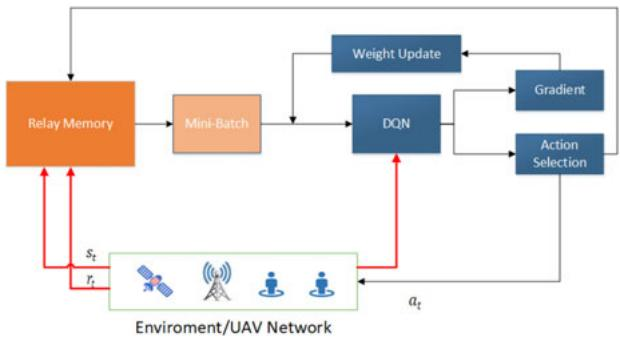

flowchart

```mermaid
graph TD
    A["Relay Memory"] --> B["Mini-Batch"]
    B --> C["DQN"]
    C --> D["Action Selection"]
    D --> E["Gradient"]
    E --> F["Weight Update"]
    F --> C
    C --> G["Environment/UAV Network"]
    G --> H["Satellite with signal r_t"]
    H --> I["Satellite with antenna s_t"]
    I --> J["Satellite with base station r_t"]
    J --> K["Satellite with base station a_t"]
    K --> L["Satellite with base station s_t"]
    L --> M["Satellite with base station r_t"]
    M --> N["Satellite with base station s_t"]
    N --> O["Satellite with base station a_t"]
    O --> P["Satellite with base station s_t"]
    P --> Q["Satellite with base station a_t"]
    Q --> R["Satellite with base station s_t"]
    R --> S["Satellite with base station a_t"]
    S --> T["Satellite with base station s_t"]
    T --> U["Satellite with base station a_t"]
    U --> V["Satellite with base station s_t"]
    V --> W["Satellite with base station a_t"]
    W --> X["Satellite with base station s_t"]
    X --> Y["Satellite with base station a_t"]
    Y --> Z["Satellite with base station s_t"]
    Z --> AA["Satellite with base station a_t"]
    AA --> AB["Satellite with base station s_t"]
    AB --> AC["Satellite with base station a_t"]
    AC --> AD["Satellite with base station s_t"]
    AD --> AE["Satellite with base station a_t"]
    AE --> AF["Satellite with base station s_t"]
    AF --> AG["Satellite with base station a_t"]
    AG --> AH["Satellite with base station s_t"]
    AH --> AI["Satellite with base station a_t"]
    AI --> AJ["Satellite with base station s_t"]
    AJ --> AK["Satellite with base station a_t"]
    AK --> AL["Satellite with base station s_t"]
    AL --> AM["Satellite with base station a_t"]
    AM --> AN["Satellite with base station s_t"]
    AN --> AO["Satellite with base station a_t"]
    AO --> AP["Satellite with base station s_t"]
    AP --> AQ["Satellite with base station a_t"]
    AQ --> AR["Satellite with base station s_t"]
    AR --> AS["Satellite with base station a_t"]
    AS --> AT["Satellite with base station s_t"]
    AT --> AU["Satellite with base station a_t"]
    AU --> AV["Satellite with base station s_t"]
    AV --> AW["Satellite with base station a_t"]
    AW --> AX["Satellite with base station a_t"]
    AX --> AY["Satellite with base station s_t"]
    AY --> AZ["Satellite with base station a_t"]
    AZ --> BA["Satellite with base station a_t"]
    BA --> BB["Satellite with base station s_t"]
    BB --> BC["Satellite with base station a_t"]
    BC --> BD["Satellite with base station a_t"]
    BD --> BE["Satellite with base station s_t"]
    BE --> BF["Satellite with base station a_t"]
    BF --> BG["Satellite with base station a_t"]
    BG --> BH["Satellite with base station s_t"]
    BH --> BI["Satellite with base station a_t"]
    BI --> BJ["Satellite with base station a_t"]
    BJ --> BK["Satellite with base station s_t"]
    BK --> BL["Satellite with base station a_t"]
    BL --> BM["Satellite with base station a_t"]
    BM --> BN["Satellite with base station s_t"]
    BN --> BO["Satellite with base station a_t"]
    BO --> BP["Satellite with base station a_t"]
    BP --> BQ["Satellite with base station s_t"]
    BQ --> BR["Satellite with base station a_t"]
    BR --> BS["Satellite with base station a_t"]
    BS --> BT["Satellite with base station s_t"]
    BT --> BU["Satellite with base station a_t"]
    BU --> BV["Satellite with base station a_t"]
    BV --> BW["Satellite with base station s_t"]
    BW --> BX["Satellite with base station a_t"]
    BX --> BY["Satellite with base station a_t"]
    BY --> BZ["Satellite with base station s_t"]
    BZ --> CA["Satellite with base station a_t"]
    CA --> CB["Satellite with base station a_t"]
    CB --> CC["Satellite with base station s_t"]
    CC --> CD["Satellite with base station a_t"]
    CD --> CE["Satellite with base station a_t"]
    CE --> CF["Satellite with base station s_t"]
    CF --> CG["Satellite with base station a_t"]
    CG --> CH["Satellite with base station a_t"]
    CH --> CI["Satellite with base station s_t"]
    CI --> CJ["Satellite with base station a_t"]
    CJ --> CK["Satellite with base station a_t"]
    CK --> CL["Satellite with base station s_t"]
    CL --> CM["Satellite with base station a_t"]
    CM --> CN["Satellite with base station a_t"]
    CN --> CO["Satellite with base station s_t"]
    CO --> CP["Satellite with base station a_t"]
    CP --> CQ["Satellite with base station a_t"]
    CQ --> CR["Satellite with base station s_t"]
    CR --> CS["Satellite with base station a_t"]
    CS --> CT["Satellite with base station a_t"]
    CT --> CU["Satellite with base station s_t"]
    CU --> CV["Satellite with base station a_t"]
    CV --> CW["Satellite with base station a_t"]
    CW --> CX["Satellite with base station s_t"]
    CX --> CY["Satellite with base station a_t"]
    CY --> CZ["Satellite with base station a_t"]
```

Fig. 2. Flow of the proposed DQN-based scheme.

The first one is that DNN is with multiple layer. The hierarchical layers of convolution filters in the DNN can be used to exploit the local spatial correlations. By such, the high-level features of input data are extracted. The second one is that experience replay can store its experience tuple $e ( t ) =$ $\left( { { s _ { t } } , { a _ { t } } , { r _ { t } } , { s _ { t + 1 } } } \right)$ ð Þ ¼at time slot t into a replay memory . The ð þ1Þ Orelay can randomly sample batches  from the memory to Otrain the DNN. Such a process enables DQN to learn from different past experience rather than from the current one. In addition, while using one network for estimating the Q-values, the target Q-values that compute the loss of each action in the training process can be generated by a second network. Such a procedure is able to make the DQN stable.

As presented, DQN uses NN with parameter  to represent $Q ( s _ { t } , a _ { t } )$ uin each iteration.  and policy  are updated accordð Þ u ping to the mini-batch of  which is taken from experience Omemory  to train the DQN in a online manner. DQNs are Ooptimized by minimizing

$$
\mathcal {L} (\theta) = \mathbb {E} [ y _ {t} - Q (s _ {t}, a _ {t}; \theta) ^ {2} ] \tag {19}
$$

where $y _ { t }$ is the target Q-value, and it is given as

$$
y _ {t} = r (s _ {t}, a _ {t}) + \max _ {a _ {t + 1}} Q ^ {*} (s _ {t + 1}, a _ {t + 1}; \theta^ {-}). \tag {20}
$$

In (20), $\theta ^ { - }$ is a target network parameter that is frozen for usome iterations when the online network $- Q ( \mathbf { s } , \mathbf { a } ; \theta )$ is updated  ð ; uÞby gradient descent. Specially, the base controller chooses $a _ { t }$ at time slot t according to ((18)), obtains reward $r _ { t }$ and goes to the next state $s _ { t + 1 }$ . Accordingly, the base controller has a experience replay memory  to store the vector $\left( { { s _ { t } } , { a _ { t } } , { r _ { t } } , { s _ { t + 1 } } } \right)$ . We can utilize the greedy policy in order to balance the exploration and exploitation. That is, we aim to balance the reward maximization based on the known information with choosing new actions to get unknown information. Algorithm 2 presents the process and the flow is shown in Fig. 2.

# V. MULTI-AGENT DEEP REINFORCEMENT LEARNING-BASED SOLUTION

The proposed CDRL-based scheme assumes that the UAV base actually performs the learning process and coordinate the actions of the entire UAV swam. However, on the way towards a smart UAV system, it is expected that the UAVs can be autonomous at a certain level. Thus, in the following, we focus on a setting with centralized learning but distributed execution towards establishing an autonomous UAV wireless communication system. Before we introduce the proposed scheme, some preliminaries are presented.

Algorithm 2: DQN-based online method.   
1: Initialize replay memory O
2: Initialize parameter of the DNN $\theta$ with random weights
3: for each episode do
4: Initialize the considered wireless UAV network
5: Receive the initial observation on the state $s_{1}$ .
6: for each time slot t do
7: Randomly select an action $a_{t}$ with probability $\epsilon$ ,
otherwise, select $a_{t} = \arg\max_{a} Q(x, a; \theta)$ .
8: Execute chosen $a_{t}$ , observe reward and $s_{t+1}$ 9: Store ( $s_{t}, a_{t}; r_{t}, s_{t+1}$ ) in replay memory O
10: Sample a random batch of Z vectors ( $s_{i}, a_{i}; r_{i}, s_{i+1}$ ) from O
11: Obtain the target Q-value $y_{i}$ from the target DQN, as follows, $y_{i} = r_{i} + \xi \max_{a_{l+1}} Q(s_{i+1}, \arg\max_{a'} Q(s_{i+1}, a', \theta), \theta^{-})$ 12: Update the main DQN by minimizing the loss function $\mathcal{L}(\theta)$ , $\mathcal{L}(\theta) = \frac{1}{Z} \sum_{i} (y_{i} - Q(s_{i}, a_{i}, \theta))^{2})$ .
13: Perform a gradient descent step on $\mathcal{L}(\theta)$ with respect to $\theta$ .
14: end for
15: end for
16: Output: the optimal resource allocation policy, i.e., the user association strategy B, trajectory design $\Psi$ , and power allocation P

# A. Preliminary

1) Independent DQN: The single agent DQN can be extended to multi-agent cooperative settings. In this setting, the global state $s _ { t }$ can be observed by the agents. Then, the each agent chooses an individual action $a _ { t } ^ { m }$ and obtains a group reward $r _ { t }$ which is shared among all the agents. A platform combining independent Q-learning with DQN has been proposed. In this framework, each agent m learns its own Q-function $Q ^ { m } ( s , a ^ { m } ; \theta _ { i } ^ { m } )$ independently and simultaneously. In [33], ð ; u Þit is shown that there may be some convergence problems in independent Q-learning (since individual learning may result in non-stationary environment for the others). Nevertheless, it has been successfully applied to practical problems [33].   
2) Deep Recurrent Q-Networks (DRQN): For both DQN and independent DQN, it is assumed full observability, i.e., the global state $s _ { t }$ is the input. However, in practice, the dynamic environments are usually partially observable, i.e., the global state $s _ { t }$ cannot be observed. Instead, each of the agents can only obtain an observation $o _ { t }$ which is correlated with global state. In [34], the DRQN is proposed to address single-agent and partially observable case. In this work, instead of obtaining $Q ( s , a )$ with a feed-forward network,

$Q ( o , a )$ is approximated with a recurrent NN that maintains an internal state and aggregates all the personal observations over some time slots. This is done by adding a hidden state $h _ { t - 1 }$ as the input, and it results in $Q ( o _ { t } , h _ { t - 1 } , a _ { t } ; \theta )$ .

# B. Assumption

In this case, we turn to investigate the formulated problem with different UAVs as multiple agents and partial observability is considered. The objective of maximizing the same discounted group rewards $r ( t )$ are shared among all the UAVs. ðAlthough the global state $s _ { t }$ is not observable to the UAVs, each UAV m has its own observation $o _ { t } ^ { m }$ . In each time slot, each UAV selects an action $a ^ { m } \in { \mathcal { A } }$ that has impact on the 2 Aenvironment and a communication action $\varsigma ^ { m } \in \varOmega$ that is & 2observed by other UAVs but does not directly affect the environment/reward. Such settings are of interests because usually in the multi-UAV system, partial observability is a practical case. We concentrate on the case with centralized learning and decentralized execution. This is to say, communications between UAVs and base controller is not limited during centralized learning while during execution the UAVs can communicate only via a dedicated signaling channel with limitedbandwidth. Then, during decentralized execution, each UAV uses its own copy of the learned network, evolving its own hidden state, selecting its own actions, and communicating with others only through the communication channel.

Towards an self-organized and autonomous system in a dynamic environment, the UAV must develop and agree on a communication protocol as the environment can change fast and the configured communication protocol may not work effectively.

Intuitively, the space dimension of communication protocols is extremely high, since they are the mappings from the histories of observation-action to sequences of communication signals over number of UAVs. Therefore, discovering an effective protocol is challenging. In addition, due to the UAVs’ requirement of coordinating the transmission and decoding of communication messages, exploring within this space becomes more difficult. For example, if a UAV transmits something useful to another UAV, it can obtain a positive reward only when receiving UAV successfully decodes and takes action accordingly. If the receiving UAV cannot decode the message correctly, the sending UAV will be hindered from transmitting again. Therefore, positive rewards can be achieved $i f f$ transmitting and decoding are successful, which is difficult to be achieved via a random search.

# C. Proposed Decentralized Solution

In this following, we propose the reinforced inter-UAV learning which combines independent Q-learning with DRQN to select environment and communications actions. Each $\mathrm { U A V } _ { \mathrm { } } \mathbf { \Sigma } _ { \mathrm { { S } } }$ Q-network is denoted as $Q ^ { m } ( o _ { t } ^ { m } , \varsigma _ { t - 1 } ^ { m } , h _ { t } ^ { m } , a ^ { m } )$ , which conditions on that $\mathrm { U A V } _ { \mathrm { \Delta } }$ ð & 1 Þ individual hidden state and observation. To avoid ­ outputs, we divide the Q-network into $Q _ { a } ^ { m }$ j jjAjfor the environment action and $Q _ { \varsigma } ^ { m }$ for the communication &action, respectively. By utilizing -greedy policy, the action selector separately picks $a ^ { m } ( t )$ and $\varsigma ^ { m } ( t )$ from $Q _ { a }$ and $Q _ { \varsigma } ,$ ð Þ &respectively. Correspondingly, only $| { \mathcal { \Omega } } | + | { \mathcal { A } } |$ &outputs are j j þ jAjrequired for the network and the action selection requires maximizing over  and $\varOmega ,$ but not $\varOmega \times \var A$ .

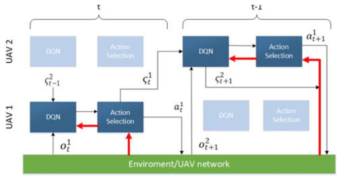

flowchart

```mermaid
graph TD
    subgraph UAV_2
        A["DQN"] --> B["Action Selection"]
        C["Σt-1²"] --> D["DQN"]
        D --> E["Action Selection"]
        E --> F["Σt¹"]
        F --> G["DQN"]
        G --> H["Action Selection"]
        H --> I["a₁t+1"]
        I --> J["Σt²"]
        J --> K["DQN"]
        K --> L["Action Selection"]
        L --> M["a₁t+1"]
    end
    subgraph UAV_1
        N["Σt-1²"] --> O["DQN"]
        P["σt¹"] --> Q["Action Selection"]
        Q --> R["Σt¹"]
        R --> S["DQN"]
        S --> T["Action Selection"]
        T --> U["a₁t¹"]
        U --> V["Σt²"]
        V --> W["Action Selection"]
        W --> X["a₁t+1"]
    end
    style UAV_2 fill:#f9f,stroke:#333
    style UAV_1 fill:#bbf,stroke:#333
    style Environment/UAV network fill:#dfd,stroke:#333
```

Fig. 3. The proposed reinforced inter-agent learning scheme.

TABLE I KEY SIMULATION PARAMETERS 

<table><tr><td>Notations</td><td>Description</td><td>Value</td></tr><tr><td> $f_c$ </td><td>carrier frequency</td><td>2 GHz</td></tr><tr><td> $\alpha$ </td><td>Path loss exponent</td><td>2</td></tr><tr><td>M</td><td>number of the UAVs</td><td>2 – 9</td></tr><tr><td>U</td><td>number of the GUs</td><td>10 – 50</td></tr><tr><td> $\varpi$ </td><td>learning rate</td><td>0.01</td></tr><tr><td> $\xi$ </td><td>Discount factor</td><td>0.8</td></tr><tr><td> $\eta_1$ </td><td>excessive coefficient for LoS</td><td>3 dB</td></tr><tr><td> $\eta_2$ </td><td>excessive coefficient for NLoS</td><td>23 dB</td></tr><tr><td> $P_m^{max}$ </td><td>maximum transmit power</td><td>23 dBm</td></tr></table>

AWe use modified DQN to train $Q _ { a } ^ { m }$ and $Q _ { \varsigma } ^ { m }$ . The following &two essential modifications are made to the DQN to guarantee the performance. First, as multiple UAVs’ simultaneous learning can mislead the experience and render it obsolete, the experience replay is disabled to avoid non-stationarity. Second, to take into consideration of the partial observability, the actions a and $\varsigma$ of each UAV are feed in as the inputs of the &next time slot. In Fig. 3, the information flows between UAVs and the network are presented together with how the action selector can process the Q-values to find proper actions. As shown, in order to choose environment action $a ^ { m }$ and communication action $\varsigma ^ { m }$ , all Q-values are passed to the action selec-&tor. For the selected actions, the gradients (red arrows in the figure) are calculated using DQN, and flow only through one single UAV’s Q-network. Although the considered setting allows a centralized learning, as the each UAV is treated independently, the overall process is not a centralized learning procedure. In addition, all the UAVs are equally treated during the proposed decentralized execution process.

The proposed scheme can be extended to improve the centralized learning by parameter sharing among the UAVs. Such an extension only needs to learn one network and then used by all UAVs. However, because each UAV still has different observation, the UAVs can still behave differently and thus go to different hidden states. Moreover, each UAV obtains own index as input which allows them to specialize. The DQN is able to ease the learning process of a common policy while permitting the specialization. Sharing the parameters among all the UAVs also significantly decreases the amount of parameters that needs to be learned, which can also hasten the speed of learning. By sharing the parameters, the UAVs learn two Q-functions $Q _ { a } ( o _ { t } ^ { m } , \varsigma _ { t - 1 } ^ { m ^ { \prime } } , h _ { t - 1 } ^ { m } , a _ { t - 1 } ^ { m } , \varsigma _ { t } ^ { m ^ { \prime } } , m , a _ { t } ^ { m } )$ and $Q _ { \zeta } ( \ l ) \dot { , }$ \_, for a and $\varsigma ,$ ð & 1 1 respectively, where $a _ { t - 1 } ^ { m }$ & and $\varsigma _ { t - 1 } ^ { m }$ Þare the &ðÞ &last action inputs and $\varsigma _ { t } ^ { m ^ { \prime } }$ 1 & 1 are messages from other UAVs. &During the execution process, each UAV uses own copy of the learned network, chooses own actions, evolves into own hidden state, and communicates with the others via the signalling channel.

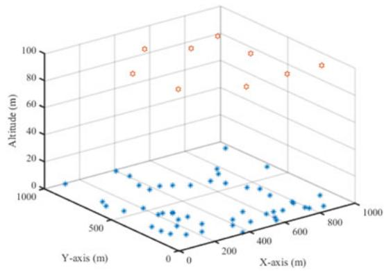

scatter

| X-axis (m) | Y-axis (m) | Altitude (m) |
| ---------- | ---------- | ------------ |
| 0          | 0          | 0            |
| 500        | 500        | 100          |
| 1000       | 1000       | 200          |
| 200        | 200        | 300          |
| 400        | 400        | 400          |
| 600        | 600        | 500          |
| 800        | 800        | 600          |
| 1000       | 1000       | 700          |
| 1200       | 1200       | 800          |
| 1400       | 1400       | 900          |
| 1600       | 1600       | 1000         |
| 1800       | 1800       | 1100         |
| 200        | 200        | 1200         |
| 300        | 300        | 1300         |
| 400        | 400        | 1400         |
| 500        | 500        | 1500         |
| 600        | 600        | 1600         |
| 700        | 700        | 1700         |
| 800        | 800        | 1800         |
| 900        | 900        | 1900         |
| 1000       | 1000       | 2000         |

Fig. 4. Locations of UAVs and GUs in a 3-D snapshot.

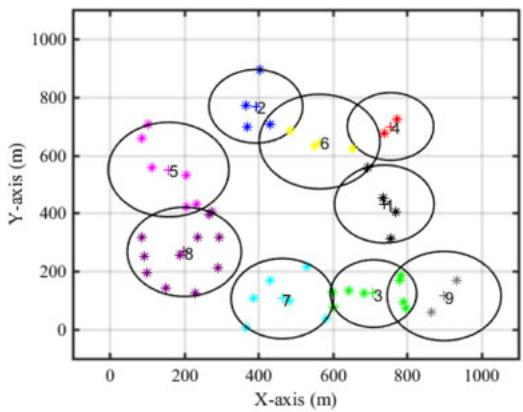

bubble

| Point | X-axis (m) | Y-axis (m) | Label |
|---|---|---|---|
| 1 | 750 | 650 | -4 |
| 2 | 380 | 780 | -2 |
| 3 | 650 | 120 | +1 |
| 4 | 780 | 680 | +4 |
| 5 | 180 | 550 | -5 |
| 6 | 550 | 650 | -6 |
| 7 | 450 | 120 | -7 |
| 8 | 220 | 280 | -8 |
| 9 | 850 | 80 | * |
| 10 | 300 | 400 | -9 |
| 11 | 120 | 300 | -8 |
| 12 | 380 | 720 | -2 |
| 13 | 250 | 420 | -8 |
| 14 | 750 | 680 | +4 |
| 15 | 150 | 550 | -5 |
| 16 | 450 | 350 | -8 |
| 17 | 650 | 120 | -7 |
| 18 | 380 | 420 | -8 |
| 19 | 250 | 300 | -8 |
| 20 | 120 | 280 | -8 |
| 21 | 380 | 420 | -8 |
| 22 | 150 | 300 | -8 |
| 23 | 450 | 350 | -8 |
| 24 | 380 | 420 | -8 |
| 25 | 150 | 300 | -8 |
| 26 | 450 | 350 | -8 |
| 27 | 380 | 420 | -8 |
| 28 | 150 | 300 | -8 |
| 29 | 450 | 350 | -8 |
| 30 | 380 | 420 | -8 |
| 31 | 150 | 300 | -8 |
| 32 | 450 | 350 | -8 |
| 33 | 380 | 420 | -8 |
| 34 | 150 | 300 | -8 |
| 35 | 450 | 350 | -8 |
| 36 | 380 | 420 | -8 |
| 37 | 150 | 300 | -8 |
| 38 | 450 | 350 | -8 |
| 39 | 380 | 420 | -8 |
| 40 | 150 | 300 | -8 |
| Note: The data is presented as discrete values for each point in the chart. The labels '-4' to '-9' appear above the data points, but they are not explicitly provided in the image. The ellipses are enclosed within the circles.

Fig. 5. Association of UAVs and GUs in a 2D snapshot.

# VI. SIMULATION RESULTS AND DISCUSSIONS

In this section, simulations are conducted to verify the advantages of the proposed single agent (CDRL) and multiagent DRL-based (MADRL) resource allocation schemes for multi-UAV networks. The setup of whole networks are mainly based on the parameters in [16], [25]. Some of the key notations for communications can be found Table I. The initial locations of the UAVs are randomized. The maximum transmit power of each UAV is the same. Based on this setting, the system utility, 3-D trajectory design and UAV-GU association are analyzed.

The 3-D and 2-D snapshots of the UAVs’ locations and their associated GUs resulting from the proposed scheme are presented in Figs. 4 and 5. In both figures, 50 GUs are uniformly located and 9 UAVs are deployed to provide services.

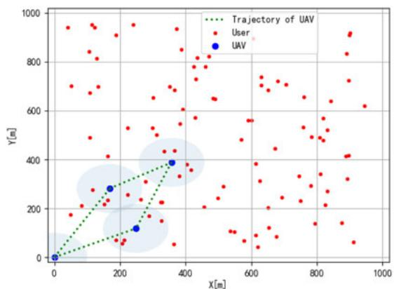

scatter

| X [m] | Y [m] | Type         |
|-------|-------|--------------|
| 0     | 0     | User         |
| 100   | 300   | User         |
| 200   | 100   | User         |
| 300   | 400   | User         |
| 400   | 800   | User         |
| 500   | 600   | User         |
| 600   | 700   | User         |
| 700   | 500   | User         |
| 800   | 900   | User         |
| 900   | 600   | User         |
| 1000  | 400   | User         |
| 150   | 250   | User         |
| 250   | 150   | User         |
| 350   | 350   | User         |
| 450   | 450   | User         |
| 550   | 350   | User         |
| 650   | 250   | User         |
| 750   | 150   | User         |
| 850   | 100   | User         |
| 950   | 50    | User         |
| 120   | 30    | User         |
| 180   | 25    | User         |
| 220   | 20    | User         |
| 280   | 15    | User         |
| 320   | 10    | User         |
| 380   | 5     | User         |
| 420   | 3     | User         |
| 480   | 2     | User         |
| 520   | 1     | User         |
| 580   | 1     | User         |
| 620   | 1     | User         |
| 680   | 1     | User         |
| 720   | 1     | User         |
| 780   | 1     | User         |
| 820   | 1     | User         |
| 880   | 1     | User         |
| 920   | 1     | User         |
| 980   | 1     | User         |
| 135   | 45    | UAV          |
| 175   | 35    | UAV          |
| 215   | 25    | UAV          |
| 265   | 15    | UAV          |
| 315   | 10    | UAV          |
| 375   | 5     | UAV          |
| 435   | 3     | UAV          |
| 495   | 2     | UAV          |
| 545   | 1     | UAV          |
| 605   | 1     | UAV          |
| 665   | 1     | UAV          |
| 735   | 1     | UAV          |
| 795   | 1     | UAV          |
| 845   | 1     | UAV          |
| 915   | 1     | UAV          |
| 975   | 1     | UAV          |
| -     | -     | Trajectory of UAV (dotted line) |
| -     | -     | Trajectory of UAV (solid line) |
| -     | -     | Trajectory of UAV (dashed line) |
| -     | -     | Trajectory of UAV (solid line) |
| -     | -     | Trajectory of UAV (dashed line) |
| -     | -     | Trajectory of UAV (solid line) |
| -     | -     | Trajectory of UAV (dashed line) |
| -     | -     | Trajectory of UAV (solid line) |
| -     | -     | Trajectory of UAV (dashed lines) |
| -     | -     | Trajectory of UAV (solid lines) |
| -     | -     | Trajectory of UAV (dashed lines) |
| -     | -     | Trajectory of UAV (solid lines) |
| -     | -     | Trajectory of UAV (dashed lines) |
| -     | -     | Trajectory of UAV (solid lines) |
| -     | -     | Trajectory of UAV (dashed lines) |
| -     | -     | Trajectory of UAV (solid lines)
|

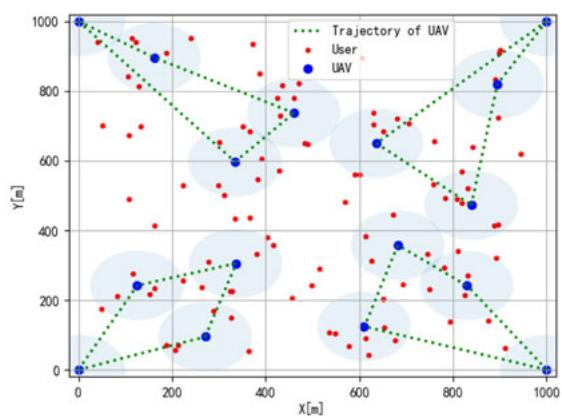

Fig. 6. Optimized UAV trajectories. (a) Optimized UAV trajectories, one UAV (b) [Optimized UAV trajectories, four UAVs.   
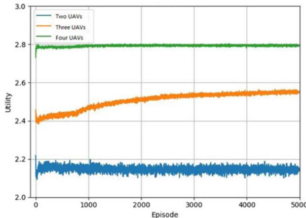

line

| Episode | Two UAVs | Three UAVs | Four UAVs |
| ------- | -------- | ---------- | --------- |
| 0       | 2.1      | 2.4        | 2.8       |
| 5000    | 2.15     | 2.55       | 2.8       |

Fig. 7. Total utility versus the number of episodes, MADRL.

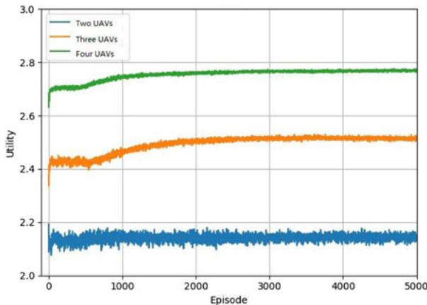

line

| Episode | Two UAVs | Three UAVs | Four UAVs |
| ------- | -------- | ---------- | --------- |
| 0       | 2.1      | 2.4        | 2.7       |
| 5000    | 2.1      | 2.5        | 2.8       |
| 10000   | 2.1      | 2.5        | 2.8       |
| 15000   | 2.1      | 2.5        | 2.8       |
| 20000   | 2.1      | 2.5        | 2.8       |
| 25000   | 2.1      | 2.5        | 2.8       |
| 30000   | 2.1      | 2.5        | 2.8       |
| 35000   | 2.1      | 2.5        | 2.8       |
| 40000   | 2.1      | 2.5        | 2.8       |
| 45000   | 2.1      | 2.5        | 2.8       |
| 50000   | 2.1      | 2.5        | 2.8       |

Fig. 8. Total utility versus the number of episodes, CDRL.

In Fig. 5, the 2D locations of UAV are marked in number. In this case, all GUs are able to connected with the UAVs and receive data from the associated UAVs by using the proposed scheme. The 3-D locations/trajectory of the UAVs and the UAV-GU association results are obtained based on the locations of the GUs and its minimum data rate requirement.

In Fig. 6, the optimized trajectories of the UAVs are illustrated. In Fig. 6(a), we plot the trajectory of four UAVs by using the proposed MADRL scheme, while in Fig. 6(b), the trajectory of one UAV is obtained by using the proposed CDRL scheme. It is observed that for the case of four UAVs, most of the users can be served by the UAVs. However, due to the limited battery capability, there are still some of users cannot be served by the UAVs. It can also be found that four UAVs can cooperate with each others through the proposed multi-agent learning scheme, and the users can be associated with individual UAV accordingly. As for the case of single UAV, due to the limited battery capability, the UAV has to come back after serving some of the users. Thus, only some of the users can be associated with the UAV.

In Fig. 7, we present the total utility versus the number of episodes with different number of UAVs when considering MADRL. As shown in the figure, our presented scheme shows a fast convergence speed for all of the cases. Besides, increasing the number of UAVs can lead to the increase of system utility. In Fig. 8, we present the total utility versus the number of episodes with different number of UAVs when considering CDRL. We can obtain similar performance as presented in Fig. 7. Nevertheless, for CDRL, when the number of UAVs becomes larger, it takes a bit longer time to converge. This may due to the fact that the CDRL needs to collect relative information in a centralized manner, which cost more time.

In Fig. 9 and in Fig. 10, we compare the throughput and utility performance of traditional Q-learning scheme, the proposed CDRL and the proposed MADRL. As we can observe from Fig. 9, as the number of UAVs increases, the total throughput of all these three schemes become larger. This is mainly due to the fact that the increase of the number of UAVs results in a better service coverage, and can provide better data services to the GUs. Similar situation can be observed from Fig. 10 when we investigate the utility performance. In addition, we can also find that both of the proposed schemes outperform the traditional Q-learning scheme, the centralized scheme obtain the best performance. This is mainly due to the fact that when the central controller can obtain all the relevant information, such as CSI and position of UAV, it can carry out more accurate decision via deep learning schemes. Nevertheless, the MADRL has a close performance to the CDRL, which demonstrates its effectiveness.

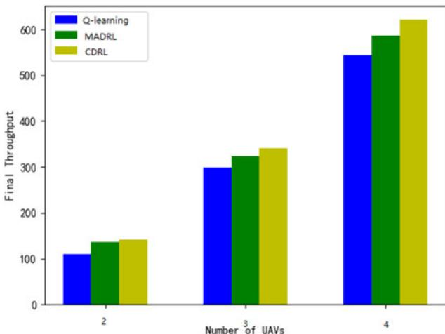

bar

| Number of UAVs | Q-learning | MADRL | CDRL |
|---|---|---|---|
| 2 | 110 | 135 | 140 |
| 3 | 300 | 325 | 340 |
| 4 | 545 | 585 | 620 |

Fig. 9. The impact of the number of UAVs on system throughput.

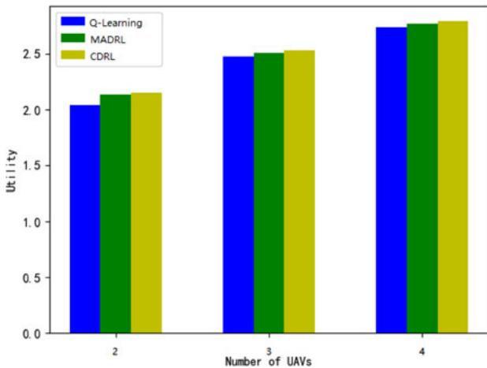

bar

| Number of UAVs | Q-Learning | MADRL | CDRL |
|---|---|---|---|
| 2 | 2.05 | 2.15 | 2.17 |
| 3 | 2.48 | 2.51 | 2.54 |
| 4 | 2.75 | 2.78 | 2.80 |

Fig. 10. The impact of the number of UAVs on system utility.

We have compared the proposed CDRL with two commonly-used baseline methods, “Benchmark” and “TRRA”. The “Benchmark” is the random UAV deployment scheme where the whole area is equally separated to a number of parts according to the number of UAVs. Then each UAV has its responded area, and then randomly flies within each area and serve the GUs. The “TRRA” refers to the traditional RRA scheme, where the power allocation is according to the waterfilling scheme and the association ignores the minimum data requirement. From Fig. 11, it is found that the system utilities of all three schemes increase with the number of UAVs. This is due to the fact that a larger number of UAVs can ensure more GUs being served with required data rate. Moreover, when the number of UAVs is sufficiently large, it turns out that there are less GUs who cannot be served and the increase of system utility becomes slow. It can also be observed the proposed scheme can obtain the best performance among all three, which shows the importance of adopting DRL and the development of power allocation and UAV association schemes.

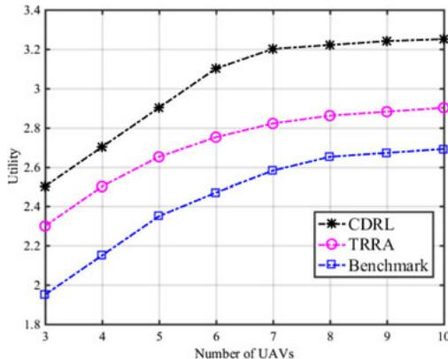

line

| Number of UAVs | CDRL  | TRRA  | Benchmark |
| -------------- | ----- | ----- | --------- |
| 3              | 2.5   | 2.3   | 1.9       |
| 4              | 2.7   | 2.5   | 2.1       |
| 5              | 2.9   | 2.65  | 2.35      |
| 6              | 3.1   | 2.75  | 2.45      |
| 7              | 3.2   | 2.8   | 2.6       |
| 8              | 3.25  | 2.85  | 2.65      |
| 9              | 3.3   | 2.9   | 2.7       |
| 10             | 3.35  | 2.95  | 2.75      |

Fig. 11. The impact of the number of UAVs on system utility.

# VII. CONCLUSION

In this work, to establish a smart and autonomous multi-UAV wireless communication system, novel DRL-based trajectory design and resource allocation schemes are presented. In the considered system, the UAVs act as aerial Base Stations and provide ubiquitous coverages. Specifically, aiming at maximizing the defined system utility over all served GUs, a joint design of trajectory, user association and power allocation problem is presented. To address the formulated problem, we first propose a machine learning-based algorithm which comprises of reinforcement learning and deep learning to learn the optimal policy of all the UAVs. Then, we also present a multiagent deep reinforcement learning scheme for decentralized implementation without knowing a priori knowledge of the dynamics of networks. Extensive simulation studies are conducted to demonstrate advantages of the proposed schemes are demonstrated. Future work is to improve the multi-UAV system performance via energy efficiency and delay optimization in the proposed framework.

# REFERENCES

[1] Z. Zhou, J. Feng, C. Zhang, Z. Chang, Y. Zhang, and K. Huq, “SAGECELL: Software-defined space-air-ground integrated moving cells,” IEEE Commun. Mag., vol. 56, no. 8, pp. 92–99, Aug. 2018.   
[2] B. Li, Z. Fei, and Y. Zhang, “UAV communications for 5G and beyond: Recent advances and future trends,” IEEE Internet Things J., vol. 6, no. 2, pp. 2241–2263, Apr. 2019.   
[3] A. Al-Hourani, S. Kandeepan, and S. Lardner, “Optimal LAP altitude for maximum coverage,” IEEE Wireless Commun. Lett., vol. 3, no. 6, pp. 569–572, Dec. 2014.   
[4] R. S. Sutton and A. G. Barto, Reinforcement Learning: An Introduction. Cambridge, MA, USA: MIT Press, 1998.   
[5] L. Panait and S. Luke, “Cooperative multi-agent learning: The state of the art,” Auton. Agents Multi-Agent Syst., vol. 11, no. 3, pp. 387–434, Nov. 2005.   
[6] X. Wang, H. Zhang, Y. Tian, and V. C. M. Leung, “Modeling and analysis of aerial base station-assisted cellular networks in finite areas under LoS and NLoS propagation,” IEEE Trans. Wireless Commun., vol. 17, no. 10, pp. 6985–7000, Oct. 2018.   
[7] C. She, C. Liu, T. Q. S. Quek, C. Yang, and Y. Li, “Ultra-reliable and lowlatency communications in unmanned aerial vehicle communication systems,” IEEE Trans. Commun., vol. 67, no. 5, pp. 3768–3781, May 2019.   
[8] C. Liu, Z. Chen, J. Tang, J. Xu, and C. Piao, “Energy-efficient UAV control for effective and fair communication coverage: Adeep reinforcement learning approach,” IEEE J. Sel. Areas Commun., vol. 36, no. 9, pp. 2059–2070, Sep. 2018.

[9] Z. Chang, W. Guo, X. Guo, and T. Ristaniemi, “Machine learning-based resource allocation for Multi-UAV communications system,” in Proc. IEEE Int. Conf. Commun. Workshops, 2020, pp. 1–6.   
[10] S. Zhang, Y. Zeng, and R. Zhang, “Cellular-enabled UAV communication: A connectivity-constrained trajectory optimization perspective,” IEEE Trans. Commun., vol. 67, no. 3, pp. 2580–2604, Mar. 2019.   
[11] S. Zhang, H. Zhang, B. Di, and L. Song, “Cellular UAV-to-X communications: Design and optimization for multi-UAV networks,” IEEE Trans. Wireless Commun., vol. 18, no. 2, pp. 1346–1359, Feb. 2019.   
[12] Y. Cai, F. Cui, Q. Shi, M. Zhao, and G. Y. Li, “Dual-UAV-enabled secure communications: Joint trajectory design and user scheduling,” IEEE J. Sel. Areas Commun., vol. 36, no. 9, pp. 1972–1985, Sep. 2018.   
[13] J. Zhang, Y. Zeng, and R. Zhang, “UAV-Enabled radio access network: Multi-mode communication and trajectory design,” IEEE Trans. Signal Process., vol. 66, no. 20, pp. 5269–5284, Oct. 2018.   
[14] Q. Wu, Y. Zeng, and R. Zhang, “Joint trajectory and communication design for multi-UAV enabled wireless networks,” IEEE Trans. Wireless Commun., vol. 17, no. 3, pp. 2109–2121, Mar. 2018.   
[15] H. Wang, G. Ren, J. Chen, G. Ding, and Y. Yang, “Unmanned aerial vehicle-aided communications: Joint transmit power and trajectory optimization,” IEEE Wireless Commun. Lett., vol. 7, no. 4, pp. 522–525, Aug. 2018.   
[16] R. I. Bor-Yaliniz, A. El-Keyi, and H. Yanikomeroglu, “Efficient 3-D placement of an aerial base station in next generation cellular networks,” in Proc. IEEE Int. Conf. Commun., 2016, pp. 1–5.   
[17] M. Mozaffari, W. Saad, M. Bennis, and M. Debbah, “Mobile unmanned aerial vehicles (UAVs) for energy-efficient Internet of Things communications,” IEEE Trans. Wireless Commun., vol. 16, no. 11, pp. 7574–7589, Nov. 2017.   
[18] Z. Yang et al., “Joint altitude, beamwidth, location, and bandwidth optimization for UAV-enabled communications,” IEEE Commun. Lett., vol. 22, no. 8, pp. 1716–1719, Aug. 2018.   
[19] X. Yuan, Y. Hu, D. Li, and A. Schmeink, “Novel optimal trajectory design in UAV-assisted networks: A mechanical equivalence-based strategy,” IEEE J. Sel. Areas Commun., vol. 39, no. 11, pp. 3524–3541, Nov. 2021.   
[20] T. Chu, J. Wang, L. Codeca, and Z. Li, “Multi-agent deep reinforcement learning for large-scale traffic signal control,” IEEE Trans. Intell. Transp. Syst., vol. 21, no. 3, pp. 1086–1095, Mar. 2020.   
[21] E. A. O. Diallo, A. Sugiyama, and T. Sugawara, “Learning to coordinate with deep reinforcement learning in doubles pong game,” in Proc. 16th IEEE Int. Conf. Mach. Learn. Appl., Cancun, Mexico, 2017, pp. 14–19.   
[22] J. K. M. Gupta, M. Egorov, and M. Kochenderfer, “Cooperative multiagent control using deep reinforcement learning,” in Proc. Int. Conf. Auton. Agents Multiagent Syst., 2017, pp. 66–83.   
[23] J. Foerster, Y. M. Assael, N. de Freitas, and S. Whiteson, “Learning to communicate with deep multi-agent reinforcement learning,” in Proc. Annu. Conf. Neural Inf. Process. Syst., 2016, pp. 2145–2153.   
[24] A. Asheralieva and Y. Miyanaga, “An autonomous learning-based algorithm for joint channel and power level selection by D2D pairs in heterogeneous cellular networks,” IEEE Trans. Commun., vol. 64, no. 9, pp. 3996–4012, Sep. 2016.   
[25] X. Li, J. Li, Y. Liu, Z. Ding, and A. Nallanathan, “Residual transceiver hardware impairments on cooperative NOMA networks,” IEEE Trans. Wireless Commun., vol. 19, no. 1, pp. 680–695, Jan. 2020.   
[26] X. Li et al., “Hardware impaired ambient backscatter NOMA system: Reliability and security,” IEEE Trans. Commun., vol. 69, no. 4, pp. 2723–2736, Apr. 2021.   
[27] X. Huang, S. Leng, S. Maharjan, and Y. Zhang, “Multi-agent deep reinforcement learning for computation offloading and interference coordination in small cell networks,” IEEE Trans. Veh. Technol., vol. 70, no. 9, pp. 9282–9293, Sep. 2021.   
[28] F. Yao and L. Jia, “A collaborative multi-agent reinforcement learning anti-jamming algorithm in wireless networks,” IEEE Wireless Commun. Lett., vol. 8, no. 4, pp. 1024–1027, Aug. 2019.   
[29] M. Yan, G. Feng, J. Zhou, and S. Qin, “Smart multi-RAT access based on multiagent reinforcement learning,” IEEE Trans. Veh. Technol. vol. 67, no. 5, pp. 4539–4551, May 2018.   
[30] O. Naparstek and K. Cohen, “Deep multi-user reinforcement learning for distributed dynamic spectrum access,” IEEE Trans. Wireless Commun. vol. 18, no. 1, pp. 310–323, Jan. 2019.   
[31] J. Hu, H. Zhang, L. Song, R. Schober, and H. V. Poor, “Cooperative internet of UAVs: Distributed trajectory design by multi-agent deep reinforcement learning,” IEEE Trans. Commun., vol. 68, no. 11, pp. 6807–6821, Nov. 2020.

[32] L. Wang, K. Wang, C. Pan, W. Xu, N. Aslam, and L. Hanzo, “Multiagent deep reinforcement learning-based trajectory planning for Multi-UAV assisted mobile edge computing,” IEEE Trans. Cogn. Commun. Netw., vol. 7, no. 1, pp. 73–84, Mar. 2021.   
[33] A. Tampuu et al., “Multiagent cooperation and competition with deep reinforcement learning,” PLoS One, vol. 12, no. 4, 2017, Art. no. e0172395.   
[34] M. Hausknecht and P. Stone, “Deep recurrent q-learning for partially observable MDPs,” in Proc. Assoc. Adv. Artif. Intell. Fall Symp. Ser., 2015.

natural_image

Portrait of a man wearing glasses and a collared shirt (no text or symbols visible)

Zheng Chang (Senior Member, IEEE) received the B.Eng. degree from Jilin University, Changchun, China, in 2007, the M.Sc. (Tech.) degree from the Helsinki University of Technology (Now Aalto University), Espoo, Finland, in 2009, and the Ph.D degree from the University of Jyvaskyla, Jyvaskyla, € € € €Finland in 2013. Since 2008, he has been holding various research positions with the Helsinki University of Technology, University of Jyvaskyla, and Magis-€ €ter Solutions Ltd in Finland. He has authored or coauthored more than 140 papers in Journals and

Conferences. His research interests include IoT, cloud/edge computing, security and privacy, vehicular networks, and green communications. He was awarded by the Ulla Tuominen Foundation, Nokia Foundation and Riitta and Jorma J. Takanen Foundation for his research excellence. He was awarded as 2018 IEEE Communications Society best young Researcher for Europe, Middle East, and Africa Region.

He was the recipient of the best paper awards from IEEE TCGCC and APCC in 2017. He is the Editor of IEEE WIRELESS COMMUNICATIONS LET-TERS, Springer Wireless Networks and International Journal of Distributed Sensor Networks, and the Guest Editor of IEEE Network, IEEE WIRELESS COMMUNICATIONS, IEEE Communications Magazine, IEEE INTERNET OF THINGS JOURNAL, and IEEE TRANSACTIONS ON INDUSTRIAL INFORMATICS. He was the exemplary Reviewer of IEEE WIRELESS COMMUNICATION LET-TERS in 2018. He has participated in organizing workshops and special sessions in Globecom’19, WCNC’18-22, SPAWC’19, and ISWCS’18. He is also the Symposium Chair of ICC’20 and Publicity Chair of INFOCOM’22.

natural_image

Portrait of a young man wearing glasses and a dark shirt (no text or symbols visible)

Hengwei Deng is currently working toward the master’s degree with the University of Electronic Science and Technology of China, Chengdu, China. His research interests include machine learning, UAV, cloud computing, and mobile computing.

natural_image

Portrait of a man in formal attire (no visible text or symbols)

Li You (Senior Member, IEEE) received the B.E. and M.E. degrees in electrical engineering from the Nanjing University of Aeronautics and Astronautics, Nanjing, China, in 2009 and 2012, respectively, and the Ph.D. degree in electrical engineering from Southeast University, Nanjing, China, in 2016.

From 2014 to 2015, he conducted Visiting Research with the Center for Pervasive Communications and Computing, University of California Irvine, Irvine, CA, USA. Since 2016, he has been with the Faculty of the National Mobile Communications

Research Laboratory, Southeast University. His research interests include general areas of communications, signal processing, and information theory, with the current emphasis on massive MIMO communications.

Dr. You was the recipient of the National Excellent Doctoral Dissertation Award from the China Institute of Communications in 2017, Young Elite Scientists Sponsorship Program (2019–2021) by the China Association for Science and Technology, and URSI Young Scientist Award in 2021.

natural_image

Portrait photo of a man in formal attire (no text or symbols visible)

Geyong Min (Member, IEEE) received the B.Sc. degree in computer science from the Huazhong University of Science and Technology, Wuhan, China, in 1995, and the Ph.D. degree in computing science from the University of Glasgow, Glasgow, U.K., in 2003. He is currently a Professor of high-performance computing and networking with the Department of Computer Science, College of Engineering, Mathematics, and Physical Sciences, University of Exeter, Exeter, U.K. His research interests include future internet, computer networks, wireless communications, multimedia systems, information security, high-performance computing, ubiquitous computing, modeling, and performance engineering. He was the Guest Editor of numerous international journals, such as ACM Transactions on Intelligent Systems and Technology, IEEE TRANSACTIONS ON SUS-TAINABLE COMPUTING, and ACM Transactions on Embedded Computing.

natural_image

Portrait of a smiling man with short hair and beard (no text or symbols visible)

Sahil Garg (Member, IEEE) received the Ph.D. degree from the Thapar Institute of Engineering and Technology, Patiala, India, in 2018. He is currently a Research Associate with Resilient Machine Learning Institute (ReMI) co-located with the Acole de Technologie SupAl’rieure (  AL’TS), Montr  Al’al. Prior to this, he was a Postdoctoral Research Fellow with AL’TS, Montreal, and MITACS Researcher with Ericsson, Montreal. He has more than 80 publications in high ranked Journals and Conferences, including more than 50 top-tier journal papers and more than 30 reputed conference articles. His research interests include machine learning, Big Data analytics, knowledge discovery, cloud computing, Internet of Things, Software defined networking, and vehicular ad-hoc networks. He was the recipient of the prestigious Visvesvaraya Ph.D. fellowship from the Ministry of Electronics & Information Technology under Government of India (2016-2018). He was awarded the 2021 IEEE Systems Journal Best Paper Award, 2020 IEEE TCSC Award for Excellence in Scalable Computing (Early Career Researcher), and IEEE ICC Best Paper Award in 2018 with Kansas City, Missouri. He is currently a Managing Editor of Springer’s Human-centric Computing and Information Sciences (HCIS) journal, and an Associate Editor for IEEE Network Magazine, IEEE TRANSACTIONS ON INTELLIGENT TRANSPORTATION SYSTEMS, Elsevier’s Applied Soft Computing (ASoC), and Wiley’s International Journal of Communication Systems (IJCS). In addition, he is also the Workshops and Symposia Officer for the IEEE ComSoc ETI on Aerial Communications. He guest edited a number of special issues in topcited journals, including IEEE T-ITS, IEEE TII, IEEE TNSE, IEEE IOT JOUR-NAL, IEEE Network Magazine, FGCS, Computer Networks, and NCAA. He was also the TPC Co-Chair/Publicity Co-chair/Special Sessions Chair/Publication Chair for several conferences. He was also the workshop Co-Chair of different workshops in IEEE /ACM conferences, including IEEE Infocom, IEEE Globecom, and ACM MobiCom. Moreover, he is also a Symposium Chair of Aerial Communications track in IEEE ICC 2022 to be held at Seoul, South Korea. He is a Member of IEEE Communications Society, IEEE Industrial Electronics Society, IEEE Software Defined Networks Community, IEEE Smart Grid Community, ACM, and IAENG.

natural_image

Portrait of a man wearing glasses and a collared shirt (no text or symbols visible)

Georges Kaddoum (Member, IEEE) received the bachelor’s degree in electrical engineering from the Acole Nationale Sup e Al’rieure de Techniques e AvancAl’es (ENSTA Bretagne), Brest, France, in e 2004, the M.S. degree in telecommunications and signal processing (circuits, systems, and signal processing) from the UniversitAl’ de Bretagne Occidentale and Telecom Bretagne (ENSTB), Brest, France, in 2005, and the Ph.D. degree (with Hons.) in signal processing and telecommunications from the National Institute of Applied Sciences (INSA), University of Toulouse, Toulouse, France, in 2009. He is currently an Associate Professor and Tier two Canada Research Chair with the Al’cole de Technologie Sup Al’rieure ( AL’TS), UniversitAl’ du Qu e Al’bec, Montr e Al’al, QC, Canada. Since 2010, he has been a e Scientific Consultant in the field of space and wireless telecommunications for several US and Canadian companies. He has authored or coauthored more than 200 journal and conference papers and has two pending patents. His research interests include mobile communication systems, modulations, security, space communications, and navigation. In 2014, he was the recipient of the AL’TS Research Chair of physical-layer security for wireless networks. Dr. Kaddoum was the recipient of the best papers awards at the 2014 IEEE International Conference on Wireless and Mobile Computing, Networking, Communications, with three coauthors, and at the 2017 IEEE International Symposium on Personal Indoor and Mobile Radio Communications, with four co-authors. Moreover, he was also the recipient of the IEEE Transactions on Communications Exemplary Reviewer Award for the years 2015, 2017, 2019, Research Excellence Award of the UniversitAl’ du Qu e Al’bec in the year 2018, and Research Excellence Award e from the AL’TS in recognition of his outstanding research outcomes in the year 2019. Prof. Kaddoum is currently an Associate Editor for IEEE TRANSACTIONS ON INFORMATION FORENSICS AND SECURITY and IEEE COMMUNICATIONS LETTERS.