# Trajectory Design for Completion Time Minimization in UAV-Enabled Multicasting

Yong Zeng , Member, IEEE, Xiaoli Xu , and Rui Zhang , Fellow, IEEE

Abstract— This paper studies an unmanned aerial vehicle (UAV)-enabled multicasting system, where a UAV is dispatched to disseminate a common file to a set of ground terminals (GTs). We aim to design the UAV trajectory to minimize its mission completion time, while ensuring that each GT successfully recovers the file with a desired high probability. The formulated problem is nonconvex and difficult to be solved in its original form. Therefore, we first derive an effective lower bound for the success file recovery probability of each GT. The problem is then reformulated in a more tractable form, where the UAV trajectory only needs to be designed to ensure the minimum connection time constraint with each GT, during which their distance is below a certain threshold. We show that without loss of optimality, the UAV trajectory consists of connected line segments only, which can be obtained by determining the optimal set of waypoints as well as the UAV speed along the path connecting the waypoints. We propose efficient schemes for the waypoint design based on a novel concept of virtual base station placement and by applying convex optimization. Furthermore, for fixed waypoints, the optimal UAV speed is efficiently obtained by solving a linear programming problem. Numerical results show that the proposed UAV-enabled multicasting with optimized trajectory design achieves significant performance gains over other benchmark schemes.

Index Terms— UAV communication, multicasting, trajectory optimization, network coding, traveling salesman problem.

## I. INTRODUCTION

WIRELESS communication systems have graduallyevolved to aim not only for high throughput, but also evolved to aim not only for high throughput, but also for ultra-reliability, low energy consumption, and supporting highly diversified applications with heterogeneous quality-ofservice (QoS) requirements [1]. To this end, research efforts in the past have mainly focused on conventional networking architectures typically with fixed infrastructures such as ground base stations (BSs), access points, and relays, which fundamentally limit their capability to meet the increasingly multifarious service requirements cost-effectively. To address this issue, there have been growing interests in providing wireless connectivity from the sky, by utilizing various airborne platforms such as balloons [2], helikites [3], and unmanned aerial vehicles (UAVs) [4], [5]. In particular, wireless communications by leveraging the use of low-altitude UAVs (typically at altitude within one kilometer above the ground) are appealing due to their many advantages, such as the ability of on-demand and swift deployment, high flexibility with fully-controllable mobility, and high probability of having line-of-sight (LoS) communication links with the ground terminals (GTs) [5]. Therefore, with the continuous cost reduction and endurance improvement of UAVs, together with the device miniaturization of communication equipment, it is anticipated that UAV-enabled communications will play an increasingly more important role in future wireless systems.

Depending on the practical applications, UAVs in wireless communication systems could either be deployed quasistationarily at predetermined locations, or fly contiguously over the served GTs by following certain trajectories. In the former case, one typical application is UAV-enabled ubiquitous coverage, where UAVs are deployed to assist the existing ground BSs, if any, to ensure seamless wireless coverage for the GTs within a service area [6], [7]. In this case, the UAVs resemble all essential functionalities of the conventional terrestrial BSs, but typically at a much higher altitude. Some practical scenarios for this application include UAV-enabled offloading in hot spot areas and fast communication service recovery after natural disasters. Along this direction, significant research efforts have been devoted to optimizing the UAV placement in two dimensional (2D) or 3D space [8]–[17], by exploiting the unique channel characteristics of the UAV-ground links. On the other hand, in the case with flying UAVs for applications such as UAV-enabled mobile relaying [18], UAV-enabled flying BSs [19], UAV-enabled information dissemination or data collection [20], the fully controllable mobility of UAVs offers new degrees of freedom in the system design. This can help to significantly enhance the performance compared to conventional systems with fixed relays/BSs on the ground, by dynamically adjusting the UAV positions according to the locations of the served GTs and their communication requirements [5]. For instance, for UAVenabled data collection in Internet of Things (IoT) [21] and machine type communications, the UAV can fly close to each of the GTs sequentially so as to shorten their link distance for more energy-efficient data gathering [20], [22]. For such applications, the system performance critically depends on the UAV trajectories, which need to be carefully designed.

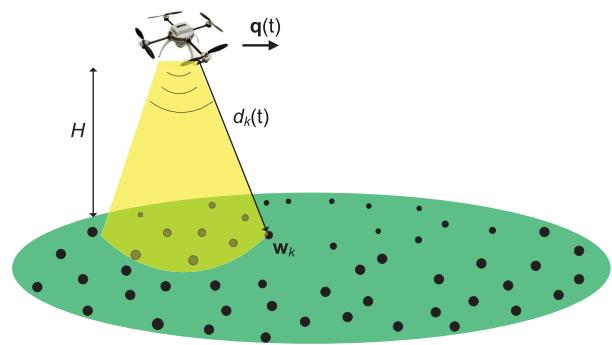  
Fig. 1. UAV-enabled information multicasting.

Trajectory design or path planning has been a major research area in the existing literature on UAVs. However, prior works mainly focus on UAV navigation applications to ensure its safe fly between a pair of predetermined initial and final locations, under various practical constraints such as collision avoidance with other UAVs and/or terrain obstacles [23]–[26]. There have been a handful of works recently on the UAV trajectory design dedicated to optimizing the communication performance. For example, by assuming that the UAV is equipped with multiple antennas and flies with a constant speed, the authors in [27] proposed an algorithm to dynamically adjust the UAV’s heading to maximize the ergodic sum rate of the uplink communications from the GTs to the UAV. In [18], for UAV-enabled mobile relaying systems, a design framework for jointly optimizing the communication power/rate allocation and the UAV trajectory, including both the flying direction and speed, was proposed to maximize the communication throughput. For the non-convex UAV trajectory optimization, [18] proposed the use of successive convex optimization technique to find efficient suboptimal solutions. This technique has been later adopted for UAV trajectory optimization in various other setups, including the energy efficiency maximization for UAV-enabled communication [28], throughput maximization for UAV-enabled multi-user downlink communication [29], and sensor energy minimization in UAV-enabled data collection [20].

In this paper, we study a new UAV-enabled multicasting system as shown in Fig. 1, where a UAV is dispatched to disseminate a common file to a set of geographically distributed GTs. UAV-enabled information dissemination or multicasting is one important use case of UAV-enabled communication systems [5], with a variety of applications such as for public safety and emergency responses [30], video streaming [31], [32], military operations, and intelligent transportation systems [33]. Different from the conventional multicasting with static transmitters (e.g., terrestrial BSs), where the multicasting performance is fundamentally limited by the bottleneck link of the user that is most far away from the transmitter, UAV-enabled multicasting is able to overcome this issue by exploiting its high mobility via adaptive trajectory design, which is the main focus of this work.

Specifically, under a general flat-fading channel model between the UAV and GTs, our objective is to design the UAV trajectory to minimize its mission completion time, while ensuring that each GT is able to recover the file with a given target success probability. While other performance metrics could also be considered, this paper mainly focuses on the mission completion time minimization, which is important for UAV systems due to the limited UAV endurance in practice. We assume that random linear network coding (RLNC) [34] is employed for UAV multicasting, since it is known to be a robust coding technique for applications with random packet erasures without the need of dedicated receiver feedback for ARQ (Automatic Repeat reQuest). With RLNC, each GT is able to successfully recover the file as long as it can reliably receive a sufficiently large number of coded packets, whose probability critically depends on the UAV trajectory design. Due to the fundamentally different setups and design objectives, existing UAV trajectory designs (in e.g., [18] and [28]), which are typically for throughput maximization with independent messages for the GTs, are no longer applicable for the new problem considered in this paper. The main contributions of this paper are summarized as follows.

First, for UAV-enabled multicasting systems with RLNC, we formulate the optimization problem to minimize the mission completion time, while ensuring that each GT is able to successfully recover the file with a targeting probability, subject to the UAV’s maximum speed constraint. The formulated problem is difficult to be directly solved, since the file recovery probability of each GT is an implicit and complicated function of the UAV trajectory. To tackle this issue, we derive an analytical lower bound for the file recovery probability by introducing an auxiliary distance parameter D. The main idea is to ignore the portion of the UAV trajectory when its horizontal distance with the GT of interest is greater than D, hence incurring relatively higher packet loss probabilities than a threshold value (specified by D). As a result, the UAV trajectory design is reformulated to meet the minimum connection time constraint with each GT, during which their distance is below the critical distance D.

Next, we show that for the reformulated problem, the optimal UAV trajectory only needs to constitute connected line segments. Thus, the problem is further reduced to finding a set of optimal waypoints for the UAV trajectory, and then optimizing the instantaneous UAV speed along the path connecting these waypoints. However, finding the optimal waypoints is challenging since it is a generalization of the classic Travelling Salesman Problem (TSP) [35]–[37], which is known to be NP hard. We thus propose two effective waypoint design schemes based on a novel concept of virtual base station (VBS) placement and convex optimization. Furthermore, for any given waypoints, the optimal UAV speed is efficiently obtained by solving a linear programming (LP) problem.

Finally, numerical results are provided to validate the performance of the proposed designs. It is shown that compared to the heuristic benchmark waypoint designs, the proposed designs can significantly reduce the required mission completion time. Furthermore, as compared to the conventional multicasting setup with a static transmitter, the proposed UAV-enabled multicasting with optimized trajectory achieves significant performance gains in terms of file recovery probability and/or mission completion time. This demonstrates the great potential of UAV-enabled information multicasting in future wireless systems.

The rest of this paper is organized as follows. Section II presents the system model and problem formulation. In Section III, the lower bound of the file recovery probability is derived, based on which the optimization problem is reformulated. In Section IV, the proposed UAV trajectory designs are presented. Section V provides the numerical results, and finally we conclude the paper in Section VI.

Notations: In this paper, scalars are denoted by italic letters. Boldface lower-case letters denote vectors. $\mathbb { R } ^ { M \times 1 }$ denotes the space of M-dimensional real-valued vectors. For a vector a, -a- represents its Euclidean norm. $\log _ { 2 } ( \cdot )$ denotes the logarithm with base 2. E[·] denotes the statistical expectation and Pr(·) represents the probability. Bern( p) represents the Bernoulli distribution with success probability $p , ~ \boldsymbol { B } ( \boldsymbol { N } , p )$ denotes the binomial distribution with N independent trials each with success probability $p ,$ and $\mathcal { N } ( \mu , \upsilon ^ { 2 } )$ denotes the Gaussian distribution with mean $\mu$ and variance $\upsilon ^ { 2 }$ . For a timedependent function q(t), q˙ (t) denotes the first-order derivative with respect to time t. For a set $\mathcal { M } , | \mathcal { M } |$ denotes its cardinality. For two sets $\mathcal { M } _ { 1 }$ and $\mathcal { M } _ { 2 } , \mathcal { M } _ { 1 } \subset \mathcal { M } _ { 2 }$ denotes that $\mathcal { M } _ { 1 }$ is a subset of $\mathcal { M } _ { 2 }$

## II. SYSTEM MODEL AND PROBLEM FORMULATION

As shown in Fig. 1, we consider a wireless communication system consisting of K GTs denoted by the set $\kappa =$ $\{ 1 , \cdots , K \}$ , with the location of GT k denoted as $\mathbf { w } _ { k } \in \mathbb { R } ^ { 2 \times 1 }$ $k \in \mathcal K$ . We assume that the GTs’ locations are fixed and known for the UAV trajectory design. In practice, the locations of the GTs could be available in the system database (e.g., for wireless sensor networks), or determined by the standard positioning techniques, such as the GPS based localization. A UAV flying at a constant altitude H above the ground is dispatched to disseminate a common information file of total size W bits to all the K GTs. Note that in practice, H could correspond to the minimum altitude to ensure safe UAV operations, e.g., for obstacle avoidance without frequent aircraft ascending or descending. In this paper, we focus on the basic scenario with one single UAV and without existing ground infrastructure such as BSs. The problem can be extended to the more general cases with multiple cooperative UAVs and/or in the presence of ground BSs. However, such an extension is highly non-trivial, due to the additional considerations such as UAV collision avoidance, spectrum sharing between UAVs and BSs, and possibly inter-UAV communications. Therefore, they will be left as future work.

## A. Random Linear Network Coding

We assume that RLNC [34] is employed for the UAV transmission, where the information file is linearly coded in the packet level. Specifically, denote the size of each packet as $R _ { p }$ bits/packet. Then the total number of information packets is $N ^ { \prime } = W / R _ { p }$ , which are linearly combined with randomly generated coding coefficients from a finite field to obtain $N > N ^ { \prime }$ coded packets.1 These coded packets are then broadcasted by the UAV’s transmitter to the GTs along its flight trajectory. As the randomly generated coding coefficients in RLNC are linearly independent almost surely for a sufficiently large field size, each GT will be able to recover the information file as long as any $N ^ { \prime }$ out of the N coded packets are successfully received. Note that for assisting the file recovery based on the network coded packets at the ${ \mathrm { G T s } } ,$ only the seeds used for generating the random coding coefficients need to be appended with the payload of each packet, and hence the network coding overhead is negligible.

Denote by R the transmission rate in bits/second (bps), which is assumed to be predetermined and remain constant. Then the time required to complete one packet transmission is $T _ { p } = R _ { p } / R$ in second. As a result, the mission completion time, or the total time required to complete the transmission of the N coded packets, is given by

$$
T = N T _ { p } = { \frac { W } { R } } { \frac { N } { N ^ { \prime } } } .\tag{1}
$$

## B. Channel Model

Denote by ${ \bf q } ( t ) \in \mathbb { R } ^ { 2 \times 1 } , 0 \le t \le T$ , the UAV’s flying trajectory projected onto the ground. Further denote by $V _ { \mathrm { m a x } }$ the maximum UAV speed in meter/second (m/s). We then have the constraint $\| \dot { \mathbf { q } } ( t ) \| \leq V _ { \operatorname* { m a x } } .$ , ∀t. The time-dependent distance between the UAV and the GTs can then be written as

$$
d _ { k } ( t ) = \sqrt { H ^ { 2 } + \| \mathbf { q } ( t ) - \mathbf { w } _ { k } \| ^ { 2 } } , \ 0 \leq t \leq T , \forall k \in \mathcal { K } .\tag{2}
$$

For a general flat-fading channel model for the UAV-to-GT links, with the N coded packets transmitted by the UAV during the time horizon T , the probability that each of the K GTs reliably receives at least $N ^ { \prime }$ packets to successfully recover the information file critically depends on the UAV’s trajectory q(t), $0 \leq t \leq T$ . Our objective in this paper is to optimize q(t) so as to minimize the total mission completion time $T ,$ or equivalently the total number of coded packets N that need to be transmitted, while ensuring that each of the K GTs is able to recover the information file with a success probability no smaller than a given target P¯ . Note that for practical information multicasting systems, a subsequent device-to-device (D2D) packet sharing phase could be employed, so that those GTs who fail to recover the file will receive additional packets from their peers until they can also successfully recover the file [5]. By increasing the targeting threshold $\breve { \bar { P } }$ for the UAV multicasting phase, in general less packets need to be shared in the D2D phase. In this paper, we focus on the UAV multicasting phase, whereas a joint investigation of the UAV multicasting and D2D file sharing would be an interesting problem for future research.

For the ease of exposition, the time horizon T is discretized into M equally spaced time slots, i.e., $T ~ = ~ M \delta _ { t }$ , with $\delta _ { t }$ denoting the elemental slot length, which is appropriately chosen so that the distance between the UAV and the GTs can be assumed to be approximately constant within each slot. For instance, $\delta _ { t }$ might be chosen such that $\delta _ { t } V _ { \mathrm { m a x } } \ll H$ Thus, the UAV trajectory q(t) over the time horizon T can be approximated by the M-length sequence $\{ \mathbf { q } [ m ] \} _ { m = 1 } ^ { M }$ , where $\mathbf { q } [ m ] \ \triangleq \ \mathbf { q } ( m \delta _ { t } )$ denotes the UAV’s horizontal location at time slot m. Furthermore, the UAV speed constraint can be expressed as

TABLE I  
LIST OF PARAMETERS
<table><tr><td rowspan=1 colspan=1>Information file size</td><td rowspan=1 colspan=1>W bits</td></tr><tr><td rowspan=1 colspan=1>Packet size</td><td rowspan=1 colspan=1> $\overline { { R _ { p } \ b i \mathrm { t s } } }$ </td></tr><tr><td rowspan=1 colspan=1>Number of information packets</td><td rowspan=1 colspan=1> $\dot { N ^ { \prime } } = W / R _ { p }$ </td></tr><tr><td rowspan=1 colspan=1>Number of network coded packets</td><td rowspan=1 colspan=1> $\overline { { N > N ^ { \prime } } }$ </td></tr><tr><td rowspan=1 colspan=1>UAV transmission rate</td><td rowspan=1 colspan=1>R bits/second</td></tr><tr><td rowspan=1 colspan=1>Time for transmitting one packet</td><td rowspan=1 colspan=1> $T _ { p } = R _ { p } / R ~ \mathrm { s e c o n d s }$ </td></tr><tr><td rowspan=1 colspan=1>Mission completion time</td><td rowspan=1 colspan=1> $\begin{array} { r } { T = N T _ { p } = \frac { W } { R } \frac { N } { N ^ { \prime } } } \end{array}$ sec-onds</td></tr><tr><td rowspan=1 colspan=1>Time slot length</td><td rowspan=1 colspan=1> $\overline { { \delta _ { t } } }$ seconds</td></tr><tr><td rowspan=1 colspan=1>Number of time slots</td><td rowspan=1 colspan=1> $\overline { { M = T / \delta _ { t } } }$ </td></tr><tr><td rowspan=1 colspan=1>Number of transmitted packets perslot</td><td rowspan=1 colspan=1> $\overline { { L = \delta _ { t } / T _ { p } = N / M } }$ </td></tr></table>

$$
\left\| \mathbf { q } [ m ] - \mathbf { q } [ m - 1 ] \right\| \leq \tilde { V } _ { \mathrm { m a x } } \triangleq \delta _ { t } V _ { \mathrm { m a x } } , \quad m = 2 , \cdots , M .\tag{3}
$$

The distance between the UAV and the GTs in (2) can be discretized as

$$
d _ { k } [ m ] = \sqrt { H ^ { 2 } + \| \mathbf { q } [ m ] - \mathbf { w } _ { k } \| ^ { 2 } } , \quad 1 \leq m \leq M , \ k \in \mathcal { K } .\tag{4}
$$

The average channel power gain from the UAV to GT k at slot m can be modeled as

$$
\beta _ { k } [ m ] = \beta _ { 0 } d _ { k } ^ { - \alpha } [ m ] = \frac { \beta _ { 0 } } { ( H ^ { 2 } + \| \mathbf { q } [ m ] - \mathbf { w } _ { k } \| ^ { 2 } ) ^ { \alpha / 2 } } ,\tag{5}
$$

where $\beta _ { 0 }$ denotes the channel power gain at the reference distance of $d _ { 0 } = 1 \mathrm { m }$ , and $a \ge 2$ is the path loss exponent.

With the slot duration fixed to $\delta _ { t } ,$ the number of packets that can be transmitted by the UAV during each time slot is $L = \delta _ { t } / T _ { p } = R \delta _ { t } / R _ { p }$ . For convenience, we assume that $L  \geq 1$ is an integer. It then follows that the total number of transmitted packets by the UAV is related to M as $N =$ M L. The relationship between the different parameters of the considered system is summarized in Table I.

We assume quasi-static fading channels, where the instantaneous channel coefficients between the UAV and GTs remain unchanged for each packet duration of $T _ { p }$ seconds, and may vary across different packets. Therefore, the instantaneous channel gains between the UAV and GT k can be modeled as

$$
h _ { k } [ m , l ] = \sqrt { \beta _ { k } [ m ] } g _ { k } [ m , l ] , \ m = 1 , \cdots , M , l = 1 , \cdots , L ,\tag{6}
$$

where $h _ { k } [ m , l ]$ denotes the channel coefficient between the UAV and GT k during the transmission of the lth packet in time slot $m , \beta _ { k } [ m ]$ is the path loss coefficient that depends on the distance between the UAV and GT k as given in (5), and gk [m, l] is a random variable with E[|gk [m, $l ] | ^ { 2 } ] = 1$ accounting for the fading component of the UAV-to-GT channel. Note that in general, gk[m, l] models both the shadowing and the small-scale fading, which is assumed to be independent and identically distributed (i.i.d.) for different k, m, l. For the special case of clear LoS link between UAV and GT without fading, gk [m, l] in (6) is deterministic with unit magnitude, i.e., $| g _ { k } [ m , l ] | = 1$ , and $\alpha = 2$ in (5).

## C. Problem Formulation

Denote by P the transmission power of the UAV and assuming omni-directional transmission by the UAV. The achievable rate in bps between the UAV and GT k during the transmission of the (m, l)th packet is given by

$$
\begin{array} { l } { \displaystyle { C _ { k } [ m , l ] = B \log _ { 2 } \left( 1 + \frac { P \left| h _ { k } [ m , l ] \right| ^ { 2 } } { \sigma ^ { 2 } \Gamma } \right) } } \\ { \displaystyle { = B \log _ { 2 } \left( 1 + \frac { P \beta _ { k } [ m ] \left| g _ { k } [ m , l ] \right| ^ { 2 } } { \sigma ^ { 2 } \Gamma } \right) , } } \end{array}\tag{7}
$$

where B denotes the channel bandwidth in Hertz (Hz), $\sigma ^ { 2 }$ represents the power of the additive white Gaussian noise (AWGN) at the GT receivers, and $\Gamma > 1$ is the signalto-noise ratio (SNR) gap between the practical modulation schemes and the theoretical Gaussian signaling. With the $\mathrm { U A V } _ { \mathrm { \Delta } }$ transmission rate fixed to R, the $( m , l ) \mathrm { t h }$ packet can be successfully received by GT k if and only if $C _ { k } [ m , l ] \ge R$ Thus, the probability that GT k can successfully receive the (m, l)th packet can be expressed as

$$
\begin{array} { r l r } {  { p _ { k } [ m , l ] = \operatorname* { P r } ( C _ { k } [ m , l ] \geq R ) } } \\ & { } & { = \operatorname* { P r } ( | g _ { k } [ m , l ] | ^ { 2 } \geq \frac { \gamma _ { \mathrm { t h } } } { \bar { \gamma } _ { 0 } } ( H ^ { 2 } + \| \mathbf { q } [ m ] - \mathbf { w } _ { k } \| ^ { 2 } ) ^ { \alpha / 2 } ) } \\ & { } & { = F ( \frac { \gamma _ { \mathrm { t h } } } { \bar { \gamma } _ { 0 } } ( H ^ { 2 } + \| \mathbf { q } [ m ] - \mathbf { w } _ { k } \| ^ { 2 } ) ^ { \alpha / 2 } ) , \qquad ( 8 ) } \end{array}
$$

where $\gamma _ { \mathrm { t h } } \triangleq 2 ^ { R / B } - 1$ is the SNR threshold for successful packet reception, $\bar { \gamma } _ { 0 } ~ \triangleq ~ P \beta _ { 0 } / ( \sigma ^ { 2 } \Gamma )$ is the average received SNR at the reference distance of 1m, and $F ( x )$ denotes the complementary cumulative distribution function (ccdf) of the random variable $| g _ { k } [ m , l ] | ^ { 2 }$ , which, by definition, is a nonincreasing function with respect to x for any given fading distribution. We assume that $F ( x )$ is known in this paper. Define a distance parameter $D ^ { * }$ for the UAV-GT horizontal separation such that the average received SNR at $D ^ { * }$ equals γth, i.e., the resulting argument in (8) equals 1, we then have

$$
D ^ { * } = \sqrt { ( \bar { \gamma } _ { 0 } / \gamma _ { \mathrm { t h } } ) ^ { 2 / \alpha } - H ^ { 2 } } .\tag{9}
$$

For the special case of deterministic LoS channel such that $| g _ { k } [ m , l ] | = 1$ , we have $F ( x ) = 1 { \mathrm { ~ i f ~ } } x \leq 1$ and 0 otherwise. In this case, we have $p _ { k } [ m , l ] = 1 \mathrm { ~ i f ~ } \| \mathbf { q } [ m ] - \mathbf { w } _ { k } \| \leq D ^ { * }$ and 0 otherwise. In other words, for the special case of LoS channel, a packet is guaranteed to be successfully received if the UAV-GT horizontal distance is no greater than $D ^ { * }$ and it will be lost otherwise. Note that for practical fading channels, all the L packets transmitted by the UAV within the same time slot experience i.i.d. fading for any given GT k and time slot m, since its distance from the UAV is assumed to be constant in each slot. Thus, $p _ { k } [ m , l ]$ in (8) is independent of l but only depends on the slot number m.

Let $Z _ { k } [ m , l ] , m ~ = ~ 1 , . . . , M , l ~ = ~ 1 , . . . , L$ , be a random variable indicating whether the (m, l)th packet is successfully received by GT k, which follows the Bernoulli distribution with success probability $p _ { k } [ m , l ]$ , denoted as $Z _ { k } [ m , l ] \ \sim$ Bern $( p _ { k } [ m , l ] )$ . The total number of packets that can be successfully received by GT k, denoted as $N _ { k }$ , is then a random variable given by

$$
N _ { k } = \sum _ { m = 1 } ^ { M } \sum _ { l = 1 } ^ { L } Z _ { k } [ m , l ] , \quad k \in { \mathcal { K } } .\tag{10}
$$

Since $Z _ { k } [ m , l ]$ are independent Bernoulli random variables with possibly different success probabilities, $N _ { k }$ follows the Poisson binomial distribution [38].

Recall that with $N = M L$ network coded packets transmitted by the UAV, each GT is able to recover the information file as long as any $N ^ { \prime }$ out of the N packets are successfully received, whose probability can be written as

$$
P _ { k , \mathrm { s u c c } } \triangleq \operatorname* { P r } \big ( N _ { k } \geq N ^ { \prime } \big ) , k \in { \mathcal { K } } .\tag{11}
$$

Thus, the problem to minimize the mission completion time via trajectory optimization while ensuring a targeting file recovery probability P¯ for all GTs can be formulated as

(P1) : min M q[m],M

$$
{ \mathrm { s . t . ~ } } P _ { k , \mathrm { s u c c } } \geq { \bar { P } } , \forall k \in { \mathcal { K } } ,\tag{12}
$$

$$
\left\| \mathbf { q } [ m ] - \mathbf { q } [ m - 1 ] \right\| \leq \tilde { V } _ { \mathrm { m a x } } , ~ m { = } 2 , \cdots , M .\tag{13}
$$

Note that in this paper, only the UAV’s maximum speed constraint is considered. In practice, a UAV is subject to other practical constraints on its trajectory, such as those on the maximum turning angle, maximum acceleration [28], and maximum instantaneous output power of the engine. To our best effort, how to reformulate and solve our considered problem with such new constraints is highly non-trivial and thus will be left as future work. Though simplified, the obtained results in this work could serve as a good starting point for refined UAV trajectory design with more practical constraints considered.

## III. LOWER BOUND OF $P _ { k , \mathrm { s u c c } }$ AND PROBLEM REFORMULATION

Problem (P1) is difficult to be directly solved. One major difficulty lies in that the successful file recovery probability $P _ { k , \mathrm { s u c c } }$ in (11) is related to the UAV trajectory {q[m]} in a rather implicit and complicated manner. In fact, even with a given UAV trajectory, and hence with known success probability $p _ { k } [ m , l ]$ for each of the $N = M L$ transmitted packets, the complexity for evaluating the probability mass function (pmf) of $N _ { k }$ is exponential with respect to $N .$ This makes it quite challenging to obtain the optimal solution to (P1). In this paper, we propose an efficient approximate solution to (P1). To this end, we first derive an analytical lower bound for $P _ { k , \mathrm { s u c c } }$ and transform the constraint (12) into a more tractable form in terms of the minimum connection time between the UAV and each GT, during which their distance is below a certain threshold. We then propose effective trajectory designs for the reformulated optimization problem.

## A. Lower Bound of $P _ { k , \mathrm { s u c c } }$

As can be seen from (8), (10) and (11), the successful file recovery probability $P _ { k , \mathrm { s u c c } }$ for each GT k is determined by the pmf of $N _ { k } .$ , which in turn implicitly depends on the UAV trajectory q[m] via the successful packet reception probability $p _ { k } [ m , l ] .$ . Due to UAV mobility, the packets transmitted by the UAV in different time slots in general experience nonidentically distributed channels, i.e., $p _ { k } [ m , l ] \ \neq \ p _ { k } [ m ^ { \prime } , l ]$ m $\neq m ^ { \prime }$ This makes it challenging to find an explicit expression for $P _ { k , \mathrm { s u c c } }$ in terms of the UAV trajectory q[m] via directly deriving the pmf of $N _ { k }$ in (10). To overcome this issue, we derive a lower bound for $P _ { k , \mathrm { s u c c } }$ in (11), whose relationship with the UAV trajectory can be revealed more explicitly. As illustrated in Fig. 2, the main idea is to introduce an auxiliary distance parameter D, and ignore the portion of the UAV flight time during which the horizontal distance with each GT of interest is greater than $D ,$ hence incurring relatively higher packet loss probabilities than a threshold value (specified by D). Furthermore, for the considered time slots, the packet success probabilities are guaranteed to be no smaller than that corresponding to $D ,$ based on which a lower bound on the file recovery probability can be obtained. The detailed derivations are given as follows.

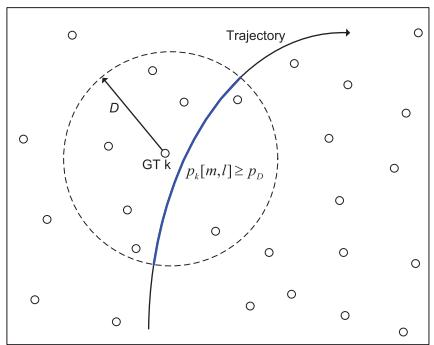  
Fig. 2. Illustration of the lower bound derivation for $P _ { k , \mathrm { s u c c } } .$

For any given auxiliary distance parameter $D \geq 0$ , denote as $p _ { D }$ the probability that a packet transmitted by the UAV is successfully received by a GT that has a horizontal distance D from the UAV. Based on (8), for any channel model with known ccdf of the fading component given by $F ( \cdot )$ $p _ { D }$ can be expressed as

$$
p _ { D } = F \left( \frac { \gamma _ { \mathrm { t h } } } { \bar { \gamma } _ { 0 } } \left( H ^ { 2 } + D ^ { 2 } \right) ^ { \alpha / 2 } \right) .\tag{14}
$$

Furthermore, for any UAV trajectory $\{ \mathbf { q } [ m ] \} _ { m = 1 } ^ { M }$ , define the set $\mathcal { M } _ { k , D } \subset \{ 1 , \cdots , M \}$ for GT k as the subset of all time slots such that the horizontal distance between the UAV and GT k is no greater than $D ,$ i.e.,

$$
{ \mathcal { M } } _ { k , D } \triangleq \{ m : \| \mathbf { q } [ m ] - \mathbf { w } _ { k } \| \leq D \} .\tag{15}
$$

For any given D, if $m \in \mathcal { M } _ { k , D }$ , we deem that the UAV and GT k are in connection at time slot m; otherwise, they are not connected. Then the cardinality of $\mathcal { M } _ { k , D }$ , denoted as $| \mathcal { M } _ { k , D } |$ is referred to as the number of connection time slots between UAV and GT k. Since $F ( \cdot )$ is a non-increasing function by definition, based on (8), the following inequality holds for any given $D ,$

$$
p _ { k } [ m , l ] \geq p _ { D } , \forall m \in \mathcal { M } _ { k , D } .\tag{16}
$$

Proposition 1: For any given $D \ \geq \ 0 ,$ the successful file recovery probability for GT k defined in (11) is lower-bounded as

$$
P _ { k , \mathrm { s u c c } } \geq P _ { k , \mathrm { l b } } \triangleq \operatorname* { P r } \left( \hat { N } _ { k } \geq N ^ { \prime } \right) ,\tag{17}
$$

where $\hat { N } _ { k } \sim \mathcal { B } \left( \vert \mathcal { M } _ { k , D } \vert L , p _ { D } \right)$ is a binomial random variable with $| \mathcal { M } _ { k , D } | L$ independent trials each with success probability $p _ { D }$

Proof: To prove Proposition 1, we need the following result.

Lemma 1: Let $X _ { n } \ \sim \ \mathrm { B e r n } ( p _ { n } ) , n \ = \ 1 , \cdots , N ,$ be N independent Bernoulli random variables with success probability $p _ { 1 } , \cdots , p _ { N }$ , respectively. Then $\begin{array} { r } { X \triangleq \sum _ { n = 1 } ^ { N } X _ { n } \int o l l o w s } \end{array}$ a Poisson binomial distribution. Furthermore, let X be aˆ binomial random variable with $\hat { X } \sim B ( N , \hat { p } )$ whose success probability satisfies $\hat { p } \leq p _ { n } , \forall n$ . Denote the ccdf of X and $\hat { X }$ as $F _ { X } ( x ) \triangleq \operatorname* { P r } ( X \geq x )$ and $F _ { \hat { X } } ( x ) \triangleq \operatorname* { P r } ( \hat { X } \geq x )$ , respectively. We then have

$$
F _ { X } ( x ) \geq F _ { \hat { X } } ( x ) , x = 0 , 1 , \cdot \cdot \cdot , N .\tag{18}
$$

Proof: Please refer to Appendix B.

By substituting (10) into (11), $P _ { k , \mathrm { s u c c } }$ can be expressed as

$$
P _ { k , \mathrm { s u c c } } \triangleq \operatorname* { P r } \left( \sum _ { m = 1 } ^ { M } \sum _ { l = 1 } ^ { L } Z _ { k } [ m , l ] \geq N ^ { \prime } \right)\tag{19}
$$

$$
\geq \operatorname* { P r } \left( \sum _ { m \in \mathcal { M } _ { k , D } } \sum _ { l = 1 } ^ { L } Z _ { k } [ m , l ] \geq N ^ { \prime } \right)\tag{20}
$$

$$
\begin{array} { r } { \ge \operatorname* { P r } \left( \hat { N } _ { k } \ge N ^ { \prime } \right) \triangleq P _ { k , \mathrm { l b } } , } \end{array}\tag{21}
$$

where (20) holds since $\mathcal { M } _ { k , D } \subset \{ 1 , \cdots , M \}$ for any $D \geq 0 .$ and (21) is obtained by applying Lemma 1 together with the inequality (16). ■

## B. Problem Reformulation

With Proposition 1, for any chosen D, by replacing $P _ { k , \mathrm { s u c c } }$ in (12) with its lower bound $P _ { k , \mathrm { l b } } , ( \mathrm { P 1 } )$ is recast into

(P2) : min M q[m],M

$$
{ \mathrm { s . t . ~ } } P _ { k , \mathrm { l b } } \geq \bar { P } , \quad \forall k \in { \mathcal { K } } ,\tag{22}
$$

$$
\left\| \mathbf { q } [ m ] - \mathbf { q } [ m - 1 ] \right\| \leq \tilde { V } _ { \mathrm { m a x } } , \ m = 2 , \cdot \cdot \cdot , M .\tag{23}
$$

Note that if (22) is satisfied, then (12) is guaranteed to be satisfied as well due to the lower bound in (17), but the reverse is not true in general. Therefore, for any given D, the optimal objective value of (P2) provides an upper bound to that of (P1). Thus, by solving (P2) for some appropriately chosen values for D, (P1) can be approximately solved. $\mathrm { A s }$ will be discussed in Section V, one reasonable choice of D is given by (9). In the following, we focus on solving (P2) for any given value of D.

To obtain a more tractable form for the constraint (22), note that with moderately large $| \mathcal { M } _ { k , D } | L$ , the binomial random variable $B ( | \mathcal { M } _ { k , D } | L , p _ { D } )$ defined in Proposition 1 can be well approximated by Gaussian random variable $\mathcal { N } ( \mu , \upsilon ^ { 2 } )$ [39], where $\mu \ : = \ : | { \mathcal { M } } _ { k , D } | L { p } _ { D }$ and $\upsilon ^ { 2 } \ = \ | \mathcal { M } _ { k , D } | L p _ { D } ( 1 - p _ { D } )$

As a result, the lower bound $P _ { k , \mathrm { l b } }$ defined in (17) can be approximated as

$$
P _ { k , \| \mathbf { b } } \approx \mathcal { Q } \left( \frac { N ^ { \prime } - | \mathcal { M } _ { k , D } | L p _ { D } } { \sqrt { | \mathcal { M } _ { k , D } | L p _ { D } ( 1 - p _ { D } ) } } \right) ,\tag{24}
$$

where $\begin{array} { r } { Q ( x ) \triangleq \int _ { 0 } ^ { \infty } e ^ { - u ^ { 2 } / 2 } d u } \end{array}$ is the Gaussian Q-function. Therefore, by substituting (24) into constraint (22) and solving for $| \mathcal { M } _ { k , D } |$ , we get

$$
| \mathcal { M } _ { k , D } | \geq M _ { \mathrm { m i n } } \triangleq A ^ { 2 } / L ,\tag{25}
$$

where

$$
\begin{array} { l } { { A \triangleq { \displaystyle { \frac { 1 } { 2 { \sqrt { p _ { D } } } } } } \left( { \sqrt { 4 N ^ { \prime } + ( 1 - p _ { D } ) ( Q ^ { - 1 } ( { \bar { P } } ) ) ^ { 2 } } } \right. } } \\ { { \left. \qquad - Q ^ { - 1 } ( { \bar { P } } ) { \sqrt { 1 - p _ { D } } } \right) } , } \end{array}\tag{26}
$$

with $Q ^ { - 1 } ( \cdot )$ denoting the inverse Gaussian Q-function.

In other words, for any given D, the constraint (22) on the success file recovery probability is equivalent to the constraint that the number of connection time slots $| \mathcal { M } _ { k , D } |$ between the UAV and each GT should be no smaller than the minimum threshold $M _ { \mathrm { m i n } } .$ , where $M _ { \mathrm { m i n } }$ is a constant determined by $p _ { D } ,$ $\bar { P }$ and $N ^ { \prime }$ . To gain more insights for (25), consider the special case when D is sufficiently small such that $p _ { D }  1$ . In this case, it follows from (25) that we have $M _ { \mathrm { m i n } } = N ^ { \prime } / L$ . In other words, if D is small so that each packet transmitted by the UAV can be successfully received almost surely by those GTs in connection with the UAV, then the UAV only needs to stay in connection with each GT for $N ^ { \prime } / L$ time slots to transmit $N ^ { \prime }$ packets, as expected. On the other hand, if D is chosen to be large such that $p _ { D }  0$ , it then follows from (25) and (26) that we have $M _ { \mathrm { m i n } }$ ∝ $1 / p _ { D }$ , i.e., the minimum number of connection time slots $M _ { \mathrm { m i n } }$ increases inversely proportional with $p _ { D }$

Define the following indicator function

$$
I _ { k , D } [ m ] = \left\{ \begin{array} { l l } { 1 , } & { \mathrm { i f ~ } \| \mathbf { q } [ m ] - \mathbf { w } _ { k } \| \leq D , } \\ { 0 , } & { \mathrm { o t h e r w i s e } . } \end{array} \right.\tag{27}
$$

Then $\begin{array} { c } { | \mathcal { M } _ { k , D } | } & { = } \end{array} \sum _ { m = 1 } ^ { M } I _ { k , D } [ m ]$ . Therefore, (P2) can be reformulated as

$$
\begin{array} { l } { \displaystyle \operatorname* { m i n } _ { \mathbf { q } [ m ] , M } T = \delta _ { t } M } \\ { \mathrm { s . t . } \ | \mathcal { M } _ { k , D } | \geq M _ { \operatorname* { m i n } } , \quad \forall k \in \mathcal { K } , } \\ { \| \mathbf { q } [ m ] - \mathbf { q } [ m - 1 ] \| \leq \tilde { V } _ { \operatorname* { m a x } } , \quad m = 2 , \cdots , M . } \end{array}\tag{28}
$$

(29)

When the time slot length δt is chosen to be sufficiently small, then the above problem can be written in its continuous-time format as

(P3) : min T q(t ),T

$$
\mathrm { s . t . } T _ { k , D } \triangleq \int _ { 0 } ^ { T } I _ { k , D } ( t ) d t \geq T _ { \operatorname* { m i n } } , \quad \forall k \in \mathcal { K }\tag{30}
$$

$$
\lVert \dot { \mathbf { q } } ( t ) \rVert \leq V _ { \operatorname* { m a x } } , 0 \leq t \leq T ,\tag{31}
$$

where $T _ { \mathrm { m i n } } \triangleq M _ { \mathrm { m i n } } \delta _ { t }$ and

$$
I _ { k , D } ( t ) = \left\{ { 1 , \ \mathrm { i f } \ \| \mathbf { q } ( t ) - \mathbf { w } _ { k } \| \leq D } , \right.\tag{32}
$$

In the next section, we focus on solving the trajectory optimization problem (P3).

## IV. PROPOSED TRAJECTORY DESIGN

The main challenge for optimally solving (P3) lies in the non-convex constraint (30), which involves time-dependent indicator functions (32) in terms of the UAV trajectory. To solve (P3), we first show the following result.

Theorem 1: Without loss of optimality to (P3), the UAV trajectory can be assumed to constitute only connected line segments.

## Proof: Please refer to Appendix C.

Theorem 1 implies that finding the optimal solution to (P3) is equivalent to finding the optimal set of ordered waypoints $\mathcal { Q } _ { \mathrm { w p } }$ , which contains the locations representing the starting and ending points of each line segment, as well as optimizing the instantaneous UAV speed along the path connecting the waypoints. However, finding the optimal set of waypoints $\mathcal { Q } _ { \mathrm { w p } }$ is a challenging problem in general. In fact, for the extreme case when $D = 0$ , the constraint (30) reduces to that the UAV needs to sequentially visit all the K GTs and stay stationary on top of each for at least $T _ { \mathrm { m i n } }$ seconds. In this case, finding the optimal waypoints to (P3) reduces to determining the visiting order of all the K GTs so as to minimize the total UAV travelling distance, which is essentially equivalent to the classic TSP [35]–[37]. The only difference is that different from the standard TSP, the traveller/UAV in our considered problem does not need to return to the origin where it starts the tour. Note that TSP is an NP-hard problem in combinatorial optimization. However, various heuristic and high-quality approximation algorithms have been developed. A brief overview on TSP and its variations are given in Appendix A. On the other hand, for the general case with $D > 0 ,$ (P3) seems to be similar to the TSP with neighborhoods (TSPN) [40]. However, as existing algorithms for TSPN such as [41] do not have the minimum connection time constraints, they cannot be directly applied for solving problem (P3). In the following, for (P3) with the general $D \ \geq \ 0 ,$ we will first present a simple benchmark scheme by taking the GTs as the waypoints, and then propose two more efficient schemes for waypoints design based on a novel concept of VBS placement and by applying convex optimization techniques. Furthermore, for any given waypoints design, the optimal UAV speed over time will be efficiently obtained via solving an LP problem.

## A. Waypoint Design

1) Scheme 1 (Benchmark): GTs As Waypoints: Note that a feasible UAV trajectory to (P3) needs to ensure that the minimum connection time constraints in (30) are satisfied with the designed waypoints. For any $D \ \geq \ 0 ,$ one straightforward approach to ensure the feasibility of (30) is to let the UAV sequentially visit (i.e., stay on top of) all GTs. More specifically, $\mathcal { Q } _ { \mathrm { w p } }$ is determined by simply applying the TSP algorithm over all the K GTs (without the need of returning to the origin as discussed in Appendix A). In this case, since each GT is guaranteed to be in connection with the UAV when it is just above the GT, the constraints in (30) can be met by appropriate UAV speed optimization, as will be studied in Section IV-B.

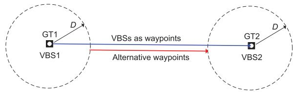  
Fig. 3. A toy example for illustrating the inefficacy of directly using VBSs as waypoints.

2) Scheme 2 (Proposed): VBSs As Waypoints: It is intuitive to see that for a given $D > 0 ,$ , it is in general unnecessary for the UAV to fly over all the GTs since at one location, the UAV could be in connection with more than one GTs simultaneously. Thus, the number of waypoints that the UAV needs to visit to ensure the feasibility of (30) could be much less than K , especially when D is large and the GTs are densely distributed. Therefore, in this subsection, we propose an alternative waypoint design based on a new idea of VBS placement.

Specifically, given the GT locations $\left\{ \mathbf { w } _ { k } \right\}$ and the UAV threshold coverage range D, the VBS placement problem aims to find a minimum number of VBSs and their respective locations, so that each GT is covered by at least one VBS. This problem resembles the standard BS placement problem for ensuring user coverage with a given coverage distance D, where several efficient algorithms have been proposed, such as the spiral BS placement algorithm proposed in [11]. Let $G \leq K$ be the minimum number of VBSs obtained by applying the BS placement algorithm, and their locations are denoted as $\mathbf { v } _ { g } \in \mathbb { R } ^ { 2 \times 1 } , \ g = 1 , \cdot \cdot \cdot , G$ . An efficient waypoint design to ensure the feasibility of (30) is to let the UAV sequentially visit these VBSs by following the path obtained by the TSP algorithm applied over $\{ \mathbf { v } _ { g } \} _ { g = 1 } ^ { G }$ . In this case, the number of waypoints that the UAV needs to travel is $G ,$ which is in general less than K .

3) Scheme 3 (Proposed): Waypoints Based on VBS Placement and Convex Optimization: Traversing over all the G VBSs, though providing a feasible waypoints design to (P3), may not always be desirable. This is illustrated by a toy example shown in Fig. 3, where there are two ${ \mathrm { G T s } } ,$ each covered by one VBS that is placed in essentially the same location as the GT. It is observed that traversing over both VBSs in fact leads to unnecessarily longer trajectory than the alternative design shown in Fig. 3. To overcome this limitation, in this subsection, we propose a more efficient waypoint design based on the placed VBSs and by applying convex optimization techniques.

Specifically, with VBS placement and TSP algorithm applied over the obtained G VBSs, the GTs in are essentially partitioned into G ordered clusters $S _ { g } , g = 1 , \cdots , G$ where $S _ { g } \subset \mathcal { K }$ denotes the subset of GTs that are covered by the gth VBS while applying the VBS placement algorithm. For the gth ordered cluster with GTs ${ \mathit { S } } _ { g } ,$ , define the following

set

$$
\begin{array} { r } { \mathcal { C } _ { g } \triangleq \{ \mathbf { q } \in \mathbb { R } ^ { 2 \times 1 } : \| \mathbf { q } - \mathbf { w } _ { k } \| \leq D , \forall k \in \mathcal { S } _ { g } \} . } \end{array}\tag{33}
$$

In other words, $\mathcal { C } _ { g }$ is the set of all possible UAV locations ensuring that all GTs in $ { \boldsymbol { S } } _ { g }$ are simultaneously in connection with the UAV. It is obvious that $\mathcal { C } _ { g }$ is non-empty (since the VBS g with location $\mathbf { v } _ { g }$ belongs to this set) and a convex set (since it is an intersection of $| S _ { g } |$ convex sets). As a result, as long as the UAV sequentially visits all the G convex regions $\mathcal { C } _ { g } ,$ , the constraints in (30) can be met by appropriate UAV speed optimization. In the following, the waypoints in each of the convex region $\mathcal { C } _ { g }$ are optimized.

Without loss of generality, let $\mathbf { s } _ { g } , \mathbf { f } _ { g } \in \mathcal { C } _ { g }$ be the starting and ending points of the UAV trajectory intersecting with the region ${ \mathcal { C } } _ { g } ,$ respectively. Note that since $\mathcal { C } _ { g }$ is a convex set, all points on the line segment between $\mathbf { s } _ { g }$ and $\mathbf { f } _ { g }$ are also in ${ \mathcal { C } } _ { g } ,$ i.e., they ensure that all the GTs in $ { \boldsymbol { S } } _ { g }$ are in connection with the UAV. Given the UAV’s maximum flying speed $V _ { \mathrm { m a x } } .$ , the minimum time required for the UAV to travel within the region $\mathcal { C } _ { g } ,$ , i.e., from $\mathbf { s } _ { g }$ to $\mathbf { f } _ { g } ,$ is $\frac { \| \mathbf { f } _ { g } - \pmb { s } _ { g } \| } { V _ { \operatorname* { m a x } } }$ On the other hand, to ensure the minimum connection time constraint (30) of (P3), one viable approach is to ensure that the UAV remains in $\mathcal { C } _ { g }$ for at least $T _ { \mathrm { m i n } }$ seconds. Thus, the minimum time required for the UAV to travel within $\mathcal { C } _ { g }$ is max $\left\{ \frac { \| \mathbf { f } _ { g } - \mathbf { s } _ { g } \| } { V _ { \operatorname* { m a x } } } , T _ { \operatorname* { m i n } } \right\}$ . Furthermore, the minimum time required for the UAV to travel between $\mathcal { C } _ { g }$ and $\mathcal { C } _ { g + 1 }$ is $\frac { \| \mathbf { s } _ { g + 1 } - \mathbf { f } _ { g } \| } { V _ { \operatorname* { m a x } } }$ . As a result, the waypoints $\{ \mathbf { s } _ { g } , \mathbf { f } _ { g } \} _ { g = 1 } ^ { G }$ could be designed by solving the following problem

$$
\begin{array} { r l } & { ( { \bf P } ^ { 3 } . 1 ) : \underset { \{ s _ { g } , { \bf f } _ { g } \} _ { g = 1 } ^ { G } } { \operatorname* { m i n } } \ \underset { g = 1 } { \overset { G } { \sum } } \underset { } { \mathrm { m a x } } \left\{ \frac { \| { \bf f } _ { g } - { \bf s } _ { g } \| } { V _ { \mathrm { m a x } } } , T _ { \mathrm { m i n } } \right\} } \\ & { \quad \quad \quad \quad \quad + \underset { g = 1 } { \overset { G - 1 } { \sum } } \frac { \| { \bf s } _ { g + 1 } - { \bf f } _ { g } \| } { V _ { \mathrm { m a x } } } } \\ & { \quad \quad \quad \quad \quad \quad \quad \mathrm { s . t . ~ } { \bf s } _ { g } , { \bf f } _ { g } \in \mathcal { C } _ { g } , \quad \forall g . } \end{array}
$$

Note that the cost function of (P3.1) is the total mission completion time with waypoints $\{ \mathbf { s } _ { g } , \mathbf { f } _ { g } \}$ , which is a convex function with respect to $\{ \mathbf { s } _ { g } , \mathbf { f } _ { g } \}$ . Furthermore, all the constraints in (P3.1) are convex. Thus, (P3.1) is a convex optimization problem, which can be efficiently solved by standard convex optimization techniques or existing software such as CVX [42].

Note that as compared to the previous scheme by directly taking the VBSs as waypoints, the new waypoints obtained in (P3.1) avoid the unnecessary traveling to the VBSs, and thus are expected to achieve better performance, as will be numerically verified in Section V.

## B. UAV Speed Optimization

For any given set of feasible waypoints $\mathcal { Q } _ { \mathrm { w p } }$ , the UAV path is determined by sequentially connecting the waypoints $\mathcal { Q } _ { \mathrm { w p } }$ with line segments. As a result, problem (P3) reduces to finding the optimal instantaneous UAV speed over time along the path connecting these waypoints. To this end, we discretize the UAV path with the infinitesimal displacement $\delta _ { d }$ (instead of over time) to get J UAV sampled locations on the path, denoted by $\{ \mathbf { q } _ { j } \} _ { j = 1 } ^ { J }$ . As a result, the corresponding value of the indicator function in (32) can be obtained, which is denoted as $I _ { k j } , k \in \mathcal { K } , j = 1 , \cdot \cdot \cdot , J$ . That is, $I _ { k j } = 1$ represents that the UAV is in connection with GT k when it is at location j. Denote by $\tau _ { j } \geq 0$ the time for the UAV to travel from location ${ \bf q } _ { j }$ to $\mathbf { q } _ { j + 1 }$ , with the speed $\begin{array} { r } { V _ { j } \ = \ \frac { \delta _ { d } } { \tau _ { j } } } \end{array}$ . Note that since $\delta _ { d }$ is set sufficiently small, $V _ { j }$ well approximates the instantaneous UAV speed, and we must have $\begin{array} { r } { \frac { \delta _ { d } } { \tau _ { j } } \le V _ { \mathrm { m a x } } } \end{array}$ . For any given set of feasible waypoints, (P3) reduces to optimizing the UAV speed $V _ { j }$ or equivalently the time duration $\tau _ { j } , j = 1 , \cdot \cdot \cdot , J ,$ which is formulated as

$$
\begin{array} { r l r } {  { ( \mathrm { P 3 . 2 } ) : \operatorname* { m i n } _ { \{ \tau _ { j } \} } \sum _ { j = 1 } ^ { J } \tau _ { j } } } \\ & { } & \\ & { } & { \mathrm { s . t . } \sum _ { j = 1 } ^ { J } I _ { k j } \tau _ { j } \geq T _ { \operatorname* { m i n } } , \quad \forall k \in \mathcal { K } , } \\ & { } & \\ & { } & { \tau _ { j } \geq \frac { \delta _ { d } } { V _ { \operatorname* { m a x } } } , \quad j = 1 , \cdots , J . } \end{array}\tag{34}
$$

(35)

Note that (P3.2) is feasible if and only if $\forall k \in \ K$ , there exists at least one UAV location $j$ such that $I _ { k j } = 1$ . This is guaranteed based on the three waypoint designs presented in Section IV-A. (P3.2) is a standard LP problem, which can be efficiently solved via e.g. [42].

Based on the above discussions, the UAV trajectory design for problem (P1) is summarized as Algorithm 1.

Algorithm 1 Proposed Trajectory Design for Problem (P1)   
1: Input: GT locations $\left\{ \mathbf { w } _ { k } \right\}$ , targeting file recovery probabil  
ity ${ \bar { P } } ,$ distance parameter D, and all other parameters listed   
in Table I.   
2: Obtain $T _ { \mathrm { m i n } } = M _ { \mathrm { m i n } } \delta _ { t }$ in (P3) based on $M _ { \mathrm { m i n } }$ given in (25).   
3: Determine the UAV waypoints based on either of the   
schemes presented in Section IV-A.   
4: For the obtained waypoints, find the optimal UAV speed   
by solving the LP problem (P3.2).   
5: Output: UAV trajectory for problem (P1) based on the   
obtained waypoints and UAV speed.

## V. NUMERICAL RESULTS

In this section, numerical results are provided to evaluate the performance of our proposed trajectory designs. We assume that the K GTs are randomly and uniformly distributed in a square area of side length equal to 3000m. One practical scenario for such a setup could be in military application, where a UAV is dispatched to disseminate a common map/video to all soldiers on the ground. For UAV-to-ground channels, previous field measurement results show that they typically consist of a LoS link, together with some multi-path components due to reflection, scattering, and diffraction by mountains, ground building, foliage and so on [43]. As a result, we adopt the Rician fading channel model for the fading component in (6), which is characterized by the Rician factor $K _ { c }$ representing the power ratio between the LoS signal component to the scattered component [43]. In this case, the fading coefficients $g _ { k } [ m$ , l] in (6) can be explicitly modeled as

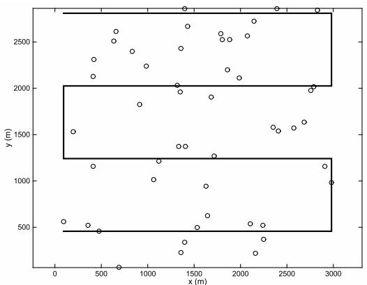  
(a) Strip-based waypoints $d _ { \mathrm { t r } } = 1 3 . 9 \mathrm { k m } .$ $T = 2 7 9 . 0 \mathrm { s } .$

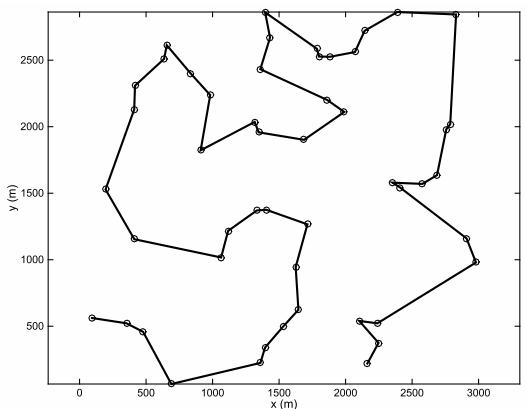  
(b) GTs as waypoints, $d _ { \mathrm { t r } } = 1 4 . 8 \mathrm { k m } ,$ $T = 2 9 5 . 9 \mathrm { s } .$

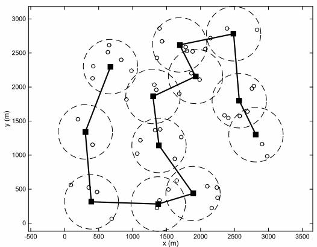

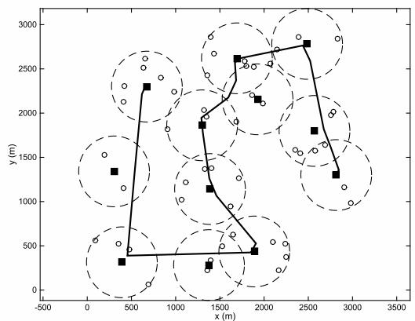  
(c) VBSs as waypoints, $d _ { \mathrm { t r } } = 8 . 7 \mathrm { k m }$ $\begin{array} { r } { T = 1 8 6 . 3 \mathrm { s } . } \end{array}$  
(d) Optimized waypoints, $d _ { \mathrm { t r } } = 8 .$ 1km, $T = 1 7 3 . 5 8 .$  
Fig. 4. Comparison of the UAV trajectories with different waypoint designs. Small circles denote GTs and squares represent VBSs.

$$
g _ { k } [ m , l ] = \sqrt { \frac { K _ { c } } { K _ { c } + 1 } } \bar { g } + \sqrt { \frac { 1 } { K _ { c } + 1 } } \tilde { g }\tag{36}
$$

$$
= \sqrt { \frac { 1 } { 2 ( K _ { c } + 1 ) } } \underbrace { \left( \sqrt { 2 K _ { c } } \bar { g } + \sqrt { 2 } \tilde { g } \right) } _ { Y } ,\tag{37}
$$

where $\bar { g }$ denotes the deterministic LoS channel component with $| \bar { g } | = 1$ , and $\tilde { g }$ represents the random scattered component, which is a zero-mean unit-variance circularly symmetric complex Gaussian (CSCG) random variable. With Y defined in (37), $| Y | ^ { 2 }$ follows the non-central chi-square distribution with two degrees of freedom (DoF) and non-centrality parameter $\lambda = 2 K _ { c }$ , denoted as $| Y | ^ { 2 } \sim \chi _ { 2 } ^ { \prime 2 } ( 2 K _ { c } )$ . Thus, the ccdf of $| g _ { k } [ m , l ] | ^ { 2 }$ in (8) can be explicitly written as

$$
\begin{array} { r l r } {  { F ( z ) \triangleq \operatorname* { P r } ( | g _ { k } [ m , l ] | ^ { 2 } \geq z ) = \operatorname* { P r } ( | Y | ^ { 2 } \geq 2 ( K _ { c } + 1 ) z ) } } \\ & { } & { = Q _ { 1 } ( \sqrt { 2 K _ { c } } , \sqrt { 2 ( K _ { c } + 1 ) z } ) , \quad \quad \quad \quad \quad \quad \quad \quad \quad } \end{array}\tag{38}
$$

where $Q _ { 1 } ( a , b )$ is the standard Marcum-Q-function. Unless otherwise stated, the numerical setup of the following simulations is given in Table II. Note that the UAV altitude is chosen as $H = 1 0 0 \mathrm { m }$ , which complies with the rule set by the FAA that in general, all commercial UAVs should not fly over 400 feet (122 meters) [44]. Furthermore, the time step size $\delta _ { t }$ in Table II needs to be carefully chosen. On one hand, it needs to be chosen to be sufficiently small so that the distance between UAV and GTs are approximately constant within each time slot, e.g., $\delta _ { t } V _ { \mathrm { m a x } } \ll H$ . On the other hand, $\delta _ { t }$ needs to be no smaller than the channel coherence time (e.g., on the order of milli-seconds) to make the fading un-correlated for different packets. For our numerical setup in Table II, $\delta _ { t }$ is chosen as 0.1 second, which satisfies the above conditions.

TABLE II  
SYSTEM SETUP FOR NUMERICAL SIMULATIONS
<table><tr><td rowspan=1 colspan=1>UAV altitude</td><td rowspan=1 colspan=1> $\overline { { H = 1 0 0 \mathrm { m } } }$ </td></tr><tr><td rowspan=1 colspan=1>Maximum UAV speed</td><td rowspan=1 colspan=1> $\overline { { V _ { \mathrm { m a x } } = 5 0 \mathrm { m } / \mathrm { s } } }$ </td></tr><tr><td rowspan=1 colspan=1>UAV transmission power</td><td rowspan=1 colspan=1> ${ \overline { { P = 1 0 0 } } } \mathrm { { B m } }$ </td></tr><tr><td rowspan=1 colspan=1>Bandwidth</td><td rowspan=1 colspan=1> $\overline { { B = 1 \mathrm { \ M H z } } }$ </td></tr><tr><td rowspan=1 colspan=1>Noise power</td><td rowspan=1 colspan=1> $\overline { { \sigma ^ { 2 } = - 1 0 9 \mathrm { d B m } } }$ </td></tr><tr><td rowspan=1 colspan=1>SNR gap</td><td rowspan=1 colspan=1> $\overline { { \Gamma = 1 0 ~ \mathrm { d B } } }$ </td></tr><tr><td rowspan=1 colspan=1>Information file size</td><td rowspan=1 colspan=1> $\overline { { W = 2 \ M b i t s } }$ </td></tr><tr><td rowspan=1 colspan=1>Packet size</td><td rowspan=1 colspan=1> $\overline { { R _ { p } = 1 0 ^ { 4 } } }$ bits/packet</td></tr><tr><td rowspan=1 colspan=1>Minimum number of packets re-quired for file recovery</td><td rowspan=1 colspan=1> $\overline { { N ^ { \prime } = 2 0 0 } }$ </td></tr><tr><td rowspan=1 colspan=1>UAV transmission rate</td><td rowspan=1 colspan=1>R = 1 Mbits/second</td></tr><tr><td rowspan=1 colspan=1>Time for transmitting one packet</td><td rowspan=1 colspan=1> $\overline { { T _ { p } = 0 . 0 1 \ \mathrm { s e c o n d s } } }$ </td></tr><tr><td rowspan=1 colspan=1>Time slot length</td><td rowspan=1 colspan=1> $\overline { { \delta _ { t } = 0 . 1 \ \mathrm { s e c o n d s } } }$ </td></tr><tr><td rowspan=1 colspan=1>Number of transmitted packets perslot</td><td rowspan=1 colspan=1> $\overline { { L = 1 0 } }$ </td></tr><tr><td rowspan=1 colspan=1>Channel gain at reference distance</td><td rowspan=1 colspan=1> $\overline { { \beta _ { 0 } = - 4 0 \mathrm { ~ d B } } }$ </td></tr><tr><td rowspan=1 colspan=1>Path loss exponent</td><td rowspan=1 colspan=1> $\overline { { \alpha = 2 . 6 } }$ </td></tr><tr><td rowspan=1 colspan=1>Rician factor</td><td rowspan=1 colspan=1> $\overline { { K _ { c } = 2 } }$ </td></tr><tr><td rowspan=1 colspan=1>Target probability for file recovery</td><td rowspan=1 colspan=1> $\overline { { P = 0 . 9 } }$ </td></tr></table>

For the proposed waypoint designs with VBSs placement, we use the spiral BS placement algorithm proposed in [11] to obtain the VBSs. Furthermore, since the TSP problem involved in our design does not require the UAV to return to the starting point, we apply the strategy by adding a dummy node as described in Appendix A. The resulting TSP is solved by using the existing Matlab codes available in [37]. Note that by applying the corresponding TSP variations as discussed in Appendix A, our proposed UAV trajectory design can be directly applied to the case when the UAV’s initial and/or final locations are predetermined. Such extensions are omitted for brevity. Besides the three waypoint design schemes presented in Section IV-A, we also consider another benchmark scheme, called “strip-based waypoints”, where the UAV’s trajectory is designed to ensure full area coverage. Specifically, for any given realization of the GT locations and chosen distance parameter D, the UAV first obtains the smallest rectangle that contains all the K GTs, and then partitions this rectangular area into rectangular strips each with width 2D. The UAV then sequentially travels along the center of the rectangular strips, as shown in Fig. 4(a). Note that such a trajectory design ensures that all locations within the rectangular area are covered by the UAV. For all the four trajectory design schemes, the UAV’s instantaneous speed is optimized based on the LP problem (P3.2), given their respective waypoints.

## A. Trajectory Comparison and Lower Bound Verification

By choosing the auxiliary distance parameter as $D = 4 0 0 \mathrm { m }$ Fig. 4 compares the different UAV trajectories with the four considered waypoint designs for one specific realization of the GT locations with $K = 5 0$ . The corresponding total UAV traveling distances $d _ { \mathrm { t r } }$ and the mission completion time T are also shown in the figure. It is observed that for both benchmark schemes with strip-based waypoints and GTs as waypoints, the UAV needs to travel longer distances and hence require larger mission completion time, as compared to the proposed designs as shown in Fig. 4(c) and Fig. 4(d). This is expected since compared to the two benchmark schemes, the proposed designs jointly utilize the information of the GT locations and the coverage distance D via VBS placement and convex optimization. Furthermore, by comparing Fig. 4(c) and Fig. 4(d), it is observed that by solving the convex optimization problem (P3.1) based on the obtained VBSs, the UAV can further reduce its required traveling distance and mission completion time by avoiding the unnecessary visit to all the VBSs. Lastly, it is noted that since only the maximum UAV speed constraint is considered in this paper, the UAV trajectories in Fig. 4 contain sharp turnings. Such trajectories could be implemented approximately by using rotary-wing UAVs in practice. However, more refined trajectory designs are needed in the future by considering more accurate constraints, such as those on the maximum turning angles, maximum acceleration [28], and maximum instantaneous output power by the engine.

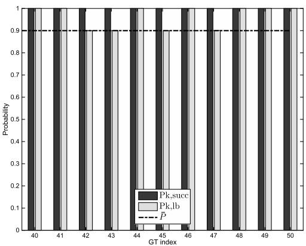  
Fig. 5. Numerical verification of the lower bound for the success file recovery probability.

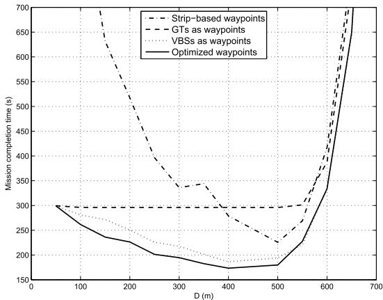  
Fig. 6. Mission completion time versus D.

For the proposed UAV trajectory shown in Fig. 4(d), Fig. 5 plots the actual file recovery probability $P _ { k , \mathrm { s u c c } }$ and our derived lower bound $P _ { k , \mathrm { l b } }$ , where $P _ { k , \mathrm { s u c c } }$ is obtained numerically via Monte Carlo simulations over $1 0 ^ { 4 }$ random channel realizations. Note that for better visualization, only the results for 10 of the GTs are shown in the figure. It is observed that with the proposed UAV trajectory design, the constraints in (22) based on the lower bound of the file recovery probability are satisfied with strict equality for some of the GTs, as expected. Furthermore, it is found that with the optimized UAV trajectory, all GTs are able to successfully recover the file almost surely, i.e., with actual success probability almost equal to 1. This verifies the proposed lower bound and also shows the effectiveness of the proposed trajectory design.

## B. Effect of Auxiliary Distance Parameter D

Next, we study the effect of the auxiliary distance parameter D on the system performance. Fig. 6 plots the total mission completion time versus D for the four UAV trajectory design schemes, with the GT locations same as Fig. 4. It is observed that for all schemes, the mission completion time has the general trend of firstly decreasing and then increasing with D. This is expected since the value of D affects the UAV trajectory design in two different ways. On one hand, increasing D leads to lower successful packet reception probability $p _ { D }$ in (14), which in turn requires that each GT to keep in connection with the UAV for a longer duration in order to ensure the same file recovery probability. From this perspective, the mission completion time tends to increase with D. On the other hand, as D increases, there will be more GTs that are simultaneously in connection with the UAV. As a result, the UAV in general needs to travel shorter distances if larger D is chosen. From this perspective, the mission completion time tends to decrease with the increasing of D. Thus, for any given GT locations, there exists an optimal threshold distance D that balances the above two conflicting effects and achieves the minimum mission completion time. To our best effort, it is challenging to find the optimal value D analytically. However, as illustrated in Fig. 6, one good choice for D is such that the average received SNR when the GT and UAV are separated by horizontal distance D is equal to the threshold SNR $\gamma _ { \mathrm { t h } }$ in which case D is given by $D ^ { * }$ in (9). For the setup under consideration, we have $D ^ { * } = 4 3 0 . 3 \mathrm { m }$ , which gives the near optimal choice based on Fig. 6.

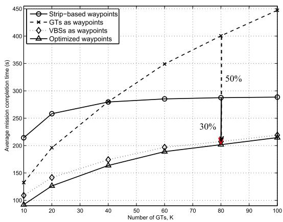  
Fig. 7. Average mission completion time versus the number of GTs.

## C. Performance Comparison

Fig. 7 compares the average mission completion time versus the number of GTs K , where the average is taken over 100 random realizations of the GT locations. For all schemes, the auxiliary distance parameter D is set as $D ^ { * } = 4 3 0 . 3 \mathrm { m }$ It is first observed that for small or moderate number of GTs, all the three trajectories with the waypoints designs given in Section IV-A significantly outperform the benchmark stripbased trajectory. This is expected since when the GTs are sparsely distributed, utilizing the location information of the GTs more wisely is beneficial for the UAV trajectory design. As K increases or the GTs are more densely deployed, the trajectory design by simply taking the GTs as the waypoints performs worse than the other benchmark scheme with stripbased waypoints, since it becomes time wasteful for the UAV to visit all the GTs even when many of them are near to each other. For all the K values considered, both proposed designs with the VBSs as waypoints or with the optimized waypoints significantly outperform the two benchmark schemes. For instance, for $K = 8 0$ , the mission completion time with the two proposed trajectory designs is reduced by around 50% as compared to the benchmark scheme with GTs as waypoints, and by 30% than the strip-based waypoints design.

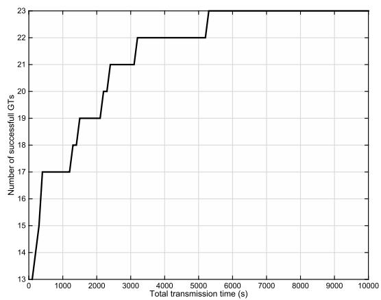  
Fig. 8. Number of successful GTs versus transmission time for the benchmark scheme with a static transmitter.

Last, to illustrate the performance gain by exploiting the high UAV mobility, we consider another benchmark multicasting scheme with static transmitter, i.e., the horizontal projection of the transmitter (e.g., a static UAV) is fixed at the geometric center of the GTs. For $K \ = \ 1 0 0 \ \mathrm { \ G T s } ,$ Fig. 8 shows the number of successful GTs (i.e., those with successful file recovery probability no smaller than P¯ ) for the benchmark scheme with a static transmitter as the transmission time increases. It is observed that although the number of successful GTs increases with the transmission time, or equivalently with the number of transmitted coded packets, the increasing rate is very slow. For example, even with the transmission time increased to $1 0 ^ { 4 } ~ \mathrm { s }$ , only 23 GTs are able to achieve the targeting file recovery probability. This is expected since with the transmitter fixed in location, the GTs that have a long distance with the transmitter suffer from high packet loss probabilities. On the other hand, with UAV-enabled multicasting with the proposed trajectory design, only about 210s is needed to ensure that all the 100 GTs satisfy the file recovery requirement, as can be seen from Fig. 7. This demonstrates the dramatic performance gain by exploiting the high mobility of UAVs for wireless multicasting.

## VI. CONCLUSION

This paper studied the trajectory design problem for a UAV-enabled multicasting system. The UAV mission completion time is minimized while ensuring that each GT is able to successfully recover the file with a given probability. We first converted the formulated optimization problem into a more tractable form based on the derived analytical lower bound of the successful file recovery probability. As a result, the complicated trajectory constraint is simplified to the minimum connection time constraint with each GT. We showed that the optimal UAV trajectory only needs to constitute connected line segments, which can be determined by finding the optimal set of waypoints and the optimal speed along the path connecting the waypoints. We proposed two effective waypoints design schemes and applied the LP to find the optimal traveling speed given waypoints. Numerical results demonstrated significant performance gains of the proposed designs over various benchmark schemes. In future work, we will consider the UAV trajectory design by taking into account the UAV’s energy efficiency, by which the sharp turnings that require extensive acceleration and deceleration can be avoided.

## APPENDIX A OVERVIEW OF TRAVELLING SALESMAN PROBLEM AND ITS VARIATIONS

In this section, we give a brief description on the classic TSP [35]–[37] and discuss its variations. The standard TSP is described as follows. Given a set of K cities and the distances between each pair of the cities, a traveler wishes to start and end at the same city and visit each other city exactly once. The problem is to find the route (or sequence of visiting) such that the total traveling distance is minimized. TSP is an NP-hard problem in combinatorial optimization and hence is difficult to be optimally solved. Various heuristic and approximation algorithms have been proposed to give efficient high-quality solutions [35], [45]. In particular, the TSP can be formulated as a binary integer programming, and an efficient solution can be obtained by using the existing Matlab optimization toolbox (Matlab version 2014 onwards). The complete Matlab codes and one illustrative example can be found in [37]. On the other hand, for many applications, different variations of the TSP need to be considered. In the following, we discuss five of these variations depending on whether the traveler needs to return to the origin and whether the origin/end city is predetermined.

## A. Return-Given-Origin

In this setup, the traveler needs to return to the origin city, and the origin/end city is predetermined. This is essentially the same as the standard TSP, which would return a closed tour so that any city can be regarded as the origin city.

## B. No-Return-Arbitrary-Origin-and-End

In this setup, the traveler does not need to return to the origin city, and the origin and end cities are not predetermined and hence can be optimized. The optimal solution can be found as follows [36]. First, add a dummy city whose distances to all the existing K cities are 0 (this is a virtual node that does not exist physically). Then solve the standard TSP problem for the $K + 1$ cities, and then remove the two edges associated with the dummy city. It can be shown by contradiction that such a solution is optimal.

## C. No-Return-Given-Origin-and-End

In this setup, the traveler does not need to return to the origin city, and the origin and end cities are both predetermined, denoted as A and B, respectively. To solve this problem, we similarly add a dummy city, with its distance to both A and B set to 0, whereas that to all other K − 2 cities set to a sufficiently large number (so as to avoid the traveling from the dummy city to all other cities except A and B). By solving the standard TSP problem for the K + 1 cities and then removing the two edges associated with the dummy city, we obtain the optimal solution.

## D. No-Return-Given-Origin-Arbitrary-End

The traveler does not need to return to the origin city, and only the origin city is predetermined, denoted as A. To solve this problem, we similarly add a dummy city whose distance to A is set to 0, whereas that to all other $K - 1$ cities are set to an identical arbitrary positive value. By solving the standard TSP problem for the $K + 1$ cities, and then removing the two edges associated with the dummy city, we obtain the optimal solution.

## E. No-Return-Arbitrary-Origin-Given-End

The traveler does not need to return to the origin and the end city is predetermined. This problem can be solved similarly as the previous one.

## APPENDIX B PROOF OF LEMMA 1

Lemma 1 can be shown by induction. We start by considering the special case with $N = 1$ . In this case, by definition, we have

$$
F _ { X } ( x ) = { \left\{ \begin{array} { l l } { p _ { 1 } , } & { x = 1 } \\ { 1 , } & { x = 0 . } \end{array} \right. } F _ { \hat { X } } ( x ) = { \left\{ \begin{array} { l l } { \hat { p } , } & { x = 1 } \\ { 1 , } & { x = 0 . } \end{array} \right. }\tag{39}
$$

Since $p _ { 1 } \geq \hat { p } _ { : }$ , the inequality $F _ { X } ( x ) \ge F _ { \hat { X } } ( x )$ in (18) is satisfied for $N = 1$ . Next, by assuming that Lemma 1 is true for $N = { \bar { N } }$ , we need to show that it also holds for $N = \bar { N } + 1$ . For notational convenience, for $N = { \bar { N } }$ , denote the ccdf of X and Xˆ as $F _ { X } ^ { \bar { N } } ( x )$ and $F _ { \hat { X } } ^ { \bar { N } } ( x )$ , respectively. Then by assumption, we have $F _ { X } ^ { \bar { N } } ( x ) \ge \overleftarrow { F } _ { \hat { x } } ^ { \bar { N } } ( x ) , x = 0 , 1 , \cdot \cdot \cdot , \bar { N }$ . As N increases from $\bar { N }$ to $\bar { N } + 1 , \forall x \stackrel {  } { \in } \{ 1 , \cdot \cdot \cdot , \bar { N } \}$ , the following relationships can be obtained,

$$
F _ { X } ^ { \bar { N } + 1 } ( x ) = p _ { \bar { N } + 1 } F _ { X } ^ { \bar { N } } ( x - 1 ) + ( 1 - p _ { \bar { N } + 1 } ) F _ { X } ^ { \bar { N } } ( x ) ,\tag{40}
$$

$$
F _ { \hat { X } } ^ { \bar { N } + 1 } ( x ) = \hat { p } F _ { \hat { X } } ^ { \bar { N } } ( x - 1 ) + ( 1 - \hat { p } ) F _ { \hat { X } } ^ { \bar { N } } ( x ) .\tag{41}
$$

By subtracting (41) from (40) and after some manipulations, we have

$$
\begin{array} { r l } & { F _ { X } ^ { \bar { N } + 1 } ( x ) - F _ { \hat { X } } ^ { \bar { N } + 1 } ( x ) } \\ & { \quad = \left( 1 - \hat { p } \right) \left( F _ { X } ^ { \bar { N } } ( x ) - F _ { \hat { X } } ^ { \bar { N } } ( x ) \right) } \\ & { \quad \quad + \hat { p } \left( F _ { X } ^ { \bar { N } } ( x - 1 ) - F _ { \hat { X } } ^ { \bar { N } } ( x - 1 ) \right) } \\ & { \quad \quad + \left( p _ { \bar { N } + 1 } - \hat { p } \right) \left( F _ { X } ^ { \bar { N } } ( x - 1 ) - F _ { X } ^ { \bar { N } } ( x ) \right) \geq 0 . } \end{array}\tag{42}
$$

Note that the inequality in (42) holds since $F _ { X } ^ { \bar { N } } ( x ) \ge F _ { \hat { X } } ^ { \bar { N } } ( x )$ $\begin{array} { r } { p _ { \bar { N } + 1 } \geq \hat { p } , } \end{array}$ and $F _ { X } ^ { \bar { N } } ( x - 1 ) \geq F _ { X } ^ { \bar { N } } ( x )$ . Thus, $\forall x \in \{ 1 , \cdots , \bar { N } \}$ the inequality $F _ { X } ^ { \bar { N } + 1 } ( x ) \geq F _ { \hat { X } } ^ { \bar { N } + 1 } ( x )$ holds. For $x = 0$ or x = $\bar { N } + 1$ , the same result can be shown similarly. This completes the proof of Lemma 1.

## APPENDIX C PROOF OF THEOREM 1

Theorem 1 can be shown by construction. Specifically, suppose that $( \mathbf { q } ^ { \star } ( t ) , T ^ { \star } )$ is the optimal solution to (P3), and the trajectory ${ \bf q } ^ { \star } ( t )$ contains at least one curved segment. Then we

show that there always exists an alternative solution $( \hat { \mathbf { q } } ( t ) , \hat { T } )$ to (P3) such that ${ \hat { \mathbf { q } } } ( t )$ contains only line segments and $\hat { T } \leq T ^ { \star }$ as follows.

For any given optimal UAV trajectory $\mathbf { q } ^ { \star } ( t ) , 0 \leq t \leq T ^ { \star }$ define

$$
{ \mathcal { K } } ( t ) \triangleq \{ k \in { \mathcal { K } } : \| \mathbf { q } ^ { \star } ( t ) - \mathbf { w } _ { k } \| \leq D \} .\tag{43}
$$

In other words, for any time $t \in [ 0 , T ^ { \star } ] , \mathcal { K } ( t ) \subset \mathcal { K }$ denotes the subset of the K GTs that are in connection with the UAV at time t , given the optimal UAV trajectory ${ \bf q } ^ { \star } ( t )$ . Since the total number of subsets of is $2 ^ { K }$ (including the empty set), $\mathcal { K } ( t )$ can be regarded as a time-dependent function with $2 ^ { K }$ discrete values.

Let $t _ { 1 } , t _ { 2 } , \cdots , t _ { L } \in ( 0 , T ^ { \star } )$ be the L critical time instances when the subset of connecting GTs changes, i.e., tl is the time instance such that $\boldsymbol { \mathcal { K } } ( t _ { l } - \epsilon ) \neq \boldsymbol { \mathcal { K } } ( t _ { l } )$ with any arbitrarily small . Then the optimal UAV trajectory ${ \bf q } ^ { \star } ( t )$ can be partitioned into $L + 1$ portions, with the subset of connecting GTs remaining unchanged within each portion. Specifically, the lth portion constitutes the time interval $t \in [ t _ { l - 1 } , t _ { l } ]$ with total duration $T _ { l } \triangleq t _ { l } - t _ { l - 1 } , l = 1 , \cdots , L + 1$ . We thus have $\begin{array} { r } { T ^ { \star } = \sum _ { l = 1 } ^ { L + 1 } T _ { l } } \end{array}$ . For the lth portion of the UAV trajectory, let

$$
\begin{array} { r } { \mathcal { K } ( t ) = \mathcal { K } _ { l } , \ t _ { l - 1 } \le t \le t _ { l } , } \end{array}\tag{44}
$$

$$
\hat { \mathbf { q } } _ { l - 1 } = \mathbf { q } ^ { \star } ( t _ { l - 1 } ) , \hat { \mathbf { q } } _ { l } = \mathbf { q } ^ { \star } ( t _ { l } ) .\tag{45}
$$

Then we show in the following that without loss of optimality to (P3), each of the lth portion of the UAV trajectory ${ \bf q } ^ { \star } ( t )$ $t _ { l - 1 } \le t \le t _ { l }$ , can be replaced by the line segment connecting $\hat { \mathbf { q } } _ { l - 1 }$ and $\hat { \mathbf { q } } _ { l }$ . We show this by addressing the two different cases with $\kappa _ { l } = \boldsymbol { \theta }$ or $\kappa _ { l } \neq \varnothing$ , separately.

Case $I ( { \cal K } _ { l } = \emptyset ) .$ : In this case, no GT is in connection with the UAV for the lth portion of the UAV trajectory. As a result, this portion does not contribute to the left hand side (LHS) of the minimum connection time constraint (30). Thus, replacing this trajectory portion with a line segment from $\hat { \mathbf { q } } _ { l - 1 }$ to $\hat { \mathbf { q } } _ { l }$ does not alter the feasibility of (30). Furthermore, since line segment gives the shortest distance for any two given points, it is always feasible for the UAV to travel along this new segment within the time duration $\hat { T } _ { l } ~ \le ~ T _ { l }$ while satisfying the maximum speed constraint (31). Thus, such a replacement ensures the feasibility of (P3) and at least achieves the same minimum mission completion time as $T ^ { \star }$

Case 2 $( \mathcal { K } _ { l } ~ \neq ~ \emptyset )$ : In this case, those GTs in $\mathcal { \kappa } _ { l }$ are in connection with the UAV, i.e., the lth portion of the UAV trajectory contributes to the LHS of (30) for those GTs in $\mathcal { \kappa } _ { l }$ . Define $\mathcal { Q } _ { l } \triangleq \{ \mathbf { q } \in \mathbb { R } ^ { 2 \times 1 } : \| \mathbf { q } - \mathbf { w } _ { k } \| \leq D , \forall k \in \mathcal { K } _ { l } \}$ i.e., $\mathcal { Q } _ { l }$ denotes the set of all possible UAV locations ensuring that all the GTs in $\kappa _ { l }$ are in connection with the UAV. Note that $\mathcal { Q } _ { l }$ is the intersection of $| \mathcal { K } _ { l } |$ convex sets, and hence is also convex [46]. As a result, since both $\hat { \mathbf { q } } _ { l - 1 }$ and $\hat { \mathbf { q } } _ { l }$ belong to the convex set $\mathcal { Q } _ { l }$ , then any point on the line segment connecting $\hat { \mathbf { q } } _ { l - 1 }$ and $\hat { \mathbf { q } } _ { l }$ must also belong to $\mathcal { Q } _ { l }$ . In other words, by replacing the original curved trajectory portion ${ \bf q } ^ { \star } ( t ) , t \in$ $[ t _ { l - 1 } , t _ { l + 1 } ]$ , with the line segment connecting $\hat { \mathbf { q } } _ { l - 1 }$ and $\hat { \mathbf { q } } _ { l }$ the subset of connecting GTs $\kappa _ { l }$ remains unchanged, while the UAV needs to travel a shorter distance for this portion. Thus, such a replacement ensures the feasibility of (P3) and at least achieves the same minimum mission completion time as $T ^ { \star }$

In summary, for any given optimal solution $( \mathbf { q } ^ { \star } ( t ) , T ^ { \star } )$ to (P3) with curved UAV trajectory, we can always construct an alternative optimal trajectory to (P3) by sequentially connecting the critical locations $\hat { \mathbf { q } } _ { 0 } , \hat { \mathbf { q } } _ { 1 } , \hdots , \hat { \mathbf { q } } _ { L + 1 }$ with line segments, which achieves at least the same minimum mission completion time as $T ^ { \star }$ . This thus completes the proof of Theorem 1.

## REFERENCES

[1] A. Osseiran et al., “Scenarios for 5G mobile and wireless communications: The vision of the METIS project,” IEEE Commun. Mag., vol. 52, no. 5, pp. 26–35, May 2014.

[2] Project Loon. Accessed: Jul. 15, 2017. [Online]. Available: https://x.company/loon/

[3] S. Chandrasekharan et al., “Designing and implementing future aerial communication networks,” IEEE Commun. Mag., vol. 54, no. 5, pp. 26–34, May 2016.

[4] The Technology Behind Aquila. Accessed: Jul. 15, 2017. [Online]. Available: https://www.facebook.com/notes/mark-zuckerberg/the-technologybehind-aquila/10153916136506634/

[5] Y. Zeng, R. Zhang, and T. J. Lim, “Wireless communications with unmanned aerial vehicles: Opportunities and challenges,” IEEE Commun. Mag., vol. 54, no. 5, pp. 36–42, May 2016.

[6] A. Al-Hourani, S. Kandeepan, and S. Lardner, “Optimal LAP altitude for maximum coverage,” IEEE Wireless Commun. Lett., vol. 3, no. 6, pp. 569–572, Dec. 2014.

[7] V. Sharma, M. Bennis, and R. Kumar, “UAV-assisted heterogeneous networks for capacity enhancement,” IEEE Commun. Lett., vol. 20, no. 6, pp. 1207–1210, Apr. 2016.

[8] R. Yaliniz, A. El-Keyi, and H. Yanikomeroglu, “Efficient 3-D placement of an aerial base station in next generation cellular networks,” in Proc IEEE Int. Conf. Commun. (ICC), Kuala Lumpur, Malaysia, May 2016, pp. 1–5.

[9] M. Mozaffari, W. Saad, M. Bennis, and M. Debbah, “Efficient deployment of multiple unmanned aerial vehicles for optimal wireless coverage,” IEEE Commun. Lett., vol. 20, no. 8, pp. 1647–1650, Aug. 2016.

[10] E. Kalantari, H. Yanikomeroglu, and A. Yongacoglu, “On the number and 3D placement of drone base stations in wireless cellular networks,” in Proc. Veh. Technol. Conf. (VTC-Fall), Sep. 2016, pp. 1–6.

[11] J. Lyu, Y. Zeng, R. Zhang, and T. J. Lim, “Placement optimization of UAV-mounted mobile base stations,” IEEE Commun. Lett., vol. 21, no. 3, pp. 604–607, Mar. 2017.

[12] M. M. Azari, F. Rosas, K.-C. Chen, and S. Pollin, “Optimal UAV positioning for terrestrial-aerial communication in presence of fading,” in Proc. IEEE Global Commun. Conf. (GLOBECOM), Dec. 2016, pp. 1–7.

[13] J. Chen and D. Gesbert, “Optimal positioning of flying relays for wireless networks: A LOS map approach,” in Proc. IEEE Int. Conf. Commun. (ICC), May 2017, pp. 1–6.

[14] M. Alzenad, A. El-keyi, F. Lagum, and H. Yanikomeroglu, “3D placement of an unmanned aerial vehicle base station (UAV-BS) for energyefficient maximal coverage,” IEEE Wireless Commun. Lett., vol. 6, no. 4, pp. 434–437, Aug. 2017.

[15] M. Chen, M. Mozaffari, W. Saad, C. Yin, M. Debbah, and C. S. Hong, “Caching in the sky: Proactive deployment of cache-enabled unmanned aerial vehicles for optimized quality-of-experience,” IEEE J. Sel. Areas Commun., vol. 35, no. 5, pp. 1046–1061, May 2017.

[16] M. Alzenad, A. El-Keyi, and H. Yanikomeroglu, “3D placement of an unmanned aerial vehicle base station for maximum coverage of users with different QoS requirements,” IEEE Wireless Commun. Lett., Sep. 2017.

[17] H. He, S. Zhang, Y. Zeng, and R. Zhang, “Joint altitude and beamwidth optimization for UAV-enabled multiuser communications,” IEEE Commun. Lett., Nov. 2017. [Online]. Available: https://arxiv.org/abs/1711.02343

[18] Y. Zeng, R. Zhang, and T. J. Lim, “Throughput maximization for UAV-enabled mobile relaying systems,” IEEE Trans. Commun., vol. 64, no. 12, pp. 4983–4996, Dec. 2016.

[19] M. Mozaffari, W. Saad, M. Bennis, and M. Debbah, “Unmanned aerial vehicle with underlaid device-to-device communications: Performance and tradeoffs,” IEEE Trans. Wireless Commun., vol. 15, no. 6, pp. 3949–3963, Jun. 2016.

[20] C. Zhan, Y. Zeng, and R. Zhang, “Energy-efficient data collection in UAV enabled wireless sensor network,” IEEE Wireless Commun. Lett., Nov. 2017. [Online]. Available: https://arxiv.org/abs/1708.00221

[21] M. Mozaffari, W. Saad, M. Bennis, and M. Debbah, “Mobile Internet of Things: Can UAVs provide an energy-efficient mobile architecture?” in Proc. IEEE Global Commun. Conf. (GLOBECOM), Dec. 2016, pp. 1–6.

[22] J. Lyu, Y. Zeng, and R. Zhang, “Cyclical multiple access in UAV-aided communications: A throughput-delay tradeoff,” IEEE Wireless Commun. Lett., vol. 5, no. 6, pp. 600–603, Dec. 2016.

[23] T. Schouwenaars, B. D. Moor, E. Feron, and J. How, “Mixed integer programming for multi-vehicle path planning,” in Proc. Eur. Control Conf., 2001, pp. 2603–2608.

[24] A. Richards and J. P. How, “Aircraft trajectory planning with collision avoidance using mixed integer linear programming,” in Proc. Amer. Control Conf., May 2002, pp. 1936–1941.

[25] I. K. Nikolos, K. P. Valavanis, N. C. Tsourveloudis, and A. N. Kostaras, “Evolutionary algorithm based offline/online path planner for UAV navigation,” IEEE Trans. Syst., Man, Cybern. B, Cybern., vol. 33, no. 6, pp. 898–912, Dec. 2003.

[26] C. Zheng, L. Li, F. Xu, F. Sun, and M. Ding, “Evolutionary route planner for unmanned air vehicles,” IEEE Trans. Robot., vol. 21, no. 4, pp. 609–620, Aug. 2005.

[27] F. Jiang and A. L. Swindlehurst, “Optimization of UAV heading for the ground-to-air uplink,” IEEE J. Sel. Areas Commun., vol. 30, no. 5, pp. 993–1005, Jun. 2012.

[28] Y. Zeng and R. Zhang, “Energy-efficient UAV communication with trajectory optimization,” IEEE Trans. Wireless Commun., vol. 16, no. 6, pp. 3747–3760, Jun. 2017.

[29] Q. Wu, Y. Zeng, and R. Zhang, “Joint trajectory and communication design for multi-UAV enabled wireless networks,” IEEE Trans. Wireless Commun., Jan. 2018. [Online]. Available: https://arxiv.org/abs/1705.02723

[30] A. Merwaday and I. Guvenc, “UAV assisted heterogeneous networks for public safety communications,” in Proc. IEEE Wireless Commun. Netw. Conf. (WCNC), Mar. 2015, pp. 329–334.

[31] X. Wang, A. Chowdhery, and M. Chiang, “SkyEyes: Adaptive video streaming from UAVs,” in Proc. 3rd Workshop Hot Topics Wireless, Oct. 2016, pp. 2–6.

[32] B. V. Bergh, A. Chiumento, and S. Pollin, “Ultra-reliable IEEE 802.11 for UAV video streaming: From network to application,” Adv. Ubiquitous Netw., vol. 2, pp. 637–647, Nov. 2016.

[33] H. Menour et al., “UAV-enabled intelligent transportation systems for the smart city: Applications and challenges,” IEEE Commun. Mag., vol. 55, no. 3, pp. 22–28, Mar. 2017.

[34] T. Ho et al., “A random linear network coding approach to multicast,” IEEE Trans. Inf. Theory, vol. 52, no. 10, pp. 4413–4430, Oct. 2006.

[35] G. Laporte, “The traveling salesman problem: An overview of exact and approximate algorithms,” EUR. J. Oper. Res., vol. 59, no. 2, pp. 231–247, Jun. 1992.

[36] E. L. Lawler, J. K. Lenstra, A. H. G. R. Kan, and D. B. Shmoys, The Traveling Salesman Problem: A Guided Tour of Combinatorial Optimization, 1st ed. Hoboken, NJ, USA: Wiley, 1985.

[37] Traveling Salesman Problem: Solver-Based. Accessed: Jul. 22, 2017. [Online]. Available: https://www.mathworks.com/help/optim/ug/ travelling-salesman-problem.html

[38] Y. H. Wang, “On the number of successes in independent trials,” Statist. Sinica, vol. 3, no. 2, pp. 295–312, Jul. 1993.

[39] G. E. P. Box, J. S. Hunter, and W. G. Hunter, Statistics for Experimenters: Design, Innovation, and Discovery. Hoboken, NJ, USA: Wiley, 1978.

[40] A. Dumitrscu and J. Mitchell, “Approximation algorithms for TSP with neighborhoods in the plane,” J. Algorithms, vol. 48, no. 1, pp. 135–159, 2003.

[41] B. Yuan, M. Orlowska, and S. Sadiq, “On the optimal robot routing problem in wireless sensor networks,” IEEE Trans. Knowl. Data Eng., vol. 19, no. 9, pp. 1252–1261, Sep. 2007.

[42] M. Grant and S. Boyd, CVX: MATLAB Software for Disciplined Convex Programming, Version 2.1. Accessed: Jul. 23, 2017. [Online]. Available: http://cvxr.com/cvx

[43] D. W. Matolak and R. Sun, “Unmanned aircraft systems: Air-ground channel characterization for future applications,” IEEE Veh. Technol. Mag., vol. 10, no. 2, pp. 79–85, Jun. 2015.

[44] FAA. Summary of Small Unmanned Aircraft Rule. Accessed: Jul. 23, 2017. [Online]. Available: https://www.faa.gov/uas/media/ Part\_107\_Summary.pdf

[45] C. Rego, D. Gamboa, F. Glover, and C. Osterman, “Traveling salesman problem heuristics: Leading methods, implementations and latest advances,” Eur. J. Oper. Res., vol. 211, no. 3, pp. 427–441, 2011.

[46] S. Boyd and L. Vandenberghe, Convex Optimization. Cambridge, U.K.: Cambridge Univ. Press, 2004.

Yong Zeng (S’12–M’14) received the B. E. (Hons.) and Ph.D. degrees from Nanyang Technological University, Singapore, in 2009 and 2014, respectively. Since 2013, he has been with the National University of Singapore, as a Research Fellow and then as a Senior Research Fellow. He has authored or coauthored 35 IEEE journal papers (17 as first author) and 22 IEEE conference papers, including one invited paper in the IEEE TRANSACTIONS ON COM-MUNICATIONS, four ESI highly cited papers, and two ESI hot papers. His research interests include

UAV communications, wireless power transfer, massive MIMO and mm-wave communications for 5G, and multiuser MIMO communications. He was a recipient of the 2017 IEEE Communications Society Heinrich Hertz Award, 2015 IEEE Wireless Communications Letters Exemplary Reviewer Award, and the Best Paper Award for the 10th IEEE International Conference on Information, Communications and Signal Processing. He is currently serving as an Associate Editor of the IEEE ACCESS, a Lead Guest Editor of the IEEE WIRELESS COMMUNICATIONS on Integrating UAVs into 5G and Beyond and China Communications on Network-Connected UAV Communications. He is also the workshop Co-Chair for two workshops in ICC 2018 and the 23rd Asia-Pacific Conference on Communications.

Xiaoli Xu received the B.E. (Hons.) and Ph.D. degrees both from Nanyang Technological University, Singapore, in 2009 and 2015, respectively. Since 2015, she has been a Research Fellow with Nanyang Technological University. Her research interests include network coding, information theory, channel coding, vehicular ad-hoc network, and mobile edge computing. She was a recipient of the Best Paper Award for the 10th IEEE International Conference on Information, Communications and Signal Processing.

Rui Zhang (S’00–M’07–SM’15–F’17) received the B.Eng. (Hons.) and M.Eng. degrees from the National University of Singapore, Singapore, and the Ph.D. degree from Stanford University, Stanford, CA, USA, all in electrical engineering.

From 2007 to 2010, he was a Research Scientist with the Institute for Infocomm Research, ASTAR, Singapore. Since 2010, he has been with the Department of Electrical and Computer Engineering, National University of Singapore, where he is currently a Dean’s Chair Associate Professor with the Faculty of Engineering. He has authored over 300 papers. He has been listed as a Highly Cited Researcher (also known as the World’s Most Influential Scientific Minds), by Thomson Reuters since 2015. His research interests include wireless information and power transfer, drone communications, wireless information surveillance, energy-efficient and energy-harvesting-enabled wireless communications, multiuser MIMO, cognitive radio, and optimization methods.

He was a recipient of the 6th IEEE Communications Society Asia-Pacific Region Best Young Researcher Award in 2011, and the Young Researcher Award of National University of Singapore in 2015. He was a co-recipient of the IEEE Marconi Prize Paper Award in Wireless Communications in 2015, the IEEE Communications Society Asia-Pacific Region Best Paper Award in 2016, the IEEE Signal Processing Society Best Paper Award in 2016, the IEEE Communications Society Heinrich Hertz Prize Paper Award in 2017, the IEEE Signal Processing Society Donald G. Fink Overview Paper Award in 2017, and the IEEE Technical Committee on Green Communications and Computing Best Journal Paper Award in 2017. He was a co-author of the paper that received the IEEE Signal Processing Society Young Author Best Paper Award in 2017. He served for over 30 international conferences as a TPC co-chair or an organizing committee member, and as the guest editor for ten special issues in the IEEE and other internationally refereed journals. He was an Elected Member of the IEEE Signal Processing Society SPCOM from 2012 to 2017 and SAM Technical Committees from 2013 to 2015, and served as the Vice Chair of the IEEE Communications Society Asia-Pacific Board Technical Affairs Committee from 2014 to 2015. He served as an Editor for the IEEE TRANSACTIONS ON WIRELESS COMMUNICATIONS from 2012 to 2016 and the IEEE JOURNAL ON SELECTED AREAS IN COMMUNICATIONS: Green Communications and Networking Series from 2015 to 2016. He is currently an Editor of the IEEE TRANSACTIONS ON COMMUNICATIONS, the IEEE TRANSACTIONS ON SIGNAL PROCESSING, and the IEEE TRANS-ACTIONS ON GREEN COMMUNICATIONS AND NETWORKING.