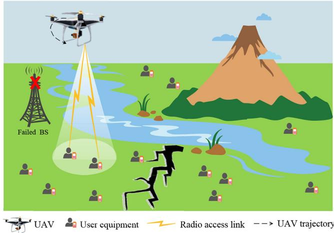
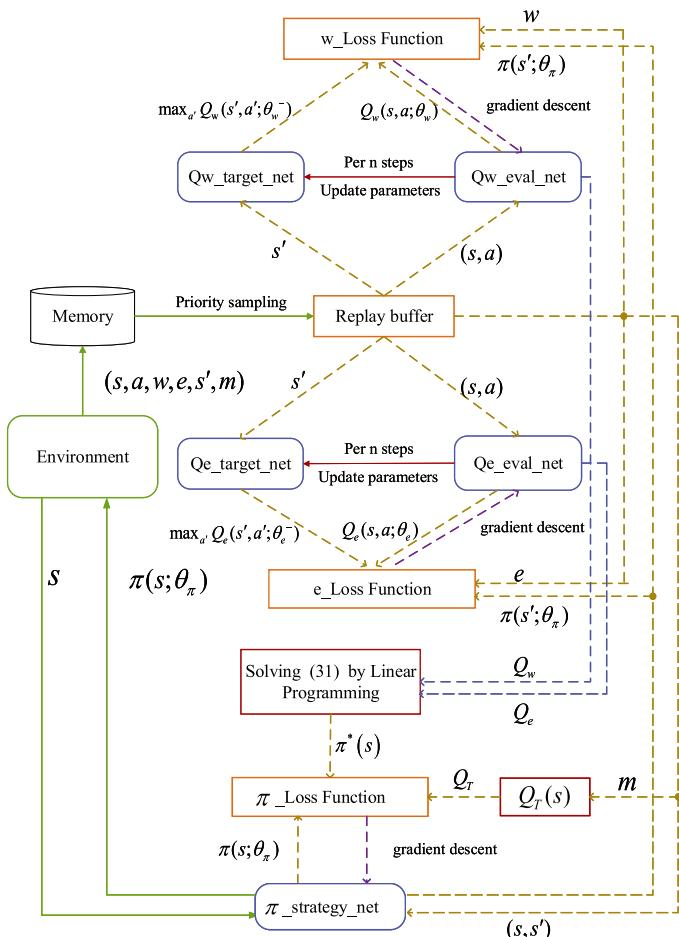
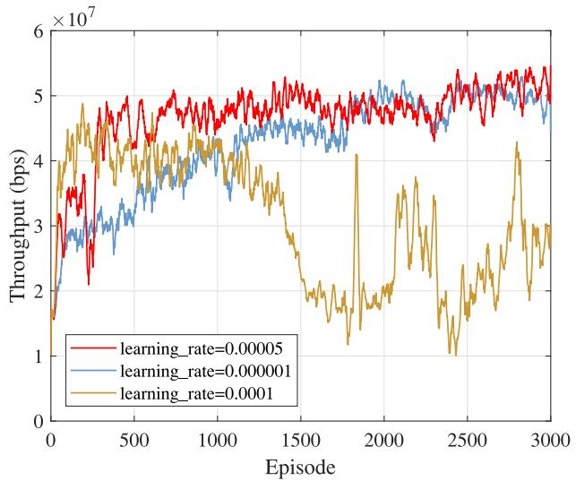
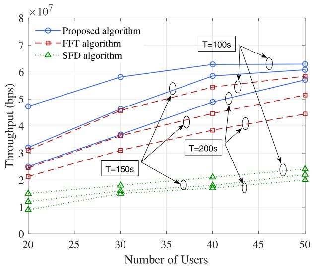
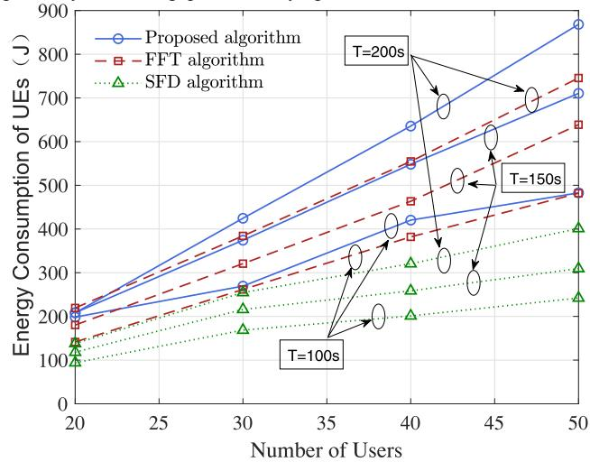
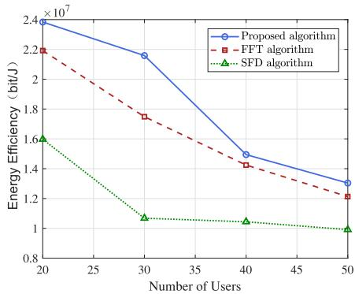
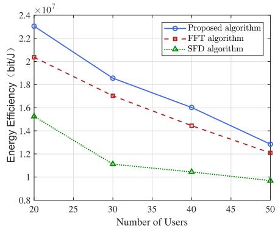
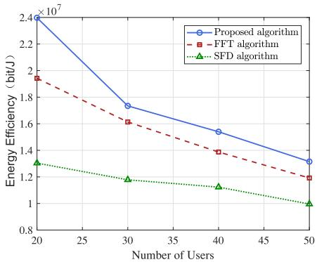
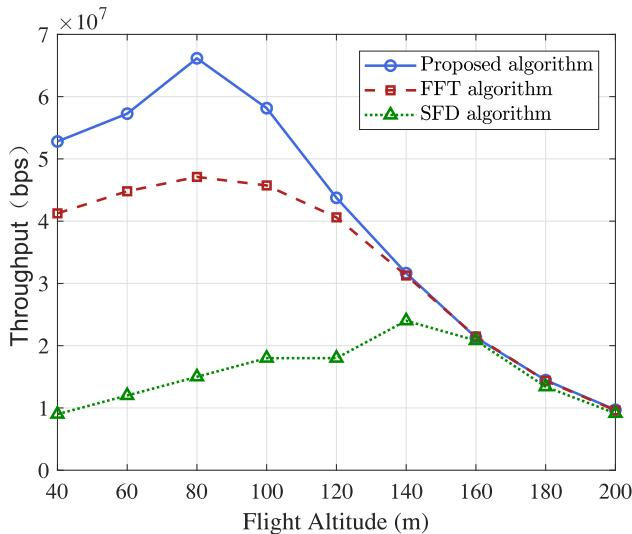
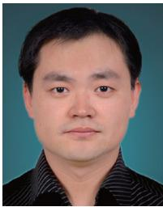

# Trajectory Optimization for UAV Emergency Communication With Limited User Equipment Energy: A Safe-DQN Approach

Tiankui Zhang , Senior Member, IEEE, Jiayi Lei , Yuanwei Liu , Senior Member, IEEE, Chunyan Feng , Senior Member, IEEE, and Arumugam Nallanathan , Fellow, IEEE

(Invited Paper)

Abstract—In post-disaster scenarios, it is challenging to provide reliable and flexible emergency communications, especially when the mobile infrastructure is seriously damaged. This article investigates the unmanned aerial vehicle (UAV)-based emergency communication networks, in which UAV is used as a mobile aerial base station for collecting information from ground users in affected areas. Due to the breakdown of ground power system after disasters, the available energy of affected user equipment (UE) is limited. Meanwhile, with the complex geographical conditions after disasters, there are obstacles affecting the flight of UAV. Aiming at maximizing the uplink throughput of UAV networks during the flying time, we formulate the UAV trajectory optimization problem considering UE energy limitation and location of obstacles. Since the constraint on UE energy is dynamic and long-term cumulative, it is hard to be solved directly. We transform the problem into a constrained Markov decision-making process (CMDP) with UAV as agent. To tackle the CMDP, we propose a safe-deep-Q-network (safe-DQN)-based UAV trajectory design algorithm, where the UAV learns to selects the optimal action in reasonable policy sets. Simulation results reveal that: 1) the uplink throughput of the proposed algorithm converges within multiple iterations and 2) compared with the benchmark algorithms, the proposed algorithm performs better in terms of uplink throughput and UE energy efficiency, achieving a good trade-off between UE energy consumption and uplink throughput.

Index Terms—Constrained Markov decision-making process, emergency communication, trajectory design, deep reinforcement learning.

## I. INTRODUCTION

ARGE-SCALE natural disasters always inflict severe and years, various types of natural disasters, such as earthquakes, tsunamis, floods, wildfires, hurricanes, etc., have resulted in many deaths, and material losses caused by disasters worldwide have increased by approximately 100%-150% [1]. When a disaster occurs, maintaining real-time communications helps to obtain post-disaster situational awareness, which can greatly improve the efficiency of rescue missions. Unfortunately, in most cases, disasters will damage the communication equipment, making the communication network, which nowadays predominantly depends on wireless communication infrastructure, unable to function normally. During the hurricane Harvey in the U.S., the FCC published that only one of the 19 cell towers in Aransas County in Texas was functioning and 85 percent of cellular towers became offline in nearby Counties [2]. Therefore, it is very necessary to establish emergency communications with rapid response and flexible networking.

Considering the complex ground conditions and the lack of power supply during post-disaster, the emergency communication networks should be highly energy efficient, simple deployment, and have good compatibility among different user devices and different types of disasters [2]. Among numerous emergency communication networking technologies, it’s an efficient and feasible solution to deploy unmanned aerial vehicle (UAV) with flexible deployment and timely response as the mobile aerial BS to construct a mobile emergency communication network [3]. Currently, UAV has been widely used in different disaster management applications, including monitoring and early warnings, disaster information fusion and sharing, supply dropping, damage assessment and so on. What’s more, as the movable characteristic of UAV allows the distance between the receiver and the transmitter to be adjusted in real time, which helps to deal with the problem of low UE signal level in post-disaster scenarios, UAV BS can be used as an important communication facility to build a standalone communication system in post-disaster areas [4].

Although the UAV emergency communication networks play a powerful role in disaster scenarios, there are still some key technical difficulties: 1) the working time of UAV is limited by on-board battery of UAV [5]; 2) the trajectory plan of UAV requires timely and accurate response to emergencies in complex and harsh geographical environment of natural disasters filed [3]; and 3) In addition, the available energy to equipment of trapped users is also extremely limited due to the damage to the crucial infrastructures (such as power supply) [6]. Based on the above considerations, the UAV emergency communications should be completed as far as possible before the user’s equipment runs out of energy within the working time of UAV.

## A. Motivations and Related Works

Due to the high flexible mobility, UAV has attracted significant research interest in the field of wireless com munication [7]. There are many researches that combine UAV with different communication technologies, such as nonorthogonal multiple access [8]–[10], massive MIMO [11], millimeter wave communication [12] and reconfigurable intel ligent surfaces [13]. Meanwhile, caching-enabled UAV cellula networks have attracted increasing attention to effectively alle viate the traffic load of wireless backhaul links [14], [15]. UAV can also be used as the mobile relay to provide a new access method for resource constrained users, thus increas ing the throughput of the whole system [16]. In addition, UAV has been also applied in various specific scenarios [17]– [19]. Zhang et al. [17] studied the content distribution in hot areas, and proposed the cache-enabling UAV-assisted cellu lar network which successfully improved the quality of user experience (QoE). In [18], UAV acts as a MEC server and provides communication and computing services for termina devices in the Internet of Things. In [19], UAVs are used to provide wireless energy harvesting and information transmission for ground users. On the other hand, with the rapid development of artificial intelligence technology, the applica tion of reinforcement learning (RL) and deep learning (DL) in wireless communication network has become a research hotspot [20], [21]. Some researchers have applied RL to UAV networks to make the UAV wireless communication more efficient and adaptable [22]–[25]. Yin et al. [22] stud ied the trajectory design in UAV-assisted cellular network. The optimization problem for maximizing the uplink transmission rate was transformed into a Markov decision process, which was solved by deterministic policy gradient (DPG) algorithm. A long-term resource allocation problem in multi-UAV communication networks was formulated as a stochastic game fo maximizing the expected rewards in [23], which was solved by a multi-agent reinforcement learning framework. In [24], with the goal of maximizing the energy efficiency and cov erage of UAV communication network, an actor-critic-based deep enhancement learning algorithm was used to optimize the flight direction and flight distance of the UAV. Based on the prediction of user’s mobility, Liu et al. [25] proposed a multi-agent Q-learning-based trajectory design and power control algorithm to maximize the transmission rate in multi-UAV assisted wireless networks.

Although excellent research has been conducted on UAV communications, there are few works focusing on

UAV-assisted emergency communication networks in disasters [26]–[29]. Merwaday et al. [26] used a genetic algorithm to get the best location of the UAV, thereby improving the network throughput. The problem that maximizing the number of service users under limited UAV battery capacity by optimizing the flight path was proposed in [27]. This optimization task was transformed into a multi-armed bandit problem, and distance-aware upper confidence bound algorithm (D-CUB) and ε-exploration algorithm were proposed to solve it. Some encouraging work was done by Zhao et al. to establish a framework for UAV-assisted emergency networks in disasters [28]. There were three different network models corresponding to three scenarios: First, UAV was deployed to assist the surviving BSs; second, when all ground BSs are destroyed, UAV served as a flying base station to provide communication services; in addition, hovering UAVs were used as multi-hop relays to exchange the information between the disaster area and outside. The collection and transmission of user information in emergency scenarios considering natural environment and UAV energy consumption constraints were investigated in [29]. In order to improve the QoE and shorten the flight time of UAV, a path optimization scheme including hover point selection and mobility planning was proposed and solved by convex optimization method.

These existing works related to UAV-based emergency communication networks mainly pay attention to the energy consumption of UAV, but ignore the limitation on energy of ground user equipment (UE) caused by the paralysis of ground power transmission system and constrained user mobility after disasters. Meanwhile, most of researches assume that the UAV trajectory or deployment position at a certain altitude is not restricted by geographical conditions. However, as obstacles that are far above the ground such as residential buildings, office buildings and mountains are inevitably distributed, it is often difficult to find an airspace where UAVs can move freely in most practical scenarios. These obstacles will affect the flight of UAV and cause possible collisions in piratical application. Different from the existing works, we proposed a UAV-based emergency communication network, in which the energy limitation of UE is considered. In addition, we also notice the influence of air obstacles on UAV flight path. Thus, our proposed framework further enhances the feasibility of UAV emergency communication system, as compared with the existing works.

## B. Contributions and Organization

As mentioned above, the emergency communication scenarios of current studies rarely consider the constrains on energy of UEs and obstacles in post-disaster areas. To fulfill this gap, a UAV-based emergency communication network with limited UE energy is researched in this article, in which the UAV acts as a mobile aerial BS to complete bits transmit from devices of users in affected area. The data collection task during disasters is always extremely urgent, however the coverage of UAV is relatively small. When the uploaded data of ground UEs is limited, the UAV trajectory need to be planed reasonably to increase the UEs’ access opportunities, so as to collect as much user information as possible during the flight time. Therefore, our goal is to maximize the long-term uplink throughput of the system during the flying time by designing the flight trajectory of UAV. The main contributions are summarized as follows:

• We propose a framework of UAV-based emergency communication networks to collect user information in postdisaster areas. The terrestrial devices within coverage of the UAV can access to the mobile aerial BS when other mobile infrastructures are out of services. Considering the limitation on geographical conditions and energy supply in reality, we formulate a dynamic long-term optimization problem to maximize uplink throughput of UAV network during the flying time by optimizing UAV trajectory.

• We transform the original problem to a constrained Markov decision process (CMDP) with UAV as agent, in which the action, reward, and cost are defined as flight direction, uplink throughput and energy consumption of UE respectively. For the long-term cumulative constraint on energy consumption of UE, we first obtain a set of safe policies by constructing a reasonable Lyapunov function, and then we resort to a safe-DQN-based algorithm to solve the optimal policy in the safe set. For the constraint on avoiding obstacles, we define the concept of legal actions to tackle it.

• We demonstrate the feasibility and effectiveness of the proposed algorithm by numerical simulations. Simulation results show that the proposed UAV trajectory design algorithm converges after multiple iterations. Compared with benchmark algorithms, the proposed algorithm is able to effectively avoid collision during the UAV flight and gets a trade-off between system throughput and energy consumption of UEs. Besides, we also investigate the influence of UAV height by simulation.

The rest of this article is organized as follows. Section II presents the system model and formulates the optimization problem for long-term uplink throughput maximization. In Section III, we transform the problem into a CMDP and propose the safe-DQN-based algorithm for trajectory design. Simulation results are provided in Section IV, and finally we conclude this paper in Section V.

## II. SYSTEM MODEL AND PROBLEM FORMULATION

Consider a post disaster rescue scenario with aerial obstacles, such as mountains or buildings, where rescuers can not approach easily. Due to the destruction of external forces (such as earthquake, flood, war, etc.), the ground infrastructure communication facilities in the certain area can’t work normally. Furthermore, due to the destruction of infrastructure, the UE signal that can be received is often weak in disaster areas. In this case, the UAV can be used as a mobile aerial BS to establish temporary communication connection and provide assistance for rescue by efficiently collecting information from affected users, as shown in Fig. 1. We assume that there are K users trapped in the area, denoted by $K = \{ 1 , \ldots , \ldots , K \}$ , and the corresponding locations are represented by $l _ { k } \in \mathbb { R } ^ { 2 \times 1 } , k \in \mathcal { K }$ . Taking into account the limited endurance of $\mathrm { U A V } ,$ we assume that the continuous working time of the UAV is T. The UAV takes off from the fixed starting point and flies over the area along a specific trajectory at a constant speed v. When the time is up, the UAV lands back to the starting point to charge or replace its battery.

  
Fig. 1. UAV emergency communication networks.

## A. UAV Mobility Model

For the convenience of illustration, we divide the UAV working duration T into M equal time slots with length $\delta _ { t }$ , i.e., $\begin{array} { r } { T \ = \ M \delta _ { t } } \end{array}$ . Note that the value of $\delta _ { t }$ is small enough to satisfy $\delta _ { t } v \ \ll \ H$ , where H is the flying height of UAV. So that in a time slot, the UAV can be approximately regarded as stationary. Denote $l _ { U } ( m ) = ( x _ { U } ( m ) , y _ { U } ( m ) )$ as the two-dimensional position of UAV in time slot $m ,$ then the flight trajectory of can be approximated by the sequence $\{ l _ { U } ( \bar { m } ) \} _ { m = 1 } ^ { M }$ . Since the UAV flies at the constant speed $\nu ,$ <sup>(</sup>then $\| l _ { U } \tilde { ( m ) } ^ { - } l _ { U } ( m - 1 ) \| = \delta _ { t } v , m = 2 , \dots , M$ , where the <sup>( ) ( 1) = = 2</sup>operator α means the Euclidean norm of vector $\alpha .$ During the flight, it is necessary to ensure that there will be no collision. In order to simplify the model, the airspace occupied by obstacles is approximately regarded as a circular region with radius R, and denoted by . Generally, the mobile distance of UAV in a time slot is far less than the radius R, i.e., $\delta _ { t } v \ll R .$ Therefore, when $\boldsymbol { l } _ { U } ( \boldsymbol { m } ) \not \in \Omega , \forall \boldsymbol { m } = [ 1 , 2 , \ldots , M ]$ is satisfied, the UAV flight path will not pass through the obstacle area, and there will be no collision.

## B. Channel Model

Referring to the 3GPP specification [30], the path loss of the communication link between UAV and its serving user is randomly determined by line-of-sight (LoS) and non-line-of-sight(NLoS) links according to probability. This probability depends on the UAV flight altitude H, the distance between the UAV and connected user $\begin{array} { r l } { d _ { k } ( m ) } & { { } = } \end{array}$ $\sqrt { H ^ { 2 } + \| l _ { U } ( m ) - l _ { k } \| ^ { 2 } , \forall k } \in \mathcal { K }$ and the carrier frequency $f _ { c } .$ <sup>+ ( )</sup>Specifically, the path loss of the LoS and NLOS links between the UAV and the k-user is calculated by (1), shown at the bottom of the next page. The probability of the LOS link denoted by $\mathrm { P r } _ { L O S }$ is given in (2), shown at the bottom of the next page, where $d _ { 0 } = \operatorname* { m a x } \left[ 2 9 4 . 0 5 \mathrm { l o g } _ { 1 0 } H - 4 3 2 . 9 4 , 1 8 \right]$ and $p 1 = 2 3 3 . 9 8 \mathrm { { l o g } } _ { 1 0 } H - 0 . 9 5$ . Then the probability of NLOS <sup>1 = 233 98log10 0 95</sup>link is obtained naturally as $\mathrm { P r } _ { N L O S } = 1 - \mathrm { P r } _ { L O S }$

According to the above path loss model, the channel gain between the UAV and the k-user in the time slot m is

$$
\begin{array} { l } { { \displaystyle { \mathrm { g } _ { k } ( m ) = P r _ { k } ^ { L O S } ( m ) \Big [ 1 0 ^ { L _ { k } ^ { L O S } ( m ) / 1 0 } \Big ] ^ { - 1 } } } } \\ { { \displaystyle ~ + ~ \left( 1 - P r _ { k } ^ { L O S } ( m ) \right) \Big [ 1 0 ^ { L _ { k } ^ { N L O S } ( m ) / 1 0 } \Big ] ^ { - 1 } . } } \end{array}\tag{3}
$$

## C. Transmission Model

For simplicity but without loss of generality, we assume that the transmission data size of each UE is F bits in the post disaster rescue scenario. We define the effective radiation angle of the UAV BS antenna as $\theta ,$ then the maximum distance between the accessible UE and the UAV is $H / \cos \theta .$ The above channel model shows that the channel gain $\mathrm { g } _ { k } ( m )$ is negatively related to distance $d _ { k } ( m )$ <sup>g ( )</sup>. It means that if a UE is in the coverage of the UAV BS, the channel gain, the signal-to-noise ratio (SNR) as well, is larger than a certain value. Therefore, the definition of effective radiation angle θ is used as a parameter to make sure that only when UEs’ SNR reaches a certain threshold, these UEs can access the UAV to upload data. According to the location of UAV $l _ { U } ( m )$ , the location of UE $l _ { k } \in \bar { \mathbb { R } ^ { 2 \times 1 } } , k \in \mathcal { K }$ and the radiation angle $\theta ,$ the set of UEs within the coverage of the UAV in time slot m is determined as $\mathcal { K } _ { \mathrm { c o v } e r } ( m ) = \{ k \in \mathcal { K } : d _ { k } ( m ) \leq H / \cos \theta \}$ <sup>cov</sup>Denote the UE access indicator by $a _ { k } ( m ) . \ a _ { k } ( m ) = 1$ <sup>os</sup>indicates that the k-UE is connected with the UAV in time slot $m ,$ conversely $a _ { k } ( m ) = 0$ means that the k-UE is not accessed. Thus, the set of UEs associated with the serving UAV in time slot m is expressed as ${ \mathcal { K } } _ { c o m } ( m ) = \{ k \in { \mathcal { K } } : a _ { k } ( m ) = 1 \}$ Denote $N ( m ) = \| \mathcal { K } _ { c o m } ( m ) \| _ { 0 }$ as the number of UEs in the set $\kappa _ { c o m } ( m )$

The UAV communication networks employs orthogonal frequency division multiple access (OFDMA) for multiple UEs accessing, so the inter-frequency interference among UEs can be ignored. Then, according to Shannon’s Theorem, the transmission rate from UE k to the UAV is

$$
R _ { k } ( m ) = a _ { k } ( m ) B _ { W } \mathrm { l o g } _ { 2 } \bigg ( 1 + { \frac { g _ { k } ( m ) P _ { T x } } { \sigma ^ { 2 } } } \bigg ) / N ( m ) ,\tag{4}
$$

where $B _ { W }$ is the available frequency bandwidth of the system, $P _ { T x }$ is the transmission power of UEs, and $\sigma ^ { 2 }$ represents the power of Additive White Gaussian Noise (AWGN) at the UAV receiver.

Therefore, for UE k , the uploaded data size in time slot m can be expressed as

$$
w _ { k } ( m ) = R _ { k } ( m ) \delta _ { t } .\tag{5}
$$

Let $W _ { k } ( m )$ represents the total bits the k-UE has uploaded <sup>( )</sup>before the m-th time slot, $\begin{array} { r } { W _ { k } ( m ) ~ = ~ \sum _ { i = 1 } ^ { m } w _ { k } ( i ) } \end{array}$ . Then,

the UE access indicator $a _ { k } ( m )$ is determined by the distance $d _ { k } ( m )$ and $W _ { k } ( m )$ <sup>(</sup>. If $k \in \mathcal { K } _ { \mathrm { c o v e r } }$ and $W _ { k } ( m ) < F$ $a _ { k } ( m ) = 1$ <sup>)</sup>, otherwise, $a _ { k } ( m ) = 0$

## D. Energy Model

The energy consumption of UE consists two parts, energy consumption in transmission model and energy consumption in sleep model. We omit the energy consumption in the shift between the transmission and sleep model. So the energy consumption of UE k in time slot m is

$$
e _ { k } ( m ) = a _ { k } ( m ) P _ { T x } \delta _ { t } + ( 1 - a _ { k } ( m ) ) E _ { S l e e p } ,\tag{6}
$$

where $E _ { S l e e p }$ is the energy consumption of UE k in sleep model in time slot m.

## E. Problem Formulation

Our goal is to collect the information of users in the area as much as possible, so as to improve the success rate of rescue and reduce casualties. It is worth noting that the energy of UE is very valuable due to the paralysis of ground power system and limited user mobility after the disaster. In addition, there are obstacles that affect the UAV flight. Once the UAV comes into collision with those obstacles, the communication may be interrupted, even out of service. Therefore, we formulate the constrained optimization problem to maximizing the long-term uplink throughput via UAV flight trajectory design. Based on above models, the optimization problem is

$$
\operatorname { P 1 } ) \colon \operatorname* { m a x } _ { \{ l _ { U } ( m ) \} _ { m = 1 } ^ { M } } \ { \frac { 1 } { T } } \sum _ { m = 1 } ^ { M } \sum _ { k = 1 } ^ { K } w _ { k } ( m ) ,\tag{7}
$$

$$
\begin{array} { r l } { \mathrm { s . t . ~ } } & { ~ \displaystyle \sum _ { m = 1 } ^ { M } e _ { k } ( m ) \leq e _ { 0 } , ~ \forall k \in K , } \\ & { \| l _ { U } ( m + 1 ) - l _ { U } ( m ) \| = \delta _ { t } v , } \\ & { \quad \quad \quad m = 1 , \ldots , M , } \\ & { \quad l _ { U } ( m ) \notin \Omega , m = 1 , 2 , \ldots , M . } \end{array}\tag{7a}
$$

(7b)

(7c)

Constraint (7a) represents that the maximum energy available of each UE is e ; constraint (7b) means the flight speed of <sup>0</sup>UAV is fixed as v; constraint (7c) guarantees that UAV will not collide with obstacles.

We notice that P1 is a dynamic optimization problem aiming at maximizing the long-term throughput of the system. What’s more, the left side of (7a) is also a long-term cumulative variable related to UAV flight trajectory. This means that the whole flight process needs to be taken into account when solving the position of UAV in a certain time slot, which makes it difficult to solve P1 by traditional optimization methods.

$$
L _ { k } ( m ) = \left\{ \begin{array} { l l } { 3 0 . 9 + ( 2 2 . 2 5 - 0 . 5 { \log _ { 1 0 } } H ) { \log _ { 1 0 } } d _ { k } ( m ) + 2 0 { \log _ { 1 0 } } f _ { c } , } & { i f \ L o S \ l i n k } \\ { \operatorname* { m a x } \{ L _ { k } ^ { L O S } , 3 2 . 4 + ( 4 3 . 2 - 7 . 6 { \log _ { 1 0 } } H ) { \log _ { 1 0 } } d _ { k } ( m ) + 2 0 { \log _ { 1 0 } } f _ { c } \} , } & { i f \ N L o S \ l i n k } \end{array} \right.\tag{1}
$$

$$
P r _ { L o S } = \left\{ \begin{array} { l l } { 1 , } & { i f ~ \sqrt { { d _ { k } } ^ { 2 } - H ^ { 2 } } \le d _ { 0 } } \\ { \frac { d _ { 0 } } { \sqrt { { d _ { k } } ^ { 2 } - H ^ { 2 } } } + \exp \Biggl \{ \left( \frac { - \sqrt { { d _ { k } } ^ { 2 } - H ^ { 2 } } } { p ! } \right) \left( 1 - \frac { d _ { 0 } } { \sqrt { { d _ { k } } ^ { 2 } - H ^ { 2 } } } \right) \Biggr \} , } & { i f ~ \sqrt { { d _ { k } } ^ { 2 } - H ^ { 2 } } > d _ { 0 } } \end{array} \right.\tag{2}
$$

## III. SAFE-DQN-BASED UAV TRAJECTORY OPTIMIZATION ALGORITHM

Since the position of UAV at time slot $m + 1$ only depends on the position and moving direction at time slot $m ,$ its flight process can be regarded as a discrete-time Markov Decision Process with the UAV as an agent. In this section, we transform the problem (7) coupled with constraints into a Constrained Markov Decision Process (CMDP). For the constraint (7a), we first propose a Lyapunov function-based method to determine the set of safe policies. Then, a model-free deep reinforcement learning algorithm, safe-DQN, is adopted to tackle the longterm cost constraint. For the constraint (7c), we define the concept of legal action, which is used to avoid obstacles by judging whether the action is legal before executing it.

## A. CMDP Model

CMDP is a typical framework for constrained reinforcement learning tasks. In this framework, the agent needs to maximize a long-term reward while satisfying cost constraints. It is worth noting that, unlike general constraints, the cost constraint in CMDP is long-term and global [31]. As (7a) contains K inequality, the corresponding CMDP will have K cost functions, which makes the solution very complicated. In order to simplify, we transform it into one inequality as follows,

$$
\operatorname* { m a x } _ { k \in K } \biggl \{ \sum _ { m = 1 } ^ { M } e _ { k } ( m ) \biggr \} \leq e _ { 0 } .\tag{7a<sup></sup>}
$$

Equation $( 7 \mathrm { a } ^ { \prime } )$ represents that the maximum value among UEs energy consumption can not exceed $e _ { 0 } .$ . It’s obvious that $( 7 \mathrm { a } ^ { \prime } )$ is a necessary and sufficient condition for (7a). However, $( 7 \mathrm { a } ^ { \prime } )$ is no longer a form of time slot summation, which does not meet the requirements for cost function of CMDP. So we exchange the order of summing and taking the maximum value, and get

$$
\sum _ { m = 1 } ^ { M } \operatorname* { m a x } _ { k \in K } \{ e _ { k } ( m ) \} \leq e _ { 0 } .\tag{7a<sup></sup>}
$$

As $( 7 \mathrm { a } ^ { \prime \prime } )$ is a sufficient condition for $( 7 \mathrm { a } ^ { \prime } ) , ~ ( 7 )$ is transformed as

$$
\begin{array} { r c l } { { \displaystyle \operatorname* { m a x } _ { \{ l _ { U } ( m ) \} _ { m = 1 } ^ { M } } } } & { { \displaystyle \frac { 1 } { T } \sum _ { m = 1 } ^ { M } \sum _ { k = 1 } ^ { K } w _ { k } ( m ) , } } \\ { { \mathrm { s . t . } } } & { { ( 7 a ^ { \prime \prime } ) , ( 7 b ) , ( 7 c ) . } } \end{array}\tag{8}
$$

and then we can transform (8) to a CMDP. There are seven basic elements in CMDP $\{ S , A , w , e , P , s _ { 0 } , e _ { 0 } \}$ , which are defined as follows in our model:

• S is the state space. In our maximization problem, the state in time slot m consists of the UAV position $l _ { U } ( m )$ and the uploaded bits by UE k, $W _ { k } ( m )$

• A is the action space. We define the action as the flight direction of the UAV. As the length of time slot $\delta _ { t }$ is small enough, we can discretize the flight direction reasonably without great influence on the final path, and only consider five flight directions including front, back, left, right and hovering.

• w is the instantaneous reward which is defined as the size of data collected in the system in time slot m.

$$
w \mathopen { } \mathclose \bgroup \left( s _ { m } \aftergroup \egroup \right) = \sum _ { k = 1 } ^ { K } w _ { k } \mathopen { } \mathclose \bgroup \left( s _ { m } \aftergroup \egroup \right) , ~ m = 1 , 2 , \ldots , M .\tag{9}
$$

• $e$ is the instantaneous cost, which is defined as the maximum value of energy consumption among UEs in time slot m.

$$
e ( s _ { m } ) = \operatorname* { m a x } _ { k \in { \mathcal { K } } } \{ e _ { k } ( s _ { m } ) \} , \ m = 1 , 2 , \ldots , M .\tag{10}
$$

• P represents the state transition probability matrix. In our optimization problem, the state space is large, and it is very difficult to predict the probability of state transition. For this kind of MDP problem in which the knowledge about P is not priori, model-free reinforcement learning is one of effective solutions.

• The initial state $s _ { 0 } \in S$ consists of the starting point of <sup>0</sup>the UAV which is known and fixed and the bits which have been uploaded at the beginning (zeros naturally).

$e _ { 0 }$ is the upper bound of the cumulative cost, which is <sup>0</sup>defined as the energy available to UE in our model.

We define the policy set in the m-th time slot as $\Delta ( s _ { m } ) =$ $\begin{array} { r } { \{ \pi ( \cdot | s _ { m } ) | \sum _ { a \in A } \pi ( \cdot | s _ { m } ) = 1 \} , \forall s _ { m } \in S } \end{array}$ . It can be seen from <sup>( ) ( ) = 1</sup>the definition that the strategy is actually a set of vectors representing the probability of each action being selected in state $s _ { m }$ . For a given strategy $\pi \in \Delta$ and the initial state $s _ { 0 } .$ , the long-term cumulative reward, that is, the total uploaded bits during the flight time T, is expressed as

$$
W _ { \pi } ( s _ { 0 } ) = \operatorname { \mathbb { E } } \left[ \sum _ { m = 0 } ^ { M - 1 } w ( s _ { m } ) | s _ { 0 } , \pi \right] .\tag{11}
$$

Similarly, the long-term cumulative cost, i.e., the left side of $( 7 \mathrm { a } ^ { \prime \prime } )$ , is

$$
E _ { \pi } ( s _ { 0 } ) = \mathbb { E } \left[ \sum _ { m = 0 } ^ { M - 1 } e ( s _ { m } ) | s _ { 0 } , \pi \right] .\tag{12}
$$

By constructing CMDP, the position of UAV in time slot $m + 1$ is completely determined by the position and flight direction in time slot $m ,$ and $l _ { U } ( m ) , l _ { U } ( m + 1 )$ always satisfy the constraint (7b). The flight time T is a constant. Thus, the optimization problem (8) is equivalent to: given $s _ { 0 }$ and $e _ { 0 } ,$ , find the optimal strategy $\pi ^ { * }$ to maximize the long-term reward while satisfying $E _ { \pi } ( s _ { 0 } ) \leq e _ { 0 }$ and (7c), that is, solve the problem as follows,

$$
\begin{array} { r l } { { ( \mathrm { P 2 } ) \colon \displaystyle \operatorname* { m a x } _ { \pi \in \Delta } } } & { { \{ W _ { \pi } ( s _ { 0 } ) { : } E _ { \pi } ( s _ { 0 } ) \leq e _ { 0 } \} } , } \\ { { \mathrm { s . t . } } } & { { ( 7 c ) . } } \end{array}\tag{13}
$$

## B. Lyapunov Function-Based Safe Policy Set

In this subsection, we leave (7c) out of the question temporarily, which is tackled in next subsection. Then, the key to solving (13) is to determine the set of “safe” strategies that meet the condition $E _ { \pi } ( s _ { 0 } ) \leq e _ { 0 }$ and select the optimal policy <sup>0 0</sup>from it. For this, we adopt following Lyapunov-function-based method to determine the set of safe policies [32].

For the convenience of representation, we introduce a general Bellman operator, which consists of a policy π and a general reward function (or cost function) h,

$$
T _ { \pi , h } [ V ] ( s ) = \sum _ { a } \pi ( a | s ) \left[ h ( s ) + \sum _ { s ^ { \prime } \in S ^ { \prime } } P \big ( s | s ^ { \prime } , a \big ) V \big ( s ^ { \prime } \big ) \right] ,\tag{14}
$$

where $s ^ { \prime }$ is the next state of $s \in S$ under the action $a \in A$ . It can be seen that $T _ { \pi , h } [ V ] ( s )$ is a function that describes the <sup>[ ]( )</sup>long-term cumulative expected value. When h is the reward function w, $W _ { \pi } ( s _ { 0 } ) ~ = ~ T _ { \pi , w } [ W ] ( s _ { 0 } )$ ; when h is the cost function e, $E _ { \pi } ( s _ { 0 } ) = T _ { \pi , e } [ E ] ( s _ { 0 } )$

<sup>( 0) = [ ]( 0)</sup>We assume a benchmark policy $\pi _ { B } \in \Delta$ and define a set of Lyapunov candidate functions

$$
\begin{array} { c } { { L _ { \pi _ { B } } ( s _ { 0 } , e _ { 0 } ) = \big \{ L : T _ { \pi _ { B } , e } [ L ] ( s ) \leq L ( s ) , \forall s \in S ; } } \\ { { L ( s _ { M - 1 } ) = 0 ; L ( s _ { 0 } ) \leq e _ { 0 } \big \} , } } \end{array}\tag{15}
$$

where $s _ { M - 1 }$ is the last state, that is, the landing position of <sup>1</sup>the UAV, which is fixed and known in our model. Consider the cumulative cost function $E _ { \pi _ { B } } ( s )$ with the benchmark policy. It satisfies all requirements for Lyapunov function in (15), that is, $E _ { \pi _ { B } } ( s _ { 0 } ) \ \leq \ e _ { 0 } , \ E _ { \pi _ { B } } ( s _ { M - 1 } ) \ = \ 0$ , and $E _ { \pi _ { B } } ( s ) =$ $\begin{array} { r } { T _ { \pi _ { B } , e } [ E _ { \pi _ { B } } ] ( s ) = \mathbb { E } [ \sum _ { m = 0 } ^ { M - 1 } e ( s _ { m } ) | s _ { 0 } , \pi _ { B } ] , } \end{array}$ . Therefore, the set <sup>=0 0</sup>of Lyapunov candidate functions defined in (15) must be non-empty. Corresponding to any Lyapunov function $L ( s ) \in$ $L _ { \pi _ { B } } ( s _ { 0 } , e _ { 0 } )$ , there exists a set of safe strategies

$$
F _ { L } ( s ) = \{ \pi ( \cdot | s ) \in \Delta : T _ { \pi , e } [ L ] ( s ) \leq L ( s ) \} .\tag{16}
$$

In order to ensure that the safe strategies set contains the optimal solution of the problem $\pi ^ { * }$ , the constructed Lyapunov function should not only satisfy the three conditions in (15), but also satisfy

$$
T _ { \pi ^ { * } , e } [ L ] ( s ) \leq L ( s ) .\tag{17}
$$

According to the [32, Lemma 1], there is an auxiliary cost function $\varepsilon ( s )$ such that the Lyapunov function conforming to (15) and (17) can be expressed as

$$
L _ { \varepsilon } ( s ) = \mathbb { E } \left[ \sum _ { m = 0 } ^ { M - 1 } e ( s _ { m } ) + \varepsilon ( s _ { m } ) | \pi _ { B } , s \right] ,\tag{18}
$$

and $L _ { \varepsilon } ( s )$ is equal to the cumulative cost function under the optimal strategy, that is $L _ { \varepsilon } ( s ) \in L _ { \pi _ { B } } ( s _ { 0 } , e _ { 0 } )$ and $L _ { \varepsilon } ( s ) =$ $E _ { \pi ^ { * } } ( s )$ <sup>( ) (</sup>. However, as the optimal policy $\pi ^ { * }$ <sup>0) ( ) =</sup>is not priori, it is difficult to construct a suitable $\varepsilon ( s )$ directly. Therefore, we adopt the method proposed in [32] to approximate the auxiliary cost $\varepsilon ( s )$ to a constant function, which is independent of state,

$$
\widetilde { \varepsilon } = \frac { ( e _ { 0 } - E _ { \pi _ { B } } ( s _ { 0 } ) ) } { \mathbb { E } [ \mathrm { T } ^ { * } | s _ { 0 } , \pi _ { B } ] } , \forall s _ { 0 } \in S ,\tag{19}
$$

where $\mathbb { E } [ \mathrm { T } ^ { \ast } | s _ { 0 } , \pi _ { B } ]$ is the expected stopping time of the <sup>[T 0 ]</sup>CMDP. In our problem, the working time of UAV is certain, that is $\mathbb { E } [ \mathrm { T } ^ { * } | s _ { 0 } , \pi _ { B } ] { = } M$ . Hence, (19) is

$$
\tilde { \varepsilon } = \frac { 1 } { M } ( e _ { 0 } - E _ { \pi _ { B } } ( s _ { 0 } ) ) .\tag{20}
$$

Substituting (20) into (18), we can get the Lyapunov function as

$$
L _ { \tilde { \varepsilon } } ( s ) = \mathbb { E } \left[ \sum _ { m = 0 } ^ { M - 1 } e ( s _ { m } ) + \tilde { \varepsilon } | \pi _ { B } , s \right] .\tag{21}
$$

and the corresponding safe policy set defined in (16) is

$$
F _ { L _ { { \widetilde \varepsilon } } } ( s ) = \bigl \{ \pi ( \cdot | s ) \in \Delta : T _ { \pi , e } [ L _ { \widetilde \varepsilon } ] ( s ) \leq L _ { \widetilde \varepsilon } ( s ) \bigr \} .\tag{22}
$$

Therefore, with the help of Lyapunov function, P2 of (13) without constraint (7c) is equivalently described as

$$
\pi ^ { * } ( \cdot | s ) = \arg \operatorname* { m a x } _ { \pi \in F _ { L _ { \widetilde { \varepsilon } } } ( s ) } W _ { \pi } ( s _ { 0 } ) , \forall s \in S .\tag{23}
$$

To sum up, in this subsection, we construct the appropriate Lyapunov function $L _ { \widetilde { \varepsilon } } ( s )$ by introducing the auxiliary cost <sup>˜</sup>function ε. Then, based on $L _ { \widetilde { \varepsilon } } ( s )$ , we determine the set of safe <sup>˜</sup>policies satisfying the constraint $( 7 \mathrm { a } ^ { \prime \prime } )$ , which lays foundation for the following subsection to solve the optimal policy.

## C. Deep Reinforcement Learning-Based Solution For CMDP: Safe-DQN

In $\mathrm { C M D P } \left\{ S , A , w , e , P , s _ { 0 } , e _ { 0 } \right\}$ , the next state is determined by the current state and action. Therefore, when the agent chooses an action, it needs to consider not only the immediate returns and costs, but also the impact on the future. Based on above considerations, the state-action reward function $( S \times A \to R )$ is defined as

$$
\begin{array} { c l l } { \displaystyle Q _ { w } \big ( s _ { m } , \mathbf { a } _ { m } \big ) = \mathbb { E } \Bigg [ \sum _ { { t = m } } ^ { M - 1 - m } \gamma ^ { { t - m } } w ( s _ { t } ) | s _ { 0 } , a _ { 0 } \Bigg ] , } \\ { \forall s _ { m } \in S , a _ { m } \in A , } \end{array}\tag{24}
$$

where $\gamma \in [ 0 , 1 ]$ is the discount factor, which represents that the influence of future rewards on the current value function decays exponentially. Using the Behrman operator, (24) is rewritten as

$$
Q _ { w } ( s , a ) = w ( s ) + \gamma V _ { w } ^ { \pi } ( s ^ { \prime } ) , \forall s \in S , a \in A ,\tag{25}
$$

where $\begin{array} { r } { V _ { w } ^ { \pi } ( s ) = w ( s ) + \gamma \sum _ { s ^ { \prime } \in S } P _ { s _ { m } , \pi ( s _ { m } ) } ( s ^ { \prime } ) V _ { w } ^ { \pi } ( s ^ { \prime } ) , \forall s \in } \end{array}$ <sup>( )</sup>S . Similarly, the state-action cost function is

$$
Q _ { e } ( s , a ) = e ( s ) + \gamma V _ { e } ^ { \pi } ( s ^ { \prime } ) , \forall s \in S , a \in A ,\tag{26}
$$

where $\begin{array} { r } { V _ { e } ^ { \pi } ( s ) = e ( s ) + \gamma \sum _ { s ^ { \prime } \in S } P _ { s ^ { \prime } , \pi ( s ^ { \prime } ) } ( s ^ { \prime } ) V _ { e } ^ { \pi } ( s ^ { \prime } ) , \forall s \in S . } \end{array}$ <sup>( )</sup>And the Lyapunov function (21) is expressed as

$$
Q _ { l } ( s , a ) = e ( s ) + \tilde { \varepsilon } + \gamma V _ { l } ^ { \pi } \bigl ( s ^ { \prime } \bigr ) , \forall s \in S , a \in A ,\tag{27}
$$

where $\begin{array} { r } { V _ { l } ^ { \pi } ( s ) { = } e ( s ) { + } \tilde { \varepsilon } { + } \gamma \sum _ { s ^ { \prime } \in S } P _ { s ^ { \prime } , \pi ( s ^ { \prime } ) } ( s ^ { \prime } ) V _ { l } ^ { \pi } ( s ^ { \prime } ) } \end{array}$ , ∀s∈S. <sup>( )= ( )+˜+</sup>Observing and analyzing $( 2 5 ) ‐ ( 2 7 )$ <sup>( )</sup>, we can rewrite (27) as

$$
Q _ { l } ( s , a ) = Q _ { e } ( s , a ) + \tilde { \varepsilon } Q _ { T } ( s ) , \forall s \in S , a \in A ,\tag{28}
$$

where $\begin{array} { r } { Q _ { T } ( s _ { m } ) = \sum _ { t = m } ^ { M - 1 - m } \gamma ^ { t - m } , \forall s _ { m } \in S } \end{array}$ is a function <sup>=</sup>related to the number of remaining steps and the discount factor, and can be directly obtained by calculation.

  
Fig. 2. The block diagram of the safe-DQN algorithm.

If $Q _ { w } ( s , a )$ and $Q _ { e } ( s , a )$ are known, according to (19), the auxiliary cost under the benchmark strategy $\pi _ { B }$ can be calculated by

$$
\varepsilon ^ { \prime } = \frac { e _ { 0 } - \pi _ { B } ( \cdot | s _ { 0 } ) ^ { \top } Q _ { e } ( s _ { 0 } , \cdot ) } { \pi _ { B } ( \cdot | s _ { 0 } ) ^ { \top } Q _ { T } ( s _ { 0 } ) } ,\tag{29}
$$

and the set of safe policies (22) is

$$
F _ { Q _ { l } } ( s ) = \Big \{ \pi ( \cdot | s ) \in \Delta : ( \pi ( \cdot | s ) - \pi _ { B } ( \cdot | s ) ) ^ { \top } Q _ { l } ( s , \cdot ) \leq \tilde { \varepsilon } \Big \} .\tag{30}
$$

Then (23) can be expressed as finding the optimal strategy

$$
\pi ^ { * } ( \cdot | s ) = \arg \operatorname* { m a x } _ { \pi ( \cdot | s ) \in F _ { Q _ { l } } ( s ) } \pi ( \cdot | s ) ^ { \top } Q _ { w } ( s , \cdot ) , \forall s \in S ,\tag{31}
$$

that is, solving the following linear programming problem.

$$
\begin{array} { r l } & { \pi ^ { * } ( \cdot | s ) \in \arg \operatorname* { m a x } _ { \pi \in \Delta } \Bigl \{ \pi ( \cdot | s ) ^ { \top } Q _ { w } ( s , \cdot ) \colon } \\ & { \qquad ( \pi ( \cdot | s ) - \pi _ { B } ( \cdot | s ) ) ^ { \top } Q _ { l } ( s , \cdot ) \leq \varepsilon ^ { \prime } \Bigr \} . } \end{array}\tag{32}
$$

Solving (32) requires accurate calculation of $Q _ { w } ( s , a )$ $Q _ { e } ( s , a )$ and $\pi _ { B } ( \cdot | s )$ <sup>( )</sup>. However, due to the complex nonlinear relationship between state, action and the value functions, it is almost impossible to obtain the mathematical expression of them directly. Reinforcement learning is one of the effective ways to establish mapping relationship. In common reinforcement learning algorithms, sarsa and Q-Learning obtain the optimal strategy by constructing and maintaining a state-action value table, where each state-action tuple corresponds to a value, so they can only solve problems which have a small number of states and actions. Deep Q-network is an improvement of Q-learning. It estimates the value function through a deep neural network, which can solve the situation of a large number of states but cannot cope with a large action space. The policy-based policy gradient algorithm can solve continuous state and action by constructing a policy network to directly output actions, but the network can only be updated in rounds, which makes a low training efficiency. Actor-critic and deep deterministic policy gradient algorithms combine policy based and value-based methods, which can not only deal with an infinite number of states and actions, but also ensure network convergence. At the same time, they have higher computational complexity compared with other reinforcement learning algorithms. In the CMDP $\{ S , A , w , e , P , s _ { 0 } , e _ { 0 } \}$ problem we constructed, the action space is small (five dimensions) but the number of states is large. Thus, considering the applicability and complexity of these algorithms comprehensively, we adopt a model-free safe-DQN algorithm to solve (32). The block diagram of safe-DQN is shown in Fig. 2.

First of all, we build two sets of DQN networks and output $\hat { Q } _ { w } ( s , a , \theta _ { w } ) , \ \hat { Q } _ { e } ( s , a , \theta _ { e } )$ to approximate $Q _ { w } ( s , a )$ and $Q _ { e } ( s , a )$ respectively. That is $Q _ { w } ( s , a ) \approx \hat { Q } _ { w } ( s , a , \theta _ { w } )$ $Q _ { e } ( s , a ) \approx \hat { Q } _ { e } ( s , a , \theta _ { e } )$ , where $\theta _ { w }$ and $\theta _ { e }$ are the parameters <sup>( ) ( )</sup>of the reward network and the cost network respectively. In the DQN algorithm we adopt, in order to remove the correlation between samples, the experience playback mechanism is introduced; in order to reduce the correlation between the real Q value and the output of neural networks, two neural networks with the completely same structure are used, one for estimated value, and the other for target value.

Taking the approximate network of the state-action reward function as an example, the estimated value network $\hat { Q } _ { w } ( s , a ; \theta _ { w } )$ needs to update its parameters continuously through training, while the target value network $\hat { Q } _ { w } ( s , a ; \theta _ { w } { } ^ { - } )$ is only used to calculate the value of the reward function at next state and its parameters don’t need to be updated iteratively, but are copied from the estimated value network at intervals. In each iteration, a certain number of samples $B = \{ ( s _ { j } , a _ { j } , w _ { j } , e _ { j } , s _ { j } ^ { \prime } , g _ { w , j } , g _ { e , j } ) \} _ { j = 1 } ^ { | B | }$ are selected from the memory according to their priority $\{ ( g _ { w , j } ) \} | _ { j = 1 } ^ { | B | }$ which are determined by their TD-errors

$$
\left\{ \mathrm { y } _ { j } ^ { w } - \hat { Q } _ { w } \left( s _ { j } , a _ { j } ; \theta _ { w } \right) \right\} _ { j = 1 } ^ { | B | } .\tag{33}
$$

$\begin{array} { r } { \mathrm { y } _ { i } ^ { w } \ = \ w _ { j } \ + \ \gamma \pi ( \cdot | s _ { j } ^ { \prime } ) ^ { \top } \hat { Q } _ { \mathrm { w } } ( s _ { j } ^ { \prime } , ; \theta _ { j } ^ { \top } ) } \end{array}$ represents the target <sup>w</sup>reward value of the j sample, which is calculated by the immediate reward, the output of the target value network at next state and the policy of the next state. Then, the loss function of the reward network is calculated by

$$
L o s s ( \theta _ { w } ) = \frac { 1 } { B } \sum _ { \mathrm { j } = 1 } ^ { B } w _ { w , j } \Big ( \mathrm { y } _ { j } ^ { w } - \hat { Q } _ { w } \big ( s _ { j } , a _ { j } ; \theta _ { w } \big ) \Big ) ^ { 2 } .\tag{34}
$$

Finally, the parameters $\theta _ { w }$ are updated by gradient back propagation of the neural network with specific learning-rate α, as

$$
\theta _ { w } = \theta _ { w } - \alpha \nabla _ { \theta _ { w } } L o s s ( \theta _ { w } ) .\tag{35}
$$

Remark 1: The learning-rate α is the stepsize when the network parameters are updated with gradient descent, which determines the distance of parameters alteration in each iteration. Larger α is likely to cause the algorithm to oscillate greatly near local optimum and is difficult to converge. Smaller α makes the parameters change little in each iteration, which leads to a slow convergence speed of the algorithm. In order to balance the stability and convergence speed of the algorithm, we often need to try time and again to find a compromise α.

Similarly, in the approximate network of the state-action cost function, the TD-errors of the samples are

$$
\left\{ \mathrm { y } _ { j } ^ { e } - \hat { Q } _ { e } \left( s _ { j } , a _ { j } ; \theta _ { e } \right) \right\} _ { j = 1 } ^ { | B | } ,\tag{36}
$$

where $\mathbf { y } _ { j } ^ { e } = e _ { j } + \gamma \pi ( \cdot | s _ { j } ^ { \prime } ) ^ { \top } \hat { Q } _ { e } ( s _ { j } ^ { \prime } , ; \theta _ { e } ^ { - } )$ represents the target cost value of the j sample. The loss function of the cost network is calculated by

$$
L o s s ( \theta _ { e } ) = \frac { 1 } { B } \sum _ { j = 1 } ^ { B } g _ { e , j } \Big ( \mathrm { y } _ { j } ^ { e } - \hat { Q } _ { e } \big ( s _ { j } , a _ { j } ; \theta _ { e } \big ) \Big ) ^ { 2 } ,\tag{37}
$$

and the parameters $\theta _ { e }$ are updated according to

$$
\theta _ { e } = \theta _ { e } ^ { - } - \alpha \nabla _ { \theta _ { e } } L o s s ( \theta _ { e } ) .\tag{38}
$$

In addition to approximating $Q _ { w } ( s , a )$ and $Q _ { e } ( s , a )$ , a reasonable value for the benchmark strategy $\pi _ { B } ( \cdot | s )$ is needed to solve the problem (32). However, due to the unpredictability of the future and the large dimension of the state space, it is very difficult to directly determine a benchmark strategy that meets the conditions. To this end, we build a deep neural network (DNN) to parameterize the policy and approximate the value of the benchmark strategy with the output of the DNN, namely $\pi _ { B } ( \cdot | s ) \approx \hat { \pi } ( \cdot | s ; \theta _ { \pi } )$ . In each iteration, the parameters $\theta _ { \pi }$ are updated by reducing the loss function of the policy network. As given in

$$
\begin{array} { r } { L ( \theta _ { \pi } ) = \mathbb { E } _ { ( s _ { j } ) \sim B } \big [ D _ { K L } \big ( \hat { \pi } \big ( \cdot | s _ { j } ; \theta _ { \pi } \big ) | | \pi ^ { * } \big ( \cdot | s _ { j } \big ) \big ) \big ] , } \end{array}\tag{39}
$$

the loss function is defined as the KL divergence between the benchmark strategy and the optimal strategy, which represents the difference between the two policy vector distributions. The optimal strategy $\pi ^ { * } ( \cdot | s _ { j } )$ is obtained by solving the linear programming problem (32) with the approximate benchmark strategy $\hat { \pi } ( \cdot | s _ { j } ; \theta _ { \pi } )$ . The parameters $\theta _ { \pi }$ are updated according to

$$
\begin{array} { r } { \theta _ { \pi }  \theta _ { \pi } - \alpha \nabla _ { \theta _ { \pi } } L ( \theta _ { \pi } ) . } \end{array}\tag{40}
$$

With the reward function network, the cost function network and the policy network, the $\varepsilon ^ { \prime }$ in (29) is approximated to

$$
\hat { \varepsilon } ^ { \prime } = \frac { e _ { 0 } - \hat { \pi } ( \cdot | s _ { 0 } ; \theta _ { \pi } ) ^ { \top } \hat { Q } _ { e } ( s _ { 0 } , \cdot ; \theta _ { e } ) } { \hat { \pi } ( \cdot | s _ { 0 } ; \theta _ { \pi } ) ^ { \top } Q _ { T } ( s _ { 0 } ) } .\tag{41}
$$

In summary, in each iteration of safe-DQN, three networks are trained in sequence, and finally the optimal policy that meets the “safe” condition $( 7 \mathrm { a } ^ { \prime \prime } )$ can be obtained.

```latex
Algorithm 1 Safe-DQN-Based Trajectory Design Algorithm
Initialization System Parameters: user locations $l _ { k } , k \in \mathcal { K } ;$ length
of time slot $\delta _ { t } ;$ <sup>l k</sup>number of time slots M; UAV filght speed v;
UAV flight height H; upper limit of UE energy consumption ;
obstacle area Ω.
Initialization Algorithm Parameters: prioritized replay buffer $U =$
{∅}; importance weights $g _ { w , 0 } = 1 , g _ { e , 0 } = 1 ;$ <sup>U</sup> mini-batch size
| |; network parameters $\theta { w } ^ { - } , \theta { e } ^ { - } , \theta _ { \pi }$
<sup>B</sup>1: for $k \in \{ 0 , 1 , . . . , \}$ do
2: <sup>k</sup>Initialize UAV position as the take-off point $l _ { U } ( 0 ) ;$ uploaded
bits $( s _ { 0 } ) = 0 \dot { ; }$ UE energy consumption $e ( s _ { 0 } ) \dot { = } 0 .$
3: <sup>w s0</sup>for t = 0 to $t = M - 1$ do
4: Obtain action $a _ { t }$ according to the policy network (DNN)
$\hat { \pi } ( \cdot | s _ { t } ; \theta _ { \pi } ) .$
5: if $a _ { t } \in A _ { \mathrm { l e g a l } } ( t )$ then
6: <sup>a A</sup>legal <sup>t</sup>Add this experience to replay buffer,
$U \gets \left( s _ { t } , \bar { a _ { t } } , w _ { t } , e _ { t } , s _ { t + 1 } , g _ { w , t } , g _ { e , t } \right) \cup U ,$
7: <sup>U s a w e s +1 g g</sup>From the buffer U, sample a mini-batch
$B = \{ ( s _ { j } , a _ { j } , w _ { j } , e _ { j } , s _ { j + 1 } , g _ { w , j } , g _ { e , j } ) \} _ { j = 1 } ^ { | B | } ,$
8: <sup>+1</sup> =1Update the deep Q network (DQN) of state-action reward
function $\hat { Q } _ { w } ( s , a , \theta _ { w } )$ according to (35),
9: <sup>Q s a</sup>Update the deep Q network (DQN) of state-action cost
function $\hat { Q } e \left( s , \bar { a } , \theta _  \} e \right)$ according to (38),
10: <sup>Q s a</sup>Update important weights $g _ { w , j } , g _ { e , j }$ based on TD-errors
given in (33) and (36),
11: Calculate l according to (27),
12: Obtain $\{ \pi ^ { * } \tilde { \left( \cdot | s _ { \mathrm { j } } \right) } \} _ { j = 1 } ^ { | B | }$ by solving (32),
13: <sup>j =1</sup>Update the network of policy $\hat { \pi } ( \cdot | s ; \theta _ { \pi } )$ according to
(40).
14: else
15: Select action $a _ { t }$ from $A _ { \mathrm { l e g a l } } ( \mathrm { t } )$ randomly and then back
to step (6).
16: end if
17: end for
18: Update ${ \theta _ { w } } ^ { - } = { \theta _ { w } } , { \theta _ { e } } ^ { - } = \theta _ { e }$ after t iterations.
19: end for
```

All of the above are proposed to tackle the constraint $( 7 \mathrm { a } ^ { \prime \prime } )$ For the constraint (7c), we adopt a simple judgment method. We propose the concept of legal actions, which ensure that the UAV is outside the obstacle area in the next time slot. The set of legal actions in each state is $A _ { \mathrm { l e g a l } } ( \mathrm { m } )$ 二 $\{ a \in A : l _ { U } ( m + 1 ) \not \in \Omega \}$ <sup>legal(m) =</sup>. In each time slot, before the action is executed, the UAV needs to judge whether the action is legal, and if it is not, another legal action will be selected randomly. Besides, in order to ensure the effectiveness of learning, samples with illegal actions will not be stored in the memory of safe-DQN.

The detailed procedure of the proposed safe-DQN based trajectory design algorithm is given as follows.

## D. Analysis of the Proposed Algorithm

1. Complexity: Denote |S | as the size of state space, and |A| as the size of action space. Assume the algorithm converges within D iterations. In each iteration, three networks $\hat { Q } _ { w } , \ \hat { Q } _ { e } , \ \pi _ { \theta }$ need to be updated and the complexity of each network is $O ( | S | | A | )$ . Secondly, there are |S | linear programming problems to be solved and each of them has |A| decision variables and $( | A | + 1 )$ constraint conditions, so its complexity is $O ( | S | | A | ^ { 2 } ( | A | + 1 ) )$ . Thus, the complexity of proposed algorithm is $\dot { O } ( 3 D | S | | A | + D | S | | A | ^ { 2 } ( | \bar { A } | +$ $\mathrm { 1 ) } ~ \approx ~ \bar { O ( 3 D | S | | A | + D | S | | A | ^ { 3 } ) }$ . Generally speaking, the number of iterations needed for convergence is far less than $| S | | A |$ . Therefore, the complexity of the safe-DQN-based algorithm is much less than that of polynomial time algorithm $O ( | S | ^ { 2 } | A | ^ { 2 } ( | S | | A | ( | A | + 1 ) )$ [33].

TABLE I SIMULATION PARAMETERS
<table><tr><td rowspan=1 colspan=1>Parameter</td><td rowspan=1 colspan=1>Value</td></tr><tr><td rowspan=1 colspan=1>Flight altitude</td><td rowspan=1 colspan=1> $\overline { { H = 1 0 0 \mathrm { ~ m ~ } } }$ </td></tr><tr><td rowspan=1 colspan=1>Flight speed</td><td rowspan=1 colspan=1> $\overline { { v = 3 0 \mathrm { \ m } / \mathrm { s } } }$ </td></tr><tr><td rowspan=1 colspan=1>Carrier frequency</td><td rowspan=1 colspan=1> $\overline { { f _ { c } = 2 \ : \mathrm { G H z } } }$ </td></tr><tr><td rowspan=1 colspan=1>Radio bandwidth</td><td rowspan=1 colspan=1> $\overline { { 2 0 ~ \mathrm { M H z } } }$ </td></tr><tr><td rowspan=1 colspan=1>Radius of obstacle area</td><td rowspan=1 colspan=1> $\overline { { R = 3 0 \mathrm { ~ m ~ } } }$ </td></tr><tr><td rowspan=1 colspan=1>Effective angle of UAV radiation</td><td rowspan=1 colspan=1> $\overline { { \theta = \pi / 8 \mathrm { ~ r a d } } }$ </td></tr><tr><td rowspan=1 colspan=1>Time slot length</td><td rowspan=1 colspan=1> $\overline { { \delta _ { t } = 0 . 5 \mathrm { ~ s ~ } } }$ </td></tr><tr><td rowspan=1 colspan=1>Transmitting power of UE</td><td rowspan=1 colspan=1> $\overline { { P _ { T x } = 2 3 \mathrm { ~ d B m } } }$ </td></tr><tr><td rowspan=1 colspan=1>Noise power spectral density</td><td rowspan=1 colspan=1> $\overline { { - 1 7 4 \ d B m / H z } }$ </td></tr><tr><td rowspan=1 colspan=1>Energy consumption of UE in sleep model</td><td rowspan=1 colspan=1> $\overline { { E _ { s l e e p } = 0 . 0 1 \mathrm { ~ J ~ } } }$ </td></tr></table>

<sup>( ( ( + 1))</sup>2. The “safe” property: Different from traditional reinforcement learning algorithms, safe-DQN is able to solve the optimization problem with dynamic and long-term accumulation constraints with the help of Lyapunov function. Compared with the general deep Q-network algorithm, the safe-DQN has higher complexity, but its safe property has great significance in solving practical problems.

## IV. SIMULATION RESULTS

In this section, the performance verification of the proposed safe-DQN-based UAV trajectory design algorithm is presented. It is assumed that a UAV is responsible for searching a preallocated area where K affected users are randomly distributed. When the affected area is large, we can deploy multiple UAVs and each of them is responsible for the search and rescue work in the pre-determined small area. The detailed simulation parameters are shown in Table I.

We verify the convergence of the proposed algorithm with different learning-rates in Fig. 3. There are three curves and all of them are simulated under the same condition when $K = 2 0$ and $T = 1 0 0 \ s$ . As it can be observed, when the learningrate is set as 0.00005 or 0.000001, the system throughput, i.e., the reward in the CMDP model, gradually increases with the increase of iterations, which indicates that the parameters of neural networks are gradually updated in a good direction. Specifically, when the learning-rate is set as 0.00005, the throughput converges to about 50 Mbps within 1000 episodes. When it is increased to 0.0001, the throughput quickly reaches the maximum value, but performs extremely unstably in the later stage. When the learning-rate is decreased to 0.000001, the growth rate of throughput slows down significantly, and converges to 50 Mbps within 2200 episodes, which is same as the value when learning-rate is 0.00005. This verifies the insights in Remark 1, that is, the larger learning-rate makes the network difficult to converge, while the smaller learningrate makes the network converge stably but the speed is very slow. In order to balance efficiency and stability, we set the learning-rate as 0.00005 in the subsequent simulations.

In order to illustrate the effectiveness of the proposed UAV trajectory design algorithm, we design the following two benchmark algorithms.

  
Fig. 3. The convergence of the proposed algorithm with varying learning rates.

1. Shortest flight distance algorithm (SFD): Taking off at the fixed starting point, the UAV selects the one closest to the current location of the UAV among all UEs to be served and then hovers above it to provide communication services. After the transmission is completed, the next location is selected according to the same criteria until the total time T is reached.

2. Fixed flight trajectory algorithm (FFT): The UAV flies along a pre-established path in the affected area, regardless of users’ locations.

Next, we investigate the performance of the proposed algorithm compared with benchmark algorithms from Fig. 4 to Fig. 6 with varying service durations and user numbers.

Fig. 4 shows the long-term uplink throughput of the UAV emergency communication network. First of all, each curve in Fig. 4. shows an upward trend, which means that regardless of algorithm and service duration, the system throughput increases with the number of users increasing. However, its growth rate is gradually decreasing. This is due to the fact that the maximum capacity of the communication system with a limited bandwidth is certain. With the increase of K, the system throughput keeps approaching the maximum capacity, but can not exceed it. Comparing the performance of the same algorithm with different T, it is found that the longer T, the lower the system throughput. This shows that in order to collect user information as much as possible, the UAV emergency communication system needs to sacrifice the time efficiency to a certain extent. Comparing the performance of different algorithms with the same T, we can see that for any K, the proposed algorithm is obviously better than the FFT algorithm, and much better than the SFD algorithm. When $( T = 1 0 0 s , K = 3 0 ) , ( T = 1 5 0 s , K = 4 0 )$ and $( T = 2 0 0 \ s , K = 5 0 )$ , the advantage of the proposed algorithm is more prominent, which is 0.27, 0.31, 0.28 times higher than FFT algorithm and 2.23, 2.25, 1.89 times higher than SFD algorithm respectively. In addition, for the same T, as the number of users increases, the performance differences among three algorithms change from small to large and then become smaller. This trend is explainable. When there are few users in the area, the demand of the UAV service time is relatively lower, making it not that necessary to optimize the flight trajectory. When there are too many users, the space where the flight path can be optimized is greatly limited because of the tight UAV service time, such as $( T = 1 0 0 \ s , K = 5 0 )$



Fig. 4. System throughput with varying user number.  
  
Fig. 5. Energy consumed by UEs with varying user number.

In Fig. 5, we compare the total energy consumption of UEs among three algorithms. It can be easily inferred that as the number of users increases, the total energy consumption of UEs also continues to increase. For the same algorithm and same K, the longer the UAV works, the more energy is consumed. Comparing the energy consumption of three algorithms with the same T, we find that the energy consumption of the proposed algorithm is always greater than that of FFT algorithm, and even greater than that of the SFD algorithm, which illustrates that the system throughput is increased at the cost of more energy consumption to some extent. Still taking $( T = 1 0 0 s , K = 3 0 ) , ( T = 1 5 0 s , K = 4 0 )$ and $( T = 2 0 0 \ s , K = 5 0 )$ as examples, the total energy consumption of UEs of the proposed algorithm is increased by 0.03, 0.10, 0.16 times compared with the FFT algorithm and 0.59, 1.09, 1.16 times compared with the SFD algorithm. Obviously, this set of data is less than the increase rate of corresponding throughput.

Based on the analysis of Fig. 4 and Fig. 5, it can be concluded that the proposed algorithm has achieved a large increase in throughput with a little increase in energy consumption. In order to further demonstrate the performance advantages of the proposed algorithm, we compare the energy efficiency (EE) of the three algorithms in Fig. 6. EE is defined as the ratio of the long-term uploaded bits to the total energy consumption of UEs,

$$
E E = \frac { \sum _ { m = 1 } ^ { M } \sum _ { k = 1 } ^ { K } w _ { k } ( m ) } { \sum _ { m = 1 } ^ { M } \sum _ { k = 1 } ^ { K } e _ { k } ( m ) } .\tag{42}
$$

As it can be observed, no matter what values of T and K are set as, the proposed algorithm is able to obtain the maximum energy efficiency, thus effectively improving the network performance.

Finally, we discuss the impact of UAV flight height on the system throughput in Fig. 7, where the UAV flight altitude varies from 40 m to 200 m and other parameters remain unchanged. For the proposed safe-DQN-based algorithm and the FFT algorithm, the system throughput increases with the UAV altitude changing from 40 m to 80 m. However, the throughput drops rapidly when the height is greater than 80 m. For the SFD algorithm, this inflection point appears when the height is 140 m. The three algorithms all show a trend of increasing first and then decreasing, which reasonably reflects the attenuation characteristics of UAV communication channel. According to (2), the probability of LoS link between the UAV and its serving devices increases with the UAV height increasing. Besides, the path loss of LoS link is less than that of NLoS link. Therefore, the performance of the UAV-based communication network can be improved by increasing the flying height within a certain range. However, when the altitude continues to increase, according to (1), although the rate of increase in $\log _ { 1 0 } H$ is very slow, the distance between the <sup>log10</sup>UAV and the UE is increasing significantly, which ultimately leads to a rapid increase in the path loss and then reduces the system throughput. Therefore, the UAV height needs to be determined reasonably and carefully.

## V. CONCLUSION

In this paper, we studied the trajectory optimization problem in the UAV-based emergency communication networks. The UAV was deployed as a mobile aerial base station to collect information from users in affected area. In addition to the limitation of UAV battery, the constraints on UE energy and location of obstacles were also considered. Since the constraint on energy consumption of UE is dynamic and long-term cumulative, we proposed a Lyapunov-based deep learning trajectory design algorithm. The simulation results showed that the proposed algorithm performed better in terms of the system throughput and energy efficiency compared with benchmark algorithms. The algorithm proposed in this paper solved the UAV flight trajectory optimization problem in the case of limited UE energy and flight obstacles. By designing the flight trajectory, the algorithm was able to maximize the system uplink throughput and completed the task of information collection in the post disaster areas. In the case of more ground users or a larger disaster area, multiple UAVs need to be deployed to achieve greater coverage and more user access, which may be included in our future work.

  
(a) T=100 s

  
(b) T=150 s

  
(c) T=200 s

Fig. 6. Energy efficiency of UEs with varying user number.  
  
Fig. 7. System throughput with varying flight altitude.

## REFERENCES

[1] R. Munich, Natcatservice Loss Events Worldwide 1980–2014, Munich Reinsurance, Munich, Germany, 2015.

[2] D. G.C., A. Ladas, Y. A. Sambo, H. Pervaiz, C. Politis, and M. A. Imran, “An overview of post-disaster emergency communication systems in the future networks,” IEEE Wireless Commun., vol. 26, no. 6, pp. 132–139, Dec. 2019.

[3] M. Erdelj, E. Natalizio, K. R. Chowdhury, and I. F. Akyildiz, “Help from the sky: Leveraging UAVs for disaster management,” IEEE Pervasive Comput., vol. 16, no. 1, pp. 24–32, Jan.–Mar. 2017.

[4] M. Erdelj and E. Natalizio, “UAV-assisted disaster management: Applications and open issues,” in Proc. Int. Conf. Comput. Netw. Commun. (ICNC), Kauai, HI, USA, 2016, pp. 1–5.

[5] A. Fotouhi et al., “Survey on UAV cellular communications: Practical aspects, standardization advancements, regulation, and security challenges,” IEEE Commun. Surveys Tuts., vol. 21, no. 4, pp. 3417–3442, 4th Quart., 2019.

[6] A. Kwasinski, W. W. Weaver, P. L. Chapman, and P. T. Krein, “Telecommunications power plant damage assessment for hurricane katrina– site survey and follow-up results,” IEEE Syst. J., vol. 3, no. 3, pp. 277–287, Sep. 2009.

[7] Y. Zeng, R. Zhang, and T. J. Lim, “Wireless communications with unmanned aerial vehicles: Opportunities and challenges,” IEEE Commun. Mag., vol. 54, no. 5, pp. 36–42, May 2016.

[8] N. Zhao et al., “Joint trajectory and precoding optimization for UAVassisted NOMA networks,” IEEE Trans. Commun., vol. 67, no. 5, pp. 3723–3735, May 2019.

[9] T. Zhang, Z. Wang, Y. Liu, W. Xu, and A. Nallanathan, “Caching placement and resource allocation for cache-enabling UAV NOMA networks,” IEEE Trans. Veh. Technol., vol. 69, no. 11, pp. 12897–12911, Nov. 2020.

[10] Y. Liu, Z. Qin, Y. Cai, Y. Gao, G. Y. Li, and A. Nallanathan, “UAV communications based on non-orthogonal multiple access,” IEEE Wireless Commun., vol. 26, no. 1, pp. 52–57, Feb. 2019.

[11] H. Huang, Y. Yang, H. Wang, Z. Ding, H. Sari, and F. Adachi, “Deep reinforcement learning for UAV navigation through massive MIMO technique,” IEEE Trans. Veh. Technol., vol. 69, no. 1, pp. 1117–1121, Jan. 2020.

[12] M. Gapeyenko, V. Petrov, D. Moltchanov, S. Andreev, N. Himayat, and Y. Koucheryavy, “Flexible and reliable UAV-assisted backhaul operation in 5G mmWave cellular networks,” IEEE J. Sel. Areas Commun., vol. 36, no. 11, pp. 2486–2496, Nov. 2018.

[13] X. Liu, Y. Liu, and Y. Chen, “Machine learning empowered trajectory and passive beamforming design in UAV-RIS wireless networks,” IEEE J. Sel. Areas Commun., early access, Dec. 2, 2020, doi: 10.1109/JSAC.2020.3041401.

[14] X. Xu, Y. Zeng, Y. L. Guan, and R. Zhang, “Overcoming endurance issue: UAV-enabled communications with proactive caching,” IEEE J. Sel. Areas Commun., vol. 36, no. 6, pp. 1231–1244, Jun. 2018.

[15] M. Chen, M. Mozaffari, W. Saad, C. Yin, M. Debbah, and C. S. Hong, “Caching in the sky: Proactive deployment of cache-enabled unmanned aerial vehicles for optimized quality-of-experience,” IEEE J. Sel. Areas Commun., vol. 35, no. 5, pp. 1046–1061, May 2017.

[16] Y. Zeng, R. Zhang, and T. J. Lim, “Throughput maximization for UAV-enabled mobile relaying systems,” IEEE Trans. Commun., vol. 64, no. 12, pp. 4983–4996, Dec. 2016.

[17] T. Zhang, Y. Wang, Y. Liu, W. Xu, and A. Nallanathan, “Cacheenabling UAV communications: Network deployment and resource allocation,” IEEE Trans. Wireless Commun., vol. 19, no. 11, pp. 7470–7483, Nov. 2020.

[18] T. Zhang, Y. Xu, J. Loo, D. Yang, and L. Xiao, “Joint computation and communication design for UAV-assisted mobile edge computing in IoT,” IEEE Trans. Ind. Informat., vol. 16, no. 8, pp. 5505–5516, Aug. 2020.

[19] J. Xu, Y. Zeng, and R. Zhang, “UAV-enabled wireless power transfer: Trajectory design and energy optimization,” IEEE Trans. Wireless Commun., vol. 17, no. 8, pp. 5092–5106, Aug. 2018.

[20] F. Tang, Y. Kawamoto, N. Kato, and J. Liu, “Future intelligent and secure vehicular network toward 6G: Machine-learning approaches,” Proc. IEEE, vol. 108, no. 2, pp. 292–307, Feb. 2020.

[21] M. Liu, G. Liao, N. Zhao, H. Song, and F. Gong, “Data-driven deep learning for signal classification in industrial cognitive radio networks,” IEEE Trans. Ind. Informat., vol. 17, no. 5, pp. 3412–3421, May 2021.

[22] S. Yin, S. Zhao, Y. Zhao, and F. R. Yu, “Intelligent trajectory design in UAV-aided communications with reinforcement learning,” IEEE Trans. Veh. Technol., vol. 68, no. 8, pp. 8227–8231, Aug. 2019.

[23] J. Cui, Y. Liu, and A. Nallanathan, “Multi-agent reinforcement learningbased resource allocation for UAV networks,” IEEE Trans. Wireless Commun., vol. 19, no. 2, pp. 729–743, Feb. 2020.

[24] C. H. Liu, Z. Chen, J. Tang, J. Xu, and C. Piao, “Energy-efficient UAV control for effective and fair communication coverage: A deep reinforcement learning approach,” IEEE J. Sel. Areas Commun., vol. 36, no. 9, pp. 2059–2070, Sep. 2018.

[25] X. Liu, Y. Liu, Y. Chen, and L. Hanzo, “Trajectory design and power control for multi-UAV assisted wireless networks: A machine learning approach,” IEEE Trans. Veh. Technol., vol. 68, no. 8, pp. 7957–7969, Aug. 2019.

[26] A. Merwaday, A. Tuncer, A. Kumbhar, and I. Guvenc, “Improved throughput coverage in natural disasters: Unmanned aerial base stations for public-safety communications,” IEEE Veh. Technol. Mag., vol. 11, no. 4, pp. 53–60, Dec. 2016.

[27] Y. Lin, T. Wang, and S. Wang, “UAV-assisted emergency communications: An extended multi-armed bandit perspective,” IEEE Commun. Lett., vol. 23, no. 5, pp. 938–941, May 2019.

[28] N. Zhao et al., “UAV-assisted emergency networks in disasters,” IEEE Wireless Commun., vol. 26, no. 1, pp. 45–51, Feb. 2019.

[29] Z. Huang, C. Chen, and M. Pan, “Multiobjective UAV path planning for emergency information collection and transmission,” IEEE Internet Things J., vol. 7, no. 8, pp. 6993–7009, Aug. 2020.

[30] “Study on enhanced LTE support for aerial vehicles (Release 15),” 3GPP, Sophia Antipolis, France, Rep. 3GPP TR 36.777, Dec. 2017.

[31] Q. Liang, F. Que, and E. Modiano, “Accelerated primal-dual policy optimization for safe reinforcement learning,” 2018. [Online]. Available: arXiv:1802.06480.

[32] Y. Chow, O. Nachum, E. Duenez-Guzman, and M. Ghavamzadeh, “A Lyapunov-based approach to safe reinforcement learning,” in Advances in Neural Information Processing Systems. Red Hook, NY, USA: Curran, 2018, pp. 8092–8101.

[33] S. Boyd, S. P. Boyd, and L. Vandenberghe, Convex Optimization. Cambridge, U.K.: Cambridge Univ. Press, 2004.



Tiankui Zhang (Senior Member, IEEE) received the B.S. degree in communication engineering and the Ph.D. degree in information and communication engineering from the Beijing University of Posts and Telecommunications, China, in 2003 and 2008, respectively, where he is currently a Professor with the School of Information and Communication Engineering. His research interests include wireless communication networks, mobile edge computing and caching, signal processing for wireless communications, and content centric wireless networks.

He had published more than 100 papers including journal papers on IEEE JOURNAL ON SELECTED AREAS IN COMMUNICATIONS and IEEE TRANSACTION ON COMMUNICATIONS and conference papers, such as IEEE GLOBECOM and IEEE ICC.


Chunyan Feng (Senior Member, IEEE) received the B.S. degree in communications engineering and the M.S. and Ph.D. degrees in communication and information systems from the Beijing University of Posts and Telecommunications, Beijing, China, where she is currently a Professor with the School of Information and Communication Engineering. Her research interests are in the areas of broadband networks and wireless communication systems. Her current research focuses on cognitive radio and green wireless communications.


Jiayi Lei received the B.S. degree from Shanxi University, China, in 2019. She is currently pursuing the M.E. degree in information and communication engineering from the Beijing University of Posts and Telecommunications. Her current research focuses on UAV-assisted communications.


Yuanwei Liu (Senior Member, IEEE) received the B.S. and M.S. degrees from the Beijing University of Posts and Telecommunications in 2011 and 2014, respectively, and the Ph.D. degree in electrical engineering from the Queen Mary University of London, U.K., in 2016.

He was with the Department of Informatics, King’s College London, from 2016 to 2017, where he was a Postdoctoral Research Fellow. He has been a Lecturer (Assistant Professor) with the School of Electronic Engineering and Computer Science,

Queen Mary University of London, since 2017. His research interests include non-orthogonal multiple access, 5G/6G networks, machine learning, and stochastic geometry. He received IEEE ComSoc Outstanding Young Researcher Award for EMEA in 2020. He has served as the Publicity Co-Chair for VTC 2019-Fall. He also received the Exemplary Reviewer Certificate of IEEE WIRELESS COMMUNICATIONS LETTERS in 2015, IEEE TRANSACTIONS ON COMMUNICATIONS in 2016 and 2017, and IEEE TRANSACTIONS ON WIRELESS COMMUNICATIONS in 2017 and 2018. He serves as the Chair of Special Interest Group (SIG) in Signal Processing and Computing for Communications Technical Committee on the topic of signal processing Techniques for next generation multiple access, the Vice-Chair of SIG Wireless Communications Technical Committee on the topic of Reconfigurable Intelligent Surfaces for Smart Radio Environments (RISE), and the Tutorials and Invited Presentations Officer for Reconfigurable Intelligent Surfaces Emerging Technology Initiative. He is the leading contributor for “Best Readings for Non-Orthogonal Multiple Access (NOMA)” and the primary contributor for “Best Readings for Reconfigurable Intelligent Surfaces (RIS).” He is currently an Editor on the Editorial Board of the IEEE TRANSACTIONS ON WIRELESS COMMUNICATIONS, the IEEE TRANSACTIONS ON COMMUNICATIONS, and IEEE COMMUNICATIONS LETTERS. He serves as the leading Guest Editor for IEEE JOURNAL ON SELECTED AREAS IN COMMUNICATIONS special issue on Next Generation Multiple Access, a Guest Editor for IEEE JOURNAL OF SELECTED TOPICS IN SIGNAL PROCESSING special issue on Signal Processing Advances for Non-Orthogonal Multiple Access in Next Generation Wireless Networks. He has served as a TPC Member for many IEEE conferences, such as GLOBECOM and ICC.


Arumugam Nallanathan (Fellow, IEEE) has been a Professor of Wireless Communications and the Head of the Communication Systems Research Group with the School of Electronic Engineering and Computer Science, Queen Mary University of London since September 2017. He was with the Department of Informatics, King’s College London from December 2007 to August 2017, where he was a Professor of Wireless Communications from April 2013 to August 2017 and a Visiting Professor from September 2017. He was an Assistant Professor

with the Department of Electrical and Computer Engineering, National University of Singapore from August 2000 to December 2007. He has published nearly 500 technical papers in scientific journals and international conferences. His research interests include artificial intelligence for wireless systems, beyond 5G wireless networks, Internet of Things, and molecular communications.

He received the IEEE Communications Society SPCE Outstanding Service Award 2012 and IEEE Communications Society RCC Outstanding Service Award 2014. He is a co-recipient of the Best Paper Awards presented at the IEEE International Conference on Communications 2016, IEEE Global Communications Conference 2017, and IEEE Vehicular Technology Conference 2018. He is an Editor-at-Large for IEEE TRANSACTIONS ON COMMUNICATIONS and the Senior Editor for IEEE WIRELESS COMMUNICATIONS LETTERS. He was an Editor for IEEE TRANSACTIONS ON WIRELESS COMMUNICATIONS from 2006 to 2011, IEEE TRANSACTIONS ON VEHICULAR TECHNOLOGY from 2006 to 2017, and IEEE SIGNAL PROCESSING LETTERS. He served as the Chair for the Signal Processing and Communication Electronics Technical Committee of IEEE Communications Society and the technical program chair and a member of Technical Program Committees in numerous IEEE conferences. He is an IEEE Distinguished Lecturer. He has been selected as a Web of Science Highly Cited Researcher in 2016 and an AI 2000 Internet of Things Most Influential Scholar in 2020.