# Trajectory and Resource Allocation for UAV Replacement to Provide Uninterrupted Service

Nishant Gupta , Member, IEEE, Satyam Agarwal , Senior Member, IEEE, Deepak Mishra , Senior Member, IEEE, and Brijesh Kumbhani , Senior Member, IEEE

Abstract— Unmanned aerial vehicles (UAVs) have emerged as a specular technology that can assist the terrestrial base stations. However, the battery limitation of UAV inhibits the system performance by decreasing the overall lifespan of coverage provided by the UAV, driving the necessity of replacement and recharging. Thus, the energy-depleted UAV must be returned to a charging station and be replaced by a fully charged UAV to increase the service span. Therefore, this paper presents a novel framework of UAV replacement to maintain coverage continuity in a UAV-assisted wireless communication system when a serving UAV runs out of energy. Our objective during this replacement process is to maximize the minimum achievable throughput to the UAV-served ground users by jointly optimizing the threedimensional (3D) multi-UAV trajectory and resources allocated to the users from the individual UAVs. The formulated problem is non-convex for which an efficient algorithm based on successive convex approximation and alternating optimization is proposed. Numerical results provide insights into the UAV trajectories and the effectiveness of the proposed scheme compared to the existing benchmark schemes.

Index Terms— Multi-UAV trajectory, resource allocation, energy consumption, UAV replacement, service continuity.

## I. INTRODUCTION

N RECENT years, the exponential rise in the demand for cellular traffic in the hotspot areas has presented tremendous challenges to the terrestrial base station (BS). To cope up with this situation, unmanned aerial vehicles (UAVs) have emerged as a new technology that can act as a temporary BS to offload some of the network traffic [1]. This is possible due to the special features of UAVs like the ability to hover, maintain line-of-sight (LoS) communication links, controllable mobility, etc. As a result, this advancement has encouraged us to view the communication system from the UAV perspective. Thus, the UAV-assisted wireless communication (UWC) system has become a new technology in today’s world and in the future to extend the communication coverage [2].

The various scenarios where UWC system can be practiced include highly crowded areas, and across emergency scenarios where the terrestrial BS is non-functional (for example, disaster-affected areas, etc.). Despite this, UAVs pose certain challenges, such as deployment location where a UAV must be deployed to deliver fruitful service and UAV trajectory to maximize the system performance [3]. Also, UAV’s shortterm performance due to its limited energy availability is a concern that inhibits the UAV from delivering long-term service.

To fully utilize the benefits of the UAV as a BS, we need to find a way to provide a long-term service rather than short-term. Notably, in missions that requires long battery endurance, the battery limitation problem cannot be solved by improving the energy efficiency or energy management. As a result, for the practical implementation of UAV applications, UAV battery recharge or replacement is essential [4]. In this context, the design of UAVs application to provide coverage continuity has become a critical challenge for practical UAV deployments. According to [4], four typical UAV battery recharging/replacement methods to maintain coverage continuity can be listed as follows: Flying to the fixed charging station [5], battery hotswapping [6], Laser beam inflight recharging [7], energy harvesting from environment [8]. For a single UAV, it is difficult to maintain coverage continuity because there may be times when the UAV is charging its battery instead of providing communication to the ground users. However, if multiple UAVs are deployed from the same location at different times, we can replace the drained UAVs with a fully charged ones to maintain coverage continuity and provide uninterrupted service to the ground users.

Motivated by the UAV replacement scenario, this paper presents a novel framework for maintaining coverage continuity in a UWC system by launching a fully charged UAV to replace the existing UAV, which is low on energy. That is, if one UAV gets low on battery, another fully charged UAV can take its place to provide continuous coverage to the ground users. As another UAV is launched for replacement, multiple key challenges like resource allocation and multi-UAV trajectory planning must be addressed in the presence of

UAV energy consumption constraints. This UAV replacement framework includes optimizing the 3D multi-UAV trajectory and bandwidth allocation to maximize the minimum achievable data rate by the ground users in the presence of onboard energy availability constraints.

## A. Related Work

In general, in UWC system, one research direction is to minimize the UAV energy consumption [9] or maximize the energy efficiency [10], [11] and another direction focuses on maximizing the user’s data rate while considering energy availability as a constraint. In this work, our interest lies in the latter case. Towards this end, the authors in [12] maximized the minimum user throughput by jointly optimizing the multi-UAV trajectory and power allocation, while assuming the UAV to fly at a fixed altitude. In [13], the authors considered the wireless power transfer system with downlink and uplink with sub-time slot. They optimized the two-dimensional (2D) multi-UAV trajectory, scheduling and power to maximize the minimum average rate among all ground users in the presence of harvested energy constraints. The same objective was also considered in [14]. The authors in [15] maximized the number of admitted users while satisfying the rate requirement constraint and jointly optimized the bandwidth, power allocation, and multi-UAV trajectory. In above works, [12], [13], [14], the system was designed such that in a particular time, the UAV was deployed to serve one ground user. Moreover, they have optimized the UAV’s 2D trajectory.

The design of conventional 3D multi-UAV trajectory depends upon three aspects. First, the channel model, second, the onboard energy available with the UAV, and third, the launching and final location of the UAV (where the UAV’s initial and final location is same or the UAVs have different initial and final location). In [16], [17], and [18], the authors optimized the three-dimensional (3D) multi-UAV trajectory while considering the LoS-dominant channel between the UAV and the user. For dense environments, the air-to-ground (A2G) channel is prone to blockage due to the presence of high-rise buildings. Thus, considering the assumption that UAV will always remain in LoS is not true and such analysis cannot be applied to dense scenarios, where the UAV can also experience non-LoS (NLoS) link. Thus, a more practical channel model, such as probabilistic LoS channel model where the UAV can experience LoS and NLoS link with certain probabilities needs to be considered. On the same note, the authors in [19] optimized the 3D trajectory to maximize the total downlink coverage capacity by leveraging the UAV mobility under the presence of coverage constraints. However, all the existing works [12], [13], [14], [15], [16], [17], [18], [19] have not taken into account the energy consumption of the UAV.

Noting the importance of UAV’s limited onboard energy, the authors in [20] considered a multiple UAVs in a post-disaster area that minimize the maximum completion time in the presence of on-board energy budget. In [21], the authors considered a multi-UAV aided uplink communication scenario to minimize the total system latency and energy consumption. In [22], fair energy consumption of multiple UAVs is studied for a downlink communication setup while optimizing the resources and trajectories of UAVs. However, all the above works, [20], [21], [22] assumed the UAV to fly at fixed altitude. The authors in [23] optimized the 3D multi-UAV trajectory in an uplink scenario when the UAV and the user experiences a probabilistic LoS channel model to maximize the minimum throughput among all the users. However, there are some limitations of their system. First, they have considered the uplink communication system, where only one user could connect to the UAV to upload the data, and each UAV can only be connected to atmost one user. Second, such a system will only ensure that the user will receive a reasonable data rate in certain time slots (time slots for which the user is connected to the UAV) but not throughout the service time. Third, they assumed that an equal bandwidth is allocated to all the users. Considering the above limitations, the analysis done in [23] cannot be applied to the downlink communication system, where the multiple users must be served by the UAV providing sufficient data rate in every time slot and allocates bandwidth depending upon the channel conditions to further improve the user’s throughput.

The design of coverage continuity is based on two factors. Firstly, the complete process of providing communication where the initial and the final location are the same and the multi-UAVs are deployed from the same location at different times. Secondly, considering the different initial and final locations is a special case of the original problem, where the objective is to hover at the final location but ultimately, when the process repeats, we say that the initial and the final location are the same. For the first problem, many existing works have used UAVs to provide communication performance with different concerns: the number of served users, round-trip energy or time minimization [20], latency [21], multi-UAV trajectory [23], resource allocation [24], etc. However, the latter case is more beneficial for the cellular operators where they have to prepare a backup UAV (as BS) at the charging station to replace the UAV (as BS) present at the hovering location before its battery runs out. This consideration with different initial and final locations to allow UAV replacement has become necessary for long-term communication [4].

In literature, the authors in [25], [26], [27], [28], [29], [30], [31], and [32] have worked on the UAV replacement framework. In particular, [25] and [26] have designed the battery replacement system where the battery of the UAV is replaced at the charging station, once the UAV has landed, therafter, it is launched back to provide communication service. This method give rise to the coverage holes in the communication service area and is not reliable to perform given tasks i.e., providing uninterrupted communication service to the ground user. The authors in [27] proposed a scheduler algorithm to schedule multiple UAVs for replacement to enable a long-term communication service for upto several hours in the hotspot events. The authors in [28] proposed a model of swapping the positions of UAVs with low residual battery and adjacent UAVs with higher remaining battery. In [29], the authors studied the link outage problem when the UAVs are replaced and formulated the outage-free replacement problem. Another work [30] focused on the charging mechanism of the UAV by establishing the multiple battery charging points in the field, and minimized the energy consumption of the UAV but didn’t focus on providing the performance of the communication service to the ground users and the rate requirement of each of the ground user. Furthermore, the authors in [31] considers the concept of seamless handover in a UAV Replacement scenario. In our recent work [32], we developed a UAV replacement framework to maximize the service throughput in a hotspot event by optimizing the 3D multi-UAV trajectories, scheduling, and resource allocation.

Though the above works [27], [28], [29], [30], [31] have considered the importance and need for UAV replacement when the UAV goes low on energy, however, there are a few design constraints that need to be considered for user-centric applications. First, the fairness among the ground users when deploying UAV as BS to provide communication in a given area. Second, the minimum achievable rate for all ground users. Third, the replacement should happen while optimizing the 3D multi-UAV trajectory when considering the limited system resources and energy available with the UAV. Thus, it is critical to consider the above factors while designing the downlink communication system. The key differences of the existing works with our work are shown in Table I. On a brief note, it can be observed that the previous works on multi-UAV trajectory design cannot be applied because, some have either considered the UAV to serve atmost one ground user for a multi-UAV scenario, which can not be applied to the downlink scenario, where the UAV communicates with multiple users. Moreover, some have not considered the 2D geometry to exhibit the replacement process, as 3D plays a critical role in modelling the channel between the UAV and ground user.

## B. Novelty, Motivation and Contributions

In this work, we present a UAV replacement framework to maintain the coverage continuity and provide long-term coverage to the ground users. In this framework, the existing UAV low on energy is replaced by an another fully charged UAV. During replacement, we maximize the minimum achievable rate of the ground user during the total flight time of the UAV by jointly optimizing the 3D multi-UAV trajectory and bandwidth allocation in the presence of UAV mobility, energy consumption constraint, and the minimum rate required by the ground user at each time instant. This work is carried out by considering a realistic A2G channel model comprising both LoS and NLoS links, i.e., the probabilistic LoS channel model. As per the authors’ knowledge, there is no related work reported in the literature for the UAV replacement problem to maximize the coverage provided to the ground user. Thus, this work fills the lacuna in providing continuous coverage to the users using UAVs. The key contributions of this work are as follows:

• In comparison to the existing literature (Table I) on the UWC system, this paper is the first to provide a unified framework on UAV replacement to maintain coverage continuity, where a fully charged UAV is launched to replace the serving UAV low on energy. This is carried out to provide uninterrupted service to the ground users.

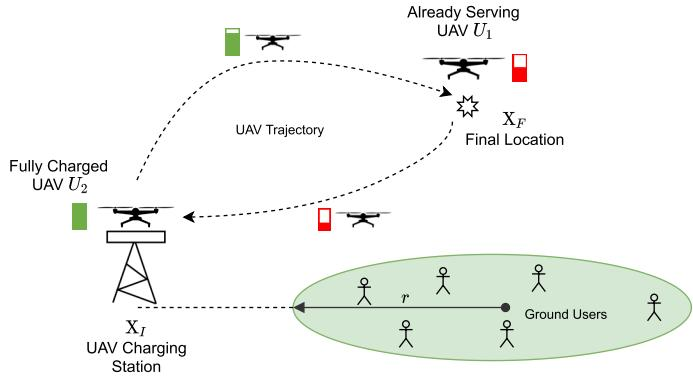  
Fig. 1. Model to represent the UAV replacement framework.

• We formulate a UAV replacement problem to maximize the minimum achievable rate to each user by optimizing the multi-UAV trajectory and resource allocation. Furthermore, the UAVs should provide sufficient rate to each user in the presence of onboard energy constraints and UAV mobility constraints.

• The formulated problem is non-convex. We propose an alternating optimization scheme that utilizes successive convex approximation methods to facilitate the solution. In particular, the problem is partitioned into two subproblems that optimizes the bandwidth allocation and the 3D multi-UAV trajectory in an iterative manner.

• Numerical results are plotted to show key insights into the UAV trajectories for different scenarios. It is shown that the proposed scheme provides multi-fold performance enhancement in achievable sum rate compared to the benchmark schemes.

The organization of the paper is as follows. Section II describes the UAV trajectory, energy consumption, and A2G channel models. Section III describes the problem statement. The solution methodology is proposed in Section IV, followed by the overall algorithm and complexity in Section V. Section VI presents the numerical results. Finally, the paper is concluded in Section VII.

## II. SYSTEM MODEL

## A. Communication Model

We consider a UWC system as shown in Fig. 1 with $\mathcal { K } = \{ 1 , \cdots , K \}$ ground users (or users) that are distributed over a circular field of radius r. Location of the $k ^ { t h }$ -user is given by $\mathbf { w } _ { k } = [ x _ { k } , y _ { k } ]$ , where $k \in \mathcal { K }$ . The users are assumed to be stationary and their location is known. To consider the UAV replacement scenario, we consider $m \in { \mathcal { M } } { \mathrm { U A V s } } ,$ where $\mathcal { M } ~ = ~ \{ 1 , 2 \}$ . One is the currently serving UAV, denoted by $U _ { 1 } ( m = 1 )$ and the other one is a fully charged UAV, denoted by $U _ { 2 } ( m \ = \ 2 )$ . At the start of the replacement process, we assume that $U _ { 1 }$ is located at the final location ${ \bf X } _ { F } = [ x _ { F } , y _ { F } , z _ { F } ]$ and is serving users while $U _ { 2 }$ is at the charging station ${ \bf X } _ { I } = [ x _ { I } , y _ { I } , z _ { I } ]$ and proceeding towards $\mathbf { X } _ { F }$ to replace $U _ { 1 }$ . Over time T, the replacement of the UAV takes place with $U _ { 2 }$ taking position $\mathbf { X } _ { F }$ while $U _ { 1 }$ returning back to the charging station $\mathbf { X } _ { I }$

TABLE I  
KEY DIFFERENCES OF THIS WORK COMPARED TO THE EXISTING LITERATURE. PLOS HERE STANDS FOR PROBABILISTIC LOS CHANNEL
<table><tr><td rowspan=1 colspan=1>Ref.</td><td rowspan=1 colspan=1>Objective</td><td rowspan=1 colspan=1>Design3D</td><td rowspan=1 colspan=1>A2Gmodel</td><td rowspan=1 colspan=1>Bandwidthallocation</td><td rowspan=1 colspan=1>Energyconstraint</td><td rowspan=1 colspan=1>Application/Restrictions</td><td rowspan=1 colspan=1>Fair</td></tr><tr><td rowspan=1 colspan=1>[17]</td><td rowspan=1 colspan=1>Aggregate sum rate of the UAV</td><td rowspan=1 colspan=1>√</td><td rowspan=1 colspan=1>×</td><td rowspan=1 colspan=1>×</td><td rowspan=1 colspan=1>×</td><td rowspan=1 colspan=1>Restricted: No. of UAVs = No. of users</td><td rowspan=1 colspan=1>×</td></tr><tr><td rowspan=1 colspan=1>[18]</td><td rowspan=1 colspan=1>Max-min throughput among users</td><td rowspan=1 colspan=1>√</td><td rowspan=1 colspan=1>×</td><td rowspan=1 colspan=1>×</td><td rowspan=1 colspan=1>×</td><td rowspan=1 colspan=1>Restricted: Each UAV serves atmost one requester</td><td rowspan=1 colspan=1>√</td></tr><tr><td rowspan=1 colspan=1>[19]</td><td rowspan=1 colspan=1>Maximize the downlink capacity</td><td rowspan=1 colspan=1>√</td><td rowspan=1 colspan=1>PLoS</td><td rowspan=1 colspan=1>×</td><td rowspan=1 colspan=1>×</td><td rowspan=1 colspan=1>Restricted: Downlink setup, no energy limitations</td><td rowspan=1 colspan=1>×</td></tr><tr><td rowspan=1 colspan=1>[20]</td><td rowspan=1 colspan=1>Min-max completion time</td><td rowspan=1 colspan=1>×</td><td rowspan=1 colspan=1>×</td><td rowspan=1 colspan=1>×</td><td rowspan=1 colspan=1>√</td><td rowspan=1 colspan=1>Restricted: Each UAV serves atmost one user, 2D Geometry</td><td rowspan=1 colspan=1>√</td></tr><tr><td rowspan=1 colspan=1>[21]</td><td rowspan=1 colspan=1>Minimize the total latency &amp;energy consumption</td><td rowspan=1 colspan=1>X</td><td rowspan=1 colspan=1>PLoS</td><td rowspan=1 colspan=1>×</td><td rowspan=1 colspan=1>√</td><td rowspan=1 colspan=1>Restricted: 2D Geometry &amp; UAV-centric</td><td rowspan=1 colspan=1>×</td></tr><tr><td rowspan=1 colspan=1>[22]</td><td rowspan=1 colspan=1>Maximize the minimum energy-efficiency among all UAVs</td><td rowspan=1 colspan=1>X</td><td rowspan=1 colspan=1>X</td><td rowspan=1 colspan=1>×</td><td rowspan=1 colspan=1>√</td><td rowspan=1 colspan=1>Restricted: Each UAV serves atmost one user,2D Geometry</td><td rowspan=1 colspan=1>√</td></tr><tr><td rowspan=1 colspan=1>[23]</td><td rowspan=1 colspan=1>Max-min achievable rateamong all users</td><td rowspan=1 colspan=1>√</td><td rowspan=1 colspan=1>PLoS</td><td rowspan=1 colspan=1>Orthogonalchannels</td><td rowspan=1 colspan=1>X</td><td rowspan=1 colspan=1>Restricted: One UAV serves to atmost one user,no energy limitations</td><td rowspan=1 colspan=1>√</td></tr><tr><td rowspan=1 colspan=1>[27][28]</td><td rowspan=1 colspan=1>Minimize no. of active UAVsover time</td><td rowspan=1 colspan=1>X</td><td rowspan=1 colspan=1>X</td><td rowspan=1 colspan=1>X</td><td rowspan=1 colspan=1>X</td><td rowspan=1 colspan=1>Replacement: Minimize number of UAVs,Restricted: 2D Geometry, no energy limitations</td><td rowspan=1 colspan=1>X</td></tr><tr><td rowspan=1 colspan=1>[29]</td><td rowspan=1 colspan=1>Outage probability minimization</td><td rowspan=1 colspan=1>√</td><td rowspan=1 colspan=1>PLoS</td><td rowspan=1 colspan=1>×</td><td rowspan=1 colspan=1>X</td><td rowspan=1 colspan=1>Replacement: Outage MinimizationRestricted: No energy limitations and fairness</td><td rowspan=1 colspan=1>×</td></tr><tr><td rowspan=1 colspan=1>[30]</td><td rowspan=1 colspan=1>Minimizing energy consumption</td><td rowspan=1 colspan=1>X</td><td rowspan=1 colspan=1>X</td><td rowspan=1 colspan=1>×</td><td rowspan=1 colspan=1>X</td><td rowspan=1 colspan=1>Restricted: 2D Geometry, UAV-centric,no trajectory optimization</td><td rowspan=1 colspan=1>×</td></tr><tr><td rowspan=1 colspan=1>[31]</td><td rowspan=1 colspan=1>Max-min transmission rate</td><td rowspan=1 colspan=1>X</td><td rowspan=1 colspan=1>X</td><td rowspan=1 colspan=1>OFDMA</td><td rowspan=1 colspan=1>X</td><td rowspan=1 colspan=1>Replacement: Uplink scenarioRestricted: 2D geometry, no energy limitations</td><td rowspan=1 colspan=1>√</td></tr><tr><td rowspan=1 colspan=1>Ours</td><td rowspan=1 colspan=1>Max-min aggregate throughputamong all users over all time</td><td rowspan=1 colspan=1>√</td><td rowspan=1 colspan=1>PLoS</td><td rowspan=1 colspan=1>√</td><td rowspan=1 colspan=1>√</td><td rowspan=1 colspan=1>Replacement: Downlink setup, UAV provides coverageto multiple users and users can connect to multiple UÁVs</td><td rowspan=1 colspan=1>√</td></tr></table>

For analytical tractability, we assume the total flight time $T$ of the UAV is discretized into N slots of equal length, indexed by $\mathcal { N } = \{ 1 , \cdots , N \}$ . The slot duration is given by $\tau = T / N$ . The slot duration τ is set to be sufficiently small such that the UAV is assumed to be stationary within the time slot [33]. The UAV location at the $n ^ { t h }$ -time slot is given by ${ \bf X } _ { m } [ n ] = [ { \bf q } _ { m } [ n ] , z _ { m } [ n ] ]$ , where $m \in \{ 1 , 2 \}$ , and $\mathbf { q } _ { m } [ n ]$ and $z _ { m } [ n ]$ are the horizontal and vertical coordinates of the $m ^ { t h } .$ UAV, respectively. Then, the constraint on the UAV locations with respect to time is given as

$$
\mathbf { X } _ { 1 } [ 0 ] = \mathbf { X } _ { F } , \mathbf { X } _ { 1 } [ N _ { f } ] = \mathbf { X } _ { I } , \mathbf { X } _ { 2 } [ 0 ] = \mathbf { X } _ { I } , \mathbf { X } _ { 2 } [ N ] = \mathbf { X } _ { F } .\tag{1}
$$

The slot index $N _ { f } \ \leq \ N$ is the number of time slots taken by the UAV $U _ { 1 }$ to reach $\mathbf { X } _ { I }$ . Accordingly, if $N _ { f } < N$ , then after $N _ { f }$ time slots only UAV $U _ { 2 }$ will provide communication to the ground users considering that the UAV $U _ { 1 }$ has reached the charging station and has terminated its service. Note that, in our work, we consider two-UAVs for better insights but this work is also valid for more than two UAVs.

We assume the maximum flying velocity of the UAV is constrained by $V _ { m a x }$ such that $v _ { m } [ n ] \leq V _ { m a x } , \forall n , m \in \{ 1 , 2 \}$ where $v _ { m } [ n ]$ is the velocity of $\therefore M A V$ at time slot n. $v _ { m } [ n ] = d _ { m } [ n ] / \tau$ , where $d _ { m } [ n ] = \| { \bf X } _ { m } [ n ] - { \bf X } _ { m } [ n - 1 ] \|$ is the distance travelled by the $m ^ { t h }  – \mathrm { U A V }$ in the $n ^ { t h }$ -time slot. Also, we assume that the minimum separation distance required to avoid collision between the two UAVs is $D _ { m i n }$

Note that after UAVs $U _ { 1 }$ and $U _ { 2 }$ have reached their respective locations, the UAV $U _ { 2 }$ will continue to serve the ground users by hovering at the final location until its energy level falls below a certain threshold. Therefore, the final location should be the optimal location where the performance is optimal [34]. In this work, to better understand the replacement mechanism, we have considered the final location to be any location in 3D space and did not impose any constraint on the final location.

## B. Energy Consumption Model

Energy consumption plays a critical role in deciding when the UAV needs to be replaced and safely return to the ground.

In general, the energy consumption consists of manoeuvring and communication-related energy consumption. In this paper, we have considered the manoeuvring energy because the communication-related energy is far less than the manoeuvring energy [14]. Since the UAV is launched to hover at the final location, we consider a rotary-wing UAV because of its hovering feature. The energy model of a rotary-wing UAV as a function of velocity is given as [35, Eq. 11]

$$
\begin{array} { r l r } {  { e _ { m } [ n ] = \tau P _ { o } ( 1 + \frac { 3 v _ { m } ^ { x y } [ n ] ^ { 2 } } { U _ { t i p } ^ { 2 } } ) + \tau P _ { i } ( \sqrt { 1 + \frac { v _ { m } ^ { x y } [ n ] ^ { 4 } } { 4 v _ { o } ^ { 2 } } } - \frac { v _ { m } ^ { x y } [ n ] ^ { 2 } } { 2 v _ { o } ^ { 4 } } ) ^ { \frac { 1 } { 2 } } } } \\ & { } & { + \tau \frac { 1 } { 2 } d _ { 0 } \rho S A v _ { m } ^ { x y } [ n ] ^ { 3 } + W \tau v _ { m } ^ { z } [ n ] , \quad \quad \quad ( 2 ) } \end{array}
$$

where $v _ { m } ^ { x y } [ n ]$ and $v _ { m } ^ { z } [ n ]$ represent the horizontal and vertical component of velocity, respectively, at the $n ^ { t h }$ -time slot. $v _ { o }$ is the mean rotor induced velocity. $U _ { t i p }$ is the tip speed of rotor blade. $d _ { 0 } , \rho ,$ and S are the fuselag ratio, air density, and rotor solidity, respectively. A and $W$ represent the rotor disc area, and weight of UAV, respectively. $P _ { o }$ and $P _ { i }$ are the constants and denote the blade profile power and induced power, respectively. Since only UAV $U _ { 1 }$ is low on energy, in this work, we consider the onboard energy constraint for UAV $U _ { 1 }$ only, which is given by

$$
\sum _ { n = 1 } ^ { N _ { f } } e _ { 1 } [ n ] \leq E _ { l e f t } ,\tag{3}
$$

where $E _ { l e f t }$ is the energy left with the UAV $U _ { 1 }$

## C. A2G Channel Model

Although UAVs can adjust altitude to maintain a LoS communication link, in some instances, the A2G link is more prone to blockage due to the presence of obstacles and buildings, such as in the urban environment. Therefore, it is necessary to consider the channel model, including the LoS and NLoS links. This work considers a realistic probabilistic LoS channel model wherein the LoS and NLoS links have a certain occurrence probability [36]. Then, the large-scale fading effects for LoS and NLoS links are expressed as $| h _ { \boldsymbol { k } , m } ^ { l } [ \bar { n ] } | ^ { 2 } = \beta _ { 0 } d _ { \boldsymbol { k } , m } [ n ] ^ { - \bar { \alpha } }$ , and $| h _ { k , m } ^ { l } [ n ] | ^ { 2 } =$ $\kappa \beta _ { 0 } d _ { k , m } [ n ] ^ { - \bar { \alpha } }$ , respectively. Here $d _ { k , m } [ n ]$ represents the distance between the $k ^ { t h }$ -user and the $\bar { m } ^ { t h }  – \mathrm { U A V } ,$ given by $d _ { k , m } [ n ] \ = \ \sqrt { \| \mathbf { q } _ { m } [ n ] - \mathbf { w } _ { k } \| ^ { 2 } + z _ { m } [ n ] ^ { 2 } }$ $\beta _ { 0 }$ , and α¯ denote the pathloss at the reference distance, pathloss exponent, respectively. $\kappa \ : < 1$ is the additional attenuation factor due to the NLoS condition.

The probability of LoS link $P _ { k , m } ^ { L } [ n ]$ depends upon the elevation angle (in degrees) of the $\mathbf { \xi } _ { m } { t h \mathbf { \xi } _ { - } } \mathrm { U A V }$ with the $k ^ { t h }$ user given by $\begin{array} { r } { \phi _ { k , m } \mathopen { } \mathclose \bgroup \left[ n \aftergroup \egroup \right] = \tan ^ { - 1 } \left( \frac { z _ { m } \left[ n \right] } { \left\| \mathbf { q } _ { m } \left[ n \right] - \mathbf { w } _ { k } \right\| } \right) } \end{array}$ . Thus, $P _ { k , m } ^ { L } [ n ]$ is given by [37]

$$
P _ { k , m } ^ { L } [ n ] = \frac { 1 } { ( 1 + C \exp \left( - D [ \phi _ { k , m } [ n ] - C ] \right) ) } ,\tag{4}
$$

where $C$ and $D$ are parameters describing either the suburban, urban, or dense urban environment.

Noting the small-scale fading effects, the channel model for $k ^ { t h }$ -user from $m ^ { t h }  – \mathrm { U A V }$ in time slot n is given by $H _ { k , m } [ n ] = h _ { k , m } ^ { s } [ n ] h _ { k , m } ^ { l } [ n ]$ , where $h _ { k , m } ^ { l } [ n ]$ is the large-scale fading effects, and $h _ { k , m } ^ { s } [ n ]$ is the small-scale fading effects with $\mathbb { E } [ | h _ { k , m } ^ { s } [ n ] | ^ { 2 } ] = 1 \ [ 3 8 ]$ . Then, $\mathbb { E } [ | H _ { k , m } [ n ] | ^ { 2 } ]$ , considering $\bar { \alpha } = 2$ is given by

$$
\mathbb { E } [ | H _ { k , m } [ n ] | ^ { 2 } ] = \beta _ { 0 } \frac { ( 1 - \kappa ) P _ { k , m } ^ { L } [ n ] + \kappa } { \| \mathbf { q } _ { m } [ n ] - \mathbf { w } _ { k } \| ^ { 2 } + z _ { m } [ n ] ^ { 2 } } .\tag{5}
$$

This paper considers the downlink communication system model where the UAV uses frequency division multiple access (FDMA) scheme for sharing resources among the ground users. Let $b _ { k , m } [ n ]$ denote the bandwidth allocated by the $m ^ { t h }$ -UAV to the $\bar { k ^ { t h } }$ -user in the $n ^ { t h }$ -time slot from the total bandwidth B (Hz) available. Then, we have

$$
\sum _ { k = 1 } ^ { K } \sum _ { m = 1 } ^ { 2 } b _ { k , m } [ n ] = B .\tag{6}
$$

We assume that each UAV transmits with power $P _ { t r }$ to all the users in every time slot. Then, the average achievable data rate by averaging over the small-scale fading effects at the $k ^ { t h }$ -user by the $\bar { m } ^ { t h } \ – \mathrm { U A V }$ at time slot n is given by [38, Eq. 5]

$$
\tilde { r } _ { k , m } [ n ] = b _ { k , m } [ n ] \log _ { 2 } \left( 1 + \frac { P _ { t r } | H _ { k , m } [ n ] | ^ { 2 } } { \sigma ^ { 2 } b _ { k , m } [ n ] } \right) ,\tag{7}
$$

where $\sigma ^ { 2 }$ is the noise power spectral density at the receiver. Since, the channel $H _ { k , m } [ n ]$ is a random variable, and so is $\tilde { r } _ { k , m } [ n ]$ . Furthermore, due to the complexity of the probabilistic channel model, it is challenging to obtain the probability distribution of $\tilde { r } _ { k , m } [ n ]$ . Therefore, in this work, we are focused towards the expected communication throughput which is $r _ { k , m } [ n ] = \mathbb { E } [ \tilde { r } _ { k , m } [ n ] ]$ . Then, the expected data rate is given as [14] and [39]

$$
r _ { k , m } [ n ] \approx b _ { k , m } [ n ] \log _ { 2 } \left( 1 + \frac { P _ { t r } \mathbb { E } [ | H _ { k , m } [ n ] | ^ { 2 } ] } { \sigma ^ { 2 } b _ { k , m } [ n ] } \right) ,\tag{8}
$$

Consequently, the expected achievable sum data rate of $k ^ { t h }$ user during flight time T is expressed as

$$
R _ { k } \triangleq \sum _ { n = 1 } ^ { N _ { f } } r _ { k , 1 } [ n ] + \sum _ { n = 1 } ^ { N } r _ { k , 2 } [ n ] .\tag{9}
$$

## III. PROBLEM STATEMENT

In this paper, we intend to maximize the minimum rate among all the users in a UWC system. Our multi-UAVenabled communication design is aimed to target user-centric applications rather than UAV-centric applications, where the best-effort delivery is made to maximize the service rate to the ground users. Note that if we consider the UAV-centric applications, in such a scenario, the UAV moves to the charging station with the minimum propulsion energy consumption instead of choosing a path with a maximum service rate. We define $\mathbf { B } \ = \ \{ b _ { k , m } [ n ] , \forall k \in \mathcal { K } , m \in \mathcal { M } , n \in \mathcal { N } \}$ , and $\mathbf { T } = \{ \mathbf { X } _ { m } [ n ] , \forall m \in \mathcal { M } , n \in \mathcal { N } \}$ as bandwidth, and multi-UAV trajectory, respectively. Then, the optimization problem is formulated as

$$
\mathbf { P } 1 : \operatorname* { m a x } _ { \mathbf { B } , \mathbf { T } } \quad \operatorname* { m i n } _ { k } \quad R _ { k } \triangleq \sum _ { n = 1 } ^ { N _ { f } } r _ { k , 1 } [ n ] + \sum _ { n = 1 } ^ { N } r _ { k , 2 } [ n ] ,
$$

$$
s . t . \mathbf { X } _ { 1 } [ 0 ] = \mathbf { X } _ { F } , \mathbf { X } _ { 1 } [ N _ { f } ] = \mathbf { X } _ { I } ,
$$

$$
\begin{array} { r } { { \bf X } _ { 2 } [ 0 ] = { \bf X } _ { I } , { \bf X } _ { 2 } [ N ] = { \bf X } _ { F } , } \end{array}
$$

$$
v _ { m } [ n ] \leq V _ { m a x } , \forall m , n ,\tag{10a}
$$

(10b)

$$
\| \mathbf { X } _ { m } [ n ] - \mathbf { X } _ { j } [ n ] \| ^ { 2 } \geq D _ { m i n } ^ { 2 } , \forall n , m \neq j ,\tag{10c}
$$

$$
\sum _ { n = 1 } ^ { N _ { f } } e _ { 1 } [ n ] \leq E _ { l e f t } , N _ { f } \leq N ,\tag{10d}
$$

$$
r _ { k , 1 } [ n ] + r _ { k , 2 } [ n ] \geq R _ { t h } , \forall k , n ,
$$

$$
\sum _ { k = 1 } ^ { K } \sum _ { m = 1 } ^ { 2 } b _ { k , m } [ n ] = B , \forall n ,\tag{10e}
$$

(10f)

where constraints (10a), (10b), and (10c) are the initial and final location, maximum velocity, and collision avoidance constraints, respectively. Constraint (10d) is the energy consumption constraint, (10e) ensures a minimum rate $R _ { t h }$ is ensured to each user at every time slot, and (10f) is the bandwidth constraint.

It can be observed that problem P1 is highly complex and is difficult to solve due to the following reasons. First, the objective function (i.e., rate expression) is non-convex. Second, the constraints (10c) − (10e) are non-convex, which either contain the bandwidth and trajectory coupled together or contain individual variables. Therefore, the formulated problem is non-convex and NP-hard that cannot be solved using the existing methods. In the following section, we propose a method to obtain a sub-optimal solution to this problem.

## IV. PROPOSED METHODOLOGY

In this section, we first transform the max-min problem defined in P1 to a maximization problem by introducing an auxiliary variable R = min $R _ { k }$ , as a function of B and T. k Then, the problem is defined as

$$
\begin{array} { r l } & { \mathrm { P l . 1 : ~ } \displaystyle \operatorname* { m a x } _ { \mathcal { R } , \mathbf { B } , \mathbf { T } } ~ \mathcal { R } } \\ & { ~ \quad ~ s . t . ~ R _ { k } \geq \mathcal { R } , \forall k \in \mathcal { K } , } \\ & { \quad ( 1 0 \mathrm { a } ) - ( 1 0 \mathrm { f } ) . } \end{array}\tag{11a}
$$

The problem P1.1 is still non-convex with additional non-convex constraint in (11a). We solve this problem by decoupling it into two sub-problems, namely bandwidth optimization and UAV trajectory optimization. Thereafter, we apply alternating optimization to solve this problem. In alternating optimization, we solve the two subproblems alternatively. In particular, we first solve the bandwidth optimization under the initially given UAV trajectories using linear programming. Then, the UAV trajectory optimization problem is solved to obtain the optimal trajectory using the SCA approach. This repeats until the difference in the objective value between the two successive iterations is below an acceptable tolerance. Furthermore, we show the analytical complexity and convergence of the proposed iterative algorithm. In the following sub-section, we discuss these subproblems in detail.

## A. Bandwidth Optimization

For a given UAV trajectories T, the bandwidth optimization problem can be formulated as

$$
\begin{array} { r l } & { \mathrm { P 2 : ~ \operatorname* { m a x } _ { \mathcal { R } , \mathbf { B } } ~ \mathcal { R } ~ } } \\ & { ~ \mathrm { ~ \ } s . t . ~ \mathrm { ( 1 1 a ) } , ( 1 0 \mathrm { e } ) , ( 1 0 \mathrm { f } ) . } \end{array}
$$

It can be observed that $r _ { k , m } [ n ]$ defined in (8) is convex in $b _ { k , m } [ n ]$ and so is $R _ { k }$ defined in (11a). Thus, (11a) and (10e) are convex constraints. On the other hand, (10f) is a linear constraint. As a result, problem P2 is a convex programming problem and it can be solved using interior point method.

## B. Trajectory Optimization

We optimize the UAV trajectories T for a given bandwidth allocation B. The trajectory optimization problem is formulated as follows

$$
\operatorname { P 3 } : \operatorname* { m a x } _ { \mathcal { R } , \mathbf { T } } \quad \mathcal { R }
$$

It can be observed that due to the presence of non-convex constraints in (11a), (10c) − (10e), the problem P3 is nonconvex. To tackle this difficulty efficiently, we solve for $\mathbf { q } _ { m } [ n ]$ (horizontal) and $z _ { m } [ n ]$ (vertical) trajectory coordinates separately in trajectory optimization.

1) Horizontal Coordinate Optimization: Given the vertical coordinates of the UAVs $i . e . , \ \{ z _ { m } [ n ] , \forall m , n \}$ , the horizontal coordinate problem is formulated as follows

$$
\operatorname { P 3 . 1 } : \operatorname* { m a x } _ { \mathcal { R } , \{ \mathbf { q } _ { m } [ n ] , \forall m , n \} } \mathcal { R }
$$

Note that the problem P3.1 is non-convex due to non-convex constraints in (11a), (10c) − (10e). To obtain a solution to this problem, we apply SCA method to convert the non-convex constraints to convex.

Since $R _ { k }$ in (11a) is a non-negative sum function of $r _ { k , m } [ n ]$ to make this a concave function, we need to prove the concavity of $r _ { k , m } [ n ]$ , ∀m [40]. The $r _ { k , m } [ n ]$ defined in (8)

is a logarithmic function of average channel gain $h _ { k , m } [ n ]$ As from [40], we know that the logarithmic function preserves the concavity, therefore, we only need to deal with $h _ { k , m } [ n ]$ To transform $h _ { k , m } [ n ]$ , let us introduce an auxiliary variable $\alpha _ { k , m } [ n ]$ , such that

$$
\alpha _ { k , m } [ n ] \leq \frac { ( 1 - \kappa ) P _ { k , m } ^ { L } [ n ] + \kappa } { \| \mathbf { q } _ { m } [ n ] - \mathbf { w } _ { k } \| ^ { 2 } + z _ { m } [ n ] ^ { 2 } } .\tag{12}
$$

Then, the $r _ { k , m } [ n ]$ defined in constraints (11a) and (10e) can be written in the form

$$
\bar { r } _ { k , m } [ n ] = b _ { k , m } [ n ] \log _ { 2 } ( 1 + \tilde { \gamma } _ { o } \alpha _ { k , m } [ n ] ) ,\tag{13}
$$

where $\begin{array} { r } { \tilde { \gamma } _ { o } = \frac { P _ { t r } \beta _ { 0 } } { \sigma ^ { 2 } } } \end{array}$ . As a consequence, the constraints (11a) and (10e) results in a convex constraints in $\alpha _ { k , m } [ n ]$ . The constraint introducing the auxiliary variable i.e., (12) is however a nonconvex constraint.

Lemma 1: The non-convex constraint in (12) can be written in its equivalent forms represented by equations $( \mathrm { A } . 1 ) { - } ( \mathrm { A } . 5 )$ , defined in Appendix A.

Proof: See Appendix A.

Accounting Lemma 1, the problem P3.1 can now be represented as P3.1.1

$$
\begin{array} { r l } {  { \mathrm { P 3 . 1 . 1 : } \quad \operatorname* { m a x } } } & { \mathscr { R } } \\ & { \mathscr { R } , \{ \mathbf { q } _ { m } [ n ] , \forall m , n \} , \mathscr { X } } \\ & { \quad \quad \quad s . t . \ ( 1 0 \mathrm { a } ) - ( 1 0 \mathrm { d } ) , ( \mathrm { A } . 1 ) - ( \mathrm { A } . 5 ) } \\ & { \quad \quad \quad \bar { r } _ { k , 1 } [ n ] + \bar { r } _ { k , 2 } [ n ] \geq R _ { t h } , \forall k , n , } \\ & { \quad \quad \displaystyle \sum _ { n = 1 } ^ { N _ { f } } \bar { r } _ { k , 1 } [ n ] + \sum _ { n = 1 } ^ { N } \bar { r } _ { k , 2 } [ n ] \geq \mathscr { R } , \forall k , } \end{array}\tag{14a}
$$

(14b)

where $\begin{array} { r } { \mathcal { X } \ = \ \{ \alpha _ { k , m } [ n ] , \Phi _ { k , m } [ n ] , y _ { k , m } [ n ] , \beta _ { k , m } [ n ] \} , \forall k , m , n . } \end{array}$ The constraints (14a) and (14b) are the modifications of constraints (10e) and (11a) in P3.1, respectively, by introducing the auxiliary variable $\alpha _ { k , m } [ n ]$ with $\bar { r } _ { k , m } [ n ]$ defined in (13). In problem P3.1.1, the constraints (10c), (10d), (A.1), (A.2), and $\left( \mathsf { A . } 4 \right)$ belong to a non-convex set. Accordingly, we utilize SCA method to obtain an approximate solution to P3.1.1. We first introduce the following lemmas to convexify the nonconvex constraints.

Lemma 2: The constraint (A.1) can be represented in the convex form using the SCA method given as

$$
\frac { 1 } { 2 } \left( \Phi _ { k , m } [ n ] + \| \mathbf { q } _ { m } [ n ] - \mathbf { w } _ { k } \| \right) ^ { 2 } - \lambda _ { k , m } [ n ] \leq z _ { m } [ n ] ,\tag{15}
$$

where $\lambda _ { k , m } [ n ]$ is defined in (B.3).

Proof: See Appendix B.

In a similar fashion as in Lemma 1, we can transform (A.2) to obtain

$$
P _ { \Phi _ { k , m } [ n ] } - \left( \frac { 1 } { y _ { k , m } ^ { r } [ n ] } + \frac { \left( y _ { k , m } [ n ] - y _ { k , m } ^ { r } [ n ] \right) } { y _ { k , m } ^ { r } [ n ] ^ { 2 } } \right) \le 0 ,\tag{16}
$$

where $P _ { \Phi _ { k , m } [ n ] } ~ = ~ 1 + C \exp \left( - D \left[ \tan ^ { - 1 } \Phi _ { k , m } [ n ] - C \right] \right)$ (refer Appendix C for the convexity of $P _ { \Phi _ { k , m } [ n ] } )$ . Similarly, (A.4) can be replaced by its convex form which is given by

$$
\begin{array} { l } { \displaystyle \frac { 1 } { 2 } \left( \alpha _ { k , m } [ n ] + \| \mathbf { q } _ { m } [ n ] - \mathbf { w } _ { k } \| ^ { 2 } \right) ^ { 2 } + \alpha _ { k , m } [ n ] z _ { m } [ n ] ^ { 2 } } \\ { - \gamma _ { k , m } [ n ] \leq \beta _ { k , m } [ n ] , } \end{array}\tag{17}
$$

Algorithm 1 Trajectory Optimization Algorithm   
Require: $\mathbf { X } _ { I } , \mathbf { X } _ { F } , \mathbf { w } _ { k } , \forall k \in { \mathcal { K } } , V _ { m a x } .$   
1: Initialize ${ \bf B } ^ { 0 } , \{ { \bf q } _ { m } [ n ] ^ { 0 } , \forall m , n \} , \{ z _ { m } [ n ] ^ { 0 } , \forall m , n \}$ . Set   
acceptable tolerance $\epsilon = 1 0 ^ { - 4 }$ , and iteration count $r = 0$   
2: Repeat   
3: Fix $\{ z _ { m } [ n ] ^ { r } , \forall m , n \}$ and solve for $\{ \mathbf { q } _ { m } [ n ] ^ { r + 1 } , \forall m , n \}$ in   
problem P3.1.1.   
4: Fix $\{ \mathbf { q } _ { m } [ n ] ^ { r + 1 } , \forall m , n \}$ and solve for $\{ z _ { m } [ n ] ^ { r + 1 } , \forall m , n \}$   
in problem P3.2.1.   
5: Set $r = r + 1$ , and calculate $\mathcal { R } ^ { r + 1 }$   
6: Until $\mathcal { R } ^ { r + 1 } - \mathcal { R } ^ { r } \leq \epsilon .$

where $\begin{array} { r l r } { \gamma _ { k , m } [ n ] } & { { } = } & { \frac { 1 } { 2 } ( \alpha _ { k , m } ^ { r } [ n ] ^ { 2 } + \frac { } { } \Vert \mathbf { q } _ { m } ^ { r } [ n ] - \mathbf { w } _ { k } \Vert ^ { 4 } ) + } \end{array}$ $\alpha _ { k , m } ^ { r } [ n ] \big ( \alpha _ { k , m } [ n ] - \alpha _ { k , m } ^ { r } [ n ] \big ) + \| \mathbf { q } _ { m } ^ { r } [ n ] - \mathbf { w } _ { k } \| ^ { 2 } \big ( \| \mathbf { q } _ { m } [ n ] - \mathbf { w } _ { k } \| ^ { 2 } \big ) ^ { \otimes \otimes \otimes \otimes \otimes \otimes \ - \{ 1 \} / 2 } .$ $\lVert \mathbf { q } _ { m } ^ { r } [ n ] - \mathbf { w } _ { k } \rVert ^ { 2 } )$

To deal with the non-convex set (10c) and (10d), we introduce the following lemma.

Lemma 3: The collision constraint in (10c) can be transformed into its convex form given in (D.2) and the energy constraint in (10d) can be written as $\begin{array} { r } { \sum _ { n = 1 } ^ { N _ { f } } \tilde { e } _ { 1 } [ n ] \ \le \ E _ { l e f t } , } \end{array}$ along with the additional convex constraint defined in (D.4), where $\tilde { e } _ { 1 } [ n ]$ is given as

$$
\begin{array} { r l r } {  { \widetilde { e } _ { 1 } [ n ] = \tau P _ { o } ( 1 + \frac { 3 v _ { 1 } ^ { x y } [ n ] ^ { 2 } } { U _ { t i p } ^ { 2 } } ) + P _ { i } g _ { 1 } [ n ] + \frac { \tau } { 2 } d _ { 0 } \rho S A v _ { 1 } ^ { x y } [ n ] ^ { 3 } } } \\ & { } & { + W \tau v _ { 1 } ^ { z } [ n ] . } \end{array}
$$

Proof: See Appendix D.

Accounting all the above discussion and lemmas to convexify the constraints, it can be observed that the problem P3.1.1 can now be approximated to a convex optimization problem. Thus, interior point method can be employed to obtain the optimal solution. By adopting the first-order Taylor expansion to compute the bounds on the non-convex constraints, the solution to problem P3.1.1 can be thought of as a subset of problem P3.1. Therefore, the value of objective function obtained from P3.1.1 is always lesser or equal to the solution obtained from P3.1. This implies P3.1.1 converges to at least one locally optimal solution.

2) Vertical Coordinate Optimization: Given the horizontal coordinates $\{ \mathbf { q } _ { m } [ n ] , \forall m , n \}$ obtained from the horizontal coordinate optimization subproblem, the vertical coordinate optimization subproblem is given as

$$
\mathrm { P 3 . 2 : ~ \operatorname* { m a x } _ { \mathcal { R } , \{ z _ { m } [ n ] , \forall m , n \} } ~ } \overset { \mathcal { R } } { \mathcal { R } }
$$

It can be observed that the problem is non-convex due to the non-convex constraints (11a), (10c), and (10e). Following the same procedure as done for the horizontal coordinate optimization problem, the problem P3.2 can be written as

$$
\begin{array} { r l } {  { \operatorname { P 3 . 2 . 1 : } \operatorname* { m a x } _ { \{ z _ { m } [ n ] , \forall m , n \} , x } \mathcal { R } } } \\ & { \quad \quad \quad \quad s . t . ( 1 0 \mathrm { a } ) - ( 1 0 \mathrm { d } ) , ( 1 4 \mathrm { a } ) , ( 1 4 \mathrm { b } ) , ( \mathrm { A . 1 } ) - ( \mathrm { A . 5 } ) . } \end{array}
$$

where $\begin{array} { r } { \mathcal { X } \ = \ \{ \alpha _ { k , m } [ n ] , \Phi _ { k , m } [ n ] , y _ { k , m } [ n ] , \beta _ { k , m } [ n ] \} , \forall k , m , n . } \end{array}$ The constraints (14a), (14b), $( \mathrm { A } . 1 ) - ( \mathrm { A } . 5 )$ are obtained using the same procedure as defined in horizontal coordinate optimization. It can be observed that the problem is non-convex due to the constraints (10c), (A.2), and (A.4).

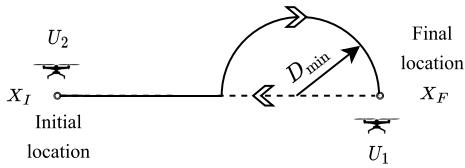  
Fig. 2. Trajectory initialization based on straight-line path.

Utilizing similar methods as used in the previous subsection, the constraint (10c) can be written as (D.2) with ${ \bf X } _ { m } ^ { r } [ n ] =$ $( \mathbf { q } _ { m } [ n ] , z _ { m } ^ { r } [ n ] )$ and ${ \bf X } _ { j } ^ { r } [ n ] = ( { \bf q } _ { j } [ n ] , z _ { j } ^ { r } [ n ] )$ , and the constraint (A.2) can be transformed to a convex function as (16). Similarly, non-convex constraint (A.4) can be written in convex form as

$$
\begin{array} { r l } & { \frac { 1 } { 2 } \left( \alpha _ { k , m } [ n ] + z _ { m } [ n ] ^ { 2 } \right) ^ { 2 } + \alpha _ { k , m } [ n ] \| \mathbf { q } _ { m } [ n ] - \mathbf { w } _ { k } \| ^ { 2 } } \\ & { \quad - \gamma _ { k , m } ^ { v } [ n ] \leq \beta _ { k , m } [ n ] , } \end{array}\tag{19}
$$

where $\begin{array} { r } { \gamma _ { k , m } ^ { v } [ n ] = \frac { 1 } { 2 } ( \alpha _ { k , m } ^ { r } [ n ] ^ { 2 } + z _ { m } ^ { r } [ n ] ^ { 4 } ) + \alpha _ { k , m } ^ { r } [ n ] ( \alpha _ { k , m } [ n ] - } \end{array}$ $\alpha _ { k , m } ^ { r } [ n ] ) + z _ { m } ^ { r } [ \bar { n } ] ^ { 2 } ( z _ { m } [ n ] ^ { 2 } - z _ { m } ^ { r } [ n ] ^ { 2 } )$ . Accounting the first-order Taylor expansions, the problem P3.2.1 is now convex and can be solved using the interior point method. Similar to the horizontal coordinate subproblem, P3.2.1 also converges to locally optimal solution of P3.2.

Finally, using the subproblems P3.1.1 and P3.2.1, we obtain the sub-optimal trajectories T of both the UAVs $U _ { 1 }$ and $U _ { 2 }$ for a given bandwidth B. Algorithm 1 presents the procedure to obtain T using alternating optimization. Here, in the first stage $\{ \mathbf { q } _ { m } [ n ] , \forall m , n \}$ is solved for a fixed $\{ z _ { m } [ n ] , \forall m , n \}$ , and in the second stage $\{ z _ { m } [ n ] , \forall m , n \}$ is solved for the obtained $\{ \mathbf { q } _ { m } [ n ] , \forall m , n \}$ . These two stages are iteratively executed until the objective function R converges.

## V. OVERALL ALGORITHM AND CONVERGENCE

In this section, we present the trajectory initialization strategy, overall algorithm to obtain the solution to problem P1.1, its computational complexity, and convergence.

## A. Trajectory Initialization Strategy

In this subsection, we present a low-complexity strategy to initialize the UAV trajectories that is based on straight flight trajectory. Later, in Appendix E, we compare the proposed initialization scheme with the other initialization schemes. With this initialization strategy, we ensure that all the constraints defined in problem P1 are satisfied. The strategy is as follows. First, we develop a straight-line between the initial and the final location. Second, to keep a safe distance between the ${ \mathrm { U A V s } } ,$ a semicircle of radius $D _ { m i n }$ is formed from the location $\left( D _ { m i n } - { \bf X } _ { F } \right)$ of the straight line connecting the initial and the final location. The two paths formed by considering such a semicircle are shown in Fig. 2. One path is the solid line while the other one is dashed line between the initial and the final location. Third, since the UAV launched from the initial location is full on energy, the UAV $U _ { 2 }$ will take a semicircle path to reach the final location, and the other UAV $U _ { 1 }$ takes a straight line path. When UAV $U _ { 2 }$ reaches the beginning of the semi-circle path, UAV $U _ { 1 }$ will leave the final location and move towards the charging location in a straight line path. Since the final location is feasible, the UAV must be present within the region of the final location to ensure that constraint (10e) is satisfied. The above design is specifically chosen because of its low-complexity systematic design and to satisfy all the constraints of the problem P1 (especially (10e)).

Furthermore, in this initial trajectory design, the UAV moves with a fixed speed which is same for both the UAVs. This velocity $v _ { m } [ n ]$ is obtained based on the energy available with the energy-constraint UAV, which is given by $v _ { m } [ n ] =$ $E _ { l e f t } / N$

## B. Overall Algorithm

Based on the analysis provided by decomposing the problem into subproblems, we present an alternating optimization algorithm to obtain a sub-optimal solution. The overall algorithm is presented in Algorithm 2. The steps in the Algorithm 2 are as follows. In step 1, we initialize the band width allocation $\mathbf { B } ^ { 0 }$ , and multi-UAV trajectory $\mathbf { T } ^ { 0 }$ . Step 2 to Step 7 involve the steps corresponding to alternating optimization, where bandwidth allocation and multi-UAV trajectory are optimized iteratively by fixing the other design variables. Particularly, in Step 3, for any given multi-UAV trajectory $\mathbf { T } ^ { r }$ we optimize the bandwidth allocated to each user by solving a linear programming problem. In Step 4, for an optimized bandwidth $\bar { \mathbf { B } } ^ { r + 1 }$ , the UAV trajectories $\mathbf T ^ { r + 1 }$ are optimized using Algorithm 1. The algorithm returns a solution when the difference in the objective function of the current iteration to the previous iteration is below the pre-defined tolerance ϵ.

## C. Computational Complexity

The computational complexity of the overall algorithm depends on the complexity involved in solving the trajectory optimization subproblem. In particular, it depends on the iterative scheme (Algorithm 1) that solves the horizontal and vertical coordinate optimization subproblem iteratively, for P3.1.1 and P3.2.1, respectively. The complexity to solve problem P3.1.1 is given by $C _ { h o r } \ \triangleq \ { \mathcal { O } } ( ( 4 K M N + ( M +$ $^ { 1 ) N ) ^ { 3 . 5 } \log ( 1 / \epsilon ) ) }$ , where $4 K M N + ( M + 1 ) N$ represents the number of variables that are to be optimized and ϵ represents the solution accuracy [33]. Similarly, the complexity to solve problem P3.2.1 is given by $C _ { v e r } \triangleq \mathcal { O } ( ( 4 K \bar { M } N \dot { + }$ $M N ) ^ { 3 . 5 } \log ( 1 / \epsilon ) )$ , where $4 K M N + M N$ represents the number of variables to be optimized for vertical coordinate optimization. Let $R _ { i t e r }$ indicates the number of iteration to achieve convergence of Algorithm 1, then the overall complexity is given by $\mathcal { O } ( R _ { i t e r } \mathrm { m a x } ( C _ { h o r } , C _ { v e r } ) )$

## D. Convergence Analysis

Since we have solved the approximate problems to obtain the multi-UAV trajectory and allocated bandwidth to each user, we need to ensure the convergence of the alternating optimization method. This is proved by showing that the objective value increases in each iteration in a maximization problem. Here, we first present the convergence of Algorithm 1. Then, using the convergence of Algorithm 1, we prove the convergence of the overall algorithm.

Algorithm 2 Overall Algorithm to Obtain Solution of (P1.1)   
Require: $\mathbf { \overline { { X } } } _ { I } , \mathbf { X } _ { F } , \mathbf { w } _ { k } , \forall k \in \mathcal { K } , V _ { m a x } .$   
1: Initialize $\mathbf { B } ^ { 0 } , \mathbf { T } ^ { 0 } ,$ , set acceptable tolerance $\epsilon = 1 0 ^ { - 4 }$ , and   
iteration count $r = 0 .$   
2: Repeat   
3: Fix $\mathbf { T } ^ { r }$ and solve for $\mathbf { B } ^ { r + 1 }$ in problem P2.   
4: Fix $\mathbf { B } ^ { r + 1 }$ , call Algorithm 1 to obtain $\mathbf { T } ^ { r + 1 }$   
5: Update $\{ \mathbf { T } ^ { r } , \mathbf { B } ^ { r } \}$ with $\{ \mathbf T ^ { r + 1 } , \mathbf B ^ { r + 1 } \}$   
6: Set $r = r + 1 ,$ , and calculate $\mathcal { R } ^ { r + 1 } .$   
7: Until $\mathcal { R } ^ { r + 1 } - \mathcal { R } ^ { r } \leq \epsilon .$

We define $\mathcal { R } ( \mathbf { Q } , \mathbf { Z } ) , \mathcal { R } _ { h o r } ^ { l b } ( \mathbf { Q } , \mathbf { Z } )$ , and $\mathcal { R } _ { v e r } ^ { l b } ( \mathbf { Q } , \mathbf { Z } )$ as the objective value of P3, horizontal coordinate optimization problem P3.1.3, and the vertical coordinate optimization problem P3.2.1, respectively, with $\textbf { Q } = \ \{ \mathbf { q } _ { m } [ n ] , \forall m , n \}$ and ${ \textbf { Z } } =$ $\{ z _ { m } [ n ] , \forall m , n \}$ . In Algorithm 1, for a fixed $\dot { \mathbf { Z } } ^ { r } , ~ \mathbf { Q } ^ { r + 1 }$ is optimized by solving P3.1.3. Then, we have

$$
\begin{array} { r l } & { { \mathcal { R } } ( \mathbf { Q } ^ { r } , \mathbf { Z } ^ { r } ) \stackrel { \mathrm { ( a ) } } { = } { \mathcal { R } } _ { h o r } ^ { l b } ( \mathbf { Q } ^ { r } , \mathbf { Z } ^ { r } ) } \\ & { \stackrel { \mathrm { ( b ) } } { \leq } { \mathcal { R } } _ { h o r } ^ { l b } ( \mathbf { Q } ^ { r + 1 } , \mathbf { Z } ^ { r } ) } \\ & { \stackrel { \mathrm { ( c ) } } { \leq } { \mathcal { R } } ( \mathbf { Q } ^ { r + 1 } , \mathbf { Z } ^ { r } ) , } \end{array}\tag{20}
$$

where (a) holds because of the tightness of the first-order Taylor expansion of the constraints at the local point, (b) holds since the optimal solution $\mathbf { Q } ^ { r + 1 }$ is obtained for the approximate problem with the given $\mathbf { Z } ^ { r }$ , and (c) holds because the approximate problem is the lower bound of the original problem at $\mathbf { Q } ^ { r + 1 }$ . Thus, (20) implies the objective function is non-decreasing after each iteration. Since the procedure to compute Z is similar to Q, then we have

$$
\mathcal { R } ( \mathbf { Q } ^ { r + 1 } , \mathbf { Z } ^ { r } ) \leq \mathcal { R } ( \mathbf { Q } ^ { r + 1 } , \mathbf { Z } ^ { r + 1 } ) .\tag{21}
$$

Through (20) and (21), we obtain $\begin{array} { r l } { \mathcal { R } ( \mathbf { Q } ^ { r } , \mathbf { Z } ^ { r } ) } & { { } \leq } \end{array}$ $\mathscr { R } ( \mathbf { Q } ^ { r \mp 1 } , \mathbf { Z } ^ { { \dot { r } } + { \dot { 1 } } } )$ . This implies that the objective value of Algorithm 1 is non-decreasing after each iteration by solving for both the horizontal and vertical coordinate optimization problems. Therefore, the trajectory optimization algorithm i.e., Algorithm 1 guarantees convergence.

Since we have followed the alternating optimization approach in Algorithm 2 to obtain $\mathbf { B } ^ { r + 1 }$ and $\mathbf { \bar { T } } ^ { r + 1 }$ , then we can directly write

$$
\mathcal { R } ( \mathbf { B } ^ { r } , \mathbf { T } ^ { r } ) \leq \mathcal { R } ( \mathbf { B } ^ { r + 1 } , \mathbf { T } ^ { r + 1 } ) .\tag{22}
$$

This shows that Algorithm 2 guarantees convergence. It is known that for alternating optimization algorithms, the performance of the converged solution in general depends on the initialization methods [14]. In our paper, we have considered a low-complexity and simple trajectory initialization as discussed in Section V-A.

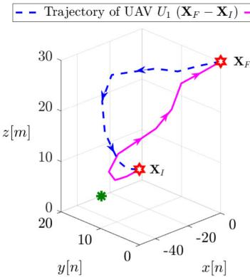

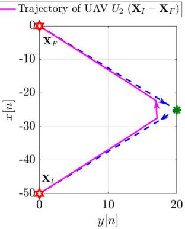  
(b)

(a)  
Fig. 3. UAV trajectories for both UAV $U _ { 1 }$ and $\mathrm { U A V } \ U _ { 2 }$ with $E _ { l e f t } = 5 0 0 0 \mathrm { J }$ in (a) 3D-plane, and (b) XY-plane.  
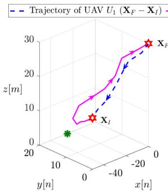

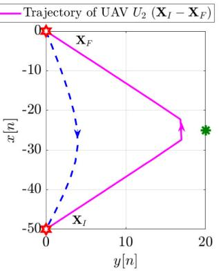  
(a)  
(b)  
Fig. 4. UAV trajectories for both $\mathrm { U A V } \ U _ { 1 }$ and UAV $U _ { 2 }$ with $E _ { l e f t } = 2 0 0 0 \mathrm { J }$ in (a) 3D-plane, and (b) XY-plane.

## E. Extension of the Proposed Scheme to Replace M UAVs

To enable multi-UAV replacement, the following points needs to be considered. First, we need to consider M hovering/final locations $\mathbf { X } _ { F }$ . Accordingly, in problem P1, there will be 2M initial and final location constraints in (10a) instead of four in the (10a). Second, instead of one energy availability constraint in (10d), there will be M onboard energy constraints as we are replacing M UAVs.

As stated in Section IV-A, for the given UAV trajectories, the bandwidth optimization problem will still be a convex problem (since $R _ { k }$ is the sum of rate achieved by the $k ^ { t h }$ user from each UAV, non-negative addition always results in a convex function). For the trajectory optimization, we can use similar approach because the non-negative sum of concave function is still concave. Therefore, for larger M, the function remains concave. Furthermore, the following conversions as described in Section IV-B to convert this non-convex constraint into the convex constraint will still hold. As a result, the same proposed approach described in Section V-B can be utilized to solve multi-UAV replacement problem. Hence, the proposed approach is valid even if we have more than two UAVs or we need to replace more than one UAV at a time. Next, we only focus on the optimization problem P1 when two UAVs are present.

## VI. NUMERICAL RESULTS

In this section, to evaluate the performance of our proposed scheme, we consider three scenarios. In Scenario 1, we consider a single user because when a single user is present, the algorithm maximizes the user’s throughput instead of max-min. Therefore, the max-min problem P1.1 will be equivalent to a maximization problem. In Scenario 2, we consider a multi-user UAV replacement mechanism. In Scenario 3, we consider the case when $K = 1 2$ users forming three clusters.

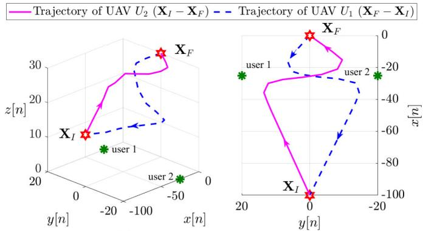  
(a)  
(b)  
Fig. 5. UAV trajectories for both $U _ { 1 }$ and $U _ { 2 }$ with $E _ { l e f t } = 5 0 0 0 ~ \mathrm { J }$ in (a) 3D-plane, and (b) XY-plane for Scenario 2.

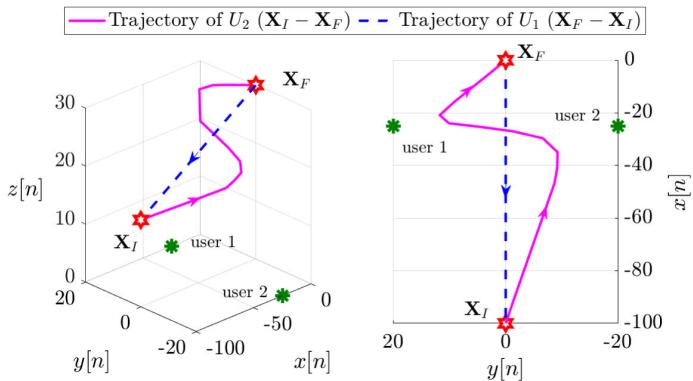  
(a)  
(b)  
Fig. 6. UAV trajectories for both $U _ { 1 }$ and $U _ { 2 }$ with $E _ { l e f t } = 2 5 0 0 ~ \mathrm { J }$ in (a) 3D-plane, and (b) XY-plane for Scenario 2.

In our system, we consider reference distance $\beta _ { 0 } = 1$ m and the environment parameters are set to $C = 1 0$ , and $D = 0 . 6$ We consider the pathloss exponent and additional attenuation as $\bar { \alpha } = 2$ , and $\kappa = 0 . 2$ , respectively [38], [41]. The time slot duration τ is set to $0 . 2 \ : \mathrm { s }$ with $N = 2 4$ time slots. Note that to keep the understanding of the UAV replacement mechanism simple, we have considered a smaller value of N and smaller field with closer initial and final locations. In general, this approach can also be applied to a larger value of N. The UAV’s starting location is considered as $\mathbf { X } _ { I } = \left( - 5 0 , 0 , 1 5 \right)$ m, and the final location is considered as $\mathbf { X } _ { F } = ( 0 , 0 , 3 0 ) ~ \mathbf { m }$ . The UAV transmits to each user with power $P _ { t r } = 0 . 1 \mathrm { ~ W ~ } [ 1 8 ]$ , and the total communication bandwidth B of the system is set to 20 MHz unless specified. The UAV’s maximum velocity is set to $V _ { m a x } = 3 0$ m/s [14]. The minimum safe distance between the UAVs to avoid collision is set to $D _ { m i n } \ = \ 1 0 \ \mathrm { ~ m ~ }$ . The parameters in energy consumption model are taken as follows: $P _ { o } = 7 9 . 8 6 ~ \mathrm { W } ,$ $P _ { i } = 8 8 . 6 3$ W, $v _ { o } = 4 . 0 3$ m/s, $d _ { 0 } = 0 . 6$

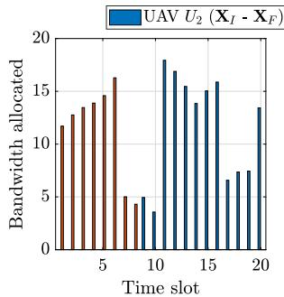

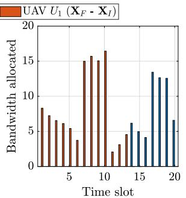  
(b) User 2

(a) User 1  
Fig. 7. Optimal bandwidth allocated to (a) the user 1, and (b) user 2, when $E _ { l e f t } = 5 0 0 0 ~ \mathrm { J }$  
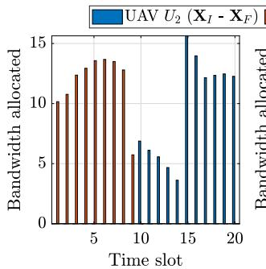  
(a) User 1

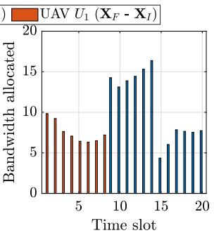  
(a) User 2  
Fig. 8. Optimal bandwidth allocated to (a) the user 1, and (b) user 2, when $\bar { E _ { l e f t } } = \bar { 2 5 } 0 0 \mathrm { ~ J ~ }$

$U _ { t i p } = 1 2 0 , \rho = 1 . 2 2 5 ~ \mathrm { k g / m ^ { 3 } } , S = 0 . 0 5 , W = 2 0 ~ \mathrm { N }$ and $A = 0 . 5 0 3 \ [ 1 ] , \ [ 4 2 ]$

## A. Scenario 1: Single-User UAV Replacement Mechanism

In this sub-section, we study a single-user UAV replacement mechanism. Figs. 3 and 4 exhibit the UAV trajectories for two different onboard energies, i.e., $E _ { l e f t } = 5 0 0 0 ~ \mathrm { J }$ and $E _ { l e f t } =$ 2000 J, respectively. In this single user case, it is intuitive that the UAVs would fly near to the users. The same can be observed from Fig. 3 wherein both the UAVs tend to fly close to the user, and try to get as close as possible to minimize path loss. To avoid collision, the UAVs maintain a safe distance with each other as shown in Fig. 3(a). As the UAV $U _ { 1 }$ is low on energy due to which replacement is required, a lesser energy will restrict the UAV to approach close to the user. As a result, it forces the UAV to take a path closer to the straight line between the deployment and the charging station to reach the charging station without exhausting its full energy, as shown in Fig. 4. To achieve a better performance, the ground user will connect only to a UAV with better channel conditions instead of associating with both the UAVs in a particular time slot. As a result, the whole system bandwidth is allocated to the user by the UAV with better channel condition.

## B. Scenario 2: Multi-User UAV Replacement Mechanism

Here, we consider two users and observe how the proposed scheme achieves fairness among the two ground users by adjusting the UAV trajectory and bandwidth allocation when the UAVs starting location $\mathbf { X } _ { I } = \left( - 1 0 0 , 0 , 1 5 \right)$ m, and ${ \bf X } _ { F } = { \bf \Phi }$ (0, 0, 30) m. Figs. 5 and 6 depicts the optimized trajectories of the UAVs based on different onboard energy available with the UAV $U _ { 1 }$ . It is worth noting that when two users are present, the UAV must move close to each user to provide a higher rate. However, to maintain fairness among the ground users (corresponding to our max-min problem), the UAV must maintain equal coverage to both the users for the whole flight duration. The term fairness here describes that a user must be provided with a sum rate equal to or comparable to other users during the service duration. The max-min problem achieves this fairness by maximizing the minimum rate provided to the users and finally, the solution returns the sum rate, which is equal or comparable to all the users. Similar to a single-user case, when UAV $U _ { 1 }$ has lesser energy available, UAV $U _ { 1 }$ takes a shorter path (straight line) to reach the charging station.

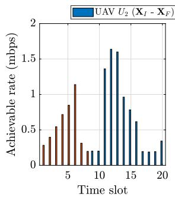  
(a) User 1

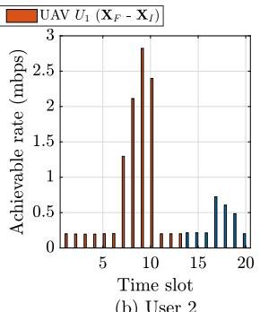  
(b) User 2  
Fig. 9. Achievable rate for (a) the user 1, and (b) user 2, when $E _ { l e f t } = 5 0 0 0 ~ \mathrm { J }$

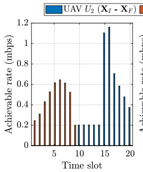

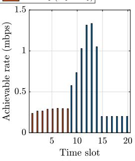  
(a) User 1  
(b) User 2  
Fig. 10. Achievable rate for (a) the user 1, and (b) user 2, when $E _ { l e f t } = 2 5 0 0 ~ \mathrm { J }$

To illustrate how much bandwidth is allocated to each user, we plot Fig. 7, and Fig. 8, with both $E _ { l e f t } = 5 0 0 0 ~ \mathrm { J } ,$ and $E _ { l e f t } = 2 5 0 0 ~ \mathrm { J }$ , respectively. Note that to ensure the user is under coverage in a particular time slot, we have applied a minimum rate constraint. As a result, the user will experience at least the minimum rate $R _ { t h }$ within a time slot. It can be seen from Fig. 7, and Fig. 8 that initially both users are associated with UAV $U _ { 1 }$ . After certain time slots, both the UAVs are functional and provide communication service to each ground user. Thereafter, at later stages, since UAV $U _ { 1 }$ is far from the ground users and is approaching charging station $\mathbf { X } _ { I } ,$ , only UAV $U _ { 2 }$ will be functional. Furthermore, we have plotted Fig. 9 and $\mathrm { F i g }$ . 10 to show the achievable rate for each user at every time slot. It can be observed that at every time slot, the ground user will experience a minimum threshold achievable rate $R _ { t h }$ due to the presence of constraint (10e). As a result, each user will get an uninterrupted rate of $R _ { t h }$

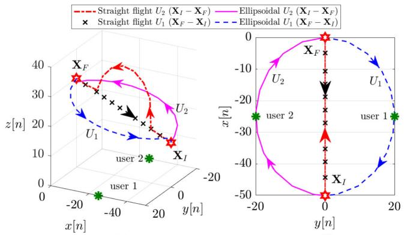

(a)  
(b)  
Fig. 11. Schematic for benchmark scheme considered for performance comparison.  
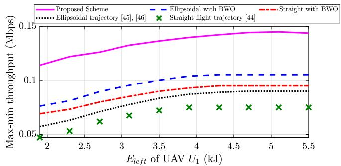  
Fig. 12. Comparison of proposed schemes with conventional schemes with different energy levels for Scenario 2.

To verify the performance of the proposed scheme, we consider four benchmark schemes as follows. (i) Straight flight trajectory [43]; (ii) Straight flight trajectory with bandwidth optimization (BWO); (iii) Ellipsoidal trajectory [44], [45]; (iv) Ellipsoidal trajectory with BWO. In a straight flight trajectory, the UAV travels in a straight line to reach the final location ensuring a minimum safe distance between the UAVs as described in Section V-A. In an ellipsoidal trajectory, UAVs travel by forming an arc in the opposite direction to reach their respective location, resulting in a trajectory that resembles an ellipse. For both the straight flight and ellipsoidal trajectory, the equal amount of bandwidth is allocated to each user from each UAV irrespective of the channel conditions. The schematic for straight flight trajectory and ellipsoidal trajectory is shown in Fig. 11. Under BWO scheme, the problem P2 (BWO) is solved for the pre-specified path of the UAVs, $i . e . ,$ , straight flight and ellipsoidal trajectory, such that the bandwidth is optimized to provide a fair rate to each user.

It can be observed from Fig. 12 that the proposed scheme provides better max-min rate compared to the other schemes as the energy availability increases. This is because as the energy level increases, the UAV has more freedom to get closer to the users and thereby providing higher rates. However, in the other schemes, such as straight flight and ellipsoidal trajectory with

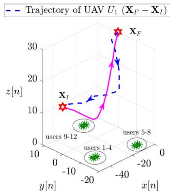  
(a)

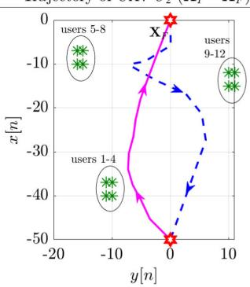  
(b)

Fig. 13. UAV trajectories for both UAV $U _ { 1 }$ and UAV $U _ { 2 }$ with $E _ { l e f t } = 5 0 0 0 ~ \mathrm { J }$ in (a) 3D-plane, and (b) XY-plane for Scenario 3.  
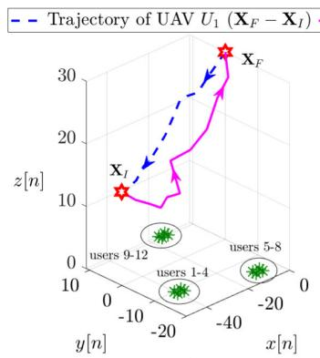  
(a)

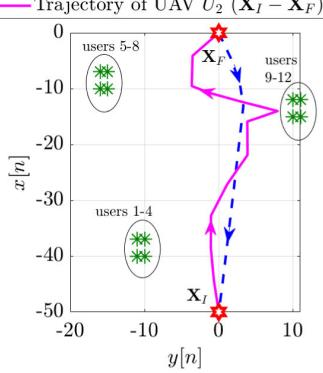  
(b)  
Fig. 14. UAV trajectories for both UAV $U _ { 1 }$ and UAV $U _ { 2 }$ with $E _ { l e f t } = 2 0 0 0$ J in (a) 3D-plane, and (b) XY-plane for Scenario 3.

BWO, straight flight trajectory, and ellipsoidal trajectory, the throughput is significantly lower than the proposed scheme. This is because, in the other schemes, the UAV follows a predefined path, and the user’s throughput only increases if the users are present along the UAV’s path. Therefore, optimizing the UAV trajectory and bandwidth allocation leads to a multi-fold performance enhancement in comparison to the benchmark schemes. Specifically, our proposed scheme provides on an average 42% improvement over the ellipsoidal with BWO (the best performing benchmark schemes) and 110% improvement over the straight flight trajectory (the worst performing benchmark scheme).

## C. Scenario 3: Clustered-Users UAV Replacement Mechanism

In this scenario, instead of following the user’s individual locations, the UAV treats the group of users as a cluster and optimizes its trajectory. This is useful in a real-world scenario because the computational complexity of the proposed scheme is linked directly to the number of ground users K. So, to obtain a low-complexity solution with large number of ground users, the best possible way is to group the users into some clusters and then compute the optimal UAV trajectories while providing sufficient coverage within the clusters (treating a group of users collectively). Note that a dedicated investigation is required on the clustering approach to obtain a low-complexity solution with better performance. This is because clustering can increase the efficiency of the network by distributing the nodes into a cluster and scheduling the UAV with the cluster head or cluster centroid. The choice of accurate clustering to improve the performance of the system is beyond the scope of this work.

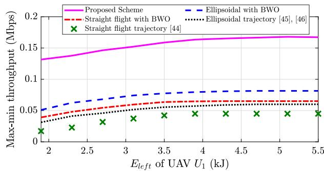  
Fig. 15. Comparison of max-min throughput with different energy levels for a clustered-user UAV replacement scenario.

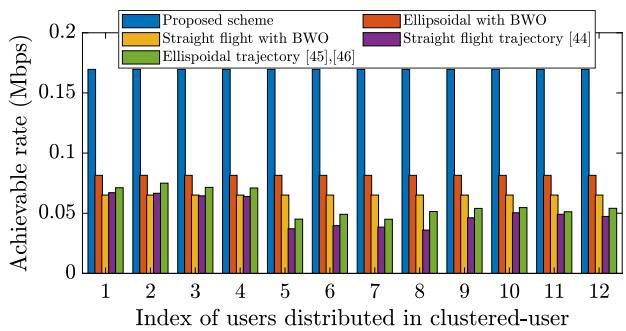  
Fig. 16. Comparison of achievable sum throughput of $K = 1 2$ users using different schemes for Scenario 3.

Similar to Scenario 1 and Scenario 2, Figs. 13, and 14 show the optimized trajectories for $E _ { l e f t } ~ = ~ 5 0 0 0 ~ \mathrm { ~ J ~ }$ and $E _ { l e f t } = 2 0 0 0 ~ \mathrm { J }$ energy levels, respectively. The comparison of the proposed scheme for Scenario 3 with other schemes is shown in Fig. 15. Apart from this, we also present the sum throughput obtained by each user during the total flight time in comparison to the benchmark schemes in Fig. 16. It can be observed that the benchmark schemes, such as straight flight trajectory and ellipsoidal trajectory provide a better rate to only some of the ground users that are closer to the trajectory of the UAVs. As a result, the other ground users get a significantly lesser rate. Furthermore, it is also challenging to maintain fairness among the ground users under such schemes. However, schemes such as straight flight with BWO and ellipsoidal with BWO can achieve fairness but at a lesser rate. In comparison to the benchmark schemes, multifold enhancement is achieved due to the joint optimization of multi-UAV trajectory and bandwidth allocation. In particular, we observe that our proposed scheme provides 110% and 250% improvement in the minimum rate provided to the users in comparison to the ellipsoidal with BWO and straight flight trajectory, respectively.

Through the numerical results, it can be verified that our UAV replacement framework is designed to ensure fairness among the ground users in terms of communication rate while jointly optimizing the UAV trajectories and resource allocation. Moreover, it is shown that the ground users are initially associated with the existing UAV, and at the later stages, the user rate requirement is achieved by the fully charged UAV. Finally, proposed framework ensures that minimum rate requirement is achieved for each ground user.

## VII. CONCLUSION

Given the UAV’s limited onboard energy availability, in this paper, we design a UAV replacement scheme to maintain coverage continuity in a UWC system. A fully charged UAV is launched from the charging station to replace an energydepleted UAV. Service fairness to all ground users is ensured by formulating a max-min throughput optimization problem to jointly optimize the 3D multi-UAV trajectory and resource allocation. The formulated problem is non-convex and an efficient iterative alternating optimization approach is proposed based on the SCA method to solve the optimization problem. Numerical results present insights on the UAV trajectories. Furthermore, our proposed scheme provides multi-fold performance enhancement in achievable sum rate due to the joint optimization of multi-UAV trajectory and bandwidth allocation in comparison to the benchmark schemes.

## APPENDIX A PROOF OF LEMMA 1

For ease of representation of $P _ { k , m } ^ { L } [ n ]$ defined in (4), we take

$$
\Phi _ { k , m } [ n ] = { \frac { z _ { m } [ n ] } { \| \mathbf { q } _ { m } [ n ] - \mathbf { w } _ { k } \| } } ,\tag{A.1}
$$

such that $P _ { k , m } ^ { L } [ n ]$ can be expressed as $\begin{array} { r l } { P _ { k , m } ^ { L } [ n ] } & { { } = } \end{array}$ $\big ( 1 + C \exp \big ( { - D [ \tan ^ { - 1 } \Phi _ { k , m } [ n ] - C ] } \big ) \big ) ^ { - 1 }$ . Then by introducing a variable $y _ { k , m } [ n ]$ , such that $0 \leq \operatorname { \mathcal { Y } } _ { k , m } [ n ] \leq P _ { k , m } ^ { L } [ n ]$ we have

$$
\big ( 1 + C \exp \big ( { - D [ \tan ^ { - 1 } \Phi _ { k , m } [ n ] - C ] } \big ) \big ) \leq \frac { 1 } { y _ { k , m } [ n ] } ,\tag{A.2}
$$

$$
y _ { k , m } [ n ] \geq 0 .\tag{A.3}
$$

Substituting $y _ { k , m } [ n ] \qquad \mathrm { i n } \qquad ( 1 2 ) ,$ we get $\alpha _ { k , m } [ n ] \left( \| \mathbf { q } _ { m } [ n ] - \mathbf { w } _ { k } \| ^ { 2 } + z _ { m } [ n ] ^ { 2 } \right) \leq ( 1 - \kappa ) y _ { k , m } [ n ] + \kappa$ To simplify further, we introduce $\beta _ { k , m } [ n ]$ , where

$$
\alpha _ { k , m } [ n ] ( \| \mathbf { q } _ { m } [ n ] - \mathbf { w } _ { k } \| ^ { 2 } + z _ { m } [ n ] ^ { 2 } ) \leq \beta _ { k , m } [ n ] ,\tag{A.4}
$$

$$
( 1 - \kappa ) y _ { k , m } [ n ] + \kappa \geq \beta _ { k , m } .\tag{A.5}
$$

With the above substitutions and introduction of auxiliary variables, it can be written in its equivalent forms represented by $( \mathrm { A } . 1 ) \mathrm { ~ - ~ } ( \mathrm { A } . 5 )$ .

## APPENDIX B PROOF OF LEMMA 2

Here, to tackle the difficulty of (A.1), we change the equality to inequality, represented as

$$
\Phi _ { k , m } [ n ] \leq { \frac { z _ { m } [ n ] } { \| \mathbf { q } _ { m } [ n ] - \mathbf { w } _ { k } \| } } , \forall k , m , n .\tag{B.1}
$$

In the problem P3.1.1 with (B.1) instead of (A.1) (we name this problem as P3.1.2), the optimal solution can only be achieved when (B.1) is active, that is, $\Phi _ { k , m } [ n ] =$ $\frac { z _ { m } [ n ] } { \| \mathbf { q } _ { m } [ n ] - \mathbf { w } _ { k } \| } , \forall k , m , n$ . This can be proved by the contradiction. We assume that the optimal solution to P3.1.2 is $\mathcal { R } ^ { * } , \mathbf { q } _ { k , m } [ n ] ^ { * } , \mathcal { X } ^ { * }$ , which satisfies $R _ { i } \left( \alpha _ { i , m } [ n ] ^ { * } \right) > \mathcal { R } ^ { * } , \exists i \in$ k, and $R _ { k } \left( \alpha _ { k , m } [ n ] ^ { * } \right) ~ = ~ \mathcal { R } ^ { * } , k ~ \neq ~ i$ . Then the value of $R _ { i } \left( \alpha _ { i , m } [ n ] ^ { * } \right)$ to make $R _ { i } \left( \alpha _ { i , m } [ n ] ^ { * } \right) ~ = ~ \mathcal { R } ^ { * }$ hold, whereas the objective function $\mathcal { R } ^ { * }$ does not change. Then to make this happen, we need to decrease the $b _ { i , m } [ n ]$ , which will not return a feasible solution as the value of $b _ { i , m } [ n ]$ is fixed from the bandwidth optimization problem. This is in contradiction to the optimal solution. Therefore, the constraint (B.1) need to be active while obtaining the optimal solution to P3.1.2. Then, it can be observed that the problem P3.1.2 has the same condition on constraints as of P3.1.1. Moreover, due to the presence of the same objective function, the solution to P3.1.1 can be obtained while solving P3.1.2. Thus, problem P3.1.2 is equivalent to P3.1.1.

Since (B.1) is of the form “convex × convex $\leq$ constant”, we use square of sum formula to make (B.1) a difference of convex function. Then, we get

$$
\begin{array} { l } { \displaystyle \frac 1 2 \left( \Phi _ { k , m } [ n ] + \| \mathbf { q } _ { m } [ n ] - \mathbf { w } _ { k } \| \right) ^ { 2 } } \\ { \displaystyle - \frac 1 2 \left( \Phi _ { k , m } [ n ] ^ { 2 } + \| \mathbf { q } _ { m } [ n ] - \mathbf { w } _ { k } \| ^ { 2 } \right) \le z _ { m } [ n ] . } \end{array}\tag{B.2}
$$

It can be observed that the (B.2) is of the form $f - g ,$ , where $f$ and g are both convex. To make (B.2) a convex constraint, g must be affine. Thus, we use first-order Taylor series expansion at any feasible point [23]. Then, $g$ can be approximated as

$$
\begin{array} { l } { { \displaystyle \lambda _ { k , m } [ n ] = \frac { 1 } { 2 } \big ( \boldsymbol { \Phi } _ { k , m } ^ { r } [ n ] ^ { 2 } + \| { \bf q } _ { m } ^ { r } [ n ] - { \bf w } _ { k } \| ^ { 2 } \big ) + \big ( \Phi _ { k , m } [ n ] - \Phi _ { k , m } ^ { r } [ n ] \big ) } } \\ { { \displaystyle \Phi _ { k , m } ^ { r } [ n ] + \| { \bf q } _ { m } ^ { r } [ n ] - { \bf w } _ { k } \| \big ( \| { \bf q } _ { m } [ n ] - { \bf w } _ { k } \| - \| { \bf q } _ { m } ^ { r } [ n ] - { \bf w } _ { k } \| \big ) , } } \end{array}\tag{B.3}
$$

where $\Phi _ { k , m } ^ { r } [ n ] , \mathbf { q } _ { m } ^ { r } [ n ]$ is the value of $\Phi _ { k , m } [ n ] , \mathbf { q } _ { m } [ n ]$ in the $r ^ { t h } -$ iteration, respectively. Using (B.3) in (B.2), the constraint in (B.1) is approximated to a convex constraint given in (15).

## APPENDIX C PROOF OF CONVEXITY OF $P _ { \Phi _ { k , m } [ n ] }$

From composition property, $P _ { \Phi _ { k , m } [ n ] }$ can also be represented in the form of $f ~ = ~ 1 + \overrightarrow { C } h \big ( g ( \Phi _ { k , m } [ n ] ) \big )$ , where $h \ = \ \exp { . }$ , and $g ( \Phi ) ~ = ~ - D \left[ \tan ^ { - 1 } \Phi _ { k , m } [ n ] - \stackrel { . } { C } \right]$ . Then, $f$ is convex, if h is convex and non-decreasing, and $g$ is convex [40].

To prove that g is convex, we first noticed that $\Phi _ { k , m } [ n ] =$ $\frac { z _ { m } [ n ] } { \| \mathbf { q } _ { m } [ n ] - w _ { k } \| }$ , which implies $\Phi _ { k , m } [ n ] ~ \in ~ ( 0 , \operatorname { i n f } )$ . Taking the second derivative of $g ( \Phi _ { k , m } [ n ] )$ with respect to $\Phi _ { k , m } [ n ]$ we get

$$
\frac { \partial ^ { 2 } g ( \Phi _ { k , m } [ n ] ) } { \partial \Phi _ { k , m } [ n ] ^ { 2 } } = \frac { 2 D \Phi _ { k , m } [ n ] } { ( 1 + \Phi _ { k , m } [ n ] ^ { 2 } ) ^ { 2 } }
$$

Since $\Phi _ { k , m } [ n ] ~ \in ~ ( 0 , \operatorname { i n f } )$ , the $\frac { \partial ^ { 2 } g ( \Phi _ { k , m } [ n ] ) } { \partial \Phi _ { k , m } [ n ] ^ { 2 } } > 0 .$ , because $D ~ > ~ 0$ that corresponds to the parameter representing the nature of the environment, such as urban, sub-urban, etc. Thus, $g ( \Phi _ { k , m } [ n ] )$ is convex.

Now, according to [40], since $e ^ { x }$ is always a convex and non-decreasing function, and $C \ > \ 0$ (similar to D), the resultant function $f$ is convex. As a result, $P _ { \Phi _ { k , m } [ n ] }$ is convex in $\Phi _ { k , m } [ n ]$ .

## APPENDIX D PROOF OF LEMMA 3

To deal with the non-convex constraint in (10c), we introduce an auxiliary variable $D _ { m , j } [ n ] = \{ { \bf X } _ { m } [ n ] - { \bf X } _ { j } [ n ] , \forall n , j \neq$ m}. Then, (10c) can be written as $\begin{array} { r l } { \| D _ { m , j } [ n ] \| ^ { 2 } } & { { } \ge } \end{array}$ $D _ { m i n } ^ { 2 } , \forall n , j \neq m$ , so that the left side $\| D _ { m , j } [ n ] \| ^ { 2 }$ is convex in $D _ { m , j } [ n ]$ ]. Using first order Taylor series expansion to obtain the global lower bound of convex function, we get

$$
\| D _ { m , j } [ n ] \| ^ { 2 } \geq 2 \left( D _ { m , j } ^ { r } [ n ] \right) ^ { T } \left( D _ { m , j } [ n ] - D _ { m , j } ^ { r } [ n ] \right) + \| D _ { m , j } ^ { r } [ n ] \| ^ { 2 } ,\tag{D.1}
$$

for a given $D _ { m , j } ^ { r } [ n ]$ . Using (10c), (D.1) is converted into

$$
2 \left( \mathbf { X } _ { m } ^ { r } [ n ] - \mathbf { X } _ { j } ^ { r } [ n ] \right) ^ { T } \left( \mathbf { X } _ { m } [ n ] - \mathbf { X } _ { j } [ n ] - \mathbf { X } _ { m } ^ { r } [ n ] - \mathbf { X } _ { j } ^ { r } [ n ] \right) +
$$

$$
\| \mathbf { X } _ { m } ^ { r } [ n ] - \mathbf { X } _ { j } ^ { r } [ n ] \| ^ { 2 } \geq D _ { m i n } ^ { 2 } ,\tag{D.2}
$$

where ${ \bf X } _ { m } ^ { r } [ n ] = ( { \bf q } _ { m } ^ { r } [ n ] , z _ { m } [ n ] )$ and ${ \bf X } _ { j } ^ { r } [ n ] = ( { \bf q } _ { j } ^ { r } [ n ] , z _ { j } [ n ] )$

From (10d), it can be observed that the energy constraint is the non-negative sum of $e _ { 1 } [ n ]$ , where $e _ { 1 } [ n ]$ is defined in (10d). It can be observed that the first and third term is convex, where as the second term is non-convex. To deal with the second term, we follow the same procedure as described in [38] and add an additional non-convex constraint to make $e _ { 1 } [ n ]$ convex. The additional non-convex constraint is given by

$$
\frac { \tau ^ { 4 } } { g _ { 1 } [ n ] ^ { 2 } } = g _ { 1 } [ n ] ^ { 2 } + \frac { \Delta _ { 1 } [ n ] ^ { 2 } } { v _ { o } ^ { 2 } } , g _ { 1 } [ n ] \geq 0 , \forall n ,\tag{D.3}
$$

where $\Delta _ { 1 } [ n ] = \| { \bf q } _ { 1 } [ n + 1 ] - { \bf q } _ { 1 } [ n ] \|$ . Then the first order taylor expansion can be utilized to obtain its global lower bound, which is given by

$$
g _ { 1 } [ n ] ^ { 2 } + \frac { \Delta _ { 1 } [ n ] } { v _ { o } ^ { 2 } } \ge g _ { 1 } ^ { r } [ n ] ^ { 2 } + 2 g _ { 1 } ^ { r } [ n ] \left( g _ { 1 } [ n ] - g _ { 1 } ^ { r } [ n ] \right) - \frac { \Delta _ { 1 } ^ { r } [ n ] } { v _ { o } ^ { 2 } }
$$

$$
+ \frac { 2 } { v _ { o } ^ { 2 } } \left( \mathbf { q } _ { 1 } ^ { r } [ n + 1 ] - \mathbf { q } _ { 1 } ^ { r } [ n ] \right) ^ { T } \left( \mathbf { q } _ { 1 } ^ { r } [ n + 1 ] - \mathbf { q } _ { 1 } [ n ] \right) ,\tag{D.4}
$$

where $\Delta _ { 1 } ^ { r } [ n ] = \| { \bf q } _ { 1 } ^ { r } [ n + 1 ] - { \bf q } _ { 1 } ^ { r } [ n ] \|$ , and $g _ { 1 } ^ { r } [ n ] , \mathbf { q } _ { 1 } ^ { r } [ n ]$ , and $\mathbf { q } _ { 1 } ^ { r } [ n + 1 ]$ are the values of $g _ { 1 } [ n ] , \mathbf { q } _ { 1 } [ n ]$ , and $\mathbf { q } _ { 1 } [ n + 1 ] { \mathrm { ~ a t ~ } } r ^ { t h } .$ iteration, respectively.

## APPENDIX E

## PERFORMANCE OF PROPOSED INITIALIZATION SCHEME

In this section, we show the comparison of our proposed initialization scheme with other schemes. We consider three different initialization schemes, proposed initialization (as described in Section $\mathrm { V } { \cdot } \mathrm { A } )$ , straight-flight initialization [43], and ellipsoidal-based initialization [44], [45] as described in Section VI-B. In both the scheme, we assume the existing UAV $U _ { 1 }$ that low on energy travels in a straight line to reach $\mathbf { X } _ { I }$ . Furthermore, for all the initialization schemes, we assume equal amount of bandwidth is allocated to each user from each UAV irrespective of the channel conditions.

To compare the performance of the proposed initialization scheme, we plot two figures, Figs. 17 and 18 for clustered-based setup (Scenario 3), where 12 users are distributed in clusters. We consider the initial and final locations to be $( - 1 0 0 , 0 , 1 5 )$ m and (0, 0, 30) m, respectively. First, Fig. 17 shows the achievable rate delivered at each time slot by different initialization schemes. Then, Fig. 18 shows the amount of rate achieved by each user with different initialization scheme during the replacement process. It can be verified from Fig. 17 that the sum achievable rate provided by the proposed initialization is more compared to the other schemes. This is because, the fully charged UAV $U _ { 2 }$ first goes to location $\left( D _ { m i n } - { \bf X } _ { F } \right)$ even when $U _ { 1 }$ is serving at the final location (as described in the Section V-A), this in turns increases the achievable rate to a higher extent. Furthermore, Fig. 18 shows the achievable rate by each user during the flight time. Same can also be observed that the rate provided by the proposed initialization scheme is high compared to the other schemes because one of the UAV will always serve from the location that is closer to the final location.

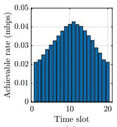  
(a)

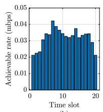  
(b)

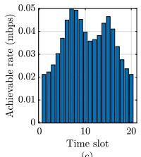  
(c)

Fig. 17. Achievable rate delivered by the communication setup with different initialization UAV trajectories, (a) ellipsoidal trajectory, (b) straight flight trajectory, and (c) proposed initialization.  
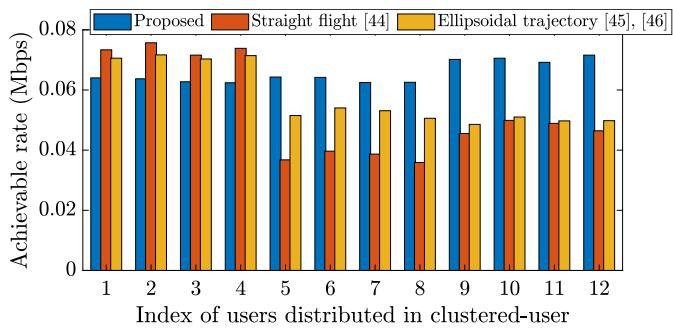  
Fig. 18. Performance comparison of different initialization schemes based on the achievable rate achieved by each ground user.

## REFERENCES

[1] N. Gupta, S. Agarwal, and D. Mishra, “Trajectory design for throughput maximization in UAV-assisted communication system,” IEEE Trans. Green Commun. Netw., vol. 5, no. 3, pp. 1319–1332, Sep. 2021.

[2] M. Mozaffari, W. Saad, M. Bennis, Y.-H. Nam, and M. Debbah, “A tutorial on UAVs for wireless networks: Applications, challenges, and open problems,” IEEE Commun. Surveys Tuts., vol. 21, no. 3, pp. 2334–2360, 3rd Quart., 2019.

[3] N. Gupta, S. Agarwal, and D. Mishra, “UAV deployment for throughput maximization in a UAV-assisted cellular communications,” in Proc. IEEE 32nd Annu. Int. Symp. Pers., Indoor Mobile Radio Commun. (PIMRC), Helsinki, Finland, Sep. 2021, pp. 1055–1060.

[4] Y. Wang, Z. Su, N. Zhang, and R. Li, “Mobile wireless rechargeable UAV networks: Challenges and solutions,” IEEE Commun. Mag., vol. 60, no. 3, pp. 33–39, Mar. 2022.

[5] S. Yin, L. Li, and F. R. Yu, “Resource allocation and basestation placement in downlink cellular networks assisted by multiple wireless powered UAVs,” IEEE Trans. Veh. Technol., vol. 69, no. 2, pp. 2171–2184, Feb. 2020.

[6] N. K. Ure, G. Chowdhary, T. Toksoz, J. P. How, M. A. Vavrina, and J. Vian, “An automated battery management system to enable persistent missions with multiple aerial vehicles,” IEEE/ASME Trans. Mechatronics, vol. 20, no. 1, pp. 275–286, Feb. 2015.

[7] M.-M. Zhao, Q. Shi, and M.-J. Zhao, “Efficiency maximization for UAV-enabled mobile relaying systems with laser charging,” IEEE Trans. Wireless Commun., vol. 19, no. 5, pp. 3257–3272, May 2020.

[8] S. Sekander, H. Tabassum, and E. Hossain, “Statistical performance modeling of solar and wind-powered UAV communications,” IEEE Trans. Mobile Comput., vol. 20, no. 8, pp. 2686–2700, Aug. 2021.

[9] X. Qin, Z. Song, Y. Hao, and X. Sun, “Joint resource allocation and trajectory optimization for multi-UAV-Assisted multi-access mobile edge computing,” IEEE Wireless Commun. Lett., vol. 10, no. 7, pp. 1400–1404, Jul. 2021.

[10] M. T. Mamaghani and Y. Hong, “Terahertz meets untrusted UAVrelaying: Minimum secrecy energy efficiency maximization via trajectory and communication co-design,” IEEE Trans. Veh. Technol., vol. 71, no. 5, pp. 4991–5006, May 2022.

[11] S. K. Singh, R. Singh, and B. Kumbhani, “The evolution of radio access network towards open-RAN: Challenges and opportunities,” in Proc. IEEE Wireless Commun. Netw. Conf. Workshops (WCNCW), Seoul, South Korea, Apr. 2020, pp. 1–6.

[12] Y. Xu, L. Xiao, D. Yang, Q. Wu, and L. Cuthbert, “Throughput maximization in multi-UAV enabled communication systems with difference consideration,” IEEE Access, vol. 6, pp. 55291–55301, 2018.

[13] J. Wang, Z. Na, and X. Liu, “Collaborative design of multi-UAV trajectory and resource scheduling for 6G-enabled Internet of Things,” IEEE Internet Things J., vol. 8, no. 20, pp. 15096–15106, Oct. 2021.

[14] Q. Wu, Y. Zeng, and R. Zhang, “Joint trajectory and communication design for multi-UAV enabled wireless networks,” IEEE Trans. Wireless Commun., vol. 17, no. 3, pp. 2109–2121, Mar. 2018.

[15] M. T. Nguyen and L. B. Le, “Resource allocation, trajectory optimization, and admission control in UAV-based wireless networks,” IEEE Netw. Lett., vol. 3, no. 3, pp. 129–132, Sep. 2021.

[16] Y. Wu, W. Fan, W. Yang, X. Sun, and X. Guan, “Robust trajectory and communication design for multi-UAV enabled wireless networks in the presence of jammers,” IEEE Access, vol. 8, pp. 2893–2905, 2020.

[17] C. Shen, T.-H. Chang, J. Gong, Y. Zeng, and R. Zhang, “Multi-UAV interference coordination via joint trajectory and power control,” IEEE Trans. Signal Process., vol. 68, pp. 843–858, 2020.

[18] J. Ji, K. Zhu, D. Niyato, and R. Wang, “Joint cache placement, flight trajectory, and transmission power optimization for multi-UAV assisted wireless networks,” IEEE Trans. Wireless Commun., vol. 19, no. 8, pp. 5389–5403, Aug. 2020.

[19] W. Zhang, Q. Wang, X. Liu, Y. Liu, and Y. Chen, “Three-dimension trajectory design for multi-UAV wireless network with deep reinforcement learning,” IEEE Trans. Veh. Technol., vol. 70, no. 1, pp. 600–612, Jan. 2021.

[20] H. Yang, R. Ruby, Q.-V. Pham, and K. Wu, “Aiding a disaster spot via multi-UAV-based IoT networks: Energy and mission completion timeaware trajectory optimization,” IEEE Internet Things J., vol. 9, no. 8, pp. 5853–5867, Apr. 2022.

[21] J. Chen et al., “Deep reinforcement learning based resource allocation in multi-UAV-aided MEC networks,” IEEE Trans. Commun., vol. 71, no. 1, pp. 296–309, Jan. 2023.

[22] X. Liu, Z. Liu, B. Lai, B. Peng, and T. S. Durrani, “Fair energy-efficient resource optimization for multi-UAV enabled Internet of Things,” IEEE Trans. Veh. Technol., vol. 72, no. 3, pp. 3962–3972, Mar. 2023.

[23] W. Luo, Y. Shen, B. Yang, S. Wang, and X. Guan, “Joint 3-D trajectory and resource optimization in multi-UAV-enabled IoT networks with wireless power transfer,” IEEE Internet Things J., vol. 8, no. 10, pp. 7833–7848, May 2021.

[24] M. T. Mamaghani and Y. Hong, “Improving PHY-security of UAVenabled transmission with wireless energy harvesting: Robust trajectory design and communications resource allocation,” IEEE Trans. Veh. Technol., vol. 69, no. 8, pp. 8586–8600, Aug. 2020.

[25] C.-W. Lan, C.-J. Wu, H.-J. Shen, H.-C. Lin, P.-J. Chu, and C.-F. Hsu, “Development of the autonomous battery replacement system on the unmanned ground vehicle for the drone endurance,” in Proc. Int. Conf. Fuzzy Theory Its Appl. (iFUZZY), Hsinchu, Taiwan, Nov. 2020, pp. 1–4.

[26] Y. Guetta and A. Shapiro, “On-board physical battery replacement system and procedure for drones during flight,” IEEE Robot. Autom. Lett., vol. 7, no. 4, pp. 9755–9762, Oct. 2022.

[27] V. Sanchez-Aguero, F. Valera, I. Vidal, C. Tipantuña, and X. Hesselbach, “Energy-aware management in multi-UAV deployments: Modelling and strategies,” Sensors, vol. 20, no. 10, p. 2791, May 2020.

[28] A. N. Patra, P. A. Regis, and S. Sengupta, “Dynamic self-reconfiguration of unmanned aerial vehicles to serve overloaded hotspot cells,” Comput. Electr. Eng., vol. 75, pp. 77–89, May 2019.

[29] B. Sahay, C.-C. Lai, and L.-C. Wang, “The outage-free replacement problem in unmanned aerial vehicle base stations,” IEEE Trans. Veh. Technol., vol. 70, no. 12, pp. 13390–13395, Dec. 2021.

[30] M. Shan and X. Zhang, “Multi-UAV path planning model with multiple battery recharge points,” in Proc. 9th Int. Conf. Dependable Syst. Their Appl. (DSA), Wulumuqi, China, Aug. 2022, pp. 832–837.

[31] H. Hellaoui, B. Yang, T. Taleb, and J. Manner, “Seamless replacement of UAV-BSs providing connectivity to the IoT,” in Proc. IEEE Global Commun. Conf. (GLOBECOM), Rio de Janeiro, Brazil, Dec. 2022, pp. 3641–3646.

[32] N. Gupta, S. Agarwal, and D. Mishra, “Multi-UAV replacement and trajectory design for coverage continuity,” in Proc. IEEE Int. Conf. Commun. (ICC), Seoul, South Korea, May 2022, pp. 1–6.

[33] C. You and R. Zhang, “3D trajectory optimization in Rician fading for UAV-enabled data harvesting,” IEEE Trans. Wireless Commun., vol. 18, no. 6, pp. 3192–3207, Jun. 2019.

[34] N. Gupta, S. Agarwal, and D. Mishra, “Joint trajectory and velocity-time optimization for throughput maximization in energy-constrained UAV,” IEEE Internet Things J., vol. 9, no. 23, pp. 24516–24528, Dec. 2022.

[35] T. Zhang, G. Liu, H. Zhang, W. Kang, G. K. Karagiannidis, and A. Nallanathan, “Energy-efficient resource allocation and trajectory design for UAV relaying systems,” IEEE Trans. Commun., vol. 68, no. 10, pp. 6483–6498, Oct. 2020.

[36] M. Mozaffari, W. Saad, M. Bennis, and M. Debbah, “Drone small cells in the clouds: Design, deployment and performance analysis,” in Proc. IEEE Global Commun. Conf. (GLOBECOM), San Diego, CA, USA, Dec. 2015, pp. 1–6.

[37] N. Gupta, D. Mishra, and S. Agarwal, “Energy-aware trajectory design for outage minimization in UAV-assisted communication systems,” IEEE Trans. Green Commun. Netw., vol. 6, no. 3, pp. 1751–1763, Sep. 2022.

[38] Y. Zeng, J. Xu, and R. Zhang, “Energy minimization for wireless communication with rotary-wing UAV,” IEEE Trans. Wireless Commun., vol. 18, no. 4, pp. 2329–2345, Apr. 2019.

[39] H. Wang, G. Ren, J. Chen, G. Ding, and Y. Yang, “Unmanned aerial vehicle-aided communications: Joint transmit power and trajectory optimization,” IEEE Wireless Commun. Lett., vol. 7, no. 4, pp. 522–525, Aug. 2018.

[40] S. Boyd and L. Vandenberghe, Convex Optimization. Cambridge, U.K.: Cambridge Univ. Press, 2004.

[41] A. Girdher, A. Bansal, and A. Dubey, “Second-order statistics for IRSassisted multiuser vehicular network with co-channel interference,” IEEE Trans. Intell. Vehicles, vol. 8, no. 2, pp. 1800–1812, Feb. 2023.

[42] A. Girdher, A. Bansal, and A. Dubey, “On the performance of SLIPTenabled DF relay-aided hybrid OW/RF network,” IEEE Syst. J., vol. 16, no. 4, pp. 5973–5984, Dec. 2022.

[43] C. Zhan, Y. Zeng, and R. Zhang, “Energy-efficient data collection in UAV enabled wireless sensor network,” IEEE Wireless Commun. Lett., vol. 7, no. 3, pp. 328–331, Jun. 2018.

[44] D. C. Gandolfo, L. R. Salinas, A. Brandão, and J. M. Toibero, “Stable path-following control for a quadrotor helicopter considering energy consumption,” IEEE Trans. Control Syst. Technol., vol. 25, no. 4, pp. 1423–1430, Jul. 2017.

[45] C. Villaseñor, A. A. Gallegos, G. Lopez-Gonzalez, J. Gomez-Avila, J. Hernandez-Barragan, and N. Arana-Daniel, “Ellipsoidal path planning for unmanned aerial vehicles,” Appl. Sci., vol. 11, no. 17, p. 7997, Aug. 2021.

Nishant Gupta (Member, IEEE) received the B.Tech. degree in electronics and communication engineering from the Chandigarh Engineering College, Mohali, India, in 2015, the M.Tech. degree in electronics and communication from Panjab University, Chandigarh, India, in 2018, and the Ph.D. degree from the Indian Institute of Technology at Ropar, India, in 2023. He is currently a Post-Doctoral Researcher with the Department of Electrical Engineering, Linköping University, Linköping, Sweden. His current research interests include 5G networks, UAV communications, air-borne networks, and optimization.

Satyam Agarwal (Senior Member, IEEE) received the Ph.D. degree in electrical engineering from IIT Delhi in 2016. He was an Assistant Professor with IIT Guwahati. In 2017, he was a Post-Doctoral Researcher with Politecnico di Torino, Turin, Italy. He is currently an Assistant Professor with the Department of Electrical Engineering, IIT Ropar, India. His current research interests include wireless communication networks, including next-generation networks, 5G networks and architecture, and airborne networks.

Deepak Mishra (Senior Member, IEEE) received the Ph.D. degree in electrical engineering from the Indian Institute of Technology (IIT) Delhi in 2017. Currently, he is a Senior Lecturer with the School of Electrical Engineering and Telecommunications, University of New South Wales (UNSW) Sydney, Australia, where he joined as a Senior Research Associate in August 2019. Before that, he was a Post-Doctoral Researcher with Linköping University, Sweden, from August 2017 to July 2019. He has also been a Visiting Researcher with Northeastern

University, USA, the University of Rochester, USA, Huawei Technologies, France, and Southwest Jiaotong University, China. His current research interests include energy harvesting cooperative communication networks, MIMO, backscattering, physical layer security, and signal processing and energy optimization schemes for the uninterrupted operation of wireless networks. He serves as an Associate Editor for IEEE WIRELESS COMMUNICATIONS LETTERS, IEEE ACCESS, and Communication Theory Track of Frontiers in Communications and Networks.

Brijesh Kumbhani (Senior Member, IEEE) received the B.E. degree in electronics and communication engineering (ECE) from Dharmsinh Desai University (DDU), Nadiad, India, in 2010, and the Ph.D. degree from the Department of Electronics and Electrical Engineering (EEE), Indian Institute of Technology at Guwahati, in 2015. Since June 2016, he has been an Assistant Professor with the Indian Institute of Technology at Ropar. He was an Assistant Professor with the Indian Institute of Information Technology

Kota from July 2015 to June 2016. His current research interests include MIMO wireless communication, cloud radio access networks (C-RAN) with mm-wave microwave integration for vehicular communications, and joint sensing and communication.