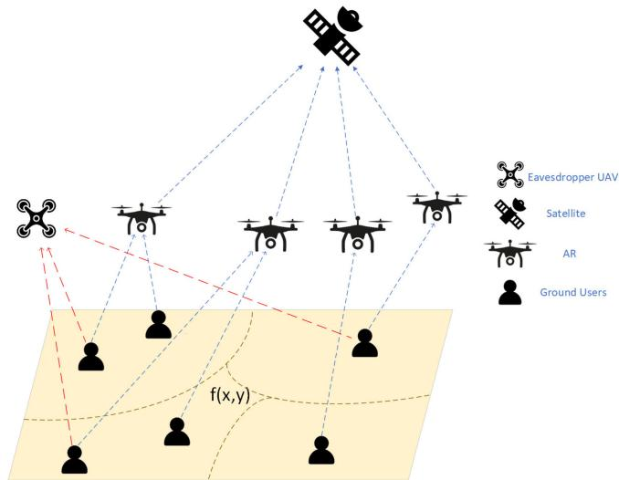
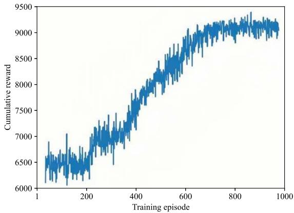
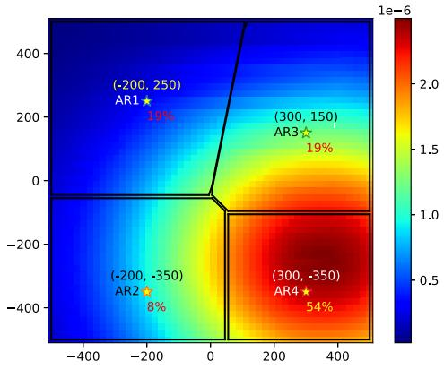
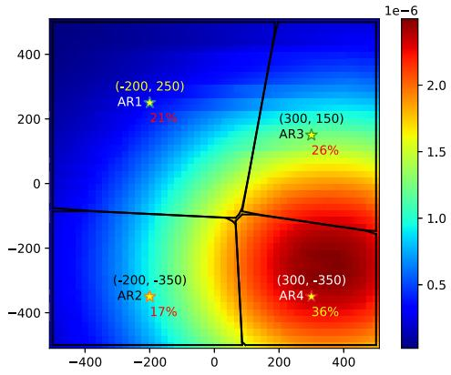
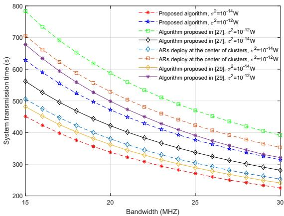
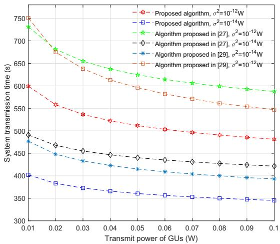
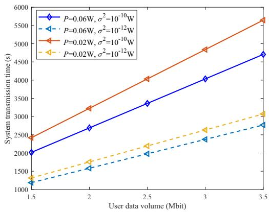
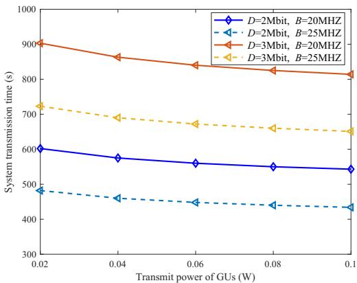

# Transmission Time Minimization-Based UAV Deployment and Resource Allocation With Random User Position Information

Rong Chai , Senior Member, IEEE, Huiling Wang , Hong Chen , Member, IEEE, Lin He , Ruijin Sun , Member, IEEE, and Qianbin Chen

Abstract—Exploiting unmanned aerial vehicles (UAVs) in terrestrial cellular networks has received considerable attention for their advanced transmission capability, flexible deployment and cost effectiveness, etc. In certain communication scenarios where the links from ground users (GUs) to base stations (BSs) or satellites may not be accessible, UAVs can be deployed as aerial relays (ARs) to forward data packets for the GUs. In this paper, we investigate the AR deployment and resource allocation problem in a UAV-assisted satellite communication system. Stressing the importance of system transmission time, we formulate the joint AR deployment, power allocation and user association problem as a constrained system transmission time minimization problem. Since the formulated optimization problem is non-convex and non-linear with the AR deployment and user association variables being coupled, it is challenging to solve. To tackle this problem, the original optimization problem is decomposed into subproblems, namely AR deployment and power allocation subproblem, and user clustering and association subproblem. Given the initial user association strategy and the number of ARs, the AR deployment and power allocation subproblem is formulated and solved by using multi-agent deep Q network algorithm. Then, given the AR deployment and power allocation strategy, we formulate the user clustering and association subproblem and propose an improvedK-means-based user clustering and association algorithm. The two subproblems are tackled in an iterative and embedded manner. Simulation results demonstrate the effectiveness of the proposed algorithms.

Index Terms—Unmanned aerial vehicle, aerial relay deployment, resource allocation, user clustering and association.

## I. INTRODUCTION

B ENEFITED from their low cost, high flexibility and easeof deployment, unmanned aerial vehicles (UAVs) have of deployment, unmanned aerial vehicles (UAVs) have become a promising solution for enhancing the performance of wireless communication systems [1]. Under the circumstance that the direct transmission links between ground users (GUs) and cellular base stations (BSs) or satellites are inaccessible, UAVs can be deployed to serve as arial relays (ARs) to offer efficient data transmission. Apparently, UAV deployment strategy, which determines the positions and the number of the deployed UAVs, plays an important role in affecting the transmission performance of the GUs [2], [3]. In the case that multiple UAVs are deployed to enable data transmission, reasonable user association and resource allocation strategy should be designed so as to achieve system transmission performance optimization [4]. Furthermore, due to the openness of UAV transmission links, eavesdroppers may intercept information from legitimate users, leading to user privacy leakage [5].

## A. Related Work

There has been existing work studying UAV deployment strategies for UAV-assisted communication networks [6], [7], [8], [9], [10], [11], [12], [13], [14], [15]. For instance, in [6], [7], [8], the authors design UAV deployment strategies to maximize the sum rate of users [6], the network throughput [7] and the minimum achievable system throughput [8]. In [9] and [10], UAV deployment schemes are designed to optimize system energy consumption. The authors in [9] propose a UAV deployment strategy to maximize the minimum leftover energy storage among all the UAVs. In [10], a multi-UAV deployment scheme is proposed based on differential evolution to minimize energy consumption. The authors in [11] and [12] design UAV deployment strategies to optimize system coverage performance. In [13], the authors propose a UAV deployment and computation offloading strategy to minimize the average system response delay. While the studies in [6], [7], [8], [9], [10], [11], [12], [13] design various UAV deployment strategies, they fail to consider the scenario where one or multiple eavesdroppers may overhear user information. The authors in [14] and [15] design UAV deployment schemes for the communication systems in the presence of eavesdroppers. In [14], the authors determine the optimal location of a UAV jammer to maximize the secrecy transmission probability in the presence of multiple eavesdroppers. The authors in [15] deploy UAVs in a 3D manner to ensure secure communications in the presence of eavesdroppers.

Previous studies in [6], [7], [8], [9], [10], [11], [12], [13], [14], [15] mainly consider UAV deployment strategies, however, in the system scenarios with multiple UAVs jointly service multiple users, UAV deployment strategy can be closely coupled with user clustering or association schemes, thus the joint design is highly desirable [16], [17], [18], [19]. The authors in [16] study the UAV deployment and user association problem in a multi-hop backhaul network and propose a joint optimization framework to maximize the number of served GUs. The authors design the joint user association and UAV deployment strategies to maximize the received data amount [17] or the total achievable data rate of the users [18]. In [19], the authors propose a joint UAV deployment and user association scheme to reduce online computation time and maximize the total downlink transmission rate.

As the communication resources in UAV-assisted systems are highly limited, the joint design of UAV deployment and resource allocation strategies is a critical issue that significantly affects system performance [20], [21], [22], [23], [24], [25], [26]. The authors in [20], [21], [22], [23] design the joint UAV deployment and resource allocation strategies to optimize transmission performance in terms of system throughput [20], [21], the average data rate of UAVs [22] and the long-term system throughput [23]. The authors in [24], [25] design joint UAV deployment and resource allocation strategies to optimize system energy consumption. The authors in [24] design a joint UAV deployment and resource allocation scheme for a UAV-aided relay system to maximize network energy efficiency. In [25], the authors propose a joint UAV deployment and resource allocation strategy to minimize the power consumption of the system. The authors in [26] propose a joint communication and computation resource allocation and UAV deployment strategy to minimize the overall task completion time.

The authors in [27], [28], [29] assume that only the statistical user position information is available and design UAV deployment and user association strategies accordingly. The authors in [27] propose a joint UAV deployment and user association approach to maximize the total network throughput. In [28], a centralized multi-agent Q-learning algorithm-based UAV deployment and user association strategy is proposed to minimize the transmit power consumption of the system. In [29], the authors propose a joint UAV deployment and user association scheme to minimize the average task processing delay.

## B. Motivations and Contributions

Most of the existing work mainly addresses UAV deployment [6], [7], [8], [9], [10], [11], [12], [13], [14], [15], the joint optimization of UAV deployment and user association [16], [17], [18], [19], and the joint design of UAV deployment and resource allocation issues [20], [21], [22], [23], [24], [25], [26], few studies jointly consider UAV deployment, resource allocation and user association problem. However, in practical scenarios where network resources are highly limited and users may access various UAVs, UAV deployment, resource allocation and user association issues are closely coupled and may jointly affect network performance and user quality of service. Furthermore, most existing work designs UAV deployment strategy under the assumption that the position information of users is deterministic and exactly known. However, in some practical scenarios, it is highly likely that the exact positions of users are unknown and only the estimated or stochastic information is available. While the authors in [27], [28], [29] investigate the UAV deployment problem with random user position information, they fail to address the transmission time optimization which is highly important especially for delay-sensitive services. In addition, secure communication scenarios with legal users and UAVs are mainly considered in previous works, however, there may exist eavesdroppers to overhear the information of legal users, how to achieve secure communication becomes an important issue worthy studying.

To tackle the aforementioned issues, in this paper, we investigate the joint AR deployment and resource allocation problem in a UAV-assisted satellite communication system with an eavesdropper. Stressing the importance of system transmission time, we formulate the joint AR deployment, power allocation and user association problem as a constrained system transmission time minimization problem. To solve the formulated problem, we decompose the original problem into two subproblems, namely AR deployment and power allocation subproblem, and user clustering and association subproblem, and resolve the two subproblems in an iterative and embedded manner.

The main contributions of our work can be summarized as follows.

In this paper, we consider a UAV-assisted satellite communication system which comprises a satellite, a number of UAVs, GUs and an eavesdropper UAV (EU). UAVs are deployed as ARs which forward data packets to the satellite for the GUs. Considering the practical scenario where the exact position information of the GUs is unknown, we evaluate the statistical transmission performance of the GUs and examine system transmission time. Aiming to minimize the system transmission time, we formulate the jointly AR deployment, power allocation and user association as a constrained system transmission time minimization problem.

• Since the formulated optimization problem is non-convex and non-linear with the deployment variables and user association variables being coupled, it is challenging to solve. To tackle this problem, the original optimization problem is decomposed into two subproblems, namely AR deployment and power allocation subproblem, and user clustering and association subproblem. The two subproblems are tackled in an iterative and embedded manner.

Given the initial user association strategy and the number of ARs, we propose a multi-agent deep Q network (DQN) algorithm-based AR deployment and power allocation strategy. Specifically, we model the AR deployment and power allocation subproblem as a Markov decision process (MDP), and regard each AR as an intelligent agent, which takes various actions at different system states in order to obtain the shortest system transmission time.

Given the AR deployment and power allocation strategy, we formulate and solve the user clustering and association subproblem. To tackle the subproblem, we propose an improved K-means-based user clustering and association algorithm. In particular, each GU is associated with the AR offering the shortest transmission time. Then the communication load constraint is examined and GUs are switched from the highly-loaded ARs to the lightlyloaded ARs until the constraint is met.

• We evaluate the performance of our proposed algorithms via extensive simulations. Simulation results demonstrate the superiority of the proposed algorithms.

The remainder of the paper is organized as follows. Section II gives a detailed description of the considered system model. In Section III, we formulate the optimization problem. Section IV presents the proposed multi-agent DQN-based AR deployment and power allocation algorithm. Section V presents the problem formulation and solution of user clustering and association subproblem. In Section VI, we analyze the computational complexity of the proposed algorithms. The performance evaluation of the proposed algorithms is conducted in Section VII. Section VIII concludes the paper and discusses the future work.

## II. SYSTEM MODEL

In this section, we discuss the system model considered in this paper.

## A. Network Model

In this work, we consider a UAV-enabled satellite communication system which comprises a satellite, a number of UAVs, GUs and an eavesdropper. Suppose the transmission links from the GUs to the satellite may not be accessible due to link characteristics or lack of satellite transmitters at the GU side, a number of UAVs which are equipped with satellite communication modules are deployed as ARs which forward data packets for the GUs. Specifically, the GUs send the data packets to their associated ARs which then forward the received data packets to the satellite via two-hop links. Assuming that there exists an EU which tends to overhear the information sent from the GUs. Fig. 1 shows the system model considered in this paper.

In this work, we assume that there are K GUs, which are randomly distributed within the service region and the statistical distribution of the GUs’ positions is characterized by the probability density function (pdf) of the positions. Let GU(x, y) denote the GU located at the position (x, y) and let $f ( x , y )$ denote the pdf that a GU exists at the specified position $( x , y )$ . Without loss of generality, a two-dimensional truncated Gaussian distribution is applied to model user distribution.

  
Fig. 1. System model.

Accordingly, f(x,y) can be expressed as

$$
f ( x , y ) = \frac { 1 } { m } \exp \left[ - \left( \frac { x - \mu _ { \mathrm { x } } } { \sqrt { 2 \pi \sigma _ { \mathrm { x } } ^ { 2 } } } \right) ^ { 2 } \right] \exp \left[ - \left( \frac { y - \mu _ { \mathrm { y } } } { \sqrt { 2 \pi \sigma _ { \mathrm { y } } ^ { 2 } } } \right) ^ { 2 } \right] ( 1 )
$$

where $\mu _ { \mathrm { x } }$ and $\mu _ { \mathrm { y } }$ represent the average values of the user positions in x-axis and y-axis, respectively, $\sigma _ { \mathrm { x } } ^ { 2 }$ and $\sigma _ { \mathrm { y } } ^ { 2 }$ denote the variances of the user positions in x-axis and y-axis, respectively, m in (1) is a normalization factor, which can be expressed as

$$
m = 2 \pi \sigma _ { \mathrm { x } } \sigma _ { \mathrm { y } } \mathrm { e r f } \left( { \frac { x - \mu _ { \mathrm { x } } } { { \sqrt { 2 } } \sigma _ { \mathrm { x } } } } \right) \mathrm { e r f } \left( { \frac { y - \mu _ { \mathrm { y } } } { { \sqrt { 2 } } \sigma _ { \mathrm { y } } } } \right)\tag{2}
$$

where $\begin{array} { r } { \operatorname { e r f } ( z ) = \frac { 2 } { \sqrt { \pi } } \int _ { 0 } ^ { z } e ^ { - z _ { 0 } ^ { 2 } } d z _ { 0 } . } \end{array}$

Let $\mathbf { q } ^ { \mathrm { s } } = ( x ^ { \mathrm { s } } , y ^ { \mathrm { s } } , h ^ { \mathrm { s } } )$ denote the position of the satellite. Let $\operatorname { A R } _ { n }$ represent the n-th AR, $1 \leq n \leq N$ , N represents the total number of the deployed ARs. We assume that all ARs are deployed at the same height H. For simplicity, the deployment area is discretized into rectangular grids. Let $\Delta _ { \mathrm { x } }$ and $\Delta _ { \mathrm { y } }$ represent the lengths of the unit grid in the x-axis and y-axis, respectively. We denote $N _ { \mathrm { x } } ^ { \mathrm { m a x } }$ and $N _ { \mathrm { v } } ^ { \mathrm { m a x } }$ as the maximum numbers of the grids in the x-axis and y-axis, respectively. $N _ { \mathrm { x } } ^ { \mathrm { m a x } }$ and $N _ { \mathrm { v } } ^ { \mathrm { m a x } }$ can be computed as $N _ { \mathrm { x } } ^ { \mathrm { m a x } } = \lceil X _ { 1 } \bar { / } \Delta _ { \mathrm { x } } \rceil$ and $\bar { N _ { \mathrm { y } } ^ { \mathrm { m a x } } } = \lceil \bar { Y _ { 1 } ^ { ' } } / \Delta _ { \mathrm { y } } \rceil$ , where $X _ { 1 }$ and $Y _ { 1 }$ denote the lengths of the deployment area in the x-axis and y-axis, respectively. We assume that in each grid, at most one AR can be deployed. Let $( \tilde { x } , \tilde { y } )$ denote the feasible deployment position of an AR, (˜ ˜)and denote the set of the deployment positions of ARs, we obtain $\tilde { \Psi } = \{ ( \tilde { x } , \tilde { y } ) | \tilde { x } = - \bar { X } _ { 1 } / 2 + i \bar { \Delta _ { x } } , \tilde { y } = - Y _ { 1 } / 2 +$ $j \Delta _ { \mathrm { y } } , 0 \ \leq \ i \leq \ N _ { \mathrm { x } } ^ { \mathrm { m a x } } , 0 \ \leq \ j \ \leq \ N _ { \mathrm { y } } ^ { \mathrm { m a x } } \}$ Δ ˜ =. We denote ${ \bf q } _ { n } =$ $( x _ { n } , y _ { n } )$ as the deployment position of $\operatorname { A R } _ { n }$ , which should be chosen from  , i.e., $( x _ { n } , y _ { n } ) \in \tilde { \Psi } , 1 \le n \le N$ . It should Ψ ( ) Ψ 1be mentioned that the discretization operation of the region may introduce approximation errors. To reduce the errors, the discretization level should be chosen carefully to achieve the trade-off between the computational complexity and system performance.

Once an AR is deployed, the GUs associated with the AR are able to transmit data packets to the satellite. To avoid transmission interference among GUs associated with the same ARs, we apply the orthogonal frequency division multiple access (OFDMA) scheme. Suppose system bandwidth is divided into a number of equal-length sub-channels and each GU can be assigned at most one sub-channel. Let F denote the number of sub-channels, and B denote the bandwidth of each sub-channel. To enhance spectrum efficiency, it is assumed that sub-channels can be shared among GUs associated with different ARs. To enable data transmission from the ARs to the satellite, the non-orthogonal multiple access scheme is applied. Furthermore, the links from the GUs to the ARs and the links from the ARs to the satellite are assigned different sub-channels.

Let $D ( x , y )$ denote the amount of the data packets that GU(x, y) needs to transmit to the satellite. It should be mentioned that the data transmission demands of the GUs can be estimated based on their historical traffic statistics, application types or predefined reporting messages, etc. For instance, given the historical traffic statistics of the GUs, time series forecasting methods can be utilized to forecast the amount of data packets to be transmitted by the GUs.

## B. Channel Model

1) The Channel Between GUs and ARs: It can be shown that given the aerial deployment positions of ARs and the possible presence of obstacles, the links between GUs and ARs may exhibit line-of-sight (LoS) or non-line-of-sight (NLoS) characteristics with certain probabilities. Hence, in this work, the links between GUs and ARs are modeled as a LoS link model.

Let $g _ { n } ( x , y )$ denote the channel gain of the link between $\mathrm { G U } ( x , y )$ and $\operatorname { A R } _ { n }$ in dB, which can be expressed as

$$
\begin{array} { r } { g _ { n } ( x , y ) = P _ { n } ^ { \mathrm { L } } ( x , y ) \bigg ( 2 0 \log \bigg ( \frac { 4 \pi f _ { \mathrm { a } } d _ { n } ( x , y ) } { c } \bigg ) + \eta ^ { \mathrm { L } } \bigg ) } \\ { + P _ { n } ^ { \mathrm { N } } ( x , y ) \bigg ( 2 0 \log \bigg ( \frac { 4 \pi f _ { \mathrm { a } } d _ { n } ( x , y ) } { c } \bigg ) + \eta ^ { \mathrm { N } } \bigg ) } \end{array}\tag{3}
$$

where $f _ { \mathrm { a } }$ is the carrier frequency of the links from GUs to ARs, c is the speed of light, $d _ { n } ( x , y )$ is the distance between $\mathrm { G U } ( x , y )$ and $\mathrm { A R } _ { n } , \eta ^ { \mathrm { L } }$ and $\eta ^ { \mathrm { N } }$ ( )denote the propagation losses due to masking and scattering of LoS and NLoS links, respectively, $P _ { n } ^ { \mathrm { L } } ( x , y )$ and $P _ { n } ^ { \mathrm { N } } ( x , y )$ are the probabilities of ( ) (LoS and NLoS links, respectively. $P _ { n } ^ { \mathrm { L } } ( x , y )$ can be modeled as

$$
P _ { n } ^ { \mathrm { L } } ( x , y ) = \frac { 1 } { 1 + a \mathrm { e } ^ { - b ( \theta _ { n } ( x , y ) - a ) } }\tag{4}
$$

where a and b represent the propagation environment parameters, $\theta _ { n } ( x , y )$ denotes the elevation angle from $\mathrm { { G U } } ( x , y )$ to $\operatorname { A R } _ { n }$ , which can be computed as $\begin{array} { r } { \theta _ { n } ( x , \overset { \cdot } { y } ) = \arctan ( \frac { H } { d _ { n } ( x , y ) } ) } \end{array}$ Let $h _ { n } ( x , y )$ denote the channel power gain between GU(x, y) and $\operatorname { A R } _ { n } .$ , which can be calculated as

$$
h _ { n } ( x , y ) = 1 0 ^ { - g _ { n } ( x , y ) / 1 0 } .\tag{5}
$$

It can be shown that the LoS probabilities of the links between GUs and ARs are related to the elevation angles of the GUs [30]. If an AR is deployed at a higher altitude, the likelihood of the presence of obstacles decreases, resulting in a higher LoS probability. The probabilistic LoS model reflects the dynamic nature of the communication links between the ARs and the GUs, where LoS and NLoS probabilities vary based on the relative positions of the ARs and GUs, as well as environmental factors.

2) The Channel Between GUs and the EU: The links between GUs and the EU can be described as a probabilistic LoS model. Let $g ^ { \mathrm { e } } ( x , y )$ denote the channel gain of the link between GU(x, y) and the EU in dB. $g ^ { \mathrm { e } } ( x , y )$ can be expressed as

$$
\begin{array} { r } { g ^ { \mathrm { e } } ( x , y ) = \tilde { P } ^ { \mathrm { L } } ( x , y ) \bigg ( 2 0 \log \bigg ( \frac { 4 \pi f _ { \mathrm { a } } d ^ { \mathrm { e } } ( x , y ) } { c } \bigg ) + \tilde { \eta } ^ { \mathrm { L } } \bigg ) } \\ { + \tilde { P } ^ { \mathrm { N } } ( x , y ) \bigg ( 2 0 \log \bigg ( \frac { 4 \pi f _ { \mathrm { a } } d ^ { \mathrm { e } } ( x , y ) } { c } \bigg ) + \tilde { \eta } ^ { \mathrm { N } } \bigg ) } \end{array}\tag{6}
$$

where $d ^ { \mathrm { { e } } } ( x , y )$ is the distance between $\mathrm { { G U } } ( x , \ y )$ and the EU, $\tilde { \eta } ^ { \mathrm { L } }$ (and $\tilde { \eta } ^ { \mathrm { N } }$ denote the propagation losses of the LoS and NLoS links, respectively, $\bar { \tilde { P } } ^ { \mathrm { L } } \bar { ( x , y ) }$ and $\tilde { P } ^ { \mathrm { N } } ( x , y )$ are ( ) ( )the probabilities of the LoS and NLoS links, respectively. $\tilde { P } ^ { \mathrm { L } } ( \bar { x } , y )$ can be expressed as

$$
\tilde { P } ^ { \mathrm { L } } ( x , y ) = \frac { 1 } { 1 + a \mathrm { e } ^ { - b \left( \arctan \left( \frac { H } { d ^ { \mathrm { e } } ( x , y ) } \right) - a \right) } } .\tag{7}
$$

Let $h ^ { \mathrm { e } } ( x , y )$ denote the channel power gain between GU(x, y) and the EU, which can be calculated as

$$
h ^ { \mathrm { e } } ( x , y ) = 1 0 ^ { - g ^ { \mathrm { e } } ( x , y ) / 1 0 } .\tag{8}
$$

It should be mentioned that while in our current work, the channels between GUs and ARs/EU are modeled as probabilistic LoS links, the proposed algorithms can be extended to the system scenarios with other channel models in a straightforward manner.

3) The Channel Between ARs and the Satellite: Let $h _ { n } ^ { \mathrm { s } }$ represent the channel power gain of the backhual link between $\operatorname { A R } _ { n }$ and the satellite, which can be expressed as

$$
h _ { n } ^ { \mathrm { s } } = g _ { n } ^ { \mathrm { t } } g ^ { \mathrm { r } } L _ { n } L _ { n } ^ { \mathrm { p t } }\tag{9}
$$

where $g _ { n } ^ { \mathrm { t } }$ is the transmit antenna gain of ${ \mathrm { A R } } _ { n } , \ g ^ { \mathrm { r } }$ is the receiving antenna gain of the satellite, $L _ { n } ^ { \mathrm { p t } }$ is the link rain attenuation factor, $L _ { n }$ is the free space loss of the link between $\operatorname { A R } _ { n }$ and the satellite, which can be expressed as

$$
L _ { n } = { \left( { \frac { c } { 4 \pi f _ { \mathrm { b } } d _ { n } } } \right) } ^ { 2 }\tag{10}
$$

where $f _ { \mathrm { b } }$ is the carrier frequency of the links from the ARs to the satellite, $d _ { n }$ denotes the distance between $\operatorname { A R } _ { n }$ and the satellite.

## III. PROBLEM FORMULATION

In this section, we examine the data transmission time of the system required for transmitting data packets along both the access links and backhaul links. Aiming to minimize the system transmission time, we formulate AR deployment, power allocation and user association problem as a constrained system transmission time minimization problem.

## A. System Transmission Time Formulation

To send data packets to the satellite, the GUs need to transmit the data packets to their associated ARs, then ARs forward the data packets to the satellite. Let $T _ { n } ( x , y )$ denote the time for $\mathrm { G U } ( x , y )$ to transmit data packets to the satellite through $\mathsf { A R } _ { n } . \ T _ { n } ( x , y )$ can be computed as the sum of the time required for $\mathrm { G U } ( x , y )$ to transmit its data packets to $\operatorname { A R } _ { n } .$ as well as the time for $\operatorname { A R } _ { n }$ to forward data to the satellite. Accordingly, $T _ { n } ( x , y )$ can be expressed as

$$
T _ { n } ( x , y ) = \alpha _ { n } ( x , y ) D ( x , y ) \bigg ( \frac { 1 } { R _ { n } ^ { \mathrm { s } } ( x , y ) } + \frac { 1 } { R _ { n } } \bigg )\tag{11}
$$

where $\alpha _ { n } ( x , y )$ denotes the binary user association variable. If $\mathrm { G U } ( x , \ y )$ is associated with $\operatorname { A R } _ { n } .$ , we set $\alpha _ { n } ( x , y ) = 1$ otherwise, $\alpha _ { n } ( x , y ) ~ = ~ 0 . ~ R _ { n } ^ { \mathrm { s } } ( x , y )$ represents the secure transmission rate of the link between $\operatorname { G U } ( x , y )$ and $\operatorname { A R } _ { n } .$ . Due to the overhearing from the EU, $R _ { n } ^ { \mathrm { s } } ( x , y )$ can be calculated as

$$
R _ { n } ^ { \mathrm { s } } ( x , y ) = R _ { n } ( x , y ) - R ^ { \mathrm { e } } ( x , y )\tag{12}
$$

where $R _ { n } ( x , y )$ represents the transmission rate of the link from GU(x, y) to $\mathsf { A R } _ { n } . \ R _ { n } ( x , y )$ can be expressed as

$$
R _ { n } ( x , y ) = B \log _ { 2 } \left( 1 + { \frac { P h _ { n } ( x , y ) } { I _ { n } + \sigma ^ { 2 } } } \right)\tag{13}
$$

where P denotes the transmit power of the GUs, $\sigma ^ { 2 }$ is the power of channel noise, $I _ { n }$ is the average co-channel interference at $\operatorname { A R } _ { n }$ when receiving data packets from $\mathrm { G U } ( x , y ) . { \mathrm { A s ~ A R } } _ { n }$ may suffer from the co-channel interference induced by the GUs associated with other ARs, $I _ { n }$ can be computed as

$$
I _ { n } = \sum _ { n ^ { \prime } = 1 , \ n ^ { \prime } \neq n } ^ { N } I _ { n ^ { \prime } , n }\tag{14}
$$

where $I _ { n ^ { \prime } , n }$ denotes the average co-channel interference of $\operatorname { A R } _ { n }$ due to the data transmission of the GUs associated with $\mathbf { A R } _ { n ^ { \prime } } . \ I _ { n ^ { \prime } , n }$ can be calculated as

$$
I _ { n ^ { \prime } , n } = \int \int _ { \Psi } \alpha _ { n ^ { \prime } } { \left( x ^ { \prime } , y ^ { \prime } \right) } P h _ { n } { \left( x ^ { \prime } , y ^ { \prime } \right) } f { \left( x ^ { \prime } , y ^ { \prime } \right) } d x ^ { \prime } d y ^ { \prime } .\tag{15}
$$

In (12), $R ^ { \mathrm { e } } ( x , y )$ represents the transmission rate of the link between $\operatorname { G U } ( x , y )$ and EU. $R ^ { \mathrm { e } } ( x , y )$ is given by

$$
R ^ { \mathrm { e } } ( x , y ) = { \cal B } \log _ { 2 } \left( 1 + \frac { P h ^ { \mathrm { e } } ( x , y ) } { I ^ { \mathrm { e } } + \sigma ^ { 2 } } \right)\tag{16}
$$

where $I ^ { \mathrm { e } }$ denotes the average co-channel interference of the EU due to the data transmission of the GUs sharing the same sub-channel with $\mathrm { G U } ( x , y ) . ~ I ^ { \mathrm { e } }$ can be calculated as

$$
I ^ { \mathrm { e } } = \sum _ { n ^ { \prime } = 1 , ~ n ^ { \prime } \neq n } ^ { N } \iint _ { \Psi } \alpha _ { n ^ { \prime } } \big ( x ^ { \prime } , y ^ { \prime } \big ) P h _ { e } \big ( x ^ { \prime } , y ^ { \prime } \big ) f \big ( x ^ { \prime } , y ^ { \prime } \big ) d x ^ { \prime } d y ^ { \prime } .\tag{17}
$$

In (11), $R _ { n }$ represents the data transmission rate of the link between $\operatorname { A R } _ { n }$ and the satellite, which can be expressed as

$$
R _ { n } = B \log _ { 2 } \left( 1 + { \frac { P _ { n } h _ { n } ^ { \mathrm { s } } } { \sum _ { j = n + 1 } ^ { N } P _ { j } h _ { j } ^ { \mathrm { s } } + \sigma ^ { 2 } } } \right)\tag{18}
$$

where $P _ { n }$ denotes the transmit power of $\operatorname { A R } _ { n }$ . Without loss of generality, we assume $h _ { 1 } ^ { \mathrm { s } } \leq h _ { 2 } ^ { \mathrm { s } } \leq \dots \leq h _ { N } ^ { \mathrm { s } }$

Let $\tilde { T } _ { n }$ denote the time required for the GUs associated with $\operatorname { A R } _ { n }$ to transmit their data packets to the satellite through $\mathbf { A R } _ { n } . \ \tilde { T } _ { n }$ can be computed as

$$
\tilde { T } _ { n } = K \iint _ { \Psi } T _ { n } ( x , y ) f ( x , y ) d x d y .\tag{19}
$$

To ensure that the data packets of GUs can be completely transmitted, $\operatorname { A R } _ { n }$ should be deployed during the time period ${ \tilde { T } } _ { n }$ . For simplicity, the hovering time of $\operatorname { A R } _ { n }$ is set as ${ \tilde { T } } _ { n } .$ Thus, the total system transmission time can be calculated as

$$
T = \sum _ { n = 1 } ^ { N } \tilde { T } _ { n } .\tag{20}
$$

## B. Optimization Constraints

1) GU Association Constraints: It is assumed that a GU can only access one AR, i.e.,

$$
\operatorname { C 1 } : \sum _ { n = 1 } ^ { N } \alpha _ { n } ( x , y ) \leq 1 .\tag{21}
$$

The number of GUs associated with one AR should be subject to the number of sub-channels, i.e.,

$$
\mathrm { C 2 } : K \int \int _ { \Psi } \alpha _ { n } ( x , y ) f ( x , y ) d x d y \le F .\tag{22}
$$

We assume each AR should associate at least one GU, i.e.,

$$
\mathrm { C 3 } : \int \int _ { \Psi } \alpha _ { n } ( x , y ) f ( x , y ) d x d y > 0 .\tag{23}
$$

2) AR Deployment Constraints: In order to prevent collisions between multiple ARs, we have the following constraint:

$$
\mathrm { C 4 } : \| \mathbf { q } _ { n } - \mathbf { q } _ { n ^ { \prime } } \| _ { 2 } \geq l _ { \mathrm { s } } , \forall n \neq n ^ { \prime }\tag{24}
$$

where $l _ { \mathrm { s } }$ is the safe distance between the ARs.

The positions of ARs should be within the deployment area, which leads to the constraints

$$
\mathrm { C 5 } : - X _ { 1 } / 2 \leq x _ { n } \leq X _ { 1 } / 2 ,\tag{25}
$$

$$
\mathrm { C 6 } : - Y _ { 1 } / 2 \leq y _ { n } \leq Y _ { 1 } / 2 .\tag{26}
$$

Additionally, it is assumed that at most one AR can be deployed in a grid, i.e.,

$$
\mathrm { C } 7 : { \bf q } _ { n } \neq { \bf q } _ { n ^ { \prime } } , \forall n \neq n ^ { \prime } .\tag{27}
$$

Let $P _ { n } ^ { \mathrm { m a x } }$ represent the maximum transmit power of $\operatorname { A R } _ { n }$ The transmit power of ARs should be less than their maximum transmit power, i.e.,

$$
{ \mathrm { C } } 8 : P _ { n } \leq P _ { n } ^ { \mathrm { m a x } } .\tag{28}
$$

## C. Optimization Problem Formulation

The joint AR deployment, power allocation and user association problem can be formulated as a system transmission time minimization problem, which is given by

$$
\begin{array} { c c } { \operatorname* { m i n } } & { T } \\ { \mathbf { q } _ { n } , P _ { n } , \alpha _ { n } ( x , y ) } & { } \\ { \mathrm { s . t . } } & { \mathrm { C 1 - C 8 . } } \end{array}\tag{29}
$$

## IV. PROPOSED MULTI-AGENT DQN-BASED AR DEPLOYMENT AND POWER ALLOCATION ALGORITHM

Since the optimization problem formulated in (29) is nonconvex and non-linear with the deployment variables and association variables being coupled, it is challenging to solve. To tackle this problem, we decompose the original optimization problem into two subproblems, namely AR deployment and power allocation subproblem, and user clustering and association subproblem, and propose an iterative embedded algorithm to obtain the joint strategy. Specifically, given the initial user association strategy and the number of ARs, we first tackle AR deployment and power allocation subproblem. To this end, we model the problem as an MDP and propose a multi-agent DQN algorithm to obtain the strategy. Within the DQN algorithm framework, for a given AR deployment and power allocation strategy, user clustering and association subproblem is solved by applying an improved K-means-based algorithm. In this section, we solve the AR deployment and power allocation subproblem. In next section, we tackle the user clustering and association subproblem.

## A. MDP Modeling

In this subsection, under the assumption that the number of ARs and the user association strategy are given, we design the AR deployment and power allocation strategy. Note that the AR deployment and power allocation problem can be regarded as a sequential decision-making problem, where intelligent agents successively seek for the optimal deployment positions and transmit power. Therefore, we model the prolbem as an MDP and propose a reinforcement learning (RL) method to determine the jointly strategy. To model the subproblem as an MDP, we regard each AR as an intelligent agent, which takes various actions at different system states. The state space, action space and reward function of the MDP are described as follows.

1) States: The state space of the MDP is defined as the set of the possible deployment positions of the ARs. For an individual AR, the state in a specific time step is defined as the position of the AR in the time step. Let $s _ { n , t }$ denote the state of $\operatorname { A R } _ { n }$ in the t-th time step, we define $s _ { n , t }$ as $s _ { n , t } = \mathbf { q } _ { n , t } ,$ where ${ \bf q } _ { n , t } = ( x _ { n , t } , y _ { n , t } )$ is the position of $\operatorname { A R } _ { n }$ in the t-th time step. Let $s _ { t }$ denote the state space of ARs in the t-th time step, which is defined as $s _ { t } = \{ s _ { 1 , t } , \ldots , s _ { n , t } , \ldots , s _ { N , t } \}$

2) Actions: Given the position state of an AR, to determine its deployment strategy, we define the action of the AR as its movement direction and distance. Without loss of generality, it is assumed that at a specific position, one AR may choose staying at its current position or moving to one of the adjacent grids. Let $\psi _ { n , t }$ represent the movement direction and distance of $\operatorname { A R } _ { n }$ in the t-th time step, we obtain

$$
\psi _ { n , t } \in \left\{ \left[ 0 \right] , \left[ 0 \right] , \left[ - \Delta _ { \mathrm { y } } \right] , \left[ - \Delta _ { \mathrm { y } } \right] , \left[ \Delta _ { \mathrm { x } } \right] , \left[ - \Delta _ { \mathrm { x } } \right] \right\} .\tag{30}
$$

To determine the power allocation strategy of the ARs, we integrate power allocation variables into the action space. Note that the transmit power of the ARs is a continuous variable which cannot be tackled using DQN algorithm directly.

To resolve this problem, we apply discretization scheme to convert the continuous power to discrete power levels. Specifically, the maximum transmit power of $\operatorname { A R } _ { n }$ , denoted by $P _ { n } ^ { \mathrm { m a x } }$ , is evenly divided into W levels. Let $\bar { P } _ { n , w }$ represent the w-th transmit power level of $\operatorname { A R } _ { n } .$ , which can be calculated as $\bar { P } _ { n , w } = w P _ { n } ^ { \operatorname* { m a x } } / W , 1 \leq w \leq W$ . Let $P _ { n , t }$ represent the = 1discretization power level of $\operatorname { A R } _ { n }$ in the t-th time step, we obtain $P _ { n , t } \in \{ \bar { P } _ { n , 1 } , \bar { P } _ { n , 2 } , \dots , \bar { P } _ { n , W } \}$ . In a given time step, each AR chooses a movement direction and a transmit power. Let $a _ { n , t }$ denote the action of $\operatorname { A R } _ { n }$ in the t-th time step, we obtain

$$
a _ { n , t } = ( \psi _ { n , t } , P _ { n , t } ) .\tag{31}
$$

Let $a _ { t }$ denote the action space of the ARs in the t-th time step, which can be expressed as $a _ { t } = \{ a _ { 1 , t } , \ldots , a _ { n , t } , \ldots , a _ { N , t } \}$

=3) Reward: Given a specific state, the ARs take actions and obtain certain rewards. Let $r _ { n } ( s _ { n , t } , a _ { n , t } )$ denote the acquired reward of $\operatorname { A R } _ { n }$ in the t-th time step. In order to minimize system transmission time, we define $r _ { n } ( s _ { n , t } , a _ { n , t } )$ as the negative value of system transmission time, i.e.,

$$
\begin{array} { r } { r _ { n } \big ( s _ { n , t } , a _ { n , t } \big ) = - T \big ( s _ { n , t } , a _ { n , t } , \Omega _ { t } \big ) } \end{array}\tag{32}
$$

where $T ( s _ { n , t } , a _ { n , t } , \Omega _ { t } )$ represents the required system transmission time when $\operatorname { A R } _ { n }$ chooses action $\boldsymbol { a } _ { n , t }$ and applies user clustering and association strategy $\Omega _ { t }$ in state $s _ { n , t }$ . We define $\Omega _ { t } = \{ \alpha _ { n , t } ( x , y ) \}$ , where $\alpha _ { n , t } ( x , y )$ denotes the user clustering and association strategy of $\operatorname { A R } _ { n }$ in the t-th time step. If GU(x, y) is associated with $\operatorname { A R } _ { n }$ in the t-th time step, we set $\alpha _ { n , t } ( x , y ) = 1$ , otherwise, $\alpha _ { n , t } ( x , y ) = 0$ . Since user clustering and association strategy t plays an important role in determining reward function $r _ { n } ( s _ { n , t } , a _ { n , t } )$ , the reasonable design of $\Omega _ { t }$ ( )is an important issue, which will be discussed in Section V.

## B. Algorithm Description

To solve the modeled MDP, we utilize RL methods. As a typical RL method, DQN algorithm aims to enable an intelligent agent to take actions to maximize cumulative rewards through interacting with the environment. As DQN algorithm is capable of handling multi-stage decision problems in real-time systems and dynamic environments, and achieving long-term optimization, we apply DQN and propose a multi-agent DQN-based AR deployment and power allocation algorithm.

When ARs take action $a _ { t }$ in state $s _ { t } ,$ , the corresponding action-value function can be updated iteratively. Let $Q _ { n , t } ( s _ { n , t } , a _ { n , t } )$ , referred to as Q-value, represent the cumulative discounted reward of $\operatorname { A R } _ { n }$ in the t-th time step when taking action $\boldsymbol { a } _ { n , t }$ in state $s _ { n , t }$ . We obtain

$$
\begin{array} { r l r } & { } & { Q _ { n , t + 1 } { \left( s _ { n , t } , a _ { n , t } \right) } = Q _ { n , t } { \left( s _ { n , t } , a _ { n , t } \right) } + \alpha \Big [ r { \left( s _ { n , t } , a _ { n , t } \right) } } \\ & { } & { + \gamma \operatorname* { m a x } _ { a _ { n , t + 1 } \in a _ { t } } Q _ { n , t } { \left( s _ { n , t + 1 } , a _ { n , t + 1 } \right) } - Q _ { n , t } { \left( s _ { n , t } , a _ { n , t } \right) } \Big ] } \end{array}\tag{33}
$$

where $\gamma \in [ 0 , 1 ]$ is the discount factor, α denotes the learning rate. In the case that the action and state spaces are relatively large, complex computation is required to achieve the convergence of $Q \cdot$ -values. To resolve this issue, the DQN algorithm is proposed.

Algorithm 1 The Proposed Multi-Agent DQN-Based AR   
Deployment and Power Allocation Algorithm   
1: Initialization: Initialize replay buffer D, prediction and   
target networks with parameters $\theta _ { n }$ and $\theta _ { n } ^ { \prime }$ respectively,   
generate feasible initial positions for ARs;   
2: for episode= $T _ { \mathrm { e } }$ do   
3: Initialize state $s _ { t }$ with initial observation;   
4: for $t = 1 : T _ { \mathrm { s } }$ do   
5: = 1:Generate a random value $\rho$ from [0,1];   
6: if $\rho \le \varepsilon$ then   
7: Randomly choose action $a _ { n , t }$ and obtain reward   
$r _ { n } ( s _ { n , t } , a _ { n , t } )$   
8: else   
9: Select optimal action $\boldsymbol { a } _ { n , t }$ corresponding to   
the maximal $Q _ { n , t } ( s _ { n , t } , a _ { n , t } )$ and obtain reward   
$r _ { n } ( s _ { n , t } , a _ { n , t } ) ;$   
10: (end if   
11: System transits to state $s _ { n , t + 1 } ;$   
12: Save transfer $( s _ { n , t } , a _ { n , t } , r _ { n } ( s _ { n , t } , a _ { n , t } ) , s _ { n , t + 1 } )$ to $D ;$   
13: Randomly sample a small batch of transfers from $D ,$   
and calculate the predicted value according to (35);   
14: Update prediction network parameter $\theta _ { n }$ according   
to (36);   
15: Update target network parameter $\theta _ { n } ^ { \prime } = \theta _ { n }$ after   
certain steps.   
16: end for   
17: end for.

In a multi-agent DQN algorithm, each agent is assigned a prediction network and a target network. In particular, the prediction networks evaluate different actions and the parameters are updated in real time. The target networks are used to increase algorithm stability and the parameters are updated at regular intervals. Let $Q _ { n } ( s _ { n , t } , a _ { n , t } ; \theta _ { n } )$ and $Q _ { n } ( s _ { n , t } , a _ { n , t } ; \theta _ { n } ^ { \prime } )$ denote the Q-values of the prediction ( ; )network and the target network of $\operatorname { A R } _ { n }$ , respectively, where $\theta _ { n }$ and $\theta _ { n } ^ { \prime }$ are the parameters of the prediction network and the target network of $\operatorname { A R } _ { n } .$ , respectively. To optimize the prediction network parameter $\theta _ { n }$ , the mean square error is used as the loss function, i.e.,

$$
\begin{array} { r l r } {  { L ( \theta _ { n } ) = \sum _ { n = 1 } ^ { N } \mathbb { E } \big [ \big ( Q _ { n } ( s _ { n , t } , a _ { n , t } ; \theta _ { n } ) } } \\ & { } & { \quad - \hat { Q } _ { n } ( s _ { n , t } , a _ { n , t } ; s _ { n , t + 1 } ) \big ) ^ { 2 } \big ] } \end{array}\tag{34}
$$

where $\hat { Q } _ { n } ( s _ { n , t } , a _ { n , t } ; s _ { n , t + 1 } )$ denote the predicted value of the prediction network of $\operatorname { A R } _ { n }$ . We obtain

$$
\begin{array} { r l } & { \hat { Q } _ { n } \big ( s _ { n , t } , a _ { n , t } ; s _ { n , t + 1 } \big ) = r \big ( s _ { n , t } , a _ { n , t } \big ) } \\ & { \quad \quad \quad + \gamma \operatorname* { m a x } _ { a _ { n , t + 1 } } Q _ { n } \big ( s _ { n , t + 1 } , a _ { n , t + 1 } ; \theta _ { n } ^ { \prime } \big ) . } \end{array}\tag{35}
$$

By minimizing the loss function $L ( \theta _ { n } )$ , the parameter $\theta _ { n }$ can be optimized. To update parameter $\theta _ { n } ,$ we apply the gradient

decent algorithm, i.e.,

$$
\theta _ { n } \gets \theta _ { n } + \mu \nabla L ( \theta _ { n } )\tag{36}
$$

where $\mu$ represents the step size. After a certain number of iterations, the updated parameter $\theta _ { n }$ is utilized to replace $\theta _ { n } ^ { \prime } .$ In order to accelerate the convergence of the learning process, we set the learning rate as a decreasing function over time, which is expressed as $\begin{array} { r } { \alpha = \frac { 1 } { ( t + c _ { \alpha } ) ^ { \varphi _ { \alpha } } } } \end{array}$ , where $c _ { \alpha }$ and $\varphi _ { \alpha }$ are constants, we set $c _ { \alpha } > 0 , 0 . 5 < \varphi _ { \alpha } \leq 1$

Note that in state $s _ { t } .$ , ARs select actions based on $\varepsilon -$ greedy strategy, where ε represents the probability of choosing a random action. Specifically, we choose a random value $\rho$ from [0,1], if $\rho \quad < \varepsilon .$ , we randomly choose action $^ { a _ { t } , }$ otherwise, we select the optimal action $a _ { t }$ corresponding to the maximal $Q _ { t } ( s _ { t } , a _ { t } )$ . Once the algorithm achieves convergence, we obtain the optimal action $a _ { t }$ corresponding to the maximal Q-value. Accordingly, the AR deployment strategy and power allocation strategy can be determined. Given the obtained AR deployment and power allocation strategy, we solve user clustering and association subproblem and update the reward function of the MDP accordingly. The process repeats until the algorithm reaches convergence, and the joint AR deployment, power allocation and user association strategy can be determined. The proposed multi-agent DQN-based AR deployment and power allocation algorithm is presented in Algorithm 1.

It should be mentioned that in the multi-agent DQN algorithm framework, using neural networks to estimate the Qvalue function may introduce nonlinearity and non-convexity, which makes it difficult to reach the algorithm convergence. Nevertheless, the existing research has analyzed the theoretical convergence of the multi-agent DQN with the ε-greedy strategy and has proven that an iterative process with decaying converges geometrically to the optimal Q-value function [31]. In addition, the experience replay mechanism and the periodic update of target networks contribute to the stability and convergence of the training process.

## V. PROBLEM FORMULATION AND SOLUTION OF USER CLUSTERING AND ASSOCIATION SUBPROBLEM

In this section, we formulate user clustering and association subproblem and propose an improved K-means-based user clustering and association algorithm.

## A. Subproblem Formulation

In the multi-agent DQN framework, given the specific AR deployment and power allocation strategy, the system transmission time becomes a function of user association strategy. For simplicity, we determine user clustering strategy first and then associate GUs with different ARs.

Let $\hat { T } ( \Omega _ { t } )$ denote the system transmission time obtained from the given positions and the transmit power of the ARs. We formulate user clustering and association subproblem as

$$
\begin{array} { r c l } { \operatorname* { m i n } } & { \hat { T } ( \Omega _ { t } ) } \\ { \alpha _ { n , t } ( x , y ) } & { } \\ { \mathrm { s . t . } } & { \mathrm { C 1 - C 3 } } \end{array}
$$

Algorithm 2 The Proposed Improved K-Means-Based User   
Clustering and Association Algorithm   
1: Initialization: ${ \bf q } _ { n } , \ T _ { \mathrm { t h } } .$ , the set of GUs, denoted by $\kappa ;$   
2: while $\kappa \neq \emptyset$ do   
3: For $\mathrm { { G U } } ( x , \ y ) ,$ calculate the transmission time of   
GU(x, y) served by each AR, i.e., $T _ { n } ( x , y )$ , ∀n, and   
rank the transmission time in an ascending order.   
4: Suppose $T _ { n _ { 1 } } ( x , y ) ~ \le ~ T _ { n _ { 2 } } ( x , y ) ~ \le ~ \cdots \le T _ { n _ { N } } ( x , y )$   
( )associate GU(x, y) with $\mathrm { A R } _ { n _ { 1 } }$ ( )which offering the   
shortest transmission time, i.e., $\alpha _ { n _ { 1 } } ^ { * } ( x , y ) = 1 ;$   
5: $K = \mathcal { K } / \{ \mathrm { G U } ( x , y ) \}$   
=6: end while   
7: Denote the load of $\operatorname { A R } _ { n }$ as $\tilde { T } _ { n }$ and compute ${ \tilde { T } } _ { n }$ according   
to (19);   
8: while | $\tilde { T } _ { i } - \tilde { T } _ { j } \perp \ge T _ { \mathrm { t h } } , 1 \le i \ne j \le N$ do   
9: 1 =Rank the loads of ARs and choose the AR with the   
heaviest load;   
10: Let $\mathsf { A R } _ { n _ { 1 } }$ denote the AR with the heaviest load, we set   
$\mathrm { A R } _ { n _ { 1 } }$ as the source AR for user switching;   
11: Choose the GU which is associated with $\mathrm { A R } _ { n _ { 1 } }$ , and   
the transmission time difference between the locally   
optimal AR and the suboptimal AR is the smallest;   
12: Let $\mathbf { G U } ( x _ { 0 } , y _ { 0 } )$ denote the selected GU, switch   
$\mathbf { G U } ( x _ { 0 } , y _ { 0 } )$ to the suboptimal AR, denoted by $\mathrm { A R } _ { n _ { 2 } }$   
i.e., $\alpha _ { n _ { 2 } } ^ { * } ( x _ { 0 } , y _ { 0 } ) = 1 , \alpha _ { n _ { 1 } } ^ { * } ( x _ { 0 } , y _ { 0 } ) = 0 ;$   
13: ( ) = 1Update the loads of $\mathrm { A R } _ { n } , \forall n .$   
14: end while

(37)

where the objective function $\hat { T } ( \Omega _ { t } )$ can be expressed as

$$
\hat { T } ( \Omega _ { t } ) = \sum _ { n = 1 } ^ { N } \iint _ { \Psi } T _ { n } ( x , y ) f ( x , y ) d x d y .\tag{38}
$$

## B. An Improved K-Means-Based Algorithm

To solve the user clustering and association subproblem, we propose an improved K-means-based algorithm. The Kmeans algorithm has been widely used to tackle user clustering problem. According to the conventional K-means algorithm, initial cluster heads (CHs) are chosen at random, and then cluster members (CMs) are assigned to the CHs according to their Euclidean distances. The CHs and their associated CMs are updated until certain conditions are satisfied. While the K-means algorithm is capable of tackling typical user clustering issues, using the K-means technique to resolve the user clustering and association subproblem in this work, the distance-based metric becomes inappropriate. Instead, the link transmission performance in terms of data transmission time should be addressed to achieve system performance optimization. Furthermore, the proposed user clustering and association strategy based on the K-means-based algorithm may lead to unbalanced loads among the ARs. To tackle this problem, we design a load balancing-based user clustering and association scheme, which switches users from heavily-loaded ARs to lightly-loaded ARs.

  
Fig. 2. Cumulative reward versus the number of training episodes.

The basic idea of the load balancing-based algorithm can be summarized as follows: Initially, we calculate user transmission time and associate GUs with the ARs offering the shortest transmission time. Then we compute the loads of the ARs and check whether the load balancing constraint is satisfied. If yes, the algorithm terminates, otherwise, users are switched from the heavily-loaded ARs to the lightly-loaded ARs until the constraint is met.

The procedure of the proposed improved K-means-based user clustering and association algorithm is discussed below.

a) Initialization: Given the positions of ARs, i.e., $\mathbf { q } _ { n } , 1 \leq$ $n \leq N$ and the set of GUs, i.e., K. Let $T _ { \mathrm { t h } }$ denote the threshold of load difference, and initialize $T _ { \mathrm { t h } }$

b) Calculate user transmission time and associate GUs with ARs: For $\operatorname { G U } ( x , y )$ , calculate the transmission time of $\operatorname { G U } ( x , y )$ served by each AR, i.e., $T _ { n } ( x , y ) , \forall n$ . Rank the transmission time in an ascending order and associate the GU with the AR offering the shortest transmission time. Suppose $T _ { n _ { 1 } } ( x , y ) ~ \leq ~ T _ { n _ { 2 } } ( x , y ) ~ \leq ~ \cdot \cdot \cdot \leq ~ T _ { n _ { N } } ( x , y )$ , we associate $\operatorname { G U } ( x , y )$ with $\mathbf { A R } _ { n 1 } , \mathbf { i . e . } , \alpha _ { n _ { 1 } } ^ { * } ( x , y ) = 1$ , then update the set of $\mathrm { G U s , i . e . , } \ : { \cal K } = { \cal K } / \{ { \bf G U } \hat { ( } x , y ) \}$ . Repeat this step until $\kappa = \varnothing .$

c) Compute the loads of ARs and check load balancing constraint: Denote the load of $\operatorname { A R } _ { n }$ as $\tilde { T } _ { n }$ and compute ${ \tilde { T } } _ { n }$ according to (19). Check the load balancing constraint, $\mathrm { i . e . , }$ if $| \tilde { T } _ { i } - \tilde { T } _ { j } | \leq T _ { \mathrm { t h } } , 1 \leq i \neq j \leq N$ , algorithm terminates, otherwise, skip to Step d).

d) Switch users from the heavily-loaded ARs to the lightlyloaded ARs: Rank the loads of ARs and choose the AR with the heaviest load. Let $\mathrm { A R } _ { n _ { 1 } }$ denote the AR with the heaviest load, we set $\mathrm { A R } _ { n _ { 1 } }$ as the source AR for user switching. Choose the GU which is associated with $\mathsf { A R } _ { n _ { 1 } }$ , and the transmission time difference between the locally optimal AR and the suboptimal AR is the smallest. Let GU x0, y0 denote the selected GU, we switch $\mathbf { G U } ( x _ { 0 } , y _ { 0 } )$ to the suboptimal AR, denoted by $\mathrm { A R } _ { n _ { 2 } } , \mathrm { i . e . , } \alpha _ { n _ { 2 } } ^ { * } ( x _ { 0 } , y _ { 0 } ) = 1 , \alpha _ { n _ { 1 } } ^ { * } ( x _ { 0 } , y _ { 0 } ) = 0$ , back to Step c).

In Algorithm 2, we present the proposed improved Kmeans-based user clustering and association algorithm.

## VI. ALGORITHM COMPLEXITY ANALYSIS

In this section, the complexity of the proposed algorithms is discussed. In this work, we decompose the joint AR deployment, power allocation and user association problem into two subproblems which are solved in an iterative embedded manner. For the AR deployment and power allocation subproblem, we propose a multi-agent DQN-based algorithm. To conduct the proposed algorithm, we need to initialize the neural networks and replay buffers, and perform two rounds of iterations in various episodes and steps. The proposed improved K-mean-based user clustering and association algorithm mainly consists of two phases, i.e., initial user clustering based on the improved K-means and a load balancing optimization process. In the initial clustering phase, the transmission time between the GUs and the ARs is computed and sorted. Then each GU is associated with the AR offering the minimum transmission time. The required time complexity is O KN . In the load balancing phase, the loads of ARs are ranked and the AR with the heaviest load is examined for possible user switching. The process repeats until no further GU switching is required. The complexity of the algorithm can be computed as O LKN , where L denotes the number of iterations. Therefore, the overall complexity of the improved K-means based user clustering and association algorithm is O LKN N .

  
(a) Traditional K-means algorithm  
Fig. 3. User clustering and association results.

To conduct the proposed multi-agent DQN-based AR deployment and power allocation algorithm, we need to initialize the neural networks and replay buffers, and perform two rounds of iterations in various episodes and steps. The complexity analysis of the proposed algorithm can be analyzed below. Let $T _ { \mathrm { d } }$ denote the time consumed for the neural networks initialization, $T _ { \mathrm { b } }$ denote the time required to initialize the replay buffer in each episode and $T _ { \mathrm { c } }$ represent the time consumed for computation operations in each step. In addition, we denote $T _ { \mathrm { e } }$ and $T _ { \mathrm { s } }$ as the numbers of training episodes and steps, respectively. Hence, the time required to execute each proposed multi-agent DQN algorithm is $N ( T _ { \mathrm { d } } +$ $\left( T _ { \mathrm { b } } + T _ { \mathrm { c } } T _ { \mathrm { s } } \right) T _ { \mathrm { e } } )$ . As $T _ { \mathrm { d } }$ and $T _ { \mathrm { b } }$ are relatively small compared to other parameters, the complexity of the algorithm can be computed as $O ( N T _ { \mathrm { c } } T _ { \mathrm { s } } T _ { \mathrm { e } } )$

## VII. SIMULATION RESULTS

In this section, we examine the performance of our proposed algorithms. The two-dimensional deployment area of ARs is set as a square region with the size being 1000 m×1000 m. The position of the EU is set as (−500, 500) with height 210 m, and the position of the satellite is set as (0, 0) with height 2000 km. Other parameters used in the simulation are shown in Table I.

  
(b) Proposed algorithm

In Fig. 2, we depict the cumulative reward versus the number of training episodes obtained from the proposed AR deployment and power allocation algorithm. From the figure, it can be observed that during the initial stages of algorithm training, the cumulative reward exhibits significant fluctuations. As the number of training episodes increases, the sum reward gradually converges to a stable value demonstrating the effectiveness of the proposed algorithm.

Fig. 3 plots the user clustering and association results obtained from the traditional K-means algorithm and our proposed improved K-means-based user clustering and association algorithm, respectively. From Fig. 3(a) and Fig. 3(b), we can observe that the results from the two algorithms are slightly different. Based on the result in Fig. 3(a), we can compute that the load distributions of the GUs in $\mathrm { \bf A R _ { 1 } }$ , AR2, AR3 and $\mathrm { \ A R _ { 4 } }$ are respectively 19%, 8%, 19% and 54%. From the result in Fig. 3(b), we can compute that the load distributions of the GUs in $\operatorname { A R } _ { 1 } .$ $\mathrm { { A R _ { 2 } } }$ $\mathrm { { A R } _ { 3 } }$ and $\mathrm { \ A R _ { 4 } }$ are respectively 21%, 17%, 26% and 36%. It can be seen that our proposed algorithm offers a more balanced load compared to the traditional K-means algorithm.

In Fig. $^ { 4 , }$ we depict system transmission time versus system bandwidth. For comparison, we plot the results obtained from our proposed algorithm, a benchmark algorithm and the algorithms proposed in [27] and [29]. In the benchmark algorithm, for each user cluster, an AR is deployed at the center of the user cluster. And user clustering and association strategy is obtained based on our proposed algorithm. It can be observed from the figure that as system bandwidth increases, system transmission time decreases for all the algorithms. This is because the larger bandwidth leads to a higher data transmission rate and smaller system transmission time in return. By comparing the results obtained under different noise power, it can be seen that lower noise power offers shorter system transmission time. The reason is that lower noise power leads to a higher transmission rate, and shorter system transmission time in turn. We can also observe that the performance of our proposed approach exceeds that of the algorithms proposed in [27] and [29]. The reason is that the algorithm proposed in [27] fails to consider power allocation issue and the algorithm proposed in [29] considers the equal division of spectrum resources among devices, ensuring interference-free transmission while limiting the data rate of GUs. Accordingly, the two algorithms cause longer system transmission time. Comparing the system transmission time obtained from our proposed algorithm and the benchmark algorithm, we can see that our proposed algorithm offers smaller transmission time, which is owe to the optimal design of the deployment positions of the ARs. It can be computed that our proposed UAV deployment algorithm can achieve 23%, 6% and 12% performance gain over the algorithm proposed in [27], [29] and the benchmark algorithm, respectively, when the system bandwidth is 15 MHz and the noise power is $1 0 ^ { - 1 2 }$ W.

Fig. 4. System transmission time versus system bandwidth.  
  
Fig. 5. System transmission time versus the transmit power of GUs.

In Fig. 5, we examine the impact of the transmit power of GUs on system transmission time for different noise power. For comparison, we plot the system transmission time obtained from our proposed algorithm and that from the algorithms proposed in [27] and [29]. It can be seen from the figure that the system transmission time decreases as the transmit power of GUs increases. This is because higher transmit power leads to a higher data rate and smaller transmission time in turn. In addition, we can see that the system transmission time increases as the noise power increases. The reason is that higher noise power causes a smaller data rate and longer transmission time. We can also observe that our proposed algorithm offers smaller system transmission time compared to the algorithms proposed in [27] and [29]. It can be computed that our proposed algorithm reduces system transmission time by 20% and 18% compared to the algorithms proposed in [27] and [29], respectively, when the transmit power of GUs is 0.01 W and the noise power is $1 0 ^ { - 1 2 }$ W.

TABLE I SYSTEM PARAMETERS
<table><tr><td>Parameter</td><td>Value</td></tr><tr><td>Speed of light (c) Line-of-sight propagation loss  $( \eta _ { k , m } ^ { \mathrm { L } } )$ </td><td> $3 \times 1 0 ^ { 8 } ~ \mathrm { m / s }$  1 dB</td></tr><tr><td>Non-line-of-sight propagation loss  $( \eta _ { k , m } ^ { \mathrm { N } } )$ </td><td>20dB</td></tr><tr><td>User carrier frequency  $\left( f _ { \mathrm { a } } \right)$ </td><td>2 GHz</td></tr><tr><td>UAV carrier frequency  $\left( f _ { \mathrm { b } } \right)$ </td><td>20 GHz</td></tr><tr><td>Transmit antenna gain  $( g _ { n } ^ { \mathrm { t } } )$ </td><td>7.38 dBi</td></tr><tr><td>Satellite receiving antenna gain  $( g ^ { \mathrm { r } } )$ </td><td>24 dBi</td></tr><tr><td>Rain attenuation  $( L _ { n } ^ { \mathrm { p t } } )$ </td><td></td></tr><tr><td>The height of UAVs (H)</td><td>10 dB</td></tr><tr><td></td><td>210m</td></tr><tr><td>Noise power  $( \sigma ^ { 2 } )$ </td><td>-140 dBW</td></tr><tr><td>Bandwidth (B)</td><td>[15,30]MHz</td></tr><tr><td>User data volume (D)</td><td></td></tr><tr><td>Number of users (K)</td><td>[1, 10] Mbits</td></tr><tr><td></td><td>100</td></tr><tr><td>Discount factor (γ) Learning iterations in DQN  $\left( T _ { \mathrm { e } } \right)$ </td><td>[0.5, 0.8]</td></tr></table>

  
Fig. 6. System transmission time versus user data volume.

In Fig. 6, we plot system transmission time versus user data volume. As can be seen from the figure, system transmission time becomes longer for a higher user data volume. By comparing different transmit power of the GUs, it can be observed that as the transmit power of the GUs increases, the system transmission time decreases. This trend can be attributed to the improved link quality between ARs and GUs resulted from the higher transmit power.

In Fig. 7, we plot system transmission time versus the transmit power of GUs. As can be seen from the figure, the comparison of the system transmission time under various user data volumes reveals that a smaller user data volume results in smaller system transmission time. In addition, as system bandwidth increases, system transmission time decreases accordingly. This is because larger system bandwidth leads to a higher data transmission rate and smaller system transmission time in turn.

  
Fig. 7. System transmission time versus the transmit power of GUs.

## VIII. CONCLUSION AND FUTURE WORK

## A. Conclusion

In this paper, we have investigated the joint AR deployment, power allocation and user association problem in a UAV-enabled satellite communication system. Aiming to minimize system transmission time, we have formulated an optimization problem. To solve the formulated problem, we have decomposed the original optimization problem into two subproblems, which have been tackled iteratively. Specifically, for AR deployment and power allocation subproblem, we have proposed a multi-agent DQN algorithm. Then, given the AR deployment and power allocation strategy, we have proposed an improved K-mean-based user clustering and association algorithm. To evaluate the performance of the proposed algorithms, we have performed various numerical experiments and examined the impacts of AR bandwidth, the power of channel noise, and the transmit power of GUs on system transmission time. Simulation results have demonstrated the effectiveness and superiority of our proposed algorithms compared to the reference schemes.

## B. Future Work

In this work, we assume that the ARs are able to interact with the satellite directly, the data packets of the GUs can be transmitted to the satellite via two-hop links. It should be mentioned that under the circumstance that the links from the ARs to the satellite are unavailable, extra UAVs can be deployed as ARs which act as relays between the ARs and the satellites, and multi-hop link transmissions should be considered. In our future work, we may extend the two-hop transmission assumption to the multi-hop scenario, and design relay AR selection or route selection strategies accordingly.

In the consider system model, we assume that GUs are static and design joint AR deployment, power allocation and user association algorithms. Indeed, in some UAV-enabled communication systems, GUs may move. For instance, in vehicular communication systems, UAVs can be deployed to provide communication service for the moving vehicles. In our future work, we may consider mobile GUs and design the UAV deployment and association strategy. In particular, the mobility pattern of the vehicles and the time-variant transmission links between the GUs and the UAVs should be taken into account when designing the joint strategy.

In our work, we assume the UAVs in the considered system model are equipped with single antennas. Indeed, it can be demonstrated that deploying multiple antennas on UAVs and designing efficient precoding schemes have great potential to enhance system performance. In our future work, we will consider the scenario where the UAVs are equipped with multiple antennas, and design optimal transmit precoders and receivers to improve user transmission performance.

## REFERENCES

[1] R. Amer, W. Saad, and N. Marchetti, “Mobility in the sky: Performance and mobility analysis for cellular-connected UAVs,” IEEE Trans. Commun., vol. 68, no. 5, pp. 3229–3246, May 2020.

[2] X. Liu and T. S. Durrani, “Joint multi-UAV deployments for air-ground integrated networks,” IEEE Aerosp. Electron. Syst. Mag., vol. 37, no. 12, pp. 4–12, Dec. 2022.

[3] R. Sun et al., “A comprehensive survey of knowledge-driven deep learning for intelligent wireless network optimization in 6G,” IEEE Commun. Surveys Tuts., early access, May 29, 2025, doi: 10.1109/COMST.2025.3574765.

[4] H. Li, J. Li, M. Liu, and F. Gong, “UAV-assisted secure communication for coordinated satellite-terrestrial networks,” IEEE Commun. Lett., vol. 27, no. 7, pp. 1709–1713, Jul. 2023.

[5] A. S. Abdalla and V. Marojevic, “Securing mobile multiuser transmissions with UAVs in the presence of multiple eavesdroppers,” IEEE Trans. Veh. Technol., vol. 70, no. 10, pp. 11011–11016, Oct. 2021.

[6] N. Gupta, S. Agarwal, and D. Mishra, “UAV deployment for throughput maximization in a UAV-assisted cellular communications,” in Proc IEEE 32nd Annu. Int. Symp. Pers., Indoor Mobile Radio Commun. (PIMRC), Helsinki, Finland, 2021, pp. 1055–1060.

[7] L. Wang, H. Zhang, S. Guo, D. Li, and D. Yuan, “Learning to deployment: Data-driven on-demand UAV placement for throughput maximization,” IEEE Trans. Veh. Technol., vol. 73, no. 6, pp. 8007–8012, Jun. 2024.

[8] I. Valiulahi and C. Masouros, “Multi-UAV deployment for throughput maximization in the presence of co-channel interference,” IEEE Internet Things J., vol. 8, no. 5, pp. 3605–3618, Mar. 2021.

[9] X. Zhang and L. Duan, “Energy-saving deployment algorithms of UAV swarm for sustainable wireless coverage,” IEEE Trans. Veh. Technol., vol. 69, no. 9, pp. 10320–10335, Sep. 2020.

[10] D. S. Lakew, A. Masood and S. Cho, “3D UAV placement and trajectory optimization in UAV-assisted wireless networks,” in Proc. Int. Conf. Inf. Netw. (ICOIN), Barcelona, Spain, 2020, pp. 80–82.

[11] X. Luo, J. Xie, L. Xiong, Z. Wang, and C. Tian, “3-D deployment of multiple UAV-mounted mobile base stations for full coverage of IoT ground users with different QoS requirements,” IEEE Commun. Lett., vol. 26, no. 12, pp. 3009–3013, Dec. 2022.

[12] C. Zhang, L. Zhang, L. Zhu, T. Zhang, Z. Xiao, and X. Xia, “3D deployment of multiple UAV-mounted base stations for UAV communications,” IEEE Trans. Commun., vol. 69, no. 4, pp. 2473–2488, Apr. 2021.

[13] J. Zhang, H. Luo, X. Chen, H. Shen, and L. Guo, “Minimizing response delay in UAV-assisted mobile edge computing by joint UAV deployment and computation offloading,” IEEE Trans. Cloud Comput., vol. 12, no. 4, pp. 1372–1386, Oct. 2024.

[14] M. Kim, S. Kim, and J. Lee, “Securing communications with friendly unmanned aerial vehicle jammers,” IEEE Trans. Veh. Technol., vol. 70, no. 2, pp. 1972–1977, Feb. 2021.

[15] K. Zhao, M. M. Razaq, K. Li, L. Peng, and P.-H. Ho, “3D deployment of UAVs for communications under multiple eavesdroppers,” in Proc. Int. Conf. Netw. Netw. Appl. (NaNA), Urumqi, China, 2022, pp. 437–441.

[16] A. Qazavi, F. S. Tabataba, and M. N. Soorki, “Joint user association and UAV location optimization for two-tired visible light communication networks,” in Proc. 30th Int. Conf. Electr. Eng. (ICEE), 2022, pp. 755–761.

[17] E. Chaalal, S.-M. Senouci, and L. Reynaud, “A new framework for multi-hop ABS-assisted 5G-networks with users mobility prediction,” IEEE Trans. Veh. Technol., vol. 71, no. 4, pp. 4412–4427, Apr. 2022.

[18] X. Xi, X. Cao, P. Yang, J. Chen, T. Quek, and D. Wu, “Joint user association and UAV location optimization for UAV-aided communications,” IEEE Wireless Commun. Lett., vol. 8, no. 6, pp. 1688–1691, Dec. 2019.

[19] B. Ma, J. Zhang, Z. Zhang, and J. Zhang, “Time-efficient joint UAV-BS deployment and user association based on machine learning,” IEEE Internet Things J., vol. 10, no. 14, pp. 13077–13094, Jul. 2023.

[20] M. Zhang, S. Fu, and Q. Fan, “Joint 3D deployment and power allocation for UAV-BS: A deep reinforcement learning approach,” IEEE Wireless Commun. Lett., vol. 10, no. 10, pp. 2309–2312, Oct. 2021.

[21] S. Fu, X. Feng, A. Sultana, and L. Zhao, “Joint power allocation and 3D deployment for UAV-BSs: A game theory based deep reinforcement learning approach,” IEEE Trans. Wireless Commun., vol. 23, no. 1, pp. 736–748, Jan. 2024.

[22] R. Chen, Y. Sun, L. Liang, and W. Cheng, “Joint power allocation and placement scheme for UAV-assisted IoT with QoS guarantee,” IEEE Trans. Veh. Technol., vol. 71, no. 1, pp. 1066–1071, Jan. 2022.

[23] X. Xu, G. Feng, S. Qin, Y. Liu, and Y. Sun, “Joint UAV deployment and resource allocation: A personalized federated deep reinforcement learning approach,” IEEE Trans. Veh. Technol., vol. 73, no. 3, pp. 4005–4018, Mar. 2024.

[24] T. Do-Duy, L. D. Nguyen, T. Q. Duong, S. R. Khosravirad, and H. Claussen, “Joint optimisation of real-time deployment and resource allocation for UAV-aided disaster emergency communications,” IEEE J. Sel. Areas Commun., vol. 39, no. 11, pp. 3411–3424, Nov. 2021.

[25] W. Feng et al., “Resource allocation for power minimization in RIS assisted multi-UAV networks with NOMA,” IEEE Trans. Commun., vol. 71, no. 11, pp. 6662–6676, Nov. 2023.

[26] Y. Xu, T. Zhang, D. Yang, and L. Xiao, “UAV-assisted relaying and MEC networks: Resource allocation and 3D deployment,” in Proc. IEEE Int. Conf. Commun. Workshops (ICC Workshops), Montreal, QC, Canada, 2021, pp. 1–6.

[27] L. Wang, H. Zhang, S. Guo, and D. Yuan, “Deployment and association of multiple UAVs in UAV-assisted cellular networks with the knowledge of statistical user position,” IEEE Trans. Wireless Commun., vol. 21, no. 8, pp. 6553–6567, Aug. 2022.

[28] L. Wang, H. Zhang, S. Guo, and D. Yuan, “3D UAV deployment in multi-UAV networks with statistical user position information,” IEEE Commun. Lett., vol. 26, no. 6, pp. 1363–1367, Jun. 2022.

[29] Z. Han, T. Zhou, T. Xu, and H. Hu, “Joint user association and deployment optimization for delay-minimized UAV-aided MEC networks,” IEEE Wireless Commun. Lett., vol. 12, no. 10, pp. 1791–1795, Oct. 2023.

[30] “Technical specification group radio access network; study on enhanced LTE support for aerial vehicles,” 3GPP, Sophia Antipolis, France, Rep. 36.777, 2017.

[31] S. Zhang et al., “On the convergence and sample complexity analysis of deep q-networks with ε-greedy exploration,” in Proc. Adv. Neural Inf. Process. Syst. (NIPS), 2023, pp. 13064–13102.

Huiling Wang received the B.E. degree from Harbin University of Science and Technology, Harbin, China, in 2023. She is currently pursuing the M.S. degree with Chongqing University of Posts and Technology, Chongqing, China.

Her research interests include integrated communication and sensing, UAV-enabled communications, and wireless resource allocation.

Hong Chen (Member, IEEE) received the Ph.D. degree from the Department of Electrical and Computer Engineering, McMaster University, Hamilton, ON, Canada, in 2023. She was a Postdoctoral Associate with Western University, London, ON, Canada, from 2023 to 2025. In July 2025, she joined the Department of Electrical and Computer Engineering, University of New Brunswick, Fredericton, NB, Canada, where she is currently an Assistant Professor and a Cisco Research Chair in IoT. Her current research areas are mainly in semantic communications, cloud and multi-access edge computing, intelligent IoT systems, and the interplay between machine learning and communications, networking, and computing.

Lin He received the M.S. degree from Chongqing University of Posts and Technology, Chongqing, China, in 2023.

She is currently an IC Verification Engineer with Parade Technologies Company, Ltd., Chongqing. Her research interests include wireless communication, and UAV-enabled communications.

Ruijin Sun (Member, IEEE) received the Ph.D. degree from Beijing University of Posts and Telecommunications, Beijing, China, in 2019. From September 2017 to September 2018, she was a Visiting Student with the University of Waterloo, Waterloo, ON, Canada. From 2019 to 2021, she was a Joint Postdoctoral Fellow with Peng Cheng Laboratory, Shenzhen, China, and Tsinghua University, Beijing. She is currently a Lecturer with the School of Telecommunications Engineering and the State Key Laboratory of Integrated Services

Networks, Xidian University, Xi’an, China. Her research interests include knowledge-driven wireless resource allocation.

  
Rong Chai (Senior Member, IEEE) received the Ph.D. degree in electrical engineering from McMaster University, ON, Canada, in 2008.  
She then joined the School of Communications and Information Engineering, Chongqing University of Posts and Technology, where she is currently a Professor. She has authored or co-authored more than 100 research papers. Her research interest is in wireless communication and network theory

Qianbin Chen received the B.S. degree from Sichuan University, Chengdu, China, in 1988, and the Ph.D. degree in electrical engineering from the University of Electronic Science and Technology of China, Chengdu, in 2006. He joined the School of Communications and Information Engineering, Chongqing University of Posts and Technology, where he is currently a Professor. He has authored more than 150 international journals and conference articles. His research interest is in wireless communication, network theory, and multi-media technology.