# Transmit-Receive Beamforming for ISAC-Enabled Multi-UAVs System

Jinyu Wang , Xianchao Zhang , Yi Wang , Member, IEEE, Xue Yao , Zhiqing Wei , Member, IEEE, Fengsong Sun , and Zhiyong Feng , Senior Member, IEEE

Abstract—Integrated Sensing and Communication (ISAC) is a pivotal technology enabling next-generation 6G networks by seamlessly combining communication and sensing functionalities for emerging applications. However, practical ISAC deployments are often hindered by performance degradation in complex environments. Ground-based ISAC systems are susceptible to line-of-sight (LoS) blockages stemming from urban infrastructure and irregular terrain. While uncrewed aerial vehicle (UAV)-based ISAC has gained prominence, current research predominantly focuses on single-UAV architectures, which exhibit limitations in sensing coverage, accuracy, and vulnerability to ground clutter interference. This paper presents a collaborative multi-UAV ISAC framework designed to address these shortcomings through coordinated transmit-receive beamforming and trajectory optimization. A system-level model characterizing cooperative sensing performance of multiple UAVs in clutter-rich environments is developed. An optimization problem is formulated to maximize the signal-to-clutter-plus-noise ratio (SCNR) subject to communication quality-of-service (QoS) constraints. The resulting non-convex problem is effectively solved utilizing an alternating optimization algorithm, decomposing it into tractable beamforming design and trajectory optimization sub-problems, both of which are converted into convex forms. Numerical simulations conducted under clutter scenarios demonstrate significant improvements in sensing robustness and communication reliability achieved by the proposed framework compared to single-UAV and clutter-agnostic approaches.

Index Terms—Uncrewed aerial vehicles (UAVs), integrated sensing and communications (ISAC), cooperative sensing, and beamforming optimization.

## I. INTRODUCTION

S A CORE technological innovation in sixth-generation (6G) wireless communications, the integrated sensing

Received 2 April 2025; revised 2 July 2025; accepted 24 July 2025. Date of publication 1 August 2025; date of current version 23 December 2025. This work was supported by the National Key Research and Development Program of China under Grant 2023YFC3305900. This paper was produced by the IEEE Publication Technology Group. They are in Piscataway, NJ. The editor coordinating the review of this article was K. Dev. (Corresponding authors: Xianchao Zhang; Yi Wang; Zhiqing Wei.)

Jinyu Wang, Zhiqing Wei, Fengsong Sun, and Zhiyong Feng are with the Key Laboratory of Universal Wireless Communications, Ministry of Education, Beijing University of Posts and Telecommunications, Beijing 100876, China (e-mail: wangjinyubu@bupt.edu.cn; weizhiqing@bupt.edu.cn; sfs\_2021\_9@bupt.edu.cn; fengzy@bupt.edu.cn).

Xianchao Zhang is with the Provincial Key Laboratory of Multimodal Perceiving and Intelligent Systems, Jiaxing University, Jiaxing 314001, China (e-mail: zhangxianchao@zjxu.edu.cn).

Yi Wang is with the Yangtze Delta Region Institute, University of Electronic Science and Technology of China, Quzhou 324003, China (e-mail: wangyi@csj.uestc.edu.cn).

Xue Yao is with the School of Electronic and Information Engineering, Chongqing Three Gorges University, Chongqing 404020, China (e-mail: xueyao@seu.edu.cn).

and communication (ISAC) system is poised to drive revolutionary advancements across technical infrastructure and service capabilities [1]. Leveraging shared spectrum resources and wireless infrastructure, ISAC enables the seamless integration of sensing and communication functions [2], [3], and consequently enhances hardware efficiency and energy utilization while addressing the increasing scarcity of traditional wireless spectrum. The maturation of ISAC technology has unlocked a wide range of location-based applications, including autonomous driving, disaster relief operations, emergency communication systems, and three-dimensional environmental reconstruction [4]. Current research focuses on optimizing system performance through key areas such as transmit beamforming optimization [5], [6], waveform design [7], signal processing techniques [8], [9], and resource allocation strategies [10], [11].

However, ground-based ISAC networks are limited in providing reliable sensing and communication services over extended ranges. Their performance is significantly impaired by environmental obstructions that disrupt line-of-sight (LoS) links between base stations and distant targets, resulting in substantial degradation of both sensing and communication functionalities [12], [13]. In recent years, uncrewed aerial vehicles (UAVs) have gained widespread adoption in various commercial and civil applications, including intelligent manufacturing, emergency rescue operations, and smart agriculture. This is mainly due to their advantages of cost-effectiveness, operational flexibility, and ease of deployment [14]. Notably, UAVs offer advantages such as high maneuverability and the potential for robust line-of-sight connections. UAV-enabled ISAC systems represent a promising solution offering enhancements to operational performance. These improvements are achieved through extended sensing and communication ranges, enhanced data transmission speeds, improved reliability, and the ability to perform high-precision sensing tasks [15], [16]. The unique aerial perspective UAVs provide also facilitates more effective system optimization strategies.

ISAC systems based on a single UAV mainly generally focus on trajectory optimization and transmit beamforming designs [17], [18]. These works typically employ the sensing beam pattern as a performance metric, aiming to balance sensing capability and communication quality. Some works also adopt metrics based on estimation theory: [19] presented a joint optimization framework that leverages Cramer-Rao lower bound (CRLB) to measure perceptual accuracy, thereby enhancing communication capacity and target localization performance. This is achieved through a multi-stage design

Digital Object Identifier 10.1109/TGCN.2025.3594962 integrating trajectory planning, bandwidth allocation, and target position estimation. Several studies [20], [21] have proposed beam training and tracking schemes to enhance system performance further. However, the inherent limitations of single-UAV sensing systems, particularly their restricted operational coverage and diminished measurement precision, have driven substantial research interest in collaborative multi-UAVs ISAC architectures.

Research in the field of multi-UAVs ISAC systems has explored various frameworks and strategies to address complex interactions between communication and sensing functionalities. Reference [22] proposed a general framework for full-duplex ISAC UAV networks where UAVs perform simultaneous communication and radar functions while treating interference from reflected signals of other UAVs as a system constraint. Similarly, [23] introduced overlapping perception schemes to minimize task completion time in multi-UAVs cooperative detection systems. Reference [24] proposed a multi-agent reinforcement learning framework for dynamic multi-UAVs ISAC systems, combining hierarchical user association and hybrid reward mechanisms to enhance data rates and beam gains through joint trajectory-beamforming optimization.

Despite significant progress, practical deployment of multi-UAVs ISAC systems remains challenging. First, multi-UAVs collaborative ground sensing is susceptible to ground clutter interference in complex terrain and noisy environments, significantly reducing target detection probability and accuracy [25], [26], [27]. Current approaches typically mitigate clutter reactively through post-reception signal processing, rather than proactively shaping transmitted waveforms to minimize interference at its source [28], [29], [30], [31], [32]. Secondly, simultaneous ISAC signal transmission from multiple UAVs inevitably causes signal interference, particularly when providing communication services to ground users, where strong multipath interference can affect unrelated users and limit system coverage and service quality [12]. Furthermore, compared to traditional ground-based ISAC systems, the performance of multi-UAVs-ISAC systems is highly dependent on UAV deployment strategies and trajectory planning. Their sensing and communication capabilities are constrained not only by the dynamically changing air-ground environment but also by the dynamic parameters of the flight platform, such as altitude and speed [33], [34]. These factors significantly increase the technical complexity of system design and optimization.

To address these challenges and capitalize on the potential of multi-UAVs ISAC, we propose a novel framework that jointly optimizes transmit and receive beamforming and UAV trajectories. This framework is designed to maximize target detection probability under ISAC-enabled sensing-communication integration while ensuring reliable communication links.

## A. Main Contributions

1) Multi-UAVs Collaborative Sensing Framework: We propose a novel multi-UAVs collaborative sensing framework based on ISAC. Through unified optimization design, the framework can continuously improve the target detection probability under ground clutter interference, and effectively suppress multi-user interference and sensing interference to ensure high-quality communication services, thereby achieving a simultaneous improvement in sensing efficiency and communication reliability.

2) Beamforming-Trajectory Decomposition Alternative Mechanism: We propose an alternating optimization mechanism to decompose this problem into two subtasks: beamforming design and trajectory optimization. These sub-tasks are sequentially updated in each time slot, transforming the original non-convex problem into a series of solvable convex sub-problems, thereby reducing the computational complexity of the original NP-hard problem.

3) Clutter Suppression via Joint Beamforming Scheme: We propose a transmit-receive beamforming alternating optimization strategy. By applying generalized Rayleigh entropy weighted eigenvector decomposition at the receiver and combining Dinkelbach transformation with semi-definite relaxation (SDR) technique at the transmitter, we iteratively optimize the transmit-receive beamforming matrix, significantly enhance the energy in the target direction, and form deep beam nulls in the directions of clutter interference, ultimately maximizing the system signal-to-clutter-plus-noise ratio (SCNR).

## B. Organization

The remainder of this paper is organized as follows. Section II presents the system model for our proposed ISAC-based multi-UAVs collaborative sensing framework, encompassing communication mechanisms, a detailed collaborative sensing model, an analysis of clutter characteristics and UAVs mobility. In Section III, we formulate beamforming and trajectory optimization problems to maximize the overall SCNR observed by the receiver in ISAC-based collaborative sensing scenarios. Our proposed algorithm is introduced in Section IV, followed by its convergence properties and complexity analysis presented in Sections V. Numerical results demonstrating our approach are discussed in Section VI. Finally, Section VII concludes this paper with a summary of contributions and future research directions.

Notation: The following mathematical notations are used throughout the paper. Boldface letters refer to vectors (lower case) or matrices (upper case). $\mathbf { A } \succeq 0$ means that A is positive semi-definite. Superscripts $( \cdot ) ^ { H } , \ ( \cdot ) ^ { \dagger } , ( \cdot ) ^ { * } , ( \cdot ) ^ { - 1 }$ denotes the conjugate transpose, transpose, complex conjugate, and inverse of the matrix, respectively. E[ · ] denotes the expected value of a random argument, and C denotes the complex space. We let ⊗ denote the Kronecker product, and the symbols det(·), Tr(·) denote the determinant and trace of a matrix, respectively. The main parameters and the description are listed in Table I.

## II. SYSTEM MODEL

## A. Scenario Description

In this paper, we propose a multi-UAVs cooperative sensing network (MUCSN). Unlike passive radar systems limited by prior knowledge of transmitted signals, our proposed MUCSN leverages a novel mechanism based on perfectly known ISAC pilot signals. Crucially, this is achieved through a centralized management approach where the cloud server assigns predefined, mutually orthogonal pilot sequences to UAVs before task execution, accounting for network topology and interference requirements. These sequences are stored locally on each UAV to facilitate efficient collaborative sensing and communication.

TABLE I LIST OF PARAMETERS
<table><tr><td rowspan=1 colspan=1>Parameter</td><td rowspan=1 colspan=1>Definition</td></tr><tr><td rowspan=1 colspan=1> $\overline { { M _ { T } } }$ </td><td rowspan=1 colspan=1>The number of UAV&#x27;s transmit antennas</td></tr><tr><td rowspan=1 colspan=1> $\overline { { M _ { R } } }$ </td><td rowspan=1 colspan=1>The number of UAV&#x27;s receive antennas</td></tr><tr><td rowspan=1 colspan=1> $\overline { { M _ { U } } }$ </td><td rowspan=1 colspan=1>The number of UE&#x27;s antennas</td></tr><tr><td rowspan=1 colspan=1> $\mathbf { h } _ { k , k , j }$ </td><td rowspan=1 colspan=1>channel vector from UAV k ∈ K to user $\overline { { j \in \mathcal { I } _ { k } } }$ that is located in cell k</td></tr><tr><td rowspan=1 colspan=1> $\underline { { \mathbf { h } _ { m , k , j } } }$ </td><td rowspan=1 colspan=1>channel vector from UAV $\overline { { m \in { \mathcal { K } } } }$ to user $\overline { { j \in \mathcal { I } _ { k } } }$ that is located in cell k</td></tr><tr><td rowspan=1 colspan=1> $\mathbf { x } _ { k }$ </td><td rowspan=1 colspan=1>Transmit signal from UAV k</td></tr><tr><td rowspan=1 colspan=1> $\overline { { \mathbf { a } ( \theta _ { k } , \phi _ { k } ) } }$ </td><td rowspan=1 colspan=1>transmit steering vector of UAV k</td></tr><tr><td rowspan=1 colspan=1> $\overline { { \mathbf { b } ( \theta _ { m } , \phi _ { m } ) } }$ </td><td rowspan=1 colspan=1>receive steering vector of UAV $\overline { { m } }$ </td></tr><tr><td rowspan=1 colspan=1> $\underline { { \mathbf { w } _ { k } ^ { s } ( \mathbf { w } _ { k } ^ { c } ) } }$ </td><td rowspan=1 colspan=1>Sensing (Communincation) beamforming matrics for UAV k</td></tr><tr><td rowspan=1 colspan=1> $\underline { { \mathbf { w } _ { k , j } } }$ </td><td rowspan=1 colspan=1>Communication beamforming vector assigned to user j served by UAV k</td></tr><tr><td rowspan=1 colspan=1> $\mathbf { y } _ { k }$ </td><td rowspan=1 colspan=1>Receive beamforming vector of UAV k</td></tr><tr><td rowspan=1 colspan=1> $\overline { { P _ { T } } }$ </td><td rowspan=1 colspan=1>Maximum transmit power of UAV</td></tr></table>

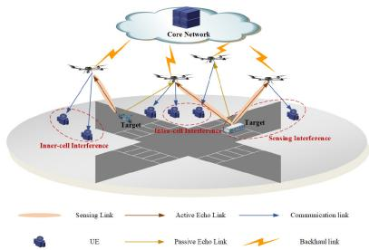  
Fig. 1. Illustration of the ISAC-enabled multi-UAV system.

As shown in Fig. 1, the proposed multi-UAVs ISAC system consists of the following components:

• K UAV nodes (indexed by set $\begin{array} { l l l } { { \mathcal { K } } } & { { = } } & { { \left\{ 1 , . . . , K \right\} ) } } \end{array}$ each equipped with $M _ { T }$ transmitting antennas and $M _ { R }$ receiving antennas;

• J single-antenna ground users modeled as a uniform distribution across the coverage area;

• A target object for sensing tasks;

• A cloud server responsible for communication orchestration, detection fusion and centralized data processing.

In this architecture, each UAV performs dual-function operations: providing ISAC-based downlink communication services to ground users while simultaneously conducting target detection through signal transmission and echo collection. The system employs a cloud-edge hybrid framework, where UAVs transmit acquired sensing data to the cloud server for joint processing. To simplify the analysis, we assume ideal backhaul links between UAVs and the control center in this study, thereby eliminating potential signal distortion during backhaul transmission.

Each UAV executes assigned sensing tasks over T consecutive time slots indexed by $\mathcal { T } = \{ 1 , 2 , \dots , T \}$ with $t \in$ T . To establish analytical tractability, we assume each time slot’s duration is sufficiently small such that the channel state information (CSI) for both sensing and communication remains approximately constant. Assuming the positions of UAVs and users are known via a global positioning system (GPS), we define the position of UAV $k \in \mathcal K$ at timeslot t as $\mathbf { q } _ { k } ( t ) ~ = ~ [ x _ { k } ( t ) , y _ { k } ( t ) , z _ { k } ( t ) ]$ in a three-dimensional Cartesian coordinate system. User $j \in \mathcal I$ is located at ${ \bf v } _ { j } = { }$ $[ x _ { j } , y _ { j } , 0 ]$ . We denote the set of users served by UAV k as $\mathcal { T } _ { k }$ assuming each user is served exclusively by one UAV. This leads to the conditions: $\textstyle \bigcup _ { k \in K } { \mathcal { I } } _ { k } = { \mathcal { I } }$ and $\mathcal { T } _ { k } \cap \mathcal { T } _ { g } = \emptyset$ , for $k \neq g .$ . Finally, let $\mathbf { s } _ { k } ( t ) \in \mathbb { C } ^ { M _ { T } \times 1 }$ represent the dedicated sensing symbol vector transmitted by UAV k, and ${ \bf c } _ { k } ( t ) =$ $[ \mathbf { c } _ { k } ^ { 1 } ( t ) , \ldots , \mathbf { c } _ { k } ^ { J _ { k } } ( t ) ] ^ { T } \in \mathbb { C } ^ { J _ { k } \times 1 }$ denote the communication symbol vector intended for users in $\mathcal { T } _ { k }$ at time slot t. Without loss of generality, we introduce the following assumptions:

• Both sensing and communication symbols are zero-mean, temporally white, and wide-sense stationary stochastic processes.

• Communication symbols and radar waveforms are uncorrelated, $\mathrm { i . e . , } \mathbb { E } ( \mathbf { s } _ { k } \mathsf { \bar { ( } } t ) \mathbf { c } _ { k } ^ { H } ( t ) ) = \mathbb { E } ( \mathbf { s } _ { k } ( t ) ) \mathbb { E } ( \mathbf { c } _ { k } ^ { H } ( t ) )$ $\mathbf { \sigma } = \mathbf { 0 } _ { M _ { T } \times J _ { k } } , k \in \mathcal { K } .$

• Communication symbols intended for different users are uncorrelated, i.e., $\mathbb { E } ( { \mathbf { c } } _ { k } ( t ) { \mathbf { c } } _ { ( } t ) ^ { H } ) = { \mathbf { I } } _ { J _ { k } }$

• The sensing symbols can be generated using pseudorandom coding [35], [36], and are therefore uncorrelated with other symbols, i.e., $\mathbb { E } ( \mathbf { s } _ { k } ( t ) \mathbf { s } _ { k } ( t ) ^ { H } ) = \mathbf { I } _ { M _ { T } } , k \in \mathcal { K }$

Based on these assumptions, the ISAC signal transmitted by UAV k can be expressed as

$$
\begin{array} { r } { \mathbf { x } _ { k } ( t ) = \mathbf { w } _ { k } ^ { c } ( t ) \mathbf { c } _ { k } ( t ) + \mathbf { w } _ { k } ^ { s } ( t ) \mathbf { s } _ { k } ( t ) , } \end{array}\tag{1}
$$

where $\mathbf { w } _ { k } ^ { c } ( t ) = [ \mathbf { w } _ { k , 1 } ( t ) , \ldots , \mathbf { w } _ { k , J _ { k } } ( t ) ] \in \mathbb { C } ^ { M _ { T } \times J _ { k } }$ is the communication beamforming matrix for UAV k, and each $\mathbf { w } _ { k , j } ( t ) \in \mathbb { C } ^ { M _ { T } \times 1 }$ denotes the communication beamforming vector assigned to user j served by UAV k. The matrix $\mathbf { w } _ { k } ^ { s } ( t ) \in$ $\mathbb { C } ^ { M _ { T } \times M _ { T } }$ represents the sensing beamforming matrix for UAV k.

## B. Mobility Model of UAVs

We assume all K UAVs maintain a constant altitude H throughout the mission. During each time slot, UAV k can maneuver in any direction within a given operational range. Specifically, in the t-th time slot, UAV k can displace itself by a distance $l _ { k } ( t )$ , where $0 \leq l _ { k } ( t ) \leq l _ { m a x }$ . The parameter $l _ { m a x }$ denotes achievable spatial displacement per time slot and is bounded by the UAV’s top speed $\mathbf { v } _ { m a x }$ and the duration of each time slot.

To ensure operational safety, we impose a collision avoidance constraint enforcing a minimum separation between any two UAVs. For all pairs of distinct UAVs k and $k ^ { \prime } .$ , at every time slot $t ,$ their respective positions ${ \bf q } _ { k } ( t )$ and $\mathbf { q } _ { k ^ { \prime } } ( t )$ must be separated by at least a predefined protection distance $d _ { m i n } \colon$

$$
\| \mathbf { q } _ { k } ( t ) - \mathbf { q } _ { k ^ { \prime } } ( t ) \| \geq d _ { m i n } , \forall k , k ^ { \prime } \in \mathcal { K } , \forall t \in \mathcal { T } .\tag{2}
$$

## C. Communication Model

Based on the directional and sparse properties of mmWave channels, the ISAC channel matrix can be expressed as a superposition of multiple propagation paths. Each path is characterized by distinct angles of departure (AoDs) and angles of arrival (AoAs). At time slot t, let $\mathbf { h } _ { k , k , j } ( t )$ denote the channel vector from UAV $k \in \mathcal { K }$ to user $j \in \mathcal { I } _ { k }$ that is located in cell k, at the same time, $\mathbf { h } _ { m , k , j } ( \mathfrak { t } )$ denote the channel vector from UAV $m \in { \mathcal { K } }$ to user $j \in \mathcal { I } _ { k }$ that is located in cell $k . \ \mathbf { h } _ { k , k , j } ( t )$ can be modeled as:

$$
\mathbf { h } _ { k , k , j } ( t ) = \sum _ { \ell = 0 } ^ { L _ { k } ^ { j } } \beta _ { k } ^ { ( \ell ) } \sqrt { M _ { T } M _ { U } } \mathbf { a } _ { U } \Big ( \hat { \theta } _ { k } ^ { j ( \ell ) } ( t ) , \hat { \phi } _ { k } ^ { j ( \ell ) } ( t ) \Big )\tag{3}
$$

where $\ell \ = \ 0$ and $\ell \geq 1$ represent the LoS and NLoS components, respectively. Here, $L _ { k } ^ { j }$ denotes the total number of NLoS paths between UAV $\ddot { k }$ and user $j .$ The angles $\theta _ { k } ^ { j ( \ell ) } ( t ) , \phi _ { k } ^ { j ^ { \dagger } ( \ell ) } ( t ) , \hat { \theta } _ { k } ^ { j ( \ell ) } ( t ) , \hat { \phi } _ { k } ^ { j ( \ell ) } ( t )$ correspond to the elevation AoD, azimuth AoD, elevation AoA, and azimuth AoA of the -th path at time slot n. $\beta _ { k } ^ { ( \ell ) }$ represents the complex coefficient of the -th path [34]. For the LoS component $( \ell = 0 )$ , the magnitude of $\beta _ { k } ^ { ( 0 ) }$ is determined by:

$$
| \boldsymbol { \beta } _ { k } ^ { ( 0 ) } | = \frac { \chi _ { k } \beta } { ( \| \mathbf { q } _ { k } ( t ) - \mathbf { v } _ { j } \| _ { 2 } ) ^ { \alpha / 4 } } ,\tag{4}
$$

where $\begin{array} { r } { \beta = \frac { c _ { 0 } } { 4 \pi f _ { c } } } \end{array}$ is the channel gain at the reference distance $d _ { 0 } = 1$ and α is the path loss exponent. $c _ { 0 }$ denotes the speed of light, and $f _ { c }$ represents the carrier frequency. The random variable $\chi _ { k }$ equals 1 when there exists a LoS path between UAV k and user $j ,$ and zero otherwise [37]. $\mathbf { h } _ { m , k , j }$ is defined similarity. In general, the probability that a LoS path exists is determined by the environment and the altitude of the UAV. As a result, the channel vector can be simplified as

$$
\begin{array} { r l r } & { \mathbf { h } _ { k , k , j } = \frac { \beta } { ( \| \mathbf { q } _ { k } ( t ) - \mathbf { v } _ { j } \| _ { 2 } ) ^ { \alpha / 4 } } \sqrt { M _ { T } M _ { U } } \mathbf { a } _ { U } \Big ( \hat { \theta } _ { k } ^ { j } ( t ) , \hat { \phi } _ { k } ^ { j } ( t ) \Big ) } & \\ & { \quad \quad \cdot \mathbf { a } _ { B } ^ { H } \Big ( \theta _ { k } ^ { j } ( t ) , \phi _ { k } ^ { j } ( t ) \Big ) . } & { \quad \quad \mathfrak { C } } \end{array}\tag{}
$$

The steering vectors $\mathbf { a } _ { T } \in \mathbb { C } ^ { M _ { T } \times 1 }$ and $\mathbf { a } _ { U } \in \mathbb { C } ^ { M _ { U } \times 1 }$ are given by:

$$
\mathbf { a } _ { \tau } ( \theta , \phi ) = \frac { 1 } { N _ { \tau } } \Big [ 1 , \dots , e ^ { j 2 \pi \frac { d } { \lambda } c o s \theta [ ( n _ { x } - 1 ) c o s \phi + ( n _ { y } - 1 ) s i n \phi ] }\tag{6}
$$

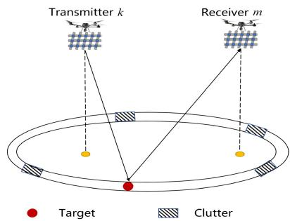  
Fig. 2. Clutter Model between transmitter k and receiver m.

with $1 \leq n _ { x } \leq M _ { \tau } ^ { x } , 1 \leq n _ { y } \leq M _ { \tau } ^ { y }$ and $\tau \in \{ T , U \}$ , d is the spacing between adjacent antennas in both horizontal and vertical direction and λ is the carrier wavelength. Particularly, for half-wavelength spaced arrays, we have $d = \lambda / 2$ . Besides, we have $\begin{array} { r } { \theta _ { k , j } ~ = ~ \arctan \frac { H } { \sqrt { ( x _ { k } - x _ { j } ) ^ { 2 } + ( y _ { k } - y _ { j } ) ^ { 2 } } } , } \end{array}$ , and $\phi _ { k , j } ~ =$ arctan $\frac { \left( y _ { k } - y _ { j } \right) } { \left( x _ { k } - x _ { j } \right) }$ . The received signal at user $j \in \mathcal { I } _ { k }$ during time slot t is expressed as (7) where $\mathbf { n } _ { j } \sim \mathcal { C N } ( 0 , \sigma _ { n } ^ { 2 } )$ denotes the corresponding additive complex Gaussian white noise (AWGN).

As shown in (7), shown at the bottom of the next page, users experience interference from both intra-cell and inter-cell communication signals, as well as interference from sensing signals $\mathbf { s } _ { k } ( t ) , k \in \mathcal { K }$ . Therefore, at time slot $t ,$ the signal-tointerference-plus-noise radio (SINR) at user j can be expressed as (8), shown at the bottom of the next page.

## D. Cooperative Sensing Model

We investigate radar sensing capabilities focused on detecting and characterizing a target of interest. In our sensing model, the ISAC system is configured as a distributed MIMO radar system, consisting of K transmit radars and K receive radars, with a single target object present within the observed area. When this target is present, each receiving UAV detects both desired echoes and undesired signals. Specifically, the desired signal consists of target-reflected echoes, while the undesired components thermal noise and ground clutter returns. Compared to ground-based systems, UAV-based systems experience heightened susceptibility to ground clutter interference during terrain surveillance. To address this challenge, we employ the distributed MIMO radar clutter model for airborne platforms to address this issue as proposed in [31], to mitigate these interferences.

Within this UAV framework, received clutters are characterized by the superposition of discrete patches situated on iso-delay clutter rings, aligning with target delays, as illustrated in Fig. 2. These clutter rings form a geometric locus determined by the intersection of an ellipsoid, defined by transmitter-receiver positions, with the ground plane. Furthermore, the clutter considered in this work is static environmental clutter, characterized by zero or near-zero doppler frequencies, with power intensity higher than target echoes. Assuming there are $n _ { c }$ clutter patches on each clutter ring and the total clutter number is $N _ { c } .$ , we can model the received clutters. Specially, the clutter component received at the m-th receiver from the signal transmitted by the k-th transmitter can be expressed as:

$$
\mathbf { c } _ { m , k } ( t ) = \sum _ { i = 1 } ^ { N _ { c } } \mathbf { G } _ { m , k , i } ^ { c } \mathbf { x } _ { k } ( t - \tau _ { m , k } ) ,\tag{9}
$$

where $\mathbf { G } _ { m , k , i } ^ { c } = \rho _ { m , k } ^ { i } \mathbf { b } _ { m } ( \theta _ { m , k , i } , \phi _ { m , k , i } ) \mathbf { a } _ { k } ^ { H } ( \theta _ { m , k , i } , \phi _ { m , k , i } )$ represents the end-to-end response matrix from transmitting node k to the i-th clutter block and then to receiving node m. Here, $\rho _ { m , k } ^ { \ i }$ denotes the random scattering coefficient of the i-th clutter block, satisfying $\rho _ { m , k } ^ { i } \sim \mathcal { C N } ( 0 , \sigma _ { C , m k } ^ { 2 } )$ The term $\mathbf { b } _ { m } ( \theta _ { m , k , i } , \phi _ { m , k , i } )$ and $\mathbf { a } _ { k } ^ { H } ( \theta _ { m , k , i } , \phi _ { m , k , i } )$ are the transmit and receive steering vectors from transmitting node k to the i-th clutter block and then to receiving node $m ,$ respectively. Additionally, $\tau _ { m , k } ~ = ~ \textstyle \frac { 1 } { c } ( d _ { m } + d _ { k } )$ denotes the transmission delay from UAV-k-to-target-to UAVm, where $d _ { k } = \lVert { \bf q } _ { k } - { \bf v } _ { 0 } \rVert _ { 2 }$ . By column-stacking $\mathbf { G } _ { m , k , i } ^ { c }$ as $\mathbf { G } _ { m , k } ^ { c } = [ \mathbf { G } _ { m , k , 1 } ^ { c } , \ldots , \mathbf { G } _ { m , k , N _ { c } } ^ { c } ]$ , the clutter component can be expressed as:

$$
\begin{array} { r } { \mathbf { c } _ { m , k } ( t ) = \mathbf { G } _ { m , k } ^ { c } \mathbf { x } _ { k } ( t - \tau _ { m , k } ) . } \end{array}\tag{10}
$$

Therefore, at time slot t, the echo signal received by sensing node m can be represented as:

$$
\mathbf { r } _ { m } ( t ) = \sum _ { k = 1 } ^ { K } \mathbf { G } _ { m , k } \mathbf { x } _ { k } ( t - \tau _ { m , k } ) + \mathbf { c } _ { m , k } ( t ) + \bar { \mathbf { z } } _ { m } ( t ) ,\tag{11}
$$

where $\mathbf { G } _ { m , k } \ = \ \hat { \alpha } _ { m , k } \mathbf { b } _ { m } ( \theta _ { m } , \phi _ { m } ) \mathbf { a } _ { k } ^ { H } ( \theta _ { k } , \phi _ { k } ) \ \in \ \mathbb { C } ^ { M _ { R } \times M _ { T } }$ denotes the end-to-end target response matrix from UAV k to the target and then to UAV m, with $\hat { \alpha } _ { m , k } ~ = ~ \sqrt { \beta _ { m , k } } \alpha _ { m , k }$ incorporating the target radar cross-section (RCS) and the reflection coefficient including the equivalent round-trip path loss $\beta _ { m , k }$ [38]. Furthermore, we define $\beta _ { m , k } ~ = ~ \kappa ^ { 2 } \frac { d _ { r e f } ^ { 4 } } { d _ { m } ^ { 2 } d _ { k } ^ { 2 } } ,$ where κ represents the path loss at the reference distance $d _ { r e f } . \ \theta _ { k }$ and $\phi _ { k }$ denote the azimuth and elevation angles of the target relative to the transmitting UAV’s antenna array, respectively, and $\theta _ { m } , \ \phi _ { m }$ are defined similarly. In addition, $\bar { \mathbf { z } } _ { m } ( t ) \sim \mathcal { C N } ( \mathbf { 0 } , \sigma _ { n } ^ { 2 } \mathbf { I } )$ denotes AWGM vector.

## III. PROBLEM FORMULATION

## A. Matched-Filtering Operation and Receive Beamforming

At the receive end of the distributed MIMO radar, we separate the mixed receive signals from each transmitter into multi-channel echoes and design receive beamforming to achieve the desired processing gain at the target direction while attenuating clutter interference signals and background noises from other directions [39].

For each time slot t, echo signals are filtered via match filtering (MF) processing based on $\mathbf { r } _ { m } ( t )$ by exploiting $\{ \mathbf { s } _ { k } \} _ { k \in \mathcal { K } } , \{ \mathbf { c } _ { k } \} _ { k \in \mathcal { K } }$ and delay $\{ \tau _ { m , k } \}$ . Accordingly, the proposed signal based on $\{ \mathbf { c } _ { k } \} _ { k \in \mathcal { K } }$ can be obtained by

$$
{ \bf d } _ { m , k } ^ { c } ( t ) = \frac { 1 } { \Delta T } \int _ { \Delta T } \mathbf { r } _ { m } ( t ) { \bf c } _ { k } ^ { * } ( t - \tau _ { m , k } ) d t ,\tag{12}
$$

where $\Delta T$ represents the integration interval duration. The result is a combination of the desired signal components, represents by $\mathbf { G } _ { m , k } ( t )$ , and clutter components, denoted by ${ \bf G } _ { m , k } ^ { c } ( t )$ , both weighted by appropriate beamforming weights $\{ \mathbf { w } _ { k , j } ( t ) \}$ . Additionally, additive noise $\hat { \mathbf { z } } _ { m , k } ( k )$ is present. As a result, the echo signal received by UAV m after being matched and filtered with the communication symbol can be expressed as follows:

$$
\begin{array} { r } { \mathbf { d } _ { m } ^ { c } ( t ) = \displaystyle \sum _ { k = 1 } ^ { K } \left( \mathbf { G } _ { m , k } ( t ) \sum _ { j = 1 } ^ { J _ { k } } \mathbf { w } _ { k , j } ( t ) + \mathbf { G } _ { m , k } ^ { c } ( t ) \sum _ { j = 1 } ^ { J _ { k } } \mathbf { w } _ { k , j } ( t ) \right) } \\ { + \hat { \mathbf { z } } _ { m } ( t ) . \qquad ( 1 ; \qquad v ) , } \end{array}\tag{3}
$$

Similarity, the processed signal based on $\{ \mathbf { s } _ { k } \} _ { k \in \mathcal { K } }$ in time slot t is

$$
\mathbf { d } _ { m } ^ { r } ( t ) = \sum _ { k = 1 } ^ { K } \Big ( \mathbf { G } _ { m , k } ( t ) \mathbf { w } _ { k } ^ { s } ( t ) + \mathbf { G } _ { m , k } ^ { c } ( t ) \mathbf { w } _ { k } ^ { s } ( t ) \Big ) + \hat { \mathbf { z } } _ { m } ( t ) .\tag{14}
$$

In (12) and (14), $\hat { \mathbf { z } } _ { m } ( t ) \ \sim \ \mathcal { C N } ( \mathbf { 0 } , \sigma _ { n } ^ { 2 } \mathbf { I } )$ represents the equivalent noise after MF processing. The received signal $\mathbf { d } _ { m } ( t )$ at the UAV m during time slot t after MF can be expressed as:

$$
\begin{array} { l } { \displaystyle { { \bf d } _ { m } ( t ) = \sum _ { k = 1 } ^ { K } { \bf G } _ { m , k } ( t ) { \bf W } _ { k } ( t ) } } \\ { \displaystyle ~ + \sum _ { k = 1 } ^ { K } \sum _ { i = 1 } ^ { N _ { c } } { \bf G } _ { m , k , i } ^ { c } ( t ) { \bf W } _ { k } ( t ) + \bar { \bf z } _ { m } ( t ) } \\ { \displaystyle ~ = \sum _ { k = 1 } ^ { K } \hat { \alpha } _ { m , k } { \bf B } _ { m , k } ( t ) { \bf W } _ { k } ( t ) } \\ { \displaystyle ~ + \sum _ { k = 1 } ^ { K } \sum _ { i = 1 } ^ { N _ { c } } \rho _ { m , k } ^ { i } { \bf B } _ { m , k , i } ^ { c } ( t ) { \bf W } _ { k } ( t ) + \bar { \bf z } _ { m } ( t ) , ( 1 ) } \end{array}\tag{5}
$$

$$
\begin{array} { r l } & { \mathbf { y } _ { k , j } ( t ) = \mathbf { h } _ { k , k , j } ^ { H } \mathbf { x } _ { k } ( t ) + \underset { \mathrm { i } \in \mathcal { J } _ { k , i } \not \in \mathcal { J } _ { k } } { \sum } \mathbf { h } _ { k , k , j } ^ { H } \mathbf { x } _ { k } ( t ) + \underset { m \in \mathbb { K } ^ { \prime } , m \not \in k } { \sum } \mathbf { h } _ { m , k , j } \mathbf { x } _ { m } ( t ) + \mathbf { n } _ { j } ( t ) } \\ & { \qquad = \mathbf { h } _ { k , k , j } \mathbf { w } _ { k , j } \mathbf { c } _ { k } ( t ) + \underset { \mathrm { i n t r a - c e l l i n t e r f e r e n c e } } { \sum } + \underset { \mathrm { i n t e r - c e l l i n t e r f e r e n c e } } { \sum } \sum _ { i \in \mathcal { J } _ { i } } \mathbf { h } _ { m , k , j } ^ { H } \mathbf { w } _ { m , l } \mathbf { c } _ { m } ( t ) } + \underset { \mathrm { o r ~ s e l l i n t e r f e r e n c e } } { \sum } + \mathbf { n } _ { j } ( t ) ,  \\ & { \qquad \gamma _ { k , j } ( t ) = \underset { \mathrm { i } \in \mathcal { J } _ { k , i } \not \in \mathcal { J } } { \sum } | \mathbf { h } _ { k , k , j } \mathbf { w } _ { k , i } | ^ { 2 } + \underset { m \in \mathbb { K } , m \not \in k } { \sum } \underset { k \in \mathcal { J } _ { m } } { \sum } \mathbf { h } _ { m , k , j } \mathbf { w } _ { k , j } | ^ { 2 } + \underset { m \in \mathbb { K } } { \sum } | \mathbf { h } _ { m , k , j } \mathbf { w } _ { m , l } | ^ { 2 } + \underset { m \not \in K } { \sum } | \mathbf { h } _ { m , k , j } \mathbf { w } _ { m } ^ { s } | ^ { 2 } + \sigma _ { n } ^ { 2 } . } \end{array}\tag{7}
$$

(8)

where $\mathbf { s } _ { m } ( t )$ and $\mathbf { c } _ { m } ( t )$ denote the sensing and communication signal components, respectively. Additionally, ${ \bf W } _ { k } ( t ) =$ $[ \mathbf { w } _ { k } ^ { c } ( t ) , \mathbf { w } _ { k } ^ { s } ( t ) ]$ denotes the combined beamforming matrix. Here, $\mathbf { B } _ { m , k } ( { \boldsymbol { \mathbf { \mathit { t } } } } ) ~ = ~ \mathbf { b } _ { m } ( { \boldsymbol { \mathbf { \mathit { t } } } } ) \mathbf { a } _ { k } ^ { H } ( t )$ and ${ \bf B } _ { m , k , i } ^ { c } ( t )$ is defined similarity.

Next, the receive weighting coefficient $\mathbf { v } _ { m } ( t )$ at UAV m during the time slot t can be expressed as follows:

$$
\mathbf { v } _ { m } ( t ) = \left[ v _ { m , 1 , 1 } , v _ { m , 2 , 1 } , \ldots , v _ { m , M _ { x } , M _ { y } } \right] ^ { T } \in \mathbb { C } ^ { M x M y \times 1 } .\tag{16}
$$

After performing the received filtering during time slot t, the corresponding SCNR at receiver m can be formulated as

$$
\begin{array} { r l r } {  { \rho _ { m } ( t ) = \frac { \mathbb { E } [ | { \bf v } _ { m } ^ { H } ( t ) { \bf s } _ { m } ( t ) | ^ { 2 } ] } { \mathbb { E } [ | { \bf v } _ { m } ^ { H } ( t ) { \bf c } _ { m } ( t ) | ^ { 2 } ] + \mathbb { E } [ | { \bf v } _ { m } ^ { H } ( t ) \bar { \bf z } _ { m } ( t ) | ^ { 2 } ] } } } \\ & { } & { = \frac { { \bf v } _ { m } ^ { H } ( t ) \Sigma _ { t , m } ( t ) { \bf v } _ { m } ( t ) } { { \bf v } _ { m } ^ { H } ( t ) \Sigma _ { c n , m } ( t ) { \bf v } _ { m } ( t ) } , \qquad } \end{array}\tag{17}
$$

where $\Sigma _ { t , m } ( t )$ and $\Sigma _ { c n , m } ( t )$ are covariance matrices defined as:

$$
\begin{array} { l } { { \displaystyle \Sigma _ { t , m } ( t ) = \sum _ { k = 1 } ^ { K } \sigma _ { r , k } ^ { 2 } \mathbf { B } _ { m , k } ( t ) ( { \mathbf { w } } _ { k } ^ { c } ( t ) { \mathbf { w } } _ { k } ^ { c H } ( t ) } } \\ { ~ + { \mathbf { w } } _ { k } ^ { s } ( t ) { \mathbf { w } } _ { k } ^ { s H } ( t ) ) \mathbf { B } _ { m , k } ^ { H } ( t ) } ,  \\ { { \displaystyle \Sigma _ { c n , m } ( t ) = \sum _ { k = 1 } ^ { K } \sum _ { i = 1 } ^ { N _ { c } } \sigma _ { c , m k i } ^ { 2 } \mathbf { B } _ { m , k , i } ^ { c } ( t ) ( { \mathbf { w } } _ { k } ^ { c } ( t ) { \mathbf { w } } _ { k } ^ { c H } ( t ) } } \\ { ~ + { \mathbf { w } } _ { k } ^ { s } ( t ) { \mathbf { w } } _ { k } ^ { s H } ( t ) ) \mathbf { B } _ { m , k , i } ^ { c H } ( t ) } \\ { ~ + \sigma _ { n } ^ { 2 } \mathbf { I } . } \end{array}
$$

We note that SCNR is a critical metric for sensing performance at the receiver. It is adaptable to varying signal characteristics and application scenarios. Furthermore, the radar detection probability $p _ { D }$ is known to be a non-decreasing function of SCNR, increasing proportionally with it, contingent on the clutter suppression effect.. The relationship between them is expressed as:

$$
p _ { D } = 1 - Q _ { \chi _ { 2 } ^ { 2 } ( o _ { 1 } ( \{ \mathbf { W } _ { k } \} ) ) } ( \xi ) ,\tag{18}
$$

where $o _ { 1 } ( \{ \mathbf { W } _ { k } \} )$ is the non-central parameter of the complex chi square distribution $\zeta _ { \chi _ { 2 } ^ { 2 } ( o _ { 1 } ( \{ \mathbf { W } _ { k } \} ) ) }$ with two DoFs [40]. Here, ξ denotes the threshold for the generalized likelihood ratio test (GLRT) detector. As shown in equation (19), shown at the bottom of the page, the design of the beamformers $\{ \mathbf { v } _ { k } ( t ) , \mathbf { W } _ { k } ( t ) \} _ { k \in \mathcal { K } }$ governs both the communication and sensing performance. Importantly, robust target detection serves as a prerequisite for achieving high parameter estimation accuracy [4], [41]. In our framework, maximizing SCNR is equivalent minimizing the cramer-rao bound (CRB). Consequently, we formulate an optimization problem in the next section to obtain optimal $\{ \mathbf { v } _ { k } ( t ) , \mathbf { W } _ { k } ( t ) \} _ { k \in \mathcal { K } }$ at each time slot t.

## B. Problem Formulation

From (19), we observe that the detection probability is directly proportional to the SCNR. Accordingly, our objective is to jointly optimize the transmit and receive beamformers as well as the UAVs’ trajectories for multi-UAVs cooperative sensing. The goal is to maximize the total SCNR of signal fusion while satisfying communication SINR requirements. Formally, the optimization problem is defined as:

$$
( \mathrm { P 1 } ) \colon \operatorname* { m a x } _ { \substack { \{ \mathbf { w } _ { k } ^ { c } ( t ) , \mathbf { w } _ { k } ^ { s } ( t ) , \mathbf { v } _ { m } ( t ) , \mathbf { q } _ { k } ( t ) \} _ { m , k \in \mathcal K } } } \quad \sum _ { m = 1 } ^ { K } \rho _ { m } ( t )\tag{20a}
$$

$$
\mathrm { s . t . } \gamma _ { k , j } \big ( \mathbf { w } _ { k , j } , \mathbf { w } _ { k } ^ { s } \big ) \geq \Gamma _ { k , j } , \forall j \in \mathcal { I } _ { k } , \forall k \in \mathcal { K }\tag{20b}
$$

$$
\sum _ { j } ^ { J _ { k } } \| \mathbf { w } _ { k , j } \| ^ { 2 } + \| \mathbf { w } _ { k } ^ { s } \| ^ { 2 } \leq P _ { T } , \forall k \in \mathcal { K }\tag{20c}
$$

$$
\| \mathbf { q } _ { k } ( t ) - \mathbf { q } _ { k ^ { \prime } } ( t ) \| \geq d _ { m i n } , \forall k \in \mathcal { K }
$$

$$
0 \leq \| \dot { \mathbf { q } } _ { k } ( t ) \| \leq v _ { m a x } , \forall k \in \mathcal { K }\tag{20d}
$$

$$
X _ { m i n } \leq x _ { k } ( t ) \leq X _ { m a x }\tag{20e}
$$

$$
Y _ { m i n } \le y _ { k } ( t ) \le Y _ { m a x } ,\tag{20f}
$$

(20g)

where (20b) enforces the SINR requirements at CUs and (20c) specifies the maximum transmit power constraints for each UAV. Additionally, the UAVs’ maximum velocity, collision avoidance, and flight range constraints are formulated in (20d)- (20g). Consequently, problem (P1) is non-convex due to its coupled variables $\{ \mathbf { w } _ { k } ^ { c } , \mathbf { w } _ { k } ^ { s } \} _ { k \in \mathcal { K } } , \{ \mathbf { v } _ { m } \} _ { m \in \mathcal { K } }$ and $\{ \mathbf { q } _ { k } ( t ) \} _ { k \in \mathcal { K } }$ as well as the nonlinear relationships in constraints. To overcome this, we apply the iteratively optimization approach to decompose (P1) into two subproblems.

## IV. PROPOSED ALGORITHM

## A. Beamforming Design

In this subsection, the UAV trajectories $\{ \mathbf { q } _ { k } ( t ) \} _ { k \in \mathcal { K } }$ are provided. Consequently, the placement of UAVs during each time slot can be determined, which subsequently determines the channel gain for every communication link. For notational simplicity, the time slot intex t is omitted throughout this analysis. The optimization problem (P1) can be transformed into the following subproblem, i.e.,

$$
\begin{array} { r l } { \mathrm { ( P 2 ) } \colon } & { \underset { \{ \mathbf { w } _ { k } ^ { c } , \mathbf { w } _ { k } ^ { s } , \mathbf { v } _ { m } \} _ { m , k \in \mathcal { K } } } { \operatorname* { m a x } } } & { \underset { m = 1 } { \overset { K } { \sum } } \rho _ { m } } \\ { \mathrm { s . t . } } & { ( 2 0 \mathrm { a } ) , ( 2 0 \mathrm { c } ) . } \end{array}\tag{21a}
$$

(21b)

It is observed that problem (P2) is non-convex due to the non-convex objective function (21) and the nonlinear constraints formulation. To solve this problem, we applied the alternating algorithm (AA) to separately optimize the receive and transmit beamformers.

$$
\sigma _ { 1 } ( \{ \mathbf { W } _ { k } \} ) = \sum _ { m = 1 } ^ { K } \mathbf { v } _ { m } ^ { H } \left( \sum _ { k = 1 } ^ { K } \hat { \alpha } _ { m , k } \mathbf { B } _ { m , k } \mathbf { W } _ { k } \right) \left( \sum _ { k = 1 } ^ { K } \sum _ { i = 1 } ^ { N _ { c } } \rho _ { m , k } ^ { i } \mathbf { B } _ { m , k , i } ^ { c } \mathbf { W } _ { k } \right) ^ { - 1 } \left( \sum _ { k = 1 } ^ { K } \hat { \alpha } _ { m , k } \mathbf { B } _ { m , k } \mathbf { W } _ { k } \right) ^ { H } \mathbf { v } _ { m } .\tag{19}
$$

1) Receive Beamforming Optimization Subproblem: Given the transmit beamforming matrix, the objective function solely determines the receive beamforming matrix. Consequently, the resulting optimization problem for determining the receive beamforming vectors $\{ \mathbf { v } _ { m } \} _ { m \in \mathcal { K } }$ can be formulated as

$$
( \mathrm { P 2 . 1 } ) \colon \operatorname* { m a x } _ { \{ \mathbf { v } _ { \mathbf { m } } \} _ { m \in \mathcal { K } } } \sum _ { m = 1 } ^ { K } \frac { \mathbf { v } _ { m } ^ { H } \Sigma _ { t , m } \mathbf { v } _ { m } } { \mathbf { v } _ { m } ^ { H } \Sigma _ { c n , m } \mathbf { v } _ { m } } .\tag{22a}
$$

Problem (P2.1) can be decoupled into K independent subproblems, enabling distributed solution via parallel processing at each UAV:

$$
\operatorname* { m a x } _ { { \bf v } _ { m } } \frac { { \bf v } _ { m } ^ { H } { \Sigma } _ { t , m } { \bf v } _ { m } } { { \bf v } _ { m } ^ { H } { \Sigma } _ { c n , m } { \bf v } _ { m } } , m \in { \boldsymbol { K } } .\tag{23}
$$

The resulting formulation aligns precisely with the standard generalized Rayleigh quotient framework, yielding the optimal value ${ \bf v } _ { m }$ as the normalized eigenvector associated with the maximum eigenvalue of $\Sigma _ { c n , m } ^ { - 1 } \Sigma _ { t , m }$ [40]. This approach achieves optimal SINR performance and superior computational efficiency in interference-dominated environments, thereby enhancing sensing accuracy under non-ideal channel conditions. By leveraging the generalized Rayleigh quotient framework, this method addresses computational challenges through eigenvalue decomposition of non-convex constraints. Consequently, the proposed framework is well-suited for spatially diverse cooperative systems characterized by multiantenna configurations and distributed interference patterns.

2) Transmit Beamforming Optimization Subproblem: Each UAV transmits the optimized receive beamforming vector to the cloud server, where transmit beamforming optimization is performed. We consider the problem of optimizing transmit beamforming vectors $\{ \mathbf { w } _ { k } ^ { c } \} _ { k \in \mathcal { K } } , ~ \{ \mathbf { w } _ { k } ^ { s } \} _ { k \in \mathcal { K } }$ given receive beamforming vectors $\{ \mathbf { v } _ { m } \} _ { m \in \mathcal { K } }$ . The objective is to maximize the following expression:

$$
( \mathrm { P 2 . 2 } ) \colon \operatorname* { m a x } _ { \{ \mathbf { w } _ { k } ^ { c } , \mathbf { w } _ { k } ^ { s } \} _ { k \in \mathcal { K } } } \sum _ { m = 1 } ^ { K } \rho _ { m }\tag{24a}
$$

$$
( 2 0 \mathsf { b } ) , ( 2 0 \mathsf { c } ) .\tag{24b}
$$

By vectorizing all transmit beamforming into $\tilde { \textbf { w } } \in$ $\mathbb { C } ^ { \bar { K } \bar { M } _ { T } ( \bar { J } + \bar { M } _ { T } ) }$ , and define ${ \bf { H } } _ { m , k , j } ~ = ~ { \bf { h } } _ { m , k , j } { \bf { h } } _ { m , k , j } ^ { H } ,$ the optimization problem can be reformulated as:

$$
( \mathrm { P 2 . 3 } ) \colon \operatorname* { m a x } _ { \tilde { \mathbf { w } } } \sum _ { m = 1 } ^ { K } \frac { \tilde { \mathbf { w } } ^ { H } \mathbf { A } _ { t } \mathbf { D } _ { m } \tilde { \mathbf { w } } } { \hat { \mathbf { w } } ^ { H } \mathbf { A } _ { c } \mathbf { C } _ { m } \hat { \mathbf { w } } + \mathbf { E } _ { m } }\tag{25a}
$$

$$
\mathrm { s . t . } \quad \| \mathbf { P } _ { k } \tilde { \mathbf { w } } \| _ { 2 } ^ { 2 } \leq P _ { T } , \forall k \in \mathcal { K }\tag{25b}
$$

$$
\tilde { \mathbf { w } } ^ { H } \mathbf { A } _ { k , j } \tilde { \mathbf { w } } ^ { H }
$$

$$
\tilde { \mathbf { w } } ^ { H } \Big ( \mathbf { A } _ { k , j } ^ { \mathrm { i n n e r } } + \mathbf { A } _ { k , j } ^ { \mathrm { i n t e r } } + \mathbf { A } _ { k , j } ^ { \mathrm { s e n s } } \Big ) \tilde { \mathbf { w } } + \sigma _ { j } ^ { 2 }
$$

$$
\begin{array} { r } { \geq \Gamma _ { k , j } , \forall j \in \mathcal { I } _ { k } , \forall k \in \mathcal { K } , } \end{array}\tag{25c}
$$

where $\hat { \textbf { w } } = \mathrm { v e c } ( \mathbf { I } _ { N c } \otimes \tilde { \textbf { W } } ) . \ : \ : \ : \mathbf { A } _ { t } = \mathbf { I } _ { N _ { T } ( J + N _ { T } ) } \otimes$ diag $( \sigma _ { r , 1 } ^ { 2 } , \dots , \sigma _ { r , K } ^ { 2 } )$ and $\begin{array} { r l r } { \mathbf { \Delta } \Lambda _ { c } } & { { } \ = \ } & { \mathbf { I } _ { N _ { T } N _ { c } ( N _ { c } + T ) } \otimes } \end{array}$ $\mathrm { d i a g } ( \sigma _ { c , 1 1 } ^ { 2 } , \dots , \sigma _ { c , K N _ { c } } ^ { 2 } )$ are diagonal matrices related to target and clutter RCS variances, respectively. ${ \bf P } _ { k }$ is a diagonal matrix used to select the transmit beamforming vector corresponding to the k-th UAV. Specially, $\mathbf { P } _ { k } = \mathrm { d i a g } \{ \tilde { \mathbf { p } } _ { k } \}$ where $\tilde { \mathbf { p } } _ { k } \ = \ [ \mathbf { p } _ { k } ^ { T } , \dots , \mathbf { p } _ { k } ^ { T } ] ^ { T } \ \in \ \mathbb { C } ^ { K N _ { T } ( J + N _ { T } ) }$ , and $\begin{array} { r l } { \mathbf { p } _ { k } } & { { } = } \end{array}$ $[ \mathbf { 0 } _ { ( k - 1 ) \cdot N _ { T } } ^ { T } , \mathbf { 1 } _ { N _ { T } } ^ { T } ]$ . In addition, the specific definitions of $\mathbf { D } _ { m } .$ $\mathbf { C } _ { m } , \ \mathbf { E } _ { m } , \ \mathbf { A } _ { k , j } , \ \mathbf { A } _ { k , j } ^ { \mathrm { i n n e r } } , \ \mathbf { A } _ { k , j } ^ { \mathrm { i n t e r } }$ and $\mathbf { A } _ { k , j } ^ { \mathrm { s e n s } }$ are provided in Appendix A.

The objective function (25) is non-convex due to the fractional objective functions. Furthermore, the nonlinear nature of its constraints significantly complicates the optimization problem. To address these challenges, we employ the Dinkelbach framework [42] for optimizing $\rho _ { m } .$ . By introducing an auxiliary variable $\psi _ { m } .$ , we reformulate the objective function as $\sum _ { m = 1 } ^ { \hat { K } } f _ { m } ( \tilde { \mathbf { w } } ) - \psi _ { m } g _ { m } ( \tilde { \mathbf { w } } )$ , where $f _ { m } ( \tilde { \mathbf { w } } )$ and $g _ { m } ( \tilde { \mathbf { w } } )$ represent the numerator and the denominator of the original objective function, respectively.

Proposition 1: The optimal solution of subproblem (P2.3) exists if and only if the following condition is satisfied:

$$
f _ { m } ( \tilde { \mathbf { w } } ) - \psi _ { m } ^ { * } g _ { m } ( \tilde { \mathbf { w } } ) = 0 , \forall m \in K .\tag{26}
$$

Proof : See Appendix B.

Based on Proposition 1, for a given $\{ \psi \} _ { m \in \mathcal { K } }$ , the optimization problem is transformed into

$$
( \mathrm { P 2 . 4 } ) \colon \operatorname* { m a x } _ { \tilde { \mathbf { w } } , \{ \psi \} _ { m \in K } } \ \sum _ { m = 1 } ^ { K } f _ { m } ( \tilde { \mathbf { w } } ) - \psi _ { m } g _ { m } ( \tilde { \mathbf { w } } )\tag{27a}
$$

(27b)

However, the problem remains challenging due to its nonconvex objective function. To address this, we define $\mathbf { R } _ { c , k , j } =$ $\mathbf { w } _ { k , j } ^ { c } ( \mathbf { w } _ { c , k , j } ^ { c } ) ^ { H } , k \ \in \ \mathcal { K } , j \ \in \ \mathcal { J } _ { k }$ , where $\mathbf { R } _ { c , k , j } ~ \succeq ~ 0$ and rank $( \mathbf { R } _ { c , k , j } ) \ \leq \ 1 , \forall k \ \in \ \mathcal { L } .$ . Subsequently, $\mathbf { R } _ { c , k }$ is defined as the summation over all $\begin{array} { r } { j \in \mathcal { T } _ { k } \colon { \bf R } _ { c , k } \ : = \ : \sum _ { i = 1 } ^ { J _ { k } } { \bf R } _ { c , k , j } . } \end{array}$ The matrix $\mathbf { R } _ { s , k }$ is defined similarly. As a result, the SINR constraint can be reformulated as:

$$
\sum _ { m \in { \cal K } } \sum _ { l \in \mathcal { I } _ { m } } \mathrm { t r } \big ( { \bf H } _ { m , k , j } { \bf R } _ { c , m , l } \big ) + \sum _ { m \in { \cal K } } \mathrm { t r } \big ( { \bf H } _ { m , k , j } { \bf R } _ { s , m } \big ) + \sigma _ { N } ^ { 2 }
$$

$$
\leq \left( 1 + \frac { 1 } { \Gamma _ { k , j } } \right) \mathrm { t r } \big ( \mathbf { H } _ { k , k , j } \mathbf { R } _ { c , k , j } \big ) \forall j \in \mathcal { T } _ { k } , \forall k \in \mathcal { K } .\tag{28}
$$

By defining $\begin{array} { r l } { \mathbf { R } _ { c } } & { { } = } \end{array}$ blkdiag $( \mathbf { R } _ { c , 1 } , \ldots , \mathbf { R } _ { c , K } )$ $\begin{array} { r l } { \mathbf { R } _ { s } } & { { } = } \end{array}$ blkdiag $( \mathbf R _ { s , 1 } , \ldots , \mathbf R _ { s , K } )$ , problem (P2.4) is reformulated as:

$$
( \mathrm { P 2 . 5 } ) \colon \operatorname* { m a x } _ { \mathbf { R } _ { c } , \mathbf { R } _ { s } } \sum _ { m = 1 } ^ { K } \tilde { f } _ { m } ( \mathbf { R } _ { c } , \mathbf { R } _ { s } ) - \tilde { \psi } _ { m } \tilde { g } _ { m } ( \mathbf { R } _ { c } , \mathbf { R } _ { s } )\tag{29a}
$$

$$
\mathrm { s . t . } \mathrm { t r } ( \mathbf { S } _ { k } \mathbf { R } _ { c } \mathbf { S } _ { k } ^ { T } ) + \mathrm { t r } ( \mathbf { S } _ { k } \mathbf { R } _ { s } \mathbf { S } _ { k } ^ { T } ) \leq P _ { T } , \forall k \in \mathcal { K }\tag{29b}
$$

$$
\mathrm { r a n k } ( \mathbf { R } _ { c , k , j } ) \leq 1 , \mathrm { r a n k } ( \mathbf { R } _ { s , k } ) \leq 1 , \forall k \in \mathcal { K } , j \in \mathcal { I } _ { k }\tag{29c}
$$

(29d)

where

$$
\tilde { f } _ { m } ( \mathbf { R } _ { c } , \mathbf { R } _ { s } ) = \mathrm { t r } ( \mathbf { V } _ { m } \mathbf { B } _ { m } ( \mathbf { R } _ { s } + \mathbf { R } _ { c } ) \tilde { \mathbf { A } } _ { t } \mathbf { B } _ { m } ^ { H } )\tag{30a}
$$

$$
\begin{array} { r l r } {  { \tilde { g } _ { m } \bigl ( \mathbf { R } _ { c } , \mathbf { R } _ { s } \bigr ) = \mathrm { t r } \bigl ( \mathbf { V } _ { m } \mathbf { B } _ { m } ^ { c } ( \tilde { \mathbf { R } } _ { c } + \tilde { \mathbf { R } } _ { s } ) \tilde { \mathbf { A } } _ { c } \mathbf { B } _ { m } ^ { c H } \bigr ) + \mathrm { t r } \bigl ( \sigma _ { n } ^ { 2 } \mathbf { V } _ { m } \mathbf { I } _ { N _ { T } } \bigr ) } } \end{array}\tag{30b}
$$

$$
\tilde { \mathbf { A } } _ { t } = \mathbf { I } _ { N _ { T } } \otimes \mathrm { d i a g } \big ( \sigma _ { r , 1 } ^ { 2 } , \ldots , \sigma _ { r , K } ^ { 2 } \big ) ,\tag{30c}
$$

$$
\tilde { \boldsymbol { \Lambda } } _ { c } = \mathbf { I } _ { N _ { T } } \otimes \mathrm { d i a g } ( \sigma _ { c , m 1 1 } ^ { 2 } , \ldots , \sigma _ { c , m K N _ { c } } ^ { 2 } )\tag{30d}
$$

$$
{ \bf V } _ { m } = { \bf v } _ { m } { \bf v } _ { m } ^ { H } , \tilde { \bf R } _ { c } = { \bf I } _ { N _ { c } } \otimes { \bf R } _ { c } , \tilde { \bf R } _ { s } = { \bf I } _ { N _ { c } } \otimes { \bf R } _ { s }\tag{30e}
$$

$$
\begin{array} { r } { { \bf S } _ { k } = [ { \bf 0 } _ { ( k - 1 ) \cdot N _ { T } \times N _ { T } } , { \bf 1 } _ { N _ { T } } , { \bf 0 } _ { ( K - k ) \cdot N _ { T } \times N _ { T } } ] . } \end{array}\tag{30f}
$$

Similarity, in (29), the optimal solution can be obtained if and only if the following equation holds:

$$
\tilde { f } _ { m } ( \mathbf { R } _ { c } , \mathbf { R } _ { s } ) - \tilde { \psi } _ { m } ^ { * } \tilde { g } _ { m } ( \mathbf { R } _ { c } , \mathbf { R } _ { s } ) = 0 , \forall m \in \mathcal { K } .\tag{31}
$$

It is important to note that the problem (P1.5) remains nonconvex due to the rank-one constraints imposed ${ \bf \mathrm { o n } } \{ { \bf R } _ { s , k } \}$ and $\{ \mathbf { R } _ { c , k , j } \}$ . To address this challenge, we employ SDR technique, which allows us to eliminate these non-convex rank-one constraints. As a result, the relaxed problem is:

$$
\begin{array} { r l } { { \displaystyle ( { \mathrm { P 2 . 6 } } \colon ) \operatorname* { m a x } _ { { \mathbf { R } } _ { c } , { \mathbf { R } } _ { s } } \sum _ { m = 1 } ^ { K } \widetilde { f } _ { m } ( { \mathbf { R } } _ { c } , { \mathbf { R } } _ { s } ) - \widetilde { \psi } _ { m } \widetilde { g } _ { m } ( { \mathbf { R } } _ { c } , { \mathbf { R } } _ { s } ) } } & { { } } \\ { { \mathrm { s . t . } } ( 2 8 ) , ( 2 9 \mathrm { b } ) . } \end{array}\tag{32a}
$$

(32b)

The convex problem can be optimally solved by standard convex optimization solvers such as cvx [43].

Proposition 2: (Tightness of SDR Relaxation for (P2.6)): The SDR relaxation for problem (P2.6) is tight. Specially, if the ranks of $\{ \mathbf { R } _ { s , k } \}$ and $\{ \mathbf { R } _ { c , k , j } \}$ within problems (P2.6) are equal to 1 in their respective optimal solutions, these same solutions will also be optimal for (P2.5). If this condition is not met, Gaussian randomization (as referenced in [44]) can be applied to obtain rank-one solutions.

Proof: See Appendix C.

Remark 1: The performance variability of Gaussian randomization in high-dimensional multi-antenna systems is influenced by the condition number of covariance matrix and the number of randomization L [45].

Proof: See Appendix D.

3) Algorithm Summary: The alternative optimization algorithm for beamforming is employed to solve problem (P2) iteratively. To initialize $\{ \mathbf { R } _ { s , k } ^ { ( 0 ) } \}$ and $\{ \mathbf { R } _ { c , k , j } ^ { ( 0 ) } \}$ at timeslot $t = 0$ we compute them using the method described in [40].

## B. UAV Trajectory Optimization

In this subsection, we optimize the UAVs’ trajectories $\{ { \bf q } _ { k } ( t ) \}$ given fixed transmit and receive beamformers $\{ \mathbf { R } _ { c , k , j } ( t ) \} , \{ \mathbf { R } _ { s , k } ( t ) \}$ and $\{ \mathbf { V } _ { k } ( t ) \}$ . This optimization leads to the following sub-problem (P3):

$$
( \mathrm { P 3 } ) \colon \operatorname* { m a x } _ { \{ \mathbf { q } _ { k } ( t ) \} _ { k \in \mathcal { K } } } \quad \sum _ { m = 1 } ^ { K } \rho _ { m } ( t )\tag{33a}
$$

$$
\mathrm { s . t . } \gamma _ { k , j } ( \mathbf { q } _ { k } ( t ) ) \geq \Gamma _ { k , j } , \forall j \in \mathcal { I } _ { k } , \forall k \in \mathcal { K }\tag{33b}
$$

$$
( 2 0 \mathrm { d } ) - ( 2 0 \mathrm { g } ) .\tag{33c}
$$

The sub-optimization problem (P3) is non-convex due to the non-convex objective function and constraint (33c), as well as constraints (20d) through (20g). To address this challenge, we rewrite the non-convex objective function $\rho _ { m } ( t )$ as follows:

$$
\rho _ { m } ( t ) = \frac { \mathbf { v } _ { m } ^ { H } \Sigma _ { t , m } ( \mathbf { q } ( t ) ) \mathbf { v } _ { m } } { \mathbf { v } _ { m } ^ { H } \Sigma _ { c n , m } ( \mathbf { q } ( t ) ) \mathbf { v } _ { m } } ,\tag{34}
$$

where ${ \bf q } ( t ) = \{ { \bf q } _ { 1 } ( t ) , \ldots , { \bf q } _ { K } ( t ) \}$ represents the trajectory set of all UAVs during time slot t.

First, we transform the non-convex objective function into a more manageable form using second-order transformation

techniques from fractional programming. Specifically, for $\rho _ { m } ( t )$ , we have:

$$
\begin{array} { r } { \rho _ { m } ( t ) = 2 \beta _ { m } \sqrt { \mathbf { v } _ { m } ^ { H } \Sigma _ { t , m } ( \mathbf { q } ( t ) ) \mathbf { v } _ { m } } } \\ { - \beta _ { m } \mathbf { v } _ { m } ^ { H } \Sigma _ { c n , m } ( \mathbf { q } ( t ) ) \mathbf { v } _ { m } . } \end{array}\tag{35}
$$

With $\beta _ { m }$ fixed, the objective function can be expressed as:

$$
\begin{array} { r l } {  { f ( \{ \mathbf { q } _ { m } ( t ) \} ) } \quad } & { } \\ & { = \displaystyle \sum _ { m = 1 } ^ { K } ( 2 \beta _ { m } \sqrt { \mathbf { v } _ { m } ^ { H } \Sigma _ { t , m } ( \mathbf { q } ( t ) ) \mathbf { v } _ { m } } - \beta _ { m } \mathbf { v } _ { m } ^ { H } \Sigma _ { c n , m } ( \mathbf { q } ( t ) ) \mathbf { v } _ { m } ) . } \end{array}\tag{36}
$$

Although this form simplifies the objective function, it remains strongly coupled with position variables. To address this coupling, we employ the successive convex approximation (SCA) method. At the n -th iteration, the optimization objective is approximated using a first-order Taylor expansion:

$$
\begin{array} { l } { { \displaystyle f ^ { l b } ( \{ { \bf q } _ { m } ( t ) \} ) \approx f ^ { ( n _ { 2 } - 1 ) } ( \{ { \bf q } _ { m } ( t ) \} ) } \ ~ } \\ { { \displaystyle ~ + \sum _ { m = 1 } ^ { K } { \bf g } _ { m } ^ { ( n _ { 2 } - 1 ) } ( t ) ( { \bf q } _ { m } ^ { n _ { 2 } } ( t ) - { \bf q } _ { m } ^ { ( n _ { 2 } - 1 ) } ( t ) ) } , } \end{array}\tag{37}
$$

where ${ \bf g } _ { m } ^ { ( n _ { 2 } - 1 ) } ( t )$ is the gradient of the objective function with respect to the position variables at the $( n _ { 2 } - 1 )$ )-th iteration. Next, we reformulate the SINR constraint. Assuming that interference at a user primarily depends on its position in the previous time slot and that the angle change between the UAV and the user is slow across iterations, (20b) is transformed into:

$$
\begin{array} { r l r } {  { ( 1 + \frac { 1 } { \Gamma _ { k , j } } ) \beta M _ { T } \mathbf { a } _ { U } ^ { H } ( \theta _ { k } ^ { j } \phi _ { k } ^ { j } ) \mathbf { R } _ { c , k , j } ( t ) \mathbf { a } _ { U } ( \theta _ { k } ^ { j } , \phi _ { k } ^ { j } ) \cdot \frac { 1 } { d _ { k , j } ^ { 2 } } } } \\ & { } & { \geq \sigma _ { N } ^ { 2 } + I _ { j } ( t ) , \forall k \in \mathcal { K } , j \in \mathcal { I } _ { k } . \quad \quad ( 3 } \end{array}\tag{8}
$$

Here, $I _ { j } ( t )$ represents the interference at user j at time slot t. However, (38) remains non-convex due to the presence of variables in the denominator. To resolve this, we introduce a slack variable $t _ { k , j }$ and approximate the SINR constraint as:

$$
C _ { k , j } ^ { ( n _ { 2 } - 1 ) } ( t ) t _ { k , j } \geq \sigma _ { n } ^ { 2 } + I _ { j } ( t ) ,
$$

$$
2 t _ { k , j } ^ { \left( n _ { 2 } - 1 \right) } \| \mathbf { q } _ { k } ( t ) - \mathbf { p } _ { j } ( t ) \| ^ { 2 } \geq \frac { 2 } { t _ { k , j } ^ { \left( n _ { 2 } - 1 \right) } } - \frac { t _ { k , j } } { \left( t _ { k , j } ^ { \left( n _ { 2 } - 1 \right) } \right) ^ { 2 } } ,\tag{39}
$$

where $\begin{array} { r l r } { C _ { k , j } ( t ) } & { { } = } & { ( 1 \mathrm { ~  ~ + ~ } \frac { 1 } { \Gamma _ { k , j } } ) \beta M _ { T } \mathbf { a } _ { U } ^ { H } ( \theta _ { k } ^ { j } \phi _ { k } ^ { j } ) \mathbf { R } _ { c , k , j } ( t ) } \end{array}$ $\mathbf { a } _ { U } ( \theta _ { k } ^ { j } , \phi _ { k } ^ { j } )$ . Additionally, to address the non-convexity of the constraint (20d), we employ:

$$
\| \mathbf { q } _ { k } ^ { ( n _ { 2 } - 1 ) } ( t ) - \mathbf { q } _ { k ^ { \prime } } ^ { ( n _ { 2 } - 1 ) } ( t ) \| + \frac { \mathbf { q } _ { k } ^ { ( n _ { 2 } - 1 ) } ( t ) - \mathbf { q } _ { k ^ { \prime } } ^ { ( n _ { 2 } - 1 ) } ( t ) } { \| \mathbf { q } _ { k } ^ { ( n _ { 2 } - 1 ) } ( t ) - \mathbf { q } _ { k ^ { \prime } } ^ { ( n _ { 2 } - 1 ) } ( t ) \| }
$$

$$
\Big ( ( \mathbf { q } _ { k } ( t ) - \mathbf { q } _ { k } ^ { ( n _ { 2 } - 1 ) } ) - ( \mathbf { q } _ { k ^ { \prime } } - \mathbf { q } _ { k ^ { \prime } } ^ { ( n _ { 2 } - 1 ) } ) \Big ) \geq d _ { m i n } .\tag{40}
$$

To enhance the accuracy of these approximations, trust region constraints are introduced [46]:

$$
\| \mathbf { q } _ { k } ^ { ( n _ { 2 } ) } ( t ) - \mathbf { q } _ { k } ^ { ( n _ { 2 } - 1 ) } ( t ) \| \leq \omega ^ { ( n _ { 2 } - 1 ) } ( t ) , \forall k \in \mathcal { K } ,\tag{41}
$$

where $\omega ^ { n _ { 2 } - 1 } ( t )$ is the trust region radius at iteration $n _ { 2 } - 1$ After applying these approximations, the original non-convex optimization problem is transformed into:

$$
( \mathrm { P 3 . 1 } ) \colon \operatorname* { m a x } _ { \{ \mathbf { q } _ { k } , t _ { k , j } \} } f ^ { l b } ( \{ \mathbf { q } _ { k } \} )\tag{42a}
$$

$$
{ \mathrm { s . t . } } ( 3 9 ) , ( 4 0 ) , ( 4 1 ) .\tag{42b}
$$

Notable, (P3.1) is a convex optimization problem that can be efficiently solved using convex optimization solvers such as cvx [43].

## C. The Whole Algorithm Optimization Framework

According to the analysis conducted in the previous subsections, we propose an overall iterative algorithm to solve Problem (P1), which is summarized in Algorithm 1.

## V. SYSTEM PERFORMANCE ANALYSIS

## A. Convergence Analysis

Algorithm 1 converges to an effective solution for problem (P1) by iterative running the proposed process. At each time slot t, we sequentially solve a set of subproblems. First, the transmit beamforming subproblem, which corresponds to (P1.4), is a generalized fractional programming problem. Dinkelbach’s method is used to solve this subproblem, which guarantees convergence when $\{ \tilde { \psi } \}$ is iteratively updated. Specifically, we observe the following inequality:

$$
\begin{array} { r l } & { \mathcal { F } ( \{ \mathbf { v } _ { m } \} ^ { ( i ) } , \{ \mathbf { w } _ { k } ^ { s } \} ^ { ( i ) } , \{ \mathbf { w } _ { k } ^ { c } \} ^ { ( n _ { 1 } ) } , \{ \tilde { \psi } \} ^ { ( i ) } ) } \\ & { \qquad \geq \mathcal { F } ( \{ \mathbf { v } _ { m } \} ^ { ( i - 1 ) } , \{ \mathbf { w } _ { k } ^ { s } \} ^ { ( i - 1 ) } , \{ \mathbf { w } _ { k } ^ { c } \} ^ { ( i - 1 ) } , \{ \tilde { \psi } \} ^ { ( i - 1 ) } ) . } \end{array}\tag{43}
$$

Next, the receive beamforming subproblem is a standard generalized Rayleigh quotient problem, which admits a closedform solution. Let $\{ \bar { \mathbf { v } _ { m } } \} ^ { ( n _ { 1 } ) }$ denote the optimal solutions to (P2.1) in the n − th iteration, it then follows that:

$$
\begin{array} { r l } & { \mathcal { F } ( \{ \mathbf { v } _ { m } \} ^ { ( n _ { 1 } ) } , \{ \mathbf { w } _ { k } ^ { s } \} ^ { ( n _ { 1 } ) } , \{ \mathbf { w } _ { k } ^ { c } \} ^ { ( n _ { 1 } ) } , \{ \tilde { \psi } \} ^ { ( n _ { 1 } ) } ) } \\ & { \quad \geq \mathcal { F } ( \{ \mathbf { v } _ { m } \} ^ { ( n _ { 1 } - 1 ) } , \{ \mathbf { w } _ { k } ^ { s } \} ^ { ( n _ { 1 } ) } , \{ \mathbf { w } _ { k } ^ { c } \} ^ { ( n _ { 1 } ) } , \{ \tilde { \psi } \} ^ { ( n _ { 1 } - 1 ) } ) . } \end{array}\tag{44}
$$

Lastly, the UAV trajectory optimization subproblem results in the following relationship:

$$
\begin{array} { r l } & { \mathcal { F } ( \{ \mathbf { v } _ { m } ( t - 1 ) \} ^ { ( * ) } , \{ \mathbf { w } _ { k } ^ { s } ( t - 1 ) \} ^ { ( * ) } , } \\ & { \{ \mathbf { w } _ { k } ^ { c } ( t - 1 ) \} ^ { ( * ) } , \{ \mathbf { q } ( t ) \} ^ { n _ { 2 } } ) \geq } \\ & { \mathcal { F } ( \{ \mathbf { v } _ { m } ( t - 1 ) \} ^ { ( * ) } , \{ \mathbf { w } _ { k } ^ { s } ( t - 1 ) \} ^ { ( * ) } , } \\ & { \{ \mathbf { w } _ { k } ^ { c } ( t - 1 ) \} ^ { ( * ) } , \{ \mathbf { q } ( t ) \} ^ { n _ { 2 } - 1 } ) . } \end{array}\tag{45}
$$

By combining (43), (44) and (45), the objective function remains non-decreasing throughout every iteration of the proposed algorithm.

## B. Computational Complexity Analysis

In this subsection, we analyze the computational complexity of Algorithm 1. The complexity for solving problem (P2.1) is $\mathcal { O } \overline { { ( K M _ { R } ^ { 3 } ) } }$ [47]. Solving problem (2.6) has a complexity of $\mathcal { O } ( I _ { \mathrm { i t e r , t } } ^ { \prime \prime } ( K J ) ^ { 3 . 5 } M _ { T } ^ { 6 . 5 } \mathrm { l o g } ( 1 / \epsilon ) )$ [48], where  is the stopping tolerance and $I _ { \mathrm { i t e r , \cdot } }$ t denotes the required iteration number for the t-th time slot. Furthermore, the UAV trajectory optimization problem is solved using a standard interior-point method with a complexity proportional to $\mathcal { O } ( R _ { \mathrm { i t e r , t } } \bar { K } ^ { 3 . 5 } )$ [49], where $R _ { \mathrm { i t e r , t } }$ represents the number of iterations. Consequently, the overall computational complexity of the proposed algorithm can be expressed as $\dot { \sum } _ { t = 1 } ^ { T } \mathsf { \bar { O } } ( J _ { \mathrm { i t e r , t } } ( I _ { \mathrm { i t e r , t } } ^ { \bullet } ( ( K J ) ^ { 3 . 5 } M _ { T } ^ { 6 . 5 } \mathsf { l o g } ( 1 / \epsilon ) ) + \dot { K M } _ { R } ^ { 3 } ) +$ $R _ { \mathrm { i t e r , t } } K ^ { 3 . 5 } ) )$

Algorithm 1 The Proposed Overall Algorithm for Solving   
(P1)   
Require: ${ \bf q } ^ { ( 0 ) } ( 0 ) , { \bf h } _ { k } ( 0 )$ for $k \in \mathcal { K } , \mathbf { B } _ { c } ( 0 ) , t = 0$   
Ensure: The optimal trajectory of UAVs and the correspond  
ing transmit and receive beamformers at each time slot   
1: Initialize ${ \bf R } _ { c , k , j } ^ { ( 0 ) } ( 0 )$ and $\mathbf { R } _ { s , k } ^ { ( 0 ) } ( 0 )$ respectively.   
2: Solve (P1.1) with ${ \bf R } _ { c , k , j } ^ { ( 0 ) } ( 0 )$ and $\mathbf { R } _ { s , k } ^ { ( 0 ) } ( 0 )$ to obtain   
$\{ \mathbf { v } _ { m } ^ { ( 0 ) } ( 0 ) \}$   
3: repeat   
4: [Joint beamforming optimization for time slot t]   
5: repeat   
6: Solve problem (P2.1) to update $\{ \mathbf { v } _ { k } ^ { ( n _ { 1 } ) } \}$   
7: repeat   
8: Calculate auxiliary variable $\{ \tilde { \psi } _ { k } \} _ { k \in \mathcal K } ^ { ( i ) }$   
according to (31).   
9: Solve relaxed problem (P2.6) with $\{ \tilde { \psi } _ { k } \} _ { k \in \mathcal K } ^ { ( i ) }$   
and $\{ \mathbf { v } _ { k } ^ { ( n _ { 1 } ) } \}$ to update $\{ \mathbf { R } _ { c , k , j } ^ { ( i ) } \}$ and $\{ \mathbf { R } _ { s , k } ^ { ( i ) } \}$   
10: until $i \leq I _ { m a x }$ or convergence   
11: until convergence or $n _ { 1 } \geq J _ { m a x }$   
12: Output $\{ \mathbf { v } _ { m } ^ { * } ( t ) \} , \{ \mathbf { w } _ { k } ^ { s * } ( t ) \}$ , and $\{ \mathbf { w } _ { k } ^ { c * } ( t ) \}$ via eigen  
value decomposition of $\{ \mathbf { R } _ { c , k , j } ^ { * } ( t ) \}$ and $\mathbf { \bar { R } } _ { s , k } ^ { * } ( t )$   
13: [UAVs’ Placement Optimization for times lot $t + 1 J$   
14: Set $n _ { 2 } = 1$ and $\mathbf { q } ^ { ( n _ { 2 } - 1 ) } ( t + 1 ) \stackrel { } { = } \mathbf { q } ^ { * } ( t )$   
15: repeat   
16: Solve sub-optimization problem (P3) under local   
point $\mathbf { q } ^ { ( n _ { 2 } - 1 ) } ( t + \dot { 1 } ) , \{ \mathbf { v } _ { m } ^ { * } ( t ) \} , \{ \mathbf { w } _ { k } ^ { s * } ( t ) \}$ , and $\{ \mathbf { w } _ { k } ^ { c * } ( t ) \}$   
17: if the objective value of (P3) increases then   
18: Reduce trust region radius: $\begin{array} { r } { \omega ^ { ( n _ { 2 } ) } = \frac { 1 } { 2 } \omega ^ { ( n _ { 2 } - 1 ) } } \end{array}$   
19: else   
20: Maintain trust region: $\boldsymbol { \omega } ^ { ( n _ { 2 } ) } = \boldsymbol { \omega } ^ { ( n _ { 2 } - 1 ) }$   
21: end if   
22: $n _ { 2 } = n _ { 2 } + 1 .$   
23: until convergence   
24: $\mathbf { q } ^ { * } ( t + 1 ) = \mathbf { q } ^ { n _ { 2 } } ( t + 1 )$   
25: $t = t + 1$   
26: until $( t > T )$

## VI. NUMERICAL RESULTS

## A. Scenario Description

We present a simulation analysis to assess the performance of a proposed joint transmit-receive beamforming optimization strategy for ISAC-enabled multi-UAVs systems operating in a cluttered environment. The simulation parameters were selected based on adherence to 3GPP standards, practical scenario constraints, and findings from related work. To realistically model the operational environment, we established a representative scenario within a $6 0 0 \times 6 0 0 ~ \mathrm { { m ^ { 2 } } }$ coverage area, involving $K = 3 \mathrm { \ U A V s } , J = 6$ UEs, and a desired static target. The initial positions of the UAVs are uniformly distributed to achieve balanced and comprehensive coverage. Static UEs are randomly deployed within the same area, and UE-UAV association is determined using K-means clustering [50], minimizing the total Euclidean distance between users and their assigned UAVs. The desired target is located within the task area with its position following a two-dimensional uniform random distribution. We model the random nature of the target’s RCS using the Swerling-I model [51]. The AWGN power is set to $\bar { \sigma } _ { n } ^ { 2 } = - 1 7 4$ $\mathrm { { d B m / H z } , }$ and clutter interference is modeled with $n _ { c } = 2$ scatterers per clutter ring. All simulation results are averaged over 1000 Monte Carlo trials to ensure statistical significance, and the complete list of simulation parameters can be found in Table II.

TABLE II SIMULATION PARAMETERS
<table><tr><td rowspan=1 colspan=1>Parameters</td><td rowspan=1 colspan=1>Value</td><td rowspan=1 colspan=1>Parameters</td><td rowspan=1 colspan=1>Value</td></tr><tr><td rowspan=1 colspan=1>T</td><td rowspan=1 colspan=1>20</td><td rowspan=1 colspan=1> $\overline { { H } }$ </td><td rowspan=1 colspan=1>80m</td></tr><tr><td rowspan=1 colspan=1> $\overline { { \Delta t } }$ </td><td rowspan=1 colspan=1>1s</td><td rowspan=1 colspan=1> $\underline { { v _ { m a x } } }$ </td><td rowspan=1 colspan=1>20m/s</td></tr><tr><td rowspan=1 colspan=1> $\underline { { d _ { m i n } } }$ </td><td rowspan=1 colspan=1>5m</td><td rowspan=1 colspan=1> $M _ { R }$ </td><td rowspan=1 colspan=1>16</td></tr><tr><td rowspan=1 colspan=1> $\overline { { f _ { c } } }$ </td><td rowspan=1 colspan=1>24 GHz</td><td rowspan=1 colspan=1> $\overline { { B } }$ </td><td rowspan=1 colspan=1>10 MHz</td></tr><tr><td rowspan=1 colspan=1> $\overline { { \sigma _ { n } ^ { 2 } } }$ </td><td rowspan=1 colspan=1>-174 dBm/Hz</td><td rowspan=1 colspan=1> $^ c$ </td><td rowspan=1 colspan=1> $\overline { { 3 \times 1 0 ^ { 8 } \mathrm { m } / \mathrm { s } } }$ </td></tr><tr><td rowspan=1 colspan=1> $\sigma _ { r , 0 } ^ { 2 }$ </td><td rowspan=1 colspan=1>20 dB</td><td rowspan=1 colspan=1> $\overline { { \sigma _ { c } ^ { 2 } } }$ </td><td rowspan=1 colspan=1> $\overline { { 2 5 \mathrm { \ d B } } }$ </td></tr></table>

## B. Simulation Results

The following benchmark schemes are included in the simulation to evaluate the performance of the proposed algorithm.

• Sensing only: The UAV transmit beamforming vectors are optimized to maximize sensing performance while omitting the communication constraints.

• Single-UAV design: This configuration represents the scenario where $K = 1$ in the proposed framework, enabling isolation of multi-UAVs collaboration effects.

• Conventional Beamforming (CBF): A non-adaptive technique using fixed steering vectors aligned with the target direction, neglecting dynamic clutter suppression. The receive beamforming weights are determined by:

$$
\mathbf { v } _ { k } = \frac { \mathbf { b } ( \theta _ { k } , \phi _ { k } ) } { \lVert \mathbf { b } ( \theta _ { k } , \phi _ { k } ) \rVert ^ { 2 } } , \quad \forall k \in K ,\tag{46}
$$

where $\mathbf { b } ( \theta _ { k } , \phi _ { k } ) \in \mathbb { C } ^ { M _ { R } \times 1 }$ denotes the array steering vector for the k-th UAV.

• Constant Modulus Constraint (CMC) [52]: A phase-only beamforming scheme that enforces uniform amplitude excitation across all antenna elements while maintaining total transmit power budget $P _ { T }$ . The beamforming weights are constrained as:

$$
\vert [ \mathbf { W } _ { k } ] _ { n } \vert = \sqrt { \frac { P _ { T } } { M _ { T } } } , \forall k \in { \mathcal { K } } , n \in M _ { T } .\tag{47}
$$

• Multi Agent Reinforcement Learning (MARL) [24]: Optimizes the overall communication rate through a team reward mechanism, and ensures sensing performance through an individual reward mechanism, achieving adaptive beamforming in dynamic environments.

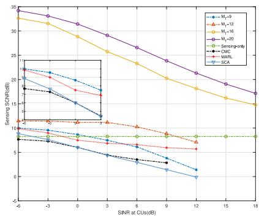  
Fig. 3. Sensing SCNR versus Γ, for $M _ { T } = 9 , 1 2 , 1 6 , 2 0 .$ , at $P _ { t } { = } 3 0$ dBm.

• Alternative Algorithm in [33]: Decomposes the optimization of transmit beamforming into two subproblems of sensing and communication, and iteratively solves them based on the SCA algorithm, ensuring that each iteration converges to a locally optimal solution.

We first analyzed the relationship between SINR threshold and detection probability through baseline comparisons. Our interference model focused on multi-UAV collaborative scenarios, excluding single-UAV configurations. As shown in Fig. 3, a fundamental tradeoff exists between the communication SINR threshold Γ and sensing SCNR when considering varying spatial degrees of freedom. The results demonstrate that increasing the communication SINR threshold leads to a systematic degradation in sensing SCNR, highlighting an inherent inverse relationship between these performance objectives. Notably, UAVs with 9 and 12 $M _ { T }$ fail to satisfy stringent performance requirements when Γ exceeds 13 dB. This degradation arises from the system’s prioritization of communication resource allocation under high-SINR conditions, exacerbating inter-domain competition for antenna resources. The constrained beamforming capacity at limited Tx configurations further limits concurrent optimization of both sensing and communication objectives. By contrast, the sensing-exclusive baseline sustains a constant SCNR of 8.26 dB at the cost of disabling communication functionality, whereas CMC systems incur an average 2.44 dB performance penalty across all operational regimes. We also found that method on [24] performs exceptionally well under complex resource allocation constraints, effectively enhancing the system’s sensing capability through real-time decision optimization—especially when Γ exceeds 5 dB. On the other hand, although the algorithm on [33] performs well at low Γ, its sensing performance significantly deteriorates as the Γ increases. This is mainly because under limited resource allocation constraints, higher communication requirements force the system to prioritize communication objectives during optimization, resulting in an initial solution biased towards the optimal communication path and making it difficult to recover sensing performance levels in subsequent iterations.

Fig. 5 illustrates the relationship between target detection probability and transmit power. As described in the figure, all methods (CMC, CBF, sensing-only, and proposed) under the cooperative UAV configuration $M _ { T } = 9$ exhibit a monotonic increase in target detection probability as transmit power increases. Notably, the CBF method demonstrates significantly inferior performance compared to the others, attributed to its lack of an effective clutter suppression mechanism. Additionally, the multi-UAVs cooperative sensing scheme shows a significant improvement over single-UAV detection, underscoring its effectiveness in challenging operational environments. Moreover, the proposed cooperative detection algorithm achieves detection performance comparable to the sensing-only mode under identical transmitter antenna configurations. This result confirms the practicality and advantages of the proposed scheme.

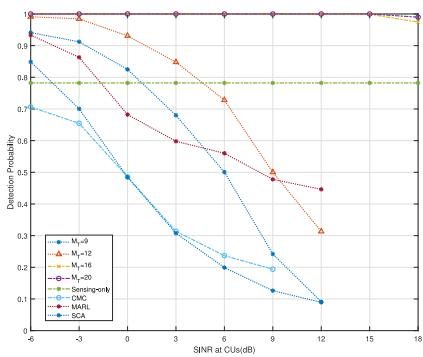

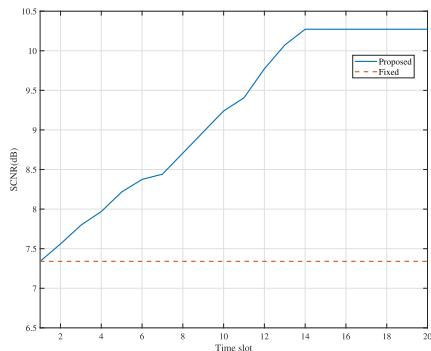

Fig. 4. Detection probability versus Γ, for $M _ { T } \ = \ 9 ,$ , 12, 16, 20,at Fig. 7. SCNR Convergence over Time. $\bar { P _ { t } } = 3 0$ dBm.  
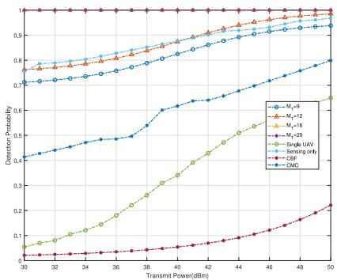  
Fig. 5. Detection probability versus $P _ { T } ,$ , for $M _ { T } = 9 ,$ 12, 16, 20 at $\Gamma = 0 .$

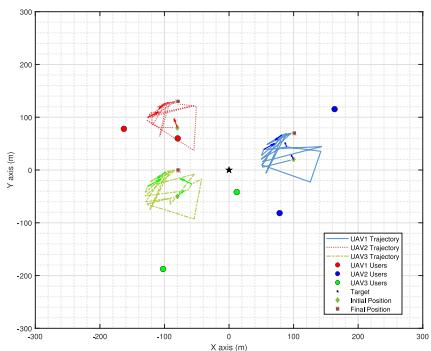

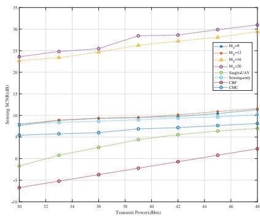  
Fig. 6. Sensing SCNR versus $P _ { T } ,$ , for $M _ { T } = 9 ,$ 12, 16, 20 at $\Gamma = 0 .$  
Fig. 8. Trajectory of all UAVs.

Fig. 6 demonstrates that the proposed algorithm enhances sensing performance with increasing transmit power. However, higher communication SINR thresholds Γ necessitate greater resource allocation, potentially limiting sensing gains. With a limited number of transmitter antennas, the system prioritizes communication users to meet these demands, reducing the benefit of increased power for sensing. Further analysis reveals that, once communication needs are satisfied, additional power yields diminishing returns in sensing performance due to persistent clutter interference. This results in a slower rate of SCNR variation at higher power levels. Finally, we observed fluctuations in the CMC curve within the [36,42] dBm interval, which are attributed to the interaction between the CMC and the non-convex optimization process.

Fig. 7 shows the evolution of system sensing performance over time, revealing a 32% improvement achieved through UAV mobility compared to fixed hovering. Meanwhile, Fig. 8 demonstrates the positional adjustments of UAVs throughout the task interval, achieved via dynamic coordination based on the SCA algorithm. Together, these results highlight that the proposed trajectory optimization effectively identifies real-time optimal positions, and fully utilizing UAV mobility to enhance overall system performance systematically.

Fig. 9 illustrates the communication performance as a function of varying SINR threshold Γ. The proposed approach consistently outperforms the sensing-only baseline and achieves comparable spectral efficiency to the CMC baseline over the range from −6 dB to 6 dB. At a SINR of 9 dB, the proposed approach achieves a spectral efficiency of 5.8 bps/Hz, whereas the CMC approach becomes infeasible due to its limited spatial interference suppression capabilities, a consequence of its fixed-amplitude excitation strategy. These results demonstrate the efficacy of the proposed optimization framework in this scenario.

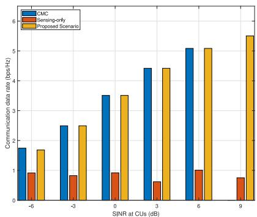  
Fig. 9. Communication data rate versus Γ, for ${ { M } _ { T } } = 9$ and $P _ { T } = 3 0$ dBm.

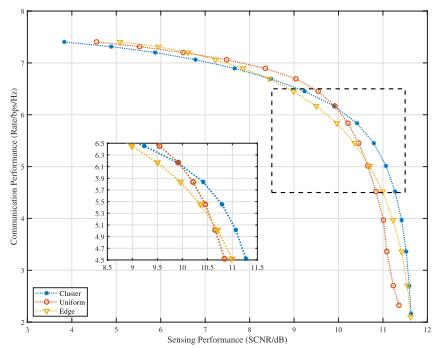  
Fig. 10. Trade-off of sensing and communication influenced by users distribution for ${ { M } _ { T } } = 9$ and $\bar { P _ { T } } = 3 0$ dBm.

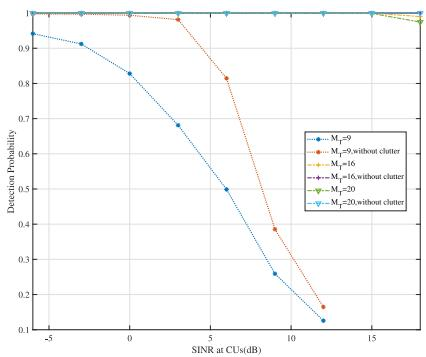  
Fig. 11. Effect of clutter suppression with $P _ { T } ~ = ~ 3 0$ dBm, for $\begin{array} { r } { { \check { M _ { T } } } = 9 . } \end{array}$ 16, 20.

We investigated the impact of user spatial distribution on the sensing-communication trade-off through three scenarios: clustered, uniform, and edge-distributed users in Fig. 10. Clustered users, located near the UAV, experience minimal path loss, enabling prioritized sensing and optimal performance with reduced communication rates. A uniform distribution offers a balanced trade-off, with moderate sensing degradation as communication resources increase. However, edge-distributed users suffer from high path loss and interference. Consequently, the system prioritizes communication, significantly compromising sensing performance and yielding the poorest overall trade-off. This demonstrates the crucial influence of user location on optimizing resource allocation between sensing and communication.

Fig. 11 illustrates the effectiveness of the proposed transceiver beamforming scheme in mitigating clutter interference. When the number of antennas is 9, a gap remains in target detection probability between the scenarios with and without clutter, but the detection probability of the proposed algorithm approaches 80% of the ideal clutter-free scenario. In particular, with 16 and 20 antennas, the detection probability of the algorithm approaches the performance in a clutter-free environment, demonstrating its clutter suppression capability.

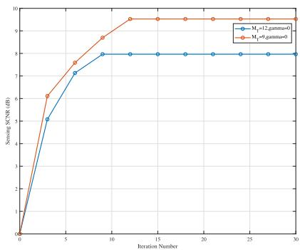  
Fig. 12. Convergence behaviors of the proposed algorithm with $\Gamma = 0 ,$ for $M _ { T } = 9 _ { \mathrm { { \small { 2 } } } }$ , 12.

Finally, Fig. 12 depicts the convergence behavior of the algorithm, quantified by sensing SCNR as a function of iteration number. The figure presents convergence curves for two scenarios with antenna configurations of $M _ { T } = 9$ and $M _ { T } = 1 2$ , both operating at a SINR of zero. As the number of iterations increases, the sensing SCNR in both scenarios exhibits an initial rapid increase, followed by fluctuations before reaching a stable state. Notably, convergence is achieved at approximately 10 iterations for both configurations.

## VII. CONCLUSION

This paper proposes a multi-UAVs ISAC system designed to maximize target detection probability under ground clutter interference while ensuring SINR constraints for terrestrial users. We formulated and solved the multi-UAVs ISAC system’s joint transmit-receive beamforming and trajectory optimization problem. To address the non-convexity, we employed an alternating optimization approach and developed a joint transmit-receive beamforming scheme to suppress ground clutter interference, significantly improving target detection accuracy and interference suppression efficiency compared to existing methods. Numerical simulations demonstrate that our proposed solution significantly outperforms benchmark strategies by effectively balancing communication and sensing performance trade-offs and robustly mitigating ground clutter interference. Due to the page limitation, there are some interesting directions to be addressed. We discuss some of them below to inspire future work.

This paper assumed a perfect cancelation of the doppler frequency shift between the UAVs and the target. However, the dynamic environment resulting from UAV and target mobility necessitates investigation into the impact of doppler effects on sensing performance.

• This paper assumed perfect synchronization among the UAVs, which is a simplifying assumption. Future research should address the performance degradation caused by asynchronous transmission and sensing among multiple

UAVs, and explore feasible node-level time-frequency synchronization schemes.

## APPENDIX A DETAILED DEFINITION OF MATRICE

In the section, we provide the detailed definition of $\mathbf { D } _ { m }$ ${ \bf C } _ { m } , { \bf E } _ { m } , { \bf A } _ { k , j } , \mathrm { \bf A } _ { k , j } ^ { \mathrm { i n n e \bar { r } } } , \mathrm { \bf A } _ { k , j } ^ { \mathrm { i n t e r } } \mathrm { \bf \Delta a n d \ } { \bf A } _ { k , j } ^ { \mathrm { s e n s . } } \mathrm { \bf { \Sigma } }$

$$
\hat { \mathbf { w } } = \mathrm { v e c } ( \mathbf { I } _ { N c } \otimes \tilde { \mathbf { W } } )\tag{48a}
$$

$$
{ \bf D } _ { m } = { \bf I } _ { J + N _ { T } } \otimes { \bf B } _ { m } ^ { H } { \bf v } _ { m } { \bf v } _ { m } ^ { H } { \bf B } _ { m }\tag{48b}
$$

$$
\mathbf { C } _ { m } = \mathbf { I } _ { N _ { c } ( J + N _ { T } ) } \mathbf { B } _ { m } ^ { c H } \mathbf { v } _ { m } \mathbf { v } _ { m } ^ { H } \mathbf { B } _ { m } ^ { c } ,\tag{48c}
$$

$$
\mathbf { E } _ { m } = \sigma _ { n } ^ { 2 } \mathbf { I } _ { N _ { T } } \mathbf { v } _ { m } ^ { H } \mathbf { v } _ { m }\tag{48d}
$$

$$
\mathbf { A } _ { k , j } = \mathbf { P } _ { k } ^ { H } ( \mathbf { e } _ { j } \otimes \mathbf { H } _ { k , k , j } ^ { H } \otimes \mathbf { e } _ { j } ^ { T } ) \mathbf { P } _ { k }\tag{48e}
$$

$$
\mathbf { A } _ { k , j } ^ { \mathrm { i n n e r } } = \mathbf { P } _ { k } ^ { H } ( \sum _ { i \neq j } \mathbf { e } _ { i } \otimes \mathbf { H } _ { k , k , j } ^ { H } \otimes \mathbf { e } _ { i } ^ { T } ) \mathbf { P } _ { k }\tag{48f}
$$

$$
\mathbf { A } _ { k , j } ^ { \mathrm { i n t e r } } = \sum _ { m \neq k } \mathbf { P } _ { m } ^ { H } ( \sum _ { l } \mathbf { e } _ { l } \otimes \mathbf { H } _ { m , k , j } ^ { H } \otimes \mathbf { e } _ { l } ^ { T } ) \mathbf { P } _ { m }\tag{48g}
$$

$$
\mathbf { A } _ { k , j } ^ { \mathrm { s e n s } } = \sum _ { m \neq k } \mathbf { P } _ { m } ^ { H } ( \mathbf { e } _ { s } \otimes \mathbf { H } _ { m , k , j } ^ { H } \otimes \mathbf { e } _ { s } ^ { T } ) \mathbf { P } _ { m } ,\tag{48h}
$$

where

$$
\mathbf { B } _ { m } = [ \mathbf { B } _ { m , 1 } , \mathbf { B } _ { m , 2 } , \ldots , \mathbf { B } _ { m , K } ] \in \mathbb { C } ^ { M _ { R } \times K M _ { T } }\tag{49a}
$$

$$
\mathbf { B } _ { m } ^ { c } = \left\lceil \mathbf { B } _ { m , 1 } ^ { c } , \ldots , \mathbf { B } _ { m , K } ^ { c } \right\rceil \in \mathbb { C } ^ { M _ { R } \times K N _ { c } M _ { T } }\tag{49b}
$$

$$
\mathbf { B } _ { m , k } ^ { c } = \left[ \mathbf { B } _ { m , k , 1 } ^ { c } , \ldots , \mathbf { B } _ { m , k , N _ { c } } ^ { c } \right] \in \mathbb { C } ^ { M _ { R } \times N c M _ { T } } .\tag{49c}
$$

## APPENDIX B PROOF OF PROPOSITION 1

To address the optimization problem (P1.3) involving fractional objectives, we introduce auxiliary variables $\{ \psi _ { m } \}$ to transform the formulation. Define the function

$$
F _ { m } ( \tilde { \mathbf { w } } , \psi _ { m } ) = f _ { m } ( \tilde { \mathbf { w } } ) - \psi _ { m } g _ { m } ( \tilde { \mathbf { w } } )\tag{50}
$$

for each m. The original problem can then be rewritten as maximizing:

$$
\sum _ { m = 1 } ^ { K } F _ { m } \left( \tilde { \mathbf { w } } , \frac { f _ { m } ( \tilde { \mathbf { w } } ) } { g _ { m } ( \tilde { \mathbf { w } } ) } \right) ,\tag{51}
$$

which reduces to solving

$$
\operatorname* { m a x } _ { \tilde { \mathbf { w } } } \sum _ { m = 1 } ^ { K } F _ { m } ( \tilde { \mathbf { w } } , \psi _ { m } ^ { * } ) ,\tag{52}
$$

with ${ \psi _ { m } ^ { * } } = f _ { m } ( \tilde { \mathbf { w } } ) / g _ { m } ( \tilde { \mathbf { w } } )$ at optimality.

Let $\tilde { \mathbf { w } } ^ { * }$ be the optimal solution to (P1.3). By Dinkelbach’s theorem [53], there exist unique $\psi _ { m } ^ { * }$ satisfying:

$$
\psi _ { m } ^ { * } = \frac { f _ { m } ( \tilde { \mathbf { w } } ^ { * } ) } { g _ { m } ( \tilde { \mathbf { w } } ^ { * } ) } \quad \forall m .\tag{53}
$$

Substituting these into $F _ { m }$ yields:

$$
F _ { m } ( \tilde { \mathbf { w } } ^ { * } , \psi _ { m } ^ { * } ) = f _ { m } ( \tilde { \mathbf { w } } ^ { * } ) - \left( \frac { f _ { m } ( \tilde { \mathbf { w } } ^ { * } ) } { g _ { m } ( \tilde { \mathbf { w } } ^ { * } ) } \right) g _ { m } ( \tilde { \mathbf { w } } ^ { * } ) = 0 .\tag{54}
$$

Thus, $\tilde { \mathbf { w } } ^ { * }$ must satisfy the system:

$$
f _ { m } ( \tilde { \mathbf { w } } ^ { * } ) - \psi _ { m } ^ { * } g _ { m } ( \tilde { \mathbf { w } } ^ { * } ) = 0 , \forall m .\tag{55}
$$

Conversely, suppose there exists $\tilde { \mathbf { w } } ^ { * }$ and $\{ \psi _ { m } \}$ such that:

$$
f _ { m } ( \tilde { \mathbf { w } } ^ { * } ) - \psi _ { m } g _ { m } ( \tilde { \mathbf { w } } ^ { * } ) = 0 , \forall m .\tag{56}
$$

This directly implies ${ \psi } _ { m } ^ { * } = f _ { m } ( \tilde { \bf w } ) / g _ { m } ( \tilde { \bf w } )$ , and the transformed objective becomes:

$$
\sum _ { m = 1 } ^ { K } F _ { m } ( \tilde { \mathbf { w } } , \psi _ { m } ) = \sum _ { m = 1 } ^ { K } [ f _ { m } ( \tilde { \mathbf { w } } ) - \psi _ { m } g _ { m } ( \tilde { \mathbf { w } } ) ] .\tag{57}
$$

For any non-optimal $\tilde { \mathbf { w } } .$ , Dinkelbach’s theorem guarantees:

$$
\sum _ { m = 1 } ^ { K } ( f _ { m } ( \tilde { \mathbf { w } } ) - \psi _ { m } ^ { * } g _ { m } ( \tilde { \mathbf { w } } ) ) < 0 ,\tag{58}
$$

establishing $\tilde { \mathbf { w } } ^ { * }$ as the unique maximizer. This completes the proof of optimality.

## APPENDIX C PROOF OF PROPOSITION 2

Suppose that the optimal solution to (P2.6) is given by $\{ \tilde { \mathbf { R } } _ { s , m } \}$ and $\{ \tilde { \mathbf { R } } _ { c , m , l } \}$ , in which $\tilde { \mathbf { R } } _ { c , m , l }$ may not be rank-one in general, which achieves the same objective value as (P2.6):

$$
\begin{array} { r } { \tilde { \mathbf { w } } _ { m , l } ^ { c } = ( \mathbf { h } _ { m , k , j } ^ { H } \mathbf { R } _ { c , m , l } ^ { * } \mathbf { h } _ { m , k , j } ) ^ { \frac { 1 } { 2 } } \mathbf { R } _ { c , m , l } ^ { * } \mathbf { h } _ { m , k , j } , } \end{array}\tag{59a}
$$

$$
\tilde { \mathbf { R } } _ { c , m , l } = \tilde { \mathbf { w } } _ { m , l } ^ { c } \tilde { \mathbf { w } } _ { m , l } ^ { c , H } ,\tag{59b}
$$

$$
\tilde { \mathbf { R } } _ { s , m } = \sum _ { l \in \mathcal { I } _ { m } } \mathbf { R } _ { c , m , l } ^ { * } + \mathbf { R } _ { s , m } ^ { * } - \sum _ { l \in \mathcal { I } _ { m } } \tilde { \mathbf { R } } _ { c , m , l } .\tag{59c}
$$

It can be verified that $\tilde { \mathbf { R } } _ { s , m }$ and $\tilde { \mathbf { R } } _ { c , m , l }$ achieves the same objective values in (P2.6), and satisfy the power constraint in (29b). Next, we verify that $\{ \tilde { \mathbf { R } } _ { s , m } \}$ and $\{ \tilde { \mathbf { R } } _ { c , m , l } \}$ also satisfy the SINR constraints in (28). From (59a) and (59a), we obtain that

$$
\begin{array} { r l } & { \mathbf { h } _ { m , k , j } ^ { H } \tilde { \mathbf { R } } _ { c , m , l } \mathbf { h } _ { m , k , j } = \mathbf { h } _ { m , k , j } ^ { H } \tilde { \mathbf { w } } _ { m , l } ^ { c } \tilde { \mathbf { w } } _ { m , l } ^ { c , H } \mathbf { h } _ { m , k , j } } \\ & { \qquad = \mathbf { h } _ { m , k , j } ^ { H } \mathbf { R } _ { c , m , l } ^ { * } . } \end{array}\tag{60}
$$

It follows that

$$
\begin{array} { r l } { { } } & { { ( 1 + \Gamma _ { k , j } ) \mathbf { h } _ { k , k , j } ^ { H } \tilde { \mathbf { R } } _ { c , k , j } \mathbf { h } _ { k , k , j } } } \\ { { } } & { { = ( 1 + \Gamma _ { k , j } ) \mathbf { h } _ { k , k , j } ^ { H } \mathbf { R } _ { c , k , j } ^ { * } \mathbf { h } _ { k , k , j } } } \\ { { } } & { { \geq \displaystyle \sum _ { m \in { \cal K } } \mathbf { h } _ { m , k , j } ^ { H } \big ( \displaystyle \sum _ { l \in \mathcal { I } _ { m } } \mathbf { R } _ { c , m , l } ^ { * } + \mathbf { R } _ { s , m } ^ { * } \big ) \mathbf { h } _ { m , k , j } + \sigma _ { n } ^ { 2 } } } \\ { { } } & { { = \displaystyle \sum _ { m \in { \cal K } } \mathbf { h } _ { m , k , j } ^ { H } \big ( \displaystyle \sum _ { l \in \mathcal { I } _ { m } } \tilde { \mathbf { R } } _ { c , m , l } + \tilde { \mathbf { R } } _ { s , m } ^ { * } \big ) \mathbf { h } _ { m , k , j } + \sigma _ { n } ^ { 2 } } } \end{array}\tag{61}
$$

By constructing $\{ \tilde { \mathbf { R } } _ { c , m , l } \}$ and $\{ \tilde { \mathbf { R } } _ { s , m } \}$ as described, we obtain a feasible solution to the original rank-constrained problem (P1.6) that achieves the same objective value as the optimal solution to the relaxed problem. This demonstrates the tightness of the SDR relaxation.

## APPENDIX D

## PROOF OF REMARK 1

In high-dimensional multi-antenna systems, Gaussian randomization is a common technique for obtaining feasible rank-one solutions from SDR results. The method involves generating Gaussian random vectors $\zeta _ { l }$ with covariance matrix $\mathbf { R } _ { c , m , l } ^ { * } ,$ and projecting them onto the feasible region F to find candidate solutions [45]:

$$
\mathbf { x } _ { \ell } = \mathop { \arg \operatorname* { m i n } } _ { \mathbf { x } \in \mathbf { F } } \| \mathbf { x } - \zeta _ { \ell } \| _ { 2 } .\tag{62}
$$

However, the performance of Gaussian randomization can be variable. This variability, denoted as $\delta _ { \mathrm { p e r f } } ^ { 2 } ,$ is related to the condition number $\kappa ( \mathbf { R } _ { c , m . l } ^ { * } ) = \lambda _ { m a x } / \lambda _ { m i n } ^ { \textbf { r } ^ { * } }$ of the covariance matrix and the number of randomisation L [44]. Specifically,

$$
\sigma _ { \Delta } ^ { 2 } \propto \frac { C \cdot \kappa ( \mathbf { R } _ { c , m , l } ^ { * } ) } { \sqrt { L } } \left( 1 + \sqrt { \frac { \log M _ { T } } { M _ { T } } } \right) .\tag{63}
$$

A key challenge arises when the number of antennas, $M _ { T }$ , is large. In such cases, the smallest eigenvalue of the covariance matrix may become very small, leading to a large condition number and increased variability. Because Gaussian randomization relies on a finite number of samples (L) to approximate the global optimum, the sparseness of the sample distribution becomes more pronounced in high dimensions. Therefore, a significantly large value of L (often much greater than $M _ { T } )$ is required to reliably explore the solution space and achieve stable performance.

## REFERENCES

[1] Z. Zhang et al., “6G wireless networks: Vision, requirements, architecture, and key technologies,” IEEE Veh. Technol. Mag., vol. 14, no. 3, pp. 28–41, Sep. 2019.

[2] F. Liu et al., “Integrated sensing and communications: Toward dualfunctional wireless networks for 6G and beyond,” IEEE J. Sel. Areas Commun., vol. 40, no. 6, pp. 1728–1767, Jun. 2022.

[3] F. Liu et al., “Seventy years of radar and communications: The road from separation to integration,” IEEE Signal Process. Mag., vol. 40, no. 5, pp. 106–121, Jul. 2023.

[4] F. Dong, F. Liu, Y. Cui, W. Wang, K. Han, and Z. Wang, “Sensing as a service in 6G perceptive networks: A unified framework for ISAC resource allocation,” IEEE Trans. Wireless Commun., vol. 22, no. 5, pp. 3522–3536, May 2022.

[5] Z. Cheng, Z. He, and B. Liao, “Hybrid beamforming for multicarrier dual-function radar-communication system,” IEEE Trans. Cogn. Commun. Netw., vol. 7, no. 3, pp. 1002–1015, Sep. 2021.

[6] T. Tian, T. Zhang, L. Kong, and Y. Deng, “Transmit/receive beamforming for MIMO-OFDM based dual-function radar and communication,” vol. 70, no. 5, pp. 4693–4708, May 2021.

[7] Z. Xiao and Y. Zeng, “Waveform design and performance analysis for full-duplex integrated sensing and communication,” IEEE J. Select. Areas Commun., vol. 40, no. 6, pp. 1823–1837, Jun. 2022.

[8] X. Chen et al., “Multiple signal classification based joint communication and sensing system,” IEEE Trans. Wireless Commun., vol. 22, no. 10, pp. 6504–6517, Oct. 2023.

[9] Y. Li, Z. Wei, Y. Cui, and Z. Feng, “A dual function compromise for uplink ISAC: Joint spectrum and power management,” in Proc. IEEE WCNC, Apr. 2024, pp. 1–6.

[10] F. Wang, H. Li, and M. A. Govoni, “Power allocation and co-design of multicarrier communication and radar systems for spectral coexistence,” IEEE Trans. Signal Process., vol. 67, no. 14, pp. 3818–3831, Jul. 2019.

[11] X. Wang, H. Wu, Y. Xu, H. Cao, N. Kumar, and J. J. P. C. Rodrigues, “Resource allocation in multi-cell integrated sensing and communication systems: A DRL approach,” in Proc. IEEE Int. Conf. Commun., 2023, pp. 3210–3215.

[12] K. Meng, Q. Wu, J. Xu, W. Chen, Z. Feng, R. Schober, and A. L. Swindlehurst, “UAV-enabled integrated sensing and communication: Opportunities and challenges,” IEEE Wireless Commun., vol. 31, no. 2, pp. 97–104, Apr. 2024.

[13] Y. Jiang, Q. Wu, W. Chen, and K. Meng, “UAV-enabled integrated sensing and communication: Tracking design and optimization,” IEEE Commun. Lett., vol. 28, no. 5, pp. 1024–1028, May 2024.

[14] Q. Wu et al., “A comprehensive overview on 5G-and-beyond networks with UAVs: From communications to sensing and intelligence,” IEEE J. Select. Areas Commun., vol. 39, no. 10, pp. 2912–2945, Oct. 2021.

[15] Y. Song et al., “An overview of cellular ISAC for low-altitude UAV: New opportunities and challenges,” 2024, arXiv:2412.19973.

[16] Y. Wang et al., “ISAC enabled cooperative detection for cellularconnected UAV network,” IEEE Trans. Wireless Commun., vol. 24, no. 2, pp. 1541–1554, Dec. 2024.

[17] C. Deng, X. Fang, and X. Wang, “Beamforming design and trajectory optimization for UAV-empowered adaptable integrated sensing and communication,” IEEE Trans. Wireless Commun., vol. 22, no. 11, pp. 8512–8526, Nov. 2023.

[18] Z. Lyu, G. Zhu, and J. Xu, “Joint maneuver and beamforming design for UAV-enabled integrated sensing and communication,” IEEE Trans. Wireless Commun., vol. 22, no. 4, pp. 2424–2440, Apr. 2023.

[19] X. Jing, F. Liu, C. Masouros, and Y. Zeng, “ISAC from the sky: UAV trajectory design for joint communication and target localization,” IEEE Trans. Wireless Commun., vol. 23, no. 10, pp. 12857–12872, Oct. 2024.

[20] F. Liu, W. Yuan, C. Masouros, and J. Yuan, “Radar-assisted predictive beamforming for vehicular links: Communication served by sensing,” IEEE Trans. Wireless Commun., vol. 19, no. 11, pp. 7704–7719, Nov. 2020.

[21] C. Yanpeng, Z. Qixun, F. Zhiyong, Q. Wen, Z. Ying, W. Zhiqing, and Z. Ping, “Sensing-Assisted Accurate and Fast Beam Management for Cellular-Connected mmWave UAV Network,” China Commun., vol. 21, no. 6, pp. 271–289, Jun. 2024.

[22] X. Chen, Z. Feng, Z. Wei, F. Gao, and X. Yuan, “Performance of joint sensing-communication cooperative sensing UAV network,” IEEE Trans. Veh. Technol., vol. 69, no. 12, pp. 15545–15556, Dec. 2020.

[23] K. Meng, X. He, Q. Wu, and D. Li, “Multi-UAV collaborative sensing and communication: Joint task allocation and power optimization,” IEEE Trans. Wireless Commun., vol. 22, no. 6, pp. 4232–4246, Jun. 2023.

[24] Q. Gao, R. Zhong, H. Shin, and Y. Liu, “MARL based UAVs’ trajectory and beamforming optimization for ISAC system,” IEEE Internet Things J., vol. 11, no. 24, pp. 40492–40505, Dec. 2024.

[25] Y. Zhuo and Z. Wang, “Performance analysis of ISAC system under correlated communication-sensing channel,” IEEE Trans. Veh. Technol., vol. 72, no. 12, pp. 16823–16827, Dec. 2023.

[26] J. B. Billingsley, Low-Angle Radar Land Clutter: Measurements and Empirical Models. Stevenage, U.K.: IET, 2002.

[27] D. K. Barton, Radar System Analysis and Modeling. Morristown, NJ, USA: Artech House, 2004.

[28] H. Luo, Y. Wang, D. Luo, J. Zhao, H. Wu, S. Ma, and F. Gao, “Integrated sensing and communications in clutter environment,” IEEE Trans. Wireless Commun., vol. 23, no. 9, pp. 10941–10956, Sep. 2024.

[29] X. Zhang, T. Wang, W. Cui, and D. Wang, “A novel clutter suppression algorithm for airborne radar via subspace projection,” IEEE Sensors J., vol. 25, no. 1, pp. 962–970, Jan. 2025.

[30] X.-Y. Wang, S. Yang, J. Zhang, C. Masouros, and P. Zhang, “Clutter suppression, time-frequency synchronization, and sensing parameter association in asynchronous perceptive vehicular networks,” IEEE J. Sel. Areas Commun., vol. 42, no. 10, pp. 2719–2736, Oct. 2024.

[31] G. Sun, Z. He, and Y. Zhang, “Distributed airborne MIMO radar detection in compound-Gaussian clutter without training data,” Circuits Syst. Signal Process., vol. 37, no. 10, pp. 4617–4636, Oct. 2018.

[32] W. Zhang, R. An, N. He, Z. He, and H. Li, “Reduced dimension STAP based on sparse recovery in heterogeneous clutter environments,” IEEE Trans. Aerosp. Electron. Syst., vol. 56, no. 1, pp. 785–795, Feb. 2020.

[33] G. Abdissa Bayessa, R. Chai, C. Liang, D. K. Jain, and Q. Chen, “Joint UAV deployment and precoder optimization for multicasting and target sensing in UAV-assisted ISAC networks,” IEEE Internet Things J., vol. 11, no. 20, pp. 33392–33405, Oct. 2024.

[34] L. Zhu, J. Zhang, Z. Xiao, X. Cao, X.-G. Xia, and R. Schober, “Millimeter-wave full-duplex UAV relay: Joint positioning, beamforming, and power control,” IEEE J. Sel. Areas Commun., vol. 38, no. 9, pp. 2057–2073, Sep. 2020.

[35] S. Guangmin, L. Guosui, and G. Hong, “Signal analysis and processing for random binary phase coded pulse radar,” J. Syst. Eng. Electron., vol. 15, no. 4, pp. 520–524, Dec. 2004.

[36] E. H. Kim and K. H. Kim, “Random phase code for automotive MIMO radars using combined frequency shift keying-linear FMCW Waveform,” IET Radar, Sonar Navig., vol. 12, no. 10, pp. 1090–1095, Oct. 2018.

[37] L. Zhu, J. Zhang, Z. Xiao, X.-G. Xia, and R. Zhang, “Multi-UAV aided millimeter-wave networks: Positioning, clustering, and beamforming,” IEEE Trans. Wireless Commun., vol. 21, no. 7, pp. 4637–4653, Jul. 2022.

[38] G. Cheng, Y. Fang, J. Xu, and D. W. K. Ng, “Optimal coordinated transmit beamforming for networked integrated sensing and communications,” IEEE Trans. Wireless Commun., vol. 23, no. 8, pp. 8200–8214, Aug. 2024.

[39] R. Liu et al., “Transmit-receive beamforming for distributed phased-MIMO radar system,” IEEE Trans. Veh. Technol., vol. 71, no. 2, pp. 1439–1453, Dec. 2022.

[40] X. Lou, W. Xia, S. Jin, and H. Zhu, “Beamforming optimization in distributed ISAC system with integrated active and passive sensing,” IEEE Trans. Commun., vol. 73, no. 3, pp. 1607–1620, Mar. 2025.

[41] S. M. Kay, Fundamentals of Statistical Signal Processing: Practical Algorithm Development, vol. 3. London, U.K.: Pearson Educ., 2013.

[42] J. Qian, Z. Sun, C. Zhang, Z. Xie, G. Qian, and S. Wang, “Robust design of transmit beamforming for radcom system under direction uncertainties,” in Proc. IEEE Radar Conf. (RadarConf), 2024, pp. 1–6.

[43] S. Boyd, Convex Optimization. Cambridge, U.K.: Cambridge Univ. Press, 2004.

[44] Z.-q. Luo, W.-k. Ma, A. M.-c. So, Y. Ye, and S. Zhang, “Semidefinite relaxation of quadratic optimization problems,” IEEE Signal Process. Mag., vol. 27, no. 3, pp. 20–34, May 2010.

[45] N. D. Sidiropoulos, T. N. Davidson, and Z.-Q. Luo, “Transmit beamforming for physical-layer multicasting,” IEEE Trans. Signal Process., vol. 54, no. 6, pp. 2239–2251, Jun. 2006.

[46] A. R. Conn, N. I. Gould, and P. L. Toint, Trust Region Methods. Philadelphia, PA, USA: Soc. Ind. Appl. Math., 2000.

[47] G. H. Golub and C. F. van Loan, Matrix Computations. Baltimore, MD, USA: JHU Press, 2013.

[48] M. Ashraf, B. Tan, D. Moltchanov, J. S. Thompson, and M. Valkama, “Joint optimization of radar and communications performance in 6G cellular systems,” IEEE Trans. Green Commun. Netw., vol. 7, no. 1, pp. 522–536, Mar. 2023.

[49] Y. Huang, W. Mei, J. Xu, L. Qiu, and R. Zhang, “Cognitive UAV communication via joint maneuver and power control,” IEEE Trans. Wireless Commun., vol. 67, no. 11, pp. 7872–7888, Nov. 2019.

[50] S. Zhang, X. Li, M. Zong, X. Zhu, and R. Wang, “Efficient kNN classification with different numbers of nearest neighbors,” IEEE Trans. Neural Netw. Learn. Syst., vol. 29, no. 5, pp. 1774–1785, May 2018.

[51] Z. Behdad, Ö. T. Demir, K. W. Sung, E. BjÖrnson, and C. Cavdar, “Multi-static target detection and power allocation for integrated sensing and communication in cell-free massive MIMO,” IEEE Trans. Wireless Commun., vol. 23, no. 9, pp. 11580–11596, Sep. 2024.

[52] C. G. Tsinos, A. Arora, S. Chatzinotas, and B. Ottersten, “Joint transmit waveform and receive filter design for dual-function radarcommunication systems,” IEEE J. Sel. Top. Signal Process., vol. 15, no. 6, pp. 1378–1392, Nov. 2021.

[53] W. Dinkelbach, “On nonlinear fractional programming,” Manage. Sci., vol. 13, no. 7, pp. 492–498, 1967.

Xianchao Zhang received the Ph.D. degree in systems engineering from Beihang University, Beijing, China, in 2013. From 2013 to 2015, he was a Postdoctoral Fellow with Peking University, China. From 2018 to 2022, he was a Postdoctoral Fellow with Southeast University, China. From 2015 to 2021, he was a Senior Engineer with the China Academy of Electronic and Information Technology. He is currently a Professor with the Provincial Key Laboratory of Multimodal Perceiving and Intelligent Systems, the Key Laboratory of Medical Electronics

and Digital Health of Zhejiang Province and the Engineering Research Center of Intelligent Human Health Situation Awareness of Zhejiang Province, Jiaxing University, China. His research interests include intelligent information network, weak-signal processing, and quantum artificial intelligence.

Yi Wang (Member, IEEE) received the B.Eng. degree from Beijing Jiaotong University, Beijing, China, in 2018, and the Ph.D. degree from the Beijing University of Posts and Telecommunications Beijing, in 2023. He is currently an Associate Researcher with Yangtze Delta Region Institute (Quzhou), University of Electronic Science and Technology of China. His research interest includes integrated sensing and communications, signal processing, and resource allocation.

Xue Yao received the B.S. and M.S. degrees from the University of Electronic Science and Technology of China, Chengdu, China, in 2012 and 2015, respectively, and the Ph.D. degree in information and communication systems from Southeast University, Nanjing, China, in 2024. She is a Lecturer with Chongqing Three Gorges University. Her research interests are in adaptive signal processing, integrated sensing and communication, and cognitive radar waveform optimization.

Zhiqing Wei (Member, IEEE) received the B.E. and Ph.D. degrees from the Beijing University of Posts and Telecommunications, Beijing, China, in 2010 and 2015, respectively, where he is an Associate Professor. He has authored one book, three book chapters, and more than 50 papers. His research interest is the performance analysis and optimization of intelligent machine networks. He was granted the Exemplary Reviewer of IEEE WIRELESS COMMUNICATIONS LETTERS in 2017, the Best Paper Award of WCSP 2018. He was the Registration Co-Chair of IEEE/CIC ICCC 2018 and the Publication Co-Chair of IEEE/CIC ICCC 2019 and IEEE/CIC ICCC 2020.

Jinyu Wang received the B.S. degree from the International School of Beijing University of Posts and Telecommunications, Beijing, China, in 2020, where she is currently pursuing the Ph.D. degree. Her research interests include integrated sensing and communication, deep learning, and UAV network.

Fengsong Sun received the bachelor’s and master’s degrees from Xidian University. He is currently pursuing the Ph.D. degree with Beijing University of Posts and Telecommunications. His research interests include knowledge graph reasoning and machine learning.

Zhiyong Feng (Senior Member, IEEE) received the B.E., M.E., and Ph.D. degrees from Beijing University of Posts and Telecommunications, Beijing, China, where she is a Professor and the Director of the Key Laboratory of the Universal Wireless Communications, Ministry of Education, China. She is the Vice Chair of the Information and Communication Test Committee of the Chinese Institute of Communications. She is currently serving as an Associate Editors in Chief for China Communications, and she is a Technological Advisor for international forum on NGMN. Her main research interests include wireless network architecture design and radio resource management in 5th generation mobile networks, spectrum sensing and dynamic spectrum management in cognitive wireless networks, and universal signal detection and identification.