# Two-Hop Partial Task Offloading and Resource Allocation in Air–Ground Integrated Mobile Edge Computing Network: A DRL-Based Method

Shichao Li , Bingji Lu , Laha Ale , Member, IEEE, Hongbin Chen , Fangqing Tan , and Jingyue Huang

Abstract—The integration of mobile edge computing (MEC) and air–ground integrated network is viewed as a crucial technology for Internet of Remote Things (IoRT) devices. It provides widespread service coverage and allows the tasks of IoRT devices to be executed by the uncrewed aerial vehicles (UAVs) and the high altitude platforms (HAPs). In this article, we investigate a joint partial task offloading, resource allocation, and UAV trajectory design problem to minimize the total task offloading delay of all IoRT devices in the air–ground integrated MEC network. Given that the problem is nonconvex and hard to solve by the traditional methods, we convert it into a Markov decision process (MDP) and leverage the deep reinforcement learning method to address it. Considering the complexity of the MDP grows with the number of the IoRT devices and the UAVs increasing, the primal problem is decomposed into two subproblems: 1) the UAV trajectory design and IoRT device power control subproblem, and 2) the partial task offloading and resource allocation subproblem. To address these two subproblems, we apply the basic concepts of the multiagent deep deterministic policy gradient (MADDPG) and the independent proximal policy optimization (IPPO) methods, respectively. Additionally, we introduce the enhanced prioritized experience replay and noise value to improve both the convergence performance and rate. This leads to the development of the MADDPG-improved prioritized experience replay (MADDPG-IPER) algorithm and noise value-IPPO (NV-IPPO) algorithm. Based on the solution of these two subproblems, a joint partial task offloading, resource allocation, and UAV trajectory design (JPTORAUTD) algorithm is proposed. Simulation results present that the proposed JPTORAUTD algorithm outperforms other benchmark algorithms in terms of reducing the total task offloading delay.

Index Terms—Independent proximal policy optimization (IPPO), mobile edge computing (MEC), multiagent deep deterministic policy gradient (MADDPG), partial task offloading, uncrewed aerial vehicles (UAVs) trajectory design.

Received 5 January 2025; accepted 27 February 2025. Date of publication 5 March 2025; date of current version 9 June 2025. This work was supported in part by the Natural Science Foundation of China under Grant 62361016, Grant 62061009, and Grant 62261013; in part by the Chinese Scholarship Council under Grant 202108450022; in part by the Guangxi Natural Science Foundation under Grant 2025GXNSFAA069677; and in part by the Project of Guangxi Wireless Broadband Communication and Signal Processing Key Laboratory under Grant GXKL06240106. (Corresponding author: Laha Ale.)

Shichao Li, Bingji Lu, Hongbin Chen, Fangqing Tan, and Jingyue Huang are with the Guangxi Key Laboratory of Wireless Broadband Communication and Signal Processing, Guilin University of Electronic Technology, Guilin 541004, China (e-mail: shichaoli@guet.edu.cn; 22022303091@mails.guet.edu.cn; chbscut@guet.edu.cn; tfqing@guet.edu.cn; 569971168@qq.com).

Laha Ale is with the School of Computing and Artificial Intelligence, Southwest Jiaotong University, Chengdu 610031, China (e-mail:laha.ale@ieee.org).

Digital Object Identifier 10.1109/JIOT.2025.3548088

# I. INTRODUCTION

HANKS to the extraordinary advances in the Internet of T Things (IoT) technology, IoT devices obtain a widespread application, such as smart home devices, smart medical devices, smart wearable devices, and so on [1]. These devices need to perform massive computation-sensitive tasks with strict delay requirements. Regrettably, the limited computation resources of these devices pose difficulties in meeting computation requirements locally [2]. To tackle this problem, mobile edge computing (MEC) technology has emerged. By placing extensive computation and storage resources at multiple network edges closer to devices, the MEC can provide task offloading services and mitigate inadequate resources to reduce task execution delay [3].

The Internet of Remote Things (IoRT) devices with limited computation capabilities are deployed in remote or rural areas [4]. It is extremely difficult for terrestrial communication networks to provide effective communication services for these devices [5]. As a solution, the aerial access network comprising the high altitude platforms (HAPs) and the uncrewed aerial vehicles (UAVs) has been proposed [6]. By integrating terrestrial networks with aerial access networks and MEC, the air–ground integrated MEC network can be established [7], [8]. This network offers wide coverage, high flexibility, and abundant computation resources, enabling IoRT devices to execute task offloading efficiently while meeting stringent delay requirements [9].

The integrated air–ground MEC network presents numerous advantages but also confronts a number of challenges. First, the long distance between the HAPs and the IoRT devices will cause large task offloading delay. In the air– ground integrated MEC network, the UAV can be utilized as a relay to effectively reduce task offloading delay through optimized UAV trajectory and power control. Second, there are multidimensional resources in the air–ground integrated MEC network, such as the multicomputation equipment selection, computation resources, transmission power, bandwidth, UAV trajectory, etc. Therefore, how to make full use of resources to improve the network performance is a challenging issue.

In this article, a problem of total task offloading delay minimization is formulated while considering the partial task offloading, resource allocation, and UAV trajectory design in the air–ground integrated MEC network. Since the primal problem is nonconvex and hard to solve, we transform it into a Markov decision process (MDP). Considering the increase in the number of the IoRT devices and the UAVs, the state space and action space will expand rapidly. The primal problem is decomposed into two subproblems: 1) the UAV trajectory design and IoRT device power control subproblem and 2) partial task offloading and resource allocation subproblem. In order to solve these two subproblems, we employ the basic ideas of multiagent deep deterministic policy gradient (MADDPG) and independent proximal policy optimization (IPPO) methods, respectively. Meanwhile, to improve the convergence performance and convergence rate, the improved prioritized experience replay mechanism and noise value are applied to propose the MADDPG-improved prioritized experience replay (MADDPG-IPER) algorithm and noise value-IPPO (NV-IPPO) algorithm, respectively. Based on the solution of these two subproblems, a joint partial task offloading, resource allocation, and UAV trajectory design (JPTORAUTD) algorithm is proposed. Simulation results confirm the effectiveness of the proposed JPTORAUTD algorithm in terms of minimizing the total task offloading delay when compared with other existing algorithms. The main contributions of this work are summarized as follows.

1) First, we present an air–ground integrated MEC network model with two-hop for partial task offloading. According to the network model, a joint partial task offloading, resource allocation, and UAV trajectory design problem is formulated to minimize the total task offloading delay.   
2) Second, the primal problem is transformed into an MDP for the purpose of solving the nonconvex problem. Considering the increase in the number of the IoRT devices and the UAVs, the state space and action space will increase rapidly. The primal problem is decomposed into two subproblems. We utilize the basic ideas of MADDPG and IPPO methods, and introduce the improved prioritized experience replay and noise value to propose the MADDPG-IPER and NV-IPPO algorithms for solving these two subproblems, respectively. Based on the solution of these two subproblems, the JPTORAUTD algorithm has been proposed.   
3) Finally, simulation results are provided, which demonstrate the accuracy and effectiveness of the proposed JPTORAUTD algorithm.

The remaining parts of this article are organized as follows. In Section II, a summary of the related works is provided. In Section III, we present the system model and formulate the problem of minimizing the total task offloading delay. In Section IV, we decompose the primal problem into two subproblems. The problem solution is given in Section V. Simulation results are given in Section VI. The conclusion of this article is presented in Section VII.

# II. RELATED WORKS

The joint task offloading, resource allocation, and UAV trajectory design in air–ground integrated MEC network have recently attracted a remarkable quantity of attention. These works are mainly divided into two categories according to the different objectives.

The first type of objective is to minimize the energy consumption. In order to minimize the total weighted energy consumption of the system, a Beta distribution multiagent proximal policy optimization distribution framework was developed by jointly optimizing UAV trajectory, task partition, and resource allocation [10]. An energy minimization problem was proposed by jointly optimizing task partition, time slot length, and UAV trajectory [11]. To minimize the energy consumption of cellular-connected UAV, an efficient solution by employing a convex optimization technique and a dynamic-weight shortest path algorithm was proposed [12]. To minimize the total energy consumption of UAV, including computation energy, communication energy, and flight-propulsion energy, an energy consumption minimization problem was formulated by jointly optimizing UAV trajectory, computation task allocation, UAV ground base stations association, and transmission power allocation [13]. A weighted-sum energy consumption of the UAV and user devices minimization problem was proposed by jointly optimizing the UAV trajectory and computation resource allocation, under the number of computation bits constraint [14]. An energy consumption minimization problem was formulated under several constraints including users’ quality of service, information security requirements and the UAV trajectory. This problem was addressed by jointly optimizing the CPU frequency, offloading time, beamforming vectors, artificial noise, and the UAV trajectory [15]. In order to minimize the system energy consumption, an optimization problem was proposed by jointly optimizing the trajectory and task offloading strategy of UAVs [16]. A multinode collaboration transmission and computation algorithm in the multi-IoT cooperative fog computing system was proposed to minimize the total energy consumption of the IoT system while satisfying the delay requirements [17].

The second type of objective is to minimize delay. An average task offloading delay minimization problem was formulated in the UAV-assisted MEC network. The primal problem was decomposed into three subproblems to solve [18]. In order to minimize the total delay of the system through joint optimization of the UAV trajectory and the ratio of the offloading tasks, a machine-learning framework based on the Q-learning algorithm was proposed [19]. In the heterogeneous network, an MEC queuing delay was considered in the formulated problem, where the average task delay was minimized via jointly optimizing user association and UAV deployment [20]. Considering the low-latency requirements of the MEC, the maximal computation latency of all devices was minimized by jointly optimizing the computation time, bandwidth, and computation resources of devices, and the 3-D location of the UAV [21]. Two task offloading and resource allocation problems for a UAV-enabled wirelesspowered MEC system were investigated, operating under both long and short time-slot computation offloading modes. The objective was to minimize waiting delay while maintaining controllable energy consumption [22]. Based on the analysis of the above works, only the UAV was considered, and without the HAP in the air–ground integrated MEC network. Introducing the HAP into the air–ground integrated MEC network can improve the coverage of the network and increase the channel capacity. Besides, the mentioned works fail to address the two challenges outlined in the previous section. Consequently, it is essential to reinvestigate the existing studies related to minimizing task offloading delay in the air–ground integrated MEC network. This necessity drives the motivation for the current work.

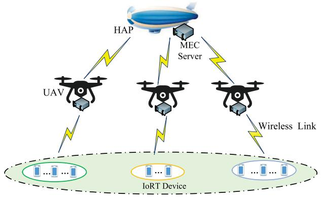

<details>
<summary>flowchart</summary>

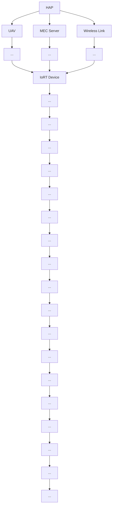
</details>

Fig. 1. System model.

# III. SYSTEM MODEL AND PROBLEM FORMULATION

In this section, we first present the system model including the network model, transmission and computation model of UAV, transmission and computation model of HAP, and energy consumption model of UAV. Then, a joint partial task offloading, resource allocation, and UAV trajectory design problem is formulated to minimize the total task offloading delay.

# A. Network Model

As illustrated in Fig. 1, an air–ground integrated MEC network for task offloading is considered, which includes one HAP, M UAVs, and K IoRT devices. Each UAV and the HAP are equipped with an MEC server to provide computation services for the IoRT devices. The set of the IoRT devices and the UAVs can be defined as $\mathcal { K } ~ = ~ \{ 1 , \dots , k , \dots , K \}$ and $\mathcal { M } = \{ 1 , \ldots , m , \ldots , M \}$ , respectively. Define the IoRT device served by the UAV m as $k _ { m } ,$ and the set is $\ K _ { m } =$ $\{ 1 , \ldots , k _ { m } , \ldots \ldots , K _ { m } \}$ . Define the whole time period as T, which is divided into N equal-length time slots, each of length τ , $\mathfrak { i . e . , T = N } \tau$ . The set of time slots can be defined as ${ \mathcal { N } } =$ $\{ 1 , \ldots , n , \ldots , N \}$ . Each IoRT device can gather a task within each time slot, and the index of the IoRT device can be viewed as the task index. The altitude of the HAP and the UAVs is $H _ { h }$ and $H _ { m } ,$ respectively. The horizontal location of the IoRT device $k _ { m }$ is $\pmb { P } _ { k _ { m } } = ( x _ { k _ { m } } , y _ { k _ { m } } )$ . The HAP floating in the stratosphere can be considered relatively stationary and its location can be expressed as $P _ { h } = ( x _ { h } , y _ { h } )$ . The location of the UAV m in the horizontal at time slot n is $\begin{array} { l } { { \pmb q } _ { m } ( n ) = } \end{array}$ $( x _ { m } ( n ) , y _ { m } ( n ) )$ ). We use $\nu _ { m } ( n ) \in ( 0 , \nu _ { m } ^ { \operatorname* { m a x } } ]$ and $\theta _ { m } ( n ) \in [ 0 , 2 \pi ]$ to express the flight speed and flight angle of the UAV m at time slot $n ,$ respectively. $\nu _ { m } ^ { \mathrm { m a x } }$ is the maximal flight speed of the UAV m. Therefore, the trajectory update of the UAV m at time slot n can be written as

TABLE I SUMMARY OF KEY NOTATIONS 

<table><tr><td>Notation</td><td>Description</td></tr><tr><td> $k_m$ </td><td>Index of IoRT devices served by the UAV m</td></tr><tr><td> $\mathcal{K}, \mathcal{M}, \mathcal{K}_m, \mathcal{N}$ </td><td>Set of IoRT devices, UAVs, IoRT devices served by the UAV m and time slots</td></tr><tr><td> $P_{km}, P_h, q_m(n)$ </td><td>Location of IoRT device  $k_m$ , HAP and UAV m at time slot n</td></tr><tr><td>τ</td><td>Length of the time slot</td></tr><tr><td> $v_{m}^{max}$ </td><td>Maximal flight speed of the UAV m</td></tr><tr><td> $d_{min}$ </td><td>Minimum safety distance between the UAVs</td></tr><tr><td> $h_{m,k_m}(n)$ </td><td>Channel gain between the UAV m and the IoRT device  $k_m$  at time slot n</td></tr><tr><td> $p_{km}(n), p_m(n)$ </td><td>Transmission power of the IoRT device  $k_m$  and the UAV m at time slot n</td></tr><tr><td> $R_{m,k_m}(n)$ </td><td>Transmission rate between the UAV m and the IoRT device  $k_m$  at time slot n</td></tr><tr><td> $c_{km}(n), s_{km}(n), t_{km}^{\max}(n)$ </td><td>Number of CPU cycles, data size, and maximal tolerable delay of task  $k_m$  at time slot n</td></tr><tr><td> $\alpha_{km}(n)$ </td><td>Offloading ratio variable of task  $k_m$  at time slot n</td></tr><tr><td> $T_{m,k_m}(n)$ </td><td>Transmission delay between the IoRT device  $k_m$  and the UAV m at time slot n</td></tr><tr><td> $T_{m,k_m}^{uav}(n), T_{km}^h(n)$ </td><td>Task computation delay at the UAV m and the HAP at time slot n</td></tr><tr><td> $f_{m,k_m}(n), f_{h,k_m}(n)$ </td><td>CPU-cycle frequency allocated to task  $k_m$  by the UAV m and the HAP at time slot n</td></tr><tr><td> $R_{m,h}(n)$ </td><td>Transmission rate between the UAV m and the HAP at time slot n</td></tr><tr><td> $T_{m,h}(n)$ </td><td>Transmission delay of task  $k_m$  from the UAV m to the HAP at time slot n</td></tr><tr><td> $T_{km}(n)$ </td><td>Total offloading delay of task  $k_m$  at time slot n</td></tr></table>

$$
x _ {m} (n) = x _ {m} (n - 1) + v _ {m} (n) \tau \cos \theta_ {m} (n) \tag {1}
$$

$$
y _ {m} (n) = y _ {m} (n - 1) + v _ {m} (n) \tau \sin \theta_ {m} (n). \tag {2}
$$

In addition, the distance that the UAV m can move in one time slot is $\nu _ { m } ^ { \mathrm { m a x } } \tau$ , so the trajectory of the UAV m should satisfy

$$
\left\| \boldsymbol {q} _ {m} (n + 1) - \boldsymbol {q} _ {m} (n) \right\| ^ {2} \leq \left(v _ {m} ^ {\max} \tau\right) ^ {2}. \tag {3}
$$

Simultaneously, the UAV m needs to return to the initial location at the end of each time period T to provide computation services for the IoRT devices in the next time period [23]. Therefore, the following constraint for the UAV m should be adhered to:

$$
\boldsymbol {q} _ {m} [ 1 ] = \boldsymbol {q} _ {m} [ N ]. \tag {4}
$$

To avoid the collision, the UAV trajectory should be subject to the following constraint:

$$
\left\| \boldsymbol {q} _ {m} (n) - \boldsymbol {q} _ {j} (n) \right\| ^ {2} \geq d _ {\min} ^ {2} \tag {5}
$$

where $d _ { \mathrm { m i n } }$ is the minimum safety distance between the UAVs.

The notations and descriptions are listed in Table I.

# B. Transmission and Computation Model of UAV

In this article, the UAV can be considered relatively static within one time slot, and the tasks need to be executed within one time slot. The communication link between each UAV and the IoRT devices can be viewed as a line-of-sight link [24]. Consequently, the channel gain between the UAV m and the IoRT device $k _ { m }$ at time slot n can be expressed as

$$
h _ {m, k _ {m}} (n) = \frac {\beta_ {0}}{\| \boldsymbol {q} _ {m} (n) - \boldsymbol {P} _ {k _ {m}} \| ^ {2} + H _ {m} ^ {2}} \tag {6}
$$

where $\beta _ { 0 }$ represents the channel gain at a reference distance of 1 m.

For the links between the IoRT devices and the UAV, each UAV utilizes the different bandwidth in the coverage area, and in each UAV coverage area, each IoRT device can utilize the whole bandwidth. Therefore, there is no interference between the UAVs, but there is interference among the IoRT devices in each UAV coverage area. We denote the transmission power of the IoRT device $k _ { m }$ at time slot n as $p _ { k _ { m } } ( n )$ , and the bandwidth allocated to the UAV m is $b _ { m }$ . The transmission rate between the UAV m and the IoRT device $k _ { m }$ at time slot n can be expressed as

$$
R _ {m, k _ {m}} (n) = b _ {m} \log_ {2} \left(1 + \frac {p _ {k _ {m}} (n) h _ {m , k _ {m}} (n)}{N _ {0} + \sum_ {k _ {g} \in \mathcal {K} _ {m} , k _ {g} \neq k _ {m}} p _ {k _ {g}} (n) h _ {m , k _ {g}} (n)}\right) \tag {7}
$$

where $N _ { 0 }$ represents the noise power.

Define the computation task collected by the IoRT device $k _ { m }$ $s _ { k _ { m } } ( n )$ at time slot n as , and $t _ { k _ { m } } ^ { \operatorname* { m a x } } ( n )$ denote the number of CPU cycles required $\{ c _ { k _ { m } } ( n ) , s _ { k _ { m } } ( n ) , t _ { k _ { m } } ^ { \mathrm { m a x } } ( n ) \}$ k , where $c _ { k _ { m } } ( n )$ , to complete the computation task, the size of computation task, and the maximal tolerable delay of the task, respectively. In this article, we consider partial task offloading, where the tasks can be offloaded to the UAVs and the HAP for computing. Let $\alpha _ { k _ { m } } ( n ) \in ( 0 , 1 )$ expressed the task offloading ratio variable of task $k _ { m }$ at time slot $n ,$ which means that $( 1 - \alpha _ { k _ { m } } ( n ) ) s _ { k _ { m } } ( n )$ bits of task $k _ { m }$ are offloaded to the UAV m at time slot $n ,$ and $\alpha _ { k _ { m } } ( n ) s _ { k _ { m } } ( n )$ bits of task $k _ { m }$ are offloaded to the HAP through the UAV m as a relay at time slot n. From the above analysis, the transmission delay between the IoRT device $k _ { m }$ and the UAV m at time slot n is

$$
T _ {m, k _ {m}} (n) = \frac {s _ {k _ {m}} (n)}{R _ {m , k _ {m}} (n)}. \tag {8}
$$

The number of CPU cycles required to complete the task $k _ { m }$ by the UAV m at time slot n is $( 1 - \alpha _ { k _ { m } } ( n ) ) c _ { k _ { m } } ( n )$ . We denote $f _ { m , k _ { m } } ( n )$ as the CPU-cycle frequency allocated to task $k _ { m }$ by the UAV m at time slot n. Therefore, the task computation delay at the UAV m at time slot n can be given as

$$
T _ {m, k _ {m}} ^ {\mathrm{uav}} (n) = \frac {\left(1 - \alpha_ {k _ {m}} (n)\right) c _ {k _ {m}} (n)}{f _ {m , k _ {m}} (n)}. \tag {9}
$$

# C. Transmission and Computation Model of HAP

For the links between the UAVs and the HAP, each UAV utilizes the different bandwidth. Thus, this is no interference between the UAVs. We denote the bandwidth between the UAV m and the HAP as $b _ { m , h } .$ , and the transmission power of the UAV m at time slot n is $p _ { m } ( n )$ . According to [25], the transmission rate between the UAV m and the HAP at time slot n can be calculated by

$$
R _ {m, h} (n) = b _ {m, h} \log_ {2} \left(1 + \frac {p _ {m} (n) G _ {0} L _ {m , h} (n) L _ {0}}{w _ {0} T _ {0} b _ {m , h}}\right) \tag {10}
$$

where $\mathit { G 0 } , \ L _ { 0 } ,$ , and w0 represent the antenna power gain, the total line loss, and the Boltzmann constant, respectively. $T _ { 0 }$ is the system noise temperature. Besides, $L _ { m , h } ( n ) ~ =$ (c/[4π $d _ { m , h } ( n ) f _ { 0 } ] ) ^ { 2 }$ denotes the free space loss from the UAV m to the HAP at time slot n. Wherein, c and $f _ { 0 }$ represent the speed of light and the center frequency, respectively. $d _ { m , h } ( n ) =$ $\sqrt { ( H _ { h } - H _ { m } ) ^ { 2 } + ( x _ { h } - x _ { m } ( n ) ) ^ { 2 } + ( y _ { h } - y _ { m } ( n ) ) ^ { 2 } }$ is the distance between the UAV m and the HAP at time slot n. Thus, the transmission delay of task $k _ { m }$ from the UAV m to the HAP at time slot n can be given as

$$
T _ {m, h} ^ {k _ {m}} (n) = \frac {\alpha_ {k _ {m}} (n) s _ {k _ {m}} (n)}{R _ {m , h} (n)}. \tag {11}
$$

We denote $f _ { h , k _ { m } } ( n )$ as the CPU-cycle frequency allocated to the task $k _ { m }$ by the HAP at time slot n, and the partial task computation delay at the HAP at time slot n can be defined as

$$
T _ {k _ {m}} ^ {h} (n) = \frac {\alpha_ {k _ {m}} (n) c _ {k _ {m}} (n)}{f _ {h , k _ {m}} (n)}. \tag {12}
$$

Considering the size of computation outcome is very small, we ignore the outcome downlink transmission delay. Based on the previous analysis, the total offloading delay of task $k _ { m }$ at time slot n can be described as

$$
T _ {k _ {m}} (n) = T _ {m, k _ {m}} (n) + \max \left(T _ {m, k _ {m}} ^ {\mathrm{uav}} (n), T _ {m, h} ^ {k _ {m}} (n) + T _ {k _ {m}} ^ {h} (n)\right). \tag {13}
$$

# D. Energy Consumption Model of UAV

In this article, the energy consumption of the UAV encompasses the flight energy consumption, transmission energy consumption, and computation energy consumption. The flight energy consumption of the UAV m at time slot n can be represented by

$$
E _ {m} ^ {\mathrm{fli}} (n) = \tau \left(\chi_ {1} v _ {m} ^ {3} (n) + \frac {\chi_ {2}}{v _ {m} (n)}\right) \tag {14}
$$

where $\chi _ { 1 }$ and $\chi _ { 2 }$ are constants depending on the weight and wing area of the UAV, and air density. The total task transmission energy consumption of the UAV m at time slot n can be expressed as

$$
E _ {m} ^ {\mathrm{tra}} (n) = \sum_ {k _ {m} \in \mathcal {K} _ {m}} p _ {m} (n) T _ {m, h} ^ {k _ {m}} (n). \tag {15}
$$

The total task computation energy consumption of the UAV m at time slot n can be expressed as

$$
\begin{array}{l} E _ {m} ^ {\mathrm{com}} (n) = \sum_ {k _ {m} \in \mathcal {K} _ {m}} t f _ {m, k _ {m}} ^ {3} (n) \frac {(1 - \alpha_ {k _ {m}} (n)) c _ {k _ {m}} (n)}{f _ {m , k _ {m}} (n)} \\ = \sum_ {k _ {m} \in \mathcal {K} _ {m}} \iota f _ {m, k _ {m}} ^ {2} (n) \left(1 - \alpha_ {k _ {m}} (n)\right) c _ {k _ {m}} (n) \tag {16} \\ \end{array}
$$

where ι denotes the energy consumption coefficient depending on the chip structure of the processor in the UAV [26]. Hence, the total energy consumption of the UAV m at time slot n can be expressed as

$$
E _ {m} ^ {\mathrm{tot}} (n) = E _ {m} ^ {\mathrm{fli}} (n) + E _ {m} ^ {\mathrm{tra}} (n) + E _ {m} ^ {\mathrm{com}} (n). \tag {17}
$$

Compared with the UAVs, the HAP has better endurance. First, the HAP can be equipped with solar panels to provide sufficient energy for flight and computation. Second, the HAP floats in the stratosphere, where low wind speed and minimal turbulence improve its stability and help prolong operation lifetime. Therefore, the energy consumption of the HAP can not be considered in this article.

# E. Problem Formulation

Based on the above models, the problem of partial task offloading, resource allocation, and UAV trajectory design to minimize the total task offloading delay can be formulated as

$\begin{array} { c } { { \displaystyle \left( { \bf P 1 } \right) \operatorname* { m i n } _ { { \bf \Lambda } \propto { \cal Q } , { \cal f } _ { \mathrm { u s } } , { \cal f } _ { \mathrm { t o t } } , { p _ { \mathrm { u a v } } } , { p _ { i o r t } } } \sum _ { n \in \cal N } \sum _ { m \in \mathcal { M } } \sum _ { k _ { m } \in { \cal K } _ { m } } T _ { k _ { m } } ( n ) } } \\ { { \mathrm { s . t . } \quad ( 3 ) , ( 4 ) , ( 5 ) } } \end{array}$ α,Q,f uav,f tot,puav,piort

(18a)

$$
0 <   f _ {m, k _ {m}} (n) <   F _ {m} ^ {\max} \tag {18b}
$$

$$
0 <   \sum_ {k _ {m} \in \mathcal {K} _ {m}} f _ {m, k _ {m}} (n) \leq F _ {m} ^ {\max} \tag {18c}
$$

$$
0 <   f _ {h, k _ {m}} (n) <   F _ {h} ^ {\max} \tag {18d}
$$

$$
0 <   \sum_ {m \in \mathcal {M}} \sum_ {k _ {m} \in \mathcal {K} _ {m}} f _ {h, k _ {m}} (n) \leq F _ {h} ^ {\max} \tag {18e}
$$

$$
0 <   p _ {k _ {m}} (n) \leq P _ {k _ {m}} ^ {\max} \tag {18f}
$$

$$
0 <   p _ {m} (n) \leq P _ {m} ^ {\max} \tag {18g}
$$

$$
E _ {m} ^ {\mathrm{tot}} (n) \leq E _ {m} ^ {\max} (n) \tag {18h}
$$

$$
\alpha_ {k _ {m}} (n) \in (0, 1) \tag {18i}
$$

$$
T _ {k _ {m}} (n) \leq t _ {k _ {m}} ^ {\max} (n) \tag {18j}
$$

where $\alpha ~ = ~ \{ \alpha _ { k _ { m } } ( n ) , k _ { m } ~ \in ~ \mathcal { K } _ { m } , m ~ \in ~ \mathcal { M } , n ~ \in ~ \mathcal { N } \} , ~ Q ~ = ~$ $\{ \pmb q _ { m } ( n ) , m \in \mathcal { M } , n \in \mathcal { N } \} , f _ { \mathrm { u a v } } = \{ f _ { m , k _ { m } } ( n ) , m \in \mathcal { M } , k _ { m } \in \mathcal { O } \}$ ${ \mathcal { K } } _ { m } , n \ \in \mathcal { N } \} , f _ { \mathrm { t o t } } = \{ f _ { h , k _ { m } } ( n ) , k _ { m } \ \in \ { \mathcal { K } } _ { m } , m \ \in \ { \mathcal { M } } , n \ \in \ { \mathcal { N } } \}$ , $p _ { \mathrm { u a v } } \ = \ \{ p _ { m } ( n ) , m \ \in \ \mathcal { M } , n \ \in \ \mathcal { N } \} , \ p _ { i o r t } \ = \ \{ p _ { k _ { m } } ( n ) , k _ { m } \ \in \ \mathcal { M } , n \ \in \ \mathcal { N } \} .$ ${ \mathcal { K } } _ { m } , m \in { \mathcal { M } } , n \in { \mathcal { N } } \}$ denote the vectors of task offloading ratio, UAV trajectory, CPU-cycle frequency of the UAV, CPUcycle frequency of the HAP, transmission power of the UAV, andand mission power of the IoRT device, respectively. express the maximal CPU-cycle frequency o $F _ { m } ^ { \mathrm { m a x } }$ $F _ { h } ^ { \mathrm { m a x } }$ UAV m and the HAP, respectively. transmission power of the IoRT device $P _ { k _ { m } } ^ { \mathrm { m a x } }$ $k _ { m } ^ { \mathrm { { ' } n } }  { \mathrm { ~ P ^ { m a x } } }$ km is the maximal and $E _ { m } ^ { \mathrm { m a x } } ( n )$ represent the maximal transmission power and energy of the UAV m, respectively. Constraints (18b) and (18c) are the CPU-cycle frequency of UAV constraints. Constraints (18d) and (18e) are the CPU-cycle frequency of HAP constraints. Constraint (18f) indicates the maximal transmission power of the IoRT device constraint. Constraints (18g) and (18h) are the transmission power and the maximal energy of the UAV constraints. Constraints (18i) and (18j) are the task offloading ratio constraint and the delay requirement constraint, respectively. As the problem (P1) is nonconvex and the optimization variables are coupled, it is hard to solve by the traditional methods.

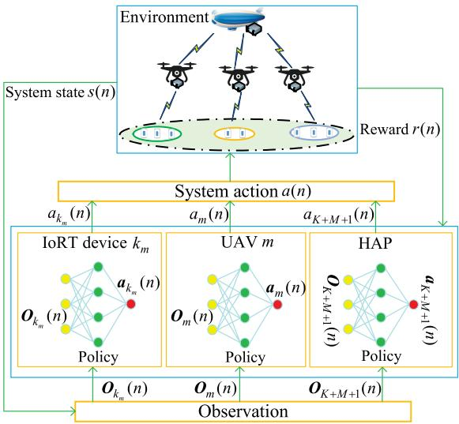

<details>
<summary>flowchart</summary>

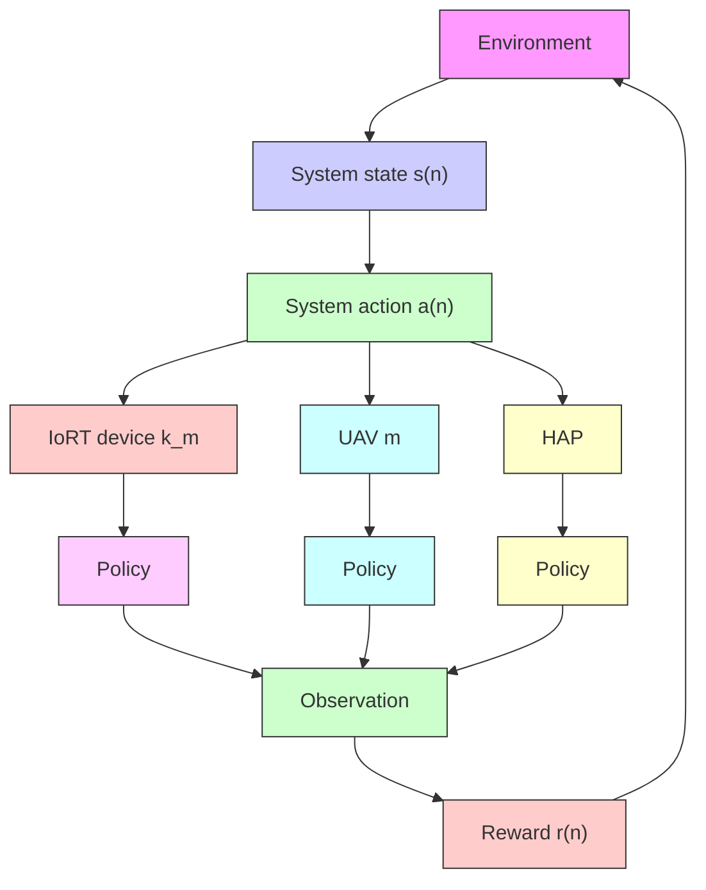
</details>

Fig. 2. MDP model based on multiagent DRL in the air–ground integrated MEC network.

# IV. PROBLEM DECOMPOSITION

In this section, in order to solve the problem (P1), we first formulate it as an MDP based on multiagent deep reinforcement learning (DRL) and then decompose the problem (P1) into two subproblems: 1) the UAV trajectory design and IoRT device power control subproblem and 2) the partial task offloading and resource allocation subproblem.

# A. MDP Modeling Based on Multiagent DRL

In the constructed network environment, the action policy contains the power control and task offloading ratio decision of IoRT devices, UAV trajectory design, CPU-cycle frequency allocation and power control of the UAVs, and the CPU-cycle frequency allocation of the HAP. Hence, the network decision problem can be regarded as a multiagent DRL problem. Each IoRT device, each UAV, and the HAP can be viewed as an agent. The agent can execute action decisions to interact with the network environment. The MDP model that we formulate can be seen in Fig. 2. The set of all agents can be expressed as

$$
\mathcal {A} = \{1, \dots , K, \dots , K + M + 1 \} \tag {19}
$$

wherein, 1 to K agents correspond to 1 to K IoRT devices, K + 1 to K + M agents correspond to 1 to M UAVs, and (K + M + 1)th agent corresponds to the HAP. There are three critical elements, i.e., observation, action, and reward, in the MDP. In DRL, the agent interacts with the environment and takes action based on the observation to maximize the expected cumulative reward.

A set of data $( s ( n ) , \mathbf { } \mathbf { } a ( n ) , r ( n ) , s ( n + 1 ) )$ at time slot n can be utilized to express a multiagent MDP. The system state s(n) is a complete description of the environment. It can be represented as

$$
\boldsymbol {s} (n) = \left\{\boldsymbol {o} _ {1} (n), \dots , \boldsymbol {o} _ {K} (n), \dots , \boldsymbol {o} _ {K + M + 1} (n) \right\} \tag {20}
$$

wherein, ${ \pmb o } _ { K } ( n )$ is the observation of agent K at time slot n. The system action a(n) can be written as

$$
\boldsymbol {a} (n) = \{\boldsymbol {a} _ {1} (n), \dots , \boldsymbol {a} _ {K} (n), \dots , \boldsymbol {a} _ {K + M + 1} (n) \} \tag {21}
$$

wherein, ${ \pmb a } _ { K } ( n )$ is the action of agent K at time slot n. Besides, r(n) is the reward of the agent at time slot n. To be specific, when the agent obtains the observation, it can take action based on a policy at time slot n. In DRL, the policy can be indicated by the neural network. The system state s(n) converts to the next state $s ( n { + } 1 )$ after executing the system action a(n) at time slot n. Meanwhile, the agent acquires the reward r(n). During the training process, the agent continuously learns to find a policy that maximizes the cumulative reward of environmental feedback.

From the above analysis, the observation, action, and reward at time slot n can be defined as follows.

1) Observation: The observation of the IoRT device $k _ { m }$ is described as

$$
\boldsymbol {o} _ {k _ {m}} (n) = \{c _ {k _ {m}} (n), s _ {k _ {m}} (n), t _ {k _ {m}} ^ {\max} (n) \} \tag {22}
$$

which includes the number of CPU cycles required to complete the computation task, the size of computation task, and the maximal tolerable delay of the task. The observation of the UAV m is indicated as

$$
\pmb {o} _ {m} (n) = \{x _ {m} (n), y _ {m} (n), c _ {1} (n), \ldots , c _ {k _ {m}} (n), \ldots , c _ {K _ {m}} (n)
$$

$$
s _ {1} (n), \dots , s _ {k _ {m}} (n), \dots , s _ {K _ {m}} (n), t _ {1} ^ {\max} (n), \dots
$$

$$
\left. t _ {k _ {m}} ^ {\max} (n), \dots , t _ {K _ {m}} ^ {\max} (n) \right\} \tag {23}
$$

which contains the location of the UAV, the number of CPU cycles required to complete the computation task, the size of computation task, and the maximal tolerable delay of the task. The observation of the HAP is denoted as

$$
\boldsymbol {o} _ {K + M + 1} (n) = \left\{c _ {1} (n), \dots , c _ {k _ {m}} (n), \dots , c _ {K _ {m}} (n), s _ {1} (n), \dots \right.
$$

$$
s _ {k _ {m}} (n), \dots , s _ {K _ {m}} (n), t _ {1} ^ {\max} (n), \dots , t _ {k _ {m}} ^ {\max} (n)
$$

$$
, \dots , t _ {K _ {m}} ^ {\max} (n) \} \tag {24}
$$

which comprises the number of CPU cycles required to complete the computation task, the size of computation task, and the maximal tolerable delay of the task.

2) Action: The action of the IoRT device $k _ { m }$ is expressed as

$$
\boldsymbol {a} _ {k _ {m}} (n) = \{p _ {k _ {m}} (n) \} \tag {25}
$$

which involves the transmission power of the IoRT device $k _ { m }$ . The action of the UAV m is defined as

$$
\boldsymbol {a} _ {m} (n) = \{v _ {m} (n), \theta_ {m} (n), p _ {m} (n), \alpha_ {1} (n), \dots , \alpha_ {k _ {m}} (n), \dots
$$

$$
\alpha_ {K _ {m}} (n), f _ {m, 1} (n), \dots , f _ {m, k _ {m}} (n), \dots , f _ {m, K _ {m}} (n) \} \tag {26}
$$

which includes the flight speed, flight angle, transmission power of the UAV, task offloading ratio, and the CPU-cycle frequency allocation of UAV. The action of the HAP is indicated as

$$
\boldsymbol {a} _ {K + M + 1} (n) = \{f _ {h, 1} (n), \dots , f _ {h, k _ {m}} (n), \dots , f _ {h, K _ {M}} (n) \} \tag {27}
$$

which includes the CPU-cycle frequency allocation of the HAP.

3) Reward: Considering that the objective of this system is to minimize the total task offloading delay, we take the delay as a negative reward, and the reward can be expressed as

$$
r (n) = - \sum_ {m \in \mathcal {M}} \sum_ {k _ {m} \in \mathcal {K} _ {m}} T _ {k _ {m}} (n). \tag {28}
$$

In this article, we adopt a cooperative game, where the IoRT devices, the UAVs, and the HAP cooperate with each other and serve the consistent objective of minimizing the total task offloading delay. All agents share the same optimization objective, i.e., $r _ { 1 } ( n ) \ =$ $\dots = r _ { K } ( n ) = \dots = r _ { K + M + 1 } ( n )$ . Hence, the reward function can be represented by r(n) for all agents.

From the analysis above, with the number of the IoRT devices and the UAVs increasing, the state space and action space increase rapidly. The multiagent MDP becomes more complex and difficult to solve. To tackle this issue, we first decompose the problem (P1) into two subproblems: 1) the UAV trajectory design and IoRT device power control subproblem and 2) the partial task offloading and resource allocation subproblem. Then, we formulate these two subproblems as two multiagent MDP.

# B. UAV Trajectory Design and IoRT Device Power Control Subproblem

Given the task offloading ratio α, transmission power of the UAV $\pmb { p } _ { \mathrm { u a v } } .$ , CPU-cycle frequency of the UAV $f _ { \mathrm { u a v } } .$ , and CPUcycle frequency of the HAP $f _ { \mathrm { t o t } } ,$ , the problem (P1) can be expressed as

$$
\min _ {Q, p _ {i o r t}} \sum_ {n \in \mathcal {N}} \sum_ {m \in \mathcal {M}} \sum_ {k _ {m} \in \mathcal {K} _ {m}} T _ {m, k _ {m}} (n) \tag {P2}
$$

$$
\text { s.t. } \quad (1 8 a), (1 8 f), (1 8 h), (1 8 j). \tag {29a}
$$

For the subproblem (P2), the IoRT device and the UAV play the role of agent, and the set of agents can be written as

$$
\mathcal {A} _ {D} = \{1, \dots , K, \dots , K + M \}. \tag {30}
$$

In the same way, 1 to K agents correspond to 1 to K IoRT devices, and K + 1 to K + M agents correspond to 1 to M UAVs. Thus, the system state $s _ { D } ( n )$ and system action ${ \pmb a } _ { D } ( n )$ at time slot n can be expressed as

$$
s _ {D} (n) = \{o _ {D} ^ {1} (n), \dots , o _ {D} ^ {K} (n), \dots , o _ {D} ^ {K + M} (n) \} \tag {31}
$$

and

$$
\boldsymbol {a} _ {D} (n) = \{\boldsymbol {a} _ {D} ^ {1} (n), \dots , \boldsymbol {a} _ {D} ^ {K} (n), \dots , \boldsymbol {a} _ {D} ^ {K + M} (n) \} \tag {32}
$$

respectively. Wherein, ${ \pmb o } _ { D } ^ { K } ( n )$ and ${ \pmb a } _ { D } ^ { K } ( n )$ are the observation and action of agent K.

From the above analysis, we denote $i \in \mathcal { A } _ { D }$ . The observation, action, and reward at time slot n can be defined as follows.

1) Observation: The observation of the IoRT device $k _ { m }$ is described as

$$
\boldsymbol {o} _ {D} ^ {k _ {m}} (n) = \left\{s _ {k _ {m}} (n), t _ {k _ {m}} ^ {\max} (n) \right\} \tag {33}
$$

which includes the size of computation task and the maximal tolerable delay of the task. The observation of the UAV m is indicated as

$$
\boldsymbol {o} _ {D} ^ {m} (n) = \left\{x _ {m} (n), y _ {m} (n), s _ {1} (n), \dots , s _ {k _ {m}} (n), \dots , s _ {K _ {m}} (n) \right.
$$

$$
\left. t _ {1} ^ {\max} (n), \dots , t _ {k _ {m}} ^ {\max} (n), \dots , t _ {K _ {m}} ^ {\max} (n) \right\} \tag {34}
$$

which contains the location of the UAV, the size of computation task, and the maximal tolerable delay of the task. Furthermore, the system state is the set of observation of all agents. Hence, at time slot n, we have $s _ { D } ( n ) = \{ \pmb { o } _ { D } ^ { i } ( n ) , i \in \mathcal { A } _ { D } \}$ .

2) Action: The action of the IoRT device $k _ { m }$ is expressed as

$$
\boldsymbol {a} _ {D} ^ {k _ {m}} (n) = \{p _ {k _ {m}} (n) \} \tag {35}
$$

which involves the transmission power of the IoRT device $k _ { m }$ . The action of the UAV m is defined as

$$
\boldsymbol {a} _ {D} ^ {m} (n) = \{v _ {m} (n), \theta_ {m} (n) \} \tag {36}
$$

which includes the flight speed and flight angle of the UAV. In addition, the system action is the set of actions of all agents. Thus, at time slot n, we have $a _ { D } ( n ) =$ $\{ \pmb { a } _ { D } ^ { i } ( n ) , i \in \mathcal { A } _ { D } \}$ .

3) Reward: Considering that the objective of this subproblem is to minimize task offloading delay from the IoRT devices to the UAV, we take the delay as a negative reward, and the reward can be expressed as

$$
r _ {D} (n) = - \sum_ {m \in \mathcal {M}} \sum_ {k _ {m} \in \mathcal {K} _ {m}} T _ {m, k _ {m}} (n). \tag {37}
$$

In this subproblem, a cooperative game is considered, where the IoRT devices and the UAVs cooperate with each other and serve the consistent objective of minimizing offloading delay. The agents share the same optimization objective, i.e., $r _ { D } ^ { 1 } ( n ) \ = \ \cdot \cdot \cdot \ = \ r _ { D } ^ { K } ( n ) \ =$ $\therefore \ = \ r _ { D } ^ { K + M } ( n )$ · · · = r KD . Hence, the reward function can be represented by rD(n) for all agents.

# C. Partial Task Offloading and Resource Allocation Subproblem

Given the UAV trajectory Q and the IoRT device transmission power $p _ { i o r t } ,$ the problem (P1) can be expressed as

(P3) $\operatorname* { m i n } _ { \alpha , f _ { \mathrm { u a v } } , f _ { \mathrm { t o t } } , p _ { \mathrm { u a v } } } \sum _ { n \in \mathcal { N } } \sum _ { m \in \mathcal { M } } \sum _ { k _ { m } \in \mathcal { K } _ { m } } \operatorname* { m a x } \left( T _ { m , k _ { m } } ^ { \mathrm { u a v } } ( n ) , T _ { m , h } ^ { k _ { m } } ( n ) \right)$ α,f uav,f tot,puav

$$
\left. + T _ {k _ {m}} ^ {h} (n)\right)
$$

${ \mathrm { s . t . } } ( 1 8 \mathrm { { b } ) , ( 1 8 \mathrm { { c } ) , ( 1 8 \mathrm { { d } ) , ( 1 8 \mathrm { { e } ) , ( 1 8 \mathrm { { g } ) , ( 1 8 \mathrm { { h } ) , ( 1 8 \mathrm { { i } ) , ( 1 8 \mathrm { { i } ) } . } } } } } } } ( 1 8 \mathrm { { i } ) . } ( 1 8 \mathrm { { i } ) . } ( 1 8 \mathrm { { i } ) . } ( 1 8 \mathrm { { i } ) . } ( 1 8 \mathrm { { i } ) . } $ (38a)

For the subproblem (P3), the UAV and the HAP play the role of agent, and the set of agents can be written as

$$
\mathcal {A} _ {P} = \{1, \dots , m, \dots , M + 1 \} \tag {39}
$$

where 1 to M agents correspond to 1 to M UAVs, and (M+1)th agent corresponds to the HAP. Hence, the system state sP(n) and system action ${ \pmb a } _ { P } ( n )$ at time slot n can be expressed as

$$
\boldsymbol {s} _ {P} (n) = \{\boldsymbol {o} _ {P} ^ {1} (n), \dots , \boldsymbol {o} _ {P} ^ {m} (n), \dots , \boldsymbol {o} _ {P} ^ {M + 1} (n) \} \tag {40}
$$

and

$$
\boldsymbol {a} _ {P} (n) = \{\boldsymbol {a} _ {P} ^ {1} (n), \dots , \boldsymbol {a} _ {P} ^ {m} (n), \dots , \boldsymbol {a} _ {P} ^ {M + 1} (n) \} \tag {41}
$$

respectively. Wherein, ${ \pmb { o } } _ { P } ^ { m } ( n )$ and ${ \pmb a } _ { P } ^ { m } ( n )$ are the observation and action of agent m.

From the above analysis, we denote $j \in \mathcal { A } _ { P }$ . The observation, action, and reward at time slot n can be denoted as follows.

1) Observation: The observation of the UAV m is indicated as

$$
\begin{array}{l} \boldsymbol {o} _ {P} ^ {m} (n) = \left\{c _ {1} (n), \dots , c _ {k _ {m}} (n), \dots , c _ {K _ {m}} (n), s _ {1} (n), \dots \right. \\ s _ {k _ {m}} (n), \dots , s _ {K _ {m}} (n), t _ {1} ^ {\max} (n), \dots , t _ {k _ {m}} ^ {\max} (n) \\ , \dots , t _ {K _ {m}} ^ {\max} (n) \} \tag {42} \\ \end{array}
$$

which contains the number of CPU cycles required to complete the computation task, the size of computation task, and the maximal tolerable delay of the task. The observation of the HAP is written as

$$
\begin{array}{l} \boldsymbol {o} _ {P} ^ {M + 1} (n) = \left\{c _ {1} (n), \dots , c _ {k _ {m}} (n), \dots , c _ {K _ {M}} (n), s _ {1} (n), \dots \right. \\ s _ {k _ {m}} (n), \dots , s _ {K _ {M}} (n), t _ {1} ^ {\max} (n), \dots , t _ {k _ {m}} ^ {\max} (n) \\ , \dots , t _ {K _ {M}} ^ {\max} (n) \} \tag {43} \\ \end{array}
$$

which consists of the number of CPU cycles required to complete the computation task, the size of total computation task, and the maximal tolerable delay of total task. Furthermore, the system state is the set of observations of all agents. Hence, at time slot n, we have $s _ { P } ( n ) = \{ \pmb { \sigma } _ { P } ^ { j } ( n ) , j \in \mathcal { A } _ { P } \}$ .

2) Action: The action of the UAV m is defined as

$$
\begin{array}{l} \boldsymbol {a} _ {P} ^ {m} (n) = \left\{p _ {m} (n), \alpha_ {1} (n), \dots , \alpha_ {k _ {m}} (n), \dots , \alpha_ {K _ {m}} (n) \right. \\ \left. f _ {m, 1} (n), \dots , f _ {m, k _ {m}} (n), \dots , f _ {m, K _ {m}} (n) \right\} \tag {44} \\ \end{array}
$$

which includes the transmission power of the UAV, task offloading ratio, and the CPU-cycle frequency allocation of the UAV. The action of the HAP is expressed as

$$
\boldsymbol {a} _ {P} ^ {M + 1} (n) = \left\{f _ {h, 1} (n), \dots , f _ {h, k _ {m}} (n), \dots , f _ {h, K _ {M}} (n) \right\} \tag {45}
$$

which involves the CPU-cycle frequency allocation of the HAP. In addition, the system action is the set of actions of all agents. Thus, at time slot n, we have $a _ { P } ( n ) = \{ \pmb { a } _ { P } ^ { j } ( n ) , j \in \mathcal { A } _ { P } \}$ .

3) Reward: Considering the objective of this subproblem is to minimize the task offloading delay from the UAV to the HAP, we also take the delay as a negative reward, and the reward can be represented by

$$
\begin{array}{l} r _ {P} (n) = - \sum_ {m \in \mathcal {M}} \sum_ {k _ {m} \in \mathcal {K} _ {m}} \max \left(T _ {m, k _ {m}} ^ {\mathrm{uav}} (n) \right. \\ \left. T _ {m, h} ^ {k _ {m}} (n) + T _ {k _ {m}} ^ {h} (n)\right). \tag {46} \\ \end{array}
$$

In this subproblem, a cooperative game is considered, where the UAVs and the HAP cooperate with each other and serve the consistent objective of minimizing offloading delay. The agents share the same optimization objective, i.e., $r _ { P } ^ { 1 } ( n ) \stackrel { - } { = } \cdots = r _ { P } ^ { m } ( n ) = \cdots \stackrel { - } { = } r _ { P } ^ { M + 1 } ( n )$ P rM+1 (n). Therefore, the reward function can be represented by rP(n) for all agents.

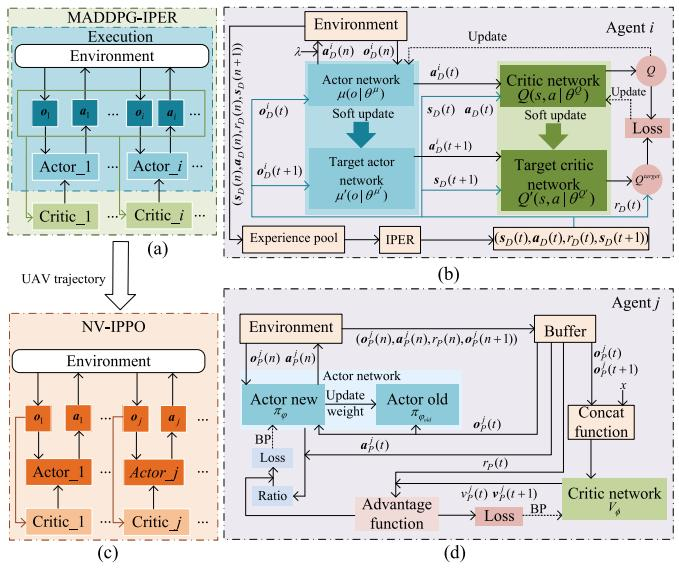

<details>
<summary>flowchart</summary>

```mermaid
graph TD
    subgraph_MADDPG-IPER_Execution["Execution Environment"]
        A1["a1"] --> A2["a2"] --> A3["a3"] --> A4["a4"] --> A5["a5"] --> A6["a6"] --> A7["a7"] --> A8["a8"] --> A9["a9"] --> A10["a10"]
        A1 --> B1["Actor_1"] --> A2 --> A3 --> A4 --> A5 --> A6 --> A7 --> A8 --> A9
        A1 --> C1["Critic_1"] --> A3 --> A4 --> A5 --> A6 --> A7 --> A8
        A1 --> D1["Critic_i"] --> A4 --> A5 --> A6 --> A7
        A1 --> E1["Environment"]
        E1 --> F1["Actor network μ(σi | θi)"]
        F1 --> G1["Soft update"]
        G1 --> H1["Target actor network μ'(σi | θi)"]
        H1 --> I1["Experience pool"]
        I1 --> J1["IPER"]
        J1 --> K1["(sD(t),aD(t),rD(t),sD(t+1))"]
        K1 --> L1["Agent i"]
        L1 --> M1["Critic network Q(s,a | θQ)"]
        M1 --> N1["Soft update"]
        N1 --> O1["Target critic network Q'(s,a | θQ)"]
        O1 --> P1["rD(t)"]
        P1 --> Q1["Loss"]
        Q1 --> R1["Q^exp"]
        R1 --> S1["Output"]
    end

    subgraph_NV-IPPO_Environment["Environment"]
        T1["a1"] --> U1["Actor new σφ"]
        U1 --> V1["Actor old πθcat"]
        V1 --> W1["BP Ratio"]
        W1 --> X1["Loss"]
        X1 --> Y1["Ratio"]
        Y1 --> Z1["Advantage function"]
        Z1 --> AA["Loss"]
        AA --> AB["BP"]
        AB --> AC["Buffer"]
        AC --> AD["Concat function"]
        AD --> AE["Critic network Vφ"]
    end

    subgraph NV-IPPO_Environment
        AF["a2"] --> AG["a3"] --> AH["a4"] --> AI["a5"] --> AJ["a6"] --> AK["a7"] --> AL["a8"] --> AM["a9"]
        AH --> AN["a10"] --> AO["a20"] --> AP["a30"] --> AQ["a40"] --> AR["a50"] --> AS["a60"]
        AI --> AT["a70"] --> AU["a80"] --> AV["a90"] --> AW["a100"]
        AQ --> AX["a90"] --> AY["a90"]
        AR --> AZ["a90"] --> BA["a90"]
        AS --> BB["a90"] --> BC["a90"]
        AT --> BD["a90"] --> BE["a90"]
        AU --> BF["a90"] --> BG["a90"]
        AV --> BH["a90"] --> BI["a90"]
        AW --> BJ["a90"] --> BK["a90"]
        BX["a90"] --> BY["a90"]
    end

    subgraph NV-IPPO_Environment
        CA["a3"] --> CB["a4"] --> CC["a5"] --> DD["a6"] --> DP["a7"] --> Q["c"]
        DC["a4"] --> DD
        DB["a5"] --> DD
        DCa["a6"] --> DD
        DBb["a7"] --> DD
        DBc["a8"] --> DD
        DBd["a9"] --> DD
        DBe["a9"] --> DD
    end

    subgraph NV-IPPO_Environment
        E["f"] --> Ff["Actor new σφ"]
        Ff --> Gf["Actor old πθcat"]
        Gf --> Hf["BP Ratio"]
        Hf --> If["Loss"]
        If --> Jf["Advantage function"]
        Jf --> Kf["Loss"]
        Kf --> Lf["BP"]
    end

    subgraph NV-IPPO_Environment
        M["MADDPG-IPER Execution Environment"]
    end

    subgraph UV_Trajectory
    N
    end

    subgraph Agent_Areaal
    O
    end

    subgraph Agent_Breaal
    P
    end

    subgraph Agent_Creaal
    Q
    end

    subgraph Agent_Dreaal
    R
    end

    subgraph Agent_Ereaal
    S
    end

    subgraph Agent_Freaal
    T
    end

    subgraph Agent_Greaal
    U
    end

    subgraph Agent_Jreaal
    V
    end

    subgraph Agent_Vreaal
    W
    end

    subgraph Agent_Wreaal
    X
    end

    subgraph Agent_Zreaal
    Y
    end

    subgraph Agent_Vreaal
    Z
    end

    subgraph Agent_Wreaal
    AA
    end

    subgraph Agent_Vreaal
    AB
    end

    subgraph Agent_Wreaal
    AC
    end

    subgraph Agent_Jreaal
    AD
    end

    subgraph Agent_Vreaal
    AE
    end

    subgraph Agent_Jreaal
    AF
    end

    subgraph Agent_Vreaal
    AG
    end

    subgraph Agent_Wreaal
    AH
    end

    subgraph Agent_Jreaal
    AI
    end

    subgraph Agent_Vreaal
    AJ
    end

    subgraph Agent_Wreaal
    AK
    end

    subgraph Agent_Zreaal
    AL
    end

    subgraph Agent_Vreaal
    AM
    end

    subgraph Agent_Jreaal
    AN
    end

    subgraph Agent_Vreaal
    AO
    end

    subgraph Agent_Wreaal
    AP
    end

    subgraph Agent_Jreaal
    AQ
    end

    subgraph Agent_Vreaal
    AR
    end

    subgraph Agent_Wreaal
    AS
    end
```
</details>

Fig. 3. Architecture of JPTORAUTD algorithm. (a) Overview of architecture for MADDPG-IPER algorithm. (b) Architecture and training process of each agent in MADDPG-IPER algorithm. (c) Overview of architecture for NV-IPPO algorithm. (d) Architecture and training process of each agent in NV-IPPO algorithm.

# V. PROBLEM SOLUTION

In this section, the MADDPG-IPER algorithm and the NV-IPPO algorithm are proposed to solve the subproblem (P2) and subproblem (P3), respectively. The MADDPG-IPER algorithm is responsible for the UAV trajectory design and IoRT device power control. And then, the NV-IPPO algorithm takes the UAV trajectory output from the MADDPG-IPER algorithm as input to jointly optimize the partial task offloading and resource allocation. Based on the solution of these two subproblems, the JPTORAUTD algorithm is proposed.

# A. MADDPG-IPER Algorithm

For the subproblem (P2), there is the cooperative relationship between the UAVs and the IoRT devices, and the optimization variables are continuous. Meanwhile, the MADDPG algorithm, adopting the centralized training with decentralized execution framework as shown in Fig. 3(a), can solve continuous action problem in the multiagent cooperative environment. Therefore, we can utilize the MADDPG algorithm to solve the subproblem (P2). In the MADDPG algorithm, each agent i has four neural networks as shown in Fig. 3(b), namely actor network $\mu ( o | \theta ^ { \mu } )$ with parameter $\theta ^ { \mu }$ , critic network $Q ( s , a | \theta ^ { Q } )$ with parameter $\theta ^ { Q }$ , target actor network $\mu ^ { \prime } ( o | \theta ^ { \mu ^ { \prime } } )$ with parameter $\theta ^ { \mu ^ { \prime } }$ , and target critic network $Q ^ { \prime } ( s , a | \theta ^ { Q ^ { \prime } } )$ with parameter $\theta ^ { Q ^ { \prime } }$ . These networks can be used to optimize the policy of agent in the training process. We take a certain agent i as an example to explain the training process, as shown in Fig. 3(b). The training process can be divided into three steps. First, all agents make action decision based on their observation and exploration noise λ when interacting with the environment. Second, the agent i acquires a reward $r _ { D } ( n )$ and the system state $s _ { D } ( n )$ transfers to next system state $s _ { D } ( n + 1 )$ . These three elements and system action ${ \pmb a } _ { D } ( n )$ are combined into an experience pool. Finally, a tuple $( s _ { D } ( t ) , \pmb { a } _ { D } ( t ) , r _ { D } ( t ) , s _ { D } ( t + 1 ) )$ is defined as the sample ${ \bf e } _ { i , t }$ of agent i, which is randomly sampled with equal probability from the experience pool as a mini-batch to update the network when the experience pool gets full. The last step is called the traditional experience replay mechanism, which ignores the importance of the sample. The importance of the sample can affect algorithm learning efficiency and is determined by the temporal difference error (TD-error) of the sample. To enhance the algorithm learning efficiency, the MADDPG algorithm prioritizes samples with large TD-error and trains these samples repeatedly, which is called prioritized experience replay (PER) mechanism.

Unfortunately, the PER mechanism has the following three disadvantages. First, the PER mechanism repeatedly samples the sample with high TD-error, which is prone to overfitting. Second, since the Q-value is used to update the actor network, and the differences exist between the actor and critic networks, this leads to a deviation in the calculation of priorities. Finally, at the beginning of training, the TD error is large and the advantage of the PER mechanism is not immediately apparent. Consequently, in order to improve the PER mechanism, we improve the MADDPG algorithm from the following two aspects. On the one hand, we add the Q-value to calculate the priority, which can alleviate the first two problems. On the other hand, in the early stage of each episode, we focus more on the Q-value of the sample and the TD-error of the sample gets more attention in the later stage of each episode, which can help mitigate the last problem. Based on the above ideas, we propose the MADDPG-IPER algorithm. The specific training process of the MADDPG-IPER algorithm can be described as follows.

1) Sampling in IPER: The specific implementation is to linearly weight the terms representing the TD-error and the Q-value, respectively. The priority of sample $\mathbf { e } _ { i , t }$ can be calculated by

$$
P _ {i, t} = \lambda_ {1} P _ {i, t} ^ {T D} + (1 - \lambda_ {1}) P _ {i, t} ^ {Q} + \psi \tag {47}
$$

where $\lambda _ { 1 } = \operatorname* { m i n } ( \lambda _ { 0 } \exp ( \Delta * n ) , 1 )$ is a weight, where $\lambda _ { 0 }$ and $\Delta$ are initial weight of $\lambda _ { 1 }$ and weight change rate, respectively. ψ is a minute positive value to ensure $P _ { i , t } > 0 . \ : P _ { i , t } ^ { T D }$ and $\dot { P } _ { i , t } ^ { Q }$ denote the priority associated with the TD-error and the Q-value, which can be represented by

$$
P _ {i, t} ^ {T D} = \tanh (a b s (\delta_ {i} (t))) \tag {48}
$$

and

$$
P _ {i, t} ^ {Q} = \text { sigmoid } \big (Q ^ {\text { target }} (t) \big) \tag {49}
$$

respectively. The tanh and sigmoid functions are used for priority normalization, which can keep the data on the same scale, benefitting network training. Wherein, $\delta _ { i } ( t )$ and $Q ^ { \mathrm { t a r g e t } } ( t )$ are the TD-error and network target value with a discount factor $\gamma _ { 1 } \in [ 0 , 1 ]$ , which can be written as

$$
\delta_ {i} (t) = Q ^ {\text { target }} (t) - Q \left(s _ {D} (t), \boldsymbol {a} _ {D} (t) \mid \theta^ {Q}\right) \tag {50}
$$

and

$$
Q ^ {\text { target }} (t) = r _ {D} (t) + \gamma_ {1} Q ^ {\prime} (s _ {D} (t + 1)
$$

$$
\left. \mu^ {\prime} (\boldsymbol {o} _ {D} ^ {i} (t + 1) | \theta^ {\mu^ {\prime}}) | \theta^ {Q ^ {\prime}}\right) \tag {51}
$$

respectively. Based on description above, the probability of sample ${ \bf e } _ { i , t }$ can be given as

$$
P _ {i} (t) = \frac {P _ {i , t} ^ {\zeta}}{\sum_ {l} P _ {i , l} ^ {\zeta}} \tag {52}
$$

where ζ denotes the rank of applying priority. Furthermore, PER inevitably modifies the data distribution by prioritizing the selection of valuable sample. This alteration can impact the convergence of the training process. Therefore, the importance sampling (IS) weight is considered, which can be given as [27]

$$
\omega_ {i} (t) = \frac {1}{\left(E P _ {i} (t)\right) ^ {\Phi}} \tag {53}
$$

where E is the capacity value of the experience pool and  is a hyperparameter, which is determined by the amount of the correction used.

2) Critic Network Parameter Updating: By utilizing the IPER mechanism, the parameter update of the critic network can be performed through the following loss function

$$
L \left(\theta^ {Q}\right) = \frac {1}{B} \sum_ {t = 1} ^ {B} \omega_ {i} (t) \delta_ {i} ^ {2} (t) \tag {54}
$$

where B is the size of mini-batch.

3) Actor Network Parameter Updating: The parameter of the actor network can be updated by applying policy gradient

$$
\nabla_ {\theta^ {\mu}} J \approx \frac {1}{B} \sum_ {t} \nabla_ {a} Q (s, a | \theta^ {Q}) | _ {s = s _ {D} (t), a = \mu (\boldsymbol {o} _ {D} ^ {i} (t))}
$$

$$
\times \nabla_ {\theta^ {\mu}} \mu (\boldsymbol {o} | \theta^ {\mu}) | _ {\boldsymbol {o} _ {D} ^ {i} (t)}. \tag {55}
$$

4) Target Network Updating: The update manner of parameters for the two target networks can utilize a soft update method with a soft update factor σ

$$
\theta^ {Q ^ {\prime}} \leftarrow \sigma \theta^ {Q} + (1 - \sigma) \theta^ {Q ^ {\prime}}
$$

$$
\theta^ {\mu^ {\prime}} \leftarrow \sigma \theta^ {\mu} + (1 - \sigma) \theta^ {\mu^ {\prime}} \tag {56}
$$

where $\sigma \ll 1$ represents the soft update speed of the target network.

# B. NV-IPPO Algorithm

Similar to the subproblem (P2), there is the cooperative relationship between the UAVs and the HAP, and the optimization variables are continuous in the subproblem (P3). Meanwhile, the IPPO algorithm can solve the continuous action problem. Thus, the IPPO algorithm with a framework of decentralized training and execution, as illustrated in Fig. 3(c), is employed to solve the subproblem (P3). In the IPPO algorithm, the network architecture of agent j contains two actor networks, namely $\pi _ { \varphi }$ with parameter ϕ and $\pi _ { \varphi _ { \mathrm { o l d } } }$ with parameter ϕold, and one critic network $V _ { \phi }$ with parameter φ. These networks are shown in Fig. 3(d). We take a certain agent j as an example to explain the training process, as shown in Fig. 3(d). To be specific, the training process is also divided into three steps. First, based on the current observation ${ \pmb \sigma } _ { P } ^ { j } ( n )$ , the agent j interacts with the environment by making an action ${ \pmb a } _ { P } ^ { j } ( n )$ and adding the UAV trajectory. Second, a reward $r _ { P } ( n )$ can be received, and combined with the observation ${ \pmb \sigma } _ { P } ^ { J } ( n )$ , action ${ \pmb a } _ { P } ^ { j } ( n )$ and next observation $\pmb { \sigma } _ { P } ^ { j } ( n + 1 )$ to form a tuple $( \pmb { o } _ { P } ^ { j } ( n ) , \pmb { a } _ { P } ^ { j } ( n ) , r _ { P } ( n ) , \pmb { o } _ { P } ^ { j } ( n + 1 ) )$ to be placed in the buffer. Finally, after several rounds of placement, a tuple $( \pmb { \sigma } _ { P } ^ { j } ( t ) , \pmb { a } _ { P } ^ { j } ( t ) , r _ { P } ( t ) , \pmb { \sigma } _ { P } ^ { j } ( t + 1 ) )$ in the buffer can be utilized to calculate the advantage function for updating the network parameters.

However, the traditional IPPO algorithm exhibits a notable limitation: it may suffer from policy overfitting in multiagent environments due to the reliances of agents on sampled advantage values [28]. In order to alleviate this problem, we propose the NV-IPPO algorithm, which introduces random Gaussian noise to perturb the advantage values, thereby reducing the likelihood of overfitting and improving the stability of policy learning. To be specific, first, the Gaussian noise $x \sim \mathcal { N } _ { 0 } ( 0 , \xi ^ { 2 } )$ is randomly sampled for each agent, where $\xi ^ { 2 }$ is the variance, representing the noise intensity. Then, the Gaussian noise x is concatenated with the observation ${ \pmb \sigma } _ { P } ^ { j } ( t )$ via a concat function. This concatenation is viewed as the input of the critic network to generate noise value $\nu _ { P } ^ { j } ( t ) = V _ { \phi } ( c o n c a t ( \pmb { \sigma } _ { P } ^ { j } ( t ) , x ) )$ for agent $j ,$ which can be utilized to calculate the advantage function for updating the parameters of the critic network and the actor network. The specific training process of the NV-IPPO algorithm can be described as follows.

1) Critic Network Parameters Updating: The parameters update of the critic network requires an advantage function to calculate the loss function for backpropagation. The advantage function can be calculated by

$$
A (t) = r _ {P} (t) + \gamma_ {2} v _ {P} ^ {j} (t + 1) - v _ {P} ^ {j} (t). \tag {57}
$$

where $\gamma _ { 2 } \in [ 0 , 1 ]$ is a discount factor. The loss function can be obtained by performing a mean square on the advantage function

$$
L _ {\phi} (t) = \mathbb {E} \Big [ A (t) ^ {2} \Big ]. \tag {58}
$$

2) Actor Network Parameters Updating: The parameters update of the actor network also can use the advantage function to calculate the loss function, which can be given as

$$
L _ {\varphi} (t) = \mathbb {E} \left[ \min \left(\eta_ {\varphi} (t) A (t) \right. \right.
$$

$$
\left. \mathrm{clip} (\eta_ {\varphi} (t), 1 - \epsilon , 1 + \epsilon) A (t)\right) \biggr ] \tag {59}
$$

where $\eta _ { \varphi } ( t ) = ( [ \pi _ { \varphi } ( a _ { P } ^ { j } ( t ) \mid \sigma _ { P } ^ { j } ( t ) ) ] / [ \pi _ { \varphi _ { \mathrm { o l d } } } ( a _ { P } ^ { j } ( t ) \mid \sigma _ { P } ^ { j } ( t ) ) ] )$ is an action probability ratio. $\pi _ { \varphi } ( { \pmb a } _ { P } ^ { J } ( t ) | { \pmb \sigma } _ { P } ^ { J } ( t ) )$ and $\pi _ { \varphi _ { \mathrm { o l d } } } ( \pmb { a } _ { P } ^ { j } ( t ) | \pmb { o } _ { P } ^ { j } ( t ) )$ are the action probability of new and old policy at state ${ \pmb \sigma } _ { P } ^ { j } ( t )$ , respectively.  is a clipping hyperparameter.

# C. Proposed JPTORAUTD Algorithm

According to the description above and based on the MADDPG-IPER algorithm and the NV-IPPO algorithm, the JPTORAUTD algorithm with a architecture illustrated in Fig. 3 can be proposed and summarized in Algorithm 1.

# D. Complexity Analysis

The complexity of the DRL algorithm is based on the number of layers in the neural network and the number of neurons presented in each layer. Therefore, the complexity of the proposed JPTORAUTD algorithm can be expressed as

$$
\mathcal {O} \left(\sum_ {l = 0} ^ {L _ {a}} a _ {l} \times a _ {l + 1} + \sum_ {l = 0} ^ {L _ {c}} c _ {l} \times c _ {l + 1}\right). \tag {60}
$$

There are $L _ { a }$ and $L _ { c }$ hidden layers in the actor network and critic network, respectively. $a _ { l }$ and $c _ { l }$ represent the neurons in the lth layer of the actor network and critic network, respectively. $a _ { 0 }$ and $c _ { 0 }$ denote the dimensions in the input layer of the actor network and critic network, respectively. The dimensions of the output layer for the actor network and critic network are represented by $a _ { L _ { a + 1 } }$ and $c _ { L _ { c + 1 } } .$ respectively.

# VI. SIMULATION RESULTS

In this section, we present simulations to demonstrate the effectiveness of the proposed JPTORAUTD algorithm.

# A. Parameters Setting

There is 1 HAP, 3 UAVs, and 15 IoRT devices in the air– ground integrated MEC network. All the IoRT devices are distributed in a 300 m × 300 m area. Each UAV serves 5 IoRT devices. The duration of each time period is $^ { 7 5 \mathrm { ~ s } , }$ and the length of each time slot is 1 s. The altitude of the HAP and the UAVs is 20 000 and 100 m, respectively. The maximal flight speed of the UAV 1, UAV 2, and UAV 3 is 15, 12, and 15 m/s, respectively. The minimum safety distance between the UAVs is 20 m. The noise power and channel gain at a reference distance of 1 m are −110 dBm and −60 dB, respectively. The bandwidth of each UAV allocated by the HAP is 10 MHz. The bandwidth utilized by each IoRT device to offload task within the coverage area of each UAV is 2 MHz. The maximal transmission power of each UAV and each IoRT device is 1 and 0.1 W, respectively. The maximal energy of each UAV at each time slot is 1.7 J. The number of CPU cycles required, size of computation task, and maximal tolerable delay are set as [80,100] M cycles, [800, 1000] bits, and [0.2, 0.3] s, respectively. The maximal CPU-cycle frequency of the HAP and each UAV is 50 and 1 GHz, respectively [29]. The antenna power gain, Boltzmann’s constant, and system noise temperature are set as 15 dB, $1 . 3 8 \times 1 0 ^ { - 2 3 } J / K .$ , and 1000 K, respectively [30]. In the MADDPG-IPER algorithm, two fully connected hidden layers with [256, 256] neurons are included in its actor network and critic network, and the learning rate for the actor network and critic network is set as 0.0002 and 0.0003, respectively. In the NV-IPPO algorithm, there are two fully connected hidden layers with [256, 256] neurons contained in its actor network and critic network. The learning rate for these two networks is

Algorithm 1 JPTORAUTD Algorithm   
1: Initialize actor network $\mu(s|\theta^{\mu})$ and target actor network $\mu'(s|\theta^{\mu'})$ with parameter $\theta^{\mu}$ and $\theta^{\mu'} \leftarrow \theta^{\mu}$ for the MADDPG-IPER.
2: Initialize critic network $Q(s, a|\theta^{Q})$ and target critic network $Q'(s, a|\theta^{Q'})$ with parameters $\theta^{Q}$ and $\theta^{Q'} \leftarrow \theta^{Q}$ for the MADDPG-IPER.
3: Initialize actor network $\pi$ with parameter $\varphi$ , critic network $V$ with parameter $\phi$ for the NV-IPPO.
4: Initialize experience pool for the MADDPG-IPER.
5: for each episode do
6: Initialize system state for the MAPDDPG-IPER and the NV-IPPO, respectively.
7: Initialize exploration noise $\lambda$ for action exploration of the MADDPG-IPER and buffer for the NV-IPPO.
8: for each $n$ do
9: for each agent $i$ do
10: Execute action $a_D^i(n) = \mu(o_D^i(n)|\theta^\mu) + \lambda$ based on current observation $o_D^i(n)$ and $\lambda$ , then receive next observation $o_D^i(n+1)$ , reward $r_D(n)$ , and UAV trajectory for the MADDPG-IPER.
11: end for
12: Store ( $s_D(n), a_D(n), r_D(n), s_D(n+1)$ ) into the experience pool according to Eq. (31) and Eq. (32).
13: if experience pool is full then
14: for each agent $i$ do
15: Randomly sample a mini-batch of $B$ experiences ( $s_D(t), a_D(t), r_D(t), s_D(t+1)$ ) with probability by Eq. (52) from the experience pool.
16: Update critic, actor networks of the MADDPG-IPER by Eq. (54) and Eq. (55), respectively.
17: Update target networks of the MADDPG-IPER by Eq. (56).
18: end for
19: end if
20: for each agent $j$ do
21: Execute action $a_P^j(n)$ according to current observation $o_P^j(n)$ and the UAV trajectory, obtain next observation $o_P^j(n+1)$ and reward $r_P(n)$ .
22: Store ( $o_P^j(n), a_P^j(n), r_P(n), o_P^j(n+1)$ ) into buffer of the NV-IPPO.
23: Compute advantage function of the NV-IPPO based on value function by Eq. (57).
24: Update the critic and actor parameters of the NV-IPPO with Eq. (58) and Eq. (59), respectively.
25: end for
26: end for
27: end for

set as 0.00018 and 0.0002, respectively. Other parameters are shown in Table II.

# B. Comparison of Convergence Performances

To justify the convergence performance of the proposed JPTORAUTD algorithm, we compare its performance with the following two algorithms.

TABLE II SIMULATION PARAMENTERS 

<table><tr><td>Parameter</td><td>Value</td></tr><tr><td>Initial weight  $\lambda_0$ </td><td>0.4</td></tr><tr><td>Weight change rate  $\Delta$ </td><td> $4.6 \times 10^{-5}$ </td></tr><tr><td>Rank of applying priority  $\zeta$ </td><td>0.6</td></tr><tr><td>IS weighting factor  $\Phi$ </td><td>0.4</td></tr><tr><td>Capacity value of experience pool  $E$ </td><td>10000</td></tr><tr><td>Size of mini-batch  $B$ </td><td>32</td></tr><tr><td>Soft update factor  $\sigma$ </td><td>0.005</td></tr><tr><td>Discount factor  $\gamma_1, \gamma_2$ </td><td>0.9, 0.9</td></tr><tr><td>Clipping factor  $\epsilon$ </td><td>0.19</td></tr><tr><td>Variance  $\xi^2$ </td><td>1</td></tr><tr><td>Factor related to the UAV  $\chi_1, \chi_2$ </td><td>0.00614, 15.976</td></tr><tr><td>Energy consumption coefficient  $\iota$ </td><td> $1 \times 10^{-27}$ </td></tr></table>

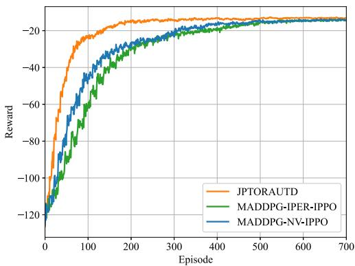

<details>
<summary>line</summary>

| Episode | JPTORAUTD | MADDPG-IPER-IPPO | MADDPG-NV-IPPO |
| ------- | --------- | ---------------- | -------------- |
| 0       | -120      | -120             | -120           |
| 100     | -20       | -40              | -50            |
| 200     | -15       | -30              | -35            |
| 300     | -10       | -25              | -28            |
| 400     | -5        | -20              | -22            |
| 500     | -2        | -15              | -18            |
| 600     | -1        | -10              | -12            |
| 700     | -1        | -5               | -8             |
</details>

Fig. 4. Algorithm convergence performance versus two different algorithm.

1) MADDPG-IPER-IPPO: The algorithm only employs the IPER improved mechanism for sample extraction in the MADDPG algorithm, and does not use the NV improved mechanism in the IPPO algorithm [31].   
2) MADDPG-NV-IPPO: The algorithm only applies the NV improved mechanism for mitigating policy overfitting in the IPPO algorithm, and does not utilize the IPER improved mechanism in the MADDPG algorithm [28].

Fig. 4 shows the algorithm convergence performance versus two different algorithm. From this figure, we can find that the performance curve of the proposed JPTORAUTD algorithm begins to converge when the number of training episodes reaches roughly 200 and tends to a steady state of convergence. Moreover, it is evident that the proposed JPTORAUTD algorithm has a faster convergence rate and achieves a higher reward than the other two algorithms.

# C. Performance Comparison

In order to illustrate the performance of the JPTORAUTD algorithm, the following three algorithms are compared with it.

1) Joint Federated Reinforcement Learning and MADDPG (JFAM) Algorithm: The MADDPG algorithm is used to optimize the UAV trajectory and transmission power of the IoRT devices. The federated reinforcement learning method is utilized to optimize the task offloading ratio, CPU-cycle frequency of the UAVs and the HAP, and transmission power of the UAVs [32].

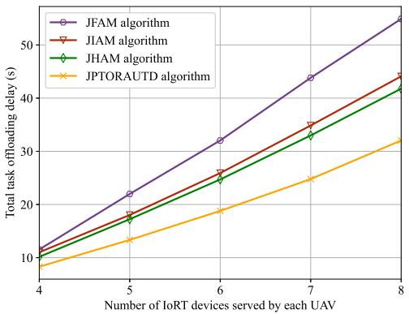

<details>
<summary>line</summary>

| Number of IoT devices served by each UAV | JFAM algorithm | JIAM algorithm | JHAM algorithm | JPTORAUTD algorithm |
| ---------------------------------------- | -------------- | -------------- | -------------- | ------------------- |
| 4                                        | 10             | 10             | 10             | 8                   |
| 5                                        | 22             | 18             | 17             | 13                  |
| 6                                        | 32             | 26             | 25             | 19                  |
| 7                                        | 44             | 35             | 33             | 25                  |
| 8                                        | 56             | 44             | 42             | 32                  |
</details>

Fig. 5. Total task offloading delay versus number of IoRT devices served by each UAV.

2) Joint IPPO and MADDPG (JIAM) Algorithm: The UAV trajectory and transmission power of the IoRT devices can be optimized by employing the MADDPG algorithm. The IPPO algorithm is applied to obtain the task offloading ratio, CPU-cycle frequency of the UAVs and the HAP, and transmission power of the UAVs.   
3) Joint Heterogeneous-Agent Trust Region Policy Optimisation and MADDPG (JHAM) Algorithm: The UAV trajectory and transmission power of the IoRT devices are obtained by utilizing the MADDPG algorithm. The task offloading ratio, CPU-cycle frequency of the UAVs and the HAP, and transmission power of the UAVs can be solved via the heterogeneousagent trust region policy optimisation method [33].

Fig. 5 reveals the total task offloading delay versus the number of IoRT devices served by each UAV for the four algorithms. According to this figure, as the number of IoRT devices increases, the total task offloading delay also increases. This is because the computation resources in the UAV and the HAP are fixed, leading to each UAV and the HAP allocate fewer computation resources to compute tasks when the number of the IoRT devices increases. Hence, there is an increase in the total task offloading delay. Simultaneously, compared with the other three algorithms, the proposed JPTORAUTD algorithm keeps the total task offloading delay lowest with the number of total IoRT devices increasing from 4 to 8. The total task offloading delay of the JPTORAUTD algorithm decreases by 40.81%, 27.38%, and 23.34% on average compared with the JFAM algorithm, JIAM algorithm, and JHAM algorithm, respectively, when the number of total IoRT devices grows from 4 to 8.

Fig. 6 manifests the total task offloading delay versus the task size of each IoRT device for the four algorithms. It can be seen that as the task size of each IoRT device increases, the total task offloading delay shows a clear upward trend. This phenomenon can be attributed to limited available bandwidth resources utilized to offload task and computation resources allocated to compute task in this system. In addition, the proposed JPTORAUTD algorithm outperforms the other three methods. To be specific, with the total task sizes being set from 800 bits to 1200 bits, the JPTORAUTD algorithm has a total task offloading delay decrease of 25.69%, 22.21%, and

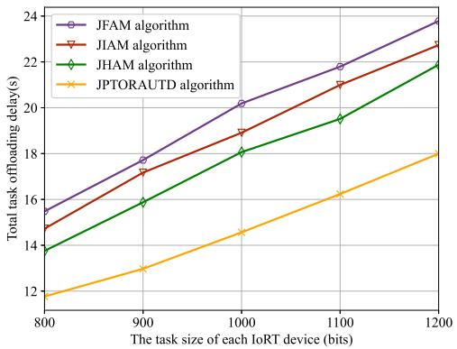

<details>
<summary>line</summary>

| The task size of each IoRT device (bits) | JFAM algorithm | JIAM algorithm | JHAM algorithm | JPTORAUTD algorithm |
| ---------------------------------------- | -------------- | -------------- | -------------- | ------------------- |
| 800                                      | 15.5           | 14.8           | 13.8           | 11.8                |
| 900                                      | 17.8           | 17.2           | 16.0           | 13.0                |
| 1000                                     | 20.2           | 19.0           | 18.2           | 14.5                |
| 1100                                     | 21.8           | 20.8           | 19.5           | 16.2                |
| 1200                                     | 23.5           | 22.8           | 21.8           | 18.0                |
</details>

Fig. 6. Total task offloading delay versus task size of each IoRT device.

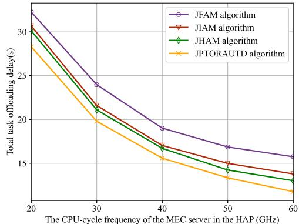

<details>
<summary>line</summary>

| The CPU-cycle frequency of the MEC server in the HAP (GHz) | JFAM algorithm | JIAM algorithm | JHAM algorithm | JPTORAUTD algorithm |
| -------------------------------------------------------- | -------------- | -------------- | -------------- | ------------------- |
| 20                                                       | 32             | 31             | 30             | 28                  |
| 30                                                       | 24             | 21             | 20             | 20                  |
| 40                                                       | 19             | 17             | 17             | 16                  |
| 50                                                       | 17             | 15             | 14             | 13                  |
| 60                                                       | 16             | 14             | 13             | 12                  |
</details>

(a)   
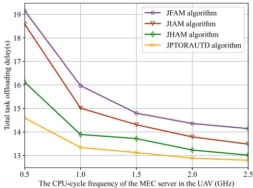

<details>
<summary>line</summary>

| The CPU-cycle frequency of the MEC server in the UAV (GHz) | JFAM algorithm | JIAM algorithm | JHAM algorithm | JPTORAUTD algorithm |
| --- | --- | --- | --- | --- |
| 0.5 | 19.0 | 18.5 | 16.0 | 14.5 |
| 1.0 | 16.0 | 15.0 | 13.8 | 13.2 |
| 1.5 | 14.8 | 14.2 | 13.7 | 13.0 |
| 2.0 | 14.3 | 13.8 | 13.2 | 12.8 |
| 2.5 | 14.0 | 13.5 | 13.0 | 12.7 |
</details>

(b)   
Fig. 7. Total task offloading delay versus the CPU-cycle frequency of the MEC server in the UAV and the HAP under four different algorithms. (a) Total task offloading delay versus the CPU-cycle frequency of the MEC server in the HAP under four different algorithms. (b) Total task offloading delay versus the CPU-cycle frequency of the MEC server in the UAV under four different algorithms.

17.45% on average compared with the JFAM algorithm, JIAM algorithm, and JHAM algorithm, respectively.

Fig. 7 demonstrates the total task offloading delay versus the CPU-cycle frequency of the MEC server in the UAV and the HAP under four different algorithms. As is evident from these two subfigures, four different algorithms have the same downward trend when the CPU-cycle frequency of the MEC server expands. The explanation for this is that a higher CPU-cycle frequency is used to compute tasks, leading to a lower computation time. Therefore, the total task offloading delay is reduced. Take Fig. 7(a) as an example, the proposed JPTORAUTD algorithm is superior to the other three methods. Specifically, the average total task offloading delay of the JPTORAUTD algorithm decreases by 17.67%, 9.48%, and 6.71% compared with the other three algorithms, respectively.

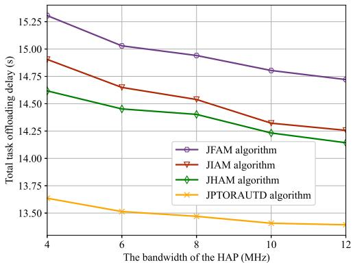

<details>
<summary>line</summary>

| The bandwidth of the HAP (MHz) | JFAM algorithm | JIAM algorithm | JHAM algorithm | JPTORAUTD algorithm |
| ------------------------------ | -------------- | -------------- | -------------- | -------------------- |
| 4                              | 15.25          | 14.90          | 14.60          | 13.65                |
| 6                              | 15.00          | 14.70          | 14.45          | 13.50                |
| 8                              | 14.95          | 14.55          | 14.40          | 13.45                |
| 10                             | 14.80          | 14.35          | 14.25          | 13.40                |
| 12                             | 14.75          | 14.25          | 14.15          | 13.35                |
</details>

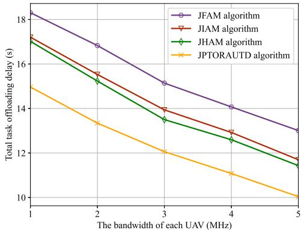

<details>
<summary>line</summary>

| The bandwidth of each UAV (MHz) | JFAM algorithm | JIAM algorithm | JHAM algorithm | JPTORAUTD algorithm |
| -------------------------------- | -------------- | -------------- | -------------- | -------------------- |
| 1                                | 18.0           | 17.0           | 17.0           | 15.0                 |
| 2                                | 16.5           | 15.5           | 15.0           | 13.5                 |
| 3                                | 15.0           | 14.0           | 13.5           | 12.0                 |
| 4                                | 14.0           | 13.0           | 12.5           | 11.0                 |
| 5                                | 13.0           | 12.0           | 11.5           | 10.0                 |
</details>

Fig. 8. Total task offloading delay versus the bandwidth of the HAP and the UAV under four different algorithms. (a) Total task offloading delay versus the bandwidth of the HAP under four different algorithms. (b) Total task offloading delay versus the bandwidth of each UAV under four different algorithms.

Fig. 8 exhibits the total task offloading delay versus the bandwidth of the HAP and the UAV under four different algorithms. From these two subfigures, it can be found that the total task offloading delay decreases with the increase in bandwidth. The cause of this is the larger bandwidth results in lower transmission delay, thereby reducing the task offloading delay. Take Fig. 8(a) as an example, compared with the other three algorithms, the proposed JPTORAUTD algorithm acquires more lower total task offloading delay. When the total bandwidth of each UAV rises from 4 to 12 MHz, the proposed JPTORAUTD algorithm decreases by 9.87%, 7.23%, and 6.16% on average compared with the JFAM algorithm, JIAM algorithm, and JHAM algorithm, respectively. According to the simulation results, it is clear that the proposed JPTORAUTD algorithm always surpasses other algorithms in reducing task offloading delay.

Fig. 9 offers the UAV trajectory versus different time period T. The UAV trajectory direction is marked by →. It is clear that the UAV trajectory forms a closed loop. It is easy to see from the figure that the UAV trajectory can only form a small loop when the time period T is small, which will make the UAV unable to get close to the IoRT device very well. It will let the UAV closer to the IoRT device as the time period T increases. This is because the UAV has more time slots to adjust its position with the time period increasing.

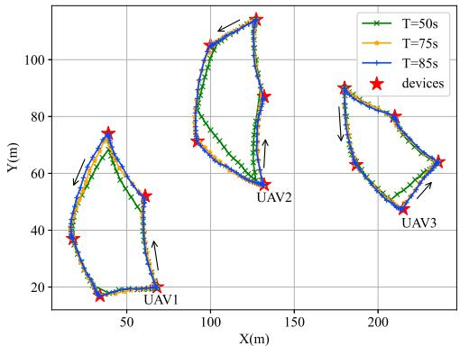

<details>
<summary>line</summary>

| UAV   | T=50s | T=75s | T=85s |
|-------|-------|-------|-------|
| UAV1  | 20    | 20    | 20    |
| UAV2  | 60    | 60    | 60    |
| UAV3  | 40    | 40    | 40    |
</details>

Fig. 9. UAV trajectory versus different time period T.

# VII. CONCLUSION

In this article, a joint partial task offloading, resource allocation, and UAV trajectory design problem was investigated to minimize the total task offloading delay in the air–ground integrated MEC network. To tackle the nonconvex nature of the primal problem, we transformed it into an MDP. Considering the complexity of the MDP grew with the number of the IoRT devices and the UAVs increasing, the primal problem was decomposed into two subproblems, which were tackled by utilizing the basic ideas of the MADDPG algorithm and IPPO algorithm, respectively. In order to improve the convergence performance and convergence rate, an improved prioritized experience replay mechanism and noise value were applied to propose an MADDPG-IPER algorithm and an NV-IPPO algorithm, respectively. Based on the solution of these two subproblems, the JPTORAUTD algorithm was proposed. Simulation results have verified the effectiveness of the proposed JPTORAUTD algorithm in the minimization of total offloading delay compared with other algorithms.

# REFERENCES

[1] S. Li et al., “Joint admission control and resource allocation in edge computing for Internet of Things,” IEEE Netw., vol. 32, no. 1, pp. 72–79, Jan./Feb. 2018.   
[2] B. Shang, Y. Yi, and L. Liu, “Computing over space-air-ground integrated networks: Challenges and opportunities,” IEEE Netw., vol. 35, no. 4, pp. 302–309, Jul./Aug. 2021.   
[3] L. A. Haibeh, M. C. E. Yagoub, and A. Jarray, “A survey on mobile edge computing infrastructure: Design, resource management, and optimization approaches,” IEEE Access, vol. 10, pp. 27591–27610, 2022.   
[4] A. Gbolahan and O. Pius, “Packet scheduling for Internet of Remote Things (IoRT) devices in next generation satellite networks,” Int. J. Sens., Wireless Commun. Control, vol. 12, no. 2, pp. 165–176, Nov. 2022.   
[5] S. Li et al., “Two-hop packet scheduling, resource allocation, and UAV trajectory design for Internet of Remote Things in air–ground integrated network,” IEEE Internet Things J., vol. 11, no. 15, pp. 26160–26172, Aug. 2024.   
[6] Y. Liu et al., “Space-air-ground integrated networks: Spherical stochastic geometry-based uplink connectivity analysis,” IEEE J. Sel. Areas Commun., vol. 42, no. 5, pp. 1387–1402, May 2024.

[7] S. Li et al., “Joint computation offloading and multidimensional resource allocation in air–ground integrated vehicular edge computing network,” IEEE Internet Things J., vol. 11, no. 20, pp. 32687–32700, Oct. 2024.   
[8] S. Li, H. Chen, F. Tan, N. Zhang, S. Lin, and T. Q. S. Quek, “Computation offloading in air-ground integrated vehicular edge computing networks,” in Proc. IEEE Globecom Workshops (GC Wkshps), 2023, pp. 497–502.   
[9] Z. Zhou, J. Feng, L. Tan, Y. He, and J. Gong, “An air-ground integration approach for mobile edge computing in IoT,” IEEE Commun. Mag., vol. 56, no. 8, pp. 40–47, Aug. 2018.   
[10] B. Li, R. Yang, L. Liu, J. Wang, N. Zhang, and M. Dong, “Robust computation offloading and trajectory optimization for multi-UAVassisted MEC: A multiagent DRL approach,” IEEE Internet Things J., vol. 11, no. 3, pp. 4775–4786, Feb. 2024.   
[11] B. Zuo, Y. Xu, D. Yang, L. Xiao, and T. Zhang, “Joint resource optimization and trajectory design for energy minimization in UAVassisted mobile-edge computing systems,” Comput. Commun., vol. 203, pp. 312–323, Apr. 2023.   
[12] C. Zhan and Y. Zeng, “Energy minimization for cellular-connected UAV: From optimization to deep reinforcement learning,” IEEE Trans. Wireless Commun., vol. 21, no. 7, pp. 5541–5555, Jul. 2022.   
[13] Z. Lv, J. Hao, and Y. Guo, “Energy minimization for MEC-enabled cellular-connected UAV: Trajectory optimization and resource scheduling,” in Proc. IEEE INFOCOM IEEE Conf. Comput. Commun. Workshops (INFOCOM Wkshps), 2020, pp. 478–483.   
[14] J. Ji, K. Zhu, C. Yi, and D. Niyato, “Energy consumption minimization in UAV-assisted mobile-edge computing systems: Joint resource allocation and trajectory design,” IEEE Internet Things J., vol. 8, no. 10, pp. 8570–8584, May 2021.   
[15] W. Mao, K. Xiong, Y. Lu, P. Fan, and Z. Ding, “Energy consumption minimization in secure multi-antenna UAV-assisted MEC networks with channel uncertainty,” IEEE Trans. Wireless Commun., vol. 22, no. 11, pp. 7185–7200, Nov. 2023.   
[16] M. Yan, L. Zhang, W. Jiang, C. A. Chan, A. F. Gygax, and A. Nirmalathas, “Energy consumption modeling and optimization of UAV-assisted MEC networks using deep reinforcement learning,” IEEE Sensors J., vol. 24, no. 8, pp. 13629–13639, Apr. 2024.   
[17] W. Feng et al., “Energy-efficient collaborative offloading in NOMAenabled fog computing for Internet of Things,” IEEE Internet Things J., vol. 9, no. 15, pp. 13794–13807, Aug. 2022.   
[18] L. Zhang and N. Ansari, “Latency-aware IoT service provisioning in UAV-aided mobile-edge computing networks,” IEEE Internet Things J., vol. 7, no. 10, pp. 10573–10580, Oct. 2020.   
[19] X. Ma, C. Yin, and X. Liu, “Machine learning based joint offloading and trajectory design in UAV based MEC system for IoT devices,” in Proc. IEEE 6th Int. Conf. Comput. Commun. (ICCC), 2020, pp. 902–909.   
[20] Z. Han, T. Zhou, T. Xu, and H. Hu, “Joint user association and deployment optimization for delay-minimized UAV-aided MEC networks,” IEEE Wireless Commun. Lett., vol. 12, no. 10, pp. 1791–1795, Oct. 2023.   
[21] Q. Wu, M. Cui, G. Zhang, F. Wang, Q. Wu, and X. Chu, “Latency minimization for UAV-enabled URLLC-based mobile edge computing systems,” IEEE Trans. Wireless Commun., vol. 23, no. 4, pp. 3298–3311, Apr. 2024.   
[22] Y. Zeng, S. Chen, Y. Cui, J. Yang, and Y. Fu, “Joint resource allocation and trajectory optimization in UAV-enabled wirelessly powered MEC for large area,” IEEE Internet Things J., vol. 10, no. 17, pp. 15705–15722, Sep. 2023.   
[23] S. Li, N. Zhang, H. Chen, S. Lin, and H. Wu, “Joint subcarrier allocation, modulation mode selection, and trajectory design in a UAV-based OFDMA network,” IEEE Commun. Lett., vol. 26, no. 9, pp. 2111–2115, Sep. 2022.   
[24] W. Lu et al., “Secure NOMA-based UAV-MEC network towards a flying eavesdropper,” IEEE Trans. Commun., vol. 70, no. 5, pp. 3364–3376, May 2022.   
[25] Z. Jia, Q. Wu, C. Dong, C. Yuen, and Z. Han, “Hierarchical aerial computing for Internet of Things via cooperation of HAPs and UAVs,” IEEE Internet Things J., vol. 10, no. 7, pp. 5676–5688, Apr. 2023.   
[26] Z. Qin et al., “Task selection and scheduling in UAV-enabled MEC for reconnaissance with time-varying priorities,” IEEE Internet Things J., vol. 8, no. 24, pp. 17290–17307, Dec. 2021.   
[27] M. Zhu, K. Tian, Y.-Q. Wen, J.-N. Cao, and L. Huang, “Improved PER-DDPG based nonparametric modeling of ship dynamics with uncertainty,” Ocean Eng., vol. 286, Oct. 2023, Art. no. 115513.

[28] J. Hu, S. Hu, and S.-W. Liao, “Policy regularization via noisy advantage values for cooperative multi-agent actor-critic methods,” 2023, arXiv:2106.14334.   
[29] H. Kang, X. Chang, J. Mišic, V. B. Miši ´ c, J. Fan, and Y. Liu, ´ “Cooperative UAV resource allocation and task offloading in hierarchical aerial computing systems: A MAPPO-based approach,” IEEE Internet Things J., vol. 10, no. 12, pp. 10497–10509, Jun. 2023.   
[30] S. Li, Z. Yu, H. Chen, N. Zhang, and M. Dong, “Joint packet scheduling and UAV trajectory design in air-ground integrated network,” in Proc. IEEE Globecom Workshops (GC Wkshps), 2023, pp. 420–425.   
[31] Q.-Y. Fan, M. Cai, and B. Xu, “An improved prioritized DDPG based on fractional-order learning scheme,” IEEE Trans. Neural Netw. Learn. Syst., early access, May 8, 2024, doi: 10.1109/TNNLS.2024.3395508.   
[32] Z. Zhu, S. Wan, P. Fan, and K. B. Letaief, “Federated Multiagent actor– critic learning for age sensitive mobile-edge computing,” IEEE Internet Things J., vol. 9, no. 2, pp. 1053–1067, Jan. 2022.   
[33] J. G. Kuba et al., “Trust region policy optimisation in multi-agent reinforcement learning,” 2022, arXiv:2109.11251.


<details>
<summary>natural_image</summary>

Portrait photo of a man in a dark jacket (no text or symbols visible)
</details>

Hongbin Chen received the B.E. degree in electronic and information engineering from Nanjing University of Posts and Telecommunications, Nanjing, China, in 2004 and the Ph.D. degree in circuits and systems from South China University of Technology, Guangzhou, China, in 2009.

From October 2006 to May 2008, he was a Research Assistant with the Department of Electronic and Information Engineering, Hong Kong Polytechnic University, Hong Kong, where he was a Research Associate from March to April 2014.

From May 2015 to May 2016, he was a Visiting Scholar with the Department of Electrical and Computer Engineering, National University of Singapore, Singapore. He is currently a Professor with the School of Information and Communication, Guilin University of Electronic Technology, Guilin, China. His research interests include energy-efficient wireless communications.


<details>
<summary>natural_image</summary>

Portrait photo of a man in a black shirt (no text or symbols visible)
</details>

Shichao Li received the Ph.D. degree in communication and information systems from Beijing Jiaotong University, Beijing, China, in 2019.

From 2022 to 2024, he was a Postdoctoral Research Fellow supported by the Chinese Scholarship Council with the Singapore University of Technology and Design, Singapore. He is currently an Associate Professor with the school of information and communication, Guilin University of Electronic Technology, Guilin, China. His main research interests include mobile edge computing, vehicular networks, highmobility broadband wireless communications, wireless resource allocation, and cloud radio access networks.

Dr. Li is on the Editorial Board of the Springer Discover Applied Sciences. He has served as a TPC member for IEEE VTC2025-Spring, IEEE Globecom2024, IEEE VTC2023-Spring, IEEE VTC2021-Fall, and IEEE VTC2020-Fall.


<details>
<summary>natural_image</summary>

Portrait photo of a man wearing a blue checkered shirt against a solid blue background (no text or symbols visible)
</details>

Fangqing Tan received the M.S. degree in communication and information system from Chongqing University of Post and Telecommunications, Chongqing, China, in 2012, and the Ph.D. degree from Beijing University of Post and Telecommunications, Beijing, China, in 2017.

From 2018 to 2021, he was a Postdoctoral Fellow with the School of Electronics and Information Technology, Sun Yat-sen University, Guangzhou, China. Since 2017, he has been with Guilin University of Electronic Technology, Guilin, China, where he is currently an Associate Professor. His research interests include wireless power transfer, multiple antennas communications, and Internet of Things.

Dr. Tan was recognized as an Exemplary Reviewer by the IEEE WIRELESS COMMUNICATIONS LETTERS in 2020. He is a TPC Member for IEEE TENCON-2022 and ICCT-2023.


<details>
<summary>natural_image</summary>

Portrait photo of a young man against a blue background (no text or symbols visible)
</details>

Bingji Lu received the B.S. degree in communication engineering from Guilin University of Technology, Guilin, China, in 2022. He is currently pursuing the M.S. degree in communication engineering from Guilin University of Electronic Technology, Guilin.

His main research interests include deep reinforcement learning and air–ground integrated mobile edge computing network.


<details>
<summary>natural_image</summary>

Portrait of a man wearing glasses against a blue background (no text or symbols visible)
</details>

Laha Ale (Member, IEEE) received the bachelor’s degree in computer science from Southwest University of Science and Technology, Mianyang, China, in 2011, the M.B.A. degree from Webster University, Webster Groves, MO, USA, in 2016, and the Ph.D. degree in geospatial computer science from Texas A&M University-Corpus Christi, Corpus Christi, TX, USA, in 2021.

Before beginning his graduate program, he was a Software Engineer with Tieto, Symantec, and Veritas, Chengdu, China, for seven years. In January 2022, he joined the Center for Computational Biomedicine, Harvard University, Cambridge, MA, USA, as a Postdoctoral Research Fellow. He joined the School of Computing and Artificial Intelligence, Southwest Jiaotong University, Chengdu, as an Associate Professor in 2023. His research interests include mobile edge computing, deep learning, deep reinforcement learning, deep universal probabilistic programming, and data science for biomedicine.


<details>
<summary>natural_image</summary>

Portrait photo of a woman against a blue background (no text or symbols visible)
</details>

Jingyue Huang received the M.S. degree in electronic and communication engineering from Guilin University of Electronic Technology, Guilin, China, in 2011.

She is currently a Senior Engineer with the School of Information and Communication, Guilin University of Electronic Technology. Her main research interests are software radio and cognitive radio.