# Two-Level-Attention-Based Continuous Trajectory Design and Computation Offloading for Multi-UAV Cooperative Target Search

Haowen Zhu , Junpeng Hui, and Zehua Guo , Senior Member, IEEE

Abstract—Uncrewed Aerial Vehicles (UAVs) are widely used for region monitoring and target search. However, existing UAV swarm search methods usually suffer from UAV motion models’ low accuracy and inflexibility, resulting in low search efficiency, and there is a gap between the UAV motion model design and reality. Moreover, current methods ignore the impact of search task offloading locations and computational resource allocation on search efficiency. Finally, existing UAV swarm search methods lack scalability and generalization as the number of UAVs increases. This paper explores the cooperative search problem of UAV swarms in three-dimensional continuous space. We comprehensively consider UAV partial observability, search area delay constraint, collision avoidance condition, energy collection and consumption, etc. We jointly optimize the UAV flight trajectory, charging decision, search task offloading, and computing resource allocation to reduce the uncertainty of the search area and improve target detection rates. Specifically, we propose a heuristic embedded Multi-Agent Proximal Policy Optimization (MAPPO) algorithm. This method significantly reduces the action space dimension by using a heuristic energy-efficient task offloading and computational resource allocation strategy, and uses MAPPO with a two-level attention mechanism, a Beta distribution, and a safe flying control strategy to efficiently obtain the optimal flight trajectory and charging strategy. Two-level attention can handle a dynamically sized agent network, significantly improving algorithm performance and scalability. Furthermore, through the Curriculum Learning (CL) mechanism, we extend our algorithm to a large-scale UAV swarm cooperative search scenario. Simulation results show that compared with other benchmarks, our method can significantly reduce the search area’s uncertainty and improve the target detection rate.

Index Terms—Uncrewed aerial vehicle (UAV), target searching, computation offloading, multi-agent deep reinforcement learning (MADRL).

## I. INTRODUCTION

ULTI-UNCREWED Aerial Vehicle (UAV) collaborative applications like battlefield reconnaissance, disaster response, and infrastructure inspection. UAVs offer exceptional flexibility and autonomy, enabling efficient area coverage with reduced resource requirements. Cooperative operations further enhance reliability and search efficiency through coordinated control [1]. Here, target search encompasses discovery, surveillance, and anomaly detection.

Existing UAV swarm collaborative search methods include heuristic-based and Multi-Agent Deep Reinforcement Learning (MADRL) approaches. Heuristic algorithms require environment-specific prior knowledge and lack adaptability in dynamic scenarios [2]. Conversely, MADRL methods continuously learn through trial-and-error in unknown environments, enabling effective adaptation to dynamic changes and demonstrating strong capabilities for complex decision-making [3]. However, current research still faces several limitations:

Firstly, modeling the relationship between UAV continuous motion in three-dimensional space and information uncertainty within observation areas. Existing studies [4], [5], [6] typically assume discrete UAV motion on fixed two-dimensional planes (e.g., four cardinal directions), or static deployment at different heights on horizontal planes [7], [8], misaligning with reality. UAVs can adjust altitude to modify their search Field Of View (FOV), which affects search accuracy. Through altitude control, UAVs dynamically balance sensor resolution and coverage: lower altitudes enhance detection fidelity (e.g., target verification) but reduce observation area, while higher altitudes prioritize coverage over precision [7]. Fixed-altitude deployments prevent flexible FOV adjustments, creating static trade-offs between precision and coverage. Low-precision discrete motion methods impair search efficiency due to the coupling between motion trajectory and search strategy. Ref. [9] characterizes 3D continuous motion via pitch angle, heading angle, and speed. However, it fails to establish correlations between UAV observation FOV and 3D coordinates, or develop information uncertainty update methods for the observation field. Traditional grid-based models for fixed-altitude 2D flight cannot adapt to 3D’s continuous spatial coupling between motion and observation (e.g., altitude-dependent sensor footprints dynamically modifying search area grid coverage). Altitude variations alter camera fidelity and observation area size, impacting information uncertainty updates. How to characterize UAV continuous 3D motion and establish its relationship with area information uncertainty?

Digital Object Identifier 10.1109/TMC.2025.3614596

Secondly, the joint optimization of search task offloading and computing resource allocation. Ref. [6] proposes a MADRL architecture using deep Q-networks to jointly optimize computational offloading decisions and flight direction for multi-UAV collaborative target search, improving search task completion rates and UAV energy efficiency. However, it does not optimize UAV CPU resource allocation or ground-to-air channel transmission power. When UAV camera fields of view change, fixed CPU frequencies or transmission powers reduce latencysensitive task completion rates and search efficiency. This paper jointly optimizes UAV flight trajectories, task offloading locations, and computing resource allocation to enhance UAV search efficiency. Since task offloading involves discrete decisions (offloading locations) while resource allocation involves continuous decisions, this creates a large hybrid decision space. How to design efficient algorithms for such large decision spaces?

Thirdly, the scalability and generalization in multi-UAV networks. In cooperative search scenarios, each UAV observes only local areas (communicating with variable numbers of neighboring UAVs). The total number of UAVs may also change during operations. Existing RL research typically uses fixed-dimensional Multi-Layer Perceptrons (MLPs), handling dynamic changes through reserved input dimensions. This approach inherently scales poorly for large agent numbers. Furthermore, when UAV counts change, algorithms require retraining to accommodate these changes. How to design efficient algorithms adapting to partially observable multi-UAV networks with dynamic agent counts?

This paper addresses UAV swarm cooperative search in threedimensional continuous space by developing a heuristic-based MADRL framework. The main contributions include:

\- Model and Problem Formulation: We develop a 3D continuous-space cooperative search framework incorporating UAV partial field-of-view constraints. The model jointly optimizes flight trajectories, charging scheduling, task offloading, and computing resource allocation under energy and search time constraints to minimize search uncertainty and maximize target detection.

\- Algorithm Design: We formulate a Decentralized Partially Observable Markov Decision Process (Dec-POMDP) and propose a heuristic-based MADRL approach. The algorithm employs energy-efficient task offloading and resource allocation to reduce action dimensionality, integrates Beta distributions and safe flying control for performance enhancement, and utilizes two-level multi-head attention with Curriculum Learning (CL) to handle partial observability and improve scalability.

\- Validation: Simulations demonstrate 27% -64% improvement in objective function performance versus existing MADRL and optimization methods.

This paper’s structure is summarized as follows: Section II describes existing related works. Section III discusses UAV swarm-based search task modeling. Section IV presents the detailed algorithm design. Section V presents the simulation setup and numerical results. Section VI summarizes the paper.

## II. RELATED WORK

## A. Cooperative Target Search and Trajectory Control

A lot of work has been conducted on developing cooperative target search strategies based on heuristic algorithms for UAV swarms [9], [10], [11], [12]. Ref. [10] introduces an improved bean optimization algorithm for UAV swarm path search, which designs a free space search mechanism to improve target search efficiency. Ref. [9] proposes a discrete pigeon dynamic optimization algorithm based on centralized task allocation and distributed path generation, where flyable trajectories are generated by B-spline curves based on simplified waypoints. Ref. [11] develops a rule-based heuristic ant colony algorithm and designs a pheromone update method using threat avoidance to optimize multi-UAV search paths. Ref. [12] designs a motion-coded particle swarm optimization algorithm, in which the search trajectory is encoded as the UAV’s motion path and solved by evolving over the generation of particles. Heuristic-based search algorithms are prone to local optima and often reduce overall search efficiency due to insufficient collaboration [7].

UAV swarm collaborative target search based on MADRL can adapt to more complex and dynamically changing search scenarios through continuous interaction between agents and the environment [2], [5], [7], [13], [14], [15]. Ref. [7] proposes a multi-agent Proximal Policy Optimization (PPO) trajectory planning method based on action masks, and introduces a multi-UAV high-low altitude collaborative search architecture. Ref. [2] uses the Double Critic Deep Deterministic Policy Gradient to balance bias in value function estimation and variance in policy updating. Ref. [5] proposes a Multi-Agent Deep Deterministic Policy Gradient (MADDPG)-based distributed cooperative UAV search trajectory planning method that can operate efficiently in complex and large-scale scenarios. Ref. [13] proposes a PPO algorithm based on a partially observable Markov decision process, which aims to improve exploration fairness and ensure continuous observation. Ref. [14] introduces a digital twin-driven MADRL method to generate UAV moving directions. Ref. [15] suggests a multi-criteria negative feedback method, and generates the UAV’s motion trajectory based on a deep Q network. In addition, control theory and probabilistic models are also used in cooperative target search [16], [17]. For example, [16] develops a real-time UAV search path planning method based on a distributed model predictive control framework. Ref. [17] uses a Gaussian mixture model to extract the high-value search curve segments, and a self-organizing map to prioritize the search curve segments. However, the above works only consider UAV motion models relatively simply, as well as do not consider algorithm scalability under dynamic UAV numbers.

## B. Task Offloading and Resource Allocation

Task offloading and resource allocation have been widely studied to improve the performance of UAV-assisted Mobile Edge Computing (MEC) systems [18], [19], [20], [21], [22], [23]. Ref. [19] studies the problem of joint Internet of Things (IoT) device association, partial offloading, and communication resource allocation decisions in heterogeneous air-access IoT networks to maximize IoT service satisfaction while minimizing total energy consumption. Ref. [20] proposes a two-stage optimization method for an air-ground integrated computing network to minimize system energy consumption under the constraint of long-term queueing delays. Ref. [21] develops an optimization-embedded MADRL algorithm to support computationally intensive tasks in 6 G systems. Ref. [22] examines the task offloading problem in a multi-UAV cooperatively assisted MEC system based on task priority and binary offloading modes, and proposes a novel deep reinforcement learning algorithm based on latent space to solve discrete-continuous hybrid action space problems. Ref. [23] proposes a digital twin-assisted UAV deployment strategy and two hybrid (binary and partial) task offloading schemes, namely heuristic greedy and DQN-based schemes, to achieve intelligent and efficient decision-making.

The above research is mainly dedicated to the scenario of UAV-assisted IoT devices, which has clear and user-based task definition and task priorities. Our research focuses on the collaborative search of UAV swarms to enhance the overall target discovery rate and minimize information uncertainty in the search area, which are different from the optimization objectives of IoT scenarios. The definition and scope of tasks, as well as the priority of tasks, in the target search scenario are also distinct from those in traditional edge computing scenarios. Consequently, it is necessary to reconsider the task offloading paradigm for collaborative search.

Some studies investigate task offloading in cooperative UAV search scenarios [6], [24], [25]. Ref. [24] studies UAV autonomous detection and tracking tasks in the marine environment by optimizing transmission power, local CPU frequency, UAV offload rate, and bandwidth allocation using convex optimization and genetic algorithms. However, this work did not consider UAV trajectory planning and intelligent learningbased algorithms. Ref. [25] proposes a framework supported by edge computing, which minimizes search area uncertainty by optimizing round-trip energy consumption, task offloading decisions, and trajectory planning. Ref. [6] proposes a Deep Reinforcement Learning (DRL) method for making optimal task offloading decisions and flight direction selections jointly for multi-UAV cooperative target search. The above two works focus on offloading location optimization for a single task, and do not involve UAV computing frequency and transmission power allocation.

## III. SYSTEM MODEL

## A. Scenario Description

Fig. 1 illustrates a scenario of multiple UAVs collaborating to search. We consider a search area of length $L _ { x }$ and width $L _ { y } .$ This area is divided into $N _ { x } \cdot N _ { y }$ grid maps, each with a side length of L and denoted as $k \in \bar { K } = \{ 1 , 2 , \ldots , | K | \} ( \left( x _ { k } , y _ { k } \right) )$ The search task is denoted by $T _ { k } = \{ N _ { k } , C _ { k } \} , k \in K$ , where $N _ { k }$ represents the data size of the grid k and $C _ { k }$ represents the processing density (in CPU cycles/bit). Assume that $N _ { k }$ follows a normal distribution with expectation $\wp ,$ such that $E ( N _ { k } ) = \wp$ . The UAV swarm flies on these map grids. Let

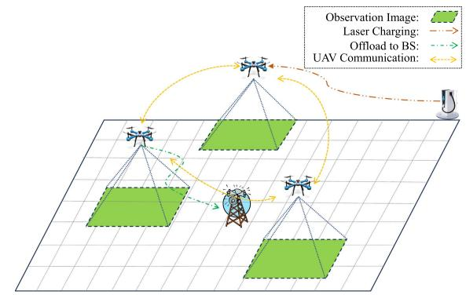  
Fig. 1. System architecture.

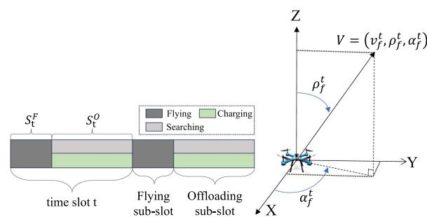  
(a) Time-Slotted Fly-Offload Protocol. (b) UAV Motion Model.  
Fig. 2. UAV time slot and motion model.

$F = \{ f _ { 1 } , f _ { 2 } , \dots , f _ { | F | } \}$ denote the collection of UAVs above the search area. A bird’s-eye view camera is installed at the bottom of each UAV, which can capture videos or images of these grids. UAVs consume energy while flying and searching.

Suppose that |F | UAVs with a certain amount of pre-loaded energy take off from $| F |$ points and fly along specific trajectories to search. UAV cannot fly beyond the search area boundary or collide with other UAVs. Assume that the minimum safe flight altitude and maximum safe flight altitude of each UAV are $L _ { z } ^ { m i n }$ and $L _ { z } ^ { m a x }$ , respectively. A ground Base Station (BS) equipped with an edge server is located in the center of the search area $( x _ { b s } , y _ { b s } , 0 )$ , providing powerful computing power and acting as the control center for the UAV swarm. Additionally, a laser charger is located at $( x \imath , y \imath , 0 )$ at the boundary of the search area, which can be used to extend UAV flight and search time. Please note that we mainly focus on the decision optimization of the UAV search process in this paper. Similar to [26], we omit the explicit constraint requiring the UAV to return to the return point at the end of the task. Safe return to the return point can be ensured by reserving corresponding energy in advance, calculated from the return distance and optimal cruise speed.

## B. Time-Slotted Fly-Offload Protocol

Fig. 2(a) shows the time-slotted flying-offloading protocol in this study. To simplify the representation of an $\mathrm { U A V } '$ s trajectory, we divide the entire mission time period into T equal-length time intervals, each denoted as $t \in T = \{ 1 , 2 , \dots , t , \dots , | T | \}$ . Each time slot t consists of two sub-slots in turn, namely the flying sub-slot $S _ { t } ^ { F }$ and the offloading sub-slot $S _ { t } ^ { O } \left( T _ { t } ^ { F } \right.$ and $T _ { t } ^ { O }$ denote the corresponding lengths of the two sub-slots in time slot t). UAV f can fly to the next position at a fixed speed in a specific direction in the flying sub-slot. In the offloading sub-slot, UAV f either charges itself using the remote laser charger to replenish its energy (charging state), or performs target search (search state). When UAV f is in target search mode, the on-board camera can overlook and capture a specific search area $O _ { \mathrm { s e a r c h } } ^ { f }$ directly below it. In addition, UAV f divides the captured image $O _ { \mathrm { s e a r c h } } ^ { f }$ into multiple sub-observation images ok $\in O _ { \mathrm { s e a r c h } } ^ { f }$ using a variety of mature and efficient image segmentation techniques [27], and employs image recognition [28] technology to process each subobservation image ok in parallel. It should be noted that in this study, image segmentation technology is used to segment large images captured by the UAV’s on-board camera, as image size may change as the UAV’s altitude increases. By segmenting large images into multiple sub-images, target search can be performed simultaneously, improving UAV search efficiency.

The computing task of each sub-observation image ok can be offloaded to UAV f itself, or offloaded to the remote BS, which performs the detection data calculation. UAV f consumes energy while local image processing or transmitting images to BS. The amount of energy consumed depends on the amount of computing resources allocated locally and the channel conditions between $f$ and the BS. Similar to [6], the calculation of each sub-observation image ok must be completed within the $T _ { t } ^ { O }$ sub-time slot, otherwise the image recognition accuracy will be too low and results in recognition failure. UAV f collects the recognition results of each sub-observation image ok $\in O _ { \mathrm { s e a r c h } } ^ { f }$ at the end of the time slot t and updates the target existence state of the search area $O _ { \mathrm { s e a r c h } } ^ { f }$ based on the recognition results collected. When UAV f charges, it replenishes its own energy to extend search time. Unlike existing research, our flying-offloading protocol allows different UAVs to perform different operations (such as charging or searching) in the same time period, thereby making better use of network resources, such as UAV computing resources in search mode.

## C. UAV Motion Model

Each UAV moves continuously within three-dimensional space above the reconnaissance area. We assume that UAV flight speed remains constant in each time slot, thus UAV f’s location updates during the flying sub-time slot $T _ { t } ^ { F }$ can be described by the following equation:

$$
\left\{ \begin{array} { l } { { x _ { f } ^ { t + 1 } = x _ { f } ^ { t } + v _ { f } ^ { t } T _ { t } ^ { F } \sin \rho _ { f } ^ { t } \cos \alpha _ { f } ^ { t } , } } \\ { { y _ { f } ^ { t + 1 } = y _ { f } ^ { t } + v _ { f } ^ { t } T _ { t } ^ { F } \sin \rho _ { f } ^ { t } \sin \alpha _ { f } ^ { t } , } } \\ { { z _ { f } ^ { t + 1 } = z _ { f } ^ { t } + v _ { f } ^ { t } T _ { t } ^ { F } \cos \rho _ { f } ^ { t } , } } \end{array} \right.\tag{1}
$$

where $L _ { f } ^ { t } = ( x _ { f } ^ { t } , y _ { f } ^ { t } , z _ { f } ^ { t } )$ and $L _ { f } ^ { ( t + 1 ) } = ( x _ { f } ^ { t + 1 } , y _ { f } ^ { t + 1 } , z _ { f } ^ { t + 1 } )$ rep-= ( ) = ( )resent the location coordinates of UAV f at the beginning of time slot t and time slot $t + 1$ , respectively. ${ v } _ { f } ^ { t }$ denotes UAV $f ^ { \ast } \mathrm { s }$ speed in flying sub-time slot $T _ { t } ^ { F } \cdot \rho _ { f } ^ { t }$ and $\alpha _ { f } ^ { t }$ represent UAV motion direction in the three-dimensional coordinate system, as shown in Fig. 2(b).

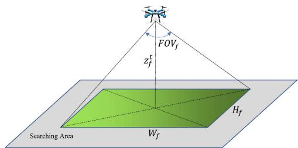  
Fig. 3. UAV observation view.

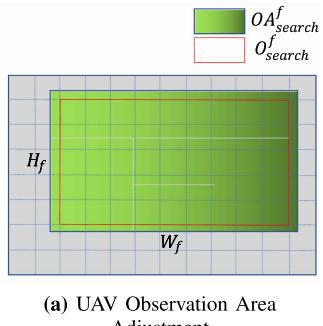

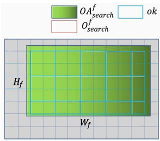  
(a) UAV Observation Area Adjustment  
(b) UAV Observation Image Segmentation  
Fig. 4. UAV search model.

## D. Search Model

As shown in Fig. 3, during the offloading sub-time slot $T _ { t } ^ { O }$ , it is assumed that the UAV camera used for observation and search is in a vertical shooting position. The relationship between the UAV observation area and its position is

$$
F O V _ { f } = 2 \arctan \left( \frac { \sqrt { W _ { f } ^ { 2 } + H _ { f } ^ { 2 } } } { 2 z _ { f } ^ { t } } \right) ,\tag{2}
$$

where $F O V _ { f }$ indicates the camera’s field of view, $W _ { f }$ indicates the width of the camera’s field of view, $H _ { f }$ indicates the height of the camera’s field of view, and $z _ { f } ^ { t }$ represents the height of UAV f in the offloading sub-slot $T _ { t } ^ { O }$ . When UAV f hovers, its observation area $O A _ { \mathrm { s e a r c h } } ^ { f }$ can be expressed as:

$$
O A _ { \mathrm { s e a r c h } } ^ { f } = \frac { 4 R _ { W H } ^ { f } } { \left( R _ { W H } ^ { f } \right) ^ { 2 } + 1 } \left( z _ { f } ^ { t } \tan \left( \frac { F O V _ { f } } { 2 } \right) \right) ^ { 2 } ,\tag{3}
$$

where $\begin{array} { r } { R _ { W H } ^ { f } = \frac { W _ { f } } { H _ { f } } } \end{array}$ is UAV f ’s camera view aspect ratio [29].

As shown in Fig. 4(a), during each offloading sub-time slot $T _ { t } ^ { O } , \mathrm { U A V } f ^ { , }$ s observation area $\bar { O A } _ { \mathrm { s e a r c h } } ^ { f }$ may partially cover some grid units. In this paper, we assume that UAV can only process grid units completely covered by its observation area $O A _ { \mathrm { s e a r c h } } ^ { f } ,$ which means that some grid units located at the boundary of the observation area cannot be searched within $T _ { t } ^ { O }$ . We reduce the impact of this phenomenon by increasing map grid unit discretisation accuracy. In addition, the UAV’s continuous motion space design and a learning-based search solution can further inspire the UAV to learn a reasonable flight path (i.e., flight speed and flight direction) to maximize the coverage of complete grid units and improve search efficiency. Finally, when the UAV’s observation area exceeds the search area boundary, we only search the area overlapping the search area. Let $O _ { \mathrm { s e a r c h } } ^ { f }$ represents the observation area actually processed by UAV f and $O _ { \mathrm { s e a r c h } } ^ { f } \in O A _ { \mathrm { s e a r c h } } ^ { f } .$

## E. Task Offloading Model

In the offloading sub-time slot $T _ { t } ^ { O }$ , UAV f ’s sensor first collects detection data in its observation area $O _ { \mathrm { s e a r c h } } ^ { f }$ ; then, UAV f chooses to perform data calculation locally or transmit the data to the remote BS for calculation. The UAV or BS computes data by deploying image recognition algorithms. After the data are calculated, the UAV f determines the target distribution status in $O _ { \mathrm { s e a r c h } } ^ { f }$ based on the calculation results. Existing solutions use a binary offloading mode $( \mathrm { i . e . }$ , all observation data can only be offloaded locally on the $\mathrm { U A V } ,$ or to the BS [6], [30]). In this paper, the UAV’s observation area changes depending on its flight altitude (see Section III-D for details). A simple binary offloading scheme cannot adapt to the variation of observation area, which may result in $O _ { \mathrm { s e a r c h } } ^ { f }$ searching cannot be completed within $T _ { t } ^ { O }$

As shown in Fig. 4(b), we employ image segmentation techniques to divide the whole observation area $O _ { \mathrm { s e a r c h } } ^ { f }$ . The divided images ok $\in O _ { \mathrm { s e a r c h } } ^ { f }$ of different sub-observation areas can be respectively offloaded to the UAV or the BS, thus improving detection data calculation efficiency. To facilitate task processing, we set the sub-observation area image ok’s side length to an integral multiple of the map grid length (2 times in Fig. 4(b)). The relationship between sub-observation area image ok and map grid k can be expressed as follows:

$$
\begin{array} { r } { \left\{ { N _ { o k } = \sum _ { k \in o k } N _ { k } , \forall o k \in O _ { \mathrm { s e a r c h } } ^ { f } , } \right. } \\ { C _ { o k } = \operatorname* { m a x } _ { k \in o k } C _ { k } , \forall o k \in O _ { \mathrm { s e a r c h } } ^ { f } , } \end{array}\tag{4}
$$

where ok indicates sub-observation area image, k indicates map grid, and k ∈ ok represents the set of all grids in sub-observation area ok. $N _ { o k }$ represents the amount of detection data (in bits) for the sub-observation area image ok. $C _ { o k }$ represents required processing density (in CPU cycles/bit) for sub-observation area image ok. Let $u _ { o k } ^ { \check { f } , t } = 1$ denotes that the sub-observation area image ok is processed locally on UAV f during the offloading sub-time slot $T _ { t } ^ { O }$ , and $u _ { o k } ^ { f , t } \dot { = } 0$ indicates that it is processed at the remote BS. When UAV performs local data processing, the following equation is satisfied [6]:

$$
T C _ { o k } ^ { f } = \frac { u _ { o k } ^ { f , t } N _ { o k } C _ { o k } } { F R _ { o k } ^ { f } ( t ) } ,\tag{5}
$$

where $F R _ { o k } ^ { f } ( t )$ indicates that UAV f allocates local CPU computing processing capacity $F R _ { o k } ^ { f }$ (i.e., the amount of CPU frequency in cycles/s) to image ok during offloading sub-time slot $\dot { T } _ { t } ^ { O } . \dot { T } C _ { o k } ^ { f }$ denotes UAV $f ^ { \ast } \mathrm { s }$ local computing time. Moreover, all images’ CPU frequency allocation should not exceed $f ^ { \ast } \mathrm { s }$ maximum CPU computation frequency $F R _ { m a x } ^ { f }$

$$
\sum _ { o k \in O _ { \mathrm { s e a r c h } } ^ { f } } F R _ { o k } ^ { f } ( t ) \leq F R _ { m a x } ^ { f } .\tag{6}
$$

To represent data transmission between the UAV and the remote BS, we use the Ground To Air (GTA) path loss communication model. Specifically, we consider both Line-of-Sight (LoS) and Non-Line-of-Sight (NLoS) transmission channels. The choice of LoS or NLoS transmission between the UAV and the BS depends on environmental information, which can be-  modeled in the following equation:

$$
P _ { f , b s } ^ { L o S } ( t ) = \frac { 1 } { 1 + \omega e ^ { - \eta \left( \frac { 1 8 0 } { \pi } \tan ^ { - 1 } ( \frac { z _ { f } ^ { t } } { d _ { f , b s } ^ { x , y } } ) - \omega \right) } } ,\tag{7}
$$

where constants $\omega$ and η reflect the environmental indicators of the search region. $d _ { f , b s } ^ { x , y }$ is the horizontal distance between UAV f and the BS. $z _ { f } ^ { t }$ denotes UAV $f ^ { \ast } \mathrm { s }$ flying height. The choice of NLoS transmission can be expressed as $P _ { f , b s } ^ { N L o S } ( t ) =$ $1 - P _ { f , b s } ^ { L o S } ( t )$ . The channel gain between UAV $f$ and BS can be calculated according to the following equation [31]:

$$
\begin{array} { c l l } { G C _ { f , b s } ^ { c } ( t ) = \beta _ { c } - 1 0 \alpha _ { c } \log _ { 1 0 } ( d _ { f , b s } ) + \eta _ { c } , } \\ { c \in \left\{ L o S , N L o S \right\} , } \end{array}\tag{8}
$$

where $d _ { f , b s }$ denotes the absolute distance between UAV f and BS. Let $c \in \{ L o S , ~ N L o S \}$ denote whether the communication channel condition is LoS or NLoS. The value of $\beta _ { c }$ corresponds to the channel gain at a distance of 1m. $\alpha _ { c }$ is the path loss exponent. $\eta _ { c }$ represents the shadowing component, which can be modeled using the Gaussian distribution $\textstyle { \mathcal { N } } ( 0 , \sigma _ { c } ^ { 2 } )$ . Based on the above equations, the final mixed channel gain can be expressed as

$$
G C _ { f , b s } ( t ) = 1 0 \log _ { 1 0 } ( P _ { f , b s } ^ { L o S } ( t ) \cdot 1 0 ^ { G C _ { f , b s } ^ { L o S } ( t ) / 1 0 } + P _ { f , b s } ^ { N L o S } ( t )
$$

$$
\cdot \ 1 0 ^ { G C _ { f , b s } ^ { N L o S } ( t ) / 1 0 } \Big ) \ .\tag{9}
$$

GTA channel’s Signal-to-Noise Ratio (SNR) between UAV f and BS is determined as:

$$
S N R _ { o k } ^ { f } ( t ) = \frac { P T _ { o k } ^ { f } ( t ) \cdot 1 0 ^ { \frac { G C _ { f , b s } ( t ) } { 1 0 } } } { \sigma _ { w } ^ { 2 } } ,\tag{10}
$$

where $P T _ { o k } ^ { f } ( t )$ is the data transmission power of UAV f transmitting image ok to BS. $\sigma _ { w } ^ { 2 }$ is the noise power at the data receiver. Therefore the channel transmission rate from UAV to BS is

$$
D _ { o k } ^ { f } ( t ) = B \log _ { 2 } \left( 1 + S N R _ { o k } ^ { f } ( t ) \right) ,\tag{11}
$$

where B denotes the channel bandwidth. Transmission time of image ok from UAV f to BS is:

$$
T R _ { o k } ^ { f } = \frac { ( 1 - u _ { o k } ^ { f , t } ) N _ { o k } } { D _ { o k } ^ { f } ( t ) } .\tag{12}
$$

Furthermore, $P T _ { o k } ^ { f } ( t )$ should not exceed UAV f’s maximum transmission power $\ P T _ { m a x } ^ { f }$ :

$$
P T _ { o k } ^ { f } ( t ) \leq P T _ { m a x } ^ { f } .\tag{13}
$$

Similar to [20], considering the high processing power of BS and small results of image recognition (negligible compared to detection data), we ignore the time required for the BS to

calculate the image and the result return time from the BS to the UAV in this paper. Thus the total processing time $T _ { o k } ^ { f }$ for image ok is

$$
\begin{array} { r } { T _ { o k } ^ { f } = T C _ { o k } ^ { f } + T R _ { o k } ^ { f } . } \end{array}\tag{14}
$$

Similar to work [6], we assume that detection data calculation (i.e., image recognition) needs to be completed within the offloading sub-time slot $T _ { t } ^ { O }$ . Calculation tasks that exceed $T _ { t } ^ { O }$ fail. Let $S _ { o k } ^ { t } = 1$ indicates image ok is completed within $T _ { t } ^ { O }$ during the time slot t, and otherwise $S _ { o k } ^ { t } = 0$ . We have:

$$
S _ { o k } ^ { t } = \left\{ \begin{array} { l r } { 1 , } & { \mathrm { i f ~ } ( T _ { o k } ^ { f } \leq T _ { t } ^ { O } ) , } \\ { 0 , } & { \mathrm { e l s e } , } \end{array} \right. \forall o k \in O _ { \mathrm { s e a r c h } } ^ { f } .\tag{15}
$$

Let $S _ { k } ^ { t } = 1$ indicate that the detection data of grid $( x _ { k } , y _ { k } )$ can be successfully analysed and calculated by the UAV or BS within $T _ { t } ^ { O }$ of time slot t. Image ok contains multiple map grids k $( \mathrm { i . e . }$ $( x _ { k } , y _ { k } ) )$ . Calculation completion of ok also means calculation completion for all $k \in o k$ . Therefore, we have:

$$
S _ { k } ^ { t } = \left\{ \begin{array} { l r } { 1 , } & { \mathrm { i f } ( S _ { o k } ^ { t } = 1 ) , } \\ { 0 , } & { \mathrm { e l s e } . } \end{array} \right. \forall k \in o k .\tag{16}
$$

In this study, we consider UAVs are designed to exchange only essential control messages comprising their 3D coordinates $L _ { f } ^ { t }$ and residual energy $E _ { f } ^ { t }$ , which serve two functions for collaborative search: real-time collision avoidance and distributed area coverage through position coordination, as well as energy-efficient task allocation via battery status awareness. For Air-to-Air (ATA) communications between UAVs, we assume LoS dominance due to the high-altitude operation environment. The channel gain between UAV f and UAV f follows similar characteristics to the GTA channel:

$$
C G _ { f , f ^ { \prime } } ^ { L o S } ( t ) = \beta _ { L o S } - 1 0 \alpha _ { L o S } \log _ { 1 0 } { ( d _ { f , f ^ { \prime } } ) } + \eta _ { L o S } ,\tag{17}
$$

where $d _ { f , f ^ { \prime } }$ denotes the absolute distance between UAV f and another UAV $f ^ { \prime } \left( f ^ { \prime } \neq f \right)$ . ATA channel’s SNR between UAV f and $f ^ { \prime }$ is:

$$
S N R _ { f , f ^ { \prime } } ( t ) = \frac { P T _ { f , f ^ { \prime } } \cdot 1 0 ^ { \frac { C G _ { f , f ^ { \prime } } ^ { L o S } ( t ) } { 1 0 } } } { \sigma _ { w } ^ { 2 } } ,\tag{18}
$$

where $P T _ { f , f ^ { \prime } }$ is the transmission power between UAVs. Given the minimal payload of control messages (position and energy data typically tens of bytes per update), their transmission latency is orders of magnitude smaller than the offloading sub-slot duration $T _ { t } ^ { O }$ , We therefore adopt a connectivity-driven model where UAV f is included in the observable neighbor set $O B S _ { f } = \{ f ^ { \prime } \in F \mid f ^ { \prime } \neq f , S N R _ { f , f ^ { \prime } } ( t ) \geq S N R _ { t h r } \}$ of UAV f if $S N R _ { f , f ^ { \prime } } ( t ) \geq S N R _ { t h r } ,$ , with $S N R _ { t h r }$ defined as the minimum SNR threshold required for reliable control packet delivery. Only those UAVs that are in $f ^ { \ast } \mathrm { s }$ observable neighbor set $O B S _ { f }$ can communicate and exchange information with $f .$ This design preserves essential UAV coordination functionality while maintaining operational simplicity for swarm control.

## F. Belief Probability Map Model

We use the target probability distribution map $P ^ { t } ( x _ { k } , y _ { k } )$ to describe the probability of a target existing in each grid $( x _ { k } , y _ { k } )$ of the whole search area K at the beginning of the time slot t. Specifically, $P ^ { t } ( x _ { k } , y _ { k } ) \in \{ 0 , 1 \}$ represents whether a target exists in the grid $( x _ { k } , y _ { k } )$ or not. At the beginning of the search task, the probability of whether a target exists is set to $P ^ { 1 } ( x _ { k } , y _ { k } ) = 0 . 5$ , indicating the UAV swarm does not have any prior information about the search area.

When performing the search task, the UAV uses the on-board camera sensor to collect each grid’s probing data. The collected detection data of the grid needs to be analysed and calculated on the UAV or on the remote BS, and then the target probability distribution of the grid is updated based on the obtained calculation results. We use $H _ { k } ^ { t } \in \{ 0 , 1 \}$ to indicate whether the on-board sensor detects a target or not during the time slot t and $H _ { k } ^ { t } = 1$ indicates that the UAV detects a target. Due to the limited detection accuracy of the on-board sensor, we employ the Bayesian model [5] to update each grid’s target probability, as shown in (19) shown at the bottom of the next page. In (19), $P ^ { t } ( x _ { k } , y _ { k } )$ denotes the target probability of the grid $( x _ { k } , y _ { k } )$ at the beginning of the time slot t. $P _ { s }$ represents the sensor’s fidelity $P F _ { z _ { f } ^ { t } }$ when it detects a target in the grid, which is related to UAV $f ^ { \ast } \mathrm { s } ^ { \mathrm { } }$ flying height. If the sensor does not find a target, $P _ { s }$ is replaced by $P _ { n } = 1 - P F _ { z _ { t } ^ { t } }$ . Moreover, if more than one UAV detects grid $( x _ { k } , y _ { k } )$ at the same time, $P ^ { t } ( x _ { k } , y _ { k } )$ will be updated the same number of times.

Prior studies model UAV sensor fidelity through distinct approaches: [7] predefines detection probabilities at three fixed altitudes via empirical observation; [32], [33] conduct sparse real-world sampling through field tests at different discrete heights, measuring false-positive and missed-detection rates; while [34] establishes a linear proportionality between UAV altitude and Ground Sample Distance (GSD), demonstrating resolution degradation with increasing height. These empirical or sampled approaches lack explicit mathematical formalization of the fidelity-altitude relationship.

To overcome this limitation, we adopt a linear model characterizing the inverse correlation between UAV altitude and sensing fidelity. This formulation extends [34]’s linear paradigm while enabling simplified engineering implementations. Although nonlinear dependencies may exist across broader operational ranges, the typical low-altitude UAV operations (20-50 m, within a confined small range) exhibit sufficiently linear fidelityaltitude characteristics for which a linear approximation remains valid. This approach aligns with established engineering practices in which linear models are widely adopted for IoT energy harvesting systems despite underlying nonlinearities [35], [36]. Consequently, sensor fidelity $P F _ { z _ { f } ^ { t } }$ is inversely proportional to flight height $z _ { f } ^ { t }$ (lower altitude yields higher accuracy):

$$
\begin{array} { r l r } {  { P F _ { z _ { f } ^ { t } } = \frac { P F _ { L _ { z } ^ { m a x } } - P F _ { L _ { z } ^ { m i n } } } { L _ { z } ^ { m a x } - L _ { z } ^ { m i n } } z _ { f } ^ { t } - \frac { P F _ { L _ { z } ^ { m a x } } - P F _ { L _ { z } ^ { m i n } } } { L _ { z } ^ { m a x } - L _ { z } ^ { m i n } } L _ { z } ^ { m i n } } } \\ & { } & \\ & { } & { + P F _ { L _ { z } ^ { m i n } } , ~ ( 2 0 } \end{array}
$$

where ${ P F } _ { z _ { f } ^ { t } }$ represents the sensor’s fidelity when UAV f is located at an altitude $z _ { f } ^ { t } . L _ { z } ^ { m a x }$ and $L _ { z } ^ { m i n }$ represent the maximum and minimum safe flying altitudes of UAV $f . \ P F _ { L _ { z } ^ { m a x } }$ and $P F _ { L _ { z } ^ { m i r } }$ indicate sensor fidelity at safe flying altitudes.

UAV search task aims to reduce the overall information uncertainty in the search area, which can be reflected in the information entropy [5] of the target probability distribution map. Search grid information entropy is defined as:

$$
\begin{array} { c } { { E ^ { t } ( x _ { k } , y _ { k } ) = { } - P ^ { t } \left( x _ { k } , y _ { k } \right) \log _ { 2 } P ^ { t } \left( x _ { k } , y _ { k } \right) } } \\ { { { } } } \\ { { - { } \left( 1 - P ^ { t } ( x _ { k } , y _ { k } ) \right) \log _ { 2 } { } \left( 1 - P ^ { t } ( x _ { k } , y _ { k } ) \right) } } \end{array}\tag{21}
$$

A high grid information entropy value indicates high grid information uncertainty. When $P ^ { t } ( x _ { k } , y _ { k } ) = 0 . 5 , E ^ { t } ( x _ { k } , y _ { k } ) =$ ; When $P ^ { t } ( x _ { k } , y _ { k } ) \in \{ 0 , 1 \} , E ^ { t } ( x _ { k } , y _ { k } ) = 0 .$ , where the convention $0 \log _ { 2 } 0 \equiv 0$ is adopted (consistent with the limit lin $1 _ { p \to 0 ^ { + } } p \log _ { 2 } p = 0$ in information theory as in [5], [7]).

## G. Energy Model

1) Energy Consumption of UAV Movement: UAV f’s movement energy during the moving sub-time slot $T _ { t } ^ { F }$ can be expressed as

$$
E M _ { f } ^ { t } = P _ { f } ^ { t } T _ { t } ^ { F } ,\tag{22}
$$

where $P _ { f } ^ { t }$ represents UAV f’s propulsive power and $T _ { t } ^ { F }$ denotes $f ^ { \ast } \mathrm { s }$ motion time during the time slot t. According to [37], $P _ { f } ^ { t }$ can be expressed as

$$
\begin{array} { l } { { \displaystyle P _ { f } ^ { t } = P _ { a } \left( 1 + \frac { 3 v ^ { 2 } } { u _ { t i p } ^ { 2 } } \right) + P _ { b } \left( \sqrt { 1 + \frac { v ^ { 4 } } { 4 v _ { a } ^ { 4 } } } - \frac { v ^ { 2 } } { 2 v _ { a } ^ { 2 } } \right) ^ { \frac { 1 } { 2 } } } } \\ { { \displaystyle ~ + \left( \frac { 1 } { 2 } * f _ { a } \tau _ { a } \kappa A v ^ { 3 } \right) , } } \end{array}\tag{23}
$$

where $P _ { a }$ and $P _ { b }$ indicate the blade profile and induced power, respectively. $u _ { t i p }$ represents the tip of the rotor blade when UAV f is in hover. $v _ { a }$ represents the induced rotor speed in hover. $\kappa ,$ $\tau _ { a } , f _ { a }$ , and A are air density, rotor solidity, fuselage drag ratio, and rotor disk area, respectively.

2) Energy Consumption of UAV Local Computing: According to [6], the local computing power of UAV f to process image ok can be expressed as

$$
P C _ { o k } ^ { f } ( t ) = \kappa _ { f } \left( F R _ { o k } ^ { f } ( t ) \right) ^ { 3 } ,\tag{24}
$$

where $\kappa _ { f }$ is a coefficient related to power of UAV $f .$ Thus the total computational energy consumed by UAV f during offloading sub-time slot $T _ { t } ^ { O }$ is

$$
E C _ { f } ^ { t } = \sum _ { o k \in O _ { \mathrm { s e a r c h } } ^ { f } } P C _ { o k } ^ { f } ( t ) T C _ { o k } ^ { f } .\tag{25}
$$

3) Energy Consumption of UAV Offloading to BS: The Offloading energy consumed by UAV f to transfer image ok to

remote BS can be expressed as

$$
E T _ { f } ^ { t } = \sum _ { o k \in O _ { \mathrm { s c a r c h } } ^ { f } } P T _ { o k } ^ { f } ( t ) T R _ { o k } ^ { f } .\tag{26}
$$

4) Energy Harvesting of UAV: In the UAV search task, considering the high energy consumption of flying UAVs, we propose using laser charging to charge the UAV to improve the efficiency of task execution, leveraging its long-distance transmission capability, high energy transfer efficiency, and minimal beam divergence for sustainable energy replenishment [38], [39]. Specifically, during the offloading sub-time slot $T _ { t } ^ { O }$ , UAV f either executes the searching task or charges from the laser charging pile to replenish its own energy. Let $c _ { f } ^ { t } = 0$ represent = 0UAV performing the searching task (i.e., the sensor performs detection, and detection data calculated on UAV or BS) in offloading sub-time slot $T _ { t } ^ { O }$ , and $c _ { f } ^ { t } = 1$ represent UAV f charging from the laser charging pile. Based on the linear energy harvesting model [40], UAV harvesting energy during $T _ { t } ^ { O }$ is:

$$
E L _ { f } ^ { t } = \epsilon _ { e } g _ { u a } ^ { t } P L _ { 1 } T _ { t } ^ { O } ,\tag{27}
$$

where $\epsilon _ { e } \in [ 0 , 1 ]$ is the energy conversion efficiency. $g _ { u a } ^ { t } =$ $G { \varrho } e ^ { - \phi d _ { f , l a s e r } ^ { t } }$   
$\overline { { ( F { + } { \xi } d _ { f , l a s e r } ^ { t } ) ^ { 2 } } }$ represents laser charging channel. $P L _ { 1 }$ is the laser’s transmitted power. G is the laser collector area.  indicates the optical efficiency of the combined transmission receiver. φ indicates the channel medium attenuation coefficient. $d _ { f , l a s e r } ^ { t }$ reflects the distance between the UAV f and the laser transmitter. $F$ represents the initial laser beam size. ξ represents angular diffraction. In summary, the energy update model of UAV f in the time slot t can be represented as:

$$
\begin{array} { c } { E _ { f } ^ { t + 1 } = \operatorname* { m i n } \biggl ( E _ { f } ^ { \operatorname* { m a x } } , E _ { f } ^ { t } - E M _ { f } ^ { t } } \\ { - ( 1 - c _ { f } ^ { t } ) ( E C _ { f } ^ { t } + E T _ { f } ^ { t } ) + c _ { f } ^ { t } E L _ { f } ^ { t } \biggr ) , } \end{array}\tag{28}
$$

where $E _ { f } ^ { t }$ represents the energy that UAV f has at the beginning of time slot t, and $E _ { f } ^ { \mathrm { m a x } }$ denotes the maximum energy capacity of UAV f. The · function ensures that the energy cannot exceed the battery capacity when charging. If $E _ { f } ^ { t + 1 } \leq 0$ , the UAV enters an energy depletion state and terminates its current mission.

## H. Optimization Problem Formulation

In the joint UAV swarm-based search task, we propose an optimization problem called JOTCOFP that Jointly Optimizes five key decision variables: UAV Trajectory, Charging decisions, data Offloading strategy, calculation Frequency and transmission Power allocation. Our optimization objectives are as follows.

$$
\begin{array} { r } { P ^ { t + 1 } ( x _ { k } , y _ { k } ) = \left\{ \begin{array} { l r } { \frac { P _ { s } P ^ { t } ( x _ { k } , y _ { k } ) } { P _ { s } P ^ { t } ( x _ { k } , y _ { k } ) + ( 1 - P _ { s } ) ( 1 - P ^ { t } ( x _ { k } , y _ { k } ) ) } , } & { \mathrm { ~ i f ~ } ( S _ { k } ^ { t } = 1 ~ a n d ~ H _ { k } ^ { t } = 1 ) , } \\ { \frac { P _ { n } P ^ { t } ( x _ { k } , y _ { k } ) } { P _ { n } P ^ { t } ( x _ { k } , y _ { k } ) + ( 1 - P _ { n } ) ( 1 - P ^ { t } ( x _ { k } , y _ { k } ) ) } , } & { \mathrm { ~ i f ~ } ( S _ { k } ^ { t } = 1 ~ a n d ~ H _ { k } ^ { t } = 0 ) , } \\ { P ^ { t } ( x _ { k } , y _ { k } ) , } & { \mathrm { ~ e l s e . } } \end{array} \right. } \end{array}\tag{19}
$$

1) Target Detection: Let $u ( x _ { k } , y _ { k } ) = 1$ indicate that the target actually exists in grid $( x _ { k } , y _ { k } )$ and otherwise $u ( x _ { k } , y _ { k } ) =$ . Let $u e ^ { t } ( x _ { k } , y _ { k } ) = 1$ to indicate that the target has been found in grid $( x _ { k } , y _ { k } )$ at the beginning of the time slot t (i.e., $P ^ { t } ( x _ { k } , y _ { k } ) \ge \tau .$ ), with τ being the probability threshold for target confirmation), otherwise $u e ^ { t } ( x _ { k } , y _ { k } ) = 0 \ ( \mathrm { i . e . , ~ } P ^ { t } ( x _ { k } , y _ { k } ) <$ ( ) = 0τ ). We define the target detection utility $F ^ { t } ( x _ { k } , y _ { k } )$ at the beginning of the time slot t as:

$$
F ^ { t } ( x _ { k } , y _ { k } ) = P ^ { t } \left( x _ { k } , y _ { k } \right) \left( u e ^ { t } \left( x _ { k } , y _ { k } \right) - u \left( x _ { k } , y _ { k } \right) \right) .\tag{29}
$$

Target detection reflects the exploration situation of targets, which can be represented by the target detection utility change of the whole search area K over adjacent time slots:

$$
J _ { F } ( t ) = \sum _ { k \in K } F ^ { ( t + 1 ) } ( x _ { k } , y _ { k } ) - F ^ { ( t ) } \left( x _ { k } , y _ { k } \right) .\tag{30}
$$

2) Environment Searching: Environment searching reflects the degree of exploration of the environment, which can be represented by the change in the target probability distribution map’s information entropy of the whole search area K over adjacent time slots:

$$
J _ { E } ( t ) = \sum _ { k \in K } E ^ { t } ( x _ { k } , y _ { k } ) - E ^ { ( t + 1 ) } \left( x _ { k } , y _ { k } \right) .\tag{31}
$$

Combining the above two objectives, we formulate the JOT-COFP problem as P1:

$$
\left( \mathbf { P 1 } \right) : \underset { v _ { f } ^ { t } , \rho _ { f } ^ { t } , \alpha _ { f } ^ { t } , c _ { f } ^ { t } , \varsigma } { \operatorname* { m a x } } \sum _ { t \in T } \left[ w _ { 1 } J _ { F } ( t ) + w _ { 2 } J _ { E } ( t ) \right] ,\tag{32}
$$

$$
\mathrm { s . t . } 0 \leq v _ { f } ^ { t } \leq v _ { f } ^ { m a x } , 0 \leq \rho _ { f } ^ { t } \leq \pi , 0 \leq \alpha _ { f } ^ { t } \leq 2 \pi ,
$$

$$
c _ { f } ^ { t } \in \{ 0 , 1 \} ,\tag{33}
$$

(34)

$$
u _ { o k } ^ { f , t } \in \{ 0 , 1 \} ,\tag{35}
$$

$$
( 6 ) , ( 1 3 ) ,\tag{36}
$$

$$
0 \leq E _ { f } ^ { t } \leq E _ { f } ^ { m a x } ,\tag{37}
$$

$$
| | L _ { f _ { 1 } } ^ { t } - L _ { f _ { 2 } } ^ { t } | | \geq L _ { s } , \forall f _ { 1 } \in F , \forall f _ { 2 } \in F , f _ { 1 } \neq f _ { 2 } ,\tag{38}
$$

$$
0 \leq x _ { f } ^ { t } \leq L _ { x } , 0 \leq y _ { f } ^ { t } \leq L _ { y } , L _ { z } ^ { m i n } \leq z _ { f } ^ { t } \leq L _ { z } ^ { m a x } ,
$$

$$
\forall f \in F , \forall o k \in O _ { \mathrm { s e a r c h } } ^ { f } ,\tag{39}
$$

where our objective function (i.e., (32)) maximizes the weighted sum of two key performance metrics: target detection effectiveness $( J _ { F } ( t ) )$ and environment search efficiency $( J _ { E } ( t ) )$ . This is achieved by optimizing five decision variables: UAV flight trajectory $( v _ { f } ^ { t } , \rho _ { f } ^ { t } , \alpha _ { f } ^ { t } )$ , UAV charging strategy $( c _ { f } ^ { t } )$ , detection data offloading strategy $( u _ { o k } ^ { f , t } )$ , UAV computing frequency $( F R _ { o k } ^ { f } ( t ) )$ and transmission power $( P T _ { o k } ^ { f } ( t ) \big )$ ) allocation. Weight factors w1 and $w _ { 2 }$ balance these two objectives. The following constraints regulate the decision variables: Eq. (33) limits UAV flight speed and direction in the three-dimensional coordinate system to not exceed maximum flight speed and UAV flight direction. Eq. (34) relates to UAV charging scheduling, i.e., UAV either performs charging operation or performs search task in each time slot. Eq. (35) restricts UAV detection data offloading locations to ensure each sub-observation image is either computed by UAV locally or transmitted to the remote BS. Eqs. (6) and (13) limit the allocation of computing resources and transmission power for detection data computing to not exceed the maximum resource limit. Eq. (37) ensures that the UAV energy level remains positive during the search task and does not exceed its maximum on-board energy limit $E _ { f } ^ { m a x }$ . Eq. (38) ensures that the distance between any two UAVs is greater than the safe distance $L _ { s }$ to avoid UAV collision. Eq. (39) indicates that UAVs cannot fly outside the search area boundary, or outside the safe flight altitude range.

For P1, to maximize UAV target detection and environment searching efficiency, precise information about the target probability distribution map and channel status is required. However, such information is dynamic and difficult to obtain in advance, which leads to difficulty solving P1 if we rely on traditional optimization methods. In addition, since P1 contains both binary decision variables $( c _ { f } ^ { t } , u _ { o k } ^ { f , t } )$ and continuous variables $( v _ { f } ^ { t } , \rho _ { f } ^ { t } ,$ $\alpha _ { f } ^ { t } , F R _ { o k } ^ { f } ( t ) , P T _ { o k } ^ { f } ( \bar { t } ) )$ , it is highly non-convex. Therefore, in Section IV, we develop a MADRL method to achieve optimal decision-making.

Please note that each UAV follows the flying-offloading protocol in Section III-B, where the flying phase only involves $v _ { f } ^ { t } , \rho _ { f } ^ { t } , \alpha _ { f } ^ { t }$ , and the offloading phase consists of the charging or searching phase. The charging phase is related to $c _ { f } ^ { t }$ , and the searching phase is related to $u _ { o k } ^ { f , t } , F R _ { o k } ^ { f } ( t ) , P T _ { o k } ^ { f } ( t )$ . The constraints of the three phases are actually independent of each other: Eq. (33) controls the UAV flight trajectory; Eq. (34) controls the UAV charging strategy; (35)–(36) decide the offloading strategy and computing resource allocation. Traditional MADRL algorithm uniformly outputs all UAV action decisions through Deep Neural Network (DNN) models. In the UAV swarm-based search task, the size of the UAV’s action space is related to UAV observation region area (i.e., UAV flight altitude) and the size of the sub-observation region area. Uniformly outputting all actions results in an excessively large UAV action space. In addition, the UAV action dimension is not fixed, which makes it difficult to design and train the MADRL algorithm.

Unlike traditional MADRL algorithms, we propose a heuristic embedded MADRL algorithm that divides P1 into two sequential sub-problems, namely trajectory and charging control and computing offloading decisions. As a result, MADRL can obtain UAV trajectory and charging control decisions, so that it can adaptively select UAV flight trajectory and charging time. During computing offloading decisions, the UAV uses a heuristic-based optimization algorithm (see Section IV-C for details) to obtain an offloading strategy and computational resource allocation based on its current position and channel quality. Afterwards, target detection and environmental search efficiency acts as the reward of the current time slot to guide next moment’s trajectory and charging decisions. Compared with traditional methods that only relies on MADRL, our heuristic embedded MADRL can reduce the action space dimension and improve algorithm convergence efficiency.

## IV. ALGORITHM DESIGN

In this section, we introduce a heuristic embedded multi-agent deep reinforcement learning algorithm called HAB-MAPPO for solving problem P1. In each time slot t, UAV f observes its current state $o _ { f } ( t )$ and performs its action $a _ { f } ( t )$ . After UAV f executes the selected action, it arrives at the next position $\dot { L } _ { f } ^ { ( t + 1 ) }$ at the end of the flying sub-time slot $T _ { t } ^ { F }$ . Then UAV f will implement detection data offloading strategy and computation resource allocation based on current position and channel quality, or UAV f will perform charging scheduling.

## A. MAPPO

In this paper, we develop HAB-MAPPO based on the Multi-Agent Proximal Policy Optimization (MAPPO) algorithm. MAPPO consists of $| F |$ agents (i.e., UAVs) and the environment, with each agent executing the PPO algorithm. MAPPO uses a combination of actor and critic that incorporates policy gradients and value function approximation, and is based on the Centralized Training and Decentralized Execution (CTDE) framework. In MAPPO, each agent consists of two phases: 1) centralized training and 2) decentralized execution. The centralized training phase is performed offline and explores the optimal policy. The decentralized execution phase does not require stochastic exploration, but only forward propagation of the neural network. We explain below how MAPPO algorithm training works.

During the centralized training phase, agent $f ^ { , }$ s critic network evaluates its state-value function $V _ { \psi _ { f } } ( s ( t ) )$ based on the global ( ( ))environment state s t . The critic network updates its parameters by minimizing the loss of the global state-value function:

$$
L _ { f } ^ { c r i t i c } ( \psi _ { f } ) = \frac { 1 } { 2 } \left[ V _ { \psi _ { f } } ( s ( t ) ) - V _ { f } \left( s ( t ) \right) \right] ^ { 2 } ,\tag{40}
$$

where $\psi _ { f }$ is the parameter of agent $f ^ { \ast } \mathrm { s }$ critic network. $\begin{array} { r } { V _ { f } ( s ( t ) ) \stackrel { \cdot } { = } \sum _ { l = 0 } ^ { \infty } \gamma ^ { l } R _ { f } ( t + l ) } \end{array}$ is the cumulative discounted reward. γ is the discount factor. The actor network loss is calculated by

$$
\begin{array} { r l r } & { } & { L _ { f } ^ { a c t o r } ( \theta _ { f } ) = \mathbb { E } _ { \theta _ { f } } \left\{ \operatorname* { m i n } \left[ \phi _ { f } ( \theta _ { f } , t ) \hat { A } _ { f } ( t ) , \right. \right. } \\ & { } & { \left. \left. c l i p \left( \phi _ { f } ( \theta _ { f } , t ) , 1 - \epsilon , 1 + \epsilon \right) \hat { A } _ { f } ( t ) \right] \right\} , } \end{array}\tag{41}
$$

where $\begin{array} { r } { \phi _ { f } ( \theta _ { f } , t ) = \frac { \pi _ { \theta _ { f } } ( a _ { f } ( t ) | o _ { f } ( t ) ) } { \pi _ { \theta _ { f _ { o l d } } } ( a _ { f } ( t ) | o _ { f } ( t ) ) } } \end{array}$ is the ratio of the probability ratio between the new policy and the old policy, and $\epsilon$ is a clip fraction that controls the size of the trust region. $\hat { A } _ { f } ( t )$ is the estimation of the advantage function $A _ { f } ( t ) =$ $\begin{array} { r } { \dot { Q _ { f } } ( s ( t ) , a _ { f } ( t ) ) - V _ { f } ( s ( t ) ) } \end{array}$ , and can be further represented using Generalized Advantage Estimation (GAE) as follows:

$$
\begin{array} { c } { { \hat { A } _ { f } ( t ) = \displaystyle \sum _ { l = 0 } ^ { \infty } ( \gamma \lambda ) ^ { l } \left( R _ { f } ( t + l ) + \gamma V _ { f } \left( s ( t + l + 1 ) \right) \right. } } \\ { { \left. - V _ { f } \left( s ( t + l ) \right) \right) , } } \end{array}\tag{42}
$$

where $\lambda$ is the parameter of GAE that controls the trade-off in estimation between bias and variance.

## B. Markov Decision Process

1) State.: We denote the environment state $s ( t )$ at the beginning of the time slot t as:

$$
\begin{array} { r l } & { s ( t ) = \left\{ { E _ { f } ^ { t } , L _ { f } ^ { t } , L _ { B S } , L _ { l a s e r } , P ^ { t } ( x _ { k } , y _ { k } ) , R T } \right\} , } \\ & { ~ \forall f \in { \cal F } , \forall k \in { \cal K } , } \end{array}\tag{43}
$$

where $E _ { f } ^ { t }$ represents UAV f’s remaining energy at the beginning of time slot t. $L _ { f } ^ { t }$ represents the three-dimensional position coordinates of $f$ at the beginning of time slot t. $L _ { B S }$ and $L _ { l a s e r }$ refer to the coordinates of the remote BS and the laser charging post, respectively. $P ^ { t } ( x _ { k } , y _ { k } )$ represents the target probability distribution map of the whole search area at the beginning of the time slot $t , R T$ represents the number of remaining time steps in one episode.

2) Observation: The observation space $o _ { f } ( t )$ of UAV f can be represented as follows:

$$
\begin{array} { r l } & { o _ { f } ( t ) = \left\{ { E _ { f } ^ { t } , L _ { f } ^ { t } , L _ { B S } , L _ { l a s e r } , \overline { { P } } ^ { t } ( x _ { k } , y _ { k } ) , R T } , \right. } \\ & { ~ \left. E _ { f ^ { \prime } } ^ { t } , L _ { f ^ { \prime } } ^ { t } \right\} , } \\ & { ~ \forall f \in F , \forall f ^ { \prime } \in O B S _ { f } , f \neq f ^ { \prime } , \forall k \in K , } \end{array}\tag{44}
$$

where $\overline { { P } } ^ { t } ( x _ { k } , y _ { k } )$ represents the target probability distribution observed by UAV f. Since UAV f only has a limited observation field of view, only the target probability of grids within its observation field of view can be obtained and grids outside the view are replaced by 0 (i.e., partial observation). $S N R _ { t h r }$ r represents the minimum threshold SNR between UAVs for communication (i.e., partial observation). That is, when $S N R _ { f , f ^ { \prime } } ( t ) \geq S N R _ { t h r } .$ then $f ^ { \prime } \in O B S _ { f } ;$ otherwise $f ^ { \prime } \notin O B S _ { f }$

3) Action: Based on $o _ { f } ( t )$ , UAV f selects an corresponding action. The action space is represented as follows:

$$
\begin{array} { r l } & { a _ { f } ( t ) = \left\{ v _ { f } ^ { t } , \rho _ { f } ^ { t } , \alpha _ { f } ^ { t } , c _ { f } ^ { t } \right\} , } \\ & { ~ 0 \leq v _ { f } ^ { t } \leq v _ { f } ^ { m a x } , 0 \leq \rho _ { f } ^ { t } \leq \pi , } \\ & { ~ 0 \leq \alpha _ { f } ^ { t } \leq 2 \pi , c _ { f } ^ { t } \in \{ 0 , 1 \} , } \end{array}\tag{45}
$$

where $v _ { f } ^ { t } , \ \rho _ { f } ^ { t }$ and $\alpha _ { f } ^ { t }$ are continuous variables and together determine the flying trajectory of the UAV f during the sub-time slot $T _ { t } ^ { F } . c _ { f } ^ { t }$ is discrete variable and determines the UAV charging strategy. To facilitate DNN network design, we simply make the discrete charging strategy continuous [20]: namely $c _ { f } ^ { t } \in [ 0 , 1 ]$ When $c _ { f } ^ { t } > = 0 . 5$ , we set $c _ { f } ^ { t } = 1$ , which means that the UAV charges from the charging post during the time slot t. Otherwise, $c _ { f } ^ { t } = 0$ , which means the UAV performs search area detection = 0and data offloading.

4) Reward: After the action is executed, UAV f arrives at the next position. At this time, if $c _ { f } ^ { t } = 0$ , UAV f will perform = 0grid data searching at this location. Specifically, according to the heuristic optimization algorithm, UAV f needs to determine the optimal task offloading location $\widehat { u } _ { o k } ^ { f , t }$ for each sub-observation image ok in its observation range $O _ { \mathrm { s e a r c h } } ^ { f } .$ , and allocate optimal computational resource $\widehat { F R } _ { o k } ^ { f } ( t )$ and $\widehat { P T } _ { o k } ^ { f } ( t )$ for each ok. ( ) ( )Afterwards, UAV f performs detection data offloading based on the optimization results of $\widehat { u } _ { o k } ^ { f , t } , \widehat { F R } _ { o k } ^ { f } ( t )$ and $\widehat { P T } _ { o k } ^ { f } ( t )$ , and updates the target probability distribution map $P ^ { t } ( x _ { k } , y _ { k } )$ ). The change of $P ^ { t } ( x _ { k } , y _ { k } )$ ( )reflects target detection and environmental search efficiency and will guide trajectory control and charging strategy design under MADRL. According to (32), we define the reward of UAV f at the time slot t as:

$$
\boldsymbol { r } _ { f } ( t ) = { w } _ { 1 } \widehat { J _ { F } } ( t ) + { w } _ { 2 } \widehat { J _ { E } } ( t ) - { C } \boldsymbol { R } ,\tag{46}
$$

where CR is the penalty value for UAV f to collide with other UAVs, which is a large positive number. $w _ { 1 }$ and $w _ { 2 }$ are weight factors to balance target detection and environment search. $\widehat { \mathcal { I } _ { F } } ( t )$ denotes the change in target detection utility due to heuristic offloading $( \widehat { u } _ { o k } ^ { f , t } )$ and computing resource allocation $( \widehat { F R } _ { o k } ^ { f } ( t )$ and $\widehat { P T } _ { o k } ^ { f } ( t ) )$ during the time slot $t . { \widehat { J _ { E } } } ( t )$ represents the change in information entropy of the whole target probability distribution map due to heuristic offloading $( \widehat { u } _ { o k } ^ { f , t } )$ and computing resource allocation $( \widehat { F R } _ { o k } ^ { f } ( t )$ and $\widehat { P T } _ { o k } ^ { f } ( t ) )$ during the time slot t. Eq. (46) does not consider penalties if UAV f flies out of the search area boundary. We use a safe flying controller to handle it to accelerate agent policy convergence (see Section IV-D for details).

$$
\widehat { u } _ { o k } ^ { f , t } , \widehat { F R } _ { o k } ^ { f } ( t )
$$

$$
\widehat { P T } _ { o k } ^ { f } ( t )
$$

## C. Heuristic-Based Offloading Decision and Resource Allocation

We develop Heuristic-based Offloading Decision and Resource Allocation (HODRA):

In line 1, HODRA initializes the variable tF re to record the total CPU frequency assigned by the UAV to all subobservation images. In lines 2–20, HODRA iterates over each sub-observation image ok in the UAV observation area $O _ { \mathrm { s e a r c h } } ^ { f } .$ Eqs. (5) and (12) show that higher allocated CPU frequency or transmission power reduces image offloading time. HODRA assumes offloading completes within $T _ { t } ^ { O }$ time, where exceeding this threshold fails and shorter processing increases UAV energy consumption. It calculates the required minimum CPU frequency $\widetilde { F R } _ { o k } ^ { f } ( t )$ and transmission power $\widetilde { P T } _ { o k } ^ { f } ( t )$ for successful offloading. Four sets are initialized: NO for non-offloadable images, BO for images offloadable only to the BS, FBO for images preferring UAV offloading (lower energy cost), and FO for images offloadable only to the UAV. The sets FBO and FO store ok, priority pairs, where priority determines adjustments when the total CPU frequency exceeds the UAV’s maximum capacity $( t F r e > F R _ { m a x } ^ { f } )$

When $t F r e > F R _ { m a x } ^ { f } ,$ , (lines 21-32), HODRA sorts FBO and FO by descending priority, merges them into FBO (prioritizing FBO entries), and iteratively adjusts offloading by first moving FBO images to BO (BS offloading) and then moving FO images to NO (no offloading) until $t F r e \leq F R _ { m a x } ^ { f } .$

The function $C A L C I E C ( o k )$ (lines 33-41) computes two metrics: the information entropy reduction $\Delta E$ (uncertainty decrease) and the average target existence probability $a v g _ { P }$ (confidence level).

Algorithm 1: HODRA.   
1: Initialize: $t F r e \gets 0 , N O , B O , F O , F B O \gets \emptyset ;$   
2: for each ok $\in O _ { \mathrm { s e a r c h } } ^ { f }$ do   
Nok   
3: $\begin{array} { r } { \widetilde { F R } _ { o k } ^ { f } ( t ) \gets \frac { N _ { o k } C _ { o k } } { T _ { t } ^ { 0 } } , \widetilde { P T } _ { o k } ^ { f } ( t ) \gets \frac { ( 2 ^ { \frac { \overrightarrow { B T } ^ { O } } { B T _ { t } ^ { 0 } } } - 1 ) \sigma _ { w } ^ { 2 } } { 1 0 ^ { C G _ { f , b s } ( t ) / 1 0 } } ; } \end{array}$   
4: if $\widetilde { F R } _ { o k } ^ { f } ( t ) > F R _ { m a x } ^ { f }$ then   
5: if $\widetilde { P T } _ { o k } ^ { f } ( t ) > P T _ { m a x } ^ { f }$ then   
6: $N O  N O \cup \{ o k \} ; \triangleright$ No feasible offloading   
7: else   
8: $B O  B O \cup \{ o k \} .$   
9: else if $\widetilde { P T } _ { o k } ^ { f } ( t ) > P T _ { m a x } ^ { f }$ then   
10: $( \Delta E , a v g _ { P } ) \gets \mathbf { C a L C I E C } ( o k ) ;$   
11: $\begin{array} { r } { \dot { F } O \gets \bar { F } O \cup \{ ( o k , \frac { a v g _ { P } \times \Delta E } { - \kappa _ { f } \widetilde F R _ { o k } ( t ) ^ { 3 } T _ { t } ^ { O } } ) \} ; } \end{array}$   
12: $t F r e \gets t F r e + \widetilde { F R } _ { o k } ^ { f } ( t ) ;$   
13: else   
14: $\widetilde { P C } _ { o k } ^ { f } ( t ) \gets \kappa _ { f } \widetilde { F R } _ { o k } ^ { f } ( t ) ^ { 3 } ;$   
15: if $\widetilde { P C } _ { o k } ^ { f } ( t ) < \widetilde { P T } _ { o k } ^ { f } ( t )$ then   
16: $( \Delta E , a v g _ { P } ) \gets \mathbf { C A L C I E C } ( o k ) ;$   
17: $\begin{array} { r } { F B O \gets F B O \cup \{ ( o k , \frac { ( 1 - a v g _ { P } ) \times \widetilde { F R } _ { o k } ^ { f } ( t ) } { ( \widetilde { P T } _ { o k } ^ { f } ( t ) - \widetilde { P C } _ { o k } ^ { f } ( t ) ) T _ { t } ^ { O } } ) \} ; } \end{array}$   
18: $t F r e \gets t F r e + \widetilde { F R } _ { o k } ^ { f } ( t ) \dag$   
19: else   
20: $B O  B O \cup \{ o k \} .$   
21: if $t F r e > F R _ { m a x } ^ { f }$ then - Handle CPU overload   
22: Sort FBO, FO by ↓ priority; - Priority: 2nd   
element in tuple   
23: $\widetilde { F B O }  F B O \cup F O ;$ - FBO elements precede FO   
24: for i ←  to $| \widetilde { \underline { { F } } \underline { { B } } \underline { { O } } } |$ do - | · |: set cardinality   
25: $( o k , \_ )  \widetilde { F B O } [ i ] ;$   
26: $t F r e \gets t F r e - \widetilde { F R } _ { o k } ^ { f } ( t ) ;$   
27: $\mathbf { i f } \ i < | F B O |$ then   
28: $B O  B O \cup \{ o k \} , F B O  F B O \backslash \{ o k \} ;$   
29: else   
30: $N O  N O \cup \{ o k \} , F O  F O \backslash \{ o k \} :$   
31: if $t F r e \le F R _ { m a x } ^ { f }$ then break;   
32: return $\{ B O , N O , F O , F B O \}$ ;   
33: function CALCIECok   
34: $\Delta E \gets 0 , s u m _ { P } \gets 0 ;$   
35: Δ 0for k ∈ ok do   
36: $E _ { s r c } = E ^ { t } ( x _ { k } , y _ { k } ) , P _ { s r c } = P ^ { t } ( x _ { k } , y _ { k } ) ;$   
37: sum $\ l _ { P } \gets s u m _ { P } + P _ { s r c } ;$   
38: Update $P ^ { t } ( x _ { k } , y _ { k } )$ according to (19);   
39: $\Delta E = \Delta E + E _ { s r c } - E ^ { t } ( x _ { k } , y _ { k } ) ;$   
40: $P ^ { t } ( x _ { k } , y _ { k } ) = P _ { s r c } ;$   
41: return $( \Delta E , s u m _ { P } / | o k | ) ;$

HODRA’s adjustment rules are governed by explicit priority  formulas. For sub-observations in FBO (line 17), the priority is calculated as $\frac { ( 1 - a v g _ { P } ) \times \widetilde { F R } _ { o k } ^ { f } ( t ) } { ( \widetilde { P T } _ { o k } ^ { f } ( t ) - \widetilde { P C } _ { o k } ^ { f } ( t ) ) T _ { t } ^ { O } }$ . This prioritizes images from low-confidence regions (small avg ) with high computational demands (larger $\widetilde { F R } _ { o k } ^ { f } ( t ) )$ and minimal energy penalty when offloaded to the BS (small $( \widetilde { P T } _ { o k } ^ { f } ( t ) - \widetilde { P C } _ { o k } ^ { f } ( t ) ) \cdot T _ { t } ^ { O } )$ For FO cases (line 11), the formula $\frac { a v g _ { P } \times \Delta E } { - \kappa _ { f } \widetilde { F R } _ { o k } ^ { f } ( t ) ^ { 3 } T _ { t } ^ { O } }$ explicitly encodes three preferences: (1) High target existence probability avgP (numerator term) protects critical observations, (2) Large entropy reduction $\Delta E$ (numerator term) preserves highvalue search processes, and (3) Low computational resource demand $\widetilde { F R } _ { o k } ^ { f } ( t )$ (denominator cubic term) favors lightweight processing. High-value tasks (low $\widetilde { F R } _ { o k } ^ { f } ( t )$ , high $\Delta E$ and avgP ) yield smaller negative priorities, ranking lower in descending order to prioritize retention for UAV local processing queue (instead of being shifted to the non-offloading (NO) queue) if within UAV’s computational capacity limits. HODRA processes sub-observations in descending priority order, first reallocating FBO images to BS offloading, then discarding low-priority $_ { F O }$ images until the UAV’s computational capacity constraint is satisfied $( t F r e \leq F R _ { m a x } ^ { f } )$ .

The design follows two fundamental principles: (1) Images with small information entropy reduction E after offloading are considered unworthy of searching (low search value). (2) Confidence prioritization: High avgP directly reflects high search priority for potential target-rich regions (high search value).

## D. Safe Flying Controller

According to (39), each UAV cannot fly outside the search area boundary or outside the safe altitude range. Violations of this constraint can usually be punished by adding a negative reward value to the reward function. However, after extensive experimentation, we found that using a constraint penalty term cannot help UAV quickly learn safe flight actions and leads to slower convergence and lower performance of the training algorithm. Therefore, similar to [21], we introduce a Safe Flying Controller (SFC) to assist in UAV trajectory design. Specifically, we predict UAV $f ^ { \ast } \mathrm { s }$ position $L _ { f } ^ { ( t + 1 ) }$ at the next time slot $t + 1$ based on policy network output and f’s current position $L _ { f } ^ { t }$ . If $L _ { f } ^ { ( t + 1 ) }$ is not in safe flight space, we abandon the execution of the UAV flight action output by the policy network, and keep the UAV stationary during the current time slot. In this way, we ensure that the UAV always flies at a safe altitude above the search area through this “early prediction” mechanism. This mechanism strategically limits exploration to safety-constrained regions while preserving essential motion capabilities. The reinforcement learning loop continuously optimizes policies within these boundaries, enabling UAVs to autonomously discover security-compliant yet efficient search patterns through environmental interactions.

## E. HAB-MAPPO Training Framework

1) Two-Level Attention-based Networks: In the cooperative UAV search scenario, each UAV can only observe locally (i.e., communicate with a variable number of neighboring UAVs). The total number of UAVs in the search scenario may also change.

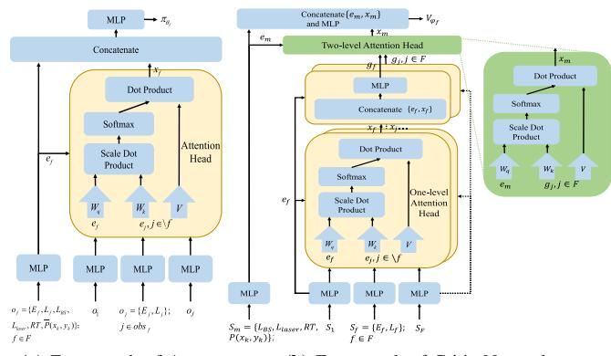  
Fig. 5. Framework of attention-based networks.

Traditional standard DNNs based on MLPs need to retain sufficient input dimensions to handle this dynamic change, and the neural network will need to be re-trained as UAV numbers increase or decrease, which has poor algorithmic scalability. We use a two-level multi-head attention mechanism to deal with changes in UAV numbers and improve our algorithm’s ability to understand and capture complex dependencies between agents. Fig. 5(a) shows the proposed actor network. In the figure, the local observation of agent $f$ can be divided into its own features $o _ { f }$ (including environmental features) and features $o _ { j }$ $( j \in O B S _ { f } )$ of other UAVs in its observation field OBS . We use MLPs to extract the two types of features $e _ { f }$ and $e _ { j }$ respectively, and send them to the multi-head attention head to obtain the attention value $x _ { f }$ . The actor’s single-level attention dynamically assigns weights to observable neighbors through the attention scores $\begin{array} { r } { \alpha _ { f , j } = S o f t m a x ( \frac { e _ { j } ^ { T } W _ { k } ^ { T } W _ { q } e _ { f } } { \sqrt { d _ { k } } } ) } \end{array}$ , enabling adaptive focus on critical agents for local decisions. The attention header output $\begin{array} { r } { \begin{array} { r } { x _ { f } = \sum _ { j \neq f , j \in O B S _ { f } } \alpha _ { f , j } W _ { v } e _ { j } } \end{array} } \end{array}$ contains highly relevant information about $\breve { f }$ itself and ignores irrelevant information, where $e _ { f }$ denotes the feature value of agent $f , W _ { k } , W _ { q }$ and $W _ { v }$ are weight matrixes of key, query and value, respectively. $d _ { k }$ is the key dimension. Finally, $x _ { f }$ is concatenated with $e _ { f }$ and sent to the MLP to obtain $f ^ { \ast } \mathrm { s }$ action probability distribution.

Fig. 5(b) shows the proposed critic network. The evaluation process of the state value network is summarized as follows: (1) Global state information is divided into environmental information $S _ { m }$ and information $S _ { f } ~ ( f \in F )$ of agent $f ,$ , and two types of features $e _ { m }$ and $e _ { f }$ are extracted separately by MLPs. $( 2 ) \ : e _ { f }$ $( f \in F )$ is sent to $| \dot { F } |$ one-level multi-head attention heads to separately extract the relevant information $x _ { f } \ ( f \in F )$ between each agent and the other agents. $e _ { f }$ and $x _ { f }$ are concatenated and sent to the MLPs to obtain the attention output vector gf $( f \in F ) . \ ( 3 ) \ e _ { m }$ and $g _ { f } \ ( f \in F )$ are sent to a two-level attention head to obtain the attention value $x _ { m } ,$ in order to extract the relevant information between the environmental state and all agents. This hierarchical design decouples the critic’s output dimension from the swarm size: A single-level critic would produce dimension-varying output tied to the initial UAV count (e.g., 3 UAVs generate 3×256 dimension features), which prevents cross-scale policy transfer. In contrast, our two-level critic structure compresses variable agents’ features into a fixed dimension (e.g., 256 dimensions) through environment-agent fusion (i.e., the second-level attention module), enabling scalable policy generalization. $( 4 ) e _ { m }$ and $x _ { m }$ are concatenated and sent to the MLP to obtain the final state value evaluation score. It is worth noting that we use a first-level attention head to extract the correlation between all agents (homogeneous agents), and a two-level attention head to extract the correlation between the environment state and agents (also called heterogeneous agents). Through the above network design, both the actor and critic networks are decoupled from the number of agents, so that they can both cope with changes in the number of dynamic agents.

Each UAV’s actor network output is a continuous fourdimensional distribution. When UAV number increases, the cooperative mode and the whole action space of UAVs in the search environment increase exponentially, which presents a serious challenge to optimal policy learning. To facilitate large-scale cooperative UAV search learning, we utilize the CL mechanism. CL advocates starting with the simplest scenario and then gradually increasing the difficulty of training to improve the final asymptotic performance or reduce the training time. Inspired by the fact that both our actor and critic networks support a dynamic number of agents, we first train the policies (including the actor network and the critic network) for the small-scale UAV cooperative search environment, and then load the trained actor and critic networks onto each UAV at the beginning of training for the large-scale scenario by using the model reload mechanism [41]. For instance, expanding the swarm from 3 to 10 UAVs requires no structural modifications. The critic’s second-level attention automatically adapts to aggregate varying agent features, while the actor’s local attention retains its neighbor-focused decision logic. In this way, the strategies and experience of small-scale UAV swarms can be reused and initialized by large-scale agent swarms with similar task scenarios, reducing policy learning difficulty in large-scale cooperation scenarios and accelerating algorithm convergence.

2) Beta Policy: As can be seen in Section IV-B, the actor network output is a 4-dimensional finite continuous distribution. Existing methods for processing continuous action space usually select actions by sampling from the unbounded Gaussian distribution. However, Gaussian distributions need forced truncation of values that exceed the action boundary, which introduces bias in policy gradients. In this paper, we use a bound Beta distribution for action sampling, which avoids boundary effects. The Beta distribution can be expressed as:

$$
\beta \left( x , \beta _ { 1 } , \beta _ { 2 } \right) = \frac { \Gamma ( \beta _ { 1 } + \beta _ { 2 } ) } { \Gamma ( \beta _ { 1 } ) \Gamma ( \beta _ { 2 } ) } x ^ { \beta _ { 1 } - 1 } ( 1 - x ) ^ { \beta _ { 2 } - 1 } ,\tag{47}
$$

where $\beta _ { 1 }$ and $\beta _ { 2 }$ are the Beta distribution parameters. $\Gamma ( x )$ is the Gamma function. Since the Beta distribution samples actions in the range , , we need to map the sampled actions back to the corresponding action intervals $( \mathrm { e . g . , 0 } \leq \rho _ { f } ^ { t } \leq \pi )$

03) HAB-MAPPO Training Process: HAB-MAPPO’s training process is shown in Algorithm 2. During the training phase, each UAV interacts with the environment as an agent and feeds local observation $o _ { f } ( t )$ into its policy network $\pi _ { \theta }$ f to determine its movement action and charging strategy $a _ { f } ( t )$ . Each UAV uses HODRA (Algorithm 1) to calculate its offloading strategy and computing resource allocation, and uses SFC to avoid flying out of the safe flight area. During environment state transition, UAVs with depleted energy $( E _ { f } ^ { t + \bar { 1 } } \leq 0 )$ terminate their episode participation immediately (line 14). The environment then generates a reward $r _ { f } ( t )$ and the next observation $o _ { f } ( t + 1 )$ . Then Algorithm 2 collects the trajectory $\tau$ at the end of an episode and calculates advantage estimates $\hat { A }$ and $\hat { V } _ { \psi }$ by τ . In lines 19 - 23, the Algorithm 2 updates policy networks and critic networks K times in sequence. In each network update, Algorithm 2 randomly selects a number of mini-batches from the replay buffer M, and minimizes the loss function of the two networks using Adam Optimizer with the sampled data. During the execution phase, each UAV uses its policy network, HODRA and SFC to adjust the flight trajectory, charging strategy, offloading, and computing resource allocation strategy in a distributed manner depending on its local observations.

Algorithm 2: Proposed HAB-MAPPO Training Algorithm.   
1: Initialize actor networks $\pi _ { \theta _ { f } }$ and critic networks $\overline { { V _ { \psi _ { f } } } }$ for   
all UAV $f \in F ;$   
2: Initialize replay buffer $M ,$ PPO epochs $K ,$ maximum   
episodes $E$ and episode length $T ;$   
3: for episode to E do   
= 14: Set replay buffer $M = \varnothing ;$   
=5: Initialize the search area and the target probability   
distribution map;   
6: Reset $\mathrm { U A V s } ^ { \prime }$ locations and energies;   
7: Initialize list $\tau = \left[ \right]$ to store the trajectory;   
8: for an episode $t = 1$ to T do   
9: for $f \in F$ do   
10: $P _ { t } ^ { f } \triangleq \pi _ { \theta _ { f } } ( o _ { f } ( t ) ) ;$   
11: Sample $a _ { f } ( t )$ from $P _ { t } ^ { f } \colon$   
12: ( ) Solve offloading policy and computation resource   
allocation problem by Algorithm 1;   
13: Execute action according to $a _ { f } ( t )$ , offloading   
policy and $\operatorname { S F C } ;$   
14: If $E _ { f } ^ { t + 1 } \leq 0 !$ terminate episode for UAV $f ;$   
15: 0Get the reward $r _ { f } ( t )$ and the next observation   
$o _ { f } ( t + 1 ) ;$   
16: $\tau + = [ \mathbf { o _ { t } } , \mathbf { a _ { t } } , s _ { t } , \mathbf { o _ { t + 1 } } , s _ { t + 1 } , \mathbf { r _ { t } } ] ;$   
17: =[ ] Compute advantage estimate A via GAE on $\tau$   
according to (42);   
18: Compute state value $\hat { V } _ { \psi }$ via advantage $\hat { A }$ on $\tau ;$   
19: Store $[ \mathbf { o _ { t } } , \mathbf { a _ { t } } , s _ { t } , \mathbf { o _ { t + 1 } } , s _ { t + 1 } , \mathbf { r _ { t } } , \hat { A } , \hat { V _ { \psi } } ]$ into $M ;$   
20: [for mini-batch $k = 0 , 1 , \ldots , K$ do   
21: = 0 1d ← random mini-batch from $M ;$   
22: Each UAV Adam update $\theta _ { f }$ on $\pi _ { \theta _ { f } }$ with data d   
according to (41);   
23: Each UAV Adam update $\psi _ { f }$ on $V _ { \psi _ { f } }$ with data d   
according to (40);

4) Overall Computational Complexity: The computational complexity of HAB-MAPPO consists of three components: (1) neural network operations for the actor and critic, (2) the HODRA algorithm, and (3) system-level training/inference workflows. For an actor network that processes observations from neighboring agents I, the complexity is defined as $C _ { a c t o r } = \mathcal { O } ( ( 1 + I ) ( Z _ { i n } Z _ { h i d } + Z _ { h i d } Z _ { e m b } ) + I Z _ { e m b } +$ $2 Z _ { e m b } Z _ { h i d } + Z _ { h i d } Z _ { o u t } )$ , where $Z _ { i n }$ (input dimension), $Z _ { h i d }$ + )(hidden layer dimension), $Z _ { e m b }$ (embedding dimension) and $Z _ { o u t }$ (action dimension) parameterize the network. This includes: (a) a two-layer MLP encoding the agent’s own state $( { \mathcal O } ( Z _ { i n } Z _ { h i d } + Z _ { h i d } Z _ { e m b } ) ) ;$ (b) parallel processing of I neighbor states via shared MLPs $( { \mathcal O } ( I ( Z _ { i n } Z _ { h i d } + Z _ { h i d } Z _ { e m b } ) ) ) ;$ (c) linear-scaling attention over neighbors $( \mathcal { O } ( I Z _ { e m b } ) )$ )); (d) action distribution generation $( \mathcal { O } ( 2 Z _ { e m b } Z _ { h i d } + Z _ { h i d } Z _ { o u t } ) )$ (2 + )The critic network handling |F | UAVs has complexity $C _ { c r i t i c } = \mathcal { O } = ( | F | ^ { 2 } Z _ { e m b } + | F | Z _ { e m b } + | F | ( Z _ { i n } ^ { a g e n t } Z _ { h i d } +$ $Z _ { h i d } Z _ { e m b } ) + 2 Z _ { e m b } Z _ { h i d } + Z _ { i n } ^ { e n v } Z _ { h i d } + Z _ { h i d } Z _ { e m b } + Z _ { h i d } )$ dominated by the first-level agent-agent attention term $\mathcal { O } ( | F | ^ { 2 } Z _ { e m b } )$ [42]. The HODRA algorithm achieves $C _ { H O D R A } = \mathcal { O } ( S \log S )$ complexity primarily from sorting operations, where S is the number of sub-observation images. The overall complexity of the training is $\mathcal { O } ( E [ T \vert F \vert ( C _ { a c t o r } +$ $C _ { H O D R A } ) + K ( \beta _ { 1 } | F | C _ { a c t o r } + \beta _ { 2 } C _ { c r i t i c } ) ] )$ with E training )episodes, $T$ ( + )])steps per episode, K PPO epochs, $\beta _ { 1 }$ is the complex backward pass to forward pass ratio for actor networks (typically positive integer multiple forward pass), and $\beta _ { 2 }$ is the corresponding ratio for critic networks. During inference, each UAV’s per-step complexity reduces to $C _ { a c t o r } + C _ { H O D R A }$

## V. SIMULATION RESULTS

## A. Simulation Setup

Our simulation considers a target search area of 100 m × 100m, which is discretised into 50 × 50 map grids. The amount of detection data in each grid obeys the normal distribution. The safe flight altitude range of each UAV is 20m - 50m. The local observation field of view of each UAV is square, and the UAV field of view angle is $4 5 ^ { \circ }$ . The BS base station is located at the centre of the search area , , and a laser charger is located at the boundary of the search area , , . The maximum number of simulation time slots for each episode is 100. During each time slot, each UAV’s maximum speed is 14 m/s. We randomly set the number of UAVs. The UAV’s initial energy is set to the UAV’s maximum energy. Based on existing works [29], [39], [43], we set parameters for the search environment as shown in Table I. In each simulation episode, the number of targets is uniformly distributed over , , and their spatial positions follow a uniform random distribution across the search area.

## B. Comparison Algorithms

We use the following baseline algorithms for evaluation.

\- MASAC [44]: An offline multi-agent reinforcement learning algorithm based on soft actor-critic, which also adopts a centralized training and decentralized execution architecture and uses the idea of maximizing entropy to optimize the strategy.

\- Discrete [6]: A DQN-based trajectory design method, using two-dimensional discrete action space (north, northeast, east, southeast, south, southwest, west, northwest) and fixed-height search to model UAV trajectory, the heuristic-based offloading strategy and attention-based actor and critic networks.

TABLE I SIMULATION PARAMETERS
<table><tr><td rowspan=1 colspan=1>Parameter</td><td rowspan=1 colspan=1>Value</td></tr><tr><td rowspan=1 colspan=1> $\omega , \eta , \beta _ { L o S } , \beta _ { N L o S }$ </td><td rowspan=1 colspan=1>11.95, 0.14, -40 dB, -30 dB</td></tr><tr><td rowspan=1 colspan=1> $\underline { { \alpha _ { L o S } , \alpha _ { N L o S } } } , \sigma _ { L o S } ^ { 2 } , \sigma _ { N L o S } ^ { 2 }$ </td><td rowspan=1 colspan=1>2.27, 3.64, 6 dB, 9 dB</td></tr><tr><td rowspan=1 colspan=1> $\sigma _ { w } ^ { 2 } , B , P T _ { m a x } ^ { f }$ </td><td rowspan=1 colspan=1>-127 dBm, 0.1 MHz, 40 dBm</td></tr><tr><td rowspan=1 colspan=1> $P _ { a } , P _ { b } , u _ { t i p } , v _ { a }$ </td><td rowspan=1 colspan=1>39.04 W, 79.07 W, 120 m/s, 7.2 m/s</td></tr><tr><td rowspan=1 colspan=1> $\kappa , f _ { a } , \tau _ { a }$ </td><td rowspan=1 colspan=1>1.225 kg/m3, 0.05 m2, 0.0955</td></tr><tr><td rowspan=1 colspan=1> $A , F R _ { m a x } ^ { f } , \wp$ </td><td rowspan=1 colspan=1>0.5030 m2, 1e9, 13e5</td></tr><tr><td rowspan=1 colspan=1> $P F _ { L _ { z } ^ { m i n } } , P F _ { L _ { z } ^ { m a x } } , P T _ { f , f ^ { \prime } }$ </td><td rowspan=1 colspan=1>0.5, 0.9, 40 dBm</td></tr><tr><td rowspan=1 colspan=1> $\epsilon _ { e } , P L _ { 1 } , G , \tau$ </td><td rowspan=1 colspan=1>0.8, 200 W, 0.01 m2, 0.95</td></tr><tr><td rowspan=1 colspan=1> $\varrho , \phi , F , \xi , w _ { 1 }$ </td><td rowspan=1 colspan=1>0.2, 1e-6, 0.05, 3.4e-5, 0.01</td></tr><tr><td rowspan=1 colspan=1> $\overline { { T _ { t } ^ { F } , T _ { t } ^ { O } , C R , w _ { 2 } } }$ </td><td rowspan=1 colspan=1>0.3 s, 1.7 s, 100, 0.99</td></tr><tr><td rowspan=1 colspan=1> $\underline { { L _ { x } , L _ { y } , R _ { W H } ^ { f } } }$ </td><td rowspan=1 colspan=1>100 m, 100 m, 1</td></tr><tr><td rowspan=1 colspan=1> $\overline { { N _ { x } , N _ { y } , \kappa _ { f } , E _ { f } ^ { m a x } } }$ </td><td rowspan=1 colspan=1> $5 0 , 5 0 , 1 \times 1 0 ^ { - 2 4 } ,$ 22000 joules</td></tr><tr><td rowspan=1 colspan=1> $\overline { { L _ { z } ^ { m i n } , L _ { z } ^ { m a x } , F O V _ { f } } }$ </td><td rowspan=1 colspan=1> $\overline { { 2 0 \mathrm { ~ m } , 5 0 \mathrm { ~ m } , 4 5 ^ { \circ } } }$ </td></tr><tr><td rowspan=1 colspan=1> $v _ { f } ^ { m a x } , L _ { s } , S N R _ { t h r }$ </td><td rowspan=1 colspan=1>10 m/s, 10 m, 15 dB</td></tr></table>

\- AM-MAPPO∗ [7]: A multi-UAV high-low altitude collaborative search scheme, combining a field-of-view-based coded state representation with the MAPPO algorithm, where multiple UAVs fly at different altitudes on different horizontal planes. Unlike the original AM-MAPPO algorithm, we further convert the two-dimensional discrete action space of the UAV into a continuous action space called AM-MAPPO∗ to improve UAV search performance.

\- Wo-Attention: Wo-Attention has heuristic offloading and computing resource allocation strategies and action distributions based on beta distribution, but does not use the attention mechanism.

\- Normalized: Using heuristic-based image offloading and computing resource allocation, attention-based actor and critic networks, and a Gaussian distribution based distribution of actions.

\- Wo-SFC: Using heuristic offloading strategies and attention-based policy networks, but punishing the UAV for crossing boundaries with negative reward values instead of the safe flying controller.

\- Randomized (baseline): Using heuristic offloading and computing resource allocation strategies, selecting UAV movement trajectory and charging strategy randomly.

## C. Convergence of Different Algorithms

Fig. 6 shows how search uncertainty and target discovery rates evolve with increasing training steps across algorithms. All methods gradually converge, with HAB-MAPPO achieving superior performance: at 800,000 steps, it attains the lowest information uncertainty (0.28) and highest target discovery proportion (0.76). This represents significant improvements over key baselines - reducing uncertainty by 30% against AM-MAPPO∗ (0.40), 42% against Discrete (0.48), and 64% against

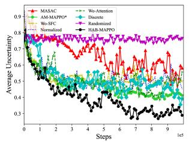  
(a) Average uncertainty with training steps.

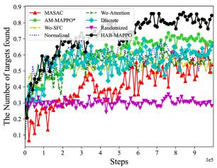  
(b) Number of targets found with training steps.  
Fig. 6. Convergence of different algorithms.

Randomized (0.76), while increasing target discoveries by 15%, 26%, and 162% respectively.

The experimental results indicate the following conclusions: (1) Randomized is the poorest of all algorithms. Its algorithm performance does not change with the increase in training steps, which reversely shows that learning-based algorithms can dynamically improve algorithm performance through con stant interaction with the environment. (2) The performance of MASAC (off-policy) is higher than that of Randomized, but lower than that of other on-policy (e.g., MAPPO-based) algorithms, suggesting that off-policy algorithms generally perform inferiorly in UAV swarm-based search environments than on-policy algorithms. The reason for this phenomenon is that the UAV swarm collaborative search scenario faces a huge and complex state and action space. In this situation, with the policy clip mechanism, the on-policy algorithm can limit the magnitude of policy updates, making training processes more stable than off-policy algorithms and ensuring that policy updates proceed in the optimal direction, facilitating agent learning. (3) The Normalized algorithm, which fits policy output based on a Normal distribution, needs to truncate actions that exceed the range limit of the activation function tanh, while HAB-MAPPO which is based on the Beta distribution avoids performance degradation by mapping the whole action space completely to [0, 1]. (4) HAB-MAPPO upgrades the two-dimensional discrete action space of the Discrete algorithm to a three-dimensional continuous action space, and incorporates the changing relationship between UAV sensor fidelity and its altitude into the search model, which can greatly improve the fine-grained action control of UAV cooperative search and help the agent explore a better motion trajectory with fine granularity. (5) AM-MAPPO∗ deploys different UAVs at different discrete altitudes, which improves performance compared to Discrete at a fixed altitude. HAB-MAPPO further expands into the continuous-altitude space, achieving an optimal balance between the search field of view and sensor accuracy and achieving better performance. (6) Compared to Wo-SFC, HAB-MAPPO indirectly prolongs the UAV search time by using a safe flying controller to prevent the UAV from exploring beyond the boundary, thereby achieving better search performance. (7) HAB-MAPPO performs better than Wo-Attention, which does not use the attention mecha nism. The reason is that by adding the attention module to the policy network and value network, each UAV can focus more effectively on key information in the environment and filter out information irrelevant to the agent itself, thereby improving learning efficiency and performance.

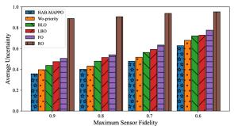  
(a) Average uncertainty under  
different sensor fidelities.  
Fig. 7. Offloading policies under different sensor fidelities.

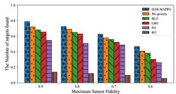  
(b) Number of targets found under different sensor fidelities.

## D. Comparison of Offloading Policies

We consider the following schemes as benchmarks:

\- Random Offloading (RO): This scheme randomly determines the offloading location of each sub-observation image from the UAV observation area and randomly allocates computing resources.

Fixed Offloading (FO): This scheme randomly determines the offloading location of each sub-observation image from the UAV observation area, and assigns a fixed computing frequency or transmission power to each sub-observation image as [6].

\- Local-BS Offloading (LBO): This scheme offloads each sub-observation image to the UAV local with preference. When the UAV local computing frequency allocation exceeds the quota, this scheme offloads the corresponding sub-observation image to the BS. To meet the computing delay, each sub-observation image is assigned a minimum required computing frequency or transmission power.

\- BS-Local Offloading (BLO): This scheme offloads each sub-observation image to the remote BS with preference. When the BS transmission power exceeds the maximum UAV transmission power, the corresponding subobservation image is offloaded to the UAV locally. To meet computational latency, each sub-observation image is assigned a minimum required transmission power or computing frequency.

Wo-priority: This scheme uses Heuristic-based Offloading Decisions and Resource Allocation (HODRA), which includes an energy-saving offloading strategy, but does not have task priority awareness based on information entropy reduction and the average target existence probability (i.e., without the CALCIEC ok function in Algorithm 1).

Fig. 7 shows the average information uncertainty and the proportion of discovered targets for various offloading strategies when maximum sensor search fidelity changes. HAB-MAPPO obtains the lowest information uncertainty and the highest number of discovered targets, which verifies the effectiveness of our proposed HODRA. Moreover, as the maximum sensor search fidelity decreases, the performance of all algorithms decreases. For example, when the maximum sensor search confidence is 0.9, the information uncertainty of HAB-MAPPO, Wo-priority,

BLO, LBO, FO and RO is 0.35, 0.39, 0.43, 0.47, 0.50 and 0.88, respectively. The proportion of targets discovered is 0.78, 0.72, 0.68, 0.65, 0.54 and 0.13, respectively. Compared with other algorithms, HAB-MAPPO reduces map information uncertainty by 11%, 19%, 26%, 30%, 61%, and increases the number of targets found by 8%, 14%, 20%, 44%, 78% and 500%, respectively.

Among the five offloading strategies, RO performs the worst because it cannot take advantage of search task characteristics. The FO algorithm, which is based on fixed calculation resource allocation, cannot adaptively allocate an appropriate amount of calculation resources to the search image, resulting in its low algorithm performance. Both BLO and LBO can effectively utilize the search task’s data volume and calculation frequency. They further improve offloading efficiency by adaptively allocating calculation frequency and transmission power compared to FO. However, they uniformly offload all sub-observation images to the UAV local or remote BS (i.e., fixed-location offloading), neither comparing the energy consumption of different offloading locations. HAB-MAPPO’s effectiveness lies in its energyaware design: for each task, it dynamically selects an offloading location (local UAV or base station) with minimal energy consumption, allocates appropriate computational frequencies or transmission power to satisfy delay requirements, and avoids unnecessary UAV energy waste. Given the limited on-board energy of UAVs, reducing the average energy consumed per task allows offloading more number of tasks within the total energy budget, thus achieving lower information uncertainty and a higher proportion of targets discovered. In addition, HAB-MAPPO proposes to intelligently prioritize image offloading by the degree of decrease in information entropy before and after offloading and the probability of target existence, and therefore has better performance than Wo-priority.

Fig. 8(a) demonstrates that HAB-MAPPO achieves the lowest information uncertainty across training steps compared to benchmark algorithms, confirming its superior search performance. This advantage stems from its energy-efficient design, evidenced in Fig. 8(b). In Fig. 8(b), our algorithm consumes the least energy per unit information entropy reduction due to its dynamic selection of optimal offloading locations (UAV or BS) to minimize energy expenditure. Notably, RO’s curve is omitted in Fig. 8(b) due to its significantly higher energy consumption, approximately an order of magnitude above the others. The advantage also arises from HAB-MAPPO’s high task offloading success rate, shown in Fig. 8(c), where it maintains the highest rate of approximately 80% . Here, each task corresponds to the search of one map grid. Our algorithm achieves this by adaptively allocating CPU frequencies and transmission powers to meet task latency constraints, a capability lacking in baseline approaches: for example, FO uses fixed CPU frequencies causing energy waste or missed task deadlines, BLO employs static offloading strategies leading to suboptimal decisions, and LBO causes computational resource contention through greedy local offloading. Fig. 8(d), (e), and (f) provide a temporal analysis specifically for HAB-MAPPO during a complete search mission. Fig. 8(d) tracks HAB-MAPPO’s task offloading success rate and energy consumption for task offloading per time slot, with charging periods marked by green stars indicating energy replenishment. Fig. 8(e) visualizes HAB-MAPPO’s dynamic offloading location decisions, showing the distribution between UAV local and BS-based computation across time slots. Fig. 8(f) details HAB-MAPPO’s resource allocation patterns, including CPU frequency assignments for local processing and transmission power allocations for BS offloading at each time step. Collectively, these three figures demonstrate HAB-MAPPO’s coherent real-time optimization of all critical decision variables during mission execution.

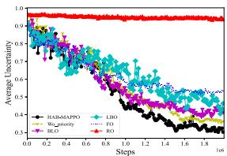  
(a) Average uncertainty.

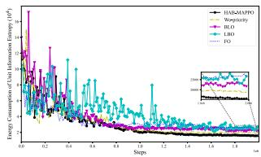  
(b) Energy consumption.

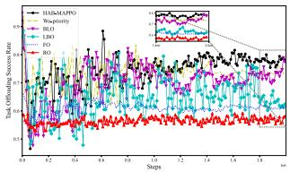  
(c) Task offloading success rate.

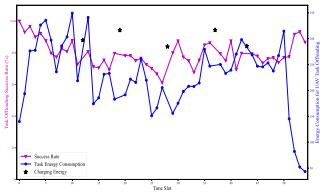  
(d) Task offloading success rate and energy consumption

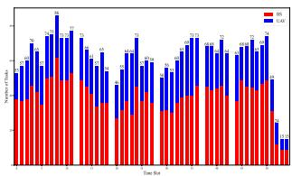  
(e) Task offloading location.

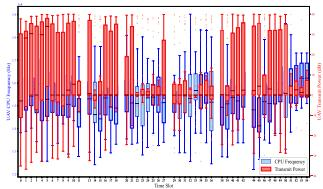  
(f) Computational resource allocation

Fig. 8. Task offloading related metrics.  
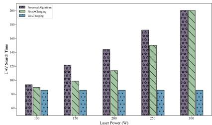  
Fig. 9. Total UAV service time with different laser power.

## E. Algorithm Performance of Different Simulation Parameters

Fig. 9 illustrates UAV search times under varying laser charging power (100-300 W) for a 200-second mission. As laser charging power increases, both charging strategies (Proposed Algorithm and Fixed-Charging) exhibit extended UAV search times. The Proposed Algorithm proactively optimizes UAV charging timing through neural network decisions, achieving the longest durations among different algorithms. Without charging (Wo-Charging) the search time remains constant at 86 s due to zero UAV energy replenishment. The Fixed-Charging strategy (triggering charging only when energy drops below a preset threshold) extends search time by 32% over Wo-Charging at 200 W, but is consistently outperformed by the Proposed Algorithm, which delivers 26% longer UAV search time than Fixed-Charging through adaptive charging decisions and energy management. These results confirm that neural-based charging decisions can maximally extend UAV search time.

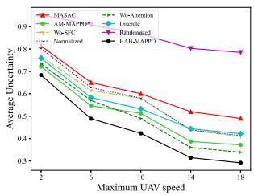  
(a) Average uncertainty

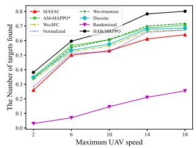  
(b) Number of targets found.

Fig. 10. Algorithm performance at different UAV speeds.  
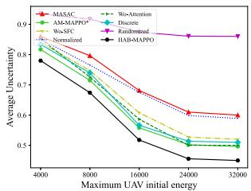  
(a) Average uncertainty

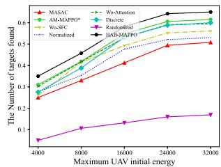  
(b) Number of targets found.  
Fig. 11. Algorithm performance under different UAV energies.

Fig. 10 demonstrates HAB-MAPPO’s consistent superiority in minimizing average uncertainty and maximizing target detection across varying UAV speeds. At 18 m/s, it achieves 14% -63% lower uncertainty and 11% -214% higher detection than benchmarks. Performance improves across all algorithms with increasing speed due to enhanced UAV mobility enabling broader area coverage.

Fig. 11 shows the average uncertainty and target discovery ratio of different algorithms as the UAV’s initial energy increases. When the initial energy of the UAV is small, search performance increases significantly with the increase in the initial energy of the UAV. This is due to the fact that more on-board energy allows the UAV to search for a longer period of time and to consume more energy to fly to cells with higher uncertainty and to perform more search tasks, thus greatly improving the quality of the search. When the UAV has an initial energy of more than 24000 joules, it is apparent that a further increase in on-board energy will not significantly improve search efficiency. The reason for this is that the UAV has a limited maximum search time, so it cannot utilize excess on-board energy to continue its search. This finding shows that, given a limited maximum search time, once effective search performance has been achieved, increasing on-board energy will not result in a significant improvement in search performance.

To evaluate HAB-MAPPO’s scalability, we tested swarm sizes from 2 to 6 UAVs flying at 10 m/s, taking off from random horizontal positions at 20 m altitude. As shown in Fig. 12, our algorithm consistently outperforms benchmarks across swarm sizes. For 5 UAVs, HAB-MAPPO reduces uncertainty by 23% and increases target detection by 13% versus Discrete, attributable to its 3D continuous action space versus Discrete’s limited 8-direction 2D movement. Performance improves with more UAVs through cooperative uncertainty reduction in highentropy areas, though with diminishing returns: expanding from 4 to 5 UAVs yields 9% more targets found, while 5 to 6 UAVs gives only 3% additional gain. This indicates optimal resource allocation thresholds where extra UAVs provide minimal benefit. Crucially, our two-level attention enables real-time swarm scaling (e.g., adding/reducing UAVs) without retraining.

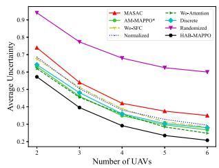  
(a) Average uncertainty.

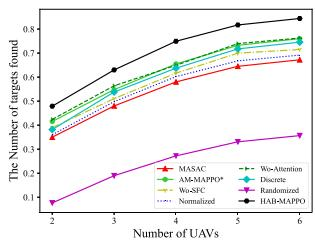  
(b) Number of targets found.  
Fig. 12. Algorithm performance under different UAV numbers.

## F. Snapshot of UAV Search Simulation

To further demonstrate cooperative UAV swarm search, Fig. 13 shows flight trajectories and information uncertainty heatmaps. Specifically, Fig. 13(a) and (d) show the UAV flight trajectory diagram and the target distribution in the search area, where targets of different colors represent those discovered by different UAVs, and black represents targets that have not yet been discovered. Fig. 13(b) and (e) show heat maps of the updated range of the search area information uncertainty for different UAVs. Fig. 13(c) and (f) show the heat maps of the target existence probability in the entire search area. Fig. 13(a)–(c) present three UAVs flying at a maximum speed of 14 m/s from central take-off positions over 100 time steps, achieving 75% target detection rate with 0.36 search uncertainty. Fig. 13(d)–(f) show five UAVs taking off randomly at 20 m altitude, reaching 91% detection rate and 0.22 uncertainty, which proves that appropriately increasing the number of UAVs can improve search performance.

As can be seen from the UAV search trajectory figures (Fig. 13(a) and (c)), the UAVs start at different positions and first attempt to increase their altitudes to obtain a larger sensor search area. When the UAV rises to a certain altitude, the UAV hovers along a horizontal route near that altitude to perform the search task. The trajectory of the UAVs does not collide. Each UAV moves in a curved path in an approximate horizontal plane perpendicular to the height direction rather than in a straight line. This indicates that each agent tries to reduce map uncertainty by covering as large a search area projection as possible. From the heat maps of UAVs’ contribution to search area information uncertainty (Fig. 13(b) and (e)), it can be seen that under different numbers of UAVs, takeoff locations, and target distributions,

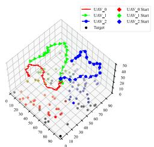  
(a) 3 UAVs' trajectories, where targets of different colors represent those discovered by different UAVs, and black represents undetected targets.

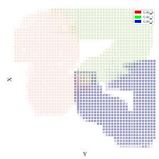  
(b) Different UAVs’ contribution tc reduce search area information uncertainty, where different colors represent different UAVs.

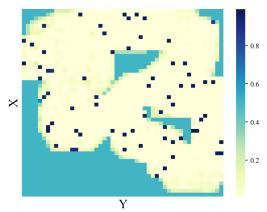  
(c) Search area target existence probability map, where the darker the map grid color, the more likely the target exists.

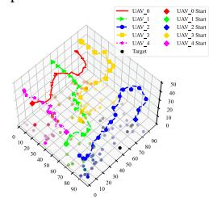  
(d) 5 UAVs' trajectories

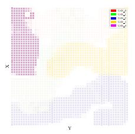  
(e) Different UAVs’ contribution to reduce search area information uncertainty.

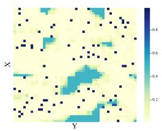  
(f) Search area target existence probability map.  
Fig. 13. Snapshot of UAV search using HAB-MAPPO.

UAVs exhibit a clear cooperative partitioned search pattern: each UAV is mainly responsible for an area and moves above that area. This spatial self-organization and emergent behavior emerges from local interactions (attention-based neighbor observation and collision avoidance) without global coordination, demonstrating swarm intelligence through decentralized task allocation. The dynamic adjustment of partition boundaries in heat maps (Fig. 13(b) and (e)) reflect the algorithm’s adaptability to different UAV numbers, take-off locations, and target distribution changes. In Fig. 13(c) and (f), the target existence probabilities of most map grids in the search area are either approach 0 (indicating no target found) or approach 1 (indicating a target exists), and the entire search area’s information uncertainty (i.e., information entropy) is low. This verifies HAB-MAPPO’s overall effectiveness in UAV cooperative search.

## G. Curriculum Learning for Large-Scale UAV Swarms

Fig. 14 shows the performance of HAB-MAPPO based on CL. We first train the actor and critic networks in a small swarm of 3 UAVs, called Vanilla-3. Then, the Vanilla-3 trained networks are used to initialize agent training in an 8-UAV cooperative search scenario (called Vanilla-8-CL) through the model reload mechanism. Furthermore, we reload the Vanilla-8-CL actor and critic networks to train Vanilla-11-CL (i.e., an 11-UAV cooperative search scenario). To compare the effect of CL, we perform orthogonal initialization on the neural networks of the UAV swarm with a swarm size of 8 and 11, and train them to obtain performance curves for Vanilla-8 and Vanilla-11, respectively. Key experimental findings reveal: 1) Zero-shot policy transfer: Direct deployment of the 8-UAV trained policy (Vanilla-8-CL) in the 11-UAV scenario (Vanilla-11-CL initial state, 0 training steps) reduces search uncertainty by 56% (form 0.86 to 0.4) compared to orthogonal initialization (Vanilla-11 in Fig. 14(a)). 2) CL-driven optimization: A RL-based progressive fine-tuning of Vanilla-11-CL further decreases uncertainty from 0.4 to 0.3 (25% improvement), while the orthogonal-initialized Vanilla-11 fails to converge due to high-dimensional state-action space complexity (Vanilla-11’s curve in Fig. 14(a)). These results validate two core capabilities: 1) Architectural native scalability: the attention mechanism supports the deployment of strategies of any swarm size through dynamic weight allocation, without the need to manually adjust the network structure, and 2) incremental optimization efficiency: the model reload mechanism and curriculum learning can reduce the cost of repeated exploration in large-scale scenarios by enabling pre-training on a small scale to fine-tuning on a large scale.

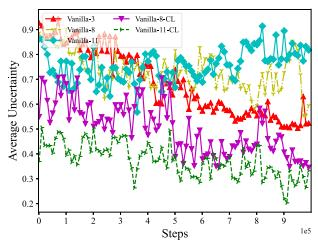  
(a) Average uncertainty.  
Fig. 14. Performance of HAB-MAPPO based on CL.

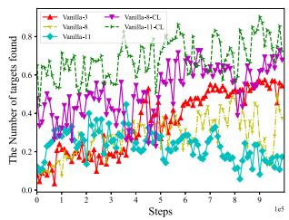  
(b) Number of targets found.

## VI. CONCLUSION

This paper studies the problem of cooperative search in a three-dimensional continuous space for UAV swarms. To reduce search area uncertainty and improve the target discovery ratio, we jointly optimize UAV trajectory, charging decisions, searching task offloading, and computing resource allocation. We formulate the problem as Dec-POMDP and propose a heuristic-based MADRL algorithm. The heuristically embedded MADRL algorithm reduces the action space dimension through an energy-efficient task offloading and computational resource allocation strategy, and effectively obtains the optimal flying trajectory and charging strategy by using a MAPPO algorithm with a two-level attention mechanism, a Beta distribution and a safe flying control strategy. Two-level attention is capable of handling UAV partial observability and dynamically sized agent networks and significantly enhances algorithm performance and generalization. Through the CL mechanism, we extend our algorithm to large-scale cooperative search scenarios. Simulation results show that compared with other benchmarks, our method can significantly reduce search area uncertainty and improve the target discovery rate. Our current target search framework focuses on static targets. In the future, we plan to extend it to dynamic target scenarios through a hierarchical “search-to-monitor” process: first locate moving ground targets (e.g., locate survivors in a disaster area using thermal imaging), and then maintain persistent tracking and monitoring (e.g., track the movement of survivors to guide rescue operations).

## REFERENCES

[1] B. Fei, W. Bao, X. Zhu, D. Liu, T. Men, and Z. Xiao, “Autonomous cooperative search model for multi-UAV with limited communication network,” IEEE Internet Things J., vol. 9, no. 19, pp. 19346–19361, Oct. 2022.

[2] B. Zhang, X. Lin, Y. Zhu, J. Tian, and Z. Zhu, “Enhancing multi-UAV reconnaissance and search through double critic DDPG with belief probability maps,” IEEE Trans. Intell. Veh., vol. 9, no. 2, pp. 3827–3842, Feb. 2024.

[3] H. Guo, X. Chen, X. Zhou, and J. Liu, “Trusted and efficient task offloading in vehicular edge computing networks,” IEEE Trans. Cogn. Commun. Netw., vol. 10, no. 6, pp. 2370–2382, Dec. 2024.

[4] J. Ni, G. Tang, Z. Mo, W. Cao, and S. X. Yang, “An improved potential game theory based method for multi-UAV cooperative search,” IEEE Access, vol. 8, pp. 47787–47796, 2020.

[5] Y. Hou, J. Zhao, R. Zhang, X. Cheng, and L. Yang, “UAV swarm cooperative target search: A multi-agent reinforcement learning approach,” IEEE Trans. Intell. Veh., vol. 9, no. 1, pp. 568–578, Jan. 2024.

[6] Q. Luo, T. H. Luan, W. Shi, and P. Fan, “Deep reinforcement learning based computation offloading and trajectory planning for multi-UAV cooperative target search,” IEEE J. Sel. Areas Commun., vol. 41, no. 2, pp. 504–520, Feb. 2023.

[7] Y. Liu et al., “Reinforcement-learning-based multi-UAV cooperative search for moving targets in 3D scenarios,” Drones, vol. 8, 2024, Art. no. 378.

[8] Y.-C. Du, M.-X. Zhang, H.-F. Ling, and Y.-J. Zheng, “Evolutionary planning of multi-UAV search for missing tourists,” IEEE Access, vol. 7, pp. 73480–73492, 2019.

[9] H. Duan, J. Zhao, Y. Deng, Y. Shi, and X. Ding, “Dynamic discrete Pigeoninspired optimization for multi-UAV cooperative search-attack mission planning,” IEEE Trans. Aerosp. Electron. Syst., vol. 57, no. 1, pp. 706–72, Feb. 2021.

[10] X. Zhang and M. Ali, “A bean optimization-based cooperation method for target searching by swarm UAVs in unknown environments,” IEEE Access, vol. 8, pp. 43850–43862, 2020.

[11] W. Yue, W. Tang, and L. Wang, “Multi-UAV cooperative anti-submarine search based on a rule-driven MAC scheme,” Appl. Sci., vol. 12, 2022, Art. no. 5707.

[12] M. D. Phung and Q. P. Ha, “Motion-encoded particle swarm optimization for moving target search using UAVs,” Appl. Soft Comput., vol. 97, 2020, Art. no. 106705.

[13] P. Yan, T. Jia, and C. Bai, “Searching and tracking an unknown number of targets: A learning-based method enhanced with maps merging,” Sensors, vol. 21, 2021, Art. no. 1076.

[14] G. Shen, L. Lei, X. Zhang, Z. Li, S. Cai, and L. Zhang, “Multi-UAV cooperative search based on reinforcement learning with a digital twin driven training framework,” IEEE Trans. Veh. Technol., vol. 72, no. 7, pp. 8354–8368, Jul. 2023.

[15] X. Cao et al., “Multi-agent target search strategy optimization: Hierarchical reinforcement learning with multi-criteria negative feedback,” Appl. Soft Comput., vol. 149, 2023, Art. no. 110999.

[16] J. Zheng, M. Ding, L. Sun, and H. Liu, “Distributed stochastic algorithm based on enhanced genetic algorithm for path planning of multi-UAV cooperative area search,” IEEE Trans. Intell. Transp. Syst., vol. 24, no. 8, pp. 8290–8303, Aug. 2023.

[17] P. Yao, Q. Zhu, and R. Zhao, “Gaussian mixture model and self-organizing map neural-network-based coverage for target search in curve-shape area,” IEEE Trans. Cybern., vol. 52, no. 5, pp. 3971–3983, May 2022.

[18] H. Guo, Y. Wang, J. Liu, and C. Liu, “Multi-UAV cooperative task offloading and resource allocation in 5G advanced and beyond,” IEEE Trans. Wireless Commun., vol. 23, no. 1, pp. 347–359, Jan. 2024.

[19] D. S. Lakew, A.-T. Tran, N.-N. Dao, and S. Cho, “Intelligent offloading and resource allocation in heterogeneous aerial access IoT networks,” IEEE Internet Things J., vol. 10, no. 7, pp. 5704–5718, Apr. 2023.

[20] P. Qin, Y. Fu, Y. Xie, K. Wu, X. Zhang, and X. Zhao, “Multi-agent learning-based optimal task offloading and UAV trajectory planning for agin-power IoT,” IEEE Trans. Commun., vol. 71, no. 7, pp. 4005–4017, Jul. 2023.

[21] X. Li, X. Du, N. Zhao, and X. Wang, “Computing over the sky: Joint UAV trajectory and task offloading scheme based on optimization-embedding multi-agent deep reinforcement learning,” IEEE Trans. Commun., vol. 72, no. 3, pp. 1355–1369, Mar. 2024.

[22] H. Hao, C. Xu, W. Zhang, S. Yang, and G. -M. Muntean, “Joint task offloading, resource allocation, and trajectory design for multi-UAV cooperative edge computing with task priority,” IEEE Trans. Mob. Comput., vol. 23, no. 9, pp. 8649–8663, Sep. 2024.

[23] H. Guo, X. Zhou, J. Wang, J. Liu, and A. Benslimane, “Intelligent task offloading and resource allocation in digital twin based aerial computing networks,” IEEE J. Sel. Areas Commun., vol. 41, no. 10, pp. 3095–3110, Oct. 2023.

[24] H. Li, S. Wu, J. Jiao, X. -H. Lin, N. Zhang, and Q. Zhang, “Energy-efficient task offloading of edge-aided maritime UAV systems,” IEEE Trans. Intell. Veh., vol. 72, no. 1, pp. 1116–1126, Jan. 2023.

[25] Q. Luo, T. H. Luan, W. Shi, and P. Fan, “Edge computing enabled energyefficient multi-UAV cooperative target search,” IEEE Trans. Intell. Veh., vol. 72, no. 6, pp. 7757–7771, Jun. 2023.

[26] Y. Zhang, Z. Kuang, Y. Feng, and F. Hou, “Task offloading and trajectory optimization for secure communications in dynamic user multi-UAV MEC systems,” IEEE Trans. Mob. Comput., vol. 23, no. 12, pp. 14427–14440, Dec. 2024.

[27] S. Minaee, Y. Boykov, F. Porikli, A. Plaza, N. Kehtarnavaz, and D. Terzopoulos, “Image segmentation using deep learning: A survey,” IEEE Trans. Pattern Anal. Mach. Intell., vol. 44, no. 7, pp. 3523–3542, Jul. 2022.

[28] M. Pak and S. Kim, “A review of deep learning in image recognition,” in Proc. 4th Int. Conf. Comput. Appl. Inf. Process. Technol., 2017, pp. 1–3.

[29] C. Lei, S. Wu, Y. Yang, J. Xue, and Q. Zhang, “Joint trajectory and communication optimization for heterogeneous vehicles in maritime SAR: Multi-agent reinforcement learning,” IEEE Trans. Veh. Technol., vol. 73, no. 9, pp. 12328–12344, Sep. 2024.

[30] Z. Ning, Y. Yang, X. Wang, Q. Song, L. Guo, and A. Jamalipour, “Multiagent deep reinforcement learning based UAV trajectory optimization for differentiated services,” IEEE Trans. Mob. Comput., vol. 23, no. 5, pp. 5818–5834, May 2024.

[31] O. Esrafilian, H. Bayerlein, and D. Gesbert, “Model-aided deep reinforcement learning for sample-efficient UAV trajectory design in IoT networks,” in Proc. 2021 IEEE Glob. Commun. Conf., 2021, pp. 1–6.

[32] A. Symington, S. Waharte, S. Julier, and N. Trigoni, “Probabilistic target detection by camera-equipped UAVs,” in Proc. 2010 IEEE Int. Conf. Robot. Automat., 2010, pp. 4076–4081.

[33] S. Waharte and N. Trigoni, “Supporting search and rescue operations with UAVs,” in Proc. 2010 Int. Conf. Emerg. Secur. Technol., 2010, pp. 142–147.

[34] E. Seifert et al., “Influence of drone altitude, image overlap, and optical sensor resolution on multi-view reconstruction of forest images,” Remote Sens., vol. 11, 2019, Art. no. 1252.

[35] Z. Zhang, C. Xu, Z. Li, X. Zhao, and R. Wu, “Deep reinforcement learning for aerial data collection in hybrid-powered noma-IoT networks,” IEEE Internet Things J., vol. 10, no. 2, pp. 1761–1774, Jan. 2023.

[36] L. Dong, F. Jiang, and Y. Peng, “Attention-based UAV trajectory optimization for wireless power transfer-assisted IoT systems,” IEEE Trans. Ind. Electron., vol. vol. 72, no. 8, pp. 8463–8471, Aug. 2025, 2025.

[37] Z. Gao, J. Fu, Z. Jing, Y. Dai, and L. Yang, “MOIPC-MAAC: Communication-assisted multi-objective marl for trajectory planning and task offloading in multi-UAV assisted MEC,” IEEE Internet Things J., vol. 11, no. 10, pp. 18483–18502, May 2024.

[38] D. Killinger, “Free space optics for laser communication through the air,” Opt. Photon. News, no. 10, pp. 36–42, 2002.

[39] X. Hu, K.-K. Wong, and Y. Zhang, “Wireless-powered edge computing with cooperative UAV: Task, time scheduling and trajectory design,” IEEE Trans. Wireless Commun., vol. 19, no. 12, pp. 8083–8098, Dec. 2020.

[40] X. Wang, J. Li, Z. Ning, Q. Song, L. Guo, and A. Jamalipour, “Wireless powered metaverse: Joint task scheduling and trajectory design for multidevices and multi-UAVs,” IEEE J. Sel. Areas Commun., vol. 42, no. 3, pp. 552–569, Mar. 2024.

[41] W. Wang et al., “From few to more: Large-scale dynamic multiagent curriculum learning,” in Proc. AAAI Conf. Artif. Intell., 2020, vol. 34, pp. 7293–7300.

[42] Z. Gao, L. Yang, and Y. Dai, “Large-scale computation offloading using a multi-agent reinforcement learning in heterogeneous multi-access edge computing,” IEEE Trans. Mob. Comput., vol. 22, no. 6, pp. 3425–3443, Jun. 2023.

[43] X. Wang, M. Yi, J. Liu, Y. Zhang, M. Wang, and B. Bai, “Cooperative data collection with multiple UAVs for information freshness in the Internet of Things,” IEEE Trans. Commun., vol. 71, no. 5, pp. 2740–2755, May 2023.

[44] Y. Pu, S. Wang, R. Yang, X. Yao, and B. Li, “Decomposed soft actorcritic method for cooperative multi-agent reinforcement learning,” 2021, arXiv:2104.06655.

  
Haowen Zhu received the BE degree from the Zhengzhou University of Aeronautics, Zhengzhou, in 2015, and the ME degree from the Beijing University of Aeronautics and Astronautics, Beijing, in 2019. He is currently working toward the PhD degree with the Beijing Institute of Technology, Beijing. His research interests include Internet of Things, programmable networks, and machine learning.

Junpeng Hui received the BEng degree in flight vehicle design from the Beijing University of Aeronautics and Astronautics, Beijing, China, in 2003, the MEng degree in flight vehicle design from the Beijing University of Aeronautics and Astronautics, Beijing, China, in 2006. Since 2006, he has been with China Aerospace Science and Technology Corporation, where he is currently a researcher. His research interests include intelligent decision-making and control of uncrewed systems, intelligent perception, and control of autonomous unmanneed systems.

Zehua Guo (Senior Member, IEEE) received the BE degree from Northwestern Polytechnical University, Xi’an, China, the ME degree from Xidian University, Xi’an, and the PhD degree from Northwestern Polytechnical University. He was a research fellow with the Department of Electrical and Computer Engineering, New York University Tandon School of Engineering, New York, NY, USA, and a research associate with the Department of Computer Science and Engineering, University of Minnesota Twin Cities, Minneapolis, MN, USA. His research interests include programmable networks (software-defined networking and network function virtualization), machine learning, and network security. He is a senior member of the China Computer Federation, China Institute of Communications, and Chinese Institute of Electronics, as well as a member of ACM. He is an associate editor of IEEE Systems Journal and EURASIP Journal on Wireless Communications and Networking (Springer), and an editor of the KSII Transactions on Internet and Information Systems.