# Two-Stage Deep Energy Optimization in IRS-Assisted UAV-Based Edge Computing Systems

Jianqiu Wu, Zhongyi Yu , Jianxiong Guo , Member, IEEE, Zhiqing Tang , Member, IEEE, Tian Wang , Senior Member, IEEE, and Weijia Jia , Fellow, IEEE

Abstract—Integrating wireless-powered Mobile Edge Computing (MEC) with Unmanned Aerial Vehicles (UAVs) leverages computation offloading services for mobile devices, significantly enhancing the mobility and control of MEC networks. However, current research has not focused on customizing system designs for Terahertz (THz) communication networks. When dealing with THz communication, one must account for blockage vulnerability due to severe THz wave propagation attenuation and insufficient diffraction. The Intelligent Reflecting Surface (IRS) can effectively address these limitations in the model, enhancing spectrum efficiency and coverage capabilities while reducing blockage vulnerability in THz networks. In this paper, we introduce an upgraded MEC system that integrates IRS and UAVs into THz communication networks, focusing on a binary offloading policy for studying the computation offloading problem. Our primary objective is to optimize the energy consumption of both UAVs and User Electronic Devices, alongside refining the phase shift of the IRS reflector. The problem is a Mixed Integer Non-Linear Programming problem known as NP-hard. To tackle this challenge, we propose a two-stage deep learning-based optimization framework named Iterative Order-Preserving Policy Optimization (IOPO). Unlike exhaustive search methods, IOPO continually updates offloading decisions through an order-preserving quantization method, thereby accelerating convergence and reducing computational complexity, especially when handling complex problems with extensive solution spaces. The numerical results demonstrate that the proposed algorithm

Received 11 January 2024; revised 13 August 2024; accepted 12 September 2024. Date of publication 17 September 2024; date of current version 4 December 2024. This work was supported in part by the National Key R&D Program of China under Grant 2022YFE0201400, in part by the National Natural Science Foundation of China (NSFC) under Grant 62202055, in part by the Start-up Fund from Beijing Normal University under Grant 310432104, in part by the Start-up Fund from BNU-HKBU United International College under Grant UICR0700018-22, in part by the Project of Young Innovative Talents of Guangdong Education Department under Grant 2022KQNCX102, and in part by the Interdisciplinary Intelligence SuperComputer Center, Beijing Normal University (Zhuhai). Recommended for acceptance by S. Balasubramaniam. (Corresponding author: Jianxiong Guo.)

Jianqiu Wu and Zhongyi Yu are with the Guangdong Key Lab of AI and Multi-Modal Data Processing, Department of Computer Science, BNU-HKBU United International College, Zhuhai 519087, China (e-mail: jqwuhelen@qq.com; zhongyicst@gmail.com).

Jianxiong Guo and Weijia Jia are with the Advanced Institute of Natural Sciences, Beijing Normal University, Zhuhai 519087, China, and also with the Guangdong Key Lab of AI and Multi-Modal Data Processing, BNU-HKBU United International College, Zhuhai 519087, China (e-mail: jianxiongguo@bnu.edu.cn; jiawj@bnu.edu.cn).

Zhiqing Tang and Tian Wang are with the Advanced Institute of Natural Sciences, Beijing Normal University, Zhuhai 519087, China (e-mail: zhiqingtang@bnu.edu.cn; cs\_tianwang@163.com).

Digital Object Identifier 10.1109/TMC.2024.3461719

significantly improves energy efficiency and achieves near-optimal performance compared to benchmark methods.

Index Terms—Mobile edge computing, deep learning, unmanned aerial vehicles, intelligent reflective surface, terahertz communications.

# I. INTRODUCTION

A MOBILE Edge Computing (MEC) network enhanced bythe inclusion of Unmanned Aerial Vehicles (UAVs) stands as a fitting solution for ensuring reliable network services at target locations, leveraging their mobility and precise deployment capabilities [1], [2], [3], [4], [5], [6], [7], [8]. Yet, limited research of the present researchers have considered constructing this model under Terahertz (THz) communication, which can offer abundant bandwidth resources, and this is crucial in an era in which communicating data is growing with an explosive speed [9].

However, the high propagation loss associated with THz transmissions due to electromagnetic signal travel through the medium and water vapor’s absorptive properties in the atmosphere [10] poses a significant challenge. Fortunately, the proposed intelligent reflective surface (IRS) can reconfigure wireless propagation channels by adjusting phase shifts of reflecting elements. This innovation significantly enhances communication, especially in UAV-supported THz communication systems [11], [12]. Recent studies [13], [14], [15], [16] have demonstrated that IRS can be a significant component in UAVassisted MEC systems. Furthermore, additional research [17], [18], [19], [20], [21], [22], [23], [24] has shown that IRS plays a crucial role in augmenting wireless communication performance and increasing network transmission speed.

Despite this, task offloading allocations in an IRS-assisted multi-UAV MEC system operating within the THz network remain underexplored, with minimal research in this area. The continuous fluctuations in channel gain, user and UAV positioning, and phase shifts perpetually impact transmission speed. With constrained resources allocated to UAVs, an imperative arises for an energy-efficient offloading plan. Optimizing both task offloading decisions and phase shifts becomes vital. However, this optimization problem, referred to as a Mixed-Integer Non-Linear Programming (MINLP) problem, is complex and NP-hard.

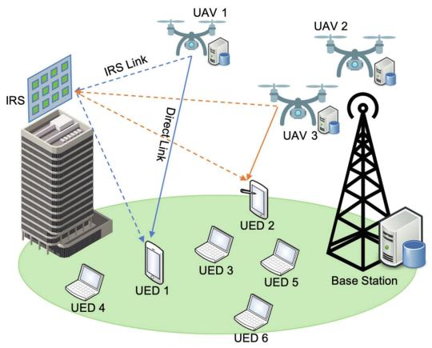

<details>
<summary>flowchart</summary>

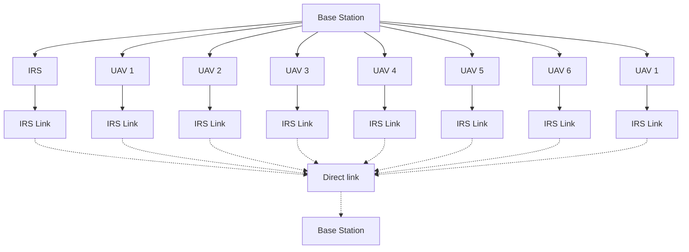
</details>

Fig. 1. The proposed IRS-assistant UAV-MEC system. User data can be directly transmitted from UEDs to UAVs or be redirected to UAVs from IRS.

Recent research has introduced optimization methods based on reinforcement learning to address this challenge. While some methods like discretizing the action space in Deep Q Network (DQN) encounter issues related to the curse of dimensionality, others like the Deep Deterministic Policy Gradient algorithm (DDPG) overcome this challenge by using neural networks to map system states to actions [25]. However, these methods adopt a single-stage approach, generating offloading decisions and optimized phases simultaneously, resulting in suboptimal solutions and requiring further training iterations.

Our proposed system (as illustrated in Fig. 1) comprises multiple User Equipment Devices (UEDs), a fleet of UAVs, and an IRS responsible for enhancing UAVs’ channel capacity and improving MEC network transmission reliability. To address these challenges, we propose the Iterative Order-preserving Policy Optimization (IOPO) framework, a novel two-stage deep learning framework. IOPO effectively determines energy-efficient binary task offloading allocations for the MEC system and optimizes the phase shift configurations of the IRS. Compared to one-stage methods attempting to derive two variables from a joint probability space, a two-stage method first obtains a definite offloading decision and then identifies an optimal phase shift. This approach allows us to effectively approximate the theoretically optimal solution. The experiments reveal IOPO’s capability to generate optimal task offloading strategies while meeting defined constraints, achieving superior optimization outcomes. Moreover, with an equal number of training iterations, IOPO produces solutions that are closer to the optimal one. Our source code can be found at https://github.com/UIC-JQ/IOPO. The contributions of this paper can be summarized as follows.

We present a novel MEC system tailored for operation on the THz communication network. The proposed MEC system is equipped with an IRS, which is crucial in enhancing communication performance within the network. Additionally, the system is designed to accommodate multiple UAVs and users.   
- In order to streamline the optimization process and improve the efficiency of the MEC system, we propose a deep learning framework named IOPO. IOPO is designed to jointly optimize offloading decisions of the multi-user

multi-uav system and the phase shift of the IRS. As a result, IOPO eliminates the need to solve complex MINLP problems, which can be computationally demanding and time-consuming.

To facilitate the generation of high-quality offloading decisions, we equip IOPO with a novel policy exploration unit called Order-Preserving Policy Optimization (OPPO), specifically designed to search for improved offloading decisions. Experimental results demonstrate the effectiveness of OPPO in discovering improved offloading decisions, even in scenarios with a vast solution space. Furthermore, results show that the integration of OPPO facilitates the convergence of IOPO towards optimal offloading decisions.   
Simulation results demonstrate IOPO’s impressive capability in significantly reducing energy consumption, surpassing benchmark schemes, including a strong baseline DDPG [26]. The energy cost is reduced by up to 32.8% when there are 3 UAVs and 15 users.

The rest of the paper is organized as follows. Section II provides a comprehensive review of previous studies. In Section III, we introduce the proposed MEC system model and formulate the data communication within the THz network. Section IV formulates the optimization problem aimed at minimizing the energy. The design of the proposed IOPO framework is described in Section V. Experimental settings are presented in Section VI, followed by a thorough analysis of the results in Section VII. Finally, Section VIII concludes the paper by summarizing the key findings.

# II. RELATED WORK

The integration of IRS in THz communication has been extensively studied in recent works [19], [20], [21], [22], [23]. In [19], [20], the IRS is employed to maximize the sum-rate performance of THz communications. The studies conducted in [21], [22] focus on utilizing the IRS to maintain reliable THz transmission. [23] introduces a comprehensive optimization framework that jointly optimizes the UAV trajectory, IRS phase adjustments, THz sub-band allocation, and power control. Additionally, recent works [13], [14], [16] have explored the integration of UAVs and IRS within MEC systems. These studies emphasize the importance of expanding UAV capabilities and utilizing IRS to enhance system performance.

To generate offloading allocations for MEC systems, several studies employ machine learning algorithms. [27], [28] applies deep reinforcement learning techniques to determine optimal task offloading strategies in scenarios involving single or multiple access points (APs). [29] considers factors such as channel state information, queue state information, and energy queue state and introduces a deep Q-learning network to generate offloading decisions that minimize task execution costs. Similarly, in [30], a deep Q-learning network is proposed to maximize the computational performance of energy-harvesting MEC networks. [31] proposes a deep learning based optimization approach to minimize the system energy consumption while optimizing the positions of ground vehicles and unmanned aerial vehicles along with the resource allocation in a hybrid mobile edge computing platform. Furthermore, [32] focuses on optimizing the phase shift of IRS, UAV computing resources, and sub-band allocation in a single UAV scenario. [15] introduces a dueling double deep Q networks (D3QN)-DDPG network for minimize transmission and computing delays while ensuring secure transmission. These works demonstrate the effectiveness of machine learning models in producing high-quality offloading strategies for MEC systems.

While progress has been made in existing literature, the task offloading in an IRS-assisted multi-UAV MEC system operating within the THz network remains unexplored. Specifically, [19], [20], [21], [22] primarily focuses on enhancing THz network communication with IRS. However, they do not adequately address the modeling of MEC systems within the context of THz networks. Moreover, [23], [24] introduce the utilization of IRS to improve the efficiency of MEC systems, but their systems do not tackle the optimization problems associated with task offloading. In addition, recent works [13], [14], [15], [16], [27], [28], [29], [30], [31] have utilized convex optimization techniques and deep learning models to generate offloading decisions, but these approaches are tailored to the 5G network context, failing to account for the unique characteristics of THz communication networks. Lastly, [32] investigates the allocation of network recourses and computational resources in the context of THz networks, taking into account the integration of IRS and UAVs. However, the studied system does not address the MEC task offloading problem and only involves a single UAV, thereby failing to model the complexities that arise in systems with multiple UAVs.

# III. SYSTEM MODEL

In this section, we first provide a detailed description of the components comprising the proposed MEC system and demonstrate how the MEC system operates in general. Following this, Section III-B formulates the communication and data transmission between UAVs and users within the MEC system. Lastly, Section III-C introduces the steps for computing the total energy consumed in the MEC system. The frequently used notations are shown in Table I.

# A. The Proposed MEC System

Fig. 1 presents the proposed multi-UAV multi-user MEC system designed for THz communication networks. The system comprises a single IRS, U users denoted as $\mathcal { U } = \{ 1 , 2 , \dots , U \}$ , and M UAVs denoted as $\mathcal { M } = \{ 1 , 2 , \dots , M \}$ 1 2. Each user is = 1 2equipped with a User Electronic Device (UED), which serves as a local computing server. Each UAV provides full-duplex communication services to users within a specific area and is equipped with an MEC server responsible for processing the tasks uploaded by users and transmitting the results through downlink transmission. We assume that the MEC server mounted on the UAV is the UAV itself. Additionally, the computation result to be downloaded to the WD is much shorter than the data offloaded to the edge server and can be neglected. The scarcity of previous studies indicates the feasibility of this approach [27], [33], [34], [35]. Compared with the UEDs, the MEC servers are designed with higher computational capacity. This empowers users to make decisions regarding task offloading, choosing between offloading their computational tasks to one of the M UAVs or executing them locally on their UEDs. Consequently, the task allocation for the entire MEC system can be represented by a $U \times ( M + 1 )$ matrix, where M   signifies that users choose from M UAVs and their local UEDs. An IRS comprising K reflecting elements is set to assist the system. By manipulating the phase shifts of these reflecting elements, the IRS can reconfigure wireless propagation channels in a highly efficient manner. This reconfiguration leads to significant improvements in both the overall propagation environment and the data transmission speed of the system.

TABLE I THE FREQUENTLY USED NOTATIONS IN THIS PAPER 

<table><tr><td>Notation</td><td>Description</td></tr><tr><td> $U$ </td><td>The number of users</td></tr><tr><td> $M$ </td><td>The number of UAVs</td></tr><tr><td> $T$ </td><td>The length of a time slot</td></tr><tr><td> $\beta(n)$ </td><td>The allocation matrix of users and UAVs at time slot  $n$ </td></tr><tr><td> $\tilde{l}_{1}(n)$ </td><td>The location of the first reflector of IRS at time slot  $n$ </td></tr><tr><td> $\hat{l}_{u}(n)$ </td><td>The location of user  $u$  at time slot  $n$ </td></tr><tr><td> $\bar{l}_{m}(n)$ </td><td>The location of UAV  $m$  at time slot  $n$ </td></tr><tr><td> $K_{x}$ </td><td>The number of reflecting elements along the X-axis</td></tr><tr><td> $K_{z}$ </td><td>The number of reflecting elements along the Z-axis</td></tr><tr><td> $K$ </td><td>Equals to  $K_{x} \cdot K_{x}$ , the total number of reflectors of IRS</td></tr><tr><td> $d_{u,m}(n)$ </td><td>Euclidean distance of user  $u$  and UAV  $m$  at time slot  $n$ </td></tr><tr><td> $h_{u,m}(n)$ </td><td>Direct channel gain between user  $u$  and UAV  $m$  at time slot  $n$ </td></tr><tr><td> $\hat{g}_{u,m}(n)$ </td><td>The IRS assisted channel gain between user  $u$  and UAV  $m$  at time slot  $n$ </td></tr><tr><td> $\phi_{k}(n)$ </td><td>The phase shift of reflector  $k$  of IRS at time slot  $n$ </td></tr><tr><td> $R_{u,m}(n)$ </td><td>The transmission rate between user  $u$  and UAV  $m$  at time slot  $n$ </td></tr><tr><td> $\Phi(n)$ </td><td>The diagonal reflection matrix of IRS phase shifts at time slot  $n$ </td></tr><tr><td> $B$ </td><td>The communication bandwidth</td></tr><tr><td> $\sigma^{2}$ </td><td>The Gaussian noise</td></tr><tr><td> $f_{e},f_{w}$ </td><td>The input feature vectors represent the energy cost of users to UAVs and workload of UAVs</td></tr><tr><td> $\mathcal{P}(n)$ </td><td>DNN predicted probability matrix at time slot  $n$ </td></tr><tr><td> $H$ </td><td>The number of quantized binary offloading decisions</td></tr><tr><td> $\beta^{h}$ </td><td> $H$  binary offloading decisions quantized by OPPO</td></tr><tr><td> $\beta^{*}(n)$ </td><td>The one yielding the lowest energy cost among the  $H$  candidate offloading decisions generated by OPPO at time slot  $n$ </td></tr></table>

The proposed MEC system operates as follows: at a time frame n within the system time $\mathcal { N } = \{ 1 , 2 , \ldots , n , \ldots , N \}$ , = 1 2each user in the system has a computational task that needs to be processed. The primary objective is to utilize the available computational resources, such as UAVs and UEDs, to complete all users’ tasks within an acceptable time while minimizing the total energy consumed during task processing. To achieve this objective, an offloading decision that allocates user tasks to the appropriate computational resources is required. Initially, the central server, located at the base station, collects essential information, such as the locations, computational power of users, UAVs, etc. Subsequently, the collected information is input into an offloading decision prediction model, which is discussed in detail in Section V. This model predicts an offloading allocation matrix denoted as $\beta ( n ) \in \{ 0 , \dot { 1 } \} ^ { U \times ( M + 1 ) }$ , where U represents ( ) 0 1the number of users and M represents the number of UAVs. For a given user $u , \beta _ { u , m } ( n ) = 1$ indicates that the corresponding ( ) = 1task is offloaded to UAV m $( m \leq M )$ , and $\beta _ { u , M + 1 } ( n ) = 1$ ( ) = 1signifies that the task is processed locally on the user’s UED. In the proposed system, we assume that when a task is offloaded to UAVs, it can only be offloaded to a single UAV at a time, prohibiting simultaneous offloading to multiple UAVs. This constraint is mathematically expressed as $\begin{array} { r } { \sum _ { m = 1 } ^ { \tilde { M } } \beta _ { u , m } ( n ) = 1 } \end{array}$ for each user $u \in \mathcal { U }$ .

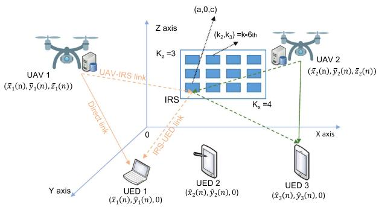

<details>
<summary>flowchart</summary>

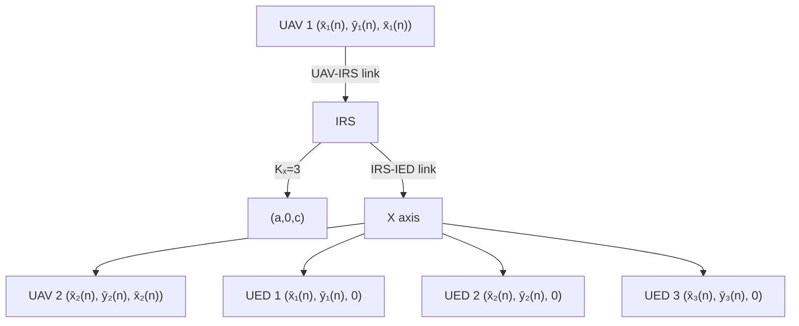
</details>

Fig. 2. The proposed system includes K reflectors. The first reflector serves as a reference point and is positioned at (a, 0, c).

# B. Data Transmission in the THz Network

In this section, we elucidate the data transmission within the THz network. As depicted in Fig. 2, at time frame n, there are two approaches for transmitting user data and tasks to UAVs: (i) direct transmission of user data from UEDs to UAVs, and (ii) redirection of user data to UAVs through the IRS. Both approaches are employed simultaneously to facilitate data transmission by the users. According to the Shannon theorem, the achievable throughput $R _ { u , m } ( n )$ for user u to transmit data ( )to the m-th UAV is determined as follows:

$$
R _ {u, m} (n) = B \log_ {2} \left(1 + \frac {p \left| h _ {u , m} (n) + \hat {g} _ {u , m} (n) \right| ^ {2}}{\sigma^ {2}}\right), \tag {1}
$$

where $h _ { u , m } ( n )$ denotes the channel gain for direct data trans-(mission and ${ \hat { g } } _ { u , m } ( n )$ is the channel gain of transmitting data ˆ ( )through the IRS. We assume that when multiple UEDs upload their tasks to UAVs simultaneously, the available wireless bandwidth is equally shared among them. Given this setup and the high transmission speed of the THz bandwidth, it is reasonable to assume that the transmission time is within the channel coherence time. This assumption, commonly adopted in prior works [28], [36], [37], allows each task packet to be transmitted over a flat fading quasi-static channel. Accordingly, B represents the channel bandwidth allocated to each UED. p represents the transmission power provided by the base station and $\sigma ^ { 2 }$ is a Gaussian noise for modeling random noise that affects the communication.

In the case of direct data transmission, given the coordinate of user u, denoted as $\hat { l } _ { u } ( n ) = ( \hat { x } _ { u } ( \bar { n } ) , \hat { y } _ { u } ( n ) , 0 ) ^ { T }$ ( ) = (ˆ ( ) ˆand the coordinate of the m-th UAV, denoted as $\bar { l } _ { m } ( n ) =$ $( \bar { x } _ { m } ( n ) , \bar { y } _ { m } ( n ) , \bar { z } _ { m } ( n ) ) ^ { T }$ , the euclidean distance $d _ { u , m } ( n )$ be-(¯ ( ) ¯ ( ) ¯ ( ))tween them can be formulated as: $d _ { u , m } ( n ) =$

$$
\sqrt {(\bar {x} _ {m} (n) - \hat {x} _ {u} (n)) ^ {2} + (\bar {y} _ {m} (n) - \hat {y} _ {u} (n)) ^ {2} + \bar {z} _ {m} ^ {2} (n)}. \tag {2}
$$

Given the distance $d _ { u , m } ( n )$ , the channel gain for direct transmission $h _ { u , m } ( n )$ is defined as follows:

$$
\begin{array}{l} h _ {u, m} (n) = \left(\frac {\mathcal {C}}{4 \pi f d _ {u , m} (n)}\right). \\ \exp \left(\frac {- j 2 \pi f d _ {u , m} (n)}{\mathcal {C}} + \frac {- K (f) d _ {u , m} (n)}{2}\right), \tag {3} \\ \end{array}
$$

where C represents the speed of light, f denotes the frequency of the sub-band, j is the imaginary unit, and $K ( f )$ represents ( )the absorption coefficient of the transmission medium.

In the context of data transmission via an IRS, the IRS acts as an intermediary that receives data from the data-sending device and subsequently reflects the data to the receiver. As depicted in Fig. 2, the IRS is situated on the X-Z plane and comprises a total of $K = K _ { x } \cdot K _ { z }$ reflecting elements. $K _ { x }$ and $K _ { z }$ represent the =quantities of reflecting elements along the X-axis and $Z { \mathrm { - a x i s } } ,$ respectively. The coordinates of the reflecting elements in the IRS are determined based on the position of the first reflecting element, denoted as $\bar { l } _ { 1 } = ( a , 0 , \bar { c } ) ^ { T }$ , which is located at the = ( 0 )lower-left corner of the IRS. Accordingly, the coordinates of the k-th reflecting element $( k = k _ { z } + ( k _ { x } - 1 ) K _ { z } )$ , denoted as ${ \ddot { l } } _ { k } ,$ = + ( 1), can be calculated using the following expression:

$$
\tilde {l} _ {k} = (a + (k _ {x} - 1) \delta_ {x}, 0, c + (k _ {z} - 1) \delta_ {z}) ^ {T}, \tag {4}
$$

where $k _ { x }$ and $k _ { z }$ represent the indices of the reflecting element along the X-axis and Z-axis, respectively. $\delta _ { x }$ and $\delta _ { z }$ denote the gaps between the elements along the X-axis and Z-axis.

It is worth noting that the first element of the IRS is considered as the reference point. Hence, the distance between the IRS and communication points like UAVs or UEDs can be approximated by measuring the distance between the reference point and the corresponding point [24]. Therefore, the transmission vector from the IRS (approximated to be the first reflecting element) to the UAV m is represented as $\Delta \bar { r } _ { m } ( n ) = \bar { l } _ { m } ( n ) - \tilde { l } _ { 1 } =$ $( \bar { x } _ { m } ( n ) - a , \bar { y } _ { m } ( n ) , \bar { z } ( n ) - c ) ^ { T }$ Δ¯ ( ) = ( ) =. The difference vector between (¯ ( ) ¯ ( ) ¯( ) )the first reflecting element and the k-th reflecting element is defined as $\Delta \tilde { r } _ { k } = \tilde { l } _ { k } - \tilde { l } _ { 1 } = ( ( k _ { x } - 1 ) \delta _ { x } , 0 , ( k _ { z } - 1 ) \delta _ { z } ) ^ { T }$ . Accordingly, for signals transmitted to the m-th UAV through the IRS, the phase difference between the signal reflected by the first reflecting element and the signal reflected by the k-th element can be formulated as follows:

$$
\begin{array}{l} \theta_ {k} ^ {m} (n) = \frac {2 \pi f}{\mathcal {C}} \frac {\Delta \tilde {r} _ {k} ^ {T}}{| \Delta \tilde {r} _ {k} |} \Delta \bar {r} _ {m} (n) \\ = \frac {2 \pi f}{\left| \Delta \tilde {r} _ {k} \right| \mathcal {C}} \left((\bar {x} _ {m} (n) - a) \left(k _ {x} - 1\right) \delta_ {x} + (\bar {z} (n) - c) \left(k _ {z} - 1\right) \delta_ {z}\right). \tag {5} \\ \end{array}
$$

Similarly, the transmission vector from the first reflecting element of the IRS to user u can be defined as $\Delta \hat { r } _ { u } ( n ) =$ $\hat { l } _ { u } ( n ) - \tilde { l } _ { 1 } = ( \hat { x } _ { u } ( n ) - a , \hat { y } _ { u } ( n ) , - c ) ^ { T }$ Δˆ ( ) =and the phase differ-( ) = (ˆ ( ) ˆ ( ) )ence between the signal sent to the user by the first reflecting element and the signal sent by the k-th element can be formulated as follows:

$$
\begin{array}{l} \nu_ {k} ^ {u} (n) = \frac {2 \pi f}{\mathcal {C}} \frac {\Delta \tilde {r} _ {k} ^ {T}}{| \Delta \tilde {r} _ {k} |} \Delta \hat {r} _ {u} (n) \\ = \frac {2 \pi f}{| \Delta \tilde {r} _ {k} | \mathcal {C}} \left((\hat {x} _ {u} (n) - a) (k _ {x} - 1) \delta_ {x} - c (k _ {z} - 1) \delta_ {z}\right). \tag {6} \\ \end{array}
$$

The cascaded channel gain of the UAV-IRS-UED connection can be defined as:

$$
g _ {u, m} (n) = \left(\frac {\mathcal {C}}{8 \sqrt {\pi^ {3}} f d _ {u , m} ^ {\prime} (n)}\right).
$$

$$
\exp \left(\frac {- j 2 \pi f d _ {u , m} ^ {\prime} (n)}{\mathcal {C}} + \frac {- K (f) d _ {u , m} ^ {\prime} (n)}{2}\right). \tag {7}
$$

The variable $d _ { u , m } ^ { \prime } ( n )$ is defined as $\hat { d } _ { u } ( n ) + \bar { d } _ { m } ( n )$ . So we ( ) ( ) + ( )sum the distance between user u and the first reflector of IRS, denoted by $\hat { d } _ { u } ( n ) = | | \Delta \hat { r } _ { u } ( n ) | | _ { 2 }$ , and $\bar { d } _ { m } ( n ) = | | \Delta \bar { r } _ { m } ( n ) | | _ { 2 }$ , ( ) = Δˆ ( ) ( ) = Δ¯ ( )which represents the distance between UAV m and the first reflector of IRS [23]. Finally, the channel gain for UAV-IRS-UED data transmission is defined as:

$$
\hat {g} _ {u, m} (n) = g _ {u, m} (n) \bar {\boldsymbol {e}} _ {m} (n) ^ {T} \boldsymbol {\Phi} (n) \hat {\boldsymbol {e}} _ {u} (n), \tag {8}
$$

where $\bar { e } _ { m } ( n ) = ( \exp ( j \theta _ { 1 } ^ { m } ( n ) ) , \dots , \exp ( j \theta _ { K } ^ { m } ( n ) ) ) ^ { T } , \hat { e } _ { u } ( n ) =$ $\big ( \exp \big ( j \nu _ { 1 } ^ { u } \big ( n \big ) \big ) , \dots , \exp \big ( j \nu _ { K } ^ { u } \big ( n \big ) \big ) \big ) ^ { T } , \quad \mathrm { a n d } \quad \Phi \big ( n \big ) =$ $d i a g ( \exp ( j \phi _ { 1 } ( n ) ) , \dots , \exp ( j \phi _ { K } ( n ) ) )$ )) ( ) =is diagonal matrix of (exp( ( )) eIRS phase shifts, where $\phi _ { k } ( n )$ ( )))is the phase shift of the k-th reflecting element.

# C. System Energy Consumption

In this section, we formulate the energy consumed in the MEC system. The energy cost within the system consists of two parts: (i) the energy consumed by processing user tasks on UEDs and (ii) the energy consumed by processing user tasks on UAVs. At a given time frame n, let us consider user u with its corresponding task denoted as $\Psi _ { u } ( n ) = \{ D _ { u } ( n ) , T _ { u } ( n ) , C _ { u } ( n ) \}$ . Here, $D _ { u } ( n )$ represents the size of the data, $T _ { u } ( n )$ represents the tolerable latency, and $C _ { u } ( n )$ represents the CPU cycles required ( )to process the task. If the task is processed on the user’s UED $( \mathrm { i . e . , } \beta _ { u , M + 1 } ( n ) = 1 )$ , the energy consumed can be defined as:

$$
E _ {u} ^ {\text { local }} (n) = t _ {u} ^ {\text { local }} (n) \cdot p _ {u}, \tag {9}
$$

where $p _ { u }$ represents the energy consumed by the UED per CPU clock and $t _ { u } ^ { l o c a l } ( n )$ denotes the time required for processing the user’s task (measured in CPU clock):

$$
t _ {u} ^ {\text { local }} (n) = C _ {u} (n) / Z _ {u}, \tag {10}
$$

where $Z _ { u }$ refers to the CPU clock speed of the UED. It is assumed that both $Z _ { u }$ and $p _ { u }$ remain constant over time.

If user u’s task is processed on $\begin{array} { r } { \mathrm { U A V s } \left( \mathrm { i . e . , } \sum _ { m \in \mathcal { M } } \beta _ { u , m } ( n ) = \right. } \end{array}$ ( ) =), the energy consumed during this process can be divided into two parts: (i) the energy consumed for uploading the task to UAVs and (ii) the energy consumed during the task processing on UAVs. The energy consumed in transmitting data from user u to UAVs is defined as follows:

$$
E _ {u} ^ {t r a n} (n) = t _ {u} ^ {t r a n} (n) \cdot p _ {u} ^ {t r a n}, \tag {11}
$$

where tran $p _ { u } ^ { t r a n }$ represents the energy consumed per second and $t _ { u } ^ { t r a n } ( n )$ denotes the transmission time (measured in second):

$$
t _ {u} ^ {\text { tran }} (n) = \frac {D _ {u} (n)}{\sum_ {m \in \mathcal {M}} R _ {u , m} (n) \cdot \mathbf {I} [ \beta_ {u , m} (n) = 1 ]} \tag {12}
$$

where $\mathbf { I } [ \beta _ { u , m } ( n ) = 1 ]$ is an indicator function that takes a value of 1 if $\beta _ { u , m } ( n ) = 1$ 1], and a value of 0 otherwise.

( ) = 1Regarding the energy consumed in processing user u’s task on UAVs, it can be defined as:

$$
E _ {u} ^ {\text { comp }} (n) = \sum_ {m \in \mathcal {M}} t _ {u, m} ^ {\text { comp }} (n) \cdot p _ {m} \cdot \mathbf {I} [ \beta_ {u, m} (n) = 1 ], \tag {13}
$$

where $p _ { m }$ represents the energy consumed by UAV m per CPU clock, and $t _ { u m } ^ { c o m p } ( n )$ denotes the number of CPU clocks required ( )to process user u’s task on UAV m.

$$
t _ {u m} ^ {\text { comp }} (n) = \frac {C _ {u} (n)}{Z _ {m} / w _ {m} (n)}. \tag {14}
$$

In this context, $Z _ { m }$ represents the CPU clock speed of UAV m, while $\begin{array} { r } { w _ { m } ( n ) = \operatorname* { m a x } ( 1 , \sum _ { u \in \mathcal { U } } \beta _ { u , m } ( n ) ) } \end{array}$ denotes the workload status of UAV m. The workload refers to the current number of tasks being processed on UAV m.

Hence, the energy consumption attributed to user u can be formulated as $E _ { u } ^ { t o t a \bar { l } } ( n ) =$

$$
G \cdot \left(E _ {u} ^ {t r a n} (n) + E _ {u} ^ {c o m p} (n)\right) + (1 - G) \cdot E _ {u} ^ {l o c a l} (n), \tag {15}
$$

where $G = 1 - \beta _ { u , M + 1 } ( n )$ .

= 1 ( )The overall system energy is defined as the aggregate of the energy consumed by all users within the system:

$$
E ^ {t o t a l} (n) = \sum_ {u \in \mathcal {U}} E _ {u} ^ {t o t a l} (n). \tag {16}
$$

# IV. OPTIMIZATION PROBLEM

In the given system time frame $n \in { \mathcal { N } } .$ , our objective is to minimize the total energy consumption $E ^ { t o t a l } ( n )$ of all the ( )UAVs and UEDs, while considering various constraints. To simplify the notation, we denote the coordinates of all users and UAVs in the system as $\mathbf { } L ( n )$ , the CPU clock speed of UAVs and UEDs as $\mathbf { } Z ( n )$ ( ), and the task information of all users as $\Psi ( n )$ . ( )We rewrite the total energy consumed in the system $E ^ { t o t a l } ( n )$ as:

$$
E ^ {\text { total }} (n) \left\{\boldsymbol {\beta}, \phi | \boldsymbol {L}, \boldsymbol {\Psi}, \boldsymbol {Z} \right\} = \sum_ {u \in \mathcal {U}} E _ {u} ^ {\text { total }} (n) \left\{\boldsymbol {\beta}, \phi | \boldsymbol {L}, \boldsymbol {\Psi}, \boldsymbol {Z} \right\} \tag {17}
$$

to highlight the dependent variables, where the $\mathbf { \rho } ^ { \star } ( n ) ^ { \star }$ terms in $L ( n ) , \Psi ( n ) , Z ( n ) , \beta ( n ) , \phi ( n )$ ( )are omitted for convenience. ( ) ( ) ( ) ( ) ( )Accordingly, the optimization problem can be formulated as:

$$
\mathcal {P} 1: \min _ {\boldsymbol {\beta} (n), \phi (n)} E ^ {t o t a l} (n) \{\boldsymbol {\beta}, \phi | \boldsymbol {L}, \boldsymbol {\Psi}, \boldsymbol {Z} \} \tag {18}
$$

$$
\mathbf {s}. \mathbf {t}. \beta_ {u, m} (n) \in \{0, 1 \}, \forall u \in \mathcal {U}, m \leq M + 1, \tag {18a}
$$

$$
\sum_ {m = 1} ^ {M + 1} \beta_ {u, m} (n) = 1, \tag {18b}
$$

$$
0 \leq \phi_ {k} (n) \leq 2 \pi , 1 \leq k \leq K, \tag {18d}
$$

$$
t _ {u} ^ {\text { comp }} (n) + t _ {u} ^ {\text { tran }} (n) + t _ {u} ^ {\text { local }} (n) \leq T _ {u} (n), \forall u \in \mathcal {U}. \tag {18f}
$$

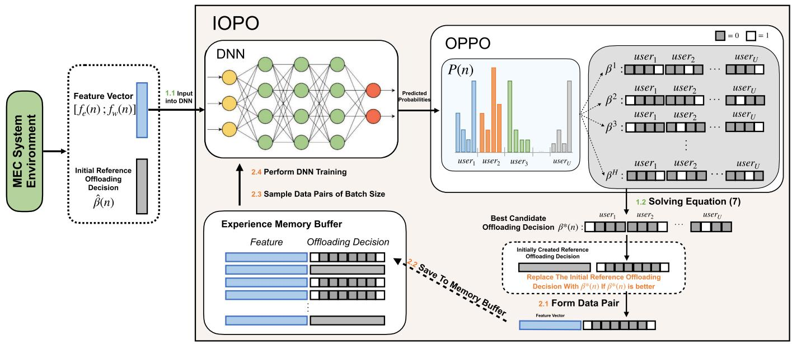

<details>
<summary>flowchart</summary>

```mermaid
graph TD
    A["MEC System Environment"] --> B["Feature Vector [f_e(n) ; f_w(n)"]]
    B --> C["IOPO"]
    C --> D["DNN"]
    D --> E["Predicted Probabilities"]
    E --> F["OPPO"]
    F --> G["Best Candidate Offloading Decision β*(n) : user1, user2, ..., userU"]
    G --> H["Solving Equation (7)"]
    H --> I["2.1 Form Data Pair Feature Vector"]
    I --> J["Experience Memory Buffer"]
    J --> K["2.2 Save To Memory Buffer"]
    K --> L["2.3 Sample Data Pairs of Batch Size"]
    L --> M["2.4 Perform DNN Training"]
    M --> N["1.1 Input Into DNN"]
    N --> O["Feature Vector [f_e(n) ; f_w(n)"]]
    O --> P["Initial Reference Offloading Decision β̂(n)"]
    P --> Q["Experience Memory Buffer Feature Offloading Decision"]
```
</details>

Fig. 3. The structure of the proposed IOPO Framework. The IOPO framework consists of two processes: offloading decision generation (Steps 1.1 and 1.2) and offloading decision update (Steps 2.1, 2.2, 2.3, and 2.4). Essential operations of the algorithm encompass generating the system feature, generating offloading decisions, evaluating offloading decisions, and updating the network.

It means that given $\{ L , \Psi , Z \}$ , we want to find the offloading decision $\beta ( n )$ and the IRS phase $\phi ( n ) =$ $\{ \phi _ { 1 } ( n ) , \phi _ { 2 } ( n ) , \ldots , \phi _ { K } ( n ) \}$ ( ) =such that the total energy consumed ( ) ( ) ( )is minimized. The best offloading decision and the best IRS phase shifts are denoted as $\beta ^ { \circ } ( n )$ and $\phi ^ { \circ } ( n )$ respectively. Constraints (18a) and (18b) ensure that at the time frame n, each user is assigned only one task, which can be either allocated to one of the M UAVs or executed locally on the UED. The Constraint (18d) guarantees the angle of the k-th reflector of IRS remains within the range of 0 and π. Lastly, Constraint (18f) ensures 2that the task of user u is completed within the acceptable delay threshold $T _ { u } ( n )$ .

( )Problem P presents a formidable challenge as it belongs to 1the category of NP-hard mixed-integer non-linear programming (MINLP) problems. To tackle this challenge, we propose a two-stage approach. For the first step, we focus on generating the offloading decision $\beta ^ { * } ( n )$ . In this study, we introduce a ( )deep learning-based offloading decision generation model capable of generating high-quality offloading decisions within milliseconds. The intricate details of this model are elucidated in Section V-B. Once the offloading decision $\beta ^ { * } ( n )$ is obtained ( )from the offloading decision model, the subsequent step involves identifying the phase shifts $\phi ^ { * } ( n )$ for the IRS that minimize the ( )overall system energy consumption, given the decision $\beta ^ { * } ( n )$ . ( )The optimization of IRS phase shifts is explained in detail in Section V-E and can be formulated as:

$$
\mathcal {P} 2: \min _ {\boldsymbol {\phi} (n)} E ^ {t o t a l} (n) \{\boldsymbol {\phi} | \boldsymbol {L}, \boldsymbol {\Psi}, \boldsymbol {Z}, \boldsymbol {\beta} ^ {*} \}, \quad \mathrm{s.t.} (1 8 d).
$$

# V. THE IOPO FRAMEWORK

# A. IOPO Framework Overview

The proposed Iterative Order-Preserving Policy Optimization (IOPO) Framework, as illustrated in Fig. 3, comprises two alternating stages: (i) offloading decision generation and (ii) offloading policy update. In the offloading decision generation stage, a deep neural network (DNN) offloading decision prediction model denoted as $f _ { \theta }$ is utilized to predict an energyefficient task offloading allocation. For the n-th system time frame $( n \in \mathcal { N } )$ , the DNN takes the input feature $[ f _ { e } ( n ) ; f _ { w } ( n ) ]$ [ ( ); ( )]constructed based on the status of system environment, and outputs a probability matrix ${ \mathcal { P } } ( n )$ , representing the probabilities ( )of different offloading allocations that each user may adopt at time n. The probability matrix is then quantized into H candidate offloading decisions within the Order-Preserving Policy Optimization (OPPO) unit. Among these candidate decisions, the one yielding the lowest system energy cost is selected as the predicted offloading decision for the current time frame, denoted as $\beta ^ { * } ( n )$ . Subsequently, the generated offloading decision $\beta ^ { * } ( n )$ ( ), along with the corresponding input feature vector, ( )are stored in the experience memory buffer for subsequent DNN training.

In the offloading decision update stage, a batch of training samples is randomly selected from the memory buffer to train the DNN $f _ { \theta } ,$ resulting in the update of DNN parameters θ. The updated DNN is then utilized to produce offloading decisions in the subsequent system time frames. Detailed descriptions of these two stages are provided in the following subsections.

# B. Offloading Decision Generation

At a system time frame $n \in \mathcal N$ , the input to DNN is a feature vector $[ f _ { e } ( n ) ; f _ { w } ( n ) ]$ formed by concatenating two distinct [ (feature vectors: $f _ { e } ( n )$ )]and $f _ { w } ( n )$ , where $\mathbf { \epsilon } ^ { \star } [ \cdot ; \cdot ] ^ { \star }$ denotes the ( ) ( ) [ ; ]vector concatenation operator. The first feature vector $f _ { e } ( n ) \in$ $\mathbb { R } ^ { ( M + 1 ) \times U }$ ( )represents the energy costs associated with each of the U users and their $M + 1$ offloading options. The second feature vector $f _ { w } ( n ) \in \mathbb { R } ^ { M }$ 1encodes the CPU clock speed of

M UAVs. The two feature vectors are concatenated to form the DNN input feature vector, which possesses a shape of $( M + 1 ) \times U + M$ . The DNN offloading decision model $f _ { \theta }$ ( + 1) +with parameters θ, is a multilayer perceptron (MLP) consisting of an input layer, six hidden layers, and an output layer. The activation function employed in both the input and hidden layers is the hyperbolic tangent (Tanh) function, while the softmax function is utilized in the output layer. In order to enhance the model’s generalization capability and mitigate the potential overfitting issue, a dropout layer [38] is incorporated between each pair of consecutive hidden layers.

Given the input feature $[ f _ { e } ( n ) ; f _ { w } ( n ) ]$ , the DNN predicts a probability matrix $\mathcal { P } ( n ) = \{ p _ { u , m } ( n ) \ | \ p _ { u , m } ( n ) \in [ 0 , 1 ] , u \in$ $\mathcal { U } , m \in \{ 1 , 2 , \dotsc , M + 1 \}$ = ( ) ( ) [0 1]}. Each element in the matrix holds 1 2 + 1a value ranging from 0 to 1, and the matrix has a dimension of $U \times ( M + 1 )$ . The probability matrix $\mathcal { P } ( n )$ signifies the ( + 1) ( )probability of different offloading allocations that each user may adopt at the system time $n .$ Specifically, the $p _ { u , m } ( n )$ ( )denotes the probability that user u offloads its task to UAV m, while $p _ { u , M + 1 } ( n )$ denotes the probability that user u is assigned to execute the task locally on its UED. This process can be mathematically formulated as follows:

$$
\boldsymbol {\mathcal {P}} (n) = f _ {\theta} \left(\left[ f _ {e} (n); f _ {w} (n) \right]\right).
$$

The next step is to transform the probability matrix $\mathcal { P } ( n )$ into the offloading decision matrix $\beta ( n )$ ( ). To accomplish this, we ( )first feed the probability matrix into a novel Order-Preserving Policy Optimization (OPPO) unit, where H candidate offloading decisions are generated based on the DNN output. Then, the candidate offloading decision with the minimum energy cost is chosen from this set of H decisions to serve as the predicted offloading matrix $\beta ^ { * } ( n )$ .

( )The OPPO unit is derived from the order-preserving optimization method proposed in [27]. The original order-preserving algorithm generates a set of H candidate offloading decisions, where the dissimilarity between any two candidate decisions is maximized. This approach promotes diversity among the candidate solutions, thereby increasing the chance of identifying the optimal decision. However, the order-preserving method described in [27] is specifically designed for systems that consist of a single MEC infrastructure. As the proposed MEC system consists of multiple UAVs and users, the original approach is not suitable. Hence, we modify the order-preserving optimization algorithm to align with our system configuration, resulting in the modified approach referred to as OPPO. Specifically, given the DNN predicted probability matrix $\pmb { \mathcal { P } } ( n ) \overset { \cdot } { \in } \mathbb { R } ^ { U \times ( \pmb { M } + 1 ) }$ , where ( )U represents the number of users and M denotes the number of UAVs in the system, OPPO generates a set of H candidate offloading decisions, where the hyper-parameter H is a positive integer chosen from the range of $\{ 1 , 2 , \ldots , U \times ( M + 1 ) \}$ .

1 2The first candidate offloading decision $\beta ^ { 1 }$ ( + 1)can be obtained through the following procedure. For the u-th row of $\mathcal { P } ( n )$ , we ( )identify the index of the highest probability within that row using $z _ { 0 } = \arg \operatorname* { m a x } _ { z \in \{ 1 , 2 , . . . , M + 1 \} } p _ { u , z }$ . Subsequently, we set $\beta _ { u , z _ { 0 } } ^ { 1 }$ to = arg max1, while assigning 0 to the remaining M elements within that row. Mathematically, this process can be expressed as follows:

$$
\beta_ {u, m} ^ {1} = \left\{ \begin{array}{l l} 1 & m = z _ {0} \text {   and   } p _ {u, m} > \mathcal {T} _ {0}, \\ 0 & \text { otherwise }. \end{array} \right.
$$

where $\mathcal { T } _ { 0 } = 1 / ( M + 1 )$ . To generate the remaining $H - 1$ = 1 ( + 1)offloading decisions, we begin by arranging all $U \times ( M +$ elements of ${ \mathcal { P } } ( n )$ ( +in ascending order based on their 1)distances from $\mathcal { T } _ { 0 }$ ( ). This sorted matrix is denoted as $\mathcal { T } =$ $\{ p _ { 1 , 1 } ^ { \prime } , p _ { 1 , 2 } ^ { \prime } , \ldots , p _ { U , M + 1 } ^ { \prime } \}$ . Here, the element $p _ { i , j } ^ { \prime }$ =becomes the h-th threshold denoted as $\mathcal { T } _ { h }$ , where $h = ( i - 1 ) \overset { \sim } { \cdot } ( M + 1 ) + j$ , = ( 1)and i and j represent the row and column indices $\mathrm { o f } p _ { i , j } ^ { \prime } .$ 1) +, respectively. For instance, $\mathcal { T } _ { 1 } = p _ { 1 , 1 } ^ { \prime }$ corresponds to the probability =element with the smallest distance to $\mathcal { T } _ { 0 }$ . Subsequently, the h-th offloading decision, denoted as $\beta ^ { h }$ (where $h \in \{ 2 , 3 , \ldots , H \} )$ , is defined according to three generation rules.

The first generation rule states that for the u-th row of $\mathcal { P } ( n )$ , if $\mathcal { R } \boldsymbol { 1 } = \{ ( u , z _ { 1 } ) \ | \ p _ { u , z _ { 1 } } > \mathcal { T } _ { h - 1 } , z _ { 1 } \in \{ 1 , 2 , \ldots , M + 1 \} \}$ ( )is 1 = ( ) 1 not an empty set, then we assign $\beta _ { u , z _ { 1 } } ^ { h } = 1$ 2 + 1, while setting the = 1remaining M values to 0. Mathematically, this can be expressed as:

$$
\beta_ {u, m} ^ {h} = \left\{ \begin{array}{l l} 1 & m = z _ {1}, \\ 0 & o t h e r w i s e. \end{array} \right.
$$

If there are multiple elements in R , we utilize the first $( u , z _ { 1 } )$ 1 ( )pair only and omit the remaining elements to meet the constraint (18b). In the case where R is an empty set, we proceed to apply the second generation rule. Specifically, for the u-th row of $\mathcal { P } ( n ) , \mathrm { i f } \mathcal { R } 2 = \{ ( u , z _ { 2 } ) | p _ { u , z _ { 2 } } = { \mathcal { T } } _ { h - 1 } , p _ { u , z _ { 2 } } \leq { \mathcal { T } } _ { 0 } , z _ { 2 } \in$ 1to $\{ 1 , 2 , \ldots , \dot { M } + 1 \} \}$ $\beta _ { u , z _ { 2 } } ^ { h }$ + 1 while setting the remaining elements to 0. This can be = ( ) =is not an empty set, we assign a value of 1 expressed mathematically as:

$$
\beta_ {u, m} ^ {h} = \left\{ \begin{array}{l l} 1 & m = z _ {2}, \\ 0 & o t h e r w i s e. \end{array} \right.
$$

Again, if there are multiple elements in R , we only utilize the first $( u , z _ { 2 } )$ 2pair and omit the remaining elements. Lastly, in the ( )scenario where both R and R are all empty, we employ the 1 2third generation rule, whereby the task is assigned to be executed locally:

$$
\beta_ {u, m} ^ {h} = \left\{ \begin{array}{l l} 1 & m = M + 1, \\ 0 & o t h e r w i s e. \end{array} \right.
$$

Upon completion of the OPPO, we obtain a collection of H candidate offloading decisions, denoted as $\{ \beta ^ { 1 } , \beta ^ { 2 } , \dots , \beta ^ { H } \}$ . Subsequently, we identify the optimal candidate offloading decision among them, which corresponds to the one that minimizes the overall system energy cost. This process can be mathematically formulated as follows:

$$
\boldsymbol {\beta} ^ {*} (n) = \underset {\boldsymbol {\beta} ^ {i} \in \left\{\boldsymbol {\beta} ^ {1}, \boldsymbol {\beta} ^ {2}, \dots , \boldsymbol {\beta} ^ {H} \right\}} {\arg \min} E ^ {\text { total }} (n) \left\{\boldsymbol {\beta} ^ {i}, f _ {W O A} \left(\boldsymbol {\beta} ^ {i}\right) \mid \boldsymbol {L}, \boldsymbol {\Psi}, \boldsymbol {Z} \right\}, \tag {19}
$$

where $E ^ { t o t a l }$ is (17) and $f _ { W O A } ( \cdot )$ corresponds to the WOA ( )method for producing optimized IRS phase shifts (introduced in Section V-E). Please be noted that, as the OPPO unit can generate H candidate offloading decisions based on the DNN output, it can also be perceived as an effective solution searching unit, in which offloading decisions with low energy costs are discovered. Throughout the execution of IOPO, OPPO continuously explores offloading decisions that are more energy-efficient. These newly discovered offloading decisions are subsequently utilized in the offloading policy update procedure to update the DNN parameters θ.

After obtaining the predicted offloading decision $\beta ^ { * } ( n )$ , we employ the function $\phi ^ { * } ( n ) = f _ { W O A } ( \beta ^ { * } ( n ) )$ ( )to compute ( )the optimized IRS phase shifts $\phi ^ { * } ( n )$ ( ( )). By substituting $\beta ^ { * } ( n )$ and $\phi ^ { * } ( n )$ ( ) ( )into (17), we can evaluate the energy cost of the ( )system. However, in order to address P , it is imperative for the predicted offloading decision $\beta ^ { * } ( n )$ to align with, or ( )at least closely approximate, the optimal offloading decision $\beta ^ { \circ } ( n ) \left( \mathrm { i . e . , } \beta ^ { \ast } ( n ) = \beta ^ { \circ } ( n ) \mathrm { o r } \beta ^ { \ast } ( n ) \approx \beta ^ { \circ } ( n ) \right)$ ). To achieve this ( ) ( ) = ( ) ( ) ( )alignment, it is necessary to implement an offloading policy update procedure, which enables the DNN to learn to generate desired offloading decisions accurately. Furthermore, the desired offloading decisions utilized in DNN training should also be gradually improved as the IOPO executes. As a result, the offloading decisions predicted by the IOPO framework, which are derived from DNN outputs, exhibit a gradual improvement and ultimately converge towards optimal offloading decisions.

However, during the initial stage of the IOPO execution, the DNN is not yet adequately trained. As a result, the predicted offloading decision $\beta ^ { * } ( n )$ may exhibit poor quality. Learning from these low-quality offloading decisions could hinder the convergence towards optimal offloading decisions, particularly in systems with a substantial number of UAVs and users (wherein a poorly performing DNN finds it challenging to predict the optimal decision among a total of $( M + 1 ) ^ { U }$ possible offloading ( + 1)decisions, with M, U denoting the number of UAVs and the number of users within the system). To address this issue and expedite the convergence process, an intuitive approach provides a favorable starting point for the DNN to learn. Hence, we introduce an initial reference offloading decision $\hat { \beta } ( n )$ with ( )high quality (the generation of this initial reference offloading decision is elaborated in Section VI-B). At the early stages of the IOPO execution, ${ \hat { \boldsymbol { \beta } } } ( { \boldsymbol { n } } )$ may exhibit lower energy cost compared to $\beta ^ { * } ( n )$ ( ), thereby enabling faster convergence toward the optimal offloading decisions when learning from ${ \hat { \boldsymbol { \beta } } } ( n )$ . As ( )the IOPO execution progresses, the DNN gradually improves, and the predicted offloading decision $\beta ^ { * } ( n )$ based on the DNN output can surpass the initial reference offloading decision. Consequently, we compare the predicted offloading decision $\beta ^ { * } ( n )$ with the initially provided reference offloading decision $\hat { \beta } ( n )$ ). If the MEC system achieves lower energy costs with ${ \mathbf { } } _ { \beta ^ { * } \left( n \right) }$ compared to ${ \hat { \boldsymbol { \beta } } } ( { \boldsymbol { n } } )$ , we update the reference offloading decision to $\beta ^ { * } ( n ) { \mathrm { ~ } } ( \mathrm { i . e . , } { \hat { \beta } } ( n ) = \beta ^ { * } ( n ) )$ ). This ensures that the DNN can ( ) ( ) = ( )always learn from high-quality offloading decisions.

Subsequently, we maintain a memory buffer with limited capacity. At the n-th time frame, a new training data sample $( [ f _ { e } ( n ) ; f _ { w } ( n ) ] , \hat { \beta } ( n ) )$ is added to the memory buffer. When the ([ ( ); ( )] ( ))memory buffer is full, the newly generated data sample replaces the oldest one.

# C. Offloading Policy Update

To train the DNN offloading decision model $f _ { \theta } ,$ , first, we sample a batch of data pairs, denoted by B, from the memory buffer, where $j \in B$ implies the data pair generated in $j \mathrm { - t h }$ time frame, $( [ f _ { e } ( j ) ; f _ { w } ( j ) ] , \hat { \boldsymbol { \beta } } ( j ) )$ , is in this batch. Subsequently, the parameters θ of the DNN are updated to minimize the average Maximum Likelihood Estimation (MLE) loss. The MLE loss for pair j in the training batch B is defined as follows:

$$
\ell (j) = - \sum_ {u = 1} ^ {U} \sum_ {m = 1} ^ {M + 1} \hat {\beta} _ {u, m} (j) \log \left(p \left(\hat {\beta} _ {u, m} (j) \mid \left[ f _ {e} (j); f _ {w} (j) \right], \theta\right)\right),
$$

where $\hat { \beta } _ { u , m } ( j )$ refers to the reference allocation decision of the data pair $j \in B$ and $\left[ f _ { e } ( j ) ; f _ { w } ( j ) \right]$ is the input feature associates with the data pair $j \in B$ ); ( )]. The average MLE loss for the given training batch is formulated as:

$$
\mathcal {L} (\mathcal {B}) = \frac {1}{| \mathcal {B} |} \sum_ {j \in \mathcal {B}} \ell (j),
$$

where |B| denotes the batch size. The parameter θ is updated using the Adam optimizer [39] and is updated every λ IOPO execution step. By minimizing L, the IOPO-predicted offloading decisions are refined progressively and eventually align with optimal offloading decisions (demonstrated in experiment Section VII-C). With the optimal offloading allocations produced and the optimal phase shifts obtained using the WOA algorithm (introduced in Section V-E), problem P can be solved. The 1pseudo-code of IOPO is presented in Algorithm 1.

# D. Computational Complexity Analysis

As illustrated in Fig. 3, the core processes of the IOPO algorithm involve generating system features, producing offloading decisions, evaluating these decisions, and updating the network. First, the system feature, which includes the information on UAVs and UEDs, is obtained, as shown in (17). The system comprises M UAVs and U UEDs, with each UED assigned one task, resulting in U tasks and a complexity of $O ( M + 2 U )$ . Second, ( + 2 )the probability matrix is computed, followed by the generation of offloading decisions. The computation of the probability matrix only requires a forward pass through the network, which is dependent solely on the network size (which is simple in our structure), and can therefore be considered to have a constant time complexity [40]. The OPPO unit is responsible for generating offloading decisions. The quantization process involves a fixed number of operations, including selecting the largest element from each user u and finding the index of the highest probability. This operation requires a maximum search over $M + 1$ elements for each user, resulting in a complexity of $O ( U ( M + 1 ) ) =$ $O ( U M )$ . Next, all $U \times ( M + 1 )$ ( ( + 1)) =elements are arranged in as-( ) (cending order, which takes $O ( ( U ( M + 1 ) ) \log ( U ( M + 1 ) ) )$ , simplifying to $O ( ( U M ) \log ( U M ) )$ ( + 1)) log( ( + 1))). Then, the remaining H − (( ) log( )) 1candidate offloading decisions are generated, each requiring $O ( U ( M + 1 ) ) = O ( U M )$ operations, leading to a total com-( (plexity of $O ( ( H - 1 ) U M ) = O ( H U M )$ . Combining all these (( 1) ) = ( )steps, the overall time complexity for generating H candidate offloading decisions using the OPPO algorithm is $O ( U M ) +$

Algorithm 1: The Execution of the IOPO Framework.   
Input : Input feature $f(n) = [f_e(n); f_w(n)]$ at each time frame n, and an initial reference offloading decision $\hat{\beta}(n)$ .

Output: Final Offloading decision $\hat{\beta}(n)$ and the best IRS phase shifts for each time frame n.

1 Randomly initialize parameters $\theta$ of DNN $f_\theta$ and empty the memory buffer.;
2 for $n = 1, 2, \ldots, N$ do
3 Compute the DNN probability matrix: $\mathcal{P}(n) = f_\theta([f_e(n); f_w(n)])$ ;
4 Feed $\mathcal{P}(n)$ into OPPO, where $\mathcal{P}(n)$ is quantized into H candidate offloading decisions;
5 Select the best candidate decision $\beta^*(n)$ using Eqn. (19);
6 Obtain the best IRS phase shifts $\phi^*(n)$ using $\phi^*(n) = f_{WOA}(\beta^*(n))$ as shown in Sec. V-E;
7 if $\beta^*(n)$ is better than the initially provided reference offloading decision $\hat{\beta}(n)$ then
8 $|\hat{\beta}(n) = \beta^*(n)|$ 9 end
10 Update the memory buffer by adding $(f(n), \hat{\beta}(n))$ ;
11 if n mod $\lambda = 0$ then
12 Randomly sample a batch B from the memory buffer as $\{([f_e(j); f_w(j)], \hat{\beta}(j)) | j \in B\}$ ;
13 Train the DNN on B and update $\theta$ using the Adam optimizer;
14 end
15 end

$O ( ( U M ) \log ( U M ) ) + O ( H U M )$ , which can be approximated (as $O ( H U M + ( U M ) \log ( U M ) )$ ). Third, the evaluating complexity using WOA depends on the number of whales W and the number of evolution round E, the energy cost is computed according to (16), with a given offloading decision, the complexity is $O ( U )$ . Here, we must calculate the best among ( )H candidates’ offloading decisions. Thus, it is $O ( H W E U )$ . (Without applying OPPO, we would need to consider $( M + 1 ) ^ { \dot { U } }$ ( + 1)offloading decisions instead of H, significantly increasing the complexity. These steps are executed sequentially to be completed in polynomial time.

Moreover, the complexity of updating the MLP network is dependent on the loop over N times, which involves operations across the network layers. Sampling a batch from the memory buffer every λ time is $O ( | B | )$ . Training the ( )DNN on the batch using the Adam optimizer is $O ( | B | \mathcal { L } D )$ , ( )where L is the number of the layers and D is the element of every layer of the network. The MLP backward pass can be treated as matrix multiplication with a complexity of $( N / \lambda ) O ( | B | L M )$ . Therefore, the overall time complex-( ) ( )ity can be approximated as $O ( N ( M + 2 U ) + N ( H U M +$ $( U M ) \log ( U M ) ) + N ( H W E U ) + ( N / \lambda ) | B | \mathcal { L } \mathcal { D } )$ ( +. In this set-( ) log( )) + ( ) + ( ) )ting, with most parameters fixed, the time complexity is primarily determined by the neural network structure and the number of training iterations.

# E. IRS Phase Shifts Optimization

Given the offloading decision $\beta ^ { * } ( n )$ , the determination of ( )the optimal IRS phase shifts shown as Problem P is a non-2convex optimization problem. To address this, we follow [32] to employ the Whale Optimization Algorithm (WOA) [41]. WOA is commonly employed to tackle optimization problems such as resource allocations in wireless networks and beyond [42]. In our approach, the WOA algorithm $\phi ^ { * } ( n ) = f _ { W O A } ( \beta ^ { * } ( n ) )$ takes an offloading decision $\beta ^ { * } ( n )$ ( ) = ( ( ))as input and produces the best IRS phase shifts $\phi ^ { * } ( n )$ ( )through $\mathcal { E } = \{ 1 , 2 , \dots , E \}$ evolu-( ) = 1 2tion rounds, where the hyper-parameter E determines the total number of evolution rounds. Initially, the whale population is represented as $\phi ^ { \prime } ( 0 ) = \{ \phi _ { 1 } ^ { \prime } ( 0 ) , \phi _ { 2 } ^ { \prime } ( 0 ) , \ldots , \phi _ { W } ^ { \prime } ( 0 ) \}$ }, where the (0) = (0) (0) (0)hyper-parameter W determines the number of whales in the environment. The j-th whale, denoted as $\phi _ { j } ^ { \prime } ( 0 )$ , is a randomly (0)generated IRS phase shift. During the t-th evolution round $( t \in \mathcal { E } )$ , the following operations are performed. First, we obtain the best IRS phase shift that minimizes the system energy cost. This process can be mathematically formulated as:

$$
\phi_ {*} ^ {\prime} (t) = \operatorname * {a r g   m i n} _ {\phi^ {\prime} \in \{\phi^ {\prime} (t - 1) \cup \phi_ {*} ^ {\prime} (t - 1) \}} E ^ {t o t a l} (n) \{\phi^ {\prime} | \boldsymbol {L}, \boldsymbol {\Psi}, \boldsymbol {Z}, \beta^ {*} \},
$$

where $E _ { u } ^ { t o t a l } ( n ) \{ \cdot \}$ is (17), φ∗(t) denotes the global optimal ( )phase shifts selected in the preceding t iterations. In the case of t , we initialize $\phi _ { * } ^ { \prime } ( 0 )$ as an empty set, since the global = 1 (0)optimal phase shift has not been determined yet. Subsequently, the WOA algorithm employs a balanced probability of 50% to perform either a “spiral route” update or a “shrink-wrap” update. In the event that a “spiral route” update is chosen, the j-th whale within the whale population (i.e., the j-th candidate IRS phase shifts) undergoes the following update procedure:

$$
\boldsymbol {D} = a b s (\phi_ {*} ^ {\prime} (t) - \phi_ {j} ^ {\prime} (t - 1)),
$$

$$
\phi_ {j} ^ {\prime} (t) = a b s (\boldsymbol {D} \cdot e ^ {b \cdot l _ {j} (t)} \cdot \cos (2 \pi \cdot l _ {j} (t)) + \phi_ {j} ^ {\prime} (t - 1)),
$$

where $a b s ( \cdot )$ denotes the element-wise absolute function, b is ( )a constant with a value of 1, and $l _ { j } ( t )$ denotes the behavior of ( )the j-th whale during the t-th evolution, which is a random real value between − , .

In the case of selecting a “shrink-wrap” update, an additional condition check is necessary to determine whether the whale engages in exploration or exploitation. Specifically, if the condition $a b s ( A _ { j } ( t ) ) < 1$ is satisfied, an exploitation step is performed. ( ( )) 1Conversely, if abs $( A _ { j } ( t ) ) \geq 1$ , an exploration step is conducted. Here, $A _ { j } ( t ) = a _ { j } ( t ) \cdot ( 2 r _ { j } ( t ) - 1 )$ , where $\begin{array} { r } { a _ { j } ( t ) = 2 \cdot ( 1 - \frac { t } { E } ) } \end{array}$ ( ) = ( ) (2 ( ) 1)is a scalar that decreases as t increases, and $r _ { j } ( t )$ = 2 (1 )is a randomly generated real value in the range of , .

[0 1]In the Exploitation phase, the update rule for the j-th whale can be expressed as follows:

$$
\boldsymbol {D} = a b s (C _ {j} (t) \cdot \phi_ {*} ^ {\prime} (t) - \phi_ {j} ^ {\prime} (t - 1)),
$$

$$
\phi_ {j} ^ {\prime} (t) = a b s (\phi_ {*} ^ {\prime} (t) - A _ {j} (t) \cdot D),
$$

where $C _ { j } ( t ) = 2 \cdot r _ { j } ( t )$ . In the Exploration phase, the update (rule for the $j \cdot$ = 2 ( )-th whale can be defined as:

$$
\boldsymbol {D} = a b s (C _ {j} (t) \cdot \phi_ {j} ^ {r a n d} (t) - \phi_ {j} ^ {\prime} (t - 1)),
$$

$$
\phi_ {j} ^ {\prime} (t) = a b s (\phi_ {j} ^ {r a n d} (t) - A _ {j} (t) \cdot D),
$$

where $\phi _ { j } ^ { r a n d } ( t )$ represents a randomly generated IRS phase ( )shifts. Upon completing all E iterations, the resulting IRS phase shifts $\phi _ { * } ^ { \prime } ( E + 1 )$ is returned as the final output of WOA.

# VI. EXPERIMENTAL SETTINGS

# A. Simulation Setup

In conducted experiments we inspired by [19], [32] to set users and UAVs are confined within a rectangular area measuring 800 meters in length and 600 meters in width. The locations of users and UAVs are randomly generated within the designated area, with the UAVs flying at a height of 20 meters. The CPU clock speed of MEC servers carried by UAVs, denoted as $Z _ { m }$ , is distributed between 0.08 and 0.4 GHz. In contrast, the CPU clock speed of UEDs $Z _ { u }$ ranges from 0.04 to 0.08 GHz. The transmission frequency range from 200 to 400 GHz aligns with the THz characteristics outlined in [43] and the molecular absorption coefficients for THz frequencies as indicated in reference [10]. The IRS is composed of 25 reflectors, with the first element located at (4 m, 0 m, 4 m), and $K _ { x } = 5 , K _ { z } = 5$ . The task size = 5 = 5of each user ranges from 32 bytes to 100 KB. The time that users finish their tasks locally is set as the acceptable delay threshold. Any processing time that is longer than this threshold fails to meet Constraint (18f) and is considered as overdue.

# B. The Execution of IOPO

We execute IOPO for N ,  system time frames, = 200 000during which the DNN offloading decision model $f _ { \theta }$ is trained in a supervised manner. The initial reference offloading decision is generated using the GREEDY OC method (introduced in Section VI-C) and the training interval λ is set to 10, indicating that the DNN parameters θ are updated every 10 IOPO execution steps. Furthermore, we utilize a batch size of 256, a dropout rate of 0.1 to mitigate overfitting, a memory buffer size of 1.5 times the batch size, and a learning rate of 0.001in the Adam optimizer. During the execution of IOPO, we set the number of candidate decisions generated in OPPO as H . In order = 20to guide OPPO towards identifying decisions that satisfy the no-overdue constraint (defined in (18f)), we introduce an overdue penalty to candidate offloading decisions involving overdue users. Each overdue user adds a penalty score of 100 to the total system energy cost. This prioritizes candidate decisions without overdue users during the selection of the best candidate offloading decision. For the WOA method, the number of whales W is set as 3, while the evolution round E is set as 5.

Following the completion of IOPO execution, we conducted a series of experiments to evaluate its performance compared to several offloading decision-generation baselines. These experiments are carried out over the last 1,000 system time frames and the average metrics (e.g., system energy costs, overdue statistics) are reported. To calculate the system energy costs of different methods, we first acquire a predicted offloading decision from each of the considered offloading decision models. Subsequently, we employ the WOA method denoted as $f _ { W O A } ( \cdot )$ ( )to derive optimized IRS phase shifts. The optimized IRS phase shift and the obtained offloading decision are substituted into (17), yielding the total energy cost of different offloading decision generation methods.

# C. Comparison Offloading Decision Generation Methods

We compare the performance of the proposed IOPO model with baseline offloading allocation approaches as follows:

Deep Deterministic Policy Gradient Algorithm (DDPG): A model-free reinforcement learning algorithm based on actor-critic architecture. DDPG [26] can be used to generate policies from continuous action spaces. As a strong baseline of one-stage methods, for each time frame, DDPG takes the encoded environment feature as input and then generates an output vector that contains both the offloading decision and the optimal IRS phase.   
Greedy Selection (Greedy): This method utilizes a greedy approach to assign users to UAVs. Specifically, the algorithm iteratively selects the user with the longest local processing time and assigns it to the UAV with the fastest processing speed. After each assignment, the computational speeds of UAVs are updated based on their workload status. This process continues until the fastest UAV processing speed is slower than the slowest local computational speed among the remaining users. The remaining unassigned users finish the tasks locally.   
Greedy Selection with no-overdue constraint (Greedy OC): Similar to the Greedy method, users are ranked based on their local processing times. However, instead of directly assigning each user to the fastest UAV, a more involved iterative process is performed. This process considers all UAVs and selects the UAV that can complete the user’s task with the lowest energy cost while ensuring that the time constraints (18f) of all users on that UAV are met. If a suitable UAV cannot be found, the user is assigned to local processing.   
- Local Computing (LOCAL): Users independently process tasks on their UEDs without using UAV resources.   
C Optimized Random Selection (OPT RANDOM): Users are randomly assigned to either local processing or UAV processing. 10 offloading decisions are randomly generated, and the decision with the lowest energy cost is selected as the final offloading decision.   
Optimized Random Edge Selection (OPT RANDOM w/o LOCAL): Users are randomly assigned to UAVs for task processing. In this case, no user performs tasks locally. Again, 10 offloading decisions are randomly generated, and the decision with the lowest energy cost is chosen.

# VII. EXPERIMENTAL RESULTS

# A. Model Performance Given Different Numbers of Users

In this experiment, we assess the proposed IOPO model in systems with varying numbers of users. The number of UAVs in systems is fixed at 3. The energy costs of offloading decisions predicted by different offloading decision models are presented in Table III. It is observed that the predicted offloading decisions include users who fail to meet their acceptable delay threshold (i.e., fail to meet the Constraint (18f)). As the ideal offloading decisions should minimize energy costs while satisfying the no-overdue constraint (18f), we introduce an overdue penalty to offloading decisions containing overdue users. Specifically, each overdue user adds a penalty score of 100 to the overall system energy cost. By incorporating this overdue-penalized energy cost metric, we are able to evaluate the offloading decisions in terms of both energy costs and the occurrence of overdue users. The results presented in Table III demonstrate that, in comparison to the baselines, the proposed IOPO model achieves the lowest overdue-penalized energy costs across all system configurations. This highlights the effectiveness of IOPO in generating offloading decisions that not only minimize energy consumption but also adhere to the no-overdue constraint (18f).

TABLE II OVERDUE STATISTICS GIVEN DIFFERENT NUMBERS OF USERS IN THE SYSTEM 

<table><tr><td rowspan="2">Methods</td><td colspan="2">10 USERS</td><td colspan="2">15 USERS</td><td colspan="2">20 USERS</td></tr><tr><td>O Plan%</td><td>Avg #O Users</td><td>O Plan%</td><td>Avg #O Users</td><td>O Plan%</td><td>Avg #O Users</td></tr><tr><td colspan="7">Baselines</td></tr><tr><td>LOCAL</td><td>0</td><td>0</td><td>0</td><td>0</td><td>0</td><td>0</td></tr><tr><td>GREEDY (OC)</td><td>0</td><td>0</td><td>0</td><td>0</td><td>0</td><td>0</td></tr><tr><td>GREEDY</td><td>81.76%</td><td>1.27</td><td>100%</td><td>12</td><td>100%</td><td>12.39</td></tr><tr><td>OPT RANDOM</td><td>82.46%</td><td>3.34</td><td>99.94%</td><td>8.83</td><td>100%</td><td>14.49</td></tr><tr><td>OPT RANDOM(W/O LOCAL)</td><td>97.94%</td><td>4.44</td><td>100%</td><td>11.91</td><td>100%</td><td>17.41</td></tr><tr><td>DDPG</td><td>67.90%</td><td>2.31</td><td>100%</td><td>5.48</td><td>100%</td><td>8.59</td></tr><tr><td colspan="7">Ours</td></tr><tr><td>IOPO</td><td>0.86%</td><td>1.36</td><td>0.6%</td><td>1.94</td><td>6.88%</td><td>1.66</td></tr></table>

Oplanis#e

TABLE III ENERGY COSTS OF METHODS GIVEN DIFFERENT NUMBERS OF USERS IN THE SYSTEM (WITH OVERDUE PENALTY = 100) 

<table><tr><td>Methods</td><td>10 Users</td><td>15 Users</td><td>20 Users</td></tr><tr><td colspan="4">Baselines</td></tr><tr><td>LOCAL</td><td>1048.77</td><td>1676.27</td><td>2062.25</td></tr><tr><td>GREEDY (OC)</td><td>508.64</td><td>1011.89</td><td>1384.11</td></tr><tr><td>GREEDY</td><td>451.66</td><td>1791.93</td><td>2030.92</td></tr><tr><td>OPT RANDOM</td><td>647.64</td><td>1540.31</td><td>2221.74</td></tr><tr><td>OPT RANDOM (W/O LOCAL)</td><td>737.47</td><td>1728.55</td><td>2343.66</td></tr><tr><td>DDPG</td><td>444.96</td><td>1225.47</td><td>1640.17</td></tr><tr><td colspan="4">Ours</td></tr><tr><td>IOPO</td><td>397.72</td><td>823.32</td><td>1247.98</td></tr></table>

TABLE IV ENERGY COSTS OF METHODS GIVEN DIFFERENT NUMBERS OF USERS IN THE SYSTEM (WITHOUT OVERDUE PENALTY) 

<table><tr><td>Methods</td><td>10 Users</td><td>15 Users</td><td>20 Users</td></tr><tr><td colspan="4">Baselines</td></tr><tr><td>LOCAL</td><td>1048.77</td><td>1676.27</td><td>2062.25</td></tr><tr><td>GREEDY (OC)</td><td>508.64</td><td>1011.89</td><td>1384.11</td></tr><tr><td>GREEDY</td><td>347.48</td><td>591.92</td><td>791.24</td></tr><tr><td>OPT RANDOM</td><td>372.08</td><td>657.75</td><td>771.82</td></tr><tr><td>OPT RANDOM (W/O LOCAL)</td><td>301.75</td><td>537.17</td><td>601.82</td></tr><tr><td>DDPG</td><td>290.16</td><td>677.96</td><td>781.17</td></tr><tr><td colspan="4">Ours</td></tr><tr><td>IOPO</td><td>390.18</td><td>819.38</td><td>1211.52</td></tr></table>

To gain deeper insights into the overdue situations in offloading decisions generated by various methods, we present the overdue statistics in Table II. The term O Plans% represents the percentage of model-predicted offloading decisions that include overdue users, while Avg #O Users signifies the average number of overdue users within these overdue decisions. The results reveal that, except for LOCAL and GREEDY (OC), all baseline methods generate a considerable number of offloading decisions containing overdue users. Although LOCAL and GREEDY (OC) adhere to the no-overdue constraint, they fail to fully harness UAV resources to generate energy-efficient offloading decisions (as depicted in Table IV, wherein the overdue penalty is excluded from the system energy cost computation). Consequently, none of the baseline methods can be considered preferable. In contrast, the proposed IOPO framework exhibits the ability to generate offloading allocations with lower energy costs (in comparison to LOCAL and GREEDY (OC)) while significantly reducing the number of overdue users (in comparison to GREEDY, DDPG, and random methods). These findings underscore the effectiveness of the proposed methods over baselines.

# B. Model Performance Given Different Numbers of UAVs

In this experiment, we evaluate IOPO in systems with varying numbers of UAVs. The number of users in the system is fixed at 20 and the overdue-penalized energy costs of different methods are reported. Table VI illustrates the overdue-penalized energy costs resulting from offloading allocations generated by different methods. Results show that IOPO consistently outperforms all baseline methods across different system configurations. This underscores IOPO’s ability to yield energy-efficient offloading decisions while satisfying the overdue constraint in diverse system setups. Further insights into the overdue statistics are provided in Table V. Once again, the results affirm that IOPO surpasses the baselines GREEDY, DDPG, and RANDOM, while achieving comparable performance to LOCAL and GREEDY (OC) in meeting the no-overdue constraint (18f).

TABLE V OVERDUE STATISTICS OF METHODS GIVEN DIFFERENT NUMBERS OF UAVS 

<table><tr><td rowspan="2">Methods</td><td colspan="2">3 UAVS</td><td colspan="2">4 UAVS</td><td colspan="2">5 UAVS</td></tr><tr><td>O Plan%</td><td>Avg #O Users</td><td>O Plan%</td><td>Avg #O Users</td><td>O Plan%</td><td>Avg #O Users</td></tr><tr><td colspan="7">Baselines</td></tr><tr><td>LOCAL</td><td>0</td><td>0</td><td>0</td><td>0</td><td>0</td><td>0</td></tr><tr><td>GREEDY (OC)</td><td>0</td><td>0</td><td>0</td><td>0</td><td>0</td><td>0</td></tr><tr><td>GREEDY</td><td>100%</td><td>12.39</td><td>100%</td><td>16.71</td><td>100%</td><td>6.07</td></tr><tr><td>OPT RANDOM</td><td>100%</td><td>14.49</td><td>100%</td><td>12.49</td><td>99.90%</td><td>9.24</td></tr><tr><td>OPT RANDOM(w/o LOCAL)</td><td>100%</td><td>17.41</td><td>100%</td><td>15.56</td><td>100%</td><td>11.52</td></tr><tr><td>DDPG</td><td>100%</td><td>8.59</td><td>100%</td><td>5.99</td><td>100%</td><td>4.07</td></tr><tr><td colspan="7">Ours</td></tr><tr><td>IOPÖ</td><td>6.88%</td><td>1.66</td><td>6.24%</td><td>1.91</td><td>6.80%</td><td>1.86</td></tr></table>

Oplae# The number of users in the system is set to 20.

TABLE VI ENERGY COSTS OF METHODS GIVEN DIFFERENT NUMBERS OF UAVS IN THE SYSTEM (WITH OVERDUE PENALTY = 100) 

<table><tr><td>Methods</td><td>3UAVs</td><td>4UAVs</td><td>5UAVs</td></tr><tr><td colspan="4">Baselines</td></tr><tr><td>LOCAL</td><td>2062.25</td><td>2078.15</td><td>1779.39</td></tr><tr><td>GREEDY (OC)</td><td>1384.11</td><td>1194.84</td><td>1009.61</td></tr><tr><td>GREEDY</td><td>2030.92</td><td>2235.64</td><td>1322.54</td></tr><tr><td>OPT RANDOM</td><td>2221.74</td><td>1874.64</td><td>1646.52</td></tr><tr><td>OPT RANDOM (W/O LOCAL)</td><td>2343.66</td><td>2064.96</td><td>1800</td></tr><tr><td>DDPG</td><td>1640.17</td><td>1111.7</td><td>1038.98</td></tr><tr><td colspan="4">Ours</td></tr><tr><td>IOPO</td><td>1247.98</td><td>1059.53</td><td>929.15</td></tr></table>

The number of users in the system is set to 20.

# C. How Good is the Predicted Offloading Decision Compared to the Optimal Decision?

In this experiment, we compare the offloading decisions predicted by IOPO with the optimal offloading decisions. Optimal offloading decisions are determined by considering all possible allocations and selecting the one that minimizes the energy cost while satisfying the no-overdue constraint. We evaluate the performance of IOPO in systems containing (5, 7) users and (1, 2) UAVs. To assess the similarity between the predicted decisions and optimal decisions, we introduce a proximity ratio. This ratio is calculated by dividing the average energy cost of optimal decisions by the average energy cost of predicted offloading decisions. An ideal scenario is indicated by a ratio of 1, signifying that the model-predicted offloading decisions perfectly match the optimal offloading decisions. A ratio smaller than 1 suggests that the energy costs of predicted offloading allocations exceed the optimal energy costs. Therefore, a ratio close to one is desirable, as it indicates a close alignment between the predicted decisions and the optimal decisions. Fig. 4 demonstrates the proximity ratio of IOPO along with 6 baselines under various system settings. Notably, IOPO consistently outperforms all comparison methods, maintaining a proximity ratio close to 1 across all (user, UAV) configurations. These results substantiate that the IOPO-predicted offloading decisions can converge to optimal offloading decisions.

It should be noted that as the number of users and UAVs in the system increases, the number of possible offloading decisions grows exponentially. For instance, in a system with 5 UAVs and 20 users, the total number of potential offloading decisions amounts to 20. This exponential growth makes (5 + 1)it impractical to obtain optimal allocations for complex system setups within a reasonable time. Consequently, we focus the investigations on systems with a limited number of users and UAVs. While we do not present optimal solutions for intricate system setups, we observe that increasing the total number of IOPO iterations yields a further reduction in the overall system energy cost. This finding implies that for systems encompassing only a small number of users and UAVs, the IOPO model can converge towards optimal offloading decisions with a relatively small number of IOPO iterations. Conversely, for complex systems involving a larger number of users and UAVs, IOPO necessitates a greater number of iterations to approximate the optimal solution. Therefore, when confronted with systems entailing a significant number of users and UAVs, it is recommended to employ a larger number of iteration steps to attain enhanced outcomes.

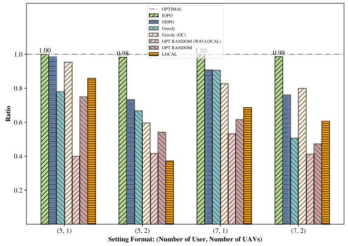

<details>
<summary>bar</summary>

| Setting Format | OPTIMAL | IOPO | DDPG | Greedy | Greedy (OC) | OPT RANDOM (W/O LOCAL) | OPT RANDOM | LOCAL |
| -------------- | ------- | ---- | ---- | ------ | ----------- | --------------------- | ---------- | ----- |
| (5, 1)         | 1.00    | 1.00 | 1.00 | 0.98   | 0.98        | 0.40                  | 0.75       | 0.85  |
| (5, 2)         | 1.00    | 1.00 | 0.73 | 0.66   | 0.66        | 0.42                  | 0.54       | 0.38  |
| (7, 1)         | 1.00    | 1.00 | 0.91 | 0.90   | 0.90        | 0.53                  | 0.62       | 0.68  |
| (7, 2)         | 1.00    | 0.99 | 0.77 | 0.51   | 0.51        | 0.41                  | 0.47       | 0.61  |
</details>

Fig. 4. Average proximity ratio of methods over the last 1,000 time frames.

# D. Ablation Study: How OPPO Affects IOPO Performance

This experiment aims to assess the impact of the proposed OPPO unit on the performance of IOPO. The experimental settings include a penalty of 100 for overdue tasks, 20 users, and

3 UAVs. The evaluation of two variants is based on the average energy cost observed over the last 1,000 system time slots. The two variants considered are IOPO with and without OPPO, taking into account scenarios with the unit disabled during the execution of IOPO and without being disabled. When OPPO is disabled, an alternative approach is needed to quantize the DNN output probability matrix into the offloading decision matrix. To address this, at the n-th time frame, given the DNN predicted probability matrix $\mathcal { P } ( n ) \in \mathbb { R } ^ { U \times ( M + 1 ) }$ , for each user $u \in \mathcal { U } .$ , we ( )assign a value of 1 to the offloading choice with the largest probability and a value of 0 to the remaining M choices. The resulting offloading decision matrix $\beta ( n )$ satisfies Constraints (18a) and (18b). Formally:

$$
z ^ {\prime} = \operatorname * {a r g   m a x} _ {z \in \{1, 2, \ldots , M + 1 \}} p _ {u, z},
$$

$$
\beta_ {u, m} (n) = \left\{ \begin{array}{l l} 1 & m = z ^ {\prime}, \\ 0 & o t h e r w i s e. \end{array} \right.
$$

The energy cost of IOPO with OPPO is 1247.98, whereas without OPPO is 1408.36. This demonstrates that the inclusion of OPPO significantly reduces the overdue-penalized system energy cost when compared to the variant without OPPO.

Besides, we analyze the impact of removing OPPO on overdue cases in IOPO. Surprisingly, IOPO without OPPO outperformed IOPO with OPPO, significantly reducing overdue decisions and users. With OPPO, there was a 6.88% occurrence of overdue plans, compared to 0.94% without OPPO. Moreover, despite higher penalties, IOPO with OPPO achieved lower energy costs for overdue tasks than the variant without OPPO. The reason behind these findings can be attributed to the challenge lies in creating efficient offloading allocations using UAV computational power while adhering to the no-overdue constraint. The variant without OPPO showed limited user offloading to UAVs, while the variant with OPPO underutilized UAV capabilities. IOPO systematically improved initial decisions with OPPO, leading to more overdue cases with a slight increase in users per UAV. Still, IOPO had fewer overdues, achieving lower energy costs despite predicting more overdue cases.

During IOPO execution, OPPO continually explored improved decisions, generating 127,966 during 200,000 iterations. The DNN learned from these decisions, reducing the overduepenalized energy cost to 1247.98 compared to 1384.57 for initial decisions. Notably, the initial offloading decisions, generated using the Greedy method with a no-overdue constraint, didn’t have overdue users. The decrease in energy cost resulted from OPPO’s ability to optimize task distribution between users and UAVs. In summary, results demonstrate the efficacy of OPPO in generating a substantial quantity of improved offloading decisions and reducing the system energy costs.

# E. Does the Initial Reference Offloading Decision Help?

In this experiment, we study if applying initial reference offloading decisions benefits the performance of IOPO. The introduction of initial offloading decisions aims to establish a favorable starting point for training the DNN in IOPO. Without the provision of initial reference offloading decisions, the DNN may learn from suboptimal offloading decisions during the early stages of IOPO execution, thereby slowing the convergence towards optimal offloading allocations and resulting in impaired IOPO performance. This issue could become particularly pronounced when dealing with a large solution space due to the increasing difficulty in identifying high-quality offloading decisions for training the DNN. Consequently, the inclusion of initial reference offloading allocations can play a critical role in guiding the training of DNN and reducing the energy costs of IOPO-predicted offloading decisions.

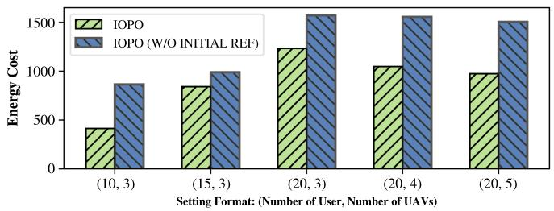

<details>
<summary>bar</summary>

| Setting Format: (Number of User, Number of UAVs) | IOPO | IOPO (W/O INITIAL REF) |
| :--- | :--- | :--- |
| (10, 3) | 420 | 870 |
| (15, 3) | 840 | 1000 |
| (20, 3) | 1230 | 1560 |
| (20, 4) | 1050 | 1560 |
| (20, 5) | 980 | 1510 |
</details>

Fig. 5. IOPO performance with and without utilizing initial reference offloading decisions during the training of DNN. The overdue penalty is set to 100 in system energy cost computation.

Fig. 5 presents the average overdue-penalized energy costs over the last 1,000 system time frames. When the initial reference offloading decisions are not provided during DNN training, we set the predicted offloading decisions generated using (19) as reference to offloading decisions. Results demonstrate that, compared to the variant IOPO (W/O INITIAL REF), in which initial reference offloading decisions are excluded in DNN training, IOPO can produce offloading decisions with lower energy costs. These findings align with the intuition and emphasize the significance of supplying high-quality initial reference decisions during DNN training to achieve reduced system energy consumption.

# F. Does DNN Complexity Affect IOPO Performance?

In this experiment, we study the influence of DNN complexity on the performance of IOPO. Table VII presents the performance of IOPO equipped with two DNNs: the proposed DNN (Ours) and a DNN with reduced complexity (Simplified). Compared to Ours, the downgraded network consists of 1 hidden layer instead of 6 and 64 hidden units instead of 256. Results indicate that the downgraded DNN (Simplified) exhibits higher overdue-penalized energy cost (Eng Cost) in all tested settings compared to the sophisticated DNN (Ours). This outcome can be attributed to the subpar performance of the simplified DNN in producing high-quality probability matrices. As the offloading decisions predicted by the IOPO are derived from the DNN probability matrix, sub-optimal probability matrices generated from Simplified result in predicted offloading decisions that incur higher energy costs. Moreover, a reduced number of improved offloading decisions discovered by OPPO (#Improved) is observed in the downgraded model. These findings suggest that DNN complexity has a significant impact on the final system energy cost and the performance of OPPO searching.

TABLE VII MODEL PERFORMANCE AND OPPO STATISTICS WITH DIFFERENT DNN COMPLEXITY (OVERDUE PENALTY IS 100 IN SYSTEM ENERGY COST) 

<table><tr><td rowspan="2">Metrics</td><td colspan="2">10 USERS 3 UAVS</td><td colspan="2">15 USERS 3 UAVS</td><td colspan="2">20 USERS 3 UAVS</td><td colspan="2">20 USERS 4 UAVS</td><td colspan="2">20 USERS 5 UAVS</td></tr><tr><td>Ours</td><td>Simplified</td><td>Ours</td><td>Simplified</td><td>Ours</td><td>Simplified</td><td>Ours</td><td>Simplified</td><td>Ours</td><td>Simplified</td></tr><tr><td>Eng Cost</td><td>393.34</td><td>424.43</td><td>841.49</td><td>912.33</td><td>1233.76</td><td>1306.16</td><td>1047.57</td><td>1118.58</td><td>953.45</td><td>1044.69</td></tr><tr><td>#Improved</td><td>146505</td><td>102555</td><td>143939</td><td>105877</td><td>126177</td><td>102803</td><td>122078</td><td>101471</td><td>115477</td><td>85720</td></tr></table>

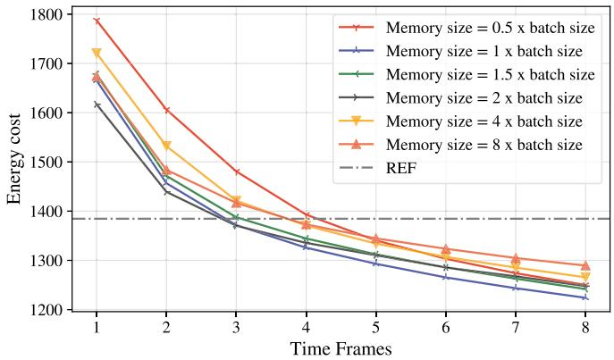

<details>
<summary>line</summary>

| Time Frames | Memory size = 0.5 x batch size | Memory size = 1 x batch size | Memory size = 1.5 x batch size | Memory size = 2 x batch size | Memory size = 4 x batch size | Memory size = 8 x batch size | REF |
| ----------- | ------------------------------- | ----------------------------- | ------------------------------- | ----------------------------- | ----------------------------- | ----------------------------- | --- |
| 1           | 1790                            | 1680                          | 1670                            | 1620                          | 1730                          | 1680                          | 1400 |
| 2           | 1610                            | 1470                          | 1460                            | 1440                          | 1530                          | 1490                          | 1400 |
| 3           | 1490                            | 1380                          | 1370                            | 1360                          | 1420                          | 1400                          | 1400 |
| 4           | 1390                            | 1330                          | 1320                            | 1310                          | 1380                          | 1370                          | 1400 |
| 5           | 1350                            | 1300                          | 1290                            | 1280                          | 1350                          | 1340                          | 1400 |
| 6           | 1320                            | 1270                          | 1260                            | 1250                          | 1320                          | 1310                          | 1400 |
| 7           | 1300                            | 1250                          | 1240                            | 1230                          | 1300                          | 1290                          | 1400 |
| 8           | 1280                            | 1230                          | 1220                            | 1210                          | 1280                          | 1270                          | 1400 |
</details>

Fig. 6. Impact of memory buffer size on system energy cost. Each time frame represents the average energy costs of over 25,000 IOPO execution steps.

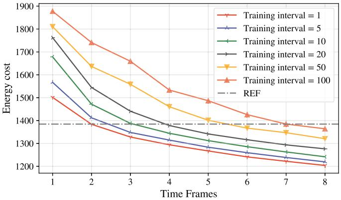

<details>
<summary>line</summary>

| Time Frames | Training interval = 1 | Training interval = 5 | Training interval = 10 | Training interval = 20 | Training interval = 50 | Training interval = 100 | REF |
| ----------- | --------------------- | --------------------- | ---------------------- | ---------------------- | ---------------------- | ----------------------- | --- |
| 1           | 1500                  | 1570                  | 1680                   | 1760                   | 1820                   | 1880                    | 1380 |
| 2           | 1400                  | 1420                  | 1480                   | 1540                   | 1640                   | 1740                    | 1380 |
| 3           | 1350                  | 1360                  | 1400                   | 1440                   | 1560                   | 1660                    | 1380 |
| 4           | 1320                  | 1330                  | 1360                   | 1380                   | 1460                   | 1540                    | 1380 |
| 5           | 1290                  | 1290                  | 1330                   | 1340                   | 1420                   | 1480                    | 1380 |
| 6           | 1270                  | 1270                  | 1300                   | 1320                   | 1380                   | 1440                    | 1380 |
| 7           | 1250                  | 1250                  | 1280                   | 1300                   | 1360                   | 1380                    | 1380 |
| 8           | 1230                  | 1230                  | 1260                   | 1280                   | 1340                   | 1360                    | 1380 |
</details>

Fig. 7. Impact of Training Interval size on energy cost. Each time frame represents the average energy cost of over 25,000 IOPO execution steps.

TABLE VIII IOPO PERFORMANCE WITH DIFFERENT MEMORY SIZES (WITH OVERDUE PENALTY = 100) 

<table><tr><td>Memory Size</td><td>Eng Cost</td><td>#Improved</td></tr><tr><td>0.5 batch size</td><td>1256.82</td><td>121689</td></tr><tr><td>1 batch size</td><td>1232.28</td><td>131871</td></tr><tr><td>1.5 batch size</td><td>1253.76</td><td>124038</td></tr><tr><td>2 batch size</td><td>1273.86</td><td>121413</td></tr><tr><td>4 batch size</td><td>1285.07</td><td>117858</td></tr><tr><td>8 batch size</td><td>1294.34</td><td>111396</td></tr></table>

# G. Model Analysis: Memory Buffer Size

In this experiment, we investigate the influence of memory buffer size on the performance of IOPO. The number of users in the system is set to 20, and the number of UAVs is set to 3. Fig. 6 shows the overdue-penalized energy costs of offloading decisions predicted by IOPO during the entire IOPO execution. The REF horizontal line represents the average energy cost of the initially provided reference offloading decisions. As depicted in Fig. 6, IOPO with various memory sizes outperforms the REF offloading decisions as the iteration progresses. This improvement is attributed to the OPPO unit in IOPO, which can discover offloading decisions with low energy costs as the IOPO execution progresses. Moreover, IOPO with a memory size equal to the batch size demonstrates the lowest energy cost by the end of IOPO execution, compared to other memory size configurations. To provide a comprehensive understanding of the impact of memory size, Table VIII presents the average overdue-penalized energy costs (Eng Cost) over the last 1,000 system time frames and the number of IOPO-predicted offloading decisions that surpass the initially provided reference offloading decisions (#Improved). Results indicate that the optimal IOPO performance is achieved when the memory size aligns with the batch size, with the lowest test energy cost recorded as 1232.28 and the largest number of improved allocations discovered as 131,871. These findings highlight the significance of aligning the memory size with the size of training batches for optimal IOPO performance.

When considering alternative memory sizes, we observe slightly higher system energy costs and smaller numbers of offloading decisions discovered compared to the optimal configuration. Additionally, as the memory size becomes larger, the overall energy cost increases. This phenomenon can be attributed to the difficulty of sampling the most recently improved offloading decisions from a substantial historical pool when training the DNN. As a result, the DNN may acquire knowledge from sub-optimal historical data, leading to compromised performance and heightened energy consumption in IOPO-predicted offloading decisions.

# H. Model Analysis: Training Interval

In this experiment, we examine the impact of the size of the training interval λ on the performance of IOPO. The number of users in the system is set to 20 and the number of UAVs is set to 3. Fig. 7 illustrates the overdue-penalized energy cost of IOPO-predicted decisions and REF denotes the average energy cost of the initial reference offloading decisions.

As shown in Fig. 7, IOPO with different training interval sizes (1, 5, 10) can yield offloading decisions with similar and low energy costs after IOPO execution. When the training interval size is increased to 50 and 100, the resulting decisions exhibit higher energy costs. Moreover, the energy costs of IOPO with training intervals 50 and 100 are closer to the horizontal REF line, indicating a compromised performance of the OPPO unit in discovering improved offloading decisions when the training interval is large. This is because, with large training intervals, the parameters θ of the DNN offloading decision model $f _ { \theta }$ are updated less frequently. Consequently, the accuracy of the DNN is compromised, causing the predicted offloading decisions, which rely on the DNN-output probability matrix, to be impaired.

TABLE IX IOPO PERFORMANCE WITH VARIOUS TRAINING INTERVALS (WITH OVERDUE PENALTY = 100) 

<table><tr><td>Training Interval</td><td>Eng Cost</td><td>#Improved</td></tr><tr><td>1</td><td>1196.84</td><td>144841</td></tr><tr><td>5</td><td>1203.57</td><td>137763</td></tr><tr><td>10</td><td>1253.76</td><td>124038</td></tr><tr><td>20</td><td>1277.90</td><td>118099</td></tr><tr><td>50</td><td>1324.63</td><td>86867</td></tr><tr><td>100</td><td>1370.78</td><td>50734</td></tr></table>

Table IX demonstrates that the lowest system energy cost achieved is 1196.84, and the largest number of improved decisions discovered is 144841, both obtained when the training interval is set to 1. This is because a small training interval facilitates the update of DNN parameters and the improvement of DNN performance. With the continual improvement of the DNN, there is a corresponding enhancement in the IOPOpredicted offloading allocations that depend on the DNN’s performance. Subsequently, the DNN learns from these improved offloading decisions, leading to further enhancements in its own performance and a reduction in energy costs of IOPO-predicted decisions. However, it is important to note that using a smaller training interval may result in slower system speed due to the increased frequency of DNN parameter updates. If execution speed is a primary concern, it is reasonable to consider setting the training interval to 5 or 10, as these interval sizes yield energy costs that are close to the energy cost achieved with a training interval of 1.

# I. Model Analysis: Impact of IRS

In this experiment, we explore the influence of IRS on both data transmission speed and system energy consumption. Specifically, we conduct a comparative analysis involving the proposed IOPO framework against three distinct variants: (i) NO IRS, wherein the IRS board is excluded; (ii) IOPO (ZERO PHASE), denoting a configuration where the phase shift of all IRS reflecting elements is set to 0; and (iii) IOPO (RANDOM PHASE), where the phases shift of IRS reflecting elements are randomly assigned.

As depicted in Fig. 8(a), shows that IOPO consistently achieves superior data transmission speeds when compared to all three variants. Fig. 8(b), the removal of IRS from the system is observed to result in escalated energy consumption. Results demonstrate the efficacy of the IRS in reducing system energy consumption while augmenting data transmission rates. Moreover, IOPO consistently demonstrates reduced energy costs compared to both IOPO (RANDOM PHASE) and IOPO (ZERO PHASE) configurations in scenarios involving (15 users and 3 UAVs) and (20 users and 3 UAVs), while maintaining comparable energy consumption across other settings.

The trend of the lines in Fig. 8(b) indicates an increase in energy cost up to the point of (20 users and 4 UAVs). This is because the UAVs function as MEC servers. When the number of users increases while the computing resources remain constant, the total system cost rises. The increased user demand for the same resources leads to a higher average task allocation per UAV, resulting in higher energy costs. Adding more UAVs after this point alleviates the system’s computing burden and reduces energy costs.

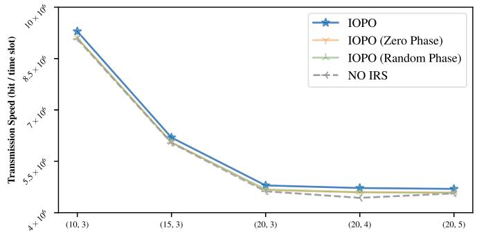

<details>
<summary>line</summary>

| X Value | IOPO       | IOPO (Zero Phase) | IOPO (Random Phase) | NO IRS     |
|---------|------------|-------------------|---------------------|------------|
| (10, 3) | 9.5e6      | 9.2e6             | 9.1e6               | 9.0e6      |
| (15, 3) | 6.8e6      | 6.5e6             | 6.4e6               | 6.3e6      |
| (20, 3) | 4.8e6      | 4.7e6             | 4.6e6               | 4.5e6      |
| (20, 4) | 4.5e6      | 4.4e6             | 4.3e6               | 4.2e6      |
| (20, 5) | 4.4e6      | 4.3e6             | 4.2e6               | 4.1e6      |
</details>

(a) Data Transmission Speed

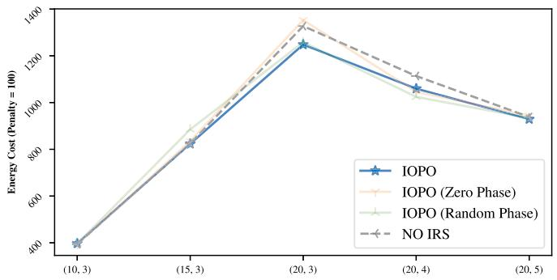

<details>
<summary>line</summary>

| X Value | IOPO   | IOPO (Zero Phase) | IOPO (Random Phase) | NO IRS |
|---------|--------|-------------------|---------------------|--------|
| (10, 3) | 400    | 400               | 400                 | 400    |
| (15, 3) | 800    | 800               | 800                 | 800    |
| (20, 3) | 1300   | 1400              | 1350                | 1350   |
| (20, 4) | 1100   | 1150              | 1050                | 1150   |
| (20, 5) | 950    | 950               | 950                 | 950    |
</details>

(b） System Overdue-Penalized Energy Cost  
Fig. 8. Impact of IRS on system energy and data transmission speed. The x-axis denotes (the number of users, and the number of UAVs) in the system.

Although the energy consumption differences might appear less significant at certain points, IOPO consistently demonstrates superior energy efficiency in most scenarios, making it a more stable optimization than other variants. The less noticeable differences are due to the high transmission speeds under the THz network. Once the speed reaches a certain threshold, further improvements have a less pronounced effect on latency. At the point of (20 users and 3 UAVs), when resources are scarce, the benefits of optimizing IRS phase shifts to enhance channel gain become more apparent. In conclusion, the results highlight the advantages of incorporating IRS and optimizing its phase shift using IOPO over simplistic configurations such as uniformly zeroed or randomly assigned phase shifts.

# VIII. CONCLUSION

In this study, we investigate the task offloading problems in a multi-user multi-UAV MEC system that integrates an IRS and operates on the THz communication network. We present the modeling of the task offloading and the task processing procedure of the MEC system within the THz network and introduce IOPO, a novel deep learning-based framework designed to optimize the energy efficiency of task offloading decisions and the phase shifts of the IRS. The IOPO framework can generate satisfactory offloading decisions within milliseconds and is incorporated with a novel offloading decision-searching unit OPPO, enabling continuous search to identify improved offloading allocations. Extensive experimental results demonstrate the superiority of IOPO over baseline methods in generating energy-efficient offloading allocations and meeting task deadlines.

In the future, several directions exist to extend this work. First, the algorithm’s performance can be trained and evaluated in a realistic system (e.g., real THz data transmission environments, practical UAV energy losses, and real-world computational tasks) to improve the algorithm’s robustness and applicability in practical scenarios. Second, the IOPO’s performance can be further enhanced by optimizing the second-stage algorithm. Third, the proposed model can be extended to multiple base stations, encompassing wider areas and more UAVs and UEDs.

# REFERENCES

[1] Z. Yang, S. Bi, and Y.-J. A. Zhang, “Online trajectory and resource optimization for stochastic UAV-enabled MEC systems,” IEEE Trans. Wireless Commun., vol. 21, no. 7, pp. 5629–5643, Jul. 2022.   
[2] Y. K. Tun, Y. M. Park, N. H. Tran, W. Saad, S. R. Pandey, and C. S. Hong, “Energy-efficient resource management in UAV-assisted mobile edge computing,” IEEE Commun. Lett., vol. 25, no. 1, pp. 249–253, Jan. 2021.   
[3] Z. Chen, H. Zheng, J. Zhang, X. Zheng, and C. Rong, “Joint computation offloading and deployment optimization in multi-UAV-enabled MEC systems,” Peer-to-Peer Netw. Appl., vol. 15, pp. 194–205, 2022.   
[4] F. Guo, H. Zhang, H. Ji, X. Li, and V. C. Leung, “Joint trajectory and computation offloading optimization for UAV-assisted MEC with NOMA,” in Proc. IEEE Conf. Comput. Commun. Workshops, 2019, pp. 1–6.   
[5] L. Zhang et al., “Task offloading and trajectory control for UAV-assisted mobile edge computing using deep reinforcement learning,” IEEE Access, vol. 9, pp. 53708–53719, 2021.   
[6] J. Xue, Q. Wu, and H. Zhang, “Cost optimization of UAV-MEC network calculation offloading: A multi-agent reinforcement learning method,” Ad Hoc Netw., vol. 136, 2022, Art. no. 102981.   
[7] F. Zhou, Y. Wu, H. Sun, and Z. Chu, “UAV-enabled mobile edge computing: Offloading optimization and trajectory design,” in Proc. IEEE Int. Conf. Commun., 2018, pp. 1–6.   
[8] P. A. Apostolopoulos, G. Fragkos, E. E. Tsiropoulou, and S. Papavassiliou, “Data offloading in UAV-assisted multi-access edge computing systems under resource uncertainty,” IEEE Trans. Mobile Comput., vol. 22, no. 1, pp. 175–190, Jan. 2023.   
[9] H. Elayan, O. Amin, R. M. Shubair, and M.-S. Alouini, “Terahertz communication: The opportunities of wireless technology beyond 5G,” in Proc. Int. Conf. Adv. Commun. Technol. Netw., 2018, pp. 1–5.   
[10] A.-A. A. Boulogeorgos, E. N. Papasotiriou, and A. Alexiou, “A distance and bandwidth dependent adaptive modulation scheme for THz communications,” in Proc. IEEE 19th Int. Workshop Signal Process. Adv. Wireless Commun., 2018, pp. 1–5.   
[11] C. Pan et al., “Intelligent reflecting surface aided MIMO broadcasting for simultaneous wireless information and power transfer,” IEEE J. Sel. Areas Commun., vol. 38, no. 8, pp. 1719–1734, Aug. 2020.   
[12] T. Bai, C. Pan, C. Han, and L. Hanzo, “Reconfigurable intelligent surface aided mobile edge computing,” IEEE Wireless Commun., vol. 28, no. 6, pp. 80–86, Dec. 2021.   
[13] M. Ahmed et al., “Joint optimization of UAV-IRS placement and resource allocation for wireless powered mobile edge computing networks,” J. King Saud Univ.- Comput. Inf. Sci., vol. 35, no. 8, 2023, Art. no. 101646.   
[14] C. Zhao, X. Pang, W. Lu, Y. Chen, N. Zhao, and A. Nallanathan, “Energy efficiency optimization of IRS-assisted UAV networks based on statistical channels,” IEEE Wireless Commun. Lett., vol. 12, no. 8, pp. 1419–1423, Aug. 2023.   
[15] Y. Zhang, J. Li, G. Mu, and X. Chen, “Deep reinforcement learning enabled UAV-IRS-assisted secure mobile edge computing network,” Phys. Commun., vol. 61, 2023, Art. no. 102173.

[16] E. T. Michailidis, N. I. Miridakis, A. Michalas, E. Skondras, and D. J. Vergados, “Energy optimization in dual-RIS UAV-aided MEC-enabled internet of vehicles,” Sensors, vol. 21, no. 13, 2021, Art. no. 4392.   
[17] Q. Liu, J. Han, and Q. Liu, “Joint task offloading and resource allocation for RIS-assisted UAV for mobile edge computing networks,” in Proc. IEEE/CIC Int. Conf. Commun. China, 2023, pp. 1–6.   
[18] M. A. ElMossallamy, H. Zhang, L. Song, K. G. Seddik, Z. Han, and G. Y. Li, “Reconfigurable intelligent surfaces for wireless communications: Principles, challenges, and opportunities,” IEEE Trans. Cogn. Commun. Netw., vol. 6, no. 3, pp. 990–1002, Sep. 2020.   
[19] Y. Pan, K. Wang, C. Pan, H. Zhu, and J. Wang, “Sum-rate maximization for intelligent reflecting surface assisted terahertz communications,” IEEE Trans. Veh. Technol., vol. 71, no. 3, pp. 3320–3325, Mar. 2022.   
[20] W. Chen, X. Ma, Z. Li, and N. Kuang, “Sum-rate maximization for intelligent reflecting surface based terahertz communication systems,” in Proc. IEEE/CIC Int. Conf. Commun. Workshops China, 2019, pp. 153–157.   
[21] C. Chaccour, M. N. Soorki, W. Saad, M. Bennis, and P. Popovski, “Risk-based optimization of virtual reality over terahertz reconfigurable intelligent surfaces,” in Proc. IEEE Int. Conf. Commun., 2020, pp. 1–6.   
[22] C. Chaccour, M. N. Soorki, W. Saad, M. Bennis, and P. Popovski, “Risk-based optimization of virtual reality over terahertz reconfigurable intelligent surfaces,” in Proc. IEEE Int. Conf. Commun., 2020, pp. 1–6.   
[23] Y. Pan, K. Wang, C. Pan, H. Zhu, and J. Wang, “UAV-assisted and intelligent reflecting surfaces-supported terahertz communications,” IEEE Wireless Commun. Lett., vol. 10, no. 6, pp. 1256–1260, Jun. 2021.   
[24] S. Li, B. Duo, X. Yuan, Y.-C. Liang, and M. Di Renzo, “Reconfigurable intelligent surface assisted UAV communication: Joint trajectory design and passive beamforming,” IEEE Wireless Commun. Lett., vol. 9, no. 5, pp. 716–720, May 2020.   
[25] S. Ahmad, S. Khan, K. S. Khan, F. Naeem, and M. Tariq, “Resource allocation for IRS-assisted networks: A deep reinforcement learning approach,” IEEE Commun. Standards Mag., vol. 7, no. 3, pp. 48–55, Sep. 2023.   
[26] T. P. Lillicrap et al., “Continuous control with deep reinforcement learning,” 2015, arXiv:1509.02971.   
[27] L. Huang, S. Bi, and Y.-J. A. Zhang, “Deep reinforcement learning for online computation offloading in wireless powered mobile-edge computing networks,” IEEE Trans. Mobile Comput., vol. 19, no. 11, pp. 2581–2593, Nov. 2020.   
[28] R. Dong, C. She, W. Hardjawana, Y. Li, and B. Vucetic, “Deep learning for hybrid 5G services in mobile edge computing systems: Learn from a digital twin,” IEEE Trans. Wireless Commun., vol. 18, no. 10, pp. 4692–4707, Oct. 2019.   
[29] X. Chen, H. Zhang, C. Wu, S. Mao, Y. Ji, and M. Bennis, “Performance optimization in mobile-edge computing via deep reinforcement learning,” in Proc. IEEE 88th Veh. Technol. Conf., 2018, pp. 1–6.   
[30] M. Min, L. Xiao, Y. Chen, P. Cheng, D. Wu, and W. Zhuang, “Learningbased computation offloading for IoT devices with energy harvesting,” IEEE Trans. Veh. Technol., vol. 68, no. 2, pp. 1930–1941, Feb. 2019.   
[31] F. Jiang, K. Wang, L. Dong, C. Pan, W. Xu, and K. Yang, “Deep-learningbased joint resource scheduling algorithms for hybrid MEC networks,” IEEE Internet of Things J., vol. 7, no. 7, pp. 6252–6265, Jul. 2020.   
[32] Y. M. Park, S. S. Hassan, Y. K. Tun, Z. Han, and C. S. Hong, “Joint resources and phase-shift optimization of MEC-enabled UAV in IRSassisted 6G THz networks,” in Proc. IEEE/IFIP Netw. Operations Manage. Symp., 2022, pp. 1–7.   
[33] X. Wang et al., “Wireless powered mobile edge computing networks: A survey,” ACM Comput. Surv., vol. 55, no. 3, pp. 263:1–263:37, 2023.   
[34] M. Wu, W. Qi, J. Park, P. Lin, L. Guo, and I. Lee, “Residual energy maximization for wireless powered mobile edge computing systems with mixed-offloading,” IEEE Trans. Veh. Technol., vol. 71, no. 4, pp. 4523–4528, Apr. 2022.   
[35] T. Zhu, J. Li, Z. Cai, Y. Li, and H. Gao, “Computation scheduling for wireless powered mobile edge computing networks,” in Proc. IEEE Conf. Comput. Commun., 2020, pp. 596–605.   
[36] X. Cao, F. Wang, J. Xu, R. Zhang, and S. Cui, “Joint computation and communication cooperation for energy-efficient mobile edge computing,” IEEE Internet Things J., vol. 6, no. 3, pp. 4188–4200, Jun. 2019.   
[37] O. Maraqa, S. Al-Ahmadi, A. S. Rajasekaran, H. U. Sokun, H. Yanikomeroglu, and S. M. Sait, “Energy-efficient optimization of multiuser NOMA-assisted cooperative THz-SIMO MEC systems,” IEEE Trans. Commun., vol. 71, no. 6, pp. 3763–3779, Jun. 2023.   
[38] N. Srivastava, G. Hinton, A. Krizhevsky, I. Sutskever, and R. Salakhutdinov, “Dropout: A simple way to prevent neural networks from overfitting,” J. Mach. Learn. Res., vol. 15, no. 56, pp. 1929–1958, 2014.

[39] D. P. Kingma and J. Ba, “Adam: A method for stochastic optimization,” 2017, arXiv:1412.6980.   
[40] Z. Tang, J. Lou, and W. Jia, “Layer dependency-aware learning scheduling algorithms for containers in mobile edge computing,” IEEE Trans. Mobile Comput., vol. 22, no. 6, pp. 3444–3459, Jun., 2023.   
[41] S. Mirjalili and A. Lewis, “The whale optimization algorithm,” Adv. Eng. Softw., vol. 95, pp. 51–67, 2016.   
[42] Q.-V. Pham, S. Mirjalili, N. Kumar, M. Alazab, and W.-J. Hwang, “Whale optimization algorithm with applications to resource allocation in wireless networks,” IEEE Trans. Veh. Technol., vol. 69, no. 4, pp. 4285–4297, Apr. 2020.   
[43] H.-J. Song and T. Nagatsuma, “Present and future of terahertz communications,” IEEE Trans. THz Sci. Technol., vol. 1, no. 1, pp. 256–263, Sep. 2011.


<details>
<summary>natural_image</summary>

Portrait of a young man wearing glasses and a suit against a blue background (no text or symbols visible)
</details>

Zhiqing Tang (Member, IEEE) received the BS degree from the School of Communication and Information Engineering, University of Electronic Science and Technology of China, China, in 2015, and the PhD degree from the Department of Computer Science and Engineering, Shanghai Jiao Tong University, China, in 2022. He is currently an assistant professor with the Advanced Institute of Natural Sciences, Beijing Normal University, China. His current research interests include edge computing, resource scheduling, and reinforcement learning.


<details>
<summary>natural_image</summary>

Portrait of a person wearing glasses and a white collared shirt against a blue background (no text or symbols visible)
</details>

Jianqiu Wu received the MS degree from the Faculty of Engineering, Chinese University of Hong Kong, in 2018. She is currently working toward the MPhil degree with the Department of Computer Science, BNU-HKBU United International College, Zhuhai, China. She is supervised by Dr. Jianxiong Guo, and her research interests include reinforcement learning, mobile edge computing, and deep learning in wireless communications.


<details>
<summary>natural_image</summary>

Portrait photo of a man in formal attire (no text or symbols visible)
</details>

Tian Wang (Senior Member, IEEE) received the BSc and MSc degrees in computer science from the Central South University, in 2004 and 2007, respectively, and the PhD degree in computer science from the City University of Hong Kong, in 2011. Currently, he is a professor with the Institute of Artificial Intelligence and Future Networks, Beijing Normal University. His research interests include the Internet of Things, edge computing, and mobile computing. He has more than 15000 citations, according to Google Scholar. His H-index is 71.


<details>
<summary>natural_image</summary>

Portrait photo of a young man with short dark hair wearing a light blue shirt (no text or symbols visible)
</details>

Zhongyi Yu received the BS degree from the Department of Computer Science, BNU-HKBU United International College, Zhuhai, China, in 2020, and the MS degree from the School of Informatics, University of Edinburgh, Edinburgh, U.K., in 2022. His research interests include reinforcement learning, natural language processing, causal inference, and efficient machine learning.


<details>
<summary>natural_image</summary>

Portrait of a man in a light blue shirt and dark tie (no text or symbols visible)
</details>

Weijia Jia (Fellow, IEEE) received the BSc and MSc degree from Center South University, China, in 1982 and 1984, and the master of applied science and PhD degrees from the Polytechnic Faculty of Mons, Belgium, in 1992 and 1993, respectively, all in computer science. He is currently a chair professor, director of BNU-UIC Institute of Artificial Intelligence and Future Networks, Beijing Normal University (Zhuhai) and VP for Research of BNU-HKBU United International College (UIC) and has been the Zhiyuan chair professor of Shanghai Jiao Tong University, China.


<details>
<summary>natural_image</summary>

Portrait of a young man wearing glasses and a gray shirt against a blue background (no text or symbols visible)
</details>

Jianxiong Guo (Member, IEEE) received the BE degree from the School of Chemistry and Chemical Engineering, South China University of Technology, Guangzhou, China, in 2015, and the PhD degree from the Department of Computer Science, University of Texas at Dallas, Richardson, TX, USA, in 2021. He is currently an associate professor with the Advanced Institute of Natural Sciences, Beijing Normal University, and also with the Guangdong Key Lab of AI and Multi-Modal Data Processing, BNU-HKBU United International College, Zhuhai, China. He is a member

of the ACM/CCF. He has published more than 80 peer-reviewed papers and been the reviewer for many famous international journals/conferences. His research interests include social networks, wireless sensor networks, combinatorial optimization, and machine learning.

He was the chair professor and the deputy director with the State Kay Laboratory of Internet of Things for Smart City, University of Macau. From 1993–1995, he joined German National Research Center for Information Science (GMD) in Bonn (St. Augustine) as a research fellow. From 1995–2013, he worked with the City University of Hong Kong as a professor. His contributions have been recognized as optimal network routing and deployment; anycast and QoS routing, sensors networking, AI (knowledge relation extractions; NLP, etc.), and edge computing. He has more than 600 publications in the prestige international journals/conferences and research books and book chapters. He has received the best product awards from the International Science & Tech. Expo (Shenzhen) in 2011–2012 and the 1st Prize of Scientific Research Awards from the Ministry of Education of China in 2017 (list 2). He has served as area editor for various prestige international journals, chair, PC member, and keynote speaker for many top international conferences. He is the distinguished member of CCF.