# Two-Tier Submodel Partition Framework for Enhancing UAV Swarm Robustness in Forest Fire Detection

Xingyu Li , Wenzhe Zhang, Linfeng Liu , Member, IEEE, and Ping Wang , Fellow, IEEE

Abstract—The deployment of Unmanned Aerial Vehicle (UAV) swarm for Forest Fire Detection (FFD) missions presents unique challenges, e.g., the early forest fires are difficult to identify due to environment diversity and feature complexity, especially when some UAVs could be destroyed in harsh environments. To address these challenges, UAV swarm-based FFD missions can leverage advanced deep learning techniques, where online model updates, robustness, and communication overhead control become crucial for ensuring the effectiveness and adaptability of these missions. In this paper, we propose a Two-tier Submodel Partition Framework (TSPF) to enhance the robustness of UAV swarm conducting FFD missions. TSPF utilizes online model updates to adapt to diverse mission environments, thus strengthening the generalization capability of the model. In addition, a graph coloring method, an intragroup backup mechanism, and a Dynamic Server Selection (DSS) mechanism for the grouping are employed to enhance the robustness of FFD missions when some UAVs are destroyed, hence maintaining the high performance of FFD missions in harsh environments. Moreover, TSPF enables submodel updates by aggregating the parameters of selected layers within/between UAV groups, thereby effectively reducing the model parameter uploads (communication overhead) in model training. Experimental evaluations demonstrate that our proposed TSPF significantly improves the detection accuracy of forest fires, enhances the robustness of FFD missions against the destruction of some UAVs, and reduces the communication overhead in FFD missions.

Index Terms—Unmanned aerial vehicle (UAV) swarm, forest fire detection (FFD), robustness of FFD missions, two-tier submodel partition.

## I. INTRODUCTION

N RECENT years, the rapid development of the Internet of Things (IoT), artificial intelligence, edge computing, and other technologies have significantly expanded the applications of Unmanned Aerial Vehicles (UAVs). As one of the fundamental applications, Unmanned Aerial Vehicle Object Detection (UAV-OD) has garnered considerable interest [1], [2]. Especially, a UAV swarm, composed of multiple UAVs working as a team, can offer enhanced intelligence, coordination, flexibility, survivability, and reconfigurability, thus enabling the execution of sophisticated missions with superior performance compared with a single UAV [3]. Such capabilities are critical in various fields, including military surveillance [4], disaster relief, agriculture detection [5], and Forest Fire Detection (FFD) [6].

Forest fires represent one of the most costly and deadly natural disasters worldwide, causing huge damage to millions of hectares of forest resources and posing significant threats to human and animal lives [7]. Prompt and accurate FFD is therefore of paramount importance for early warning and rescue. In this paper, we propose a solution that uses a UAV swarm with a UAV-OD model. However, deploying the UAV-OD model into the mission environments often reveals limitations in the generalization capability of the model due to the time-varying diversification of the mission environments (e.g., shifting weather, varying terrain, or spreading fires) [8] and fire behaviors.

Thus, it is crucial to implement online model updates for the UAV swarm to adapt to the time-varying mission environments and fire behaviors. A Federated Learning (FL) framework is suitable for implementing online model updates [9], [10], since UAVs can collaborate to train a UAV-OD model, thus improving the detection accuracy and significantly reducing the communication overhead (the videos and images captured by UAVs do not need to be transmitted). In addition, for online model updates, the UAV swarm should utilize the real-time data (videos and images) captured from the visual coverage of UAVs for the training of the UAV-OD model. The harsh environments of forest fire hazards will inevitably pose threats to the UAV swarm, and make some UAVs destroyed. As illustrated in Fig. 1, such threats could hinder online model updates due to the data loss from the destroyed UAVs, and hence the performance of FFD missions could be seriously affected.

Therefore, it is necessary to investigate the robustness of UAV swarm conducting FFD missions against the destruction of some UAVs, and some key considerations are provided as follows: Naturally, an intragroup backup mechanism can reduce the data loss from the destroyed UAVs and avoid the large communication overhead of centralized data backup. Typically, UAV groups are formed based on their spatial distribution, which makes

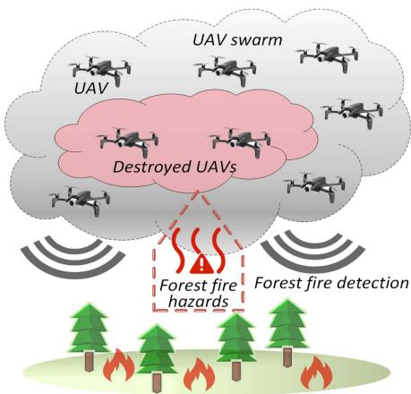  
Fig. 1. Threats to UAV swarm in forest fire hazards.

UAVs in the same group spatially adjacent [11]. However, this grouping manner could pose significant risks to FFD missions, e.g., if an airspace inhabited by one or more groups is attacked by the hot airstreams caused by fire behaviors, all UAVs falling into the airspace could be destroyed, and the local data maintained by these UAVs is completely lost. To mitigate this risk, we design a graph coloring method to group UAVs. UAVs assigned the same color form a group and are distributed in a dispersed manner to prevent spatial aggregation. Besides, a Dynamic Server Selection (DSS) mechanism is proposed to avoid failures of FFD missions due to the destruction of group servers or swarm server. The above mechanisms also help mitigate the intermittent communication failures, enhancing the robustness of UAV swarm conducting FFD missions: The intragroup backup mechanism can recover the missing information to avoid the performance decline if some UAVs lose their contacts temporarily, and DSS mechanism periodically reselects the servers based on the scores of UAVs, which also implies that the lost UAVs can rejoin the UAV swarm when their scores have been received by other UAVs again.

FL reduces the requirement of transmitting the business data, which can reduce the communication overhead compared with traditional centralized learning methods. However, FL still involves frequent exchanges of all model parameters, which incurs a non-negligible communication overhead, especially in UAV swarm-based FFD missions. To this end, our proposed Two-tier Submodel Partition Framework (TSPF) adopts a two-tier learning manner combined with a submodel update method to further reduce the communication overhead in model training. In our proposed two-tier learning manner, the lower-tier training refers to the local training of UAVs in the same groups, which facilitates the generation of the optimal group models; the upper-tier operations contain the submodel parameters concatenation and aggregation to update the global model at the swarm level, and the training performance can be optimized through implementing the upper-tier operations. (i) In the lower-tier, each UAV trains a local model, and the parameters of some selected layers (a submodel) are uploaded to group server for the aggregation with the parameters uploaded from other intragroup UAVs, thereby effectively reducing the model parameter uploads (communication overhead) in model training. (ii) In the upper-tier, the global aggregation and concatenation of the submodel parameters are implemented by the swarm server, collaboratively training the global model, which enables sufficient updates across all submodels and promotes rapid convergence.

TABLE I  
KEYS PARAMETERS EXCHANGED FOR TWO-TIER LEARNING
<table><tr><td rowspan=1 colspan=1>Sender</td><td rowspan=1 colspan=1>Receiver</td><td rowspan=1 colspan=1>Key parameters</td></tr><tr><td rowspan=1 colspan=1>UAV</td><td rowspan=1 colspan=1>Group server</td><td rowspan=1 colspan=1>Parameters of selected layers</td></tr><tr><td rowspan=1 colspan=1>Group server</td><td rowspan=1 colspan=1>Swarm server</td><td rowspan=1 colspan=1>Submodel parameters</td></tr><tr><td rowspan=1 colspan=1>Swarm server</td><td rowspan=1 colspan=1>Group server</td><td rowspan=1 colspan=1>Global model parameters</td></tr><tr><td rowspan=1 colspan=1>Group server</td><td rowspan=1 colspan=1>UAV</td><td rowspan=1 colspan=1>Global model parameters</td></tr></table>

Intuitively, the key parameters exchanged between UAVs, the group servers, and the swarm server has shown in Table I. Each UAV uses its full model parameters for the local training, only the parameters of some selected layers (part of model parameters) are uploaded to the group server for the aggregation. The selection of layers is determined by the layer selection strategy in the two-tier learning manner, where the global model is divided into some disjoint submodels consisting of a unique subset of layers from the full model. These parameters are aggregated to form the submodel parameters in the lower-tier, and the submodel parameters are passed to the swarm server for the upper-tier operations. The communication overhead in model training is largely reduced, compared to the situation that all local parameters of UAVs must be uploaded to group servers.

To provide an overview of the key considerations, the basic methodology of TSPF is illustrated in Fig. 2. The main contributions of this paper are summarized as follows:

\- We propose a TSPF that utilizes online model updates to adapt to diverse mission environments, thus strengthening the generalization capability of the model, ensuring the effectiveness and adaptability of UAV swarm-based FFD missions.

\- A graph coloring method, an intragroup backup mechanism, and a dynamic server selection mechanism for the grouping are introduced to enhance the robustness of UAV swarm conducting FFD missions against the destruction of some UAVs.

\- By adopting a two-tier learning manner combined with a submodel update method, the proposed TSPF significantly reduces the communication overhead in model training.

The remainder of this paper is organized as follows: Section II briefly surveys some existing related studies. Section III provides a system model and problem formulation for the robustness of UAV swarm conducting FFD missions. Section IV proposes Two-tier Submodel Partition Framework (TSPF). Section V covers some further analyses on TSPF, including complexity, model convergence, and settings of group number and partition number. Simulation results for performance evaluation of TSPF are reported in Section VI. Finally, Section VII concludes the paper.

## II. RELATED WORK

## A. UAV Swarm for Forest Fire Detection

The application of UAV swarm, especially in conjunction with mobile edge computing, has shown promise in distributed computation-intensive missions such as FFD. As a single UAV typically has limited visual coverage and computational power for complex missions, the swarming techniques enable UAVs to collaborate with each other, extending the operational scope and adaptability of individual UAVs in complex missions [12]. Through collaborative grouping, UAVs can tackle the complex missions and enhance the mission efficiency and robustness of UAV swarm.

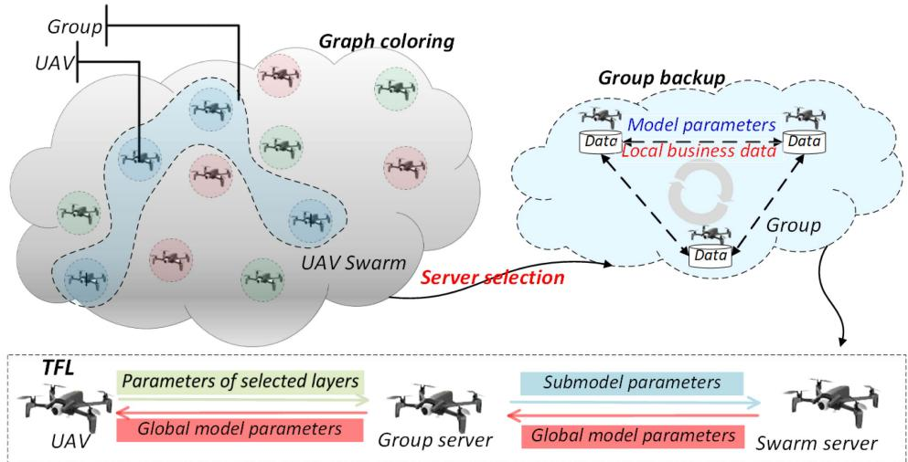  
Fig. 2. Basic methodology of our proposed TSPF.

For instance, [7] presents a UAV-assisted edge computing system for accurate forest fire detection and segmentation. This system is built to promptly link the feedback of the edge model with the edge gateway, administrators, and other intelligent devices. To further address the challenge of resource depletion of UAVs in FFD missions, [13] proposes a lightweight hierarchical artificial intelligence framework, which adaptively switches between a simple machine learning-based model and an advanced deep learning-based Convolutional Neural Network (CNN) model to optimize the trade-off between FFD accuracy and computational cost.

The current studies highlight the advantages of UAV swarm and edge computing of FFD missions. However, the traditional centralized machine learning approaches are typically not suitable for the UAV swarm due to the challenge in transmitting large size of raw data with the constraints of limited bandwidth and battery energy. In contrast, as a decentralized approach, FL is more suitable for the UAV swarm, and can enable more efficient edge intelligence [14], [15].

## B. Applications of Federated Learning in UAV Swarm

FL has been applied in many existing works. For instance, [16] proposes a Hybrid Split and Federated Learning (HSFL) framework that combines Split Learning (SL) and FL to train the learning models on UAVs jointly. UAVs with satisfactory channel qualities and local model updates are selected to participate in the global model updates. This architecture achieves higher learning performance than FL and smaller communication overhead than SL on both Independent and Identically Distributed (IID) datasets and non-IID datasets. To enhance the edge intelligence, [17] introduces the Air-Ground Integrated Federated Learning (AGIFL) framework, which utilizes the flexible ondemand 3D deployment of UAVs and allows all UAVs to collaboratively train an effective learning model. Ref. [18] combines FL with imitation learning to coordinate the maneuvers of UAVs by interactively imitating the operations of the leader UAV.

Unlike traditional FL which requires the transmission of entire models, [19] optimizes the resource usage by transmitting some critical model layers. Local model aggregation eliminates the need for the centralized servers, thus reducing the bandwidth usage and achieving a low transmission failure rate. Likewise, [20] introduces a model-heterogeneous FL framework that employs a rolling submodel extraction scheme, and allows different parts of the global server model to be evenly trained. This framework mitigates the client drift [21] induced by the inconsistency between individual client models and server model. Ref. [22] introduces a robust and fair model aggregation solution, Romoa-AFL, for cross-silo FL in an agnostic data setting.

Based on the above studies, FL prioritizes two main aspects in various applications: reducing the computational complexity during the parameter aggregation, and improving the resource utilization among devices. Applying FL in the UAV swarm can greatly boost the mission efficiency and reduce the communication/computational overhead [23].

## C. Robustness of UAV Swarm Missions

Despite the extensive research on UAV communications, path planning, and mission collaborations, the robustness of UAV swarm conducting FFD missions remains a vital issue worth further investigation.

Concerning the robustness issue, [24] explores the biological robustness and designs a reliable UAV swarm to resist the destruction of UAVs, thereby ensuring the reliable end-to-end communications. In addition, [25] investigates the effect of erasure codes on the cost-effective data storage at edges, aiming to minimize the storage cost while ensuring that all users can be served. The problem in [25] is mapped into an integer linear programming problem, which is NP-hard. Ref. [26] proposes a three-layer metric framework for the robustness evaluation of UAV swarm, and the robustness evaluation is made based on three metrics: structure topology, flow connectivity, and mission effectiveness. When some UAVs are destroyed, [27] proposes a self-healing trajectory planning algorithm that utilizes a monitoring mechanism and a graph convolutional neural network to identify the recovery topology of UAV swarm.

TABLE II MAIN NOTATIONS
<table><tr><td rowspan=1 colspan=1>Parameter</td><td rowspan=1 colspan=1>Description</td></tr><tr><td rowspan=1 colspan=1> $\overline { { U } }$ </td><td rowspan=1 colspan=1>UAV swarm</td></tr><tr><td rowspan=1 colspan=1>X</td><td rowspan=1 colspan=1>Number of groups in U</td></tr><tr><td rowspan=1 colspan=1> $\overline { { t ^ { * } } }$ </td><td rowspan=1 colspan=1>Update interval (number of time slots)</td></tr><tr><td rowspan=1 colspan=1> $\overline { { N _ { d } } }$ </td><td rowspan=1 colspan=1>Number of destroyed UAVs</td></tr><tr><td rowspan=1 colspan=1> $\overline { { G _ { k } } }$ </td><td rowspan=1 colspan=1>The k-th group in U</td></tr><tr><td rowspan=1 colspan=1> $\overline { { V _ { d } ( G _ { k } ) } }$ </td><td rowspan=1 colspan=1>Set of destroyed UAVs in group $\overline { { G _ { k } } }$ </td></tr><tr><td rowspan=1 colspan=1> $D _ { l o c } ^ { ( t ) } ( v _ { i } )$ </td><td rowspan=1 colspan=1>Local dataset of UAV $v _ { i }$ at the t-th timeslot</td></tr><tr><td rowspan=1 colspan=1> $D _ { b u s } ^ { ( t ) } ( v _ { i } )$ </td><td rowspan=1 colspan=1>Model parameter and business data ofUAV $v _ { i }$ in $\underline { { D _ { l o c } ^ { ( t ) } ( v _ { i } ) } }$ </td></tr><tr><td rowspan=1 colspan=1> $B ^ { ( t ) } ( v _ { i } )$ </td><td rowspan=1 colspan=1>Business data collected from the visualcoverage of UAV $v _ { i }$ at the t-th time slot</td></tr><tr><td rowspan=1 colspan=1> $\overline { { D ^ { ( t ) } ( G _ { k } ) } }$ </td><td rowspan=1 colspan=1>Dataset of group $G _ { k }$ at the t-th time slot</td></tr><tr><td rowspan=1 colspan=1> $D _ { r e s } ( G _ { k } , V _ { d } ( G _ { k } ) )$ </td><td rowspan=1 colspan=1>Restored data of group $\overline { { G _ { k } } }$ underdestruction of UAVs in $V _ { d } ( G _ { k } )$ </td></tr><tr><td rowspan=1 colspan=1> $\overline { { O H ( U , \chi ) } }$ </td><td rowspan=1 colspan=1>Communication overhead of $\overline { { \pmb { U } } }$ </td></tr></table>

To deal with the destruction of some UAVs in a UAV swarm, our work presents a new approach using a graph coloring method to uniformly organize UAVs into groups. This method is designed to disperse UAVs and mitigate the risk of data loss when all UAVs in the same groups are destroyed. Besides, an intragroup backup mechanism is employed within each group, which allows the local data of destroyed UAVs to be restored during FFD missions, thereby enhancing the robustness of FFD missions and relieving the performance decline of FFD missions. Furthermore, our work also introduces a Two-tier Federated Learning (TFL) model, focusing on the reduction of the communication overhead in FFD missions.

## III. SYSTEM MODEL AND PROBLEM FORMULATION

In this section, we formulate the robustness problem of UAV swarm conducting FFD missions against the destruction of some UAVs. Table II first provides an overview of the main notations. Time is divided into discrete time slots with an equal length, and some relevant definitions are given as follows.

## A. UAVs and UAV Groups

Assuming that there are N UAVs in a UAV swarm, denoted by $U = \{ v _ { 1 } , \ldots , v _ { N } \}$ . In this work, we assume that all UAVs <sup>=</sup>in the UAV swarm are trustable and their cooperations are reliable, without any malicious attackers or data stealers. The local dataset of a $\mathrm { U A V } ~ v _ { i }$ at the tth time slot is denoted by $D _ { l o c } ^ { ( t ) } ( v _ { i } )$ which is composed of three parts: (i) The local model parameters of $v _ { i } ,$ , denoted by $w _ { i } ^ { ( t ) }$ ; (ii) The local business data (videos and images) collected from the visual coverage of $v _ { i } ,$ denoted by $D _ { b u s } ^ { ( t ) } ( v _ { i } ) = \{ B ^ { ( 0 ) } ( v _ { i } ) , \ldots , B ^ { ( t ) } ( v _ { i } ) \} ; { ( i i i ) }$ The local model parameters and business data of other UAVs in the same group backed up by $v _ { i }$ (supposing $v _ { i }$ belongs to the group $G _ { k } )$ , i.e., $\begin{array} { r l } { \bigcup _ { v _ { j } \in G _ { k } \backslash v _ { i } } \{ w _ { j } ^ { ( t ) } \bigcup D _ { b u s } ^ { ( t ) } ( v _ { j } ) \} } \end{array}$

Therefore, $D _ { l o c } ^ { ( t ) } ( v _ { i } )$ is expressed as:

$$
D _ { l o c } ^ { ( t ) } ( v _ { i } ) = w _ { i } ^ { ( t ) } \bigcup D _ { b u s } ^ { ( t ) } ( v _ { i } ) \bigcup _ { v _ { j } \in G _ { k } \backslash v _ { i } } \left\{ w _ { j } ^ { ( t ) } \bigcup D _ { b u s } ^ { ( t ) } ( v _ { j } ) \right\} .\tag{1}
$$

All UAVs participate in collaboratively training the global model of UAV swarm U . U is divided into $\chi$ groups by a graph coloring method. The group dataset of each group is updated every $t ^ { * }$ time slots, with each intragroup UAV uploading the local dataset to the group server. For example, in $G _ { k }$ , the group server $g _ { k }$ consolidates the local datasets (uploaded by the intragroup UAVs) to form the group dataset $D ^ { ( t ) } { \bar { ( G _ { k } ) } }$ , which is then released to all UAVs in $G _ { k }$

$$
D ^ { ( t ) } ( G _ { k } ) = \bigcup _ { v _ { i } \in G _ { k } } D _ { l o c } ^ { ( t ) } ( v _ { i } ) .\tag{2}
$$

The communication range of a UAV is typically large, e.g., the communication range of UAVs reaches 400 m [28], thus we assume that UAVs in the UAV swarm can directly communicate with others.

## B. Objective Functions

Assuming that $N _ { d } \mathrm { U A V s }$ are destroyed when the UAV swarm conducts FFD missions, where $N _ { d } = N - N _ { s }$ , and $N _ { s }$ denotes the number of surviving UAVs. Let $V _ { d } ( G _ { k } )$ denote the set of destroyed UAVs in the group $G _ { k }$ , where $\begin{array} { r } { N _ { d } = \sum _ { k = 1 } ^ { \chi } | V _ { d } ( G _ { k } ) } \end{array}$ |. Note that the local datasets of the destroyed UAVs can be restored through the data backup stored by surviving intragroup UAVs. To assess the robustness of UAV swarm conducting FFD missions, the problem objectives are formulated as follows:

$$
\left\{ \begin{array} { l l } { \operatorname* { m a x } \frac { A c c ^ { \prime } } { A c c } , } \\ { \operatorname* { m a x } \sum _ { k = 1 } ^ { \chi } | D _ { r e s } ( G _ { k } , V _ { d } ( G _ { k } ) ) | , } \\ { \operatorname* { m i n } O H ( U , \chi ) , } \end{array} \right.\tag{3}
$$

where Acc denotes the detection accuracy of FFD missions without any destroyed UAVs, and $A c c ^ { \prime }$ denotes the detection accuracy of FFD missions when some UAVs are destroyed. The ratio $\frac { A \dot { c } \dot { c } ^ { \prime } } { A c c }$ measures the mission performance maintenance under the destruction of UAVs. $\begin{array} { r } { \sum _ { k = 1 } ^ { \chi } | D _ { r e s } ( G _ { k } , V _ { d } ( G _ { k } ) ) | } \end{array}$ denotes the total size of restored data. $O H ( \pmb { U } , \chi )$ <sup>( ))</sup>denotes the total communication overhead.

## IV. TWO-TIER SUBMODEL PARTITION FRAMEWORK FOR ROBUSTNESS OF UAV SWARM CONDUCTING FFD MISSIONS

In this section, we propose a two-tier submodel partition framework termed TSPF, which first divides the UAV swarm into groups using a balanced graph coloring method, enabling UAVs in the same group to share and backup their local datasets. Besides, a DSS mechanism and a TFL model are specifically designed for FFD missions. Fig. 3 presents the main components in our proposed TSPF.

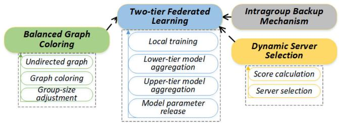  
Fig. 3. Main components in TSPF.

## A. Balanced Graph Coloring

A balanced graph coloring method is employed to uniformly distribute UAVs into groups, i.e., the group size of different groups (the number of intragroup UAVs in different groups) is very close to each other. In UAV swarm U , two UAVs $v _ { i }$ and $v _ { j }$ are connected by an edge $e ^ { ( t ) } ( v _ { i } , v _ { j } )$ if their euclidean distance $L _ { 2 } ^ { ( t ) } ( v _ { i } , v _ { j } )$ is not larger than the maximum distance for establishing edges between UAVs $( d _ { m a x } )$ . The set of UAV coordinates form a vertex set $V ^ { ( t ) }$ , and the edges between UAVs form an edge set $E ^ { ( t ) }$ , thus constructing an undirected graph (denoted by $( V ^ { ( t ) } , E ^ { ( t ) } ) _ { , }$ ).

The graph coloring assigns a distinct color to each group, and the adjacent vertices must be with different colors [29]. UAVs with the same color form a group, and the total number of colors (the chromatic number) is denoted by $\chi .$

In TSPF, UAVs are grouped over $\chi$ iterations by the graph coloring method: Initially, all UAVs fall into the uncolored set $U _ { 0 } ^ { ( 0 ) } = U$ . At the ith iteration $( \mathrm { e . g . }$ , at the tth time slot), the set of uncolored UAVs is denoted by $U _ { i } ^ { ( t ) }$ . A new color is introduced to form a new group $C G _ { i } ^ { ( t ) }$ , distinct from the colors marked in previous iterations. An uncolored UAV $v _ { \varrho }$ is randomly selected from $U _ { i } ^ { ( t ) }$ . We examine the edge set $E ^ { ( t ) }$ to identify the adjacent UAVs of $v _ { \varrho } ,$ denoted by $A U _ { \varrho } ^ { ( t ) }$ , where each UAV $v _ { \varepsilon } ( v _ { \varepsilon } \in A U _ { \varrho } ^ { ( t ) } )$ satisfies that $e ^ { ( t ) } ( v _ { \varrho } , v _ { \varepsilon } ) \in E ^ { ( t ) }$ . If none of the UAVs in $A U _ { \varrho } ^ { ( t ) }$ belongs to $C G _ { i } ^ { ( t ) }$ , and then $v _ { \varrho }$ is colored by the new color $( v _ { \varrho }$ is assigned into $C G _ { i } ^ { ( t ) } )$ . Then, the set of uncolored UAVs is updated by: $U _ { i } ^ { ( t ) }  U _ { i } ^ { ( t ) } \backslash v _ { \varrho }$ . The above process continues until the set of uncolored UAVs is empty and each UAV has been assigned into a group.

After the graph coloring, we further balance the size of groups. Unlike the equitable graph coloring [30], which requires that the size of any two groups is exactly equal (i.e., each group has $\begin{array} { r } { \gamma = \frac { N } { \chi } } \end{array}$ UAVs), TSPF allows for slight variation in the size of <sup>=</sup>groups. Specifically, the groups are categorized into over-sized groups (with more than γ UAVs) and under-sized groups (with fewer than γ UAVs). To address the imbalance, UAVs in oversized groups could be reassigned to under-sized groups. The number of reassigned UAVs is determined by the deficit in the under-sized groups and the surplus in the over-sized groups. Thus, each color group is approximately assigned γ UAVs.

```latex
Algorithm 1: Pseudo-Code of Balanced Graph Coloring
Method.
1: Input: UAV swarm U, undirected graph
$G ^ { ( \bar { t } ) } = ( V ^ { ( t ) } , E ^ { ( t ) } )$ , chromatic number $\chi ,$ , Number of
<sup>= (</sup>UAVs N
2: Initialize uncolored set: $U _ { 0 } ^ { ( 0 ) }  U$
3: for $i = 1$ to $\chi$ do
4: Initialize group $C G _ { i } ^ { ( t ) }  \emptyset$ with a new color
5: $U _ { i } ^ { ( t ) } \gets U _ { i - 1 } ^ { ( t ) }$
6: while $U _ { i } ^ { ( t ) } \neq \varnothing$ do
7: Randomly select UAV $v _ { \varrho } \in U _ { i } ^ { ( t ) }$
8: Identify adjacent UAVs
$A { U _ { \varrho } ^ { ( t ) } } = \{ v _ { \varepsilon } \ | \ e ^ { ( t ) } ( v _ { \varrho } , v _ { \varepsilon } ) \in E ^ { ( t ) } \}$
9: if No $v _ { \varepsilon } \in A U _ { \varrho } ^ { ( t ) }$ is in $C G _ { i } ^ { ( t ) }$ then
10: Assign $v _ { \varrho }$ to $C G _ { i } ^ { ( t ) }$
11: end if
12: Update uncolored set: $U _ { i } ^ { ( t ) } \gets U _ { i } ^ { ( t ) } \setminus \{ v _ { \varrho } \}$
13: end while
14: end for
15: Compute average group size $\gamma  N / \chi$
16: Categorize groups into:
- Over-sized groups: size $> \gamma$
- Under-sized groups: size $< \gamma$
17: Reassign UAVs from over-sized to under-sized groups
to balance the size of groups
18: Broadcast group coloring results to all UAVs
19: Output: Color groups $\{ \bar { C } G _ { 1 } ^ { ( t ) } , C G _ { 2 } ^ { ( t ) } , \dots , C G _ { \chi } ^ { ( t ) } \}$
```

The balanced graph coloring is calculated by a designated UAV, and the graph coloring results are then sent back to all UAVs to complete the grouping. Note that UAVs in the same groups are spatially dispersed. The balanced graph coloring guarantees that when an airspace including some UAVs is destroyed, the performance decline of FFD missions can be relieved as much as possible, even if all UAVs in this airspace are destroyed.

Naturally, the balanced graph coloring method guarantees that the number of surviving UAVs in each group is approximately equal even after the destruction of some UAVs. If the extreme cases occur (e.g., most of the UAVs have been destroyed), some groups may severely suffer from the destruction of UAVs, and the group reformation or merging must be conducted. For instance, the surviving UAVs may be recolored by the balanced graph coloring method or rejoin the nearby groups based on the proximity and communication availability, followed by a lightweight synchronization process.

The pseudo-code of balanced graph coloring method is given in Algorithm 1.

## B. Intragroup Backup Mechanism

An intragroup backup mechanism is specially designed to enhance the robustness of UAV swarm conducting FFD missions, as shown in Fig. 4. The intragroup UAVs share and backup the local datasets (including local model parameters and business data) to reduce the data loss and relieve the performance decline of FFD missions when some UAVs are destroyed, because the local datasets of destroyed UAVs could be restored through the data backup of surviving intragroup UAVs.

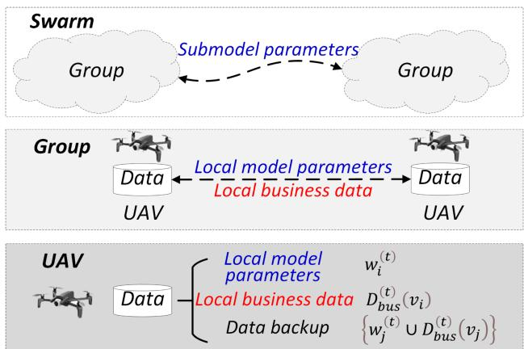  
Fig. 4. Intragroup backup in UAV swarm.

## C. Dynamic Server Selection

Once UAVs are grouped, a DSS mechanism is provided to avoid failures of FFD missions due to the destruction of group servers or swarm server. Each group designates one intragroup UAV as the group server, which is responsible for aggregating the parameters of the selected layers uploaded by the intragroup UAVs. To mitigate the risk of group server destruction, the group servers are periodically reselected based on the scores of UAVs, which are obtained by jointly considering the distribution uniformity deviation and residual battery electricity.

To ensure that the group servers are uniformly distributed across the UAV swarm, the distribution uniformity of each UAV is assessed. Specifically, the volume of a cube centered on a UAV $v _ { i }$ is denoted by $V ( v _ { i } )$ , and the total volume of 3D space where the UAV swarm is located is denoted by V U . The number of group servers in the cube centered on UAV $v _ { i }$ is represented as $N _ { i }$ . For the uniform distribution, the ratio of the volume of the cube centered on $v _ { i }$ to the total volume of the UAV swarm should be approximately equal to the ratio of the number of group servers in the cube to the total number of group servers in the UAV swarm. The distribution uniformity deviation is defined as: $\begin{array} { r } { U D ( v _ { i } ) = | \frac { N _ { i } } { \chi } - \frac { V ( v _ { i } ) } { V ( U ) } | } \end{array}$ . The value of distribution uniformity deviation falls into the numerical interval [0,1], where a smaller value indicates a larger distribution uniformity. The score of a UAV is inversely proportional to the distribution uniformity deviation, implying that a larger distribution uniformity deviation results in a smaller score of the UAV, thus promoting a more uniform distribution of group servers across the UAV swarm.

The energy consumption of a UAV is mainly consumed on flight power. Assuming that each UAV starts with the same initial battery energy, denoted by $E _ { i n i t }$ . Then, the residual battery energy of each UAV $( \mathrm { e . g . , } v _ { i } )$ is normalized into State of Charge (SOC), which is calculated by: $\begin{array} { r } { S O C ( v _ { i } ) = \frac { E _ { i n i t } - E _ { i } } { E _ { i n i t } } } \end{array}$ , where $E _ { i }$ denotes the energy consumption of $v _ { i }$ . The value of SOC falls in the numerical interval [0,1].

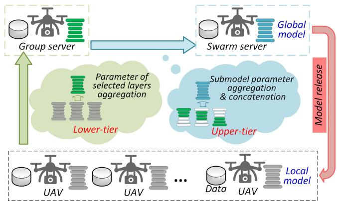  
Fig. 5. Structure of TFL.

Therefore, the score $S C ( v _ { i } )$ of a UAV $v _ { i }$ is given by:

$$
S C ( v _ { i } ) = S O C ( v _ { i } ) + 1 - U D ( v _ { i } ) .\tag{4}
$$

For each group, the group server is responsible for aggregating the parameters of the selected layers from intragroup UAVs to update the submodel parameters. In addition, the swarm server is selected from the group servers based on their scores. Likewise, the swarm server is responsible for aggregating and concatenating the submodel parameters uploaded by group servers.

To enhance the robustness and dynamics, both the group servers and the swarm server needs to be regularly updated and maintained by the DSS mechanism. Both group servers and swarm server are periodically reselected every t<sup>∗</sup> time slots: Every $t ^ { * }$ time slots, each UAV calculates and sends its score to other UAVs in the same group. For each group, the UAV with the highest score is selected as the new group server. The new group server then notifies the intragroup UAVs about the update. Likewise, the group server with the highest score is selected as the new swarm server.

## D. Two-Tier Federated Learning Model

1) Structure of Two-Tier Federated Learning: Regarding the model training for FFD missions, the primary problem is to determine an optimal mapping function $\mathcal { H } _ { w } : \mathcal { X } \longrightarrow \mathcal { Y } _ { \mathrm { : } }$ , where X denotes the set of training samples, Y denotes the corresponding ground-truth labels, and w denotes the model parameters. The optimal parameters $w ^ { * }$ can be derived by minimizing the output of the samplewise loss function $l ( \mathcal { H } _ { w } ( \mathcal { X } ) , \mathcal { Y } )$ . This process is expressed as:

$$
w ^ { * } = \arg \operatorname* { m i n } _ { w } F ( w ) = \arg \operatorname* { m i n } _ { w } \frac { \sum _ { x \in \mathcal { X } , y \in \mathcal { Y } } l ( \mathcal { H } _ { w } ( x ) , y ) } { | \mathcal { X } | } .\tag{5}
$$

In TFL model, each UAV independently performs the gradient descent to train a local model. TFL model allows for the aggregation of some selected layers, and the parameters are aggregated in a two-tier manner: lower-tier aggregation and upper-tier aggregation. Fig. 5 illustrates the structure of TFL.

(i) Lower-tier aggregation: In each group, UAVs share local business data and backup their local model parameters to prevent the potential data loss. Each UAV trains a local model based on its local dataset, and then sends the parameters of the selected layers to the group server for the group aggregation. For example, $\mathrm { U A V } \ v _ { i }$ trains its local model $\boldsymbol { w } _ { i } ^ { * }$ using the dataset $D ( v _ { i } , t )$ , and then uploads the parameters of the selected layers (submodel) $S _ { i } ( w _ { i } ^ { * } , k )$ to the group server $g _ { k }$ . The group server gk aggregates $S _ { i } ( w _ { i } ^ { * } , k )$ received from all UAVs in the group $G _ { k }$ and yields the parameters of the submodel S k .

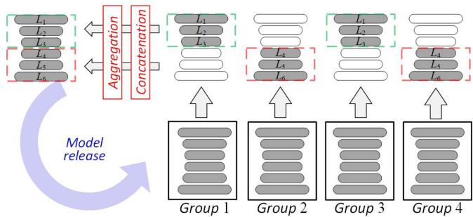  
Fig. 6. Submodels in TFL.

Each UAV uploads the parameters of the selected layers to the group server every $\kappa _ { 1 }$ epochs. Note that the communication overhead is largely reduced by only exchanging the parameters of the selected layers in the lower-tier aggregation.

(ii) Upper-tier aggregation: This module is responsible for aggregating the submodel parameters uploaded by all group servers, enabling implicit data sharing and collaborative improvement of the global model. Each group server periodically uploads the submodel parameters to the swarm server, and the swarm server performs the global aggregation and concatenation of these parameters to update the global model parameters. Then, the swarm server releases the global model parameters to all group servers.

2) Layer Selection and Submodel Aggregation: In TSPF, two key issues are considered:

Issue 1: Which layers should be selected for each group? In TFL model, the global model is divided into $\tau$ submodels $\{ S ( 1 ) , \ldots , S ( k ) , \ldots , S ( \tau ) \}$ , where $\tau \leq \chi$ . The swarm server <sup>(1) ( ) ( )</sup>randomly distributes the τ submodels among the $\chi$ groups, guaranteeing that each submodel is assigned to at least one group.

Let $L = \{ L _ { 1 } , \ldots , L _ { n } \}$ denote the set of all layers in TFL model, where n denotes the total number of layers. The union of all submodels covers TFL model (all layers), and the intersection of any two submodels is empty, i.e., we have that:

$$
\bigcup _ { k = 1 } ^ { \tau } S ( k ) = L , \mathrm { w h e r e } S ( j ) \bigcap S ( k ) = \emptyset , \mathrm { f o r } j \neq k .\tag{6}
$$

When $\tau < \chi .$ , some submodels could be assigned to multiple groups. Starting from $S _ { 1 } { } _ { \cdot }$ , each submodel is first randomly assigned to a unique group. After $S _ { \tau }$ has been assigned, $\operatorname* { m i n } ( \chi -$ $\tau , \tau )$ submodels are randomly selected from τ submodels and assigned to the $\chi - \tau$ groups without submodels.

Fig. 6 gives an example $( \tau = 2 , \chi = 4 ) \colon \mathrm { A }$ t the ith iteration, the group $G _ { 1 }$ trains the submodel $S ( 1 )$ , which consists of the layers $\{ L _ { 1 } , L _ { 2 } , L _ { 3 } \}$ , while the group $G _ { 2 }$ trains the submodel $S ( 2 )$ with the layers $\{ L _ { 4 } , L _ { 5 } , L _ { 6 } \} . \mathrm { I f } \tau < \chi$ , the same submodels could be assigned to multiple groups. For example, the groups $G _ { 3 }$ and $G _ { 4 }$ also train the submodels $S ( 1 )$ and $S ( 2 )$ , respectively. During the upper-tier aggregation, the submodels could be collaboratively trained by the groups with the same assignments, e.g., S trained by group $G _ { 1 }$ and group $G _ { 3 }$ , are first aggregated independently to produce a unified $S ( 1 )$ submodel. Subsequently, all aggregated submodels are concatenated to form an updated version of the global model. This iterative process enables efficient training by ensuring that each submodel receives sufficient updates from multiple groups and achieves balanced training across all submodels.

Issue 2: How to aggregate the submodels to form the global model? In the upper tier of TFL model, the submodel parameters from all groups are concatenated to update the global model. If some groups train the same submodel, the parameters of the submodel from theses groups are first aggregated before the concatenation. This mechanism enables efficient updates of the submodels, promoting rapid convergence while reducing the communication overhead.

3) Model Training Process: In each global epoch, UAVs perform local training based on the received global model, and then upload the submodel parameters for two-tier aggregation to update the global model. After receiving the global model parameters $w ^ { ( \bar { t } ) }$ , each $\mathrm { U A V } ~ v _ { i }$ updates its local model by calculating the gradient $\nabla F _ { i } ( w ^ { ( t ) } )$ based on its local dataset, then transmits the updated parameters to the group server for the upper-tier aggregation. For example, the submodel parameters aggregated by the kth group server are expressed as:

$$
\mathcal { P } _ { k } ^ { ( t ) } = w ^ { ( t ) } - \frac { \eta } { \vert G _ { k } ^ { ( t ) } \vert } \cdot \sum _ { i \in G _ { k } ^ { ( t ) } } \nabla F _ { i } \left( w _ { k , i } ^ { ( t ) } \right) ,\tag{7}
$$

where $w _ { k , i } ^ { ( t ) }$ denotes the parameters of the submodel of UAV $v _ { i }$ in group $G _ { k }$ at the tth time slot, η denotes a learning rate. Then, each group server uploads the submodel parameters to the swarm server for the upper-tier aggregation:

$$
\mathcal { P } ^ { ( t ) } = \left\{ \begin{array} { l l } { \bigoplus _ { j = 1 } ^ { \tau } \left( \frac { 1 } { | S G _ { j } | } \sum _ { G _ { i } \in S G _ { j } } \mathcal { P } _ { i } ^ { ( t ) } \right) , } & { \mathrm { i f } \tau < \chi , } \\ { \bigoplus _ { k = 1 } ^ { \chi } \mathcal { P } _ { k } ^ { ( t ) } , } & { \mathrm { i f } \tau = \chi , } \end{array} \right.\tag{8}
$$

where $\oplus$ denotes the concatenation operation, $S G _ { j }$ denotes the set of groups that train the same submodel $S ( j )$ (multiply groups train the same submodel when $\tau < \chi ) . \operatorname { I f } \tau < \chi$ , the submodels from multiply groups are first aggregated, then the aggregated submodels are concatenated to update the global model. If $\tau = \chi .$ , the submodels are concatenated to update the global model without any aggregations.

Note that the transmissions between UAVs are implemented in a synchronized manner. Adaptive Moment Estimation (Adam) method is employed to update the global model parameters. In each iteration, after computing the gradient $\nabla F ( w ^ { ( t ) } )$ , both the first moment estimate $m _ { 1 } ^ { ( t + 1 ) }$ and the second moment estimate $m _ { 2 } ^ { ( t + 1 ) }$ are updated. The bias-corrected estimates $\hat { m } _ { 1 } ^ { ( t + 1 ) }$ and $\hat { m } _ { 2 } ^ { ( t + 1 ) }$ are used to adjust the learning rate $\eta .$ The global model parameters are then updated as follows:

Algorithm 2: Pseudo-Code of Two-Tier Federated Learning   
Model.   
1: Input: Initialized global model parameters $w ^ { * } ,$   
learning rate η, number of groups $\chi ,$ number of   
submodels τ , global epochs $\kappa _ { 3 }$   
2: Layer Division: Divide model into $\tau$ submodels   
$\{ S ( 1 ) , \ldots , S ( \tau ) \}$ covering TFL model (all layers)   
$3 { \mathrm { : } }$ Submodel Assignment: Randomly assign each   
submodel $S ( k )$ to group(s) $G _ { j }$   
4: for each global epoch $t = 1$ to $\kappa _ { 3 }$ do   
5: Local training:   
6: for each UAV $v _ { i }$ in group $G _ { k }$ do   
7: Receive global model $w ^ { ( t ) }$ from group server   
8: Calculate local gradient $\nabla F _ { i } ( w _ { k , i } ^ { ( t ) } )$ on local dataset   
9: Update local model $w _ { k , i } ^ { ( t ) }$   
10: Transmit updated parameters to group server   
11: end for   
12: Lower-tier aggregation:   
13: for each group server $g _ { k }$ do   
14: Aggregate received updated parameters from each   
UAV in group to obtain submodel parameters $\mathcal { P } _ { k } ^ { ( t ) }$   
15: Upload $\mathcal { P } _ { k } ^ { ( t ) }$ to swarm server   
16: end for   
17: Upper-tier aggregation:   
18: if $\tau < \chi$ then   
19: for each submodel $S ( j )$ do   
20: Aggregate submodels $\mathcal { P } _ { i } ^ { ( t ) }$ from multiply groups   
$G _ { i } \in S G _ { j }$   
21: end for   
22: Concatenate aggregated submoedl to update global   
model parameters $\stackrel { - } { w } ^ { ( t + 1 ) }$   
23: else   
24: Concatenate $\mathcal { P } _ { 1 } ^ { ( t ) } , \ldots , \mathcal { P } _ { \chi } ^ { ( t ) }$ directly to update   
$w ^ { ( t + 1 ) }$   
25: end if   
26: end for   
27: Output: Final global model parameter $w ^ { ( \kappa _ { 3 } ) }$

$$
w ^ { ( t + 1 ) } = w ^ { ( t ) } - \eta \cdot \frac { \hat { m } _ { 1 } ^ { ( t + 1 ) } } { \sqrt { \hat { m } _ { 2 } ^ { ( t + 1 ) } } + \epsilon } ,\tag{9}
$$

where  is a small constant. The above process is repeated iteratively until the global model converges.

The pseudo-code of TFL model is given in Algorithm 2.

Note that an ML approach can be employed to classify the images and video frames captured by cameras installed on UAVs [31]. For frames containing both fire and non-fire regions, the entire frame is labeled as fire-positive, and when there is no fire in the frame, it will be taken as fire-negative one (which does not require the processing). This approach can be adopted in our work to largely reduce the processing overhead.

TABLE III  
COMMUNICATION OVERHEAD AND COMPUTATIONAL COMPLEXITY OF TSPF
<table><tr><td rowspan=1 colspan=1>Module</td><td rowspan=1 colspan=1>Communicationoverhead</td><td rowspan=1 colspan=1>Computationalcomplexity</td></tr><tr><td rowspan=1 colspan=1>Graph coloring</td><td rowspan=1 colspan=1> $\overline { { O ( N + \frac { N ^ { 2 } } { \chi } ) } }$ </td><td rowspan=1 colspan=1> $O ( N \cdot m )$ </td></tr><tr><td rowspan=1 colspan=1>DSS</td><td rowspan=1 colspan=1> $\overline { { O ( \frac { N ^ { 2 } } { \chi } + \chi ^ { 2 } ) } }$ </td><td rowspan=1 colspan=1> $O ( N )$ </td></tr><tr><td rowspan=1 colspan=1>TFL</td><td rowspan=1 colspan=1> $\overline { { O ( \kappa _ { 3 } \cdot ( \frac { | w | } { \tau } + \chi ) ) } }$ </td><td rowspan=1 colspan=1> $O ( L \cdot K _ { s } ^ { 2 } \cdot C _ { i n } \cdot C _ { o u t } \cdot W \cdot H )$ </td></tr><tr><td rowspan=1 colspan=1>Total</td><td rowspan=1 colspan=1> $\begin{array} { r } { \overline { { O ( N + \frac { 2 N ^ { 2 } } { \gamma } + \chi ^ { 2 } } } } \end{array}$  $+ \kappa _ { 3 } \cdot ( \frac { | w | } { \tau } + \chi ) )$ </td><td rowspan=1 colspan=1> $O ( L \cdot K _ { s } ^ { 2 } \cdot C _ { i n } \cdot C _ { o u t } \cdot W \cdot H$  $+ { \dot { N } } \cdot m { \dot { + } } N )$ </td></tr></table>

## V. THEORETICAL ANALYSIS OF TSPF

## A. Complexity

We analyze the communication overhead and computational complexity in the three key components: graph coloring process, DSS mechanism, and TFL model. Table III shows the communication overhead and computational complexity of our proposed TSPF.

1) Complexity of Graph Coloring: In the graph coloring process, UAV broadcasts its current coordinates and receives graph coloring results, which incurs a communication overhead of $O ( N )$ . Moreover, UAVs in the same group could exchange <sup>( )</sup>the local datasets with each other, leading to a communication overhead of $O ( \frac { N ^ { 2 } } { \chi } )$ . Therefore, the total communication overhead for the graph coloring is written as: $\begin{array} { r } { O ( N + \frac { N ^ { 2 } } { \chi } ) } \end{array}$ A sequential greedy algorithm is employed to perform graph coloring, resulting in a computational complexity of $O ( N \cdot m )$ where m denotes the maximum degree in the UAV swarm. The enhancements for balancing the size of groups do not elevate the original complexity bound. Thus, the graph coloring process still maintains a computational complexity of $O ( N \cdot m )$ [32].

<sup>( )</sup>2) Complexity of DSS: In DSS, each UAV calculates and exchanges the score. The newly selected group server then broadcasts the update of group server to the intragroup UAVs. Thus, the communication overhead per group is $\overline { { O ( \frac { N ^ { 2 } } { \chi ^ { 2 } } + \chi ) } }$ <sup>( + )</sup>and across all χ groups, the total communication overhead for information exchange reaches $\begin{array} { r } { O ( \chi \cdot ( \frac { N ^ { 2 } } { \chi ^ { 2 } } + \chi ) ) } \end{array}$ . The score calculation by each UAV incurs a computational complexity of $O ( N )$

3) Complexity of TFL: In TFL, each UAV uploads the parameters of the selected layers to the group server for the upper-tier parameter aggregation, and the submodel parameters are then uploaded to the swarm server. The swarm server then releases the global model parameters w to the group servers, and w is then relayed to all UAVs. This process incurs a communication overhead of $O ( \frac { | w | } { \tau } + \chi )$ , where $| w |$ denotes the size of the global model parameters and τ denotes the number of submodels. Assuming that the model training requires $\kappa _ { 3 }$ global epochs, the communication overhead scales to $O ( \kappa _ { 3 } \cdot ( \frac { | w | } { \tau } + \chi ) )$ . Each UAV trains a local model, supposing that the input image dimension is $W \times H$ , and the convolution kernel size is $K _ { s } \times K _ { s }$ The number of input/output channel in each layer is denoted by $C _ { i n }$ and $C _ { o u t }$ , respectively. There are L layers and ξ classes. Thus, the computational complexity of the convolutional layers is approximated as: $O ( L \cdot K _ { s } ^ { 2 } \cdot C _ { i n } \cdot C _ { o u t } \cdot W \cdot H )$ . For the final fully connected classification layer which is responsible for predicting the class probabilities, the computational complexity is approximated as: $O ( \xi \cdot W ^ { \prime } \cdot H ^ { \prime } \cdot C _ { o u t } )$ . Therefore, the computational complexity for training the model is written as:

$$
O \left( L \cdot K _ { s } ^ { 2 } \cdot C _ { i n } \cdot C _ { o u t } \cdot W \cdot H + \xi \cdot W ^ { \prime } \cdot H ^ { \prime } \cdot C _ { o u t } \right) ,\tag{10}
$$

where $W ^ { \prime }$ and $H ^ { \prime }$ denote the dimensions of the feature maps after passing through the convolutional layers, and are typically much smaller than $W$ and H, respectively.

Thus, the total communication overhead of TSPF is of $O ( N +$ $\begin{array} { r } { \frac { 2 N ^ { 2 } } { \chi } + \chi ^ { 2 } + \kappa _ { 3 } \cdot ( \frac { | w | } { \tau } + \chi ) ) } \end{array}$ , and the total computational complexity of TSPF is of $O ( L \cdot K _ { s } ^ { 2 } \cdot C _ { i n } \cdot C _ { o u t } \cdot W \cdot H +$ $N \cdot m + N )$

## B. Model Convergence

Supposing that each UAV performs $\kappa _ { 1 }$ updates of the local model parameters before uploading the parameters of the selected layers to the group server. Then, the group server aggregates the parameters of the selected layers to form the submodel parameters, which are then uploaded to the swarm server every $\kappa _ { 2 }$ aggregations. This procedure ensures that the global model parameters are updated every $\kappa _ { 1 } \cdot \kappa _ { 2 }$ epochs.

For the convergence analysis, we focus on the discrepancy between the global model parameters aggregated at the Kth epoch (denoted by $\mathcal { P } _ { K } )$ , and the optimal model parameters (denoted by $\mathcal { P } _ { K } ^ { * } )$ . Assuming that ${ \mathcal { P } } _ { K } ^ { * }$ is obtained after $\kappa _ { 3 }$ parameter aggregations on the swarm server. For any UAV $( \mathrm { e } . \mathrm { g } . , \mathrm { } v _ { i } )$ , the loss function $F _ { i } ( w ^ { ( t ) } )$ is σ-continuous, μ-smooth, and convex, and there is:

$$
\begin{array} { r } { \Vert \mathcal { P } _ { K } - \mathcal { P } _ { K } ^ { * } \Vert \leq G ( \kappa _ { 1 } \cdot \kappa _ { 2 } , \eta ) , } \end{array}\tag{11}
$$

where

$$
\begin{array} { l } { { \displaystyle G \big ( \kappa _ { 1 } \cdot \kappa _ { 2 } , \eta \big ) = \ g \big ( \kappa _ { 1 } \cdot \kappa _ { 2 } , \Delta , \eta \big ) } } \\ { { \displaystyle ~ + \frac { 1 } { 2 } \left( \kappa _ { 2 } ^ { 2 } + \kappa _ { 2 } - 1 \right) \cdot \big ( \kappa _ { 1 } + 1 \big ) \cdot g \big ( \kappa _ { 1 } , \delta , \eta \big ) } } \\ { { \displaystyle ~ + \frac { \mathbb { I } \big ( \tau < \chi \big ) } { \tau } \cdot \sum _ { j = 1 } ^ { \tau } \frac { \big | S G _ { j } \big | } { \chi } \cdot g \big ( \kappa _ { 1 } , \delta , \eta \big ) , } } \end{array}\tag{12}
$$

and $g ( \kappa _ { 1 } , \delta , \eta )$ is expressed as:

$$
g ( \kappa _ { 1 } , \delta , \eta ) = \frac { \delta } { \mu } \cdot [ ( \eta \cdot \mu + 1 ) ^ { \kappa _ { 1 } } - 1 ] - \eta \cdot \mu \cdot \kappa _ { 1 } .\tag{13}
$$

In (12), δ and $\Delta$ denote the gradient divergences at the UAV level and the group level, respectively. $S G _ { j }$ denotes the set of groups that train the jth submodel. Furthermore, $\mathbb { I } ( \tau < \chi )$ is an indicator function that outputs the value 1 when $\tau < \chi .$ Especially, when the business data is IID $( \mathrm { i . e . , } \delta = \Delta = 0 )$ , there is $G ( \kappa _ { 1 } \cdot \kappa _ { 2 } , \eta ) = 0$ , implying that the global model parameters can converge [33].

Assuming that $F _ { i n f } = F ( w ^ { * } )$ , after $K \ ( \kappa _ { 1 } \cdot \kappa _ { 2 } \cdot \kappa _ { 3 } \leq K )$ <sup>= ( ) (</sup>local updates, if the following conditions are satisfied:

$\begin{array} { r } { \eta \le { \frac { 1 } { \mu } } . } \end{array}$

$$
\begin{array} { r } { \bullet  { \eta } \cdot  { \omega } - \frac { \sigma \cdot G ( \kappa _ { 1 } \cdot \kappa _ { 2 } , \eta ) } { \kappa _ { 1 } \cdot \kappa _ { 2 } \cdot \varphi ^ { 2 } } > 0 , } \end{array}
$$

$$
\bullet F ( w ^ { ( c \cdot \kappa _ { 1 } \cdot \kappa _ { 2 } ) } ) - F ( w ^ { * } ) \geq \varphi \mathrm { f o r } c = 1 , \ldots , \kappa _ { 3 } ,
$$

$F ( w ^ { ( K ) } ) - F ( w ^ { * } ) \geq \varphi ,$ <sup>( )</sup>and for some $\varphi > 0$ , we define that:

$$
\omega = \left( 1 - \frac { \mu \cdot \eta } { 2 } \right) \cdot \operatorname* { m i n } _ { c } \frac { 1 } { \left\| F \left( w ^ { ( ( c - 1 ) \cdot \kappa _ { 2 } \cdot \kappa _ { 3 } ) } \right) - F ( w ^ { * } ) \right\| } .\tag{14}
$$

Then, the convergence upper bound of $F ( w ^ { ( K ) } )$ is given by [34]:

$$
F ( w ^ { ( K ) } ) - F \left( w ^ { * } \right) \leq \frac { 1 } { K \cdot \left( \eta \cdot \omega - \frac { \sigma \cdot G \left( \kappa _ { 1 } \cdot \kappa _ { 2 } , \eta \right) } { \kappa _ { 1 } \cdot \kappa _ { 2 } \cdot \varphi ^ { 2 } } \right) } .\tag{15}
$$

When there is $G ( \kappa _ { 1 } \cdot \kappa _ { 2 } , \eta ) = 0 , ( 1 5 )$ converges to $\frac { 1 } { K \cdot \eta \cdot \omega }$ . For $G ( \kappa _ { 1 } \cdot \kappa _ { 2 } , \eta ) > 0$ , and let

$$
\varphi _ { 0 } = \frac { 1 } { K \cdot \left( \eta \cdot \omega - \frac { \sigma \cdot G ( \kappa _ { 1 } \cdot \kappa _ { 2 } , \eta ) } { \kappa _ { 1 } \cdot \kappa _ { 2 } \cdot \varphi _ { 0 } ^ { 2 } } \right) } .\tag{16}
$$

Then, we obtain that:

$$
\varphi _ { 0 } = \frac { 1 } { 2 \eta \cdot \omega \cdot K } + \sqrt { \frac { 1 } { 4 \eta ^ { 2 } \cdot \omega ^ { 2 } \cdot K ^ { 2 } } + \frac { \sigma \cdot G \left( \kappa _ { 1 } \cdot \kappa _ { 2 } , \eta \right) } { \kappa _ { 1 } \cdot \kappa _ { 2 } \cdot \eta \cdot \omega } } ,\tag{17}
$$

where the negative solution is ignored because $\varphi _ { 0 } > 0$ . We note that $\begin{array} { r } { \eta \cdot \bar { \omega } - \frac { \sigma \cdot G ( \kappa _ { 1 } \cdot \kappa _ { 2 } , \eta ) } { \kappa _ { 1 } \cdot \kappa _ { 2 } \cdot \varphi ^ { 2 } } } \end{array}$ increases with the increase of $\varphi$ when $\sigma \cdot G ( \kappa _ { 1 } \cdot \kappa _ { 2 } , \eta ) > 0$ for any $\varphi \geq \varphi _ { 0 }$ . Under the condition $F ( w ^ { ( K ) } ) - F ( w ^ { * } ) \geq \varphi , \varphi > \varphi _ { 0 }$ does not hold.

According to [35], we obtain the following formula by (12) and (17):

$$
F ( w ^ { ( K ) } ) - F ( w ^ { * } ) \leq \varphi _ { 0 } + G \left( \kappa _ { 1 } \cdot \kappa _ { 2 } , \eta \right) .\tag{18}
$$

$\operatorname { A s } K \to \infty$ , the convergence of (18) is guaranteed to a nonzero optimality gap, implying that the model convergence can be guaranteed.

## C. Settings of Group Number and Partition Number

By considering the budget of communication overhead $\Re _ { a }$ and the computational overhead $\Re _ { b } .$ , the configuration of the group number χ, the partition number $\tau ,$ and the update epoch $( \kappa _ { 1 } \cdot \kappa _ { 2 }$ time slots) can be completed. In the group $G _ { k }$ , each UAV is assumed to spend $\frac { c _ { k } } { \tau }$ units of resource on communications and $b _ { k }$ units on computations during each epoch of global parameter aggregation. Accordingly, the total resource consumption over $\kappa _ { 3 }$ global epochs across all groups is expressed as: $\begin{array} { r } { \sum _ { k = 1 } ^ { \chi } \frac { \kappa _ { 3 } \cdot N \cdot ( \bar { b _ { k } } \cdot \tau + c _ { k } ) } { \gamma \cdot \tau } } \end{array}$

Besides, the interval between two global parameter aggregations of the group $G _ { k }$ incurs a time overhead $\frac { \ell _ { k } } { \tau }$ against a given time budget $T .$ The number of global epochs within the budget is denoted by $\frac { \boldsymbol { T } \cdot \boldsymbol { \tau } } { \iota _ { k } } \ [ 3 6 ]$

Based on the above assumptions, the constraints for $\kappa _ { 3 }$ are established as follows: $\kappa _ { 3 }$ must satisfy that $\begin{array} { r } { \kappa _ { 3 } \leq \frac { \Re _ { b } + \Re _ { c } } { \frac { N } { \chi } \cdot ( b _ { k } + \frac { c _ { k } } { \tau } ) } } \end{array}$ and $\begin{array} { r } { \kappa _ { 3 } \leq \frac { T \cdot \tau } { \iota _ { k } } \cdot \chi . } \end{array}$ . Hence, the optimal value of $\kappa _ { 3 }$ is obtained by:

$$
\kappa _ { 3 } = \operatorname* { m i n } \left\{ \frac { ( \Re _ { b } + \Re _ { c } ) \cdot \tau \cdot \chi } { N \cdot ( b _ { k } \cdot \tau + c _ { k } ) } , \frac { T \cdot \tau \cdot \chi } { \iota _ { k } } \right\} .\tag{19}
$$

Similar to the convergence analysis introduced in [37] and the analysis of (12), we conclude that the submodel partition does

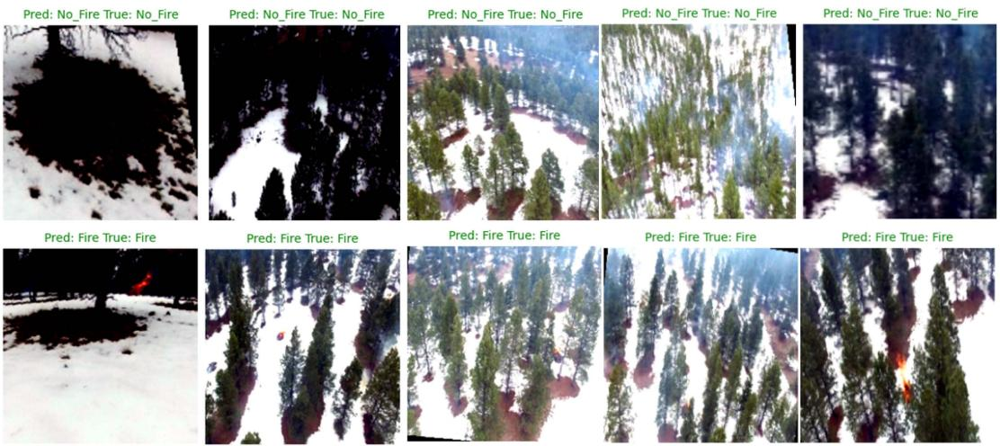  
Fig. 7. Examples of some detection results.

TABLE IV SIMULATION PARAMETERS
<table><tr><td rowspan=1 colspan=1>Parameter</td><td rowspan=1 colspan=1>Description</td><td rowspan=1 colspan=1>Value</td></tr><tr><td rowspan=1 colspan=1>N</td><td rowspan=1 colspan=1>Number of UAVs</td><td rowspan=1 colspan=1>100</td></tr><tr><td rowspan=1 colspan=1>X</td><td rowspan=1 colspan=1>Number of groups in U</td><td rowspan=1 colspan=1>10</td></tr><tr><td rowspan=1 colspan=1>T</td><td rowspan=1 colspan=1>Partition number</td><td rowspan=1 colspan=1>2</td></tr><tr><td rowspan=1 colspan=1> $\underline { { d _ { m a x } } }$ </td><td rowspan=1 colspan=1>Maximum distance for establishing edges between UAVs</td><td rowspan=1 colspan=1>80 m</td></tr><tr><td rowspan=1 colspan=1> $\overline { { R _ { C } } }$ </td><td rowspan=1 colspan=1>Maximum communication range of UAVs</td><td rowspan=1 colspan=1>400 m</td></tr><tr><td rowspan=1 colspan=1> $\overline { { R _ { D } } }$ </td><td rowspan=1 colspan=1>Deployment range of UAV swarm</td><td rowspan=1 colspan=1>300 m</td></tr><tr><td rowspan=1 colspan=1> $\overline { { E _ { i n i t } } }$ </td><td rowspan=1 colspan=1>Initial battery energy of UAV</td><td rowspan=1 colspan=1>0.0222 kwh</td></tr><tr><td rowspan=1 colspan=1>κ1</td><td rowspan=1 colspan=1>Number of local training epochs</td><td rowspan=1 colspan=1>2</td></tr><tr><td rowspan=1 colspan=1>t*</td><td rowspan=1 colspan=1>Update epoch (number of time slots)</td><td rowspan=1 colspan=1>2</td></tr><tr><td rowspan=1 colspan=1>η</td><td rowspan=1 colspan=1>Learning rate</td><td rowspan=1 colspan=1>0.01</td></tr><tr><td rowspan=1 colspan=1>m1</td><td rowspan=1 colspan=1>First moment estimate</td><td rowspan=1 colspan=1>0.9</td></tr><tr><td rowspan=1 colspan=1>m2</td><td rowspan=1 colspan=1>Second moment estimate</td><td rowspan=1 colspan=1>0.999</td></tr><tr><td rowspan=1 colspan=1>Wd</td><td rowspan=1 colspan=1>Weight decay</td><td rowspan=1 colspan=1>0.0001</td></tr><tr><td rowspan=1 colspan=1>Bs</td><td rowspan=1 colspan=1>Batch size</td><td rowspan=1 colspan=1>64</td></tr></table>

not affect the convergence of the global model. Therefore, the setting of τ needs to satisfy (19) and $\tau \leq \chi$

Moreover, to determine the optimal value of $\chi$ in (19) under the resource constraints, [36] has suggested that the proper group number should fall into the value interval , $\textstyle \lfloor { \frac { N + \bar { 1 } } { 2 } } \rfloor \operatorname { l }$

## VI. PERFORMANCE EVALUATIONS

In this section, we provide comprehensive performance evaluations for our proposed TSPF, along with the comparisons with some other training methods.

The simulations are conducted on FLAME (Fire Luminosity Airborne-based Machine Learning Evaluation) [31], an aerial dataset collected by UAVs during a prescribed burning piled detritus in an Arizona pine forest. FLAME dataset includes the videos and thermal heatmaps captured by infrared cameras installed on UAVs. Based on this dataset, we simulate the missions of UAVs detecting forest fires. The main parameter settings for simulations are presented in Table IV.

In TSPF, ResNet18 is employed as the local model for UAV swarm-based FFD missions. As a lightweight model in the ResNet family, ResNet18 is selected due to its efficiency and suitability for edge devices. Compared with other deeper models such as ResNet34 and ResNet101, ResNet18 can achieve a satisfactory balance between mission performance and computational overhead, aligning well with the constraints imposed by the resource limitation and computational capability of UAVs. Note that utilizing NVIDIA edge-computing devices for UAVs is practical, e.g., an AXM-Q7009 quadrotor UAV equipped with a lightweight and efficient NVIDIA Jetson Xavier NX edge-computing module can be used for UAV swarm-based FFD missions [38]. Thus, we use ResNet18 and consider each UAV equipped with NVIDIA Jetson Xavier NX to ensure the business data (images and videos) can be processed on board. Fig. 7 illustrates some examples of the detection results of ResNet18 on FLAME dataset.

## A. Comparisons Among Different Training Methods

To analyze the merits of TSPF, we compare TSPF with centralized learning, distributed learning, FL, and Partial Federated Learning (PFL) in terms of detection accuracy, loss, and training time. TSPF incorporates the mechanisms specifically designed to address the challenges in UAV swarm-based FFD missions, such as the robustness enhancement and communication overhead reduction.

With the distributed learning, each UAV trains a local learning model without any information exchanges with other UAVs. In the centralized learning, all UAVs transmit their local datasets to a central server which trains the global model. FL enables UAVs to collaboratively train a global model without directly transmitting their local datasets to the server. Unlike FL, TSPF adopts a two-tier learning manner combined with a submodel update method and robustness operations. PFL is taken as a simplified version of TSPF, i.e., it does not conduct the robustness operations (i.e., graph coloring method, intragroup backup mechanism, and DSS mechanism).

As shown in Fig. 8, the detection accuracy of forest fires obtained by the centralized learning and TSPF is greater than that obtained by the distributed learning, FL, and PFL. TSPF can achieve detection accuracy comparable to centralized learning. However, it is important to note that the centralized learning is impractical for the UAV swarm due to the extremely high communication overhead and lack of robustness (if the central server in the centralized learning is destroyed, all FFD missions absolutely fail).

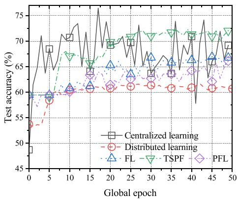  
Fig. 8. Comparisons among different training methods (test accuracy).

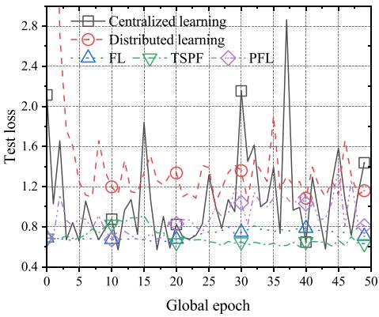  
Fig. 9. Comparisons among different training methods (test loss).

Furthermore, as illustrated in Fig. 9, TSPF exhibits significantly lower loss compared to FL due to the following mechanisms adopted in TSPF: (i) TFL model significantly reduces the communication overhead in model training and enhances the robustness of UAV swarm conducting FFD missions. (ii) The utilization of the intragroup backup mechanism contributes to the superior performance.

Figs. 10 and 11 illustrate the comparisons among different methods in terms of detection accuracy and loss. TSPF outperforms distributed learning, FL, and PFL in terms of detection accuracy and loss, because these training methods (distributed learning, FL, and PFL) typically suffer from the client drift<sup>1</sup> [21] which is due to the fact that the model training relies on local datasets, and the client drift inevitably decelerates the model convergence and reduces the detection accuracy. However, TSPF mitigates the impact of client drift through the intragroup backup mechanism that expands the local datasets.

Despite requiring the smallest communication overhead, the distributed learning yields the lowest detection accuracy among these training methods, indicating its inherent limitations for UAV swarm-based FFD missions. In addition, the performance of PFL is marginally lower than that of FL, since FL aggregates all model parameters for improving the detection accuracy, while PFL only aggregates the submodel parameters. Moreover, TSPF exhibits a distinct advantage in terms of detection accuracy (train accuracy and test accuracy) and loss (train loss and test loss).

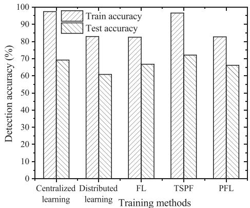  
Fig. 10. Comparisons among different training methods (train accuracy and test accuracy).

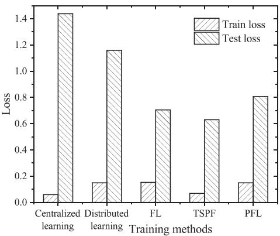  
Fig. 11. Comparisons among different training methods (train loss and test loss).

TABLE V  
COMPARISONS AMONG DIFFERENT TRAINING METHODS (COMMUNICATION OVERHEAD)
<table><tr><td rowspan=1 colspan=1>Methods</td><td rowspan=1 colspan=1>FL</td><td rowspan=1 colspan=1>HFL</td><td rowspan=1 colspan=1>SFL</td><td rowspan=1 colspan=1>HSFL</td><td rowspan=1 colspan=1>PFL</td><td rowspan=1 colspan=1>TSPF</td></tr><tr><td rowspan=1 colspan=1>Size of modelparameters (MB)</td><td rowspan=1 colspan=1>11.18</td><td rowspan=1 colspan=1>11.18</td><td rowspan=1 colspan=1>6.69</td><td rowspan=1 colspan=1>6.14</td><td rowspan=1 colspan=1>5.59</td><td rowspan=1 colspan=1>5.59</td></tr></table>

Regarding the communication overhead, we compare TSPF with FL, Hierarchical Federated Learning (HFL), Split Federated Learning (SFL) [39], HSFL [16], and PFL by measuring the size of model parameters. HFL extends FL by adopting a two tier learning manner. SFL exploits the parallel model training mechanism in FL and model splitting structure of SL. HSFL combines FL and SL to train the learning models on UAVs jointly, where only half of UAVs adopt the SL compared with SFL. As illustrated in Table V, both FL and HFL incur the highest communication overhead due to the requirement of the transmission of all model parameters, while the other four training methods (TSPF, PFL, SFL, and HSFL) only transmit the submodel parameters. Both FL and TSPF achieve the lowest communication overhead. This is attributed to the fact that SFL and HSFL adopt the SL, which necessitates the additional transmission of activations and gradients for the cut layer. Note that even under frequent model updates (e.g., the update epoch is set as $t ^ { * } = 2 )$ , TSPF can significantly reduce the communication overhead in model training.

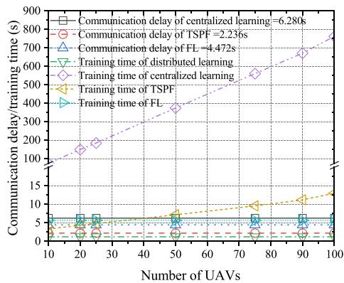  
Fig. 12. Comparisons among different training methods on communication delay and training time (the link rate is set to 20 Mbps).

The communication delay refers to the time taken to transmit data and model parameters. The training time comprises communication delay and computation delay. As shown in Fig. 12, the communication delay of TSPF is smaller than that of the centralized learning and FL, because the size of submodel parameters of UAVs is typically smaller than that of local datasets or local model parameters, and TSPF only requires transmitting the submodel parameters. Thus, the training time of TSPF remains very short. FL and distributed learning obtain similar training time. In contrast, the training time of centralized learning is much longer than that of the others, as its model training relies on the local datasets of all UAVs, which also indicates that the centralized learning is impractical for UAV swarm-based FFD missions.

The above simulation results show that TSPF can make a preferable trade-off between the mission performance and training time. Moreover, these results also highlight its adaptability to the delay-sensitive UAV swarm-based FFD missions.

## B. Effect of Intragroup Backup Mechanism

To enhance the robustness of FFD missions, the intragroup backup mechanism is employed, providing redundancy and restoration of local datasets of destroyed UAVs.

As shown in Fig. 13, the remaining datasets under the destruction of some UAVs are compared across different training methods. The simulation results show that with the intragroup backup mechanism, TSPF retains as much data as possible by restoring the local datasets through the data backup of destroyed UAVs. In contrast, with the decrease of $N _ { s }$ , the remaining dataset is sharply decreased with FL and distributed learning.

## C. Impact of Group Number

A two-tier learning manner combined with a submodel update method is employed in TSPF to reduce the communication overhead. In this evaluation, the test set is divided based on the group number $\chi ,$ allowing each UAV in the group to validate its mission performance on the corresponding subset of the test set.

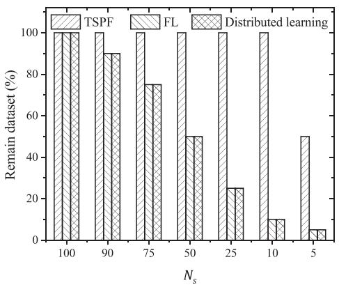

Fig. 13. Remaining dataset among different training methods under differen $N _ { s }$ (the number of surviving UAVs).  
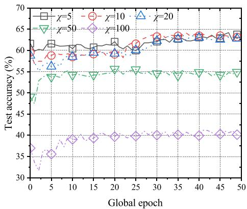

Fig. 14. Impact of χ on test accuracy.  
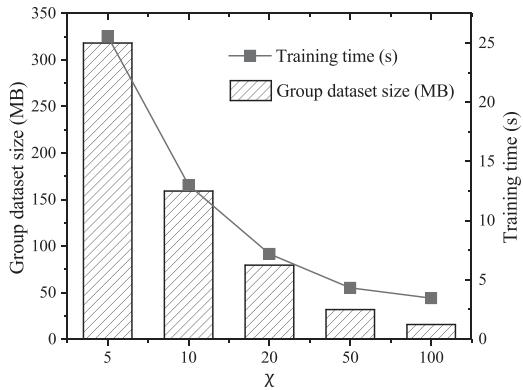  
Fig. 15. Impact of $\chi$ on training time and group dataset size.

As shown in Fig. 14, the group number $\chi$ has an obvious impact on the detection accuracy. Notably, the detection accuracy results under $\chi = 5 , \chi = 1 0 ,$ , and $\chi = 2 0$ are similar, and outperform those under larger $\chi .$ An increase in $\chi$ indicates a decreased group size and greater heterogeneity of different group datasets, which accordingly lowers the detection accuracy. However, as shown in Fig. 15, the training time increases with the decrease of $\chi .$ , because more UAVs can upload their local datasets to form the group datasets (i.e., the group dataset size increases), and thus the training time in each group is prolonged. This trend reflects a trade-off between data redundancy and training time.

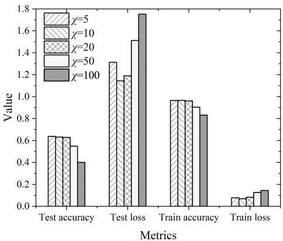  
Fig. 16. Impact of χ.

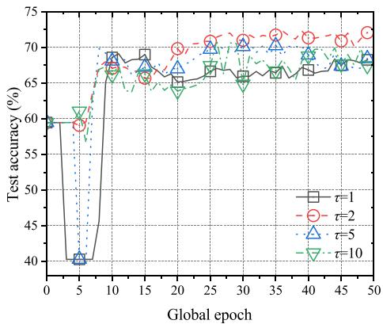  
Fig. 17. Impact of τ on test accuracy.

Additionally, Fig. 16 illustrates the results of FFD missions by varying the value of χ. When the group number $\chi$ is set to 5, 10, and 20, TSPF achieves favorable detection accuracy and loss. To balance the communication overhead and computational overhead, we adopt the setting $\chi = 1 0$ in the following simulations.

## D. Impact of Partition Number

In Fig. 17, we vary the partition number τ (1, 2, 5, and 10). When τ is set to 2, the best detection accuracy is obtained. When τ is set to 5, the curve exhibits significant fluctuations, and when τ is set to 10, the performance is poor. This is because the submodels from each group are directly concatenated to form an updated version of the global model, which can only maintain the baseline detection accuracy while ensuring the model convergence.

In addition, Fig. 18 illustrates the detection accuracy and loss under different partition number τ . When $\tau = 2$ , TSPF achieves the optimal performance, i.e., the highest detection accuracy and the lowest loss. These observations are attributed to the following facts: The submodel partition balances the local adaptation and global generalization, allowing UAVs to effectively capture local data features while retaining sufficient shared parameters for further aggregation. In the following simulations, τ is set to 2.

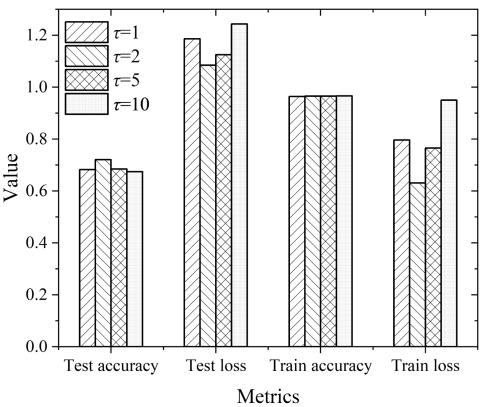  
Fig. 18. Impact of τ .

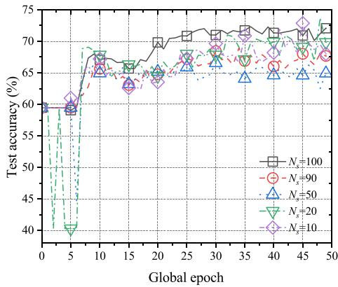  
Fig. 19. Test accuracy vs. $N _ { s } .$

## E. Robustness of FFD Missions

The robustness of FFD missions against the destruction of some UAVs is verified (Fig. 19). The detection accuracy is decreased with the decrease of $N _ { s }$ , because more UAVs are destroyed and unable to participate in FFD missions. However, the robustness measures implemented by TSPF help mitigate the negative impact of the destruction of UAVs on the detection accuracy.

Figs. 20 and 21 further demonstrate that the performance of FFD missions obtained by TSPF remains relatively stable with the increase of the number of destroyed UAVs (the decrease of $N _ { s } )$ . With a reduction in the number of surviving UAVs, the detection accuracy is decreased, and the loss is increased. This is because few UAVs are unable to maintain online model updates in the model training, thus affecting the convergence speed of model and the detection accuracy of FFD missions. Although the performance degradation is observed with fewer UAVs, TSPF relieves the performance decline of FFD missions as much as possible.

Specially, with the decrease of $N _ { s }$ , we observe a sudden decrease in loss when $N _ { s } = 2 0$ , because the data heterogeneity among the surviving UAVs is quite low, and the reduced data heterogeneity could accelerate the model convergence. Furthermore, the decrease in $N _ { s }$ makes the model training focus on the critical data, thus temporarily improving the model performance. However, as $N _ { s }$ is reduced to 10, the number of surviving UAVs becomes insufficient to support online model updates in the model training, thus leading to an increase in loss. In TSPF, the UAV swarm can still maintain model training and support the robustness of FFD missions, even with a reduction in the number of surviving UAVs.

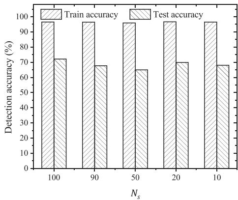  
Fig. 20. Robustness of FFD missions in terms of detection accuracy.

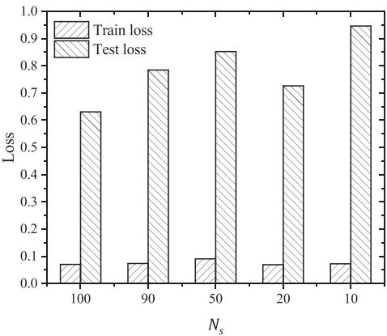  
Fig. 21. Robustness of FFD missions in terms of loss.

The above results show that when the UAV swarm conducts FFD missions, our proposed TSPF can reduce the communication overhead in the model training and maintain the mission performance despite the destruction of some UAVs.

## VII. CONCLUSION

In this paper, we have proposed a Two-tier Submodel Partition Framework (TSPF) to address the challenges of UAV swarm conducting FFD missions against the destruction of some UAVs.

\- TSPF leverages online model updates to ensure adaptability to diverse mission environments and employs a graph coloring method, intragroup backup mechanism, and dynamic server selection mechanism to enhance the robustness of FFD missions.

\- Another key innovation of TSPF lies in the submodel update method, which aggregates the parameters of selected layers within/between UAV groups.

\- By reducing the communication overhead while maintaining the mission performance as much as possible, TSPF provides a practical and scalable solution for UAV swarm conducting FFD missions in harsh environments.

Although the performance of TSPF has been verified by extensive simulations, several issues need further exploration in the future: (i) A specific data backup mechanism could be investigated, and a further improvement of backup strategy is necessary by considering the communication/computational overhead. (ii) If the destruction of some UAVs disrupts the topological connectivity, then the UAV swarm must quickly recover this connectivity to continue FFD missions, which necessitates real-time decision-making for flight path planning and topology reconfiguration. (iii) For the protection of data privacy of different UAVs, an erasure coding method or alternative backup strategy could be adopted to avoid security risk.

## REFERENCES

[1] X. Wu, W. Li, D. Hong, R. Tao, and Q. Du, “Deep learning for unmanned aerial vehicle-based object detection and tracking: A survey,” IEEE Geosci. Remote Sens. Mag., vol. 10, no. 1, pp. 91–124, Mar. 2022.

[2] H. Yu et al., “The unmanned aerial vehicle benchmark: Object detection, tracking and baseline,” Int. J. Comput. Vis., vol. 128, pp. 1141–1159, 2020.

[3] S. Javed et al., “State-of-the-art and future research challenges in UAV swarms,” IEEE Internet Things J., vol. 11, no. 11, pp. 19023–19045, Jun. 2024.

[4] Y. Liu et al., “Reinforcement learning based two-level control framework of UAV swarm for cooperative persistent surveillance in an unknown urban area,” Aerosp. Sci. Technol., vol. 98, 2020, Art. no. 105671.

[5] P. Radoglou-Grammatikis et al., “A compilation of UAV applications for precision agriculture,” Comput. Netw., vol. 172, 2020, Art. no. 107148.

[6] J. John, K. Harikumar, J. Senthilnath, and S. Sundaram, “An efficien approach with dynamic multiswarm of UAVs for forest firefighting,” IEEE Trans. Syst., Man, Cybern. Syst., vol. 54, no. 5, pp. 2860–2871, May 2024.

[7] C. Li et al., “Fast forest fire detection and segmentation application for UAV-Assisted mobile edge computing system,” IEEE Internet Things J., vol. 11, no. 16, pp. 26690–26699, Aug. 2024.

[8] K. Wang et al., “Generalized UAV object detection via frequency domain disentanglement,” in Proc. IEEE/CVF Conf. Comput. Vis. Pattern Recognit., 2023, pp. 1064–1073.

[9] F. Wu et al., “CIOFL: Collaborative inference-based online federated learning for UAV object detection,” in Proc. IEEE 19th Int. Conf. Mobile Ad Hoc Smart Syst., 2022, pp. 258–259.

[10] Y. Liu et al., “Fedvision: An online visual object detection platform powered by federated learning,” in Proc. AAAI Conf. Artif. Intell., 2020, pp. 13172–13179.

[11] O. Senouci, S. Harous, and Z. Aliouat, “Survey on vehicular ad hoc networks clustering algorithms: Overview, taxonomy, challenges, and open research issues,” Int. J. Commun. Syst., vol. 33, no. 11, 2020, Art. no. e4402.

[12] W. Chen, J. Liu, H. Guo, and N. Kato ., “Toward robust and intelligent drone swarm: Challenges and future directions,” IEEE Netw., vol. 34, no. 4, pp. 278–283, Jul./Aug. 2020.

[13] M. Fouda, S. Sakib, Z. M. Fadlullah, N. Nasser, and M. Guizani, “A lightweight hierarchical AI model for UAV-enabled edge computing with forest-fire detection use-case,” IEEE Netw., vol. 36, no. 6, pp. 38–45, Nov./Dec. 2022.

[14] Y. Shen, Y. Qu, C. Dong, F. Zhou, and Q. Wu, “Joint training and resource allocation optimization for federated learning in UAV swarm,” IEEE Internet Things J., vol. 10, no. 3, pp. 2272–2284, Feb. 2023.

[15] L. Xie, Z. Su, Y. Wang, and Z. Li, “A practical federated learning framework with truthful incentive in UAV-Assisted crowdsensing,” IEEE Trans. Inf. Forensics Security, vol. 20, pp. 129–144, 2025.

[16] X. Liu, Y. Deng, and T. Mahmoodi, “Wireless distributed learning: A new hybrid split and federated learning approach,” IEEE Trans. Wireless Commun., vol. 22, no. 4, pp. 2650–2665, Apr. 2023.

[17] Y. Qu et al., “Empowering edge intelligence by air-ground integrated federated learning,” IEEE Netw., vol. 35, no. 5, pp. 34–41, Sep./Oct. 2021.

[18] B. Yang, H. Shi, and X. Xia, “Federated imitation learning for UAV swarm coordination in urban traffic monitoring,” IEEE Trans. Ind. Informat., vol. 19, no. 4, pp. 6037–6046, Apr. 2023.

[19] L. Pacheco et al., “An efficient layer selection algorithm for partial federated learning,” in Proc. 2024 IEEE Int. Conf. Pervasive Comput. Commun. Workshops Affiliated Events (PerCom Workshops), 2024, pp. 172–177.

[20] S. Alam et al., “FedRolex: Model-heterogeneous federated learning with rolling submodel extraction,” in Proc. Adv. Neural Inf. Process. Syst., 2022, pp. 29677–29690.

[21] S. P. Karimireddy et al., “SCAFFOLD: Stochastic controlled averaging for federated learning,” in Proc. Int. Conf. Mach. Learn., 2020, pp. 5132–5143.

[22] Y. Mao, Z. Ye, X. Yuan, and S. Zhong, “Secure model aggregation against poisoning attacks for cross-silo federated learning with robustness and fairness,” IEEE Trans. Inf. Forensics Security, vol. 19, pp. 6321–6336, 2024.

[23] X. Fu et al., “Toward collaborative and cross-environment UAV classification: Federated semantic regularization,” IEEE Trans. Inf. Forensics Security, vol. 20, pp. 1624–1635, 2025.

[24] K. Hazra, V. K. Shah, S. Roy, S. Deep, S. Saha, and S. Nandi, “Exploring biological robustness for reliable multi-UAV networks,” IEEE Trans. Netw. Service Manag., vol. 18, no. 3, pp. 2776–2788, Sep. 2021.

[25] H. Jin, R. Luo, Q. He, S. Wu, Z. Zeng, and X. Xia, “Cost-effective data placement in edge storage systems with erasure code,” IEEE Trans. Services Comput., vol. 16, no. 2, pp. 1039–1050, Mar./Apr. 2023.

[26] L. Kong et al., “Resilience evaluation of UAV swarm considering resource supplementation,” Rel. Eng. Syst. Saf., vol. 241, 2024, Art. no. 109673.

[27] Z. Mou, F. Gao, J. Liu, and Q. Wu, “Resilient UAV swarm communications with graph convolutional neural network,” IEEE J. Sel. Areas Commun., vol. 40, no. 1, pp. 393–411, Jan. 2022.

[28] L. Hong, H. Guo, J. Liu, and Y. Zhang, “Toward swarm coordination: Topology-aware inter-UAV routing optimization,” IEEE Trans. Veh. Technol., vol. 69, no. 9, pp. 10177–10187, Sep. 2020.

[29] W. van Hoeve, “Graph coloring with decision diagrams,” Math. Program., vol. 192, no. 1–2, pp. 631–674, 2022.

[30] G. C. M. Gomes et al., “Structural parameterizations for equitable coloring: Complexity, FPT algorithms, and kernelization,” Algorithmica, vol. 85, pp. 1912–1947, 2022.

[31] A. Shamsoshoara et al., “Aerial imagery pile burn detection using deep learning: The FLAME dataset,” Comput. Netw., vol. 193, 2020, Art. no. 108001.

[32] X. Li, W. Zhang, L. Liu, and J. Xu, “Exploring the robustness: Hierarchical federated learning framework for object detection of UAV cluster,” IEEE Trans. Mobile Comput., to be published, doi: 10.1109/TMC.2025.3562812.

[33] L. Liu, Z. Xi, K. Zhu, R. Wang, and E. Hossain, “Mobile charging station placements in internet of electric vehicles: A federated learning approach,” IEEE Trans. Intell. Transp. Syst., vol. 23, no. 12, pp. 24561–24577, Dec. 2022.

[34] L. Liu et al., “Client-edge-cloud hierarchical federated learning,” in Proc. 2020 IEEE Int. Conf. Commun., 2020, pp. 1–6.

[35] S. Wang et al., “Adaptive federated learning in resource constrained edge computing systems,” IEEE J. Sel. Areas Commun., vol. 37, no. 6, pp. 1205– 1221, Jun. 2019.

[36] Z. Wang, H. Xu, J. Liu, Y. Xu, H. Huang, and Y. Zhao, “Accelerating federated learning with cluster construction and hierarchical aggregation,” IEEE Trans. Mobile Comput., vol. 22, no. 7, pp. 3805–3822, Jul. 2023.

[37] Z. Jiang et al., “Computation and communication efficient federated learning with adaptive model pruning,” IEEE Trans. Mobile Comput., vol. 23, no. 3, pp. 2003–2021, Mar. 2024.

[38] M. Y. Ma, S. E. Shen, and Y. C. Huang, “Enhancing UAV visual landing recognition with YOLO’s object detection by onboard edge computing,” Sensors, vol. 23, no. 21, 2023, Art. no. 8999.

[39] C. Thapa et al., “SplitFed: When federated learning meets split learning,” in Proc. AAAI Conf. Artif. Intell., 2022, pp. 8485–8493.

Xingyu Li received the BS degree in information security from the Nanjing University of Posts and Telecommunications, in 2023. He is currently working toward the PhD degree in cyberspace security. His current research interests include vehicular ad-hoc networks and UAV networks.

Wenzhe Zhang received the BS degree in information security from the Nanjing University of Posts and Telecommunications, in 2023. He is currently working toward the MS degree in electronic information. His current research interests include UAV networks and topological repair.

Linfeng Liu (Member, IEEE) received the BS and PhD degrees in computer science from Southeast University, Nanjing, China, in 2003 and 2008, respectively. Currently, he is a professor in the School of Computer Science and Technology with the Nanjing University of Posts and Telecommunications, China. His research interests include deep learning, vehicular ad hoc networks, mobile computing, and multi-hop mobile wireless networks. He has published more than 150 peer-reviewed papers in prestigious journals and conferences, such as IEEE Transactions on Mobile Computing, IEEE Transactions on Knowledge and Data Engineering, IEEE Transactions on Parallel and Distributed Systems, IEEE Transactions on Information Forensics and Security, IEEE Transactions on Intelligent Transportation Systems, IEEE Transactions on Affective Computing, IEEE Transactions on Vehicular Technology, IEEE Transactions on Services Computing, ACM Transactions on Autonomous and Adaptive Systems, ACM Transactions on Internet Technology, Elsevier ComNet, Elsevier JPDC, and Elsevier COSE. He has served as an editorial board member for Scientific Reports, and served as a TPC member for several conferences, including GlobeCom, ICONIP, SmartGridComm, VTC, and WCSP.

Ping Wang (Fellow, IEEE) is a professor with the Department of Electrical Engineering and Computer Science, York University, and a Tier 2 York Research Chair. Prior to that, she was with Nanyang Technological University, Singapore, from 2008 to 2018. Her recent research interests focus on integrating Artificial Intelligence (AI) techniques into communications networks. Her scholarly works have been widely disseminated through top-ranked IEEE journals/conferences and received the IEEE Communications Society Best Survey Paper Award, in 2023, and the best paper awards from IEEE prestigious conference WCNC in 2012, 2020 and 2022, from IEEE Communication Society: Green Communications & Computing Technical Committee, in 2018, from IEEE flagship conference ICC, in 2007. She has been serving as the associate editor-inchief for IEEE Communications Surveys & Tutorials and an editor for several reputed journals, including IEEE Transactions on Wireless Communications. She is a Distinguished Lecturer of the IEEE Vehicular Technology Society (VTS). She is also the chair of the education committee of IEEE VTS.