# Two-Tier Task Offloading for Satellite-Assisted Marine Networks: A Hybrid Stackelberg–Bargaining Game Approach

Zhen Wang , Graduate Student Member, IEEE, Bin Lin , Senior Member, IEEE, Qiang Ye , Senior Member, IEEE, and Haixia Peng , Member, IEEE

Abstract—The proliferation of maritime activities has spurred the emergence of numerous computation-intensive and delaysensitive marine applications and services. Given the inherent rationality, selfish nature, and limited computational abilities of marine devices, devising effective strategies to incentivize their participation in task processing become a critical challenge. In this article, we investigate the satellite-assisted marine multiaccess edge computing (MEC) and propose a two-tier task offloading scheme through a hybrid Stackelberg–Bargaining game approach to enhance offloading efficiency and maximize the utility of marine devices. Specifically, for the underwater acoustic communication, we consider the scenario where multiple autonomous underwater vehicles (AUVs), managed by maritime autonomous surface ships (MASSs), upload their collected data using nonorthogonal multiple access (NOMA) to optimize channel utilization. For the data transmission above the sea surface, we consider the scenario where a low-Earth orbit satellite (LEOS) functions as a space edge server to provide computing services, and MASS offloads workloads to LEOS through frequency division multiple access (FDMA) to prevent co-channel interference. we define the utility of AUVs, MASSs and LEOSs, and model the offloading process between AUVs and MASSs as a Stackelberg game, while representing the offloading interaction between MASSs and LEOSs as a Bargaining game. Additionally, we propose efficient algorithms to optimize AUV offloading strategies and MASS pricing strategies, while refining the bidding strategies for both MASSs and LEOSs. Simulation results demonstrate that the proposed algorithms significantly outperform benchmark schemes in achieving optimal solutions.

Index Terms—Bargaining game, maritime multiaccess edge computing (MEC), Stackelberg game, two-tier task offloading.

Received 18 December 2024; accepted 25 December 2024. Date of publication 30 December 2024; date of current version 25 April 2025. This work was supported by the National Natural Science Foundation of China under Grant 62371085, Grant 51939001, and Grant 62301411. (Corresponding author: Bin Lin.)

Zhen Wang is with the Department of Information Science and Technology, Dalian Maritime University, Dalian 116026, China, and also with the Department of Communication Engineering, Dalian Neusoft University of Information, Dalian 116024, China (e-mail: wangzhenjsj@neusoft.edu.cn).

Bin Lin is with the Department of Information Science and Technology, Dalian Maritime University, Dalian 116026, China (e-mail: binlin@dlmu.edu.cn).

Qiang Ye is with the Department of Electrical and Software Engineering, Schulich School of Engineering, University of Calgary, Calgary, AB T2N 1N4, Canada (e-mail: qiang.ye@ucalgary.ca).

Haixia Peng is with the School of Information and Communications Engineering, Xi’an Jiaotong University, Xi’an 710049, China (e-mail: haixia.peng@xjtu.edu.cn).

Digital Object Identifier 10.1109/JIOT.2024.3523527

# I. INTRODUCTION

W ITH the increasing scope of maritime activities, a widearray of marine wireless devices, such as underwater array of marine wireless devices,such as underwater sensors, autonomous underwater vehicles (AUVs), vessels, buoys, and maritime autonomous surface ships (MASSs), has been deployed across the ocean. This proliferation has driven the rapid expansion of marine wireless networks, resulting in the generation of vast amounts of computation-intensive and delay-sensitive data [1], [2], [3]. For instance, in underwater exploration and surveillance, large volumes of hydrological data and monitoring images/videos must be collected and transmitted to designated equipment for processing. Similarly, during intelligent reconnaissance and maritime rescue operations, a large volume of collected real-time video footage requires prompt processing to enable timely decision-making. These applications have sparked stringent requirements on high-speed marine communication and powerful computing [4]. It is of utmost importance to establish an efficient marine communication and computing network for marine devices [5]. Nevertheless, existing marine communication and computing networks fall short in fulfilling the substantial demands of marine devices due to their low-data rate and high latency [6], [7].

Multiaccess edge computing (MEC) has emerged as an efficient solution to improve computing efficiency and reduce decision-making latency for maritime terminals [8], [9]. Recently, various research endeavors have been made in proposing diverse innovative approaches to enhance the overall performance and efficiency of maritime MEC systems. Hou et al. [10] designed a multitier underwater computing framework for AUVs, aiming at collecting and forwarding data sensed by underwater devices to surface-stations. Wen et al. [11] proposed an intelligent oceanic data collection scheme for multiautomatic underwater gliders in maritime wireless communication networks. To further enhance data collection and offloading efficiency across diverse transmission segments, nonorthogonal multiple access (NOMA) has been adopted in maritime MEC networks, especially for acoustic data transmissions [12], [13].

Six generation (6G) wireless technologies stand poised to revolutionize the wireless landscape by integrating satellite networks with ground networks, ushering in a new era of seamless connectivity and advanced functionality [14]. The edge computing paradigm holds significant potential for applications and services in satellite-assisted networks, enabling support for computation-intensive and delay-sensitive services in oceanic environments [15], [16]. Zeng et al. [17] proposed an architecture for space–air–sea integrated networks aiming at enhancing the security of maritime communication networks for unmanned surface vehicles (USVs). Wang et al. [18] proposed a space–air–sea integrated network architecture designed to provide secure MEC services for delay-sensitive applications for maritime mobile users. Given the limited energy and computing resources of offshore equipment, integrating satellite and maritime networks with MEC presents a promising solution for enhancing the computing efficiency of marine applications.

However, the features of a marine environment pose technical challenges in fulfilling various oceanic application requirements [19]. First, as an integral component of marine networks, underwater acoustic communication is typically affected by unfavorable factors, such as limited data rates, prolonged propagation delay, and elevated packet loss rates [20], [21]. It impedes the on-demand service provisioning and limits the potential of maritime applications in areas, such as monitoring, exploration, and emergency response [22], [23]. Second, unlike terrestrial networks, oceanic communication and computing resources are extremely limited. Current standalone oceanic network infrastructures are unable to meet the demands of numerous computation-intensive and delay-sensitive tasks at sea. Third, due to the heterogeneity of satellite-marine integrated networks, different network service providers may lack sufficient incentives to offer edge computing services for different oceanic applications [20]. It is imperative to design an efficient maritime communication and computing scheme to overcome the aforementioned challenges and better serve the evolving demands of maritime applications and services.

Currently, how to optimize the computation offloading for AUVs with respect to the space-sea integrated network architecture is still an open issue. Motivated by the above observations, in this article, we propose a satellite-assisted maritime MEC architecture to enhance task offloading efficiency and optimize the utilization of marine wireless devices. Also, a two-tier task offloading scheme is exploited for AUVs through a hybrid Stackelberg–Bargaining game approach. The key contributions of this article mainly include the following aspects.

1) Two-Tier Satellite-Assisted Maritime Task Offloading: We first propose a low-Earth orbit satellite (LEOS) assisted task offloading framework in maritime MEC, which consists of two transmission tiers, i.e., the underwater acoustic communication and the satellite-assisted wireless communication. For underwater acoustic communication, multiple AUVs collect and upload oceanic data to MASSs utilizing NOMA to improve the underwater acoustic channel utilization. For satellite-assisted communication, MASSs transmit partial workloads to LEOSs for further processing through FDMA to avoid co-channel interference.

2) Utility Maximization With Incentive-Driven Approaches: We employ an incentive-based framework to encourage marine wireless devices (i.e., AUVs, MASSs, and LEOSs) to participate in task computing activities, with the goal of optimizing their respective profits. Specifically, for underwater acoustic communication, we model the offloading process as a Stackelberg game to optimize AUV offloading strategies and MASS pricing strategies. For MASS-to-LEOS transmission, we model the offloading process as a Bargaining game to refine the bidding strategies of MASSs and LEOSs, ensuring their mutual benefits. By analyzing the interactions among AUVs, MASSs, and LEOSs, we identify the game equilibrium that maximizes system efficiency and profitability.

3) Performance Evaluation: We perform extensive simulations to validate the efficacy of the proposed offloading and incentive schemes. Numerical results indicate that the proposed algorithms optimize participant utilities, demonstrating their effectiveness and efficiency compared to benchmark schemes.

The remainder of this article is organized as follows. Section II provides an overview of related works. The system model is presented in Section III. The problem formulation and solution design are given in Section IV. Section V presents the performance evaluation and Section VI presents concluding remarks and future work. Table I outlines the key notations in the sequence of their initial appearance in this article.

# II. RELATED WORK

In this section, we provide an overview of existing works in multitier task offloading schemes, satellite-assisted maritime networks, and game theory-based MEC, respectively. For brevity, comparisons with representative existing works are summarized in Table II.

# A. Multitier Task Offloading Schemes

Multitier task offloading has emerged as an efficient solution to improve the computing efficiency of marine devices [18]. Many studies have explored various task offloading strategies in marine networks, which is classified into two categories. One approach is shore-based task offloading schemes, which necessitates land-based stations to offer computing services to offshore devices, typically with the aid of relay devices like uncrewed aerial vehicles (UAVs) to transmit offshore computing tasks to shore-based stations [22], [24]. Wang et al. [25] established an MEC-enabled sea lane monitoring network architecture where the tasks generated by ships are offloaded to surface-stations and coastal base stations for processing. Dai et al. [26] proposed a hybrid offshore and aerial-based MEC scheme where both offshore base-stations and UAVs can provide computing services for marine USVs. Another type of approach is off-shore task offloading schemes, which involve unmanned devices (e.g., MASSs [3], AUVs [27], and UAVs [5], [28]) and high-altitude devices [29] facilitating edge computing services for offshore devices. Zeng et al. [3] proposed an energy-efficient USV fleets-assisted computation offloading framework, where UAVs serve as the requesters for computing services, and USV fleets are the helpers. Gjanci et al. [27] focused on underwater multimodal wireless sensor networks (UWSNs) for submarine surveillance and monitoring applications, where nodes offload data to an AUV through optical technology and employ acoustic communication for coordination. Lyu et al. [5] proposed a computation offloading and resource allocation scheme for NOMA-UAVassisted maritime emergency communications to minimize computation overhead. You et al. [28] proposed a computation offloading framework for uncertain marine tasks, where both UAVs and vessels provide computing services to marine Internet of Things (M-IoT). Li et al. [29] proposed a secure computation offloading scheme for M-IoT with the assistance of USVs subject to the eavesdropping attack, where the highaltitude platform (HAP) performs computation offloading for marine devices.

TABLE I KEY NOTATIONS 

<table><tr><td>Notation</td><td>Description</td><td>Notation</td><td>Description</td></tr><tr><td> $\Upsilon_m$ </td><td>Spatial coordinates of MASS m</td><td> $\Upsilon_i$ </td><td>Spatial coordinates of AUV i</td></tr><tr><td> $\lambda_i$ </td><td>Task generated by AUV i</td><td> $D_{i}^{tot}$ </td><td>Input data size (in bits) of  $\lambda_i$ </td></tr><tr><td> $C_i^{tot}$ </td><td>Number of CPU cycles for processing  $\lambda_i$ </td><td> $a_{i,m}$ </td><td>Offloading ratio of AUV i to MASS m</td></tr><tr><td> $b_{i,n}$ </td><td>Ratio of offloading task  $\lambda_i$  from MASS m to LEOS n</td><td> $d_{i,m}$ </td><td>Distance between AUV i and MASS m</td></tr><tr><td> $\varrho$ </td><td>Coefficient of  $d_{i,m}$ </td><td> $\Omega(f)$ </td><td>Absorption coefficient</td></tr><tr><td>f</td><td>Central frequency of the acoustic signal</td><td> $\sigma$ </td><td>Spreading factor</td></tr><tr><td> $g_{i,m}$ </td><td>Acoustic uplink channel gain from AUV i to MASS m</td><td> $N_B$ </td><td>Oceanic noise power spectrum density</td></tr><tr><td> $W_i$ </td><td>Allocated channel bandwidth of AUV i</td><td> $R_{i,m}$ </td><td>Link transmission capacity from AUV i to MASS m</td></tr><tr><td> $p_i$ </td><td>Transmission power of AUV i</td><td> $s_i$ </td><td>Underwater link quality indicator</td></tr><tr><td> $t_{i,m}^{ts}$ </td><td>Transmission time of AUV i</td><td> $E_{i,m}^{ts}$ </td><td>Energy consumption of AUV i for transmitting tasks</td></tr><tr><td> $d_{m,n}$ </td><td>Distance between MASS m and LEOS n</td><td> $\varsigma_{m,n}$ </td><td>Geocentric angle between MASS m and LEOS n</td></tr><tr><td> $\theta_{m,n}$ </td><td>Elevation angle between MASS m and LEOS n</td><td> $T^{\text{max}}$ </td><td>Maximum communicate of each LEOS</td></tr><tr><td> $v_n$ </td><td>Moving speed of LEOS n</td><td> $R_{m,n}$ </td><td>Transmission rate of MASS m</td></tr><tr><td> $\alpha_m$ </td><td>Bandwidth allocation factor</td><td> $p_m$ </td><td>Transmission power of MASS m</td></tr><tr><td> $g_m$ </td><td>Complex Gaussian variable</td><td> $\beta_m$ </td><td>Fading involving shadowing, rain, and other fading</td></tr><tr><td> $\chi$ </td><td>Path exponent</td><td> $t_{i,n}^{ts}$ </td><td>Communication latency for transmitting partial workloads of AUV i from MASS m to LEOS n</td></tr><tr><td> $E_{i,n}^{ts}$ </td><td>Energy consumption of MASS m for transmitting partial workloads of AUV i from MASS m to LEOS n</td><td> $t_{i}^{com}$ </td><td>Computing time of AUV i</td></tr><tr><td> $E_i^{com}$ </td><td>Energy consumption  $E_i^{com}$  of AUV i for computing</td><td> $\rho_i/\rho_m/\rho_n$ </td><td>Computation capacity of AUV i /MASS m /LEOS n</td></tr><tr><td> $\varepsilon_i/\varepsilon_m/\varepsilon_n$ </td><td>Effective power consumption coefficient of AUV i /MASS m /LEOS n</td><td> $t_{i,m}^{tc}$ </td><td>Transcoding time of MASS m</td></tr><tr><td> $E_{i,m}^{tc}$ </td><td>Energy consumption for transcoding data of MASS m</td><td> $t_{i,m}^{com}$ </td><td>Latency of MASS m to complete the assigned task</td></tr><tr><td> $E_{i,m}^{com}$ </td><td>Energy consumption of MASS m for completing the assigned task</td><td> $t_{i,n}^{com}$ </td><td>Latency of LEOS n to complete the assigned task</td></tr><tr><td> $E_{i,n}^{com}$ </td><td>Energy consumption of LEOS n for completing the assigned task</td><td> $T_i^{tot}$ </td><td>Overall latency for completing AUV i&#x27;s workloads</td></tr><tr><td> $u_i$ </td><td>SoA function of AUV i</td><td> $\varpi_i$ </td><td>Initial satisfaction of AUV i</td></tr><tr><td> $\xi_i$ </td><td>Calibration factor of the SoA function</td><td> $Z_i/Z_m/Z_n$ </td><td>Utility function of AUV i /MASS m /LEOS n</td></tr><tr><td> $q_i/q_m/q_n$ </td><td>Energy cost of AUV i /MASS m /LEOS n</td><td> $k_i$ </td><td>Price for each bit of data paid by AUV i</td></tr><tr><td> $u_{i,m}$ </td><td>Satisfaction functions of MASS m</td><td> $u_{i,n}$ </td><td>Satisfaction functions of LEOS n</td></tr><tr><td> $\omega_{i,m}$ </td><td>Weighting parameter of MASS m</td><td> $\omega_{i,n}$ </td><td>Weighting parameter of LEOS n</td></tr><tr><td> $\phi_{i,m}(b_{i,n})$ </td><td>Tender price of MASS m</td><td> $\phi_{i,n}(b_{i,n})$ </td><td>Tender price of LEOS n</td></tr><tr><td> $\psi_{i,m}^{price}(b_{i,n})$ </td><td>Final transaction price</td><td> $\eta_i$ </td><td>Profit distribution ratio</td></tr><tr><td> $\mu_{i,m}$ </td><td>Discount factor of MASS m</td><td> $\mu_{i,n}$ </td><td>Discount factors LEOS n</td></tr><tr><td> $\gamma_{i,m}$ </td><td>Patience coefficient of MASS m</td><td> $\gamma_{i,n}$ </td><td>Patience coefficient LEOS n</td></tr></table>

Different from existing offloading schemes, we propose a satellite assisted maritime MEC network for AUVs, to enable workload offloading to satellites for further computing, considering that satellites cover remote sea areas and have sufficient on-board energy capacity. We take the underwater acoustic communication into consideration and employ NOMA to optimize the underwater acoustic channel utilization. Additionally, we account for the underwater acoustic link quality when optimizing offloading decisions.

# B. Satellite-Assisted Marine Networks

To address the ubiquitous communication and computing demands of marine devices, satellite-assisted maritime networks has recently surfaced as a novel research topic [30], [31]. Li et al. [32] proposed an energy-efficient scheme for the space–air–ground–sea-integrated network (SAGSIN), utilizing an intelligent autonomous underwater glider specifically designed for marine applications. To provide excellent quality of service for marine devices, Zhang et al. [33] proposed a multidomain virtual network embedding solution for SAGSIN, while Lin et al. [34] proposed a resource management scheme employing softwaredefined networking (SDN) controllers to provide services for marine application in SAGSIN. Simultaneously, individual scholars have delved into satellite-assisted maritime MEC. Lin et al. [4] and Wang et al. [18] leveraged low-altitude platforms (LAPs) and UAVs, respectively, to assist in computing tasks, whereas some researchers primarily leverage satellites for signaling or navigation of the target area [5], [19], [28].

Inspired by the aforementioned studies, it is highly demanding to introduce satellite-assisted MEC into marine networks to provide oceanic devices with computation services by bringing the extensive computational resources of cloud servers to LEOSs.

TABLE II RELATED WORK 

<table><tr><td>References</td><td>Network type</td><td>Offloading</td><td>Comparisons with existing studies</td></tr><tr><td>[3]</td><td>Air-sea integrated networks</td><td>UAVs→USV fleets</td><td>The consideration is limited solely to the airspace segment, disregarding the underwater segment and space segment.</td></tr><tr><td>[4]</td><td>Space-air-ground-sea integrated networks</td><td>M-IoT→LAP→LEOS; M-IoT→BS→buoys</td><td>Acoustic communication for underwater marine devices is not taken into consideration.</td></tr><tr><td>[5]</td><td>Air-sea integrated networks</td><td>M-IoT→UAVs</td><td>The consideration is limited solely to the airspace segment, disregarding the underwater segment and space segment.</td></tr><tr><td>[18]</td><td>Space-air-sea integrated networks</td><td>M-IoT→BS M-IoT→UAV→LEOS</td><td>Acoustic communication for underwater marine devices is not taken into consideration.</td></tr><tr><td>[19]</td><td>Space-air-sea integrated networks</td><td>Surveillance UAV →relay UAV</td><td>Acoustic communication for underwater marine devices is not taken into consideration.</td></tr><tr><td>[22]</td><td>Ground-sea integrated networks</td><td>Vessel→BS/buoy</td><td>The consideration is limited solely to the offshore area, disregarding the underwater segment and space segment.</td></tr><tr><td>[24]</td><td>Air-ground-sea integrated networks</td><td>Vessel→BS relayed by UAVs</td><td>The consideration is limited solely to the offshore area and airspace segment, disregarding the underwater segment and space segment.</td></tr><tr><td>[25]</td><td>Ground-sea integrated networks</td><td>Vessel→buoy→BS</td><td>The consideration is limited solely to the offshore area, disregarding the underwater segment and space segment.</td></tr><tr><td>[26]</td><td>Air-ground-sea integrated networks</td><td>USV→BS USV→UAV</td><td>The consideration is limited solely to the offshore area and airspace segment, disregarding the underwater segment and space segment.</td></tr><tr><td>[27]</td><td>Underwater wireless sensor networks</td><td>nodes→AUV</td><td>The consideration is limited solely to the underwater segment.</td></tr><tr><td>[28]</td><td>Space-air-ground-sea integrated networks</td><td>M-IoT→UAV→vessel</td><td>Acoustic communication for underwater marine devices is not taken into consideration.</td></tr><tr><td>[29]</td><td>Air-ground-sea integrated networks</td><td>USV→HAP→BS</td><td>The consideration is limited solely to the offshore area and airspace segment, disregarding the underwater segment and space segment.</td></tr><tr><td>[30]</td><td>Space-air-ground-sea integrated networks</td><td>No task offloading</td><td>The focus is primarily on network performance optimization.</td></tr><tr><td>[31]</td><td>Space-air-sea integrated networks</td><td>No task offloading</td><td>The focus is primarily on network performance optimization.</td></tr><tr><td>[32]</td><td>Space-air-ground-sea integrated networks</td><td>No task offloading</td><td>The focus is primarily on network performance optimization.</td></tr><tr><td>[33]</td><td>Space-air-ground-sea integrated networks</td><td>No task offloading</td><td>The focus is primarily on network performance optimization.</td></tr><tr><td>[34]</td><td>Space-air-ground-sea integrated networks</td><td>No task offloading</td><td>The focus is primarily on network performance optimization.</td></tr><tr><td>Our work</td><td>Space-sea-underwater integrated networks</td><td>AUV→MASS→LEOS</td><td>A satellite assisted maritime MEC network for AUVs is proposed and the acoustic communication is taken into consideration.</td></tr></table>

# C. Game Theory-Based MEC

Game theory has been extensively applied in MEC networks to establish distributed mechanisms and circumvent the highcomplexity inherent in centralized frameworks [5], [35], [36]. Zhang et al. [37] formulated a Stackelberg game-based three-tier multiuser multitask offloading model by considering users as leaders and BSs and the cloud as followers. Niu et al. [38] formalized a potential game for multimobile devices and multibase stations to optimize latency sensitive tasks and latency-tolerant tasksin. Peng et al. [39] leveraged a Stackelberg game to model the dynamic interaction between edge server providers and mobile users and proposed an alternating direction method of multipliers algorithm to derive the optimal strategie. The above studies have investigated the interaction between selfish game participants and achieved a mutually satisfactory optimization solution to maximize their profits.

Motivated by the above incentive-based schemes, in this article, considering the rationality and selfishness of marine wireless devices, we investigate the satellite assisted maritime MEC framework and propose a hybrid Stackelberg–bargaining game approach to maximize the utilities of game participants and improve the computing efficiency of marine networks.

# III. SYSTEM MODEL

This section presents the scenario for the proposed two-tier task offloading in marine MEC networks, including the system model, communication model, computation model, and utility model as follows.

# A. Network Model

We consider a space-sea integrated network which consists of N LEOSs providing edge computing capabilities and robust communication coverage for MASSs, denoted by ${ \mathcal { N } } =$ $\{ 1 , 2 , \ldots , n , \ldots , N \}$ , where N denotes the total number of satellites within a constellation, as shown in Fig. 1. A group of AUVs, denoted by $\mathcal { T } = \{ 1 , 2 , \dots , i , \dots , I \}$ , are distributed on the seabed to monitor the marine environment and collect oceanic data (e.g., marine biological images, aquaculture monitoring videos, and intelligence reconnaissance videos). A set of MASSs equipped with computing capacities, denoted by $\mathcal { M } = \{ 1 , 2 , \dots , m , \dots , M \}$ are dispatched on the sea surface to receive the oceanic data collected by the AUVs. We consider four stages of uplink workload transmission and processing in the satellite–sea integrated system: in Stage I, AUVs execute local computing and upload a portion of their workloads to the corresponding MASS that they are associated with for further computation via NOMA; in Stage II, each MASS receives the offloaded data from its connected AUVs via underwater acoustic communication and then transcodes the data for further processing; in Stage III, the MASS processes partial workloads locally and transmits the remaining workloads to LEOS for further computation through FDMA; and in Stage IV, each LEOS receives data offloaded from its connected MASSs through wireless transmission links and performs computation.

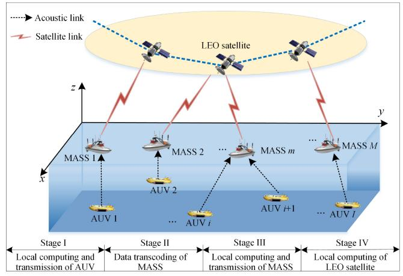

flowchart

```mermaid
graph TD
    subgraph Stage I
        A1["MASS 1"] --> A2["AUV 1"]
        A2 --> A3["AUV 2"]
        A3 --> A4["AUV i"]
        A4 --> A5["AUV i+1"]
        A5 --> A6["AUV I"]
    end

    subgraph Stage II
        B1["MASS 2"] --> B2["AUV 2"]
        B2 --> B3["AUV i"]
        B3 --> B4["AUV i+1"]
        B4 --> B5["AUV i"]
        B5 --> B6["AUV M"]
    end

    subgraph Stage III
        C1["MASS m"] --> C2["AUV m"]
        C2 --> C3["AUV i+1"]
        C3 --> C4["AUV i"]
        C4 --> C5["AUV I"]
    end

    subgraph Stage IV
        D1["MASS M"] --> D2["AUV M"]
        D2 --> D3["AUV I"]
        D3 --> D4["AUV I+1"]
        D4 --> D5["AUV i"]
        D5 --> D6["AUV i+1"]
        D6 --> D7["AUV I"]
    end

    LEO["LEO satellite"] -->|y| LEO
    LEO -->|z| LEO
    LEO -->|x| LEO
    LEO -->|y| LEO
    LEO -->|z| LEO
    style LEO fill:#f9f,stroke:#333,stroke-width:2px
```

Fig. 1. Satellite–sea integrated network architecture.

To represent the locations of each AUV and MASS, a threedimension (3-D) Cartesian coordinate system is employed. Denote $\Upsilon _ { m } = ( x _ { m } , y _ { m } , z _ { m } )$ as the spatial coordinates of MASS m, where $x _ { m } , y _ { m } .$ , and $z _ { m }$ represent its the longitude, latitude, and height, respectively. Correspondingly, the coordinates of AUV i is denoted as $\Upsilon _ { i } = ( x _ { i } , y _ { i } , z _ { i } )$ . We denote each task generated by AUV i as $\lambda _ { i } = \left\{ D _ { i } ^ { \mathrm { t o t } } , C _ { i } ^ { \mathrm { t o t } } \right\}$ , where $D _ { i } ^ { \mathrm { t o t } }$ denotes the input data size (in bits) and $C _ { i } ^ { \mathrm { t 0 t } }$ indicates the number of CPU cycles needed to process the task $\lambda _ { i } .$ . We assume that all tasks can be executed on different network terminals. Specifically, we denote variable $a _ { i , m } \in [ 0 , 1 ]$ as the offloading ratio of AUV i to MASS m. Then, the processing workload of AUV i is expressed as $( 1 - a _ { i , m } ) D _ { i } ^ { \mathrm { t o t } }$ . Denote $b _ { i , n } \in [ 0 , 1 ]$ as the ratio of offloading task $\lambda _ { i }$ from MASS m to LEOS n, then the workload for AUV i processed on MASS m is expressed as $( 1 - b _ { i , n } ) a _ { i , m } D _ { i } ^ { \mathrm { t o t } }$ .

# B. Communication Model

1) Underwater Acoustic Communication From AUVs to MASSs: Based on the Urick’s model [40], [41], the transmission signal attenuation model tailored specifically for underwater acoustic communication between AUV i and MASS m is derived as

$$
H \left(d _ {i, m}, f\right) = d _ {i, m} ^ {\sigma} \Omega (f) ^ {\varrho d _ {i, m}} \tag {1}
$$

where $d _ { i , m }$ is the distance between AUV i and MASS m,  is the coefficient of $d _ { i , m } , \Omega ( f )$ is the absorption coefficient, $f$ denotes the central frequency of the acoustic signal, and σ is a spreading factor. The absorption coefficient $\Omega ( f )$ can be obtained according to the Thorp’s empirical formula in [41]. The distance between AUV i and MASS m is expressed as

$$
d _ {i, m} = \sqrt {(x _ {m} - x _ {i}) ^ {2} + (y _ {m} - y _ {i}) ^ {2} + (z _ {m} - z _ {i}) ^ {2}}. \tag {2}
$$

Based on (1), the underwater acoustic uplink channel gain from AUV i to MASS m is calculated as

$$
g _ {i, m} = \frac {1}{H (d _ {i , m} , f) N _ {B} W _ {i}} \tag {3}
$$

where $N _ { B }$ is the oceanic noise power spectrum density and $W _ { i }$ denotes the allocated channel bandwidth for acoustic communications from AUV i to MASS m. Utilizing NOMA, the successive interference cancelation (SIC) necessitates an ordering based on their channel power gains relative to MASS $m .$ The uplink channel gains at MASS m from different UAVs using NOMA are sorted in a descending order as $g _ { 1 , m } \ >$ $g _ { 2 , m } ~ > ~ \cdot ~ \cdot ~ > ~ g _ { i , m } ~ > ~ \cdot ~ \cdot ~ > ~ g _ { I , m }$ . According to Shannon theorem, the link transmission capacity from AUV i to MASS m can be calculated by

$$
R _ {i, m} = W _ {i} \log_ {2} \left(1 + \frac {p _ {i} g _ {i} s _ {i}}{\sum_ {j \in I , j \neq i} p _ {j} g _ {j} s _ {j} + N _ {B}}\right) \tag {4}
$$

where $p _ { i }$ is the transmission power of AUV i and $s _ { i }$ represents link quality indicator during the offloading process of AUV i, which will be introduced in Section III-D. Then, the time to transmit a portion of task $\lambda _ { i }$ from AUV i to MASS m is calculated as

$$
t _ {i, m} ^ {t s} = \frac {a _ {i , m} D _ {i} ^ {\mathrm{tot}}}{R _ {i , m}}. \tag {5}
$$

The corresponding energy consumption of AUV i is expressed as

$$
E _ {i, m} ^ {t s} = p _ {i} t _ {i, m} ^ {t s} = \frac {p _ {i} a _ {i , m} D _ {i} ^ {\mathrm{tot}}}{R _ {i , m}}. \tag {6}
$$

# 2) LOS Transmission From MASSs to LEOSs:

a) Coverage model of LEOSs: Different from terrestrial networks, LEOSs location dynamically vary, affecting the communication between MASSs and LEOSs. According to [42], the geometric relation between an LEOS and an MASS is depicted in Fig. 2, where h denotes the altitude of the LEOS orbit, $R _ { e }$ is the radius of the Earth and $d _ { m , n }$ represents the distance between MASS m and LEOS n, which is calculated as

$$
d _ {m, n} = \sqrt {R _ {e} ^ {2} + (R _ {e} + h) ^ {2} - 2 R _ {e} (R _ {e} + h) \cos \varsigma_ {m , n}}. \tag {7}
$$

In (7), $\varsigma _ { m , n }$ is the geocentric angle between MASS m and LEOS $n ,$ expressed as

$$
\varsigma_ {m, n} = \arccos \left(\frac {R _ {e}}{R _ {e} + h} \cdot \cos \theta_ {m, n}\right) - \theta_ {m, n} \tag {8}
$$

where $\theta _ { m , n }$ is the elevation angle between MASS m and LEOS n, which is obtained by

$$
\theta_ {m, n} = \arccos \left(\frac {R _ {e} + h}{d _ {m , n}} \cdot \sin \varsigma_ {m, n}\right). \tag {9}
$$

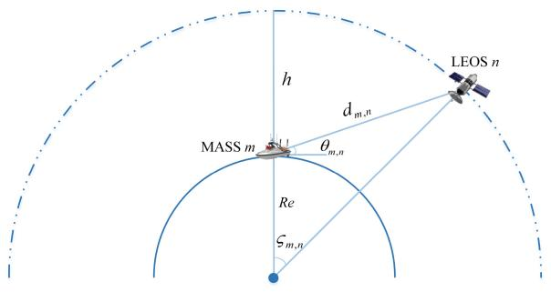

text_image

LEOS n
h
d_{m,n}
MASS m
θ_{m,n}
Re
\zeta_{m,n}

Fig. 2. Geometric relation between LEOS n and MASS m in space.

Subsequently, we can determine the maximum communicate time between MASS m and LEOS n, denoted as

$$
T ^ {\max} = \frac {2 (R _ {e} + h) \cdot \varsigma_ {m , n}}{v _ {n}} \tag {10}
$$

where $\nu _ { n } = \sqrt { ( K _ { 0 } / [ R _ { e } + h ] ) }$ is the moving speed of LEOS n and $K _ { 0 }$ is the Kepler constant. Given the high-speed movement of LEOS, the communication time between an MASS and an LEOS is constrained by the LEOS coverage duration.

b) Communication model from MASSs to LEOSs: The space segment comprises an LEO constellation, where each satellite is equipped with an MEC server to offer computing services to devices within its coverage area. Considering that all the MASSs share the spectrum resources of bandwidth W via FDMA, the transmission rate of MASS m is expressed as

$$
R _ {m, n} = \alpha_ {m} W \log_ {2} \left(1 + \frac {p _ {m} \mid h _ {m , n} \mid^ {2}}{\alpha_ {m} W N _ {0}}\right). \tag {11}
$$

In (11), $\alpha _ { m }$ represents the proportion of bandwidth allocated to MASS $m , p _ { m }$ denotes the transmission power of MASS m and $h _ { m , n } = g _ { m } \cdot \beta _ { m } \cdot ( d _ { m , n } ) ^ { - \chi }$ , where $g _ { m }$ is a complex Gaussian variable representing Rayleigh fading, $\beta _ { m }$ denotes the fading involving shadowing, rain, and other fading, and $\chi$ is the path exponent.

However, the distance between an MASS and an LEOS is relatively long, making the propagation delay nonnegligible. Thus, the communication latency for transmitting partial workloads of AUV i between MASS m and LEOS n is calculated as

$$
t _ {i, n} ^ {t s} = \frac {a _ {i , m} b _ {i , n} D _ {i} ^ {\mathrm{tot}}}{R _ {m , n}} + \frac {2 d _ {m , n}}{c} \tag {12}
$$

where c denotes the speed of light. The corresponding energy consumption of MASS m is expressed as

$$
E _ {i, n} ^ {t s} = p _ {m} t _ {i, n} ^ {t s} = p _ {m} \left(\frac {a _ {i , m} b _ {i , n} D _ {i} ^ {\mathrm{tot}}}{R _ {m , n}} + \frac {2 d _ {m , n}}{c}\right). \tag {13}
$$

# C. Computation Model

1) Local Computing of AUVs: Regarding local computation, we denote $\rho _ { i }$ as the computation capacity (CPU cycles per second) of AUV i. The execution time of task $\lambda _ { i }$ is given by

$$
t _ {i} ^ {\mathrm{com}} = \frac {(1 - a _ {i , m}) C _ {i} ^ {\mathrm{tot}}}{\rho_ {i}}. \tag {14}
$$

The corresponding energy consumption $E _ { i } ^ { \mathrm { { c o m } } }$ for AUV i is computed as [25]

$$
E _ {i} ^ {\mathrm{com}} = \varepsilon_ {i} \rho_ {i} ^ {3} t _ {i} ^ {\mathrm{com}} = \varepsilon_ {i} \rho_ {i} ^ {2} (1 - a _ {i, m}) C _ {i} ^ {\mathrm{tot}} \tag {15}
$$

where $\varepsilon _ { i }$ is the effective power consumption coefficient of AUV i in terms of computation.

2) Data Transcoding of MASSs: MASS m first receives $a _ { i , m } D _ { i } ^ { \mathrm { t o t } }$ of task $\lambda _ { i }$ from AUV i through acoustic communication and then transcodes the data for RF transmission. The transcoding time is

$$
t _ {i, m} ^ {t c} = \frac {\delta_ {m} a _ {i , m} D _ {i} ^ {\mathrm{tot}}}{\rho_ {m}} \tag {16}
$$

where $\delta _ { m }$ denotes the number of CPU cycles for processing one information bit of acoustic signal and $\rho _ { m }$ is the processing capacity of MASS m in CPU cycles per second. The energy consumption for transcoding data is expressed as

$$
E _ {i, m} ^ {t c} = \varepsilon_ {m} \rho_ {m} ^ {3} t _ {i, m} ^ {t c} = \varepsilon_ {m} \rho_ {m} ^ {2} \delta_ {m} a _ {i, m} D _ {i} ^ {\mathrm{tot}}. \tag {17}
$$

3) Local Computing of MASSs: The latency of MASS m to complete the assigned task is denoted as

$$
t _ {i, m} ^ {\mathrm{com}} = \frac {(1 - b _ {i , n}) a _ {i , m} C _ {i} ^ {\mathrm{tot}}}{\rho_ {m}}. \tag {18}
$$

The energy consumption for MASS m in terms of task computation is calculated as

$$
E _ {i, m} ^ {\mathrm{com}} = \varepsilon_ {m} \rho_ {m} ^ {3} t _ {i, m} ^ {\mathrm{com}} = \varepsilon_ {m} \rho_ {m} ^ {2} (1 - b _ {i, n}) a _ {i, m} C _ {i} ^ {\mathrm{tot}} \tag {19}
$$

where $\varepsilon _ { m }$ is the effective power consumption coefficient of MASS m.

4) Local Computing of LEOSs: The partial computation tasks of AUV i can be executed on the LEOS for further processing. We set $\rho _ { n }$ as the computation capacity (CPU cycles/s) of LEOS n and the execution time is calculated as

$$
t _ {i, n} ^ {\mathrm{com}} = \frac {a _ {i , m} b _ {i , n} C _ {i} ^ {\mathrm{tot}}}{\rho_ {n}}. \tag {20}
$$

Similar to MASS, the energy consumption of LEOS n is calculated as

$$
E _ {i, n} ^ {\mathrm{com}} = \varepsilon_ {n} \rho_ {n} ^ {3} t _ {i, n} ^ {\mathrm{com}} = \varepsilon_ {n} \rho_ {n} ^ {2} a _ {i, m} b _ {i, n} C _ {i} ^ {\mathrm{tot}} \tag {21}
$$

where $\varepsilon _ { n }$ is the effective power consumption coefficient of LEOS n in terms of task computation.

The overall latency for completing AUV i’s workloads is calculated as

$$
T _ {i} ^ {\text { tot }} = \max \left\{t _ {i} ^ {\text { com }}, t _ {i, m} ^ {t s} + t _ {i, m} ^ {t c} + \max \left\{t _ {i, m} ^ {\text { com }}, t _ {i, n} ^ {t s} + t _ {i, n} ^ {\text { com }} \right\} \right\}. \tag {22}
$$

# D. Utility Model

1) Utility Function of AUVs: To express the level of satisfaction of AUVs (SoA) in performing computation offloading, we introduce a logarithmic function to reflect the computation offloading intention of AUVs [43]. The SoA function is concave and provides a quantitative assessment of the AUV’s satisfaction with offloading activities based on task offloading ratio $a _ { i , m }$ to MASS m, given by

$$
u _ {i} = \ln (1 + s _ {i} a _ {i, m}) + \varpi_ {i} ^ {2} \tag {23}
$$

where $s _ { i }$ represents the link quality indicator during the offloading process of AUV i and $\varpi _ { i } ^ { 2 } ( \varpi _ { i } \quad \in$ [0, 1]) denotes the initial satisfaction of AUV i before the establishment of the MASS-assisted MEC system [43].

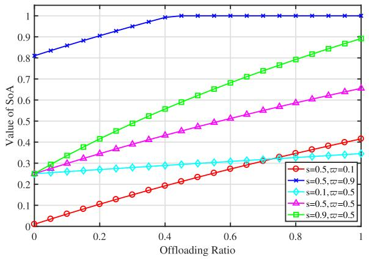

line

| Offloading Ratio | s=0.5,ω=0.1 | s=0.5,ω=0.9 | s=0.1,ω=0.5 | s=0.5,ω=0.5 | s=0.9,ω=0.5 |
| ---------------- | ----------- | ----------- | ----------- | ----------- | ----------- |
| 0.0              | 0.0         | 0.8         | 0.25        | 0.25        | 0.25        |
| 0.2              | 0.1         | 0.9         | 0.27        | 0.35        | 0.4         |
| 0.4              | 0.2         | 1.0         | 0.28        | 0.45        | 0.55        |
| 0.6              | 0.3         | 1.0         | 0.3         | 0.55        | 0.7         |
| 0.8              | 0.35        | 1.0         | 0.32        | 0.6         | 0.8         |
| 1.0              | 0.4         | 1.0         | 0.33        | 0.65        | 0.9         |

Fig. 3. Performance analysis of $u _ { i } .$

The value of $\varpi _ { i } ^ { 2 }$ is contingent upon the computing and communication capabilities of the neighboring MASS before the deployment of MEC system, as well as the AUV i’s individual computing requirements. The performance analysis of the satisfaction function is depicted in Fig. 3. When i remains constant, AUV $i \mathrm { \ ' } _ { \mathrm { s } }$ satisfaction increases with the increase of $s _ { i } .$ When both $\varpi _ { i }$ and $s _ { i }$ are high, the satisfaction can reach its maximum even without offloading all tasks, as indicated by the blue line. When $s _ { i }$ is low (shown as the light blue line), the satisfaction rate increases slowly with the offloading rate, which means that if the signal quality is poor, AUV i may struggle to achieve high satisfaction even with substantial task offloading.

The utility function of AUV i is expressed as the difference between the SoA function of $u _ { i } .$ , the price paid to MASS m and the cost of completing its workload, given by

$$
Z _ {i} = \xi_ {i} \left[ \ln \left(1 + s _ {i} a _ {i, m}\right) + \varpi_ {i} ^ {2} \right] - k _ {i} a _ {i, m} D _ {i} ^ {\text {tot}} - q _ {i} \left(E _ {i, m} ^ {t s} + E _ {i} ^ {\text {com}}\right) \tag {24}
$$

where $\xi _ { i }$ is a calibration factor of the SoA function to minimize the numerical discrepancy between ui and the associated workload processing cost, k is the price for each bit of data that needs to be paid to MASS m, and $q _ { i }$ is the cost of per unit of energy consumption.

2) Utility Function of MASSs: An MASS can assist in processing partial computation loads and its strategy is to determine the price for obtaining rewards from AUVs and the price paid to LEOS for assisting in computation workloads. For MASS m, the utility function is expressed as the difference between the revenue provide by AUV i, the price paid to LEOS, and the cost of processing its workloads, given by

$$
Z _ {m} = k _ {i} a _ {i, m} D _ {i} ^ {\text {tot}} - \psi_ {i, m} ^ {\text {price}} (b _ {i, n}) - q _ {m} \left(E _ {i, n} ^ {t s} + E _ {i, m} ^ {t c} + E _ {i, m} ^ {\text {com}}\right) \tag {25}
$$

where $q _ { m }$ is the cost of per unit of energy consumption of MASS and ψ pricei,m $\psi _ { i , m } ^ { \mathrm { p r i c e } } ( b _ { i , n } )$ denotes the price paid to LEOS n given the offloading ratio $b _ { i , n }$ , which will be introduced in Section IV-B.

3) Utility Function of LEOSs: An LEOS can assist in workload computation to earn rewards from MASSs. For LEOS $n ,$ the utility function is expressed as the difference between the total revenue provide by MASS m and the cost of completing its workloads, given by

$$
Z _ {n} = \psi_ {i, m} ^ {\text { price }} (b _ {i, n}) - q _ {n} E _ {i, n} ^ {\text { com }} \tag {26}
$$

where $q _ { n }$ denotes the cost of per unit of energy consumption of LEOS n.

# IV. PROBLEM FORMULATION AND SOLUTION DESIGN

This section presents our problem formulation and the solution design devised to tackle the aforementioned challenges. We first describe the offloading strategies of AUVs and the pricing strategies of each MASS as a Stackelberg game. We then establish a Bargaining game model to capture the interaction between an MASS and an LEOS and determine their bidding strategies. Based on the aforementioned models in Section III, the following optimization problems are formulated to maximize the utilities of AUV $i ,$ MASS m, and LEOS n, respectively. For AUV i, the utility maximization problem is expressed as

$$
(\mathbf {P 1}): \max _ {a _ {i, m}, k _ {i}} Z _ {i}
$$

$\mathrm { s . t . } \quad ( \mathbf { C } 1 ) \substack { - } ( \mathbf { C } 5 ) .$ (27)

Similarly, the optimization problem of MASS m is formulated as

$$
(\mathbf {P 2}): \max _ {k _ {i}, b _ {i, n}} Z _ {m}
$$

$\mathrm { s . t . } \quad ( \mathbf { C } 5 ) \substack { - } ( \mathbf { C } 8 ) .$ (28)

For LEOS n, the optimization problem is formulated as

$$
(\mathbf {P 3}): \max _ {b _ {i, n}} Z _ {n}
$$

${ \mathrm { s . t . } } \quad ( \mathbf { C } 6 ) , ( \mathbf { C } 9 ) , ( \mathbf { C } 1 0 )$ (29)

where

$( \mathbf { C } 1 ) : 0 \leq a _ { i , m } \leq 1 \quad \forall i \in \mathcal { T } \ \forall m \in \mathcal { M }$   
$( \mathbf { C } 2 ) : E _ { i } ^ { \mathrm { c o m } } + E _ { i , m } ^ { t s } \leq E _ { i } ^ { \mathrm { m a x } } \quad \forall i \in \mathcal { T }$   
$( \mathbf { C } 3 ) : T _ { i } ^ { \mathrm { t o t } } \leq T ^ { \mathrm { m a x } } \quad \forall i \in \mathcal { I }$   
$( \mathbf { C } 4 ) : Z _ { i } \geq 0 \quad \forall i \in \mathcal { T } \ \forall m \in \mathcal { M }$   
$( \mathbf { C } 5 ) : 0 \leq k _ { i } \leq k _ { i } ^ { \operatorname* { m a x } } \quad \forall i \in \mathcal { I }$   
$( \mathbf { C 6 } ) : 0 \leq b _ { i , n } \leq 1 \quad \forall m \in \mathcal { M } \ \forall n \in \mathcal { N }$   
$( \mathbf { C } 7 ) : E _ { i , m } ^ { \mathrm { c o m } } + E _ { i , n } ^ { t s } + E _ { i , m } ^ { t c } \leq E _ { i , m } ^ { \mathrm { m a x } } \quad \forall m \in \mathcal { M }$   
$( \mathbf { C } 8 ) : Z _ { m } \geq 0 \quad \forall i , m , n$   
$( \mathbf { C } 9 ) : E _ { i , n } ^ { \mathrm { c o m } } \leq E _ { i , n } ^ { \mathrm { m a x } } \quad \forall m \in \mathcal { M }$   
$( \mathbf { C } 1 0 ) : Z _ { n } \geq 0 \quad \forall m , n .$ (30)

In (30), constraint (C1) and constraint (C6) indicate that the offloading ratio is in between 0 and 1. Constraints (C2), (C7), and (C9) guarantee that the energy consumption of each party cannot exceed the maximum value. Constraint (C3) ensures that the task completion time of AUV i cannot exceed the maximum LEOS coverage time. Constraints (C4), (C8), and (C10) guarantee the utility of each party be higher than or equal to 0. Constraint (C5) indicates that the price determined by AUV i cannot exceed the maximum value.

Since the variables in (P1), (P2), and (P3) are closely coupled, solving the optimization problems is nondeterministic polynomial-time hard (NP-hard). The solution space for the formulated problem is immense, and as the number of AUVs escalates, the computational effort increases exponentially, which is similar to the traveling Salesman problem (TSP, a well-known NP-hard problem) [44]. Finding the optimal solution through a centralized approach is not tractable in polynomial time. To overcome these challenges, we develop a hybrid Stackelberg–Bargaining game framework to optimize the task offloading strategies and resource pricing policies in a distributed way with low-computation complexity.

# A. Stackelberg Game Formulation Between AUVs and MASSs

We describe the interaction between an AUV and an MASS as a Stackelberg game model. An MASS, say MASS m, is the leading player responsible for establishing the pricing strategies for task processing and reward acquisition. Subsequently, an AUV, say AUV i, as the follower, determines its offloading ratio in response to the price established by MASS m, with the objective of optimizing its overall revenue. Given the predefined pricing strategies of MASS m, our initial step is to analyze the offloading ratio of AUV i to optimize its utility. In accordance with the objective function of the problem, we derive the first-order derivative of $Z _ { i }$ with respect to $a _ { i , m }$ as

$$
\frac {\partial Z _ {i} \left(a _ {i , m}\right)}{\partial a _ {i , m}} = \frac {\xi_ {i} s _ {i}}{1 + s _ {i} a _ {i , m}} - k _ {i} D _ {i} ^ {\text {tot}} + q _ {i} \varepsilon_ {i} \rho_ {i} ^ {2} C _ {i} ^ {\text {tot}} - \frac {q _ {i} p _ {i} D _ {i} ^ {\text {tot}}}{R _ {i , m}}. \tag {31}
$$

Then, the second derivative of $Z _ { i }$ with respect to $a _ { i , m }$ is calculated as

$$
\frac {\partial^ {2} Z _ {i} (a _ {i , m})}{\partial a _ {i , m} ^ {2}} = - \frac {\xi_ {i} s _ {i} ^ {2}}{\left(1 + s _ {i} a _ {i , m}\right) ^ {2}}. \tag {32}
$$

As the second derivative of the utility function is negative, $Z _ { i }$ is identified as a strictly concave function with respect to $^ { a _ { i , m } , }$ and the first derivative of $Z _ { i }$ decreases with $a _ { i , m }$ , which proves the existence of Stackelberg equilibrium.

Then, we obtain

$$
\lim _ {a _ {i, m} \to 0} Z _ {i} ^ {\prime} (a _ {i, m}) = \xi_ {i} s _ {i} - A \tag {33}
$$

and

$$
\lim _ {a _ {i, m} \rightarrow 1} Z _ {i} ^ {\prime} (a _ {i, m}) = \frac {\xi_ {i} s _ {i}}{1 + s _ {i}} - A \tag {34}
$$

where $Z _ { i } ^ { \prime } ( a _ { i , m } ) = \partial Z _ { i } ( a _ { i , m } ) / \partial a _ { i , m }$ and $A = k _ { i } D _ { i } ^ { \mathrm { t o t } } - q _ { i } \varepsilon _ { i } \rho _ { i } ^ { 2 } C _ { i } ^ { \mathrm { t o t } } +$ $q _ { i } p _ { i } D _ { i } ^ { \mathrm { t o t } } / R _ { i , m }$ in (33) and (34). The maximum utility of AUV i is expressed as

$$
\max _ {a _ {i, m}} Z _ {i} = \left\{ \begin{array}{l l} Z _ {i} (0), & \text { if } \xi_ {i} s _ {i} - A <   0 \\ Z _ {i} \big (a _ {i, m} ^ {*} \big), & \text { if } \frac {\xi_ {i} s _ {i}}{1 + s _ {i}} - A \leq 0 \leq \xi_ {i} s _ {i} - A \\ Z _ {i} (1), & \text { if } \frac {\xi_ {i} s _ {i}}{1 + s _ {i}} - A > 0 \end{array} \right. \tag {35}
$$

where propos $a _ { i , m } ^ { * }$ is the root of binary search a $Z _ { i } ^ { \prime } ( a _ { i , m } ^ { * } ) = 0 \nonumber$ . In Algorithm 1, weA) to obtain the value of a∗i,m. $a _ { i , m } ^ { * } .$

Algorithm 1: BSA   
Input: Given the tolerable computation-error $\delta$ ;
Output: The optimal value $a_{i,m}^{*}$ and the corresponding value of $Z_{i}(a_{i,m}^{*})$ ;

1 Initialization: Set the lower bound as $a_{i,m}^{l}$ , set the upper bound as $a_{i,m}^{h}$ ;

2 while $|a_{i,m}^{h} - a_{i,m}^{l}| > \delta$ do

3 Update the current value of $a_{i,m}^{cur} = \frac{1}{2}(a_{i,m}^{h} + a_{i,m}^{l})$ ;

4 Obtain the value of $Z_{i}'(a_{i,m}^{cur})$ ;

5 if $Z_{i}'(a_{i,m}^{cur}) < 0$ then

6 Update the upper bound of the search range as $a_{i,m}^{h} = a_{i,m}^{cur}$ ;

7 else

8 if $Z_{i}'(a_{i,m}^{cur}) > 0$ then

9 Update the lower bound of the search range as $a_{i,m}^{l} = a_{i,m}^{cur}$ ;

10 else

11 Set $a_{i,m}^{*} = a_{i,m}^{cur}$ ;

12 Calculate the value of $Z_{i}(a_{i,m}^{*})$ ;

13 end

14 end

15 end

Algorithm 2: LSA   
1 Initialization: $j = 0$ , the current best value $Z_m^{cur}$ , the current best price $k_i^{cur}$ , the step size $\pi$ ;
2 Set $k_i(j) = k_i^{\min}$ ;
3 while $k_i(j) < k_i^{\max}$ do
4    Invoke Algorithm 1 to obtain $a_{i,m}^*$ ;
5    Calculate $Z_m(k_i(j))$ according to Eq. (26);
6    if $Z_m^{cur} < Z_m(k_i(j))$ then
7    Update $Z_m^{cur} \leftarrow Z_m(k_i(j))$ ;
8    Update $k_i^{cur} \leftarrow k_i(j)$ ;
9    end
10 $j \leftarrow j + 1$ ;
11    Update $k_i(j)$ with $k_i(j + 1) = k_i(j) + \pi$ ;
12 end
13 Obtain the optimal price $k_i^* = k_i^{cur}$ , $Z_m^* = Z_m^{cur}$ ;
14 Return $k_i^*$ and $Z_m^*$ ;

After obtaining the optimal offloading strategy of AUV i, similarly,we analyze (P2) to derive the pricing strategies of MASS m. To find the optimal value of $k _ { i } ,$ we propose a linear search algorithm (LSA) within the given interval $[ 0 , k _ { i } ^ { \operatorname* { m a x } } ]$ to numerically obtain the optimal solution of MASS m, as shown in Algorithm 2.

# B. Bargaining Game Formulation Between MASSs and LEOSs

We model the interaction between an MASS and an LEOS as a Bargaining game, where MASS m is the buyer intending to purchase computation services for processing workloads, while LEOS n serves as the seller to get revenue by providing computation resources. The satisfaction functions of MASS m and LEOS n are expressed, respectively, as

$$
u _ {i, m} = \omega_ {i, m} \ln \left(1 + \frac {1}{t _ {i , n} ^ {\mathrm{com}}}\right) \tag {36}
$$

and

$$
u _ {i, n} = \omega_ {i, n} \ln (1 + b _ {i, n}) \tag {37}
$$

where $\omega _ { i , m }$ and $\omega _ { i , n }$ are the weighting parameters indicating the degrees of satisfaction of MASS m and LEOS n, respectively. On this basis, we define the tender price for MASS m as

$$
\phi_ {i, m} (b _ {i, n}) = \min \{B, u _ {i, m} \} \tag {38}
$$

where $B = k _ { i } a _ { i , m } D _ { i } ^ { \mathrm { t o t } } - q _ { m } ( E _ { i , n } ^ { t s } + E _ { i , m } ^ { t c } + E _ { i , m } ^ { \mathrm { c o m } } )$ . Similarly, the tender price for LEOS n is formulated as

$$
\phi_ {i, n} (b _ {i, n}) = \max \{q _ {n} E _ {i, n} ^ {\mathrm{com}}, u _ {i, n} \}. \tag {39}
$$

For MASS m, its satisfaction degree is higher if LEOS n completes its offloaded workloads within a shorter time. For LEOS n, its satisfaction degree increases with the offloaded workload volume, indicating higher revenue. The final transaction price is calculated as

$$
\psi_ {i, m} ^ {\text { price }} (b _ {i, n}) = \eta_ {i} \phi_ {i, m} (b _ {i, n}) + (1 - \eta_ {i}) \phi_ {i, n} (b _ {i, n}) \tag {40}
$$

where the weighting parameter $\eta _ { i } ( 0 \leq \eta _ { i } \leq 1 )$ determines the weights of profit distribution between MASS m and LEOS n. The optimal transaction price is determined through a Bargaining game, which involves two bargainers negotiating the distribution of the Bid-ask Spread $\phi _ { i , m } ( b _ { i , n } ) - \phi _ { i , n } ( b _ { i , n } )$ . If $\phi _ { i , m } ( b _ { i , n } ) \ : < \ : \phi _ { i , n } ( b _ { i , n } )$ , the transaction is canceled, as the bidding price of MASS m is less than that of LEOS n. If $\phi _ { i , m } ( b _ { i , n } ) = \phi _ { i , n } ( b _ { i , n } )$ , the transaction price is determined as $\phi _ { i , m } ( b _ { i , n } )$ or $\phi _ { i , n } ( b _ { i , n } )$ . The bargaining game exists only when the bidding strategy satisfies $\phi _ { i , m } ( b _ { i , n } ) ~ > ~ \phi _ { i , n } ( b _ { i , n } )$ . In this case, MASS m intends to minimize its expenses, while LEOS n aims for maximizing its profit earning. Basically, it is a zero-sum game on the total transaction surplus $\phi _ { i , m } ( b _ { i , n } ) \mathrm { ~ - ~ }$ $\phi _ { i , n } ( b _ { i , n } )$ . After the transaction, LEOS n obtains the remaining $\psi _ { i , m } ^ { \mathrm { p r i c e } } ( b _ { i , n } ) - \phi _ { i , n } ( b _ { i , n } )$ ψi,m , and MASS m obtains the remaining φi,m(bi,n) − ψ pricei m ( $\phi _ { i , m } ( b _ { i , n } ) - \psi _ { i , m } ^ { \mathrm { p r i c e } } ( b _ { i , n } )$ .

According to Rubinstein’s bargaining model [45], in an infinite round of Bargaining game, we complete the bargaining process within the first round and obtain the distinct subgame Nash equilibrium as

$$
\eta_ {i} ^ {*} = \frac {\mu_ {i , n} (1 - \mu_ {i , m})}{1 - \mu_ {i , m} \mu_ {i , n}} \tag {41}
$$

where $\mu _ { i , m } \in [ 0 , 1 ]$ and $\mu _ { i , n } \in [ 0 , 1 ]$ are the discount factors which represent the respective patience levels exhibited by MASS m and LEOS n. A higher patience level corresponds to a higher discount factor value, indicating a greater willingness to negotiate, while a lower patience level corresponds to a lower discount factor value, reflecting more impatience [46]. Since MASS m aims to complete its computation workloads efficiently, its discount factor increases as the completion time

Algorithm 3: TTA   
Input: Given the tolerable computation-error $\delta$ , the step size $\pi$ ;

Output: $Z_m^*$ and $Z_n^*$ ;

1 Stage 1: Stackelberg equilibrium of (P1) and (P2);
2 for $k_i \in [0, k_i^{\max}]$ do
3    Invoke Algorithm 1 to calculate the value of $a_{i,m}^*$ ;
4    Invoke Algorithm 2 to obtain the optimal price $k_i^*$ ;
5 end
6 Input: the Stackelberg equilibrium as $\{a_{i,m}^*, k_i^*\}$ ;
7 Stage 2: Bargaining equilibrium of (P2) and (P3);
8 Calculate the offloading workload $a_{i,m}^* D_i^{\text{tot}}$ ;
9 if $a_{i,m}^* \in (0, 1]$ then
10    Calculate $\eta_i^*$ with Eq. (41);
11    Calculate $\phi_{i,m}(b_{i,n})$ and $\phi_{i,n}(b_{i,n})$ with Eq. (38) and Eq. (39);
12    Calculate the optimal bidding price $\psi_{i,m}^{\text{price}}(b_{i,n})$ with Eq. (40);
13 else
14    (P2) and (P3) are infeasible;
15 end

for workload computation decreases. Then, $\mu _ { i , m }$ is formulated as

$$
\mu_ {i, m} = \gamma_ {i, m} \frac {\left| \ln (1 + t _ {i , n} ^ {\mathrm{com}}) - \ln (1 + \frac {1}{t _ {i , n} ^ {\mathrm{com}}}) \right|}{\ln (1 + t _ {i , n} ^ {\mathrm{com}}) + \ln (1 + \frac {1}{t _ {i , n} ^ {\mathrm{com}}})}. \tag {42}
$$

Similarly, LEOS n also strives to reap greater benefits by efficiently completing workloads and its discount factor $\mu _ { i , n }$ increases with the increase of the offloading ratio $b _ { i , n } ,$ , given by

$$
\mu_ {i, n} = 1 - \gamma_ {i, n} \frac {\left| \ln (1 + b _ {i , n}) - \ln \left(1 + \frac {1}{b _ {i , n}}\right) \right|}{\ln (1 + b _ {i , n}) + \ln \left(1 + \frac {1}{b _ {i , n}}\right)}. \tag {43}
$$

$\gamma _ { i , m }$ and $\gamma _ { i , n }$ indicate the patience coefficients of MASS m and LEOS n, respectively. Obviously, both players aim to reach a consensus on the proposed scheme for the transaction surplus distribution, as their utilities are diminished over time.

Based on the hybrid Stackelberg game and Bargaining game, we propose a two-tier task offloading algorithm (TTA) based on pricing-based incentive mechanisms, as described in Algorithm 3. The algorithm consists of two stages: the first stage (from steps 2 to 5) is to obtain the Stackelberg equilibrium of (P1) and (P2), and the second stage (from steps 8 to 15) to obtain the bargaining equilibrium of (P2) and (P3).

We analyze the computational complexity of the proposed algorithms. The complexities of Algorithms 1 and 2 largely depend on the number of iterations required for the algorithms to converge. We denote the number of iterations of Algorithms 1 and 2 as J and Q, respectively. Then, we obtain the computation complexity of Algorithm 1 as $\mathcal { O } ( I \log _ { 2 } ( J ) )$ for I AUVs. Similarly, the computational complexity of Algorithm 2 is $\mathcal { O } ( Q M ) * \mathcal { O } ( I \log _ { 2 } ( J ) )$ for I AUVs and M MASSs. For Algorithm 3, to obtain the Bargaining equilibrium of (P2) and (P3) for the tasks of I AUVs, the computational complexity is (I). Therefore, the overall computational complexity of the proposed algorithms is O(QM) ∗ $\mathcal { O } ( I \log _ { 2 } ( J ) )$ .

TABLE III SIMULATION PARAMETER SETTINGS 

<table><tr><td>Parameters</td><td>Values</td></tr><tr><td>The central frequency of the acoustic signal,  $f$  [40]</td><td>1kHz</td></tr><tr><td>The ocean noise power,  $N_B$  [12]</td><td> $1 \times 10^{-4} \text{dBm}$ </td></tr><tr><td>The air noise power,  $N_0$ </td><td>-174dBm/Hz</td></tr><tr><td>Transmission power of AUV  $i$ ,  $p_i$ </td><td>0.1W</td></tr><tr><td>Transmission power of MASS  $m$ ,  $p_m$ </td><td>0.5W</td></tr><tr><td>The coefficient of  $d_{i,m}$ ,  $\varrho$  [20]</td><td>0.001</td></tr><tr><td>The elevation angle,  $\theta$  [47]</td><td>30°</td></tr><tr><td>The computation capacity of AUV  $i$ ,  $\rho_i$ </td><td> $1 \times 10^6 \text{cycles/s}$ </td></tr><tr><td>The power consumption coefficient of AUV  $i$ ,  $\varepsilon_i$ </td><td> $5 \times 10^{-20}$ </td></tr><tr><td>The computation capacity of MASS  $m$ ,  $\rho_n$ </td><td> $4 \times 10^6 \text{cycles/s}$ </td></tr><tr><td>The power consumption coefficient of MASS  $m$ ,  $\varepsilon_m$ </td><td> $1.5 \times 10^{-22}$ </td></tr><tr><td>The computation capacity of LEOS  $n$ ,  $\rho_n$ </td><td> $6 \times 10^8 \text{cycles/s}$ </td></tr><tr><td>The power consumption coefficient of LEOS  $n$ ,  $\varepsilon_n$ </td><td> $2 \times 10^{-23}$ </td></tr><tr><td>The number of CPU cycles for processing one bit of data in MASS  $m$ ,  $\delta_m$  [12]</td><td> $1 \times 10^4 \text{cycles}$ </td></tr></table>

# V. PERFORMANCE EVALUATION

In this section, we conduct simulations to validate the effectiveness of our proposed scheme. Specifically, we assess the impact of key parameters on the utility of each party and compare the performance of our proposed method with other benchmark approaches.

# A. Simulation Setup

We conduct all the simulations with MATLAB on a PC configured with a Core i7-10510U 1.80-GHz CPU and 8 GB of RAM. We consider a satellite-assisted maritime network comprised of one LEOS and five MASSs, which are deployed in a $5 0 0 { \times } 5 0 0 { \times } 5 0 0 \mathrm { m } ^ { 3 }$ area, together with 5–30 AUVs capable of autonomous navigation. In the considered scenarion, AUVs make decisions regarding the amount of offloading tasks based on the pricing strategies issued by MASS. We assume AUV i has a total task volume of 50 Mbits. Each AUV communicates with MASS via NOMA, utilizing a channel bandwidth of 1 MHz, and each MASS communicates with LEOS through FDMA, employing a channel bandwidth of 10 MHz. The remaining simulation parameters are listed in Table III.

To validate the effectiveness and efficiency, we further compare the utility performance of the proposed scheme with the following benchmark schemes.

1) OFDMA-Based Transmission Scheme (OTS) [48]: In this scheme, each AUV uploads its workloads to an MASS via OFDMA through underwater acoustic communication, and the communication bandwidth is evenly allocated to each AUV.   
2) Offloading Scheme Based on Fixed Proportion (OSFP): In this scheme, the offloading ratio $a _ { i , m }$ is predetermined and remains constant when AUV i transmits workloads to MASS.   
3) Offloading Scheme Based on Random Proportion (OSRP): Similar to [49], in this scheme, the offloading ratio $a _ { i , m }$ is randomly determined when AUV i transmits workloads to MASS.

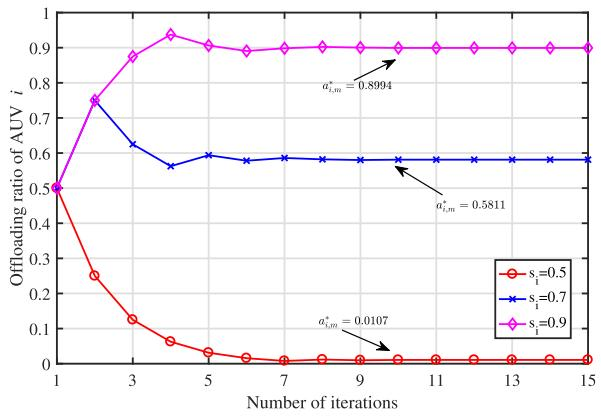

line

| Number of iterations | s_i=0.5 | s_i=0.7 | s_i=0.9 |
| -------------------- | ------- | ------- | ------- |
| 1                    | 0.5     | 0.5     | 0.5     |
| 3                    | 0.12    | 0.62    | 0.88    |
| 5                    | 0.03    | 0.58    | 0.92    |
| 7                    | 0.01    | 0.58    | 0.9     |
| 9                    | 0.01    | 0.58    | 0.9     |
| 11                   | 0.01    | 0.58    | 0.9     |
| 13                   | 0.01    | 0.58    | 0.9     |
| 15                   | 0.01    | 0.58    | 0.9     |

Fig. 4. Variation of $a _ { i , m }$ under different link quality.

4) Offloading Scheme Based on Linear Proportion (OSLP): In this scheme, the offloading ratio $a _ { i , m }$ varies linearly with the total amount of data when AUV i transmits workloads to MASS.   
5) Hierarchical Adaptive Search Algorithm (HAS) [50]: In this scheme, the optimal solution is progressively attained through iterations.   
6) Linear Pricing Scheme (LPS): In this scheme, the tender prices of MASS m and LEOS n are linear with the offloading ratio $b _ { i , n }$ in the bargaining game [12].   
7) Fixed Pricing Scheme (FPS): In this scheme, the tender prices of MASS m and LEOS n are predetermined and remains constant in the bargaining game.   
8) Random Pricing Scheme (RPS): In this scheme, the tender prices of MASS m and LEOS n are randomly determined in the bargaining game [3].

# B. Numerical Results and Analysis

Fig. 4 illustrates the variation in offloading ratio of AUV i as the number of iterations increases under different link quality. The proposed scheme consistently converges to a fixed value to achieve the optimal $a _ { i , m }$ with the increasing number of iterations. Moreover, $a _ { i , m }$ also increases as the link quality intensifies, indicating that the better the link quality, the more tasks tends to be offloaded by AUV i to conserve its energy consumption. The results presented in Fig. 4 also confirm the efficiency of the proposed BSA algorithm.

Fig. 5 demonstrates how the utility of AUV i varies with the number of iterations and link quality. As the number of iterations increases, the algorithm converges to a fixed value for maximum utility. Additionally, the utility function of AUV i escalates as link quality intensifies.

Fig. 6 illustrates the variation in offloading ratio of AUV i as the number of iterations increases under different task volumes. This figure indicates that the proposed algorithm can always converge to a constant value within a finite number of iterations to attain the maximum utility, regardless of how much total workload needs to be processed.

Fig. 7 depicts the variation in the utility of both MASS and AUV throughout the iterations. As the number of iterations increases, their utilities converge to fixed values to obtain their respective maximums. The utility of MASS m increases with higher prices, while the utility of AUV i decreases as prices rise. Nevertheless, once the price surpasses a specific point, both settle into a Stackelberg equilibrium. This figure also verifies the effectiveness of the proposed LSA algorithm.

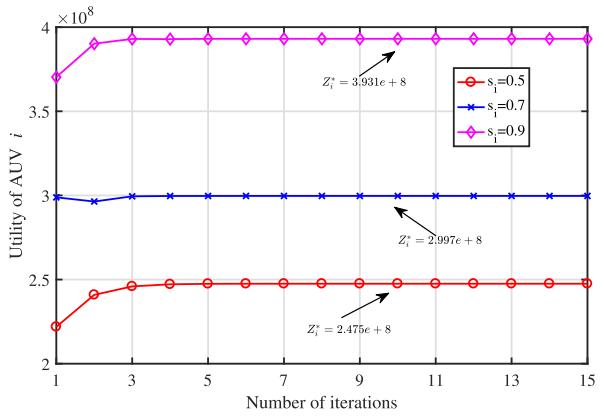

line

| Number of iterations | Utility of AUV i (s_i=0.5) | Utility of AUV i (s_i=0.7) | Utility of AUV i (s_i=0.9) |
|----------------------|-----------------------------|----------------------------|----------------------------|
| 1                    | 2.2                         | 3.0                        | 3.7                        |
| 3                    | 2.4                         | 3.0                        | 3.9                        |
| 5                    | 2.5                         | 3.0                        | 3.9                        |
| 7                    | 2.5                         | 3.0                        | 3.9                        |
| 9                    | 2.5                         | 3.0                        | 3.9                        |
| 11                   | 2.5                         | 3.0                        | 3.9                        |
| 13                   | 2.5                         | 3.0                        | 3.9                        |
| 15                   | 2.5                         | 3.0                        | 3.9                        |

Fig. 5. Variation of $Z _ { i }$ under different link quality.

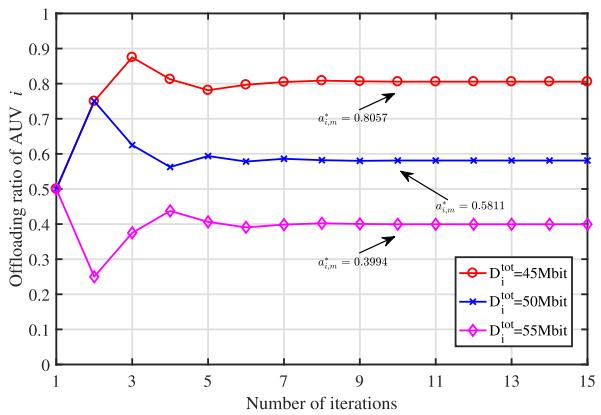

line

| Number of iterations | D_i^tot=45Mbit | D_i^tot=50Mbit | D_i^tot=55Mbit |
| -------------------- | -------------- | -------------- | -------------- |
| 1                    | 0.5            | 0.5            | 0.5            |
| 3                    | 0.88           | 0.75           | 0.25           |
| 5                    | 0.8            | 0.6            | 0.4            |
| 7                    | 0.8            | 0.6            | 0.4            |
| 9                    | 0.8            | 0.6            | 0.4            |
| 11                   | 0.8            | 0.6            | 0.4            |
| 13                   | 0.8            | 0.6            | 0.4            |
| 15                   | 0.8            | 0.6            | 0.4            |

Fig. 6. Variation of $a _ { i , m }$ under different task volumes.

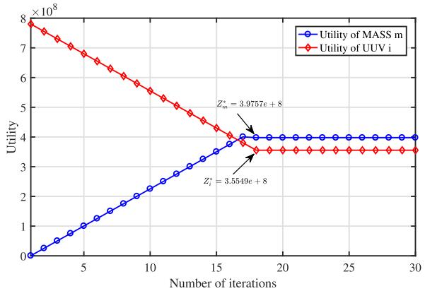

line

| Number of iterations | Utility of MASS m | Utility of UUV i |
| -------------------- | ----------------- | ---------------- |
| 0                    | 0                 | 8.0              |
| 5                    | 1.0               | 6.5              |
| 10                   | 2.0               | 5.0              |
| 15                   | 3.0               | 4.0              |
| 20                   | 4.0               | 3.5              |
| 25                   | 4.0               | 3.5              |
| 30                   | 4.0               | 3.5              |

Fig. 7. Variation of the utility of MASS m and AUV i.

Figs. 8 and 9 illustrate the comparison of the utilities of MASS and LEOS under varying $b _ { i , n }$ and $\eta _ { i } ,$ respectively. The benchmark is set using different proportion $\eta _ { i }$ for the Bargaining game. As $b _ { i , n }$ increases, the utility of MASS decreases, while the utility of LEOS rises, due to the fact that the expenditure paid by MASS escalate with $b _ { i , n }$ . When $b _ { i , n }$ remains constant, an increase in $\eta _ { i }$ leads to a decrease in the utility of MASS and an increase in LEOS’s utility, as a larger share of the profits is allocated to LEOS with higher $\eta _ { i } .$ The proposed scheme can achieve better utility than others.

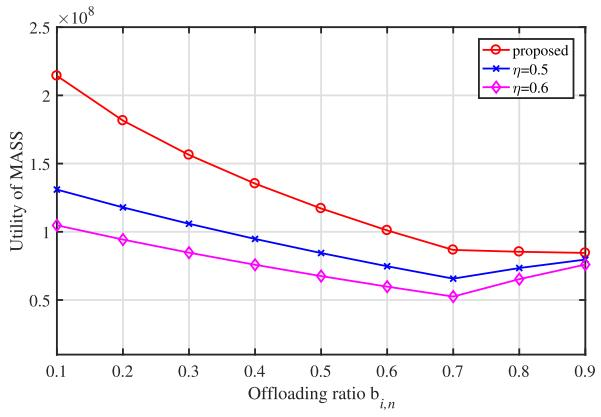

line

| Offloading ratio b_i,n | proposed     | η=0.5        | η=0.6        |
| ---------------------- | ------------ | ------------ | ------------ |
| 0.1                    | 2.1e8        | 1.3e8        | 1.05e8       |
| 0.2                    | 1.8e8        | 1.2e8        | 0.95e8       |
| 0.3                    | 1.6e8        | 1.1e8        | 0.85e8       |
| 0.4                    | 1.4e8        | 1.0e8        | 0.75e8       |
| 0.5                    | 1.2e8        | 0.9e8        | 0.65e8       |
| 0.6                    | 1.0e8        | 0.8e8        | 0.6e8        |
| 0.7                    | 0.9e8        | 0.7e8        | 0.55e8       |
| 0.8                    | 0.9e8        | 0.75e8       | 0.65e8       |
| 0.9                    | 0.9e8        | 0.8e8        | 0.75e8       |

Fig. 8. Comparison of the utility of MASS under different $b _ { i , n } .$

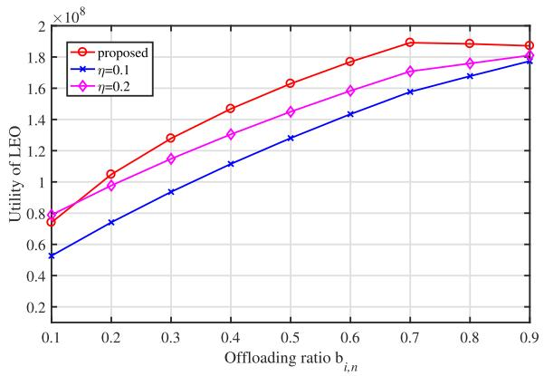

line

| Offloading ratio b_i,n | proposed | η=0.1 | η=0.2 |
| ---------------------- | -------- | ----- | ----- |
| 0.1                    | 0.75e8   | 0.55e8 | 0.78e8 |
| 0.2                    | 1.05e8   | 0.75e8 | 0.95e8 |
| 0.3                    | 1.30e8   | 0.95e8 | 1.15e8 |
| 0.4                    | 1.45e8   | 1.10e8 | 1.30e8 |
| 0.5                    | 1.65e8   | 1.25e8 | 1.45e8 |
| 0.6                    | 1.75e8   | 1.40e8 | 1.60e8 |
| 0.7                    | 1.90e8   | 1.55e8 | 1.70e8 |
| 0.8                    | 1.90e8   | 1.65e8 | 1.75e8 |
| 0.9                    | 1.90e8   | 1.75e8 | 1.80e8 |

Fig. 9. Comparison of the utility of LEOS under different $b _ { i , n }$ .

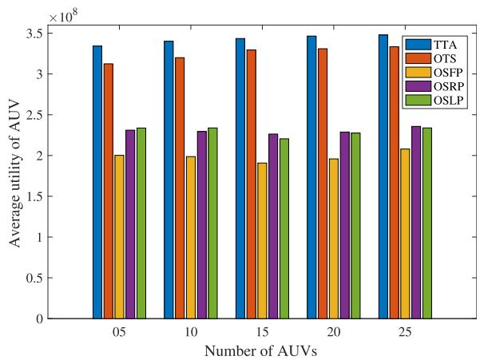

bar

| Number of AUVs | TTA (×10⁸) | OTS (×10⁸) | OSFP (×10⁸) | OSRP (×10⁸) | OSLP (×10⁸) |
|---|---|---|---|---|---|
| 05 | 3.35 | 3.12 | 2.00 | 2.32 | 2.34 |
| 10 | 3.40 | 3.20 | 1.98 | 2.30 | 2.34 |
| 15 | 3.45 | 3.32 | 1.92 | 2.26 | 2.21 |
| 20 | 3.47 | 3.32 | 1.96 | 2.28 | 2.28 |
| 25 | 3.48 | 3.35 | 2.06 | 2.36 | 2.34 |

Fig. 10. Comparison of the average utility of AUVs with the number of AUVs.

Figs. 10 and 11 demonstrate the utility comparison of the proposed algorithms for AUV and MASS with different number of AUVs. As the number of AUVs escalates, we observe that our proposed scheme has the maximum utility for both the MASS and AUVs, because the proposed scheme takes the optimal offloading ratio $a _ { i , m }$ and the optimal pricing strategies of $k _ { i }$ into account. Moreover, as the number of AUVs escalates, the average utility of AUVs rises very slowly due to the noncooperative nature of the game between AUVs. In contrast, the average utility of MASS increases rapidly as the number of AUVs increases. This is because, with more AUVs, MASS can process more computation tasks, thereby boosting profit margins and enhancing its utility.

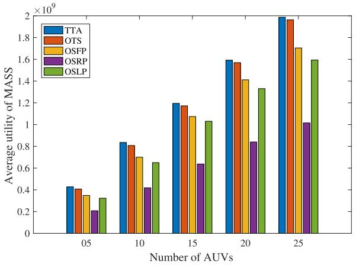

bar

| Number of AUVs | TTA | OTS | OSFP | OSRP | OSLP |
|---|---|---|---|---|---|
| 05 | 0.42 | 0.41 | 0.36 | 0.22 | 0.33 |
| 10 | 0.84 | 0.81 | 0.71 | 0.42 | 0.65 |
| 15 | 1.21 | 1.18 | 1.08 | 0.64 | 1.04 |
| 20 | 1.59 | 1.57 | 1.42 | 0.84 | 1.34 |
| 25 | 1.99 | 1.97 | 1.71 | 1.01 | 1.59 |

Fig. 11. Comparison of the average utility of MASSs with the number of AUVs.

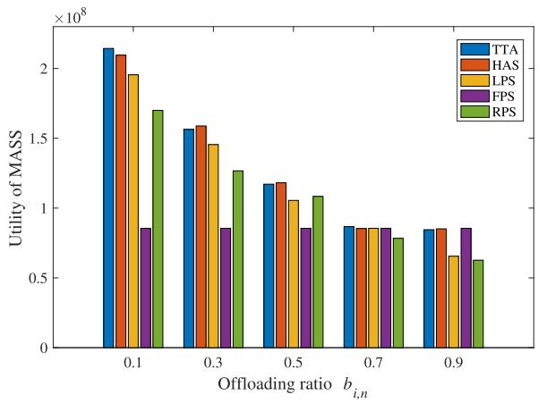

bar

| Offloading ratio b_i,n | TTA     | HAS     | LPS     | FPS     | RPS     |
| ---------------------- | ------- | ------- | ------- | ------- | ------- |
| 0.1                    | 2.15e8  | 2.10e8  | 1.95e8  | 0.85e8  | 1.70e8  |
| 0.3                    | 1.58e8  | 1.60e8  | 1.45e8  | 0.85e8  | 1.28e8  |
| 0.5                    | 1.18e8  | 1.18e8  | 1.05e8  | 0.85e8  | 1.08e8  |
| 0.7                    | 0.85e8  | 0.85e8  | 0.85e8  | 0.85e8  | 0.78e8  |
| 0.9                    | 0.85e8  | 0.85e8  | 0.65e8  | 0.85e8  | 0.62e8  |

Fig. 12. Comparison of the utility of MASSs under different $b _ { i , n } .$ .

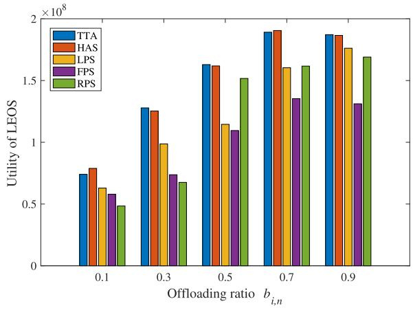

bar

| Offloading ratio b_i,n | TTA     | HAS     | LPS     | FPS     | RPS     |
| ---------------------- | ------- | ------- | ------- | ------- | ------- |
| 0.1                    | 0.75e8  | 0.8e8   | 0.65e8  | 0.6e8   | 0.5e8   |
| 0.3                    | 1.3e8   | 1.25e8  | 1.0e8   | 0.75e8  | 0.65e8  |
| 0.5                    | 1.65e8  | 1.6e8   | 1.15e8  | 1.1e8   | 1.5e8   |
| 0.7                    | 1.9e8   | 1.9e8   | 1.6e8   | 1.35e8  | 1.6e8   |
| 0.9                    | 1.85e8  | 1.85e8  | 1.75e8  | 1.3e8   | 1.7e8   |

Fig. 13. Comparison of the utility of LEOS under different $b _ { i , n }$ .

Figs. 12 and 13 illustrate the utility comparison of our proposed scheme for MASS and LEOS under different values of the offloading ratio $b _ { i , n }$ . With the increment of $b _ { i , n } .$ , we observe that the utility of MASS decreases, while the utility of LEOS increases. The rationale is that as $b _ { i , n }$ increases, a greater proportion of workloads are offloaded to LEOS n, prompting MASS m to offer higher expenditure to LEOS n. Consequently, this enhances the utility of LEOS n while diminishing the utility of MASS m. The proposed scheme attains approximate optimal performance due to its consideration of the most advantageous bidding prices for both MASS m and LEOS n. In addition, we see that HAS outperforms the proposed TTA at times in terms of optimization performance, which stems from HAS’s ability to progressively converge toward the optimal solution by leveraging global information. However, acquiring global information in real-world applications is challenging, and centralized solutions often entail high-time complexity.

# VI. CONCLUSION AND FUTURE WORK

In this article, we have considered a space-sea integrated network architecture and proposed a two-tier task offloading scheme for AUVs using a hybrid Stackelberg–Bargaining game approach to improve the efficiency of task offloading process. Initially, we implement a multiaccess task offloading strategy through underwater acoustic communication, enabling AUVs to delegate their workloads to MASSs via NOMA. We formulate the task offloading interactions between AUVs and MASSs as a Stackelberg game to refine the AUV offloading strategy and optimize the pricing strategies of each MASS, to maximize their respective profits. Subsequently, for MASSto-LEOS transmission, we consider the scenario where each MASS delegates a portion of its workloads to an LEOS via FDMA to avoid the co-channel interference. We formulate the interactions between an MASS and an LEOS as a Bargaining game to optimize their bidding strategies and maximize their respective revenues. Numerical results are presented to validate the efficiency and effectiveness of our proposed scheme. For future work, we will investigate efficient resource management for satellite-marine integrated networks to improve the overall system performance. In addition, we will explore the development of intelligent algorithms using deep reinforcement learning to improve the adaptability of decision-making process for task offloading in dynamic marine environments.

# REFERENCES

[1] M. Dai, C. Dou, Y. Wu, L. Qian, R. Lu, and T. Q. S. Quek, “Multi-UAV aided multi-access edge computing in marine communication networks: A joint system-welfare and energy-efficient design,” IEEE Trans. Commun., vol. 72, no. 9, pp. 5517–5531, Sep. 2024.   
[2] Y. Liu, J. Yan, and X. Zhao, “Deep reinforcement learning based latency minimization for mobile edge computing with virtualization in maritime UAV communication network,” IEEE Trans. Veh. Technol., vol. 71, no. 4, pp. 4225–4236, Apr. 2022.   
[3] H. Zeng et al., “USV fleet-assisted collaborative computation offloading for smart maritime services: An energy-efficient design,” IEEE Trans. Veh. Technol., vol. 73, no. 10, pp. 14718–14733, Oct. 2024.   
[4] Z. Lin, J. Yang, Y. Chen, C. Xu, and X. Zhang, “Maritime distributed computation offloading in space–air–ground–sea integrated networks,” IEEE Commun. Lett., vol. 28, no. 7, pp. 1614–1618, Jul. 2024.   
[5] T. Lyu, H. Xu, F. Liu, M. Li, L. Li, and Z. Han, “Computing offloading and resource allocation of NOMA-based UAV emergency communication in marine Internet of Things,” IEEE Internet Things J., vol. 11, no. 9, pp. 15571–15586, May 2024.

[6] G. Yue, C. Huang, and X. Xiong, “A task offloading scheme in maritime edge computing network,” J. Commun. Inf. Netw., vol. 8, no. 2, pp. 171–186, Jun. 2023.   
[7] H. Li, S. Wu, J. Jiao, X.-H. Lin, N. Zhang, and Q. Zhang, “Energyefficient task offloading of edge-aided maritime UAV systems,” IEEE Trans. Veh. Technol., vol. 72, no. 1, pp. 1116–1126, Jan. 2023.   
[8] Q. Ye, W. Shi, K. Qu, H. He, W. Zhuang, and X. Shen, “Joint RAN slicing and computation offloading for autonomous vehicular networks: A learning-assisted hierarchical approach,” IEEE Open J. Veh. Technol., vol. 2, pp. 272–288, 2021.   
[9] Y. Chen, K. Li, Y. Wu, J. Huang, and L. Zhao, “Energy efficient task offloading and resource allocation in air-ground integrated MEC systems: A distributed online approach,” IEEE Trans. Mobile Comput., vol. 23, no. 8, pp. 8129–8142, Aug. 2024.   
[10] X. Hou, J. Wang, T. Bai, Y. Deng, Y. Ren, and L. Hanzo, “Environmentaware AUV trajectory design and resource management for multi-tier underwater computing,” IEEE J. Sel. Areas Commun., vol. 41, no. 2, pp. 474–490, Feb. 2023.   
[11] J. Wen, J. Yang, W. Wei, and Z. Lv, “Intelligent multi-AUG ocean data collection scheme in maritime wireless communication network,” IEEE Trans. Netw. Sci. Eng., vol. 9, no. 5, pp. 3067–3079, Sep./Oct. 2022.   
[12] M. Dai, Z. Luo, Y. Wu, L. Qian, B. Lin, and Z. Su, “Incentive oriented two-tier task offloading scheme in marine edge computing networks: A hybrid Stackelberg-auction game approach,” IEEE Trans. Wireless Commun., vol. 22, no. 12, pp. 8603–8619, Dec. 2023.   
[13] M. Dai, Y. Wu, L. Qian, Z. Su, B. Lin, and N. Chen, “UAV-assisted multi-access computation offloading via hybrid NOMA and FDMA in marine networks,” IEEE Trans. Netw. Sci. Eng., vol. 10, no. 1, pp. 113–127, Jan./Feb. 2023.   
[14] J. Zhang et al., “Learning-assisted dynamic VNF selection and chaining for 6G satellite-ground integrated networks,” IEEE Trans. Veh. Technol., early access, Sep. 30, 2024, doi: 10.1109/TVT.2024.3454438.   
[15] Q. Pan et al., “Space–air–sea–ground integrated monitoring networkbased maritime transportation emergency forecasting,” IEEE Trans. Intell. Transp. Syst., vol. 23, no. 3, pp. 2843–2852, Mar. 2022.   
[16] X. Fang et al., “NOMA-based hybrid satellite-UAV-terrestrial networks for 6G maritime coverage,” IEEE Trans. Wireless Commun., vol. 22, no. 1, pp. 138–152, Jan. 2023.   
[17] H. Zeng, Z. Su, Q. Xu, and R. Li, “Security and privacy in space– air–ocean integrated unmanned surface vehicle networks,” IEEE Netw., vol. 38, no. 3, pp. 48–56, May 2024.   
[18] D. Wang, T. He, Y. Lou, L. Pang, Y. He, and H.-H. Chen, “Doubleedge computation offloading for secure integrated space–air–aqua networks,” IEEE Internet Things J., vol. 10, no. 17, pp. 15581–15593, Sep. 2023.   
[19] S. Qi, B. Lin, Y. Deng, X. Chen, and Y. Fang, “Minimizing maximum latency of task offloading for multi-UAV-assisted maritime search and rescue,” IEEE Trans. Veh. Technol., vol. 73, no. 9, pp. 13625–13638, Sep. 2024.   
[20] Z. Luo, M. Dai, Y. Wu, L. Qian, B. Lin, and Z. Su, “UAV-aided twotier computation offloading for marine communication networks: An incentive-based approach,” in Proc. IEEE Wireless Commun. Netw. Conf. (WCNC), 2023, pp. 1–6.   
[21] H. Wu, Y. Shen, X. Xiao, G. T. Nguyen, A. Hecker, and F. H. P. Fitzek, “Accelerating industrial IoT acoustic data separation with in-network computing,” IEEE Internet Things J., vol. 10, no. 5, pp. 3901–3916, Mar. 2023.   
[22] T. Yang, Z. Cui, A. H. Alshehri, M. Wang, K. Gao, and K. Yu, “Distributed maritime transport communication system with reliability and safety based on blockchain and edge computing,” IEEE Trans. Intell. Transp. Syst., vol. 24, no. 2, pp. 2296–2306, Feb. 2023.   
[23] L. Qian et al., “Secrecy-driven energy minimization in federatedlearning-assisted marine digital twin networks,” IEEE Internet Things J., vol. 11, no. 3, pp. 5155–5168, Feb. 2024.   
[24] Y. Dai, B. Lin, Y. Che, and L. Lyu, “UAV-assisted data offloading for smart container in offshore maritime communications,” China Commun., vol. 19, no. 1, pp. 153–165, Jan. 2022.   
[25] Z. Wang, B. Lin, Q. Ye, Y. Fang, and X. Han, “Joint computation offloading and resource allocation for maritime MEC with energy harvesting,” IEEE Internet Things J., vol. 11, no. 11, pp. 19898–19913, Jun. 2024.   
[26] M. Dai et al., “Latency minimization oriented hybrid offshore and aerialbased multi-access computation offloading for marine communication networks,” IEEE Trans. Commun., vol. 71, no. 11, pp. 6482–6498, Nov. 2023.

[27] P. Gjanci, C. Petrioli, S. Basagni, C. A. Phillips, L. Bölöni, and D. Turgut, “Path finding for maximum value of information in multimodal underwater wireless sensor networks,” IEEE Trans. Mobile Comput., vol. 17, no. 2, pp. 404–418, Feb. 2018.   
[28] J. You, Z. Jia, C. Dong, L. He, Y. Cao, and Q. Wu, “Computation offloading for uncertain marine tasks by cooperation of UAVs and vessels,” in Proc. IEEE Int. Conf. Commun., 2023, pp. 666–671.   
[29] M. Li, L. P. Qian, X. Dong, B. Lin, Y. Wu, and X. Yang, “Secure computation offloading for marine IoT: An energy-efficient design via cooperative jamming,” IEEE Trans. Veh. Technol., vol. 72, no. 5, pp. 6518–6531, May 2023.   
[30] X. Guo, Y. Luo, N. Yan, W. An, and K. Ma, “Multibeam transmit-reflectarray antenna using alternating transmission and reflection elements for space–air–ground–sea integrated network,” IEEE Trans. Antennas Propag., vol. 71, no. 11, pp. 8668–8676, Nov. 2023.   
[31] S. S. Hassan, D. H. Kim, Y. K. Tun, N. H. Tran, W. Saad, and C. S. Hong, “Seamless and energy-efficient maritime coverage in coordinated 6G space–air–sea non-terrestrial networks,” IEEE Internet Things J., vol. 10, no. 6, pp. 4749–4769, Mar. 2023.   
[32] Z. Li, J. Wen, J. Yang, J. He, T. Ni, and Y. Li, “Energy-efficient space– air–ground–ocean-integrated network based on intelligent autonomous underwater glider,” IEEE Internet Things J., vol. 10, no. 11, pp. 9329–9341, Jun. 2023.   
[33] Y. Zhang, P. Zhang, C. Jiang, S. Wang, H. Zhang, and C. Rong, “QoS aware virtual network embedding in space–air–ground–ocean integrated network,” IEEE Trans. Services Comput., vol. 17, no. 4, pp. 1712–1723, Aug. 2024.   
[34] Y. Lin et al., “Resource management for QoS-guaranteed marine data feedback based on space–air–ground–sea network,” IEEE Syst. J., vol. 18, no. 3, pp. 1741–1752, Sep. 2024.   
[35] H. Wu et al., “A game-based incentive-driven offloading framework for dispersed computing,” IEEE Trans. Commun., vol. 71, no. 7, pp. 4034–4049, Jul. 2023.   
[36] Y. Chen, J. Zhao, Y. Wu, J. Huang, and X. S. Shen, “Multi-user task offloading in UAV-assisted LEO satellite edge computing: A gametheoretic approach,” IEEE Trans. Mobile Comput., vol. 24, no. 1, pp. 363–378, Jan. 2025.   
[37] X. Zhang, Z. Wang, F. Tian, and Z. Yang, “Stackelberg-game-based multi-user multi-task offloading in mobile edge computing,” IEEE Trans. Cloud Comput., vol. 12, no. 2, pp. 459–475, Apr.–Jun. 2024.   
[38] Z. Niu, H. Liu, Y. Ge, and J. Du, “Distributed hybrid task offloading in mobile-edge computing: A potential game scheme,” IEEE Internet Things J., vol. 11, no. 10, pp. 18698–18710, May 2024.   
[39] K. Peng, Y. Yang, S. Wang, P. Xiao, and V. C. M. Leung, “Reliability-aware proactive offloading in mobile edge computing using Stackelberg game approach,” IEEE Internet Things J., vol. 11, no. 9, pp. 16660–16671, May 2024.   
[40] R. Ma, R. Wang, G. Liu, W. Meng, and X. Liu, “UAV-aided cooperative data collection scheme for ocean monitoring networks,” IEEE Internet Things J., vol. 8, no. 17, pp. 13222–13236, Sep. 2021.   
[41] D. E. Lucani, M. Stojanovic, and M. Medard, “On the relationship between transmission power and capacity of an underwater acoustic communication channel,” in Proc. MTS/IEEE Kobe Techno-Ocean, 2008, pp. 1–6.   
[42] B. Elbert, Introduction to Satellite Communication. Norwood, MA, USA: Artech House, 2008.   
[43] M. Wang, L. Zhang, P. Gao, X. Yang, K. Wang, and K. Yang, “Stackelberg-game-based intelligent offloading incentive mechanism for a multi-UAV-assisted mobile-edge computing system,” IEEE Internet Things J., vol. 10, no. 17, pp. 15679–15689, Sep. 2023.   
[44] M. R. Garey and D. S. Johnson, Computers and Intractability: A Guide to the Theory of NP-Completeness. New York, NY, USA: W. H. Freeman, 1983.   
[45] A. Rubinstein, “Perfect equilibrium in a bargaining model,” Econometrica, vol. 50, no. 1, pp. 97–109, 1982.   
[46] Z. Sun, G. Sun, Y. Liu, J. Wang, and D. Cao, “BARGAIN-MATCH: A game theoretical approach for resource allocation and task offloading in vehicular edge computing networks,” IEEE Trans. Mobile Comput., vol. 23, no. 2, pp. 1655–1673, Feb. 2024.   
[47] Q. Tang, Z. Fei, B. Li, and Z. Han, “Computation offloading in LEO satellite networks with hybrid cloud and edge computing,” IEEE Internet Things J., vol. 8, no. 11, pp. 9164–9176, Jun. 2021.   
[48] L. Wu et al., “DOT: Decentralized offloading of tasks in OFDMA-based heterogeneous computing networks,” IEEE Internet Things J., vol. 9, no. 20, pp. 20071–20082, Oct. 2022.

[49] X. Lin, A. Liu, C. Han, X. Liang, K. Pan, and Z. Gao, “LEO satellite and UAVs assisted mobile edge computing for tactical ad-hoc network: A game theory approach,” IEEE Internet Things J., vol. 10, no. 23, pp. 20560–20573, Dec.‘2023.   
[50] T. Zhou, Y. Yue, D. Qin, X. Nie, X. Li, and C. Li, “Joint device association, resource allocation, and computation offloading in ultradense multidevice and multitask IoT networks,” IEEE Internet Things J., vol. 9, no. 19, pp. 18695–18709, Oct. 2022.

natural_image

Portrait photo of a woman in professional attire against a blue background (no text or symbols visible)

Zhen Wang (Graduate Student Member, IEEE) received the B.S. degree in communication engineering from Tianjin University, Tianjin, China, in 2010, and the M.S. degree in communication and information systems from Beijing University of Posts and Telecommunications, Beijing, China, in 2015. She is currently pursuing the Ph.D. degree in information and communication engineering with Dalian Maritime University, Dalian, China.

She is also a Lecturer with the Department of Communication Engineering, Dalian Neusoft

University of Information, Dalian. Her research interests include maritime communication, edge/fog computing, resource allocation, and artificial intelligence.

natural_image

Portrait of a smiling man wearing glasses and a light blue shirt (no text or symbols visible)

Qiang (John) Ye (Senior Member, IEEE) received the Ph.D. degree in electrical and computer engineering from the University of Waterloo, Waterloo, ON, Canada, in 2016.

Since September 2023, he has been an Assistant Professor with the Department of Electrical and Software Engineering, Schulich School of Engineering, University of Calgary (UCalgary), Calgary, AB, Canada. Before joining UCalgary, he worked as an Assistant Professor with the Department of Computer Science, Memorial

University of Newfoundland, St. John’s, NL, Canada, from September 2021 to August 2023, and with the Department of Electrical and Computer Engineering and Technology, Minnesota State University, Mankato, MN, USA, from September 2019 to August 2021. He was with the Department of Electrical and Computer Engineering, University of Waterloo, as a Postdoctoral Fellow and then a Research Associate, from December 2016 to September 2019. He has published around 80 research papers in top-ranked journals and conference proceedings.

Dr. Ye has been selected as an IEEE ComSoc Distinguished Lecturer for the class of 2025 and 2026. He received the Best Paper Award in the IEEE/CIC International Conference on Communications in China (ICCC) in 2024 and the IEEE Transactions on Cognitive Communications and Networking Exemplary Editor Award in 2023. He is/was a General, Publication, Publicity, TPC, or a Symposium Co-Chair for different reputable international conferences and workshops, such as INFOCOM, GLOBECOM, VTC, ICCC, and ICCT. He also serves/served as the IEEE Vehicular Technology Society (VTS) Region 7 Chapter Coordinator in 2024, the IEEE Communications Society (ComSoc) Southern Alberta Chapter Vice Chair from 2024, and the VTS Regions 1–7 Chapters Coordinator from 2022 to 2023. He is also the Leading Chair of a special interest group in the IEEE ComSoc—Internet of Things, Ad Hoc and Sensor Networks Technical Committee. He serves as an Associate Editor for prestigious IEEE journals, such as IEEE INTERNET OF THINGS JOURNAL, IEEE TRANSACTIONS ON VEHICULAR TECHNOLOGY, IEEE TRANSACTIONS ON COGNITIVE COMMUNICATIONS AND NETWORKING, and IEEE OPEN JOURNAL OF THE COMMUNICATIONS SOCIETY.

natural_image

Portrait of a woman in a black collared shirt against a plain background (no text or symbols visible)

Bin Lin (Senior Member, IEEE) received the B.S. and M.S. degrees from Dalian Maritime University, Dalian, China, in 1999 and 2003, respectively, and the Ph.D. degree from the Broadband Communications Research Group, Department of Electrical and Computer Engineering, University of Waterloo, Waterloo, ON, Canada, in 2009.

She is currently a Full Professor and the Dean of the Communication Engineering Department, School of Information Science and Technology, Dalian Maritime University. She has been a Visiting

Scholar with The George Washington University, Washington, DC, USA, from 2015 to 2016. Her current research interests include wireless communications, network dimensioning and optimization, resource allocation, artificial intelligence, maritime communication networks, edge/cloud computing, wireless sensor networks, and Internet of Things.

Prof. Lin is an Associate Editor of IEEE TRANSACTION ON VEHICULAR TECHNOLOGY and IET Communications.

natural_image

Portrait of a smiling woman with short dark hair and glasses, wearing a light-colored collared shirt and tie against a blue background (no text or symbols visible)

Haixia Peng (Member, IEEE) received the first Ph.D. degree in computer science from Northeastern University, Shenyang, China, in 2017, and the second Ph.D. degree in electrical and computer engineering from the University of Waterloo, Waterloo, ON, Canada, in 2021.

She is currently a Full Professor with the School of Information and Communications Engineering, Xi’an Jiaotong University, Xi’an, China. From August 2021 to August 2022, she was an Assistant Professor with the Department of Computer

Engineering and Computer Science, California State University Long Beach, Long Beach, CA, USA. Her research interests include satellite–terrestrial vehicular networks, multiaccess edge computing, resource management, artificial intelligence, and reinforcement learning.

Prof. Peng serves/served as a TPC Member for IEEE VTC-Fall 2016 and 2017, IEEE ICCEREC 2018, IEEE GlobeCom 2016–2024, and IEEE ICC 2017–2024 conferences, and serves as an Editor for the Peer-to-Peer Networking and Applications and IEEE Internet of Things Magazine.