# Two-Timescale Optimization for Aerial Rotatable Antenna Array in Cell-Free Networks With Dynamic Users

Wen Wang , Member, IEEE, Yongming Huang , Fellow, IEEE, Wanli Ni , Member, IEEE, Cheng Zhang , Member, IEEE, and Dongming Wang , Member, IEEE

Abstract—Cell-free (CF) networks have attracted increasing attention for their effectiveness in mitigating inter-cell interference through cooperative transmission among distributed access points (APs). However, conventional terrestrial CF networks often lack spatial flexibility and struggle to adapt to dynamic environments. To overcome these limitations, we propose a new CF network served by unmanned aerial vehicles (UAVs) equipped with a three-dimensional (3D) rotatable antenna array. Combined with the UAV’s controllable 3D position, the resulting six-dimensional (6D) spatial reconfigurability enables the active beam steering of such aerial APs, thereby enhancing interference mitigation and dynamic user association. However, this design, referred to as 6D aerial rotatable antenna arrays (6DARAs), faces several critical challenges, such as high-dimensional coupled control variables, time-varying user positions, and increased channel state information (CSI) estimation overhead. To address these issues, we develop a two-timescale optimization framework that separates large-timescale 6DARA control (i.e., clustering, position, and rotation) from small-timescale signal processing. At the small-timescale, a closed-form team minimum meansquared error decoder is derived using local and statistical CSI. At the large-timescale, 6DARA clustering is modeled as a local altruistic game and solved via a concurrent update algorithm, while 6DARA mobility is managed by an enhanced multiagent reinforcement learning algorithm for efficient position and rotation adaptation under partial observability. Simulation results demonstrate that the proposed network and optimization framework significantly outperform existing baselines in terms of throughput, scalability, and robustness in dynamic environments.

Index Terms—Cell-free networks, rotatable antenna arrays, unmanned aerial vehicles, two-timescale optimization.

## I. INTRODUCTION

ness by eliminating cell boundaries and enabling cooperative transmission among spatially distributed access points (APs) [1], [2]. However, terrestrial CF deployments remain constrained by fixed infrastructure layouts, terrain limitations, and lack of spatial adaptability. In scenarios involving obstructed environments, rapid user mobility, or disaster recovery, the inflexibility of ground-based APs becomes a major bottleneck. To address these limitations, unmanned aerial vehicles (UAVs) have been employed as efficient aerial AP platforms in CF networks [3]. By adjusting their three-dimensional (3D) flying positions, aerial APs can dynamically maintain line-ofsight (LoS) connectivity and adapt coverage to time-varying user distributions [4]. However, existing aerial CF networks rely on fixed-position antenna arrays, whose beamforming capabilities are limited by static pointing directions. While increasing the array size can improve spatial resolution, this approach is impractical for UAVs due to stringent constraints on payload, power consumption, and hardware complexity [5].

In parallel to these developments, reconfigurable intelligent surface (RIS)-aided CF networks [6], [7], [8] have demonstrated that enriching spatial degrees of freedom (DoFs) through environment-side reconfiguration can significantly enhance network performance. Yet, these approaches modify the propagation medium rather than the antenna itself and thus cannot fully overcome the rigidity of fixed-orientation arrays mounted on highly mobile UAVs. These limitations motivate the need for transceiver-side spatial reconfigurability, where the antenna structure itself actively adapts to the propagation environment. Toward this goal, recent research has explored advanced position-adjustable antenna architectures, such as fluid antenna systems (FASs) and movable antennas (MAs) [9], [10]. These designs allow physical relocation of antenna elements within a bounded region, thereby enabling spatial channel adaptation via position diversity. However, most existing FAS/MA implementations are limited to position-only adjustment, and ignore the fact that array orientation can significantly affect beamforming performance, especially in multi-user or angularly dispersed environments. This observation motivates the concept of six-dimensional MAs (6DMAs) [11], [12], which combine 3D positional and 3D rotational

DoFs to allow active beam steering and fine-grained spatial shaping.

The potential of 6DMAs naturally inspires us to explore a new paradigm termed 6D aerial rotatable antenna arrays (6DARAs), where each UAV is equipped with a 3D rotatable antenna array. This architecture jointly exploits six DoFs, including the UAV’s 3D spatial position and the 3D rotational orientation of its onboard antenna array. Such a design provides a highly reconfigurable interface to dynamically reshape the spatial geometry of wireless transmission, thereby enabling enhanced capabilities in angle-resolved beamforming, interference suppression, and spatial multiplexing. When deployed in a CF network, 6DARAs can flexibly coordinate in response to time-varying user positions and propagation conditions, making them especially attractive for scalable and adaptive network deployments. The combination of UAV mobility, rotatable arrays, and CF cooperation provides an unprecedented degree of spatial control over wireless signal distribution.

However, fully realizing the benefits of 6DARA-enabled CF networks introduces several critical challenges. First, the joint optimization of 3D positions and 3D rotations across multiple 6DARAs results in a high-dimensional and highly coupled design space. Such complexity makes conventional centralized or heuristic search algorithms computationally prohibitive and inherently non-scalable [13]. Second, the introduction of rotation control increases the demand for channel state information (CSI) estimation. Unlike existing aerial CF networks that optimize only UAVs’ 3D positions, 6DARA-enabled networks require CSI under different array orientations to guide rotation decisions. This leads to additional measurement and feedback overhead, which is particularly burdensome under limited fronthaul and onboard computing resources [14]. Consequently, it is essential to develop distributed or locally coordinated optimization mechanisms that rely mainly on local or statistical CSI while still maintaining robust performance. Third, real-world deployments must account for temporal dynamics introduced by mobile users, changing wireless environments, and actuator limitations on UAV platforms. These dynamics occur at different timescales: the control of UAV flight and array orientation evolves slowly, whereas signal-level channel variations and interference patterns change rapidly. As a result, a monolithic or static optimization strategy cannot adapt efficiently across these timescales. These multi-faceted challenges highlight the need for a decentralized, scalable, and temporally decoupled optimization framework to fully harness the 6D tunable capabilities of 6DARAs in dynamic environments.

## A. Related Works

1) UAV-Enabled CF Networks: Considering the disadvantages of terrestrial deployments in terms of high deployment cost and poor flexibility, aerial CF networks have attracted increasing attention. Specifically, the authors of [14] introduced a UAV as a supplementary aerial AP to assist a terrestrial network, and proposed a two-timescale optimization framework to jointly optimize UAV placement, downlink beamforming, and fronthaul compression. The authors of [15] studied the energy-efficient trajectory design for UAVs in CF networks, where a multi-agent reinforcement learning (MARL) approach was proposed to jointly optimize UAV flight paths while minimizing total energy consumption and ensuring connectivity. Furthermore, the authors of [16] investigated the beamforming design and trajectory optimization for integrated sensing and communication systems. The resulting non-convex problem was decomposed and solved via block coordinate descent and fractional programming. While these works effectively leverage UAV mobility to enhance deployment flexibility, they commonly assume fixed antenna arrays and do not explore spatial reconfigurability at the array level. Moreover, their optimization frameworks are largely centralized, resulting in scalability limitations and significant CSI exchange overhead, which hinder real-time adaptation and practical deployment in large-scale and dynamic CF networks.

2) Spatially Reconfigurable Antenna-Enabled CF Networks: To the best of our knowledge, only limited efforts have investigated the use of position/rotation-adjustable antennas in CF networks. Our prior work [17] introduced MAs at the user side to enable spatial position adaptation for transmit power reduction, solved via a particle swarm optimization (PSO) algorithm. Building on this, we extended the MAs to the AP side in [18], where a deep reinforcement learning (DRL) algorithm was employed to optimize antenna positions. A related study [19] considered a terrestrial CF network with 6DMAs, which supported 3D array rotations to enhance throughput via orientation-aware beamforming. In parallel, a recent analytical study [20] explored a user-side FAS-enabled CF network under the FA multiple access paradigm. While these studies validate the potential of spatially reconfigurable antenna architectures, they are confined to static terrestrial deployments and typically address either position or rotation control in isolation. Moreover, their algorithmic frameworks are generally centralized and lack temporal decomposition, limiting their scalability and responsiveness to dynamic conditions. Key challenges, such as joint optimization over high-dimensional spatial control, CSI acquisition overhead, and decentralized coordination under user mobility, remain largely unaddressed in existing works on spatially reconfigurable antenna-enabled CF networks.

3) Reconfigurable Antenna and Array Architectures: A variety of reconfigurable antenna and array architectures has been explored to enhance spatial adaptability in wireless systems. FASs/MAs allow antenna elements to be repositioned within a bounded region to exploit position diversity [9], [10], whereas rotatable antennas (RAs) adjust the 3D orientation of the element to reshape the antenna radiation pattern [21], with both providing only one subset of spatial DoFs. Arraylevel rotation has further been studied in rotatable antenna arrays for millimeter wave (mmWave) hybrid precoding [22], rotation-assisted beam alignment for integrated sensing and communication (ISAC) [23], and flexible antenna arrays capable of geometry-adaptive reconfiguration [24]. The 6DMA concept [11] generalizes these architectures by jointly reconfiguring 3D position and 3D rotation, thereby enabling more comprehensive spatial shaping such as LoS enhancement, coordinated interference mitigation, and multi-user angular separability beyond what MA- or RA-only schemes can achieve. However, the expanded 6D configuration space also brings challenges, including dual-domain actuation, positionrotation calibration, and higher-dimensional CSI acquisition.

TABLE I  
COMPARISON OF RELATED WORKS ON CF NETWORKS
<table><tr><td rowspan=2 colspan=2>Ref.</td><td rowspan=2 colspan=1>Aerial AP</td><td rowspan=2 colspan=1>Dynamic Env.</td><td rowspan=2 colspan=1>6D Control</td><td rowspan=1 colspan=4>Optimization Framework Characteristics</td></tr><tr><td rowspan=1 colspan=1>Two-timescale</td><td rowspan=1 colspan=1>Decentralized</td><td rowspan=1 colspan=1>Scalable</td><td rowspan=1 colspan=1>CSI Overhead</td></tr><tr><td rowspan=1 colspan=2>[14]</td><td rowspan=1 colspan=1>√</td><td rowspan=1 colspan=1>√</td><td rowspan=1 colspan=1>3D Position only</td><td rowspan=1 colspan=1>√</td><td rowspan=1 colspan=1>X</td><td rowspan=1 colspan=1>Medium</td><td rowspan=1 colspan=1>Medium</td></tr><tr><td rowspan=1 colspan=2>[15]</td><td rowspan=1 colspan=1>√</td><td rowspan=1 colspan=1>√</td><td rowspan=1 colspan=1>3D Position only</td><td rowspan=1 colspan=1>X</td><td rowspan=1 colspan=1> $\overline { { \checkmark } }$ </td><td rowspan=1 colspan=1>Medium</td><td rowspan=1 colspan=1>Medium</td></tr><tr><td rowspan=1 colspan=2>[16]</td><td rowspan=1 colspan=1>√</td><td rowspan=1 colspan=1>√</td><td rowspan=1 colspan=1>3D Position only</td><td rowspan=1 colspan=1>X</td><td rowspan=1 colspan=1>X</td><td rowspan=1 colspan=1>Low</td><td rowspan=1 colspan=1>High</td></tr><tr><td rowspan=1 colspan=2>[17]</td><td rowspan=1 colspan=1>X</td><td rowspan=1 colspan=1>X</td><td rowspan=1 colspan=1>3D Position only</td><td rowspan=1 colspan=1>X</td><td rowspan=1 colspan=1>X</td><td rowspan=1 colspan=1>Low</td><td rowspan=1 colspan=1>High</td></tr><tr><td rowspan=1 colspan=1>[18]</td><td rowspan=1 colspan=1></td><td rowspan=1 colspan=1>X</td><td rowspan=1 colspan=1>X</td><td rowspan=1 colspan=1>3D Position only</td><td rowspan=1 colspan=1>X</td><td rowspan=1 colspan=1>√</td><td rowspan=1 colspan=1>High</td><td rowspan=1 colspan=1>Low</td></tr><tr><td rowspan=1 colspan=1>[19]</td><td rowspan=1 colspan=1></td><td rowspan=1 colspan=1>X</td><td rowspan=1 colspan=1>x</td><td rowspan=1 colspan=1>3D Rotation only</td><td rowspan=1 colspan=1>X</td><td rowspan=1 colspan=1>x</td><td rowspan=1 colspan=1>Low</td><td rowspan=1 colspan=1>High</td></tr><tr><td rowspan=1 colspan=2>This work</td><td rowspan=1 colspan=1> $\overline { { \checkmark } }$ </td><td rowspan=1 colspan=1>√</td><td rowspan=1 colspan=1>√</td><td rowspan=1 colspan=1> $\overline { { \checkmark } }$ </td><td rowspan=1 colspan=1> $\overline { { \checkmark } }$ </td><td rowspan=1 colspan=1>High</td><td rowspan=1 colspan=1>Low</td></tr></table>

Note: “Two-timescale" indicates whether the framework decouples slow-timescale mechanical control (e.g., position) from fast-timescale signal-level adaptation (e.g., receive combining), enabling efficient operation under dynamic conditions.“Scalable" refers to the framework's suitability for large-scale CF networks, assessed by its support for variable decoupling, local processing, and efficient convergence.

These limitations become more pronounced in dynamic CF deployments, where distributed reception, UE mobility, and scalability constraints require additional algorithmic support.

4) Two-Timescale Optimization in Wireless Systems: Recently, two-timescale designs have been investigated in wireless systems to separate slow configuration variables from fast signal processing updates. In mmWave systems, the authors of [25] and [26] optimized analog beamformers on a slow timescale while updating digital precoders more frequently to track rapid channel variations. Two-timescale control has also appeared in RIS-assisted networks, where the authors of [27] treated RIS coefficients as slow variables and active precoding as fast ones. While effective for reducing signaling and computational overhead, these designs focus mainly on electromagnetic-domain parameters and rely on centralized optimization over static infrastructures, leaving mobility-driven reconfiguration, geometry-level control, and distributed reception unaddressed in dynamic aerial or CF networks.

## B. Contributions

• 6DARA-enabled CF network: We propose an aerial CF network in which each UAV-mounted AP is modeled as a 6DARA having six controllable spatial DoFs, i.e., UAV’s

As summarized in Table I, existing aerial CF studies mainly leverage UAV mobility but assume fixed antenna architectures, whereas spatially reconfigurable antenna-enabled CF networks address only partial spatial adaptation in static environments and often rely on centralized optimization, resulting in limited scalability and weak responsiveness to dynamic conditions. In addition, broader research on reconfigurable antenna/array architectures and two-timescale optimization shows clear limitations: existing MA/RA and rotatable/flexible arrays offer only subset-level reconfigurability and are typically studied in transmitter-centric static settings without cooperative reception, while two-timescale methods emphasize electromagnetic-domain control and overlook geometry-level repositioning, joint position-rotation adaptation, and distributed coordination in mobile CF networks. To address these issues, we propose a 6DARA-enabled CF network, supported by a two-timescale optimization framework that jointly exploits position-rotation controllability and cooperative multi-6DARA reception. The main contributions of this work are summarized as follows:

3D flying position and antenna array’s 3D rotational orientation. This enables fine-grained spatial shaping for adaptive beam alignment and interference mitigation.

• Two-timescale optimization framework: We develop a two-timescale optimization framework to maximize the CF network’s uplink sum-rate in dynamic environments. This framework separates the large-timescale 6DARA control (i.e., clustering, position, and rotation) from the small-timescale signal-level receive combining design.

Decentralized low-overhead algorithms: We develop a suite of decentralized algorithms built upon the proposed two-timescale framework. Specifically, a closed-form team minimum mean-squared error (TMMSE) decoder is first derived for low-complexity receive combining based on local and statistical CSI. 6DARA clustering is then formulated as a local altruistic game and solved via the maximum non-neighbor-set-based concurrent spatial adaptive play (M-CSAP) algorithm, which supports concurrent updates with minimal coordination. Furthermore, a multi-agent proximal policy optimization enhanced with attention mechanisms and Beta-distributed policies (AB-MAPPO) algorithm is proposed for 6DARA mobility control, which enables 6D adaptation in dynamic environments with partial observability.

• Comprehensive performance evaluation: Simulation results demonstrate the effectiveness of the proposed 6DARA-enabled CF network and the two-timescale optimization framework. The key findings include: i) The proposed 6DARA-enabled CF network achieves up to a 4.88 times improvement in sum-rate over fixed baselines by jointly optimizing 3D positions and 3D rotations to enable fine-grained beam alignment and effective interference suppression. The performance gain is particularly evident in dense and low-altitude deployment scenarios. ii) The proposed two-timescale optimization framework, which integrates small-timescale receive combining with infrequent yet coordinated large-timescale 6D reconfigurability and clustering updates, maintains robust performance under mobility-induced channel variations.

## II. SYSTEM MODEL AND PROBLEM FORMULATION

We consider an uplink aerial CF network, in which a central processing unit (CPU) coordinates M UAV-mounted APs serving K single-antenna mobile user equipments (UEs)

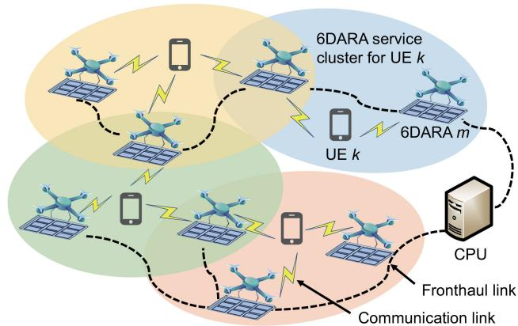  
Fig. 1. Illustration of the proposed 6DARA-enabled CF network.

via fronthaul links, as shown in Fig. 1.1 Each UAV is equipped with a rotatable antenna array, which, together with UAV positioning, constitutes what we refer to as a 6DARA. Specifically, the UAV’s 3D spatial position is controlled through its flight controller, while the array’s 3D rotational orientation is adjusted via an onboard 3-axis gimbal or servo-motor mechanism. Such gimbal platforms are widely adopted in industrial UAV systems and provide independent control over pitch, yaw, and roll.2 The CF network employs a user-centric architecture, where each UE is dynamically served by a selected cluster of cooperating 6DARAs to adapt to variations in UEs’ positions. We assume that UEs move continuously over time, which leads to time-varying spatial relationships between UEs and 6DARAs. The sets of 6DARAs and UEs are denoted by $\mathcal { M } = \{ 1 , 2 , \dots , M \}$ and ${ \mathcal { K } } = \{ 1 , 2 , \ldots , K \}$ , respectively.

To adaptively manage communications in dynamic environments, we propose a two-timescale optimization framework. As illustrated in Fig. 2, this framework operates as follows:

Large-timescale (e.g., frame-level): The entire time duration is divided into T frames, indexed by $\boldsymbol { \mathcal { T } } =$ $\{ 1 , 2 , \ldots , T \}$ . At the beginning of each frame $\tau \in \mathcal T$ , the clustering, 3D positions, and 3D rotations of all 6DARAs are reconfigured to accommodate the accumulated positional drift of the UEs. This adaptation is performed at a relatively slow timescale, consistent with the mechanical constraints of UAV movement and antenna rotation.

• Small-timescale (e.g., slot-level): Each frame is further partitioned into N time slots of duration δ, indexed by $\mathcal { N } = \{ 1 , 2 , \dots , N \}$ . The n-th slot at frame τ is denoted as [τ, n]. Within each slot, the receive combining vectors of the 6DARAs are dynamically optimized to compensate for short-term UE mobility, without requiring physical repositioning or reorientation of the 6DARAs.

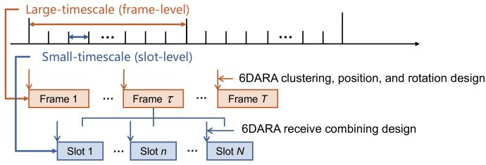  
Fig. 2. Illustration of the proposed two-timescale optimization framework.

## A. Mobility Model

1) UE Mobility: At the slot level, the UE mobility follows a Gaussian Markov stochastic model (GMSM) that captures realistic movement patterns [30]. The speed and direction of UE k at slot [τ, n] are given by

$$
v _ { k } [ \tau , n ] = \kappa _ { 1 } v _ { k } [ \tau , n - 1 ] + ( 1 - \kappa _ { 1 } ) \bar { v } _ { k } + \sqrt { 1 - \kappa _ { 1 } ^ { 2 } } \tilde { v } _ { k } ,\tag{1a}
$$

$$
\theta _ { k } [ \tau , n ] = \kappa _ { 2 } \theta _ { k } [ \tau , n - 1 ] + ( 1 - \kappa _ { 2 } ) \bar { \theta } _ { k } + \sqrt { 1 - \kappa _ { 2 } ^ { 2 } \tilde { \theta } _ { k } } ,\tag{1b}
$$

for all $k \in \mathcal { K } , \tau \in \mathcal { T } , n \geq 2 , n \in \mathcal { N } \cup \{ N + 1 \}$ . Here, $\kappa _ { 1 } , \kappa _ { 2 } \in$ [0, 1] characterize the effect of the previous state on the current state, $\bar { v } _ { k }$ and $\bar { \theta } _ { k }$ denote the average moving speed and direction of UE k, $\tilde { v } _ { k } \sim \mathcal N ( \mu _ { v _ { k } } , \sigma _ { v _ { k } } ^ { 2 } )$ and $\tilde { \theta } _ { k } \sim \mathcal N ( \mu _ { \theta _ { k } } , \sigma _ { \theta _ { k } } ^ { 2 } )$ capture stochastic variations. Define $\mathbf { p } _ { k } [ \tau , n ] = ( p _ { k } ^ { x } [ \tau , n ] , p _ { k } ^ { y } [ \tau , n ] , 0 ) ^ { \mathrm { T } }$ as the 3D coordinate of UE k at slot $[ \tau , n ]$ , then the horizontal coordinates are updated using the following rules:

$$
p _ { k } ^ { x } [ \tau , n ] = p _ { k } ^ { x } [ \tau , n - 1 ] + v _ { k } [ \tau , n - 1 ] \delta \cos ( \theta _ { k } [ \tau , n - 1 ] ) ,\tag{2a}
$$

$$
p _ { k } ^ { y } [ \tau , n ] = p _ { k } ^ { y } [ \tau , n - 1 ] + v _ { k } [ \tau , n - 1 ] \delta \sin ( \theta _ { k } [ \tau , n - 1 ] ) .\tag{2b}
$$

2) 6DARA Mobility: Let $\mathbf { q } _ { m } [ \tau ] = ( q _ { m } ^ { x } [ \tau ] , q _ { m } ^ { y } [ \tau ] , q _ { m } ^ { z } [ \tau ] ) ^ { \mathrm { T } } .$ $\forall \tau \in \mathcal T$ , denote the 3D coordinate of 6DARA m at frame τ . For practical deployment, we discretize the 3D space into six flight directions, each corresponding to a 90-degree turn. All 6DARAs should move within a predefined cubic region:

$$
\begin{array} { r } { \mathbf q _ { m } [ \tau ] \in \mathcal Q = [ X _ { \operatorname* { m i n } } , X _ { \operatorname* { m a x } } ] \times [ Y _ { \operatorname* { m i n } } , Y _ { \operatorname* { m a x } } ] \times [ Z _ { \operatorname* { m i n } } , Z _ { \operatorname* { m a x } } ] . } \end{array}\tag{3}
$$

Moreover, each 6DARA’s movement is limited by its maximum allowable velocity $v _ { \mathrm { m a x } }$ per spatial dimension:

$$
| q _ { m } ^ { i } [ \tau ] - q _ { m } ^ { i } [ \tau - 1 ] | \leq N \delta v _ { \operatorname* { m a x } } , \forall i \in \{ x , y , z \} ,\tag{4}
$$

for all $m { \in } { \mathcal { M } } , \tau { \geq } 2 , \tau { \in } { \mathcal { T } } \cup \{ T { + } 1 \}$ . In addition, a minimum distance $d _ { \mathrm { m i n } }$ should be maintained among 6DARAs to avoid collisions. Specifically, for 6DARA m and 6DARA m0 (m $\neq$ $m ^ { \prime } , m , m ^ { \prime } \in \mathcal { M } )$ at frame τ , we have

$$
\| \mathbf { q } _ { m } [ \tau ] - \mathbf { q } _ { m ^ { \prime } } [ \tau ] \| \geq d _ { \operatorname* { m i n } } .\tag{5}
$$

## B. Geometric Model

We define a 3D global Cartesian coordinate system (CCS) o-xyz for the proposed network and a local CCS $_ { o ^ { \prime } - x ^ { \prime } y ^ { \prime } z ^ { \prime } }$ for each 6DARA, as shown in Fig. 3. Each 6DARA is a uniform planar array (UPA) comprising $L = L _ { x } \times L _ { y }$ antennas, where $L _ { x }$ and $L _ { y }$ denote the numbers of antennas along the local $x _ { \mathrm { ~ - ~ } } ^ { \prime }$ and $y ^ { \prime } -$ axes, respectively. Without loss of generality, the bottom-left antenna of the array is chosen as the reference point. The 3D coordinates of 6DARA m and UE k, mentioned in Section II-A, are defined in the global CCS.

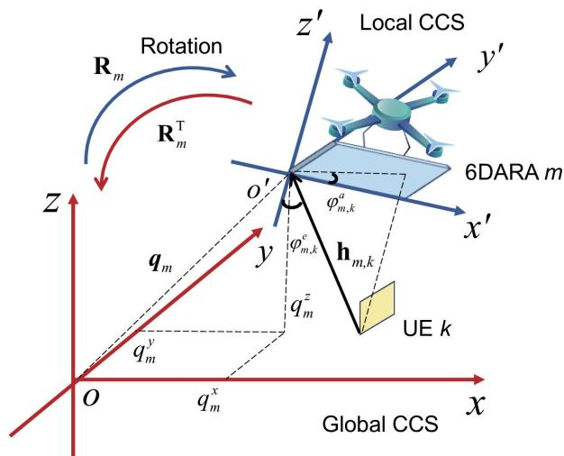  
Fig. 3. Geometry illustration of the proposed 6DARA.

Let $\phi _ { m } [ \tau ] = [ \phi _ { m } ^ { x } [ \tau ] , \phi _ { m } ^ { y } [ \tau ] , \phi _ { m } ^ { z } [ \tau ] ] ^ { \mathrm { T } }$ denote the rotation vector of 6DARA m at frame τ , where $\phi _ { m } ^ { x } [ \tau ] , \phi _ { m } ^ { y } [ \tau ] , \phi _ { m } ^ { z } [ \tau ] \in$ [0, 2π) represent the Eular angles corresponding to rotations around the global $x \mathrm { , ~ } y \mathrm { - }$ , and z-axes, respectively. We characterize the relationship between the local CCS of 6DARA m and the global CCS by ${ \bf { a } } \ 3 \times 3$ rotation matrix in the 3D special orthogonal group, i.e., ${ \bf R } _ { m } \in { \bf S O } ( 3 )$ . Given the 6DARA m’s rotation $\phi _ { m } [ \tau ]$ , the rotation matrix at frame τ is [31]

$$
{ \bf R } _ { m } [ \tau ] = { \bf R } _ { m } ^ { x } ( \phi _ { m } ^ { x } [ \tau ] ) { \bf R } _ { m } ^ { y } ( \phi _ { m } ^ { y } [ \tau ] ) { \bf R } _ { m } ^ { z } ( \phi _ { m } ^ { z } [ \tau ] ) ,\tag{6}
$$

where $\mathbf { R } _ { m } ^ { x } ( \phi _ { m } ^ { x } [ \tau ] ) , \mathbf { R } _ { m } ^ { y } ( \phi _ { m } ^ { y } [ \tau ] )$ , and ${ \bf R } _ { m } ^ { z } ( \phi _ { m } ^ { z } [ \tau ] )$ represent the rotation of $\phi _ { m } ^ { x } [ \tau ] , \ \phi _ { m } ^ { y } [ \tau ]$ , and $\phi _ { m } ^ { z } [ \tau ]$ radians around the $x \mathrm { , ~ } y \mathrm { - }$ , and z- axes, respectively, and can be given by

$$
{ \bf R } _ { m } ^ { x } ( \phi _ { m } ^ { x } [ \tau ] ) = \left[ \begin{array} { c c } { { 0 } } & { { 0 } } \\ { { 0 \cos ( \phi _ { m } ^ { x } [ \tau ] ) - \sin ( \phi _ { m } ^ { x } [ \tau ] ) } } \\ { { 0 \sin ( \phi _ { m } ^ { x } [ \tau ] ) } } & { { \cos ( \phi _ { m } ^ { x } [ \tau ] ) } } \end{array} \right] ,\tag{7a}
$$

$$
\mathbf { R } _ { m } ^ { y } ( \phi _ { m } ^ { y } [ \tau ] ) = \left[ \begin{array} { l l l } { \cos ( \phi _ { m } ^ { y } [ \tau ] ) } & { 0 \sin ( \phi _ { m } ^ { y } [ \tau ] ) } \\ { 0 } & { 1 } & { 0 } \\ { - \sin ( \phi _ { m } ^ { y } [ \tau ] ) \ 0 \cos ( \phi _ { m } ^ { y } [ \tau ] ) } \end{array} \right] ,\tag{7b}
$$

$$
{ \bf R } _ { m } ^ { z } ( \phi _ { m } ^ { z } [ \tau ] ) = \left[ \begin{array} { c c c } { \cos ( \phi _ { m } ^ { z } [ \tau ] ) - \sin ( \phi _ { m } ^ { z } [ \tau ] ) } & { 0 } \\ { \sin ( \phi _ { m } ^ { z } [ \tau ] ) } & { \cos ( \phi _ { m } ^ { z } [ \tau ] ) } & { 0 } \\ { 0 } & { 0 } & { 1 } \end{array} \right] .\tag{7c}
$$

Then, for any 3D location $\mathbf { p } ^ { \mathrm { G } } [ \tau , n ]$ in the global CCS, its coordinate in the local CCS of 6DARA m at slot [τ, n] is

$$
\mathbf { p } _ { m } ^ { \mathrm { L } } [ \tau , n ] = ( \mathbf { R } _ { m } [ \tau ] ) ^ { \mathrm { T } } ( \mathbf { p } ^ { \mathrm { G } } [ \tau , n ] - \mathbf { q } _ { m } [ \tau ] ) .\tag{8}
$$

As such, the reference point of 6DARA m lies at the origin of its local CCS, i. ${ \boldsymbol { \cdot } } , \mathbf { q } ^ { \bar { \mathbf { L } } , m } [ \tau , n ] = [ 0 , 0 , 0 ] ^ { \mathrm { T } }$ . The rotation of 6DARA in the global CCS can be characterized by $\phi _ { m } [ \tau ]$

## C. Channel Model

Given their relatively high altitude, 6DARAs typically establish strong LoS components with ground UEs, but multipath components may still exist due to scattering from buildings

or terrain. Thus, the channel between UE k and 6DARA m at slot [τ, n] is modeled as a Rician fading channel:

$$
\begin{array} { l } { { \displaystyle { \bf h } _ { m , k } [ \tau , n ] = \sqrt { \beta _ { 0 } d _ { m , k } ^ { - \alpha _ { 0 } } [ \tau , n ] } \Big ( \sqrt { \frac { \kappa } { \kappa + 1 } } { \bf h } _ { m , k } ^ { \mathrm { L o S } } [ \tau , n ] } \ ~ } \\ { { \displaystyle ~ + \sqrt { \frac { 1 } { \kappa + 1 } } { \bf h } _ { m , k } ^ { \mathrm { N L o S } } [ \tau , n ] \Big ) } , } \end{array}\tag{9}
$$

where $\beta _ { 0 }$ is the reference channel power of 1 meter (m), $d _ { m , k } [ \tau , n ] = \lVert \mathbf { q } _ { m } [ \tau ] - \mathbf { p } _ { k } [ \tau , n ] \rVert$ is the distance between UE k and 6DARA m, α0 is the path loss exponent, and κ is the Rician factor. Here, the non-LoS (NLoS) component follows a complex Gaussian distribution with zero mean and unit variance, i.e., $\mathbf { h } _ { m , k } ^ { \mathrm { N L o S } } [ \tau , n ] \sim \mathcal { C N } ( \mathbf { 0 } , \mathbf { I } )$ . The deterministic LoS component is $\begin{array} { r } { \mathbf { h } _ { m , k } ^ { \mathrm { L o S } } [ \tau , n ] { = } e ^ { - j \frac { 2 \pi d _ { m , k } [ \tau , n ] } { \lambda _ { 0 } } } \mathbf { a } _ { m , k } [ \tau , n ] } \end{array}$ , where $\lambda _ { 0 }$ is the wavelength and $\mathbf { a } _ { m , k } [ \tau , n ]$ is the receive steering vector of 6DARA m with respect to UE k, given by [32]

$$
\begin{array} { r l } & { \mathbf { a } _ { m , k } \bigl [ \tau , n \bigr ] } \\ & { \quad = \left[ 1 , \cdots , e ^ { - j \frac { 2 \pi d _ { a } } { \lambda _ { 0 } } \left( L _ { x } - 1 \right) \sin \left( \varphi _ { m , k } ^ { e } \left[ \tau , n \right] \right) \cos \left( \varphi _ { m , k } ^ { a } \left[ \tau , n \right] \right) } \right] ^ { \mathrm { T } } } \\ & { \qquad \otimes \left[ 1 , \cdots , e ^ { - j \frac { 2 \pi d _ { a } } { \lambda _ { 0 } } \left( L _ { y } - 1 \right) \sin \left( \varphi _ { m , k } ^ { e } \left[ \tau , n \right] \right) \sin \left( \varphi _ { m , k } ^ { a } \left[ \tau , n \right] \right) } \right] ^ { \mathrm { T } } , } \end{array}\tag{10}
$$

where $d _ { a }$ denotes the inter-antenna spacing, $\varphi _ { m , k } ^ { e } [ \tau , n ]$ and $\varphi _ { m , k } ^ { a } [ \tau , n ]$ represent the elevation and azimuth angles-ofarrival (AoAs) of the signal from UE k to 6DARA m. Due to the 6DARA rotations, deriving its AoA requires transforming global coordinates into the local CCS. According to (8), the coordinate of UE k in 6DARA m’s local CCS at slot [τ, n] is

$$
\mathbf { p } _ { k } ^ { \mathrm { L } , m } [ \tau , n ] = \mathbf { R } _ { m } ^ { \mathrm { T } } ( \phi _ { m } [ \tau ] ) ( \mathbf { p } _ { k } [ \tau , n ] - \mathbf { q } _ { m } [ \tau ] ) .\tag{11}
$$

Then, the direction vector from UE k to 6DARA m in the local CCS at slot [t, n] is given by

$$
\begin{array} { r l } & { \mathbf { r } _ { m , k } [ \tau , n ] \triangleq \mathbf { q } ^ { \mathrm { L } , m } [ \tau , n ] - \mathbf { p } _ { k } ^ { \mathrm { L } , m } [ \tau , n ] } \\ & { \qquad = \big [ r _ { m , k } ^ { x } [ \tau , n ] , r _ { m , k } ^ { y } [ \tau , n ] , r _ { m , k } ^ { z } [ \tau , n ] \big ] ^ { \mathrm { T } } . } \end{array}\tag{12}
$$

The elevation and azimuth AoAs can thus be calculated as

$$
\varphi _ { m , k } ^ { e } [ \tau , n ] = \operatorname { a r c c o s } \frac { r _ { m , k } ^ { z } [ \tau , n ] } { \| \mathbf { r } _ { m , k } [ \tau , n ] \| } ,\tag{13a}
$$

$$
\varphi _ { m , k } ^ { a } [ \tau , n ] = \arctan \frac { r _ { m , k } ^ { y } [ \tau , n ] } { r _ { m , k } ^ { x } [ \tau , n ] } .\tag{13b}
$$

Considering that it is difficult to obtain perfect CSI due to inevitable estimation errors, we model the channel as [33]

$$
\begin{array} { r } { \mathbf { h } _ { m , k } [ \tau , n ] = \hat { \mathbf { h } } _ { m , k } [ \tau , n ] + \Delta \mathbf { h } _ { m , k } [ \tau , n ] , } \end{array}\tag{14}
$$

where $\hat { \mathbf { h } } _ { m , k } [ \tau , n ]$ and $\Delta \mathbf { h } _ { m , k } [ \tau , n ]$ denote the estimated channels and the estimation errors at slot $[ \tau , n ]$ , respectively, with $\mathbb { E } [ \Delta \mathbf { h } _ { m , k } ^ { \mathrm { H } } [ \tau , n ] \Delta \mathbf { h } _ { m , k } [ \tau , n ] ] = \boldsymbol { \Sigma } _ { m , k }$

## D. Uplink Transmission

Let $s _ { k } [ \tau , n ] \sim \mathcal { C N } ( 0 , 1 )$ denote the data symbol transmitted from UE k with power p at slot $[ \tau , n ]$ . Then, the signal received at 6DARA m at slot [τ, n] is given by

$$
\mathbf { y } _ { m } [ \tau , n ] { = } { \sum } _ { k = 1 } ^ { K } \mathbf { h } _ { m , k } [ \tau , n ] \sqrt { p } s _ { k } [ \tau , n ] + \mathbf { n } _ { m } [ \tau , n ] \in \mathbb { C } ^ { L \times 1 } ,\tag{15}
$$

where ${ \bf n } _ { m } [ \tau , n ] \sim \mathcal { C } \mathcal { N } ( \mathbf { 0 } , \sigma ^ { 2 } \mathbf { I } _ { L } )$ is the additive white Gaussian noise (AWGN) at 6DARA m with zero mean and variance $\sigma ^ { 2 }$ . Each 6DARA applies a combining vector $\mathbf { w } _ { m , k } [ \tau , n ]$ to process the signal from UE k and obtain $\mathbf { w } _ { m , k } ^ { \mathrm { H } } [ \tau , n ] \mathbf { \bar { y } } _ { m } [ \bar { \tau } , n ]$ which is subsequently forwarded to the CPU. The CPU then performs a coherent combination of received signals to decode the information of UE k. Since each UE is served by a subset of 6DARAs, the estimated signal ${ \hat { s } } _ { k } [ \tau , n ]$ is obtained as

$$
\begin{array} { l } { { \hat { s } _ { k } \big [ \tau , n \big ] } } \\ { { \displaystyle ~ \ } } \\ { { \displaystyle ~ = \frac { 1 } { \sqrt { p } } \sum _ { m = 1 } ^ { M } \eta _ { m , k } \big [ \tau \big ] \mathbf { w } _ { m , k } ^ { \mathrm { H } } \big [ \tau , n \big ] \mathbf { y } _ { m } \big [ \tau , n \big ] } } \\ { { \displaystyle ~ \ } } \\ { { \displaystyle ~ \quad = \sum _ { m = 1 } ^ { M } \eta _ { m , k } \big [ \tau \big ] \mathbf { w } _ { m , k } ^ { \mathrm { H } } \big [ \tau , n \big ] \mathbf { h } _ { m , k } \big [ \tau , n \big ] s _ { k } \big [ \tau , n \big ] } } \\ { { \displaystyle ~ \ + \sum _ { m = 1 } ^ { M } \sum _ { k ^ { \prime } \neq k } ^ { K } \eta _ { m , k } \big [ \tau \big ] \mathbf { w } _ { m , k } ^ { \mathrm { H } } \big [ \tau , n \big ] \mathbf { h } _ { m , k ^ { \prime } } \big [ \tau , n \big ] s _ { k ^ { \prime } } \big [ \tau , n \big ] } } \\ { { \displaystyle ~ \ } } \\ { { \displaystyle ~ \quad + \frac { 1 } { \sqrt { p } } \sum _ { m = 1 } ^ { M } \eta _ { m , k } \big [ \tau \big ] \mathbf { w } _ { m , k } ^ { \mathrm { H } } \big [ \tau , n \big ] \mathbf { n } _ { m } \big [ \tau , n \big ] , \qquad ( 1 6 ) } } \end{array}
$$

where $\eta _ { m , k } [ \tau ] \ \in \ \{ 0 , 1 \}$ indicates whether 6DARA m is selected to serve UE k at frame τ . The resulting signal-tointerference-and-noise ratio (SINR) at the CPU for decoding the information of UE k at slot $[ \tau , n ]$ is given by

$$
\gamma _ { k } [ \tau , n ] = \frac { p | \sum _ { m = 1 } ^ { M } \eta _ { m , k } [ \tau ] \mathbf { w } _ { m , k } ^ { \mathrm { H } } [ \tau , n ] \mathbf { h } _ { m , k } [ \tau , n ] | ^ { 2 } } { I _ { k } [ \tau , n ] + | \sum _ { m = 1 } ^ { M } \eta _ { m , k } [ \tau ] \mathbf { w } _ { m , k } ^ { \mathrm { H } } [ \tau , n ] \mathbf { n } _ { m } [ \tau , n ] | ^ { 2 } } ,\tag{17}
$$

where $\begin{array} { r } { I _ { k } [ \tau , n ] { = } p | \sum _ { m = 1 } ^ { M } { \sum _ { k ^ { \prime } \neq k } ^ { K } { \eta _ { m , k } [ \tau ] } { \bf w } _ { m , k } ^ { \mathrm { H } } [ \tau , n ] { \bf h } _ { m , k ^ { \prime } } [ \tau , n ] | ^ { 2 } } } \end{array}$ represents the total interference from other UEs. Consequently, the uplink sum-rate of all UEs at slot $[ \tau , n ]$ is

$$
R _ { \mathrm { S l o t } } [ \tau , n ] = \sum _ { k = 1 } ^ { K } \log _ { 2 } \left( 1 + \gamma _ { k } [ \tau , n ] \right) .\tag{18}
$$

## E. Problem Formulation

Our goal is to maximize the average uplink sum-rate of all UEs by jointly optimizing the 6DARA clustering, 3D position (i.e., UAV’s flying position), and 3D rotation (i.e., antenna array’s rotational orientation) at the large-timescale and the receive combining at the small-timescale.3 Mathematically, the optimization problem can be formulated as

$$
\operatorname* { m a x } _ { \Omega } \frac { 1 } { N } \sum _ { n = 1 } ^ { N } R _ { \mathrm { S l o t } } [ \tau , n ]\tag{19a}
$$

$$
\mathrm { s . t . } \ \eta _ { m , k } [ \tau ] \in \{ 0 , 1 \} , \ \forall \tau \in \mathcal { T } , m \in \mathcal { M } , k \in \mathcal { K } ,\tag{19b}
$$

$$
{ \sum } _ { k = 1 } ^ { K } { \eta } _ { m , k } [ \tau ] \leq \eta _ { \mathrm { { m a x } } } , \ \forall \tau \in \mathcal { T } , m \in \mathcal { M } ,\tag{19c}
$$

$$
{ \sum } _ { m = 1 } ^ { M } { \eta } _ { m , k } [ { \tau } ] \geq 1 , \forall { \tau } \in { \mathcal { T } } , k \in { \mathcal { K } } ,\tag{19d}
$$

$$
\varphi _ { m , k } ^ { e } [ \tau , n ] \in [ 0 , \pi / 2 ) , \forall \tau \in \mathcal { T } , n \in \mathcal { N } , m \in \mathcal { M } , k \in \mathcal { K } ,\tag{19e}
$$

$$
\phi _ { m } ^ { x } [ \tau ] , \phi _ { m } ^ { y } [ \tau ] , \phi _ { m } ^ { z } [ \tau ] \in [ 0 , 2 \pi ) , \ \forall \tau \in \mathcal { T } , m \in \mathcal { M } ,\tag{19f}
$$

$$
( 3 ) - ( 5 ) ,\tag{19g}
$$

3The slot-averaged sum-rate aligns with the two-timescale structure, where clustering, position, and rotation remain fixed within a frame while channels vary across slots. This choice avoids imposing stationarity assumptions on time-varying channel statistics and provides a stable, observable reward for learning-based control. An expectation-based objective can be adopted when channel statistics are known or stationary, which is left for future work.

where $\Omega = \{ \eta _ { m , k } [ \tau ] , \mathbf { q } _ { m } [ \tau ] , \phi _ { m } [ \tau ] , \mathbf { w } _ { m , k } [ \tau , n ] \} , \forall \tau \in \mathcal { T } , n \in$ $\mathcal { N } , m \in \mathcal { M } , k \in \mathcal { K }$ . Constraint (19c) enforces that each 6DARA can serve no more than $\eta _ { \mathrm { m a x } }$ UEs due to the limited fronthaul capacity. Constraint (19d) ensures that each UE is served by at least one 6DARA. Constraint (19e) maintains all UEs within the forward radiation hemisphere of their serving 6DARAs to prevent signal blockage induced by antenna rotation.

Problem (19) is a mixed-integer non-linear programming (MINLP) that is difficult to solve directly, especially in dynamic and large-scale networks. The challenges arise from the following four key aspects: i) High-dimensional discretecontinuous joint variables: The decision space comprises both discrete and continuous variables, whose dimensionality scales with the number of 6DARAs, UEs, and antennas. ii) Strong non-convexity: The objective (19a) is highly non-convex due to the fractional-logarithmic structure of SINR expressions. iii) Cross-timescale coupling: Large-timescale clustering and mobility decisions determine the long-term channel statistics, whereas small-timescale beamforming directly governs instantaneous rates; the two layers therefore form a tightly coupled closed loop. iv) Dynamic environments and distributed networks: The UE mobility and the distributed CF architecture increase the dynamics and coordination complexity. Conventional centralized and heuristic optimization algorithms are impractical due to high computational costs and excessive signaling overhead arising from global CSI acquisition.

To address these challenges, we propose a two-timescale, decentralized, and model-data hybrid optimization framework that leverages distributed CF networks and two-timescale characteristics. At the small-timescale, a model-driven TMMSE decoder computes closed-form receive combining using local instantaneous CSI and long-term channel statistics. At the large-timescale, 6DARA clustering is modeled as a local altruistic game and solved via the M-CSAP algorithm, which enables distributed and concurrent decision-making based solely on local information and converges to a Nash Equilibrium (NE). For 6D mobility (3D position and 3D rotation), we adopt AB-MAPPO, an enhanced MAPPO variant that integrates a Beta-distributed policy to eliminate action clipping bias and an attention-based critic to selectively emphasize influential agents, thereby improving convergence and scalability under high-dimensional observations. Although combining, clustering, and 6D mobility are inherently coupled, the proposed two-timescale framework mitigates this coupling through temporal separation and aggregated feedback. Largetimescale clustering and 6D mobility evolve slowly and define the quasi-static spatial geometry, while the small-timescale TMMSE decoder rapidly adapts to instantaneous CSI within this geometry. The frame-level decoding performance then serves as the aggregated feedback for updating clustering and mobility in the next frame. This separation prevents short-term channel variations from forcing immediate large-timescale adjustments, reduces cross-module interference, and yields coherent system behavior without requiring global instantaneous CSI.

## III. PROPOSED TWO-TIMESCALE SOLUTIONS

This section presents the proposed two-timescale optimization framework. It first introduces the small-timescale design, where a TMMSE-based decoder computes receive combiners based on local instantaneous and long-term statistical CSI. The large-timescale design is then described, in which 6DARA clustering is modeled as a local altruistic game and solved via the M-CSAP algorithm, while 6DARA position and rotation control is formulated as a Markov decision process (MDP) and tackled using the AB-MAPPO algorithm. The computational complexity of each algorithm is also analyzed.

## A. TMMSE-Based Small-Timescale Design

Given the imperfect CSI available at 6DARA m and with fixed $\{ \eta _ { m , k } [ \tau ] , \mathbf { q } _ { m } [ \tau ] , \phi _ { m } [ \tau ] \}$ , we formulate the TMMSE combiner design as the following minimization problem [34]

$$
\operatorname* { m i n } _ { \{ \mathbf { w } _ { m , k } [ \tau , n ] \} } \mathrm { M S E } _ { k } = \mathbb { E } \big \lbrace | s _ { k } [ \tau , n ] - \hat { s } _ { k } ( \mathbf { w } _ { m , k } [ \tau , n ] ) | ^ { 2 } \big \rbrace ,\tag{20}
$$

where $\mathbf { w } _ { m , k } [ \tau , n ]$ is an optimization variable only if $\eta _ { m , k } [ \tau ] =$ 1; otherwise it is deterministically set to 0. Substituting (16) into (20) and exploiting the mutual independence among data symbols and noise, problem (20) can be rewritten as

$$
\begin{array} { r l r } {  { \operatorname* { m i n } \ \mathrm { M S E } _ { k } } } \\ & { } & { \{ \mathbf { w } _ { m , k } \} } \\ & { } & { = \mathbb { E } \{ \Big \vert \sum _ { m = 1 } ^ { M } \eta _ { m , k } \big [ \tau \big ] \mathbf { w } _ { m , k } ^ { \mathrm { H } } \big [ \tau , n \big ] \mathbf { h } _ { m , k } \big [ \tau , n \big ] - 1 \big \vert ^ { 2 } \} } \\ & { } & { + \sum _ { k ^ { \prime } \neq k } ^ { K } \mathbb { E } \{ \big \vert \sum _ { m = 1 } ^ { M } \eta _ { m , k } \big [ \tau \big ] \mathbf { w } _ { m , k } ^ { \mathrm { H } } \big [ \tau , n \big ] \mathbf { h } _ { m , k ^ { \prime } } \big [ \tau , n \big ] \big \vert \} } \\ & { } & { + \frac { \sigma ^ { 2 } } { p } \sum _ { m = 1 } ^ { M } \eta _ { m , k } \big [ \tau \big ] \mathbb { E } \Big \{ \big \vert \mathbf { w } _ { m , k } ^ { \mathrm { H } } \big [ \tau , n \big ] \big \vert ^ { 2 } \Big \} . \qquad ( 2 1 } \end{array}
$$

We define $\hat { \mathbf { H } } _ { m } [ \tau , n ] = [ \hat { \mathbf { H } } _ { m , 1 } [ \tau , n ] , \dots , \hat { \mathbf { H } } _ { m , M } [ \tau , n ] ]$ , where $\begin{array} { r } { { \hat { \bf { H } } } _ { m , m ^ { \prime } } [ \tau , n ] = [ \hat { \bf { h } } _ { m ^ { \prime } , 1 } [ \tau , n ] , \ldots , \hat { \bf { h } } _ { m ^ { \prime } , K } [ \tau , n ] ] ^ { \mathrm { T } } \in \mathrm { ~ \overline { { \mathbb { C } } } ~ } ^ { K \times L } , m ^ { \prime } \in \nabla \times \times \times L , } \end{array}$ $\mathcal { M } ,$ , with $\hat { \mathbf { h } } _ { m ^ { \prime } , k } [ \tau , n ] \in \mathbb { C } ^ { L \times 1 }$ being the estimate, available at 6DARA m0, of the channel between UE k and 6DARA m. Then, the TMMSE soluton of problem (21) can be expressed as a function of $\hat { \mathbf { H } } _ { m } [ \tau , n ]$ , i.e., $\mathbf { w } _ { m , k } ^ { \star } [ \tau , n ] = f _ { m , k } ^ { \star } ( \hat { \mathbf { H } } _ { m } [ \tau , n ] )$ We next derive the specific function expression in detail.

Problem (21) belongs to the known family of team decision problems, which are difficult to solve for general information constraints [34], [35], [36]. However, this problem is the class of quadratic team decision problems as defined in [35, Sect. IV], which admit solutions with specific structural properties, in particular related to the following solution concept:

Definition 1 (Stationary Solution [36]): The combining function $f _ { m , k } ^ { \star } ( \hat { \mathbf { H } } _ { m } [ \tau , n ] )$ is a stationary solution for problem (21) if $\mathrm { M S E } _ { k } \bigl ( f _ { m , k } ^ { \star } ( \hat { \mathbf { H } } _ { m } [ \tau , n ] ) \bigr ) < \infty$ and if the following set of equalities holds:

$$
\nabla _ { f _ { m , k } ^ { \star } } \bigl ( \hat { \mathbf { H } } _ { m } [ \tau , n ] \bigr ) ^ { \mathbb { E } } \left\{ \mathrm { M S E } _ { k } \bigl | \hat { \mathbf { H } } _ { m } [ \tau , n ] \right\} = 0 , \forall m \in \mathcal { M } _ { k } [ \tau ] ,\tag{22}
$$

where $\mathcal { M } _ { k } [ \tau ] = \{ m \ | \ \eta _ { m , k } [ \tau ] = 1 \}$ represents the set of 6DARAs chosen to serve UE k at frame τ .

Substituting (21) into (22), the conditions in (22) can be evaluated as (23), shown at the bottom of the page. After a series of mathematical transformations, the combining functions can be derived in the form of set of equalities as (24) and (25), shown at the bottom of the next page, where $\mathbf { e } _ { k }$ is the k-th column of identity matrix $\mathbf { I } _ { K }$ . Please see Appendix A for the derivation details.

Remark 1: The TMMSE solution (24) can be regarded as consisting of two parts: $\mathbf { A } _ { m } [ \tau , n ]$ represents a local MMSE (LMMSE) combining stage, while other terms are a correction stage that accounts for interference from other 6DARAs using available CSI and long-term statistical information.

Next, we derive the TMMSE-based receive combining under the statistical CSI sharing. Specifically, each 6DARA knows its local instantaneous CSI and the statistical CSI of others. This information structure can be expressed as

$$
\hat { \mathbf { H } } _ { m , m ^ { \prime } } [ \tau , n ] = \left\{ \hat { \mathbf { H } } _ { m , m } [ \tau , n ] , \ m ^ { \prime } = m , \right.\tag{26}
$$

Then, the general TMMSE solution (24) simplifies to

$$
f _ { m , k } ^ { * } \left( \hat { \mathbf { H } } _ { m } [ \tau , n ] \right) = \eta _ { m , k } [ \tau ] \mathbf { A } _ { m } [ \tau , n ] \mathbf { b } _ { m , k } [ \tau , n ] .\tag{27}
$$

where $\mathbf { b } _ { m , k } [ \tau , n ]$ can be obtained by substituting (27) into (24) and solving the following coupled linear equations:

$$
\mathbf { b } _ { m , k } [ \tau , n ] + \sum _ { m ^ { \prime } \neq m } ^ { M } \eta _ { m ^ { \prime } , k } [ \tau ] \mathbb { E } \{ \mathbf { C } _ { m ^ { \prime } } [ \tau , n ] \} \mathbf { b } _ { m ^ { \prime } , k } [ \tau , n ] { = } \mathbf { e } _ { k } ,\tag{28}
$$

where ${ \bf C } _ { m ^ { \prime } } [ \tau , n ] { = } \hat { \bf H } _ { m ^ { \prime } , m ^ { \prime } } [ \tau , n ] { \bf A } _ { m ^ { \prime } } [ \tau , n ]$ . Stacking $\mathbf { b } _ { m , k } [ \tau , n ]$ for all $\begin{array} { r } { {  { \mathcal { m } } } \in {  { \mathcal { M } } } _ { k } [ \tau ] } \end{array}$ (with a fixed ordering $\mathcal { M } _ { k } [ \tau ] ~ =$ $\{ m _ { 1 } , \ldots , m _ { | { \mathcal { M } } _ { k } [ \tau ] | } \} _ { : }$ , where $m _ { i }$ denotes the i-th 6DARA serving UE k in the set $\mathcal { M } _ { k } [ \tau ] )$ , leads to the block linear system

$$
\mathbf { D } [ \tau , n ] \left[ \mathbf { b } _ { m , k } [ \tau , n ] \right] _ { m \in \mathcal { M } _ { k } [ \tau ] } = \mathbf { 1 } _ { | \mathcal { M } _ { k } | } \otimes \mathbf { e } _ { k } ,\tag{29}
$$

where the block matrix ${ \bf D } [ \tau , n ] \in \mathbb { R } ^ { | \boldsymbol { \mathcal { M } } _ { k } [ \tau ] | K \times | \boldsymbol { \mathcal { M } } _ { k } [ \tau ] | K }$ is

$$
\begin{array} { r l } & { \left[ \mathbf { D } [ \tau , n ] \right] _ { i , j } } \\ & { = \left\{ \begin{array} { l l } { \mathbf { I } _ { K } , } & { i = j , } \\ { \mathbb { E } \{ \mathbf { C } _ { m _ { j } } [ \tau , n ] \} , ~ i \neq j , } & { i , j = 1 , \dots , \vert \mathcal { M } _ { k } [ \tau ] \vert , } \end{array} \right. } \end{array}\tag{30}
$$

with ${ \bf C } _ { m _ { j } } [ \tau , n ] = { \hat { \bf H } } _ { m _ { j } , m _ { j } } [ \tau , n ] { \bf A } _ { m _ { j } } [ \tau , n ]$ . The closed-form solution of each $\mathbf { b } _ { m _ { i } , k } [ \mathcal { T } , \bar { n } ] \in \mathbb { R } ^ { K }$ is then expressed as

$$
\mathbf { b } _ { m _ { i } , k } [ \tau , n ] = \left[ \mathbf { D } [ \tau , n ] ^ { - 1 } ( \mathbf { 1 } _ { | \mathcal { M } _ { k } [ \tau ] | } \otimes \mathbf { e } _ { k } ) \right] _ { ( i - 1 ) K + 1 : i K } ,\tag{31}
$$

where $i = 1 , \ldots , | \mathcal { M } _ { k } [ \tau ] |$ and the subscript $( i - 1 ) K + 1 : i K$ extracts the rows $( i - 1 ) K + 1$ to iK of the stacked vector, corresponding to 6DARA mi.

Remark 2 (Optimality of the TMMSE Combiner): The TMMSE combiner is team-optimal under the distributed information constraints in (26). This follows from the classical

$$
\begin{array} { r l } & { - \mathbb { E } \left\{ \mathbf { h } _ { m , k } [ \tau , n ] \bigm \vert \hat { \mathbf { H } } _ { m } [ \tau , n ] \right\} + \sum _ { k ^ { \prime } = 1 } ^ { K } \mathbb { E } \left\{ \mathbf { h } _ { m , k ^ { \prime } } [ \tau , n ] \mathbf { h } _ { m , k ^ { \prime } } ^ { \mathbf { H } } [ \tau , n ] \bigm \vert \hat { \mathbf { H } } _ { m } [ \tau , n ] \right\} f _ { m , k } ^ { \star } \left( \hat { \mathbf { H } } _ { m } [ \tau , n ] \right) + \frac { \sigma ^ { 2 } } { p } \mathbf { I } _ { L } f _ { m , k } ^ { \star } \left( \hat { \mathbf { H } } _ { m } [ \tau , n ] \right) } \\ & { \quad + \sum _ { m ^ { \prime } \neq m } ^ { M } \eta _ { m ^ { \prime } , k } [ \tau ] \sum _ { k ^ { \prime } = 1 } ^ { K } \mathbb { E } \left\{ \mathbf { h } _ { m , k ^ { \prime } } [ \tau , n ] \mathbf { h } _ { m ^ { \prime } , k ^ { \prime } } [ \tau , n ] ^ { \mathrm { H } } f _ { m ^ { \prime } , k } ^ { \star } \left( \hat { \mathbf { H } } _ { m ^ { \prime } } [ \tau , n ] \right) \bigm \vert \hat { \mathbf { H } } _ { m } [ \tau , n ] \right\} = 0 , \forall m \in \mathcal { M } _ { k } [ \tau ] . \quad \quad { \mathrm { ~ } } \quad { \mathrm { ~ } } \quad { \mathrm { ~ } } \quad { \mathrm { ~ } } \quad { \mathrm { ~ } } \quad { \mathrm { ~ } } \quad { \mathrm { ~ } } \quad { \mathrm { ~ } } \quad { \mathrm { ~ } } \quad { \mathrm { ~ } } \quad { \mathrm { ~ } } } \end{array}\tag{23}
$$

team theory [35], [36], where for quadratic problems like (21), team optimality equals person-by-person (PbP) optimality. PbP optimality requires each 6DARA’s combiner to be optimal given the optimal combiners of others. TMMSE achieves this by solving the coupled system (29) simultaneously for all 6DARAs. Each local problemis strongly convex with positive definite Hessian $\begin{array} { r } { { \bf X } _ { m } [ \tau , n ] = \sum _ { k = 1 } ^ { K } ( \hat { \bf h } _ { m , k } [ \tau , n ] \hat { \bf h } _ { m , k } ^ { H } [ \tau , n ] + } \end{array}$ $\Sigma _ { m , k } [ \tau , n ] ) + \sigma ^ { 2 } / p { \bf I } _ { L } \ \succ \ 0$ , which ensures a unique solution. The simultaneous satisfaction of all local optimality conditions proves TMMSE is PbP- and team-optimal. When (26) becomes full CSI sharing, TMMSE reduces exactly to the centralized MMSE solution, confirming its theoretical consistency.

Remark 3 (Convergence and Reliability of the TMMSE Combiner): The TMMSE solution is obtained by solving the linear system (29), which exhibits reliable convergence due to its matrix structure. The block matrix ${ \bf D } [ \tau , n ]$ has identity matrices ${ \mathbf { I } } _ { K }$ as diagonal blocks, while the off-diagonal blocks $\mathbb { E } \{ \mathbf { C } _ { m _ { j } } [ \tau , n ] \}$ capture statistical coupling between 6DARAs. Convergence is ensured by two mechanisms: i) In practical deployments, large-scale fading causes the off-diagonal blocks to decay rapidly with distance, making ${ \bf D } [ \tau , n ]$ effectively diagonally dominant and enabling fast convergence of iterative solvers. ii) The matrix ${ \bf D } [ \tau , n ]$ is positive definite, as it derives from the optimality conditions of the original strongly convex team problem. This property guarantees convergence with advanced solvers under arbitrary channel realizations.

## B. Game- and DRL-Based Large-Timescale Design

With updated TMMSE combiners $\{ \mathbf { w } _ { m , k } [ \tau , n ] \}$ , the original problem (19) is recast as

$$
\operatorname* { m a x } _ { \{ \eta _ { m , k } [ \tau ] , \mathbf { q } _ { m } [ \tau ] , \phi _ { m } [ \tau ] \} } \frac { 1 } { N } \sum _ { n = 1 } ^ { N } R _ { \mathrm { S l o t } } [ \tau , n ]\tag{32a}
$$

$$
\mathrm { s . t . } ( 3 ) - ( 5 ) , ( 1 9 \mathrm { b } ) - ( 1 9 \mathrm { f } ) .\tag{32b}
$$

This problem involves discrete association decisions and continuous 6D mobility control variables. To maintain tractability and learning stability, we decouple it into two subproblems: clustering and position-rotation optimization. The clustering task is discrete and naturally fits a game-theoretic formulation, where the M-CSAP algorithm efficiently reaches a Nash-stable association pattern without exploring a hybrid action space. The 6D mobility control is continuous and high-dimensional, and solving it with a dedicated MARL policy avoids the instability and poor sample efficiency of unified hybrid-action PPO/MARL approaches. This separation allows each module to function in its proper domain, with M-CSAP providing a stable input to AB-MAPPO. For brevity, we abbreviate the time index in the following unless otherwise stated.

1) M-CSAP-Based 6DARA Clustering: To solve the clustering subproblem in a distributed and scalable manner, we first recast it as a non-cooperative local altruistic game. Specifically, each UE is treated as an independent player that selects a subset of 6DARAs for uplink transmission. The mutual interference among UEs is embedded in the utility design through spatial coupling, and constraints (19c) and (19d) are enforced by restricting each UE’s feasible action set.

i) Candidate 6DARA Set Construction: To reduce the computational complexity and satisfy constraint (19c), we first define a candidate 6DARA set for each UE using the largest-large-scale-fading-based (LLSFD) criterion [37] Specifically, for UE $k ,$ we sort its large-scale fading coefficients $\{ \beta _ { m , k } \}$ in descending order, and obtain the ordered set $\bar { \beta } _ { 1 , k } \ge \bar { \beta } _ { 2 , k } \ge \dots \ge \bar { \beta } _ { M , k }$ . Then, its candidate 6DARA set is defined as

$$
\mathcal { M } _ { k } ^ { c } = \left\{ m \middle | \frac { \sum _ { m = 1 } ^ { \bar { M } } \bar { \beta } _ { m , k } } { \sum _ { m ^ { \prime } = 1 } ^ { M } \beta _ { m ^ { \prime } , k } } \geq \zeta , \forall m \in \mathcal { M } \right\} ,\tag{33}
$$

where $\bar { M }$ is the minimum number of dominant 6DARAs required to meet the predefined threshold $0 < \zeta < 1$ This ensures that each UE only considers the strongest 6DARAs for association, which reduces overhead and limits the number of 6DARAs that could potentially become overloaded.

ii) Game Model: Since UEs are spatially distributed and may share common 6DARAs for service, the interference between UEs presents the characteristics of local influence. To model this, we define the neighbor set of UE k as

$$
\mathcal { B } _ { k } = \{ k ^ { \prime } \mid \mathcal { M } _ { k } \cap \mathcal { M } _ { k ^ { \prime } } \neq \emptyset , d _ { k k ^ { \prime } } < d _ { \mathrm { t h } } , k \neq k ^ { \prime } , k , k ^ { \prime } \in \mathcal { K } \} ,\tag{34}
$$

where $d _ { k k ^ { \prime } }$ is the distance between UEs k and $k ^ { \prime } ,$ , and $d _ { \mathrm { t h } }$ is the predefined interference distance threshold. The local nature of $\boldsymbol { B } _ { k }$ motivates a decentralized clustering mechanism.

Based on this set, we define the 6DARA clustering subproblem as a strategic game $\mathcal { G } = \left\lceil \mathcal { K } , \mathbb { A } , \{ u _ { k } \} _ { k \in \mathcal { K } } \right\rceil$ where $\mathbb { A } = \mathcal { A } _ { 1 } \otimes \mathcal { A } _ { 2 } \otimes . . . , \otimes \mathcal { A } _ { K }$ denotes the global action space formed by the Cartesian product of each UE’s individual action set. The action set for UE k is defined as

$$
\mathcal { A } _ { k } = \{ \mathcal { M } _ { k } \ | \ \mathcal { M } _ { k } \subseteq \mathcal { M } _ { k } ^ { c } , \mathcal { M } _ { k } \neq \emptyset \} ,\tag{35}
$$

where $\mathcal { M } _ { k }$ denotes the chosen 6DARA subset for UE k. The joint action profile is denoted by $\mathbf { a } { = } ( a _ { 1 } , \ldots , a _ { K } )$

$$
\begin{array} { r l } & { f _ { m , k } ^ { * } \left( \hat { \mathbf { H } } _ { m } [ \tau , n ] \right) } \\ & { = \eta _ { m , k } [ \tau ] \mathbf { A } _ { m } [ \tau , n ] \left( \mathbf { e } _ { k } - \sum _ { m ^ { \prime } \neq m } ^ { M } \mathbb { E } \Big \{ \hat { \mathbf { H } } _ { m ^ { \prime } , m ^ { \prime } } [ \tau , n ] f _ { m ^ { \prime } , k } ^ { * } ( \hat { \mathbf { H } } _ { m ^ { \prime } } [ \tau , n ] ) | \hat { \mathbf { H } } _ { m } [ \tau , n ] \Big \} \right) , \ : \forall m \in \mathcal { M } _ { k } [ \tau ] , } \\ & { \mathbf { A } _ { m } [ \tau , n ] } \\ & { = \left( \sum _ { k = 1 } ^ { K } \left( \hat { \mathbf { h } } _ { m , k } [ \tau , n ] \hat { \mathbf { h } } _ { m , k } ^ { \mathrm { H } } [ \tau , n ] + \Sigma _ { m , k } [ \tau , n ] \right) + \frac { \sigma ^ { 2 } } { p } \mathbf { I } _ { L } \right) ^ { - 1 } \hat { \mathbf { H } } _ { m , m } ^ { \mathrm { H } } [ \tau , n ] . } \end{array}\tag{24}
$$

(25)

In addition, $\{ u _ { k } \} _ { k \in \mathcal K }$ is the utility function of all UEs, defined as

$$
u _ { k } \big ( a _ { k } , a _ { \mathcal { B } _ { k } } \big ) = R _ { k } + \sum _ { i \in \mathcal { B } _ { k } } R _ { i } ,\tag{36}
$$

where $\textstyle \sum _ { i \in B _ { k } } R _ { i }$ reflects the altruistic contribution to neighboring UEs. This term promotes cooperative behavior and encourages UEs to select clusters that not only benefit themselves but also minimize interference to nearby UEs. Then, the local altruistic 6DARA selection game is formulated as

$$
\mathcal { G } : \operatorname* { m a x } _ { \{ a _ { k } \in \mathcal { A } _ { k } \} } u _ { k } ( a _ { k } , a _ { \mathcal { B } _ { k } } ) , \forall k \in \mathcal { K } .\tag{37}
$$

Notably, constraint (19d) is automatically satisfied due to the non-empty action sets $\{ \mathcal { A } _ { k } \}$ , and constraint (19c) is respected by preventing UEs from selecting overloaded 6DARAs during the candidate set filtering or strategy update process.

iii) Analysis of the Nash Equilibrium: In the following, we analyze the equilibrium properties of the proposed local altruistic game (37). Specifically, we aim to determine whether the game admits a stable strategy configuration in which no UE can improve its utility by changing its action unilaterally. To this end, we first recall the definition of a pure-strategy NE and then introduce the concept of exact potential game (EPG), a class of games known to guarantee the existence of at least one pure NE. By constructing a suitable potential function and verifying the EPG condition, we prove that (37) satisfies this structure and, thus, possesses at least one purestrategy NE.

Definition 2 (Nash Equilibrium [38]): An action profile $\mathbf { a } ^ { \star } \ = \ ( a _ { 1 } ^ { \star } , \ldots , a _ { K } ^ { \star } )$ is a pure strategy NE if and only if no UE can improve its utility by deviating unilaterally, i.e.,

$$
u _ { k } \big ( a _ { k } ^ { \star } , a _ { \mathcal { B } _ { k } } ^ { \star } \big ) \geq u _ { k } \big ( a _ { k } , a _ { \mathcal { B } _ { k } } ^ { \star } \big ) , \ \forall k \in \mathcal { K } , \forall a _ { k } \in \mathcal { A } _ { k } , a _ { k } \not = a _ { k } ^ { \star } .\tag{38}
$$

Definition 3 (Exact Potential Game [38]): A finite game is an EPG if there exists a potential function Φ such that for all $k \in { \mathcal { K } }$ , and all $a _ { k } , a _ { k } ^ { \prime } \in \mathcal { A } _ { k } , a _ { k } \ne a _ { k } ^ { \prime } .$

$$
\begin{array} { r } { u _ { k } ( a _ { k } ^ { \prime } , a _ { \mathcal { B } _ { k } } ) - u _ { k } ( a _ { k } , a _ { \mathcal { B } _ { k } } ) = \Phi ( a _ { k } ^ { \prime } , \mathbf { a } _ { - k } ) - \Phi ( a _ { k } , \mathbf { a } _ { - k } ) , } \end{array}\tag{39}
$$

where ${ \bf a } _ { - k } = ( a _ { 1 } , \ldots , a _ { k - 1 } , a _ { k + 1 } , \ldots , a _ { K } )$ denotes the action profile of UEs other than UEs.

Theorem 1: The proposed local altruistic 6DARA selection game (37) is an EPG, which has at least one pure NE.

Proof: See Appendix B.

iv) Maximum Non-Neighbor-Set-Based Concurrent Spatial Adaptive Play Algorithm: To reach an NE efficiently, we extend the CSAP in [39] and propose the M-CSAP algorithm, as summarized in Algorithm 1. Unlike CSAP, which randomly selects UEs that are not neighbors for parallel updates, M-CSAP constructs the largest possible group of mutually non-neighboring UEs to enable more concurrent updates per iteration, thus accelerating convergence. The maximal non-neighbor sets are derived from the network topology and UE distribution and remain fixed during the iterations. At each iteration, one such set is randomly selected, and its UEs update their strategies in parallel according to the logit-based rule:

Algorithm 1 M-CSAP-Based 6DARA Clustering   
1: Input: UE positions, 6DARA positions and rotations, and   
6DARA receive combining.   
2: Initialization: Each UE randomly select its 6DARA ser  
vice cluster $a _ { k } ( 0 ) \in \mathcal { A } _ { k } , \forall k \in \mathcal { K } .$ Initialize the maximum   
non-neighbor set $\mathcal { C } _ { k } = \mathcal { K }$ and calculate the non-neighbor   
set of all UEs, i.e., $\bar { B } _ { k } , \forall k \in \mathcal { K } .$   
3: for $k \in \mathcal { K }$ do   
4: for $x \in \bar { B } _ { k }$ do   
5: if $y \in \bar { B } _ { x } , \forall y \in \mathcal { C } _ { k }$ then   
6: ${ \mathcal { C } } _ { k } \gets { \mathcal { C } } _ { k } \cup x .$   
7: end if   
8: end for   
9: end for   
10: Remove the duplicate sets and obtain $K ^ { \prime }$ maximum non  
neighbor sets $\mathcal { C } _ { 1 } , \ldots , \mathcal { C } _ { K ^ { \prime } }$ , where $K ^ { \prime } \leq K$   
11: for $t = 1 , 2 , \ldots , t _ { \mathrm { m a x } }$ do   
12: Step 1: Select a set $\mathcal { C } _ { k ^ { \prime } }$ with a probability of $1 / K ^ { \prime } ;$   
13: Step 2: Each UE in $\mathcal { C } _ { k ^ { \prime } }$ calculates the utility functions   
$u _ { i } ( a _ { i } ^ { \prime } , a _ { B _ { i } } ( t ) )$ and updates its strategy using (40), while   
the other UEs maintain their selection unchanged.   
14: end for   
15: Until The utility remains stable over a predefined window   
or the iteration index reaches the maximum number.   
16: Output: Converged 6DARA clustering profile $\{ a _ { k } ^ { \star } \}$

$$
p _ { i } ^ { a _ { i } } ( t + 1 ) = \frac { \exp [ \varsigma ( t ) u _ { i } ( a _ { i } , a _ { { \boldsymbol B } _ { i } ( t ) } ) ] } { \sum _ { a _ { i } ^ { \prime } \in A _ { i } } \exp [ \varsigma ( t ) u _ { i } ( a _ { i } ^ { \prime } , a _ { { \boldsymbol B } _ { i } } ( t ) ) ] } ,\tag{40}
$$

where ς(t) is a positive learning parameter that controls the exploration-exploitation tradeoff. This rule allows each UE to probabilistically select better strategies based on local utilities. Note that the only difference between the proposed M-CSAP and the original CSAP lies in the method of UE selection per iteration. Since this change does not alter the stochastic update process or utility structure, the convergence properties still align with the theoretical guarantees given in [39].

2) AB-MAPPO-Based 6DARA Position and Rotation Design: To efficiently determine positions and rotations at every frame, we formulate the control problem as an MDP and solve it using the AB-MAPPO algorithm. This method is suitable in partially observable and dynamically changing environments, where each 6DARA only has access to local observations.

i) Markov Decision Process: Each 6DARA is modeled as an agent and regarded as a player in the MDP. In each learning step t, the key components of the MDP are defined as follows.

• Observation and State: Each agent observes its estimated local CSI, i.e., $o _ { m } ( t ) = \hat { \mathbf { H } } _ { m } .$ . The global state aggregates all agents’ observations: $s ( t ) =$ $\{ o _ { 1 } ( t ) , \ldots , o _ { M } ( t ) \}$

• Action: Each agent’s 6D control action is the velocity along the $x \mathrm { , ~ } y \mathrm { - }$ , and z-axes, and rotation angles around the three axes, i.e., $a _ { m } ( t ) =$ $\{ v _ { x } ^ { m } , v _ { y } ^ { \bar { m } } , v _ { z } ^ { m } , \phi _ { m } ^ { x } , \phi _ { m } ^ { y } , \phi _ { m } ^ { z } \}$ , subject to constraints (3), (4), and (19f).

• Reward: The reward function of each agent aims to maximize the sum-rate while penalizing constraint violations:

$$
r _ { m } ( t ) = \frac { 1 } { N } \sum _ { n = 1 } ^ { N } R _ { \mathrm { S l o t } } - \lambda _ { 1 } \cdot \mathcal { P } _ { \mathrm { C o l } } - \lambda _ { 2 } \cdot \mathcal { P } _ { \mathrm { A o A } } ,\tag{41}
$$

where $\lambda _ { 1 }$ and $\lambda _ { 2 }$ represent penalty weights for constraints (5) and (19e), respectively. Here, $\mathcal { P } _ { \mathrm { C o l } } =$ $\begin{array} { r } { \sum _ { m ^ { \prime } \in \mathcal { M } \backslash m } \mathbb { I } \big ( \| \mathbf { q } _ { m } - \mathbf { q } _ { m ^ { \prime } } \| < d _ { \operatorname* { m i n } } \big ) \cdot \big ( d _ { \operatorname* { m i n } } - \| \mathbf { q } _ { m } - \| _ { L ^ { 2 } ( \mathbb { R } ^ { d _ { \mathbb { R } ^ { d _ { \mathbb { H } } } } } ) } \big ) } \end{array}$ $\mathbf { q } _ { m ^ { \prime } } \parallel )$ quantifies the degree of collision violation, while $\begin{array} { r } { \mathcal { P } _ { \mathrm { A o A } } = \sum _ { k \in \mathcal { K } _ { m } } \mathbb { I } \left( \phi _ { m , k } ^ { e } \geq \frac { \pi } { 2 } \right) \cdot \left( \phi _ { m , k } ^ { e } - \frac { \pi } { 2 } \right) } \end{array}$ penalizes violations of elevation angles, where $\mathcal { K } _ { m } ^ { ' }$ is the set of UEs served by 6DARA m, and $\mathbb { I } ( \cdot )$ is the indicator function that equals 1 if the condition is satisfied, and 0 otherwise.

Algorithm 2 AB-MAPPO-Based Algorithm for 6DARA Posi  
tion and Rotation Design   
1: Input: UE positions, 6DARA receive combining, and   
6DARA clustering.   
2: Initialization: Maximum training episodes $E _ { \mathrm { m t e } } .$ PPO   
epochs $E _ { \mathrm { p e } } ,$ and episode length $L _ { \mathrm { e p l } }$ . Initialize the param  
eters of actor networks $\omega _ { m }$ and critic networks $\xi _ { m }$   
3: for Episode = 1 to $E _ { \mathrm { m t e } }$ do   
4: for Learning step = 1 to $L _ { \mathrm { e p l } }$ do   
5: Each agent acquires observations $o _ { m } ( t ) ;$   
6: Each agent executes actions $a _ { m } ( t ) ;$   
7: Calculate rewards $r _ { m } ( t )$   
8: Calculate log-probability $\mathrm { P r } _ { m } ( t ) ;$   
9: Summarize the transitions into buffers;   
10: end for   
11: for Epoch = 1 to $E _ { \mathrm { p e } }$ do   
12: Each agent updates $\omega _ { m }$ and $\xi _ { m }$ using (42) and (44);   
13: end for   
14: end for   
15: Output: Trained actor network of each 6DARA agent.

ii) AB-MAPPO Algorithm: Building upon MAPPO, the proposed AB-MAPPO introduces two enhancements that directly address the key challenges of 6DARA mobility optimization: i) A Beta distribution-based policy replaces the conventional Gaussian policy to avoid the gradient bias caused by action clipping, which improves training stability for strictly bounded 3D position and 3D rotation control. ii) An attention-based critic is incorporated to capture the non-uniform influence among neighboring 6DARAs when estimating state values, thereby enhancing scalability and coordination under partial observability. These components are seamlessly integrated into the MAPPO framework, as detailed below, and the overall procedure is summarized in Algorithm 2.

MAPPO: MAPPO is a multi-agent extension of PPO under the centralized training and decentralized execution (CTDE) paradigm. During training, agents collect trajectories of experiences $\bar { \{ o _ { m } ( t ) , s ( t ) , a _ { m } ( t ) , r _ { m } ( t ) , \mathrm { P r } _ { m } ( t ) \} }$ into replay buffers, where $\mathrm { P r } _ { m } ( t )$ is the log-probability for sampling $a _ { m } ( t )$ . After each episode, actors and critics are updated using mini-batches from these buffers. The loss of actor m is calculated by

$$
\begin{array} { r l } & { L _ { m } ^ { \mathrm { A c t o r } } \left( \omega _ { m } \right) } \\ & { = \mathbb { E } _ { \pi _ { \omega _ { m } } } \Big \{ \operatorname* { m i n } \Big [ \frac { \pi _ { \omega _ { m } } \left( a _ { m } ( t ) \mid o _ { m } ( t ) \right) } { \pi _ { \omega _ { m } ^ { \prime } } \left( a _ { m } ( t ) \mid o _ { m } ( t ) \right) } \hat { A } _ { m } ( t ) , } \\ & { \mathrm { c l i p } \left( \frac { \pi _ { \omega _ { m } } \left( a _ { m } ( t ) \mid o _ { m } ( t ) \right) } { \pi _ { \omega _ { m } ^ { \prime } } \left( a _ { m } ( t ) \mid o _ { m } ( t ) \right) } , 1 - \epsilon , 1 + \epsilon \right) \hat { A } _ { m } ( t ) \Big ] \Big \} , } \end{array}\tag{42}
$$

where $\pi _ { \omega _ { m } }$ and $\pi _ { \omega _ { m } ^ { \prime } }$ are the current and old policies, respectively, and $\hat { A } _ { m } ( t )$ is the advantage estimated using generalized advantage estimation (GAE), given by

$$
\begin{array} { r } { \hat { A } _ { m } ( t ) = \sum _ { l = 0 } ^ { \infty } ( \gamma \lambda ) ^ { l } \big [ R _ { m } ( t + l ) + \gamma V _ { m } ( s ( t + 1 + l ) \quad } \\ { - V _ { m } ( s ( t + l ) ) \big ] , \qquad ( } \end{array}\tag{43}
$$

where $\gamma$ is the discount factor, λ is the GAE parameter for bias-variance tradeoff, and $\begin{array} { r } { V _ { m } ( s ( t ) ) { = } \sum _ { l = 0 } ^ { \infty } \gamma ^ { l } \bar { R } _ { m } ( t + l ) } \end{array}$ denotes the cumulative discounted reward. The critic aims to minimize the value estimation error

$$
L _ { m } ^ { \mathrm { C r i t i c } } ( \xi _ { m } ) = \frac { 1 } { 2 } \big [ V _ { \xi _ { m } } ( s ( t ) ) - V _ { m } ( s ( t ) ) \big ] ^ { 2 } ,\tag{44}
$$

where $\xi _ { m }$ denotes the parameters of agent $m { \mathrm { : } } { \mathrm { s } }$ critic network, and $V _ { \xi _ { m } } ( s ( t ) )$ is the estimated state-value.

Beta Policy: The above actions of each agent are typically continuous and bounded due to practical physical constraints (3), (4), and (19f). However, conventional policy networks that sample actions from the Gaussian distribution inevitably introduce estimation bias in policy gradient computation, as out-of-bound actions are forcibly clipped [40]. To avoid this issue, we adopt a Beta-distribution-based policy

$$
f ( x , \alpha , \beta ) = \frac { \Gamma ( \alpha + \beta ) } { \Gamma ( \alpha ) \Gamma ( \beta ) } x ^ { \alpha - 1 } ( 1 - x ) ^ { \beta - 1 } ,\tag{45}
$$

where α and $\beta$ are learned parameters. The Beta distribution inherently produces samples within bounded intervals, thereby eliminating the need for manual clipping and effectively mitigating estimation bias. Moreover, its flexible shape parameters facilitate more effective initial exploration.

Attention Mechanism: As the number of agents increases, the dimensionality of the joint observation grows significantly, making it challenging for standard fully connected critic networks to extract useful features [41]. This often results in slower convergence or even training instability. Furthermore, not all agents contribute equally—those nearby or with strong interactions typically have a greater impact. To capture these differentiated influences, we introduce a multi-head attention module before the multi-layer perceptron (MLP) in the critic network. Specifically, each agent first encodes its local observation using an MLP to obtain a feature vector $\mathbf { e } _ { m }$ . These features are then processed by the attention module to compute attention weights and contextual embeddings as follows

$$
\alpha _ { m , m ^ { \prime } } = \mathrm { S o f t m a x } \left( \mathbf { e } _ { m ^ { \prime } } ^ { \mathrm { T } } \mathbf { W } _ { \mathrm { k e y } } ^ { \mathrm { T } } \ \mathbf { W } _ { \mathrm { q u e } } \mathbf { e } _ { m } / \sqrt { d _ { \mathrm { k e y } } } \right) ,\tag{46}
$$

Algorithm 3 Two-Timescale Algorithm for Problem (19)   
1: Input: Trained actor network for each 6DARA agent.   
2: Initialization: Initial UE positions $\mathbf { p } _ { k } [ 1 , 1 ]$ , 6DARA   
receive combining $\{ \mathbf { w } _ { m , k } [ 1 , 1 ] \}$ , clustering $\{ \eta _ { m , k } [ 1 ] \}$   
positions $\{ \mathbf { q } _ { m } [ 1 ] \}$ , and rotations $\{ \phi _ { m } [ 1 ] \}$   
3: for each large-timescale frame $\tau = 1$ to T do   
4: // Phase 1: Large-timescale updates   
5: Update UE positions $\{ \mathbf { p } _ { k } [ \tau , 1 ] \}$   
6: Update 6DARA clustering $\{ \eta _ { m , k } [ \tau ] \}$ via Algorithm 1;   
7: Update 6DARA positions and rotations $\{ \mathbf { q } _ { m } [ \tau ] , \phi _ { m } [ \tau ] \}$   
via Algorithm 2;   
8: for each small-timescale slot $n = 1$ to N do   
9: // Phase 2: Small-timescale updates   
10: if $n \geq 2$ then   
11: Update UE positions $\mathbf { p } _ { k } [ \tau , n ]$ using (1) and (2);   
12: end if   
13: Update receive combining $\{ \mathbf { w } _ { m , k } [ \tau , n ] \}$ using (27);   
14: end for   
15: end for   
16: Output: Optimized 6DARA receive combining $\{ \mathbf { w } _ { m , k } ^ { * } \}$   
clustering $\{ \eta _ { m , k } ^ { * } \}$ , positions $\{ \mathbf { q } _ { m } ^ { * } \}$ , and rotations $\{ \phi _ { m } ^ { * } \}$

$$
x _ { m } = \sum _ { m ^ { \prime } \neq m } \alpha _ { m , m ^ { \prime } } { \bf W } _ { \mathrm { v a l } } { \bf e } _ { m ^ { \prime } } ,\tag{47}
$$

where $\mathbf { e } _ { m ^ { \prime } }$ is the feature value of another agent $m ^ { \prime } ,$ , and $d _ { \mathrm { k e y } }$ is the variance of $\mathbf { e } _ { m ^ { \prime } } ^ { \mathrm { { T } } } \mathbf { W } _ { \mathrm { k e y } } ^ { \mathrm { { T } } } \mathbf { W } _ { \mathrm { q u e } } \mathbf { e } _ { m } .$ . The matrices $\mathbf { W } _ { \mathrm { k e y } }$ $\mathbf { W } _ { \mathrm { v a l } } .$ and $\mathbf { W } _ { \mathrm { q u e } }$ project the features into key, value, and query spaces, respectively. Finally, the resulting attention output $x _ { m }$ is concatenated with the local observation $o _ { m } ( t )$ and passed through the MLP to estimate the state value $V _ { \xi _ { m } } ( s ^ { ( t ) } )$

## C. Complexity Analysis

Based on the small-timescale 6DARA receive combining subproblem solved in Section III-A and the large-timescale 6DARA clustering, position, and rotation subproblem solved in Section III-B, we propose a two-timescale optimization algorithm. The procedure is summarized in Algorithm 3. The computational complexity of each algorithm is detailed below.

1) TMMSE-Based Receive Combining Design: The complexity of the TMMSE-based receive combining design mainly stems from the matrix multiplication and inversion operations involved in (27). For all M 6DARAs, the per-step computational complexity is $\mathcal { O } ( M L ^ { 3 } + M K L ^ { 2 } )$ [34].

2) M-CSAP-Based 6DARA Clustering: The complexity of the M-CSAP algorithm mainly comes from two parts: constructing the maximum non-neighbor sets and performing iterative strategy updates. First, constructing the maximum non-neighbor sets requires checking pairwise UE relations, with a complexity of $\mathcal { O } ( K | \bar { B } _ { k } | )$ . Then, in each iteration, one such set $\mathcal { C } _ { k ^ { \prime } }$ is selected. Each UE in this set evaluates utilities over its action space and updates its strategy, with per-iteration complexity $\mathcal { O } ( | \bar { \mathcal { C } } _ { k ^ { \prime } } | | \mathcal { A } _ { i } | )$ . Let $T _ { \mathrm { i t e } }$ be the total number of iterations, then the overall complexity is $\mathcal { O } ( K | \bar { B } _ { k } | + | \mathcal { C } _ { k ^ { \prime } } | | \mathcal { A } _ { i } | T _ { \mathrm { i t e } } )$

3) AB-MAPPO-Based 6DARA Position and Rotation Design: The complexity of the AB-MAPPO algorithm mainly stems from two components: the MLP and the attention-based critic. First, for an MLP with J layers, the forward-pass complexity is $\begin{array} { r } { \mathcal { O } \left( \sum _ { j = 2 } ^ { J - 1 } ( C _ { j - 1 } C _ { j } + C _ { j } C _ { j + 1 } ) \right) } \end{array}$ where $C _ { j }$ represents the number of neurons in the j-th layer, Second, the attention module in the critic introduces additional complexity due to the pairwise interaction among agents. Assuming M agents and a feature dimension V, its complexity can be approximated as $\mathcal { O } ( M ^ { 2 } V )$ . In our implementation, each agent’s actor network consists of one MLP, while the critic includes one MLP and an attention-based encoder. Considering the number of training episodes $E _ { \mathrm { m t e } }$ , the number of PPO epochs $E _ { \mathrm { p e } } ,$ and the episode length $L _ { \mathrm { e p l } }$ , the total training complexity is $\begin{array} { r } { \mathcal { O } \left( E _ { \mathrm { m t e } } \left( E _ { \mathrm { p e } } M ^ { 2 } V + L _ { \mathrm { e p l } } \sum _ { j = 2 } ^ { J - 1 } ( C _ { j - 1 } C _ { j } + C _ { j } C _ { j + 1 } ) \right) \right) } \end{array}$ During test-time execution, only the actor network is used, resulting in a per-step complexity of $\begin{array} { r } { \mathcal { O } \left( \sum _ { j = 2 } ^ { J - 1 } ( C _ { j - 1 } C _ { j } + C _ { j } C _ { j + 1 } ) \right) } \end{array}$

## D. Distributed CSI Handling and Cooperative 6DARA Control

The proposed framework manages CSI and 6DARA cooperation in a distributed manner with low signaling overhead. This subsection explains i) how information and CSI are handled locally with only limited long-term exchange, and ii) how synchronization, cooperative motion control, and robustness are maintained without stringent global coordination.

1) Distributed Information and CSI Handling: The framework adopts a distributed information flow in which decisionmaking relies mainly on local CSI and only limited long-term information is exchanged when necessary. Specifically: i) At the small-timescale, TMMSE combining uses each 6DARA’s locally estimated instantaneous CSI together with infrequently updated statistical CSI, thereby avoiding the per-slot global CSI sharing required by centralized schemes. ii) At the largetimescale, the M-CSAP-based clustering avoids global CSI aggregation by generating LLSFD-based candidate 6DARA sets for each UE and evaluating utilities only within this reduced set. Each UE updates its association through a distributed local altruistic game, which relies on locally computable rates and only minimal information from nonneighboring clusters. For 6D mobility control, AB-MAPPO follows a CTDE paradigm in which each 6DARA determines its 3D position and 3D rotation solely from local observations during execution, without exchanging CSI or policy information.

In practice, these information flows can be supported by feasible channel estimation and extraction methods [10], [11], [12]. Specifically, instantaneous CSI can be obtained from uplink pilots using pilot-aided MMSE estimation within each cluster, while large-scale CSI can be extracted from long-term averaging or low-complexity estimators such as maximum likelihood or expectation-maximization. To further enhance scalability, compressed sensing can reconstruct channel information from sparse pilot signals by exploiting angular-domain sparsity, and learning-based estimators can map 6DARA position-rotation states to channel responses, thereby enabling predictive CSI inference without frequent pilot updates.

2) Synchronization and Cooperative Control Mechanisms: The proposed framework enables cooperative 6DARA control while avoiding stringent synchronization requirements. Since the clustering, mobility, and combining processes are separated across two timescales, synchronization is required only at the frame level rather than per-slot alignment. This level of coordination can be achieved through global navigation satellite system (GNSS) or RTK timing references [28], or through low-rate coordination beacons among 6DARAs. After synchronization, each 6DARA executes its AB-MAPPO policy independently using local observations, whereas motionsmoothing constraints and minimum inter-6DARA distance limits maintain safe trajectories and coordinated behavior. This mechanism ensures distributed mobility control without centralized scheduling or continuous information exchange.

The framework is also robust to actuation latency, control errors, and imperfect positioning or orientation. Since position and rotation are updated only once per frame, the UAV and the gimbal platform have sufficient time to execute and stabilize the commanded movements. Small deviations caused by control noise or actuation delay mainly result in slight changes in large-scale channel gains or beam alignment. These discrepancies are naturally absorbed by the proposed two-timescale framework: large-timescale clustering and 6D mobility shape the overall topology and interference pattern, while smalltimescale TMMSE combining adapts to instantaneous CSI and mitigates residual misalignment. Consequently, performance degradation tends to be gradual rather than abrupt. For highly dynamic environments, robustness can be further strengthened through uncertainty-aware learning strategies such as action perturbation or domain-randomized training [42], [43].

## IV. SIMULATION RESULTS

In this section, we present simulation results to evaluate the performance of the proposed 6DARA-enabled CF network and the two-timescale optimization algorithm. The simulation is conducted in a square area of 800 m × 800 m, where 6DARAs hover at a fixed altitude of 100 m, i.e., $q _ { m } ^ { z } = 1 0 0 \mathrm { m } , \forall m \in \mathcal { M }$ Ground UEs are randomly distributed within this area. The learning rate of the M-CSAP algorithm follows a logarithmic schedule $\varsigma ( t ) = \varsigma _ { \mathrm { i n i t i a l } } \ln ( 1 + t )$ for $t > 1$ , with $\varsigma _ { \mathrm { i n i t i a l } } = 5 $ [44]. For the AB-MAPPO algorithm, both the actor and critic networks are implemented as three-layer MLPs with 256 neurons in each layer, whlie the ReLU activation function and Adam optimizer are adopted. Other key network, mobility, and learning parameters are summarized in Table II.4

## A. Convergence, Throughput, and Fairness Performance of the Proposed Algorithm

To evaluate the convergence performance of the proposed M-CSAP-based clustering algorithm, three benchmark algorithms are considered for comparison: i) SAP [38]: a fully sequential update algorithm in which only one UE updates its 6DARA association per iteration; ii) CSAP [39]: a semiparallel algorithm allowing a small subset of non-conflicting UEs to update simultaneously in each round; and iii) simulated annealing (SA) [45]: a stochastic search algorithm that probabilistically explores the solution space and refines candidate associations through controlled cooling, thereby enabling convergence toward a near-optimal solution that serves as an empirical upper bound for performance comparison.

TABLE II  
SIMULATION PARAMETERS
<table><tr><td rowspan=1 colspan=1>Parameter</td><td rowspan=1 colspan=1>Value</td></tr><tr><td rowspan=1 colspan=1>General Network Param</td><td rowspan=1 colspan=1>eters</td></tr><tr><td rowspan=1 colspan=1>Slot and frame durations</td><td rowspan=1 colspan=1> $\overline { { \delta = 1 \mathrm { m s } , N \delta = 1 0 0 \mathrm { m s } } }$ </td></tr><tr><td rowspan=1 colspan=1>Numbers of 6DARAs and UEs</td><td rowspan=1 colspan=1> $\overline { { M = 4 , K = 4 } }$ </td></tr><tr><td rowspan=1 colspan=1>Maximum UEs each 6DARA can serve</td><td rowspan=1 colspan=1> $\eta _ { \mathrm { m a x } } = 3$ </td></tr><tr><td rowspan=1 colspan=1>6DARA maximum speed</td><td rowspan=1 colspan=1> $v _ { \mathrm { m a x } } = 5 \mathrm { m } / \mathrm { s }$ </td></tr><tr><td rowspan=1 colspan=1>Safe distance between 6DARAs</td><td rowspan=1 colspan=1> $\overline { { d _ { \mathrm { m i n } } = 1 0 \mathrm { m } } }$ </td></tr><tr><td rowspan=1 colspan=1>UE maximum transmit power</td><td rowspan=1 colspan=1> $p = 1 0 0 \mathrm { m W }$ </td></tr><tr><td rowspan=1 colspan=1>Number of 6DARA antennas</td><td rowspan=1 colspan=1> $\overline { { L _ { x } = L _ { y } = 3 } }$ </td></tr><tr><td rowspan=1 colspan=1>Wavelength and antenna spacing</td><td rowspan=1 colspan=1> $\lambda _ { 0 } = 0 . 1 2 5 \mathrm { m } , d _ { a } = \lambda _ { 0 } / 2$ </td></tr><tr><td rowspan=1 colspan=1>Reference channel gain</td><td rowspan=1 colspan=1> $\overline { { \beta _ { 0 } = - 4 0 \ \mathrm { d B } } }$ </td></tr><tr><td rowspan=1 colspan=1>Path loss exponent, Rician factor</td><td rowspan=1 colspan=1> $\overline { { \alpha _ { 0 } = 2 . 2 , \kappa = 3 \mathrm { ~ d B } } }$ </td></tr><tr><td rowspan=1 colspan=1>Noise power at 6DARAs</td><td rowspan=1 colspan=1> $\overline { { \sigma ^ { 2 } = - 1 1 0 \mathrm { d B m } } }$ </td></tr><tr><td rowspan=1 colspan=1>Channel estimation error</td><td rowspan=1 colspan=1> $\overline { { \pmb { \Sigma } _ { m , k } = 0 . 2 \pmb { \mathrm { I } } } }$ </td></tr><tr><td rowspan=1 colspan=1>UE Mobility Paramet</td><td rowspan=1 colspan=1>ers</td></tr><tr><td rowspan=1 colspan=1>Average UE speed and direction</td><td rowspan=1 colspan=1> $\overline { { v } } _ { k } = 4 \mathrm { m / s } , \bar { \theta } _ { k } \sim \mathcal { U } ( 0 , 2 \pi )$ </td></tr><tr><td rowspan=1 colspan=1>Speed and direction memory factors</td><td rowspan=1 colspan=1> $\kappa _ { 1 } = \kappa _ { 2 } = 0 . 9$ </td></tr><tr><td rowspan=1 colspan=1>Speed and direction fluctuation std.</td><td rowspan=1 colspan=1> $\overline { { \sigma _ { v _ { k } } = 0 . 5 , \sigma _ { \theta _ { k } } = 0 . 2 } }$ </td></tr><tr><td rowspan=1 colspan=1>Learning Algorithm Para</td><td rowspan=1 colspan=1>meters</td></tr><tr><td rowspan=1 colspan=1>Learning rate of actor/critic networks</td><td rowspan=1 colspan=1>0.0003</td></tr><tr><td rowspan=1 colspan=1>Discount factor and GAE parameter</td><td rowspan=1 colspan=1> $\overline { { \gamma = 0 . 9 8 , \lambda = 0 . 9 5 } }$ </td></tr><tr><td rowspan=1 colspan=1>Max training episodes and PPO epochs</td><td rowspan=1 colspan=1> $\overline { { E _ { \mathrm { m t e } } = 6 0 0 , E _ { \mathrm { p e } } = 1 5 } }$ </td></tr><tr><td rowspan=1 colspan=1>Length of each episode, PPO clipping ratio</td><td rowspan=1 colspan=1> $\overline { { L _ { \mathrm { e p l } } = 1 0 0 , \epsilon = 0 . 2 } }$ </td></tr><tr><td rowspan=1 colspan=1>Numbers of attention heads and MLP layers</td><td rowspan=1 colspan=1>4,3</td></tr><tr><td rowspan=1 colspan=1>MLP hidden size, penalty factors</td><td rowspan=1 colspan=1> $\overline { { 2 5 6 , \lambda _ { 1 } = 2 , \lambda _ { 2 } = 1 0 } }$ </td></tr></table>

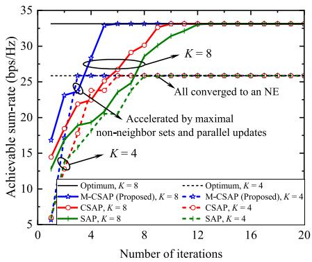  
Fig. 4. Convergence behaviors of different 6DARA clustering algorithms.

Fig. 4 shows the convergence behaviors of the four algorithms in terms of sum-rate, measured at the beginning of one frame during the large-timescale 6DARA clustering phase. All three game-theoretic algorithms ultimately achieve the same sum-rate as the SA, which confirms their capability to converge to an NE with near-optimal performance. However, they exhibit different convergence rates. Specifically, SAP converges the slowest due to its inherently sequential nature. C-SAP improves upon SAP by enabling limited parallelism, but remains restricted by the small size of the concurrently updating UE set. In contrast, the proposed M-CSAP achieves the fastest convergence by constructing maximal non-neighbor sets and enabling the broadest conflict-free parallel updates in each iteration. As the number of UEs increases, this advantage becomes more evident. Such scalability not only accelerates convergence and improves adaptability to complex environments, but also brings reduced coordination overhead, lower access latency, and faster service cluster formation, which are essential for real-time and dynamic wireless networks.

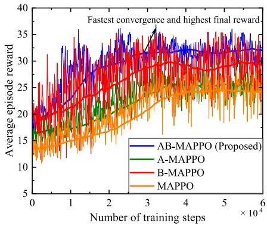  
Fig. 5. Convergence behaviors of different position and rotation design algorithms, where K = 8.

To further evaluate the convergence performance of the proposed AB-MAPPO-based position and rotation design, we consider the following benchmarks: i) A-MAPPO [46], which adopts the attention-based critic but replaces the Beta policy with a conventional Gaussian policy; ii) B-MAPPO [40], which maintains the Beta policy but uses a standard MLP-based critic instead of attention; and iii) MAPPO [47], the classical baseline utilizing both a Gaussian policy and an MLP critic. In addition, the training environments are generated to provide sufficient spatial and channel diversity. UE mobility follows the GMSM model in (1)–(2), where positions evolve every ten training episodes to retain temporal correlation while introducing spatial variability. For each episode, the wireless channel is regenerated using the propagation model in (9)–(13), including distance-dependent large-scale fading and independently resampled Rician small-scale fading. This design exposes the learning process to heterogeneous mobility patterns and diverse channel realizations, thereby allowing the learned policy to capture underlying environmental structure rather than overfitting to specific trajectories.

Fig. 5 compares the convergence performance of the proposed AB-MAPPO and the three baselines in terms of the average reward per episode. As expected, the proposed AB-MAPPO achieves the fastest convergence and the highest final reward. Specifically, both AB-MAPPO and A-MAPPO converge faster than their counterparts with MLP critics (B-MAPPO and MAPPO), which highlights the effectiveness of the attention mechanism in enabling the critic to selectively focus on important parts of the joint state representation. We also observe that AB-MAPPO and B-MAPPO achieve higher rewards than A-MAPPO and MAPPO. This demonstrates that the Beta-distribution policy provides more consistent and uniform exploration during early training, allowing the agents to avoid premature convergence and discover better policies.

Next, to evaluate the performance of the proposed TMMSEbased receive combining algorithm, we consider the following algorithms: i) centralized MMSE (CMMSE) [19], where each 6DARA uses the full instantaneous CSI of all 6DARAs and UEs; ii) centralized TMMSE (C-TMMSE), implemented with the same complete instantaneous CSI; iii) statistical TMMSE (S-TMMSE), in which each 6DARA relies on its local instantaneous CSI and the statistical CSI of other 6DARAs; iv) local MMSE (LMMSE) [8], based solely on local instantaneous CSI; and v) maximum ratio combining (MRC) [6], based on local instantaneous CSI without interference suppression.

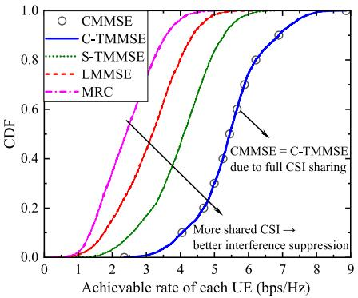  
Fig. 6. CDF of the per-UE rate under different receive combining algorithms, where K = 8.

Fig. 6 illustrates the cumulative distribution function (CDF) of the per-UE rate under different algorithms. We observe that CMMSE and C-TMMSE almost coincide, which verifies that the TMMSE formulation becomes identical to the centralized MMSE when complete instantaneous CSI is accessible at all 6DARAs. S-TMMSE appears to the left of the centralized curves but remains clearly above LMMSE and MRC, which indicates that statistical inter-6DARA information substantially improves interference suppression compared with purely local processing. LMMSE exhibits further degradation, and MRC yields the lowest performance, which reflects the absence of any inter-6DARA information or interference mitigation. The overall trend confirms that broader CSI availability enhances interference suppression and system throughput.

We then evaluate the overall effectiveness of the proposed two-timescale algorithm for 6DARA-enabled CF networks with dynamic users. We adopt two key performance metrics: the sum-rate and Jain’s Fairness Index (JFI). The sum-rate is defined as the average throughput over all frames and slots, given by $\begin{array} { r } { \frac { 1 } { T } \frac { 1 } { N } \sum _ { n = 1 } ^ { N } R _ { \mathrm { S l o t } } [ \tau , n ] } \end{array}$ . JFI is used to quantify the fairness of user-level rate allocation. For a user rate vector $\{ R _ { k } \} _ { k = 1 } ^ { K } .$ , JFI is computed as $\textstyle | \sum _ { k \in { \mathcal { K } } } R _ { k } | ^ { 2 } / \left( K \sum _ { k \in { \mathcal { K } } } R _ { k } ^ { 2 } \right)$ where higher values indicate more equitable rate distribution among UEs. We compare the proposed algorithm with the following baselines: i) TMMSE + M-CSAP + MAPPO, which replaces the Beta-distribution and attention-enhanced AB-MAPPO with the standard MAPPO; ii) LMMSE + M-CSAP + AB-MAPPO, which replaces the TMMSE receiver with a LMMSE design; and iii) TMMSE + LLSFD + AB-MAPPO, which replaces the game-theoretic clustering with a greedy association strategy based on large-scale fading.

Fig. 7 depicts the achievable performance of the four algo rithms in terms of sum-rate and JFI under varying numbers of UEs. We can observe that the proposed algorithm consistently achieves the highest sum-rate. When ABMAPPO is replaced with the standard MAPPO, the mobile CF network experiences a notable drop in sum-rate, especially as UE density increases.

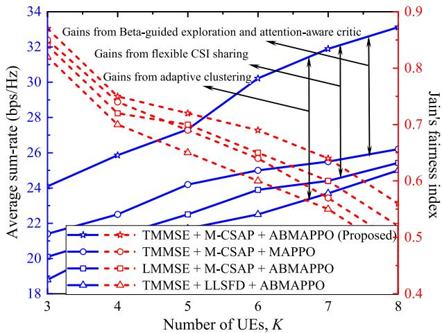  
Fig. 7. Average sum-rate and Jain’s fairness index of different algorithms under varying numbers of UEs.

This result underscores the benefits of Beta-distributed actions and attention-based critics, which effectively enhance the exploration capability and stability during training. Similarly, replacing the cooperative TMMSE receiver with LMMSE or substituting M-CSAP with the LLSFD-based association leads to significant performance degradation, highlighting the importance of flexible CSI sharing and adaptive clustering.

In terms of user fairness, all M-CSAP-based algorithms yield higher JFI values than the LLSFD baseline, particularly in denser networks. This is attributed to the game-theoretic design of M-CSAP, where each UE maximizes its utility under mutual constraints. As a result, extreme utility imbalance is naturally avoided, and no UE is persistently underserved. In contrast, LLSFD tends to favor UEs with strong large-scale fading conditions, resulting in skewed service distributions as the network scales. These results show that M-CSAP not only improves throughput via cooperative association but also maintains fairness in dynamic, interference-limited environments.

## B. Throughput, Robust, Scalability, and Generality Performance of the Proposed Deployment Strategy

To evaluate the effectiveness of 6DARA deployment strategies under dynamic environments in uplink CF networks, we compare the proposed strategy with the following benchmarks in Figs. 8–11: i) Fixed rotation, where 6DARA positions are optimized while rotations remain fixed at zero; ii) Fixed position, where 6DARA rotations are optimized but positions are fixed at locations obtained from 500 random scatterings around the geometric center of their associated UEs; and iii) Fixed position and rotation (Fixed P & R), where both 6DARA positions and rotations are fixed as above. Here, the definition of average sum-rate is the same as that in Fig. 7.

Fig. 8 shows the average sum-rate of different deployment strategies under varying numbers of UEs and varying UE mobility levels. The proposed strategy consistently outperforms all baselines across different setups. The performance gain becomes more pronounced in dense networks, where spatial DoFs are critical for effective interference mitigation. Fixing 6DARA rotation while optimizing position yields moderate improvements as the number of UEs increases, since proximity improves signal strength, but the lack of beam alignment limits interference suppression. In contrast, optimizing rotation alone performs reasonably well in sparse networks but deteriorates rapidly as UE density grows. This trend confirms that simply aligning beams without relocating 6DARAs cannot effectively avoid interference when UE positions are tightly packed. The fixed position and rotation strategy consistently performs the worst, with performance degrading sharply in dense scenarios, as it lacks spatial adaptivity and relies solely on combiner design to separate interference and desired signal.

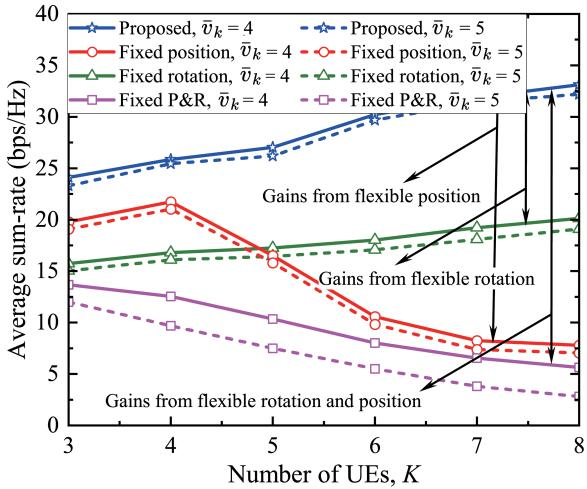  
Fig. 8. Average sum-rate of different deployment strategies under varying numbers of UEs and varying UE mobility levels.

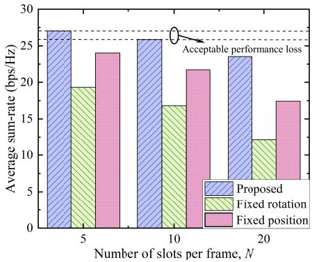  
Fig. 9. Average sum-rate of different deployment strategies under varying numbers of slots per frame.

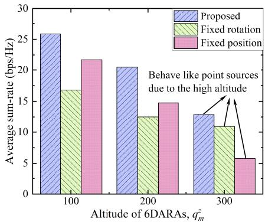  
Fig. 10. Average sum-rate of different deployment strategies under varying altitudes of 6DARAs.

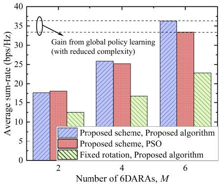  
Fig. 11. Average sum-rate of different deployment strategies under varying numbers of 6DARAs.

Furthermore, the advantage of the proposed strategy becomes increasingly significant at higher UE speeds. For example, at a UE mobility speed of 4 m/s with 4 UEs, it outperforms the fixed rotation, fixed position, and fixed P & R baselines by factors of 0.54, 0.19, and 1.06 times, respectively. When the number of UEs increases to 8, these gains rise to 0.65, 3.26, and 4.88 times. Moreover, under higher mobility, the proposed strategy maintains robust performance, while fixed baselines exhibit more pronounced degradation. These results validate the effectiveness of the two-timescale optimization framework in tracking UE dynamics. Specifically, jointly optimizing position and rotation at the frame level enables the CF network to leverage 6D spatial DoFs to improve channel quality and suppress interference, thus ensuring reliable uplink reception even under mobility-induced channel variations.

Fig. 9 presents the average sum-rate of different deployment strategies under varying numbers of slots per frame. The average sum-rate of all strategies decreases with increasing slots per frame. This is expected due to the fact that UEs move continuously while 6DARA deployment decisions remain fixed during each frame. The longer frame duration exacerbates the mismatch between static deployment and time-varying channels. Despite this, the proposed strategy demonstrates notably smaller performance degradation compared to the baselines. This result confirms the importance of the proposed 6DARA-enabled CF network and the two-timescale optimization framework, where infrequent but carefully coordinated large-timescale 6D adaptations provide a stable deployment foundation, while slot-level receive combining adjustments respond rapidly to mobility-induced channel variations, together ensuring robust performance under dynamic environments.

Fig. 10 illustrates the average sum-rate of different deployment strategies under varying deployment altitudes of 6DARAs. At lower altitudes, optimizing 6DARA rotation yields significant performance gains compared to position-only optimization, despite incurring similar optimization complexity. This highlights the effectiveness of rotation control in enhancing spatial alignment and suppressing interference when 6DARAs are relatively close to ground UEs. However, as the altitude increases, the performance gap between rotationaware and rotation-fixed strategies narrows. This is due to the fact that the UE-6DARA link increasingly resembles a

LoS propagation from a far-field point source, rendering rotation less influential on channel characteristics. These findings suggest that rotation optimization is particularly beneficial in low-altitude deployments. Such insights are especially valuable to the rapidly developing low-altitude economy, where active and intelligent deployment of aerial platforms is essential for supporting dense and ground-level communication demands.

To further evaluate the scalability of the proposed strategy, Fig. 11 compare its performance under different numbers of 6DARAs against two baselines, including a strategy that replaces the AB-MAPPO with conventional PSO [48]. In small-scale settings, PSO slightly outperforms AB-MAPPO due to its exhaustive search capability. However, as the number of 6DARAs increases, PSO exhibits notable performance degradation. This is attributed to the curse of dimensionality, where the required swarm size must grow exponentially to effectively explore the enlarged solution space and escape local optima. In contrast, AB-MAPPO demonstrates stronger scalability by leveraging distributed policy learning and attention-based credit assignment. Additionally, the performance gap between the proposed rotation-aware strategy and the fixed-rotation baseline increases with the number of 6DARAs, highlighting the growing advantages of exploiting rotational DoFs. These results confirm that the proposed strategy not only enhances the achievable throughput but also offers a scalable and cost-efficient solution for future large-scale CF networks.

Table III further illustrates the generality of the learned AB-MAPPO policy by evaluating it under channel and mobility conditions that differ from those used in training. The achieved rates remain close to those under matched trainevaluation settings even when these parameters are perturbed, indicating that the learned policy captures underlying characteristics of the environment rather than overfitting to specific realizations. For example, changes in the pathloss exponent alter attenuation severity and therefore shift the absolute rate level, yet the relative performance remains largely stable across different values. Similar robustness is observed when the Rician factor or the UE mobility parameters vary from their training counterparts. This behavior is attributed both to the variability embedded in the training environments and to the inherent stability of AB-MAPPO: the attention-based critic enhances the extraction of salient spatial features, while the bounded Beta policy ensures well-conditioned exploration and consistent gradient feedback under moderate distribution shifts.

Table IV evaluates the robustness of the framework to variations in the penalty weights used in the reward function. These weights determine the severity of collision-avoidance and elevation-angle penalties. Although scaling $\lambda _ { 1 }$ or λ2 changes the tradeoff between throughput maximization and geometric safety constraints, the corresponding performance variations remain small across all tested cases. This insensitivity shows that the learned policy does not depend on precise tuning of reward coefficients, supported again by the smooth action structure of the Beta policy and the critic’s ability to maintain stable value estimates. Overall, the proposed design exhibits strong robustness to both environmental changes and reward-parameter perturbations, which is important for practical deployment where exact parameter calibration may be difficult.

TABLE III  
GENERALIZATION PERFORMANCE UNDER VARIATIONS OF CHANNEL AND SYSTEM PARAMETERS
<table><tr><td rowspan=1 colspan=1>Parameter</td><td rowspan=1 colspan=1>Value</td><td rowspan=1 colspan=1>Train = Eval</td><td rowspan=1 colspan=1>Train Param. Fixed</td><td rowspan=1 colspan=1>Rel. (%)</td></tr><tr><td rowspan=1 colspan=1>Pathloss exponent $\alpha _ { 0 }$ </td><td rowspan=1 colspan=1> $\overline { { 2 . 0 \mathrm { ~ / ~ } 2 . 2 \mathrm { ~ / ~ } 2 . 4 } }$ </td><td rowspan=1 colspan=1>28.45 / 25.86 / 22.47</td><td rowspan=1 colspan=1>26.52 / 25.86 / 20.85</td><td rowspan=1 colspan=1>93.2 / 100.0 / 92.8</td></tr><tr><td rowspan=1 colspan=1>Rician factor κ (dB)</td><td rowspan=1 colspan=1>2.5 / 3.0 / 3.5</td><td rowspan=1 colspan=1>24.60 / 25.86 / 26.80</td><td rowspan=1 colspan=1>23.58 / 25.86 / 25.20</td><td rowspan=1 colspan=1>95.9 / 100.0 / 94.0</td></tr><tr><td rowspan=1 colspan=1>Average UE speed $\bar { v } _ { k }$ (m/s)</td><td rowspan=1 colspan=1> $\overline { { \mathrm { ~ 3 ~ / ~ 4 ~ / ~ 5 ~ } } }$ </td><td rowspan=1 colspan=1>26.53 / 25.86 / 25.44</td><td rowspan=1 colspan=1>25.07 / 25.86 / 24.17</td><td rowspan=1 colspan=1>94.5 / 100.0 / 95.0</td></tr><tr><td rowspan=1 colspan=1>UE speed memory factor $\kappa _ { 1 }$ </td><td rowspan=1 colspan=1>0.85 / 0.90 / 0.95</td><td rowspan=1 colspan=1>24.65 / 25.86 / 26.12</td><td rowspan=1 colspan=1>23.52 / 25.86 / 25.21</td><td rowspan=1 colspan=1>95.4 / 100.0 / 96.5</td></tr></table>

Note: “Train = Eval" and “Train Param. Fixed" columns report the resulting average sum-rate (bps/Hz). The fixed training parameters are $\alpha _ { 0 } = 2 . 2 \ \AA$ κ = 3 dB, $\bar { v } _ { k } = 4$ m/s, and $\kappa _ { 1 } = 0 . 9$ . Rel. represents the relative sum-rate, calculated as the ratio between the performance under fixed training parameters and that under matched train-eval settings, i.e., $\begin{array} { r } { \mathrm { R e l . } = \frac { \mathrm { S u m . R a t e } ( \mathrm { T r a i n P a r a m . F i x e d } ) } { \mathrm { S u m . R a t e } ( \mathrm { T r a i n } = \mathrm { E v a l } ) } \times 1 0 0 \% } \end{array}$

TABLE IV  
ROBUSTNESS ANALYSIS OF PENALTY WEIGHT SCALING
<table><tr><td rowspan=1 colspan=1>Setting</td><td rowspan=1 colspan=1>Scale</td><td rowspan=1 colspan=1>Sum-Rate (bps/Hz)</td><td rowspan=1 colspan=1>Rel. (%)</td></tr><tr><td rowspan=1 colspan=1>No scaling</td><td rowspan=1 colspan=1> $\overline { { 1 . 0 } }$ </td><td rowspan=1 colspan=1>25.86</td><td rowspan=1 colspan=1>100.0</td></tr><tr><td rowspan=1 colspan=1>λ2 scaled</td><td rowspan=1 colspan=1>0.8 / 1.2</td><td rowspan=1 colspan=1>25.02 / 24.74</td><td rowspan=1 colspan=1>96.8 / 95.7</td></tr><tr><td rowspan=1 colspan=1> $\lambda _ { 1 }$ scaled</td><td rowspan=1 colspan=1>0.8 / 1.2</td><td rowspan=1 colspan=1>25.11 / 24.63</td><td rowspan=1 colspan=1>97.1 / 95.2</td></tr><tr><td rowspan=1 colspan=1>Both scaled</td><td rowspan=1 colspan=1>0.8 / 1.2</td><td rowspan=1 colspan=1>23.45 / 23.36</td><td rowspan=1 colspan=1>90.7 / 90.3</td></tr></table>

Note: Rel. represents the relative sum-rate, calculated as the ratio of the scaled to the unscaled case, i.e., $\begin{array} { r } { \mathrm { R e l . } = \frac { \mathrm { S u m - R a t e } ( \mathrm { s c a l e d } ) } { \mathrm { S u m - R a t e } ( \mathrm { n o ~ s c a l i n g } ) } \times 1 0 0 \% . } \end{array}$

## V. CONCLUSION

This paper has proposed a novel CF network enabled by 6DARAs, in which UAVs equipped rotatable antenna arrays achieve 6D spatial control of APs through 3D flying positions and 3D array rotations. This design enables finegrained spatial adaptation for beamforming and interference management in dynamic environments. To harness the full potential of 6D spatial reconfigurability, we have developed a two-timescale optimization framework that decouples large-timescale 6DARA control from small-timescale signal processing. At the small-timescale, we have derived a closedform TMMSE decoder for low-complexity receive combining using only local and statistical CSI. At the large-timescale, we have formulated the 6DARA clustering as a local altruistic game and solved it using the M-CSAP algorithm with maximum concurrent updates, while 6DARA positions and rotations are optimized using an enhanced MAPPO algorithm with attention mechanisms and Beta distribution. Simulation results have demonstrated that the proposed 6DARA-enabled CF network, together with the two-timescale optimization framework, significantly improves throughput, accelerates convergence, and ensures robust performance under user mobility and large-scale deployments.

Beyond these findings, several practical considerations remain for real-world deployment. Specifically, joint control of 6DARA position and array rotation increases the demand for accurate CSI acquisition and calibration, while precise 6D mobility on UAV platforms raises challenges under size, weight, and power constraints. Nevertheless, the 6DARA architecture holds strong potential for future space-air-ground integrated networks, and prototype development and field testing constitute meaningful next steps toward practical realization.

## APPENDIX A

## PROOF OF EXPRESSION (24)

Given that the channel estimate $\hat { \mathbf { h } } _ { m , k ^ { \prime } } [ \tau , n ]$ and the estimation error $\Delta \mathbf { h } _ { m , k ^ { \prime } } [ \tau , n ]$ are statistically independent, the second term of (23) can be further computed as

$$
\begin{array} { r l } & { \mathbb { E } \left. \mathbf { h } _ { m , k ^ { \prime } } [ \tau , n ] \mathbf { h } _ { m , k ^ { \prime } } ^ { \mathrm { H } } [ \tau , n ] \mid \hat { \mathbf { H } } _ { m } [ \tau , n ] \right. } \\ & { = \mathbb { E } \Big \lbrace \left( \hat { \mathbf { h } } _ { m , k ^ { \prime } } [ \tau , n ] + \Delta \mathbf { h } _ { m , k ^ { \prime } } [ \tau , n ] \right) } \\ & { \quad \times \left( \hat { \mathbf { h } } _ { m , k ^ { \prime } } [ \tau , n ] + \Delta \mathbf { h } _ { m , k ^ { \prime } } [ \tau , n ] \right) ^ { \mathrm { H } } \mid \hat { \mathbf { H } } _ { m } [ \tau , n ] \Big \rbrace } \\ & { = \hat { \mathbf { h } } _ { m , k ^ { \prime } } [ \tau , n ] \hat { \mathbf { h } } _ { m , k ^ { \prime } } ^ { \mathrm { H } } [ \tau , n ] + \boldsymbol { \Sigma } _ { m , k ^ { \prime } } . } \end{array}\tag{48}
$$

When computing the fourth term involving the optimal combining function $f _ { m , k } ^ { \star } ,$ we use the law of total expectation and the available CSI. This leads to the following simplification:

$$
\begin{array} { r l } & { \mathbb { E } \left\{ { \bf { h } } _ { m , k ^ { \prime } } [ \tau , n ] { \bf { h } } _ { m ^ { \prime } , k ^ { \prime } } [ \tau , n ] ^ { \mathrm { H } } f _ { m ^ { \prime } , k } ^ { \star } \left( \hat { \bf { H } } _ { m ^ { \prime } } [ \tau , n ] \right) \mid \hat { \bf { H } } _ { m } [ \tau , n ] \right\} } \\ & { ~ = \hat { \bf { h } } _ { m , k ^ { \prime } } [ \tau , n ] \mathbb { E } \left\{ \hat { \bf { h } } _ { m ^ { \prime } , k ^ { \prime } } ^ { \mathrm { H } } [ t . n ] f _ { m . k } ^ { \star } \left( \hat { \bf { H } } _ { m ^ { \prime } } [ \tau , n ] \right) \mid \hat { \bf { H } } _ { m } [ t . n ] \right\} . } \end{array}\tag{49}
$$

For the first term, we have $\mathbb { E } \{ { \bf h } _ { m , k } [ \tau , n ] \mid \hat { \bf H } _ { m } [ \tau , n ] \} = \hat { \bf h } _ { m , k }$ Combining these results with the original optimality condition yields the final TMMSE solution shown in equation (24).

## APPENDIX B PROOF OF THEOREM 1

We construct a potential function and verify that any unilateral deviation in a player’s strategy results in an equivalent change in both the potential function and that player’s utility. Define the potential function as the sum-rate of all UEs, i.e.,

$$
\Phi ( a _ { k } , { \bf a } _ { - k } ) = \sum _ { k = 1 } ^ { K } R _ { k } ( a _ { k } , a _ { 1 } ) .\tag{50}
$$

Considering that UE k changes its action from $a _ { k }$ to $a _ { k } ^ { \prime }$ while others remain unchanged, the change in UE $k '$ utility is

$$
\begin{array} { r l } & { u _ { k } ( a _ { k } ^ { \prime } , a _ { \mathcal { B } _ { k } } ) - u _ { k } ( a _ { k } , a _ { \mathcal { B } _ { k } } ) } \\ & { = R _ { k } ( a _ { k } ^ { \prime } , a _ { \mathcal { B } _ { k } } ) - R _ { k } ( a _ { k } , a _ { \mathcal { B } _ { k } } ) } \\ & { + \left[ \sum _ { i \in \mathcal { B } _ { k } } ( R _ { i } ( a _ { i } , a _ { \mathcal { B } _ { k } } ^ { \prime } ) - R _ { i } ( a _ { i } , a _ { \mathcal { B } _ { k } } ) ) \right] , } \end{array}\tag{51}
$$

where $a _ { B _ { i } } ^ { \prime }$ reflects the updated neighbor profile of UE i after UE $k '$ strategy change. Due to symmetric neighbor relations,

the utility of UE $k \mathrm { { : } }$ neighbors may be affected by k’ action. The corresponding change in the potential function is

$$
\begin{array} { l } { \Phi ( a _ { k } ^ { \prime } , { \bf a } _ { - k } ) - \Phi ( a _ { k } , { \bf a } _ { - k } ) } \\ { = R _ { k } ( a _ { k } ^ { \prime } , a _ { \mathcal { B } _ { k } } ) - R _ { k } ( a _ { k } , a _ { \mathcal { B } _ { k } } ) } \\ { + \left[ \sum _ { i \in \mathcal { B } _ { k } } ( R _ { i } ( a _ { i } , a _ { \mathcal { B } _ { k } } ^ { \prime } ) - R _ { i } ( a _ { i } , a _ { \mathcal { B } _ { k } } ) ) \right] } \\ { + \left[ \sum _ { i \in \{ \mathcal { K } \backslash \mathcal { B } _ { k } \} , i \neq k } ( R _ { i } ( a _ { i } , a _ { \mathcal { B } _ { k } } ^ { \prime } ) - R _ { i } ( a _ { i } , a _ { \mathcal { B } _ { k } } ) ) \right] . } \end{array}\tag{52}
$$

Since UE k’s action does not affect UEs outside its neighborhood, the last term in (52) is zero. Therefore, we have

$$
\begin{array} { r } { u _ { k } ( a _ { k } ^ { \prime } , a _ { \mathcal { B } _ { k } } ) - u _ { k } ( a _ { k } , a _ { \mathcal { B } _ { k } } ) = \Phi ( a _ { k } ^ { \prime } , \mathbf { a } _ { - k } ) - \Phi ( a _ { k } , \mathbf { a } _ { - k } ) , } \end{array}\tag{53}
$$

which satisfies the condition for an EPG. According to Definition 3, the proposed local altruistic game (37) is indeed an EPG and has at least one pure-strategy NE.

## REFERENCES

[1] X. You et al., “Toward 6G TKµ extreme connectivity: Architecture, key technologies and experiments,” IEEE Wireless Commun., vol. 30, no. 3, pp. 86–95, Jun. 2023.

[2] H. Q. Ngo, A. Ashikhmin, H. Yang, E. G. Larsson, and T. L. Marzetta, “Cell-free massive MIMO versus small cells,” IEEE Trans. Wireless Commun., vol. 16, no. 3, pp. 1834–1850, Mar. 2017.

[3] J. Zheng et al., “Mobile cell-free massive MIMO: Challenges, solutions, and future directions,” IEEE Wireless Commun., vol. 31, no. 3, pp. 140–147, Jun. 2024.

[4] Z. Wan et al., “Performance of cellular-connected UAV in cell-free radio access network with network-assisted full-duplex,” IEEE Trans. Wireless Commun., vol. 23, no. 10, pp. 14848–14863, Oct. 2024.

[5] J. Xu, X. Sun, J. Li, P. Zhu, and D. Wang, “Mobility management in low-altitude cell-free radio access network,” IEEE Trans. Green Commun. Netw., vol. 9, no. 4, pp. 1487–1498, Dec. 2025, doi: 10.1109/ TGCN.2025.3532114.

[6] Z. Sui, H. Q. Ngo, M. Matthaiou, and L. Hanzo, “Performance analysis and optimization of STAR-RIS-aided cell-free massive MIMO systems relying on imperfect hardware,” IEEE Trans. Wireless Commun., vol. 24, no. 4, pp. 2925–2939, Apr. 2025.

[7] Z. Sui, H. Q. Ngo, and M. Matthaiou, “STAR-RIS-aided cell-free massive MIMO with imperfect hardware,” in Proc. GLOBECOM - IEEE Global Commun. Conf., Dec. 2024, pp. 5259–5264.

[8] Z. Sui, H. Q. Ngo, T. V. Chien, M. Matthaiou, and L. Hanzo, “RIS-assisted cell-free massive MIMO relying on reflection pattern modulation,” IEEE Trans. Commun., vol. 73, no. 2, pp. 968–982, Feb. 2025.

[9] W. K. New et al., “A tutorial on fluid antenna system for 6G networks: Encompassing communication theory, optimization methods and hardware designs,” IEEE Commun. Surveys Tuts., vol. 27, no. 4, pp. 2325–2377, Aug. 2025, doi: 10.1109/COMST.2024.3498855.

[10] L. Zhu, W. Ma, and R. Zhang, “Movable antennas for wireless communication: Opportunities and challenges,” IEEE Commun. Mag., vol. 62, no. 6, pp. 114–120, Jun. 2024.

[11] X. Shao and R. Zhang, “6DMA enhanced wireless network with flexible antenna position and rotation: Opportunities and challenges,” IEEE Commun. Mag., vol. 63, no. 4, pp. 121–128, Apr. 2025.

[12] X. Shao et al., “A tutorial on six-dimensional movable antenna for 6G networks: Synergizing positionable and rotatable antennas,” IEEE Commun. Surveys Tuts., vol. 28, pp. 3666–3709, 2026, doi: 10.1109/ COMST.2025.3602939.

[13] H. Wei, W. Wang, W. Ni, and D. Niyato, “Multi-functional RISaided cell-free networks,” IEEE Trans. Veh. Technol., vol. 73, no. 9, pp. 13968–13973, Sep. 2024.

[14] L. Xu, Q. Zhu, W. Xia, T. Q. S. Quek, and H. Zhu, “Air-ground collaborative resource optimization in UAV empowered cell-free massive MIMO systems,” IEEE Trans. Commun., vol. 72, no. 4, pp. 2485–2499, Apr. 2024.

[15] Z. Liu, J. Zhang, Y. Zeng, and B. Ai, “Energy-efficient multi-agent reinforcement learning for UAV trajectory optimization in cell-free massive MIMO networks,” IEEE Trans. Wireless Commun., vol. 24, no. 7, pp. 5917–5930, Jul. 2025.

[16] J. Zhong, J. Wu, Y. Li, C. Zhang, and P. Zhu, “Joint beamforming design and trajectory optimization for UAV-enabled cell-free ISAC MIMO systems,” IEEE Commun. Lett., vol. 29, no. 8, pp. 1849–1853, Aug. 2025, doi: 10.1109/LCOMM.2025.3577697.

[17] H. Wei, W. Wang, W. Ni, C. Zhang, and Y. Huang, “Movable-antenna enabled cell-free networks,” IEEE Trans. Veh. Technol., vol. 74, no. 10, pp. 16533–16537, Oct. 2025, doi: 10.1109/TVT.2025.3570133.

[18] Q. Li, W. Wang, Y. Li, F. Yu, C. Zhang, and Y. Huang, “Deep reinforcement learning for movable antenna-assisted cell-free networks,” IEEE Wireless Commun. Lett., vol. 14, no. 9, pp. 2783–2787, Sep. 2025.

[19] X. Shi, X. Shao, B. Zheng, and R. Zhang, “6DMA-aided cell-free massive MIMO communication,” IEEE Wireless Commun. Lett., vol. 14, no. 5, pp. 1361–1365, May 2025.

[20] T. Han, Y. Zhu, K. Wong, G. Zheng, and H. Shin, “Cell-free fluid antenna multiple access networks,” IEEE Trans. Wireless Commun., vol. 24, no. 9, pp. 7237–7251, Sep. 2025, doi: 10.1109/TWC.2025.3559441.

[21] B. Zheng, T. Ma, C. You, J. Tang, R. Schober, and R. Zhang, “Rotatable antenna enabled wireless communication and sensing: Opportunities and challenges,” IEEE Wireless Commun., early access, Oct. 30, 2025, doi: 10.1109/MWC.2025.3611919.

[22] X. Zhang, L. Xiang, J. Wang, X. Gao, D. W. K. Ng, and R. Schober, “Rotatable antenna array enabled UAV mmWave massive MIMO communication,” IEEE Trans. Commun., vol. 74, pp. 1219–1236, 2026, doi: 10.1109/TCOMM.2025.3622962.

[23] K. Qu, H. Li, C. Sun, W. Zhang, S. Guo, and H. Zhang, “Rotatable arrayenabled multi-BS cooperative ISAC transmit beampattern design,” IEEE Trans. Veh. Technol., vol. 74, no. 9, pp. 14775–14780, Sep. 2025.

[24] S. Yang et al., “Flexible antenna arrays for wireless communications: Modeling and performance evaluation,” IEEE Trans. Wireless Commun., vol. 24, no. 6, pp. 4937–4951, Jun. 2025.

[25] Y. Cai, K. Xu, A. Liu, M. Zhao, B. Champagne, and L. Hanzo, “Twotimescale hybrid analog-digital beamforming for mmWave full-duplex MIMO multiple-relay aided systems,” IEEE J. Sel. Areas Commun., vol. 38, no. 9, pp. 2086–2103, Sep. 2020.

[26] B. Lin, A. Liu, M. Lei, and H. Zhou, “Low-complexity two-timescale hybrid precoding for mmWave massive MIMO: A group-and-codebook based approach,” IEEE Trans. Wireless Commun., vol. 23, no. 7, pp. 7263–7277, Jul. 2024.

[27] J. Dai et al., “Two-timescale design for simultaneous transmitting and reflecting RIS-assisted massive MIMO systems with imperfect CSI,” IEEE Trans. Commun., vol. 72, no. 7, pp. 4287–4304, Jul. 2024.

[28] DJI Enterprise. (2022). RTK Hardware — DJI Enterprise: What is Real-Time Kinematics and What It Means for Your Drone. [Online]. Available: https://enterprise-insights.dji.com/blog/rtk-real-time-kinematics

[29] DJI Enterprise. (2025). Meet DJI Zenmuse L3: DJI’s Newest Long-Range High-accuracy LiDAR System. [Online]. Available: https:// enterprise-insights.dji.com/blog/dji-zenmuse-l3-officially-released

[30] S. Batabyal and P. Bhaumik, “Mobility models, traces and impact of mobility on opportunistic routing algorithms: A survey,” IEEE Commun. Surveys Tuts., vol. 17, no. 3, pp. 1679–1707, 3rd Quart., 2015.

[31] K. M. Lynch and F. C. Park, Modern Robotics: Mechanics, Planning, and Control. Cambridge, U.K.: Cambridge Univ. Press, May 2017.

[32] H. L. Van Trees, Optimum Array Processing: Part IV of Detection, Estimation, and Modulation Theory. Hoboken, NJ, USA: Wiley, 2004.

[33] W. Wang, W. Ni, H. Tian, Z. Yang, C. Huang, and K.-K. Wong, “Safeguarding NOMA networks via reconfigurable dual-functional surface under imperfect CSI,” IEEE J. Sel. Topics Signal Process., vol. 16, no. 5, pp. 950–966, Aug. 2022.

[34] L. Miretti, E. Bjornson, and D. Gesbert, “Team MMSE precoding¨ with applications to cell-free massive MIMO,” IEEE Trans. Wireless Commun., vol. 21, no. 8, pp. 6242–6255, Aug. 2022.

[35] R. Radner, “Team decision problems,” Ann. Math. Statist., vol. 33, no. 3, pp. 857–881, Sep. 1962.

[36] S. Yuksel and T. Basar, ¨ Stochastic Networked Control Systems: Stabilization and Optimization Under Information Constraints. New York, NY, USA: Springer, 2013.

[37] H. Q. Ngo, L.-N. Tran, T. Q. Duong, M. Matthaiou, and E. G. Larsson, “On the total energy efficiency of cell-free massive MIMO,” IEEE Trans. Green Commun. Netw., vol. 2, no. 1, pp. 25–39, Mar. 2018.

[38] H. P. Young, Individual Strategy and Social Structure. Princeton, NJ, USA: Princeton Univ. Press, 1998.

[39] Y. Xu, J. Wang, Q. Wu, A. Anpalagan, and Y.-D. Yao, “Opportunistic spectrum access in cognitive radio networks: Global optimization using local interaction games,” IEEE J. Sel. Topics Signal Process., vol. 6, no. 2, pp. 180–194, Apr. 2012.

[40] P.-W. Chou, D. Maturana, and S. Scherer, “Improving stochastic policy gradients in continuous control with deep reinforcement learning using the beta distribution,” in Proc. 34th Int. Conf. Mach. Learn., 2017, pp. 834–843.

[41] T. Cai et al., “Cooperative data sensing and computation offloading in UAV-assisted crowdsensing with multi-agent deep reinforcement learning,” IEEE Trans. Netw. Sci. Eng., vol. 9, no. 5, pp. 3197–3211, Sep. 2022.

[42] Z. Du et al., “A survey on autonomous and intelligent swarms of uncrewed aerial vehicles (UAVs),” IEEE Trans. Intell. Transp. Syst., vol. 26, no. 10, pp. 14477–14500, Oct. 2025.

[43] A. Loquercio, E. Kaufmann, R. Ranftl, A. Dosovitskiy, V. Koltun, and D. Scaramuzza, “Deep drone racing: From simulation to reality with domain randomization,” IEEE Trans. Robot., vol. 36, no. 1, pp. 1–14, Feb. 2020.

[44] H. Dai, Y. Huang, Y. Xu, C. Li, B. Wang, and L. Yang, “Energyefficient resource allocation for energy harvesting-based device-todevice communication,” IEEE Trans. Veh. Technol., vol. 68, no. 1, pp. 509–524, Jan. 2019.

[45] S. Kirkpatrick, C. D. J. Gelatt, and M. P. Vecchi, “Optimization by simulated annealing,” Science, vol. 220, no. 4598, pp. 671–680, 1983.

[46] Y. Li, W. Wang, C. Zhang, Y. Huang, and D. Niyato, “Joint UAV deployment and space-time-frequency resource allocation for low-altitude economy,” IEEE Wireless Commun. Lett., vol. 14, no. 9, pp. 2808–2812, Sep. 2025.

[47] C. Yu et al., “The surprising effectiveness of PPO in cooperative multi agent games,” in Proc. Adv. Neural Inf. Process. Syst. (NeurIPS), 2022, pp. 24611–24624.

[48] R. E. J. Kennedy, “Particle swarm optimization,” in Proc. Int. Conf. Neural Netw., Nov. 1995, pp. 1942–1948.

  
Wen Wang (Member, IEEE) received the B.Eng. and Ph.D. degrees from the School of Information and Communication Engineering, Beijing University of Posts and Telecommunications (BUPT), China, in 2020 and 2024, respectively. From September 2022 to December 2023, she was a Visiting Student with the National University of Singapore, Singapore. She is currently a Post-Doctoral Research Fellow with the Pervasive Communications Center, Purple Mountain Laboratories, Nanjing, China, and also with the National Mobile Communications Research

Laboratory, Southeast University, Nanjing, China. Her current research interests include wireless resource management and machine learning.

Yongming Huang (Fellow, IEEE) received the B.S. and M.S. degrees from Nanjing University, Nanjing, China, in 2000 and 2003, respectively, and the Ph.D. degree in electrical engineering from Southeast University, Nanjing, in 2007.

Since March 2007, he has been a Faculty Member with the School of Information Science and Engineering, Southeast University, China, where he is currently a Full Professor. He has also been the Director of the Pervasive Communication Research Center, Purple Mountain Laboratories, since 2019.

From 2008 to 2009, he was a visiting the Signal Processing Laboratory, Royal Institute of Technology (KTH), Stockholm, Sweden. He has published over 200 peer-reviewed papers and hold over 80 invention patents. His current research interests include intelligent 5G/6G mobile communications and millimeter wave wireless communications. He submitted around 20 technical contributions to IEEE standards and was awarded a certificate of appreciation for outstanding contribution to the development of IEEE standard 802.11aj. He served as an Associate Editor for IEEE TRANSACTIONS ON SIGNAL PROCESSING and a Guest Editor for the IEEE JOURNAL ON SELECTED AREAS IN COMMUNICATIONS. He is currently an Editor-at-Large for the IEEE OPEN JOURNAL OF THE COMMUNICATIONS SOCIETY.

Wanli Ni (Member, IEEE) received the B.Eng. and Ph.D. degrees from BUPT, in 2018 and 2023, respectively.

From 2022 to 2023, he was a Visiting Ph.D. Student with Nanyang Technological University, Singapore. From 2023 to 2025, he was a Post-Doctoral Researcher with Tsinghua University, China. He is currently an Assistant Professor with the School of Information and Communication Engineering, Beijing University of Posts and Telecommunications (BUPT), China. His research interests include federated learning, semantic communication, cooperative sensing, large AI models, and multi-agent systems. He was a recipient of the Outstanding Doctoral Dissertation Awards from China Education Society of Electronics (CESE) in 2023. He was a recipient of the Excellent Graduate of Beijing in 2023. He received the National Scholarship in 2022 and 2021, and the Samsung Scholarship in 2019. He was a recipient of the Best Paper Award from the IEEE SAGC Conference in 2020. He was a recipient of the IEEE ComSoc Student Travel Grant from multiple international conferences, including IEEE INFOCOM, ICC, and GLOBECOM. He was recognized as an IEEE Exemplary Reviewer four times, including IEEE TRANSACTIONS ON COMMUNICATIONS in 2022, IEEE COMMUNICATIONS LETTERS in 2022, and IEEE WIRELESS COMMUNICATIONS LETTERS in 2021 and 2023.

Cheng Zhang (Member, IEEE) received the B.Eng. degree from Sichuan University, Chengdu, China, in June 2009, the M.Sc. degree from Xi’an Electronic Engineering Research Institute (EERI), Xi’an, China, in May 2012, and the Ph.D. degree from Southeast University (SEU), Nanjing, China, in December 2018.

From November 2016 to November 2017, he was a Visiting Student with the University of Alberta, Edmonton, AB, Canada. From June 2012 to August 2013, he was a Radar Signal Processing Engineer

with Xi’an EERI. Since December 2018, he has been with SEU, where he is currently an Associate Professor. He was supported by Zhishan Young Scholar Program of SEU. He has authored or co-authored over 60 IEEE journal articles and conference papers. His current research interests include cell-free massive MIMO and deterministic QoS guarantee for 6G mobile communications. He was a recipient of Jiangsu Provincial Science Fund for Excellent Young Scholars, the Excellent Doctoral Dissertation Award from China Education Society of Electronics in 2019, the Excellent Doctoral Dissertation Award from Jiangsu Province in 2020, and the Best Paper Awards at the 2023 IEEE WCNC and 2023 IEEE WCSP. He serves as a Youth Editorial Board member for the Journal on Communications and the Jounral of Southeast University.

Dongming Wang (Member, IEEE) received the B.S. degree from Chongqing University of Posts and Telecommunications in 1999, the M.S. degree from Nanjing University of Posts and Telecommunications in 2002, and the Ph.D. degree from Southeast University in 2006. He joined the National Mobile Communications Research Laboratory, Southeast University, China, in 2006, where he is currently a Professor. His research interests include signal processing for wireless communications and largescale distributed MIMO systems (cell-free massive MIMO).