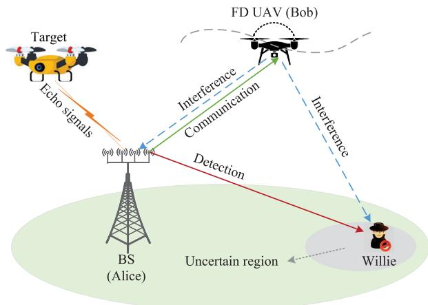
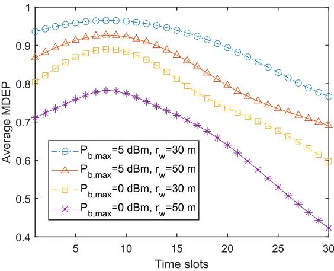
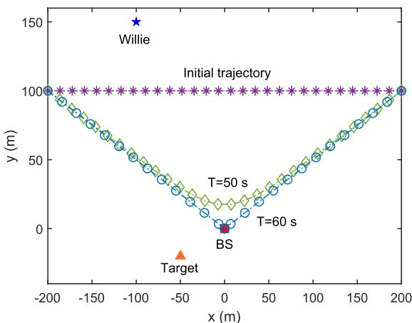
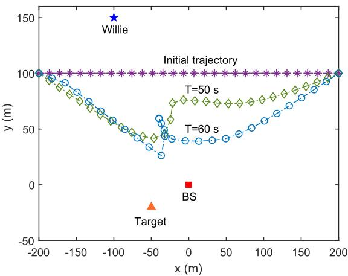
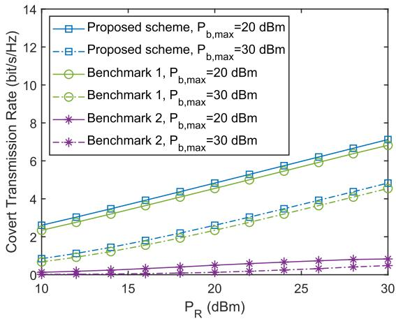
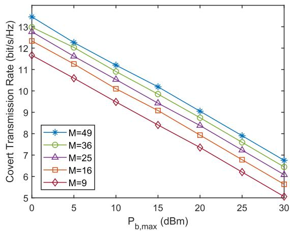
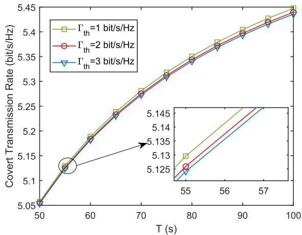
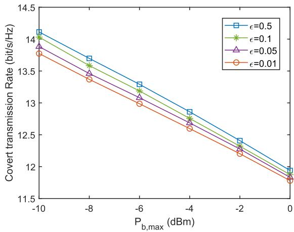
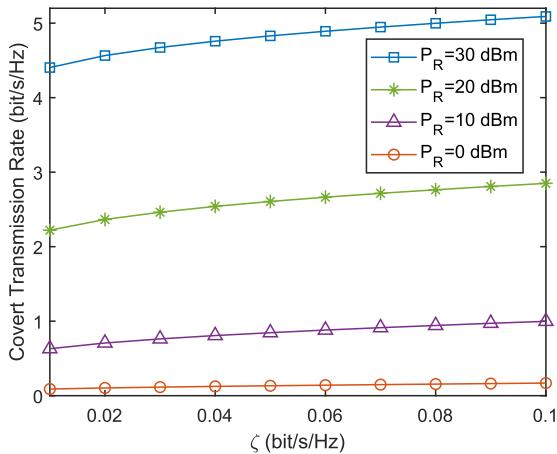
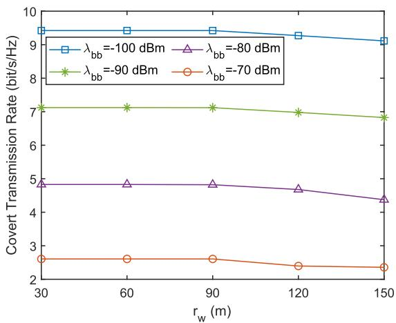

# UAV-Aided Covert ISAC via Full-Duplex Jamming

Qunshu Wang , Xiaoqi Qin , Senior Member, IEEE, Hu Jin , Senior Member, IEEE, Chunguo Li , Senior Member, IEEE, Nan Zhao , Senior Member, IEEE, and Dusit Niyato , Fellow, IEEE

Abstract—Combining integrated sensing and communication (ISAC) and an unmanned aerial vehicle (UAV) can not only save the wireless resource but also enhance the air-ground coverage. However, the high-quality air-ground link of ISAC network is more prone to exposure, and its security is challenging. In this paper, we design a covert air-ground transmission scheme for ISAC, where the sensing signal can be utilized as a mask to disrupt the detection of communication by Willie. Since it is difficult to obtain the accurate knowledge about Willie’s location, we employ the norm-bounded model to describe the uncertainty of location at Willie. To further enhance the covertness, a fullduplex (FD) UAV user is considered to receive the covert signal while transmitting the artificial jamming to confuse Willie. We first calculate the minimum detection error probability (MDEP) by deriving the optimal detection threshold, and we obtain the analytic expression of average MDEP. Then, the covert transmission rate is maximized by controlling beamforming vectors and the UAV trajactory while satisfying the target detection constraint, the covertness constraint as well as the transmit power constraint, which can be resolved by an alternating optimization algorithm. Finally, we present simulation results to verify that the proposed scheme with the FD jamming can better guarantee the covertness of air-ground ISAC.

Index Terms—Covert communication, full-duplex jamming, integrated sensing and communication, location uncertainty, unmanned aerial vehicle.

## I. INTRODUCTION

the scarce spectrum resource struggles to satisfy the demands of multifarious functions for mobile networks, which motivates a new paradigm shift known as integrated sensing and communications (ISAC) [2]. One of the key strengths of ISAC lies in its ability to enhance the spectrum efficiency while lowering infrastructure costs through the joint exploitation of spectrum resource and hardware architecture [3]. The design of ISAC can be simply categorized as three types: ISAC based on communication, ISAC based on sensing, and joint design. Communication in the communication-centric design occupies a dominant function, while sensing is utilized as a supplement to boost the communication performance [4]. On the contrary, the sensing-centric design concentrates on enhancing the sensing performance by embedding the communication into the sensing architecture [5]. Unlike the above two kinds of designs, the joint design can balance the communication and sensing by flexibly designing the ISAC [6]. Benefiting from the reciprocal advantages, ISAC is deemed as an essential technology for sixth generation (6G) mobile networks, drawing extensive interests [7], [8], [9], [10], [11], [12]. Wang et al. in [7] verified that the nonorthogonal multiple access (NOMA) empowered ISAC can provide higher quality of communication and radar detection simultaneously compared to the conventional ISAC. In [8], Zhang et al. designed the beamforming based on the deep learning for ISAC-assisted vehicle-to-infrastructure networks to acquire the superior sensing performance. The rate splitting multiple access empowered cooperative ISAC was investigated by Gao et al. in [9] to provide more accurate positioning. Li et al. in [10] proposed a cellular multi-static ISAC scheme to enable the seamless sensing by designing the beamforming. Mao et al. in [11] demonstrated that the massive multiinput multi-output ISAC scheme outperforms the conventional cellular scheme in the radar sensing. In [12], Ma et al. exploited reconfigurable intelligent surface (RIS) to assist user positioning and communication of ISAC network.

However, the critical information in ISAC networks is prone to interception by eavesdroppers due to its inherent openness and broadcast nature [13]. To mitigate this risk, physical layer security (PLS) employs the uncertainty and unpredictability of wireless channels to prevent the communication signals from being decoded by malicious users, which can effectively guarantee the security of ISAC [14]. In [15], Liu et al. utilized the artificial jamming to ensure the secure transmission of multiuser downlink ISAC. Considering a potential eavesdropper target, Ren et al. in [16] designed a downlink secure ISAC scheme. In [17], Jia et al. investigated a novel ISAC scheme to effectively enhance the average secrecy rate.

Although the PLS tries to assure security for the communication information of ISAC, illegal users can still detect the transmission behavior and disrupt the communication process. To offer a higher level of security for ISAC, covert communications have been adopted to hide the presence of legitimate transmission in ISAC [18], which has aroused great concerns from both academia and industry [19], [20], [21], [22], [23], [24]. In [19], Ma et al. employed the probing waveforms as a mask to realize the covert transmission between radar and legitimate users. In [20], Jia et al. focused on the robust beamforming design of covert ISAC for multiple wardens. To obtain higher covert transmission rate, Lin et al. in [21] presented a RIS-enabled scheme to realize the covert communication and target detection simultaneously. Tang et al. in [22] utilized the dual-functional artificial noise not only to mislead Willie but also to connect the sensing targets. In [23], Qian et al. investigated a two-stage ISAC framework and verified that the detection of ISAC can effectively enhance the covertness. Guo et al. in [24] exploited an active simultaneously transmitting and reflecting RIS to achieve the balance between covertness and security of ISAC networks.

Furthermore, an unmanned aerial vehicle (UAV) has been extensively recognized in the military, commercial and civilian fields on account of its advantages, such as flexibility, mobility and so on [25] and [26]. Given the above benefits, introducing UAV into ISAC not only can save the resource, but also further enhance the communication and sensing performance [27], [28]. UAV-aided ISAC networks can be divided into several typical scenarios including a UAV as an aerial base station (BS), as a relay and as an aerial user. For the first kind, the ISAC load can be exploited to replace communication and sensing loads on the UAV BS, reducing the load weight of UAV and increasing its flexibility [29]. A UAV as a relay ensures that ISAC can still achieve precise positioning in presence of obstacles [30]. A UAV as an aerial user can effectively enhance the communication and sensing quality of ISAC [31]. Compared with the terrestrial fading channels, line-of-sight (LoS) links caused by UAVs can enhance the received strength at terrestrial users, while also increasing the risk of being overheard [32]. Consequently, UAV-based airground ISAC networks are subject to more serious security risks. In [33], Wu et al. maximized the real-time secrecy rate of UAV-aided ISAC utilizing the extended Kalman filtering. Liu et al. in [34] proposed a secure dual-UAV-aided ISAC to combat multiple eavesdroppers, where two UAVs serve as the source and jammer, respectively. By introducing the artificial noise, Yu et al. in [35] investigated the sum secrecy rate of ISAC with the aid of a UAV-RIS.

Despite the above advances, to the best of our knowledge, the research on the UAV-aided covert ISAC is still in its infancy stage. So far, there are only few works focusing on the covert transmission for UAV-aided ISAC [36], [37], [38]. In [36], Wang et al. explored a covert radar-communication cooperation scheme with an aerial adversary target and utilized the extended Kalman filtering to predict the trajectory of adversary target and achieve the covert transmission. Zhang et al. in [37] proposed a covert transceiver design for ISAC considering multiple terrestrial users and aerial targets that act as potential wardens. In [38], Deng et al. investigated the achievable covert rate maximization of UAV-aided ISAC networks. Nevertheless, the UAVs in [36] and [37] were considered as adversary targets and the UAV in [38] was employed as a BS. Therefore, the research on improving the covert air-ground transmission via ISAC is inadequate, especially in scenarios where UAVs act as airborne users. Since the communication signal in ISAC can be hidden in the sensing signal to interfere with the detection of wardens, ISAC will provide a meaningful contribution to the covertness of UAV-based air-ground networks. Furthermore, achieving the balance between the power requirements of sensing and communication functions in ISAC networks is also challenging and worthwhile.

Inspired by these, in this paper, we present a UAV-aided ISAC scheme with a warden Willie where the dual-functional BS sends both the sensing and communication signals to a target and a covert UAV user with full-duplex (FD) jamming, respectively. We aim at maximizing the covert transmission rate while satisfying the target detection constraint, the covertness constraint, and the transmit power constraint. The main contributions are outlined as follows.

We design a covert UAV-aided ISAC scheme against Willie where the sensing signal can be applied as a mask for the communication part to disturb Willie. In addition, the FD UAV user Bob is adopted to receive the covert signal while sending artificial jamming to confuse Willie’s detection. By optimizing the UAV’s trajectory and transmit beamforming of the BS, the detection of covert signal by Willie can be disrupted.

We apply the norm-bounded model to estimate Willie’s location, which is considered to be uncertain. The minimum detection error probability (MDEP) at Willie is derived by seeking the optimal detection threshold. In addition, we derive the analytical expression of average MDEP to further analyze the detection performance. To enable the subsequent optimization, we simplify the covertness constraint into a more tractable form.

• To further improve the covertness, we maximize the covert transmission rate by jointly optimizing the transmit beamforming at BS and UAV’s trajectory. We decompose the non-convex problem into two subproblems, and then solve them via the semidefinite relaxation (SDR) and successive convex approximation (SCA), respectively. Finally, we obtain an optimal solution iteratively via an alternating optimization (AO) algorithm.

The subsequent sections of this paper are structured as follows. In Section II, we describe the system model. We obtain the analytic solution of average MDEP in Section III. Section IV presents a covert transmission rate maximization problem and tackles it via the AO algorithm. In Section V, the simulation results are provided. Finally, we summarize the paper in Section VI.

Notations: Bold lowercase letters represent vectors, while bold uppercase letters are matrices. Pr (·) and E {·} denote the probability and expectation operations, respectively. |·| is used to express the absolute value of a complex scalar, and k·k is the Euclidean norm of a vector. $\left( \cdot \right) ^ { T }$ and $\left( \cdot \right) ^ { H }$ are the transpose and Hermitian transpose operators, respectively. The incomplete gamma function is expressed by γ (·).

  
Fig. 1. FD UAV-aided covert ISAC with a warden.

## II. SYSTEM MODEL

## A. System Model

As illustrated in Fig. 1, we consider the covert air-ground transmission in a UAV-aided ISAC network, where a dualfunctional BS served as Alice simultaneously transmits the sensing signal to an aerial target and the communicate signal to an FD UAV user Bob. Meanwhile, a warden Willie is attempting to identify the covert transmission between Alice and Bob. The FD Bob has two antennas, where the transmitting one generates the artificial jamming to confuse Willie and the receiving one collects the covert signal. Assume that Alice is equipped with a uniform linear array (ULA) of M antennas, and Willie has a single antenna. In addition, the UAV flies at a fixed altitude $H _ { b }$ . We segment the flight period T into N time slots.

Without loss of generality, we adopt the Cartesian coordinate, and the horizontal coordinates of Alice and the aerial sensing target are represented by $\begin{array} { c c l } { \mathbf q _ { a } } & { = } & { \left[ x _ { a } , y _ { a } \right] ^ { T } } \end{array}$ and $\mathbf { q } _ { s } ~ = ~ \lbrack \overline { { x } } _ { s } , \overline { { y _ { s } } } \rbrack ^ { T }$ . The height of sensing target is $H _ { s } .$ The horizontal position of Bob during the t-th time slot is $\mathbf { q } _ { b } \left[ t \right] ~ = ~ \left[ x _ { b } \left[ t \right] , y _ { b } \left[ t \right] \right] ^ { T } , t ~ \in ~ \mathcal { N } ~ \stackrel { \Delta } { = } ~ \left\{ 1 , 2 , \cdots , N \right\}$ . Define the initial and finally positions of the UAV as q and $\mathbf { q } _ { F }$ respectively, and the mobility constraints of the UAV can be expressed as

$$
{ \bf q } _ { I } = { \bf q } _ { b } \left[ 1 \right] , \quad { \bf q } _ { F } = { \bf q } _ { b } \left[ N \right] ,\tag{1a}
$$

$$
\left\| \mathbf { q } _ { b } \left[ t + 1 \right] - \mathbf { q } _ { b } \left[ t \right] \right\| ^ { 2 } \leq { \bigg ( } \frac { V _ { \operatorname* { m a x } } T } { N } { \bigg ) } ^ { 2 } , \forall t \in \mathcal { N } \backslash \left\{ N \right\} ,\tag{1b}
$$

where $V _ { \mathrm { m a x } }$ denotes the maximum speed of the UAV. The constraint (1a) regulates the initial and final locations of the UAV and the constraint (1b) confines the maximum flight distance of the UAV per time slot.

In practice, it is hard for Alice to pinpoint Willie’s precise location since Willie is an unauthorized entity. Therefore, we apply the norm-bounded model to define the Willie’s location uncertainty as

$$
\begin{array} { r } { \mathbf q _ { w } = \hat { \mathbf q } _ { w } + \Delta \mathbf q _ { w } , } \end{array}\tag{2a}
$$

$$
\begin{array} { r } { \Upsilon \triangleq \left\{ \Delta \mathbf q _ { w } \in \mathbb { R } ^ { 2 \times 1 } : \left\| \Delta \mathbf q _ { w } \right\| ^ { 2 } \leq r _ { w } ^ { 2 } \right\} , } \end{array}\tag{2b}
$$

where $\Delta \mathbf q _ { w }$ is the estimation error, $\mathbf { q } _ { w } = \left[ x _ { w } , y _ { w } \right] ^ { T }$ and $\hat { \mathbf { q } } _ { w } =$ $\left[ \hat { x } _ { w } , \hat { y } _ { w } \right] ^ { T }$ are the accurate and estimated locations of Willie, respectively, and $\Upsilon$ and $r _ { w }$ denote the uncertainty region and its radius, respectively.

## B. Channel Model

The likelihood of the LoS link between the UAV and ground nodes is greater than 99% when the UAV’s flight altitude exceeds 100 m [39]. Consequently, the channels from Bob to Alice and to Willie denoted as $\mathbf { \dot { g } } _ { a b } ^ { H } \left[ t \right] \in \mathbb { C } ^ { 1 \times M }$ and $g _ { b w }$ [t] in the t-th time slot, respectively, can be modeled as

$$
\mathbf { g } _ { a b } ^ { H } \left[ t \right] = \sqrt { \rho _ { 0 } d _ { a b } ^ { - 2 } \left[ t \right] } \mathbf { h } _ { a b } ^ { H } \left[ t \right] , \forall t ,\tag{3}
$$

$$
g _ { b w } \left[ t \right] = \sqrt { \rho _ { 0 } d _ { b w } ^ { - 2 } \left[ t \right] } , \forall t ,\tag{4}
$$

where $\rho _ { 0 }$ refers to the path-loss at the reference distance $d _ { 0 } =$ 1 m, and $\mathbf { h } _ { a b } ^ { H } \left[ t \right] \triangleq \left[ h _ { a b _ { 1 } } \left[ t \right] , \cdot \cdot \cdot , h _ { a b _ { M } } \left[ t \right] \right]$ with $\left| h _ { a b _ { m } } \left[ t \right] \right| ^ { 2 } =$ $1 , \forall m \in { \mathcal { M } } \ { \overset { \Delta } { = } } \ \{ 1 , 2 , \cdots , M \}$ . The distances from Bob to Alice and to Willie in the n-th time slot can be represented as

$$
d _ { a b } \left[ t \right] = \sqrt { \left\| \mathbf { q } _ { a } - \mathbf { q } _ { b } \left[ t \right] \right\| ^ { 2 } + H _ { b } ^ { 2 } } , \forall t ,\tag{5}
$$

$$
d _ { b w } \left[ t \right] = \sqrt { \left\| \mathbf { q } _ { b } \left[ t \right] - \mathbf { q } _ { w } \right\| ^ { 2 } + H _ { b } ^ { 2 } , \forall t . }\tag{6}
$$

To avoid the detection of Willie, the channel between Alice and Willie can be characterized by the Rayleigh fading as

$$
\mathbf { g } _ { a w } ^ { H } \left[ t \right] = \sqrt { \rho _ { 0 } d _ { a w } ^ { - \nu } } \mathbf { h } _ { a w } ^ { H } \left[ t \right] \in \mathbb { C } ^ { 1 \times M } , \forall t ,\tag{7}
$$

where ν represents the path-loss exponent, $d _ { a w } = \| \mathbf { q } _ { a } - \mathbf { q } _ { w } \|$ is the distance from Alice to Willie, and $\mathbf { h } _ { a w }$ can be modeled as the independent and identically distributed complex Gaussian distribution, i.e., $\mathbf { h } _ { a w } \sim \mathcal { C N } \left( 0 , \mathbf { I } _ { M } \right)$ .

## C. Communication Model

For the l-th channel, the superposed signal from the BS in the t-th time slot can be given by

$$
\begin{array} { r } { { \bf x } ^ { ( l ) } [ t ] { = } { \bf w } _ { s } [ t ] x _ { s } ( l ) + { \bf w } _ { c } [ t ] x _ { c } ( l ) , \forall l \in \mathcal { L } \overset { \Delta } { = } \{ 1 , 2 , \cdots , L \} , } \end{array}\tag{8}
$$

where L represents the total number of channels, and $x _ { s } \left( l \right)$ and $x _ { c } \left( l \right)$ represent the sensing and communication signals with E $\left\{ \widetilde { \left| x _ { s } \left( \overline { { l } } \right) \right| ^ { 2 } } \right\} = \mathbb { E } \left\{ \left| x _ { c } \left( \overline { { l } } \right) \right| ^ { 2 } \right\} = 1$ , respectively. ${ \mathbf { w } } _ { s } \left[ t \right] \in$ $\mathbb { C } ^ { M \times 1 }$ and $\mathbf { w } _ { c } \left[ \pmb { t } \right] \in \mathbb { C } ^ { \hat { M } \times 1 }$ are the sensing and communication beamforming vectors in the t-th time slot satisfying $\left\| \mathbf { w } _ { s } \left[ t \right] \right\| ^ { 2 } + \left\| \mathbf { w } _ { c } \left[ t \right] \right\| ^ { 2 } \leq P _ { R } \left[ t \right]$ , and $P _ { R } \left[ t \right]$ expresses the maximum transmit power at the BS. Meanwhile, the artificial jamming $x _ { b } \left( l \right)$ sent by Bob is applied to disrupt Willie with E $\left\{ \left| x _ { b } \left( l \right) \right| ^ { 2 } \right\} = 1$

Then, the received signal at Bob for the l-th channel use in the t-th time slot can be expressed as

$$
y _ { B } ^ { ( l ) } [ t ] = \mathbf { g } _ { a b } ^ { H } [ t ] \mathbf { x } ^ { ( l ) } [ t ] + g _ { b b } [ t ] \sqrt { \eta P _ { b } [ t ] } x _ { b } ( l ) + z _ { b } ( l ) , \forall t ,\tag{9}
$$

where $\eta \in [ 0 , 1 ]$ is the residual self-interference level1, and the self-interference channel caused by the FD Bob in the t-th time slot is represented by $g _ { b b } \left[ t \right]$ , which can be modeled by the Rayleigh channel with $g _ { b b } \left[ \dot { t } \right] \sim \mathcal { C N } \left( 0 , \lambda _ { b b } \left[ t \right] \right)$ [41]. $P _ { b } \left[ t \right]$ is the transmit power at Bob in the t-th time slot, and $z _ { b } \left( \bar { l } \right) \sim \mathcal { C N } \left( 0 , \sigma _ { b } ^ { 2 } \right)$ characterizes the additive white Gaussian noise (AWGN) at Bob.

Consequently, the received signal-to-interference-plus-noise ratio (SINR) at Bob can be represented as

$$
S I N R _ { B } \left[ t \right] = \frac { \left. \mathbf { g } _ { a b } ^ { H } \left[ t \right] \mathbf { w } _ { c } \left[ t \right] \right. ^ { 2 } } { \left. \mathbf { g } _ { a b } ^ { H } \left[ t \right] \mathbf { w } _ { s } \left[ t \right] \right. ^ { 2 } + \eta P _ { b } \left[ t \right] \left. g _ { b b } [ t ] \right. ^ { 2 } + \sigma _ { b } ^ { 2 } } .\tag{10}
$$

Based on (9), the channel capacity at Bob in the t-th time slot can be given by

$$
C _ { B } [ t ] = \log _ { 2 } \left( 1 + \frac { \big | \mathbf { g } _ { a b } ^ { H } [ t ] \big | \mathbf { w } _ { c } [ t ] \big | ^ { 2 } } { \big | \mathbf { g } _ { a b } ^ { H } [ t ] \mathbf { w } _ { s } [ t ] \big | ^ { 2 } + \eta P _ { b } [ t ] \big | g _ { b b } [ t ] \big | ^ { 2 } + \sigma _ { b } ^ { 2 } } \right) .\tag{11}
$$

Considering the random nature of self-interference channel, the transmission between Alice and Bob may be interrupted. The transmission outage probability (TOP) at Bob can be achieved as in (12), shown at the bottom of the page, where $R _ { B } \left[ t \right]$ is the achievable rate of Bob in the t-th time slot. The detailed derivation of Eq. (12) is shown in Appendix A. It is apparent that $\mathcal { P } _ { o u t } \left[ t \right]$ is monotonically increasing in relation to $P _ { b } \left[ t \right]$ , and the upper bound of TOP at Bob $\mathcal { P } _ { o u t } ^ { u p p e r } \left[ t \right]$ can be obtained as

$$
\begin{array} { r l } & { \mathcal { P } _ { o u t } [ t ] \leq \mathcal { P } _ { o u t } ^ { u p p e r } [ t ] } \\ & { = \exp ( - \frac { \big | \mathbf { g } _ { a b } ^ { H } [ n ] \mathbf { w } _ { c } [ t ] \big | ^ { 2 } - \left( 2 ^ { R _ { B } [ t ] } - 1 \right) \left( \big | \mathbf { g } _ { a b } ^ { H } [ t ] \mathbf { w } _ { s } [ t ] \big | ^ { 2 } + \sigma _ { b } ^ { 2 } \right) } { \lambda _ { b b } [ t ] \left( 2 ^ { R _ { B } [ t ] } - 1 \right) \eta P _ { b , \operatorname* { m a x } } } ) } \end{array}\tag{13}
$$

where $P _ { b , \mathrm { m a x } }$ is the maximum transmit power at Bob.

To facilitate the reliable transmission, the upper bound of TOP cannot be greater than a transmission outage threshold $\zeta ,$ i.e., $\mathcal { P } _ { o u t } ^ { u p p e r } \left[ t \right] \leq \zeta$ should be satisfied. Since $\bar { \mathcal { P } } _ { o u t } ^ { u p p e r } \left[ t \right]$ is monotonically increasing with respect to $R _ { B } \left[ t \right] ,$ , the achievable rate of Bob can be maximized when $\mathcal { \bar { P } } _ { o u t } ^ { \bar { u } p p e r } \left[ t \right] = \ \zeta$ Consequently, for a given $\zeta ,$ the maximmum achievable rate of Bob in the t-th time slot to ensure the outage requirement of $\mathcal { P } _ { o u t } ^ { u p p e r } \left[ t \right] \leq \zeta$ can be given by

$$
R _ { B } [ t ] = \log _ { 2 } \left( 1 + \frac { \left| \mathbf { g } _ { a b } ^ { H } [ t ] \mathbf { w } _ { c } [ t ] \right| ^ { 2 } } { - \eta P _ { b , \operatorname* { m a x } } \ln ( \zeta ) \lambda _ { b b } [ t ] + \left| \mathbf { g } _ { a b } ^ { H } [ t ] \mathbf { w } _ { s } [ t ] \right| ^ { 2 } + \sigma _ { b } ^ { 2 } } \right) .\tag{14}
$$

## D. Sensing Model

We consider an echo signal at the BS to detect an aerial sensing target. Meanwhile, the echo signal can be also affected by the artificial jamming sent from the FD Bob. Since the cascaded channel fading of Bob-target-BS is large, the interference on this cascaded link is not considered. Then, the received echo signal at the BS for the l-th channel use in the t-th time slot can be given by

$$
\begin{array} { r } { { \bf y } _ { r } ^ { ( l ) } [ t ] = \alpha { \bf h } _ { T } { \bf h } _ { T } ^ { T } { \bf x } ^ { ( l ) } [ t ] + \sqrt { P _ { b } [ t ] } { \bf g } _ { a b } [ t ] x _ { b } \left( l \right) + { \bf z } _ { r } \left( l \right) , } \end{array}\tag{15}
$$

where α is a parameter that includes both the round-trip pathloss and radar cross-section, and $\mathbf { h } _ { T } \in \mathbb { C } ^ { M \times 1 }$ denotes the channel link between the BS and the sensing target. Assume ${ \bf a } _ { T } \left( \theta \right) = { \bf a } _ { R } \left( \theta \right) \stackrel { \Delta } { = } { \bf h } _ { T }$ , where $\theta$ is the azimuth angle, and ${ \bf a } _ { T } \left( \theta \right)$ and ${ \bf a } _ { R } \left( \theta \right)$ stand for the transmitting and receiving steering vectors, respectively. $\mathbf { z } _ { r } \left( l \right) \sim \mathcal { C N } \left( \mathbf { \bar { 0 } } , \sigma _ { r } ^ { 2 } \mathbf { I } _ { M } \right)$ is the AWGN vector with zero mean and variance $\dot { \sigma } _ { r } ^ { 2 } \mathbf { I } _ { M }$

A linear receiver is utilized at the BS, and the received signal can be rewritten as

$$
\hat { y } _ { r } ^ { ( l ) } [ t ] { = } \alpha \mathbf { r } ^ { H } \mathbf { h } _ { T } \mathbf { h } _ { T } ^ { T } \mathbf { x } ( l ) { + } \sqrt { P _ { b } [ t ] } \mathbf { r } ^ { H } \mathbf { g } _ { a b } [ t ] x _ { b } ( l ) { + } \mathbf { r } ^ { H } \mathbf { z } _ { r } ( l ) ,\tag{16}
$$

where $\mathbf { r } ^ { H } \in \mathbb { C } ^ { 1 \times M }$ denotes a linear vector satisfying $\| \mathbf { r } \| = 1$ Therefore, the echo SINR at the BS can be represented as

$$
S I N R _ { r } [ t ] = \frac { \left| \boldsymbol { \alpha } \right| ^ { 2 } \left| \mathbf { r } ^ { H } \mathbf { h } _ { T } \mathbf { h } _ { T } ^ { T } \mathbf { w } _ { s } [ t ] \right| ^ { 2 } } { \left| \boldsymbol { \alpha } \right| ^ { 2 } \left| \mathbf { r } ^ { H } \mathbf { h } _ { T } \mathbf { h } _ { T } ^ { T } \mathbf { w } _ { c } [ t ] \right| ^ { 2 } + P _ { b } [ t ] \left| \mathbf { r } ^ { H } \mathbf { g } _ { a b } [ t ] \right| ^ { 2 } + \sigma _ { r } ^ { 2 } } .\tag{17}
$$

## III. COVERT AIR-GROUND TRANSMISSION

In the covert air-ground transmission for the UAV-enabled ISAC network, the FD Bob emits the artificial jamming2 to interfere Willie’s detection while receiving the communication signal. Meanwhile, Willie attempts to identify whether Alice is sending the covert signal to Bob based on his received power.

## A. Binary Hypothesis Testing at Willie

According to the Neyman-Pearson test [42], there exists a binary hypothesis testing for Willie: 1) The null hypothesis $\mathcal { H } _ { 0 }$ denotes that Alice always keeps silent, and 2) the alternative hypothesis $\mathcal { H } _ { 1 }$ represents that Alice is sending the covert signal. Then, the received signal of Willie for the l-th channel in the t-th time slot can be described as

$$
\begin{array}{c} \begin{array} { r l } & { y _ { w } ^ { ( l ) } \left[ t \right] } \\ & { \ = \left\{ \mathbf { g } _ { a w } ^ { H } \left[ t \right] \mathbf { w } _ { s } \left[ t \right] x _ { s } \left( l \right) + g _ { b w } \left[ t \right] \sqrt { P _ { b } \left[ t \right] } x _ { b } \left( l \right) + z _ { w } \left( l \right) , \mathcal { H } _ { 0 } , \right.} \\ & { \left\{ \mathbf { g } _ { a w } ^ { H } \left[ t \right] \mathbf { x } ^ { ( l ) } \left[ t \right] + g _ { b w } \left[ t \right] \sqrt { P _ { b } \left[ t \right] } x _ { b } \left( l \right) + z _ { w } \left( l \right) , \mathcal { H } _ { 1 } , \right. } \end{array}   \end{array}\tag{18}
$$

where $z _ { w } \left( l \right) \sim \mathcal { C N } \left( 0 , \sigma _ { w } ^ { 2 } \right)$ is the AWGN at Willie. To further enhance covertness, we consider that the transmit power $P _ { b } \left[ t \right]$

$$
\begin{array} { r l } & { \mathcal { P } _ { o u t } \left[ t \right] = \mathrm { P r } \left( C _ { B o b } \left[ t \right] < R _ { B } \left[ t \right] \right) } \\ & { \quad \quad = \exp \left( - \frac { \left| \mathbf { g } _ { a b } ^ { H } \left[ t \right] \mathbf { w } _ { c } \left[ t \right] \right| ^ { 2 } - \left( 2 ^ { R _ { B } \left[ t \right] } - 1 \right) \left( \left| \mathbf { g } _ { a b } ^ { H } \left[ t \right] \mathbf { w } _ { s } \left[ t \right] \right| ^ { 2 } + \sigma _ { b } ^ { 2 } \right) } { \lambda _ { b b } \left[ t \right] \left( 2 ^ { R _ { B } \left[ t \right] } - 1 \right) \eta P _ { b } \left[ t \right] } \right) . } \end{array}\tag{12}
$$

at Bob in the t-th time slot obeys a uniform distribution over the interval $[ 0 , P _ { b , \operatorname* { m a x } } ]$ . The probability density function (PDF) of $P _ { b } \left[ n \right]$ in the t-th time slot can be represented as

$$
f _ { P _ { b } [ t ] } \left( x \right) = \left\{ \begin{array} { l l } { \displaystyle \frac { 1 } { P _ { b , \mathrm { m a x } } } , \mathrm { i f } \ 0 \leq x \leq P _ { b , \mathrm { m a x } } , } \\ { \quad 0 , } \end{array} \right.\tag{19}
$$

Based on [43], it is reasonable to assume that Willie utilizes a radiometer to detect the received signal and performs a threshold test for the average power $T _ { w }$ . Then, the decision rule adopted by Willie in the t-th time slot can be denoted as

$$
T _ { w } \left[ t \right] \triangleq \frac { 1 } { L } \sum _ { l = 1 } ^ { L } \left\| y _ { w } ^ { ( l ) } \left[ t \right] \right\| ^ { 2 } \gtrless \tau [ t ] ,\tag{20}
$$

where $\tau \left[ t \right]$ denotes the detection threshold in the t-th time slot, and $\mathcal { D } _ { 0 }$ and $\mathcal { D } _ { 1 }$ mean the detection results in support of $\mathcal { H } _ { 0 }$ and $\mathcal { H } _ { 1 } .$ , respectively.

Considering that the total number of channel uses L tends to infinity [44], i.e., $L \to \infty$ , the average power $T _ { w } \left[ t \right]$ at Willie in the t-th time slot can be rewritten as

$$
\begin{array} { r } { T _ { w } \left[ t \right] = \left\{ \begin{array} { l l } { \left| \mathbf { g } _ { a w } ^ { H } \left[ t \right] \mathbf { w } _ { s } \left[ t \right] \right| ^ { 2 } + \left| g _ { b w } \left[ t \right] \right| ^ { 2 } P _ { b } \left[ t \right] + \sigma _ { w } ^ { 2 } , \quad \mathcal { H } _ { 0 } , } \\ { \left| \mathbf { g } _ { a w } ^ { H } \left[ t \right] \mathbf { w } _ { s } \left[ t \right] \right| ^ { 2 } + } \\ { \left| \mathbf { g } _ { a w } ^ { H } \left[ t \right] \mathbf { w } _ { c } \left[ t \right] \right| ^ { 2 } + \left| g _ { b w } \left[ t \right] \right| ^ { 2 } P _ { b } \left[ t \right] + \sigma _ { w } ^ { 2 } , \quad \mathcal { H } _ { 1 } . } \end{array} \right. } \end{array}\tag{21}
$$

Define two error situations of false alarm and miss detection. The false alarm occurs if Willie mistakenly believes that Alice sends the covert signal when she remains silent. The probability of false alarm (PFA) in the t-th time slot can be represented as

$$
\begin{array} { r l } & { P _ { F A } \left[ t \right] \stackrel { \Delta } { = } \operatorname* { P r } \left\{ \mathcal { D } _ { 1 } | \mathcal { H } _ { 0 } \right\} } \\ & { \quad = \operatorname* { P r } \left\{ \left| \mathbf { g } _ { a w } ^ { H } [ t ] \mathbf { w } _ { s } [ t ] \right| ^ { 2 } + \left| g _ { b w } [ t ] \right| ^ { 2 } P _ { b } [ t ] + \sigma _ { w } ^ { 2 } \geq \tau [ t ] \right\} . } \end{array}\tag{22}
$$

The miss detection occurs if Willie cannot detect when Alice transmits the covert signal. The probability of miss detection (PMD) in the t-th time slot can be denoted by

$$
\begin{array} { r l } & { P _ { M D } \left[ t \right] \stackrel { \Delta } { = } \operatorname* { P r } \left\{ \mathcal { D } _ { 0 } | \mathcal { H } _ { 1 } \right\} } \\ & { \quad = \operatorname* { P r } \Bigl \{ \left| \mathbf { g } _ { a w } ^ { H } [ t ] \mathbf { w } _ { s } [ t ] \right| ^ { 2 } + \left| \mathbf { g } _ { a w } ^ { H } [ t ] \mathbf { w } _ { c } [ t ] \right| ^ { 2 } + | g _ { b w } [ t ] | ^ { 2 } P _ { b } [ t ] + \sigma _ { w } ^ { 2 } \leq \tau [ t ] \Bigr \} . } \end{array}\tag{23}
$$

Therefore, the detection error probability (DEP) in the t-th time slot can be given by

$$
\xi \left[ t \right] = P _ { F A } \left[ t \right] + P _ { M D } \left[ t \right] .\tag{24}
$$

## B. Detection Performance at Willie

Based on (19) and (22), $P _ { F A } [ t ]$ in the t-th time slot can be derived as

$$
\begin{array} { r } { \left. \begin{array} { c } { 1 , } \\ { P _ { F A } \left[ t \right] = \left\{ 1 - \phi _ { 1 } \left[ t \right] , \Delta _ { 1 } \left[ t \right] \right. \leq \tau \left[ t \right] \leq \Delta _ { 2 } \left[ t \right] , } \\ { \tau \left[ t \right] > \Delta _ { 2 } \left[ t \right] , } \end{array} \right. } \end{array}\tag{25}
$$

where $\begin{array} { r l r } { \Delta _ { 1 } \left[ t \right] } & { { } = } & { \sigma _ { w } ^ { 2 } + \ \big \vert \mathbf { g } _ { a w } ^ { H } \left[ t \right] \mathbf { w } _ { s } \left[ t \right] \big \vert ^ { 2 } , \Delta _ { 2 } \left[ t \right] \ \quad = } \end{array}$ $\begin{array} { r } { \sigma _ { w } ^ { 2 } ~ + ~ \left| \mathbf { g } _ { a w } ^ { H } \left[ t \right] \mathbf { w } _ { s } \left[ t \right] \right| ^ { 2 } ~ + ~ \left| g _ { b w } \left[ t \right] \right| ^ { 2 } P _ { b , \operatorname* { m a x } } . } \end{array}$ , and $\begin{array} { r l } { \phi _ { 1 } \left[ t \right] } & { { } = } \end{array}$ $\left( \tau \left[ t \right] - \Delta _ { 1 } \left[ t \right] \right) / \left( \left| g _ { b w } \left[ t \right] \right| ^ { 2 } P _ { b , \operatorname* { m a x } } \right)$

Similarly, $P _ { M D } [ t ]$ in the t-th time slot based on (19) and (23) can be derived as

$$
\begin{array} { r } {  \begin{array} { c } { 0 , } \\ { P _ { M D } [ t ] = \{ \phi _ { 2 } [ t ] , \qquad \Delta _ { 3 } [ t ] \leq \tau [ t ] \leq \Delta _ { 4 } [ t ] , } \\ { \tau [ t ] > \Delta _ { 4 } [ t ] , } \end{array}  } \end{array}\tag{26}
$$

where $\begin{array} { r } { \Delta _ { 3 } [ t ] = \sigma _ { w } ^ { 2 } + \big | \mathbf { g } _ { a w } ^ { H } [ t ] \mathbf { w } _ { s } [ t ] \big | ^ { 2 } + \big | \mathbf { g } _ { a w } ^ { H } [ t ] \mathbf { w } _ { c } [ t ] \big | ^ { 2 } , \Delta _ { 4 } \left[ t \right] = } \end{array}$ $\begin{array} { r } { { \sigma _ { w } ^ { 2 } } + \left| \mathbf { g } _ { a w } ^ { H } \left[ t \right] \mathbf { w } _ { s } \left[ t \right] \right| ^ { 2 } + \left| \mathbf { g } _ { a w } ^ { H } \left[ t \right] \mathbf { w } _ { c } \left[ t \right] \right| ^ { 2 } + \left| g _ { b w } \left[ t \right] \right| ^ { 2 } P _ { b , \operatorname* { m a x } } , } \end{array}$ and $\phi _ { 2 } \left[ t \right] = \left( \tau \left[ t \right] - \Delta _ { 3 } \left[ t \right] \right) / \left( \left| g _ { b w } \left[ t \right] \right| ^ { 2 } P _ { b , \operatorname* { m a x } } \right)$

In general, the DEP in the t-th time slot can be divided into two cases. When $\Delta _ { 2 } \left[ t \right] < \Delta _ { 3 } \left[ t \right]$ , the DEP in the t-th time slot can be obtained as

$$
\begin{array} { r } { \xi \left[ t \right] = \left\{ \begin{array} { l l } { 1 - \phi _ { 1 } \left[ t \right] , } & { \Delta _ { 1 } \left[ t \right] \leq \tau \left[ t \right] < \Delta _ { 2 } \left[ t \right] , } \\ { 0 , } & { \Delta _ { 2 } \left[ t \right] \leq \tau \left[ t \right] < \Delta _ { 3 } \left[ t \right] , } \\ { \phi _ { 2 } \left[ t \right] , } & { \Delta _ { 3 } \left[ t \right] \leq \tau \left[ t \right] \leq \Delta _ { 4 } \left[ t \right] , } \\ { \mathrm { o t h e r w i s e } . } \end{array} \right. } \end{array}\tag{27}
$$

When $\Delta _ { 2 } \left[ t \right] \geq \Delta _ { 3 } \left[ t \right]$ , the DEP in the t-th time slot can be derived as

$$
\begin{array} { r } { \xi [ t ] = \left\{ \begin{array} { l l } { 1 - \phi _ { 1 } [ t ] , } & { \Delta _ { 1 } [ t ] \leq \tau [ t ] < \Delta _ { 3 } [ t ] , } \\ { 1 - \phi _ { 1 } [ t ] + \phi _ { 2 } [ t ] , } & { \Delta _ { 3 } [ t ] \leq \tau [ t ] < \Delta _ { 2 } [ t ] , } \\ { \phi _ { 2 } [ t ] , } & { \Delta _ { 2 } [ t ] \leq \tau [ t ] \leq \Delta _ { 4 } [ t ] , } \\ { \quad \mathrm { o t h e r w i s e } . } \end{array} \right. } \end{array}\tag{28}
$$

By choosing the detection threshold appropriately, Willie can obtain the $\operatorname { M D E P } \xi ^ { * }$ . In the following Proposition 1, the optimal detection threshold and the MDEP are derived.

Proposition 1: The MDEP in the t-th time slot can be derived as

$$
\begin{array} { r } { \xi ^ { * } \left[ t \right] = \left\{ \begin{array} { l l } { \mathrm { 0 , ~ } } & { \Delta _ { \mathrm { 2 } } \left[ n \right] < \Delta _ { \mathrm { 3 } } \left[ t \right] , } \\ { \quad \mathrm { 1 } - \displaystyle \frac { d _ { b w } ^ { 2 } \left[ t \right] \left| \mathbf { g } _ { a w } ^ { H } \left[ n \right] \mathbf { w } _ { c } \left[ t \right] \right| ^ { 2 } } { \rho _ { 0 } P _ { b , \mathrm { m a x } } } , } & { \Delta _ { \mathrm { 2 } } \left[ t \right] \geq \Delta _ { \mathrm { 3 } } \left[ t \right] , } \end{array} \right. } \end{array}\tag{29}
$$

when the optimal detection threshold can be set as

$$
\tau ^ { * } [ t ] = \{ [ \Delta _ { 2 } [ t ] , \Delta _ { 3 } [ t ] ] , \Delta _ { 2 } [ t ] < \Delta _ { 3 } [ t ] ,\tag{30}
$$

Proof: When $\Delta _ { 2 } \left[ t \right] < \Delta _ { 3 } \left[ n \right] .$ , it is obvious that $\xi ^ { * } \left[ t \right] = 0$ when $\tau \left[ t \right] \in \left[ \Delta _ { 2 } \left[ t \right] , \Delta _ { 3 } \left[ t \right] \right]$ , implying that Willie can detect the covert signal successfully.

When $\Delta _ { 2 } \left[ t \right] ~ \geq ~ \Delta _ { 3 } \left[ t \right]$ , the MDEP can be derived by analyzing the monotonicity of each interval as follows:

• If $\Delta _ { 1 } \left[ t \right] \leq \tau \left[ t \right] < \Delta _ { 3 } \left[ t \right] , \xi \left[ t \right]$ is monotonically decreasing with respect to $\tau \left[ t \right]$ , which indicates that the optimal detection threshold $\tau ^ { * } \left[ t \right]$ in the t-th time slot is equal to $\Delta _ { 3 } \left[ t \right]$ and $\begin{array} { r } { \xi ^ { * } \left[ t \right] = 1 - \frac { \left| \mathbf { g } _ { a w } ^ { H } \left[ t \right] \mathbf { w } _ { c } \left[ t \right] \right| ^ { 2 } } { \left| g _ { b w } \left[ t \right] \right| ^ { 2 } P _ { b , \operatorname* { m a x } } } } \end{array}$

• If $\Delta _ { 3 } \left[ t \right] \leq \tau \left[ t \right] < \Delta _ { 2 } \left[ t \right] , \bar { \xi } \left[ \dot { t } \right]$ is independent of $\tau \left[ t \right]$

• If $\Delta _ { 2 } \left[ t \right] \leq \tau \left[ t \right] \leq \Delta _ { 4 } \left[ t \right] , \xi \left[ t \right]$ is monotonically increasing with respect to $\tau \left[ t \right]$ , which manifests that $\tau ^ { * } \left[ t \right] =$ $\begin{array} { r } { \overline { { \Delta _ { 2 } \left[ t \right] \mathrm { ~ a n d ~ } \dot { \xi ^ { * } } \left[ t \right] } } = 1 - \frac { \left| \mathbf { g } _ { a w } ^ { H } \left[ t \right] \mathbf { w } _ { c } \left[ t \right] \right| ^ { 2 } } { | g _ { b w } \left[ t \right] | ^ { 2 } P _ { b , \operatorname* { m a x } } } . } \end{array}$

Since the DEP is continuous, $\begin{array} { r } { \xi ^ { * } \left[ t \right] ~ = ~ 1 - ~ \frac { \left| \mathbf { g } _ { a w } ^ { H } \left[ t \right] \mathbf { w } _ { c } \left[ t \right] \right| ^ { 2 } } { \left| g _ { b w } \left[ t \right] \right| ^ { 2 } P _ { b , \operatorname* { m a x } } } } \end{array}$ when $\tau \left[ t \right] \in \left[ \Delta _ { 3 } \left[ t \right] , \Delta _ { 2 } \left[ t \right] \right]$ . Summarizing the above results, Proposition 1 can be proved. 

According to the statistical channel state information at Willie, the average MDEP can be achieved in the following Theorem 1.

Theorem 1: The analytical solution of average MDEP in the t-th time slot can be derived as

$$
\begin{array} { r l } & { \mathbb { E } \left\{ \xi ^ { * } \left[ t \right] \right\} = \left( 1 - e ^ { - \frac { \lambda _ { 2 } \left[ t \right] \rho _ { 0 } P _ { b , \mathrm { m a x } } } { d _ { b w } ^ { 2 } \left[ t \right] } } \right) } \\ & { \qquad \times \left( 1 - \frac { d _ { b w } ^ { 2 } \left[ t \right] \gamma \left( 2 , \frac { \lambda _ { 2 } \left[ t \right] \rho _ { 0 } P _ { b , \mathrm { m a x } } } { d _ { b w } ^ { 2 } \left[ t \right] } \right) } { \lambda _ { 2 } \left[ t \right] \rho _ { 0 } P _ { b , \mathrm { m a x } } } \right) , } \end{array}\tag{31}
$$

where $\lambda _ { 2 } \left[ t \right] = d _ { a w } ^ { \nu } \left[ t \right] / \left( \rho _ { 0 } P _ { r b } \right)$ , and $P _ { r b }$ is the transmit power at the BS for Bob.

Proof: Based on (29), the average MDEP can be calculated as

$$
\begin{array} { r l } & { \mathbb { E } \left\{ \xi ^ { * } \left[ t \right] \right\} = \operatorname* { P r } \left( \Delta _ { 2 } \left[ t \right] < \Delta _ { 3 } \left[ t \right] \right) \times 0 } \\ & { \qquad + \operatorname* { P r } \left( \Delta _ { 2 } \left[ t \right] \ge \Delta _ { 3 } \left[ t \right] \right) \mathbb { E } \left\{ \xi ^ { * } \left[ t \right] \big | \Delta _ { 2 } \left[ t \right] \ge \Delta _ { 3 } \left[ t \right] \right\} , } \end{array}\tag{32}
$$

where

$$
\begin{array} { r l } & { \operatorname* { P r } \left( \Delta _ { 2 } \left[ t \right] \geq \Delta _ { 3 } \left[ t \right] \right) } \\ & { = \operatorname* { P r } \left( \frac { \rho _ { 0 } P _ { b , \operatorname* { m a x } } } { d _ { b w } ^ { 2 } \left[ t \right] } \geq \left| \mathbf { g } _ { a w } ^ { H } \left[ t \right] \mathbf { w } _ { c } \left[ t \right] \right| ^ { 2 } \right) , } \end{array}\tag{33}
$$

and

$$
\begin{array} { r l } & { \mathbb { E } \{ \xi ^ { * } [ t ] \vert \Delta _ { 2 } [ t ] \ge \Delta _ { 3 } [ t ] \} } \\ & { = 1 - \frac { d _ { b w } ^ { 2 } [ t ] } { \rho _ { 0 } P _ { b , \operatorname* { m a x } } } \mathbb { E } \{  \vert \mathbf { g } _ { a w } [ t ] \mathbf { w } _ { c } [ t ]  ^ { 2 }  \Delta _ { 2 } [ t ] \ge \Delta _ { 3 } [ t ] \} . } \end{array}\tag{34}
$$

Owing to $\begin{array} { r l r } { \left. \mathbf { g } _ { a w } ^ { H } \left[ t \right] \mathbf { w } _ { c } \left[ t \right] \right. ^ { 2 } } & { \sim } & { \exp \left( \lambda _ { 2 } \left[ t \right] \right) } \end{array}$ , (31) can be derived, which proves Theorem 1. 

According to Theorem 1, Alice should guarantee that the average MDEP exceeds a threshold to enable the covertness. However, the analytical solution of average MDEP is extremely complex for the subsequent optimization. Therefore, we utilize (29) in Proposition 1 to simplify the covertness constraint. When $\Delta _ { 2 } \left[ t \right] < \Delta _ { 3 } \left[ t \right]$ , the covertness constraint cannot be satisfied. To guarantee the covertness, $\xi ^ { * } \left[ t \right] =$ $\begin{array} { r } { 1 \ - \ \frac { d _ { b w } ^ { 2 } \left[ t \right] \left| \mathbf { g } _ { a w } ^ { H } \left[ t \right] \mathbf { w } _ { c } \left[ t \right] \right| ^ { 2 } } { \mathsf { a } _ { \infty } P , } \ \ge \ 1 \ - \ \epsilon } \end{array}$ should be ensured when $\Delta _ { 2 } \left[ t \right] \geq \Delta _ { 3 } \left[ t \right] .$ ax , where  represents a parameter to measure the covertness performance. After a series of calculation, the covertness constraint can be expressed as

$$
{ \big | \mathbf { g } _ { a w } ^ { H } [ t ] \mathbf { w } _ { c } [ t ] \big | ^ { 2 } \leq \mathrm { m i n } \Bigg ( \frac { \rho _ { 0 } P _ { b , \mathrm { m a x } } } { d _ { b w } ^ { 2 } [ t ] } , \frac { \rho _ { 0 } P _ { b , \mathrm { m a x } } \epsilon } { d _ { b w } ^ { 2 } [ t ] } \Bigg ) . }\tag{35}
$$

Due to $\epsilon \in [ 0 , 1 ]$ , the covert communication can be achieved successfully when $\begin{array} { r } { \left| \mathbf { g } _ { a w } ^ { H } \left[ t \right] \mathbf { w } _ { c } \left[ t \right] \right| ^ { 2 } \leq \frac { \rho _ { 0 } P _ { b , \operatorname* { m a x } } \epsilon } { d _ { b w } ^ { 2 } \left[ t \right] } } \end{array}$ is satisfied.

## IV. PROBLEM FORMULATION AND ALGORITHM DESIGN

In this section, we aim to maximize the covert transmission rate at Bob while satisfying the target detection constraint, the covertness constraint and the transmit power constraint. Specifically, the covert transmission rate maximum problem is first formulated. Then, the non-convex problem is decomposed into two tractable sub-problems. Finally, the AO algorithm is presented to iteratively achieve the solution.

## A. Problem Formulation

For ease of representation, we first define $\begin{array} { r l } { \mathbf { W } _ { c } } & { { } \triangleq \begin{array} { r l } { \Delta } & { { } } \end{array} } \end{array}$ $\{ \mathbf { w } _ { c } \left[ t \right] , \forall t \in \mathcal { N } \}$ $\begin{array} { r c l } { \mathbf { W } _ { s } } & { \triangleq } & { \left\{ \mathbf { w } _ { s } \left[ t \right] , \forall t \in \mathcal { N } \right\} } \end{array}$ and $\begin{array} { r l } { \mathbf { Q } } & { { } \overset { \Delta } { = } } \end{array}$ $\left\{ \mathbf { q } _ { b } \left[ t \right] , \forall t \in \mathcal { N } \right\}$ . By jointly designing the transmit beamforming vectors $\left( \mathbf { W } _ { c } , \mathbf { W } _ { s } \right)$ and the UAV’s trajectory Q, we maximize the covert transmission rate of Bob, which can be formulated as

$$
\operatorname* { m a x } _ { \mathbf { w } _ { c } , \mathbf { W } _ { s } , \mathbf { Q } } \frac { 1 } { N } \sum _ { t = 1 } ^ { N } R _ { B } \left[ t \right]
$$

$$
s . t . \mathrm { ~ \mathscr ~ { ~ H N R } } _ { r } [ t ] \geq \Gamma _ { t h } , \forall t ,\tag{36a}
$$

$$
\operatorname* { m a x } _ { \Delta \mathbf { q } _ { w } \in \Upsilon } \left. \mathbf { g } _ { a w } ^ { H } [ t ] \mathbf { w } _ { c } [ t ] \right. ^ { 2 } \leq \frac { \rho _ { 0 } P _ { b , \operatorname* { m a x } } \epsilon } { d _ { b w } ^ { 2 } [ t ] } , \forall t ,\tag{36b}
$$

$$
\left\| \mathbf { w } _ { s } \left[ t \right] \right\| ^ { 2 } + \left\| \mathbf { w } _ { c } \left[ t \right] \right\| ^ { 2 } \leq P _ { R } \left[ t \right] , \forall t ,\tag{36c}
$$

$$
{ \bf q } _ { I } = { \bf q } _ { b } \left[ 1 \right] , { \bf q } _ { F } = { \bf q } _ { b } \left[ N \right] ,\tag{36d}
$$

$$
\big \| \mathbf { q } _ { b } [ t + 1 ] - \mathbf { q } _ { b } [ t ] \big \| ^ { 2 } { \le } \bigg ( \frac { V _ { \mathrm { m a x } } T } { N } \bigg ) ^ { 2 } , \forall t { \in } { \mathcal { N } } \backslash \{ N \} ,\tag{36e}
$$

where $\Gamma _ { t h }$ is the threshold of echo SINR. The constraint (36a) is utilized to assure that the BS can accurately detect the target. The constraint (36b) makes sure that the covert air-ground communication can be achieved in the presence of Willie. The constraint (36c) restrains the maximum transmit power at the BS. The optimal solution of (36) is difficult to obtain since the coupling between the optimization variables causes the non-convex objective function and constraints. Consequently, the original optimization problem can be decoupled into two tractable sub-problems as follows.

## B. Transmit Beamforming Optimization

When the UAV’s trajectory is fixed, the transmit beamforming optimization can be transformed as

$$
\operatorname* { m a x } _ { \mathbf { W } _ { c } , \mathbf { W } _ { s } } \frac { 1 } { N } { \sum _ { t = 1 } ^ { N } } { \log _ { 2 } } \left( 1 + \frac { { \left| \mathbf { g } _ { a b } ^ { H } \left[ t \right] \mathbf { w } _ { c } [ t ] \right| } ^ { 2 } } { - \eta P _ { b , \operatorname* { m a x } } \ln ( \zeta ) \lambda _ { b b } [ t ] + { \left| \mathbf { g } _ { a b } ^ { H } [ t ] \mathbf { w } _ { s } [ t ] \right| } ^ { 2 } + \sigma _ { b } ^ { 2 } } \right)
$$

$$
\begin{array} { r } { s . t . \quad \frac { \left| \boldsymbol { \alpha } \right| ^ { 2 } \left| \mathbf { H } _ { T } \mathbf { w } _ { s } \left[ t \right] \right| ^ { 2 } } { \left| \boldsymbol { \alpha } \right| ^ { 2 } \left| \mathbf { H } _ { T } \mathbf { w } _ { c } \left[ t \right] \right| ^ { 2 } + P _ { b } \left[ t \right] \left| \mathbf { r } ^ { H } \mathbf { g } _ { a b } \left[ t \right] \right| ^ { 2 } + \sigma _ { r } ^ { 2 } } { \ge \Gamma _ { t h } , } \forall t , } \end{array}\tag{37a}
$$

$$
\operatorname* { m a x } _ { \Delta \mathbf { q } _ { w } \in \Upsilon } \frac { \big \vert \mathbf { g } _ { a w } ^ { H } \left[ t \right] \mathbf { w } _ { c } \left[ t \right] \big \vert ^ { 2 } } { \rho _ { 0 } P _ { b , \operatorname* { m a x } } d _ { b w } ^ { - 2 } \left[ t \right] } \leq \epsilon , \epsilon \in [ 0 , 1 ] , \forall t ,\tag{37b}
$$

$$
\left\| \mathbf { w } _ { s } \left[ t \right] \right\| ^ { 2 } + \left\| \mathbf { w } _ { c } \left[ t \right] \right\| ^ { 2 } \leq P _ { R } \left[ t \right] , \forall t ,\tag{37c}
$$

where $\mathbf { H } _ { T } = \mathbf { r } ^ { H } \mathbf { h } _ { T } \mathbf { h } _ { T } ^ { T }$ . It is clear that the objective function and the constraints are still non-convex. To tackle the non-convex objective function, an auxiliary variable $\textbf { U } \overset { \Delta } { = }$ {u [t] , ∀t} is introduced to reformulate (37) as

$$
\begin{array} { r l } & { \displaystyle \operatorname* { m a x } _ { \mathbf { w } _ { c } , \mathbf { W } _ { s } , \mathbf { U } } \frac { 1 } { N } \sum _ { t = 1 } ^ { N } \log _ { 2 } \left( 1 + u \left[ t \right] \right) } \\ & { \displaystyle s . t . \quad u [ t ] \le \frac { \left| \mathbf { g } _ { a b } ^ { H } \left[ t \right] \mathbf { w } _ { c } [ t ] \right| ^ { 2 } } { - \eta P _ { b , \operatorname* { m a x } } \ln \left( \zeta \right) \lambda _ { b b } \left[ t \right] + \left| \mathbf { g } _ { a b } ^ { H } \left[ t \right] \mathbf { w } _ { s } [ t ] \right| ^ { 2 } + \sigma _ { b } ^ { 2 } } , \forall t , } \end{array}\tag{38a}
$$

$$
( 3 7 a ) - ( 3 7 c ) .\tag{38b}
$$

Thus, the second-order derivative of the objective function with respect to $u \left[ t \right]$ is less than zero, which proves that it is concave. We first define ${ \bf G } _ { a b } \left[ t \right] \stackrel { \Delta } { = } { \bf g } _ { a b } \left[ t \right] { \bf g } _ { a b } ^ { H } \left[ t \right] , \bar { \bf W } _ { c } \left[ t \right] \stackrel { \Delta } { = }$ ${ \bf w } _ { c } \left[ t \right] { \bf w } _ { c } ^ { H } \left[ t \right] , \bar { \bf W } _ { s } \left[ t \right] \triangleq { \bf w } _ { s } \left[ t \right] { \bf w } _ { s } ^ { H } \left[ t \right] , \bar { \bf H } _ { T } \triangleq { \bf H } _ { T } ^ { H } { \bf H } _ { T } , { \bf R } =$ $\mathbf { r r } ^ { H }$ and $\mathbf { H } _ { a w } \left[ t \right] = \mathbf { h } _ { a w } \left[ t \right] \mathbf { h } _ { a w } ^ { H } \left[ t \right]$ . Then, we have

$$
\begin{array} { r l } & { { \left| { { \bf { g } } _ { a b } ^ { H } } [ t ] { { \bf { w } } _ { c } } [ t ] \right| ^ { 2 } } { = } { \bf { g } } _ { a b } ^ { H } [ t ] { { \bf { w } } _ { c } } [ t ] { { \bf { w } } _ { c } } ^ { H } [ t ] { { \bf { g } } _ { a b } } [ t ] { = } \mathrm { T r } { { \left( { { \bf { g } } _ { a b } ^ { H } } [ t ] { { \bf { w } } _ { c } } [ t ] { { \bf { w } } _ { c } ^ { H } } [ t ] { { \bf { g } } _ { a b } } [ t ] \right) } } } \\ & { = \mathrm { T r } \left( { { \bf { g } } _ { a b } } [ t ] { \bf { g } } _ { a b } ^ { H } [ t ] { { \bf { w } } _ { c } } [ t ] { { \bf { w } } _ { c } ^ { H } } [ t ] \right) { = } \mathrm { T r } \left( { { \bf { G } } _ { a b } } [ t ] \bar { \bf { W } } _ { c } [ t ] \right) . \qquad ( 3 9 ) } \end{array}
$$

Similarly, we can obtain $\begin{array} { r } { \left| \mathbf { g } _ { a b } ^ { H } [ t ] \mathbf { w } _ { s } [ t ] \right| ^ { 2 } = \operatorname { T r } \left( \mathbf { G } _ { a b } [ t ] \bar { \mathbf { W } } _ { s } [ t ] \right) } \end{array}$ $| \mathbf { H } _ { T } \mathbf { w } _ { s } [ t ] | ^ { 2 } = \mathrm { T r } \big ( \bar { \mathbf { H } } _ { T } \bar { \mathbf { W } } _ { s } [ i ] \big ) , \mathbf { \Theta } | \mathbf { H } _ { T } \mathbf { w } _ { c } [ t ] | ^ { 2 } = \mathrm { T r } \left( \bar { \mathbf { H } } _ { T } \bar { \mathbf { W } } _ { c } [ t ] \right)$ $\begin{array} { r l } { \left| \mathbf { r } ^ { H } \mathbf { g } _ { a b } \left[ t \right] \right| ^ { 2 } } & { { } = } \end{array}$ Tr $\left( \mathbf { R G } _ { a b } \left[ t \right] \right)$ and $\begin{array} { r l } { \left| \mathbf { h } _ { a w } ^ { H } \left[ t \right] \dot { \mathbf { w } } _ { c } \left[ t \right] \right| ^ { 2 } } & { { } = } \end{array}$ $\dot { \mathrm { T r } } \left( \mathbf { H } _ { a w } \left[ t \right] \bar { \mathbf { W } } _ { c } \left[ t \right] \right)$

Based on the above transformation, the non-convex constraint (38a) can be rewritten as

$$
u [ t ] \mathrm { T r } \big ( { \bf G } _ { a b } [ t ] \bar { \bf W } _ { s } [ t ] \big ) \le \mathrm { T r } \big ( { \bf G } _ { a b } [ t ] \bar { \bf W } _ { c } [ t ] \big ) - u [ t ] A [ t ] ,\tag{40}
$$

where $A \left[ t \right] = \sigma _ { b } ^ { 2 } - \eta P _ { b , \operatorname* { m a x } } \ln \left( \zeta \right) \lambda _ { b b } \left[ n \right]$ . Since the optimization variables are still coupled with each other, we utilize the arithmetic-geometric mean (AGM) inequality in Lemma 1 to further decouple them.

Lemma 1: According to the AGM inequality, for any given nonnegative variables x and y, the equality sign of the inequality $\begin{array} { r } { 2 x y \le \left( a x \right) ^ { 2 } + \left( \frac { y } { a } \right) ^ { 2 } } \end{array}$ holds if and only if $a = { \sqrt { \frac { y } { x } } }$ [45].

Proof: Refer to Appendix B.

Based on Lemma 1, the non-convexity constraint (40) can be transformed into

$$
\begin{array} { r l } & { \left( \left( p \left[ t \right] \right) ^ { \left( r \right) } u \left[ t \right] \right) ^ { 2 } + \left( \frac { \mathrm { T r } \left( { \bf G } _ { a b } \left[ t \right] \bar { \bf W } _ { s } \left[ t \right] \right) } { \left( p \left[ t \right] \right) ^ { \left( r \right) } } \right) ^ { 2 } } \\ & { \leq 2 \mathrm { T r } \left( { \bf G } _ { a b } \left[ t \right] \bar { \bf W } _ { c } \left[ t \right] \right) - 2 u \left[ t \right] A \left[ t \right] , } \end{array}\tag{41}
$$

where $( p \left[ t \right] ) ^ { ( r ) }$ is the value of $p \left[ t \right]$ in the r-th iteration and can be updated by

$$
\left( p \left[ t \right] \right) ^ { \left( r \right) } = \sqrt { \frac { \left( \mathrm { T r } \left( { \mathbf { G } } _ { a b } \left[ t \right] \bar { \mathbf { W } } _ { s } \left[ t \right] \right) \right) ^ { \left( r - 1 \right) } } { \left( u \left[ t \right] \right) ^ { \left( r - 1 \right) } } } .\tag{42}
$$

For the non-convex constraint (37a), the presence of random variable $P _ { b } \left[ t \right]$ on the left hand of the inequality makes it difficult to deal with. Thus, we utilize its lower bound to obtain an approximate constraint as

$$
\begin{array} { r } { \frac { { { \left| { \boldsymbol { \alpha } } \right| } ^ { 2 } } { { \left| { \bf { H } } _ { T } { { \bf { w } } _ { s } } \left[ t \right] \right|}  } ^ { 2 } } { { { \left| { \boldsymbol { \alpha } } \right| } ^ { 2 } } { { \left| { \bf { H } } _ { T } { { \bf { w } } _ { c } } \left[ t \right] \right|}  } ^ { 2 } } + P _ { b , \operatorname* { m a x } } { { { \left| { \bf { r } } ^ { H } { { \bf { g } } _ { a b } } \left[ t \right] \right|}  } ^ { 2 } } + \sigma _ { r } ^ { 2 } } \geq \Gamma _ { t h } .  \end{array}\tag{43}
$$

Then, using the trace of matrix, this convex constraint can be represented as

$$
\begin{array} { r l } & { \left| \alpha \right| ^ { 2 } \mathrm { T r } \left( \bar { \mathbf { H } } _ { T } \bar { \mathbf { W } } _ { s } \left[ t \right] \right) } \\ & { \geq \Gamma _ { t h } \left( \left| \alpha \right| ^ { 2 } \mathrm { T r } \left( \bar { \mathbf { H } } _ { T } \bar { \mathbf { W } } _ { c } \left[ t \right] \right) + P _ { b , \operatorname* { m a x } } \mathrm { T r } \left( \mathbf { R } \mathbf { G } _ { a b } \left[ t \right] \right) + \sigma _ { r } ^ { 2 } \right) . } \end{array}\tag{44}
$$

Due to the location uncertainty of Willie, we can obtain the upper bound of $\begin{array} { r } { \operatorname* { m a x } _ { \Delta \mathbf { q } _ { w } \in \Upsilon } \frac { d _ { a w } ^ { - \upsilon } \left| \mathbf { h } _ { a w } ^ { H } \left[ t \right] \mathbf { w } _ { c } \left[ t \right] \right| ^ { 2 } } { P _ { b , \operatorname* { m a x } } d _ { b w } ^ { - 2 } \left[ t \right] } } \end{array}$ as

$$
\underset { \Delta \mathbf { q } _ { w } \in \Upsilon } { \operatorname* { m a x } } \frac { d _ { a w } ^ { - v } \left| \mathbf { h } _ { a w } ^ { H } \left[ t \right] \mathbf { w } _ { c } \left[ t \right] \right| ^ { 2 } } { P _ { b , \operatorname* { m a x } } d _ { b w } ^ { - 2 } \left[ t \right] } \leq \frac { U _ { a w } \left[ t \right] } { L _ { b w } \left[ t \right] } ,\tag{45}
$$

where $U _ { a w } \left[ t \right] ~ = ~ \operatorname* { m a x } _ { \Delta \mathbf { a } , \psi \in \Upsilon } d _ { a w } ^ { - v } \left| \mathbf { h } _ { a w } ^ { H } \left[ t \right] \mathbf { w } _ { c } \left[ t \right] \right| ^ { 2 }$ is the upper bound of the numerator on the left hand side of (45) and $L _ { b w } \left[ t \right] ~ = ~ \operatorname* { m i n } _ { \Delta \mathbf { q } _ { w } \in \Upsilon } P _ { b , \operatorname* { m a x } } d _ { b w } ^ { - 2 } \left[ t \right]$ is the lower bound of its denominator.

Based on the triangle inequality [46], we have

$$
\begin{array} { r l } & { d _ { a w } = \| \mathbf q _ { a } - \mathbf q _ { w } \| } \\ & { \qquad \geq | \| \mathbf q _ { a } - \hat { \mathbf q } _ { w } \| - \| \hat { \mathbf q } _ { w } - \mathbf q _ { w } \| } \\ & { \qquad \geq | \| \mathbf q _ { a } - \hat { \mathbf q } _ { w } \| - r _ { w } | \triangleq \hat { d } _ { a w } . } \end{array}\tag{46}
$$

Then, $U _ { a w } \left[ t \right]$ can be obtained as

$$
\begin{array} { r l r } & { } & { d _ { a w } ^ { - v } \left| \mathbf { h } _ { a w } ^ { H } \left[ t \right] \mathbf { w } _ { c } \left[ t \right] \right| ^ { 2 } \leq \hat { d } _ { a w } ^ { - v } \left| \mathbf { h } _ { a w } ^ { H } \left[ t \right] \mathbf { w } _ { c } \left[ t \right] \right| ^ { 2 } \quad \quad \quad \quad ( 4 7 , } \\ & { } & { \quad \quad \quad = \hat { d } _ { a w } ^ { - v } \mathrm { T r } \left( \mathbf { H } _ { a w } \left[ t \right] \bar { \mathbf { W } } _ { c } \left[ t \right] \right) \triangleq U _ { a w } \left[ t \right] , } \end{array}
$$

and $L _ { b w } \left[ t \right] = P _ { b , \operatorname* { m a x } } \hat { d } _ { b w } ^ { - 1 } \left[ t \right]$ where

$$
\hat { d } _ { b w } \left[ t \right] \stackrel { \Delta } { = } | \left| \left| \mathbf { q } _ { b } \left[ t \right] - \hat { \mathbf { q } } _ { w } \right| \right| + r _ { w } | ^ { 2 } + H _ { b } ^ { 2 } \left[ t \right] .\tag{48}
$$

Thus, the non-convex constraint (37b) can be converted to

$$
\hat { d } _ { a w } ^ { - v } \mathrm { T r } \left( \mathbf { H } _ { a w } \left[ t \right] \bar { \mathbf { W } } _ { c } \left[ t \right] \right) \leq \frac { P _ { b , \operatorname* { m a x } } \epsilon } { \hat { d } _ { b w } \left[ t \right] } ,\tag{49}
$$

and the problem (38) can be rephrased as

$$
\operatorname* { m a x } _ { \bar { \mathbf { W } } _ { c } \succeq 0 , \bar { \mathbf { W } } _ { s } \succeq 0 , \mathbf { U } } \frac { 1 } { N } \sum _ { t = 1 } ^ { N } \log _ { 2 } \left( 1 + u \left[ t \right] \right)
$$

$$
s . t . \mathrm { T r } \left( \bar { \mathbf { W } } _ { s } \left[ t \right] + \bar { \mathbf { W } } _ { c } \left[ t \right] \right) \leq P _ { R } \left[ t \right] , \forall t ,\tag{50a}
$$

$$
\mathrm { R a n k } \big ( \bar { \mathbf { W } } _ { s } [ t ] \big ) = \mathrm { R a n k } \big ( \bar { \mathbf { W } } _ { c } [ t ] \big ) = 1 , \forall t ,\tag{50b}
$$

$$
( 4 1 ) , ( 4 4 ) , ( 4 9 ) .\tag{50c}
$$

Owing to the non-convexity of the rank-one constraint (50b), the SDR algorithm is applied. Then, the original problem can be converted into a convex one, which can be tackled by using CVX. To verify the tightness of SDR, the ranks of optimal $\bar { \mathbf { W } } _ { s } ^ { * }$ and $\bar { \mathbf { W } } _ { c } ^ { * }$ are equal to 1, which is proved in Theorem 3 in [47].

## C. Trajectory Optimization

For the given transmit beamforming, the UAV’s trajectory optimization problem can be rewritten as

$$
\underset { { \bf { Q } } } { \operatorname* { m a x } } \frac { 1 } { N } \sum _ { t = 1 } ^ { N } { \log _ { 2 } { \left( 1 + \frac { \rho _ { 0 } d _ { a b } ^ { - 2 } \left[ t \right] \left| { \bf { h } } _ { a b } ^ { H } \left[ t \right] { \bf { w } } _ { c } \left[ t \right] \right| ^ { 2 } } { \rho _ { 0 } d _ { a b } ^ { - 2 } \left[ t \right] \left| { \bf { h } } _ { a b } ^ { H } \left[ t \right] { \bf { w } } _ { s } \left[ t \right] \right| ^ { 2 } + A \left[ t \right]  } } }\right)
$$

$$
s . t . \frac { \left| \alpha \right| ^ { 2 } \left| \mathbf { H } _ { T } \mathbf { w } _ { s } [ t ] \right| ^ { 2 } } { \left| \alpha \right| ^ { 2 } \left| \mathbf { H } _ { T } \mathbf { w } _ { d } [ t ] \right| ^ { 2 } + P _ { b } [ t ] \rho _ { 0 } d _ { a b } ^ { - 2 } [ t ] \left| \mathbf { r } ^ { H } \mathbf { h } _ { a b } [ t ] \right| ^ { 2 } + \sigma _ { r } ^ { 2 } } { \ge } \Gamma _ { t h } , \forall t ,\tag{51a}
$$

$$
\operatorname* { m a x } _ { \Delta \mathbf q _ { w } \in \Upsilon } \frac { d _ { a w } ^ { - \nu } \big | \mathbf h _ { a w } ^ { H } [ t ] \mathbf w _ { c } [ t ] \big | ^ { 2 } } { P _ { b , \operatorname* { m a x } } d _ { b w } ^ { - 2 } [ t ] } \leq \epsilon , \forall t ,\tag{51b}
$$

$$
( 3 6 d ) , ( 3 6 e ) .\tag{51c}
$$

With the non-convex objective function of (51), we introduce an auxiliary variable $\mathbf { L } \triangleq \{ L \left[ t \right] , \forall t \}$ in the t-th time slot with $L \left[ t \right] \geq d _ { a b } ^ { 2 } \left[ t \right]$ . Then, the objective function can be represented as

$$
f \left[ t \right] = \log _ { 2 } \left( 1 + \frac { B _ { 1 } \left[ t \right] } { B _ { 2 } \left[ t \right] + L \left[ t \right] A \left[ t \right] } \right) ,\tag{52}
$$

where $B _ { 1 } [ t ] = \rho _ { 0 } \mathrm { T r } \left( \mathbf { H } _ { a b } [ t ] \bar { \mathbf { W } } _ { c } [ t ] \right)$ , ${ \bf H } _ { a b } [ t ] = { \bf h } _ { a b } [ t ] { \bf h } _ { a b } ^ { H } [ t ]$ and $B _ { 2 } \left[ t \right] = \rho _ { 0 } \mathrm { T r } \left( \mathbf { H } _ { a b } \left[ t \right] \bar { \mathbf { W } } _ { s } \left[ t \right] \right)$ . The second-order derivative of (52) with respect to L [t] is greater than zero, indicating that it is convex. Taking the advantage of first-order Taylor expansion, the lower bound of $f \left[ t \right]$ can be derived as

$$
\begin{array} { l } { { [ t ] \geq \log _ { 2 } \left( 1 + \frac { B _ { 1 } \left[ t \right] } { B _ { 2 } \left[ t \right] + L ^ { ( r ) } \left[ t \right] A \left[ t \right] } \right) } } \\ { { - \frac { B _ { 1 } \left[ t \right] A \left[ t \right] \left( L \left[ t \right] - L ^ { ( r ) } \left[ t \right] \right) } { \left( B _ { 1 } \left[ t \right] + B _ { 2 } \left[ t \right] + L ^ { ( r ) } \left[ t \right] A \left[ t \right] \right) \left( B _ { 2 } \left[ t \right] + L ^ { ( r ) } \left[ t \right] A \left[ t \right] \right) } \overset { \Delta } { = } \bar { R } [ t ] . } } \end{array}\tag{53}
$$

In addition, the constraint imposed by the auxiliary variable can be given by

$$
L \left[ t \right] \geq d _ { a b } ^ { 2 } \left[ t \right] = \left. \mathbf { q } _ { a } - \mathbf { q } _ { b } \left[ t \right] \right. ^ { 2 } + H _ { b } ^ { 2 } \left[ t \right] .\tag{54}
$$

Based on the trace of matrix and $P _ { b } \left[ t \right] \leq P _ { b , \operatorname* { m a x } }$ , the nonconvex constraint (51a) can be changed into (55), shown at the bottom of the page. Considering the relationship between the auxiliary variable $L \left[ t \right]$ and $d _ { a b } ^ { 2 } \left[ t \right]$ , the non-convex constraint can be converted to a convex form as (56), shown at the bottom of the page.

Based on (46), the non-convex constraint (51b) can be rewritten as

$$
\begin{array} { r } { \displaystyle \operatorname* { m a x } _ { \Delta \mathbf { q } _ { w } \in \Upsilon } d _ { b w } ^ { 2 } \left[ t \right] \hat { d } _ { a w } ^ { - v } \mathrm { T r } \left( \mathbf { H } _ { a w } \left[ t \right] \bar { \mathbf { W } } _ { c } \left[ t \right] \right) \leq \epsilon P _ { b , \operatorname* { m a x } } . } \end{array}\tag{57}
$$

Due to $d _ { b w } ^ { 2 } [ t ] , ( 5 7 )$ remains non-convex. According to the geometric theory, the non-convex constraint (57) can be converted to a convex form as

$$
\begin{array} { r l } & { \left( \left. \mathbf { q } _ { b } [ t ] - \mathbf { q } _ { w } ^ { r } \left[ t \right] \right. ^ { 2 } + H _ { b } ^ { 2 } \left[ t \right] \right) \hat { d } _ { a w } ^ { - v } \mathrm { T r } \big ( \mathbf { H } _ { a w } [ t ] \bar { \mathbf { W } } _ { c } [ t ] \big ) } \\ & { \leq \epsilon P _ { b , \operatorname* { m a x } } , } \end{array}\tag{58}
$$

where $\begin{array} { r } { \mathbf q _ { w } ^ { r } \left[ t \right] = \hat { \mathbf q } _ { w } - r _ { w } \frac { \mathbf q _ { b } ^ { ( r ) } \left[ t \right] - \hat { \mathbf q } _ { w } } { \left\| \mathbf q _ { b } ^ { ( r ) } \left[ t \right] - \hat { \mathbf q } _ { w } \right\| } } \end{array}$ is a fixed location of Willie in the r-th iteration.

Accordingly, the problem (51) can be reformulated as

$$
\begin{array} { l } { { \displaystyle \operatorname* { m a x } _ { { \bf Q } , { \bf L } } ~ \frac { 1 } { N } \sum _ { t = 1 } ^ { N } \bar { R } \left[ t \right] } } \\ { { \displaystyle s . t . ~ ( 3 6 d ) , ( 3 6 e ) , ( 5 4 ) , ( 5 6 ) , ( 5 8 ) , } } \end{array}
$$

which can be solved by CVX since it is convex.

(59a)

## D. Overall Algorithm

We first decompose the problem (36) into two tractable sub-problems: 1) Transmit beamforming optimization, and 2) trajectory optimization. SDR and SCA are adopted to resolve these two sub-problems, respectively. Then, an effective AO algorithm is utilized to obtain the solution by iteratively calculating the two sub-problems, as demonstrated in Algorithm 1.

To analyze the convergence of AO algorithm, we define the objective function in the r-th iteration as $R _ { b } \left( \mathbf { W } _ { s } ^ { \mathbf { \alpha } ( r ) } , \mathbf { W } _ { c } ^ { \mathbf { \bar { ( } } r ) } , \mathbf { Q } ^ { \mathbf { ( } r ) } \right)$ . By Step 3 in Algorithm 1, we have

$$
R _ { b } \Big ( \mathbf { W } _ { s } ^ { ( r + 1 ) } , \mathbf { W } _ { c } ^ { ( r + 1 ) } , \mathbf { Q } ^ { ( r ) } \Big ) \geq R _ { b } \Big ( \mathbf { W } _ { s } ^ { ( r ) } , \mathbf { W } _ { c } ^ { ( r ) } , \mathbf { Q } ^ { ( r ) } \Big )\tag{60}
$$

By Step 5 in Algorithm 1, we have

$$
R _ { b } \Big ( \mathbf { W } _ { s } ^ { ( r + 1 ) } , \mathbf { W } _ { c } ^ { ( r + 1 ) } , \mathbf { Q } ^ { ( r + 1 ) } \Big ) \geq R _ { b } \Big ( \mathbf { W } _ { s } ^ { ( r + 1 ) } , \mathbf { W } _ { c } ^ { ( r + 1 ) } , \mathbf { Q } ^ { ( r ) } \Big ) .\tag{61}
$$

Based on (60) and (61), we can derive

$$
R _ { b } \Big ( { \mathbf { W } } _ { s } ^ { ( r + 1 ) } , { \mathbf { W } } _ { c } ^ { ( r + 1 ) } , { \mathbf { Q } } ^ { ( r + 1 ) } \Big ) \geq R _ { b } \left( { \mathbf { W } } _ { s } ^ { ( r ) } , { \mathbf { W } } _ { c } ^ { ( r ) } , { \mathbf { Q } } ^ { ( r ) } \right) ,\tag{62}
$$

which proves that the objective value is non-decreasing. Since the covert transmission rate has an upper bound, the convergence of Algorithm 1 is assured.

Since (36) can be divided into two subproblems, the complexity of Algorithm 1 is also calculated separately. For the transmit beamforming optimization subproblem (50), its complexity is $\bar { \mathcal { O } } _ { 1 } \big ( \sqrt { 4 N + 2 M N } \phantom { \frac { \partial } { \partial } } \big ( \bar { n } _ { 1 } \big ( 2 N M ^ { 3 } + 4 N + n _ { 1 } \big ( 4 N + 2 N M ^ { 2 } \big ) + n _ { 1 } ^ { 2 } \big ) \big )$ where $\sqrt { 4 N + 2 M N }$ represents the number of iterations, and $n { \stackrel {  } { \ F r o l { } } } 2 N M ^ { 2 } + N$ is the number of decision variables. Similarly, the complexity of trajectory optimization subproblem (59) can be given by $\mathcal { O } _ { 2 } \left( \sqrt { 4 N + 1 } \left( 2 4 N ^ { 3 } + 1 2 N ^ { 2 } + 2 N \right) \right)$ . Therefore, the total complexity for Algorithm 1 is $\mathcal { O } \left( \ddot { R } \left( \mathcal { O } _ { 1 } + \mathcal { O } _ { 2 } \right) \right)$ , where R is the overall iteration number.

## V. SIMULATION RESULTS AND DISCUSSION

This section provides simulation results to verify the effectiveness of the proposed scheme. The initial and final locations of the UAV are set to $\mathbf { q } _ { I } ~ = ~ ( - 2 0 0 , 1 0 0 )$ m and $\begin{array} { r l } { \mathbf { q } _ { F } } & { { } = } \end{array}$ (200, 100) m, respectively. The BS is placed at $\mathbf { q } _ { a } = ( 0 , 0 ) \mathbf { m }$ In addition, the position of target and the estimation location of Willie are set to $\mathbf { q } _ { s } = ( - 5 0 , 2 0 )$ m and $\hat { \mathbf { q } } _ { w } = ( - 1 0 0 , 1 5 0 )$ m, respectively. As a benchmark, the initial trajectory of the UAV is set as: the UAV flies directly from the starting position to the final position at the maximum speed. Unless otherwise specified, the simulation parameters can be found in Table I [41].

Fig. 2 investigates the plot of the average MDEP at each flight time slot under the initial trajectory of UAV. Since the distance between the UAV and Willie is constantly changing

$$
\left| \alpha \right| ^ { 2 } \mathrm { T r } \left( \bar { \mathbf { H } } _ { T } \bar { \mathbf { W } } _ { s } \left[ t \right] \right) \geq \Gamma _ { t h } \left( P _ { b , \operatorname* { m a x } } \rho _ { 0 } d _ { a b } ^ { - 2 } \left[ t \right] \mathrm { T r } \left( \mathbf { R } \mathbf { H } _ { a b } \left[ t \right] \right) + \left( \left| \alpha \right| ^ { 2 } \mathrm { T r } \left( \bar { \mathbf { H } } _ { T } \bar { \mathbf { W } } _ { c } \left[ t \right] \right) + \sigma _ { r } ^ { 2 } \right) \right) .\tag{55}
$$

$$
\left| \alpha \right| ^ { 2 } \mathrm { T r } \left( \bar { \mathbf { H } } _ { T } \bar { \mathbf { W } } _ { s } \left[ t \right] \right) \geq \Gamma _ { t h } \left( P _ { b , \operatorname* { m a x } } \rho _ { 0 } L ^ { - 1 } \left[ t \right] \mathrm { T r } \left( \mathbf { R } \mathbf { H } _ { a b } \left[ t \right] \right) + \left( \left| \alpha \right| ^ { 2 } \mathrm { T r } \left( \bar { \mathbf { H } } _ { T } \bar { \mathbf { W } } _ { c } \left[ t \right] \right) + \sigma _ { r } ^ { 2 } \right) \right) .\tag{56}
$$

## Algorithm 1 AO Algorithm for (36)

1: Initialize $ { \mathbf { U } } ^ { 0 } ,  { \mathbf { L } } ^ { 0 }$ and $\mathbf { Q } ^ { 0 }$ . Set the tolerance $\varepsilon = 1 0 ^ { - 4 }$ and the number of initial iteration $r = 1$

## 2: repeat

3: Solve (50) to obtain $\bar { \mathbf { W } } _ { s } ^ { ( r ) }$ and $\bar { \mathbf { W } } _ { c } ^ { ( r ) }$ with given $\mathbf { Q } ^ { ( r - 1 ) }$

4: Obtain $\mathbf { w } _ { s } ^ { ( r ) }$ and $\mathbf { w } _ { c } ^ { ( r ) }$ by the eigenvalue decomposition;

5: Solve (59) to obtain $\mathbf { Q } ^ { ( r ) }$ with given $\mathbf { w } _ { s } ^ { ( r ) }$ and $\mathbf { w } _ { c } ^ { ( r ) }$

6: Calculate the covert transmission rate $R _ { b } ^ { ( r ) }$

7: Update $r = r + 1 ;$

8: until The decrease of objective value is below a threshold ε, i.e., $R _ { b } ^ { ( r ) } - R _ { b } ^ { ( r - 1 ) } \leq \bar { \varepsilon } .$

TABLE I  
SIMULATION PARAMETERS
<table><tr><td rowspan=1 colspan=1>Parameters</td><td rowspan=1 colspan=1>Value</td></tr><tr><td rowspan=1 colspan=1>Number of antennas</td><td rowspan=1 colspan=1> $M = 9$ </td></tr><tr><td rowspan=1 colspan=1>Number of time slots</td><td rowspan=1 colspan=1> $N = 3 0$ </td></tr><tr><td rowspan=1 colspan=1>Flight altitude</td><td rowspan=1 colspan=1> $H _ { b } = 1 0 0 \mathrm { ~ m ~ }$ </td></tr><tr><td rowspan=1 colspan=1>Maximum speed of UAV</td><td rowspan=1 colspan=1> $V _ { \mathrm { m a x } } = 9 ~ \mathrm { m / s }$ </td></tr><tr><td rowspan=1 colspan=1>Noise power</td><td rowspan=1 colspan=1> $\sigma _ { b } ^ { 2 } = \sigma _ { r } ^ { 2 } = \sigma _ { w } ^ { 2 } = - 1 2 0 ~ \mathrm { d B m }$ </td></tr><tr><td rowspan=1 colspan=1>Path-loss at the reference distance 1m</td><td rowspan=1 colspan=1> $\rho _ { 0 } = - 3 0 ~ \mathrm { d B }$ </td></tr><tr><td rowspan=1 colspan=1>Path-loss exponent</td><td rowspan=1 colspan=1> $\nu = 3 . 8 , \alpha = 1$ </td></tr><tr><td rowspan=1 colspan=1>Radius of uncertain region</td><td rowspan=1 colspan=1> $r _ { w } = 2 0$ m</td></tr><tr><td rowspan=1 colspan=1>Threshold of echo SINR</td><td rowspan=1 colspan=1> $\Gamma _ { t h } = 1 ~ \mathrm { b i t / s / H z }$ </td></tr><tr><td rowspan=1 colspan=1>Self-interference channel parameter</td><td rowspan=1 colspan=1> $\lambda _ { b b } = - 8 0 ~ \mathrm { d B }$ </td></tr><tr><td rowspan=1 colspan=1>Residual self-interference level</td><td rowspan=1 colspan=1> $\eta = 0 . 1$ </td></tr><tr><td rowspan=1 colspan=1>Covertness requirement</td><td rowspan=1 colspan=1> $\epsilon = 0 . 0 1$ </td></tr><tr><td rowspan=1 colspan=1>Transmission outage threshold</td><td rowspan=1 colspan=1> $\zeta = 0 . 0 5$ </td></tr></table>

  
Fig. 2. Average MDEP at each flight time slot of UAV.

at each flight time slot, the average MDEP first increases and then decreases. Fig. 2 also depicts the variation of average MDEP when the maximum transmit power at Bob varies. It can be clearly seen that higher transmit power at Bob will result in greater average MDEP. In addition, the larger radius of uncertain region at Willie will lead to the smaller average MDEP. This is because it is more difficult for Alice and Bob to obtain Willie’s exact position, which facilitates Willie’s detection for the communication behavior.

  
(a) $P _ { b , m a x } = 3 0$ dBm

  
(b) $P _ { b , m a x } = 1 0$ dBm  
Fig. 3. UAV’s trajectories for different values of the flight period T .

Fig. 3 describes the optimal trajectories of the UAV with different values of T when $P _ { R } = 3 1 $ dBm. In Fig. 3(a) and Fig. 3(b), the maximum transmit power of artificial jamming are set to 30 dBm and 10 dBm, respectively. For Fig. 3(a), when $T = 5 0 ~ \mathrm { s }$ , the UAV does not have enough time to arrive the BS due to the maximum speed constraint, and it has to fly back to the final position. When $T = 6 0 \mathrm { ~ s } ,$ , the UAV first arrives at the BS with the maximum speed, and then hovers at the BS for a while before flying back to its final position. In Fig. 3(b), due to the lower power of artificial jamming, if the UAV was too far away from Willie, the artificial noise transmitted by the UAV will be inadequate to confuse Willie, which degrades the covertness. Thus, the UAV first flies toward the BS, and then closer to Willie to provide more effective jamming when $T = 5 0 \mathrm { ~ s ~ }$ , and finally flies back to its final location. When $T = 6 0 \ { \mathrm { s } } ,$ the UAV will hover for a period of time as it approaches Willie to provide the jamming.

Fig. 4 demonstrates the covert transmission rate versus the transmit power $P _ { R }$ at the BS with different schemes when $T = 5 0 \mathrm { s }$ . To verify the superiority of the proposed scheme, we adopt two benchmarks for comparison: Initial UAV’s trajectory denoted as Benchmark 1, and random transmit beamforming denoted as Benchmark 2. It can be observed that the proposed scheme outperforms the other two benchmarks, which demonstrates its superiority. In addition, as the transmit power at the BS increases, the covert transmission rate under these schemes gradually increases. However, higher jamming power reduces the covert transmission rate. This occurs because that lower jamming power makes Bob fly closer to Willie to degrade the detection, as indicated in Fig. 3(b), which accordingly reduces the covert transmission rate.

  
Fig. 4. Covert transmission rate versus the transmit power $P _ { R }$ at the BS with different schemes.

  
Fig. 5. Covert transmission rate versus the maximum transmit power $P _ { b , m a x }$ at Bob with different number of antennas.

Fig. 5 presents the relationship between the covert transmission rate and maximum transmit power $P _ { b , m a x }$ at Bob with different number of antennas when $T ~ = ~ 5 0 ~ :$ and $P _ { R } = 3 1 $ dBm. It can be observed from Fig. 5 that the covert transmission rate decreases with the maximum transmit power at Bob, which is consistent with Fig. 4. Furthermore, a greater number of antennas will yield higher covert transmission rate. The reason is that the spatial degree of freedom introduced by multiple antennas enables more accurate beamforming, which can effectively improve the received SINR and further enhance the covert transmission rate.

Fig. 6 depicts the impact of the UAV’s flight period on the covert transmission rate with different thresholds of echo SINR when $P _ { R } = 3 1 $ dBm and $P _ { b , m a x } = 3 0$ dBm. It can be seen that the covert transmission rate is becoming higher as the flight period becomes longer. This is due to the fact that the UAV can spend more time on hovering around the BS when the flight time is long enough, thus increasing the covert transmission rate. It is evident from Fig. 6 that the covert transmission rate declines when the threshold of echo SINR rises. Since larger threshold makes the constraint of target detection tighter, more power needs to be assigned for sensing to achieve the target detection, leading to less power available for communication. It is worth noting that increasing the threshold when it is large provides little improvement in the covert transmission rate.

  
Fig. 6. Covert transmission rate versus the flight time $_ T$ with different thresholds of echo SINR.

  
Fig. 7. Covert transmission rate versus the maximum transmit power $P _ { b , m a x }$ at Bob with different covertness requirement .

Fig. 7 investigates the covert transmission rate versus the maximum transmit power $P _ { b , m a x }$ at Bob with different covertness requirement  when $T = 5 0 ~ \mathrm { s }$ s and $P _ { R } = 3 1 $ dBm. Based on the covertness constraint $\xi ^ { * } \left[ t \right] \geq 1 - \epsilon$ in the t-th time slot, higher  will result in looser covertness constraint, i.e., the covertness requirement is reduced. Consequently, Bob does not need to be too close to Willie to provide the interference indicating that it can be closer to the BS and thus the covert transmission rate can be increased. As can be seen in Fig. 7, there is a trade-off between the transmission rate and the covertness performance. The transmission rate needs to be sacrificed to achieve covertness transmission when covertness requirements are small.

  
Fig. 8. Covert transmission rate versus the transmission outage threshold ζ with different transmit power $P _ { R }$ at the BS.

  
Fig. 9. Covert transmission rate versus the radius of uncertain region $r _ { w }$ at Willie with different self-interference channel parameters $\lambda _ { b b }$

Fig. 8 illustrates the covert transmission rate versus the transmission outage threshold ζ with different transmit power $P _ { R }$ at the BS when $T = 5 0 ~ \mathrm { s }$ and $P _ { b , m a x } = 3 0$ dBm. We can observe that larger transmission outage threshold will relax the outage requirement, leading to higher covert transmission rate. Furthermore, higher transmit power at the BS will also contribute to boosting the covert transmission rate.

The relationship between the covert transmission rate and radius of uncertain region $r _ { w }$ at Willie with different selfinterference channel parameters $\lambda _ { b b }$ is investigated in Fig. 9, where $T = 5 0 \mathrm { ~ s } , P _ { R } = 1 0$ dBm and $P _ { b , m a x } = 1 0 $ dBm. We can see that the covert transmission rate declines as the self-interference channel coefficient grows. This is because the artificial jamming affects Willie’s detection, and simultaneously the self-interference also reduces the covert transmission rate. In addition, larger radius of uncertain region at Willie will lead to lower covert transmission rate. As the radius of uncertain region at Willie becomes larger, it is more challenging for Alice and Bob to obtain Willie’s accurate position, which improves Willie’s detection and accordingly reduces the covert transmission rate.

## VI. CONCLUSION

In this paper, a UAV-aided covert ISAC scheme with the FD jamming has been presented to hide the air-ground transmission. Specifically, the dual-functional BS can covertly communicate with a UAV Bob under the mask of the sensing signal without being identified by Willie. Meanwhile, the FD Bob sends artificial jamming to counter Willie with uncertain location. The analytical solution of average MDEP at Willie has been first derived to evaluate the covertness. Then, we have explored the covert transmission rate maximum problem by jointly optimizing the transmit beamforming and UAV’s trajectory with the target detection ensured and the covertness constraint satisfied. The complex non-convex problem has been decomposed into two subproblems, which can be resolved via SDR and SCA, respectively. Finally, the optimal solution has been iteratively obtained by exploiting the AO algorithm. Simulation results deduce that the proposed UAVaided covert ISAC scheme can accomplish both the target detection and the covert transmission of air-ground networks effectively. In the future work, the air-ground covert transmission considering multiple UAVs and multiple wardens will be further explored. To enhancing the practicality of UAV-based ISAC systems, the energy-aware trajectory optimization will also be investigated.

## APPENDIX A

The detail derivation of Eq. (12) can be given by

$$
\begin{array} { r l } & { P _ { o u t } [ t ] = \mathrm { P r } ( C _ { B o b } [ t ] < R _ { B } [ t ] ) } \\ & { = \mathrm { P r } ( \log _ { 2 } ( 1 + \frac {  \mathbf { g } _ { o b } ^ { H } [ t ]  ^ { 2 } } {  \mathbf { g } _ { a b } ^ { H } [ t ]  ^ { 2 } + \eta P _ { b } [ t ]  g _ { b } [ t ]  ^ { 2 } + \sigma _ { b } ^ { 2 } } ) < R _ { B } [ t ] ) } \\ & { = \mathrm { P r } ( \frac {  \mathbf { g } _ { o } ^ { H } [ t ]  ^ { 2 } - ( 2 ^ { R _ { B } [ t ] } - 1 ) (  \mathbf { g } _ { a b } ^ { H } [ t ]  \mathbf { w } _ { s } [ t ]  ^ { 2 } + \sigma _ { b } ^ { 2 } ) } { ( 2 ^ { R _ { B } [ t ] } - 1 ) \eta P _ { b } [ t ] } <  g _ { b } b [ t ]  ^ { 2 } ) } \\ & { = F _ {  \mathbf { g } _ { b }  \bar { t }  ^ { 2 } } ( \frac {  \mathbf { g } _ { a b } ^ { H } [ t ]  ^ { 2 } - ( 2 ^ { R _ { B } [ t ] } - 1 ) (  \mathbf { g } _ { a b } ^ { H } [ t ]  \mathbf { w } _ { s } [ t ]  ^ { 2 } + \sigma _ { b } ^ { 2 } ) } { ( 2 ^ { R _ { B } [ t ] } - 1 ) \eta P _ { b } [ t ] } ) , } \end{array}\tag{A.1}
$$

Since the self-interference channel gbb [t] caused by the FD Bob can be modeled by the Rayleigh channel with $g _ { b b } \left[ t \right] \sim$ $\mathcal { C N } \left( 0 , \lambda _ { b b } \left[ t \right] \right)$ , the cumulative distribution function of $| g _ { b b } [ t ] | ^ { 2 }$ can be given by

$$
F _ { | g _ { b b } [ t ] | ^ { 2 } } \left( x \right) = e ^ { - x / \lambda _ { b b } [ t ] } .\tag{A.2}
$$

Based on (A.1) and (A.2), we can derive Eq. (12).

## APPENDIX B

Since the arithmetic mean is greater than or equal to the geometric mean, we can obtain

$$
{ \frac { u ^ { 2 } + v ^ { 2 } } { 2 } } \geq u v ,\tag{B.1}
$$

where u and v are any two real numbers with $u \geq 0$ and $v \geq 0$

Define u = ax and $\textstyle v = { \frac { y } { a } }$ , we have

$$
{ \frac { \left( a x \right) ^ { 2 } + \left( { \frac { y } { a } } \right) ^ { 2 } } { 2 } } \geq a x \times { \frac { y } { a } } = x y ,\tag{B.2}
$$

where $x \ge 0$ and $y \geq 0$ . Therefore, $\begin{array} { r } { \left( a x \right) ^ { 2 } + \left( \frac { y } { a } \right) ^ { 2 } \ge } \end{array}$ 2xy can be proved.

We can also obtain a perfect square form by completing the square, as follows

$$
\left( a x - { \frac { y } { a } } \right) ^ { 2 } \geq 0 ,\tag{B.3}
$$

Obviously, the equality sign of the inequality holds if and only if $a = { \sqrt { \textstyle { \frac { y } { x } } } } .$

## REFERENCES

[1] Q. Wang, X. Qin, H. Jin, C. Li, N. Zhao, and D. Niyato, “Full-duplex jamming UAV assisted covert ISAC,” in Proc. IEEE ICC, Montreal, QC, Canada, Jun. 2025, pp. 1–6.

[2] Y. Cui, F. Liu, X. Jing, and J. Mu, “Integrating sensing and communications for ubiquitous IoT: Applications, trends, and challenges,” IEEE Netw., vol. 35, no. 5, pp. 158–167, Sep. 2021.

[3] F. Liu, C. Masouros, A. P. Petropulu, H. Griffiths, and L. Hanzo, “Joint radar and communication design: Applications, state-of-the-art, and the road ahead,” IEEE Trans. Commun., vol. 68, no. 6, pp. 3834–3862, Jun. 2020.

[4] Z. Wei et al., “Waveform design for MIMO-OFDM integrated sensing and communication system: An information theoretical approach,” IEEE Trans. Commun., vol. 72, no. 1, pp. 496–509, Jan. 2024.

[5] A. Hassanien, M. G. Amin, E. Aboutanios, and B. Himed, “Dualfunction radar communication systems: A solution to the spectrum congestion problem,” IEEE Signal Process. Mag., vol. 36, no. 5, pp. 115–126, Sep. 2019.

[6] F. Liu, C. Masouros, A. Li, H. Sun, and L. Hanzo, “MU-MIMO communications with MIMO radar: From co-existence to joint transmission,” IEEE Trans. Wireless Commun., vol. 17, no. 4, pp. 2755–2770, Apr. 2018.

[7] Z. Wang, Y. Liu, X. Mu, Z. Ding, and O. A. Dobre, “NOMA empowered integrated sensing and communication,” IEEE Commun. Lett., vol. 26, no. 3, pp. 677–681, Mar. 2022.

[8] X. Zhang, W. Yuan, C. Liu, J. Wu, and D. W. K. Ng, “Predictive beamforming for vehicles with complex behaviors in ISAC systems: A deep learning approach,” IEEE J. Sel. Topics Signal Process., vol. 18, no. 5, pp. 828–841, Jul. 2024.

[9] P. Gao, L. Lian, and J. Yu, “Cooperative ISAC with direct localization and rate-splitting multiple access communication: A Pareto optimization framework,” IEEE J. Sel. Areas Commun., vol. 41, no. 5, pp. 1496–1515, May 2023.

[10] R. Li, Z. Xiao, and Y. Zeng, “Toward seamless sensing coverage for cellular multi-static integrated sensing and communication,” IEEE Trans. Wireless Commun., vol. 23, no. 6, pp. 5363–5376, Jun. 2024.

[11] W. Mao, Y. Lu, C.-Y. Chi, B. Ai, Z. Zhong, and Z. Ding, “Communication-sensing region for cell-free massive MIMO ISAC systems,” IEEE Trans. Wireless Commun., vol. 23, no. 9, pp. 12396–12411, Sep. 2024.

[12] T. Ma, Y. Xiao, X. Lei, and M. Xiao, “Integrated sensing and communication for wireless extended reality (XR) with reconfigurable intelligent surface,” IEEE J. Sel. Topics Signal Process., vol. 17, no. 5, pp. 980–994, Sep. 2023.

[13] K. Qu, J. Ye, X. Li, and S. Guo, “Privacy and security in ubiquitous integrated sensing and communication: Threats, challenges and future directions,” IEEE Internet Things Mag., vol. 7, no. 4, pp. 52–58, Jul. 2024.

[14] Z. Wei, F. Liu, C. Masouros, N. Su, and A. P. Petropulu, “Toward multifunctional 6G wireless networks: Integrating sensing, communication, and security,” IEEE Commun. Mag., vol. 60, no. 4, pp. 65–71, Apr. 2022.

[15] P. Liu, Z. Fei, X. Wang, B. Li, Y. Huang, and Z. Zhang, “Outage constrained robust secure beamforming in integrated sensing and communication systems,” IEEE Wireless Commun. Lett., vol. 11, no. 11, pp. 2260–2264, Nov. 2022.

[16] Z. Ren, L. Qiu, J. Xu, and D. W. K. Ng, “Robust transmit beamforming for secure integrated sensing and communication,” IEEE Trans. Commun., vol. 71, no. 9, pp. 5549–5564, Sep. 2023.

[17] H. Jia, X. Li, and L. Ma, “Physical layer security optimization with Cramer–Rao bound metric in ISAC systems under sensing-specific´ imperfect CSI model,” IEEE Trans. Veh. Technol., vol. 73, no. 5, pp. 6980–6992, May 2024.

[18] X. Chen et al., “Covert communications: A comprehensive survey,” IEEE Commun. Surveys Tuts., vol. 25, no. 2, pp. 1173–1198, 2nd Quart., 2023.

[19] S. Ma et al., “Covert beamforming design for integrated radar sensing and communication systems,” IEEE Trans. Wireless Commun., vol. 22, no. 1, pp. 718–731, Jan. 2023.

[20] H. Jia, L. Ma, and D. Qin, “Robust beamforming design for covert integrated sensing and communication in the presence of multiple wardens,” IEEE Trans. Veh. Technol., vol. 73, no. 11, pp. 17135–17150, Nov. 2024.

[21] Q. Lin, J. Hu, S. Yan, X. Zhou, Y. Chen, and F. Shu, “Intelligent reflecting surface aided covert transmission scheme with integrated sensing and communication,” in Proc. 9th Int. Conf. Comput. Commun. (ICCC), Chengdu, China, Dec. 2023, pp. 407–412.

[22] R. Tang, L. Yang, L. Lv, Z. Zhang, Y. Liu, and J. Chen, “Dual-functional artificial noise (DFAN) aided robust covert communications in integrated sensing and communications,” IEEE Trans. Commun., vol. 73, no. 2, pp. 1072–1086, Feb. 2025.

[23] B. Qian, S. Yan, Q. Wu, F. Shu, and Z. Li, “Two-stage framework for sensing assisted covert communications,” IEEE Trans. Veh. Technol., vol. 74, no. 6, pp. 9858–9863, Jun. 2025.

[24] L. Guo, J. Jia, X. Mu, Y. Liu, J. Chen, and X. Wang, “Joint secure and covert communications for active STAR-RIS assisted ISAC systems,” IEEE Trans. Wireless Commun., early access, Apr. 22, 2025, doi: 10.1109/TWC.2025.3561006.

[25] Y. Zeng, R. Zhang, and T. J. Lim, “Wireless communications with unmanned aerial vehicles: Opportunities and challenges,” IEEE Commun. Mag., vol. 54, no. 5, pp. 36–42, May 2016.

[26] Y. Zhang, H. Shan, H. Chen, D. Mi, and Z. Shi, “Perceptive mobile networks for unmanned aerial vehicle surveillance: From the perspective of cooperative sensing,” IEEE Veh. Technol. Mag., vol. 19, no. 2, pp. 60–69, Jun. 2024.

[27] A. Khalili, A. Rezaei, D. Xu, and R. Schober, “Energy-aware resource allocation and trajectory design for UAV-enabled ISAC,” in Proc. IEEE Global Commun. Conf., Kuala Lumpur, Malaysia, Dec. 2023, pp. 4193–4198.

[28] A. Khalili, A. Rezaei, D. Xu, F. Dressler, and R. Schober, “Efficient UAV hovering, resource allocation, and trajectory design for ISAC with limited backhaul capacity,” IEEE Trans. Wireless Commun., vol. 23, no. 11, pp. 17635–17650, Nov. 2024.

[29] H. Li, M. Xiao, K. Wang, D. I. Kim, and M. Debbah, “Large language model based multi-objective optimization for integrated sensing and communications in UAV networks,” IEEE Wireless Commun. Lett., vol. 14, no. 4, pp. 979–983, Apr. 2025.

[30] H. Kim, M. Hwang, J. Jee, J. Park, and H. Park, “3D state transition modeling and power allocation for UAV-aided ISAC system,” in Proc. IEEE 98th Veh. Technol. Conf. (VTC-Fall), Oct. 2023, pp. 1–6.

[31] Y. Cui et al., “Specific beamforming for multi-UAV networks: A dual identity-based ISAC approach,” in Proc. ICC - IEEE Int. Conf. Commun., Rome, Italy, May 2023, pp. 4979–4985.

[32] X. Sun, D. W. K. Ng, Z. Ding, Y. Xu, and Z. Zhong, “Physical layer security in UAV systems: Challenges and opportunities,” IEEE Wireless Commun., vol. 26, no. 5, pp. 40–47, Oct. 2019.

[33] J. Wu, W. Yuan, and L. Hanzo, “When UAVs meet ISAC: Realtime trajectory design for secure communications,” IEEE Trans. Veh. Technol., vol. 72, no. 12, pp. 16766–16771, Dec. 2023.

[34] Y. Liu et al., “Secure rate maximization for ISAC-UAV assisted communication amidst multiple eavesdroppers,” IEEE Trans. Veh. Technol., vol. 73, no. 10, pp. 15843–15847, Oct. 2024.

[35] X. Yu, J. Xu, N. Zhao, X. Wang, and D. Niyato, “Security enhancement of ISAC via IRS-UAV,” IEEE Trans. Wireless Commun., vol. 23, no. 10, pp. 15601–15612, Oct. 2024.

[36] X. Wang, Z. Fei, P. Liu, J. A. Zhang, Q. Wu, and N. Wu, “Sensing-aided covert communications: Turning interference into allies,” IEEE Trans. Wireless Commun., vol. 23, no. 9, pp. 10726–10739, Sep. 2024.

[37] Y. Zhang et al., “Robust transceiver design for covert integrated sensing and communications with imperfect CSI,” IEEE Trans. Commun., early access, Apr. 12, 2024, doi: 10.1109/TCOMM.2024.3387869.

[38] D. Deng, W. Zhou, X. Li, D. B. da Costa, D. W. K. Ng, and A. Nallanathan, “Joint beamforming and UAV trajectory optimization for covert communications in ISAC networks,” IEEE Trans. Wireless Commun., vol. 24, no. 2, pp. 1016–1030, Feb. 2025.

[39] A. Al-Hourani, S. Kandeepan, and S. Lardner, “Optimal LAP altitude for maximum coverage,” IEEE Wireless Commun. Lett., vol. 3, no. 6, pp. 569–572, Dec. 2014.

[40] Y. Li, R. Zhao, Y. Deng, F. Shu, Z. Nie, and A. H. Aghvami, “Harvest-and-opportunistically-relay: Analyses on transmission outage and covertness,” IEEE Trans. Wireless Commun., vol. 19, no. 12, pp. 7779–7795, Dec. 2020.

[41] X. Zhou, S. Yan, F. Shu, R. Chen, and J. Li, “UAV-enabled covert wireless data collection,” IEEE J. Sel. Areas Commun., vol. 39, no. 11, pp. 3348–3362, Nov. 2021.

[42] Y. Li and A. H. Aghvami, “Covertness-aware trajectory design for UAV: A multi-step TD3-PER solution,” in Proc. ICC - IEEE Int. Conf. Commun., May 2022, pp. 7–12.

[43] B. He, S. Yan, X. Zhou, and H. Jafarkhani, “Covert wireless communication with a Poisson field of interferers,” IEEE Trans. Wireless Commun., vol. 17, no. 9, pp. 6005–6017, Sep. 2018.

[44] T.-X. Zheng, H.-M. Wang, D. W. K. Ng, and J. Yuan, “Multi-antenna covert communications in random wireless networks,” IEEE Trans Wireless Commun., vol. 18, no. 3, pp. 1974–1987, Mar. 2019.

[45] Y. Xu et al., “Joint beamforming and power-splitting control in downlink cooperative SWIPT NOMA systems,” IEEE Trans. Signal Process., vol. 65, no. 18, pp. 4874–4886, Sep. 2017.

[46] F. Yang, C. Wang, J. Xiong, N. Deng, N. Zhao, and Y. Li, “UAV-enabled robust covert communication against active wardens,” IEEE Trans. Veh. Technol., vol. 73, no. 6, pp. 9159–9164, Jun. 2024.

[47] Q. Wang et al., “STAR-RIS aided covert communication in UAV air-ground networks,” IEEE J. Sel. Areas Commun., vol. 43, no. 1, pp. 245–259, Jan. 2025.

  
Qunshu Wang received the M.S. degree from Henan Polytechnic University in 2022. She is currently pursuing the Ph.D. degree with the School of Information and Communication Engineering, Dalian University of Technology, China. Her current research interests include unmanned aerial vehicle communications, covert communication, and simultaneously transmitting and reflecting reconfigurable intelligent surface.

Xiaoqi Qin (Senior Member, IEEE) received the B.S., M.S., and Ph.D. degrees in electrical and computer engineering from Virginia Tech. She is currently an Associate Professor with the School of Information and Communication Engineering, Beijing University of Posts and Telecommunication (BUPT). Her main research interests include task-oriented machine-type communications and networked intelligence. She has published more than 80 journal and conference papers, one book, and holds 21 patents on these areas. She was a Distinguished

Young Investigator of China Frontiers of Engineering. She received the Best Paper Awards at IEEE GLOBECOM’23 and WCSP’23. She was a recipient of the first Prize of Science and Technology Progress Award by Chongqing Municipal People’s Government and the first Prize of Technology Invention Award by China Institute of Communications. She has served as the symposium lead chair, the publicity co-chair, and a member of the Technical Program Committee for several international conferences.

Hu Jin (Senior Member, IEEE) received the B.E. degree in electronic engineering and information science from the University of Science and Technology of China, Hefei, China, in 2004, and the M.S. and Ph.D. degrees in electrical engineering from Korea Advanced Institute of Science and Technology, Daejeon, South Korea, in 2006 and 2011, respectively. From 2011 to 2013, he was a Post-Doctoral Fellow with The University of British Columbia, Vancouver, BC, Canada. From 2013 to 2014, he was a Research Professor with Gyeongsang

National University, South Korea. Since 2014, he has been with the School of Electrical Engineering, Hanyang University, ERICA Campus, Ansan, South Korea, where he is currently a Professor. His research interests include medium access control and radio resource management for random access networks and scheduling systems considering advanced signal processing and queueing performance.

Chunguo Li (Senior Member, IEEE) received the bachelor’s degree in wireless communications from Shandong University in 2005 and the Ph.D. degree in wireless communications from Southeast University, Nanjing, China, in 2010. In July 2010, he joined as a Faculty Member with Southeast University, where he was an Associate Professor from 2012 to 2016, and a Full Professor since 2017. From June 2012 to June 2013, he was the Post-Doctoral Researcher with Concordia University, Montreal, Canada. From July 2013 to August 2014, he was a Visiting Associate

Professor with the DSL Laboratory, Stanford University. From August 2017 to July 2019, he was an Adjunct Professor of Xizang Minzu University, under the supporting Tibet Program organized by China National Human Resources Ministry. His research interests include 6G cell-free distributed MIMO wireless communications, information theories, and AI based audio signal processing. He is a fellow of IET and China Institute of Communications (CIC). He is the Chair of the IEEE Computational Intelligence Society Nanjing Chapter and the Advisory Committee for Instruments Industry in Jiangsu Province. He has served as an editor for a couple of international journals and the session chair for many international conferences.

Nan Zhao (Senior Member, IEEE) received the Ph.D. degree in information and communication engineering from Harbin Institute of Technology, Harbin, China, in 2011. He is currently a Professor with Dalian University of Technology, China. He won the Best Paper Awards in IEEE ICC 2025, IEEE/CIC ICCC 2025, IEEE VTC 2017 Spring, and IEEE ICNC 2018. He is serving on the Editorial Boards for IEEE COMMUNICATIONS SURVEYS AND TUTORIALS, IEEE TRANSACTIONS ON COMMUNICATIONS, IEEE WIRELESS COMMU-

NICATIONS, and IEEE WIRELESS COMMUNICATIONS LETTERS.

Dusit Niyato (Fellow, IEEE) received the B.Eng. degree from the King Mongkut’s Institute of Technology Ladkrabang (KMITL), Thailand, and the Ph.D. degree in electrical and computer engineering from the University of Manitoba, Canada. He is currently a Professor with the College of Computing and Data Science, Nanyang Technological University, Singapore. His research interests include mobile generative AI, edge general intelligence, quantum computing and networking, and incentive mechanism design.