# UAV-Assisted Edge Inference With Integrated Sensing, Communication, and Computation

Dingzhu Wen , Member, IEEE, Shuo Zhang , Graduate Student Member, IEEE,

Guangxu Zhu , Member, IEEE, Yuan Liu , Senior Member, IEEE, Yuanming Shi , Senior Member, IEEE, and Honglin Hu, Senior Member, IEEE

Abstract—To enable edge artificial intelligence (AI) in infrastructure-scarce areas, we propose a novel unmanned aerial vehicle (UAV)-assisted edge inference framework based on integrated sensing, communication, and computation (ISCC). A UAV acts as a mobile relay, sequentially collecting locally extracted feature vectors from distributed ground devices and forwarding them to an edge server for collaborative inference. We formulate a joint optimization problem to minimize the end-to-end task delay by co-designing the UAV’s trajectory, device access sequence, sensing power, computation frequency, and transmission parameters, under constraints on energy consumption and inference accuracy. To tackle this mixed-integer non-convex problem, an efficient two-stage algorithm is developed. It first determines the optimal access sequence by solving a minimum Hamiltonian cycle problem via graph theory. Subsequently, it jointly optimizes the UAV’s hovering locations and resource allocation using an alternating optimization framework integrated with simulated annealing. Extensive simulations demonstrate that the proposed scheme significantly reduces the total task delay compared to benchmark schemes, validating the effectiveness of the joint ISCC and trajectory design.

Index Terms—UAV, edge inference, integrated sensingcommunication-computation, trajectory optimization.

Received 11 September 2025; revised 23 December 2025; accepted 22 February 2026. Date of current version 10 March 2026. The work of Dingzhu Wen and Shuo Zhang was supported in part by the National Natural Science Foundation of China under Grant 62401369 and in part by Shanghai Sailing Program under Grant 23YF1427400. The work of Guangxu Zhu was supported in part by the National Natural Science Foundation of China under Grant 62522118, Grant 62371313, and Grant U23B2005; and in part by Guangdong Young Talent Research Project under Grant 2023TQ07A708. The work of Yuan Liu was supported by the Science and Technology Program of Shenzhen under Grant ZDCY20250901112705007. The work of Yuanming Shi was supported in part by the National Natural Science Foundation of China under Grant 62522117 and Grant 62271318 and in part by the Yangtze River Delta Science and Technology Innovation Community Joint Research (Basic Research) Project under Grant BK 2024CSJZN00303. The work of Honglin Hu was supported by Shanghai Municipality of Science and Technology Commission Project under Grant 25DP1501900. The associate editor coordinating the review of this article and approving it for publication was H. Zeng. (Corresponding author: Yuanming Shi.)

Dingzhu Wen, Shuo Zhang, Yuanming Shi, and Honglin Hu are with the School of Information Science and Technology, ShanghaiTech University, Shanghai 201210, China (e-mail: wendzh@shanghaitech.edu.cn; zhangshuo2024@shanghaitech.edu.cn; shiym@shanghaitech.edu.cn; huhl1@ shanghaitech.edu.cn).

Guangxu Zhu is with the Data-Driven Intelligent Information System Laboratory, Shenzhen Research Institute of Big Data, Shenzhen 518000, China (e-mail: gxzhu@sribd.cn).

Yuan Liu is with the School of Electronic and Information Engineering, South China University of Technology, Guangzhou 510641, China (e-mail: eeyliu@scut.edu.cn).

Digital Object Identifier 10.1109/TWC.2026.3669999

## I. INTRODUCTION

cloud-centric intelligence to edge artificial intelligence (AI) [1], enabling real-time and ubiquitous intelligent services. The development of edge AI relies on the seamless integration of three interconnected processes: Sensing for data acquisition, communication for data sharing, and computation for data processing and intelligent decision-making, collectively referred to as integrated sensing, communication, and computation (ISCC) designs [2], [3]. Specifically, ISCC enables edge learning to distill AI models from vast distributed sensory datasets [4], [5], [6], [7], [8], [9] and supports edge inference to deploy trained AI models for real-time intelligent decisions [10], [11], [12], [13]. However, existing ISCC frameworks predominantly depend on coordinated infrastructure, such as base stations or edge servers [3], which are often impractical in infrastructurefree regions like remote areas. To address this challenge, this work leverages unmanned aerial vehicles (UAVs), recognized as versatile dynamic base stations or relays [14], [15], [16], [17], [18], to facilitate ISCC-based edge inference in such areas by acting as a communication relay.

## A. Related Works

Current Edge AI inference [19], [20] paradigms can be broadly categorized into three main approaches: on-device inference, on-server inference, and device-edge collaborative inference (co-inference). On-device inference, where welltrained models are executed directly on end devices, is often constrained by limited computational power, energy, and storage, rendering it unsuitable for complex AI tasks even with techniques like model pruning and quantization [21], [22], [23]. Conversely, on-server inference uploads raw sensory data and offloads the intensive computation to powerful edge servers [24], [25], but this approach introduces significant communication overhead and potential privacy risks due to the transmission of high-dimensional raw data. To strike a balance, co-inference has emerged as a promising solution (see e.g., [11], [26], [27], [28]). In this paradigm, an AI model is split into two parts: a lightweight sub-model on the device extracts low-dimensional features from raw data, and a computation-intensive sub-model on the server completes the inference task. This method reduces communication costs and enhances data privacy by transmitting only compact feature vectors. Recent years have witnessed increasing efforts to improve cooperative edge inference. Specifically, optimal communication-and-computation resource allocation with batching and early exiting was investigated by [28] to balance accuracy and latency. Authors in [29] introduce an ultra-low-latency inference framework that jointly considers communication reliability and inference accuracy for distributed sensing. These methods collectively enhance co-inference performance in resource-constrained edge environments. Moreover, as the inference task is characterized by a task-oriented nature that prioritizes the effectiveness and efficiency of task completion, task-oriented communication schemes such as feature extraction and encoding in [30] and over-the-air computation (AirComp) in [31] and [32] have been proposed.

Despite it can enhance the efficiency and privacy of inference, conventional co-inference techniques often suffer from sub-optimal performance because they treat sensing, communication, and computation as separate, siloed processes [2], [3]. For instance, they frequently overlook the impact of sensing noise during data acquisition and fail to jointly optimize communication and computation resources, leading to inefficient resource utilization [33], [34]. This limitation motivates the adoption of the ISCC framework, which enables a holistic design by co-optimizing these three functions to exploit their intrinsic synergies. Recent research has demonstrated the potential of ISCC to enhance edge AI through task-oriented communication designs [10], [35], [36], overthe-air computation for efficient data fusion [4], and integrated resource management [37], thereby achieving superior system performance. Along this line, a resource-efficient ISCC sensing framework was developed in [38], where an action detection module is leveraged to reduce transmission overhead while maintaining sensing accuracy, whereas [37] explored a multiview–multitask ISCC system and proposed a joint device scheduling and resource allocation scheme to boost inference accuracy across multiple tasks.

However, the above ISCC techniques still face deployment challenges in infrastructure-free environments such as farmlands, remote mountains, and maritime areas [39], [40], which limit the vision of ubiquitous Edge AI. UAVs have thus emerged as a flexible solution, offering high mobility [41], ondemand deployment, and reliable LoS links [41], [42], [43]. UAV-assisted data collection has been shown to significantly improve efficiency through trajectory and communication scheduling optimization under fading channels [14], and further enhanced by dual-UAV cooperation via joint trajectory design and resource allocation [15]. The strategic use of UAVs for mobile edge computing, encompassing tasks like computation offloading and trajectory optimization, is a wellestablished method for augmenting network capabilities [44], [45], [46]. By functioning as agile aerial relays, UAVs can efficiently collect data from ground devices and forward it to a remote edge server, thereby extending the operational reach of Edge AI to environments with limited or no infrastructure [47], [48]. Nevertheless, most existing works still treat sensing, communication, and computation separately, overlooking the potential of their deep integration; and seldom consider task-oriented inference accuracy, delay, and resources allocation in an integrated manner. To overcome these limitations, we propose a UAV-assisted ISCC framework that holistically fuses sensing, communication, and computation, thereby enabling efficient and practical edge intelligence.

## B. Main Contributions

We envision a scenario where a UAV acts as an agile aerial relay, collecting feature vectors from multiple, sparsely distributed ground devices to facilitate a collective AI inference task. Realizing such an efficient system presents significant technical challenges, including the joint optimization of the UAV’s dynamic trajectory, the intricate interplay between sensing, communication, and computation resources at diverse ground devices, and ensuring timely inference completion under stringent energy and accuracy constraints. The main contributions of this work are summarized as follows:

Holistic ISCC Framework with UAV-Assisted Edge Inference: We propose a unified framework that integrates sensing, communication, and computation for UAV-assisted edge inference. Unlike prior works that address these aspects separately, our design positions the UAV as an agile aerial relay to collect feature vectors from sparsely distributed devices, and formulates a comprehensive delay-minimization problem across the entire sensing-to-inference pipeline.

• Joint Optimization of UAV Trajectory and Heterogeneous Device Resources: We address a complex joint optimization problem that simultaneously designs the UAV’s dynamic communication sequence, precise hovering locations, and heterogeneous resource allocation (sensing, computation, and communication) for each device. Unlike conventional works focusing only on trajectory or resource allocation, our formulation considers stringent constraints on inference accuracy, energy, and latency, thereby revealing the true complexity and potential performance gains of integrated UAV-assisted systems often overlooked in prior research.

Efficient and Decomposed Solution Algorithm for Non-Convex Coupled Problem: To tackle the challenging non-convex and highly coupled optimization, we design an efficient two-stage algorithm. In the first stage, a graph-theory-based method determines the optimal device access sequence to reduce travel time and enhance data collection. In the second stage, an Alternating Optimization (AO) combined with Simulated Annealing (SA) jointly optimizes UAV hovering points and multi-device resource allocation. This decomposition effectively handles problem dimensionality and non-convexity.

Comprehensive Performance Validation: We conduct extensive simulations to validate the effectiveness and superiority of our proposed scheme. The results demonstrate that, compared to several baseline schemes, our proposal significantly reduces the total task delay under various system parameters, showcasing the benefits of the joint design.

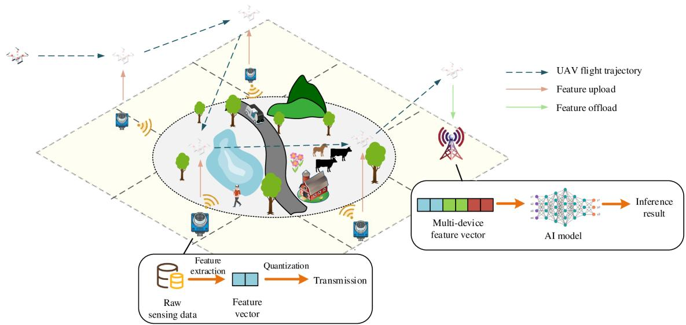  
Fig. 1. The system model of edge inference system with relay UAV.

## II. SYSTEM MODEL

As depicted in Fig. 1, we consider an edge inference system comprising a single-antenna unmanned aerial vehicle (UAV), K single-antenna ground devices, and a single-antenna edge server. Each ground device is equipped with a dual-functional radar-communication (DFRC) system [49], enabling it to switch between sensing and communication modes. Due to their sparse distribution over a large area, the ground devices are too distant to communicate directly with the edge server. The UAV, serving as a mobile relay, bridges this gap between the edge server and ground devices. Regarding access design, given the sparse spatial distribution of devices, the UAV serves them sequentially. This is physically motivated by the fact that inter-device distances in such areas typically preclude effective simultaneous coverage, rendering sequential hovering the most energy-efficient strategy to ensure sufficient signal-tonoise ratio (SNR). To conserve energy, ground devices remain inactive until activated by the UAV for sensing, computation, and communication. The edge inference process is illustrated in Fig. 2 and described as follows:

• Initialization: The edge server instructs the UAV, initially positioned near the server, to collect local feature vectors from the ground devices.

• Flight to Devices: The UAV sequentially navigates to and hovers above each ground device, establishing a communication link to collect its local feature vector.

Hovering: While hovering, the UAV sends a signal to activate the ground device. The device then senses its environment, extracts a low-dimensional feature vector from the sensory data using a lightweight model (e.g., PCA-based compression) to minimize communication overhead and ensure data privacy, and transmits this vector to the UAV.

• Feature Vector Offloading: After collecting feature vectors from all devices, the UAV returns to hover near the edge server, which aggregates the local feature vectors into a global feature vector for downstream inference tasks.

To optimize inference performance, the access order of ground devices and the UAV’s flight trajectory must be carefully designed. The UAV’s altitude is assumed to be fixed, which simplifies the trajectory optimization problem to two dimensions [46]. Communication links between the UAV and ground devices, as well as between the UAV and the edge server, are modeled as line-of-sight (LoS) channels due to the elevated position of the UAV [41], [42], [43], which minimizes obstructions and ensures reliable signal propagation. Regarding access design, given the sparse spatial distribution of devices, the UAV serves them sequentially. This is physically motivated by the fact that inter-device distances in such areas typically preclude effective simultaneous coverage, rendering sequential hovering the most energy-efficient strategy.1 Since the UAV remains stationary during hovering, the channel gain for each communication link remains constant.

## A. Uav Trajectory Model

As mentioned, the UAV needs to sequentially fly to and hover above the ground devices for activating them and collecting local feature vectors. The index set of the ground devices is denoted as $\mathcal { K } = \{ 1 , \ldots , K \}$ . The locations of the ground devices and the server are denoted as $\{ \mathbf { q } [ k ] \} _ { 1 } ^ { K }$ and $\mathbf { q } [ K + 1 ]$ , respectively. To avoid collisions with other objects, it is assumed that the altitude of the UAV is a constant value H [46]. The initial horizontal location of the UAV is denoted as $\mathbf { p } [ 0 ]$ . To collect information from devices and offload them to the server, $K + 1$ hovering spots $\{ \mathbf { p } [ i ] = [ x _ { i } , y _ { i } ] ^ { \mathsf { T } } \} _ { 1 } ^ { K + 1 }$ are set. According to [43], the energy consumption of UAV’s continuous flying can be modeled as

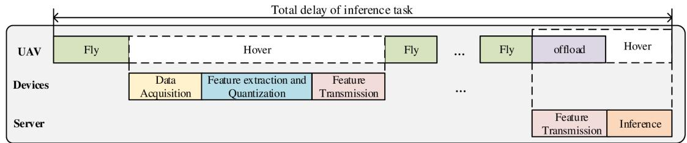  
Fig. 2. Procedure of UAV-Assisted Edge AI Inference with ISCC.

$$
\begin{array} { l } { \displaystyle \hat { E } _ { \mathrm { t r a j } } } \\ { = \int _ { 0 } ^ { T } \left[ c _ { 1 } ( v ( t ) ) ^ { 3 } + \frac { c _ { 2 } } { v ( t ) } \left( 1 + \frac { ( a ( t ) ) ^ { 2 } - \frac { ( a ( t ) v ( t ) ) ^ { 2 } } { ( v ( t ) ) ^ { 2 } } } { g ^ { 2 } } \right) \right] } \\ { + \displaystyle \frac { 1 } { 2 } m _ { u a v } \left( ( v ( T ) ) ^ { 2 } - ( v ( 0 ) ) ^ { 2 } \right) , } \end{array}\tag{dt}
$$

(1)

where $g \approx 9 . 8 \mathrm { { m } / \mathrm { { s } ^ { 2 } } }$ is the gravitational acceleration, $c _ { 1 }$ and $c _ { 2 }$ are two coefficients, v(t) and a(t) are the instantaneous velocity and acceleration, respectively, T is the entire duration, and $m _ { u a v }$ is the mass of the UAV.

As can be observed from (1), to minimize the additional energy consumption resulting from acceleration variations [43], the optimal trajectory design strategy is to hover during the transmission of features and maintain a uniform rectilinear flight state between hovering points.

Therefore, the flight segment between any two consecutive points, $\mathbf { \Delta } _ { p [ i ] }$ and $p [ i + 1 ] .$ , is traversed at a constant speed $v _ { i } ,$ and the duration can be given by

$$
T _ { i } = \| \pmb { p } [ i + 1 ] - \pmb { p } [ i ] \| _ { 2 } / v _ { i } , 0 \leq i \leq K .\tag{2}
$$

Thus, the flying energy consumption from $\mathbf { p } [ i ]$ to $\mathbf { p } [ i + 1 ]$ is given by

$$
E _ { \mathrm { t r a j } } [ i ] = T _ { i } \left( c _ { 1 } v _ { i } ^ { 3 } + \frac { c _ { 2 } } { v _ { i } } \right) , 0 \leq i \leq K .\tag{3}
$$

This propulsion-power form follows widely used models in UAV energy optimization. Acceleration and heading-change costs are abstracted into a fixed maneuvering term $\tilde { E } _ { \mathrm { t r a j } } .$ , which is consistent with standard practice (e.g., [50]). To this end, the flying energy cost is given by

$$
E _ { \mathrm { t r a j } } = \sum _ { i = 0 } ^ { K } T _ { i } \left( c _ { 1 } v _ { i } ^ { 3 } + \frac { c _ { 2 } } { v _ { i } } \right) + ( K + 2 ) \tilde { E } _ { \mathrm { t r a j } } .\tag{4}
$$

## B. Sensing and Feature Extraction Model

1) Sensing Data Model: As mentioned, a set of K ground devices sense a target area from disjoint views. Consequently, the obtained sensory data vectors of different devices are independent [10]. According to [16], the sensory data acquired by an abitrary device k after being normalized by the sensing power $P _ { 0 , k }$ , can be modeled as

$$
\begin{array} { r } { \mathbf { x } _ { k } = \mathbf { x } _ { k } ^ { ( 0 ) } + \hat { \mathbf { n } } _ { k } , \quad k \in \mathcal { K } , } \end{array}\tag{5}
$$

where $\mathbf { x } _ { k } ^ { ( 0 ) } \in \mathbb { R } ^ { \hat { M } }$ is the Mˆ -dimensional ground-truth signal vector. The term $\hat { \mathbf { n } } _ { k }$ represents the corresponding normalized sensing noise, which is assumed to be independent of the signal. The noise is modeled as a zero-mean Gaussian process with a variance inversely proportional to the sensing power.

$$
\hat { \mathbf { n } } _ { k } \sim \mathcal { N } \left( \mathbf { 0 } , \frac { \delta _ { k } ^ { 2 } } { P _ { 0 , k } } \mathbf { I } \right) , \quad k \in \mathcal { K } ,\tag{6}
$$

where $\delta _ { k } ^ { 2 }$ is a constant parameter related to the sensing environment and hardware of the k-th device.

2) Feature Extraction and Characterization: To derive salient features from the raw data, we employ a composite feature extractor, denoted by the function $F ( \cdot )$ . This extractor consists of two sequential stages. First, a pre-trained lightweight Artificial Neural Network (ANN) performs a non-linear mapping of the input. The ANN is trained a priori using a relevant dataset and deployed on the edge devices. Second, to ensure linear independence among the elements of the output, Principal Component Analysis (PCA) is applied as a final processing step. In the absence of noise, the ideal feature vector $\mathbf { z } _ { k } ^ { ( 0 ) } \in \mathbb { R } ^ { M }$ is extracted from the ground-truth data $\mathbf { x } _ { k } ^ { ( 0 ) }$ as

$$
\begin{array} { r } { \mathbf { z } _ { k } ^ { ( 0 ) } = F ( \mathbf { x } _ { k } ^ { ( 0 ) } ) , \quad k \in \mathcal { K } . } \end{array}\tag{7}
$$

Consistent with prior works [10], [26], we model the elements of this ideal feature vector as following a Gaussian Mixture Model (GMM). Specifically, the probability density function of the m-th component of the feature vector for class \` is given by

$$
f ( \mathbf { z } _ { k } ^ { ( 0 ) } [ m ] ) = \frac { 1 } { L } \sum _ { \ell = 1 } ^ { L } \mathcal { N } ( \mu _ { \ell , k , m } , \sigma _ { k , m } ^ { 2 } ) , \quad k \in \mathcal { K } ,\tag{8}
$$

where L is the total number of target classes, $\mu _ { \ell , k , m }$ is the centroid corresponding to the \`-th class for the m-th feature dimension, and $\sigma _ { k , m } ^ { 2 }$ is its associated variance.

3) Characterization of Noise Propagation in Feature Extraction: Analyzing the propagation of sensing noise through the highly non-linear feature extractor $F ( \cdot )$ presents a significant analytical challenge. To render this problem tractable, we adopt a linearization approach based on a first-order Taylor expansion, following the methodology in [4]. Assuming $F ( \cdot )$ is differentiable, its first-order Taylor expansion around a point $\mathbf { x } _ { \mathrm { 0 } }$ is

$$
F ( \mathbf { x } ) \approx F ( \mathbf { x } _ { 0 } ) + \nabla F ( \mathbf { x } _ { 0 } ) ^ { \top } ( \mathbf { x } - \mathbf { x } _ { 0 } ) .\tag{9}
$$

By applying this approximation, the m-th element of the feature vector $\mathbf { z } _ { k }$ , extracted from the noise-corrupted data $\mathbf { x } _ { k }$

can be expressed by expanding $F ( \cdot )$ around the ground-truth data $\mathbf { x } _ { k } ^ { ( 0 ) }$ :

$$
\begin{array} { c } { { \bf z } _ { k } [ m ] { = } F ( { \bf x } _ { k } ^ { ( 0 ) } { + } \hat { \bf n } _ { k } ) [ m ] \approx F ( { \bf x } _ { k } ^ { ( 0 ) } ) [ m ] { + } \nabla F ( { \bf x } _ { k } ^ { ( 0 ) } ) ^ { \top } [ m ] \cdot \hat { \bf n } _ { k } , } \\ { k \in \mathcal { K } . \qquad ( 1 0 ) } \end{array}
$$

where the gradient $\nabla F ( \mathbf { x } _ { k } ^ { ( 0 ) } )$ can be estimated from the training dataset. Letting

$$
\nabla F ( \mathbf { x } _ { k } ^ { ( 0 ) } ) [ m ] = [ \lambda _ { k } [ 1 , m ] , . . . , \lambda _ { k } [ \hat { \mathcal { M } } , m ] ] ^ { \top } ,
$$

where $\begin{array} { r } { \lambda _ { k } [ i , m ] ~ = ~ \frac { \partial F _ { m } ( \boldsymbol { x } _ { k } ^ { ( 0 ) } ) } { \partial \boldsymbol { x } _ { k } ^ { ( 0 ) } [ i ] } } \end{array}$ formally denotes the partial derivative of the m-th feature component with respect to the i-th input dimension. Since the sensing noise satisfies $\hat { \mathbf { n } } _ { k } \sim \mathcal { N } ( 0 , \delta _ { k } ^ { 2 } / P _ { 0 , k } \cdot I )$ , the propagated noise term $\begin{array} { r } { \nabla F ( \mathbf { x } _ { k } ^ { ( 0 ) } ) ^ { \top } [ m ] \hat { \mathbf { n } } _ { k } = \sum _ { i = 1 } ^ { \hat { M } } \lambda _ { k } [ i , m ] \hat { n } _ { k } [ i ] } \end{array}$ is a weighted sum of independent Gaussian variables and therefore remains Gaussian with variance $\begin{array} { r l r } { \mathrm { ~ } } & { { } } & { \sum _ { i = 1 } ^ { \vec { M } } \lambda _ { k } [ i , m ] ^ { 2 } \delta _ { k } ^ { 2 } / P _ { 0 , k } } \end{array}$ . Consequently, the distribution of the noise-affected feature component ${ \mathbf z } _ { k } [ m ]$ is a GMM whose variance is augmented by the propagated noise

$$
f ( \mathbf { z } _ { k } [ m ] ) = \frac { 1 } { L } \sum _ { \ell = 1 } ^ { L } \mathcal { N } \left( \mu _ { \ell , k , m } , \sigma _ { k , m } ^ { 2 } + \sum _ { i = 1 } ^ { \hat { M } } \lambda _ { k } [ i , m ] ^ { 2 } \frac { \delta _ { k } ^ { 2 } } { P _ { 0 , k } } \right) ,
$$

where the total variance results from the additive combination of the intrinsic feature variance $\sigma _ { k , m } ^ { 2 }$ and the propagated sensing noise variance, following the standard first-order uncertainty propagation model. The proposed first-order linearization and GMM serve as tractable approximations that capture the dominant statistical properties in the moderateto-high SNR regime. Empirically, GMMs effectively fit real-world feature distributions (e.g., [32]), while the underlying monotonic relationship between SNR and feature quality ensures the framework’s robustness across diverse non-linear models. The extracted feature vector $\mathbf { z } _ { k }$ is subsequently transmitted to an edge server to perform the final classification task. Although modeled independently for tractability, these modules may exhibit implicit coupling through UAV geometry and channel quality, and tighter sensing–communication models (e.g., [51]) can be incorporated in future extensions.

4) Energy and Latency Model: This part specifies the models for the time and energy consumption during the sensing and feature extraction phases at the i-th hovering point.

The sensing process for each device is assumed to occur over a fixed duration, ${ \hat { T } } _ { 0 } .$ . The energy consumed by the k-th device for sensing, $E _ { 0 , i , k }$ , is therefore linear with respect to its sensing power $P _ { 0 , i , k }$

$$
E _ { 0 , i , k } = P _ { 0 , i , k } \hat { T } _ { 0 } .\tag{12}
$$

For the feature extraction process, let $L _ { k }$ denote the computational load (e.g., in cycles) and $f _ { k }$ be the processing speed (e.g., in cycles/second) of the k-th device. The time required for this computation, $\hat { T } _ { 1 , i , k } ,$ , is

$$
\hat { T } _ { 1 , i , k } = L _ { k } / f _ { k } .\tag{13}
$$

Following established models [48], [52], the computational power $P _ { 1 , k }$ is modeled as a cubic function of the processing

speed, $P _ { 1 , k } \ = \ \beta f _ { k } ^ { 3 }$ , where $\beta$ is a hardware-specific power coefficient. The corresponding energy consumption for feature extraction, $E _ { 1 , i , k } ,$ , is thus given by

$$
E _ { 1 , i , k } = P _ { 1 , k } \hat { T } _ { 1 , i , k } = \left( \beta f _ { k } ^ { 3 } \right) L _ { k } / f _ { k } = \beta f _ { k } ^ { 2 } L _ { k } .\tag{14}
$$

## C. Communication Model

1) UAV-Device Communication Link: As discussed before, at each hovering location the UAV establishes a link with only one ground device to avoid interference and guarantee reliable feature transmission. To model the association between the UAV and ground devices, we introduce a set of binary indicator variables $\gamma _ { i , k } \in \{ 0 , 1 \}$ , for $1 \leq i , k \leq K$ . We set $\gamma _ { i , k } = 1$ if the UAV establishes a communication link with the k-th device while at the i-th hovering spot, and $\gamma _ { i , k } = 0$ otherwise. We assume that any control signaling from the UAV is negligible in duration.

It is assumed that the control signaling from the UAV for notification is short enough and the duraion can be neglected. The communication links between the UAV and the ground devices are dominated by the LoS component and is block fading, i.e., the channel state changes over time but remain static within the transmission process. It is assumed that the channel noise n˜ satisfies that $\tilde { n } \sim \mathcal { N } ( 0 , \sigma ^ { 2 } )$ . Therefore, the signal-to-noise ratio (SNR) at the i-th hovering spot with the k-th device is given by

$$
\mathsf { S N R } _ { i , k } = h _ { i , k } P _ { 2 } / \sigma ^ { 2 } ,\tag{15}
$$

where $P _ { 2 }$ is the transmitted power of ground device, and B is the channel bandwidth. According to [45] and [46], the channel gain is given by

$$
h _ { i , k } = \frac { \gamma _ { i , k } \beta _ { 0 } } { H ^ { 2 } + \| \pmb { p } [ i ] - \pmb { q } [ k ] \| _ { 2 } ^ { 2 } } .\tag{16}
$$

Thus, the corresponding achievable rate is given by

$$
R _ { i , k } = B \log _ { 2 } ( 1 + { \mathsf { S N R } } _ { i , k } ) .\tag{17}
$$

2) Feature Quantization and Transmission: To ensure the success of transmission, all the feature element is quantized with a unanimous linear quantizer $\mathcal { Q }$ at the device and dequantized with the corresponding dequantizer DQ at the server. The quantization and dequantization processes are respectively given by

$$
\hat { \mathbf { z } } _ { k } = \mathcal { Q } ( \mathbf { z } _ { k } ) ,\tag{18}
$$

and

$$
\begin{array} { r } { \tilde { \mathbf { z } } _ { k } = { \cal D } \mathcal { Q } ( \hat { \mathbf { z } } _ { k } ) = \mathbf { z } _ { k } + e , } \end{array}\tag{19}
$$

where $\hat { \mathbf { z } } _ { k }$ and $\tilde { \mathbf { z } } _ { k }$ are the quantized and dequantized version of the feature vector, respectively. And e is the quantization error, which approximately follows a normal distribution when the quantization bit range is sufficiently high, i.e., $e \sim \mathcal { N } ( 0 , \bar { a ^ { 2 } } / ( 3 Q ^ { 2 } ) )$ [53], where the parameter a denotes the dynamic range of the feature values prior to quantization. Thus, the overhead of transmitting the feature vector by the device can be expressed as ${ \cal L } _ { \mathrm { H } } ~ = ~ M \log _ { 2 } Q$ . To ensure successful transmission over a duration $\hat { T } _ { 2 , i , k } .$ , the channel capacity must satisfy the condition $R _ { i , k } \hat { T } _ { 2 , i , k } \ge L _ { \mathrm { H } }$ . In this paper, feature upload refers to the transmission of extracted feature vectors from edge devices to the UAV, whereas feature offload denotes the subsequent forwarding of these feature vectors from the UAV to the edge server for final inference.

3) UAV-Server Communication Link: After collecting features from all associated devices, the UAV offloads the aggregated data to a central server for the final inference step. The channel gain for this link, from the final UAV position $p [ K + 1 ]$ to the server at $\pmb q [ K + 1 ]$ , is modeled as

$$
h = \frac { \beta _ { 0 } } { H ^ { 2 } + \| \pmb { p } [ K + 1 ] - \pmb { q } [ K + 1 ] \| _ { 2 } ^ { 2 } } .\tag{20}
$$

Let ${ \tilde { P } } _ { 3 }$ denote the $\mathrm { U A V } \mathbf { \hat { s } }$ transmit power when offloading the aggregated feature vector to the edge server. With other settings remain the same, the corresponding SNR and achievable rate can be respectively given by

$$
\mathsf { S N R } = h \tilde { P } _ { 3 } / \sigma ^ { 2 } ,\tag{21}
$$

and

$$
R = B \log _ { 2 } ( 1 + 5 \mathsf { N R } ) .\tag{22}
$$

4) Energy Consumption Model: The communication duration of the k-th device in i-th hovering point is denoted as $\hat { T } _ { 2 , i , k } .$ , so the communication energy consumption for the k-th device at i-th hovering point is given by

$$
E _ { 2 , i , k } = P _ { 2 , i , k } \hat { T } _ { 2 , i , k } ,\tag{23}
$$

the receiving power of the UAV is denoted as ${ \tilde { P } } _ { 2 }$ . Thus, the energy consumption of feature reception with each device is given by

$$
\tilde { E } _ { 2 , k } = \sum _ { i = 0 } ^ { K } \gamma _ { i , k } \tilde { P } _ { 2 } \hat { T } _ { 2 , i , k } ,\tag{24}
$$

the transmitting power and the communication duration are denoted as ${ \tilde { P } } _ { 3 }$ and ${ \tilde { T } } _ { 3 } ,$ , respectively. The UAV’s energy consumption for offloading features to the server is

$$
\tilde { E } _ { 3 } = \tilde { P } _ { 3 } \tilde { T } _ { 3 } .\tag{25}
$$

When the k-th device performs sensing, feature extraction and feature transmission, the hovering time of the UAV at i-th hovering point is expressed as

$$
T _ { h , i , k } = \gamma _ { i , k } \left( \hat { T } _ { 0 } + \hat { T } _ { 1 , k } + \hat { T } _ { 2 , i , k } \right) ,\tag{26}
$$

the corresponding hovering energy consumption is

$$
E _ { h , i , k } = P _ { h } T _ { h , i , k } ,\tag{27}
$$

where $P _ { h }$ is the hovering power of UAV. So in the whole inference task, the hovering energy consumption of UAV is denoted as

$$
E _ { h } = P _ { h } \left( \sum _ { k = 1 } ^ { K } \sum _ { i = 0 } ^ { K } \gamma _ { i , k } \left( \hat { T } _ { 0 } + \hat { T } _ { 1 , i , k } + \hat { T } _ { 2 , i , k } \right) + \tilde { T } _ { 3 } \right)\tag{28}
$$

## D. Inference Accuracy Metric

To address the challenge that instantaneous inference accuracy lacks a closed-form expression, we adopt the discriminant gain as a tractable surrogate metric [10]. Geometrically, the discriminant gain is built upon the Kullback-Leibler (KL) divergence and quantifies the statistical separability between the probability distributions of a feature corresponding to two distinct classes. A larger gain signifies greater separation between the distributions, which correlates with a higher probability of correct classification. Furthermore, while the discriminant gain is primarily formulated for classification, it is adaptable to non-classification tasks such as regression. In such cases, the continuous output space can be discretized into multiple categorical intervals.

The final inference task is executed at the edge server using the dequantized feature vectors. Consequently, our analysis must be based on the quality of $\tilde { \mathbf { z } } _ { k } .$ , a vector corrupted by both the initial sensing noise and the subsequent quantization noise. For an arbitrary class pair $( \ell , \ell ^ { \prime } )$ , the discriminant gain for a single feature element $\tilde { \mathbf { z } } _ { k } [ m ]$ is defined as

$$
\begin{array} { r l } & { G ( \tilde { \mathbf { z } } _ { k } [ m ] ; \ell , \ell ^ { \prime } ) } \\ & { \ = \mathrm { D } _ { K L } [ f _ { \ell } ( \tilde { \mathbf { z } } _ { k } [ m ] ) \| f _ { \ell ^ { \prime } } ( \tilde { \mathbf { z } } _ { k } [ m ] ) ] } \\ & { \quad + \mathrm { D } _ { K L } [ f _ { \ell ^ { \prime } } ( \tilde { \mathbf { z } } _ { k } [ m ] ) \| f _ { \ell } ( \tilde { \mathbf { z } } _ { k } [ m ] ) ] , k \in \mathcal { K } , } \end{array}\tag{29}
$$

where $\mathrm { D } _ { K L } [ \cdot | \cdot ]$ is the KL divergence function.

Recalling from Section II-C, the dequantized feature vector is $\tilde { \mathbf { z } } _ { k } = \mathbf { z } _ { k } + \mathbf { e } ,$ , where e represents the quantization error with variance $\sigma _ { q } ^ { 2 } = a ^ { 2 } / ( 3 Q ^ { 2 } )$ . Under the assumption that the sensing and quantization noise processes are independent, the total noise variance is the sum of the individual variances. Consequently, the probability distribution of $\tilde { \mathbf { z } } _ { k } [ m ]$ remains a GMM as in (11), but with its variance term augmented by $\sigma _ { q } ^ { 2 } .$ Substituting this composite distribution into the definition of the discriminant gain yields

$$
\begin{array} { r l } & { G ( \tilde { \mathbf { z } } _ { k } [ m ] ; \ell , \ell ^ { \prime } ) } \\ & { = \frac { ( \mu _ { \ell , k , m } - \mu _ { \ell ^ { \prime } , k , m } ) ^ { 2 } } { \sigma _ { k , m } ^ { 2 } + \sum _ { m = 1 } ^ { \hat { M } } ( \lambda _ { k } [ m ] ) ^ { 2 } \delta _ { k } ^ { 2 } / P _ { 0 , k } + \sigma _ { q } ^ { 2 } } , k \in \mathcal { K } . } \end{array}\tag{30}
$$

The total discriminant gain for the feature vector $\tilde { \mathbf { z } } _ { k }$ is obtained by summing the gains of its constituent elements. This additive property holds because the elements of the feature vector are decorrelated and rendered statistically independent by the Principal Component Analysis (PCA) processing stage, as detailed in Section II-B2. Therefore, the total discriminant gain is expressed as

$$
\begin{array} { l } { \displaystyle { G ( \tilde { \mathbf { z } } _ { k } ; \ell , \ell ^ { \prime } ) = \sum _ { m = 1 } ^ { M } G ( \tilde { \mathbf { z } } _ { k } [ m ] ; \ell , \ell ^ { \prime } ) } } \\ { \displaystyle { = \sum _ { m = 1 } ^ { M } \frac { ( \mu _ { \ell , k , m } - \mu _ { \ell ^ { \prime } , k , m } ) ^ { 2 } } { \sigma _ { k , m } ^ { 2 } + \sum _ { m = 1 } ^ { \hat { M } } ( \lambda _ { k } [ m ] ) ^ { 2 } \delta _ { k } ^ { 2 } / P _ { 0 , k } + \sigma _ { q } ^ { 2 } } , k \in \mathcal { K } . } } \end{array}\tag{31}
$$

## III. PROBLEM FORMULATION

The objective is to minimize the total delay of the inference, while satisfying inference accuracy and related constraints.

The objective function is formulated as

$$
\begin{array} { c c } { { \displaystyle { \operatorname* { m i n } } } } \\ { { \{ \gamma _ { i , k } \} _ { 0 } ^ { K } , \{ v _ { i } \} _ { 0 } ^ { K } , \{ p [ i ] \} _ { 1 } ^ { K + 1 } , \{ f _ { k } \} _ { 1 } ^ { K } , } } \\ { { \{ P _ { 0 , k } \} _ { 1 } ^ { K } , \{ P _ { 2 , k } \} _ { 1 } ^ { K } , \tilde { P } _ { 3 } , \{ \hat { T } _ { 2 , k } \} _ { 1 } ^ { K } , \tilde { T } _ { 3 } } } \\ { { } } & { { \ \hat { T } _ { 1 , i , k } + \ \hat { T } _ { 2 , i , k } \Big ) + \tilde { T } _ { 3 } + T _ { 4 } \Big \} , } } \end{array}
$$

where $\textstyle \sum _ { i = 0 } ^ { K } T _ { i }$ is the sum flight time of the UAV in the inference task, $\begin{array} { r } { \sum _ { k = 1 } ^ { K } \sum _ { i = 0 } ^ { K } \gamma _ { i , k } \left( \hat { T } _ { 0 } + \hat { T } _ { 1 , i , k } + \hat { T } _ { 2 , i , k } \right) } \end{array}$ represents the sum delay of sensing, computation and communication on devices $\tilde { \mathcal { T } } _ { 3 }$ denotes the delay of UAV offloading the collected features to the server, $T _ { 4 }$ is the duration for inference on the server. Then several constraints are formulated.

## 1) Location Constraint:

During the processes of sensing, communication, and computation, the positions of ground devices and servers remain unchanged. Meanwhile, the initial position of the UAV is also determined before the execution of the inference task. Therefore, we have

$$
\begin{array} { r l } { ( \mathrm { C 1 } ) } & { \pmb { p } [ 0 ] = [ x _ { 0 } , y _ { 0 } ] , } \\ & { \pmb { q } [ k ] = [ \hat { x } _ { k } , \hat { y } _ { k } ] , k \in \mathcal { K } , } \\ & { \pmb { q } [ K + 1 ] = [ \hat { x } _ { K + 1 } , \hat { y } _ { K + 1 } ] . } \end{array}\tag{32}
$$

In addition, at an arbitrary hovering spot, the UAV can only connect to one device, and features on all the K devices should be collected exactly once. To this end, we have

(C2)

$$
{ { \gamma } _ { i , k } } \in \left\{ 0 , 1 \right\} , \quad \sum _ { k = 1 } ^ { K } { { { \gamma } _ { i , k } } } = 1 , \quad \sum _ { i = 1 } ^ { K } { { { \gamma } _ { i , k } } } = 1 .\tag{33}
$$

## 2) UAV Velocity Constraint:

Due to hardware limitations, the instantaneous speed of the UAV at any moment during flight should not exceed the maximum flight speed $V _ { m a x }$ , i.e., the velocity of the UAV should not exceed the maximum

$$
\left( \mathrm { C 3 } \right) \quad v _ { i } \le V _ { m a x } .\tag{34}
$$

## 3) UAV Energy Consumption Constraint:

The energy consumption of UAV in the inference task is supposed to be limited to a definite value,

$$
E _ { \mathrm { t r a j } } + E _ { h } + \sum _ { k = 1 } ^ { K } { \tilde { E } } _ { 2 , k } + { \tilde { E } } _ { 3 } \leq \tilde { \mathcal { E } } ,
$$

where $E _ { \mathrm { t r a j } }$ is the flight energy consumption of the UAV defined in $( 4 ) , E _ { h }$ is the hovering energy defined in (28), $\tilde { E } _ { 2 , k }$ represents the energy consumed for communication between the UAV and the k-th ground device defined in (24), ${ \tilde { E } } _ { 3 }$ denotes the energy consumed for transmitting feature vectors to the server defined in (25). Since the last two items are much smaller than the first one, we can ignore them. So the constraint can be rewritten as

$$
\begin{array} { r l } { ( \mathrm { C 4 } ) } & { { } E _ { \mathrm { t r a j } } + E _ { h } \leq \tilde { \mathcal { E } } . } \end{array}\tag{35}
$$

## 4) Device Energy Consumption Constraint:

The energy consumption on each device for sensing, computation, and communication should not exceed the limit

(C5)

$$
\sum _ { i = 0 } ^ { K } \gamma _ { i , k } \left( E _ { 0 , i , k } + E _ { 1 , i , k } + E _ { 2 , i , k } \right) \leq \mathcal { E } _ { k } , k \in \mathcal { K } ,\tag{36}
$$

where $\mathcal { E } _ { k }$ is the energy threshold for the k-th device.

## 5) Inference Accuracy Constraint:

To ensure inference performance, the discriminant gain of each pair of classes should be higher than a threshold $G _ { L }$

$$
\begin{array} { r l } { ( \mathrm { C 6 } ) } & { { } G ( \tilde { \mathbf { z } } _ { k } ; \ell , \ell ^ { \prime } ) \geq G _ { L } , k \in \mathcal { K } , \forall ( \ell < \ell ^ { \prime } ) . } \end{array}\tag{37}
$$

## 6) Communication Capacity Constraint:

During the i-th communication round, the overhead for transmitting the feature on the connected k-th device should be less than the corresponding channel capacity

$$
\begin{array} { r l r } {  { \gamma _ { i , k } M \log _ { 2 } Q \le \gamma _ { i , k } \hat { T } _ { 2 , i , k } B \log _ { 2 } ( 1 + \frac { h _ { i , k } P _ { 2 , i , k } } { \sigma ^ { 2 } } ) , } } \\ & { 1 \le i , k \le K . } & { ( 3 8 } \end{array}\tag{C7}
$$

For feature offloading to the server, the corresponding constraint is given by

$$
\mathrm { ( C 8 ) } \quad \sum _ { k = 1 } ^ { K } M _ { k } \log _ { 2 } Q \leq \tilde { T } _ { 3 } B \log _ { 2 } \left( 1 + \frac { h \tilde { P } _ { 3 } } { \sigma ^ { 2 } } \right) .\tag{39}
$$

## 7) Computation Speed Constraint:

Since the computation speed cannot be infinitely large, we specify a upper limit value for it,

$$
( \mathrm { C 9 } ) \quad f _ { k } \leq f _ { U } , \quad k \in { \mathcal { K } } .\tag{40}
$$

## 8) Transmission Power Constraints:

In practical applications, the transmission power of the devices cannot be infinitely large during the transmission of features to the UAV. Therefore, an upper bound constraint is imposed on the transmission power of the devices,

$$
( \mathrm { C 1 0 } ) \quad P _ { 2 , i , k } \leq P _ { 2 _ { U } } , \quad k \in { \cal K } ,\tag{41}
$$

for feature offloading from the UAV to the edge server, the corresponding constraint is given by

$$
\begin{array} { r l } { (  { \mathrm { C } } 1 1 ) } & { { } \tilde { P } _ { 3 } \leq P _ { 3 _ { U } } . } \end{array}\tag{42}
$$

Thus, the problem is formulated by

$$
\begin{array} { r l } { \displaystyle { \mathrm { ( P 1 ) } } _ { \{ \gamma _ { i , k } \} _ { 0 } , \{ v _ { i } \} _ { 0 } ^ { K } , \{ p [ i ] \} _ { 1 } ^ { K + 1 } , \{ \hat { f } _ { k } \} _ { 1 } ^ { K } , } } & { } \\ { \{ f _ { 0 , k } \} _ { 1 } ^ { K } , \{ P _ { 2 , k } \} _ { 1 } ^ { K } , \{ \hat { P } _ { 3 } , \{ \hat { f } _ { 3 , k } \} _ { 1 } ^ { K } , \hat { T } _ { 3 } \} } & { } \\ { \displaystyle } & { \displaystyle \left\{ \sum _ { i = 0 } ^ { K } T _ { i } + \sum _ { k = 1 } ^ { K } \sum _ { i = 0 } ^ { K } \gamma _ { i , k } \left( \hat { T } _ { 0 } + \right. \right. } \\ { \left. \left. \hat { T } _ { 1 , i , k } + \hat { T } _ { 2 , i , k } \right) + \tilde { T } _ { 3 } + T _ { 4 } \right\} , } \\ { \mathrm { s . t . } } & { \left( \mathrm { C 1 } \right) \sim \left( \mathrm { C 1 } \right) . } \end{array}
$$

## IV. UAV TRAJECTORY OPTIMIZATION ALGORITHM DESIGN

## A. Solution Overview

The optimization problem (P1) is a highly complex Mixed-Integer Non-Linear Programming (MINLP) problem, which is notoriously difficult to solve for a global optimum. The challenges are multifaceted, primarily stemming from the following aspects:

• Non-convex Objective and Constraints: The problem is inherently non-convex. For instance, the UAV’s flight energy is a complex non-linear function of its speed $v _ { i }$ in both the objective function and energy constraints. Furthermore, the UAV’s hovering positions $\mathbf { \Delta } _ { \mathbf { \mathcal { P } } } [ i ]$ appear within a logarithmic function via the channel gain $h _ { i , k }$ in the communication capacity constraint (C7), which is a source of non-convexity.

• Combinatorial Complexity due to Binary Variables: The problem involves binary indicator variables, $\gamma _ { i , k } ~ \in$ {0, 1}, which determine the device access sequence. The presence of these variables imparts a combinatorial nature to the trajectory planning aspect of the problem. For κ ground devices, there are κ! possible access sequences, leading to an enormous solution space. This combinatorial characteristic renders the problem NP-hard, making it impossible to find the optimal solution in polynomial time.

• Strong Coupling Among Variables: The UAV trajectory design is tightly coupled with the device communication sequence selection. The UAV’s hovering locations $\mathbf { \Delta } _ { \mathbf { \mathcal { P } } [ i ] }$ directly influence the channel gain, which in turn affects the required communication rate and duration $\hat { T } _ { 2 , i , k }$ The communication duration then impacts the UAV’s hovering energy $E _ { h }$ and the total task delay. All these variables are jointly constrained by the energy budgets of the devices and the UAV. This intricate coupling makes joint optimization exceptionally challenging.

Given these significant challenges, finding a globally optimal solution in a single step is computationally intractable. Therefore, to render the problem tractable and efficiently find a high-quality solution, we propose to decompose the original problem by splitting it into more manageable subproblems, as shown in Fig. 3. Specifically, our solution is divided into two main stages. We first address the combinatorial challenge posed by the binary variables $\gamma _ { i , k }$ by determining the communication sequence with the ground devices. Subsequently, with the sequence fixed, the binary variables are eliminated, and we then jointly optimize the UAV’s hovering point locations and the resource allocation across the devices.

## B. Graph Theory-Based Communication Sequence Design for Ground Devices

To determine the communication order of ground devices, we construct an undirected complete graph $\mathrm { { G R A P H } = ( \mathbf { w } , }$ E), where the vector $\mathbf { w } = \{ w _ { 0 } , w _ { 1 } , \cdot \cdot \cdot , w _ { K } , w _ { K + 1 } \}$ includes vertices corresponding to the UAV’s starting point $w _ { 0 } ,$ ground devices $w _ { 1 } , \cdots , w _ { K }$ , and the edge server $w _ { K + 1 }$ . The symmetric matrix $E = \{ e _ { i , j } \} _ { K + 1 , K + 1 }$ represents the distance between the locations of the i-th and j-th vertices.

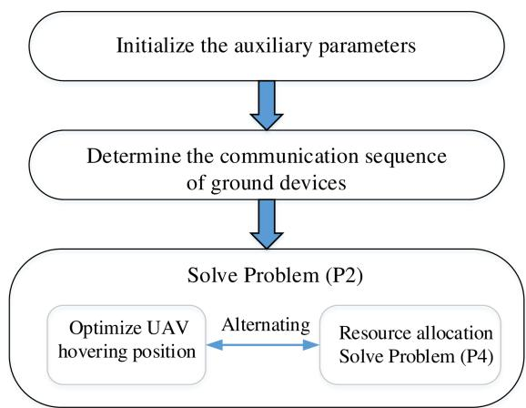  
Fig. 3. The solution process of the proposed algorithm for Problem (P1).

Since all ground device features must be uploaded to the UAV, and the UAV starts from the initial point and stops at the edge server, assuming the UAV returns to the starting point after feature transmission, the trajectory design is equivalent to finding a Hamiltonian Cycle in GRAPH. A Hamiltonian Cycle is a closed path that starts at a given vertex, visits every vertex exactly once, and returns to the starting point. Given that GRAPH is complete, such a cycle always exists.

Further, due to the UAV’s limited flight speed and task execution time, its energy consumption is related to the trajectory length. Thus, solving the subproblem for $\gamma _ { i , k }$ is equivalent to finding the Minimum Hamiltonian Cycle (i.e., the cycle with the smallest total edge weight) in GRAPH. As this is an NPcomplete problem, we employ a Back Tracking Algorithm [54] to approximate the solution. The algorithm starts from a fixed vertex, iteratively explores unvisited adjacent vertices while recording path lengths, and repeats until a Hamiltonian Cycle is formed. By comparing cycle lengths and pruning suboptimal paths, the minimum cycle is identified.

In practice, the UAV must start from the initial point and terminate at the edge server after feature transmission. To align the graph model with this constraint, we set $e _ { 0 , K + 1 } =$ $e _ { K + 1 , 0 } = 0$ , ensuring the minimum cycle always includes this path segment. After solving, this segment is removed from the cycle. The final communication sequence is stored in vector $\dot { \mathbf { S } } \in \mathbb { R } ^ { K \times 1 }$ , where $\mathbf { S } [ k ] = i$ indicates that the k-th device communicates with the UAV during the i-th hovering round (i.e., at the i-th hover point).

## C. Alternating Optimization Framework for Task Delay Minimization

Given a pre-determined device access sequence S, which fixes the values of $\gamma _ { i , k } .$ , the primary optimization problem (P1) can be simplified.

$$
\operatorname* { m i n } _ { \{ v _ { i } \} _ { 0 } ^ { K } , \{ p [ i ] \} _ { 1 } ^ { K + 1 } , \{ f _ { k } \} _ { 1 } ^ { K } , \{ P _ { 0 , k } \} _ { 1 } ^ { K } , \ } \Bigg \{ \sum _ { i = 0 } ^ { K } T _ { i } + \sum _ { k = 1 } ^ { K } \Big ( \hat { T } _ { 0 } + \hat { T } _ { 1 , k } +\tag{P2}
$$

TABLE I SUMMARY OF KEY NOTATION
<table><tr><td>Symbol</td><td>Description</td></tr><tr><td> $\hat { T } _ { 0 }$ </td><td>Device sensing time</td></tr><tr><td> $P _ { 0 , k }$ </td><td>Device sensing power</td></tr><tr><td> $E _ { 0 , k }$ </td><td>Device sensing energy</td></tr><tr><td> $\hat { T } _ { 1 , k }$ </td><td>Device computing time</td></tr><tr><td> $P _ { 1 , k }$ </td><td>Device computational power</td></tr><tr><td> $E _ { 1 , k }$ </td><td>Device computational energy</td></tr><tr><td> $\hat { T } _ { 2 , k }$ </td><td>Communication time</td></tr><tr><td> $P _ { 2 , k }$ </td><td>Device communication power</td></tr><tr><td> $E _ { 2 , k }$ </td><td>Device communication energy</td></tr><tr><td> ${ \tilde { P } } _ { 2 }$ </td><td>UAV communication power</td></tr><tr><td></td><td></td></tr><tr><td> $\tilde { E } _ { 2 , k }$ </td><td>UAV communication energy</td></tr><tr><td> $\ddot { T } _ { 3 }$ </td><td>UAV transmit time</td></tr><tr><td> ${ \tilde { P } } _ { 3 }$ </td><td>UAV transmit power</td></tr><tr><td> ${ \tilde { E } } _ { 3 }$ </td><td>UAV transmit energy</td></tr><tr><td> $T _ { 4 }$ </td><td>Server inference time</td></tr></table>

$$
\hat { T } _ { 2 , k } \Big ) + \tilde { T } _ { 3 } + T _ { 4 } \Big \} ,
$$

s.t. (C1), (C3) ∼ (C6), (C9) ∼ (C11),

$$
M \log _ { 2 } Q \leq \hat { T } _ { 2 , k } B \log _ { 2 } \left( 1 + \frac { h _ { { \bf S } [ k ] , k } P _ { 2 , k } } { \sigma ^ { 2 } } \right) , 1 \leq k \leq K ,
$$

$$
\sum _ { k = 1 } ^ { K } M _ { k } \log _ { 2 } Q \leq \tilde { T } _ { 3 } B \log _ { 2 } \left( 1 + \frac { h \tilde { P } _ { 3 } } { \sigma ^ { 2 } } \right) .
$$

However, the resulting problem remains non-convex due to the coupling between the UAV’s trajectory variables and the resource allocation variables. To address this challenge, we propose an Alternating Optimization (AO) framework that decouples the problem into more tractable subproblems. To enhance the readability, the frequently used time, power and energy variables and their descriptions are summarized in Table I below.

1) Problem Decomposition: The core of our AO approach is to partition the optimization variables into two distinct blocks. By iteratively solving for one block while keeping the other fixed, we can converge towards a high-quality solution for the original problem. The two blocks are defined as follows:

1) UAV Trajectory Variables: This block consists of the set of UAV hovering positions, $\{ p [ i ] \} _ { 1 } ^ { K + 1 }$

2) Resource Allocation Variables: This block includes all remaining variables, namely the UAV velocities $\{ v _ { i } \} _ { 0 } ^ { K }$ , device computation frequencies $\{ f _ { k } \} _ { 1 } ^ { K } ,$ , sensing and communication powers $\begin{array} { r l r } {  { \{ \bar { P _ { 0 , k } } \} _ { 1 } ^ { K } , \{ \bar { P _ { 2 , k } } \} _ { 1 } ^ { \bar { K } } , \tilde { P } _ { 3 } } } \end{array}$ , and communication durations $\{ \hat { T } _ { 2 , k } \} _ { 1 } ^ { K } , \tilde { T } _ { 3 }$

The subsequent sections detail the solution methodology for each corresponding subproblem.

2) Subproblem 1: UAV Trajectory Optimization via Simulated Annealing: When the resource allocation variables (Block 2) are held constant, the optimization problem reduces to finding the optimal UAV hovering positions $\overset { \cdot } { \{ p [ i ] \} } _ { i = 1 } ^ { K + 1 }$ . This subproblem remains challenging because the trajectory variables $\{ p [ i ] \}$ are embedded within the channel gain expressions $( h _ { \mathbf { S } [ k ] , k }$ and h), which appear inside logarithmic functions in the communication constraints, rendering the problem nonconvex.

Algorithm 1 Simulated Annealing Based UAV Hovering   
Position Optimization Algorithm   
Input: The remaining optimization variables except   
$\{ p [ i ] \} _ { 1 } ^ { K + 1 }$ ;   
1 Initialize Set an initial parking position $\{ p [ i ] \} ^ { ( 0 ) }$ and   
initial temperature $T _ { S A } ^ { ( 0 ) } \mathrm { . }$   
2 Let n be the number of iterations, repeat the following   
steps:   
3 For each iteration, set $T ^ { ( n + 1 ) } = 0 . 9 9 7 T ^ { ( n ) }$ to decrease   
the temperature;   
4 In the $( n + 1 )$ -th iteration, randomly select a new solu  
tion $\{ \pmb { p } [ i ] \} ^ { ( n + 1 ) }$ from the neighborhood of the solution   
$\{ p [ i ] \} ^ { ( n ) }$ , and calculate the difference $\Delta E$ in the objective   
function of the two solutions;   
5 If the objective value of the new solution is better than   
the current solution $( \mathrm { i . e . , } \ \Delta E < 0 )$ , accept the new solu  
tion; otherwise, accept the new solution with probability   
${ P _ { S A } } = e ^ { - \Delta E / \dot { T } ^ { ( n ) } }$   
6 Continue to decrease the temperature until it reaches the   
set value.   
Output: The positions of all parking points $\{ p [ i ] \} _ { i = 1 } ^ { K + 1 }$

To tackle this non-convex trajectory optimization problem, we employ the Simulated Annealing (SA) algorithm [55], a powerful metaheuristic capable of escaping local optima to find a globally optimal solution. The SA algorithm emulates the physical process of annealing, where a material is heated and then slowly cooled to minimize its internal energy. Similarly, the algorithm explores the solution space by accepting not only improving solutions but also non-improving ones with a probability that decreases as a “temperature” parameter is lowered. This mechanism allows the search to avoid getting trapped in local minima. The SA-based procedure for optimizing the UAV hovering positions is outlined in Algorithm 1.

3) Subproblem 2: Convex Resource Allocation: With the UAV trajectory $\{ p [ i ] \} _ { 1 } ^ { K + 1 }$ fixed from the solution of Subproblem 1, we now focus on optimizing the resource allocation variables. The corresponding subproblem, denoted as (P3), is formulated as follows

$$
\begin{array} { r l r } { \left. { \operatorname* { m i n } _ { \left\{ v _ { i } \right\} _ { 0 } ^ { K } , \left\{ f _ { k } \right\} _ { 1 } ^ { K } , \left\{ P _ { 0 , k } \right\} _ { 1 } ^ { K } , \left( \right) _ { i = 0 } ^ { K } } \left\{ \sum _ { i = 0 } ^ { K } T _ { i } + \sum _ { k = 1 } ^ { K } \left( \hat { T } _ { 0 } + \hat { T } _ { 1 , k } + \right. \right.}  }  \\ & { } & { \left. \left\{ P _ { 2 , k } \right\} _ { 1 } ^ { K } , \tilde { P } _ { 3 } , \left\{ \hat { T } _ { 2 , k } \right\} _ { 1 } ^ { K } , \tilde { T } _ { 3 } \right. } \\ & { } & { \left. \hat { T } _ { 2 , k } \right) + \tilde { T } _ { 3 } + T _ { 4 } \right\} , } \end{array}\tag{P3}
$$

s.t. All constraints in (P2).

Problem (P3) is still non-convex due to the product of variables $( \mathrm { e } . \mathrm { g } . , P _ { 2 , k } \hat { T } _ { 2 , k } )$ in the constraints. To address this, we perform a change of variables by introducing communication energy variables $E _ { 2 , k } = P _ { 2 , k } \hat { T } _ { 2 , k }$ and $\tilde { E } _ { 3 } = \tilde { P } _ { 3 } \tilde { T } _ { 3 }$ . Consequently, the transmit powers can be expressed as

$$
P _ { 2 , k } = \frac { E _ { 2 , k } } { \hat { T } _ { 2 , k } } , \quad \forall k \in \mathcal { K } ,\tag{43}
$$

K K   
(P4) min XTi + X Tˆ0 + Tˆ1,k+   
{vi}K0 ,{fk}K1 ,{P0,k}K1 , i=0 k=1   
$\{ E _ { 2 , k } \} _ { 1 } ^ { K } , \tilde { E } _ { 3 } , \{ \hat { T } _ { 2 , k } \} _ { 1 } ^ { K } , \tilde { T } _ { 3 }$   
$\hat { T } _ { 2 , k } \Big ) + \tilde { T } _ { 3 } + T _ { 4 } \Big \} ,$   
s.t. (C1), (C3) ∼ (C6), (C9) ∼ (C11),   
$M \log _ { 2 } Q \le \hat { T } _ { 2 , k } B \log _ { 2 } \left( 1 + \frac { h _ { { \bf S } [ k ] , k } E _ { 2 , k } } { \sigma ^ { 2 } \hat { T } _ { 2 , k } } \right) , 1 \le k \le K ,$   
$\sum _ { k = 1 } ^ { K } M _ { k } \log _ { 2 } Q \leq \tilde { T } _ { 3 } B \log _ { 2 } \left( 1 + \frac { h \tilde { E } _ { 3 } } { \sigma ^ { 2 } \tilde { T } _ { 3 } } \right)$

$$
\tilde { P } _ { 3 } = \frac { \tilde { E } _ { 3 } } { \tilde { T } _ { 3 } } .\tag{44}
$$

By substituting (43) and (44) into (P3), we obtain the transformed problem (P4).

Lemma $ { l } \colon (  { \mathrm { P } _ { 4 } } )$ is a convex problem.

Proof: The objective function in (P ) can be expanded as:

$$
\begin{array} { r l r } {  { \sum _ { i = 0 } ^ { K } T _ { k } + \sum _ { k = 1 } ^ { K } \Big ( \hat { T } _ { 0 } + \hat { T } _ { 1 , k } + \hat { T } _ { 2 , k } \Big ) + \tilde { T } _ { 3 } + T _ { 4 } } } \\ & { = \displaystyle \sum _ { i = 0 } ^ { K } \frac { \| p [ i + 1 ] - p [ i ] \| _ { 2 } } { v _ { i } } + \sum _ { k = 0 } ^ { K } \bigg ( \hat { T } _ { 0 } + \frac { L _ { k } } { f _ { k } } + \hat { T } _ { 2 , k } \bigg ) + } \\ & { \quad \quad \quad \tilde { T } _ { 3 } + T _ { 4 } , } & { ( \romannumeral 1 ) } \end{array}\tag{45}
$$

given $\{ p [ i ] \} _ { k = 1 } ^ { K + 1 }$ , the objective function is convex with respect to the variables $\{ v _ { i } \} _ { 0 } ^ { K } , \mathsf { \bar { \{ f _ { k } \} } } _ { 1 } ^ { K } , \mathsf { \tilde { T } _ { 3 } }$ and $\{ \hat { T } _ { 2 , k } \} _ { 1 } ^ { K }$

The position constraints are constant constraints, defined as single-point sets, so they are convex sets. The UAV velocity constraint, energy consumption constraint and device energy consumption constraint obviously form a set of convex set. For the constraint of discriminant gain, its left side has the form of fractions and, each of which can be simplified to the following form

$$
f _ { 1 } ( x ) = - { \frac { 1 } { c + d / x } } , \quad x > 0 ,\tag{46}
$$

The second-order derivative of $f _ { 1 } ( x )$ is

$$
\frac { \mathrm { d } ^ { 2 } f _ { 1 } } { \mathrm { d } x ^ { 2 } } = \frac { 2 d } { ( c x + d ) ^ { 3 } } ,\tag{47}
$$

When the coefficients c and d are both positive, the derivative is always positive. Therefore, $f _ { 1 } ( x )$ is a convex function.

And because linear operations do not change convexity, this left part of the constraint is convex function. For the deviceto-UAV communication capacity constraint, we define

$$
f _ { 2 } ( \hat { T } _ { 2 , k } , E _ { 2 , k } ) = \hat { T } _ { 2 , k } \log _ { 2 } \left( 1 + \frac { c _ { k } E _ { 2 , k } } { \hat { T } _ { 2 , k } ^ { 2 } } \right) ,\tag{48}
$$

where $c _ { k } = h _ { S [ k ] , k } / \sigma ^ { 2 } > 0$ . Consider $f _ { 2 } ( T , E ) = T \log _ { 2 } ( 1 +$ $c E / T ) , T > 0 , \mathbf { \dot { \cal E } } > 0$ , its Hessian matrix is

$$
\nabla ^ { 2 } f _ { 2 } = \frac { c ^ { 2 } } { ( 1 + c E / T ) ^ { 2 } \ln 2 } \left[ ^ { - \frac { E ^ { 2 } } { T ^ { 3 } } } \frac { E } { T ^ { 2 } } \right] .\tag{49}
$$

$$
\begin{array} { r } { \underset { [ \Delta T , \Delta E ] } { \mathrm { A n d } } \quad \mathrm { ~ f o r } \quad \underset { [ \Delta T ] } { \mathrm { a n y } } \quad \mathrm { v e c t o r } \quad [ \Delta T , \triangle E ] ^ { T } , \quad \mathrm { ~ w e } \quad \mathrm { h a v e } } \\ { \lbrack \Delta T , \triangle E ] \nabla ^ { 2 } f _ { 2 } \Big [ \underset { \triangle B } { \triangle T } \Big ] = - \frac { c ^ { 2 } } { \ln 2 ( 1 + c E / T ) ^ { 2 } T ^ { 3 } } ( T \triangle E - E \triangle T ) ^ { 2 } \le } \end{array}
$$

Algorithm 2 Solution Algorithm for Problem (P1)   
Input: $K , \{ \pmb q [ k ] \} _ { 1 } ^ { K } , \pmb { p } [ 0 ] , H , c _ { 1 } , c _ { 2 } , \hat { T } _ { 0 } , \tilde { P } _ { 2 } , B , \log _ { 2 } Q .$   
1 Initialize $\bar  \{ v _ { i } \} _ { 0 } ^ { K } , \{ p [ i ] \} _ { 1 } ^ { K + 1 } , \{ P _ { 0 , k } \} _ { 1 } ^ { \bar { K } } , \{ P _ { 2 , k } \} _ { 1 } ^ { K } , \tilde { P } _ { 3 }$   
$\{ f _ { k } \} _ { 1 } ^ { K } , \{ \hat { T } _ { 2 , k } \} _ { 1 } ^ { \tilde { K } } , \tilde { \tilde { T } _ { 3 } }$   
2 Design an undirected complete graph GR $\mathrm { A P H } = \left( \mathbf { w } , \mathbf { E } \right)$   
based on the distribution of devices, and set $e _ { 0 , K + 1 } =$   
$e _ { K + 1 , 0 } ~ = ~ 0 ,$ and use the backtracking algorithm to   
determine the order S in which the UAV accesses the   
devices.   
3 Loop.   
4 Compute $\{ p [ i ] \} _ { 1 } ^ { K + 1 }$ using Algorithm 1;   
5 Solve convex problem (P4) using given $\{ p [ i ] \} _ { 1 } ^ { K + 1 }$   
6 Until convergence.   
Output: $\{ p [ i ] \} _ { 1 } ^ { \check { K } + 1 }$ and the minimum delay.

0. So the Hessian matrix is semi-negative definite, and $f _ { 2 } ( T , E )$ is a concave function. Therefore, $f _ { 2 } ( \hat { T } _ { 2 , k } , E _ { 2 , k } )$ is a concave function. Constraint $f _ { 2 } \geq M \log _ { 2 } Q / B$ is the upper level set of a concave function, so it is a convex set. For the feature offloading constraint, its proof process is similar to the device-to-UAV communication capacity constraint. It is also a convex set. All the constraints in $\mathrm { ( P _ { 4 } ) }$ form a convex set, so the problem is convex. 

Given that (P4) is a convex problem, it can be solved efficiently and optimally using standard convex optimization solvers, such as CVX in MATLAB.

4) Overall Algorithm and Complexity Analysis: The complete solution methodology integrates device-access sequencing with the iterative optimization of trajectory and resource variables, as summarized in Algorithm 2. The algorithm follows an alternating optimization (AO) structure in which the convex resource-allocation subproblem is solved to optimality at each iteration, while the UAV trajectory is refined via a simulated annealing (SA) search. Since both updates guarantee a non-increasing objective value and the delay is bounded below, the overall procedure is guaranteed to converge to a stationary solution.

The computational complexity is analyzed based on the two-stage structure. The first stage, device access sequencing via backtracking, entails a complexity of O(K!). Crucially, this stage is a one-time pre-planning process and does not recur during the iterative optimization. In practical single-UAV sensing scenarios, the number of target devices $K$ is constrained by the UAV’s limited energy budget for flight and hovering. Within this feasible range, the exact backtracking solver is computationally efficient. For the second stage, the computational complexity is dictated by two main components. The SA algorithm for trajectory optimization requires $\mathcal O ( K )$ operations per iteration, leading to a total complexity of $\mathcal { O } ( K I _ { \mathrm { S A } } )$ , where $I _ { \mathrm { S A } }$ denotes the number of annealing iterations. In all evaluated scenarios, SA converges within 50–80 iterations, making this step effectively linear in K and substantially more efficient than generic non-convex solvers. The convex resource-allocation subproblem (P4), solved via an interior-point method, has a worst-case complexity of $\mathcal { O } ( n ^ { 3 . 5 } )$ , where n is the number of optimization variables. This convex stage constitutes the dominant computational load within each AO iteration; moreover, the AO loop typically converges within 10–15 iterations.

TABLE II  
EXPERIMENTAL PARAMETERS
<table><tr><td>parameters</td><td>Value</td></tr><tr><td>Number of devices, K</td><td>5</td></tr><tr><td>Feature vector dimension</td><td>20</td></tr><tr><td>Flight altitude,H</td><td> $3 0 ~ \mathrm { m }$ </td></tr><tr><td>UAV energy coefficient  $^ { , c _ { 1 } }$ </td><td>0.3952</td></tr><tr><td>UAV energy coefficient  $^ { , c _ { 2 } }$ </td><td>5.23</td></tr><tr><td>Noise variance,  $\delta _ { k } ^ { 2 }$ </td><td>1</td></tr><tr><td>Sensing duration  ${ \mathcal { T } } _ { 0 }$ </td><td> $0 . 5 \mathrm { ~ s ~ }$ </td></tr><tr><td>Channel gain  $\mathrm { r e f e r e n c e } , \beta _ { 0 }$  Quantization  ${ \mathrm { b i t s } } , \log _ { 2 } Q$ </td><td> $^ { - 2 0 }$  dBm  $3 2$ </td></tr></table>

Consequently, the overall complexity is dominated by the sequencing step only in worst-case theoretical analysis. In practice, given the energy-limited scale of K, the algorithm is highly tractable. For scenarios requiring scalability beyond single-UAV endurance, the backtracking step can be substituted with polynomial-time heuristics (e.g., Nearest Neighbor) without affecting the subsequent resource allocation optimization.

## V. EXPERIMENTAL RESULTS

In this section, we present the experiment results of our proposed joint trajectory and resource optimization scheme and compare it with corresponding baseline schemes.

## A. Experimental Setup

1) Inference Scenario: In this experiment, we consider a rectangular area with a length and width of 300m, where the UAV starting point, ground devices, and edge servers are randomly placed. To ensure no overlap in the sensing perspectives between devices, we require that the straight-line distance between any two points is no less than 30m. The channel model is as shown in Equation (16), and the relevant parameters are listed in Table II.

2) Inference Dataset and Model Design: The inference task is performed on the human motion dataset proposed in [24], specifically including three actions: standing still, pacing back and forth, and running quickly, the total number of data samples for a scenario with 5 ground devices is 3,000. All data were collected from 10 volunteers with varying heights and movement speeds. For model pre-training and inference, we employ Support Vector Machines (SVM) and Multilayer Perceptrons (MLP) as inference models. For the SVM model, we use the Radial Basis Function (RBF) as the kernel function. For the MLP model, we configure it with two hidden layers, each containing 15 neurons, and use the ReLU function as the activation function for each neuron, with Adam optimization for training. The dataset is divided into a training set (2,250 samples) and a test set (750 samples). The former is used for offline model pre-training, while the latter simulates distortions in sensing and communication by adding clutter and noise to evaluate real-world performance.

3) Baseline Schemes for Comparison: To thoroughly evaluate the performance of our proposed method (referred to as Our Proposal), we compare it against the following three baseline schemes:

• Hover-above Trajectory Scheme: This scheme optimizes the device visiting order in the same way as Our Proposal but not the hover locations. The UAV is constrained to fly directly above each ground device or the edge server to ensure communication quality.

• Nearest-Neighbor Trajectory Scheme: This scheme optimizes UAV hovering positions and uses a greedy algorithm to determine the access order, where the UAV always travels to the nearest unvisited device next. Specifically, starting from the initial position, the UAV iteratively selects the closest device among the remaining unvisited ones until all devices are visited.

• Non-Optimized Velocity Scheme: This scheme follows the optimized path but flies at a random speed in each segment, forgoing the optimization of velocity variables comparing to Algorithm 2.

## B. Analysis of Experimental Results

This part provides a detailed analysis and discussion of the simulation results to evaluate the performance of our proposed framework across various dimensions.

1) UAV Trajectory Analysis: Figure 4 presents a visual comparison of the flight trajectories to demonstrate the effectiveness of the proposed global optimization algorithm against the greedy Nearest-Neighbor scheme. It is observed in Figure 4a that after visiting Device 3, the Nearest-Neighbor algorithm greedily selects the closer Device 4 as the next destination. In contrast, our proposed algorithm selects Device 2. Although the single flight segment from Device 3 to Device 2 is longer, the total path length to complete the mission is shorter than that of the greedy algorithm. This illustrates the sub-optimality of a locally-optimal (greedy) approach compared to our globally-optimized solution. This superiority stems from the fact that our trajectory planning, based on solving the Minimum Hamiltonian Cycle problem, considers the entire mission’s path length rather than just the next immediate step. Furthermore, Figure 4b shows that our scheme optimizes the hovering positions, allowing the UAV to collect features without having to hover directly above the device, which further shortens the flight path and reduces total flight time.

2) Validation of Discriminant Gain Metric: Figure 5 validates the use of discriminant gain as a surrogate metric for inference accuracy, which is essential for formulating a tractable optimization problem. For both the SVM and MLP models, the inference accuracy is observed to increase monotonically with the discriminant gain. This strong positive correlation is consistent across different gain values. The result confirms that maximizing the discriminant gain is an effective method for enhancing the final inference accuracy. It justifies our task-oriented problem formulation, where the less tractable instantaneous accuracy is replaced by the discriminant gain metric. The figure also shows that SVM slightly outperforms

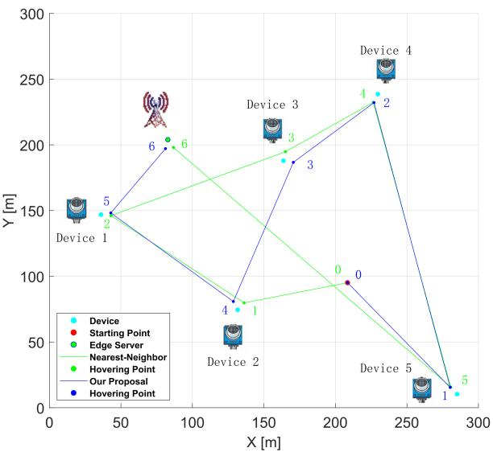  
(a) Trajectory comparison (Case 1)

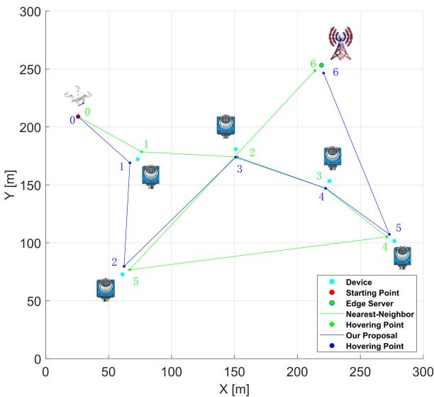  
(b) Trajectory comparison (Case 2)

Fig. 4. UAV trajectories of different algorithms.  
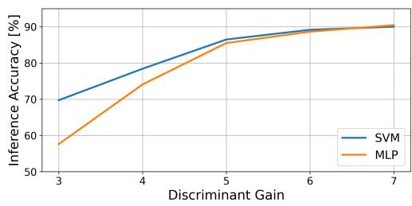  
Fig. 5. Inference accuracy versus discriminant gain.

MLP in this experiment, which may be attributed to the simpler classification task where a more complex model like MLP can be susceptible to overfitting.

3) Trade-off Between Inference Accuracy and Total Delay of Inference Task: Figure 6 illustrates the relationship between the required inference accuracy and the total task delay, revealing a critical performance-cost trade-off. The curves for both models show that when the accuracy requirement is low, the total delay increases slowly. However, as the accuracy requirement becomes increasingly strict (e.g., >90%), the total delay rises sharply, approaching the vertical asymptote. This non-linear relationship demonstrates a principle of diminishing returns. To achieve the highest levels of accuracy, the system must allocate disproportionately large resources (e.g., higher sensing power or longer communication times to ensure feature quality), which in turn leads to a significant increase in total delay. This highlights the importance of setting an appropriate accuracy target based on application needs to balance performance and latency.

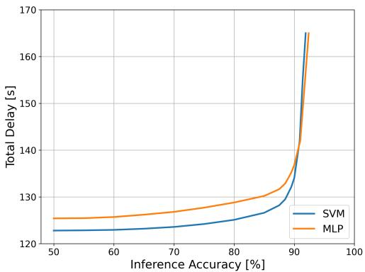  
Fig. 6. Inference accuracy versus total delay.

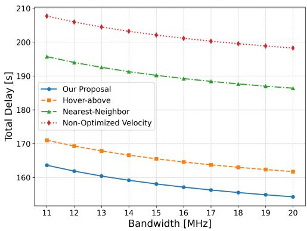  
Fig. 7. Bandwidth versus total delay.

4) Impact of Bandwidth on Total Delay of Inference Task: Figure 7 analyzes the impact of communication bandwidth, a critical resource, on the total task delay across the four different schemes. Communication time is a significant component of the total delay, and bandwidth directly dictates the feature transmission rate.

The results clearly show that for all four schemes, the total task delay decreases as the communication bandwidth increases. This is because a larger bandwidth reduces the time required for both the uplink transmission from devices to the UAV and the final offloading to the server. Furthermore, across all bandwidth conditions, our proposed scheme (blue curve) consistently achieves the lowest delay, outperforming all three baseline schemes. This sustained superiority is due to our algorithm’s joint optimization of the flight trajectory, hover points, velocity, and resource allocation, which minimizes the end-to-end delay.

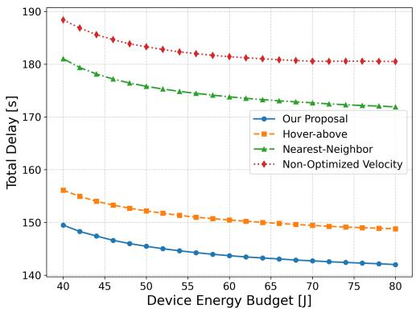  
Fig. 8. Device energy budget versus total delay.

5) Impact of Device Energy Budget on Total Delay of Inference Task: Figure 8 explores the effect of the ground devices’ energy budget on the total task delay. This budget is consumed by sensing, computation, and communication, and its limit can constrain the efficiency of these processes.

As shown in the figure, the total task delay for all schemes decreases as the device energy budget increases. A more generous budget provides the devices with greater flexibility to, for example, increase sensing power to improve data quality or boost transmission power to shorten communication time, both of which can lead to a lower overall delay. The curve’s decline is steeper at lower energy budgets, flattening out as the budget grows, which suggests that once energy is sufficient, other factors (like UAV flight time) become the primary bottleneck. Again, our proposed scheme demonstrates the best performance across all energy budget levels. The results highlight an intrinsic trade-off: relaxing energy budgets expands the feasible solution space, allowing for higher transmission power and flexible hovering, which directly reduces latency. Moreover, the proposed framework is data-agnostic, relying on feature statistics rather than raw waveforms. This ensures adaptability to real-world deployments, as the algorithm can directly ingest empirically measured feature data and hardware profiles without structural modification.

6) Impact of Energy Consumption Limit of UAV on Total Delay of Inference Task: Figure 9 presents the relationship between the UAV’s total energy consumption limit and the total task delay. The UAV’s energy is primarily consumed by flight, hovering, and communication, and this limit directly constrains its operational capabilities, especially its flight speed.

As the UAV’s energy limit is relaxed, the total delay for all schemes decreases significantly. This is because a larger energy budget allows the UAV to fly at higher speeds (since flight power is proportional to the cube of velocity), which drastically reduces the time spent in transit, a major component of the total delay. When the energy budget is tight, the UAV is forced to fly slowly, causing a sharp increase in delay. As the limit is relaxed further, the delay curve flattens, indicating that flight time is no longer the sole bottleneck. By intelligently balancing flight and hovering energy, our scheme again achieves the lowest total delay under all conditions.

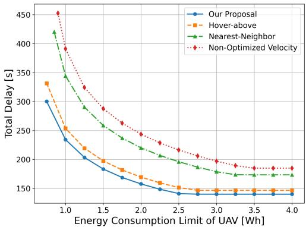  
Fig. 9. Energy consumption limit of UAV versus total delay.

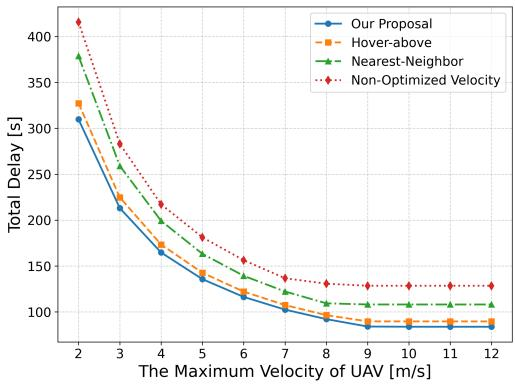  
Fig. 10. The maximum velocity of UAV versus total delay.

7) Impact of The Maximum Velocity of UAV on Total Delay of Inference Task: Figure 10 investigates the impact of the UAV’s maximum velocity $( V _ { m a x } )$ , a key hardware constraint, on the total task delay, analyzing the system’s sensitivity to the UAV’s physical performance.

The results show that when $V _ { m a x }$ is low $( \mathrm { e } . \mathrm { g } . , 2 - 7 m / s )$ the total delay is highly sensitive to its increase, with the curves showing a steep decline. In this region, flight time is a dominant factor in the total delay. However, the curves begin to plateau at around 9m/s. This reveals a critical inflection point: beyond this speed, increasing $V _ { m a x }$ yields diminishing returns in reducing the total delay. The reason is that flight time is no longer the primary system bottleneck; instead, the total delay becomes limited by other factors such as hovering, on-device processing, and communication times.This provides a practical guideline for system deployment regarding the required hardware capabilities of the UAV.

## VI. CONCLUSION

This paper proposed a novel UAV-assisted ISCC framework for edge inference, where a UAV acts as an agile aerial relay to collect feature vectors from distributed devices for collective AI tasks. To minimize end-to-end task delay, we formulated a joint optimization of UAV trajectory, device access sequence, and resource allocation, modeled as a nonconvex MINLP problem. An efficient two-stage algorithm was developed, combining a graph-theory-based device scheduling with an AO-based resource and trajectory optimization.

Simulation results verified its superiority, showing significant delay reductions compared to baseline schemes. This work also opens several promising directions. The framework can be extended to multi-UAV systems with cooperative trajectory planning and task allocation for improved scalability and latency. For large-scale deployments with massive devices, the proposed framework can seamlessly integrate heuristic solvers (e.g., Nearest Neighbor) to replace the backtracking step. In addition, dynamic device scheduling based on data quality and channel conditions could further enhance inference accuracy.

## ACKNOWLEDGMENT

Part of the described research work was conducted at the Core Facility Platform for Computer Science and Communication, provided by ShanghaiTech University.

## REFERENCES

[1] Y. Mao, X. Yu, K. Huang, Y.-J. Angela Zhang, and J. Zhang, “Green edge AI: A contemporary survey,” Proc. IEEE, vol. 112, no. 7, pp. 880–911, Jul. 2024.

[2] D. Wen, X. Li, Y. Zhou, Y. Shi, S. Wu, and C. Jiang, “Integrated sensing-communication-computation for edge artificial intelligence,” IEEE Internet Things Mag., vol. 7, no. 4, pp. 14–20, Jul. 2024.

[3] D. Wen, Y. Zhou, X. Li, Y. Shi, K. Huang, and K. B. Letaief, “A survey on integrated sensing, communication, and computation,” IEEE Commun. Surveys Tuts., vol. 27, no. 5, pp. 3058–3098, Oct. 2025.

[4] D. Wen et al., “Integrated sensing, communication, and computation for over-the-air federated edge learning,” IEEE Trans. Wireless Commun., vol. 25, pp. 2748–2762, 2026.

[5] X. Jiao, G. Zhu, W. Jiang, L. Chen, W. Luo, and D. Wen, “Sensing–communication–computation integration for federated edge learning with controllable model dropout,” IEEE Internet Things J., vol. 12, no. 12, pp. 19767–19781, Jun. 2025.

[6] M. Du, H. Zheng, M. Gao, X. Feng, J. Hu, and Y. Chen, “Integrated sensing, communication, and computation for over-the-air federated learning in 6G wireless networks,” IEEE Internet Things J., vol. 11, no. 21, pp. 35551–35567, Nov. 2024.

[7] P. Liu et al., “Toward ambient intelligence: Federated edge learning with task-oriented sensing, computation, and communication integration,” IEEE J. Sel. Topics Signal Process., vol. 17, no. 1, pp. 158–172, Jan. 2023.

[8] Y. He, G. Yu, Y. Cai, and H. Luo, “Integrated sensing, computation, and communication: System framework and performance optimization,” IEEE Trans. Wireless Commun., vol. 23, no. 2, pp. 1114–1128, Feb. 2024.

[9] Z. Zhou, X. Li, G. Zhu, B. Zhou, H. Xing, and K. Huang, “Integrated sensing-communication-computation design for energy efficient data processing,” IEEE Trans. Netw. Sci. Eng., vol. 13, pp. 1–15, 2026.

[10] D. Wen et al., “Task-oriented sensing, computation, and communication integration for multi-device edge AI,” IEEE Trans. Wireless Commun., vol. 23, no. 3, pp. 2486–2502, Mar. 2024.

[11] M. M. H. Shuvo, S. K. Islam, J. Cheng, and B. I. Morshed, “Efficient acceleration of deep learning inference on resource-constrained edge devices: A review,” Proc. IEEE, vol. 111, no. 1, pp. 42–91, Jan. 2023.

[12] A. Kag and I. Fedorov, “Efficient edge inference by selective query,” in Proc. Int. Conf. Learn. Represent., 2023, pp. 25–29.

[13] Z. Zhuang, D. Wen, Y. Shi, G. Zhu, S. Wu, and D. Niyato, “Integrated sensing-communication-computation for over-the-air edge AI inference,” IEEE Trans. Wireless Commun., vol. 23, no. 4, pp. 3205–3220, Apr. 2024.

[14] C. You and R. Zhang, “3D trajectory optimization in Rician fading for UAV-enabled data harvesting,” IEEE Trans. Wireless Commun., vol. 18, no. 6, pp. 3192–3207, Jun. 2019.

[15] T. Liu et al., “Task completion time minimization for UAV-enabled data collection in Rician fading channels,” IEEE Internet Things J., vol. 10, no. 2, pp. 1134–1148, Jan. 2023.

[16] J. Huang et al., “Dynamic UAV-assisted cooperative edge AI inference,” IEEE Trans. Wireless Commun., vol. 24, no. 1, pp. 615–628, Jan. 2025.

[17] X. Hu, K.-K. Wong, K. Yang, and Z. Zheng, “UAV-assisted relaying and edge computing: Scheduling and trajectory optimization,” IEEE Trans. Wireless Commun., vol. 18, no. 10, pp. 4738–4752, Oct. 2019.

[18] Y. Huang, Y. Hu, X. Yuan, and A. Schmeink, “Analytical optimal joint resource allocation and continuous trajectory design for UAV-assisted covert communications,” IEEE Trans. Wireless Commun., vol. 24, no. 1, pp. 213–227, Jan. 2025.

[19] M. Chen et al., “Distributed learning in wireless networks: Recent progress and future challenges,” IEEE J. Sel. Areas Commun., vol. 39, no. 12, pp. 3579–3605, Dec. 2021.

[20] X. Wang, Y. Han, V. C. M. Leung, D. Niyato, X. Yan, and X. Chen, “Convergence of edge computing and deep learning: A comprehensive survey,” IEEE Commun. Surveys Tuts., vol. 22, no. 2, pp. 869–904, 2nd Quart., 2020.

[21] H. Wu, Q. Zeng, and K. Huang, “Efficient multiuser AI downloading via reusable knowledge broadcasting,” IEEE Trans. Wireless Commun., vol. 23, no. 8, pp. 10459–10472, Aug. 2024.

[22] S. F. Yilmaz, B. Hasircioglu, and D. Gund ¨ uz, “Over-the-air ensemble¨ inference with model privacy,” in Proc. IEEE Int. Symp. Inf. Theory (ISIT), Jun. 2022, pp. 1265–1270.

[23] A. G. Howard et al., “MobileNets: Efficient convolutional neural networks for mobile vision applications,” 2017, arXiv:1704.04861.

[24] S. Liu, D. Wen, D. Li, Q. Chen, G. Zhu, and Y. Shi, “Energy-efficient optimal mode selection for edge AI inference via integrated sensingcommunication-computation,” IEEE Trans. Mobile Comput., vol. 23, no. 12, pp. 14248–14262, Dec. 2024.

[25] S. Hua, Y. Zhou, K. Yang, Y. Shi, and K. Wang, “Reconfigurable intelligent surface for green edge inference,” IEEE Trans. Green Commun. Netw., vol. 5, no. 2, pp. 964–979, Jun. 2021.

[26] Q. Lan, Q. Zeng, P. Popovski, D. Gund¨ uz, and K. Huang, “Progressive¨ feature transmission for split classification at the wireless edge,” IEEE Trans. Wireless Commun., vol. 22, no. 6, pp. 3837–3852, Jun. 2023.

[27] Y. Ke, Z. Utkovski, M. Heshmati, O. Simeone, J. Dommel, and S. Stanczak, “Neuromorphic wireless device-edge co-inference via the directed information bottleneck,” in Proc. Int. Conf. Neuromorphic Syst. (ICONS), Jul. 2024, pp. 16–23.

[28] Z. Liu, Q. Lan, and K. Huang, “Resource allocation for multiuser edge inference with batching and early exiting,” IEEE J. Sel. Areas Commun., vol. 41, no. 4, pp. 1186–1200, Apr. 2023.

[29] Z. Wang, A. E. Kalør, Y. Zhou, P. Popovski, and K. Huang, “Ultra-lowlatency edge inference for distributed sensing,” IEEE Trans. Wireless Commun., vol. 25, pp. 1908–1922, 2026.

[30] J. Shao, Y. Mao, and J. Zhang, “Task-oriented communication for multidevice cooperative edge inference,” IEEE Trans. Wireless Commun., vol. 22, no. 1, pp. 73–87, Jan. 2023.

[31] D. Wen, X. Jiao, P. Liu, G. Zhu, Y. Shi, and K. Huang, “Taskoriented over-the-air computation for multi-device edge AI,” IEEE Trans. Wireless Commun., vol. 23, no. 3, pp. 2039–2053, Mar. 2024.

[32] H. Yang, D. Wen, L. You, J. Wang, S. Wu, and Y. Shi, “MIMO over-theair computation for device-edge collaborative inference,” IEEE Trans. Wireless Commun., vol. 25, pp. 3363–3377, 2026.

[33] F. Liu et al., “Integrated sensing and communications: Toward dualfunctional wireless networks for 6G and beyond,” IEEE J. Sel. Areas Commun., vol. 40, no. 6, pp. 1728–1767, Jun. 2022.

[34] Y. Cui, F. Liu, X. Jing, and J. Mu, “Integrating sensing and communications for ubiquitous IoT: Applications, trends, and challenges,” IEEE Netw., vol. 35, no. 5, pp. 158–167, Sep. 2021.

[35] R. Gu, W. Xu, Z. Yang, D. Niyato, and A. Yener, “Task-oriented low-label semantic communication with self-supervised learning,” IEEE Trans. Wireless Commun., vol. 24, no. 11, pp. 9629–9644, Nov. 2025.

[36] C. Cai, X. Yuan, and Y.-J.-A. Zhang, “End-to-end learning for task-oriented semantic communications over MIMO channels: An information-theoretic framework,” IEEE J. Sel. Areas Commun., vol. 43, no. 4, pp. 1292–1307, Apr. 2025.

[37] D. Wang, D. Wen, Y. He, Q. Chen, G. Zhu, and G. Yu, “Joint device scheduling and resource allocation for ISCC-based multiview–multitask inference,” IEEE Internet Things J., vol. 11, no. 24, pp. 40814–40830, Dec. 2024.

[38] W. Chen, Y. He, G. Yu, J. Wang, and H. Luo, “Sensing framework design and performance optimization with action detection for ISCC,” IEEE Trans. Wireless Commun., vol. 24, no. 10, pp. 8361–8375, Oct. 2025.

[39] Y. Zhang, D. J. Love, J. V. Krogmeier, C. R. Anderson, R. W. Heath, and D. R. Buckmaster, “Challenges and opportunities of future rural wireless communications,” IEEE Commun. Mag., vol. 59, no. 12, pp. 16–22, Dec. 2021.

[40] J. Yu, J. Li, C. Du, X. Peng, and H. Guo, “An unmanned aerial vehicle magnetic detection system for archaeological exploration,” Electromagn. Sci., vol. 3, no. 3, Sep. 2025, Art. no. 0110122.

[41] J. Chen, Y. Xu, D. Yang, and T. Zhang, “UAV-assisted ISCC networks: Joint resource and trajectory optimization,” IEEE Wireless Commun. Lett., vol. 13, no. 9, pp. 2372–2376, Sep. 2024.

[42] W. Khawaja, I. Guvenc, D. W. Matolak, U. C. Fiebig, and N. Schneckenburger, “A survey of air-to-ground propagation channel modeling for unmanned aerial vehicles,” IEEE Commun. Surveys Tuts., vol. 21, no. 3, pp. 2361–2391, 3rd Quart., 2019.

[43] Y. Zeng and R. Zhang, “Energy-efficient UAV communication with trajectory optimization,” IEEE Trans. Wireless Commun., vol. 16, no. 6, pp. 3747–3760, Jun. 2017.

[44] X. Cao, J. Xu, and R. Zhang, “Mobile edge computing for cellularconnected UAV: Computation offloading and trajectory optimization,” in Proc. IEEE 19th Int. Workshop Signal Process. Adv. Wireless Commun. (SPAWC), Jun. 2018, pp. 1–5.

[45] F. Cheng et al., “UAV trajectory optimization for data offloading at the edge of multiple cells,” IEEE Trans. Veh. Technol., vol. 67, no. 7, pp. 6732–6736, Jul. 2018.

[46] J. Ji, K. Zhu, D. Niyato, and R. Wang, “Joint cache placement, flight trajectory, and transmission power optimization for multi-UAV assisted wireless networks,” IEEE Trans. Wireless Commun., vol. 19, no. 8, pp. 5389–5403, Aug. 2020.

[47] Y. Liu, “Wireless information and power transfer for multirelay-assisted cooperative communication,” IEEE Commun. Lett., vol. 20, no. 4, pp. 784–787, Apr. 2016.

[48] C. You, K. Huang, H. Chae, and B.-H. Kim, “Energy-efficient resource allocation for mobile-edge computation offloading,” IEEE Trans. Wireless Commun., vol. 16, no. 3, pp. 1397–1411, Mar. 2017.

[49] T. Micallef, I. Hussain, and K. Wu, “Multifunction transceiver for data communication, radar sensing and power transfer,” Electromagn. Sci., vol. 3, no. 2, Jun. 2025, Art. no. 0110122.

[50] A. Khalili, A. Rezaei, D. Xu, and R. Schober, “Energy-aware resource allocation and trajectory design for UAV-enabled ISAC,” in Proc. GLOBECOM IEEE Global Commun. Conf., Dec. 2023, pp. 4193–4198.

[51] A. Khalili, A. Rezaei, D. Xu, F. Dressler, and R. Schober, “Efficient UAV hovering, resource allocation, and trajectory design for ISAC with limited backhaul capacity,” IEEE Trans. Wireless Commun., vol. 23, no. 11, pp. 17635–17650, Nov. 2024.

[52] Q. Zeng, Y. Du, K. Huang, and K. K. Leung, “Energy-efficient resource management for federated edge learning with CPU-GPU heterogeneous computing,” IEEE Trans. Wireless Commun., vol. 20, no. 12, pp. 7947–7962, Dec. 2021.

[53] B. Widrow and I. Kollar,´ Quantization Noise: Roundoff Error in Digital Computation, Signal Processing, Control, and Communications. Cambridge, U.K.: Cambridge Univ. Press, 2008.

[54] D. E. Knuth, “Estimating the efficiency of backtrack programs,” Math. Comput., vol. 29, no. 129, pp. 121–136, Jan. 1975. [Online]. Available: http://www.jstor.org/stable/2005469

[55] S. Kirkpatrick, C. D. Gelatt Jr., and M. P. Vecchi, “Optimization by simulated annealing,” Science, vol. 220, no. 4598, pp. 671–680, 1983.

Dingzhu Wen (Member, IEEE) received the bachelor’s and master’s degrees from the Department of Information Science and Electronic Engineering, School of Information Science and Electronic Engineering, Zhejiang University in 2014 and 2017, respectively, and the Ph.D. degree from the Department of Electrical and Electronic Engineering, The University of Hong Kong in 2021. He is currently an Assistant Professor with the School of Information Science and Technology, ShanghaiTech University. His research interests include edge artificial intelligence (AI), task-oriented communications, and integrated sensing-communication-computation. He was a recipient of the Exemplary Reviewer of IEEE TRANSACTIONS ON COMMUNICATIONS in 2022 and the IEEE GlobeCom 2023 Workshop Best Paper Award. He was awarded the Excellent Mentor of ShanghaiTech University in 2023. He served as the Co-Organizer for several workshops at IEEE ICC 2025/2024, IEEE GlobeCom 2025, IEEE WCNC 2025, IEEE PIMRC 2024/2023, and IEEE VTC 2023- Fall; and the Session Chair for IEEE ICC 2024/2023, IEEE VTC 2023-Fall, and IEEE WCSP 2023. He co-organized tutorials at IEEE GlobeCom 2022, IEEE/CIC ICCC 2025, and IEEE PIMRC 2025.

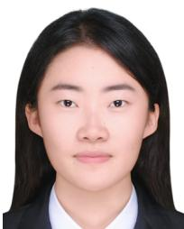

Shuo Zhang (Graduate Student Member, IEEE) received the B.E. degree from Xidian University, Xi’an, China, in 2024. She is currently pursuing the master’s degree with the School of Information Science and Technology, ShanghaiTech University, Shanghai, China.

Guangxu Zhu (Member, IEEE) received the Ph.D. degree in electrical and electronic engineering from The University of Hong Kong in 2019. He is currently a Senior Research Scientist and the Deputy Director of the Network and Machine Intelligence Center, Shenzhen Research Institute of Big Data, and an Adjunct Associate Professor with The Chinese University of Hong Kong, Shenzhen. His recent research interests include edge intelligence, semantic communications, and integrated sensing and communication. He was a recipient of the 2023 IEEE

ComSoc Asia–Pacific Best Young Researcher Award and the Outstanding Paper Award, the World’s Top 2% Scientists by Stanford University, the “AI 2000 Most Influential Scholar Award Honorable Mention,” the Young Scientist Award from UCOM 2023, and the Best Paper Award from WCSP 2013 and IEEE JSnC 2024. He serves as an Associate Editor for top-tier journals in IEEE, including IEEE TRANSACTIONS ON MOBILE COMPUTING, IEEE TRANSACTIONS ON WIRELESS COMMUNICATIONS, and IEEE WIRELESS COMMUNICATIONS LETTERS. He is the Vice Co-Chair of the IEEE ComSoc Asia–Pacific Board Young Professionals Committee.

Yuan Liu (Senior Member, IEEE) received the Ph.D. degree in electronic engineering from Shanghai Jiao Tong University, China, in 2013. Since 2013, he has been with the School of Electronic and Information Engineering, South China University of Technology, Guangzhou, where he is currently a Professor. His research interests include machine learning, large language models, and edge intelligence. He was an Editor of IEEE COMMUNI-CATIONS LETTERS and IEEE ACCESS.

Yuanming Shi (Senior Member, IEEE) received the B.S. degree in electronic engineering from Tsinghua University, Beijing, China, in 2011, and the Ph.D. degree in electronic and computer engineering from The Hong Kong University of Science and Technology (HKUST) in 2015. Since September 2015, he has been with the School of Information Science and Technology, ShanghaiTech University, where he is currently a Full Professor. His research interests include wireless communications, artificial intelligence, and convex optimization. He is an IET

Fellow. He is an Editor of IEEE TRANSACTIONS ON WIRELESS COMMU-NICATIONS, IEEE JOURNAL ON SELECTED AREAS IN COMMUNICATIONS, Journal of Communications and Information Networks, and Space Habitation.

Honglin Hu (Senior Member, IEEE) received the Ph.D. degree in communications and information system from the University of Science and Technology of China (USTC) in 2004. He was with the Future Radio, Siemens AG Communications, Munich, Germany. Since 2009, he has been a Professor with Shanghai Institute of Microsystem and Information Technology (SIMIT). Since 2016, he joined Shanghai Advanced Research Institute (SARI), Chinese Academy of Sciences (CAS). Since 2025, he became a Full Tenured Professor with

ShanghaiTech University. He received the 2016 IEEE Jack Neubauer Memorial Award and the Best Paper Award of IEEE GlobeCom 2016. He was the Leading Guest Editor for several special issues in IEEE WIRELESS COMMUNICATIONS and IEEE Communications Magazine. He was a Finland Distinguished Professor (FiDiPro) at VTT, Finland.