# UAV-Assisted Security-Aware Vehicular Edge Computing: A TD3-Enhanced Scheme

Tao Ren, Student Member, IEEE, Jun Cui, Student Member, IEEE, Xueyan Cao, Member, IEEE, and Yuzheng Ren, Member, IEEE

Abstract—Unmanned aerial vehicles (UAVs) equipped with edge computing capabilities offer a promising solution for the coverage and flexibility of terrestrial networks, but they also face challenges in low-latency, security-aware data transmission. To address this, a UAV-assisted, security-aware vehicular edge computing system is established and supported by comprehensive channel, communication, and computation models. To balance computing latency and security-aware offloading in the presence of an eavesdropper, we formulate a problem that minimizes the maximum computation latency by optimizing offloading, UAV movement, and vehicle association. Considering the dynamic nature of vehicular networks and the need for real-time decisionmaking, a twin delayed deep deterministic policy gradient (TD3)- based UAV-assisted security-aware vehicular edge computing system is proposed to dynamically adjust movement and offloading policies, thereby satisfying system constraints. Extensive simulations demonstrate that the TD3 scheme exhibits outstanding convergence stability, outperforming other benchmark schemes in cumulative reward by at least 20%, reducing overall system latency by at least 1.7%, and showcasing its robustness and adaptability through an algorithmic detail comparison.

Index Terms—Unmanned aerial vehicle, security-aware edge computing, deep reinforcement learning

## I. INTRODUCTION

## A. Background

The rapid advancement and widespread adoption of 6G networks, along with the promotion of new communication standards, have fueled a significant surge in innovative invehicle mobile applications, such as smart navigation and autonomous driving, which are becoming increasingly integral to our daily lives [1]–[3]. However, these applications require low latency that vehicles alone cannot provide [4]. To address this challenge, unmanned aerial vehicle (UAV)-assisted edge computing has emerged as a pivotal solution, offering flexible and efficient resource allocation that significantly reduces task computation delay [5]–[8]. This is crucial for autonomous driving applications, which require real-time processing and low-latency responses. The mobility of UAVs enables dynamic adjustments in server locations, ensuring the optimal distribution of edge computing resources to meet varying user demands across different geographical areas [9]. This capability enables the development of more robust, resilient networks by leveraging UAV aerial mobility to rapidly restore network coverage in affected areas, thereby enhancing overall network reliability.

The necessity of security-aware computing in vehicular networks (V2X) cannot be overstated, as the integrity and confidentiality of data are paramount to preventing unauthorized access and ensuring the safety of both passengers and vehicles. The incorporation of UAVs into vehicular edge computing offers distinct advantages, enabling dynamic adjustment of their positions to minimize the risk of eavesdropping and interception and thereby enhancing the security of data transmission during offloading. Moreover, the aerial mobility of UAVs enables the creation of temporary, secure communication zones, which can be particularly beneficial when ground-based infrastructure is compromised or unavailable. Despite these benefits, UAV-assisted security-aware vehicular edge computing faces significant challenges, including UAV resource constraints, the complexity of dynamic management, and the need for real-time decision-making to ensure security and low-latency offloading. It is necessary to design a secureaware and low-latency edge computing solution.

## B. Related Works

1) UAV deployment optimization in vehicular edge computing: Representative studies have investigated UAV trajectory or deployment optimization to enhance system performance. For example, [9] studied dynamic UAV deployment and computation offloading in UAV-enabled mobile edge computing (MEC) systems, demonstrating the importance of UAV mobility in reducing service latency. [10] and [11] focused on energy-efficient UAV trajectory and resource allocation designs, where UAV mobility is optimized to balance communication and computation energy consumption. [12] investigated UAV-assisted ultra-reliable and low-latency offloading, emphasizing UAV placement for delay-sensitive services. In vehicular scenarios, [13] optimized UAV deployment and user association to minimize system delay, highlighting the impact of spatial dynamics caused by vehicle mobility. More recently, multi-UAV deployment and coordination problems have been studied in [14] and [15], where deep reinforcement learning (DRL)-based approaches are applied to address the complexity of UAV trajectory planning.

However, most existing works optimize UAV deployment or trajectory in isolation or under simplified offloading models, and often assume static or homogeneous user behaviors, which limits their applicability to highly dynamic V2X with coupled offloading and security considerations.

2) Computation offloading in UAV-assisted edge computing: Early works such as [10] and [11] investigated joint computation offloading and UAV trajectory optimization under energyefficiency objectives. [14] and [16] further explored task scheduling and load balancing in multi-UAV edge computing systems. As decision variables become increasingly complex, DRL has been widely adopted for optimizing computation offloading. [15] applied multi-agent DRL for UAV trajectory planning in MEC systems, while [17] studied online learningbased offloading and resource management for UAV-assisted MEC.

Nevertheless, most existing offloading studies focus primarily on latency or energy efficiency, and do not explicitly consider security threats such as eavesdropping, especially in vehicular environments where wireless channels and user associations change rapidly.

3) Anti-eavesdropping design and DRL-based securityaware offloading: Several works have addressed physicallayer security in UAV-enabled MEC systems. [18] investigated joint computation offloading and secure communication design in UAV-enabled MEC. [19] and [20] studied secure transmission strategies in UAV-MEC networks with aerial or ground eavesdroppers (Eves). More recent studies have further incorporated security considerations into UAV-assisted edge computing systems from different perspectives. For example, [21] investigated security-aware designs for multi-UAV deployment, task offloading, and service placement, while [22] focused on cooperative secure transmission and computation against mobile collusive Eves. [23] studied secure UAV-aided integrated sensing, communication, and computation systems, and [24] explored multi-IRS-assisted secure communication in UAV-MEC networks. DRL has also been applied to secure UAV communication problems. [25] employed reinforcement learning to improve secure transmission performance in multi-UAV MEC networks, while [26] studied DRL-based trajectory planning for secure UAV communications.

However, most existing security-oriented works focus on secure communication without jointly optimizing computation offloading and UAV mobility. As a result, the joint impact of UAV mobility, offloading decisions, association relationships, and security-aware transmission in vehicular edge computing scenarios remains insufficiently explored.

4) Summary and research gap: In particular, many works focus on optimizing UAV trajectory or deployment without jointly considering computation offloading decisions and dynamic association relationships in vehicular environments. Similarly, existing computation offloading studies typically assume static network topologies or limited mobility, which makes them less suitable for highly dynamic vehicular scenarios where UAV mobility, user distribution, and task demands are tightly coupled. Moreover, although DRL has been widely adopted to address complex optimization problems in UAV-assisted edge computing, most existing DRL-based approaches consider a limited set of decision variables or lowdimensional action spaces. As a result, their ability to handle high-dimensional, strongly coupled control problems remains limited.

Motivated by these gaps, this paper develops a unified DRL-based framework to jointly optimize UAV mobility, computation offloading ratios, and association decisions in a UAV-assisted vehicular edge computing system. By explicitly modeling the strong coupling among these variables and adopting a high-dimensional continuous control formulation, the proposed approach aims to minimize long-term system latency in dynamic vehicular environments.

To further clarify the relationship between this work and existing studies, Table I provides a structured comparison of representative works on UAV-assisted edge computing and security-aware offloading. The comparison focuses on whether key system aspects, including vehicular scenarios, UAV mobility optimization, computation offloading, user-edge association, security consideration, and joint high-dimensional control, are explicitly addressed. As shown in Table I, most existing works consider only a subset of these aspects, often treating mobility, offloading, association, and security in isolation or in loosely coupled manners. In contrast, the proposed work jointly incorporates all these factors into a unified learning framework, thereby motivating the problem formulation and methodology presented in the following sections.

## C. Contributions

Motivated by these considerations, this paper proposes a UAV-assisted security-aware vehicular edge computing system. Unlike existing UAV-assisted MEC studies that separately optimize trajectory design, task offloading, or communication security, the problem considered involves a strongly coupled interaction among UAV mobility, security-aware transmission conditions, computation offloading, and association decisions. These coupled variables jointly affect communication quality and computation latency, leading to a high-dimensional hybrid control problem with mixed continuous and discrete actions. Conventional decomposition-based optimization methods become difficult to apply due to the dynamic vehicular topology and the strong interdependence among decision variables. Therefore, this work focuses on developing a system-level DRL framework capable of handling such tightly coupled optimization in dynamic UAV-assisted security-aware vehicular edge computing environments. The main contributions of this work are summarized as follows:

We formulate a UAV-assisted security-aware vehicular edge computing system that jointly considers UAV mobility, computation offloading, and vehicle-edge association decisions under dynamic vehicular environments. The resulting problem constitutes a strongly coupled hybrid continuous-discrete optimization task that affects both communication and computation latency.

• To handle discrete association decisions within a continuous-control framework, a continuous relaxation mechanism is introduced. The actor network outputs continuous association scores that are mapped to discrete offloading targets during execution, enabling differentiable policy learning while avoiding combinatorial optimization.

TABLE I: COMPARISON WITH RELATED WORKS
<table><tr><td>Work</td><td>UAV Mobility</td><td>Joint Offload &amp; Mobility</td><td>Association</td><td>Security</td><td>Joint Control</td><td>DRL</td></tr><tr><td>[7]</td><td>√</td><td>√</td><td></td><td></td><td>√</td><td></td></tr><tr><td>[9]</td><td>√</td><td>√</td><td></td><td></td><td></td><td></td></tr><tr><td>[10]</td><td>√</td><td>√</td><td></td><td></td><td></td><td></td></tr><tr><td>[11]</td><td>√</td><td></td><td></td><td></td><td></td><td></td></tr><tr><td>[12]</td><td>√</td><td>√</td><td></td><td></td><td></td><td></td></tr><tr><td>[13]</td><td>√</td><td></td><td>√</td><td></td><td></td><td></td></tr><tr><td>[14]</td><td>√</td><td></td><td></td><td></td><td></td><td>√</td></tr><tr><td>[15]</td><td>√</td><td></td><td></td><td></td><td>√</td><td>√</td></tr><tr><td>[16]</td><td>V</td><td></td><td></td><td></td><td></td><td></td></tr><tr><td>[17]</td><td>√</td><td></td><td></td><td>√</td><td></td><td>√</td></tr><tr><td>[18]</td><td>√</td><td>√</td><td></td><td>√</td><td></td><td></td></tr><tr><td>[19]</td><td>√</td><td></td><td></td><td>√</td><td></td><td></td></tr><tr><td>[20]</td><td>√</td><td></td><td></td><td>√</td><td></td><td></td></tr><tr><td>[21]</td><td>V</td><td>√</td><td>√</td><td>√</td><td>√</td><td></td></tr><tr><td>[22]</td><td>√</td><td>√</td><td></td><td>√</td><td></td><td></td></tr><tr><td>[23]</td><td>√</td><td></td><td></td><td>√</td><td></td><td></td></tr><tr><td>[24]</td><td>√</td><td></td><td></td><td>√</td><td></td><td></td></tr><tr><td>[25]</td><td>√</td><td></td><td></td><td>√</td><td></td><td>√</td></tr><tr><td>This work</td><td>√</td><td>√</td><td>√</td><td>√</td><td>√</td><td>√</td></tr></table>

• A TD3-based learning framework with centralized training and distributed execution is developed to improve learning stability for the considered strongly coupled optimization problem. Specifically, our proposed scheme achieves cumulative rewards that are 20% higher than the second-best benchmark algorithm while reducing latency by at least 1.7%. This highlight demonstrates its robustness and adaptability.

The remainder of this paper is organized as follows. Section II presents the system model and problem formulation. Section III describes the proposed TD3-based vehicular security-aware edge computing scheme. Section IV provides the simulation results and performance comparisons. Finally, Section V concludes the paper and outlines future work.

## II. SYSTEM MODEL AND PROBLEM FORMULATION

This section provides a detailed introduction to the system’s specific model, including system settings, the transmission protocol, the channel model, and the computational model. On this basis, we clearly define the mathematical formulation of the optimization problem, which aims to minimize the maximum computational latency across all users while ensuring security-aware offloading and satisfying various system constraints.

## A. System Setting and Transmission Protocol

In Fig. 1, we depict a UAV-assisted security-aware vehicular edge computing system comprising a single-antenna BS, J single-antenna vehicle user equipments (VUEs), K single-antenna UAVs with edge servers, and a malicious Eve. The computation tasks generated by VUEs are associated with delay-sensitive vehicular applications, such as real-time environmental perception, cooperative sensing, and safetyrelated data processing. These applications typically involve moderate data sizes but impose stringent latency requirements, which makes them suitable for edge-assisted execution rather than local processing. The BS and UAVs provide additional computational resources to handle offloaded tasks, especially when VUEs’ local processing power is insufficient or when the data is time-sensitive.

As shown in Fig. 2, we divide T into L equal time slots, each of which is denoted as $T / L .$ Each time slot includes two sub-slots: the parameter optimization (Param. Opt.) sub slot with length η0 and the computation (Comp.) sub-slot with length η1. In this system, orthogonal resource allocation ensures that each VUE is assigned distinct frequency bands, thereby preventing interference during concurrent offloading operations. However, Eve is modeled as a passive eavesdropper that affects the achievable conditions for secure transmission, and VUEs must select appropriate offloading devices to ensure offloading security. The selection process involves assessing the potential risks associated with the BS or UAVs and selecting devices that minimize the risk of data interception by Eve. Denote $\mathcal { I } = \{ 1 , . . . , J \}$ as the set of numbers of VUEs. $K = \{ 1 , . . . , K \}$ represents the set of UAVs.

## B. Channel Model

At the time slot l, the positions of the offloading device are represented as

$$
Z _ { k } [ l ] = \left\{ \begin{array} { l l } { { ( 0 , 0 , 0 ) } } & { { ( k = 0 ) } } \\ { { ( x _ { k } [ l ] , y _ { k } [ l ] , H ) } } & { { ( 1 \leq k \leq K ) , } } \end{array} \right.\tag{1}
$$

where $k = 0$ represents the BS, the remainder represents k-th UAV, and H is the fixed altitude at which the UAV swarm flies. The location of trusted VUE $j$ is denoted as

$$
V _ { j } [ l ] = ( x _ { j } [ l ] , y _ { j } [ l ] , 0 ) .\tag{2}
$$

Eve’s exact coordinates are expressed as

$$
\hat { V } _ { \mathrm { E } } [ l ] = ( \hat { x } _ { \mathrm { E } } [ l ] , \hat { y } _ { \mathrm { E } } [ l ] , 0 ) .\tag{3}
$$

Assuming that the UAV swarm can obtain the estimated position of Eve at regular intervals, the estimated coordinates are given by

$$
V _ { \mathrm { E } } [ l ] = ( x _ { \mathrm { E } } [ l ] , y _ { \mathrm { E } } [ l ] , 0 ) .\tag{4}
$$

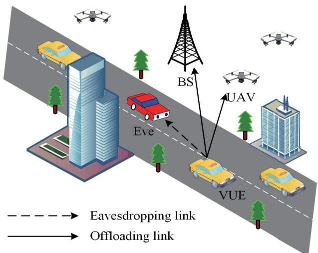  
Fig. 1: Model of the UAV-assisted security-aware vehicular edge computing system.

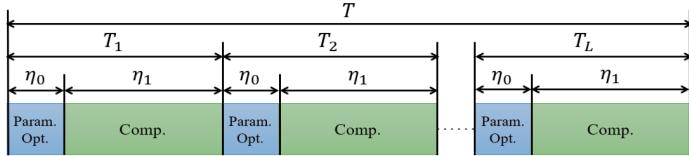  
Fig. 2: Time slot division.

A Gaussian error model is employed to measure the error between the estimated position and the exact position of Eve, as follows

$$
x _ { \mathrm { E } } = \hat { x } _ { \mathrm { E } } + \Delta x _ { \mathrm { E } } , \quad y _ { \mathrm { E } } = \hat { y } _ { \mathrm { E } } + \Delta y _ { \mathrm { E } } , \quad z _ { \mathrm { E } } = 0 ,\tag{5}
$$

where $\Delta x _ { \mathrm { E } }$ and ∆yE represent the estimation errors, following a normal distribution ${ \mathcal { N } } ( 0 , \sigma ^ { 2 } )$ . The channel between j-th VUE and k-th offloading device or Eve can be represented as

$$
h _ { j , k } [ l ] = \sqrt { C _ { 0 } \left( \frac { d _ { j , k } } { d _ { 0 } } \right) ^ { \alpha } } \left( \sqrt { \frac { \zeta } { \zeta + 1 } } h ^ { \mathrm { L o S } } + \sqrt { \frac { 1 } { \zeta + 1 } } h ^ { \mathrm { N L o S } } \right) ;
$$

$$
h _ { j , \mathrm { E } } [ l ] = \sqrt { C _ { 0 } \left( \frac { d _ { j , \mathrm { E } } } { d _ { 0 } } \right) ^ { \alpha } } \left( \sqrt { \frac { \zeta } { \zeta + 1 } } h ^ { \mathrm { L o S } } + \sqrt { \frac { 1 } { \zeta + 1 } } h ^ { \mathrm { N L o S } } \right) ,\tag{6}
$$

where $C _ { 0 }$ is the channel gain at the reference distance $d _ { 0 } ,$ α is the path loss exponent, ζ is the Rician factor, $h ^ { \mathrm { L o S } }$ and $h ^ { \mathrm { N L o S } }$ represent the channel coefficients for the line-of-sight (LoS) and non-line-of-sight (NLoS) components, respectively. $d _ { j , k } = \| V _ { j } [ l ] - Z _ { k } [ l ] \|$ and $d _ { j , \mathrm { E } } = \bigl \| \dot { V _ { j } } [ l ] - V _ { \mathrm { E } } [ l ] \bigr \|$ are the distances from the VUE j to the BS or UAV k and to the Eve, respectively.

Given the limited service coverage of edge computing devices and the risk of data leakage from Eve during data offloading, different VUEs select different devices as offloading targets based on actual conditions. We introduce an association coefficient $A _ { j , k }$ that indicates whether a specific device has been selected for offloading, taking values 0 or 1. When $A _ { j , k } = 1$ , it indicates that j-th VUE selects k-th device as the target for offloading; otherwise, no link has been established between the two devices for offloading purposes. Therefore, the offloading rate between i-th VUE and k-th offloading device is given by

$$
R _ { j } [ l ] = { \cal B } \log _ { 2 } \left( 1 + \frac { \displaystyle \sum _ { k = 0 } ^ { K } A _ { j , k } [ l ] P | h _ { j , k } [ l ] | ^ { 2 } } { \sigma _ { j } ^ { 2 } } \right) ,\tag{7}
$$

which is influenced by the channel bandwidth B, VUE’s transmission power $P ,$ , channel gain $| h _ { j , k } [ l ] | ^ { 2 }$ , and noise power $\big ( \sigma _ { j } ^ { 2 } \big )$ ). The eavesdropping rate of Eve is given by

$$
R _ { j , \mathrm { E } } [ l ] = B \log _ { 2 } \left( 1 + \frac { P | h _ { j , \mathrm { E } } [ l ] | ^ { 2 } } { \sigma _ { \mathrm { E v e } } ^ { 2 } } \right) ,\tag{8}
$$

which quantifies the information leakage to Eve, and $\sigma _ { \mathrm { E v e } } ^ { 2 }$ represents the noise power at Eve’s receiver. The securityaware offloading rate of j-th VUE is defined as the difference between the offloading rate and the eavesdropping rate

$$
R _ { j } ^ { \mathrm { s e c } } [ l ] = \left[ R _ { j } [ l ] - R _ { j , \mathrm { E } } [ l ] \right] ^ { + } .\tag{9}
$$

Here, $[ \cdot ] ^ { + }$ denotes the positive part, meaning that if $R _ { j } [ l ] -$ $R _ { j , \mathrm { E } } [ l ]$ is negative, then $R _ { j } ^ { \mathrm { s e c } } [ l ] = 0$

To explicitly characterize the impact of insufficient communication security, we introduce a secure-rate threshold $R _ { \mathrm { t h } }$ that represents the minimum acceptable level of secure transmission. The effective secure transmission rate is defined as

$$
\begin{array} { r } { \tilde { R } _ { j } ^ { \mathrm { s e c } } [ l ] = \left\{ \begin{array} { l l } { R _ { j } ^ { \mathrm { s e c } } [ l ] , } & { R _ { j } ^ { \mathrm { s e c } } [ l ] \geq R _ { \mathrm { t h } } , } \\ { \beta R _ { j } ^ { \mathrm { s e c } } [ l ] , } & { R _ { j } ^ { \mathrm { s e c } } [ l ] < R _ { \mathrm { t h } } , } \end{array} \right. } \end{array}\tag{10}
$$

where $0 < \beta < 1$ is a degradation factor.

## C. Computation Model

The computational capabilities of VUEs, BS, and UAVs are denoted by $f _ { \mathrm { V U E } } , ~ f _ { \mathrm { B S } } .$ , and $f _ { \mathrm { U A V } }$ , respectively. The local computation latency, the uplink transmission latency, and the offloading computation latency of VUE $j$ are given by

$$
\begin{array} { r l r } { t _ { j } ^ { \mathrm { l o c } } [ l ] = \frac { \left( 1 - \rho _ { j } [ l ] \right) D _ { j } [ l ] C _ { \mathrm { V U E } } } { f _ { \mathrm { V U E } } } , } & { } & \\ { t _ { j } ^ { \mathrm { u p } } [ l ] = \frac { \rho _ { j } [ l ] D _ { j } [ l ] } { \tilde { R } _ { j } ^ { \mathrm { s e c } } [ l ] } , } & { } & \\ { t _ { j } ^ { \mathrm { c o m } } [ l ] = \frac { \rho _ { j } [ l ] D _ { j } [ l ] C _ { k } } { f _ { k } } , } & { } & \end{array}\tag{11}
$$

where $\rho _ { j }$ is the offloading ratio of computation data offloaded from VUE j to the BS or UAV k, $D _ { j }$ is the task data size of VUE $j , C _ { \mathrm { V U E } }$ and $C _ { k }$ denote the central processing unit cycles per bit required at the VUE and k-th device, respectively. $f _ { k }$ is the computational power of k-th offloading device, when $k = 0 , f _ { k } = f _ { \mathrm { B S } }$ and the rest are fUAV.

## D. Problem Formulation

In this section, we formulate the optimization problem for UAV-assisted security-aware vehicular edge computing. The objective is to minimize the maximum computation latency among all VUEs, while ensuring security-aware offloading and satisfying various system constraints. The problem can be mathematically expressed as follows

$$
\begin{array} { r l } { \underset { \rho _ { i } , \lambda _ { i } , [ 1 ] , \rho _ { i } , \{ i \} } { \overset { { \operatorname* { m i n } } } { \longrightarrow } } \frac { \underset { 0 } { \overset { { \rho } } { \longrightarrow } } } { \underset { \operatorname* { m a x } } { \vdots } } \{ t _ { j } ^ { \mathrm { i n } } , t _ { j } ^ { \mathrm { i n } } + t _ { j } ^ { \mathrm { s a m } } \} } & { } \\ { \mathrm { s . t . } } & { \ \mathrm { C 1 } : \ \operatorname* { m a x } \{ t _ { j } ^ { \mathrm { i n } } , t _ { j } ^ { \mathrm { i n } } + t _ { j } ^ { \mathrm { s a m } } \} \leq \eta _ { 1 } , } \\ & { \ \mathrm { C 2 } : \ 0 \ \leq \rho _ { j } \ \leq 1 , } \\ & { \ \mathrm { C 3 } : A _ { j , k } [ \| \in \{ 0 , 1 \} ] \underset { k = 0 } { \overset { { \kappa } } { \longrightarrow } } A _ { j , k } [ \| = 1 , } \\ & { \ \mathrm { ~ \ ~ } 0 \leq \underset { j = 1 } { \overset { { \eta } } { \longrightarrow } } A _ { j , k } [ \| \leq J _ { i } ] } \\ & { \ \mathrm { ~ \ ~ \ } \mathrm { C 4 } : \ \| Z _ { k } [ [ 1 ] ] \leq \eta _ { k } - \eta _ { \mathrm { m a x } } , } \\ & { \ \mathrm { C 3 } : \ \| Z _ { k } [ [ 1 ] ] \geq Z _ { k } [ [ 1 ] ] \geq D _ { k } , \ \tilde { k } \in \mathcal { K } , k \neq \tilde { k } , } \end{array}\tag{12}
$$

where C1 ensures that the computation latency for each VUE, whether it is computed locally or offloaded, does not exceed the computation duration $\eta _ { 1 }$ . C2 denotes that the offloading ratio $\rho _ { j }$ is bounded between 0 and 1, indicating that each VUE can choose to offload any fraction of its computation tasks to the BS or UAVs. C3 ensures that each VUE can select only one device (either the BS or a UAV) for offloading, while multiple VUEs can select the same device simultaneously. C4 restricts the maximum movement distance of each UAV within a time slot to $\eta _ { 0 } \cdot v _ { \mathrm { m a x } } .$ . C5 ensures that UAVs maintain a safe distance D from each other to avoid collisions.

Notably, the dynamic and uncertain nature of UAV-assisted security-aware vehicular edge computing poses challenges for traditional optimization methods, such as linear and integer programming. These methods require precise mathematical modeling and can become computationally intensive, making them less suitable for real-time applications. Moreover, their performance may degrade significantly when faced with large-scale problems or increased environmental uncertainty. Fortunately, DRL offers a promising alternative, which learns an optimal policy through interaction with the environment without requiring explicit mathematical models. Specifically, TD3 is more adaptable to environmental changes, allowing it to automatically adjust policies to new challenges, making it ideal for secure and efficient computation offloading in a UAVassisted security-aware vehicular edge computing system.

## III. TD3-BASED UAV-ASSISTED SECURITY-AWARE VEHICULAR EDGE COMPUTING SCHEME

This section outlines the theoretical foundations and implementation of TD3, demonstrating its application to our optimization problem for secure-aware, low-latency computation offloading. It should be emphasized that the contribution of this work does not lie in proposing a new DRL algorithm. Instead, the main contribution is the development of a unified optimization framework that adapts the standard TD3 algorithm to a strongly coupled UAV-assisted security-aware vehicular edge computing problem.

## A. Problem Transformation

To address the challenges of UAV-assisted security-aware vehicular edge computing, the original optimization problem (12) needs to be reformulated into a more manageable form. This conversion is critical for the practical application of DRL algorithms. The process involves formulating the problem as a Markov decision process (MDP), a fundamental mathematical framework that underlies DRL algorithms. An MDP is a stochastic process that satisfies the Markov property and serves as a framework for sequential decision-making. In an MDP, an agent is a machine learning entity that perceives the state of the external environment and makes decisions accordingly. An agent continuously refines its choices by interacting with the environment and leveraging feedback. After each decision, the environment provides the agent with the corresponding reward [27]–[29].

The MDP can be formally defined as $\mathcal { M } ( S , A , P , R , \gamma )$ where S denotes the set of all possible states, A represents the set of all actions the agent can execute, P signifies the state transition probability function, which calculates the likelihood of transitioning to a new state given an action in the current state, R is the reward function, used to quantify the feedback the agent obtains when taking an action in a specific state, and the discount factor $0 \leq \gamma \leq 1$ is utilized to weigh the impact of future rewards on cumulative rewards. In the preceding paragraphs, the policy function can be expressed as

$$
\pi ( a | s ) = P ( A _ { t } = a | S _ { t } = s ) .\tag{13}
$$

Let $\pi$ represent the set of policies, where the element $\pi ( a | s )$ denotes the probability of taking action a in a specific state s. The reward function is defined as

$$
R ( s | a ) = E [ R _ { t + 1 } | S _ { t } = s | A _ { t } = a ] .\tag{14}
$$

The return is given by

$$
G _ { t } = R _ { t + 1 } + \gamma R _ { t + 2 } + \cdot \cdot \cdot + \gamma R _ { T } ,\tag{15}
$$

which represents the discounted sum of all rewards received from time t onwards in a Markov reward chain.

In the proposed scheme, the BS acts as a centralized agent during training, collecting global state information and learning a joint policy. During execution, the learned policy is applied in a distributed manner, where UAVs execute actions independently. This centralized training and distributed execution design ensures scalability and low communication overhead. UAVs can obtain state information on VUEs and Eve using cameras or radar. Based on the state information obtained by the UAVs, the BS will instruct them to perform the corresponding actions. The definitions of state space, action space, and reward function are as follows:

1) Global state space: Our system environment comprises J UAVs, K VUEs, and an Eve, with the state space encompassing the positions of all entities and the task sizes of all VUEs. The state space is composed of several dimensions:

$s _ { 1 } \colon$ The state space includes the three-dimensional coordinates of entities. Each entity’s position is represented by three coordinates $( x , y , z )$ , where z represents the altitude for UAVs and can be zero for BS, ground-based VUEs, and Eve. This results in a dimensionality of $3 ( J + K + 2 )$ for positional information, accounting for all entities. State space $s _ { 1 }$ is given by

$$
s _ { 1 } = \{ \mathbf { V } , \mathbf { Z } , V _ { \mathrm { E } } \} ,\tag{16}
$$

where $\mathbf { V } = [ V _ { 1 } , \cdots , V _ { J } ]$ and $\mathbf { Z } = [ Z _ { 0 } , \cdots , Z _ { K } ]$ are row vectors of size $1 \times 3 J$ and $1 \times 3 ( K + 1 )$ , respectively, containing all VUE, BS, and UAV position states information.

$s _ { 2 } \colon$ The state space also includes the computational tasks assigned to each VUE, which dictate the amount of data each VUE needs to process. The dimension for VUE tasks is J. So, $s _ { 2 }$ is defined as

$$
s _ { 2 } = \{ \mathbf { W } \} .\tag{17}
$$

where $\mathbf { W } = [ W _ { 1 } , \cdots , W _ { J } ]$ is a row vector of size $1 \times J .$ containing task states information for J VUEs.

Therefore, the total dimensionality of the state space is the sum of the dimensions of positional information and VUE tasks

$$
s _ { \mathrm { d i m } } = 3 ( J + K + 2 ) + J .\tag{18}
$$

In summary, the state space is defined as

$$
s = \{ s _ { 1 } , s _ { 2 } \} .\tag{19}
$$

This multi-dimensional state space provides the agent with a comprehensive snapshot of the environment at each time step, enabling it to learn policies that balance spatial dynamics, task distributions, and security considerations to optimize overall system performance.

2) High-dimensional joint action space: The action space consists of three tightly coupled components. The actor network outputs a raw, continuous action vector, which is then mapped to practical control actions via explicit transformation mechanisms, ensuring feasibility and physical interpretability.

$a _ { 1 } \colon$ For each VUE $j ,$ the actor outputs a raw scalar

$$
\tilde { \rho } _ { j } \in ( - 1 , 1 ) ,\tag{20}
$$

which is mapped to the actual offloading ratio by

$$
\rho _ { j } = \frac { \tilde { \rho } _ { j } + 1 } { 2 } ,\tag{21}
$$

where $\rho _ { j } \in [ 0 , 1 ]$ denotes the fraction of the computation task offloaded to edge servers, and the remaining portion is processed locally. This affine transformation guarantees feasibility while preserving continuous control. Therefore, action space $a _ { 1 }$ is expressed as

$$
a _ { 1 } = \{ \rho \mid \rho _ { j } \in [ 0 , 1 ] \} ,\tag{22}
$$

where $\rho = [ \rho _ { 1 } , \cdot \cdot \cdot , \rho _ { J } ]$ is a row vector of size $1 \times J .$

$a _ { 2 } \colon$ For each UAV k, the actor outputs two raw continuous variables

$$
\begin{array} { r } { \tilde { v } _ { k } \in ( - 1 , 1 ) , \quad \tilde { h } _ { k } \in ( - 1 , 1 ) , } \end{array}\tag{23}
$$

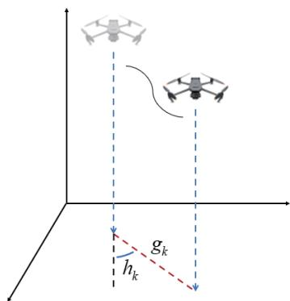  
Fig. 3: UAV action schematic.

representing the normalized movement magnitude and direction, respectively. The actual mobility control is obtained by

$$
v _ { k } = \frac { v _ { \operatorname* { m a x } } } { 2 } \left( \tilde { v } _ { k } + 1 \right) , \quad h _ { k } = \pi \cdot \tilde { h } _ { k } ,\tag{24}
$$

where $v _ { \mathrm { m a x } }$ denotes the maximum allowable movement distance per time slot, and $h _ { k } \in [ - \pi , \pi ]$ represents the movement direction. This mapping ensures bounded UAV motion and smooth trajectory evolution. As shown in Fig. 3, $g _ { k } ~ = ~ v _ { k } \times \eta _ { 1 }$ represents the radius of UAV k movement. This method maximizes the flexibility of UAV movement, allowing them to explore the environment more thoroughly. Find the most suitable location $Z _ { k }$ for UAV deployment through such movement. So, action space $a _ { 2 }$ is expressed as

$$
a _ { 2 } = \left\{ { \bf G } | g _ { k } \in [ 0 , 1 ] , h _ { k } \in [ - \pi , \pi ] \right\} ,\tag{25}
$$

where $\mathbf { G } = [ g _ { 1 } , \cdots , g _ { K } , h _ { 1 } , \cdots , h _ { K } ]$ is ${ \mathrm { ~ a ~ 1 ~ } } \times 2 K$ row vector containing all UAV movement actions.

$a _ { 3 } \colon$ Association decisions are inherently discrete. To enable TD3 to operate in a continuous action space, a continuous relaxation mechanism is adopted. For each VUE $j$ and offloading device k, the actor outputs a raw association score

$$
\tilde { A } _ { j , k } \in ( - 1 , 1 ) .\tag{26}
$$

These scores are transformed into normalized association weights using a softmax function

$$
A _ { j , k } = \frac { \exp ( \tilde { A } _ { j , k } ) } { \sum _ { k ^ { \prime } } \exp ( \tilde { A } _ { j , k ^ { \prime } } ) } .\tag{27}
$$

During execution, the actual offloading target is determined by

$$
k ^ { * } = \arg \operatorname* { m a x } _ { k } A _ { j , k } .\tag{28}
$$

The proposed continuous relaxation primarily affects the training stage, while the final deployment decision is still determined by argmax-based discrete association selection. Therefore, the relaxation preserves the feasibility of practical association while enabling differentiable policy learning in high-dimensional hybrid action spaces. Moreover, when the learned association scores exhibit sufficiently large separation margins, the approximation error introduced by the relaxation becomes negligible. Overall, the explicit action mapping ensures that all control decisions generated by the TD3 actor are bounded, feasible, and physically interpretable. The action space also includes an association matrix

$$
\mathbf { A } = \left[ \begin{array} { c c c c } { A _ { 1 , 1 } } & { A _ { 1 , 2 } } & { \cdots } & { A _ { 1 , K + 1 } } \\ { A _ { 2 , 1 } } & { A _ { 2 , 2 } } & { \cdots } & { A _ { 2 , K + 1 } } \\ { \vdots } & { \vdots } & { \ddots } & { \vdots } \\ { A _ { J , 1 } } & { A _ { J , 2 } } & { \cdots } & { A _ { J , K + 1 } } \end{array} \right] _ { J \times ( K + 1 ) } ,\tag{29}
$$

where each element indicates whether VUE $j$ is associated with BS or UAV $k ,$ and the last column represents direct offloading to the BS. This is represented as

$$
a _ { 3 } = \{ { \bf A } \ | \ A _ { j , k } \in \{ 0 , 1 \} \} .\tag{30}
$$

The total action space is given by

$$
a = \{ a _ { 1 } , a _ { 2 } , a _ { 3 } \} .\tag{31}
$$

This multidimensional action space enables complex interactions between UAVs and VUEs, enabling the algorithm to learn policies that balance computation offloading, UAV movement, and VUE association to optimize overall system latency.

3) Security-aware reward function: The main objective in setting the reward function is to minimize the total time cost for task completion, including local computation time, uplink transmission time, and offloading computation time for each VUE. The total reward r at each time step is calculated based on the following considerations

$$
r = - \sum _ { j = 1 } ^ { J } \operatorname* { m a x } \{ t _ { j } ^ { \mathrm { l o c } } , t _ { j } ^ { \mathrm { u p } } + t _ { j } ^ { \mathrm { c o m } } \} .\tag{32}
$$

Based on the above formulation, the long-term optimization objective is to minimize the expected cumulative latency over time, which can be expressed as

$$
\operatorname* { m i n } _ { \pi } \mathbb { E } _ { \pi } \left[ \sum _ { t = 0 } ^ { \infty } \gamma ^ { t } D ( t ) \right] ,\tag{33}
$$

where $D ( t )$ represents the total system latency at time slot t. This formulation naturally fits into the MDP framework and enables the application of TD3 for continuous control. The objective of this work is to minimize computation latency while ensuring security-aware offloading. Instead of explicitly maximizing the secure rate, we treat communication security as an implicit constraint. Specifically, when the secure rate falls below a specific safe level, the corresponding offloading decision is considered insecure and results in a degraded effective transmission rate. This degradation directly increases uplink transmission latency and is therefore penalized in the latency-oriented reward.

As a result, the agent is encouraged to optimize latency only within secure operating regions, without introducing explicit secrecy terms or hard constraints that may hinder learning stability. This design reflects practical system requirements, where latency optimization is meaningful only when secure communication is guaranteed.

B. TD3-Based UAV-Assisted Security-Aware Vehicular Edge Computing

After reformulating the original joint optimization problem into an MDP-compatible form, the TD3 algorithm is employed to solve it. TD3 enhances the stability and robustness of the learned policy by strategically using two critics [30]. Furthermore, incorporating delayed policy updates in TD3 smooths learning, thereby preventing suboptimal solutions and making TD3 particularly well-suited for scenarios with intricate decision-making processes and continuous action spaces [31], [32]. The overall learning and optimization procedure is illustrated in Fig. 4 and summarized in Algorithm 1.

At each time step $t ,$ the agent observes the global system state $s _ { t } \in \ S ,$ which captures network-wide information, including UAV locations, vehicle states, and task sizes. Based on the observed state, the agent selects an action $a _ { t } ~ \in ~ { \cal A }$ according to a deterministic policy $\mu ( \cdot )$ parameterized by $\theta _ { \mu } .$

The learning objective is to minimize the long-term expected system latency, which can be equivalently formulated as maximizing the cumulative discounted reward

$$
\operatorname* { m a x } _ { \mu } \ J ( \mu ) = \mathbb { E } _ { \mu } \left[ \sum _ { t = 0 } ^ { \infty } \gamma ^ { t } r ( s _ { t } , a _ { t } ) \right] ,\tag{34}
$$

where $\gamma \in \mathsf { \Gamma } ( 0 , 1 )$ is the discount factor, and the immediate reward $r ( s _ { t } , a _ { t } )$ is defined as the negative system latency induced by executing action $a _ { t }$ in state $s _ { t }$

The TD3 algorithm initializes one actor network $\mu ,$ two critic networks $Q _ { \theta _ { 1 } }$ and $Q _ { \theta _ { 2 } }$ , and their corresponding target networks $\mu ^ { \prime }  \mu , Q _ { \theta _ { 1 } } ^ { \prime }  Q _ { \theta _ { 1 } }$ , and $Q _ { \theta _ { 2 } } ^ { \prime } ~  ~ Q _ { \theta _ { 2 } }$ . The learning rates of the actor and critic networks are denoted by $\phi _ { \mu }$ and $\phi _ { Q }$ , respectively. In addition, the exploration noise variance $\sigma ^ { 2 }$ , target smoothing noise, clipping bound $c ,$ soft update coefficient τ , and policy delay parameter $M _ { \mathrm { d e l a y s } }$ are initialized. A replay buffer R is constructed to store transition tuples $\left( { { s _ { t } } , { a _ { t } } , { r _ { t } } , { s _ { t + 1 } } } \right)$

During training, the algorithm proceeds over $M _ { \mathrm { e p i s o d e s } }$ episodes. At the beginning of each episode, the initial state s is sampled from the environment E. Within each episode, for each time step, the action is selected by

$$
a _ { t } = \mu ( s _ { t } ) + \epsilon _ { t } , \quad \epsilon _ { t } \sim \mathcal { N } ( 0 , \sigma ^ { 2 } ) ,\tag{35}
$$

where $\epsilon _ { t }$ denotes the exploration noise. The selected action is executed in the environment, yielding an immediate reward $r _ { t }$ and the next state $s _ { t + 1 }$ , which are stored in the replay buffer $R .$

Once the replay buffer contains sufficient samples, a minibatch of N transitions $\left\{ \left( s _ { i } , a _ { i } , r _ { i } , s _ { i } ^ { \prime } \right) \right\}$ is randomly sampled. For each sampled transition, a target action is generated using the target actor network with policy smoothing

$$
a _ { i } ^ { \prime } = \mu ^ { \prime } ( s _ { i } ^ { \prime } ) + \epsilon _ { i } ^ { \prime } , \quad \epsilon _ { i } ^ { \prime } \sim \mathcal { N } ( 0 , \sigma ^ { 2 } ) ,\tag{36}
$$

followed by clipping to limit excessive variance,

$$
a _ { i } ^ { \prime } = \mathrm { c l i p } ( a _ { i } ^ { \prime } , - c , c ) .\tag{37}
$$

The target Q-value is then computed as

$$
y _ { i } = r _ { i } + \gamma \operatorname* { m i n } \left( Q _ { \theta _ { 1 } } ^ { \prime } ( s _ { i } ^ { \prime } , a _ { i } ^ { \prime } ) , \ Q _ { \theta _ { 2 } } ^ { \prime } ( s _ { i } ^ { \prime } , a _ { i } ^ { \prime } ) \right) ,\tag{38}
$$

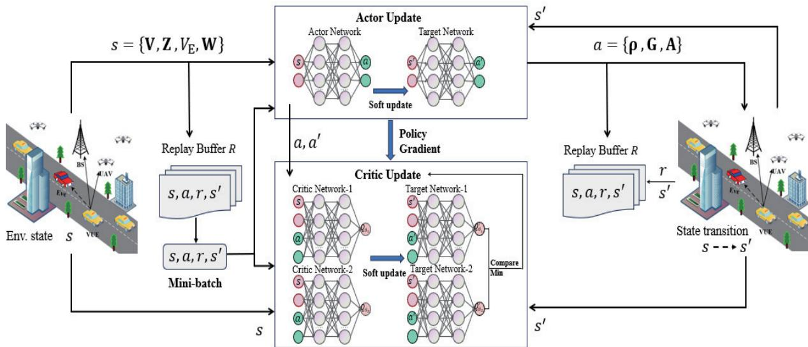  
Fig. 4: TD3-based vehicular security-aware edge computing scheme.

where the minimum operator is used to mitigate overestimation bias.

Each critic network is updated by minimizing the Bellman error over the mini-batch

$$
\mathcal { L } ( \theta _ { e } ) = \frac { 1 } { N } \sum _ { i = 1 } ^ { N } \left( Q _ { \theta _ { e } } ( s _ { i } , a _ { i } ) - y _ { i } \right) ^ { 2 } , \quad e \in \{ 1 , 2 \} ,\tag{39}
$$

which leads to the gradient descent updates

$$
\theta _ { e } \gets \theta _ { e } - \phi _ { Q } \nabla _ { \theta _ { e } } \mathcal { L } ( \theta _ { e } ) , \quad e \in \{ 1 , 2 \} .\tag{40}
$$

To further enhance training stability, the actor network is updated with a delay. Specifically, every $M _ { \mathrm { d e l a y s } }$ steps, the actor parameters are updated by maximizing the expected Q-value estimated by the first critic

$$
\nabla _ { \theta _ { \mu } } J ( \mu ) = \frac { 1 } { N } \sum _ { i = 1 } ^ { N } \nabla _ { a } Q _ { \theta _ { 1 } } { \left( s _ { i } , a \right) } \big | _ { a = \mu ( s _ { i } ) } \nabla _ { \theta _ { \mu } } \mu ( s _ { i } ) ,\tag{41}
$$

followed by the gradient ascent update

$$
\theta _ { \mu }  \theta _ { \mu } + \phi _ { \mu } \nabla _ { \theta _ { \mu } } J ( \mu ) .\tag{42}
$$

Finally, the target networks are softly updated to track the learned networks

$$
\mu ^ { \prime }  \tau \mu + ( 1 - \tau ) \mu ^ { \prime } ,\tag{43}
$$

$$
Q _ { \theta _ { 1 } } ^ { \prime }  \tau Q _ { \theta _ { 1 } } + ( 1 - \tau ) Q _ { \theta _ { 1 } } ^ { \prime } ,\tag{44}
$$

$$
Q _ { \theta _ { 2 } } ^ { \prime }  \tau Q _ { \theta _ { 2 } } + ( 1 - \tau ) Q _ { \theta _ { 2 } } ^ { \prime } .\tag{45}
$$

Although the core TD3 update rules follow the standard formulation, the proposed framework customizes the state representation, action mapping, and training architecture to accommodate the tightly coupled nature of the UAVassisted, security-aware vehicular edge computing system. These system-aware adaptations preserve TD3’s theoretical properties while enabling effective learning in a highdimensional, strongly coupled optimization environment.

TABLE II: PARAMETER SETTINGS
<table><tr><td>Parameter</td><td>Description</td><td>Value</td></tr><tr><td> $\overline { { d _ { 0 } } }$ </td><td>Reference distance</td><td>1</td></tr><tr><td> $C _ { 0 }$ </td><td>Channel gain at  $d _ { 0 }$ </td><td>1</td></tr><tr><td> $_ \alpha$ </td><td>Path loss index</td><td>3.5</td></tr><tr><td> $P$ </td><td>Transmitting power of the VUE</td><td>0.5W</td></tr><tr><td> $B$ </td><td>Bandwidth</td><td>1MHz</td></tr><tr><td> $\zeta _ { _ - }$ </td><td>Rician factor</td><td>1</td></tr><tr><td> $\sigma ^ { 2 }$ </td><td>Noise power</td><td>(1e-9)W</td></tr><tr><td>CvUE,  $C _ { k }$ </td><td>CPU cycles per bit required</td><td>1000</td></tr><tr><td> $\gamma$ </td><td>Discount factor</td><td>0.99</td></tr><tr><td> $\phi _ { \mu } , \phi _ { Q }$ </td><td>Networks’ learning rate</td><td>0.0001, 0.001</td></tr><tr><td>C</td><td>Noise clip</td><td>0.2</td></tr><tr><td> $R$ </td><td>Replay buffer size</td><td>10000</td></tr><tr><td>κ</td><td>mini-batch size</td><td>64</td></tr><tr><td> $M _ { \mathrm { { e p i s o d e s } } }$ </td><td>Number of episodes</td><td>100</td></tr><tr><td> $M _ { \mathrm { s t e p s } }$ </td><td>Number of step</td><td>200</td></tr></table>

## IV. SIMULATION RESULTS

In this section, we perform comprehensive simulations and comparisons to evaluate the effectiveness of our proposed system model and scheme.

A 100×100 meter area is designated for UAV operations in our simulation environment. The BS is anchored at $Z _ { 0 } ~ = ~ ( 2 5 , 2 5 , 0 ) ^ { T }$ of the Cartesian coordinate system, VUE’s position and the initial positions of UAVs are randomly generated, and UAVs fly at a fixed altitude of 30 meters. The TD3 algorithm employs a neural network architecture comprising an actor network and two critic networks. The actor network and the critic network each consist of three fully connected layers. The TD3 agent, encapsulated in the TD3 agent class, utilizes a replay buffer to store and sample experiences, facilitating learning from past interactions. The agent also incorporates techniques such as soft updates for the target networks and exploration noise to balance exploration and exploitation. In addition to TD3, we implement other DRL algorithms for comparison, including deep deterministic policy gradient (DDPG), proximal policy optimization (PPO), and a random policy. The DDPG algorithm uses a single critic network and an actor network with architectures similar to those of TD3, but with distinct update rules. The PPO algorithm employs a more complex policy update rule that includes entropy regularization and clipped surrogate objectives. The random policy serves as a baseline for evaluating the effectiveness of learned policies relative to random actions. The selected baselines primarily serve to evaluate the effectiveness and learning stability of the proposed framework across representative DRL paradigms. Table II shows the other parameter settings for simulations. The key hyperparameters were determined via a controlled search: with a fixed training budget (100 episodes × 200 steps), three to four candidate values per parameter were selected on a logarithmic or uniform grid; each combination was manually trained, and the resulting validation return was recorded. The set yielding the highest average return with $< 5 \%$ fluctuation in the last 10 episodes was adopted as the default. Although not an exhaustive grid search, this procedure covers the critical parameter region and ensures reproducibility. The performance of different algorithms is evaluated under various conditions, including different numbers of UAVs and users, varying task sizes, and other factors.

Algorithm 1 TD3-Based UAV-Assisted Security-Aware ${ \mathrm { V e } } -$   
hicular Edge Computing Algorithm   
1: Initialize actor network $\mu ,$ critic networks $Q _ { \theta _ { 1 } } , Q _ { \theta _ { 2 } }$   
2: Initialize target networks $\mu ^ { \prime }  \mu , Q _ { \theta _ { 1 } } ^ { \prime }  Q _ { \theta _ { 1 } } , Q _ { \theta _ { 2 } } ^ { \prime } $   
$Q _ { \theta _ { 2 } }$   
3: Set learning rates $\phi _ { \mu } , \phi _ { Q }$ , discount factor $\gamma ,$ exploration   
noise ϵ   
4: Set target smoothing coefficient τ , policy noise $\epsilon _ { \pi } ,$ noise   
clip c   
5: Initialize replay buffer $R$   
6: for episode $= 1$ to $M _ { \mathrm { e p i s o d e s } }$ do   
7: Initialize state s from environment E   
8: for ste $) = 1$ to $M _ { \mathrm { s t e p s } }$ do   
9: Select action $a = \mu ( s ) + \epsilon$ where $\epsilon \sim \mathcal { N } ( 0 , \sigma ^ { 2 } )$   
10: Execute action a in environment $E ,$ observe reward   
r and next state $s ^ { \prime }$   
11: Store $( s , a , r , s ^ { \prime } )$ in replay buffer R   
12: If R is full, sample a mini-batch of experiences   
from R   
13: for each $( s _ { i } , a _ { i } , r _ { i } , s _ { i } ^ { \prime } )$ in mini-batch do   
14: Compute target actions $a _ { i } ^ { \prime } = \mu ^ { \prime } ( s _ { i } ^ { \prime } ) + \epsilon ^ { \prime }$ where   
$\epsilon ^ { \prime } \sim \mathcal { N } ( 0 , \sigma ^ { 2 } )$   
15: Clip noise: $a _ { i } ^ { \prime } = \mathrm { c l i p } ( a _ { i } ^ { \prime } , - c , c )$   
16: Compute target Q-values: $\begin{array} { r l r l } { y _ { i } } & { { } = } & { r _ { i } { \mathrm { ~ + ~ } } } \end{array}$   
γ min $( Q _ { \theta _ { 1 } } ^ { \prime } ( s _ { i } ^ { \prime } , \bar { a _ { i } ^ { \prime } } ) , Q _ { \theta _ { 2 } } ^ { \prime } ( s _ { i } ^ { \prime } , a _ { i } ^ { \prime } ) )$   
17: end for   
18: Update critic networks:   
19: $\begin{array} { r } { \theta _ { 1 }  \theta _ { 1 } - \phi _ { Q } \nabla _ { \theta _ { 1 } } ( \frac { 1 } { N } \sum ( Q _ { \theta _ { 1 } } ( s _ { i } , a _ { i } ) - y _ { i } ) ^ { 2 } ) } \end{array}$   
20: $\begin{array} { r } { \theta _ { 2 }  \theta _ { 2 } - \phi _ { Q } \nabla _ { \theta _ { 2 } } ( \frac { 1 } { N } \sum ( Q _ { \theta _ { 2 } } ( s _ { i } , a _ { i } ) - y _ { i } ) ^ { 2 } ) } \end{array}$   
21: Every $M _ { \mathrm { d e l a y } }$ steps, update actor network:   
22: $\theta _ { \mu } \gets$   
23: $\begin{array} { r } { \theta _ { \mu } + \phi _ { \mu } \dot { \nabla } _ { \theta _ { \mu } } \left( \frac { 1 } { N } \sum \operatorname* { m i n } ( Q _ { \theta _ { 1 } } ( s _ { i } , \mu ( s _ { i } ) ) , Q _ { \theta _ { 2 } } ( s _ { i } , \mu ( s _ { i } ) ) ) \right) } \end{array}$   
24: Soft update target networks:   
25: $\mu ^ { \prime }  \tau \mu + ( 1 - \tau ) \mu ^ { \prime }$   
26: $Q _ { \theta _ { 1 } } ^ { \prime }  \tau Q _ { \theta _ { 1 } } + ( 1 - \tau ) Q _ { \theta _ { 1 } } ^ { \prime }$   
27: $Q _ { \theta _ { 2 } } ^ { \bar { \prime } ^ { \ \bot } }  \tau Q _ { \theta _ { 2 } } + ( 1 - \tau ) Q _ { \theta _ { 2 } } ^ { \bar { \prime } ^ { \ \bot } }$   
28: Update state $s \gets s ^ { \prime }$   
29: end for   
30: end for   
31: return Trained actor network $\mu$

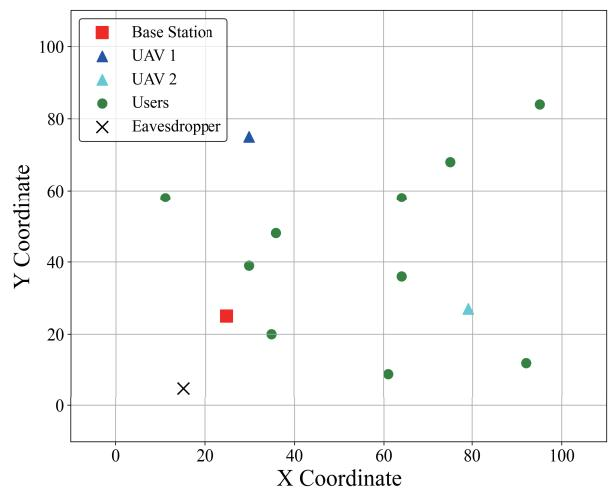

Base Station   
100 UAV 1   
UAV 2   
Users   
80 X Eavesdropper   
▲   
  
60 ●   
  
40   
●   
  
20   
  
X   
0   
0 20 40 60 80 100   
X Coordinate   
Fig. 5: UAV Deployment.   
-400   
-600   
-800   
-1000   
-1200   
TD3   
TD3\_random deployment of UAV3   
-1400   
0 20 40 60 80 100   
Episode  
Fig. 6: Reward against episode with TD3 and random deployment of UAVs.

## A. UAV Deployment

Fig. 5 shows the final UAV deployment determined by the TD3 algorithm, illustrating a strategic configuration that optimizes security-aware offloading for VUEs. The UAVs, marked with blue and cyan triangles, are positioned near the green circles representing VUEs, thereby facilitating efficient offloading. Conversely, these UAVs are deliberately kept at a distance from the black cross, which signifies Eve, to minimize the risk of data interception during offloading. This strategic placement not only ensures that the UAVs can effectively serve users but also guarantees that sensitive computational tasks are conducted securely, away from potential security breaches. The red square denotes the fixed location of the BS, which serves as the central hub for wireless communication. Overall, the TD3 algorithm demonstrates its ability to dynamically adjust UAV locations to enhance secure communication and meet users’ computational needs, all within the defined system constraints.

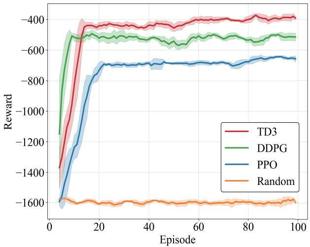  
Fig. 7: Reward convergence with different algorithms.

The performance comparison shown in Fig. 6 highlights the impact of UAV positioning within the TD3 framework (shaded areas indicate 95% confidence intervals across 10 independent runs). The red line represents a scenario in which all variables, including UAV positions, are optimized; the blue line indicates a case in which UAV positions are randomly deployed, and TD3 optimizes the other variables. Both curves show an overall upward trend. Specifically, the red curve shows a rapid rise in reward that stabilizes at a higher level around the 20th episode. In contrast, the blue curve exhibits a slower ascent and stabilizes at a significantly lower reward level after approximately 40 episodes. This comparison reveals that deploying UAVs is critical in achieving higher cumulative rewards and faster convergence. The optimized positioning facilitates more efficient learning and policy execution by TD3, thereby improving overall performance. While the algorithm can still achieve some optimization with a random UAV position, the results demonstrate that incorporating UAV positioning into the optimization process enhances its effectiveness.

## B. Algorithm Performance Versus System Configuration

Fig. 7 compares the convergence performance of the proposed TD3 algorithm against other DRL approaches, including the DDPG, PPO, and a random policy, over 100 episodes. Except for the random policy, all curves show a trend of cumulative rewards increasing with episode. TD3 demonstrates superior performance, achieving a higher cumulative reward that stabilizes after approximately 20 episodes. This indicates that TD3 is more effective in learning optimal policies under the given conditions. DDPG, on the other hand, converges more rapidly, reaching a stable performance within a shorter number of episodes. However, its final reward is lower than TD3’s, suggesting that while DDPG quickly finds a relatively good-performing policy, it may not explore the action space as thoroughly as TD3 and may thus become trapped in a local optimum. This could be due to overestimation of Qvalues in DDPG, which TD3 addresses by using two critics and a delayed policy update mechanism, leading to more robust, higher-performing policies. PPO exhibits moderate performance, with its reward accumulation relatively stable but lower than TD3. The random policy serves as a baseline, demonstrating the lowest cumulative reward and highlighting the effectiveness of learned policies over random actions. These results highlight the robustness and efficiency of the TD3 algorithm in complex, dynamic eavesdropping communication environments compared with other algorithms.

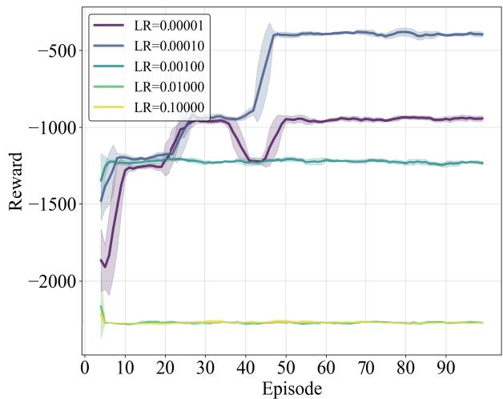  
Fig. 8: Reward convergence with different learning rates.

The convergence performance of the TD3 algorithm under various learning rates is illustrated in Fig. 8. The overall trend indicates that as the learning rate decreases, the reward level typically increases, reaching its maximum at 0.00001. This suggests that a lower learning rate helps produce more stable, higher-performing policies. It is evident that higher learning rates initially lead to faster convergence; however, they also result in poorer performance characterized by increased instability and oscillations as training progresses. Specifically, learning rates of 0.01000 and 0.10000 result in significantly worse performance, with reward values remaining consistently low throughout training. Conversely, when the learning rate is set to 0.00001 and 0.00010, the algorithm converges more slowly, requiring more training episodes to approach the optimal solution. However, the learning rate 0.00100 balances convergence speed and performance stability, yielding the best overall results. Thus, an appropriate learning rate is crucial for ensuring both the algorithm’s performance and its convergence speed, highlighting the importance of avoiding rates that are either too large or too small.

To comprehensively evaluate the performance of various methods, we maintained a constant number of VUEs while incrementally increasing the number of UAVs. The total latency (the sum of the maximum computation latency of each VUE) is used as the performance metric. As shown in Fig. 9a, the total latency for system VUEs consistently decreased as the quantity of UAVs increased. This reduction in latency is attributable to the expanded options available to VUEs for offloading their workloads, allowing them to select more suitable UAVs or BS. Consequently, individual VUE latencies decreased, thereby reducing overall system latency. Notably, the TD3 algorithm consistently maintained the lowest total system latency across all scenarios. When managing three UAVs, TD3’s latency performance improved by 38% over PPO and by an additional 1% over DDPG. However, when the number of UAVs increased to three, TD3’s effect on reducing system latency was less pronounced. We hypothesize that this is due to the unchanged total task size and the presence of a more computationally powerful BS, rendering the addition of UAVs less impactful in reducing overall system latency.

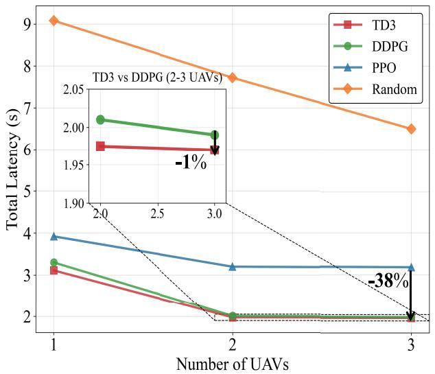  
(a)

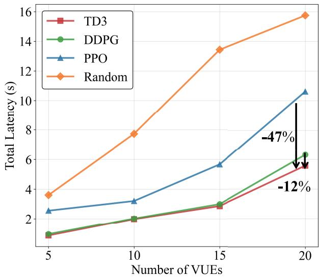  
(b)  
Fig. 9: Performance comparison of different approaches with the number of UAVs and VUEs.

To further assess the algorithms presented in this paper, we kept the number of UAVs constant and progressively increased the number of VUEs. The resulting system latency curves for different methods are depicted in Fig. 9b. Since the number of VUEs is positively correlated with the total task size, and the number of edge computing devices remained unchanged, the total system latency for VUEs continued to rise. In this context, TD3 was once again shown to be the most effective, exhibiting a slower increase in latency than other algorithms. In user-intensive scenarios, such as 20 VUEs, the TD3 algorithm improved performance by 47% over PPO and by 12% over DDPG. This indicates that TD3 is better equipped to handle the growing task demands associated with increasing VUEs without significantly compromising performance.

## C. Algorithm Performance Versus Resource Budget

Figs. 10, 11, and 12 collectively provide a comprehensive evaluation of total latency across different algorithms, varying with total task size, transmit power, and bandwidth.

Fig. 10 illustrates the impact of increasing total task size on latency. As the total task size increases, the latency of all algorithms generally increases, indicating greater computational demand. Specifically, the TD3 algorithm consistently achieves the lowest latency, indicating its effectiveness at handling larger task sizes. The random policy, on the other hand, demonstrates the highest latency, highlighting the detrimental effects of unoptimized task distribution on system performance. The DDPG and PPO algorithms perform moderately, with DDPG showing a slightly better performance than PPO. This comparison underscores the significance of algorithm selection in minimizing latency, with TD3 emerging as the most robust solution.

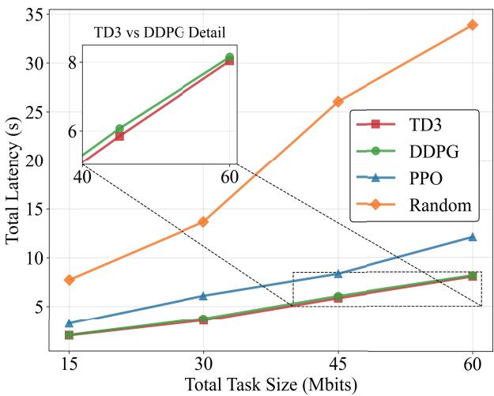  
Fig. 10: Total latency with total task size with different algorithms.

Fig. 11 examines the effect of transmit power on latency. Latency decreases with increasing transmit power across the main algorithms, with TD3 and DDPG again demonstrating lower latency, especially at higher power levels. This indicates their ability to leverage additional power to enhance performance. The random policy exhibits the highest latency across all power levels, emphasizing the importance of optimized power management. PPO exhibits a stable performance, albeit lower than TD3 and DDPG, indicating that while it can effectively manage power, it does not maximize latency reduction.

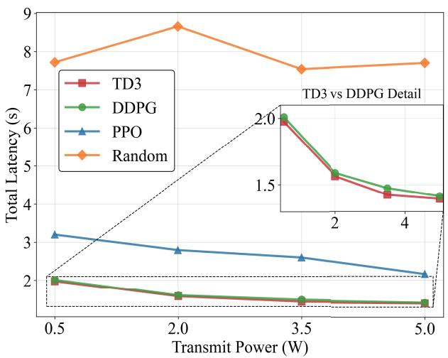  
Fig. 11: Total latency with transmit power with different algorithms.

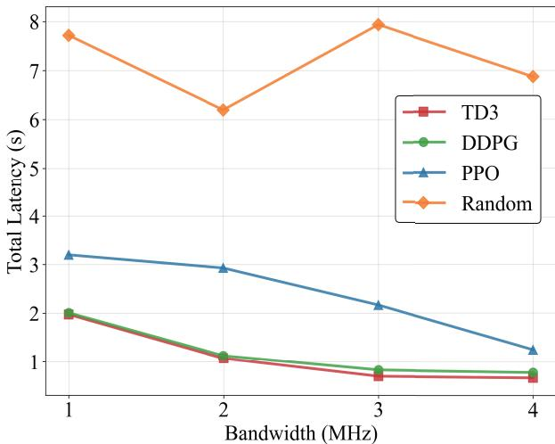  
Fig. 12: Reward convergence with different bandwidth.

Fig. 12 assesses latency in relation to bandwidth. The main algorithm shows a trend toward decreasing system latency as bandwidth increases. TD3 and DDPG maintain lower latency than PPO and random, particularly at higher bandwidths. This suggests that TD3 and DDPG are more adept at leveraging increased bandwidth to improve performance. The random policy exhibited the highest latency and remained inefficient in resource utilization.

In summary, TD3 consistently outperforms other algorithms across varying operational parameters by effectively managing latency, making it a preferred choice for environments where efficient latency control is essential. These findings underscore the importance of algorithm selection in improving performance in dynamic communication systems.

## D. Impact of Transmit Power on System Latency

To further investigate the impact of transmit power on system latency, we conduct an additional study in which transmit power is optimized while other decision variables are fixed. Specifically, UAV deployment, computation offloading ratios, and association decisions are set to the values obtained from the converged TD3 policy. The transmit power is then optimized independently in a one-dimensional continuous space. A grid-based search is adopted, where each iteration evaluates a single candidate transmit power level. The horizontal axis in Fig. 13 represents the iteration index of the power search process, and the vertical axis denotes the corresponding total system latency.

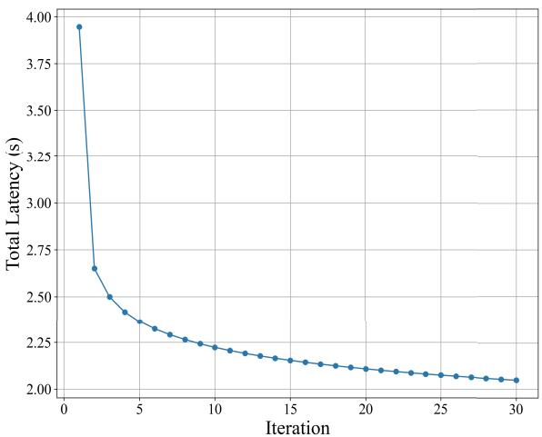  
Fig. 13: Impact of transmit power.

As shown in Fig. 13, the system latency decreases monotonically with increasing iteration index. This is because higher iteration indices correspond to larger transmit power levels, which improve the uplink transmission rate and reduce the transmission latency. As the transmit power increases from 0.01 w to 10 w, the total latency decreases from 3.947 s to 2.048 s, corresponding to a reduction of approximately 48.1%. It is also observed that the minimum latency is achieved at the final iteration, corresponding to the maximum allowable transmit power. This behavior is expected, since the considered latency model decreases monotonically with transmit power and no explicit power-related cost or interference constraints are imposed. As a result, the latency-minimizing solution naturally converges to the upper bound of the transmit power. These results further confirm that transmit power is a key factor affecting system latency. In this work, transmit power is intentionally excluded from the joint optimization variables to avoid excessive expansion of the continuous action space and to preserve training stability for the strongly coupled UAV deployment and offloading problem. The presented analysis, therefore, serves as a sensitivity study to illustrate the impact of transmit power under the proposed framework.

## E. Computational Complexity Analysis

To evaluate the scalability of the proposed TD3-based scheme, we analyze its computational complexity as a function of the number of vehicles (J) and UAVs (K). The complexity primarily arises from three components:

1) State space dimension: As defined in Section III-A, the state vector includes positions of all entities and task sizes, resulting in a dimension of

$$
\mathcal { O } ( 3 ( J + K + 2 ) + J ) = \mathcal { O } ( 4 J + 3 K + 6 ) .\tag{46}
$$

This linear growth ensures that the input dimension remains tractable for moderate-scale scenarios.

2) Neural network inference: Both the actor and critic networks consist of three fully connected layers with a fixed hidden size of 64. The inference complexity per forward pass is

$$
\mathcal { O } ( ( 6 4 ) ^ { 2 } \cdot 3 ) = \mathcal { O } ( 1 . 2 3 \times 1 0 ^ { 4 } ) ,\tag{47}
$$

where 64 is the hidden size, and 3 is the number of layers. This cost mainly depends on the fixed network architecture and grows moderately with the input dimension, enabling practical real-time decision-making for moderate-scale scenarios.

3) Training update complexity: Each training step samples a mini-batch of size 64 from the replay buffer. The update complexity is dominated by the dimensions of the state and action spaces

$$
\begin{array} { r l } & { \mathcal { O } \big ( 6 4 \cdot \big ( s _ { \dim } + a _ { \dim } \big ) \big ) } \\ & { = \mathcal { O } \big ( 6 4 \cdot \big ( 4 J + 3 K + 6 + J + 2 K + J ( K + 1 ) \big ) \big ) } \\ & { = \mathcal { O } ( 6 4 \cdot \big ( 6 J + 5 K + J K \big ) ) , } \end{array}\tag{48}
$$

where the quadratic term JK arises from the association matrix $A ~ \in ~ \{ 0 , 1 \} ^ { J \times ( K + 1 ) }$ , which contributes $J ( K + 1 )$ elements to the action dimension. In typical V2X scenarios, $J \gg K$ , this becomes $\mathcal { O } ( J K )$

Therefore, the overall per-step computational complexity is

$$
{ \mathcal O } ( 6 J + 5 K + J K ) .\tag{49}
$$

The computational complexity primarily depends on the dimensions of the state-action space and the neural network update process. Due to the association matrix between VUEs and UAVs, the complexity scales approximately bilinearly with the number of VUEs and UAVs. Compared with conventional DDPG, TD3 introduces additional critic updates and delayed policy updates, resulting in a moderate increase in training complexity but improved learning stability.

Moreover, the additional complexity primarily arises during offline training, whereas online deployment requires only lightweight actor-network inference for real-time decisionmaking. Compared with discrete combinatorial optimization, whose complexity may grow exponentially with the number of association candidates, the proposed relaxation transforms the problem into a differentiable continuous-control framework with improved scalability.

## V. CONCLUSION AND FUTURE WORKS

## A. Conclusion

In this paper, we propose a TD3-based vehicular securityaware edge computing scheme to address the challenge of lowlatency computing offloading while accounting for securityaware transmission conditions. Through comprehensive simulation and comparison, we demonstrate the effectiveness of the proposed model and scheme. Simulation results show that our solution consistently performs effectively and robustly across various dynamic vehicle edge computing scenarios. Specifically, our proposed scheme achieves cumulative rewards at least 20% higher than those of the other benchmark algorithms while reducing latency by at least 1.7%. Additionally, our scheme exhibits excellent adaptability to a wide range of operating parameters. Regardless of changes in the number of UAVs and VUEs, total task size, transmit power, or bandwidth, the scheme consistently maintains the lowest total system latency. This fully demonstrates its efficiency and effectiveness across diverse scenarios, making it the preferred solution for environments requiring secure, low-latency control.

In summary, the TD3-based vehicular security-aware edge computing scheme offers a promising solution for a UAVassisted security-aware vehicular edge computing system, balancing computation offloading, UAV movement, and vehicle association. Future research could expand the system to address more complex scenarios, such as multiple Eves or dynamic UAV deployment policies, thereby further enhancing the security and efficiency of computing offloading.

## B. Future Work

This paper fixed the UAV altitude and neglected onboard energy consumption. Three extensions are underway: (1) Energy-aware trajectory design: Incorporate UAV flight energy consumption into the reward function and constraints to balance latency, security, and energy consumption; (2) 3- D trajectory optimization: Release the altitude constraint and let the TD3 agent search the full 3-D space for better LoS probability and secrecy rate. We will also explore hybrid DRL-optimization frameworks to accelerate convergence in large-scale urban scenarios. (3) Multiple Eves Scenario: The proposed scheme can be extended to scenarios with multiple Eves. In such cases, the secure performance can be characterized by the worst secure rate among all the Eves. The TD3- based learning framework is flexible and does not depend on the number of Eves, making it well-suited to handling more complex security scenarios.

## REFERENCES

[1] A. EI Mettiti, M. Oumsis, “A survey on 6G networks: Vision, requirements, architecture, technologies, and challenges,” Ingenierie des´ Systemes d’Information \` , vol. 27, no. 1, pp. 1-10, Feb. 2022.

[2] H. Yang, A. Alphones, Z. Xiong, D. Niyato, J. Zhao, and K. Wu, “Artificial-intelligence-enabled intelligent 6G networks,” IEEE Netw., vol. 34, no. 6, pp. 272-280, Nov./Dec. 2020.

[3] H. Yang, Z. Xiong, J. Zhao, D. Niyato, C. Yuen, and R. Deng, “Deep reinforcement learning-based massive access management for ultrareliable low-latency communications,” IEEE Trans. Wireless Commun., vol. 20, no. 5, pp. 2977-2990, May 2021.

[4] L. A. Haibeh, Jarray, “A survey on mobile edge computing infrastructure: Design, resource management, and optimization approaches,” IEEE Access, vol. 10, pp. 27591-27610, 2022.

[5] L. Zhang, N. Ansari, “Optimizing the operation cost for UAV-aided mobile edge computing,” IEEE Trans. Veh. Technol., vol. 70, no. 6, pp. 6085-6093, Jun. 2021.

[6] X. Cao, S. Wang, and X. Wu, “Resource management for differentiated computation capability in IRS-aided wireless powered mobile edge computing systems,” IEEE Trans. Veh. Technol., vol. 74, no. 1, pp. 641- 656, Jan. 2025.

[7] X. Cao, X. Wu, S. Zhang, and T. Ren, “Intelligent edge computation and trajectory optimization in IRS-enhanced UAV-aided vehicular wireless networks,” in Proc. IEEE Int. Conf. Comput. Commun. Perception. Quantum Technol. (CCPQT), Oct. 2024, pp. 268-272.

[8] X. Cao, S. Wang, and X. Wu, “Energy-efficient resource allocation in intelligent reflecting surface aided wireless powered mobile edge computing systems,” in Proc. IEEE Int. Conf. Commun. Workshops. (ICC Workshops), Jun. 2024, pp. 840-845.

[9] Z. Ning et al, “Dynamic computation offloading and server deployment for UAV-enabled multi-access edge computing,” IEEE Trans. Mob. Comput., vol. 22, no. 5, pp. 2628-2644, May 2023.

[10] Y. Liu, K. Xiong, Q. Ni, P. Fan, and K. B. Letaief, “UAV-assisted wireless powered cooperative mobile edge computing: Joint offloading, CPU control, and trajectory optimization,” IEEE Internet Things J., vol. 7, no. 4, pp. 2777-2790, Apr. 2020.

[11] M. Li, N. Cheng, J. Gao, Y. Wang, L. Zhao, and X. Shen, “Energyefficient UAV-assisted mobile edge computing: Resource allocation and trajectory optimization,” IEEE Trans. Veh. Technol., vol. 69, no. 3, pp. 3424-3438, Mar. 2020.

[12] E. E. Haber, H. A. Alameddine, C. Assi, and S. Sharafeddine, “UAVaided ultra-reliable low-latency computation offloading in future IoT networks,” IEEE Trans. Veh. Technol., vol. 69, no. 3, pp. vol. 69, no. 10, pp. 6838-6851, Oct. 2021.

[13] Z. Han, T. Zhou, T. Xu, and H. Hu, “Joint user association and deployment optimization for delay-minimized UAV-aided MEC networks,” IEEE Wireless. Commun. Lett., vol. 12, no. 10, pp. 1791-1795, Oct. 2023.

[14] L. Yang, H. Yao, J. Wang, C. Jiang, A. Benslimane, and Y. Liu, “Multi-UAV-enabled load-balance mobile-edge computing for IoT networks,” IEEE Internet Things J., vol. 7, no. 8, pp. 6898-6908, Aug. 2020.

[15] L. Wang, K. Wang, C. Pan, W. Xu, N. Aslam, and L. Hanzo, “Multiagent deep reinforcement learning-based trajectory planning for multi-UAV assisted mobile edge computing,” IEEE Trans. Cogn. Commun. Netw., vol. 7, no. 1, pp. 73-84, Mar. 2021.

[16] Y. Wang, H. Wang, and X. Wei, “Energy-efficient UAV deployment and task scheduling in multi-UAV edge computing,” in Proc. IEEE Int. Conf. Wireless Commun. Signal Process., 2020, pp. 1147-1152.

[17] Y. Ding et al. “Online edge learning offloading and resource management for UAV-assisted MEC secure communications,” IEEE J. Sel. Top. Signal Process., vol. 17, no. 1, pp. 54-65, Jan. 2023.

[18] Y. Li, Y. Fang, and L. Qiu, “Joint computation offloading and communication design for secure UAV-enabled MEC systems,” in Proc. IEEE Wireless Commun. Netw. Conf. (WCNC), 2021, pp. 1-6.

[19] E. T. Michailidis, M.-G. Volakaki, N. I. Miridakis, and D. Vouyioukas, “Optimization of secure computation efficiency in UAV-enabled RISassisted MEC-IoT networks with aerial and ground eavesdroppers,” IEEE Trans. Commun., vol. 72, no. 7, pp. 3994-4009, Jul. 2024.

[20] W. Lu et al., “Secure NOMA-based UAV-MEC network towards a flying eavesdropper,” IEEE Trans. Commun., vol. 70, no. 5, pp. 3364-3376, May 2022.

[21] M. Wu, H. Wu, W. Lu, L. Guo, I. Lee, and A. Jamalipour, “Securityaware designs of multi-UAV deployment, task offloading and service placement in edge computing networks,” IEEE Trans. Mob. Comput., early access, 2025, doi: 10.1109/TMC.2025.3574061.

[22] M. Zhao, Z. Wang, K. Guo, R. Zhang, and T. Q. S. Quek, “Against mobile collusive eavesdroppers: Cooperative secure transmission and computation in UAV-assisted MEC networks,” IEEE Trans. Mob. Comput., vol. 24, no. 6, pp. 5280-5297, June 2025.

[23] H. Lei, C. Jiang, K. -H. Park, M. A. Aboulhassan, S. Zhou, and G. Pan, “On secure UAV-aided ISCC systems,” IEEE Internet Things J., vol. 12, no. 19, pp. 40851-40862, Oct 2025.

[24] Y. Gao et al., “Multi-IRS-aided secure communication in UAV-MEC networks,” IEEE Trans. Veh. Technol., vol. 74, no. 5, pp. 7327-7338, May 2025.

[25] W. Lu, Y. Mo, Y. Feng, Y. Gao, N. Zhao, Y. Wu, and A. Nallanathan, “Secure transmission for multi-UAV-assisted mobile edge computing based on reinforcement learning,” IEEE Trans. Netw. Sci. Eng., vol. 10, no. 3, pp. 1270-1282, 2023.

[26] Y. You, R. Zhao, and H. Sun,“Deep reinforcement learning-based trajectory planning for secure UAV communication,” in Proc. IEEE Int. Conf. Inf. Commun. Signal Process. (ICICSP), Sept. 2021, pp. 528-532.

[27] T. Li, W. Liu, Z. Zeng, and N. N. Xiong, “DRLR: A deep-reinforcement learning-based recruitment scheme for massive data collections in 6Gbased IoT networks,” IEEE Internet Things J., vol. 9, no. 16, pp. 14595- 14609, Aug. 2022.

[28] X. Guo, A. Piunovskiy, “Discounted continuous-time Markov decision processes with constraints: Unbounded transition and loss rates,” Math. Oper. Res., vol. 36, no. 1, pp. 105-132, Feb. 2011.

[29] O. Alagoz, H. Hsu, A. J. Schaefer, and M. S. Roberts, “Markov decision processes: A tool for sequential decision making under uncertainty,” Med. Decis. Making., vol. 30, no. 4, pp. 474-483, Jul. 2010.

[30] S. Fujimoto, H. van Hoof, and D. Meger, “Addressing function approximation error in actor-critic methods,” in Proc. Int. Conf. Mach. Learn (ICML), 2018, pp. 1587-1596.

[31] M. Li, T. Huang, and W. Zhu, “Clustering experience replay for the effective exploitation in reinforcement learning,” Pattern Recognit., vol. 131, Nov. 2022, Art. no. 108875.

[32] X. Luo, Q. Wang, H. Gong, and C. Tang, “UAV path planning based on the average TD3 algorithm with prioritized experience replay,” IEEE Access, vol. 12, pp. 38017-38029, 2024.