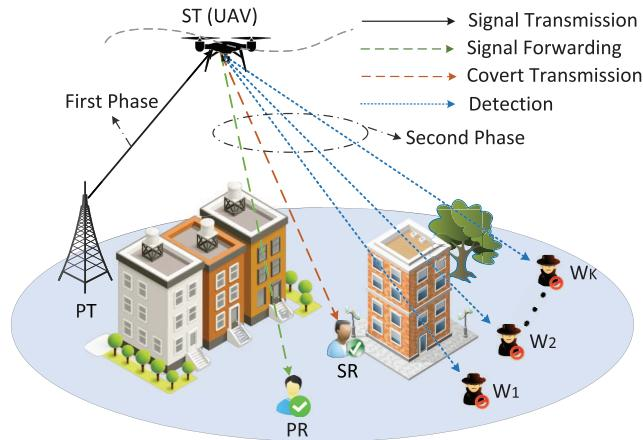
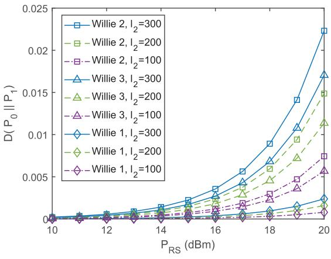
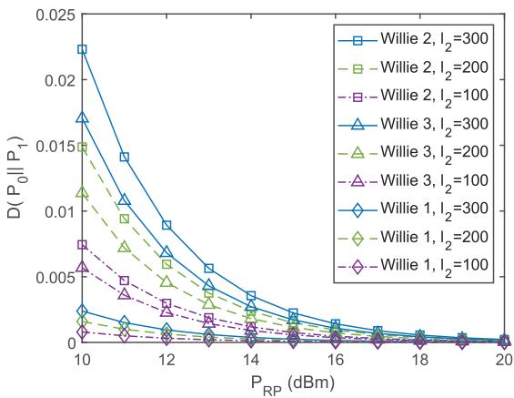
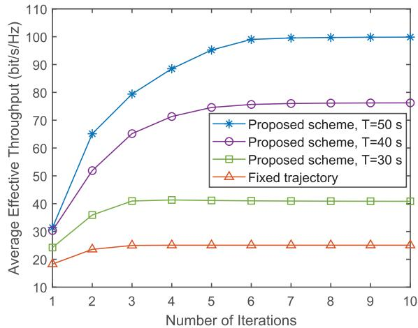
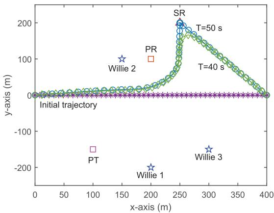
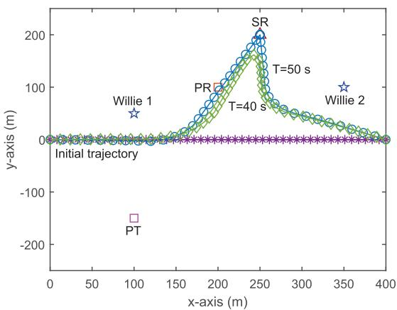
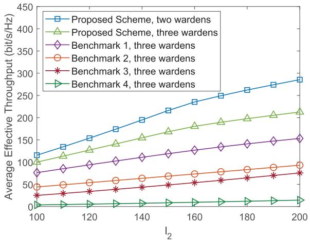
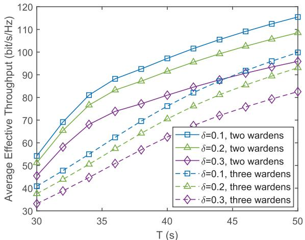
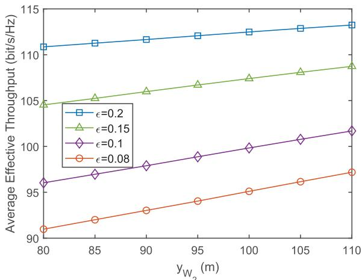
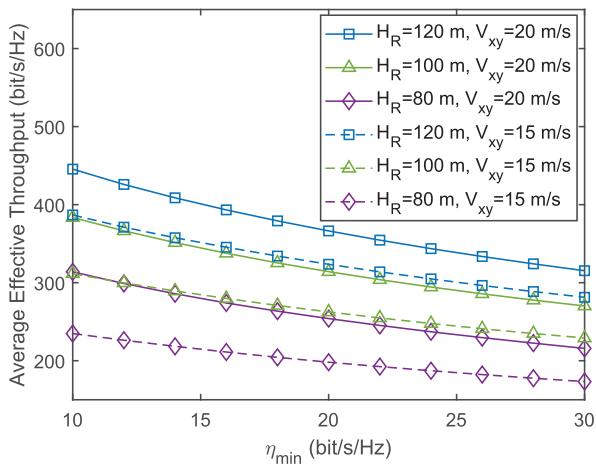

# UAV-Assisted Covert Transmission for Cooperative Cognitive Radio Networks

Qunshu Wang , Chengwen Xing , Member, IEEE, Nan Zhao , Senior Member, IEEE, and Dusit Niyato , Fellow, IEEE

Abstract—Cooperative cognitive radio (CR) networks can enable secondary users (SUs) to access the spectrum without disrupting the transmission of primary users (PUs), which brings a series of security challenges despite the significant increase in spectrum efficiency. In this paper, we propose a novel unmanned aerial vehicle (UAV) assisted covert transmission scheme for cooperative CR networks, where a UAV as the secondary transmitter can send its covert signal to a secondary receiver while ensuring the quality of service for the PU. To achieve the covert transmission of SU, the PU’s signal is used as a beneficial interference to disturb the detection of wardens. We first derive the minimum detection error probability and Kullback-Leibler divergence under the finite blocklength constraint. Then, the average effective throughput maximization problem under the probabilistic line-of-sight channel is established by jointly optimizing the UAV’s transmit power and trajectory. Finally, numerical results verifies that the UAV relay in the proposed scheme can not only assist in the information transmission of PU but also achieve the covert communication for the secondary network in the presence of multiple wardens.

Index Terms—Covert communication, cooperative cognitive radio networks, finite blocklength, probabilistic LoS channel, unmanned aerial vehicle.

## I. INTRODUCTION

ECENTLY, the rapid advancement of wireless technologies has led to an unprecedented increase in the demand for spectrum resource [2]. Traditional static spectrum allocation policies dedicate the specific frequency bands to licensed users, which are becoming increasingly inefficient and fail to match the growing demands of future mobile networks [3]. To tackle this issue, cognitive radio (CR) has emerged as a revolutionary solution, enabling the unlicensed secondary users (SUs) to dynamically access the unused or underutilized spectrum without disturbing the primary users (PUs) [4]. This ability to opportunistically access the spectrum

can not only enhance the spectrum efficiency but also promote the coexistence between different wireless systems.

To further enhance the spectrum utilization, the cooperative CR integrates the concept of cooperative communication into CR, where SUs can opportunistically use the licensed spectrum when it is not occupied by PUs. In addition, the SUs can assist PUs in their transmission, thereby creating a mutually beneficial relationship [5]. Despite its benefits, deploying cooperative CR networks may also introduce security challenges. Conventional security methods, such as steganography [6] and physical layer security [7], mainly focus on protecting the content of information and have limitations in hiding the transmission behavior. This inspires the emergence of covert communications, with the aim of delivering a higher level of security.

On the other hand, due to the flexibility and mobility, unmanned aerial vehicles (UAVs) have evolved to versatile platforms integrated into a wide range of industries, including agriculture, logistics, vehicular communication, disaster response, and infrastructure inspection, etc [8], [9], [10], [11], [12]. The significance of covert communication in these sectors cannot be overstated. By hiding the presence of wireless transmissions, covert communication ensures that confidential data remains undetected by wardens, which is essential for ensuring operational security and privacy. Given the combined strengths of the UAV and cooperative CR networks, introducing a UAV into cooperative CR networks can not only broaden the wireless coverage but also strengthen the covertness. Comparing with the traditional terrestrial infrastructure, UAVs can effectively extend the coverage of cooperative CR networks and improve the transmission quality, especially in remote areas [13], [14]. In addition, UAVs can be used as mobile nodes to facilitate the covert transmission by dynamically adjusting their flight trajectory and transmit power [15], [16].

However, there still exists a gap in the research on the combination of UAVs and covert cooperative CR networks, and only few papers have examined the influence of UAV in covert CR networks [17], [18]. In [17], Li et al. proposed a UAV jammer-assisted CR scheme to interfere with the eavesdropping and maximize the covert rate by a model-driven generative adversarial network. Wang et al. in [18] investigated the finite-blocklength covert communication for a UAV-assisted interweave CR network. Nevertheless, the UAV in [17] only serves as a jammer to enhance the covertness without contributing to the improvement of channel quality and coverage. In addition, [17], [18] only studied the CR networks without considering the cooperative communication.

Inspired by these, in this paper, we propose a UAV relay assisted covert cooperative CR scheme. Specifically, a UAV can serve dual roles: it can act as a relay to assist the primary transmitter (PT) in forwarding the signal to the primary receiver (PR), and it can also function as the the secondary transmitter (ST) to send the covert signal to the secondary receiver (SR). This allows for the seamless integration between the two networks, optimizing the resource utilization and improving the spectrum efficiency. Then, we formulate the average effective throughput maximization problem for the SR such that the quality of service (QoS) of PU is guaranteed and the covertness constraint is ensured. The primary contributions of this paper are highlighted below.

• Unlike the single-warden case, the presence of multiple wardens increases the likelihood that covert signals will be detected. To combat multiple wardens, We design a UAV assisted covert cooperative CR scheme, where the PU’s signals can serve as the interference to confuse the wardens. Moreover, the UAV’s transmit power and trajectory are optimized to minimize the risk of being detected.

Given the challenges of establishing good line of sight (LoS) links in dense urban areas, accurate air-ground channel modeling must account for the probabilistic nature of LoS propagation. Therefore, we model the airground channel utilizing a probabilistic LoS model based on the elevation angle.

Due to the restricted transmission bandwidth and realtime requirement, we consider the finite-blocklength covert communication. The minimum detection error probability is first derived by calculated the probabilities of false alarm (FA) and miss detection (MD). We calculate the Kullback-Leibler (KL) divergence to measure the covertness of UAV-aided cooperative CR network.

The average effective throughput is maximized for the SR by jointly optimizing the UAV’s trajectory and transmit power. Regarding the coupled non-convex optimization, we use the block coordinate descent (BCD) method to decouple it into two solvable subproblems, which can be tackled via the successive convex approximation (SCA) iteratively.

The subsequent sections of this paper are characterized by the following structure. Section II reviews the previous related works. The system model is introduced in Section III. In Section IV, we derive the minimum detection error probability and KL divergence. Section V formulates an average effective throughput maximization problem and resolves it via the iterative optimization algorithm. Simulation results are presented in Section VI. Finally, Section VII concludes the paper and looks forward to future work.

## II. RELATED WORKS

## A. Covert Communication in CR Networks

The covert communication for CR networks has attracted extensive academic exploration [19], [20], [21], [22], [23], [24]. In [19], Chen et al. focused on the maximum covert rate of SR in an overlay CR network considering the joint effect of channel uncertainty and friendly jamming. Lu et al. in [20] investigated a covert CR network in the interweave mode and maximized the average effective spectrum efficiency under the finite blocklength. To further enhance the covertness, Wei et al. in [21] introduced the UAV to interweave CR networks and maximized the covert rate of secondary network by joint optimizing the transmit power and the location of UAV. In [22], Hu et al. proposed a poisson-distributed jammer assisted covert CR scheme, where the PT can operate in either a collaborative or a non-collaborative mode. In [23], Fan et al. investigated the maximum effective covert rate in underlay CR networks, considering both the perfect and statistical channel state information. In [24], Liu et al. considered a covert cognitive edge computing network and optimized the covert task offloading, channel allocation and transmission power.

## B. Covert Communication in Cooperative CR Networks

Notably, a substantial body of literature has focused on the study of covert communication in cooperative CR networks [25], [26], [27], [28], [29], [30]. In [25], Shi et al. investigated three distinct scheduling schemes for the ST in a covert cooperative CR network, aiming to achieve the maximum covert rate, optimal channel gain and fairness, respectively. Under the overlay and underlay modes, Chen et al. in [26] analyzed the covert outage probability and maximized the covert rate of SR in two-hop cooperative CR networks. Li et al. in [27] investigated a covert cooperative CR system and proposed a game-oriented SU scheduling approach to maximize the covert rate. Considering three jammer selection schemes, Liu et al. in [28] leveraged multiple cognitive jammers to achieve the covert transmission at the ST in cooperative CR networks. In [29], Wen et al. utilized the generative adversarial network to achieve the covert transmission of the centralized cooperative CR network. Under both perfect and statistical channel state information scenarios, Wen et al. in [30] applied friendly jamming and secondary signals to enhance the covertness.

## C. Covert Communication in UAV-Assisted Air-Ground Networks

Due to the unique advantages of UAVs, covert transmission can be effectively achieved in UAV-assisted air-ground networks [31], [32], [33], [34], [35], [36]. In [31], Zhou et al. investigated the average covert transmission rate maximization by jointly optimizing the UAV’s trajectory and transmit power. By introducing an optimal joint UAV’s resource allocation and trajectory design, Huang et al. [32] utilized an artificial potential field (APF)-based approach to maximize the information throughput. Since intelligent reflection surface (IRS) can be deployed in the hostile communication environment, it facilitates covert communications. The deployment of an IRS on a UAV platform offers dual benefits: it extends the communication coverage and improves the system’s covertness [33], [34]. In [33], Qian et al. adopted UAV-IRS as an aerial relay to assist covert transmission and verified the IRS-equipped UAV can effectively mask its communication behavior from potential wardens. Chen et al. in [34] introduced the uncertainty via phase shifting of IRS to achieve the covert air-ground transmission. For more practical multiple wardens scenarios [35], air-to-ground covert transmissions are more difficult to realize. To combat active flying and ground wardens, Wei et al. in [35] jointly optimized the 3D trajectory, transmit power and bandwidth allocation ratio. Zhang et al. in [36] recognized the UAV as a full-duplex relay to help transmit and confuse the guards, where the UAV can simultaneously receive covert signals and send jamming signals.

TABLE I  
COMPARISON BETWEEN OUR WORK AND OTHER RELATED WORKS
<table><tr><td rowspan=1 colspan=1>Reference</td><td rowspan=1 colspan=1>Cooperative CR</td><td rowspan=1 colspan=1>UAV</td><td rowspan=1 colspan=1>Multiple Wardens</td><td rowspan=1 colspan=1>Finite Blocklength</td><td rowspan=1 colspan=1>Probabilistic LoS</td></tr><tr><td rowspan=1 colspan=1>[13],[14]</td><td rowspan=1 colspan=1>Yes</td><td rowspan=1 colspan=1>Yes</td><td rowspan=1 colspan=1>No</td><td rowspan=1 colspan=1>N/A</td><td rowspan=1 colspan=1>No</td></tr><tr><td rowspan=1 colspan=1>[18]</td><td rowspan=1 colspan=1>No</td><td rowspan=1 colspan=1>Yes</td><td rowspan=1 colspan=1>No</td><td rowspan=1 colspan=1>Yes</td><td rowspan=1 colspan=1>Yes</td></tr><tr><td rowspan=1 colspan=1>[19],[22],[23]</td><td rowspan=1 colspan=1>No</td><td rowspan=1 colspan=1>No</td><td rowspan=1 colspan=1>No</td><td rowspan=1 colspan=1>No</td><td rowspan=1 colspan=1>No</td></tr><tr><td rowspan=1 colspan=1>[20]</td><td rowspan=1 colspan=1>No</td><td rowspan=1 colspan=1>No</td><td rowspan=1 colspan=1>No</td><td rowspan=1 colspan=1>Yes</td><td rowspan=1 colspan=1>No</td></tr><tr><td rowspan=1 colspan=1>[21]</td><td rowspan=1 colspan=1>No</td><td rowspan=1 colspan=1>Yes</td><td rowspan=1 colspan=1>Yes</td><td rowspan=1 colspan=1>No</td><td rowspan=1 colspan=1>Yes</td></tr><tr><td rowspan=1 colspan=1>[24]</td><td rowspan=1 colspan=1>No</td><td rowspan=1 colspan=1>No</td><td rowspan=1 colspan=1>Yes</td><td rowspan=1 colspan=1>No</td><td rowspan=1 colspan=1>No</td></tr><tr><td rowspan=1 colspan=1>[25]-[28]</td><td rowspan=1 colspan=1>Yes</td><td rowspan=1 colspan=1>No</td><td rowspan=1 colspan=1>No</td><td rowspan=1 colspan=1>No</td><td rowspan=1 colspan=1>No</td></tr><tr><td rowspan=1 colspan=1>[29],[30]</td><td rowspan=1 colspan=1>Yes</td><td rowspan=1 colspan=1>No</td><td rowspan=1 colspan=1>No</td><td rowspan=1 colspan=1>Yes</td><td rowspan=1 colspan=1>No</td></tr><tr><td rowspan=1 colspan=1>[15],[17],[31],[33],[34],[36]</td><td rowspan=1 colspan=1>No</td><td rowspan=1 colspan=1>Yes</td><td rowspan=1 colspan=1>No</td><td rowspan=1 colspan=1>No</td><td rowspan=1 colspan=1>No</td></tr><tr><td rowspan=1 colspan=1>[32]</td><td rowspan=1 colspan=1>No</td><td rowspan=1 colspan=1>Yes</td><td rowspan=1 colspan=1>No</td><td rowspan=1 colspan=1>Yes</td><td rowspan=1 colspan=1>No</td></tr><tr><td rowspan=1 colspan=1>[16],[35]</td><td rowspan=1 colspan=1>No</td><td rowspan=1 colspan=1>Yes</td><td rowspan=1 colspan=1>Yes</td><td rowspan=1 colspan=1>Yes</td><td rowspan=1 colspan=1>No</td></tr><tr><td rowspan=1 colspan=1>Our work</td><td rowspan=1 colspan=1>Yes</td><td rowspan=1 colspan=1>Yes</td><td rowspan=1 colspan=1>Yes</td><td rowspan=1 colspan=1>Yes</td><td rowspan=1 colspan=1>Yes</td></tr></table>

Note: N/A indicates that the reference does not involve this particular parameter.

Although the significant progress has been made in covert communication within both UAV networks and cooperative CR networks, the integration of UAVs with cooperative CR networks for covert communication remains a promising area that warrants further investigation. Therefore, in this thesis, we design a novel UAV relaying assisted covert air-ground transmission scheme for cooperative CR networks. The secondary network enhances the communication capabilities of the primary network through the resource sharing and signal relaying, while the primary network assists the secondary network via the interference to mask the covert signal. To better illustrate the novelty of our approach, we summarize the key distinctions between our work and related studies in Table I.

## III. SYSTEM MODEL

## A. System Model

We present a UAV-assisted covert CR system against multiple wardens, as depicted in Fig. 1. It operates within a dual-network framework, comprising a primary network with a PT and a PR as well as a secondary network with an ST and an SR. A UAV is capable of functioning as an ST to send the covert signal within the secondary network and as a decode-and-forward relay to support the signal forwarding for the primary network. Moreover, all nodes are assumed to be equipped with a single antenna.For ease of representation, we utilize a 3D Cartesian coordinate system, where the horizontal positions of PT, PR and SR are given by $\mathbf { q } _ { P _ { T } } = \left[ x _ { P _ { T } } , y _ { P _ { T } } \right] ^ { T }$ $\mathbf { \dot { q } } _ { P } ~ = ~ \left[ x _ { P } , y _ { P } \right] ^ { T }$ and $\mathbf { q } _ { S } ~ = ~ \mathbf { \bar { \Phi } } \left[ x _ { S } , y _ { S } \right] ^ { T }$ , respectively. The height of the PT can be represented as $H _ { P _ { T } }$ . Furthermore, the horizontal coordinate1 of the i-th Willie can be expressed as $\mathbf { q } _ { W _ { i } } ~ = ~ \left[ x _ { W _ { i } } , y _ { W _ { i } } \right] ^ { T } , i ~ \in ~ \mathcal { T } ~ \triangleq ~ \{ 1 , 2 , \dots , I \}$ , where I denotes the number of eavesdroppers. The UAV flies at a constant height $H _ { R } .$ To facilitate the trajectory design, its flight period T can be divided into N time slots equally. Therefore, the horizontal location of the UAV in the n-th time slot can be specified as $\mathbf { q } _ { R } \left[ n \right] = \left[ x _ { R } \left[ n \right] , y _ { R } \left[ n \right] \right] ^ { T } , n \in \mathcal { N } \triangleq$ $\{ 1 , 2 , \ldots , N \}$ . Denote the initial and final positions of UAV as $\mathbf { q } _ { I }$ and $\mathbf { q } _ { F }$ , respectively, and the UAV’s mobility constraints can be given by

  
Fig. 1. UAV-aided covert cognitive radio against multiple wardens.

$$
\begin{array} { r l } & { \quad { \bf q } _ { I } = { \bf q } _ { R } \left[ 1 \right] , { \bf q } _ { F } = { \bf q } _ { R } \left[ N \right] , } \\ & { \quad \left\| { \bf q } _ { R } \left[ n + 1 \right] - { \bf q } _ { R } \left[ n \right] \right\| ^ { 2 } } \\ & { \quad \quad \quad \leq { \left( \frac { V _ { \operatorname* { m a x } } T } { N } \right) } ^ { 2 } , \forall n \in \mathcal { N } \backslash \left\{ N \right\} , } \end{array}\tag{1a}
$$

(1b)

where $V _ { \mathrm { m a x } }$ is the maximum speed of the UAV. The constraint (1a) specifies the UAV’s initial and final positions, and the constraint (1b) imposes an upper limit on the UAV’s flight distance within each time slot.

## B. Channel Model

In the practical environment, signal propagation paths are usually significantly influenced by various factors, and the probabilistic LoS channel model can reflect the channel characteristics in the complex environment more accurately. Specifically, the channel links between the UAV and the ground node $j , j \in \{ P _ { T } , P , S , W _ { i } \}$ , in the n-th time slot can be described by

$$
h _ { R j } [ n ] = \{ \sqrt { \lambda _ { 0 } } d _ { R j } ^ { - \upsilon _ { L } } [ n ] , \quad \mathrm { L o S } , \quad \quad\tag{2}
$$

where $\lambda _ { 0 }$ signifies the channel gain at a unit reference distance in the LoS scenario, while ϑ indicates the extra signal attenuation factor in the non-LoS (NLoS) scenario. $v _ { L }$ and υN represent the path-loss exponents in the LoS and NLoS scenarios, respectively, with the constraint $v _ { L } \leq v _ { N } . \ d _ { R j } [ n ]$ is the distance between the UAV and the ground node $j ,$ $j \in \{ P _ { T } , P , S , W _ { i } \}$ , in the n-th time slot, which can be defined as

$$
d _ { R j } \left[ n \right] = \sqrt { \left\| \mathbf { q } _ { R } \left[ n \right] - \mathbf { q } _ { j } \right\| ^ { 2 } + \left( H _ { R } - H _ { j } \right) ^ { 2 } } ,\tag{3}
$$

where the heights of PR, SR and the i-th Willie are zero, i.e., $H _ { P } = H _ { S } = H _ { W _ { i } } = 0$

According to [37], the LoS probability from the UAV to the ground node j in the n-th time slot can be calculated as

$$
\mathbb { P } _ { R j } ^ { \mathrm { L o S } } \left[ n \right] = \frac { 1 } { 1 + \alpha \exp \left( - \beta \left( \theta _ { R j } \left[ n \right] - \alpha \right) \right) } ,\tag{4}
$$

where $\alpha \ > \ 0$ and $\beta ~ > ~ 0$ are determined by the density distribution and height of obstacles, and $\theta _ { R j } \left[ n \right]$ denotes the elevation angle between the UAV and the ground node $j ,$ modeled by

$$
\theta _ { R j } \left[ n \right] = \frac { 1 8 0 } { \pi } \arctan \left( \frac { H _ { R } } { \left. \mathbf { q } _ { R } \left[ n \right] - \mathbf { q } _ { j } \right. } \right) .\tag{5}
$$

Correspondingly, the NLoS probability from the UAV to the ground node $j$ can be derived as

$$
\mathbb { P } _ { R j } ^ { \mathrm { N L o S } } \left[ n \right] = 1 - \mathbb { P } _ { R j } ^ { \mathrm { L o S } } \left[ n \right] .\tag{6}
$$

Considering the PT’s height, a LoS link can be established between the PT and the UAV. Thus, the probability of NLoS between them is assumed to be zero, and the channel link from the PT to the UAV relay can be modeled as

$$
h _ { R P _ { T } } \left[ n \right] = \sqrt { \lambda _ { 0 } } d _ { R P _ { T } } ^ { - \upsilon _ { L } } \left[ n \right] .\tag{7}
$$

To avoid being intercepted by legitimate users, the wardens hide themselves behind buildings or other obstacles to detect the covert transmission of the secondary network. Consequently, the channel from the UAV to the i-th Willie is characterized by the Rayleigh fading as

$$
h _ { R W _ { i } } \left[ n \right] = \sqrt { \vartheta \lambda _ { 0 } } d _ { R W _ { i } } ^ { - v _ { N } } \left[ n \right] g _ { R W _ { i } } \left[ n \right] ,\tag{8}
$$

where $g _ { R W _ { i } } \ [ n ]$ can be modeled using the independent and identically distributed complex Gaussian distribution $\mathcal { C N } ( 0 , 1 )$

<table><tr><td colspan="2">l1 4 4</td></tr><tr><td colspan="2">λ2 4</td></tr><tr><td rowspan="2">PT transmits PU&#x27;s signal to the UAV relay</td><td>Decode-and-forward UAV forwards the received signal to PR while sending the covert signal to SR</td></tr><tr><td>Wardens try to detect whether ST is sending the covert signal to SR via the Neyman-Pearson test</td></tr><tr><td rowspan="2">▶ The first phase</td><td></td></tr><tr><td> The second phase</td></tr></table>

Fig. 2. Two phases for a UAV relay assisted covert cooperative CR networks.

## IV. UAV-ASSISTED COVERT CR SCHEME

## A. Air-Ground Transmission Model

The whole communication process can be divided into two phases, as shown in Fig. 2. In the first phase, the PT transmits the signal to the UAV relay. For the $k _ { 1 }$ -th channel, the received signal at the UAV in the n-th time slot can be expressed as

$$
y _ { R } ^ { ( k _ { 1 } ) } [ n ] = \sqrt { P _ { P T } } h _ { R P _ { T } } [ n ] x _ { p } ( k _ { 1 } ) + n _ { R } ( k _ { 1 } ) , k _ { 1 } = 1 , 2 , . . . , l _ { 1 } ,\tag{9}
$$

where $l _ { 1 }$ denotes the total number of channel uses in the first phase, PP T is the transmit power at the PT, $x _ { p } \left( k _ { 1 } \right)$ stands for the short-packet signal from the PT to the ST with $\mathbb { E } \left\{ \left| x _ { p } \left( k _ { 1 } \right) \right| ^ { 2 } \right\} = 1$ , and $n _ { R } \left( k _ { 1 } \right) \sim \mathcal { C N } \left( 0 , \sigma _ { R } ^ { 2 } \right)$ denotes the additive white Gaussian noise (AWGN) at the UAV. According to (13) in [38], for a given decoding error probability at the ST $\delta _ { P R }$ , the transmission rate between the PT and the ST in the n-th time slot can be expressed as

$$
\begin{array} { r l } & { R _ { P R } \left[ n \right] = \log _ { 2 } \left( 1 + \gamma _ { P R } \left[ n \right] \right) } \\ & { \qquad - \sqrt { \frac { 1 - 1 / \left( \gamma _ { P R } \left[ n \right] + 1 \right) ^ { 2 } } { l _ { 1 } } } Q ^ { - 1 } \left( \delta _ { P R } \right) \log _ { 2 } e , } \end{array}\tag{10}
$$

where $\begin{array} { r } { \gamma _ { P R } \left[ n \right] = \frac { P _ { P T } \lambda _ { 0 } d _ { R P T } ^ { - 2 \upsilon _ { L } } \left[ n \right] } { \sigma _ { R } ^ { 2 } } } \end{array}$ denotes the received signalto-noise ratio (SNR) at the ST, and $Q ^ { - 1 } \left( \cdot \right)$ indicates the inverse Q-function. After the calculation, we can obtain

$$
\begin{array} { r l r } {  { \mathcal { R } _ { P R } [ n ] = \log _ { 2 } ( 1 + \gamma _ { P R } [ n ] ) } } \\ & { } & { - \sqrt { \frac { \gamma _ { P R } [ n ] ( \gamma _ { P R } [ n ] + 2 ) } { l _ { 1 } ( \gamma _ { P R } [ n ] + 1 ) ^ { 2 } } } \frac { Q ^ { - 1 } ( \delta _ { P R } ) } { \ln 2 } . } \end{array}\tag{11}
$$

In the second phase, the decode-and-forward UAV forwards the received signal to the PR while sending its covert information to the SR in the k -th channel, $\mathrm { i . e . , ~ \bar { \boldsymbol { x } } ^ { ( k _ { 2 } ) } \left[ \boldsymbol { n } \right] = }$ $\sqrt { P _ { R P } \left[ n \right] } x _ { p } \left( k _ { 2 } \right) + \sqrt { P _ { R S } \left[ n \right] } x _ { s } \left( k _ { 2 } \right) , k _ { 2 } = 1 , 2 , \ldots , l _ { 2 } .$ , where $l _ { 2 }$ denotes the total number of channel uses in the second phase, $x _ { p } \left( k _ { 2 } \right)$ and $x _ { s } \left( k _ { 2 } \right)$ indicate the short-packet signals from the ST to the PR and the SR with E $\Big \{ \big | x _ { p } \left( k _ { 2 } \right) \big | ^ { 2 } \Big \} =$ E $\left\{ \left| x _ { s } \left( k _ { 2 } \right) \right| ^ { 2 } \right\} = 1$ , and $P _ { R P } \left[ n \right]$ and $P _ { R S } \left[ n \right]$ are the transmit power from UAV to the PR and SR, respectively. For the $k _ { 2 } \mathrm { - t h }$ channel, the received signal at the SR in the n-th time slot can be defined as

$$
y _ { S U } ^ { ( k _ { 2 } ) } [ n ] = h _ { R S } [ n ] x ^ { ( k _ { 2 } ) } [ n ] + n _ { S U } ( k _ { 2 } ) ,\tag{12}
$$

where $n _ { S U } \left( k _ { 2 } \right) \sim \mathcal { C N } \left( 0 , \sigma _ { S U } ^ { 2 } \right)$ is the AWGN at the SR.

For a given decoding error probability at the SR $\delta _ { S U }$ , the transmission rate between the ST and the SR in the n-th time slot can be given by

$$
\mathcal { R } _ { S U } \left[ n \right] = \mathbb { P } _ { R S } ^ { \mathrm { L o S } } \left[ n \right] \bar { \mathcal { R } } _ { S U } \left[ n \right] + \mathbb { P } _ { R S } ^ { \mathrm { N L o S } } \left[ n \right] \tilde { \mathcal { R } } _ { S U } \left[ n \right] ,\tag{13}
$$

with

$$
\begin{array} { l } { \bar { \mathcal { R } } _ { S U } \left[ n \right] = \log _ { 2 } \left( 1 + \bar { \gamma } _ { S U } \left[ n \right] \right) } \\ { \quad \quad - \sqrt { \frac { \bar { \gamma } _ { S U } \left[ n \right] \left( \bar { \gamma } _ { S U } \left[ n \right] + 2 \right) } { l _ { 2 } \left( \bar { \gamma } _ { S U } \left[ n \right] + 1 \right) ^ { 2 } } } \frac { Q ^ { - 1 } \left( \delta _ { S U } \right) } { \ln 2 } , } \end{array}\tag{14}
$$

and

$$
\begin{array} { r l } & { \tilde { \mathcal { R } } _ { S U } \left[ n \right] = \log _ { 2 } \left( 1 + \tilde { \gamma } _ { S U } \left[ n \right] \right) } \\ & { \quad \quad - \sqrt { \frac { \tilde { \gamma } _ { S U } \left[ n \right] \left( \tilde { \gamma } _ { S U } \left[ n \right] + 2 \right) } { l _ { 2 } \left( \tilde { \gamma } _ { S U } \left[ n \right] + 1 \right) ^ { 2 } } } \frac { Q ^ { - 1 } \left( \delta _ { S U } \right) } { \ln 2 } , } \end{array}\tag{15}
$$

where $\bar { \mathcal { R } } _ { S U } \left[ n \right]$ and $\tilde { \mathcal { R } } _ { S U } \left[ n \right]$ represent the transmission rate between the ST and the SR under the LoS and NLoS scenarios, respectively. γ¯SU [n] and $\tilde { \gamma } _ { S U }$ [n] denote the received signalto-interference-plus-noise ratios (SINRs) at the SR under the LoS and NLoS scenarios, respectively, with

$$
\bar { \gamma } _ { S U } \left[ n \right] = \frac { \lambda _ { 0 } d _ { R S } ^ { - 2 v _ { L } } \left[ n \right] P _ { R S } \left[ n \right] } { \lambda _ { 0 } d _ { R S } ^ { - 2 v _ { L } } \left[ n \right] P _ { R P } \left[ n \right] + \sigma _ { S U } ^ { 2 } } ,\tag{16}
$$

and

$$
\widetilde \gamma _ { S U } \left[ n \right] = \frac { \vartheta \lambda _ { 0 } d _ { R S } ^ { - 2 v _ { N } } \left[ n \right] P _ { R S } \left[ n \right] } { \vartheta \lambda _ { 0 } d _ { R S } ^ { - 2 v _ { N } } \left[ n \right] P _ { R P } \left[ n \right] + \sigma _ { S U } ^ { 2 } } .\tag{17}
$$

Due to the much lower transmission rate in the NLoS scenario than that in the LoS scenario, the transmission rate between the ST and SR can be approximated as [39]

$$
\mathcal { R } _ { S U } \left[ n \right] = \mathbb { P } _ { R S } ^ { \mathrm { L o S } } \left[ n \right] \bar { \mathcal { R } } _ { S U } \left[ n \right] .\tag{18}
$$

Remark 1: It can be observed from (18) that the approximate transmission rate is affected by four factors: the LoS probability $\mathbb { P } _ { R S } ^ { \mathrm { L o S } } \left[ n \right]$ , the transmit power $P _ { R S } \left[ n \right]$ and $P _ { R P } \left[ n \right]$ the distance between the UAV and the SR dRS [n] and the blocklength $l _ { 2 } .$ The LoS probability depends on the flight altitude of the UAV. Higher flight altitude leads to a larger LoS probability, which makes the transmission rate larger [39].

Therefore, the effective throughput from the PT to the SR can be formulated as $\eta _ { 1 } \left[ n \right] = \mathrm { m i n } \left( \eta _ { P R } \left[ n \right] , \eta _ { S U } \left[ n \right] \right)$ , where $\eta _ { P R } \left[ n \right]$ and ηSU [n] are the effective throughputs from the PT to the ST and from the ST to the SR, respectively, with

$$
\left\{ \eta _ { P R } \left[ n \right] = l _ { 1 } \mathcal { R } _ { P R } \left[ n \right] \left( 1 - \delta _ { P R } \right) , \right.\tag{19}
$$

For a given decoding error probability at the PR $\delta _ { P U }$ , the transmission rate between the ST and the PR in the LoS scenario in the n-th time slot can be defined as

$$
\begin{array} { r l } & { \bar { \mathcal { R } } _ { P U } \left[ n \right] = \log _ { 2 } \left( 1 + \bar { \gamma } _ { P U } \left[ n \right] \right) } \\ & { \quad \quad \quad - \sqrt { \frac { \bar { \gamma } _ { P U } \left[ n \right] \left( \bar { \gamma } _ { P U } \left[ n \right] + 2 \right) } { l _ { 2 } \left( \bar { \gamma } _ { P U } \left[ n \right] + 1 \right) ^ { 2 } } } \frac { Q ^ { - 1 } \left( \delta _ { P U } \right) } { \ln 2 } , } \end{array}\tag{20}
$$

where $\bar { \gamma } _ { P U } \left[ n \right]$ denotes the received SINR at the PR in the LoS scenario, with

$$
\bar { \gamma } _ { P U } [ n ] = \frac { \lambda _ { 0 } d _ { R P } ^ { - 2 \upsilon _ { L } } [ n ] P _ { R P } \left[ n \right] } { \lambda _ { 0 } d _ { R P } ^ { - 2 \upsilon _ { L } } [ n ] P _ { R S } \left[ n \right] + \sigma _ { P U } ^ { 2 } } .\tag{21}
$$

In (21), $\sigma _ { P U } ^ { 2 }$ is the power of AWGN at the PR. The transmission rate between the ST and the PR can be approximated as

$$
\mathcal { R } _ { P U } \left[ n \right] = \mathbb { P } _ { R P } ^ { \mathrm { L o S } } \left[ n \right] \bar { \mathcal { R } } _ { P U } \left[ n \right] .\tag{22}
$$

Consequently, the effective throughput from the PT to the PR can be given by $\eta _ { 2 } \left[ n \right] = \mathrm { m i n } \left( \eta _ { P R } \left[ n \right] , \eta _ { P U } \left[ n \right] \right)$ , where ηP U [n] is the effective throughput from the ST to the PR, with

$$
\eta _ { P U } \left[ n \right] = l _ { 2 } \mathcal { R } _ { P U } \left[ n \right] \left( 1 - \delta _ { P U } \right) .\tag{23}
$$

With the underlay CR paradigm, the ST should ensure the QoS of primary network while sending the covert signal. To achieve this, the effective throughput at the PR should be higher than or equal to a specific minimum throughput threshold $\eta _ { \mathrm { m i n } } , \mathrm { i . e . }$ η2 $[ n ] \geq \eta _ { \mathrm { m i n } } , \forall n \in \mathcal { N }$

## B. Covert Transmission Against Multiple Wardens

In the second phase, the covert signal sent from the ST to the SR can be embedded into the PU’s signal to confuse the detection by multiple wardens. Using the Neyman-Pearson test, the wardens strive to detect whether the ST is sending the covert signal to the SR by monitoring the received power. For the $k _ { 2 } \mathrm { { \cdot } }$ -th channel, the received signal at the i-th Willie in the n-th time slot can be formulated as

$$
\begin{array} { l l } { y _ { W _ { i } } ^ { k _ { 2 } } \left[ n \right] } \\ { \displaystyle } & { = \left\{ h _ { R W _ { i } } \left[ n \right] \sqrt { P _ { R P } \left[ n \right] } x _ { p } \left( k _ { 2 } \right) + n _ { W _ { i } } \left( k _ { 2 } \right) , \mathcal { H } _ { 0 } , \right. } \\ { \displaystyle } & { \left. \mathcal { H } _ { 1 } , \left[ n \right] x ^ { ( k _ { 2 } ) } \left[ n \right] + n _ { W _ { i } } \left( k _ { 2 } \right) , \mathcal { H } _ { 1 } , \right. } \end{array}\tag{24}
$$

where the null hypothesis $\mathcal { H } _ { \mathrm { 0 } }$ indicates that the ST keeps silent, the alternative hypothesis $\mathcal { H } _ { 1 }$ denotes that the covert transmission is being conducted between the ST and the SR, and $n _ { W _ { i } } \left( k _ { 2 } \right) \sim \mathcal { C N } \left( 0 , \sigma _ { W _ { i } } ^ { 2 } \right)$ is the AWGN at the i-th Willie.

The wardens aim at minimizing the detection error probability $\xi \left[ n \right]$ , which can be given by

$$
\xi \left[ n \right] = { \mathcal { P } } _ { F A } \left[ n \right] + { \mathcal { P } } _ { M D } \left[ n \right] ,\tag{25}
$$

where $\mathcal { P } _ { F A } [ n ] \triangleq \operatorname* { P r } \left\{ \mathcal { D } _ { 1 } | \mathcal { H } _ { 0 } \right\}$ and $\mathcal { P } _ { M D } \left[ n \right] \triangleq \operatorname* { P r } \left\{ \mathcal { D } _ { 0 } | \mathcal { H } _ { 1 } \right\}$ represent the probabilities of FA and MD in the n-th time slot. To obtain the minimal $\xi \left[ n \right]$ , the i-th Willie utilizes the likelihood ratio test [40] as

$$
\begin{array} { r l } & { \mathbb { P } _ { 1 } \triangleq \prod _ { k _ { 2 } = 1 } ^ { l _ { 2 } } f ( y _ { W _ { i } } ^ { k _ { 2 } } [ n ] | \mathcal { H } _ { 1 } ) \mathcal { D } _ { 1 } } \\ & { \mathbb { P } _ { 0 } \triangleq \prod _ { k _ { 2 } = 1 } ^ { l _ { 2 } } f ( y _ { W _ { i } } ^ { k _ { 2 } } [ n ] | \mathcal { H } _ { 0 } ) \mathcal { D } _ { 0 } } \end{array}\tag{26}
$$

where $\mathcal { D } _ { 0 }$ and $\mathcal { D } _ { 1 }$ refer to the detection results in favor of $\mathcal { H } _ { \mathrm { 0 } }$ and $\mathcal { H } _ { 1 }$ , and $f ( y _ { W _ { i } } ^ { k _ { 2 } } [ n ] | \mathcal { H } _ { 0 } ) = \mathcal { C N } \big ( 0 , \sigma _ { 0 , i } ^ { 2 } [ n ] \big )$ and $f \left( \left. y _ { W _ { i } } ^ { k _ { 2 } } \left[ n \right] \right| \mathcal { H } _ { 1 } \right) = \mathcal { C N } \left( 0 , \sigma _ { 1 , i } ^ { 2 } \left[ n \right] \right)$ represent the likelihood functions supporting $\mathcal { H } _ { \mathrm { 0 } }$ and $\mathcal { H } _ { 1 }$ , respectively. In addition, $\sigma _ { 0 , i } ^ { 2 } \left[ n \right] ~ = ~ \bar { \vartheta } \lambda _ { 0 } d _ { R W _ { i } } ^ { - \bar { 2 } \upsilon _ { N } } \left[ n \right] P _ { R P } \left[ n \right] + { \bf \bar { \sigma } } _ { W } ^ { 2 }$ and $\sigma _ { 1 , i } ^ { 2 } \left[ n \right] ~ =$ i $\vartheta \lambda _ { 0 } d _ { R W _ { i } } ^ { - 2 v _ { N } } \left[ n \right] \left( P _ { R P } \left[ \dot { n } \right] + P _ { R S } \left[ n \right] \right) + \sigma _ { W _ { i } } ^ { 2 } .$

After a series of mathematical operations, (26) can be formulated as

$$
T _ { \boldsymbol { w } } ^ { i } [ n ] \triangleq \frac { 1 } { l _ { 2 } } \sum _ { k _ { 2 } = 1 } ^ { l _ { 2 } } | y _ { W _ { i } } ^ { k _ { 2 } } [ n ] | ^ { 2 } \underset { \mathcal { D } _ { 0 } } { \overset { _ { 2 } } {  } } \tau _ { i } [ n ] ,\tag{27}
$$

where $T _ { w } ^ { i } [ n ]$ is the average received power, and $\tau _ { i } \left[ n \right]$ is the optimal detection threshold with

$$
\tau _ { i } \left[ n \right] = \ln { \left( \frac { \sigma _ { 1 , i } ^ { 2 } \left[ n \right] } { \sigma _ { 0 , i } ^ { 2 } \left[ n \right] } \right) } \left( \frac { 1 } { \sigma _ { 0 , i } ^ { 2 } \left[ n \right] } - \frac { 1 } { \sigma _ { 1 , i } ^ { 2 } \left[ n \right] } \right) ^ { - 1 } .\tag{28}
$$

Based on (27), the probabilities of FA and MD in the finite blocklength at the i-th Willie can be respectively calculated as

$$
\mathcal { P } _ { F A , i } \left[ n \right] = 1 - \frac { 1 } { \Gamma \left( l _ { 2 } \right) } \gamma \left( l _ { 2 } , \frac { l _ { 2 } \tau _ { i } \left[ n \right] } { \sigma _ { 0 , i } ^ { 2 } \left[ n \right] } \right) ,\tag{29}
$$

$$
\mathcal { P } _ { M D , i } \left[ n \right] = \frac { 1 } { \Gamma \left( l _ { 2 } \right) } \gamma \left( l _ { 2 } , \frac { l _ { 2 } \tau _ { i } \left[ n \right] } { \sigma _ { 1 , i } ^ { 2 } \left[ n \right] } \right) .\tag{30}
$$

Consequently, the minimum detection error probability at the i-th Willie in the n-th time slot can be given by

$$
\xi _ { i } ^ { * } \left[ n \right] = 1 + \frac { 1 } { \Gamma \left( l _ { 2 } \right) } \left( \gamma \left( l _ { 2 } , \frac { l _ { 2 } \tau _ { i } [ n ] } { \sigma _ { 1 , i } ^ { 2 } [ n ] } \right) - \gamma \left( l _ { 2 } , \frac { l _ { 2 } \tau _ { i } [ n ] } { \sigma _ { 0 , i } ^ { 2 } [ n ] } \right) \right)\tag{31}
$$

To achieve the covertness, $\xi _ { i } ^ { * } \left[ n \right] \geq 1 - \epsilon , \forall n \in N$ should be satisfied, where $\epsilon \in [ 0 , 1 ]$ is a performance metric to evaluate the covertness. Due to the complexity of $\xi _ { i } ^ { * } \left[ n \right]$ , we employ the Pinsker’s inequality [41] to obtain a lower bound as follows:

$$
\xi _ { i } ^ { \ast } \left[ n \right] \geq 1 - \sqrt { \frac { 1 } { 2 }  { D } \left( \mathbb { P } _ { 0 } \| \mathbb { P } _ { 1 } \right) \left[ n \right] } ,\tag{32}
$$

where ${ \mathcal { D } } ( { \mathbb { P } } _ { 0 } \| { \mathbb { P } } _ { 1 } ) [ n ]$ is the KL divergence from $\mathbb { P } _ { 0 }$ to $\mathbb { P } _ { 1 }$ , denoted as

$$
\mathcal { D } ( \mathbb { P } _ { 0 } \| \mathbb { P } _ { 1 } ) [ n ] = l _ { 2 } ( \ln ( 1 + \chi _ { i } [ n ] ) - \frac { \chi _ { i } [ n ] } { \chi _ { i } [ n ] + 1 } ) ,\tag{33}
$$

with

$$
\begin{array} { l } { { \chi _ { i } } \left[ n \right] = \frac { \sigma _ { 1 , i } ^ { 2 } \left[ n \right] - \sigma _ { 0 , i } ^ { 2 } \left[ n \right] } { \sigma _ { 0 , i } ^ { 2 } \left[ n \right] } } \\ { ~ = \frac { \vartheta \lambda _ { 0 } d _ { R W _ { i } } ^ { - 2 v _ { N } } \left[ n \right] P _ { R S } \left[ n \right] } { \vartheta \lambda _ { 0 } d _ { R W _ { i } } ^ { - 2 v _ { N } } \left[ n \right] P _ { R P } \left[ n \right] + \sigma _ { W _ { i } } ^ { 2 } } . } \end{array}\tag{34}
$$

As per (32), we need to guarantee $\mathcal { D } \left( \mathbb { P } _ { 0 } \Vert \mathbb { P } _ { 1 } \right) [ n ] \leq 2 \epsilon ^ { 2 }$ in order to ensure $\xi _ { i } ^ { * } \left[ n \right] ~ \ge ~ 1 - \epsilon$ . We can observe that $\mathcal { D } \left( \mathbb { P } _ { 0 } \| \mathbb { P } _ { 1 } \right) [ n ] \le 2 \epsilon ^ { 2 }$ is a more strict constraint with respect to $\xi _ { i } ^ { * } \left[ n \right] \ge 1 - \epsilon$ . Therefore, the covertness constraint at the i-th Willie can be rewritten as

$$
\ln \left( 1 + \chi _ { i } \left[ n \right] \right) - \frac { \chi _ { i } \left[ n \right] } { \chi _ { i } \left[ n \right] + 1 } \leq \frac { 2 \epsilon ^ { 2 } } { l _ { 2 } } , \forall n \in \mathcal { N } .\tag{35}
$$

Remark $2 \colon \mathcal { D } ( \mathbb { P } _ { 0 } \| \mathbb { P } _ { 1 } )$ is just one of the KL divergence from $\mathbb { P } _ { 0 } \operatorname { t o } \mathbb { P } _ { 1 : }$ , and $\mathcal { D } \left( \mathbb { P } _ { 1 } \Vert \mathbb { P } _ { 0 } \right)$ is another from $\mathbb { P } _ { 1 }$ to $\mathbb { P } _ { 0 } .$ . They can be both used to express a lower bound on the minimum detection error probability. However, $\mathcal { D } \left( \mathbb { P } _ { 0 } \big | \big | \mathbb { P } _ { 1 } \right)$ is closer to $\xi _ { i } ^ { * }$ than $\mathcal { D } \left( \mathbb { P } _ { 1 } \Vert \mathbb { P } _ { 0 } \right)$ [42]. Therefore, in this paper, we apply $\mathcal { D } \left( \mathbb { P } _ { 0 } \Vert \mathbb { P } _ { 1 } \right)$ as the lower bound.

## V. PROBLEM FORMULATION AND ALGORITHM DESIGN

In this section, the average effective throughput maximization problem for the SR is first formulated while ensuring the QoS for the primary network and the covertness constraint for the secondary network. In response to the non-convexity, we utilize the BCD algorithm to decouple it into two manageable sub-problems, and achieve the optimal solution via iterations.

## A. Problem Formulation

By jointly optimizing the transmit power from the UAV to the ST and the PT $\mathbf { P } _ { R S } \triangleq \{ P _ { R S } [ n ] , \forall n \in \mathcal { N } \} , \ \mathbf { P } _ { R P } \triangleq$ $\{ P _ { R P } \left[ n \right] , \forall n \in \mathcal { N } \}$ as well as the $\mathrm { U A V } ^ { \ , } \mathbf { s }$ trajectory ${ \textbf { Q } } { \triangleq }$ $\left\{ \mathbf { q } _ { R } \left[ n \right] , \forall n \in \mathcal { N } \right\}$ , the average effective throughput maximization problem can be written as

$$
\operatorname* { m a x } _ { \mathbf { P } , \mathbf { Q } } ~ \frac { 1 } { N } \sum _ { n = 1 } ^ { N } \eta _ { 1 } \left[ n \right]
$$

$$
s . t . \quad \eta _ { 2 } \left[ n \right] \geq \eta _ { \mathrm { m i n } } , \forall n ,\tag{36a}
$$

$$
P _ { R S } \left[ n \right] + P _ { R P } \left[ n \right] \leq P _ { R , \operatorname* { m a x } } , \forall n ,\tag{36b}
$$

$$
\ln \left( 1 + \chi _ { i } \left[ n \right] \right) - \frac { \chi _ { i } \left[ n \right] } { \chi _ { i } \left[ n \right] + 1 } \leq \frac { 2 \epsilon ^ { 2 } } { l _ { 2 } } , \forall i , \forall n ,\tag{36c}
$$

(1a), (1b),

(36d)

where $\mathbf { P } ~ \triangleq ~ \{ \mathbf { P } _ { R S } , \mathbf { P } _ { R P } \}$ , and $P _ { R , \mathrm { m a x } }$ indicates the maximum transmit power at the UAV. The constraint (36a) is to ensure the QoS for the primary network. The constraint (36b) guarantees that the transmit power remains below the specified maximum limit. The constraint (36c) prevents the covert transmission between the ST and the SR from being detected by multiple wardens. The constraint (36d) restricts the mobility of UAV. The coupling between the optimization variables results in the non-convexity, making it infeasible to directly obtain the optimal solution. To overcome this challenge, the original optimization problem is decomposed into two convex sub-problems in the following subsections.

## B. Transmit Power Optimization

For the given trajectory of the UAV, the optimization problem of transmit power can be transformed into a more tractable form by introducing a slack variable $\mathbf { t _ { 1 } } \triangleq \{ t _ { 1 } \left[ n \right] , \forall n \in \mathcal { N } \}$ which can be expressed as

$$
\begin{array} { l } { \displaystyle \operatorname* { m a x } _ { \mathbf { P } , \mathbf { t } _ { 1 } } \ \frac { 1 } { N } \sum _ { n = 1 } ^ { N } t _ { 1 } \left[ n \right] } \\ { \displaystyle s . t . \quad \eta _ { 1 } \left[ n \right] \geq t _ { 1 } \left[ n \right] , \forall n , } \end{array}
$$

$$
( 3 6 { \mathrm { a } } ) - ( 3 6 { \mathrm { c } } ) .\tag{37a}
$$

(37b)

Despite introducing the slack variable, the problem (37) remains non-convex due to the non-convexity of (37a), (36a) and (36c). Subsequently, we focus on converting these nonconvex constraints into convex approximations.

1) Convex Reformulation of (37a): Owing to $\eta _ { 1 } \left[ n \right] ~ =$ min $\left( \eta _ { P R } \left[ n \right] , \eta _ { S U } \left[ n \right] \right)$ ), the convex constraint $\eta _ { P R } \left[ n \right] \geq t _ { 1 } \left[ n \right]$ and the non-convex constraint $\eta _ { S U } \left[ n \right] ~ \geq ~ t _ { 1 } \left[ n \right]$ should be satisfied. We can obtain the lower bound of $\eta _ { S U } \left[ n \right]$ by introducing an auxiliary variable $\mathbf { t _ { 2 } } \triangleq \{ t _ { 2 } \left[ n \right] , \forall n \in \mathcal { N } \}$ as

$$
\begin{array} { r l r } {  { \geq l _ { 2 } ( 1 - \delta _ { S U } ) \mathbb { P } _ { R S } ^ { \mathrm { L o S } } [ n ] } } \\ & { } & { \times \ \biggl ( \log _ { 2 } ( 1 + \bar { \gamma } _ { S U } [ n ] ) - \sqrt { 1 - \frac { 1 } { ( 1 + t _ { 2 } [ n ] ) ^ { 2 } } } \frac { Q ^ { - 1 } ( \delta _ { S U } ) } { \sqrt { l _ { 2 } } \ln 2 } \biggr ) , } \end{array}\tag{38}
$$

where $t _ { 2 } \left[ n \right]$ satisfies

$$
t _ { 2 } \left[ n \right] \geq \bar { \gamma } _ { S U } \left[ n \right] = \frac { \lambda _ { 0 } d _ { R S } ^ { - 2 v _ { L } } \left[ n \right] P _ { R S } \left[ n \right] } { \lambda _ { 0 } d _ { R S } ^ { - 2 v _ { L } } \left[ n \right] P _ { R P } \left[ n \right] + \sigma _ { S U } ^ { 2 } } .\tag{39}
$$

Since l $\mathrm { \Delta \ p g _ { 2 } } \left( 1 + { \bar { \gamma } } _ { S U } \left[ n \right] \right)$ is non-convex, we have

$$
\log _ { 2 } \left( 1 + \bar { \gamma } _ { S U } \left[ n \right] \right) = B 1 \left[ n \right] + B 2 \left[ n \right] ,\tag{40}
$$

with

$$
B _ { 1 } [ n ] { = } \log _ { 2 } \left( \lambda _ { 0 } d _ { R S } ^ { - 2 { \upsilon } _ { L } } [ n ] \left( P _ { R P } [ n ] { + } P _ { R S } [ n ] \right) / { \sigma } _ { S U } ^ { 2 } { + } 1 \right)\tag{41}
$$

$$
B _ { 2 } \left[ n \right] = - \log _ { 2 } \left( \lambda _ { 0 } d _ { R S } ^ { - 2 v _ { L } } \left[ n \right] P _ { R P } \left[ n \right] / \sigma _ { S U } ^ { 2 } + 1 \right) .\tag{42}
$$

It is evident that $B _ { 1 } \left[ n \right]$ is jointly concave with respect to $P _ { R P } \left[ n \right]$ as well as $P _ { R S } \left[ n \right]$ , and $B _ { 2 } \left[ n \right]$ is convex with respect to $P _ { R P } \left[ n \right]$ . Therefore, we can obtain the lower bound by the first-order Taylor expansion as

$$
\begin{array} { c } { { \tilde { \mathcal { R } } _ { 1 } \left[ n \right] \triangleq - \mathrm { l o g } _ { 2 } \left( \lambda _ { 0 } d _ { R S } ^ { - 2 \upsilon _ { L } } \left[ n \right] P _ { R P } ^ { \left( r \right) } \left[ n \right] / \sigma _ { S U } ^ { 2 } + 1 \right) } } \\ { { - \frac { \lambda _ { 0 } d _ { R S } ^ { - 2 \upsilon _ { L } } \left[ n \right] / \sigma _ { S U } ^ { 2 } \left( P _ { P R } \left[ n \right] - P _ { R P } ^ { \left( r \right) } \left[ n \right] \right) } { \ln 2 \left( \lambda _ { 0 } d _ { R S } ^ { - 2 \upsilon _ { L } } \left[ n \right] P _ { R P } ^ { \left( r \right) } \left[ n \right] / \sigma _ { S U } ^ { 2 } + 1 \right) } , } } \end{array}\tag{43}
$$

where r represents the number of iterations.

To further address the non-convex constraint, we present the following Proposition 1 to analyze the concavity and convexity of $- \sqrt { 1 - \left( 1 + t _ { 2 } \left[ n \right] \right) ^ { - 2 } }$

Proposition 1: For any $\begin{array} { r l r l } { x } & { { } \geq } & { } & { { } 0 . } \end{array}$ , the function $- \sqrt { 1 - \left( 1 + x \right) ^ { - 2 } }$ is convex with respect to x.

Proof: Refer to Appendix A.

Leveraging the first-order Taylor expansion, the lower bound of $- \sqrt { 1 - \left( 1 + t _ { 2 } \left[ n \right] \right) ^ { - 2 } }$ can be given by

$$
\begin{array} { l } { { T _ { 1 } } \left[ n \right] { \triangleq - \sqrt { 1 - \left( 1 + t _ { 2 } ^ { ( r ) } \left[ n \right] \right) ^ { - 2 } } } } \\ { \quad \quad \quad - \left( 1 - \left( 1 + t _ { 2 } ^ { ( r ) } \left[ n \right] \right) ^ { - 2 } \right) ^ { - \frac { 1 } { 2 } } \times \displaystyle \frac { t _ { 2 } \left[ n \right] - t _ { 2 } ^ { ( r ) } \left[ n \right] } { \left( 1 + t _ { 2 } ^ { ( r ) } \left[ n \right] \right) ^ { 3 } } . } \end{array}\tag{44}
$$

Consequently, the non-convex constraint (37a) can be converted into a convex form as

$$
\begin{array} { l } { { \displaystyle l _ { 2 } \left( 1 - \delta _ { S U } \right) { \mathbb P } _ { R S } ^ { \mathrm { L o S } } \left[ n \right] } \ ~ } \\ { \displaystyle ~ \times \left( B _ { 1 } \left[ n \right] + \tilde { \mathcal { R } } _ { 1 } \left[ n \right] + T _ { 1 } \left[ n \right] \frac { Q ^ { - 1 } \left( \delta _ { S U } \right) } { \sqrt { l _ { 2 } } \ln 2 } \right) \ge t _ { 1 } \left[ n \right] . } \end{array}\tag{45}
$$

Additionally, the non-convex constraint (39) imposed by the auxiliary variable $t _ { 2 } \left[ n \right]$ can be converted into

$$
\frac { 1 } { t _ { 2 } ^ { - 1 } \left[ n \right] P _ { R S } \left[ n \right] } \geq \frac { \lambda _ { 0 } d _ { R S } ^ { - 2 v _ { L } } \left[ n \right] } { \lambda _ { 0 } d _ { R S } ^ { - 2 v _ { L } } \left[ n \right] P _ { R P } \left[ n \right] + \sigma _ { S U } ^ { 2 } } .\tag{46}
$$

To verify the concavity and convexity of $\frac { 1 } { t _ { 2 } ^ { - 1 } [ n ] P _ { R S } [ n ] }$ , we present Proposition 2 in the following.

Proposition 2: For any $x \ge 0 , y \ge 0$ , the function $\frac { 1 } { x y }$ is jointly convex with respect to x and y.

Proof: Refer to Appendix B.

Based on Proposition 2, the non-convex constraint (39) can be transformed into

$$
T _ { 2 } \left[ n \right] \geq \frac { \lambda _ { 0 } d _ { R S } ^ { - 2 v _ { L } } \left[ n \right] } { \lambda _ { 0 } d _ { R S } ^ { - 2 v _ { L } } \left[ n \right] P _ { R P } \left[ n \right] + \sigma _ { S U } ^ { 2 } } ,\tag{47}
$$

where $T _ { 2 } \left[ n \right]$ is the lower bound of $\frac { 1 } { t _ { 2 } ^ { - 1 } [ n ] P _ { R S } [ n ] }$ , denoted as

$$
\begin{array} { c } { { { \cal T } _ { 2 } \left[ n \right] \triangleq { \displaystyle \frac { t _ { 2 } ^ { \left( r \right) } \left[ n \right] } { P _ { R S } ^ { \left( r \right) } \left[ n \right] } } - { \displaystyle \frac { \left( t _ { 2 } ^ { \left( r \right) } \left[ n \right] \right) ^ { 2 } } { P _ { R S } ^ { \left( r \right) } \left[ n \right] } } \left( { \displaystyle \frac { 1 } { t _ { 2 } \left[ n \right] } } - { \displaystyle \frac { 1 } { t _ { 2 } ^ { \left( r \right) } \left[ n \right] } } \right) } } \\ { { - { \displaystyle \frac { t _ { 2 } ^ { \left( r \right) } \left[ n \right] } { \left( P _ { R S } ^ { \left( r \right) } \left[ n \right] \right) ^ { 2 } } } \left( P _ { R S } \left[ n \right] - P _ { R S } ^ { \left( r \right) } \left[ n \right] \right) . } } \end{array}\tag{48}
$$

2) Convex Reformulation of (36a): The non-convex constraint (36a) can be transformed into a convex constraint ηP R $[ n ] \geq \eta _ { \mathrm { m i n } } \left[ n \right]$ and a non-convex constraint $\eta _ { P U } \left[ n \right] ~ \geq$ $\eta _ { \mathrm { m i n } }  { [ n ] }$ due to $\bar { \eta _ { 2 } } \bar { [ n ] } = \operatorname* { m i n } \left( \eta _ { P R } \left[ n \right] , \eta _ { P U } \left[ n \right] \right)$ . By introducing an auxiliary variable $\mathbf { t _ { 3 } } \triangleq \{ t _ { 3 } [ n ] , \forall n \in \mathcal { N } \}$ , the lower bound of $\eta _ { P U } \left[ n \right]$ can be expressed as

$$
\begin{array} { r l } & { \eta _ { P U } \left[ n \right] } \\ & { \geq l _ { 2 } \left( 1 - \delta _ { P U } \right) \mathbb { P } _ { R P } ^ { \mathrm { L o S } } \left[ n \right] } \\ & { \quad \times \left( \log _ { 2 } \left( 1 + \bar { \gamma } _ { P U } \left[ n \right] \right) - \sqrt { 1 - \frac { 1 } { \left( 1 + t _ { 3 } \left[ n \right] \right) ^ { 2 } } } \frac { Q ^ { - 1 } \left( \delta _ { P U } \right) } { \sqrt { l _ { 2 } } \ln 2 } \right) , } \end{array}\tag{49}
$$

where $t _ { 3 } \left[ n \right]$ satisfies

$$
t _ { 3 } \left[ n \right] \ge \bar { \gamma } _ { P U } \left[ n \right] = \frac { \lambda _ { 0 } d _ { R P } ^ { - 2 v _ { L } } \left[ n \right] P _ { R P } \left[ n \right] } { \lambda _ { 0 } d _ { R P } ^ { - 2 v _ { L } } \left[ n \right] P _ { R S } \left[ n \right] + \sigma _ { P U } ^ { 2 } } .\tag{50}
$$

However, $\log _ { 2 } { ( 1 + \bar { \gamma } _ { P U } [ n ] ) }$ remains non-convex, and we have

$$
\log _ { 2 } { ( 1 + \bar { \gamma } _ { P U } [ n ] ) } = B 3 [ n ] + B 4 [ n ] ,\tag{51}
$$

with

$$
B _ { 3 } [ n ] = \log _ { 2 } \left( \lambda _ { 0 } d _ { R P } ^ { - 2 v _ { L } } [ n ] ( P _ { R P } [ n ] + P _ { R S } [ n ] ) / \sigma _ { P U } ^ { 2 } + 1 \right) ,\tag{52}
$$

$$
B _ { 4 } \left[ n \right] = - \mathrm { l o g } _ { 2 } \left( \lambda _ { 0 } d _ { R P } ^ { - 2 v _ { L } } \left[ n \right] P _ { R S } \left[ n \right] / \sigma _ { P U } ^ { 2 } + 1 \right) .\tag{53}
$$

It can be observed that $B _ { 3 } \left[ n \right]$ is jointly concave with respect to $P _ { R P } \left[ n \right]$ as well as $P _ { R S } \left[ n \right]$ , and $B _ { 4 } \left[ n \right]$ is convex with respect to $P _ { R P } \left[ n \right]$ . Hence, the lower bound of $B _ { 4 } \left[ n \right]$ via the firstorder Taylor expansion can be represented as

$$
\begin{array} { c } { { \tilde { \mathcal { R } } _ { 2 } \left[ n \right] \triangleq - \mathrm { l o g } _ { 2 } \left( \lambda _ { 0 } d _ { R P } ^ { - 2 \upsilon _ { L } } \left[ n \right] P _ { R S } ^ { \left( r \right) } \left[ n \right] / \sigma _ { P U } ^ { 2 } + 1 \right) } } \\ { { \qquad - \frac { \lambda _ { 0 } d _ { R P } ^ { - 2 \upsilon _ { L } } \left[ n \right] / \sigma _ { P U } ^ { 2 } \left( P _ { P S } \left[ n \right] - P _ { R S } ^ { \left( r \right) } \left[ n \right] \right) } { \ln 2 \left( \lambda _ { 0 } d _ { R P } ^ { - 2 \upsilon _ { L } } \left[ n \right] P _ { R S } ^ { \left( r \right) } \left[ n \right] / \sigma _ { P U } ^ { 2 } + 1 \right) } . } } \end{array}\tag{54}
$$

Based on Proposition 1, the lower bound of $- \sqrt { 1 - ( 1 + t _ { 3 } \left[ n \right] ) ^ { - 2 } }$ using the first-order Taylor expansion can be given by

$$
\begin{array} { l } { { T _ { 3 } } \left[ n \right] { \triangleq - \sqrt { 1 - \left( 1 + t _ { 3 } ^ { ( r ) } \left[ n \right] \right) ^ { - 2 } } } } \\ { { - \left( 1 - \left( 1 + t _ { 3 } ^ { ( r ) } \left[ n \right] \right) ^ { - 2 } \right) ^ { - \frac { 1 } { 2 } } \times \displaystyle \frac { t _ { 3 } \left[ n \right] - t _ { 3 } ^ { ( r ) } \left[ n \right] } { \left( 1 + t _ { 3 } ^ { ( r ) } \left[ n \right] \right) ^ { 3 } } . } } \end{array}\tag{55}
$$

Therefore, (36a) can be approximated as

$$
\begin{array} { l } { { \displaystyle l _ { 2 } \left( 1 - \delta _ { P U } \right) \mathbb { P } _ { R P } ^ { \mathrm { L o S } } \left[ n \right] } } \\ { { \displaystyle ~ \times \left( B _ { 3 } \left[ n \right] + \tilde { \mathcal { R } } _ { 2 } \left[ n \right] + T _ { 3 } \left[ n \right] \frac { Q ^ { - 1 } \left( \delta _ { P U } \right) } { \sqrt { l _ { 2 } } \ln 2 } \right) \ge \eta _ { \mathrm { m i n } } } . } \end{array}\tag{56}
$$

Based on Proposition 2, the non-convex constraint (50) introduced by the auxiliary variable $t _ { 3 } \left[ n \right]$ can be transformed into a convex form as

$$
T _ { 4 } \left[ n \right] \ge \frac { \lambda _ { 0 } d _ { R P } ^ { - 2 \upsilon _ { L } } \left[ n \right] } { \lambda _ { 0 } d _ { R P } ^ { - 2 \upsilon _ { L } } \left[ n \right] P _ { R S } \left[ n \right] + \sigma _ { P U } ^ { 2 } } ,\tag{57}
$$

where $T _ { 4 } \left[ n \right]$ is the lower bound of $\frac { 1 } { t _ { 3 } ^ { - 1 } [ n ] P _ { R P } [ n ] }$ , denoted as

$$
\begin{array} { c } { { { \cal T } _ { 4 } \left[ n \right] \triangleq { \displaystyle \frac { t _ { 3 } ^ { \left( r \right) } \left[ n \right] } { P _ { R P } ^ { \left( r \right) } \left[ n \right] } } - { \displaystyle \frac { \left( t _ { 3 } ^ { \left( r \right) } \left[ n \right] \right) ^ { 2 } } { P _ { R P } ^ { \left( r \right) } \left[ n \right] } } \left( { \displaystyle \frac { 1 } { t _ { 3 } \left[ n \right] } } - { \displaystyle \frac { 1 } { t _ { 3 } ^ { \left( r \right) } \left[ n \right] } } \right) } } \\ { { - { \displaystyle \frac { t _ { 3 } ^ { \left( r \right) } \left[ n \right] } { \left( P _ { R P } ^ { \left( r \right) } \left[ n \right] \right) ^ { 2 } } } \left( P _ { R P } \left[ n \right] - P _ { R P } ^ { \left( r \right) } \left[ n \right] \right) . } } \end{array}\tag{58}
$$

3) Convex Reformulation of (36c): To convert the nonconvex constraint (36c) into a convex form, we present Proposition 3 in the following.

Proposition 3: The KL divergence $\begin{array} { r l } { \mathcal { D } \left( \mathbb { P } _ { 0 } \Vert \mathbb { P } _ { 1 } \right) [ n ] } & { { } = } \end{array}$ $\begin{array} { r } { l _ { 2 } \left( \ln \left( 1 + \chi _ { i } \left[ n \right] \right) - \frac { \chi _ { i } \left[ n \right] } { \chi _ { i } \left[ n \right] + 1 } \right) } \end{array}$ from $\mathbb { P } _ { 0 }$ to $\mathbb { P } _ { 1 }$ is monotonically increasing with respect to χi [n].

Proof: Refer to Appendix C.

According to Proposition 3, the non-convex constraint (36c) can be transformed into

$$
\begin{array} { r l } & { \vartheta \lambda _ { 0 } d _ { R W _ { i } } ^ { - 2 \upsilon _ { N } } \left[ n \right] P _ { R S } \left[ n \right] } \\ & { ~ \leq \chi _ { i } ^ { * } \left[ n \right] \left( \vartheta \lambda _ { 0 } d _ { R W _ { i } } ^ { - 2 \upsilon _ { N } } \left[ n \right] P _ { R P } \left[ n \right] + \sigma _ { W _ { i } } ^ { 2 } \right) , \forall i , \forall n , } \end{array}\tag{59}
$$

where $\chi _ { i } ^ { * } \left[ n \right]$ is the solution to ln $\begin{array} { r } { ( 1 + \chi _ { i } \left[ n \right] ) - \frac { \chi _ { i } \left[ n \right] } { \chi _ { i } \left[ n \right] + 1 } = \frac { 2 \epsilon ^ { 2 } } { l _ { 2 } } } \end{array}$ Consequently, the problem (37) can be reformulated as

$$
\begin{array} { r l } { \displaystyle \operatorname* { m a x } _ { \mathbf { P } , \mathbf { t } _ { 1 } , \mathbf { t } _ { 2 } , \mathbf { t } _ { 3 } } } & { \displaystyle \frac { 1 } { N } \sum _ { n = 1 } ^ { N } t _ { 1 } \left[ n \right] } \\ { \displaystyle s . t . } & { \eta _ { P R } \left[ n \right] \geq \operatorname* { m a x } \left\{ t _ { 1 } \left[ n \right] , \eta _ { \operatorname* { m i n } } \right\} , \forall n , } \\ & { ( 3 6 \mathbf { b } ) , ( 4 5 ) , ( 4 7 ) , ( 5 6 ) , ( 5 7 ) , ( 5 9 ) , } \end{array}\tag{60a}
$$

(60b)

which can be solved via CVX.

## C. UAV’s Trajectory Optimization

For the fixed transmit power, the UAV’s trajectory optimization can be formulated as

$$
\operatorname* { m a x } _ { \mathbf { Q } , \mathbf { t _ { 1 } } } ~ \frac { 1 } { N } \sum _ { n = 1 } ^ { N } t _ { 1 } \left[ n \right]
$$

$$
s . t . \quad \eta _ { P R } \left[ n \right] \geq \operatorname* { m a x } \left\{ t _ { 1 } \left[ n \right] , \eta _ { \operatorname* { m i n } } \right\} , \forall n ,\tag{61a}
$$

$$
\eta _ { S U } \left[ n \right] \geq t _ { 1 } \left[ n \right] , \forall n ,\tag{61b}
$$

$$
\eta _ { P U } \left[ n \right] \ge \eta _ { \mathrm { m i n } } , \forall n ,\tag{61c}
$$

$$
\frac { \vartheta \lambda _ { 0 } d _ { R W _ { i } } ^ { - 2 v _ { N } } \left[ n \right] P _ { R S } \left[ n \right] } { \vartheta \lambda _ { 0 } d _ { R W _ { i } } ^ { - 2 v _ { N } } \left[ n \right] P _ { R P } \left[ n \right] + \sigma _ { W _ { i } } ^ { 2 } } \leq \chi _ { i } ^ { * } \left[ n \right] , \forall i , \forall n ,\tag{61d}
$$

$$
( 1 \mathbf { a } ) , ( 1 \mathbf { b } ) .\tag{61e}
$$

To cope with the non-convex constraints (61a)–(61d), we need to transform the non-convex constraints into convex forms as follows.

1) Convex Reformulation of (61a): Introducing the auxiliary variables $\omega ~ = ~ \{ \omega _ { 1 } \left[ n \right] , \omega _ { 2 } \left[ n \right] , \omega _ { 3 } \left[ n \right] , \forall n \in \mathcal { N } \}$ , the nonconvex constraint (61a) can be reduced as

$$
l _ { 1 } \left( 1 - \delta _ { P R } \right) \left( \log _ { 2 } \left( 1 + \omega _ { 1 } \left[ n \right] \right) - \omega _ { 3 } \left[ n \right] \frac { Q ^ { - 1 } \left( \delta _ { P R } \right) } { \sqrt { l _ { 1 } } \ln 2 } \right)\tag{62a}
$$

$$
\begin{array} { r l } & { \geq \frac { 1 } { \gamma _ { P R } \left[ n \right] } } \\ & { = \frac { \sigma _ { R } ^ { 2 } \Big ( \| \mathbf { q } _ { P _ { T } } - \mathbf { q } _ { R } \left[ n \right] \| ^ { 2 } + \left( H _ { P _ { T } } - H _ { R } \left[ n \right] \right) ^ { 2 } \Big ) ^ { \upsilon _ { L } } } { P _ { P T } \lambda _ { 0 } } , } \end{array}\tag{62b}
$$

$$
\omega _ { 1 } \left[ n \right] \omega _ { 2 } \left[ n \right] \leq 1 ,\tag{62c}
$$

(62d)

$$
\omega _ { 3 } \left[ n \right] \geq { \sqrt { 1 - \left( \omega _ { 1 } \left[ n \right] + 1 \right) ^ { - 2 } } } ,\tag{62e}
$$

where (62a) and (62b) are convex, and (62c) and (62d) remain non-convex. Based on Proposition 2, the non-convex constraint (62c) can be transformed into

$$
\begin{array} { r } { 1 \leq \frac { \omega _ { 1 } [ n ] \omega _ { 2 } ^ { ( r ) } [ n ] + \omega _ { 1 } ^ { ( r ) } [ n ] \omega _ { 2 } [ n ] - 3 \omega _ { 1 } ^ { ( r ) } [ n ] \omega _ { 2 } ^ { ( r ) } [ n ] } { \Big ( \omega _ { 1 } ^ { ( r ) } [ n ] \Big ) ^ { 2 } \Big ( \omega _ { 2 } ^ { ( r ) } [ n ] \Big ) ^ { 2 } } . } \end{array}\tag{63}
$$

Taking the advantage of the first-order Taylor expansion, the non-convex constraint (62d) can be converted into

$$
\begin{array} { r l } & { \left( \omega _ { 3 } ^ { ( r ) } \left[ n \right] \right) ^ { 2 } + 2 \omega _ { 3 } ^ { ( r ) } \left[ n \right] \left( \omega _ { 3 } \left[ n \right] - \omega _ { 3 } ^ { ( r ) } \left[ n \right] \right) } \\ & { \geq 1 - \left( \omega _ { 1 } ^ { ( r ) } \left[ n \right] + 1 \right) ^ { - 2 } + \frac { 2 } { \left( \omega _ { 1 } ^ { ( r ) } \left[ n \right] + 1 \right) ^ { 3 } } \left( \omega _ { 1 } \left[ n \right] - \omega _ { 1 } ^ { ( r ) } \left[ n \right] \right) } \end{array}\tag{64}
$$

2) Convex Reformulation of (61b): By leveraging the auxiliary variables ω¯ = $\{ \bar { \omega } _ { 1 } [ n ] , \bar { \omega } _ { 2 } [ n ] , \bar { \omega } _ { 3 } [ n ] , \bar { \omega } _ { 4 } [ n ] , \bar { \omega } _ { 5 } [ n ] , \forall n \in \mathcal { N } \}$ ,, we can transform the non-convex constraint (61b) into a series of constraints as

$$
\begin{array} { l } { \displaystyle \bar { \omega } _ { 2 } \left[ n \right] } \\ { \displaystyle \geq \frac { 1 } { \bar { \gamma } _ { S U } \left[ n \right] } } \end{array}
$$

$$
= \frac { \lambda _ { 0 } P _ { R P } [ n ] / \sigma _ { S U } ^ { 2 } + \Big ( \| \mathbf { q } _ { R } [ n ] - \mathbf { q } _ { S } \| ^ { 2 } + ( H _ { R } ) ^ { 2 } \Big ) ^ { v _ { L } } } { \lambda _ { 0 } P _ { R S } \left[ n \right] / \sigma _ { S U } ^ { 2 } } ,\tag{65a}
$$

$$
\bar { \omega } _ { 4 } \left[ n \right]
$$

$$
\geq 1 + \alpha \exp \left( - \beta \left( \theta _ { R S } \left[ n \right] - \alpha \right) \right) ,\tag{65b}
$$

$$
\bar { \omega } _ { 1 } \left[ n \right] \bar { \omega } _ { 2 } \left[ n \right] \leq 1 ,\tag{65c}
$$

$$
\bar { \omega } _ { 3 } \left[ n \right]
$$

$$
\geq \sqrt { 1 - \left( \bar { \omega } _ { 1 } \left[ n \right] + 1 \right) ^ { - 2 } } ,\tag{65d}
$$

$$
\theta _ { R S } \left[ n \right]
$$

$$
= \frac { 1 8 0 } { \pi } \arctan \left( \frac { H _ { R } \left[ n \right] } { \left\| \mathbf { q } _ { R } \left[ n \right] - \mathbf { q } _ { S } \right\| } \right) ,\tag{65e}
$$

$$
l _ { 2 } ( 1 - \delta _ { S U } ) \frac { 1 } { \bar { \omega } _ { 4 } [ n ] } \biggl ( \log _ { 2 } \left( 1 + \frac { 1 } { \bar { \omega } _ { 2 } [ n ] } \right) - \bar { \omega } _ { 3 } [ n ] \frac { Q ^ { - 1 } ( \delta _ { S U } ) } { \sqrt { l _ { 2 } } \ln 2 } \biggr )
$$

$$
\geq t _ { 1 } [ n ] ,\tag{65f}
$$

$$
\bar { \omega } _ { 5 } \left[ n \right]
$$

$$
\geq \frac { \bar { \omega } _ { 3 } \left[ n \right] } { \bar { \omega } _ { 4 } \left[ n \right] } ,\tag{65g}
$$

where (65a) and (65b) are convex, and (65c)–(65g) still need to be processed.

Similar to the transformation of (62c) and (62d), the non-convex constraints (65c) and (65d) can be rewritten as

(66)

$$
\begin{array} { r l } & { 1 \leq \frac { \bar { \omega } _ { 1 } \left[ n \right] \bar { \omega } _ { 2 } ^ { \left( r \right) } \left[ n \right] + \bar { \omega } _ { 1 } ^ { \left( r \right) } \left[ n \right] \bar { \omega } _ { 2 } \left[ n \right] - 3 \bar { \omega } _ { 1 } ^ { \left( r \right) } \left[ n \right] \bar { \omega } _ { 2 } ^ { \left( r \right) } \left[ n \right] } { \left( \bar { \omega } _ { 1 } ^ { \left( r \right) } \left[ n \right] \right) ^ { 2 } \left( \bar { \omega } _ { 2 } ^ { \left( r \right) } \left[ n \right] \right) ^ { 2 } } , } \\ & { \quad \quad \left( \bar { \omega } _ { 3 } ^ { \left( r \right) } \left[ n \right] \right) ^ { 2 } + 2 \bar { \omega } _ { 3 } ^ { \left( r \right) } \left[ n \right] \left( \bar { \omega } _ { 3 } \left[ n \right] - \bar { \omega } _ { 3 } ^ { \left( r \right) } \left[ n \right] \right) } \\ & { \geq 1 - \left( \bar { \omega } _ { 1 } ^ { \left( r \right) } \left[ n \right] + 1 \right) ^ { - 2 } } \\ & { \quad \quad + \frac { 2 } { \left( \bar { \omega } _ { 1 } ^ { \left( r \right) } \left[ n \right] + 1 \right) ^ { 3 } } \left( \bar { \omega } _ { 1 } \left[ n \right] - \bar { \omega } _ { 1 } ^ { \left( r \right) } \left[ n \right] \right) . } \end{array}\tag{67}
$$

The non-convex constraint (65e) can be relaxed to

$$
\theta _ { R S } \left[ n \right] \leq \frac { 1 8 0 } { \pi } \arctan \left( \frac { H _ { R } \left[ n \right] } { \left. \mathbf { q } _ { R } \left[ n \right] - \mathbf { q } _ { S } \right. } \right) ,\tag{68}
$$

and transformed into a convex form as

$$
\theta _ { R S } \left[ n \right] \leq \frac { 1 8 0 } { \pi } \Theta _ { 1 } \left[ n \right] ,\tag{69}
$$

where $\Theta _ { 1 } \left[ n \right]$ is the lower bound of arctan $\left( \frac { H _ { R } [ n ] } { \| \mathbf { q } _ { R } [ n ] - \mathbf { q } _ { S } \| } \right)$ denoted as

$$
\begin{array} { l } { { \displaystyle \Theta _ { 1 } \left[ n \right] \triangleq \arctan \left( \frac { H _ { R } \left[ n \right] } { \left\| \mathbf { q } _ { R } ^ { \left( r \right) } \left[ n \right] - \mathbf { q } _ { S } \right\| } \right) } } \\ { { \displaystyle \quad - \frac { H _ { R } \left[ n \right] \left( \left\| \mathbf { q } _ { R } \left[ n \right] - \mathbf { q } _ { S } \right\| - \left\| \mathbf { q } _ { R } ^ { \left( r \right) } \left[ n \right] - \mathbf { q } _ { S } \right\| \right) } { \left\| \mathbf { q } _ { R } ^ { \left( r \right) } \left[ n \right] - \mathbf { q } _ { S } \right\| ^ { 2 } + H _ { R } ^ { 2 } \left[ n \right] } } . }  \end{array}\tag{70}
$$

To make (65f) convex, we present Proposition 4 as follows. Proposition 4: For any $x \ > \ 0$ and $y > 0$ , the function ${ \textstyle { \frac { 1 } { x } } } \log _ { 2 } \left( 1 + { \frac { 1 } { y } } \right)$ is jointly convex with respect to x and y. Proof: Refer to Appendix D. 

Based on Proposition 4, the lower bound of $\begin{array} { r } { \frac { 1 } { \bar { \varpi } _ { 4 } [ n ] } \log _ { 2 } \left( 1 + \frac { 1 } { \bar { \varpi } _ { 2 } [ n ] } \right) } \end{array}$ can be given by

$$
\tilde { \mathcal { R } } _ { 3 } \left[ n \right] \triangleq \frac { 1 } { \bar { \varpi } _ { 4 } ^ { ( r ) } \left[ n \right] } \phi _ { 1 } ^ { ( r ) } \left[ n \right] + \phi _ { 2 } ^ { ( r ) } \left[ n \right] \left( \bar { \varpi } _ { 4 } \left[ n \right] - \bar { \varpi } _ { 4 } ^ { ( r ) } \left[ n \right] \right)
$$

$$
+ \phi _ { 3 } ^ { ( r ) } [ n ] \left( \bar { \varpi } _ { 2 } [ n ] - \bar { \varpi } _ { 2 } ^ { ( r ) } [ n ] \right) ,\tag{71}
$$

$\begin{array} { r l } & { - \frac { 1 } { \big ( \bar { \varpi } _ { 4 } ^ { ( r ) } [ n ] \big ) ^ { 2 } } \mathrm { l o g } _ { 2 } \bigg ( 1 + \frac { 1 } { \bar { \varpi } _ { 2 } ^ { ( r ) } [ n ] } \bigg ) } \\ & { - \frac { 1 } { \bar { \varpi } _ { 4 } ^ { ( r ) } [ n ] \bar { \varpi } _ { 2 } ^ { ( r ) } [ n ] \big ( 1 + \bar { \varpi } _ { 2 } ^ { ( r ) } [ n ] \big ) \ln 2 } . } \end{array}$ and φ(r)3 [n] = Therefore, the non-convex constraint (65f) can be rewritten as

$$
l _ { 2 } \left( 1 - \delta _ { S U } \right) \left( \tilde { \mathcal { R } } _ { 3 } \left[ n \right] - \bar { \omega } _ { 5 } \left[ n \right] \frac { Q ^ { - 1 } \left( \delta _ { S U } \right) } { \sqrt { l _ { 2 } } \ln 2 } \right) \geq t _ { 1 } \left[ n \right] .\tag{72}
$$

Based on Proposition 2, the non-convex constraint (65g) can be converted into

$$
T _ { 5 } \left[ n \right] \geq \frac { 1 } { \bar { \omega } _ { 4 } \left[ n \right] } ,\tag{73}
$$

where $T _ { 5 } [ n ]$ is the lower bound of $\frac { 1 } { \bar { \omega } _ { 5 } ^ { - 1 } [ n ] \bar { \omega } _ { 3 } [ n ] } ,$ , denoted as

$$
\begin{array} { l } { \displaystyle T _ { 5 } \left[ n \right] \triangleq \frac { \bar { \omega } _ { 5 } ^ { \left( r \right) } \left[ n \right] } { \bar { \omega } _ { 3 } ^ { \left( r \right) } \left[ n \right] } - \frac { \left( \bar { \omega } _ { 5 } ^ { \left( r \right) } \left[ n \right] \right) ^ { 2 } } { \bar { \omega } _ { 3 } ^ { \left( r \right) } \left[ n \right] } \left( \frac { 1 } { \bar { \omega } _ { 5 } \left[ n \right] } - \frac { 1 } { \bar { \omega } _ { 5 } ^ { \left( r \right) } \left[ n \right] } \right) } \\ { \displaystyle - \frac { \bar { \omega } _ { 5 } ^ { \left( r \right) } \left[ n \right] } { \left( \bar { \omega } _ { 3 } ^ { \left( r \right) } \left[ n \right] \right) ^ { 2 } } \left( \bar { \omega } _ { 3 } \left[ n \right] - \bar { \omega } _ { 3 } ^ { \left( r \right) } \left[ n \right] \right) . } \end{array}\tag{74}
$$

3) Convex Reformulation of (61c): Similarly, the non-convex constraint (61c) by introducing the auxiliary variables $\zeta =$ $\left\{ \zeta _ { 1 } \left[ n \right] , \zeta _ { 2 } \left[ n \right] , \zeta _ { 3 } \left[ \bar { n } \right] , \zeta _ { 4 } \left[ n \right] , \zeta _ { 5 } \left[ n \right] , \forall n \in \mathcal { N } \right\}$ can be reformulated as

$$
\zeta _ { 2 } [ n ] \geq \frac { 1 } { \bar { \gamma } _ { P U } [ n ] }
$$

$$
= \frac { \lambda _ { 0 } P _ { R S } \left[ n \right] / \sigma _ { P U } ^ { 2 } + \left( \left\| \mathbf { q } _ { R } [ n ] - \mathbf { q } _ { P } \right\| ^ { 2 } + \left( H _ { R } \right) ^ { 2 } \right) ^ { \upsilon L } } { \lambda _ { 0 } [ n ] P _ { R P } [ n ] / \sigma _ { P U } ^ { 2 } } ,\tag{75a}
$$

$$
\zeta _ { 4 } \left[ n \right] \ge 1 + \alpha \exp \left( - \beta \left( \theta _ { R P } \left[ n \right] - \alpha \right) \right) ,\tag{75b}
$$

$$
\zeta _ { 1 } \left[ n \right] \zeta _ { 2 } \left[ n \right] \leq 1 ,\tag{75c}
$$

$$
\zeta _ { 3 } \left[ n \right] \ge \sqrt { 1 - \left( \zeta _ { 1 } \left[ n \right] + 1 \right) ^ { - 2 } } ,\tag{75d}
$$

$$
\theta _ { R P } \left[ n \right] = \frac { 1 8 0 } { \pi } \arctan \left( \frac { H _ { R } \left[ n \right] } { \left. \mathbf { q } _ { R } \left[ n \right] - \mathbf { q } _ { P } \right. } \right) ,\tag{75e}
$$

$$
l _ { 2 } ( 1 - \delta _ { P U } ) \frac { 1 } { \zeta _ { 4 } [ n ] } \biggl ( \log _ { 2 } \left( 1 + \frac { 1 } { \zeta _ { 2 } [ n ] } \right) - \zeta _ { 3 } [ n ] \frac { Q ^ { - 1 } ( \delta _ { P U } ) } { \sqrt { l _ { 2 } } \ln 2 } \biggr ) \geq \eta _ { \mathrm { m i n } } ,\tag{75f}
$$

$$
\zeta _ { 5 } \left[ n \right] \ge \frac { \zeta _ { 3 } \left[ n \right] } { \zeta _ { 4 } \left[ n \right] } ,\tag{75g}
$$

where the constraints (75a) and (75b) are convex, whereas the constraints (75c)–(75g) still require additional transformations.

Following the same approach as the transformation of (62c) and (62d), the non-convex constraints (75c) and (75d) can be transformed into

$$
\begin{array} { r l } & { 1 \leq \frac { \zeta _ { 1 } \left[ n \right] \zeta _ { 2 } ^ { \left( r \right) } \left[ n \right] + \zeta _ { 1 } ^ { \left( r \right) } \left[ n \right] \zeta _ { 2 } \left[ n \right] - 3 \zeta _ { 1 } ^ { \left( r \right) } \left[ n \right] \zeta _ { 2 } ^ { \left( r \right) } \left[ n \right] } { \left( \zeta _ { 1 } ^ { \left( r \right) } \left[ n \right] \right) ^ { 2 } \left( \zeta _ { 2 } ^ { \left( r \right) } \left[ n \right] \right) ^ { 2 } } , } \\ & { \left( \zeta _ { 3 } ^ { \left( r \right) } \left[ n \right] \right) ^ { 2 } + 2 \zeta _ { 3 } ^ { \left( r \right) } \left[ n \right] \left( \zeta _ { 3 } \left[ n \right] - \zeta _ { 3 } ^ { \left( r \right) } \left[ n \right] \right) } \\ & { \geq 1 - \left( \zeta _ { 1 } ^ { \left( r \right) } \left[ n \right] + 1 \right) ^ { - 2 } } \\ & { \quad + \frac { 2 } { \left( \zeta _ { 1 } ^ { \left( r \right) } \left[ n \right] + 1 \right) ^ { 3 } } \left( \zeta _ { 1 } \left[ n \right] - \zeta _ { 1 } ^ { \left( r \right) } \left[ n \right] \right) . } \end{array}\tag{76}
$$

(77)

The non-convex constraint (75e) can be relaxed to

$$
\theta _ { R P } \left[ n \right] \leq \frac { 1 8 0 } { \pi } \arctan \left( \frac { H _ { R } \left[ n \right] } { \left. \mathbf { q } _ { R } \left[ n \right] - \mathbf { q } _ { P } \right. } \right) ,\tag{78}
$$

and further converted to be convex as

$$
\theta _ { R P } \left[ n \right] \leq \frac { 1 8 0 } { \pi } \Theta _ { 2 } \left[ n \right] ,\tag{79}
$$

where $\Theta _ { 2 } \left[ n \right]$ is the lower bound of arctan $\left( { \frac { H _ { R } [ n ] } { \left\| \mathbf { q } _ { R } [ n ] - \mathbf { q } _ { P } \right\| } } \right)$ denoted as

$$
\begin{array} { l } { { \displaystyle \Theta _ { 2 } \left[ n \right] \triangleq \arctan \left( \frac { { \cal H } _ { R } \left[ n \right] } { \left\| \mathbf { q } _ { R } ^ { \left( r \right) } \left[ n \right] - \mathbf { q } _ { P } \right\| } \right) } } \\ { { \displaystyle \quad - \frac { { \cal H } _ { R } \left[ n \right] \left( \left\| \mathbf { q } _ { R } \left[ n \right] - \mathbf { q } _ { P } \right\| - \left\| \mathbf { q } _ { R } ^ { \left( r \right) } \left[ n \right] - \mathbf { q } _ { P } \right\| \right) } { \left\| \mathbf { q } _ { R } ^ { \left( r \right) } \left[ n \right] - \mathbf { q } _ { P } \right\| ^ { 2 } + { \cal H } _ { R } ^ { 2 } \left[ n \right] } } . }  \end{array}\tag{80}
$$

Using the similar method to the convex reformulation of (65f), the non-convex constraint (75f) can be given by

$$
l _ { 2 } \left( 1 - \delta _ { P U } \right) \left( \tilde { \mathcal { R } } _ { 4 } \left[ n \right] - \zeta _ { 5 } \left[ n \right] \frac { Q ^ { - 1 } \left( \delta _ { P U } \right) } { \sqrt { l _ { 2 } } \ln 2 } \right) \geq \eta _ { \mathrm { m i n } } ,\tag{81}
$$

where $\tilde { \mathcal { R } } _ { 4 } \left[ n \right]$ can be expressed as

$$
\begin{array} { l } { { \displaystyle \tilde { \mathcal { R } } _ { 4 } \left[ n \right] \triangleq \frac { 1 } { \zeta _ { 4 } ^ { \left( r \right) } \left[ n \right] } \tilde { \phi } _ { 1 } ^ { \left( r \right) } \left[ n \right] + \tilde { \phi } _ { 2 } ^ { \left( r \right) } \left[ n \right] \left( \zeta _ { 4 } \left[ n \right] - \zeta _ { 4 } ^ { \left( r \right) } \left[ n \right] \right) } } \\ { { \displaystyle ~ + \tilde { \phi } _ { 3 } ^ { \left( r \right) } \left[ n \right] \left( \zeta _ { 2 } \left[ n \right] - \zeta _ { 2 } ^ { \left( r \right) } \left[ n \right] \right) , } } \end{array}\tag{82}
$$

with $\begin{array} { r } { \tilde { \phi } _ { 1 } ^ { ( r ) } \left[ n \right] = \log _ { 2 } \left( 1 + \frac { 1 } { \zeta _ { 2 } ^ { ( r ) } \left[ n \right] } \right) , \tilde { \phi } _ { 2 } ^ { ( r ) } \left[ n \right] = - \frac { 1 } { \left( \zeta _ { 4 } ^ { ( r ) } \left[ n \right] \right) ^ { 2 } } \times } \end{array}$ log2 $\left( 1 + \textstyle \frac { 1 } { \zeta _ { 2 } ^ { ( r ) } [ n ] } \right)$ and $\begin{array} { r } { \tilde { \phi } _ { 3 } ^ { ( r ) } [ n ] = - \frac { 1 } { \zeta _ { 4 } ^ { ( r ) } [ n ] \zeta _ { 2 } ^ { ( r ) } [ n ] \left( 1 + \zeta _ { 2 } ^ { ( r ) } [ n ] \right) \ln 2 } . } \end{array}$

According to Proposition 2, the non-convex constraint (75g) can be transformed into

$$
T _ { 6 } \left[ n \right] \geq \frac { 1 } { \zeta _ { 4 } \left[ n \right] } ,\tag{83}
$$

where $T _ { 6 } \left[ n \right]$ is the lower bound of $\frac 1 { \zeta _ { 5 } ^ { - 1 } [ n ] \zeta _ { 3 } [ n ] }$ , defined as

$$
T _ { 6 } \left[ n \right] \triangleq \frac { \zeta _ { 5 } ^ { \left( r \right) } \left[ n \right] } { \zeta _ { 3 } ^ { \left( r \right) } \left[ n \right] } - \frac { \left( \zeta _ { 5 } ^ { \left( r \right) } \left[ n \right] \right) ^ { 2 } } { \zeta _ { 3 } ^ { \left( r \right) } \left[ n \right] } \left( \frac { 1 } { \zeta _ { 5 } \left[ n \right] } - \frac { 1 } { \zeta _ { 5 } ^ { \left( r \right) } \left[ n \right] } \right)
$$

Algorithm 1 Iteration Algorithm for (35)

1: Initialize $t _ { 2 } ^ { 0 } , t _ { 3 } ^ { 0 } , \mathbf { P } _ { R S } ^ { 0 } , \mathbf { P } _ { R P } ^ { 0 } , \omega ^ { 0 } , \bar { \omega } ^ { 0 } , \zeta ^ { 0 } , \psi _ { i } ^ { 0 }$ and ${ \bf q } _ { R } ^ { 0 }$ . Set the initial value of iterations $r = 1$

2: repeat

3: Solve (60) to acquire $\mathbf { P } _ { R S } ^ { ( r ) }$ and $\mathbf { P } _ { R F } ^ { ( r ) }$ with given $\mathbf { Q } ^ { ( r - 1 ) }$ 4: Solve (88) to acquire $\mathbf { Q } ^ { ( r ) }$ with given $\mathbf { P } _ { R S } ^ { ( r ) }$ and $\mathbf { P } _ { R P } ^ { ( r ) } ;$ 5: Calculate the average effective throughput;

6: Update $r = r + 1 ;$

7: until The reduction in the average effective throughput between two iterations falls below a threshold ε, i.e., $\eta ^ { ( r ) } - \eta ^ { ( r - 1 ) } \leq \varepsilon .$

$$
- \frac { \zeta _ { 5 } ^ { \left( r \right) } \left[ n \right] } { \left( \zeta _ { 3 } ^ { \left( r \right) } \left[ n \right] \right) ^ { 2 } } \left( \zeta _ { 3 } \left[ n \right] - \zeta _ { 3 } ^ { \left( r \right) } \left[ n \right] \right) .\tag{84}
$$

4) Convex Reformulation of $( 6 l d ) .$ : Introducing the auxiliary variables $\psi _ { i } = \{ \psi _ { i } [ n ] , \forall i \in \mathcal { I } , \forall n \in \mathcal { N } \}$ satisfied with $\psi _ { i } \mathbf { \bar { \Gamma } } [ n ] \leq \| \mathbf { q } _ { R } \mathbf { \Gamma } [ n ] - \mathbf { q } _ { W _ { i } } \| ^ { 2 } + H _ { R } ^ { 2 } \left[ n \right]$ , the non-convex constraint (61d) can be represented as

$$
\vartheta \lambda _ { 0 } { \cal P } _ { R S } [ n ] / \sigma _ { W _ { i } } ^ { 2 } \leq \vartheta \lambda _ { 0 } { \cal P } _ { R P } [ n ] \chi _ { i } ^ { * } [ n ] / \sigma _ { W _ { i } } ^ { 2 } + \chi _ { i } ^ { * } [ n ] \bar { \psi } _ { i } [ n ] .\tag{85}
$$

where $\bar { \psi } _ { i } \left[ n \right]$ is the lower bound of $\psi _ { i } ^ { v _ { N } } \left[ n \right] \left( v _ { N } > 1 \right)$ as

$$
\bar { \psi } _ { i } [ n ] \triangleq \Big ( \psi _ { i } ^ { ( r ) } [ n ] \Big ) ^ { v _ { N } } + v _ { N } \Big ( \psi _ { i } ^ { ( r ) } [ n ] \Big ) ^ { v _ { N } - 1 } \Big ( \psi _ { i } [ n ] - \psi _ { i } ^ { ( r ) } [ n ] \Big )\tag{86}
$$

The non-convex constraint introduced by the auxiliary variables can be rewritten as

$$
\begin{array} { r } { \psi _ { i } \left[ n \right] \leq \left. \mathbf { q } _ { R } ^ { \left( r \right) } \left[ n \right] - \mathbf { q } _ { W _ { i } } \right. ^ { 2 } + 2 \Big ( \mathbf { q } _ { R } ^ { \left( r \right) } \left[ n \right] - \mathbf { q } _ { W _ { i } } \Big ) ^ { T } } \\ { \times \left( \mathbf { q } _ { R } \left[ n \right] - \mathbf { q } _ { R } ^ { \left( r \right) } \left[ n \right] \right) + H _ { R } ^ { 2 } \triangleq \tilde { d } _ { R W _ { i } } \left[ n \right] . } \end{array}\tag{87}
$$

For $\pmb { \theta } = \left\{ \theta _ { R P } \left[ n \right] , \theta _ { R S } \left[ n \right] , \forall n \right\}$ , the non-convex problem (61) can be reformulated as

$$
\operatorname* { m a x } _ { \mathbf { Q } , \mathbf { t } _ { \mathrm { i } } , \omega , \overline { { \omega } } , \zeta , \psi _ { i } , \theta } \frac { 1 } { N } \sum _ { n = 1 } ^ { N } t _ { 1 } [ n ]
$$

$$
s . t . \qquad ( 6 2 \mathrm { { a } ) , ( 6 2 \mathrm { { b } ) , ( 6 3 ) , ( 6 4 ) , ( 6 5 \mathrm { { a } ) , ( 6 5 \mathrm { { b } ) , } } } }\tag{88a}
$$

$$
( 6 6 ) , ( 6 7 ) , ( 6 9 ) , ( 7 2 ) , ( 7 3 ) , ( 7 5 \mathrm { { a } ) , }\tag{88b}
$$

$$
( 7 5 \ \mathrm { b } ) , ( 7 6 ) , ( 7 7 ) , ( 7 9 ) , ( 8 1 ) , ( 8 3 ) ,\tag{88c}
$$

$$
( 8 5 ) , ( 8 7 ) , ( 1 \mathrm { a } ) , ( 1 \mathrm { b } ) .\tag{88d}
$$

which can be addressed by CVX.

## D. Overall Algorithm

The non-convex problem (36) is first decoupled into two sub-problems, which can be transformed into the convex form using the SCA. The optimal solution can be obtained iteratively via an effective iteration algorithm, as illustrated in Algorithm 1. Then, we define the average effective throughput in the r-th iteration as $\eta \left( \mathbf { P } _ { R S } ^ { ( r ) } , \mathbf { P } _ { R P } ^ { ( r ) } , \mathbf { Q } ^ { ( r ) } \right)$ . According to Step 3 in Algorithm 1, we can obtain $\begin{array} { r l } { \eta \left( \mathbf { P } _ { R S } ^ { ( r + 1 ) } , \mathbf { P } _ { R P } ^ { ( r + 1 ) } , \mathbf { Q } ^ { ( r ) } \right) } & { { } \ge } \end{array}$ $\eta \left( \mathbf { P } _ { R S } ^ { ( r ) } , \mathbf { P } _ { R P } ^ { ( r ) } , \mathbf { Q } ^ { ( r ) } \right)$ . After Step 4 in Algorithm 1, we have η $\left( \mathbf { P } _ { R S } ^ { ( r + 1 ) } , \mathbf { P } _ { R P } ^ { ( r + 1 ) } , \mathbf { Q } ^ { ( r + 1 ) } \right) \geq \eta \left( \mathbf { P } _ { R S } ^ { ( r + 1 ) } , \mathbf { P } _ { R P } ^ { ( r + 1 ) } , \mathbf { Q } ^ { ( r ) } \right)$ . Therefore, $\eta \left( \mathbf { P } _ { R S } ^ { \left( r + 1 \right) } , \mathbf { P } _ { R P } ^ { \left( r + 1 \right) } , \mathbf { \dot { Q } } ^ { \left( r + 1 \right) } \right) \geq \eta \left( \mathbf { P } _ { R S } ^ { \left( r \right) } , \mathbf { P } _ { R P } ^ { \left( r \right) } , \mathbf { \dot { Q } } ^ { \left( r \right) } \right)$ can be derived, which implies that the average effective throughput is non-decreasing. Furthermore, the average effective throughput has a upper bound. Hence, Algorithm 1 is guaranteed to converge.

TABLE II  
CPU RUNTIME AND MEMORY USAGE
<table><tr><td rowspan=1 colspan=1>Parameters</td><td rowspan=1 colspan=1>CPU runtime</td><td rowspan=1 colspan=1>Memory usage</td></tr><tr><td rowspan=1 colspan=1>N=50, I=3</td><td rowspan=1 colspan=1>200.273241 s</td><td rowspan=1 colspan=1>2.84 MB</td></tr><tr><td rowspan=1 colspan=1>N=40, I=3</td><td rowspan=1 colspan=1>121.982144 s</td><td rowspan=1 colspan=1>0.66 MB</td></tr><tr><td rowspan=1 colspan=1>N=50, I=2</td><td rowspan=1 colspan=1>101.229115 s</td><td rowspan=1 colspan=1>0.29 MB</td></tr><tr><td rowspan=1 colspan=1>N=40, I=2</td><td rowspan=1 colspan=1>80.740941 s</td><td rowspan=1 colspan=1>0.15 MB</td></tr></table>

TABLE III

SIMULATION PARAMETERS
<table><tr><td rowspan=1 colspan=1>Parameters</td><td rowspan=1 colspan=1>Value</td></tr><tr><td rowspan=1 colspan=1>Blocklength</td><td rowspan=1 colspan=1> $l _ { 1 } = l _ { 2 } = 1 0 0$ </td></tr><tr><td rowspan=1 colspan=1>Flight period</td><td rowspan=1 colspan=1> $T = 5 0 ~ \mathrm { s }$ </td></tr><tr><td rowspan=1 colspan=1>Flight altitude</td><td rowspan=1 colspan=1> $H _ { R } = 8 0 ~ \mathrm { m }$ </td></tr><tr><td rowspan=1 colspan=1>Maximum speed of UAV</td><td rowspan=1 colspan=1> $V _ { \mathrm { m a x } } = 1 5 ~ \mathrm { m / s }$ </td></tr><tr><td rowspan=1 colspan=1>Maximum transmit power of UAV</td><td rowspan=1 colspan=1> $P _ { R , \mathrm { m a x } } = 3 0 ~ \mathrm { d B m }$ </td></tr><tr><td rowspan=1 colspan=1>Decoding error probability</td><td rowspan=1 colspan=1> $\delta = \delta _ { P R } = \delta _ { P U } = \delta _ { S U } = 0 . 1$ </td></tr><tr><td rowspan=1 colspan=1>Pass-loss exponents</td><td rowspan=1 colspan=1> $v _ { L } = 1 , v _ { N } = 2$ </td></tr><tr><td rowspan=1 colspan=1>Extra signal attenuation factor</td><td rowspan=1 colspan=1> $\vartheta = - 1 0 ~ \mathrm { d B }$ </td></tr><tr><td rowspan=1 colspan=1>Environment parameter</td><td rowspan=1 colspan=1> $\alpha = 1 2 , \beta = 0 . 1 1$ </td></tr><tr><td rowspan=1 colspan=1>Throughput threshold</td><td rowspan=1 colspan=1> $\eta _ { m i n } = 1 0 ~ \mathrm { b i t / s / H z }$ </td></tr><tr><td rowspan=1 colspan=1>Covertness requirement</td><td rowspan=1 colspan=1> $\epsilon = 0 . 1$ </td></tr></table>

The complexity of Algorithm 1 can be depicted by the complexity of the two sub-problems. For the first sub-problem, its complexity is $\mathcal { O } _ { 1 } \big ( \sqrt { \dot { N I } + 6 N } \left( n _ { 1 } \big ( n _ { 1 } ^ { 2 } + ( 1 + n _ { 1 } ) \left( \dot { N I } + 6 N \right) \big ) \right) \big )$ where $\sqrt { N I + 6 N }$ is the number of iterations and n1 = 5N is the number of decision variables. For the second sub-problem, its complexity is $\mathcal { O } _ { 2 } \big ( \sqrt { 2 N I + 1 9 N + 2 } \left( n _ { 2 } \big ( n _ { 2 } ^ { 2 } + ( 1 + n _ { 2 } ) ( 2 N I + 1 9 N + 2 ) \big ) \right) \big )$ where $n _ { 2 } = N I + 1 7 N$ is the number of decision variables. Thus, the complexity of Algorithm 1 is $\mathcal { O } \left( \bar { R } ( \mathcal { O } _ { 1 } + \mathcal { O } _ { 2 } ) \right)$ where R¯ denotes the total iteration number. To clarify the algorithm’s scalability, we add Table II to demonstrate actual central processing unit (CPU) runtime and memory usage.

## VI. SIMULATION RESULTS AND DISCUSSION

Simulation results in this section is presented to validate the superiority of the proposed scheme. We set the initial and final positions of UAV as ${ \bf q } _ { I } ~ = ~ ( 0 , 0 )$ m and $\begin{array} { r l } { \mathbf { q } _ { F } } & { { } = } \end{array}$ (400, 0) m, respectively. The locations of PT, PR and SR are assumed to be $\mathbf { q } _ { P T } = \left( 1 0 0 , - 1 5 0 \right) \mathbf { m } , \mathbf { q } _ { P } = \left( 2 0 0 , 1 0 0 \right)$ m and ${ \bf q } _ { S } = ( 2 5 0 , 2 0 0 )$ m, respectively. In addition, we assume that there are three wardens in the cooperative CR network, located at ${ \bf q } _ { W _ { 1 } } = \left( 2 0 0 , - 2 0 0 \right) \mathrm { m } , \ { \bf q } _ { W _ { 2 } } = \left( 1 5 0 , 1 0 0 \right)$ m and $\mathbf { q } _ { W _ { 3 } } = \left( 3 0 0 , - 2 0 0 \right) \mathbf { m }$ , respectively. Unless otherwise stated, the remaining parameters can be summarized in Table III [41], [43].

  
(a)

  
(b)  
Fig. 3. (a) Comparison of the KL divergence $\mathcal { D } \left( \mathbb { P } _ { 0 } \| \mathbb { P } _ { 1 } \right)$ for different transmit power $P _ { R S }$ from UAV to the SR; (b) $\mathcal { D } \left( \mathbb { P } _ { 0 } \rVert \dot { \mathbb { P } } _ { 1 } \right)$ versus the transmit power $\dot { P _ { R P } }$ from UAV to the PR.

Fig. 3 illustrates the KL divergence $\mathcal { D } \left( \mathbb { P } _ { 0 } \big | \big | \mathbb { P } _ { 1 } \right)$ versus the transmit power at the UAV, with Fig. 3(a) varying with $P _ { R S }$ and Fig. 3(b) demonstrating the effect of $P _ { R P }$ . Regardless of trajectory optimization, we assume that the UAV is placed at ${ \bf q } _ { R } ~ = ~ ( 2 6 0 , 0 )$ m between the three wardens, to enable effective observation of the KL divergence at each Willie. It can be observed that $\mathcal { D } \left( \mathbb { P } _ { 0 } \big | \big | \mathbb { P } _ { 1 } \right)$ at each Willie increases with $P _ { R S }$ and decreases with $P _ { R P }$ . In addition, the results indicate that $\mathcal { D } \left( \mathbb { P } _ { 0 } \big | \big | \mathbb { P } _ { 1 } \right)$ tends to increase as the blocklength $l _ { 2 }$ grows. Therefore, an increase in $P _ { R S }$ or $l _ { 2 }$ can both undermine the covertness.

Fig. 4 verifies the convergence of the proposed scheme with different flight periods $T = 5 0 \ { \mathrm { s } } , T = 4 0 \ { \mathrm { s } }$ and $T = 3 0 ~ \mathrm { s }$ . To illustrate the superiority of the proposed scheme, the convergence curve in the fixed initial trajectory is also included. It is evident that the proposed scheme is a litter slower to converge but has a larger average effective throughput. Furthermore, an increase in the flight period results in slower convergence and higher average effective throughput for the proposed scheme. This is because a shorter flight period would force the UAV to return to its destination sooner, thereby reducing the iteration time towards the optimal trajectory.

  
Fig. 4. Convergence of the proposed scheme.

  
(a)

  
(b)  
Fig. 5. (a) UAV’s trajectories for various flight period T with three wardens; (b) $\mathrm { U A V ^ { \circ } s }$ trajectories with different T with two wardens.

Fig. 5 depicts the optimal trajectory of the UAV for different flight periods, given its initial and final positions. Specifically, Fig. 5(a) evaluates the UAV’s trajectory in the presence of three wardens, while Fig. 5(b) focuses on the scenario with two wardens. To satisfy the covertness and maximize the average effective throughput, the UAV in Fig. 5(a) initially maneuvers away from Willie 2, then approaches the SR, and finally returns to the destination at the maximum speed. For Fig. 5(b), the UAV first flies away from Willie 1 towards the SR and then away from Willie 2 to the destination. For different values of $T ,$ the UAV can reach the SR when $T = 5 0 \ \mathrm { s } ,$ but does not have enough time to reach SR and is forced to return to the destination when $T = 4 0 ~ \mathrm { s }$

  
Fig. 6. Average effective throughput versus the blocklength $l _ { 2 }$ with different schemes.

To highlight the superiority of the proposed UAV-aided covert CR scheme, Fig. 6 demonstrates the curves of the average effective throughput as the blocklength $l _ { 2 }$ grows in different schemes. It can be observed that the average effective throughput rises as the blocklength $l _ { 2 }$ increases. This is because although increasing $l _ { 2 }$ will lead to an increase in the number of observations at each Willie, the proposed joint optimization scheme can still yield higher average effective throughput. We also present four benchmarks: proposed scheme with $T ~ = ~ 4 0 ~ \mathrm { ~ s ~ }$ (denoted as Benchmark 1), fixed transmit power (denoted as Benchmark 2), fixed trajectory (denoted as Benchmark 3) and non-UAV assisted covert CR networks (denoted as Benchmark 4). Compared to these four benchmarks, the proposed scheme demonstrates a significant improvement in terms of average effective throughput. In addition, we also compare the average effective throughput of the proposed scheme in the presence of two wardens and three wardens. The average effective throughput of the proposed scheme with two wardens outperforms that with three wardens.

Fig. 7 explores the variation of the average effective throughput versus the flight period $T$ with different decoding error probability δ. It can be observed from Fig. 7 that a longer flight period will generate higher average effective throughput. The reason is that a larger flight period allows the UAV to hover near the SR longer, and accordingly the average effective throughput becomes higher. We can also see that as the error decoding probability $\delta$ increases, the average effective throughput tends to decrease. This phenomenon can be attributed to the fact that higher $\delta$ can impair the transmission efficiency. In addition, the average effective throughput decreases when the number of wardens increases. This is because the transmit power should be lowered to ensure the covertness, resulting in a smaller average effective throughput.

  
Fig. 7. Average effective throughput versus the flight period T with different decoding error probability δ.

  
Fig. 8. Average effective throughput versus $y _ { W _ { 2 } }$ with different covertness requirement .

Fig. 8 investigates the curve of the average effective throughput as the vertical coordinate $y _ { W _ { 2 } }$ of Willie 2 becomes larger with different covertness requirement . According to the topology in Fig. 5(a), the horizontal coordinate of Willie 2 is fixed as $x _ { W _ { 2 } } = 1 5 0$ m. One can observed that the average effective throughput grows as $y _ { W _ { 2 } }$ becomes larger. This is due to the fact that as the distance between the UAV and Willie 2 increases, the received signal strength at Willie 2 becomes weaker, allowing for more power to be allocated to the SR, which accordingly increases the average effective throughput. Furthermore, larger  will relax the covertness constraint, thus enhancing the average effective throughput. The trends produced by the different  are consistent overall, indicating that the proposed design is reasonably robust to variations in .

Fig. 9 demonstrates the relationship between the average effective throughput and the throughput threshold $\eta _ { \mathrm { m i n } }$ at the PU with different heights and maximum velocities of UAV. We can observe that the average effective throughput is reduced with an increase in $\eta _ { \mathrm { m i n } }$ . This is because the QoS requirement for the PU become more stringent, necessitating more power allocated to the PR, which naturally reduces the average effective throughput. In addition, a higher altitude of UAV leads to an improvement in the average effective throughput, primarily due to that the higher altitude will result in larger LoS probability and greater channel quality, which matches Remark 1. Meanwhile, higher maximum speed of UAV allows it to reach the vicinity of SR more quickly, thereby yielding higher average effective throughput.

  
Fig. 9. Average effective throughput versus the throughput threshold ηmin at the PU with different heights and maximum velocities of UAV.

## VII. CONCLUSION AND FUTURE WORK

In this paper, we have designed a UAV relay assisted covert air-to-ground transmission scheme for cooperative CR networks to counter multiple wardens. We have first derived the minimum detection error probability and KL divergence in the finite blocklength to analyze the covertness under multiple wardens. To ensure the QoS for the primary network and the covertness for the secondary network, we have maximized the average effective throughput for the SR by jointly optimizing the UAV’s trajectory and transmit power, which can be tackled by iteratively. Simulation results have demonstrated that the proposed UAV-aided covert cooperative CR scheme can successfully achieve the covert air-ground transmission for the secondary network while guaranteeing the QoS for the primary network.

Although the current work has investigated the trade-off between covertness and throughput, we acknowledge that energy efficiency is a critical factor for practical UAV deployments due to the limited onboard battery capacity. Future extensions may incorporate energy-aware trajectory planning and power allocation strategies to enhance the system’s endurance and sustainability. In addition, we plan to investigate low-complexity algorithms and distributed approaches to address the computational challenges in large-scale or realtime deployments.

## APPENDIX A PROOF OF PROPOSITION 1

For a given $x \ge 0$ , we define the function $f \left( x \right) \ =$ $- \sqrt { 1 - \left( 1 + x \right) ^ { - 2 } }$ , the first and second derivatives of which

can be expressed as

$$
\frac { d f \left( x \right) } { d x } = - { { \left( 1 - { { \left( 1 + x \right) } ^ { - 2 } } \right) } ^ { - \frac { 1 } { 2 } } } { { \left( 1 + x \right) } ^ { - 3 } } ,\tag{A.1}
$$

$$
\begin{array} { c } { { \displaystyle \frac { d ^ { 2 } f \left( x \right) } { d x ^ { 2 } } = \left( 1 - \left( 1 + x \right) ^ { - 2 } \right) ^ { - \frac { 3 } { 2 } } \left( 1 + x \right) ^ { - 6 } } } \\ { { + 3 ( 1 + x ) ^ { - 4 } \Big ( 1 - \left( 1 + x \right) ^ { - 2 } \Big ) ^ { - \frac { 1 } { 2 } } . } } \end{array}\tag{A.2}
$$

Owing to $\frac { d ^ { 2 } f ( x ) } { d x ^ { 2 } } \geq 0 , f \left( x \right)$ is convex with respect to x.

## APPENDIX B

## PROOF OF PROPOSITION 2

For any $x \geq 0$ and $y \geq 0$ , we define the function $f \left( x , y \right) =$ $\frac { 1 } { x y }$ , whose Hessian matrix can be denoted as

$$
\nabla ^ { 2 } f \left( x , y \right) = \left[ \begin{array} { c c } { \frac { 2 } { x ^ { 3 } y } } & { \frac { 1 } { x ^ { 2 } y ^ { 2 } } } \\ { \frac { 1 } { x ^ { 2 } y ^ { 2 } } } & { \frac { 2 } { x y ^ { 3 } } } \end{array} \right] \succeq 0 .\tag{B.1}
$$

It is evident that the Hessian matrix of $f \left( x , y \right)$ is positive semidefinite, indicating that $\frac { 1 } { x y }$ is jointly convex with respect to x and y.

## APPENDIX C PROOF OF PROPOSITION 3

To analyze the monotonicity of KL divergence ${ \mathcal { D } } ( { \mathbb { P } } _ { 0 } \| { \mathbb { P } } _ { 1 } ) [ n ]$ with respect to $\chi _ { i } \left[ n \right] .$ , the first-order derivative of KL divergence can be derived as

$$
\frac { d \left( \mathcal { D } \left( \mathbb { P } _ { 0 } \| \mathbb { P } _ { 1 } \right) [ n ] \right) } { d \chi _ { i } \left[ n \right] } = \frac { l _ { 2 } \chi _ { i } \left[ n \right] } { \left( 1 + \chi _ { i } \left[ n \right] \right) ^ { 2 } } \ge 0 .\tag{C.1}
$$

Therefore, the KL divergence ${ \mathcal { D } } ( { \mathbb { P } } _ { 0 } \| { \mathbb { P } } _ { 1 } ) [ n ]$ is monotonically increasing with respect to $\chi _ { i } \left[ n \right]$

## APPENDIX D PROOF OF PROPOSITION 4

For any $x \geq 0$ and $y \geq 0 ,$ we define the function $g \left( x , y \right) =$ ${ \frac { 1 } { x } } \log _ { 2 } \left( 1 + { \frac { 1 } { y } } \right)$ , the Hessian matrix of which can be given by

$$
\nabla ^ { 2 } g \left( x , y \right) = \left[ { \begin{array} { c c } { \frac { 2 } { x ^ { 3 } } \mathrm { l o g } _ { 2 } \left( 1 + \frac { 1 } { y } \right) } & { \frac { \mathrm { l o g } _ { 2 } e } { x ^ { 2 } y ^ { 2 } \left( 1 + \frac { 1 } { y } \right) } } \\ { \frac { \mathrm { l o g } _ { 2 } e } { x ^ { 2 } y ^ { 2 } \left( 1 + \frac { 1 } { y } \right) } } & { \frac { \left( 1 + 2 y \right) \mathrm { l o g } _ { 2 } e } { x y ^ { 4 } \left( 1 + \frac { 1 } { y } \right) ^ { 2 } } } \end{array} } \right] \succeq 0 .\tag{D.1}
$$

Since the Hessian matrix of $g \left( x , y \right)$ is positive semidefinite, $\begin{array} { r } { g \left( x , y \right) = \frac { 1 } { x } \mathrm { l o g } _ { 2 } \left( 1 + \frac { 1 } { y } \right) } \end{array}$ is jointly convex with respect to x and y.

## REFERENCES

[1] Q. Wang, C. Xing, N. Zhao, and D. Niyato, “Air-ground covert cooperative cognitive radio networks,” in Proc. IEEE ICCCN, Tokyo, Japan, Aug. 2025, pp. 1–6.

[2] R. H. Tehrani, S. Vahid, D. Triantafyllopoulou, H. Lee, and K. Moessner, “Licensed spectrum sharing schemes for mobile operators: A survey and outlook,” IEEE Commun. Surveys Tuts., vol. 18, no. 4, pp. 2591–2623, 4th Quart., 2016.

[3] Z. Wei, D. Yang, and L. Sang, “Dynamic system level frequency spectrum allocation scheme based on cognitive radio technology,” China Commun., vol. 11, no. 7, pp. 84–91, Jul. 2014.

[4] J. Zou, Q. Wu, H. Xiong, and C. W. Chen, “Dynamic spectrum access and power allocation for cooperative cognitive radio networks,” IEEE Trans. Signal Process., vol. 63, no. 21, pp. 5637–5649, Nov. 2015.

[5] Q. Zhang, J. Jia, and J. Zhang, “Cooperative relay to improve diversity in cognitive radio networks,” IEEE Commun. Mag., vol. 47, no. 2, pp. 111–117, Feb. 2009.

[6] N. Provos and P. Honeyman, “Hide and seek: An introduction to steganography,” IEEE Secur. Privacy, vol. 1, no. 3, pp. 32–44, May 2003.

[7] Y.-S. Shiu, S. Y. Chang, H.-C. Wu, S. C.-H. Huang, and H.-H. Chen, “Physical layer security in wireless networks: A tutorial,” IEEE Wireless Commun., vol. 18, no. 2, pp. 66–74, Apr. 2011.

[8] N. Qi, Z. Huang, F. Zhou, Q. Shi, Q. Wu, and M. Xiao, “A task-driven sequential overlapping coalition formation game for resource allocation in heterogeneous UAV networks,” IEEE Trans. Mobile Comput., vol. 22, no. 8, pp. 4439–4455, Aug. 2023.

[9] Y. Zeng, Q. Wu, and R. Zhang, “Accessing from the sky: A tutorial on UAV communications for 5G and beyond,” Proc. IEEE, vol. 107, no. 12, pp. 2327–2375, Dec. 2019.

[10] L. Gupta, R. Jain, and G. Vaszkun, “Survey of important issues in UAV communication networks,” IEEE Commun. Surveys Tuts., vol. 18, no. 2, pp. 1123–1152, 2nd Quart., 2016.

[11] Z. Xiao, L. Zhu, and X.-G. Xia, “UAV communications with millimeterwave beamforming: Potentials, scenarios, and challenges,” China Commun., vol. 17, no. 9, pp. 147–166, Sep. 2020.

[12] I. Ahmad, R. Narmeen, H. Tabassum, and Z. Becvar, “Intelligent localization-based DDPG for UAV-borne RIS in vehicular communication,” IEEE Trans. Veh. Technol., early access, Jun. 11, 2025, doi: 10.1109/TVT.2025.3578644.

[13] J. Yang, S. Xiao, B. Jiang, H. Song, S. Khan, and S. U. Islam, “Cache-enabled unmanned aerial vehicles for cooperative cognitive radio networks,” IEEE Wireless Commun., vol. 27, no. 2, pp. 155–161, Apr. 2020.

[14] D. Wang et al., “Cooperative rate splitting multiple access in cognitive radio networks: Power allocation and location optimization,” in Proc. IEEE Int. Conf. Commun. Workshops (ICC Workshops), Rome, Italy, May 2023, pp. 1319–1323.

[15] Q. Wang et al., “STAR-RIS aided covert communication in UAV air-ground networks,” IEEE J. Sel. Areas Commun., vol. 43, no. 1, pp. 245–259, Jan. 2025.

[16] F. Yang, C. Wang, J. Xiong, N. Deng, N. Zhao, and Y. Li, “UAV-enabled robust covert communication against active wardens,” IEEE Trans. Veh. Technol., vol. 73, no. 6, pp. 9159–9164, Jun. 2024.

[17] Z. Li, X. Liao, J. Shi, L. Li, and P. Xiao, “MD-GAN-Based UAV trajectory and power optimization for cognitive covert communications,” IEEE Internet Things J., vol. 9, no. 12, pp. 10187–10199, Jun. 2022.

[18] B. Wang, Y. Zhang, F. Chu, G. Ding, and R. Xu, “Analysis and optimization of UAV-assisted covert communications in interweave cognitive radio networks,” IEEE Trans. Cognit. Commun. Netw., early access, Jan. 6, 2025, doi: 10.1109/TCCN.2025.3526846.

[19] R. Chen, Z. Li, J. Shi, L. Yang, and J. Hu, “Achieving covert communication in overlay cognitive radio networks,” IEEE Trans. Veh. Technol., vol. 69, no. 12, pp. 15113–15126, Dec. 2020.

[20] X. Lu, S. Yan, W. Yang, C. Liu, and D. W. K. Ng, “Short-packet covert communication in interweave cognitive radio networks,” IEEE Trans. Veh. Technol., vol. 72, no. 2, pp. 2649–2654, Feb. 2023.

[21] J. Wei et al., “UAV covert communications in interweave cognitive radio network,” IEEE Trans. Cognit. Commun. Netw., early access, May 20, 2025, doi: 10.1109/TCCN.2025.3571916.

[22] J. Hu, H. Li, Y. Chen, F. Shu, and J. Wang, “Covert communication in cognitive radio networks with Poisson distributed jammers,” IEEE Trans. Wireless Commun., vol. 23, no. 10, pp. 13095–13109, Oct. 2024.

[23] H. Fan et al., “Covert communication in underlay multi-antenna cognitive radio networks,” IEEE Trans. Cognit. Commun. Netw., vol. 11, no. 3, pp. 1493–1507, Jun. 2025.

[24] X. Liu, H. H. Esmat, B. Lorenzo, and D. Goeckel, “Dynamic and distributed probing for covert cognitive mobile edge computing networks,” IEEE Trans. Wireless Commun., vol. 24, no. 3, pp. 2435–2450, Mar. 2025.

[25] J. Shi, Z. Dai, Z. Li, Z. Tie, and R. Chen, “User scheduling design for covert communication in cooperative cognitive radio system,” IEEE Sensors J., vol. 23, no. 5, pp. 5459–5469, Mar. 2023.

[26] R. Chen, J. Yang, H. Zhou, R. Lu, and D. Zeng, “Covert communication in two-hop cooperative cognitive radio system,” IEEE Trans. Veh. Technol., vol. 72, no. 12, pp. 16567–16581, Dec. 2023.

[27] Z. Li, R. Chen, J. Shi, L. Yang, and S. Ma, “A game-theoretic approach to achieve covert communication in cognitive radio systems,” IEEE Trans. Veh. Technol., vol. 72, no. 10, pp. 13011–13023, Oct. 2023.

[28] L. Changjun, S. Jia, T. Zhuangzhuang, and W. Yongchao, “Cognitive jammers assisted covert communication in cognitive radio networks,” China Commun., vol. 21, no. 9, pp. 75–89, Sep. 2024.

[29] Y. Wen, Y. Huo, J. Li, J. Qian, and K. Wang, “Generative adversarial network-aided covert communication for cooperative jammers in CCRNs,” IEEE Trans. Inf. Forensics Security, vol. 20, pp. 1278–1289, 2025.

[30] Y. Wen et al., “Covert communications aided by cooperative jamming in overlay cognitive radio networks,” IEEE Trans. Mobile Comput., vol. 23, no. 12, pp. 12878–12891, Dec. 2024.

[31] X. Zhou, S. Yan, J. Hu, J. Sun, J. Li, and F. Shu, “Joint optimization of a UAV’s trajectory and transmit power for covert communications,” IEEE Trans. Signal Process., vol. 67, no. 16, pp. 4276–4290, Aug. 2019.

[32] Y. Huang, Y. Hu, X. Yuan, and A. Schmeink, “Analytical optimal joint resource allocation and continuous trajectory design for UAV-assisted covert communications,” IEEE Trans. Wireless Commun., vol. 24, no. 1, pp. 213–227, Jan. 2025.

[33] Y. Qian, C. Yang, Z. Mei, X. Zhou, L. Shi, and J. Li, “On joint optimization of trajectory and phase shift for IRS-UAV assisted covert communication systems,” IEEE Trans. Veh. Technol., vol. 72, no. 10, pp. 12873–12883, Oct. 2023.

[34] X. Chen, Z. Chang, M. Liu, N. Zhao, T. Ham¨ al¨ ainen, and D. Niy-¨ ato, “UAV-IRS assisted covert communication: Introducing uncertainty via phase shifting,” IEEE Wireless Commun. Lett., vol. 13, no. 1, pp. 103–107, Jan. 2024.

[35] J. Wei, Y. Guo, H. Wang, G. Ding, and B. Lei, “UAV-enabled multi-user covert communications against active flying and ground wardens,” IEEE Trans. Veh. Technol., vol. 74, no. 5, pp. 8303–8308, May 2025.

[36] R. Zhang, X. Chen, M. Liu, N. Zhao, X. Wang, and A. Nallanathan, “UAV relay assisted cooperative jamming for covert communications over Rician fading,” IEEE Trans. Veh. Technol., vol. 71, no. 7, pp. 7936–7941, Jul. 2022.

[37] A. Al-Hourani, S. Kandeepan, and S. Lardner, “Optimal LAP altitude for maximum coverage,” IEEE Wireless Commun. Lett., vol. 3, no. 6, pp. 569–572, Dec. 2014.

[38] G. Ozcan and M. C. Gursoy, “Throughput of cognitive radio systems with finite blocklength codes,” IEEE J. Sel. Areas Commun., vol. 31, no. 11, pp. 2541–2554, Nov. 2013.

[39] H. Lei, X. Wu, K.-H. Park, and G. Pan, “3D trajectory design for energyconstrained aerial CRNs under probabilistic LoS channel,” IEEE Trans. Cognit. Commun. Netw., vol. 11, no. 3, pp. 1522–1534, Jun. 2025.

[40] S. Yan, B. He, X. Zhou, Y. Cong, and A. L. Swindlehurst, “Delayintolerant covert communications with either fixed or random transmit power,” IEEE Trans. Inf. Forensics Security, vol. 14, no. 1, pp. 129–140, Jan. 2019.

[41] X. Chen, M. Sheng, N. Zhao, W. Xu, and D. Niyato, “UAV-relayed covert communication towards a flying warden,” IEEE Trans. Commun., vol. 69, no. 11, pp. 7659–7672, Nov. 2021.

[42] S. Yan, Y. Cong, S. V. Hanly, and X. Zhou, “Gaussian signalling for covert communications,” IEEE Trans. Wireless Commun., vol. 18, no. 7, pp. 3542–3553, Jul. 2019.

[43] A. Meng, X. Gao, Y. Zhao, and Z. Yang, “Three-dimensional trajectory optimization for energy-constrained UAV-enabled IoT system in probabilistic LoS channel,” IEEE Internet Things J., vol. 9, no. 2, pp. 1109–1121, Jan. 2022.

Qunshu Wang received the M.S. degree from Henan Polytechnic University in 2022. She is currently pursuing the Ph.D. degree with the School of Information and Communication Engineering, Dalian University of Technology, China. Her current research interests include unmanned aerial vehicle communications, covert communication, and simultaneously transmitting and reflecting reconfigurable intelligent surface.

Chengwen Xing (Member, IEEE) received the B.Eng. degree from Xidian University, Xi’an, China, in 2005, and the Ph.D. degree from The University of Hong Kong, Hong Kong, China, in 2010. Since September 2010, he has been with the School of Information and Electronics, Beijing Institute of Technology, Beijing, China, where he is currently a Full Professor. His current research interests include machine learning, statistical signal processing, convex optimization, multivariate statistics, and array signal processing.

Nan Zhao (Senior Member, IEEE) received the Ph.D. degree in information and communication engineering from Harbin Institute of Technology, Harbin, China, in 2011. He is currently a Professor at Dalian University of Technology, China. He received the best paper awards at IEEE VTC 2017 Spring, ICNC 2018, WCSP 2018, and WCSP 2019. He also received the IEEE Communications Society Asia–Pacific Board Outstanding Young Researcher Award in 2018. He is serving on the editorial boards of IEEE WIRELESS COMMUNICATIONS and IEEE

WIRELESS COMMUNICATIONS LETTERS.

Dusit Niyato (Fellow, IEEE) received the B.Eng. degree from King Mongkuts Institute of Technology Ladkrabang (KMITL), Thailand, and the Ph.D. degree in electrical and computer engineering from the University of Manitoba, Canada. He is a Professor with the College of Computing and Data Science, Nanyang Technological University, Singapore. His research interests are in the areas of mobile generative AI, edge intelligence, decentralized machine learning, and incentive mechanism design.