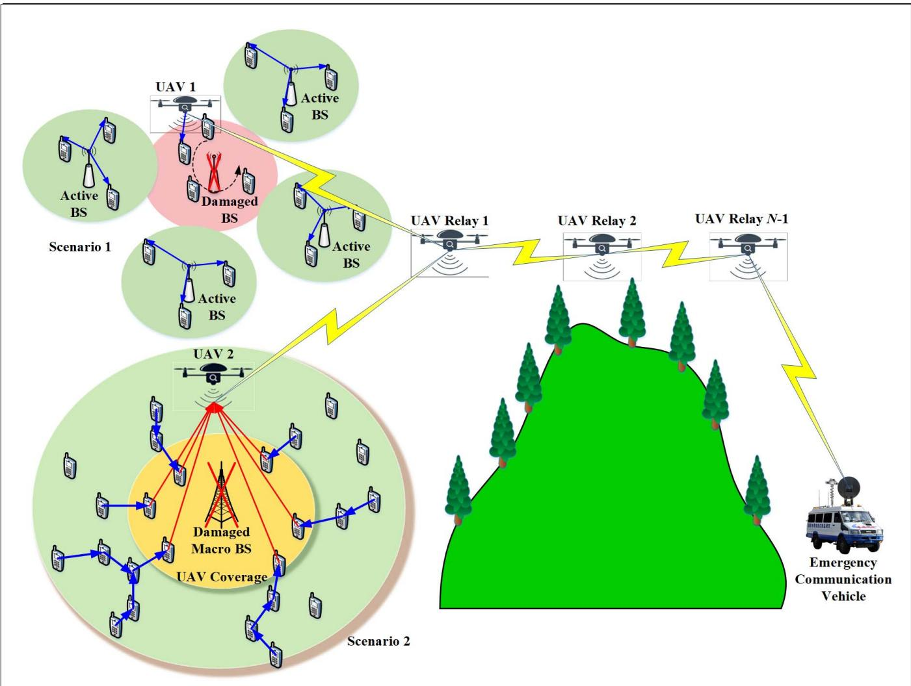
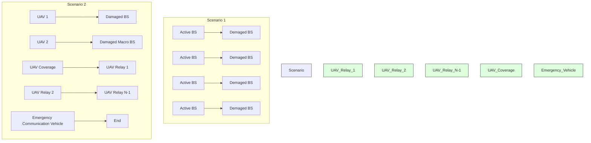
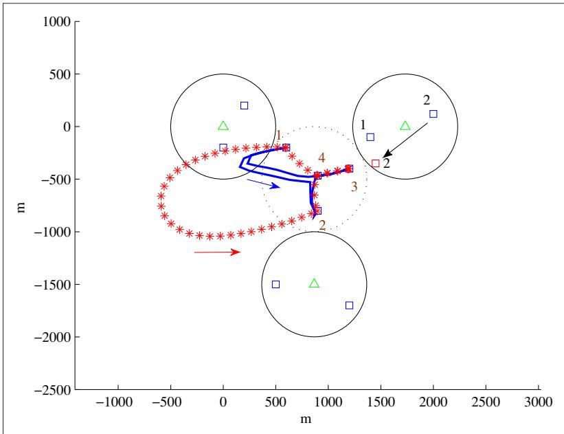
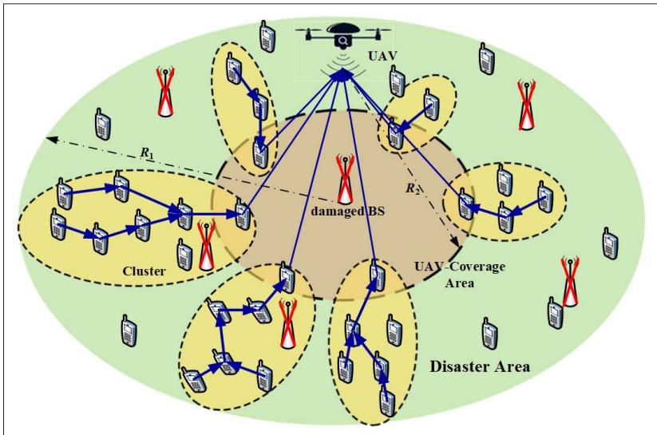
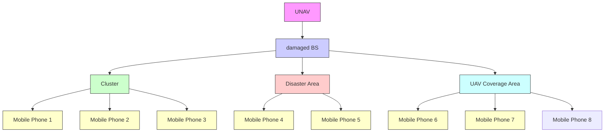
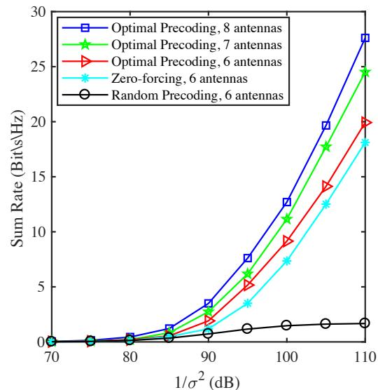
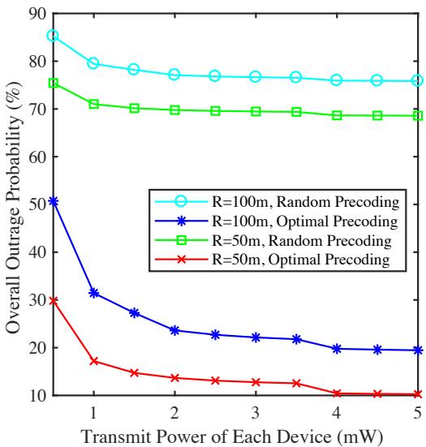
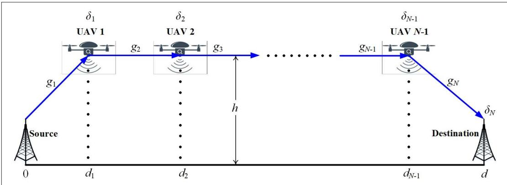
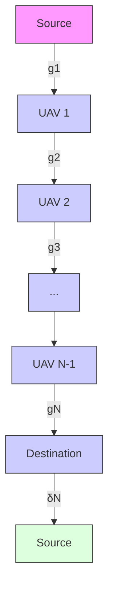
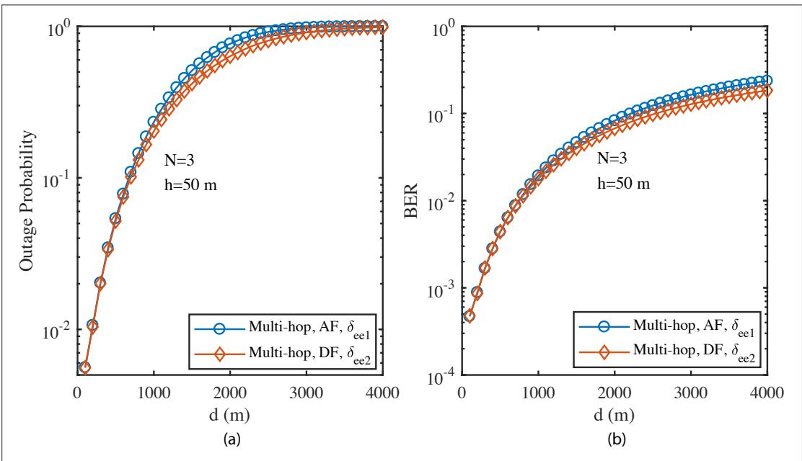

# UAV-Assisted Emergency Networks in Disasters

Nan Zhao, Weidang Lu, Min Sheng, Yunfei Chen, Jie Tang, F. Richard Yu, and Kai-Kit Wong

# Abstra ct

Reliable and flexible emergency communication is a key challenge for search and rescue in the event of disasters, especially for the case when base stations are no longer functioning. Unmanned aerial vehicle (UAV)-assisted networking is emerging as a promising method to establish emergency networks. In this article, a unified framework for a UAV-assisted emergency network is established in disasters. First, the trajectory and scheduling of UAVs are jointly optimized to provide wireless service to ground devices with surviving BSs. Then the transceiver design of UAV and establishment of multihop ground device-to-device communication are studied to extend the wireless coverage of UAV. In addition, multihop UAV relaying is added to realize information exchange between the disaster areas and outside through optimizing the hovering positions of UAVs. Simulation results are presented to show the effectiveness of these three schemes. Finally, open research issues and challenges are discussed.

# Introducti on

An emergency communication network is crucial for emergency rescue in natural disasters, especially when the communications infrastructure (e.g., base stations,BSs) is destroyed due to damage. However, existing methods lack flexibility, and are limited by environment and space. To overcome these challenges, unmanned aerial vehicles (UAVs) can be utilized by acting as flying BSs to provide wireless coverage to the ground devices in disasters due to their inherent advantages of flexibility and mobility [1].

Recently, UAV-assisted communications and networking have attracted much interest from both academia and industry [2–12]. The throughput of UAV-enabled mobile relaying was optimized by Zeng et al. by jointly optimizing the transmit power and relay trajectory in [2]. In [3], Zhao et al. proposed a UAV-assisted secure transmission scheme in hyperdense networks via caching. A blind beam tracking scheme was proposed for UAV-satellite communications by Zhao et al. in [4], using large-scale antenna array at the UAV. In [5], some excellent work was done by Wu et al. to maximize the minimum throughput of ground devices by jointly optimizing the UAV’s trajectory, transmit power, and scheduling. Energy trade-off was considered to achieve data collection from ground to the UAV by Yang et al. in [6] via two kinds of trajectory optimization. In [7], the channel models of UAV communications were characterized through practical measurements by Ahmed et al.. A novel UAV-enabled wireless power transfer system was proposed by Xu et al. in [8], in which a UAV-enabled energy transmitter delivered wireless energy to multiple ground energy receivers. In [9], Cheng et al. proposed a UAV trajectory optimization scheme to offload traffic for BSs at the edges of several adjacent cells. In [10], Wu et al. characterized the capacity region of a UAV-enabled two-user broadcast channel via jointly optimizing trajectory and transmit power or rate. Two typical multi-UAV relaying schemes of a single multihop link and multiple dual-hop links were studied by Chen et al. in [11], in which the optimal hovering positions were derived. In [12], Menouar et al. demonstrated the possible applications of intelligent transportation systems based on UAVs, with the potential and challenges highlighted.

Although excellent research has been conducted on UAV communications, very few works have focused on the aspect of UAV-assisted emergency networks in disasters [13–15]. In [13], Erdelj and Natalizio demonstrated the disaster management applications of UAV networks and discussed some open research issues. Message wireless transmission systems with the assistance of UAVs in largescale disasters were studied by Mase and Okada in [14]. A UAV flight path was optimized by Christy et al. for device-to-device (D2D) communication in disasters in [15]. A systematic study of UAV-assisted emergency networks is missing in the literature.

In this article, a unified framework of UAV-assisted emergency networks in disasters is established. First, the flight trajectory and communication scheduling of UAVs are jointly optimized to provide wireless service for mobile devices with the surviving ground BSs. Then the establishment of multihop D2D and the transceiver design of UAVs are discussed in the scenario without ground BSs to effectively extend the wireless coverage of UAV. Furthermore, to realize the information exchange between disaster and outside areas in the above two scenarios, the multihop UAV relaying scheme is proposed to optimize the hovering positions of UAVs. Simulation results are presented to illustrate the proposed schemes, and some interesting open research issues and challenges are pointed out for UAV-assisted emergency networks.

The rest of this article is organized as follows. In the next section, the framework of UAV-assisted emergency networks in disasters is first presented. Then the flight trajectory and communication scheduling of UAV are jointly optimized. In addition, the establishment of multihop D2D and trans-

This research was supported in part by the open research fund of State Key Laboratory of Integrated Services Networks under Grant ISN19-02, the National Natural Science Foundation of China (NSFC) under Grant 61871065 and 61871348, and the Fundamental Research Funds for the Central Universities under DUT17JC43.

Nan Zhao is with Dalian University of Technology and Xidian University; Weidang Lu is with Zhejiang University of Technology; Min Sheng is with Xidian University; Yunfei Chen is with the University of Warwick; Jie Tang (corresponding author) is with South China University of Technology; F. Richard Yu is with Carleton University; Kai-Kit Wong is with the University College London.

Digital Object Identifier: 10.1109/MWC.2018.1800160

flowchart

FIGURE 1. Framework of UAV-assisted emergency networks in disasters.

ceiver design of UAV are studied. Furthermore, the multihop UAV relaying scheme is proposed to optimize the positions of UAVs. Finally, open research issues and challenges are discussed, followed by conclusions in the final section.

# Fra mework of UAV-Assi sted Emergency Networks

The framework of UAV-assisted emergency networks in disasters is shown in Fig. 1, which is described as follows:

• Scenario 1: In the scenario with active ground BSs, UAVs can cooperate with the surviving BSs to provide wireless service for the ground devices. In this case, the flight trajectory and communication scheduling can be jointly optimized to improve the performance.   
• Scenario 2: In the scenario with no BSs, a largescale UAV can act as a flying BS to provide wireless connections, with the help of multihop D2D to extend its coverage area. In addition, UAV transceiver design can be further utilized to improve the reliability.   
• Multihop UAV relaying: The information exchange between disaster areas and outside in both scenarios 1 and 2 can be realized via multihop UAV relaying, in which the optimal hovering positions of UAVs can be derived with low complexity.

In the following sections, these key scenarios for UAV-assisted emergency networks are discussed in detail.

# Joi nt Traj ectory a nd Scheduli ng Opti mi za ti on

In disasters, victims and rescue workers are usually randomly distributed. It is hard to reach them when BSs are partially damaged. UAVs can be fully exploited to provide wireless connections to the ground devices via specific flight trajectories due to their flexibility and mobility. In [5], some fundamental work has been conducted to jointly optimize the UAV’s trajectory, transmit power, and scheduling without considering any surviving ground BSs. Due to the mobility of UAV, it can fly close to the ground devices to achieve better performance; however, this may cause severe interference to the devices in other cells. When there are some active surviving BSs, as shown in scenario 1 of Fig. 1, more complex situations should be considered, and interference between the BS-served devices and UAV-served devices should be properly avoided to guarantee reliable transmission [9], which is discussed in this section.

# Problem Formula ti on

In a cellular network with several adjacent cells, the BS for the central cell is assumed to be damaged due to natural disasters, as shown in scenario 1 of Fig. 1. Thus, a UAV is deployed to provide wireless connections to the ground devices in the central cell. To guarantee reliable transmission and avoid severe interference to the BS-served devices, we assume that the UAV flies periodically at a fixed altitude H. Each flying cycle T can be further divided into N time slots equally. Multiple antennas are equipped at each BS, while a single antenna is equipped at the UAV.

Define the UAV’s horizontal position at the nth slot in a specific flying cycle w(n) as [x(n), y(n)] T, and its maximum speed as V. Thus, the starting and ending positions of the UAV in a specific cycle should be located at the same point (i.e., w(1) = w(N)). In addition, the flying speed of the UAV in each time slot should not exceed V, which requires that $| | \mathbf { w } ( n + 1 ) - \mathbf { w } ( n ) | | ^ { 2 }$ be smaller than or equal to $( V T / N ) ^ { 2 } .$ . To schedule the transmission of UAV, we define the binary parameter s (n). s (n) equaling 1 or 0 means that the kth device is served or not served by the UAV at the nth slot, respectively. Due to the limited capability of a single-antenna UAV, at most one device is served by it at each time slot. Thus, $\Sigma _ { k \in \mathcal { K } } s _ { k } ( n )$ is equal to either 1 or 0, where K is the set of UAV-served devices. This time-division multiple access (TDMA) mode can achieve higher reliability with tolerable latency.

To improve the transmission efficiency of UAV and guarantee the quality of service (QoS) of the BS-served users, the sum rate of the UAV-served devices can be maximized by jointly optimizing the communication scheduling S as s (n), ∀k, ∀n and flight trajectory W as w(n), ∀n, with the constraints of w(n), $s _ { k } \dot { ( \boldsymbol n ) }$ , and the rate threshold for each BS-served and UAV-served device satisfied. The optimization is centralized at the UAV, with some necessary feedback and control from the surviving BSs to the UAV. However, this optimization is extremely difficult to solve due to the fact that it is a mixed-integer non-convex problem.

To handle this problem effectively, we first relax the binary variables s (n) into continuous ones $\hat { s } _ { k } ( n )$ that lie between 0 and 1. Thus, the suboptimal solutions can be calculated through solving the sub-problem with fixed trajectory W and the sub-problem with fixed scheduling S, iteratively, whose convergence can be guaranteed. When the trajectory W is fixed, the problem becomes linear programming, which can be solved easily through classic optimization algorithms (e.g., the interior-point method). When the scheduling S is fixed, the problem remains non-convex, which is still difficult to tackle. To handle this subproblem effectively, the constraints are first transformed into convex ones via successive convex optimization, and then block coordinate descent is applied to change this sub-problem into an approximately convex one, which can also be solved via classic algorithms. After convergence via iterations, the calculated continuous variables $\hat { s } _ { k } ( n )$ should be turned back into binary ones via comparing their values with 0.5. Thus, the suboptimal values of W and S can be achieved via this iterative algorithm with low computational complexity. In addition, power allocation of a UAV at each time slot is not considered in this scheme to avoid complex controls. Instead, the UAV can fly close to the ground nodes to achieve optimal performance due to its flexibility.

Through the above joint optimization scheme for UAV, the average throughput of UAV-served devices can be maximized with the QoS of BS-served devices guaranteed. This is achieved by the joint consideration of flying close to its served devices to improve the throughput and staying away from the BS-served devices to avoid interference.

scatter

| Point | m     | m     |
|-------|-------|-------|
| 1     | 1500  | -200  |
| 2     | 1600  | -100  |
| 3     | 1200  | -400  |
| 4     | 900   | -500  |
| 5     | 800   | -700  |
| 6     | 700   | -800  |
| 7     | 600   | -900  |
| 8     | 500   | -1000 |
| 9     | 400   | -1100 |
| 10    | 300   | -1200 |
| 11    | 200   | -1300 |
| 12    | 100   | -1400 |
| 13    | 50    | -1500 |
| 14    | 20    | -1600 |
| 15    | 10    | -1700 |
| 16    | 5     | -1800 |
| 17    | 2     | -1900 |
| 18    | -1    | -2000 |
| 19    | -5    | -2100 |
| 20    | -10   | -2200 |
| 21    | -15   | -2300 |
| 22    | -20   | -2400 |
| 23    | -25   | -2500 |
| 24    | -30   | -2600 |
| 25    | -35   | -2700 |
| 26    | -40   | -2800 |
| 27    | -45   | -2900 |
| 28    | -50   | -3000 |
| 29    | -55   | -3100 |
| 30    | -60   | -3200 |
| 31    | -65   | -3300 |
| 32    | -70   | -3400 |
| 33    | -75   | -3500 |
| 34    | -80   | -3600 |
| 35    | -85   | -3700 |
| 36    | -90   | -3800 |
| 37    | -95   | -3900 |
| 38    | -100  | -4000 |
| 39    | -105  | -4100 |
| 40    | -110  | -4200 |
| 41    | -115  | -4300 |
| 42    | -120  | -4400 |
| 43    | -125  | -4500 |
| 44    | -130  | -4600 |
| 45    | -135  | -4700 |
| 46    | -140  | -4800 |
| 47    | -145  | -4900 |
| 48    | -150  | -5000 |
| 49    | -155  | -5100 |
| 50    | -160  | -5200 |
| 51    | -165  | -5300 |
| 52    | -170  | -5400 |
| 53    | -175  | -5500 |
| 54    | -180  | -5600 |
| 55    | -185  | -5700 |
| 56    | -190  | -5800 |
| 57    | -195  | -5900 |
| 58    | -200  | -6000 |
| 59    | -205  | -6100 |
| 60    | -210  | -6200 |
| 61    | -215  | -6300 |
| 62    | -220  | -6400 |
| 63    | -225  | -6500 |
| 64    | -230  | -6600 |
| 65    | -235  | -6700 |
| 66    | -240  | -6800 |
| 67    | -245  | -6900 |
| 68    | -250  | -7000 |
| 69    | -255  | -7100 |
| 70    | -260  | -7200 |
| 71    | -265  | -7300 |
| 72    | -270  | -7400 |
| 73    | -275  | -7500 |
| 74    | -280  | -7600 |
| 75    | -285  | -7700 |
| 76    | -290  | -7800 |
| 77    | -295  | -7900 |
| 78    | -300  | -8000 |
| 79    | -305  | -8100 |
| 80    | -310  | -8200 |
| 81    | -315  | -8300 |
| 82    | -320  | -8400 |
| 83    | -325  | -8500 |
| 84    | -330  | -8600 |
| 85    | -335  | -8700 |
| 86    | -340  | -8800 |
| 87    | -345  | -8900 |
| 88    | -350  | -9000 |
| 89    | -355  | -9100 |
| 90    | -360  | -9200 |
| 91    | -365  | -9300 |
| 92    | -370  | -9400 |
| 93    | -375  | -9500 |
| 94    | -380  | -9600 |
| 95    | -385  | -9700 |
| 96    | -390  | -9800 |
| 97    | -395  | -9900 |
| 98    | -400  | -1000|

FIGURE 2. Performance comparison of joint optimization of UAV scheduling and trajectory when a specific user served by the second BS moves toward the UAV.

# Si mula ti on Results

In Fig. 2, the trajectory of the UAV is demonstrated to maximize the sum rate of the UAV-served users. We set H = 50 m, V = 50 m/s, T = 120 s, and N = 60. The channel noise is assumed to be –110 dBm. The transmit power of each BS is set to 0.1 W, while the transmit power of the UAV is 0.05 W. The rate thresholds of the BS-served devices and UAV-served devices are set to be 1.5 b/s/Hz and 0.5 b/s/Hz, respectively. Due to the much better channel conditions in the upper left cell than the others, we can see that the blue curve tends to move toward the upper left cell in order to guarantee the QoS of devices in the other two cells. In addition, when the second device served by the upper right BS moves toward the UAV, the red curve will move even closer to the upper left cell than the blue one, which means that the UAV will fly away from this device to avoid generating strong interference to it. Thus, the sum rate of the UAV-served devices can be optimized with the QoS of both the BS-served devices and the UAV-served devices guaranteed through proper management of the scheduling and trajectory of the UAV.

# Tra nsceiv er Desi gn a nd Multi hop D2D Esta bli shment

In scenario 2 of Fig. 1, all the ground BSs have been damaged due to disasters, and a large-scale UAV with multiple antennas can be deployed as a flying BS to provide wireless service, as shown in Fig. 3. Thus, the UAV transceiver can be carefully designed to guarantee the reliability in the downlink and uplink. In addition, the coverage area of the UAV is limited due to its battery constraint; thus, multihop D2D links can be established to extend its coverage.

flowchart

FIGURE 3. Demonstration of wireless coverage via a large-scale UAV with ground multihop D2D links.

# Tra nsceiv er Desi gn

In a circular disaster area with radius $R _ { 1 } ,$ as shown in Fig. 3, all the BSs have been destroyed. Thus, a large-scale UAV equipped with M antennas is deployed at the center with altitude H to provide wireless coverage to K ground single-antenna devices. According to the maximum angle between UAV and device, we can calculate the maximum transmission distance between the UAV and a specific ground device $R _ { 2 }$ as H/cosf. Due to the limited transmit power of UAV, the QoS of edge devices is difficult to guarantee. Thus, the multiple antennas at the UAV should be fully exploited to achieve reliable transmission.

In the uplink, many devices may want to connect to the UAV simultaneously, and the decoding vectors at the UAV for each device should be carefully designed. In addition, the transmit power of all the devices is assumed to be equal, because the global channel state information (CSI) is difficult to obtain at each node without ground BSs for any optimization. Thus, we can maximize the throughput of all the devices by jointly optimizing the unit decoding vectors with a constraint on the rate of each device. Although this optimization is non-convex, it can be transformed into a convex one, and its closed-form solution can be derived through maximizing the signal-to-interference-plus-noise ratio (SINR) of each link via its corresponding decoding vector.

On the other hand, the precoding design of the UAV in the downlink is more complex. For simplicity, the power information can be integrated into the precoding vectors. Thus, we can maximize the throughput of all the devices by jointly optimizing the precoding vectors, with constraints on the rate of each device and the UAV transmission power. This optimization is non-convex and cannot be solved directly. First, some auxiliary variables are introduced, and the constraints can be converted into convex ones through first-order Taylor expansion approximately. The, the objective function can also be converted to convex via second-order-cone programming (SOCP). Thus, suboptimal solutions can be obtained by solving an SOCP problem iteratively via classic optimization algorithms.

# Multi hop D2D Esta bli shment

Although the reliability of wireless connections for ground devices can be enhanced through the transceiver design of a UAV, its coverage is still limited, as shown in Fig. 3, due to the constraint of transmit power. Thus, to increase UAV coverage effectively for the randomly distributed victims and rescue workers, multihop D2D links can be established to bridge the nodes within direct coverage of the UAV and the outside ones. In this scenario, we have to perform multihop D2D to extend the coverage of the UAV. It can be deemed as a self-rescue behavior for survival, although this will cause power consumption of their own devices.

To establish multihop D2D links effectively in disasters, the number of hops should be minimized with reliable performance due to the power limitation of each hop and the shortage in power supply. Thus, a shortest-path-routing (SPR) algorithm can be designed in which a device can be selected as a relay node if it is closer to the destination than all the other available devices within a coverage radius r of the current node to guarantee reliability. In addition, the selected device should also be closer to the line from source to destination. The SPR algorithm is a suitable scheme in establishing multihop D2D links with fewer hops to extend the coverage of the UAV, although its performance is not the best.

Outage probability is a key measure of the reliability of multihop D2D establishment, which is the probability that the received SINR g falls below a predefined threshold e. To derive the average outage probability, the successful transmission probability of a single hop is first analyzed, based on which the single-hop outage probability can be obtained with a Possion point process (PPP) density for the device distribution. Using single-hop, the average number of hops J from source to destination with distance R can be achieved according to the average distance of a single hop. Finally, the average outage probability of a multihop D2D link can be derived based on the single-hop outage probability and J.

# Di scussi on

In the above demonstration, a large-scale UAV with multiple antennas is considered. Nevertheless, the case when only single-antenna UAVs are available may happen in disasters. In this situation, non-orthogonal multiple access (NOMA) can be adopted to serve several ground devices simultaneously when successive interference cancellation can be performed at fifth generation (5G)-enabled devices or UAV in the downlink and uplink, respectively. To enhance the reliability of the NOMA-based UAV transmission, the hovering position of the UAV and the power allocation for each device can be jointly optimized.

# Si mula ti on Results

The performance of downlink is analyzed in Fig. 4, in which K = 6, H = 50 m, R = 200 m, r = 10 m, and $\Phi = 6 0 ^ { \circ }$ . First, the sum rate of UAV downlink is compared for different signal-to-noise ratios (SNRs). The precoding vectors with randomly generated complex Guassian entries are also compared. From the results, we can see that reliable UAV downlink transmission can be achieved with $M \geq K = 6$ antennas equipped at the UAV. When $M < K ,$ , the zero-forcing scheme cannot be solved, and the performance of the optimal precoding scheme will also degrade severely. In addition, the sum rate increases with antennas at the UAV and decreases with channel noise $\sigma ^ { 2 } .$ . Then the overall outage probability of the link from the UAV to the destination in the multihop D2D is compared for the different transmit power of each device, in which the transmit power of the UAV is 10 mW, the number of available devices for establishing the multihop link is 100, the PPP density is 0.001, $\sigma ^ { 2 } = - 1 1 0$ dBm, $M = 6 ,$ and e = –6 dB. From the results, we can see that reliable transmission from the UAV to the devices out of its direct scope can be guaranteed with low outage probability through the proposed SPR algorithm and precoding design. In addition, the outage probability will become higher with larger distance between the source and destination of the multihop link.

line

| 1/σ² (dB) | Optimal Precoding, 8 antennas | Optimal Precoding, 7 antennas | Optimal Precoding, 6 antennas | Zero-forcing, 6 antennas | Random Precoding, 6 antennas |
| --------- | ----------------------------- | ----------------------------- | ----------------------------- | ------------------------- | ---------------------------- |
| 70        | 0                             | 0                             | 0                             | 0                         | 0                            |
| 80        | 0                             | 0                             | 0                             | 0                         | 0                            |
| 90        | 3                             | 2                             | 2                             | 1                         | 0                            |
| 100       | 12                            | 11                            | 9                             | 7                         | 1                            |
| 110       | 28                            | 25                            | 20                            | 18                        | 1                            |

line

| Transmit Power of Each Device (mW) | R=100m, Random Precoding | R=100m, Optimal Precoding | R=50m, Random Precoding | R=50m, Optimal Precoding |
| ----------------------------------- | ------------------------ | ------------------------- | ----------------------- | ------------------------ |
| 0                                   | 86                       | 50                        | 76                      | 30                       |
| 1                                   | 80                       | 32                        | 71                      | 17                       |
| 2                                   | 78                       | 24                        | 70                      | 14                       |
| 3                                   | 77                       | 22                        | 69                      | 13                       |
| 4                                   | 76                       | 20                        | 68                      | 11                       |
| 5                                   | 76                       | 19                        | 68                      | 10                       |

(b)   
FIGURE 4. a) Downlink sum rate comparison of the optimal precoding design, zero-forcing, and random precoding design; b) overall outage probability comparison of UAV and multihop D2D downlink.

# Multi hop UAV Rela yi ng

Although wireless coverage can be achieved in disasters via UAVs, as shown in scenarios 1 and 2 of Fig. 1, the information bridge should be built between these UAVs and the outside emergency communication vehicles or core networks for these two scenarios effectively.

To realize information exchange between disaster areas and outside, multihop UAV relaying can be established to overcome the space and environment limitations, as shown in Fig. 5.

In this section, the optimal hovering positions of UAV relaying systems are discussed [11].

# Opti ma l Hov eri ng of UAV Rela ys

In a multihop UAV relaying system as shown in $\mathsf { F i g . } 5 ,$ the source and destination nodes are linked by N – 1 UAV relays deployed in the same horizontal line at the same altitude $h ,$ according to which the number of UAVs can be minimized. The distance between the source and destination is d, and the nth UAV is $d _ { n }$ away from the source, $n = 1 , 2 , \ldots N - 1 , g _ { i }$ is the fading coefficient of the ith hop, which includes both path loss and channel fading. Denote the air-to-air and air-to-ground path loss models as $\beta _ { 1 } \ r ^ { \mathrm { a } _ { 1 } }$ and $\beta _ { 2 } r ^ { \alpha _ { 2 } }$ , respectively. In the existing literature, there are plenty of works focusing on the path loss for UAV communications, and in this article, we adopt the one in [7] to set the parameters as $\mathrm { ~ a } _ { 1 } = 2 . 0 \dot { 5 } , \mathrm { ~ a } _ { 2 } = 2 . 3 2 , \beta _ { 1 } =$ $\beta _ { 2 } = ( 4 \pi \mathsf { f } / \dot { \alpha } ) ^ { 2 } ,$ , which were obtained through practical measurements. For the channel fading, we adopt the Nakagami-m distribution.

Define the received SNR of the ith hop of the relaying system as $\delta _ { j } .$ When the amplify-and-forward (AF) relaying protocol is adopted, the received SNR at the destination of multihop relaying can be expressed as

$$
\delta_ {e e 1} = \left(\prod_ {i = 1} ^ {N} (1 + 1 / \delta_ {i}) - 1\right) ^ {- 1}. \tag {1}
$$

When the decode-and-forward (DF) relaying protocol is exploited, the received SNR at the destination can be expressed as

$$
\delta_ {e e 2} = \min \{\delta_ {1}, \delta_ {2}, \dots , \delta_ {N} \}. \tag {2}
$$

Taking the case of maximizing $\delta _ { \mathrm { e e 1 } }$ as an example, first, the optimal hovering altitude can be derived by taking the first-order derivative of the objective function, which is equal to 0. Then the optimal distances of UAV relays from the source can be derived.1 The result obtained will be time-varying, which is hard to implement. To fix this problem, the instantaneous CSI is replaced by the average CSI [11]. Thus, we can replace the instantaneous value of the fading coefficient gi with its average value to make it more practical.

# Di scussi on

In the above demonstration, the optimal hovering positions of UAV relaying are derived with $\delta _ { \mathrm { e e 1 } }$ when AF is adopted. For $\delta _ { \mathrm { e e 2 } }$ with DF, the solutions of optimal positions are quite different, although

From the results, we can see that reliable transmission from UAV to the devices out of its direct scope can be guaranteed with low outage probability through the proposed SPR algorithm and precoding design. In addition, the outage probability will become higher with larger distance between the source and destination of the multi-hop link.

When we aim to cover a long distance in disasters, the multi-hop single-link UAV relaying can achieve much better performance; on the other hand, if we aim to enhance the reliability of relaying within a shorter distance, the multiple dual-hop UAV relaying is more suitable.

flowchart

FIGURE 5. Diagram for the multi-hop UAV relaying system.

line

| d (m) | Outage Probability (Multi-hop, AF, δ_ee1) | Outage Probability (Multi-hop, DF, δ_ee2) | BER (Multi-hop, AF, δ_ee1) | BER (Multi-hop, DF, δ_ee2) |
|-------|------------------------------------------|------------------------------------------|-----------------------------|-----------------------------|
| 0     | 0.01                                     | 0.01                                     | 0.0001                      | 0.0001                      |
| 500   | 0.1                                      | 0.1                                      | 0.01                        | 0.01                        |
| 1000  | 0.5                                      | 0.5                                      | 0.05                        | 0.05                        |
| 1500  | 0.8                                      | 0.8                                      | 0.1                         | 0.1                         |
| 2000  | 0.95                                     | 0.95                                     | 0.2                         | 0.2                         |
| 2500  | 0.98                                     | 0.98                                     | 0.3                         | 0.3                         |
| 3000  | 0.99                                     | 0.99                                     | 0.4                         | 0.4                         |
| 3500  | 0.995                                    | 0.995                                    | 0.5                         | 0.5                         |
| 4000  | 1.0                                      | 1.0                                      | 0.6                         | 0.6                         |

FIGURE 6. Outage probability and BER comparison with different d when N = 3 and $h = 5 0 \mathrm { m }$

they can be derived similarly as in the case of $\delta _ { \mathrm { e e 1 } } ,$ which will not be presented here for simplicity [11]. In addition, when other types of channel modeling are considered, the results of the relaying optimization will obviously also change. For example, the optimal altitude h^ will not always remain zero when other channel models are adopted. Moreover, the information exchange between a disaster area and outside can also be achieved by multiple dual-hop UAV relaying, as indicated in [11]. When we aim to cover a long distance in disasters, multihop single-link UAV relaying can achieve much better performance; on the other hand, if we aim to enhance the reliability of relaying within a shorter distance, multiple dual-hop UAV relaying is more suitable [11].

# Si mula ti on Results

In the simulation, the outage probability and the bit error rate (BER) for the derived optimal positions of multihop UAV relaying are compared in Fig. 6 for different d in multihop UAV relaying with endto-end SNR equal to $\delta _ { \mathrm { e e 1 } }$ and $\delta _ { \mathrm { e e } 2 }$ , respectively. f = 2 GHz, the transmit power of each hop is 10 dBm, noise power at each UAV relay is –100 dBm, and the average value of |g |2 is 1. m is set to 1 for the Nakagami fading. From the results, we can see that the outage probability and BER both become higher with larger distance due to the more severe path loss. In addition, we can see that both the outage and BER performance of the DF protocol is better than that of the AF protocol, although the computational complexity of DF is higher.

# Open Resea rch Issues a nd Cha llenges

Although some fundamental works have been conducted on the UAV-assisted emergency networks in disasters in this article, there still remain some open research issues and challenges to be addressed in the future.

Multi-UAV Trajectory: In this article, only a single UAV is considered to provide wireless connections for ground devices with surviving BSs. Nevertheless, in a larger disaster area with more devices to be served, multiple UAVs are needed. This will complicate trajectory optimization of all these UAVs, considering its influence on the ground BS-served devices. In the future, intelligent distributed algorithms for the trajectory and scheduling optimization for UAVs should be developed.

Interference Management: In this article, a large-scale UAV is deployed to provide wireless service to ground devices with the help of multihop D2D links. Nevertheless, when more UAVs are deployed to provide service for a much larger area, the interference will appear among the devices served by different UAVs. In addition, if there are still some ad hoc networks within the coverage area of the UAV, the interference between them should be fully considered. Thus, interference management is a key challenge for UAV-assisted emergency networks in disasters.

Channel Modeling: The most distinctive characteristic of UAV communication is the channel modeling, especially between the UAV and ground. In this article, the channel model in [7] is adopted to analyze the positions of multihop UAV relaying. Nevertheless, in practical systems, the channel models for UAV communication are quite different from case to case, and some other models can also be suitable to use. Thus, the optimal hovering positioning of multihop UAV relaying should be further analyzed with other feasible channel models.

Energy Supply: Energy supply always remains a key challenge for UAV communication due to the battery limitation, especially for disasters, in which it is difficult to provide stable energy supply. This challenge can be solved by energy harvesting, such as solar energy; however, it will become invalid at night. Thus, more energy-efficient systems should be designed to prolong the operational time for UAVs.

# Conclusi ons

A UAV can be utilized to establish emergency wireless networks to overcome the space and environment limitations in disasters due to its flexibility and mobility. In this article, a unified framework of UAV-assisted emergency networks in disasters has been established. First, with surviving BSs considered, the trajectory and scheduling of A UAV have been jointly optimized to provide wireless connections for the ground devices. Then the transceiver design of UAV and ground multihop D2D establishment have been studied to extend the coverage scope of the UAV BS. Furthermore, a multihop relaying scheme has been examined to exchange the information between the disaster area and outside, in which the hovering positions of UAVs were optimized. Finally, some open research issues and challenges in UAV-assisted emergency networks have been discussed.

# Ref erences

[1] Y. Zeng, R. Zhang, and T. J. Lim, “Wireless Communications with Unmanned Aerial Vehicles: Opportunities and Challenges,” IEEE Commun. Mag., vol. 54, no. 5, May. 2016, pp. 36–42.   
[2] Y. Zeng, R. Zhang, and T. J. Lim, “Throughput Maximization for UAV-Enabled Mobile Relaying Systems,” IEEE Trans. Commun., vol. 64, no. 12, Dec. 2016, pp. 4983–96.   
[3] N. Zhao et al., “Caching UAV Assisted Secure Transmission in Hyper-Dense Networks Based on Interference Alignment,” IEEE Trans. Commun., vol. 66, no. 5, May 2018, pp. 2281–94.   
[4] J. Zhao et al., “Beam Tracking for UAV Mounted SatCom on-the-Move with Massive Antenna Array,” IEEE JSAC, vol. 36, no. 2, Feb. 2018, pp. 363–75.   
[5] Q. Wu, Y. Zeng, and R. Zhang, “Joint Trajectory and Communication Design for Multi-UAV Enabled Wireless Networks,” IEEE Trans. Wireless Commun., vol. 17, no. 3, Mar. 2018.   
[6] D. Yang et al., “Energy Tradeoff in Ground-to-UAV Communication Via Trajectory Design,” IEEE Trans. Vehic. Tech., vol. 67, no. 7, July 2018, pp. 6721–26.   
[7] N. Ahmed, S. S. Kanhere, and S. Jha, “On the Importance of Link Characterization for Aerial Wireless Sensor Networks,” IEEE Commun. Mag., vol. 54, no. 5, May 2016, pp. 52–57.   
[8] J. Xu, Y. Zeng, and R. Zhang, “UAV-Enabled Wireless Power Transfer: Trajectory Design and Energy Optimization,” IEEE Trans. Wireless Commun., vol. 17, no. 8, Aug. 2018, pp. 5092–5106.

[9] F. Cheng et al., “UAV Trajectory Optimization for Data Offloading at the Edge of Multiple Cells,” IEEE Trans. Vehic. Tech., vol. 67, no. 7, July 2018, pp. 6732–36.   
[10] Q. Wu, J. Xu, and R. Zhang, “Capacity Characterization of UAV-Enabled Two-User Broadcast Channel,” IEEE JSAC, to appear.   
[11] Y. Chen et al., “Multiple UAVs as Relays: Multi-Hop Single Link Versus Multiple Dual-Hop Links,” IEEE Trans. Wireless Commun., vol. 17, no. 9, Sept. 2018, pp. 6348–59.   
[12] H. Menouar et al., “UAV-Enabled Intelligent Transportation Systems for the Smart City: Applications and Challenges,” IEEE Commun. Mag., vol. 55, no. 3, Mar. 2017, pp. 22–28.   
[13] M. Erdelj and E. Natalizio, “UAV-Assisted Disaster Management: Applications and Open Issues,” Proc. ICNC’ 16, Kauai, HI, Feb. 2016, pp. 1–5.   
[14] K. Mase and H. Okada, “Message Communication System Using Unmanned Aerial Vehicles Under Large-Scale Disaster Environments,” Proc. IEEE PIMRC ’15, Hong Kong, China, Aug. 2015, pp. 2171–76.   
[15] E. Christy et al., “Optimum UAV Flying Path for Device-To-Device Communications in Disaster Area,” Proc. ICSigSys ’16, Sanur, Indonesia, May 2017, pp. 318–22.

# Bi ogra phi es

Nan Zhao [SM] (zhaonan@dlut.edu.cn) is an associate professor at Dalian University of Technology, China. He received his Ph.D. degree in information and communication engineering in 2011 from Harbin Institute of Technology, China. He received the IEEE Communications Society Asia Pacific Board Outstanding Young Researcher Award in 2018. He is an Editor for IEEE Transactions on Green Communications and Networking.

Weidan g Lu [M] (luweid@zjut.edu.cn) is an associate professor with the College of Information Engineering at Zhejiang University of Technology, Hangzhou, China. He was a visiting scholar with Nanyang Technology University, Singapore, the Chinese University of Hong Kong, China, and Southern University of Science and Technology, China. His research interests include SWIPT, WSNs, and cooperative communications.

Min Shen g [SM] (msheng@mail.xidian.edu.cn) received her M.S. and Ph.D. degrees in communication and information systems from Xidian University in 2000 and 2004, respectively. She is currently a full professor at the State Key Laboratory of Integrated Service Networks, Xidian University. Her general research interests include mobile ad hoc networks, 5G mobile communication systems, and satellite communications networks. She was awarded as a Distinguished Young Researcher by NSFC and a Changjiang Scholar by the Ministry of Education, China, respectively.

Yun fei Chen [SM] (Yunfei.Chen@warwick.ac.uk) received his B.E. and M.E. degrees in electronics engineering from Shanghai Jiaotong University, P.R.China, in 1998 and 2001, respectively. He received his Ph.D. degree from the University of Alberta in 2006. He is currently working as an associate professor at the University of Warwick, United Kingdom. His research interests include wireless communications, cognitive radios, wireless relaying, and energy harvesting.

Jie Tan g [SM] (eejtang@scut.edu.cn) received his B.Eng. degree from South China University of Technology in 2008, his M.Sc. degree from the University of Bristol in 2009, and his Ph.D. degree from Loughborough University in 2012. He is currently an associate professor at South China University of Technology. His research interests include green communications, NOMA, 5G networks, SWIPT, heterogeneous networks, cognitive radio, and D2D communications.

F. Ric har d Yu [F] (richard.yu@carleton.ca) is a professor at Carleton University, Canada. His research interests include connected/autonomous vehicles, security, and wireless. He serves on the Editorial Boards of several journals, including Co-Editor-in-Chief of Ad Hoc & Sensor Wireless Networks, Lead Series Editor for IEEE Transactions on Vehicular Technology, and Area Editor for IEEE Communications Surveys & Tutorials and IEEE Transactions on Green Communications and Networking, He is a Distinguished Lecturer and the Vice President (Membership) of the IEEE Vehicular Technology Society.

Kai-Kit Won g [F] (kai-kit.wong@ucl.ac.uk) received his B.Eng., M.Phil., and Ph.D. degrees, all in electrical and electronic engineering, from Hong Kong University of Science and Technology in 1996, 1998, and 2001, respectively. He is Chair in Wireless Communications at the Department of Electronic and Electrical Engineering, University College London, United Kingdom. He is a Senior Editor for IEEE Communications Letters and IEEE Wireless Communications Letters and also an Area Editor for IEEE Transactions on Wireless Communications.

Energy supply always remains a key challenge for UAV communication due to the battery limitation, especially for the disasters, in which it is difficult to provide stable energy supply. This challenge can be solved by energy harvesting, such as solar energy, however, it will become invalid during night time.