# UAV-Assisted Relaying and Edge Computing: Scheduling and Trajectory Optimization

Xiaoyan Hu , Student Member, IEEE, Kai-Kit Wong, Fellow, IEEE,

Kun Yang , Senior Member, IEEE, and Zhongbin Zheng

Abstract— In this paper, we study an unmanned aerial vehicle (UAV)-assisted mobile edge computing (MEC) architecture, in which a UAV roaming around the area may serve as a computing server to help user equipment (UEs) compute their tasks or act as a relay for further offloading their computation tasks to the access point (AP). We aim to minimize the weighted sum energy consumption of the UAV and UEs subject to the task constraints, the information-causality constraints, the bandwidth allocation constraints and the UAV’s trajectory constraints. The required optimization is nonconvex, and an alternating optimization algorithm is proposed to jointly optimize the computation resource scheduling, bandwidth allocation, and the UAV’s trajectory in an iterative fashion. The numerical results demonstrate that significant performance gain is obtained over conventional methods. Also, the advantages of the proposed algorithm are more prominent when handling computationintensive latency-critical tasks.

Index Terms— UAV, mobile edge computing, resource scheduling, bandwidth allocation, trajectory optimization.

# I. INTRODUCTION

# A. Motivation and Prior Works

W ITH the popularization of Internet of things (IoT) and the increasingly complex mobile applications, such as virtual and augmented reality, online gaming, automatic driving, etc., the computing demands at user equipment (UEs) are reaching an unprecedented level. Mobile edge computing (MEC), widely regarded as the technology to help the resource-limited UEs handle computation-intensive latencycritical tasks, has attracted great attention from both the

Manuscript received December 5, 2018; revised April 13, 2019 and June 19, 2019; accepted June 28, 2019. Date of publication July 19, 2019; date of current version October 9, 2019. This work was supported in part by the U.K. Engineering and Physical Sciences Research Council (EPSRC) under Grant EP/K015893/1 and in part by the Natural Science Foundation of China under Grant 61620106011 and Grant 61572389. This paper will be presented in part at the IEEE Global Communications Conference (GLOBECOM), Waikoloa, HI, USA, December 2019. The associate editor coordinating the review of this paper and approving it for publication was N. Michelusi. (Corresponding author: Xiaoyan Hu.)

X. Hu and K.-K. Wong are with the Department of Electronic and Electrical Engineering, University College London, London WC1E 7JE, U.K. (e-mail: xiaoyan.hu.16@ucl.ac.uk; kai-kit.wong@ucl.ac.uk).

K. Yang is with the School of Computer Science and Electronic Engineering, University of Essex, Colchester CO4 3SQ, U.K., and also with the School of Communication Engineering, University of Electronic Science and Technology of China, Chengdu 611731, China (e-mail: kunyang@essex.ac.uk).

Z. Zheng is with the East China Institute of Telecommunications, China Academy of Information and Communications Technology, Shanghai 200001, China (e-mail: ben@ecit.org.cn).

Color versions of one or more of the figures in this article are available online at http://ieeexplore.ieee.org.

Digital Object Identifier 10.1109/TWC.2019.2928539

academia and the industry. The standardization organizations and industry associations such as ETSI and 5GAA have identified several use cases for MEC, from the intelligent video acceleration and application-aware performance optimization to vehicle-to-everything and massive machine-type communications, etc. [1], [2].

The rationale behind MEC is that UEs’ computing tasks can be offloaded and completed at the edge of wireless networks by deploying cloud servers at the access points (APs), so as to liberate the UEs from heavy computing workloads and prolong their battery lifetime [3], [4]. Recently, MEC has been widely used in cellular networks, focusing on improving the energy efficiency or reducing the latency of various cellular-based MEC systems [5]–[14]. A multicell MEC system was studied in [5], where the total energy consumption was minimized by jointly optimizing the radio and computational resources. In [6], the resource allocation for minimizing the weighted sum energy consumption of users was addressed with a derived threshold-based optimal policy. Later in [7], the scenario of a UE with multiple tasks was considered, where multiple APs assisted the UE to reduce its total task execution latency and energy consumption. A two-tier heterogeneous network with the coexistence of edge and central cloud computing was studied in [8], and the cloud selection was optimized to minimize the network’s energy consumption. In [9], a device-todevice (D2D) fogging was explored to achieve energy-efficient task completion by sharing computation and communication resources amongst mobile devices. The sum of computation efficiency defined as the calculated data bits divided by the energy consumption was maximized in [10] with iterative and gradient descent methods. In addition, the works in [11]–[14] introduced the use of energy harvesting or wireless power transfer (WPT) technologies into the cellular-based MEC systems, which has enabled the UEs to have sustainable energy support to their transmissions and computation, but at the cost of increasing the computational complexity of the systems.

Due to the attractive advantages of unmanned aerial vehicle (UAV) for its easy deployment, flexible movement, and lineof-sight (LoS) connections, and so on, UAV-enabled wireless communication networks have been much researched in recent years [15]–[19]. For instance, an energy-efficient UAV communication was investigated in [16], in which an UAV flew at a fixed altitude and had the initial and final locations preset on its trajectory design. In [17], the UAV-enabled mobile relaying systems were studied, where the throughput was maximized by optimizing the transmit power allocation and the

UAV’s trajectory. Recently, [18] proposed a generic framework for the analysis and optimization of the air-to-ground systems, and an optimum altitude for UAV in maximizing the coverage region with a guaranteed minimum outage performance was derived. WPT technology was considered for UAV wireless networks in [19], and the UAV trajectory was optimized to maximize the sum energy or the minimum energy transferred to all the UEs. It was revealed that UAV-enabled WPT can significantly enhance the WPT performance over the traditional WPT system with fixed energy transmitters.

It is a great attempt to leverage the technology of the UAV in MEC systems, and the performance improvement of the UAV-enabled MEC architecture has been shown to be substantial [20]–[22]. A UAV-based MEC system was investigated in [20], where a moving UAV equipped with a processing server was considered to help UEs compute their offloaded tasks. The total mobile energy consumption was minimized by jointly optimizing the task-bit allocation and the UAV trajectory using the successive convex approximation (SCA) methods. Later in [21], a wireless-powered UAV-enabled MEC system was studied, where the UAV was endowed with an energy transmitter and an MEC server to provide energy as well as MEC services for the UEs. The computation rate maximization problems were addressed under both the partial and binary computation offloading modes by alternating algorithms. In another study [22], the UAV acted as a UE rather than an MEC server, which was served by multiple cellular ground base stations to compute its offloaded tasks. The UAV’s mission completion time was minimized by optimizing the resource allocation and the UAV trajectory through an SCA algorithm.

# B. Our Contributions

The aforementioned MEC works concentrate either on the cellular-based MEC networks, where the UEs’ tasks are completed by using the computing resources at the APs; or the UAV-enabled MEC architectures by exploiting the computing capability of the UAV processing server. However, for the UEs with seriously degraded links to the AP due to severe blockage, it is impossible to take full use of the computing resources at the AP directly. Besides, due to the sizeconstrained resource-limited property of the UAVs, it is risky to rely only on the UAVs to assist the UEs for completing their computation-intensive latency-critical tasks. For these reasons, this paper studies a UAV-assisted MEC architecture, where the computing resources at the UAV and the AP are utilized at the same time. In addition, the energy-efficient LoS transmissions of the UAV have been fully exploited since the UAV is not only served as a mobile computing server to help the UEs compute their tasks but also as a relay to further offload UEs’ tasks to the AP for computing. To our best knowledge, this is the first work considering the UAV-assisted MEC architecture by letting the UAV act as an MEC server and a relay simultaneously. Our main contributions are summarized as follows:

UAV-Assisted MEC Architecture—We consider a UAVassisted MEC architecture where the cellular-connected UAV is served as a mobile computing server as well as a relay to help the UEs complete their computing

tasks or further offload their tasks to the AP for computing. This architecture takes full advantages of the UAV’s energy-efficient LoS transmissions, and makes proper use of the computing resources at both the UAV and AP.

• Problem Formulation with Joint Computation Resource Scheduling, Bandwidth Allocation and UAV’s Trajectory Optimization—Our aim is to minimize the weighted sum energy consumption (WSEC) of the UAV and the UEs subject to the UEs’ task constraints, the information-causality constraints, the bandwidth allocation constraints and the UAV’s trajectory constraints, by jointly optimizing the computation resource scheduling, the bandwidth allocation and UAV’s trajectory iteratively. The formulated problem is complicated and non-convex due to the coupled optimization variables.

• Alternating Algorithm with Guaranteed Convergence—An alternating optimization algorithm is devised to decouple the optimization variables, through which the formulated problem can be properly solved by addressing three subproblems iteratively. Note that the computation resource scheduling parameters, including the offloading/ downloading task sizes and the CPU frequencies at each UE and the UAV, as well as the bandwidth allocation parameters are obtained in closed form by leveraging the Lagrange duality method, and that the corresponding Lagrange multipliers associated with the inequality constraints can be obtained using the subgradient method while those associated with the equality constraints can be obtained through bi-section search. The subproblem relating to the UAV’s trajectory optimization can be efficiently solved by CVX [23] based on the SCA method. Besides, the convergence of the proposed algorithm can be guaranteed, and the required complexity appears to be acceptable.

• Considerable Performance Improvement—Simulation results are presented to show the optimized trajectories of the UAV under different scenarios and the significant performance enhancement by leveraging the proposed algorithm when compared to existing schemes, such as the one with a preset UAV trajectory, the scheme with task offloading only, the scheme with equal bandwidth allocation, and the local computing scheme without offloading. Moreover, the proposed algorithm is capable of providing more stable performance in adapting to the change in the operating environment, and its advantages will become much more prominent when dealing with the computation-intensive and latency-critical tasks.

The rest of this paper is organized as follows. In Section II, we introduce our system model and then formulate the optimization problem. The proposed method that decouples the problem into three subproblems then solving it iteratively is presented in Section III. Section IV provides the simulation results. Finally, we conclude the paper in Section V.

# II. SYSTEM MODEL AND PROBLEM FORMULATION

As shown in Fig. 1, a UAV-assisted MEC system is considered, which consists of an AP, a cellular-connected UAV, and K ground UEs, all being equipped with a single antenna. The UAV and UEs are all assumed to have an on-board communication circuit and on-board computing processor powered by their embedded battery, while the AP is capable of providing high-speed transmission rate with grid power supply and is endowed with an ultra-high performance processing server. It is also assumed that each UE has a bit-wiseindependent computation-intensive task, and the UAV acts as an assistant to help the UEs complete their computation tasks by providing both MEC and relaying services. For providing MEC service, the UAV shares its computing resources with the UEs to help compute their tasks; while for the relaying service, the UAV forwards part of the UEs’ offloaded tasks to the AP for computing with the purpose of saving its own energy.

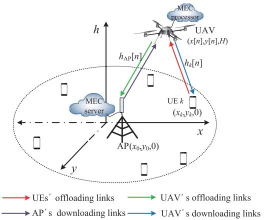

<details>
<summary>flowchart</summary>

```mermaid
graph TD
    A["MEC server"] -->|h_AP["n"]| B["UAV (x[n"],y["n"],H)]
    B -->|h_k["n"]| C["UAE k (x_k,y_k,0)"]
    C --> D["AP(x_0,y_0,0)"]
    D --> E["UE s offloading links"]
    D --> F["AP s downloading links"]
    D --> G["UAV s offloading links"]
    D --> H["UAV s downloading links"]
    style A fill:#f9f,stroke:#333
    style B fill:#ccf,stroke:#333
    style C fill:#cfc,stroke:#333
    style D fill:#fcc,stroke:#333
    style E fill:#ffc,stroke:#333
    style F fill:#fcc,stroke:#333
    style G fill:#ffc,stroke:#333
    style H fill:#fcc,stroke:#333
```
</details>

Fig. 1. An illustration of the UAV-assisted MEC architecture, where the UAV serves as an MEC server to help the ground UEs compute their offloaded tasks or as a possible relay to further forward the offloaded tasks to the AP with more powerful computing resources.

# A. Channel Model and Coordinate System

A three-dimensional (3D) Euclidean coordinate system is adopted, whose coordinates are measured in meters. We assume that the locations of the AP and all the UEs are fixed on the ground with zero altitude, with the location of the AP being $\widetilde { \mathbf { v } } _ { 0 } = ( x _ { 0 } , y _ { 0 } , 0 )$ . Let $\mathcal { K } = \{ 1 , \ldots , K \}$ denote = (the set of the UEs, with $\widetilde { \mathbf { v } } _ { k } \ = \ ( x _ { k } , y _ { k } , 0 )$ 1representing the location of UE $k \in \mathcal { K } .$ = ( 0) It is assumed that the locations of UEs are known to the UAV for designing its trajectory [16]. We assume that the UAV flies at a fixed altitude $H \ > \ 0$ during the task completion time $T ,$ 0 which corresponds to the minimum altitude that is appropriate to the work terrain and can avoid buildings without the requirement of frequent descending and ascending.

For ease of exposition, the finite task completion time $T$ is discretized into N equal time slots each with a duration of $\tau = T / N$ , where τ is sufficiently small such that the UAV’s =location can be assumed to be unchanged during each slot. The initial and final horizontal locations of the UAV are preset as ${ \bf u } _ { \mathrm { I } } = ( x _ { \mathrm { I } } , y _ { \mathrm { I } } )$ and $\mathbf { u } _ { \mathrm { F } } = \left( x _ { \mathrm { F } } , y _ { \mathrm { F } } \right)$ , respectively. Let ${ \mathcal { N } } =$ $\{ 1 , \ldots , N \}$ ) = ( ) =denote the set of the N time slots. At the n-th 1time slot, the UAV’s horizontal location is denoted as $\mathbf { u } [ n ] \equiv$ ${ \bf u } ( n \tau ) = ( x [ n ] , y [ n ] )$ with $\mathbf { u } [ 0 ] = \mathbf { u } _ { \mathrm { I } }$ and $\mathbf { u } [ N ] = \mathbf { u } _ { \mathrm { F } }$ [ ]. It is assumed that the UAV flies with a constant speed in each time slot, denoted as $v [ n ]$ , which should satisfy the following [ ]maximum speed constraint

$$
v [ n ] = \frac {\| \mathbf {u} [ n ] - \mathbf {u} [ n - 1 ] \|}{\tau} \leq V _ {\max}, \quad n \in \mathcal {N}, \tag {1}
$$

where $V _ { \mathrm { m a x } }$ is the predetermined maximum speed of the UAV, and $V _ { \mathrm { m a x } } \geq \Vert \mathbf { u } _ { \mathrm { F } } - \mathbf { u } _ { \mathrm { I } } \Vert / T$ establishes to make sure that at least one feasible trajectory of the UAV exists.

Similar to [16], the wireless channels between the UAV and the AP as well as the UEs are assumed to be dominated by LoS links, which is verified by recent field experiments done by Qualcomm [24].1 Thus, the channel power gain between the UAV and the AP and between the UAV and UE k at the time slot n can be, respectively, given by

$$
h _ {\mathrm{AP}} [ n ] = h _ {0} d _ {\mathrm{AP}} ^ {- 2} = \frac {h _ {0}}{\| \mathbf {u} [ n ] - \mathbf {v} _ {0} \| ^ {2} + H ^ {2}}, \quad n \in \mathcal {N}, \tag {2}
$$

$$
h _ {k} [ n ] = h _ {0} d _ {k} ^ {- 2} = \frac {h _ {0}}{\| \mathbf {u} [ n ] - \mathbf {v} _ {k} \| ^ {2} + H ^ {2}}, \quad k \in \mathcal {K}, n \in \mathcal {N}, \tag {3}
$$

where $h _ { 0 }$ is the channel power gain at a reference distance of $d _ { 0 } =$ 1m; $d _ { \mathrm { A P } }$ and $d _ { k }$ are respectively the distances between =the UAV and the AP as well as the UE k at the n-th time slot with $\mathbf { v } _ { 0 } = ( x _ { 0 } , y _ { 0 } )$ and $\mathbf { v } _ { k } = ( x _ { k } , y _ { k } )$ denoting the horizontal = ( ) =locations of the AP and UE $k , k \in \mathcal { K }$ . It is assumed that the channel reciprocity establishes in our considered scenario, and thus the offloading and downloading channels between the UEs and the UAV are identical. In this paper, the direct links between UEs and the AP are assumed to be negligible due to e.g., severe blockage,2 which means that the UEs cannot directly offload their task-input bits to the AP unless with the assistance of the UAV. The motivation behind this scenario is based on the fact that it is more important to guarantee the UEs’ computation tasks being completed within the given limited time $T$ with as little UEs’ energy as possible, than dropping their tasks or letting the UEs compute their takes locally at the cost of exhausting their energy.

# B. Computation Task Model and Execution Methods

The computation task of UE $k \in \mathcal { K }$ is denoted as a positive tuple $[ I _ { k } , C _ { k } , O _ { k } , T _ { k } ]$ , where $I _ { k }$ denotes the size (in bits) of [ ]the computation task-input data (e.g., the program codes and input parameters), $C _ { k }$ is the amount of required computing resource for computing 1-bit of input data (i.e., the number of CPU cycles required), $O _ { k } ~ \in ~ ( 0 , 1 )$ is the ratio of task-(0 1)output data size to that of the task-input data, i.e., the output data size should be $O _ { k } I _ { k }$ , and $T _ { k }$ is the maximum tolerable latency with $T _ { k } \le T , k \in \mathcal { K }$ . In this paper, we only consider the case that $T _ { k } ~ = ~ T$ for all $k \in \mathcal { K }$ . It should be noted =that the UEs’ task-input bits are bit-wise independent and can be arbitrarily divided to facilitate parallel trade-offs between local computing at the UEs and computation offloading to the UAV or further to the AP with the assistance of the UAV.

1It is of great value to extend our work on the probabilistic LoS and Rician fading channel models when we consider the scenarios where the UAV’s flying altitude changes according to the work terrain.   
2The general case with direct links between the UEs and the AP will be considered as one of our future works.

In other words, the UEs can accomplish their computation tasks in a partial offloading fashion [4] with the following three ways.

1) Local Computing at UEs: Each UE can perform local computing and computation offloading simultaneously since local computing at the UEs does not need radio resources such as bandwidth. To efficiently use the energy for local computing, the UEs leverage a dynamic voltage and frequency scaling (DVFS) technique, and thus the energy consumed for local computing can be adaptively controlled by adjusting the UEs’ CPU frequency during each time slot [25]. The CPU frequency of UE k during time slot n is denoted as $f _ { k } [ n ]$ (cycles/second). [ ]Thus, the computation bits and energy consumption of UE k during time slot n for local computing can be, respectively, expressed as3

$$
L _ {k} ^ {\text { local }} [ n ] = \tau f _ {k} [ n ] / C _ {k}, \quad k \in \mathcal {K}, n \in \mathcal {N}, \tag {4}
$$

$$
E _ {k} ^ {\mathrm{local}} [ n ] = \tau \kappa_ {k} f _ {k} ^ {3} [ n ], \quad k \in \mathcal {K}, n \in \mathcal {N}, \tag {5}
$$

where $\kappa _ { k }$ is the effective capacitance coefficient of UE k that depends on its processor’s chip architecture.

2) Task Offloaded to the UAV for Computing: The UEs’ remaining task-input data should be computed remotely, first by offloading to the UAV, and then one part of the data being computed at the UAV while the other part further offloaded to the AP for computing. In order to avoid interference among the UEs during the offloading process, we adopt the time-division multiple access (TDMA) protocol. Each slot is further divided into K equal durations $\delta \ = \ T / ( N K )$ , and UE k offloads = ( )its task-input data in the k-th duration. Let $l _ { k } [ n ]$ denote the [ ]offloaded bits of UE k in its allocated duration at time slot n, and thus the corresponding energy consumption of UE k at slot n for computation offloading can be calculated as

$$
\begin{array}{l} E _ {k} ^ {\mathrm{off}} [ n ] = \delta p _ {k} [ n ] \\ \equiv \frac {\delta N _ {0}}{h _ {k} [ n ]} \left(2 ^ {\frac {l _ {k} [ n ]}{\delta B _ {k} ^ {\text { off }} [ n ]}} - 1\right), \quad k \in \mathcal {K}, n \in \mathcal {N}, \tag {6} \\ \end{array}
$$

where $p _ { k } [ n ]$ is the transmit power of UE k for offloading $l _ { k } [ n ]$ [ ]computation bits to the UAV at time slot n, $B _ { k } ^ { \mathrm { o f f } } [ n ]$ [ ]is the corresponding allocated bandwidth for UE k, and $N _ { 0 }$ ]denotes the noise power at the $\mathrm { U A V . ^ { 4 } }$

Assume that the UAV also adopts the DVFS technique to improve its energy efficiency for computing, and its adjustable CPU frequency in the k-th duration of slot n for computing UE k’s offloaded task is denoted as $f _ { \mathrm { U } , k } [ n ]$ . Hence, the completed [ ]computation bits and the energy consumption of the UAV for computing UE k’s task at slot n can be, respectively, given by

$$
L _ {\mathrm{U}, k} [ n ] = \delta f _ {\mathrm{U}, k} [ n ] / C _ {k}, \quad k \in \mathcal {K}, n \in \mathcal {N}, \tag {7}
$$

$$
E _ {\mathrm{U}, k} [ n ] = \delta \kappa_ {\mathrm{U}} f _ {\mathrm{U}, k} ^ {3} [ n ], \quad k \in \mathcal {K}, n \in \mathcal {N}, \tag {8}
$$

where $\kappa _ { \mathrm { U } }$ is the effective capacitance coefficient of the UAV. Note that computing $L _ { \mathrm { U } , k } [ n ]$ bits of UE k’s task-input data will produce $O _ { k } L _ { \mathrm { U } , k } [ n ]$ [ ]bits of task-output data, which should [ ]be downloaded from the UAV to the UE k later.

3All the energy consumption in this paper uses the unit of Joule.

4Without loss of generality, we assume that the noise power at any node in the system is considered the same as $N _ { 0 }$ .

3) Task Offloaded to the AP for Computing: Part of the UEs’ offloaded task-input data at the UAV will be offloaded to the $\mathrm { A P } ^ { \prime } \mathrm { s }$ processing server for computing. To better distinguish the offloading signals from different UEs, the TDMA protocol with K equal time divisions $( \delta = T / ( N K ) )$ is also adopted in this case. Let $l _ { \mathrm { U } , k } ^ { \mathrm { o f f } } [ n ]$ = ( )denote the number of UE k’s task-input [ ]bits being offloaded from the UAV to the AP at time slot n. Thus, the corresponding energy consumption of the UAV for offloading UE k’s task at slot n can be calculated as

$$
\begin{array}{l} E _ {\mathrm{U}, k} ^ {\text { off }} [ n ] = \delta p _ {\mathrm{U}, k} ^ {\text { off }} [ n ] \\ \equiv \frac {\delta N _ {0}}{h _ {\mathrm{AP}} [ n ]} \left(2 ^ {\frac {l _ {\mathrm{U} , k} ^ {\text { off }} [ n ]}{\delta B _ {\mathrm{U} , k} ^ {\text { off }} [ n ]}} - 1\right), \quad k \in \mathcal {K}, n \in \mathcal {N}, \tag {9} \\ \end{array}
$$

where $p _ { \mathrm { U } , k } ^ { \mathrm { o f f } } [ n ]$ and $B _ { \mathrm { U } , k } ^ { \mathrm { o f f } } [ n ]$ are respectively the transmit power [ ] [ ]and the allocated bandwidth of the UAV for offloading UE $k ' \mathrm { s }$ task to the AP at time slot n. After computing the $l _ { \mathrm { U } , k } ^ { \mathrm { o f f } } [ n ]$ input bits at the AP, $O _ { k } l _ { \mathrm { U } , k } ^ { \mathrm { o f f } } [ n ]$ [ ]bits of computation results [ ]for UE k will be generated. As the AP is integrated with an ultra-high-performance processing server, the computing time is negligible. The AP will send the computation results back to the UAV in the TDMA manner using a separate bandwidth. Since the AP is supplied with grid power and can support ultra-high transmission rate, the download transmission time from the AP to the UAV is also assumed negligible.5

For the latter two offloading methods, the generated computation results at the UAV (including the results from UAV’s computing and received from the AP) will then be downloaded back to the corresponding UEs. It is assumed that the UAV is equipped with a data buffer with sufficiently large size, and it is capable of storing each UE’s offloaded data and the corresponding computation results separately. Besides, we assume that the UAV operates in a frequency-division-duplex (FDD) mode in each UE’s operation duration δ with separate bandwidths allocated for task reception from UEs $( \{ B _ { k } ^ { \mathrm { { o f f } } } [ n ] \} )$ , task offloading transmission to the $\mathrm { A P } ( \{ B _ { \mathrm { U } , k } ^ { \mathrm { o f f } } [ n ] \} )$ [ ], and task results downloading transmission to the UEs $( \{ B _ { \mathrm { U } , k } ^ { \mathrm { d o w n } } [ n ] \} )$ ), with a total bandwidth B satisfying the constraint

$$
B _ {k} ^ {\text { off }} [ n ] + B _ {\mathrm{U}, k} ^ {\text { off }} [ n ] + B _ {\mathrm{U}, k} ^ {\text { down }} [ n ] = B, \quad k \in \mathcal {K}, n \in \mathcal {N}. \tag {10}
$$

The UEs’ computation results are subsequently transmitted by the UAV using TDMA similar to the UEs’ offloading process, each with an equal duration δ in each time slot. Let $\bar { l } _ { \mathrm { U } , k } ^ { \mathrm { d o w n } } [ n ]$ denote the bits of task-output data being downloaded [ ]from the UAV to UE k at time slot n. Hence, the corresponding energy consumption of the UAV can be calculated as

$$
\begin{array}{l} E _ {\mathrm{U}, k} ^ {\text { down }} [ n ] = \delta p _ {\mathrm{U}, k} ^ {\text { down }} [ n ] \\ \equiv \frac {\delta N _ {0}}{h _ {k} [ n ]} \left(2 ^ {\frac {l _ {\mathrm{U} , k} ^ {\text { down }} [ n ]}{\delta B _ {\mathrm{U} , k} ^ {\text { down }} [ n ]}} - 1\right), \quad k \in \mathcal {K}, n \in \mathcal {N}, \tag {11} \\ \end{array}
$$

5Once the AP receives the forwarded $l _ { \mathrm { U } , k } ^ { \mathrm { o f f } } [ n ]$ bits input data from the UAV in the k-th duration of the n-th timethe data, and then send the induced $O _ { k } l _ { \mathrm { U } , k } ^ { \mathrm { o f f } } [ n ]$ l immediately decode, computebits of output data back to the UAV, all with ultra-low latency that is negligible compared with the length of each duration δ, which means that the UAV can receive the task-output data from the AP in the same duration of its offloading process.

where $p _ { \mathrm { U } , k } ^ { \mathrm { d o w n } } [ n ]$ is the transmit power of the UAV for downloading UE $k ' s$ ] task-output data at time slot n.

Note that at each time slot n, the UAV can only compute or forward the task-input data that has already been received from the UEs. By assuming that the processing delay, e.g., the delay for decoding and computing preparation, at the UAV is one time slot, then we have the following informationcausality constraint:

$$
\sum_ {i = 2} ^ {n} \left(\frac {\delta f _ {\mathrm{U} , k} [ i ]}{C _ {k}} + l _ {\mathrm{U}, k} ^ {\text { off }} [ i ]\right) \leq \sum_ {i = 1} ^ {n - 1} l _ {k} [ i ], \tag {12}
$$

for $n \in \mathcal { N } _ { 2 }$ and $k \in \mathcal { K }$ where $\mathcal { N } _ { 2 } = \{ 2 , . . . , N - 1 \}$ . Similarly, = 2 1at each time slot n, the UAV can only transmit the task-output data corresponding to the task-input data that has already been computed at the UAV or offloaded for computing at the AP. Thus, we have another information-causality constraint:

$$
\sum_ {i = 3} ^ {n} l _ {\mathrm{U}, k} ^ {\text { down }} [ i ] \leq O _ {k} \sum_ {i = 2} ^ {n - 1} \left(\frac {\delta f _ {\mathrm{U} , k} [ i ]}{C _ {k}} + l _ {\mathrm{U}, k} ^ {\text { off }} [ i ]\right), \tag {13}
$$

for $n \in \mathcal { N } _ { 3 }$ and $k \in \mathcal { K }$ where $\mathcal { N } _ { 3 } = \{ 3 , . . . , N \}$ . It is clear = 3that the UEs should not offload at the last two slots, while the UAV should not compute or forward the received input data of UEs’ at the first and the last slots as well as not transmit the output data to the UEs in the first two slots. Hence, we have $l _ { k } [ \bar { N } - 1 ] = l _ { k } [ N ] = 0 , f _ { \mathrm { U } , k } [ 1 ] = f _ { \mathrm { U } , k } [ N ] = 0 , l _ { \mathrm { U } , k } ^ { \mathrm { o f f } } [ 1 ] =$ $l _ { \mathrm { U } , k } ^ { \mathrm { o f f } } [ N ] = 0 .$ [, and $l _ { \mathrm { U } , k } ^ { \mathrm { d o w n } } [ 1 ] = l _ { \mathrm { U } , k } ^ { \mathrm { d o w n } } [ 2 ] = 0$ [.

# C. Problem Formulation

Considering the fact that the traditional battery-based UEs and UAVs are usually power-limited, one major problem the UAV-assisted MEC system faces will be energy. Hence, in this paper, we try to minimize the WSEC of the UAV as well as all the UEs during the whole task completion time T . In the previous subsection, we have obtained the energy consumption of the UEs and the UAV for task offloading/downloading and computation. In fact, the energy consumption for UAV’s propulsion is also considerable which is greatly affected by the UAV’s trajectory, and hence should be taken into account. With the assumption that the time slot duration τ is sufficiently small, the UAV’s flying during each slot can be regarded as straight-and-level flight with constant speed $v [ n ]$ . Taking [ ]a fixed-wing UAV as an example [16], [26], its propulsion energy consumption at time slot n can be expressed as

$$
E _ {\mathrm{U}} ^ {\text { fly }} [ n ] = \tau \left(\theta_ {1} v ^ {3} [ n ] + \frac {\theta_ {2}}{v [ n ]}\right), \quad n \in \mathcal {N}, \tag {14}
$$

where $\theta _ { 1 }$ and $\theta _ { 2 }$ are two parameters related to the UAV’s weight, wing area, wing span efficiency, and air density, etc. Combining with the above analysis, we obtain the total energy consumption of UE k and the UAV in each time slot n as

$$
\begin{array}{l} E _ {k} [ n ] = E _ {k} ^ {\text { local }} [ n ] + E _ {k} ^ {\text { off }} [ n ], \quad k \in \mathcal {K}, n \in \mathcal {N}, (15) \\ E _ {\mathrm{U}} [ n ] = \sum_ {k = 1} ^ {K} \left(E _ {\mathrm{U}, k} [ n ] + E _ {\mathrm{U}, k} ^ {\text { off }} [ n ] \right. \\ \left. + E _ {\mathrm{U}, k} ^ {\text {down}} [ n ]\right) + E _ {\mathrm{U}} ^ {\text {fly}} [ n ], \quad n \in \mathcal {N}. (16) \\ \end{array}
$$

In our considered scenario, the UEs’ CPU computing frequencies $\{ f _ { k } [ n ] \}$ , their offloading task-input bits $\{ l _ { k } [ n ] \}$ and [ ]the corresponding allocated bandwidth $\{ \dot { B } _ { k } ^ { \mathrm { o f f } } [ n ] \}$ [; the $\mathrm { U A V } _ { \mathrm { \Delta } }$ CPU computing frequencies $\{ f _ { \mathrm { U } , k } [ n ] \}$ [ ], its forwarding (further offloading) task-input bits $\{ l _ { \mathrm { U } , k } ^ { \mathrm { o f f } } [ n ] \}$ and downloading taskoutput bits $\{ l _ { \mathrm { U } , k } ^ { \mathrm { d o w n } } [ n ] \}$ [ ]as well as the corresponding allocated bandwidths $\{ B _ { \mathrm { U } , k } ^ { \mathrm { o f f } } [ n ] \} , \ \{ B _ { \mathrm { U } , k } ^ { \mathrm { d o w n } } [ n ] \}$ for different UEs; along [ ] [ ]with the UAV’s trajectory {u n } will be optimized to mini-[ ]mize the WSEC. To this end, the WSEC minimization problem can be formulated as problem (P1) given below

$$
\min _ {\mathbf {z}, \mathbf {B}, \mathbf {u}} \sum_ {n = 1} ^ {N} \left(w _ {\mathrm{U}} E _ {\mathrm{U}} [ n ] + \sum_ {k = 1} ^ {K} w _ {k} E _ {k} [ n ]\right) \tag {17a}
$$

$$
\text { s.t. } \sum_ {i = 2} ^ {n} \left(\frac {\delta f _ {\mathrm{U} , k} [ i ]}{C _ {k}} + l _ {\mathrm{U}, k} ^ {\text { off }} [ i ]\right) \leq \sum_ {i = 1} ^ {n - 1} l _ {k} [ i ],
$$

$$
\forall n \in \mathcal {N} _ {2}, \forall k \in \mathcal {K}, \tag {17b}
$$

$$
\sum_ {i = 3} ^ {n} l _ {\mathrm{U}, k} ^ {\text { down }} [ i ] \leq O _ {k} \sum_ {i = 2} ^ {n - 1} \left(\frac {\delta f _ {\mathrm{U} , k} [ i ]}{C _ {k}} + l _ {\mathrm{U}, k} ^ {\text { off }} [ i ]\right),
$$

$$
\forall n \in \mathcal {N} _ {3}, \forall k \in \mathcal {K}, \tag {17c}
$$

$$
\sum_ {n = 2} ^ {N - 1} \left(\frac {\delta f _ {\mathrm{U} , k} [ n ]}{C _ {k}} + l _ {\mathrm{U}, k} ^ {\text { off }} [ n ]\right) = \sum_ {n = 1} ^ {N - 2} l _ {k} [ n ],
$$

$$
\forall k \in \mathcal {K}, \tag {17d}
$$

$$
\sum_ {n = 3} ^ {N} l _ {\mathrm{U}, k} ^ {\text { down }} [ n ] = O _ {k} \sum_ {n = 2} ^ {N - 1} \left(\frac {\delta f _ {\mathrm{U} , k} [ n ]}{C _ {k}} + l _ {\mathrm{U}, k} ^ {\text { off }} [ n ]\right),
$$

$$
\forall k \in \mathcal {K}, \tag {17e}
$$

$$
\sum_ {n = 1} ^ {N} \frac {\tau}{C _ {k}} f _ {k} [ n ] + \sum_ {n = 1} ^ {N - 2} l _ {k} [ n ] = I _ {k}, \quad \forall k \in \mathcal {K}, \tag {17f}
$$

$$
B _ {k} ^ {\text { off }} [ n ] + B _ {\mathrm{U}, k} ^ {\text { off }} [ n ] + B _ {\mathrm{U}, k} ^ {\text { down }} [ n ] = B,
$$

$$
\forall n \in \mathcal {N}, \forall k \in \mathcal {K}, \tag {17g}
$$

$$
f _ {k} [ n ] \geq 0, \quad \forall n \in \mathcal {N}, \forall k \in \mathcal {K}, \tag {17h}
$$

$$
l _ {k} [ N - 1 ] = l _ {k} [ N ] = 0, \quad l _ {k} [ n ] \geq 0,
$$

$$
\forall n \in \mathcal {N} _ {1}, \forall k \in \mathcal {K}, \tag {17i}
$$

$$
f _ {\mathrm{U}, k} [ 1 ] = f _ {\mathrm{U}, k} [ N ] = 0, \quad f _ {\mathrm{U}, k} [ n ] \geq 0,
$$

$$
\forall n \in \mathcal {N} _ {2}, \forall k \in \mathcal {K}, \tag {17j}
$$

$$
l _ {\mathrm{U}, k} ^ {\text { off }} [ 1 ] = l _ {\mathrm{U}, k} ^ {\text { off }} [ N ] = 0, \quad l _ {\mathrm{U}, k} ^ {\text { off }} [ n ] \geq 0,
$$

$$
\forall n \in \mathcal {N} _ {2}, \forall k \in \mathcal {K}, \tag {17k}
$$

$$
l _ {\mathrm{U}, k} ^ {\text { down }} [ 1 ] = l _ {\mathrm{U}, k} ^ {\text { down }} [ 2 ] = 0, \quad l _ {\mathrm{U}, k} ^ {\text { down }} [ n ] \geq 0,
$$

$$
\forall n \in \mathcal {N} _ {3}, \forall k \in \mathcal {K}, \tag {171}
$$

$$
B _ {k} ^ {\text { off }} [ N - 1 ] = B _ {k} ^ {\text { off }} [ N ] = 0, \quad B _ {k} ^ {\text { off }} [ n ] \geq 0,
$$

$$
\forall n \in \mathcal {N} _ {1}, \forall k \in \mathcal {K}, \tag {17m}
$$

$$
B _ {\mathrm{U}, k} ^ {\text { off }} [ 1 ] = B _ {\mathrm{U}, k} ^ {\text { off }} [ N ] = 0, \quad B _ {\mathrm{U}, k} ^ {\text { off }} [ n ] \geq 0,
$$

$$
\forall n \in \mathcal {N} _ {2}, \forall k \in \mathcal {K}, \tag {17n}
$$

$$
B _ {\mathrm{U}, k} ^ {\text {down}} [ 1 ] = B _ {\mathrm{U}, k} ^ {\text {down}} [ 2 ] = 0, \quad B _ {\mathrm{U}, k} ^ {\text {down}} [ n ] \geq 0,
$$

$$
\forall n \in \mathcal {N} _ {3}, \forall k \in \mathcal {K}, \tag {17o}
$$

$$
\mathbf {u} [ 0 ] = \mathbf {u} _ {\mathrm{I}}, \quad \mathbf {u} [ N ] = \mathbf {u} _ {\mathrm{F}}, \tag {17p}
$$

$$
\left\| \mathbf {u} [ n ] - \mathbf {u} [ n - 1 ] \right\| \leq V _ {\max} \tau , \quad \forall n \in \mathcal {N}, \tag {17q}
$$

where $\begin{array} { r } { \textbf { z } \triangleq \{ \mathbf { z } _ { k } [ n ] \} _ { k \in \mathcal { K } , n \in \mathcal { N } } } \end{array}$ and $\begin{array} { r } { \begin{array} { l l l } { \mathbf { B } } & { \triangleq } & { \{ \mathbf { B } _ { k } [ n ] \} _ { k \in { \mathcal { K } } , n \in { \mathcal { N } } } } \end{array} } \end{array}$ with $\begin{array} { r l r } { \mathbf { z } _ { k } [ n ] } & { \triangleq } & { \{ f _ { k } [ n ] , l _ { k } [ n ] , f _ { \mathrm { U } , k } [ n ] , l _ { \mathrm { U } , k } ^ { \mathrm { o f f } } [ n ] , l _ { \mathrm { U } , k } ^ { \mathrm { d o w n } } [ n ] \} } \end{array}$ ∈Nand $\mathbf B _ { k } [ n ] \ \triangleq \ \{ B _ { k } ^ { \mathrm { o f f } } [ n ] , B _ { \mathrm { U } , k } ^ { \mathrm { o f f } } [ n ] , B _ { \mathrm { U } , k } ^ { \mathrm { d o w n } } [ n ] \}$ [ ] [ ], respectively, denoteheduling variables and the bandwidth allocation variables for UE k in time slot $n ,$ u $\begin{array} { r l } { \triangleq } & { { } \{ \mathbf { u } [ n ] \} _ { n \in \mathcal { N } } } \end{array}$ denotes the set of the $\mathrm { U A V } _ { \mathrm { \Delta } }$ horizontal [ ]locations for all the slots, i.e., the trajectory of the UAV, and $\mathcal { N } _ { 1 } = \{ 1 , . . . , N - 2 \}$ . In (P1), (17a) is the objective = 1 2function for minimizing the WSEC where $w _ { \mathrm { U } }$ and $\{ w _ { k } \} _ { k \in \mathcal K }$ represent the weights of the UAV and UEs, respectively, which trade-offs between the UAV and UEs, and the priority/ fairness among the UEs. Also, (17b) and (17c) are the two information-causality constraints, while (17d)–(17f) are the UEs’ computation task constraints to make sure that all the $\mathrm { U E s } ^ { \prime }$ computation task-input data has been computed and the task-output data has been received. The bandwidth constraints are in (17g), while (17h)–(17o) ensure the non-negativeness of the optimization variables. (17p) and (17q) specify the UAV’s initial and final horizontal locations, and its maximum speed constraints.

# III. ALGORITHM DESIGN

The problem (P1) is a complicated non-convex optimization problem because of the non-convex objective function where non-linear couplings exist among the variables $l _ { k } [ n ]$ and $B _ { k } ^ { \mathrm { o f f } } [ n ] , l _ { \mathrm { U } , k } ^ { \mathrm { o f f } } [ n ]$ and $B _ { \mathrm { U } , k } ^ { \mathrm { o f f } } [ n ] , \ l _ { \mathrm { U } , k } ^ { \mathrm { d o w n } } [ n ]$ and $B _ { \mathrm { U } , k } ^ { \mathrm { d o w n } } [ n ]$ [ ]for $k \in$ $\mathcal { K } , n \in \mathcal { N }$ [ ] [ ] [ ] [ ], and these variables are also strongly coupled with the trajectory of the UAV, i.e., ${ \bf u } [ n ]$ . To address these issues, [ ]we propose a three-step alternating optimization algorithm to solve the problem. In the first step, the computation resource scheduling variables in z are optimized by solving the problem with given UAV trajectory u and bandwidth allocation B; and then in the second step, the bandwidth allocation variables in B will be optimized with the same given UAV trajectory u and the optimized z obtained in the first step; and finally in the third step, we focus on designing the UAV trajectory u with the optimized variables z and B. The details for the three-step algorithm are presented as follows.

# A. Computation Resource Scheduling With Fixed UAV Trajectory and Bandwidth Allocation

A sub-problem of (P1) is the computation resource scheduling problem (P1.1), where the UAV’s trajectory u and bandwidth allocation B are given as fixed. In this case, the time-dependent channels $\{ h _ { \mathrm { A P } } [ n ] \} _ { n \in \mathcal { N } }$ and $\{ h _ { k } [ n ] \} _ { k \in \mathcal { K } , n \in \mathcal { N } }$ [ ] [ ]defined in (2) and (3) are also known. Besides, the nonlinear couplings among the offloading/downloading task-input/ task-output bits $( l _ { k } [ \bar { n } ] , l _ { \mathrm { U } , k } ^ { \mathrm { o f f } } [ n ] , l _ { \mathrm { U } , k } ^ { \mathrm { d o w n } } [ n ] )$ ) with their corre-[ ] [ ]sponding allocated bandwidths $( \bar { B } _ { k } ^ { \mathrm { o f f } } [ n ] , B _ { \mathrm { U } , k } ^ { \mathrm { o f f } } [ n ] , B _ { \mathrm { U } , k } ^ { \mathrm { d o w n } } [ n ] )$ convex with a convex objective function and convex constraints, which is expressed as

$$
\begin{array}{l} \min _ {\mathbf {z}} \sum_ {n = 1} ^ {N} \left(w _ {\mathrm{U}} E _ {\mathrm{U}} ^ {(1)} [ n ] + \sum_ {k = 1} ^ {K} w _ {k} E _ {k} [ n ]\right) (18a) \\ \text { s   .   t   . } (1 7 \mathrm{b}) - (1 7 \mathrm{f}), \quad (1 7 \mathrm{h}) - (1 7 \mathrm{l}), (18b) \\ \end{array}
$$

where $~ E _ { \mathrm { U } } ^ { ( 1 ) } [ n ] ~ = ~ \sum _ { k = 1 } ^ { K } { \Big ( } E _ { \mathrm { U } , k } [ n ] + E _ { \mathrm { U } , k } ^ { \mathrm { o f f } } [ n ] + E _ { \mathrm { U } , k } ^ { \mathrm { d o w n } } [ n ] { \Big ) }$ . In order to gain more insights of the solution, we leverage the Lagrange method [27] to solve problem (P1.1), and the optimal solution of problem (P1.1) is given in the following theorem.

Theorem 1: The optimal solution of problem $( P l . I )$ related to UE $k \in \mathcal { K }$ is given in (19)–(23), shown at the top of the next page, where

$$
\varphi_ {k} [ n ] = \log_ {2} \frac {B _ {k} ^ {\text { off }} [ n ] h _ {k} [ n ]}{w _ {k} N _ {0} \ln 2}, \quad n \in \mathcal {N} _ {1}, \tag {24}
$$

$$
\varphi_ {\mathrm{U}, k} ^ {\text { off }} [ n ] = \log_ {2} \frac {B _ {\mathrm{U} , k} ^ {\text { off }} [ n ] h _ {\mathrm{AP}} [ n ]}{w _ {\mathrm{U}} N _ {0} \ln 2}, \quad n \in \mathcal {N} _ {2}, \tag {25}
$$

$$
\varphi_ {\mathrm{U}, k} ^ {\text { down }} [ n ] = \log_ {2} \frac {B _ {\mathrm{U} , k} ^ {\text { down }} [ n ] h _ {k} [ n ]}{w _ {\mathrm{U}} N _ {0} \ln 2}, \quad n \in \mathcal {N} _ {3}, \tag {26}
$$

are denoted as the offloading/downloading priority indicators for the UEs in each given slot. Also, $\lambda _ { k , n } ^ { * } \geq 0$ and $\mu _ { k , n } ^ { * } \geq 0 f o r$ $k \in \mathcal { K } , n \in \mathcal { N }$ 0 0are respectively the optimal Lagrange multipliers (dual variables) associated with the inequality constraints (17b) and (17c) in problem (P1.1) (or P1), while η∗k, ρ∗k and $\beta _ { k } ^ { * }$ are respectively the optimal Lagrange multipliers associated with the equality constraints (17d)–(17f) for $k \in \mathcal { K }$ .

Proof: See Appendix A.


Remark 1: (Intuitive Explanation). From the expressions relating to the computation resource scheduling parameters in Theorem 1, we observe that $\{ l _ { k } [ n ] \} , \{ l _ { \mathrm { U } , k } ^ { \mathrm { o f f } } [ n ] \}$ , and $\{ l _ { \mathrm { U } , k } ^ { \mathrm { d o w n } } [ n ] \}$ [ ]are monotonically increasing with $\{ \varphi _ { k } [ n ] \} , \{ \varphi _ { \mathrm { U } , k } ^ { \mathrm { o f f } } [ n ] \}$ [ ]and $\{ \varphi _ { \mathrm { U } , k } ^ { \mathrm { d o w n } } [ n ] \}$ [ ] [ ]when they are positive. It coincides with the intuition that more input (or output) data should be offloaded (or downloaded) with larger $\{ \varphi _ { k } [ n ] \} , \{ \varphi _ { \mathrm { U } , k } ^ { \mathrm { o f f } } [ n ] \}$ and $\{ \varphi _ { \mathrm { U } , k } ^ { \mathrm { d o w n } } [ n ] \}$ }, [ ] [ ] [ ]corresponding to the scenarios with larger bandwidths, channel power gains and smaller weights for energy consumption.

Remark 2: (Decreasing Offloading and Increasing Downloading Data Size). Theorem 1 sheds light on the fact that $l _ { k } ^ { * } [ n ]$ decreases with the time slot index n while [ ]l down∗ U,k n increases U,k $l _ { \mathrm { U } , k } ^ { \mathrm { d o w n * } } [ n ]$ with n for the reason that $\textstyle \sum _ { i = n + 1 } ^ { N - 1 } \lambda _ { k , i } ^ { * }$ and $\textstyle \sum _ { i = n } ^ { N } \mu _ { k , i } ^ { * }$ in (20) and (23) decrease with n as $\lambda _ { k , i } ^ { * } \geq 0$ and $\mu _ { k , i } ^ { * } \geq 0$ . This indicates that the resource allocated $f o r \ U E s ^ { , }$ 0 task offloading gradually decreases while that for UAV’s downloading gradually increases as time goes by.

It is necessary to obtain the optimal values of the Lagrange multipliers, i.e. $, \lambda ^ { * } = \{ \lambda _ { k , n } ^ { * } \} _ { k \in \mathcal { K } , n \in \mathcal { N } } , \mu ^ { * } = \{ \mu _ { k , n } ^ { * } \} _ { k \in \mathcal { K } , n \in \mathcal { N } } ,$ $\eta ^ { \ast } = \{ \eta _ { k } ^ { \ast } \} _ { k \in \mathcal { K } } , \rho ^ { \ast } = \{ \rho _ { k } ^ { \ast } \} _ { k \in \mathcal { K } }$ and $\beta ^ { * } = \{ \beta _ { k } ^ { * } \} _ { k \in \mathcal { K } }$ since they = = =play important roles in determining the optimal computation resource scheduling $\mathbf { z } ^ { \ast }$ according to Theorem 1. In this paper, we adopt a subgradient-based algorithm to obtain the optimal dual variables in $\lambda ^ { * }$ and $\mu ^ { * }$ related to the inequality constraints (17b), (17c), as described in the following Lemma 1.

Lemma 1: The dual variables $\{ \lambda _ { k , n } \}$ and $\{ \mu _ { k , n } \}$ obtained at the $( j + 1 ) – t h \ ( j = 1 , 2 , . . . )$ iteration of the subgradientbased algorithm are expressed as

$$
\lambda_ {k, n, j + 1} = [ \lambda_ {k, n, j} - \varepsilon_ {j} ^ {(\lambda)} \Delta \lambda_ {k, n, j} ] ^ {+}, \quad k \in \mathcal {K}, n \in \mathcal {N} _ {2}, \tag {27}
$$

$$
\mu_ {k, n, j + 1} = [ \mu_ {k, n, j} - \varepsilon_ {j} ^ {(\mu)} \Delta \mu_ {k, n, j} ] ^ {+}, \quad k \in \mathcal {K}, n \in \mathcal {N} _ {3}, \tag {28}
$$

with the corresponding subgradients given as

$$
\Delta \lambda_ {k, n, j} = \sum_ {i = 1} ^ {n - 1} l _ {k, j} ^ {*} [ i ] - \sum_ {i = 2} ^ {n} \left(\frac {\delta f _ {\mathrm{U} , k , j} ^ {*} [ i ]}{C _ {k}} + l _ {\mathrm{U}, k, j} ^ {\text { off } *} [ i ]\right), \tag {29}
$$

$$
\Delta \mu_ {k, n, j} = O _ {k} \sum_ {i = 2} ^ {n - 1} \left(\frac {\delta f _ {\mathrm{U} , k , j} ^ {*} [ i ]}{C _ {k}} + l _ {\mathrm{U}, k, j} ^ {\text { off } *} [ i ]\right) - \sum_ {i = 3} ^ {n} l _ {\mathrm{U}, k, j} ^ {\text { down } *} [ i ], \tag {30}
$$

$$
\begin{array}{l} f _ {k} ^ {*} [ n ] = \sqrt {\frac {[ \beta_ {k} ^ {*} ] ^ {+}}{3 C _ {k} w _ {k} \kappa_ {k}}}, \quad n \in \mathcal {N}, (19) \\ l _ {k} ^ {*} [ n ] = \left\{ \begin{array}{l l} \delta B _ {k} ^ {\text { off }} [ n ] \left[ \varphi_ {k} [ n ] + \log_ {2} \left[ \sum_ {i = n + 1} ^ {N - 1} \lambda_ {k, i} ^ {*} + \beta_ {k} ^ {*} - \eta_ {k} ^ {*} \right] ^ {+} \right] ^ {+}, & n \in \mathcal {N} _ {1}, \\ 0, & n = N - 1 \text {   or   } N, \end{array} \right. (20) \\ \end{array}
$$

$$
f _ {\mathrm{U}, k} ^ {*} [ n ] = \left\{\sqrt {\frac {\left[ \eta_ {k} ^ {*} - O _ {k} \rho_ {k} ^ {*} + O _ {k} \sum_ {i = n + 1} ^ {N} \mu_ {k , i} ^ {*} - \sum_ {i = n} ^ {N - 1} \lambda_ {k , i} ^ {*} \right] ^ {+}}{3 C _ {k} w _ {\mathrm{U}} \kappa_ {\mathrm{U}}}}, \quad n \in \mathcal {N} _ {2}, \right. \tag {21}
$$

$$
l _ {\mathrm{U}, k} ^ {\text {off} *} [ n ] = \left\{ \begin{array}{l l} \delta B _ {\mathrm{U}, k} ^ {\text {off}} [ n ] \left[ \varphi_ {\mathrm{U}, k} ^ {\text {off}} [ n ] + \log_ {2} \left[ \eta_ {k} ^ {*} - O _ {k} \rho_ {k} ^ {*} + O _ {k} \sum_ {i = n + 1} ^ {N} \mu_ {k, i} ^ {*} - \sum_ {i = n} ^ {N - 1} \lambda_ {k, i} ^ {*} \right] ^ {+} \right] ^ {+}, & n \in \mathcal {N} _ {2}, \\ 0, & n = 1 \text {or} N, \end{array} \right. \tag {22}
$$

$$
l _ {\mathrm{U}, k} ^ {\text { down* }} [ n ] = \left\{ \begin{array}{l l} \delta B _ {\mathrm{U}, k} ^ {\text { down }} [ n ] \left[ \varphi_ {\mathrm{U}, k} ^ {\text { down }} [ n ] + \log_ {2} \left[ \rho_ {k} ^ {*} - \sum_ {i = n} ^ {N} \mu_ {k, i} ^ {*} \right] ^ {+} \right] ^ {+}, & n \in \mathcal {N} _ {3}, \\ 0, & n = 1 \text {   or   } 2, \end{array} \right. \tag {23}
$$

where ε (λj $\varepsilon _ { j } ^ { ( \lambda ) }$ and $\varepsilon _ { j } ^ { ( \mu ) }$ respectively denote the iterative steps for obtaining the dual variables in λ and μ at the j-th iteration [28]. Also, $\{ l _ { k , j } ^ { * } [ n ] \} , ~ \{ f _ { \mathrm { U } , k , j } ^ { * } [ n ] \} , ~ \{ l _ { \mathrm { U } , k , j } ^ { \mathrm { o f f } * } [ n ] \} , ~ \{ l _ { \mathrm { U } , k , j } ^ { \mathrm { d o w n } * } [ n ] \}$ [ ] [ ] [ ] [ ]are the computation resource scheduling variables obtained through Theorem 1 with the dual variables obtained at the j-th iteration, $\begin{array} { r l r l r l } { i . e . , } & { { } \lambda _ { j } } & { { } = { } } & { \{ \lambda _ { k , n , j } \} _ { k \in \mathcal { K } , n \in \mathcal { N } } , } & { \pmb { \mu } _ { j } } & { { } = { } } & { } \end{array}$ $\{ \mu _ { k , n , j } \} _ { k \in \mathcal { K } , n \in \mathcal { N } } , \ \eta _ { j } \ = \ \{ \eta _ { k , j } \} _ { k \in \mathcal { K } } , \ \rho _ { j } \ = \ \{ \rho _ { k , j } \} _ { k \in \mathcal { K } }$ =and $\beta _ { j } = \{ \beta _ { k , j } \} _ { k \in \mathcal { K } } .$ .

=Besides, the bi-section search method is used to obtain the optimal dual variables in $\eta ^ { * } , \rho ^ { * }$ and $\beta ^ { * }$ related to the equality constraints (17d)–(17f), as summarized in Lemma 2.

Lemma 2: With the obtained $\lambda _ { j + 1 }$ and $\mu _ { j + 1 }$ above, the corresponding $\eta _ { j + 1 } , ~ \rho _ { j + 1 }$ and $\beta _ { j + 1 }$ can be obtained by bi-section search $o f \ \{ \bar { \beta } _ { k , j + 1 } \} _ { k \in \mathcal { K } } \ \stackrel { \cdot } { \in } \ [ 0 , \{ \beta _ { k , \operatorname* { m a x } } \} _ { k \in \mathcal { K } } )$ where $\begin{array} { r } { \beta _ { k , \operatorname* { m a x } } = 3 C _ { k } w _ { k } \kappa _ { k } \big ( \frac { I _ { k } \tilde { C } _ { k } } { T } \big ) ^ { 2 } } \end{array}$ ∈K [0. For each given $\beta _ { k , j + 1 } \in$ $[ 0 , \beta _ { k , \operatorname* { m a x } } )$ = 3 (, the corresponding $\eta _ { k , j + 1 }$ and $\rho _ { k , j + 1 }$ 1 can be notheand ithin to $\eta _ { k , j + 1 } \in$ $[ \eta _ { k , j + 1 } ^ { \mathrm { l o w } } , \eta _ { k , j + 1 } ^ { \mathrm { u p } } ]$ $\rho _ { k , j + 1 } ~ \in ~ [ \rho _ { k , j + 1 } ^ { \mathrm { l o w } } , \rho _ { k , j + 1 } ^ { \mathrm { u p } } ]$ expressionsin Appendixup tisfy (B.1)=(B.2) and  where the expression $( \mathrm { B } . 1 ) { = } ( \mathrm { B } . 3 )$ $B ,$ $o f \eta _ { k , j + 1 } ^ { \mathrm { l o w } } , \eta _ { k , j + 1 } ^ { \mathrm { u p } } , \rho _ { k , j + 1 } ^ { \mathrm { l o w } } ,$ and $\rho _ { k , j + 1 } ^ { \mathrm { u p } }$ k,j k,j k,j are given in (B.5)–(B.8) in Appendix B. The optimal $\beta _ { k , j + 1 } , \eta _ { k , j + 1 }$ and $\rho _ { k , j + 1 }$ should satisfy (B.1) (B.4).

Proof: See Appendix B.

The optimal dual variables $\boldsymbol { \lambda } ^ { * } , \boldsymbol { \mu } ^ { * }$ and $\eta ^ { * } , \rho ^ { * } , \beta ^ { * }$ can be finally obtained when the subgradient algorithm converges, and the bi-section searches terminate. Note that the corresponding convergence can be guaranteed according to [27].

# B. Bandwidth Allocation With Fixed UAV Trajectory and Computation Resource Scheduling

Here, another sub-problem of (P1), denoted as the bandwidth allocation problem (P1.2) is considered to optimize B with the same given UAV’s trajectory u and the optimized computation resource scheduling parameters in z. The bandwidth allocation problem (P1.2) is expressed as

$$
\begin{array}{l} \min _ {\mathbf {B}} \sum_ {n = 1} ^ {N} \left(w _ {\mathrm{U}} E _ {\mathrm{U}} ^ {(2)} [ n ] + \sum_ {k = 1} ^ {K} w _ {k} E _ {k} ^ {\text { off }} [ n ]\right) (31a) \\ \text { s.t. } (1 7 \mathrm{g}), \quad (1 7 \mathrm{m}) - (1 7 \mathrm{o}), (31b) \\ \end{array}
$$

where $E _ { \mathrm { U } } ^ { ( 2 ) } [ n ] = \sum _ { k = 1 } ^ { K } \left( E _ { \mathrm { U } , k } ^ { \mathrm { o f f } } [ n ] + E _ { \mathrm { U } , k } ^ { \mathrm { d o w n } } [ n ] \right)$ k=1 . It can be easily proved that problem (P1.2) is convex with convex objective function and constraints. To gain more insights on the structure of the optimal solution, we again leverage the Lagrange method [27] to solve this problem, and the optimal solution to problem (P1.2) is given in the following theorem.

Theorem 2: The optimal solution of problem $( P l . 2 )$ related to UE $k \in \mathcal { K }$ is given by

$$
B _ {k} ^ {\text { off } *} [ n ] = \left\{ \begin{array}{l l} \frac {\frac {\ln 2}{2} l _ {k} [ n ]}{\delta W _ {0} \left[ \frac {\ln 2}{2} \left(\frac {\phi_ {k , n}}{w _ {k}} h _ {k} [ n ] l _ {k} [ n ]\right) ^ {\frac {1}{2}} \right]}, & n \in \mathcal {N} _ {1}, \\ 0, & n = N - 1 \text {   or   } N, \end{array} \right. \tag {32}
$$

$$
B _ {\mathrm{U}, k} ^ {\text {off*}} [ n ] = \left\{ \begin{array}{l l} \frac {\frac {\ln 2}{2} l _ {\mathrm{U} , k} ^ {\text {off}} [ n ]}{\delta W _ {0} \left[ \frac {\ln 2}{2} (\frac {\phi_ {k , n}}{w _ {\mathrm{U}}} h _ {\mathrm{AP}} [ n ] l _ {\mathrm{U} , k} ^ {\text {off}} [ n ]) ^ {\frac {1}{2}} \right]}, & n \in \mathcal {N} _ {2}, \\ 0, & n = 1 \text {or} N, \end{array} \right. \tag {33}
$$

$$
B _ {\mathrm{U}, k} ^ {\text { down } *} [ n ] = \left\{ \begin{array}{l l} \frac {\frac {\ln 2}{2} l _ {\mathrm{U} , k} ^ {\text { down }} [ n ]}{\delta W _ {0} \left[ \frac {\ln 2}{2} (\frac {\phi_ {k , n}}{w _ {\mathrm{U}}} h _ {k} [ n ] l _ {\mathrm{U} , k} ^ {\text { down }} [ n ]) ^ {\frac {1}{2}} \right]}, & n \in \mathcal {N} _ {3}, \\ 0, & n = 1 \text {   or   } 2, \end{array} \right. \tag {34}
$$

where φk,n  δ2N0 ln 2 $\begin{array} { r } { \phi _ { k , n } = \frac { \nu _ { k , n } ^ { * } } { \delta ^ { 2 } N _ { 0 } \ln 2 } } \end{array}$ ν∗k,n with $\{ \nu _ { k , n } ^ { * } \} _ { k \in \mathcal K , n \in \mathcal N }$ being the optimal =Lagrange multipliers (dual variables) associated with the equality constraints in $( 1 7 \mathrm { g ) }$ of problem (P1.2) (or P1), and $W _ { 0 } ( x )$ is the principal branch of the Lambert W function ( )defined as the solution of $W _ { 0 } ( x ) e ^ { W _ { 0 } ( x ) } = x \ [ 2 9 { ] }$ .

Proof: See Appendix C.


Lemma 3: (Exclusive Bandwidth Allocation). According to the optimal bandwidth allocation results in Theorem 2 combining with the equality constraints in $( 1 7 \mathrm { g } ) $ , we have

$$
B _ {k} ^ {\text { off } *} [ n ] = B, \quad \text { if   } l _ {k} [ n ] > 0, \quad l _ {\mathrm{U}, k} ^ {\text { off }} [ n ] = l _ {\mathrm{U}, k} ^ {\text { down }} [ n ] = 0, \tag {35}
$$

$$
B _ {\mathrm{U}, k} ^ {\text { off } *} [ n ] = B, \quad \text { if } l _ {\mathrm{U}, k} ^ {\text { off }} [ n ] > 0, l _ {k} [ n ] = l _ {\mathrm{U}, k} ^ {\text { down }} [ n ] = 0, \tag {36}
$$

$$
B _ {\mathrm{U}, k} ^ {\text { down* }} [ n ] = B, \quad \text { if } l _ {\mathrm{U}, k} ^ {\text { down }} [ n ] > 0, l _ {k} [ n ] = l _ {\mathrm{U}, k} ^ {\text { off }} [ n ] = 0, \tag {37}
$$

where the whole bandwidth is exclusively occupied when only one of $l _ { k } [ n ] , \ l _ { \mathrm { U } , k } ^ { \mathrm { o f f } } [ n ] , \ l _ { \mathrm { U } , k } ^ { \mathrm { d o w n } } [ n ]$ is positive for any $k \in \mathcal K ,$ $n \in { \mathcal { N } } .$ . Also, it is always sure that

$$
B _ {k} ^ {\text { off } *} [ 1 ] = B, \quad B _ {\mathrm{U}, k} ^ {\text { down } *} [ N ] = B, k \in \mathcal {K}. \tag {38}
$$

The optimal Lagrange multipliers $\{ \nu _ { k , n } ^ { * } \}$ for obtaining the optimal bandwidth allocation in Theorem 2 correspond to $\{ \phi _ { k , n } \}$ , which should make the equality constraints in (17g) satisfied. In fact, $\phi _ { k , n }$ can be obtained effectively with the bi-section search when the bandwidth is not exclusively occupied, i.e., at least two of $l _ { k } [ n ] , l _ { \mathrm { U } , k } ^ { \mathrm { o f f } } [ n ] , l _ { \mathrm { U } , k } ^ { \mathrm { d o w n } } [ n ]$ are positive, since $\{ B _ { k } ^ { \mathrm { o f f } * } [ n ] \} _ { n \in \mathcal { N } _ { 1 } } , \{ B _ { \mathrm { U } , k } ^ { \mathrm { o f f } * } [ n ] \} _ { n \in \mathcal { N } _ { 2 } } ^ { - \ \cdots }$ ] and $\{ B _ { \mathrm { U } , k } ^ { \mathrm { d o w n } * } [ n ] \} _ { n \in \mathcal { N } _ { 3 } }$ [ ] [ ] [ ]are all monotonically decreasing functions with respect to $\displaystyle \left( \mathrm { w . r . t . } \right) \left\{ \phi _ { k , n } \right\}$ according to the property of the $W _ { 0 }$ function. Besides, we can obtain tight search ranges using the results in Lemma 4.

Lemma 4: A tight bi-section search range of $\phi _ { k , n } \ ( k \in \mathcal { K } )$ for any slot $n \in \mathcal N$ with non-exclusive bandwidth is given as $\phi _ { k , n } \in [ \phi _ { k , n } ^ { \operatorname* { m i n } } , \phi _ { k , n } ^ { \operatorname* { m a x } } ]$ where

$$
\phi_ {k, n} ^ {\min} \left(\text { or } \phi_ {k, n} ^ {\max}\right)
$$

$$
= \min (\text { or } \max)
$$

$$
\left\{ \begin{array}{l l} \{\phi_ {\mathrm{UE}, k, n} (B / 3), \phi_ {\mathrm{U}, k, n} ^ {\text { off }} (B / 3), \phi_ {\mathrm{U}, k, n} ^ {\text { down }} (B / 3) \}, & \text { case   1 } \\ \{\phi_ {\mathrm{UE}, k, n} (B / 2), \phi_ {\mathrm{U}, k, n} ^ {\text { off }} (B / 2) \}, & \text { case   2 } \\ \{\phi_ {\mathrm{UE}, k, n} (B / 2), \phi_ {\mathrm{U}, k, n} ^ {\text { down }} (B / 2) \}, & \text { case   3 } \\ \{\phi_ {\mathrm{U}, k, n} ^ {\text { off }} (B / 2), \phi_ {\mathrm{U}, k, n} ^ {\text { down }} (B / 2) \}, & \text { case   4 } \end{array} \right. \tag {39}
$$

where case 1-case 4 are distinguished by the values of $l _ { k } [ n ]$ , $l _ { \mathrm { U } , k } ^ { \mathrm { o f f } } [ n ]$ and $l _ { \mathrm { U } , k } ^ { \mathrm { d o w n } } [ n ]$ for each $n \in { \mathcal { N } } .$ [ ]. For case 1, all the three [ ] [ ]parameters have positive values; for case $2 , l _ { \mathrm { U } , k } ^ { \mathrm { d o w n } } [ n ] = 0 ; f o r$ case 3, $l _ { \mathrm { U } , k } ^ { \mathrm { o f f } } [ n ] = 0 ;$ for case 4, $l _ { k } [ n ] = 0 .$ [. In (39),

$$
\phi_ {\mathrm{UE}, k, n} (x) = \frac {w _ {k} l _ {k} [ n ]}{\delta^ {2} x ^ {2} h _ {k} [ n ]} e ^ {\frac {l _ {k} [ n ] \ln 2}{\delta x}}, \quad k \in \mathcal {K}, n \in \mathcal {N}, \tag {40}
$$

$$
\phi_ {\mathrm{U}, k, n} ^ {\text { off }} (x) = \frac {w _ {\mathrm{U}} l _ {\mathrm{U} , k} ^ {\text { off }} [ n ]}{\delta^ {2} x ^ {2} h _ {\mathrm{AP}} [ n ]} e ^ {\frac {l _ {\mathrm{U} , k} ^ {\text { off }} [ n ] \ln 2}{\delta x}}, \quad k \in \mathcal {K}, n \in \mathcal {N}, \tag {41}
$$

$$
\phi_ {\mathrm{U}, k, n} ^ {\text { down }} (x) = \frac {w _ {\mathrm{U}} l _ {\mathrm{U} , k} ^ {\text { down }} [ n ]}{\delta^ {2} x ^ {2} h _ {k} [ n ]} e ^ {\frac {l _ {\mathrm{U} , k} ^ {\text { down }} [ n ] \ln 2}{\delta x}}, \quad k \in \mathcal {K}, n \in \mathcal {N}, \tag {42}
$$

which are the value of $\phi _ { k , n }$ obtained by letting the expressions of $B _ { k } ^ { \mathrm { o f f } * } [ n ] , B _ { \mathrm { U } , k } ^ { \mathrm { o f f } * } [ n ]$ and $B _ { \mathrm { U } , k } ^ { \mathrm { d o w n * } } [ n ]$ in (32)–(34) equal to x.

# C. UAV Trajectory Design With Fixed Computation Resource Scheduling and Bandwidth Allocation

Here, the sub-problem for designing the UAV’s trajectory u is considered, which we refer to it as the UAV trajectory design problem (P1.3), by assuming that the computation resource scheduling z and bandwidth allocation B are given as fixed with the previously optimized values. Hence, the UAV trajectory design problem (P1.3) can be rewritten as

$$
\min _ {\mathbf {u}} \sum_ {n = 1} ^ {N} \left(w _ {\mathrm{U}} E _ {\mathrm{U}} ^ {(3)} [ n ] + \sum_ {k = 1} ^ {K} w _ {k} E _ {k} ^ {\text { off }} [ n ]\right) \tag {43a}
$$

$$
\text { s.t. } (1 7 \mathrm{p}), \quad (1 7 \mathrm{q}), \tag {43b}
$$

where $E _ { \mathrm { U } } ^ { ( 3 ) } [ n ] = E _ { \mathrm { U } } ^ { \mathrm { f l y } } [ n ] + \sum _ { k = 1 } ^ { K } \left( E _ { \mathrm { U } , k } ^ { \mathrm { o f f } } [ n ] + E _ { \mathrm { U } , k } ^ { \mathrm { d o w n } } [ n ] \right)$ . It is noted that the $E _ { \mathrm { U } } ^ { \mathrm { f l y } } [ n ]$ defined in (14) with v n in (1) is not a convex function of u. In order to address this issue, we define an upper bound of $E _ { \mathrm { U } } ^ { \mathrm { H y } } [ n ]$ as follows

$$
\widetilde {E} _ {\mathrm{U}} ^ {\text { fly }} [ n ] = \tau \left(\theta_ {1} v ^ {3} [ n ] + \frac {\theta_ {2}}{\widetilde {v} [ n ]}\right), \quad n \in \mathcal {N}, \tag {44}
$$

by introducing a variable v n and a constraint $\begin{array} { r } { \boldsymbol { v } [ n ] \geq \widetilde { \boldsymbol { v } } [ n ] , } \end{array}$ , which is equivalent to $\| \mathbf { u } [ { \widetilde { n } } ] - \mathbf { u } [ n - 1 ] \| ^ { 2 } \geq { \widetilde { v } } ^ { 2 } [ n ] \tau ^ { 2 } .$ [ ]. This [ ] [ 1] [ ]constraint is still non-convex, and we leverage the SCA technique to solve this issue. The left hand side of the constraint is convex versus u and can be approximated as its linear lower bound by using the first-order Taylor expansion at a local point ui, where $i = 1 , 2 , . . .$ . denotes the iteration index of = 1 2the SCA method. Hence, the additional constraint can be approximated as a convex one as follows

$$
\widetilde {v} ^ {2} [ n ] \tau^ {2} - 2 (\mathbf {u} _ {i} [ n ] - \mathbf {u} _ {i} [ n - 1 ]) ^ {T} (\mathbf {u} [ n ] - \mathbf {u} [ n - 1 ])
$$

$$
\leq \| \mathbf {u} _ {i} [ n ] - \mathbf {u} _ {i} [ n - 1 ] \| ^ {2}, \quad n \in \mathcal {N}. \tag {45}
$$

The approximated problem of (P1.3) with $\{ \widetilde { E } _ { \mathrm { U } } ^ { \mathrm { f l y } } [ n ] \} , \ \{ \widetilde { v } [ n ] \}$ [ ] [ ]and the additional constraint (45) is convex w.r.t. u and $\{ \widetilde { v } [ n ] \}$ . However, the UAV’s locations in different slots are [ ]coupled with each other as in (17q), and thus it is difficult to obtain a closed-form solution of u. In this case, we resort to the software CVX [23] to solve the approximated problem of (P1.3).

# D. Algorithm, Convergence and Complexity

Based on the aforementioned analysis of the alternating optimization for the computation resource scheduling z, the bandwidth allocation B and the UAV trajectory u in each subproblem, Algorithm 1 is proposed to solve the original problem (P1) for obtaining the solution $\{ \mathbf { z } ^ { * } , \mathbf { B } ^ { * } , \mathbf { u } ^ { * } \}$ . 6

The convergence of Algorithm 1 is easy to prove in light of the guaranteed convergence of the loop Repeat 1.1 in Step 1, the bi-section search in Step 2 and the CVX solving process based on the SCA method in Step 3 [27]. The lowerbounded objective function of problem (P1) will monotonically decrease with the iteration index ζ by optimizing z, B and u alternatingly in each sub-problem, which further guarantees the convergence of the algorithm.

In addition, Algorithm 1 is easy to implement and the corresponding complexity is acceptable. In Step 1, the complexity mainly comes from the subgradient method for obtaining $\{ \lambda _ { k , n } \} , \ \{ \mu _ { k , n } \}$ , and the bi-section searches of $\{ \beta _ { k } \} , ~ \{ \rho _ { k } \}$ and {ηk} in each iteration of Repeat 1.1. Let $\varepsilon _ { \mathrm { s u b } } > 0 .$ , and $\varepsilon _ { \beta } , \varepsilon _ { \rho } , \varepsilon _ { \eta } \ > \ 0$ 0denote the computational accuracies of the

6The proposed method is not theoretically optimal due to problem nonconvexity, but its performance gain is verified by the simulation results.

TABLE I   
SIMULATION PARAMETERS 

<table><tr><td>Parameter</td><td>Symbol</td><td>Value</td></tr><tr><td>The total system bandwidth</td><td> $B$ </td><td>30 MHz</td></tr><tr><td>The total task completion time</td><td> $T$ </td><td>10 seconds</td></tr><tr><td>Number of time slots</td><td> $N$ </td><td>50</td></tr><tr><td>Number of ground UEs</td><td> $K$ </td><td>4</td></tr><tr><td>The channel power gain at a reference distance of  $d_0=1$  m</td><td> $h_0$ </td><td>-30dB</td></tr><tr><td>The noise power</td><td> $N_0$ </td><td>-60dBm</td></tr><tr><td>The fixed altitude of the UAV</td><td> $H$ </td><td>10 m</td></tr><tr><td>The maximum available speed of the UAV</td><td> $V_{\text{max}}$ </td><td>10 m/s</td></tr><tr><td>The UAV&#x27;s propulsion energy consumption related parameters</td><td> $(\theta_1, \theta_2)$ </td><td>(0.00614,15.976)</td></tr><tr><td>The initial and final position of the UAV</td><td> $\mathbf{u}_{\text{I}}, \mathbf{u}_{\text{F}}$ </td><td>(-5,-5), (5,-5)</td></tr><tr><td>The horizontal positions of the UEs</td><td> $\mathbf{v}_1, \mathbf{v}_2, \mathbf{v}_3, \mathbf{v}_4$ </td><td>(5,5), (-5,5), (-5,-5), (5,-5)</td></tr><tr><td>The effective switched capacitance of the UAV and UEs</td><td> $\kappa_{\text{U}}, \kappa_k (k \in \mathcal{K})$ </td><td> $10^{-28}$ </td></tr><tr><td>The weight for energy consumption of the UAV</td><td> $w_{\text{U}}$ </td><td>0.2</td></tr><tr><td>The weight for energy consumption of the UEs</td><td> $w_k (k \in \mathcal{K})$ </td><td>1</td></tr><tr><td>Required CPU cycles per bit</td><td> $C_k (k \in \mathcal{K})$ </td><td>1000 cycles/bit</td></tr><tr><td>UEs&#x27; task-input data size</td><td> $I_k (k \in \mathcal{K})$ </td><td>400 Mbits</td></tr><tr><td>UEs&#x27; task size ratio of output data to input data</td><td> $O_k (k \in \mathcal{K})$ </td><td>0.8</td></tr><tr><td>The tolerant thresholds</td><td> $\epsilon_1$  and  $\epsilon$ </td><td> $10^{-4}$ </td></tr></table>

Algorithm 1 Three-Step Algorithm for Solving Problem (P1)   
1: Set $B, T, N, K, h_0, N_0, H, V_{\max}, \theta_1, \theta_2, \mathbf{u}_\mathrm{I}, \mathbf{u}_\mathrm{F}, w_\mathrm{U}, \kappa_\mathrm{U}, \mathbf{v}_0, \{\mathbf{v}_k, w_k, I_k, C_k, O_k, \kappa_k\}_{k \in \mathcal{K}}$ , two tolerant thresholds $\epsilon_1$ and $\epsilon$ , and the iterative steps $\{\varepsilon_j^{(\lambda)}\}$ and $\{\varepsilon_j^{(\mu)}\}$ ;

2: Initialize the iteration index $\zeta = 1$ and $\mathbf{u}_1, \mathbf{B}_1$ ;

3: Repeat 1

4: Initialize $j = 1$ , as well as $\boldsymbol{\lambda}_1, \boldsymbol{\mu}_1$ ;

5: Step 1: Repeat 1.1

6: a) Obtain $\boldsymbol{\eta}_j, \boldsymbol{\rho}_j, \boldsymbol{\beta}_j$ with $\boldsymbol{\lambda}_j, \boldsymbol{\mu}_j$ through Lemma 2;
b) Obtain $\mathbf{z}_{\zeta,j}^* = \left\{ \left\{ f_{k,j}^*[n] \right\}, \left\{ l_{k,j}^*[n] \right\}, \left\{ f_{\mathrm{U},k,j}^*[n] \right\}, \left\{ l_{\mathrm{U},k,j}^{\mathrm{off}*}[n] \right\}, \left\{ l_{\mathrm{U},k,j}^{\mathrm{down}*}[n] \right\} \right\}$ through Theorem 1 with $\boldsymbol{\lambda}_j, \boldsymbol{\mu}_j, \boldsymbol{\eta}_j, \boldsymbol{\rho}_j, \boldsymbol{\beta}_j$ and $\mathbf{u}_{\zeta}, \mathbf{B}_{\zeta}$ ;
c) Calculate the WSEC $E_j^{(1)}$ by substituting $\mathbf{z}_{\zeta,j}^*, \mathbf{B}_{\zeta}$ , $\mathbf{u}_{\zeta}$ into the objective function of problem (P1.1);
d) $j = j + 1$ ;
e) Update $\boldsymbol{\lambda}_j$ and $\boldsymbol{\mu}_j$ according to Lemma 1;

7: End Repeat 1.1 until convergence, i.e., $|E_j^{(1)} - E_{j-1}^{(1)}| < \epsilon_1 (j > 1)$ , and obtain optimal $\mathbf{z}_{\zeta+1} = \mathbf{z}_{\zeta,j}^*$ ;

8: Step 2: Bi-section search of $\{\nu_{k,n}\}$ to find the optimal $\{\nu_{k,n}^*\}$ and obtain the $\mathbf{B}_{\zeta+1} = \mathbf{B}_{\zeta}^* = \left\{ B_{k}^{\mathrm{off}*}[n] \right\}, \left\{ B_{\mathrm{U},k}^{\mathrm{off}*}[n] \right\}, \left\{ B_{\mathrm{U},k}^{\mathrm{down}*}[n] \right\} \right\}$ according to Theorem 2, Lemma 3 and Lemma 4 with given $\mathbf{u}_{\zeta}$ and $\mathbf{z}_{\zeta+1}$ ;

9: Step 3: Solve the approximated problem of (P1.3) by CVX based on the SCA method, so as to obtain the optimal solution $\mathbf{u}_{\zeta+1}$ with the given $\mathbf{z}_{\zeta+1}, \mathbf{B}_{\zeta+1}$ ;

10: $\zeta = \zeta + 1$ ;

11: Calculate the WSEC $E_{\zeta}$ , by substituting $\mathbf{z}_{\zeta}, \mathbf{B}_{\zeta}$ , and $\mathbf{u}_{\zeta}$ into the objective function of problem (P1);

12: End Repeat 1 until convergence, i.e., $|E_{\zeta} - E_{\zeta-1}| < \epsilon (\zeta > 2)$ , and obtain the minimum WSEC $E_{\zeta}$ with the solution $\mathbf{z}^* = \mathbf{z}_{\zeta}, \mathbf{B}^* = \mathbf{B}_{\zeta}, \mathbf{u}^* = \mathbf{u}_{\zeta}$ ;

subgradient method and the bi-section searches for $\{ \beta _ { k } \} , \{ \rho _ { k } \}$ and $\{ \eta _ { k } \}$ . Thus, the corresponding complexity can be calculated as $\mathcal { O } ( 1 / \varepsilon _ { \mathrm { s u b } } ^ { 2 } + K \log _ { 2 } ( 1 / \varepsilon _ { \beta } ) \bar { ( \log _ { 2 } ( 1 / \varepsilon _ { \rho } ) + \log _ { 2 } ( 1 / \varepsilon _ { \eta } ) ) } )$ . (1 + log (1 )(log (1 ) + log (1 )))In Step 2, the complexity is from the bi-section search of $\{ \nu _ { k , n } \}$ , which is calculated as $\mathcal { O } ( K N \log _ { 2 } ( 1 / \varepsilon _ { \nu } ) )$ , where $\varepsilon _ { \nu }$ ( log (1 ))is the corresponding computational accuracy. In Step 3, the complexity mainly focuses on solving the approximation problem of (P1.3) by CVX, which is acceptable in general.

# IV. SIMULATION RESULTS

In this section, simulation results are presented to evaluate the performance of the proposed algorithm against the benchmarking schemes. The effects of the key parameters will be analyzed, including the relative location of the $\mathbf { A P } \left( \mathbf { v } _ { 0 } \right) , ^ { 7 }$ the computation task sizes of UEs $( I _ { k }$ for $k \in \mathcal { K } )$ , the task completion time for UEs (T ), the size ratio of task-output data to task-input data $( O _ { k }$ for $k \in \mathcal { K } )$ , the weight for energy consumption of the UAV $( w _ { \mathrm { U } } )$ , and the iteration index of the alternating optimization algorithm (ζ). The basic simulation parameters are listed in Table I unless specified otherwise.

# A. Trajectory of the UAV

In this subsection, numerical results for the trajectory of the UAV are given to shed light on the effects of the task sizes of UEs $( [ I _ { 1 } , I _ { 2 } , I _ { 3 } , I _ { 4 } ] )$ and the relative location of the $\mathrm { A P \left( v _ { 0 } \right) }$ . [ ]In Fig. 2, the UAV’s flying trajectories are depicted in different scenarios. It should be noted that the total task size of UEs is same for the cases in (a), (c), (d) and (f), i.e., 1400 Mbits, while the cases for (b) and (e) are with larger total task size, e.g., 1800 Mbits. From these results in Fig. 2, we can observe that the trajectory of the UAV is heavily reliant on the relative location of the AP and the distribution of UEs’ task sizes.

For the scenario of $\mathbf { v } _ { 0 } = ( 0 , 0 )$ , the AP is surrounded by = (0 0)the UEs and at the center of the UEs’ distributed area. We can observe that the UAV tends to fly close to the UEs with large task sizes and tries to be not too far away from the AP when the total task sizes of UEs are moderate as the results in

7In order to properly show the effects of the relative location of the AP to UEs on UAV’s trajectory and the performance, we fix the locations of the UEs and vary the location of AP even though AP is usually fixed in practice.

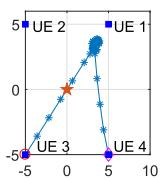

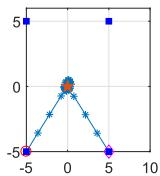

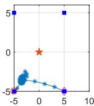  
(c）

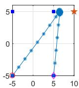

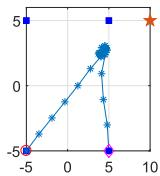  
(e)

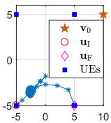  
(f)   
Fig. 2. The trajectories of the UAV in the situations with different location of the AP and task size allocation of the UEs: $\mathbf { v } _ { 0 } = ( 0 , 0 )$ for (a), (b) and (c), $\mathbf { v } _ { 0 } = ( 1 0 , 5 )$ for (d), (e) and $( \mathrm { f } ) ; [ I _ { 1 } , I _ { 2 } , I _ { 3 } , I _ { 4 } ] \stackrel { . } { = } [ 6 , 2 , 4 , 2 ] \times$ 102Mbits for (a) and ${ \mathrm { ( d ) } } , \ [ I _ { 1 } , I _ { 2 } , I _ { 3 } , I _ { 4 } ] \ = \ { \mathrm { [ } 6 , 4 , 6 , 2 { \mathrm { ] } } } \ \times$ 102Mbits for (b) and (e), $[ I _ { 1 } , I _ { 2 } , I _ { 3 } , I _ { 4 } ] = [ 2 , 2 , 6 , 4 ]$ 102Mbits for (c) and (f).

cases (a) and (c). When the total task size becomes larger and the distribution of UEs’ task sizes becomes more average, the UAV tends to fly close to the AP as the result in case (b). These three cases indicate that for the scenario where the AP is located at the center of UEs’ distributed area, the distribution of the $\mathrm { U E s } ^ { \prime }$ task sizes plays an important role on the UAV’s trajectory, while the effect of the $\mathrm { A P } ^ { * } \mathrm { s }$ location will become more dominant when the UEs’ total task size becomes larger, which coincides with the intuition that more task-input data will be offloaded to the AP in this situation so as to reduce the WSEC by making use of the super computing resources at the AP. For the scenario of $\mathbf { v } _ { 0 } = ( 1 0 , 5 )$ , the AP is located = (10 5)outside the distributed area of the UEs and its average distance to the UEs is relatively larger than the above scenario. In this situation, the effects of $\mathrm { A P } ^ { * } \mathrm { s }$ location on the trajectories are more prominent, where the comparison between (a) and (d), (b) and (e), (c) and (f) can properly explain this.

The reason behind these results in Fig. 2 is that there exists a tradeoff between the distribution of UEs’ task sizes and the relative location of the AP to the UEs. In other words, getting close to the UEs with large task sizes can reduce UEs’ offloading and UAV’s downloading energy consumption, while being closer to the AP will reduce the UAV’s offloading energy consumption, and thus the UAV has to find a balance between these two factors meanwhile taking its own flying energy consumption into consideration, so as to minimize the WSEC through optimizing its flying trajectory.

# B. Performance Improvement

Here, we focus on the performance gain of the proposed algorithm. The performance of the baselines is also provided for comparison, including the “Direct Trajectory” scheme where the UAV flies from its initial location to the final location directly with an average speed; the “Offloading Only” scheme where the UEs just rely on task offloading to the UAV and the AP for computing without local computing by the UEs themselves; the “Equal Bandwidth” scheme indicating the solution that the whole bandwidth are equally divided by the active $B _ { k } ^ { \mathrm { o f f } } [ n ] , B _ { \mathrm { U } , k } ^ { \mathrm { o f f } } [ n ]$ , and $B _ { \mathrm { U } , k } ^ { \mathrm { d o w n } } [ n ]$ , for $n \in \mathcal N$ and $k \in \mathcal { K }$

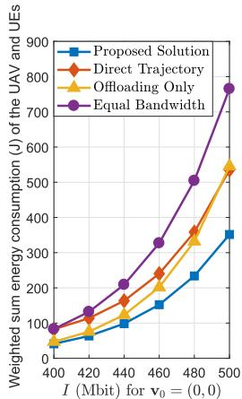

<details>
<summary>line</summary>

| I (Mbit) | Proposed Solution | Direct Trajectory | Offloading Only | Equal Bandwidth |
| -------- | ----------------- | ----------------- | --------------- | --------------- |
| 400      | 50                | 60                | 70              | 80              |
| 420      | 100               | 120               | 130             | 150             |
| 440      | 150               | 180               | 200             | 250             |
| 460      | 200               | 250               | 280             | 350             |
| 480      | 250               | 350               | 380             | 500             |
| 500      | 350               | 550               | 550             | 780             |
</details>

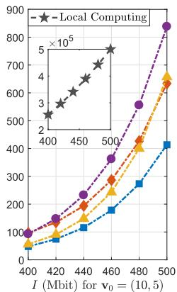

<details>
<summary>line</summary>

| I (Mbit) | Local Computing |
| -------- | --------------- |
| 400      | 100             |
| 420      | 150             |
| 440      | 200             |
| 460      | 300             |
| 480      | 500             |
| 500      | 850             |
</details>

Fig. 3. The WSEC of the UAV and UEs versus the uniform task size: $I = I _ { k }$ for $k \in \mathcal { K } .$ .

without bandwidth optimization; and the “Local Computing” scheme, where the UEs rely on their own computing resources to complete their computation tasks without offloading. Note that the former four schemes are all offloading schemes. To better illustrate the effects of $\mathrm { A P } ^ { * } \mathrm { s }$ relative location on the performance, we present all the results in two scenarios given in Fig. 2, i.e., $\mathbf { v } _ { 0 } = ( 0 , 0 )$ and $\mathbf { v } _ { 0 } = ( 1 0 , 5 )$ .

= (0 0) = (10 5)Fig. 3 shows the WSEC results versus the uniform task size $I = I _ { k }$ for $k \in \mathcal { K }$ . All the curves in the figures increase =with I as expected since more energy will be consumed by completing tasks with more input data. It can be seen that great performance improvement can be achieved by leveraging the proposed solution in comparison with all the baseline schemes in both scenarios. It is clear that the performance of the “Local Computing” scheme is far worse that the other schemes with computation offloading, verifying the importance of edge computing through offloading. Specifically, the WSECs of the “Proposed Solution” are almost one thousandth of that for the “Local Computing” scheme, presenting the tremendous benefits the UEs obtained by deploying the UAV as an assistant for computing and relaying. In addition, the WSECs of the proposed solution are half less than those of the “Equal Bandwidth” scheme and they are almost quarter less than those of the “Direct Trajectory” scheme. The “Offloading Only” scheme performs well with relatively small task sizes, e.g., I Mbits, but its gaps between the “Proposed Solution” = 400are even larger than those of the “Direct Trajectory” scheme when task sizes are large, e.g., $I = 5 0 0$ Mbits. All these results = 500verify that the proposed optimization on bandwidth allocation and UAV’s trajectory, as well as making full use of the computing resources at UEs have great effects on minimizing the WSEC of the UAV and UEs. Note that the gaps between the proposed solution and the baselines become larger when I increases, which further indicates that the proposed algorithm is more capable of handling the computation-intensive tasks.

In Fig. 4, the WSEC w.r.t. the total task completion time T is depicted. We can see that the WSECs of all the schemes decrease with T , coinciding with the intuition that a tradeoff exists between the energy consumption and time consumption for completing the same tasks, and the energy consumption will decrease when the consumed time increases. It is notable that the proposed solution is superior than the four baseline schemes in both scenarios, and the performance improvement is even more prominent with strict time restriction (small T ), which further confirms that the proposed algorithm is good at dealing with the latency-critical computation tasks and can achieve a better energy-delay tradeoff. Besides, some similar insights can also be obtained as from Fig. 3.

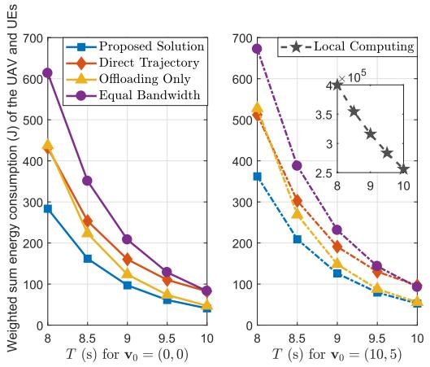

<details>
<summary>line</summary>

| T (s) for v₀ = (0, 0) | Proposed Solution | Direct Trajectory | Offloading Only | Equal Bandwidth |
| --------------------- | ----------------- | ----------------- | -------------- | --------------- |
| 8                     | 300               | 450               | 450            | 620             |
| 8.5                   | 180               | 250               | 220            | 350             |
| 9                    | 100               | 150               | 120            | 200             |
| 9.5                   | 70                | 100               | 80             | 120             |
| 10                    | 50                | 70                | 60             | 80              |
</details>

Fig. 4. The WSEC of the UAV and UEs versus the total task completion time: T (s).

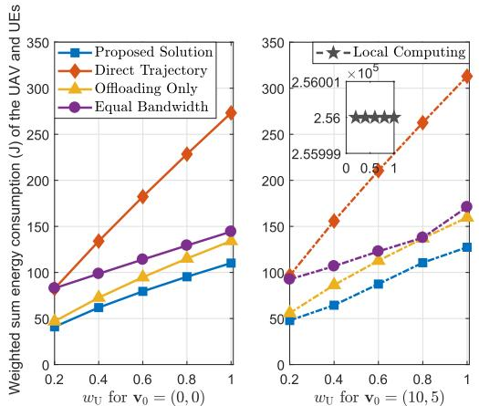

<details>
<summary>line</summary>

| wU for v0 = (0, 0) | Proposed Solution | Direct Trajectory | Offloading Only | Equal Bandwidth |
|---|---|---|---|---|
| 0.2 | 40 | 80 | 50 | 80 |
| 0.4 | 60 | 130 | 70 | 100 |
| 0.6 | 80 | 180 | 90 | 120 |
| 0.8 | 100 | 230 | 110 | 130 |
| 1.0 | 110 | 280 | 130 | 150 |
The inset chart shows a zoomed-in view of the Local Computing at wU = 0.5 (×10⁵) and wU = 1 (×10⁵), indicating a local computing value of approximately 2.56×10⁵. The data is presented in two separate charts with error bars.
</details>

Fig. 6. The WSEC of the UAV and UEs versus the weight for energy consumption of the UAV: wU.

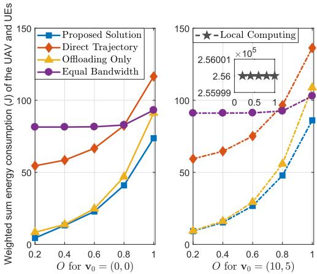

<details>
<summary>line</summary>

| O for v₀ = (0, 0) | Proposed Solution | Direct Trajectory | Offloading Only | Equal Bandwidth |
| ----------------- | ----------------- | ----------------- | --------------- | --------------- |
| 0.2               | 5                 | 55                | 10              | 85              |
| 0.4               | 15                | 60                | 20              | 85              |
| 0.6               | 30                | 70                | 35              | 85              |
| 0.8               | 45                | 85                | 50              | 90              |
| 1.0               | 75                | 120               | 95              | 95              |

| O for v₀ = (10,5) | Proposed Solution | Direct Trajectory | Offloading Only | Equal Bandwidth |
| ------------------ | ----------------- | ----------------- | --------------- | ---------------- |
| 0.2                | 10                | 60                | 10              | 90              |
| 0.4                | 20                | 70                | 20              | 90              |
| 0.6                | 30                | 80                | 35              | 90              |
| 0.8                | 50                | 100               | 60              | 95              |
| 1.0                | 90                | 140               | 110             | 105             |
</details>

Fig. 5. The WSEC of the UAV and UEs versus the uniform size ratio of task-output data to task-input data: $O = O _ { k }$ for $k \in \mathcal { K }$ .

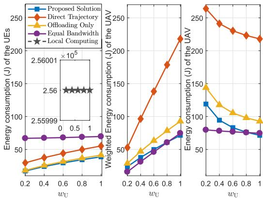  
Fig. 7. Separate energy consumption of the UEs and the UAV versus the weight for energy consumption of the UAV: wU.

Fig. 5 depicts the WSEC w.r.t. the uniform size ratio of the task-output data to the task-input data $O = O _ { k }$ for $k \in \mathcal { K }$ . =We see that the proposed scheme outperforms the baselines in both scenarios as in Fig. 3 and Fig. 4. The WSEC of the “Local Computing” scheme is constant w.r.t O, while the WSECs of all the other schemes increase with O since more output data will be downloaded to the UEs in the cases with larger O. However, the curves of the “Equal Bandwidth” scheme are almost unchanged for $O \in [ 0 . 2 , 0 . 8 ]$ due to the fact that equally [0 2 0 8]allocated bandwidth to the downloading transmissions should be sufficient to complete the downloading missions, and its performance is much worse than the other offloading schemes for smaller O because of the irrational bandwidth allocation. Note that the gaps between the proposed solution and the “Direct Trajectory” scheme decrease as O increases since it becomes more difficult to balance the tradeoff between UEs’ task sizes and the relative location of the AP. In comparison, the gaps between the proposed solution and the “Offloading Only” scheme become large as O increases for the reason that local computing may be an energy-saving way when with a large O. In the scenario of $\mathbf { v } _ { 0 } = ( 1 0 , 5 )$ , the “Offloading Only” = (10 5)scheme performs even worse than the “Equal Bandwidth” scheme when $O = 1$ , which further verifies that the effect = 1of partial local computing in minimizing the WSEC.

Results for the WSEC versus the UAV’s weight wU are shown in Fig. 6. It is clear that the proposed scheme still performs best in both scenarios. All the curves increase with wU except that for “Local Computing” scheme, since larger proportion of UAV’s energy consumption will be calculated into the WSEC with a larger wU. Note that the gaps between the proposed solution and the “Direct Trajectory” scheme become obviously larger as wU increases in both scenarios especially compared with those gaps related to the “Offloading Only” and the “Equal Bandwidth” schemes. This is due to the fact that the energy consumption for UAV’s propulsion contributes a larger part for WSEC of the “Direct Trajectory” scheme without trajectory optimization, and thus its WSEC increases much faster w.r.t. wU than the other schemes.

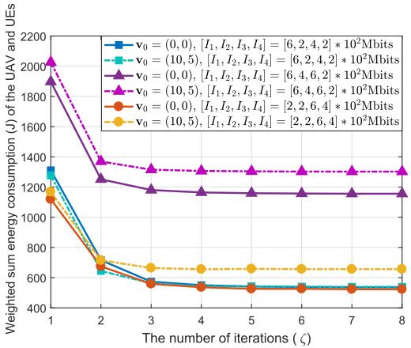

<details>
<summary>line</summary>

| The number of iterations (ζ) | v₀ = (0, 0), [I₁, I₂, I₃, I₄] = [6, 2, 4, 2] * 10²Mbits | v₀ = (10,5), [I₁, I₂, I₃, I₄] = [6, 2, 4, 2] * 10²Mbits | v₀ = (0, 0), [I₁, I₂, I₃, I₄] = [6, 4, 6, 2] * 10²Mbits | v₀ = (10,5), [I₁, I₂, I₃, I₄] = [6, 4, 6, 2] * 10²Mbits | v₀ = (0, 0), [I₁, I₂, I₃, I₄] = [2, 2, 6, 4] * 10²Mbits | v₀ = (10,5), [I₁, I₂, I₃, I₄] = [2, 2, 6, 4] * 10²Mbits |
| --------------------------- | ---------------------------------------------------------- | -------------------------------------------------------- | -------------------------------------------------------- | -------------------------------------------------------- | -------------------------------------------------------- | -------------------------------------------------------- |
| 1                           | 1300                                                       | 1900                                                   | 2100                                                   | 2000                                                   | 1150                                                   | 1150                                                   |
| 2                           | 650                                                        | 700                                                    | 1350                                                   | 1350                                                   | 650                                                    | 700                                                    |
| 3                           | 550                                                        | 650                                                    | 1250                                                   | 1350                                                   | 550                                                    | 650                                                    |
| 4                           | 550                                                        | 650                                                    | 1250                                                   | 1350                                                   | 550                                                    | 650                                                    |
| 5                           | 550                                                        | 650                                                    | 1250                                                   | 1350                                                   | 550                                                    | 650                                                    |
| 6                           | 550                                                        | 650                                                    | 1250                                                   | 1350                                                   | 550                                                    | 650                                                    |
| 7                           | 550                                                        | 650                                                    | 1250                                                   | 1350                                                   | 550                                                    | 650                                                    |
| 8                           | 550                                                        | 650                                                    | 1250                                                   | 1350                                                   | 550                                                    | 650                                                    |
</details>

Fig. 8. The WSEC of the UAV and UEs versus the number of iteration: ζ.

From the above results, we can observe that the WSEC for the scenario of $\mathbf { v } _ { 0 } = ( 1 0 , 5 )$ is higher than that for the scenario of $\mathbf { v } _ { 0 } = ( 0 , 0 )$ = (10 5)for all the schemes. It is easy to understand that = (0 0)more energy will be used for UAV’s offloading transmission and flying because of the farther average distance between the AP and UEs. The performance of the proposed scheme is also more stable than that of the baseline schemes considering the changing of the relative location of the AP to UEs since its relative WSEC increment is the smallest among the schemes.

Based on Fig. 6, we depict the energy consumption of the UEs (also the weighted energy consumption of the UEs with $w _ { 1 } ~ = ~ w _ { 2 } ~ = ~ w _ { 3 } ~ = ~ w _ { 4 } ~ = ~ 1 )$ , the weighted energy con-= = = = 1sumption and the energy consumption of the UAV versus wU in Fig. 7 (a), (b) and (c), respectively. It is clear that the weighted energy consumption of the UEs and the UAV for the four offloading schemes increase with wU as in (a) and (b), while their energy consumption of the UAV decreases with wU as in (c). This is due to the fact that we aim at minimizing the WSEC, and the objectives increase with wU similar to the results in Fig. 6. Meanwhile minimizing the UAV’s energy consumption becomes more important as wU increases. From this figure, we can better see the tremendous benefits obtained by the UEs from the UAV, especially when wU is smaller. In the case of $w _ { \mathrm { U } } = 0 . 2$ , the UAV consumes 120 Joule of = 0 2energy to help the UEs decrease their energy consumption from $2 . 5 6 * 1 0 ^ { 5 }$ Joule of the “Local Computing” scheme 2 56 10to 20 Joule of the “Proposed Solution”, by providing assistance of task computing and relaying (further offloading to the AP for computing) through the proposed algorithm.

Fig. 8 shows the WSEC of the proposed solution w.r.t to the iteration index ζ under different settings. From the figure, we can see that the proposed solution almost converges at ζ  , i.e., after twice iteration of optimizing z, B and u, = 3regardless of the UEs’ task sizes or the position of the AP.

# V. CONCLUSION

This paper investigated the UAV-assisted MEC architecture, where the UAV acts as an MEC server and a relay to assist the UEs to compute their tasks or further offload their tasks to the AP for computing. We minimized the WSEC of the UAV and the UEs under some practical constraints, using an alternating algorithm iteratively optimizing the computation resource scheduling, bandwidth allocation, and the UAV’s trajectory. The simulation results have confirmed that the UAV’s trajectory is greatly affected by the relative location of the AP and the distribution of UEs’ task sizes. Besides, significant performance improvement and more stable performance can be achieved by the proposed algorithm over the baseline schemes.

# APPENDIX A PROOF OF THEOREM 1

The partial Lagrange function of (P1.1) can be expressed as

$$
\begin{array}{l} \mathcal {L} ^ {(1)} (\mathbf {z}, \boldsymbol {\lambda}, \boldsymbol {\mu}, \boldsymbol {\eta}, \boldsymbol {\rho}, \boldsymbol {\beta}) \\ = \sum_ {k = 1} ^ {K} \left\{\sum_ {n = 1} ^ {N} \left(w _ {k} \left(E _ {k} ^ {\text { local }} [ n ] + E _ {k} ^ {\text { off }} [ n ]\right) \right. \right. \\ \left. + w _ {\mathrm{U}} \left(E _ {\mathrm{U}, k} [ n ] + E _ {\mathrm{U}, k} ^ {\text { off }} [ n ] + E _ {\mathrm{U}, k} ^ {\text { down }} [ n ]\right)\right) \\ \left. \right. + \left(\sum_ {n = 2} ^ {N - 1} \widetilde {\lambda} _ {k, n} \left(\frac {\delta f _ {\mathrm{U} , k} [ n ]}{C _ {k}} + l _ {\mathrm{U}, k} ^ {\text { off }} [ n ]\right) - \sum_ {n = 1} ^ {N - 2} \widehat {\lambda} _ {k, n} l _ {k} [ n ]\right) \\ + \left(\sum_ {n = 3} ^ {N} \widetilde {\mu} _ {k, n} l _ {\mathrm{U}, k} ^ {\text { down }} [ n ] - O _ {k} \sum_ {n = 2} ^ {N - 1} \widehat {\mu} _ {k, n} \left(\frac {\delta f _ {\mathrm{U} , k} [ n ]}{C _ {k}} + l _ {\mathrm{U}, k} ^ {\text { off }} [ n ]\right)\right) \\ + \eta_ {k} \left(\sum_ {n = 1} ^ {N - 2} l _ {k} [ n ] - \sum_ {n = 2} ^ {N - 1} \left(\frac {\delta f _ {\mathrm{U} , k} [ n ]}{C _ {k}} + l _ {\mathrm{U}, k} ^ {\text { off }} [ n ]\right)\right) \\ + \rho_ {k} \left(O _ {k} \sum_ {n = 2} ^ {N - 1} \left(\frac {\delta f _ {\mathrm{U} , k} [ n ]}{C _ {k}} + l _ {\mathrm{U}, k} ^ {\text { off }} [ n ]\right) - \sum_ {n = 3} ^ {N} l _ {\mathrm{U}, k} ^ {\text { down }} [ n ]\right) \\ \left. + \beta_ {k} \left(I _ {k} - \sum_ {n = 1} ^ {N - 2} l _ {k} [ n ] - \sum_ {n = 1} ^ {N} \frac {\tau}{C _ {k}} f _ {k} [ n ]\right) \right\}, \tag {A.1} \\ \end{array}
$$

where {ηk}k∈ $\lambda ~ = ~ \{ \lambda _ { k , n } \} _ { k \in \mathcal { K } , n \in \mathcal { N } } , ~ \mu ~ = ~ \{ \mu _ { k , n } \} _ { k \in \mathcal { K } , n \in \mathcal { N } } , ~ \eta ~ =$ $\begin{array} { r c l c r } { { { \hat { \lambda } } _ { k , n } } } & { { = } } & { { \sum _ { i = n + 1 } ^ { N - 1 } \lambda _ { k , i } , ~ { \widetilde \mu } _ { k , n } } } & { { = } } & { { \sum _ { i = n } ^ { N } \mu _ { k , i } . } } \end{array}$ $\begin{array} { r } { \rho = \{ \rho _ { k } \} _ { k \in \mathcal { K } } , \beta = \{ \beta _ { k } \} _ { k \in \mathcal { K } } , \widetilde { \lambda } _ { k , n } = \sum _ { i = n } ^ { N - 1 } \lambda _ { k , i } . } \end{array}$ = and  probl $\begin{array} { r l } { \widehat { \mu } _ { k , n } } & { { } = } \end{array}$ $\scriptstyle \sum _ { i = n + 1 } ^ { N } \mu _ { k , i }$

$$
d ^ {(1)} (\boldsymbol {\lambda}, \boldsymbol {\mu}, \boldsymbol {\eta}, \boldsymbol {\rho}, \boldsymbol {\beta}) = \min _ {\mathbf {z}} \mathcal {L} ^ {(1)} (\mathbf {z}, \boldsymbol {\lambda}, \boldsymbol {\mu}, \boldsymbol {\eta}, \boldsymbol {\rho}, \boldsymbol {\beta})
$$

$$
\text { s.t. } (1 7 \mathrm{h}) - (1 7 \mathrm{l}). \tag {A.2}
$$

Hence, the solution of z with given dual variables $\lambda , \mu , \eta , \rho , \beta$ can be obtained by solving problem (A.2). If the given dual variables are optimal, denoted as $\lambda ^ { * } , \mu ^ { * } , \eta ^ { * } , \rho ^ { * } , \beta ^ { * }$ , then the corresponding solutions are optimal, $\mathrm { i . e . , ~ } \mathbf { z } ^ { \ast }$ . According to the structures of $\mathcal { L } ^ { ( 1 ) } ( \mathbf { z } , \lambda , \mu , \eta , \rho , \beta )$ and the const-( )raints (17h)-(17l), it is noted that the problem (A.2) can be equivalently divided into K subproblems w.r.t. each UE $k \in \mathcal K$ to facilitate parallel execution. Apply the Karush-Kuhn-Tucker (KKT) conditions [27] and let the derivations of $\mathcal { L } ^ { ( 1 ) } ( \mathbf { z } , \lambda , \mu , \eta , \rho , \beta )$ w.r.t. $f _ { k } [ n ] , l _ { k } [ n ] , f _ { \mathrm { U } , k } [ n ] , l _ { \mathrm { U } , k } ^ { \mathrm { o f f } } [ n ] , l _ { \mathrm { U } , k } ^ { \mathrm { d o w n } } [ n ]$ ( )equal to zero, we can [ ] [ ] [ ] [ ] [ ]thus obtain the corresponding optimal solution given in Theorem 1 with some straightforward calculations.

# APPENDIX B PROOF OF LEMMA 2

With the achieved $\lambda _ { j + 1 }$ and $\pmb { \mu } _ { j + 1 }$ in Lemma 1, we can then obtain the $\eta _ { j + 1 } , \rho _ { j + 1 }$ and $\beta _ { j + 1 }$ correspondingly. According to the expressions of the optimal solution in Theorem 1 and the equality constraints in (17d)–(17f), we can express the value of $\scriptstyle \sum _ { n = 1 } ^ { { \bar { N } } - 2 } l _ { k , j + 1 } ^ { * } [ n ]$ in the following forms in (B.1)–(B.4)

$$
\begin{array}{l} \sum_ {n = 1} ^ {N - 2} l _ {k, j + 1} ^ {*} [ n ] \\ = I _ {k} - \frac {T}{C _ {k}} \sqrt {\frac {\beta_ {k , j + 1}}{3 C _ {k} w _ {k} \kappa_ {k}}} (B.1) \\ = \delta \sum_ {n = 1} ^ {N - 2} B _ {k} ^ {\text { off }} [ n ] \left[ \varphi_ {k} [ n ] + \log_ {2} \left[ \widehat {\lambda} _ {k, n, j + 1} + \beta_ {k, j + 1} - \eta_ {k, j + 1} \right] ^ {+} \right] ^ {+} (B.2) \\ = \frac {\delta}{O _ {k}} \sum_ {n = 3} ^ {N} B _ {\mathrm{U}, k} ^ {\text {down}} [ n ] \left[ \varphi_ {\mathrm{U}, k} ^ {\text {down}} [ n ] + \log_ {2} \left[ \rho_ {k, j + 1} - \widetilde {\mu} _ {k, n, j + 1} \right] ^ {+} \right] ^ {+} (B.3) \\ = \sum_ {n = 2} ^ {N - 1} \left\{\frac {\delta}{C _ {k}} \sqrt {\frac {[ \eta_ {k , j + 1} - O _ {k} \rho_ {k , j + 1} + O _ {k} \widehat {\mu} _ {k , n , j + 1} - \widetilde {\lambda} _ {k , n , j + 1} ] ^ {+}}{3 C _ {k} w _ {\mathrm{U}} \kappa_ {\mathrm{U}}}} \right. \\ + \delta B _ {\mathrm{U}, k} ^ {\text { off }} [ n ] \left[ \varphi_ {\mathrm{U}, k} ^ {\text { off }} [ n ] + \log_ {2} \left[ \eta_ {k, j + 1} - O _ {k} \rho_ {k, j + 1} \right. \right. \\ \left. \left. + O _ {k} \widehat {\mu} _ {k, n, j + 1} - \widetilde {\lambda} _ {k, n, j + 1} \right] ^ {+} \right] ^ {+} \Bigg \}, (B.4) \\ \end{array}
$$

where $\widetilde { \lambda } _ { k , n , j + 1 } , \ \widehat { \lambda } _ { k , n , j + 1 } , \ \widetilde { \mu } _ { k , n , j + 1 } ,$ and $\widehat { \mu } _ { k , n , j + 1 }$ are defined similar to $\lambda _ { k , n } , \ \widetilde { \lambda _ { k , n } } , \ \widetilde { \mu } _ { k , n }$ , and $\widehat { \mu } _ { k , n }$ in Appendix A. The expression (B.1) is obtained from (17f), (B.2) comes from the expression of $\{ l _ { k , j + 1 } ^ { * } [ n ] \}$ , (B.3) is derived from (17d) and (17e) with equation $\begin{array} { r } { \sum _ { n = 1 } ^ { N - 2 } l _ { k , j + 1 } ^ { * } [ n ] = \frac { 1 } { O _ { k } } \sum _ { n = 3 } ^ { N } l _ { \mathrm { U } , k , j + 1 } ^ { \mathrm { d o w n } * } [ n ] } \end{array}$ , and (B.4) is obtained from (17d).

According to (B.1) and the facts that $\begin{array} { r } { \sum _ { n = 1 } ^ { N - 2 } l _ { k , j + 1 } [ n ] \ \in \ } \end{array}$ $[ 0 , I _ { k } ] , \ f _ { k } ^ { * } [ n ] \ \ge \ 0 .$ , we can derive the range of $\beta _ { k , j + 1 } \in$ $[ 0 , \beta _ { k , \operatorname* { m a x } } )$ [ ]with $\begin{array} { r } { \beta _ { k , \operatorname* { m a x } } = 3 C _ { k } w _ { k } \kappa _ { k } ( \frac { I _ { k } C _ { k } } { T } ) ^ { 2 } } \end{array}$ for $k \in { \bar { \kappa } } .$ It is [0 ) = 3observed from (B.1)–(B.3) that $\eta _ { k , j + 1 }$ and $\rho _ { k , j + 1 }$ are respectively monotonic non-decreasing and non-increasing implicit functions of $\beta _ { k , j + 1 }$ , which further shows that (B.4) is also a monotonic non-decreasing function of $\beta _ { k , j + 1 }$ . Hence, with the obtained $\lambda _ { j + 1 }$ and $\mu _ { j + 1 } ,$ and a given $\beta _ { k , j + 1 } \in \left[ 0 , \beta _ { k , \operatorname* { m a x } } \right)$ , we can derive the corresponding $\eta _ { k , j + 1 }$ and $\rho _ { k , j + 1 }$ )from the equations constituted by (B.1) in company with (B.2) and (B.3), respectively, also using the bi-section search method with the ranges of up $\eta _ { k , j + 1 } ~ \in ~ [ \eta _ { k , j + 1 } ^ { \mathrm { l o w } } , \eta _ { k , j + 1 } ^ { \mathrm { u p } } ]$ and $\rho _ { k , j + 1 } ~ \in$ $[ \rho _ { k , j + 1 } ^ { \mathrm { l o w } } , \rho _ { k , j + 1 } ^ { \mathrm { u p } } ] _ { \ast }$ , where

$$
\eta_ {k, j + 1} ^ {\text { low }} = \widehat {\lambda} _ {k, N - 2, j + 1} - 2 ^ {\frac {I _ {k} / \delta - \sum_ {n = 1} ^ {N - 2} B _ {k} ^ {\text { off }} [ n ] \varphi_ {k} [ n ]}{\sum_ {n = 1} ^ {N - 2} B _ {k} ^ {\text { off }} [ n ]}}, \tag {B.5}
$$

$$
\eta_ {k, j + 1} ^ {\mathrm{up}} = \widehat {\lambda} _ {k, 1, j + 1} + \beta_ {k, \max}, \tag {B.6}
$$

$$
\rho_ {k, j + 1} ^ {\text { low }} = \widetilde {\mu} _ {k, N, j + 1}, \tag {B.7}
$$

$$
\rho_ {k, j + 1} ^ {\mathrm{up}} = \widetilde {\mu} _ {k, 3, j + 1} + 2 ^ {\frac {I _ {k} O _ {k} / \delta - \sum_ {n = 3} ^ {N} B _ {\mathrm{U} , k} ^ {\mathrm{down}} [ n ] \varphi_ {\mathrm{U} , k} ^ {\mathrm{down}} [ n ]}{\sum_ {n = 3} ^ {N} B _ {\mathrm{U} , k} ^ {\mathrm{down}} [ n ]}}, \tag {B.8}
$$

which are obtained from (B.2) and (B.3) in combination with the definitions of $\widehat { \lambda } _ { k , n , j + 1 }$ and $\widetilde { \mu } _ { k , n , j + 1 }$ , and the range of $\beta _ { k , j + 1 }$ . The optimal $\beta _ { k , j + 1 }$ and the corresponding $\eta _ { k , j + 1 } ,$ $\rho _ { k , j + 1 }$ should make the equation formed by (B.1) and (B.4) satisfied, which indicates the termination of the bi-section search of $\beta _ { k , j + 1 } , k \in \mathcal K$ .

# APPENDIX C PROOF OF THEOREM 2

The partial Lagrange function of (P1.2) is defined as

$$
\begin{array}{l} \mathcal {L} ^ {(2)} (\mathbf {B}, \boldsymbol {\nu}) \\ = \sum_ {k = 1} ^ {K} \sum_ {n = 1} ^ {N} \left(w _ {k} E _ {k} ^ {\mathrm{off}} [ n ] + w _ {\mathrm{U}} \left(E _ {\mathrm{U}, k} ^ {\mathrm{off}} [ n ] + E _ {\mathrm{U}, k} ^ {\mathrm{down}} [ n ]\right)\right) \\ + \sum_ {k = 1} ^ {K} \sum_ {n = 1} ^ {N} \nu_ {k, n} \left(B - B _ {k} ^ {\text { off }} [ n ] - B _ {\mathrm{U}, k} ^ {\text { off }} [ n ] - B _ {\mathrm{U}, k} ^ {\text { down }} [ n ]\right), \tag {C.1} \\ \end{array}
$$

where $\pmb { \nu } = \{ \nu _ { k , n } \} _ { k \in \mathcal { K } , n \in \mathcal { N } }$ . The Lagrangian dual function of =problem (P1.2) can be presented as

$$
d ^ {(2)} (\boldsymbol {\nu}) = \min _ {\mathbf {B}} \mathcal {L} ^ {(2)} (\mathbf {B}, \boldsymbol {\nu})
$$

$$
\mathrm{s.t.} (1 7 \mathrm{m}) - (1 7 \mathrm{o}). \tag {C.2}
$$

Hence, the optimal solution of B with optimal dual variables $\nu ^ { * }$ can be obtained by solving (C.2). This problem can also be equivalently divided into K subproblems w.r.t. each UE $k \in \mathcal { K }$ to facilitate parallel execution. It is easy to note that the expressions of $\mathsf { \bar { E } } _ { k } ^ { \mathrm { o f f } } [ n ] , ~ E _ { \mathrm { U } , k } ^ { \mathrm { o f f } } [ n ]$ and $E _ { \mathrm { U } , k } ^ { \mathrm { d o w n } } [ n ]$ have similar structures w.r.t. $B _ { k } ^ { \mathrm { o f f } } [ n ] , B _ { \mathrm { U } , k } ^ { \mathrm { o f f } } [ n ]$ and $B _ { \mathrm { U } , k } ^ { \mathrm { d o w n } } [ n ]$ , and k [thus the optimal solution of $B _ { k } ^ { \mathrm { o f f } } [ n ] , B _ { \mathrm { U } , k } ^ { \mathrm { o f f } } [ n ]$ ,k and $B _ { \mathrm { U } , k } ^ { \mathrm { d o w n } } [ n ]$ [ ] [ ] [ ]should have similar structures according to problem (C.2). Next, we will take $B _ { k } ^ { \mathrm { o f f } } [ n ]$ as an example to obtain its closedk [ ] form optimal solution versus ν∗k,n f $\nu _ { k , n } ^ { * }$ or $k \in { \mathcal { K } } , n \in { \mathcal { N } }$ . Applying the KKT conditions [27] leads to the following necessary and sufficient condition of $B _ { k } ^ { \mathrm { o f f } * } [ n ] \dag$

$$
\frac {\partial \mathcal {L} ^ {(2)} (\mathbf {B} , \boldsymbol {\nu})}{\partial B _ {k} ^ {\text { off } *} [ n ]} = \nu_ {k, n} ^ {*} - \frac {l _ {k} [ n ] w _ {k} N _ {0} \ln 2}{(B _ {k} ^ {\text { off } *} [ n ]) ^ {2} h _ {k} [ n ]} 2 ^ {\frac {l _ {k} [ n ]}{B _ {k} ^ {\text { off } *} [ n ] \delta}} = 0, \tag {C.3}
$$

the equality constraint where the optimal dual variable $B _ { k } ^ { \mathrm { o f f } * } [ n ] + \tilde { B } _ { \mathrm { U } , k } ^ { \mathrm { o f f } * } [ n ] + B _ { \mathrm { U } , k } ^ { \mathrm { d o w n } * } [ n ] = B$ $\nu _ { k , n } ^ { * }$ should make sure that [ ] + [ ] + [ ] =is satisfied. It is not easy to obtain the closed-form solution of th $B _ { k } ^ { \mathrm { o f f } * } [ n ]$ through (C.3) directly. By defining n in (C.3) can be re-expressed as $\begin{array} { r } { \xi = \frac { l _ { k } [ n ] } { B _ { k } ^ { \mathrm { o f f } * } [ n ] \delta } . } \end{array}$

$$
\xi^ {2} 2 ^ {\xi} = \frac {\nu_ {k , n} ^ {*} h _ {k} [ n ] l _ {k} [ n ]}{\delta^ {2} w _ {k} N _ {0} \ln 2} \triangleq \Gamma . \tag {C.4}
$$

By applying the natural logarithm at the both sides of (C.4) leads to

$$
\ln \xi + \frac {\ln 2}{2} \xi = \ln \Gamma^ {\frac {1}{2}}. \tag {C.5}
$$

Then applying the exponential operation at both sides of (C.5), we can obtain that

$$
\frac {\ln 2}{2} \xi e ^ {\frac {\ln 2}{2} \xi} = \frac {\ln 2}{2} \Gamma^ {\frac {1}{2}}, \tag {C.6}
$$

where e is the base of the natural logarithm. According to the definition and property of Lambert function [29], we have $\begin{array} { r } { \frac { \ln 2 } { 2 } \xi = W _ { 0 } ( \frac { \ln 2 } { 2 } \Gamma ^ { \frac { 1 } { 2 } } ) } \end{array}$ , and finally we can express $B _ { k } ^ { \mathrm { o f f * } } [ n ]$ as

$$
B _ {k} ^ {\text { off } *} [ n ] = \frac {\frac {\ln 2}{2} l _ {k} [ n ]}{\delta W _ {0} \left[ \frac {\ln 2}{2} (\frac {\phi_ {k , n}}{w _ {k}} h _ {k} [ n ] l _ {k} [ n ]) ^ {\frac {1}{2}} \right]}, \quad n \in \mathcal {N} _ {1}. \tag {C.7}
$$

Integrating with the cases ${ B } _ { k } ^ { \mathrm { o f f } * } [ N - 1 ] = { B } _ { k } ^ { \mathrm { o f f } * } [ N ] = 0 ,$ , the complete ssolution of $B _ { k } ^ { \mathrm { o f f } ^ { * } } [ n ]$ 32) can be obtained. Thein (33) and (34) can be $B _ { \mathrm { U } , k } ^ { \mathrm { o f f } * } [ n ]$ ∗ $B _ { \mathrm { U } , k } ^ { \mathrm { d o w n * } } [ n ]$

# REFERENCES

[1] Y. C. Hu, M. Patel, D. Sabella, N. Sprecher, and V. Young, “Mobile edge computing—A key technology towards 5G,” ETSI White Paper, vol. 11, no. 11, pp. 1–16, 2015.   
[2] D. Sabella et al., “Toward fully connected vehicles: Edge computing for advanced automotive communications,” 5G Automot. Assoc. White Paper, Dec. 2017.   
[3] P. Mach and Z. Becvar, “Mobile edge computing: A survey on architecture and computation offloading,” IEEE Commun. Surveys Tuts., vol. 19, no. 3, pp. 1628–1656, 3rd Quart., 2017.   
[4] Y. Mao, C. You, J. Zhang, K. Huang, and K. B. Letaief, “A survey on mobile edge computing: The communication perspective,” IEEE Commun. Surveys Tuts., vol. 19, no. 4, pp. 2322–2358, 4th Quart., 2017.   
[5] S. Sardellitti, G. Scutari, and S. Barbarossa, “Joint optimization of radio and computational resources for multicell mobile-edge computing,” IEEE Trans. Signal Inf. Process. Over Netw., vol. 1, no. 2, pp. 89–103, Jun. 2015.   
[6] C. You, K. Huang, H. Chae, and B.-H. Kim, “Energy-efficient resource allocation for mobile-edge computation offloading,” IEEE Trans. Wireless Commun., vol. 16, no. 3, pp. 1397–1411, Mar. 2017.   
[7] T. Q. Dinh, J. Tang, Q. D. La, and T. Q. S. Quek, “Offloading in mobile edge computing: Task allocation and computational frequency scaling,” IEEE Trans. Commun., vol. 65, no. 8, pp. 3571–3584, Aug. 2017.   
[8] X. Hu, L. Wang, K.-K. Wong, Y. Zhang, Z. Zheng, and M. Tao, “Edge and central cloud computing: A perfect pairing for high energy efficiency and low-latency,” 2018, arXiv:1806.08943. [Online]. Available: https://arxiv.org/abs/1806.08943   
[9] L. Pu, X. Chen, J. Xu, and X. Fu, “D2D fogging: An energy-efficient and incentive-aware task offloading framework via network-assisted D2D collaboration,” IEEE J. Sel. Areas Commun., vol. 34, no. 12, pp. 3887–3901, Dec. 2016.   
[10] H. Sun, F. Zhou, and R. Q. Hu, “Joint offloading and computation energy efficiency maximization in a mobile edge computing system,” IEEE Trans. Veh. Technol., vol. 68, no. 3, pp. 3052–3056, Mar. 2019.   
[11] C. You, K. Huang, and H. Chae, “Energy efficient mobile cloud computing powered by wireless energy transfer,” IEEE J. Sel. Areas Commun., vol. 34, no. 5, pp. 1757–1771, May 2016.   
[12] Y. Mao, J. Zhang, Z. Chen, and K. B. Letaief, “Dynamic computation offloading for mobile-edge computing with energy harvesting devices,” IEEE J. Sel. Areas Commun., vol. 34, no. 12, pp. 3590–3605, Dec. 2016.   
[13] X. Hu, K.-K. Wong, and K. Yang, “Wireless powered cooperationassisted mobile edge computing,” IEEE Trans. Wireless Commun., vol. 17, no. 4, pp. 2375–2388, Apr. 2018.   
[14] F. Wang, J. Xu, X. Wang, and S. Cui, “Joint offloading and computing optimization in wireless powered mobile-edge computing systems,” IEEE Trans. Wireless Commun., vol. 17, no. 3, pp. 1784–1797, Mar. 2018.   
[15] Y. Zeng, R. Zhang, and T. J. Lim, “Wireless communications with unmanned aerial vehicles: Opportunities and challenges,” IEEE Commun. Mag., vol. 54, no. 5, pp. 36–42, May 2016.   
[16] Y. Zeng and R. Zhang, “Energy-efficient UAV communication with trajectory optimization,” IEEE Trans. Wireless Commun., vol. 16, no. 6, pp. 3747–3760, Jun. 2017.   
[17] Y. Zeng et al., “Throughput maximization for UAV-enabled mobile relaying systems,” IEEE Trans. Commun., vol. 64, no. 12, pp. 4983–4996, Dec. 2016.   
[18] M. M. Azari, F. Rosas, K.-C. Chen, and S. Pollin, “Ultra reliable UAV communication using altitude and cooperation diversity,” IEEE Trans. Commun., vol. 66, no. 1, pp. 330–344, Jan. 2018.   
[19] J. Xu, Y. Zeng, and R. Zhang, “UAV-enabled wireless power transfer: Trajectory design and energy optimization,” IEEE Trans. Wireless Commun., vol. 17, no. 8, pp. 5092–5106, Aug. 2018.   
[20] S. Jeong, O. Simeone, and J. Kang, “Mobile edge computing via a UAV-mounted cloudlet: Optimization of bit allocation and path planning,” IEEE Trans. Veh. Technol., vol. 67, no. 3, pp. 2049–2063, Mar. 2018.   
[21] F. Zhou, Y. Wu, R. Q. Hu, and Y. Qian, “Computation rate maximization in UAV-enabled wireless-powered mobile-edge computing systems,” IEEE J. Sel. Areas Commun., vol. 36, no. 9, pp. 1927–1941, Sep. 2018.

[22] X. Cao, J. Xu, and R. Zhangt, “Mobile edge computing for cellularconnected UAV: Computation offloading and trajectory optimization,” in Proc. IEEE SPAWC, Kalamata, Greece, Jun. 2018, pp. 1–5.   
[23] M. Grant, S. Boyd, and Y. Ye, “CVX: MATLAB software for disciplined convex programming,” Tech. Rep., 2008.   
[24] LTE Unmanned Aircraft Systems–Trial Report, Qualcomm Technol., Inc., San Diego, CA, USA, May 2017.   
[25] W. Zhang, Y. Wen, K. Guan, D. Kilper, H. Luo, and D. O. Wu, “Energy-optimal mobile cloud computing under stochastic wireless channel,” IEEE Trans. Wireless Commun., vol. 12, no. 9, pp. 4569–4581, Sep. 2013.   
[26] Y. Zeng, Q. Wu, and R. Zhang, “Accessing from the sky: A tutorial on UAV communications for 5G and beyond,” 2019, arXiv:1903.05289. [Online]. Available: https://arxiv.org/abs/1903.05289   
[27] S. Boyd and L. Vandenberghe, Convex Optimization. Cambridge, U.K.: Cambridge Univ. Press, 2004.   
[28] D. P. Bertsekas and J. N. Tsitsiklis, Parallel and Distributed Computation: Numerical Methods, vol. 23. Englewood Cliffs, NJ, USA: Prentice-Hall, 1989.   
[29] R. M. Corless, G. H. Gonnet, D. E. G. Hare, D. J. Jeffrey, and D. E. Knuth, “On the LambertW function,” Adv. Comput. Math., vol. 5, no. 1, pp. 329–359, Dec. 1996.


<details>
<summary>natural_image</summary>

Portrait of a young woman with glasses and long dark hair (no text or symbols visible)
</details>

Xiaoyan Hu (S’16) received the M.Sc. degree in information and communication engineering from Xi’an Jiaotong University, China, in 2016. She is currently pursuing the Ph.D. degree with the Department of Electronic and Electrical Engineering, University College London, U.K. Her research interests are in the areas of mobile edge computing, UAV communications, wireless energy harvesting, cooperative communications, and physical-layer security. She was selected as an Exemplary Reviewer of the IEEE COMMUNICATIONS LETTERS in 2017.


<details>
<summary>natural_image</summary>

Portrait of a smiling man with short dark hair, wearing a dark shirt (no visible text or symbols)
</details>

Kai-Kit Wong (M’01–SM’08–F’16) received the B.Eng., M.Phil., and Ph.D. degrees in electrical and electronic engineering from The Hong Kong University of Science and Technology, Hong Kong, in 1996, 1998, and 2001, respectively.

After graduation, he took up academic and research positions at The University of Hong Kong, Lucent Technologies, Bell-Labs, Holmdel, the Smart Antennas Research Group of Stanford University, and the University of Hull, U.K. He is the Chair of wireless communications at the Department of

Electronic and Electrical Engineering, University College London, U.K. His current research interests include 5G and beyond mobile communications, massive MIMO, full-duplex communications, millimetre-wave communications, edge caching and fog networking, physical layer security, wireless power transfer and mobile computing, V2X communications, and of course cognitive radios. There are also a few other unconventional research topics that he has set his heart on, including, for example, fluid antenna communications systems, remote ECG detection, and so on.

Dr. Wong is a fellow of the IET and is also on the editorial board of several international journals. He was a co-recipient of the 2013 IEEE Signal Processing Letters Best Paper Award and the 2000 IEEE VTS Japan Chapter Award at the IEEE Vehicular Technology Conference in Japan in 2000, and a few other international best paper awards. He has been serving as a Senior Editor for the IEEE COMMUNICATIONS LETTERS since 2012, and also for the IEEE WIRELESS COMMUNICATIONS LETTERS since 2016. He had also previously served as Associate Editor for the IEEE SIGNAL PROCESSING LETTERS from 2009 to 2012, and an Editor for the IEEE TRANSACTIONS ON WIRELESS COMMUNICATIONS from 2005 to 2011. He was also a Guest Editor for the IEEE JSAC SI on virtual MIMO in 2013. He is currently a Guest Editor for the IEEE JSAC SI on physical layer security for 5G.


<details>
<summary>natural_image</summary>

Portrait of a man wearing glasses and a jacket, outdoors with greenery in the background (no text or symbols visible)
</details>

Kun Yang (SM’08) received the B.Sc. and M.Sc. degrees from the Computer Science Department, Jilin University, China, and the Ph.D. degree from the Department of Electronic and Electrical Engineering, University College London (UCL), U.K. He is currently a Chair Professor with the School of Computer Science and Electronic Engineering, University of Essex, leading the Network Convergence Laboratory (NCL), U.K. He is also an affiliated Professor at University of Electronic Science and Technology of China, China. Before joining in the University of Essex in 2003, he worked at UCL on several European Union (EU) research projects for several years. He has published over 100 journal papers. His main research interests include wireless networks and communications, data and energy integrated networks, and computation-communication cooperation. He manages research projects funded by various sources such as U.K. EPSRC, EU FP7/H2020, and industries. He serves on the editorial boards of both the IEEE and non-IEEE journals. Since 2009, he has been a fellow of the IET.


<details>
<summary>natural_image</summary>

Portrait photo of a man with short black hair and beard wearing a red-and-white checkered shirt (no text or symbols visible)
</details>

Zhongbin Zheng received the bachelor’s and master’s degrees in information and communications engineering from the Beijing University of Posts and Telecommunications, in 2002 and 2005, respectively. He is currently the Vice Director of the China Academy of Information and Communications Technology, and the East China Institute of Telecommunications. He was also the former Head of the Technology Department for the East China Institute of the Ministry of Industry and Information Technology. He is very active in research, resulting in not only a number of international paper publications, but also patents and draft standards.