# UAV-Assisted Task Offloading in Edge Computing

Junna Zhang , Member, IEEE, Guoxian Zhang, Xinxin Wang, Xiaoyan Zhao , Member, IEEE, Peiyan Yuan , Senior Member, IEEE, and Hu Jin , Senior Member, IEEE

Abstract—Task offloading can meet users’ demands for the latency and energy consumption by offloading tasks from resource-constrained Internet of Things devices to relatively resource-rich edge servers. Traditional task offloading usually makes use of fixed base stations or servers as edge servers. This would lead to limited range of services and increased costs due to large-scale deployment of edge servers. Therefore, deploying unmanned aerial vehicles (UAVs) as mobile edge servers for task offloading in complex terrains (e.g., forest, desert, etc.) is a worthwhile research problem. To this end, this article proposes a UAV-assisted task offloading mechanism. The mechanism aims to minimize the weighted sum of latency and energy consumption through jointly optimizing resource allocation, offloading decision, and UAV trajectory. We first transform the nonconvex optimization problem into convex optimization subproblems to obtain the optimal resource allocation. Second, we use an improved particle swarm optimization algorithm to find the optimal offloading decision. Finally, we present the deep determination policy gradient algorithm to optimize the UAV trajectory which is a kind of deep reinforcement learning algorithm. Through simulation experiments, we show that the proposed mechanism can efficiently reduce the weighted sum of latency and energy consumption.

Index Terms—Deep determination policy gradient (DDPG) algorithm, edge computing, resource allocation, task offloading, unmanned aerial vehicle (UAV) trajectory.

# I. INTRODUCTION

HE INTERNATIONAL Data Corporation predicts that by 一 2025, there will be 41.6 billion Internet of Things (IoT) devices worldwide, capable of generating 79.4 ZB of data [1]. The rapid development of 5G has driven the emergence of latency-sensitive and compute-intensive applications, such as virtual reality and augmented reality [2], [3], [4], [5], [6], [7]. Nonetheless, executing these applications on IoT devices is challenging due to their limited computing power, storage resource and battery life. Therefore, a portion of computing tasks can be offloaded from IoT devices to the edge

Received 1 September 2024; accepted 23 October 2024. Date of publication 30 October 2024; date of current version 21 February 2025. This work was supported in part by the National Natural Science Foundation of China under Grant 62472147 and Grant 62072159. (Corresponding authors: Peiyan Yuan; Hu Jin.)

Junna Zhang, Guoxian Zhang, Xinxin Wang, Xiaoyan Zhao, and Peiyan Yuan are with the School of Computer and Information Engineering, and the Key Laboratory of Artificial Intelligence and Personalized Learning in Education of Henan Province, Henan Normal University, Xinxiang 453007, Henan, China (e-mail: jnzhang@htu.edu.cn; 2108283041@stu.htu.edu.cn; 2108283081@stu.htu.edu.cn; zhaoxiaoyan@htu.edu.cn; peiyan@htu.cn).

Hu Jin is with the School of Computer and Information Engineering, Henan Normal University, Xinxiang 453007, China, and also with the School of Electrical Engineering, Hanyang University, Ansan 15588, South Korea (e-mail: hjin@hanyang.ac.kr).

Digital Object Identifier 10.1109/JIOT.2024.3488210 servers (e.g., base stations or access points) to perform remote computing [8].

However, most of traditional task offloading strategies use fixed base stations or servers as edge servers [9]. These strategies have some major drawbacks, such as fixed and limited-service coverage, channel attenuation caused by long communication distances, and high costs due to the large-scale deployment of fixed edge servers [2]. How to deploy edge servers in dynamic scenarios or in complex terrain, and further shorten communication distances, is a problem that needs to be considered in the new generation of the edge network architecture. To address these issues, a promising solution is to use unmanned aerial vehicles (UAVs) as mobile edge servers for task offloading. UAVs have flexible mobility so that they can be deployed and processed at any time to collect tasks offloaded from multiple IoT devices [10], [11], [12], [13]. This mobility can avoid problems, such as information transmission latency and can further improve task processing efficiency.

Our research motivation is to explore an efficient task offloading mechanism for UAVs and IoT devices both of which are in motion. The proposed mechanism can improve the service coverage of UAVs to reduce latency and energy consumption, while also facilitating the future development of various potential applications with different requirements. The situation where both UAVs and IoT devices are in motion is common in real-world scenarios. For example, in natural resource survey and monitoring, there is a large number of IoT devices that need to detect and monitor the state of the local natural environment and resource condition, including data related to meteorology, hydrology, geography, and environment. These IoT devices usually need to execute tasks in remote areas or in areas with limited human access (e.g., forest, desert, etc.). The tasks generated by these IoT devices may have high latency requirements due to the instability and unpredictability of the environment. To improve efficiency and accuracy, these tasks can be offloaded to UAVs for processing. By taking advantage of UAV’s mobility and high speed, a large amount of high-precision natural resource data can be quickly obtained in remote or hard-to-access environments, increasing the comprehensiveness and accuracy of the data, and providing better support for geological exploration, environmental monitoring, and other fields.

In this article, our goal is to address resource allocation, offloading decision, and trajectory optimization problem under the constraints of limited transmit power of IoT devices and computing frequency of the UAV server. Our research differs from existing studies in jointly considering the following two main aspects [14], [15], [16], [17], [18], [19], [20].

1) Most of the existing works, such as [18] and [20], only consider single mobility, i.e., the UAV is in a mobile state while IoT devices are in a stationary state. In fact, IoT devices in real-word applications are usually in a mobile state. Therefore, we consider a more realistic scenario where both the UAV and IoT devices are in motion. This scenario is better suited to real-world applications, such as natural resource survey and monitoring and wilderness rescue. It is notable that we jointly optimize the resource allocation, offloading decision, and UAV trajectory in a dual-mobility scenario, where the mobility of IoT devices greatly increases the complexity of the task offloading strategy.   
2) Most researches only consider energy consumption or latency as the primary performance metric [15], [19]. In fact, the simultaneous optimization of latency and energy consumption is crucial for the experience of the users and the performance of the applications. Therefore, we explore an optimization objective that integrates latency and energy consumption into a single metric using a weighted approach, as these are two critical performance metrics in practical applications. Simultaneously optimizing latency and energy consumption offers several benefits: a) it greatly improves user experience and effectively prolongs battery life of UAVs; b) it can better support a wider range of use cases, such as natural resource survey and monitoring; and c) it enables faster and more precise completion of tasks, while consuming energy more efficiently and conservatively.

As discussed above, it is challenging but necessary to find a suitable task offloading decision under the dual-mobility scenarios and constraints of limited resources of UAV server and IoT devices. To this end, we propose a UAV-assisted task offloading mechanism (UTOM) to minimize the weighted sum of latency and energy consumption (defined as cost) spent on executing tasks. The main contributions of this article are summarized as follows.

1) We investigate cost minimization by jointly optimizing resource allocation, offloading decision, and UAV trajectory under the constraint of limited resource of a UAV server and IoT devices. We first prove that the optimization problem is nonconvexity and NP-hard. In order to make the optimization problem be tractable, we decompose the problem into three subproblems: a) resource allocation; b) offloading decision; and c) UAV trajectory optimization.   
2) Resource Allocation: Despite the nonconvexity of the joint optimization problem, we identify the hidden convexity of the resource allocation problem when the offloading decision and the UAV location are fixed. By exploiting this property, the optimal solution to the resource allocation problem is obtained by using the Lagrange multiplier method and Karush–Kuhn–Tucker (KKT) condition. Consequently, the optimal resource allocation can be obtained in a computationally efficient way when the offloading decision and the UAV location are given.

3) Offloading Decision: In order to obtain the optimal offloading decision for a given UAV location, we further propose an improved particle swarm optimization (IPSO) algorithm. In searching for the optimal offloading decision with IPSO, we need to obtain the optimal offloading decision and calculate the corresponding cost at each generation of IPSO. While the computing complexity increases proportionally with the population size and the number of generations, it is still computationally implementable as the optimal resource allocation is the solution of a convex optimization problem.   
4) UAV Trajectory: We finally propose a deep determination policy gradient (DDPG) algorithm, which is a kind of the deep reinforcement learning algorithm, to find the optimal UAV flight trajectory. DDPG enables us to predict the flight trajectory of the UAV for next time slot based on the optimal offloading decision made in the current time slot. Experimental results show that the proposed mechanism can significantly reduce the cost compared with the state-of-the-art methods.

The remainder of this article is organized as follows. Section II reviews the related work. Section III presents the system model and problem formulation. Section IV introduces the proposed mechanism. Section V shows the experiment results, and Section VI concludes this article.

# II. RELATED WORK

In recent years, UAV-assisted task offloading has received widespread attention as one of the key technologies of the edge computing. To clearly present the contributions of this article, we summarize the related researches on task offloading from the following three related aspects: 1) fixed-position offloading of IoT devices; 2) single-objective optimization; and 3) UAV trajectory optimization.

# A. Fixed Position Offloading

With increasing user demands for lower latency and energy consumption, offloading tasks from fixed-position IoT devices to UAVs has garnered significant attention, resulting in a large volume of studies [17], [18], [20], [21], [22], [23], [24], [25], [26]. Xu et al. [21] proposed an edge computing system that maximizes computational efficiency by jointly optimizing communication and computational resources, computation requirements, and UAV flight trajectory. Xiong et al. [17] designed an online optimization algorithm to minimize longterm network operation costs through joint task assignment, local computing resource allocation, association control, and UAV computing resource allocation. Zeng et al. [22] introduced a path discretization algorithm to transform the problem into a discretized equivalent, aiming to minimize total UAV energy consumption by jointly optimizing UAV trajectory, communication time allocation among ground nodes, and total mission completion time. He et al. [26] proposed a 3-D multi-UAV mobile edge computing system and derived the optimal offloading and UAV selection scheme to minimize energy consumption. While these studies primarily address task offloading for IoT devices in fixed locations, real-world scenarios increasingly involve mobile IoT devices, complicating task offloading compared to fixed-device scenarios.

# B. Single-Objective Optimization

Recently, research on single-objective optimization, such as latency or energy consumption, for UAV-assisted task offloading has continuously increased [8], [14], [19], [22], [27]. Yang et al. [19] proposed a strategy to minimize service cost by jointly optimizing channel allocation and offloading strategy. Tun et al. [8] introduced a collaborative multi-UAV-assisted edge computing system that reduces latency by dividing the task offloading problem into subproblems and solving them using the Lagrangian relaxation and alternating direction method of multipliers. Ji et al. [28] developed an air-ground mobile edge offloading model that minimizes latency under constraints of security, energy, and coverage using a Markov decision process. Liu et al. [27] developed an iterative algorithm to minimize system energy consumption by jointly optimizing UAV beamforming vectors, CPU frequency, and transmit power of IoT devices. These studies focus on single-objective optimization for task offloading to UAVs. However, balancing latency and energy consumption is crucial in practical applications. Therefore, the task offloading process typically involves co-optimizing latency and energy consumption, leading to a more complex resource competition problem within single-objective optimization.

# C. UAV Trajectory Optimization

Combining edge computing with UAVs can significantly reduce task completion latency due to the flexibility and ease of UAV deployment [8]. As a result, optimizing UAV flight trajectories has garnered significant attention [10], [13], [29], [30], [31]. For instance, Diao et al. [10] developed an alternating optimization algorithm to minimize energy consumption by optimizing offloading parameters and UAV flight trajectory. Elgendy et al. [13] introduced a deep reinforcement learning algorithm to minimize system cost through joint task offloading, load balancing, and resource allocation. Zhuang et al. [31] used a deep deterministic policy gradient algorithm to optimize task offloading, minimizing the weighted sum of latency and energy consumption under limited UAV computational and energy resources. While these studies focus on trajectory optimization, practical applications require comprehensive UAV server resource management to maximize task execution efficiency. Thus, UAV trajectory optimization must adopt flexible strategies to ensure efficient resource utilization, enhancing task execution reliability and efficiency.

While there have been plenty of previous studies that address UAV-assisted task offloading, they have not jointly investigated the mobility of IoT devices, the co-optimization of latency and energy consumption, and the limited computing resources of UAV servers. Considering these factors, we propose a novel solution that combines an IPSO algorithm with a DDPG algorithm to minimize the cost of the edge computing system. To the best of our knowledge, few studies address scenarios where both IoT devices and UAVs are moving simultaneously while solving the multidomain resource optimization problem. It is worth mentioning that although a few recent studies [10], [13], [28], [31] have started to consider the dual mobility of IoT devices and UAVs, our proposed UTOM outperforms these approaches in scenarios where both latency and energy consumption are critically important as will be discussed in Section V.

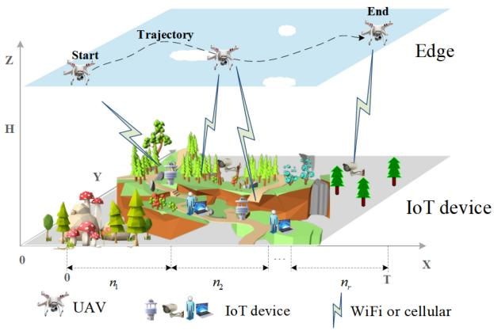

flowchart

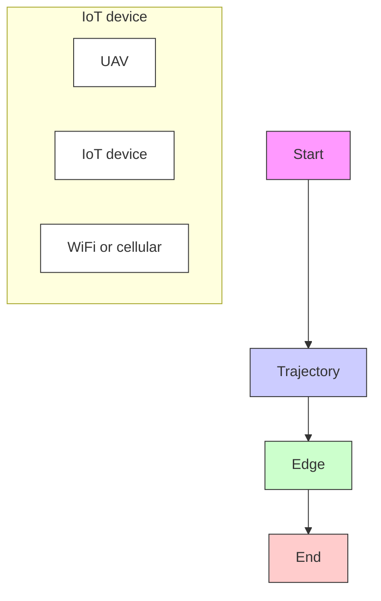

Fig. 1. Network model.

# III. SYSTEM MODEL AND PROBLEM FORMULATION

# A. Network Model

Our network model shown in Fig. 1 consists of two layers: 1) the IoT device layer and 2) the edge layer. The edge layer includes a UAV that is equipped with an edge server in the air as an aerial base station to handle and collect the latencysensitive tasks offloaded from the IoT device layer. The IoT device layer consists of m IoT devices, each with a computing processor capable of computing simple task locally. The IoT devices can also transmit partial task data wirelessly to the UAV for task offloading. The total time duration T is divided into N equal-length time slots of size δ.

Keeping the flight altitude of H meters, the UAV flies from left to right for communications with the m IoT devices whose latency-sensitive tasks may be offloaded to the UAV for processing. The flight trajectory of the UAV in time slot $n \in [ 1 , N ]$ can be determined by its flight speed and angle, represented as v(n) ∈ [30 m/s, 50 m/s] and $\theta ( n ) \in [ 0 , 2 \pi ]$ , respectively. The movement trajectory of each IoT device in time slot n can be determined by its movement speed and angle, represented as $\nu _ { \mathrm { i o t } } ( n ) \in [ 0 , 5$ m/s] and $\theta _ { \mathrm { i o t } } ( n ) \in [ 0 , 2 \pi ]$ , respectively.

Each IoT device generates a random task for calculation, and we denote the task data size of the uth IoT device by $L _ { u } .$ The quality of communication link between the UAV and each IoT device depends on their distance, and to determine the distance, a 3-D Cartesian coordinate system is constructed to represent the location of the UAV and each IoT device. For the uth IoT device, the coordinate at the nth time slot is denoted by $Q _ { \mathrm { u s e r } , u } ( n ) = \{ x _ { u , n } , y _ { u , n } , 0 \}$ , where $x _ { u , n }$ and $y _ { u , n }$ denote the x-coordinate and y-coordinate, respectively. For the UAV, the location of the UAV at the nth time slot is represented by $Q _ { \mathrm { u a v } } ( n ) \ = \ \{ X _ { n } , Y _ { n } , H \}$ , where $X _ { n }$ and $Y _ { n } .$ , respectively represent the x-coordinate and y-coordinate, and H denotes the altitude of the UAV.

# B. Problem Formulation

In general, some tasks generated by IoT devices have high latency requirement, while others are more concerned with energy consumption of the IoT devices and the UAV. Consequently, our objective is to minimize the cost which balances the latency requirement and the energy consumption by introducing a weight variable $\omega \in [ 0 , 1 ]$ similar to [32] while optimizing the UAV trajectory. In particular, we define the cost function as follows:

$$
\mathbb {C} = (1 - \omega) \mathcal {T} + \omega E \tag {1}
$$

where a larger ω means that the proposed mechanism puts more emphasis on the energy consumption requirement E in the total flight time N of the UAV, while a smaller ω emphasizes that the proposed mechanism puts more emphasis on the latency  .

Our objective is to minimize the cost occurred in the total duration of N time slots through optimizing the resource allocation, task offloading decision, and the UAV trajectory. For the resource constraint, we consider the computing frequency of the UAV and the transmit power of the IoT devices. In particular, we set the following optimization problem:

$\begin{array} { r l } { { } } & { { P 1 : \quad \displaystyle \operatorname* { m i n } _ { \Phi , X , \Theta } \mathbb C } } \\ { { \mathrm { s . t . } \quad } } & { { C _ { 1 } : \displaystyle \sum _ { u = 1 } ^ { m } X _ { u } ^ { \mathrm { u a v } } ( n ) \le 1 , \mathrm { ~ f o r ~ } n \in [ 1 , N ] } } \end{array}$

$$
C _ {2}: X _ {u} ^ {\mathrm{uav}} (n) \in \{0, 1 \} \quad \forall u \in [ 1, m ], n \in [ 1, N ]
$$

$$
C _ {3}: 0 \leq \lambda_ {u} (n) \leq 1 \quad \forall u \in [ 1, m ], n \in [ 1, N ]
$$

$$
C _ {4}: Q _ {\text { user }, u}, Q _ {\text { uav }} \leq \{X, Y \} \quad \forall u \in [ 1, m ], n \in [ 1, N ]
$$

$$
C _ {5}: v _ {\min} \leq | | v (n) | | \leq v _ {\max}
$$

$$
C _ {6}: p _ {\min} \leq p _ {u} ^ {\mathrm{up}} \leq p _ {\max}
$$

$$
C _ {7}: f _ {\min} \leq f _ {u} ^ {\text { uav }} \leq f _ {\max}
$$

$$
C _ {8}: X _ {u} ^ {\mathrm{uav}} (n) \left(t _ {u} ^ {\text { trans }} (n) + t _ {u} ^ {\mathrm{uav}} (n)\right) \leq \delta , \text {   for   } n \in [ 1, N ] \tag {2}
$$

where the symbols are described in Table I. In particular, $\Phi =$ $\{ p _ { u } ^ { \mathrm { u p } } , f _ { u } ^ { \mathrm { u a v } } \quad \forall u \in [ 1 , m ] \}$ {p u , f uu up , where $p _ { u } ^ { \mathrm { u p } }$ and $f _ { u } ^ { \mathrm { u a v } }$ represent the transmit power of the IoT device u and the CPU frequency of the UAV. $X = \{ X _ { u } ^ { \mathrm { u a v } } ( n )$ ∀n ∈ [1, N]}, where $X _ { u } ^ { \mathrm { u a v } } ( n )$ denotes the offloading decision: if the task of the IoT device u is offloaded to the UAV in time slot n, $X _ { u } ^ { \mathrm { u a v } } ( n ) = 1$ ; otherwise, $X _ { u } ^ { \mathrm { u a v } } ( n ) = 0 . \ \Theta = \{ \nu ( n ) , \theta _ { \mathrm { u a v } } ( n ) \}$ , where v(n) and $\theta _ { \mathrm { u a v } } ( n ) ~ \in$ [0, 2π] represent the speed and flight angle of the UAV.

The following describes each constraint of the optimization problem $P 1 \colon \ C _ { 1 }$ shows that only one IoT device can be offloaded to the UAV to execute its task in each time slot. $C _ { 2 }$ represents that the offloading decision of each IoT device can be 0 or 1. $C _ { 3 }$ denotes the range of the ratio of latency sensitive task offloaded from the IoT device u to the UAV. $C _ { 4 }$ indicates the area within which both IoT devices and the UAV move. $C _ { 5 }$ denotes the constraint of the UAV flight speed. $C _ { 6 }$ shows the uplink transmit power constraint of each IoT device. $C _ { 7 }$ represents the CPU frequency constraint of the UAV. $C _ { 8 }$ indicates that the sum of the transmission time of task offloading to the UAV and the task execution time at the UAV shall be completed within one slot time duration.

TABLE I MAIN SYMBOLS 

<table><tr><td>Symbols</td><td>Descriptions</td></tr><tr><td> $m$ </td><td>The number of IoT devices</td></tr><tr><td> $N$ </td><td>The number of time slots</td></tr><tr><td> $X_{u}^{\text{uav}}(n)$ </td><td>Whether the IoT device  $u$  is offloaded to the UAV in the  $n$ -th time slot</td></tr><tr><td> $B_0$ </td><td>The channel bandwidth</td></tr><tr><td> $\sigma^2$ </td><td>The Gaussian noise power</td></tr><tr><td> $p_u^{\text{up}}$ </td><td>The transmit power of IoT device  $u$ </td></tr><tr><td> $\lambda_u(n)$ </td><td>Ratio at which IoT device  $u$  offloads the size of the generated task data to the UAV in the  $n$ -th time slot</td></tr><tr><td> $L_u(n)$ </td><td>The task data size generated by IoT device  $u$ </td></tr><tr><td> $h_{up}(n)$ </td><td>The channel fading coefficient</td></tr><tr><td> $h_0$ </td><td>The received power at the reference distance (i.e.,  $d = 1\text{m}$ ) between the transmitter and receiver</td></tr><tr><td> $d_{Uu}(n)$ </td><td>The Euclidean distance between UAV and IoT device  $u$ </td></tr><tr><td> $R_u^{\text{up}}(n)$ </td><td>The uplink transmission rate (bit/s) from the IoT device  $u$  to the UAV in  $n$ -th time slot</td></tr><tr><td> $f_u^{\text{uav}}$ </td><td>CPU frequency of UAV</td></tr><tr><td> $f_u^{\text{user}}$ </td><td>CPU frequency of IoT device  $u$ </td></tr><tr><td> $t_u^{\text{loc}}$ </td><td>The time needed for executing the task generated by IoT device  $u$  locally only</td></tr><tr><td> $t_u^{\text{uav}}$ </td><td>The computation time at IoT device  $u$ </td></tr><tr><td> $t_u^{\text{iot}}$ </td><td>The local execution time of part of the task data size for IoT device  $u$ </td></tr><tr><td> $e_u^{\text{loc}}$ </td><td>The energy consumption of the task generated by IoT device  $u$  that is executed locally only</td></tr><tr><td> $e_u^{\text{uav}}$ </td><td>The energy consumption for the task partially offloaded to the UAV</td></tr><tr><td> $e_u^{\text{iot}}$ </td><td>The energy consumption of the task data size portion generated by IoT device  $u$  to be executed locally</td></tr><tr><td> $e_u^{\text{trans}}$ </td><td>The transmission energy consumption</td></tr><tr><td> $k_u$ </td><td>The effective switched capacitance of IoT device  $u$ </td></tr><tr><td> $k_{uav}$ </td><td>The effective switched capacitance of UAV</td></tr><tr><td> $Q_{user,u}(n)$ </td><td>The coordinates of the IoT device  $u$  in the  $n$ -th time slot</td></tr><tr><td> $Q_{uav}(n)$ </td><td>The location of UAV in the  $n$ -th time slot</td></tr><tr><td> $\mathbb{C}$ </td><td>The weighted sum of latency and energy consumption</td></tr><tr><td> $\omega$ </td><td>The weight for balancing latency and energy consumption</td></tr></table>

The optimization problem P1 involves jointly optimizing resource allocation, offloading decision, and UAV trajectory. Given the resource allocation and the UAV location, the task offloading decision problem can be transformed into the 0-1 knapsack problem [33]. In addition, the UAV trajectory optimization is equivalent to the traveling salesman problem [14], which is NP-hard. Thus, it follows that the P1 is the NP-hard problem. Next, we detail the mathematical representation of latency T and energy consumption E.

1) Latency: Latency consists of communication latency and computing latency. The communication latency includes uplink transmission latency and downlink transmission latency. The downlink transmission latency usually occurs due to the transmission of the execution results back to the IoT devices. It is generally ignored because of the small amount of data of the execution results [34], [35]. The computing latency, on the other hand, includes the time to execute the task at both the IoT devices and the UAV.

The communication latency depends on the communication link between the IoT devices and the UAV. According to [36], the spectrum efficiency from the IoT device u to the UAV in the nth time slot, $\Gamma _ { u } ,$ can be represented as

$$
\Gamma_ {u} = \log_ {2} \left(1 + \frac {p _ {u} ^ {\mathrm{up}} h _ {\mathrm{up}} (n)}{\sigma^ {2}}\right) \tag {3}
$$

where $p _ { u } ^ { \mathrm { u p } }$ represents the uplink transmit power of the IoT device $u , h _ { \mathsf { u p } } ( n )$ represents the channel gain between the IoT device u and the UAV in the nth time slot, and $\sigma ^ { 2 }$ is the Gaussian noise power.

In modeling the channel gain $h _ { \mathrm { { u p } } } ( n )$ , we account for diverse channel scenarios by considering two models: 1) an ideal channel model where Line of Sight (LoS) is dominant, as in [37] and 2) a complex channel model that combines both LoS and Non-LoS (NLoS) components, as in [8], [38], and [39].

1) Ideal LoS Channel Model [37]: As the UAV flies at much higher than the IoT devices, the LoS channel of the UAV communication link is more pronounced than other channel losses (e.g., small-scale fading). The freespace path loss model [37] is utilized for the evaluation, where the channel gain $h _ { \mathrm { U p } } ( n )$ can be expressed as

$$
h _ {\mathrm{up}} (n) = \frac {h _ {0}}{H ^ {2} + \| Q _ {\mathrm{uav}} (n) - Q _ {\mathrm{user}} (n) \| ^ {2}} \tag {4}
$$

where $h _ { 0 }$ denotes the received power at the reference distance $( \mathrm { i . e . , } d = 1 ~ \mathrm { m } )$ .

2) Combined LoS and NLoS Channel Model [8], [38], [39]: According to [38], the channel gain $h _ { \mathrm { U p } } ( n )$ is given by

$$
h _ {\mathrm{up}} (n) = 1 0 ^ {- \mathrm{PL} _ {u} / 1 0} \quad \forall u \in [ 1, m ] \tag {5}
$$

where $\mathrm { P L } _ { u }$ is the path loss between the IoT device u and the UAV. This $\mathrm { P L } _ { u }$ consists of two components: a) LoS path loss $( \mathrm { P L } _ { u } ^ { \mathrm { L o S } } )$ and b) non-Los path loss $( \mathrm { P L } _ { u } ^ { \mathrm { N L o S } } )$ , which are expressed as follows [8]:

$$
\mathrm{PL} _ {u} ^ {\mathrm{LoS}} = 2 a \log \left(\frac {4 \pi d _ {u} ^ {U} F _ {c}}{c}\right) + L _ {\mathrm{LoS}} \tag {6}
$$

$$
\mathrm{PL} _ {u} ^ {\mathrm{NLoS}} = 2 a \log \left(\frac {4 \pi d _ {u} ^ {U} F _ {c}}{c}\right) + L _ {\mathrm{NLoS}} \tag {7}
$$

where $a \ge 2$ represents the path loss exponent, $F _ { c }$ is the carrier frequency, c is the speed of the light, and $L _ { \mathrm { L o S } }$ and $L _ { \mathrm { N L O S } }$ are the average additional losses for the LOS and NLOS links, respectively. Here, $d _ { u } ^ { U }$ is the distance which can be expressed as

$$
d _ {u} ^ {U} = \sqrt {\left(X _ {n} - x _ {u , n}\right) ^ {2} + \left(Y _ {n} - y _ {u , n}\right) ^ {2} + H}. \tag {8}
$$

According to [39], the probability of an LOS connection between the IoT device u and the UAV is given by

$$
\mathcal {P} _ {u} ^ {\mathrm{LoS}} = \frac {1}{1 + C \exp \left[ D \left(\frac {1 8 0}{\pi} \tan^ {- 1} \frac {H}{d _ {u} ^ {U}} - C\right) \right]} \tag {9}
$$

where H denotes the flying altitude of the UAV, and C and D are the constants. Consequently, the probability of an NLOS connection can be given by

$$
\mathcal {P} _ {u} ^ {\mathrm{NLOS}} = 1 - \mathcal {P} _ {u} ^ {\mathrm{LOS}}. \tag {10}
$$

Consequently, the total path loss between the IoT device u and the UAV is given by

$$
\mathrm{PL} _ {u} = \mathrm{PL} _ {u} ^ {\mathrm{LoS}} \cdot \mathcal {P} _ {u} ^ {\mathrm{LoS}} + \mathrm{PL} _ {u} ^ {\mathrm{NLoS}} \cdot \mathcal {P} _ {u} ^ {\mathrm{NLoS}}. \tag {11}
$$

Finally, the uplink transmission data rate (bit/s) from the IoT device u to the UAV in the nth time slot, $R _ { u } ^ { \mathrm { u p } } ( n )$ , can be obtained as

$$
R _ {\mathrm{up}} (n) = B _ {0} \Gamma_ {u} \quad \forall u \in [ 1, m ] \tag {12}
$$

where $B _ { 0 }$ denotes the channel bandwidth.

Suppose that the IoT device u has $L _ { u } ( n )$ bits of latencysensitive task in the nth time slot, which can be computed locally or offloaded to the UAV for computation. Let $\lambda _ { u } ( n )$ denote the ratio of the latency-sensitive task offloaded from the IoT device u to the UAV in the nth time slot. Then, the uplink transmission latency for the IoT device u to be offloaded to the UAV can be expressed as

$$
t _ {u} ^ {\text { trans }} = \frac {\lambda_ {u} (n) L _ {u} (n)}{R _ {\mathrm{up}} (n)}. \tag {13}
$$

The computation latency can be categorized into two scenarios: one is that the whole task is computed locally at the IoT device, and another one is that partial latency-sensitive task is offloaded to the UAV for computation, while the remaining task is computed locally. In the following, we explain the computational latency for the local computation only and the computational latency for partial offloading, respectively.

a) Latency of the whole task computed locally: The time when the task generated by the IoT device u is computed locally only, denoted as $t _ { u } ^ { \mathrm { l o c } }$ , can be expressed as

$$
t _ {u} ^ {\text { loc }} = \frac {(1 - X _ {u} ^ {\text { uav }} (n)) L _ {u} (n)}{f _ {u} ^ {\text { user }}} \tag {14}
$$

where $X _ { u } ^ { \mathrm { u a v } } \left( n \right)$ is the offloading decision for the IoT device u in the nth time slot and $f _ { u } ^ { \mathrm { u s e r } }$ represents the CPU frequency of the IoT device u.

b) Computation latency with partial offloading: In the case of partial offloading, we need to consider the size of the task data $\lambda _ { u } ( n ) L _ { u } ( n )$ that is offloaded from the IoT device u to the UAV, and the size of the task data $( 1 - \lambda _ { u } ( n ) ) L _ { u } ( n )$ that is partially used for local computing at the IoT device.

For the task offloaded to the UAV from the IoT device $u ,$ the computation time at the UAV can be obtained as

$$
t _ {u} ^ {\mathrm{uav}} = \frac {\lambda_ {u} (n) X _ {u} ^ {\mathrm{uav}} (n) L _ {u} (n)}{f _ {u} ^ {\mathrm{uav}}} \tag {15}
$$

where $f _ { u } ^ { \mathrm { u a v } }$ represents the computing capacity of the UAV. Meanwhile, when allocating the computing resource of the UAV to its associated IoT devices, the following constraint must be satisfied:

$$
\sum_ {u = 1} ^ {m} X _ {u} ^ {\mathrm{uav}} (n) f _ {u} ^ {\mathrm{uav}} \leq f _ {\max} \tag {16}
$$

where $f _ { \mathrm { m a x } }$ is the maximum computing capacity available at the UAV. The local computation time of the remaining partial latency-sensitive task at the IoT device $u ,$ denoted as $t _ { u } ^ { \mathrm { i o t } }$ , can be expressed as

$$
t _ {u} ^ {\mathrm{iot}} = \frac {(1 - \lambda_ {u} (n)) X _ {u} ^ {\mathrm{uav}} (n) L _ {u} (n)}{f _ {u} ^ {\mathrm{user}}}. \tag {17}
$$

For the IoT device u, the computation latency with partial offloading can be expressed as follows:

$$
t _ {u} ^ {\text { off }} (n) = \max \left(t _ {u} ^ {\text { iot }}, t _ {u} ^ {\text { trans }} + t _ {u} ^ {\text { uav }}\right). \tag {18}
$$

Finally, the total latency of the IoT device u in the nth time slot can be expressed as

$$
\begin{array}{l} \mathcal {T} _ {u} (n) = \left(1 - X _ {u} ^ {\mathrm{uav}} (n)\right) t _ {u} ^ {\mathrm{loc}} + X _ {u} ^ {\mathrm{uav}} (n) t _ {u} ^ {\mathrm{off}} (n) \\ = \big (1 - X _ {u} ^ {\mathrm{uav}} (n) \big) t _ {u} ^ {\mathrm{loc}} \\ + X _ {u} ^ {\text { uav }} (n) \max \left(t _ {u} ^ {\text { iot }}, t _ {u} ^ {\text { trans }} + t _ {u} ^ {\text { uav }}\right) \tag {19} \\ \end{array}
$$

where $X _ { u } ^ { \mathrm { u a v } } \left( n \right)$ can be 0 or 1.

Based on the above analysis, the total latency of the tasks generated by all the IoT devices is formulated as

$$
\mathcal {T} = \sum_ {u = 1} ^ {m} \sum_ {n = 1} ^ {N} \mathcal {T} _ {u} (n). \tag {20}
$$

2) Energy: The energy consumption of the whole edge computing system consists of four parts: 1) uplink transmission energy consumption; 2) the energy consumption for the task with local computing only; 3) the energy consumption by the UAV performing partial offloading; and 4) the flight energy consumption of the UAV.

a) Energy consumption for transmitting offloaded task: When offloading the latency-sensitive task from the IoT device u to the UAV, the corresponding energy consumption can be expressed as follows:

$$
e _ {u} ^ {\text { trans }} = p _ {u} ^ {\text { up }} t _ {u} ^ {\text { trans }} = p _ {u} ^ {\text { up }} \frac {\lambda_ {u} (n) L _ {u} (n)}{R _ {u} ^ {\text { up }} (n)} \tag {21}
$$

where $p _ { u } ^ { \mathrm { u p } }$ denotes the uplink transmit power.

b) Energy consumption for the task with local computing only: If the task generated by the IoT device u is computed locally only, the energy consumption can be expressed as

$$
e _ {u} ^ {\text { loc }} = k _ {u} \left(f _ {u} ^ {\text { user }}\right) ^ {3} t _ {u} ^ {\text { loc }} \tag {22}
$$

where $k _ { u }$ denotes the effective switched capacitance of the IoT device u [2].

c) Energy consumption for the task with partial offloading: The energy consumption generated by offloading part of the latency-sensitive task to the UAV can be expressed as

$$
e _ {u} ^ {\mathrm{uav}} = k _ {\mathrm{uav}} \left(f _ {u} ^ {\mathrm{uav}}\right) ^ {3} t _ {u} ^ {\mathrm{uav}} \tag {23}
$$

where $k _ { \mathrm { u a v } }$ represents the effective switched capacitance coefficient of the UAV [2].

In addition, the energy consumption required by the IoT device u to compute the remaining task, $e _ { u } ^ { \mathrm { i o t } }$ , can be expressed as

$$
e _ {u} ^ {\text { iot }} = k _ {u} \left(f _ {u} ^ {\text { user }}\right) ^ {3} t _ {u} ^ {\text { iot }}. \tag {24}
$$

Consequently, the energy consumption for the task with partial offloading, $e _ { u } ^ { \mathrm { o f f } } ( n )$ , can be expressed as follows:

$$
e _ {u} ^ {\text { off }} (n) = e _ {u} ^ {\text { trans }} + e _ {u} ^ {\text { uav }} + e _ {u} ^ {\text { iot }} \tag {25}
$$

where the energy consumption spent on transmitting the partial latency-sensitive task is also considered.

d) Flight energy consumption of the UAV: We adopt the refined UAV propulsion energy consumption model for quadrotor UAV following [37]. The propulsion energy consumption of the UAV is related to its instantaneous acceleration and velocity, then the propulsion energy consumption can be expressed using the following formula:

$$
E _ {\mathrm{uav}} ^ {\text { fly }} = \delta \sum_ {n = 1} ^ {N} \left(w _ {1} \| \mathbf {v} _ {n} \| ^ {3} + \frac {\alpha_ {2}}{\| \mathbf {v} _ {n} \|} + \frac {w _ {2} \| \mathbf {a} _ {n} \| ^ {2}}{g ^ {2} \| \mathbf {v} _ {n} \|}\right) \tag {26}
$$

where w1 and w2 are the two parameters related to UAV’s weight, wing area, air density, etc. δ represents the size of each time slot. g and ${ \bf v } _ { n }$ denote the gravitational acceleration and the UAV’s velocity in the nth time slot, respectively. ${ \bf a } _ { n } = { \bf v } _ { n } / \delta$ represents the UAV’s acceleration [26].

The total energy consumption of the IoT device u for transmission and computation at the nth time slot is expressed as follows:

$$
E _ {u} (n) = \big (1 - X _ {u} ^ {\mathrm{uav}} (n) \big) e _ {u} ^ {\mathrm{loc}} + X _ {u} ^ {\mathrm{uav}} (n) e _ {u} ^ {\mathrm{off}} (n). \tag {27}
$$

In summary, the energy consumption by all IoT devices can be expressed as

$$
E = \sum_ {u = 1} ^ {m} \sum_ {n = 1} ^ {N} E _ {u} (n) + E _ {\mathrm{uav}} ^ {\text { fly }}. \tag {28}
$$

# IV. ALGORITHM DESIGN

In this section, we propose an UTOM to solve P1 which consists of the following three steps.

1) When the offloading decision and the location of the UAV are given, the optimal transmit power for the IoT device u offloading to the UAV and CPU frequency of the UAV are obtained based on the Lagrange multiplier method and KKT condition.   
2) Given the optimal resource allocation and the UAV location, an IPSO algorithm is introduced to obtain the optimal offloading decision of all the IoT devices.   
3) A DDPG-based algorithm is introduced to obtain the optimal trajectory of the UAV.

# A. Optimal Allocation of the Transmit Power and the CPU Frequency

Assume that offloading decision X and the UAV location  are given. It can be shown that the constraints $C _ { 6 ^ { - } } C _ { 8 }$ of P1 are relevant for determining the transmitted power and the CPU frequency. Therefore, the subproblem can be formulated as

$$
\begin{array}{l} P2:\min_{\substack{p_{u}^{\text{up}},f_{u}^{\text{uav}}}}\mathbb{C} = (1 - \omega)\mathcal{T} + \omega E \\ \text { s   .   t   . } \quad C _ {6}, C _ {7} \tag {29} \\ C _ {9}: t _ {u} ^ {\mathrm{trans}} (n) + t _ {u} ^ {\mathrm{uav}} (n) \leq \delta \\ C _ {1 0}: f _ {u} ^ {\mathrm{uav}} \leq f _ {\max}. \\ \end{array}
$$

As P2 does not satisfy the property of the concavity or convexity of the function, it is a nonconvex optimization problem. To address the P2, we can utilize the variable substitution technique [32] to transform P2 into the subsequent optimization problem

$$
P3:\min_{\substack{p_{u}^{\text{up}},f_{u}^{\text{uav}}}} = (1 - \omega)\biggl [t_{u}^{\text{loc}} + \max \left\{t_{u}^{\text{iot}},\frac{\lambda_{u}(n)L_{u}(n)}{B_{0}x} +t_{u}^{\text{uav}}\right\} \biggr ]
$$

$$
+ \omega \left(e _ {u} ^ {\text { loc }} + \frac {\sigma^ {2} (2 ^ {x} - 1)}{h _ {\text { up }} (n)} \frac {\lambda_ {u} (n) L _ {u} (n)}{B _ {o} x} + e _ {u} ^ {\text { uav }} + e _ {u} ^ {\text { iot }} + E _ {\text { uav }} ^ {\text { fly }}\right)
$$

$$
\mathrm{s.t.} C _ {7}, C _ {9}, C _ {1 0}
$$

$$
C _ {1 1}: \log_ {2} \left(1 + \frac {h _ {\mathrm{up}} (n) p _ {\min}}{\sigma^ {2}}\right) \leq x \leq \log_ {2} \left(1 + \frac {h _ {\mathrm{up}} (n) p _ {\max}}{\sigma^ {2}}\right) \tag {30}
$$

where $x = \log _ { 2 } ( 1 + h _ { \mathrm { u p } } ( n ) p _ { u } ^ { \mathrm { u p } } / \sigma ^ { 2 } )$ . The Lagrange multiplier function of $P 3$ is

$$
\begin{array}{l} L = L \left(f _ {u} ^ {\mathrm{uav}}, x, \varphi\right) = (1 - \omega) \mathcal {T} + \omega E \\ + \zeta \left(t _ {u} ^ {\text { trans }} + t _ {u} ^ {\text { uav }} - \delta\right) + \varphi \left(f _ {u} ^ {\text { uav }} - f _ {\max}\right) \tag {31} \\ \end{array}
$$

where $( \zeta , \varphi ) \geq 0$ represents the Lagrange multipliers corresponding to $C _ { 9 }$ and $C _ { 1 0 }$ , respectively. Our next step is to show that the optimal solution can be found if the P3 is a convex optimization problem.

Lemma $\boldsymbol { l } \colon \boldsymbol { P } 3$ is a convex optimization problem.

Proof: We will show that P3 satisfies the three conditions involved in the theory of convex optimization: 1) the objective function is a convex function; 2) the equation constraint functions are linear functions; and 3) the functions are convex functions. As can be seen from the following (32), we can divide L into two distinct cases:

$$
L = \left\{ \begin{array}{l} (1 - \omega) \left(t _ {u} ^ {\text {loc}} + t _ {u} ^ {\text {iot}}\right) \\ + \omega \left(e _ {u} ^ {\text {loc}} + \frac {\sigma^ {2} \left(2 ^ {x} - 1\right)}{h _ {\mathrm{up}} (n)} \frac {\lambda_ {u} (n) L _ {u} (n)}{B _ {0} x} + e _ {u} ^ {\text {uav}} + e _ {u} ^ {\text {iot}} + E _ {\text {uav}} ^ {\text {fly}}\right) \\ + \zeta \left(\frac {\lambda_ {u} (n) L _ {u} (n)}{B _ {0} x} + t _ {u} ^ {\text {uav}} - \delta\right) + \varphi \left(f _ {u} ^ {\text {uav}} - f _ {\max}\right), \\ \text {if} t _ {u} ^ {\text {iot}} > \max \left(t _ {u} ^ {\text {trans}} + t _ {u} ^ {\text {uav}}\right), \\ (1 - \omega) \left(t _ {u} ^ {\text {loc}} + \frac {\lambda_ {u} (n) L _ {u} (n)}{B _ {0} x} + t _ {u} ^ {\text {uav}}\right) \\ + \omega \left(e _ {u} ^ {\text {loc}} + \frac {\sigma^ {2} \left(2 ^ {x} - 1\right)}{h _ {\mathrm{up}} (n)} \frac {\lambda_ {u} (n) L _ {u} (n)}{B _ {0} x} + e _ {u} ^ {\text {uav}} + e _ {i u} ^ {\text {ioat}} + E _ {\text {uav}} ^ {\text {fly}}\right) \\ + \zeta \left(\frac {\lambda_ {u} (n) L _ {u} (n)}{B _ {0} x} + t _ {u} ^ {\text {uav}} - \delta\right) + \varphi \left(f _ {u} ^ {\text {uav}} - f _ {\max}\right), \\ i f t _ {u} ^ {\text {iot}} \leq \max \left(t _ {u} ^ {\text {trans}} + t _ {u} ^ {\text {uav}}\right). \end{array} \right. \tag {32}
$$

We first consider the first case when $t _ { u } ^ { \mathrm { i o t } } \phantom { \left( \frac { \ d H _ { u } ^ { \mathrm { i o t } } } { \ d t } \right. } >$ max $( t _ { u } ^ { \mathrm { t r a n s } } + t _ { u } ^ { \mathrm { u a v } } )$ .

1) By calculating the Hessian matrix of the objective function in $P 3 ,$ we can obtain the following results:

$$
\begin{array}{l} H _ {\mathrm{cost}} = \left[ \begin{array}{c c} \frac {\partial^ {2} L}{\partial (f _ {u} ^ {\mathrm{uav}}) ^ {2}} & \frac {\partial^ {2} L}{\partial f _ {u} ^ {\mathrm{uav}} \partial x} \\ \frac {\partial^ {2} L}{\partial x \partial f _ {u} ^ {\mathrm{uav}}} & \frac {\partial^ {2} L}{\partial x ^ {2}} \end{array} \right] \\ = \left[ \begin{array}{c c} \frac {2 A _ {1}}{\left(f _ {u} ^ {\text { uav }}\right) ^ {3}} + B _ {1} & 0 \\ 0 & \frac {\partial^ {2} L}{\partial x ^ {2}} \end{array} \right] > 0 \tag {33} \\ \end{array}
$$

where $\partial ^ { 2 } L / \partial ^ { 2 } x ^ { 2 } = \omega \sigma ^ { 2 } \lambda _ { u } ( n ) L _ { u } ( n ) / h _ { \mathrm { u p } } ( n ) B _ { 0 } 2 ^ { x } x \mathrm { l n } ^ { 2 } ( 2 ) +$ $2 \lambda _ { u } ( n ) L _ { u } ( n ) \zeta / x ^ { 3 } B _ { 0 } \ > \ 0 , \ B _ { 1 } \ = \ 2 \omega \lambda _ { u } \mathrm { ( } n ) L _ { u } ( n ) k _ { \mathrm { u a v } }$ , and $A _ { 1 } = \lambda _ { u } ( n ) L _ { u } ( n ) \zeta$ . As $H _ { \mathrm { c o s t } }$ is a semi-positive definite matrix, it follows that the objective function in P3 is a convex function.

2) There are multiple inequality constraints in problem $P 3 ,$ and we consider the inequality constraint $C _ { 9 }$ as an example for the proof. For $t _ { u } ^ { \mathrm { t r a n s } } + t _ { u } ^ { \mathrm { u a v } } - \delta \leq 0 .$ , let

$$
l _ {1} (x) = \delta - t _ {u} ^ {\text { trans }} - t _ {u} ^ {\text { uav }} \text { and } - l _ {1} (x) = t _ {u} ^ {\text { trans }} + t _ {u} ^ {\text { uav }} - \delta .
$$

Then, the Hessian matrix of the function $- l _ { 1 } ( x )$ is

$$
\begin{array}{l} H _ {- l _ {1} (x)} = \left[ \begin{array}{c c} \frac {\partial^ {2} L}{\partial (f _ {u} ^ {u a v}) ^ {2}} & \frac {\partial^ {2} L}{\partial f _ {u} ^ {u a v} \partial x} \\ \frac {\partial^ {2} L}{\partial x \partial f _ {u} ^ {u a v}} & \frac {\partial^ {2} L}{\partial x ^ {2}} \end{array} \right] \\ = \left[ \begin{array}{c c} \frac {2 \lambda_ {u} (n) L _ {u} (n)}{\left(f _ {u} ^ {u a v}\right) ^ {3}} & 0 \\ 0 & \frac {2 L _ {u} (n) \lambda_ {u} (n)}{x ^ {3} B _ {0}} \end{array} \right] > 0. \tag {34} \\ \end{array}
$$

3) As any equation constraint is not involved in $P 3 ,$ additional proof is not needed.

In summary, it can be concluded that $L ( f _ { u } ^ { u a v } , x )$ in the first case is a convex function. With similar logic, we can prove that the second case of $t _ { u } ^ { \mathrm { i o t } } \ \le \ \mathrm { m a x } ( t _ { u } ^ { \mathrm { t r a n s } } + t _ { u } ^ { \mathrm { \bar { u } a v } } )$ is also a convex function. Therefore, P3 is a convex optimization problem, which can be resolved by the Lagrange multiplier method.

Hence, the statements in this lemma are proved.

According to Lemma 1, we can obtain the optimal CPU frequency $f _ { u } ^ { \mathrm { u a v } }$ of the UAV and the transmit power $\bar { p } _ { u } ^ { \mathrm { u p } }$ through the Lagrange multiplier method. In the following, we shall derive them one by one.

Lemma 2: The optimal CPU frequency of the UAV can be derived as

$$
f _ {u} ^ {u a v ^ {*}} = \left\{ \begin{array}{l l} f _ {\max}, & \text { if } \omega = 0 \text { or } f _ {u} ^ {u a v ^ {o p t}} > f _ {\max} \\ f _ {\min}, & \text { if } \omega = 1 \\ f _ {u} ^ {u a v ^ {o p t}}, & \text { otherwise } \end{array} \right. \tag {35}
$$

where f uavoptu $f _ { u } ^ { \mathrm { u a v } ^ { o p t } } = \sqrt [ 3 ] { \zeta \lambda _ { u } ( n ) L _ { u } ( n ) / 2 \omega k _ { \mathrm { u a v } } \lambda _ { u } ( n ) L _ { u } ( n ) + \varphi } .$ ϕ and ζ are the non-negative Lagrange multipliers related to $C _ { 1 0 }$ and $C _ { 9 }$ .

Proof: Through the KKT condition of $P 3 , f _ { u } ^ { \mathrm { u a v } }$ can be obtained. As shown in (1), if $\omega = 0$ , the original problem can be converted to minimize latency, and therefore the optimal CPU frequency i $: f _ { u } ^ { \mathrm { u a v } ^ { * } } = f _ { \mathrm { m a x } } . \mathrm { I f } \omega = 1$ , the original problem can be transformed into the problem of minimizing energy consumption. Hence, the optimal CPU frequency is $f _ { u } ^ { \mathrm { u a v } ^ { * } } =$ $f _ { \mathrm { m i n } }$ . Consequently, the optimal strategy of the CPU frequency can be obtained by (35).

Hence, the statements in this lemma are proved.

Depending on whether the task is partially offloaded to the UAV, the problem of transmit power allocation can be discussed by two cases.

a) First case of $t _ { u } ^ { i o t } > \operatorname* { m a x } ( t _ { u } ^ { t r a n s } + t _ { u } ^ { u a \nu } )$ : In this case, the corresponding Lagrange multiplier function is the first case of (32).

Lemma 3: For the IoT device u offloading part of its task to the UAV, the optimal transmit power can be obtained as

$$
p _ {u} ^ {u p *} = \left\{ \begin{array}{l l} p _ {\max}, & \text { if } \omega = 0 \text { or } h (p _ {\max} <   0) \\ p _ {\min}, & \text { if } \omega = 1 \text { or } h (p _ {\min} > 0) \\ p _ {u} ^ {u p ^ {o p t}}, & \text { otherwise } \end{array} \right. \tag {36}
$$

where $\begin{array} { r l r } { h ( p _ { u } ^ { \mathrm { u p } } ) } & { { } \quad = } & { \quad \omega ( \sigma ^ { 2 } \lambda _ { u } ( n ) L _ { u } ( n ) / h _ { \mathrm { u p } } ( n ) B _ { 0 } [ ( 1 \ + } \ +  \end{array}$ $p _ { u } ^ { \Psi \bar { \jmath } } h _ { \Psi } ( n ) / \sigma ^ { 2 } ) ( \log _ { 2 } ( 1 ~ + ~ p _ { u } ^ { \Psi } h _ { \Psi } ( n ) / \sigma ^ { 2 } ) ~ - ~ 1 ) ~ + ~ 1 ] ) ~ - ~$ $\lambda _ { u } ( n ) L _ { u } ( n ) \zeta / x ^ { 2 } B _ { 0 }$ and $x = \log _ { 2 } ( 1 { + } h _ { \mathrm { u p } } ( n ) p _ { u } ^ { \mathrm { u p } } / \sigma ^ { 2 } )$ .

Proof: Here, p u $p _ { u } ^ { \mathsf { u p } ^ { o p t } }$ upopt is the solution of $h ( p _ { u } ^ { \mathrm { u p } } ) = 0$ and can be obtained through binary search method [32]. According to the KKT condition of $P 3 .$ , the optimal transmission power should meet $h ( p _ { u } ^ { \mathrm { u p } } ) = 0$ . By taking the first order derivative of $h ( p _ { u } ^ { \mathrm { u p } } )$ , we are able to find that $h ( p _ { u } ^ { \mathrm { u p } } ) > 0$ . Therefore, $h ( p _ { u } ^ { \mathsf { u p } } )$ is monotonically increasing. When $h ( p _ { \mathrm { m a x } } ) \ : < \ : 0$ and $h ( p _ { \mathrm { m i n } } ) < 0$ , there is no solution for $h ( p _ { u } ^ { \mathrm { u p } } ) = \bar { 0 }$ . At this time, we take the maximum value at the boundary point.

Hence, the statements in this lemma are proved.

b) Second case of $\begin{array} { r l r } { t _ { u } ^ { i o t } } & { { } \le } & { \operatorname* { m a x } ( t _ { u } ^ { t r a n s } + t _ { u } ^ { u a \nu } ) } \end{array}$ : In this case, the Lagrange multiplier function is shown in the second case of $( 3 2 ) , \ h ( p _ { u } ^ { \mathrm { u p } } ) \ = \ \omega ( \sigma ^ { 2 } \lambda _ { u } ( n ) L _ { u } ( n ) / h _ { \mathrm { u p } } ( n ) B _ { 0 } [ ( 1 \ +$ $p _ { u } ^ { \Psi } h _ { \Psi } ( n ) / \sigma ^ { 2 } ) ( \log _ { 2 } ( 1 +  { p _ { u } ^ { \Psi } } h _ { \Psi } ( n ) / \sigma ^ { 2 } ) - 1 ) + 1 ] ) - \delta$ $\lambda _ { u } ( n ) L _ { u } ( n ) / x ^ { 2 } B _ { 0 } ( \zeta + 1 - \omega )$ , and $x = \log _ { 2 } ( 1 { + } h _ { \mathrm { u p } } ( n ) p _ { u } ^ { \mathrm { u p } } / \sigma ^ { 2 } )$ . It is easy to show that $h ( p _ { u } ^ { \mathrm { u p } } )$ is monotonously increasing and $h ( p _ { \mathrm { m a x } } ) < 0$ . Therefore, $p _ { u } ^ { u p * } = p _ { \operatorname* { m a x } }$ = pmax.

# B. Optimal Task Offloading Decision With the Proposed IPSO

If the resource allocation and the UAV location are given, according to Section III, we know that the task offloading decision problem is NP-hard. To find the optimal task offloading decision, we propose an IPSO algorithm, which is an efficient evolutionary computation algorithm.

First, particle swarm optimization (PSO) is a populationbased evolutionary algorithm which aims to find the optimal solution by promoting cooperation and information sharing among individuals in a group. In PSO, we initialize a population $\mathcal { P }$ of particles. Each particle represents a possible task offloading decision that indicates which tasks are processed by the IoT devices and which tasks are offloaded to the UAV. In each iteration, the position and velocity of each particle are updated by utilizing the current local and global optimal solutions. The position of the kth particle denoted as $x _ { k }$ and the velocity of particle k denoted as $\nu _ { k } .$ . The position and velocity of particles are updated as follows:

$$
\begin{array}{l} v _ {k} (t + 1) = \varpi v _ {k} (t) + c _ {1} \cdot \operatorname{rand} () \cdot \left[ p _ {\text { best }} - x _ {k} (t) \right] \\ + c _ {2} \cdot \operatorname{rand} () \cdot \left[ g _ {\text {best}} - x _ {k} (t) \right] (37) \\ x _ {k} (t + 1) = x _ {k} (t) + v _ {k} (t + 1) (38) \\ \end{array}
$$

where $\varpi$ is the inertia weight, $c _ { 1 }$ and $c _ { 2 }$ are the learning factors, rand() denotes a random number in [0, 1], $p _ { \mathrm { b e s t } }$ represents the optimal solution of each particle in iteration t, gbest indicates the optimal solution of the whole population, and t denotes the number of iterations.

1) Improved Particle Swarm Optimization: While the classical PSO algorithm converges very quickly, it suffers from disadvantages, such as the tendency to fall into the local optima. The reason is that the classical PSO algorithm uses fixed inertia weights. The larger inertia weights facilitate jumping out of the local optima for global search, while smaller inertia weights facilitate accurate local search within the current search region. To balance these global and local search capabilities, we introduce population diversity G to optimize the inertia weight  for each iteration

$$
G (t + 1) = \sqrt {\frac {1}{m - 1} \sum_ {k = 1} ^ {m} \left(\overline {{d _ {k} (t + 1)}} - d _ {k} (t + 1)\right) ^ {2}} \tag {39}
$$

where m represents the number of particles, $\overline { { d _ { k } ( t ) } }$ denotes the average Euclidean distance between the kth particle and other particles, and $d _ { k } ( t )$ indicates the minimum Euclidean distance between the kth particle and other particles. We calculate the inertia weight function $\varpi _ { k } ( t )$ according to the population diversity G(t)

$$
\varpi_ {k} (t) = \left\{ \begin{array}{l l} \varpi_ {k} (t) \left(e ^ {\frac {1}{G (t) + 1} - 1} + 1\right), & G (t) \geq G (t - 1) \\ \varpi_ {k} (t) \left(e ^ {\frac {1}{G (t) + 1} - 1}\right), & G (t) <   G (t - 1). \end{array} \right. \tag {40}
$$

As the IPSO algorithm converges, the position of particle $x _ { k }$ is concentrated near the optimal value, with the particle speed $\nu _ { k }$ approaching zero. Therefore, we introduce sigmoid function to determine the offloading decision

$$
\operatorname{sigmoid} (v _ {k} (t)) = \frac {1}{1 + e ^ {- v _ {k} (t)}}. \tag {41}
$$

Then, the task offloading decision $X _ { k } ^ { \mathrm { u a v } } \left( t \right)$ for particle k is determined as

$$
X _ {k} ^ {\mathrm{uav}} (t) = \left\{ \begin{array}{l l} 1, & \text { rand } () <   \text { sigmoid } (v _ {k} (t)) \\ 0, & \text { otherwise. } \end{array} \right. \tag {42}
$$

In general, IPSO uses fitness to evaluate the optimization objective. In this article, the weighted sum of latency and energy consumption is used as the optimization objective. Therefore, we define the fitness function as follows:

$$
\text { Fitness } = (1 - \omega) \mathcal {T} + \omega E. \tag {43}
$$

The optimal task offloading decision can be determined based on the minimum objective function value obtained with IPSO. Specifically, the solution with the smallest objective function value can be found from the set of solutions, and the corresponding task offloading decision can be identified as the optimal decision.

# C. DDPG-Based UAV Trajectory Optimization

In this section, we propose a DDPG algorithm to address the UAV trajectory problem, provided that the offloading decision X, CPU frequency $f _ { u } ^ { \mathrm { u a v } }$ , and transmit power $p _ { u } ^ { \mathrm { u p } }$ are ready to be obtained. As a kind of deep reinforcement learning, the state, action, and reward of the DDPG are defined as follows.

1) State: The states mainly includes the location of UAV $Q _ { \mathrm { u a v } } .$ , the locations of IoT devices $Q _ { \mathrm { u s e r } } \left( n \right)$ , the movement speed of IoT devices $\nu _ { \mathrm { i o t } } \left( n \right)$ , the angle of IoT devices $\theta _ { \mathrm { i o t } } \left( n \right)$ , and the amount of task data generated by IoT devices $L _ { u } ( n )$ . In summary, the state of agent can be expressed as

$$
\begin{array}{l} s _ {n} = \left\{Q _ {\text { user }} (n), Q _ {\text { uav }} (n), v _ {\text { iot }} (n), \theta_ {\text { iot }} (n), L _ {u} (n) \right\} \\ n \in [ 1, N ], u \in [ 1, m ] \tag {44} \\ \end{array}
$$

where $\nu _ { \mathrm { i o t } } ( n ) \in [ 0 , 5 ~ \mathrm { m / s } ]$ and $\theta _ { \mathrm { i o t } } \left( n \right) \in \left[ 0 , 2 \pi \right]$ . Note that, as the time goes over, the five elements of the state may vary over time, which means that the IoT devices are also moving.

2) Action: The agent maps the state space to the action space. That is, the agent needs to map the corresponding action according to the current state. We define the offloading decision X, the velocity of the $\mathrm { U A V } \nu ( n )$ , horizontal deflection angle $\theta _ { \mathrm { u a v } }$ (n) as the actions of agent, denoted as

$$
a _ {n} = \left\{X _ {u} ^ {\mathrm{uav}} (n), v (n), \theta_ {\mathrm{uav}} (n) \right\}, n \in [ 1, N ], u \in [ 1, m ] \tag {45}
$$

where $\nu ( n ) \in [ 3 0 \mathrm { \ m } / \mathrm { s } , 5 0 \mathrm { \ m } / \mathrm { s } ]$ and $\theta _ { \mathrm { u a v } } \left( n \right) \in \left[ 0 , 2 \pi \right]$ .

3) Rewards: The behavior of agent is reward-based, and the choice of an appropriate reward function plays a vital role in the performance of the DDPG. Each step of the UAV obtains an action and flights to a new location for data reception from the IoT devices. Therefore, the reward function is the sum of the total steps over the UAV trajectory, denoted as

$$
r (s, a) = (1 - \omega) \mathcal {T} + \omega E. \tag {46}
$$

As shown in Fig. 2, the framework of the DDPG-based algorithm consists of the environment, the main network, the target network, and the replay buffer. Specially, the agent is to sense the environment state $s _ { n }$ in nth round trajectory update. The main network and target network are composed of the actor and critic network, respectively. The actor network aims to obtain the optimal policy $\mu ,$ which generates the action $a _ { n }$ based on the state $s _ { n } .$ The critic network is responsible for obtaining the action value function, which updates the weights of the critic network. The replay buffer is used to store the tuples $( s _ { n } , a _ { n } , r _ { n } , s _ { n + 1 } )$ . Next, three key elements of the DDPG that emerge with each update are discussed.

a) Action selection: The main actor network selects an action $a _ { n }$ based on the current state $s _ { n }$ and the current deterministic policy $\mu$

$$
a _ {n} = \mu \left(s _ {n} | \theta^ {\mu}\right) \tag {47}
$$

where $\theta ^ { \mu }$ denotes the weights of the main actor network.

b) Update action value: After the action $a _ { n }$ is determined and executed, the network state transitions to $s _ { n + 1 }$ , and an immediate reward $r _ { n }$ is received. Based on the Bellman equation [40], the action value function can be given as follows:

$$
Q ^ {\mu} \left(s _ {n}, a _ {n}\right) = \mathbb {E} _ {s _ {n + 1 \sim \rho^ {\mu}}} \times \left[ r _ {n} \left(s _ {n}, a _ {n}\right) + \gamma Q ^ {\mu} \left(s _ {n + 1}, \mu \left(s _ {n + 1} \mid \theta^ {Q}\right)\right) \right] \tag {48}
$$

where E[ · ] denotes the expectation, and $\rho ^ { \mu }$ is the distributing function of state $s _ { n + 1 }$ under the current policy $\mu . \gamma \in [ 0 , 1 )$ denotes the discounting factor in reinforcement learning that represents the uncertainty of future revenue. $\theta ^ { Q }$ represents the weights of the main critic network.

c) Weight and gradient: The weights $\theta ^ { \mu }$ of the main actor network are updated based on the gradient method using the gradients of the action value function $Q ( s , a )$ and the action policy $\mu ( s | \theta ^ { \mu } )$ . Then, the policy gradient of $\theta ^ { \mu }$ can be expressed by the chain rule as

$$
\nabla_ {\theta^ {\mu}} J = \frac {1}{N} \times \sum_ {n = 1} ^ {N} \left(\nabla_ {a} Q (s, a | \theta^ {Q}) | _ {s = s _ {n}, a = \mu (s _ {n})} \nabla_ {\theta^ {\mu}} \mu (s | \theta^ {\mu}) | _ {s = s _ {n}}\right) \tag {49}
$$

where N denotes the number of transitions selected from the replay buffer. Next, the weights $\theta ^ { \mu }$ of the main actor network can be expressed as

$$
\theta^ {\mu} = \theta^ {\mu} + \beta^ {\mu} \nabla_ {\theta^ {\mu}} J \tag {50}
$$

where $\beta ^ { \mu }$ means the learning rate of the main actor network. We train the main critic network $\theta ^ { Q }$ by using the gradient method, and we adopt the following loss function:

$$
L \left(\theta^ {Q}\right) = \mathbb {E} _ {s _ {n} \sim \kappa^ {\mu}} \left[ \left(Q \left(s _ {n}, a _ {n} \mid \theta^ {Q}\right) - y _ {n}\right) ^ {2} \right] \tag {51}
$$

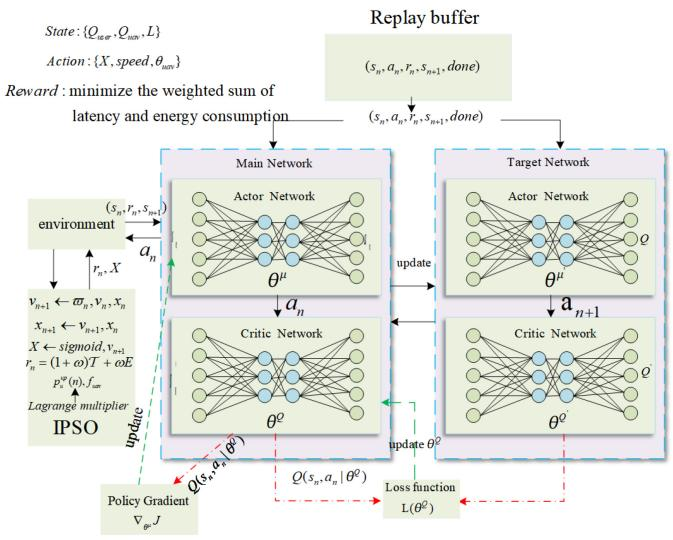

flowchart

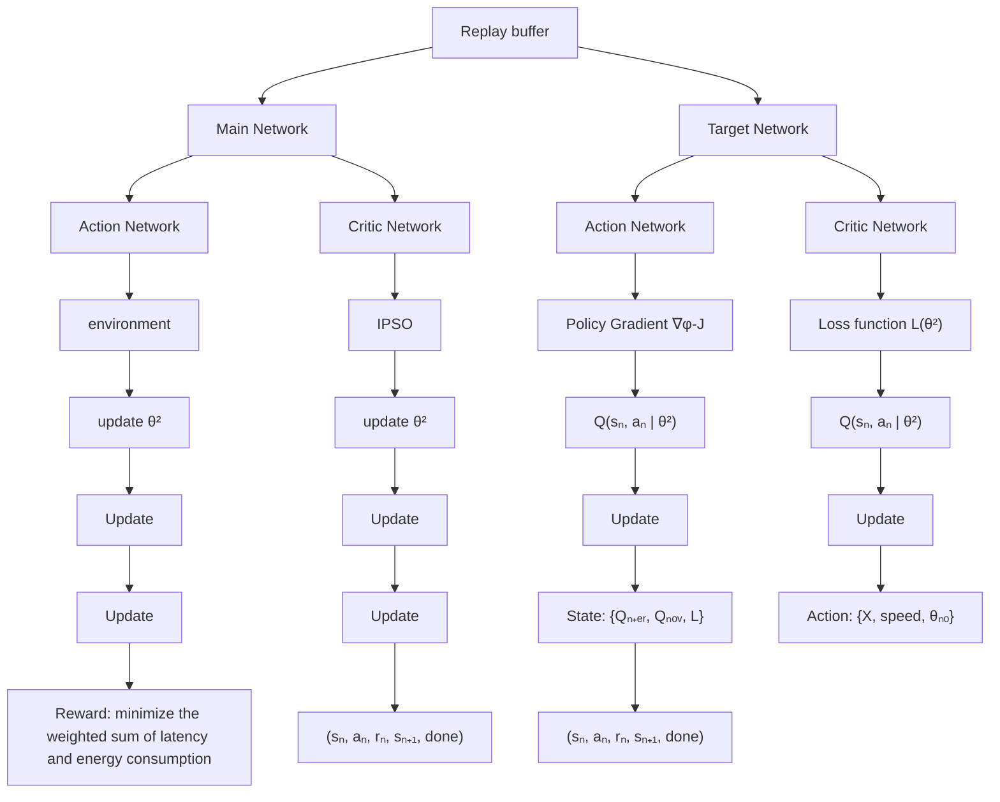

Fig. 2. Optimization process of UTOM mechanism based on offloading decision and resource allocation.

where $\kappa ^ { \mu }$ denotes the distribution function of state $s _ { n }$ under the current policy $\mu .$ . The target Q-value $y _ { n }$ of the target critic network is calculated as follows:

$$
y _ {n} = r (s _ {n}, a _ {n}) + \gamma Q \Big (s _ {n + 1}, \mu \big (s _ {n + 1} | \theta^ {\mu} \big) \theta^ {Q} \Big) \tag {52}
$$

where $r ( s _ { n } , a _ { n } )$ represents the reward after UAV trajectory update, and the symbols $\theta ^ { \mu }$ and $\theta ^ { Q }$ represent the weights of the actor network and the critic network, respectively. $Q ( \cdot | \theta ^ { Q } )$ and $\mu ( \cdot | \theta ^ { \mu } )$ indicate the action value function and the actor policy, respectively. Next, the weights $\theta ^ { Q }$ of the main critic network are expressed as

$$
\theta^ {Q} = \theta^ {Q} + \beta^ {Q} \nabla_ {\theta^ {Q}} L (\theta^ {Q}) \tag {53}
$$

where $\beta ^ { Q }$ is the learning rate of the main critic network. Finally, the weights of the target actor network and the target critic network are updated by using a soft updating method, which proceeds as follows:

$$
\theta^ {\mu^ {\prime}} \leftarrow \tau \theta^ {\mu} + (1 - \tau) \theta^ {\mu^ {\prime}} \tag {54}
$$

$$
\theta^ {Q ^ {\prime}} \leftarrow \tau \theta^ {Q} + (1 - \tau) \theta^ {Q ^ {\prime}} \tag {55}
$$

where τ is the soft update coefficient.

# D. Proposed Mechanism With Joint IPSO and DDPG

As shown in Fig. 2, we combine IPSO and DDPG to solve the resource allocation, offloading decision, and trajectory optimization problem for the UAV-assisted task offloading environment. The idea to solve this problem mainly include: 1) the environment interacts with IPSO network to obtain the best reward $r _ { n }$ and the offloading strategy X and 2) the environment interacts with the four networks in the DDPG to obtain the best action for each step of the UAV trajectory. The complete algorithm is shown in Algorithm 1.

The process of Algorithm 1 is as follows. We first randomly initialize the state $s _ { 1 }$ (lines 1 and 2). Second, enter the action $a _ { t }$ and state $s _ { t }$ into the environment and obtain the reward $r _ { t + 1 }$ and new state $s _ { t + 1 }$ by updating the particle position and

Algorithm 1 UTOM

Input: Main actor network $a _ { t } = \mu ( s _ { t } | \theta ^ { \mu } )$ ; main critic network $Q ( s _ { t } , a _ { t } | \theta ^ { Q } ) ;$ target actor network $\mu ^ { \prime } ;$ target critic network $Q ^ { \prime }$ with weights $\theta ^ { \mu } , \theta ^ { \mu ^ { \prime } } , \theta ^ { Q } , \theta ^ { Q ^ { \prime } } ;$ ; replay memory as $r p$

Output: Optimal offloading X, CPU frequency $f _ { u } ^ { \mathrm { u a v } }$ , transmit power $p _ { u s e r } ^ { u p }$ and UAV trajectory.

1: for each episode $n = 1 , \cdots , N$ do   
2: Randomly initialize the state $s _ { 1 } .$   
3: for step $t = 1 , \cdots , T$ do   
4: Select the action $a _ { t } ~ = ~ \mu ( s _ { t } | \theta ^ { \mu } )$ based on current state.   
5: Enter action $a _ { t }$ and current state $s _ { t }$ into the environment.   
6: Initialize particle position $x _ { u } ,$ particle velocity $\nu _ { u } ,$ inertia weights $\varpi _ { u } ,$ , local optimal solution $p _ { \mathrm { b e s t } }$ and $\mathrm { g l }$ obal optimal solution $g _ { \mathrm { b e s t } } .$   
7: for step $i = 1 , \cdots , I$ do   
8: for each particle $k = 1 , \cdots , K$ do   
9: The velocity $\nu _ { i + 1 }$ and position $x _ { i + 1 }$ of the next particle are updated and the offloading strategy X is calculated according to (42).   
10: The optimal transmit power and CPU frequency are calculated according to (35) and (36).   
11: end for   
12: Obtain instant rewards $r _ { t }$ for each step of the UAV trajectory and update pbest, gbest and inertia weights $\varpi$ .   
13: end for   
14: Update feedback instant reward $r _ { t + 1 }$ and new state $s _ { t + 1 }$ .   
15: add $( s _ { t } , a _ { t } , r _ { t + 1 } , s _ { t + 1 } )$ to replay buffer $r p .$   
16: Sample a batch size of $( s _ { t } , a _ { t } , r _ { t + 1 } , s _ { t + 1 } )$ from $r p .$   
17: Calculate the target Q-value $y _ { t }$ according to (52) and update critic by minimizing the loss.   
18: Update the actor network according to the policy gradient $\nabla _ { \theta ^ { \mu J . } }$   
19: Update the weights of the main actor network and the main critic network according to (50) and (53).   
20: Update the weights of the target actor network and the target critic network according to (54) and (55).   
21: end for   
  
23: end for

particle velocity (lines 3–14). Third, we add conversion tuple to replay buffer $r p$ and take random samples from $r p$ (lines 15 and 16). Fourth, we update the weights of main network and target network (lines 17–20). Finally, the above four steps are repeated until the loop ends.

# E. Time Complexity Analysis

Here, we discuss the time complexity of Algorithm 1. Note that, Algorithm 1 is based on the DDPG algorithm, and the actor network and critic network need to be, respectively, updated in each episode. The most time-consuming operation is in lines 7–13, and the time complexity is $O ( I \times K )$ , where I and K represent the number of iterations and particles, respectively. Hence, the complexity of Algorithm 1 is $O ( N ( Z _ { a } F _ { a } +$ $Z _ { a } ) + N ( Z _ { c } F _ { c } + Z _ { c } ) ) + ( I \times K ) )$ , where N denotes the number of episodes. $Z _ { a }$ and $Z _ { c }$ denote the number of units in the hidden layers of the actor and critic networks, respectively. $F _ { a }$ and $F _ { c }$ represent the number of hidden layers in the actor and critic networks, respectively.

# V. EXPERIMENTS

In this section, we evaluate the performance of our proposed UTOM.

# A. Experiment Settings

We first set the experiment parameters to evaluate the UTOM referring to [2] and [14]. The movement range of the UAV and IoT devices is set to $X _ { n } , Y _ { n } = [ 7 0 0 \mathrm { m }$ , 700 m] and the altitude of the UAV flight is set to $H = 1 0 0 \textrm { m }$ . The initial positions of the IoT devices are generated randomly in a uniform manner. Then, we update the flight trajectory of the UAV based on the best offloading decision of the IoT devices at each time slot. The trajectory of the UAV is from point (0, 0, 100 m) to end point (700, 700, 100 m). The speed and angle of flight of the UAV are limited to [30 m/s, 50 m/s] and [0, 2 π], respectively. The speed and angle of IoT devices are limited to [0, 5 m/s] and [0, 2 π ], respectively. The minimum and maximum CPU frequencies of the UAV are $f _ { \mathrm { m i n } } ~ = ~ 0 . 1$ GHz and $f _ { \mathrm { m a x } } \ = \ 1 . 2 \mathrm { G H z } ,$ respectively. The minimum and maximum transmit power values of the IoT devices are $p _ { \operatorname* { m i n } } = 1 \mathrm { W }$ and $p _ { \operatorname* { m a x } } = 3 \mathrm { W } .$ , respectively. The effective switched capacitances of the IoT device and the UAV are $k _ { u } ~ = ~ 1 0 ^ { - 2 6 }$ and $k _ { \mathrm { u a v } } = 1 0 ^ { - 2 7 }$ , respectively. The computing resource of the UAV is $C ( m ) = \bar { 1 0 } ^ { 8 }$ cycles. As the UAV flies to each IoT device to perform task offloading, it is highly likely to maintain an LoS channel. Consequently, in the experimental results, we primarily consider the ideal LoS channel [37], except in Fig. 8, where we also demonstrate the effectiveness of our proposed UTOM in combined LoS and NLoS channels. The complete parameters utilized for the experiment are summarized in Table II.

We implement the experiment using Python 3.9.0. All our experiments are run on at Lenovo, AMD Ryzen 5 3500U with Radeon Vega Mobile Gfx at 2.10 GHz, and Windows 11.

# B. Comparison Algorithms

The following algorithms are considered as benchmarks to check the effectiveness of our proposed UTOM.

1) Task Offloading Algorithm Based on a Deep Deterministic Policy Gradient Algorithm (OTDDPG) [31]: It aims to minimize maximum processing latency by jointly optimizing the task offloading decision, task offloading ratio, and flight speed. However, OTDDPG addresses single-objective optimization and does not consider resource constraints. To ensure a fair comparison, we modified OTDDPG’s objective to minimize the cost for all the IoT devices while satisfying resource constraints. Additionally, the action space of

TABLE II EXPERIMENT PARAMETERS 

<table><tr><td>Parameters</td><td>Value</td></tr><tr><td>The amount of task data size,  $L(n)$ </td><td>[1,10] Mbits</td></tr><tr><td>The height of UAV,  $H$ </td><td>100 m</td></tr><tr><td>Moving range of UAV and IoT devices,  $X_n$ ,  $Y_n$ </td><td>[700 m,700 m]</td></tr><tr><td>The reference channel gain,  $h_0$ </td><td>-50 dB</td></tr><tr><td>Time slot size,  $\delta$ </td><td>1 s</td></tr><tr><td>The bandwidth allocated to each IoT device,  $B_0$ </td><td> $10^7$  Hz</td></tr><tr><td>The noise power,  $\sigma^2$ </td><td>-70 dBm/Hz</td></tr><tr><td>The IoT devices computing resources,  $f_u^{user}$ </td><td> $10^8$ Hz</td></tr><tr><td>The gravity acceleration vector,  $g$ </td><td>9.8 m/s $^2$  [26]</td></tr><tr><td>Parameters related to UAV,  $w_1$ </td><td> $9.26 \times 10^{-4}$  [21]</td></tr><tr><td>Parameters related to UAV,  $w_2$ </td><td>2250 [21]</td></tr><tr><td>Discount coefficient,  $\gamma$ </td><td>0.9</td></tr><tr><td>Soft update coefficient,  $\tau$ </td><td>0.01</td></tr><tr><td>Learning rate of main actor network,  $\beta^\mu$ </td><td>0.001</td></tr><tr><td>Learning rate of main critic network,  $\beta^Q$ </td><td>0.001</td></tr><tr><td>Iterative rounds</td><td>1000</td></tr><tr><td>The carrier frequency,  $F_c$ </td><td>2 GHz</td></tr><tr><td>The constant values,  $C$ </td><td>9.61</td></tr><tr><td>The constant values,  $D$ </td><td>0.16</td></tr><tr><td>The path loss exponent,  $a$ </td><td>2</td></tr><tr><td>The average additional loss of LoS,  $L_{LoS}$ </td><td>0-6 dB</td></tr><tr><td>The average additional loss of NLoS,  $L_{NLoS}$ </td><td>10-30 dB</td></tr></table>

Simulation data references [26] and [21].

OTDDPG is continuous, enabling it to solve the same problem proposed in this article.

2) Deep Q-Network Algorithm (DQN) [41]: Its aim is to minimize the energy consumption and latency by jointly optimizing users’ offloaded task ratio scheduling and UAV trajectory. Since DQN does not consider resource allocation optimization and limited storage and computational resources. To be fair, we implement the resource allocation optimization on the original basis of this algorithm while satisfying the resource constraints of the UAV server.   
3) Actor–Critic-Based Computation Offloading Algorithm (AC) [28]: It aims to minimize the weighted sum of latency and energy consumption by optimizing offloading decisions under resource constraints. For a fair comparison with the mechanism proposed in this article, we also optimize the transmission power and computational power for AC.   
4) Edge\_Only: It offloads the whole latency-sensitive task from the IoT device to be executed on the UAV.   
5) Local\_Only: It makes all the latency-sensitive tasks on IoT devices be executed locally.

# C. Experiment Results

This article investigates the concept of dual mobility, where IoT devices move randomly over time slots. The UAV can predict flight trajectory for the next time slot based on the offloading decisions made by IoT devices in the current time slot. To demonstrate the feasibility and effectiveness of our proposed UTOM, we analyze six different sets of experimental results.

1) Effect of Different Weights on Latency and Energy: Here, the experiment contains ten IoT devices. Fig. 3(a) and (b) shows the effects of different weights on latency and energy consumption, respectively. It can be found that as the

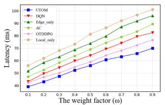

line

| The weight factor (ω) | UTOM (ms) | DQN (ms) | Edge_only (ms) | AC (ms) | OTDDPG (ms) | Local_only (ms) |
|---|---|---|---|---|---|---|
| 0.1 | 40 | 42 | 50 | 55 | 60 | 58 |
| 0.2 | 45 | 48 | 58 | 65 | 70 | 65 |
| 0.3 | 50 | 55 | 65 | 75 | 78 | 72 |
| 0.4 | 55 | 60 | 72 | 82 | 85 | 78 |
| 0.5 | 60 | 65 | 78 | 88 | 90 | 82 |
| 0.6 | 65 | 70 | 85 | 92 | 95 | 88 |
| 0.7 | 70 | 75 | 90 | 95 | 98 | 92 |
| 0.8 | 75 | 80 | 95 | 98 | 100 | 95 |
| 0.9 | 80 | 85 | 98 | 100 | 100 | 98 |

(a)

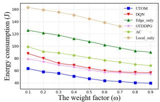

line

| The weight factor (ω) | UTOM | DQN | Edge only | OTDDPG | AC | Local only |
|---|---|---|---|---|---|---|
| 0.1 | 60 | 100 | 120 | 85 | 95 | 160 |
| 0.2 | 55 | 95 | 115 | 80 | 90 | 155 |
| 0.3 | 50 | 90 | 110 | 75 | 85 | 150 |
| 0.4 | 45 | 85 | 105 | 70 | 80 | 145 |
| 0.5 | 40 | 80 | 100 | 65 | 75 | 140 |
| 0.6 | 35 | 75 | 95 | 60 | 70 | 135 |
| 0.7 | 30 | 70 | 90 | 55 | 65 | 130 |
| 0.8 | 25 | 65 | 85 | 50 | 60 | 125 |
| 0.9 | 20 | 60 | 80 | 45 | 55 | 120 |

(b)

Fig. 3. (a) Latency and (b) energy of different weight.   
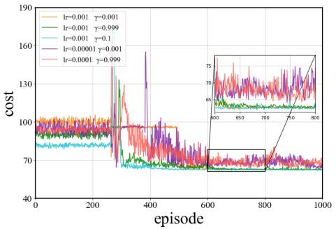

line

| episode | lr=0.001 γ=0.001 | lr=0.001 γ=0.999 | lr=0.001 γ=0.1 | lr=0.00001 γ=0.001 | lr=0.0001 γ=0.999 |
| ------- | ---------------- | ---------------- | -------------- | ------------------ | ----------------- |
| 600     | ~75              | ~75              | ~75            | ~75                | ~75               |
| 800     | ~75              | ~75              | ~75            | ~75                | ~75               |

Fig. 4. Effect of different network parameters on the training rewards.

weight increases, the latency of all IoT devices increases while the energy consumption decreases. When $\omega < 0 . 5 .$ , the system has a higher demand for latency. Therefore, we can increase the transmit power of IoT devices to reduce transmission latency. When $\omega > 0 . 5 ,$ the system has a higher demand for energy consumption. For this, we can increase CPU frequency of the UAV, and reduce the execution energy consumption of the UAV. To verify that the proposed UTOM can balance both the latency and energy consumption, in the following experiments we set $\omega = 0 . 5$ as a representative example.

2) Comparison of Different Network Parameters: In this section, we explore the effect of different network parameters on the training rewards. Our experiments involve ten IoT devices, with IPSO iterating 100 times and the weight factor of 0.5.

Fig. 4 shows the convergence performance of the proposed UTOM with different learning rates and discount factor γ . We assume that the learning rates of the actor and critic network are the same. On the one hand, when the learning rate $l r = 0 . 0 0 1$ and the discount factor $\gamma = 0 . 1$ , 0.999, 0.001, the proposed UTOM can converge. we can clearly observe that when $l r ~ = ~ 0 . 0 0 1$ , the change of discount factor $\gamma$ only slightly effects the convergence speed of the reward function but does not affect its convergence result. On the other hand, when $( l r = 0 . 0 0 0 0 1$ and $\gamma = 0 . 0 0 1 )$ and $( l r =$ 0.0001 and $\gamma = 0 . 9 9 9 )$ , we can find that the UTOM fails in converging.

Based on the above observation, we found that an appropriate combination of learning rate and discount factor can lead to optimal performance in the reward function. Specifically, when the learning rate is set to 0.001 and the discount factor is set to either 0.999 or 0.1, the model shows the best performance, achieving an average reward function of 62.12 on the test set. In contrast, when the learning rate is set to 0.00001 and the discount factor is set to 0.001, the reward function may not converge.

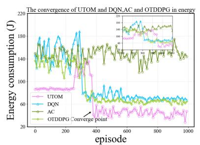

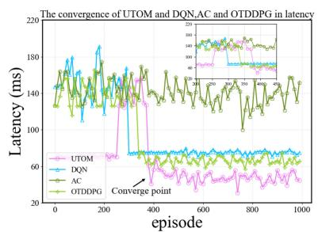

line

| episode | UTOM  | DQN   | AC    | OTDDPG |
| ------- | ----- | ----- | ----- | ------ |
| 0       | 150   | 150   | 150   | 150    |
| 200     | 180   | 180   | 180   | 180    |
| 400     | 60    | 60    | 60    | 60     |
| 600     | 60    | 60    | 60    | 60     |
| 800     | 60    | 60    | 60    | 60     |
| 1000    | 60    | 60    | 60    | 60     |

(b)

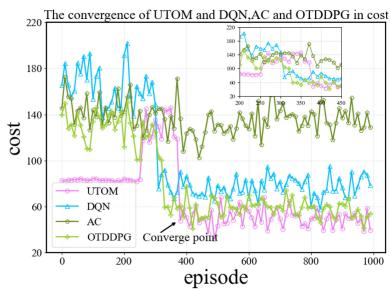

line

| episode | UTOM  | DQN   | AC    | OTDDPG |
| ------- | ----- | ----- | ----- | ------ |
| 0       | 180   | 180   | 180   | 180    |
| 200     | 160   | 190   | 170   | 165    |
| 400     | 140   | 170   | 150   | 145    |
| 600     | 120   | 150   | 130   | 125    |
| 800     | 100   | 130   | 110   | 105    |
| 1000    | 80    | 110   | 90    | 85     |

（c）

Fig. 5. Convergence of our proposed UTOM in comparison with the DQN, AC, and OTDDPG algorithms in cost, latency, and energy consumption. (a) Energy. (b) Latency. (c) Cost.   
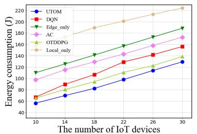

line

| The number of IoT devices | UTOM  | DQN   | Edge_only | AC    | OTDDPG | Local_only |
| ------------------------- | ----- | ----- | --------- | ----- | ------ | ---------- |
| 10                        | 50    | 65    | 110       | 95    | 80     | 120        |
| 14                        | 70    | 90    | 130       | 115   | 100    | 150        |
| 18                        | 85    | 110   | 150       | 135   | 120    | 180        |
| 22                        | 100   | 130   | 170       | 155   | 140    | 200        |
| 26                        | 120   | 150   | 190       | 175   | 160    | 220        |
| 30                        | 135   | 160   | 200       | 185   | 170    | 230        |

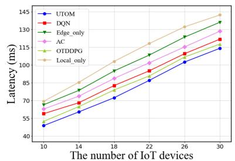

line

| The number of IoT devices | UTOM  | DQN   | Edge_only | AC    | OTDDPG | Local_only |
| ------------------------- | ----- | ----- | --------- | ----- | ------ | ---------- |
| 10                        | 45    | 60    | 70        | 65    | 60     | 70         |
| 14                        | 60    | 75    | 85        | 80    | 75     | 90         |
| 18                        | 75    | 90    | 100       | 95    | 90     | 105        |
| 22                        | 90    | 105   | 115       | 110   | 105    | 120        |
| 26                        | 105   | 120   | 130       | 125   | 120    | 135        |
| 30                        | 120   | 135   | 145       | 140   | 135    | 150        |

(b)

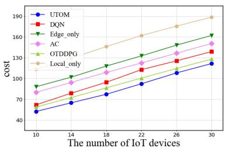

line

| The number of IoT devices | UTOM  | DQN   | Edge_only | AC    | OTDDPG | Local_only |
| ------------------------- | ----- | ----- | --------- | ----- | ------ | ---------- |
| 10                        | 50    | 65    | 85        | 75    | 70     | 105        |
| 14                        | 65    | 80    | 100       | 90    | 85     | 125        |
| 18                        | 80    | 95    | 115       | 105   | 100    | 145        |
| 22                        | 95    | 110   | 130       | 120   | 115    | 165        |
| 26                        | 110   | 125   | 145       | 135   | 130    | 185        |
| 30                        | 125   | 140   | 160       | 150   | 145    | 205        |

Fig. 6. (a) Energy consumption, (b) latency, and (c) cost over different IoT device numbers.

3) Convergence Performance: Fig. 5 shows the convergence performance of the proposed UTOM in comparison with the DQN, AC, and OTDDPG algorithms in terms of energy consumption, latency, and cost. As can be seen, the UTOM converges when the number of iterations reaches 380. In addition, we can observe that the UTOM achieves better performance in terms of energy consumption, latency, and cost compared to the DQN, AC, and OTDDPG algorithms. The AC algorithm struggles with updating both the actor and critic networks. The action selection by the actor network depends on the value function of the critic network, which is challenging to converge. The DQN algorithm needs to explore the non-negligible space between the discrete action space and the available actions, making it hard to accurately find the optimal offloading decision. In contrast, the UTOM allows for more effective learning on sequential actions, and it combines the DQN structure to improve the stability and convergence of the actor–critic. Compared to the OTDDPG algorithm, the UTOM mechanism incorporates an IPSO algorithm, allowing it to explore a larger search space more efficiently and find a better offloading strategy.

The experimental results show the proposed mechanism performs better than the DQN, AC, and OTDDPG algorithm. In the experimental process, the UTOM can achieve the optimal policy in a short time through sufficient training and remain stable after reaching the optimal policy. Therefore, compared to the DQN, AC, and OTDDPG algorithm, the UTOM has better convergence performance and a wider range of applicability.

4) Effect of IoT Device Numbers: Fig. 6 shows the variation in energy consumption, latency, and cost over different number of IoT devices. It can be observed that as the number of IoT devices increases, the energy consumption, latency, and cost of all the six algorithms increase. For instance, when there are ten IoT devices, the UTOM exhibits energy consumption, latency, and cost of 56.32, 48.72, and 52.52, respectively. The latency of DQN, Edge\_only, AC, OTDDPG, and Local\_only is 58.82, 66.35, 62.72, 52.31, and 69.24, respectively, and energy consumption is 67.00, 110.09, 97.52, 65.43, and 157.72, respectively. The results clearly indicate that the UTOM outperforms the other algorithms.

For Edge\_only, the whole latency-sensitive task is offloaded to the UAV, thus incurring significant offload latency and energy consumption, which increases the cost of offloading task. For Local\_only, all tasks are performed locally, and the limited computing resources of IoT devices cannot handle that many latency-sensitive tasks, thus leading to excessive cost. In the AC algorithm, the critic network struggles to accurately estimate the value function, affecting the decision quality of the actor network and resulting in poor convergence speed and stability, particularly in complex environments. Therefore, the cost of Edge\_only, Local\_only, and AC are higher than the other three algorithms. Although DQN and OTDDPG perform better than the previous two algorithms, the UTOM still shows lower energy consumption, latency, and cost than DQN and OTDDPG. This is because the UTOM can output multiple continuous actions and take resource allocation into account, whereas DQN is used to deal with discrete actions and OTDDPG does not consider the effect of resource allocation on cost. Therefore, the proposed UTOM can accurately find a factor that has a large effect on the cost, latency and energy consumption of a continuous action control system. In addition, the proposed UTOM comprehensively considers the resource allocation problem, i.e., obtain the optimal transmit power and CPU frequency of the UAV, so it outperforms DQN and OTDDPG. Compared to DQN and OTDDPG, our proposed UTOM reduces the cost by approximately 14.23% and 6%, respectively.

TABLE III RESULTS OF ABLATION EXPERIMENTS WITH DIFFERENT METHODS (A SMALLER COST INDICATES A BETTER RESULT) 

<table><tr><td>Cost (with resource allocation) Method</td><td>IoT number</td><td>10</td><td>14</td><td>18</td><td>22</td><td>26</td><td>30</td></tr><tr><td colspan="2">IPSO+DDPG</td><td>52.52</td><td>65.04</td><td>88.01</td><td>104.49</td><td>121.14</td><td>129.62</td></tr><tr><td colspan="2">PSO+DDPG</td><td>62.85</td><td>76.73</td><td>94.96</td><td>112.28</td><td>129.34</td><td>137.32</td></tr><tr><td>Cost (without resource allocation) Method</td><td>IoT number</td><td>10</td><td>14</td><td>18</td><td>22</td><td>26</td><td>30</td></tr><tr><td colspan="2">IPSO+DDPG</td><td>59.45</td><td>73.87</td><td>95.88</td><td>107.49</td><td>129.83</td><td>135.42</td></tr><tr><td colspan="2">PSO+DDPG</td><td>68.55</td><td>83.86</td><td>103.78</td><td>123.83</td><td>135.66</td><td>146.72</td></tr></table>

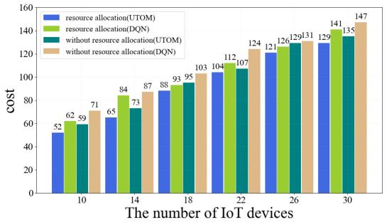

bar

| The number of IoT devices | resource allocation(UTOM) | resource allocation(DQN) | without resource allocation(UTOM) | without resource allocation(DQN) |
| :--- | :--- | :--- | :--- | :--- |
| 10 | 52 | 62 | 59 | 71 |
| 14 | 65 | 84 | 73 | 87 |
| 18 | 88 | 93 | 95 | 103 |
| 22 | 104 | 112 | 107 | 124 |
| 26 | 121 | 126 | 129 | 131 |
| 30 | 129 | 141 | 135 | 147 |

Fig. 7. Effect of resource allocation on cost.

5) Effect of Resource Allocation: Fig. 7 provides a comparison of the cost with and without resource allocation for different numbers of IoT devices. For example, when the number of IoT devices is ten, we can observe that the cost of the UTOM with resource allocation is 52.52 and the cost of one without resource allocation is 59.45. As the number of IoT devices continues to increase, it can be observed that the cost is also increasing. For UTOM and DQN, the cost with resource allocation considered are overall smaller than the cost without resource allocation considered. This is mainly due to the optimal transmit power and CPU frequency solved by using the Lagrange multiplier method and the KKT condition.

Compared to the situation without resource allocation, using the Lagrange multiplier method and KKT condition to solve the resource allocation problem can achieve better performance. Specifically, the optimal transmit power and CPU frequency can make the most of the computing resources of the UAV, reducing the conflicts and interference among IoT devices, and thus reducing the cost of collaborative task completion.

6) Ablation Experiment: To investigate the impact of each component of the UTOM, we conducted ablation experiments for different methods. For comparison, we consider PSO, a classical optimization algorithm, to serve as a benchmark for evaluating IPSO. By testing under different conditions, we can systematically analyze whether IPSO significantly improves performance in terms of cost reduction. Table III summarizes the experimental results under the conditions we considered.

For this ablation experiment, the discussion is divided into two parts: the impact of the two methods on cost after optimizing resource allocation, and their impact on cost without optimizing resource allocation. First, with optimized resource allocation, the IPSO+DDPG method rapidly finds the optimal offloading decision by introducing population diversity and optimizing inertia weights in each iteration to balance global and local search capabilities, thereby significantly reducing task offloading costs. In contrast, while the PSO+DDPG method also reduces costs to a certain extent, it is less efficient due to PSO’s tendency to converge on local optima during the search process. Experimental results demonstrate that the IPSO+DDPG method can reduce the cost by approximately 14% under the same environmental settings. Second, without considering resource allocation, the IPSO+DDPG method still outperforms PSO+DDPG, indicating that even in scenarios lacking resource allocation optimization, IPSO+DDPG effectively reduces task offloading costs through more efficient policy learning and task scheduling mechanisms. Specifically, the cost of the IPSO+DDPG method is approximately 13% lower than that of the PSO+DDPG method without resource allocation optimization. In summary, IPSO+DDPG demonstrates superiority over PSO+DDPG, with or without resource allocation optimization. For example, when the number of IoT devices is 18, the costs of the IPSO+DDPG and PSO+DDPG methods with resource allocation are 88.01 and 94.96, respectively, while the costs without resource allocation are 95.88 and 103.78, respectively.

7) Effect of NLoS Channels: To examine the effectiveness of our proposed UTOM across diverse channels, we further evaluate its performance specifically in terms of energy consumption, latency, and cost under combined LoS and NLoS channel conditions, based on (11), as shown in Fig. 8. For comparison, the performance of the OTDDPG, DQN, and AC algorithms is also presented. All algorithms exhibit worse performance under the combined LoS and NLoS channel conditions (denoted as “NLoS” in the figure) compared to the ideal LoS channel conditions, primarily due to the increased path loss caused by obstacles. Nonetheless, our proposed UTOM outperforms the OTDDPG, DQN, and AC algorithms, further confirming its effectiveness.

8) Optimal Trajectory of UAV: In this experiment, we set the number of IoT device increases from 10 to 20. As shown in Fig. 9, we can observe that the optimal trajectory of the UAV for different IoT devices distribution can converge eventually. In the 3-D space, the green line represents the flight path of the UAV from the initial position to the end position, while the both red and blue dots represent IoT devices. The red dot represents the scenario where the IoT device partially offloads the task to the UAV and partially computs it locally, while the blue dots represent the scenario where the IoT device computes the whole task locally. The two colors help visualize how the task is being offloaded for each IoT device.

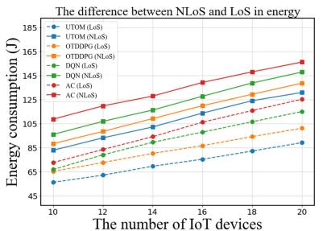

line

The difference between NLoS and LoS in energy
| The number of IoT devices | UTOM (LoS) | UTOM (NLoS) | OTDDPG (LoS) | OTDDPG (NLoS) | DQN (LoS) | DQN (NLoS) | AC (LoS) | AC (NLoS) |
|---|---|---|---|---|---|---|---|---|
| 10 | 65 | 70 | 80 | 90 | 105 | 110 | 120 | 130 |
| 12 | 68 | 75 | 85 | 95 | 110 | 115 | 125 | 135 |
| 14 | 72 | 80 | 90 | 100 | 115 | 120 | 130 | 140 |
| 16 | 76 | 85 | 95 | 105 | 120 | 125 | 135 | 145 |
| 18 | 80 | 90 | 100 | 110 | 125 | 130 | 140 | 150 |
| 20 | 85 | 95 | 105 | 115 | 130 | 135 | 145 | 155 |

(a)

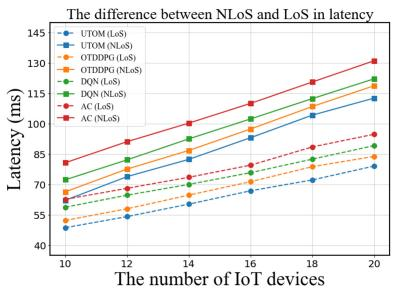

line

| The number of IoT devices | UTOM (LoS) | UTOM (NLoS) | OTDOPD (LoS) | OTDOPD (NLoS) | DQN (LoS) | DQN (NLoS) | AC (LoS) | AC (NLoS) |
| ------------------------- | ---------- | ----------- | ------------ | ------------- | --------- | ---------- | -------- | --------- |
| 10                        | 45         | 50          | 60           | 65            | 70        | 75         | 80       | 85        |
| 12                        | 50         | 55          | 70           | 75            | 80        | 85         | 90       | 95        |
| 14                        | 55         | 60          | 80           | 85            | 90        | 95         | 100      | 105       |
| 16                        | 60         | 65          | 90           | 95            | 100       | 105        | 110      | 115       |
| 18                        | 65         | 70          | 100          | 105           | 110       | 115        | 120      | 125       |
| 20                        | 70         | 75          | 110          | 115           | 120       | 125        | 130      | 135       |

(b)

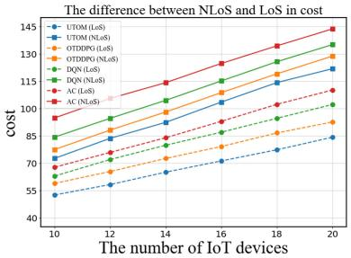

line

| The number of IoT devices | UTOM (LoS) | UTOM (NLoS) | OTDDPG (LoS) | OTDDPG (NLoS) | DQN (LoS) | DQN (NLoS) | AC (LoS) | AC (NLoS) |
| ------------------------- | ---------- | ----------- | ------------ | ------------- | --------- | ---------- | -------- | --------- |
| 10                        | 70         | 65          | 80           | 75            | 90        | 85         | 100      | 95        |
| 12                        | 75         | 70          | 85           | 80            | 95        | 90         | 105      | 100       |
| 14                        | 80         | 75          | 90           | 85            | 100       | 95         | 110      | 105       |
| 16                        | 85         | 80          | 95           | 90            | 105       | 100        | 115      | 110       |
| 18                        | 90         | 85          | 100          | 95            | 110       | 105        | 120      | 115       |
| 20                        | 95         | 90          | 105          | 100           | 115       | 110        | 125      | 120       |

（c）

Fig. 8. Difference between NLoS and LoS in terms of (a) energy consumption, (b) latency, and (c) cost.   
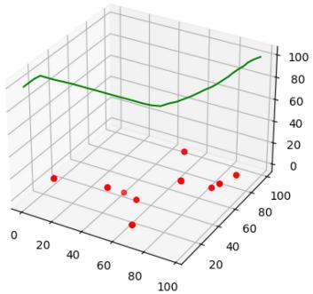  
(a)

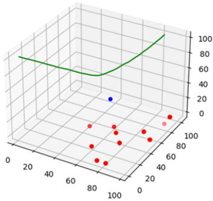  
(b)

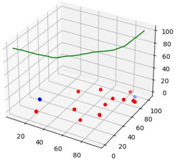

scatter

| x  | y  | z  |
|----|----|----|
| 20 | 70 |    |
| 40 | 65 |    |
| 60 | 60 |    |
| 80 | 55 |    |
| 100| 50 |    |
| 120| 45 |    |
| 140| 40 |    |
| 160| 35 |    |
| 180| 30 |    |
| 200| 25 |    |
| 220| 20 |    |
| 240| 15 |    |
| 260| 10 |    |
| 280| 5  |    |
| 300| 0  |    |
| 320| -5 |    |
| 340| -10|    |
| 360| -15|    |
| 380| -20|    |
| 400| -25|    |
| 420| -30|    |
| 440| -35|    |
| 460| -40|    |
| 480| -45|    |
| 500| -50|    |
| 520| -55|    |
| 540| -60|    |
| 560| -65|    |
| 580| -70|    |
| 600| -75|    |
| 620| -80|    |
| 640| -85|    |
| 660| -90|    |
| 680| -95|    |
| 700| -100|    |
| 720| -105|    |
| 740| -110|    |
| 760| -115|    |
| 780| -120|    |
| 800| -125|    |
| 820| -130|    |
| 840| -135|    |
| 860| -140|    |
| 880| -145|    |
| 900| -150|    |
| 920| -155|    |
| 940| -160|    |
| 960| -165|    |
| 980| -170|    |
| 1000| -175|    |

（c）

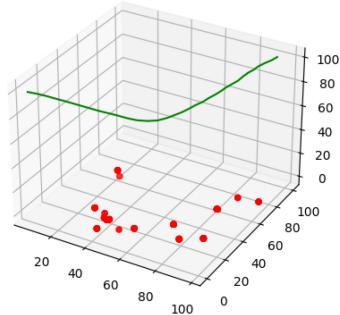

scatter

| x  | y  |
|----|----|
| 20 | 70 |
| 40 | 65 |
| 60 | 60 |
| 80 | 55 |
| 100| 50 |
| 120| 45 |
| 140| 40 |
| 160| 35 |
| 180| 30 |
| 200| 25 |
| 220| 20 |
| 240| 15 |
| 260| 10 |
| 280| 5  |
| 300| 0  |

(d)

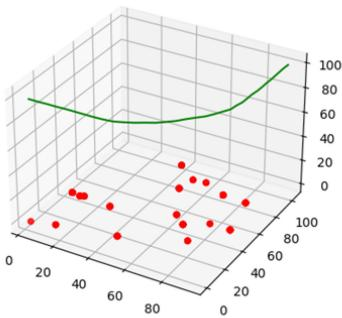

scatter

| x  | y  |
|----|----|
| 20 | 20 |
| 30 | 30 |
| 40 | 40 |
| 50 | 50 |
| 60 | 60 |
| 70 | 70 |
| 80 | 80 |
| 90 | 90 |
| 100| 100|

(e)

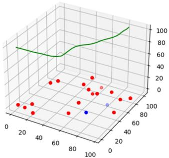

scatter

| x  | y  | z  |
|----|----|----|
| 20 | 20 | 0  |
| 40 | 40 | 0  |
| 60 | 60 | 0  |
| 80 | 80 | 0  |
| 100| 100| 0  |
| 120| 120| 0  |
| 140| 140| 0  |
| 160| 160| 0  |
| 180| 180| 0  |
| 200| 200| 0  |
| 220| 220| 0  |
| 240| 240| 0  |
| 260| 260| 0  |
| 280| 280| 0  |
| 300| 300| 0  |
| 320| 320| 0  |
| 340| 340| 0  |
| 360| 360| 0  |
| 380| 380| 0  |
| 400| 400| 0  |
| 420| 420| 0  |
| 440| 440| 0  |
| 460| 460| 0  |
| 480| 480| 0  |
| 500| 500| 0  |
| 520| 520| 0  |
| 540| 540| 0  |
| 560| 560| 0  |
| 580| 580| 0  |
| 600| 600| 0   |
| 620| 620| -1 |
| 640| 640| -2 |
| 660| 660| -3 |
| 680| 680| -4 |
| 700| 700| -5 |
| 720| 720| -6 |
| 740| 740| -7 |
| 760| 760| -8 |
| 780| 780| -9 |
| 800| 800| -10|
| 820| 820| -11|
| 840| 840| -12|
| 860| 860| -13|
| 880| 880| -14|
| 900| 900| -15|
| 920| 920| -16|
| 940| 940| -17|
| 960| 960| -18|
| 980| 980| -19|
| 100 |    |     |

(f)   
Fig. 9. Optimal trajectory of UAV for different IoT devices. (a) Number of IoT devices is ten. (b) Number of IoT devices is 12. (c) Number of IoT devices is 14. (d) Number of IoT devices is 16. (e) Number of IoT devices is 18. (f) Number of IoT devices is 20.

In Fig. 9, IoT devices are randomly distributed and the UAV flies from the initial coordinates (0, 0, 100) to the end coordinates (700, 700, 100). Specifically, as shown in Fig. 9(a), (c), (e), and (f), the UAV chooses the shortest path to fly when the locations of the IoT devices are scattered or centrally deployed near the diagonal of the 3-D space. This is done to minimize the weighted sum of latency and energy consumption. As shown in Fig. 9(b) and (d), the UAV makes a prediction based on the IoT devices current decision. In other words, the UAV follows the position of the IoT device to fly, which can minimize the cost.

Based on the above discussion, we can see that regardless of the location distribution of the IoT devices and the number of IoT devices, the flight trajectory of the UAV can be predicted for the next moment based on the minimum cost of IoT devices.

# VI. CONCLUSION

In this article, we address the problem of UAV-assisted task offloading with the limited resources of UAVs and IoT devices. First, we construct a cost function associated with latency and energy consumption in the studied scenario and formulate the optimization problem. We then propose an UTOM to minimize the cost by jointly optimizing resource allocation, task offloading decisions, and UAV trajectory. To efficiently solve the formulated problem, we decompose it into three easily solvable subproblems: 1) the optimal solution for resource allocation is obtained using the Lagrange multiplier method and the KKT conditions; 2) the optimal offloading decision is determined using an IPSO algorithm; and 3) the UAV flight trajectory is derived using a DDPG. Finally, extensive experimental results demonstrate the high efficiency of our proposed UTOM.

While our research has achieved positive results, there are still some limitations. First, we plan to incorporate multi-UAV systems for scenarios with many IoT devices, as a single UAV may not meet task demands. Second, considering the joint use of UAVs and edge servers is important, as it improves the overall performance and efficiency of task offloading. We shall investigate these research issues in future work.

# REFERENCES

[1] T. Tan, M. Zhao, and Z. Zeng, “Joint offloading and resource allocation based on UAV-assisted mobile edge computing,” ACM Trans. Sens. Netw., vol. 18, no. 3, pp. 1–21, 2022.   
[2] A. M. Seid, G. O. Boateng, S. Anokye, T. Kwantwi, G. Sun, and G. Liu, “Collaborative computation offloading and resource allocation in multi-UAV-assisted IoT networks: A deep reinforcement learning approach,” IEEE Internet Things J., vol. 8, no. 15, pp. 12203–12218, Aug. 2021.   
[3] R. Bi, T. Peng, J. Ren, X. Fang, and G. Tan, “Joint service placement and computation scheduling in edge clouds,” in Proc. IEEE Int. Conf. Web Services (ICWS), 2022, pp. 47–56.   
[4] J. Liu, J. Ren, Y. Zhang, X. Peng, Y. Zhang, and Y. Yang, “Efficient dependent task offloading for multiple applications in MEC-cloud system,” IEEE Trans. Mobile Comput., vol. 22, no. 4, pp. 2147–2162, Apr. 2023.   
[5] C. Ding, Y. Li, and S. Wang, “Edge/cloud-assisted feature extraction in IoT devices,” IEEE Internet Things J., vol. 9, no. 21, pp. 21594–21606, Nov. 2022.   
[6] J. Zhang et al., “Dependent application offloading in edge computing,” IEEE Trans. Cloud Comput., vol. 11, no. 4, pp. 3439–3451, Oct.–Dec. 2023.   
[7] J. Zhang et al., “Dependent task offloading mechanism for cloud– edge-device collaboration,” J. Netw. Comput. Appl., vol. 216, pp. 103656–103668, Jul. 2023.   
[8] Y. K. Tun, N. D. Tri, K. Kim, M. Alsenwi, W. Saad, and C. S. Hong, “Collaboration in the sky: A distributed framework for task offloading and resource allocation in multiaccess edge computing,” IEEE Internet Things J., vol. 9, no. 23, pp. 24221–24235, Dec. 2022.   
[9] H. Wang, “Collaborative task offloading strategy of UAV cluster using improved genetic algorithm in mobile edge computing,” J. Robot., vol. 2021, pp. 1–9, Jan. 2021.   
[10] X. Diao, X. Guan, and Y. Cai, “Joint offloading and trajectory optimization for complex status updates in UAV-assisted Internet of Things,” IEEE Internet Things J., vol. 9, no. 23, pp. 23881–23896, Dec. 2022.   
[11] J. Zhou and X. Zhang, “Fairness-aware task offloading and resource allocation in cooperative mobile-edge computing,” IEEE Internet Things J., vol. 9, no. 5, pp. 3812–3824, Mar. 2022.   
[12] N. Lin, H. Tang, L. Zhao, S. Wan, A. Hawbani, and M. Guizani, “A PDDQNLP algorithm for energy efficient computation offloading in UAV-assisted MEC,” IEEE Trans. Wireless Commun., vol. 22, no. 12, pp. 8876–8890, Dec. 2023.   
[13] I. A. Elgendy, S. Meshoul, and M. Hammad, “Joint task offloading, resource allocation, and load-balancing optimization in multi-UAV-aided MEC systems,” Appl. Sci., vol. 13, no. 4, pp. 2625–2647, 2023.   
[14] L. P. Qian, H. Zhang, Q. Wang, Y. Wu, and B. Lin, “Joint multidomain resource allocation and trajectory optimization in UAV-assisted maritime IoT networks,” IEEE Internet Things J., vol. 10, no. 1, pp. 539–552, Jan. 2023.   
[15] F. Li, J. Luo, Y. Qiao, and Y. Li, “Joint UAV deployment and task offloading scheme for multi-UAV-assisted edge computing,” Drones, vol. 7, no. 5, pp. 284–302, 2023.   
[16] G. Zheng, C. Xu, M. Wen, and X. Zhao, “Service caching based aerial cooperative computing and resource allocation in multi-UAV enabled MEC systems,” IEEE Trans. Veh. Technol., vol. 71, no. 10, pp. 10934–10947, Oct. 2022.

[17] J. Xiong, H. Guo, and J. Liu, “Task offloading in UAV-aided edge computing: Bit allocation and trajectory optimization,” IEEE Commun. Lett., vol. 23, no. 3, pp. 538–541, Mar. 2019.   
[18] F. Song et al., “Evolutionary multiobjective reinforcement learning based trajectory control and task offloading in UAV-assisted mobile edge computing,” IEEE Trans. Mobile Comput., vol. 22, no. 12, pp. 7387–7405, Dec. 2023.   
[19] C. Yang, B. Liu, H. Li, B. Li, K. Xie, and S. Xie, “Learning based channel allocation and task offloading in temporary UAV-assisted vehicular edge computing networks,” IEEE Trans. Veh. Technol., vol. 71, no. 9, pp. 9884–9895, Sep. 2022.   
[20] N. Zhao, Z. Ye, Y. Pei, Y.-C. Liang, and D. Niyato, “Multiagent deep reinforcement learning for task offloading in UAV-assisted mobile edge computing,” IEEE Trans. Wireless Commun., vol. 21, no. 9, pp. 6949–6960, Sep. 2022.   
[21] Y. Xu, T. Zhang, Y. Liu, D. Yang, L. Xiao, and M. Tao, “UAVassisted MEC networks with aerial and ground cooperation,” IEEE Trans. Wireless Commun., vol. 20, no. 12, pp. 7712–7727, Dec. 2021.   
[22] Y. Zeng, J. Xu, and R. Zhang, “Energy minimization for wireless communication with rotary-wing UAV,” IEEE Trans. Wireless Commun., vol. 18, no. 4, pp. 2329–2345, Apr. 2019.   
[23] Z. Xiang, S. Deng, Y. Zheng, D. Wang, J. Tehari, and Z. Zheng, “Energy-effective IoT services in balanced edge-cloud collaboration systems,” in Proc. IEEE Int. Conf. Web Services (ICWS), 2021, pp. 219–229.   
[24] H. Kang, X. Chang, J. Mišic, V. B. Miši ´ c, J. Fan, and Y. Liu, ´ “Cooperative UAV resource allocation and task offloading in hierarchical aerial computing systems: A MAPPO based approach,” IEEE Internet Things J., vol. 10, no. 12, pp. 10497–10509, Jun. 2023.   
[25] J. Du et al., “MADDPG-based joint service placement and task offloading in MEC empowered air-ground integrated networks,” IEEE Internet Things J., vol. 11, no. 6, pp. 10600–10615, Mar. 2024.   
[26] Y. He, Y. Gan, H. Cui, and M. Guizani, “Fairness-based 3-D multi-UAV trajectory optimization in multi-UAV-assisted MEC system,” IEEE Internet Things J., vol. 10, no. 13, pp. 11383–11395, Jul. 2023.   
[27] B. Liu, Y. Wan, F. Zhou, Q. Wu, and R. Q. Hu, “Resource allocation and trajectory design for MISO UAV-assisted MEC networks,” IEEE Trans. Veh. Technol., vol. 71, no. 5, pp. 4933–4948, May 2022.   
[28] B. Ji et al., “Research on offloading strategy of twin UAVs edge computing tasks for emergency communication,” IEEE Trans. Netw. Service Manag., vol. 21, no. 1, pp. 684–696, Feb. 2023.   
[29] R. Zhong, X. Liu, Y. Liu, and Y. Chen, “Multiagent reinforcement learning in NOMA-aided UAV networks for cellular offloading,” IEEE Trans. Wireless Commun., vol. 21, no. 3, pp. 1498–1512, Mar. 2022.   
[30] L. Chu, X. Li, J. Xu, A. G. Neiat, and X. Liu, “A holistic service provision strategy for drone-as-a-service in MEC-based UAV delivery,” in Proc. IEEE Int. Conf. Web Services (ICWS), 2021, pp. 669–674.   
[31] W. Zhuang, F. Xing, and Y. Lu, “Task offloading strategy for unmanned aerial vehicle power inspection based on deep reinforcement learning,” Sensors, vol. 24, no. 7, pp. 2070–2089, 2024.   
[32] Y. Ding, C. Liu, X. Zhou, Z. Liu, and Z. Tang, “A code-oriented partitioning computation offloading strategy for multiple users and multiple mobile edge computing servers,” IEEE Trans. Ind. Informat., vol. 16, no. 7, pp. 4800–4810, Jul. 2020.   
[33] M. R. Garey and D. S. Johnson, “‘Strong’ NP-completeness results: Motivation, examples, and implications,” J. ACM, vol. 25, no. 3, pp. 499–508, 1978.   
[34] C. Swain, M. N. Sahoo, and A. Satpathy, “LETO: An efficient load balanced strategy for task offloading in IoT-fog systems,” in Proc. IEEE Int. Conf. Web Services (ICWS), 2021, pp. 459–464.   
[35] G. Zhao, H. Xu, Y. Zhao, C. Qiao, and L. Huang, “Offloading tasks with dependency and service caching in mobile edge computing,” IEEE Trans. Parallel Distrib. Syst., vol. 32, no. 11, pp. 2777–2792, Nov. 2021.   
[36] X. He et al., “CONFECT: Computation offloading for tasks with hard/soft deadlines in edge computing,” in Proc. IEEE Int. Conf. Web Services (ICWS), 2021, pp. 262–271.   
[37] M. Li, N. Cheng, J. Gao, Y. Wang, L. Zhao, and X. Shen, “Energyefficient UAV-assisted mobile edge computing: Resource allocation and trajectory optimization,” IEEE Trans. Veh. Technol., vol. 69, no. 3, pp. 3424–3438, Mar. 2020.   
[38] H. Guo, Y. Wang, J. Liu, and C. Liu, “Multi-UAV cooperative task offloading and resource allocation in 5G advanced and beyond,” IEEE Trans. Wireless Commun., vol. 23, no. 1, pp. 347–359, Jan. 2024.   
[39] A. Manzoor et al., “Ruin theory for energy-efficient resource allocation in UAV-assisted cellular networks,” IEEE Trans. Commun., vol. 69, no. 6, pp. 3943–3956, Jun. 2021.

[40] T. P. Lillicrap et al., “Continuous control with deep reinforcement learning,” in Proc. Int. Conf. Learn. Represent. (ICLR), 2016, pp. 1–14.   
[41] L. Zhang et al., “Task offloading and trajectory control for UAV-assisted mobile edge computing using deep reinforcement learning,” IEEE Access, vol. 9, pp. 53708–53719, 2021.

natural_image

Portrait of a woman with short hair and glasses, wearing a black blazer over a white top (no text or symbols visible)

Junna Zhang (Member, IEEE) received the Ph.D. degree from the Institute of Network Technology, Beijing University of Posts and Telecommunications, Beijing, China, in 2019.

She is currently a Professor with the College of Computer and Information Engineering, Henan Normal University, Xinxiang, China. Her research interests include edge computing and service computing. She authored or co-authored more than 30 papers in these fields.

Prof. Zhang received the Best Paper Award of CCF NCSC in 2022.

natural_image

Portrait of a young man in a black collared shirt (no text or symbols visible)

Guoxian Zhang is currently pursuing the master’s degree with the College of Computer and Information Engineering, Henan Normal University, Xinxiang, China.

His research interests include edge computing and service computing.

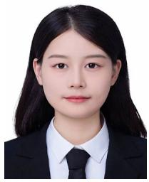

natural_image

Portrait of a woman in formal attire (no visible text or symbols)

Xinxin Wang received the bachelor’s degree in computer and information technology from Xinyang Normal University, Xinyang, China, in 2021. She is currently pursuing the master’s degree with the College of Computer and Information Engineering, Henan Normal University, Xinxiang, China.

Her research interests include edge computing and service computing.

natural_image

Portrait photo of a woman with short dark hair wearing a patterned blouse (no text or symbols visible)

Xiaoyan Zhao (Member, IEEE) received the first Ph.D. degree from the School of Software, Sun Yat-sen University, Guangzhou, China, in 2010, and the second Ph.D. degree from the Department of Computer Science and Engineering, Hong Kong University of Science and Technology, Hong Kong, in 2014.

She is currently an Associate Professor with the South China University of Technology, Guangzhou. Her research interests include mobile crowdsensing, edge computing, and mobile computing.

Dr. Zhao is a member of ACM.

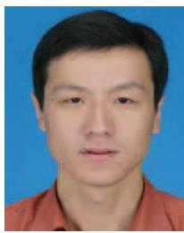

natural_image

Portrait photo of a man in a red shirt against a blue background (no text or symbols visible)

Peiyan Yuan (Senior Member, IEEE) received the B.S. degree in computer science from Henan Normal University, Xinxiang, China, in 2001, the M.S. degree in computer science from Wuhan University of Technology, Wuhan, China, in 2007, and the Ph.D. degree in computer science from Beijing University of Posts and Telecommunications, Beijing, China, in 2014.

He is a Professor of Computer Science with Henan Normal University. He was a Postdoctoral Researcher with the University of Texas at Dallas,

Richardson, TX, USA. His research interests include future networks and distributed systems. He authored or co-authored more than 50 papers and one book in these fields.

Prof. Yuan received the Best Paper Award of IEEE CSE in 2014 and won the National Scholarship for Ph.D. students from the Ministry of Education, China, in 2012. He is a Senior Member of CCF and a member of ACM.

natural_image

Portrait of a man wearing glasses and a dark shirt (no text or symbols visible)

Hu Jin (Senior Member, IEEE) received the B.E. degree in electronic engineering and information science from the University of Science and Technology of China, Hefei, China, in 2004, and the M.S. and Ph.D. degrees in electrical engineering from the Korea Advanced Institute of Science and Technology, Daejeon, South Korea, in 2006 and 2011, respectively.

From 2011 to 2013, he was a Postdoctoral Fellow with the University of British Columbia, Vancouver, BC, Canada. From 2013 to 2014, he was a Research

Professor with Gyeongsang National University, Tongyeong, South Korea. Since 2014, he has been with the School of Electrical Engineering, Hanyang University, Ansan, South Korea, where he is currently a Professor. His research interests include medium-access control and radio resource management for random access networks and scheduling systems considering advanced signal processing, and queueing performance.