# UAV-Assisted Wireless Powered Cooperative Mobile Edge Computing: Joint Offloading, CPU Control, and Trajectory Optimization

Yuan Liu, Ke Xiong , Member, IEEE, Qiang Ni , Senior Member, IEEE, Pingyi Fan , Senior Member, IEEE, and Khaled Ben Letaief, Fellow, IEEE

Abstract—This article investigates the unmanned-aerial-vehicle (UAV)-enabled wireless powered cooperative mobile edge computing (MEC) system, where a UAV installed with an energy transmitter (ET) and an MEC server provides both energy and computing services to sensor devices (SDs). The active SDs desire to complete their computing tasks with the assistance of the UAV and their neighboring idle SDs that have no computing task. An optimization problem is formulated to minimize the total required energy of UAV by jointly optimizing the CPU frequencies, the offloading amount, the transmit power, and the UAV’s trajectory. To tackle the nonconvex problem, a successive convex approximation (SCA)-based algorithm is designed. Since it may be with relatively high computational complexity, as an alternative, a decomposition and iteration (DAI)-based algorithm is also proposed. The simulation results show that both proposed algorithms converge within several iterations, and the DAIbased algorithm achieve the similar minimal required energy and optimized trajectory with the SCA-based one. Moreover, for a relatively large amount of data, the SCA-based algorithm should be adopted to find an optimal solution, while for a relatively small amount of data, the DAI-based algorithm is a better choice to achieve smaller computing energy consumption. It also shows that the trajectory optimization plays a dominant factor in minimizing the total required energy of the system and optimizing acceleration has a great effect on the required energy of the UAV. Additionally, by jointly optimizing the UAV’s CPU frequencies and the amount of bits offloaded to UAV, the minimal required energy for computing can be greatly reduced compared to other schemes and by leveraging the computing resources of idle SDs, the UAV’s computing energy can also be greatly reduced.

Manuscript received September 2, 2019; revised November 5, 2019; accepted November 27, 2019. Date of publication December 20, 2019; date of current version April 14, 2020. This work was supported in part by the Fundamental Research Funds for the Central Universities under Grant 2018YJS040 and Grant 2019JBM401, in part by the National Natural Science Foundation of China (NSFC) under Grant 61671051 and Grant U1834210, and in part by the Royal Society Newton Advanced Fellowship under Grant NA191006. (Corresponding author: Ke Xiong.)

Yuan Liu and Ke Xiong are with the School of Computer and Information Technology and the Beijing Key Laboratory of Traffic Data Analysis and Mining, Beijing Jiaotong University, Beijing 100044, China (e-mail: kxiong@bjtu.edu.cn).

Qiang Ni is with the School of Computing and Communications and Data Science Institute, Lancaster University, Lancashire LA1 4WA, U.K. (e-mail: q.ni@lancaster.ac.uk).

Pingyi Fan is with the Department of Electronic Engineering, Tsinghua University, Beijing 100084, China (e-mail: fpy@tsinghua.edu.cn).

Khaled Ben Letaief is with the School of Engineering, Hong Kong University of Science and Technology, Hong Kong (e-mail: eekhaled@ece.ust.hk).

Digital Object Identifier 10.1109/JIOT.2019.2958975

Index Terms—Computation offloading, mobile edge computing (MEC), trajectory design, unmanned-aerial-vehicle (UAV) communication, wireless power transfer (WPT).

# I. INTRODUCTION

# A. Background

R ECENT advancements in Internet of Things (IoT) havearoused abundant new applications, including intelli- aroused abundant new applications,including intelligent grazing, autonomous control, and environmental monitoring [1]–[4]. In IoT systems, a large number of sensor devices (SDs) need to be deployed to collect environmental data. The SDs are usually powered by batteries with limited energy capacity, which thus are required to be replaced or recharged up periodically. In large-scale IoT and rugged environment, frequently replacing and recharging batteries may bring huge labor cost. In order to power the low-power SDs in a self-sustainable way and avoid replacing batteries manually, radio-frequency (RF) signal-based wireless power transfer (WPT), also referred to as RF-based energy harvesting (EH) has been widely regarded as a promising solution [5], [6]. It is reported that current RF-based EH has already been capable of transferring power about several milliWatts at a distance of up to tens of meters [7]. Thus, it is suitable to power low-power devices in IoT and wireless sensor networks (WSNs) [8].

On the other hand, massive amounts of collected data are required to be online computed in real-time IoT systems. Due to the limited communication, computation, and storage capabilities, it is difficult for SDs to complete latency-sensitive computation tasks with their own computing resources. To tackle this issue, mobile edge computing (MEC) has emerged as an effective solution, which is able to offer intensive computation services at the network edge with relatively light access burden and low transmission delay. With MEC employed, by offloading computation-intensive tasks from SDs to MEC servers, SDs’ computation capabilities are supplemented [9].

As both RF-based EH and MEC benefit IoT systems, the MEC assisted wireless network design with RF-based EH has been paid increasing attention, see [8]–[11]. However, in most existing works, only fixed energy transmitters (ETs) and MEC servers were considered. As each fixed ET and the MEC server has limited service coverage radius, in order to cover a larger area and serve more SDs, more fixed ETs and MEC servers have to be deployed, which results in high cost. Moreover, with fixed ETs and MEC servers, the SDs located far away from the servers may always not be served well due to their relatively weak wireless links.

Fortunately, wireless communication with unmanned-aerialvehicles (UAVs) is a promising technology to compensate for the shortcomings of the fixed ETs and MEC servers mentioned above. UAV-enabled wireless communication can achieve ubiquitous coverage in rural or remote areas without infrastructures or with insufficient terrestrial infrastructures. It is worth noting that the line-of-sight (LoS) channels enable UAVs to have their signal coverage over a much larger number of SDs as compared to the terrestrial communications. Besides, UAV could be dispatched to fly closer to SDs for establishing strong communication links. As a result, when the UAV flies over the SD, the transmit power required by the SD to send the data to the UAV can be greatly reduced and hence the network lifetime can be prolonged.

# B. Related Work

Recently, UAV-assisted wireless communication has attracted increasing interests, owing to UAVs’ merits such as on-demand operations, flexible deployment, controllable mobility, and superior link quality [12]. UAVs can be used as aerial base stations [13]–[15] and mobile relays [16], [17] to assist terrestrial communication infrastructures for information dissemination, and it can be used to collect data in IoT outdoors [18] as well. When UAVs are equipped with large-capacity batteries, they can also serve as mobile ETs to charge SDs. In [19], the UAV was deployed with WPT to power SDs, where the sum energy received by all energy receivers was maximized. In [20], a UAV-enabled wireless powered communication network (WPCN) was studied, where the uplink common throughput among all ground users was maximized. When UAVs are installed with computing processors, they can provide computing services as MEC servers. In [21], the UAV was used as an MEC apparatus to help complete computing tasks, where the UAV trajectory, the ratio of offloading tasks, and the user scheduling variables were optimized to minimize the maximum delay among all users. In [22], the UAV acted as a relay to assist the users in computing or further offload tasks to the AP for computing, where the UAV trajectory, the computation resource scheduling, and bandwidth allocation were optimized to minimize the weighted sum energy consumption of the UAV and users.

As a matter of fact, UAVs can be equipped with both energy sources and computing components to provide energy supply and at the same time enhance the computing capability in IoT [23]. With UAVs acting as flying WPT and MEC servers, the aforementioned shortcomings of deploying fixed ET and MEC servers can be greatly eliminated. Therefore, a few recent works began to study UAV-assisted wireless powered MEC networks. In [24], a UAV-enabled wireless powered MEC network was investigated without considering the propulsion energy requirement of the UAV, where the achievable computation rate was maximized with the WPT constraints. In [25], the UAV provides users with energy supply and computation offloading, where the total energy consumed at UAV was minimized, while in UAV’s propulsion energy consumption model, only UAV’s velocity on the required energy was taken into account.

# C. Motivation and Contributions

This article also studies the UAV-assisted wireless powered MEC network, where a UAV equipped with an ET and an MEC server charges SDs and provides computing service to active SDs.1 The UAV’s trajectory, the offloading bits and the transmit power as well as CPU frequencies are jointly optimized. The main differences between this article and existing ones are summarized as follows.

1) In most existing works, see [21], [22], [25], although UAV’s trajectory was optimized, in their UAV’s propulsion-related energy consumption model, only the effect of UAV’s velocity on the required energy was taken into account, where however, the effect of acceleration on UAV’s required energy was neglected. That is, in their works, the UAV was ideally assumed to be able to change its velocity arbitrarily without energy consumption. In practice, the change of UAV’s velocity also consumes energy. Therefore, in this article, a general propulsion energy model is considered, where the effects of both UAV’s velocity, and acceleration are taken into account.

2) In most existing works, see [20], [24], the transmitted signals from UAV were only used to charge active SDs. However, in practice, due to the broadcast nature of wireless links, the transmitted signals from UAV can also be received by idle SDs.2 As the idle SDs also have some computing resources, in order to fully utilize the transferred energy of UAV and the computing resources of idle SDs, in this article, neighboring idle SDs are allowed to act as helpers to cooperatively assist active SDs to complete computation tasks with the harvested energy.

3) In some existing work, see [21], [26], only the number of bits offloaded to the UAV in each time slot was optimized, where the UAV CPU frequencies were fixed as constants, implying that the UAV worked at its maximum CPU frequency to process the received data. Such configuration cannot achieve energy saving. In this article, the received data at the UAV is not required to be processed completely, and it is allowed to be computed in the subsequent time slots for achieving a better performance. Therefore, besides the amount of bits offloaded to UAV in each time slot, the data processed by the UAV in each time slot is also with significance to be optimized. Thus, the amount of bits offloaded to the UAV and the UAV’s CPU frequencies in each time slot are jointly optimized to achieve a computational equilibrium over the time period. By doing so, much less energy is required for computing compared to the existing schemes with fixed CPU frequency.

1The active SDs are the SDs with data required to process.   
2The idle SDs are the SDs without data to process.

The main contributions of this article are summarized as follows.

1) For the UAV-assisted wireless powered cooperative MEC system, an optimization problem is formulated to minimize the total required energy of UAV via jointly optimizing the number of offloading bits, the CPU frequencies, the transmit power at the active SDs, and the UAV’s trajectory, subject to active SDs’ computing task constraints, the information-causality constraints, EH causality constraints, and UAV’s trajectory constraints.

2) Since the optimization problem is nonconvex, which is difficult to handle, to make it solvable, some auxiliary optimization variables are introduced and the first-order Taylor expansion is applied to transform the problem into convex. Then, a successive convex approximation (SCA)-based algorithm is designed to efficiently solve the optimization problem. Since the SCA-based algorithm requires to optimize a series of optimization variables and search the optimal solution iteratively with updated trajectory variables in each iteration, which may be with a relatively high computational complexity. Thus, as an alternative, a decomposition and iteration (DAI)-based algorithm is also presented, which optimizes the offloading amount, CPU frequencies and trajectory variables separately and iteratively with relatively low complexity.

3) The worst case computational complexities of the two presented algorithms are analyzed by using the interior-point method (IPM) theory [27]. The computational complexity of the SCA-based algorithm is about $O ( N ^ { [ 1 5 / 2 ] } )$ , and the computational complexity of the DAI-based algorithm is about $O ( N ^ { [ 1 1 / 2 ] } )$ , where N is the number of time slots.

4) The simulation results show that the proposed algorithms converge within several iterations, and the longer the flying time, the more iterations are required to reach the convergence. Moreover, both presented algorithms achieve the similar minimal required energy and the optimized trajectories, and they obtain significant performance gain compared to other benchmarks. It also can be seen that both algorithms are feasible when the computation bits are relatively small, but only the SCA-based algorithm is feasible with higher required computing energy when the computation bits are relatively large. That is, for a relatively large amount of data, the SCA-based algorithm should be adopted, while for a relatively small amount of data, the DAIbased algorithm is a better choice. It is shown that the propulsion-related energy occupies a dominant part of the total required energy, and the trajectory design plays an important role in the UAV-enabled wireless communication system. Besides, the acceleration has a great effect on the required energy of the UAV, and optimizing both the UAV’s CPU frequency and the offloading bits can greatly reduce the required energy for computing at UAV. Particularly, with the increment of the active SDs’ computing task, the gain obtained by optimizing

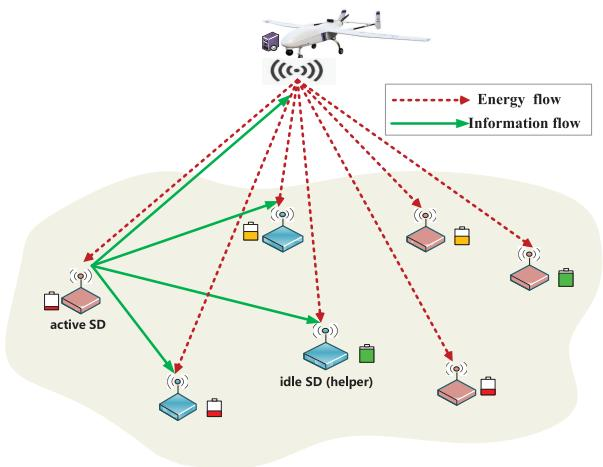

flowchart

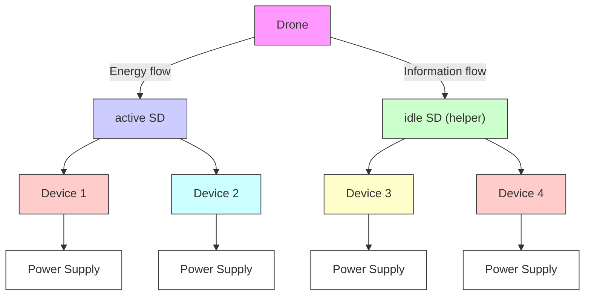

Fig. 1. UAV-aided wireless powered cooperative MEC system.

the CPU frequencies decreases, but the gain obtained by optimizing the offloading bits increases. Additionally, with the assistance of idle SDs, the UAV’s computing energy also can be greatly reduced.

The remainder of this article is organized as follows. In Section II, a UAV-enabled wireless powered cooperative MEC system is introduced. In Section III, an optimization problem for minimizing UAV’s total required energy is formulated. In Section IV, two algorithms are designed to tackle the nonconvex problem, and their complexities are analyzed. In Section V, simulation results are provided. Finally, we conclude this article in Section VI.

# II. SYSTEM MODEL

# A. Network Model

A UAV-enabled wireless powered cooperative MEC system is considered as shown in Fig. 1, where a UAV equipped with an ET and an MEC server charges SDs and provides computing service for active SDs. For a given period T, only a part of SDs are active with data to be processed, and all active SDs’ tasks are allowed to be accomplished with the help of UAV.

In order to fully utilize the transferred energy of UAV, the broadcast nature of wireless links and the computing resources of idle SDs that with no computing task, neighboring idle SDs are aroused to cooperatively participate in the task computing for the active SDs.

Active SDs and idle SDs are located on the ground, and the UAV flies horizontally at a fixed altitude H of several meters. A 3-D Cartesian coordinate system is employed to describe the positions of SDs and UAV. For the active SD m, its position is $[ x _ { m } , y _ { m } , 0 ] ^ { T }$ , and for the idle SD k, its position is $[ x _ { k } , y _ { k } , 0 ] ^ { T }$ , where $m = 1 , \ldots , M$ and $k = 1 , \dots , K$ with M and K being the number of active SDs and idle SDs, respectively. To efficiently design the flying trajectory, T is discretized into N time slots with equal interval of (T/N). Let n be the nth time slot, where $n = 1 , \ldots , N .$ . As the time slot is relatively small enough, UAV’s location in time slot n can be roughly considered to be unchanged and denoted as $[ x [ n ] , y [ n ] , H ] ^ { T }$ .

# B. Channel Model

As all SDs are distributed on ground, for simplicity, the positions of the mth active SD and the kth idle SD on the horizontal plane (i.e., the 2-D plane) are $q _ { m } = [ x _ { m } , y _ { m } ] ^ { T }$ and $w _ { k } \ : = \ : [ x _ { k } , y _ { k } ] ^ { T }$ . Similarly, the UAV trajectory projected on the horizontal plane at time slot n is described by $q _ { u } [ n ] =$ [x[n], y[n]]T . $q _ { u } ^ { \mathrm { i n i t i a l } } = q _ { u } [ 0 ]$ and $q _ { u } ^ { \mathrm { f i n a l } } = q _ { u } [ N ]$ are defined as the initial and final locations of the UAV, respectively. Moreover, the velocity and acceleration of the UAV in time slot n are $\nu [ n ] = [ \nu _ { x } [ n ] , \nu _ { y } [ n ] ] ^ { T }$ and $a [ n ] = [ a _ { x } [ n ] , a _ { y } [ n ] ] ^ { T }$ . Following [13], the relationships among the UAV’s location, velocity, and acceleration are expressed by:

$$
\left\{ \begin{array}{l l} q _ {u} [ n + 1 ] = q _ {u} [ n ] + v [ n ] \frac {T}{N} + \frac {1}{2} a [ n ] \frac {T}{N} ^ {2} & (1 \mathrm{a}) \\ v [ n + 1 ] = v [ n ] + a [ n ] \frac {T}{N}. & (1 \mathrm{b}) \end{array} \right.
$$

In terms of the coordinates, the distance between UAV and the mth active SD at time slot n is given by

$$
d _ {u, m} [ n ] = \sqrt {\left\| q _ {u} [ n ] - q _ {m} \right\| ^ {2} + H ^ {2}} \tag {2}
$$

and that between UAV and the kth idle SD at time slot n is

$$
d _ {u, k} [ n ] = \sqrt {\left\| q _ {u} [ n ] - w _ {k} \right\| ^ {2} + H ^ {2}}. \tag {3}
$$

The distance between active SD m and idle SD k is

$$
d _ {m, k} [ n ] = \| q _ {m} - w _ {k} \|. \tag {4}
$$

In general, UAV is deployed in scenarios outdoors. Thus, similar to the existing works [20], [21], it is assumed that the communication channel from UAV to an SD is dominated by the LoS link, which is therefore modeled by the free-space path loss model. As a result, the channel power gain from UAV to the mth active SD and the kth idle SD at time slot n can be respectively, expressed by

$$
\left\{ \begin{array}{l l} h _ {u, m} [ n ] = \frac {\beta_ {0}}{d _ {u , m} [ n ] ^ {2}} = \frac {\beta_ {0}}{\| q _ {u} [ n ] - q _ {m} \| ^ {2} + H ^ {2}} & (5 a) \\ h _ {u, k} [ n ] = \frac {\beta_ {0}}{d _ {u , k} [ n ] ^ {2}} = \frac {\beta_ {0}}{\| q _ {u} [ n ] - w _ {k} \| ^ {2} + H ^ {2}} & (5 b) \end{array} \right.
$$

where $\beta _ { 0 }$ denotes the channel power gain at the reference distance of one meter. Both the distance-dependent path loss effect and small-scale fading effect are taken into account for the channel between an active SD and an idle SD, so the channel gain of the link between the mth active SD and the kth idle SD is given by

$$
h _ {m, k} = \varphi \zeta_ {m, k} [ n ] \beta_ {0} (d _ {m, k}) ^ {- \alpha} \tag {6}
$$

where $\varphi$ is a constant determined by system parameters [28], ζ denotes the exponentially distributed random variable with unit mean accounting for Rayleigh fading, and α is the path loss exponent. In (6), $\beta _ { 0 }$ has the same physical meaning as that in (5).3

3 For both the air to ground link and ground to ground link, the end-to-end information transmissions at a distance of one meter are mainly dominated by the LoS links. Therefore, the $\beta _ { 0 }$ of the air to ground channel in (5a) and the $\dot { \beta _ { 0 } }$ of the terrestrial channel in (6) can be considered to be the same. Moreover, the transmission from the air to ground is dominated by the LoS links, which is therefore modeled by the free-space path loss model. But, for the ground to ground link, besides the path loss effect, the small fading effect caused by multipath propagation also exists. Therefore, to make it much closer to practice, in (6) the small scale fading is also taken into account by ζ .

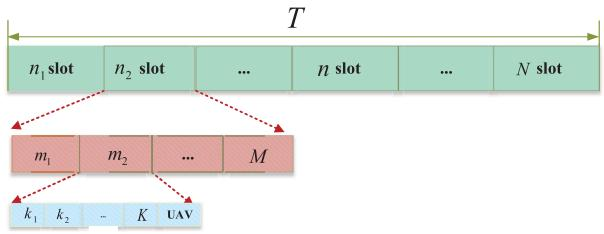

flowchart

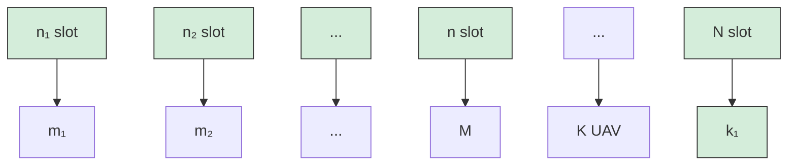

Fig. 2. TDMA protocol for active SDs computation offloading.

# C. Energy Harvesting Model

Following the EH model presented in [29] and [30], the harvested energy at the mth active SD and the kth idle SD during n time slots are respectively, expressed by:

$$
\left\{ \begin{array}{l l} E _ {m} [ n ] = \sum_ {i = 1} ^ {n} \eta P _ {u} h _ {u, m} [ i ] \frac {T}{N} & (7 a) \\ E _ {k} [ n ] = \sum_ {i = 1} ^ {n} \eta P _ {u} h _ {u, k} [ i ] \frac {T}{N} & (7 b) \end{array} \right.
$$

where $0 \leq \eta \leq 1$ is the energy conversion efficiency of converting the received RF signals into direct current (DC) signals in EH, and $P _ { u }$ is UAV’s transmit power.

# D. Offloading Model

In order to avoid the co-channel interference between the WPT and information transmission, WPT and computation task offloading are implemented over orthogonal frequency bands. In each time slot, all active SDs may offload their data to the UAV and their nearby idle SDs for computing. In order to avoid inter SDs interference, the time-division multiple access (TDMA) protocol is employed for multiple active SDs offloading computation tasks to the UAV and their nearby idle SDs. The time frame structure is shown in Fig. 2, where each time slot is further divided into M subslots, and each subslot is with the time interval of [T/(NM)]. As there are (K + 1) potential helpers (i.e., K idle SDs and one UAV), the mth active SD can offload its computing tasks to the (K+1) helpers through (K + 1) information flows. In order to avoid the interference between information flows, each subslot is equally divided into (K + 1) small time slices, and in each time slice, only one information flow is transmitted in terms of TDMA manner. Thus, each time slice is with time interval of $\delta _ { o } = [ T / ( N M ( K + 1 ) ) ]$ ].

Let $L _ { m , u } [ n ]$ and $L _ { m , k } [ n ]$ be the computation bits that the mth active SD offloads to UAV and the kth idle SD at time slot n, respectively. In order to successfully upload the bits to UAV and neighboring idle SDs, the achievable information rate from the mth active SD to UAV and the kth idle SD should satisfy that

$$
\delta_ {o} B \log_ {2} \left(1 + \frac {p _ {m , u} [ n ] h _ {u , m} [ n ]}{\sigma^ {2}}\right) \geq L _ {m, u} [ n ] \tag {8a}
$$

and

$$
\delta_ {o} B \log_ {2} \left(1 + \frac {p _ {m , k} [ n ] h _ {m , k} [ n ]}{\sigma^ {2}}\right) \geq L _ {m, k} [ n ] \tag {8b}
$$

where B is the communication bandwidth and $\sigma ^ { 2 }$ is noise power. Thus, the transmit power at the mth active SD to offload

$L _ { m , u } [ n ]$ and $L _ { m , k } [ n ]$ bits, respectively, satisfies that

$$
\left\{ \begin{array}{l} p _ {m, u} [ n ] \geq \frac {\sigma^ {2} \left(2 ^ {\frac {L _ {m , u} [ n ]}{B \delta_ {o}}} - 1\right)}{h _ {u , m} [ n ]} \\ p _ {m, k} [ n ] \geq \frac {\sigma^ {2} \left(2 ^ {\frac {L _ {m , k} [ n ]}{B \delta_ {o}}} - 1\right)}{h _ {m , k} [ n ]}. \end{array} \right. \tag {9a}
$$

As a result, the required energy of the mth active SD to offload tasks to UAV and kth idle SD is, respectively, expressed by

$$
\left\{ \begin{array}{l l} E _ {m, u} ^ {\text { off }} [ n ] = p _ {m, u} [ n ] \delta_ {o} & (1 0 \mathrm{a}) \\ E _ {m, k} ^ {\text { off }} [ n ] = p _ {m, k} [ n ] \delta_ {o}. & (1 0 \mathrm{b}) \end{array} \right.
$$

# E. Computing Model

Once the mth active SD, the kth idle SD, and the UAV are assigned with computing data, they may perform computing operations respectively. According to [21] and [25], the required computation energy at the mth active SD, the kth idle SD, and the UAV are, respectively, expressed by

$$
\left\{ \begin{array}{l l} E _ {m} ^ {\text { comp }} [ n ] = \gamma_ {c} f _ {m} [ n ] ^ {3} \frac {T}{N} & (1 1 a) \\ E _ {k} ^ {\text { comp }} [ n ] = \gamma_ {c} f _ {k} [ n ] ^ {3} \frac {T}{N} & (1 1 b) \\ E _ {u} ^ {\text { comp }} [ n ] = \gamma_ {c} f _ {u} [ n ] ^ {3} \frac {T}{N} & (1 1 c) \end{array} \right.
$$

where $\gamma _ { c }$ denotes the effective CPU switch capacitance, $f _ { m } [ n ]$ , $f _ { k } [ n ]$ , and $f _ { u } [ n ] .$ , respectively, denote CPU frequencies for executing computation with a unit of cycles per second at the mth active SD, the kth idle SD and UAV. Thus, the information bits can be computed at the mth active SD, the kth idle SD, and the UAV during the first n time slots are respectively, given by

$$
\left\{ \begin{array}{l l} R _ {m} ^ {\text {local}} [ n ] = \sum_ {i = 1} ^ {n} \frac {f _ {m} [ i ]}{C _ {1}} \frac {T}{N} & \text {(12a)} \\ R _ {k} ^ {\text {local}} [ n ] = \sum_ {i = 1} ^ {n} \frac {f _ {k} [ i ]}{C _ {2}} \frac {T}{N} & \text {(12b)} \\ R _ {u} ^ {\text {local}} [ n ] = \sum_ {i = 1} ^ {n} \frac {f _ {u} [ i ]}{C _ {3}} \frac {T}{N} & \text {(12c)} \end{array} \right.
$$

where $C _ { 1 } , C _ { 2 }$ , and $C _ { 3 }$ are CPU cycles required for executing one input-bit of computation tasks at active SDs, idle SDs, and UAV, respectively.

# F. Required Energy at UAV

The required energy of UAV is in general composed of three main components, i.e., the required energy for communication, the required energy for computing, and the required propulsion energy. Particularly, the required energy for communication over T is $E _ { u } ^ { \mathrm { c o m } } = T P _ { u }$ in Joule (J). Following (11c), nergy for computing over T is . Moreover, the required propulsion $E _ { u } ^ { \mathrm { T } \mathrm { { c o m p } } } =$ $\begin{array} { r } { \sum _ { n = 1 } ^ { N } { E _ { u } ^ { \mathrm { c o m p } } [ n ] } } \end{array}$ fixed-wing UAV over T is given by

$$
E _ {u} ^ {\text { fly }} = \frac {T}{N} \sum_ {n = 1} ^ {N} \left[ c _ {1} \| v [ n ] \| ^ {3} + \frac {c _ {2}}{\| v [ n ] \|} \left(1 + \frac {\| a [ n ] \| ^ {2}}{g ^ {2}}\right) \right] \tag {13}
$$

which depends on UAV’s flying speed and acceleration [31]. In (13), v[n] and a[n] are UAV’s velocity and acceleration at time slot $n , ~ c _ { 1 }$ and $c _ { 2 }$ are two constant parameters related to aerodynamics, and $g$ is gravitational acceleration with nominal value $\mathrm { \overline { { 9 . 8 ~ m / s ^ { 2 } } } }$ . Thus, the total required energy at the UAV is

$$
\Theta = E _ {u} ^ {\text { fly }} + E _ {u} ^ {\text { Tcomp }} + E _ {u} ^ {\text { com }}. \tag {14}
$$

# III. PROBLEM FORMULATION

In order to minimize the total required energy at the UAV, such that active SDs’ computation tasks can be completed within $T ,$ an optimization problem is formulated via jointly the transmit power, the CPU frequencies, and UAV’s trajectory, velocity and acceleration. Let ${ \bf F } = \{ f _ { m } [ n ] , f _ { u } [ n ] , f _ { k } [ n ] \}$ denote the CPU frequency vector of active SDs, UAV, and idle SDs, ${ \bf L } = \{ L _ { m , u } [ n ] , L _ { m , k } [ n ] \}$ denote the computation bits offloading vector to UAV and idle SDs, $\mathbf { Q } = \{ q _ { u } [ n ]$ , v[n], a[n]} be UAV’s trajectory, velocity and acceleration, and ${ \bf P } = \{ p _ { m , u } [ n ] \}$ be the transmit power vector for offloading computation bits to UAV. The optimization problem can be mathematically given by

${ \bf P 1 } \colon \operatorname* { m i n } _ { { \bf F } , { \bf L } , { \bf Q } , { \bf P } } \Theta$

$$
\text { s.t. } \quad \sum_ {i = 1} ^ {n} E _ {m} ^ {\text { comp }} [ i ] + \sum_ {i = 1} ^ {n} E _ {m, u} ^ {\text { off }} [ i ]
$$

$$
+ \sum_ {i = 1} ^ {n} \sum_ {k = 1} ^ {K} E _ {m, k} ^ {\text { off }} [ i ] \leq E _ {m} [ n ] \tag {15a}
$$

$$
\sum_ {i = 1} ^ {n} \gamma_ {c} f _ {k} ^ {3} [ i ] \frac {T}{N} \leq E _ {k} [ n ] \tag {15b}
$$

$$
\sum_ {i = 2} ^ {n} \frac {f _ {k} [ i ]}{C _ {2}} \frac {T}{N} \leq \sum_ {i = 1} ^ {n - 1} \sum_ {m = 1} ^ {M} L _ {m, k} [ i ] \quad \forall n \in \mathcal {N} _ {1} \tag {15c}
$$

$$
\sum_ {i = 2} ^ {n} \frac {f _ {u} [ i ]}{C _ {3}} \frac {T}{N} \leq \sum_ {i = 1} ^ {n - 1} \sum_ {m = 1} ^ {M} L _ {m, u} [ i ] \quad \forall n \in \mathcal {N} _ {1} \tag {15d}
$$

$$
\sum_ {n = 2} ^ {N} \frac {f _ {k} [ n ]}{C _ {2}} \frac {T}{N} = \sum_ {n = 1} ^ {N - 1} \sum_ {m = 1} ^ {M} L _ {m, k} [ n ] \tag {15e}
$$

$$
\sum_ {n = 2} ^ {N} \frac {f _ {u} [ n ]}{C _ {3}} \frac {T}{N} = \sum_ {n = 1} ^ {N - 1} \sum_ {m = 1} ^ {M} L _ {m, u} [ n ] \tag {15f}
$$

$$
R _ {m} ^ {\text { local }} [ N ] + \sum_ {n = 1} ^ {N - 1} \sum_ {k = 1} ^ {K} L _ {m, k} [ n ] + \sum_ {n = 1} ^ {N - 1} L _ {m, u} [ n ] = R _ {m} \tag {15g}
$$

$$
\delta_ {o} B \log_ {2} \left(1 + \frac {p _ {m , u} [ n ] h _ {u , m} [ n ]}{\sigma^ {2}}\right) \geq L _ {m, u} [ n ] \tag {15h}
$$

$$
f _ {k} [ 1 ] = 0, f _ {u} [ 1 ] = 0
$$

$$
L _ {m, k} [ N ] = 0, L _ {m, u} [ N ] = 0 \tag {15i}
$$

$$
q _ {u} [ n + 1 ] = q _ {u} [ n ] + v [ n ] \frac {T}{N} + \frac {1}{2} a [ n ] \frac {T}{N} ^ {2} \tag {15j}
$$

$$
v [ n + 1 ] = v [ n ] + a [ n ] \frac {T}{N} \tag {15k}
$$

$$
\| v [ n ] \| \leq V _ {\max}, \quad \| a [ n ] \| \leq a _ {\max} \tag {151}
$$

$$
q _ {u} ^ {\text { initial }} = q _ {u} ^ {\text { final }} \tag {15m}
$$

$$
f _ {m} [ n ] \geq 0, f _ {k} [ n ] \geq 0, f _ {u} [ n ] \geq 0
$$

$$
L _ {m, k} [ n ] \geq 0, L _ {m, u} [ n ] \geq 0 \tag {15n}
$$

where $R _ { m }$ denotes the number of computation bits of the mth active SD. $V _ { \mathrm { m a x } }$ and $a _ { \mathrm { m a x } }$ are the maximum flying speed and acceleration of UAV and $\mathcal { N } _ { 1 }$ is the set of $\{ 1 , \ldots , N - 1 \}$ . Constraint (15a) is the energy causal constraint of the active SDs, which describes that the required energy for local computing and offloading of the mth active SD is limited by the harvested energy. Constraint (15b) is the energy casual constraint of idle SDs, which means that the required energy to help computing tasks cannot exceed their harvested energy. Constraints (15c) and (15d) indicate that the total number of computation bits at UAV and the kth idle SD in the first n time slots cannot exceed the offloading computation bits of the active SDs in the first $( n - 1 )$ time slots. That is, UAV and idle SDs start to execute computing at the nth time slot only when active SDs finish offloading computation bits at the $( n - 1 ) \mathrm { t h }$ time slot. Constraints (15e) and (15f) ensure that the total computation bits processed by UAV and idle SDs should be equal to the offloading computation bits of active SDs. Constraint (15g) indicates the amount of computing task for each active SD. (15h) implies that the achievable information rate between the mth SD and UAV at slot n should exceed the computation bits that the mth active SD offloads to UAV. (15i) means that the UAV and idle SDs do not execute the computation task in the first slot and all active SDs do not offload computation tasks in the last slot. Constraints (15j)–(15m) represent UAV’s trajectory constraints, including the maximum velocity and acceleration constraints, and the initial and final positions constraints.

Due to the nonconvexity of the objective function and the coupling variables of $\{ p _ { m , u } [ n ] \}$ and $\{ q _ { u } [ n ] \}$ in constraints (15a), (15b), and (15h), problem $\mathbf { P _ { 1 } }$ is nonconvex, which is difficult to tackle. Therefore, we shall design efficient algorithms to solve it.

# IV. SOLUTION METHODS AND COMPLEXITY ANALYSIS

This section describes the two proposed solution methods, i.e., the SCA-based algorithm and the DAI-based algorithm. The detail information of the two proposed algorithms and their complexity analysis are presented as follows.

# A. SCA-Based Algorithm

In this section, we successively solve a convex approximation counterpart of the nonconvex problem $\mathbf { P _ { 1 } }$ by employing the SCA approach. First, in order to handle the nonconvexity of the Eflyu $E _ { u } ^ { \mathrm { f l y } }$ term in the objective function of problem ${ \bf P _ { 1 } }$ , by introducing slack variables τ [n] such that

$$
\tau [ n ] \geq 0 \tag {16a}
$$

and

$$
\| v [ n ] \| ^ {2} \geq \tau [ n ] ^ {2} \tag {16b}
$$

then, $E _ { u } ^ { \mathrm { f l y } }$ can be relaxed to be

$$
\tilde {E} _ {u} ^ {\text { fly }} = \frac {T}{N} \sum_ {n = 1} ^ {N} \left[ c _ {1} \| v [ n ] \| ^ {3} + \frac {c _ {2}}{\tau [ n ]} \left(1 + \frac {\| a [ n ] \| ^ {2}}{g ^ {2}}\right) \right]. \tag {17}
$$

According to (16b), it could be inferred that $\tilde { E } _ { u } ^ { \mathrm { f l y } } ~ \ge ~ E _ { u } ^ { \mathrm { f l y } }$ flu Therefore, E u $\tilde { E } _ { u } ^ { \mathrm { f l y } }$ ˜ fly can be regarded as an upper bound of $E _ { u } ^ { \mathrm { f l y } }$ . $\tilde { E } _ { u } ^ { \mathrm { f l y } }$ is jointly ng place of ex wwith respect to v[n] and , the objective func $\tau [ n ]$ . Thus, byof problem $E _ { u } ^ { \mathrm { f l y } }$ $\tilde { E } _ { u } ^ { \mathrm { f l y } }$ $\mathbf { P _ { 1 } }$ becomes convex. However, the new constraint (16b) is nonconvex. We thus use first-order Taylor expansion to deal with it. That is, for a given feasible point $\nu _ { r } [ n ]$ , it satisfies that

$$
\| v [ n ] \| ^ {2} \geq \| v _ {r} [ n ] \| ^ {2} + 2 v _ {r} ^ {T} [ n ] (v [ n ] - v _ {r} [ n ]) \triangleq \psi_ {l b} (v [ n ]) \tag {18}
$$

where the equality holds at the point $\nu [ n ] = \nu _ { r } [ n ] \ [ 3 2 ]$ . Then, constraint (16b) can be approximated by

$$
\psi_ {l b} (v [ n ]) \geq \tau [ n ] ^ {2} \tag {19}
$$

which is convex since $\psi _ { l b } ( \nu [ n ] )$ is linear with respect to v[n]. Moreover, constraints (15a), (15b), and (15h) are still nonconvex with respect to $q _ { u } [ n ]$ and $p _ { m , u } [ n ]$ , so we design a SCA-based algorithm to tackle them, which is operated in an iterative manner.

Specifically, in the rth iteration of the SCA-based algorithm, we handle the nonconvex constraints (15a) and (15b) in terms of the following Theorem 1.

Theorem 1: Let $q _ { u } ^ { ( r ) } [ n ]$ be the UAV’s position at the rth iteration. The nonconvex terms $E _ { m } [ n ]$ and $E _ { k } [ n ]$ in (15a) and (15b) satisfy that

$$
\left\{ \begin{array}{l l} E _ {m} [ n ] \geq \sum_ {i = 1} ^ {n} \eta P _ {u} \beta_ {0} \overline {{h _ {u , m}}} [ i ] \frac {T}{N} \triangleq \bar {E} _ {m} [ n ] & (2 0 a) \\ E _ {k} [ n ] \geq \sum_ {i = 1} ^ {n} \eta P _ {u} \beta_ {0} \overline {{h _ {u , k}}} [ i ] \frac {T}{N} \triangleq \bar {E} _ {k} [ n ] & (2 0 b) \end{array} \right.
$$

where

$$
\overline {{h _ {u , m}}} [ i ] = \frac {H ^ {2} + 2 \| q _ {u} ^ {(r)} [ i ] - q _ {m} \| ^ {2} - \| q _ {u} [ i ] - q _ {m} \| ^ {2}}{\left(H ^ {2} + \| q _ {u} ^ {(r)} [ i ] - q _ {m} \| ^ {2}\right) ^ {2}} \tag {21}
$$

and

$$
\overline {{{h _ {u , k}}}} [ i ] = \frac {H ^ {2} + 2 \| q _ {u} ^ {(r)} [ i ] - w _ {k} \| ^ {2} - \| q _ {u} [ i ] - w _ {k} \| ^ {2}}{\left(H ^ {2} + \| q _ {u} ^ {(r)} [ i ] - w _ {k} \| ^ {2}\right) ^ {2}}. \tag {22}
$$

The equalities of (20a) and (20b) hold, when $q _ { u } [ n ] = q _ { u } ^ { ( r ) } [ n ]$

Proof: For the function with the form of $f ( x ) = [ a / ( b + x ) ]$ , where $x \ge 0 ,$ and $a , b \quad > \quad 0 .$ , it is convex with respect to x. Therefore, its first-order Taylor expansion at $x _ { 0 } \geq 0$ satisfies that

$$
\frac {a}{b + x} \geq \frac {a}{b + x _ {0}} - \frac {a (x - x _ {0})}{(b + x _ {0}) ^ {2}} = \frac {a b + 2 a x _ {0} - a x}{(b + x _ {0}) ^ {2}}. \tag {23}
$$

By letting $a = \eta P _ { u } \beta _ { 0 } ( T / N ) , b = H ^ { 2 } , x _ { 0 } = \| q _ { u } ^ { ( r ) } [ i ] - w _ { k } \| ^ { 2 } .$ , and $x = \| q _ { u } [ i ] - w _ { k } \| ^ { 2 }$ , (20a) and (20b) can be obtained, and then Theorem 1 is proved.

For the nonconvex constraint (15h) with respect to $p _ { m , u } [ n ]$ and $q _ { u } [ n ]$ , by introducing a slack variable $y _ { m , u } [ n ]$ , it can be transformed to be

$$
\delta_ {o} B \Big (A _ {m, u} [ n ] - \log_ {2} \Big (y _ {m, u} [ n ] + H ^ {2} \Big) \Big) \geq L _ {m, u} [ n ] \tag {24}
$$

where

$$
A _ {m, u} [ n ] = \log_ {2} \left(y _ {m, u} [ n ] + H ^ {2} + p _ {m, u} [ n ] \gamma\right) \tag {25}
$$

Algorithm 1 SCA-Based Algorithm for Solving $\mathbf { P _ { 1 } }$   
1: Set iteration index $r = 1$ , and iteration tolerance $\xi \geq 0$ ;
2: Initialize UAV's trajectory $q_u^{(r)}[n]$ and velocity $v^{(r)}[n]$ ;
3: Initialize the objective function $E_{ob}^{(r)} = 0$ ;
4: repeat
5: Solve problem $P_{A-1}$ for any given $\{q_u^{(r)}[n], v^{(r)}[n]\}$ and obtain its optimal solutions $\{q_u^*[n], v^*[n], E_{ob}^*\}$ ;
6: Update $q_u^{(r+1)}[n] = q_u^*[n]$ , $v^{(r+1)}[n] = v^*[n]$ , $E_{ob}^{(r+1)} = E_{ob}^*$ ;
7: Update the iterative number $r = r + 1$ ;
8: until the stopping criterion $|E_{ob}^{(r+1)} - E_{ob}^{(r)}| \leq \xi$ is met;
9: Obtain optimal solutions: $q_u^*[n], v^*[n], a^*[n], f_m^*[n], f_u^*[n], f_k^*[n], L_{m,k}^*[n], L_{m,u}^*[n], p_{m,u}^*[n], \tau^*[n], y_{m,u}^*[n]$ .

and

$$
\left\| q _ {u} [ n ] - q _ {m} \right\| ^ {2} \leq y _ {m, u} [ n ] \tag {26}
$$

with $\gamma = ( \beta _ { 0 } / \sigma ^ { 2 } )$ being the reference signal-to-noise ratio (SNR). Constraint (24) is still nonconvex because its second term of the left hand side is a convex function of $y _ { m , u } [ n ]$ . We tackle (24) by using the following Lemma 1.

Lemma 1: Let $y _ { m , u } ^ { ( r ) } [ n ] = \| q _ { u } ^ { ( r ) } [ n ] - q _ { m } \|$ , and $\phi _ { l b } ( y _ { m , u } [ n ] ) =$ $- \log _ { 2 } ( y _ { m , u } ^ { ( r ) } [ n ] \ + \ H ^ { 2 } ) \ - \ [ ( y _ { m , u } [ n ] \ - \ y _ { m , u } ^ { ( r ) } [ n ] ) / ( ( y _ { m , u } ^ { ( r ) } [ n ] \ +$ $H ^ { 2 } )$ ln 2)], (24) is transformed to be

$$
\delta_ {o} B \big (A _ {m, u} [ n ] + \phi_ {l b} \big (y _ {m, u} [ n ] \big) \big) \geq L _ {m, u} [ n ]. \tag {27}
$$

Proof: Note that $- \log _ { 2 } ( 1 + x )$ is convex with respect to x, for $x \ \geq \ - 1$ . Thus, the global linear lower bound of $- \log _ { 2 } ( 1 + x )$ is derived $\begin{array} { r } { \mathbf { b y } - \log _ { 2 } ( 1 + x ) \geq - \log _ { 2 } ( 1 + \overline { { x } } ) - } \end{array}$ $( [ x - \overline { { x } } ] / [ ( 1 + \overline { { x } } ) \ln { 2 } ] )$ . By letting $x = [ ( y _ { m , u } [ n ] ) / H ^ { 2 } ] , ( 2 7 )$ is obtained, and then Lemma 1 is proved.

By taking place of $E _ { u } ^ { \mathrm { { f l y } } }$ with $\bar { \tilde { E } } _ { u } ^ { \mathrm { f l y } } , E _ { m } [ n ]$ with $\bar { E } _ { m } [ n ] , E _ { k } [ n ]$ with $\bar { E } _ { k } [ n ]$ , and (15h) with (26) and (27), problem $\mathbf { P _ { 1 } }$ can be transformed to be

$\mathbf{P}_{\mathbf{A}-1}:\min_{\substack{\mathbf{F},\mathbf{L},\mathbf{Q},\mathbf{P},\\ \tau[n],y_{m,u}[n]}}$ $\tilde{E}_u^{\mathrm{fly}} + E_u^{\mathrm{Tcomp}}[n] + E_u^{\mathrm{com}}$ s.t. (15c)-(15g), (15i)-(15n) (28a) $\sum_{i=1}^{n}E_m^{\mathrm{comp}}[i]+\sum_{i=1}^{n}E_{m,u}^{\mathrm{off}}[i]$ $+\sum_{i=1}^{n}\sum_{k=1}^{K}E_{m,k}^{\mathrm{off}}[i]\leq\bar{E}_m[n]$ (28b) $\sum_{i=1}^{n}\frac{T}{N}\gamma_c f_k^3[i]\leq\bar{E}_k[n]$ (28c) $\delta_o B(A_{m,u}[n]+\phi_{lb}(y_{m,u}[n]))\geq L_{m,u}[n]$ (28d) $\tau[n]\geq 0,\psi_{lb}(v[n])\geq\tau[n]^2$ (28e) $\|q_u[n]-q_m\|^2\leq y_{m,u}[n].$ (28f)

All constraints and the objective function of problem $\mathbf { P _ { A - 1 } }$ are convex, so the original nonconvex problem $\mathbf { P _ { 1 } }$ can be solved by iteratively solving problem $\mathbf { P _ { A - 1 } }$ by updating $q _ { u } ^ { ( r ) } [ n ]$ and $\nu ^ { ( r ) } [ n ]$ with the SCA manner. For clarity, the presented SCAbased algorithm is summarized in Algorithm 1.

# B. Complexity Analysis of the SCA-Based Algorithm

The convex problem $\mathbf { P _ { A - 1 } }$ formulated by the SCA-based algorithm involves linear inequalities second-order cone (SOC) constraints. According to [27], the SOC constraints dominate its complexity. $\mathbf { P _ { A - 1 } }$ has $( M + K + 4 N )$ SOC constraints, in which $( M + K )$ SOCs with dimension of $( 2 n + 1 )$ , and 3N SOCs with dimension of 3, and N SOCs with dimension of 2, where $n = 1 , \ldots , N$ . Besides, $\mathbf { P _ { A - 1 } }$ has $( 4 M N + 5 N + K N ( M +$ 1)) variables. So, in terms of [27], the complexity to solve $\mathbf { P _ { A - 1 } }$ can be given by $O ( \ n _ { 1 } \cdot \sqrt { 2 ( M + K + 4 N ) } \cdot ( 4 ( M + K ) ( N +$ $1 ) ^ { 3 } + 3 \bar { 1 ( N + n _ { 1 } ^ { 2 } ) } \ )$ with $n _ { 1 } = O ( 4 M N + 5 N + K M N + K N )$ . As problem $\mathbf { P _ { A - 1 } }$ 1 has to be solved iteratively with $I _ { 1 }$ times, the complexity of the SCA-based approach for solving $\mathbf { P _ { 1 } }$ is about $I _ { 1 } O ( n _ { 1 } \cdot \sqrt { 2 ( M + K + 4 N ) } \cdot ( 4 ( \dot { M } + K ) ( N + 1 ) ^ { 3 } + 3 1 N + n _ { 1 } ^ { 2 } ) )$ .

# C. DAI-Based Algorithm

This section presents another algorithm based on DAI to solve problem ${ \bf P _ { 1 } }$ . Specifically, $\mathbf { P _ { 1 } }$ is first decomposed into two subproblems to optimize CPU frequencies, the number of offloading bits $\{ f _ { m } [ n ] , f _ { u } [ n ] , f _ { k } [ n ] , L _ { m , k } [ n ] , L _ { m , u } [ n ] \}$ , and $\mathrm { U A V } _ { \mathrm { \Delta } }$ trajectory {qu[n], v[n], a[n]}, separately. Then, a suboptimal solution is obtained by solving the two subproblems in an iterative manner until the algorithm converges.

1) Optimizing {fm[n], fu[n], fk[n], $L _ { m , k } [ n ] , \ L _ { m , u } [ n ] \nmid$ With Given {qu[n], v[n], a[n]}: For given $\mathrm { U A V } _ { \mathrm { \Delta } }$ trajectory, problem $\mathbf { P _ { 1 } }$ can be simplified to be $\bf { P _ { B - 1 } }$ , i.e.,

$$
\begin{array}{l} \mathbf {P} _ {\mathbf {B} - \mathbf {1}}: \min _ {\mathbf {F}, \mathbf {L}} E _ {u} ^ {\mathrm{Tcomp}} \\ \text { s.t. } (1 5 \mathrm{a}) - (1 5 \mathrm{g}), (1 5 \mathrm{i}), (1 5 \mathrm{n}). \\ \end{array}
$$

$\bf { P _ { B - 1 } }$ is convex, which can be solved by using the Lagrangian dual method [32]. Particularly, with the Lagrangian dual method, we obtained some explicit results on the optimal solution to $\bf { P _ { B - 1 } }$ , which is described in Theorem 2.

Theorem 2: For given $q _ { u } ^ { ( r ) } [ n ]$ , the optimal solution to problem $\bf { P _ { B - 1 } }$ can be given by

$$
f _ {m} ^ {*} [ n ] = \sqrt {\frac {\gamma_ {m}}{3 \gamma_ {c} C _ {1} \sum_ {j = n} ^ {N} v _ {m , j}}} \tag {29a}
$$

$$
f _ {k} ^ {*} [ n ] = \left\{ \begin{array}{l l} 0, & n = 1 \\ \sqrt {\frac {\lambda_ {k , N} - \sum_ {j = n} ^ {N - 1} \lambda_ {k , j}}{3 \gamma_ {c} C _ {2} \sum_ {j = n} ^ {N - 1} \mu_ {k , j}}}, & n = 2, \dots , N - 1 \\ \sqrt {\frac {\lambda_ {k , N}}{3 \gamma_ {c} C _ {2} \mu_ {k , N}}}, & n = N \end{array} \right. \tag {29b}
$$

$$
f _ {u} ^ {*} [ n ] = \left\{ \begin{array}{l l} 0, & n = 1 \\ \sqrt {\frac {\theta_ {N} - \sum_ {j = n} ^ {N - 1} \theta_ {j}}{3 \gamma_ {c} C _ {3}}}, & n = 2, \dots , N - 1 \\ \sqrt {\frac {\theta_ {N}}{3 \gamma_ {c} C _ {3}}}, & n = N \end{array} \right. \tag {29c}
$$

$$
L _ {m, k} ^ {*} [ n ] = B \delta_ {o} \log_ {2} \left(1 + \frac {B \delta_ {o} h _ {m , k} [ n ] (\sum_ {j = n + 1} ^ {N - 1} \lambda_ {k , j} + \gamma_ {m} - \lambda_ {k , N})}{\sigma^ {2} \ln 2 \sum_ {j = n} ^ {N} \nu_ {m , j}}\right) \tag {29d}
$$

$$
L _ {m, u} ^ {*} [ n ] = B \delta_ {o} \log_ {2} \left(1 + \frac {B \delta_ {o} h _ {u , m} [ n ] \left(\sum_ {j = n + 1} ^ {N - 1} \theta_ {j} + \gamma_ {m} - \theta_ {N}\right)}{\sigma^ {2} \ln 2 \sum_ {j = n} ^ {N} v _ {m , j}}\right) \tag {29e}
$$

where $\nu _ { m , n } \geq 0 , \mu _ { k , n } \geq 0 , \lambda _ { k , n } \geq 0 , \theta _ { n } \geq 0 , \gamma _ { m } \geq 0$ are the dual variables corresponding to constraints $\{ ( 1 5 \mathrm { a } ) { - } ( 1 5 \mathrm { g } ) \}$ .

Proof: See Appendix.

Moreover, we also obtain the following theoretical results for better understanding the system design.

Corollary 1: The optimal $f _ { m } ^ { * } [ n ] , f _ { k } ^ { * } [ n ]$ , and $f _ { u } ^ { * } [ n ]$ to problem ${ \bf P _ { 1 } }$ increase with the increment of time slot n.

Proof: In (29a)–(29c), the dual variables $\{ \nu _ { m , n } , \mu _ { k , n } , \lambda _ { k , n } , \theta _ { n } , \gamma _ { m } \}$ are positive constants, and as n increases, the denominator of (29a) decreases. Thus, $f _ { m } ^ { * } [ n ]$ increases as n increases. Similarly, as n increases, the denominator of (29b) decreases and the numerator of (29b) increases. Thus, $f _ { k } ^ { * } [ n ]$ increases as n increases. The numerator of (29c) increases as n increases, leading to the increment of $f _ { u } ^ { * } [ n ]$ . 1

Corollary 1 implies that as time slot n increases, the accumulated energy of the active SDs increases, which can be used to execute local computing and offloading. Thus, the total amount of data of local computing increases, the total amount of data offloaded to the idle SDs and UAV increases. In this case, the active SDs, idle SDs, and UAV need to increase their CPU frequencies to complete their computing tasks.

Corollary 2: If there exist a time slot n such that $f _ { m } ^ { * } [ n ] = 0 .$ , $f _ { k } ^ { * } [ n ] = 0$ , and $f _ { u } ^ { * } [ n ] = 0 .$ , then $f _ { m } ^ { * } [ i ] = 0 , f _ { k } ^ { * } [ i ] = 0 .$ , and $f _ { u } ^ { * } [ i ] = 0$ for all $i = 0 , \ldots , n - 1$ .

Proof: Following Corollary 1, one can see that all $f _ { m } ^ { * } [ n ] .$ , $f _ { k } ^ { * } [ n ]$ and $f _ { u } ^ { * } [ n ]$ are nonnegative and nondecreasing functions with respect to n. Thus, $0 \leq f _ { m } ^ { * } [ i ] \leq f _ { m } ^ { * } [ n ] , 0 \leq f _ { k } ^ { * } [ i ] \leq f _ { k } ^ { * } [ n ] .$ , and $0 \leq f _ { u } ^ { * } [ i ] \leq f _ { u } ^ { * } [ n ]$ , when $i \leq n . \mathrm { A s }$ a result, if $f _ { m } ^ { * } [ n ] = 0 .$ , $f _ { k } ^ { * } [ n ] = 0 .$ , and $f _ { u } ^ { * } [ n ] = 0$ , it also holds that $f _ { m } ^ { * } [ i ] = 0 , f _ { k } ^ { * } [ i ] = 0 .$ , and $f _ { u } ^ { * } [ i ] = 0$ for all $i = 0 , \ldots , n - 1$ .

Corollary 3: $L _ { m , k } ^ { * } [ n ]$ and $L _ { m , u } ^ { * } [ n ]$ increase with the increment of $h _ { m , k } [ n ]$ and $h _ { m , u } [ n ]$ .

Proof: From (29d) and (29e), it is seen that $L _ { m , k } ^ { * } [ n ]$ and $L _ { m , u } ^ { * } [ n ]$ are logarithmic functions with respect to $h _ { m , k } [ n ]$ and $h _ { m , u } [ n ]$ , respectively, which are nondecreasing. Thus, as $h _ { m , k } [ n ]$ and $h _ { m , u } [ n ]$ increase, $L _ { m , k } ^ { * } [ n ]$ and $L _ { m , u } ^ { * } [ n ]$ increase. 1

Corollary 3 indicates that with the decrement of the distance between active SDs and idle SDs, and that between active SDs and the UAV, the channel gains are improved and the number of computation bits that offloading to idle SDs and UAV increases.

2) Optimizing $\{ q _ { u } I n { \cal I } \}$ v[n], a[n]} With Given $\it { i f f } _ { m } I n \it { J } , f _ { u } I n \it { J } ,$ $f _ { k } [ n ] , L _ { m , k } [ n ] , L _ { m , u } [ n ] \} .$ For given CPU frequencies and the number of offloading bits, problem ${ \bf P _ { 1 } }$ can be simplified to be $\bf { P _ { B - 2 } }$ , i.e.,

$$
\begin{array}{l} \mathbf {P} _ {\mathbf {B} - 2}: \min _ {\mathbf {Q}, \tau [ \mathbf {n} ]} \tilde {E} _ {u} ^ {\text {fly}} \\ \quad \text {s.t. (28b), (28c), (28e), (15j) - (15m).} \end{array}
$$

PB-2 is convex and can be directly solved with CVX [32]. By solving $\bf { P _ { B - 1 } }$ and $\bf { P _ { B - 2 } }$ alternately, a suboptimal solution to $\mathbf { P _ { 1 } }$ can be achieved when the convergence condition is satisfied. For clarity, the DAI-based algorithm is summarized in Algorithm 2.

Algorithm 2 DAI-Based Algorithm for Solving Problem ${ \bf P } _ { 1 }$   
1: set $j = 0$ , $r = 0$ , and iteration tolerance $\xi_1$ and $\xi_2$ ;
2: Initialize UAV's trajectory $\mathrm{q}_u^{(r)}[n]$ and velocity $\mathrm{v}^{(r)}[n]$ ;
3: Initialize the objective function $E_{ob}^{(j)} = 0$ ;
4: repeat
5: Obtain $f_m[n]$ , $f_u[n]$ , $f_k[n], L_{m,k}[n]$ , $L_{m,u}[n]$ by solving problem $\mathbf{P}_{\mathbf{B}-1}$ for any given $\{\mathrm{q}_u^{(r)}[n], \mathrm{v}^{(r)}[n]\}$ ;
6: repeat
7: Obtain $\mathrm{q}_u^*[n]$ , $\mathrm{v}^*[n]$ by solving problem $\mathbf{P}_{\mathbf{B}-2}$ for given $f_m[n]$ , $f_u[n]$ , $f_k[n]$ , $L_{m,k}[n]$ , $L_{m,u}[n]$ ;
8: Update $\mathrm{q}_u^{(r+1)}[n] = \mathrm{q}_u^*[n]$ , $\mathrm{v}^{(r+1)}[n] = \mathrm{v}^*[n]$ , $\mathrm{a}^{(r+1)}[n] = \mathrm{a}^*[n]$ ;
9: Update the iterative number $r = r + 1$ ;
10: until stopping criterion $\sum_{n=1}^{N} \| \mathrm{q}_u^{(r+1)}[n] - \mathrm{q}_u^{(r)}[n] \|^2 \leq \xi_1$ is met;
11: Obtain $E_{ob}^{(j+1)}$ for given $\mathrm{q}_u^*[n]$ , $\mathrm{v}^*[n]$ and $\mathrm{a}^*[n]$ ;
12: Update the iterative number $j = j + 1$ ;
13: until the stopping criterion $|E_{ob}^{(j+1)} - E_{ob}^{(j)}| \leq \xi_2$ is met;
14: Obtain optimal solutions: $\mathrm{q}_u^*[n]$ , $\mathrm{v}^*[n]$ , $\mathrm{a}^*[n]$ , $\tau^*[n], f_m^*[n]$ , $f_u^*[n], f_k^*[n]$ , $L_{m,k}^*[n]$ , $L_{m,u}^*[n]$ .

# D. Complexity Analysis of the DAI-Based Algorithm

Both $\bf { P _ { B - 1 } }$ and $\bf { P _ { B - 2 } }$ involve linear inequalities and SOC constraints. According to [27], the SOC constraints dominate their complexity. The complexity of dealing with problem $\bf { P _ { B - 1 } }$ can be negligible as it is solved with closed-form solutions. $\bf { P _ { B - 2 } }$ has $( M + K + 3 N )$ SOC constraints, in which (M+K) SOCs with dimension of $( 2 n + 1 )$ , N SOCs with dimension of $^ { 2 , }$ and 2N SOCs with dimension of 3, where $n = 1 , \ldots , N .$ Besides, it involves 4N variables. So, the complexity of solving PB-2 can be given by $O ( n _ { 2 } \cdot \sqrt { 2 ( M + K + 3 N ) } \cdot ( 4 ( M +$ $K ) ( N + 1 ) ^ { 3 } + 2 2 N + n _ { 7 } ^ { 2 } ) )$ ) with $n _ { 2 } = O ( 4 N )$ . As problem $\bf { P _ { B - 1 } }$ and $\bf { P _ { B - 2 } }$ have to be solved $I _ { 2 } I _ { 3 }$ times iteratively, the complexity of the DAI-based algorithm for solving $\mathbf { P _ { 1 } }$ is about $I _ { 2 } I _ { 3 } O ( n _ { 2 } \cdot \sqrt { 2 ( M + K + 3 N ) } \cdot ( 4 ( M + K ) ( N + 1 ) ^ { 3 } + 2 2 N + n _ { 2 } ^ { 2 } ) )$ .

In order to compare the complexities of the two proposed algorithms, without loss of generality, we let $M = \beta N$ and $K = \gamma N ,$ , and then the complexities of the two algorithms for solving $\mathbf { P _ { 1 } }$ are summarized in Table I, which shows that the computational complexity of the DAI-based algorithm is lower than that of the SCA-based one when $\beta = \gamma = 1$ .

# V. SIMULATION RESULTS

This section provides some simulation results to discuss the performance of the two presented algorithms and the effects of different parameters on system performance. A UAV-assisted wireless powered cooperative MEC system is simulated, where the SDs are randomly distributed within an area of $1 0 0 \times 1 0 0 ~ \mathrm { m } ^ { 2 }$ . The positions of active SDs are $q _ { 1 } =$ $[ 1 0 , 1 0 ] , q _ { 2 } = [ 2 , 8 0 ] , q _ { 3 } = [ 8 0 , 1 0 0 ] , q _ { 4 } = [ 1 0 0 , 2 0 ] .$ , and the positions of idle SDs are $w _ { 1 } = [ 4 0 , 4 0 ]$ and $w _ { 2 } = [ 6 0 , 6 0 ]$ . The simulation settings are based on the works in [16], [24], and [33], and the detailed parameter settings are summarized in Table II.

TABLE I COMPLEXITY ANALYSIS FOR THE PROPOSED ALGORITHMS 

<table><tr><td>Algorithms</td><td>Complexity Order</td></tr><tr><td>SCA-based Algorithm</td><td> $I_1O\left(n_1 \cdot \sqrt{2(M+K+4N)} \cdot (4(M+K)(N+1)^3 + 31N+n_1^2)\right) \approx N^{\frac{15}{2}}$ </td></tr><tr><td>DAI-based Algorithm</td><td> $I_2I_3O\left(n_2 \cdot \sqrt{2(M+K+3N)} \cdot (4(M+K)(N+1)^3 + 22N+n_2^2)\right) \approx N^{\frac{11}{2}}$ </td></tr><tr><td colspan="2"> $n_1 = O(4MN + 5N + KMN + KN), \quad n_2 = O(4N)$ </td></tr></table>

TABLE II SIMULATION PARAMETERS 

<table><tr><td>Parameters</td><td>Notation</td><td>Values</td></tr><tr><td>Number of active SDs</td><td>M</td><td>4</td></tr><tr><td>Number of idle SDs</td><td>K</td><td>2</td></tr><tr><td>The height of the UAV</td><td>H</td><td>10 m</td></tr><tr><td>The transmit power of UAV</td><td>Pu</td><td>30 dBm</td></tr><tr><td>Communication bandwidth</td><td>B</td><td>40 MHz</td></tr><tr><td>The system noise power</td><td>σ02</td><td>10-9Watt</td></tr><tr><td>UAV&#x27;s maximum speed</td><td>Vmax</td><td>20 m/s</td></tr><tr><td>UAV&#x27;s maximum acceleration</td><td>amax</td><td>5 m/s2</td></tr><tr><td>The channel power gain</td><td>β0</td><td>-20 dB</td></tr><tr><td>Energy harvesting efficiency</td><td>η</td><td>0.8</td></tr><tr><td>Number of CPU cycles</td><td>C1,C2,C3</td><td>100</td></tr><tr><td>Effective switched capacitance</td><td>γc</td><td>10-24</td></tr><tr><td>The flying time of UAV</td><td>T</td><td>10 s</td></tr><tr><td>The number of time slots</td><td>N</td><td>50</td></tr><tr><td>Constant related to aerodynamics</td><td>c1</td><td>9.26</td></tr><tr><td>Constant related to aerodynamics</td><td>c2</td><td>2250</td></tr><tr><td>The gravitational acceleration</td><td>g</td><td>9.8 m/s2</td></tr><tr><td>The precisions</td><td>ξ,ξ1,ξ2</td><td>10-5</td></tr><tr><td>Initial and final positions of UAV</td><td>qinitial=qufinal</td><td>[50,25]</td></tr></table>

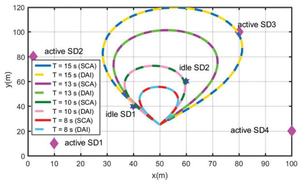

scatter

| Point Type       | Time (s) | X (m) | Y (m) |
| ---------------- | -------- | ----- | ----- |
| active SD1       | -        | 5     | 10    |
| active SD2       | -        | 5     | 80    |
| idle SD1         | -        | 40    | 30    |
| idle SD2         | -        | 60    | 60    |
| idle SD3         | -        | 80    | 100   |
| active SD4       | -        | 100   | 20    |

Fig. 3. Optimized UAV trajectories of the proposed algorithms for different T.

Fig. 3 plots the optimized UAV trajectories of the proposed two algorithms for different period T. It shows that both the SCA-based algorithm and DAI-based algorithm achieve a similar optimized trajectories of UAV. Moreover, the inflight range of UAV is smaller when T is shorter, e.g., $T = 8 \mathrm { ~ s } . \mathrm { ~ A s ~ } T$ increases, the UAV enlarges its turning radius and exploits its mobility to adaptively adjust its trajectory to minimize its propulsion energy consumption.

Fig. 4 shows the achieved minimal required energy and the convergence behaviors of the two proposed algorithms for different T. It is seen that the DAI-based algorithm achieves the similar minimal required energy of UAV with the SCAbased one and both algorithms converge well within several iterations, e.g., eight iterations. Moreover, the larger T, the more total required energy of UAV. Because in UAV-assisted communication systems, propulsion-related energy is the dominant part of the total required energy. When the flying time increases, UAV requires more propulsion energy to maintain its aloft and support its mobility.

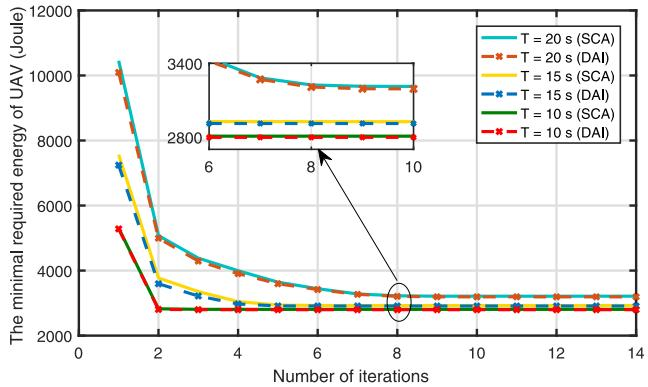

line

| Number of iterations | T = 20 s (SCA) | T = 20 s (DAI) | T = 15 s (SCA) | T = 15 s (DAI) | T = 10 s (SCA) | T = 10 s (DAI) |
| -------------------- | -------------- | -------------- | -------------- | -------------- | -------------- | -------------- |
| 0                    | 10500          | 10500          | 7500           | 7500           | 5500           | 5500           |
| 2                    | 5000           | 5000           | 3500           | 3500           | 2800           | 2800           |
| 4                    | 3500           | 3500           | 2800           | 2800           | 2800           | 2800           |
| 6                    | 3200           | 3200           | 2800           | 2800           | 2800           | 2800           |
| 8                    | 3100           | 3100           | 2800           | 2800           | 2800           | 2800           |
| 10                   | 3100           | 3100           | 2800           | 2800           | 2800           | 2800           |
| 12                   | 3100           | 3100           | 2800           | 2800           | 2800           | 2800           |
| 14                   | 3100           | 3100           | 2800           | 2800           | 2800           | 2800           |

Fig. 4. Minimal required energy of UAV versus the number of iterations for different T.

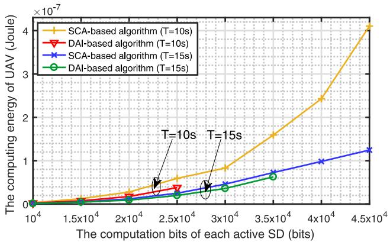

line

| The computation bits of each active SD (bits) | SCA-based algorithm (T=10s) | DAI-based algorithm (T=10s) | SCA-based algorithm (T=15s) | DAI-based algorithm (T=15s) |
| ---------------------------------------------- | ---------------------------- | --------------------------- | --------------------------- | --------------------------- |
| 10000                                          | 0                            | 0                           | 0                           | 0                           |
| 20000                                          | ~0.3                         | ~0.2                        | ~0.2                        | ~0.1                        |
| 25000                                          | ~0.6                         | ~0.4                        | ~0.3                        | ~0.2                        |
| 30000                                          | ~0.8                         | ~0.5                        | ~0.4                        | ~0.3                        |
| 35000                                          | ~1.6                         | ~0.7                        | ~0.6                        | ~0.5                        |
| 40000                                          | ~2.5                         | ~0.9                        | ~0.8                        | ~0.7                        |
| 45000                                          | ~4.2                         | ~1.2                        | ~1.2                        | ~0.9                        |

Fig. 5. UAV’s computing energy requirement versus each active SD’s computation bits.

Fig. 5 compares UAV’s computation energy requirement versus the computation bits of each active SD of the two presented algorithms with $\textit { T } = \mathrm { ~ } 1 0 \mathrm { ~ s ~ }$ and $T \ = \ 1 5 \ \mathrm { ~ s } .$ It is shown that the larger the time period T is, the smaller required computing energy is. Because when T is larger, the more energy SDs can accumulate for local computing, and the smaller the amount of bits required to be offloaded to UAV. Moreover, it also can be seen that both algorithms are feasible when the computation bits are relatively small, but only the SCA-based algorithm is feasible when the computation bits are relatively large. For example, when the computation bits exceed $2 . 5 \times 1 0 ^ { 4 }$ bits with $T \ = \ 1 0 \ \mathrm { ~ s ~ }$ , and when the computation bits exceed $3 . 5 \times 1 0 ^ { 4 }$ bits with $T = 1 5 \mathrm { ~ s ~ } ,$ , the DAI-based algorithm is infeasible. The results from Figs. 4 and 5 indicate that propulsion-related energy is the dominant part of total required energy, and under the same parameter settings, both proposed algorithms can achieves the similar minimal required propulsion-related energy of UAV. Besides, the DAI-based algorithm achieves lower required computing energy of the UAV than the SCA-based one. For a relatively large amount of data, the SCA-based algorithm is feasible which should be adopted while with higher required computing energy, and for a relatively small amount of data, the DAI-based algorithm is a better choice for achieving lower required computing energy.

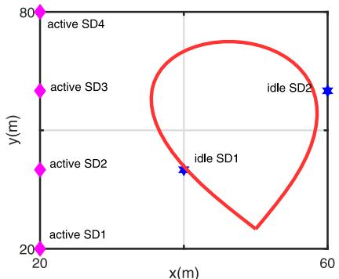

scatter

| Label     | x(m) | y(m) |
| --------- | ---- | ---- |
| active SD1 | 20   | 20   |
| active SD2 | 20   | 20   |
| active SD3 | 20   | 80   |
| active SD4 | 20   | 80   |
| idle SD1  | 60   | 20   |
| idle SD2  | 60   | 75   |

(a)

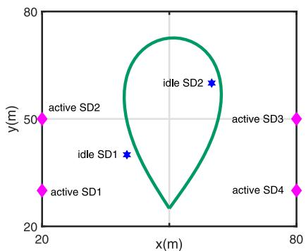

scatter

| Point Type   | x(m) | y(m) |
| ------------ | ---- | ---- |
| active SD1   | 20   | 25   |
| idle SD1     | 30   | 40   |
| idle SD2     | 70   | 60   |
| active SD3   | 80   | 50   |
| active SD4   | 80   | 25   |

(b)

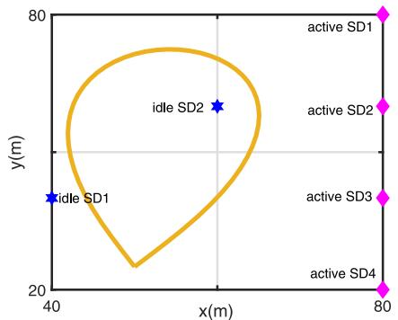

scatter

| Point Type   | x(m) | y(m) |
| ------------ | ---- | ---- |
| idle SD1     | 40   | 60   |
| idle SD2     | 60   | 70   |
| active SD1    | 80   | 80   |
| active SD2    | 80   | 80   |
| active SD3    | 80   | 80   |
| active SD4    | 80   | 60   |

(c)

Fig. 6. Optimized UAV’s trajectories of three situations with different locations of active SDs.   
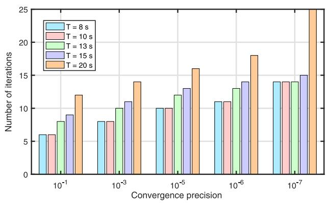

bar

| Convergence precision | T = 8 s | T = 10 s | T = 13 s | T = 15 s | T = 20 s |
| --------------------- | ------- | -------- | -------- | -------- | -------- |
| 10⁻¹                  | 6       | 6        | 8        | 9        | 12       |
| 10⁻³                  | 8       | 8        | 10       | 11       | 14       |
| 10⁻⁵                  | 10      | 10       | 12       | 13       | 16       |
| 10⁻⁶                  | 11      | 11       | 13       | 14       | 18       |
| 10⁻⁷                  | 14      | 14       | 14       | 15       | 25       |

Fig. 7. Number of iterations versus convergence precision for different T.

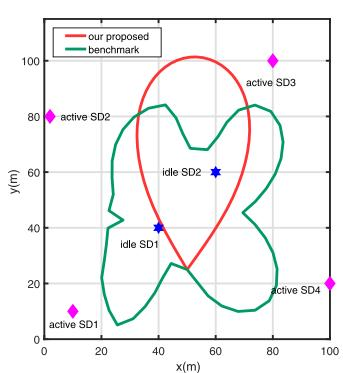

scatter

| State     | x(m) | y(m) |
| --------- | ---- | ---- |
| active SD1 | 10   | 10   |
| active SD2 | 5    | 80   |
| idle SD1  | 40   | 40   |
| idle SD2  | 60   | 60   |
| active SD3 | 80   | 100  |
| active SD4 | 100  | 20   |

(a)

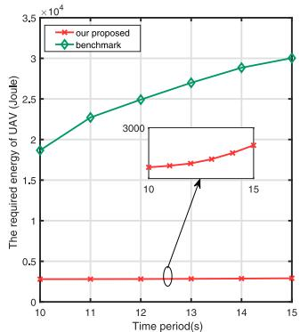

line

| Time period(s) | Our proposed | benchmark |
| -------------- | ------------ | --------- |
| 10             | 0.2          | 1.9e4     |
| 11             | 0.2          | 2.3e4     |
| 12             | 0.2          | 2.5e4     |
| 13             | 0.2          | 2.7e4     |
| 14             | 0.2          | 2.9e4     |
| 15             | 0.2          | 3.0e4     |

Fig. 8. Optimized trajectories of UAV and the minimal required energy of UAV with different trajectory designs.

Fig. 6 shows the optimized UAV trajectories in different scenarios. Three scenarios are simulated, where the active SDs are located at the left side of distributed area as shown in Fig. 6(a), at both sides of the distributed area as shown in Fig. 6(b) and at the right side of distributed area shown in Fig. 6(c). From Fig. 6, one can see that UAV’s trajectories are heavily reliant on the locations of active SDs. The UAV tends to fly close to the active SDs, so that the active SDs can harvest enough energy to complete their computation tasks. When the active SDs are evenly distributed on both sides of the distribution area, UAV’s trajectories is almost symmetrical about the active SDs’ positions, as shown in Fig. 6(b).

Fig. 7 depicts the number of iterations versus the convergence precision of the proposed SCA-based algorithm for different T. It can be observed that for a given period T, to achieve higher precision, more iterations are required. Moreover, with the increment of T, the convergence performance decreases.

Fig. 8(a) depicts the optimized trajectories of UAV obtained by our proposed SCA-based algorithm and the benchmark one, i.e., UAV trajectory design without optimizing UAV’s acceleration. Particularly, in the benchmark algorithm, the acceleration of UAV is neglected, and the speed of UAV is kept to be unchanged over T. It is observed that without optimizing the acceleration, the UAV has to exploit its mobility to move closer to active SDs, yielding a longer trajectory. The acceleration obtained from the trajectory optimized by the benchmark algorithm shows that the acceleration of each time slot is actually very large. Thus, by employing the benchmark algorithm to optimize UAV’s trajectory will generate more propulsion energy than the proposed algorithm as shown in Fig. 8(b).

Fig. 9 compares the minimal required energy of UAV achieved by our proposed trajectory design with other fixed trajectory designs, i.e., diamond trajectory and circular trajectory.4 It is observed that as T increases, the minimal required energy of UAV increases. Compared to the fixed trajectory designs, our proposed trajectory design

4In general, when the initial and final positions are different, the direct link is widely considered as a benchmark trajectory, see, [25], [34]. While when the initial and final positions are same, some regular geometric shapes, such as diamond and circular trajectories are intuitively employed as benchmark trajectories for performance comparison, see, [14], [21].

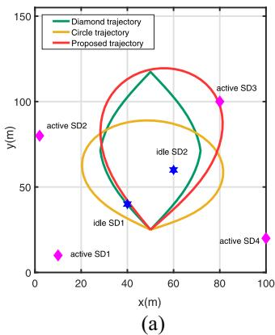

scatter

| Position       | x(m) | y(m) | Trajectory Type     |
| -------------- | ---- | ---- | ------------------- |
| active SD1      | 10   | 10   | Active SD1          |
| idle SD1        | 40   | 40   | Active SD1          |
| idle SD2        | 60   | 60   | Circle              |
| idle SD3        | 80   | 100  | Proposed            |
| active SD4      | 100  | 20   | Active SD4          |

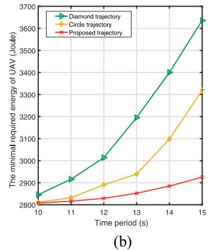

line

| Time period (s) | Diamond trajectory | Circle trajectory | Proposed trajectory |
| --------------- | ------------------ | ----------------- | ------------------- |
| 10              | 2850               | 2800              | 2800                |
| 11              | 2950               | 2850              | 2820                |
| 12              | 3050               | 2900              | 2850                |
| 13              | 3200               | 2950              | 2870                |
| 14              | 3400               | 3100              | 2900                |
| 15              | 3650               | 3300              | 2950                |

Fig. 9. Minimal required energy of UAV versus period T with different trajectory designs.

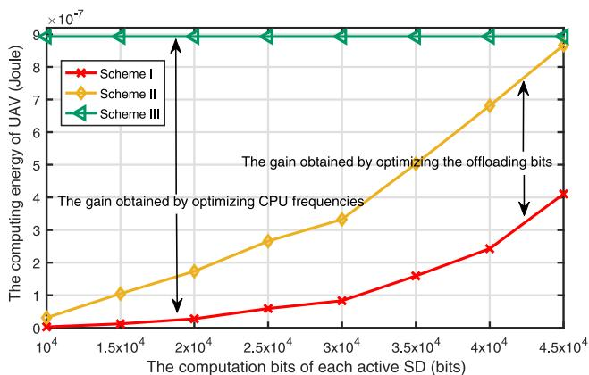

line

| The computation bits of each active SD (bits) | Scheme I (Joule ×10⁻⁷) | Scheme II (Joule ×10⁻⁷) | Scheme III (Joule ×10⁻⁷) |
| --------------------------------------------- | ------------------------ | ------------------------ | ------------------------- |
| 10⁴                                           | ~0                       | ~0.5                     | ~9                        |
| 1.5×10⁴                                       | ~0.2                     | ~1.2                     | ~9                        |
| 2×10⁴                                         | ~0.3                     | ~1.8                     | ~9                        |
| 2.5×10⁴                                       | ~0.5                     | ~2.7                     | ~9                        |
| 3×10⁴                                         | ~0.8                     | ~3.4                     | ~9                        |
| 3.5×10⁴                                       | ~1.6                     | ~4.5                     | ~9                        |
| 4×10⁴                                         | ~2.5                     | ~6.8                     | ~9                        |
| 4.5×10⁴                                       | ~4.2                     | ~8.8                     | ~9                        |

Fig. 10. UAV’s computing energy versus each active SD’s computation bits for different optimization schemes.

always require the least energy since our proposed algorithm fully exploits the advantages of trajectory optimization. It also demonstrates that trajectory optimization plays a very important role in UAV-enabled wireless communication systems.

Fig. 10 depicts the performance gain brought by optimizing different variables with our proposed algorithm, where in Scheme I, all variables are jointly optimized. In Scheme II, the CPU frequencies and UAV’s trajectory are jointly optimized with fixed offloading bits to UAV, and in Scheme III, the offloading bits and UAV’s trajectory are jointly optimized with fixed UAV’s CPU frequencies. The performance gap between Scheme I and Scheme II demonstrates the gain brought by optimizing the offloading bits to UAV, and the performance gap between Scheme I and Scheme III demonstrates the gain brought by optimizing UAV’s CPU frequency. It shows that the joint optimization of UAV’s CPU frequency and the number of bits offloaded to UAV in each time slot can achieve much less energy for computing. As the active SDs computation bits increases, the gain obtained by optimizing offloading bits increases, and the gain obtained by optimizing CPU frequency decreases until the optimized CPU frequencies reach the maximum computing capacity of UAV.

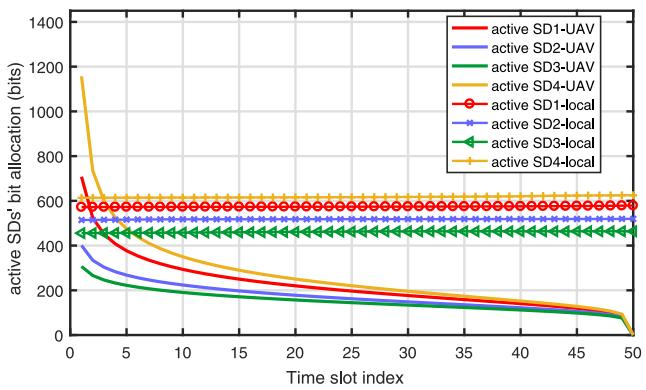

line

| Time slot index | active SD1-UAV | active SD2-UAV | active SD3-UAV | active SD4-UAV | active SD1-local | active SD2-local | active SD3-local | active SD4-local |
| --------------- | -------------- | -------------- | -------------- | -------------- | ---------------- | ---------------- | ---------------- | ---------------- |
| 0               | 700            | 400            | 300            | 1150           | 600              | 550              | 500              | 600              |
| 5               | 400            | 250            | 200            | 600            | 600              | 550              | 500              | 600              |
| 10              | 300            | 200            | 150            | 550            | 600              | 550              | 500              | 600              |
| 15              | 250            | 180            | 130            | 520            | 600              | 550              | 500              | 600              |
| 20              | 220            | 160            | 120            | 500            | 600              | 550              | 500              | 600              |
| 25              | 200            | 150            | 110            | 480            | 600              | 550              | 500              | 600              |
| 30              | 180            | 140            | 100            | 460            | 600              | 550              | 500              | 600              |
| 35              | 160            | 130            | 95             | 440            | 600              | 550              | 500              | 600              |
| 40              | 140            | 120            | 90             | 420            | 600              | 550              | 500              | 600              |
| 45              | 120            | 110            | 85             | 410            | 600              | 550              | 500              | 600              |
| 50              | 10             | 10             | 80             | 400            | 600              | 550              | 500              | 600              |

Fig. 11. Optimized bit allocation of local computing and offloading to UAV with T = 15 s.

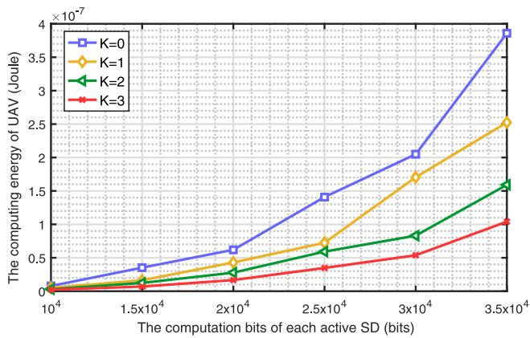

line

| The computation bits of each active SD (bits) | K=0       | K=1       | K=2       | K=3       |
| --------------------------------------------- | --------- | --------- | --------- | --------- |
| 10000                                         | 0.000001  | 0.000001  | 0.000001  | 0.000001  |
| 15000                                         | 0.350002  | 0.150002  | 0.100002  | 0.050002  |
| 20000                                         | 0.650003  | 0.450003  | 0.350003  | 0.250003  |
| 25000                                         | 1.450004  | 0.750004  | 0.650004  | 0.450004  |
| 30000                                         | 2.150005  | 1.750005  | 1.150005  | 0.850005  |
| 35000                                         | 3.950006  | 2.550006  | 1.650006  | 1.150006  |

Fig. 12. UAV’s computing energy requirement versus each active SD’s computation bits.

Fig. 11 shows the optimized offloading allocations of local computing and UAV offloading. It is observed that in our considered system, a large number of bits are offloaded to UAV at the beginning, and less bits are offloaded to UAV later, which is much different from the conclusion in [35]. Because [35] focused on minimizing users’ communication energy, but this article aimed at minimizing UAV’s total required energy in which the propulsion energy consumption is of the dominant part. Moreover, the active SDs prefer to process equal number of bits in each time slot, because active SDs’ CPU frequencies have to remain stable for saving computation energy, which is consistent with [31].

Fig. 12 plots UAV’s computing energy requirement versus the total number of computation bits of active SDs with the different number of idle SDs. As the total number of computation bits of active SDs increases, the computing energy requirement of UAV increases. Moreover, UAV’s computing energy requirement is greatly reduced with the assistance of idle SDs. More helping idle SDs, less computing energy of UAV is required.

Fig. 13(a) and (b) depict UAV’s computation energy requirement and the convergence time versus the number of idle SDs, respectively. From Fig. 13(a), UAV’s computation energy requirement decreases as the number of idle SDs increases, since the more idle SDs, the more computation resources can be used, which is consistent with Fig. 12. But the decreasing rate is gradually slowing down with the increment of the number of idle SDs. From Fig. 13(b), as the number of idle SDs increases, the convergence time of the algorithm grows. Because when the number of idle SDs increases, the number of variables that need to be jointly optimized increases, resulting in a longer time to converge.

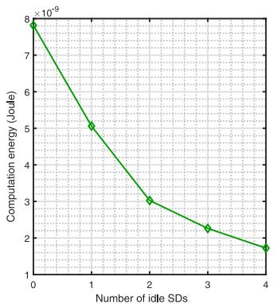

line

| Number of idle SDs | Computation energy (Joule) |
|---|---|
| 0 | 8.0e-9 |
| 1 | 5.1e-9 |
| 2 | 3.1e-9 |
| 3 | 2.3e-9 |
| 4 | 1.7e-9 |

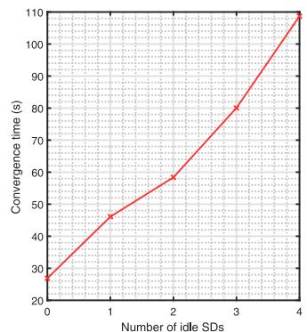

line

| Number of idle SDs | Convergence time (s) |
| ------------------- | -------------------- |
| 0                   | 28                   |
| 1                   | 46                   |
| 2                   | 59                   |
| 3                   | 80                   |
| 4                   | 108                  |

Fig. 13. UAV’s computation energy and the convergence time versus the number of idle SDs.

# VI. CONCLUSION

This article studied the joint optimization of the CPU frequencies, the offloading bits, the transmit power, and the UAV’s trajectory of the UAV-enabled wireless powered cooperative MEC system. An optimization problem was formulated to minimize the required energy of UAV. The SCA-based algorithm and the DAI-based algorithm were proposed to tackle the nonconvex problem. The theoretical analysis shows that the DAI-based algorithm has lower computational complexity than the SCA-based one. The simulation results show that both algorithms converge within several iterations and they achieve the similar minimal required energy and the optimized trajectory. The proposed algorithms obtain significant performance gain compared to other benchmarks, which indicates that the propulsion-related energy occupies the dominant part of the total required energy and trajectory design plays an important role in the UAV-enabled wireless communication system. Additionally, the joint optimization of the UAV’s CPU frequency and the offloading bits can achieve much less energy for computing of UAV. With the help of idle SDs, UAV’s computing energy requirement can be greatly reduced. However, as the number of idle SDs increases, the number of optimization variables increases, resulting in a longer time to converge.

# APPENDIX

# PROOF OF THEOREM 2

PB-1 is a convex problem which can be solved by the Lagrangian dual method. Let $\nu _ { m , n } , \ \mu _ { k , n } , \ \lambda _ { k , n } , \ \theta _ { n } , \ \gamma _ { m }$ denote the dual variables with respect to constraints $( 1 5 \mathrm { a } ) \mathrm { - } ( 1 5 \mathrm { g } )$ , and  denotes a collection containing all the optimization variables and dual variables related to $\bf { P _ { B - 1 } }$ . The Lagrangian of PB-1 can be expressed by ζ (), i.e.,

$$
\begin{array}{l} \zeta (\Xi) = \sum_ {n = 2} ^ {N} \frac {T}{N} \gamma_ {c} f _ {u} [ n ] ^ {3} + \sum_ {m = 1} ^ {M} \sum_ {n = 1} ^ {N} \nu_ {m, n} \\ \times \left\{\sum_ {i = 1} ^ {n} \frac {T}{N} \gamma_ {c} f _ {m} [ i ] ^ {3} + \sum_ {i = 1} ^ {n} \frac {\sigma^ {2} \left(2 ^ {\frac {L _ {m , u} [ i ]}{B \delta_ {o}}} - 1\right)}{h _ {u , m} [ i ]} \right. \\ \left. + \sum_ {i = 1} ^ {n} \frac {\sigma^ {2} \left(2 ^ {\frac {L _ {m , k} [ i ]}{B \delta_ {o}}} - 1\right)}{h _ {m , k} [ i ]} - \sum_ {i = 1} ^ {n} \frac {T}{N} \eta P _ {u} h _ {u, m} [ i ] \right\} \\ + \sum_ {k = 1} ^ {K} \sum_ {n = 1} ^ {N} \mu_ {k, n} \left\{\sum_ {i = 1} ^ {n} \frac {T}{N} \gamma_ {c} f _ {k} [ i ] ^ {3} - \sum_ {i = 1} ^ {n} \frac {T}{N} \eta P _ {u} h _ {u, k} [ i ] \right\} \\ + \sum_ {k = 1} ^ {K} \sum_ {n = 2} ^ {N - 1} \lambda_ {k, n} \left\{\sum_ {i = 2} ^ {n} \frac {f _ {k} [ i ]}{C _ {2}} \frac {T}{N} - \sum_ {i = 1} ^ {n - 1} \sum_ {m = 1} ^ {M} L _ {m, k} [ i ] \right\} \\ + \sum_ {k = 1} ^ {K} \lambda_ {k, N} \left\{\sum_ {i = 2} ^ {N} \frac {f _ {k} [ i ]}{C _ {2}} \frac {T}{N} - \sum_ {i = 1} ^ {N - 1} \sum_ {m = 1} ^ {M} L _ {m, k} [ i ] \right\} \\ + \sum_ {n = 2} ^ {N - 1} \theta_ {n} \left\{\sum_ {i = 2} ^ {n} \frac {f _ {u} [ i ]}{C _ {3}} \frac {T}{N} - \sum_ {i = 1} ^ {n - 1} \sum_ {m = 1} ^ {M} L _ {m, u} [ i ] \right\} \\ + \theta_ {N} \left\{\sum_ {i = 2} ^ {N} \frac {f _ {u} [ i ]}{C _ {3}} \frac {T}{N} - \sum_ {i = 1} ^ {N - 1} \sum_ {m = 1} ^ {M} L _ {m, u} [ i ] \right\} + \sum_ {m = 1} ^ {M} \gamma_ {m} \\ \end{array}
$$

$$
\times \left\{\sum_ {n = 1} ^ {N} \frac {f _ {m} [ n ]}{C _ {1}} \frac {T}{N} + \sum_ {n = 1} ^ {N - 1} \sum_ {k = 1} ^ {K} L _ {m, k} [ n ] + \sum_ {n = 1} ^ {N - 1} L _ {m, u} [ n ] - R _ {m} \right\}.
$$

Thus, the derivations of ζ () with respect to $\{ f _ { m } [ n ] , f _ { k } [ n ] , f _ { u } [ n ] , L _ { m , k } [ n ] , L _ { m , u } [ n ] \}$ can be given by

$$
\begin{array}{l} \frac {\partial \zeta}{\partial f _ {m} [ n ]} = 3 \frac {T}{N} \gamma_ {c} C _ {1} \sum_ {j = n} ^ {N} v _ {m, j} f _ {m} [ n ] ^ {2} - \frac {T}{N} \gamma_ {m} \\ \frac {\partial \zeta}{\partial f _ {k} [ n ]} = \left\{ \begin{array}{l l} 0, & n = 1 \\ 3 \frac {T}{N} \gamma_ {c} f _ {k} [ n ] ^ {2} \sum_ {j = n} ^ {N - 1} \mu_ {k, j} + \frac {T}{N} \frac {\sum_ {j = n} ^ {N - 1} \lambda_ {k , j} - \lambda_ {k , N}}{C _ {2}} \\ & n = 2, \ldots , N - 1 \\ 3 \frac {T}{N} \gamma_ {c} \mu_ {k, N} f _ {k} [ n ] ^ {2} - \frac {T}{N} \frac {\lambda_ {k , N}}{C _ {2}}, & n = N \end{array} \right. \\ \frac {\partial \zeta}{\partial f _ {u} [ n ]} = \left\{ \begin{array}{l l} 0, & n = 1 \\ 3 \frac {T}{N} \gamma_ {c} f _ {u} [ n ] ^ {2} + \frac {T}{N} \frac {\sum_ {j = n} ^ {N - 1} \theta_ {j} - \theta_ {N}}{C _ {3}}, & n = 2, \ldots , N - 1 \\ 3 \frac {T}{N} \gamma_ {c} f _ {u} [ n ] ^ {2} - \frac {T}{N} \frac {\theta_ {N}}{C _ {3}}, & n = N \end{array} \right. \\ \frac {\partial \zeta}{\partial L _ {m , k} [ n ]} = \left(2 ^ {\frac {L _ {m , k} [ n ]}{B \delta_ {o}}} - 1\right) \\ - \frac {B \delta_ {o} \left(\sum_ {j = n + 1} ^ {N - 1} \lambda_ {k , j} - \lambda_ {k , N} + \gamma_ {m}\right) h _ {m , k} [ n ]}{\sigma^ {2} \ln_ {2} \sum_ {j = n} ^ {N} v _ {m , j}} \\ \frac {\partial \zeta}{\partial L _ {m , u} [ n ]} = \left(2 ^ {\frac {L _ {m , u} [ n ]}{B \delta_ {o}}} - 1\right) \\ - \frac {B \delta_ {o} \Bigl (\sum_ {j = n + 1} ^ {N - 1} \theta_ {j} - \theta_ {N} + \gamma_ {m} \Bigr) h _ {u , m} [ n ]}{\sigma^ {2} \ln_ {2} \sum_ {j = n} ^ {N} v _ {m , j}}. \\ \end{array}
$$

Apply the Karush–Kuhn–Tucker (KKT) conditions and let $[ \partial \zeta / ( \partial f _ { m } [ n ] ) ] , \ [ \partial \zeta / ( \partial f _ { k } [ n ] ) ] , \ [ \partial \zeta / ( \partial f _ { u } [ n ] ) ] , \ [ \partial \zeta / ( \partial L _ { m , k } [ n ] ) ]$ , $[ \partial \zeta / ( \partial L _ { m , u } [ n ] ) ]$ be equal to zero, we can obtain the corresponding optimal solutions given in Theorem 2 with some straightforward calculations. Thus, the proof for Theorem 2 is completed.

# REFERENCES

[1] X. W. Cao, J. Xu, and R. Zhang, “Mobile edge computing for cellularconnected UAV: Computation offloading and trajectory optimization,” in Proc. IEEE Signal Process. Adv. Wireless Commun., 2018, pp. 111–115.   
[2] J. Cao, Z. Wu, J. Wu, and H. Xiong, “SAIL: Summation-based incremental learning for information-theoretic text clustering,” IEEE Trans. Cybern., vol. 43, no. 2, pp. 570–584, Apr. 2013.   
[3] Q. Q. Wu and R. Zhang, “Common throughput maximization in UAV-enabled OFDMA systems with delay consideration,” IEEE Trans. Commun., vol. 66, no. 12, pp. 6614–6627, Dec. 2018.   
[4] J. Cao, Z. Bu, Y. Y. Wang, H. Yang, J. C. Jiang, and H.-J. Li, “Detecting prosumer-community groups in smart grids from the multiagent perspective,” IEEE Trans. Syst., Man, Cybern., Syst., vol. 49, no. 8, pp. 1652–1664, Aug. 2019.   
[5] R. H. Jiang, K. Xiong, P. Y. Fan, Y. Zhang, and Z. D. Zhong, “Power minimization in SWIPT networks with coexisting power-splitting and time-switching users under nonlinear EH model,” IEEE Internet Things J., vol. 6, no. 5, pp. 8853–8869, Oct. 2019.   
[6] A. M. Siddiqui, L. Musavian, S. Aïssa, and Q. Ni, “Performance analysis of relaying systems with fixed and energy harvesting batteries,” IEEE Trans. Commun., vol. 66, no. 4, pp. 1386–1398, Apr. 2018.   
[7] Y. Lu, K. Xiong, P. Y. Fan, Z. D. Zhong, and K. B. Letaief, “Robust transmit beamforming with artificial redundant signals for secure SWIPT system under non-linear EH model,” IEEE Trans. Wireless Commun., vol. 17, no. 4, pp. 2218–2232, Apr. 2018.   
[8] D. X. Wu, F. Wang, X. W. Cao, and J. Xu, “Wireless powered user cooperative computation in mobile edge computing systems,” in Proc. IEEE GLOBECOM, 2018, pp. 1–7.   
[9] H. Zheng, K. Xiong, P. Fan, Z. Zhong, and K. B. Letaief, “Fogassisted multiuser SWIPT networks: Local computing or offloading,” IEEE Internet Things J., vol. 6, no. 3, pp. 5246–5264, Jun. 2019.   
[10] C. S. You, K. B. Huang, and H. Chae, “Energy efficient mobile cloud computing powered by wireless energy transfer,” IEEE J. Sel. Areas Commun., vol. 34, no. 5, pp. 1757–1771, May 2016.   
[11] F. Wang, J. Xu, X. Wang, and S. G. Cui, “Joint offloading and computing optimization in wireless powered mobile-edge computing systems,” IEEE Trans. Wireless Commun., vol. 17, no. 3, pp. 1784–1797, Mar. 2018.   
[12] Y. Zeng, J. Xu, and R. Zhang, “Energy minimization for wireless communication with rotary-wing UAV,” IEEE Trans. Wireless Commun., vol. 18, no. 4, pp. 2329–2345, Apr. 2019.   
[13] Y. Zeng and R. Zhang, “Energy-efficient UAV communication with trajectory optimization,” IEEE Trans. Wireless Commun., vol. 16, no. 6, pp. 3747–3760, Jun. 2017.   
[14] Q. Q. Wu, Y. Zeng, and R. Zhang, “Joint trajectory and communication design for multi-UAV enabled wireless networks,” IEEE Trans. Wireless Commun., vol. 17, no. 3, pp. 2109–2121, Mar. 2018.   
[15] R. I. Bor-Yaliniz, A. El-Keyi, and H. Yanikomeroglu, “Efficient 3-D placement of an aerial base station in next generation cellular networks,” in Proc. IEEE Int. Conf. Commun., 2016, pp. 985–989.   
[16] L. Xiao, Y. Xu, D. C. Yang, and Y. Zeng. (2018). Secrecy Energy Efficiency Maximization for UAV-Enabled Mobile Relaying. Accessed: Jul. 2018. [Online]. Available: https://arxiv.org/abs/1807.04395   
[17] Y. Zeng, R. Zhang, and T. J. Lim, “Throughput maximization for UAV-enabled mobile relaying systems,” IEEE Trans. Wireless Commun., vol. 64, no. 12, pp. 4983–4996, Dec. 2016.   
[18] M. Mozaffari, W. Saad, M. Bennis, and M. Debbah, “Mobile unmanned aerial vehicles (UAVs) for energy-efficient Internet of Things communications,” IEEE Trans. Wireless Commun., vol. 16, no. 11, pp. 7574–7589, Nov. 2017.   
[19] J. Xu, Y. Zeng, and R. Zhang, “UAV-enabled wireless power transfer: Trajectory design and energy optimization,” IEEE Trans. Wireless Commun., vol. 17, no. 8, pp. 5092–5106, Aug. 2018.   
[20] L. F. Xie, J. Xu, and R. Zhang, “Throughput maximization for UAVenabled wireless powered communication networks,” IEEE Internet Things J., vol. 6, no. 2, pp. 1690–1703, Apr. 2019.

[21] Q. Y. Hu, Y. L. Cai, G. D. Yu, Z. J. Qin, M. J. Zhao, and G. Y. Li, “Joint offloading and trajectory design for UAV-enabled mobile edge computing systems,” IEEE Internet Things J., vol. 6, no. 2, pp. 1879–1892, Apr. 2019.   
[22] X. Y. Hu, K.-K. Wong, K. Yang, and Z. B. Zheng, “UAV-assisted relaying and edge computing: Scheduling and trajectory optimization,” IEEE Trans. Wireless Commun., vol. 18, no. 10, pp. 4738–4752, Oct. 2019.   
[23] C. S. You and R. Zhang, “3D trajectory optimization in Rician fading for UAV-enabled data harvesting,” IEEE Trans. Wireless Commun., vol. 18, no. 6, pp. 3192–3207, Jun. 2019.   
[24] F. H. Zhou, Y. P. Wu, R. Q. Hu, and Y. Qian, “Computation rate maximization in UAV-enabled wireless-powered mobile-edge computing systems,” IEEE J. Sel. Areas Commun., vol. 36, no. 9, pp. 1927–1941, Sep. 2018.   
[25] F. H. Zhou, Y. P. Wu, H. J. Sun, and Z. Chu, “UAV-enabled mobile edge computing: Offloading optimization and trajectory design,” in Proc. IEEE Int. Conf. Commun., 2018, pp. 1–6.   
[26] X. L. Hu, X. X. Zhuang, G. S. Feng, H. B. Lv, and H. Q. Wang, “Joint optimization of traffic and computation offloading in UAV-assisted wireless networks,” in Proc. IEEE Mobile Ad Hoc Sensor Syst., 2018, pp. 475–480.   
[27] K.-Y. Wang, A. M.-C. So, T.-H. Chang, W.-K. Ma, and C.-Y. Chi, “Outage constrained robust transmit optimization for multiuser MISO downlinks: Tractable approximations by conic optimization,” IEEE Trans. Signal Process., vol. 62, no. 21, pp. 5690–5705, Nov. 2014.   
[28] D. Q. Feng, L. Lu, Y. Yuan-Wu, G. Y. Li, G. Feng, and S. Q. Li, “Deviceto-device communications underlaying cellular networks,” IEEE Trans. Commun., vol. 61, no. 8, pp. 3541–3551, Aug. 2013.   
[29] K. Xiong, C. Chen, G. Qu, P. Y. Fan, and K. B. Letaief, “Group cooperation with optimal resource allocation in wireless powered communication networks,” IEEE Trans. Wireless Commun., vol. 16, no. 6, pp. 3840–3853, Jun. 2017.   
[30] Y. Lu, K. Xiong, P. Y. Fan, Z. D. Zhong, and K. B. Letaief, “Coordinated beamforming with artificial noise for secure SWIPT under non-linear EH model: Centralized and distributed designs,” IEEE J. Sel. Areas Commun., vol. 36, no. 7, pp. 1544–1563, Jul. 2018.   
[31] M. Hua, Y. M. Huang, Y. Sun, Y. Wang, and L. X. Yang, “Energy optimization for cellular-connected UAV mobile edge computing systems,” in Proc. IEEE Int. Conf. Commun. Syst., 2018, pp. 1–6.   
[32] S. Boyd and L. Vandenberghe, Convex Optimization. Cambridge, U.K.: Cambridge Univ. Press, 2004.   
[33] S. Z. Bi and Y. J. Zhang, “Computation rate maximization for wireless powered mobile-edge computing with binary computation offloading,” IEEE Trans. Wireless Commun., vol. 17, no. 6, pp. 4177–4190, Jun. 2018.   
[34] L. F. Xie, J. Xu, and Y. Zeng. Common Throughput Maximization for UAV-Enabled Interference Channel With Wireless Powered Communications. [Online]. Available: https://arxiv.org/abs/1910.04403   
[35] S. Jeong, O. Simeone, and J. Kang, “Mobile edge computing via a UAV-mounted cloudlet: Optimization of bit allocation and path planning,” IEEE Trans. Veh. Technol., vol. 67, no. 3, pp. 2049–2063, Mar. 2018.

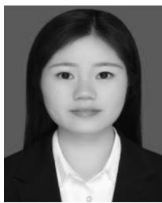

natural_image

Portrait photo of a woman in formal attire (no text or symbols visible)

Yuan Liu received the B.S. degree from the College of Computer and Information Technology, Liaoning Normal University, Dalian, China, in 2017. She is currently pursuing the Ph.D. degree with the School of Computer and Information Technology, Beijing Jiaotong University, Beijing, China.

Her current research interests include UAV communications, energy harvesting in wireless communication networks, and wireless sensor networks.

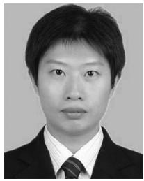

natural_image

Portrait photo of a person in formal attire (no visible text or symbols)

Ke Xiong (Member, IEEE) received the B.S. and Ph.D. degrees from Beijing Jiaotong University (BJTU), Beijing, China, in 2004 and 2010, respectively.

From 2010 to 2013, he was a Postdoctoral Research Fellow with the Department of Electronic Engineering, Tsinghua University, Beijing. Since 2013, he has been a Lecturer and an Associate Professor with BJTU, where he has been a Full Professor with the School of Computer and Information Technology since 2017. From 2015 to 2016, he was a Visiting Scholar with the University of Maryland, College Park, MD, USA. He has published more than 100 academic papers in referred journals and conferences. His current research interests include wireless cooperative networks, wireless powered networks, and network information theory.

Prof. Xiong is a member of China Computer Federation and also a Senior Member of the Chinese Institute of Electronics. He serves as an Associate Editor-in-Chief for the Chinese New Industrialization Strategy and an Editor of Computer Engineering & Software. In 2017, he served as the Leading Editor of the Special issue “Recent Advances in Wireless Powered Communication Networks” for the EURASIP Journal on Wireless Communications and Networking. He also currently serves as a reviewer for more than 15 international journals, including the IEEE TRANSACTIONS ON SIGNAL PROCESSING, the IEEE TRANSACTIONS ON WIRELESS COMMUNICATIONS, the IEEE TRANSACTIONS ON COMMUNICATIONS, the IEEE TRANSACTIONS ON VEHICULAR TECHNOLOGY, IEEE COMMUNICATION LETTERS, IEEE SIGNAL PROCESSING LETTERS, and IEEE WIRELESS COMMUNICATION LETTERS. He served as the Session Chair for IEEE GLOBECOM’2012, IET ICWMMN’2013, IEEE ICC’2013, and ACM MOMM’2014, and the Publicity and the Publication Chair for IEEE HMWC’2014, as well as the TPC Co-Chair of IET ICWMMN’2017 and IET ICWMMN’2019.

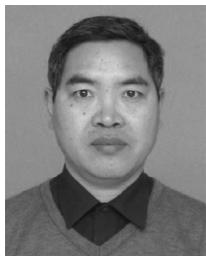

natural_image

Portrait photo of a man wearing a sweater over a collared shirt (no text or symbols visible)

Pingyi Fan (Senior Member, IEEE) received the B.S. degree from the Department of Mathematics, Hebei University, Baoding, China, in 1985, the M.S. degree from the Department of Mathematics, Nankai University, Tianjin, China, in 1990, and the Ph.D degree from the Department of Electronic Engineering, Tsinghua University, Beijing, China, in 1994.

He is currently a Professor with the Department of EE, Tsinghua University. From August 1997 to March 1998, he visited the Hong Kong University

of Science and Technology, Hong Kong, as a Research Associate. From May 1998 to October 1999, he visited the University of Delaware, Newark, DE, USA, as a Research Fellow. In March 2005, he visited NICT, Tokyo, Japan, as a Visiting Professor. From June 2005 to May 2014, he visited the Hong Kong University of Science and Technology for many times. From July 2011 to September 2011, he was a Visiting Professor with the Institute of Network Coding, Chinese University of Hong Kong, Hong Kong. His main research interests include B5G technology in wireless communications, such as MIMO, OFDMA, etc., network coding, network information theory, and big data analysis.

Prof. Fan has received some academic awards, including the IEEE Globecom’14 Best Paper Award, the IEEE WCNC’08 Best Paper Award, the ACM IWCMC’10 Best Paper Award, and the IEEE ComSoc Excellent Editor Award for the IEEE TRANSACTIONS ON WIRELESS COMMUNICATIONS in 2009. He has served as an Editor for the IEEE TRANSACTIONS ON WIRELESS COMMUNICATIONS, the International Journal of Ad Hoc and Ubiquitous Computing (Inderscience), and the Journal of Wireless Communication and Mobile Computing (Wiley). He is also a reviewer of more than 30 international journals, including 20 IEEE journals and 8 EURASIP journals. He is an Oversea Member of IEICE. He has attended to organize many international conferences, including as the General Co-Chair of IEEE VTS HMWC2014, the TPC Co-Chair of IEEE International Conference on Wireless Communications, Networking and Information Security in 2010, and the TPC Member of IEEE ICC, Globecom, WCNC, VTC, and Inforcom.

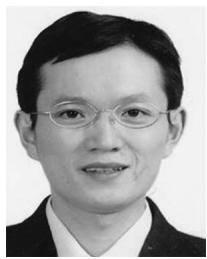

natural_image

Portrait of a man wearing glasses and formal attire (no text or symbols visible)

Qiang Ni (Senior Member, IEEE) received the B.Sc., M.Sc., and Ph.D. degrees in engineering from the Huazhong University of Science and Technology, Wuhan, China.

He is currently a Professor and the Head of the Communication Systems Group, School of Computing and Communications, Lancaster University, Lancaster, U.K. His research interests include the area of future generation communications and networking, including green communications and networking, millimeter-wave wireless communications, cognitive radio network systems, nonorthogonal multiple access (NOMA), heterogeneous networks, 5G and 6G, SDN, cloud networks, energy harvesting, wireless information and power transfer, IoT, cyber physical systems, AI and machine learning, big data analytics, and vehicular networks. He has authored or coauthored over 200 papers in the above areas.

Prof. Ni was an IEEE 802.11 Wireless Standard Working Group Voting Member and a contributor to the IEEE Wireless Standards.

natural_image

Portrait of a man wearing glasses and formal attire (no text or symbols visible)

Khaled Ben Letaief (Fellow, IEEE) received the Ph.D. degree from Purdue University, West Lafayette, IN, USA.

He is a Chair Professor and a Provost of Hamad Bin Khalifa University, Doha, Qatar, a newly established research-intensive university. He has served as the Dean of engineering with the Hong Kong University of Science and Technology, Hong Kong, from 2009 to 2015, where under his leadership, School of Engineering has not only transformed its education and scope and produced very high caliber scholarship, it has also actively pursued knowledge transfer and societal engagement in broad contexts. It has also dazzled in international rankings. He is a World-Renowned Leader of wireless communications and networks. In these areas, he has over 500 journals and conference papers and given invited keynote talks as well as courses all over the world. He has made 6 major contributions to IEEE Standards along with 13 patents.

Dr. Letaief is a recipient of six Teaching Awards, 12 IEEE Best Paper Awards, the 2007 IEEE Joseph LoCicero Award, the 2009 IEEE Marconi Prize Award, the 2010 Purdue Outstanding Electrical and Computer Engineer Award, the 2011 IEEE Harold Sobol Award, and the 2011 IEEE Wireless Communications Technical Committee Recognition Award. He is an ISI Highly Cited Researcher Award. He is the Founding Editor-in-Chief of the IEEE TRANSACTIONS ON WIRELESS COMMUNICATIONS and was instrumental in organizing many IEEE flagship conferences as well as serving IEEE in many leadership positions, including IEEE ComSoc Vice-President for Technical Activities and IEEE ComSoc Vice-President for Conferences. He is an HKIE Fellow.