# UAV-Borne FC-RIS Empowered Wireless Information Surveillance With Threshold-Based Antenna Selection

Shuying Lin , Yulong Zou , Senior Member, IEEE, Hongyu Li , Member, IEEE, Bin Li , Member, IEEE, and Derrick Wing Kwan Ng , Fellow, IEEE

Abstract—As a novel category of beyond-diagonal (BD)- reconfigurable intelligent surfaces (RISs), the fully-connected (FC)-RIS represents an unprecedented advancement in RIS technology for wireless networks. To unlock the full potential of FC-RISs for physical-layer surveillance, this paper investigates a wireless surveillance system assisted by an aerial FC-RIS. Specifically, a legitimate monitoring station exploits an unmanned aerial vehicle (UAV)-borne FC-RIS to enhance the channels related to the monitoring station for facilitating its monitoring of a signal transmitted from a suspicious source. Meanwhile, this signal is decoded at the suspicious destination. Capitalizing on the unparalleled configuration flexibility of FC-RISs, we reduce the implementation complexity associated with jointly optimizing both antenna selection and RIS configuration. In particular, we opportunistically select a antenna at the legitimate multiantenna monitoring station for signal reception without requiring iterative RIS optimization. Accordingly, several schemes are proposed, each differentiated by their specific selection criteria: 1) round-robin antenna selection and FC-RIS-aided (RAS-FR), 2) antenna selection combined with known FC-RIS reflecting channels (ASC-FRRC), 3) threshold-based antenna selection with known FC-RIS reflecting channels (TAS-FRRC). Considering that successful monitoring can be achieved when the monitoring channel conditions surpass those of the suspicious channels, we derive closed-form expressions for monitoring success probabilities (MSPs) of the RAS-FR, ASC-FRRC, and TAS-FRRC schemes, respectively. Furthermore, when part of small-scale channel state information (CSI) is unavailable due to the inherent non-cooperative nature of suspicious party, the surveillance performance can be further improved by optimizing the UAV-

borne FC-RIS location. Numerical results not only validate our closed-form MSP analysis, but also verify that the considered UAV-borne FC-RIS aided surveillance system outperforms the conventional diagonal-RIS or terrestrial-RIS-assisted surveillance systems in terms of MSP. Moreover, compared with non-channelaware schemes or antenna selection with CSI of all sub-links in cascaded links, the proposed AS-FRRC framework dramatically reduces the computational complexity for selection and RIS optimization without introducing performance loss. Additionally, the TAS-FRRC scheme can achieve a more favourable performancecomplexity tradeoff than the RAS-FR and ASC-FRRC schemes.

Index Terms—Physical-layer surveillance, beyond-diagonal reconfigurable intelligent surface (BD-RIS), fully-connected-RIS, unmanned aerial vehicle, monitoring success probability.

## I. INTRODUCTION

wireless networks, reconfigurable intelligent surface (RIS) has emerged as a light-weight, low-profile, and hardware-efficient solution that can be seamlessly integrated into diverse communication networks. This innovative technology has gained significant attention as a competitive candidate to manipulate wireless environments by proactively adapting phase shifts and other signal properties [1], thereby sparking a surge of research [2], [3]. Indeed, early works primarily focused on diagonal RISs, where each RIS element was connected to a single load and did not interact with neighbouring elements. This simple circuit design results in a diagonal scattering matrix of RIS, whose off-diagonal entries are forced to zero such that the wave manipulation of RIS is limited. To mitigate this limitation, the concept of beyond-diagonal (BD)-RIS has recently been introduced as a generalization of conventional RISs [4]. As its name implies, the BD-RIS no longer restricts its scattering matrix to being diagonal, thereby opening up new opportunities for advanced passive beamforming by allowing flexible interconnections among RIS elements. In this context, the authors of [5] proposed promising groupand fully-connected (FC) architectures by interconnecting part of or all elements via additional reconfigurable components. Consequently, the resulting scattering matrix is no longer limited to being diagonal, but, instead, can be block-diagonal or even full. Despite the great potential of BD-RISs, their seamless integration into wireless networks presents numerous research challenges, particularly concerning a dynamic wireless envirionment with rapidly-changing channels which calls for further investigation.

In practical complex terrestrial wireless environments, numerous obstacles and surrounding scatterers on the ground obstruct line-of-sight (LoS) links, posing a significant challenge for deploying effective fixed-position RISs. In response, unmanned aerial vehicle (UAV) has emerged as a promising and popular aerial platform to satisfy high data requirement in remote areas or emergency scenarios. In this regard, the 3<sup>rd</sup> Generation Partnership Project (3GPP) has recognized aerial platforms in its standardization documents (e.g., TR 38.811, TR 22.829, and TS 22.125) [6], [7]. Consequently, the development of RIS-equipped-UAVs has attracted plenty of research interests, as this integration offers multiple key advantages [8]. First of all, light-weight RISs can be easily deployed on demend, facilitating their natural and seamless amalgamation with UAVs, thus offering greater deployment flexibility compared with terrestrial RISs. Second, RISs are inherently energy-efficient as they do not require additional radio frequency (RF) chains, rendering them suitable for power-constrained UAVs without adequate on-board batteries. Third, aerial RISs leverage their enhanced flexibility to steer signals in desired directions and effectively “bypass” obstacles. Given these observations, the authors of [9] formulated an ergodic throughput maximization problem for aerial-RISenabled wireless powered communications, jointly optimizing time allocation and UAV placement. Additionally, the authors of [8] studied UAV swarm-enabled aerial-RIS-aided downlink communications, proposing a joint beamforming and placement design to maximize the weighted sum-rate of ground users. Since the CSI acqusition challenge becomes more severe given the fact that the RISs are mounted on high mobility aerial platforms, the invloved CSI can be outdated. To this end, the authors of [10] developed a comprehensive channel model that accounts for time-varying fading, UAV mobility, Doppler shifts, and array antenna structures under the effects of channel aging. Furthermore, in [11], a two-stage channel estimation technique for UAV-carried RIS communication systems was proposed, which decomposed the channel into slow-varying angles and fast-varying path gains to reduce pilot overhead and enhance accuracy. However, none of these studies has addressed security problems in open environments.

Due to the inherent broadcast nature of electromagnetic propagation, secrecy threats have become increasingly critical amid the exponential proliferation of physical-layer signals [12], [13]. In practice, however, wireless devices exploited by malicious users potentially threaten public safety, facilitate criminal activities, coordinate acts of terrorism, or unlawfully transmit confidential trade information [14]. These challenges highlight the urgent need for legitimate wireless surveillance, which is a paradigm shift beyond traditional eavesdropping prevention methods toward adopting a proactive and essential securing strategy [15]. Specifically, the authors of [16] investigated an RIS-aided wireless surveillance system, where three RIS deployment strategies were proposed by analyzing their respective achievable monitoring rates. Also, the authors of [17] improved physical layer security (PLS) by utilizing transmit antenna selection in the presence of a multi-antenna eavesdropper and presented the corresponding closed-form analysis. Besides, the authors of [15] proposed schemes for jointly selecting both the transmit and receive antennas at the monitoring station, aiming either to maximize the received signal strength from the suspicious user or to minimize the interference from the monitoring-station to the suspicious user. Furthermore, PLS may be compromised by the additional propagation paths established by the massive RIS elements and their flexible interconnections. To enable an efficient utilization of RIS in a wireless surveillance system, a simultaneous transmitting and reflecting reconfigurable intelligent surface (STAR-RIS) was adopted to monitor bidirectional suspicious communications [18], where a transmission-coefficient opti mization problem was formulated and addressed for further performance improvements.

In addition to RIS-enabled strategies, another promising direction for enhancing wireless information surveillance involves opportunistic selection techniques. Although not yet extensively explored, approaches such as antenna selection (AS), multiple monitoring node time-division scheduling, and relay selection have been proved to provide cost-effective enhancements to PLS given instantaneous CSI [19]. As one of the key opportunistic approaches, selecting the antenna with the best channel quality is an effective solution for a single RF chain transceiver systems. Accordingly, various schemes have been explored for PLS enhancement in previous research works [20]. Moreover, since RISs do not incorporate RF chains, a combinition of RIS-aided communications with a single selected antenna significantly reduces the number of RF chains involved, thereby lowering the total required feedback overhead. For instance, in [21], a joint AS and RIS design was examined, where the RIS configurations were accurately aligned with a pair of transmit antenna and receive antenna.

While such opportunistic selection theoretically offers the highest secrecy by exploiting a rich diversity of wireless environments, the overhead associated with CSI acquisition and synchronization can become unrealistic for the scheduler or centralized controller in practice, especially for rapidlychanging channels related to the UAV. To this end, the authors of [22] studied the secrecy outage performance of a cellular downlink system and proposed two multi-user scheduling strategies based on partial or full CSI. Furthermore, the challenge of acquiring instantaneous CSI of the eavesdroppers makes it difficult to implement related strategies in practice [23]. In contrast, statistical CSI of the eavesdroppers can be reliably estimated through established techniques such as visual/electronic reconnaissance and satellite-assisted GPS localization [24]. Consequently, for the design of RIS-aided PLS systems, prioritizing statistical CSI over instantaneous CSI offers a more tractable and realistic optimization framework [25]. A similar consideration was adopted for suspicious channels in wireless surveillance systems [26], where the authors took into account different levels of the CSI availability. One of the scenarios assumed that instantaneous CSI of the secondary transmission link and only statistical CSI of the links related to the suspicious com-

TABLE I  
A COMPARISON BETWEEN THE MOST RELATED WORKS AND THIS WORK
<table><tr><td rowspan=1 colspan=1>Paper</td><td rowspan=1 colspan=1>Wireless surveillance</td><td rowspan=1 colspan=1>Physical layer security</td><td rowspan=1 colspan=1>BD-RIS</td><td rowspan=1 colspan=1>UAV-RIS</td><td rowspan=1 colspan=1>Antenna selection</td></tr><tr><td rowspan=1 colspan=1>[16]</td><td rowspan=1 colspan=1> $\checkmark$ </td><td rowspan=1 colspan=1></td><td rowspan=1 colspan=1>RIS only</td><td rowspan=1 colspan=1>RIS only</td><td rowspan=1 colspan=1></td></tr><tr><td rowspan=1 colspan=1>[20]</td><td rowspan=1 colspan=1></td><td rowspan=1 colspan=1> $\checkmark$ </td><td rowspan=1 colspan=1></td><td rowspan=1 colspan=1></td><td rowspan=1 colspan=1> $\checkmark$ </td></tr><tr><td rowspan=1 colspan=1>[21]</td><td rowspan=1 colspan=1></td><td rowspan=1 colspan=1></td><td rowspan=1 colspan=1>RIS only</td><td rowspan=1 colspan=1>RIS only</td><td rowspan=1 colspan=1> $\overline { { \checkmark } }$ </td></tr><tr><td rowspan=1 colspan=1>[25]</td><td rowspan=1 colspan=1></td><td rowspan=1 colspan=1> $\overline { { \checkmark } }$ </td><td rowspan=1 colspan=1></td><td rowspan=1 colspan=1>√</td><td rowspan=1 colspan=1></td></tr><tr><td rowspan=1 colspan=1>[28]</td><td rowspan=1 colspan=1></td><td rowspan=1 colspan=1> $\overline { { \checkmark } }$ </td><td rowspan=1 colspan=1>V</td><td rowspan=1 colspan=1></td><td rowspan=1 colspan=1></td></tr><tr><td rowspan=1 colspan=1>This work</td><td rowspan=1 colspan=1> $\overline { { \checkmark } }$ </td><td rowspan=1 colspan=1></td><td rowspan=1 colspan=1> $\overline { { \checkmark } }$ </td><td rowspan=1 colspan=1> $\overline { { \checkmark } }$ </td><td rowspan=1 colspan=1> $\overline { { \checkmark } }$ </td></tr></table>

In complex wireless networks with helping nodes (e.g., RIS, relay, etc.), full CSI implies complete knowledge of all the involved individual channel components constituting the cascaded link, denoted by sub-link CSI later. Since the lack of baseband processing capabilities at the RIS poses a significant challenge for acquiring full CSI [1], [21], the partial RIS selection and partial relay selection have been proposed adopting sub-link CSI [27]. To be specific, in twohop relay-aided communications, partial CSI refers to the CSI of only a single hop. Notably, despite its substantially lower complexity, this “partial selection” approach can achieve performance levels close to these full-CSI-based selection in terms of PLS.

munications are available, indicating such assumption can be standard.

Building opon these promising AS strategies, reseachers have also explored various innovative approaches to further booster physical-layer surveillance and PLS performance. To date, UAV-borne multi-antenna monitoring-stations [16], [29], double RIS [30], and other cooperative nodes have been extensively considered (e.g., through a legitimate UAV-borne base station (BS) [28]). Table I provides a comparison between our proposed work and the other closely related works, clearly highlighting the limited research efforts in UAV-borne RISaided wireless information surveillance, paricularly for a joint AS and RIS design. Specifically, several major challenges need to be solved to bridge this research gap. Firstly, the rich potential of FC-RIS has not yet been realized or investigated in wireless information surveillance, largely due to the absense of approprite BD-RIS configuration deisgn for PLS. As a matter of fact, the integration of BD-RISs into wireless information surveillance establishes a generalized framework encompassing existing STAR-RIS-aided wireless information surveillance as a special case [18]. In particular, this new formulation of the scattering matrix, characterized by non-zero off-diagonal elements and thus requiring completely new solution methodologies compared with [1] and [3]. Moreover, implementating such designs may introduce security severe threats due to the additional inter-element connections introduced by massive elements of FC-RISs. Secondly, the computational complexity associated with a joint optimization of both the transceiver and RIS is not pratically appealing. In channel estimation implementations, generally the intrinsic optimization complexity posed by highdimensional RIS-aided channels inevitably leads to certain performance deterioration due to the limited time left for data transmission. Although various studies have proposed transceiver-agnostic RIS configuration, e.g., [21], aimed to reduce the computational cost of frequently-updated RIS optimization, specialized designs to thoroughly address security problems remain undeveloped. Thirdly, in wireless surveillance systems, the CSI related to the suspicious nodes is often less available than that of legitimate channels due to the inherent non-cooperative nature of suspicious party. For instance, CSI from a suspicious transmitter to a RIS might be partially or completely unavailable, which can drastically degrade the performance of optimization schemes. Consequently, for communicating links related to suspicious nodes, available statistical CSI instead of short-term instantaneous CSI is often considered. Typically, the schedulers or controllers require accurate CSI knowledge as input for a normal optimization.

To circumvent these challenges, this paper aims to improve the performance of UAV-borne FC-RIS-aided wireless information surveillance. The main contributions of this paper are summarized as follows. Firstly, we propose a novel framework, termed AS based on FC-RIS reflecting channels (AS-FRRC), where reflecting channel denotes a sub-link of a RIS cascadedlink. By capitalizing on the enhanced beamforming flexibility of the FC-RIS, we decouple the joint design of AS and RIS optimization. In our approach, an antenna is selected exploiting partial CSI (i.e., the CSI from the RIS to different antennas of the legitimate monitor) before optimizing the RIS configuration based on cascaded channels. Since the RIS optimization is executed only once within each coherence time interval, the proposed design exhibits significantly lower complexity than designs employing a conventional RIS. Secondly, we demonstrate that this “partial selection”-aided monitoring enables the performance to approach the ideal with remarkably low complexity. Building on this insight, we further propose these schemes: the round-robin antenna selection and FC-RIS-aided (RAS-FR), antenna selection combined with known FC-RIS reflecting channels (ASC-FRRC), and threshold-based antenna selection with known FC-RIS reflecting channels (TAS-FRRC) schemes, so as to strike an effective balance between performance and complexity. Lastly, to tailor the AS-FRRC design for quality of service (QoS) requirements of various applications in wireless information surveillance systems, we propose an adaptive optimization design with two stages given different timescales of CSI. We propose a specialized two-timescale overall design where a joint AS and RIS optimization relies on short-term instantaneous CSI, while the UAV-borne FC-RIS location is adapted to long-term statistical CSI, rendering the design more practically appealing because statistical CSI is more readily available than instantaneous CSI.

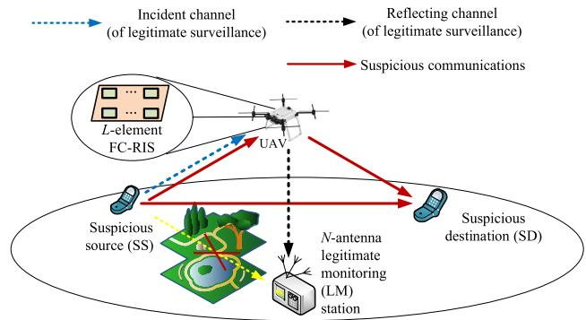  
Fig. 1. The considered UAV-borne FC-RIS-aided wireless surveillance system.

The rest of the paper is organized as follows. Section II describes the considered UAV-borne FC-RIS-aided wireless surveillance system. In Section III, we propose an opportunistic antenna selection framework for UAV-borne FC-RIS-aided communications and demonstrates its effectiveness with various channel-aware selection schemes. In Section IV, based on the derived ergodic expressions, an optimization of the UAV-borne FC-RIS location is performed considering statistical CSI. Numerical results are presented in Section V. Finally, Section VI concludes the paper.

Notations: Throughout this paper, boldface lowercase letters and boldface uppercase ones are used for vectors and matrices, respectively. For a complex-valued variable, $| \cdot |$ denotes its absolute value. For a complex-valued vector, $( \cdot ) ^ { \mathrm { T } }$ and $( \cdot ) ^ { \mathrm { H } }$ denote its transpose and Hermitian transpose, respectively, and || · || denotes its Euclidean norm. Also, $\mathbb { C } ^ { M \times N }$ represents the complex-valued space of $M { \cdot } \mathrm { b y } { \cdot } N$ matrices. The symbols ∼ and <sup>,</sup> stand for “distributed $\mathrm { a s } ^ { \prime \prime }$ and $\mathrm { ^ { 6 6 } t o }$ be defined as”, respectively. Besides, $[ \mathbf { a } ] _ { n }$ and $[ \mathbf { A } ] _ { m , n }$ denote the n-th component of vector a and the $( m , n ) { \cdot } \mathrm { t h }$ component of matrix A, respectively. As for the mathematical operators, diag(a) denotes a diagonal matrix with its diagonal elements given by $\mathbf { \delta } _ { a , \mathrm { E ( \cdot ) } }$ represents the statistical expectation operator, and $\arg ( \cdot )$ represents the phase of a complex number, i.e., $a = | a | \mathrm { a r g } ( a )$ . Besides, $\exp ( \cdot )$ is the exponential function and $\operatorname* { P r } ( \cdot )$ is the probability measure. Additionally, $\binom { N } { n }$ is the coefficient of the binomial expansion terms, ln(·) denotes the natural logarithm, n! represents the factorial of a non-negative number n, and $\Gamma ( \cdot , \cdot )$ represents the upper incomplete Gamma function, among which a special case is the gamma function, noted as $\Gamma ( 0 , \cdot ) = \Gamma ( \cdot )$ , where exists $\Gamma ( n + 1 ) = n !$ for a nonnegative number n. $F _ { X } ( x )$ and $f _ { X } ( x )$ represent the cumulative density function (CDF) and probability density function (PDF) of a random variable X, respectively.

## II. SYSTEM MODEL

As illustrated in Fig. 1, we consider a wireless surveillance system consisting of a pair of suspicious nodes (a source and a destination denoted as SS and SD, respectively), a legitimate monitoring station (LM) equipped with N receiving antennas, and an L-element FC-RIS deployed on an aerial platform (e.g., UAV-borne). The sets of antennas and aerial RIS elements are denoted as $\mathcal { N } \triangleq \{ 1 , 2 , \cdots , N \}$ and ${ \mathcal { L } } \triangleq \{ 1 , 2 , \cdots , L \}$ respectively.<sup>1</sup> Without loss of generality, we assume that LM locates at the origin of a 3D Cartesian coordinate system, denoted as $\textbf { M } = ~ ( 0 , ~ 0 , ~ 0 )$ . Also, SS and SD are located at $\mathbf { S } = ( x _ { \mathrm { S } } , ~ y _ { \mathrm { S } } , ~ 0 )$ and $\mathbf { D } = ( x _ { \mathrm { D } } , \ y _ { \mathrm { D } } , \ 0 )$ , respectively, while the UAV-borne FC-RIS is located at $\mathbf { R } = ( x _ { \mathrm { R } } , \ y _ { \mathrm { R } } , \ H )$ , where $H > 0$ indicates an altitude of the aerial FC-RIS. To emphasize the role of sub-link CSI, we introduce special notations in this paper by refering to the channels from SS to the FC-RIS as the incident channels. Also, we denote the channels from the FC-RIS to LM or SD as the reflecting channels. As we progress, the idea of dividing the cascaded link into sub-links will become more explicit because the AS criteria is based on sub-link CSI, analogous to the “partial selection” discussed in Section I. In the considered model, we assume that a direct link exists between the pair of suspicious nodes. These nodes may exploit nearby smartphones to establish peer-to-peer connections via Wi-Fi or Bluetooth, bypassing Internet infrastructure, which suggests they are likely in close proximity [14]. In contrast, passive LM typically maintains a greater distance to hide its existence from the suspicious party. Consequently, the direct path of the RIS-enhanced passive monitoring is blocked [18], [25]. Although LM may experience poor ground links, it can still capture suspicious signals with the assistance of a flexibly-located UAV-borne RIS. In fact, unlike terrestrial RISs, aerial RISs can swiftly adjust their location and offer stronger line-of-sight (LoS) links that facilitate effective monitoring. In practice, UAVs are preferable platforms that serve for high-mobility scenarios, which well suits for the considered wireless surveillance where LM needs to follow the suspicious nodes to everywhere, moving from one location to another [14].

TABLE II  
RELATED NOTATION FOR LINKS IN FIG. 1
<table><tr><td>Channel variables</td><td>Descriptions</td></tr><tr><td> $\overline { { \mathbf { h } _ { \mathrm { S R } } \in \mathbb { C } ^ { L } } }$ </td><td>From the SS to the UAV-borne FC-RIS</td></tr><tr><td> $\boldsymbol { h } _ { \mathrm { S D } } \in \mathbb { C } ^ { 1 }$ </td><td>From the SS to the SD</td></tr><tr><td> $\mathbf { h } _ { \mathrm { R D } } ^ { \mathrm { H } } \in \mathbb { C } ^ { 1 \times L }$   $\mathbf { h } _ { \mathrm { R } n } ^ { \mathbb { H } ^ { \scriptscriptstyle \perp } } \in \mathbb { C } ^ { 1 \times L }$ </td><td>From the UAV-borne FC-RIS to the SD From the FC-RIS to the n-th antenna of the LM</td></tr></table>

## A. Channel Model

For notational convenience, all links in Fig. 1 are summarized in Table II. Following [33] and [34], we consider distance-dependent large-scale fading while employ a general Nakagami-m fading model, as it is commonly adopted in the literature to characterize small-scale fading in air-to-ground links.<sup>2</sup> Let $[ \mathbf { h } _ { k } ] _ { l }$ <sub>l</sub> denote each single-link component for $k \in \{ { \mathrm { R } n } , { \mathrm { S R } } , { \mathrm { R } } { \mathrm { \bar { D } } } , { \mathrm { \bar { S D } } } \}$ , where $n \in \mathcal N$ , and the CDF of channel gain $| [ \mathbf { h } _ { k } ] _ { l } |$ is characterized by

$$
\mathrm { P r } ( | [ \mathbf { h } _ { k } ] _ { l } | \leq h ) = 1 - \frac { \Gamma \left( \varrho _ { k } , \frac { \varrho _ { k } \sqrt { h } } { \sigma _ { k } ^ { 2 } } \right) } { \Gamma ( \varrho _ { k } ) } , l \in \mathcal { L } ,\tag{1}
$$

where $\begin{array} { r } { \frac { \Gamma \Big ( \varrho _ { k } , \frac { \varrho _ { k } \sqrt { h } } { \sigma _ { k } ^ { 2 } } \Big ) } { \Gamma ( \varrho _ { k } ) } = \exp \left( - \frac { \varrho _ { k } \sqrt { h } } { \sigma _ { k } ^ { 2 } } \right) \sum _ { t = 0 } ^ { \varrho _ { k } - 1 } \frac { 1 } { \Gamma ( t + 1 ) } \Big ( \frac { \varrho _ { k } \sqrt { h } } { \sigma _ { k } ^ { 2 } } \Big ) ^ { t } , } \end{array}$ $\varrho _ { k }$ is Nakagami-m fading parameter whose different values represent versatile fading severity,<sup>3</sup> and $\sigma _ { k } ^ { 2 }$ is the mean power of the channel gains. It is worth mentioning that the aerial RIS can establish strong LoS links, resulting in the fading parameters %<sub>Rn</sub>, %<sub>SR</sub>, %<sub>RD</sub> being remarkably stronger than $\varrho _ { \mathrm { S D } } .$ , as the SS-SD direct link can be non-line-ofsight. Besides, the large-scale fadings are characterized as $\sigma _ { \mathtt { R D } } ^ { \overline { { 2 } } } = d _ { \mathtt { R D } } ^ { - \alpha _ { \mathtt { R D } } } = ( H ^ { 2 } + \overline { { s } } _ { \mathtt { R D } } ^ { 2 } ) ^ { \frac { \alpha _ { \mathtt { R D } } } { 2 } } , \sigma _ { \mathtt { S R } } ^ { 2 } \overset { \sim } { = } d _ { \mathtt { S R } } ^ { - \alpha _ { \mathtt { S R } } } , \sigma _ { \mathtt { S D } } ^ { 2 } = d _ { \mathtt { S D } } ^ { - \alpha _ { \mathtt { S D } } } ,$ and $\sigma _ { \mathrm { R } n } ^ { 2 } \ = \ d _ { \mathrm { R M } } ^ { - \alpha _ { \mathrm { R M } } } = ( H ^ { 2 } + s _ { \mathrm { R M } } ^ { 2 } ) ^ { \frac { \alpha _ { \mathrm { R M } } } { 2 } } , \forall n \ \in \ { \mathcal N } , ^ { 4 }$ where the respective distances are expressed as $d _ { \mathrm { S R } } = | | \mathbf { S } - \mathbf { R } | | , d _ { \mathrm { R D } } =$ $| | \mathbf { R } \ - \ \mathbf { D } | | , \ d _ { \mathrm { R M } } \ = \ \left| | \mathbf { R } \ - \ \mathbf { M } | \right|$ , and $s _ { K }$ is the projected horizontal distance between the corresponding nodes, $K \in$ {RM, SR, RD}. Note that co-located antennas of LM have an identical distance-dependent large-scale fading, i.e., $\sigma _ { \mathrm R n } ^ { 2 }$ can be written as $\sigma _ { \mathrm { R M } } ^ { 2 } , \forall n$ . Following [41] and [42] for modeling the air-to-ground links, we consider an altitude-dependent path loss exponent, which typically varies over the density of obstacles encountered. Hence, the path loss exponent $\alpha _ { K }$ is characterized as

$$
\alpha _ { K } = a _ { 1 } P ^ { \mathrm { L o S } } ( \theta _ { K } ) + b _ { 1 } , \ K \in \{ \mathrm { R M } , \mathrm { S R } , \mathrm { R D } \} ,\tag{2}
$$

where $\theta _ { K }$ is the elevation angle, i.e., $\begin{array} { r } { \theta _ { K } \ = \ \arctan \left( \frac { H } { s _ { K } } \right) } \end{array}$ wherein H is the flying altitude of the UAV-borne $\mathrm { F C } \mathrm { - }$ RIS, and the approximations $\begin{array} { r } { P ^ { \mathrm { L o S } } \left( \frac { \pi } { 2 } \right) \approx 1 } \end{array}$ and $P ^ { \mathrm { L o S } } ( 0 )$ ≈ $\frac { 1 } { 1 + a _ { 2 } \mathrm { e x p } ( a _ { 2 } b _ { 2 } ) }$ are substituted into (2) to determine the coefficients $a _ { 1 }$ and $b _ { 1 }$ because $\alpha ( \pi / 2 )$ and $\alpha ( 0 )$ can be obtained by measurements. Besides, in $( 2 ) , \ P ^ { \mathrm { L o S } } ( \not \theta _ { K } )$ presents the probability of establishing a LoS link, which is given by

$$
P ^ { \mathrm { L o S } } ( \theta _ { K } ) = \frac { 1 } { 1 + a _ { 2 } \mathrm { e x p } ( - b _ { 2 } ( \theta _ { K } - a _ { 2 } ) ) } , K \in \{ \mathrm { R M } , \mathrm { S R } , \mathrm { R D } \} ,\tag{3}
$$

where $a _ { 2 } > 0$ and $b _ { 2 } > 0$ are positive parameters determined by the specific environment [43].

<sup>3</sup>Constraining the fading parameter, i.e., $\varrho _ { k }$ to integer values (often in the range of 2-6) simplifies the mathematical analysis and enables the derivation of closed-form expressions [33], [40].

<sup>4</sup>This model is based on a consideration that the small-scale fading gains are normalized with respect to the noise power, and can be easily extended to suit realistic cases [16].

## B. Signal Model

When SS transmits a signal to SD at power $P _ { \mathrm { s } } ,$ LM attempts to extract information from this suspicious transmission. When the n-th antenna, $n \in { \mathcal { N } } .$ , is selected by LM for reception, the received signal at LM is written as

$$
\begin{array} { r } { y _ { n } = \sqrt { P _ { \mathrm { s } } } ( \mathbf { h } _ { \mathrm { R } n } ^ { \mathrm { H } } \Theta _ { n } \mathbf { h } _ { \mathrm { S R } } ) x _ { \mathrm { s } } + n _ { \mathrm { M } } , } \end{array}\tag{4}
$$

where $x _ { \mathrm { s } } \in \mathbb { C } ^ { 1 }$ is the normalized symbol, i.e., $\mathrm { E } \left( | x _ { \mathrm { s } } | ^ { 2 } \right) = 1$ and $n _ { \mathrm { M } }$ is the additive white Gaussian noise (AWGN) with zero mean and variance of $\sigma _ { 0 } ^ { 2 } .$ . As an extension of conventional RISs [44], BD-RISs have recently been proposed with their innovative architectures supported by a multi-port reconfigurable impedance network. Among the various BD-RIS configurations, we focus on a fully-connected architecture, where each element is connected to all other elements via reconfigurable components. Specifically, the FC-RIS scattering matrix $\Theta _ { n }$ is not restricted to be a diagonal structure and is expressed as the following complex symmetric unitary matrix

$$
\begin{array} { r } { \boldsymbol { \Theta } _ { n } ^ { \mathrm { H } } \boldsymbol { \Theta } _ { n } = \mathbf { I } _ { L } , \boldsymbol { \Theta } _ { n } = \boldsymbol { \Theta } _ { n } ^ { \mathrm { T } } , \quad \forall n \in \mathcal { N } , } \end{array}\tag{5}
$$

which extends the unit-modulus constraint in conventional diagonal RISs, e.g., [1] and [3]. From (4) and the definition in [45], the achievable rate of SS-LM link, also known as the monitoring rate, can be written as

$$
R _ { \mathrm { S } n } = \log _ { 2 } ( 1 + \gamma _ { \mathrm { s } } | \mathbf { h } _ { \mathrm { R } n } ^ { \mathrm { H } } \Theta _ { n } \mathbf { h } _ { \mathrm { S R } } | ^ { 2 } ) ,\tag{6}
$$

where $\gamma _ { \mathrm { s } } = P _ { \mathrm { s } } / \sigma _ { 0 } ^ { 2 }$

Meanwhile, the received signal at SD is given by

$$
y _ { \mathrm { D } , n } = \sqrt { P _ { \mathrm { s } } } ( h _ { \mathrm { S D } } + \mathbf { h } _ { \mathrm { R D } } ^ { \mathrm { H } } \Theta _ { n } \mathbf { h } _ { \mathrm { S R } } ) x _ { \mathrm { s } } + n _ { \mathrm { D } } ,\tag{7}
$$

where $n _ { \mathrm { D } }$ is the AWGN at SD with zero mean and variance of $\sigma _ { 0 } ^ { 2 } .$ . From (7), the achievable rate of the SS-SD link, referred to as suspicious rate, can be given by

$$
R _ { \mathrm { S D } , n } = \log _ { 2 } \left( 1 + \gamma _ { \mathrm { s } } | h _ { \mathrm { S D } } + \mathbf { h } _ { \mathrm { R D } } ^ { \mathrm { H } } \Theta _ { n } \mathbf { h } _ { \mathrm { S R } } | ^ { 2 } \right) ,\tag{8}
$$

which corresponds to the case where the n-th antenna of LM is selected.

## C. Monitoring Success Probability

Monitoring success probability (MSP) is a key metric for physical-layer surveillance performance, representing the probability of successfully monitoring suspicious signals [46]. This event refers to a scenario that LM also reliably decodes the information intended for SD. Similar to secrecy coding [3], [12], [19], the recevied signals at both LM and SD incur distinct bit error rates, etc. To satisfy the minimum monitoring requirements, the received signal quality at LM should exceed that at SD with a high probability. Following [35], the MSP is given by

$$
\begin{array} { r } { P _ { \mathrm { M S } , n } \triangleq \operatorname* { P r } ( R _ { { \mathrm { S } } n } > R _ { { \mathrm { S D } } , n } ) , \quad \forall n \in  { \mathcal { N } } , } \end{array}\tag{9}
$$

which is a probability that should ideally approach $\mathrm { o n e } ^ { 5 }$ for highly-desirable effective surveillance systems. From (9), we can deduce that this probability can be increased by the deployment of UAV-borne FC-RIS for improving ${ \cal R } _ { { \cal S } n }$ or decreasing $R _ { \mathrm { S D } , n }$ . However, reducing $R _ { \mathrm { S D } , n }$ is challenging when the instantaneous CSI related to suspicious nodes is unknown. Thus, as a more pragmatic approach, the maximization of $R _ { S n }$ motivates the designs presented in the next two sections.

## III. PROPOSED MONITORING SCHEMES WITHIN AS-FRRC FRAMEWORK AND MSP PERFORMANCE ANALYSIS

In this section, we propose an FC-RIS-aided antenna selection framework, overall two-timescale design, and corresponding schemes. The schemes are differentiated by various specific selection criteria, based on which we derive their analytical expressions of the MSP.

## A. FC-RIS Design: A Precondition

It is worth mentioning that separate estimations of transmitter→FC-RIS and FC-RIS→receiver channels are frequently necessary. Motivated by this observation, we propose an antenna selection with known FC-RIS reflecting channels and then optimization (AS-FRRC) framework decoupling selection and RIS optimization leveraging partial CSI and the property of (5). To construct a unit-modulus diagonal matrix for BD-RIS design, we follow the decomposition in [47] as

$$
\begin{array} { r } { \boldsymbol { \Theta } _ { n } = \mathbf { V } _ { n } \mathbf { D } _ { n } \mathbf { V } _ { n } ^ { \mathrm { T } } , \quad \forall n \in \mathcal { N } , } \end{array}\tag{10}
$$

where ${ \bf D } _ { n }$ is a diagonal matrix given by $\mathbf { D } _ { n } = \mathrm { d i a g } ( \mathbf { d } _ { n } )$ $\begin{array} { r l r } { \mathbf { d } _ { n } } & { { } = } & { \left[ \exp ( j \phi _ { n , 1 } ) , \cdot \cdot \cdot , \exp ( j \phi _ { n , l } ) , \cdot \cdot \cdot , \exp ( j \phi _ { n , L } ) \right] } \end{array}$ is related to the physical model of BD-RIS, wherein $\phi _ { n , l } ~ \in$ [0, 2π). Since (10) is obtained by adopting the eigenvalue decomposition to the real-value reactance matrix, we find $\mathbf { V } _ { n }$ is real-value orthonormal [47]. This enables the channel gain $| { \bf h } _ { \mathrm { R } n } ^ { \mathrm { H } } \Theta _ { n } { \bf h } _ { \mathrm { S R } } | ^ { 2 }$ given in (6) to be expanded according to the Cauchy-Schwarz inequality as [28]

$$
| \hat { \mathbf { h } } _ { \mathrm { R } n } ^ { \mathrm { H } } \mathbf { D } _ { n } \hat { \mathbf { h } } _ { \mathrm { S R } } | ^ { 2 } \leq \| \hat { \mathbf { h } } _ { \mathrm { R } n } ^ { \mathrm { H } } \mathbf { D } _ { n } \| ^ { 2 } \| \hat { \mathbf { h } } _ { \mathrm { S R } } \| ^ { 2 } , \quad \forall n \in \mathcal { N } ,\tag{11}
$$

where $\hat { \mathbf { h } } _ { \mathrm { R } n } ^ { \mathrm { H } } \ = \ \mathbf { h } _ { \mathrm { R } n } ^ { \mathrm { H } } \mathbf { V } _ { n } , \ \hat { \mathbf { h } } _ { \mathrm { S R } } \ = \ \mathbf { V } _ { n } ^ { \mathrm { T } } \mathbf { h } _ { \mathrm { S R } }$ . With the purpose of improving the monitoring transmissions given by (4), the equality in (11) is achieved when the desired configurations introduced by the FC-RIS should perfectly align with the cascaded channel coefficients for maximizing the average gain, where each is given by

$$
\phi _ { n , l } = - \arg \big ( \big [ \mathbf { h } _ { \mathrm { R } n } ^ { \mathrm { H } } \mathbf { V } _ { n } \big ] _ { l } \big ) - \arg ( \big [ \mathbf { V } _ { n } ^ { \mathrm { T } } \mathbf { h } _ { \mathrm { S R } } \big ] _ { l } ) , n \in \mathcal { N } , \forall l \in \mathcal { L } ,\tag{12}
$$

```latex
Algorithm 1 Obtaining $\mathbf { V } _ { n }$ for the Optimal FC-RIS Design
Input $\mathbf { h } _ { \mathrm { S R } } \in \mathbb { C } ^ { L \times 1 } , \mathbf { h } _ { \mathrm { R } n } \in \mathbb { C } ^ { L \times 1 }$ ;
Set $\begin{array} { r l r } { { \bf R } _ { \mathrm { S R } } } & { { } = } & { { \bf h } _ { \mathrm { S R } } ^ { \mathrm { H } } { \bf h } _ { \mathrm { S R } } , { \bf R } _ { \mathrm { R } n } \quad = \quad { \bf h } _ { \mathrm { R } n } { \bf h } _ { \mathrm { R } n } ^ { \mathrm { H } } ; } \end{array}$ A<sub>SR</sub> =
$\begin{array} { r } { \frac { { \mathbf { R } } _ { \mathrm { S R } } + { \mathbf { R } } _ { \mathrm { S R } } ^ { \mathrm { T } } } { 2 } , { \mathbf { A } } _ { \mathrm { R } n } = \frac { { \mathbf { R } } _ { \mathrm { R } n } + { \mathbf { R } } _ { \mathrm { R } n } ^ { \mathrm { T } } } { 2 } ; \mathrm { ~ \mathbf { A } } \triangleq { \mathbf { U } } _ { n } \Delta _ { n } { \mathbf { U } } _ { n } ^ { \mathrm { T } } = \mathbf { A } _ { \mathrm { S R } } - } \end{array}$
$\begin{array} { r } { \bar { \mathbf { A } } _ { \mathrm { R } n } ; \boldsymbol { \delta } _ { n } = \mathrm { d i a g } ( \mathbf { \Delta } \mathbf { \Delta } \mathbf { \Delta } _ { n } ) \mathbf { \bar { \Delta } } \stackrel { = } [ \delta _ { 1 } , \ldots , \delta _ { L } ] ^ { \mathrm { T } } ; } \end{array}$
${ \bf I f } ~ L = = 2 ~ \mathrm { t h e n }$
$\begin{array} { r } { \mathbf { T } _ { n } = \left[ \sqrt { \frac { 1 } { 2 } } \sqrt { \frac { 1 } { 2 } } \right] ; } \end{array}$
Else if $\mathbf { \bar { \Gamma } } \mathbf { \Psi } _ { \mathbf { \bar { \Gamma } } } \mathbf { \Psi } _ { \mathbf { \bar { \Gamma } } } = 3 \mathbf { \Psi } _ { \mathrm { t h e n } } ^ { \mathbf { \tilde { \mathbf { \alpha } } } }$
$\begin{array} { r l } { \sqrt { \sqrt { \frac { - \delta _ { 3 } } { \delta _ { 1 } - \delta _ { 3 } } } \sqrt { \frac { \delta _ { 1 } } { 2 ( \delta _ { \underline { { 1 } } } - \delta _ { 3 } ) } } } } & { { } - \sqrt { \frac { \delta _ { 1 } } { 2 ( \delta _ { \underline { { 1 } } } - \delta _ { 3 } ) } } } \end{array}$
$\begin{array} { r } { \mathbf { T } _ { n } = \left[ \begin{array} { c c } { 0 } & { \sqrt { \frac { 1 } { 2 } } } \\ { \sqrt { \frac { \delta _ { 1 } } { \delta _ { 1 } - \delta _ { 3 } } } } & { - \sqrt { \frac { - \delta _ { 3 } } { 2 ( \delta _ { 1 } - \delta _ { 3 } ) } } } \end{array} \right] \frac { \sqrt { \frac { 1 } { 2 } } } { 2 ( \delta _ { 1 } - \delta _ { 3 } ) } } \\ { \mathbf { m } } \end{array}$
Else
$\begin{array} { r } { \mathbf { t } _ { 1 } = \mathopen { } \mathclose \bgroup \mathopen { } \mathclose \bgroup \mathopen { } \mathclose \bgroup \mathopen { } \mathclose \bgroup \mathopen { } \mathclose \bgroup \mathopen { } \mathclose \bgroup \mathopen { } \mathclose \bgroup \mathopen { } \mathclose \bgroup \mathopen { } \mathclose \bgroup \mathopen { } \mathclose \bgroup \left[ \sqrt { \frac { - \delta _ { L - 1 } } { \delta _ { 1 } - \delta _ { L - 1 } } } , 0 , \ldots , \sqrt { \frac { \delta _ { 1 } } { \delta _ { 1 } - \delta _ { L - 1 } } } , 0 \aftergroup \egroup \aftergroup \egroup \aftergroup \egroup \aftergroup \egroup \aftergroup \egroup \aftergroup \egroup \aftergroup \egroup \aftergroup \egroup \aftergroup \egroup \aftergroup \egroup \aftergroup \egroup \aftergroup \egroup \aftergroup \egroup \right] ^ { \mathrm { T } } ; } \end{array}$
$\begin{array} { r } { \mathbf { t } _ { 2 } = \left[ 0 , \sqrt { \frac { - \delta _ { L } } { \delta _ { 2 } - \delta _ { L } } } , \dots , 0 , \sqrt { \frac { \delta _ { 2 } } { \delta _ { 2 } - \delta _ { L } } } \right] ^ { 1 } ; } \end{array}$
$\mathbf { t } _ { 3 } = \frac { \widetilde { \mathbf { \Gamma } } _ { 1 } } { \sqrt { 2 } } \left[ \left[ \mathbf { t } _ { 1 } \right] _ { L - 1 } , \left[ \mathbf { t } _ { 2 } \right] _ { L } , \mathbf { \widetilde { \Gamma } } _ { \cdot \cdot \cdot } ^ { \cdot } , - \left[ \mathbf { t } _ { 1 } ^ { \widetilde { \mathbf { \Gamma } } } \right] _ { 1 } , - \left[ \mathbf { t } _ { 2 } \right] _ { 2 } \right] ^ { \mathrm { T } } ;$
$\mathbf { t } _ { 4 } = \frac { \mathbf { \widetilde { \Gamma } } _ { 1 } } { \sqrt { 2 } } \left[ \left[ \mathbf { t } _ { 1 } \right] _ { L - 1 } , - \left[ \mathbf { t } _ { 2 } \right] _ { L } , \ldots , - \left[ \mathbf { t } _ { 1 } \right] _ { 1 } , \left[ \mathbf { t } _ { 2 } \right] _ { 2 } \right] ^ { \mathrm { T } } ;$
$\mathbf { T } _ { n } = [ \bar { \mathbf { t } } _ { 1 } , \mathbf { t } _ { 2 } , \mathbf { t } _ { 3 } , \mathbf { t } _ { 4 } , \mathbf { e } _ { 3 } , \ldots , \mathbf { e } _ { N - 2 } ]$
Return the solution $\mathbf { V } _ { n } = \mathbf { U } _ { n } \mathbf { T } _ { n } .$
```

where $\mathbf { V } _ { n }$ can be obtained from Algorithm 1 [47]. It has been proved in [47] that the RIS configuration solution is globally optimal for maximizing the cascaded gain. Only after the equality in (11) holds by configuring the RIS according to (12), the cascaded channel gain related to antenna n is upper-bounded, which is achieved by exploiting Algorithm 1. It turns out that to achieve the maximum cascaded gain through antenna selection, it is sufficient to focus only on the CSI of partial sub-links, $\mathrm { i . e . , ~ } \| \mathbf { h } _ { \mathrm { R } n } ^ { \mathrm { H } } \|$

Remark 1 (Channel shaping ability of FC-RISs): The increased structural flexibility introduced by the more general scattering matrices of FC-RISs enables a decoupling of the effective cascaded channel into an incident channel and a reflecting channel [4], [48], [49], theoretically by deriving respective upper bounds for $| \hat { \mathbf { h } } _ { \mathrm { R } n } ^ { \mathrm { H } } \mathbf { D } _ { n } \hat { \mathbf { h } } _ { \mathrm { S R } } | ^ { 2 }$ as shown on the right hand side of (11). Specifically, for a BD-RIS with generally $\Theta _ { n } ^ { \mathrm { H } } \Theta _ { n } = \mathbf { I } _ { L }$ , the cascaded gain is upper-bounded by $| { \bf h } _ { \mathrm { R } n } ^ { \mathrm { H } } \Theta { \bf h } _ { \mathrm { S R } } | ^ { 2 } \leq \| { \bf h } _ { \mathrm { R } n } ^ { \mathrm { H } } \| ^ { 2 } \| { \bf h } _ { \mathrm { S R } } \| ^ { 2 }$ , provided that $\| \hat { \mathbf { h } } _ { \mathrm { R } n } ^ { \mathrm { H } } \mathbf { D } _ { n } \| \overset { ( a ) } { = }$ $\begin{array}{c} \Vert \hat { \mathbf { h } } _ { \mathrm { R } n } ^ { \mathrm { H } } \bigr \Vert \begin{array} { l } { \overset { ( b ) } { = } } \\ { \qquad \mathrm { | | \hat { \mathbf { h } } _ { \mathrm { R } n } ^ { \mathrm { H } } | | } } \end{array}  \end{array}$ . This indicates that the impacts of two links can be decoupled. In contrast, for a diagonal RIS with $\Theta = \operatorname { d i a g } ( \Theta _ { 1 } , \cdot \cdot \cdot , \Theta _ { l } , \cdot \cdot \cdot , \Theta _ { L } )$ and $| \Theta _ { l } | ~ = ~ 1$ we have 2 $\begin{array} { r } { | { \bf h } _ { \mathrm { R } n } ^ { \mathrm { H } } \Theta { \bf h } _ { \mathrm { S R } } | ^ { 2 } \leq \left| \sum _ { l = 1 } ^ { L } | [ { \bf h } _ { \mathrm { R } n } ] _ { l } | | [ { \bf h } _ { \mathrm { S R } } ] _ { l } | \right| } \end{array}$ , indicating that the impacts of two links are highly coupled. From a theoretical perspective, (a) and (b) are given by the unitary $\mathbf { D } _ { n }$ and the real orthonormal $\mathbf { V } _ { n } ,$ respectively, motivating us to perform a selection only dependent of CSI related to LM while ensuring the desired system performance. The reason $\mathbf { V } _ { n }$ is realvalued and orthonormal is that $\boldsymbol { \Theta } _ { n } = \mathbf { V } _ { n } \mathbf { D } _ { n } \mathbf { V } _ { n } ^ { \mathrm { T } }$ is obtained by adopting the eigenvalue decomposition to the real-value reactance matrix [47].

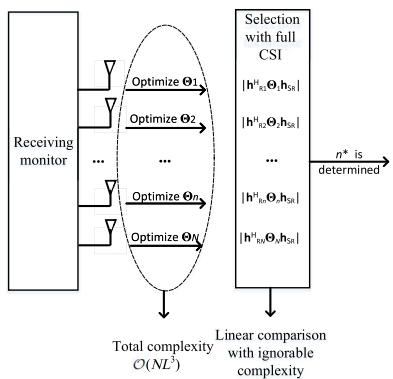  
(a) The conventional joint antenna selection and RIS configuration optimization.

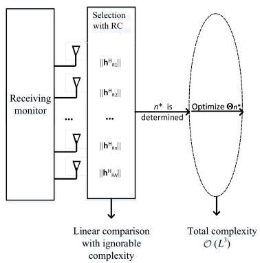  
(b) The proposed low-complexity strategy namely AS-FRRC.  
Fig. 2. A comparison between conventional joint optimization the proposed low-complexity strategy.

## B. AS-FRRC Framework

For RIS-aided communications with antenna selection, maximizing the monitoring rate given by (6) requires solving two interdependent problems: selecting an antenna and optimizing the RIS configurations. These tasks are highly coupled through the cascaded channel gain. Consequently, traditional approaches that perform antenna selection exhaustively only after determining the optimal configurations for all possible antenna subsets [17], [20], as shown by Fig. 2(a), lead to a sequential optimization that incurs prohibitively high computational overhead. To address this issue, we propose an AS-FRRC framework. Specifically, as shown by Fig. 2(b), in a given time slot, once the selected antenna is determined without pre-knowledge of RIS configurations, after which the scattering matrix of RIS is then optimized and the corresponding result is transmitted to the RIS controller. As such, we significantly reduce the computational complexity of the AS and FS-RIS optimization while maintaining efficient performance.

Fig. 2 illustrates the separation of AS and RIS optimization. By justifying the operations of RIS optimization, we present a quantitative analysis for the reduction in computational complexity. Each RIS optimization achieves a closed-form solution with a computational complexity of $\mathcal { O } ( L ^ { 3 } )$ , corresponding to the eigenvalue decomposition step [50] in Algorithm 1.<sup>6</sup> We note that we have omitted the complexity analysis for linear comparisons, as these are actually identical for both proposed and conventional methods in Fig. 2(a) and (b). As illustrated in Fig. 2(b) under our proposed framework, RIS optimization is only performed regarding the optimally-selected antenna, resulting a complexity of $\mathcal { O } ( L ^ { 3 } )$ . In contrast, conventional methods have to exhaustively optimize the RIS design for all antennas, leading to a complexity of $\mathcal { O } ( N L ^ { 3 } )$ . The gap between $\mathcal { O } ( N L ^ { 3 } )$ and $\mathcal { O } ( L ^ { 3 } )$ scales substantially with the increasing number of antennas.

Such computational complexity reduction is particularly critical for UAV-borne-RIS-assisted systems, because the inflight processing limitations that restrict RIS configuration to computationally efficient optimization.

Remark 2 (The network for monitoring suspicious signals): We achieve optimal physical-layer surveillance performance in the considered system by maximizing the legitimate channel gain. Although maximizing the legitimate channel gain generally represents a suboptimal selection strategy [13], it becomes a valid approach when receiver-side selection is implemented in the proposed AS-FRRC, where various AS schemes never affect the suspicious rate in the considered system. Specifi cally, the proposed selection criterion prioritizes the stronger reflecting links, i.e., the differentiated parts of links among different antennas, denoted as h<sup>ˆ</sup> , which are also the sublinks shared by receivers at both LM and SD. Regarding the considered network, the performance is determined by the relative magnitude of $| \hat { \mathbf { h } } _ { \mathrm { R } n } ^ { \mathrm { H } } \mathbf { D } _ { n } \hat { \mathbf { h } } _ { \mathrm { S R } } | ^ { 2 }$ and $| \hat { \mathbf { h } } _ { \mathrm { R D } } ^ { \mathrm { H } } \mathbf { D } _ { n } \hat { \mathbf { h } } _ { \mathrm { S R } } | ^ { 2 }$ based on the notion of MSP given by (9). For selection focusing on CSI of all sub-links, if AS improves the channel gain of $\| \hat { \mathbf { h } } _ { \mathrm { S R } } \|$ not only does the legitimate receiver get a stronger signal, but also the unwanted suspicious communication is enhanced. In contrast, in the considered wireless surveillance system, we can achieve favourable secrecy performance without requiring CSI knowledge of h<sub>SR</sub>.

In conclusion, it can be deduced that the proposed AS-FRRC can achieve favourable performance without CSI knowledge of all sub-links when securing FC-RIS-aided communications [27]. The incident channel component has a negligible impact on the antenna selection because our framework decouples the selection and RIS optimization by exploiting the CSI of partial sub-links. This is due to two main reasons, as explained in Remark 1 and Remark 2.

## C. Adaptive Two-Timescale Overall Design

To enhance the performance of the considered wireless surveillance system, we take into account two cases of overall design building on the proposed AS-FRRC framework with instantaneous CSI and statistical CSI available, respectively. As illustrated in Fig. 3 at the top of next page, we propose a specialized two-timescale overall design, with each case including two stages given different timescales of CSI knowledge, respectively. In the first stage, the UAV’s hovering location is determined, where the maximized channel gains associated with the UAV are predominantly determined by distance-dependent path loss. In the second stage, we perform antenna selection, which is dependent of small-scale CSI but independent of path loss caused by UAV mobility.

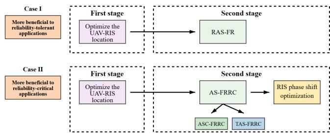  
Fig. 3. Illustration of the proposed adaptive design given different timescales of CSI, where two cases serve for different scenarios with respective requirements of some applications.

Then, the RIS configuration is optimized, aligning with smallscale CSI of the given sub-links. Large-scale path loss and small-scale CSI can be separately obtained through channel estimations [39], and large-scale path loss is often more available in RIS-assisted communications [24]. If small-scale CSI is unavailable, the two-timescale design resorts to adopting statistical CSI of AS-RIS channel. It can be known that Case I assumes the availability of statistical CSI, while Case II assumes the availability of instantaneous CSI.

Taking into account system-level QoS requirements, as shown within the left side of Fig. 3, we note that Case I is designed for delay-sensitive systems, since the monitoring rate is maxmized in the first stage. But this constitutes the entire design adopted in Case I, indicating the system can tolerate relatively lower MSP levels. In contrast, Case II is particularly suitable for reliability-critical applications, since the AS provides a lower MSP.

Note that the following AS belongs to the second stage of the overall design, which requires small-scale CSI. Thus, in Case I, the second stage contributes little to performance enhancement, as the improvements are predominantly realized in the first stage. It is evident that the RAS-FR scheme is applicable to Case I, while both the ASC-FRRC and ASC-FRRC approaches are suitable for Case II.

## D. RAS-FR: Round-Robin Antenna Selection With an FC-RIS

We consider a round-robin antenna selection method, which operates with low computational complexity without leveraging CSI knowledge. Specifically, each antenna is selected sequentially on a slot-by-slot basis. This method serves as a baseline for channel-aware strategies employing various selection criteria based on channel quality. In the considered RAS-FR scheme, the MSP is given by

$$
P _ { \mathrm { M S } } ^ { \mathrm { R A S - F R } } = \frac { 1 } { N } \sum _ { n = 1 } ^ { N } P _ { \mathrm { M S } , n } .\tag{13}
$$

To facilitate performance analysis for the proposed AS-FRRC framework, we denote the reflecting channel gains as $\lambda _ { n } =$ $\Vert \hat { \mathbf { h } } _ { \mathrm { R } n } ^ { \mathrm { H } } \mathbf { D } _ { n } \Vert ^ { 2 }$ and the incident channel gain as $X = \lvert \lvert \hat { \mathbf { h } } _ { \mathrm { S R } } \rvert \rvert ^ { 2 }$

With these definitions, the monitoring rate given by (6) can be rewritten as

$$
R _ { \mathtt { S } n } ^ { \mathtt { R A S - F R } } = \log _ { 2 } ( 1 + \gamma _ { \mathtt { s } } \lambda _ { n } X ) , \quad n = \mathtt { r a n d } .\tag{14}
$$

Substituting (14) and (8) into (9), and assuming that the equality in (11) holds, we derive

$$
P _ { \mathrm { M S } , n } = \mathrm { P r } \left( \lambda _ { n } X > Y \right) ,\tag{15}
$$

where $Y = | h _ { \mathrm { S D } } + { \bf h } _ { \mathrm { R D } } ^ { \mathrm { H } } \Theta _ { n } { \bf h } _ { \mathrm { S R } } | ^ { 2 }$ instead of $Y _ { n }$ is adopted to denote the channel gain of SS-SD transmissions because $\Theta _ { n }$ equivalently appears identical regarding Y for all n. The reason behind is that the FC-RIS scattering coefficient matrix $\Theta _ { n }$ is designed to improve the monitoring performance, and thus the suspicious transmissions described in (7) is not preferred in the considered wireless surveillance systems. Let $\textstyle Z = { \frac { Y } { X } }$ . Then, (15) can be equivalently given by

$$
P _ { \mathrm { M S } , n } = \int _ { 0 } ^ { \infty } F _ { Z } ( \psi ) f _ { \lambda _ { n } } \left( \psi \right) \mathrm { d } \psi ,\tag{16}
$$

where $f _ { Z } ( z )$ is the PDF of $Z$ and can be calculated as Appendix A. Besides, from [28, Eq. (15)], we obtain the CDF of $\lambda _ { n }$ as a Gamma distribution given by

$$
F _ { \lambda _ { n } } ( \lambda ) = 1 - \frac { \Gamma \left( \varrho _ { \mathrm { R } n } L , \frac { \lambda \varrho _ { \mathrm { R } n } } { \sigma _ { \mathrm { R } n } ^ { 2 } } \right) } { \Gamma \left( \varrho _ { \mathrm { R } n } L \right) } .\tag{17}
$$

Substituting (17) and (43) in Appendix A into (16), we obtain the MSP with the n-th antenna selected as (18), shown at the bottom of the page, where the result of [51, Eq. (3.471- 7)] and the definition of parabolic cylinder functions [51, Eq. (9.240)] are used, and $\begin{array} { r } { v _ { 1 } = \varrho _ { \mathrm { S R } } L - \varrho _ { \mathrm { R } n } L , \Xi = \frac { \Gamma \left( \varrho _ { \mathrm { S D } } + \frac { 1 } { 2 } \right) ^ { 2 } \sigma _ { \mathrm { S D } } ^ { 2 } } { \Gamma \left( \varrho _ { \mathrm { S D } } \right) ^ { 2 } } + } \end{array}$ $\begin{array} { r l } & { \frac { L \Gamma \left( \varrho _ { \mathrm { R D } } + \frac { 1 } { 2 } \right) ^ { 2 } \Gamma \left( \varrho _ { \mathrm { S R } } + \frac { 1 } { 2 } \right) ^ { 2 } \sigma _ { \mathrm { R D } } ^ { 2 } \sigma _ { \mathrm { S R } } ^ { 2 } } { \Gamma ( o _ { \mathrm { P P } } ) ^ { 2 } \Gamma ( o _ { \mathrm { C P } } ) ^ { 2 } } , \mathcal { W } _ { a , b } ( \cdot ) } \end{array}$ is the Whittaker function defined as [51, Eq.(9.222-1)]. Finally, by plugging (18) into (13) yields the MSP of the RAS-FR scheme.

Remark 3: Despite the intricate form of (18), its closed-form expression effectively captures the monitoring performance with statistical CSI, thereby enabling parameter optimization without resorting to exhaustive simulations with respect to the random channel fadings. Furthermore, a key parameter to observe statistical CSI can be given by $\begin{array} { r } { \Lambda = \frac { \Xi } { \overline { { \sigma } } _ { \mathrm { R } n } ^ { 2 } \overline { { \sigma } } _ { \mathrm { S R } } ^ { 2 } } } \end{array}$ with $\Xi =$ $\begin{array} { r l } { \frac { \Gamma \left( \varrho _ { \mathrm { { S D } } } + \frac { 1 } { 2 } \right) { ^ 2 \sigma _ { \mathrm { S D } } ^ { 2 } } } { \Gamma ( \varrho \mathrm { s D } ) _ { \circ } ^ { 2 } } + \frac { L \Gamma \left( \varrho _ { \mathrm { { R D } } } + \frac { 1 } { 2 } \right) ^ { 2 } \Gamma \left( \varrho _ { \mathrm { { S R } } } + \frac { 1 } { 2 } \right) { ^ 2 \sigma _ { \mathrm { R D } } ^ { 2 } } \sigma _ { \mathrm { S R } } ^ { 2 } } { \Gamma ( \varrho \mathrm { s D } ) ^ { 2 } \Gamma ( \varrho \mathrm { s R } ) ^ { 2 } } , } & { \overline { { \sigma } } _ { \mathrm { R } n } ^ { 2 } = \frac { \sigma _ { \mathrm { R } n } ^ { 2 } } { \varrho \mathrm { R } n } } \end{array}$ , and $\begin{array} { r } { \overline { { \sigma } } _ { \mathrm { S R } } ^ { 2 } = \frac { \sigma _ { \mathrm { S R } } ^ { 2 } } { \varrho _ { \mathrm { S R } } } } \end{array}$ . Specifically, Λ provides a comparative measure of the channel quality between the suspicious and monitoring links. The $\frac { \overline { { \sigma } } _ { \mathrm R n } ^ { 2 } } { \sigma _ { \mathrm { R D } } ^ { 2 } }$ inside is defined as the monitoring-tosuspicious ratio (MSR), which quantifies the relative behavior of the monitoring channels to the suspicious channels, and its strong impact on the considered monitoring performance in terms of MSP. Besides, to highlight the performance gains enabled by the RIS, we examine the asymptotic behavior for a large number of RIS elements. When L is sufficiently large, Λ

$$
P _ { \mathrm { M S } , n } = 1 - \underbrace { \frac { \Gamma ( \varrho _ { \mathrm { S R } } L - v _ { 1 } ) \varrho _ { \mathrm { R } ^ { 2 } } ^ { \frac { v _ { 1 } - 1 } { 2 } + \varrho _ { \mathrm { R } } , L } \sigma _ { \mathrm { S R } } ^ { v _ { 1 } + 1 - 2 \varrho _ { \mathrm { S R } } L } } { \Gamma ( \varrho _ { \mathrm { R } n } L ) \sigma _ { \mathrm { R } n } ^ { v _ { 1 } - 1 + 2 \varrho _ { \mathrm { R } n } L } \left( \varrho _ { \mathrm { S R } } \Sigma \right) ^ { \frac { v _ { 1 } - 1 } { 2 } + 1 - \varrho _ { \mathrm { S R } } L } } \mathrm { e x p } \left( \frac { \Xi _ { Q \mathrm { R } n } \varrho _ { \mathrm { S R } } } { 2 \sigma _ { \mathrm { R } n } ^ { 2 } \sigma _ { \mathrm { S R } } ^ { 2 } } \right) \mathcal { W } _ { \frac { v _ { 1 } - 1 } { 2 } + 1 - \varrho _ { \mathrm { S R } } L , - \frac { v _ { 1 } } { 2 } } \left( \frac { \Xi _ { Q \mathrm { R } } \varrho _ { \mathrm { S R } } } { \sigma _ { \mathrm { R } n } ^ { 2 } \sigma _ { \mathrm { S R } } ^ { 2 } } \right) } _ { \beta } .\tag{18}
$$

also increases indefinitely. In particular, it can be shown that $\begin{array} { r l r } { \mathrm { W } _ { a , b } ( \Lambda ) \mathrm { e } ^ { \frac { \Lambda } { 2 } } } & { { } \sim } & { \Lambda ^ { a } \sum _ { m = 0 } ^ { \infty } ( - 1 ) ^ { m } \frac { \left( \frac { 1 } { 2 } - a + b \right) _ { m } \left( \frac { 1 } { 2 } - a - b \right) _ { m } } { n ! \Lambda ^ { m } } } \end{array}$ , where $\begin{array} { r } { \left( a _ { p } \right) _ { k } = \frac { \Gamma \left( a _ { p } + k \right) } { \Gamma \left( a _ { p } \right) } } \end{array}$ . This indicates that in (18), the part $\beta$ scales the same order with $\frac { 1 } { \Gamma ( \varrho _ { \mathrm { R } n } L ) \Gamma ( \varrho _ { \mathrm { S R } } L - v _ { 1 } ) }$ , which approaches zero and thus the MSP converges to one. In this regime, successful monitoring is always guaranteed.

## E. ASC-FRRC: Antenna Selection Combining With Known FC-RIS Reflecting Channels

Building on the opportunistic selection in the AS-FRRC framework presented in Section III-A, we propose the ASC-FRRC scheme in this section. Leveraging the diversity provided by the $N$ antennas of LM to enhance the MSP, the monitoring-station first selects an antenna based on partial CSI, exploiting a criterion that is based on reflecting channels and independent of the RIS configuration. As can be observed from (9), this selection criterion can be given by an index of the selected antenna as

$$
n ^ { \mathrm { A S C - F R R C } } = \arg \operatorname* { m a x } _ { n \in \mathcal { N } } \lambda _ { n } .\tag{19}
$$

Substituting (6) and (19) into (9), the MSP of the ASC-FRRC scheme can be written as

$$
P _ { \mathrm { M S } } ^ { \mathrm { A S C - F R R C } } = \mathrm { P r } \left( \underset { n \in \mathcal { N } } { \operatorname* { m a x } } \lambda _ { n } > Z \right) .\tag{20}
$$

By letting $G = \operatorname* { m a x } _ { n \in \mathcal { N } } | \lambda _ { n } |$ and the PDF of G, denoted by $f _ { G } ( g )$ can be proceeded as Appendix C. Then, (14) becomes

$$
R _ { \mathbb { S } n } ^ { \mathrm { A S C - F R R C } } = \log _ { 2 } ( 1 + \gamma _ { \mathrm { s } } G X ) .\tag{21}
$$

Based on (8), (9), and (21), we further derive

$$
P _ { \mathrm { M S } } ^ { \mathrm { A S C - F R R C } } = \int _ { 0 } ^ { \infty } F _ { Z } ( \psi ) f _ { G } \left( \psi \right) \mathrm { d } \psi .\tag{22}
$$

Substituting (41) in Appendix C into (22), we obtain the MSP of the ASC-FRRC scheme as (23), shown at the bottom of the page, where $\begin{array} { r } { v _ { 2 } \ = \ \varrho _ { \mathrm { S R } } L - \sum _ { p = 1 } ^ { \varrho _ { \mathrm { R } n } L } s _ { p } ( p - 1 ) } \end{array}$ $\begin{array} { r } { \mathcal { K } = \Big \{ ( s _ { 1 } , s _ { 2 } , . . . , s _ { \varrho _ { \mathtt { R } n } L } ) | \sum _ { p = 1 } ^ { \varrho _ { \mathtt { R } n } L } s _ { p } = n \Big \} , P _ { q , n } } \end{array}$ represents the q-th non-empty subcollection of the antenna set $\{ { \mathcal { N } } - n \}$ $| P _ { q , n } |$ denote the cardinality of $P _ { q , n }$

## F. TAS-FRRC: Threshold-Based Antenna Selection With Known FC-RIS Reflecting Channels

Although the ASC-FRRC scheme improves the MSP with maximized monitoring rate, acquiring CSI for all antennas is required for channel-aware selection, resulting in an overhead that increases proportionally with the number of antennas. Thus, in this section, we develop the TAS-FRRC scheme relying on a receiving signal-to-noise ratio (SNR) threshold, which achieves a better performance-complexity tradeoff [52]. As an improved version of the proposed RAS-FR and ASC-FRRC schemes, the TAS-FRRC integrates the proposed AS-FRRC framework with a selection operation of the three cases, summarized as below [22].

Case 1: LM estimates the CSI from FC-RIS to the n-th antenna of itself. If the channel condition for this antenna, is indicated by the receiving SNR, $\lambda _ { n } ,$ , is no less than the threshold denoted as $S _ { \mathrm { T } } ,$ , then the n-th antenna is selected to receive the suspicious signal.

Case 2: When LM estimates its receiving $\lambda _ { n }$ of the n-th antenna to receive, indicating the situation that among the $n - 1$ antennas examined, none of their corresponding links exhibits a receiving gain higher than the threshold, while the n-th antenna is adequate with $\lambda _ { n } , \mathrm { i } . \mathbf { e } . , \lambda _ { n } \geq S _ { \mathrm { I } }$ . This condition is equivalently described as max $\{ \lambda _ { 1 } , \cdot \cdot \cdot , \lambda _ { n - 1 } \} < S _ { \mathrm { T } }$ and $S _ { \mathrm { o u t } } = \operatorname* { m a x } \{ \lambda _ { 1 } , \cdot \cdot \cdot , \lambda _ { n } \} \ge S _ { \mathrm { T } }$ , then the n-th antenna is selected.

Case 3: If the CSI for all N antennas has been estimated and none of $\lambda _ { n }$ achieve higher than $S _ { \mathrm { T } } ,$ we denote $S _ { \mathrm { o u t } } =$ max $\{ \lambda _ { 1 } , \cdots , \lambda _ { N } \} < S _ { \mathrm { T } } $ , then the antenna that maximizes the receiving SNR is selected.

Remark 4: When comparing the TAS-FRRC with the proposed RAS-FR and ASC-FRRC, if the threshold $S _ { \mathrm { T } }$ is set too low, the process will typically fall into Case 1. In this scenario, compared to exhaustive search, the required overhead for obtaining the channel pre-knowledge and to examine antennas is remarkably decreased. In contrast, if the threshold $S _ { \mathrm { T } }$ is configured too high, Case 3 occurs more frequently, resulting in an occasional degradation to the ASC-FRRC scheme. In this case, although additional complexity is incurred to select the best path among all unacceptable paths, the performance improvement over the RAS-FR scheme is generally evident, as will be illustrated in the simulation section.

When $S _ { \mathrm { T } }$ is set to an intermediate level, the CDF of the combined SNR at the receiver $S _ { \mathrm { o u t } }$ can be expressed as

$$
F _ { S _ { \mathrm { o u t } } } ( s ) = \left\{ \begin{array} { l l } & { F _ { \lambda _ { 1 } } ( s ) - \sum _ { n = 2 } ^ { N } \prod _ { q = 1 } ^ { n - 1 } F _ { \lambda _ { q } } \left( S _ { \mathrm { T } } \right) } \\ & { \times \left( 1 - F _ { \lambda _ { n } } ( s ) \right) , \quad \quad \mathrm { i f } \quad s \geq S _ { \mathrm { T } } , } \\ & { \prod _ { n = 1 } ^ { N } F _ { \lambda _ { n } } ( s ) , \quad \quad \mathrm { i f } \quad s < S _ { \mathrm { T } } . } \end{array} \right.\tag{24}
$$

Following this, we derive the closed-form MSP expression of the TAS-FRRC scheme as

$$
\begin{array} { r l } & { P _ { \mathrm { M S } } ^ { \mathrm { T A S - F R R C } } = 1 - \displaystyle \int _ { 0 } ^ { \infty } f _ { Z } ( \psi ) F _ { S _ { \mathrm { o u t } } } \left( \psi \right) \mathrm { d } \psi } \\ & { \quad \quad \quad = \displaystyle \prod _ { n = 1 } ^ { N } F _ { \lambda _ { n } } ( S _ { \mathrm { T } } ) P _ { \mathrm { M S } } ^ { \mathrm { A S C - F R R C } } + \left( 1 - F _ { \lambda _ { 1 } } ( S _ { \mathrm { T } } ) \right) P _ { \mathrm { M S } , 1 } } \end{array}
$$

$$
\begin{array} { l } { { \displaystyle P _ { \mathrm { M S } } ^ { \mathrm { A S C . F R R C } } = 1 - \sum _ { n = 1 } ^ { N } \sum _ { q = 1 } ^ { 2 ^ { N } - 1 } \left( - 1 \right) ^ { | P _ { q , n } | } \sum _ { m \in P _ { q , n } } \frac { \Gamma \left( \varrho _ { \mathrm { S R } } L - v _ { 2 } \right) | P _ { q , n } | \left( \varrho _ { \mathrm { R } n } \sigma _ { \mathrm { S R } } ^ { 2 } \right) ^ { \frac { v _ { 2 } + 1 } { 2 } - \varrho _ { \mathrm { R } n } L } } { \Gamma \left( \varrho _ { \mathrm { R } n } L \right) \sigma _ { \mathrm { R } n } ^ { v _ { 2 } + 1 - 2 \varrho _ { \mathrm { R } n } L } \left( \varrho _ { \mathrm { S R } } \Xi \right) ^ { \frac { v _ { 2 } + 1 } { 2 } - \varrho _ { \mathrm { R } n } L } } } } \\ { { \displaystyle \qquad \times \exp \left( \frac { \Xi \varrho _ { \mathrm { S R } } \varrho _ { \mathrm { R } n } | P _ { q , n } | } { 2 \sigma _ { \mathrm { R } n } ^ { 2 } \sigma _ { \mathrm { S R } } ^ { 2 } } \right) \mathcal { W } _ { \frac { v _ { 2 } + 1 } { 2 } - \varrho _ { \mathrm { R } n } L , - \frac { v _ { 2 } } { 2 } } \left( \frac { \Xi \varrho _ { \mathrm { S R } } \varrho _ { \mathrm { R } } | P _ { q , n } | } { \sigma _ { \mathrm { R } n } ^ { 2 } \sigma _ { \mathrm { S R } } ^ { 2 } } \right) . } } \end{array}\tag{23}
$$

$$
+ \sum _ { n = 2 } ^ { N } \prod _ { q = 1 } ^ { n - 1 } F _ { \lambda _ { q } } ( S _ { \mathrm { T } } ) \left( 1 - F _ { \lambda _ { n } } ( S _ { \mathrm { T } } ) \right) P _ { \mathrm { M S } , n } .\tag{25}
$$

Hence, the final result of the TAS-FRRC scheme can be obtained by substituting (17), (18), and (19) into (25).

Remark 5: It is worth noting that the basic RAS-FR scheme operates well in the absence of instantaneous CSI, while the proposed ASC-FRRC and TAS-FRRC schemes utilize partial instantaneous CSI for an efficient improvement of the monitoring rate. However, in both criteria of the ASC-FRRC and TAS-FRRC, the MSPs are not guaranteed to be sufficiently high if the suspicious rate remains high. This is because that from (9), a successful monitoring with a sufficiently high MSP relies on both a high monitoring rate and a low suspicious rate, which motivates a further optimization of the UAV-borne FC-RIS hovering location by exploiting the high maneuverability of the FC-RIS on aerial platforms in the following.

## IV. MONITORING RATE MAXIMIZATION WITH KNOWN LARGE-SCALE PATH LOSS

As we know from Section III, the system average performance can be characterized by analytical expressions that are independent of the random small-scale fadings. This enables performance optimization in this section with lower implementing complexity because distance-dependent largescale fadings are generally available as prior knowledge from databases such as channel gain map [9], [53], as the first stage of the overall design given in Fig. 3.

## A. Maximum Monitoring Rate Formulation

As mentioned in Remark 5, the monitoring rate given by (6) and the MSP given by (9) exhibit slightly different practical requirements from each other. Specifically, the MSP performance tend to be compromised when the monitoring rate falls below the suspicious rate. Even with a high monitoring rate, if the suspicious source dynamically adapts its transmission design to exploit the UAV-RIS and thereby achieves favorable gains for suspicious parties, the resulting significant increase in the suspicious transmission rate may lead to an unwanted case that LM may be unable to decode the complete information [45]. With the aim of ensuring a non-outage condition for effective monitoring, we consider the corresponding optimization problem for maximizing the monitoring rate, which can be formulated as

$$
\operatorname* { m a x } _ { \mathbf { R } } ~ \mathrm { E } ( R _ { \mathrm { S } n } ^ { \Omega } ) ~ \mathrm { s . t . } \mathrm { E } ( R _ { \mathrm { S } n } ^ { \Omega } ) \geq \mathrm { E } ( R _ { \mathrm { S D } , n } ) ,\tag{26}
$$

where $\begin{array} { r l r } { \Omega } & { { } \in } & { \left\{ { \mathrm { R A S - F R } } , { \mathrm { A S C - F R R C } } , { \mathrm { T A S - F R R C } } \right\} } \end{array}$ , and the constraint ensures that during this period, the monitoring is effective. First, in the considered RAS-FR scheme, (26) can be addressed by adopting the Jensen’s equality for its objective function, which can be derived as

$$
\begin{array} { r l r } & { } & { \mathrm { E } { ( R _ { \mathrm { S } n } ^ { \mathrm { R A S - F R } } ) } { \overset { ( a ) } { \leq } } \underbrace { \mathrm { E } ^ { \mathrm { u p } } { ( R _ { \mathrm { S } n } ) } } _ { \mathrm { U p p e r ~ b o u n d } } = \log _ { 2 } { ( 1 + \gamma _ { \mathrm { s } } \mathrm { E } \left( \lambda _ { n } \right) \mathrm { E } \left( X \right) ) } } \\ & { } & { = \log _ { 2 } { ( 1 + \gamma _ { \mathrm { s } } L ^ { 2 } d _ { \mathrm { S R } } ^ { - \alpha _ { \mathrm { S R } } } d _ { \mathrm { R M } } ^ { - \alpha _ { \mathrm { R M } } } ) } , } \end{array}\tag{27}
$$

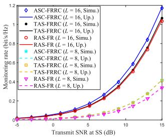  
Fig. 4. Illustration of the bounds $\mathrm { E } ^ { \mathrm { u p } } ( R _ { \mathrm { S } n } ^ { \mathrm { R A S - F R } } )$ $\mathrm { E } ^ { \mathrm { u p } } ( R _ { \mathrm { S } n } ^ { \mathrm { A S C - F R R C } } )$ , and $\mathrm { E } ^ { \mathrm { u p } } ( R _ { \mathrm { S } n } ^ { \mathrm { T A S - F R R C } } )$ given by (27), (28), and $( 2 9 )$ , respectively, denoted by $^ { \mathrm { a } } \mathrm { U p . } ^ { \mathrm { , , } } ,$ and simulations with randomly-varying channels, denoted by “Simu.”, to validate the correctness of our analytical formulation.

where $n = \mathrm { r a n d } ,$ while $\operatorname { E } ( \lambda _ { n } ) = \sigma _ { \mathrm { R } n } ^ { 2 }$ and $\operatorname { E } ( X ) = \sigma _ { \mathrm { S R } } ^ { 2 }$ can be obtained from $\operatorname { E } ( h _ { k } ) = \overline { { \sigma } } _ { k } ^ { 2 }$ for $\begin{array} { r } { k \in \{ { \bf R } n , { \bf S } { \bf R } \} , \overline { { \sigma } } _ { k } ^ { 2 } = \frac { \sigma _ { k } ^ { 2 } } { \varrho _ { k } } } \end{array}$ . In (27), the tightness of (a) can be validated by numerical results in Fig. 4 for the considered FC-RIS-aided communications. Specifically, since we have (14), (21), and (25), we present the bounds $\mathrm { E } ^ { \mathrm { u p } } ( R _ { \mathrm { S } n } ^ { \mathrm { R A S - F R } } ) , \mathrm { E } ^ { \mathrm { u p } } ( R _ { \mathrm { S } n } ^ { \mathrm { A S C - F R R C } } )$ and $\mathrm { E } ^ { \mathrm { u p } } ( R _ { \mathrm { S } n } ^ { \mathrm { T A \bar { S } - F R R C } } )$ given by (27),

$$
\begin{array} { r } { \mathrm { E } ^ { \mathrm { u p } } ( R _ { \mathrm { S } n } ^ { \mathrm { A S C - F R R C } } ) = \log _ { 2 } \left( 1 + \gamma _ { \mathrm { s } } \mathrm { E } \left( G \right) \mathrm { E } \left( X \right) \right) , } \end{array}\tag{28}
$$

and

$$
\begin{array} { r l } {  { \mathrm { E } ^ { \mathrm { u p } } ( R _ { \mathrm { S n } } ^ { \mathrm { T A S - F R R C } } ) = \prod _ { n = 1 } ^ { N } F _ { \lambda _ { n } } ( S _ { \mathrm { T } } ) \mathrm { E } ^ { \mathrm { u p } } ( R _ { \mathrm { S } n } ^ { \mathrm { A S C - F R R C } } ) } } \\ & { ~ + ( 1 - F _ { \lambda _ { 1 } } ( S _ { \mathrm { T } } ) ) } \\ & { \times \mathrm { E } ^ { \mathrm { u p } } ( R _ { \mathrm { S } 1 } ) + \sum _ { n = 2 } ^ { N } \displaystyle \prod _ { q = 1 } ^ { n - 1 } F _ { \lambda _ { q } } ( S _ { \mathrm { T } } ) ( 1 - F _ { \lambda _ { n } } ( S _ { \mathrm { T } } ) ) \mathrm { E } ^ { \mathrm { u p } } ( R _ { \mathrm { S } n } ) , } \end{array}\tag{29}
$$

respectively. In labels of the curves, the bounds are denoted by $^ { \mathsf { \tiny { 6 6 } } } \mathrm { U p } . ^ { \mathsf { \tiny { 7 } } }$ , and simulations with randomly-varying channels, denoted by “Simu.”. The close agreement between the curves and dotted markers shows the tightness of the adopted bounds. In (28), the ergodic value of G can be calculated by referring to the definition of statistical expectation as

$$
\begin{array} { l } { { \displaystyle { \mathbb E } \left( G \right) = \int _ { 0 } ^ { \infty } g f _ { G } ( g ) \mathrm { d } g } } \\ { { \displaystyle \qquad = \sum _ { n = 1 } ^ { N } \frac { \overline { { \sigma } } _ { \varrho _ { \mathrm { R } n } } ^ { 2 } } { \left( \varrho _ { \mathrm { R } n } L - 1 \right) ! } \sum _ { i \in P _ { q , n } } \sum _ { \kappa } \frac { A _ { 1 } \left( B _ { 1 } + 2 \right) ! } { \left( i + 1 \right) ^ { B _ { 1 } + 2 } } } , } \end{array}\tag{30}
$$

where [51, Eq. (3.381.4)] is used and $f _ { G } ( g )$ can be obtained by proceeding as Appendix $\begin{array} { r } { \mathbf { C } , A _ { 1 } = \frac { ( - 1 ) ^ { \tilde { n } } { \tilde { n } } ! } { \prod _ { p = 1 } ^ { \varrho _ { \mathrm { R } i } L } s _ { p } ! } \prod _ { k = 1 } ^ { \varrho _ { \mathrm { R } i } L } \frac { 1 } { ( ( k - 1 ) ! ) ^ { s _ { k } } } , } \end{array}$ $\begin{array} { r } { B _ { 1 } = \sum _ { p = 1 } ^ { \varrho _ { \mathrm { R } i } L } s _ { p } ( p - 1 ) + \varrho _ { \mathrm { R } n } L - 1 } \end{array}$ . It can be observed from (30) that $\operatorname { E } ( G )$ is propotional to $d _ { \mathrm { R M } } ^ { - \alpha _ { \mathrm { R M } } }$

Remark 6: Utilizing the monotonicity properties of (27), (28), and (29) w.r.t. the optimization variables, we conclude that the solutions of the optimal UAV-RIS locations are identical for the proposed RAS-FR, ASC-FRRC, and TAS-FRRC schemes because channels related to different antennas experience indentical large-scale fading conditions. When considering (27) as our objective function, the result can be extended when the n-th antenna is selected according to different schemes. In this section, for simplicity and tractability,<sup>7</sup> we note that the UAV-RIS location design based on longterm CSI is always applicable regardless of the AS scheme employed. The unique property can be leveraged to establish a two-timescale extension of the AS-FRRC framework.

Note that only $d _ { \mathrm { S R } } ^ { - \alpha _ { \mathrm { S R } } } d _ { \mathrm { R M } } ^ { - \alpha _ { \mathrm { R M } } }$ is a function of R. Let the path loss of the cascaded link as $\Delta \ = \ d _ { \mathrm { S R } } ^ { - \alpha _ { \mathrm { S R } } } d _ { \mathrm { R M } } ^ { - \alpha _ { \mathrm { R M } } }$ , then it is evident that w.r.t. the location R, the monitoring rate given by (27) is a monotonically increasing function of $\Delta .$ As illustrated in Fig. 3, before the decision of the antenna selection scheme employed, we can go directly to the UAV-RIS location optimization, where the reformulated problem is given by

$$
\operatorname* { m a x } _ { \bf R } \Delta \mathrm { s } . \mathrm { t } . \mathrm { E } ( R _ { \mathrm { S } n } ^ { \Omega } ) \geq \mathrm { E } ( R _ { \mathrm { S D } , n } ) .\tag{31}
$$

Due to the coupled variables in R, the formulated problem is challenging to solve. As a compromise, we assume that the UAV-borne FC-RIS in a fixed altitude, which is given as a feasible solution. Under this setting, the obtained solution for horizontal placement can be locally optimal [9]. In the next section, we will figure out the optimal horizontal placement of the UAV-borne FC-RIS for its cases of several different hovering altitudes.

## B. Horizontal Placement of the UAV-Borne FC-RIS

Since the constraint in (26) has the exact same expression as the objective function on its left-hand side, we recall the results of (27), (28), and (29). While for all AS schemes, the right-hand side can be handled as

$$
\operatorname { E } ( R _ { \mathrm { S D } , n } ) = \log _ { 2 } \left( 1 + \gamma _ { \mathrm { s } } L d _ { \mathrm { S R } } ^ { - \alpha _ { \mathrm { S R } } } d _ { \mathrm { R D } } ^ { - \alpha _ { \mathrm { R D } } } \right) .\tag{32}
$$

Then, problem (26) can be reformulated as

$$
\operatorname* { m a x } _ { x _ { \mathrm { R } } , y _ { \mathrm { R } } } \Delta \qquad \mathrm { s . t . } L d _ { \mathrm { R M } } ^ { - \alpha _ { \mathrm { R M } } } \geq d _ { \mathrm { R D } } ^ { - \alpha _ { \mathrm { R D } } } ,\tag{33}
$$

where the path loss gain of the cascaded link is maximized. Notably, %<sub>RD</sub> and $\varrho _ { \mathrm { R } n }$ both denote respective parts that remain unchanged for the optimizing vector $\mathbf { R . } ^ { 8 }$ Without loss of generality, we assume $\alpha _ { \mathrm { S R } } = \alpha _ { \mathrm { R D } } = \alpha _ { \mathrm { R M } } = \alpha$ , and then $\begin{array} { r } { \overline { { \Lambda } } = L \left( \frac { H ^ { 2 } + s _ { \mathrm { R D } } ^ { 2 } } { H ^ { 2 } + s _ { \mathrm { R } n } ^ { 2 } } \right) ^ { \frac { \alpha } { 2 } } \ge 1 } \end{array}$ , where the horizontal distances are $s _ { \mathrm { R D } } ^ { 2 } = ( x _ { \mathrm { R } } - x _ { \mathrm { D } } ) ^ { 2 } + ( y _ { \mathrm { R } } - y _ { \mathrm { D } } ) ^ { 2 }$ and $s _ { \mathrm { R } n } ^ { 2 } = x _ { \mathrm { R } } ^ { 2 } + y _ { \mathrm { R } } ^ { 2 }$ . Then, the constraint can be rewritten as

$$
{ \frac { H ^ { 2 } + s _ { \mathrm { R D } } ^ { 2 } } { H ^ { 2 } + s _ { \mathrm { R } n } ^ { 2 } } } \geq L ^ { - { \frac { 2 } { \alpha } } } ,\tag{34}
$$

which leads to s<sub>RD</sub> $> > _ { \mathrm { R } n } .$ , i.e., the UAV-borne FC-RIS is closer to LM but relatively far from the suspicious receiver.

Proposition 1: With the considered constraint, the optimal horizontal location of the FC-RIS for problem (33) is given by

$$
\begin{array} { r l r } {  { \boldsymbol { x } _ { \mathrm { R } } = [ \frac { 1 } { 2 } + \mathrm { s g n } ( x _ { \mathrm { M } } - x _ { \mathrm { S } } ) \sqrt { \operatorname* { m a x } ( \frac { 1 } { 4 } - \frac { h _ { \mathrm { R } } ^ { 2 } } { ( x _ { \mathrm { S } } - x _ { \mathrm { M } } ) ^ { 2 } } , 0 ) ] } } } \\ & { } & { \times ( x _ { \mathrm { S } } - x _ { \mathrm { M } } ) , } \\ & { } & { y _ { \mathrm { R } } = [ \frac { 1 } { 2 } + \mathrm { s g n } ( y _ { \mathrm { M } } - y _ { \mathrm { S } } ) \sqrt { \operatorname* { m a x } ( \frac { 1 } { 4 } - \frac { h _ { \mathrm { R } } ^ { 2 } } { ( y _ { \mathrm { S } } - y _ { \mathrm { M } } ) ^ { 2 } } , 0 ) } ] } \\ & { } & { \times ( y _ { \mathrm { S } } - y _ { \mathrm { M } } ) , \qquad ( 3 } \end{array}\tag{5}
$$

where sgn(·) is the sign operator. This expression indicates that we select one of the optimal values that corresponds to a location closer to LM than to SS. In fact, the two solutions are symmetric over the midpoint of the LM-SS link, which can be obtained without the constraint through elaborate mathematical manipulations (referred to [9] and the proof is omitted due to page limitation). It has also been proved rigorously in [9] that both solutions are optimal for maximizing monitoring rate w.r.t. the UAV-RIS location. Therefore, if either of the solutions satisfies the constraint in this work, the optimality of the UAV-RIS location is implicit and not affected by the reformulation of constraints. When the UAV flies in a low altitude, the solution may place the UAV in close proximity to either LM or SS. However, by introducing the constraint of non-outage monitoring, a unique solution is ensured, as illustrated by (35). This uniqueness arises as suspicious rate can also become asymptotically large when the UAV approaches SS. Specifically, on the one hand, the UAVborne FC-RIS is closer to LM when the hovering altitude of the UAV-borne FC-RIS satisfies $H \ < \ { \frac { \sqrt { ( x _ { \mathrm { S } } - x _ { \mathrm { M } } ) ^ { 2 } + ( y _ { \mathrm { S } } - y _ { \mathrm { M } } ) ^ { 2 } } } { 2 } }$ On the other hand, with a sufficiently high hovering altitude, the two solution converges to a single one, which is the midpoint that satisfies the contraint and can also be observed from a max $\{ a , \ 0 \} = 0 \ ( a < 0 )$ operator.

## C. Discussion on the Fixed Hovering Altitude of the UAV-Borne FC-RIS

With a channel model consisting of probabilistic LoS links with altitude-variant path loss exponents, the existence of an optimal hovering altitude of the UAV has been proved in [9]. This result highlights the inherent non-trivial tradeoff of the UAV altitude selection: While stronger LoS components improve channel gains, these gains are counterbalanced by degradation caused by increased distance. To ensure that a fixed altitude satisfies the constraint of the formuated problem, we rewrite the optimization of UAV-borne FC-RIS location as

$$
\operatorname* { m a x } _ { H } \Delta \qquad \mathrm { s . t . } \Lambda \geq 1 .\tag{36}
$$

where we recall $\begin{array} { r } { \Lambda = L \left( \frac { H ^ { 2 } + s _ { \mathrm { R D } } ^ { 2 } } { H ^ { 2 } + s _ { \mathrm { R } n } ^ { 2 } } \right) ^ { \frac { \alpha } { 2 } } } \end{array}$ to analyze the constraint w.r.t. the hovering altitude of the UAV-borne FC-RIS. To facilitate the analysis, we derive

$$
\frac { \partial \ln ( \Lambda ) } { \partial H } = \Lambda \left[ \frac { \alpha ( s _ { \mathrm { { R D } } } ^ { 2 } - s _ { \mathrm { R } n } ^ { 2 } ) } { 2 ( H ^ { 2 } + s _ { \mathrm { R } n } ^ { 2 } ) ( H ^ { 2 } + s _ { \mathrm { R D } } ^ { 2 } ) } + \frac { \partial \alpha } { \partial H } \right] .\tag{37}
$$

If $s _ { \mathrm { R } n } > s _ { \mathrm { R D } }$ , meaning that the horizontal placement of the UAV-borne FC-RIS is farther from LM and closer to SD, we have ${ \frac { \partial \ln ( \Lambda ) } { \partial H } } ~ < ~ 0 .$ , because it can be known from (2) and (3) that $\begin{array} { r } { \frac { \partial \alpha } { \partial H } ~ < ~ 0 } \end{array}$ . In this case, the constraint becomes more stringent and challenging to satisfy when the hovering altitude of the UAV-borne FC-RIS is high. Therefore, when the hovering altitude of the UAV-borne FC-RIS is low, and the horizontal placement of the UAV-borne FC-RIS is close to LM but far from the other nodes, the objective function attains higher value under the required constraint.

On the other hand, the path loss gain of the cascaded monitoring link relies heavily on the hovering altitude of the UAV-borne FC-RIS, as it concurrently affects both $d _ { K }$ and $\alpha _ { K }$ . This complex non-linearity renders it challenging to apply standard convex optimization methods. Hence, we resort to discussing the different performance behaviors associated with various fixed hovering altitudes via simulations, since a required altitude might be given for practical scenarios.

## V. SIMULATION RESULTS AND DISCUSSIONS

In this section, numerical examples are provided to validate both the closed-form analysis of MSP in Section III and the optimization analysis in Section IV. Unless otherwise stated, the default simulation parameters are listed in Table III. Notably, the monitoring-to-suspicious ratio is defined as a statistical feature of channels, denoted by $\eta ,$ reflecting the relative quality of CSI. With this definition, in Table $\mathrm { I I I } , { } ^ { 9 }$ it is easy to obtain $d _ { \mathrm { R D } }$ with $d _ { \mathrm { R M } }$ and η known. To highlight the performance gain achieved by the proposed UAV-borne FC-RIS-assisted wireless surveillance schemes, we introduce several benchmark schemes for comparison, each corresponding respectively to the proposed RAS-FR, ASC-FRRC, and TAS-FRRC.

1) RAS-SR: Round-robin antenna selection with a conventional diagonal RIS, which is classified as the single-connected RIS;

2) ASC-SRRC: Antenna selection combining with known reflecting channels of the RIS, which means that the antenna with the highest reflecting channel gain is selected. Also, the RIS is single-connected RIS;

3) TAS-SRRC: Threshold-based antenna selection with known reflecting channels of the RIS, where the RIS is singleconnected RIS;

4) ASC-FR-FCSI: Antenna selection combining with known full CSI in FC-RIS-aided wireless surveillance, which means the antenna is selected with the globally best CSI in terms of cascaded channel gains.

5) FlexMAS-FRRC: Flexible multi-antenna selection with known FC-RIS reflecting channels, where the antennas are selected in the same manner as the AS-FRRC framework. This multi-antenna counterpart differs in that all the antennas whose channel gain exceeds a threshold (normally more than one) are selected for transmission, expressed as

TABLE III SIMULATION PARAMETERS
<table><tr><td>Descriptions</td><td>Symbols</td><td>Values</td></tr><tr><td>The distance between SS and FC-RIS</td><td>dSR</td><td>1 m [26]</td></tr><tr><td>The distance between the FC-RIS and LM</td><td>dRM</td><td>1 m [26]</td></tr><tr><td>The distance between SS and SD</td><td> $d _ { \mathrm { S D } }$ </td><td>1.5 m [26]</td></tr><tr><td>The fading parameters</td><td>QSR, QRD, QRM</td><td>4 [58]</td></tr><tr><td></td><td> $\varrho _ { \mathrm { S D } }$   $\frac { \sigma _ { \mathrm { R } _ { n } } ^ { 2 } } { \gamma }$ </td><td>1 [58]</td></tr><tr><td>Monitoring-to-suspicious ratio (MSR)</td><td>σRD</td><td>-5 dB [18]</td></tr><tr><td>The path loss exponent of ground links</td><td> $\alpha _ { m } ( 0 )$ </td><td>3.5 [59]</td></tr><tr><td>The path loss exponent of aerial links The parameters depending on the environment</td><td> $\alpha _ { m } ( \textstyle { \frac { \pi } { 2 } } )$ </td><td>2 [59]</td></tr><tr><td></td><td> $a _ { 2 }$  b2</td><td>11.95 [43] 0.136 [43]</td></tr><tr><td>The hovering altitude of the UAV-borne FC-RIS</td><td>H</td><td></td></tr><tr><td>Transmit SNR at SS</td><td></td><td>100 m [54], [56]</td></tr><tr><td>The number of RIS elements</td><td>γs L</td><td>10 dB [60]</td></tr><tr><td>The number of antennas equipped at LM</td><td>N</td><td>4 [28] 4 [61]</td></tr></table>

$$
\forall n \in { \mathcal { N } } , { \mathrm { ~ i f ~ } } \lambda _ { n } \geq S _ { \mathrm { T } } , \quad { \mathrm { t h e n ~ } } n \in { \mathcal { T } } ,\tag{38}
$$

where $\tau$ is a non-empty receive antenna subset. If T is empty or only contains a single antenna, this scheme can degrade to the ASC-FRRC. When at least two antennas are selected in $\tau _ { \ast }$ , multi-antenna beamforming is performed at LM given the availability of CSI. Specifically, the maximum ratio combining method is adopted for receiving beamforming, performed as

$$
\omega = \frac { \mathbf { H } _ { \mathrm { R } n } ^ { \mathrm { H } } \boldsymbol { \Theta } _ { n } \mathbf { h } _ { \mathrm { S R } } } { | | \mathbf { H } _ { \mathrm { R } n } ^ { \mathrm { H } } \boldsymbol { \Theta } _ { n } \mathbf { h } _ { \mathrm { S R } } | | } , n \in \mathcal { N } .\tag{39}
$$

In parallel, (12) can be modified into

$$
\phi _ { n , l } = - \arg \big ( \big [ \boldsymbol { \omega } ^ { \mathrm { H } } \mathbf { H } _ { \mathrm { R } n } ^ { \mathrm { H } } \mathbf { V } _ { n } \big ] _ { \boldsymbol { \nu } } \big ) - \arg ( \big [ \mathbf { V } _ { n } ^ { \mathrm { T } } \mathbf { h } _ { \mathrm { S R } } \big ] _ { l } ) , \ n \in \mathcal { N } , \forall l \in \mathcal { L } ,
$$

whose alternating optimization certainly results in considerable computation complexity along with the requirement of numerous channel measurements.

(40)

Fig. 5 depicts the MSPs versus the threshold of the RAS-FR, ASC-FRRC, TAS-FRRC, and FlexMAS-FRRC schemes. The FlexMAS-FRRC is introduced for comparison purposes, thus its theoretical performance analysis is beyond the scope of our work. In the proposed single antenna selection schemes, the theoretical expressions and Monte-Carlo simulations are represented by solid lines and dotted markers, respectively, whose close agreement comfirms the accuracy of our closedform MSP analysis. These analytical expressions eliminate the need for the time-consuming simulations. In the TAS-FRRC scheme, as expected, with an increase of the threshold, the success of surveillance can be better guaranteed, which leads to more times of examining and more CSI acquisition. In contrast, neither of the other two schemes involve the threshold. It is evident that the ASC-FRRC scheme outperforms the RAS-FR by leveraging CSI to select the most effective antenna. This result aligns with Remark $^ { 4 , }$ which highlights the importance of a suitable threshold for an improved performance-complexity tradeoff of the TAS-FRRC scheme. When the threshold is configured too low or too high, the TAS-FRRC scheme degenerates into the RAS-FR and ASC-FRRC schemes, respectively. Also, this adjustment in threshold is accompanied by corresponding signaling overhead that can range from being as low as the RAS-FR scheme to as high as in the ASC-FRRC scheme. It can be seen from (25) that the TAS-FRRC scheme aims to strike an effective balance between the other two schemes, which becomes intutive in Fig. 5. Although the FlexMAS-FRRC achieves higher MSP than all other proposed schemes especially when given a properly low threshold, the superiority comes at the expense of prohibitively high optimization complexity and CSI acquisition overhead, which makes it unsuitable for our intended design. Also, synchronization imperfections between different selected antennas may impose a performance degradation, which may even lead to a worse performance than that of single antenna selection schemes. Additionally, as the threshold increases, the FlexMAS-FRRC exhibits a slight performance degradation due to a smaller number of antennas being selected in the receive antenna subset. Along with the TAS-FRRC, the FlexMAS-FRRC resorts to the ASC-FRRC with a sufficently high threshold because such cases indicate the receive antenna subset is forced to only one candidate with the highest channel gain.

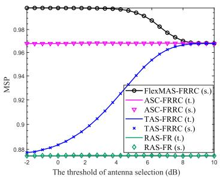

Fig. 5. Monitoring success probability versus the threshold of antenna selection, where $\mathrm { \ddot { \mathrm { \Omega } } } ^ { \mathrm { \prime \prime } } \mathrm { \Sigma } ^ { \mathrm { \prime \prime } }$ and $\ddot { } \mathbf { s } _ { \ast } ^ { } \ast \mathbf { \eta } ^ { * }$ stand for theoretical and simulation results, respectively.  
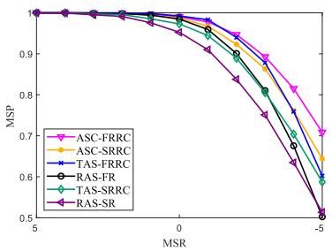  
Fig. 6. Monitoring success probability versus the monitoring-to-suspicious ratio (MSR).

Fig. 6 plots the MSPs versus the monitoring-to-suspicious ratio (MSR) of the RAS-FR, ASC-FRRC, TAS-FRRC, RAS-SR, ASC-SRRC, TAS-SRRC schemes. When the MSR decreases, indicating that the monitoring channels deteriorate relative to the suspicious channels, the MSP of all schemes decrease. Moreover, both the round-robin and selection combining scheduling benefit from leveraging an FC-RIS. However, our AS approach, which is based on reflecting channels (RC), works more efficiently with an FC-RIS, or equivalently, the AS-FRRC is specially designed for FC-RIS, and it may not preferred when deploying a conventional singleconnected RIS.

From Fig. 7, we observe the MSPs of the RAS-SR, ASC-SRRC, RAS-FR, TAS-FRRC, ASC-FRRC, ASC-FR-FCSI, and FlexMAS-FRRC schemes versus the number of antennas equipped at the LM. When the number of antenna increases, the MSPs of the ASC-SRRC, TAS-FRRC, ASC-FRRC, ASC-FR-FCSI, and FlexMAS-FRRC schemes improves, and that of the other two schemes keep unchanged. Intuitively, more antennas are included in the set being selected, better the monitoring performance. This is due to the fact that with more antennas available, the system can exploit the channel diversity more efficiently to further improve system performance. For all cases, the FC-RIS schemes outperform their counterparts with conventional RISs, demonstrating the superiority of the proposed AS-FRRC framework. Notably, the MSP of the baseline ASC-FR-FCSI coincides exactly with that of our proposed ASC-FRRC, despite significantly higher computational complexity of the former due to its reliance on full CSI for configuration optimization.

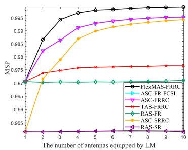  
Fig. 7. Monitoring success probability versus the number of antennas equipped at LM.

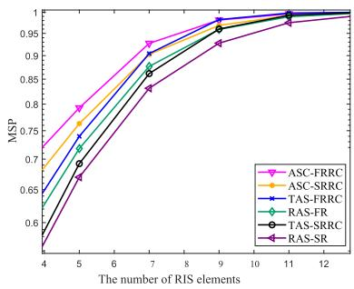  
Fig. 8. Monitoring success probability versus the number of RIS elements.

Fig. 8 shows the MSPs versus the number of RIS elements of the RAS-SR, TAS-SRRC, RAS-FR, TAS-FRRC, ASC-SRRC, ASC-FRRC schemes. With an increasing number of RIS elements, the MSPs of all schemes improve rapidly. Specifically, the MSPs of schemes selecting the best antenna consistently outperform other schemes, followed by threshold-based selection and the non-selection, illustrating the fundamental tradeoff in channel-aware selections. As expected, all channel-aware schemes outperform their nonselection benchmark counterparts by effectively exploiting a rich diversity of wireless environments, albeit at the cost of implementation complexity. Comparing the rising trends of the curves in Figs. 7 and 8, it is revealed that a growing number of the RIS elements shows a more pronounced effect on MSP enhancement than increasing receive antennas. This demonstrates the dominant role of FC-RIS in monitoring performance, associating with the fact that in the considered system design, all RIS elements contribute to joint passive beamforming, while antenna selection is implemented with a single antenna in each time slot without incorporating joint active beamforming with multiple antennas.

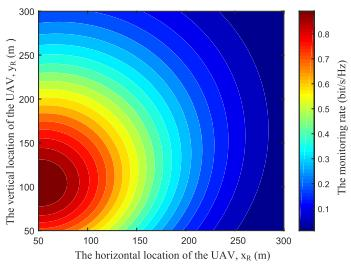

Fig. 9. When the suspicious source at (100, 200, 0) with $H = 2 0 0$ m, the impact of the horizontal placement $( x _ { \mathrm { R } } , y _ { \mathrm { R } } )$ on the monitoring rate given by $( 2 { \bar { 7 } } ) .$ , where the maximum value is quite close to (50, 100, 200), right above the midpoint between LM and SS.  
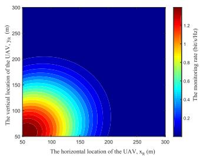  
Fig. 10. When the suspicious source at (100, 200, 0) with $H = 1 0 0 \textrm { m }$ , the impact of the horizontal placement (x<sub>R</sub>, y<sub>R</sub>) on the monitoring rate given by (27), where the maximum value is right above $\mathbf { M } = ( 0 , \ 0 , \ 0 )$ TABLE IV

SENSITIVITY ANALYSIS
<table><tr><td>Nakagami-m fading parameters</td><td> $\overline { { D _ { \mathrm { K S } } } }$ </td></tr><tr><td>2</td><td> $\overline { { 2 . 3 \times 1 0 ^ { - 2 } } }$ </td></tr><tr><td>4</td><td> $2 . 1 \times 1 0 ^ { - 2 }$ </td></tr><tr><td>6</td><td> $1 . 3 \times 1 0 ^ { - 2 }$ </td></tr></table>

Fig. 9 and Fig. 10 illustrate the detailed variations of monitoring rate with regard to horizontal placements of the UAV-borne FC-RIS for the cases of higher hovering altitude and lower hovering altitude, respectively. Note that significant fluctuations in the monitoring rate can be observed when the UAV moving along lines parallel to the axises, highlighting the relative importance of horizontal and vertical optimization. It is also indicated by the dependence of SS location that when the suspicious nodes may become more spatially distributed in future networks, we need various deployment of RIS accordingly. It can be seen from Fig. 9 that when the altitude increases up to 200 m, the highest monitoring rates occur near the mid point between SS and LM. Also, it is worth noting that in Fig. 10 when the altitude is lower at about 100 m, to place the UAV-borne FC-RIS near the receving LM maximizes the monitoring rate. These observations perfectly align with Proposition 1. Indeed, if the altitude continiues to decrease indefinitely, the optimal placement near the multi-antenna receiver coincides with what existing studies have shown for terrestrial RIS-aided communications [9], [62]. Moreover, it is worth mentioning that the monitoring rates exhibit identical behavior across the RAS-FR, ASC-FRRC, TAS-FRRC, RAS-SR, ASC-SRRC, TAS-SRRC schemes. Notably, the performance varies significantly with SS at different locations.

From Fig. 11, we observe that the curves of monitoring rate exhibit different trends depending on the location of the

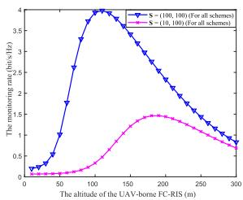

Fig. 11. The optimal hovering altitude of the UAV-borne FC-RIS with its horizontal placement at (0, 0).  
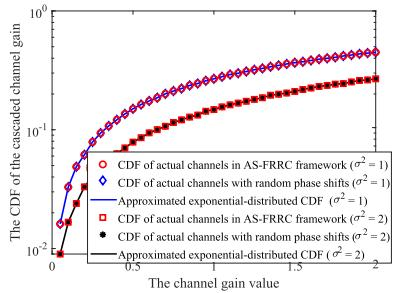  
Fig. 12. The CDFs of simulated channels and approximated distributions to show accuracy.

SS. For the pink curve, the monitoring rate initially decreases, then rises, and eventually declines as the UAV-borne FC-RIS altitude increases. The primary reason for this interesting phenomenon is that an optimal hovering altitude of the UAVborne FC-RIS exists owing to our focus on a more practical aerial channel model consisting probabilistic LoS links with altitude-variant path loss exponents [28], [41]. Such behavior is especially evident when the UAV-borne FC-RIS’s horizontal placement is close to either the SS or the LM [9]. Due to the significant impact of distance-dependent path loss on the performance, the 3D location at low altitudes can be desirable because either the incident channel or the reflecting channel achieves a high channel gain which improves the monitoring rate. Thereafter, the monitoring rate degrades when the UAV-borne FC-RIS altitude slightly increases. When the altitude keeps increasing, the monitoring rates gradually rises and then start to degrade again, showing the existence of a non-trival tradeoff between high-altitude and low-altitude UAV deployments. If the UAV-borne FC-RIS is not positioned directly above SS or LM, the monitoring rate keeps improving before decreasing and follows a unimodal trend, as indicated by the blue curve.

## VI. CONCLUSION

In this paper, we examined the performance improvement of a UAV-borne FC-RIS-aided wireless surveillance system. By decoupling the joint design of opportunistic selection and RIS configuration optimization, we first proposed the AS-FRRC framework decoupling selection and RIS optimization using partial CSI, with which we derived the MSP for analyzing the monitoring performance. Then, we extend our proposed framework to a two-timescale design considering unavailable CSI due to the inherent non-cooperative nature of suspicious party. Moreover, we demonstrated that the monitoring performance could be further improved by optimizing the UAV-borne FC-RIS hovering location exploiting statistical CSI. Simulation results not only confirmed the accuracy of our closed-form analysis, but also demonstrated the superiorities of the proposed UAV-borne FC-RIS assisted wireless surveillance in terms of MSP performance. Moreover, the proposed AS-FRRC offered comparable performance with significantly reduced complexity compared to conventional full CSI methods.

## APPENDIX A CALCULATION OF f<sub>Z</sub>(z)

As discussed, $\textstyle Z = { \frac { Y } { X } }$ , then the CDF of Z can be represented by

$$
F _ { Z } ( z ) = \operatorname* { P r } ( X z > Y ) .\tag{41}
$$

Since the RIS design is w.r.t. the monitoring link, the scattering matrices behave as random in the channel gains of suspicious links owing to the CSI independence. Given $\lvert h _ { \mathrm { S R } _ { l } } \rvert$ all follow Nakagami-m fading,

we deduce that $| Y | ^ { 2 }$ follows an exponential distribution whose mean value is given by $\Xi .$ Then, we derive

$$
\begin{array} { r l } & { { { F } _ { Z } } ( z ) = \displaystyle \int _ { \frac { y } { z } } ^ { \infty } \frac { x ^ { \varrho _ { \mathrm { s R } } L - 1 } \mathrm { e x p } \left( - \frac { \varrho _ { \mathrm { s R } } x } { \sigma _ { \mathrm { s R } } ^ { 2 } } \right) } { \left( \sigma _ { \mathrm { s R } } ^ { 2 } / \varrho _ { \mathrm { S R } } \right) ^ { \varrho _ { \mathrm { s R } } L } \Gamma \left( \varrho _ { \mathrm { S R } } L \right) } { \mathrm d } x { \mathrm d } y } \\ & { \quad \quad = 1 - \frac { 1 } { \left( 1 + \frac { \sigma _ { \mathrm { s R } } ^ { 2 } z } { \varrho _ { \mathrm { s R } } \Xi } \right) ^ { \varrho _ { \mathrm { s R } } L } } , } \end{array}\tag{42}
$$

whose derivative gives the PDF of $Z$ by

$$
f _ { Z } ( z ) = \frac { \sigma _ { \mathrm { S R } } ^ { 2 } L } { \Xi \Bigl ( 1 + \frac { \sigma _ { \mathrm { S R } } ^ { 2 } z } { \varrho _ { \mathrm { S R } } \Xi } \Bigr ) ^ { \varrho _ { \mathrm { S R } } L + 1 } } .\tag{43}
$$

## APPENDIX B KOLMOGOROV-SMIRNOV (KS) TEST AND SENSITIVITY ANALYSIS

To confirm the accuracy of the approximated distributions in Appendix A, we conduct Kolmogorov-Smirnov (KS) test which is used to examine the fitting level between two distributions [63], sensitive to both the shape and scale of CDFs. Given the applicability of KS test on not large sample sizes, we utilize M samples of both CDFs, correspondingly indexed by $m \in \mathcal { M } \triangleq \{ 1 , 2 , \cdots , M \}$ concerning $x _ { m } .$ The maximum divergence $D _ { K S }$ of two CDFs is extensively defined to justify the gaps between simulations of channel fadings and the respective approximations, and is given by

$$
D _ { \mathrm { K S } } = \operatorname* { m a x } _ { m } | F _ { \mathrm { A c t u a l } } ( x _ { m } ) - F _ { \mathrm { A p p r o x } } ( x _ { m } ) | ,\tag{44}
$$

where the probabilities $F _ { \mathrm { A c t u a l } } ( \cdot )$ is the Monte-Carlo simulations of separate channel fading coefficients in $h _ { \mathrm { S D } } .$ , h<sub>RD</sub> and $\mathbf { h } _ { \mathrm { S R } }$ , and $F _ { \mathrm { A p p r o x } } ( \cdot )$ is the exponential CDF of Y . To compare the accuracy of the approximations, we plot $F _ { \mathrm { A p p r o x } } ( \cdot )$ as solid lines and $F _ { \mathrm { A c t u a l } } ( \cdot )$ as dotted markers in Fig. 12 for multiple pairs of CDF under various fading parameters. A uniform average channel gain for all test cases are adopted in Fig. 12 for fair comparisons. The degree of agreement between the lines and markers can be reflected by $D _ { \mathrm { K S } }$ defined by (44). As can be grasped from Table IV for different Nakagami-m fading parameters, the smaller $D _ { \mathrm { K S } }$ indicates a more accurate approximation.

## APPENDIX C CALCULATION OF f<sub>G</sub>(g)

By letting $G = \operatorname* { m a x } _ { n \in \mathcal { N } } | \lambda _ { n } | ,$ , the CDF of G can be given by

$$
F _ { G } ( g ) = \prod _ { n \in \mathcal { N } } F _ { \lambda _ { n } } ( g ) .\tag{45}
$$

By capitalizing on the generalized multinomial theorem, (45) can be derived as

$$
F _ { G } ( g ) = \sum _ { n = 1 } ^ { N } ( - 1 ) ^ { | P _ { q , n } | } \sum _ { q = 1 } ^ { 2 ^ { N } - 1 } \exp { \left( - \frac { | P _ { q , n } | g } { \overline { { \sigma } } _ { \mathtt { R } n L } ^ { 2 } } \right) } \sum _ { \kappa } \frac { A _ { 1 } } { \left( \overline { { \sigma } } _ { \mathtt { R } n L } ^ { 2 } \right) ^ { B _ { 1 } } } g ^ { B _ { 1 } } ,\tag{46}
$$

where $P _ { q , n }$ represents the q-th non-empty subcollection of the antenna set $\{ \mathcal { N } ~ - ~ n \}$ , and $| P _ { q , n } |$ denote the cardinality of $P _ { q , n }$ . Besides, in (46), $\begin{array} { r l r } { \bar { \sigma } _ { k } ^ { 2 } } & { { } = } & { \frac { \sigma _ { k } ^ { 2 } } { \varrho _ { k } } } \end{array}$ , the set $\begin{array} { r l r } { \mathcal { K } } & { { } = } & { \Big \{ ( s _ { 1 } , s _ { 2 } , \ldots , s _ { \varrho _ { \mathtt { R } n } } L ) \big | \sum _ { p = 1 } ^ { \varrho _ { \mathtt { R } n } L } s _ { p } = n \Big \} , A _ { 1 } \ \mathrm { ~ = ~ } } \end{array}$ $\begin{array} { r } { \frac { ( - 1 ) ^ { n } n ! } { \prod _ { n = 1 } ^ { \varrho _ { \mathbb { R } } i } s _ { p } ! } \prod _ { k = 1 } ^ { \varrho _ { \mathbb { R } } i } \frac { 1 } { \Gamma ( k ) ^ { s _ { k } } } , B _ { 1 } = \sum _ { p = 1 } ^ { \varrho _ { \mathbb { R } } i } s _ { p } ( p - 1 ) + \overset { \ r { \rho } } { \varrho _ { \mathbb { R } } } L - 1 } \end{array}$ From the derivative of (46), the PDF of G can be expanded as (47), shown at the bottom of the page.

## REFERENCES

[1] Q. Wu and R. Zhang, “Intelligent reflecting surface enhanced wireless network via joint active and passive beamforming,” IEEE Trans. Wireless Commun., vol. 18, no. 11, pp. 5394–5409, Nov. 2019.

[2] M. Cui, G. Zhang, and R. Zhang, “Secure wireless communication via intelligent reflecting surface,” IEEE Wireless Commun. Lett., vol. 8, no. 5, pp. 1410–1414, Oct. 2019.

[3] S. Lin, Y. Zou, B. Li, and T. Wu, “Security-reliability trade-off analysis of RIS-aided multiuser communications,” IEEE Trans. Veh. Technol., vol. 72, no. 5, pp. 6225–6237, May 2023.

[4] H. Li, S. Shen, M. Nerini, and B. Clerckx, “Reconfigurable intelligent surfaces 2.0: Beyond diagonal phase shift matrices,” IEEE Commun. Mag., vol. 62, no. 3, pp. 102–108, Mar. 2024.

$$
\begin{array} { l } { { \displaystyle f _ { G } ( g ) = \sum _ { n = 1 } ^ { N } f _ { \lambda _ { n } } ( g ) \prod _ { i \in \{ N - n \} } F _ { \lambda _ { i } } ( g ) } } \\ { { = \sum _ { n = 1 } ^ { N } \frac { g ^ { \varrho _ { \mathrm { R } ^ { L - 1 } } } } { \Gamma \left( \varrho _ { \mathrm { R } n } L \right) \left( \overline { { \sigma } } _ { \mathrm { R } n L } ^ { 2 } \right) ^ { \varrho _ { \mathrm { R } ^ { L } } } } \mathrm { e x p } \left( - \frac g { \overline { { \sigma } } _ { \mathrm { R } n L } ^ { 2 } } \right) \prod _ { i \in \{ N - n \} } \left[ 1 - \mathrm { e x p } \left( - \frac g { \overline { { \sigma } } _ { \mathrm { R } i L } ^ { 2 } } \right) \sum _ { k = 0 } ^ { \varrho _ { \mathrm { R } ^ { L - 1 } } } \frac { g ^ { k } } { \left( \overline { { \sigma } } _ { \mathrm { R } i L } ^ { 2 } \right) ^ { k } } \right] } } \\ { { = \displaystyle \sum _ { n = 1 } ^ { N } \frac { \mathrm { e x p } \left( - \frac g { \overline { { \sigma } } _ { \mathrm { R } n L } ^ { 2 } } \right) } { \Gamma \left( \varrho _ { \mathrm { R } n } L \right) } \sum _ { i \in P _ { q , n } } \sum _ { \kappa } \frac { A _ { 1 } } { \left( \overline { { \sigma } } _ { \mathrm { R } i L } ^ { 2 } \right) ^ { B _ { 1 } } } g ^ { B _ { 1 } } \mathrm { e x p } \left( - \frac { \left| P _ { q , n } \right| g } { \overline { { \sigma } } _ { \mathrm { R } i L } ^ { 2 } } \right) . } } \end{array}\tag{47}
$$

[5] H. Li, S. Shen, and B. Clerckx, “Beyond diagonal reconfigurable intelligent surfaces: From transmitting and reflecting modes to single-, group-, and fully-connected architectures,” IEEE Trans. Wireless Commun., vol. 22, no. 4, pp. 2311–2324, Apr. 2023.

[6] S. Alfattani et al., “Aerial platforms with reconfigurable smart surfaces for 5G and beyond,” IEEE Commun. Mag., vol. 59, no. 1, pp. 96–101, Jan. 2021.

[7] H. Lu, Y. Zeng, S. Jin, and R. Zhang, “Aerial intelligent reflecting surface: Joint placement and passive beamforming design with 3D beam flattening,” IEEE Trans. Wireless Commun., vol. 20, no. 7, pp. 4128–4143, Jul. 2021.

[8] B. Shang, E. S. Bentley, and L. Liu, “UAV swarm-enabled aerial reconfigurable intelligent surface: Modeling, analysis, and optimization,” IEEE Trans. Commun., vol. 71, no. 6, pp. 3621–3636, Jun. 2023.

[9] S. Lin, Y. Zou, and D. W. K. Ng, “Ergodic throughput maximization for RIS-equipped-UAV-enabled wireless powered communications with outdated CSI,” IEEE Trans. Commun., vol. 72, no. 6, pp. 3634–3650, Jun. 2024.

[10] T. L. Nguyen, G. Kaddoum, T. Nhu Do, and Z. J. Haas, “Groundto-AAV and RIS-assisted AAV-to-ground communication under channel aging: Statistical characterization and outage performance,” IEEE Trans. Commun., vol. 73, no. 9, pp. 8062–8079, Sep. 2025.

[11] Y. Byun, H. Kim, S. Kim, and B. Shim, “Channel estimation and phase shift control for UAV-carried RIS communication systems,” IEEE Trans. Veh. Technol., vol. 72, no. 10, pp. 13695–13700, Oct. 2023.

[12] Y. Zou, J. Zhu, X. Wang, and L. Hanzo, “A survey on wireless security: Technical challenges, recent advances, and future trends,” Proc. IEEE, vol. 104, no. 9, pp. 1727–1765, Sep. 2016.

[13] Y. Zou, X. Li, and Y.-C. Liang, “Secrecy outage and diversity analysis of cognitive radio systems,” IEEE J. Sel. Areas Commun., vol. 32, no. 11, pp. 2222–2236, Nov. 2014.

[14] J. Xu, L. Duan, and R. Zhang, “Surveillance and intervention of infrastructure-free mobile communications: A new wireless security paradigm,” IEEE Wireless Commun., vol. 24, no. 4, pp. 152–159, Aug. 2017.

[15] F. Feizi, M. Mohammadi, and Z. Mobini, “Proactive eavesdropping via jamming in full-duplex cellular networks with antenna selection,” in Proc. 9th Int. Symp. Telecommun. (IST), Dec. 2018, pp. 641–646.

[16] M.-M. Zhao, Y. Cai, and R. Zhang, “Intelligent reflecting surface aided wireless information surveillance,” IEEE Trans. Wireless Commun., vol. 22, no. 2, pp. 1219–1234, Feb. 2023.

[17] H. Alves, R. D. Souza, M. Debbah, and M. Bennis, “Performance of transmit antenna selection physical layer security schemes,” IEEE Signal Process. Lett., vol. 19, no. 6, pp. 372–375, Jun. 2012.

[18] S. Lin, Y. Zou, Z. Li, T. Wu, E. E. Bahingayi, and L.-N. Tran, “RISaided monitoring with cooperative jamming: Design and performance analysis,” 2025, arXiv:2501.12473.

[19] Y. Zou, B. Champagne, W.-P. Zhu, and L. Hanzo, “Relay-selection improves the security-reliability trade-off in cognitive radio systems,” IEEE Trans. Commun., vol. 63, no. 1, pp. 215–228, Jan. 2015.

[20] T. Wu, Y. Zou, and Y. Jiang, “Secrecy throughput optimization and precoding design in adaptive transmit antenna selection systems with limited feedback,” IEEE Trans. Veh. Technol., vol. 71, no. 11, pp. 11693–11702, Nov. 2022.

[21] C. Xu et al., “Antenna selection for reconfigurable intelligent surfaces: A transceiver-agnostic passive beamforming configuration,” IEEE Trans. Wireless Commun., vol. 22, no. 11, pp. 7756–7774, Nov. 2023.

[22] B. Li, J. Zhou, Y. Zou, F. Wang, and W. Cao, “Secrecy versus computation overhead for wireless networks in the face of co-channel interference,” IEEE Trans. Commun., vol. 67, no. 3, pp. 2306–2320, Mar. 2019.

[23] J. Li and A. P. Petropulu, “Ergodic secrecy rate for multiple-antenna wiretap channels with Rician fading,” IEEE Trans. Inf. Forensics Security, vol. 6, no. 3, pp. 861–867, Sep. 2011.

[24] C. Shi, Y. Cui, F. Yang, and L. Ding, “Optimization of PICSI and SCSIadaptive beamforming and SCSI-adaptive reflection in an IRS-aided PLS wireless communication system,” IEEE Trans. Commun., vol. 73, no. 1, pp. 614–630, Jan. 2025.

[25] S. Arzykulov, A. Celik, G. Nauryzbayev, and A. M. Eltawil, “Aerial RISaided physical layer security: Optimal deployment and partitioning,” IEEE Trans. Cognit. Commun. Netw., vol. 10, no. 5, pp. 1867–1882, Oct. 2024.

[26] D. Xu and H. Zhu, “Spectrum sharing incentive for legitimate wireless information surveillance,” IEEE Trans. Veh. Technol., vol. 70, no. 3, pp. 2529–2543, Mar. 2021.

[27] N. Mensi and D. B. Rawat, “On the performance of partial RIS selection vs. partial relay selection for vehicular communications,” IEEE Trans. Veh. Technol., vol. 71, no. 9, pp. 9475–9489, Sep. 2022.

[28] S. Lin, Y. Zou, Y. Jiang, L. Yang, Z. Cui, and L.-N. Tran, “Securing FC-RIS and UAV empowered multiuser communications against a randomly flying eavesdropper,” IEEE Wireless Commun. Lett., vol. 14, no. 2, pp. 255–259, Feb. 2025.

[29] S. Hu, W. Ni, X. Wang, A. Jamalipour, and D. Ta, “Joint optimization of trajectory, propulsion, and thrust powers for covert UAV-on-UAV video tracking and surveillance,” IEEE Trans. Inf. Forensics Security, vol. 16, pp. 1959–1972, 2021.

[30] Y. Cao, L. Duan, M. Jin, and N. Zhao, “Cooperative double-IRS aided proactive eavesdropping,” IEEE Trans. Commun., vol. 70, no. 9, pp. 6228–6240, Sep. 2022.

[31] L. T. Dung and T. Kim, “Modeling and simulation of secure connectivity and hop count of multi-hop ad-hoc wireless networks with colluding and non-colluding eavesdroppers,” Ad Hoc Netw., vol. 122, Nov. 2021, Art. no. 102620.

[32] G. Hu, J. Si, Y. Cai, and N. Al-Dhahir, “Proactive eavesdropping via jamming over multiple suspicious links with wireless-powered monitor,” IEEE Signal Process. Lett., vol. 29, pp. 354–358, 2022.

[33] P. Yan et al., “Securing UAV-aided NOMA wireless powered communications via artificial noise,” IEEE Trans. Wireless Commun., vol. 24, no. 6, pp. 4809–4823, Jun. 2025, doi: 10.1109/TWC.2025.3544300.

[34] M. Abualhayja’a, A. Centeno, L. Mohjazi, M. M. Butt, P. Sehier, and M. A. Imran, “Exploiting multi-hop RIS-assisted UAV communications: Performance analysis,” IEEE Commun. Lett., vol. 28, no. 1, pp. 133–137, Jan. 2024.

[35] J. Xu, L. Duan, and R. Zhang, “Proactive eavesdropping via cognitive jamming in fading channels,” IEEE Trans. Wireless Commun., vol. 16, no. 5, pp. 2790–2806, May 2017.

[36] D. Xu and H. Zhu, “Proactive eavesdropping for wireless information surveillance under suspicious communication quality-ofservice constraint,” IEEE Trans. Wireless Commun., vol. 21, no. 7, pp. 5220–5234, Jul. 2022.

[37] H. Sun, L. Zhu, W. Mei, and R. Zhang, “Power-measurementbased channel autocorrelation estimation for IRS-assisted wideband communications,” IEEE Trans. Wireless Commun., vol. 24, no. 6, pp. 4647–4662, Jun. 2025, doi: 10.1109/TWC.2025.3543202.

[38] H. Sun, L. Zhu, W. Mei, and R. Zhang, “Power measurement-based channel estimation for IRS-enhanced wireless coverage,” IEEE Trans. Wireless Commun., vol. 23, no. 12, pp. 19183–19198, Dec. 2024.

[39] H. Li, S. Shen, Y. Zhang, and B. Clerckx, “Channel estimation and beamforming for beyond diagonal reconfigurable intelligent surfaces,” IEEE Trans. Signal Process., vol. 72, pp. 3318–3332, 2024.

[40] L. Yang, F. Meng, J. Zhang, M. O. Hasna, and M. D. Renzo, “On the performance of RIS-assisted dual-hop UAV communication systems,” IEEE Trans. Veh. Technol., vol. 69, no. 9, pp. 10385–10390, Sep. 2020.

[41] T. Shafique, H. Tabassum, and E. Hossain, “End-to-end energyefficiency and reliability of UAV-assisted wireless data ferrying,” IEEE Trans. Commun., vol. 68, no. 3, pp. 1822–1837, Mar. 2020.

[42] S. Zeng, H. Zhang, B. Di, and L. Song, “Trajectory optimization and resource allocation for OFDMA UAV relay networks,” IEEE Trans. Wireless Commun., vol. 20, no. 10, pp. 6634–6647, Oct. 2021.

[43] T. Shafique, H. Tabassum, and E. Hossain, “Optimization of wireless relaying with flexible UAV-borne reflecting surfaces,” IEEE Trans. Commun., vol. 69, no. 1, pp. 309–325, Jan. 2021.

[44] Y. Zhou, Y. Liu, H. Li, Q. Wu, S. Shen, and B. Clerckx, “Optimizing power consumption, energy efficiency, and sum-rate using beyond diagonal RIS—A unified approach,” IEEE Trans. Wireless Commun., vol. 23, no. 7, pp. 7423–7438, Jul. 2024.

[45] H. Xu and L. Sun, “Wireless surveillance via proactive eavesdropping and rotated jamming,” IEEE Trans. Veh. Technol., vol. 68, no. 11, pp. 10713–10727, Nov. 2019.

[46] Z. Mobini, H. Q. Ngo, M. Matthaiou, and L. Hanzo, “Cell-free massive MIMO surveillance of multiple untrusted communication links,” IEEE Internet Things J., vol. 11, no. 20, pp. 33010–33026, Oct. 2024.

[47] M. Nerini, S. Shen, and B. Clerckx, “Closed-form global optimization of beyond diagonal reconfigurable intelligent surfaces,” IEEE Trans. Wireless Commun., vol. 23, no. 2, pp. 1037–1051, Feb. 2024.

[48] Y. Zhao, H. Li, B. Clerckx, and M. Franceschetti, “MIMO channel shaping and rate maximization using beyond-diagonal RIS,” 2024, arXiv:2407.15196.

[49] W. Xiong, Y. Zeng, J. Lin, C. Pan, and Q. Li, “Enhancing physical layer security in MIMO systems assisted by beyond-diagonal reconfigurable intelligent surfaces,” IEEE Trans. Commun., early access, 24, 2025, doi: 10.1109/TCOMM.2025.3592603.

[50] A. Papazafeiropoulos, L.-N. Tran, Z. Abdullah, P. Kourtessis, and S. Chatzinotas, “Achievable rate of a STAR-RIS assisted massive MIMO system under spatially-correlated channels,” IEEE Trans. Wireless Commun., vol. 23, no. 2, pp. 1550–1564, Feb. 2024.

[51] I. S. Gradshteyn and I. M. Ryzhik, Table of Integrals, Series, and Products, 6th ed., San Diego, NY, USA: Academic, 2000.

[52] H.-C. Yang and M. S. Alouini, “Improving the performance of switched diversity with post-examining selection,” IEEE Trans. Wireless Commun., vol. 5, no. 1, pp. 67–71, Jan. 2006.

[53] H. Sun, L. Zhu, and R. Zhang, “Channel gain map estimation for wireless networks based on scatterer model,” IEEE Trans. Wireless Commun., vol. 24, no. 8, pp. 7012–7028, Aug. 2025, doi: 10.1109/ TWC.2025.3557417.

[54] Z. Ma et al., “Impact of UAV rotation on MIMO channel characterization for air-to-ground communication systems,” IEEE Trans. Veh. Technol., vol. 69, no. 11, pp. 12418–12431, Nov. 2020.

[55] W. Jin, C. Du, J. Wang, S. Wang, G. Pan, and D. Niyato, “Multi-UAV CoMP transmission based on UAV jitter characteristics: Analysis and optimization,” IEEE Trans. Wireless Commun., early access, Jul. 18, 2025, doi: 10.1109/TWC.2025.3588241.

[56] Y. Zeng, J. Xu, and R. Zhang, “Energy minimization for wireless communication with rotary-wing UAV,” IEEE Trans. Wireless Commun., vol. 18, no. 4, pp. 2329–2345, Apr. 2019.

[57] S. Zargari, A. Hakimi, C. Tellambura, and S. Herath, “User scheduling and trajectory optimization for energy-efficient IRS-UAV networks with SWIPT,” IEEE Trans. Veh. Technol., vol. 72, no. 2, pp. 1815–1830, Feb. 2023.

[58] T. N. Do, G. Kaddoum, T. L. Nguyen, D. B. da Costa, and Z. J. Haas, “Multi-RIS-aided wireless systems: Statistical characterization and performance analysis,” IEEE Trans. Commun., vol. 69, no. 12, pp. 8641–8658, Dec. 2021.

[59] M. M. Azari, F. Rosas, K.-C. Chen, and S. Pollin, “Ultra reliable UAV communication using altitude and cooperation diversity,” IEEE Trans. Commun., vol. 66, no. 1, pp. 330–344, Jan. 2018.

[60] J. Xu, K. Li, L. Duan, and R. Zhang, “Proactive eavesdropping via jamming over HARQ-based communications,” in Proc. GLOBECOM IEEE Global Commun. Conf., Dec. 2017, pp. 1–6.

[61] Y. Jing, F. Zhu, J. Liao, and L. Pan, “Joint beamforming for simultaneous proactive eavesdropping and communication in MU-MIMO systems,” IEEE Commun. Lett., vol. 29, no. 8, pp. 1859–1863, Aug. 2025.

[62] Q. Tao, J. Wang, and C. Zhong, “Performance analysis of intelligent reflecting surface aided communication systems,” IEEE Commun. Lett., vol. 24, no. 11, pp. 2464–2468, Nov. 2020.

[63] Y. Tang, S. Khan, and I. S. Ansari, “RIS equipped UAV swarm: Shadowed aerial-to-ground channel characterization,” IEEE Trans. Veh. Technol., early access, Jun. 18, 2025, doi: 10.1109/TVT.2025.3580951.


Shuying Lin received the B.Eng. degree in telecommunications engineering from Nanjing University of Posts and Telecommunications (NUPT), Nanjing, China, in June 2019, where she is currently pursuing the Ph.D. degree in signal and information processing.

From September 2024 to August 2025, she was a Visiting Scholar with the Department of Electrical and Electronic Engineering, University College Dublin, Ireland. Her research interests include wireless communications concerning reconfigurable

intelligent surfaces, physical layer security, and unmanned aerial vehicles.


Yulong Zou (Senior Member, IEEE) received the B.Eng. degree in information engineering from Nanjing University of Posts and Telecommunications (NUPT), Nanjing, China, in July 2006, the first Ph.D. degree in electrical engineering from the Stevens Institute of Technology, NJ, USA, in May 2012, and the second Ph.D. degree in signal and information processing from NUPT in July 2012. He is currently a Professor with NUPT.


Hongyu Li (Member, IEEE) received the B.S. degree in electronics and information engineering and the M.S. degree in information and communication engineering from Dalian University of Technology, Dalian, China, in 2018 and 2021, respectively, and the Ph.D. degree from the Department of Electrical and Electronic Engineering, Imperial College London, U.K., in 2025. She was a Visiting Ph.D. Student with the Laboratory of Signals and Systems (L2S), Paris-Saclay University, CNRS, CentraleSupelec, Paris, France, in 2023. She

is currently an Assistant Professor with the Internet of Things, Information Hub, The Hong Kong University of Science and Technology (Guangzhou). Her current research interests include the broad areas of signal processing, wireless communications, multiple access, reconfigurable intelligent surfaces, and reconfigurable antenna systems.

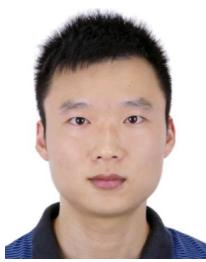

Bin Li (Member, IEEE) received the B.E. degree in power engineering from Southeast University (SEU), Nanjing, China, in June 2004, the M.S. degree in information and telecommunications engineering from Nanjing University of Posts and Telecommunications (NUPT), Nanjing, in June 2009, and the Ph.D. degree in communication and information system from Nanjing University of Aeronautics and Astronautics (NUAA), Nanjing, in October 2019.

He is currently a Lecturer with NUPT. His research interests include satellite-terrestrial

integrated networks, wireless security, and cooperative communications.


Derrick Wing Kwan Ng (Fellow, IEEE) received the bachelor’s degree (Hons.) and the Master of Philosophy degree in electronic engineering from The Hong Kong University of Science and Technology (HKUST), Hong Kong, in 2006 and 2008, respectively, and the Ph.D. degree from The University of British Columbia, Vancouver, BC, Canada, in November 2012.

Following his Ph.D. studies, he was a Senior Post-Doctoral Fellow at the Institute for Digital Communications, Friedrich-Alexander-University

Erlangen-Nurnberg (FAU), Germany. He is currently a Scientia Associate¨ Professor with the University of New South Wales, Sydney, NSW, Australia. His research interests include global optimization, integrated sensing and communication (ISAC), physical layer security, IRS-assisted communication, UAV-assisted communication, wireless information and power transfer, and green (energy-efficient) wireless communications. He has been recognized as a Highly Cited Researcher by Clarivate Analytics (Web of Science) since 2018. He was a recipient of Australian Research Council (ARC) Discovery Early Career Researcher Award in 2017; the IEEE Communications Society Leonard G. Abraham Prize in 2023; the IEEE Communications Society Stephen O. Rice Prize in 2022; the Best Paper Awards at the WCSP in 2020 and 2021; the IEEE TCGCC Best Journal Paper Award in 2018; the 2018 INISCOM; the IEEE International Conference on Communications (ICC) in 2018, 2021, 2023, and 2024; the IEEE International Conference on Computing, Networking and Communications (ICNC), in 2016; the IEEE Wireless Communications and Networking Conference (WCNC) in 2012; the IEEE Global Telecommunication Conference (Globecom) in 2011, 2021, and 2023; and the IEEE Third International Conference on Communications and Networking in China in 2008. From January 2012 to December 2019, he served as an Editorial Assistant to the Editor-in-Chief of IEEE TRANSACTIONS ON COMMUNICATIONS. He is also an Area Editor of IEEE TRANSACTIONS ON COMMUNICATIONS, an Associate Editor-in-Chief of IEEE OPEN JOURNAL OF THE COMMUNICATIONS SOCIETY, and an Executive Editorial Committee Member of IEEE TRANSACTIONS ON WIRELESS COMMUNICATIONS.