# UAV-Enabled Multi-Source Data Fusion in Vehicular Networks: A Joint Optimization Approach for Reliability and Latency

Qiqi Xie, Zexiong Wu , Chaoda Peng , Member, IEEE, Xumin Huang , Member, IEEE, Yanglin Chen, and Yuan Wu , Senior Member, IEEE

Abstract—Cooperative perception constitutes a critical technology to enhance situational awareness of vehicular users (VUs) by fusing multi-source observation data. Existing approaches employ either vehicles or road infrastructure as fusion platforms. However, vehicle-based approaches suffer from severe occlusions that compromise perception reliability, while infrastructurebased approaches are constrained by fixed coverage ranges that restrict spatial perception, thereby failing to achieve both reliable and comprehensive perception simultaneously. To overcome these limitations, we propose an uncrewed aerial vehicle (UAV)-enabled cooperative perception system where a UAV operates in a cyclic process: it adjusts its position to respond to VU requests, collects observation data, and returns the compressed fusion results to the VUs. In each cycle, we jointly optimize decisions regarding UAV trajectory, request response, data collection, compression degree of the fusion results, and resource allocation to balance fusion reliability and service latency, subject to UAV kinematics, task assignment, resource allocation, and latency constraints. We formulate this optimization problem as a dynamic constrained multi-objective optimization problem featuring cascaded dependencies where the request response, data collection, and resource allocation should be determined sequentially due to the inherent logic of cooperative perception. To solve this problem, we design an evolutionary algorithm based on a cascaded dependency generation strategy in which decision variables are generated according to their dependency order. Experimental results demonstrate the superior solution performance of our algorithm over four baseline algorithms. This study advances cooperative perception for vehicular networks by providing a UAV-enabled solution ensuring reliable fusion and timely service under dynamic traffic conditions.

Received 9 November 2025; revised 8 February 2026; accepted 18 March 2026. Date of current version 27 March 2026. This work was supported in part by the National Natural Science Foundation of China under Grant 62202177 and Grant 62276103; in part by the Guangdong Basic and Applied Basic Research Foundation under Grant 2026A1515012270, Grant 2026A1515011779, and Grant 2025A1515010178; in part by the Guangzhou Basic Research Program under Grant 2025A04J5508; in part by the Science and Technology Development Fund of Macau SAR under Grant 0028/2025/AFJ and Grant 0021/2025/RIA1; and in part by the Research Grant of University of Macau under Grant MYRG-GRG2025-00191-IOTSC. The associate editor coordinating the review of this article and approving it for publication was D. Niyato. (Corresponding authors: Chaoda Peng; Yuan Wu.)

Qiqi Xie, Zexiong Wu, Chaoda Peng, and Yanglin Chen are with the College of Mathematics and Informatics, South China Agricultural University, Guangzhou 510642, China (e-mail: qiqixie q@foxmail.com; zexiongwu@stu.scau.edu.cn; ChaodaPeng@scau.edu.cn; yanglinchen295@ gmail.com).

Xumin Huang is with the School of Automation, Guangdong University of Technology, Guangzhou 510006, China (e-mail: huangxu min@163.com).

Yuan Wu is with the State Key Laboratory of Internet of Things for Smart City, University of Macau, Macau SAR, China, and also with the Department of Electronic and Communication Engineering, University of Macau, Macau SAR, China (e-mail: yuanwu@um.edu.mo).

Digital Object Identifier 10.1109/TWC.2026.3676831

Index Terms—Multi-source data fusion, vehicular networks, dynamic constrained multi-objective optimization, evolutionary algorithm.

# I. INTRODUCTION

C OOPERATIVE perception [1] has emerged as a transfor-mative technology for enhancing situational awareness mative technology for enhancing situational awareness in vehicular networks, enabling critical applications such as hazardous situation early warning [2], collision avoidance [3], and high-definition real-time mapping [4]. This collaborative approach leverages Vehicle-to-Everything (V2X) communication to enable vehicles to share and utilize perception data across the network. Unlike single-vehicle perception systems that operate in an isolated manner, cooperative perception overcomes the fundamental limitations by integrating multi-source observations. Specifically, it extends the effective sensing range beyond individual vehicle and mitigates occlusion issues through complementary viewpoints, thereby providing more reliable situational awareness for vehicular networks.

However, multi-source data acquired through cooperative perception exhibits significant quality deficiencies such as inaccuracy, incompleteness, heterogeneity, and mutual conflicts [5], [6]. These deficiencies arise from inter-vehicle disparities such as sensor types, precision levels, observation angles, and occlusion conditions. These data quality deficiencies substantially complicate the fusion process, potentially leading to unreliable situational awareness and compromised decision-making. Consequently, multi-source data fusion platforms are used to integrate the heterogeneous local observation data, enabling vehicles to accurately perceive surrounding traffic conditions.

Existing research on multi-source data fusion platforms for cooperative perception can be categorized into three types according to the entities hosting the fusion platforms, namely, vehicle-to-vehicle (V2V) cooperative systems, vehicle-to-infrastructure (V2I) cooperative systems, and hybrid cooperative systems. In V2V cooperative systems, vehicles collaboratively share and fuse local observation data obtained through the direct inter-vehicle communication to enable distributed cooperative perception [7], [8]. In V2I cooperative systems, roadside infrastructure serves as the fusion platform, leveraging stronger computational capabilities to enable centralized processing of local observation data from multiple vehicles within the coverage area [9], [10]. In hybrid cooperative systems, both vehicles and road infrastructure can serve as the fusion platforms to fuse local observation data obtained via V2V and V2I communications, providing flexible and adaptive data fusion under varying traffic conditions [11], [12].

The aforementioned research focuses on multi-source fusion-based vehicular networks that utilize vehicles, infrastructure, or both as the fusion platforms for cooperative perception. However, the V2V networks are restricted by adverse signal conditions such as obstruction by obstacles and electromagnetic interference, while the V2I networks are constrained by fixed coverage ranges. In contrast, uncrewed aerial vehicles (UAVs) possess distinct advantages of mobility, flexible deployment, and high-probability line-of-sight (LoS) communication [13], [14], [15], enabling their extensive applications in emergency response, traffic monitoring, and wireless coverage extension [16], [17], [18]. These advantages motivate us to investigate the UAV-enabled multi-source fusion-based vehicular network that offers both improved flexibility and superior communication conditions for cooperative perception among vehicular users (VUs).

To address the limitations of the existing multi-source fusion-based systems, this paper proposes a system where a UAV acts as an aerial multi-source data fusion platform that continuously serves multiple VUs through a cyclic process. In each cycle, the UAV dynamically adjusts its position, responds to the requesting VUs, collects the local observation data regarding non-connected objects (NCOs) from the surrounding VUs, performs the data fusion, and finally returns the compressed results to the requesting VUs. To accomplish these operations, the UAV should jointly optimize five types of decisions. These include planning UAV trajectory to optimize communication quality, responding to VU requests for service, collecting observation data from the surrounding VUs, compressing the fusion results to appropriate levels, and allocating bandwidth among the data-transmitting VUs. These decisions are inherently coupled in UAV-enabled systems: adjusting the 3D position of the UAV directly affects the channel conditions with the VUs, which couples the trajectory planning with the resource allocation. Moreover, the altitude variation influences the LoS probability, introducing extra optimization degrees of freedom unavailable in ground-based systems [9]. As the UAV continuously moves, the network topology and the channel conditions change over time, necessitating a dynamic optimization framework.

Through these decisions, the UAV aims to maximize the average reliability of the fusion results while minimizing the average waiting time of the VUs. These two objectives fundamentally conflict with each other: enhancing reliability requires collecting data from more VUs to obtain complementary information, which inevitably increases the transmission time under the finite bandwidth constraint; conversely, minimizing latency necessitates limiting the number of data sources, thereby compromising the fusion quality. The optimal trade-off varies across scenarios. For instance, VUs in dense urban environments may prioritize reliability for collision avoidance, while those in highway scenarios may favor low latency for rapid response. Therefore, obtaining multiple trade-off solutions is essential to provide flexible options for different operational requirements [19], [20]. Moreover, the optimization is subject to multiple operational constraints. First, the UAV trajectory planning should satisfy the kinematic constraints on flight velocity, altitude, and turning angle to ensure safe operations. Second, when responding to the requests, the UAV can only serve the VUs that provide their local observation data. Third, the bandwidth allocation is bounded by the available spectrum capacity, with bandwidth only allocated to the VUs transmitting the observation data. Fourth, each responded request should be fulfilled within the prescribed time limit to meet real-time service requirements. Therefore, this paper formulates the problem as a dynamic constrained multi-objective optimization problem (DCMOP), where the goal is to obtain a set of Pareto optimal solutions that provide decision makers with flexible trade-offs between the conflicting objectives while satisfying the operational constraints.

Dynamic constrained multi-objective evolutionary algorithms (DCMOEAs) are population-based optimization methods specifically designed for problems where the objectives, decision variables, and constraints change over time [21]. Unlike traditional optimization methods that need to reset the optimization process when the environment (such as traffic density, user requests, or system states) changes, DCMOEAs employ dynamic response mechanisms to efficiently adapt to these changes [22]. When an environmental change is detected, these mechanisms are used to re-initialize the population by leveraging historical optimization knowledge from previous environments. A well-constructed initial population enables a DCMOEA to rapidly locate the new optimal region, significantly reducing the computational time required. However, existing DCMOEAs face a critical challenge when applied to the UAV-enabled cooperative perception problem: they struggle to efficiently generate feasible solutions due to the cascaded dependency constraints among decision variables. Specifically, the request response decision determines which VUs the UAV serves for, thereby defining which VUs should provide observation data. This data collection decision subsequently constrains the bandwidth allocation decision, as bandwidth can only be assigned to data-transmitting VUs. These dependencies create a sequential constraint satisfaction structure where earlier decisions impose requirements on later ones, causing constraint violations to propagate through the dependency chain. Standard genetic operations in DCMOEAs, such as crossover and mutation, independently modify decision variables without respecting these dependencies, thus predominantly generating infeasible solutions. To address this challenge, we propose a cascaded dependency generation strategy that enables the generation of the decision variables following their dependency order. This strategy enables the sequential determination of the request response, data collection, and bandwidth allocation decisions, ensuring that each decision satisfies the constraints imposed by its predecessors, thereby enabling efficient exploration of the feasible regions in dynamic environments.

Motivated by this consideration, this paper proposes a DCMOEA with a cascaded dependency generation strategy as the dynamic response mechanism. When the environment changes (i.e., when a new cycle begins), the proposed algorithm applies this strategy to reconstruct decision variables according to their dependency order. The main contributions of this paper are summarized as follows:

• This paper proposes a UAV-enabled cooperative perception system where a UAV serves as an aerial fusion platform. Compared with existing V2V, V2I, and hybrid cooperative systems, the proposed system provides more flexible cooperative perception with superior communication conditions.   
This paper formulates a DCMOP that jointly optimizes decisions regarding trajectory planning, request response, data collection, compression degree of the fusion results, and resource allocation to simultaneously maximize the average reliability of the fusion results and minimize the average waiting time of the VUs under UAV kinematics, task assignment, resource allocation, and latency constraints. This joint optimization enables reliable and efficient cooperative perception for VUs in vehicular networks.   
• To solve the formulated DCMOP, this paper designs a DCMOEA with a cascaded dependency generation strategy. Experimental results show that the proposed algorithm significantly outperforms four baseline methods in obtaining superior trade-off solutions across dynamic scenarios, validating the effectiveness of the proposed algorithm for the UAV-enabled cooperative perception in vehicular networks.

The remainder of this paper is organized as follows. Section II provides a comprehensive overview of existing research. Section III presents the system model for the UAV-enabled multi-source fusion-based vehicular network and formulates the corresponding DCMOP. Section IV introduces the proposed algorithm to solve the DCMOP. Section V presents the simulations and performance evaluations. Section VI concludes this paper.

# II. RELATED WORK

In this section, we review existing research of multi-source data fusion platforms in V2X networks and DCMOEAs.

# A. Review of Multi-Source Data Fusion Platforms in V2X Networks

In this subsection, existing research on the multi-source data fusion platforms in V2X networks can be grouped into the three categories according to the entities hosting the fusion platforms.

V2V cooperative systems employ direct inter-vehicle communication to enable data fusion, where each vehicle acquires and fuses data from other vehicles to enhance situational awareness. For example, Ngo et al. [7] demonstrated that autonomous vehicles can obtain perception information from other vehicles via V2V networks to plan safer navigation routes. Yin et al. [8] showed that vehicles can integrate multivehicle information to expand the traffic perception range. However, signal attenuation between distant vehicles results in data association challenges for multi-sensor fusion, leading to high task completion latency [23].

V2I cooperative systems utilize roadside infrastructure as the fusion platform with enhanced computational capabilities. For instance, Yu et al. proposed a system where roadside units (RSUs) fuse raw data from diverse vehicles and deliver the fusion results to VUs via V2I links [9]. Zhang et al. proposed a system where RSUs equipped with edge servers acquire and fuse data from both their own observations and from VUs, subsequently providing the fusion results to VUs in need, thus reducing the likelihood of collisions [10]. However, the high mobility of vehicles causes rapid changes in network topology, and frequent connection interruptions limit the continuity and coverage of data fusion [24].

Hybrid cooperative systems integrate both vehicles and road infrastructure as fusion platforms to fuse local observation data from V2V and V2I communications. Cai et al. [11] proposed a system where VUs acquire information from both other VUs and RSUs, performing multi-layer information fusion to enhance the accuracy and consistency of NCO detection. Luo et al. [12] proposed a system where local observation data is transmitted among vehicles through multiple V2V paths and subsequently uploaded to edge servers via V2I communication for fusion and analysis. While these integrated networks combine the advantages of V2V and V2I communications, the increased deployment complexity and associated costs continue to constrain their widespread adoption [25].

# B. Review of Existing DCMOEAs

To maintain continuous tracking of time-varying optimal solutions, DCMOEAs leverage dynamic response mechanisms that facilitate prompt population adjustments when environmental changes occur. Gong et al. [21] proposed an algorithm where a prediction-based response mechanism is designed to learn the movement patterns of the feasible optimal solutions from historical environments to forecast potential optimal regions. Besides, a weak coevolutionary strategy is employed to explore newly feasible areas in changed landscapes. Bao et al. [26] designed a cooperative response framework utilizing dual-population coordination. When the environment changes, historical environmental information is utilized to guide population reinitialization, while auxiliary tasks are dynamically adjusted to optimize tracking efficiency. In another study, Gong et al. [27] presented a multi-center prediction strategy in which historical optimal solutions are clustered and inter-environment distance metrics are utilized to generate well-positioned initial populations.

Nevertheless, existing DCMOEAs frequently encounter difficulties in efficiently obtaining feasible solutions when environments change. For the UAV-enabled cooperative perception problem formulated in this paper, this challenge becomes critically severe due to the cascaded dependencies among the decision variables, where violations in request response decisions propagate through data collection decisions and bandwidth allocation decisions. In vehicular networks where real-time response is critical, prolonged infeasibility directly translates to service disruptions and increased waiting times, ultimately compromising both the reliability and timeliness of cooperative perception.

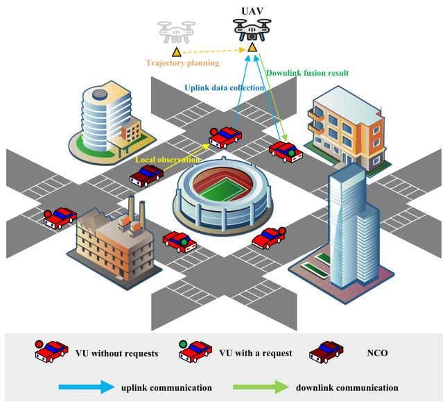

flowchart

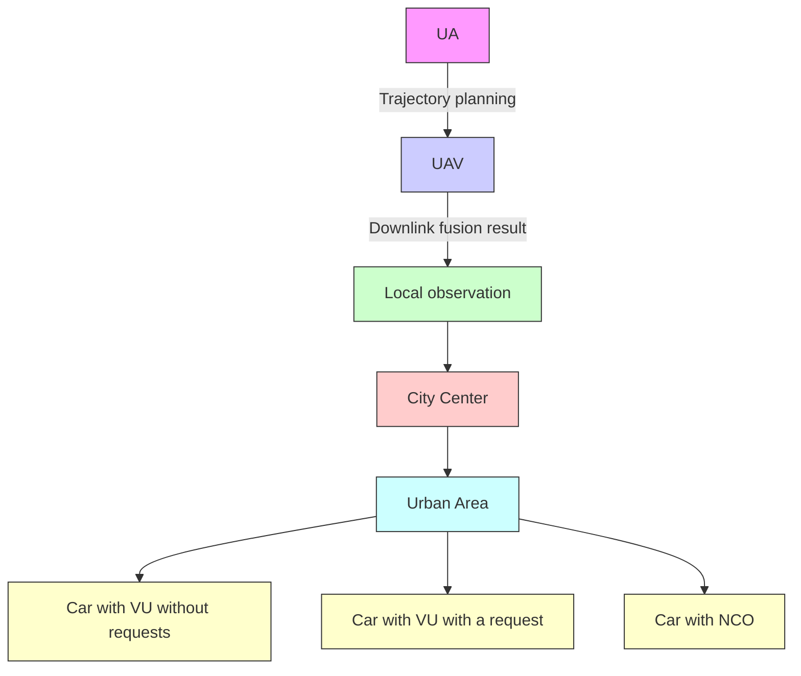

Fig. 1. Illustration of the considered UAV-enabled multi-source fusion-based vehicular network.

# III. SYSTEM MODEL AND PROBLEM FORMULATION

As illustrated in Fig. 1, the UAV-enabled multi-source fusion-based vehicular network considered in this paper consists of a UAV, a set of M VUs with indices $\{ 1 , 2 , \cdots , M \}$ , and K NCOs with indices $\{ 1 , 2 , \cdots , K \}$ . The UAV operates in the air to provide services to VUs on the ground over a duration T , where the duration is equally discretized into a set $\{ 1 , 2 , \cdots , N \}$ of N time slots, each with length $\delta = T / N$ . We assume sufficient battery capacity for the UAV to operate throughout the duration T , with the battery replacement or recharging performed at designated stations between consecutive service periods for long-term operation. In each time slot, the VUs, while in motion, continuously acquire information about the surrounding NCOs through onboard sensors. Based on their local perception, the VUs can send task requests to the UAV for more precise NCO information to enhance driving safety. The UAV dynamically adjusts its position to respond to the task requests in real time, serving as a multi-source fusion platform that collects local observation data from the surrounding VUs. After collecting data, the UAV performs fusion processing, compresses the results, and transmits them back to the requesting VUs. This paper focuses on two key objectives: the average reliability of the fusion results and the average waiting time of the VUs. Based on this scenario, the model comprises five main components: the UAV flight model, the local observation model, the uplink transmission model, the data fusion model, and the downlink transmission model.

# A. UAV Flight Model

At time slot n, the flight distance of the UAV can be expressed as follows:

$$
L (n) = \left\| \mathbf {q} ^ {\mathrm{u}} (n - 1) - \mathbf {q} ^ {\mathrm{u}} (n) \right\|, \tag {1}
$$

TABLE ICOMMONLY UTILIZED SIMULATION PARAMETERS AMONG THETHREE DCMOPS

<table><tr><td>Parameter</td><td>Description</td><td>Setting</td></tr><tr><td> $a$ </td><td>Channel environment parameter</td><td>9.61</td></tr><tr><td> $b$ </td><td>Channel environment parameter</td><td>0.16</td></tr><tr><td> $\kappa$ </td><td>NLoS channel attenuation</td><td>0.2</td></tr><tr><td> $g_0$ </td><td>Reference channel gain</td><td>-50 dB</td></tr><tr><td> $\sigma^2$ </td><td>Noise power spectral density</td><td>-140 dBm/Hz</td></tr><tr><td> $v^{\max}$ </td><td>Maximum flight velocity</td><td>20 m/s</td></tr><tr><td> $h^{\max}$ </td><td>Maximum flight altitude</td><td>50 m</td></tr><tr><td> $h^{\min}$ </td><td>Minimum flight altitude</td><td>20 m</td></tr><tr><td> $\theta^{\max}$ </td><td>Maximum turning angle of the UAV</td><td> $p_{i/3}^{i}$ </td></tr><tr><td> $c_m$ </td><td>Unit computing workload</td><td>2000 cycles/bit</td></tr><tr><td> $D_m$ </td><td>Average observation data size obtained by the  $m$ -th VU</td><td>0.25 MB</td></tr><tr><td> $d^v$ </td><td>Observable range of the VUs</td><td>100 m</td></tr><tr><td> $d^{\max}$ </td><td>Distance beyond which NCOs have no effect on the VUs</td><td>150 m</td></tr><tr><td> $P_m^{v,tr}$ </td><td>Transmit power of the  $m$ -th VU</td><td>100 mW</td></tr><tr><td> $P^{u,tr}$ </td><td>Transmit power of the UAV</td><td>100 mW</td></tr><tr><td> $T^{\text{dec}}$ </td><td>Delay for the decision-making</td><td>1 s</td></tr><tr><td> $p_\lambda$ </td><td>Task request probability</td><td>0.5</td></tr><tr><td> $μ_q$ </td><td>Mean parameter of local observation quality distribution</td><td>0.5</td></tr><tr><td> $σ_q$ </td><td>Standard deviation of local observation quality distribution</td><td>1.5</td></tr><tr><td> $σ_q^\star$ </td><td>Standard deviation of fusion result quality distribution</td><td>1.5</td></tr><tr><td> $σ_D$ </td><td>Standard deviation of fusion result size distribution</td><td>1.5</td></tr><tr><td> $B^{\max}$ </td><td>Maximum available bandwidth</td><td>20 MHz</td></tr><tr><td> $f(n)$ </td><td>Computing capability of the UAV</td><td>20 GHz</td></tr><tr><td> $T$ </td><td>Duration of flight</td><td>60 s</td></tr><tr><td> $N$ </td><td>Number of time slots</td><td>30</td></tr><tr><td> $q^u(0)$ </td><td>Location of the UAV at time slot 0</td><td>(30, 30, 20) m</td></tr><tr><td> $x^{\max} \times y^{\max}$ </td><td>Size of the region</td><td>240 m × 240 m</td></tr></table>

where k·k represents the Euclidean norm and ${ \bf q } ^ { \bf u } \left( n \right) \mathrm { ~  ~ \Gamma ~ } = \mathrm { ~  ~ \Omega ~ }$ $\left( x ^ { \mathrm { u } } \left( n \right) , y ^ { \mathrm { u } } \left( n \right) , z ^ { \mathrm { u } } \left( n \right) \right)$ represents the 3D location of the UAV in time slot n. Therefore, the flight velocity of the UAV in time slot n can be expressed as follows:

$$
v (n) = \frac {L (n)}{\delta}. \tag {2}
$$

To ensure the safety of the UAV flight while considering the kinematic constraints, we introduce the following four constraints: $C _ { 1 } , C _ { 2 } , C _ { 3 }$ , and $C _ { 4 }$ . Constraint $C _ { 1 }$ restricts the maximum flight velocity of the UAV:

$$
C _ {1}: v (n) \leq v ^ {\max}, \forall n, \tag {3}
$$

where $v ^ { \mathrm { m a x } }$ denotes the maximum allowable flight velocity. Constraint $C _ { 2 }$ limits the maximum flight altitude:

$$
C _ {2}: z ^ {\mathrm{u}} (n) \leq h ^ {\max}, \forall n, \tag {4}
$$

where ${ h ^ { \mathrm { m a x } } }$ denotes the maximum altitude. Constraint $C _ { 3 }$ bounds the minimum flight altitude of the UAV:

$$
C _ {3}: h ^ {\min} \leq z ^ {u} (n), \forall n, \tag {5}
$$

where $h ^ { \mathrm { m i n } }$ denotes the minimum safe altitude. The fourth constraint $C _ { 4 }$ bounds the maximum turning angle:

$$
C _ {4}: \cos^ {- 1} \left(\frac {\mathbf {B V} (n - 1) \cdot \mathbf {B V} (n)}{\| \mathbf {B V} (n - 1) \| \| \mathbf {B V} (n) \|}\right) \leq \theta^ {\max}, \forall n \geq 2, \tag {6}
$$

where $\theta ^ { \mathrm { m a x } }$ denotes the maximum allowable turning angle, $\mathbf { B V } \left( n \right)$ denotes the turning vector between two consecutive displacement vectors BP $\left( n - 1 \right) = { \bf q } ^ { \mathrm { u } } \left( n - 1 \right) - { \bf q } ^ { \mathrm { u } } \left( n - 2 \right)$ and BP $\mathbf { \Omega } ( n ) \ = \ \mathbf { q } ^ { \mathrm { u } } \left( n \right) - \mathbf { q } ^ { \mathrm { u } } \left( n - 1 \right)$ . Please notice that the initial UAV location ${ \bf q } ^ { \mathrm { u } } \left( 0 \right)$ is given in Table I.

# B. Local Observation Model

During time slot n, each VU performs local observation and can issue a task request to detect all NCOs in its vicinity to enhance driving safety. If the k-th NCO lies within the observation range of the m-th VU during time slot $n ,$ the corresponding local observation data size is given by [9]:

$$
\begin{array}{l} L _ {m, k} (n) \\ = \left\{ \begin{array}{l l} \left[ \left(1 - \frac {d _ {m , k} (n)}{d ^ {\mathrm{v}}}\right) D _ {m} + \zeta \right] ^ {+} & \text { if } d _ {m, k} (n) \leq d ^ {\mathrm{v}}, \\ 0 & \text { otherwise }, \end{array} \right. \tag {7} \\ \end{array}
$$

where $d _ { m , k } \left( n \right)$ denotes the Euclidean distance between the k-th NCO and the m-th VU, dv denotes the observation range within which the NCOs significantly affect the VU operation, $D _ { m }$ denotes the average observation data size obtained by the m-th VU from its nearest NCO, ζ is a random variable following the standard normal distribution, and $[ \cdot ] ^ { + } = \operatorname* { m a x } \{ \cdot , 0 \}$ represents the positive part operator. This formulation reflects that the observation data size decreases linearly with the distance between the VU and the NCO, as sensors can capture more detailed information of the nearby objects than those of the objects which are further away.

# C. Uplink Communication Model

Upon accepting requests from the VUs, the UAV collects local observation data from multiple VUs in parallel, performs multi-source fusion, and delivers the compressed fusion results to the requesting VUs. Reliable UAV-VU communication links are essential for data collection. To ensure interferencefree uplink transmission, we employ orthogonal frequency division multiple access (OFDMA) [28], [29]. We adopt OFDMA because its orthogonal subcarrier allocation guarantees interference-free parallel uplink transmission among the VUs, thereby ensuring deterministic transmission delays that are critical for the latency-sensitive cooperative perception. The communication link performance is modeled using the probabilistic LoS channel model [30], [31], which characterizes large-scale path loss in UAV-VU communications. The LoS probability depends on environmental characteristics and the elevation angle of the UAV relative to each VU. For the m-th VU at time slot n, the LoS probability is given by:

$$
\mathrm{P} \left(\operatorname{LoS}, \theta_ {m} (n)\right) = \frac {1}{1 + a \exp (- b (\theta_ {m} (n) - a))}, \tag {8}
$$

where a and b are the environment-specific constants, and $\theta _ { m } ( n )$ denotes the elevation angle defined by:

$$
\begin{array}{l} \theta_ {m} (n) \\ = \frac {1 8 0}{\pi} \arctan \left(\frac {z ^ {\mathrm{u}} (n)}{\| \left(x ^ {\mathrm{u}} (n) , y ^ {\mathrm{u}} (n)\right) - \left(x _ {m} ^ {\mathrm{v}} (n) , y _ {m} ^ {\mathrm{v}} (n)\right) \|}\right), \tag {9} \\ \end{array}
$$

where ${ \bf q } _ { m } ^ { \mathrm { v } } \left( n \right) = \left( x _ { m } ^ { \mathrm { v } } \left( n \right) , y _ { m } ^ { \mathrm { v } } \left( n \right) , 0 \right)$ denotes the location of the m-th VU at time slot n. Correspondingly, the non-lineof-sight (NLoS) probability is given by: $\mathsf { P } \left( \mathrm { N L o S } , \theta _ { m } \left( n \right) \right) =$ $1 - \mathrm { P } \left( \mathrm { L o S } , \theta _ { m } \left( n \right) \right)$ ). Therefore, the expected channel gain is:

$$
\gamma_ {m} ^ {\mathrm{up}} (n) = \frac {P _ {m} ^ {\mathrm{v} , \operatorname{tr}} \widetilde {\mathbf {P}} (\operatorname{LoS} , \theta_ {m} (n)) g _ {0}}{\sigma^ {2} B _ {m} (n) \| \mathbf {q} ^ {\mathrm{u}} (n) - \mathbf {q} _ {m} ^ {\mathrm{v}} (n) \|}, \tag {10}
$$

where $B _ { m } ( n )$ denotes the available bandwidth for the m-th VU at time slot n, $\widetilde { \mathrm { P } } \left( \mathrm { L o S } , \theta _ { m } \left( n \right) \right) = \mathrm { P } \left( \mathrm { L o S } , \theta _ { m } \left( n \right) \right) +$ $\mathsf { P } \left( \mathrm { N L o S } , \theta _ { m } \left( n \right) \right)$ κ is the regularized LoS probability accounting for NLoS channel attenuation with $\kappa < 1 , P _ { m } ^ { \mathrm { v , t r } }$ is the transmit power of the m-th VU, $g _ { 0 }$ represents the channel gain at the reference distance, and $\sigma ^ { 2 }$ is the noise power spectral density. According to the Shannon theorem, the uplink transmission rate of the m-th VU at time slot n is:

$$
R _ {m} ^ {\mathrm{up}} (n) = B _ {m} (n) \log \left(1 + \gamma_ {m} ^ {\mathrm{up}} (n)\right). \tag {11}
$$

Consequently, the uplink transmission time for the m-th VU can be expressed as follows:

$$
T _ {m} ^ {\mathrm{up}} (n) = \frac {\alpha_ {m} (n) \sum_ {k = 1} ^ {K} L _ {m , k} (n)}{R _ {m} ^ {\mathrm{up}} (n)}, \tag {12}
$$

where $\alpha _ { m } ( n )$ is a binary decision variable with $\alpha _ { m } ( n ) = 1$ indicating that the UAV collects local observation data from the m-th VU at time slot n, and $\alpha _ { m } ( n ) = 0$ otherwise.

To ensure reliable and efficient data collection, four constraints $( C _ { 5 }$ to $C _ { 8 } )$ are imposed on the task assignment and resource allocation processes. Constraint $C _ { 5 }$ enforces that the UAV responds only to the VUs that have issued a request, ensuring that computational and communication resources are allocated exclusively to legitimate service demands:

$$
C _ {5}: \beta_ {m} (n) - \lambda_ {m} (n) \leq 0, \forall n, m, \tag {13}
$$

where $\beta _ { m } ( n )$ is a binary decision variable with $\beta _ { m } ( n ) = 1$ indicating that the UAV responds to the request of the m-th VU at time slot n and $\beta _ { m } ( n ) = 0$ otherwise, $\lambda _ { m } ( n )$ is a binary indicator with $\lambda _ { m } ( n ) = 1$ denoting that the m-th VU issues a task request and $\lambda _ { m } ( n ) = 0$ otherwise. Constraint $C _ { 6 }$ enforces that the UAV collects data from all VUs to whose requests it responds:

$$
C _ {6}: \beta_ {m} (n) - \alpha_ {m} (n) \leq 0, \forall n, m. \tag {14}
$$

Constraint $C _ { 7 }$ ensures that the bandwidth is allocated to a VU only when the VU uploads local observation data to the UAV:

$$
C _ {7}: (1 - \alpha_ {m} (n)) B _ {m} (n) = 0, \forall n, m. \tag {15}
$$

Constraint $C _ { 8 }$ ensures that the total allocated bandwidth does not exceed the available bandwidth resource:

$$
C _ {8}: \sum_ {m = 1} ^ {M} \alpha_ {m} (n) B _ {m} (n) \leq B ^ {\max}, \forall n. \tag {16}
$$

# D. Data Fusion Model

Following the data collection, the UAV processes multisource observation data for fusion. It is worth noting that this paper focuses on the optimization framework rather than the specific fusion algorithm, assuming that fusion algorithms such as Kalman filter, Bayesian fusion, or deep learning-based approaches are available. The fusion processing time is given by:

$$
T ^ {\mathrm{cmp}} (n) = \sum_ {m = 1} ^ {M} \sum_ {k = 1} ^ {K} \frac {c _ {m} \alpha_ {m} (n) L _ {m , k} (n)}{f (n)}, \tag {17}
$$

where $c _ { m }$ represents the unit computing workload, and $f \left( n \right)$ represents the computing capability of the UAV. Similar to [32], the size of the fusion result for the k-th NCO can be expressed as follows:

$$
D _ {k} (n) = \text { Lognormal } (\overline {{L}} _ {k} (n), \sigma_ {D}), \tag {18}
$$

where Lognorma $1 ( \mu _ { 1 } , \mu _ { 2 } )$ denotes a log-normal distribution with mean parameter $\mu _ { 1 }$ (in log space) and standard deviation $\mu _ { 2 } , \sigma _ { D }$ denotes the standard deviation of the fusion result size distribution, $\begin{array} { r } { \overline { { L } } _ { k } ( n ) = \sum _ { m = 1 } ^ { M } \alpha _ { m } ( n ) L _ { m , k } \left( n \right) / \sum _ { m = 1 } ^ { M } \alpha _ { m } ( n ) } \end{array}$ represents the weighted average of the size of the collected local observation data regarding the k-th NCO.

# E. Downlink Communication Model

After the data fusion, the UAV transmits the fusion result to the requesting VUs. Similar to Eq. (10), the downlink channel gain can be expressed as follows:

$$
\gamma_ {m} ^ {\text { down }} (n) = \frac {P ^ {\mathrm{u} , \operatorname{tr}} \widetilde {\mathbf {P}} (\operatorname{LoS} , \theta_ {m} (n)) g _ {0}}{\sigma^ {2} B _ {m} (n) \| \mathbf {q} ^ {\mathrm{u}} (n) - \mathbf {q} _ {m} ^ {\mathrm{v}} (n) \|}, \tag {19}
$$

where $P ^ { \mathrm { u , ~ t r } }$ represents the transmit power of the UAV. The downlink transmission rate at time slot n is:

$$
R _ {m} ^ {\text { down }} (n) = B _ {m} (n) \log \left(1 + \gamma_ {m} ^ {\text { down }} (n)\right). \tag {20}
$$

Consequently, the downlink transmission time for the m-th VU can be expressed as follows:

$$
T _ {m} ^ {\text { down }} (n) = \frac {\beta_ {m} (n) \sum_ {k = 1} ^ {K} D _ {k} (n) h _ {m} (n)}{R _ {m} ^ {\text { down }} (n)}, \tag {21}
$$

where $h _ { m } \left( n \right)$ represents the compression degree of the fusion result for the m-th VU. Therefore, the waiting time for the m-th VU can be expressed as follows:

$$
T _ {m} ^ {\text { wait }} (n) = T ^ {\text { dec }} + T ^ {\text { up }} (n) + T ^ {\text { cmp }} (n) + T _ {m} ^ {\text { down }} (n), \tag {22}
$$

where $T ^ { \mathsf { u p } } \left( n \right) = \operatorname* { m a x } _ { m } \left( T _ { m } ^ { \mathsf { u p } } \left( n \right) \right)$ m represents the total time for the uplink communication, and $T ^ { \mathrm { d e c } }$ represents the computational delay of the UAV for decision making. To meet the real-time task requirements, constraint $C _ { 9 }$ ensures that each accepted request is completed within a single time slot:

$$
C _ {9}: \beta_ {m} (n) T _ {m} ^ {\text { wait }} (n) \leq \delta , \quad \forall n, m. \tag {23}
$$

Upon receiving the fusion result, the VUs combine it with their local observations to produce accurate and reliable interpretations of their surroundings. The belief function of the k-th NCO for the m-th VU can be expressed as follows [9]:

$$
\Psi_ {m, k} (n) = \log \left(1 + q _ {m, k} (n) \frac {L _ {m , k} (n)}{\bar {L} _ {k} (n)} + q _ {k} ^ {*} (n) h _ {m} (n)\right), \tag {24}
$$

where $q _ { m , k } ( n )$ denotes the quality of the local observation data regarding the k-th NCO obtained by the m-th VU, which follows a log-normal distribution Lognorma $\scriptstyle ( \mu _ { q } , \sigma _ { q } )$ , and $q _ { k } ^ { * } ( n )$ denotes the quality of the fusion result received for the k-th NCO. The quality $q _ { k } ^ { * } ( n )$ follows a log-$( \overline { { { q } } } _ { k } ( n ) , \sigma _ { q ^ { * } } )$ , where sents th $\overline { { { q } } } _ { k } ( n ) ~ =$ $\begin{array} { r l r } { \sum _ { m = 1 } ^ { M } \alpha _ { m } ( n ) q _ { m , k } ( n ) / \bar { \sum _ { m = 1 } ^ { M } \alpha _ { m } ( n ) } } & { { } } & { } \end{array}$ quality of local observation data regarding the k-th NCO. Notably, while aggregating more high-quality local observation data improves fusion reliability, doing so incurs a higher transmission time.

# F. Problem Formulation

In this study, we formulate a DCMOP to simultaneously optimize two objectives over the mission duration T , i.e., maximizing the average reliability of fusion results and minimizing the average waiting time of the VUs. Specifically, the problem involves joint optimization of the UAV trajectory, request response, data collection, compression degree of the fusion results, and resource allocation, subject to the constraints on UAV kinematics, task assignment, resource allocation, and latency.

A candidate solution at time slot n is encoded as an individual:

$$
\mathbf {x} (n) = (\mathbf {q} ^ {\mathrm{u}} (n), \boldsymbol {\beta} (n), \boldsymbol {\alpha} (n), \boldsymbol {h} (n), \boldsymbol {B} (n)). \tag {25}
$$

The individual x(n) consists of five components. The first component is the UAV location ${ \bf q } ^ { \mathrm { u } } ( n ) = ( x ^ { \mathrm { u } } ( n ) , y ^ { \mathrm { u } } ( n ) , z ^ { \mathrm { u } } ( n ) )$ , which represents the 3D coordinates of the UAV at time slot n. The second component is the request response decision vector $\beta ( n ) = ( \beta _ { 1 } ( n ) , \beta _ { 2 } ( n ) , \cdot \cdot \cdot , \beta _ { M } ( n ) )$ , where $\beta _ { m } ( n )$ is a binary variable indicating whether the UAV responds to the request of the m-th VU. The third component is the data collection decision vector ${ \pmb \alpha } ( n ) = ( \alpha _ { 1 } ( n ) , \alpha _ { 2 } ( n ) , \cdot \cdot \cdot , \alpha _ { M } ( n ) )$ , where $\alpha _ { m } ( n )$ is a binary variable indicating whether the UAV collects the local observation data from the m-th VU. The fourth component is the compression degree decision vector $\pmb { h } ( n ) = ( h _ { 1 } ( n ) , h _ { 2 } ( n ) , \cdots , h _ { M } ( n ) )$ , where $h _ { m } ( n ) \in [ 0 , 1 ]$ is a continuous variable representing the compression degree of the fusion result for the m-th VU. The fifth component is the bandwidth allocation decision vector $B ( n ) \ =$ $( B _ { 1 } ( n ) , B _ { 2 } ( n ) , \cdots , B _ { M } ( n ) )$ , where $B _ { m } ( n )$ is a continuous variable representing the bandwidth allocated to the m-th VU. Based on $\mathbf { x } ( n )$ , the two optimization objectives are formulated as follows:

$$
G _ {1} (\mathbf {x} (n)) = \frac {\sum_ {i = 1} ^ {n} \sum_ {m = 1} ^ {M} \sum_ {k = 1} ^ {K} \beta_ {m} (i) \Psi_ {m , k} (i)}{K \sum_ {i = 1} ^ {n} \sum_ {m = 1} ^ {M} \beta_ {m} (i)}, \tag {26}
$$

$$
G _ {2} (\mathbf {x} (n)) = \frac {\sum_ {i = 1} ^ {n} \sum_ {m = 1} ^ {M} \beta_ {m} (i) T _ {m} ^ {\text { wait }} (i)}{\sum_ {i = 1} ^ {n} \sum_ {m = 1} ^ {M} \beta_ {m} (i)}. \tag {27}
$$

Note that in the special case where $\begin{array} { r } { \sum _ { i = 1 } ^ { n } \sum _ { m = 1 } ^ { M } \beta _ { m } ( i ) = 0 } \end{array}$ $( \mathrm { i . e . } ,$ , no VU is served in time slots 1 to n), we define both $G _ { 1 } \left( \mathbf { x } ( n ) \right) = 0$ and $G _ { 2 } \left( \mathbf { x } ( n ) \right) = 0$ . The proposed DCMOP is formulated as follows:

$$
\min \left\{ \begin{array}{l} - G _ {1} (\mathbf {x} (n)), \\ G _ {2} (\mathbf {x} (n)), \end{array} \right.
$$

${ \mathrm { s u b j e c t ~ t o : ~ } } C _ { 1 } \sim C _ { 9 } ,$ (28)

where the constraints are categorized as follows:

• UAV kinematic constraints $( C _ { 1 } \ \sim \ C _ { 4 } ) \colon C _ { 1 }$ restricts the maximum flight velocity; $C _ { 2 }$ and $C _ { 3 }$ limit the upper bound $h ^ { \mathrm { m a x } }$ and lower bound $h ^ { \mathrm { m i n } }$ of the flight altitude, respectively; $C _ { 4 }$ restricts the maximum turning angle.   
• Task assignment constraints $( C _ { 5 } \sim C _ { 6 } ) \colon C _ { 5 }$ ensures that the UAV responds only to the VUs that have issued requests; $C _ { 6 }$ ensures that the UAV collects data from all VUs whose requests it responds to.

• Resource allocation constraints $( C _ { 7 } \sim C _ { 8 } ) \colon C _ { 7 }$ ensures that the bandwidth is allocated to a VU only when the VU uploads the local observation data to the UAV; $C _ { 8 }$ restricts the total available bandwidth.   
• Latency constraint $( C _ { 9 } ) \colon C _ { 9 }$ ensures each accepted request is completed within a single time slot.

# IV. PROPOSED ALGORITHM

This section presents the methodology for solving the formulated problem. We first introduce the fundamental concepts of dynamic constrained multi-objective optimization. Subsequently, we present the framework of the proposed DCMOEA with a cascaded dependency generation strategy. The proposed DCMOEA extends a constrained non-dominated sorting genetic algorithm (NSGA-II) [33], a population-based evolutionary algorithm for multi-objective optimization. The detailed design of the dynamic response mechanism and the analysis of computational time complexity are also presented.

Prior to presenting the algorithmic design, we introduce several key concepts for evaluating solution quality in multiobjective optimization. Solution quality is evaluated through Pareto dominance. At time slot $n ,$ individual ${ \bf x } ( n )$ dominates $\mathbf { y } ( n )$ , denoted as $\mathbf { x } ( n ) \prec \mathbf { y } ( n ) , \operatorname { i f } \mathbf { x } ( n )$ is no worse than $\mathbf { y } ( n )$ in all objectives and strictly better in at least one. The set of all non-dominated feasible individuals constitutes the Pareto optimal set, and their corresponding objective function values form the Pareto front in objective space. The constraint violation $C V ( \mathbf { x } ( n ) )$ quantifies the degree to which an individual violates the constraints. For Problem (28), $C V ( \mathbf { x } ( n ) )$ is given as follows:

$$
C V (\mathbf {x} (n)) = \sum_ {j = 1} ^ {9} [ C _ {j} (\mathbf {x} (n)) ] ^ {+}, \tag {29}
$$

where $C _ { j } ( \mathbf { x } ( n ) )$ denotes the j-th constraint function value. An individual is feasible if $C V ( { \bf x } ( n ) ) = 0 ,$ , and infeasible otherwise.

# A. Key Algorithm Design

We propose a DCMOEA that integrates the cascaded dependency generation strategy to obtain the Pareto optimal set for Problem (28) at each time slot. The proposed algorithm is executed on the UAV as a real-time decision provider, generating centralized decisions regarding the UAV trajectory, request response, data collection, compression degree of the fusion results, and resource allocation. The pseudocode of the proposed algorithm is presented in Algorithm 1.

The proposed algorithm integrates a dynamic response mechanism and a static evolutionary process. An unresponded task is defined as one for which a VU has issued a request but has not yet received a response from the UAV. The task status vector $\pmb { \tau } ( n ) = ( \tau _ { 1 } ( n ) , \tau _ { 2 } ( n ) , . . . , \tau _ { M } ( n ) )$ is defined to track unresponded tasks, where each binary component $\tau _ { m } ( n ) \ \in$ $\{ 0 , 1 \}$ indicates the status of the m-th VU: $\tau _ { m } ( n ) = 1$ denotes that the m-th VU has an unresponded task, while $\tau _ { m } ( n ) = 0$ indicates otherwise. At mission initialization (Lines 1 to 6), an initial population of $\mathcal { N }$ individuals is randomly generated, while the task status vector is initialized as $\boldsymbol { \tau } ( 0 ) \ = \ \mathbf { 0 } _ { M }$ , indicating no unresponded tasks. At each time slot $n ,$ , the task request vector $\lambda ( n ) = ( \lambda _ { 1 } ( n ) , \lambda _ { 2 } ( n ) , . . . , \lambda _ { M } ( n ) )$ ) is generated according to $\tau ( n - 1 )$ :

Algorithm 1 Framework of the Proposed DCMOEA   
Input: Population size N,
    maximum generations per time slot $g_{max}$ ,
    number of time slots N,
    initial UAV location $q^{u}(0)$ Output: Set of solutions S

1 $n \leftarrow 1$ ;
2 $S \leftarrow \emptyset$ ;
3 $\hat{q} \leftarrow q^{u}(0)$ ;
4 Randomly initialize population $P_{n}$ with size N;
5 /*0M denotes the M-dimensional zero vector.*/
6 Initialize task status $\tau(0) \leftarrow 0_{M}$ ;
7 while $n \leq N$ do
8 $\lambda(n) \leftarrow$ the task request vector according to Eq. (30);
9    if n > 1 then
10    /*Dynamic response: Triggered when transitioning to a new time slot.*/
11 $P_{n} \leftarrow Algorithm 2(P_{n-1})$ ;
12    end
13    /*Static evolution.*/
14    for $g \leftarrow 1$ to $g_{max}$ do
15    M ← the mating pool selected from $P_{n}$ by binary tournament selection;
16    O ← the offspring generated from M by genetic operators;
17 $P_{n} \leftarrow$ the N elite individuals selected from $P_{n} \cup O$ according to the constrained NSGA-II;
18    end
19 $\mathcal{F} \leftarrow \{\mathbf{x}(n) \in \mathbb{P}_{n} \mid CV(\mathbf{x}(n)) = 0\}$ ;
20    if $F = \emptyset$ then
21 $q^{u}(n) \leftarrow \hat{q}$ ;
22 $x^{*}(n) \leftarrow (q^{u}(n), 0_{M}, 0_{M}, 0_{M}, 0_{M})$ ;
23    else
24 $x^{*}(n) \leftarrow$ the solution selected from F;
25 $\beta^{*}(n) \leftarrow$ the request response decision extracted from $x^{*}(n)$ ;
26 $q^{u*}(n) \leftarrow$ the UAV location extracted from $x^{*}(n)$ ;
27 $\hat{q} \leftarrow q^{u*}(n)$ ;
28 $S \leftarrow S \cup x^{*}(n)$ ;
29    end
30 $\tau(n) \leftarrow$ the task status vector obtained by using $\lambda(n)$ and $\beta^{*}(n)$ according to Eq. (31);
31 $n \leftarrow n + 1$ ;
32 end
33 return S

$$
\lambda_ {m} (n) = \left\{ \begin{array}{l l} 1 & \text { if } \tau_ {m} (n - 1) = 1, \\ \operatorname{Bernoulli} \left(p _ {\lambda}\right) & \text { otherwise }, \end{array} \right. \tag {30}
$$

where Bernoulli $\left( p _ { \lambda } \right)$ denotes a Bernoulli random variable that equals 1 with probability $p _ { \lambda }$ and 0 otherwise, and $p _ { \lambda }$ denotes the task request probability. The UAV applies the proposed dynamic response mechanism (Lines 9 to 12) when transitioning to the next time slot, as detailed in Algorithm 2. Using this mechanism, the cascaded dependency generation is performed on population $\mathbb { P } _ { n - 1 }$ to generate the initial population $\mathbb { P } _ { n }$ at time slot n.

The UAV performs static evolutionary optimization for gmax generations (Lines 13 to 18). In each generation, the binary tournament selection [34] is performed based on the fitness of individuals in $\mathbb { P } _ { n }$ to construct the mating pool M.

Algorithm 2 Proposed Dynamic Response Mechanism   
Input: Population $P_{n-1}$ Output: Initial population $P_{n}$ at time slot n

1 $P_{n} \leftarrow P_{n-1}$ ;

2 for each individual $\mathbf{x}(n) \in \mathbb{P}_{n}$ do

3 if $CV(\mathbf{x}(n)) > 0$ or $rand(0,1) < 0.5$ then

4 /*Apply cascaded dependency generation.*/

5 /*Step 1: Preserve components.*/

6 $\mathbf{q}^{\mathrm{u}}(n) \leftarrow$ the UAV location extracted from $\mathbf{x}(n)$ ;

7 $\boldsymbol{h}(n) \leftarrow$ the compression degree decision vector extracted from $\mathbf{x}(n)$ ;

8 /*Step 2: Regenerate dependent components.*/

9 $\beta(n) \leftarrow$ the request response decision vector regenerated according to Eq. (32);

10 $\alpha(n) \leftarrow$ the data collection decision vector regenerated based on $\beta(n)$ according to Eq. (33);

11 $\boldsymbol{B}(n) \leftarrow$ the bandwidth allocation decision vector regenerated based on $\alpha(n)$ according to Eq. (34);

12 /*Step 3: Update individual.*/

13 $\mathbf{x}(n) \leftarrow (\mathbf{q}^{\mathrm{u}}(n), \boldsymbol{\beta}(n), \boldsymbol{\alpha}(n), \boldsymbol{h}(n), \boldsymbol{B}(n))$ ;

14 end

15 end

16 return $P_{n}$

Subsequently, an offspring population O is generated from M through simulated binary crossover and polynomial mutation [33]. For environmental selection, the constrained NSGA-II framework [33] is employed to form $\mathbb { P } _ { n }$ by selecting N elite individuals from the merged population $\mathbb { P } _ { n } \cup \mathbb { O }$ . The selection process adopts the constrained-domination principle where feasible solutions always dominate infeasible ones, and among infeasible solutions, those with smaller constraint violations are preferred. Furthermore, feasible solutions are compared based on Pareto dominance, while the crowding distance metric is employed by measuring solution density in the objective space to maintain diversity among the nondominated solutions.

After completing each static evolution phase, a solution $\mathbf { x } ^ { * } ( n )$ is selected and then the task status vector $\tau ( n )$ is updated based on $\mathbf { x } ^ { * } ( n )$ (Lines 19 to 31). $\mathbf { x } ^ { * } ( n )$ is selected from the set of feasible solutions within $\mathbb { P } _ { n }$ by the decision maker based on the current operational requirements. If no feasible solutions exist, a conservative default is adopted for $\mathbf { x } ^ { * } ( n )$ instead. Under this conservative default, the UAV maintains its previous location $\hat { q } \quad ( \mathrm { i . e . }$ , the UAV location of $\mathbf { x } ^ { * } ( n - 1 ) )$ ) with all other decision vectors set to zero. Upon obtaining $\mathbf { x } ^ { * } ( n )$ , the UAV immediately executes the determined decisions. Consequently, the task status $\tau _ { m } ( n )$ in $\tau ( n )$ is updated based on the request response decision vector $\beta ^ { * } ( n ) = ( \beta _ { 1 } ^ { * } ( n ) , \beta _ { 2 } ^ { * } ( n ) , \cdots , \beta _ { M } ^ { * } ( n ) )$ extracted from $\mathbf { x } ^ { * } ( n )$ :

$$
\tau_ {m} (n) = \left[ \lambda_ {m} (n) - \beta_ {m} ^ {*} (n) \right] ^ {+}. \tag {31}
$$

# B. Proposed Dynamic Response Mechanism

The proposed dynamic response mechanism is detailed in Algorithm 2. The mechanism is designed to address the challenge that solutions optimized for the previous time slot may become infeasible due to the dynamic changes, such as variations in the UAV location, the VU locations, and the NCO distributions. Through this mechanism, the UAV applies the cascaded dependency generation deterministically to all infeasible solutions and probabilistically to feasible solutions.

The cascaded dependency generation for an individual ${ \bf x } ( n )$ is designed as follows. The components ${ \bf q } ^ { \bf u } ( n )$ and $\boldsymbol { h } ( \boldsymbol { n } )$ are preserved from $\mathbf { x } ( n )$ , since they do not participate in the cascaded dependency chain. These two components can be further optimized by the static evolution phase, while the cascaded dependency generation strategy focuses on repairing the interdependent variables. The remaining components, $\beta ( n )$ , $\alpha ( n )$ , and $B ( n )$ , are regenerated sequentially. Subsequently, $\mathbf { x } ( n )$ is updated with the combination of these preserved and regenerated components. The request response decision vector $\beta ( n )$ is regenerated, with each component independently sampled from a Bernoulli distribution:

$$
\beta_ {m} (n) = \text { Bernoulli } (p _ {\lambda}). \tag {32}
$$

To ensure that the UAV collects data from all responding VUs, while allowing additional data collection from non-requesting VUs, the data collection decision vector $\alpha ( n )$ is regenerated according to $\beta ( n )$ :

$$
\alpha_ {m} (n) = \max \left(\text { Bernoulli } (p _ {\lambda}), \beta_ {m} (n)\right), \tag {33}
$$

where $\operatorname* { m a x } ( \cdot , \cdot )$ returns the maximum of two values. To efficiently allocate the bandwidth between the UAV and the VUs for data collection, the bandwidth allocation vector $B ( n )$ is regenerated according to $\alpha ( n )$ as follows:

$$
B _ {m} (n) = \left\{ \begin{array}{l l} \frac {w _ {m} \cdot B ^ {\max}}{\sum_ {j \in \mathcal {A}} w _ {j}} & \text { if   } m \in \mathcal {A}, \\ 0 & \text { otherwise }, \end{array} \right. \tag {34}
$$

where $\mathcal { A } \ = \ \{ m | \alpha _ { m } ( n ) \ = \ 1 \}$ denotes the active VU set, $\{ w _ { m } \} _ { m \in \mathcal { A } }$ are random weights drawn from the uniform distribution $\mathcal { U } ( 0 , 1 )$ , and $B ^ { \mathrm { m a x } }$ is the maximum bandwidth limit. This allocation satisfies $\begin{array} { r } { \sum _ { m = 1 } ^ { M } B _ { m } ( n ) = B ^ { \operatorname* { m a x } } } \end{array}$ , ensuring full utilization of the bandwidth.

# C. Computational Time Complexity

In this subsection, we analyze the time complexity of the proposed algorithm by examining the static evolution process and the proposed dynamic response mechanism.

In each iteration of the static evolution process, the constrained NSGA-II framework is used to evaluate at most 2N individuals and perform the non-dominated sorting with complexity $\mathcal { O } ( \hat { m } \Lambda ^ { 2 } )$ , where $\hat { m }$ denotes the number of objectives. The crowding distance calculation necessitates $\mathcal { O } ( \hat { m } \mathcal { N } \log \mathcal { N } )$ operations, while the binary tournament selection and genetic operators take $\mathcal { O } ( \mathcal { N } )$ time. Therefore, the complexity per generation is $\mathcal { O } ( \hat { m } \Lambda ^ { 2 } )$ , and over $g _ { \mathrm { m a x } }$ generations, the complexity of the static evolution becomes $\mathcal { O } ( g _ { \mathrm { m a x } } \hat { m } \mathcal { N } ^ { 2 } )$ . The proposed dynamic response mechanism is designed to generate an initial population at each time slot, where adapting each individual involves regenerating decision vectors for the M VUs with complexity $\mathcal O ( M )$ , resulting in total complexity $\mathcal { O } ( N M )$ for the entire population.

The overall time complexity for a single time slot is $\mathcal { O } ( g _ { \mathrm { m a x } } \hat { m } \Lambda ^ { 2 } )$ as the static evolution dominates when $g _ { \operatorname* { m a x } } \hat { m } \mathcal { N } \gg M .$ . Over N time slots, the total complexity is $\mathcal { O } ( N g _ { \mathrm { m a x } } \hat { m } \Lambda ^ { 2 } )$ .

TABLE IISIMULATION PARAMETERS AMONG THE THREE DCMOPS

<table><tr><td>Parameters</td><td>Description</td><td>DCMOP1</td><td>DCMOP2</td><td>DCMOP3</td></tr><tr><td>M</td><td>Number of the VUs</td><td>5</td><td>7</td><td>9</td></tr><tr><td>K</td><td>Number of the NCOs</td><td>3</td><td>4</td><td>5</td></tr></table>

# V. EXPERIMENTAL STUDIES

In this section, we present a series of experiments to validate the effectiveness of the proposed UAV-enabled multi-source fusion-based vehicular network, and the superiority of the proposed DCMOEA with the cascaded dependency generation strategy.

# A. Experimental Settings

We conduct simulation experiments on the proposed UAV-enabled multi-source fusion-based vehicular network through three distinct case studies, namely, DCMOP1, DCMOP2, and DCMOP3. These cases are designed to reflect the escalating service demand that a UAV may encounter in real-world scenarios. As shown in Table II, the problem scale progressively increases across the three cases: DCMOP1 (small-scale) involves 5 VUs and 3 NCOs, DCMOP2 (medium-scale) involves 7 VUs and 4 NCOs, and DCMOP3 (large-scale) involves 9 VUs and 5 NCOs. This gradual increase in scale reflects the growing operational pressures on the UAV regarding the request response, data collection, resource allocation, and result compression. Parameters for the UAV, NCOs, and VUs are summarized in Table I, while case-specific parameters are detailed in Table II. The movement trajectories of the NCOs and the VUs are publicly available at https://github.com/ProDataFor/trajectories. At each time slot, a solution is selected from the obtained feasible solution set to simulate the choice of the decision maker.

The performance of the proposed algorithm is compared with four DCMOEAs, including two classical baselines (DC-MOEA [35], DC-NSGA-II [36]) and two recent methods (mEDCMOA [37], TDCEA [38]). Brief descriptions of these baseline algorithms are as follows:

• DC-MOEA employs a self-adaptive penalty function and a feasibility-driven repair strategy to handle time-varying constraints and track moving Pareto fronts.   
• DC-NSGA-II detects environmental changes through periodic re-evaluation and introduces random solutions to maintain diversity for tracking Pareto fronts.   
mEDCMOA classifies solutions into several tribes based on feasibility and estimates variable movements to rapidly track Pareto fronts across changing environments.   
• TDCEA utilizes a two-stage diversity compensation strategy through random injection and adaptive perturbation to track Pareto fronts in dynamic environments.

For fair comparison, all algorithms are configured with a population size of $\mathcal { N } = 1 0 0$ and execute for $g _ { \mathrm { m a x } } ~ = ~ 3 0$ generations per time slot. The baseline algorithms adopt their original parameter settings as presented in the literature. The algorithm performance is evaluated using two metrics: success rate (SR) and hypervolume (HV). For each metric, mean and standard deviation are computed over 30 independent runs. The SR metric quantifies the proportion of time slots in which an algorithm successfully obtains feasible solutions, calculated as follows:

$$
\mathrm{SR} = \frac {N ^ {\mathrm{fe}}}{N}, \tag {35}
$$

where $N ^ { \mathrm { f e } }$ denotes the number of time slots in which feasible solutions are obtained, and N represents the total number of time slots. The HV metric measures both the convergence quality and the diversity of the obtained Pareto front. It is defined as the volume enclosed by the obtained non-dominated solutions and a predefined reference point. A larger HV value indicates superior algorithm performance in terms of both convergence and solution diversity.

# B. Investigation of Data Collection and Resource Allocation Schemes

Data collection and resource allocation schemes significantly influence the reliability and latency of the proposed UAV-enabled multi-source fusion-based vehicular network. To demonstrate the ability of the proposed algorithm to provide diverse trade-off solutions, this subsection investigates three distinct strategies (namely, reliability-oriented strategy, random selection strategy, and delay-oriented strategy) for data collection and resource allocation across the three DCMOPs. Under the reliability-oriented strategy, the UAV selects and executes the solution with the highest average reliability of the fusion results from the final population in each time slot. Under the random selection strategy, the UAV randomly selects and executes a solution from the final population in each time slot. Under the delay-oriented strategy, the UAV selects and executes the solution with the lowest average waiting time of the VUs from the final population in each time slot. The proposed algorithm is executed 30 times under each of the three strategies across the three DCMOPs. The averaged results in terms of the data collection and resource allocation are illustrated in Fig. 2.

The first row of Fig. 2 presents the data collection schemes obtained by the proposed algorithm under the three strategies for the three DCMOPs. The blue, red, and green bars represent the average number of the collected data sources, the average quality of the collected data, and the average reliability of the fusion results, respectively. The second row of Fig. 2 demonstrates the resource allocation schemes obtained by the proposed algorithm under the three strategies for the three DCMOPs. The dark blue and dark red bars represent the average allocated bandwidth resources and the average waiting time of the VUs, respectively. As shown in the first row of Fig. 2, under the reliability-oriented strategy, the UAV tends to collect local observation data from more sources and prioritizes higher-quality data to enhance the reliability of the fusion results. However, the second row of Fig. 2 reveals that under the reliability-oriented strategy, the UAV neglects the efficient utilization of the bandwidth resources, resulting in a high average waiting time for the VUs. In contrast to the reliability-oriented strategy, under the delay-oriented strategy, the UAV efficiently utilizes the bandwidth resources to reduce the average waiting time of the VUs but at the cost of decreased reliability in the results. The random selection strategy achieves a trade-off between these two strategies. These results demonstrate that the proposed algorithm can provide the UAV with the diverse schemes in each time slot, enabling flexible trade-offs between the fusion reliability and the service latency based on different requirements.

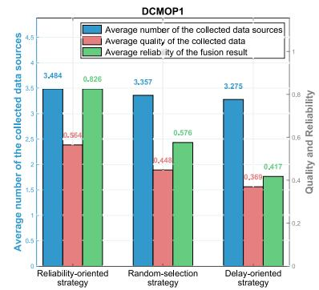

bar

| Strategy | Average number of the collected data sources | Average quality of the collected data | Average reliability of the fusion result |
| -------- | -------------------------------------------- | ------------------------------------- | ---------------------------------------- |
| Reliability-oriented strategy | 3,484 | 0.564 | 0.826 |
| Random-selection strategy | 3,357 | 0.448 | 0.576 |
| Delay-oriented strategy | 3,275 | 0.369 | 0.417 |

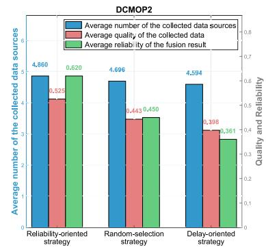

bar

| Strategy | Average number of the collected data sources | Average quality of the collected data | Average reliability of the fusion result |
| --- | --- | --- | --- |
| Reliability-oriented strategy | 4,860 | 0,525 | 0,620 |
| Random-selection strategy | 4,696 | 0,443 | 0,450 |
| Delay-oriented strategy | 4,594 | 0,398 | 0,361 |

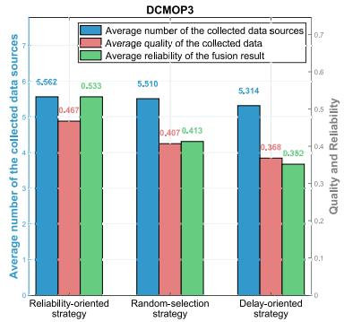

bar

| Strategy | Average number of the collected data sources | Average quality of the collected data | Average reliability of the fusion result |
| --- | --- | --- | --- |
| Reliability-oriented strategy | 5,562 | 0,467 | 0,533 |
| Random-selection strategy | 5,510 | 0,407 | 0,413 |
| Delay-oriented strategy | 5,314 | 0,368 | 0,382 |

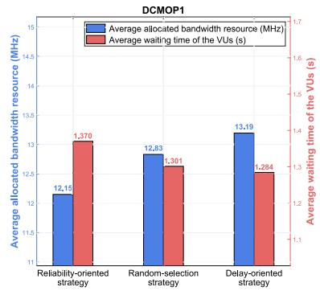

bar

| Strategy               | Average allocated bandwidth resource (MHz) | Average waiting time of the VUs (s) |
| ---------------------- | ------------------------------------------ | ----------------------------------- |
| Reliability-oriented strategy | 12.15                                      | 1.370                               |
| Random-selection strategy | 12.83                                      | 1.301                               |
| Delay-oriented strategy   | 13.19                                      | 1.284                               |

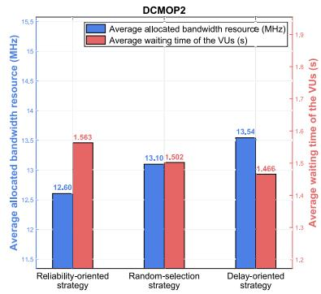

bar

| Strategy                  | Average allocated bandwidth resource (MHz) | Average waiting time of the VUs (s) |
| ------------------------- | ------------------------------------------ | ----------------------------------- |
| Reliability-oriented strategy | 12.60                                      | 1.563                               |
| Random-selection strategy   | 13.10                                      | 1.502                               |
| Delay-oriented strategy     | 13.54                                      | 1.466                               |

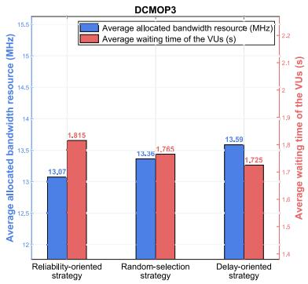

bar

DCMOP3
| Strategy | Average allocated bandwidth resource (MHz) | Average waiting time of the VUs (s) |
|---|---|---|
| Reliability-oriented strategy | 13.07 | 1.815 |
| Random-selection strategy | 13.36 | 1.765 |
| Delay-oriented strategy | 13.59 | 1.725 |

Fig. 2. Data collection and resource allocation schemes performed by the UAV under the three strategies in the three DCMOPs. The first row shows the data collection schemes for DCMOP1, DCMOP2, and DCMOP3, while the second row shows the corresponding resource allocation schemes.

TABLE III EXECUTION TIME COMPARISON OF THE FIVE ALGORITHMS IN DCMOP2 

<table><tr><td>Algorithm</td><td>Average execution time per generation (s)</td></tr><tr><td>DC-MOEA</td><td>0.0091 (0.0050)</td></tr><tr><td>DC-NSGA-II</td><td>0.0090 (0.0050)</td></tr><tr><td>mEDCMOA</td><td>0.0456 (0.0215)</td></tr><tr><td>TDCEA</td><td>0.0283 (0.0075)</td></tr><tr><td>Our Algorithm</td><td>0.0101 (0.0083)</td></tr></table>

# C. Execution Time Analysis of the Baseline Algorithms

To ensure practical applicability in real-time scenarios, we impose a computational limit requiring algorithms to complete 30 generations of evolution within the decision-making time window of $T ^ { \mathrm { d e c } } = 1$ second per time slot. The experiments were conducted on a Windows 11 system equipped with a 13th Gen Intel
R CoreTM i7-13700K processor at 3.40 GHz and 64.0 GB RAM. Table III presents the mean execution time per generation and the standard deviations (shown in parentheses) for the five competing algorithms evaluated on DCMOP2.

As shown in Table III, the proposed algorithm, TDCEA, DC-MOEA, and DC-NSGA-II all satisfy the real-time constraint with execution times under 1/30 second per generation (i.e., approximately 0.033 seconds). However, mEDCMOA fails to meet this real-time requirement. These results validate the computational efficiency and the practical viability of the proposed algorithm for real-time cooperative perception.

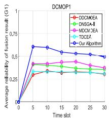

line

DCMOP1
| Time slot | DCMOEA | DNSGA-III | MCM/3EA | TDCER | Our Algorithm |
|---|---|---|---|---|---|
| 0 | 0.00 | 0.00 | 0.00 | 0.00 | 0.00 |
| 5 | 0.25 | 0.35 | 0.40 | 0.45 | 0.65 |
| 10 | 0.28 | 0.38 | 0.42 | 0.47 | 0.62 |
| 15 | 0.29 | 0.39 | 0.43 | 0.48 | 0.60 |
| 20 | 0.30 | 0.40 | 0.44 | 0.49 | 0.58 |
| 25 | 0.31 | 0.41 | 0.45 | 0.50 | 0.57 |
| 30 | 0.32 | 0.42 | 0.46 | 0.51 | 0.56 |

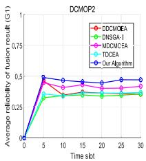

line

DCMOP2
| Time slot | DDCMCEA | DNSGA-I | MDCMCEA | TDCEA | Our Algorithm |
|---|---|---|---|---|---|
| 0 | 0.0 | 0.0 | 0.0 | 0.0 | 0.0 |
| 5 | 0.5 | 0.45 | 0.5 | 0.35 | 0.5 |
| 10 | 0.45 | 0.35 | 0.45 | 0.35 | 0.45 |
| 15 | 0.45 | 0.35 | 0.45 | 0.35 | 0.45 |
| 20 | 0.45 | 0.35 | 0.45 | 0.35 | 0.45 |
| 25 | 0.45 | 0.35 | 0.45 | 0.35 | 0.45 |
| 30 | 0.45 | 0.35 | 0.45 | 0.35 | 0.45 |

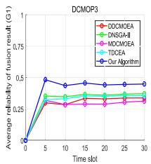

line

DCMOP3
| Time slot | DCCMOEA | DNSGA-III | MDCMOEA | TDCEA | Our Algorithm |
|---|---|---|---|---|---|
| 0 | 0.0 | 0.0 | 0.0 | 0.0 | 0.0 |
| 5 | 0.25 | 0.35 | 0.25 | 0.25 | 0.45 |
| 10 | 0.25 | 0.35 | 0.25 | 0.25 | 0.45 |
| 15 | 0.25 | 0.35 | 0.25 | 0.25 | 0.45 |
| 20 | 0.25 | 0.35 | 0.25 | 0.25 | 0.45 |
| 25 | 0.25 | 0.35 | 0.25 | 0.25 | 0.45 |
| 30 | 0.25 | 0.35 | 0.25 | 0.25 | 0.45 |

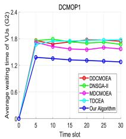

line

| Time slot | DCMOP1 |
| --------- | ------ |
| 0         | 0.0    |
| 5         | 1.8    |
| 10        | 1.7    |
| 15        | 1.7    |
| 20        | 1.7    |
| 25        | 1.7    |
| 30        | 1.7    |

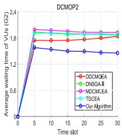

line

| Time slot | DCMOEA | DNSGA-II | MOCNCEA | TIDCA | Our Algorithm |
| --------- | ------ | -------- | ------- | ----- | ------------ |
| 0         | 0.0    | 0.0      | 0.0     | 0.0   | 0.0          |
| 5         | 1.8    | 1.8      | 1.9     | 1.8   | 1.7          |
| 15        | 1.8    | 1.8      | 1.9     | 1.8   | 1.6          |
| 25        | 1.8    | 1.8      | 1.9     | 1.8   | 1.5          |
| 30        | 1.8    | 1.8      | 1.9     | 1.8   | 1.4          |

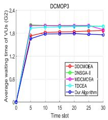

line

DCMOP3
| Time slot | DDCMOEA | DNSGA-I | MDCMCEA | TDCEA | Our Algorithm |
|---|---|---|---|---|---|
| 0 | 0.0 | 0.0 | 0.0 | 0.0 | 0.0 |
| 5 | 1.8 | 1.85 | 1.85 | 1.85 | 1.75 |
| 10 | 1.85 | 1.85 | 1.85 | 1.85 | 1.8 |
| 15 | 1.85 | 1.85 | 1.85 | 1.85 | 1.8 |
| 20 | 1.85 | 1.85 | 1.85 | 1.85 | 1.8 |
| 25 | 1.85 | 1.85 | 1.85 | 1.85 | 1.8 |
| 30 | 1.85 | 1.85 | 1.85 | 1.85 | 1.8 |

Fig. 3. Convergence graphs of the five competing algorithms on the three DCMOPs at the median run. The first row shows the average reliability of the fusion results, while the second row shows the corresponding average waiting time.

# D. Investigation of the Two Key Objectives

To investigate the capability of the five competing algorithms in balancing the average reliability of the fusion results and the average waiting time of the VUs, Fig. 3 presents the convergence trajectories across the three DCMOPs at the median run, where the horizontal axis denotes the time slots and the vertical axis represents the objective values. Note that the average reliability represents cumulative fusion quality rather than a percentage, with problem-dependent magnitude where higher values indicate better performance.

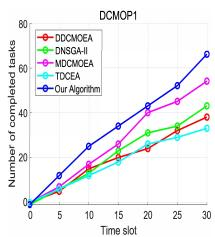

line

DCMOP1
| Time slot | DDCMOE | DNSG-II | MDCMOE | TOCEA | Our Algorithm |
|---|---|---|---|---|---|
| 0 | 0 | 0 | 0 | 0 | 0 |
| 5 | 8 | 6 | 12 | 7 | 14 |
| 10 | 16 | 14 | 24 | 18 | 28 |
| 15 | 24 | 22 | 36 | 24 | 38 |
| 20 | 32 | 30 | 48 | 32 | 50 |
| 25 | 40 | 38 | 60 | 40 | 62 |
| 30 | 48 | 46 | 72 | 48 | 76 |

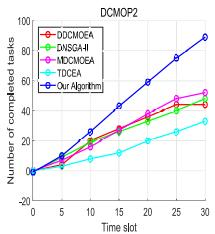

line

DCMOP2
| Time slot | DDCMCEAI | DMSGAI | MDCMCEAI | TDCCE | Our Algorithm |
|---|---|---|---|---|---|
| 0 | 0 | 0 | 0 | 0 | 0 |
| 5 | 10 | 15 | 15 | -5 | 15 |
| 10 | 20 | 25 | 25 | 10 | 30 |
| 15 | 25 | 30 | 35 | 15 | 45 |
| 20 | 30 | 35 | 45 | 20 | 60 |
| 25 | 35 | 40 | 50 | 25 | 75 |
| 30 | 40 | 45 | 55 | 30 | 90 |

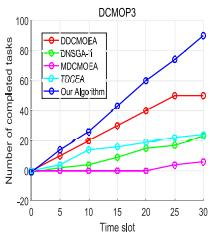

line

DCMOP3
| Time slot | DCCMOEA | DNSGA-1 | MDCMO5A | TOX2CA | Our Algorithm |
|---|---|---|---|---|---|
| 0 | 0 | 0 | 0 | 0 | 0 |
| 5 | 10 | 5 | 0 | 5 | 15 |
| 10 | 20 | 10 | 0 | 10 | 30 |
| 15 | 30 | 15 | 0 | 15 | 45 |
| 20 | 40 | 20 | 0 | 20 | 60 |
| 25 | 50 | 25 | 5 | 25 | 75 |
| 30 | 55 | 30 | 10 | 30 | 90 |

Fig. 4. Convergence graphs of the five competing algorithms on the three DCMOPs at the median run in terms of the number of completed tasks.

As shown in Fig. 3, the proposed algorithm demonstrates superior performance in achieving balanced optimization of both objectives. In the DCMOP1 and DCMOP2, the proposed algorithm achieves the highest average reliability while simultaneously delivering the best waiting time performance, indicating superior capability in managing the trade-off between the two conflicting objectives. In the DCMOP3, which involves the largest number of the NCOs and VUs, the proposed algorithm maintains its superiority in both objectives. Notably, the performance gaps regarding the waiting time of the VUs among the five algorithms become slightly smaller in the DCMOP3. This phenomenon occurs as the DCMOP3 involves the largest number of the VUs with unchanged UAV bandwidth capacity, leading to less bandwidth per VU and consequently smaller performance gaps in latency compared to the DCMOP1 and DCMOP2. In contrast, the reliability improvement benefits more from the optimization of data collection schemes, as the fusion quality is directly determined by the number and quality of collected data sources rather than the bandwidth allocation alone, resulting in more stable performance gaps across all test instances. The enhanced performance in the two objectives can be attributed to the proposed cascaded dependency generation strategy, which dynamically coordinates the request responses, data collection, and resource allocation to generate diversified high-quality solutions, enabling effective trade-off management between the reliability and the waiting time throughout the mission.

# E. Analysis of Task Completion Performance

This subsection evaluates the task completion performance of the five competing algorithms during the UAV mission. Fig. 4 presents the convergence trajectories of all five baseline algorithms across the three DCMOPs at the median run in terms of the number of the completed tasks. The horizontal axis of Fig. 4 represents the time slots.

In DCMOP1, the proposed algorithm consistently outperforms the baseline algorithms. While task completion performance is initially similar across all algorithms, the advantage of the proposed algorithm becomes increasingly pronounced over time. This superiority is further amplified in DCMOP2 and DCMOP3, where the increased number of the NCOs and VUs introduces more stringent challenges in request response, leading to a more rapid and substantial performance divergence. This performance enhancement stems from the proposed cascaded dependency generation strategy,

TABLE IV COMPARISON OF THE MOBILE UAV AND STATIC RSU SCENARIOS 

<table><tr><td></td><td>LoS probability</td><td>Transmission rate</td><td>Collected data size</td></tr><tr><td>Mobile UAV</td><td>0.44 (0.11)</td><td>2.63 (0.73)</td><td>0.72 (0.24)</td></tr><tr><td>Static RSU</td><td>0.30 (0.05)</td><td>2.36 (0.58)</td><td>0.67 (0.23)</td></tr></table>

which facilitates efficient feasible solution generation and superior convergence by adhering to the cascaded dependency relationships, thereby enabling the UAV to complete more tasks compared to the baseline algorithms.

# F. Investigation of the UAV-Enabled Multi-Source Fusion-Based Vehicular Network

To evaluate the performance advantages of the proposed UAV-enabled multi-source fusion-based vehicular network, we conduct a comparative study on the representative problem DCMOP2 under two scenarios: the mobile UAV scenario where the UAV can dynamically adjust its position, and the static RSU scenario where the UAV remains fixed at its initial location qu (0) to serve as an RSU. The proposed algorithm is executed for 30 independent runs under each scenario. The comparison results, presented in Table IV, show the mean values and standard deviations (shown in parentheses) of the LoS probability, transmission rate, and collected data size (in MB). Note that the LoS probability depends on the elevation angle between the UAV and the ground nodes, while the transmission rate is calculated using Shannon’s formula based on channel conditions.

The results reveal substantial performance gains for the UAV-enabled network. Compared to the static RSU scenario, the mobile UAV scenario achieves approximately 48% improvement in mean LoS probability, 11% improvement in mean transmission rate, and 7% improvement in mean collected data size. The higher LoS probability indicates reduced occlusions, attributed to the mobility of the UAV that enables adaptive positioning to achieve favorable elevation angles with VUs. The improved transmission rate results from the enhanced channel conditions, as the mobile UAV can adjust its position to reduce the communication distance with VUs. The increased collected data size demonstrates that the mobility of the UAV enables more efficient data collection by establishing better communication links with more VUs.

# G. Comparison of Algorithm Performance

To further demonstrate the superiority of the proposed algorithm, we compare its SR and HV against the four existing DCMOEAs across the three DCMOPs. Table V presents the comparison results, showing both mean values and standard deviations (shown in parentheses) over 30 independent runs. We use the Wilcoxon rank-sum test at the 0.001 significance level to assess statistical significance.

The experimental results demonstrate the superior performance of the proposed algorithm, which consistently achieves the best mean SR (100%) and the best mean HV values across all three DCMOPs. The conservative default strategy is triggered only when the algorithm fails to find feasible solutions. The 100% SR indicates that feasible solutions are found in every time slot across all runs, meaning the default strategy is not triggered, demonstrating the robustness of the proposed algorithm. When compared with DC-NSGA-II, a representative baseline that shares a similar framework but lacks the cascaded dependency generation strategy, the proposed algorithm achieves remarkable improvements of approximately 64% in SR and 186% in HV for DCMOP2. These gains are attributed to the proposed strategy, which exploits the problem structure to generate high-quality feasible solutions by hierarchically coordinating the request responses, data collection, and resource allocation.

TABLE VCOMPARISON RESULTS OF THE FIVE ALGORITHMS BASED ON SR ANDHV. THE BEST VALUE IS HIGHLIGHTED WITH GRAY SHADING

<table><tr><td rowspan="2">Algorithm</td><td colspan="2">DCMOP1</td><td colspan="2">DCMOP2</td><td colspan="2">DCMOP3</td></tr><tr><td>SR</td><td>HV</td><td>SR</td><td>HV</td><td>SR</td><td>HV</td></tr><tr><td>DC-MOEA</td><td> $68\%(0.47)^{\ddagger}$ </td><td> $0.85(0.57)^{\ddagger}$ </td><td> $48\%(0.50)^{\ddagger}$ </td><td> $0.58(0.39)^{\ddagger}$ </td><td> $38\%(0.49)^{\ddagger}$ </td><td> $0.37(0.24)^{\ddagger}$ </td></tr><tr><td>DC-NSGA-II</td><td> $72\%(0.45)^{\ddagger}$ </td><td> $0.75(0.45)^{\ddagger}$ </td><td> $61\%(0.49)^{\ddagger}$ </td><td> $0.44(0.28)^{\ddagger}$ </td><td> $68\%(0.34)^{\ddagger}$ </td><td> $0.10(0.10)^{\ddagger}$ </td></tr><tr><td>mEDCMOA</td><td> $72\%(0.45)^{\ddagger}$ </td><td> $0.99(0.50)^{\ddagger}$ </td><td> $53\%(0.50)^{\ddagger}$ </td><td> $0.39(0.27)^{\ddagger}$ </td><td> $10\%(0.31)^{\ddagger}$ </td><td> $0.28(0.14)^{\ddagger}$ </td></tr><tr><td>TDCEA</td><td> $65\%(0.48)^{\ddagger}$ </td><td> $0.66(0.48)^{\ddagger}$ </td><td> $52\%(0.50)^{\ddagger}$ </td><td> $0.44(0.32)^{\ddagger}$ </td><td> $53\%(0.50)^{\ddagger}$ </td><td> $0.17(0.19)^{\ddagger}$ </td></tr><tr><td>Our Algorithm</td><td> $100\%(0.00)$ </td><td> $1.73(0.25)$ </td><td> $100\%(0.00)$ </td><td> $1.26(0.23)$ </td><td> $100\%(0.00)$ </td><td> $0.59(0.15)$ </td></tr></table>

#,t,and βindicate our algorithm performs significantly better than,equivalently to, and significantly worse than the corresponding algorithm,respectively.

# VI. CONCLUSION

In this paper, we have proposed the UAV-enabled cooperative perception system for vehicular networks, where the UAV operates in a cyclic process to collect and fuse multi-source observation data for the VUs. We subsequently formulated the DCMOP that jointly optimizes the decisions regarding the UAV trajectory, request response, data collection, compression degree of the fusion results, and resource allocation to balance the fusion reliability and the service latency. The problem captures the cascaded dependencies where the request response decisions, data collection decisions, and resource allocation decisions should be determined sequentially due to the inherent logic of cooperative perception. To effectively address this challenge, we designed the DCMOEA with the cascaded dependency generation strategy that enables the generation of the decision variables according to their dependency order. Experimental results validate the effectiveness of the proposed algorithm and the superiority of the UAV-enabled multi-source fusion-based vehicular network. The proposed algorithm achieves 100% SR and demonstrates superior HV performance compared to the four baseline algorithms. The mobile UAV scenario achieves notable improvements in LoS probability and transmission rate compared to the static RSU scenario. These results demonstrate that UAV mobility significantly enhances the quality of cooperative perception in vehicular networks. In future work, we will extend the proposed framework to multi-UAV scenarios, addressing challenges such as inter-UAV interference and collision avoidance. Additionally, power control optimization and advanced multiple access techniques such as non-orthogonal multiple access will be explored to further improve energy efficiency and spectral utilization.

# REFERENCES

[1] K. Qu, W. Zhuang, Q. Ye, W. Wu, and X. Shen, “Model-assisted learning for adaptive cooperative perception of connected autonomous vehicles,” IEEE Trans. Wireless Commun., vol. 23, no. 8, pp. 8820–8835, Aug. 2024.   
[2] P. Ghorai, A. Eskandarian, Y.-K. Kim, and G. Mehr, “State estimation and motion prediction of vehicles and vulnerable road users for cooperative autonomous driving: A survey,” IEEE Trans. Intell. Transp. Syst., vol. 23, no. 10, pp. 16983–17002, Oct. 2022.   
[3] Y. Fu, C. Li, F. R. Yu, T. H. Luan, and Y. Zhang, “A survey of driving safety with sensing, vehicular communications, and artificial intelligence-based collision avoidance,” IEEE Trans. Intell. Transp. Syst., vol. 23, no. 7, pp. 6142–6163, Jul. 2022.   
[4] X. Tang et al., “High-definition maps construction based on visual sensor: A comprehensive survey,” IEEE Trans. Intell. Vehicles, vol. 9, no. 10, pp. 5973–5994, Oct. 2024.   
[5] B. Gao, J. Liu, H. Zou, J. Chen, L. He, and K. Li, “Vehicle-road-cloud collaborative perception framework and key technologies: A review,” IEEE Trans. Intell. Transp. Syst., vol. 25, no. 12, pp. 19295–19318, Dec. 2024.   
[6] K. Cai, T. Qu, F. Liu, H. Chen, and L. Xie, “Cooperative perception with localization uncertainty: A cubature split covariance intersection framework,” IEEE Trans. Intell. Transp. Syst., vol. 25, no. 11, pp. 18006–18024, Nov. 2024.   
[7] H. Ngo, H. Fang, and H. Wang, “Cooperative perception with V2V communication for autonomous vehicles,” IEEE Trans. Veh. Technol., vol. 72, no. 9, pp. 11122–11131, Sep. 2023.   
[8] H. Yin et al., “V2VFormer++: Multi-modal vehicle-to-vehicle cooperative perception via global-local transformer,” IEEE Trans. Intell. Transp. Syst., vol. 25, no. 2, pp. 2153–2166, Feb. 2024.   
[9] Y. Yu, X. Tang, J. Wu, B. Kim, T. Song, and Z. Han, “Multileader–follower game for MEC-assisted fusion-based vehicle on-road analysis,” IEEE Trans. Veh. Technol., vol. 68, no. 11, pp. 11200–11212, Nov. 2019.   
[10] Q. Zhang, Z. Chen, B. Xia, X. Jiang, and C. Xiong, “Design and optimization of edge computing for data fusion in V2I cooperative systems,” in Proc. IEEE/CIC Int. Conf. Commun. China (ICCC), China, Aug. 2020, pp. 466–471.   
[11] K. Cai, T. Qu, B. Gao, and H. Chen, “Consensus-based distributed cooperative perception for connected and automated vehicles,” IEEE Trans. Intell. Transp. Syst., vol. 24, no. 8, pp. 8188–8208, Aug. 2023.   
[12] G. Luo et al., “EdgeCooper: Network-aware cooperative LiDAR perception for enhanced vehicular awareness,” IEEE J. Sel. Areas Commun., vol. 42, no. 1, pp. 207–222, Jan. 2024.   
[13] Q. Wu et al., “A comprehensive overview on 5G-and-beyond networks with UAVs: From communications to sensing and intelligence,” IEEE J. Sel. Areas Commun., vol. 39, no. 10, pp. 2912–2945, Oct. 2021.   
[14] J. Yao, Z. Yang, Z. Yang, J. Xu, and T. Q. S. Quek, “UAV-enabled secure ISAC against dual eavesdropping threats: Joint beamforming and trajectory design,” IEEE Wireless Commun. Lett., vol. 14, no. 10, pp. 3199–3203, Oct. 2025.   
[15] N. Zhao, Z. Ye, Y. Pei, Y.-C. Liang, and D. Niyato, “Multi-agent deep reinforcement learning for task offloading in UAV-assisted mobile edge computing,” IEEE Trans. Wireless Commun., vol. 21, no. 9, pp. 6949–6960, Sep. 2022.   
[16] C. Peng et al., “Joint energy and completion time difference minimization for UAV-enabled intelligent transportation systems: A constrained multi-objective optimization approach,” IEEE Trans. Intell. Transp. Syst., vol. 25, no. 10, pp. 14040–14053, Oct. 2024.   
[17] Q. Wu, M. Cui, G. Zhang, F. Wang, Q. Wu, and X. Chu, “Latency minimization for UAV-enabled URLLC-based mobile edge computing systems,” IEEE Trans. Wireless Commun., vol. 23, no. 4, pp. 3298–3311, Apr. 2024.   
[18] A. Hamissi and A. Dhraief, “A survey on the unmanned aircraft system traffic management,” ACM Comput. Surveys, vol. 56, no. 3, pp. 1–37, Mar. 2024.   
[19] Z. Wu, Q. Xie, Z. Wang, X. Huang, C. Peng, and Y. Wu, “Terrainaware UAV-enabled mobile edge computing in urban environments: A constrained multi-objective approach with task-adaptive mechanism,” IEEE Trans. Veh. Technol., vol. 75, no. 2, pp. 3160–3173, Feb. 2026.   
[20] J. Li et al., “Collaborative ground-space communications via evolutionary multi-objective deep reinforcement learning,” IEEE J. Sel. Areas Commun., vol. 42, no. 12, pp. 3395–3411, Dec. 2024.

[21] D. Gong, M. Rong, N. Hu, Y. Wang, W. Pedrycz, and S. Yang, “A prediction and weak coevolution-based dynamic constrained multiobjective optimization,” IEEE Trans. Evol. Comput., vol. 29, no. 4, pp. 1328–1342, Aug. 2025.   
[22] D. Zhang et al., “History-assisted two-state auxiliary task collaboration approach for dynamic constrained multiobjective optimization,” IEEE Trans. Evol. Comput., vol. 29, no. 6, pp. 2386–2400, Dec. 2025.   
[23] D. D. Yoon, B. Ayalew, and G. G. M. N. Ali, “Performance of decentralized cooperative perception in V2V connected traffic,” IEEE Trans. Intell. Transp. Syst., vol. 23, no. 7, pp. 6850–6863, Jul. 2022.   
[24] J. Su et al., “Semantic communication-based dynamic resource allocation in D2D vehicular networks,” IEEE Trans. Veh. Technol., vol. 72, no. 8, pp. 10784–10796, Aug. 2023.   
[25] B. Liang, X. Xu, W. Lu, F. Wang, and B. Ran, “Optimizing the deployment of static and mobile roadside units using a branch-andprice algorithm,” IEEE Trans. Intell. Transp. Syst., vol. 25, no. 11, pp. 17078–17091, Nov. 2024.   
[26] Q. Bao, M. Wang, S. Yang, G. Dai, and X. Chen, “A coevolutionary response framework for dynamic constrained multi-objective optimization problems,” IEEE Trans. Evol. Comput., early access, Aug. 4, 2025, doi: 10.1109/TEVC.2025.3595410.   
[27] Q. Gong, Y. Xia, J. Zou, Z. Hou, and Y. Liu, “Enhancing dynamic constrained multiobjective optimization with multicenters-based prediction,” IEEE Trans. Evol. Comput., vol. 29, no. 5, pp. 1604–1618, Oct. 2025.   
[28] Z. Chang, H. Deng, L. You, G. Min, S. Garg, and G. Kaddoum, “Trajectory design and resource allocation for multi-UAV networks: Deep reinforcement learning approaches,” IEEE Trans. Netw. Sci. Eng., vol. 10, no. 5, pp. 2940–2951, Sep. 2023.   
[29] Z. Zhang and M. Krunz, “Preamble forgery and injection in Wi-Fi networks: Attacks and defenses,” IEEE Trans. Mobile Comput., vol. 23, no. 12, pp. 10752–10769, Dec. 2024.   
[30] Q. Wu, Y. Zeng, and R. Zhang, “Joint trajectory and communication design for multi-UAV enabled wireless networks,” IEEE Trans. Wireless Commun., vol. 17, no. 3, pp. 2109–2121, Mar. 2018.   
[31] Z. Yang, S. Bi, and Y.-J.-A. Zhang, “Online trajectory and resource optimization for stochastic UAV-enabled MEC systems,” IEEE Trans. Wireless Commun., vol. 21, no. 7, pp. 5629–5643, Jul. 2022.   
[32] Y. Wu, T. Cheng, and J. Huang, “Research on the models of the distribution of files on the networks,” in Proc. Int. Conf. Commun., Circuits Syst., vol. 1, May 2004, pp. 108–112.   
[33] K. Deb, A. Pratap, S. Agarwal, and T. Meyarivan, “A fast and elitist multiobjective genetic algorithm: NSGA-II,” IEEE Trans. Evol. Comput., vol. 6, no. 2, pp. 182–197, Apr. 2002.   
[34] E. Zitzler, M. Laumanns, and L. Thiele, “SPEA2: Improving the strength Pareto evolutionary algorithm for multi-objective optimization,” in Proc. 5th Conf. Evol. Methods Design, Optim. Control Appl. Ind. Problems, 2001, pp. 95–100.   
[35] R. Azzouz, S. Bechikh, L. B. Said, and W. Trabelsi, “Handling time-varying constraints and objectives in dynamic evolutionary multiobjective optimization,” Swarm Evol. Comput., vol. 39, pp. 222–248, Apr. 2018. [Online]. Available: https://www.sciencedirect.com/science/ article/pii/S2210650217302717   
[36] R. Azzouz, S. Bechikh, and L. Ben Said, “Multi-objective optimization with dynamic constraints and objectives: New challenges for evolutionary algorithms,” in Proc. Annu. Conf. Genetic Evol. Comput., Jul. 2015, pp. 615–622.   
[37] Q. Chen, J. Ding, G. G. Yen, S. Yang, and T. Chai, “Multipopulation evolution-based dynamic constrained multiobjective optimization under diverse changing environments,” IEEE Trans. Evol. Comput., vol. 28, no. 3, pp. 763–777, Jun. 2024.   
[38] G. Chen, Y. Guo, Y. Wang, J. Liang, D. Gong, and S. Yang, “Evolutionary dynamic constrained multiobjective optimization: Test suite and algorithm,” IEEE Trans. Evol. Comput., vol. 28, no. 5, pp. 1381–1395, Oct. 2024.

natural_image

Portrait of a woman in formal attire with dark hair and collared shirt (no visible text or symbols)

Qiqi Xie is currently pursuing the master’s degree in computer science and technology with South China Agricultural University. Her research interests include UAV path planning, evolutionary computation, and dynamic constrained multi-objective optimization.

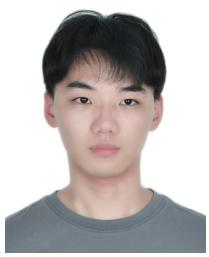

natural_image

Portrait photo of a young man with short dark hair wearing a gray shirt (no text or symbols visible)

Zexiong Wu is currently pursuing the B.S. degree in mathematics and applied mathematics with South China Agricultural University. His research interests include mobile edge computing, evolutionary computation, and multi-objective optimization.

natural_image

Portrait photo of a young man in a blue shirt (no text or symbols visible)

Chaoda Peng (Member, IEEE) received the Ph.D. degree from the School of Automation, Guangdong University of Technology, Guangzhou, China, in 2019. He was a Visiting Ph.D. Student with the Department of Electrical and Computer Engineering, Michigan State University, East Lansing, MI, USA, under the supervision of Prof. Erik D. Goodman. He is currently an Associate Professor with the College of Mathematics and Informatics, South China Agricultural University, Guangzhou. His current research interests include evolutionary computation, multi-  
objective optimization, deep learning, UAV path planning, and mobile edge computing.

natural_image

Portrait photo of a man in a white shirt against a blue background (no text or symbols visible)

Xumin Huang (Member, IEEE) received the Ph.D. degree from Guangdong University of Technology, Guangzhou, China, in 2019. He was Macau Young Scholar with the State Key Laboratory of Internet of Things for Smart City, University of Macau, Macau, China. He is currently an Associate Professor with Guangdong University of Technology. His research interests include resource and service optimizations for connected vehicles, the Internet of Things, blockchain, and edge intelligence.

natural_image

Portrait photo of a young woman with long dark hair wearing a collared shirt and sweater (no text or symbols visible)

Yanglin Chen is currently pursuing the B.S. degree in big data management and application with South China Agricultural University. Her research interests include mobile edge computing and evolutionary computation.

natural_image

Portrait of a man wearing glasses and a striped shirt against a blue background (no text or symbols visible)

Yuan Wu (Senior Member, IEEE) is currently a Full Professor with the State Key Laboratory of Internet of Things for Smart City and the Department of Electronic and Communication Engineering, University of Macau, Macau, SAR, China. His research interests include resource management for wireless networks, mobile edge computing and edge intelligence, and integrated sensing and communications. He was a recipient of the Best Paper Award from the IEEE ICC 2016, IEEE TCGCC 2017, IWCMC 2021, and IEEE WCNC 2023. He serves on the editorial   
board of IEEE TRANSACTIONS ON WIRELESS COMMUNICATIONS, IEEE TRANSACTIONS ON VEHICULAR TECHNOLOGY, and IEEE TRANSACTIONS ON NETWORK SCIENCE AND ENGINEERING. He is a Distinguished Lecturer of the IEEE Vehicular Technology Society (VTS).