# UAV-Enabled Aerial Monitoring Aided by STAR-RIS: A Stochastic Optimization Framework

Cheng Zhan , Member, IEEE, Lu Hu , Kaifeng Song, Rongfei Fan , Member, IEEE, Han Hu , Member, IEEE, and Jie Xu , Fellow, IEEE

Abstract—This paper studies the unmanned aerial vehicle (UAV)-enabled aerial monitoring assisted by simultaneous transmitting and reflecting reconfigurable intelligent surfaces (STAR-RISs), in which one UAV aims to monitor a number of moving targets, and one STAR-RIS is installed on a building for assisting the UAV to broadcast the monitored information to both indoor and outdoor users. Due to the randomness of target movements over time, the UAV needs to adaptively adjust its flight trajectory to track them. This thus results in highly dynamic channel conditions and uncertain UAV energy consumption, which accordingly make the efficient aerial monitoring a challenging task. To address these challenges, we propose a STAR-RIS-aided UAV-enabled aerial monitoring framework, which aims to maximize the long-term average throughput for all users, through joint optimization of transmit beamforming, UAV trajectory, and STAR-RIS configuration, while ensuring the monitoring requirements under strict energy constraints. The formulated problem is a multi-stage stochastic optimization problem, due to the randomness of various system parameters. To handle this problem, we apply the Lyapunov optimization technique and introduce a virtual energy queue to transform it into a series of single-slot optimization subproblems that are solvable online. For each subproblem, we develop efficient algorithms to obtain a near-optimal solution, in which a penalty

Digital Object Identifier 10.1109/TWC.2025.3645801

dual decomposition (PDD) approach is used for the transmit beamforming and STAR-RIS configuration optimization, and a sequential parametric convex approximation (SPCA) method is used for UAV trajectory optimization. Extensive simulations demonstrate that the proposed framework significantly outperforms benchmark schemes, effectively maximizing the throughput and energy efficiency under dynamic operational conditions.

Index Terms—Aerial monitoring, simultaneous transmitting and reflecting reconfigurable intelligent surface, unmanned aerial vehicle, active beamforming, Lyapunov optimization.

## I. INTRODUCTION

W <sup>ITH</sup> <sup>the</sup> <sup>rapid</sup> <sup>advancement</sup> <sup>of</sup> <sup>unmanned</sup> <sup>aerial</sup> <sup>vehicle</sup>(UAV) technology, UAVs have emerged as a cost- (UAV) technology, UAVs have emerged as a costeffective and highly flexible solution for aerial monitoring [1]. By integrating advanced sensors and high-resolution cameras, UAV-enabled monitoring systems can capture real-time and high-quality video streams that are critical for a wide range of tasks such as disaster assessment, traffic monitoring, and target tracking [2], [3]. Unlike traditional ground-based monitoring systems, UAVs offer the advantage of rapid deployment to areas of interest and the ability to dynamically adjust their flight trajectories, providing comprehensive coverage even in complex urban environments.

Despite the numerous advantages and widespread adoption of UAVs, maintaining reliable air-to-ground (A2G) communication remains a significant challenge, particularly in low-altitude urban environments. A key limitation lies in the vulnerability of A2G links to building blockages, which can frequently disrupt communication [4]. To address this issue, reconfigurable intelligent surface (RIS) offers a promising solution. An RIS typically consists of a planar surface integrated with low-cost passive elements, whose electromagnetic response can be dynamically tuned via onboard positive-intrinsic-negative (PIN) diodes [5]. By leveraging these characteristics, RIS can dynamically reconfigure the wireless propagation environment. This allows signals to be constructively combined at intended receivers to enhance communication quality, while suppressing unwanted signals to limit interference. Integrating RIS into UAV-assisted wireless networks and optimally adjusting the configurable coefficients can substantially improve the reliability of A2G links, potentially creating virtual line-of-sight (LoS) links that bypass obstructions and mitigate signal blockages [6].

However, the conventional RIS faces limitations in wireless communication schemes, as it can only modulate the reflection of incident signals. This means that both the transmitting and receiving nodes are constrained to be positioned on the same side of the RIS, which substantially limits its ability to modify the wireless propagation environment, thereby restricting the coverage and deployment flexibility. To address this, the simultaneous transmitting and reflecting reconfigurable intelligent surface (STAR-RIS) has been introduced [7], [8]. In comparison with conventional RIS, STAR-RIS can simultaneously transmit and reflect signals, significantly increasing the flexibility in signal propagation control. This capability enables STAR-RIS to provide services to users regardless of their locations, thereby facilitating the creation of a fullspace intelligent radio environment. For example, STAR-RIS can transmit signals to indoor users while reflecting signals to outdoor users, supporting seamless communication across diverse environments. By enhancing coverage and throughput, STAR-RIS is well positioned to meet the rising demand for high-quality services and robust A2G links in urban environments.

## A. Prior Works

1) UAV-Aided Aerial Monitoring: Extensive studies have been conducted to enhance the performance of UAV-based aerial monitoring. The work in [9] introduced an ant colony-based strategy to optimize UAV trajectory, aimed at maximizing the coverage of monitored vessels. In [10], the authors focused on deploying an energy-limited UAV to monitor points of interest in disaster zones, with the goal of maximizing non-redundant data collection. The work in [11] developed a UAV-based target detection and recognition framework, which incorporated features such as precise camera alignment, fast image processing, and data fusion. The work in [12] proposed a quality of experience (QoE) maximization approach for aerial video delivery within cellular networks, utilizing channel knowledge map (ECKM) for UAV trajectory, resource allocation, and playback rate adaptation. In aerial monitoring, UAVs not only transmit monitoring data but also transform real-time environmental information into high-quality 360<sup>◦</sup> VR video streams. This capability offers users an immersive remote monitoring experience and facilitates decision analysis through VR headsets. The authors in [13] developed a learning-based scheme to sustain realtime 360<sup>◦</sup> video streaming delivery. In [14], a UAV-enabled mobile edge computing (MEC) framework was designed to support 360<sup>◦</sup> VR services, with the goal of enhancing the QoE for VR users. The work in [15] deployed a UAV to deliver VR content to multiple ground users, aiming to minimize the maximum communication and computing latency. Despite these advancements, the A2G links provided by UAVs are susceptible to disruptions, particularly in complex urban propagation environments [16].

2) RIS-Assisted UAV Networks: The emergence and development of RIS has led to growing research interest in integrating RISs into UAV communications, offering potential improvements to link reliability and efficiency. In [17], a novel RIS-aided MEC architecture was introduced, where a UAV acts as a relay, and the UAV trajectory and RIS coefficients are jointly designed to maximize computation efficiency. The work in [18] formulated a sum-rate optimization problem for RIS-assisted UAV networks using orthogonal frequency division multiple access (OFDMA). The authors in [19] developed a proximal policy optimization (PPO)-based strategy to boost energy efficiency in RIS-aided information and power transmission systems using rate-splitting multiple access (RSMA) techniques. The work in [20] proposed a secure communication framework to maximize the secrecy rate. According to [21], a RIS-assisted full-duplex UAV communication framework was designed to maximize uplink and downlink performance through joint optimization of weighting and data rates. In [22], a double deep Q-network (DDQN)- based approach was applied to a non-orthogonal multiple access (NOMA) RIS-enabled network, aiming to maximize system capacity. However, conventional RISs are restricted to only reflecting incoming signals, limiting the flexibility of beamforming for transmitted signals, and does not fully utilize the potential of available resources.

3) STAR-RIS-Assisted UAV Networks: To enable a fullspace intelligent propagation environment, the STAR-RIS has emerged as an effective and innovative solution. In [23] and [24], the authors analyzed UAV communication systems enhanced by STAR-RIS and demonstrated its superior performance compared to conventional RISs. The work in [25] focused on maximizing secrecy energy efficiency under dynamic environments by employing a UAV-equipped STAR-RIS to mitigate eavesdropping risks. In [26], the authors proposed an alternating optimization (AO) algorithm aimed at enhancing the sum-rate in UAV-supported STAR-RIS systems. This makes it possible to create deeper integrations between airborne platforms and terrestrial networks, facilitating more efficient and robust UAV-assisted communications.

## B. Motivations and Contributions

Conventional RIS solutions are typically limited to passive signal reflection, while STAR-RIS offers the unique ability to transmit and reflect signals simultaneously, enabling omnidirectional coverage and significantly enhancing signal propagation. This feature becomes particularly valuable in dynamic environments, such as UAV-assisted monitoring, where both UAVs and targets are constantly in motion. As the targets move and the UAV adjusts its trajectory, STAR-RIS continuously adapts its beamforming to maintain optimal A2G links, compensating for signal blockages caused by urban obstacles. However, optimizing such a system is inherently complex, as it involves tightly coupled components such as UAV mobility, target dynamics, active and passive beamforming, and energy constraints. A key challenge arises when the target being monitored by the UAV moves unpredictably, compelling the UAV to continuously adjust its trajectory to maintain effective coverage. Since future target movements are unknown, the UAV faces uncertainty in forecasting its energy consumption, yet it must ensure uninterrupted monitoring within strict energy constraints. Moreover, UAV mobility introduces dynamic variations in the communication channel, complicating the maintenance of a stable and high-quality link. To cope with this, the UAV must dynamically adjust both its trajectory and the STAR-RIS configuration. This joint management of energy and communication under the unpredictability of target movements significantly increases the system complexity, presenting challenges that have not been investigated before. Motivated by the above challenges, we explore the integration of STAR-RIS into UAV-assisted dynamic aerial monitoring networks with moving targets for both outdoor and indoor users. The framework aims to maximize long-term average throughput by jointly optimizing the active beamforming, STAR-RIS transmission and reflection coefficients, and UAV trajectory, all under strict energy constraints. The main contributions of this paper are summarized as follows:

• We propose a unified stochastic optimization and control framework for STAR-RIS–aided UAV monitoring networks that support dynamic observation of randomly moving targets. The STAR-RIS, mounted on building surfaces, can simultaneously transmit and reflect signals, thereby providing full-space coverage and improving the A2G communication quality for both indoor and outdoor users. This capability enables reliable and continuous monitoring even in dynamic and cluttered environments with unpredictable target mobility.

• We formulate a joint optimization problem to maximize the long-term average throughput of all users by optimizing the UAV trajectory, active beamforming, and STAR-RIS transmission and reflection coefficients under stringent energy constraints. To address the stochastic and time-coupled nature of this problem, Lyapunov optimization theory is employed to transform the longhorizon formulation into a sequence of online per-slot deterministic subproblems. A virtual energy queue is introduced to track the UAV’s energy consumption over time, ensuring that instantaneous control decisions remain consistent with the long-term energy budget and thereby enabling per-slot optimization while maintaining overall system feasibility.

• The non-convex online problem is decomposed into two subproblems: the STAR-RIS phase shift, amplitude, and active beamforming subproblem, and the UAV trajectory subproblem. For the first subproblem, the penalty dual decomposition (PDD) framework is employed to reformulate the problem into an augmented-Lagrangian (AL) form, which yields structured separability and enables efficient closed-form updates for the STAR-RIS configuration. For the second subproblem, the UAV trajectory is optimized using the sequential parametric convex approximation (SPCA) method, which leverages two tailored mathematical lemmas to characterize the nonlinear energy model and geometric coupling of UAV motion. These two subproblems are alternately solved until convergence.

• Extensive simulations are conducted to validate the effectiveness of the proposed framework, demonstrating its convergence and significant performance gains over existing benchmark schemes. The results further confirm that the proposed approach achieves an effective balance between throughput maximization and energy consumption, even under dynamically changing mobility conditions. These findings provide valuable insights into the interplay among communication performance, energy management, and system dynamics in STAR-RIS–aided UAV monitoring networks.

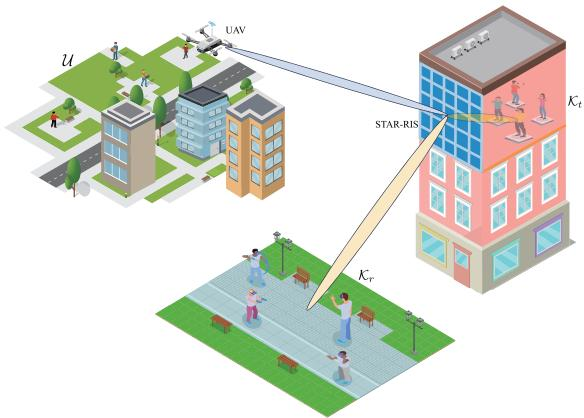  
Fig. 1. Illustration of STAR-RIS-aided aerial monitoring network.

The remainder of this paper is arranged as follows: Section II describes the system model and formulates the problem of maximizing long-term average throughput. Section III introduces the Lyapunov-based online control algorithm and the associated optimization framework. Section IV details the proposed solutions. Section V presents the simulation results, and Section VI concludes the paper.

## II. SYSTEM MODEL AND PROBLEM FORMULATION

## A. Network Model

As depicted in Fig. 1, the network consists of a UAV with an M-antenna array and panoramic cameras for highquality aerial monitoring. The UAV monitors U moving targets, denoted by $\mathcal { U } ~ = ~ \{ 1 , 2 , \dotsc , U \}$ , and processes the captured video onboard, rendering it into VR content [27] and transmitting it to K single-antenna users, represented by $\kappa =$ $\{ 1 , 2 , \ldots , K \}$ . Similar to [28], we focus on the communication aspect by assuming that the VR content has already been preprocessed and the rendering details are thus ignored. Users in this network are classified into two groups, i.e., indoor users (denoted by $\boldsymbol { \kappa } _ { t } )$ and outdoor users (denoted by $\boldsymbol { \kappa } _ { r } )$ , where $\mathcal { K } = \mathcal { K } _ { r } \cup \mathcal { K } _ { t }$ and $\boldsymbol { \mathcal { K } } _ { r } \cap \boldsymbol { \mathcal { K } } _ { t } = \boldsymbol { \emptyset }$ . The U targets of interest move within their respective areas, and the UAV is required to adjust its trajectory dynamically to monitor targets and provide better services to users. However, due to obstacles like trees and buildings between the users and UAV, direct communication links are often blocked [23]. To overcome this challenge, we introduce an N-element STAR-RIS installed on a building [29], which helps establish outdoor-to-outdoor (O2O) links for outdoor users in ${ \boldsymbol { \kappa } } _ { r }$ and outdoor-to-indoor (O2I) links for indoor users in $\textstyle { \mathcal { K } } _ { t }$ . The UAV maintains a fixed flight altitude $H _ { u }$ to reduce energy consumption caused by frequent altitude changes [30]. The flight period of $T$ is partitioned into L time slots where each time slot $l \in \mathcal { L } = \{ 1 , 2 , \dots , L \}$ has an equal duration of δ, i.e., $T = L \delta$

## B. STAR-RIS Model

The energy splitting model is utilized to enable the simultaneous transmission and reflection capabilities of the STAR-RIS [24]. Let $\Theta _ { t } [ l ] \in \mathbb { C } ^ { N \times N }$ and $\Theta _ { r } [ l ] \stackrel {  } { \in } \mathbb { C } ^ { N \times N }$ denote the transmission and reflection matrices at time slot l, which are defined as $\begin{array} { r c l } { \Theta _ { t } [ l ] } & { = } & { \mathrm { d i a g } \left( \beta _ { t , 1 } [ l ] e ^ { j \phi _ { t , 1 } [ l ] } , \dots , \beta _ { t , N } [ l ] e ^ { j \phi _ { t , N } [ l ] } \right) } \end{array}$ and $\begin{array} { r c l } { \Theta _ { r } [ l ] } & { = } & { \mathrm { d i a g } \left( \beta _ { r , 1 } [ l ] e ^ { j \phi _ { r , 1 } [ l ] } , \dots , \beta _ { r , N } [ l ] e ^ { j \phi _ { r , N } [ l ] } \right) } \end{array}$ , respectively. Here, $\beta _ { t , n } [ l ]$ and $\beta _ { r , n } [ l ] \in [ 0 , 1 ]$ denote the transmission and reflection amplitudes of the n-th element. The phase shifts $\phi _ { t , n } [ l ]$ and $\phi _ { r , n } [ l ] \in [ 0 , 2 \pi )$ correspond to the transmission and reflection phases, respectively. The phase shifts and amplitudes of the STAR-RIS are affected by the magnetic and electric properties. Following the principle of energy conservation, the transmission and reflection amplitudes should satisfy $\beta _ { t , n } ^ { 2 } [ l ] \ + \ \beta _ { r , n } ^ { 2 } [ l ] \ = \ 1 , \forall n \ \in \ \mathcal { N } , l \ \bar { \ } \in \ \mathcal { L } .$ Similar to [31], the STAR-RIS is assumed to be composed of passive and lossless elements with purely imaginary electric and magnetic impedances, which imposes an orthogonality condition on the phase shifts:cos $( \phi _ { t , n } [ l ] - \phi _ { r , n } [ l ] ) = 0 , \forall n \in \mathcal { N } , l \in \mathcal { L }$

## C. Channel Model

Let $\mathbf { q } _ { v } [ l ] = [ x _ { v } [ l ] , y _ { v } [ l ] , H _ { v } ] ^ { \mathrm { T } } \in \mathbb { R } ^ { 3 \times 1 }$ denote the UAV’s position at time slot l, and $\mathbf { \bar { q } } _ { s } = \left[ x _ { s } , y _ { s } , z _ { s } \right] ^ { \mathrm { T } } \in \mathbb { R } ^ { 3 \times 1 }$ and $\mathbf { q } _ { k } =$ $\left[ \boldsymbol { x } _ { k } , \boldsymbol { y } _ { k } , \boldsymbol { z } _ { k } \right] ^ { \mathrm { T } } \ \in \ \mathbb { R } ^ { 3 \times 1 }$ represent the positions of the STAR-RIS and user k, respectively. Considering that the advanced channel estimation techniques [32], [33], [34] in RIS-assisted networks can be effectively integrated into our system, we assume that reliable channel state information (CSI) for all channels is available [35]. We define the channel coefficients between the UAV and the STAR-RIS, and that between the STAR-RIS and user k in time slot $l ,$ as $\mathbf { G } [ l ] \in \mathbb { C } ^ { N \times M }$ and $\mathbf h _ { k } [ l ] \in \mathbb { C } ^ { N \times 1 }$ , respectively. All channels are characterized by Rician fading and expressed as

$$
\mathbf { G } [ l ] = \zeta _ { 0 } ^ { \frac { 1 } { 2 } } \| \mathbf { q } _ { v } [ l ] - \mathbf { q } _ { s } \| ^ { - \frac { \varepsilon _ { 1 } } { 2 } } \mathbf { F } [ l ] ,\tag{1}
$$

$$
\mathbf { h } _ { k } [ l ] = \zeta _ { 0 } ^ { \frac { 1 } { 2 } } \| \mathbf { q } _ { s } - \mathbf { q } _ { k } \| ^ { - \frac { \varepsilon _ { 2 } } { 2 } } \mathbf { f } _ { k } [ l ] ,\tag{2}
$$

where $\zeta _ { 0 }$ is the path loss at 1 m, and $\varepsilon _ { 1 }$ and $\varepsilon _ { 2 }$ are the path loss exponents. $\begin{array} { r } { \mathbf { F } [ l ] = \sqrt { \frac { Y _ { 1 } } { Y _ { 1 } + 1 } } \mathbf { F } ^ { \mathrm { L o S } } [ l ] + \sqrt { \frac { 1 } { Y _ { 1 } + 1 } } \mathbf { F } ^ { \mathrm { N L o S } } [ l ] } \end{array}$ and $\begin{array} { r } { \mathbf { f } _ { k } [ l ] = \sqrt { \frac { Y _ { 2 } } { Y _ { 2 } + 1 } } \mathbf { f } _ { k } ^ { \mathrm { L o S } } [ l ] + \sqrt { \frac { 1 } { Y _ { 2 } + 1 } } \mathbf { f } _ { k } ^ { \mathrm { N L o S } } [ l ] } \end{array}$ represent the Rician fading with $Y _ { 1 }$ and $Y _ { 2 }$ being the Rician factors. $\mathbf { F } ^ { \mathrm { N L o S } } [ l ]$ and $\mathbf f _ { k } ^ { \mathrm { N L o S } } [ l ]$ denote the NLoS components and each element of $\tilde { \mathbf { F } } ^ { \mathrm { N L o S } } [ l ]$ and $\mathbf { f } _ { k } ^ { \mathrm { { N L o S } } } [ l ]$ is modeled as an independent circularly symmetric complex Gaussian (CGCS) random variable with zero mean and unit variance. The LoS components are given as $\mathbf { F } ^ { \mathrm { L o S } } [ l ]$ and $\mathbf { f } _ { k } ^ { \mathrm { L o S } } [ l ]$ . In particular, the STAR-RIS is considered to employ a uniform planar array (UPA) consisting of $N \triangleq N _ { x } \times N _ { y }$ elements, where N and $N _ { y }$ represent the numbers of elements on per row and column. According to [36], the n-th element of the LoS components is expressed as $\begin{array} { r } { F _ { n } ^ { \mathrm { L o S } } [ l ] \ = \ \exp \left( j \frac { 2 \pi d _ { s } } { \Lambda } h \left( n , \gamma _ { 1 } ^ { \mathrm { a z i } } [ l ] , \dot { \gamma } _ { 1 } ^ { \mathrm { e l e } } [ l ] \right) \right) } \end{array}$ and $\begin{array} { r l r } { f _ { k , n } ^ { \mathrm { L o S } } [ l ] } & { = } & { \exp \left( j \frac { 2 \pi d _ { s } } { \Lambda } h \left( n , \gamma _ { 2 , k } ^ { \mathrm { a z i } } [ l ] , \gamma _ { 2 , k } ^ { \mathrm { e l e } } [ l ] \right) \right) } \end{array}$ , where the function $h ( n , \gamma , \gamma ^ { \prime } )$ is defined as $h ( n , \gamma , \tilde { \gamma } ^ { \prime } )$ , $\big \lfloor \frac { n } { N _ { x } } \big \rfloor$ c sin γ sin $\begin{array} { r } { \gamma ^ { \prime } + \left( n - \lfloor \frac { n } { N _ { x } } \rfloor N _ { x } \right) } \end{array}$ sin γ cos $\gamma ^ { \prime } .$ . Here, Λ is the wavelength, and $d _ { s }$ indicates the separation between antennas. $\gamma _ { 1 } ^ { \mathrm { e l e } } [ l ] , \gamma _ { 1 } ^ { \mathrm { a z i } } [ l ]$ , and $\gamma _ { 2 , k } ^ { \mathrm { e l e } } [ l ] , \gamma _ { 2 , k } ^ { \mathrm { a z i } } [ l ]$ denote the elevation and azimuth angles of departure/arrival $\mathbf { ( A o D / A o A ) }$ of the STAR-RIS corresponding to the UAV and user k, respectively. Accordingly, the received signal at user $k \in \mathcal { K } _ { i }$ , where $i \in$ $\{ t , r \}$ denotes whether the user is located on the transmission side or the reflection side of the STAR-RIS, is expressed as follows. For users located on the transmission side, i.e., $i = t ,$ the received signal at time slot l is given by

$$
y _ { k , t } [ l ] = \mathbf { h } _ { k } ^ { \mathrm { H } } [ l ] \Theta _ { t } [ l ] \mathbf { G } [ l ] \sum _ { k ^ { \prime } \in K } \mathbf { w } _ { k ^ { \prime } } [ l ] s _ { k ^ { \prime } } [ l ] + n _ { k } [ l ] , \forall l \in \mathcal { L } .\tag{3}
$$

For users located on the reflection side, $\mathrm { i } . \mathrm { e } . , i = r ,$ , the received signal at time slot l is given by

$$
y _ { k , r } [ l ] = \mathbf { h } _ { k } ^ { \mathrm { H } } [ l ] \Theta _ { r } [ l ] \mathbf { G } [ l ] \sum _ { k ^ { \prime } \in K } \mathbf { w } _ { k ^ { \prime } } [ l ] s _ { k ^ { \prime } } [ l ] + n _ { k } [ l ] , \forall l \in \mathcal { L } .\tag{4}
$$

Here, $\mathbf { w } _ { k ^ { \prime } } [ l ] \ \in \ \mathbb { C } ^ { M \times 1 }$ is the transmit beamforming vector at the $\mathrm { U A V } , ~ s _ { k ^ { \prime } } [ l ]$ is the information symbol for user $k ^ { \prime } ,$ and $n _ { k } ~ \sim ~ \mathcal { C N } ( 0 , \sigma _ { k } ^ { 2 } )$ is the noise. $\Theta _ { t } [ l ] ~ = ~ \mathrm { d i a g } ( \theta _ { t } [ l ] )$ and $\Theta _ { r } [ l ] = \mathrm { d i a g } ( \mathbf { \dot { \theta } } _ { r } [ l ] )$ represent the transmission and reflection coefficient matrices of the STAR-RIS, respectively. Here, $\pmb { \theta } _ { t } [ l ] = [ \beta _ { t , 1 } [ l ] e ^ { j \phi _ { t , 1 } [ l ] } , \dots , \beta _ { t , N } [ l ] e ^ { j \phi _ { t , N } [ l ] } ]$ and $\theta _ { r } [ l ] =$ $[ \beta _ { r , 1 } [ l ] e ^ { j \tilde { \phi } _ { r , 1 } [ l ] } , \dot { \mathrm { ~ , ~ . ~ . ~ , ~ } } \bar { \beta } _ { r , N } [ l ] e ^ { j \phi _ { r , N } [ l ] } ]$ . Accordingly, the signalto-interference-plus-noise ratio (SINR) at user $k \in \mathcal { K } _ { i }$ , with $i \in \{ t , r \}$ representing the transmission or reflection side, is expressed as follows. For the transmission side, the SINR is

$$
\gamma _ { k , t } [ l ] = \frac { | \mathbf { h } _ { k } ^ { \mathrm { H } } [ l ] \Theta _ { t } [ l ] \mathbf { G } [ l ] \mathbf { w } _ { k } [ l ] | ^ { 2 } } { \sum _ { k ^ { \prime } \in \mathcal { K } \backslash k } | \mathbf { h } _ { k } ^ { \mathrm { H } } [ l ] \Theta _ { t } [ l ] \mathbf { G } [ l ] \mathbf { w } _ { k ^ { \prime } } [ l ] | ^ { 2 } + \sigma _ { k } ^ { 2 } } , \forall l \in \mathcal { L } .\tag{5}
$$

For the reflection side, the SINR is

$$
\gamma _ { k , r } [ l ] = \frac { | \mathbf { h } _ { k } ^ { \mathrm { H } } [ l ] \Theta _ { r } [ l ] \mathbf { G } [ l ] \mathbf { w } _ { k } [ l ] | ^ { 2 } } { \sum _ { k ^ { \prime } \in \mathcal { K } \backslash k } | \mathbf { h } _ { k } ^ { \mathrm { H } } [ l ] \Theta _ { r } [ l ] \mathbf { G } [ l ] \mathbf { w } _ { k ^ { \prime } } [ l ] | ^ { 2 } + \sigma _ { k } ^ { 2 } } , \forall l \in \mathcal { L } .\tag{6}
$$

Thus, the achievable rate of user k at time slot l is calculated as $R _ { k } [ l ] = B \log _ { 2 } ( 1 + \gamma _ { k , t } [ l ] )$ for $k \in \mathcal { K } _ { t }$ or $R _ { k } [ l ] = B \log _ { 2 } ( 1 +$ $\gamma _ { k , r } [ l ] )$ for $k \in \mathcal { K } _ { r }$ , where B denotes the channel bandwidth.

## D. Mobility Model

When the duration of δ is chosen sufficiently small, the positions of both the UAV and the monitored targets are assumed to remain unchanged within each time slot, but they may change across different time slots [37], [38]. The Gauss-Markov mobility model is applied to simulate the movements of the targets [39]. The speed $v _ { u } [ l ]$ and direction $\kappa _ { u } [ l ]$ of target u at time slot l are modeled as

$$
\left\{ \begin{array} { l l } { v _ { u } [ l ] = e _ { 1 } v _ { u } [ l - 1 ] + ( 1 - e _ { 1 } ) \overline { { v } } _ { u } + \overline { { \omega } } _ { 1 } \sqrt { 1 - e _ { 1 } ^ { 2 } } \Xi _ { u } , } \\ { \kappa _ { u } [ l ] = e _ { 2 } \kappa _ { u } [ l - 1 ] + ( 1 - e _ { 2 } ) \overline { { \kappa } } _ { u } + \overline { { \omega } } _ { 2 } \sqrt { 1 - e _ { 2 } ^ { 2 } } \varrho _ { u } , } \end{array} \right.\tag{7}
$$

where $e _ { 1 }$ and $e _ { 2 }$ are the memory weights, $\overline { { \kappa } } _ { u }$ and $\overline { { v } } _ { u }$ are the average direction and speed of target u, respectively, and $\overline { { \omega } } _ { 1 }$ and $\overline { { \omega } } _ { 2 }$ denote the asymptotic standard deviations. The random variables $\Xi _ { u }$ and $\varrho _ { u }$ are independent Gaussian random variables representing random movement. The position of each target u in time slot l is defined as $\mathbf { q } _ { u } [ l ] = [ x _ { u } [ l ] , y _ { u } [ l ] , 0 ] ^ { \mathrm { T } } \in$ $\mathbb { R } ^ { 3 \times 1 }$ , which is updated as

$$
\begin{array} { r } { \left\{ x _ { u } [ l ] = x _ { u } [ l - 1 ] + v _ { u } [ l - 1 ] \cos ( \kappa _ { u } [ l - 1 ] ) \delta , \right. } \\ { \left. y _ { u } [ l ] = y _ { u } [ l - 1 ] + v _ { u } [ l - 1 ] \sin ( \kappa _ { u } [ l - 1 ] ) \delta , \right. } \end{array}\tag{8}
$$

where δ is the duration of each time slot.

To ensure high-quality panoramic video coverage, a certain spatial relationship between the UAV and these targets must be maintained [40]. Since the UAV is equipped with panoramic cameras intended to capture all targets within a single frame. Staying near the geometric center maximizes the likelihood that all targets are within the camera’s field of view, ensuring high-quality panoramic video. The geometric center of the $U$ targets at time slot l is denoted as $\overline { { \mathbf { q } } } _ { u } [ l ]$ , given by $\overline { { \mathbf { q } } } _ { u } [ l ] =$ $\begin{array} { r } { \left[ \frac { 1 } { U } \displaystyle \sum _ { u = 1 } ^ { U } x _ { u } [ l ] , \frac { 1 } { U } \displaystyle \sum _ { u = 1 } ^ { U } y _ { u } [ l ] , 0 \right] ^ { ' } } \end{array}$ T . The distance between the UAV and the geometric must not exceed the maximum allowable distance d<sup>max</sup> at any time slot l. This constraint is thus expressed as $\lVert \mathbf { q } _ { v } [ l ] - \overline { { \mathbf { q } } } _ { u } [ l ] \rVert \leq d ^ { \operatorname* { m a x } } , \forall l \in \mathcal { L } .$ . Additionally, the flight speed of the UAV in each time slot must be less than maximum allowable speed $v _ { \mathrm { u a v } } ^ { \mathrm { m a x } }$ , which is enforced by the constraint $\| \mathbf { q } _ { v } [ l + 1 ] - \mathbf { \bar { q } } _ { v } [ l ] \| \leq v _ { \mathrm { u a v } } ^ { \operatorname* { m a x } } \delta , \forall l \in \mathcal { L } .$

## E. Energy Consumption Model

The UAV’s operational efficiency is significantly influenced by its energy consumption. Given that the energy required for flight is substantially higher than that for communication and computation and differs by orders of magnitude as in [41], we focus primarily on modeling the flight energy consumption. The flight power consumption at time slot l, denoted by $P ^ { \mathrm { { f } } } [ l ]$ is expressed as [42]

$$
\begin{array} { l } { { \displaystyle P ^ { \mathrm { H } } [ { \boldsymbol { l } } ] = P _ { 0 } \left( 1 + \frac { 3 \left\| \mathbf { v } \left[ { \boldsymbol { l } } \right] \right\| ^ { 2 } } { U _ { \mathrm { t i p } } ^ { 2 } } \right) } \ ~ } \\ { { + \ P _ { i } \left( \sqrt { 1 + \frac { \left\| \mathbf { v } \left[ { \boldsymbol { l } } \right] \right\| ^ { 4 } } { 4 v _ { 0 } ^ { 4 } } } - \frac { \left\| \mathbf { v } \left[ { \boldsymbol { l } } \right] \right\| ^ { 2 } } { 2 v _ { 0 } ^ { 2 } } \right) ^ { 1 / 2 } } \ ~ } \\ { { + \frac 1 2 d _ { 0 } \rho _ { 0 } s _ { 0 } A \| \mathbf { v } [ { \boldsymbol { l } } ] \| ^ { 3 } , } } \end{array}\tag{9}
$$

where $\begin{array} { r } { { \bf v } [ l ] ~ = ~ \frac { \| { \bf q } _ { v } [ l + 1 ] - { \bf q } _ { v } [ l ] \| } { \delta } } \end{array}$ is the $\mathrm { U A V } \mathbf { \hat { s } }$ speed at time slot l. $P _ { i }$ and $P _ { 0 }$ are the induced power and blade profile power, respectively. $U _ { \mathrm { t i p } }$ and $v _ { 0 }$ represent the rotor blade’s tip speed and rotor induced velocity. $d _ { 0 } , \ \rho _ { 0 } , \ s _ { 0 }$ , and A denote the fuselage drag ratio, air density, rotor solidity, and rotor disc area, respectively. As such, the $\mathrm { U A V } \mathbf { \hat { s } }$ flight energy consumption at time slot l is given as $E ^ { \mathrm { { H } } } [ l ] = \mathsf { \bar { P } } ^ { \mathrm { { f l } } } [ l ] \delta$ . To evaluate long-term sustainability, the average flight energy is given by $\bar { E } ^ { \mathrm { f l } } \ = \ \operatorname* { l i m } _ { L \to \infty } \frac { 1 } { L } \sum _ { l = 1 } ^ { L } E ^ { \mathrm { f l } } [ l ]$ . Considering the UAV’s limited energy capacity, we impose a constraint to ensure sustainable flight operations, i.e., $\bar { E } ^ { \mathrm { H } } \leq \bar { E } _ { \operatorname* { m a x } } ^ { \mathrm { H } }$ , where $\bar { E } _ { \mathrm { m a x } } ^ { \mathrm { f l } }$ is the maximum average energy consumption that the UAV can sustain.

## F. Problem Formulation

Our target is to maximize the long-term average throughput of the STAR-RIS-enabled network by jointly designing the transmit beamforming $\{ \mathbf { w } _ { k } [ l ] \}$ , UAV trajectory $\{ \mathbf { q } _ { v } [ l ] \}$ , and STAR-RIS coefficients $\{ \pmb \theta _ { t } [ l ] \}$ and $\{ \pmb \theta _ { r } [ l ] \}$ , subject to several operational constraints. The optimization problem is formulated as

$$
( \mathbf { P } 1 ) : \operatorname* { m a x } _ { \substack { \{ \mathbf { q } _ { v } [ l ] \} , \{ \mathbf { w } _ { k } [ l ] \} , \{ \pmb { \theta } _ { t } [ l ] \} , \{ \pmb { \theta } _ { r } [ l ] \} } } \operatorname* { l i m } _ { L  \infty } \frac { 1 } { L } \sum _ { l = 1 } ^ { L } \sum _ { k = 1 } ^ { K } R _ { k } [ l ]
$$

$$
\mathrm { s . t . ~ T r } ( \mathbf { W } [ \boldsymbol { l } ] \mathbf { W } ^ { \mathrm { H } } [ \boldsymbol { l } ] ) \le p ^ { \mathrm { m a x } } , \forall l \in \mathcal { L } ,\tag{10}
$$

$$
\| \mathbf { q } _ { v } [ l + 1 ] - \mathbf { q } _ { v } [ l ] \| \leq v _ { \mathrm { u a v } } ^ { \operatorname* { m a x } } \delta , \forall l \in \mathcal { L } ,\tag{11}
$$

$$
\lVert \mathbf { q } _ { v } [ l ] - \overline { { \mathbf { q } } } _ { u } [ l ] \rVert \leq d ^ { \operatorname* { m a x } } , \forall l \in \mathcal { L } ,\tag{12}
$$

$$
\bar { E } ^ { \mathrm { q } } \leq \bar { E } _ { \operatorname* { m a x } } ^ { \mathrm { f l } } ,\tag{13}
$$

$$
\beta _ { t , n } ^ { 2 } [ l ] + \beta _ { r , n } ^ { 2 } [ l ] = 1 , 0 \leq \beta _ { t , n } [ l ] , \beta _ { r , n } [ l ] \leq 1 ,
$$

$$
\forall n \in \mathcal { N } , l \in \mathcal { L } ,\tag{14}
$$

$$
\begin{array} { r l r } & { \cos ( \phi _ { t , n } [ l ] - \phi _ { r , n } [ l ] ) = 0 , 0 } & \\ & { \leq \phi _ { t , n } [ l ] , \phi _ { r , n } [ l ] < 2 \pi , } & \\ & { \forall n \in \mathcal { N } , l \in \mathcal { L } , } & \end{array}\tag{15}
$$

where $\mathbf { W } [ l ] = [ \mathbf { w } _ { 1 } [ l ] , \dots , \mathbf { w } _ { K } [ l ] ]$ , and $p ^ { \mathrm { m a x } }$ is the maximum transmit power of the UAV. In particular, constraint (10) enforces the UAV’s transmit power to stay within the maximum limit. Constraint (11) limits the UAV’s flight distance per time slot to comply with the maximum speed. Constraint (12) keeps the UAV within a maximum distance from the monitoring center. Constraint (13) imposes a limit on the UAV’s average flight energy consumption. Finally, constraints (14) and (15) specify the feasible ranges of the STAR-RIS phase and amplitude coefficients.

Note that problem (P1) is a multi-stage stochastic optimization problem, which is challenging to address as it requires knowledge of targets’ positions and the $\mathrm { U A V } \mathbf { \hat { s } }$ energy states over all time slots, and it is typically unavailable in practice. To overcome such issue, we propose a Lyapunov-based optimization algorithm that leverages the information from both current and previous time slots. The proposed algorithm is detailed in the next section.

## III. LYAPUNOV-BASED ONLINE CONTROL FRAMEWORK

We present the Lyapunov-based control algorithm to break down the complex multi-stage optimization problem into manageable per-slot subproblems. At each slot, we optimize the phase shifts, amplitudes, active beamforming, and the UAV trajectory to ensure efficiency. Specifically, to address the average energy constraint specified in (13), we establish a virtual energy-aware queue $H [ l ]$ to track UAV energy usage relative to the average energy limit. This queue evolves according to

$$
\begin{array} { r } { H [ l + 1 ] = \operatorname* { m a x } \big \{ H [ l ] - \bar { E } _ { \operatorname* { m a x } } ^ { \mathrm { f l } } , 0 \big \} + E ^ { \mathrm { f l } } [ l ] , } \end{array}\tag{16}
$$

where $H [ 0 ] \ = \ 0 .$ In (16), $E ^ { \mathrm { { f } } } [ l ]$ serves as the arrival rate, reflecting energy usage, while $\bar { E } _ { \mathrm { m a x } } ^ { \mathrm { f l } }$ serves as the service rate, or the allowable average energy. The queue stability follows the definition in [43]:

Definition 1: A discrete-time queue $H [ l ]$ is stable if

$$
\operatorname* { l i m } _ { L \to \infty } \frac { 1 } { L } \sum _ { l = 1 } ^ { L } \mathbb { E } [ H [ l ] ] \leq + \infty .\tag{17}
$$

This stability implies that the long-term energy constraint (13) is satisfied, as stated in Lemma 1.

Lemma 1: If H[l] is stable, the constraint (13) is satisfied. Proof: From the queue update rule (16), H[l] satisfies   
$H [ l + \bar { 1 } ] \geq H [ l ] - \bar { E } _ { \mathrm { m a x } } ^ { \hat { \mathrm { f i } } } + \bar { E } ^ { \hat { \mathrm { f } } } [ l ]$ . By summing over all slots   
and dividing by L, we futher obtain $\begin{array} { r } { \frac { H [ L ] - \check { H ( 1 ] } } { L } + \bar { E } _ { \mathrm { m a x } } ^ { \mathrm { f l } } \geq } \end{array}$   
$\begin{array} { r } { \frac { 1 } { L } \sum _ { l = 1 } ^ { L } E ^ { \mathrm { { f l } } } [ l ] } \end{array}$ . According to Definition 1, when $H [ l ]$ is stable,   
we have $\operatorname* { l i m } _ { l \to \infty } { \frac { \mathbb { E } [ H [ l ] ] } { l } } = 0$ . Therefore, as $L \to \infty$ , the constraint   
(13) is guaranteed.

To maintain low values of $H [ l ]$ , we consider a quadratic Lyapunov function, which is defined as

$$
J ( H [ l ] ) = \frac { 1 } { 2 } \big ( H [ l ] \big ) ^ { 2 } .\tag{18}
$$

In particular, a small value of $J ( H [ l ] )$ indicates a small $H [ l ]$ which ensures that $H [ l ]$ is stable. To meet constraint (13) consistently over L time slots, $J ( H [ l ] )$ should remain small at each time slot. We then introduce the Lyapunov drift function, which captures the variation in $J ( H [ l ] )$ between consecutive time slots, i.e.,

$$
\Delta ( J ( H [ l ] ) ) = \mathbb { E } \left[ J ( H [ l + 1 ] ) - J ( H [ l ] ) | H [ l ] \right] .\tag{19}
$$

Similar to [44], [45], we define the drift-plus-penalty function as

$$
D ( H [ l ] ) = \Delta ( J ( H [ l ] ) ) - Q \mathbb { E } \left[ \sum _ { k = 1 } ^ { K } R _ { k } [ l ] \right] ,\tag{20}
$$

where $Q > 0$ is a tuning coefficient balancing throughput and queue stability. Specifically, a larger $Q$ assigns greater priority to the throughput term in the drift-plus-penalty function, encouraging more aggressive resource utilization and higher data rates, while a smaller $Q$ emphasizes queue stability, leading to more conservative energy consumption control. It is worthwhile to note that minimizing $D ( H [ l ] )$ in (20) directly is mathematically intractable, and thus we focus on its upper bound to guide optimization.

Theorem 1: For any time slot l and queue backlogs $H [ l ]$ the drift-plus-penalty function $D ( H [ l ] )$ is bounded by

$$
D ( H [ l ] ) \leq W \mathrm { + } H [ l ] \mathbb { E } \left[ \left( E ^ { \mathrm { f } } [ l ] - \bar { E } _ { \operatorname* { m a x } } ^ { \mathrm { f } } \right) \right] - Q \sum _ { k = 1 } ^ { K } R _ { k } [ l ] ,\tag{21}
$$

where $W$ is a finite constant.

Proof: Squaring the update rule for $H [ l ]$ and applying the inequality $( \bar { \operatorname * { m a x } } \{ a + b - \bar { c } , 0 \} ) ^ { 2 } \leq ( a + b - \bar { c } ) ^ { 2 }$ for any $a , b , c \geq$ 0, we obtain

$$
\begin{array} { r l r } & { } & { \left( H [ l + 1 ] \right) ^ { 2 } \le \left( H [ l ] + E ^ { \mathrm { f l } } [ l ] - \bar { E } _ { \mathrm { m a x } } ^ { \mathrm { f l } } \right) ^ { 2 } , } \\ & { } & { \frac { \left( H [ l + 1 ] \right) ^ { 2 } - \left( H [ l ] \right) ^ { 2 } } { 2 } \le \frac { 1 } { 2 } ( E ^ { \mathrm { f l } } [ l ] - \bar { E } _ { \mathrm { m a x } } ^ { \mathrm { f l } } ) ^ { 2 } ~ } \\ & { } & { + H [ l ] ( E ^ { \mathrm { f l } } [ l ] - \bar { E } _ { \mathrm { m a x } } ^ { \mathrm { f l } } ) . ~ } \end{array}\tag{22}
$$

(23)

By taking conditional expectations on both sides, we have

$$
\begin{array} { r l } {  { \Delta ( J ( H [ l ] ) ) \leq \frac { 1 } { 2 } \mathbb { E } [ ( E ^ { \mathrm { H } } [ l ] - \bar { E } _ { \operatorname* { m a x } } ^ { \mathrm { f l } } ) ^ { 2 } | H [ l ] ] } \quad } & { } \\ & { \quad + H [ l ] \mathbb { E } [ E ^ { \mathrm { H } } [ l ] - \bar { E } _ { \operatorname* { m a x } } ^ { \mathrm { f l } } | H [ l ] ] } \\ & { \leq W + H [ l ] \mathbb { E } [ E ^ { \mathrm { H } } [ l ] - \bar { E } _ { \operatorname* { m a x } } ^ { \mathrm { f l } } | H [ l ] ] , } \end{array}\tag{24}
$$

where $\begin{array} { r l r } { W } & { \triangleq } & { \frac { 1 } { 2 } \operatorname* { m a x } \left\{ \left( \bar { E } _ { \mathrm { m a x } } ^ { \mathrm { f l } } \right) ^ { 2 } , \left( E _ { \mathrm { m a x } } ^ { \mathrm { f l } } [ l ] - \bar { E } _ { \mathrm { m a x } } ^ { \mathrm { f l } } \right) ^ { 2 } \right\} } \end{array}$ is a finite constant.

Minimizing $D ( H [ l ] )$ enables optimal resource allocation by balancing system throughput and queue stability. We thus transform the multi-stage stochastic optimization problem (P1) into a set of per-slot optimization subproblems. For simplicity of illustration, the terms that are independent of the optimization variables are omitted, and problem (P1) is accordingly transformed into problem (P2) for each time slot l:

$$
( \mathbf { P } 2 ) : \operatorname* { m i n } _ { \{ \mathbf { q } _ { v } [ l ] \} , \{ \mathbf { w } _ { k } [ l ] \} , \{ \pmb { \theta } _ { t } [ l ] \} , \{ \pmb { \theta } _ { r } [ l ] \} } H [ l ] E ^ { \mathrm { H } } [ l ] - Q \sum _ { k = 1 } ^ { K } R _ { k } [ l ]
$$

$$
\begin{array} { r } { \mathrm { s . t . ~ T r } ( \mathbf { W } [ \boldsymbol { l } ] \mathbf { W } ^ { \mathrm { H } } [ \boldsymbol { l } ] ) \le p ^ { \mathrm { m a x } } , } \end{array}\tag{25}
$$

$$
\| \mathbf { q } _ { v } [ l + 1 ] - \mathbf { q } _ { v } [ l ] \| \leq v _ { \mathrm { u a v } } ^ { \mathrm { m a x } } \delta ,\tag{26}
$$

$$
\lVert \mathbf { q } _ { v } [ l ] - \overline { { \mathbf { q } } } _ { b } [ l ] \rVert \leq d ^ { \operatorname* { m a x } } ,\tag{27}
$$

$$
\beta _ { t , n } ^ { 2 } [ l ] + \beta _ { r , n } ^ { 2 } [ l ] = 1 , 0 \leq \beta _ { t , n } [ l ] , \beta _ { r , n } [ l ] \leq 1 ,
$$

$$
\forall n \in { \mathcal { N } } ,\tag{28}
$$

$$
\cos ( \phi _ { t , n } [ l ] - \phi _ { r , n } [ l ] ) = 0 , 0
$$

$$
\leq \phi _ { t , n } [ l ] , \phi _ { r , n } [ l ] < 2 \pi ,
$$

$$
\forall n \in { \mathcal { N } } .\tag{29}
$$

Algorithm 1 Lyapunov-Based Online Algorithm   
1: Initialize $\overline { { H [ 0 ] = 0 ; } }$   
2: for each time slot $l = 1 , 2 , . . . , L$ do   
3: Address the per-slot optimization problem (P2) to obtain   
the $\pmb { \theta } _ { t } [ l ] , \pmb { \theta } _ { r } [ l ] , \mathbf { q } _ { v } [ l ] ,$ , and $\mathbf { w } _ { k } [ l ] ;$   
4: Update the virtual energy queue $H [ l + 1 ]$ based on (16);   
5: end for

This transformation is supported by the derived stability theorem, which ensures that maintaining the stability of the virtual energy queue guarantees satisfaction of the longterm energy constraint in (P1). All other constraints are enforced as hard constraints within each per-slot problem (P2), ensuring that the online optimization remains consistent with the system’s physical and operational limits. Physically, the virtual queue reflects the accumulated deviation of the $\mathrm { U A V } ^ { \ , } \mathbf { s }$ propulsion energy from its long-term budget, and its stability naturally drives the per-slot controller to reduce energy consumption when the queue length increases, thereby maintaining long-term feasibility. The online control approach is outlined in Algorithm 1. Since problem (P2) is still nonconvex, and we propose efficient algorithms to address it in the following section.

## IV. PROPOSED SOLUTION TO PROBLEM (P2)

To deal with the non-convexity of problem (P2), we break it into two subproblems solved iteratively. Specifically, the two subproblems are as follows: 1) Optimization of phase shift, amplitude, and active beamforming, and 2) Optimization of the UAV trajectory. In the following, we provide the details of approach for each subproblem.

## A. Phase Shift, Amplitude, and Active Beamforming Optimization Subproblem

Given a fixed UAV trajectory $\{ \mathbf { q } _ { v } [ l ] \}$ and omitting constants, the phase shift, amplitude, and active beamforming optimization subproblem is reformulated as a sum-rate maximization problem, i.e.,

$$
\begin{array} { r l r } {  { ( { \mathrm { P } } 3 ) : \quad \operatorname* { m a x } } } \\ & { } & { \{ \mathbf { w } _ { k } [ l ] \} , \{ \pmb { \theta } _ { t } [ l ] \} , \{ \pmb { \theta } _ { r } [ l ] \} } \\ & { } & { \mathrm { s . t . } ~ ( 2 5 ) , ( 2 8 ) , ( 2 9 ) . } \end{array}
$$

The problem (P3) is challenging to solve directly due to its non-convex nature, which involves fractional SINR expressions and strong coupling between optimization variables. To address this, we reformulate the problem into a more tractable form by applying the weighted mean square error (MSE) minimization approach [46], [47], which simplifies the optimization process. At time slot l, the MSE for user $k$ is expressed as

$$
\begin{array} { l } { { \displaystyle e _ { k } [ l ] = | \nu _ { k } [ l ] | ^ { 2 } \left( \sum _ { k \in \mathcal { K } } | \theta _ { i } ^ { \mathrm { T } } [ l ] { \mathrm { d i a g } } ( { \bf h } _ { k } ^ { \mathrm { H } } [ l ] ) { \bf G } [ l ] { \bf w } _ { k } [ l ] | ^ { 2 } + \sigma _ { k } ^ { 2 } \right) } } \\ { { \displaystyle ~ - 2 \mathrm { R e } \{ \nu _ { k } ^ { * } [ l ] \theta _ { i } ^ { \mathrm { T } } [ l ] { \mathrm { d i a g } } ( { \bf h } _ { k } ^ { \mathrm { H } } [ l ] ) { \bf G } [ l ] { \bf w } _ { k } [ l ] \} + 1 , ~ ( 3 } } \end{array}\tag{0}
$$

where $\pmb { \nu } [ l ] = [ \nu _ { 1 } [ l ] , \dots , \nu _ { K } [ l ] ] ^ { \mathrm { T } }$ are auxiliary variables. Introducing a vector of weights $\mathbf { \bar { \boldsymbol { \varpi } } } [ l ] = [ \varpi _ { 1 } [ l ] , \dots , \varpi _ { K } [ l ] ] ^ { \mathrm { \boldsymbol { T } } }$ , the weighted MSE minimization problem becomes

$$
\begin{array}{c} ( \mathbf { P 4 } ) : \begin{array} { c } { ( \mathbf { P 4 } ) : \displaystyle \operatorname* { m i n } _ { \{ \mathbf { w } _ { k } [ l ] \} , \{ \pmb { \theta } _ { t } [ l ] \} , \{ \pmb { \theta } _ { r } [ l ] \} , \{ \pmb { \nu } [ l ] \} , \{ \pmb { \varpi } [ l ] \} } \sum _ { k = 1 } ^ { K } \varpi _ { k } [ l ] e _ { k } [ l ] } \\ { \mathrm { s . t . ~ } ( 2 5 ) , ( 2 8 ) , ( 2 9 ) . } \end{array}  \end{array}
$$

We define the auxiliary variables as $\begin{array} { r l } { \tilde { { \boldsymbol { \theta } } } _ { t } [ l ] } & { { } = } \end{array}$ $[ \tilde { \beta } _ { t , 1 } [ l ] e ^ { j \tilde { \phi } _ { t , 1 } [ l ] } , \dots , \tilde { \beta } _ { t , N } [ l ] e ^ { j \tilde { \phi } _ { t , N } [ l ] } ]$ and $\begin{array} { r l } { \tilde { { \boldsymbol { \theta } } } _ { r } [ l ] } & { { } = } \end{array}$ $[ \tilde { \beta } _ { r , 1 } [ l ] e ^ { j \tilde { \phi } _ { r , 1 } [ l ] } , \dots , \tilde { \beta } _ { r , N } [ l ] e ^ { j \tilde { \phi } _ { r , N } [ l ] } ]$ . By introducing the equality constraints $\tilde { { \boldsymbol { \theta } } } _ { t } [ l ] = { \boldsymbol { \theta } } _ { t } [ l ]$ and $\tilde { \pmb { \theta } } _ { r } [ l ] = \pmb { \theta } _ { r } [ l ]$ , problem (P4) is reformulated as

$$
\begin{array} { r } { ( \mathbf { P 5 } ) : \underset { \{ \mathbf { w } _ { k } [ l ] \} , \{ \theta _ { k } [ l ] \} , \{ \theta _ { r } [ l ] \} , \{ \theta _ { r } [ l ] \} , \atop { \{ \mathbf { w } _ { k } [ l ] \} , \{ \theta _ { t } [ l ] \} , \{ \theta _ { r } [ l ] \} , \{ \theta _ { r } [ l ] \} } } { \operatorname* { m i n } } \underset { \{ \substack { \theta _ { r } [ l ] , \theta _ { r } [ l ] = 0 } } } { \overset { K } { \sum } } w _ { k } [ l ] e _ { k } [ l ]  \\ { \mathrm { s . t . } \quad \quad \quad \quad \quad \quad \quad \quad \quad \quad \quad \quad \quad \quad \quad \quad \quad \quad \quad \quad \quad \quad \quad \quad \quad \quad \quad \quad \quad \quad \quad \quad \quad \quad \quad \quad \quad \quad \quad \quad \mathcal { C } } \\ { \mathrm { s . t . } \quad \quad \quad \quad \quad \quad \quad \quad \quad \quad \quad \quad \quad \quad \quad \quad \quad \quad \quad \quad \quad \quad \quad \quad \quad \quad \quad \quad \quad \quad \quad \quad \quad \mathcal { C } } \\ { \mathrm { \beta } _ { t , n } ^ { 2 } [ l ] + \beta _ { r , n } ^ { 2 } [ l ] = 1 , \forall n \in \mathcal { N } , \quad \mathrm { ( \mathcal { C } } } \\ { \quad \quad \quad \quad \quad \quad \quad \quad \quad \quad \quad \quad \quad \quad \quad \quad \quad \quad \quad \quad \quad \quad \quad \quad \quad \quad \quad \quad \quad \quad \quad \quad \quad \quad \quad \quad \quad \quad \quad \quad } \\ { \mathrm { c o s } ( \tilde { \phi } _ { t , n } [ l ] - \tilde { \phi } _ { r , n } [ l ] ) = 0 , \forall n \in \mathcal { N } , } \\ { \quad \quad \quad \quad \quad \quad \quad \quad \quad \quad \quad \quad \quad \quad \quad \quad \quad \quad \quad \quad \quad \quad \quad \quad \quad \quad \quad \quad \quad \quad \quad \quad \quad \quad \quad \quad \quad \quad \quad \quad \quad \quad \quad \quad \quad \quad \quad \quad \quad \quad \quad \quad \quad \quad \quad \quad . } \end{array}\tag{31}
$$

32)

(33)

Given that $\theta _ { t } [ l ]$ and $\pmb { \theta } _ { r } [ l ]$ are only subject to the equality conditions in (31), we employ a penalty-based approach using the PDD framework [48] to convert the original problem into an AL form, where the equality constraints are incorporated as penalty terms in the objective function. Consequently, the AL problem corresponding to problem (P5) is

$$
\begin{array} { r l r } {  { ( \mathrm { P } 6 ) : \begin{array} { c } { \mathrm { m i n } } \\ { \{ \mathbf { w } _ { k } [ l ] \} , \{ \pmb { \theta } _ { t } [ l ] \} , \{ \pmb { \theta } _ { r } [ l ] \} , \{ \pmb { \nu } [ l ] \} , \sum _ { k = 1 } ^ { K } \rule { 0 ex } { 5 ex } \pi _ { k } [ l ] e _ { k } [ l ] } \end{array} } } \\ & { } & { \ + \begin{array} { c } { \displaystyle + \frac { 1 } { 2 \rho } \sum _ { i \in \{ t , r \} } \| \tilde { \pmb { \theta } } _ { i } [ l ] - \pmb { \theta } _ { i } [ l ] + \rho \pmb { \mathscr { \Delta } } _ { i } [ l ] \| ^ { 2 } } \end{array} } \\ & { } & { \ \mathrm { s } . \mathrm { t } . \ ( 2 5 ) , ( 3 2 ) , ( 3 3 ) , } \end{array}
$$

where $\rho > 0$ is the penalty factor and $\lambda _ { i } [ l ]$ are Lagrangian dual variables. As $\rho \to 0$ , the penalty term forces the equality constraint in (31) to hold. This allows the solution to converge to the Karush-Kuhn-Tucker (KKT) optimal point through iterative updates of the primal and dual variables, along with the penalty factor [48]. We then solve (P6) using a block coordinate descent (BCD) method with the variables divided into three blocks, i.e., $\{ \infty [ l ] , \nu [ l ] \} , \ \{ \mathbf { w } _ { k } [ l ] , \pmb { \theta } _ { t } [ l ] , \pmb { \theta } _ { r } [ l ] \}$ , and $\{ \tilde { { \pmb \theta } } _ { t } [ l ] , \tilde { { \pmb \theta } } _ { r } [ l ] \}$ , and solve each block alternatively with other blocks fixed.

1) Subproblem for Optimizing $\{ \varpi [ l ] , \nu [ l ] \}$ : With fixed STAR-RIS parameters and active beamforming $\{ \mathbf { w } _ { k } [ l ] , \pmb { \theta } _ { t } [ l ] , \pmb { \theta } _ { r } [ l ] \}$ and auxiliary variables $\{ \tilde { { \pmb \theta } } _ { t } [ l ] , \tilde { { \pmb \theta } } _ { r } [ l ] \}$ , the optimal values for $\varpi _ { k } [ l ]$ and $\nu _ { k } [ l ]$ are given by

$$
\varpi _ { k } [ l ] = 1 + \gamma _ { k , i } [ l ] ,\tag{34}
$$

$$
\nu _ { k } [ l ] = \frac  \mathbf { \Gamma } \mathbf { \Gamma } \mathbf { \Gamma } \mathbf { \Gamma } \mathbf { \Gamma } \mathbf { \Gamma } \mathbf { \Gamma } \mathbf { \Gamma } \mathbf { \Gamma } \mathbf { \Gamma } \mathbf { \Gamma } \mathbf { \Gamma } \mathbf { \Gamma } \mathbf { \Gamma } \mathbf { \Gamma } \mathbf { \Gamma } \mathbf { \Gamma } \mathbf { \Gamma } \mathbf { \Gamma } \mathbf { \Gamma } \mathbf { \Gamma } \mathbf { \Gamma } \mathbf { \Gamma } \mathbf { \Gamma } \mathbf { \Gamma } \mathbf { \Gamma } \mathbf { \Gamma } \mathbf { \Gamma } \mathbf { \Gamma } \mathbf { \Gamma } \mathbf { \Gamma } \mathbf { \Gamma } \mathbf { \Gamma } \mathbf { \Gamma } \mathbf { \Gamma } \mathbf { \Gamma } \mathbf { \Gamma } \mathbf { \Gamma } \mathbf { \Gamma } \mathbf { \Gamma } \mathbf { \Gamma } \mathbf { \Gamma } \mathbf { \Gamma } \mathbf { \Gamma } \mathbf { \Gamma } \mathbf { \Gamma } \mathbf { \Gamma } \mathbf { \Gamma } \mathbf { \Gamma } \mathbf { \Gamma } \mathbf { \Gamma } \mathbf { \Gamma } \mathbf { \Gamma } \mathbf { \Gamma } \mathbf { \Gamma } \mathbf { \Gamma } \mathbf { \Gamma } \mathbf { \Gamma } \mathbf { \Gamma } \mathbf { \Gamma } \mathbf { \Gamma } \mathbf { \Gamma } \mathbf { \Gamma } \mathbf { \Gamma } \mathbf { \Gamma } \mathbf { \Gamma } \mathbf { \Gamma } \mathbf { \Gamma } \mathbf { \Gamma } \mathbf { \Gamma } \mathbf { \Gamma } \mathbf { \Gamma } \mathbf { \Gamma } \mathbf { \Gamma } \mathbf { \Gamma } \mathbf { \Gamma } \mathbf { \Gamma } \mathbf { \Gamma } \mathbf { \Gamma } \mathbf { \Gamma } \mathbf { \Gamma } \mathbf { \Gamma } \mathbf { \Gamma } \mathbf { \Gamma } \mathbf { \Gamma } \mathbf { \Gamma } \mathbf { \Gamma } \mathbf { \Gamma } \mathbf { \Gamma } \mathbf { \Gamma } \mathbf { \Gamma } \mathbf { \Gamma } \mathbf { \Gamma } \mathbf { \Gamma } \mathbf { \Gamma } \mathbf { \Gamma } \mathbf { \Gamma } \mathbf { \Gamma } \mathbf { \Gamma } \mathbf { \Gamma } \mathbf { \Gamma } \mathbf { \Gamma } \mathbf { \Gamma } \mathbf { \Gamma } \mathbf { \Gamma } \mathbf { \Gamma } \mathbf { \Gamma } \mathbf { \Gamma } \mathbf { \Gamma } \mathbf { \Gamma } \mathbf { \Gamma } \mathbf { \Gamma } \mathbf { \Gamma }\tag{35}
$$

which follow from the inverse MSE relationship under Gaussian signaling and linear receivers [46].

2) Subproblem for Optimizing $\{ \mathbf { w } _ { k } [ l ] , \pmb { \theta } _ { t } [ l ] , \pmb { \theta } _ { r } [ l ] \}$ : With the weight vector and auxiliary variables $\{ \varpi [ l ] , \nu [ l ] \}$ and $\{ \tilde { { \pmb \theta } } _ { t } [ l ] , \tilde { { \pmb \theta } } _ { r } [ l ] \}$ fixed, the subproblem for optimizing $\{ \mathbf { w } _ { k } [ l ] , \pmb { \theta } _ { t } [ l ] , \pmb { \theta } _ { r } [ l ] \}$ becomes

$$
\begin{array} { r l } { \displaystyle } & { ( { \bf P 7 } ) : \operatorname* { m i n } _ { \{ { \bf w } _ { k } [ l ] \} , \{ { \boldsymbol \theta } _ { t } [ l ] \} , \{ { \boldsymbol \theta } _ { r } [ l ] \} } \sum _ { k = 1 } ^ { K } \varpi _ { k } [ l ] e _ { k } [ l ] } \\ & { \qquad + \displaystyle \frac { 1 } { 2 \rho } \sum _ { i \in \{ t , r \} } \| \tilde { { \boldsymbol \theta } } _ { i } [ l ] - { \boldsymbol \theta } _ { i } [ l ] + \rho { \bf \boldsymbol \mathsf { \boldsymbol \mathsf { \boldsymbol \mathsf { \boldsymbol \mathsf { \boldsymbol \Lambda } } } } } _ { i } [ l ] \| ^ { 2 } } \\ & { \qquad \mathrm { s . t . ~ } ( 2 5 ) . } \end{array}
$$

Note that problem (P7) is a convex problem regarding ${ \bf w } _ { k } [ l ]$ and $\{ \pmb \theta _ { t } [ l ] , \pmb \theta _ { r } [ l ] \}$ . As a result, standard optimization tools, such as CVX [49], can be adopted to efficiently find the optimal solution.

3) Subproblem for Optimizing $\{ \tilde { { \pmb { \theta } } } _ { t } [ l ] , \tilde { { \pmb { \theta } } } _ { r } [ l ] \}$ : Given fixed values for $\{ \varpi [ l ] , \nu [ l ] \}$ and $\{ \mathbf { w } _ { k } [ l ] , \mathbf { \bar { \theta } } _ { t } [ \bar { l } ] , \mathbf { \theta } _ { r } [ \bar { l } ] \}$ , the subproblem becomes

$$
\begin{array} { r l r } {  { ( { \mathrm { P } } 8 ) : \operatorname* { m i n } _ { \{ \tilde { \theta } _ { t } [ l ] \} , \{ \tilde { \theta } _ { r } [ l ] \} } \sum _ { k = 1 } ^ { K } \varpi _ { k } [ l ] e _ { k } [ l ] } } \\ & { } & { + \frac { 1 } { 2 \rho } \sum _ { i \in \{ t , r \} } \| \tilde { \theta } _ { i } [ l ] - \theta _ { i } [ l ] + \rho \pmb { \lambda } _ { i } [ l ] \| ^ { 2 } } \\ & { } & { \mathrm { s . t . } ~ ( 3 2 ) , ( 3 3 ) . } \end{array}
$$

Since the variables $\tilde { { \boldsymbol { \theta } } } _ { t } [ l ] , \tilde { { \boldsymbol { \theta } } } _ { r } [ l ]$ are involved in the penalty term and the constraints, the constants that are independent of the optimization variables are omitted to simplify the problem to

$$
\begin{array} { r l r } {  { ( \mathrm { P 9 } ) : \operatorname* { m i n } _ { \{ \tilde { \pmb { \theta } } _ { t } [ l ] \} , \{ \tilde { \pmb { \theta } } _ { r } [ l ] \} } \sum _ { i \in \{ t , r \} } \Vert \tilde { \pmb { \theta } } _ { i } [ l ] + \pmb { \vartheta } _ { i } [ l ] \Vert ^ { 2 } } } \\ & { } & { \mathrm { s . t . ~ } ( 3 2 ) , ( 3 3 ) , } \end{array}
$$

where $\pmb { \vartheta } _ { i } [ l ] = - \pmb { \theta } _ { i } [ l ] + \rho \pmb { \lambda } _ { i } [ l ] , \forall i \in \{ t , r \}$ are intermediate variables. In spite of the non-convexity of the constraints, a high-quality solution is achieved by alternating amplitude and

phase shift optimization. We first reformulate the objective function of (P9) as

$$
\begin{array} { l } { { \displaystyle \sum _ { i \in \{ t , r \} } \| \widetilde { \boldsymbol { \theta } } _ { i } [ l ] + \vartheta _ { i } [ l ] \| ^ { 2 } } } \\ { { \displaystyle = \sum _ { i \in \{ t , r \} } ( \widetilde { \boldsymbol { \theta } } _ { i } ^ { \mathbf { H } } [ l ] \widetilde { \boldsymbol { \theta } } _ { i } [ l ] + \vartheta _ { i } ^ { \mathbf { H } } [ l ] \vartheta _ { i } [ l ] + 2 \mathrm { R e } ( \vartheta _ { i } ^ { \mathbf { H } } [ l ] \widetilde { \boldsymbol { \theta } } _ { i } [ l ] ) ) } } \\ { { \displaystyle = \sum _ { i \in \{ t , r \} } \sum _ { n \in \mathcal { N } } \widetilde { \beta } _ { i , n } ^ { 2 } [ l ] + \sum _ { i \in \{ t , r \} } \vartheta _ { i } ^ { \mathbf { H } } [ l ] \vartheta _ { i } [ l ] + \sum _ { i \in \{ t , r \} } 2 \mathrm { R e } ( \vartheta _ { i } ^ { \mathbf { H } } [ l ] \widetilde { \boldsymbol { \theta } } _ { i } [ l ] ) } } \\ { { \displaystyle = N + \sum _ { i \in \{ t , r \} } \vartheta _ { i } ^ { \mathbf { H } } [ l ] \vartheta _ { i } [ l ] + \sum _ { i \in \{ t , r \} } 2 \mathrm { R e } ( \vartheta _ { i } ^ { \mathbf { H } } [ l ] \widetilde { \boldsymbol { \theta } } _ { i } [ l ] ) . \qquad ( 3 6 ) } } \end{array}
$$

Note that the variables $\tilde { { \boldsymbol { \theta } } } _ { i } [ l ]$ appear only in $\begin{array} { r } { \sum _ { i \in \{ t , r \} } 2 \mathrm { R e } ( \pmb { \vartheta } _ { i } ^ { \mathrm { H } } [ l ] \tilde { \pmb { \theta } } _ { i } [ l ] ) } \end{array}$ of the objective function, with other terms being constant. We further decompose $\tilde { { \pmb \theta } } _ { i } [ l ]$ into phase-shift vector $\begin{array} { r l r } { \tilde { \phi } _ { i } [ l ] } & { { } = } & { [ e ^ { j \tilde { \phi } _ { i , 1 } [ l ] } , \dots , e ^ { j \tilde { \phi } _ { i , N } [ l ] } ] ^ { \tilde { \bf T } } } \end{array}$ and amplitude vector $\begin{array} { r l r } { \tilde { \beta } _ { i } [ l ] } & { { } = } & { [ \tilde { \beta } _ { i , 1 } [ l ] , \dots , \tilde { \beta } _ { i , N } [ l ] ] ^ { \mathrm { T } } , } \end{array}$ , i.e., $\tilde { \pmb { \theta } } _ { i } [ l ] = \mathrm { d i a g } ( \tilde { \pmb { \phi } } _ { i } [ l ] ) \tilde { \pmb { \beta } } _ { i } [ l ] = \mathrm { d i a g } ( \tilde { \pmb { \beta } } _ { i } [ l ] ) \tilde { \pmb { \phi } } _ { i } [ l ] , \forall i \in \{ t , r \}$ . Thus, (P9) is rewritten as

$$
\begin{array} { r l r } { ( \mathrm { P 1 0 } ) : \operatorname* { m i n } _ { \{ \tilde { \beta } _ { t } [ l ] \} , \{ \tilde { \phi } _ { t } [ l ] \} , } \displaystyle \sum _ { i \in \{ t , r \} } \mathrm { R e } ( \vartheta _ { i } [ l ] \mathrm { d i a g } ( \tilde { \beta } _ { i } [ l ] ) \tilde { \phi } _ { i } [ l ] ) } & { } & \\ { \{ \tilde { \beta } _ { r } [ l ] \} , \{ \tilde { \phi } _ { r } [ l ] \} } & { } & \\ { \mathrm { s . t . } ( 3 2 ) , ( 3 3 ) . } & { } & \end{array}
$$

To solve problem (P10), we begin by deriving a closed-form solution for the phase shifts when the amplitudes are fixed. For notational convenience, we define intermediate variables as $\tilde { \pmb { \vartheta } } _ { i } [ l ] = \mathrm { d i a g } ( \tilde { \pmb { \beta } } _ { i } ^ { \mathrm { H } } [ l ] ) \pmb { \vartheta } _ { i } [ l ] = [ \tilde { \vartheta } _ { i , 1 } [ l ] , \dots , \tilde { \vartheta } _ { i , N } [ l ] ] ^ { \mathrm { T } } , \forall i \in \{ t , r \}$ and the original optimization problem (P10) is split into a set of independent subproblems for each STAR-RIS element $n ,$ leading to

$$
\begin{array} { r l } & { ( { \mathrm { P 1 1 } } ) : \underset { \tilde { \phi } _ { t , n } [ l ] , \tilde { \phi } _ { r , n } [ l ] } { \mathrm { m i n } } \mathrm { R e } ( \tilde { \vartheta } _ { t , n } [ l ] \tilde { \phi } _ { t , n } [ l ] ) + { \mathrm { R e } } ( \tilde { \vartheta } _ { r , n } [ l ] \tilde { \phi } _ { r , n } [ l ] ) } \\ & { \qquad \mathrm { s . t . } ( 3 3 ) . } \end{array}
$$

Since constraint (33) implies a phase difference of ${ \begin{array} { l } { { \frac { \pi } { 2 } } \ \mathrm { o r } \ { \frac { 3 \pi } { 2 } } } \end{array} }$ we have the equivalent constraint: $\tilde { \phi } _ { r , n } [ l ] = \pm j \tilde { \phi } _ { t , n } ^ { - } [ l ] .$ . By substituting the constraint into the objective, the optimization simplifies to min $\mathrm { R e } ( ( \tilde { \vartheta } _ { t , n } ^ { * } [ l ] \pm j \tilde { \vartheta } _ { r , n } ^ { * } [ l ] ) \tilde { \phi } _ { t , n } [ l ] )$ , where $( \cdot ) ^ { * }$ denotes the complex conjugate. This is a standard problem of minimizing the real part of the product between a complex scalar and a unit-modulus variable. The corresponding optimal solution is explicitly expressed as

$$
\tilde { \phi } _ { t , n } ^ { \star } [ l ] = e ^ { j \left( \pi - \angle ( \tilde { \vartheta } _ { t , n } ^ { \star } [ l ] \pm j \tilde { \vartheta } _ { r , n } ^ { \star } [ l ] ) \right) } , \tilde { \phi } _ { r , n } ^ { \star } [ l ] = \pm j \tilde { \phi } _ { t , n } ^ { \star } [ l ] .\tag{37}
$$

Then, given fixed phase shifts $\tilde { \phi } _ { t } [ l ]$ and $\tilde { \phi } _ { r } [ l ]$ , we derive another closed-form solution for amplitudes $\bar { \beta } _ { t } [ l ]$ and $\tilde { \beta } _ { r } [ l ]$ Following the same element-wise structure as in the phase optimization, we define intermediate variables as $\begin{array} { r } { \check { \pmb { \vartheta } } _ { i } [ l ] \ = } \end{array}$ $\mathrm { d i a g } ( \tilde { \phi } _ { i } ^ { \mathrm { H } } [ l ] ) \vartheta _ { i } [ l ]$ , and the problem for each STAR-RIS element n is formulated as

$$
\begin{array} { r l } & { ( { \mathrm { P } 1 2 } ) : \underset { \tilde { \beta } _ { t , n } [ l ] , \tilde { \beta } _ { r , n } [ l ] } { \mathrm { m i n } } \mathrm { R e } ( \check { \vartheta } _ { t , n } [ l ] \tilde { \beta } _ { t , n } [ l ] ) + { \mathrm { R e } ( \check { \vartheta } _ { r , n } [ l ] \tilde { \beta } _ { r , n } [ l ] ) } } \\ & { \quad \quad \quad \mathrm { s . t . ~ } ( 3 2 ) . } \end{array}
$$

To simplify the objective function, we define $a _ { n } [ l ] \ =$ $| \check { \vartheta } _ { t , n } [ l ] | \cos ( \dot { \angle } \check { \vartheta } _ { t , n } [ l ] )$ and $b _ { n } [ l ] = | \check { \vartheta } _ { r , n } [ l ] | \cos ( \angle \check { \vartheta } _ { r , n } [ l ] )$ ), and express the objective as $a _ { n } [ l ] \tilde { \beta } _ { t , n } [ l ] + b _ { n } [ l ] \tilde { \beta } _ { r , n } [ l ]$ . Subsequently, we introduce a polar coordinate substitution to automatically satisfy the equality constraint: $\begin{array} { r l } { \tilde { \beta } _ { t , n } [ l ] } & { { } = } \end{array}$ sin $\omega _ { n } [ l ] , \quad \widetilde { \beta } _ { r , n } [ l ] \quad = \quad \cos \omega _ { n } [ l ] , \quad \omega _ { n } [ l ] \quad \in \quad \left[ 0 , \frac { \pi } { 2 } \right]$ . Substituting into the objective, we obtain $a _ { n } [ l ]$ sin $\bar { \omega } _ { n } [ l ] \ +$ $b _ { n } [ l ]$ cos $\begin{array} { r l r } { \omega _ { n } [ l ] } & { { } = } & { \sqrt { a _ { n } ^ { 2 } [ l ] + b _ { n } ^ { 2 } [ l ] } \sin ( \omega _ { n } [ l ] + \dot { \xi _ { n } } [ l ] ) } \end{array}$ , where cos $\begin{array} { r } { \xi _ { n } [ l ] ~ = ~ \frac { a _ { n } \lfloor l \rfloor } { \sqrt { a _ { n } ^ { 2 } \lfloor l \rfloor + b _ { n } ^ { 2 } \lfloor l \rfloor } } , } \end{array}$ sin $\begin{array} { r } { \xi _ { n } [ l ] ~ = ~ \frac { b _ { n } \left. l \right. } { \sqrt { a _ { n } ^ { 2 } \left[ l \right] + b _ { n } ^ { 2 } \left[ l \right] } } . } \end{array}$ . Hence, minimizing the original expression reduces to minimizing sin $\left( \omega _ { n } [ l ] + \xi _ { n } [ l ] \right)$ over the interval $\omega _ { n } [ l ] \in [ 0 , \frac { \pi } { 2 } ]$ . The optimal value of $\omega _ { n } [ l ]$ is

$$
\omega _ { n } [ l ] = \left\{ \begin{array} { l l } { - \displaystyle \frac { \pi } { 2 } - \xi _ { n } [ l ] , } & { \mathrm { i f } ~ \xi _ { n } [ l ] \in \left[ - \pi , - \displaystyle \frac { \pi } { 2 } \right) , } \\ { 0 , } & { \mathrm { i f } ~ \xi _ { n } [ l ] \in \left[ - \displaystyle \frac { \pi } { 2 } , \displaystyle \frac { \pi } { 4 } \right) , } \\ { \displaystyle \frac { \pi } { 2 } , } & { \mathrm { o t h e r w i s e } . } \end{array} \right.\tag{38}
$$

Thus, the optimal amplitudes are written as

```latex
Algorithm 2 PDD-Based Algorithm for Problem (P5)
1: Initialize $\{ \varpi [ l ] , \nu [ l ] \} , \{ \mathbf { w } _ { k } [ l ] , \pmb { \theta } _ { t } [ l ] , \pmb { \theta } _ { r } [ l ] \} , \{ \tilde { \phi } _ { t } [ l ] , \tilde { \phi } _ { r } [ l ] \}$
$\{ \tilde { \beta } _ { t } [ l ] , \tilde { \beta } _ { r } [ l ] \}$ and $0 < c < 1 ;$
2: repeat
3: repeat
4: Update $\{ \varpi [ l ] , \nu [ l ] \}$ by (34) and (35);
5: Update $\{ \mathbf { w } _ { k } [ l ] , \pmb \theta _ { t } [ l ] , \pmb \theta _ { r } [ l ] \}$ by solving problem (P7)
with CVX;
6: Update $\{ \tilde { \phi } _ { t } [ l ] , \tilde { \phi } _ { r } [ l ] \}$ by (37);
7: Update $\{ \tilde { \boldsymbol { \beta } } _ { t } [ l ] , \tilde { \boldsymbol { \beta } } _ { r } [ l ] \}$ by (39);
8: until the fractional decrease of the objective value is
below $\mu ;$
9: if $\epsilon \leq \eta$ then
10: Set $\begin{array} { r } { \dot { \lambda _ { i } } [ l ] = \lambda _ { i } [ l ] + \frac { 1 } { \rho } ( \tilde { \pmb { \theta } } _ { i } [ l ] - \pmb { \theta } _ { i } [ l ] ) , \forall i \in \{ t , r \} ; } \end{array}$
11: else
12: Set $\rho = c \rho ;$
13: end if
14: Set $\eta = a _ { 0 } \epsilon ;$
15: until  is below the specified threshold.
```

$$
\tilde { \beta } _ { t , n } ^ { \star } [ l ] = \sin \omega _ { n } [ l ] , \quad \tilde { \beta } _ { r , n } ^ { \star } [ l ] = \cos \omega _ { n } [ l ] .\tag{39}
$$

Finally, the variables $\{ \lambda _ { t } [ l ] , \lambda _ { r } [ l ] \}$ along with the penalty factor $\rho$ are iteratively updated. The complete procedure for addressing problem (P5) is outlined in Algorithm 2, where $\epsilon \triangleq \operatorname* { m a x } \{ \| \tilde { \pmb { \theta } } _ { t } [ l ] - \pmb { \theta } _ { t } [ l ] \| _ { \infty } , \| \tilde { \pmb { \theta } } _ { r } [ l ] - \pmb { \theta } _ { r } [ l ] \| _ { \infty } \}$ measures the constraint violation. The penalty factor $\rho$ is gradually reduced by a fraction $c \in ( 0 , 1 )$ , which controls the rate of reduction. Initially, a larger $\rho$ facilitates solving the surrogate problem more easily, enabling faster progress. As $\rho$ decreases, the focus shifts from optimizing the penalized objective to enforcing the original problem’s constraints, thereby driving primal residuals toward zero. This strategy ensures smooth convergence, progressively tightening the constraints, and ultimately guiding the algorithm to a stationary solution [48].

## B. UAV Trajectory Optimization Subproblem

Given the phase shift and amplitude $\{ \pmb { \theta } _ { i } [ l ] \} , \forall i \in \{ t , r \}$ and the active beamforming $\{ \mathbf { w } _ { k } [ l ] \}$ , the UAV trajectory

optimization subproblem is given by

$$
( \mathrm { P } 1 3 ) : \operatorname* { m i n } _ { \{ \mathbf { q } _ { v } [ l ] \} } H [ l ] ( E ^ { \mathrm { f } } [ l ] ) - Q \sum _ { k = 1 } ^ { K } R _ { k } [ l ]
$$

The objective function of (P13) is mathematically intricate and exhibits non-convexity. To address this, we introduce a slack variable $\tau [ l ]$ defined as $\begin{array} { r l } { \tau [ l ] } & { { } = } \end{array}$ $\begin{array} { r } { \left( \sqrt { 1 + \frac { \| { \bf v } [ l ] \| ^ { 4 } } { 4 v _ { 0 } ^ { 4 } } } - \frac { \| { \bf v } [ l ] \| ^ { 2 } } { 2 v _ { 0 } ^ { 2 } } \right) ^ { 1 / 2 } } \end{array}$ , and it is equivalent to $\begin{array} { r } { \frac { 1 } { \tau ^ { 2 } [ l ] } = } \end{array}$ $\begin{array} { r } { \dot { { \tau } ^ { 2 } } [ l ] + \frac { \| \mathbf { v } [ l ] \| ^ { 2 } } { v _ { 0 } ^ { 2 } } } \end{array}$ . Therefore, problem (P13) is rewritten as

$$
\begin{array} { r l r } { ( \mathrm { P l 4 } ) : \displaystyle \operatorname* { m i n } _ { \{ \mathbf { q } _ { \mathrm { v } } [ l ] \} , \{ \tau [ l ] \} } H [ l ] P _ { 0 } \left( 1 + \frac { 3 \| \mathbf { v } [ l ] \| ^ { 2 } } { U _ { \mathrm { t i p } } ^ { 2 } } \right) } & { } & \\ { \displaystyle + H [ l ] P _ { i \tau } [ l ] } & { } & \\ { \displaystyle + \frac { 1 } { 2 } H [ l ] d _ { 0 } \rho _ { 0 } s _ { 0 } A \| \mathbf { v } [ l ] \| ^ { 3 } - Q \sum _ { k = 1 } ^ { K } R _ { k } [ l ] } & { } & \\ { \mathrm { s . t . } \frac { 1 } { \tau ^ { 2 } [ l ] } \leq \tau ^ { 2 } [ l ] + \frac { \| \mathbf { q } _ { \mathrm { v } } [ l + 1 ] - \mathbf { q } _ { \mathrm { v } } [ l ] \| ^ { 2 } } { v _ { 0 } ^ { 2 } \delta ^ { 2 } } , } & { } & \\ { ( 2 \Theta ) , ( 2 7 ) . } & { } & { ( 4 0 } \end{array}
$$

At the optimal solution to problem (P14), if any constraint in (40) holds as a strict inequality, we can reduce the value of the slack variable $\tau [ l ]$ to restore the equality and achieve a smaller objective value. Consequently, all such constraints will still be satisfied with a smaller objective value. Therefore, at the optimal solution to problem (P14), the constraint in (40) must satisfy the equality, ensuring the equivalence of problems (P13) and (P14). However, because of the nonconvex constraint (40) and the fourth term of the objective function, problem (P14) remains non-convex. To handle this, a first-order Taylor expansion is applied to the right-hand side (RHS) of constraint (40) around the local values $\tau ^ { r } [ l ]$ and $\mathbf { q } _ { v } ^ { r } [ l ]$ at the r-th iteration. This expansion provides the following global lower bound: $\begin{array} { r } { \tau ^ { 2 } [ l ] \ + \ \frac { \| \mathbf { q } _ { v } [ l + 1 ] - \mathbf { q } _ { v } [ l ] \| ^ { 2 } } { v _ { \mathrm { } } ^ { 2 } \delta ^ { 2 } } \ \geq \ } \end{array}$ $\begin{array} { r } { \tau ^ { r , 2 } [ l ] + 2 \tau ^ { r } [ l ] ( \tau [ l ] - \tau ^ { r } [ l ] ) - \frac { \| \mathbf { q } _ { v } ^ { r } [ l + 1 ] - \mathbf { q } _ { v } ^ { r } [ l ] \| ^ { 2 } } { v _ { 0 } ^ { 2 } \delta ^ { 2 } } + \frac { 2 } { v _ { o } ^ { 2 } \delta ^ { 2 } } ( \mathbf { q } _ { v } ^ { r } [ l + } \end{array}$ $1 ] - \mathbf { q } _ { v } ^ { r } [ l ] ) ^ { \mathrm { T } } ( \mathbf { q } _ { v } [ l + 1 ] - \mathbf { q } _ { v } [ l ] ) \triangleq \Upsilon ^ { \mathrm { l b } } [ l ]$ , where $\Upsilon ^ { \mathrm { l b } } [ l ] \dot { }$ is a linear function.

The main challenge stems from the fourth term of the objective function, which involves $\mathbf { q } _ { v } [ l ]$ in the non-convex rate expression $R _ { k } [ l ]$ . To address this, we adopt the SPCA method [50], which iteratively replaces non-convex terms with convex surrogates and solves a sequence of tractable convex programs. Specifically, we introduce a new variable $\varsigma _ { k } [ l ]$ , which yields the following inequality, i.e., $R _ { k } [ l ] \ \geq$ $\varsigma _ { k } \big [ l \big ] , \forall k \in \mathcal { K }$ . We then expand $R _ { k } [ l ]$ to make the role of $\mathbf { q } _ { v } [ l ]$ more explicit. Specifically, from channel gain expression, we obtain $| \mathbf { \hat { h } } _ { k } ^ { \mathrm { H } } [ l ] \boldsymbol { \Theta } _ { i } [ \bar { l } ] \mathbf { G } [ l ] \mathbf { w } _ { k } \mathbf { \bar { \xi } } [ l ] | ^ { 2 } = c _ { k } [ l ] \left. \mathbf { q } _ { v } \boldsymbol { \overline { { [ l ] } } } - \mathbf { q } _ { s } \right. ^ { - \varepsilon _ { 1 } }$ , where $c _ { k } [ l ] \triangleq  { \zeta _ { 0 } } | \mathbf { \widetilde { h } } _ { k } ^ { \mathrm { H } } [ l ]  { \Theta _ { i } } [ l ]  { \mathbf { \widetilde { F } } } [ l ]  { \mathbf { \widetilde { w } } } _ { k } [ l ] | ^ { 2 }$ is a constant with respect to $\mathbf { q } _ { v } [ l ]$ . Thus, we express $R _ { k } [ l ]$ as

$$
{ \cal R } _ { k } [ l ] = { \cal B } \log _ { 2 } ( 1 { + } \frac { c _ { k } [ l ] \| \mathbf { q } _ { v } [ l ] - \mathbf { q } _ { s } \| ^ { - \varepsilon _ { 1 } } } { { \sum _ { k ^ { \prime } \in \mathcal { K } \backslash k } c _ { k ^ { \prime } } [ l ] \| \mathbf { q } _ { v } [ l ] - \mathbf { q } _ { s } \| ^ { - \varepsilon _ { 1 } } + \sigma _ { k } ^ { 2 } } } )\tag{41}
$$

This transformation exposes the non-convexity of $R _ { k } [ l ]$ , as $\mathbf { q } _ { v } [ l ]$ appears both in the numerator and denominator. Furthermore, we note that in (41), the constant $c _ { k } [ l ]$ is positive. To address this, we introduce slack variables $\{ \hat { a } _ { k } [ l ] , \bar { a } _ { k } [ l ] \}$ yielding the following constraints:

$$
\begin{array} { r } { \hat { a } _ { k } [ l ] \leq c _ { k } [ l ] \| \mathbf { q } _ { v } [ l ] - \mathbf { q } _ { s } \| ^ { - \varepsilon _ { 1 } } , \forall k \in \mathcal { K } , } \end{array}\tag{42}
$$

$$
\bar { a } _ { k } [ l ] \geq c _ { k } [ l ] \| \mathbf { q } _ { v } [ l ] - \mathbf { q } _ { s } \| ^ { - \varepsilon _ { 1 } } , \forall k \in \mathcal { K } .\tag{43}
$$

Thus, (41) is equivalent to the set of constraints (42)–(43) and

$$
B \log _ { 2 } \left( 1 + \frac { \hat { a } _ { k } [ l ] } { \displaystyle \sum _ { k ^ { \prime } \in K \backslash k } \bar { a } _ { k ^ { \prime } } [ l ] + \sigma _ { k } ^ { 2 } } \right) \geq \varsigma _ { k } [ l ] , \forall k \in \mathcal { K } .\tag{44}
$$

While these constraints remain non-convex, they are now more tractable. To handle constraint (44), we reformulate it as

$$
B \log _ { 2 } \left( \hat { a } _ { k } [ l ] + \sum _ { k ^ { \prime } \in K \backslash k } \bar { a } _ { k ^ { \prime } } [ l ] + \sigma _ { k } ^ { 2 } \right) \geq \varsigma _ { k } [ l ] + \hat { r } _ { k } [ l ] , \forall k \in \mathcal { K } ,\tag{45}
$$

where $\begin{array} { r } { \hat { r } _ { k } [ l ] = B \log _ { 2 } \left( \sum _ { k ^ { \prime } \in \mathcal { K } \backslash k } \bar { a } _ { k ^ { \prime } } [ l ] + \sigma _ { k } ^ { 2 } \right) } \end{array}$ . By applying the first-order Taylor approximation at $\bar { a } _ { k ^ { \prime } } ^ { r } [ l ]$ , we obtain a convex upper bound for $\hat { r } _ { k } [ l ]$

$$
\hat { r } _ { k } [ l ] \leq B \log \left( \sum _ { k ^ { \prime } \in K \setminus k } \bar { a } _ { k ^ { \prime } } ^ { r } + \sigma _ { k } ^ { 2 } \right) + \frac { \sum _ { k ^ { \prime } \in K \setminus k } \bar { a } _ { k ^ { \prime } } - \bar { a } _ { k ^ { \prime } } ^ { r } } { \sum _ { k ^ { \prime } \in K \setminus k } \bar { a } _ { k ^ { \prime } } ^ { r } + \sigma _ { k } ^ { 2 } } \triangleq \hat { r } _ { k } ^ { \mathrm { u b } } [ l ] .\tag{46}
$$

Consequently, constraint (44) is converted into the following convex form:

$$
B \log _ { 2 } \left( \hat { a } _ { k } [ l ] + \sum _ { k ^ { \prime } \in K \backslash k } \bar { a } _ { k ^ { \prime } } [ l ] + \sigma _ { k } ^ { 2 } \right) \geq \varsigma _ { k } [ l ] + \hat { r } _ { k } ^ { \mathrm { u b } } [ l ] , \forall k \in \mathcal { K } .\tag{47}
$$

For the constraint (42), direct optimization is challenging due to its non-convex nature. By replacing the original function with a convex upper bound, we transform the problem into a convex form that is amenable to standard optimization techniques. To achieve this, we present the following lemma.

Lemma 2: Consider the concave power function:

$$
f _ { \mathrm { p o w } } ( x ; c ) \triangleq - x ^ { c } , x \in \mathbb { R } _ { + + } , c > 1 \mathrm { o r } c < 0 .\tag{48}
$$

The convex upper bound of this function is given by [51]

$$
f _ { \mathrm { p o w } } ( x ; c ) \leq f _ { \mathrm { p o w } } ^ { \mathrm { u b } } ( x ; c ; x ^ { \prime } ) \triangleq ( c - 1 ) ( x ^ { \prime } ) ^ { c } - c ( x ^ { \prime } ) ^ { c - 1 } x ,\tag{49}
$$

where $x ^ { \prime }$ is a feasible point via first-order Taylor expansion.

We rewrite constraint (42) as $- c _ { k } ^ { \frac { - \bot } { \varepsilon _ { 1 } } } [ l ]   \mathbf { q } _ { v } [ l ] - \mathbf { q } _ { s }  \big \vert \geq$ $\begin{array} { r } { - \hat { a } _ { k } ^ { \frac { - 1 } { \varepsilon _ { 1 } } } [ l ] \triangleq f _ { \mathrm { p o w } } \left( \hat { a } _ { k } [ l ] ; \frac { - 1 } { \varepsilon _ { 1 } } \right) , \forall k \in \mathcal { K } } \end{array}$ . Applying the approximation in Lemma 2 around the feasible point $a _ { k } ^ { r }$ found at the r-th iteration, leads to the following constraint

$$
\begin{array} { r } { f _ { \mathrm { p o w } } ^ { \mathrm { u b } } \left( \hat { a } _ { k } [ l ] ; \frac { - 1 } { \varepsilon _ { 1 } } ; \hat { a } _ { k } ^ { r } [ l ] \right) + c _ { k } ^ { \frac { - 1 } { \varepsilon _ { 1 } } } [ l ] \| \mathbf { q } _ { v } [ l ] - \mathbf { q } _ { s } \| \leq 0 , \forall k \in \mathcal { K } . } \end{array}\tag{50}
$$

To address the second non-convex constraint (43), we replace the quadratic term with a convex upper bound, transforming the problem into a convex form. Based on this, we present another lemma as follows.

Lemma 3: Consider the following quadratic function:

$$
f _ { \mathrm { q u a } } ( \mathbf { x } ; \mathbf { c } ) \triangleq - \left\| \mathbf { x } - \mathbf { c } \right\| ^ { 2 } , \mathbf { x } , \mathbf { c } \in \mathbb { C } ^ { n } .\tag{51}
$$

A convex upper bound of this function is found as [52]

$$
\begin{array} { r l } & { f _ { \mathrm { { q u a } } } ( \mathbf { x } ; \mathbf { c } ) \leq f _ { { \mathrm { q u a } } } ^ { { \mathrm { u b } } } ( \mathbf { x } ; \mathbf { c } ; \mathbf { x } ^ { \prime } ) \triangleq 2 ( \mathbf { c } - \mathbf { x } ^ { \prime } ) ^ { \mathrm { T } } ( \mathbf { x } - \mathbf { x } ^ { \prime } ) } \\ & { \qquad - \left\| \mathbf { x } ^ { \prime } - \mathbf { c } \right\| ^ { 2 } , } \end{array}\tag{52}
$$

where $\mathbf { x } ^ { \prime }$ is a feasible point obtained via first-order Taylor expansion.

Similarly, we rewrite constraint (43) as $- c _ { k } ^ { \frac { - z } { \varepsilon _ { 1 } } } [ l ] \| \mathbf { q } _ { v } [ l ] - \mathbf { q } _ { s } \| ^ { 2 } \quad \leq \quad - \bar { a } _ { k } ^ { \frac { - z } { \varepsilon _ { 1 } } } [ l ] , \forall k \in \mathcal { K } .$ . Now, we utilize Lemma 2 and Lemma 3 to approximate this constraint around the feasible point obtained at the r-th iteration, i.e.,

$$
c _ { k } ^ { \frac { - 2 } { \varepsilon _ { 1 } } } \left[ l \right] f _ { \mathbf { q } \mathbf { u } \mathbf { a } } ^ { \mathbf { u b } } ( \mathbf { q } _ { v } [ l ] ; \mathbf { q } _ { s } ; \mathbf { q } _ { v } ^ { r } [ l ] ) \leq \frac { 1 } { f _ { \mathrm { p o w } } ^ { \mathbf { u b } } \left( \bar { a } _ { k } [ l ] ; \frac { 2 } { \varepsilon _ { 1 } } ; \bar { a } _ { k } ^ { r } [ l ] \right) } , \forall k \in \mathcal { K } .\tag{53}
$$

Finally, we substitute the original constraint in problem (P14) with the derived upper and lower bounds, and obtain the approximation of (P14) as

Algorithm 3 SPCA-Based Algorithm for Problem (P13)   
1: Initialize $\overline { { \{ \mathbf { q } _ { v } ^ { 0 } [ l ] , \tau ^ { 0 } [ l ] , \varsigma _ { k } ^ { 0 } [ l ] , \hat { a } _ { k } ^ { 0 } [ l ] , \bar { a } _ { k } ^ { 0 } [ l ] \} } }$ ;   
2: Set $r \gets 0 ;$   
3: repeat   
4: Solve problem (P15) via CVX to obtain   
$\{ \mathbf q _ { v } ^ { r + 1 } [ \boldsymbol { l } ] , \bar { \boldsymbol { \tau } } ^ { r + 1 } [ \boldsymbol { l } ] , \boldsymbol { \varsigma } _ { k } ^ { r + 1 } [ \boldsymbol { l } ] , \hat { a } _ { k } ^ { r + 1 } [ \boldsymbol { l } ] , \bar { a } _ { k } ^ { r + 1 } [ \boldsymbol { l } ] \}$   
5: Update $r \gets r + 1 ;$   
6: until the objective value of problem (P13) converges to   
predefined threshold.   
3kv[l]k<sup>2 !</sup>   
(P15) : min<sub>{q [l]},{τ [l]},{ς [l]},</sub> {aˆ<sub>k</sub>[l]},{a¯<sub>k</sub>[l]} H[l]P<sub>0</sub> 1 + U <sup>2</sup><sub>tip</sub>   
$+ H [ l ] P _ { i } \tau [ l ] + \frac { 1 } { 2 } H [ l ] d _ { 0 } \rho _ { 0 } s _ { 0 } A \| \mathbf { v } [ l ] \| ^ { 3 }$   
$- Q \sum _ { k = 1 } ^ { K } \varsigma _ { k } [ l ]$   
s.t. $\frac { 1 } { \tau ^ { 2 } [ l ] } \leq \Upsilon ^ { \mathrm { b } } ,$   
(26), (27), (47), (50), (53). (54)

Problem (P15) is a convex program that can be efficiently addressed using solvers such as CVX. The following $\mathrm { \sf A l g o - }$ rithm 3 summarizes the proposed SPCA-based approach.

To efficiently solve (P2), we propose Algorithm 4, which alternately optimizes the two subproblems (P5) and (P13). The flow chart structure of the proposed solutions is shown in Fig. 2. The computational complexity is analyzed below. As can be seen, Algorithm 4 is built upon a two-block structure, where the first block corresponds to the STAR-RIS phase shift, amplitude, and active beamforming optimization solved by Algorithm 2, and the second block corresponds to the UAV trajectory optimization solved by Algorithm 3. In each iteration of Algorithm 2, the auxiliary variables $\{ \varpi [ l ] , \nu [ l ] \}$ are updated in closed form with a computational complexity of $\mathcal { O } ( K N M )$ . The convex subproblem for $\{ \mathbf { w } _ { k } [ l ] , \pmb \theta _ { t } [ l ] , \pmb \theta _ { r } [ l ] \}$ is solved with a complexity of $\mathcal { O } ( ( K M + 2 N ) ^ { 3 } )$ , and the subsequent update of $\{ \tilde { { \pmb \theta } } _ { t } [ \bar { l } ] , \tilde { { \pmb \theta } } _ { r } [ l ] \}$ involves only elementwise operations with a complexity of $\mathcal { O } ( 2 N )$ . Therefore, the complexity of Algorithm 2 is $\mathcal { O } ( I _ { p } ( K N M + ( K M +$ $2 N ) ^ { 3 } + 2 N ) )$ , where $I _ { p }$ denotes the number of iterations. For Algorithm 3, which employs the SPCA method with a computational complexity of $\mathcal { O } ( I _ { s } ( 3 K + 4 ) ^ { 3 } )$ , where $I _ { s }$ represents the number of iterations required for convergence. Consequently, the overall computational complexity of Algorithm 4 is $\mathcal { O } ( \bar { I } _ { o } ( I _ { p } ( K N M + ( \bar { K } M + 2 N ) ^ { 3 } + \bar { 2 } N ) + I _ { s } ( 3 \bar { K } + 4 ) ^ { 3 } ) )$ where $I _ { o }$ denotes the number of outer iterations.

```latex
Algorithm 4 AO-Based Algorithm for Problem (P2)
1: Initialize $\{ \mathbf { w } _ { k } ^ { 0 } [ l ] , \pmb { \theta } _ { t } ^ { 0 } [ l ] , \pmb { \theta } _ { r } ^ { 0 } [ l ] , \{ \mathbf { q } _ { v } ^ { 0 } [ l ] \}$
2: Set $r \gets 0 ;$
3: repeat
4: Solve problem (P5) with given $\{ \mathbf { q } _ { v } ^ { r } [ l ] \}$ using Algorithm
2 and obtain $\{ \mathbf { w } _ { k } ^ { r + 1 } [ l ] , \pmb { \theta } _ { t } ^ { \bar { r + 1 } } [ l ] , \dot { \pmb { \theta } } _ { r } ^ { \bar { r + 1 } } [ l ] \}$
5: Solve problem (P13) with given
$\{ \mathbf { w } _ { k } ^ { r + 1 } [ l ] , \pmb { \theta } _ { t _ { . } } ^ { \bar { r _ { + 1 } } } [ l ] , \pmb { \theta } _ { r } ^ { r + 1 } [ l ] \}$ using Algorithm 3 and
obtain $\{ { \bf q } _ { v } ^ { r + 1 } [ l ] \} ;$
6: Update the objective value of problem (P2) using the
updated variables $\{ \mathbf { w } _ { k } ^ { r + 1 } [ l ] , \pmb { \theta } _ { t } ^ { r + \dot { 1 } } [ l ] , \pmb { \theta } _ { r } ^ { r + 1 } [ l ] , \{ \mathbf { q } _ { v } ^ { r + 1 } [ l ] \}$
7: Update $r \gets r + 1 ;$
8: until the objective value of problem (P2) converges to
predefined threshold.
```

## V. SIMULATION RESULTS

In this section, we present the simulation settings and conduct performance evaluations of the proposed framework. We further analyze the impact of key parameters to demonstrate its robustness and adaptability.

## A. Simulation Setting

We investigate a STAR-RIS-aided UAV monitoring network, where an M-antenna UAV equipped with panoramic cameras monitors $U ~ = ~ 5$ targets. The targets follow the Gauss-Markov mobility model as outlined in Section II, and the relevant parameters are $e _ { 1 } = 0 . 8 , e _ { 2 } = 0 . 5 , \ : \overline { { { v } } } _ { u } = 1 0$ m/s, $\overline { { \kappa } } _ { u } = \pi / 4$ [39]. The UAV then transmits the captured monitoring video to $K \ = \ 8$ users, including $K _ { t } ~ = ~ 4$ indoor users and $K _ { r } = 4$ outdoor users, who are randomly distributed in a square urban region of $4 0 0 \times 4 0 0 ~ \mathrm { m } ^ { 2 }$ . To enhance communication, an N-element STAR-RIS is deployed at $[ 3 0 0 , 1 8 0 , 2 5 ] ^ { \mathrm { T } }$ in a 3D coordinate system, facilitating both O2O and O2I links. The UAV maintains a constant flight altitude of $H _ { v } = 1 0 0$ m. Unless stated otherwise, the other simulation parameters are set as follows: $\sigma _ { k } ^ { 2 } \ = \ - 1 1 0 \ \mathrm { d } { \bf B } .$ $Y _ { 1 } = 2 . 8$ dB, Y = 2.6 dB, ζ = −30 dB, $c = 0 . 1 , a _ { 0 } = 0 . 9$ ε<sub>1</sub> = 2.0, ε<sub>2</sub> = 2.2, L = 30, δ = 1 s, B = 20 MHz, $v _ { \mathrm { u a v } } ^ { \mathrm { m a x } } = 2 5 \mathrm { m } / \mathrm { s } , d ^ { \mathrm { m a x } } = 1 2 0$ m. For energy related parameters, we set $\bar { E } _ { \mathrm { m a x } } ^ { \mathrm { f l } } = 6 5 0$ Joule, $U _ { \mathrm { t i p } } = 1 2 0$ m/s, $A = 0 . 5 0 3 ~ \mathrm { m } ^ { 2 }$ $\rho _ { 0 } = 1 . 2 2 5 \mathrm { ~ k g } / \mathrm { m } ^ { 3 } , d _ { 0 } = 0 . 6 , s _ { 0 } = 0 . 0 5 , v _ { 0 } = 4 . 0 3 [ 4 2 ]$

For performance evaluation, we compare the proposed algorithm with the following benchmarks: 1) Geometric Center Tracking with Optimal Resource Allocation (GCO): The

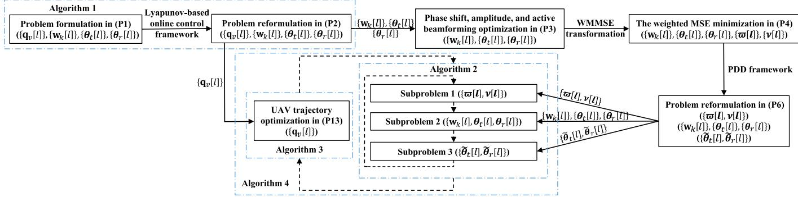  
Fig. 2. A flow chart for illustration of the proposed solutions.

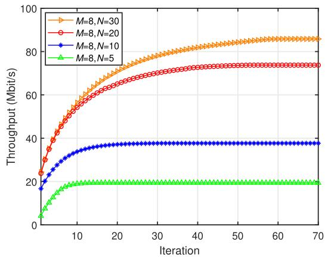  
Fig. 3. Convergence behavior of the proposed algorithm.

UAV tracks the geometric center of all monitored targets, while communication resources are optimally allocated [44]; 2) Fixed Active Beamforming Configuration $( F A B ) { \mathrm { : } }$ Predetermined active beamforming patterns are applied at the UAV without dynamic adjustment [53]; 3) Reflecting-only or Transmitting-only $( R o { \dot { T } } ) \colon \ \left\lceil { \frac { N } { 2 } } \right\rceil$ elements of the STAR-RIS are configured for signal reflection, while the remaining elements are assigned for signal transmission [25], [26]; 4) Random STAR-RIS Configuration (RSC): The STAR-RIS amplitudes and phase shifts are randomly updated in each time slot [8], [23].

## B. Convergence Analysis

We begin by evaluating the convergence of the proposed algorithm with $p ^ { \mathrm { m a x } } = 0 . 1$ W. As depicted in Fig. 3, the simulation results demonstrate that the proposed approach achieves rapid and stable convergence across different configurations. Notably, when $N = 5$ , the algorithm converges quickly within approximately 10 iterations. With an increase in STAR-RIS elements from 5 to 30, the iterations needed to achieve convergence also increase. However, this increase in iterations is accompanied by a corresponding improvement in throughput, which is attributed to the higher beamforming gains facilitated by the additional elements. These findings highlight the effectiveness and scalability of the proposed scheme.

Fig. 4 shows the convergence of the phase-shift difference, $\phi _ { t , n } \mathrm { ~ - ~ } \phi _ { r , n }$ , across all STAR-RIS elements. It is observed that the phase-shift differences rapidly converge to either $\frac { \pi } { 2 }$ or $\frac { 3 \pi } { 2 }$ , satisfying the condition $\cos ( \phi _ { t , n } - \phi _ { r , n } ) = 0 $ . This behavior aligns with the theoretical requirement for simultaneous transmission and reflection in STAR-RIS configurations, further confirming the technical validity and effectiveness of the optimization framework.

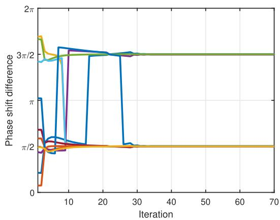  
Fig. 4. Phase shift difference converge of $N = 1 0$

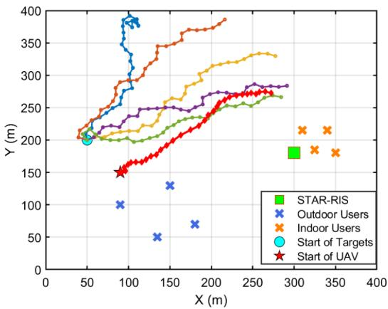  
Fig. 5. Optimized UAV trajectory for targets monitoring.

## C. Optimized Monitoring Trajectory and Speed Analysis

Fig. 5 illustrates the UAV’s optimized trajectory while monitoring the moving targets. The UAV dynamically adjusts its trajectory to accommodate unpredictable target movements, strategically maintaining positions near the maximum permissible monitoring distance to ensure continuous and comprehensive coverage. This adaptive strategy enables the UAV to consistently keep all targets within its effective observation range, while also providing stable and high-quality communication links for both outdoor and indoor users. The proposed Lyapunov-based optimization algorithm balances monitoring accuracy, communication throughput, and energy efficiency, demonstrating practical adaptability under dynamic conditions.

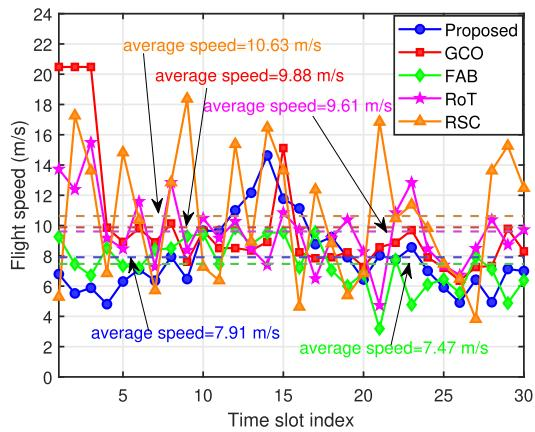  
Fig. 6. Optimized UAV’s speed under different time slots.

Fig. 6 illustrates the UAV’s flight speed over consecutive time slots under different schemes. Under the RSC scheme, the UAV experiences frequent speed fluctuations due to random STAR-RIS parameter changes, which cause unstable channel conditions and force rapid speed adjustments, resulting in an average speed of 10.03 m/s. Under the GCO scheme, the UAV initially operates at its near-maximum speed to catch up with the moving geometric center of the targets, which leads to higher energy consumption at the beginning. The FAB and RoT schemes exhibit more stable speeds due to fixed beamforming or transmission/reflection configurations, but their limited adaptability reduces energy efficiency and throughput. In contrast, the proposed scheme flexibly adjusts the UAV’s speed based on dynamic channel conditions, maintaining a moderate and steady average speed of 7.91 m/s. This adaptive approach reduces energy consumption and ensures reliable communication, highlighting the efficacy of the proposed scheme in dynamic monitoring scenarios.

## D. Performance Analysis of the Proposed Algorithm

Fig. 7 shows that the proposed method consistently outperforms all baselines in terms of system throughput as the number of STAR-RIS elements increases, with $M = 8$ and $p ^ { \mathrm { m a x } } ~ = ~ 0 . 1$ W. This gain is primarily attributed to the joint optimization enabled by the Lyapunov-based control framework, which dynamically coordinates UAV trajectory, active beamforming, and STAR-RIS coefficients. Notably, our approach significantly outperforms the GCO scheme. Specifically, with $N = 8 0$ , the throughput of the proposed scheme increases by approximately 18.98% compared to GCO scheme, and this gain further increases to 23.77% when $N = 1 2 0$ . This is primarily due to the GCO scheme’s lack of trajectory adaptability, as it merely follows the geometric center of the targets. The FAB scheme employs fixed beamforming patterns, limiting responsiveness to dynamic channels, while the RoT scheme statically divides STAR-RIS elements, reducing spatial coverage and signal steering capabilities. These limitations result in lower throughput and inefficient resource use. Moreover, the RSC scheme, with randomly updated STAR-RIS parameters, performs the worst, highlighting the critical importance of intelligent parameter design to fully exploit STAR-RIS capabilities and sustain stable, efficient communication.

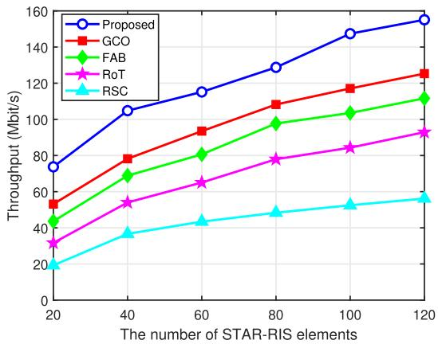  
Fig. 7. Throughput versus the number of STAR-RIS elements N.

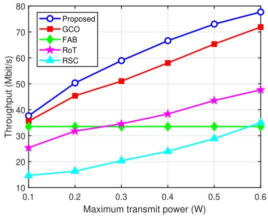  
Fig. 8. Throughput versus the maximum transmit power $p ^ { \mathrm { m a x } }$

Fig. 8 shows the throughput of the proposed and baseline schemes under varying UAV transmit power, with $M = 8$ and $N = 1 0$ . As expected, all schemes achieve higher throughput as transmit power increases due to enhanced signal quality. The proposed method consistently outperforms all baselines by dynamically adapting transmission parameters to match changing communication environment. Among the baselines, GCO performs relatively better by combining geometric center tracking with optimal resource allocation, but lacks trajectory optimization. FAB and RoT schemes exhibit limited adaptability due to fixed beamforming or static STAR-RIS partitioning, resulting in lower throughput. RSC performs the worst, as its random parameter updates cause unstable signal propagation and inefficient resource utilization.

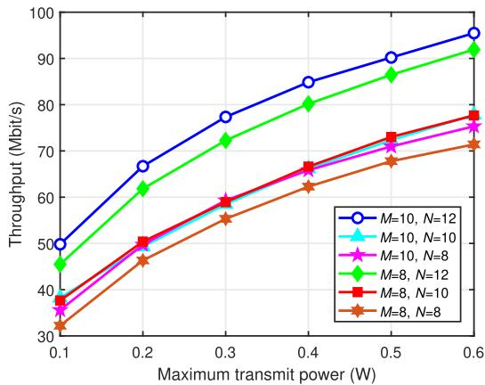

Fig. 9. Throughput under different numbers of UAV antennas M and STAR-RIS elements N.  
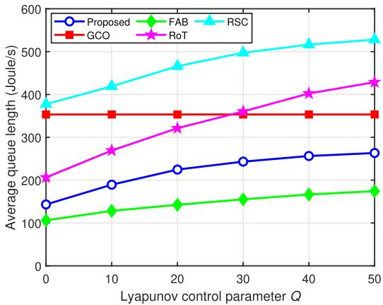  
Fig. 10. The average queue length versus control parameter Q.

Fig. 9 depicts the effect of the number of UAV antennas M and STAR-RIS elements N on the system throughput under varying transmit power. As expected, increasing the transmit power improves throughput by enhancing signal strength. Moreover, larger values of M and N consistently yield better performance, reflecting the benefits of greater spatial degrees of freedom in both active and passive beamforming. Notably, the configuration with $M ~ = ~ 1 0$ and $N \ = \ 1 2$ achieves the highest throughput across all power levels, owing to its enhanced beamforming flexibility and precise spatial control, which enable more effective signal steering and interference mitigation. These simulation results validate the scalability of the proposed framework and its ability to fully exploit available hardware resources to support high-throughput, multi-user communication in dynamic aerial monitoring scenarios.

Fig. 10 illustrates the relationship between the average queue length (AQL) and the Lyapunov parameter Q. As expected, the AQL increases with larger values of Q for all schemes except the GCO benchmark, confirming the fundamental trade-off between throughput maximization and queue stability inherent in Lyapunov-based control frameworks. Among the compared schemes, the proposed method strikes an effective balance between throughput and energy consumption. While it does not yield the absolute minimum AQL, it consistently maintains shorter queues than most baselines. The FAB scheme, though it achieves the lowest AQL, suffers from significant throughput degradation due to its static resource configuration. Conversely, the RoT and RSC benchmarks experience significantly higher queue backlogs, largely due to their limited adaptability to dynamic channel conditions and lack of coordinated resource optimization.

## VI. CONCLUSION

This paper considered a STAR-RIS-enabled UAV monitoring framework designed to maximize the long-term average throughput by jointly optimizing active beamforming, UAV trajectory, and STAR-RIS configurations under strict energy constraints. To manage complexities introduced by random target movements and dynamic channel conditions, a Lyapunov-based online optimization method was developed. The original multi-stage stochastic problem was transformed into deterministic per-slot subproblems, which were solved by applying SPCA method for UAV trajectory optimization and a PDD method for STAR-RIS amplitude, phase, and active beamforming optimization. Simulation results demonstrated that the proposed framework achieves substantial improvements in throughput compared to existing benchmarks, confirming its effectiveness under dynamic operational conditions and stringent energy limitations.

## REFERENCES

[1] F. Metzger et al., “An introduction to online video game QoS and QoE influencing factors,” IEEE Commun. Surveys Tuts., vol. 24, no. 3, pp. 1894–1925, 3rd Quart., 2022.

[2] N. Qi, Z. Huang, F. Zhou, Q. Shi, Q. Wu, and M. Xiao, “A task-driven sequential overlapping coalition formation game for resource allocation in heterogeneous UAV networks,” IEEE Trans. Mobile Comput., vol. 22, no. 8, pp. 4439–4455, Aug. 2023.

[3] S. Hu, Q. Wu, and X. Wang, “Energy management and trajectory optimization for UAV-enabled legitimate monitoring systems,” IEEE Trans. Wireless Commun., vol. 20, no. 1, pp. 142–155, Jan. 2021.

[4] J. Liao, C. Zhan, B. Zeng, and H. Yan, “Energy-efficient optimization for IRS-enabled multiantenna UAV video streaming,” IEEE Internet Things J., vol. 11, no. 6, pp. 9522–9535, Mar. 2023.

[5] M. Najafi, V. Jamali, R. Schober, and H. V. Poor, “Physics-based modeling and scalable optimization of large intelligent reflecting surfaces,” IEEE Trans. Commun., vol. 69, no. 4, pp. 2673–2691, Apr. 2021.

[6] H. Ren, Z. Zhang, Z. Peng, L. Li, and C. Pan, “Energy minimization in RIS-assisted UAV-enabled wireless power transfer systems,” IEEE Internet Things J., vol. 10, no. 7, pp. 5794–5809, Apr. 2023.

[7] X. Mu, Y. Liu, L. Guo, J. Lin, and R. Schober, “Simultaneously transmitting and reflecting (STAR) RIS aided wireless communications,” IEEE Trans. Wireless Commun., vol. 21, no. 5, pp. 3083–3098, May 2022.

[8] X. Zhai, G. Han, Y. Cai, Y. Liu, and L. Hanzo, “Simultaneously transmitting and reflecting (STAR) RIS assisted over-the-air computation systems,” IEEE Trans. Commun., vol. 71, no. 3, pp. 1309–1322, Mar. 2023.

[9] Z.-H. Sun, X. Luo, E. Q. Wu, T.-Y. Zuo, Z.-R. Tang, and Z. Zhuang, “Monitoring scheduling of drones for emission control areas: An ant colony-based approach,” IEEE Trans. Intell. Transp. Syst., vol. 23, no. 8, pp. 11699–11709, Aug. 2022.

[10] Y. Liang et al., “Nonredundant information collection in rescue applications via an energy-constrained UAV,” IEEE Internet Things J., vol. 6, no. 2, pp. 2945–2958, Apr. 2019.

[11] S. Wang, F. Jiang, B. Zhang, R. Ma, and Q. Hao, “Development of UAV-based target tracking and recognition systems,” IEEE Trans. Intell. Transp. Syst., vol. 21, no. 8, pp. 3409–3422, Aug. 2020.

[12] C. Zhan, H. Hu, Z. Liu, J. Wang, N. Cheng, and S. Mao, “Aerial video streaming over 3D cellular networks: An environment and channel knowledge map approach,” IEEE Trans. Wireless Commun., vol. 23, no. 2, pp. 1432–1446, Feb. 2024.

[13] I.-S. Comsa, G.-M. Muntean, and R. Trestian, “An innovative machinelearning-based scheduling solution for improving live UHD video streaming quality in highly dynamic network environments,” IEEE Trans. Broadcast., vol. 67, no. 1, pp. 212–224, Mar. 2021.

[14] L. Zhang and J. Chakareski, “UAV-assisted edge computing and streaming for wireless virtual reality: Analysis, algorithm design, and performance guarantees,” IEEE Trans. Veh. Technol., vol. 71, no. 3, pp. 3267–3275, Mar. 2022.

[15] Y. Zhou et al., “Communication-and-computing latency minimization for UAV-enabled virtual reality delivery systems,” IEEE Trans. Commun., vol. 69, no. 3, pp. 1723–1735, Mar. 2021.

[16] P. S. Bithas, V. Nikolaidis, A. G. Kanatas, and G. K. Karagiannidis, “UAV-to-ground communications: Channel modeling and UAV selection,” IEEE Trans. Commun., vol. 68, no. 8, pp. 5135–5144, Aug. 2020.

[17] Y. Xu, T. Zhang, Y. Liu, D. Yang, L. Xiao, and M. Tao, “Computation capacity enhancement by joint UAV and RIS design in IoT,” IEEE Internet Things J., vol. 9, no. 20, pp. 20590–20603, Oct. 2022.

[18] Z. Wei et al., “Sum-rate maximization for IRS-assisted UAV OFDMA communication systems,” IEEE Trans. Wireless Commun., vol. 20, no. 4, pp. 2530–2550, Apr. 2021.

[19] R. Zhang, K. Xiong, Y. Lu, P. Fan, D. W. K. Ng, and K. B. Letaief, “Energy efficiency maximization in RIS-assisted SWIPT networks with RSMA: A PPO-based approach,” IEEE J. Sel. Areas Commun., vol. 41, no. 5, pp. 1413–1430, May 2023.

[20] J. Li, S. Xu, J. Liu, Y. Cao, and W. Gao, “Reconfigurable intelligent surface enhanced secure aerial-ground communication,” IEEE Trans. Commun., vol. 69, no. 9, pp. 6185–6197, Sep. 2021.

[21] K. Tian, B. Duo, S. Li, Y. Zuo, and X. Yuan, “Hybrid uplink and downlink transmissions for full-duplex UAV communication with RIS,” IEEE Wireless Commun. Lett., vol. 11, no. 4, pp. 866–870, Apr. 2022.

[22] H. Zhang, M. Huang, H. Zhou, X. Wang, N. Wang, and K. Long, “Capacity maximization in RIS-UAV networks: A DDQN-based trajectory and phase shift optimization approach,” IEEE Trans. Wireless Commun., vol. 22, no. 4, pp. 2583–2591, Apr. 2023.

[23] J. Zhao, Y. Zhu, X. Mu, K. Cai, Y. Liu, and L. Hanzo, “Simultaneously transmitting and reflecting reconfigurable intelligent surface (STAR-RIS) assisted UAV communications,” IEEE J. Sel. Areas Commun., vol. 40, no. 10, pp. 3041–3056, Oct. 2022.

[24] Y. Su, X. Pang, W. Lu, N. Zhao, X. Wang, and A. Nallanathan, “Joint location and beamforming optimization for STAR-RIS aided NOMA-UAV networks,” IEEE Trans. Veh. Technol., vol. 72, no. 8, pp. 11023–11028, Aug. 2023.

[25] L. Guo, J. Jia, J. Chen, and X. Wang, “Secure communication optimization in NOMA systems with UAV-mounted STAR-RIS,” IEEE Trans Inf. Forensics Security, vol. 19, pp. 2300–2314, 2023.

[26] P. Zhu, L. Qin, J. Wang, Y. Li, X. Li, and W. Xie, “Optimized trajectory and passive beamforming for STAR-RIS-assisted UAV-empowered O2I WPCN,” IEEE Wireless Commun. Lett., vol. 13, no. 1, pp. 163–167, Jan. 2023.

[27] M. Chen, W. Saad, and C. Yin, “Echo-liquid state deep learning for 360<sup>◦</sup> content transmission and caching in wireless VR networks with cellular-connected UAVs,” IEEE Trans. Commun., vol. 67, no. 9, pp. 6386–6400, Sep. 2019.

[28] L. Teng, Q. Wu, H. Duan, X. Min, and G. Zhai, “Energy-efficient VR 360 video streaming in the IRS-aided rate-splitting multiple access network,” IEEE Trans. Commun., vol. 73, no. 8, pp. 6840–6853, Aug. 2025.

[29] Z. Zhang, J. Chen, Y. Liu, Q. Wu, B. He, and L. Yang, “On the secrecy design of STAR-RIS assisted uplink NOMA networks,” IEEE Trans. Wireless Commun., vol. 21, no. 12, pp. 11207–11221, Dec. 2022.

[30] Y. Xu, T. Zhang, Y. Liu, D. Yang, L. Xiao, and M. Tao, “UAVassisted MEC networks with aerial and ground cooperation,” IEEE Trans. Wireless Commun., vol. 20, no. 12, pp. 7712–7727, Dec. 2021.

[31] J. Xu, Y. Liu, X. Mu, R. Schober, and H. V. Poor, “STAR-RISs: A correlated T&R phase-shift model and practical phase-shift configuration strategies,” IEEE J. Sel. Topics Signal Process., vol. 16, no. 5, pp. 1097–1111, Aug. 2022.

[32] C. You, B. Zheng, and R. Zhang, “Channel estimation and passive beamforming for intelligent reflecting surface: Discrete phase shift and progressive refinement,” IEEE J. Sel. Areas Commun., vol. 38, no. 11, pp. 2604–2620, Nov. 2020.

[33] H. Sun, L. Zhu, W. Mei, and R. Zhang, “Power measurement-based channel estimation for IRS-enhanced wireless coverage,” IEEE Trans. Wireless Commun., vol. 23, no. 12, pp. 19183–19198, Dec. 2024.

[34] Y. Wei, M.-M. Zhao, A. Liu, and M.-J. Zhao, “Channel tracking and prediction for IRS-aided wireless communications,” IEEE Trans. Wireless Commun., vol. 22, no. 1, pp. 563–579, Jan. 2023.

[35] Z. Li et al., “Toward TMA-based transmissive RIS transceiver enabled downlink communication networks: A consensus-ADMM approach,” IEEE Trans. Commun., vol. 73, no. 4, pp. 2832–2846, Apr. 2025.

[36] S. Zhang and R. Zhang, “Capacity characterization for intelligent reflecting surface aided MIMO communication,” IEEE J. Sel. Areas Commun., vol. 38, no. 8, pp. 1823–1838, Aug. 2020.

[37] C. Zhan, H. Yan, R. Fan, H. Hu, S. Xu, and J. Yang, “Online energy and interference management for dynamic target tracking with cellular-connected UAV,” IEEE Trans. Mobile Comput., vol. 24, no. 6, pp. 5496–5510, Jun. 2025.

[38] X.-W. Tang, Y. Huang, Y. Shi, X.-L. Huang, and Q. Shi, “3D trajectory planning for real-time image acquisition in UAV-assisted VR,” IEEE Trans. Wireless Commun., vol. 23, no. 1, pp. 16–30, Jan. 2024.

[39] H. Saito, “Theoretical analysis of nonlinear energy harvesting from wireless mobile nodes,” IEEE Wireless Commun. Lett., vol. 10, no. 9, pp. 1914–1918, Sep. 2021.

[40] S. Wu, “Position adjustment of UAV based on geometric features,” in Proc. IEEE 3rd Int. Conf. Electron. Technol., Commun. Inf. (ICETCI), May 2023, pp. 1302–1307.

[41] H. Gong, B. Huang, and B. Jia, “Energy-efficient 3-D UAV ground node accessing using the minimum number of UAVs,” IEEE Trans. Mobile Comput., vol. 23, no. 12, pp. 12046–12060, Dec. 2024.

[42] Y. Zeng, J. Xu, and R. Zhang, “Energy minimization for wireless communication with rotary-wing UAV,” IEEE Trans. Wireless Commun., vol. 18, no. 4, pp. 2329–2345, Apr. 2019.

[43] M. J. Neely, Stochastic Network Optimization With Application to Communication and Queueing Systems. San Rafael, CA, USA: Morgan & Claypool, Nov. 2010.

[44] Z. Yang, S. Bi, and Y. A. Zhang, “Online trajectory and resource optimization for stochastic UAV-enabled MEC systems,” IEEE Trans. Wireless Commun., vol. 21, no. 7, pp. 5629–5643, Jul. 2022.

[45] H. Jiang, X. Dai, Z. Xiao, and A. Iyengar, “Joint task offloading and resource allocation for energy-constrained mobile edge computing,” IEEE Trans. Mobile Comput., vol. 22, no. 7, pp. 4000–4015, Jul. 2023.

[46] S. S. Christensen, R. Agarwal, E. De Carvalho, and J. M. Cioffi, “Weighted sum-rate maximization using weighted MMSE for MIMO-BC beamforming design,” IEEE Trans. Wireless Commun., vol. 7, no. 12, pp. 4792–4799, Dec. 2008.

[47] Q. Shi, M. Razaviyayn, Z.-Q. Luo, and C. He, “An iteratively weighted MMSE approach to distributed sum-utility maximization for a MIMO interfering broadcast channel,” IEEE Trans. Signal Process., vol. 59, no. 9, pp. 4331–4340, Sep. 2011.

[48] Q. Shi and M. Hong, “Penalty dual decomposition method for nonsmooth nonconvex optimization—Part I: Algorithms and convergence analysis,” IEEE Trans. Signal Process., vol. 68, pp. 4108–4122, 2020.

[49] S. Boyd and L. Vandenberghe, Convex Optimization. Cambridge, U.K.: Cambridge Univ. Press, 2004.

[50] A. Beck, A. Ben-Tal, and L. Tetruashvili, “A sequential parametric convex approximation method with applications to nonconvex truss topology design problems,” J. Global Optim., vol. 47, no. 1, pp. 29–51, May 2010.

[51] K.-G. Nguyen, Q.-D. Vu, L.-N. Tran, and M. Juntti, “Energy efficiency fairness for multi-pair wireless-powered relaying systems,” IEEE J. Sel. Areas Commun., vol. 37, no. 2, pp. 357–373, Feb. 2019.

[52] Q. Wu, Y. Zeng, and R. Zhang, “Joint trajectory and communication design for multi-UAV enabled wireless networks,” IEEE Trans. Wireless Commun., vol. 17, no. 3, pp. 2109–2121, Mar. 2018.

[53] X. Zhang, H. Zhang, L. Sun, X. Wang, K. Long, and V. C. M. Leung, “STAR-RIS-aided UAV communication for next generation multiple access with resource allocation,” IEEE J. Sel. Topics Signal Process., vol. 18, no. 7, pp. 1222–1234, Oct. 2024.

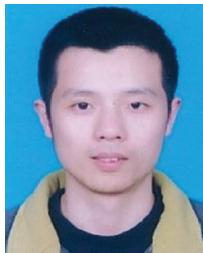

Cheng Zhan (Member, IEEE) received the B.Eng. and Ph.D. degrees in computer science from the School of Computer Science, University of Science and Technology of China, Anhui, China, in 2006 and 2011, respectively. From 2009 to 2010, he was a Research Assistant with the Department of Computer Science, City University of Hong Kong. From 2016 to 2017, he was a Visiting Scholar with the Department of Electrical and Computer Engineering, National University of Singapore. He is currently a Professor with the School of Computer and Information Science, Southwest University, China. His research interests include unmanned aerial vehicle communications, multimedia communications, wireless sensor networks, and network coding. He served as a TPC Member for IEEE ICC, GLOBECOM, WCNC, and UIC.

  
Lu Hu is currently pursuing the master’s degree with the School of Computer and Information Science, Southwest University, Chongqing, China. His research interests include wireless communications, unmanned aerial vehicle (UAV) communications, and intelligent reflecting surface (IRS).


  
and statistical signal processing.

Kaifeng Song received the B.E. degree from Beijing Institute of Technology, China, in 2022. He is currently pursuing the Ph.D. degree with the School of Information and Electronics, Beijing Institute of Technology. His research interests include semantic communication and edge intelligence.

Rongfei Fan (Member, IEEE) received the B.E. degree in communication engineering from Harbin Institute of Technology, Harbin, China, in 2007, and the Ph.D. degree in electrical engineering from the University of Alberta, Edmonton, AB, Canada, in 2012. Since 2013, he has been a Faculty Member with Beijing Institute of Technology, Beijing, China, where he is currently an Associate Professor with the School of Cyberspace Science and Technology. His research interests include edge computing, federated learning, resource allocation in wireless networks,

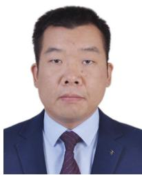

Han Hu (Member, IEEE) received the B.E. and Ph.D. degrees from the University of Science and Technology of China, China, in 2007 and 2012, respectively. He is currently a Professor with the School of Information and Electronics, Beijing Institute of Technology, China. His research interests include multimedia networking, edge intelligence, and space-air-ground integrated networks. He was a TPC Member of Infocom, ACM MM, AAAI, and IJCAI. He received several academic awards, including the Best Paper Award of IEEE TRANSACTIONS

ON CIRCUITS AND SYSTEMS FOR VIDEO TECHNOLOGY in 2019, the Best Paper Award of IEEE Multimedia Magazine in 2015, and the Best Paper Award of IEEE GlobeCom 2013. He served as an Associate Editor for IEEE TRANSACTIONS ON MULTIMEDIA and Ad Hoc Networks.


Jie Xu (Fellow, IEEE) received the B.E. and Ph.D. degrees from the University of Science and Technology of China. He is currently an Associate Professor (tenured) with the School of Science and Engineering, Shenzhen Future Network of Intelligence Institute (FNii-Shenzhen), and Guangdong Provincial Key Laboratory of Future Networks of Intelligence, The Chinese University of Hong Kong (Shenzhen). His research interests include wireless communications, wireless information and power transfer, UAV communications, edge computing and intelligence, and integrated sensing and communication (ISAC). He was a recipient of the 2017 IEEE Signal Processing Society Young Author Best Paper Award, the IEEE/CIC ICCC 2019 Best Paper Award, the 2019 IEEE Communications Society Asia–Pacific Outstanding Young Researcher Award, and the 2019 Wireless Communications Technical Committee Outstanding Young Researcher Award. He is the Symposium Co-Chair of the IEEE GLOBECOM 2019 Wireless Communications Symposium and the IEEE ICC 2025 Communication Theory Symposium, the Workshop Co-Chair of several IEEE ICC and GLOBECOM workshops, the Tutorial Co-Chair of the IEEE/CIC ICCC 2019/2022, the Chair of the IEEE Wireless Communications Technical Committee (WTC), and the Vice Co-Chair of the IEEE Emerging Technology Initiative (ETI) on ISAC. He served or is serving as an Associate Editor-in-Chief for IEEE TRANSACTIONS ON MOBILE COMPUTING; an Editor for IEEE TRANSACTIONS ON WIRELESS COMMUNICATIONS, IEEE TRANSACTIONS ON COMMUNICATIONS, IEEE WIRELESS COMMUNICA-TIONS LETTERS, and Journal of Communications and Information Networks; an Associate Editor for IEEE ACCESS; and a Guest Editor for IEEE WIRELESS COMMUNICATIONS, IEEE JOURNAL ON SELECTED AREAS IN COMMUNICATIONS, IEEE Internet of Things Magazine, Science China Information Sciences, and China Communications. He is a Clarivate Highly Cited Researcher and a Distinguished Lecturer of the IEEE Communications Society.