# UAV-Enabled Over-the-Air Federated Learning: A Hierarchical Aggregation Approach

Xiangyu Zhong , Graduate Student Member, IEEE, Chenxi Zhong , Graduate Student Member, IEEE, Xiaojun Yuan , Senior Member, IEEE, and Ying-Jun Angela Zhang , Fellow, IEEE

Abstract—With explosive increase of data at the mobile edge, federated learning (FL) emerges as a promising technique to reduce data transmission costs and privacy leakage risks. Nevertheless, the huge communication overhead for an increasing volume of edge devices still restricts the FL performance. Overthe-air computation (AirComp) is viable for alleviating the communication burden in FL systems. However, there consequently appears a straggler issue restraining the performance of the over-the-air FL (OA-FL) framework, which is even worse especially when devices training a machine learning model are distributed over a relatively large service area. In this paper, we propose an uncrewed aerial vehicle (UAV) enabled OA-FL scheme, where the UAV acts as a parameter server (PS) to aggregate the local gradients hierarchically for global model updating. The global aggregation frequency is tunable in the hierarchical aggregation approach, enabling it to balance the resource consumption between communication and learning. Building on this approach, we carry out a gradient-correlation-aware FL performance analysis and jointly optimize the trajectory of UAV-PS, the device selection state, and the aggregation coefficients. An algorithm based on alternating optimization (AO) is developed to solve the formulated problem, where successive convex approximation (SCA) and fractional programming (FP) are utilized for the convexification of the non-convex problem. Numerical simulation results demonstrate the effectiveness of our UAV enabled hierarchical aggregation scheme compared with several existing baselines.

Index Terms—Federated learning, over-the-air aggregation, uncrewed aerial vehicle communication, alternating optimization, successive convex approximation, fractional programming.

Received 3 April 2025; revised 25 July 2025 and 7 November 2025; accepted 17 November 2025. Date of publication 28 November 2025; date of current version 22 December 2025. This work was supported in part by the General Research Fund from the Research Grants Council (RGC) of Hong Kong under Project 14202421, Project 14214122, Project 14202723, and Project 14207624; in part by the Area of Excellence Scheme Grant from RGC of Hong Kong under Project AoE/E-601/22-R; in part by the NSFC/RGC Collaborative Research Scheme from RGC of Hong Kong under Project CRS HKUST603/22 and Project CRS HKU702/24; and in part by the National Natural Science Foundation of China under Grant 62571087. An earlier version of this paper was presented in part at the 2022 IEEE Global Communications Conference (GLOBECOM), Rio de Janeiro, Brazil [DOI: 10.1109/GLOBECOM48099.2022.10001689]. The associate editor coordinating the review of this article and approving it for publication was P. Hu. (Corresponding author: Xiaojun Yuan.)

Xiangyu Zhong and Ying-Jun Angela Zhang are with the Department of Information Engineering, The Chinese University of Hong Kong, Hong Kong (e-mail: xyzhong@ie.cuhk.edu.hk; yjzhang@ie.cuhk.edu.hk).

Chenxi Zhong and Xiaojun Yuan are with the National Key Laboratory on Wireless Communications, University of Electronic Science and Technology of China, Chengdu 611731, China (e-mail: cxzhong@std.uestc.edu.cn; xjyuan@uestc.edu.cn).

Data is available on-line at https://github.com/xiangyu-zhong/UAVFL Digital Object Identifier 10.1109/TWC.2025.3635287

## I. INTRODUCTION

S RECENT years have continuously redefined the forefront of artificial intelligence (AI), increasing attention has been drawn to the migration of intelligence toward the edge [1], [2]. To tackle the challenges of huge communication costs and high leakage risks of distributed edge data in edge-AI applications [3], federated learning (FL) has arisen as a promising distributed learning paradigm to replace data transmission with model/gradient exchange [4], [5]. Specifically, in each FL training iteration, the parameter server (PS) first broadcasts the global model to the devices, and the latter then calculates their local gradients separately based on the local datasets and uploads the local gradients to the PS. Subsequently, the PS aggregates the received local gradients and updates the global model.

Due to the iterative nature of FL, the huge communication cost is a critical bottleneck for the application of FL. Especially in the upcoming sixth generation (6G) era [6], [7], the space-air-ground integrated network (SAGIN) demands the expansion of the network coverage and confronts the complexity of the application task, further calling for lower communication costs. A promising approach to reduce the communication cost for FL in the wireless edge is to introduce the over-the-air computation (AirComp) technique [8] into FL uplink [9], [10], referred to as over-the-air FL (OA-FL). AirComp is a technique that leverages the superposition property of wireless signals to enable simultaneous transmissions from multiple devices. By using AirComp, the uplink cost of FL systems can be kept constant regardless of the number of devices, which significantly reduces the communication overhead of large-scale FL. The authors in [11] proved the low latency of AirComp compared with traditional orthogonal multiple access protocols. Several essential issues of OA-FL have been discussed in previous works, including the device scheduling design [12], power control [13], and the model compression techniques [14], [15]. The communicationlearning joint design for OA-FL showed its effectiveness over several scenarios, like reconfigurable intelligent surface empowered OA-FL [16], [17], multi-task OA-FL system with MIMO channels [18], [19], and OA-FL for distributed multimodal learning [20].

Despite the above advantages of the OA-FL, the introduction of AirComp also brings some unique problems, such as the straggler issue [11], [16], [17], [18]. Since AirComp requires local gradients to be aligned at the PS (i.e., the PS receives a linear combination of local gradients with desired coefficients), the devices with good channel conditions have to lower their transmitting powers to match the devices with relatively poor channel conditions (i.e., the stragglers) to ensure correct aggregation [21]. This constrains the signal-to-noise ratio at the parameter server, limits the aggregation contribution from most devices, and leads to degraded spectrum efficiency and slower convergence. Existing works like [11] and [16] discard the stragglers to relieve the straggler issue. However, this coarse-grained discarding strategy may lead to a loss of valuable information from the local datasets on the stragglers, which introduces biased global aggregation and could affect the learning performance of the global model.

The straggler issue also becomes more severe as the service range of FL expands, which requires a longer communication distance between the devices and the PS. As most devices have to align to those most weakest stragglers, the efficiency of wireless resource utilization in FL can be further reduced [22]. Reference [18] suggests a soft aggregation approach to tackle the straggler issue without discarding devices, which only works well in small service area cases (e.g., 100×100 m2). When it comes to a relatively large service area (e.g., 2 × 2 km2), it fails due to the large difference in path loss between nearby devices and those far from the PS (which results in the de facto discarding of remote devices). The authors in [23], [24], and [25] design a relay-assisted FL framework with a hierarchical communication scheme. While it copes with the straggler issue in relatively large service areas, the pre-mounted relays lack deployment flexibility, leading to high reconfiguration costs.

Allowing PS mobility is a natural idea to perform OA-FL in a large service area since the PS can thus move close to the stragglers for better services. Therefore, introducing an uncrewed aerial vehicle (UAV) as the PS is an inspired solution. Due to the ground-to-air nature of UAV uplink communication, the device-UAV links are generally not blocked, potentially leading to good channel conditions [26], [27], [28], [29], [30]. Besides, UAVs have extremely high mobility and can thus cover a large area quickly. These inherent advantages can be particularly beneficial in FL tasks, helping alleviate communication burdens during iterative learning processes [31], [32], [33], [34]. Reference [32] employs a UAV as a mobile relay to assist FL with a contract incentive scheme, leading to the communication efficient FL; in [33], a UAV acts as an orchestrator, coordinating the uploading and learning schedule within a preset deadline by trajectory optimization to address the staleness problem; moreover, [34] comprehensively discusses several deployment issues of a UAV assisting FL, considering the learning completion time, energy consumption, trajectory of UAV, and time allocation. However, these works consider orthogonal FL uplink and thus still have various limitations in the number of devices, service area, and communication conditions especially compared with OA-FL. Reference [35] first proposes a general UAV-assisted OA-FL architecture with an aggregation design and trajectory optimization. However, it enforces a coupling of flying and training periods of the UAV, overlooks the impact of device selection on the system, and relies on several simplified assumptions for optimization.

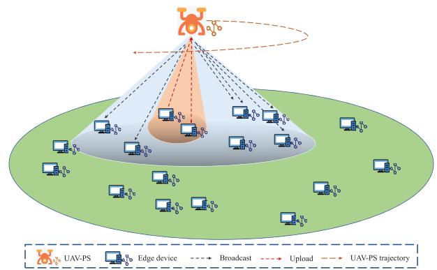  
Fig. 1. UAV enabled OA-FL scheme in a large service area.

In this paper, to address the above challenges and further unleash the potential of the UAV in FL, we propose a novel scheme of UAV enabled OA-FL with a hierarchical aggregation approach, where a UAV acts as the PS to collect the local updates from the edge devices in a tiered manner. As shown in Fig. 1, the UAV-PS is deployed in a large service area to serve a set of edge devices. We analyze the convergence of the scheme by deriving an upper bound of the learning performance with respect to (w.r.t.) a summation of several coupled aggregation mean squared error (MSE) terms. Based on the analysis results, we formulate an optimization problem that jointly optimizes the UAV-PS trajectory, the device selection state, and the aggregation coefficients. To the best of our knowledge, this is the first work that employs a UAV to assist the OA-FL system. The main contributions of this paper are listed as follows:

• We propose a novel UAV enabled OA-FL scheme to overcome the straggler issue in a large service area. We design a hierarchical aggregation approach for the scheme to improve the learning performance of the system. Specifically, in the first phase, when the UAV-PS flies around the area, it receives the local model gradients from selected devices using over-the-air aggregation at each position. In the second phase, after several time slots of local aggregations, it globally aggregates the partial updates to update the global model. The global aggregation frequency is tunable in the hierarchical aggregation approach to balance communication and learning.

• We analyze the convergence of the UAV enabled OA-FL scheme and derive an upper bound from the standpoint of the learning loss as Theorem 1. Theoretically, we find that the summation of several coupled aggregation MSEs dominating the bound leads to learning performance loss. Theorem 1 serves as the foundation for system optimization, bridging communication and learning objectives. Thus, we formulate a minimization problem of the aggregation MSE summation to jointly optimize the integrated communication-learning system.

• We propose an efficient algorithm based on the alternating optimization (AO) framework to solve the non-convex optimization problem with multiple variables. The algorithm alternately optimizes the UAV-PS trajectory, the device selection state, and the aggregation coefficients. We use successive convex approximation (SCA) and fractional programming (FP) to transform the problem into a convex and solvable one.

• We simulate the UAV enabled OA-FL scheme in a relatively large service area under independent and identically distributed (i.i.d.) and non-i.i.d. settings of two datasets. The numerical results verify the effectiveness of our proposed scheme and demonstrate that our algorithm achieves a performance improvement over other baselines under various settings. The optimized trajectories of the UAV-PS over two different scenarios show the implementability of the framework. Experiments on the hierarchical aggregation approach under different global aggregation frequency settings reveal its flexibility in striking a balance between the resource consumption of learning and communication.

The remainder of this paper is organized as follows. In Section II, we introduce the system model with the FL model, the UAV flight model, the UAV assisted FL system, and the UAV communication channel. In Section III, we propose the transmitting signal model, the hierarchical aggregation design, and the overall scheme. In Section IV, the performance convergence of the UAV enabled OA-FL scheme is analyzed. In Section ${ \mathrm { V } } ,$ we formulate an optimization problem to minimize the coupled aggregation MSEs and propose an algorithm to jointly optimize the trajectory of UAV-PS, the device selection state, and the aggregation coefficients. In Section VI, we evaluate the proposed design through extensive simulations. Additional practical applicability and feasibility are discussed in Section VII. Finally, the paper concludes in Section VIII.

Notation: Throughout, we use R, C, and Z to respectively denote the real number, complex number, and integer sets, respectively. Italic letters, straight bold small letters, straight bold capital letters, and calligraphic letters are used to denote scalars, vectors, matrices, and sets, respectively. We use $( \cdot ) ^ { \top }$ $( \cdot ) ^ { - 1 }$ , and $( \cdot ) ^ { \prime }$ to denote the transpose, inverse, and conjugate, respectively. We use $( \cdot ) _ { m } , \ ( \cdot ) [ n ] , \ ( \cdot ) ^ { ( t ) }$ , and $( \cdot ) ^ { i }$ to denote the m-th identity, n-th time slot, t-th training round, and i-th iteration status, respectively. We use $x \langle d \rangle$ for the d-th entry of vector $\mathbf { x } , \mathbf { x } \langle i : j \rangle$ for a slice of x from i to $j ,$ and $x _ { i , j }$ for the $( i , j )$ -th entry of matrix X. We use $\mathcal { C N } ( \mu , \sigma ^ { 2 } )$ to denote the circularly-symmetric complex normal distribution with mean $\mu$ and covariance $\sigma ^ { 2 }$ . We use $\mathbb { E } [ \cdot ]$ to denote the expectation operator, |S| to denote the cardinality of set S, k · k to denote the l2-norm, and [K] to denote the set $\{ k | 1 \leq k \leq K , k \in \mathbb { Z } \}$ We use ${ \mathbf { I } } _ { N }$ and 1 to respectively denote the $N \times N$ identity matrix and the N-dimension all-one vector. Main variables and their meanings used in the paper are listed in Table I.

## II. SYSTEM MODEL

## A. Federated Learning

We consider an FL system where M devices collaboratively train a machine learning model assisted by a PS. Let $\mathcal { D } _ { m }$ be the dataset on device m, $Q _ { m } \triangleq | \mathscr { D } _ { m } |$ be the size of dataset $\mathcal { D } _ { m } .$ , and $\begin{array} { r } { Q \triangleq \sum _ { m = 1 } ^ { M } Q _ { m } } \end{array}$ be the total dataset size. The target of the FL system is to minimize the following global loss function:

VARIABLES AND DESCRIPTIONS
<table><tr><td>Variable</td><td>Description</td></tr><tr><td> $\overline { { M } }$ </td><td>Number of edge devices</td></tr><tr><td> $N$ </td><td>Number of time slots</td></tr><tr><td> $T$ </td><td>Number of training rounds</td></tr><tr><td> $D$   $\mathbf { w } ^ { ( t ) }$ </td><td>Length of learning model parameter</td></tr><tr><td> $b _ { m }$ </td><td>Parameter vector of the machine learning model at the t-th training round</td></tr><tr><td> $\mathbf { g } ^ { ( t ) } , \mathbf { g } _ { m } ^ { ( t ) }$ </td><td>Device training weight of the m-th device Gradient of the global model/ m-th local model at the</td></tr><tr><td> $\upsilon _ { m } ^ { ( t ) }$ </td><td>t-th training round Variance of the gradient entries  $g _ { m } ^ { ( t ) } \langle d \rangle$  for the m-th device at the t-th training round</td></tr><tr><td> $\delta$   $\mathbf { u } ^ { ( \iota ) } [ n ]$ </td><td>Time slot length Trajectory coordinates of UAV-PS in the n-th time slot at the t-th flying round</td></tr><tr><td> $V _ { \mathrm { m a x } }$   $\mathcal { M } _ { n }$   $\alpha _ { m } ^ { ( t ) } [ n ]$ </td><td>Maximum flying speed of UAV-PS Uplink device set in the n-th time slot Device selection variable for the m-th device in the</td></tr><tr><td> $\varrho$   $P _ { 0 }$   $\zeta ^ { ( t ) } [ n ]$ </td><td>n-th time slot at the t-th training round Channel power at the reference distance Maximum transmit power</td></tr><tr><td> $\boldsymbol { \rho } ^ { ( t ) }$ </td><td>Aggregation coefficient in the n-th time slot at the t-th training round Auto-correlation matrix of the gradients at the t-th traning round</td></tr></table>

TABLE I

$$
F ( \mathbf { w } ) = \sum _ { m = 1 } ^ { M } b _ { m } F _ { m } \left( \mathbf { w } \right) ,\tag{1}
$$

where $\mathbf { w } \in \mathbb { R } ^ { D }$ denotes the parameter vector of the machine learning model with D being the length of $\mathbf { w } ,$ and $b _ { m } \ { \stackrel { \Delta } { = } }$ $Q _ { m } / Q$ denotes the device training weight of device m, satisfying $\textstyle \sum _ { m = 1 } ^ { M } b _ { m } = 1$

The local loss function $F _ { m } \left( \mathbf { w } \right)$ of device m is given by

$$
F _ { m } ( \mathbf { w } ) = \frac { 1 } { Q _ { m } } \sum _ { q = 1 } ^ { Q _ { m } } f ( \mathbf { w } ; \pmb { \xi } _ { m , q } ) ,\tag{2}
$$

where $\pmb { \xi } _ { m , q }$ denotes the q-th data sample in device $m ,$ and $f ( \mathbf { w } ; \pmb { \xi } _ { m , q } ) ^ { \prime }$ denotes the sample-wise loss function based on $\pmb { \xi } _ { m , q }$ w.r.t. parameter w.

To perform FL, each device m calculates the gradient of $F _ { m }$ , and the PS updates the global model by aggregating local gradients. We consider $T$ training rounds for model convergence, with $t \in [ T ]$ . Each training round t consists of the following four steps:

• Global model broadcasting: The PS broadcasts its global model parameters, i.e., $\mathbf { w } ^ { ( t ) }$ , to all the M devices.

• Local gradient computation: Based on $\mathbf { w } ^ { ( t ) }$ and the local dataset $\mathcal { D } _ { m } ,$ , each device m adopts stochastic gradient descent (SGD) to compute its gradient

$$
\mathbf { g } _ { m } ^ { ( t ) } = \nabla F _ { m } ( \mathbf { w } ^ { ( t ) } ) ,\tag{3}
$$

where $\nabla F _ { m } ( \mathbf { w } ^ { ( t ) } )$ denotes the gradient of the local loss function of device m.

• Gradient aggregation: The local gradients are aggregated at the PS, given by

$$
\mathbf { g } ^ { ( t ) } \triangleq \sum _ { m = 1 } ^ { M } b _ { m } \mathbf { g } _ { m } ^ { ( t ) } .\tag{4}
$$

• Global model updating: The PS updates the global model $\mathbf { w } ^ { ( t ) }$ by

$$
\mathbf { w } ^ { ( t + 1 ) } = \mathbf { w } ^ { ( t ) } - \eta \mathbf { g } ^ { ( t ) } ,\tag{5}
$$

where η denotes the learning rate.

## B. UAV Flight Model

We now introduce a UAV enabled federated learning system, where the PS is deployed on a UAV (referred to as the UAV-PS). We consider a scenario in which the devices are distributed over a large service area. Some devices may experience deep channel fading due to the long distance from the PS, which causes a large error in gradient aggregation. The UAV can improve the links of these devices by adjusting its trajectory. During each flying round $\iota ,$ the UAV-PS flies over the service area to broadcast its learned global model, to collect local gradient updates from wireless devices, and to conduct gradient aggregation and global model updating. To achieve a high quality of model broadcasting and gradient aggregation, the UAV-PS needs to adjust its trajectory at each flying round.

Let $\Delta t$ be the duration of a flying round. Without loss of generality, we consider a 3D Cartesian coordinate system where the m-th device is located on the ground with its horizontal coordinate being fixed at $\mathbf { v } _ { m } ~ = ~ [ x _ { m } , y _ { m } ] ^ { \top } ~ \in$ $\mathbb { R } ^ { 2 \times 1 } , m \in \ [ M ]$ . The UAV-PS is assumed to fly at a fixed height z above the ground, and the horizontal coordinate at instant $\tau \ \mathbf { i s } \ \mathbf { u } ^ { ( \iota ) } ( \tau ) \stackrel { \smile } { = } [ x ^ { ( \iota ) } ( \tau ) , y ^ { ( \iota ) } ( \tau ) ] ^ { \top } \ \in \mathbb { R } ^ { 2 \times 1 } , 0 \le \tau \ \le$ $\Delta t ,$ , at the ι-th flying round. The UAV-PS is constrained by the flying period $\Delta t$ and the maximum speed $V _ { \mathrm { m a x } } \ [ 2 7 ]$ As such, at the t-th round, the UAV trajectory is subject to the constraints of

$$
\mathbf { u } ^ { ( \iota ) } ( 0 ) = \mathbf { u } ^ { ( \iota ) } ( \Delta t ) ,\tag{6}
$$

$$
\| \dot { \mathbf { u } } ^ { ( \iota ) } ( \tau ) \| \le V _ { \mathrm { m a x } } , \mathrm { f o r } \ 0 \le \tau \le \Delta t ,\tag{7}
$$

where (6) represents that the start and the end of the UAV-PS at each flying round are the same point, and (7) represents the speed constraint. For simplicity, we discretize the consecutive duration $\Delta t$ into N equal-time slots, indexed by $z ,$ where the slot length $\delta \triangleq \Delta t / N$ is sufficiently small so that the UAV-PS can be assumed to have no displacement within a time slot. Therefore, the trajectory constraints are rewritten as

$$
\mathbf { u } ^ { ( \iota ) } [ 0 ] = \mathbf { u } ^ { ( \iota ) } [ N ] ,\tag{8}
$$

$$
\lVert \mathbf { u } ^ { ( t ) } [ n + 1 ] - \mathbf { u } ^ { ( t ) } [ n ] \rVert ^ { 2 } \leq ( V _ { \operatorname* { m a x } } \delta ) ^ { 2 } , \mathrm { f o r } \ n = 0 , . . . , N - 1 .\tag{9}
$$

## C. UAV Assisted FL System

In this subsection, we elaborate on the scheme of a UAV-PS assisting the FL system. Let J be the global aggregation frequency. The training process is structured into three levels of granularity. The first level is the UAV flying round. During the entire model training process of T training rounds, the UAV-PS flies over the service area for $\textstyle { \frac { T } { J } }$ flying rounds. At each flying round, the UAV-PS departs from and returns to the initial point along a designated trajectory. The second level is the training round. At the flying round $\iota \doteq \left[ \frac { T } { J } \right]$ , the UAV-PS flies to update the model for J times (that’s why J is called the global aggregation frequency). We can divide the trajectory into $J$ segments, with each trajectory segment corresponding to one training round. In the training round $t \in [ T ]$ , the UAV-PS flies in the j-th trajectory segment with $j ~ = ~ t$ mod J. The third level is the time slot. In the t-th training round, the UAV-PS communicates with devices within $\frac { N } { J }$ time slots. In other words, in the j-th trajectory segment, the UAV-PS flies at $\mathbf { u } ^ { ( \iota ) } [ n ]$ with the time slot $\begin{array} { r } { n \in \left[ \frac { ( j - 1 ) N } { J } , \frac { j N } { J } \right) } \end{array}$

Let $\mathcal { M } _ { n } ^ { \prime } \in [ M ]$ and $\mathcal { M } _ { n } \in [ M ]$ denote the selected device set in the downlink at each time slot n and that in the uplink, respectively. At the n-th time slot, the UAV-PS broadcasts to the selected devices in $\mathcal { M } _ { n } ^ { \prime }$ and aggregates local gradients from the devices in $\mathcal { M } _ { n }$ . We consider that the UAV-PS has a higher transmitting power than the edge devices. As a result, the downlink coverage area is generally larger than the uplink coverage area, as illustrated in Fig. 1. In this case, when the UAV-PS aggregates for $\frac { N } { J }$ time slots, the broadcast finishes in $\begin{array} { r } { N _ { b } \ll \frac { N } { J } } \end{array}$ time slots.

Fig. 2 illustrates the time slot allocation scheme of the UAV assisted FL system within the ι-th flying round. Orthogonal frequency bands are allocated to uplink and downlink communications to avoid interference. Again, $j = t$ mod J, indicating that the t-th training round happens in the j-th segment of UAV-PS trajectory. At the j-th trajectory segment, the UAV-PS assisted FL consists of the following three steps:

1) When $\begin{array} { r } { n \in \left\lceil \frac { ( j - 1 ) N } { J } , \frac { ( j - 1 ) N } { J } + N _ { b } \right\rceil } \end{array}$ , the UAV-PS broadcasts the global model to the devices in $\mathcal { M } _ { n } ^ { \prime }$

2) Each device in $\mathcal { M } _ { n } ^ { \prime }$ computes its gradient once it receives the global model.

3) Since $\begin{array} { r } { n \in \left\lceil \frac { ( j - 1 ) N } { J } + 1 , \frac { j N } { J } \right\rceil } \end{array}$ , the UAV-PS aggregates the local gradients from the devices in $\mathcal { M } _ { n }$ . Note that $\begin{array} { r } { \mathcal { M } _ { n } \subseteq \bigcup _ { k = 0 } ^ { \mathbf { \bar { m } } \mathbf { \bar { \alpha } } \{ n , N _ { b } \} - 1 } \mathcal { M } _ { k } ^ { \prime } } \end{array}$ , representing that the devices in $\mathcal { M } _ { n }$ have finished global model updating and local training before the n-th time slot.

At the end of the $\frac { j N } { J } \mathrm { - t h }$ time slot, the UAV-PS finishes the j-th trajectory segment, aligns $\textstyle { \frac { N } { J } }$ aggregated gradients, and updates the global model.

The third step above is referred to as partial aggregation by over-the-air computation, and the final alignment is referred to as global aggregation. These two operations are collectively referred to as hierarchical aggregation, whose design approach will be detailed in the next section. We assume that the global model is broadcast from the UAV-PS to the devices via error-free links as in [18], [36], and [37]. Therefore, we henceforth focus on the uplink design for local model aggregation.

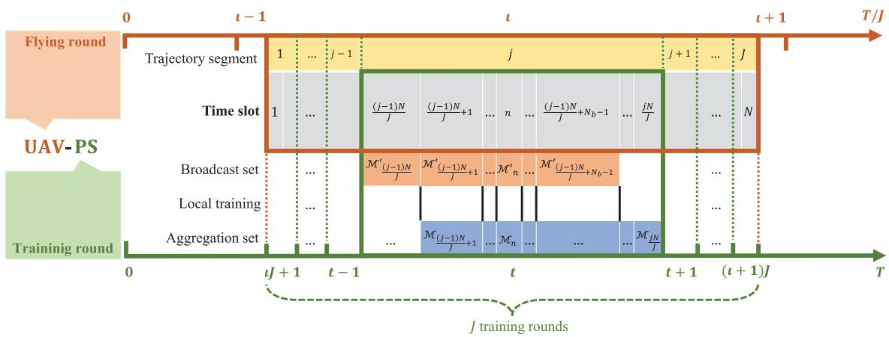  
Fig. 2. Time slot allocation scheme of the UAV assisted FL system at one flying round ι.

## D. UAV Communication Channels

We now present the wireless channel model for communications from edge devices to the UAV-PS. Each device communicates with the UAV-PS from the ground to the sky. We assume that the communication link between each device and the UAV-PS is dominated by the LoS link whose channel quality depends on the UAV-device distance, $d _ { m } ^ { ( \iota ) } [ n ] =$ $\sqrt { z ^ { 2 } + \| \mathbf { u } ^ { ( \iota ) } [ n ] - \mathbf { v } _ { m } \| ^ { 2 } }$ . We also assume that the channel state information (CSI) remains invariant during each time slot and varies independently from time slot to time slot. We further assume that the Doppler effect caused by the UAV-PS mobility can be well compensated at the receiver [27]. Therefore, at the t-th training round, the channel power gain from the UAV-PS to the m-th device during the n-th time slot follows the free-space path loss model, expressed as

$$
h _ { m } ^ { ( t ) } [ n ] = \sqrt { \varrho d _ { m } ^ { ( t ) - 2 } [ n ] } \vartheta _ { m } ^ { ( t ) } [ n ] = \frac { \vartheta _ { m } ^ { ( t ) } [ n ] \sqrt { \varrho } } { \sqrt { z ^ { 2 } + \| \mathbf { u } ^ { ( t ) } [ n ] - \mathbf { v } _ { m } \| ^ { 2 } } } ,\tag{10}
$$

where % denotes the channel power at the reference distance $d _ { \mathrm { r e f } } \ =$ 1m and $\vartheta _ { m } ^ { ( t ) } [ n ] \ \triangleq \ e ^ { \dot { j } \theta _ { m } ^ { ( t ) } [ n ] } \ \in \ \mathbb { C }$ denotes the phase coefficient with $\theta _ { m } ^ { ( t ) } [ n ]$ being the phase of $h _ { m } ^ { ( t ) } [ n ]$

To describe the device selection state, we introduce a binary indicator variable $\alpha _ { m } ^ { ( t ) } [ n ]$ . At the n-th time slot, if the m-th device is in the set $\mathcal { M } _ { n } , \mathrm { i . e . }$ , is chosen to communicate with the UAV-PS for gradient exchange, $\alpha _ { m } ^ { ( t ) } [ n ] = 1$ . Otherwise, $\alpha _ { m } ^ { ( t ) } [ n ] = 0$ . We assume that the local gradient updates are uploaded to the PS synchronously among devices.1 Then, the received signal at time slot n of training round t can be written as

$$
{ \bf y } ^ { ( t ) } [ n ] = \sum _ { m = 1 } ^ { M } \alpha _ { m } ^ { ( t ) } [ n ] h _ { m } ^ { ( t ) } [ n ] { \bf x } _ { m } ^ { ( t ) } [ n ] + { \bf n } ^ { ( t ) } [ n ] ,\tag{11}
$$

1In LTE systems, methods like the timing advance (TA) mechanism are employed for symbol-level synchronization across various edge devices [38], [39]. The TA mechanism adjusts the transmission timing of each user device based on its distance from the base station (eNodeB), ensuring that signals from all devices reach the base station simultaneously. Advanced phase-locked loop (PLL) technology in the Orthogonal Frequency Division Multiplexing (OFDM) system confines the synchronization offset within the duration of the cyclic prefix (CP), avoiding the inter-symbol interference.

where $\mathbf { y } ^ { ( t ) } [ n ] \ \in \ \mathbb { C } ^ { C }$ with C being the transmission data dimension, $\mathbf { \bar { x } } _ { m } ^ { ( t ) } [ n ] \in \mathbb { C } ^ { C }$ is the transmitted signal from the m-th device at the n-th time slot, and $\mathbf { n } ^ { ( t ) } \in \mathbb { C } ^ { C }$ is an additive white Gaussian noise (AWGN) whose elements are independently drawn from $\mathcal { C N } ( 0 , \sigma ^ { 2 } )$

The UAV assisted FL system aims to achieve a high learning accuracy through appropriately designed model aggregation and trajectory optimization. In the following section, we propose a UAV enabled OA-FL scheme with hierarchical aggregation for the system.

## III. PROPOSED UAV ENABLED OA-FL SCHEME

In this section, we present the hierarchical aggregation approach based on over-the-air computation. We first describe how to process the local gradients before transmission, and then present the two-step hierarchical aggregation.

## A. Transmission Signal Model

At each time slot n, only the selected devices with $\alpha _ { m } ^ { ( t ) } [ n ] = 1 , \forall m$ , need to transmit signals. Assume that device m is a selected device. The local gradient $\mathbf { g } _ { m } ^ { ( t ) }$ is to be transmitted from each device m during $\textstyle { \frac { N } { J } }$ time slots. Before transmission, we normalize the gradients to improve communication efficiency. Specifically, each entry of the normalized gradient $\tilde { \mathbf { g } } _ { m } ^ { ( t ) }$ is computed by

$$
\tilde { g } _ { m } ^ { ( t ) } \langle d \rangle = \frac { g _ { m } ^ { ( t ) } \langle d \rangle - \bar { g } _ { m } ^ { ( t ) } } { \sqrt { v _ { m } ^ { ( t ) } } } , d \in [ D ] ,\tag{12}
$$

where $g _ { m } ^ { ( t ) } \langle d \rangle$ denotes the d-th entry of $\mathbf { g } _ { m } ^ { ( t ) } , \bar { g } _ { m } ^ { ( t ) } \in \mathbb { R }$ and $\boldsymbol { v } _ { m } ^ { ( t ) } ~ \in ~ \mathbb { R }$ respectively denote the mean and variance of the gradient vector $\mathbf { g } _ { m } ^ { ( t ) }$ , which are computed by $\bar { g } _ { m } ^ { ( t ) } = $ $\begin{array} { r } { \frac { 1 } { D } \sum _ { d = 1 } ^ { D } g _ { m } ^ { ( t ) } ( d ) , v _ { m } ^ { ( t ) } = \frac { 1 } { D } \sum _ { d = 1 } ^ { D } ( g _ { m } ^ { ( t ) } ( d ) - \bar { g } _ { m } ^ { ( t ) } ) ^ { 2 } } \end{array}$ . Following the convention in [16], [18], and [40], we assume that the scalar quantities $\{ \bar { g } _ { m } ^ { ( t ) } , v _ { m } ^ { ( t ) } \}$ are transmitted to the UAV-PS via an error-free channel.

Each device modulates the gradient to match the complex communication system in (11), i.e., the normalized gradient $\tilde { \mathbf { g } } _ { m } ^ { ( t ) } \in \mathbb { R } ^ { D }$ is mapped into a complex vector. For the m-th device, the complexified gradient at round t is expressed as

$$
\mathbf { r } _ { m } ^ { ( t ) } \triangleq  { \widetilde { \mathbf { g } } } _ { m } ^ { ( t ) } \langle 1 : C \rangle + j  { \widetilde { \mathbf { g } } } _ { m } ^ { ( t ) } \langle ( C + 1 ) : 2 C \rangle \in \mathbb { C } ^ { C } ,\tag{13}
$$

where $C = D / 2$ and $\tilde { \bf g } _ { m } ^ { ( t ) } \langle c _ { 1 } : c _ { 2 } \rangle$ denotes the sub-vector of $\tilde { \mathbf { g } } _ { m } ^ { ( t ) }$ that consists of the elements with indices from $c _ { 1 }$ to ${ c _ { 2 } . } ^ { 2 }$ Each time slot n contains C times of channel uses with each element of $\mathbf { r } _ { m } ^ { ( t ) }$ occupying one channel use. Therefore, the transmitted signal at each time slot n is

$$
\mathbf { x } _ { m } ^ { ( t ) } [ n ] \triangleq \beta _ { m } ^ { ( t ) } [ n ] \mathbf { r } _ { m } ^ { ( t ) } ,\tag{14}
$$

where $\beta _ { m } ^ { ( t ) } [ n ] \in \mathbb { C }$ is the scaling coefficient satisfying the power constraint $\lvert \beta _ { m } ^ { ( t ) } [ n ] \rvert ^ { 2 } = P _ { 0 } . \dot { \boldsymbol { : } }$ 8

## B. Hierarchical Aggregation Design

At each t-th training round/j-th trajectory segment, the aggregation of the local gradients contains two steps: over-theair aggregation and global aggregation. In this subsection, we introduce these two steps sequentially.

1) Over-the-Air Aggregation: In this step, the UAV-PS circulates to partially aggregate the local gradients for $\textstyle { \frac { N } { J } }$ times via AirComp.

At one time slot $n ,$ the UAV-PS aggregates the synchronously uploading gradients from selected devices in $\mathcal { M } _ { n } .$ To relieve the communication overhead, we introduce Air-Comp with its superposition property to realize this partial aggregation. In this way, the over-the-air federated learning (OA-FL) system is enabled by the UAV-PS. Specifically, the received signal at the n-th time slot is given by (11). Plugging (10) and (14) into (11) yields

$$
\mathbf { y } ^ { ( t ) } [ n ] = \sum _ { m = 1 } ^ { M } \frac { \sqrt { \varrho } \alpha _ { m } ^ { ( t ) } [ n ] \beta _ { m } ^ { ( t ) } [ n ] \vartheta _ { m } ^ { ( t ) } [ n ] } { \sqrt { z ^ { 2 } + | | \mathbf { u } ^ { ( t ) } [ n ] - \mathbf { v } _ { m } | | ^ { 2 } } } \mathbf { r } _ { m } ^ { ( t ) } [ n ] + \mathbf { n } ^ { ( t ) } [ n ] .\tag{15}
$$

Assume that the phase shift of the channel $\vartheta _ { m } ^ { ( t ) } [ n ]$ is known at device m. Thus, the phase shift of the channel is compensated by setting the scaling coefficient $\beta _ { m } ^ { ( t ) } [ n ] = \vartheta _ { m } ^ { ( t ) \prime } [ n ] \sqrt { P _ { 0 } }$ at the side of devices. Then, the partially aggregated signal in (15) can be rewritten as

$$
\mathbf { y } ^ { ( t ) } [ n ] = \sum _ { m = 1 } ^ { M } \frac { \sqrt { \varrho P _ { 0 } } \alpha _ { m } ^ { ( t ) } [ n ] } { \sqrt { z ^ { 2 } + \| \mathbf { u } ^ { ( t ) } [ n ] - \mathbf { v } _ { m } \| ^ { 2 } } } \mathbf { r } _ { m } ^ { ( t ) } [ n ] + \mathbf { n } ^ { ( t ) } [ n ] .\tag{16}
$$

2) Global Aggregation: After $\textstyle { \frac { N } { J } }$ times of the over-the-air aggregations, the UAV-PS combines $\begin{array} { r } { \left\{ \mathbf { y } ^ { ( t ) } [ n ] | n \in \left[ \frac { ( j ^ { - } - 1 ) \bar { N } } { J } + 1 , \frac { j N } { J } \right] , j = t \mathrm { m o d } J \right\} } \end{array}$ with coefficients $\begin{array} { r } { \left\{ \zeta ^ { ( t ) } [ n ] \in \mathbb { R } | n \in \left[ \frac { ( j - 1 ) ^ { \top } N } { J } + 1 , \frac { j N } { J } \right] , j = t \mathrm { m o d } J \right\} } \end{array}$ to obtain the global aggregation signal $\mathbf { a } ^ { ( t ) }$ , i.e.,

$$
\mathbf { a } ^ { ( t ) } = \sum _ { n = \frac { ( j - 1 ) N } { J } + 1 } ^ { \frac { j N } { J } } \zeta ^ { ( t ) } [ n ] \mathbf { y } ^ { ( t ) } [ n ] , j = t \operatorname { m o d } J .\tag{17}
$$

2We assume an even D for ease of discussion.

3We assume that all the devices transmit with full power, which is reasonable since the mobility of the UAV-PS allows the signals to be approximately aligned with desired coefficients (by designing an appropriate trajectory).

where J is adjustable to control the global aggregation frequency. Then the recovered global aggregation gradient $\hat { \mathbf { g } } ^ { ( t ) }$ is computed by

$$
\hat { \mathbf { g } } ^ { ( t ) } = \left[ \mathrm { R e } \{ \mathbf { a } ^ { ( t ) } \} ^ { \top } , \mathrm { I m } \{ \mathbf { a } ^ { ( t ) } \} ^ { \top } \right] ^ { \top } + \bar { g } ^ { ( t ) } \mathbf { 1 } _ { D } ,\tag{18}
$$

where $\begin{array} { r l r } { \bar { g } ^ { ( t ) } } & { { } = } & { \sum _ { m = 1 } ^ { M } \sum _ { n = \frac { ( j - 1 ) N } { J } + 1 } ^ { \frac { j N } { J } } b _ { m } \alpha _ { m } ^ { ( t ) } [ n ] \bar { g } _ { m } ^ { ( t ) } , j \quad = } \end{array}$ t mod J.

## C. Overall Scheme

Based on the global aggregation gradient $\hat { \mathbf { g } } ^ { ( t ) }$ , the UAV-PS updates the global model by

$$
\mathbf w ^ { ( t + 1 ) } = \mathbf w ^ { ( t ) } - \eta \frac { \hat { \mathbf g } ^ { ( t ) } } { \sum _ { n = \frac { ( j - 1 ) N } { J } + 1 } ^ { \frac { j N } { J } } \sum _ { m = 1 } ^ { M } b _ { m } \alpha _ { m } ^ { ( t ) } [ n ] } .\tag{19}
$$

Let $\mathbf { e } ^ { ( t ) }$ denote the error caused by the hierarchical aggregation. We rewrite (19) as

$$
\mathbf { w } ^ { ( t + 1 ) } = \mathbf { w } ^ { ( t ) } - \eta ( \nabla F ( \mathbf { w } ^ { ( t ) } ) - \mathbf { e } ^ { ( t ) } ) ,\tag{20}
$$

where $\begin{array} { r } { \nabla F ( \mathbf { w } ^ { ( t ) } ) \triangleq \frac { 1 } { Q _ { m } } \sum _ { q = 1 } ^ { Q _ { m } } \nabla f ( \mathbf { w } ^ { ( t ) } ; \pmb { \xi } _ { m , q } ^ { ( t ) } ) } \end{array}$ is the gradient of the loss function $F \big ( \mathbf { w } ^ { ( t ) } \big )$ at training round t, and the gradient aggregation error is given by

$$
\begin{array} { r } { \mathbf { e } ^ { ( t ) } = \nabla F ( \mathbf { w } ^ { ( t ) } ) - \frac { \hat { \mathbf { g } } ^ { ( t ) } } { \sum _ { n = \frac { ( j - 1 ) N } { J } + 1 } ^ { \frac { j N } { J } } \sum _ { m = 1 } ^ { M } b _ { m } \alpha _ { m } ^ { ( t ) } [ n ] } } \\ { = \displaystyle \sum _ { m = 1 } ^ { M } b _ { m } \mathbf { g } _ { m } ^ { ( t ) } - \frac { \hat { \mathbf { g } } ^ { ( t ) } } { \sum _ { n = \frac { ( j - 1 ) N } { J } + 1 } ^ { \frac { j N } { J } } \sum _ { m = 1 } ^ { M } b _ { m } \alpha _ { m } ^ { ( t ) } [ n ] } . } \end{array}\tag{21}
$$

By the following proposition, we give the MSE of gradient aggregation for $\mathbf { e } ^ { ( \overline { { t } } ) }$

Proposition 1: Combining (4), (12), (13), (16), (17), (18), and (21), the gradient aggregation MSE is given by equation (22), shown at the bottom of the next page.

Proof: Please refer to Appendix A.

Algorithm 1 summarizes the overall UAV enabled OA-FL scheme. Based on the scheme, in the following, we analyze the system performance to find out the impact of $\mathbf { e } ^ { ( t ) }$ . Then based on the analysis, we formulate an optimization problem to jointly optimize the trajectory of the UAV-PS $\{ { \bf u } ^ { ( \iota ) } [ n ] \} _ { n = 1 } ^ { N } ,$ the device selection $\{ \{ \alpha _ { m } ^ { ( t ) } [ n ] \} _ { n = 1 } ^ { N } \} _ { m = 1 } ^ { M }$ , and the aggregation coefficients $\{ \zeta ^ { ( t ) } [ n ] \} _ { n = 1 } ^ { \mathrm { \Delta } N }$ . We finally design an algorithm to solve the problem.

## IV. PERFORMANCE ANALYSIS

In this section, we analyze the learning performance of the UAV enabled OA-FL scheme with hierarchical aggregation.

## A. Preliminaries

To analyze the convergence of the FL model, we first establish some standard assumptions for the FL loss function, drawing from the literature on stochastic optimization [16], [18], [41]:

Assumption 1: The global loss function $F ( \cdot )$ is continuously differentiable.

Assumption 2: The gradient $\nabla F ( \cdot )$ is uniformly Lipschitz continuous with parameter ω, i.e.,

$$
\begin{array} { r l } & { \| \nabla F ( \mathbf { w } _ { 1 } ^ { ( t ) } ) - \nabla F ( \mathbf { w } _ { 2 } ^ { ( t ) } ) \| \leq \omega \| \mathbf { w } _ { 1 } ^ { ( t ) } - \mathbf { w } _ { 2 } ^ { ( t ) } \| , } \\ & { \qquad \forall \mathbf { w } _ { 1 } ^ { ( t ) } , \mathbf { w } _ { 2 } ^ { ( t ) } \in \mathbb { R } ^ { D } . } \end{array}\tag{23}
$$

The consideration of the gradient correlation among devices is necessary [18]. The gradients of local models have a spatial correlation property varying from strong to weak during the training process. For the convenience of analysis, we assume the following model of the gradient correlation.

Assumption 3: At the t-th training round, $\begin{array} { r l } { \tilde { \mathbf { G } } ^ { ( t ) } } & { { } \triangleq } \end{array}$ $[ \widetilde { \mathbf { g } } _ { 1 } ^ { ( t ) } , \cdot \cdot \cdot , \widetilde { \mathbf { g } } _ { M } ^ { ( t ) } ] \in \mathbb { R } ^ { D \times M }$ denotes the local gradients matrix, in which $\mathbf { z } _ { d } ^ { ( \bar { t } ) } \in \mathbb { R } ^ { M }$ is the d-th row of the matrix, i.e., $\mathbf { z } _ { d } ^ { ( t ) } = [ \tilde { g } _ { 1 } ^ { ( t ) } \langle d \rangle , \cdots , \tilde { g } _ { M } ^ { ( t ) } \langle d \rangle ]$ . Assume that $\{ \mathbf { z } _ { d } ^ { ( t ) } | d \in [ D ] \}$ are identically distributed, and thus the auto-correlation matrix of the gradients is given by

$$
\pmb { \rho } ^ { ( t ) } = \pmb { \rho } _ { d } ^ { ( t ) } \triangleq \mathbb { E } \left[ \mathbf { z } _ { d } ^ { ( t ) } ( \mathbf { z } _ { d } ^ { ( t ) } ) ^ { T } \right] \in \mathbb { R } ^ { M \times M } , \forall d ,\tag{24}
$$

where the $( m _ { 1 } , m _ { 2 } )$ -th entry of $\rho ^ { ( t ) }$ is denoted by $\rho _ { m _ { 1 } , m _ { 2 } } ^ { ( t ) } =$ $\begin{array} { r l r } { \rho _ { d m _ { 1 } , m _ { 2 } } ^ { ( t ) } } & { { } \triangleq } & { \mathbb { E } [ \tilde { g } _ { m _ { 1 } } ^ { ( \acute { t } ) } \langle d \rangle \tilde { g } _ { m _ { 2 } } ^ { ( \acute { t } ) } \langle d \rangle ] } \end{array}$ , measuring the correlation between the local gradient from device $m _ { 1 }$ and the local gradient from device m2 at training round t.

## B. Convergence Analysis

Under Assumptions 1 and 2, we analyze the convergence of the proposed UAV enabled OA-FL framework by deriving an upper bound of the minimum expected squared gradient over T rounds, i.e., mint $\mathbb { E } [ \| \nabla F ( \mathbf { w } ^ { \hat { ( } t ) } ) \| ^ { 2 } ]$ in the following theorem.

Theorem 1: Under Assumptions 1 and 2, as the training round $T ~  ~ \infty$ , the minimum expected squared gradient mint $\mathbb { E } [ \| \nabla F ( \mathbf { w } ^ { ( t ) } ) \| ^ { 2 } ]$ satisfies:

$$
\operatorname* { m i n } _ { t } \mathbb { E } [ \| \nabla F ( { \mathbf w } ^ { ( t ) } ) \| ^ { 2 } ] \le \frac { 1 } { T } \sum _ { \iota = 1 } ^ { T / J } \sum _ { t = ( \iota - 1 ) J + 1 } ^ { \iota J } \mathbb { E } [ \| { \mathbf e } ^ { ( t ) } \| ^ { 2 } ] .\tag{25}
$$

Proof: Please refer to Appendix B.

From Theorem 1, when $T \to \infty ,$ , the minimum expected squared gradient min $\mathbf { \Delta } _ { t } \mathbb { E } [ \| \nabla F ( \mathbf { w } ^ { ( t ) } ) \| ^ { 2 } ]$ is upper bounded by a quantity monotonic in $\begin{array} { r l } { \frac { 1 } { T } \sum _ { \iota = 1 } ^ { T / J } } & { { } \sum _ { t = ( \iota - 1 ) J + 1 } ^ { \iota J } \mathbb { E } [ \| \mathbf e ^ { ( t ) } \| ^ { 2 } ] } \end{array}$ ensuring the convergence of the proposed framework to a stationary point. Theorem 1 analyzes system convergence from the perspective of learning loss and derives a bound closely related to communication error. The aggregation MSE term involves the variables associated with UAV-PS communication and aggregation, influencing the learning performance as described by theorems. Therefore, to improve the learning performance, we need to minimize the summation of several coupled $\mathbb { E } [ \| \mathbf { e } ^ { ( t ) } \| ^ { 2 } ]$ terms at each flying round ι.

Denote by $\begin{array} { r l r } { \zeta ^ { ( t ) } } & { { } \triangleq } & { \left[ \zeta ^ { ( t ) } \left[ \frac { ( j - 1 ) N } { J } + 1 \right] , . . . , \zeta ^ { ( t ) } \left[ \frac { j N } { J } \right] \right] ^ { \intercal } } \end{array}$ the receiver coefficient vector, by \`(t) , $\begin{array} { r l } { ~ } & { { } \sum _ { n = \frac { ( j - 1 ) N } { J } + 1 } ^ { \frac { j N } { J } } \sum _ { m = 1 } ^ { M } b _ { m } \alpha _ { m } ^ { ( t ) } [ n ] } \end{array}$ the total samples of selected devices, by b $\begin{array} { r l } { \triangleq } & { { } \left\lceil b _ { 1 } , . . . , b _ { M } \right\rceil ^ { \top } } \end{array}$ the device weight vector, by $\begin{array} { r l r } { \mathbf { q } ^ { ( t ) } } & { { } \triangleq } & { \left\lceil b _ { 1 } \bar { g } _ { 1 } ^ { ( t ) } , . . . , b _ { M } \bar { g } _ { M } ^ { ( t ) } \right\rceil ^ { \top } } \end{array}$ the weighted mean vector, by $\pmb { v } ^ { ( t ) } \triangleq \left\lceil b _ { 1 } \sqrt { v _ { 1 } ^ { ( t ) } } , . . . , \bar { b } _ { M } \sqrt { v _ { M } ^ { ( t ) } } \right\rceil ^ { \top }$ the weighted standard deviation vector, by $\mathbf { A } ^ { ( t ) } \in \mathbb { R } ^ { \hat { M } \times \frac { N } { J } }$ the device selection matrix with the $( m , n ^ { \prime } )$ -th element being $A _ { m , n ^ { \prime } } ^ { ( t ) } =$ $\begin{array} { r } { \alpha _ { m } ^ { ( t ) } [ n ] , m \ \in \ [ M ] , n ^ { \prime } \ \in \ \left[ \frac { N } { J } \right] , n \ \in \ \left\lceil \frac { ( j - 1 ) N } { J } + 1 , \frac { j N } { J } \right\rceil } \end{array}$ , and by $\mathbf { K } ^ { ( t ) } \in \mathbb { R } ^ { M \times \frac { N } { J } }$ the equivalent channel matrix with $K _ { m , n ^ { \prime } } ^ { ( t ) } = \frac { \alpha _ { m } ^ { ( t ) } [ n ] \sqrt { \varrho P _ { 0 } } } { \sqrt { z ^ { 2 } + \vert \vert \mathbf { u } ^ { ( t ) } [ n ] - \mathbf { v } _ { m } \vert \vert ^ { 2 } } } , m \in [ M ] , n ^ { \prime } \in \left[ \frac { N } { J } \right] , n \in$ $\begin{array} { r } { \left\lceil \frac { ( j - 1 ) N } { J } + \dot { 1 } , \frac { j N } { J } \right\rceil } \end{array}$ . Then, based on Assumption 3, we have the following theorem.

Theorem 2: The gradient aggregation MSE is given by

$$
\begin{array} { r l } & { \mathbb { E } [ \| \mathbf { e } ^ { ( t ) } \| ^ { 2 } ] = \frac { D } { \ell ^ { ( t ) 2 } } \left( \frac { \sigma ^ { 2 } } { 2 } \boldsymbol { \zeta } ^ { ( t ) \top } \boldsymbol { \zeta } ^ { ( t ) } + \mathbf { 1 } _ { \frac { N } { \mathcal { I } } } ^ { \top } \mathbf { A } ^ { ( t ) \top } \mathbf { P } ^ { ( t ) } \mathbf { A } ^ { ( t ) } \mathbf { 1 } _ { \frac { N } { \mathcal { I } } } \right. } \\ & { \left. ~ + \Big ( \ell ^ { ( t ) } \pmb { v } ^ { ( t ) } - \mathbf { K } ^ { ( t ) } \boldsymbol { \zeta } ^ { ( t ) } \Big ) ^ { \top } \rho ^ { ( t ) } \Big ( \ell ^ { ( t ) } \pmb { v } ^ { ( t ) } - \mathbf { K } ^ { ( t ) } \boldsymbol { \zeta } ^ { ( t ) } \Big ) \right) , } \end{array}\tag{26}
$$

where $\mathbf { P } ^ { ( t ) } \triangleq \big ( \mathbf { 1 } _ { M } \mathbf { b } ^ { \intercal } - \mathbf { I } _ { M } \big ) ^ { \intercal } \mathbf { q } ^ { ( t ) } \mathbf { q } ^ { ( t ) \intercal } \big ( \mathbf { 1 } _ { M } \mathbf { b } ^ { \intercal } - \mathbf { I } _ { M } \big ) .$

Proof: Please refer to Appendix C.

From Theorem 2, we see that the aggregation MSE is a function w.r.t. the following variables: the trajectory of UAV-PS $\{ \mathbf { u } ^ { ( \iota ) } [ n ] \} _ { n = 1 } ^ { N }$ , the device selection state $\mathbf { A } ^ { ( t ) }$ , and the aggregation coefficients $\zeta ^ { ( t ) }$ . The related system optimization is detailed in the next section.

$$
\begin{array} { l }  \mathbb { E } [ \| \mathbf { e } ^ { ( t ) } \| ^ { 2 } ] = \frac { 1 } { ( \displaystyle \sum _ { n = \frac { \{ i } - 1 \} { j } } ^ { \frac { i } { \gamma } } \displaystyle \sum _ { i = 1 } ^ { M } b _ { m } \alpha _ { m } ^ { ( t ) } [ n ] ) ^ { 2 } } \mathbb { E } [ \| - \sum _  n = \frac { i - 1 \} { j } } ^ { \frac { 2 \mathbb { N } } { \gamma } } S ^ { ( t ) } [ n ] \mathbf { n } _ { r } ^ { ( t ) } [ n ] + \displaystyle \sum _ { m = 1 } ^ { M } ( b _ { m } \sqrt { v _ { m } ^ { ( t ) } } ( \displaystyle \sum _ { n = \frac { i - 1 \} { j } } ^ { \frac { 2 \mathbb { N } } { \gamma } } \displaystyle \sum _ { i = 1 } ^ { M } b _ { m } \alpha _ { m } ^ { ( t ) } [ n ] ) ) } \\ { - \displaystyle \sum _ { i = \frac { \{ i } - 1 \} { j } } ^ { \frac { 3 \mathbb { N } } { \gamma } } \displaystyle \sum _ { i = 1 } ^ { \frac { \mathbb { N } } { \gamma } ( \frac { \mathbb { N } } { \gamma ^ { 2 } } + \frac { \mathbb { N } } { | \mathbf { n } | \sqrt { \alpha _ { m } ^ { ( t ) } } [ n ] } ) } \bar { \Phi } _ { m } ^ { ( t ) } + \displaystyle \sum _ { m = 1 } ^ { M } b _ { m } ( \displaystyle \sum _ { n = - 1 } ^ { \frac { 3 \mathbb { N } } { j } } \displaystyle \sum _ { m = 1 } ^ { M } b _ { m } \alpha _ { m } ^ { ( t ) } [ n ] - \displaystyle \sum _ { n = 1 } ^ { \frac { j \mathbb { N } } { j } } \displaystyle \sum _ { m = 1 } ^ { \alpha _ { m } ^ { ( t ) } } \alpha _ { m } ^ { ( t ) } [ n ] ) \bar { g } _ { m } ^ { ( t ) } \mathbf { n } _ { D } \Bigg \| ^ { 2 } ] } \\  \displaystyle n = \frac  \langle \vec { p } _ { - } \mathbb { N } _  \end{array}\tag{2}
$$

Algorithm 1 UAV Enabled OA-FL Scheme   
1: Input: T and $\lbrace Q _ { m } \rbrace _ { m = 1 } ^ { M }$   
2: Initialize $t = 0$ and the global model $\mathbf { w } ^ { ( 0 ) }$ on the UAV-PS.   
3: for $\iota \in \left[ \lceil \frac { T } { J } \rceil \right]$ do   
4: The UAV-PS estimates CSI and optimize   
$\{ \mathbf { u } ^ { ( \iota ) } [ n ] \} _ { n = 1 } ^ { N } , \qquad \Bigg \{ \{ \{ \alpha _ { m } ^ { ( t ) } [ n ] \} _ { m = 1 } ^ { M } \} _ { n = \frac { ( j - 1 ) N } { J } + 1 } ^ { \frac { j N } { J } } \Bigg \} _ { j = 1 } ^ { J } ,$   
and $\left\{ \{ \zeta ^ { ( t ) } [ n ] \} _ { n = \frac { ( j - 1 ) N } { J } + 1 } ^ { \frac { j N } { J } } \right\} _ { j = 1 } ^ { J }$   
5: for $t \in [ ( \iota - 1 ) J + 1 , \iota J ]$ do   
6: UAV-PS flies in the j-th segment of trajectory with   
$j = t$ mod $J ;$   
7: The UAV-PS broadcasts the global model $\mathbf { w } ^ { ( t ) }$ to   
devices in the broadcast range;   
8: for $\begin{array} { r } { n \in \left\lceil \frac { ( j - 1 ) N } { J } + 1 , \frac { j N } { J } \right\rceil , \bar { m } \in [ M ] } \end{array}$ do   
9: Receiving $\mathbf { w } ^ { ( t ) }$ , device m computes its local   
gradients $\mathbf { g } _ { m } ^ { ( t ) }$ over the local dataset based on (3);   
10: In time slot $n ,$ device m uploads its local gradi  
ents $\mathbf { g } _ { m } ^ { ( t ) }$ to the UAV-PS based on Section III-A;   
11: The UAV-PS partially aggregates the uploads   
based on (16) in each time slot $n ;$   
12: end for   
13: The UAV-PS globally aggregates for the gradient   
$\hat { \mathbf { g } } ^ { ( t ) }$ based on (17) and (18);   
14: The UAV-PS updates the global model $\mathbf { w } ^ { ( t ) }$ based   
on (19);   
15: end for   
16: end for

## V. SYSTEM OPTIMIZATION

Based on the convergence analysis of Theorems 1, and 2, to achieve better system performance, our objective is to minimize the MSE summation $\begin{array} { r l } { \sum _ { t = ( \iota - 1 ) J + 1 } ^ { \iota J } \bar { \mathbb { E } } [ \| \mathbf { e } ^ { ( t ) } \| ^ { 2 } ] } & { { } } \end{array}$ . In this section, we formulate the optimization problem w.r.t. the trajectory of UAV-PS, the device selection state, and the aggregation coefficients, and solve it by an effective algorithm based on AO, SCA, and FP.

## A. Problem Formulation

We optimize on the basis of each flying round $\iota ,$ consisting of J training rounds. At the ι-th flying round, the system is in the period of $t \in [ ( \iota - 1 ) J + 1 , \iota J ]$ training rounds. For concision in notation, consider ι = 1. Then, $j = t$ mod $J = t .$ Based on the gradual variation of the gradient’s statistical measures [18], we assume $\mathbf { P } ^ { ( 1 ) } = \ldots = \mathbf { P } ^ { ( J ) } = \mathbf { P }$ $\pmb { v } ^ { ( 1 ) } = \ldots = \pmb { v } ^ { ( J ) } = \pmb { v }$ , and $\rho ^ { ( 1 ) } = . . . = \rho ^ { ( J ) } = \rho$ at one flying round. The MSE at the j-th training round in (26) turns into

$$
\begin{array} { r l } & { \mathbb { E } [ \| \mathbf { e } ^ { ( j ) } \| ^ { 2 } ] = \frac { D } { \ell ^ { ( j ) 2 } } \left( \frac { \sigma ^ { 2 } } { 2 } \zeta ^ { ( j ) \top } \zeta ^ { ( j ) } + \mathbf { 1 } _ { \frac { N } { \gamma } } ^ { \top } \mathbf { A } ^ { ( j ) \top } \mathbf { P A } ^ { ( j ) } \mathbf { 1 } _ { \frac { N } { \gamma } } \right. } \\ & { \left. + \left( \ell ^ { ( j ) } v - \mathbf { K } ^ { ( j ) } \zeta ^ { ( j ) } \right) ^ { \top } \pmb { \rho } \left( \ell ^ { ( j ) } v - \mathbf { K } ^ { ( j ) } \zeta ^ { ( j ) } \right) \right) . \quad \quad \quad ( 2 } \end{array}\tag{27}
$$

Define the trajectory of UAV-PS $\mathcal { U } ~ = ~ \{ \mathbf { u } ^ { ( 1 ) } [ n ] \} _ { n = 1 } ^ { N }$ = $\{ { \mathbf { u } } [ n ] \} _ { n = 1 } ^ { N }$ for simplicity. Note that $\mathbf { K } ^ { \left( j \right) }$ and $\ell ^ { ( j ) }$ contain optimization variables U and $\mathbf { A } ^ { ( j ) }$ , respectively, we introduce $\bar { \mathbf { K } } ^ { ( j ) }$ and $\ell ^ { ( j ) }$ as auxiliary optimization variables. Define $\Omega \ = \ \{ \mathcal { U } , { \bf K } ^ { ( j ) } , { \bf A } ^ { ( j ) } , \ell ^ { ( j ) } , \bar { \zeta } ^ { ( j ) } , \forall j \ \in \ [ J ] \}$ . From (25), the problem of minimizing the aggregation MSE summation of $\mathbb { E } [ \| \mathbf { e } ^ { ( j ) } \| ^ { 2 } ]$ is formulated as

$$
( \mathrm { P 1 } ) \colon \operatorname* { m i n } _ { \Omega } \quad \sum _ { j = 1 } ^ { J } \mathbb { E } [ \| \mathbf { e } ^ { ( j ) } \| ^ { 2 } ]\tag{28a}
$$

$$
\mathrm { s . t . } \quad \alpha _ { m } ^ { ( j ) } [ n ] \in \{ 0 , 1 \} , \forall m \in [ M ] ,
$$

$$
n \in \left[ \frac { ( j - 1 ) N } { J } + 1 , \frac { j N } { J } \right] , j \in [ J ] ,
$$

$$
\mathbf { u } [ 0 ] = \mathbf { u } [ N ] ,\tag{28b}
$$

(28c)

$$
\| \mathbf { u } [ n + 1 ] - \mathbf { u } [ n ] \| ^ { 2 } \leq ( V _ { \operatorname* { m a x } } \delta ) ^ { 2 } , n = 0 , 1 , . . . , N - 1 ,\tag{28d}
$$

$$
K _ { m , n ^ { \prime } } ^ { ( j ) } = \frac { \alpha _ { m } ^ { ( j ) } [ n ] \sqrt { \varrho P _ { 0 } } } { \sqrt { z ^ { 2 } + \| \mathbf { u } [ n ] - \mathbf { v } _ { m } \| ^ { 2 } } } , \forall m \in [ M ] ,
$$

$$
n ^ { \prime } \in \left[ \frac { N } { J } \right] , n \in \left[ \frac { ( j - 1 ) N } { J } + 1 , \frac { j N } { J } \right] , j \in [ J ] ,\tag{28e}
$$

$$
\ell ^ { ( j ) } = \sum _ { n = \frac { ( j - 1 ) N } { J } + 1 } ^ { \frac { j N } { J } } \sum _ { m = 1 } ^ { M } b _ { m } \alpha _ { m } ^ { ( j ) } [ n ] , \forall j \in [ J ] .\tag{28f}
$$

Problem (P1) is a non-convex problem w.r.t. multiple variables. (28b) is the definition of device selection variable $\mathbf { A } ^ { ( j ) }$ while (28c) and (28d) are trajectory limitations for UAV-PS. (28e) and (28f) are the equivalent channel matrix constraint w.r.t. U and total samples of selected device constraint w.r.t. $\mathbf { A } ^ { ( j ) }$ , respectively. The constraints are non-convex with the integer feature of $\mathbf { A } ^ { ( j ) }$ . And when $\mathbf { K } ^ { \left( j \right) }$ is the function of U as in (28e), and $\ell ^ { ( j ) }$ and $\mathbf { K } ^ { \left( j \right) }$ are functions of $\mathbf { A } ^ { ( j ) }$ the optimization variables are coupled with each other. We adopt the alternating optimization (AO) to solve the problem. Firstly, we optimize the aggregation coefficients $\zeta ^ { ( j ) }$ by fixing $\mathbf { K } ^ { ( j ) } , \mathcal { U } , \mathbf { A } ^ { ( \hat { j } ) }$ , and $\ell ^ { ( j ) }$ . Since (28a) is convex w.r.t. $\zeta ^ { ( j ) }$ with fixed $\mathbf { K } ^ { ( j ) } , \mathcal { U } , \mathbf { A } ^ { ( j ) }$ and $\ell ^ { ( j ) }$ , by letting $\frac { \partial \mathbb { E } [ \| \mathbf { e } ^ { ( j ) } \| ^ { 2 } ] } { \partial \zeta ^ { ( j ) } } = 0$ , the optimal $\zeta ^ { ( j ) * }$ is given by

$$
\zeta ^ { ( j ) * } = \ell ^ { ( j ) } \left( \frac { \sigma ^ { 2 } } { 2 } \mathbf { I } _ { \frac { N } { J } } + \mathbf { K } ^ { ( j ) \top } \pmb { \rho } \mathbf { K } ^ { ( j ) } \right) ^ { - 1 } \mathbf { K } ^ { ( j ) \top } \pmb { \rho } \pmb { v } .\tag{29}
$$

Secondly, we optimize the UAV-PS trajectory U by fixing $\mathbf { A } ^ { ( j ) } , \ell ^ { ( j ) }$ , and $\dot { \zeta } ^ { ( j ) }$ . As seen in (28e), $\overset { \cdot } { K } _ { m , n } ^ { ( j ) }$ is a function w.r.t. u[n]. Thus, it is natural to optimize U and $\mathbf { K } ^ { \left( j \right) }$ together. Finally, we optimize the device selection variables $\mathbf { A } ^ { ( \bar { j } ) }$ and $\ell ^ { ( j ) }$ together by fixing $\mathbf { K } ^ { \left( j \right) }$ , U , and $\zeta ^ { ( j ) }$ . The above three steps iterate until the optimization objective function in (P1) converges. The details of the last two steps are discussed as follows.

B. Optimization of $\mathbf { K } ^ { \left( j \right) }$ and U With Fixed $\{ \mathbf { A } ^ { ( j ) } , \boldsymbol { \ell } ^ { ( j ) } , \boldsymbol { \zeta } ^ { ( j ) } \}$ In this subsection, we first optimize $\mathbf { K } ^ { \left( j \right) }$ and U with $\mathbf { A } ^ { ( j ) }$ $\ell ^ { ( j ) }$ , and $\zeta ^ { ( j ) }$ fixed. Define $\bar { \boldsymbol { \Omega } ^ { \prime } } = \{ \mathcal { U } , \mathbf { K } ^ { ( j ) } , \forall j \in [ J ] \}$ . In this case, problem (P1) reduces to problem (P2) as

$$
( \mathrm { P } 2 ) : \operatorname* { m i n } _ { \Omega ^ { \prime } } \quad \sum _ { j = 1 } ^ { J } g _ { 1 } ( \Omega ^ { \prime } )\tag{30a}
$$

$$
\mathrm { s . t . } \quad ( 2 8 \mathrm { c } ) , ( 2 8 \mathrm { d } ) , ( 2 8 \mathrm { e } ) ,\tag{30b}
$$

where

$$
\begin{array} { r } { g _ { 1 } ( \Omega ^ { \prime } ) = \zeta ^ { ( j ) \top } \mathbf { K } ^ { ( j ) \top } \rho \mathbf { K } ^ { ( j ) } \zeta ^ { ( j ) } - 2 l ^ { ( j ) } v ^ { \top } \rho \mathbf { K } ^ { ( j ) } \zeta ^ { ( j ) } . } \end{array}\tag{31}
$$

In problem (P2), the constraint in (28e) is non-convex because it involves the coupling of $\mathbf { K } ^ { \left( j \right) }$ and U. We relax (28e) with a nonnegative constant ς and thus receive the following problem:

$$
( \mathrm { P } 2 . 1 ) \colon \operatorname* { m i n } _ { \Omega ^ { \prime } } \sum _ { j = 1 } ^ { J } g _ { 1 } ( \Omega ^ { \prime } )\tag{32a}
$$

s.t.

$$
K _ { m , n ^ { \prime } } ^ { ( j ) } \leq \frac { \alpha _ { m } ^ { ( j ) } [ n ] \sqrt { \varrho P _ { 0 } } } { \sqrt { z ^ { 2 } + \| \mathbf { u } [ n ] - \mathbf { v } _ { m } \| ^ { 2 } } } , \forall m \in [ M ] ,
$$

$$
n ^ { \prime } \in \left[ \frac { N } { J } \right] , n \in \left[ \frac { ( j - 1 ) N } { J } + 1 , \frac { j N } { J } \right] , j \in [ J ] ,\tag{32b}
$$

$$
K _ { m , n ^ { \prime } } ^ { ( j ) } \geq \frac { \alpha _ { m } ^ { ( j ) } [ n ] \sqrt { \varrho P _ { 0 } } } { \sqrt { z ^ { 2 } + \| \mathbf { u } [ n ] - \mathbf { v } _ { m } \| ^ { 2 } } } - \varsigma , \forall m \in [ M ] ,
$$

$$
n ^ { \prime } \in \left[ \frac { N } { J } \right] , n \in \left[ \frac { ( j - 1 ) N } { J } + 1 , \frac { j N } { J } \right] , j \in [ J ] ,\tag{32c}
$$

(28c), (28d).

(32d)

However, both the constraints in (32b) and (32c) are still nonconvex. We first introduce slack variables ${ \pmb { \Pi } } = \{ \pi _ { m } [ n ] , \forall m \in$ $[ M ] , n \ \in \ [ N ] \}$ to relax the constraint (32c), yielding the following problem:

(P2.2):

$$
\operatorname* { m i n } _ { \Omega ^ { \prime } , \Pi } \sum _ { j = 1 } ^ { J } g _ { 1 } ( \Omega ^ { \prime } )\tag{33a}
$$

s.t.

$$
K _ { m , n ^ { \prime } } ^ { ( j ) } \geq \frac { \alpha _ { m } ^ { ( j ) } [ n ] \sqrt { \varrho P _ { 0 } } } { \pi _ { m } [ n ] } - \varsigma , \forall m \in [ M ] ,
$$

$$
n ^ { \prime } \in \left[ \frac { N } { J } \right] , n \in \left[ \frac { ( j - 1 ) N } { J } + 1 , \frac { j N } { J } \right] , j \in [ J ] ,\tag{33b}
$$

$$
\pi _ { m } [ n ] \leq \sqrt { z ^ { 2 } + \| \mathbf { u } [ n ] - \mathbf { v } _ { m } \| ^ { 2 } } ,\tag{33c}
$$

$$
\forall m \in [ M ] , n \in [ N ] ,
$$

$$
( 2 8 \mathrm { c } ) , ~ ( 2 8 \mathrm { d } ) , ~ ( 3 2 \mathrm { b } ) .\tag{33d}
$$

When the inequality in (32c) achieves equality after optimization, it can be derived that constraints (33b) and (33c) are optimized till equality. Otherwise, we can always further decrease $\sqrt { z ^ { 2 } + \| \mathbf { u } [ n ] - \mathbf { v } _ { m } \| ^ { 2 } }$ to meet the equality in (33c), leading to a smaller $\pi _ { m } [ n ]$ to raise the right-hand side of (33b), and thus meeting the equality in (33b).

In problem (P2.2), (28c), (28d), and (33b) are convex constraints w.r.t. $\mathbf { K } ^ { \left( j \right) }$ , U, and Π. The remaining issue is that the constraints in (32b) and (33c) are still non-convex. Notice that the right-hand side of (32b) is convex w.r.t. $\| \mathbf { u } [ n ] - \mathbf { v } _ { m } \| ^ { 2 }$ . Using the technique of successive convex approximation $( \mathrm { S C A } )$ , we derive a lower bound for the righthand side of (32b) by applying its first-order Taylor expansion around $\| \mathbf { u } [ n ] - \mathbf { v } _ { m } \| ^ { 2 }$ , i.e.,

$$
\frac { \alpha _ { m } ^ { ( j ) } [ n ] \sqrt { \varrho P _ { 0 } } } { \sqrt { z ^ { 2 } + \| \mathbf { u } [ n ] - \mathbf { v } _ { m } \| ^ { 2 } } } \geq \frac { \alpha _ { m } ^ { ( j ) } [ n ] \sqrt { \varrho P _ { 0 } } } { \sqrt { z ^ { 2 } + \| \mathbf { u } ^ { i } [ n ] - \mathbf { v } _ { m } \| ^ { 2 } } }
$$

$$
- \frac { \alpha _ { m } ^ { ( j ) } [ n ] \sqrt { \varrho P _ { 0 } } } { 2 ( z ^ { 2 } + \| \mathbf { u } ^ { i } [ n ] - \mathbf { v } _ { m } \| ^ { 2 } ) ^ { \frac { 3 } { 2 } } } ( \| \mathbf { u } [ n ] - \mathbf { v } _ { m } \| ^ { 2 } - \| \mathbf { u } ^ { i } [ n ] - \mathbf { v } _ { m } \| ^ { 2 } ) ,
$$

$$
\forall m \in [ M ] , n \in \left[ \frac { ( j - 1 ) N } { J } + 1 , \frac { j N } { J } \right] , j \in [ J ] ,\tag{34}
$$

where $\Vert  { \mathbf { u } } ^ { i } [ n ] \ - \  { \mathbf { v } } _ { m } \Vert ^ { 2 }$ denotes the expanding point $( \mathrm { i . e . }$ expanding at point $\|  { \mathbf { u } } ^ { i } [ n ] -  { \mathbf { v } } _ { m } \| ^ { 2 }$ , which is the optimized result in the last iteration). The equality in (34) holds when $\| \mathbf { u } [ n ] - \mathbf { v } _ { m } \| ^ { 2 } = \| \mathbf { u } ^ { i } [ n ] - \mathbf { v } _ { m } \| ^ { 2 }$ . Then (32b) can be converted into

$$
K _ { m , n ^ { \prime } } ^ { ( j ) } \leq - \frac { \alpha _ { m } ^ { ( j ) } [ n ] \sqrt { \varrho P _ { 0 } } } { 2 ( z ^ { 2 } + \| \mathbf { u } ^ { i } [ n ] - \mathbf { v } _ { m } \| ^ { 2 } ) ^ { \frac { 3 } { 2 } } } ( \| \mathbf { u } [ n ] - \mathbf { v } _ { m } \| ^ { 2 }
$$

$$
- \| \mathbf { u } ^ { i } [ n ] - \mathbf { v } _ { m } \| ^ { 2 } ) + \frac { \alpha _ { m } ^ { ( j ) } [ n ] \sqrt { \varrho P _ { 0 } } } { \sqrt { z ^ { 2 } + \| \mathbf { u } ^ { i } [ n ] - \mathbf { v } _ { m } \| ^ { 2 } } } , \forall m \in [ M ] ,
$$

$$
n ^ { \prime } \in \left[ \frac { N } { J } \right] , n \in \left[ \frac { ( j - 1 ) N } { J } + 1 , \frac { j N } { J } \right] , j \in [ J ] .\tag{35}
$$

Similarly, a lower bound of the right-hand side of (33c) is obtained by using SCA as

$$
\begin{array} { r l } & { \sqrt { z ^ { 2 } + \| \mathbf { u } [ n ] - \mathbf { v } _ { m } \| ^ { 2 } } \geq \sqrt { z ^ { 2 } + \| \mathbf { u } ^ { i } [ n ] - \mathbf { v } _ { m } \| ^ { 2 } } } \\ & { \quad + \frac { \left( \mathbf { u } ^ { i } [ n ] - \mathbf { v } _ { m } \right) ^ { \top } \left( \mathbf { u } [ n ] - \mathbf { u } ^ { i } [ n ] \right) } { \sqrt { z ^ { 2 } + \| \mathbf { u } ^ { i } [ n ] - \mathbf { v } _ { m } \| ^ { 2 } } } , \forall m \in [ M ] , n \in [ N ] , } \end{array}\tag{36}
$$

where $\mathbf { u } ^ { i } [ n ]$ is the expanding point and the equality holds when $\begin{array} { r l r } { { \bf u } [ n ] } & { { } = } & { { \bf u } ^ { i } [ n ] } \end{array}$ . Then (33c) can be transformed into

$$
\begin{array} { r l } & { \displaystyle \pi _ { m } [ n ] \leq \frac { ( \mathbf { u } ^ { i } [ n ] - \mathbf { v } _ { m } ) ^ { \top } ( \mathbf { u } [ n ] - \mathbf { u } ^ { i } [ n ] ) } { \sqrt { z ^ { 2 } + \| \mathbf { u } ^ { i } [ n ] - \mathbf { v } _ { m } \| ^ { 2 } } } } \\ & { \quad \quad + \sqrt { z ^ { 2 } + \| \mathbf { u } ^ { i } [ n ] - \mathbf { v } _ { m } \| ^ { 2 } } , \forall m \in [ M ] , n \in [ N ] . } \end{array}\tag{37}
$$

Based on the above transformations, we obtain a surrogate problem of problem (P2) as

$$
( \mathrm { P } 2 . 3 ) \colon \operatorname* { m i n } _ { \Omega ^ { \prime } , \Pi } \sum _ { j = 1 } ^ { J } g _ { 1 } ( \Omega ^ { \prime } )\tag{38a}
$$

$$
\mathrm { s . t . } \quad ( 2 8 \mathrm { c } ) , ( 2 8 \mathrm { d } ) , ( 3 3 ) , ( 3 5 ) , ( 3 7 ) .\tag{38b}
$$

(P2.3) is convex and can be efficiently solved by standard convex optimization solvers such as CVX.

C. Optimization of $\mathbf { A } ^ { ( j ) }$ and $\ell ^ { ( j ) }$ With Fixed $\{ \mathbf { K } ^ { ( j ) } , \mathcal { U } , \boldsymbol { \zeta } ^ { ( j ) } \}$

In this subsection, we optimize the device selection variable $\alpha _ { m } ^ { ( j ) } [ n ]$ in $\mathbf { A } ^ { ( j ) }$ and $\ell ^ { ( j ) }$ , with fixed $\{ \mathbf { K } ^ { ( j ) } , \mathcal { U } , \boldsymbol { \zeta } ^ { ( j ) } \}$ . Define

$\Omega ^ { \prime \prime } = \{ \mathbf { A } ^ { ( j ) } , \ell ^ { ( j ) } , \forall j \in [ J ] \}$ . Thus, problem (P1) is reduced to the following problem:

$$
( \mathrm { P } 3 ) { : } \operatorname* { m i n } _ { \Omega ^ { \prime \prime } } \sum _ { j = 1 } ^ { J } g _ { 2 } ( \Omega ^ { \prime \prime } )\tag{39a}
$$

$$
\mathrm { s . t . } \quad ( 2 8 \mathrm { b } ) , ~ ( 2 8 \mathrm { f } ) ,\tag{39b}
$$

where

$$
\begin{array} { r l } & { g _ { 2 } ( \Omega ^ { \prime \prime } ) = \frac { 1 } { \ell ^ { ( j ) 2 } } \left( \frac { \sigma ^ { 2 } } { 2 } \zeta ^ { ( j ) \top } \zeta ^ { ( j ) } + \mathbf { 1 } _ { \frac { N } { J } } ^ { \top } \mathbf { A } ^ { ( j ) \top } \mathbf { P A } ^ { ( j ) } \mathbf { 1 } _ { \frac { N } { J } } \right. } \\ & { \quad \left. + \zeta ^ { ( j ) \top } \mathbf { K } ^ { ( j ) \top } \rho \mathbf { K } ^ { ( j ) } \zeta ^ { ( j ) } - 2 \ell ^ { ( j ) } v ^ { \top } \rho \mathbf { K } ^ { ( j ) } \zeta ^ { ( j ) } \right) . } \end{array}\tag{40}
$$

Noting that the objective (39a) as well as the constraints in (28b) and (28f) are non-convex due to the appearance of the binary integer variable $\alpha _ { m } ^ { ( j ) } [ n ]$ , we slack $\alpha _ { m } ^ { ( j ) } [ n ]$ to a continuous variable and drop the constraint set $\textstyle { \mathcal { M } } _ { n } .$ , yielding

$$
0 \leq \alpha _ { m } ^ { ( j ) } [ n ] \leq 1 , \forall m \in [ M ] , n \in \left[ \frac { ( j - 1 ) N } { J } + 1 , \frac { j N } { J } \right] , j \in [ J ] .\tag{41}
$$

We next apply fractional programming (FP) to transform the fractional expression of $\ell ^ { ( j ) }$ in (39a) into a linear function. Thus, problem (P3) is reformulated as

$$
( \mathrm { P } 3 . 1 ) \colon \operatorname* { m i n } _ { \Omega ^ { \prime \prime } } \sum _ { j = 1 } ^ { J } g _ { 3 } ( \Omega ^ { \prime \prime } )\tag{42a}
$$

$$
\begin{array} { r l r } { \mathrm { s . t . } \ } & { { } ( 2 8 \mathrm { f } ) , } & { ( 4 1 ) , } \end{array}\tag{42b}
$$

where

$$
\begin{array} { r } { g _ { 3 } ( \Omega ^ { \prime \prime } ) = - 2 \ell ^ { ( j ) } v ^ { \top } \rho \mathbf { K } ^ { ( j ) } \zeta ^ { ( j ) } \qquad } \\ { + \mathbf { 1 } _ { \frac { N } { J } } ^ { \top } \mathbf { A } ^ { ( j ) \top } \mathbf { P A } ^ { ( j ) } \mathbf { 1 } _ { \frac { N } { J } } - \boldsymbol { \gamma } ^ { ( j ) , i } \ell ^ { ( j ) 2 } , } \end{array}\tag{43}
$$

and

$$
\begin{array} { r } { \gamma ^ { ( j ) , i } = \displaystyle \frac { 1 } { \ell ^ { ( j ) , i 2 } } \left( \frac { \sigma ^ { 2 } } { 2 } \zeta ^ { ( j ) \top } \zeta ^ { ( j ) } + \mathbf { 1 } _ { \frac { N } { J } } ^ { \top } \mathbf { A } ^ { ( j ) , i \top } \mathbf { P A } ^ { ( j ) , i } \mathbf { 1 } _ { \frac { N } { J } } \right. } \\ { \left. + \zeta ^ { ( j ) \top } \mathbf { K } ^ { ( j ) \top } \rho \mathbf { K } ^ { ( j ) } \zeta ^ { ( j ) } - 2 \ell ^ { ( j ) , i } v ^ { \top } \rho \mathbf { K } ^ { ( j ) } \zeta ^ { ( j ) } \right) } \end{array}\tag{44}
$$

denotes the auxiliary variable introduced by FP, based on the optimized results $\ell ^ { ( j ) , i }$ and $\mathbf { A } ^ { ( j ) , i }$ in the last iteration.

By substituting the equality $\ell ^ { ( j ) } \triangleq \mathbf { b } ^ { \intercal } \mathbf { A } ^ { ( j ) } \mathbf { 1 } _ { \frac { N } { I } }$ into (P3.1), we have the following equivalent problem:

$$
( \mathrm { P } 3 . 2 ) \colon \operatorname* { m i n } _ { \mathbf { A } ^ { ( j ) } } ~ \sum _ { j = 1 } ^ { J } g _ { 4 } ( \mathbf { A } ^ { ( j ) } )\tag{45a}
$$

$$
{ \mathrm { s . t . } } \quad ( 4 1 ) ,\tag{45b}
$$

where

$$
\begin{array} { r } { g _ { 4 } ( \mathbf { A } ^ { ( j ) } ) = - 2 \mathbf { b } ^ { \top } \mathbf { A } ^ { ( j ) } \mathbf { 1 } _ { \frac { N } { J } } v ^ { \top } \rho \mathbf { K } ^ { ( j ) } \zeta ^ { ( j ) } + \mathbf { 1 } _ { \frac { N } { J } } ^ { \top } \mathbf { A } ^ { ( j ) \top } \mathbf { P A } ^ { ( j ) } \mathbf { 1 } _ { \frac { N } { J } } } \\ { - \gamma ^ { ( j ) , i } \mathbf { 1 } _ { \frac { N } { J } } ^ { \top } \mathbf { A } ^ { ( j ) ^ { \top } } \mathbf { b } \mathbf { b } ^ { \top } \mathbf { A } ^ { ( j ) } \mathbf { 1 } _ { \frac { N } { J } } . \qquad ( 4 6 ) } \end{array}
$$

The objective (45a) is still non-convex since the third term $- \gamma ^ { ( j ) , i } \mathbf { 1 } _ { \frac { N } { J } } ^ { \top } \mathbf { A } ^ { ( j ) \top } \mathbf { b } \mathbf { b } ^ { \top } \mathbf { A } ^ { ( j ) } \mathbf { 1 } _ { \frac { N } { J } }$ is concave. We use

## Algorithm 2 Algorithm for Solving Problem (P1)

1: Input: P, υ, and $\rho .$

2: Initialize $\begin{array} { r }  \cdots \cdots , \cdots , \overbrace { \left\{ \{ \alpha _ { m } ^ { ( j ) , 0 } [ n ] \} _ { m = 1 } ^ { M } \} _ { n = \frac { ( j - 1 ) N } { J } + 1 } ^ { \frac { j N } { J } } \right\} ^ { J } , } \end{array}$ and $\{ \zeta ^ { ( j ) , 0 } \} _ { j = 0 } ^ { J }$ to feasible values, and set $i = 0$

3: repeat   
4: $\begin{array} { r l } & { \mathrm { \bf ~ \tilde { \tau } ~ S e t ~ } \tilde { \bf K } ^ { ( j ) } = { \bf K } ^ { ( j ) , i } \mathrm { \ a n d ~ } \tilde { \ell } ^ { ( j ) } = \ell ^ { ( j ) , i } , \mathrm { \ t h e n ~ } \zeta ^ { ( j ) , i + 1 } = } \\ & { \tilde { \ell } ^ { ( j ) } \left( \frac { \sigma ^ { 2 } } { 2 } { \bf I } _ { \frac { N } { J } } + \tilde { \bf K } ^ { ( j ) \top } \rho \tilde { \bf K } ^ { ( j ) } \right) ^ { - 1 } \tilde { \bf K } ^ { ( j ) \top } \rho { \pmb v } , \forall j \in [ J ] . } \end{array}$   
5: Set $\tilde { \zeta } ^ { ( j ) } = \zeta ^ { ( j ) , i + 1 } , \forall j \in [ J ] , \tilde { \mathbf { u } } [ n ] = \mathbf { u } ^ { i } [ n ] , \forall n \in \mathbf { \sigma }$ [N ], and $\tilde { \alpha } _ { m } ^ { ( j ) } [ n ] \ = \ \alpha _ { m } ^ { ( j ) , i } [ n ] , \ \forall m \ \in \ [ M ] , \ \forall n \in $ $\begin{array} { r } { \left\lceil \frac { ( \bar { j } - 1 ) N } { J } + 1 , \frac { \bar { j ^ { N } } } { J } \right\rceil , \forall j \in [ J ] , } \end{array}$ then solve problem (P2.3) to obtain $\{ \mathbf u ^ { i + 1 } [ n ] \} _ { n = 1 } ^ { N }$ and $\{ \mathbf { K } ^ { ( j ) , i + 1 } \} _ { j = 1 } ^ { \bar { \boldsymbol { J } } } .$   
6: Set $\tilde { \zeta } ^ { ( j ) } = \zeta ^ { ( j ) , i + 1 } , \forall j \in [ J ] , \tilde { \mathbf { u } } [ n ] = \mathbf { u } ^ { i + 1 } [ n ]$ , ∀n ∈ $[ N ] , \tilde { \mathbf { K } } ^ { ( j ) } = \mathbf { K } ^ { ( j ) , i + 1 }$ , and $\bar { \alpha _ { m } } ^ { ( j ) } \bar { [ n ] } = \alpha _ { m } ^ { ( j ) , i } \bar { [ n ] }$ , ∀m ∈ $\begin{array} { r } { [ \dot { M } ] , \forall n \in \left[ \frac { ( j - 1 ) N } { J } + 1 , \frac { j N } { J } \right] , \forall j \in [ J ] , } \end{array}$ then solve problem (P3.3) to obtain $\{ \ell ^ { ( j ) , i + 1 } \} _ { j = 1 } ^ { J }$ 1 and $\Bigg \{ \{ \{ \alpha _ { m } ^ { ( j ) , i + 1 } [ n ] \} _ { m = 1 } ^ { M } \} _ { n = \frac { ( j - 1 ) N } { J } + 1 } ^ { \frac { j N } { J } } \Bigg \} _ { j = 1 } ^ { J } .$   
7: Update $i  i + 1 .$   
8: until The fractional decrease of the objective in (P1) is below a threshold $\epsilon > 0 \mathrm { ~ o r ~ } i = I _ { \mathrm { m a x } }$   
9: Set $\zeta ^ { ( j ) * } \ = \ \zeta ^ { ( j ) , i } , \forall j \ \in \ [ J ] , \ \mathbf { u } ^ { * } [ n ] \ = \ \mathbf { u } ^ { i } [ n ] , \ \forall n \ \in$ $[ N ] _ { : }$ , and $\alpha _ { m } ^ { ( j ) * } [ \underline { { { n } } } ] ~ = ~ \alpha _ { m } ^ { ( j ) , i } [ n ] , ~ \forall \bar { m } ~ \in ~ [ \bar { M } ] , ~ \forall n ~ \in ~ $ $\begin{array} { r } { \left[ \frac { ( \bar { j } - 1 ) N } { J } + 1 , \frac { j N } { J } \right] , \forall j \in [ J ] . } \end{array}$

SCA to obtain a lower bound for its negated term, given by

$$
\begin{array} { r l r } & { \gamma ^ { ( j ) , i } \mathbf { 1 } _ { \frac { N } { J } } ^ { \top } \mathbf { A } ^ { ( j ) \top } \mathbf { b } \mathbf { b } ^ { \top } \mathbf { A } ^ { ( j ) } \mathbf { 1 } _ { \frac { N } { J } } \geq \gamma ^ { ( j ) , i } \mathbf { 1 } _ { \frac { N } { J } } ^ { \top } \mathbf { A } ^ { ( j ) , i \top } \mathbf { b } \mathbf { b } ^ { \top } \mathbf { A } ^ { ( j ) , i } \mathbf { 1 } _ { \frac { N } { J } } } & \\ & { + \ 2 \gamma ^ { ( j ) , i } \mathbf { 1 } _ { \frac { N } { J } } ^ { \top } \mathbf { A } ^ { ( j ) , i \top } \mathbf { b } \mathbf { b } ^ { \top } ( \mathbf { A } ^ { ( j ) } - \mathbf { A } ^ { ( j ) , i } ) \mathbf { 1 } _ { \frac { N } { J } } . } & { ( 4 7 ) } \end{array}
$$

Thus, the surrogate problem of the device selection subproblem in (P3) can be reformulated as

$$
( \mathrm { P 3 . 3 } ) \colon \operatorname* { m i n } _ { \mathbf { A } ^ { ( j ) } } \sum _ { j = 1 } ^ { J } g _ { 5 } \big ( \mathbf { A } ^ { ( j ) } \big )\tag{48a}
$$

$$
{ \mathrm { s . t . } } \quad ( 4 1 ) ,\tag{48b}
$$

where

$$
\begin{array} { r l } & { g _ { 5 } \big ( \mathbf { A } ^ { ( j ) } \big ) = - 2 \mathbf { b } ^ { \top } \mathbf { A } ^ { ( j ) } \mathbf { 1 } _ { \frac { N } { \mathcal { I } } } \pmb { v } ^ { \top } \rho \mathbf { K } ^ { ( j ) } \zeta ^ { ( j ) } + \mathbf { 1 } _ { \frac { N } { \mathcal { I } } } ^ { \top } \mathbf { A } ^ { ( j ) \top } \mathbf { P A } ^ { ( j ) } \mathbf { 1 } _ { \frac { N } { \mathcal { I } } } } \\ & { \qquad - 2 \gamma ^ { ( j ) , i } \mathbf { 1 } _ { \frac { N } { \mathcal { I } } } ^ { \top } \mathbf { A } ^ { ( j ) , i \top } \mathbf { b } \mathbf { b } ^ { \top } \mathbf { A } ^ { ( j ) } \mathbf { 1 } _ { \frac { N } { \mathcal { I } } } . \qquad ( 4 9 ) } \end{array}
$$

This problem is convex and can be efficiently solved by standard convex optimization solvers such as CVX.

## D. Complexity Analysis

We summarize the above alternating optimization algorithm as Algorithm 2. This algorithm converges since the objective (28a) is monotonically non-decreasing in the iterative process. The optimization of the j-th $\zeta ^ { ( j ) }$ has the complexity of $\begin{array} { r l r } { \mathcal { O } } & { { } } & { \left( \frac { N ^ { 3 } } { J ^ { 3 } } \right) } \end{array}$ for the matrix inversion, and so the total complexity of all $\zeta ^ { ( j ) } , j \in [ J ]$ is $\begin{array} { r l r } { \mathcal { O } \left( \frac { N ^ { 3 } } { J ^ { 2 } } \right) } \end{array}$ . Since the problems (P2.3) and (P3.3) utilize the optimization solver based on the interior point method [42], the worst-case complexities are given by $\mathcal { O } \left( \frac { ( 3 M N + \tilde { N _ { ) } } ^ { 3 . 5 } } { J ^ { 2 . 5 } } \right)$ and $\mathcal { O } \left( \frac { ( M N ) ^ { 3 . 5 } } { J ^ { 2 . 5 } } \right)$ , respectively. Therefore, the overall complexity of the Algorithm 2 is $\begin{array} { r } { \dot { \mathcal { O } } \left( I _ { \operatorname* { m a x } } \left( \frac { ( 3 M N + N ) ^ { 3 . 5 } } { J ^ { 2 . 5 } } + \frac { ( M N ) ^ { \frac { 5 } { 3 . 5 } } } { J ^ { 2 . 5 } } + \frac { \overline { { N } } ^ { 3 } } { J ^ { 2 } } \right) \right) } \end{array}$ , where $I _ { \mathrm { m a x } }$ is the number of iterations required for convergence. Notably, by introducing the tunable global aggregation frequency J, the overall computational complexity decreases polynomially with J. Therefore, computational complexity becomes an additional factor that can be flexibly balanced alongside communication overhead and learning performance by properly tuning J.

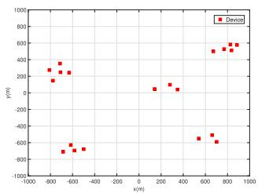

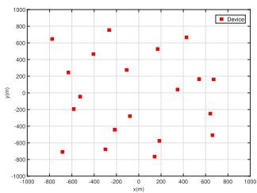  
(a) Scenario A: in clusters  
(b) Scenario B: randomly  
Fig. 3. Device locations of scenarios A and B on the vertical view.

## VI. NUMERICAL RESULTS

In this section, we validate the effectiveness of the proposed UAV enabled OA-FL scheme by numerical simulations.

## A. Simulation Setup

We consider an FL system with $M = 2 0$ devices on the ground in a large service area of $2 \times 2 \mathrm { k m } ^ { 2 }$ . As shown in $\mathrm { F i g } . 3 .$ we consider two scenarios of device locations in simulations: (1) scenario A: devices randomly distributed in groups in order to simulate the devices in clusters as in a village; (2) scenario B: devices distributed independently and uniformly over the whole area.

We assume that the UAV-PS flies at a fixed height $z = 5 0$ m above the area and has a fixed starting and ending horizontal location $\mathbf { u } [ 0 ] = \mathbf { u } [ N ] = [ 8 8 5 , - 1 0 ] ^ { \top }$ . The channel power gain, the noise power, and the maximum transmitting power are set as $\varrho = - 6 0 \ \mathrm { d B } , \sigma ^ { 2 } = - 9 0 $ dBm, and $P _ { 0 } = 0 . 3 2$ W, respectively. The maximum speed and the flying time interval of the UAV-PS are set to $V _ { \mathrm { m a x } } = 5 0$ m/s and $\delta = 1 \mathrm { ~ s ~ }$ . After optimization, the reconstruction of the binary $\alpha _ { m } ^ { ( t ) } [ n ]$ follows the rounding principle based on the optimized results. We set the optimization threshold $\epsilon = 1 0 ^ { - 3 }$ and the maximum number of iteration $I _ { \mathrm { m a x } } ~ = ~ 1 0$ . We conduct federated learning on image classification tasks over MNIST [43], Fashion-MNIST datasets [44], and CIFAR-10 [45]. The MNIST and Fashion-MNIST datasets each contain $Q \ : = \ : 6 0 0 0 0$ training samples, while CIFAR-10 contains $Q = 5 0 0 0 0$ training samples. For the FL network over MNIST and Fashion-MNIST datasets, we train a convolutional neural network (CNN) with two $5 \times 5$ convolution layers, a fully connected layer of 50 neurons and ReLU activation, and a softmax output layer (total parameters $D = 3 9 4 0 8 )$ . The first convolution layer has 16 channels, the second has 32 channels, and both of them have a $2 \times 2$ max pooling. For CIFAR-10, we employ Resnet-18 as the backbone network. The loss function is the cross-entropy loss. The learning rate is set as $\eta \ = \ 0 . 0 5$ with momentum = 0.5, and the local updates include 5 mini-batches of stochastic gradient descent (SGD) in CNN training. In Resnet-18, $\eta ~ = ~ 0 . 0 1$ with momentum $= 0 . 9$ and batchsi $z { \mathrm { e } } \ = \ 1 2 8$ Two dataset cases on i.i.d. property are simulated: $( 1 ) \ i . i . d .$ datasets: data samples assigned evenly to all devices, 10 Monte Carlo trials; (2) non-i.i.d. datasets: each device randomly selecting 5 classes with $Q / 5 M$ samples for each selected class, 20 Monte Carlo trials. The correlation matrices of the gradients are approximated by $\begin{array} { r } { \pmb { \rho } ^ { ( t ) } = \frac { 1 } { D } \sum _ { d = 1 } ^ { D } \mathbf { z } _ { d } ^ { ( t ) } \mathbf { z } _ { d } ^ { ( t ) } \top } \end{array}$

## B. Comparison With Baselines

We consider the case where $\textit { J } = \textit { 1 }$ , representing the basic hierarchical aggregation setting. Under this condition, the UAV-PS leverages its mobility to traverse the entire area and perform global aggregation after each flying round. Based on the device locations of scenario A in Fig. 3a, Fig. 4 shows the test accuracy of the UAV enabled OA-FL scheme with i.i.d. data and non-i.i.d. data over three datasets respectively in the following schemes: (1) Error-free: Error-free bound with the PS aggregating free of error; (2) Static PS w/o UAV: Static PS without UAV assisted, whose limitation of coverage area is waived for serving all devices, and which conducts the aggregation design as [18] to relieve the straggler issue; (3) Static PS w/o UAV, N times aggregation: Static PS without UAV assisted, whose set follows (2) but with $N = 1 2 0$ times aggregation of the gradients; (4) UAV-PS w/o traj. optim.: UAV-PS without trajectory and device selection optimization, $\Delta t = 1 2 0 \mathrm { ~ s ~ }$ , which conducts the aggregation design optimization following (29); and (5) UAV-PS proposed: UAV-PS with joint optimization for the trajectory, device selection, and aggregation design by Algorithm $2 , J = 1 ,$ $\Delta t = 1 2 0 \mathrm { ~ s ~ }$

As shown in Fig. 4, in Static PS w/o UAV, though located on the barycenter, large communication distances for remote devices as the stragglers severely limit the quality of gradient aggregation, thus leading to a large gap with the error-free accuracy. In Static PS w/o UAV, N times aggregation, when the PS aggregates N times, the learning performance is improved owing to the N times mean of the noise. However, the performance gain w.r.t. the communication cost is not enough when compared to the proposed scheme. The accuracy rate of UAV-PS proposed is closer to the error-free baseline compared to UAV-PS w/o traj. optim., verifying the effectiveness of our proposed optimization algorithm for the UAV enabled OA-FL scheme.

In each sub-figure of Fig. 4, our scheme performs far better than any others on both i.i.d. and non-i.i.d. data over all the considered datasets, which demonstrates the effectiveness of our scheme. Further, we discover that on non-i.i.d. datasets in Figs. 4d, 4e, and 4f, the learning accuracy is of higher dependence on communication and aggregation precision. Experiments on CIFAR-10 using ResNet-18, as shown in Figs. 4c and 4f demonstrate that, without UAV-PS, the substantial communication errors in relatively large-scale services severely deteriorate learning performance. Therefore, our scheme is proven to have great potential for data with high heterogeneity and in difficult learning scenarios.

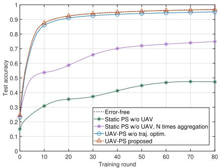  
(a) I.i.d. MNIST dataset.

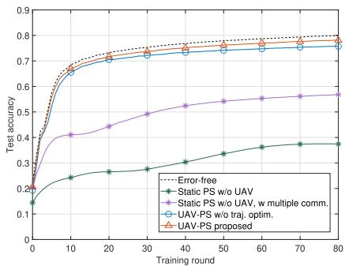  
(b) I.i.d. Fashion-MNIST dataset.

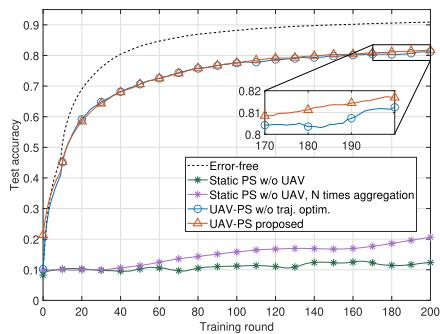  
(c) I.i.d. CIFAR-10 dataset.

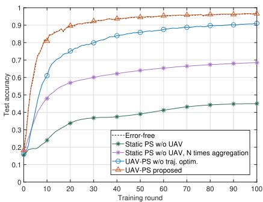  
(d) Non-i.i.d. MNIST dataset.

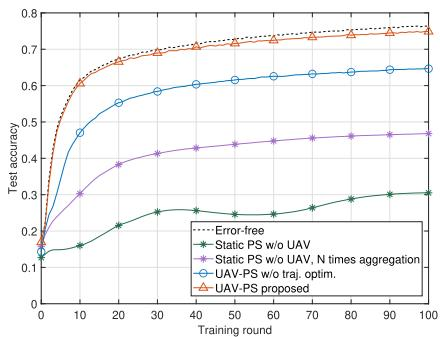  
(e) Non-i.i.d. Fashion-MNIST dataset.

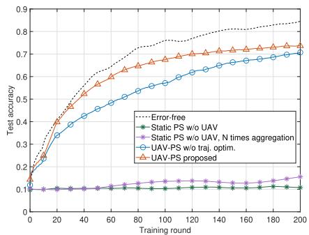  
(f) Non-i.i.d. CIFAR-10 dataset.

Fig. 4. Test accuracy of the UAV enabled OA-FL scheme with i.i.d. data and non-i.i.d. data over three datasets.  
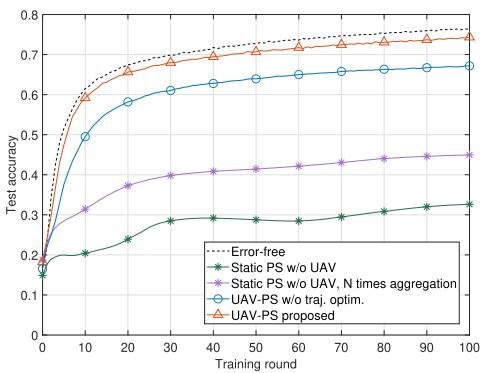

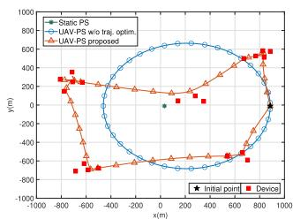  
(a) Scenario A

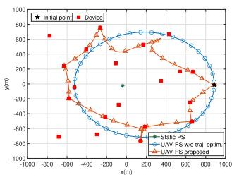  
(b) Scenario B  
Fig. 6. PS location/UAV-PS trajectory with scenarios A and B.  
Fig. 5. Test accuracy on non-i.i.d. Fashion-MNIST dataset with scenario B.

When the proposed scheme is applied to scenario B in Fig. 3b, it still performs effectively. Here we show the result in Fig. 5 based on the non-i.i.d. Fashion-MNIST dataset, with the above baselines.

The trajectory of the UAV-PS is optimized correspondingly based on the algorithm. Here, the PS location/UAV-PS trajectory optimization results w.r.t. scenarios A and B are presented in the following simulation conditions: (1) Static PS: located on the coordinate barycenter of all devices; (2) UAV-PS w/o traj. optim.: in a circular trajectory with the empirical optimization for the radius and the center of the circle, ∆t = 120 s; and (3) UAV-PS proposed: ∆t = 120 s. All the above simulations are on the non-i.i.d. Fashion-MNIST datasets.

In Fig. 6a with scenario A, by appropriate trajectory optimization, the UAV-PS with sufficient time, like $\Delta t = 1 2 0 \ :$ s, has no need to fly right above each device but can serve for all on account of the AirComp technique to aggregate in clusters, which verifies the effectiveness of the UAV assisted hierarchical over-the-air aggregation. We obtain a similar result of the trajectory of the UAV-PS with device locations in scenario B in Fig. 6b.

## C. Discussion on the Global Aggregation Frequency

In this subsection, we conduct the experiments under different sets of the global aggregation frequency J. The parameter J indicates the number of model updates per flying round. When the model updates once, the UAV-PS undergoes $\textstyle { \frac { N } { J } }$ uplink time slots for over-the-air aggregation to attain a global gradient. This implies that J determines the ratio between the number of training rounds and communication time slots, thereby influencing communication resource consumption for a fixed number of training rounds. Specifically, a larger J reduces the communication resource consumption required for the same number of training rounds. Consequently, adjusting J helps balance communication and learning resource consumption while aiming to achieve high test accuracy. In the proposed algorithm, the UAV-PS conducts global aggregation and updates the global model J times per flying round. In scenario A, under the non-i.i.d. Fashion-MNIST dataset with $Q = 1 0 0 0 0$ , the results are presented in Fig. 7, which shows the learning accuracy as a function of the communication time slots. Each training round consists of $\frac { N } { J }$ uplink communication time slots and one broadcast time slot. The corresponding communication time slots, training rounds, flying rounds, and the accuracy results for the lines are listed in Table II.

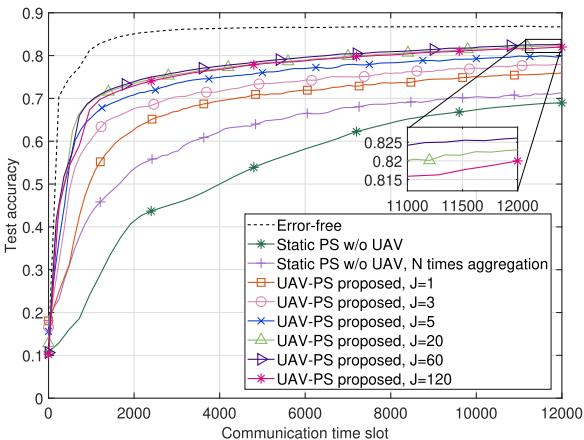  
Fig. 7. Test accuracy v.s. communication time slot under different J.  
TABLE II

THE COMMUNICATION TIME SLOTS $T _ { \mathrm { C O M } } .$ , THE TRAINING ROUNDS TCOM, THE FLYING ROUNDS $T _ { \mathrm { F L Y } } ,$ AND THE RESPECTIVE ACCURACY (ACC.(%)) UNDER DIFFERENT J IN FIG. 7. THE BEST/LOWEST AND THE SECOND-BEST/SECOND-LOWEST PERFORMANCE/RESOURCE CONSUMPTION ARE MARKED AS BOLD, RESPECTIVELY
<table><tr><td></td><td>J</td><td> $T _ { \mathrm { c o m } }$ </td><td> $T _ { \mathrm { t r a i n } }$ </td><td> $T _ { \mathrm { f l y } }$ </td><td> $\operatorname { A c c } .$ </td></tr><tr><td>Error-free</td><td>-</td><td>12000</td><td>6000</td><td></td><td>86.72</td></tr><tr><td>Static PS Static PS, N.</td><td>一 –</td><td>12000 12000</td><td>6000 99</td><td></td><td>68.95 71.32</td></tr><tr><td>UAV-PS</td><td>1 3 5 20 60 120</td><td>12000 12000 12000 12000 12000 12000</td><td>99 292 480 1714 4000</td><td>100 98 96 84 67</td><td>75.93 77.88 79.87 82.28 82.61</td></tr></table>

From the results, we observe that, in general, higher global model update frequencies (J) tend to improve learning performance under the same communication resource constraints. However, from a communication perspective, increasing J requires the UAV-PS to globally aggregate gradients more frequently, which diminishes the diversity gain associated with smaller J values and results in less precise aggregated gradients. Nevertheless, the observed performance improvements suggest that even if the aggregated gradients may be less precise, increasing the training frequency compensates for this limitation. This highlights the need to carefully balance communication and learning processes. However, when J exceeds 20, the accuracy improvement is marginal compared with the increased computational cost. When J goes to 120, at every time slot of the trajectory, the UAV-PS communicates to collect the local gradients and immediately update the global model, effectively bypassing any hierarchical aggregation. As shown in Fig. 7, the accuracy for $\textit { J } = \ 1 2 0$ is lower than that for $\textit { J } = \ 6 0$ and even below that for $\ J \ = \ 2 0 .$ although the system with $\textit { J } = \ 1 2 0$ utilizes over 3 times the computational resources of the system with $\textit { J } = \ 2 0$ This is attributed to excessive aggregation error caused by wireless communications, which is unable to be mitigated even with additional training iterations. With constrained communication resources, the best performance is achieved at $J = 6 0$

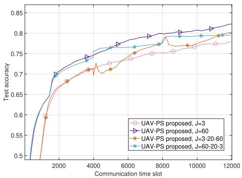  
Fig. 8. Test accuracy v.s. communication time slot under dynamic J.

Additionally, we dynamically change the global aggregation interval J during training to verify the effectiveness of selecting an appropriate J. We conduct under non-i.i.d. Fashion-MNIST dataset for a total of 12000 communication rounds, with each value of J applied for 4000 rounds. Specifically, we consider two progressive schedules for J from the set {3, 20, 60}: (1) Ascending, where J is set to 3 for the first 4000 communication rounds, then 20 for the next 4000 rounds, and finally 60 for the last 4000 rounds; (2) Descending, where J is set to 60 for the first 4000 rounds, then 20 for the next 4000 rounds, and finally 3 for the last 4 000 rounds. The results are shown in Fig. 8.

We found that dynamically changing J indeed has the effect of improving learning performance. However, for a specific training scenario, the system exhibits a clear preference for J , as it performs best with $J \ = \ 6 0$ , followed by $J = 2 0 .$ and then $J = 3$ in Fig. 8 in the current experimental setting. Dynamically changing J from 3 to 60 is better than keeping $J = 3$ but worse than keeping $J = 6 0$ . Similarly, dynamically changing J from 60 to 3 is worse than keeping $J ~ = ~ 6 0$ This indicates that even under the dynamic tuning of J, it still follows the intrinsic preference. This observation is also consistent with the experimental results in Fig. 7. Overall, the optimal configuration depends on the specific requirements for learning resource costs and communication expenses. The adaptability of the proposed UAV-PS framework is a key feature, enabling flexible resource allocation and providing opportunities for future research.

TABLE III  
PERFORMANCE OF THE PROPOSED SCHEME UNDER DIFFERENT SYNCHRONIZATION ERRORS OVER NON-I.I.D. FASHION-MNIST
<table><tr><td colspan="4">Test Accuracy</td></tr><tr><td>Error degree</td><td>0%</td><td>10%</td><td>20%</td></tr><tr><td>UAV-PS Proposed</td><td>74.88%</td><td>74.60%</td><td>71.26%</td></tr></table>

TABLE IV

PERFORMANCE OF THE PROPOSED SCHEME UNDER DIFFERENT CSI ESTIMATION ERRORS OVER NON-I.I.D. FASHION-MNIST
<table><tr><td colspan="4">Test Accuracy</td></tr><tr><td>Error degree</td><td>0%</td><td>10%</td><td>20%</td></tr><tr><td>UAV-PS Proposed</td><td>74.88%</td><td>74.25%</td><td>74.15%</td></tr></table>

## D. Robustness Evaluation Under Errors

To further evaluate the robustness of our proposed scheme under practical imperfections, we introduce two types of error into the system: synchronization error and channel state information (CSI) estimation error. We conduct the experiments under the non-i.i.d. Fashion-MNIST dataset in scenario A, with the training round set as 100. For the synchronization error, we simulate misalignment by designating 10% or 20% of devices as outliers, whose original signals are replaced with random noise sequences. This approach effectively mimics the impact of asynchrony observed in real-world scenarios. As presented in Table III, increasing the proportion of unsynchronized devices leads to only a slight degradation in model accuracy, demonstrating the robustness of the proposed scheme against synchronization errors. For the CSI estimation error, we introduce phase deviations of 10% and 20% to simulate imperfect phase compensation under biased channel state information. As shown in Table IV, even with larger phase estimation errors, the overall model accuracy only shows a slight decrease, which demonstrates the robustness of the proposed method against CSI estimation errors. These results demonstrate that our framework exhibits strong robustness against both synchronization and CSI estimation errors, as the overall model accuracy remains largely unaffected even with moderate levels of error. Overall, our findings confirm the effectiveness and reliability of the proposed method under practical imperfect conditions.

## VII. DISCUSSION ON PRACTICAL APPLICABILITY AND FEASIBILITY

The proposed UAV-enabled OA-FL framework shows not only theoretical performance improvements but also practical relevance to large-scale edge intelligence deployment. In many emerging UAV-assisted FL applications—such as infrastructure monitoring, disaster response, precision agriculture, and smart-city surveillance—mobile aerial platforms can flexibly coordinate spatially distributed edge devices and support efficient model training over wide geographic areas [46], [47], [48], [49], [50], [51]. The proposed hierarchical aggregation strategy has the potential of dynamic adaptation to diverse coverage patterns and wireless conditions. Meanwhile, the framework is independent for specific application domains or learning tasks: different edge learning scenarios can directly adopt the same design by employing their respective datasets and models. This generality makes the framework broadly applicable across future space–air–ground integrated intelligent systems.

From an implementation perspective, the framework remains feasible for real-world deployment. It empowers a single UAV to operate as the parameter server rather than employ numerous UAVs to participate as training clients, which substantially reduces on-board computation and energy requirements. The propulsion and communication energy consumption are within the capability of commercial UAV platforms, and the adjustable global aggregation frequency provides a tunable balance between learning accuracy and resource use. Consequently, the proposed method offers a task-agnostic, scalable, and resource-efficient foundation for UAV-assisted federated learning in future large-scale and heterogeneous networks.

## VIII. CONCLUSION

In this paper, we proposed a UAV enabled over-the-air federated learning scheme serving a relatively large service area. By introducing UAV communication to relieve the communication bottleneck in federated learning, we established a novel UAV assisted OA-FL system with hierarchical aggregation. The proposed approach can adeptly balance the resource consumption between communication and learning. The convergence performance of the proposed system was analyzed considering the gradient correlation. We formulated a coupled MSE summation optimization problem to jointly optimize the UAV-PS trajectory, the aggregation coefficients, and the device selection state. We proposed Algorithm 2 based on the AO framework to solve the problem. FP and SCA methods are utilized to transform the optimization problem. We demonstrated the effectiveness and improvement of the proposed scheme through numerical experiments. Further studies on the hierarchical aggregation approach were discussed as well. Overall, we provide a unified communication-learning framework for UAV-assisted federated learning systems through the tunable hierarchical aggregation approach. This modelagnostic framework has the potential to be extended to advanced distributed learning scenarios, such as multi-modal foundation models, thereby opening up new avenues for research and practical deployment. In addition, the framework encourages further investigation into modal-aware aggregation design, UAV trajectory optimization, and device scheduling, which may enhance the flexibility and efficiency of such systems in broader applications.

## APPENDIX A PROOF OF PROPOSITION 1

From (21), the definition of the updating MSE is given by (50), shown at the bottom of the page, where ${ \bf n } _ { r } ^ { ( t ) } [ n ] \triangleq { \bf \Gamma }$ $\mathbf { \mathrm { [ R e } \{ n ^ { ( t ) } [ n ] \} ^ { \top } , I m \{ n ^ { ( t ) } [ n ] \} ^ { \top } ] ^ { \top } }$ , step (a) follows from (4) and (18) and step (b) follows from (13), (16), (17), and (12).

Finally, we obtain (22) after some mathematical manipulations on (50).

## APPENDIX B PROOF OF THEOREM 1

Based on Assumptions 1 and 2, following [41, Lemma 2.1], we obtain an upper bound of $F ( \cdot )$ as below.

Lemma 1: With $F ( \cdot )$ satisfying Assumptions 1 and 2 and the learning rate set as $\eta = 1 / \omega$ , the upper bound of $F ( \cdot )$ at the (t + 1)-th round satisfies

$$
\begin{array} { r l } { \displaystyle \mathbb { E } [ F ( \mathbf { w } ^ { ( t + 1 ) } ) ] \leq \mathbb { E } [ F ( \mathbf { w } ^ { ( t ) } ) ] } & { } \\ { \displaystyle - \frac { 1 } { 2 \omega } \left( \mathbb { E } [ \| \nabla F ( \mathbf { w } ^ { ( t ) } ) \| ^ { 2 } ] - \mathbb { E } [ \| \mathbf { e } ^ { ( t ) } \| ^ { 2 } ] \right) , } \end{array}\tag{51}
$$

where ω is the Lipschitz continuity parameter defined in (23), and E[·] is the expectation w.r.t. the gradients and the AWGN.

Proof: See [41, Lemma 2.1].

Based on Assumption 2 and Lemma 1, we have

$$
\begin{array} { r l } & { \displaystyle \frac { 1 } { 2 \omega } \mathbb { E } [ \| \nabla F ( \mathbf { w } ^ { ( t ) } ) \| ^ { 2 } ] \leq \mathbb { E } [ F ( \mathbf { w } ^ { ( t ) } ) ] - \mathbb { E } [ F ( \mathbf { w } ^ { ( t + 1 ) } ) ] } \\ & { \quad \quad \quad + \displaystyle \frac { 1 } { 2 \omega } \mathbb { E } [ \| \mathbf { e } ^ { ( t ) } \| ^ { 2 } ] . } \end{array}\tag{52}
$$

By iteratively applying (52), we have

$$
\frac { 1 } { 2 \omega } \sum _ { t = 1 } ^ { T } \mathbb { E } [ \| \nabla F ( \mathbf { w } ^ { ( t ) } ) \| ^ { 2 } ] \leq \mathbb { E } [ F ( \mathbf { w } ^ { ( 1 ) } ) ] - \mathbb { E } [ F ( \mathbf { w } ^ { ( T + 1 ) } ) ]
$$

$$
+ \frac { 1 } { 2 \omega } \sum _ { \iota = 1 } ^ { T / J } \sum _ { \boldsymbol { t } = ( \iota - 1 ) \boldsymbol { J } + 1 } ^ { \iota J } \mathbb { E } [ \| \mathbf { e } ^ { ( \boldsymbol { t } ) } \| ^ { 2 } ] .\tag{53}
$$

From Lemma 1, we can obtain $\mathbb { E } [ F ( \mathbf { w } ^ { * } ) ] \le \mathbb { E } [ F ( \mathbf { w } ^ { ( T + 1 ) } ) ]$ With further manipulations, we have

$$
\frac { 1 } { T } \sum _ { t = 1 } ^ { T } \mathbb { E } [ \| \nabla F ( \mathbf { w } ^ { ( t ) } ) \| ^ { 2 } ] \leq \frac { 2 \omega } { T } \mathbb { E } [ F ( \mathbf { w } ^ { ( 1 ) } ) - F ( \mathbf { w } ^ { * } ) ]
$$

$$
+ \frac { 1 } { T } \sum _ { \iota = 1 } ^ { T / J } \sum _ { \boldsymbol { t } = ( \iota - 1 ) J + 1 } ^ { \iota J } \mathbb { E } [ \| \mathbf { e } ^ { ( \boldsymbol { t } ) } \| ^ { 2 } ] .\tag{54}
$$

When $T \to \infty ,$ we can obtain

$$
\begin{array} { r l } & { \displaystyle \operatorname* { m i n } _ { t } \mathbb { E } [ \| \nabla F ( { \mathbf w } ^ { ( t ) } ) \| ^ { 2 } ] \leq \frac { 1 } { T } \sum _ { t = 1 } ^ { T } \mathbb { E } [ \| \nabla F ( { \mathbf w } ^ { ( t ) } ) \| ^ { 2 } ] } \\ & { \displaystyle \mathop { T \to \infty } _ { T } \sum _ { \iota = 1 } ^ { T / J } \sum _ { t = ( \iota - 1 ) J + 1 } ^ { \lfloor J } \mathbb { E } [ \| { \mathbf e } ^ { ( t ) } \| ^ { 2 } ] . } \end{array}\tag{55}
$$

## APPENDIX C PROOF OF THEOREM 2

With vectorized $\zeta , \mathbf { b } , \mathbf { q } ^ { ( t ) } , \pmb { v } ^ { ( t ) } , \mathbf { A } ^ { ( t ) } , \mathbf { K } ^ { ( t ) }$ and the notation of $\ell ^ { ( t ) }$ , the MSE of the gradient in (22) can be rewritten as

$$
\mathbb { E } [ \| \mathbf { e } ^ { ( t ) } \| ^ { 2 } ] = \frac { 1 } { l ^ { 2 } } \mathbb { E } [ \| \tilde { \mathbf { G } } ^ { ( t ) } ( l \pmb { v } ^ { ( t ) } - \mathbf { K } \zeta ) - \sum _ { n = \frac { ( j - 1 ) N } { J } + 1 } ^ { \frac { j N } { J } } \zeta [ n ] \mathbf { n } _ { r } ^ { ( t ) } [ n ] 
$$

$$
+ ( \mathbf { b } ^ { \top } \mathbf { A } \mathbf { 1 } _ { \frac { N } { J } } \mathbf { q } ^ { \top } \mathbf { 1 } _ { M } - \mathbf { q } ^ { \top } \mathbf { A } \mathbf { 1 } _ { \frac { N } { J } } ) \mathbf { 1 } _ { D } \| ^ { 2 } ] .\tag{56}
$$

Recall that $\tilde { \mathbf { G } } ^ { ( t ) } = [ \tilde { \mathbf { g } } _ { 1 } ^ { ( t ) } , \cdot \cdot \cdot , \tilde { \mathbf { g } } _ { M } ^ { ( t ) } ]$ . Based on (24), we have E $\left[ \tilde { \mathbf { G } } ^ { ( t ) \top } \tilde { \mathbf { G } } ^ { ( t ) } \right] = D \bar { \pmb { \rho } } ^ { ( t ) }$ . Following the fact that the AWGN is independent of the gradients, we have E $\left[ { \bf n } _ { r } ^ { ( t ) } [ n ] \right] = 0 .$ , ∀n and E $\Big [ \mathbf { n } _ { r } ^ { ( t ) \top } [ n ] \mathbf { n } _ { r } ^ { ( t ) } [ n ] \Big ] = D \sigma ^ { 2 } , \forall n$ . By expanding the expectations, Eq. (56) can be rewritten as

$$
\begin{array} { r l } & { \mathbb { E } [ \| \mathbf { e } ^ { ( t ) } \| ^ { 2 } ] = \frac { 1 } { l ^ { 2 } } \left( D \left( l \pmb { v } ^ { ( t ) } - \mathbf { K } \pmb { \zeta } \right) ^ { \top } \pmb { \rho } ^ { ( t ) } \left( l \pmb { v } ^ { ( t ) } - \mathbf { K } \pmb { \zeta } \right) \right. } \\ & { \left. + D \left( \mathbf { b } ^ { \top } \mathbf { A 1 } _ { \frac { N } { J } } \mathbf { q } ^ { \top } \mathbf { 1 } _ { M } - \mathbf { q } ^ { \top } \mathbf { A 1 } _ { \frac { N } { J } } \right) ^ { \top } \left( \mathbf { b } ^ { \top } \mathbf { A 1 } _ { \frac { N } { J } } \mathbf { q } ^ { \top } \mathbf { 1 } _ { M } \right. \right. } \\ & { \left. \left. - \mathbf { q } ^ { \top } \mathbf { A 1 } _ { \frac { N } { J } } \right) + \frac { D \sigma ^ { 2 } } { 2 } \pmb { \zeta } ^ { ( t ) \top } \pmb { \zeta } ^ { ( t ) } \right) . } \end{array}\tag{57}
$$

Finally, we obtain (26) by noting the definition of $\mathbf { P } ^ { ( t ) } =$ $( { \bf 1 } _ { M } { \bf b } ^ { \top } - { \bf I } _ { M } ) ^ { \top } { \bf q } ^ { ( t ) } { \bf q } ^ { ( t ) \top } \big ( { \bf 1 } _ { M } { \bf b } ^ { \top } - { \bf I } _ { M } \big )$

## REFERENCES

[1] S. Zhu et al., “Intelligent computing: The latest advances, challenges, and future,” Intell. Comput., vol. 2, p. 6, Jan. 2023.

$$
\begin{array} { r l r } & { } & { \mathbb { E } [ \| \mathbf { e } ^ { ( t ) } \| ^ { 2 } ] \overset { ( a ) } { = } \mathbb { E } [ \| \displaystyle \sum _ { m = 1 } ^ { M } b _ { m } \mathbf { g } _ { m } ^ { ( t ) } - \frac { \sum _ { n = ( l - \frac { 1 } { 2 } ) N _ { + } } ^ { \frac { j N } { 2 } } + 1 \sum _ { m = 1 } ^ { M } b _ { m } \alpha _ { m } ^ { ( t ) } [ n ] \widetilde { g } _ { m } ^ { ( t ) } \mathbf { 1 } _ { D } } { \sum _ { n = ( l - \frac { 1 } { 2 } ) N _ { + } } ^ { \frac { j N } { 2 } } + 1 \sum _ { m = 1 } ^ { M } b _ { m } \alpha _ { m } ^ { ( t ) } [ n ] } - \frac { \big [ \mathrm { R e } \{ \mathbf { a } ^ { ( t ) } \} ^ { \top } , \mathrm { I m } \{ \mathbf { a } ^ { ( t ) } \} ^ { \top } \big ] ^ { \top } } { \sum _ { n = ( l - \frac { 1 } { 2 } ) N _ { + } + 1 } ^ { \frac { j N } { 2 } } + 1 } \| ^ { 2 } ] ^ { 2 } } \\ & { } & { \overset { ( b ) } { = } \mathbb { E } [ \| \displaystyle \sum _ { m = 1 } ^ { M } b _ { m } \sqrt { v _ { m } ^ { ( t ) } } \widetilde { \mathbf { g } } _ { m } ^ { ( t ) } + \sum _ { m = 1 } ^ { M } b _ { m } ( 1 - \frac { \sum _ { n = ( l - \frac { 1 } { 2 } ) N _ { + } } ^ { \frac { j N } { 2 } } } { \sum _ { n = ( l - \frac { 1 } { 2 } ) N _ { + } } ^ { \frac { 3 N } { 2 } } + 1 } \sum _ { m = 1 } ^ { M } b _ { m } \alpha _ { m } ^ { ( t ) } [ n ] ) \widetilde { g } _ { m } ^ { ( t ) } \mathbf { 1 } _ { D }  } \\ & { } &   - \frac  \sum _ { m = 1 } ^  M  \end{array}\tag{50}
$$

[2] K. B. Letaief, W. Chen, Y. Shi, J. Zhang, and Y.-J.-A. Zhang, “The roadmap to 6G: AI empowered wireless networks,” IEEE Commun. Mag., vol. 57, no. 8, pp. 84–90, Aug. 2019.

[3] J. Park, S. Samarakoon, M. Bennis, and M. Debbah, “Wireless network intelligence at the edge,” Proc. IEEE, vol. 107, no. 11, pp. 2204–2239, Nov. 2019.

[4] B. McMahan, E. Moore, D. Ramage, S. Hampson, and B. A. Y. Arcas, “Communication-efficient learning of deep networks from decentralized data,” in Proc. 20th Int. Conf. Artif. Intell. Statist., 2017, pp. 1273–1282.

[5] P. Kairouz et al., “Advances and open problems in federated learning,” Found. Trends Mach. Learn., vol. 14, nos. 1–2, pp. 1–210, 2021.

[6] S. Dang, O. Amin, B. Shihada, and M.-S. Alouini, “What should 6G be?,” Nature Electron., vol. 3, no. 1, pp. 20–29, Jan. 2020.

[7] C.-X. Wang et al., “On the road to 6G: Visions, requirements, key technologies, and testbeds,” IEEE Commun. Surveys Tuts., vol. 25, no. 2, pp. 905–974, 2nd Quart. 2023.

[8] B. Nazer and M. Gastpar, “Computation over multiple-access channels,” IEEE Trans. Inf. Theory, vol. 53, no. 10, pp. 3498–3516, Oct. 2007.

[9] J. Zhu, Y. Shi, Y. Zhou, C. Jiang, W. Chen, and K. B. Letaief, “Overthe-air federated learning and optimization,” IEEE Internet Things J., vol. 11, no. 10, pp. 16996–17020, Oct. 2024.

[10] K. Yang, T. Jiang, Y. Shi, and Z. Ding, “Federated learning via overthe-air computation,” IEEE Trans. Wireless Commun., vol. 19, no. 3, pp. 2022–2035, Mar. 2020.

[11] G. Zhu, Y. Wang, and K. Huang, “Broadband analog aggregation for low-latency federated edge learning,” IEEE Trans. Wireless Commun., vol. 19, no. 1, pp. 491–506, Jan. 2020.

[12] J. Du, B. Jiang, C. Jiang, Y. Shi, and Z. Han, “Gradient and channel aware dynamic scheduling for over-the-air computation in federated edge learning systems,” IEEE J. Sel. Areas Commun., vol. 41, no. 4, pp. 1035–1050, Apr. 2023.

[13] N. Zhang and M. Tao, “Gradient statistics aware power control for overthe-air federated learning,” IEEE Trans. Wireless Commun., vol. 20, no. 8, pp. 5115–5128, Aug. 2021.

[14] C. Zhong and X. Yuan, “Over-the-air federated learning over MIMO channels: A sparse-coded multiplexing approach,” 2023, arXiv:2304.04402.

[15] H. Ma, X. Yuan, Z. Ding, D. Fan, and J. Fang, “Over-the-air federated multi-task learning via model sparsification, random compression, and turbo compressed sensing,” IEEE Trans. Wireless Commun., vol. 22, no. 7, pp. 4974–4988, Jul. 2023.

[16] H. Liu, X. Yuan, and Y.-J.-A. Zhang, “Reconfigurable intelligent surface enabled federated learning: A unified communication-learning design approach,” IEEE Trans. Wireless Commun., vol. 20, no. 11, pp. 7595–7609, Nov. 2021.

[17] M. Kim and D. Park, “Reconfigurable intelligent surfaces-aided federated learning in over-the-air computation,” IEEE Wireless Commun. Lett., vol. 13, no. 7, pp. 1983–1987, Jul. 2024.

[18] C. Zhong, H. Yang, and X. Yuan, “Over-the-air federated multi-task learning over MIMO multiple access channels,” IEEE Trans. Wireless Commun., vol. 22, no. 6, pp. 3853–3868, Jun. 2023.

[19] C. Xu, S. Liu, Z. Yang, Y. Huang, and K.-K. Wong, “Learning rate optimization for federated learning exploiting over-the-air computation,” IEEE J. Sel. Areas Commun., vol. 39, no. 12, pp. 3742–3756, Dec. 2021.

[20] J. Du, T. Lin, C. Jiang, Q. Yang, C. F. Bader, and Z. Han, “Distributed foundation models for multi-modal learning in 6G wireless networks,” IEEE Wireless Commun., vol. 31, no. 3, pp. 20–30, Jun. 2024.

[21] Y. Shi, Y. Zhou, and Y. Shi, “Over-the-air decentralized federated learning,” in Proc. IEEE Int. Symp. Inf. Theory (ISIT), Jul. 2021, pp. 455–460.

[22] Z. Yang, M. Chen, K.-K. Wong, H. V. Poor, and S. Cui, “Federated learning for 6G: Applications, challenges, and opportunities,” Engineering, vol. 8, pp. 33–41, Jan. 2022.

[23] Z. Lin, H. Liu, and Y.-J.-A. Zhang, “Relay-assisted cooperative federated learning,” IEEE Trans. Wireless Commun., vol. 21, no. 9, pp. 7148–7164, Sep. 2022.

[24] F. Wang and J. Xu, “Optimized amplify-and-forward relaying for hierarchical over-the-air computation,” in Proc. IEEE Globecom Workshops (GC Wkshps, Dec. 2020, pp. 1–6.

[25] Z. Qu et al., “Partial synchronization to accelerate federated learning over relay-assisted edge networks,” IEEE Trans. Mobile Comput., vol. 21, no. 12, pp. 4502–4516, Dec. 2022.

[26] X. Lin et al., “The sky is not the limit: LTE for unmanned aerial vehicles,” IEEE Commun. Mag., vol. 56, no. 4, pp. 204–210, Apr. 2018.

[27] Q. Wu, Y. Zeng, and R. Zhang, “Joint trajectory and communication design for multi-UAV enabled wireless networks,” IEEE Trans. Wireless Commun., vol. 17, no. 3, pp. 2109–2121, Mar. 2018.

[28] X. Dai, B. Duo, X. Yuan, and W. Tang, “Energy-efficient UAV communications: A generalized propulsion energy consumption model,” IEEE Wireless Commun. Lett., vol. 11, no. 10, pp. 2150–2154, Oct. 2022.

[29] M. Mozaffari, W. Saad, M. Bennis, Y.-H. Nam, and M. Debbah, “A tutorial on UAVs for wireless networks: Applications, challenges, and open problems,” IEEE Commun. Surveys Tuts., vol. 21, no. 3, pp. 2334–2360, 3rd Quart., 2019.

[30] X. Pang, M. Sheng, N. Zhao, J. Tang, D. Niyato, and K.-K. Wong, “When UAV meets IRS: Expanding air-ground networks via passive reflection,” IEEE Wireless Commun., vol. 28, no. 5, pp. 164–170, Oct. 2021.

[31] Z. Zhai, X. Dai, B. Duo, X. Wang, and X. Yuan, “Energyefficient UAV-mounted RIS assisted mobile edge computing,” IEEE Wireless Commun. Lett., vol. 11, no. 12, pp. 2507–2511, Dec. 2022.

[32] W. Y. B. Lim et al., “UAV-assisted communication efficient federated learning in the era of the artificial intelligence of things,” IEEE Netw., vol. 35, no. 5, pp. 188–195, Sep. 2021.

[33] I. Donevski, N. Babu, J. J. Nielsen, P. Popovski, and W. Saad, “Federated learning with a drone orchestrator: Path planning for minimized staleness,” IEEE Open J. Commun. Soc., vol. 2, pp. 1000–1014, 2021.

[34] M. Fu, Y. Shi, and Y. Zhou, “Federated learning via unmanned aerial vehicle,” IEEE Trans. Wireless Commun., vol. 23, no. 4, pp. 2884–2900, Apr. 2024.

[35] X. Zhong, X. Yuan, H. Yang, and C. Zhong, “UAV-assisted hierarchical aggregation for over-the-air federated learning,” in Proc. GLOBECOM-IEEE Global Commun. Conf., Dec. 2022, pp. 807–812.

[36] T. Sery, N. Shlezinger, K. Cohen, and Y. C. Eldar, “Over-the-air federated learning from heterogeneous data,” IEEE Trans. Signal Process., vol. 69, pp. 3796–3811, 2021.

[37] M. M. Amiri and D. Gund¨ uz, “Federated learning over wireless¨ fading channels,” IEEE Trans. Wireless Commun., vol. 19, no. 5, pp. 3546–3557, May 2020.

[38] G. Zhu, J. Xu, K. Huang, and S. Cui, “Over-the-air computing for wireless data aggregation in massive IoT,” IEEE Wireless Commun., vol. 28, no. 4, pp. 57–65, Aug. 2021.

[39] Evolved Universal Terrestrial Radio Access (E-UTRA); Medium Access Control (MAC) Protocol Specification, document TS 36.321, 3GPP, 2010. [Online]. Available: https://www.3gpp.org/ftp/Specs/ archive/36series/36.321/

[40] Z. Lin, X. Li, V. K. N. Lau, Y. Gong, and K. Huang, “Deploying federated learning in large-scale cellular networks: Spatial convergence analysis,” IEEE Trans. Wireless Commun., vol. 21, no. 3, pp. 1542–1556, Mar. 2022.

[41] M. P. Friedlander and M. Schmidt, “Hybrid deterministic-stochastic methods for data fitting,” SIAM J. Sci. Comput., vol. 34, no. 3, pp. A1380–A1405, Jan. 2012.

[42] F. A. Potra and S. J. Wright, “Interior-point methods,” J. Comput. Appl. Math., vol. 124, nos. 1–2, pp. 281–302, 2000.

[43] Y. Lecun, L. Bottou, Y. Bengio, and P. Haffner, “Gradient-based learning applied to document recognition,” Proc. IEEE, vol. 86, no. 11, pp. 2278–2324, Nov. 1998.

[44] H. Xiao, K. Rasul, and R. Vollgraf, “Fashion-MNIST: A novel image dataset for benchmarking machine learning algorithms,” 2017, arXiv:1708.07747.

[45] A. Krizhevsky and G. Hinton, “Learning multiple layers of features from tiny images,” Dept. Comput. Sci., Univ. Toronto, Toronto, ON, Canada, Tech. Rep., 2009.

[46] Y. Qu et al., “Decentralized federated learning for UAV networks: Architecture, challenges, and opportunities,” IEEE Netw., vol. 35, no. 6, pp. 156–162, Nov. 2021.

[47] J. Akram, A. Akram, P. Ingle, R. H. Jhaveri, A. Anaissi, and A. Akhunzada, “Privacy-preserving spatial crowdsourcing drone services for postdisaster infrastructure monitoring: A conditional federated learning approach,” IEEE J. Sel. Topics Appl. Earth Observ. Remote Sens., vol. 18, pp. 16272–16291, 2025.

[48] M. Akbari, A. Syed, W. S. Kennedy, and M. Erol-Kantarci, “AoIaware energy-efficient SFC in UAV-aided smart agriculture using asynchronous federated learning,” IEEE Open J. Commun. Soc., vol. 5, pp. 1222–1242, 2024.

[49] T. Wu, M. Li, Y. Qu, H. Wang, Z. Wei, and J. Cao, “Joint UAV deployment and edge association for energy-efficient federated learning,” IEEE Trans. Cognit. Commun. Netw., early access, Feb. 18, 2025, doi: 10.1109/TCCN.2025.3543365.

[50] Y. Cheriguene, W. Jaafar, and H. Yanikomeroglu, “Federated learning in UAV-assisted MEC systems: A comprehensive survey,” IEEE Open J. Commun. Soc., vol. 6, pp. 7645–7676, 2025.

[51] A. Imteaj, U. Thakker, S. Wang, J. Li, and M. H. Amini, “A survey on federated learning for resource-constrained IoT devices,” IEEE Internet Things J., vol. 9, no. 1, pp. 1–24, Jan. 2022.

  
Xiangyu Zhong (Graduate Student Member, IEEE) received the B.Eng. degree (Hons.) from the School of Information and Communication Engineering, University of Electronic Science and Technology of China, in 2023. He is currently pursuing the Ph.D. degree with the Department of Information Engineering, The Chinese University of Hong Kong. His current research interests include communication, learning, and optimization for edge intelligence, particularly in federated learning, edge computing and inference, and UAV-assisted communications.

Chenxi Zhong (Graduate Student Member, IEEE) received the B.S. degree in communication engineering from the School of Information and Communication Engineering, University of Electronic Science and Technology of China, in 2021. He is currently pursuing the Ph.D. degree in electrical and information engineering with the National Key Laboratory of Wireless Communications, University of Electronic Science and Technology of China. His current research interests include MIMO-assisted wireless communications and distributed learning.

Xiaojun Yuan (Senior Member, IEEE) received the Ph.D. degree in electrical engineering from the City University of Hong Kong in 2009. From 2009 to 2011, he was a Research Fellow at the Department of Electronic Engineering, City University of Hong Kong. He was also a Visiting Scholar at the Department of Electrical Engineering, University of Hawaii at Manoa, in Spring and Summer 2009, as well as in the same period of 2010. From 2011 to 2014, he was a Research Assistant Professor with the Institute of Network Coding, The Chinese University of Hong

Kong. From 2014 to 2017, he was an Assistant Professor with the School of Information Science and Technology, ShanghaiTech University. He is currently a Professor with the National Key Laboratory of Wireless Communications, University of Electronic Science and Technology of China. His research interests include signal processing, machine learning, and wireless communications, including but not limited to intelligent communications, structured signal reconstruction, Bayesian approximate inference, and distributed learning. He has published over 360 peer-reviewed research papers in the leading international journals and conferences in the related areas. He was a co-recipient of the IEEE Heinrich Hertz Award 2022 and the IEEE Jack Neubauer Memorial Award 2025. He has served on many technical programs for international conferences. He was an Editor of IEEE leading journals, including IEEE TRANSACTIONS ON WIRELESS COMMUNICATIONS and IEEE TRANSACTIONS ON COMMUNICATIONS.

Ying-Jun Angela Zhang (Fellow, IEEE) received the Ph.D. degree from the Department of Electrical and Electronic Engineering, The Hong Kong University of Science and Technology.

She joined the Department of Information Engineering, The Chinese University of Hong Kong, in 2005, where she is currently a Professor. Her research interests focus on optimization and learning in wireless communication systems.

Prof. Zhang served as the Member-at-Large for the IEEE ComSoc Board of Governors. She served

as an IEEE ComSoc Fellow Evaluation Standing Committee Member. She was a co-recipient of the 2021 and 2014 IEEE ComSoc Asia–Pacific Outstanding Paper Awards, the 2013 IEEE SmartGridComm Best Paper Award, and the 2011 IEEE Marconi Prize Paper Award on Wireless Communications. As the only winner from engineering science, she won Hong Kong Young Scientist Award 2006, conferred by Hong Kong Institute of Science. She was the Founding Chair of the IEEE ComSoc Technical Committee of Smart Grid Communications. She served as the Chair for the Executive Editor Committee of IEEE TRANSACTIONS ON WIRELESS COMMUNICATIONS. She is the Steering Committee Chair of IEEE WIRELESS COMMUNICATIONS LETTERS. She served as the Editor-in-Chief for IEEE OPEN JOURNAL OF THE COMMUNICATIONS SOCIETY. She has served on the organizing committees for many top conferences, such as IEEE GLOBECOM, ICC, VTC, and SmartgridComm.