# UAV-Enabled Secure Communications via Collaborative Beamforming With Imperfect Eavesdropper Information

Geng Sun , Member, IEEE, Xiaoya Zheng , Zemin Sun , Student Member, IEEE, Qingqing Wu , Senior Member, IEEE, Jiahui Li , Student Member, IEEE, Yanheng Liu and Victor C.M. Leung , Life Fellow, IEEE

Abstract—Unmanned aerial vehicles (UAVs) are playing a pivotal role in wireless networks due to their high mobility and on-demand deployment advantages. However, the UAV-enabled communications are susceptible to be wiretapped by eavesdroppers due to the strong line-of-sight (LoS) dominated air-ground channel. In this paper, we consider a UAV-enabled secure communication scenario, in which a group of UAVs form a UAV-enabled virtual antenna array (UVAA) to transmit information towards the remote base stations (BSs) via collaborative beamforming (CB), while multiple known and unknown eavesdroppers aiming to wiretap the information. Specifically, a secure communication multi-objective optimization problem (SCMOP) is formulated to achieve the maximization of the worst-case secrecy rate, the minimization of the maximum sidelobe level (SLL) as well as the minimization of the flight energy consumption of UAVs. To solve the formulated SCMOP which is demonstrated to be non-convex and NP-hard, an improved multi-objective salp swarm algorithm (IMSSA) with several specific operating factors is proposed. Simulations results demonstrate that the proposed IMSSA can deal with the formulated SCMOP effectively and outperforms other benchmark strategies. Moreover, the multi-hop relay is introduced to verify the reasonability of the UVAA system, and two benchmark schemes of the formulated SCMOP are introduced to demonstrate the necessity of the formulated SCMOP. In addition, the performance of the UVAA system under certain unexpected circumstances is estimated. Finally, experimental implementation is conducted by using a Raspberry Pi and the results demonstrate the practicality of the

Manuscript received 8 December 2022; revised 3 April 2023; accepted 28 April 2023. Date of publication 5 May 2023; date of current version 6 March 2024. This work was supported in part by the National Natural Science Foundation of China under Grants 62272194, 62172186, 62002133, and 61872158, and in part by the Science and Technology Development Plan Project of Jilin Province under Grant 20230201087GX. A small part of this paper appeared in IEEE ISCC 2022 [DOI: 10.1109/ISCC55528.2022.9912883]. Recommended for acceptance by C. Cordeiro. (Corresponding authors: Zemin Sun; Qingqing Wu.)

Geng Sun is with the College of Computer Science and Technology, Key Laboratory of Symbolic Computation and Knowledge Engineering of Ministry of Education, Jilin University, Changchun 130012, China (e-mail: sungeng@jlu.edu.cn).

Xiaoya Zheng, Zemin Sun, Jiahui Li, and Yanheng Liu are with the College of Computer Science and Technology, Jilin University, Changchun 130012, China (e-mail: xiaoya257248@foxmail.com; laurasun166@gmail.com; lijiahui0803 @foxmail.com; yhliu@jlu.edu.cn).

Qingqing Wu is with the Department of Electronic Engineering, Shanghai Jiao Tong University, Shanghai 200240, China (e-mail: qingqingwu@sjtu.edu.cn).

Victor C.M. Leung is with the College of Computer Science and Software Engineering, Shenzhen University, Shenzhen 518060, China, and also with the Department of Electrical and Computer Engineering, The University of British Columbia, Vancouver, BC V6T 1Z4, Canada (e-mail: vleung@ieee.org).

Digital Object Identifier 10.1109/TMC.2023.3273293

proposed CB-based secure communication approach in real-world scenarios.

Index Terms—UAV-enabled secure communications, virtual antenna array, collaborative beamforming, multi-objective optimization.

# I. INTRODUCTION

U NMANNED aerial vehicles (UAVs) have been appliedinto manifold domains including academia, industry and into manifold domains including academia, industry and military, given the inherit characteristics of flexibility, high mobility, remarkable versatility as well as low cost [1], [2]. In recent years, the application of UAVs in wireless networks has surged, e.g., UAV-assisted secure transmission [3], UAV-assisted mobile edge computing [4], [5], [6], etc. Specifically, UAVs are expected to be the new airborne equipment which can access from the sky for communications. Besides, UAVs are deployed as airborne base stations (BSs) or relays to assist terrestrial communications by providing data access from the sky [1]. However, wireless communications assisted by UAVs are vulnerable to be intercepted by eavesdroppers due to the essence of open channel in wireless networks.

Physical layer security (PLS) is a helpful technique to achieve secure UAV communications [7]. In particular, PLS utilizes the inherent characteristics of wireless channels to prevent the interception caused by eavesdroppers instead of exploiting complicated encryption and decryption operations. One of the commonly adopted performance metrics of PLS is the secrecy rate, which defines the maximum confidential information that can be transmitted safely. However, there are some challenges of PLS that need to be dealt with urgently in UAV communications. First, deploying a large number of antennas to achieve conventional PLS will induce a surge of hardware cost, which is impractical in UAV communications since a single UAV only has limited resources [8]. Second, the UAVs require perfect channel state information of eavesdroppers to achieve the trajectory optimization, which means that it is intractable if the location information of eavesdroppers is imperfectly detected or there are potential unknown eavesdroppers.

Collaborative beamforming (CB) provides a promising paradigm to handle the challenges mentioned above. Specifically, multiple UAV elements can form a UAV-enabled virtual antenna array (UVAA) to send information in a synergistic way [9], [10]. In this case, the UVAA system can generate a high-gain mainlobe towards the receiver and low-gain sidelobes towards other directions [11], so that making the eavesdroppers cannot demodulate valid information from the signal. However, several crucial factors will have an influence on the secure performance of the UVAA system. For example, the UAV element in the UVAA system can move to superior locations for achieving higher secrecy rate and suppressing the sidelobe levels (SLLs) to prevent eavesdropping, however, this will unavoidably induce extra flight energy consumption of UAVs. Moreover, the excitation current weight of each UAV element is also an essential factor that can influence the directivity of the UVAA system, and it has an impact on the secure performance. Thus, how to determine the optimal location and excitation current weight of each UAV is a crucial issue in CB-enabled UAV secure communications. In our previous work [12], we have considered to apply CB to achieve physical layer security communications for UAV communications. However, this work assumed that the location information of known eavesdroppers is perfectly detected by UAVs, which is not suitable for some scenarios where the detection device of UAVs is inadequate so that the location information of eavesdroppers cannot be completely known.

Different from the abovementioned work, we consider to improve the secure performance of UVAA system in the presence of the unknown eavesdroppers and multiple known eavesdroppers with imperfect location information. The main contributions of the whole paper are summarized as follows:

CB-enabled UAV Secure Communications System: To the best of our knowledge, it is the first work to simultaneously take into account the known eavesdroppers with imperfect location information and unknown eavesdroppers in CB-enabled UAV secure communications. Specifically, we construct a scenario for UAV-enabled secure communication, i.e., the UAVs form a UVAA to send information towards a cluster of BSs in the presence of multiple known eavesdroppers whose location information is imperfectly detected and some unknown eavesdroppers. Thus, it is worth noting that this work is different from [12], in which the location information is perfectly detected when the UAVs transmit data towards several BSs in turn.   
Multi-objective Optimization Formulation: A secure communication multi-objective optimization problem (SC-MOP) is formulated to simultaneously achieve the maximization of the worst-case secrecy rate, minimization of the maximum SLL and minimization of the flight energy consumption of UAVs so that improving the secure performance while reducing the energy cost. Moreover, the formulated SCMOP is proven to be non-convex and NP-hard.   
Swarm Intelligence Scheme: An improved multi-objective salp swarm algorithm (IMSSA) is proposed to cope with the formulated SCMOP in a swarm intelligence manner. Specifically, IMSSA introduces the circle map-based solution initialization, discrete solution update operator and

migration and adaptive mutation operator, to initialize the solutions in a more random way, handle the discrete part, and enhance the quality of solutions during the iterations, respectively, for effectively solving the formulated optimization problem.

Performance Analysis: Simulation results are presented to demonstrate the effectiveness and superiority of the proposed IMSSA. Moreover, the multi-hop relay is introduced to verify the reasonability of the UVAA system, and two benchmark schemes of the formulated SCMOP are introduced to demonstrate the necessity of the formulated SCMOP. In addition, the performance analysis of the proposed IMSSA under certain unexpected circumstances is carried out further. Finally, experimental implementation is conducted by using a Raspberry Pi and the results show the practicality of the proposed CB-based approach in real-world scenarios.

The remainder of the paper is organized as follows. Section II gives some related works. Section III presents the models and preliminaries. The SCMOP is formulated in Section IV. In-Section V, we propose the algorithm. Section VI provides the simulation results and Section VIII concludes the paper.

Notations: $\widetilde { \mathrm { M a x } } ( \cdot )$ refers to the operator that calculates the ( )maximum value of a vector, and $[ \chi ] ^ { + }$ represents the larger one of 0 and $\chi .$

# II. RELATED WORK

Some related works that investigate the UAV communications and CB are briefly presented in this section.

UAV-Assisted Terrestrial Communications. Some previous works have adopted UAV to assist the terrestrial communications. For example, Zeng et al. [13] conceived an air-ground system wherein a UAV is adopted to disseminate information towards a ground user and they maximized the energy efficiency of the considered system via designing the trajectory of the UAV. Lin et al. [14] proposed to adopt a UAV as an airborne BS for the sake of providing wireless communication services for postdisaster area and they attempted to achieve the maximization of the number of users served by the UAV through finding the optimal path. Zeng et al. [15] investigated a UAV-based multicasting system in which a UAV is deployed to disseminate information towards several users and they minimized the assignment completion time via designing the optimal trajectory of the UAV. Kang et al. [16] considered a UAV-enabled relay system to support the communication between pairs of nodes, and attempted to achieve the maximization of the minimum achievable transmission rate. Zhao et al. [17] investigated a joint optimization problem to achieve the maximization of the efficiency concerning the aerial communication system. Meng et al. [18] considered a UAV-enabled integrated sensing and communications system, which can provide downlink communication service for several ground targets within a flight period, and they proposed a specific mechanism to maximize the throughout. Moreover, Zhong et al. [19] studied a UAV-assisted self-organized device-to-device network and proposed to achieve the maximization of the network capacity through optimizing the 3D locations, channel allocation and relay assignment. However, these aforementioned works have not considered the long-distance transmission since the single UAV with limited transmit power is not capable of transmitting data towards remote receiver.

UAV-Enabled CB. Several works have studied the application of CB in UAV-enabled wireless communications. For example, Mozaffari et al. [20] considered to utilize multiple UAVs as an antenna array to assist the wireless communications and the airborne service time was minimized by obtaining the optimal locations and control inputs. Sun et al. [21] conceived a UAV-enabled data transmission scenario where a group of UAVs send information towards several BSs through CB and presented a multi-objective optimization problem to achieve the minimization of assignment completion time and energy cost of UAVs. Garza et al. [22] presented a UAV-enabled antenna array and achieved the optimal performance of the directivity and SLL concerning the 3D antenna array through modeling the flight of UAVs. However, none of them considered the existence of eavesdroppers.

UAV Secure Communications. There are several previous works which have investigated the secure communications in the presence of eavesdroppers. For example, Cheng et al. [23] investigated how to enhance the security performance concerning the UAV-relay networks. Specifically, they leveraged successive convex optimization to maximize the minimum average secrecy rate through designing the optimal UAV trajectory and appropriate time scheduling. Zhao et al. [3] studied the secure transmission of the hyper-dense networks in the presence of eavesdroppers and applied the UAVs as small-cell BSs for the sake of delivering videos towards mobile users. Li et al. [24] considered a UAV-to-vehicle communication system where an eavesdropper intends to wiretap the communication process between the UAV and the vehicle, and they investigated the secrecy outage probability concerning the system. Xu et al. [25] focused on a dual UAV-assisted mobile edge computing system in which one UAV executes the computation tasks and the other UAV suppresses the vicious eavesdroppers. Yan et al. [26] considered a covert communication scenario in which a UAV attempts to disseminate confidential information towards the receiver and aimed to maximize the communication quality via designing the optimal transmit power as well as the 3D location of the UAV. Tang et al. [27] investigated the communication process between a pair of ground users in the presence of several UAV eavesdroppers as well as a friendly jammer, and they analyzed the secure connection probability between users. In our previous work [12], it is considered to adopt CB to achieve UAV secure communications with several different BSs in turn with the existence of known and unknown eavesdroppers, where the location information of known eavesdroppers is assumed to be completely detected by UAVs. However, this condition is more appropriate for scenarios where the UAVs have better detection equipment, or they have the high visibility with better weather, thus it is not suitable for some complex scenarios in which the eavesdroppers tend to conceal themselves, or the detection equipment of UAVs is comparatively poor, etc. Accordingly, the abovementioned works assumed that the locations of eavesdroppers are stationary and the location information detected by

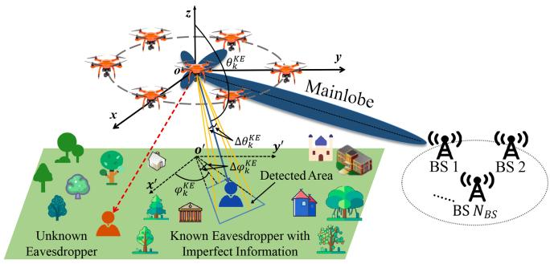

flowchart

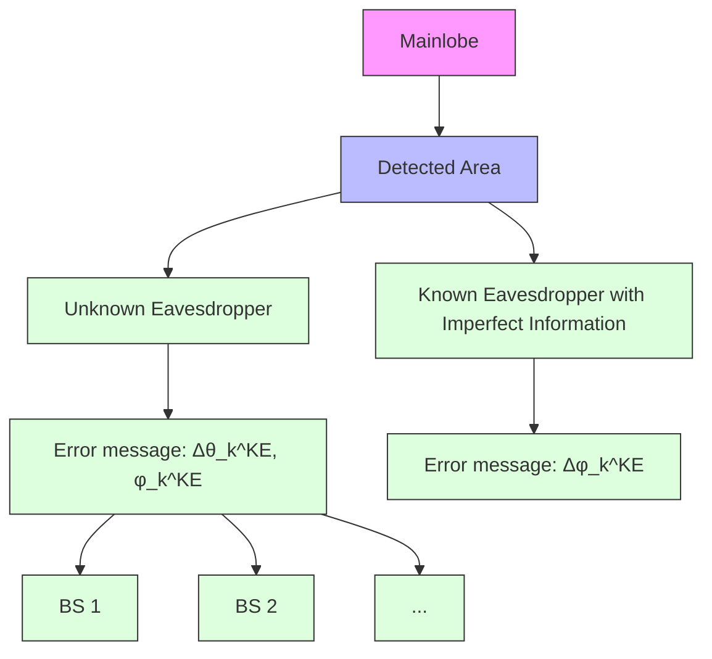

Fig. 1. A UAV-enabled secure communication system exploiting CB.

UAVs is perfectly known, which may be not applicable in some practical scenarios.

Swarm Intelligent Algorithms. There are several related works exploring the applications of swarm intelligent algorithm in the field of UAV communications. Liu et al. [28] applied the genetic algorithm and the Q-learning algorithm for the sake of optimizing the 3D location as well as movement of multiple UAVs. Zhang et al. [29] considered a communication system that is assisted by several UAV-mounted BSs and employed the artificial bee colony algorithm to obtain the minimum number of the required UAVs. Feng et al. [30] aimed to achieve the maximization of the downlink sum rate of the UAV system through obtaining the optimal 3D locations as well as other control parameters, and utilized the multi-objective evolutionary algorithm to shape the beam pattern. Strumberger et al. [31] considered to exploit the elephant herding optimization algorithm to deal with the UAV location problem. Moreover, Plachy et al. [32] regarded the UAVs as airborne BSs and considered to adopt the genetic algorithm and particle swarm optimization to obtain the optimal locations of UAVs. However, these abovementioned algorithms are not applicable to handle the problems which have continuous and discrete solutions simultaneously since these algorithms focus on handling the problems which only contain continuous dimensions.

# III. MODELS AND PRELIMINARIES

# A. System Model

As shown in Fig. 1, consider a UAV-enabled secure communication system, in which a group of UAVs denoted as $\mathcal { U } = \{ 1 , 2 , . . . , N _ { U A V } \}$ are deployed to form a UVAA and then = 1 2send information towards a cluster of BSs denoted as $B S =$ $\{ 1 , 2 , . . . , N _ { B S } \}$ =. Note that the UAVs are located far away from 1 2the cluster of BSs, which means that it is difficult for a single UAV to establish a communication link with the remote BSs. Without loss of generality, the BSs can communicate with each other. Moreover, we assume that there are several known eavesdroppers whose location information is imperfectly detected and unknown eavesdroppers, and they are aiming to wiretap the transmitted data. These two types of eavesdroppers are expressed as $\mathcal { K } \mathcal { E } = \{ 1 , 2 , . . . , N _ { K E } \}$ and $\mathcal { U } \mathcal { E } = \{ 1 , 2 , . . . , N _ { U E } \}$ , respectively.

Mathematically, the three-dimensional (3D) Cartesian coordinate system is adopted to ease presentation, where the locations of ith UAV, jth BS, kth known eavesdropper and uth unknown eavesdropper are defined as $( x _ { i } ^ { U } , y _ { i } ^ { U } , z _ { i } ^ { \overleftarrow { U } } ) , ( x _ { j } ^ { B S } , y _ { j } ^ { B S } , z _ { j } ^ { B S } )$ (xBj BS ), and j  , respectively. , zj $( x _ { k } ^ { K E } , y _ { k } ^ { K E } , z _ { k } ^ { K E } )$ KE $( x _ { u } ^ { U E } , y _ { u } ^ { U E } , z _ { u } ^ { U E } )$

# B. Channel Model

The communication process between the UAV and the ground receiver may be blocked by buildings or other obstacles, which may be different from the traditional aerial communications. In this case, the probability line-of-sight (LoS) model is applied, where the occurrence probabilities concerning the LoS and non-LoS (NLoS) are considered. Specifically, the probability that the UAV and the ground receiver can establish an LoS link is expressed as follows [33]:

$$
P _ {L o S} (\theta) = \frac {1}{1 + m \exp (- n [ \theta - m ])}, \tag {1}
$$

where $m$ and n are constants which are bound up with the propagation environment. Moreover, θ refers to the elevation angle of the receiver in degree, which can be calculated by $\begin{array} { r } { \theta = \frac { 1 8 0 } { \pi } \arcsin ( \frac { H } { d } ) } \end{array}$ , wherein H and d denote the vertical and = arcsin( )total distance between the transmitter and the receiver. Accordingly, the probability that the UAV and the ground receiver cannot establish an LoS link can be described as $P _ { N L o S } ( \theta ) =$ $1 - P _ { L o S } ( \theta )$ .

( )Based on the abovementioned model, the expected channel power gain is presented as follows:

$$
P G = \mu_ {L o S} P _ {L o S} + \mu_ {N L o S} P _ {N L o S}, \tag {2}
$$

where $\mu _ { L o S }$ and $\mu _ {  { N }  { L }  { o } S }$ are constants which represent the attenuation factors concerning LoS and NLoS channels, respectively.

# C. Communication Model

The array factor (AF) that is adopted for characterizing the beam pattern of the UVAA is described as follows [12]:

$$
F (\theta , \phi) = \sum_ {i = 1} ^ {N _ {U A V}} I _ {i} \exp^ {i _ {u} \left[ k _ {c} (x _ {i} ^ {U} \sin \theta \cos \phi + y _ {i} ^ {U} \sin \theta \sin \phi + z _ {i} ^ {U} \cos \theta) \right]}, \tag {3}
$$

where $I _ { i }$ refers to the excitation current weight of the ith $\mathrm { U A V } , i _ { u }$ represents the imaginary unit and $i _ { u } = \sqrt { - 1 } , k _ { c } \mathrm { = } 2 \pi / \lambda$ represents the phase constant. Moreover, $\theta \in [ 0 , \pi ]$ 1 =2denotes the elevation angle and $\phi \in [ - \pi , \pi ]$ expresses the azimuth angle. [ ]Note that we assume that the time and phase synchronization of the UVAA system are achieved via the mechanisms in [34], [35], [36] that have been applied in practice.

The gain of the UVAA system towards the receiver BS is given as follows [20]:

$$
G _ {B S} = \frac {4 \pi | F (\theta_ {B S} , \phi_ {B S}) | ^ {2} w (\theta_ {B S} , \phi_ {B S}) ^ {2}}{\int_ {0} ^ {2 \pi} \int_ {0} ^ {\pi} | F (\theta , \phi) | ^ {2} w (\theta , \phi) ^ {2} \sin \theta d \theta d \phi} \eta , \tag {4}
$$

where $( \theta _ { B S } , \phi _ { B S } )$ denotes the direction of the receiver BS, $w ( \theta , \phi )$ ( )is the magnitude of the far-field beam pattern and $\eta \in$ $[ 0 , 1 ]$ )represents the efficiency of the antenna array. Similarly, the gain of the UVAA system towards the kth known eavesdropper is presented as follows [20]:

$$
G _ {K E _ {k}} = \frac {4 \pi | F (\theta_ {K E _ {k}} , \phi_ {K E _ {k}}) | ^ {2} w (\theta_ {K E _ {k}} , \phi_ {K E _ {k}}) ^ {2}}{\int_ {0} ^ {2 \pi} \int_ {0} ^ {\pi} | F (\theta , \phi) | ^ {2} w (\theta , \phi) ^ {2} \sin \theta d \theta d \phi} \eta , \tag {5}
$$

where $( \theta _ { K E _ { k } } , \phi _ { K E _ { k } } )$ is the direction of the kth known eaves-(dropper.

The achievable transmission rate from the UVAA system to the receiver BS is defined as follows [37], [38]:

$$
R _ {B S} = B \log_ {2} \left(1 + \frac {d _ {B S} ^ {- \alpha} P _ {t} K _ {0} G _ {B S}}{\sigma^ {2}}\right), \tag {6}
$$

where $B$ is the bandwidth. Moreover, $d _ { B S }$ represents the distance between the receiver BS and the center of the UVAA system, α is a constant which denotes the path loss exponent, $P _ { t }$ refers to the transmit power of the UVAA system, $K _ { 0 }$ is the constant path loss coefficient at a reference distance of 1 m and $\sigma ^ { 2 }$ represents the noise power. Similarly, the transmission rate from the UVAA system to the kth known eavesdropper can be written as follows [37], [38]:

$$
R _ {K E _ {k}} = B \log_ {2} \left(1 + \frac {d _ {K E _ {k}} ^ {- \alpha} P _ {t} K _ {0} G _ {K E _ {k}}}{\sigma^ {2}}\right), \tag {7}
$$

where $d _ { K E _ { k } }$ is the distance between the kth known eavesdropper and the center of the UVAA system.

However, it is unrealistic to assume that the location information of the known eavesdroppers is perfectly detected by the UAVs since the suspicious eavesdroppers are located near the cluster of BSs aiming to intercept the transmitted information and they tend to hide their locations [39]. In other words, the UAVs can only detect the approximate region of the known eavesdroppers, as shown in Fig. 1. Therefore, the relationships between the observed and the actual coordinate of the kth known eavesdropper can be modeled as $\widehat { x } _ { k } ^ { K E } = x _ { k } ^ { K E } + \Delta x _ { k } ^ { K E } , \widehat { y } _ { k } ^ { K E } = y _ { k } ^ { K E } + \Delta y _ { k } ^ { K E }$ xk yk and $\widehat { z } _ { k } ^ { K E } =$ $z _ { k } ^ { K E ^ { ' } } + \Delta z _ { k } ^ { K ^ { ' } E }$ zk zk + Δ , wherein $( \widehat { x } _ { k } ^ { K E } , \widehat { y } _ { k } ^ { K E } , \widehat { z } _ { k } ^ { K E } )$ = + Δ  =, yKEk , zKEk ) denotes the observed + Δmismatched coordinate of the kth known eavesdropper. Moreover, xK k $\Delta x _ { k } ^ { K E } , \Delta y _ { k } ^ { K E }$ yKk E and $\Delta z _ { k } ^ { K E }$ are the corresponding observa-Δ Δ Δtion errors of the observed coordinate of the kth eavesdropper in $x , y$ and z axis.

The abovementioned $\widehat { x } _ { k } ^ { K E } , \widehat { y } _ { k } ^ { K E }$ and $\widehat { z } _ { k } ^ { K E }$ are described according to the observed coordinate of the kth known eavesdropper. From the perspective of the UVAA system, any 3D location can correspond to an elevation angle and an azimuth angle, so that we transform the abovementioned description into a more tractable format according to the elevation and azimuth angles between the kth known eavesdropper and the center of UVAA system. Specifically, the transformed format is designed as $\widehat { \theta } _ { K E _ { k } } = \theta _ { K E _ { k } } + \Delta \theta _ { K E _ { k } }$ and $\widehat { \phi } _ { K E _ { k } } = \phi _ { K E _ { k } } +$ $\Delta \phi _ { K E _ { k } }$ =, subject to $\Omega \triangleq \{ ( \Delta \theta _ { K E _ { k } } , \Delta \phi _ { K E _ { k } } ) \vert \vert \Delta \theta _ { K E _ { k } } \vert \vert \leqslant$ $\epsilon _ { 1 } , | | \Delta \phi _ { K E _ { k } } | | \leqslant \epsilon _ { 2 } , \forall k \}$ , wherein $\widehat { \theta } _ { K E _ { k } }$ and $\phi _ { K E _ { k } }$ denote the Δobserved elevation and azimuth angles between the kth known eavesdropper and the center of the UVAA system, $\theta _ { K E _ { k } }$ and $\phi _ { K E _ { k } }$ represent the actual elevation and azimuth angles between the kth known eavesdropper and the center of the UVAA system, respectively. Moreover, $\Delta \theta _ { K E _ { k } }$ and $\Delta \phi _ { K E _ { k } }$ represent the observation errors of the observed elevation and azimuth angles, respectively. In addition, the set  contains all possible uncertainties of θ and φ bounded by $\epsilon _ { 1 }$ Ωand $\epsilon _ { 2 }$ .

In this case, the transmission rate of the UVAA system towards the kth known eavesdropper with imperfect eavesdropper information can be described as follows:

$$
\widehat {R} _ {K E _ {k}} = B \log_ {2} \left(1 + \frac {d _ {K E _ {k}} ^ {- \alpha} P _ {t} K _ {0} \widehat {G} _ {K E _ {k}}}{\sigma^ {2}}\right), \tag {8}
$$

where $\begin{array} { r } { \widehat { G } _ { K E _ { k } } = \frac { 4 \pi | F ( \widehat { \theta } _ { K E _ { k } } , \widehat { \phi } _ { K E _ { k } } ) | ^ { 2 } w ( \widehat { \theta } _ { K E _ { k } } , \widehat { \phi } _ { K E _ { k } } ) ^ { 2 } } { \int _ { 0 } ^ { 2 \pi } \int _ { 0 } ^ { \pi } | F ( \theta , \phi ) | ^ { 2 } w ( \theta , \phi ) ^ { 2 } \sin \theta d \theta d \phi } \eta . } \end{array}$ . Correspondingly, the worst-case secrecy rate of the UVAA system when transmitting data towards the receiver BS is defined as follows [40]:

$$
R_{sec} = \left[ R_{BS} - \widetilde{\text{Max}}_{\substack{k\in \{1,2,\dots ,KE\} ,\\ (\Delta \theta_{KE_{k}},\Delta \phi_{KE_{k}})\in \Omega}}\{\widehat{R}_{KE_{k}}\} \right]^{+}, \tag{9}
$$

where $\widetilde { \mathrm { M a x } } ( \cdot )$ refers to the operator that calculates the maximum ( )value of a vector. Moreover, $[ \chi ] ^ { + }$ represents the larger one of 0 and $\chi .$ .

# D. Energy Consumption Model

The flight energy consumption of a UAV is comprised of the communication energy consumption and propulsion energy consumption. Specifically, the communication energy consumption is omitted, the reason is that it is much lower than the propulsion energy consumption [15]. For a UAV that flies at a constant speed v in a two-dimensional (2D) plane, the propulsion energy consumption can be defined as follows [1]:

$$
\begin{array}{l} P (v) = P _ {B P} \left(1 + \frac {3 v ^ {2}}{v _ {t i p} ^ {2}}\right) + P _ {I} \left(\sqrt {1 + \frac {v ^ {4}}{4 v _ {m v} ^ {4}}} - \frac {v ^ {2}}{2 v _ {m v} ^ {2}}\right) ^ {\frac {1}{2}} + \\ \frac {1}{2} d _ {0} \rho s A v _ {3}, \tag {10} \\ \end{array}
$$

where $P _ { B P }$ and $P _ { I }$ are constants that denote the blade profile and induced powers in the status of hovering, respectively. Moreover, $v _ { t i p }$ is the tip speed of the rotor blade, $v _ { m v }$ is the mean rotor induced velocity when hovering. In addition, $d _ { 0 }$ and $\rho$ refer to the fuselage drag ratio and air density, respectively, s denotes the rotor solidity and A represents the rotor disc area.

The flight energy consumption of a UAV with 3D trajectory is modeled as follows [33]:

$$
\begin{array}{l} E (T) \approx \int_ {0} ^ {T} P (v (t)) d t + \frac {1}{2} w _ {U A V} (V (T) ^ {2} - V (0) ^ {2}) + \\ w _ {U A V} g (h (T) - h (0)), \tag {11} \\ \end{array}
$$

where $v ( t )$ refers to the instantaneous velocity of UAV at time $t , T$ ( )represents the duration of the flight process, ${ { w } \ o { U } } A V$ denotes the weight of each UAV element and $g$ refers to the gravitational acceleration.

# IV. PROBLEM FORMULATION AND ANALYSIS

In this section, the scenario description, problem formulation, and analysis are presented in details.

# A. Scenario Description

We consider that $N _ { U A V }$ UAVs are deployed in an initial area for executing data collection assignments. Once upon the assignment is finished or the collected data reaches the upper bound, the collected data is required to send to different BSs for data backup, maintaining data integrity as well as consistency, and processing, under the known and unknown eavesdroppers.

In the abovementioned cases, the UAVs can transmit the collected data towards different receiver BSs in turn. However, this mechanism is not reasonable to UAVs that are with limited hardware resources, since sending data frequently will undoubtedly induce immense cost. Thus, we consider the concept of BS cluster in this work. To be specific, the BS cluster contains several legitimate BSs and they can communicate with each other. In this case, the transmitter UAVs are only required to select a receiver BS and then send data towards the selected BS, rather than sending data towards all the receiver BSs in turn. Then, the selected BS will send the received data towards other legitimate receiver BSs in the same cluster. This assumption has two significant advantages. First, the UAVs only need to send data towards the selected BS, which is feasible for the UAVs with limited hardware resources. Second, other transmission processes are accomplished by the selected BS, which means that the transmission time will be shorten since the BS has higher transmit power and thus the transmission rate of the receiver BS is much higher than that of the UAVs.

# B. Problem Formulation

The optimization problem is presented in this section. Specifically, our purpose is to improve the secure performance of the communication system. In this case, the foremost optimization objectives are to achieve the maximization of the worst-case secrecy rate and minimization of the maximum SLL so that the eavesdroppers cannot demodulate enough valid information from the transmission process between the UVAA system and the receiver BS. The abovementioned two optimization objectives can be achieved by obtaining the optimal location and excitation current weight of each UAV as well as selecting an optimal receiver BS. However, the flight energy consumption of UAVs will be correspondingly increased during the flight process. Thus, these abovementioned optimization objectives should be taken into consideration simultaneously since there are trade-offs among them.

We define $\boldsymbol { X } = ( \mathbb { X } ^ { \mathcal { U } } , \mathbb { Y } ^ { \mathcal { U } } , \mathbb { Z } ^ { \mathcal { U } } , \mathbb { I } ^ { \mathcal { U } } , \mathbb { B } )$ as the decision variable = ( )(i.e., solution), as shown in Fig. 2. Specifically, $\mathbb { X } ^ { \mathcal { U } } = \{ x _ { i } ^ { U } | \forall i \in$ $\mathcal { U } \} , \mathbb { Y } ^ { \mathcal { U } } = \{ y _ { i } ^ { U } | \forall i \in \mathcal { U } \} , \mathbb { Z } ^ { \bar { U } } = \{ z _ { i } ^ { \bar { U } } | \forall i \in \bar { \mathcal { U } } \} , \mathbb { I } ^ { \mathcal { U } } = \bar  \{ I _ { i } ^ { \bar { U } } | \forall i \in$ $\mathcal { U } \}$ and $\mathbb { B } = \{ B _ { j } | j \in B S \}$ = =refer to the x-axis coordinates, y-axis =coordinates, z-axis coordinates, excitation current weights and the selected receiver BS. Accordingly, the optimization objectives are expressed as follows.

Optimization Objective 1: The first optimization objective is to achieve the maximization of the worst-case secrecy rate, and the corresponding objective function is given as follows:

$$
f _ {1} (\mathbb {X} ^ {\mathcal {U}}, \mathbb {Y} ^ {\mathcal {U}}, \mathbb {Z} ^ {\mathcal {U}}, \mathbb {I} ^ {\mathcal {U}}, \mathbb {B}) = R _ {s e c}. \tag {12}
$$

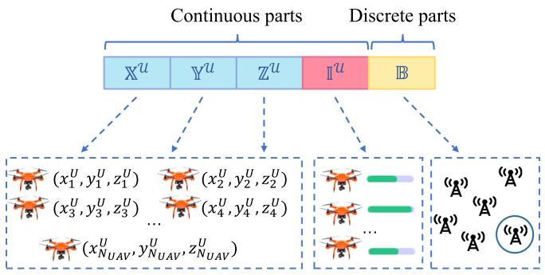

flowchart

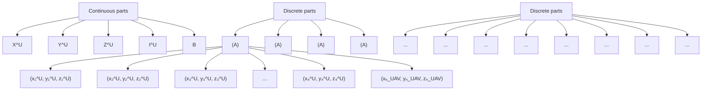

Fig. 2. Solution space of the formulated SCMOP.

Optimization Objective 2: There may be unknown eavesdroppers camouflaging themselves, which means that they are not detectable by the UAVs equipped with camera or radar. Thus, to ensure secure communication, the maximum SLL should be minimized and the corresponding objective function is defined as follows:

$$
f _ {2} (\mathbb {X} ^ {\mathcal {U}}, \mathbb {Y} ^ {\mathcal {U}}, \mathbb {Z} ^ {\mathcal {U}}, \mathbb {I} ^ {\mathcal {U}}, \mathbb {B}) = \frac {\widetilde {\operatorname{Max}} | F (\theta_ {S L} , \phi_ {S L}) |}{F (\theta_ {M L} , \phi_ {M L})}, \tag {13}
$$

where $( \theta _ { S L } , \phi _ { S L } )$ and $( \theta _ { M L } , \phi _ { M L } )$ denote the directions of ( ) ( )sidelobe and mainlobe, respectively.

Optimization Objective 3: To accomplish the two optimization objectives above, the UAVs should move to optimal locations and then transmit information towards the receiver BS, which will induce extra flight energy consumption. Therefore, the third objective is to achieve the minimization of the flight energy consumption concerning UAVs and the corresponding objective function is defined as follows:

$$
f _ {3} (\mathbb {X} ^ {\mathcal {U}}, \mathbb {Y} ^ {\mathcal {U}}, \mathbb {Z} ^ {\mathcal {U}}, \mathbb {B}) = \sum_ {i = 1} ^ {N _ {U A V}} E _ {i} (t _ {i}), \tag {14}
$$

where $E _ { i }$ denotes the flight energy consumption of ith UAV during the flight time $t _ { i } .$ .

Accordingly, the SCMOP is formulated as follows:

$$
\min _ {\{X \}} F = \{- f _ {1}, f _ {2}, f _ {3} \}, \tag {15a}
$$

$$
\text { s.t. } C 1: 0 \leq I _ {i} ^ {U} \leq 1, \forall i \in \mathcal {U}, \tag {15b}
$$

$$
C 2: L _ {\min} \leq x _ {i} ^ {U} \leq L _ {\max}, \forall i \in \mathcal {U}, \tag {15c}
$$

$$
C 3: L _ {\text { min }} \leq y _ {i} ^ {U} \leq L _ {\text { max }}, \forall i \in \mathcal {U}, \tag {15d}
$$

$$
C 4: H _ {m i n} \leq z _ {i} ^ {U} \leq H _ {m a x}, \forall i \in \mathcal {U}, \tag {15e}
$$

$$
C 5: V _ {\text { min }} \leq v _ {i} ^ {U} \leq V _ {\text { max }}, \forall i \in \mathcal {U}, \tag {15f}
$$

$$
C 6: \mathbb {B} \in \{1, 2, \dots , N _ {B S} \}, \tag {15g}
$$

$$
C 7: \theta_ {S L} \in [ - \pi , \theta_ {F N 1}) \cup (\theta_ {F N 2}, \pi ], \tag {15h}
$$

$$
C 8: \phi_ {S L} \in [ - \pi , \phi_ {F N 1}) \cup (\phi_ {F N 2}, \pi ], \tag {15i}
$$

$$
C 9: D _ {i _ {1}, i _ {2}} \geq \left(D _ {\min}, \frac {\lambda}{2}\right), \forall i _ {1}, i _ {2} \in \mathcal {U}, \tag {15j}
$$

where constraint (15b) denotes that the value of excitation current weight is between 0 and 1, constraints (15c) and (15d) indicate that the minimum and maximum horizontal scopes of UAVs are $L _ { m i n }$ and $L _ { m a x }$ . Constraint (15e) manifests that the minimum and maximum vertical scopes of UAVs are $H _ { m i n }$ and $H _ { m a x }$ . The constraint of velocity concerning UAVs is shown in (15f). Moreover, in constraints (15h) and $( 1 5 \mathrm { i } ) , \theta _ { F N 1 } , \theta _ { F N 2 }$ , $\phi _ { F N 1 }$ and $\phi _ { F N 2 }$ refer to the first nulls in $[ - \pi , \theta _ { F N 1 } ) , ( \theta _ { F N 2 } , \pi ]$ , $[ - \pi , \phi _ { F N 1 } )$ and $\left( \phi _ { F N 2 } , \pi \right]$ [ ) ( ]. In addition, constraint (15j) signi-[ ) ( ]fies that the minimum distance between two neighboring UAVs should be greater than $D _ { m i n }$ and $\frac { \lambda } { 2 }$ to circumvent the collisions.

# C. Problem Analysis

The related analysis of the formulated problem is provided in this section.

Proposition 1: The formulated SCMOP is non-convex.

Proof: It is observed from Fig. 2 that the solution space is comprised of continuous parts $( \breve { \mathbb { X } } ^ { \mathcal { U } } , \mathbb { Y } ^ { \mathcal { U } } , \mathbb { Z } ^ { \mathcal { U } } , \mathbb { I } ^ { \mathcal { U } } )$ and discrete part (B), which implies that the formulated SCMOP belongs to a mixed integer programming problem (MINLP) [41], [42]. Therefore, the formulated SCMOP is non-convex since the MINLP is non-convex. 

Proposition 2: The formulated SCMOP is NP-hard.

Proof: To ease presentation, we only consider the second optimization objective to simplify the formulated SCMOP. Specifically, the locations of UAVs and the receiver BS are fixed and known, where the set of excitation current weights of UAVs is denoted as $X ^ { \prime } = [ I _ { 1 } , I _ { 2 } , . . . , I _ { N _ { U A V } } ]$ . In this case, the simplified = [ ]SCMOP (S-SCMOP) is designed as follows:

$$
\min _ {X ^ {\prime}} F = f _ {2}, \tag {16a}
$$

$$
\text { s.t. } C 1: I _ {i} \in \{0, 1 \}, \forall i \in \{1, 2,..., N _ {U A V} \}, \tag {16b}
$$

$$
C 2: \sum_ {i = 1} ^ {N _ {U}} I _ {i} <   N _ {U A V}. \tag {16c}
$$

Clearly, S-SCMOP is a typical nonlinear multi-dimensional 0-1 knapsack problem which has been demonstrated to be NPhard [43]. Thus, the SCMOP is also NP-hard since it is a more intricate variant of the S-SCMOP. 

Proposition 3: The formulated SCMOP is a large-scale optimization problem.

Proof: The solution space of the formulated SCMOP includes the 3D coordinates of the UAVs $( \mathbb { X } ^ { \mathcal { U } } , \mathbb { Y } ^ { \mathcal { U } } , \mathbb { Z } ^ { \mathcal { U } } )$ , the excitation current weights of the UAVs (I U ) and the selected receiver BS (B), thus there are $( 4 \times N _ { U A V } + 1 )$ solution dimensions 4 + 1should be dealt with. Once the number of UAVs increases, the solution scale of the formulated SCMOP will be correspondingly increased. Thus, the formulated SCMOP is a large-scale optimization problem [44].

Proposition 4: There are trade-offs among the optimization objectives of the formulated SCMOP.

Proof: Optimal locations should be determined, so that a beam pattern with a high-gain mainlobe and low-gain sidelobes can be acquired, in another word, the maximization of $f _ { 1 }$ and minimization of $f _ { 2 }$ will be achieved. However, the flight process from the original locations to the optimal locations of the collaborative UAVs will result in massive energy cost, that is to say, the increase of $f _ { 3 }$ . Therefore, there are trade-offs among the three optimization objectives of the formulated SCMOP. 

Accordingly, the formulated SCMOP is non-convex and NPhard. The methods for solving the formulated problem can be roughly divided into three groups, which are convex optimization, deep reinforcement learning (DRL) and swarm intelligence algorithms, respectively, and they are analyzed as follows.

To be specific, due to the intricate constraints and trade-offs among the multiple objectives, the formulated SCMOP is difficult to be handled by the convex optimization. Moreover, DRL is more applicable for the scenarios where the UAVs should make decisions in real time by using the trained model, which means that it is more appropriate for handling the problems with continuous time slots. However, the formulated SCMOP is a problem with a moment, in other words, the obtained solution of the formulated SCMOP can be applied and kept to the considered scenario over a period of time. In this case, if DRL is used to deal with the formulated SCMOP, unnecessary overhead will be incurred during the training process. In addition, compared with DRL, swarm intelligence algorithms can obtain a set of nearoptimal solutions in a relatively short time, and the policy-maker can select the final solution from the set of solutions according to different requirements of the scenario.

Thus, considering the complexity concerning the structure of the formulated SCMOP and the UAVs with limited hardware resources, an improved swarm intelligence algorithm with specific designs is proposed to deal with the formulated problem.

# V. THE PROPOSED ALGORITHM

In this section, the motivation of proposing IMSSA for dealing with the formulated SCMOP is illustrated briefly. Moreover, the general framework of the conventional MSSA is introduced. Finally, the IMSSA is proposed for handling the formulated SCMOP.

# A. Motivation

Swarm intelligence algorithms are efficient techniques to deal with manifold optimization problems directly due to their inherent merits of flexibility and gradient-free mechanism. However, the traditional swarm intelligence algorithms encounter many challenges for solving the formulated SCMOP, which need to be handled urgently.

- Solution Initialization: The traditional swarm intelligence algorithms initialize the population in a random way, which may lead to an uneven distribution of initial solutions.   
- Solution Space: It is difficult for these algorithms to handle the formulated SCMOP that has hybrid solutions due to that these algorithms are designed to deal with the optimization problems that only have continuous solutions.   
Solution Bound: The formulated SCMOP that owns different solution bounds is hard to be dealt with by these algorithms since they are commonly suitable for handling

the optimization problems which solution bounds are unified.

# B. Framework of Conventional MSSA

Enlightened by the behaviours of salps, salp swarm algorithm (SSA) has been widely adopted in the field of communications owing to the merits of few parameters, fast convergence speed and high coverage among the numerous swarm intelligence algorithms [45], [46]. Thus, we adopt MSSA which is the multi-objective variant of SSA, to deal with the formulated SCMOP.

In MSSA, the population is decomposed into two groups that are the leader and followers. Specifically, the update strategy of the leader is as follows [47]:

$$
X _ {1, q} = \left\{ \begin{array}{l l} F _ {q} + c _ {1} \left(\left(u b _ {q} - l b _ {q}\right) c _ {2} + l b _ {q}\right), & c _ {3} \geq 0. 5, \\ F _ {q} - c _ {1} \left(\left(u b _ {q} - l b _ {q}\right) c _ {2} + l b _ {q}\right), & c _ {3} <   0. 5, \end{array} \right. \tag {17}
$$

where $X _ { 1 , q }$ refers to the position of the leader in the qth dimension, $F _ { q }$ represents the position of the food in the qth dimension. Moreover, $u b _ { q }$ and $l b _ { q }$ signifies the upper and lower bounds of the qth dimension. In addition, $c _ { 1 } , c _ { 2 }$ and $c _ { 3 }$ are random numbers ranging from 0 to 1, in which $c _ { 1 }$ is the paramount parameter that balances the exploration and exploitation and it is defined as follows:

$$
c _ {1} = 2 e ^ {- \left(\frac {4 t}{t _ {\text { max }}}\right) ^ {2}}, \tag {18}
$$

where t and $t _ { m a x }$ refer to the tth iteration and the maximum iteration, respectively.

Moreover, the update strategy of the followers is as follows [47]:

$$
X _ {p, q} = \frac {1}{2} (X _ {p, q} + X _ {p - 1, q}), \tag {19}
$$

where $X _ { p , q }$ and $X _ { p - 1 , q }$ refer to the positions of pth and $p -$ th salps in the qth dimension, respectively, and $p \geq 2$ .

# C. IMSSA

In this part, an IMSSA is proposed to handle the discrete dimension (B) that the conventional MSSA is not capable of dealing with and to enhance the quality of solutions regarding the formulated SCMOP. The elaborate improvement factors are illustrated as follows and the whole framework of the proposed scheme is presented in Algorithm 1. Note that $P _ { t } , A _ { t }$ and $F _ { t }$ represent the set of population, archive and the fitness value in the tth iteration. Moreover, $N _ { p o p }$ and $t _ { m a x }$ denote the population size and maximum iteration, respectively. In addition, $A \succ B$ refers to that A dominates B [48].

1) Circle Map-Based Solution Initialization: The conventional MSSA generate initial population through pseudo-random number generator, which is the most commonly employed initialization method. However, the initial solutions may not be uniformly distributed, which will induce the blindness during the searching phase.

In this paper, we adopt the chaotic map to make the solutions of the initial population distributed uniformly. Specifically, the initialization mechanism is described as follows [49]:

Algorithm 1: IMSSA.   
Input: $N_{pop}$ , $P_{0}$ , $t_{max}$ , $A_{0}$ , $F_{0}$ , etc.
Output: $A_{t_{max}}$ .

1 $P_{0} \leftarrow \varnothing$ , $A_{0} \leftarrow \varnothing$ , $F_{0} \leftarrow \varnothing$ ;

2 for p=1 to $N_{pop}$ do

3 Initialize the pth solution $X_{p}$ based on Eq.(20);
4 $P_{0} \leftarrow P_{0} \cup X_{p}$ ;
5 Count the fitness value of $X_{p}$ : $f_{p} = [f_{1_{p}}, f_{2_{p}}, f_{3_{p}}]$ ;
6 $F_{0} \leftarrow F_{0} \cup f_{p}$ ;

7 end

8 Find the non-dominated solutions $S_{0}$ and update $A_{0}$ ;

9 for t=1 to $t_{max}$ do

10 for p=1 to $N_{pop}$ do

11 if p=1 then

12 Update $X_{p}(\mathbb{X}^{\mathcal{U}}, \mathbb{Y}^{\mathcal{U}}, \mathbb{Z}^{\mathcal{U}}, \mathbb{I}^{\mathcal{U}})$ via Eq.(17);
13 else

14 Update $X_{p}(\mathbb{X}^{\mathcal{U}}, \mathbb{Y}^{\mathcal{U}}, \mathbb{Z}^{\mathcal{U}}, \mathbb{I}^{\mathcal{U}})$ via Eq.(19);
15 end

16 if $t < \frac{t_{max}}{2}$ then

17 Update $X_{p}(\mathbb{B})$ based on Eq.(22);
18 end

19 Update $X_{p}$ via Algorithm 2;
20 end

21 Count $F_{t}$ , update $S_{t}$ and $A_{t}$ ;

22 end

23 Return $A_{t_{max}}$ ;

$$
X _ {p, q} = l b _ {q} + M _ {q} \cdot (u b _ {q} - l b _ {q}), \tag {20}
$$

where $M _ { q }$ refers to the qth dimension of the circle map and it is expressed as follows [50]:

$$
M _ {k + 1} = \mathrm{mod} (M _ {k} + d - \left(\frac {c}{2 \pi}\right) \sin (2 \pi M _ {k}), 1), \tag {21}
$$

where c and d are parameters and we set c . and $d = 0 . 2$ in this work.

2) Discrete Solution Update Operator: For the discrete part, there is no practicable algorithm to deal with. Thus, we propose a method to determine the optimal receiver BS.

First, during the earlier iteration process, the proposed scheme changes the selected BS frequently so that the optimal BS can be determined as follows:

$$
\mathbb {B} _ {t + 1} = \left\{ \begin{array}{l l} r a n d i (\mathcal {B S}), & 0 <   r a n d <   \sigma_ {1}, \\ \mathbb {B} _ {t}, & \sigma_ {1} \leq r a n d <   \sigma_ {2}, \\ \mathbb {B} _ {t} ^ {B e s t}, & \sigma_ {2} \leq r a n d <   1, \end{array} \right. \tag {22}
$$

where randi represents a function that is employed to select ()a BS from BS randomly. Moreover, $\mathbb { B } _ { t }$ is the selected BS in tth iteration and $\mathbb { B } _ { t } ^ { B e s t }$ refers to the selected BS of the Best solution. Moreover, $\sigma _ { 1 }$ and $\sigma _ { 2 }$ are weighting factors.

Second, during the latter iteration process, the selected BS maintains unchanged and the 3D location and excitation current weight of each UAV for transmitting message towards the selected BS are optimized.

3) Migration and Adaptive Mutation Operator: Inspired by the biogeography-based optimization (BBO) [51], we adopt

Algorithm 2: Migration and Adaptive Mutation Operator.   
Input: $X_{p}$ .
Output: $X_{p}$ .
1 Generate $X_{M}$ and $X_{A}$ via Eqs.(23) and (24);
2 if $X_{M} \succ X_{p}$ then
3 | $X_{p} \leftarrow X_{M}$ ;
4 end
5 else if $X_{A} \succ X_{p}$ then
6 | $X_{p} \leftarrow X_{A}$ ;
7 end
8 Return $X_{p}$ ;

migration and adaptive mutation strategy to enhance the quality of solution and the whole framework is shown in Algorithm 2. Specifically, the migration mechanism can be designed as follows:

$$
X _ {p, q} = X _ {p, q} + l * r a n d * (X _ {b e s t, q} - X _ {p, q}), \tag {23}
$$

where l denotes the learning coefficient, rand $\in ( 0 , 1 )$ denotes a random number. Moreover, $X _ { b e s t }$ (0 1)is the best solution selected from the Archive.

Moreover, the adaptive mutation mechanism is given as follows:

$$
X _ {p, q} = w \cdot X _ {p, q} + (1 - w) \cdot [ l b _ {q} + (u b _ {q} - l b _ {q} + 1) \cdot r a n d ], \tag {24}
$$

where w refers to the weight factor and is designed as follows:

$$
w = w _ {s} + (w _ {s} - w _ {b}) \cdot \left[ \left(\frac {t}{t _ {m a x}}\right) ^ {2} - 2 \cdot \frac {t}{t _ {m a x}} \right] +
$$

$$
S \cdot \exp (- \beta \cdot t) \cdot \cos (\mu \cdot t), \tag {25}
$$

where $w _ { s }$ and $w _ { b }$ denote the lower and upper bounds of the weight factor w. Moreover, S is the stiffness coefficient, β is a parameter which regulates the variation amplitude. In addition, $\mu$ refers to frequency.

# D. Solving SCMOP With IMSSA

The framework of the proposed IMSSA for solving the SC-MOP is given in Fig. 3 and the concrete steps are designed as follows:

Step 1: The proposed IMSSA initializes the population in which each solution contains continuous parts $( \mathbb { X } ^ { \mathcal { U } } , \mathbb { Y } ^ { \mathcal { U } } , \mathbb { Z } ^ { \mathcal { U } } , \mathbb { I } ^ { \mathcal { U } } )$ and discrete part (B) based on the circle map-based solution initialization scheme.   
Step 2: The corresponding objective functions of each solution in the initial population are calculated and the relevant values are stored in the current population.   
Step 3: The proposed IMSSA updates each solution and the corresponding values of objective functions in current population. Specifically, the continuous dimensions are updated based on the conventional MSSA and the discrete dimension is updated in accordance to the proposed discrete solution update operator. Then, the proposed migration and adaptive mutation operator is adopted to enhance the quality and the diversity of solutions in current population.

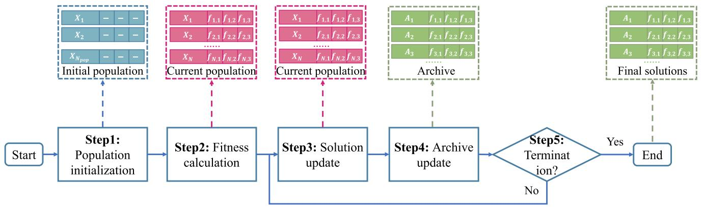

flowchart

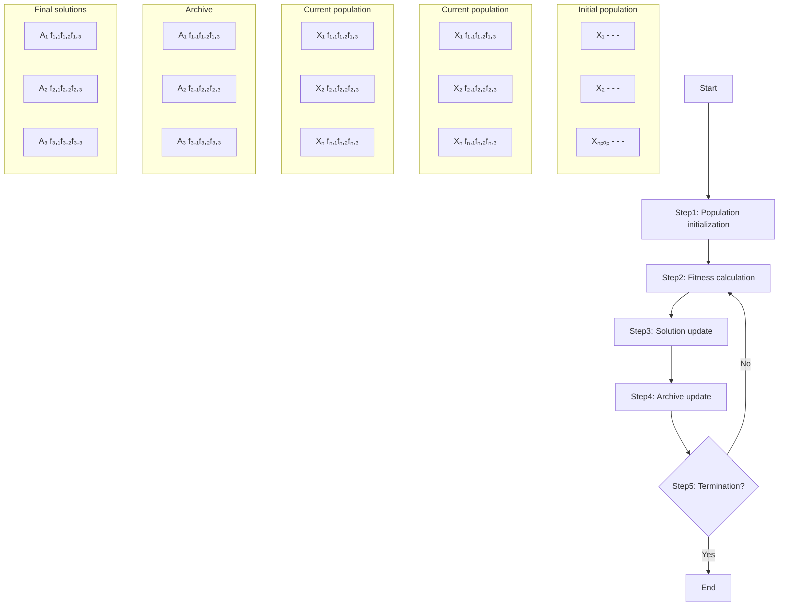

Fig. 3. The algorithm framework of IMSSA.

- Step 4: The proposed IMSSA updates the archive according to the superior solutions in current population.   
- Step 5: Once the terminal condition is satisfied, the IMSSA will be terminated and then the policymaker can select appropriate solutions from the archive based on different criteria, e.g., the maximization of the worst-case secrecy rate. Otherwise, the proposed IMSSA will be executed as usual.

# E. Computational Complexity of the Proposed IMSSA

In this section, the computational complexity of the proposed IMSSA is given as follows.

Proposition 5: The computational complexity of the proposed IMSSA is $\mathcal { O } ( N _ { f } \cdot N _ { p o p } ^ { \bar { 2 } } )$ .

( )Proof: The number of the population size, the size of Pareto archive, and the number of optimization objective functions are defined as $N _ { p o p } , N _ { a r c }$ and $N _ { f }$ , respectively. Then, through calculating the objective functions and crowding distance, the computational complexity of IMSSA can be obtained. Specifically, the computational complexity for calculating the $N _ { f }$ objective functions can be expressed as $\mathcal { O } ( N _ { f } \cdot N _ { p o p } )$ . Moreover, sorting $N _ { a r c }$ solutions of per objective function is another pivotal part when calculating the crowding distance and the average computational complexity is $\mathcal { O } ( N _ { f } \cdot N _ { a r c } \cdot \log ( N _ { a r c } ) )$ . In addition, we set $N _ { p o p }$ (is equal to $N _ { a r c } .$ log( )), thus the average computational complexity of calculating the crowding distance is $\mathcal { O } ( N _ { f } \cdot N _ { p o p } \cdot \log ( N _ { p o p } ) )$ . Therefore, the computational com-( log( ))plexity of the proposed IMSSA is $\mathcal { O } ( N _ { f } \cdot N _ { p o p } ^ { 2 } )$ in the worst case.

# VI. SIMULATION RESULTS

Simulation results are provided to illustrate the effectiveness of the proposed IMSSA. First, the simulation setups are given. Second, we exploit the proposed IMSSA and other CB-based strategies to solve the formulated SCMOP, so that the effectiveness and superiority of the proposed scheme are illustrated. Third, the multi-hop relay is introduced to verify the reasonability of the UVAA system, and two benchmark schemes of the formulated SCMOP are introduced to demonstrate the necessity of the formulated SCMOP, Fourth, the effectiveness of the

TABLE I KEY PARAMETERS 

<table><tr><td>Notation</td><td>Meaning</td><td>Value</td></tr><tr><td> $\lambda$ </td><td>Wavelength</td><td>0.125 m</td></tr><tr><td> $B$ </td><td>Bandwidth</td><td>20 MHz</td></tr><tr><td> $\alpha$ </td><td>Pathloss exponent</td><td>2</td></tr><tr><td> $P_{t}$ </td><td>Transmit power of the UVAA system</td><td> $0.1 \times N_{UAV}$  W</td></tr><tr><td> $\sigma^{2}$ </td><td>Noise power</td><td>-155 dBm/Hz</td></tr><tr><td> $m$ </td><td>Parameter of LoS channel</td><td>10</td></tr><tr><td> $n$ </td><td>Parameter of LoS channel</td><td>0.6</td></tr><tr><td> $\mu_{LoS}$ </td><td>Attenuation factors of LoS</td><td>0.501</td></tr><tr><td> $\mu_{NLoS}$ </td><td>Attenuation factors of NLoS</td><td>0.00501</td></tr><tr><td> $d_{0}$ </td><td>Fuselage drag ratio</td><td>0.6</td></tr><tr><td> $\rho$ </td><td>Air density</td><td>1.225 kg/m3</td></tr><tr><td> $s$ </td><td>Rotor solidity</td><td>0.05</td></tr><tr><td> $A$ </td><td>Rotor disc area</td><td>0.503 m3</td></tr><tr><td> $w_{UAV}$ </td><td>The weight of UAV</td><td>2 kg</td></tr><tr><td> $L_{min}$ </td><td>Minimum horizontal scope of UAVs</td><td>0 m</td></tr><tr><td> $L_{max}$ </td><td>Maximum horizontal scope of UAVs</td><td>100 m</td></tr><tr><td> $H_{min}$ </td><td>Minimum vertical scope of UAVs</td><td>100 m</td></tr><tr><td> $H_{max}$ </td><td>Maximum vertical scope of UAVs</td><td>120 m</td></tr><tr><td> $D_{min}$ </td><td>Collision distance</td><td>0.5 m</td></tr><tr><td> $l$ </td><td>Learning coefficient</td><td>0.1</td></tr><tr><td> $\sigma_{1}$ </td><td>Weighting factor</td><td>0.2</td></tr><tr><td> $\sigma_{2}$ </td><td>Weighting factor</td><td>0.6</td></tr><tr><td> $w_{s}$ </td><td>Lower bound of  $w$ </td><td>0.4</td></tr><tr><td> $w_{b}$ </td><td>Upper bound of  $w$ </td><td>0.9</td></tr><tr><td> $S$ </td><td>Stiffness coefficient</td><td>0.03</td></tr><tr><td> $\beta$ </td><td>Variation amplitude</td><td>0.04</td></tr><tr><td> $\mu$ </td><td>Frequency parameter</td><td>8</td></tr></table>

proposed approach is further validated in different scenarios with different number of eavesdroppers. Finally, the impact of unexpected circumstances on the UVAA system are evaluated and discussed.

# A. Simulation Setups

1) Scenario Setups: We set the numbers of BSs and eavesdroppers as 8 and 4, respectively. Moreover, we consider two different scale networks of UAV swarm, including smaller and larger scale networks, which are composed of 8 and 16 UAVs, respectively. Other key parameters are presented in Table I.   
2) Benchmarks: We introduce several methods as the benchmark strategies. First, two typical CB-based strategies which are uniform linear antenna array (LAA) [52] and rectangular

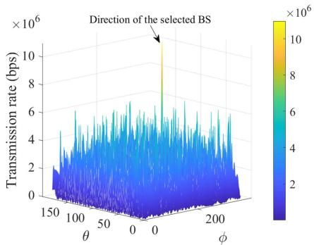

line

| θ    | Transmission rate (bps) ×10⁶ |
| ---- | ---------------------------- |
| 150  | ~2                           |
| 100  | ~4                           |
| 50   | ~6                           |
| 0    | ~8                           |
| 200  | ~6                           |

(a)

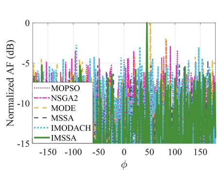

line

| φ    | MOPSO | NSGA2 | MODE | MSSA | IMODACH | IMSSA |
|------|-------|-------|------|------|---------|-------|
| -150 | -5.0  | -5.0  | -5.0 | -5.0 | -5.0    | -5.0  |
| -100 | -5.0  | -5.0  | -5.0 | -5.0 | -5.0    | -5.0  |
| -50  | -5.0  | -5.0  | -5.0 | -5.0 | -5.0    | -5.0  |
| 0    | -5.0  | -5.0  | -5.0 | -5.0 | -5.0    | -5.0  |
| 50   | -5.0  | -5.0  | -5.0 | -5.0 | -5.0    | -5.0  |
| 100  | -5.0  | -5.0  | -5.0 | -5.0 | -5.0    | -5.0  |
| 150  | -5.0  | -5.0  | -5.0 | -5.0 | -5.0    | -5.0  |

(b)

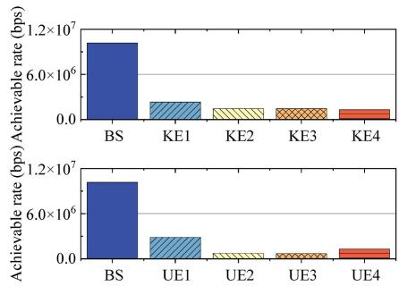

bar

| Category | Achievable rate (bps) |
| :--- | :--- |
| BS | 1.2×10⁷ |
| KE1 | 6.0×10⁶ |
| KE2 | 4.0×10⁶ |
| KE3 | 4.0×10⁶ |
| KE4 | 2.0×10⁶ |
| UE1 | 8.0×10⁶ |
| UE2 | 2.0×10⁶ |
| UE3 | 1.0×10⁶ |
| UE4 | 2.0×10⁶ |

（c）  
Fig. 4. Optimization results obtained by IMSSA. (a) Achievable transmission rate of all directions in larger scale network. (b) Normalized AF in larger scale network. (c) Achievable transmission rate obtained by the known and unknown eavesdroppers in larger scale network.

antenna array (RAA) [53] are employed. Second, apart from the conventional MSSA, some other well-regarded swarm intelligence algorithms, which are multi-objective particle swarm optimization (MOPSO) [54], non-dominated sorting genetic algorithm (NSGA-II) [55] and multi-objective differential evolution (MODE) [56] are introduced to make comparisons with the proposed IMSSA. Finally, the proposed algorithm in our previous work [12], i.e., improved multi-objective dragonfly algorithm with chaotic solution initialization and hybrid solution update operators (IMODACH), is also introduced as a benchmark scheme. Note that IMODACH is proposed to deal with the formulated MOP which is demonstrated to be a constraint programming problem, while the formulated SCMOP is a mixed-integer programming problem, which means that it cannot be directly solved by IMODACH. Thus, the discrete solution update algorithm of IMODACH that is designed to handle the constraint programming problem is substituted by the operator of IMSSA that is proposed to solve the mixed-integer programming problem, so that making the original IMODACH can solve the optimization problem in this work.

The maximum iteration is set to 500 and the population size is designed to be 30 among the abovementioned algorithms. Moreover, the proposed discrete solution update operator is available for these benchmark algorithms to deal with the discrete dimension.

# B. Optimization Results

1) Visualization Results: For the sake of ease presentation, the visualization results of larger scale network are presented in this part.

Fig. 4 presents the optimization results obtained by the proposed IMSSA, which includes the transmission rates in all directions, the normalized AF as well as the transmission rates obtained by the known and unknown eavesdroppers. As shown in Fig. 4(a), the transmission rate towards the selected BS is much higher than the counterparts of other directions. From Fig. 4(b), it is found that the proposed IMSSA achieves decent results in terms of suppressing the SLLs, which means that the transmission rates obtained by the potential unknown eavesdroppers will be correspondingly diminished and the secure performance of the UVAA system will be further enhanced. In addition, we select four points that near the cluster of BSs as the locations of the unknown eavesdroppers and calculate the corresponding transmission rates of the abovementioned locations. It can be seen from the Fig. 4(c) that the transmission rates obtained by the unknown eavesdroppers can be maintained at a relatively low level, even the transmission rates obtained by some unknown eavesdroppers are lower than that of known eavesdroppers. The reason is that the SLL minimization will decrease the threats brought by the unknown eavesdroppers. In conclusion, the proposed IMSSA can improve the secure performance of the UVAA system.

2) Comparison With Other CB-Based Strategies: Some other swarm intelligence algorithms as mentioned in Section VI-A2 are exploited to achieve the UVAA system for making comparisons with the proposed IMSSA.

Figs. 5 and 6 present the moving paths obtained by the comparison algorithms and the proposed IMSSA in smaller and larger scale networks, respectively. It is observed that the optimized heights of UAVs are relatively higher than the original heights since a higher height means a higher LoS probability that will bring lower pathloss during the communication process. Moreover, it is apparent that the optimized locations of UAVs obtained by the proposed IMSSA are more compact than the locations that are obtained by the comparison algorithms, which means that the proposed scheme will inevitably enhance the communication performance of the UVAA system.

Fig. 7 visualizes the cumulative distribution functions (CDFs) obtained by the proposed IMSSA and the comparison algorithms which include MOPSO, NSGA-II, MODE, MSSA and the proposed IMSSA. We observe that the proposed IMSSA can achieve dominant results in terms of the maximum worst-case secrecy rate $( f _ { 1 } )$ as well as the minimum SLL $( f _ { 2 } )$ , while the flight energy consumption of the $\mathrm { U A V s } \left( f _ { 3 } \right)$ obtained by the proposed IMSSA is higher than the counterparts of the comparison algorithms. The abovementioned results exactly corresponds to the numerical results in Tables II and III. Note that it is difficult to achieve predominant performance in terms of $f _ { 1 } , f _ { 2 }$ and $f _ { 3 }$ since there are trade-offs among them. However, the higher secrecy rate obtained by the proposed IMSSA denotes that the whole transmission process will be finished in a shorter time, which means that the hovering as well as communication energy consumption will be reduced correspondingly, and the total energy consumption of the UVAA system obtained by the proposed IMSSA may not be higher than that of the other algorithms. Thus, the proposed IMSSA can achieve the overall superior performance compared with all of the benchmark schemes.

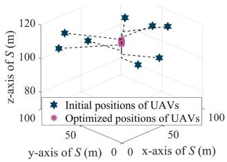

scatter

| Position Type              | Initial Position (m) | Optimized Position (m) |
| -------------------------- | --------------------- | ---------------------- |
| Initial positions of UAVs | 120                   | 100                    |
| Optimized positions of UAVs | 100                   | 100                    |

(a)

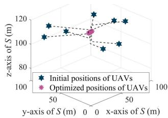

scatter

| Position Type              | X (y-axis, S (m)) | Y (z-axis, S (m)) |
| -------------------------- | ----------------- | ----------------- |
| Initial positions of UAVs | 50                | 120               |
| Optimized positions of UAVs | 50                | 110               |

(b)

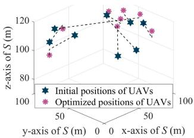

scatter

| x-axis of S (m) | y-axis of S (m) | z-axis of S (m) | Type                     |
| --------------- | --------------- | --------------- | ------------------------ |
| 50              | 0               | 120             | Initial positions of UAVs |
| 50              | 50              | 110             | Optimized positions of UAVs |
| 50              | 100             | 100             | Initial positions of UAVs |
| 50              | 150             | 90              | Optimized positions of UAVs |
| 50              | 200             | 80              | Initial positions of UAVs |
| 50              | 250             | 70              | Optimized positions of UAVs |
| 50              | 300             | 60              | Initial positions of UAVs |
| 50              | 350             | 50              | Optimized positions of UAVs |
| 50              | 400             | 40              | Initial positions of UAVs |
| 50              | 450             | 30              | Optimized positions of UAVs |
| 50              | 500             | 20              | Initial positions of UAVs |
| 50              | 550             | 10              | Optimized positions of UAVs |
| 50              | 600             | 0               | Initial positions of UAVs |
| 50              | 650             | -10             | Optimized positions of UAVs |
| 50              | 700             | -20             | Initial positions of UAVs |
| 50              | 750             | -30             | Optimized positions of UAVs |
| 50              | 800             | -40             | Initial positions of UAVs |
| 50              | 850             | -50             | Optimized positions of UAVs |
| 50              | 900             | -60             | Initial positions of UAVs |
| 50              | 950             | -70             | Optimized positions of UAVs |
| 50              | 1000            | -80             | Initial positions of UAVs |
| 50              | 1050            | -90             | Optimized positions of UAVs |
| 50              | 1100            | -100            | Initial positions of UAVs |
| 50              | 1150            | -110            | Optimized positions of UAVs |
| 50              | 1200            | -120            | Initial positions of UAVs |
| 50              | 1250            | -130            | Optimized positions of UAVs |
| 50              | 1300            | -140            | Initial positions of UAVs |
| 50              | 1350            | -150            | Optimized positions of UAVs |
| 50              | 1400            | -160            | Initial positions of UAVs |
| 50              | 1450            | -170            | Optimized positions of UAVs |
| 50              | 1500            | -180            | Initial positions of UAVs |
| 50              | 1550            | -190            | Optimized positions of UAVs |
| 50              | 1600            | -200            | Initial positions of UAVs |
| 50              | 1650            | -210            | Optimized positions of UAVs |
| 50              | 1700            | -220            | Initial positions of UAVs |
| 50              | 1750            | -230            | Optimized positions of UAVs |
| 50              | 1800            | -240            | Initial positions of UAVs |
| 50              | 1850            | -250            | Optimized positions of UAVs |
| 50              | 1900            | -260            | Initial positions of UAVs |
| 50              | 1950            | -270            | Optimized positions of UAVs |
| 50              | 2000            | -280            | Initial positions of UAVs |
| 50              | 2050            | -290            | Optimized positions of UAVs |
| 50              | 2100            | -300            | Initial positions of UAVs |
| 50              | 2150            | -310            | Optimized positions of UAVs |
| 50              | 2200            | -320            | Initial positions of UAVs |
| 50              | 2250            | -330            | Optimized positions of UAVs |
| 50              | 2300            | -340            | Initial positions of UAVs |
| 50              | 2350            | -350            | Optimized positions of UAVs |
| 50              | 2400            | -360            | Initial positions of UAVs |
| 50              | 2450            | -370            | Optimized positions of UAVs |
| 50              | 2500            | -380            | Initial positions of UAVs |
| 50              | 2550            | -390            | Optimized positions of UAVs |
| 50              | 2600            | -400            | Initial positions of UAVs |
| 50              | 2650            | -410            | Optimized positions of UAVs |
| 50              | 2700            | -420            | Initial positions of UAVs |
| 50              | 2750            | -430            | Optimized positions of UAVs |
| 50              | 2800            | -440            | Initial positions of UAVs |
| 50              | 2850            | -450            | Optimized positions of UAVs |
| 50              | 2900            | -460            | Initial positions of UAVs |
| 50              | 2950            | -470            | Optimized positions of UAVs |
| 50              | 3000            | -480            | Initial positions of UAVs |
| 50              | 3050            | -490            | Optimized positions of UAVs |
| 50              | 3100            | -500            | Initial positions of UAVs |
| 50              | 3150            | -510            | Optimized positions of UAVs |
| 50              | 3200            | -520            | Initial positions of UAVs |
| 50              | 3250            | -530            | Optimized positions of UAVs |
| 50              | 3300            | -540            | Initial positions of UAVs |
| 50              | 3350            | -550            | Optimized positions of UAVs |
| 50              | 3400            | -560            | Initial positions of UAVs |
| 50              | 3450            | -570            | Optimized positions of UAVs |
| 50              | 3500            | -580            | Initial positions of UAVs |
| 50              | 3550            | -590            | Optimized positions of UAVs |
| 50              | 3600            | -600            | Initial positions of UAVs |
| 50              | 3650            | -610            | Optimized positions of UAVs |
| 50              | 3700            | -620            | Initial positions of UAVs |
| 50              | 3750            | -630            | Optimized positions of UAVs |
| 50              | 3800            | -640            | Initial positions of UAVs |
| 50              | 3850            | -650            | Optimized positions of UAVs |
| 50              | 3900            | -660            | Initial positions of UAVs |
| 50              | 3950            | -670            | Optimized positions of UAVs |
| 50              | 4000            | -680            | Initial positions of UAVs |
| 50              | 4050            | -690            | Optimized positions of UAVs |
| 50              | 4100            | -700            | Initial positions of UAVs |
| 50              | 4150            | -710            | Optimized positions of UAVs |
| 50              | 4200            | -720            | Initial positions of UAVs |
| 50              | 4250            | -730            | Optimized positions of UAVs |
| 50              | 4300            | -740            | Initial positions of UAVs |
| 50              | 4350            | -750            | Optimized positions of UAVs |
| 50              | 4400            | -760            | Initial positions of UAVs |
| 50              | 4450            | -770            | Optimized positions of UAVs |
| 50              | 4500            | -780            | Initial positions of UAVs |
| 50              | 4550            | -790            | Optimized positions of UAVs |
| 50              | 4600            | -800            | Initial positions of UAVs |
| 50              | 4650            | -810            | Optimized positions of UAVs |
| 50              | 4700            | -820            | Initial positions of UAVs |
| 50              | 4750            | -830            | Optimized positions of UAVs |
| 5₀              + y-axis    =        /          /                  /                    /                          /                            /                          /                             /                                /                              /                                /                                /                                /                                /                                /                                /                                /                                /                                /                                /                                /                                /                                /                                /                                /                                /                                /                                /                                /                                /                                /                                /                                /                                /                                /                                /                                /                                /                                /                                /                                /                                /                                /                                /                                /                                /                                /                                /                                /                                /                                /                                /                                /                                /                                /                                /                                /                                /                                /                                /                               /                                 //                                  #                #                #                #                #                #                #                #                #                #                #                #                #                #                #                #                #                #                #                #                #                #                #                #                #                #                #                #                #                #                #                #                #                #                #                #                #                #                #                #                #                #                #                #                #                #                #                #                #                #                #                        #                #                #                #                #                #                #                #                #                #                #                #                #                #                #                #                #                #                #                #                #                #                #                #                #                #                #                #                #                #                #                #                #                #                #                #                #                #                #                #                #                #                #                #                #                #                #                #                #                #        //                                  (#)                               (#)                               (#)                               (#)                               (#)                               (#)                               (#)                               (#)                               (#)                               (#)                               (#)                               (#)                               (#)                               (#)                               (#)                               (#)                               (#)                               (#)                               (#)                               (#)                               (#)                               (#)                               (#)                               (#)                               (#)                               (#)                               (#)                               (#)                               (#)                               (#)                               (#)                               (#)                               (#)                               (#)                               ($)

(c）

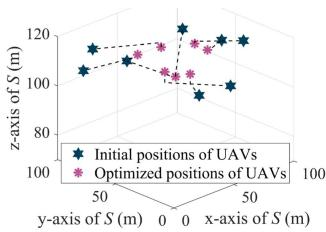

scatter

| Position Type | Initial Position (UAVs) (m) | Optimized Position (UAVs) (m) |
| :--- | :--- | :--- |
| Initial positions | 105 | 110 |
| Optimized positions | 110 | 115 |

(d)

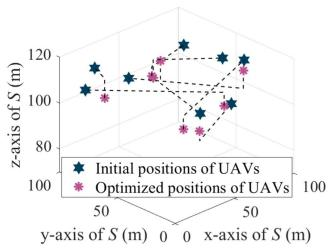  
(e)

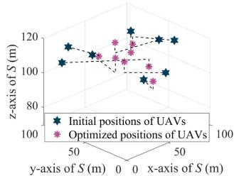

scatter

| Position Type | X (m) | Y (m) | Z (m) |
| ------------- | ----- | ----- | ----- |
| Initial position | 50 | 100 | 120 |
| Optimized position | 50 | 100 | 110 |
| Initial position | 50 | 100 | 115 |
| Optimized position | 50 | 100 | 105 |
| Initial position | 50 | 100 | 110 |
| Optimized position | 50 | 100 | 100 |
| Initial position | 50 | 100 | 95 |
| Optimized position | 50 | 100 | 90 |
| Initial position | 50 | 100 | 125 |
| Optimized position | 50 | 100 | 115 |
| Initial position | 50 | 100 | 120 |
| Optimized position | 50 | 100 | 110 |
| Initial position | 50 | 100 | 115 |
| Optimized position | 50 | 100 | 105 |
| Initial position | 50 | 100 | 125 |
| Optimized position | 50 | 100 | 115 |
| Initial position | 50 | 100 | 125 |
| Optimized position | 50 | 100 | 115 |
| Initial position | 50 | 100 | 125 |
| Optimized position | 50 | 100 | 115 |
| Initial position | 50 | 100 | 125 |
| Optimized position |

(f)

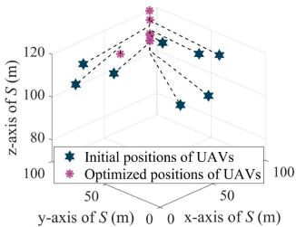  
(g)

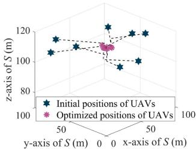

scatter

| Position Type              | X (y-axis, S (m)) | Y (z-axis, S (m)) |
| -------------------------- | ----------------- | ----------------- |
| Initial positions of UAVs | 0                 | 120               |
| Optimized positions of UAVs | 0                 | 110               |

(h)   
Fig. 5. Moving paths of UAVs obtained by various comparison algorithms in smaller scale network. (a) LAA. (b) RAA. (c) MOPSO. (d) NSGA-II. (e) MODE. (f) MSSA. (g) IMODACH. (h) IMSSA.

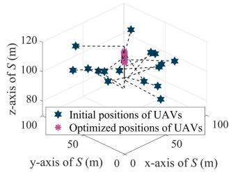

scatter

| Position Type              | X (m) | Y (m) | Z (m) |
| -------------------------- | ----- | ----- | ----- |
| Initial positions of UAVs | 50    | 100   | 120   |
| Optimized positions of UAVs | 50    | 100   | 110   |

(a)

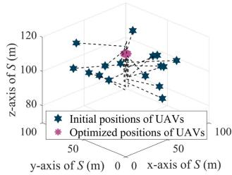

scatter

| Position Type              | Initial Position (m) | Optimized Position (m) |
| -------------------------- | --------------------- | ---------------------- |
| Initial positions          | 120                   | 110                    |
| Optimized positions        | 100                   | 105                    |

(b)

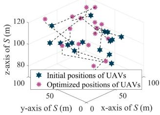

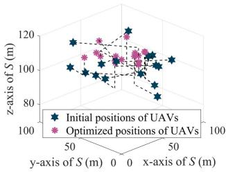

scatter

| Position Type              | X (y-axis, S (m)) | Y (z-axis, S (m)) |
| -------------------------- | ----------------- | ----------------- |
| Initial positions of UAVs | 50                | 100               |
| Optimized positions of UAVs | 50                | 100               |
| Initial positions of UAVs | 0                 | 100               |
| Optimized positions of UAVs | 0                 | 100               |
| Initial positions of UAVs | 50                | 120               |
| Optimized positions of UAVs | 50                | 120               |
| Initial positions of UAVs | 0                 | 120               |
| Optimized positions of UAVs | 0                 | 120               |

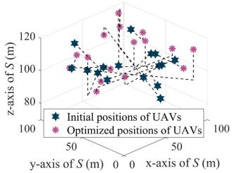

scatter

| x-axis (m) | y-axis (m) | z-axis (m) | Type              |
|------------|------------|------------|------------------|
| 50         | 100        | 120        | Initial positions |
| 50         | 100        | 100        | Optimized positions |
| 50         | 100        | 80         | Initial positions |
| 50         | 100        | 120        | Optimized positions |
| 50         | 100        | 100        | Initial positions |
| 50         | 100        | 80         | Optimized positions |
| 50         | 100        | 120        | Initial positions |
| 50         | 100        | 100        | Optimized positions |
| 50         | 100        | 80         | Initial positions |
| 50         | 100        | 120        | Optimized positions |
| 50         | 100        | 110        | Initial positions |
| 50         | 100        | 100        | Optimized positions |
| 50         | 100        | 80         | Initial positions |
| 50         | 100        | 120        | Optimized positions |
| 50         | 100        | 110        | Initial positions |
| 50         | 110        | 120        | Optimized positions |
| 50         | 110        | 110        | Initial positions |
| 50         | 110        | 100        | Optimized positions |
| 50         | 110        | 80         | Initial positions |
| 50         | 110        | 120        | Optimized positions |
| 50         | 110        | 110        | Initial positions |
| 50         | 110        | 100        | Optimized positions |
| 50         | 110        | 80         | Initial positions |
| 50         | 110                | 120        | Optimized positions |
| 50         | 110                | 110        | Initial positions |
| 50         | 110                | 100        | Optimized positions |
| 50         | 110                | 80         | Initial positions |
| 50         | 110                | 120        | Optimized positions |
| 50         | 110                | 110        | Initial positions |
| 50         | 110                | 90         | Optimized positions |
| 50         | 110                | 120        | Initial positions |
| 50         | 110                | 90         | Optimized positions |
| 50         | 110                | 80         | Initial positions |
| 50         | 110                | 120        | Optimized positions |
| 50         | 110                | 110        | Initial positions |
| 50         | 110                | 90         | Optimized positions |
| 50         | 110                                | 80         | Initial positions |
| 50         | 110                                | 120        | Optimized positions |
| 50         | 120                | 120        | Initial positions |
| 50         | 120                | 110        | Optimized positions |
| 50         | 120                | 90         | Initial positions |
| 50         | 120                | 80         | Optimized positions |
| 50         | 120                | 70         | Initial positions |
| 50         | 120                | 90         | Optimized positions |
| 50         | 120                | 80         | Initial positions |
| 50         | 120                | 85         | Optimized positions |
| 50         | 120                | 75         | Initial positions |
| 50         | 120                | 95         | Optimized positions |
| 50         | 120                | 85         | Initial positions |
| 50         | 120                | 95         | Optimized positions |
| 50         | 120                | 85         | Initial positions |
| 50         | 120                | 95         | Optimized positions |
| ...        | ...        | ...        | ...              |
| ...        | ...        | ...        | ...              |
| ...        | ...        | ...        | ...              |
| ...        | ...        | ...        | ...              |
| ...        | ...        | ...        | ...              |
| ...        | ...        | ...        | ...              |
| ...        | ...        | ...        | ...              |
| ...        | ...        | ...        | ...              |
| ...        | ...        |...        | ...              |
| ...        | ...        | ...        | ...              |
| ...        | ...        | ...        | ...              |
| ...        | ...        | ...        | ...              |
| ...        | ...        | ...        | ...              |
| ...        | ...        | ...        | ...              |
| ...        | ...        | ...        | ...              |
| ...        | ...        | ...        | ...              |
| ...        (Optimized)     // Optimized      / Optimized    // Optimized   // Optimized   // Optimized   // Optimized

(e)

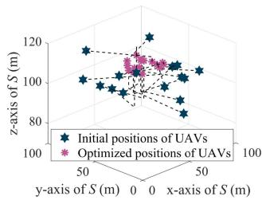

scatter

| Position Type              | X (y-axis, S (m)) | Y (x-axis, S (m)) | Z-axis (S (m)) |
| -------------------------- | ----------------- | ----------------- | -------------- |
| Initial positions of UAVs | 50                | 0                 | 100            |
| Optimized positions of UAVs | 50                | 0                 | 100            |

(f)

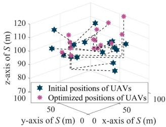  
(g)

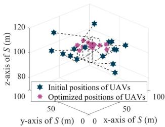

scatter

| Position Type              | X (y-axis, S (m)) | Y (x-axis, S (m)) | Z-axis (S (m)) |
| -------------------------- | ----------------- | ----------------- | -------------- |
| Initial positions of UAVs | 50                | 0                 | 120            |
| Optimized positions of UAVs | 50                | 0                 | 110            |

Fig. 6. Moving paths of UAVs obtained by various comparison algorithms in larger scale network. (a) LAA. (b) RAA. (c) MOPSO. (d) NSGA-II. (e) MODE. (f) MSSA. (g) IMODACH. (h) IMSSA.

For the sake of ease presentation, the Pareto solution distributions obtained by the proposed IMSSA and other comparison algorithms in smaller and larger scale networks are presented in Fig. 8. Specifically, the values of the points in the three dimensions correspond to the values obtained by the three optimization objective functions. It is apparent that the solutions obtained by the proposed IMSSA are closer to the direction of Pareto front (PF) owing to that the circle map-based solution initialization makes the distribution of the initial solutions more reasonable and the migration and adaptive mutation operator enhance the quality of each solution during the process of iterations. Moreover, the solution distributions imply that the proposed IMSSA is more appropriate for forming UVAA system.

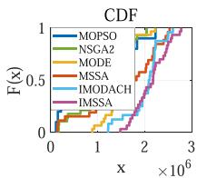

line

| x (×10⁶) | MOPSO | NSGA2 | MODE | MSSA | IMODACH | IMSSA |
| -------- | ----- | ----- | ---- | ---- | ------- | ----- |
| 0        | 0.0   | 0.0   | 0.0  | 0.0  | 0.0     | 0.0   |
| 1        | 0.5   | 0.5   | 0.5  | 0.5  | 0.5     | 0.5   |
| 2        | 1.0   | 1.0   | 1.0  | 1.0  | 1.0     | 1.0   |
| 3        | 1.0   | 1.0   | 1.0  | 1.0  | 1.0     | 1.0   |

(a)

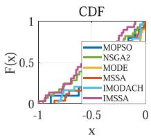

line

| x     | MOPSO | NSGA2 | MODE  | MSSA  | IMODACH | IMSSA |
|-------|-------|-------|-------|-------|---------|-------|
| -1.0  | 0.0   | 0.0   | 0.0   | 0.0   | 0.0     | 0.0   |
| -0.5  | 0.2   | 0.3   | 0.4   | 0.5   | 0.6     | 0.7   |
| 0.0   | 1.0   | 1.0   | 1.0   | 1.0   | 1.0     | 1.0   |

(b)

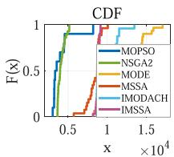

line

| x (×10⁴) | MOPSO | NSGA2 | MODE | MSSA | IMODACH | IMSSA |
| -------- | ----- | ----- | ---- | ---- | ------- | ----- |
| 0.5      | 0.5   | 0.5   | 0.5  | 0.5  | 0.5     | 0.5   |
| 1.0      | 1.0   | 1.0   | 1.0  | 1.0  | 1.0     | 1.0   |
| 1.5      | 1.0   | 1.0   | 1.0  | 1.0  | 1.0     | 1.0   |

(c）

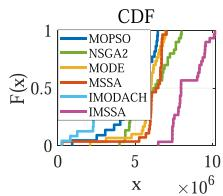

line

| x (×10⁶) | MOPSO | NSGA2 | MODE | MSSA | IMODACH | IMSSA |
| -------- | ----- | ----- | ---- | ---- | ------- | ----- |
| 0        | 0     | 0     | 0    | 0    | 0       | 0     |
| 5        | 0.5   | 0.5   | 0.5  | 0.5  | 0.5     | 0.5   |
| 10       | 1     | 1     | 1    | 1    | 1       | 1     |

(d)

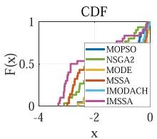

line

| x    | MOPSO | NSGA2 | MODE | MSSA | IMODACH | IMSSA |
| ---- | ----- | ----- | ---- | ---- | ------- | ----- |
| -4   | 0.0   | 0.0   | 0.0  | 0.0  | 0.0     | 0.0   |
| -2   | 0.5   | 0.5   | 0.5  | 0.5  | 0.5     | 0.5   |
| 0    | 1.0   | 1.0   | 1.0  | 1.0  | 1.0     | 1.0   |

(e)

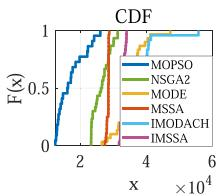

line

| x (×10⁴) | MOPSO | NSGA2 | MODE | MSSA | IMODACH | IMSSA |
| -------- | ----- | ----- | ---- | ---- | ------- | ----- |
| 0        | 0     | 0     | 0    | 0    | 0       | 0     |
| 1        | 0.5   | 0.5   | 0.5  | 0.5  | 0.5     | 0.5   |
| 2        | 1     | 1     | 1    | 1    | 1       | 1     |
| 3        | 1     | 1     | 1    | 1    | 1       | 1     |
| 4        | 1     | 1     | 1    | 1    | 1       | 1     |
| 5        | 1     | 1     | 1    | 1    | 1       | 1     |
| 6        | 1     | 1     | 1    | 1    | 1       | 1     |

(f)   
Fig. 7. CDFs obtained by the proposed IMSSA and other comparison algorithms. (a) $f _ { 1 }$ in smaller scale network. (b) $f _ { 2 }$ in smaller scale network. (c) $f _ { 3 }$ in smaller scale network. $( \mathrm { d } ) f _ { 1 }$ in larger scale network. (e) $f _ { 2 }$ in larger scale network. (f) $f _ { 3 }$ in larger scale network.

TABLE II NUMERICAL OPTIMIZATION RESULTS OBTAINED BY VARIOUS BENCHMARKS IN SMALLER SCALE NETWORK 

<table><tr><td>Methods</td><td> $f_1$  (bps)</td><td> $f_2$  (dB)</td><td> $f_3$  (J)</td></tr><tr><td>LAA</td><td> $7.23 \times 10^5$ </td><td>0</td><td> $9.10 \times 10^3$ </td></tr><tr><td>RAA</td><td> $2.42 \times 10^6$ </td><td>0</td><td> $9.04 \times 10^3$ </td></tr><tr><td>MOPSO</td><td> $1.83 \times 10^6$ </td><td>-0.62</td><td> $8.19 \times 10^3$ </td></tr><tr><td>NSGA-II</td><td> $1.73 \times 10^6$ </td><td>-0.61</td><td> $4.33 \times 10^3$ </td></tr><tr><td>MODE</td><td> $1.65 \times 10^6$ </td><td>-0.49</td><td> $1.09 \times 10^5$ </td></tr><tr><td>MSSA</td><td> $2.20 \times 10^6$ </td><td>-0.04</td><td> $8.72 \times 10^3$ </td></tr><tr><td>IMODACH</td><td> $2.17 \times 10^6$ </td><td>-0.66</td><td> $1.12 \times 10^4$ </td></tr><tr><td>IMSSA</td><td> $2.23 \times 10^6$ </td><td>-0.78</td><td> $9.13 \times 10^3$ </td></tr></table>

The bold entities denote the optimal results among all the data which is obtained by different schemes.

TABLE III NUMERICAL OPTIMIZATION RESULTS OBTAINED BY VARIOUS BENCHMARKS IN LARGER SCALE NETWORK 

<table><tr><td>Methods</td><td> $f_{1}$  (bps)</td><td> $f_{2}$  (dB)</td><td> $f_{3}$  (J)</td></tr><tr><td>LAA</td><td> $3.40 \times 10^{6}$ </td><td>0</td><td> $3.46 \times 10^{4}$ </td></tr><tr><td>RAA</td><td> $9.52 \times 10^{6}$ </td><td>0</td><td> $3.46 \times 10^{4}$ </td></tr><tr><td>MOPSO</td><td> $6.33 \times 10^{6}$ </td><td>-2.03</td><td> $\mathbf{2.23} \times \mathbf{10^{4}}$ </td></tr><tr><td>NSGA-II</td><td> $8.00 \times 10^{6}$ </td><td>-1.67</td><td> $3.00 \times 10^{4}$ </td></tr><tr><td>MODE</td><td> $6.93 \times 10^{6}$ </td><td>-2.03</td><td> $3.36 \times 10^{4}$ </td></tr><tr><td>MSSA</td><td> $6.03 \times 10^{6}$ </td><td>-2.07</td><td> $2.80 \times 10^{4}$ </td></tr><tr><td>IMODACH</td><td> $4.41 \times 10^{6}$ </td><td>-1.70</td><td> $4.02 \times 10^{4}$ </td></tr><tr><td>IMSSA</td><td> $\mathbf{1.01} \times \mathbf{10^{7}}$ </td><td>-2.09</td><td> $3.39 \times 10^{4}$ </td></tr></table>

The bold entities denote the optimal results among all the data which is obtained by different schemes.

In conclusion, it is more appropriate to deploy a larger scale network if a higher worst-case secrecy rate or a higher minimum SLL is required since the obtained worst-case secrecy rate of a smaller scale network is less than half that of a larger scale network. Moreover, deploying a smaller scale network is more reasonable for diminishing the flight energy consumption of UAVs.

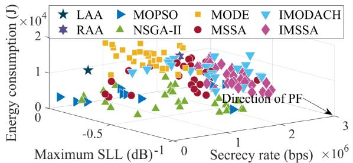

scatter

| Algorithm | Maximum SLL (dB)⁻¹ ×10⁶ | Secrecy rate (bps) ×10⁶ | Energy consumption (J) ×10⁴ |
|-----------|--------------------------|--------------------------|------------------------------|
| LAA       | -0.5                     | 0                        | 1                            |
| MOPSO     | -0.5                     | 0                        | 0.5                          |
| MODE      | 0                        | 0                        | 2                            |
| IMODACH   | 0                        | 0                        | 1                            |
| RAA       | 0                        | 0                        | 0.5                          |
| NSGA-II   | 0                        | 0                        | 0.5                          |
| MSSA      | 0                        | 0                        | 0.5                          |
| IMSSA     | 0                        | 0                        | 0.5                          |

(a)   
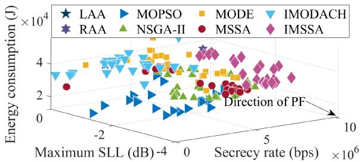

scatter

| Method   | Energy consumption (J) | Secrecy rate (bps) |
| -------- | ---------------------- | ------------------ |
| LAA      | ~2×10⁴                 | ~-2×10⁶            |
| MOPSO    | ~3×10⁴                 | ~-4×10⁶            |
| MODE     | ~4×10⁴                 | ~0–5×10⁶           |
| IMODACH  | ~3×10⁴                 | ~-2×10⁶            |
| RAA      | ~2×10⁴                 | ~0–5×10⁶           |
| NSGA-II  | ~1×10⁴                 | ~-2×10⁶            |
| MSSA     | ~2×10⁴                 | ~0–5×10⁶           |
| IMSSA    | ~3×10⁴                 | ~-2×10⁶            |

(b)

Fig. 8. Solution distributions obtained by different comparison algorithms in smaller and larger scale networks.   
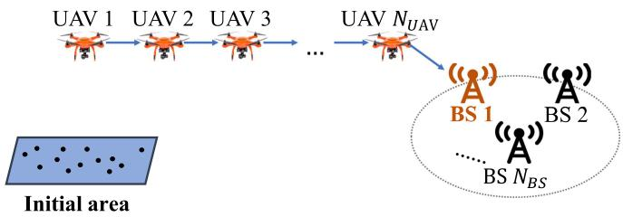

flowchart

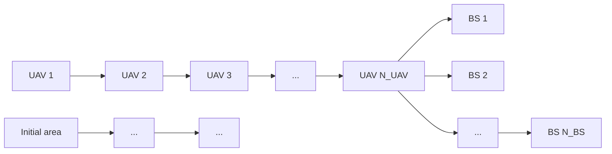

Fig. 9. A UAV-enabled multi-hop relay system.

TABLE IV PERFORMANCE COMPARISON BETWEEN DIFFERENT COMMUNICATION STRATEGY 

<table><tr><td rowspan="2">Schemes</td><td colspan="2">Smaller scale network</td><td colspan="2">Larger scale network</td></tr><tr><td> $f_1$  (bps)</td><td> $f_3$  (J)</td><td> $f_1$  (bps)</td><td> $f_3$  (J)</td></tr><tr><td>Multi-hop relay</td><td>0</td><td> $8.13 \times 10^4$ </td><td> $|0$ </td><td> $2.11 \times 10^5$ </td></tr><tr><td>UVAA-enabled relay</td><td> $2.23 \times 10^6$ </td><td> $9.13 \times 10^3$ </td><td> $|1.01 \times 10^7$ </td><td> $3.39 \times 10^4$ </td></tr></table>

The bold entities denote the optimal results among all the data which is obtained by different schemes.

3) Comparison With Relay Strategy: We utilize the UAVbased multi-hop relay system for the sake of making comparisons with the proposed UVAA system, and the sketch map of the multi-hop relay is shown in Fig. 9. Specifically, multiple UAVs are uniformly deployed between the initial area and the location of the receiver BS, and all the UAVs have the same altitude of $h _ { a }$ [57]. The free space channel model is adopted for modeling the aerial communications. Moreover, we assume the location of known eavesdroppers is perfectly detected by the UAVs in the considered multi-hop scenario. Note that the worst-case secrecy rate in the multi-hop transmission process is the minimum secrecy rate among different pairs of hops.

TABLE V NUMERICAL RESULTS OBTAINED BY THE TWO BENCHMARK SCHEMES 

<table><tr><td rowspan="2">Schemes</td><td colspan="3">Smaller scale network</td><td colspan="3">Larger scale network</td></tr><tr><td> $f_1$  (bps)</td><td> $f_2$  (dB)</td><td> $f_3$  (J)</td><td> $f_1$  (bps)</td><td> $f_2$  (dB)</td><td> $f_3$  (J)</td></tr><tr><td>Optimizing without  $\mathcal{K}\mathcal{E}$ </td><td> $1.50 \times 10^6$ </td><td>-0.51</td><td> $7.72 \times 10^3$ </td><td> $9.34 \times 10^6$ </td><td>-1.94</td><td> $3.27 \times 10^4$ </td></tr><tr><td>Optimizing without  $\mathcal{U}\mathcal{E}$ </td><td> $1.84 \times 10^6$ </td><td>-0.14</td><td> $\mathbf{6.02 \times 10^{3}}$ </td><td> $8.03 \times 10^6$ </td><td>-0.88</td><td> $\mathbf{2.80 \times 10^{4}}$ </td></tr><tr><td>Optimizing the original SCMOP</td><td> $\mathbf{2.23 \times 10^6}$ </td><td>-0.78</td><td> $9.13 \times 10^3$ </td><td> $\mathbf{1.01 \times 10^7}$ </td><td>-2.09</td><td> $3.39 \times 10^4$ </td></tr></table>

The bold entities denote the optimal results among allthe data which is obtained by different schemes.

Table IV presents the simulation results obtained by the multihop relay and UVAA-enabled relay, respectively. It is perceived that the worst-case secrecy rates obtained by multi-hop relay are 0 in smaller and larger scale network. The reason may be that the maximum transmission rate obtained by the several known eavesdroppers is higher than the counterpart of the receiver BS. Moreover, compared with the UVAA-enabled relay, the conventional multi-hop relay consumes more energy since the UAVs will fly to remote positions to form a multi-hop relay. Therefore, the conventional multi-hop relay is not suitable to achieve long-distance transmission.

4) Results Without Optimizing KE and UE: In SCMOP, the existence of the known eavesdroppers with imperfect location information and the unknown eavesdroppers is taken into consideration. To illustrate the reasonability and validity of the abovementioned considerations, we present two benchmark schemes of the formulated SCMOP and carry out simulations in this part.

The two benchmark schemes are illustrated as follows. The first benchmark scheme is to solve the formulated SCMOP without taking the KE into consideration. In other words, the first optimization objective function is converted into the received rate of the receiver BS maximization problem which is described as $f _ { 1 } ( \mathbb { X } ^ { \mathcal { U } } , \mathbb { Y } ^ { \mathcal { U } } , \mathbb { Z } ^ { \mathcal { U } } , \mathbb { I } ^ { \mathcal { U } } , \mathbb { B } ) = R _ { B S }$ , and then the ( ) =minimum worst-case secrecy rate is obtained through subtracting the received rate of the KE from the received rate of the receiver BS. Moreover, the second benchmark scheme is to ignore the existence of U E, that is to say, the second optimization objective function of the formulated SCMOP is not taken into account and thus the formulated SCMOP can be reformulated as min $F = \{ - f _ { 1 } , f _ { 3 } \}$ . Note that the two benchmark schemes {X} are solved through utilizing the proposed IMSSA.

Table V presents the comparison results of the two abovementioned benchmark schemes and the original SCMOP. It can be seen that the secrecy rates obtained by the two different benchmark schemes are lower than the counterparts of the original SCMOP, and the minimum SLLs of the two benchmark schemes are higher than the results which are obtained by optimizing the original SCMOP, which implies us that considering the known and unknown eavesdroppers is indispensable since it will enhance the security performance of the UVAA system. Moreover, there is an interesting finding that the flight energy consumption when solving the two benchmark schemes is lower than the results that are obtained through optimizing the original SCMOP, and the reason may be that the UAVs will not fly to the optimal locations for executing data transmission so that the moving distances of UAVs maintain at a low level. Clearly, optimizing the original SCMOP will achieve decent secure performance compared with the two benchmark schemes. In conclusion, optimizing the KE and UE is necessary.

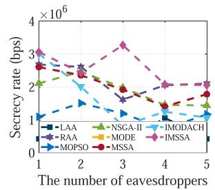

line

| The number of eavesdroppers | LAA    | NSGA-II | RAA    | MODE   | IMODACH | IMSSA  | MOPSO  | MSSA   |
| --------------------------- | ------ | ------- | ------ | ------ | ------- | ------ | ------ | ------ |
| 1                           | 1.0e6  | 2.5e6   | 2.8e6  | 2.7e6  | 2.6e6   | 3.0e6  | 1.0e6  | 2.7e6  |
| 2                           | 1.2e6  | 2.0e6   | 2.5e6  | 2.4e6  | 2.3e6   | 2.8e6  | 1.2e6  | 2.5e6  |
| 3                           | 1.4e6  | 1.8e6   | 2.3e6  | 2.2e6  | 2.1e6   | 3.2e6  | 1.4e6  | 2.3e6  |
| 4                           | 1.6e6  | 1.6e6   | 2.1e6  | 2.0e6  | 1.9e6   | 2.5e6  | 1.6e6  | 2.1e6  |
| 5                           | 1.8e6  | 1.4e6   | 1.9e6  | 1.8e6  | 1.7e6   | 2.0e6  | 1.8e6  | 1.9e6  |

(a)

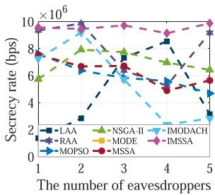

line

| The number of eavesdroppers | LAA    | NSGA-II | RAA    | IMODACH | MODE   | MOPSO  | MSSA   |
| --------------------------- | ------ | ------- | ------ | ------- | ------ | ------ | ------ |
| 1                           | 7.0e6  | 6.0e6   | 9.0e6  | 8.0e6   | 7.0e6  | 7.0e6  | 9.0e6  |
| 2                           | 7.0e6  | 8.0e6   | 9.0e6  | 7.0e6   | 7.0e6  | 7.0e6  | 9.0e6  |
| 3                           | 7.0e6  | 8.0e6   | 9.0e6  | 6.0e6   | 7.0e6  | 7.0e6  | 9.0e6  |
| 4                           | 7.0e6  | 8.0e6   | 9.0e6  | 5.0e6   | 7.0e6  | 7.0e6  | 9.0e6  |
| 5                           | 7.0e6  | 8.0e6   | 9.0e6  | 4.0e6   | 7.0e6  | 7.0e6  | 9.0e6  |

(b)

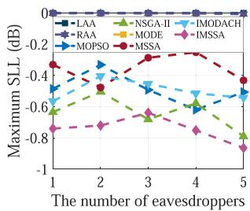

line

| The number of eavesdroppers | LAA | NSGA-II | IMODACH | RAA | MODE | IMSSA | MOPSO | MSSA |
|---|---|---|---|---|---|---|---|---|
| 1 | -0.05 | -0.62 | -0.48 | -0.35 | -0.75 | -0.82 | -0.45 | -0.35 |
| 2 | -0.05 | -0.58 | -0.45 | -0.38 | -0.72 | -0.78 | -0.42 | -0.38 |
| 3 | -0.05 | -0.55 | -0.48 | -0.42 | -0.68 | -0.75 | -0.48 | -0.32 |
| 4 | -0.05 | -0.58 | -0.52 | -0.45 | -0.65 | -0.78 | -0.52 | -0.28 |
| 5 | -0.05 | -0.62 | -0.55 | -0.48 | -0.62 | -0.82 | -0.55 | -0.35 |

(c)

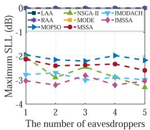

line

| The number of eavesdroppers | LAA    | NSGA-II | IMODACH | RAA    | MODE   | MOPSO  | MSSA   |
| --------------------------- | ------ | ------- | ------- | ------ | ------ | ------ | ------ |
| 1                           | -0.1   | -0.3    | -0.3    | -0.1   | -0.3   | -0.2   | -0.3   |
| 2                           | -0.1   | -0.3    | -0.3    | -0.1   | -0.3   | -0.2   | -0.3   |
| 3                           | -0.1   | -0.3    | -0.3    | -0.1   | -0.3   | -0.2   | -0.3   |
| 4                           | -0.1   | -0.3    | -0.3    | -0.1   | -0.3   | -0.2   | -0.3   |
| 5                           | -0.1   | -0.3    | -0.3    | -0.1   | -0.3   | -0.2   | -0.3   |

(d)

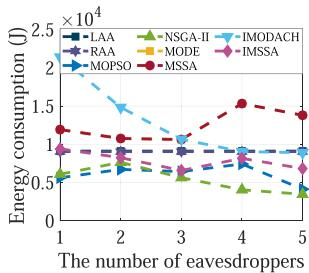

line

| The number of eavesdroppers | LAA    | NSGA-II | IMODACH | RRA    | MODE   | IMSSA  | MOPSO  | MSSA   |
| --------------------------- | ------ | ------- | ------- | ------ | ------ | ------ | ------ | ------ |
| 1                           | 0.6    | 0.7     | 2.3     | 0.8    | 0.9    | 1.0    | 0.7    | 1.2    |
| 2                           | 0.7    | 0.6     | 1.5     | 0.9    | 0.8    | 0.9    | 0.8    | 1.0    |
| 3                           | 0.8    | 0.5     | 1.0     | 0.9    | 0.7    | 0.8    | 0.7    | 1.1    |
| 4                           | 0.9    | 0.4     | 0.9     | 0.8    | 0.6    | 0.7    | 0.6    | 1.5    |
| 5                           | 0.8    | 0.3     | 0.8     | 0.7    | 0.5    | 0.6    | 0.5    | 1.4    |

(e)

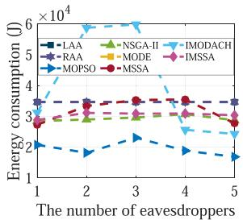

line

| The number of eavesdroppers | LAA    | NSGA-II | IMODACH | RAA    | MODE   | IMSSA  | MOPSO  | MSSA   |
| --------------------------- | ------ | ------- | ------- | ------ | ------ | ------ | ------ | ------ |
| 1                           | 3.0e4  | 3.0e4   | 3.0e4   | 3.0e4  | 3.0e4  | 3.0e4  | 2.0e4  | 3.0e4  |
| 2                           | 3.0e4  | 3.0e4   | 6.0e4   | 3.0e4  | 3.0e4  | 3.0e4  | 2.0e4  | 3.0e4  |
| 3                           | 3.0e4  | 3.0e4   | 6.0e4   | 3.0e4  | 3.0e4  | 3.0e4  | 2.0e4  | 3.0e4  |
| 4                           | 3.0e4  | 3.0e4   | 6.0e4   | 3.0e4  | 3.0e4  | 3.0e4  | 2.0e4  | 3.0e4  |
| 5                           | 3.0e4  | 3.0e4   | 6.0e4   | 3.0e4  | 3.0e4  | 3.0e4  | 2.0e4  | 3.0e4  |

(f)   
Fig. 10. Performance analysis of the UVAA system under different number of eavesdroppers. (a) f1 in smaller scale network. (b) $f _ { 1 }$ in larger scale network. (c) $f _ { 2 }$ in smaller scale network. (d)f2 in larger scale network. (e) $f _ { 3 }$ in smaller scale network. (f) f3 in larger scale network.

5) Results With Different Number of Eavesdroppers: In this part, different numbers of eavesdroppers in the scenario are considered. Specifically, we assume that the numbers of known eavesdroppers $( \mathrm { i } . \mathrm { e } . , N _ { K E } )$ range from 1 to 5, and the locations of them are also randomly generated according to NKE.

Fig. 10 shows the performance analysis of the UVAA system under different numbers of eavesdroppers. It is observed that the stability of the benchmark schemes is relatively poor, and the performance of these schemes will be greatly influenced by the eavesdroppers, especially for LAA and RAA. However, compared with other schemes, the performance of the proposed IMSSA is more stable, especially in larger scale networks. Moreover, when only focusing on the results obtained by the proposed IMSSA, it will be found that the increasing in the number of eavesdroppers will not pose too much threat to the security performance of the system. The reason is that the formulated SCMOP considers to diminish the maximum achievable rate of each eavesdropper as much as possible.

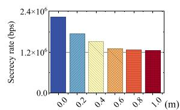

bar

| Time (m) | Secrecy rate (bps) |
| -------- | ------------------ |
| 0.0      | 2.4×10⁶            |
| 0.2      | 1.8×10⁶            |
| 0.4      | 1.6×10⁶            |
| 0.6      | 1.4×10⁶            |
| 0.8      | 1.3×10⁶            |
| 1.0      | 1.2×10⁶            |

(a)

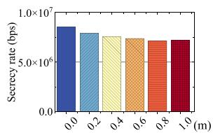

bar

| Threshold | Secrecy rate (bps) |
| --------- | ------------------ |
| 0.0       | 8.5e6              |
| 0.2       | 7.5e6              |
| 0.4       | 7.0e6              |
| 0.6       | 6.8e6              |
| 0.8       | 6.5e6              |
| 1.0       | 6.3e6              |

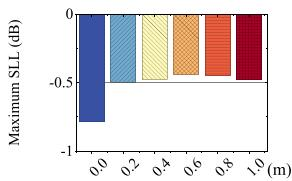

bar

| x (m) | Maximum SLL (dB) |
| ----- | ---------------- |
| 0.0   | -0.8             |
| 0.2   | -0.5             |
| 0.4   | -0.5             |
| 0.6   | -0.3             |
| 0.8   | -0.2             |
| 1.0   | -0.2             |

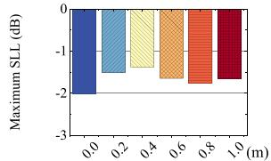

bar

| m (m) | Maximum SLL (dB) |
| ----- | ---------------- |
| 0.0   | -2.5             |
| 0.2   | -1.8             |
| 0.4   | -1.5             |
| 0.6   | -1.7             |
| 0.8   | -1.9             |
| 1.0   | -2.1             |

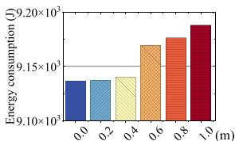

bar

| Distance (m) | Energy consumption (J) |
| ------------ | ---------------------- |
| 0.0          | 9.15×10³               |
| 0.2          | 9.15×10³               |
| 0.4          | 9.15×10³               |
| 0.6          | 9.17×10³               |
| 0.8          | 9.18×10³               |
| 1.0          | 9.20×10³               |

(e)

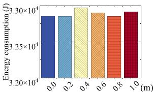

bar

| x (m) | Energy consumption (J) |
| ----- | ---------------------- |
| 0.0   | 3.28×10⁴               |
| 0.2   | 3.28×10⁴               |
| 0.4   | 3.30×10⁴               |
| 0.6   | 3.29×10⁴               |
| 0.8   | 3.28×10⁴               |
| 1.0   | 3.29×10⁴               |

(f)   
Fig. 11. Performance analysis of the UVAA system influenced by position jitters of UAVs. (a) f1 in smaller scale network. (b) $f _ { 1 }$ in larger scale network. (c) $f _ { 2 }$ in smaller scale network. (d) f2 in larger scale network. (e) f3 in smaller scale network. (f) f3 in larger scale network.

# C. Performance Analysis Under Unexpected Circumstances

In this part, the performance of the UVAA system under several unexpected circumstances is further appraised. According to the central limit theorem [58], the simulations in Sections VI-C1, VI-C2 and VI-C3 are carried out 50 times independently for avoiding the random bias, and the average values are adopted, e.g., the position jitters of UAVs is executed 50 times for the same solution.

1) Impact of Position Jitters of UAVs: The position jitters of UAVs caused by the effect of wind, rainstorm, airflow, etc., will inevitably yield a non-negligible impact on the UAV-enabled communication system [59]. Therefore, we conduct simulations to evaluate the aforementioned impact, where we leverage normal distribution to generate random jitters and the maximum jitters in 3D directions are designed to be 0.2 m, 0.4 m, 0.6 m, 0.8 m and 1.0 m [60], respectively.

Fig. 11 intuitively demonstrates the impact brought by the position jitters of UAVs. Specifically, Fig. 11(a) and (b) illustrate that the worst-case secrecy rate tends to decline gently once the positions jitters occur, and Fig. 11(c) and (d) show that the positions jitters also have an unfavourable impact on the maximum SLL, i.e., the maximum SLL increases when the positions jitters occur. From Fig. 11(e) and (f), it is found that the flight energy consumption of UAVs increases slightly due to the positions jitters.

Moreover, we also conduct comparisons between the smaller and larger scale networks under position jitters of UAVs. On the one hand, it is shown that the tendency of all the corresponding subfigures in smaller and larger scale networks is similiar, which implies that the impact of position jitters of UAVs on different scale networks is similar. On the other hand, we can find that the larger scale network has superior security performance concerning the UVAA system when position jitters of UAVs occur, and the reason may be that the performance of the collaborative system will be affected by the number of elements and the system with more components is more resistant to the occurrence of position jitters of UAVs.

In conclusion, the performance of the UVAA system will be slightly impacted by the positions jitters of UAVs. Moreover, it can be seen that the UVAA system still has comparatively superior performance when the position jitters happen.

2) Impact of Imperfect Phase Synchronization: The phases of the UAVs determine the beam pattern of the UVAA system, thus imperfect phase synchronization can significantly deteriorate the performance of the UVAA system. Therefore, we conduct simulations to evaluate how the imperfect phase synchronization affects the system. Accordingly, in this case, the AF with imperfect phase synchronization $( F _ { \zeta } )$ can be redefined as follows [61]:

$$
F _ {\zeta} (\theta , \phi) = \sum_ {i = 1} ^ {N _ {U A V}} I _ {i} e ^ {i _ {u} \left[ k _ {c} (x _ {i} ^ {U} \sin \theta \cos \phi + y _ {i} ^ {U} \sin \theta \sin \phi + z _ {i} ^ {U} \cos \theta) + \zeta_ {i} \right]}, \tag {26}
$$

where $\zeta _ { i }$ represents the phase error which is brought by the imperfect phase synchronization and it obeys the Tikhonov distribution [62]. Specifically, the PDF of Tikhonov distribution is shown as follows [63]:

$$
f _ {\zeta} (\zeta) = \frac {1}{2 \pi I _ {0} (\frac {1}{\sigma_ {\zeta} ^ {2}})} e ^ {\frac {\cos (\zeta)}{\sigma_ {\zeta} ^ {2}}}, \tag {27}
$$

where $| \zeta | < \pi , I _ { \alpha } ( i )$ refers to the α-th order modified Bessel ( )function of the first kind. Moreover, $\sigma _ { \zeta } ^ { 2 }$ signifies the variance of the phase error and it can be depicted as $\begin{array} { r } { \sigma _ { \zeta } ^ { 2 } = \frac { 1 } { \gamma } , \gamma } \end{array}$ is a constant which can determine the error size.

Fig. 12(a), (b), (c) and (d) manifest that both the worst-case secrecy rate and maximum SLL will be influenced by the phase errors and they tends to increase with the increasing of $\gamma$ . The reason is that a large γ denotes a small variance of the phase error. Moreover, Fig. 12(e) and (f) signify that the flight energy consumption is not affected by the imperfect phase synchronization as it is only related to the locations of UAVs. Generally speaking, the imperfect phase synchronization has a mild impact on the performance of the UVAA system. However, the impact will be alleviated since the synchronization algorithms are proposed gradually.

3) Impact of a Damaged UAV: In this part, the fortuitous circumstance that one of the UAVs is damaged is taken into account. Under such a circumstance, the damaged UAV is not capable of participating in the transmission process of the UVAA system and the other UAVs continue to execute the transmission assignment. Note that we only take into account that the UAV is damaged before carrying out a transmission assignment and the unexpected situation that the UAV is damaged during the transmission process will be left for our future research work.

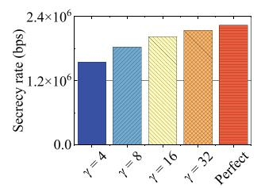

bar

| γ     | Secrecy rate (bps) |
|-------|---------------------|
| γ = 4 | 1.2×10⁶             |
| γ = 8 | 1.5×10⁶             |
| γ = 16| 1.7×10⁶             |
| γ = 32| 1.9×10⁶             |
| Perfect| 2.1×10⁶             |

(a)

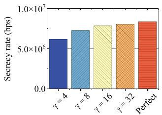

bar

| γ       | Secrecy rate (bps) |
| ------- | ------------------ |
| γ = 4   | 6.0×10⁶            |
| γ = 8   | 7.5×10⁶            |
| γ = 16  | 8.0×10⁶            |
| γ = 32  | 8.5×10⁶            |
| Perfect | 9.0×10⁶            |

(b)

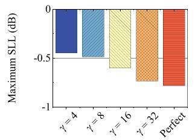

bar

| γ       | Maximum SLL (dB) |
| ------- | ---------------- |
| 4       | -0.5             |
| 8       | -0.5             |
| 16      | -0.7             |
| 32      | -0.8             |
| Perfect | -1.0             |

(c）

bar

| γ       | Maximum SLL (dB) |
| ------- | ---------------- |
| γ = 4   | -1.5             |
| γ = 8   | -1.8             |
| γ = 16  | -2.0             |
| γ = 32  | -2.2             |
| Perfect | -2.5             |

(d)

bar

| Category   | Energy consumption (J) |
| ---------- | ---------------------- |
| γ = 4      | 1.0×10⁴                |
| γ = 8      | 1.0×10⁴                |
| γ = 16     | 1.0×10⁴                |
| γ = 32     | 1.0×10⁴                |
| Perfect    | 1.0×10⁴                |

(e)

bar

| Category | Energy consumption (J) |
| -------- | ---------------------- |
| γ = 4    | 3.30×10⁴               |
| γ = 8    | 3.30×10⁴               |
| γ = 16   | 3.30×10⁴               |
| γ = 32   | 3.30×10⁴               |
| Perfect  | 3.30×10⁴               |

(f)

Fig. 12. Performance analysis of the UVAA system influenced by imperfect phase synchronization. (a) $f _ { 1 }$ in smaller scale network. (b) $f _ { 1 }$ in larger scale network. (c) $f _ { 2 }$ in smaller scale network. (d) $f _ { 2 }$ in larger scale network. (e) f3 in smaller scale network. (f) $f _ { 3 }$ in larger scale network.   

bar

| Category       | Secrecy rate (bps) |
| -------------- | ------------------ |
| Perfect Damage | 2.4×10⁶            |
| Other          | 0.8×10⁶            |

bar

| Category       | Maximum SLL (dB) |
| -------------- | ---------------- |
| Perfect Damage | -0.8             |
| Unlabeled      | -0.2             |

(b)

bar

| Condition | Energy consumption (J) |
| --------- | ---------------------- |
| Perfect   | 9.1×10³                |
| Damage    | 8.9×10³                |

（c）

bar

| Category       | Secrecy rate (bps) |
| -------------- | ------------------ |
| Perfect Damage | 8.5×10⁶            |
| Damage         | 1.0×10⁶            |

(d)

bar

| Category       | Maximum SLL (dB) |
| -------------- | ---------------- |
| Perfect Damage | -2.5             |
| Unlabeled      | -0.5             |

(e)

bar

| Category | Energy consumption (J) |
|---|---|
| Perfect | 3.3×10⁴ |
| Damage | 2.9×10⁴ |

(f)   
Fig. 13. Performance analysis of the UVAA system influenced by a damaged UAV. (a) $f _ { 1 }$ in smaller scale network. (b) $f _ { 1 }$ in larger scale network. (c) $f _ { 2 }$ in smaller scale network. (d) $f _ { 2 }$ in larger scale network. (e) $f _ { 3 }$ in smaller scale network. (f) $f _ { 3 }$ in larger scale network.

scatter

| Method   | Energy consumption (J) | Maximum SLL (dB) | Secrecy rate (bps) |
| -------- | ---------------------- | ---------------- | ------------------ |
| LAA      | ~1.5×10⁴               | ~-0.2×10⁶        | ~0                 |
| MOPSO    | ~1.2×10⁴               | ~-0.3×10⁶        | ~-0.5×10⁶          |
| MODE     | ~1.8×10⁴               | ~-0.1×10⁶        | ~-0.2×10⁶          |
| IMODACH  | ~2.0×10⁴               | ~-0.4×10⁶        | ~-0.6×10⁶          |
| RAA      | ~0.8×10⁴               | ~-0.5×10⁶        | ~-0.7×10⁶          |
| NSGA-II  | ~0.6×10⁴               | ~-0.6×10⁶        | ~-0.8×10⁶          |
| MSSA     | ~0.9×10⁴               | ~-0.3×10⁶        | ~-0.4×10⁶          |
| IMSSA    | ~1.3×10⁴               | ~-0.2×10⁶        | ~-0.3×10⁶          |

(a)   

scatter

| Method   | Maximum SLL (dB) | Secrecy rate (bps) | Energy consumption (J) |
|----------|------------------|--------------------|------------------------|
| LAA      | -2               | 0                  | 4e4                    |
| MOPSO    | -1               | 1e7                | 2e4                    |
| MODE     | 0                | 2e7                | 4e4                    |
| IMODACH  | 1                | 3e7                | 3e4                    |
| RAA      | -1               | 0                  | 3e4                    |
| NSGA-II  | -2               | 0                  | 2e4                    |
| MSSA     | -1               | 0                  | 3e4                    |
| IMSSA    | 1                | 2e7                | 3e4                    |

(b)   
Fig. 14. Distribution concerning Pareto solutions obtained by the proposed IMSSA and other benchmark algorithms in heterogeneous network. (a) Smaller scale network. (b) Larger scale network.

Fig. 13 shows the performance of the UVAA system when a UAV is damaged. Specifically, Fig. 13(a) and (b) signify that the worst-case secrecy rate is strongly impacted by the damaged UAV, and Fig. 13(c) and (d) manifest that the maximum SLL will be increased if a UAV is damaged among the UAV swarm. Moreover, it is reasonable that the flight energy consumption of UAVs is diminished since the damaged UAV is no longer assisting the communication process, as shown in Fig. 13(e) and (f). It is found that the performance of the UVAA system will be significantly influenced if a UAV is damaged. However, the probability that one of the UAVs is damaged is low if proper operations, sufficient energy and well-conditioned hardware equipment of UAVs are guaranteed.

Accordingly, it can be observed from Figs. 11, 12 and 13 that the abovementioned unexpected circumstances have an effect on the performance of the UVAA system since the uncertain factors will inevitably influence the beam pattern of the UVAA system. Moreover, it is observed that the UVAA system still has comparatively decent performance under the unexpected circumstances compared with other benchmark strategies. Thus, the proposed strategy has certain robustness.

4) Impact of Heterogeneous UAVs: The deployed UAVs may be heterogeneous in some scenarios, e.g., the post-disaster rescue. Thus, we carry out simulations to estimate the effectiveness and superiority of the proposed CB-based approach with heterogeneous UAVs in this part. Specifically, the maximum transmit power of each UAV obeys the normal distribution between 0.1 W and 1 W.

Fig. 14 presents the solution distribution obtained by the proposed IMSSA and other benchmark schemes in a heterogeneous UAV network. It can be found that the set of solutions which are obtained by the proposed IMSSA is closer to the direction of PF, which means that the proposed scheme can achieve superior performance even in the system with heterogeneous UAVs. Moreover, through making comparisons with Fig. 8, it is found that the worst-case secrecy rate obtained in heterogeneous UAV network is almost three times the worst-case secrecy rate obtained in original considered isomorphic UAV network. The reason is that the transmit power of each UAV is increased in the system with heterogeneous UAVs, so that enhancing the secrecy rate accordingly.

text_image

WIFI/BT
GPIO
PoE
ETHER NET
Processor
Display DSI
USB-C Power in
HDMI
Camera CSI
Video + audio

Fig. 15. Specific structure of Raspberry Pi.

# VII. EXPERIMENTAL IMPLEMENTATION

In this part, we conduct some preliminary experiments to demonstrate the feasibility of the proposed CB-based physical layer security communication strategy. Specifically, we use a Raspberry Pi to conduct experimental implementation and the specific structure of the device is shown in Fig. 15. Then, we port the codes of the proposed algorithm into the Raspberry Pi. Moreover, several commonly adopted conventional encryption/decryption security schemes are introduced to make comparisons, including two common symmetric-key algorithms which are advanced encryption standard (AES) and data encryption standard (DES), and one asymmetric-key algorithm which is Rivest Shamir Adleman (RSA). Note that the evaluation of the complete system framework is not carried out since several previous works have implemented the whole UAV-enabled CB communication prototype system, which has shown the feasibility of utilizing CB in UAV networks [34], [35], [36].

The corresponding experiment results are presented as follows. First, one execution time of the proposed IMSSA is 32.92 s, which is an acceptable duration and demonstrates the practicality and feasibility of the proposed approach in real-world scenario. Second, the encryption times required by AES, DES and RSA to encrypt 200 MB data are 12.019 s, 9.263 s and 1567.727 s, respectively. As can be observed, the execution time of the proposed IMSSA is three times that of the symmetric-key algorithms. However, it is well known that the execution times of the aforementioned encryption algorithms increase with the scale of encrypted data becomes larger, which implies that the symmetric-key algorithms are not appropriate for the scenarios with large amount of data. Moreover, the execution time of the asymmetric-key algorithm is too long, which is infeasible for the UAVs with limited hardware resources since too much hovering energy will be consumed during the computing process. Thus, the proposed CB-based physical layer security communication strategy can be run efficiently in the device with low computation ability (i.e., UAVs), and it is more suitable to be applied in real-world scenarios with large-scale data compared with the conventional encryption/decryption algorithms, since the CBbased approach does not need the complex data encryption and decryption process for each transmission.

# VIII. CONCLUSION

In this work, we studied the UAV-enabled secure communications in the presence of both unknown eavesdroppers and known eavesdroppers with imperfect location information. We formulated an SCMOP to achieve the maximization of the worst-case secrecy rate, the minimization of the maximum SLL as well as the minimization of the flight energy consumption of UAVs through jointly optimizing the optimal locations and excitation current weights of UAVs as well as determining a suitable receiver BS. Since the SCMOP was proven to be NP-hard and non-convex, we proposed an IMSSA to handle the aforementioned problem. Simulation results demonstrated that the proposed IMSSA is superior to many other benchmark strategies such as MOPSO, NSGA-II, MODE and MSSA in terms of improving the secure performance of the UVAA system. Moreover, the multi-hop relay was introduced to verify the reasonability of the UVAA system, and two benchmark schemes of the formulated SCMOP demonstrated the necessity of the formulated SCMOP. In addition, it was also validated that the proposed CB-based approach was robust even under certain unexpected circumstances. Finally, experimental implementation was carried out via the platform of Raspberry Pi and the practicality of the proposed CB-based approach in real-world scenarios was further illustrated.

# REFERENCES

[1] Y. Zeng, Q. Wu, and R. Zhang, “Accessing from the sky: A tutorial on UAV communications for 5G and beyond,” Proc. IEEE, vol. 107, no. 12, pp. 2327–2375, Dec. 2019.   
[2] Q. Wu et al., “A comprehensive overview on 5G-and-beyond networks with UAVs: From communications to sensing and intelligence,” IEEE J. Sel. Areas Commun., vol. 39, no. 10, pp. 2912–2945, Oct. 2021.   
[3] N. Zhao et al., “Caching UAV assisted secure transmission in hyper-dense networks based on interference alignment,” IEEE Trans. Commun., vol. 66, no. 5, pp. 2281–2294, May 2018.   
[4] Y. Ding et al., “Online edge learning offloading and resource management for UAV-assisted MEC secure communications,” IEEE J. Sel. Topics Signal Process., vol. 17, no. 1, pp. 54–65, Jan. 2023.   
[5] W. Lu et al., “Secure transmission for multi-UAV-assisted mobile edge computing based on reinforcement learning,” IEEE Trans. Netw. Sci. Eng., vol. 10, no. 3, pp. 1270–1282, May/Jun. 2023.   
[6] G. Chen, Q. Wu, R. Liu, J. Wu, and C. Fang, “IRS aided MEC systems with binary offloading: A unified framework for dynamic IRS beamforming,” IEEE J. Sel. Areas Commun., vol. 41, no. 2, pp. 349–365, Feb. 2023.   
[7] C. Zhong, J. Yao, and J. Xu, “Secure UAV communication with cooperative jamming and trajectory control,” IEEE Commun. Lett., vol. 23, no. 2, pp. 286–289, Feb. 2019.

[8] H. Yang, Z. Xiong, J. Zhao, D. Niyato, L. Xiao, and Q. Wu, “Deep reinforcement learning-based intelligent reflecting surface for secure wireless communications,” IEEE Trans. Wirel. Commun., vol. 20, no. 1, pp. 375–388, Jan. 2021.   
[9] S. Jayaprakasam, S. K. A. Rahim, and C. Y. Leow, “Distributed and collaborative beamforming in wireless sensor networks: Classifications, trends, and research directions,” IEEE Commun. Surv. Tut., vol. 19, no. 4, pp. 2092–2116, Fourth Quarter 2017.   
[10] Y. Gao, Q. Wu, G. Zhang, W. Chen, D. W. K. Ng, and M. D. Renzo, “Beamforming optimization for active intelligent reflecting surface-aided SWIPT,” IEEE Trans. Wirel. Commun., vol. 22, no. 1, pp. 362–378, Jan. 2023.   
[11] G. Sun et al., “Improving performance of distributed collaborative beamforming in mobile wireless sensor networks: A multi-objective optimization method,” IEEE Internet Things J., vol. 7, no. 8, pp. 6787–6801, Aug. 2020.   
[12] J. Li, H. Kang, G. Sun, S. Liang, Y. Liu, and Y. Zhang, “Physical layer secure communications based on collaborative beamforming for UAV networks: A multi-objective optimization approach,” in Proc. IEEE Conf. Comput. Commun., 2021, pp. 1–10.   
[13] Y. Zeng and R. Zhang, “Energy-efficient UAV communication with trajectory optimization,” IEEE Trans. Wirel. Commun., vol. 16, no. 6, pp. 3747–3760, Jun. 2017.   
[14] Y. Lin, T. Wang, and S. Wang, “UAV-assisted emergency communications: An extended multi-armed bandit perspective,” IEEE Commun. Lett., vol. 23, no. 5, pp. 938–941, May 2019.   
[15] Y. Zeng, X. Xu, and R. Zhang, “Trajectory design for completion time minimization in UAV-enabled multicasting,” IEEE Trans. Wirel. Commun., vol. 17, no. 4, pp. 2233–2246, Apr. 2018.   
[16] Z. Kang, C. You, and R. Zhang, “3D placement for multi-UAV relaying: An iterative Gibbs-sampling and block coordinate descent optimization approach,” IEEE Trans. Commun., vol. 69, no. 3, pp. 2047–2062, Mar. 2021.   
[17] M. Zhao, Q. Shi, and M. Zhao, “Efficiency maximization for UAV-enabled mobile relaying systems with laser charging,” IEEE Trans. Wirel. Commun., vol. 19, no. 5, pp. 3257–3272, May 2020.   
[18] K. Meng, Q. Wu, S. Ma, W. Chen, K. Wang, and J. Li, “Throughput maximization for UAV-enabled integrated periodic sensing and communication,” IEEE Trans. Wirel. Commun., vol. 22, no. 1, pp. 671–687, Jan. 2023.   
[19] X. Zhong, Y. Guo, N. Li, and Y. Chen, “Joint optimization of relay deployment, channel allocation, and relay assignment for UAVs-aided D2D networks,” IEEE/ACM Trans. Netw., vol. 28, no. 2, pp. 804–817, Apr. 2020.   
[20] M. Mozaffari, W. Saad, M. Bennis, and M. Debbah, “Communications and control for wireless drone-based antenna array,” IEEE Trans. Commun., vol. 67, no. 1, pp. 820–834, Jan. 2019.   
[21] G. Sun, J. Li, Y. Liu, S. Liang, and H. Kang, “Time and energy minimization communications based on collaborative beamforming for UAV networks: A multi-objective optimization method,” IEEE J. Sel. Areas Commun., vol. 39, no. 11, pp. 3555–3572, Nov. 2021.   
[22] J. Garza, M. A. Panduro, A. Reyna, G. Romero, and C. del Rio, “Design of UAVs-based 3D antenna arrays for a maximum performance in terms of directivity and SLL,” Int. J. Antennas Propag., vol. 2016, pp. 1–8, 2016.   
[23] F. Cheng, G. Gui, N. Zhao, Y. Chen, J. Tang, and H. Sari, “UAV-relayingassisted secure transmission with caching,” IEEE Trans. Commun., vol. 67, no. 5, pp. 3140–3153, May 2019.   
[24] T. Li et al., “Secure UAV-to-vehicle communications,” IEEE Trans. Commun., vol. 69, no. 8, pp. 5381–5393, Aug. 2021.   
[25] Y. Xu, T. Zhang, D. Yang, Y. Liu, and M. Tao, “Joint resource and trajectory optimization for security in UAV-assisted MEC systems,” IEEE Trans. Commun., vol. 69, no. 1, pp. 573–588, Jan. 2021.   
[26] S. Yan, S. V. Hanly, and I. B. Collings, “Optimal transmit power and flying location for UAV covert wireless communications,” IEEE J. Sel. Areas Commun., vol. 39, no. 11, pp. 3321–3333, Nov. 2021.   
[27] J. Tang, G. Chen, and J. P. Coon, “Secrecy performance analysis of wireless communications in the presence of UAV jammer and randomly located UAV eavesdroppers,” IEEE Trans. Inf. Forensics Secur., vol. 14, no. 11, pp. 3026–3041, Nov. 2019.   
[28] X. Liu, Y. Liu, and Y. Chen, “Reinforcement learning in multiple-UAV networks: Deployment and movement design,” IEEE Trans. Veh. Technol., vol. 68, no. 8, pp. 8036–8049, Aug. 2019.   
[29] C. Zhang, L. Zhang, L. Zhu, T. Zhang, Z. Xiao, and X. Xia, “3D deployment of multiple UAV-mounted base stations for UAV communications,” IEEE Trans. Commun., vol. 69, no. 4, pp. 2473–2488, Apr. 2021.

[30] W. Feng et al., “Joint 3D trajectory and power optimization for UAV-aided mmWave MIMO-NOMA networks,” IEEE Trans. Commun., vol. 69, no. 4, pp. 2346–2358, Apr. 2021.   
[31] I. Strumberger, N. Bacanin, S. Tomic, M. Beko, and M. Tuba, “Static drone placement by elephant herding optimization algorithm,” in Proc. IEEE 25th Telecommun. Forum, 2017, pp. 1–4.   
[32] J. Plachy, Z. Becvar, P. Mach, R. Marik, and M. Vondra, “Joint positioning of flying base stations and association of users: Evolutionary-based approach,” IEEE Access, vol. 7, pp. 11454–11463, 2019.   
[33] Y. Zeng, J. Xu, and R. Zhang, “Energy minimization for wireless communication with rotary-wing UAV,” IEEE Trans. Wirel. Commun., vol. 18, no. 4, pp. 2329–2345, Apr. 2019.   
[34] S. Mohanti et al., “AirBeam: Experimental demonstration of distributed beamforming by a swarm of UAVs,” in Proc. IEEE 16th Int. Conf. Mobile Ad Hoc Sensor Syst., 2019, pp. 162–170.   
[35] K. Alemdar, D. Varshney, S. Mohanti, U. Muncuk, and K. Chowdhury, “RFClock: Timing, phase and frequency synchronization for distributed wireless networks,” in Proc. 27th Annu. Int. Conf. Mobile Comput. Netw., 2021, pp. 15–27.   
[36] S. Mohanti, C. Bocanegra, S. G. Sanchez, K. Alemdar, and K. R. Chowdhury, “SABRE: Swarm-based aerial beamforming radios: Experimentation and emulation,” IEEE Trans. Wirel. Commun., vol. 21, no. 9, pp. 7460–7475, Sep. 2022.   
[37] A. Ihsan, W. Chen, W. U. Khan, Q. Wu, and K. Wang, “Energy-efficient backscatter aided uplink NOMA roadside sensor communications under channel estimation errors,” IEEE Trans. Intell. Transp. Syst., vol. 24, no. 5, pp. 4962–4974, 2023.   
[38] Y. Lei, Y. Liu, Q. Wu, X. Yuan, J. Ning, and B. Duo, “Enhancing UAVenabled communications via multiple intelligent omni-surfaces,” IEEE Commun. Lett., vol. 27, no. 2, pp. 655–660, Feb. 2023.   
[39] Y. Cai, Z. Wei, R. Li, D. W. K. Ng, and J. Yuan, “Joint trajectory and resource allocation design for energy-efficient secure UAV communication systems,” IEEE Trans. Commun., vol. 68, no. 7, pp. 4536–4553, Jul. 2020.   
[40] Y. Gao, Q. Wu, W. Chen, and D. W. K. Ng, “Rate-splitting multiple access for intelligent reflecting surface-aided secure transmission,” IEEE Commun. Lett., vol. 27, no. 2, pp. 482–486, Feb. 2023.   
[41] H. Jiang, Z. Xiao, Z. Li, J. Xu, F. Zeng, and D. Wang, “An energy-efficient framework for Internet of Things underlaying heterogeneous small cell networks,” IEEE Trans. Mobile Comput., vol. 21, no. 1, pp. 31–43, Jan. 2022.   
[42] Z. Xiao et al., “Spectrum resource sharing in heterogeneous vehicular networks: A noncooperative game-theoretic approach with correlated equilibrium,” IEEE Trans. Veh. Technol., vol. 67, no. 10, pp. 9449–9458, Oct. 2018.   
[43] P. Goos, U. Syafitri, B. Sartono, and A. Vazquez, “A nonlinear multidimensional knapsack problem in the optimal design of mixture experiments,” Eur. J. Oper. Res., vol. 281, no. 1, pp. 201–221, 2020.   
[44] M. N. Omidvar, X. Li, Y. Mei, and X. Yao, “Cooperative co-evolution with differential grouping for large scale optimization,” IEEE Trans. Evol. Comput., vol. 18, no. 3, pp. 378–393, Jun. 2014.   
[45] S. K. Goudos and G. Athanasiadou, “Application of an ensemble method to UAV power modeling for cellular communications,” IEEE Antennas Wirel. Propag. Lett., vol. 18, no. 11, pp. 2340–2344, Nov. 2019.   
[46] I. Attiya, M. A. Elaziz, L. Abualigah, T. N. Nguyen, and A. A. A. El-Latif, “An improved hybrid swarm intelligence for scheduling IoT application tasks in the cloud,” IEEE Trans. Ind. Inform., vol. 18, no. 9, pp. 6264–6272, Sep. 2022.   
[47] S. Mirjalili, A. H. Gandomi, S. Z. Mirjalili, S. Saremi, H. Faris, and S. M. Mirjalili, “Salp swarm algorithm: A bio-inspired optimizer for engineering design problems,” Adv. Eng. Softw., vol. 114, pp. 163–191, 2017.   
[48] Z. Cai and Y. Wang, “A multiobjective optimization-based evolutionary algorithm for constrained optimization,” IEEE Trans. Evol. Comput., vol. 10, no. 6, pp. 658–675, Dec. 2006.   
[49] B. Kazimipour, X. Li, and A. K. Qin, “A review of population initialization techniques for evolutionary algorithms,” in Proc. IEEE Congr. Evol. Comput., 2014, pp. 2585–2592.   
[50] Y. Yu, S. Gao, S. Cheng, Y. Wang, S. Song, and F. Yuan, “CBSO: A memetic brain storm optimization with chaotic local search,” Memetic Comput., vol. 10, pp. 353–367, 2018.   
[51] D. Simon, “Biogeography-based optimization,” IEEE Trans. Evol. Comput., vol. 12, no. 6, pp. 702–713, Dec. 2008.

[52] S. E. Nai, W. Ser, Z. L. Yu, and H. Chen, “Beampattern synthesis for linear and planar arrays with antenna selection by convex optimization,” IEEE Trans. Antennas Propag., vol. 58, no. 12, pp. 3923–3930, Dec. 2010.   
[53] P. Ioannides and C. Balanis, “Uniform circular and rectangular arrays for adaptive beamforming applications,” IEEE Antennas Wirel. Propag. Lett., vol. 4, pp. 351–354, Sep. 2005.   
[54] C. C. Coello and M. S. Lechuga, “MOPSO: A proposal for multiple objective particle swarm optimization,” in Proc. IEEE Congr. Evol. Comput., 2002, pp. 1051–1056.   
[55] K. Deb, S. Agrawal, A. Pratap, and T. Meyarivan, “A fast and elitist multiobjective genetic algorithm: NSGA-II,” IEEE Trans. Evol. Comput., vol. 6, no. 2, pp. 182–197, Apr. 2002.   
[56] R. Storn and K. Price, “Differential evolution - A simple and efficient heuristic for global optimization over continuous spaces,” J. Glob. Optim., vol. 11, pp. 341–359, Jan. 1997.   
[57] Y. Chen, N. Zhao, Z. Ding, and M. Alouini, “Multiple UAVs as relays: Multi-hop single link versus multiple dual-hop links,” IEEE Trans. Wirel. Commun., vol. 17, no. 9, pp. 6348–6359, Sep. 2018.   
[58] M. Antonoyiannakis, “Impact factors and the central limit theorem: Why citation averages are scale dependent,” J. Informetrics, vol. 12, no. 4, pp. 1072–1088, 2018.   
[59] H. Wu, Y. Wen, J. Zhang, Z. Wei, N. Zhang, and X. Tao, “Energy-efficient and secure air-to-ground communication with jittering UAV,” IEEE Trans. Veh. Technol., vol. 69, no. 4, pp. 3954–3967, Apr. 2020.   
[60] X. Li, J. Zhou, B. Duan, Y. Yang, Y. Zhang, and J. Fan, “Performance of planar arrays for microwave power transmission with position errors,” IEEE Antennas Wirel. Propag. Lett., vol. 14, pp. 1794–1797, Apr. 2015.   
[61] A. Minturn, D. Vernekar, Y. L. Yang, and H. Sharif, “Distributed beamforming with imperfect phase synchronization for cognitive radio networks,” in Proc. IEEE Int. Conf. Commun., 2013, pp. 4936–4940.   
[62] Y. S. Shmaliy, “Von Mises/Tikhonov-based distributions for systems with differential phase measurement,” Signal Process., vol. 85, no. 4, pp. 693–703, 2005.   
[63] H. Jung, S.-W. Ko, and I.-H. Lee, “Secure transmission using linearly distributed virtual antenna array with element position perturbations,” IEEE Trans. Veh. Technol., vol. 70, no. 1, pp. 474–489, Jan. 2021.

natural_image

Portrait photo of a man in formal attire against a blue background (no text or symbols visible)

Geng Sun (Member, IEEE) received the BS degree in communication engineering from Dalian Polytechnic University, and the PhD degree in computer science and technology from Jilin University, in 2011 and 2018, respectively. He was a visiting researcher with the School of Electrical and Computer Engineering, Georgia Institute of Technology. He is an associate professor with the College of Computer Science and Technology, Jilin University, and his research interests include wireless networks, UAV communications, collaborative beamforming, and optimizations.

natural_image

Portrait photo of a person against a solid blue background (no text or symbols visible)

Xiaoya Zheng received the BS degree in software engineering from Hebei GEO University, in 2021. She is currently working towards the MS degree with the College of Computer Science and Technology, Jilin University. Her research interests include UAV networks and optimization.

natural_image

Portrait photo of a woman in formal attire against a blue background (no text or symbols visible)

Zemin Sun (Student Member, IEEE) received the BS degree in software engineering, and the MS and PhD degrees in computer science and technology from Jilin University, Changchun, China, in 2015, 2018, and 2022, respectively. Her research interests include communication quality and security optimization in vehicular networks, edge computing, and game theory.

natural_image

Portrait of a man wearing glasses and a white shirt with tie (no visible text or symbols)

Qingqing Wu (Senior Member, IEEE) received the BEng degree in electronic engineering from the South China University of Technology, in 2012, and the PhD degree in electronic engineering from Shanghai Jiao Tong University (SJTU), in 2016. From 2016 to 2020, he was a research fellow at the Department of Electrical and Computer Engineering, National University of Singapore. From 2020 to 2022, he was an assistant professor at the State Key Laboratory of Internet of Things for Smart City, University of Macau. He is currently an associate professor with the Department of Electronic Engineering, Shanghai Jiao Tong University. His current research interests include intelligent reflecting surface (IRS), unmanned aerial vehicle (UAV) communications, and MIMO transceiver design.

natural_image

Portrait photo of a young man in a collared shirt (no text or symbols visible)

Jiahui Li (Student Member, IEEE) received the BS degree in software engineering, and the MS degree in computer science and technology from Jilin University, Changchun, China, in 2018 and 2021, respectively. He is currently working toward the PhD degree in computer science with Jilin University. His current research focuses on UAV networks, antenna arrays, and optimization.

natural_image

Portrait of a man in formal suit and tie against red background (no text or symbols visible)

Yanheng Liu received the MS and PhD degrees in computer science from Jilin University, China. He is currently a professor with Jilin University. His primary research interests are in network security, network management, mobile computing network theory and applications, etc.

natural_image

Portrait of a man wearing glasses and a suit (no text or symbols visible)

Victor C.M. Leung (Life Fellow, IEEE) is a distinguished professor of computer science and software engineering with Shenzhen University. He was a professor of electrical and computer engineering and the TELUS Mobility Research chair with the University of British Columbia (UBC) when he retired from UBC, in 2018 and became a professor Emeritus. He has coauthored more than 1300 journals/conference papers and book chapters. His research interests include wireless networks and mobile systems. He received the IEEE Vancouver Section Centennial Award, the 2011 UBC Killam Research Prize, the 2017 Canadian Award for Telecommunications Research, and the 2018 IEEE TCGCC Distinguished Technical Achievement Recognition Award. He coauthored papers that won the 2017 IEEE ComSoc Fred W. Ellersick Prize, the 2017 IEEE Systems Journal Best Paper Award, the 2018 IEEE CSIM Best Journal Paper Award, and the 2019 IEEE TCGCC Best Journal Paper Award. He is a fellow of the Royal Society of Canada, Canadian Academy of Engineering, and Engineering Institute of Canada. He is named in the current Clarivate Analytics list of “Highly Cited Researchers”. He is on the editorial boards of IEEE Transactions on Green Communications and Networking, IEEE Transactions on Cloud Computing, IEEE Access, IEEE Network, and several other journals.