# UAV-Enabled Wireless-Powered Underground Communication Networks: A Novel Time Allocation Approach

Kaiqiang Lin , Member, IEEE, Yijie Mao , Member, IEEE, Onel Luis Alcaraz Lopez ´ , Senior Member, IEEE, and Mohamed-Slim Alouini , Fellow, IEEE

Abstract—Wireless-powered underground communication networks (WPUCNs), which allow underground devices (UDs) to harvest energy from wireless signals for battery-free communication, ofer a promising solution for sustainable underground monitoring. However, the severe wireless signal attenuation in challenging underground environments and the costly acquisition of channel state information (CSI) make large-scale WPUCNs economically infeasible in practice. To address this challenge, we introduce flexible uncrewed aerial vehicles (UAVs) into WPUCNs, leading to UAV-enabled WPUCN systems. In this system, a UAV is first charged by a terrestrial hybrid access point (HAP), then flies to the monitoring area to wirelessly charge UDs. Afterwards, the UAV collects data from the UDs and finally returns to the HAP for data ofloading. Based on the proposed UAV-enabled WPUCN system, we first propose its energy consumption model and a hybrid wireless energy transfer (WET) approach (i.e., UDs can harvest energy from both the HAP and the UAV) relying on full-CSI and CSI-free multi-antenna beamforming. Then, we formulate and address a time allocation problem to minimize the energy consumption of UAV, while ensuring that the throughput requirements of all UDs are met and all sensor data is ofloaded. Through simulations of a realistic farming scenario, we demonstrate that the proposed hybrid WET approach outperforms other WET approaches, with performance gains influenced by the number of antennas, communication distance, number of UDs, and underground conditions. Additionally, under the optimized time allocation, we found that the proposed hybrid WET approach based on a CSI-free multi-antenna scheme achieves the lowest UAV’s energy consumption among all WET mechanisms, thereby enabling sustainable underground monitoring in WPUCNs.

Index Terms—Wireless-powered underground communication networks (WPUCNs), uncrewed aerial vehicles (UAVs), wire-

less energy transfer (WET), channel-sate-information (CSI)-free multi-antenna WET, time allocation.

## I. INTRODUCTION

W IRELESS underground sensor networks (WUSNs) enable in-situ and real-time monitoring of various underground entities through wirelessly connected underground devices (UDs), facilitating a range of applications, including smart agriculture [1], underground infrastructure monitoring [2], post-disaster rescue operations [3], and border patrol [4]. However, compared to terrestrial wireless sensor networks, UDs with limited battery capacity require more energy to ensure reliable communication in the harsh underground environments [5]. Moreover, it is often impractical to regularly replace the batteries of UDs.

To establish sustainable underground monitoring, the radio-frequency (RF) wireless energy transfer (WET) technology has been introduced in WUSNs, giving rise to wirelesspowered underground communication networks (WPUCNs) [6]. Several studies have explored techniques for enabling and enhancing WPUCNs [6], [7], [8], [9]. Specifically, the pioneering work of Liu et al. [6] conceptualized a multi-user WPUSN, where the UDs harvest energy from an aboveground power source (PS) via WET to enable wireless information transfer (WIT) to the access point. Herein, the time allocation was designed to maximize network throughput while ensuring communication reliability and diverse data trafic demands. To further improve the throughput performance in highly heterogeneous underground environments, recent work [7] applied multi-antenna techniques to WPUCNs and designed the optimal beamforming based on the estimated channel state information (CSI). In [8], the authors incorporated backscatter communication technology into WPUCNs to support urgent data transmission and enhance resource utilization. Therein, the aim was to allocate time for WET and backscattering to maximize the network throughput with communication reliability assurance. However, these studies assume the availability of accurate CSI, whose acquisition is inherently imperfect, afected by interference and access collisions, incurs increased efective delay in multi-user networks, and excessive energy consumption for low-power deployments, thereby diminishing the potential benefits of CSI exploitation in WPUCNs. To address these challenges, several promising CSI-free multiantenna WET schemes, hereinafter referred to just as CSI-free schemes, were considered in [9], for powering a large number of nearby UDs. The authors demonstrated the feasibility of several CSI-free schemes, including “switching antennas” (SA) [10], “all antennas transmitting independent signals” (AAIS) [11], “all antennas transmitting the same signal” (AASS) [10], and “rotary antenna beamforming” (RAB) [12], in massive WPUCN scenarios by considering practical power budgets and two PS deployment strategies.

Despite extensive eforts on improving the performance of WPUCNs, enabling large-scale and sustainable underground monitoring remains challenging due to high attenuation in underground soil, a high probability of non-line-of-sight (NLOS) conditions, and increased air path losses when UDs are located far from the PS. Although numerous PSs can be deployed to ensure reliable WET operation, this is economically infeasible for large-scale WPUCN scenarios. Instead, unmanned aerial vehicles (UAVs) may be a suitable alternative due to their flexibility, decreasing expense and increasing functionality. Indeed, they may be dispatched to charge remote sensors, collect data from these sensors, or perform both tasks simultaneously [13]. Motivated by these advancements, we propose mounting a hybrid communication and power transfer module on UAVs as a cost-efective solution for wirelessly charging the entire underground area and collecting sensor data from all UDs through shorter-distance line-of-sight (LOS) communication channels.

There has been a growing interest in studying the feasibility of UAV-enabled WET and data collection in terrestrial wireless powered communication networks (WPCNs). It has been demonstrated in [14], [15], and [16] that UAV-enabled WET systems can eficiently supply energy for remote battery-limited sensors, with careful optimization required for the UAV’s trajectory and positioning, as well as for network resource allocation. In addition to UAV-enabled WET, UAV-aided data collection was studied in [17], [18], and [19], where the UAV’s trajectory, user scheduling, and radio resource allocation were optimized to maximize delivery probabilities while minimizing its energy consumption. Furthermore, recent works looked into combining WET and WIT for UAV-enabled WPCNs, where the UAV serves as an energy emitter and a data collector. For instance, the authors in [20] investigated an UAV-enabled WPCN system, where both the time and position of the UAV are jointly optimized to maximize the uplink sum-rate for all users. The study [21] provided closed-form expressions for the energy outage probability and rate outage probability in UAV-enabled WPCNs, considering Rician fading channels and the UAV’s elevation angle. In [22], the authors derived the optimal 3Dtrajectory of multiple UAVs as well as the time allocation for WET and WIT within a limited time duration, aiming at maximizing the UAV’s worst data collection rate among all users. Additionally, the authors in [23] formulated the problem of maximizing the amount of ofloaded data considering the propulsion energy consumption at the UAV, and derived a closed-form expression for the optimal time slots on diferent tasks for UAV-enabled WPCNs. However, these studies focus solely on terrestrial networks, leaving a gap in research on UAV-enabled WET and WIT for underground networks.

## A. Motivations and Contributions

Our literature review reveals that the performance of UAV-enabled WET and WIT remains unclear for WPUCNs, where signal propagation is not only more lossy but is also afected by some new factors such as soil’s properties (e.g., texture and bulk density), volumetric water content (VWC), and burial depth. Furthermore, a thorough evaluation is lacking for UAV-enabled WET eficiency of the state-of-the-art CSI-free schemes. Currently, only one study investigated UAVenabled WET in the underground domain, where a field experiment was conducted to demonstrate that a UD buried at a depth of 0.15 m with a VWC of 40% can harvest an average of 2 dBm of RF energy at 915 MHz from the PS with a transmit power of 36 dBm. Note that the PS was suspended by the UAV at a height of 4 cm above the ground [24]. However, this study focused on the point-to-point communication and did not consider multi-antenna WET and WIT integration in massive WPUCNs.

Motivated by these research gaps, in this work, we explore the potential feasibility of utilizing UAVs as both a PS and a data collector in a multi-user WPUCN system for largescale underground monitoring. Specifically, the UAV is first wirelessly charged by the terrestrial hybrid access point (HAP), and then it flies over the monitoring area to charge the UDs followed by the sensor data collection from all UDs, and finally it returns to the HAP for data ofloading. In contrast to [14] and [23], our study extends UAV-enabled WPCNs into the underground domain, employs CSI-free schemes, and emphasizes time allocation strategies for minimizing UAV energy consumption while satisfying the throughput requirement for each UD and ensuring complete sensor data ofloading to the HAP. To the authors’ best knowledge, this work is the first to assess the feasibility and performance of combining WET and WIT in large-scale UAV-enabled WPUCN scenarios. The specific contributions of this study are summarized as follows:

We conceptualize a UAV-enabled WPUCN system that integrates energy transfer from the HAP to the UAV, the UAV’s WET and WIT operations, and data ofloading from the UAV to the HAP. We also establish an energy consumption model that characterizes the power budget during the WET phase and the UAV’s propulsion consumption. Furthermore, we propose a hybrid WET approach that enables UDs to harvest energy from both the HAP and the UAV, leveraging full-CSI and CSI-free multi-antenna WET.

We consider three diferent WET approaches: the traditional PS approach, where UDs harvest energy only from the PS; the UAV-enabled WET approach, where UDs harvest energy from the UAV; and our proposed hybrid approach. For each approach, we formulate and solve an optimization problem to minimize the UAV’s energy consumption by appropriately scheduling time slots for various processes, including the UAV’s charging by the HAP, UAV’s WET to UDs, UDs’ WIT to the UAV, and data ofloading to the HAP. The problem is subject to the time, UD throughput, and data ofloading constraints.

TABLE I  
LIST OF ACRONYMS
<table><tr><td rowspan=1 colspan=1>Acronym</td><td rowspan=1 colspan=1>Definition</td></tr><tr><td rowspan=1 colspan=1>AAIS</td><td rowspan=1 colspan=1>All antennas transmitting independent signals</td></tr><tr><td rowspan=1 colspan=1>AASS</td><td rowspan=1 colspan=1>All antennas transmitting the same signal</td></tr><tr><td rowspan=1 colspan=1>CSI</td><td rowspan=1 colspan=1>Channel state information</td></tr><tr><td rowspan=1 colspan=1>EH</td><td rowspan=1 colspan=1>Energy harvesting</td></tr><tr><td rowspan=1 colspan=1>HAP</td><td rowspan=1 colspan=1>Hybrid access point</td></tr><tr><td rowspan=1 colspan=1>LOS</td><td rowspan=1 colspan=1>Line-of-sight</td></tr><tr><td rowspan=1 colspan=1>NLOS</td><td rowspan=1 colspan=1>Non-line-of-sight</td></tr><tr><td rowspan=1 colspan=1>PS</td><td rowspan=1 colspan=1>Power source</td></tr><tr><td rowspan=1 colspan=1>PWM</td><td rowspan=1 colspan=1>Pulse with modulation</td></tr><tr><td rowspan=1 colspan=1>RF</td><td rowspan=1 colspan=1>Radio-frequency</td></tr><tr><td rowspan=1 colspan=1>RAB</td><td rowspan=1 colspan=1>Rotary antenna beamforming</td></tr><tr><td rowspan=1 colspan=1>SA</td><td rowspan=1 colspan=1>Switching antennas</td></tr><tr><td rowspan=1 colspan=1>SDP</td><td rowspan=1 colspan=1>Semidefinite programming</td></tr><tr><td rowspan=1 colspan=1>TDMA</td><td rowspan=1 colspan=1>Time-division multiple access</td></tr><tr><td rowspan=1 colspan=1>UD</td><td rowspan=1 colspan=1>Underground device</td></tr><tr><td rowspan=1 colspan=1>UAV</td><td rowspan=1 colspan=1>Unmanned aerial vehicle</td></tr><tr><td rowspan=1 colspan=1>ULA</td><td rowspan=1 colspan=1>Uniform linear array</td></tr><tr><td rowspan=1 colspan=1>VWC</td><td rowspan=1 colspan=1>Volumetric water content</td></tr><tr><td rowspan=1 colspan=1>WET</td><td rowspan=1 colspan=1>Wireless energy transfer</td></tr><tr><td rowspan=1 colspan=1>WIT</td><td rowspan=1 colspan=1>Wireless information transfer</td></tr><tr><td rowspan=1 colspan=1>WUSN</td><td rowspan=1 colspan=1>Wireless underground sensor network</td></tr><tr><td rowspan=1 colspan=1>WPCN</td><td rowspan=1 colspan=1>Wireless powered communication network</td></tr><tr><td rowspan=1 colspan=1>WPUCN</td><td rowspan=1 colspan=1>Wireless-powered underground communication network</td></tr></table>

• Through simulations of real-world farm scenarios, we demonstrate that the proposed hybrid approach outperforms conventional WET approaches in terms of the average worst-case RF energy available at UDs. However, its performance gain depends on the number of antennas, communication distance, UDs’ number, burial depth, and soil’s VWC. Moreover, we show that under the derived time allocation, the hybrid approach achieves the lowest UAV energy consumption while ensuring the throughput requirement for each UD when an appropriate CSI-free scheme and number of antennas are adopted for the HAP and UAV. Our results indicate that the derived time allocation based on the hybrid WET approach, can achieve eficient WET and WIT operations. This paves the way for the deployment of practical UAV-enabled WPUCNs for large-scale, cost-efective, and sustainable underground monitoring.

## B. Article Organization and Notations

The remainder of this article is organized as follows. Section II describes the system model. Section III provides an illustration of the full-CSI and CSI-free schemes. Section IV models the power budget and UAV’s propulsion consumption. Section V introduces three WET approaches and formulates an optimization problem to minimize the UAV’s energy consumption, and derives the optimal time allocation. Finally, Section VI presents and analyzes the simulation results, and Section VII concludes the article.

Notation: Boldface lowercase and uppercase letters represent column vectors and matrices, respectively. For instance, $\textbf { x } = \ \{ x _ { i } \}$ , where $x _ { i }$ is the i-th element of vector x, while $\textbf { X } = \ \{ x _ { i , j } \}$ , where $x _ { i , j }$ is the i-th row j-th column element of matrix X. We denote a vector of ones by 1. Superscripts $( \cdot ) ^ { H }$ and $( \cdot ) ^ { T }$ represent the conjugate transpose and transpose operations, respectively, while the operator Tr(·) denotes the trace. Furthermore, E[·] represents the statistical expectation, while inf{·} is the infimum notation. Additionally, C and R denote the sets of complex and real numbers, respectively, and i = −1 is the imaginary unit. The curled inequality symbol  is used to indicate positive definiteness of a matrix. Finally, w ∼ CN (0 R) denotes a circularly symmetric complex Gaussian random vector with zero mean and covariance matrix R. Table I lists the abbreviations used throughout this article.

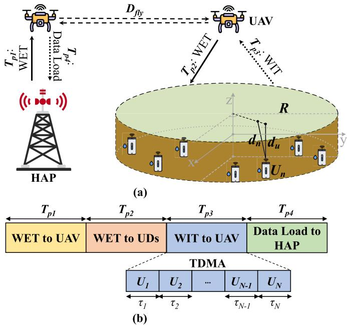  
Fig. 1. A UAV-enabled WPUCN system model. (a) System mode. (b) Time block.

## II. SYSTEM MODEL

Consider a multi-user UAV-enabled WPUCN system. As depicted in Fig. 1(a), the system comprises one terrestrial HAP, one UAV equipped with a hybrid communication and power transfer module, and a set of single-antenna UDs, denoted by $\mathcal { U } = \{ U _ { n } | n = 1 , 2 , \ldots , N \}$ , distributed within a monitoring circle of radius R with the same burial depth $d _ { u }$ . The HAP and the UAV support both WET and WIT function. Specifically, the HAP serves not only as a PS providing WET to both the UAV and UDs but also as a gateway for receiving the data from the UAV. Meanwhile, the UAV can perform WET to UDs and collect their data. Let $( 0 , 0 , H _ { h a p } )$ denote the location of HAP at a height of $H _ { h a p } ,$ and the n-th UD is located at $( x _ { i } , y _ { i } , - d _ { u } )$ . The UAV is set to fly at a fixed altitude of $H _ { u a \nu }$ , ,above the ground, with its location denoted by $( x , y , H _ { u a \nu } )$ . Herein, we assume that both the HAP and UAV are equipped with a uniform linear array (ULA) of Q half-wavelength spaced antennas.

The UAV-assisted data collection process in the WPUCN system are divided into four phases, as described in Fig. 1(b). In Phase 1, a rotary-wing UAV is wirelessly charged by the HAP in its proximity during the charging duration $T _ { p 1 }$ . Once charging is complete, the UAV flies a distance of $D _ { f l y }$ to the center of the monitoring area. In Phase 2, the UDs are charged using WET in the downlink during the duration $T _ { p 2 }$ In Phase 3, the UDs employ the harvested energy to perform WIT to the UAV in the uplink following time-division multiple access (TDMA) protocols within the duration $T _ { p 3 }$ . Specifically, $U _ { n }$ subsequently transmits sensed data during its allocated time duration $\tau _ { n }$ to avoid inter-user interference among UDs. τIn Phase 4, the UAV flies back to the HAP and completely ofloads the collected data during the duration $T _ { p 4 }$

Our goal in this work is to determine the optimal time allocation among these four phases, given a fixed flight distance $D _ { f l y }$ , with the objective of minimizing the UAV’s energy consumption while meeting the throughput threshold requirements of each UD. Note that the round-trip process is not included in the time allocation, as the flight time is determined by the distance $D _ { f l y }$ and the speed V of UAV, both of which are constant.1 In this study, we assume that the multi-antenna technique is activated only in Phase 2 for enhancing WET eficiency, while remaining inactive during other phases to reduce power consumption and hardware complexity.2 The details of the four phases are provided in the following subsection.

## A. Phase 1–Charging Phase

In Phase I, the HAP charges the UAV for its maneuvering and WET operations within the duration $T _ { p 1 }$ . Recently, various technologies for UAV wireless charging have been developed, including capacitive power transfer, inductive power transfer, magnetic resonant coupling, laser beamforming, and RF power transmission [25]. Among these, RF power transmission is chosen for wirelessly charging the UAV in Phase 1 due to its eficient long-range power delivery. Assume that the communication channel between the HAP and the UAV is dominated by LOS, the received energy at the UAV is given by

$$
E _ { u a v - r } = \zeta \frac { { P _ { h a p } G _ { h a p } G _ { u a \nu } | h _ { 0 } | ^ { 2 } } } { { \left( 4 \pi f ( H _ { u a \nu } - H _ { h a p } ) / c \right) ^ { 2 } } } T _ { p 1 } ,\tag{1}
$$

where $\zeta \in [ 0 , 1 )$ denotes the energy conversion eficiency, i.e., the eficiency of converting RF energy into direct current, $P _ { h a p }$ is the transmit power of the HAP, $G _ { h a p }$ and $G _ { u a \nu }$ are the antenna gains of the HAP and the UAV, respectively, $f$ is the carrier frequency, c denotes the speed of light in free space, while $| h _ { 0 } | ^ { 2 }$ is the small-scale fading coeficient between the HAP and the UAV. Herein, we assume the channel coeficients are perfectly known and/or vary very slowly for both uplink and downlink between the HAP and the UAV, thus, set $| h _ { 0 } | ^ { 2 } = 1$ without loss of generality [8], [26].

## B. Phase 2–WET Phase

In Phase 2, the UAV hovers at the center of the monitoring area with a height of of $H _ { u a \nu }$ and the PS (either the HAP, the UAV, or both) charges all UDs via WET within $T _ { p 2 }$ . Herein, we consider a generic WET scenario where a PS equipped with a ULA of Q antennas and wirelessly broadcasting RF energy to all UDs. Note that the PS can either be fixed at a specific location $( \mathrm { e . g . }$ ., HAP as shown in Fig. 1(a)) or deployed on a UAV to charge UDs that are far away.

1) Small-Scale Fading Model: In the multi-antenna WET operation, we assume quasi-static channels, where fading remains constant over each transmission block and is independent and identically distributed (i.i.d.) across blocks. The channel experiences Rician fading, which can model a wide range of channel conditions by adjusting the Rician factor . For instance, the channel envelope follows a Rayleigh distribution when $\kappa = 0 ;$ , while a LOS component is introduced for $\kappa > 0 .$ , getting stronger as  increases. [27, Ch. 2]. Accordingly, the normalized channel vector between the ULA of PS and $U _ { n }$ is expressed as [28, Ch. 5]

$$
{ \bf h } _ { n } \left( \theta _ { n } \right) = \sqrt { \frac { \kappa } { 1 + \kappa } } { \bf h } _ { n } ^ { \mathrm { l o s } } \left( \theta _ { n } \right) + \sqrt { \frac { 1 } { 1 + \kappa } } { \bf h } ^ { \mathrm { n l o s } } ,\tag{2}
$$

where $\mathbf { h } _ { n } ^ { \mathrm { l o s } } \left( \theta _ { n } \right) = e ^ { \mathrm { i } \vartheta _ { 0 } } \left[ 1 , e ^ { \mathrm { i } \phi _ { 1 , n } } , e ^ { \mathrm { i } \phi _ { 2 , n } } , \ldots , e ^ { \mathrm { i } \phi _ { Q - 1 , n } } \right] ^ { \mathrm { T } }$ is the deterministic LOS component, while $\mathbf { h } _ { \mathrm { n l o s } } \sim \mathcal { C N } ( \mathbf { \bar { 0 } } , \mathbf { R } )$ accounts for the NLOS channel under the scattering (Rayleigh) fading. More specifically, $\vartheta _ { 0 }$ is an initial phase shift, which can be ignored as it afects all antenna elements equally. Meanwhile, $\phi _ { t , n } , t \in \{ 1 , . . . , Q - 1 \}$ represents the mean phase shift of the $( t + 1$ )-th antenna element relative to the first antenna element as observed by $U _ { n }$ , and is given by [10].

$$
\phi _ { t , n } = - t \pi \sin ( \theta _ { n } ) ,\tag{3}
$$

where $\theta _ { n } ~ \in ~ [ 0 ,$ 2 ] is the azimuth angle of $U _ { n }$ relative to the transmitting ULA, which depends on both the PS’s ULA orientation and the UD’s location.

2) Path Loss Model: The total path loss from the PS to $U _ { n } , \ \mathrm { i . e . , } \ \delta _ { n } ,$ consists of the above-ground air attenuation $J _ { n } ,$ the refraction loss at the air-soil interface $K _ { n } ^ { a 2 u }$ , and the attenuation in underground soil $M _ { n }$ . Herein, we adopt the modified Friis-based model developed in [29], [30], and [31], which has been validated through field experiments conducted at various depths and under diferent soil conditions, demonstrating accurate estimation of attenuation in soil. Mathematically, the model is expressed as

$$
\delta _ { n } = J _ { n } K _ { n } ^ { a 2 u } M _ { n } ,\tag{4}
$$

$$
J _ { n } ( l _ { n } ) = \left( \frac { 4 \pi f } { c } \right) ^ { 2 } l _ { n } ^ { S } ,\tag{5}
$$

$$
K _ { n } ^ { a 2 u } = \left( \frac { \sqrt { \left( \sqrt { \varepsilon ^ { \prime 2 } + \varepsilon ^ { \prime \prime 2 } } + \varepsilon ^ { \prime } \right) / 2 } + 1 } { 4 } \right) ^ { 2 } ,\tag{6}
$$

$$
M _ { n } ( d _ { n } ) = \left( \frac { 2 \beta d _ { n } } { e ^ { - \alpha d _ { n } } } \right) ^ { 2 } ,\tag{7}
$$

where $\varsigma$ is the path-loss exponent, while $l _ { n }$ and $d _ { n }$ represent the propagation distances through air and underground soil, respectively, from the PS to $U _ { n }$ . Since the permittivity of soil is significantly higher than that of air, most of the RF signal energy from the above-ground source will be reflected if the incident angle is large. Therefore, we consider that the refracted angle is nearly zero during the RF signal propagation from air to underground soil [31]. Thus, we assume in this study that the propagation in the soil is vertical, implying $d _ { n } = d _ { u }$ . Additionally, and $\beta$ denote the attenuation constant and phase shifting constant, respectively, which are given as

$$
\alpha = 2 \pi f \sqrt { \frac { \mu _ { r } \mu _ { 0 } \varepsilon ^ { \prime } \varepsilon _ { 0 } } { 2 } \left[ \sqrt { 1 + \left( \frac { \varepsilon ^ { \prime \prime } } { \varepsilon ^ { \prime } } \right) ^ { 2 } } - 1 \right] } ,\tag{8}
$$

$$
\beta = 2 \pi f \sqrt { \frac { \mu _ { r } \mu _ { 0 } \varepsilon ^ { \prime } \varepsilon _ { 0 } } { 2 } \left[ \sqrt { 1 + \left( \frac { \varepsilon ^ { \prime \prime } } { \varepsilon ^ { \prime } } \right) ^ { 2 } } + 1 \right] } .\tag{9}
$$

Herein, $\mu _ { r }$ is the soil’s relative permeability, $\mu _ { 0 }$ is the free-space permeability, $\varepsilon _ { 0 }$ is the free space permittivity, and $\varepsilon ^ { \prime }$ and $\varepsilon ^ { \prime \prime }$ are the real and imaginary parts of the soil’s relative permittivity, respectively, i.e., $\varepsilon = \varepsilon ^ { \prime } + j \varepsilon ^ { \prime \prime }$ . Notice that can be calculated by the mineralogy-based soil dielectric model [32]. This model can operate over a wide frequency range, from 45 MHz to 26.5 GHz, and provides accurate predictions of as it is derived from a large number of soil samples and accounts for the presence of both free and bound water in the soil. It requires only three input parameters to compute the complex permittivity of soil: the VWC, the operating frequency of the RF signals, and the clay percentage of the soil.

3) Average Received Power: When the PS transmits $K \leq Q$ energy symbols $\{ s _ { k } \}$ per channel, the received RF signal $y _ { n }$ at $U _ { n }$ can be modeled by

$$
y _ { n } = \sum _ { k = 1 } ^ { K } \sqrt { \frac { p _ { k } } { \delta _ { n } } } \mathbf { h } _ { n } ^ { \mathrm { T } } \mathbf { v } _ { k } s _ { k } ,\tag{10}
$$

where $\mathbf { v } _ { k } = [ \nu _ { k } ^ { ( 1 ) } , \nu _ { k } ^ { ( 2 ) } , \dots , \nu _ { k } ^ { ( Q ) } ] \in \mathbb { C } ^ { Q }$ is the normalized precoding vector associated with $s _ { k } ,$ it depends on the selected WET scheme, either full-CSI or CSI-free, while $p _ { k }$ is the transmit power corresponding to each energy symbol and $\begin{array} { r } { \sum _ { k = 1 } ^ { K } p _ { k } = p . } \end{array}$ The energy symbols $\{ s _ { k } \}$ are assumed to be i.i.d. unit-power and zero-mean random variables, i.e., $\mathbb { E } [ | s _ { k } | ^ { 2 } ] = 1 , \mathbb { E } [ s _ { k } ] = 0$ and $\mathbb { E } [ s _ { k } ^ { H } s _ { k ^ { \prime } } ] = 0 \forall k \neq k ^ { \prime }$ . Consequently, the incident RF power (averaged over the signal waveform) at $U _ { n }$ is given by

$$
\begin{array} { r l } & { { \boldsymbol { \xi } } _ { n } = \mathbb { E } _ { s _ { k } } \left[ \left| \mathbf { y } _ { n } \right| ^ { 2 } \right] } \\ & { \stackrel { ( a ) } { = } \mathbb { E } _ { s _ { k } } \Bigg [ \Bigg ( \displaystyle \sum _ { k = 1 } ^ { \infty } \sqrt { \frac { p _ { k } } { \delta _ { n } } } \mathbf { h } _ { n } ^ { \mathrm { T } } \mathbf { v } _ { k } s _ { k } \Bigg ) \Bigg [ \left( \displaystyle \sum _ { k = 1 } ^ { K } \sqrt { \frac { p _ { k } } { \delta _ { n } } } \mathbf { h } _ { n } ^ { \mathrm { T } } \mathbf { v } _ { k } s _ { k } \right) \Bigg ] } \\ & { \stackrel { ( b ) } { = } \frac { 1 } { \delta _ { n } } \displaystyle \sum _ { k = 1 } ^ { K } \sum _ { k ^ { \prime } = 1 } ^ { K } \sqrt { p _ { k ^ { \prime } } p _ { k ^ { \prime \prime } } } \left( \mathbf { h } _ { n } ^ { \mathrm { T } } \mathbf { v } _ { k ^ { \prime } } \right) ^ { \mathrm { H } } \mathbf { h } _ { n } ^ { \mathrm { T } } \mathbf { v } _ { k ^ { \prime \prime } } \mathbb { E } \left[ \mathbf { \tilde { \xi } } _ { k ^ { \prime } } ^ { \mathrm { H } } s _ { k ^ { \prime \prime } } \right] } \\ & { \stackrel { ( c ) } { = } \frac { 1 } { \delta _ { n } } \displaystyle \sum _ { k = 1 } ^ { K } p _ { k } \left| \mathbf { h } _ { n } ^ { \mathrm { T } } \mathbf { v } _ { k } \right| ^ { 2 } , } \end{array}\tag{11}
$$

where (a) comes from leveraging (10), (b) follows after reorganizing terms, and (c) is obtained based on the assumption of i.i.d. power-normalized signals.

In a typical quasi-static WET setup, the energy harvested by $U _ { n }$ under a linear energy harvesting (EH) model is directly proportional to the average incident RF power, as expressed by

$$
\begin{array} { r } { E _ { n } = \zeta G _ { p s } G _ { u d } \xi _ { n } , } \end{array}\tag{12}
$$

where $G _ { p s }$ and $G _ { u d }$ are the antenna gains of the PS and the UDs, respectively. Although nonlinear EH models are intrinsically more accurate due to the nonlinearities of the EH hardware, the harvested power benefits from an increased average incident RF power either under a linear or nonlinear EH model [33]. For the sake of simplicity, we focus on the linear EH model and defer the analysis and related discussions of the nonlinear EH model to future work.

## C. Phase 3–WIT Phase

After all UDs are charged, they utilize the harvested energy to transmit sensor data to the UAV during its allocated time slots $\tau _ { n } ,$ with $n = 1 , \ldots , N _ { \mathrm { { \scriptsize ~ ; ~ } } }$ , using TDMA protocol in the uplink within the duration $T _ { p 3 }$ . This implies that $\begin{array} { r } { T _ { p 3 } = \sum _ { n = 1 } ^ { N } \tau _ { n } , } \end{array}$ as illustrated in Fig. 1(b). The total path loss from $U _ { n }$ to the UAV consists of the underground path loss $M _ { n } ,$ the air attenuation $J _ { n } ,$ , and the refraction loss from soil to air $K _ { n } ^ { u 2 a }$ . Consequently, the achievable throughput of $U _ { n }$ during $\tau _ { n }$ in Phase 3 can be expressed as

$$
R _ { n } = \tau _ { n } W \log _ { 2 } \left( 1 + \frac { \varphi E _ { n } G _ { u d } G _ { u a v } | h _ { n } ^ { u d } | ^ { 2 } } { \tau _ { n } M _ { n } K _ { n } ^ { u 2 a } J _ { n } \sigma _ { A } ^ { 2 } } \right) ,\tag{13}
$$

where W is the channel bandwidth, $\sigma _ { A } ^ { 2 }$ denotes the variance of the additive white Gaussian noise, the channel coeficients from the UDs to the UAV are assumed to be $| h _ { n } ^ { u d } | ^ { 2 } = 1 , \forall n$ for simplicity, while $\varphi$ represents the portion of received energy used for WIT. Note that the remaining $( 1 - \varphi )$ portion of the harvested energy supports the circuit operations. Furthermore, since most energy is refracted when the signal propagates from soil to air, the refraction loss on the soil-air interface can be neglected, implying $K _ { n } ^ { u 2 a } = 1$ [8], [31].

After Phase 3, the sum-data received by the UAV from N UDs can be calculated by

$$
R _ { u a \nu } = \sum _ { n = 1 } ^ { N } R _ { n } .\tag{14}
$$

## D. Phase 4–Data Loading Phase

In Phase 4, the UAV returns to the HAP and hovers above it for data ofloading. The amount of ofloaded data at the HAP during the duration $T _ { p 4 }$ is given by

$$
R _ { h a p } = T _ { p 4 } W \log _ { 2 } \left( 1 + \frac { P _ { u a v } G _ { u a v } G _ { h a p } | h _ { 0 } | ^ { 2 } } { \left( 4 \pi f ( H _ { u a v } - H _ { h a p } ) / c \right) ^ { 2 } \sigma _ { A } ^ { 2 } } \right) ,\tag{15}
$$

where $P _ { u a \nu }$ is the transmit power of the UAV. Furthermore, the sensor data from all UDs should be completely loaded to the HAP, implying $R _ { h a p } = R _ { u a \nu }$

## III. WIRELESS ENERGY TRANSFER SCHEMES

In Phase 2, the eficiency of multi-antenna WET can be enhanced by designing an appropriate precoding scheme. In the following Subsection III-A, we present a full-CSI precoding scheme for optimizing the WET process. Then, we introduce several state-of-the-art CSI-free WET alternatives in Subsection III-B to eficiently powering all UDs without any CSI acquisition.

## A. Full-CSI Schemes

In the full-CSI scheme, the PS transmits pilot signals, which are used by the UDs to estimate the CSI for the downlink channels. Once this information is fed back to the PS, it uses the estimated CSI to optimize the precoder, ensuring maximum fairness in charging the UDs. This implies that no UD is expected to benefit more than others from the PS’s WET. To further tilt the scale in favor of the CSI-free schemes, we assume an ideally trained full-CSI strategy, disregarding the impact of imperfect CSI and the time and power consumed for both CSI acquisition and the precoder optimization.3 This assumption aligns with the setup in [9], [12], and [34].

We define $\xi _ { c s i }$ as the minimum harvested energy among all UDs under the full-CSI scheme, i.e., $\xi _ { c s i } \triangleq \operatorname* { i n f } _ { n = 1 , \dots , N } \{ \xi _ { n } \} .$ where $\begin{array} { r } { \xi _ { n } \ = \ { \frac { p } { \delta _ { n } } } \operatorname { T r } ( \mathbf { V } \mathbf { H } _ { n } ) } \end{array}$ ξ ,..., ξ is reformulated from Eq. (11) with $\begin{array} { r } { \mathbf { V } = \sum _ { k = 1 } ^ { K } \mathbf { v } _ { k } \mathbf { v } _ { k } ^ { \tilde { H } } } \end{array}$ and $\mathbf { H } _ { n } = \mathbf { h } _ { n } \mathbf { h } _ { n } ^ { H }$ . Given V is a Hermitian matrix with a maximum rank of Q, the optimization problem can be formulated as a semidefinite programming (SDP) problem, i.e.,

$$
( \mathrm { P 1 } ) : \operatorname* { m i n } _ { { \bf v } \in \mathbb { C } ^ { Q \times Q } , ~ \xi _ { c s i } } - \xi _ { c s i }\tag{16a}
$$

$$
s . t . \mathrm { ~ } \frac { p } { \delta _ { n } } \operatorname { T r } \left( \mathbf { V } \mathbf { H } _ { n } \right) \geq \xi _ { c s i } , \forall n ,\tag{16b}
$$

$$
{ \displaystyle { \mathrm { T r } } ( \mathbf { V } ) = 1 } ,\tag{16c}
$$

$$
\mathbf { V } \succeq 0 .\tag{16d}
$$

The CVX toolbox can eficiently solve this SDP problem and obtain the eigenvectors of V, which is referred to as the optimal full-CSI beamforming [34].

## B. State-of-the-Art CSI-Free Schemes

Although the PS employs the full-CSI scheme to enhance WET eficiency while ensuring fairness among UDs, reliable and accurate CSI acquisition is challenging and costly, and even infeasible in massive WPUCN scenarios due to the harsh underground soil [9]. Moreover, the power consumed for CSI acquisition and the SDP-based solution can eliminate the benefits gained from CSI exploitation [29], [35]. By intelligently exploiting the broadcast nature of wireless transmissions, several promising CSI-free schemes are proposed to eficiently charge a large set of nearby UDs. Compared to the full-CSI scheme, CSI-free schemes avoid the need for CSI acquisition and may ofer reliable WET performance even in complex underground environments; however, their WET eficiency remains inherently afected by underground conditions [9]. Herein, we briefly explain the state-of-theart CSI-free schemes that will be adopted and comparatively analyzed for Phase 2 in our UAV-enabled WPUCN system. Figs. 2 and 3 respectively illustrate the implementations and radiation patterns of SA, AAIS, AASS, and RAB.

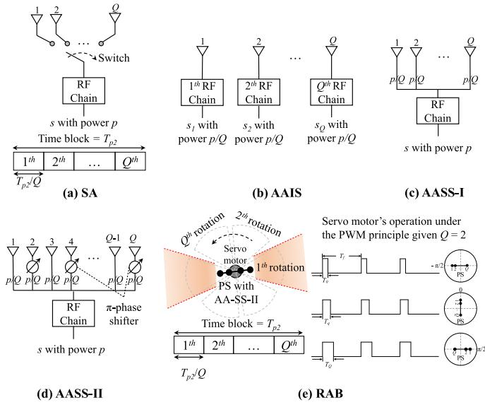

Fig. 2. The operation diagram of (a) SA, (b) AAIS, (c) AASS-I, (d) AASS-II, and (e) RAB.  
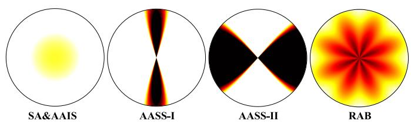  
Fig. 3. The radiation pattern of SA, AAIS, AASS-I, AASS-II, and RAB.

1) SA [11, Sec. III-A]: Under SA as depicted in Fig. 2(a), the PS utilizes a switching mechanism to transmit a signal with the full power of the q-th antenna during the q-th duration such that Q antennas are used over the WET phase $T _ { p 2 }$ . We assume equal time allocation among antennas such that each subblock duration is equivalent to $T _ { p 2 } / Q$ . Since only one antenna is active at the q-th subblock duration, SA requires a single RF channel for its operation, implying $K = 1 , p _ { k } = p ,$ and $\mathbf { v } _ { k }$ is a one-dimensional column vector containing the scalar 1 in Eq. (11). Note that the total incident RF energy is the sum of the energy from Q subblocks.

2) AAIS [10, Sec. III-B]: Instead of transmitting a signal with one antenna at a time, the PS using AAIS transmits signals independently generated across the antenna elements and with equal transmit power, thus $K = Q$ and $p _ { k } = p / Q$ , as highlighted in Fig. 2(b). Therefore, in Eq. (11), $\nu _ { k } ^ { ( q ) } = 1$ for k = q, otherwise $\nu _ { k } ^ { ( q ) } = 0$ . Diferent from SA, Q RF chains are required to implement AAIS since all antenna elements are simultaneously active to transmit Q independent RF signals. However, it is evidenced in [10] that SA has equal/similar

WET performance to AAIS under a linear/nonlinear EH model. Furthermore, the radiation patterns for both SA and AAIS are omnidirectional, as shown in Fig. 3.

3) AASS: In AASS, the same signal is transmitted through all antenna elements with equal power, i.e., $K = 1$ and $p _ { k } =$ $p / Q$ in Eq. (11). There are two configurations for $\mathbf { A A S S } \mathrm { { : } }$

1) AASS-I [11, Sec. III-A], where the precoding vector $\mathbf { v } _ { k } = \mathbf { 1 }$ in Eq. (11), or simply no precoder, is applied to attain an energy beam towards the ULA’s boresight directions, as shown in Fig. 2(c).

2) AASS-II [10, Sec. IV-B], where the precoding vector is set as $\bar { \nu _ { k } ^ { ( q ) } } = e ^ { \mathrm { m o d } ( q - 1 , 2 ) \pi \mathrm { i } }$ in Eq. (11) to attain wider energy beams, which are ofset $9 0 ^ { \circ }$ from ULA’s boresight directions. This can be realized with an analog implementation with a number of bQ 2c -phase shifters, as displayed in Fig. 2(d).

The gains of both AASS schemes are strongly associated with the UDs’ positions and the orientation of the PS’s U $\mathbf { \nabla } _ { \mathbf { A } } ;$ therefore, they are preferable when charging UDs clustered in specific boresight directions. The radiation patterns of AASS-I and AASS-II are directed towards the ULA boresight and a 90◦ ofset from ULA boresight directions, respectively, as highlighted in Fig. 3.

4) RAB [12]: As exhibited in Fig. 2(e), the servo motor is equipped in the PS to continuously rotate its antenna array while adopting the AASS-II scheme, which allows improving the charging coverage probability. By taking advantage of the symmetry of the ULA’s radiation patterns, we consider Q angular rotations to cover the angular domains $[ - \pi / 2 , \pi / 2 ]$ Indeed, a servo motor can rotate the antenna array at specific angles and realize Q equally spaced steps using the pulse with modulation (PWM) technique, that can provide suficiently smooth performance. Note that the q-th rotation step is conducted during the q-th subblock duration, where each duration is $T _ { p 2 } / Q$ . According to Eq. (11), the incident average RF power gain at $U _ { n }$ under RAB is given by

$$
\xi _ { n } ^ { R A B } = \frac { 1 } { Q } \sum _ { q = 1 } ^ { Q } \sum _ { k = 1 } ^ { K } \frac { p _ { k } } { \delta _ { n } } \left| \mathbf { h } _ { n } ^ { \mathrm { T } } \mathbf { v } _ { k } \left( \theta _ { n } + \frac { q \pi } { Q } \right) \right| ^ { 2 } ,\tag{17}
$$

where $\theta _ { n }$ is the initial azimuth angle prior to any rotation. The resulting radiation pattern is quasi-omnidirectional, as shown in Fig. 3. Note that the operation of RAB requires at least $Q = 2$ antenna elements; otherwise, it is equivalent to AASS-II.

## IV. ENERGY CONSUMPTION MODEL

In this section, we examine the power budget for the PS to carry out the full WET operations in Phase 2, as well as the $\mathrm { U A V } \mathbf { \hat { s } }$ propulsion consumption for hovering and round-trip flight, within the energy consumption model of the proposed UAV-enabled WPUCN system.

## A. Power Budget Model

Due to the power consumed by the transmitter’s power amplifier, circuitry, and operations, the budgeted power $P _ { b }$ is not entirely converted to transmit power p in practice for the full-CSI and CSI-free schemes in Phase 2. Herein, we consider the impact of the circuitry, base-band operations and the servo motor rotation of RAB on the power consumption. Meanwhile, we assume that the full-CSI scheme is implemented in fully digital ULAs without considering the power consumed by both the CSI acquisition and the SDP-based solution. Note that Q RF chains are required in the full-CSI scheme and AAIS implementations, whereas the other CSI-free schemes only employ one RF chain. Compared to the power consumption in RF chains, the power consumed by the switch (in the case of SA) and phase shifters (in the case of AASS-II and RAB) is negligible in this study [9], [36], [37]. Furthermore, RAB requires the servo motor to continuously rotate its antenna array. Therefore, compared to the other CSI-free schemes, the extra power consumed by the servo motor operations should be carefully considered in RAB. Accordingly, the transmit power of the PS can be calculated by [9]

$$
p = \eta ( P _ { b } - Q ^ { i } P _ { r f } - P _ { c } - b P _ { m o t o r } ) ,\tag{18}
$$

where is the amplifier eficiency, $P _ { b } = P _ { h a p }$ when the HAP serves as the PS and $P _ { b } ~ = ~ P _ { u a \nu }$ when the UAV operates as the PS, $P _ { r f }$ is the power consumed by the base-band processing per RF chain, $P _ { c }$ is the fixed power consumption considering the remaining circuitry, and $i \ = \ 1$ for the full-CSI scheme and AAIS, and $\textit { i } = \textit { 0 }$ for the other CSI-free schemes. Here, P and $P _ { r f }$ are assumed to be constant without loss of generality. Furthermore, $b = 1$ for RAB, and $b = 0$ for the other WET schemes. By using the PWM principle, the servo motor can rotate an antenna array with Q equally spaced steps in the angular domains $[ - \pi / 2 , \pi / 2 ]$ , as illustrated in Fig. 2(e). Considering the practical implementation of servo motor rotations, the power consumed by the servo motor operations, i.e., $P _ { m o t o r } ,$ is given by [9]

$$
P _ { m o t o r } = \frac { \sum _ { q = 0 } ^ { Q } T _ { 0 } + \frac { q } { Q } } { T _ { f } } V _ { m o t o r } I _ { m o t o r } ,\tag{19}
$$

where $T _ { 0 }$ is the pulse width for the shaft at the initial angle before the rotation operations, $T _ { f }$ is the duty cycle, $V _ { m o t o r }$ is the supply voltage of the servo motor, while $I _ { m o t o r }$ is the working current during rotation.

## B. UAV’s Propulsion Consumption Model

In addition to the energy charged to the UDs, the UAV also requires energy for various maneuvering operations, such as hovering, acceleration, deceleration, and flying at constant speed. An analytical propulsion power consumption model for rotary-wing UAVs flying at speed V was proposed in [38], which is given by

$$
P ( V ) = P _ { 0 } \Bigg ( 1 + \frac { 3 V ^ { 2 } } { U _ { t i p } ^ { 2 } } \Bigg ) + P _ { i } \sqrt { \sqrt { 1 + \frac { V ^ { 4 } } { 4 \nu _ { 0 } ^ { 4 } } } - \frac { V ^ { 2 } } { 2 \nu _ { 0 } ^ { 2 } } } + \frac { d _ { 0 } \rho S A V ^ { 3 } } { 2 } ,\tag{20}
$$

where $P _ { 0 }$ and $P _ { i }$ are two constants related to the physical properties of UAV and the flight environments, such as weight, rotor radius and air density, $U _ { t i p }$ represents the tip speed of the rotor blade, $\nu _ { 0 }$ is the mean rotor induced velocity in hover, $d _ { 0 }$ and S are the fuselage drag ratio and rotor solidity, respectively, while $\rho$ and A denote the air density and rotor disc area, respectively.

By substituting $V = 0$ into Eq. 20, we obtain the power consumption for hovering status, i.e., $P ( 0 ) = P _ { 0 } + P _ { i }$ . Hence, the energy required for hovering can be expressed as

$$
E _ { h } ( t _ { h } ) = P ( 0 ) t _ { h } ,\tag{21}
$$

where $t _ { h }$ is the hovering time. Meanwhile, the energy consumption for UAVs flying at speed V is given by

$$
E _ { V } = P ( V ) T _ { f l y - V } ,\tag{22}
$$

where $T _ { f l y - V }$ is the time for the UAV flying at a constant speed of V. In this study, we consider that the UAV accelerates from an initial velocity of 0 to V, then continues to fly towards the UDs at a constant speed of V, and finally decelerates from V to 0 to hover over the center of monitoring area. Hence, we can obtain $\begin{array} { r } { T _ { f l y - V } = \frac { D _ { f l y } } { V } - \frac { V } { a } } \end{array}$ and the flying time of the UAV $\begin{array} { r } { T _ { f l y } = \frac { D _ { f l y } } { V } + \frac { V } { a } } \end{array}$ with the acceleration $^ { a , }$ where $T _ { f l y }$ will be used in Eq. (25) to determine the received energy of $U _ { n }$ . Since acceleration and deceleration are symmetric in this process, the energy consumed during deceleration is the same as that during acceleration. Consequently, the energy consumed for the UAV during the acceleration and deceleration can be calculated by [14] and [23]

$$
E _ { a c c } = E _ { d e c } = \int _ { 0 } ^ { \frac { V } { a } } P ( t ) d t ,\tag{23}
$$

where $\begin{array} { r l r } { P ( t ) } & { { } = } & { P _ { 0 } \left( 1 + \frac { 3 ( a t ) ^ { 2 } } { U _ { t i p } ^ { 2 } } \right) + P _ { i } \sqrt { \sqrt { 1 + \frac { ( a t ) ^ { 4 } } { 4 \nu _ { 0 } ^ { 4 } } } - \frac { ( a t r ) ^ { 2 } } { 2 \nu _ { 0 } ^ { 2 } } \ + } } \end{array}$ $\frac { d _ { 0 } \rho s A ( a t ) ^ { 3 } } { \gamma }$ by substituting $V = a t$ into Eq. (20).

As illustrated in Fig. 1, the UAV hovers above the HAP to be charged wirelessly, then accelerates to a constant speed V and flies towards the UDs. Upon approaching the center of the monitoring area, it decelerates from V to 0 and hovers above the UDs to perform WET and collect sensor data before returning to the HAP in the same way. Finally, the UAV hovers above the HAP for data ofloading. Therefore, the total energy consumption of the UAV excluding the UAV’s charging process can be expressed as

$$
E _ { s } = E _ { w e t } + E _ { d l } + E _ { h } ( T _ { p 2 } ) + E _ { h } ( T _ { p 3 } ) + E _ { h } ( T _ { p 4 } ) + E _ { f t } + E _ { f b } ,\tag{24}
$$

where $E _ { w e t } = P _ { u a \nu } T _ { p 2 }$ and $E _ { d l } = P _ { u a \nu } T _ { p 4 }$ denote the energy required for WET and data loading operations, respectively, $E _ { h } ( T _ { p 2 } ) , E _ { h } ( T _ { p 3 } )$ , and $E _ { h } ( T _ { p 4 } )$ respectively represent the energy consumed for hovering during WET, WIT, and data loading operations, while $E _ { f t }$ and $E _ { f b }$ correspond to the energy required for the round-trip flight, given by $E _ { f t } ~ = ~ E _ { f b } ~ =$ $E _ { a c c } + E _ { \nu } + E _ { d e c }$

## V. TIME ALLOCATION FOR UAV-ENABLED WPUCNS

In Subsection V-A, we first present three WET approaches for the WET Phase. We formulate the energy consumption minimization problem and derive the optimal time allocation in Subsection V-B.

## A. WET Approaches

In Phase 2, three WET approaches are considered to charge all UDs, as illustrated in Fig. 4.

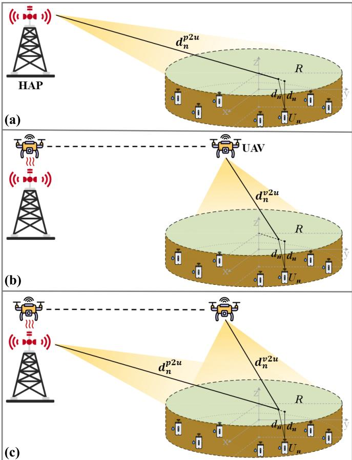  
Fig. 4. Three WET approaches for WPUCN system: (a) traditional PS approach, (b) UAV-enabled WET approach, and (c) hybrid approach.

1) Traditional PS Approach [9]: As shown in Fig. 4(a), the HAP acts as the PS to wirelessly charge the UDs within the duration $T _ { p 2 }$ and the UAV’s flying time $T _ { f l y }$ . Herein, either full-CSI and CSI-free WET schemes are adopted to enable WET operations. In this case, the UAV is used solely for data collection, without the WET functionality. By leveraging Eq. (12), the received energy at $U _ { n }$ can be expressed as

$$
E _ { n } ^ { p s } = \zeta ( T _ { f l y } + T _ { p 2 } ) G _ { h a p } G _ { u d } \xi _ { n } \left( \kappa _ { p 2 u } , \varsigma _ { p 2 u } , P _ { h a p } , d _ { n } ^ { p 2 u } \right) ,\tag{25}
$$

where $\kappa _ { p 2 u }$ and $S _ { P 2 u }$ are the Rician factor and path loss exponent for the HAP-to-UDs channels, respectively, while $d _ { n } ^ { p { \hat { 2 } } u }$ is the air propagation length between the HAP and $U _ { n } .$ These parameters are used in Eq. (2) and Eq. (4) to calculate the received energy of $U _ { n }$ from the HAP.

2) UAV-Enabled WET Approach [14]: In the UAV-enabled WET approach as illustrated in Fig. 4(b), the ULA-equipped UAV hovers at an altitude $H _ { u a \nu }$ above the center of the monitoring area and serves as the PS to charge all UDs in the downlink during $T _ { p 2 }$ with either full-CSI or CSI-free WET schemes. In this phase, the HAP remains silent and does not provide the WET functionality. Based on Eq. (4), the received energy at $U _ { n }$ under this approach is given by

$$
E _ { n } ^ { u a \nu } = \zeta T _ { p 2 } G _ { u a \nu } G _ { u d } \xi _ { n } \left( \kappa _ { \nu 2 u } , \varsigma _ { \nu 2 u } , P _ { u a \nu } , d _ { n } ^ { \nu 2 u } \right) ,\tag{26}
$$

where $\kappa _ { \nu 2 u }$ and $\varsigma _ { \nu 2 u }$ are the Rician factor and path loss exponent for UAV-to-UDs channels, respectively, while $d _ { n } ^ { p 2 u }$ is the air propagation length between the UAV and $U _ { n }$ . These parameters are used in Eq. (2) and Eq. (4) to obtain the received energy of $U _ { n }$ from the UAV.

3) Hybrid Approach: As illustrated in Fig. 4(c), the proposed hybrid approach utilizes both the HAP and UAV as PSs to broadcast RF energy to all UDs, employing either full-CSI or CSI-free WET schemes. By neglecting the energy contribution from coexisting networks and assuming that the HAP and UAV transmit independent and uncoordinated RF signals, the received energy contributions are non-coherently combined at each UD. In this case, the total received power corresponds to the sum of the average powers from diferent sources, as the signals are statistically independent and zeromean. This non-coherent power combination model has been widely adopted in prior multi-source WET studies [9], [35], [39]. Accordingly, the received energy at $U _ { n }$ under the hybrid approach can be calculated by

$$
E _ { n } ^ { h y b r i d } = E _ { n } ^ { p s } + E _ { n } ^ { u a \nu } .\tag{27}
$$

Since the UDs can harvest energy from both the HAP and UAV, the hybrid approach is expected to deliver more eficient WET compared to traditional PS and UAV-enabled approaches. In Phase 2, we assume that both the HAP and UAV use the same WET scheme, which could be either full-CSI or CSI-free. It is important to select an appropriate CSI-free scheme for the HAP and UAV, respectively, within the hybrid approach to ensure the optimal WET performance.

## B. Time Allocation Optimization

Based on these WET approaches in Phase 2, our goal to minimize the UAV’s energy consumption in all phases, while ensuring the throughput of each UD and complete data ofloading to the HAP. This translates to finding the optimal time allocation (i.e., $\begin{array} { r } { T _ { p 2 } , T _ { p 3 } = \sum _ { n = 1 } ^ { N } \tau _ { n } . } \end{array}$ , and $T _ { p 4 }$ as illustrated in Fig. 1(b)) that minimizes the energy consumption of the UAV, i.e., Es, by considering the constraints on time, the throughput requirements for each UD, and data ofloading. The throughput-aware energy consumption minimization problem for the considered UAV-enabled WPUCN system is formulated specifically as

$$
( \mathrm { P } 2 ) : \operatorname* { m i n } _ { T _ { p 2 } , T _ { p 3 } , T _ { p 4 } } E _ { s }\tag{28a}
$$

$$
\mathrm { s . t . } T _ { p 2 } > 0 ,\tag{28b}
$$

$$
\tau _ { n } > 0 , \forall n ,\tag{28c}
$$

$$
T _ { p 4 } > 0 ,\tag{28d}
$$

$$
R _ { n } \geq \gamma _ { n } , \forall n ,\tag{28e}
$$

$$
R _ { h a p } = R _ { u a \nu } ,\tag{28f}
$$

where $\operatorname { E q . }$ (28b), (28c), and (28d) correspond to the time constraints, Eq. (28e) defines the throughput requirements for each UD, implying that the achievable throughput of each UD should exceed the throughput threshold $\gamma _ { n } ,$ while Eq. (28f) γensures that all sensor data from the UDs are ofloaded to the HAP.

Since the UAV’s energy consumption is directly proportional to $T _ { p 2 } , \ T _ { p 3 }$ , and $T _ { p 4 }$ , and $T _ { p 4 }$ is determined when

$R _ { h a p } = R _ { u a \nu }$ as defined in Eq. (14) and (15), the optimization problem (P2) can be reformulated as

$$
( \mathrm { P 3 } ) : \operatorname* { m i n } _ { T _ { p 2 } , \tau _ { 1 } , \dots , \tau _ { N } } T _ { p 2 } + \sum _ { n = 1 } ^ { N } \tau _ { n }
$$

$$
\mathrm { s . t . } T _ { p 2 } > 0 ,\tag{29a}
$$

(29b)

$$
\tau _ { n } > 0 , \forall n\tag{29c}
$$

$$
R _ { n } \geq \gamma _ { n } , \forall n .\tag{29d}
$$

$$
T _ { p 4 } = \frac { R _ { u a v } } { W \log _ { 2 } \left( 1 + \frac { P _ { u a v } G _ { u a v } G _ { h a p } } { \left( 4 \pi f ( H _ { u a v } - H _ { h a p } ) / c \right) ^ { 2 } \sigma _ { A } ^ { 2 } } \right) } .\tag{29e}
$$

We prove that (P3) is a convex problem. First, the objective function, Eq. (29b) and (29c) are linear, thus convex. Related to (29d), let’s substitute proceed writing

$$
R _ { n } = \tau _ { n } W \log _ { 2 } \left( 1 + \frac { C _ { n } T _ { p 2 } + b _ { n } } { \tau _ { n } } \right) .\tag{30}
$$

Herein, for the traditional PS approach, $C _ { n }$ and $b _ { n }$ are respectively given by

$$
C _ { n } = \frac { \varphi G _ { u d } G _ { u a \nu } \zeta \xi _ { n } \left( \kappa _ { p 2 u } , \varsigma _ { p 2 u } , P _ { h a p } , d _ { n } ^ { p 2 u } \right) } { \delta _ { n } \sigma _ { A } ^ { 2 } } ,\tag{31}
$$

$$
b _ { n } = \frac { \varphi G _ { u d } G _ { u a \nu } \zeta T _ { f l y } \xi _ { n } \left( \kappa _ { p 2 u } , \varsigma _ { p 2 u } , P _ { h a p } , d _ { n } ^ { p 2 u } \right) } { \delta _ { n } \sigma _ { A } ^ { 2 } } .\tag{32}
$$

For the UAV-enabled WET approach, $C _ { n }$ and $b _ { n }$ are respectively given by

$$
C _ { n } = \frac { \varphi G _ { u d } G _ { u a \nu } \zeta \xi _ { n } \left( \kappa _ { \nu 2 u } , \varsigma _ { \nu 2 u } , P _ { u a \nu } , d _ { n } ^ { \nu 2 u } \right) } { \delta _ { n } \sigma _ { A } ^ { 2 } } ,\tag{33}
$$

$$
b _ { n } = 0 .\tag{34}
$$

For the proposed hybrid approach, $C _ { n }$ and $b _ { n }$ are respectively given by

$$
\begin{array} { c } { { C _ { n } = \displaystyle \frac { \varphi G _ { u d } G _ { u a \nu } \zeta } { \delta _ { n } \sigma _ { A } ^ { 2 } } \left( \xi _ { n } \left( \kappa _ { \nu 2 u } , \varsigma _ { \nu 2 u } , P _ { u a \nu } , d _ { n } ^ { \nu 2 u } \right) + \right. } } \\ { { \left. \xi _ { n } \left( \kappa _ { p 2 u } , \varsigma _ { p 2 u } , P _ { h a p } , d _ { n } ^ { p 2 u } \right) \right) , } } \end{array}\tag{35}
$$

$$
b _ { n } = \frac { \varphi G _ { u d } G _ { u a \nu } \zeta T _ { f l y } \xi _ { n } \left( \kappa _ { p 2 u } , \varsigma _ { p 2 u } , P _ { h a p } , d _ { n } ^ { p 2 u } \right) } { \delta _ { n } \sigma _ { A } ^ { 2 } } .\tag{36}
$$

Accordingly, constraint (29d) can be rewritten as

$$
f ( \tau _ { n } , T _ { p 2 } ) = \frac { \tau _ { n } } { C _ { n } } \left( 2 ^ { \frac { \gamma _ { n } } { \tau _ { n } W } } - 1 \right) - \frac { b _ { n } } { C _ { n } } - T _ { p 2 } \leq 0 .\tag{37}
$$

Next, we examine the convexity of the constraint by analyzing the Hessian matrix of the $f ( \tau _ { n } , T _ { p 2 } )$ for all WET approaches as described in Section $\mathrm { V } { - } \mathrm { A } { . } 1 , \mathrm { V } { - } \mathrm { A } { . } 2$ , and V-A.3. The Hessian matrix for all WET approaches is identical and is given by

$$
\mathbf { Z } _ { n } = \left[ \begin{array} { c c } { \frac { \gamma _ { n } ^ { 2 } ( \ln 2 ) ^ { 2 } } { C _ { n } W ^ { 2 } } \frac { 1 } { \tau _ { n } ^ { 3 } } 2 ^ { \frac { \gamma _ { n } } { W \tau _ { n } } } } & { 0 } \\ { 0 } & { 0 } \end{array} \right] .\tag{38}
$$

Obviously, this Hessian matrix is positive semidefinite, implying ${ \mathbf Z } _ { n } \succeq 0$ . Therefore, the constraint (29d) is convex. Since both the objective function and the constraints are convex, (P3) is a convex optimization problem [40]. Consequently, the optimization toolbox (e.g., CVX) can be adapted to efectively solve this problem. Note that problem (P3) is always feasible for any positive throughput requirement under valid channel conditions, since one can always adjust $T _ { p 2 }$ or $T _ { p 3 } = \sum _ { n = 1 } ^ { N }$ n to ensure $\gamma _ { n } .$ . The feasibility of (P3) is primarily determined by the throughput threshold $\gamma _ { n } ,$ the channel gain parameters (i.e., $C _ { n }$ and $b _ { n } )$ , and the system bandwidth W.

After determining the optimal values of $\begin{array} { r } { T _ { p 2 } , T _ { p 3 } = \sum _ { n = 1 } ^ { N } \tau _ { n } , } \end{array}$ and $T _ { p 4 } ,$ τ we can obtain the total energy consumption of the UAV $E _ { s }$ in Eq. (24). To ensure that the energy harvested by the UAV from the HAP is suficient to support all operations during Phases 2, 3, and 4, it must hold that $E _ { u a v - r } \geq E _ { s }$ , where $E _ { u a v - r }$ is given by Eq. (1). Since the UAV consumes power for hovering operation while being charged, the minimum required time for the UAV to be charged by the HAP, i.e., $T _ { p 1 }$ , can be calculated using Eq. (1) and (24) as follow

$$
T _ { p 1 } = \frac { E _ { s } } { \zeta \frac { P _ { h a p } G _ { h a p } G _ { u a v } } { \left( 4 \pi f ( H _ { u a v } - H _ { h a p } ) / c \right) ^ { 2 } } + P ( 0 ) } .\tag{39}
$$

Therefore, the UAV is guaranteed to have suficient energy to complete all required tasks as long as its charging time exceeds the derived minimum $T _ { p 1 }$ . The proposed UAV-enabled WPUCN system implements based on the derived time allocation strategy to collect the sensor data from all UDs with the minimum $\mathrm { U A V } ^ { \ , } \mathbf { s }$ energy consumption.

## VI. NUMERICAL RESULTS

This section illustrates the WET eficiency of our proposed WET approaches considering both full-CSI and CSI-free schemes and the performance of our proposed time allocation results under diferent throughput thresholds. To evaluate the practical performance of the UAV-enabled WPUCN system, we consider a real-world center-pivot irrigation farm as the study scenario. Unless stated otherwise, $N ~ = ~ 6 4$ UDs are uniformly and randomly deployed within a circular area with a 5 m radius and are buried at a depth of 0.4 m with a VWC of 15%, while the HAP is positioned at a horizontal distance of $D _ { f l y } = 6 0 0$ m from the center of the monitoring area. Note that these parameters should be adjusted based on the practical requirements and regional conditions of smart agriculture, thus we investigate the impact of varying these parameters on system performance in Section VI-B. The insitu clay percentage of soil is obtained from [31] to accurately estimate attenuation in soil. Both the HAP and the UAV are equipped with a ULA of $Q = 3 2$ antennas, positioned at 4.5 m and 5.5 m above the ground, respectively. We set $S _ { p 2 u } = 2 . 4$ and $\kappa _ { p 2 u } = 3$ for the HAP-to-UDs channels, and $\varsigma _ { \nu 2 u } = 2$ . and $\kappa _ { \nu 2 u } = 1 0$ ς for the UAV-to-UDs channels in Phase 2. The system operates at a frequency band of 433 MHz, which is ideal for underground wireless communications. The transmit power levels for the PB and the UAV are 35.56 dBW and 10 dBW, respectively. We define an EH threshold, , such that the UDs can harvest energy only when the incident RF energy exceeds . The power consumption parameters for the full-CSI and CSI-free schemes considering the transmitter power amplifier, circuitry, baseband operations, and servo motor rotation in RAB are summarized in Table II [9]. Additionally, the UAV’s propulsion consumption parameters are listed in Table II [14].

TABLE II  
SIMULATION PARAMETERS [9], [14]
<table><tr><td colspan="2">Parameters Values</td></tr><tr><td colspan="2">Operation Environments</td></tr><tr><td>Deployment Radius (R)</td><td>5 m</td></tr><tr><td>Total number of nodes (N)</td><td>64</td></tr><tr><td>UDs’ deployment</td><td>uniform and random</td></tr><tr><td>Burial depth  $( d _ { u } )$ </td><td>0.4 m</td></tr><tr><td>Number of antennas (Q)</td><td>32</td></tr><tr><td>VWC (mv)</td><td>0.15</td></tr><tr><td>Clay (mc)</td><td>38%</td></tr><tr><td>Carrier center frequency (f)</td><td>433 MHz</td></tr><tr><td>Channel bandwidth (W)</td><td>125 kHz</td></tr><tr><td>Transmit power of HAP and  $\mathrm { U A V } ~ ( P _ { h a p } ,$   $P _ { u a v } )$ </td><td>35.56 dBW, 10 dBW</td></tr><tr><td>Antenna gain of HAP, UAV, and UDs  $( G _ { h a p } ,$ </td><td>15 dBi, 5 dBi,</td></tr><tr><td> $G _ { u a v } , G _ { u d } )$  Height of HAP and  $\mathrm { U A V } \ ( H _ { h a p } , H _ { u a v } )$ </td><td>2.15 dBi</td></tr><tr><td>Distance from HAP to the center of</td><td>4.5 m, 5.5 m</td></tr><tr><td>monitoring area  $( D _ { f l y } )$ </td><td>600 m</td></tr><tr><td>Path-loss exponents of HAP-to-UDs and UAV-to-UDs channels  $( \varsigma _ { p 2 u } , \varsigma _ { v 2 u } )$ </td><td>2.4, 2</td></tr><tr><td>Rician factor of HAP-to-UDs and UAV-to-UDs channels  $\frac { ( \kappa _ { p 2 u } , \kappa _ { v 2 u } ) } { { p } 2 u }$ </td><td>3,10</td></tr><tr><td>WET Configurations</td><td></td></tr><tr><td>Energy conversion efficiency (ζ)</td><td>60%</td></tr><tr><td>Portion of energy used for WIT  $( \varphi )$ </td><td>60%</td></tr><tr><td>Amplifier efficiency (η)</td><td>38%</td></tr><tr><td>Circuit power (Pc)</td><td>0.1 W</td></tr><tr><td>RF base-band consumption power  $( P _ { r f } )$ </td><td>0.06 W</td></tr><tr><td>Motor&#x27;s duty cycle  $( T _ { f } )$ </td><td>20 ms</td></tr><tr><td>Motor&#x27;s voltage (Vmotor)</td><td>5V</td></tr><tr><td></td><td></td></tr><tr><td>Motor&#x27;s current (Imotor) EH threshold (ψ)</td><td>250 mA</td></tr><tr><td colspan="2">-22 dBm UAV&#x27;s Energy Model Parameters</td></tr><tr><td>Flight speed of the UAV (V)</td><td>10 m/s</td></tr><tr><td>Acceleration/Deceleration (a)</td><td> $1 ~ \mathrm { m } / s ^ { 2 }$ </td></tr><tr><td>Charging time  $( T _ { p 1 } )$ </td><td>120 s</td></tr><tr><td>Bladed power  $( \bar { P _ { 0 } } )$ </td><td>14.7517</td></tr><tr><td>Induced power  $( P _ { i } )$ </td><td>41.5409</td></tr><tr><td>Tip speed of the rotor blade  $( U _ { t i p } )$ </td><td>80</td></tr><tr><td>Mean rotor induced velocity (vo)</td><td>5.0463</td></tr><tr><td>Fuselage drag ratio (do)</td><td>0.5009</td></tr><tr><td>Air density (ρ)</td><td> $1 . 2 2 5 \ k g / m ^ { 3 }$ </td></tr><tr><td>Rotor solidity (S)</td><td>0.1248</td></tr><tr><td>Rotor disc area (A)</td><td> $0 . 1 2 5 6 \ m ^ { 2 }$ </td></tr></table>

We first assess the WET eficiency under various WET approaches in Section VI-A and VI-B, where a fixed UAV’s charging time of $T _ { p 1 } ~ = ~ 1 2 0 ~ \mathrm { ~ s ~ }$ is set to ensure suficient energy for sustaining the UAV’s operation and to obtain valid results even under challenging environmental conditions. Subsequently, in Section VI-C, we analyze time allocation strategies across diferent throughput requirements and WET approaches. Notably, the minimum required charging time $T _ { p 1 }$ is determined using Eq. (39), based on the optimal time allocation obtained by solving (P3).

## A. Performance of CSI-Free Schemes

We first present the average worst-case RF energy available at the input of the EH circuit across all UDs for the discussed CSI-free schemes, considering both the traditional PS and UAV-enabled WET approaches, as depicted in Fig. 5.

As illustrated in Fig. 5(a), for the traditional PS approach, the average worst-case RF energy of SA, AAIS, AASS-II, and RAB increases with the number of antennas, while that of AASS-I remains nearly constant. Furthermore, AASS-II outperforms other CSI-free schemes, since the larger number of antennas leads to narrower energy beams at a 90 ofset from the ULA boresight directions, which corresponds to the monitoring area. Fig. 5(b) shows that, for the UAV-enabled WET approach under RAB, the average RF energy increases with the number of antennas for $Q \leq 3 2 .$ , and decreases from there on. This behavior is attributed to the fact that a larger number of antennas enhances the radiation performance of RAB, while simultaneously increasing the power consumption of the motor’s operations. Similarly, the performance of AAIS deteriorates when the number of antennas exceeds 32, since the increase in RF chains causes higher baseband processing power consumption. When $Q \leq 3 2$ , RAB exhibits better performance than other CSI-free UAV-enabled WET approaches.

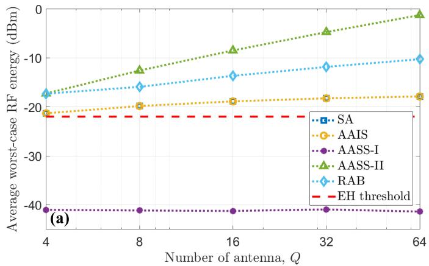

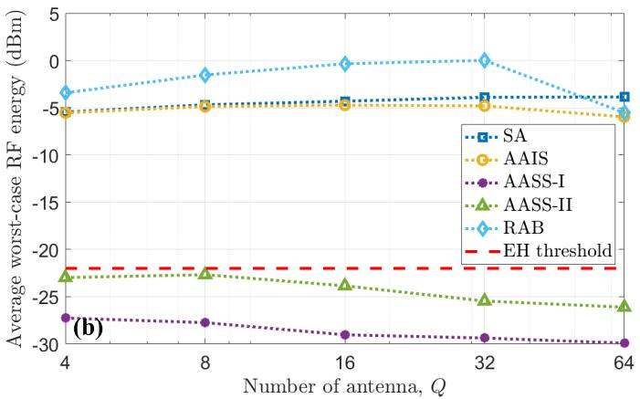  
Fig. 5. Average worst-case RF energy available for various CSI-free schemes as a function of the number of antenna Q under (a) traditional PS and (b) UAV-enabled WET approaches, where the UAV charging time by the HAP is set to $T _ { p 1 } = 1 2 0$ s. The red dashed–dotted line depicts the EH threshold of $\psi = - 2 2$ dBm.

These findings highlight that the optimal WET performance can be achieved when the HAP employs the AASS-II scheme and the UAV utilizes the RAB scheme. Therefore, in the following results, when adopting the CSI-free scheme, the AASS-II scheme is applied to the traditional PS approach, while the RAB scheme is used in the UAV-enabled WET approach. Additionally, for our proposed hybrid approach, when utilizing the CSI-free scheme, we apply the AASS-II scheme to the HAP and the RAB scheme to the UAV.

## B. WET Eficiency Analysis

Next, we delve into the performance comparison among diferent WET approaches, considering both full-CSI and CSIfree schemes. Herein, the HAP adopts the AASS-II scheme, while the UAV utilizes the RAB scheme within the hybrid approach under the CSI-free scheme.

Fig. 6 and 7 depict the average worst-case RF energy availability delivered to the UDs for various WET approaches considering full-CSI and CSI-free schemes, under diferent conditions, including the number of antennas, flying distance, number of UDs, burial depths, and VWC. To achieve the optimal WET eficiency for the hybrid approach with the CSIfree schemes, the HAP employs the AASS-II scheme, while the UAV utilizes the RAB scheme.

Fig. 6(a) shows that the average worst-case RF energy for the traditional PS approach, under both full-CSI and CSI-free schemes, increases with the number of antennas, same as the UAV-enabled and hybrid WET approaches with the full-CSI scheme. For the traditional PS approach, the full-CSI scheme outperforms the AASS-II scheme due to the beamforming gain. In contrast, in the UAV-enabled WET approach, the RAB scheme surpasses the full-CSI scheme, as it leverages mechanical rotation to enhance the charging coverage probability. However, the performance of the UAV-enabled WET and hybrid approaches with the CSI-free scheme improves for $Q \leq 3 2$ before deteriorating due to the UAV’s limited power budget and the energy consumed by the circuitry and rotation operations. When $Q \leq 3 2$ , the hybrid approach with the CSIfree schemes outperforms all other WET approaches. This is because, in the UAV segment, the performance improvement of the RAB scheme over its full-CSI counterpart exceeds the gain achieved by the full-CSI scheme over the AASS-II scheme in the HAP segment. Furthermore, the hybrid approach based on the full-CSI scheme achieves the highest average RF energy at $Q = 6 4$ owing to the substantial energy consumed by the servo motor. Note that the full-CSI scheme necessitates significant energy consumption for the CSI acquisition and precoding design via SDP.

Fig. 6(b) illustrates that the performance of the traditional PS and hybrid approaches deteriorates with the larger distance between the HAP and UDs due to the reduced energy harvested by the UDs from the HAP. For instance, at $D _ { f l y } = 6 0 0$ m, the average worst-case RF energy contributed by the HAP reaches approximately −4.1 dBm and −4.6 dBm for the full-CSI and CSI-free schemes, respectively, accounting for 25.22% and 26.02% of the total harvested energy, respectively. At shorter distances or under favorable propagation conditions, the HAP can contribute more energy with lower transmit power, thereby enhancing charging eficiency and reducing overall energy consumption. The average worstcase RF energy for the UAV-enabled WET approach remains nearly constant, as the UDs harvest energy solely from the UAV hovering at the center of the monitoring area. Notably, the proposed hybrid approach exhibits the best performance among the WET approaches as the distance varies from 200 m to 800 m.

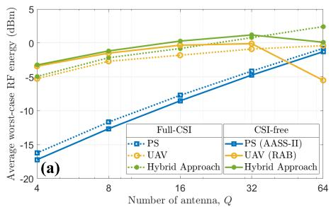

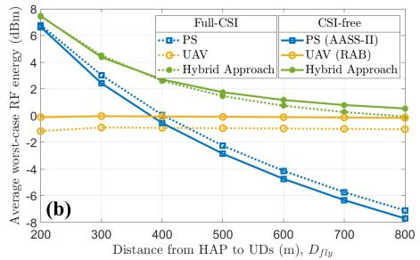

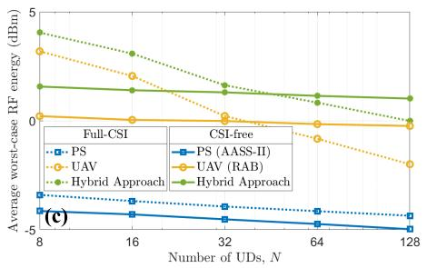  
Fig. 6. Average worst case RF energy available under various WET approaches with full-CSI and CSI-free schemes as a function of (a) the number of antennas Q, (b) the distance between the HAP and the center of the monitoring area, and (c) the number of UDs N, where the UAV charging time by th HAP is set to $T _ { p 1 } = 1 2 0$ s.

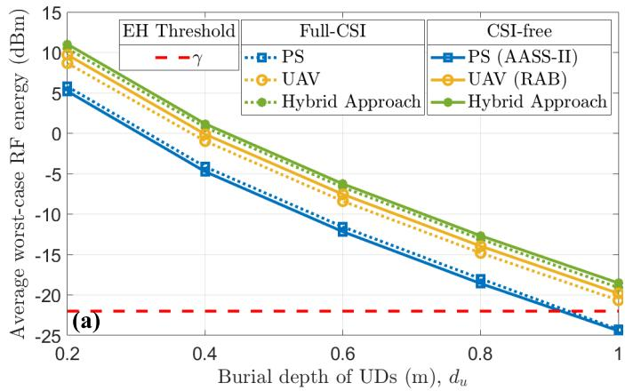

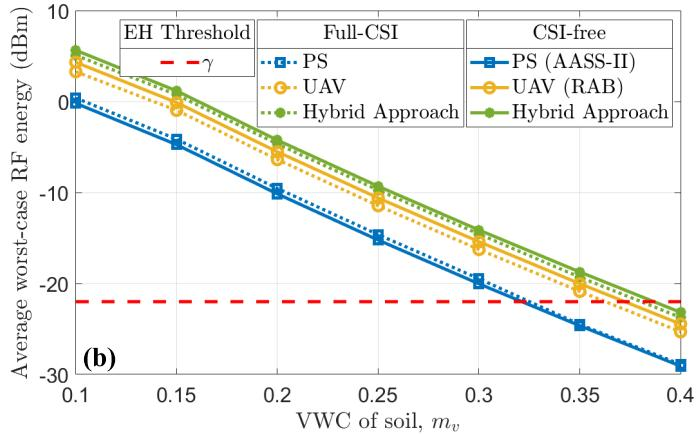  
Fig. 7. Average worst-case RF energy available under various WET approaches with full-CSI and CSI-free schemes as a function of (a) the burial depth of UDs $d _ { u } ,$ and (b) the VWC of soil $m _ { \nu } ,$ , where the UAV charging time by the HAP is set to $T _ { p 1 } = 1 2 0 ~ \mathrm { s }$ . The red dashed–dotted line depicts the EH threshold of $\psi = - 2 2$ dBm.

Fig. 6(c) shows that the performance of all WET approaches deteriorates as the number of UDs increases from 8 to 128 due to the higher probability of UDs being farther from the HAP and the UAV. Note that the performance decline for the full-CSI scheme and AASS-II is more pronounced than for RAB. Such a phenomenon is due to the fact that the energy beams for the full-CSI scheme and AASS-II become less capable of eficiently reaching the UDs with the increasing number of UDs. Furthermore, the hybrid approach with the full-CSI scheme provides the highest RF energy when $8 ~ \leq ~ N ~ \leq ~ 3 2$ , while the hybrid approach with the CSI-free schemes is the winner among all WET approaches as $6 4 \leq N \leq 1 2 8$

As shown in Fig. 7(a), the average worst-case RF energy for all WET approaches decreases with the higher burial depth due to the increased attenuation from the longer propagation path through the underground soil. For instance, as the burial depth increases from 0.2 m to 1 m, the average worst-case RF energy decreases by approximately 30 dBm. At the burial depth of 1 m with the VWC of 15%, the traditional PS approach fails to exceed the EH threshold and are not capable of charging UDs, while the proposed hybrid approach with the CSI-free schemes can attain −18.51 dBm. Therefore, the proposed hybrid approach with the CSI-free schemes demonstrates the best performance, enabling eficient WET for UDs even under challenging underground conditions.

As illustrated in Fig. 7(b), the performance of all WET approaches deteriorates with VWC, as a higher VWC significantly increases attenuation in soil, which in turn greatly afects the incident RF energy. For instance, as the VWC increases from 0.1 to 0.4, the average worst-case RF energy of the proposed hybrid approach with the CSI-free schemes decreases from 5.63 dBm to −23.18 dBm. For $m _ { \nu } ~ = ~ 0 . 4$ and $d _ { u } = 0 . 4 \mathrm { ~ m ~ }$ , none of the WET approaches surpass the EH threshold. To prevent unnecessary power expenditure in high-VWC underground conditions, the PS should halt the WET operation until the soil becomes drier, where the local VWC can be detected in real-time by UDs equipped with soil moisture sensors.

## C. Time Allocation Results

Finally, we illustrate the performance of our proposed time allocation scheme across various throughput thresholds and present the time allocation results considering diferent WET approaches.

Fig. 8 describes the energy consumption of the UAV in all phases based on the optimal time allocation obtained by solving (P3), for diferent throughput thresholds $\gamma _ { n }$ γunder various WET approaches with full-CSI and CSI-free schemes. Herein, we assume the same throughput thresholds for all UDs. As expected, the UAV’s energy consumption increases with higher throughput thresholds as more time is required for UAV’s WET and hovering operations. Note that our proposed hybrid approach outperforms all other WET approaches across all throughput thresholds for both full-CSI and CSI-free schemes. For instance, under the full-CSI scheme at $\begin{array} { c c l } { \gamma _ { n } } & { = } & { 1 2 5 0 0 0 } \end{array}$ kbps, the UAV’s energy consumption under the hybrid approach decreases by 8.15% and 10.74% compared to the traditional PS and UAV-enabled WET approaches, respectively. Similarly, under the CSI-free scheme, the $\mathrm { U A V } ^ { \ , } \mathbf { s }$ energy consumption for the hybrid approach is reduced by 13.43% and 5.38% compared to the traditional PS and UAV-enabled WET approaches at $\gamma _ { n } = 1 2 5 0 0 0$ kbps. Note that the hybrid approach utilizing the CSI-free scheme exhibits the lowest $E _ { s }$ compared to all other WET mechanisms.

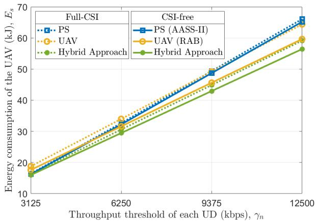  
Fig. 8. Total energy consumption of the UAV $E _ { s }$ in the proposed UAV-enabled WPUCN system as a function of throughput thresholds $\gamma _ { n }$ under the optimal γtime allocation considering various WET approaches with the full-CSI and CSI-free schemes.

TABLE III  
COMPARISON OF TIME ALLOCATION RESULTS UNDER DIFFERENT WET APPROACHES WITH $\gamma _ { n } ^ { t h } = 1 2 5 0 0$ KBPS
<table><tr><td>Approach</td><td> $T _ { p 1 }$   $\mathrm { ( s ) }$ </td><td> $T _ { p 2 }$   $\mathbf { \rho } ( \mathbf { s } )$ </td><td> $T _ { p 3 }$  (s)</td><td> $T _ { p 4 }$   $\mathrm { ( s ) }$ </td><td> $T _ { t o t a l }$   $\mathrm { ( s ) }$ </td><td> $E _ { s }$   $( \mathrm { k J } )$ </td></tr><tr><td>PS (Full-CSI)</td><td>92.74</td><td>101.28</td><td>841.07</td><td>126.87</td><td>1161.96</td><td>66.07</td></tr><tr><td>PS (AASS-II)</td><td>91.51</td><td>96.85</td><td>830.72</td><td>126.87</td><td>1145.95</td><td>65.20</td></tr><tr><td>UAV (Full-CSI)</td><td>90.40</td><td>136.88</td><td>769.51</td><td>126.87</td><td>1123.66</td><td>64.41</td></tr><tr><td>UAV (RAB)</td><td>83.73</td><td>115.12</td><td>710.74</td><td>126.87</td><td>1036.46</td><td>59.66</td></tr><tr><td>Hybrid (Full-CSI)</td><td>83.04</td><td>96.59</td><td>723.72</td><td>126.87</td><td>1030.22</td><td>59.16</td></tr><tr><td>Hybrid (CSI-free)</td><td>79.23</td><td>89.46</td><td>683.93</td><td>126.87</td><td>979.49</td><td>56.45</td></tr></table>

Table III summarizes the time allocation results obtained by solving (P3) with a throughput threshold of $\gamma _ { n } = 1 2 5 0 0$ kbps, γconsidering various WET approaches under the full-CSI and CSI-free schemes, where $T _ { t o t a l } = T _ { p 1 } + T _ { p 2 } + T _ { p 3 } + T _ { p 4 }$ . The proposed hybrid approach outperforms other WET approaches. For instance, under the CSI-free scheme, the hybrid approach reduces the total time by 57 s and 166 s compared to the traditional PS and UAV-enabled WET approaches, respectively. For the hybrid approach, the total time of the CSI-free scheme is approximately 51 s less than that of the full-CSI scheme. This indicates that the proposed hybrid approach enables eficient WET operation without the need for CSI acquisition. Furthermore, the hybrid approach under the CSIfree scheme achieves the lowest energy consumption of the UAV among all WET approaches, with $E _ { s } = 5 6 . 4 5$ kJ as the UAV employing the RAB scheme enhances the uniformity of power distribution and improves charging eficiency during the WET phase.

## VII. CONCLUSION

To enable large-scale, economical, and sustainable underground monitoring, we conceptualized a UAV-enabled WPUCN system, where a UAV is dispatched to charge a large number of remote UDs and collect sensor data. In this study, we modeled the system energy consumption and considered three WET approaches (i.e., traditional PS, UAVenabled WET, and hybrid approaches) along with the full-CSI and CSI-free schemes for eficient WET operation. Based on these WET approaches, we proposed a time allocation strategy that minimizes the UAV’s energy consumption while satisfying the throughput requirements of each UD and assuring the complete data ofloading to the HAP. Through extensive modeling of a realistic farming scenario, the numerical results revealed that the proposed hybrid approach outperforms conventional WET approaches. Notably, its performance gain was significantly afected by factors such as the number of antennas, flying distance, number of UDs, burial depths, and VWC of the soil. Furthermore, under the derived optimal time allocation, our proposed hybrid approach with the CSIfree schemes achieved the lowest UAV energy consumption across all WET mechanisms, where the HAP employed the AASS-II scheme and the UAV operated the RAB scheme with the appropriate number of antennas. This demonstrated that eficient WET can be achieved without the need for CSI acquisition. Overall, our work confirmed the feasibility and efectiveness of the proposed UAV-enabled WPUCN system and provided valuable insights for future experimentation and practical deployments of this novel concept.

Although smart agriculture is regarded as the representative use case in this study, the proposed time allocation strategy for the UAV-enabled WPUCN system can be generalized for other underground applications, such as underground pipeline monitoring and post-disaster rescue, by appropriately adjusting the channel model and system parameters. Herein, potential impairment sources, including non-uniform signal attenuation across soil layers, multipath fading caused by gravel, and the impact of underground infrastructure, need to be considered in the system model to more accurately characterize the system performance of those applications. Furthermore, to enhance the overall system performance, it is worth further investigating the joint optimization of the UAV’s trajectory parameters such as its speed, flight path, and hovering positions, while accounting for practical considerations including the UAV’s limited battery capacity, the UDs’ energy storage constraints, and the total mission duration.

## REFERENCES

[1] K. Lin, M. A. Ullah, H. Alves, K. Mikhaylov, and T. Hao, “Subterranean mMTC in remote areas: Underground-to-satellite connectivity approach,” IEEE Commun. Mag., vol. 61, no. 5, pp. 136–142, May 2023.

[2] K. Lin, M. A. Ullah, L. Lei, H. Alves, K. Mikhaylov, and T. Hao, “Performance analysis of LoRaWAN underground-to-satellite connectivity: An urban underground pipelines monitoring case study,” Ad Hoc Netw., vol. 169, Mar. 2025, Art. no. 103747.

[3] G. Liu, “Data collection in MI-assisted wireless powered underground sensor networks: Directions, recent advances, and challenges,” IEEE Commun. Mag., vol. 59, no. 4, pp. 132–138, Apr. 2021.

[4] I. F. Akyildiz and E. P. Stuntebeck, “Wireless underground sensor networks: Research challenges,” Ad Hoc Netw., vol. 4, no. 6, pp. 669–686, Nov. 2006.

[5] M. C. Vuran, A. Salam, R. Wong, and S. Irmak, “Internet of Underground Things in precision agriculture: Architecture and technology aspects,” Ad Hoc Netw., vol. 81, pp. 160–173, Dec. 2018.

[6] G. Liu, Z. Wang, and T. Jiang, “QoS-aware throughput maximization in wireless powered underground sensor networks,” IEEE Trans. Commun., vol. 64, no. 11, pp. 4776–4789, Nov. 2016.

[7] G. Liu, Z. Sun, and T. Jiang, “Joint time and energy allocation for QoS-aware throughput maximization in MIMO-based wireless powered underground sensor networks,” IEEE Trans. Commun., vol. 67, no. 2, pp. 1400–1412, Feb. 2019.

[8] K. Lin et al., “Throughput optimization in backscatter-assisted wirelesspowered underground sensor networks for smart agriculture,” Internet Things, vol. 20, Nov. 2022, Art. no. 100637.

[9] K. Lin, O. L. A. Lopez, H. Alves, and T. Hao, “On CSI-free multiantenna´ schemes for massive wireless-powered underground sensor networks,” IEEE Internet Things J., vol. 10, no. 19, pp. 17557–17570, Oct. 2023.

[10] O. L. A. Lopez, S. Montejo-S ´ anchez, R. D. Souza, C. B. Papadias, and´ H. Alves, “On CSI-free multiantenna schemes for massive RF wireless energy transfer,” IEEE Internet Things J., vol. 8, no. 1, pp. 278–296, Jan. 2021.

[11] O. L. A. Lopez, H. Alves, R. D. Souza, and S. Montejo-S ´ anchez,´ “Statistical analysis of multiple antenna strategies for wireless energy transfer,” IEEE Trans. Commun., vol. 67, no. 10, pp. 7245–7262, Oct. 2019.

[12] O. L. A. Lopez, H. Alves, S. Montejo-S´ anchez, R. D. Souza, and´ M. Latva-aho, “CSI-free rotary antenna beamforming for massive RF wireless energy transfer,” IEEE Internet Things J., vol. 9, no. 10, pp. 7375–7387, May 2022.

[13] L. Xie, X. Cao, J. Xu, and R. Zhang, “UAV-enabled wireless power transfer: A tutorial overview,” IEEE Trans. Green Commun. Netw., vol. 5, no. 4, pp. 2042–2064, Dec. 2021.

[14] H. Yan, Y. Chen, and S.-H. Yang, “UAV-enabled wireless power transfer with base station charging and UAV power consumption,” IEEE Trans. Veh. Technol., vol. 69, no. 11, pp. 12883–12896, Nov. 2020.

[15] X. Yuan, Y. Hu, and A. Schmeink, “Joint design of UAV trajectory and directional antenna orientation in UAV-enabled wireless power transfer networks,” IEEE J. Sel. Areas Commun., vol. 39, no. 10, pp. 3081–3096, Oct. 2021.

[16] M. Li, H. Li, P. Ma, and H. Wang, “Energy maximization for ground nodes in UAV-enabled wireless power transfer systems,” IEEE Internet Things J., vol. 10, no. 19, pp. 17096–17109, Oct. 2023.

[17] C. You and R. Zhang, “3D trajectory optimization in Rician fading for UAV-enabled data harvesting,” IEEE Trans. Wireless Commun., vol. 18, no. 6, pp. 3192–3207, Jun. 2019.

[18] Z. Wei et al., “UAV-assisted data collection for Internet of Things: A survey,” IEEE Internet Things J., vol. 9, no. 17, pp. 15460–15483, Sep. 2022.

[19] W. Liu, X. Zhang, H. Xing, J. Ren, Y. Shen, and S. Cui, “UAV-enabled wireless networks with movable-antenna array: Flexible beamforming and trajectory design,” IEEE Wireless Commun. Lett., vol. 14, no. 3, pp. 566–570, Mar. 2025.

[20] M. Jiang, Y. Li, Q. Zhang, and J. Qin, “Joint position and time allocation optimization of UAV enabled time allocation optimization networks,” IEEE Trans. Commun., vol. 67, no. 5, pp. 3806–3816, May 2019.

[21] Y. Liu, K. Xiong, Y. Lu, Q. Ni, P. Fan, and K. B. Letaief, “UAV-aided wireless power transfer and data collection in Rician fading,” IEEE J. Sel. Areas Commun., vol. 39, no. 10, pp. 3097–3113, Oct. 2021.

[22] C. Kim, H.-H. Choi, and K. Lee, “Joint optimization of trajectory and resource allocation for multi-UAV-enabled wireless-powered communication networks,” IEEE Trans. Commun., vol. 72, no. 9, pp. 5752–5764, Sep. 2024.

[23] H. Yan, Y. Chen, and S.-H. Yang, “Time allocation and optimization in UAV-enabled wireless powered communication networks,” IEEE Trans. Green Commun. Netw., vol. 6, no. 2, pp. 951–964, Jun. 2022.

[24] Y. Luo and L. Pu, “UAV remotely-powered underground IoT for soil monitoring,” IEEE Trans. Ind. Informat., vol. 20, no. 1, pp. 972–983, Jan. 2024.

[25] P. K. Chittoor, B. Chokkalingam, and L. Mihet-Popa, “A review on UAV wireless charging: Fundamentals, applications, charging techniques and standards,” IEEE Access, vol. 9, pp. 69235–69266, 2021.

[26] P. Viswanath, D. Tse, and R. Laroia, “Opportunistic beamforming using dumb antennas,” IEEE Trans. Inf. Theory, vol. 48, no. 6, pp. 1277–1294, Jun. 2002.

[27] B. Sklar et al., Digital Communications, vol. 2. Upper Saddle River, NJ, USA: Prentice-Hall, 2001.

[28] J. R. Hampton, Introduction To MIMO Communications. Cambridge, U.K.: Cambridge Univ. Press, 2013.

[29] K. Lin and T. Hao, “Experimental link quality analysis for LoRa-based wireless underground sensor networks,” IEEE Internet Things J., vol. 8, no. 8, pp. 6565–6577, Apr. 2021.

[30] D. Wohwe Sambo, A. Forster, B. O. Yenke, I. Sarr, B. Gueye, and P. Dayang, “Wireless underground sensor networks path loss model for precision agriculture (WUSN-PLM),” IEEE Sensors J., vol. 20, no. 10, pp. 5298–5313, May 2020.

[31] X. Dong, M. C. Vuran, and S. Irmak, “Autonomous precision agriculture through integration of wireless underground sensor networks with center pivot irrigation systems,” Ad Hoc Netw., vol. 11, no. 7, pp. 1975–1987, Sep. 2013.

[32] V. L. Mironov, L. G. Kosolapova, and S. V. Fomin, “Physically and mineralogically based spectroscopic dielectric model for moist soils,” IEEE Trans. Geosci. Remote Sens., vol. 47, no. 7, pp. 2059–2070, Jul. 2009.

[33] E. Boshkovska, D. W. K. Ng, N. Zlatanov, and R. Schober, “Practical non-linear energy harvesting model and resource allocation for SWIPT systems,” IEEE Commun. Lett., vol. 19, no. 12, pp. 2082–2085, Dec. 2015.

[34] O. L. A. Lopez, F. A. Monteiro, H. Alves, R. Zhang, and M. Latva-Aho,´ “A low-complexity beamforming design for multiuser wireless energy transfer,” IEEE Wireless Commun. Lett., vol. 10, no. 1, pp. 58–62, Jan. 2021.

[35] O. L. A. Lopez, H. Alves, R. D. Souza, S. Montejo-S´ anchez,´ E. M. G. Fernandez, and M. Latva-Aho, “Massive wireless energy´ transfer: Enabling sustainable IoT toward 6G era,” IEEE Internet Things J., vol. 8, no. 11, pp. 8816–8835, Jun. 2021.

[36] N. A. Talwalkar, C. P. Yue, H. Gan, and S. S. Wong, “Integrated CMOS transmit-receive switch using LC-tuned substrate bias for 2.4- GHz and 5.2-GHz applications,” IEEE J. Solid-State Circuits, vol. 39, no. 6, pp. 863–870, Jun. 2004.

[37] Y.-Y. Huang, H. Jeon, Y. Yoon, W. Woo, C.-H. Lee, and J. S. Kenney, “An ultra-compact, linearly-controlled variable phase shifter designed with a novel RC poly-phase filter,” IEEE Trans. Microw. Theory Techn., vol. 60, no. 2, pp. 301–310, Feb. 2012.

[38] Y. Zeng, J. Xu, and R. Zhang, “Energy minimization for wireless communication with rotary-wing UAV,” IEEE Trans. Wireless Commun., vol. 18, no. 4, pp. 2329–2345, Apr. 2019.

[39] K. W. Choi, L. Ginting, D. Setiawan, A. A. Aziz, and D. I. Kim, “Coverage probability of distributed wireless power transfer system,” in Proc. 9th Int. Conf. Ubiquitous Future Netw. (ICUFN), Jul. 2017, pp. 691–696.

[40] S. Boyd, S. P. Boyd, and L. Vandenberghe, Convex Optimization. Cambridge, U.K.: Cambridge Univ. Press, 2004.

Kaiqiang Lin (Member, IEEE) received the Ph.D. degree in surveying and mapping from Tongji University, Shanghai, China, in 2024. From 2021 to 2023, he was a Visiting Ph.D. Student with the Centre for Wireless Communications (CWC), University of Oulu, Oulu, Finland. He is currently a Post-Doctoral Research Fellow with the Communication Theory Laboratory, King Abdullah University of Science and Technology (KAUST), Thuwal, Saudi Arabia. His current research interests include wireless underground sensor networks, low-power

wide-area networks, wireless energy transfer, and sustainable underground monitoring.

Yijie Mao (Member, IEEE) received the B.Eng. degree from Beijing University of Posts and Telecommunications, the B.Eng. degree (Hons.) from the Queen Mary University of London, London, U.K., in 2014, and the Ph.D. degree from the Electrical and Electronic Engineering Department, The University of Hong Kong, Hong Kong, China, in 2018. From 2018 to 2019, she was a Post-Doctoral Research Fellow with The University of Hong Kong. From 2019 to 2021, she was a Post-Doctoral Research Associate with the Commu-

nications and Signal Processing Group (CSP), Department of Electrical and Electronic Engineering, Imperial College London, London. Since 2021, she has been an Assistant Professor with the School of Information Science and Technology, ShanghaiTech University, Shanghai, China. Her research interests include the design of future wireless communications and artificial intelligence-empowered wireless networks. She has been a technical program committee (TPC) member of many symposia on wireless communication for several leading international IEEE conferences. She has been recognized as the World’s Top 2% Scientists by Stanford University in 2023 and 2025. She received the Best Paper Awards of EURASIP Journal on Wireless Communications and Networking (JWCN) in 2022 and the IEEE International Mediterranean Conference on Communications and Networking (MeditCom) in 2023, the Exemplary Associate Editor for IEEE COMMUNICATIONS SURVEYS AND TUTORIALS in 2025, and the Exemplary Reviewers for IEEE TRANSACTIONS ON COMMUNICATIONS in 2021 and IEEE COMMUNICA-TIONS LETTERS in 2022 and 2023. She has been the Workshop Co-Chair for 2020–2024 IEEE ICC, 2021–2023 IEEE WCNC, and 2020–2022 IEEE PIMRC. She was the Lead Guest Editor for one special issue of IEEE TRANSACTIONS ON GREEN COMMUNICATIONS AND NETWORKING, and also a Guest Editor for three special issues of IEEE JOURNAL ON SELECTED AREAS IN COMMUNICATIONS and IEEE OPEN JOURNAL OF THE COM-MUNICATIONS SOCIETY. She is serving as an Associate Editor for IEEE COMMUNICATIONS SURVEYS AND TUTORIALS, IEEE TRANSACTIONS ON MOBILE COMPUTING, and IEEE COMMUNICATIONS LETTERS.

Onel Luis Alcaraz Lopez´ (Senior Member, IEEE) received the B.Sc. degree (Hons.) in electrical engineering from the Central University of Las Villas, Cuba, in 2013, the M.Sc. degree in electrical engineering from the Federal University of Parana,´ Brazil, in 2017, and the D.Sc. degree (Hons.) in electrical engineering from the University of Oulu, Finland, in 2020. From 2013 to 2015, he was a Specialist in telematics with Cuban telecommunications company (ETECSA). In 2020, he was a Post-Doctoral Researcher with a joint project between the University of Oulu and Nokia Oulu, Finland. He was on a six-month research visit with Rice University and the University of Houston, TX, USA, in 2024. He was an Associate Professor (tenure track) in sustainable wireless communications engineering with the Centre for Wireless Communications (CWC), Oulu, Finland. He has co-authored the books titled Wireless RF Energy Transfer in the Massive IoT Era: Towards Sustainable Zero-energy Networks (Wiley, 2021) and Ultra-Reliable Low-Latency Communications: Foundations, Enablers, System Design, and Evolution Towards 6G (Now

Publishers, 2023). His research interests include the sustainable IoT, energy harvesting, wireless RF energy transfer, wireless connectivity, machine-type communications, and cellular-enabled positioning systems. He is a collaborator to the 2016 Research Award given by Cuban Academy of Sciences, a co-recipient of the 2019 and 2023 IEEE European Conference on Networks and Communications (EuCNC) Best Student Paper Award, and a recipient of the 2020 Best Doctoral Thesis Award granted by Academic Engineers and Architects in Finland TEK and Tekniska Foreningen i Finland (TFiF)¨ in 2021 and the 2022 Young Researcher Award in the field of technology in Finland. He is currently an Associate Editor of IEEE TRANSACTIONS ON COMMUNICATIONS, IEEE WIRELESS COMMUNICATIONS LETTERS, and IEEE COMMUNICATIONS LETTERS.

Mohamed-Slim Alouini (Fellow, IEEE) was born in Tunis, Tunisia. He received the Ph.D. degree from California Institute of Technology (Caltech) in 1998. He was a Faculty Member with the University of Minnesota and later with Texas A&M University at Qatar. In 2009, he became a Founding Faculty Member with the King Abdullah University of Science and Technology (KAUST), where he currently is a Al-Khawarizmi Distinguished Professor of electrical and computer engineering and the holder of the UNESCO Chair on Education to Connect the

Unconnected. He is currently particularly focusing on addressing the technical challenges associated with information and communication technologies (ICT) in underserved regions and is committed to bridging the digital divide by tackling issues related to the uneven distribution, access to, and utilization of ICT in rural, low-income, disaster-prone, and hard-to-reach areas. His research interests include wireless and satellite communications. He is a fellow of OPTICA and SPIE.