# UAV-Relay-Aided Secure Maritime Networks Coexisting With Satellite Networks: Robust Beamforming and Trajectory Optimization

Yu Yao, Member, IEEE, Wenqi Xiao , Student Member, IEEE, Pu Miao , Member, IEEE, Gaojie Chen , Senior Member, IEEE, Haitao Yang, Chan-Byoung Chae , Fellow, IEEE, and Kai-Kit Wong , Fellow, IEEE

Abstract—Hybrid satellite-uncrewed aerial vehicle (UAV)- terrestrial networks (SUTNs) can provide maritime users with ubiquitous communication services. However, eavesdropping poses a significant challenge to the secure communications of SUTNs due to their wide-area coverage. In this paper, we propose a novel secure scheme for maritime communications, where a terrestrial-UAV integrated network coexists with marine satellite (MS) systems in the presence of an eavesdropper (Eve). Considering imperfect channel state information (CSI) for both the MS and Eve, we focus on the collaborative design of beamforming for the terrestrial base station (TBS), UAV, and MS, as well as the UAV’s trajectory. A robust optimization problem is formulated to maximize the worst-case secrecy rate, subject to constraints on worst-case communication quality for each user, UAV locations, and TBS backhaul throughput. To tackle this intractable non-convex problem, we leverage the S-procedure, general sign-definiteness, and successive convex approximation (SCA) to propose a security solution that efficiently optimizes all variables using convex optimization techniques. Numerical results validate the effectiveness of the proposed solution, illustrating the impact of CSI errors and the secure performance enhancements achieved through joint trajectory and beamforming optimization.

Received 29 November 2024; revised 19 April 2025 and 22 June 2025; accepted 1 August 2025. Date of publication 12 August 2025; date of current version 22 December 2025. This work was supported in part by the National Natural Science Foundation of China under Grant 62261021; in part by the Scientific Research Fund Project of Hainan University under Grant 625RC712 and Grant KYQD(ZR)-21008; in part by the Fundamental Research Funds for the Central Universities, Sun Yat-sen University, under Grant 24hytd010; and in part by Shandong Provincial Natural Science Foundation under Grant ZR2023MF096. The associate editor coordinating the review of this article and approving it for publication was H. Zhang. (Corresponding author: Gaojie Chen.)

Index Terms—Satellite-UAV-terrestrial networks (SUTNs), maritime communications, physical layer security (PLS), robust beamforming optimization, trajectory design.

## I. INTRODUCTION

W <sup>ITH</sup> <sup>the</sup> <sup>advancement</sup> <sup>of</sup> <sup>the</sup> <sup>marine</sup> <sup>economy</sup> <sup>and</sup> <sup>the</sup> development of smart ocean, maritime communication techniques have aroused widespread research concerns [1]. In order to meet the maritime communication requirements, satellite-terrestrial integrated systems have arisen, in which marine satellites (MSs) and terrestrial base stations (TBSs) are combined together to improve maritime coverage [2], [3]. While the MS systems can cover a vast and wide ocean surface, they suffer from intrinsic shortcomings such as the far transmission distance (and hence high latency), restricted onboard payloads and limited spectrum resources [4]. On the other hand, the TBSs are installed along the coast to offer the restricted offshore area coverage, where high quality communication is ensured within a limited area. The inherent drawbacks render the existing infrastructures, for example, MSs and TBSs, inefficient and insufficient to satisfy the growing demand for reliable information transmission on the ocean surface [5].

Unlike MS systems and TBSs, uncrewed aerial vehicles (UAVs) can adjust adaptively their spatial positions based on maritime communication demands [6]. Specifically, UAVs can be flexibly deployed and serve as relay platforms to offer connectivity to the communication users on the ocean surface. Considering the UAV-aided relay transmission is restrained by the channel capacity of backhaul link from the UAV to TBS, the work of [7] proposed a UAV-aided decode-andforward (DF) relay maritime communication scheme. The semi-closed-form solution to the UAV position was derived for a single receiver. By utilizing the delay-tolerant DF scheme, the work of [8] studied the optimization of the communication performance of UAV-aided relaying network within a limited scope of time. In addition, under the circumstance of underwater Internet-of-Things (IoT) systems, UAV significantly facilitates data collection by collaborating with uncrewed surface vehicles (USVs), uncrewed underwater vehicles (UUVs) and sensors, improving the performance of ocean monitoring systems [9]. Meanwhile, during search and rescue operations, UAV is capable of offering high capacity line-of-sight (LoS) links to facilitate the transmission of realtime video information among the participating vessels and TBSs [10]. An intrinsic feature of UAV is that energyefficient communications and trajectory optimization has to be considered, while recent progresses in wireless power transfer (WPT) is capable of providing further gains towards extending their flying period.

Apart from TBS-UAV communication networks, the coexistence of UAV-aided networks and MS systems has been studied [11]. Owing to the flexibility, maneuverability and strong LoS link, UAVs as relay platforms are readily combined into satellite-terrestrial systems with various critical functions, for example signal transfer [12] and complementary for ground small base stations [13]. Moreover, the authors of [14] investigated hybrid satellite-UAV relay systems based on coordinated multi-point scheme with respect to two optimization methods of relay selection and resource allocation. In [15], the power allocation problem was considered to optimize the sum transmission capacity of non-orthogonal multiple access (NOMA)-enabled satellite-UAV-terrestrial networks (SUTNs) for maritime communication applications. The integration of UAV-aided networks and satellite systems for heterogeneous flying platforms was studied in [16]. In addition, the far transmission delay is extremely challenging for satellite systems. Hence, the influence of flying platform altitude on the average transmission delay was investigated to coordinate UAV-assisted networks and satellite systems in [17]. Multiple UAV enabled systems were established in [18], where the average coverage probability and the system transmission capacity were studied for specific regions. The work of [19] proposed the onboard mobile wireless communication systems, where low-complexity resource allocation approaches were developed to provide the various uplink transmission services.

Owing to the intrinsic broadcasting and openness of the wireless environment and LoS characteristics of the UAV, the exposed hybrid SUTNs are vulnerable to potential eavesdropping and illegitimate disturbance. Conventionally, the upperlayer encryption is exploited to perform the security in wireless transmission. However, the high dynamics and processing delay of UAV make such methods ineffective. Physical layer security (PLS) technique has revealed as a valid complement to conventional encryption method, which play an important role in guaranteeing maritime communication security [20], [21]. The combination of PLS scheme and UAV communication is capable of improving the secure communication performance by cooperatively designing resource allocation and UAV trajectory [22]. For example, a mobile UAV was employed to improve coverage and concurrently enable secure transmission between the satellite systems and authorized users with the internal eavesdropper (Eve) [23]. The authors of [24] studied the secure problem by extending ground networks to satellite communications using the UAV-based artificial noise scheme. Combining beamforming optimization with artificial noise method realizes more secure communication performance. In [25], the secure transmission performance analysis was considered for a NOMA hybrid space-ground network. Moreover, the work of [26] proposed a two-layer Stackelberg game based system model to perturb malicious wiretapping and jamming attacks in the SUTNs system. The secrecy transmission problem of a friendly jammer enabled cognitive satellite-terrestrial system was studied in [27]. The security and reliability tradeoff performance for a satellite-terrestrial system exploiting the NOMA technique was analyzed in [28].

Beamforming optimization schemes have been applied in hybrid SUTNs. since they concurrently improve the signal power at licensed receivers and restrain signal disclosure from possible Eves. Researchers have put great efforts into devising secure beamforming based on satellite systems and TBSs [29], [30], [31], [32]. In particular, a design approach in which the transmit beamforming is an integration of the energy and information components was proposed and secure transmission problem of relay systems was studied in [29]. A aerial beamforming relay network was investigated in [30]. A UAV-aided antenna array was employed to enable secure transmissions between ground users. Furthermore, the authors of [31] extended the secure transmission problem of multibeam satellite systems. The work of [32] formulated the secure communication model of cognitive satellite-terrestrial networks, where Taylor expansion technique was employed to handle the design problem, and an alternative optimization procedure was presented to acquire suboptimal beamforming solution. All the aforementioned security studies assumed perfect channel state information (CSI), which is unpractical in MS and eavesdropping channel conditions. However, perfect CSI acquisition could be difficult for the hybrid SUTNs owing to large transmission delay, variable signal transmission, and undesired channel condition. It not only requires the spectrum coexistence of satellite, UAV, and ground networks but also faces the challenge of timing synchronization. If maritime communication is considered simplistically on the basis of perfect CSI for system optimization, the secure transmission capability would be greatly deteriorated. To the best of our knowledge, the PLS technique for hybrid SUTNs with imperfect CSI has not been studied before.

Based on the aforementioned discussions, this work proposes a secure optimization framework for maritime communications, where terrestrial-UAV integrated network coexists with the MS system. Specifically, considering the secure communication in the maritime scenario, UAV is served as a flying DF relay to offer wireless coverage and improve system security via PLS scheme. A comparison between our work and state-of-the-art methods is presented in Table I, and the main contributions of this paper are listed as follows.

• We propose a novel design strategy of UAV-relay-aided secure maritime communications against a suspicious Eve. The UAV is utilized as a flying relay to support large range communications. Meanwhile, the MS systems provide service to dedicated satellite users (SUs). The system model is firstly extended to a general scenario where the bounded CSI of MS and eavesdropping channels is taken into consideration. To handle the spectrum scarcity problem on the ocean, the spectrum resource is shared among the MS, TBS and UAV, where collaborative beamforming scheme is employed to suppress co-channel interference.

• A robust secrecy rate (SR) optimization problem is established to jointly design the collaborative beamforming methods and UAV trajectory, subject to several practical requirements, for example UAV locations, system power budget, worst-case quality of service (QoS) requirements of maritime user (MU), and TBS backhaul throughput. The worst-case robust optimization scheme can ensure the secure communication capability of all users regardless of the practical channel conditions.

To tackle the coupling problem of multiple variables, a sequential optimization framework with two subproblems is developed. The subproblem is tackled by exploiting auxiliary variables, Cauchy-Schwarz inequality and successive convex approximation (SCA) approaches in an iterative way. For the imperfect CSI condition of MS systems and Eve, the S-procedure is employed to dealing with semi-infinite inequality constraints generated by the CSI error uncertainty.

• Numerical results demonstrate that UAV matches well with the MS systems and maritime communication networks. Furthermore, the joint cooperative beamforming and trajectory optimization approach is capable of achieving interference coordination and enhancing secure communication performance effectively.

The rest of our work is organized as follows. Section II introduces the secure hybrid SUTNs system model. The robust SR optimization problem is established in Section III with high quality solution in Section IV. Section VI and Section VII give the simulation results and conclusions.

TABLE I  
COMPARISON BETWEEN OUR WORK AND STATE-OF-THE-ART METHODS
<table><tr><td rowspan=1 colspan=1></td><td rowspan=1 colspan=1>[1], [2]</td><td rowspan=1 colspan=1>[23], [24]</td><td rowspan=1 colspan=1>[25], [32]</td><td rowspan=1 colspan=1>[15], [33]</td><td rowspan=1 colspan=1>[10], [22]</td><td rowspan=1 colspan=1>[29], [30]</td><td rowspan=1 colspan=1>Proposed</td></tr><tr><td rowspan=1 colspan=1>Collaborative beamforming design</td><td rowspan=1 colspan=1></td><td rowspan=1 colspan=1> $\checkmark$ </td><td rowspan=1 colspan=1></td><td rowspan=1 colspan=1> $\checkmark$ </td><td rowspan=1 colspan=1></td><td rowspan=1 colspan=1> $\checkmark$ </td><td rowspan=1 colspan=1> $\checkmark$ </td></tr><tr><td rowspan=1 colspan=1>Trajectory planning</td><td rowspan=1 colspan=1>√</td><td rowspan=1 colspan=1> $\checkmark$ </td><td rowspan=1 colspan=1> $\checkmark$ </td><td rowspan=1 colspan=1> $\checkmark$ </td><td rowspan=1 colspan=1> $\checkmark$ </td><td rowspan=1 colspan=1></td><td rowspan=1 colspan=1>√</td></tr><tr><td rowspan=1 colspan=1>Spectrum coexistence of SUTNs</td><td rowspan=1 colspan=1> $\checkmark$ </td><td rowspan=1 colspan=1> $\checkmark$ </td><td rowspan=1 colspan=1> $\checkmark$ </td><td rowspan=1 colspan=1> $\checkmark$ </td><td rowspan=1 colspan=1></td><td rowspan=1 colspan=1></td><td rowspan=1 colspan=1> $\checkmark$ </td></tr><tr><td rowspan=1 colspan=1>UAV relay</td><td rowspan=1 colspan=1></td><td rowspan=1 colspan=1></td><td rowspan=1 colspan=1> $\overline { { \checkmark } }$ </td><td rowspan=1 colspan=1> $\overline { { \checkmark } }$ </td><td rowspan=1 colspan=1> $\checkmark$ </td><td rowspan=1 colspan=1> $\checkmark$ </td><td rowspan=1 colspan=1> $\overline { { \checkmark } }$ </td></tr><tr><td rowspan=1 colspan=1>Secure communication</td><td rowspan=1 colspan=1></td><td rowspan=1 colspan=1> $\overline { { \checkmark } }$ </td><td rowspan=1 colspan=1> $\overline { { \checkmark } }$ </td><td rowspan=1 colspan=1></td><td rowspan=1 colspan=1> $\overline { { \checkmark } }$ </td><td rowspan=1 colspan=1> $\checkmark$ </td><td rowspan=1 colspan=1> $\checkmark$ </td></tr><tr><td rowspan=1 colspan=1>Imperfect CSI of satellite</td><td rowspan=1 colspan=1></td><td rowspan=1 colspan=1></td><td rowspan=1 colspan=1></td><td rowspan=1 colspan=1></td><td rowspan=1 colspan=1></td><td rowspan=1 colspan=1></td><td rowspan=1 colspan=1> $\checkmark$ </td></tr><tr><td rowspan=1 colspan=1>Imperfect CSI of Eve</td><td rowspan=1 colspan=1></td><td rowspan=1 colspan=1></td><td rowspan=1 colspan=1></td><td rowspan=1 colspan=1></td><td rowspan=1 colspan=1></td><td rowspan=1 colspan=1> $\checkmark$ </td><td rowspan=1 colspan=1> $\checkmark$ </td></tr></table>

Notations: Matrices are denoted by bold uppercase letters and vectors are denoted by bold lowercase letters. The trace and the vectorization operations are represented by $\operatorname { t r } \left( { \mathord { \cdot } } \right)$ and vec (·), respectively. $\left( . \right) ^ { T } , \left( . \right) ^ { H }$ and $( . ) ^ { * }$ signify transpose, Hermitian transpose and complex conjugate of matrices, respectively. diag (·) signifies the vector formed by the diagonal elements of matrices. ⊗ is the Kronecker product. <sup>E</sup> (·) indicates the statistical expectation operation. The major variables adopted in the paper are listed in Table II for ease of reference.

## II. SYSTEM MODEL AND PROBLEM FORMULATION

## A. System Model

We study the PLS of a hybrid SUTNs in maritime communication scenarios. As presented in Fig. 1, the system model is made up of a TBS, a UAV-relay, MUs, and MS system.

TABLE II  
VARIABLE LIST
<table><tr><td rowspan=1 colspan=1>Notation</td><td rowspan=1 colspan=1>Definition</td></tr><tr><td rowspan=1 colspan=1> $\overline { { K } }$ </td><td rowspan=1 colspan=1>number of MUs</td></tr><tr><td rowspan=1 colspan=1> $\overline { { M } }$ </td><td rowspan=1 colspan=1>number of SUs</td></tr><tr><td rowspan=1 colspan=1> $\overline { { N _ { t } } }$ </td><td rowspan=1 colspan=1>number of antennas for TBS</td></tr><tr><td rowspan=1 colspan=1> $N _ { u }$ </td><td rowspan=1 colspan=1>number of antennas for UAV</td></tr><tr><td rowspan=1 colspan=1> $N _ { s }$ </td><td rowspan=1 colspan=1>number of antennas for LEO</td></tr><tr><td rowspan=1 colspan=1> $\mathbf { H } _ { \mathrm { T , U } }$ </td><td rowspan=1 colspan=1>channels between TBS and UAV</td></tr><tr><td rowspan=1 colspan=1> ${ \bf h } _ { \mathrm { U } , k }$ </td><td rowspan=1 colspan=1>channels between UAV and MU k</td></tr><tr><td rowspan=1 colspan=1> $\mathbf { h } _ { \mathrm { U , E } }$ </td><td rowspan=1 colspan=1>channels between UAV and Eve</td></tr><tr><td rowspan=1 colspan=1> ${ \bf h } _ { \mathrm { U , m } }$ </td><td rowspan=1 colspan=1>channels between UAV and SU m</td></tr><tr><td rowspan=1 colspan=1> ${ \bf H } _ { \mathrm { S , U } }$ </td><td rowspan=1 colspan=1>channels between LEO and UAV</td></tr><tr><td rowspan=1 colspan=1> $\mathbf { h } _ { \mathrm { S } , k }$ </td><td rowspan=1 colspan=1>channels between LEO and MU k</td></tr><tr><td rowspan=1 colspan=1> $\mathbf { h } _ { \mathrm { S } , m }$ </td><td rowspan=1 colspan=1>channels between LEO and SU m</td></tr><tr><td rowspan=1 colspan=1> $s _ { m }$ </td><td rowspan=1 colspan=1>SU m designated stream from LEO</td></tr><tr><td rowspan=1 colspan=1> $s _ { k }$ </td><td rowspan=1 colspan=1>MU k designated stream from TBS</td></tr><tr><td rowspan=1 colspan=1> ${ \bf w } _ { \mathrm { U } , k }$ </td><td rowspan=1 colspan=1>beamforming by UAV for MU k</td></tr><tr><td rowspan=1 colspan=1> ${ \bf w } _ { \mathrm { T } , k }$ </td><td rowspan=1 colspan=1>beamforming by TBS for MU k</td></tr><tr><td rowspan=1 colspan=1> ${ \bf w } _ { \mathrm { s } , m }$ </td><td rowspan=1 colspan=1>beamforming by LEO for SU m</td></tr></table>

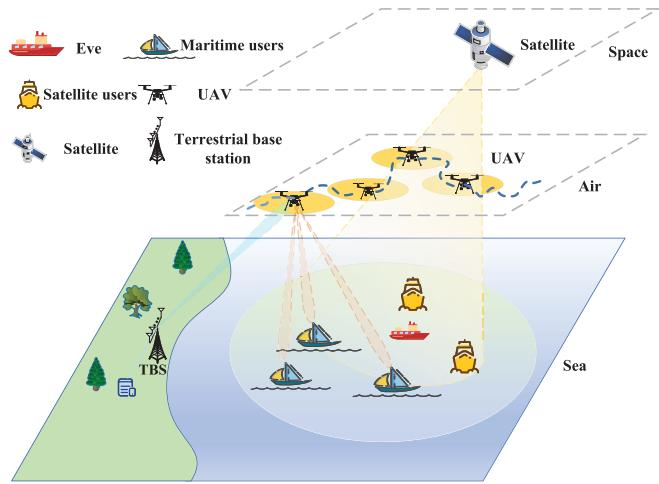  
Fig. 1. A description of the studied hybrid MS-UAV-terrestrial secure systems.

The MS system with N<sub>S</sub>-antennas serves M dedicated SUs, while TBS with N -antennas sends the confidential signals to K single-antenna MUs. The UAV serves as a $N _ { U }$ -antenna DF relay to support the TBS establish transmission links with MUs. Furthermore, there exists a single-antenna Eve, whose perfect CSI is unavailable, aims at wiretapping the confidential information intended to the secure MUs.

The spectrum resource is shared among TBS, UAV and MS. Hence, there exists disturbance between the TBS-UAV link and the MS-SU link and between the UAV-MU link and the MS-SU link.

A three-dimensional (3D) coordinate system is constructed with the ground as the horizontal plane. The horizontal coordinates of the Eve and MU k are $\mathbf q _ { E } = \left[ x _ { E } , y _ { E } \right] ^ { \mathrm { T } }$ and $\mathbf q _ { k } = \left[ x _ { k } , y _ { k } \right] ^ { \mathrm { T } }$ , ∀k, respectively. The overall flight mission T is equivalently divided into N slots each with $\Delta _ { t } = T / N$ Hence, the 3D coordinates of the UAV is represented by $\mathbf { q } [ n ] \ = \ ( q _ { x } [ n ] , q _ { y } [ n ] , Z ) ^ { \mathrm { T } } , n \ \in \ \{ 1 , . . . , N \}$ . Moreover, the initial and final positions of the UAV are ${ \bf q } _ { \mathrm { I } }$ and $\mathbf { q } _ { \mathrm { F } }$ . Therefore, the UAV trajectory constraints can be denoted as

$$
\mathbf { q } [ 1 ] = \mathbf { q } _ { \mathrm { I } } , \mathbf { q } [ N ] = \mathbf { q } _ { \mathrm { F } } ,\tag{1a}
$$

$$
\| { \mathbf q } \left[ n + 1 \right] - { \mathbf q } \left[ n \right] \| \le V _ { \operatorname* { m a x } } \Delta _ { t } , \forall n ,\tag{1b}
$$

$$
Z _ { \operatorname* { m i n } } \le Z \le Z _ { \operatorname* { m a x } } ,\tag{1c}
$$

where $V _ { \mathrm { m a x } }$ represents the flying speed of the UAV. $Z _ { \mathrm { m i n } }$ and $Z _ { \mathrm { m a x } }$ are the minimum and maximum flight heights, respectively. Owing to the high height of the UAV, the groundto-air channel between the TBS and UAV is dominated by strong LoS link, which is denoted by

$$
\begin{array} { r } { \mathbf { H } _ { \mathrm { T , U } } \left[ n \right] = \sqrt { L _ { 0 } d _ { \mathrm { T , U } } ^ { - \alpha } \left[ n \right] } \mathbf { a } _ { \mathrm { U } } ^ { T } \left[ n \right] \mathbf { a } _ { \mathrm { T , U } } \left[ n \right] \in \mathbb { C } ^ { N _ { U } \times N _ { T } } , } \end{array}\tag{2}
$$

where α denotes the path lass exponent and $L _ { 0 }$ signifies the channel gain at the reference distance of 1 m. $d _ { \mathrm { T , U } } [ n ] ~ =$ $\sqrt { \left| { \bf q } \left[ n \right] \right| ^ { 2 } + Z ^ { 2 } }$ is the 3D distance between the TBS and UAV. $\mathbf { a } _ { \mathrm { U } } \left[ n \right] \in \mathbb { C } ^ { N _ { U } }$ and $\mathbf { a } _ { \mathrm { T } , \mathrm { U } } \left[ n \right] \in \mathbb { C } ^ { N _ { T } }$ are steering vectors with angle-of-arrival (AoA) at UAV and angle-of-departure (AoD) at TBS, respectively. In terms of modeling the air-tosea channels between the UAV and each MU and between the UAV and Eve, we consider small-scale Rician fading where the LoS component coexists with non-LoS (NLoS) components [22], [34]. The air-to-sea channel models are denoted as (3), shown at the bottom of the page,

where $d _ { \mathrm { U } , k } \left[ n \right] ~ = ~ \sqrt { \left| \mathbf { q } \left[ n \right] - \mathbf { q } _ { k } \right| ^ { 2 } + Z ^ { 2 } }$ and $d _ { \mathrm { U , E } } [ n ] ~ =$ $\sqrt { \left| \mathbf { q } \left[ n \right] - \mathbf { q } _ { E } \right| ^ { 2 } + Z ^ { 2 } }$ signify the spatial distances from the UAV to the kth MU and from the UAV to Eve, respectively. For the LoS component, $\operatorname { a } _ { \mathrm { U } , k } \ [ n ]$ and ${ \bf a } _ { \mathrm { U , E } } \left[ n \right]$ are steering vectors from the UAV to the kth MU and from the UAV to Eve, respectively. Without loss of generality, the entries of NLoS components $\mathbf { g } _ { \mathrm { U , E } } ^ { \mathrm { N L o S } }$ and $\mathbf { g } _ { \mathrm { U } , k } ^ { \mathrm { N L o \breve { S } } }$ , ∀k are assumed to be independent and identically distributed (i.i.d.) zero-mean and unit variance circularly symmetric complex Gaussian (CSCG), that is, $\sim \mathcal { C N } \left( 0 , 1 \right) . \ K _ { \mathrm { U } , k } , \forall k$ and $K _ { \mathrm { U , E } }$ denote the Rician-$K$ factor of the channels from the UAV to each MU and from the UAV to Eve, respectively, signifying the ratio of the power between the specular component and the scattered components.

Considering the influences of free space loss (FSL), rain attenuation fading and MS antenna directional gain, the channel gains between MS and UAV and between MS and the ith SU/Eve can be modeled as

$$
\mathbf { H } _ { \mathrm { S , U } } \left[ n \right] = \sqrt { G _ { s } C _ { \mathrm { S , U } } \left[ n \right] } \mathbf { a } _ { \mathrm { U } } ^ { T } \left[ n \right] \mathbf { a } _ { \mathrm { S , U } } \left[ n \right] \in \mathbb { C } ^ { N _ { U } \times N _ { S } } ,\tag{4a}
$$

$$
\mathbf { h } _ { \mathrm { S } , i } \left[ n \right] = \sqrt { G _ { s } C _ { \mathrm { S } , i } \left[ n \right] } \mathbf { a } _ { \mathrm { S } , i } \left[ n \right] \in \mathbb { C } ^ { N _ { S } } , \forall i ,\tag{4b}
$$

$$
\mathbf { h } _ { \mathrm { S , E } } \left[ n \right] = \sqrt { G _ { s } C _ { \mathrm { S , E } } \left[ n \right] } \mathbf { a } _ { \mathrm { S , E } } \left[ n \right] \in \mathbb { C } ^ { N _ { S } } ,\tag{4c}
$$

where $G _ { s }$ represents the receive antenna gain of MS. ${ \cal C } _ { \mathrm { S } , i } =$ $\left( \frac { \lambda } { 4 \pi l _ { i } } \right) ^ { 2 }$ 2 represents the path loss coefficient with λ and $l _ { i }$ signifying the wavelength and the relative distance between MS and the ith SU, respectively. The vector $\mathbf { a } _ { \mathsf { S } , i } = \bar { \mathbf { h } } _ { i } ^ { - \frac { 1 } { 2 } } \mathbf { \Lambda } _ { \odot }$ $\mathbf b _ { i } ^ { \frac { 1 } { 2 } } \odot e ^ { j \frac { 2 \pi } { \lambda } \mathbf d _ { i } } \in \mathbb { C } ^ { N _ { S } }$ represents the ith MS downlink link. $\mathbf { d } _ { i }$ is the distance vector between each MS antenna and the ith SU. $\bar { \mathbf { h } } _ { i } = \left[ \bar { h } _ { i , 1 } , \ldots , \bar { h } _ { i , N _ { s } } \right] ^ { \mathrm { T } }$ stands for the rain attenuation fading vector,<sup>1</sup> whose expression in dB generally follows a lognormal random distribution, i.e., In $\left( \bar { h } _ { i , n _ { s } } ^ { \mathrm { d B } } \right) \sim \mathrm { \dot { \mathcal { C } } } \mathcal { N } \left( \mu , \sigma ^ { 2 } \right)$ with $\mu$ and $\sigma ^ { 2 }$ denoting the lognormal location and the scale factor, respectively. In addition, $\mathbf { b } _ { i } = [ b _ { i , 1 } , \ldots , b _ { i , N _ { S } } ] ^ { \mathrm { T } }$ denotes the MS antenna directional gain vector, which relies on the antenna pattern and the location of the ith receiver. Its elements can be calculated as [35]

$$
b _ { i , m } = b _ { \mathrm { m a x } } \left( \frac { J _ { 1 } \left( u _ { i , m } \right) } { 2 u _ { i , m } } + 3 6 \frac { J _ { 3 } \left( u _ { i , m } \right) } { u _ { i , m } ^ { 3 } } \right) ^ { 2 } ,\tag{5}
$$

where $b _ { \mathrm { m a x } }$ is the maximal satellite antenna gain, $J _ { 1 } \left( \cdot \right)$ and $J _ { 3 } \left( \cdot \right)$ denotes the first kind of Bessel functions of orders 1 and $^ { 3 , }$ respectively, and $u _ { i , m } ~ = ~ 2 . 0 7 1 2 3 \sin \phi _ { i , m } / \sin \left( \phi _ { 3 \mathrm { d B } } \right) _ { i , m }$ with $\phi _ { i , m }$ being the angle between the mth beam boresight and the ith SU’s position, and $\phi _ { \mathrm { 3 d B } }$ being the half power beamwidth.

In the considered secure SUTNs system, it is difficult for the network operational center (NOC) to acquire perfect CSI of the MS channel [36]. This is because that both the transmission delay and processing delay exist, as well as the mobility of the MUs. In addition, the potential Eve will not transmit pilots frequently to update the CSI at NOC, leading an outdated CSI [23]. If SUTNs system is conceived directly under the assumption of perfect CSI, the secure communication performance will be degraded greatly. As a result, we consider the

$$
\mathbf { h } _ { \mathbb { U } , k } \left[ n \right] = \sqrt { L _ { 0 } d _ { \mathbb { U } , k } ^ { - \alpha } \left[ n \right] } \left( \sqrt { \frac { K _ { \mathbb { U } , k } } { K _ { \mathbb { U } , k } + 1 } } \mathbf { a } _ { \mathbb { U } , k } \left[ n \right] + \sqrt { \frac { 1 } { K _ { \mathbb { U } , k } + 1 } } \mathbf { g } _ { \mathbb { U } , k } ^ { \mathrm { N L o S } } \left[ n \right] \right) \in \mathbb { C } ^ { N _ { U } } , \forall k ,\tag{3a}
$$

$$
\mathbf { h } _ { \mathrm { U , E } } \left[ n \right] = \sqrt { L _ { 0 } d _ { \mathrm { U , E } } ^ { - \alpha } \left[ n \right] } \left( \sqrt { \frac { K _ { \mathrm { U , E } } } { K _ { \mathrm { U , E } } + 1 } } \mathbf { a } _ { \mathrm { U , E } } \left[ n \right] + \sqrt { \frac { 1 } { K _ { \mathrm { U , E } } + 1 } } \mathbf { g } _ { \mathrm { U , E } } ^ { \mathrm { N L o S } } \left[ n \right] \right) \in \mathbb { C } ^ { N _ { U } } ,\tag{3b}
$$

outdated CSI for MS and eavesdropping channel coefficients. Based on the correlation model, we have

$$
\mathbf { h } \left[ n \right] = \rho \bar { \mathbf { h } } \left[ n \right] + \sqrt { 1 - \rho ^ { 2 } } \hat { \mathbf { g } } \left[ n \right] ,\tag{6}
$$

where h [n] is the delayed version of $\bar { \mathbf { h } } \left[ n \right]$ . The outdated CSI coefficient between h [n] and h<sup>¯</sup> [n] can be described by $\rho = \bar { J } _ { 0 } \left( 2 \pi f _ { D } T _ { \mathrm { d e l a y } } \right)$ ${ \bar { J } } _ { 0 }$ is the zeroth order Bessel function of the first kind, $f _ { D }$ and $T _ { \mathrm { d e l a y } }$ are the maximum Doppler frequency and the delay of the transmissions between transmitter and receiver, respectively. ˆg [n] is independent identically distributed with h<sup>¯</sup> [n] and h [n], and it is with zero-mean and unitvariance complex Gaussian entries.

Since the outdated CSI introduces the channel uncertainty in secure maritime communication systems, the actual channel coefficients can be rewritten as ${ \bf h } _ { \mathrm { U E } } \left[ n \right] \ = \ \bar { \bf h } _ { \mathrm { U E } } \left[ n \right] + $ $\begin{array} { r l r } { \Delta { \bf h } _ { \mathrm { U E } } \left[ n \right] , \| \Delta { \bf h } _ { \mathrm { U E } } \left[ n \right] \| } & { { } \leq } & { \delta _ { \mathrm { U E } } , \ : \ : \ : { \bf H } _ { \mathrm { S U } } \left[ n \right] ^ { - } = \ : \ : \bar { \bf H } _ { \mathrm { S U } } \left[ { \tilde { n } } \right] ^ { - } + } \end{array}$ $\begin{array} { r l r } { \Delta \mathbf { H } _ { \mathrm { S U } } \left[ n \right] , \| \Delta \mathbf { H } _ { \mathrm { S U } } \left[ n \right] \| } & { { } \leq } & { \delta _ { \mathrm { S U } } } \end{array}$ $\begin{array} { r l r } { \mathbf { h } _ { \mathrm { S } , i } \left[ n \right] } & { { } = } & { \bar { \mathbf { h } } _ { \mathrm { S } , i } \left[ n \right] \ + } \end{array}$ $\begin{array} { r c l } { \Delta \mathbf { h } _ { \mathsf { S } , i } \left[ n \right] , \| \Delta \mathbf { h } _ { \mathsf { S } , i } \left[ n \right] \| } & { \leq } & { \delta _ { \mathsf { S } , i } } \end{array}$ and h<sub>SE</sub> [n] = h<sup>¯</sup><sub>SE</sub> [n] + $\Delta \mathbf { h } _ { \mathrm { S E } } \left[ n \right] , \left\| \Delta \mathbf { h } _ { \mathrm { S E } } \left[ n \right] \right\| \le \delta _ { \mathrm { S E } }$ , where h<sup>¯</sup><sub>UE</sub> [n], $\bar { \mathbf { H } } _ { \mathrm { S U } } [ n ] , \bar { \mathbf { h } } _ { \mathrm { S } , i } [ n ]$ h<sup>¯</sup><sub>SE</sub> [n] are channel estimation values. Moreover, ∆h<sub>UE</sub> $[ n ] ,$ $\Delta \mathbf { H } _ { \mathrm { S U } } [ n ] , \Delta \mathbf { h } _ { \mathrm { S } , i } [ n ]$ and $\Delta \mathbf { h } _ { \mathrm { S E } } \left[ n \right]$ denote uncertain CSI error, $\delta _ { \mathrm { U E } } , \delta _ { \mathrm { S U } } , \delta _ { \mathrm { S } , i }$ and $\delta _ { \mathrm { S E } }$ signify the bounded CSI error regions, respectively.

In the studied SUTNs system, the beamforming is firstly used by UAV to improve the transmission distance and information confidentiality. The received signal from TBS at UAV in the presence of MS signal interference is expressed by

$$
\begin{array} { l } { { \displaystyle { \bf y } _ { U } \left[ n \right] = \sum _ { k = 1 } ^ { K } { \bf H } _ { \mathrm { T , U } } \left[ n \right] { \bf w } _ { \mathrm { T } , k } \left[ n \right] s _ { k } \left[ n \right] } \ ~ } \\ { { \displaystyle ~ + \sum _ { m = 1 } ^ { M } { \bf H } _ { \mathrm { S , U } } \left[ n \right] { \bf w } _ { \mathrm { S } , m } \left[ n \right] s _ { m } \left[ n \right] + { \bf n } _ { U } } , } \end{array}\tag{7}
$$

where $\mathbf { w } _ { \mathrm { T } , k } [ n ] \in \mathbb { C } ^ { N _ { T } }$ and $s _ { k } \left[ n \right]$ are the beamforming and the information signal by TBS for MU k with $\mathbb { E } \left\{ \left| s _ { k } \left[ n \right] \right| ^ { 2 } \right\} = 1$ $\mathbf { w } _ { \mathbf { S } , m } [ n ] \ \in \ \mathbb { C } ^ { N _ { S } }$ and $s _ { m } \left[ n \right]$ are the beamforming and the intended signal by MS for SU m with $\mathbb { E } \left\lceil | s _ { m } \left[ n \right] | ^ { 2 } \right\rceil = 1$ . n<sub>U</sub> is the additive thermal noise satisfying $\mathbf { n } _ { U } \mathbf { \bar { \Phi } } \sim \mathcal { C N } \left( \mathbf { \bar { 0 } } , \sigma _ { U } ^ { 2 } \mathbf { I } _ { N _ { U } } \right)$ Then, the received signals from UAV at MU k and Eve in the presence of MS signal interference are, respectively, represented as

$$
\begin{array} { r l } { \displaystyle \mathcal { Y } _ { \mathrm { U } , k } \left[ n \right] = \mathbf { h } _ { \mathrm { U } , k } ^ { H } \left[ n \right] \mathbf { w } _ { \mathrm { U } , k } \left[ n \right] s _ { k } \left[ n \right] } & { } \\ { \displaystyle + \sum _ { i \neq k } \mathbf { h } _ { \mathrm { U } , k } ^ { H } \left[ n \right] \mathbf { w } _ { \mathrm { U } , i } \left[ n \right] s _ { i } \left[ n \right] } & { } \\ { \displaystyle + \sum _ { m = 1 } ^ { M } \mathbf { h } _ { \mathrm { S } , k } ^ { H } \left[ n \right] \mathbf { w } _ { \mathrm { S } , m } \left[ n \right] s _ { m } \left[ n \right] + n _ { \mathrm { U } , k } , } \end{array}\tag{8a}
$$

$$
\begin{array} { r l } & { \displaystyle { y _ { \mathrm { E } , k } \left[ n \right] = { \bf h } _ { \mathrm { U } , \mathrm { E } } ^ { H } \left[ n \right] { \bf w } _ { \mathrm { U } , k } \left[ n \right] s _ { k } \left[ n \right] } } \\ & { ~ + \displaystyle { \sum _ { i \ne k } { \bf h } _ { \mathrm { U } , \mathrm { E } } ^ { H } \left[ n \right] { \bf w } _ { \mathrm { U } , i } \left[ n \right] s _ { i } \left[ n \right] } } \\ & { ~ + \displaystyle { \sum _ { m = 1 } ^ { M } { \bf h } _ { \mathrm { S } , \mathrm { E } } ^ { H } \left[ n \right] { \bf w } _ { \mathrm { S } , m } \left[ n \right] s _ { m } \left[ n \right] + n _ { \mathrm { E } , k } } , } \end{array}\tag{8b}
$$

where $\mathbf { w } _ { \mathrm { U } , k } \left[ n \right] \in \mathbb { C } ^ { N _ { U } }$ is the beamforming by UAV for MU $k , n _ { \mathrm { U } , k }$ and $n _ { \mathrm { E } , k }$ signify the system thermal noises with zero

mean and variances $\sigma _ { \mathrm { U } , k } ^ { 2 }$ and $\sigma _ { \mathrm { E } , k } ^ { 2 }$ , respectively. Then, the signal-to-interference-plus-noise ratios (SINRs) of UAV, MU k and Eve are, respectively, denoted as

$$
\gamma _ { \mathrm { U } } \left[ n \right] = \frac { \displaystyle \sum _ { k = 1 } ^ { K } \| \mathbf { H } _ { \mathrm { T , U } } \left[ n \right] \mathbf { w } _ { \mathrm { T } , k } \left[ n \right] \| ^ { 2 } } { \displaystyle \sum _ { m = 1 } ^ { M } \| \mathbf { H } _ { \mathrm { S , U } } \left[ n \right] \mathbf { w } _ { \mathrm { S } , m } \left[ n \right] \| ^ { 2 } + \sigma _ { \mathrm { U } } ^ { 2 } } ,\tag{9a}
$$

$$
\gamma _ { \mathrm { U } , k } [ n ] = \frac { \mid { \bf h } _ { \mathrm { U } , k } ^ { H } [ n ] { \bf w } _ { \mathrm { U } , k } [ n ] \mid ^ { 2 } } { \Pi _ { \mathrm { U } , k } [ n ] + \sigma _ { \mathrm { U } , k } ^ { 2 } } ,\tag{9b}
$$

$$
\gamma _ { \mathrm { E } , k } [ n ] = \frac { \mid { \bf h } _ { \mathrm { U , E } } ^ { H } [ n ] { \bf w } _ { \mathrm { U } , k } [ n ] \mid ^ { 2 } } { \Pi _ { \mathrm { U , E } } [ n ] + \sigma _ { \mathrm { E } , k } ^ { 2 } } ,\tag{9c}
$$

where Π<sub>U,k</sub>[n] = P <sup></sup><sub></sub>h<sup>H</sup><sub>U,k</sub>[n]w<sub>U,i</sub>[n]<sup></sup><sub></sub><sup>2</sup> + i6=k   
$\sum _ { m = 1 } ^ { M } \left| \mathbf { h } _ { \mathsf { S } , k } ^ { H } [ n ] \mathbf { w } _ { \mathsf { S } , m } [ n ] \right| ^ { 2 }$ and ${ \bf { I I } } _ { \mathrm { { U , E } } } [ n ] = \sum _ { i \neq k } { \big | \bf { h } _ { \mathrm { U , E } } ^ { H } [ n ] { \bf w } _ { \mathrm { U } , i } [ n ] \big | ^ { 2 } } +$ $\sum _ { \mathbf { \mu } _ { \infty } = 1 } ^ { M } \left| \mathbf { h } _ { \mathrm { S , E } } ^ { H } [ n ] \mathbf { w } _ { \mathrm { S } , m } [ n ] \right| ^ { 2 }$ . Co-channel interference also occurs m=1   
between the UAV-MU and MS-SU links. Thus, the SINR of the mth SU is

$$
\gamma \mathbf { s } , m [ n ] = \frac { \mid \mathbf { h } _ { \mathbf { s } , m } ^ { H } [ n ] \mathbf { w } _ { \mathbf { s } , m } [ n ] \mid ^ { 2 } } { \Pi _ { \mathbf { s } , m } [ n ] + \sigma _ { \mathbf { s } , m } ^ { 2 } } ,\tag{10}
$$

$$
\begin{array} { r l r } { { \bf { I I } } _ { \mathrm { { S } } , m } [ n ] \qquad } & { { } = } & { \qquad \sum _ { i \neq m } \left| { \bf { h } } _ { \mathrm { { S } } , m } ^ { H } [ n ] { \bf { w } } _ { \mathrm { { S } } , i } [ n ] \right| ^ { 2 } \quad + } \end{array}
$$

$\sum _ { k = 1 } ^ { K } \left| \mathbf { h } _ { \mathrm { U } , m } ^ { H } [ n ] \mathbf { w } _ { \mathrm { U } , k } [ n ] \right| ^ { 2 }$ . Thus, the transmission rate (TR) of the mth SU and UAV are denoted by $r _ { \mathrm { S } , m } \left[ n \right] = \log _ { 2 } ( 1 + \gamma _ { \mathrm { S } , m } [ n ] )$ and $r _ { \mathrm { U } } \left[ n \right] = \log _ { 2 } ( 1 + \gamma _ { \mathrm { U } } \left[ n \right] )$ , respectively. The achievable TR of the kth MU and the intercepted rate (IR) of the Eve are $r _ { \mathrm { U } , k } \left[ n \right] = \log _ { 2 } ( 1 + \gamma _ { \mathrm { U } , k } \left[ n \right] )$ and $r _ { \mathrm { E } , k } \left[ n \right] = \log _ { 2 } ( 1 + \gamma _ { \mathrm { E } , k } \left[ n \right] )$ respectively.

UAV-delay should satisfy strict backhaul capacity constraint, which is known as causality condition. Specifically, the UAV only forwards the communication information that has been received from the ground BS, and the transmission capacity of the UAV is less than the capacity of the TBS-UAV link. Considering the uncertain CSI errors $\Delta \mathbf { H } _ { \mathrm { S , U } } , \ \Delta \mathbf { h } _ { \mathbf { S } , m } .$ , the maximum backhaul capacity constraint is denoted as

$$
\operatorname* { m i n } _ { \substack { \Delta \mathbf { H } _ { \mathrm { S } , \mathrm { U } } [ n ] , \Delta \mathbf { h } _ { \mathrm { S } , m } [ n ] } } \left( r _ { \mathrm { U } } \left[ n \right] - \sum _ { k = 1 } ^ { K } r _ { \mathrm { U } , k } \left[ n \right] \right) \geq 0 , \forall n .\tag{11}
$$

Moreover, to guarantee the reliable communication for each SU, the achievable TR requires the information transmission quality constraint of the mth SU, i.e.,

$$
\operatorname* { m i n } _ { \Delta \mathbf { h } _ { \mathbf { S } , m } [ n ] } r _ { \mathbf { S } , m } [ n ] \geq \Gamma _ { \mathbf { S } , m } ^ { \mathrm { m i n } } , \forall m , n ,\tag{12}
$$

where $\Gamma _ { \mathrm { S } , m } ^ { \mathrm { m i n } }$ denotes the minimum TR of the mth SU.

## B. Problem Formulation

By considering the security and the robustness owing to the CSI uncertainty, we consider the joint devise of the collaborative beamforming of TBS, UAV and MS $\mathbf { W } \left[ n \right] =$ $\left\{ { \bf w } _ { \mathrm { S } , m } \left[ n \right] , { \bf w } _ { \mathrm { T } , k } \left[ n \right] , { \bf w } _ { \mathrm { U } , k } \left[ n \right] , \forall m , k \right\}$ , and UAV trajectory ${ \bf q } \left[ n \right]$ to optimize the robust average SR from UAV to all

MUs. The enhanced beamforming strategy and UAV trajectory among all time slots can be acquired by tackling the following optimization problem

$$
\operatorname* { m a x } _ { \mathbf { W } [ n ] , \mathbf { q } [ n ] } \operatorname* { m i n } _ { \Delta \mathbf { h } [ n ] } \ { \frac { 1 } { N } } \sum _ { n = 1 } ^ { N } \sum _ { k = 1 } ^ { K } \omega _ { k } \left( r _ { \mathrm { U } , k } [ n ] - r _ { \mathrm { E } , k } [ n ] \right)\tag{13a}
$$

$$
\begin{array} { r } { \mathrm { s . t . } ~ \sum _ { k = 1 } ^ { K } \| \mathbf { w } _ { \mathrm { T } , k } [ n ] \| ^ { 2 } \leq P _ { \mathrm { T } } ^ { \operatorname* { m a x } } , \forall n , } \end{array}\tag{13b}
$$

$$
\begin{array} { r } { \sum _ { k = 1 } ^ { K } \| \mathbf { w } _ { \mathrm { U } , k } [ n ] \| ^ { 2 } \leq P _ { \mathrm { U } } ^ { \operatorname* { m a x } } , \forall n , } \end{array}\tag{13c}
$$

$$
\begin{array} { r } { \sum _ { m = 1 } ^ { M } \| \mathbf { w } _ { \mathrm { { S } } , m } [ n ] \| ^ { 2 } \leq P _ { \mathrm { S } } ^ { \operatorname* { m a x } } , \forall n , } \end{array}\tag{13d}
$$

$$
( 1 { \mathrm { a } } ) , ( 1 { \mathrm { b } } ) , ( 1 { \mathrm { c } } ) , ( 1 1 ) , ( 1 2 ) ,\tag{13e}
$$

where the weight coefficient ω<sub>k</sub> is employed to denote the priority of the kth MU. $P _ { \mathrm { T } } ^ { \mathrm { m a x } } , \ P _ { \mathrm { U } } ^ { \mathrm { m a x } }$ and $P _ { \mathrm { S } } ^ { \mathrm { m a x } }$ are the maximum power budgets of TBS, UAV and MS, respectively. (1a) and (1b) signify UAV trajectory constraints. (1c) denotes the flight altitude constraint for UAV-delay.

The resulting optimization problem in (13) is intractable to handle for the following three reasons. 1) for the given beamforming vectors, the communication quality and backhaul capacity constraints are non-convex with respect to UAV trajectory q[n] owing to the nonlinear operations. 2) the convexity between achievable TR and q[n] is intractable to confirm owing to $\log _ { 2 }$ det expressions in the channel capacity function. 3) the collaborative beamforming strategy is devised where the beamforming vectors of TBS, UAV and MS are highly coupled with each other, rendering the joint problem more complicated. Hence, the resulting non-convex problem (13) cannot be efficiently tackled exploiting existing optimization approaches.

## III. OPTIMIZATION ALGORITHM

Considering the non-convex objective function and the communication quality and backhaul capacity constraints, an alternative optimization (AO) procedure including two subproblems is proposed to tackle joint design problem. Specifically, we design the collaborative beamforming vectors with the fixed q[n] and optimize the UAV trajectory with the fixed W[n] presented in following subsections. Then, some infinitely non-convex constraints are turned into linear matrix inequality (LMI) employing sign-definiteness method, and SCA technique is exploited to handle the non-convex constraints.

## A. Collaborative Beamforming Optimization

As the beamforming variables over various time slots are independent, for simplicity, the slot n is omitted for the collaborative beamforming design. With the specific UAV trajectory q, problem (13) can be turned into (14), shown at the bottom of the page, by adding a slack variable set $\boldsymbol { \psi } = \left\{ s _ { \mathrm { U } , k } , t _ { \mathrm { U } , k } , s _ { \mathrm { E } , k } , t _ { \mathrm { E } , k } , p _ { \mathrm { U } } , g _ { \mathrm { U } } , p _ { \mathrm { U } , k } , g _ { \mathrm { U } , k } , p _ { \mathrm { S } , m } , g _ { \mathrm { S } , m } \right\}$ . The optimal solution of (13) is equivalent to that of (14). Precisely, the objective function of (13) is equivalent to the objective function of (14) with constraints (14b), (14c), (14d) and (14e). The constraint (11) is turned into (14f), (14g), (14h), (14i) and

$$
\operatorname* { m a x } _ { \mathbf { W } , \psi } \quad \frac { 1 } { N } \sum _ { n = 1 } ^ { N } \sum _ { k = 1 } ^ { K } \omega _ { k } \left( \log _ { 2 } \left( 1 + s _ { \mathrm { U } , k } \right) + \log _ { 2 } { s _ { \mathrm { E } , k } } - t _ { \mathrm { E } , k } \right)\tag{14a}
$$

$$
\mathrm { s . t . } \ \lvert \ \mathbf { h } _ { \mathrm { U } , k } ^ { H } \mathbf { w } _ { \mathrm { U } , k } \ \rvert ^ { 2 } \geq s _ { \mathrm { U } , k } t _ { \mathrm { U } , k } , \forall k ,\tag{14b}
$$

$$
\sum _ { i \neq k } \mid \mathbf { h } _ { \mathrm { U } , k } ^ { H } \mathbf { w } _ { \mathrm { U } , i } \mid ^ { 2 } + \sum _ { m = 1 } ^ { M } \mid \mathbf { h } _ { \mathrm { S } , k } ^ { H } \mathbf { w } _ { \mathrm { S } , m } \mid ^ { 2 } + \sigma _ { \mathrm { U } , k } ^ { 2 } \leq t _ { \mathrm { U } , k } , \forall k ,\tag{14c}
$$

$$
\sum _ { i \neq k } \mid \mathbf { h } _ { \mathrm { U , E } } ^ { H } \mathbf { w } _ { \mathrm { U } , i } \mid ^ { 2 } + \sum _ { m = 1 } ^ { M } \mid \mathbf { h } _ { \mathrm { S , E } } ^ { H } \mathbf { w } _ { \mathrm { S } , m } \mid ^ { 2 } + \sigma _ { \mathrm { E } , k } ^ { 2 } \geq s _ { \mathrm { E } , k } , \forall k ,\tag{14d}
$$

$$
\sum _ { i = 1 } ^ { K } \mid { \bf h } _ { \mathrm { U , E } } ^ { H } \mathbf { w } _ { \mathrm { U } , i } \mid ^ { 2 } + \sum _ { m = 1 } ^ { M } \mid { \bf h } _ { \mathrm { S , E } } ^ { H } \mathbf { w } _ { \mathrm { S } , m } \mid ^ { 2 } + \sigma _ { \mathrm { E } , k } ^ { 2 } \leq 2 ^ { t _ { \mathrm { E } , k } } ,\tag{14e}
$$

$$
\log _ { 2 } ( 1 + p _ { \mathrm { U } } ) + \sum _ { i = 1 } ^ { K } \log _ { 2 } ( p _ { \mathrm { U } , k } ) - \sum _ { i = 1 } ^ { K } g _ { \mathrm { U } , k } \geq 0 ,\tag{14f}
$$

$$
\begin{array} { r } { \sum _ { k = 1 } ^ { K } \| \mathbf H _ { \mathrm { T } , \mathrm { U } } \mathbf w _ { \mathrm { T } , k } \| ^ { 2 } \geq p _ { \mathrm { U } } g _ { \mathrm { U } } , } \end{array}\tag{14g}
$$

$$
\sum _ { m = 1 } ^ { M } \| \mathbf { H } _ { \mathrm { S , U } } \mathbf { w } _ { \mathrm { S } , m } \| ^ { 2 } + \sigma _ { \mathrm { U } } ^ { 2 } \leq g _ { \mathrm { U } } ,\tag{14h}
$$

$$
\sum _ { i \neq k } \mid \mathbf { h } _ { \mathrm { U } , k } ^ { H } \mathbf { w } _ { \mathrm { U } , i } \mid ^ { 2 } + \sum _ { m = 1 } ^ { M } \mid \mathbf { h } _ { \mathrm { S } , k } ^ { H } \mathbf { w } _ { \mathrm { S } , m } \mid ^ { 2 } + \sigma _ { \mathrm { U } , k } ^ { 2 } \geq p _ { \mathrm { U } , k } , \forall k ,\tag{14i}
$$

$$
\sum _ { i = 1 } ^ { K } \mid { \bf h } _ { \mathrm { U } , k } ^ { H } { \bf w } _ { \mathrm { U } , i } \mid ^ { 2 } + \sum _ { m = 1 } ^ { M } \mid { \bf h } _ { \mathrm { S } , k } ^ { H } { \bf w } _ { \mathrm { S } , m } \mid ^ { 2 } + \sigma _ { \mathrm { U } , k } ^ { 2 } \leq g _ { \mathrm { U } , k } , \forall k ,\tag{14j}
$$

$$
\log _ { 2 } ( p \mathrm { s } , m ) - g \mathrm { s } , m \geq \Gamma _ { 5 , m } ^ { \mathrm { m i n } } , \forall m ,\tag{14k}
$$

$$
\sum _ { i \neq m } \mid \mathbf { h } _ { \mathsf { S } , m } ^ { H } \mathbf { w } _ { \mathsf { S } , i } \mid ^ { 2 } + \sum _ { k = 1 } ^ { K } \mid \mathbf { h } _ { \mathsf { U } , m } ^ { H } \mathbf { w } _ { \mathsf { U } , k } \mid ^ { 2 } + \sigma _ { \mathsf { S } , m } ^ { 2 } \leq g _ { \mathsf { S } , m } , \forall m ,\tag{14l}
$$

$$
\sum _ { i = 1 } ^ { M } \mid { \bf h } _ { \mathrm { S } , m } ^ { H } \mathbf { w } _ { \mathrm { S } , i } \mid ^ { 2 } + \sum _ { k = 1 } ^ { K } \mid { \bf h } _ { \mathrm { U } , m } ^ { H } \mathbf { w } _ { \mathrm { U } , k } \mid ^ { 2 } + \sigma _ { \mathrm { S } , m } ^ { 2 } \geq p _ { \mathrm { S } , m } , \forall m ,
$$

(13b), (13c), (13d).

(14m)

(14n)

(14j). While (12) is transformed into (14k), (14l) and (14m). The aforementioned transformations is based on the fact

$$
\operatorname* { m i n } _ { \Delta \mathbf { h } } \log _ { 2 } \left( \frac { f ( \mathbf { h } ) } { g ( \mathbf { h } ) } \right) \overset { ( a ) } { \geq } \operatorname* { m i n } _ { \Delta \mathbf { h } } \log _ { 2 } ( f ( \mathbf { h } ) ) - \operatorname* { m a x } _ { \Delta \mathbf { h } } \log _ { 2 } ( g ( \mathbf { h } ) ) .\tag{15}
$$

Owing to $\log _ { 2 }$ being an increasing function, the lower bound of the term min $\log _ { 2 } \left( { \frac { f ( \mathbf { h } ) } { g ( \mathbf { h } ) } } \right)$ is expressed by (a). ∆h

Considering the constraints (14b) and (14g) of (14), successive parametric convex approximation of replacing the right item by its upper convex approximation function and first order Taylor approximation of replacing the left item by its lower convex approximation function are used [37]. Therefore, (14b) and (14g) are transformed into

$$
\begin{array} { r l } & { \displaystyle 2 \mathrm { R e } \left\{ \mathbf { h } _ { \mathrm { U } , k } ^ { H } \mathbf { w } _ { \mathrm { U } , k } ^ { ( i ) } \mathbf { w } _ { \mathrm { U } , k } ^ { H } \mathbf { h } _ { \mathrm { U } , k } \right\} - \left| \mathbf { h } _ { \mathrm { U } , k } ^ { H } \mathbf { w } _ { \mathrm { U } , k } ^ { ( i ) } \right| ^ { 2 } } \\ & { \displaystyle \geq \frac { \lambda _ { \mathrm { U } , k } ^ { ( i ) } s _ { \mathrm { U } , k } ^ { 2 } } { 2 } + \frac { t _ { \mathrm { U } , k } ^ { 2 } } { 2 \lambda _ { \mathrm { U } , k } ^ { ( i ) } } , } \\ & { \displaystyle 2 \mathrm { R e } \left\{ \sum _ { k = 1 } ^ { K } \mathbf { w } _ { \mathrm { T } , k } ^ { H } \mathbf { H } _ { \mathrm { T U } } ^ { H } \mathbf { H } _ { \mathrm { T U } } \mathbf { w } _ { \mathrm { T } , k } ^ { ( i ) } \right\} - \sum _ { k = 1 } ^ { K } \| \mathbf { H } _ { \mathrm { T U } } \mathbf { w } _ { \mathrm { T } , k } ^ { ( i ) } \| ^ { 2 } } \\ & { \displaystyle \geq \frac { \lambda _ { \mathrm { T U } } ^ { ( i ) } p _ { \mathrm { U } } ^ { 2 } } { 2 } + \frac { g _ { \mathrm { U } } ^ { 2 } } { 2 \lambda _ { \mathrm { T U } } ^ { ( i ) } } , } \end{array}\tag{16a}
$$

(16b)

where $\lambda _ { \mathrm { U } , k } ^ { ( i ) } = t _ { \mathrm { U } , k } ^ { ( i - 1 ) } / s _ { \mathrm { U } , k } ^ { ( i - 1 ) }$ and $\lambda _ { \mathrm { T U } } ^ { ( i ) } = g _ { \mathrm { U } } ^ { ( i - 1 ) } / p _ { \mathrm { U } } ^ { ( i - 1 ) } . ~ t _ { \mathrm { U } , k } ^ { ( i - 1 ) }$ $s _ { \mathrm { U } , k } ^ { ( i - 1 ) } , \bar { p _ { \mathrm { U } } ^ { ( i - 1 ) } }$ and $g _ { \mathrm { U } } ^ { ( i - 1 ^ { ' } ) }$ are the optimal values acquired at iteration $i - 1$ , respectively. $\mathbf { w } _ { \mathrm { U } , k } ^ { ( i ) }$ and $\mathbf { w } _ { \mathrm { T } , k } ^ { ( i ) }$ are any given feasible points found at iteration i, respectively. Next, we will deal with the infinite inequality constraints introduced by imperfect CSI. The infinite non-convex constraints can be turned into equivalent forms by employing the following two Lemmas.

Lemma 1 (General Sign-Definiteness): Specified $\begin{array} { r l r } { { \bf Q } } & { { } = } & { { \bf Q } ^ { H } } \end{array}$ and $\left\{ { \bf A } _ { i } , { \bf B } _ { i } \right\} _ { i = 1 } ^ { I } ,$ the LMI Q  $\begin{array} { r l r } { \sum _ { i = 1 } ^ { I } \big ( { \bf A } _ { i } ^ { H } { \bf X } _ { i } { \bf B } _ { i } + { \bf B } _ { i } ^ { H } { \bf X } _ { i } ^ { H } { \bf A } _ { i } \big ) , } & { \| \hat { \bf X } _ { i } \| _ { F } } & { \leq } & { \varepsilon _ { i } } \end{array}$ hold if and only if there exist ${ \bar { \lambda } _ { i } } \ge 0 , i \in \{ 1 , . . . , I \}$ such that

$$
\left[ \begin{array} { c c c c } { \mathbf { Q } - \displaystyle \sum _ { i = 1 } ^ { I } \bar { \lambda } _ { i } \mathbf { B } _ { i } ^ { H } \mathbf { B } _ { i } } & { - \varepsilon _ { 1 } \mathbf { A } _ { I } ^ { H } } & { \cdots } & { - \varepsilon _ { I } \mathbf { A } _ { I } ^ { H } } \\ { - \varepsilon _ { 1 } \mathbf { A } _ { 1 } } & { \bar { \lambda } _ { 1 } \mathbf { I } } & { \cdots } & { \mathbf { 0 } } \\ { \vdots } & { \vdots } & { \ddots } & { \vdots } \\ { - \varepsilon _ { I } \mathbf { A } _ { I } } & { \mathbf { 0 } } & { \cdots } & { \bar { \lambda } _ { I } \mathbf { I } } \end{array} \right]\tag{17}
$$

Lemma 2 (General S-Procedure): Let $f _ { i } \left( \mathbf { z } \right) = \mathbf { z } ^ { H } \mathbf { A } _ { i } \mathbf { z } +$ 2Re $\left\{ \mathbf { b } _ { i } ^ { H } \mathbf { z } \right\} + c _ { i } , i \in \{ 0 , \ldots , \operatorname { I } \}$ , where $\mathbf { z } \in \mathbb { C } ^ { \hat { N } \times 1 }$ and ${ \bf A } _ { i } = { \bf \Phi }$

$\mathbf { A } _ { i } ^ { H } \in \mathbb { C } ^ { N \times N }$ . The condition $\{ f _ { i } \left( \mathbf { z } \right) \geq 0 \} _ { i = 1 } ^ { I } \Rightarrow f _ { 0 } \left( \mathbf { z } \right) \geq 0$ holds if and only if there exist $\lambda _ { i } \geq 0$ , ∀i such that

$$
\left[ \mathbf { A } _ { 0 } ~ Q \mathbf { b } _ { 0 } \right] - \sum _ { i = 1 } ^ { I } \lambda _ { i } \left[ \mathbf { A } _ { i } ~ \mathbf { b } _ { i } \right] \succeq \mathbf { 0 } .\tag{18}
$$

In problem (14), the constraints (14c), (14e), (14h), (14j) and (14l) have similar forms. We take (14e) as the example. By employing the first-order Taylor series, the lower bound of the right-hand term of (14e) is

$$
2 ^ { t _ { \mathtt { E } , k } } \geq 2 ^ { t _ { \mathtt { E } , k } ^ { ( i ) } } + 2 ^ { t _ { \mathtt { E } , k } ^ { ( i ) } } \big ( t _ { \mathtt { E } , k } - t _ { \mathtt { E } , k } ^ { ( i ) } \big ) \ln 2 \triangleq \lambda _ { \mathtt { E } } .\tag{19}
$$

Then, based on the Schurs complement, (14e) can be equivalently turned into LMI, given by

$$
\left[ \begin{array} { c c c } { t _ { \mathrm { E } , k } - \sigma _ { \mathrm { E } , k } ^ { 2 } } & { \mathbf { h } _ { \mathrm { U } , \mathrm { E } } ^ { H } \mathbf { W } _ { \mathrm { U } } } & { \mathbf { h } _ { \mathrm { S } , \mathrm { E } } ^ { H } \mathbf { W } _ { \mathrm { S } } } \\ { \mathbf { W } _ { \mathrm { U } } ^ { H } \mathbf { h } _ { \mathrm { U } , \mathrm { E } } } & { \mathbf { I } } & { \mathbf { 0 } } \\ { \mathbf { W } _ { \mathrm { S } } ^ { H } \mathbf { h } _ { \mathrm { S } , \mathrm { E } } } & { \mathbf { 0 } } & { \mathbf { I } } \end{array} \right] \succeq \mathbf { 0 } ,\tag{20}
$$

where $\mathbf { W } _ { \mathrm { U } } = [ \mathbf { w } _ { \mathrm { U } , 1 } , \dots , \mathbf { w } _ { \mathrm { U } , K } ]$ and $\mathbf { W } _ { \mathrm { S } } = [ \mathbf { w } _ { \mathrm { S } , 1 } , \hdots , \mathbf { w } _ { \mathrm { S } , M } ]$ Substituting $\mathbf { h } _ { \mathrm { U , E } } = { \bar { \mathbf { h } } } _ { \mathrm { U , E } } + \Delta \mathbf { h } _ { \mathrm { U , E } }$ and $\mathbf { h } _ { \mathrm { S , E } } = \bar { \mathbf { h } } _ { \mathrm { S , E } } + \Delta$ h<sub>S,E</sub> into (20), we obtain (21), shown at the bottom of the page.

Subsequently, based on Lemma 2 and defining slack variables $\bar { \lambda } _ { \mathrm { U , E } } ~ \geq ~ 0$ and $\bar { \lambda } _ { \mathrm { S , E } } \geq 0$ , the infinite LMIs (21) can be equivalently turned into a semidefinite matrix for specified finite matrices with uncertainty, i.e.,

$$
\left[ \begin{array} { c c c c c } { \boldsymbol { A } _ { \mathrm { E } } } & { \bar { \mathbf { h } } _ { \mathrm { U , E } } ^ { H } \mathbf { W } _ { \mathrm { U } } } & { \bar { \mathbf { h } } _ { \mathrm { S , E } } ^ { H } \mathbf { W } _ { \mathrm { S } } } & { \mathbf { 0 } } & { \mathbf { 0 } } \\ { \mathbf { W } _ { \mathrm { U } } ^ { H } \bar { \mathbf { h } } _ { \mathrm { U , E } } } & { \mathbf { I } } & { \mathbf { 0 } } & { \delta _ { \mathrm { U , E } } \mathbf { W } _ { \mathrm { U } } ^ { H } } & { \mathbf { 0 } } \\ { \mathbf { W } _ { \mathrm { S } } ^ { H } \bar { \mathbf { h } } _ { \mathrm { S , E } } } & { \mathbf { 0 } } & { \mathbf { I } } & { \mathbf { 0 } } & { \delta _ { \mathrm { S , E } } \mathbf { W } _ { \mathrm { S } } ^ { H } } \\ { \mathbf { 0 } } & { \delta _ { \mathrm { U , E } } \mathbf { W } _ { \mathrm { U } } } & { \mathbf { 0 } } & { \bar { \lambda } _ { \mathrm { U , E } } \mathbf { I } } & { \mathbf { 0 } } \\ { \mathbf { 0 } } & { \mathbf { 0 } } & { \delta _ { \mathrm { S , E } } \mathbf { W } _ { \mathrm { S } } } & { \mathbf { 0 } } & { \bar { \lambda } _ { \mathrm { U , E } } \mathbf { I } } \end{array} \right] \succeq \mathbf { 0 } ,\tag{22}
$$

where $A _ { \mathrm { { E } } } ~ = ~ \lambda _ { \mathrm { { E } } } ~ - ~ \sigma _ { \mathrm { { E } } , k } ^ { 2 } ~ - ~ \bar { \lambda } _ { \mathrm { { U } , { E } } } ~ - ~ \bar { \lambda } _ { \mathrm { { S } , E } }$ . Analogously, the infinitely non-convex constraints (14c), (14h), (14j), (14l) can be equivalently turned into tractable forms in a similar manner with the slack variables $\bar { \lambda } _ { \mathrm { U } , k } ~ \geq ~ 0 , ~ \bar { \lambda } _ { \mathrm { S , U } } ~ \geq ~ 0 , ~ \bar { \lambda } _ { \mathrm { S } , k } ~ \geq ~ 0$ $\bar { \lambda } _ { \mathrm { S } , m } \geq 0 .$ , i.e.,

$$
\left[ \begin{array} { c c c c } { \boldsymbol { A } _ { \mathrm { U } , k } } & { \mathbf { h } _ { \mathrm { U } , k } ^ { H } \boldsymbol { \bar { \mathbf { W } } } _ { \mathrm { U } , k } } & { \boldsymbol { \bar { \mathbf { h } } } _ { \mathrm { S } , k } ^ { H } \mathbf { W } _ { \mathrm { S } } } & { \mathbf { 0 } } \\ { \boldsymbol { \bar { \mathbf { W } } } _ { \mathrm { U } , k } ^ { H } \mathbf { h } _ { \mathrm { U } , k } } & { \mathbf { I } } & { \mathbf { 0 } } & { \mathbf { 0 } } \\ { \mathbf { W } _ { \mathrm { S } } ^ { H } \boldsymbol { \bar { \mathbf { h } } } _ { \mathrm { S } , k } } & { \mathbf { 0 } } & { \mathbf { I } } & { \delta _ { \mathrm { S } , k } \mathbf { W } _ { \mathrm { S } } ^ { H } } \\ { \mathbf { 0 } } & { \mathbf { 0 } } & { \delta _ { \mathrm { S } , k } \mathbf { W } _ { \mathrm { S } } } & { \boldsymbol { \bar { \lambda } } _ { \mathrm { U } , k } \mathbf { I } } \end{array} \right]\tag{23}
$$

$$
\left[ \begin{array} { c c c } { \boldsymbol { A } _ { \mathrm { S , U } } } & { \bar { \mathbf { W } } _ { \mathrm { S } } ^ { H } \bar { \mathbf { H } } _ { \mathrm { S , U } } } & { \boldsymbol { \delta } _ { \mathrm { S , U } } \bar { \mathbf { W } } _ { \mathrm { S } } ^ { H } } \\ { \bar { \mathbf { H } } _ { \mathrm { S , U } } ^ { H } \bar { \mathbf { W } } _ { \mathrm { S } } } & { \mathbf { I } } & { \mathbf { 0 } } \\ { \boldsymbol { \delta } _ { \mathrm { S , U } } \bar { \mathbf { W } } _ { \mathrm { S } } } & { \mathbf { 0 } } & { \bar { \lambda } _ { \mathrm { S , U } } \mathbf { I } } \end{array} \right] \succeq \mathbf { 0 } ,\tag{24}
$$

$$
\left[ { \begin{array} { c c c c } { B _ { \mathrm { U } , k } } & { \mathbf { h } _ { \mathrm { U } , k } ^ { H } \mathbf { W } _ { \mathrm { U } } } & { \bar { \mathbf { h } } _ { \mathrm { S } , k } ^ { H } \mathbf { W } _ { \mathrm { S } } } & { \mathbf { 0 } } \\ { \mathbf { W } _ { \mathrm { U } } ^ { H } \mathbf { h } _ { \mathrm { U } , k } } & { \mathbf { I } } & { \mathbf { 0 } } & { \mathbf { 0 } } \\ { \mathbf { W } _ { \mathrm { S } } ^ { H } \bar { \mathbf { h } } _ { \mathrm { S } , k } } & { \mathbf { 0 } } & { \mathbf { I } } & { \delta _ { \mathrm { S } , k } \mathbf { W } _ { \mathrm { S } } ^ { H } } \\ { \mathbf { 0 } } & { \mathbf { 0 } } & { \delta _ { \mathrm { S } , k } \mathbf { W } _ { \mathrm { S } } } & { \bar { \lambda } _ { \mathrm { S } , k } \mathbf { I } } \end{array} } \right]
$$

$$
\begin{array} { r l } &  [ \begin{array} { l } { \lambda _ { \mathrm { E } } - \sigma _ { \mathrm { E } , k } ^ { 2 } \bar { \mathbf { h } } _ { \mathrm { U } , \mathrm { E } } ^ { H } \mathbf { W } _ { \mathrm { U } } \bar { \mathbf { h } } _ { \mathrm { S } , \mathrm { E } } ^ { H } \mathbf { W } _ { \mathrm { S } } } \\ { \mathbf { W } _ { \mathrm { U } } ^ { H } \mathbf { \bar { h } } _ { \mathrm { U } , \mathrm { E } } \textbf { I } \textbf { I } + [ \begin{array} { l } { \mathbf { 0 } } \\ { \mathbf { 0 } } \\ { \mathbf { W } _ { \mathrm { S } } ^ { H } } \end{array} ] \Delta \mathbf { h } _ { \mathrm { S } , \mathrm { E } } [ 1 \textbf { 0 } \mathbf { 0 } ] + [ \begin{array} { l } { 1 } \\ { \mathbf { 0 } } \\ { \mathbf { 0 } } \end{array} ] \Delta \mathbf { h } _ { \mathrm { S } , \mathrm { E } } [ \mathbf { 0 } \textbf { 0 } \mathbf { W } _ { \mathrm { S } } ] } \\ { + [ \begin{array} { l } { \mathbf { 0 } } \\ { \mathbf { W } _ { \mathrm { U } } ^ { H } } \end{array} ] \Delta \mathbf { h } _ { \mathrm { U } , \mathrm { E } } [ \mathbf { 1 } \textbf { 0 } \mathbf { 0 } ] + [ \begin{array} { l } { 1 } \\ { \mathbf { 0 } } \\ { \mathbf { 0 } } \end{array} ] \Delta \mathbf { h } _ { \mathrm { U } , \mathrm { E } } [ \mathbf { 0 } \mathbf { \Lambda } \mathbf { W } _ { \mathrm { U } } \boldsymbol { 0 } ] \succeq \mathbf { 0 } , \Delta \mathbf { h } _ { \mathrm { U } , \mathrm { E } } \in \mathcal { H } _ { \mathrm { U } , \mathrm { E } } , \Delta \mathbf { h } _ { \mathrm { S } , \mathrm { E } } \in \mathcal { H } _ { \mathrm { S } , \mathrm { E } } . } \end{array} \end{array}\tag{21}
$$

(25)

$$
\left[ \begin{array} { c c c c } { A _ { { \mathrm { S } } , m } } & { \mathbf { h } _ { { \mathrm { U } } , m } ^ { H } \mathbf { W } _ { \mathrm { U } } } & { \bar { \mathbf { h } } _ { { \mathrm { S } } , m } ^ { H } \bar { \mathbf { W } } _ { { \mathrm { S } } , m } } & { \mathbf { 0 } } \\ { \mathbf { W } _ { { \mathrm { U } } } ^ { H } \mathbf { h } _ { { \mathrm { S } } , m } } & { \mathbf { I } } & { \mathbf { 0 } } & { \mathbf { 0 } } \\ { \bar { \mathbf { W } } _ { { \mathrm { S } } , m } ^ { H } \bar { \mathbf { h } } _ { { \mathrm { S } } , m } } & { \mathbf { 0 } } & { \mathbf { I } } & { \delta _ { { \mathrm { S } } , m } \bar { \mathbf { W } } _ { { \mathrm { S } } , m } ^ { H } } \\ { \mathbf { 0 } } & { \mathbf { 0 } } & { \delta _ { { \mathrm { S } } , m } \bar { \mathbf { W } } _ { { \mathrm { S } } , m } } & { \bar { \lambda } _ { { \mathrm { S } } , m } \mathbf { I } } \\ { \succeq \mathbf { 0 } , } \end{array} \right]\tag{26}
$$

where $A _ { \mathrm { U } , k } = t _ { \mathrm { U } , k } - \sigma _ { \mathrm { U } , k } ^ { 2 } - \bar { \lambda } _ { \mathrm { U } , k } , A _ { \mathrm { S } , \mathrm { U } } = g _ { \mathrm { U } } - \sigma _ { \mathrm { U } } ^ { 2 } - \bar { \lambda } _ { \mathrm { S } , \mathrm { U } } ,$ $B _ { \mathrm { U } , k } = g _ { \mathrm { U } , k } - \sigma _ { \mathrm { U } , k } ^ { 2 } - \bar { \lambda } _ { \mathrm { S } , k } \mathrm { a n d } A _ { \mathrm { S } , m } = g _ { \mathrm { S } , m } - \sigma _ { \mathrm { S } , m } ^ { 2 } - \bar { \lambda } _ { \mathrm { S } , m } .$ $\begin{array} { r l r } { \bar { \bf W } _ { \mathrm { U } , k } } & { \quad = } & { [ { \bf w } _ { \mathrm { U } , 1 } , . . . , { \bf w } _ { \mathrm { U } , k - 1 } , { \bf w } _ { \mathrm { U } , k + 1 } , . . . , { \bf w } _ { \mathrm { U } , K } ] , } \\ { \bar { \bf W } _ { \mathrm { S } } ^ { H } } & { \quad = } & { \left[ { \bf w } _ { \mathrm { S } , 1 } ^ { H } , . . . , { \bf w } _ { \mathrm { S } , M } ^ { H } \right] \quad \quad \mathrm { a n d } \quad \quad \bar { \bf W } _ { \mathrm { S } , m } \quad = } \end{array}$ $\left[ \mathbf { w } _ { \mathrm { S } , 1 } , \ldots , \mathbf { w } _ { \mathrm { S } , m - 1 } , \mathbf { w } _ { \mathrm { S } , m + 1 } , \ldots , \mathbf { w } _ { \mathrm { S } , M } \right]$ In (14), the constraints (14d), (14i) and (14m) have similar forms. We take (14d) as the example. The lower bound of the left-hand term of (14d) is taken exploiting the first-order Taylor series, that is,

$$
\begin{array} { r l r } {  { 2 \mathrm { R e } ( \sum _ { i \neq k } \mathbf { h } _ { \mathrm { U , E } } ^ { H } \mathbf { w } _ { \mathrm { U , } i } ^ { ( i ) } \mathbf { w } _ { \mathrm { U , } i } ^ { H } \mathbf { h } _ { \mathrm { U , E } } ) - \sum _ { i \neq k } \mid \mathbf { h } _ { \mathrm { U , E } } ^ { H } \mathbf { w } _ { \mathrm { U , } i } ^ { ( i ) } \mid ^ { 2 } } } \\ & { } & { + \ 2 \mathrm { R e } ( \sum _ { m = 1 } ^ { M } \mathbf { h } _ { \mathrm { S , E } } ^ { H } \mathbf { w } _ { \mathrm { S , } m } ^ { ( i ) } \mathbf { w } _ { \mathrm { S , } m } ^ { H } \mathbf { h } _ { \mathrm { S , } \mathrm { E } } ) - \sum _ { m = 1 } ^ { M } \mid \mathbf { h } _ { \mathrm { S , E } } ^ { H } \mathbf { w } _ { \mathrm { S , } m } ^ { ( i ) } \mid ^ { 2 } } \\ & { } & { + \sigma _ { \mathrm { E } , k } ^ { 2 } \geq s _ { \mathrm { E } , k } , \quad \forall k \in \mathcal { K } , ~ ( 2 7 \sqrt { \mathrm { \Omega } } ) } \end{array}
$$

where $\mathbf { w } _ { \mathrm { U } , i } ^ { ( i ) }$ and $\mathbf { w } _ { \mathbf { S } , m } ^ { ( i ) }$ signify any given feasible points at iteration i. Defining $\ddot { \Delta } \mathbf { h } _ { \mathrm { C , E } } ^ { \bar { H } } \ = \ \left[ \bar { \Delta } \mathbf { h } _ { \mathrm { U , E } } ^ { H } , \Delta \mathbf { h } _ { \mathrm { S , E } } ^ { H } \right]$ and applying Lemma 2, we have $\Delta \mathbf { h } _ { \mathrm { C , E } } ^ { H } \left[ \mathbf { \bar { I } } \ \mathbf { 0 } \right] \Delta \mathbf { h } _ { \mathrm { C , E } } \ \leq \ \delta _ { \mathrm { U , E } }$ , and $\Delta \mathbf { h } _ { \mathrm { C , E } } ^ { H } \left[ \mathbf { 0 } \ \mathbf { 0 } \right] \Delta \mathbf { h } _ { \mathrm { C , E } } \leq \delta _ { { \mathrm { S , E } } }$ . Based on Lemma 1 and introducing slack variables $\hat { \lambda } _ { \mathrm { U , E } } \geq 0$ and $\hat { \lambda } _ { \mathrm { S , E } } \geq 0$ , we obtain

$$
\begin{array}{c} \begin{array} { r l r } & { } & { \left[ { \bf W } _ { \mathrm { E } , k } + \left[ \begin{array} { c c } { \hat { \lambda } _ { \mathrm { U } , \mathrm { E } } { \bf I } } & { { \bf 0 } } \\ { { \bf 0 } } & { \hat { \lambda } _ { \mathrm { S } , \mathrm { E } } { \bf I } } \end{array} \right] \right]} & { { \bf b } _ { \mathrm { E } , k } } \\ & { } & { { \bf b } _ { \mathrm { E } , k } ^ { H } \quad c _ { \mathrm { E } , k } - \delta _ { \mathrm { U } , \mathrm { E } } - \delta _ { \mathrm { C } , \mathrm { E } } } \end{array}  \succeq { \bf 0 } ,  \end{array}\tag{28}
$$

where

$$
\begin{array} { r } { \mathbf { W } _ { \mathrm { E } , k } = \left[ \begin{array} { c c } { \mathbf { W } _ { \mathrm { E } , k } ^ { r } } & { \mathbf { 0 } } \\ { \mathbf { 0 } } & { \mathbf { W } _ { \mathrm { S } } ^ { r } } \end{array} \right] , } \end{array}\tag{29a}
$$

$$
\begin{array} { r } { \mathbf { b } _ { \mathrm { E } , k } ^ { H } = \left[ \bar { \mathbf { h } } _ { \mathrm { U } , \mathrm { E } } ^ { H } \mathbf { W } _ { k } ^ { r 1 } , \bar { \mathbf { h } } _ { \mathrm { S } , \mathrm { E } } ^ { H } \mathbf { W } _ { \mathrm { S } } ^ { r 1 } \right] , } \end{array}\tag{29b}
$$

$$
c _ { \mathrm { E } , k } = \bar { \mathbf { h } } _ { \mathrm { C , E } } ^ { H } \mathbf { W } _ { \mathrm { E } , k } \bar { \mathbf { h } } _ { \mathrm { C , E } } + \sigma _ { \mathrm { E } , k } ^ { 2 } - s _ { \mathrm { E } , k } ,\tag{29c}
$$

and $\mathbf { W } _ { \mathrm { E } , k } ^ { r } \ = \ \sum _ { i \neq k } ( - \mathbf { w } _ { \mathrm { U } , i } ^ { ( i ) } \mathbf { w } _ { \mathrm { U } , i } ^ { ( i ) H } + \mathbf { w } _ { \mathrm { U } , i } ^ { ( i ) } \mathbf { w } _ { \mathrm { U } , i } ^ { H } + \mathbf { w } _ { \mathrm { U } , i } \mathbf { w } _ { \mathrm { U } , i } ^ { ( i ) H } ) .$ M   
W<sup>r</sup><sub>S</sub> = P (−w<sup>(i)</sup><sub>S,m</sub> w<sub>S,m</sub> (i)H + w<sup>(i)</sup> S,m w<sup>H</sup><sub>S,m</sub> + w<sub>S,m</sub>w<sup>(i)H</sup><sub>S,m</sub> ), m=1   
W<sup>r1</sup> k = P 1 2 w<sub>U,i</sub> (i) w<sub>U,i</sub> (i)H + w<sub>U,i</sub> (i) w<sub>U,i</sub> H W<sup>r1</sup> S = i6=k   
$\begin{array} { r l } {  { \sum _ { m = 1 } ^ { M } ( - \frac { 1 } { 2 } \mathbf { w } _ { \mathbf { S } , m } ^ { ( i ) } \mathbf { w } _ { \mathbf { S } , m } ^ { ( i ) H } + \mathbf { w } _ { \mathbf { S } , m } ^ { ( i ) } \mathbf { w } _ { \mathbf { S } , m } ^ { H } ) } } \end{array}$ and $\bar { \mathbf { h } } _ { \mathrm { C , E } } ^ { H } = [ \bar { \mathbf { h } } _ { \mathrm { U , E } } ^ { H } , \bar { \mathbf { h } } _ { \mathrm { S , E } } ^ { H } ]$   
m   
Similarly, the nonconvex constraint (14i) can be turned into   
tractable forms in a similar manner with the slack variables   
$\hat { \lambda } _ { S , k } \ge 0$ , presented as below

$$
\left[ \mathbf { W } _ { \mathsf { S } , m } + \hat { \lambda } _ { \mathsf { S } , k } \mathbf { I } \qquad \mathbf { b } _ { \mathsf { S } , k } \right] \succeq \mathbf { 0 } ,\tag{30}
$$

where

$$
\mathbf { W } _ { \mathbb { S } , m } = \sum _ { m = 1 } ^ { M } \left( \mathbf { w } _ { \mathbb { S } , m } ^ { ( i ) } \mathbf { w } _ { \mathbb { S } , m } ^ { H } + \mathbf { w } _ { \mathbb { S } , m } \mathbf { w } _ { \mathbb { S } , m } ^ { ( i ) H } - \mathbf { w } _ { \mathbb { S } , m } ^ { ( i ) } \mathbf { w } _ { \mathbb { S } , m } ^ { ( i ) H } \right) ,\tag{31a}
$$

$$
\mathbf { b } _ { \mathsf { S } , k } ^ { H } = \bar { \mathbf { h } } _ { \mathsf { S } , k } ^ { H } \sum _ { m = 1 } ^ { M } \left( \mathbf { w } _ { \mathsf { S } , m } ^ { ( i ) } \mathbf { w } _ { \mathsf { S } , m } ^ { H } - \frac { 1 } { 2 } \mathbf { w } _ { \mathsf { S } , m } ^ { ( i ) } \mathbf { w } _ { \mathsf { S } , m } ^ { ( i ) H } \right) ,\tag{31b}
$$

$$
\begin{array} { r } { c _ { { \tt S } , k } = \bar { \bf h } _ { { \tt S } , k } ^ { H } \mathbf { W } _ { { \tt S } , m } \bar { \bf h } _ { { \tt S } , k } - \displaystyle \sum _ { i \neq k } \mid { \bf h } _ { { \tt U } , k } ^ { H } \mathbf { w } _ { { \tt U } , i } ^ { ( i ) } \mid ^ { 2 } + \sigma _ { { \tt U } , k } ^ { 2 } } \\ { - p _ { { \tt U } , k } + 2 \mathrm { R e } \left( \displaystyle \sum _ { i \neq k } { \bf h } _ { { \tt U } , k } ^ { H } \mathbf { w } _ { { \tt U } , i } ^ { ( i ) } \mathbf { w } _ { { \tt U } , i } ^ { H } { \bf h } _ { { \tt U } , k } \right) , } \end{array}\tag{31c}
$$

where $\mathbf { w } _ { \mathrm { U } , i } ^ { ( i ) }$ and $\mathbf { w } _ { \mathbf { S } , m } ^ { ( i ) }$ are any given feasible points at iteration i. By introducing the slack variable $\hat { \lambda } _ { \bf S } , m \geq 0 .$ , the nonconvex constraint (14m) can be equivalently converted into

$$
\begin{array} { r } { \left[ \mathbf { W } _ { \mathrm { S } , m } + \hat { \lambda } _ { \mathrm { S } , m } \mathbf { I } \quad \mathbf { b } _ { \mathrm { S } , m } \right] \succeq \mathbf { 0 } , } \\ { \left[ \mathbf { b } _ { \mathrm { S } , m } ^ { H } \quad c _ { \mathrm { S } , m } - \delta _ { \mathrm { S } , m } \right] \succeq \mathbf { 0 } , } \end{array}\tag{32}
$$

where

$$
\mathbf { b } _ { \mathrm { S } , m } ^ { H } = \bar { \mathbf { h } } _ { \mathrm { S } , m } ^ { H } \sum _ { i = 1 } ^ { M } \left( \mathbf { w } _ { \mathrm { S } , i } ^ { ( i ) } \mathbf { w } _ { \mathrm { S } , i } ^ { H } - \frac { 1 } { 2 } \mathbf { w } _ { \mathrm { S } , i } ^ { ( i ) } \mathbf { w } _ { \mathrm { S } , i } ^ { ( i ) H } \right) ,\tag{33a}
$$

$$
\begin{array} { r l } & { \displaystyle { c _ { { \bf S } , m } } = { { \bar { \bf h } } _ { { \bf S } , m } ^ { H } } { \bf W } _ { { \bf S } , m } { \bar { \bf h } } _ { { \bf S } , m } - \sum _ { k = 1 } ^ { K } { | { \bf \Delta h } _ { \mathrm { U } , m } ^ { H } { \bf w } _ { { \bf U } , k } ^ { ( i ) } | ^ { 2 } } } \\ & { \displaystyle ~ + 2 \mathrm { R e } \left( \sum _ { k = 1 } ^ { K } { \bf h } _ { { \bf U } , m } ^ { H } { \bf w } _ { { \bf U } , k } ^ { ( i ) } { \bf w } _ { { \bf U } , k } ^ { H } { \bf h } _ { { \bf S } , m } \right) + \sigma _ { { \bf S } , m } ^ { 2 } - p _ { { \bf S } , m } } ,  \end{array}\tag{33b}
$$

where $\mathbf { w } _ { \mathrm { S } , i } ^ { ( i ) }$ and $\mathbf { w } _ { \mathrm { U } , k } ^ { ( i ) }$ signify any given feasible points. Based on the above analysis, each non-convex constraint in (14) has been transformed and problem (14) is changed into

$$
\operatorname* { m a x } _ { \mathbf { w } , \psi } \frac { 1 } { N } \sum _ { n = 1 } ^ { N } \sum _ { k = 1 } ^ { K } \left( \log _ { 2 } ( 1 + s _ { \mathrm { U } , k } ) + \log _ { 2 } s _ { \mathrm { E } , k } - t _ { \mathrm { E } , k } \right)\tag{34a}
$$

$$
\mathrm { s . t . } \quad ( 1 3 \mathrm { b } ) , ( 1 3 \mathrm { c } ) , ( 1 3 \mathrm { d } ) , ( 1 6 \mathrm { a } ) , ( 1 6 \mathrm { b } ) , ( 2 2 ) ,
$$

$$
( 2 3 ) , ( 2 4 ) , ( 2 5 ) , ( 2 6 ) , ( 2 8 ) , ( 3 0 ) , ( 3 2 ) ,\tag{34b}
$$

which belongs to semidefinite program (SDP) problem, and can be tackled easily employing convex solvers, for example CVX.

## B. UAV Trajectory Optimization

In this subsection, we focus on the subproblem of (13) to design the trajectory variable ${ \bf q } [ n ]$ with given $\mathbf { W } [ n ]$ . The UAV trajectory of problem (13) is designed by tackling the following problem

$$
\begin{array} { r l } {  { \operatorname* { m a x } \operatorname* { m i n } } } & { \displaystyle \frac { 1 } { N } \sum _ { n = 1 } ^ { N } \sum _ { k = 1 } ^ { K } \omega _ { k } ( r _ { \mathrm { U } , k } [ n ] - r _ { \mathrm { E } , k } [ n ] ) } \\ & { \mathrm { s } . \mathrm { t } . \ ( 1 \mathrm { a } ) , \ ( 1 \mathrm { b } ) , \ ( 1 \mathrm { c } ) , \ ( 1 1 ) , \ ( 1 2 ) . } \end{array}\tag{35a}
$$

(35b)

Note that Lemma 1 employed in the first subproblem cannot work well in trajectory design owing to the non-convex elements in the acquired LMI. Based on this, the triangle and

Cauchy-Schwarz inequality and SCA approaches are exploited in this subsection. For the nonconvex backhaul capacity constraint (11), the Cauchy-Schwarz inequality is applied to address the CSI uncertainties. The following conditions are satisfied

$$
\begin{array} { l } { \displaystyle \sum _ { m = 1 } ^ { M } \| \mathbf { H } _ { S , \mathrm { U } } [ n ] \mathbf { w } _ { S , m } [ n ] \| \leq \displaystyle \sum _ { m = 1 } ^ { M } \| \bar { \mathbf { H } } _ { S , \mathrm { U } } [ n ] \mathbf { w } _ { S , m } [ n ] \| } \\ { \displaystyle \qquad + \displaystyle \sum _ { m = 1 } ^ { M } \delta _ { S , \mathrm { U } } \| \mathbf { w } _ { S , m } [ n ] \| , } \\ { \displaystyle \sum _ { m = 1 } ^ { M } | \mathbf { h } _ { S , k } ^ { H } [ n ] \mathbf { w } _ { S , m } [ n ] | \geq \displaystyle \sum _ { m = 1 } ^ { M } | \bar { \mathbf { h } } _ { S , k } ^ { H } [ n ] \mathbf { w } _ { S , m } [ n ] | } \\ { \displaystyle \qquad - \displaystyle \sum _ { m = 1 } ^ { M } \delta _ { S , k } \| \mathbf { w } _ { S , m } [ n ] \| . } \end{array}\tag{36a}
$$

(36b)

After squaring both sides of the formulas (36a) and (36b), the upper bound of the left term of (36a) and the lower bound of the left term of (36b) are given by (37a) and (37b), shown at the bottom of the page, respectively. Then, the constraint (11) can be equivalently transformed into (38), shown at the bottom of the page, where $X _ { \mathrm { T , U } } [ n ] ~ =$ $\sum _ { k = 1 } ^ { K } \cal L _ { 0 } \| \bar { \bf H } _ { \mathrm { T , U } } ^ { H } [ n ] { \bf w } _ { \mathrm { T } , k } [ n ] \| ^ { 2 } , ~ { \cal X } _ { \mathrm { U } , k } [ n ] ~ = ~ { \cal L } _ { 0 } \left| \bar { \bf h } _ { \mathrm { U } , k } ^ { H } [ n ] { \bf w } _ { \mathrm { U } , k } [ n ] \right| ^ { 2 }$ and $Y _ { \mathrm { U } , k } [ n ] = \sum _ { i \neq k } L _ { 0 } \left| \bar { \mathbf { h } } _ { \mathrm { U } , k } ^ { H } [ n ] \mathbf { w } _ { \mathrm { U } , i } [ n ] \right| ^ { 2 } .$

Note that the constraint (38) is still non-convex and challenging to deal with. Hence, it can be replaced with a lower bound. In particular, we define

$$
f _ { A , B , \mathbf { a } } ( \mathbf { x } ) \triangleq { \frac { A } { \| \mathbf { x } - \mathbf { a } \| ^ { 2 } + B ^ { 2 } } } ,\tag{39}
$$

where $A > 0$ and $B > 0$ are constants. Obviously, the function (39) is convex with respect to $\| \mathbf { x } - \mathbf { a } \| ^ { 2 }$ . Thus, the lower bound of $f _ { A , B , { \bf a } } ( { \bf x } )$ can be acquired leveraging the first-order Taylor series at a local point ¯x, i.e,

$$
\begin{array} { l } { f _ { A , B , \mathbf { a } } ( \mathbf { x } ) \geq \bar { f } _ { A , B , \mathbf { a } } ( \mathbf { x } , \bar { \mathbf { x } } ) } \\ { = \displaystyle \frac { 2 A } { \| \bar { \mathbf { x } } - \mathbf { a } \| ^ { 2 } + B ^ { 2 } } - \frac { A ( \| \mathbf { x } - \mathbf { a } \| ^ { 2 } + B ^ { 2 } ) } { ( \| \bar { \mathbf { x } } - \mathbf { a } \| ^ { 2 } + B ^ { 2 } ) ^ { 2 } } , } \end{array}\tag{40}
$$

where the inequality holds due to the convexity of the function $f _ { A , B , { \bf a } } ( { \bf x } )$ . The function $\bar { f } _ { A , B , { \bf a } } ( { \bf x } , \bar { \bf x } )$ is also convex with

respect to x. Since $\log ( x )$ is a monotone increasing concave function, the lower bound of $\gamma _ { \mathrm { U } } [ n ]$ is

$$
\begin{array} { l } { { \displaystyle \gamma _ { \mathbf { U } } [ n ] = \log _ { 2 } \left( 1 + \frac { X _ { u } [ n ] } { Y _ { u } [ n ] \| \mathbf { q } [ n ] - \mathbf { b } \| ^ { 2 } } \right) \geq f ( \mathbf { q } [ n ] ) } } \\ { { \displaystyle \qquad \triangleq \log _ { 2 } \left( 1 + \frac { 2 X _ { \mathrm { T } , \mathrm { U } } [ n ] } { \left( X _ { \mathrm { S } , \mathrm { U } } [ n ] + \sigma _ { \mathrm { T } , \mathrm { U } } ^ { 2 } \right) \| \mathbf { \overline { { \mathbf { q } } } } [ n ] - \mathbf { b } \| ^ { 2 } } \right. } } \\ { { \displaystyle \left. \qquad - \frac { X _ { \mathrm { T } , \mathrm { U } } [ n ] \| \mathbf { q } [ n ] - \mathbf { b } \| ^ { 2 } } { \left( X _ { \mathrm { S } , \mathrm { U } } [ n ] + \sigma _ { \mathrm { T } , \mathrm { U } } ^ { 2 } \right) ( \| \mathbf { \overline { { \mathbf { q } } } } [ n ] - \mathbf { b } \| ^ { 2 } ) ^ { 2 } } \right) } } \end{array}\tag{41}
$$

Introducing the auxiliary variable $\begin{array} { c c c } { \bar { p } _ { k } [ n ] } & { \geq } & { 0 , } & { \gamma _ { \mathrm { U } , k } [ n ] } \end{array}$ is equivalently rearranged into

$$
f ( \mathbf { q } [ n ] ) - \sum _ { k = 1 } ^ { K } \log _ { 2 } \left( 1 + \frac { X _ { \mathrm { U } , k } [ n ] } { \bar { p } _ { k } [ n ] } \right) \geq 0 ,\tag{42a}
$$

$$
\bar { p } _ { k } [ n ] \leq Y _ { \mathrm { U } , k } [ n ] + ( X _ { \mathrm { S } , k } [ n ] + \sigma _ { \mathrm { U } , k } ^ { 2 } ) \| \mathbf { q } [ n ] - \mathbf { q } _ { k } \| ^ { 2 } .\tag{42b}
$$

The constraint (42b) is still non-convex. We can deal with it by applying the first-order Taylor series at the point $\mathbf { q } ^ { ( l ) } [ n ]$ as follows

$$
\begin{array} { r l } & { \| \mathbf { q } [ n ] - \mathbf { q } _ { k } \| ^ { 2 } \geq f _ { k } ^ { ( l ) } ( \mathbf { q } [ n ] ) \triangleq \| \mathbf { q } ^ { ( l ) } [ n ] - \mathbf { q } _ { k } \| ^ { 2 } } \\ & { \quad + 2 ( \mathbf { q } ^ { ( l ) } [ n ] - \mathbf { q } _ { k } ) ^ { \mathrm { T } } ( \mathbf { q } [ n ] - \mathbf { q } ^ { ( l ) } [ n ] ) . } \end{array}\tag{43}
$$

Then, the constraint (42b) can be equivalently rearranged into

$$
\bar { p } _ { k } [ n ] \leq Y _ { \mathrm { U } , k } [ n ] + ( X _ { \mathrm { S } , k } [ n ] + \sigma _ { \mathrm { T } , \mathrm { U } } ^ { 2 } ) f _ { k } ^ { ( l ) } ( \mathbf { q } [ n ] ) ,\tag{44}
$$

Finally, the constraint (38) can be changed into the approximate convex constraints (42a) and (44). Analogously, applying the first-order Taylor expansion at the point $\begin{array} { r } { \bar { \mathbf q } ^ { ( l ) } [ n ] , } \end{array}$ , the SU’s communication quality constraint (12) can be converted into the convex constraint, i.e.,

$$
\left( \frac { X _ { \mathsf { S } , m } [ n ] } { 2 ^ { \Gamma _ { \mathsf { S } , m } ^ { \operatorname* { m i n } } } - 1 } - Y _ { \mathsf { S } , m } [ n ] - \sigma _ { \mathsf { S } , m } ^ { 2 } \right) f _ { m } ^ { ( l ) } ( \mathbf { q } [ n ] ) \geq X _ { \mathsf { U } , m } [ n ] ,\tag{45}
$$

where $f _ { m } ^ { ( l ) } ( \mathbf { q } [ n ] ) = \| \mathbf { q } ^ { ( l ) } [ n ] { \_ } { \_ } \mathbf { q } _ { m } \| ^ { 2 } { + } 2 ( \mathbf { q } ^ { ( l ) } [ n ] { - } \mathbf { q } _ { m } ) ^ { T } ( \mathbf { q } [ n ] { - }$ ${ \bf q } ^ { ( l ) } [ n ] ) , X _ { \mathrm { U } , m } [ n ] \ = \ L _ { 0 } \sum _ { \ L , \ L , \ L } ^ { \ L \ L ^ { \ L \ L } } \mid \bar { \bf h } _ { \mathrm { U } , m } ^ { H } [ n ] { \bf w } _ { \mathrm { U } , k } [ n ] | ^ { 2 } .$ , and the introduced parameters $X _ { \mathrm { S } , m } ^ { ' \mathrm { w } - \bot } [ n ]$ and $Y _ { \mathrm { S } , m } [ n ]$ are defined as (46), shown at the bottom of the next page.

We have transformed all non-convex constraints into convex constraints, the objective function in (35) remains non-convex.

$$
\begin{array} { r l } & { \displaystyle \sum _ { m = 1 } ^ { M } \| \mathbf { H } _ { \mathbf { S } , \tau } [ n ] \mathbf { w } _ { \mathbf { S } , m } [ n ] \| ^ { 2 } \leq X _ { \mathbf { S } , \tau } [ n ] \triangleq \sum _ { m = 1 } ^ { M } \| \tilde { \mathbf { H } } _ { \mathbf { S } , \tau } [ n ] \mathbf { w } _ { \mathbf { S } , m } [ n ] \| ^ { 2 } + \sum _ { m = 1 } ^ { M } \delta _ { \mathbf { S } , \tau } ^ { 2 } \| \mathbf { w } _ { \mathbf { S } , m } [ n ] \| ^ { 2 } } \\ & { \qquad + 2 \delta _ { \mathbf { S } , \tau } \sum _ { m = 1 } ^ { M } \| \tilde { \mathbf { H } } _ { \mathbf { S } , \tau } ^ { H } [ n ] \mathbf { w } _ { \mathbf { S } , m } [ n ] \| \| \mathbf { w } _ { \mathbf { S } , m } [ n ] \| , } \\ & { \displaystyle \sum _ { m = 1 } ^ { M } | \mathbf { h } _ { \mathbf { S } , k } ^ { H } [ n ] \mathbf { w } _ { \mathbf { S } , m } [ n ] | ^ { 2 } \geq X _ { \mathbf { S } , k } [ n ] \triangleq \sum _ { m = 1 } ^ { M } | \tilde { \mathbf { h } } _ { \mathbf { S } , k } ^ { H } [ n ] \mathbf { w } _ { \mathbf { S } , m } [ n ] | ^ { 2 } + \sum _ { m = 1 } ^ { M } \delta _ { \mathbf { S } , k } ^ { 2 } \| \mathbf { w } _ { \mathbf { S } , m } [ n ] \| ^ { 2 } } \\ & { \qquad - 2 \delta _ { \mathbf { S } , k } \sum _ { m = 1 } ^ { M } | \tilde { \mathbf { h } } _ { \mathbf { S } , k } ^ { H } [ n ] \mathbf { w } _ { \mathbf { S } , m } [ n ] | \| \mathbf { w } _ { \mathbf { S } , m } [ n ] \| , } \\ &  \displaystyle \log _ { 2 } ( 1 + \frac { X _ { \mathbf { T } , \tau } [ n ] }  ( X _ { \mathbf { S } , \tau } [ n ] + \sigma _ { \tau , \tau } ^  \end{array}\tag{37a}
$$

(37b)

(38)

Along the same lines, we utilize the Cauchy-Schwarz inequality to derive the lower bound of the objective function in (35), i.e.,

$$
\begin{array} { r l } & { \log _ { 2 } \bigg ( 1 + \frac { X _ { \mathrm { U } , k } [ n ] } { Y _ { \mathrm { U } , k } [ n ] + ( Y _ { \mathrm { S } , k } [ n ] + \sigma _ { \mathrm { U } , k } ^ { 2 } ) \| \mathbf { q } [ n ] - \mathbf { q } _ { k } \| ^ { 2 } } \bigg ) } \\ & { \quad - \log _ { 2 } \bigg ( 1 + \frac { X _ { \mathrm { E } , k } [ n ] } { Y _ { \mathrm { E } , k } [ n ] + ( X _ { \mathrm { S } , \mathrm { E } } [ n ] + \sigma _ { \mathrm { E } , k } ^ { 2 } ) \| \mathbf { q } [ n ] - \mathbf { q } _ { \mathrm { E } } \| ^ { 2 } } \bigg ) , } \end{array}\tag{47}
$$

where the introduced parameters $Y _ { \mathrm { S } , k } [ n ] , X _ { \mathrm { S } , \mathrm { E } } [ n ] , X _ { \mathrm { E } , k } [ n ]$ and $Y _ { \mathrm { E } , k } [ n ]$ are given by (48), shown at the bottom of the page.

Adding the slack variables $\tilde { z } _ { k } [ n ] \geq 0 , \tilde { v } _ { k } [ n ] \geq 0$ , problem (35) can be equivalently recast into

$$
\begin{array} { r l } & { \underset { \mathbf { q } [ n ] , \Omega } { \operatorname* { m a x } } \sum _ { n = 1 } ^ { N } { \sum } _ { k = 1 } ^ { K } \omega _ { k } h ( \tilde { z } _ { k } [ n ] , \tilde { v } _ { k } [ n ] ) } \end{array}\tag{49a}
$$

$$
\mathrm { s . t . } ~ \tilde { z } _ { k } [ n ] \geq Y _ { \mathrm { U } , k } [ n ] + ( Y _ { \mathrm { S } , k } [ n ] + \sigma _ { \mathrm { U } , k } ^ { 2 } ) \| \mathbf { q } [ n ] - \mathbf { q } _ { k } \| ^ { 2 } ,\tag{49b}
$$

$$
\tilde { v } _ { k } [ n ] \leq Y _ { \mathrm { E } , k } [ n ] + ( X _ { \mathrm { S , E } } [ n ] + \sigma _ { \mathrm { E } , k } ^ { 2 } ) \Vert \mathbf { q } [ n ] - \mathbf { q } _ { E } \Vert ^ { 2 } ,\tag{49c}
$$

$$
( 1 \mathrm { a } ) , ( 1 \mathrm { b } ) , ( 1 \mathrm { c } ) , ( 4 4 \mathrm { a } ) , ( 4 6 ) , ( 4 7 ) ,\tag{49d}
$$

where the slack variable set $\Omega \triangleq \{ \widetilde { p } _ { k } [ n ] , \widetilde { z } _ { k } [ n ] , \widetilde { v } _ { k } [ n ] \}$ and $\begin{array} { r l r } { h ( \tilde { z } _ { k } [ n ] , \tilde { v } _ { k } [ n ] ) } & { { } = } & { \log _ { 2 } \left( 1 + \frac { X _ { \mathrm { U } , k } [ n ] } { \tilde { z } _ { k } [ n ] } \right) - \log _ { 2 } \left( 1 + \frac { \tilde { X } _ { \mathrm { E } , k } [ n ] } { \tilde { v } _ { k } [ n ] } \right) } \end{array}$ It is worth noting that the objective function (49a) and the constraint (49c) are also non-convex. Then, exploiting the first-order Taylor approximation, (49a) and (49c) can be respectively turned into

$$
\begin{array} { r l } & { h \big ( \tilde { z } _ { k } [ n ] , \tilde { v } _ { k } [ n ] \big ) } \\ & { \geq \log _ { 2 } \Bigg ( 1 + \frac { X _ { \mathrm { U } , k } [ n ] } { \tilde { z } _ { k } ^ { ( l ) } [ n ] } \Bigg ) } \\ & { \quad - \frac { X _ { \mathrm { U } , k } [ n ] } { \ln _ { 2 } \tilde { z } _ { k } ^ { ( l ) } [ n ] \big ( X _ { \mathrm { U } , k } [ n ] + \tilde { z } _ { k } ^ { ( l ) } [ n ] \big ) } \big ( \tilde { z } _ { k } [ n ] - \tilde { z } _ { k } ^ { ( l ) } [ n ] \big ) } \\ & { \quad - \log _ { 2 } \Bigg ( 1 + \frac { X _ { \mathrm { E } , k } [ n ] } { \tilde { v } _ { k } [ n ] } \Bigg ) \triangleq f \big ( \tilde { z } _ { k } [ n ] , \tilde { v } _ { k } [ n ] \big ) , } \end{array}\tag{50a}
$$

$$
\tilde { v } _ { k } [ n ] \leq Y _ { \mathrm { E } , k } [ n ] + ( X _ { \mathrm { S , E } } [ n ] + \sigma _ { \mathrm { E } , k } ^ { 2 } ) f _ { \mathrm { E } } ^ { ( l ) } ( \mathbf { q } [ n ] ) ,\tag{50b}
$$

where $f _ { \mathrm { E } } ^ { ( l ) } ( \mathbf { q } [ n ] ) _ { , } = \| \mathbf { q } ^ { ( l ) } [ n ] - \mathbf { q } _ { \mathrm { E } } \| ^ { 2 } + 2 ( \mathbf { q } ^ { ( l ) } [ n ] - \mathbf { q } _ { \mathrm { E } } ) ^ { T } ( \mathbf { q } [ n ] -$ $\mathbf { q } ^ { ( l ) } [ n ] )$ , and $\tilde { z } _ { k } ^ { ( l ) } [ n ]$ is any feasible point at iteration l. To

guarantee the approximating precision, a set of trust region constraints is enforced as

$$
\| \pmb { q } ^ { ( l ) } [ n ] - \pmb { q } ^ { ( l - 1 ) } [ n ] \| \leq \psi ^ { ( l ) } , \quad \forall n \in \mathcal { N } ,\tag{51}
$$

where $\psi ^ { ( l ) }$ is the size of the trust region. Finally, by replacing (49a) and (49c) as their approximate forms (50a) and (50b), respectively, and adding the trust region constraint (51), the reformulated convex trajectory optimization problem at step l is

$$
\operatorname* { m a x } _ { \{ \mathbf { q } [ n ] \} , \Omega } \sum _ { n = 1 } ^ { N } \sum _ { k = 1 } ^ { K } \omega _ { k } f ^ { ( l ) } ( \tilde { z } _ { k } [ n ] , \tilde { v } _ { k } [ n ] )\tag{52a}
$$

$$
{ \mathrm { s . t . ~ ( 1 a ) , ~ ( 1 b ) , ~ ( 1 c ) , ~ ( 4 4 a ) , ~ ( 4 6 ) , ~ ( 4 7 ) , } }
$$

$$
( 5 1 \mathrm { b } ) , ( 5 2 \mathrm { b } ) , ( 5 3 ) ,\tag{52b}
$$

(52c)

which can be handled directly employing convex solvers in the CVX toolbox. In short, by tackling a set of problems (52) over iteration $l ^ { \prime } { \bf s } ,$ an enhanced solution to (35) can be found. We remark that, when the value $\psi ^ { ( l ) }$ is sufficiently small, the convergence condition can be guaranteed. In actual application, if the objective value of (35) after tackling (52) in step l is not decreased as compared to that in the previous iteration, the value $\psi ^ { ( l ) }$ is then reduced to $\psi ^ { ( l ) } / 2$ and problem (52) is solved again. Finally, the iteration process stops if $\psi ^ { ( l ) }$ is smaller than a particular convergence threshold τ .

## C. Overall Algorithm

Based on the aforementioned analysis, an AO-based procedure is proposed to devise the collaborative beamforming and UAV trajectory in an iteration way for problem (13), summarized as Algorithm 1. Then, we analyze the computational expense of the devised worst-case optimization procedure. The classical interior point approach can be exploited to tackle the formulated convex problems containing LMI, linear and second-order cone (SOC) constraints. The expression of the complexity is given by

$$
\mathcal { O } \left( \left( \sum _ { j = 1 } ^ { J } d _ { j } + 2 I \right) ^ { \frac { 1 } { 2 } } \left( \underbrace { n ^ { 2 } \sum _ { j = 1 } ^ { J } d _ { j } ^ { 2 } + n \sum _ { j = 1 } ^ { J } d _ { j } ^ { 3 } } _ { \mathrm { d u e ~ t o ~ L M I } } + \underbrace { n ^ { 2 } \sum _ { i = 1 } ^ { I } f _ { i } ^ { 2 } } _ { \mathrm { d u e ~ t o ~ S O C } } + n ^ { 3 } \right) \right) ,
$$

$$
X _ { \mathrm { S } , m } [ n ] \triangleq | \bar { \mathbf { h } } _ { \mathrm { S } , m } ^ { H } [ n ] \mathbf { w } _ { \mathrm { S } , m } [ n ] \ | ^ { 2 } + \delta _ { \mathrm { S } , m } ^ { 2 } \Vert \mathbf { w } _ { \mathrm { S } , m } [ n ] \Vert ^ { 2 } - 2 \delta _ { \mathrm { S } , m } \ | \ \bar { \mathbf { h } } _ { \mathrm { S } , m } ^ { H } [ n ] \mathbf { w } _ { \mathrm { S } , m } [ n ] \ | \ \Vert \mathbf { w } _ { \mathrm { S } , m } [ n ] \Vert ,\tag{46a}
$$

$$
Y _ { \mathrm { S } , m } [ n ] \triangleq \sum _ { i = 1 , i \neq m } ^ { M } \vert \ \bar { \mathbf { h } } _ { \mathrm { S } , m } ^ { H } [ n ] \mathbf { w } _ { \mathrm { S } , i } [ n ] \ \vert ^ { 2 } + 2 \delta _ { \mathrm { S } , m } \sum _ { i = 1 , i \neq m } ^ { M } \vert \ \bar { \mathbf { h } } _ { \mathrm { S } , m } ^ { H } [ n ] \mathbf { w } _ { \mathrm { S } , i } [ n ] \ \vert \ \Vert \mathbf { w } _ { \mathrm { S } , i } [ n ] \Vert + \delta _ { \mathrm { S } , m } ^ { 2 } \sum _ { i = 1 , i \neq m } ^ { M } \Vert \mathbf { w } _ { \mathrm { S } , i } [ n ] \Vert ^ { 2 } .\tag{46b}
$$

$$
Y _ { \mathrm { S } , k } [ n ] \triangleq \sum _ { m = 1 } ^ { M } | \bar { \mathbf { h } } _ { \mathrm { S } , k } ^ { H } [ n ] \mathbf { w } _ { \mathrm { S } , m } [ n ] | ^ { 2 } + \sum _ { m = 1 } ^ { M } \delta _ { \mathrm { S } , k } ^ { 2 } \Vert \mathbf { w } _ { \mathrm { S } , m } [ n ] \Vert ^ { 2 } + 2 \delta _ { \mathrm { S } , k } \sum _ { m = 1 } ^ { M } | \bar { \mathbf { h } } _ { \mathrm { S } , k } ^ { H } [ n ] \mathbf { w } _ { \mathrm { S } , m } [ n ] | \Vert \mathbf { w } _ { \mathrm { S } , m } [ n ] \Vert ,\tag{48a}
$$

$$
\begin{array} { r } { X _ { \mathrm { S } , \mathrm { E } } [ n ] \triangleq \sum _ { m = 1 } ^ { M } \vert \bar { \textbf { h } } _ { \mathrm { S } , \mathrm { E } } ^ { H } [ n ] \mathbf { w } _ { \mathrm { S } , m } [ n ] \vert ^ { 2 } + \sum _ { m = 1 } ^ { M } \delta _ { \mathrm { S } , \mathrm { E } } ^ { 2 } \Vert \mathbf { w } _ { \mathrm { S } , m } [ n ] \Vert ^ { 2 } - 2 \delta _ { \mathrm { S } , \mathrm { E } } \sum _ { m = 1 } ^ { M } \vert \bar { \textbf { h } } _ { \mathrm { S } , \mathrm { E } } ^ { H } [ n ] \mathbf { w } _ { \mathrm { S } , m } [ n ] \vert \Vert \mathbf { w } _ { \mathrm { S } , m } [ n ] \Vert , } \end{array}\tag{48b}
$$

$$
X _ { \mathrm { E } , k } [ n ] \triangleq \mid \bar { \mathbf { h } } _ { \mathrm { U } , \mathrm { E } } ^ { H } [ n ] \mathbf { w } _ { \mathrm { U } , k } [ n ] \mid ^ { 2 } + \delta _ { \mathrm { U } , \mathrm { E } } ^ { 2 } \Vert \mathbf { w } _ { \mathrm { U } , k } [ n ] \Vert ^ { 2 } - 2 \delta _ { \mathrm { U } , \mathrm { E } } \mid \bar { \mathbf { h } } _ { \mathrm { U } , \mathrm { E } } ^ { H } [ n ] \mathbf { w } _ { \mathrm { U } , k } [ n ] \mid \Vert \mathbf { w } _ { \mathrm { U } , k } [ n ] \Vert ,\tag{48c}
$$

$$
\begin{array} { r } { Y _ { \mathrm { E } , k } [ \boldsymbol { n } ] \triangleq \sum _ { i = 1 , i \neq k } ^ { K } | \bar { \mathbf { h } } _ { \mathrm { U L } } ^ { H } [ \boldsymbol { n } ] \mathbf { w } _ { \mathrm { U } , i } [ \boldsymbol { n } ] | ^ { 2 } + \sum _ { i = 1 , i \neq k } ^ { K } \delta _ { \mathrm { U L } } ^ { 2 } \Vert \mathbf { w } _ { \mathrm { U } , i } [ \boldsymbol { n } ] \Vert ^ { 2 } - 2 \delta _ { \mathrm { U , E } } \sum _ { i = 1 , i \neq k } ^ { K } | \bar { \mathbf { h } } _ { \mathrm { U , E } } ^ { H } [ \boldsymbol { n } ] \mathbf { w } _ { \mathrm { U } , i } [ \boldsymbol { n } ] | \parallel \mathbf { w } _ { \mathrm { U } , i } [ \boldsymbol { n } ] \Vert . } \end{array}\tag{48d}
$$

```latex
Algorithm 1 AO-Based Algorithm for Collaborative Beam
forming and UAV Trajectory Optimization
1: Initialize the collaborative beamforming $\mathbf { W } ^ { ( 0 ) }$ and UAV
location $\mathbf { q } ^ { ( 0 ) }$
2: Set the iteration index $k = 0 ,$ maximum iteration number
$K _ { \mathrm { m a x } } ,$ convergence accuracy $\epsilon _ { 1 } , \epsilon _ { 2 } .$
3: repeat
4: Let $i = 0 .$
5: repeat
6: For fixed $\mathbf { q } ^ { ( k ) }$ , find the optimized collaborative
beamforming $\mathbf { W } ^ { ( i + 1 ) } \ = \ \bar { \mathbf W } ^ { ( * ) }$ by solving (34)
iteratively.
7: Set $i = i + 1 .$
8: until The exit condition satisfies convergence accuracy
$\epsilon _ { 1 } .$
9: $\begin{array} { r } { \dot { \mathbf { W } } ^ { ( k + 1 ) } = \mathbf { W } ^ { ( i ) } , } \end{array}$
10: Let $l = 0 , \mathbf { q } ^ { ( l ) } = \mathbf { q } ^ { ( k ) } .$
11: repeat
12: For fixed $\mathbf { W } ^ { ( k + 1 ) }$ , find the enhanced $\mathbf { q } ^ { ( l ) * }$ by solv
ing (52).
13: Update channel information based $\mathbf { q } ^ { ( l ) * }$
14: if the objective value of (35) increases then
15: $\mathbf { q } ^ { ( l ) } \doteq \mathbf { q } ^ { ( l ) * } , l = l + 1 .$
16: else
17: Perform $\psi ^ { ( l ) } = \psi ^ { ( l ) } / 2 .$
18: end if
19: until $\psi ^ { ( l ) } \leq \tau .$
20: Update $\mathbf { q } ^ { ( \overline { { k + 1 } } ) } = \mathbf { q } ^ { ( l ) } .$
21: Set $k = k + 1 .$
22: until The objective value converges within the target
accuracy $\epsilon _ { 2 }$ or $k = K _ { \operatorname* { m a x } }$
23: Output optimized solution $\mathbf W ^ { ( * ) } , \mathbf q ^ { ( * ) }$
```

where n indicates the number of variables, J signifies the number of LMIs of size $d _ { j } ,$ , and I represents the number of SOC of size $f _ { i } .$ Thus, the approximate expense of solving subproblem (34) is given by $o _ { \mathbf { a } } = \mathcal { O } ( [ 5 N K ( K + M + N _ { S } + N _ { U } + 1 ) + 3 N M ( K + M +$ $N _ { S } + 1 ) \dot { + } 2 N ( K + 1 ) ] ^ { 1 / 2 } [ n _ { 1 } ^ { 2 } ( 5 N K ( K + M + N _ { S } + N _ { U } +$ $1 ) ^ { 2 } + 3 N M ( K + M + N _ { S } ) ^ { 2 } ) + n _ { 1 } ( 5 N K ( K + M + N _ { S } +$ $N _ { U } + 1 ) ^ { 3 } + 3 N M ( K + M + N _ { S } ) ^ { 3 } ) + n _ { 1 } ^ { 2 } ( K + 1 ) + n _ { 1 } ^ { 3 } ] )$ where $n _ { 1 } \ = \ N _ { U } K + N _ { S } M + N _ { T } K .$ , and that of solving subproblem (52) is ${ o _ { \bf b } } ~ = ~ \mathcal { O } ( ( 6 N K ) ^ { 1 / 2 } ( n _ { 2 } ^ { 3 } + n _ { 2 } ^ { 2 } 3 N K ) )$ where $n _ { 2 } ~ = ~ 3 K + 3 .$ . Finally, the overall computational expense of the devised algorithm during each iteration is $O _ { \mathbf { a } } + o _ { \mathbf { b } }$

## IV. SIMULATION RESULTS

In this section, numerical results are offered to evaluate the performance of the devised hybrid system and optimization approaches. Unless stated otherwise, the default simulation parameters of the studied SUTN secure system are given in Table III, in which we consider that the TBS is located at (0, 0) m. The initial and final locations of the UAV are assumed to be $\mathbf { q } [ 1 ] = [ 1 5 0 0 , 1 5 0 0 , 2 0 0 ] ^ { \mathrm { T } }$ m and $\mathbf { q } [ N ] = [ 1 5 0 0 , 1 5 0 0 , 2 0 0 ] ^ { \mathrm { T } }$ m, respectively. Exploiting the kinetic model presented in [33], the MUs and SUs restrict by a minimum stall velocity $V _ { \mathrm { m i n } }$ to maintain its maneuverability. Moreover, the vessel mobility is limited to a maximum propulsion velocity $V _ { \mathrm { m a x } } .$ . Thus, the maximum and minimum displacements of vessel within each time slot are given by ${ \cal S } _ { \mathrm { m i n } } ~ = ~ \Delta t V _ { \mathrm { m i n } }$ and $S _ { \mathrm { m a x } } ~ =$ $\Delta t V _ { \mathrm { m a x } }$ , respectively. Taking into account the influence of ocean current, the vessel trajectory needs to fulfill the mobility requirements as follows

<table><tr><td rowspan=1 colspan=1>Numbers of MUs and SUs</td><td rowspan=1 colspan=1> $\overline { { 4 , 3 } }$ </td></tr><tr><td rowspan=1 colspan=1>Min and max UAV flight heights</td><td rowspan=1 colspan=1>60 m, 200 m</td></tr><tr><td rowspan=1 colspan=1>Max UAV speed</td><td rowspan=1 colspan=1>20 m/s</td></tr><tr><td rowspan=1 colspan=1>Vessel stall and propulsion speeds</td><td rowspan=1 colspan=1>2 m/s, 30 m/s</td></tr><tr><td rowspan=1 colspan=1>Ocean current speed</td><td rowspan=1 colspan=1>7 m/s</td></tr><tr><td rowspan=1 colspan=1>Path lass factor $\alpha ,$ channel gain $\overline { { L _ { 0 } } }$ </td><td rowspan=1 colspan=1>-2, -30 dB [38]</td></tr><tr><td rowspan=1 colspan=1>Noise power at each system receiver $\overline { { \sigma ^ { 2 } } }$ </td><td rowspan=1 colspan=1>-110 dBm</td></tr><tr><td rowspan=1 colspan=1>Number of antennas $\overline { { N _ { \mathrm { U } } , N _ { \mathrm { T } } , N _ { \mathrm { S } } } }$ </td><td rowspan=1 colspan=1>12</td></tr><tr><td rowspan=1 colspan=1>Transmit power of TBS $\overline { { P _ { \mathrm { m a x } } ^ { \mathrm { T } } } }$ </td><td rowspan=1 colspan=1>30 dBm</td></tr><tr><td rowspan=1 colspan=1>Transmit power of $\overline { { \mathrm { U A V } \ P _ { \operatorname* { m a x } } ^ { \mathrm { U } } } }$ </td><td rowspan=1 colspan=1>20 dBm</td></tr><tr><td rowspan=1 colspan=1>Transmit power of MS $\overline { { P _ { \mathrm { m a x } } ^ { \mathrm { S } } } }$ </td><td rowspan=1 colspan=1>50 dBm [15]</td></tr><tr><td rowspan=1 colspan=1>Orbital altitude of MS</td><td rowspan=1 colspan=1>200 km</td></tr><tr><td rowspan=1 colspan=1>Carrier frequency, bandwidth</td><td rowspan=1 colspan=1>5 GHz, 5 MHz</td></tr><tr><td rowspan=1 colspan=1>CSI uncertainty δ</td><td rowspan=1 colspan=1>0.2</td></tr><tr><td rowspan=1 colspan=1>The minimum TR of SUs $\overline { { \Gamma _ { \mathrm { S } , m } ^ { \mathrm { m i n } } } } , m = 1 , . . M$ </td><td rowspan=1 colspan=1>0.8 bps/Hz</td></tr><tr><td rowspan=1 colspan=1>Rician K factor</td><td rowspan=1 colspan=1>30 [34]</td></tr></table>

$$
\left\| \mathbf { q } _ { i } \left[ n \right] - \mathbf { q } _ { i } \left[ n - 1 \right] - \Delta t \mathbf { v } _ { c } \left[ n \right] \right\| ^ { 2 } \geq S _ { \operatorname* { m i n } } ^ { 2 } , \forall i , n ,
$$

$$
\left\| \mathbf { q } _ { i } \left[ n \right] - \mathbf { q } _ { i } \left[ n - 1 \right] - \Delta t \mathbf { v } _ { c } \left[ n \right] \right\| ^ { 2 } \leq S _ { \operatorname* { m a x } } ^ { 2 } , \forall i , n ,\tag{53a}
$$

(53b)

where $\mathbf { v } _ { c }$ signifies the ocean current speed. We consider that $K _ { \mathrm { o b } }$ obstacles are distributed in the serving region. By expanding the hazard area with the radius $r _ { \mathrm { o b } , k } .$ , we construct the circular configuration for each irregular obstacles and its center coordinate is denoted by $\mathbf o _ { k } \ = \ \left[ x _ { k } , y _ { k } \right] ^ { T }$ . Furthermore, the inter-ship safety distance $r _ { \mathrm { s h } }$ is necessary to avoid collisions among vessels. Hence, the vessel safe sailing requirements are given by

$$
\left\| \mathbf { q } _ { i } \left[ n \right] - \mathbf { o } _ { k } \right\| ^ { 2 } \geq S _ { \operatorname* { m i n } } ^ { 2 } , \forall i , n , k ,\tag{54a}
$$

$$
\left\| \mathbf { q } _ { i } \left[ n \right] - \mathbf { q } _ { i ^ { \prime } } \left[ n \right] \right\| ^ { 2 } \leq S _ { \operatorname* { m a x } } ^ { 2 } , \forall i , n .\tag{54b}
$$

A potential Eve is created randomly and located close to the MUs. Moreover, the MUs’ SR weights are assumed as $\omega _ { k } = 1 , \forall k \in \mathcal { K }$ , such that the average SR of all MUs among all time slots is taken as the system performance index. Finally, the length of each time slot is $\triangle _ { u } ~ = ~ T / N ~ = ~ 1 ~ \mathrm { s }$ when devising the UAV flight path, and the convergence thresholds in the outer and inner iteration are all set to $\varepsilon _ { 1 } = \varepsilon _ { 2 } = 1 0 ^ { - 3 }$ Numerical results are acquired by performing 50 channel realizations.

To study the secure communication performance offered by the devised method, we compare the following five strategies: 1) Robust design with imperfect CSI: Robust beamforming optimization with UAV trajectory acquired in Algorithm 1; 2) Joint design with perfect CSI: We consider that perfect CSI is achieved at UAV and MUs. All optimization variables are jointly designed as in Algorithm 1; 3) No trajectory: Enhanced collaborative beamforming but with a static UAV [39]; 4) Random beamforming: Optimized UAV trajectory planning but with random transmit beamforming; 5) MRT Scheme: The maximum ratio transmission (MRT) for cooperative beamforming design [40].

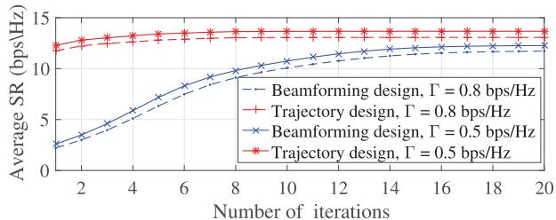  
(a) Inner layer iteration

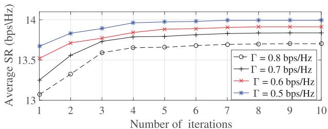  
(b) Outer layer iteration  
Fig. 2. The convergence property of the devised scheme considering various communication quality threshold of SU $\Gamma _ { \mathrm { S } } ^ { \mathrm { m i n } }$

Fig. 2 depicts the convergence property of the devised algorithm while assuming various communication quality threshold of $\mathrm { { S U } \Gamma _ { \mathrm { { S } } } ^ { m i n } }$ . In Fig. 2, it becomes apparent that the devised AO-based procedure converges to a stable solution for different values of $\Gamma _ { \mathrm { S } } ^ { \mathrm { m i n } }$ . There are two layers in the proposed optimization procedure, containing the outer iteration and inner iteration. In the inner layer, the objective values of collaborative beamforming and UAV trajectory design problems iteratively improve, validating that two procedures are non-decreasing, presented as Fig. 2(a). In the outer layer, the objective values of joint optimization problem are also iteratively improving and converge after about 7 iterations for various values of $\Gamma _ { \mathrm { S } } ^ { \mathrm { m i n } }$ , presented as Fig. 2(b). When communication quality threshold of SU $\Gamma _ { \mathrm { S } } ^ { \mathrm { m i n } }$ changed from 0.5 bps/Hz to 0.8 bps/Hz and other system parameters are the identical, the higher communication quality requirement of SU decreases the transmit power at UAV, leading to a worse secure performance.

The achieved average SR versus transmit power at UAV $P _ { \mathrm { m a x } } ^ { \mathrm { U } }$ under various TBS power budgets $P _ { \mathrm { m a x } } ^ { \mathrm { T } }$ is shown in Fig. 3. Taking into account the actual power of the aerial relay platform, the power at UAV varies from 20 dBm to 30 dBm. As can be seen from Fig. 3, the average SR improves with the transmit power at UAV for all the cases. In addition, the security capability can be improved gradually by increasing TBS power $P _ { \mathrm { m a x } } ^ { \mathrm { T } }$ from 26 dBm to 38 dBm. With high TBS power strategies, the designed UAV trajectory approaches MUs and sails along the LoS boundary to attain the satisfactory secure performance. However, when TBS sends the information signal with lower power, the aerial relay platform has to adjust the flight planning to get close to the TBS and reduce the TBS-UAV transmission distance. This is due to the fact that the achieved UAV transmission rate is restricted by backhaul capacity constraint (11). Therefore, by utilizing the multi-antenna scheme and UAV’s movability, we can validly enhance the secure communication performance of UAV-powered networks.

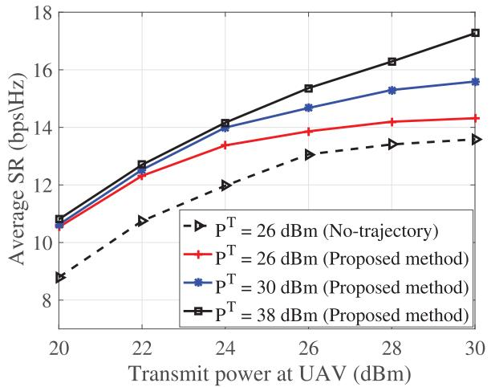  
Fig. 3. Average SR versus the maximum power budget $P _ { \mathrm { m a x } } ^ { \mathrm { U } }$ for $P _ { \mathrm { m a x } } ^ { \mathrm { T } } \in$ {26 dBm, 30 dBm, 38 dBm}.

Fig. 4 shows the distribution of the MUs, SUs and Eve, and displays the optimized trajectories of aerial delay under various flying periods T assuming two cases of Eve’s location. When the minimum TR constraint of each SU is satisfied, no matter where Eve is, the optimized aerial delay position always stays close to the MU center point while staying away from the possible Eve. This is due to the fact that the increase of distance from the UAV to Eve can greatly reduce the achieved TR at the Eve. Therefore, the key of trajectory design is that the aerial delay takes more time flying around the maximum SR location. In particular, for $T \ = \ 7 \ { \mathrm { s } } ,$ the aerial delay does not have enough flying time to arrive the maximum SR location, and only approach the maximum SR location and move towards the destination. Moreover, aerial delay prioritizes decreasing height to the least value, signifying that the height has a considerable influence on secure transmission. For $T = 1 0 ~ \mathrm { s } .$ , the aerial delay has a short duration to flight around the maximum SR location, leading to a greater average SR value. For $T = 2 0 \ { \mathrm { s } } ,$ the aerial delay has a longer duration to flight around the maximum SR location and utilizes the fastest flight velocity when arriving and leaving that location, leading to the optimum secure communication capability.

Under the mobile MU scenario of Fig. 5, the UAV-delay first tries to approach the MUs at the maximum speed because the MUs are far away from the Eve. When the MUs are near the Eve, however, the UAV-delay then tries to circumvent the MUs in order to reduce the intercepted throughput by the Eve. When the MUs move away from the Eve, the UAV-delay will again get close to the MUs for offering the optimal secure transmission performance. At last, the UAV-delay will go to its final location at the maximum speed.

The average SR versus the flight duration T of the proposed method and several benchmark techniques is depicted in Fig. 6. The secure performance of both the devised method and the design approach without beamforming optimization increases as T increases but tends to converge. This is because with greater T the aerial relay has more time to stay near the MU to offer quality service for the authorized user while suppressing the wiretapping attack. Furthermore, our method enhances the average SR by about 150% compared to the random beamforming approach. This is due to the fact that the random beamforming is difficult to eliminate co-channel interference of hybrid multi-user communication systems. The average SR is constant with varying values of T when straight line trajectory and static UAV schemes are performed. Specifically, the performance gain of straight line flight scheme can achieve 10% more than that of static UAV scheme. As a result, both the UAV trajectory design and collaborative beamforming have a key role in improving the confidential information transmission.

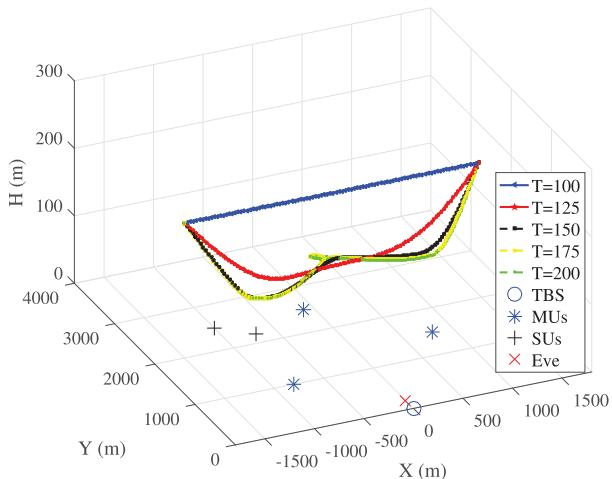  
(a)

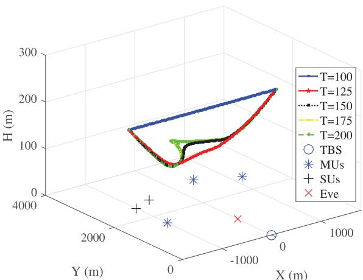  
(b)

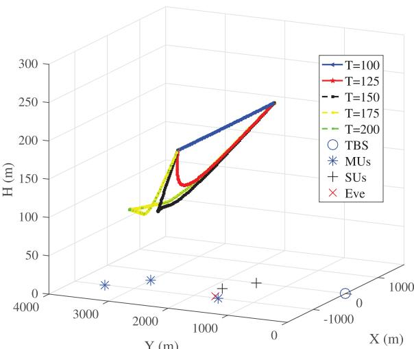  
Y (m)  
(c)  
Fig. 4. Designed UAV-delay trajectory. (a) Eve is near TBS. (b) Eve is amidst TBS-MU link. (c) Eve is near MU.

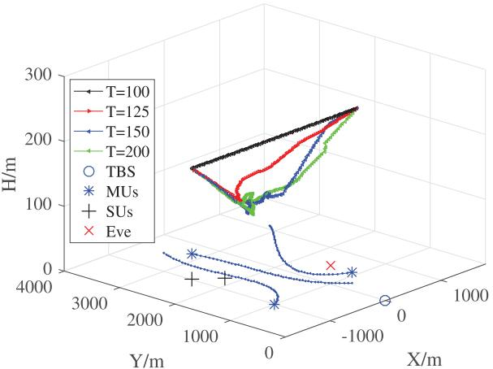

Fig. 5. The converged UAV-delay trajectory with respect to mobile vessel scenario.  
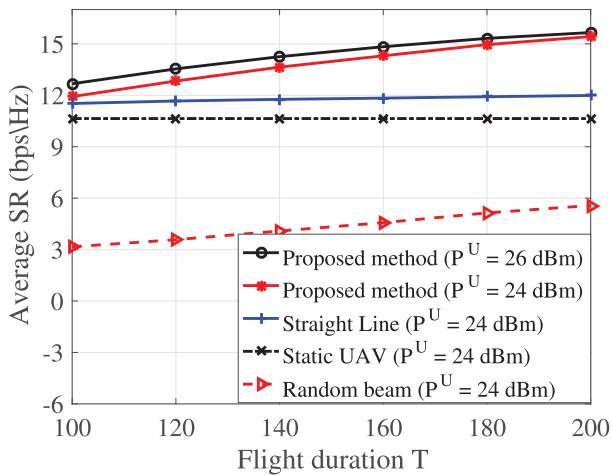  
Fig. 6. The average SR versus the flight duration T of the proposed method and different benchmark methods for $\mathbf { \tilde { \mathit { P } } _ { m a x } ^ { U } } \in$ {24 dBm, 26 dBm}.

Fig. 7 illustrates the influence of UAV antenna number $N _ { \mathrm { U } }$ on the achieved average SR for different optimization methods. As the value of $N _ { \mathrm { U } }$ increases, the secrecy communication capability of all methods reveals an enhancement. The result can be expected as additional degrees of freedom to design more precise beamforming for interference cancellation can be offered with a higher antenna number. Our method exhibits a noteworthy superiority over the other benchmark schemes when the Eve’s and MS’s channels are imperfect. Besides, as can be seen from the curves in Fig. 7, the existence of CSI errors leads to a decline in security capability. When a sufficient number of antennas are considered, designing the collaborative beamforming policy contributes more importantly to the enhancement of the achieved SR compared to the optimization of the UAV trajectory planning.

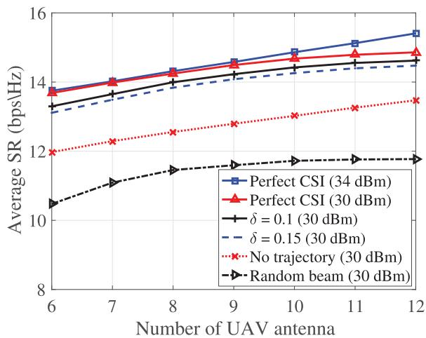  
Fig. 7. Average SR versus the number of antennas at the UAV $N _ { \mathrm { U } }$

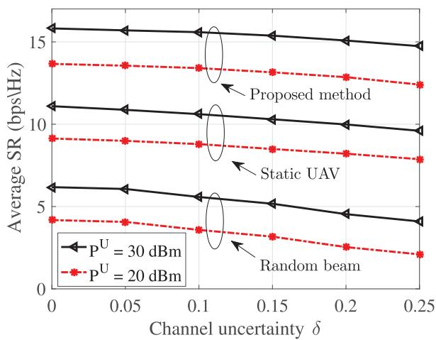  
Fig. 8. The average SR versus the level of CSI error uncertainty δ for $P _ { \mathrm { m a x } } ^ { \mathrm { U } } \in$ {20 dBm, 30 dBm}.

The average SR versus the level of CSI uncertainty $\delta$ for different benchmark methods is shown in Fig. 8. The results clearly show that the proposed scheme consistently outperforms the random beamforming and straight line benchmark approaches across all levels of CSI uncertainty, validating its superiority in practical scenarios. This is because the higher channel gain can be obtained by jointly devising the cooperative beamforming and UAV trajectory. In addition, the proposed method achieves the highest average SR when perfect CSI is available. When CSI uncertainty $\delta$ varies between 0.05 and 0.2, the SR experiences a slight degradation, but the proposed scheme remains robust, maintaining a relatively high SR. When CSI uncertainty $\delta$ changes from 0.2 to 0.25, the SR decreases significantly, underscoring the challenges posed by high levels of CSI error uncertainty. Specifically, for $P _ { \mathrm { m a x } } ^ { U } = 2 0$ dBm, the performance improvement for the nominal design (perfect CSI scenario) can achieve about $2$ bps/Hz when $\delta \ : = \ : 0 . 2 5$ . The reason is that with greater $\delta ,$ it becomes more difficult for the multi-antenna aerial relay to execute precise beam alignment. Meanwhile, since UAVborne transmitter is limited by its maximum power budgets $P _ { \mathrm { m a x } } ^ { \mathrm { U } } ,$ aerial relay needs to trade some security for satisfying the SU’s communication quality constraints. Despite this, the proposed scheme shows better resilience compared to benchmark approaches.

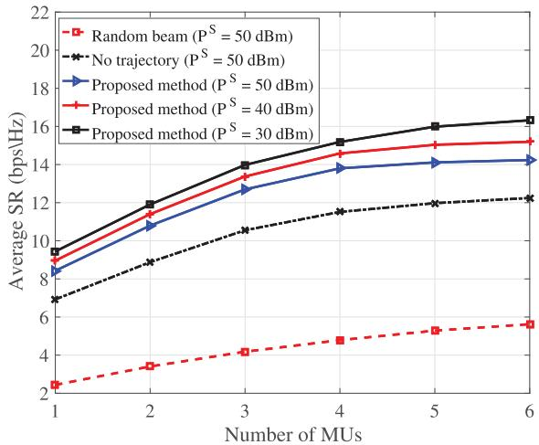  
Fig. 9. The average SR versus the number of MUs K of different optimization schemes for $P _ { \mathrm { m a x } } ^ { \mathrm { S } } \in \{ 3 0$ dBm, 40 dBm, 50 dBm}.

The achieved SR versus the number of MUs considering different optimization schemes is depicted in Fig. 9. The system SR increases with the number of MUs for all techniques. The devised joint design method evidently outperforms the other benchmark approaches. As expected, the secure communication performance of all MUs improves with the decrease of satellite power $P _ { \mathrm { m a x } } ^ { \mathrm { S } } .$ In addition, beamforming optimization strategy has an outstanding contribution to the security capacity of the system when comparing the performance of the random beamforming benchmark approach with the devised joint optimization solution. The optimized beamforming improves the SINR and minimizes the multi-system disturbance while reducing the likelihood of wiretapping and enhancing the max-min SR. Adding UAV as an aerial relay permits to serve MUs validly that have a poorer channel to the TBS. That can be accomplished by the devised AO-based algorithm for collaborative beamforming and UAV trajectory optimization.

Fig. 10 displays the influence of various Rician factors on the average SR. Both the UAV-SU and UAV-Eve links are assumed to follow a Rician distribution, i.e., $K _ { \mathrm { U E } } = K _ { \mathrm { U } , k } = \kappa$ The secure performance of the four methods enhances with the value of $\kappa .$ The result is expected as both UAV-SU and UAV-Eve channels turn into more deterministic with an increase of $\kappa ,$ and a greater proportion of slowly varying LoS components are acquired to enhance the secure performance of the four methods. In Fig. 11, we compare the achieved SR among all time slots under various TBS power budgets. As the transmit power of TBS increases, the secure performance increases. This is due to the fact that the limited TBS power restricts UAV trajectory. Specifically, when the TBS transmits the signal with limited power, the UAV has to adjust its location to approach the TBS to shorten the distance. This is expected since the

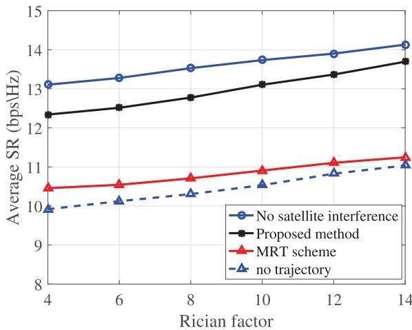  
Fig. 10. The average SR versus Rician factor κ.

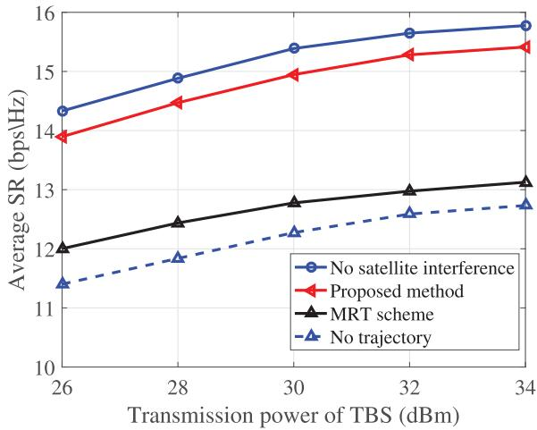  
Fig. 11. The average SR under various maximum TBS transmission power.

UAV throughput is limited by the backhaul capacity constraint (11). On the contrary, with enough TBS power cases, the enhanced trajectory of UAV is capable of approaching MUs and flies along the LoS boundary to realize maximum secure performance. Furthermore, since the SUs interfered by the UAV appear on the sides of the MUs, the enhanced trajectories with greater TBS power are easier to fulfill QoS requirements.

To get insight into the influence of interference from MS to the MUs on the proposed method, we consider the scenarios with satellite signal interference (WISI) and without satellite signal interference (WOSI) under various TBS transmit power and Rician factor regimes, as shown in Figs. 10 and 11. It can be observed from the results, the WOSI scheme slightly enhances the secrecy capacity compared to the WISI scheme. The performance disparity between scenarios with and without satellite signal interference gradually diminishes eventually. The reason is that both the cooperative beamforming scheme and the mobility feature of UAV provide the DoF for regulating UAV locations to realize interference coordination as well as improve the TBS-UAV and UAV-MU channels. Furthermore, for the MRT scheme, the performance gain improvement from the increase in the TBS transmit power and Rician factor is slight. Meanwhile, the performance between our method and MRT scheme reaches up to about 2 bps/Hz and the gap between the two methods increases with the TBS transmit power, which confirms the noteworthy performance enhancement provided by the devised beamforming optimization scheme. This is attributed to the fact that the MRT beamforming is difficult to eliminate co-channel interference.

## V. CONCLUSION

In this paper, we studied hybrid SUTN secure systems against a potential Eve with imperfect CSI condition. To concurrently ensure the security and the robustness owing to the imperfect CSI of MS and Eve, the max-min system SR optimization problem by cooperatively devising the beamforming vectors and UAV trajectory was established. To tackle the intractable and highly-coupled optimization problem, an iterative algorithm with two subproblems was developed. Moreover, S-procedure and SCA approaches are exploited to deal with non-convex constraints. Finally, simulation results confirmed the advantage of the developed optimization approach and validate the convergence of the devised iterative procedure. In particular, the achievable SR and the robustness against the bounded CSI of developed method outperformed than that of no-trajectory techniques.

## REFERENCES

[1] Y. Wang, W. Feng, J. Wang, and T. Q. S. Quek, “Hybrid Satellite-UAV-terrestrial networks for 6G ubiquitous coverage: A maritime communications perspective,” IEEE J. Sel. Areas Commun., vol. 39, no. 11, pp. 3475–3490, Nov. 2021.

[2] J. Li et al., “UAV-RIS-aided space-air-ground integrated network: Interference alignment design and DoF analysis,” IEEE Trans. Wireless Commun., vol. 23, no. 9, pp. 11678–11692, Sep. 2024.

[3] S. Yuan, Y. Sun, and M. Peng, “Joint network function placement and routing optimization in dynamic software-defined satellite-terrestrial integrated networks,” IEEE Trans. Wireless Commun., vol. 23, no. 5, pp. 5172–5186, May 2024.

[4] C. Huang, G. Chen, P. Xiao, Y. Xiao, Z. Han, and J. A. Chambers, “Joint offloading and resource allocation for hybrid cloud and edge computing in SAGINs: A decision assisted hybrid action space deep reinforcement learning approach,” IEEE J. Sel. Areas Commun., vol. 42, no. 5, pp. 1029–1043, May 2024.

[5] Z. Lv, F. Gong, G. Chen, G. Li, T. Hui, and S. Xu, “Energy efficiency design in RIS-assisted satellite–terrestrial integrated networks with NOMA,” IEEE Wireless Commun. Lett., vol. 13, no. 7, pp. 1948–1952, Jul. 2024.

[6] C. Zhang, W. Zhang, W. Wang, L. Yang, and W. Zhang, “Research challenges and opportunities of UAV millimeter-wave communications,” IEEE Wireless Commun., vol. 26, no. 1, pp. 58–62, Feb. 2019.

[7] J. Zhang, F. Liang, B. Li, Z. Yang, Y. Wu, and H. Zhu, “Placement optimization of caching UAV-assisted mobile relay maritime communication,” China Commun., vol. 17, no. 8, pp. 209–219, Aug. 2020.

[8] L. Xiao, Y. Xu, D. Yang, and Y. Zeng, “Secrecy energy efficiency maximization for UAV-enabled mobile relaying,” IEEE Trans. Green Commun. Netw., vol. 4, no. 1, pp. 180–193, Mar. 2020.

[9] Z. Jia, M. Sheng, J. Li, D. Niyato, and Z. Han, “LEO-satellite-assisted UAV: Joint trajectory and data collection for Internet of Remote Things in 6G aerial access networks,” IEEE Internet Things J., vol. 8, no. 12, pp. 9814–9826, Jun. 2021.

[10] F. Lu et al., “Resource and trajectory optimization for UAV-Relayassisted secure maritime MEC,” IEEE Trans. Commun., vol. 72, no. 3, pp. 1641–1652, Mar. 2024.

[11] F. Wang, S. Zhang, J. Shi, Z. Li, and T. Q. S. Quek, “Sustainable UAV mobility support in integrated terrestrial and non-terrestrial networks,” IEEE Trans. Wireless Commun., vol. 23, no. 11, pp. 17115–17128, Nov. 2024.

[12] Q. Huang, M. Lin, J.-B. Wang, T. A. Tsiftsis, and J. Wang, “Energy efficient beamforming schemes for satellite-aerial-terrestrial networks,” IEEE Trans. Commun., vol. 68, no. 6, pp. 3863–3875, Jun. 2020.

[13] Y. Hu, M. Chen, and W. Saad, “Joint access and backhaul resource management in satellite-drone networks: A competitive market approach,” IEEE Trans. Wireless Commun., vol. 19, no. 6, pp. 3908–3923, Jun. 2020.

[14] S. Mirbolouk, M. Valizadeh, M. C. Amirani, and S. Ali, “Relay selection and power allocation for energy efficiency maximization in hybrid satellite-UAV networks with CoMP-NOMA transmission,” IEEE Trans. Veh. Technol., vol. 71, no. 5, pp. 5087–5100, May 2022.

[15] X. Fang et al., “NOMA-based hybrid satellite-UAV-terrestrial networks for 6G maritime coverage,” IEEE Trans. Wireless Commun., vol. 22, no. 1, pp. 138–152, Jan. 2023.

[16] M. Vondra, M. Ozger, D. Schupke, and C. Cavdar, “Integration of satellite and aerial communications for heterogeneous flying vehicles,” IEEE Netw., vol. 32, no. 5, pp. 62–69, Sep. 2018.

[17] C. Joo and J. Choi, “Low-delay broadband satellite communications with high-altitude unmanned aerial vehicles,” J. Commun. Netw., vol. 20, no. 1, pp. 102–108, Feb. 2018.

[18] S. Zhang and J. Liu, “Analysis and optimization of multiple unmanned aerial vehicle-assisted communications in post-disaster areas,” IEEE Trans. Veh. Technol., vol. 67, no. 12, pp. 12049–12060, Dec. 2018.

[19] X. Zhang, W. Cheng, and H. Zhang, “Heterogeneous statistical QoS provisioning over airborne mobile wireless networks,” IEEE J. Sel. Areas Commun., vol. 36, no. 9, pp. 2139–2152, Sep. 2018.

[20] S. Jeon, J. Kwak, and J. P. Choi, “An integration of cryptography and physical layer security for multibeam satellite systems,” IEEE Trans. Commun., vol. 73, no. 2, pp. 1087–1099, Feb. 2025.

[21] J. Zhang, J. Xu, W. Lu, N. Zhao, X. Wang, and D. Niyato, “Secure transmission for IRS-aided UAV-ISAC networks,” IEEE Trans. Wireless Commun., vol. 23, no. 9, pp. 12256–12269, Sep. 2024.

[22] M. Li, X. Tao, H. Wu, and N. Li, “Joint trajectory and resource optimization for covert communication in UAV-enabled relaying systems,” IEEE Trans. Veh. Technol., vol. 72, no. 4, pp. 5518–5523, Apr. 2023.

[23] H. Li, J. Li, M. Liu, and F. Gong, “UAV-assisted secure communication for coordinated satellite-terrestrial networks,” IEEE Commun. Lett., vol. 27, no. 7, pp. 1709–1713, Jul. 2023.

[24] Z. Yin et al., “UAV-assisted physical layer security in multi-beam satellite-enabled vehicle communications,” IEEE Trans. Intell. Transp. Syst., vol. 23, no. 3, pp. 2739–2751, Mar. 2022.

[25] P. K. Sharma and D. I. Kim, “Secure 3D mobile UAV relaying for hybrid satellite-terrestrial networks,” IEEE Trans. Wireless Commun., vol. 19, no. 4, pp. 2770–2784, Apr. 2020.

[26] C. Han, A. Liu, Z. Gao, K. An, G. Zheng, and S. Chatzinotas, “Antijamming transmission in NOMA-based satellite-enabled IoT: A gametheoretic framework in hostile environments,” IEEE Internet Things J., vol. 10, no. 23, pp. 20311–20322, Dec. 2023.

[27] M. Bouabdellah and F. E. Bouanani, “A PHY layer security of a jamming-based underlay cognitive satellite-terrestrial network,” IEEE Trans. Cognit. Commun. Netw., vol. 7, no. 4, pp. 1266–1279, Dec. 2021.

[28] B. Li, Y. Zou, T. Wu, Z. Zhang, M. Chen, and Y. Jiang, “Security and reliability tradeoff of NOMA based hybrid satellite-terrestrial network with a friendly jammer,” IEEE Trans. Veh. Technol., vol. 74, no. 2, pp. 3439–3444, Feb. 2025.

[29] O. Waqar, H. Tabassum, and R. Adve, “Secure beamforming and ergodic secrecy rate analysis for Amplify-and-Forward relay networks with wireless powered jammer,” IEEE Trans. Veh. Technol., vol. 70, no. 4, pp. 3908–3913, Apr. 2021.

[30] G. Sun, J. Li, A. Wang, Q. Wu, Z. Sun, and Y. Liu, “Secure and energy-efficient UAV relay communications exploiting collaborative beamforming,” IEEE Trans. Commun., vol. 70, no. 8, pp. 5401–5416, Aug. 2022.

[31] J. Zhang, M. Lin, J. Ouyang, W.-P. Zhu, and T. De Cola, “Robust beamforming for enhancing security in multibeam satellite systems,” IEEE Commun. Lett., vol. 25, no. 7, pp. 2161–2165, Jul. 2021.

[32] Z. Lin, M. Lin, W.-P. Zhu, J.-B. Wang, and J. Cheng, “Robust secure beamforming for wireless powered cognitive satellite-terrestrial networks,” IEEE Trans. Cognit. Commun. Netw., vol. 7, no. 2, pp. 567–580, Jun. 2021.

[33] C. Zeng, J.-B. Wang, C. Ding, M. Lin, and J. Wang, “MIMO unmanned surface vessels enabled maritime wireless network coexisting with satellite network: Beamforming and trajectory design,” IEEE Trans. Commun., vol. 71, no. 1, pp. 83–100, Jan. 2023.

[34] Q. Zhang, S. Wang, Y. Shi, and K. Yang, “Measurements and analysis of maritime wireless channel at 8 GHz in the South China sea region,” IEEE Trans. Antennas Propag., vol. 71, no. 3, pp. 2674–2681, Mar. 2023.

[35] Z. Lin, M. Lin, J.-B. Wang, Y. Huang, and W.-P. Zhu, “Robust secure beamforming for 5G cellular networks coexisting with satellite networks,” IEEE J. Sel. Areas Commun., vol. 36, no. 4, pp. 932–945, Apr. 2018.

[36] B. Zhao, M. Lin, F. Li, M. Cheng, and N. Al-Dhahir, “Robust framebased beamforming scheme to enhance secure multigroup multicast transmission for multibeam satellite systems,” IEEE Trans. Veh. Technol., vol. 73, no. 3, pp. 4407–4411, Mar. 2024.

[37] A. Beck, A. Ben-Tal, and L. Tetruashvili, “A sequential parametric convex approximation method with applications to nonconvex truss topology design problems,” J. Global Optim., vol. 47, no. 1, pp. 29–51, May 2010.

[38] X. Li, W. Feng, Y. Chen, C.-X. Wang, and N. Ge, “Maritime coverage enhancement using UAVs coordinated with hybrid satellite-terrestrial networks,” IEEE Trans. Commun., vol. 68, no. 4, pp. 2355–2369, Apr. 2020.

[39] C. Zeng, J.-B. Wang, C. Ding, H. Zhang, M. Lin, and J. Cheng, “Joint optimization of trajectory and communication resource allocation for unmanned surface vehicle enabled maritime wireless networks,” IEEE Trans. Commun., vol. 69, no. 12, pp. 8100–8115, Dec. 2021.

[40] D. Xu, Y. Sun, D. W. K. Ng, and R. Schober, “Multiuser MISO UAV communications in uncertain environments with no-fly zones: Robust trajectory and resource allocation design,” IEEE Trans. Commun., vol. 68, no. 5, pp. 3153–3172, May 2020.


Yu Yao (Member, IEEE) received the M.S. and Ph.D. degrees in information and communication engineering from Southeast University, China, in 2010 and 2015, respectively. He is currently a Professor with the School of Information and Communication Engineering, Hainan University, Haikou, China. From April 2019 to April 2020, he was a Visiting Scholar with the Department of Electrical Engineering and Information Technology, University of Naples Federico II, Naples, Italy. His research interests include wireless communications, satellite

communications, integrated communication and sensing, the Internet of Things, and secrecy communications.


Wenqi Xiao (Student Member, IEEE) received the B.Eng. degree in information and communication engineering from East China Jiaotong University, China, in 2023. He is currently pursuing the Ph.D. degree with the School of Information Science and Communication Engineering, Hainan University. His research interests include wireless communication, reconfigurable intelligent surface, physical layer security, and integrated sensing and communication.

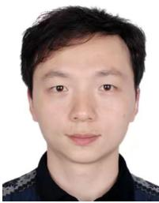

Pu Miao (Member, IEEE) received the Ph.D. degree in information and communication engineering from Southeast University, Nanjing, China, in 2015. He is currently an Associate Professor with the School of Electronic and Information Engineering, Qingdao University, Qingdao, China. He was a Visiting Scholar with 5GIC and 6GIC, Institute for Communication Systems, University of Surrey, from 2022 to 2023. His research interests include visible light communications, wireless communications, communication signal processing, intelligent signal processing, and machine learning.


Gaojie Chen (Senior Member, IEEE) received the B.Eng. and B.Ec. degrees in electrical information engineering and international economics and trade from Northwest University, China, in 2006, and the M.Sc. (Hons.) and Ph.D. degrees in electrical and electronic engineering from Loughborough University, Loughborough, U.K., in 2008 and 2012, respectively. After graduation, he took up academic and research positions with DT Mobile, Loughborough University, the University of Oxford, the University of Leicester, and the University of Surrey,

U.K. He is currently a Professor and the Associate Dean with the School of Flexible Electronics (SoFE), Sun Yat-sen University, China. His research interests include wireless communications, satellite communications, flexible electronics-based wireless sensing, the Internet of Things, and secrecy communications. He received the Best Paper Awards from IEEE IECON 2023; the Exemplary Reviewer Awards of IEEE WIRELESS COMMUNICATIONS LET-TERS in 2018, IEEE TRANSACTIONS ON COMMUNICATIONS in 2019, and IEEE COMMUNICATIONS LETTERS in 2020 and 2021; and the Exemplary Editor Awards of IEEE COMMUNICATIONS LETTERS and IEEE WIRELESS COMMUNICATIONS LETTERS, in 2021, 2022, and 2023, respectively. He served as an Associate Editor for IEEE JOURNAL ON SELECTED AREAS IN COMMUNICATIONS-Machine Learning in Communications from 2021 to 2022. He serves as an Editor for IEEE TRANSACTIONS ON WIRELESS COM-MUNICATIONS, IEEE TRANSACTIONS ON COGNITIVE COMMUNICATIONS AND NETWORKING, and IEEE WIRELESS COMMUNICATIONS LETTERS; a Senior Editor for IEEE COMMUNICATIONS LETTERS, and a Panel Member for the Royal Society’s International Exchanges, U.K.

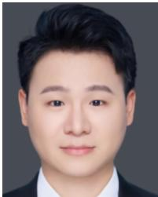


Integrated Technology, Yonsei University, South Korea. Before joining Yonsei University, he was with Bell Labs, Alcatel-Lucent, Murray Hill, NJ, USA, from 2009 to 2011, as a member of Technical Staff; and Harvard University, Cambridge, MA, USA, as a Post-Doctoral Researcher, from 2008 to 2009. He is a fellow and a lecturer. He is an Elected Member of the National Academy of Engineering of Korea. He was a recipient/co-recipient of the Ministry of Education Award in 2024, the KICS Haedong Scholar Award in 2023, the CES Innovation Award in 2023, the IEEE ICC Best Demo Award in 2022, the IEEE WCNC Best Demo Award in 2020, the Best Young Engineer Award from the National Academy of Engineering of Korea (NAEK) in 2019, the IEEE DySPAN Best Demo Award in 2018, the IEEE/KICS Journal of Communications and Networks Best Paper Award in 2018, the IEEE INFOCOM Best Demo Award in 2015, the IEIE/IEEE Joint Award for Young IT Engineer of the Year in 2014, the KICS Haedong Young Scholar Award in 2013, the IEEE Signal Processing Magazine Best Paper Award in 2013, the IEEE ComSoc AP Outstanding Young Researcher Award in 2012, and the IEEE VTS Dan. E. Noble Fellowship Award in 2008. He has held several editorial positions, including the Editor-in-Chief of IEEE TRANSACTIONS ON MOLECULAR, BIOLOGICAL, AND MULTI-SCALE COMMUNICATIONS; a Senior Editor of IEEE WIRELESS COMMUNICATIONS LETTERS; and an Editor of IEEE Communications Magazine, IEEE TRANSACTIONS ON WIRELESS COMMUNICATIONS, and IEEE WIRELESS COMMUNICATIONS LETTERS. He was an IEEE ComSoc Distinguished Lecturer from 2020 to 2023 and is an IEEE VTS Distinguished Lecturer from 2024 to 2025.

Haitao Yang received the Ph.D. degree from the University of Singapore in 2021. He is currently a Professor with the Institute of Flexible Electronics, Northwestern Polytechnical University, Xi’an, China. After graduation, he was a Post-Doctoral Researcher with the University of Singapore from 2021 to 2023. His research interests include robot perception, robot communications, and machine intelligence. He served as an Associate Editor for Frontiers in Electronic Materials and a Guest Editor for Frontiers in Robotics and AI.

Chan-Byoung Chae (Fellow, IEEE) received the Ph.D. degree in electrical and computer engineering from The University of Texas at Austin (UT), USA, in 2008. He was a member of Wireless Networking and Communications Group (WNCG), UT. Prior to joining UT, he was a Research Engineer with the Telecommunications Research and Development Center, Samsung Electronics, Suwon, South Korea, from 2001 to 2005. He is currently an Underwood Distinguished Professor and a Lee Youn Jae Fellow (an Endowed Chair Professor) with the School of


Kai-Kit Wong (Fellow, IEEE) received the B.Eng., M.Phil., and Ph.D. degrees in electrical and electronic engineering from The Hong Kong University of Science and Technology, Hong Kong, in 1996, 1998, and 2001, respectively. After graduation, he took up academic and research positions with The University of Hong Kong, Lucent Technologies, Bell-Labs, Holmdel, the Smart Antennas Research Group of Stanford University, and the University of Hull, U.K. He is the Chair of wireless communications with the Department of Electronic and

Electrical Engineering, University College London, U.K. His current research centers around 5G and beyond mobile communications. He is fellow of IET. He was a co-recipient of the 2013 IEEE Signal Processing Letters Best Paper Award, the 2000 IEEE VTS Japan Chapter Award at the IEEE Vehicular Technology Conference in Japan in 2000, and a few other international best paper awards. He is on the editorial board of several international journals. He has been the Editor-in-Chief of IEEE WIRELESS COMMUNICATIONS LETTERS since 2020.