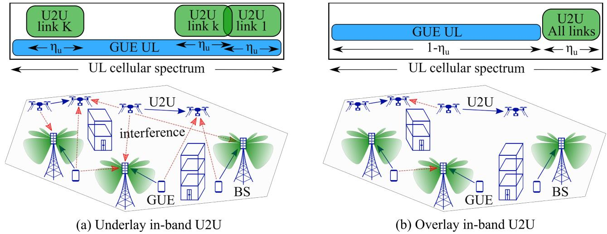
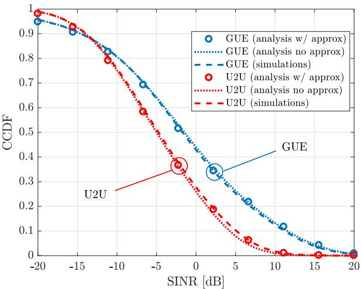
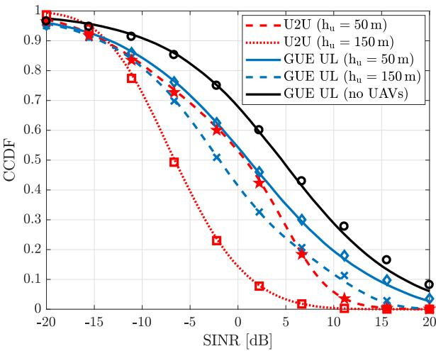
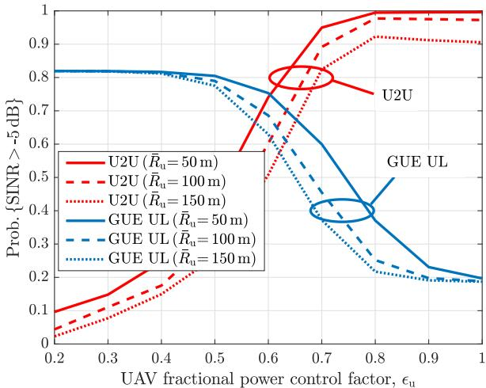
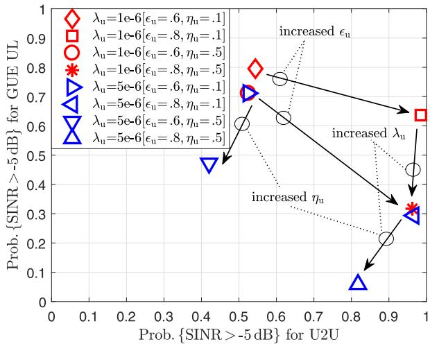
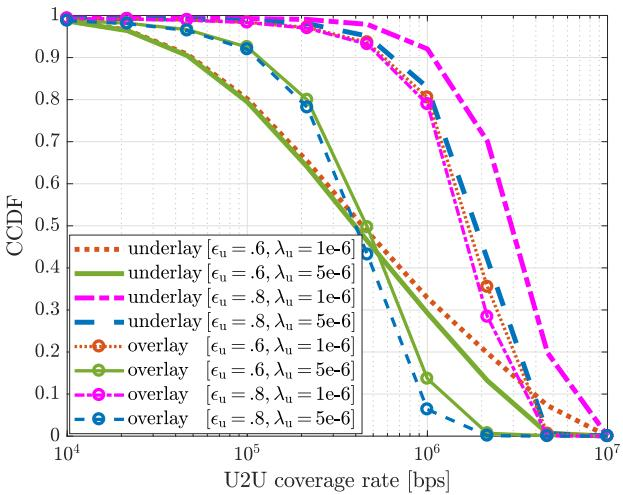
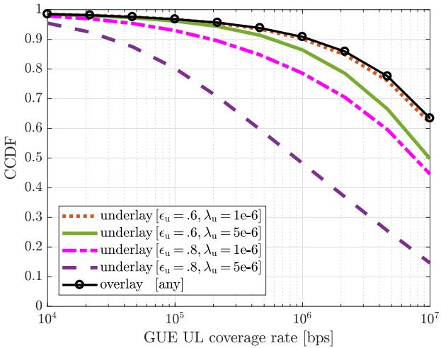
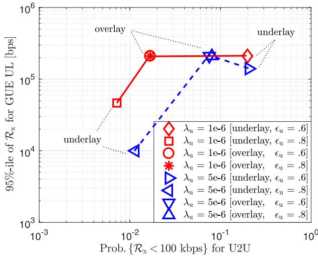

# UAV-to-UAV Communications in Cellular Networks

M. Mahdi Azari , Member, IEEE, Giovanni Geraci , Senior Member, IEEE,

Adrian Garcia-Rodriguez , Member, IEEE, and Sofie Pollin , Senior Member, IEEE

Abstract— We consider a cellular network deployment where UAV-to-UAV (U2U) transmit-receive pairs share the same spectrum with the uplink (UL) of cellular ground users (GUEs). For this setup, we focus on analyzing and comparing the performance of two spectrum sharing mechanisms: (i) underlay, where the same time-frequency resources may be accessed by both UAVs and GUEs, resulting in mutual interference, and (ii) overlay, where the available resources are divided into orthogonal portions for U2U and GUE communications. We evaluate the coverage probability and rate of both link types and their interplay to identify the best spectrum sharing strategy. We do so through an analytical framework that embraces realistic heightdependent channel models, antenna patterns, and practical power control mechanisms. For the underlay, we find that although the presence of U2U direct communications may worsen the uplink performance of GUEs, such effect is limited as base stations receive the power-constrained UAV signals through their antenna sidelobes. In spite of this, our results lead us to conclude that in urban scenarios with a large number of UAV pairs, adopting an overlay spectrum sharing seems the most suitable approach for maintaining a minimum guaranteed rate for UAVs and a high GUE UL performance.

Index Terms— UAV-to-UAV communications, D2D communications, cellular networks, spectrum sharing, stochastic geometry.

## I. INTRODUCTION

having cellular-connected unmanned aerial vehicles (UAVs) [1]–[7]. These include facilitating search-and-rescue missions, acting as mobile small cells for providing coverage and capacity enhancements, or automating logistics in indoor warehouses [8]–[11]. From a business standpoint, mobile network operators may benefit from offering cellular coverage to a heterogeneous population of terrestrial and aerial users [12]–[14].

## A. Motivation and Related Work

A certain consensus has been reached—both at 3GPP meetings and in the classroom—on the fact that present-day networks will be able to support cellular-connected UAVs up to a certain extent [14]–[23]. Besides, recent studies have shown that 5G-and-beyond hardware and software upgrades may be required by both mobile operators and UAV manufacturers to target large populations of UAVs flying at high altitudes [24]–[27].

However, important use-cases exist where direct communication between UAVs, bypassing ground network infrastructure, would be a key enabler. These include autonomous flight of UAV swarms, collision avoidance, and UAV-to-UAV relaying, data transfer, and gathering [28]–[30]. Similarly to ground device-to-device (D2D) communications [31]–[35], UAV-to-UAV (U2U) communications may also have implications in terms of spectral and energy efficiencies, extended cellular coverage, and reduced backhaul demands.

## B. Methodology and Contribution

In this paper, we consider a cellular network deployment where UAV transmit-receive pairs share the same spectrum with the uplink (UL) of cellular ground users (GUEs). We examine two strategies for spectrum sharing, namely underlay and overlay. In the underlay, UAVs are allowed to access a fraction of the time-frequency physical resource blocks (PRBs) available for the GUE UL, resulting in mutual interference. In the overlay, the available PRBs are split into two orthogonal portions, respectively reserved for each link type.

Through stochastic geometry tools, we characterize the performance of U2U links and GUE UL, as well as their interplay, under both spectrum sharing mechanisms. Specifically, we evaluate the impact that the UAV altitude, UAV density, UAV power control, U2U link distance, and the number of PRBs accessed by each link type have on the coexistence of aerial and ground communications. To the best of the authors’ knowledge, no previous article has analyzed and compared both overlay and underlay spectrum sharing strategies for scenarios where direct U2U communications coexist with existing cellular services. Due to the substantial changes in the network topology, the mathematical analysis significantly differs from those studies where UAVs act as BSs [8], [16], [36], [37] or end-user devices [14], [19]–[21]. The statistical distributions of the transmit, useful signal, and interference powers for the links under consideration in this article differ from those derived in previous works and remarkably influence the stochastic geometry analysis. Moreover, we consider realistic 1) power control policies, 2) BS antenna pattern, and 3) height-dependent propagation channel model, whose impact has not been analytically accounted for in the deployments studied prior to this work.

Under such realistic setup, we first obtain exact analytical expressions for the coverage probability, i.e., the signal-tointerference-plus-noise ratio (SINR) distribution, of all links with both underlay and overlay approaches. As these expressions may require a considerable effort to be numerically evaluated, we also propose tight approximations based on practical assumptions. We validate both our exact and approximated analysis through simulations, and provide numerical results to gain insights into the behavior of U2U communications in cellular networks.

## C. Summary of Results

Our main takeaways can be summarized as follows.

• Link interplay: In the underlay, the presence of U2U links may degrade the GUE UL. Such performance loss is limited by the fact that BSs are downtilted and perceive the interference generated by high UAVs through the lowgain sidelobes of their antennas and UAVs can generally transmit at low power thanks to the favorable U2U channel conditions. However, the performance of both U2U and GUE UL links worsens as UAVs fly higher. This is due to an increased probability of line-of-sight (LoS)— and hence interference—on all UAV-to-UAV, GUE-to-UAV, and UAV-to-BS interfering links. Such negative effect outweighs the benefits brought by having larger GUE-to-UAV and UAV-to-BS distances.

• Power control policy: In the underlay, the UAV power control policy has a significant impact on all links. A tradeoff exists between the performance of U2U and GUE UL communications, whereby increasing the UAV transmission power improves the former at the expense of the latter. Moreover, smaller U2U distances resulting in lower propagation losses can benefit both U2U and GUE UL links assuming that other system parameters are fixed.1 Indeed, the reduced path loss experienced by U2U pairs leads to a smaller UAV’s transmission power which in turn reduces the interference caused by UAVs to other U2U links and to GUEs.

• Spectrum allocation: In the underlay, where GUE-to-UAV interference is dominant, the rate degradation at UAVs caused by increasing their density is limited. However, increasing the number of PRBs utilized by U2U pairs causes a sharp performance degradation for GUEs, unless both the UAV density and the UAV transmission powers are limited. Implementing an overlay spectrum sharing approach may be the best option in order to maintain a high GUE UL performance while guaranteeing a minimum rate of 100 kbps to the majority of U2U pairs.

<table><tr><td rowspan=1 colspan=1>Notation</td><td rowspan=1 colspan=1>Definition</td></tr><tr><td rowspan=1 colspan=1> $\lambda _ { \mathrm { b } } ~ ( \lambda _ { \mathrm { u } } )$ </td><td rowspan=1 colspan=1>BS (UAV) density</td></tr><tr><td rowspan=1 colspan=1> $\bar { R } _ { \mathrm { u } } ~ ( \sigma _ { \mathrm { u } } )$ </td><td rowspan=1 colspan=1>mean (scale parameter) of U2U distance</td></tr><tr><td rowspan=1 colspan=1> $\underline { { \mathrm { r } \mathrm { _ { M } } } }$ </td><td rowspan=1 colspan=1>maximum U2U distance</td></tr><tr><td rowspan=1 colspan=1> $\mathsf { \overline { { p _ { x y } ^ { L } ~ ( p _ { x y } ^ { N } ) } } }$ </td><td rowspan=1 colspan=1>probability of LoS (NLoS) between x and y</td></tr><tr><td rowspan=1 colspan=1> $\overline { { \nu , \xi \in \{ \mathrm { L } , \mathrm { N } \} } }$ </td><td rowspan=1 colspan=1>superscripts denoting LoS or NLoS condition</td></tr><tr><td rowspan=1 colspan=1> $\overline { { \alpha _ { \mathrm { x y } } ^ { \mathrm { L } } \left( \alpha _ { \mathrm { x y } } ^ { \mathrm { N } } \right) } }$ </td><td rowspan=1 colspan=1>LoS (NLoS) path loss exponent for x-y link</td></tr><tr><td rowspan=1 colspan=1> $\overline { { \psi _ { \mathrm { x y } } ^ { \mathrm { L } } \left( \psi _ { \mathrm { x y } } ^ { \mathrm { N } } \right) } }$ </td><td rowspan=1 colspan=1>LoS (NLoS) small-scale fading for x-y link</td></tr><tr><td rowspan=1 colspan=1> $\mathrm { { \underline { { m } } _ { x y } ^ { L } } ( \mathrm { { m } _ { x y } ^ { N } ) } }$ </td><td rowspan=1 colspan=1>LoS (NLoS) Nakagami-m parameter for x-y link</td></tr><tr><td rowspan=1 colspan=1> $g _ { \mathrm { x y } }$ </td><td rowspan=1 colspan=1>total antenna gain for x-y link</td></tr><tr><td rowspan=1 colspan=1> $\overline { { \hat { \tau } _ { \mathrm { x y } } ^ { \mathrm { L } } \ ( \hat { \tau } _ { \mathrm { x y } } ^ { \mathrm { N } } ) } }$ </td><td rowspan=1 colspan=1>LoS (NLoS) reference path loss</td></tr><tr><td rowspan=1 colspan=1> $r _ { \mathrm { x y } } \ ( d _ { \mathrm { x y } } )$ </td><td rowspan=1 colspan=1>2-D (3-D) distance for x-y link</td></tr><tr><td rowspan=1 colspan=1> $\mathrm { h _ { x } \ ( h _ { x y } ) }$ </td><td rowspan=1 colspan=1>height of node x (difference between hx and hy)</td></tr><tr><td rowspan=1 colspan=1> $\mathcal { C } _ { \mathrm { u } } ~ ( \mathcal { C } _ { \mathrm { g } } )$ </td><td rowspan=1 colspan=1>U2U (GUE) coverage probability</td></tr><tr><td rowspan=1 colspan=1> $\mathrm { T }$ </td><td rowspan=1 colspan=1>SINR threshold</td></tr><tr><td rowspan=1 colspan=1> $\mathrm { { B } _ { t } \ ( n ) }$ </td><td rowspan=1 colspan=1>total bandwidth (number of PRBs)</td></tr><tr><td rowspan=1 colspan=1> $\mathrm { B } _ { \mathrm { x } } \ ( \eta _ { \mathrm { x } } )$ </td><td rowspan=1 colspan=1>bandwidth (spectrum allocation factor) for x</td></tr><tr><td rowspan=1 colspan=1> $P _ { \mathrm { ~ u ~ } } ( P _ { \mathrm { g } } )$ </td><td rowspan=1 colspan=1>UAV (GUE) transmit power</td></tr><tr><td rowspan=1 colspan=1> $\rho _ { \mathrm { { u } } } \ ( \rho _ { \mathrm { { g } } } )$ </td><td rowspan=1 colspan=1>reference value for UAV (GUE) power control</td></tr><tr><td rowspan=1 colspan=1> $\epsilon _ { \mathrm { u } } ~ ( \epsilon _ { \mathrm { g } } )$ </td><td rowspan=1 colspan=1>UAV (GUE) power control factor</td></tr><tr><td rowspan=1 colspan=1> $\theta _ { \mathrm { t } } ~ ( N )$ </td><td rowspan=1 colspan=1>BS tilt angle (number of antenna elements)</td></tr><tr><td rowspan=1 colspan=1> $I _ { \mathrm { x y } }$ </td><td rowspan=1 colspan=1>aggregate interference imposed by x on y</td></tr><tr><td rowspan=1 colspan=1> $\mathrm { N } _ { 0 }$ </td><td rowspan=1 colspan=1>noise power</td></tr><tr><td rowspan=1 colspan=1> $\gamma ( \cdot , \cdot )$ </td><td rowspan=1 colspan=1>lower incomplete gamma function</td></tr><tr><td rowspan=1 colspan=1> $\Gamma ( \cdot )$ </td><td rowspan=1 colspan=1>Gamma function</td></tr><tr><td rowspan=1 colspan=1> $\overline { { _ { 2 } \mathrm { F } _ { 1 } ( \cdot , \cdot ; \cdot ; \cdot ) } }$ </td><td rowspan=1 colspan=1>hypergeometric function</td></tr><tr><td rowspan=1 colspan=1> $\overline { { \mathbb { 1 } ( \cdot ) } }$ </td><td rowspan=1 colspan=1>indicator function</td></tr><tr><td rowspan=1 colspan=1> $\overline { { \mathrm { ~ D } _ { z } ^ { i } } }$ </td><td rowspan=1 colspan=1>i-th derivative with respect to z</td></tr></table>

TABLE I  
NOTATIONS

## D. Article Outline

The remainder of this article is structured as follows. We introduce the system model in Section II. In Section III, we analyze the exact coverage probability of U2U and GUE UL links under underlay and overlay spectrum sharing. In Section IV, we derive more compact, tight approximations for the coverage probability based on realistic assumptions. We show numerical results in Section V to validate our analysis and approximations, and we provide several takeaways to the reader. We summarize our findings in Section VI.

## II. SYSTEM MODEL

In this section, we introduce the network topology, channel model, spectrum sharing, and power control mechanisms considered throughout the paper. The main notations employed are summarized in Table I, whereas further details on the parameters used in our study are provided in Table III.

## A. Network Topology

We consider a cellular system operating at sub-6 GHz bands2 as depicted in Fig. 1, where (i) the UL transmissions of GUEs, and (ii) U2U transmit-receive pairs reuse the same spectrum. In the sequel, we employ the subscripts $\{ \mathrm { u } , \mathrm { g } , \mathrm { b } \}$ to denote UAV, GUE, and BS nodes, respectively.

  
Fig. 1. U2U communications sharing spectrum with the cellular UL. Blue solid (resp. red dashed) arrows indicate communication (resp. interfering) links. In (a)—underlay in-band U2U—GUEs occupy the whole spectrum while UAVs occupy a fraction $\eta _ { \mathrm { { u } } } ,$ where mutual GUE-U2U interference occurs. In (b)—overlay in-band U2U—the spectrum is split into orthogonal portions, with a fraction $\eta _ { \mathrm { u } }$ reserved to UAVs.

i) Ground UL Cellular Communications: The BSs of the ground cellular network are deployed at a height ${ \mathrm { h } } _ { \mathrm { b } } ,$ are uniformly distributed as a Poisson point process (PPP) $\Phi _ { \mathrm { b } } \in \mathbb { R } ^ { 2 }$ with density $\lambda _ { \mathrm { b } }$ , and communicate with their respective sets of connected GUEs. Assuming that the number of GUEs is sufficiently large when compared to that of the BSs, the scheduled GUE per each time-frequency resource block form an independent Poisson point process $\Phi _ { \mathrm { g } } \in \mathbb { R } ^ { 2 }$ with density $\lambda _ { \mathrm { g } } = \lambda _ { \mathrm { b } }$ [32]. We further consider that GUEs associate to their closest BS, which generally also provides the largest reference signal received power (RSRP).3 Therefore, the 2-D distance between a GUE and its associated BS follows a Rayleigh distribution with a scale parameter given by $\sigma _ { \mathrm { g } } = 1 / \sqrt { 2 \pi \lambda _ { \mathrm { g } } }$ When focusing on a typical BS serving its associated GUE, the interfering GUEs form a non-homogeneous PPP with density $\hat { \lambda } _ { \mathrm { g } } ( r ) = \smile \mathrm { \lambda } _ { \mathrm { b } } ( 1 - e ^ { - \lambda _ { \mathrm { b } } \pi r ^ { 2 } } )$ , where r is the 2-D distance between the interfering GUE and the typical BS [32], [41], [42].

ii) Direct UAV-to-UAV Communications: We consider that U2U transmitters form a PPP $\Phi _ { \mathrm { u } }$ with density $\lambda _ { \mathrm { u } } ,$ and that each U2U receiver is randomly and independently placed around its associated transmitter with distance $R _ { \mathrm { u } }$ distributed as $f _ { R _ { \mathrm { u } } } ( \mathrm { r _ { u } } )$ .

## B. Spectrum Sharing Mechanisms

Let the available spectrum be divided into n PRBs. We consider the two spectrum sharing strategies—underlay and overlay— illustrated in Fig. 1 and described as follows.

1) Underlay in-Band U2U: Each PRB may be used by both link types [31]. In particular, we assume that:

• Each active GUE occupies all n PRBs. This is consistent with a cellular operator’s goal of preserving the performance of its legacy ground users [24], [25].

• Each U2U transmitter occupies a fraction $\eta _ { \mathrm { u } }$ of all PRBs, also employing frequency hopping to randomize its interference to other links. Specifically, each U2U transmitter may randomly and independently access $\eta _ { \mathrm { u } } \cdot \mathrm { n }$ PRBs, where the factor $\eta _ { \mathrm { u } } \in [ 0 , 1 ]$ measures the aggressiveness of the U2U spectrum access, and is denoted the spectrum access factor in the underlay. As a result, the density of interfering UAVs is given by $\hat { \lambda } _ { \mathrm { u } } = \eta _ { \mathrm { u } } \cdot \lambda _ { \mathrm { u } }$

2) Overlay in-Band U2U: The available UL spectrum is split into two orthogonal portions. A fraction $\eta _ { \mathrm { u } }$ is reserved for U2U communications, and UAVs access all $\eta _ { \mathrm { u } } \cdot \mathrm { n }$ allocated PRBs without frequency hopping. Similarly, the remaining fraction $\eta _ { \mathrm { g } } = 1 - \eta _ { \mathrm { u } }$ is reserved to the GUEs UL, and active GUEs access all $\eta _ { \mathrm { g } } \cdot \mathrm { n }$ PRBs allocated. This approach results in each GUE UL link being interfered only by other GUEs, and in each U2U link being interfered only by other UAVs.

In scenarios with the same number of UAVs, it is worth noting that UAVs will perceive more UAV-generated interference in the overlay when compared to the underlay, since all UAV pairs utilize the same PRBs. Accordingly, GUEs receive no interference from the UAVs in the overlay, at the expense of having to access only a subset of the available PRBs.

## C. Propagation Channel

We assume that any radio link between nodes x and $_ \mathrm { y }$ is affected by large-scale fading $\zeta _ { \mathrm { x y } }$ , comprising path loss $\tau _ { \mathrm { x y } }$ and antenna gain $g _ { \mathrm { x y } }$ , and small-scale fading $\psi _ { \mathrm { x y } }$

1) Probability of LoS: We consider that links experience line-of-sight (LoS) and non-LoS (NLoS) propagation conditions with probabilities $\mathsf { p } _ { \mathrm { x y } } ^ { \mathrm { L } }$ and $\mathsf { p } _ { \mathrm { x y } } ^ { \mathrm { N } }$ , respectively. In what follows, we make use of the superscripts $\nu , \xi \in \{ \mathrm { L } , \mathrm { N } \}$ to denote LoS and NLoS conditions on a certain link.

2) Path Loss: The distance-dependent path loss between two nodes x and y is given by [43], [44]

$$
\tau _ { \mathrm { x y } } = \hat { \tau } _ { \mathrm { x y } } d _ { \mathrm { x y } } ^ { \alpha _ { \mathrm { x y } } } ,\tag{1}
$$

where $\hat { \tau } _ { \mathrm { x y } }$ denotes the reference path loss, $\alpha _ { \mathrm { x y } }$ is the path loss exponent, and $d _ { \mathrm { x y } } = \sqrt { r _ { \mathrm { x y } } ^ { 2 } + \mathrm { h _ { x y } } ^ { 2 } , r _ { \mathrm { x y } } } ,$ and $\mathrm { h _ { x y } = | h _ { x } - h _ { y } | }$ represent the 3-D distance, 2-D distance, and height difference between x and y, respectively. Table III lists the path loss parameters employed in our study, which depend on the nature of x and y.

3) Antenna Gain: We assume that all GUEs and UAVs are equipped with a single omnidirectional antenna with unitary gain.4 On the other hand, we consider a realistic BS antenna radiation pattern to capture the effect of sidelobes, which is of particular importance in UAV-to-BS links [15], [25]. We assume that each BS is equipped with a vertical, N-element uniform linear array (ULA), where each element is omnidirectional in azimuth, whereas it has directivity [45]

$$
g _ { E } ( \theta ) = g _ { E } ^ { \operatorname* { m a x } } \sin ^ { 2 } \theta\tag{2}
$$

as a function of the zenith angle θ, corresponding to a 3dB beamwidth of 120◦. The total BS radiation pattern $g _ { b } ( \theta ) =$ $g _ { E } ( \theta ) \cdot g _ { A } ( \theta )$ is obtained as the superposition of each element’s radiation pattern $g _ { E } ( \theta )$ and by accounting for the array factor given by

$$
g _ { A } ( \theta ) = \frac { \sin ^ { 2 } \Big ( N \pi ( \cos \theta - \cos \theta _ { \mathrm { t } } ) / 2 \Big ) } { N \sin ^ { 2 } \Big ( \pi ( \cos \theta - \cos \theta _ { \mathrm { t } } ) / 2 \Big ) } ,\tag{3}
$$

where $\theta _ { \mathrm { t } }$ denotes the electrical downtilt angle.5 The total antenna gain $g _ { \mathrm { x y } }$ between a pair of nodes x and y is given by the product of their respective antenna gains.

4) Small-Scale Fading: On a given PRB, $\psi _ { \mathrm { x y } }$ denotes the small-scale fading power between nodes x and y. Given the different propagation features of ground-to-ground, air-to-air, and air-to-ground links, we adopt the general Nakagami-m small-scale fading model. As a result, the cumulative distribution function (CDF) of $\psi _ { \mathrm { x y } }$ is given by

$$
F _ { \psi _ { \mathrm { x y } } } ( \omega ) \triangleq \mathbb { P } [ \psi _ { \mathrm { x y } } < \omega ] = 1 - \sum _ { i = 0 } ^ { \mathrm { m _ { x y } - 1 } } \frac { ( \mathrm { m _ { x y } } \omega ) ^ { i } } { i ! } e ^ { - \mathrm { m _ { x y } } \omega } ,\tag{4}
$$

where $\operatorname* { m } _ { \mathrm { x y } } \in \mathbb { Z } ^ { + }$ is the fading parameter, with LoS links typically exhibiting a larger value of $\mathrm { m } _ { \mathrm { x y } }$ than NLoS links.

## D. Power Control

As per the cellular systems currently deployed, we consider fractional power control for all nodes. Accordingly, the power transmitted per PRB by a given node x is adjusted depending on the receiver y and can be computed as [46]

$$
P _ { \mathrm { x } } = \mathrm { m i n } \left\{ P _ { \mathrm { x } } ^ { \mathrm { m a x } } , \rho _ { \mathrm { x } } \cdot \zeta _ { \mathrm { x y } } ^ { \epsilon _ { \mathrm { x } } } \right\} ,\tag{5}
$$

where $P _ { \mathrm { x } } ^ { \mathrm { m a x } }$ is given by the maximum transmit power over the whole spectrum allocated to the node, divided by the number of PRBs utilized by node x for transmission, i.e., $\mathrm { P _ { m a x } / n _ { x } }$ . In $( 5 ) , \rho _ { \mathrm { x } }$ is a parameter adjusted by the network, the exponent $\epsilon _ { \mathrm { x } } \in [ 0 , 1 ]$ is the fractional power control factor, and $\zeta _ { \mathrm { x y } } = \tau _ { \mathrm { x y } } / g _ { \mathrm { x y } }$ is the large-scale fading between nodes x and y, obtained by combining the path loss $\tau _ { \mathrm { x y } }$ and the total antenna gain $g _ { \mathrm { x y } }$ . The aim of (5) is to compensate for a fraction $\epsilon _ { \mathrm { x } }$ of the large-scale fading, up to a limit imposed by $P _ { \mathrm { x } } ^ { \mathrm { m a x } } ~ [ 4 0 ]$

## E. Key Performance Indicators

In what follows, we will analyze the coverage probability, denoted by $\mathcal { C } _ { \mathrm { x } }$ for node x. This is defined as the complementary CDF (CCDF) of the SINR, i.e., the probability of the SINR at node x, SINRx, being beyond a certain threshold T:

$$
\mathcal { C } _ { \mathrm { x } } ( \mathrm { T } ) \triangleq { \mathbb { P } } \{ { \mathsf { S } } \mathsf { I } { \mathsf { N } } { \mathsf { R } } _ { \mathrm { x } } > \mathrm { T } \} .\tag{6}
$$

The rate $\mathcal { R } _ { \mathrm { x } }$ achievable by node x is related to its SINR as $\mathcal { R } _ { \mathrm { x } } = \mathrm { B } _ { \mathrm { x } } \log _ { 2 } ( 1 + 5 | \mathsf { N R } _ { \mathrm { x } } )$ , with $\mathrm { B _ { x } }$ denoting the bandwidth accessed by node x. From the coverage probability, the coverage rate probability can be obtained as the CCDF of the achievable rate $\mathcal { R } _ { \mathrm { x } }$ at node x [47]:

$$
\mathbb { P } [ \mathcal { R } _ { \mathrm { x } } > \mathrm { T } ] = \mathcal { C } _ { \mathrm { x } } ( 2 ^ { \mathrm { T } / \mathrm { B } _ { \mathrm { x } } } - 1 ) .\tag{7}
$$

In this paper, we consider SINR and rate distributions as they are the key performance indicators of choice for the 3GPP (see, e.g., [40, Annexes D, E, and F]).

## III. EXACT PERFORMANCE ANALYSIS

Our U2U (resp. GUE UL) performance analysis is conducted for a typical BS (resp. UAV) receiver located at the origin. In what follows, uppercase and lowercase letters are employed to respectively denote random variables and their realizations, e.g., $R _ { \mathrm { u } }$ and $\mathrm { r _ { u } }$

## A. Exact U2U Coverage Probability

1) Underlay in-Band U2U: We now derive the U2U link coverage probability in the underlay.

Theorem 1: The underlay U2U coverage probability can be obtained as

$$
\mathcal { C } _ { \mathrm { u } } ( \mathrm { T } ) = \sum _ { \nu \in \{ \mathrm { L } , \mathrm { N } \} } \int _ { 0 } ^ { \mathrm { r } _ { \mathrm { M } } } f _ { R _ { \mathrm { u } } } ^ { \nu } ( \mathrm { r } _ { \mathrm { u } } ) \mathcal { C } _ { \mathrm { u } | R _ { \mathrm { u } } } ^ { \nu } ( \mathrm { r } _ { \mathrm { u } } ) \mathrm { d } \mathrm { r } _ { \mathrm { u } } .\tag{8}
$$

In (8), $\mathcal { C } _ { \mathrm { u } | R _ { \mathrm { u } } } ^ { \nu } ( \mathrm { r } _ { \mathrm { u } } )$ is the coverage probability of a U2U link ugiven its distance $R _ { \mathrm { u } } = \mathrm { r } _ { \mathrm { u } }$ and the link condition ν (LoS or NLoS), which is obtained as

$$
\mathcal { C } _ { \mathrm { u } | R _ { \mathrm { u } } } ^ { \nu } ( \mathrm { r _ { u } } ) = \sum _ { i = 0 } ^ { \mathrm { m _ { u u } ^ { \nu } - 1 } } ( - 1 ) ^ { i } \mathrm { q } _ { \mathrm { u } , i } ^ { \nu } \cdot \mathrm { D } _ { \mathrm { s _ { u } } } ^ { i } \left[ \mathcal { L } _ { I _ { \mathrm { u } } } ^ { \nu } ( \mathrm { s _ { u } } ) \right] ,\tag{9}
$$

where

$$
\mathrm { q } _ { \mathrm { u } , i } ^ { \nu } \triangleq \frac { e ^ { - \mathrm { N } _ { 0 } \mathrm { s } _ { \mathrm { u } } } } { i ! } \sum _ { j = i } ^ { \mathrm { m } _ { \mathrm { u u } } ^ { \nu } - 1 } \frac { \mathrm { N } _ { 0 } ^ { j - i } \mathrm { s } _ { \mathrm { u } } ^ { j } } { ( j - i ) ! } ; \mathrm { s } _ { \mathrm { u } } \triangleq \frac { \mathrm { m } _ { \mathrm { u u } } ^ { \nu } \mathrm { T } } { P _ { \mathrm { u } } ^ { \nu } ( \mathrm { r } _ { \mathrm { u } } ) \zeta _ { \mathrm { u u } } ^ { \nu } ( \mathrm { r } _ { \mathrm { u } } ) ^ { - 1 } } .\tag{10}
$$

In (9), $I _ { \mathrm { u } }$ is the aggregate interference at the UAV receiver caused by interfering UAVs and GUEs and is characterized by its Laplacian, obtained as $\mathcal { L } _ { I _ { \mathrm { u } } } ^ { \nu } ( \mathrm { s _ { u } } ) = e ^ { \Lambda ( \mathrm { s _ { u } } ) }$ with

$$
\Lambda ( \mathrm { s _ { u } ) = - 2 \pi \left[ \hat { \lambda } _ { u } \sum _ { \xi \in \{ L , N \} } \it T _ { u u } ^ { \xi } ( \mathrm { s _ { u } ) + \lambda _ { b } \sum _ { \xi \in \{ L , N \} } \it T _ { g u } ^ { \xi } ( \mathrm { s _ { u } )  , } } }\right]\tag{11}
$$

where for $\xi \in \{ \mathrm { L } , \mathrm { N } \}$

$$
\begin{array} { r l r } {  { \mathcal { T } _ { \mathrm { x y } } ^ { \xi } = \int _ { 0 } ^ { \infty } f _ { R _ { \mathrm { x } } } ^ { \mathrm { L } } ( x ) \sum _ { i = 1 } ^ { \infty } [ \mathsf { p } _ { \mathrm { x y } } ^ { \xi } ( \mathrm { r } _ { i - 1 } ) - \mathsf { p } _ { \mathrm { x y } } ^ { \xi } ( \mathrm { r } _ { i } ) ] \underbrace { \Psi _ { \mathrm { x y } } ^ { \xi } ( \mathrm { s } , \mathrm { r } _ { i } ) } _ { a t P _ { \mathrm { x } } = P _ { \mathrm { x } } ^ { \mathrm { L } } } \mathrm { d } x } } \\ & { } & { \quad \quad + \int _ { 0 } ^ { \infty } f _ { R _ { \mathrm { x } } } ^ { \mathrm { N } } ( x ) \sum _ { i = 1 } ^ { \infty } [ \mathsf { p } _ { \mathrm { x y } } ^ { \xi } ( \mathrm { r } _ { i - 1 } ) - \mathsf { p } _ { \mathrm { x y } } ^ { \xi } ( \mathrm { r } _ { i } ) ] \underbrace { \Psi _ { \mathrm { x y } } ^ { \xi } ( \mathrm { s } , \mathrm { r } _ { i } ) } _ { a t P _ { \mathrm { x } } = P _ { \mathrm { x } } ^ { \mathrm { N } } } \mathrm { d } x . } \end{array}\tag{12}
$$

In (12), $\mathsf { p } _ { \mathrm { x y } } ^ { \xi } ( \mathrm { r } _ { 0 } ) \triangleq 0 ,$ , and

$$
\begin{array} { l } { \displaystyle \Psi _ { \mathrm { x y } } ^ { \xi } ( \mathrm { s } , \mathrm { r } ) \triangleq \frac { \mathrm { r } ^ { 2 } + \mathrm { h } _ { \mathrm { x y } } ^ { 2 } } { 2 } \left[ 1 - \left( \frac { \mathrm { m } } { \mathrm { m } + \mu ( \mathrm { s } , \mathrm { r } ) } \right) ^ { \mathrm { m } } \right] } \\ { \displaystyle - \mathcal { K } ( s , \mathrm { r } ) _ { 2 } F _ { 1 } \left( 1 + \mathrm { m } , 1 - \beta ; 2 - \beta ; - \frac { \mu ( \mathrm { s } , \mathrm { r } ) } { \mathrm { m } } \right) , } \end{array}\tag{13}
$$

where ${ } _ { 2 } F _ { 1 } ( \cdot )$ is the Gauss hypergeometric function, $\mathrm { m } = \mathrm { m } _ { \mathrm { x y } } ^ { \xi }$ $\begin{array} { r } { \beta = \frac { 2 } { \alpha _ { \mathrm { x y } } ^ { \xi } } , \mathrm { ~ s = s _ y \frac { g _ { x y } } { \hat { \tau } _ { x y } ^ { \xi } } ~ } } \end{array}$ , and

$$
\mu ( \mathrm { s } , \mathrm { r } ) { \triangleq } \frac { \mathrm { s } P _ { \mathrm { x } } } { ( \mathrm { r } ^ { 2 } + \mathrm { h } _ { \mathrm { x y } } ^ { 2 } ) ^ { 1 / \beta } } , ~ \mathcal { K } ( s , \mathrm { r } ) { \triangleq } \frac { \mathrm { s } P _ { \mathrm { x } } } { 2 ( 1 - \beta ) ( \mathrm { r } ^ { 2 } + \mathrm { h } _ { \mathrm { x y } } ^ { 2 } ) ^ { 1 / \beta - 1 } } .\tag{14}
$$

Proof: See Appendix A.



Remark 1: In order to compute the coverage probability in (9), one needs to calculate the derivatives of $\mathcal { L } _ { I _ { 1 } } ^ { \nu } ( \mathrm { s _ { u } } )$ . Such uderivation can be performed as explained in Appendix B.

2) Overlay in-Band U2U: The overlay U2U coverage probability can be obtained by setting $\lambda _ { \mathrm { b } } ~ = ~ 0$ and $\hat { \lambda } _ { \mathrm { u } } ~ = ~ \lambda _ { \mathrm { u } }$ in Theorem 1. In this case, UAVs only perceive interference generated by other UAVs, and hence one can write for the Laplacian of the aggregate interference in (9)

$$
\begin{array} { r } { \mathcal { L } _ { I _ { \mathrm { u } } } ^ { \nu } ( \mathrm { s } _ { \mathrm { u } } ) = e ^ { - 2 \pi \lambda _ { \mathrm { u } } \sum _ { \xi \in \{ \mathrm { L } , \mathrm { N } \} } \mathcal { T } _ { \mathrm { u u } } ^ { \xi } ( \mathrm { s } _ { \mathrm { u } } ) } . } \end{array}\tag{15}
$$

## B. Exact GUE UL Coverage Probability

1) Underlay in-Band U2U: We now obtain the GUE UL coverage probability in the underlay, i.e., the CCDF of the UL SINR experienced by a GUE in the presence of U2U communications sharing the same spectrum.

Theorem 2: The underlay GUE UL coverage probability is given by

$$
\mathcal { C } _ { \mathrm { g } } ( \mathrm { T } ) = \sum _ { \nu \in \{ \mathrm { L } , \mathrm { N } \} } \int _ { 0 } ^ { \infty } f _ { R _ { \mathrm { g } } } ^ { \nu } ( \mathrm { r } _ { \mathrm { g } } ) \mathcal { C } _ { \mathrm { g } | R _ { \mathrm { g } } } ^ { \nu } ( \mathrm { r } _ { \mathrm { g } } ) \ \mathrm { d } \mathrm { r } _ { \mathrm { g } } ,\tag{16}
$$

where ${ \mathcal { C } } _ { \mathrm { g } | R _ { \mathrm { g } } } ^ { \nu } ( \mathrm { r } _ { \mathrm { g } } )$ is the GUE coverage probability given the gdistance to the typical BS, i.e., $R _ { \mathrm { g } } = \mathrm { r } _ { \mathrm { g } }$ and its condition ν, i.e., LoS or NLoS, which can be expressed as

$$
\mathcal { C } _ { \mathrm { g } | R _ { \mathrm { g } } } ^ { \nu } ( \mathrm { r _ { g } } ) = \sum _ { i = 0 } ^ { \mathrm { m _ { \mathrm { g b } } ^ { \nu } - 1 } } ( - 1 ) ^ { i } \mathrm { q } _ { \mathrm { g } , i } ^ { \nu } \cdot \mathrm { D } _ { \mathrm { s _ { g } } } ^ { i } \left[ \mathcal { L } _ { I _ { \mathrm { g } } } ^ { \nu } ( \mathrm { s _ { g } } ) \right] ,\tag{17}
$$

and where

$$
\mathrm { q } _ { \mathrm { g } , i } ^ { \nu } \triangleq \frac { e ^ { - \mathrm { s } _ { \mathrm { g } } \mathrm { N } _ { 0 } } } { i ! } \sum _ { j = i } ^ { \mathrm { m } _ { \mathrm { g b } } ^ { \nu } - 1 } \frac { \mathrm { N } _ { 0 } ^ { j - i } \mathrm { s } _ { \mathrm { g } } ^ { j } } { ( j - i ) ! } ; \mathrm { s } _ { \mathrm { g } } \triangleq \frac { \mathrm { m } _ { \mathrm { g b } } ^ { \nu } \mathrm { T } } { P _ { \mathrm { g } } ^ { \nu } ( \mathrm { r } _ { \mathrm { g } } ) \zeta _ { \mathrm { g b } } ^ { \nu } ( \mathrm { r } _ { \mathrm { g } } ) ^ { - 1 } } .\tag{18}
$$

In (17), the interference is characterized by its Laplacian, which is obtained as

$$
\begin{array} { r } { \mathcal { L } _ { I _ { \mathrm { g } } } = e ^ { - 2 \pi \hat { \lambda } _ { \mathrm { u } } \sum _ { \boldsymbol { \xi } \in \{ \mathrm { L } , \mathrm { N } \} } \mathcal { Z } _ { \mathrm { u g } } ^ { \boldsymbol { \xi } } } \cdot e ^ { - ( 2 \pi \lambda _ { \mathrm { b } } ) ^ { 2 } \sum _ { \boldsymbol { \xi } \in \{ \mathrm { L } , \mathrm { N } \} } \mathcal { Z } _ { \mathrm { g g } } ^ { \boldsymbol { \xi } } } , } \end{array}\tag{19}
$$

where $\mathcal { T } _ { \mathrm { u g } } ^ { \xi }$

$$
\begin{array} { r } { \displaystyle \mathcal { Z } _ { \mathrm { u g } } ^ { \xi } = \int _ { 0 } ^ { \infty } { f _ { R _ { \mathrm { u } } } ^ { \mathrm { L } } ( x ) \sum _ { i = 1 } ^ { \infty } { \mathsf { p } _ { \mathrm { u b } } ^ { \xi } ( \mathrm { r } _ { i } ) \biggl ( \underbrace { \Psi _ { \mathrm { u b } } ^ { \xi } \left( \mathrm { s } , \mathrm { r } _ { i + 1 } \right) - \Psi _ { \mathrm { u b } } ^ { \xi } \left( \mathrm { s } , \mathrm { r } _ { i } \right) } _ { a t P _ { \mathrm { u } } = P _ { \mathrm { u } } ^ { \mathrm { L } } } \biggr ) } \mathrm { d } x } } \\ { \displaystyle + \int _ { 0 } ^ { \infty } { f _ { R _ { \mathrm { u } } } ^ { \mathrm { N } } ( x ) \sum _ { i = 1 } ^ { \infty } { \mathsf { p } _ { \mathrm { u b } } ^ { \xi } ( \mathrm { r } _ { i } ) \biggl ( \underbrace { \Psi _ { \mathrm { u b } } ^ { \xi } \left( \mathrm { s } , \mathrm { r } _ { i + 1 } \right) - \Psi _ { \mathrm { u b } } ^ { \xi } \left( \mathrm { s } , \mathrm { r } _ { i } \right) } _ { a t P _ { \mathrm { u } } = P _ { \mathrm { u } } ^ { \mathrm { N } } } \biggr ) } \mathrm { d } x } , } \end{array}\tag{20}
$$

with $\begin{array} { r }  \mathrm { { s } = \mathrm { { s } _ { g } \frac { g _ { u b } \left( r _ { i } \right) } { \hat { \tau } _ { u b } ^ { \xi } } } } \end{array}$ , whereas

$$
\begin{array} { r l } {  { \mathcal { T } _ { \mathrm { g g } } ^ { \xi } = \int _ { 0 } ^ { \infty } \mathsf { p } _ { \mathrm { g b } } ^ { \xi } ( x ) x e ^ { - \lambda _ { \mathrm { b } } \pi x ^ { 2 } } } } \\ & { \quad \times \displaystyle \sum _ { i = j ( x ) } ^ { \infty } \mathsf { p } _ { \mathrm { g b } } ^ { \xi } \big ( \mathsf { r } _ { i } \big ) \bigg ( \underbrace { \Psi _ { \mathrm { g b } } ^ { \xi } \big ( \mathsf { s } , \mathsf { r } _ { i + 1 } \big ) - \Psi _ { \mathrm { g b } } ^ { \xi } \big ( \mathsf { s } , \mathsf { r } _ { i } \big ) } _ { a t { F } _ { \mathrm { g } } = P _ { \mathrm { g b } } ^ { \xi } } \bigg ) \mathrm { d } x } \\ & { \quad + \displaystyle \int _ { 0 } ^ { \infty } \mathsf { p } _ { \mathrm { g b } } ^ { \mathrm { L } } ( x ) x e ^ { - \lambda _ { \mathrm { b } } \pi x ^ { 2 } } } \\ & { \quad \times \displaystyle \sum _ { i = j ( x ) } ^ { \infty } \mathsf { p } _ { \mathrm { g b } } ^ { \xi } ( \mathsf { r } _ { i } ) \bigg ( \underbrace { \Psi _ { \mathrm { g b } } ^ { \xi } \big ( \mathsf { s } , \mathsf { r } _ { i + 1 } \big ) - \Psi _ { \mathrm { g b } } ^ { \xi } \big ( \mathsf { s } , \mathsf { r } _ { i } \big ) } _ { a { F } _ { \mathrm { g b } } = P _ { \mathrm { g b } } ^ { \xi } } \bigg ) \mathrm { d } x , } \end{array}\tag{21}
$$

with $\begin{array} { r } { \mathrm { ~ s ~ } = \mathrm { ~ s _ { g } } \frac { g _ { \mathrm { g b } ( \mathrm { r _ { i } } ) } } { \hat { \tau } _ { \mathrm { g b } } ^ { \xi } } } \end{array}$ . In (20) and (21), $\Psi _ { \mathrm { u b } } ^ { \xi }$ and $\Psi _ { \mathrm { g b } } ^ { \xi }$ are gbobtained from (1). In (21), j(x) is the index such that $x \in [ r _ { j ( x ) } , r _ { j ( x ) + 1 } ]$ holds and we replace $r _ { j ( x ) }$ with x in the equation.

Proof: See Appendix C.

2) Overlay in-Band U2U: The GUE coverage probability in the overlay is obtained by replacing $\hat { \lambda } _ { \mathrm { u } } = 0$ in Theorem 2.

## IV. APPROXIMATED PERFORMANCE ANALYSIS

While exact, the expressions obtained in Section III for the coverage probability may require a considerable effort to be numerically evaluated, particularly for what concerns computing the derivatives of the Laplacian (see Appendix B). In this section, we provide simpler, tight approximations based on practical assumptions.

## A. Preliminaries

In order to obtain more compact analytical expressions, we employ the following approximations whose accuracy will be validated in Section V.

Approximation 1: We approximate the CDF of the Nakagami-m small-scale fading power $\psi _ { \mathrm { x y } }$ in (4) as

$$
F _ { \psi _ { \mathrm { x y } } } ( \omega ) \approx \left( 1 - e ^ { - \mathrm { b } _ { \mathrm { x y } } \omega } \right) ^ { \mathrm { m } _ { \mathrm { x y } } } ,\tag{22}
$$

where $\mathrm { b } _ { \mathrm { x y } }$ is a function of $\mathrm { m } _ { \mathrm { x y } }$ provided in Table II.



Approximation 1 is inspired by [47] and allows to derive closed-form expressions for the Laplacian of the interference, and in turn for the coverage probability. The value of $\mathrm { b } _ { \mathrm { x y } }$ is obtained through curve fitting. Table II provides the rootmean-square deviation (RMSD) of this approximation, as well as the RMSD incurred by the approximation proposed in [47].

Approximation 2: We neglect the interference caused by NLoS UAV-to-UAV, GUE-to-UAV, and UAV-to-BS links.

Approximation 2 holds due to a high probability of having LoS links dominating the interference [14], [25], [40]. The accuracy of this approximation is reduced in the presence of UAVs flying at low altitude, when the probability of LoS links decreases.

Approximation 3: We approximate the UAVs transmit power, which is a random variable, with its mean value.6

Approximation 3 removes one integral in the computation of the coverage probability, and it is motivated by the fact that U2U links tend to undergo LoS conditions, and thus a lower path loss exponent [40]. This implies a lower variation of the UAV transmit power with respect to its distance from the receiver. The accuracy of this approximation is reduced in the presence of (i) UAVs flying at low altitude, when UAV-to-UAV links undergo mixed LoS and NLoS conditions, and (ii) larger UAV-to-UAV link distance ranges. Indeed, both conditions above imply a larger path-loss variance and hence a larger transmit power variance.

## B. Approximated U2U Coverage Probability

1) Underlay in-Band U2U: We now make use of the aforementioned approximations to obtain a more compact form for the U2U coverage probability in the underlay.

Corollary 1: Under Approximations 1-3, the underlay U2U coverage probability is given by

$$
\mathcal { C } _ { \mathrm { u } } ( \mathrm { T } ) = \int _ { 0 } ^ { \mathrm { r _ { \mathrm { M } } } } f _ { R _ { \mathrm { u } } } ^ { \mathrm { L } } ( { \mathrm { r } _ { \mathrm { u } } } ) \mathcal { C } _ { \mathrm { u } | R _ { \mathrm { u } } } ^ { \mathrm { L } } ( { \mathrm { r } _ { \mathrm { u } } } ) \mathrm { d } { \mathrm { r } _ { \mathrm { u } } } ,\tag{23}
$$

where

$$
\mathcal { C } _ { \mathrm { u } | R _ { \mathrm { u } } } ^ { \mathrm { L } } ( \mathrm { r } _ { \mathrm { u } } ) = \sum _ { i = 1 } ^ { \mathrm { m } _ { \mathrm { u u } } ^ { \mathrm { L } } } { \binom { \mathrm { m } _ { \mathrm { u u } } ^ { \mathrm { L } } } { i } } ( - 1 ) ^ { i + 1 } e ^ { - z _ { \mathrm { u } , i } ^ { \mathrm { L } } \mathrm { N } _ { 0 } } \cdot \mathcal { L } _ { I _ { \mathrm { u } } } ^ { \mathrm { L } } ( z _ { \mathrm { u } , i } ^ { \mathrm { L } } ) ,\tag{24}
$$

$$
{ \mathcal L } _ { I _ { \mathrm { u } } } ^ { \mathrm { L } } ( z _ { \mathrm { u } , i } ^ { \mathrm { L } } ) = \underbrace { e ^ { - 2 \pi \hat { \lambda } _ { \mathrm { u } } \mathcal L _ { \mathrm { u u } } ^ { \mathrm { L } } } } _ { \mathrm { ~ \normalfont ~  ~ } } \cdot \underbrace { e ^ { - 2 \pi \lambda _ { \mathrm { b } } \mathcal L _ { \mathrm { g u } } ^ { \mathrm { L } } } } _ { \mathrm { ~ \normalfont ~  ~ } } ,\tag{25}
$$

$$
\mathcal { T } _ { \mathrm { u u } } ^ { \mathrm { L } } = \sum _ { j = 1 } ^ { \infty } \left[ \mathfrak { p } _ { \mathrm { u u } } ^ { \mathrm { L } } ( \mathrm { r } _ { j - 1 } ) - \mathfrak { p } _ { \mathrm { u u } } ^ { \mathrm { L } } ( \mathrm { r } _ { j } ) \right] \underbrace { \Psi _ { \mathrm { u u } } ^ { \mathrm { L } } \left( \mathrm { s } , \mathrm { r } _ { j } \right) } _ { a t P _ { \mathrm { u } } = \bar { P } _ { \mathrm { u } } } ,\tag{26}
$$

and with $\mathcal { T } _ { \mathrm { g u } } ^ { \mathrm { L } }$ and $\Psi _ { \mathrm { u u } } ^ { \mathrm { L } }$ defined in Theorem 1 and

$$
\mathrm { s } = z _ { \mathrm { u } , i } ^ { \mathrm { L } } \frac { \mathrm { g } _ { \mathrm { u u } } } { \hat { \tau } _ { \mathrm { u u } } ^ { \mathrm { L } } } ; \quad z _ { \mathrm { u } , i } ^ { \mathrm { L } } = \frac { i b _ { \mathrm { u u } } ^ { \mathrm { L } } \mathrm { T } } { P _ { \mathrm { u } } ^ { \mathrm { L } } \zeta _ { \mathrm { u u } } ^ { \mathrm { L } } ( \mathrm { r } _ { \mathrm { u } } ) ^ { - 1 } } .\tag{27}
$$

Proof: See Appendix I-D.

6The distribution of the UAV transmit power in turn depends on the probability of LoS between any pair of nodes. In Section V, Proposition 1, we calculate the mean UAV transmit power for the case where the probability of LoS follows the well known ITU model [48].

TABLE II  
VALUES OF $\mathrm { b } _ { \mathrm { x y } }$ AS A FUNCTION OF $\mathrm { m } _ { \mathrm { x y } }$ AND CORRESPONDING ROOT-MEAN-SQUARE DEVIATION (RMSD)
<table><tr><td rowspan=1 colspan=1>mxy</td><td rowspan=1 colspan=1>1</td><td rowspan=1 colspan=1>2</td><td rowspan=1 colspan=1>3</td><td rowspan=1 colspan=1>4</td><td rowspan=1 colspan=1>5</td></tr><tr><td rowspan=1 colspan=1> $\overline { { \mathrm { \ b } _ { \mathrm { x y } } } }$ </td><td rowspan=1 colspan=1>1</td><td rowspan=1 colspan=1>1.487</td><td rowspan=1 colspan=1>1.81</td><td rowspan=1 colspan=1>2.052</td><td rowspan=1 colspan=1>2.246</td></tr><tr><td rowspan=1 colspan=1>RMSD (Approx.1)</td><td rowspan=1 colspan=1>0</td><td rowspan=1 colspan=1>0.057</td><td rowspan=1 colspan=1>0.102</td><td rowspan=1 colspan=1>0.138</td><td rowspan=1 colspan=1>0.167</td></tr><tr><td rowspan=1 colspan=1>RMSD (Approx. in [47])</td><td rowspan=1 colspan=1>0</td><td rowspan=1 colspan=1>0.148</td><td rowspan=1 colspan=1>0.298</td><td rowspan=1 colspan=1>0.440</td><td rowspan=1 colspan=1>0.571</td></tr><tr><td rowspan=1 colspan=1> $\underline { { \mathrm { m } } } _ { \mathrm { x y } }$ </td><td rowspan=1 colspan=1>6</td><td rowspan=1 colspan=1>7</td><td rowspan=1 colspan=1>8</td><td rowspan=1 colspan=1>9</td><td rowspan=1 colspan=1>10</td></tr><tr><td rowspan=1 colspan=1> $\overline { { \mathrm { { b } _ { x y } } } }$ </td><td rowspan=1 colspan=1>2.408</td><td rowspan=1 colspan=1>2.546</td><td rowspan=1 colspan=1>2.668</td><td rowspan=1 colspan=1>2.775</td><td rowspan=1 colspan=1>2.872</td></tr><tr><td rowspan=1 colspan=1>RMSD (Approx.1)</td><td rowspan=1 colspan=1>0.192</td><td rowspan=1 colspan=1>0.213</td><td rowspan=1 colspan=1>0.232</td><td rowspan=1 colspan=1>0.248</td><td rowspan=1 colspan=1>0.263</td></tr><tr><td rowspan=1 colspan=1>RMSD (Approx. in [47])</td><td rowspan=1 colspan=1>0.693</td><td rowspan=1 colspan=1>0.807</td><td rowspan=1 colspan=1>0.913</td><td rowspan=1 colspan=1>1.012</td><td rowspan=1 colspan=1>1.106</td></tr></table>

2) Overlay in-Band U2U: Under Approximations 1-3, the overlay U2U coverage probability can be obtained from Corollary 1 by substituting $\lambda _ { \mathrm { b } } = 0 , \hat { \lambda } _ { \mathrm { u } } = \lambda _ { \mathrm { u } }$ , and

$$
\mathcal { L } _ { I _ { \mathrm { u } } } ^ { \mathrm { L } } ( z _ { \mathrm { u } , i } ^ { \mathrm { L } } ) = e ^ { - 2 \pi \lambda _ { \mathrm { u } } \mathcal { L } _ { \mathrm { u u } } ^ { \mathrm { L } } ( z _ { \mathrm { u } , i } ^ { \mathrm { L } } ) } ,\tag{28}
$$

since the aggregate interference only includes the UAVgenerated one.

## C. Approximated GUE UL Coverage Probability

1) Underlay in-Band U2U: Similarly, we now make use of the proposed approximations to obtain a more compact form for the GUE UL coverage probability in the underlay.

Corollary 2: Under Approximations 1-3, the underlay GUE UL coverage probability is given by

$$
\mathcal { C } _ { \mathrm { g } } ( \mathrm { T } ) = \sum _ { \nu \in \{ \mathrm { L } , \mathrm { N } \} } \int _ { 0 } ^ { \infty } f _ { R _ { \mathrm { g } } } ^ { \nu } ( \mathrm { r } _ { \mathrm { g } } ) \mathcal { C } _ { \mathrm { g } | R _ { \mathrm { g } } } ^ { \nu } ( \mathrm { r } _ { \mathrm { g } } ) \ \mathrm { d } \mathrm { r } _ { \mathrm { g } } ,\tag{29}
$$

where

$$
\mathcal { C } _ { \mathrm { g } | R _ { \mathrm { g } } } ^ { \nu } ( \mathrm { r } _ { \mathrm { g } } ) = \sum _ { i = 1 } ^ { \mathrm { m } _ { \mathrm { g b } } ^ { \nu } } { \binom { \mathrm { m } _ { \mathrm { g b } } ^ { \nu } } { i } } ( - 1 ) ^ { i + 1 } e ^ { - z _ { \mathrm { g } , i } ^ { \nu } \mathrm { N } _ { 0 } } \cdot \mathcal { L } _ { I _ { \mathrm { g } } } ^ { \nu } ( z _ { \mathrm { g } , i } ^ { \nu } ) ,\tag{30}
$$

and

$$
\begin{array} { r } { \mathcal { L } _ { I _ { \mathrm { g } } } ^ { \nu } ( z _ { \mathrm { g } , i } ^ { \nu } ) = \underbrace { e ^ { - 2 \pi \hat { \lambda } _ { \mathrm { u } } \mathcal { Z } _ { \mathrm { u g } } ^ { \mathrm { L } } } } _ { d u e \ t o \ L o S \ U A V s } \cdot \underbrace { e ^ { - 2 \pi \lambda _ { \mathrm { b } } \sum _ { \xi \in \{ \mathrm { L } , \mathrm { N } \} } \mathcal { Z } _ { \mathrm { g g } } ^ { \xi } } } _ { d u e \ t o \ G U E s } , } \end{array}\tag{31}
$$

$$
\mathcal { T } _ { \mathrm { u g } } ^ { \mathrm { L } } = \sum _ { j = 1 } ^ { \infty } \mathsf { p } _ { \mathrm { u b } } ^ { \mathrm { L } } ( \mathrm { r } _ { j } ) \Big ( \underbrace { \Psi _ { \mathrm { u b } } ^ { \mathrm { L } } \left( \mathrm { s } , \mathrm { r } _ { j + 1 } \right) - \Psi _ { \mathrm { u b } } ^ { \mathrm { L } } \left( \mathrm { s } , \mathrm { r } _ { j } \right) } _ { a t P _ { \mathrm { u } } = \bar { P } _ { \mathrm { u } } } \Big ) ,\tag{32}
$$

whereas $\mathcal { T } _ { \mathrm { g g } } ^ { \xi }$ and $\Psi _ { \mathrm { u b } } ^ { \mathrm { L } }$ are provided in Theorem 2 where we replace $\mathrm { s _ { g } }$ with

$$
z _ { \mathrm { g } , i } ^ { \nu } = \frac { i b _ { \mathrm { g b } } ^ { \nu } \mathrm { T } } { P _ { \mathrm { g } } ^ { \nu } \zeta _ { \mathrm { g b } } ^ { \nu } ( \mathrm { r } _ { \mathrm { u } } ) ^ { - 1 } } .\tag{33}
$$

Proof: Similar to proof of Corollary 1 and thus omitted.

2) Overlay in-Band U2U: Under Approximations 1-3, the overlay GUE UL coverage probability can be obtained from Corollary 2 by replacing $\hat { \lambda } _ { \mathrm { u } } = 0$ , since the aggregate interference only includes the GUE-generated one.

TABLE III  
SYSTEM PARAMETERS
<table><tr><td rowspan=1 colspan=1>Deployment</td><td rowspan=1 colspan=1></td></tr><tr><td rowspan=1 colspan=1>BS distribution</td><td rowspan=1 colspan=1>PPP with $\overline { { \lambda _ { \mathrm { b } } = 5 / \mathrm { \ K m ^ { 2 } , \ h _ { \mathrm { b } } = 2 5 \ m , \mathrm { U M a } } } }$ [40]</td></tr><tr><td rowspan=1 colspan=1>GUE distribution</td><td rowspan=1 colspan=1>One scheduled GUE per each time-frequencyresource block per cell, $\mathrm { h } _ { \mathrm { g } } = 1 . 5 \mathrm { ~ m ~ }$ </td></tr><tr><td rowspan=1 colspan=1>UAV distribution</td><td rowspan=1 colspan=1> $\lambda _ { \mathrm { u } } { = } 1 / \mathrm { K m } ^ { 2 } , \bar { R } _ { \mathrm { u } } { = } 1 0 0 \mathrm { m } , \mathrm { h } _ { \mathrm { u } } { = } 1 0 0 \mathrm { m }$ </td></tr><tr><td rowspan=1 colspan=1>Channel model</td><td rowspan=1 colspan=1></td></tr><tr><td rowspan=8 colspan=1>Ref. path loss [dB]</td><td rowspan=1 colspan=1> $\hat { \tau } _ { \mathrm { g b } } ^ { \mathrm { L } } = 2 8 + 2 0 \log _ { 1 0 } ( f _ { c } ) ( f _ { c } \ \mathrm { i n } \ \mathrm { G H z } )$ </td></tr><tr><td rowspan=1 colspan=1> $\widehat { \tau } _ { \mathrm { g b } } ^ { \mathrm { N } } = 1 3 . 5 4 + 2 0 \log _ { 1 0 } ( f _ { c } )$ </td></tr><tr><td rowspan=1 colspan=1> $\overline { { \hat { \tau } _ { \mathrm { u b } } ^ { \mathrm { L } } = 2 8 + 2 0 \log _ { 1 0 } ( f _ { c } ) } }$ </td></tr><tr><td rowspan=1 colspan=1> $\hat { \tau } _ { \mathrm { u b } } ^ { \mathrm { N } } = - 1 7 . 5 + 2 0 \log _ { 1 0 } ( 4 0 \pi f _ { c } / 3 )$ </td></tr><tr><td rowspan=1 colspan=1> $\widehat { \tau } _ { \mathrm { g u } } ^ { \mathrm { L } } = 3 0 . 9 + 2 0 \log _ { 1 0 } ( f _ { c } )$ </td></tr><tr><td rowspan=1 colspan=1> $\hat { \tau } _ { \mathrm { g u } } ^ { \mathrm { N } } = 3 2 . 4 + 2 0 \log _ { 1 0 } ( f _ { c } )$ </td></tr><tr><td rowspan=1 colspan=1> $\hat { \tau } _ { \mathrm { u u } } ^ { \mathrm { L } } = 2 8 + 2 0 \log _ { 1 0 } ( f _ { c } )$ </td></tr><tr><td rowspan=1 colspan=1> $\hat { \tau } _ { \mathrm { u u } } ^ { \mathrm { N } } = - 1 7 . 5 + 2 0 \log _ { 1 0 } ( 4 0 \pi f _ { c } / 3 )$ </td></tr><tr><td rowspan=4 colspan=1>Path loss exponent</td><td rowspan=1 colspan=1> $\overline { { \alpha _ { \mathrm { g b } } ^ { \mathrm { L } } = 2 . 2 , \quad \alpha _ { \mathrm { g b } } ^ { \mathrm { N } } = 3 . 9 } }$ </td></tr><tr><td rowspan=1 colspan=1> $\overline { { \alpha _ { \mathrm { u b } } ^ { \mathrm { L } } = 2 . 2 , ~ \alpha _ { \mathrm { u b } } ^ { \mathrm { N } } = 4 . 6 - 0 . 7 \log _ { 1 0 } ( \mathrm { h _ { u } ) } } }$ </td></tr><tr><td rowspan=1 colspan=1> $\overline { { \alpha _ { \mathrm { g u } } ^ { \mathrm { L } } = 2 . 2 2 5 - 0 . 0 5 \log _ { 1 0 } ( \mathrm { h _ { u } ) } } }$  $\alpha _ { \mathrm { g u } } ^ { \mathrm { \tilde { N } } } = 4 . 3 2 - 0 . 7 6 \log _ { 1 0 } ( \mathrm { h _ { u } } )$ </td></tr><tr><td rowspan=1 colspan=1> $\overline { { \alpha _ { \mathrm { u u } } ^ { \mathrm { L } } = 2 . 2 , ~ \alpha _ { \mathrm { u u } } ^ { \mathrm { N } } = 4 . 6 - 0 . 7 \log _ { 1 0 } ( \mathrm { h _ { u } ) } } }$ </td></tr><tr><td rowspan=1 colspan=1>Small-scale fading</td><td rowspan=1 colspan=1>Nakagami-m with $\overline { { \mathbf { m } _ { \mathrm { x y } } ^ { \xi } = 1 } }$ for NLoS links, $\mathrm { m } _ { \mathrm { x y } } ^ { \xi } = 3 ~ \mathrm { f o r }$ LoS GUE links, and $\mathrm { m } _ { \mathrm { x y } } ^ { \xi } = 5$ for LoS UAV links</td></tr><tr><td rowspan=1 colspan=1>Prob. of $\mathrm { L o S }$ </td><td rowspan=1 colspan=1>ITU model as per (35)</td></tr><tr><td rowspan=1 colspan=1>Thermal noise</td><td rowspan=1 colspan=1>-174 dBm/Hz with 7 dB noise figure</td></tr><tr><td rowspan=1 colspan=1>PHY</td><td rowspan=1 colspan=1></td></tr><tr><td rowspan=2 colspan=1>Spectrum</td><td rowspan=1 colspan=1>Carrier frequency: 2 GHz</td></tr><tr><td rowspan=1 colspan=1>Bandwidth: 10 MHz with 50 PRBs</td></tr><tr><td rowspan=1 colspan=1>BS array configu-ration</td><td rowspan=1 colspan=1> $8 \times 1$ vertical, 1 RF chain, downtilt: ${ \overline { { 1 0 2 ^ { \circ } } } } ,$ element gain as in $( 2 ) ,$ spacing: 0.5 λ</td></tr><tr><td rowspan=1 colspan=1>Power control</td><td rowspan=1 colspan=1>Fractional, based on GUE-to-BS (resp. U2U)large-scale fading for GUEs (resp. UAVs),with $\epsilon _ { \mathrm { g } } = \epsilon _ { \mathrm { u } } = 0 . 6 , \rho _ { \mathrm { g } } = \rho _ { \mathrm { u } } = - 5 8$ dBm,and $P _ { \mathrm { g } } ^ { \mathrm { m a x } } = P _ { \mathrm { u } } ^ { \mathrm { m a x } } = 2 4$ dBm [46]</td></tr><tr><td rowspan=1 colspan=1>GUE/UAV antenna</td><td rowspan=1 colspan=1>Omnidirectional (circular antenna polariza-tion) with 0 dBi gain</td></tr></table>

## V. NUMERICAL RESULTS AND DISCUSSION

In this section, we first validate our analysis and then characterize the performance of U2U and GUE UL cellular communications under overlay and underlay spectrum sharing strategies. Specifically, we consider an urban scenario with macro cells (UMa in [40]), and we concentrate on evaluating how aerial and ground communications are affected by the UAV altitude, density, power control, link distance, and resource utilization. Unless otherwise specified, the system parameters are included in Table III and follow the 3GPP specifications in [40].

## A. Preliminaries

While our analysis could be generalized to any transmit/receive UAV height, in the following we assume all UAVs to be located at the same height ${ \mathrm { h } } _ { \mathrm { u } } ,$ to evaluate the impact of such parameter.7

We model the U2U link distance $R _ { \mathrm { u } }$ via a truncated Rayleigh distribution with probability density function (PDF)

$$
f _ { R _ { \mathrm { u } } } ( \mathrm { r _ { u } } ) = \frac { \mathrm { r _ { u } } e ^ { - \mathrm { r _ { u } ^ { 2 } } / ( 2 \sigma _ { \mathrm { u } } ^ { 2 } ) } } { \sigma _ { \mathrm { u } } ^ { 2 } \left( 1 - \mathrm { e } ^ { - \mathrm { r _ { M } ^ { 2 } } / ( 2 \sigma _ { \mathrm { u } } ^ { 2 } ) } \right) } \cdot \mathbb { 1 } ( \mathrm { r _ { u } } < r _ { \mathrm { M } } ) ,\tag{34}
$$

where $\mathrm { r _ { M } }$ is the maximum U2U link distance, 1(·) is the indicator function, and $\sigma _ { \mathrm { u } }$ is the Rayleigh scale parameter, related to the mean distance $\bar { R } _ { \mathrm { u } }$ through $\sigma _ { \mathrm { u } } = \sqrt { \textstyle { \frac { 2 } { \pi } } \bar { R } _ { \mathrm { u } } }$

As for the probability of LoS between any pair of nodes x and $^ { \mathrm { y , } }$ we employ the well known ITU model8 [14], [48]:

$$
\mathsf { p } _ { \mathrm { x y } } ^ { \mathrm { L } } ( r ) = \prod _ { j = 0 } ^ { \lfloor \frac { r \sqrt { \mathrm { a } _ { 1 } \mathrm { a } _ { 2 } } } { 1 0 0 0 } - 1 \rfloor } \left[ 1 - \exp \left( - \frac { \left[ \mathrm { h } _ { \mathrm { x } } - \frac { ( j + 0 . 5 ) ( \mathrm { h } _ { \mathrm { x } } - \mathrm { h } _ { \mathrm { y } } ) } { \mathrm { k } + 1 } \right] ^ { 2 } } { 2 \mathrm { a } _ { 3 } ^ { 2 } } \right) \right] ,\tag{35}
$$

where $\{ \mathrm { a } _ { 1 } , \mathrm { a } _ { 2 } , \mathrm { a } _ { 3 } \}$ are environment-dependent parameters set to $\{ 0 . 3 , 5 0 0 , 2 0 \}$ to model an urban scenario. The probability of NLoS is simply obtained as $\mathsf { p } _ { \mathrm { x y } } ^ { \mathrm { N } } ( r ) = 1 - \mathsf { p } _ { \mathrm { x y } } ^ { \mathrm { L } } ( r )$

Employing (34) and (35), the mean UAV transmit power is then obtained as follows.

Proposition 1: The mean UAV transmit power is given by

$$
\begin{array} { r l r } {  { \mathbb { E } [ P _ { \mathrm { u } } ] = \sum _ { \nu \in \{ \mathrm { L } , \mathrm { N } \} } [ \sum _ { i = 1 } ^ { j } [ C _ { i } ^ { \nu } - C _ { i + 1 } ^ { \nu } ] \ \gamma ( 1 + \frac { \alpha _ { \mathrm { u u } } ^ { \nu } \epsilon _ { \mathrm { u } } } { 2 } , y _ { i + 1 } )  } } \\ & { } & { \quad  + \sum _ { i = j + 1 } ^ { k + 1 } [ B _ { i } ^ { \nu } - B _ { i - 1 } ^ { \nu } ] e ^ { - y _ { i } } ] , \quad \quad \mathrm { \vec { c } } } \end{array}\tag{36}
$$

where

$$
{ C _ { i } ^ { \nu } } = \frac { ( 2 \sigma _ { \mathrm { u } } ^ { 2 } ) ^ { \alpha _ { \mathrm { u u } } ^ { \nu } \epsilon _ { \mathrm { u } } / 2 } \rho _ { \mathrm { u } } ( \hat { \tau } _ { \mathrm { u u } } ^ { \nu } / \mathrm { g _ { u u } } ) ^ { \epsilon _ { \mathrm { u } } } } { 1 - e ^ { - { r _ { \mathrm { M } } ^ { 2 } } / ( 2 \sigma _ { \mathrm { u } } ^ { 2 } ) } } \cdot \mathsf { p } _ { \mathrm { u u } } ^ { \nu } ( r _ { i } ) , ~ f o r ~ i > 0 ,\tag{37}
$$

$B _ { j } ^ { \nu } = 0 , B _ { k + 1 } ^ { \nu } = 0 ,$ , and

$$
B _ { i } ^ { \nu } = \frac { \mathrm { P _ { u } ^ { m a x } } { \sf p _ { u u } ^ { \nu } ( r _ { i } ) } } { 1 - e ^ { - r _ { \mathrm { M } } ^ { 2 } / ( 2 \sigma _ { \mathrm { u } } ^ { 2 } ) } } ; i > j ,\tag{38}
$$

and where $\begin{array} { r } { j = \lfloor \frac { r _ { m } ^ { \nu } \sqrt { \mathrm { a _ { 1 } \mathrm { a _ { 2 } } } } } { 1 0 0 0 } \rfloor + 1 , \ k = \lfloor \frac { r _ { M } \sqrt { \mathrm { a _ { 1 } \mathrm { a _ { 2 } } } } } { 1 0 0 0 } \rfloor + 2 , } \end{array}$ yi = $\begin{array} { r } { \frac { r _ { i } ^ { 2 } } { 2 \sigma _ { \alpha } ^ { 2 } } , r _ { k } = r _ { M } } \end{array}$ , and $r _ { j + 1 } = r _ { m } ^ { \nu }$ . The latter is the distance at which the UAV reaches its maximum allowed transmit power, which depends on the link condition (LoS vs. NLoS) and can be obtained from (5) as follows

$$
r _ { m } ^ { \nu } = \left( \frac { \mathrm { g _ { u u } } } { \hat { \tau } _ { \mathrm { u u } } ^ { \nu } } \right) ^ { 1 / \alpha _ { \mathrm { u u } } ^ { \nu } } \cdot \left( \frac { \mathrm { P _ { u } ^ { m a x } } } { \rho _ { \mathrm { u } } } \right) ^ { 1 / \left( \alpha _ { \mathrm { u u } } ^ { \nu } \epsilon _ { \mathrm { u } } \right) } .\tag{39}
$$

Proof: See Appendix I-E.

## B. Analysis Validation and Impact of UAV Height

Fig. 2 shows the coverage probability for GUE UL and U2U links in the underlay, with $\eta _ { \mathrm { u } } = 1$ , obtained in three different ways: (i) with our approximated analysis in Section IV, (ii) through our exact analysis in Section III, and (iii) via simulations. The three sets of curves exhibit a close match, thus validating our analysis for the underlay and—as a special case—for the overlay too.

  
Fig. 2. Underlay coverage probability obtained via approximated analysis (solid), exact analysis (dotted), and simulations (dashed).

Fig. 3 shows the CCDF of the SINR per PRB in the underlay, with $\eta _ { \mathrm { u } } = 1 ,$ , experienced by: (i) U2U links, (ii) the UL of GUEs in the presence of U2U links, and (iii) the UL of GUEs without any U2U links. For (i) and (ii), we consider two UAV heights, namely 50 m and 150 m. In this figure, markers denote values obtained through our approximated expressions derived in Section IV, whereas solid/dashed/dotted lines are obtained via simulations. Again, all curves show a close match, thus validating our analysis. Fig. 3 also allows to make a number of important observations:

• U2U communications degrade the UL performance of GUEs. However, for the scenario where the UAVs fly at 50 m, such performance loss amounts to less than 3 dB in median, since (i) BSs perceive interfering UAVs through their antenna sidelobes, and (ii) UAVs generally transmit with low power due to the good U2U channel conditions.

• The U2U performance degrades as UAVs fly higher, due to an increased UAV-to-UAV and GUE-to-UAV interference. The former is caused by a higher probability of LoS between a receiving UAV and interfering UAVs. The latter is caused by a higher probability of LoS between a receiving UAV and interfering GUEs, whose effect outweighs having larger GUE-UAV distances.

• The GUE UL performance also degrades as UAVs fly higher, due to the larger probability of having UAV-to-GUE LoS interfering links. However, this degradation is less significant than that experienced by the U2U links. In fact, for GUEs, the dominant received interference is the one generated by GUEs in other cells. As a result, an increase in the UAV-to-GUE interference only produces a limited degradation for the SINRs of the GUEs.

  
Fig. 3. CCDF of the SINR per PRB experienced by: (i) U2U links, (ii) GUE UL in the presence of U2U links, and (iii) GUE UL without U2U links, in the underlay and for $h _ { \mathrm { u } } = \{ 5 0 , 1 5 0 \}$ m. Curves and markers are respectively obtained via simulations and through our approximated analysis in Section IV.

After having validated their accuracy, in the remainder of this section we will use the expressions obtained through our approximated analysis in Section IV.

## C. Effect of Power Control and Resource Allocation

Fig. 4 shows the probability of experiencing SINRs per PRB larger than -5 dB for both U2U and GUE UL in the underlay, with $\eta _ { \mathrm { u } } ~ = ~ 1$ , as a function of $\epsilon _ { { \mathrm u } } .$ . We also consider three different values for the mean U2U distances $\bar { R } _ { \mathrm { u } }$ , namely 50 m, 100 m, and 150 m. Fig. 4 allows us to draw the following conclusions:

• The UAV power control policy has a significant impact on the performance of both U2U and GUE UL.9 There exists an inherent tradeoff, whereby increasing $\epsilon _ { \mathrm { u } }$ improves the former at the expense of the latter:

– For $0 ~ < ~ \epsilon _ { \mathrm { u } } ~ < ~ 0 . 4 .$ , the U2U performance is deficient, since UAVs use a very low transmission power. In this range, the GUE UL performance is approximately constant, since the GUE-generated interference is dominant.

– For $0 . 4 < \epsilon _ { \mathrm { u } } < 0 . 9$ , the U2U performance increases at the expense of the GUE UL.

– For $\epsilon _ { \mathrm { u } } > 0 . 9 ,$ , the U2U performance saturates and that of the GUEs stabilizes, since almost all aerial devices reach their maximum transmit power.

• Smaller U2U link distances—for fixed UAV density— correspond to a better U2U performance for all values of $\epsilon _ { { \mathrm u } } .$ . This is because (i) UAVs perceive larger received signal powers for decreasing ${ \bar { R } } _ { \mathrm { u } } ,$ since the path loss of the U2U links diminishes faster than the UAV transmit power when $\bar { R } _ { \mathrm { u } }$ lessens, and (ii) the reduced UAV-to-UAV interference due to the smaller transmission power employed by UAVs.

Fig. 4. Probability of having SINRs $> - 5$ dB for U2U and GUE UL links in the underlay vs. the UAV fractional power control factor $\epsilon _ { { \mathrm { u } } } ,$ and for $\bar { R } _ { \mathrm { u } } = \{ 5 0 , 1 0 0 , 1 5 0 \}$  
  
Fig. 5. Probability of having SINRs $> - 5$ dB for U2U and GUE UL links in the underlay for various combinations of $\epsilon _ { { \mathrm { u } } } , \eta _ { \mathrm { u } }$ , and $\lambda _ { \mathrm { u } }$

• The GUE UL also benefits from smaller U2U link distances when $\epsilon _ { \mathrm { u } } > 0 . 4$ , since UAVs lower their transmit power and therefore reduce the UAV-to-BS interference.

Fig. 5 shows the probability of experiencing SINRs per PRB larger than −5 dB for the GUE UL and U2U links in the underlay. We consider four configurations of the UAV fractional power control factor and spectrum access factor, i.e., $\epsilon _ { \mathrm { u } } ~ = ~ \{ 0 . 6 , 0 . 8 \}$ and $\eta _ { \mathrm { u } } ~ = ~ \{ 0 . 1 , 0 . 5 \}$ , and two values of the UAV density, i.e., $\lambda _ { \mathrm { u } } ~ = ~ \{ 1 \mathrm { e } { \cdot } 6 , 5 \mathrm { e } { \cdot } 6 \}$ , corresponding to red and blue markers, respectively. Notably, the results of Fig. 5 demonstrate how increasing $\eta _ { \mathrm { u } } ,$ i.e., the number of PRBs allocated to UAV pairs, causes a sharp performance degradation for GUEs, except for the case where both the UAV density and the UAV transmit powers are constrained $( \lambda _ { \mathrm { u } } ~ = ~ 1 \mathrm { e } { - } 6 , ~ \epsilon _ { \mathrm { u } } ~ = ~ 0 . 6 )$ . As expected, also increasing the UAV density or transmit power generates more interference to the GUE UL, reducing the SINR. As for the U2U link performance, this remains almost constant with respect to $\eta _ { \mathrm { u } }$ for $\lambda _ { \mathrm { u } } = 1 \mathrm { e } { - 6 }$ , when UAV-to-UAV interference is negligible, whereas it decreases for $\lambda _ { \mathrm { u } } ~ = ~ 5 \mathrm { e } { \mathrm { - } } 6$ , when UAV-to-UAV interference is more pronounced.

  
Fig. 6. Coverage rate for U2U links with underlay and overlay, for various values of $\epsilon _ { \mathrm { u } }$ and $\lambda _ { \mathrm { u } } ,$ with UAVs accessing five PRBs $( \eta _ { \mathrm { u } } = 0 . \dot { 1 } )$

  
Fig. 7. Coverage rate for GUE UL with underlay and overlay, for various values of $\epsilon _ { \mathrm { u } }$ and $\lambda _ { \mathrm { u } } ,$ with UAVs accessing five PRBs $( \eta _ { \mathrm { u } } = 0 . 1 )$

## D. Coverage Rate Comparison: Underlay vs. Overlay

Fig. 6 and Fig. 7 show the CCDF of the coverage rate for U2U links and GUE UL, respectively, when $\eta _ { \mathrm { u } } = 0 . 1$ , i.e., UAVs access five PRBs out of 50, in the underlay or in the overlay.

Fig. 6 provides the following insights:

• In the overlay, the U2U coverage rate is only affected by UAV-to-UAV interference. Higher UAV densities thus have a more noticeable impact on the coverage rates than the UL power control strategy does. This can be observed by comparing scenarios with $\lambda _ { \mathrm { u } } = 1 \mathrm { e } { - } 6$ (circled dotted red and circled dash-dotted purple curves) to scenarios with $\lambda _ { \mathrm { u } } ~ = ~ 5 \mathrm { e } { - } 6$ (resp. circled solid green and circled dashed blue curves).

• In the underlay, the U2U coverage rate is mostly affected by GUE-generated interference. Indeed, the rate degradation caused by increasing $\lambda _ { \mathrm { u } }$ from 1e-6 to 5e-6 is limited when $\epsilon _ { \mathrm { u } } = 0 . 8$ (thick dash-dotted purple vs. dashed blue curves) and almost negligible when $\epsilon _ { \mathrm { u } } = 0 . 6$ (thick dotted red vs. solid green curves).

  
Fig. 8. Tradeoff between (i) satisfying a requirement rate of 100 kbps for U2U links, and (ii) achieving a large rate for the 5%-worst GUEs with underlay and overlay, for $\lambda _ { \mathrm { u } } = \bar { \{ 1 \mathrm { e } \mathrm { - } 6 , \bar { 5 } \mathrm { e } \mathrm { - } 6 \} }$ and $\epsilon _ { \mathrm { u } } = \{ 0 . 6 , 0 . 8 \}$

• Comparing underlay vs. overlay, a crossover can be observed between green solid lines $( \epsilon _ { \mathrm { u } } = 0 . 6 , \lambda _ { \mathrm { u } } = 5 \mathrm { e } { - 6 } )$ . This can be explained as follows. The upper part of the underlay CCDF corresponds to the worst U2U links—severely interfered by GUEs—which are better off in the overlay, where such interference is not present. The lower part of the underlay CCDF corresponds to the best U2U links—those not severely interfered by GUEs, for which UAV-to-UAV interference is dominant—that are worse off in the overlay, where all UAV interferers are concentrated on each PRB.

On the other hand, Fig. 7 demonstrates that in order to maintain a high GUE UL rate, one should (i) adopt an overlay spectrum sharing approach, or (ii) limit the power employed by the UAVs in the underlay, i.e., set $\epsilon _ { \mathrm { u } } = 0 . 6$ . However, we may also see from Fig. 6 that setting $\epsilon _ { \mathrm { u } } = 0 . 6$ strongly reduces the U2U rates—almost by one order of magnitude in median for both $\lambda _ { \mathrm { u } } = 1 \mathrm { e } { - 6 }$ (thick dash-dotted purple vs. thick dotted red curves) and $\lambda _ { \mathrm { u } } = 5 \mathrm { e } { - } 6$ (thick dashed blue vs. thick solid green curves).

For ease of interpretation, Fig. 8 combines Fig. 6 and Fig. 7, illustrating the tradeoff between (i) the probability that U2U achieve rates of less than 100 kbps—a requirement set by the 3GPP for command and control information exchange [40]—, and (ii) the rates achieved by the 5%-worst GUEs. We consider two cases for the UAV density, namely ${ \lambda _ { \mathrm { u } } = \{ 1 \mathrm { e } \mathrm { - } 6 , 5 \mathrm { e } \mathrm { - } 6 \} }$ , and four combinations for the spectrum sharing approach, namely {underlay, overlay} and $\epsilon _ { \mathrm { u } } = \{ 0 . 6 , 0 . 8 \}$ . We can observe from Fig. 8 that, for both values of the UAV density $\lambda _ { \mathrm { u } } ,$ the overlay spectrum sharing approach is capable of offering the best guaranteed GUE UL performance, while generally allowing a larger number of UAVs to achieve rates of 100 kbps.

## VI. CONCLUSION

In this article, we provided an analytical framework to evaluate the performance of an uplink cellular network with both underlayed and overlayed U2U communications, while considering a realistic channel model, antenna pattern, and power control policy. In particular, we first derived exact analytical expressions for the coverage probability of all nodes, and then proposed practical assumptions that yield tight and compact approximations.

We found that in the underlay, (i) communications between pairs of close-by UAVs do not have a dramatic effect on the GUE UL—since the strong U2U channel gains allow UAVs to lower their transmit power—, and (ii) the U2U rate degradation caused by increasing the UAV density is limited—since the interference on U2U links is dominated by GUE transmissions. Instead, higher UAV densities result in lower U2U rates in the overlay, owing to all UAVs sharing the same resources without frequency hopping.

All in all, our results showed that overlaying U2U and GUE UL communications may be the preferable alternative in an urban scenario for simultaneously (i) maximizing the GUE UL performance, and (ii) guaranteeing a minimum U2U coverage rate of 100 kbps to the majority of UAV pairs.

Our framework is general and applies to various spectrum bands and channel models, including the ones at mmWave frequencies. Nevertheless, the practical implementation of light mmWave systems with fast beam tracking for mobile UAVs may face several challenges. We indeed consider the study of mmWave UAV-to-UAV cellular communications to be timely and worthy of future investigation.

## APPENDIX

## A. Proof of Theorem 1

To obtain the U2U coverage probability, we can write

$$
\begin{array} { r l } & { \mathcal { C } _ { \mathrm { u } } = \mathbb { P } \left[ \frac { P _ { \mathrm { u } } \zeta _ { \mathrm { u u } } ^ { - 1 } \psi _ { \mathrm { u u } } } { \mathrm { N } _ { 0 } + I _ { \mathrm { u } } } > \mathrm { T } \right] } \\ & { \quad \quad = \displaystyle \sum _ { \nu \in \{ \mathrm { L } , \mathrm { N } \} } \int _ { 0 } ^ { \mathrm { r } _ { \mathrm { M } } } \mathcal { C } _ { \mathrm { u } | R _ { \mathrm { u } } } ^ { \nu } ( \mathrm { r } _ { \mathrm { u } } ) f _ { R _ { \mathrm { u } } } ^ { \nu } ( \mathrm { r } _ { \mathrm { u } } ) \mathrm { d } \mathrm { r } _ { \mathrm { u } } , } \end{array}\tag{40}
$$

where $f _ { R _ { \mathrm { u } } } ^ { \nu } ( \mathrm { r _ { u } } ) = f _ { R _ { \mathrm { u } } } ( \mathrm { r _ { u } } ) \cdot \mathsf { p } _ { \mathrm { u u } } ^ { \nu } ( \mathrm { r _ { u } } )$ and

$$
\mathcal { C } _ { \mathrm { u } | R _ { \mathrm { u } } } ^ { \nu } ( \mathrm { r } _ { \mathrm { u } } ) \triangleq \mathbb { P } \left[ \frac { P _ { \mathrm { u } } ^ { \nu } \zeta _ { \mathrm { u u } } ^ { \nu } ( \mathrm { r } _ { \mathrm { u } } ) ^ { - 1 } \psi _ { \mathrm { u u } } ^ { \nu } } { \mathrm { N } _ { 0 } + I _ { \mathrm { u } } } > \mathrm { T } \right] .\tag{41}
$$

$\mathcal { C } _ { \mathrm { u } | R _ { \mathrm { u } } } ^ { \nu } ( \mathrm { r } _ { \mathrm { u } } )$ can be obtained as follows

$$
\begin{array} { r l } & { \mathbb { C } _ { \mu } ^ { \nu } \| _ { \mu _ { 0 } } ( \mathbf { E } _ { \eta } ) } \\ & { = \mathbb { E } _ { \mu _ { 1 } } \{ \mathbb { P } [ \displaystyle { \frac { \nu ( \omega ) } { \omega _ { 0 } } } > \frac { 1 } { P _ { \mathrm { W } } ^ { \nu } \sqrt { S _ { \mu } ^ { \nu } ( \nu _ { 0 } ) - ( N _ { 0 } + T _ { n } ) } } ] \} } \\ & { \quad \equiv \mathbb { E } _ { \mu _ { 1 } } \{ \displaystyle { \frac { \alpha ^ { \nu } - 1 } { \sum _ { i = 0 } ^ { N } \frac { N _ { 0 } } { N ! } } ( N _ { 0 } + T _ { n } ) ^ { i } } { e ^ { - \alpha _ { i } ( N _ { 0 } + T _ { n } ) - ( N _ { 0 } + T _ { n } ) } } \} } \\ &  \quad = \mathbb { E } _ { \mu _ { 1 } } \{ \displaystyle { \frac { \mu ^ { \nu } - 1 } { \sum _ { i = 0 } ^ { N } \frac { N _ { 0 } } { N ! } } e ^ { - \alpha _ { i } ( N _ { 0 } + T _ { n } ) } \sum _ { i = 1 } ^ { i } ( \frac { N _ { 0 } ^ { \nu } } { \sum _ { i = 0 } ^ { N } \frac { N _ { 0 } } { N ! } } e ^ { - \alpha _ { i } ( N _ { 0 } + T _ { n } ) } \} } \\ &  \quad = \mathbb { E } _ { \mu _ { 1 } } \{ \displaystyle { \frac { \mu ^ { \nu } - 1 } { \sum _ { i = 0 } ^ { N } \frac { N _ { 0 } } { N ! } } \sum _ { i = 1 } ^ { N _ { 0 } } \frac { \mu ^ { \nu } - 1 } { \sum _ { i = 0 } ^ { N } \frac { N _ { 0 } } { N ! } } \} } \\ &  \quad = \displaystyle  \sum _ { i = 0 } ^ { N } \frac { 1 }  \sum _ { i = 1 } ^ { N } \frac { N _ { 0 } } { N ! } + \mathbb  E \end{array}
$$

where (a) is obtained using the CDF of the small-scale fading in (4). As for the Laplacian of the interference in (42), we can write

$$
\mathcal { L } _ { I _ { \mathrm { u } } } ^ { \nu } ( \mathrm { s _ { u } } ) { = } \mathcal { L } _ { I _ { \mathrm { g u } } ^ { \mathrm { L } } } ^ { \nu } ( \mathrm { s _ { u } } ) \cdot \mathcal { L } _ { I _ { \mathrm { g u } } ^ { \mathrm { N } } } ^ { \nu } ( \mathrm { s _ { u } } ) \cdot \mathcal { L } _ { I _ { \mathrm { u u } } ^ { \mathrm { L } } } ^ { \nu } ( \mathrm { s _ { u } } ) \cdot \mathcal { L } _ { I _ { \mathrm { u u } } ^ { \mathrm { N } } } ^ { \nu } ( \mathrm { s _ { u } } ) ,\tag{42}
$$

where $I _ { \mathrm { x y } } ^ { \xi }$ is the interference imposed by nodes x of condition $\xi$ on y. Each term in (42) can be characterized as follows:

$$
\begin{array} { r } { \mathcal { L } _ { I _ { \mathrm { x y } } ^ { \xi } } ^ { \nu } = e ^ { - 2 \pi \lambda _ { \mathrm { x } } \mathcal { T } _ { \mathrm { x y } } ^ { \xi } } ; ~ \xi \in \{ \mathrm { L } , \mathrm { N } \} , } \end{array}\tag{43}
$$

where $\lambda _ { \mathrm { g } } = \lambda _ { \mathrm { b } }$ accounts for the density of active GUEs, and

$$
\begin{array} { l } { \displaystyle \mathcal { T } _ { \mathrm { x y } } ^ { \xi } = \int _ { 0 } ^ { \infty } \mathfrak { p } _ { \mathrm { x y } } ^ { \xi } ( r ) \Big ( 1 - \mathbb { E } _ { P _ { \mathrm { x } } , \psi _ { \mathrm { x y } } ^ { \xi } } \left[ e ^ { - \mathrm { s } _ { \mathrm { y } } P _ { \mathrm { x } } \zeta _ { \mathrm { x y } } ^ { \xi } ( r ) ^ { - 1 } \psi _ { \mathrm { x y } } ^ { \xi } } \right] \Big ) r \mathrm { d } r } \\ { \displaystyle \qquad = \sum _ { i = 1 } ^ { \infty } \mathfrak { p } _ { \mathrm { x y } } ^ { \xi } ( \mathrm { r } _ { i } ) \mathbb { E } _ { P _ { \mathrm { x } } , \psi _ { \mathrm { x y } } ^ { \xi } } \left[ \int _ { \mathrm { r } _ { i } } ^ { \mathrm { r } _ { i + 1 } } \left( 1 - e ^ { - \mathrm { s } P _ { \mathrm { x } } d _ { \mathrm { x y } } ^ { - \alpha _ { \mathrm { x y } } ^ { \xi } } \psi _ { \mathrm { x y } } ^ { \xi } } \right) r \mathrm { d } r \right] , } \end{array}\tag{44}
$$

where $\begin{array} { r } { \mathbf { s } = \mathbf { s } _ { \mathrm { y } } \frac { \mathbf { g } _ { \mathrm { x y } } ( \mathbf { r } _ { i } ) } { \hat { \tau } _ { \mathrm { x v } } ^ { \xi } } } \end{array}$ . In the following, we calculate the integral xyterm in the right-hand side of (44). Let us consider a change of variable as $\omega = \mathrm { s } P _ { \mathrm { x } } d _ { \mathrm { x y } } ^ { - \alpha _ { \mathrm { x y } } ^ { \xi } } \psi _ { \mathrm { x y } } ^ { \xi }$ , which yields

$$
\begin{array} { r l } & { \int _ { \mathrm { r } _ { i } } ^ { \mathrm { r } _ { i + 1 } } \left( 1 - e ^ { - \mathrm { s } P _ { \mathrm { x } } } d _ { \mathrm { x y } } ^ { - \alpha _ { \mathrm { x y } } ^ { \xi } } \psi _ { \mathrm { x y } } ^ { \xi } \right) r \mathrm { d } r } \\ & { \qquad = \frac { ( \mathrm { s } P _ { \mathrm { x } } \psi _ { \mathrm { x y } } ^ { \xi } ) ^ { \beta _ { \mathrm { x y } } ^ { \xi } } } { \alpha _ { \mathrm { x y } } ^ { \xi } } \int _ { \omega _ { 2 } } ^ { \omega _ { 1 } } \omega ^ { - 1 - \beta _ { \mathrm { x y } } ^ { \xi } } ( 1 - e ^ { - \omega } ) \mathrm { d } \omega , } \end{array}\tag{45}
$$

where $\beta _ { \mathrm { x y } } ^ { \xi } \triangleq 2 / \alpha _ { \mathrm { x y } } ^ { \xi } , \omega _ { 1 } = \mu _ { 1 } \psi _ { \mathrm { x y } } ^ { \xi } , \omega _ { 2 } = \mu _ { 2 } \psi _ { \mathrm { x y } } ^ { \xi }$ and

$$
\mu _ { 1 } \triangleq \frac { \mathrm { s } P _ { \mathrm { x } } } { ( \mathrm { r } _ { i } ^ { 2 } + \mathrm { h } _ { \mathrm { x y } } ^ { 2 } ) ^ { \alpha _ { \mathrm { x y } } ^ { \xi } / 2 } } , \mu _ { 2 } \triangleq \frac { \mathrm { s } P _ { \mathrm { x } } } { ( \mathrm { r } _ { i + 1 } ^ { 2 } + \mathrm { h } _ { \mathrm { x y } } ^ { 2 } ) ^ { \alpha _ { \mathrm { x y } } ^ { \xi } / 2 } } .\tag{46}
$$

The integral in the right-hand side of (45) is equal to

$$
\begin{array} { l } { \displaystyle \int _ { \omega _ { 2 } } ^ { \omega _ { 1 } } \omega ^ { - 1 - \beta _ { \mathrm { x y } } ^ { \xi } } ( 1 - e ^ { - \omega } ) \mathrm { d } \omega } \\ { = \displaystyle \frac { \alpha _ { \mathrm { x y } } ^ { \xi } } { 2 } \Big [ \omega _ { 2 } ^ { - \beta _ { \mathrm { x y } } ^ { \xi } } \big ( 1 - e ^ { - \omega _ { 2 } } \big ) } \\ { \displaystyle \qquad - \omega _ { 1 } ^ { - \beta _ { \mathrm { x y } } ^ { \xi } } \big ( 1 - e ^ { - \omega _ { 1 } } \big ) + \int _ { \omega _ { 2 } } ^ { \omega _ { 1 } } \omega ^ { - \beta _ { \mathrm { x y } } ^ { \xi } } e ^ { - \omega } \mathrm { d } \omega \Big ] , } \end{array}\tag{47}
$$

in which integration by parts is applied. Also, the integral in the right-hand side of (47) can be written as

$$
\int _ { \omega _ { 2 } } ^ { \omega _ { 1 } } \omega ^ { - \beta _ { \mathrm { x y } } ^ { \xi } } e ^ { - \omega } \mathrm { d } \omega = \gamma \left( 1 - \beta _ { \mathrm { x y } } ^ { \xi } , \omega _ { 1 } \right) - \gamma \left( 1 - \beta _ { \mathrm { x y } } ^ { \xi } , \omega _ { 2 } \right) ,\tag{48}
$$

where we used the definition of the incomplete gamma function. Therefore, by substituting (48) into (47), and the corresponding result into (45), we obtain

$$
\begin{array} { r l } & { \int _ { \mathrm { r } _ { i } } ^ { \mathrm { r } _ { i + 1 } } \left( 1 - e ^ { - \mathrm { s } P _ { \mathrm { x } } } d _ { \mathrm { x y } } ^ { - \alpha _ { \mathrm { x y } } ^ { \xi } } \psi _ { \mathrm { x y } } ^ { \xi } \right) r \mathrm { d } r } \\ & { \quad = \frac { \mathrm { r } _ { i + 1 } ^ { 2 } + \mathrm { h } _ { \mathrm { x y } } ^ { 2 } } { 2 } ( 1 - e ^ { - \mu _ { 2 } \psi _ { \mathrm { x y } } ^ { \xi } } ) - \frac { \mathrm { r } _ { i } ^ { 2 } + \mathrm { h } _ { \mathrm { x y } } ^ { 2 } } { 2 } ( 1 - e ^ { - \mu _ { 1 } \psi _ { \mathrm { x y } } ^ { \xi } } ) } \\ & { \quad \quad + \frac { ( \mathrm { s } P _ { \mathrm { x } } \psi _ { \mathrm { x y } } ^ { \xi } ) ^ { \beta _ { \mathrm { x y } } ^ { \xi } } } { 2 } \Big [ \gamma \left( 1 - \beta _ { \mathrm { x y } } ^ { \xi } , \mu _ { 2 } \psi _ { \mathrm { x y } } ^ { \xi } \right) - \gamma \left( 1 - \beta _ { \mathrm { x y } } ^ { \xi } , \mu _ { 1 } \psi _ { \mathrm { x y } } ^ { \xi } \right) \Big ] . } \end{array}\tag{49}
$$

In order to obtain the expectation in the right-hand side of (44), we note that for Nakagami-m fading $\psi$ with parameter m we have

$$
\mathbb { E } _ { \psi } \left[ e ^ { - \mu \psi } \right] = \left( 1 + \frac { \mu } { \mathrm { m } } \right) ^ { - \mathrm { m } } .\tag{50}
$$

Also, by using [50, eq. 6.455] we obtain

$$
\begin{array} { r l } & { \mathbb { E } _ { \psi } \left[ \psi ^ { \beta } \gamma ( 1 - \beta , \mu \psi ) \right] } \\ & { \quad = \frac { \mathrm { m } ^ { \mathbf { m } } } { \Gamma ( \mathbf { m } ) } \displaystyle \int _ { 0 } ^ { \infty } \omega ^ { \beta + \mathbf { m } - 1 } e ^ { - \mathbf { m } \omega } \gamma ( 1 - \beta , \mu \omega ) ~ \mathrm { d } \omega } \\ & { \quad = \frac { \mathrm { m } ^ { \mathbf { m } } \mu ^ { 1 - \beta } \Gamma ( \mathbf { m } + 1 ) _ { 2 } F _ { 1 } \left( 1 , 1 + \mathbf { m } ; 2 - \beta ; \frac { \mu } { \mu + \mathbf { m } } \right) } { \Gamma ( \mathbf { m } ) \left( 1 - \beta \right) ( \mathbf { m } + \mu ) ^ { 1 + \mathbf { m } } } } \\ & { \quad = \frac { \mathrm { m } ^ { 1 + \mathbf { m } } \mu ^ { 1 - \beta } } { ( 1 - \beta ) ( \mathbf { m } + \mu ) ^ { 1 + \mathbf { m } } } { _ 2 F _ { 1 } } \left( 1 , 1 + \mathbf { m } ; 2 - \beta ; \frac { \mu } { \mu + \mathbf { m } } \right) . } \end{array}\tag{51}
$$

Now following the transformation properties of the hypergeometric function [50, eq. 9.131] we can write

$$
\begin{array} { r l } & { _ { 2 } F _ { 1 } \left( 1 , 1 + \mathrm { m } ; 2 - \beta ; \frac { \mu } { \mu + \mathrm { m } } \right) } \\ & { ~ = \left( \displaystyle \frac { \mathrm { m } } { \mu + \mathrm { m } } \right) ^ { - 1 - \mathrm { m } } _ { 2 } F _ { 1 } \left( 1 + \mathrm { m } , 1 - \beta ; 2 - \beta ; - \frac { \mu } { \mathrm { m } } \right) . } \end{array}\tag{52}
$$

Therefore by using (49)–(52) we have

$$
\begin{array} { r l } & { \mathbb { E } _ { \psi _ { \mathrm { x y } } ^ { \xi } } \left[ \int _ { \mathrm { r } _ { i } } ^ { \mathrm { r } _ { i + 1 } } \left( 1 - e ^ { - \mathrm { s } P _ { \mathrm { x } } } d _ { \mathrm { x y } } ^ { - \alpha _ { \mathrm { x y } } ^ { \xi } } \psi _ { \mathrm { x y } } ^ { \xi } \right) r \mathrm { d } r \right] } \\ & { \quad = \Psi _ { \mathrm { x y } } ^ { \xi } \left( \mathrm { s } , \mathrm { r } _ { i + 1 } \right) - \Psi _ { \mathrm { x y } } ^ { \xi } \left( \mathrm { s } , \mathrm { r } _ { i } \right) , } \end{array}\tag{53}
$$

and accordingly by replacing (53) into (44) we conclude

$$
\begin{array} { r l } & { \mathcal { L } _ { \mathrm { x y } } ^ { \xi } = \mathbb { E } _ { P _ { \mathrm { x } } } \left[ \displaystyle \sum _ { i = 1 } ^ { \infty } \boldsymbol { \mathrm { p } } _ { \mathrm { x y } } ^ { \xi } \left( \boldsymbol { \mathrm { r } } _ { i } \right) \left( \Psi _ { \mathrm { x y } } ^ { \xi } \left( \mathrm { s } , \mathrm { r } _ { i + 1 } \right) - \Psi _ { \mathrm { x y } } ^ { \xi } \left( \mathrm { s } , \mathrm { r } _ { i } \right) \right) \right] } \\ & { \quad \quad = \displaystyle \int _ { 0 } ^ { \infty } f _ { R _ { \mathrm { x } } } ^ { \mathrm { L } } ( x ) \displaystyle \sum _ { i = 1 } ^ { \infty } \boldsymbol { \mathrm { p } } _ { \mathrm { x y } } ^ { \xi } \left( \underbrace { \Psi _ { \mathrm { x y } } ^ { \xi } \left( \mathrm { s } , \mathrm { r } _ { i + 1 } \right) - \Psi _ { \mathrm { x y } } ^ { \xi } \left( \mathrm { s } , \mathrm { r } _ { i } \right) } _ { \mathrm { c o m p u t c d ~ a t } P _ { \mathrm { x } } ^ { \mathrm { L } } } \right) \mathrm { d } x } \\ & { \quad \quad \quad + \displaystyle \int _ { 0 } ^ { \infty } f _ { R _ { \mathrm { x } } } ^ { \mathrm { N } } ( x ) \displaystyle \sum _ { i = 1 } ^ { \infty } \boldsymbol { \mathrm { p } } _ { \mathrm { x y } } ^ { \xi } \left( \underbrace { \Psi _ { \mathrm { x y } } ^ { \xi } \left( \mathrm { s } , \mathrm { r } _ { i + 1 } \right) - \Psi _ { \mathrm { x y } } ^ { \xi } \left( \mathrm { s } , \mathrm { r } _ { i } \right) } _ { \mathrm { c o m p u t c d ~ a f ~ } P _ { \mathrm { x } } ^ { \xi } } \right) \mathrm { d } x . } \end{array}\tag{54}
$$

Using

$$
\begin{array} { l } { { \displaystyle \sum _ { i = 1 } ^ { \infty } { \mathsf { p } } _ { \mathrm { x y } } ^ { \xi } ( { \bf { r } } _ { i } ) \Big ( \Psi _ { \mathrm { x y } } ^ { \xi } \left( { \bf { s } } , { \bf { r } } _ { i + 1 } \right) - \Psi _ { \mathrm { x y } } ^ { \xi } \left( { \bf { s } } , { \bf { r } } _ { i } \right) \Big ) } \ ~ } \\ { { \displaystyle \qquad = \sum _ { i = 1 } ^ { \infty } \left[ { \mathsf { p } } _ { \mathrm { x y } } ^ { \xi } \big ( { \bf { r } } _ { i - 1 } \big ) - { \mathsf { p } } _ { \mathrm { x y } } ^ { \xi } \big ( { \bf { r } } _ { i } \big ) \right] \Psi _ { \mathrm { x y } } ^ { \xi } \left( { \bf { s } } , { \bf { r } } _ { i } \right) } } \end{array}\tag{55}
$$

in (54) completes the proof.

## B. Calculating the Derivatives of the Laplacian $\mathcal { L } _ { I _ { \mathrm { u } } } ^ { \nu } ( \mathrm { s } _ { \mathrm { u } } )$

In the following we explain the recursive computation of the Laplacian’s dervative. According to the formula of

Leibniz [51], for the i-th derivative of $\mathcal { L } _ { I _ { \mathrm { u } } } ( \mathrm { s } _ { \mathrm { u } } )$ in (9) we can write

$$
\mathrm { D } _ { \mathrm { s _ { u } } } ^ { i } \big [ \mathcal { L } _ { I _ { \mathrm { u } } } ^ { \nu } ( \mathrm { s _ { u } } ) \big ] = \sum _ { j = 0 } ^ { i - 1 } \binom { i - 1 } { j } \mathrm { D } _ { \mathrm { s } _ { \mathrm { u } } } ^ { ( i - j ) } [ \Lambda ( \mathrm { s } _ { \mathrm { u } } ) ] \cdot \mathrm { D } _ { \mathrm { s } _ { \mathrm { u } } } ^ { j } \big [ \mathcal { L } _ { I _ { \mathrm { u } } } ^ { \nu } ( \mathrm { s } _ { \mathrm { u } } ) \big ] ,\tag{56}
$$

where the i-th derivative of $\Lambda ( \mathrm { s _ { u } } )$ can be written as

$$
\mathrm { D } _ { \mathrm { s _ { u } } } ^ { i } [ \Lambda ] = - 2 \pi \Big ( \lambda _ { \mathrm { u } } \sum _ { \xi \in \{ \mathrm { L } , \mathrm { N } \} } \mathrm { D } _ { \mathrm { s } _ { u } } ^ { i } [ \mathcal { T } _ { \mathrm { u u } } ^ { \xi } ] + \lambda _ { \mathrm { b } } \sum _ { \xi \in \{ \mathrm { L } , \mathrm { N } \} } \mathrm { D } _ { \mathrm { s } _ { u } } ^ { i } [ \mathcal { T } _ { \mathrm { c u } } ^ { \xi } ] \Big ) ,\tag{57}
$$

with the i-th derivative of $\mathcal { T } _ { \mathrm { x y } } ^ { \xi }$ being

$$
\begin{array} { r l } & { \mathrm { D } _ { \mathrm { s _ { u } } } ^ { i } \big [ \mathcal { Z } _ { \mathrm { x y } } ^ { \xi } \big ] } \\ & { \mathrm { ~ \ } = \displaystyle \int _ { 0 } ^ { \infty } f _ { R _ { \mathrm { x } } } ^ { \mathrm { L } } ( x ) \sum _ { i = 1 } ^ { \infty } \left[ { \mathsf { p } } _ { \mathrm { x y } } ^ { \xi } \big ( \mathrm { r } _ { i - 1 } \big ) - { \mathsf { p } } _ { \mathrm { x y } } ^ { \xi } \big ( \mathrm { r } _ { i } \big ) \right] \mathrm { D } _ { \mathrm { s _ u } } ^ { i } \big [ \Psi _ { \mathrm { x y } } ^ { \xi } \big ] \mathrm { d } x } \\ & { \mathrm { \ ~ \ } + \displaystyle \int _ { 0 } ^ { \infty } f _ { R _ { \mathrm { x } } } ^ { \mathrm { N } } ( x ) \sum _ { i = 1 } ^ { \infty } \left[ { \mathsf { p } } _ { \mathrm { x y } } ^ { \xi } \big ( \mathrm { r } _ { i - 1 } \big ) - { \mathsf { p } } _ { \mathrm { x y } } ^ { \xi } \big ( \mathrm { r } _ { i } \big ) \right] \mathrm { D } _ { \mathrm { s _ u } } ^ { i } \big [ \Psi _ { \mathrm { x y } } ^ { \xi } \big ] \mathrm { d } x , } \end{array}\tag{58}
$$

and the i-th derivative of $\Psi _ { \mathrm { x y } } ^ { \xi }$ being

$$
\begin{array} { l } { { \displaystyle \mathrm { D } _ { \mathrm { s _ { u } } } ^ { i } \big [ \Psi _ { \mathrm { x y } } ^ { \xi } \big ] = - \frac { \Gamma ^ { 2 } + \mathrm { h _ { x y } ^ { 2 } } } { 2 } \mathrm { D } _ { \mathrm { s _ { u } } } ^ { i } \left[ \left( \frac { \mathrm { m } } { \mathrm { m } + \mu } \right) ^ { \mathrm { m } } \right] } } \\ { { \displaystyle ~ - \mathrm { D } _ { \mathrm { s _ { u } } } ^ { i } \left[ \mathcal { K } _ { 2 } F _ { 1 } \left( 1 + \mathrm { m } , 1 - \beta ; 2 - \beta ; - \frac { \mu } { \mathrm { m } } \right) \right] . } } \end{array}\tag{59}
$$

From (14) one can see that $\mu$ is a linear function of s and hence a linear function of $\mathrm { s } _ { \mathrm { u } } ,$ and therefore can be written as $\mu = \ell _ { 1 } \cdot \mathrm { s _ { u } }$ where $\ell _ { 1 }$ is a new parameter independent from $\mathrm { S } _ { \mathrm { U } } .$ Therefore one can see

$$
\begin{array} { l } { { \displaystyle { \mathrm { D } _ { \mathrm { s } _ { \mathrm { u } } } ^ { i } } \left[ \left( \frac { \mathrm { m } } { \mathrm { m } + \mu } \right) ^ { \mathrm { m } } \right] = { \mathrm { D } _ { \mathrm { s } _ { \mathrm { u } } } ^ { i } } \left[ \left( 1 + { \ell } _ { 2 } \cdot \mathrm { s } _ { \mathrm { u } } \right) ^ { - \mathrm { m } } \right] } \ ~ } \\ { { \displaystyle ~ = ( - 1 ) ^ { i } ( \mathrm { m } ) _ { i } \ell _ { 2 } ^ { i } \left( 1 + { \ell } _ { 2 } \cdot \mathrm { s } _ { \mathrm { u } } \right) ^ { - \mathrm { m } - i } } \ , } \end{array}\tag{60}
$$

where $\begin{array} { r } { ( \mathrm { m } ) _ { i } \triangleq \frac { ( \mathrm { m } + i - 1 ) ! } { ( \mathrm { m } - 1 ) ! } } \end{array}$ , and $\ell _ { 2 } = \ell _ { 1 } / m$

Also from (14) we find out that K has linear dependency on s and equivalently $\mathrm { { S _ { u } } . }$ , and therefore can be stated as $\mathcal { K } = \ell _ { 3 } \cdot \mathrm { s _ { u } }$ where $\ell _ { 3 }$ is a parameter with no dependency on $\mathrm { S _ { u } }$ . Thus, one can write

$$
\begin{array} { r l } & { \mathrm { D } _ { \mathrm { s } _ { \mathrm { u } } } ^ { i } \left[ K _ { 2 } F _ { 1 } \left( 1 + \mathrm { m } , 1 - \beta ; 2 - \beta ; - \frac { \mu } { \mathrm { m } } \right) \right] } \\ & { \quad = K \mathrm { D } _ { \mathrm { s } _ { \mathrm { u } } } ^ { i } \left[ { } _ { 2 } F _ { 1 } \left( 1 + \mathrm { m } , 1 - \beta ; 2 - \beta ; - \frac { \mu } { \mathrm { m } } \right) \right] } \\ & { \quad \quad + i \ell _ { 3 } \mathrm { D } _ { \mathrm { s } _ { \mathrm { u } } } ^ { i - 1 } \left[ { } _ { 2 } F _ { 1 } \left( 1 + \mathrm { m } , 1 - \beta ; 2 - \beta ; - \frac { \mu } { \mathrm { m } } \right) \right] , } \end{array}\tag{61}
$$

where from [52, eq. 1.29.1] we have

$$
\begin{array} { r l } {  { \mathrm { D } _ { \mathrm { s } _ { \mathrm { u } } } ^ { i } [ { { 2 F } _ { 1 } } ( 1 + { \mathrm { m } } , 1 - \beta ; 2 - \beta ; - \frac { \mu } { \mathrm { m } } ) ] } \quad } & { } \\ & { = ( \displaystyle \frac { - \ell _ { 1 } } { \mathrm { m } } ) ^ { i } \frac { ( \mathrm { m } + 1 ) _ { i } ( 1 - \beta ) _ { i } } { ( 2 - \beta ) _ { i } } } \\ & { \quad \times { _ 2 F _ { 1 } } ( 1 + { \mathrm { m } } + i , 1 - \beta + i ; 2 - \beta + i ; - \frac { \mu } { \mathrm { m } } ) . } \end{array}\tag{62}
$$

By using (62), we obtain (61). Subsequently, (58) can be computed by substituting (61) and (60) into (59), which completes the recursive computation of the Laplacian’s derivative.

C. Proof of Theorem 2

To obtain the GUE UL coverage we can write

$$
\begin{array} { r l } & { \mathcal { C } _ { \mathrm { g } } = \mathbb { P } \left[ \frac { P _ { \mathrm { g } } \zeta _ { \mathrm { g b } } ^ { - 1 } \psi _ { \mathrm { g b } } } { \mathrm { N } _ { 0 } + I _ { \mathrm { g } } } > \mathrm { T } \right] } \\ & { \quad \quad = \displaystyle \sum _ { \nu \in \{ \mathrm { L } , \mathrm { N } \} } \int _ { 0 } ^ { \infty } \mathcal { C } _ { \mathrm { g } | R _ { \mathrm { g } } } ^ { \nu } ( \mathrm { r } _ { \mathrm { g } } ) f _ { R _ { \mathrm { g } } } ^ { \nu } ( \mathrm { r } _ { \mathrm { g } } ) \mathrm { d } \mathrm { r } _ { \mathrm { g } } , } \end{array}\tag{63}
$$

(64)

where, similarly to (42), we have

$$
\begin{array} { r l r } {  { \mathcal { C } _ { \mathrm { g } | R _ { \mathrm { g } } } ^ { \nu } ( \mathrm { r } _ { \mathrm { g } } ) \triangleq \mathbb { P } [ \frac { P _ { \mathrm { g } } ^ { \nu } \zeta _ { \mathrm { g b } } ^ { \nu } ( \mathrm { r } _ { \mathrm { g } } ) ^ { - 1 } \psi _ { \mathrm { g b } } ^ { \nu } } { \mathrm { N } _ { 0 } + I _ { \mathrm { g } } } > \mathrm { T } ] } } \\ & { } & { = \sum _ { i = 0 } ^ { \nu _ { \mathrm { g } } ^ { \nu } - 1 } ( - 1 ) ^ { i } \mathrm { q } _ { \mathrm { g } , i } ^ { \nu } \cdot \mathrm { D } _ { \mathrm { s } _ { \mathrm { g } } } ^ { i } [ \mathcal { L } _ { I _ { \mathrm { g } } } ^ { \nu } ( \mathrm { s } _ { \mathrm { g } } ) ] . } \end{array}\tag{65}
$$

(66)

The Laplacian of the aggregate interference, i.e. $\mathcal { L } _ { I _ { \mathrm { g } } } ^ { \nu } ( \mathrm { s } _ { \mathrm { g } } )$ in (65), can be derived as follows

$$
\mathcal { L } _ { I _ { \mathrm { g } } } ^ { \nu } ( \mathrm { s } _ { \mathrm { g } } ) = \mathcal { L } _ { I _ { \mathrm { u g } } ^ { \mathrm { L } } } ^ { \nu } ( \mathrm { s } _ { \mathrm { g } } ) \cdot \mathcal { L } _ { I _ { \mathrm { u g } } ^ { \mathrm { N } } } ^ { \nu } ( \mathrm { s } _ { \mathrm { g } } ) \cdot \mathcal { L } _ { I _ { \mathrm { g g } } ^ { \mathrm { L } } } ^ { \nu } ( \mathrm { s } _ { \mathrm { g } } ) \cdot \mathcal { L } _ { I _ { \mathrm { g g } } ^ { \mathrm { N } } } ^ { \nu } ( \mathrm { s } _ { \mathrm { g } } ) ,\tag{67}
$$

where $\mathcal { L } _ { I _ { \mathrm { u g } } ^ { \mathrm { L } } }$ and $\mathcal { L } _ { I _ { \mathrm { u g } } ^ { \mathrm { N } } }$ are obtained similarly to (54). To ug ugcharacterize the interference from other GUEs, i.e. $I _ { \mathrm { g g } } ^ { \xi }$ , we can write

$$
\mathcal { L } _ { I _ { \mathrm { g g } } ^ { \xi } } = e ^ { - 2 \pi \int _ { 0 } ^ { \infty } \hat { \lambda } _ { \mathrm { g } } ( r ) \left( 1 - \mathbb { E } _ { P _ { \mathrm { g } } , \psi _ { \mathrm { g b } } ^ { \xi } } \left[ e ^ { - \mathrm { s g } P _ { \mathrm { g } } \zeta _ { \mathrm { g b } } ^ { \xi } ( r ) ^ { - 1 } \psi _ { \mathrm { g b } } ^ { \xi } } \right] \right) r \mathrm { d } r } ,\tag{68}
$$

which can be stated as $\mathcal { L } _ { I _ { \mathrm { g g } } ^ { \xi } } = e ^ { - ( 2 \pi \lambda _ { \mathrm { b } } ) ^ { 2 } \mathcal { T } _ { \mathrm { g g } } ^ { \xi } }$ with

$$
\begin{array} { r } { \mathcal { Z } _ { \mathrm { g g } } ^ { \xi } = \displaystyle \sum _ { \nu \in \{ \mathrm { L } , \mathrm { N } \} } \int _ { 0 } ^ { \infty } { \mathsf { p } } _ { \mathrm { g b } } ^ { \xi } ( r ) \int _ { 0 } ^ { r } { \mathsf { p } } _ { \mathrm { g b } } ^ { \nu } ( x ) x e ^ { - \lambda _ { \mathrm { b } } \pi x ^ { 2 } } } \\ { \times \left( 1 - \mathbb { E } _ { \psi _ { \mathrm { g b } } ^ { \xi } } \left[ e ^ { - \frac { \mathsf { s } _ { \mathrm { g } } P _ { \mathrm { g b } } ^ { \nu } ( x ) \psi _ { \mathrm { g b } } ^ { \xi } } { \zeta _ { \mathrm { g b } } ^ { \xi } ( r ) } } \right] \right) \mathrm { d } x r \mathrm { d } r . } \end{array}\tag{69}
$$

We rewrite the above integral as

(70)

(71)

(72)

where the inner integral can be derived as follows

$$
\begin{array} { r l } & { \displaystyle \int _ { x } ^ { \infty } { \boldsymbol { \mathrm { p } } _ { \mathrm { g b } } ^ { \xi } ( \boldsymbol { r } ) \left( 1 - \mathbb { E } _ { \boldsymbol { \psi } _ { \mathrm { g b } } ^ { \xi } } \left[ e ^ { - \frac { { \boldsymbol { \mathrm { s } } _ { \mathrm { g b } } ^ { F } ( x ) \psi _ { \mathrm { g b } } ^ { \xi } } } { \xi _ { \mathrm { g b } } ^ { \xi } ( \boldsymbol { r } ) } } \right] \right) \boldsymbol { r } \mathrm { d } \boldsymbol { r } } } \\ & { \displaystyle = \sum _ { i = j ( x ) } ^ { \infty } { \boldsymbol { \mathrm { p } } _ { \mathrm { g b } } ^ { \xi } ( \boldsymbol { \mathrm { r } } _ { i } ) \mathbb { E } _ { \boldsymbol { \psi } _ { \mathrm { g b } } ^ { \xi } } \left[ \int _ { \boldsymbol { \mathrm { r } } _ { i } } ^ { \boldsymbol { \mathrm { r } } _ { i } + 1 } \left( 1 - e ^ { - s P _ { \mathrm { g b } } ^ { \nu } d _ { \mathrm { r b } } ^ { - \alpha _ { \mathrm { g b } } ^ { \xi } } \psi _ { \mathrm { g b } } ^ { \xi } } \right) r \mathrm { d } r \right] } } \\ & { \displaystyle = \sum _ { i = j ( x ) } ^ { \infty } { \boldsymbol { \mathrm { p } } _ { \mathrm { g b } } ^ { \xi } ( \boldsymbol { \mathrm { r } } _ { i } ) \left( \underbrace { \Psi _ { \mathrm { g b } } ^ { \xi } \left( \mathrm { s , r } _ { i + 1 } \right) - \Psi _ { \mathrm { g b } } ^ { \xi } \left( \mathrm { s , r } _ { i } \right) } _ { \mathrm { a t } P _ { \mathrm { g } } = P _ { \mathrm { g } } ^ { \xi } \left( x \right) } \right) \boldsymbol { \left( 7 3 \right) } } , } \end{array}
$$

with $\begin{array} { r } { \mathrm { s } = \mathrm { s } _ { \mathrm { g } } \frac { g _ { \mathrm { g b } ( \mathrm { r } _ { \mathrm { i } } ) } } { \hat { \tau } _ { \mathrm { g b } } ^ { \xi } } } \end{array}$ . Note that we have approximated the BS gbantenna gain as invariant within $[ r _ { i } , r _ { i + 1 } ]$ , so that $g _ { \mathrm { g b } } ( r ) =$ $g _ { \mathrm { g b } } ( \mathbf { r } _ { i } )$ is a constant value. Such approximation holds tight as the interval can be chosen as arbitrarily small. Finally, (69) can be calculated by substituting (73) into (72), and it can then be used in (68) to compute the Laplacian of the interference in (67). Subsequently, using (67) in (65), and the corresponding result in (63) concludes the proof.

## D. Proof of Corollary 1

From Approximation 2, we have $\mathcal { C } _ { \mathrm { u } | R _ { \mathrm { u } } } ^ { \mathrm { N } } ( \mathrm { r } _ { \mathrm { u } } ) = 0$ , thus

$$
\begin{array} { r l } & { \mathcal { C } _ { \mathrm { u } } = \displaystyle \sum _ { \nu \in \{ \mathrm { L } , \mathrm { N } \} } \int _ { 0 } ^ { \mathrm { r } _ { \mathrm { M } } } \mathcal { C } _ { \mathrm { u } | R _ { \mathrm { u } } } ^ { \nu } ( \mathrm { r } _ { \mathrm { u } } ) f _ { R _ { \mathrm { u } } } ^ { \nu } ( \mathrm { r } _ { \mathrm { u } } ) \mathrm { d } \mathrm { r } _ { \mathrm { u } } } \\ & { \quad \quad = \displaystyle \int _ { 0 } ^ { \mathrm { r } _ { \mathrm { M } } } f _ { R _ { \mathrm { u } } } ^ { \mathrm { L } } ( \mathrm { r } _ { \mathrm { u } } ) \mathcal { C } _ { \mathrm { u } | R _ { \mathrm { u } } } ^ { \mathrm { L } } ( \mathrm { r } _ { \mathrm { u } } ) \mathrm { d } \mathrm { r } _ { \mathrm { u } } , } \end{array}\tag{74}
$$

(75)

where by using Approximation 1 we can write

$$
\begin{array} { r l } & { \mathcal { C } _ { \alpha _ { 1 } } ^ { \mathrm { L } } \eta _ { \alpha _ { 1 } } ( \tau _ { \alpha _ { 1 } } ) } \\ & { \quad = \| \displaystyle \mathbb { E } _ { d _ { \alpha _ { 1 } } } \{ [ \Phi ] _ { m = 1 } ^ { \mathrm { L } } > \frac { \displaystyle \prod _ { j = 1 } ^ { \mathrm { T } } \xi _ { m _ { 1 } } ( \tau _ { n } ) - 1 } { P _ { 1 } \xi _ { m _ { 1 } } ^ { \mathrm { L } } ( \xi _ { m _ { 1 } } ( \tau _ { n } ) - 1 ) } ( \mathbf { N } _ { 0 } + I _ { \alpha _ { 1 } } ) \} \} } \\ & { \quad = 1 - \mathbb { E } _ { L _ { \alpha _ { 1 } } } \{ [ \Phi ] _ { m = 1 } ^ { \mathrm { L } } < \frac { \displaystyle \prod _ { j = 1 } ^ { \mathrm { T } } \xi _ { m _ { 1 } } ( \tau _ { n } ) - 1 } { P _ { 1 } \xi _ { m _ { 1 } } ^ { \mathrm { L } } ( \xi _ { m _ { 1 } } ( \tau _ { n } ) - 1 ) } ( \mathbf { N } _ { 0 } + I _ { \alpha _ { 1 } } ) \} \} } \\ & { \quad \approx \mathbb { E } _ { I _ { \alpha _ { 1 } } } \{ \sum _ { i = 1 } ^ { \mathrm { T } } ( \frac { \displaystyle \prod _ { j = 1 } ^ { \mathrm { L } } ( m _ { i } ^ { \mathrm { L } } ) } { \displaystyle ( i ) } ) ( - 1 ) ^ { i + 1 } e ^ { - \frac { \displaystyle \sum _ { k = 1 } ^ { \mathrm { T } } ( \mathbf { N } _ { 0 } + I _ { \alpha _ { 1 } } \cdot \mathbf { N } _ { 0 } + I _ { \alpha _ { 1 } } ) } { \displaystyle ( i - 1 ) ! } } \} } \\ &  \quad = \displaystyle \sum _ { i = 1 } ^ { \mathrm { T } } ( \frac  \displaystyle \prod _ { j = 1 } ^ { \mathrm { L } } ( m _ { i } \end{array}\tag{76}
$$

Under Approximation 2, we can neglect the interference generated by NLoS links and obtain

$$
\begin{array} { r } { \mathcal { L } _ { I _ { \mathrm { u } } } ^ { \mathrm { L } } ( z _ { \mathrm { u } , i } ^ { \mathrm { L } } ) = e ^ { - 2 \pi ( \hat { \lambda } _ { \mathrm { u } } \mathcal { T } _ { \mathrm { u u } } ^ { \mathrm { L } } + \lambda _ { \mathrm { b } } \mathcal { T } _ { \mathrm { g u } } ^ { \mathrm { L } } ) } . } \end{array}\tag{77}
$$

Corollary 1 then follows by deriving $\mathcal { T } _ { \mathrm { u u } } ^ { \mathrm { L } }$ and $\mathcal { T } _ { \mathrm { g u } } ^ { \mathrm { L } }$ from (54) by replacing $P _ { \mathrm { { u } } }$ with its mean, and by substituting $\mathcal { T } _ { \mathrm { u u } } ^ { \mathrm { L } }$ and $\mathcal { \bar { T } } _ { \mathrm { g u } } ^ { \mathrm { L } }$ into (77), (76), and (74).

## E. Proof of Proposition 1

The mean UAV transmit power can be written as

$$
\mathbb { E } [ P _ { \mathrm { u } } ] = \sum _ { \nu \in \{ \mathrm { L } , \mathrm { N } \} } \int _ { 0 } ^ { \mathrm { r } _ { \mathrm { M } } } f _ { R _ { \mathrm { u } } } ^ { \nu } ( \mathrm { r } _ { \mathrm { u } } ) \mathbb { E } \left[ P _ { \mathrm { u } } ^ { \nu } | R _ { \mathrm { u } } = \mathrm { r } _ { \mathrm { u } } \right] \mathrm { d r } _ { \mathrm { u } } ,\tag{78}
$$

where $f _ { R _ { \mathrm { u } } } ^ { \nu } ( \mathrm { r _ { u } } ) = f _ { R _ { \mathrm { u } } } ( \mathrm { r _ { u } } ) \cdot \mathsf { p } _ { \mathrm { u u } } ^ { \nu } ( \mathrm { r _ { u } } )$ and where the integral in u(78) can be written as

$$
\begin{array} { r l r } {  { \int _ { 0 } ^ { \mathrm { r _ { \mathrm { { M } } } } } f _ { R _ { \mathrm { { u } } } } ^ { \nu } ( \mathrm { r _ { u } } ) \mathbb { E } [ P _ { \mathrm { { u } } } ^ { \nu } | R _ { \mathrm { { u } } } = \mathrm { r _ { u } } ] \mathrm { d r _ { u } } } } \\ & { } & { = \int _ { 0 } ^ { \mathrm { r _ { \mathrm { { m } } } ^ { \nu } } } { \rho _ { \mathrm { { u } } } } { \zeta _ { \mathrm { { u u } } } ^ { \epsilon _ { \mathrm { { u } } } } } \cdot f _ { R _ { \mathrm { { u } } } } ^ { \nu } ( \mathrm { r _ { u } } ) \mathrm { d r _ { u } } } + \int _ { \mathrm { r _ { \mathrm { { m } } } ^ { \nu } } } ^ { \mathrm { r _ { \mathrm { { M } } } } } { \mathrm { P _ { \mathrm { { u } } } ^ { \mathrm { { m a x } } } } } \cdot f _ { R _ { \mathrm { { u } } } } ^ { \nu } ( \mathrm { r _ { u } } ) \mathrm { d r _ { u } } .  \end{array}\tag{79}
$$

The first integral on the right-hand side of (79) is equal to

$$
\begin{array} { r l } {  { \int _ { 0 } ^ { \mathrm { r } _ { \mathrm { m } } ^ { \nu } } \rho _ { \mathrm { u } } \zeta _ { \mathrm { u u } } ^ { \epsilon _ { \mathrm { u } } } \cdot f _ { R _ { \mathrm { u } } } ^ { \nu } ( \mathrm { r } _ { \mathrm { u } } ) \mathrm { d r } _ { \mathrm { u } } } } \\ & { = \sum _ { i = 1 } ^ { j } c _ { i } ^ { \nu } \int _ { \mathrm { r } _ { i } } ^ { \mathrm { r } _ { \mathrm { i } } + 1 } \mathrm { r } _ { \mathrm { u } } { 1 } ^ { 1 + \alpha _ { \mathrm { u u } } ^ { \nu } \epsilon _ { \mathrm { u } } } \cdot e ^ { - \mathrm { r } _ { \mathrm { u } } ^ { 2 } / ( 2 \sigma _ { \mathrm { u } } ^ { 2 } ) } \mathrm { d r } _ { \mathrm { u } } } \end{array}\tag{80}
$$

where $\begin{array} { r } { c _ { i } ^ { \nu } = \frac { \rho _ { \mathrm { u } } ( \hat { \tau } _ { \mathrm { u u } } ^ { \nu } / \mathrm { g } _ { \mathrm { u u } } ) ^ { \epsilon _ { \mathrm { u } } } } { \sigma _ { \mathrm { . } , \mathrm { [ 1 - e ^ { - \nu _ { \mathrm { M } } ^ { 2 } / ( 2 \sigma _ { \mathrm { u } } ^ { 2 } ) } ] } } ^ { 2 } } \cdot \mathsf { p } _ { \mathrm { u u } } ^ { \nu } ( r _ { i } ) } \end{array}$ . With the change of variable $y = \mathrm { r _ { u } ^ { 2 } / 2 \sigma _ { u } ^ { 2 } } ,$ we can write

$$
\begin{array} { r l r } & { c _ { i } ^ { \nu } \displaystyle \int _ { { \mathrm {  ~ r _ { u } ~ } } } ^ { { \mathrm {  ~ r _ { i + 1 } ~ } } } { \bf r } _ { \mathrm {  ~ u } } ^ { 1 + \alpha _ { \mathrm { u u } } ^ { \nu } \epsilon _ { \mathrm { u } } } \cdot e ^ { - { \bf r } _ { \mathrm { u } } ^ { 2 } / ( 2 \sigma _ { \mathrm { u } } ^ { 2 } ) } \mathrm { d } { \bf r } _ { \mathrm { u } } } & { \quad \scriptstyle ( 8 1 ) } \\ & { = C _ { i } ^ { \nu } \displaystyle \int _ { y _ { i } } ^ { y _ { i + 1 } } y ^ { \alpha _ { \mathrm { u u } } ^ { \nu } \epsilon _ { \mathrm { u } } / 2 } \cdot e ^ { - y } \mathrm { d } y } \\ & { = C _ { i } ^ { \nu } \displaystyle \left( \displaystyle \int _ { 0 } ^ { y _ { i + 1 } } y ^ { \alpha _ { \mathrm { u u } } ^ { \nu } \epsilon _ { \mathrm { u } } / 2 } \cdot e ^ { - y } \mathrm { d } y - \displaystyle \int _ { 0 } ^ { y _ { i } } y ^ { \alpha _ { \mathrm { u u } } ^ { \nu } \epsilon _ { \mathrm { u } } / 2 } \cdot e ^ { - y } \mathrm { d } y \right) } & \\ & { = C _ { i } ^ { \nu } \displaystyle \left[ \gamma ( 1 + \alpha _ { \mathrm { u u } } ^ { \nu } \epsilon _ { \mathrm { u } } / 2 , y _ { i + 1 } ) - \gamma ( 1 + \alpha _ { \mathrm { u u } } ^ { \nu } \epsilon _ { \mathrm { u } } / 2 , y _ { i } ) \right] , \quad \quad \scriptstyle ( 8 2 ) } \end{array}
$$

where $\begin{array} { r } { y _ { i } = \frac { r _ { i } ^ { 2 } } { 2 \sigma _ { u } ^ { 2 } } } \end{array}$ and

$$
C _ { i } ^ { \nu } = \frac { ( 2 \sigma _ { \mathrm { u } } ^ { 2 } ) ^ { \alpha _ { \mathrm { u u } } ^ { \nu } \epsilon _ { \mathrm { u } } / 2 } \rho _ { \mathrm { u } } ( \hat { \tau } _ { \mathrm { u u } } ^ { \nu } / \mathrm { g _ { u u } } ) ^ { \epsilon _ { \mathrm { u } } } } { 1 - \mathrm { e } ^ { - r _ { \mathrm { M } } ^ { 2 } / ( 2 \sigma _ { \mathrm { u } } ^ { 2 } ) } } \cdot \mathfrak { p } _ { \mathrm { u u } } ^ { \nu } ( r _ { i } ) ; ~ i > 0 ,\tag{83}
$$

thus obtaining

$$
\begin{array} { r l r } {  { \int _ { 0 } ^ { \mathrm { r } _ { \mathrm { m } } ^ { \nu } } f _ { R _ { \mathrm { u } } } ^ { \nu } ( \mathrm { r } _ { \mathrm { u } } ) \mathbb { E } [ \rho _ { \mathrm { u } } \zeta _ { \mathrm { u u } } ^ { \epsilon _ { \mathrm { u } } } ] \mathrm { d } \mathrm { r } _ { \mathrm { u } } } } \\ & { } & { = \sum _ { i = 1 } ^ { j } [ C _ { i } ^ { \nu } - C _ { i + 1 } ^ { \nu } ] \gamma ( 1 + \alpha _ { \mathrm { u u } } ^ { \nu } \epsilon _ { \mathrm { u } } k / 2 , y _ { i + 1 } ) , } \end{array}\tag{84}
$$

where $C _ { j + 1 } ^ { \nu } = 0$ . Similarly, the second integral on the righthand side of (79) is equal to

$$
\int _ { \mathrm { r _ { \mathrm { m } } ^ { \nu } } } ^ { \mathrm { r _ { \mathrm { M } } } } { \mathrm { P _ { u } ^ { \mathrm { m a x } } } \cdot f _ { R _ { \mathrm { u } } } ^ { \nu } ( \mathrm { r _ { u } } ) \mathrm { d r _ { u } } } = \sum _ { i = j + 1 } ^ { k + 1 } { [ B _ { i } ^ { \nu } - B _ { i - 1 } ^ { \nu } ] e ^ { - r _ { i } ^ { 2 } / ( 2 \sigma _ { \mathrm { u } } ^ { 2 } ) } } ,\tag{85}
$$

where $B _ { j } ^ { \nu } = 0 , B _ { k + 1 } ^ { \nu } = 0$ , and $\begin{array} { r } { B _ { i } ^ { \nu } = \frac { \mathrm { P } _ { \mathrm { u } } ^ { \mathrm { m a x } } \mathsf { p } _ { \mathrm { u u } } ^ { \nu } ( r _ { i } ) } { 1 - e ^ { - r _ { \mathrm { M } } ^ { 2 } / ( 2 \sigma _ { \mathrm { u } } ^ { 2 } ) } } } \end{array}$ for $i > j$ M uProposition 1 then follows from substituting (84) and (85) into (79), and then into (78).

## REFERENCES

[1] M. M. Azari, G. Geraci, A. Garcia-Rodriguez, and S. Pollin, “Cellular UAV-to-UAV communications,” in Proc. IEEE 30th Annu. Int. Symp. Pers., Indoor Mobile Radio Commun. (PIMRC), Sep. 2019, pp. 1–7.

[2] M. M. Azari, G. Geraci, A. Garcia-Rodriguez, and S. Pollin, “Spectrum sharing strategies for UAV-to-UAV cellular communications,” submitted for publication, in Proc. IEEE Global Commun. Conf. (GLOBECOM), May 2020.

[3] G. Geraci, A. Garcia-Rodriguez, and X. Lin, “Preparing the ground for drone communications,” in Proc. IEEE ComSoc Technol. News, Jun. 2019.

[4] LTE Unmanned Aerial Aircraft Systems, Qualcomm Technologies, San Diego, CA, USA, May 2017.

[5] A. Fotouhi et al., “Survey on UAV cellular communications: Practical aspects, standardization advancements, regulation, and security challenges,” IEEE Commun. Surveys Tuts., vol. 21, no. 4, pp. 3417–3442, 2019.

[6] M. Mozaffari, W. Saad, M. Bennis, Y.-H. Nam, and M. Debbah, “A tutorial on UAVs for wireless networks: Applications, challenges, and open problems,” IEEE Commun. Surveys Tuts., vol. 21, no. 3, pp. 2334–2360, 3rd Quart., 2019.

[7] E. Vinogradov et al., “Tutorial on UAVs: A blue sky view onWireless communication,” J. Mobile Multimedia, vol. 14, no. 4, pp. 395–468, 2018.

[8] M. M. Azari, F. Rosas, K.-C. Chen, and S. Pollin, “Ultra reliable UAV communication using altitude and cooperation diversity,” IEEE Trans. Commun., vol. 66, no. 1, pp. 330–344, Jan. 2018.

[9] 38 Ways Drones Will Impact Society: From Fighting War to Forecasting Weather, UAVs Change Everything, CB Insights, New York, NY, USA, Jan. 2019.

[10] Y. Zeng, R. Zhang, and T. J. Lim, “Wireless communications with unmanned aerial vehicles: Opportunities and challenges,” IEEE Commun. Mag., vol. 54, no. 5, pp. 36–42, May 2016.

[11] Y. Huo, F. Lu, F. Wu, and X. Dong, “Multi-beam multi-stream communications for 5G and beyond mobile user equipment and UAV proof of concept designs,” in Proc. IEEE 90th Veh. Technol. Conf. (VTC-Fall), Sep. 2019, pp. 1–5.

[12] Drones and Networks: Ensuring Safe and Secure Operations, Ericsson, Stockholm, Sweden, Nov. 2018.

[13] G. Yang et al., “A telecom perspective on the Internet of drones: From LTE-advanced to 5G,” 2018, arXiv:1803.11048. [Online]. Available: http://arxiv.org/abs/1803.11048

[14] M. M. Azari, F. Rosas, and S. Pollin, “Cellular connectivity for UAVs: Network modeling, performance analysis, and design guidelines,” IEEE Trans. Wireless Commun., vol. 18, no. 7, pp. 3366–3381, Jul. 2019.

[15] M. M. Azari, F. Rosas, A. Chiumento, and S. Pollin, “Coexistence of terrestrial and aerial users in cellular networks,” in Proc. IEEE Globecom Workshops (GC Wkshps), Dec. 2017, pp. 1–6.

[16] D. Lopez-Perez et al., “On the downlink performance of UAV communications in dense cellular networks,” in Proc. IEEE Global Commun. Conf. (GLOBECOM), Dec. 2018, pp. 1–7.

[17] H. C. Nguyen, R. Amorim, J. Wigard, I. Z. Kovács, T. B. Sørensen, and P. Mogensen, “How to ensure reliable connectivity for aerial vehicles over cellular networks,” IEEE Access, vol. 6, pp. 12304–12317, 2018.

[18] Y. Zeng, J. Lyu, and R. Zhang, “Cellular-connected UAV: Potential, challenges, and promising technologies,” IEEE Wireless Commun., vol. 26, no. 1, pp. 120–127, Feb. 2019.

[19] W. Mei, Q. Wu, and R. Zhang, “Cellular-connected UAV: Uplink association, power control and interference coordination,” 2018, arXiv:1807.08218. [Online]. Available: http://arxiv.org/abs/ 1807.08218

[20] R. Amer, W. Saad, and N. Marchetti, “Toward a connected sky: Performance of beamforming with down-tilted antennas for ground and UAV user co-existence,” IEEE Commun. Lett., vol. 23, no. 10, pp. 1840–1844, Oct. 2019.

[21] X. Yu, J. Zhang, R. Schober, and K. B. Letaief, “A tractable framework for coverage analysis of cellular-connected UAV networks,” in Proc. IEEE Int. Conf. Commun. Workshops (ICC Workshops), May 2019, pp. 1–6.

[22] L. Liu, S. Zhang, and R. Zhang, “Exploiting NOMA for multi-beam UAV communication in cellular uplink,” in Proc. ICC - IEEE Int. Conf. Commun. (ICC), May 2019, pp. 1–6.

[23] M. M. Azari, F. Rosas, and S. Pollin, “Reshaping cellular networks for the sky: Major factors and feasibility,” in Proc. IEEE Int. Conf. Commun. (ICC), May 2018, pp. 1–7.

[24] A. Garcia-Rodriguez, G. Geraci, D. López-Pérez, L. G. Giordano, M. Ding, and E. Björnson, “The essential guide to realizing 5Gconnected UAVs with massive MIMO,” IEEE Comms. Mag., pp. 2–8, 2019.

[25] G. Geraci, A. Garcia-Rodriguez, L. Galati Giordano, D. Lopez-Perez, and E. Bjornson, “Understanding UAV cellular communications: From existing networks to massive MIMO,” IEEE Access, vol. 6, pp. 67853–67865, 2018.

[26] P. Chandhar, D. Danev, and E. G. Larsson, “Massive MIMO for communications with drone swarms,” IEEE Trans. Wireless Commun., vol. 17, no. 3, pp. 1604–1629, Mar. 2018.

[27] C. D’Andrea, A. Garcia-Rodriguez, G. Geraci, L. G. Giordano, and S. Buzzi, “Cell-free massive MIMO for UAV communications,” in Proc. IEEE Int. Conf. Commun. Workshops (ICC Workshops), May 2019, pp. 1–6.

[28] Y. Zeng, Q. Wu, and R. Zhang, “Accessing from the sky: A tutorial on UAV communications for 5G and beyond,” 2019, arXiv:1903.05289. [Online]. Available: http://arxiv.org/abs/1903.05289

[29] S. Zhang, H. Zhang, B. Di, and L. Song, “Cellular UAV-to-X communications: Design and optimization for multi-UAV networks,” IEEE Trans. Wireless Commun., vol. 18, no. 2, pp. 1346–1359, Feb. 2019.

[30] F. Fabra, C. T. Calafate, J. C. Cano, and P. Manzoni, “A methodology for measuring UAV-to-UAV communications performance,” in Proc. 14th IEEE Annu. Consum. Commun. Netw. Conf. (CCNC), Jan. 2017, pp. 280–286.

[31] X. Lin, J. G. Andrews, and A. Ghosh, “Spectrum sharing for deviceto-device communication in cellular networks,” IEEE Trans. Wireless Commun., vol. 13, no. 12, pp. 6727–6740, Dec. 2014.

[32] Y. J. Chun, S. L. Cotton, H. S. Dhillon, A. Ghrayeb, and M. O. Hasna, “A stochastic geometric analysis of Device-to-Device communications operating over generalized fading channels,” IEEE Trans. Wireless Commun., vol. 16, no. 7, pp. 4151–4165, Jul. 2017.

[33] G. George, R. K. Mungara, and A. Lozano, “An analytical framework for Device-to-Device communication in cellular networks,” IEEE Trans. Wireless Commun., vol. 14, no. 11, pp. 6297–6310, Nov. 2015.

[34] A. Al-Rimawi and D. Dardari, “Analytical characterization of Deviceto-Device and cellular networks coexistence,” IEEE Trans. Wireless Commun., vol. 16, no. 8, pp. 5537–5548, Aug. 2017.

[35] A. Asadi, Q. Wang, and V. Mancuso, “A survey on Device-to-Device communication in cellular networks,” IEEE Commun. Surveys Tuts., vol. 16, no. 4, pp. 1801–1819, 4th Quart., 2014.

[36] M. Banagar and H. S. Dhillon, “Performance characterization of canonical mobility models in drone cellular networks,” 2019, arXiv:1908.05243. [Online]. Available: http://arxiv.org/abs/1908.05243

[37] B. Galkin, J. Kibilda, and L. A. DaSilva, “A stochastic model for UAV networks positioned above demand hotspots in urban environments,” IEEE Trans. Veh. Technol., vol. 68, no. 7, pp. 6985–6996, Jul. 2019.

[38] Z. Xiao, P. Xia, and X.-G. Xia, “Enabling UAV cellular with millimeterwave communication: Potentials and approaches,” IEEE Commun. Mag., vol. 54, no. 5, pp. 66–73, May 2016.

[39] L. Zhang et al., “A survey on 5G millimeter wave communications for UAV-assisted wireless networks,” IEEE Access, vol. 7, pp. 117460–117504, 2019.

[40] Technical Specification Group Radio Access Network; Study On Enhanced LTE Support for Aerial Vehicles (Release 15), document 36.777, 3GPP, Dec. 2017.

[41] S. Singh, X. Zhang, and J. G. Andrews, “Joint rate and SINR coverage analysis for decoupled uplink-downlink biased cell associations in Het-Nets,” IEEE Trans. Wireless Commun., vol. 14, no. 10, pp. 5360–5373, Oct. 2015.

[42] H. H. Yang, G. Geraci, and T. Q. S. Quek, “Energy-efficient design of MIMO heterogeneous networks with wireless backhaul,” IEEE Trans. Wireless Commun., vol. 15, no. 7, pp. 4914–4927, Jul. 2016.

[43] A. Goldsmith, Wireless Communication. Cambridge, U.K.: Cambridge Univ. Press, 2005.

[44] A. A. Khuwaja, Y. Chen, N. Zhao, M.-S. Alouini, and P. Dobbins, “A survey of channel modeling for UAV communications,” IEEE Commun. Surveys Tuts., vol. 20, no. 4, pp. 2804–2821, 1st Quart., 2018.

[45] S. J. Orfanidis, Electromagnetic Waves and Antennas. New Brunswick, NJ, USA: Rutgers Univ., 2002.

[46] P. Baracca, L. G. Giordano, A. Garcia-Rodriguez, G. Geraci, and D. Lopez-Perez, “Downlink performance of uplink fractional power control in 5G massive MIMO systems,” in Proc. IEEE Globecom Workshops (GC Wkshps), Dec. 2018, pp. 1–7.

[47] T. Bai and R. W. Heath, Jr., “Coverage and rate analysis for millimeterwave cellular networks,” IEEE Trans. Wireless Commun., vol. 14, no. 2, pp. 1100–1114, Feb. 2015.

[48] Propagation Data and Prediction Methods Required for the Design of Terrestrial Broadband Radio Access Systems Operating in a Frequency Range From 3 to 60 GHz, document ITU-R P.1410-5, Feb. 2012.

[49] Technical Specification Group Services and System Aspects; Unmanned Aerial System (UAS) Support in 3GPP; Stage 1; Release 17, document 22.125, 3GPP, Dec. 2019.

[50] I. S. Gradshteyn and I. M. Ryzhik, Table of Integrals, Series, and Products. New York, NY, USA: Academic, 2014.

[51] S. Roman, “The formula of Faádi Bruno,” Amer. Math. Monthly, vol. 87, no. 10, pp. 805–809, Dec. 1980.

[52] Y. A. Brychkov, Handbook of Special Functions: Derivatives, Integrals, Series and Other Formulas. Boca Raton, FL, USA: CRC Press, 2008.

M. Mahdi Azari (Member, IEEE) received the B.Sc. and M.Sc. degrees in electrical and communication systems engineering from the University of Tehran, Iran. After several years of industrial experience in the field of telecommunication systems, he was with KU Leuven, Belgium first as a Ph.D. Research Assistant and then, after completing the Ph.D. degree, as a Post-Doctoral Research Associate. He is currently a Researcher with the Communication System Division, Catalan Telecommunications Technology Center (CTTC), Spain. He has coau-

thored various scientific articles, tutorial articles, and an invited book chapter on communication systems, all in recognized venues. For his work on cellular UAV-to-UAV communications, he received the Best Paper Award at IEEE PIMRC’19. He is a silver medalist of Iran’s National Mathematical Olympiad and a recipient of Iran’s National Elites Foundation Award.

Giovanni Geraci (Senior Member, IEEE) received the B.Sc. and M.Sc. degrees in telecommunications engineering from Università di Palermo and Politecnico di Milano, Italy, and the Ph.D. degree in electrical engineering from UNSW Sydney, Australia. He was a Research Scientist with Nokia Bell Labs, Ireland, from 2016 to 2018, a Post-Doctoral Fellow with the Singapore University of Technology and Design, Singapore, from 2014 to 2015, a Visiting Researcher with The University of Texas at Austin, USA, in 2013, with the CentraleSupélec, France, in

2012, and a Research Intern with Alcatel-Lucent, Italy, in 2009. He is currently an Assistant Professor and a Junior Leader Fellow with Universitat Pompeu Fabra, Spain.

He was a recipient of the IEEE PIMRC 2019 Best Paper Award and the 2018 IEEE ComSoc Outstanding Young Researcher Award for Europe, Middle-East, and Africa. He has been a panelist, workshop keynote and co-chair, and industrial or tutorial speaker at various editions of IEEE ICC, IEEE Globecom, IEEE WCNC, IEEE PIMRC, and IEEE VTC. He is the co-inventor of a dozen filed patent families on wireless communications and networking. He serves as an Editor of the IEEE TRANSACTIONS ON WIRELESS COMMUNICATIONS and the IEEE COMMUNICATIONS LETTERS.

Adrian Garcia-Rodriguez (Member, IEEE) received the Ph.D. degree in electrical and electronic engineering from the University College London, U.K. He joined Bell Labs in 2016. He is currently a Research Scientist with Nokia Bell Labs, Ireland, where he focuses on the design of UAV communications and next-generation 802.11 technologies. He is a co-inventor of more than 20 filed patent families and coauthor of more than 40 IEEE publications. He was a recipient of the Best Paper Award in PIMRC’19 and was named as an

Exemplary Reviewer for the IEEE COMMUNICATIONS LETTERS in 2016, and both the IEEE TRANSACTIONS ON WIRELESS COMMUNICATIONS and the IEEE TRANSACTIONS ON COMMUNICATIONS in 2017.

Sofie Pollin (Senior Member, IEEE) received the Ph.D. degree (Hons.) from KU Leuven in 2006. From 2006 to 2008, she continued her research on wireless communication, energy-efficient networks, cross-layer design, coexistence, and cognitive radio at UC Berkeley. In November 2008, she returned to imec to become a Principal Scientist in the green radio team. She is currently an Associate Professor with the Electrical Engineering Department, KU Leuven. Her research interests include networked systems that require networks that are ever more

dense, heterogeneous, battery powered, and spectrum constrained. She is a BAEF and Marie Curie fellow.