# UAV Carrier Enabled Vehicular Crowdsensing by Multi-Agent Reinforcement Learning with Mutual Policy Divergence and Attentive Memory Update

Qiran Zhao, Chi Harold Liu, Fellow, IEEE, Jianxin Zhao, Guozheng Li, Guangpeng Qi, Xu Ji, Duo Xu, and Jon Crowcroft, Fellow, IEEE

Abstract—Vehicular Crowdsensing (VCS) has emerged as a promising paradigm that leverages the complementary strengths of unmanned aerial vehicles (UAVs) and unmanned ground vehicles (UGVs) for large-scale urban sensing and data collection. In this paper, we consider a UAV-carrier-enabled VCS campaign in which UGVs dynamically dispatch and recall UAVs within the workzone, where UAVs sense points of interest (PoIs) and UGVs facilitate data collection, with the goal of maximizing the total collected data volume and geographic fairness, while minimizing overall energy consumption. We propose a heterogeneous multiagent deep reinforcement learning (MADRL) framework, called “HADRL-VCS”, consisting of an attentive memory-integrated information exchange mechanism that enables UAVs and UGVs to fuse newly received information with historical memory, thereby expanding the collective sensing range and enhancing cooperative decision-making. We also propose a mutual policy divergencedriven exploration strategy designed to explicitly promote diverse exploration and complementary role differentiation among heterogeneous UAVs and UGVs. Extensive experimental results based on realistic simulations using real-world urban maps from Guangzhou, China, and Madrid, Spain, show that HADRL-VCS achieves better performance over five baselines in terms of data collection ratio, geographic fairness, sensing range expansion ratio, overlap ratio, and efficiency.

Index Terms—Vehicular crowdsensing, UAV carrier, Multi agent deep reinforcement learning

## I. INTRODUCTION

The proliferation of networked intelligent agents has driven increasing research interests in developing learning and coordination frameworks for large-scale multi-agent cooperation. Such systems, including networked robotic platforms [1], collaborative sensing networks [2], and distributed edge intelligence [3], require multiple agents to jointly sense, decide, and act based on locally available information and exchanged messages. A representative example is vehicular crowdsensing (VCS) [4], where a group of unmanned vehicles (UVs), including unmanned aerial vehicles (UAVs) and unmanned ground vehicles (UGVs), collaborate to perform large-scale urban sensing and data collections. As illustrated in Fig. 1, UAVs are dispatched from UGVs to explore surrounding areas and sense data associated with points-of-interest (PoIs). The sensed information is then processed and exchanged among UVs. Based on both the exchanged messages and their local observations, UGVs navigate to selected locations to collect data from PoIs. When the exploration is completed or the UAV energy levels fall below a predefined threshold, they return to UGVs for recharging.

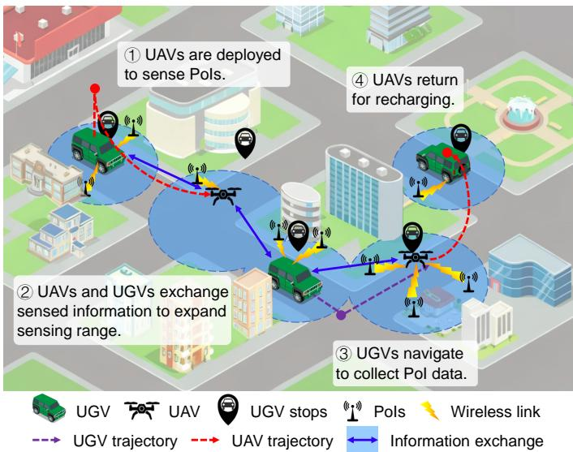  
Fig. 1: Considered UAV carrier enabled VCS campaign in a workzone.

The decision-making process in our considered VCS problem presents three key challenges, which are detailed as follows. First, the sensing capability of UGVs is inherently constrained by the road network, making it difficult to comprehensively capture the spatial distribution of PoIs across the entire workzone and to determine optimal locations for data collection. Second, UAVs and UGVs make decisions at different temporal scales since UAVs act more frequently due to faster dynamics, while UGVs update decisions less often because of slower movement. This temporal mismatch complicates coordination, as UAVs and UGVs may struggle to infer each other’s intentions in time, leading to misaligned or delayed cooperative behaviors. Finally, the differences in mobility, sensing range, and task responsibilities among UAVs and UGVs, coupled with temporal mismatch between them, further increase the complexity of joint policy learning and pose challenges in establishing effective role differentiation.

Recently, deep reinforcement learning (DRL) has achieved remarkable progress in video games [5], robotic control [6], and large language model fine-tuning [7]. Several studies attempt to enhance generic multi-agent DRL (MADRL) models to address the decision-making challenges of limited and asymmetric sensing capabilities, temporal mismatch in decision frequencies, and the need for effective role differentiation. However, when applied to our considered VCS, existing MADRLbased solutions are still insufficient. For example, ARL-SMCS [8] improved heterogeneous-agent role collaboration through a variational autoencoder and evolutionary role assignment, yet it assumed synchronous decision-making and thus cannot handle the temporal mismatch between fast moving UAVs and slow moving UGVs. DGap-UCB [9] focused on balancing data-distribution gain and cost to rapidly optimize sensing strategies in unknown environments, but it modeled UAV-UGV cooperation at a coarse level, and did not address the limited and asymmetric sensing arising from the UGVs’ constrained sensory reach. GARL [10] introduced a geometry-aware information exchange mechanism with graph convolution; however, its design assumed idealized information exchange and did not explicitly model the heterogeneous sensing capabilities of UAVs and UGVs.

In this paper, we explicitly consider a UAV-carrier-enabled VCS system, where UGVs are responsible for collecting data from PoIs and serving as mobile carriers for UAVs, while UAVs explore the environment and extend the sensing coverage beyond the UGV’s observations. To this end, we propose a heterogeneous MADRL framework, named “HADRL-VCS”, to enable UAVs and UGVs to jointly learn cooperative and complementary policies for efficient sensing and data collection. Our contribution is three-fold:

• We develop a heterogeneous MADRL framework that unifies UAVs and UGVs within a collaborative decisionmaking paradigm. To mitigate the constrained sensing capability of UGVs and the decision-frequency mismatch between UAVs and UGVs, an attentive memory integrated information exchange mechanism is proposed to capture temporal dependencies and contextual relevance, enabling UVs to effectively expand sensing range and enhance cooperative decision-making.

• We propose a mutual policy divergence-driven exploration strategy to mitigate joint policy learning complexity and promote effective role differentiation between UAVs and UGVs by encouraging complementary behaviors and sustained policy diversity, thereby avoiding redundant exploration and achieving effective division of labor.

• We conduct extensive experiments on realistic simulations using real-world urban maps from Guangzhou, China, and Madrid, Spain, with road networks and building footprints derived from OpenStreetMap. We identify the most appropriate hyperparameters, visualize the UAV and UGV trajectory, and show performance comparisons with five baselines. Results confirm that HADRL-VCS outperforms all others in terms of data collection ratio, geographic fairness, sensing range expansion ratio, overlap ratio, and efficiency.

The rest of this paper is organized as follows. We review related works in Section II. We present the system model in Section III. Problem definition and formulation are given in Section IV and the solution is presented in Section V. Experimental results are supplemented in Section VI, followed by discussions in Section VII. Finally, Section VIII concludes the paper. Important notations used in this paper are listed in Table I.

TABLE I: Important notations used in this paper.
<table><tr><td>Notation</td><td>Explanation</td></tr><tr><td> $\overline { { \boldsymbol { u } , \boldsymbol { u } , \boldsymbol { U } } }$   ${ \mathcal { G } } , g , G$ </td><td>UAVs set, index and total number of UAVs. UGVs set, index and total number of UGVs.</td></tr><tr><td> $\mathcal { P } , p , P$   $B , b , B$ </td><td>PoIs set, index and total number of PoIs. UGV stop set, index and total number of UGV</td></tr><tr><td> $t , T , \tau$ </td><td>stops. Index and total number of timeslots, duration of a</td></tr><tr><td> $d _ { t } ^ { p } , \Delta d _ { t } ^ { p , g }$ </td><td>timeslot. Remaining amount of data with PoI p at t, cumu-</td></tr><tr><td> $_ { C _ { t } ^ { p , u } , C _ { t } ^ { p , g } } ^ { e ^ { g } }$ </td><td>lative data collected by UGV g from a PoI p by t. Remaining energy of a UAV u and a UGV g at t.</td></tr><tr><td></td><td>Capacity of communications link between a PoI p and a UAV u, a PoI p and a UGVg at t.</td></tr><tr><td> $w _ { t } ^ { u } , w _ { t } ^ { g }$   $s _ { t } , o _ { t } , a _ { t } , r _ { t }$ </td><td>Activity indicator of a UAV u and a UGV g at t. State, observation, action and reward over all UVs</td></tr><tr><td> $\eta , f , \psi , \kappa \ , \xi$ </td><td>during timeslot [t, t + 1). Data collection ratio, geographic fairness, sensing</td></tr></table>

## II. RELATED WORK

## A. Vehicular Crowdsensing (VCS)

VCS has been widely investigated as an effective paradigm for large-scale urban sensing and service provisioning. Many existing studies focus on task allocation and dynamic scheduling within this paradigm. Qi et al. in [11] proposed a stagewise service trading framework to achieve stable worker-task matching under dynamic spatio-temporal constraints. You et al. in [12] developed an online task allocation scheme based on Lyapunov optimization and fuzzy control to ensure longterm system stability in VCS. Guo et al. in [13] proposed a hybrid pilot-instantaneous scheduling mechanism to improve task assignment efficiency over dynamic vehicular clouds.

These studies contribute to VCS by improving system efficiency under dynamic conditions. Building upon this line of research, another direction focuses on cooperative decisionmaking among UAVs and UGVs. Tu et al. in [8] proposed an adaptive role-learning MADRL solution to facilitate effective role differentiation between UAVs and UGVs and enhance their collaboration. Su et al. in [9] developed a strategic online learning framework that employed an upper confidence bound approach to rapidly identify optimal sensing and deployment strategies by efficiently balancing data distribution gain and operational cost. Ye et al. in [14] proposed a multi-agent curriculum learning framework to achieve timely and efficient data collection by leveraging inter-agent information exchange. Wang et al. in [10] proposed a geometric graph convolutional MADRL solution with a geometry-aware information exchange mechanism to promote cooperative decision-making between UAVs and UGVs. Zhao et al. in [15] proposed a hierarchical MADRL solution, incorporating diffusion models, that enhanced the collaboration between UAVs and UGVs and achieved energy-efficient data collection. However, these methods cannot be directly applied to our considered UAV-carrierenabled VCS problem, as they generally overlook the decision frequency mismatch between UAVs and UGVs. Such mismatch leads to temporal mismatch that complicates coordination and may result in inefficient cooperation, especially when UGVs remain inactive for multiple time steps and cannot update their actions in time.

## B. MADRL and Information Exchange Mechanisms

To enhance scalability and stability in MADRL, a series of policy gradient-based methods have been developed. IPPO [16] extended PPO to multi-agent settings and treated each agent as an independent learner. Building upon this, Multi-agent PPO (MAPPO [17]) introduced a centralized critic to improve coordination among agents under the centralized training and decentralized execution (CTDE) paradigm. To further enhance training stability and convergence guarantees, HAPPO and HATRPO [18] adopted sequential policy updates with theoretical guarantees on monotonic policy improvement, applicable to heterogeneous multi-agent systems. In addition, Multi-agent Transformer (MAT [19]) leveraged attention mechanisms to model inter-agent dependencies and capture contextual information. RoMAT [20] extended MAT by introducing a role adapter and a feature alignment layer to better accommodate heterogeneous agents with varied observation spaces and action capabilities. However, these methods are not specifically designed to handle the limited and asymmetric sensing capabilities among heterogeneous UVs. In our considered VCS problem, UGV’s restricted sensing range leads to partial observability, which may cause inconsistent understanding of the environment and hinder cooperative policy learning.

Recently, several information exchange methods are proposed. Hu et al. [21] modeled the inter-agent information exchange structure as a learnable graph and employed a bi-level optimization process to efficiently learn a sparse topology that enhanced coordination and information exchange efficiency. Ding et al. [22] proposed an information exchange mechanism that leveraged graph information bottleneck optimization to learn minimal and sufficient message representations. Bettini et al. [23] proposed a heterogeneous information exchange paradigm to overcome policy homogeneity limitations and enable agents to learn heterogeneous policies that formed complementary behaviors. Lo et al. [24] leveraged contrastive learning to maximize the mutual information between agents exchanged messages. However, this decision-frequency mismatch in our considered VCS problem breaks the synchronousupdate assumption commonly adopted in existing methods, preventing UGVs from timely incorporating the exchanged information and thereby hindering the effective utilization of shared information and the coordination among UVs.

## III. SYSTEM MODEL

We consider a UAV-carrier-enabled VCS scenario in an urban workzone, consisted of a set $\mathcal { T } \triangleq \{ i | i = 1 , 2 , \dots , I \}$ of UVs. This set I can be partitioned into two disjoint subsets: a set of UAVs $\mathcal { U } \triangleq \{ u | u = 1 , 2 , \dots , U \}$ and a set of UGVs $\mathcal { G } \triangleq \{ g | g = 1 , 2 , \ldots , \overset { \cdot } { g } \}$ , where $U + G = I .$ . The overall task is executed within a fixed duration, which is divided into T equal timeslots, each with length τ . The UGVs move along the road network to perform data collection from surrounding

PoIs, while the UAVs fly at a fixed altitude in a 2D cartesian coordinate system to assist in expanding the sensing range. Buildings higher than the UAV flight altitude are treated as obstacles. Following similar prior work [25], we assume that each building in the workzone is equipped with a single antenna on its exterior wall or rooftop, referred to as a PoI and denoted by $\mathcal { P } \triangleq \{ p | p = 1 , 2 , . . . , P \}$ . These PoIs gather data from sensors hanging in/outside the building and transmit it to nearby UGVs when within communication range. Each UGV is equipped with a docking platform [26] that enables UAVs to be dispatched or recovered. During the task, a UAV can be dispatched from a UGV to explore unobserved areas and sense PoIs beyond a UGV’s observable range. The environmental information like PoI location and data volume is then transmitted to nearby UGVs to enhance their situational awareness and facilitate decision-making. Once a UAV completes its exploration task or its energy level drops below a predefined threshold, it returns to a UGV for recharging. Through this cooperative process, UAVs dynamically extend the sensing range of UGVs, while UGVs carry out data collection and serve as mobile carriers to support UAV operations.

## A. Communication Model

We consider an OFDMA [27] based uplink communications framework, where both UAVs and UGVs communicate with distributed PoIs within the workzone. The PoI communication model comprises two types of channels: the ground-to-air (G2A) channel from a PoI $p$ to a UAV u, and the groundto-ground (G2G) channel from a PoI p to a UGV g.

1) PoI-UAV channel: Since UAVs fly through buildings, it is crucial to incorporate both the line-of-sight (LoS) and the nonline-of-sight (NLoS) links into the channel model. Following [28], the Los probability between a PoI $p$ and a UAV u at timeslot t is computed as:

$$
\operatorname* { P r } _ { \mathrm { L o S } } ^ { p , u } = \frac { 1 } { 1 + a \exp [ - b ( \theta _ { t } ^ { p , u } - a ) ] } ,\tag{1}
$$

where a and b are environment related constants and $\begin{array} { r l r } { \theta _ { t } ^ { p , u } } & { { } = } & { \arcsin ( \frac { H _ { u } } { d _ { \star } ^ { p , u } } ) } \end{array}$ is the elevation angle between a PoI p and a UAV u at timeslot $t ; ~ d _ { t } ^ { p , u }$ denotes the direct distance between a PoI p and a UAV u as $d _ { t } ^ { p , u } \ = $ $\sqrt { ( x ^ { p } - x _ { t } ^ { u } ) ^ { 2 } + ( y ^ { p } - y _ { t } ^ { u } ) ^ { 2 } + ( z ^ { p } - z _ { t } ^ { u } ) ^ { 2 } }$ , where $( x ^ { p } , y ^ { p } , z ^ { p } )$ $\left( x _ { t } ^ { u } , y _ { t } ^ { u } , z _ { t } ^ { u } \right)$ represents the location of the PoI and UAV, respectively. Then, the path loss is:

$$
\begin{array} { c } { { l _ { t } ^ { p , u } = 2 0 \log ( d _ { t } ^ { p , u } ) + ( \eta _ { \mathrm { L o S } } - \eta _ { \mathrm { N L o S } } ) \mathrm { P r } _ { \mathrm { L o S } } ^ { p , u } } } \\ { { + \eta _ { \mathrm { N L o S } } + 2 0 \log \left( \displaystyle \frac { 4 \pi f _ { c } } { c } \right) , } } \end{array}\tag{2}
$$

where $f _ { c }$ and c denote the carrier frequency and the speed of light, respectively; $\eta _ { \mathrm { L o S } }$ and $\eta _ { \mathrm { N L o S } }$ are the excessive path losses under LoS and NLoS conditions. The received signal-to-noise ratio (SNR) and Shannon capacity are expressed as:

$$
\gamma _ { t } ^ { p , u } = \frac { P _ { t } ^ { p , u } 1 0 ^ { - l _ { t } ^ { p , u } / 1 0 } } { N _ { 0 } B _ { t } ^ { p , u } } , C _ { t } ^ { p , u } = B _ { t } ^ { p , u } \log ( 1 + \gamma _ { t } ^ { p , u } ) ,\tag{3}
$$

where $P _ { t } ^ { p , u }$ is the transmit power of a PoI $p , \ B _ { t } ^ { p , u }$ is the allocated bandwidth, and $N _ { 0 }$ is the spectral density of the noise power.

2) PoI-UGV channel: The G2G channel between a PoI p and a UGV g is modeled as a Rayleigh fading channel, where the large-scale path loss follows the free-space path loss (FSPL) model. The path loss at timeslot t is given by:

$$
l _ { t } ^ { p , g } = 2 0 \log ( d _ { t } ^ { p , g } ) + 2 0 \log \biggl ( \frac { 4 \pi f _ { c } } { c } \biggr ) ,\tag{4}
$$

where $d _ { t } ^ { p , g }$ denotes the distance between a PoI $p$ and a UGV $g .$ Let $h _ { t } ^ { \bar { p } , g } \sim \mathcal { C N } ( 0 , 1 )$ denote the small-scale Rayleigh fading coefficient. The instantaneous SNR and Shannon capacity are:

$$
\gamma _ { t } ^ { p , g } = \frac { P _ { t } ^ { p , g } | h _ { t } ^ { p , g } | ^ { 2 } 1 0 ^ { - l _ { t } ^ { p , g } / 1 0 } } { N _ { 0 } B _ { t } ^ { p , g } } , C _ { t } ^ { p , g } = B _ { t } ^ { p , g } \log ( 1 + \gamma _ { t } ^ { p , g } ) ,\tag{5}
$$

where $P _ { t } ^ { p , g }$ and $B _ { t } ^ { p , g }$ denote the transmit power and allocated bandwidth, respectively.

Beyond PoI-related channels, UAVs and UGVs communicate over inter-UV wireless channels to exchange information. Consider a generic inter-UV channel between two UVs i and i′ at timeslot t. The large-scale channel attenuation is described by a log-distance path loss model:

$$
l _ { t } ^ { i , i ^ { \prime } } = l _ { 0 } + 1 0 \alpha \log \left( \frac { d _ { t } ^ { i , i ^ { \prime } } } { d _ { 0 } } \right) + \chi _ { t } ^ { i , i ^ { \prime } } ,\tag{6}
$$

where $d _ { t } ^ { i , i ^ { \prime } }$ denotes the inter-UV distance, α is the pathloss exponent, and $\chi _ { t } ^ { i , i ^ { \prime } } \sim \mathcal { N } ( 0 , \sigma _ { . } ^ { 2 } )$ represents log-normal shadowing. With transmit power $P _ { t } ^ { i , i ^ { \prime } }$ and allocated bandwidth $B _ { t } ^ { i , i ^ { \prime } }$ , the instantaneous received SNR is given by:

$$
\gamma _ { t } ^ { i , i ^ { \prime } } = \frac { P _ { t } ^ { i , i ^ { \prime } } 1 0 ^ { - l _ { t } ^ { i , i ^ { \prime } } / 1 0 } } { N _ { 0 } B _ { t } ^ { i , i ^ { \prime } } } .\tag{7}
$$

Since inter-UV communication directly affects the reliability and timeliness of information exchange, packet loss and transmission latency are explicitly incorporated into the link model. Following [29], the packet loss probability is approximated as:

$$
\epsilon _ { t } ^ { i , i ^ { \prime } } = 1 - \exp \left( - \frac { \beta } { \gamma _ { t } ^ { i , i ^ { \prime } } } \right) ,\tag{8}
$$

where $\beta$ is a constant determined by the modulation and coding scheme. Accordingly, we define the effective inter-UV transmission rate by incorporating both non-ideal implementation loss and random packet losses:

$$
\tilde { C } _ { t } ^ { i , i ^ { \prime } } = \zeta \left( 1 - \epsilon _ { t } ^ { i , i ^ { \prime } } \right) B _ { t } ^ { i , i ^ { \prime } } \log \left( 1 + \gamma _ { t } ^ { i , i ^ { \prime } } \right) ,\tag{9}
$$

where $\zeta \in ( 0 , 1 ]$ is an implementation loss factor accounting for practical rate reduction due to coding overhead and nonideal modulation. Then the transmission latency can be computed as $\begin{array} { r } { T _ { t } ^ { i , i ^ { \prime } } = \frac { S ^ { i , i ^ { \prime } } } { \tilde { C } _ { t } ^ { i , i ^ { \prime } } } } \end{array}$ , where $S ^ { i , i ^ { \prime } }$ is the size of the exchanged message.

Notably, the proposed HADRL-VCS framework is not restricted to the OFDMA-based communication model considered here, and can be applied to other communication paradigms (e.g., TDMA or NOMA) by redefining the corresponding transmission rate and link models in Section III-A.

## B. Energy Consumption Model

The energy consumption of each UAV mainly arises from its flight operations, including horizontal movement during environmental exploration and vertical motion when being dispatched or recovered via the docking platform. Accordingly, the energy consumption $e _ { t } ^ { u - }$ of a UAV u at t can be modeled as:

$$
e _ { t } ^ { u - } = C _ { 1 } | | ( x _ { t } ^ { u } , y _ { t } ^ { u } , z _ { t } ^ { u } ) - ( x _ { t - 1 } ^ { u } , y _ { t - 1 } ^ { u } , z _ { t - 1 } ^ { u } ) | | + C _ { 2 }\tag{10}
$$

where $C _ { 1 }$ and $C _ { 2 }$ are constants determined by factors such as aircraft weight, air density, and rotor disc area, as specified in $[ 3 0 ] ; C _ { 2 }$ also captures the baseline energy consumption of onboard modules. In contrast, the energy consumption of a UGV primarily results from its ground movement along the road network when traveling between UGV stops for data collection. We define the energy consumption $e _ { t } ^ { { \dot { g } } - }$ of UGV $g$ at t as:

$$
e _ { t } ^ { g - } = C _ { 3 } | | ( x _ { t } ^ { g } , y _ { t } ^ { g } ) - ( x _ { t - 1 } ^ { g } , y _ { t - 1 } ^ { g } ) | | + C _ { 4 } ,\tag{11}
$$

where $C _ { 3 }$ is a constant determined by rolling resistance, vehicle mass, and drivetrain efficiency as in [31], and $C _ { 4 }$ denotes the baseline energy consumption associated with on-board sensing, computation, and communication modules. Overall, mobility-related energy constitutes the dominant component in the model, while communication and onboard computation are captured through the baseline terms.

## IV. PROBLEM DEFINITION AND FORMULATION

## A. Problem Definition

In our considered VCS scenario, UAVs and UGVs cooperatively conduct environmental sensing and data collection within the workzone. To comprehensively evaluate their cooperative performance, we introduce four metrics capturing different aspects of a task. First is the data collection ratio η, defined as:

$$
\eta = 1 - \frac { \sum _ { p } d _ { T } ^ { p } } { \sum _ { p } d _ { 0 } ^ { p } } ,\tag{12}
$$

where $\sum _ { p } d _ { T } ^ { p }$ is the total remaining data after T timeslots, and $\textstyle \sum _ { p } d _ { 0 } ^ { p }$ denotes the initial data amount of all PoIs.

Second is the geographic fairness f of collected data, since PoIs may unevenly distributed in the workzone, therefore some far away PoIs may not covered. We use Jain’s fairness index [32] to compute it as:

$$
f = \frac { ( \sum _ { p } ( d _ { 0 } ^ { p } - d _ { T } ^ { p } ) / d _ { 0 } ^ { p } ) ^ { 2 } } { P \sum _ { p } ( ( d _ { 0 } ^ { p } - d _ { T } ^ { p } ) / d _ { 0 } ^ { p } ) ^ { 2 } } .\tag{13}
$$

Third, to assess the contribution of UAVs in expanding the sensing coverage of UGVs, we introduce the sensing range expansion ratio $\psi ,$ defined as:

$$
\psi = \frac { \sum _ { p } c _ { \mathrm { U A V } } ^ { p } \cdot c _ { \mathrm { c o l } } ^ { p } } { \sum _ { p } c _ { \mathrm { c o l } } ^ { p } } ,\tag{14}
$$

where $c _ { \mathrm { c o l } } ^ { p }$ and $c _ { \mathrm { U A V } } ^ { p }$ are binary variables; $c _ { \mathrm { c o l } } ^ { p } = 1$ if a PoI $p$ is collected by a UGV and 0 otherwise, while $c _ { \mathrm { U A V } } ^ { p } = 1$ if PoI $p$ is first discovered by a UAV and 0 otherwise. This metric evaluates the proportion of UGV-collected PoIs that were initially discovered by UAVs, thereby quantifying the effectiveness of UAVs in expanding the sensing coverage within the workzone.

Next, to quantify the degree of coordination among UAVs and UGVs, we introduce the overlap ratio $\kappa ,$ defined as:

$$
\kappa = \frac { \sum _ { T } \sum _ { P } \mathbf { 1 } \{ n _ { \mathrm { s e n s e , t } } ^ { p } \geq 2 \} } { \sum _ { T } \sum _ { P } \mathbf { 1 } \{ n _ { \mathrm { s e n s e , t } } ^ { p } \geq 1 \} } ,\tag{15}
$$

where $n _ { \mathrm { s e n s e , t } } ^ { p }$ denotes the number of UAVs and UGVs that can sense PoI $p$ at timeslot t. This metric characterizes the proportion of PoIs that are simultaneously covered by multiple UAVs or UGVs, reflecting the degree of redundant sensing under coordination.

Finally, in order to measure the effectiveness of UAVs and UGVs in cooperatively accomplishing the data collection task, we jointly consider data collection ratio, geographic fairness and sensing range expansion ratio, adding the element of energy consumption, as an integrated performance index, called “efficiency”. This metric serves as our maximization objective, as:

$$
\xi = \eta \cdot f \cdot \psi \cdot \frac { \sum _ { v } e _ { 0 } ^ { u } + \sum _ { u } e _ { 0 } ^ { g } } { \sum _ { u } ( e _ { 0 } ^ { u } - e _ { T } ^ { u } ) + \sum _ { g } ( e _ { 0 } ^ { g } - e _ { T } ^ { g } ) } ,\tag{16}
$$

where $e _ { 0 } ^ { u }$ and $e _ { 0 } ^ { g }$ denotes the initial energy reserves of a UAV u and a UGV $^ { g , }$ respectively, with $e _ { T } ^ { u }$ and $e _ { T } ^ { g }$ representing their remaining energy after $T$ timeslots.

Our goal is to maximize the overall efficiency $\xi ,$ as:

$$
\mathbf { P 1 } \colon \ \operatorname* { m a x } \ \xi , \ \mathbf { s . t . } \ e _ { t } ^ { i } \geq 0 , \ \forall \ 0 \leq t < T , i \in \mathcal { I } .
$$

Note that P1 is highly challenging to solve due to heterogeneous action-observation spaces and asynchronous decision frequencies, which jointly render the optimization NP-hard. We opt to model P1 as a sequential decision-making problem and utilize MADRL methods to solve it.

## B. Problem Formulation

We formulate the cooperative decision-making process among UAVs and UGVs as a Decentralized Partially Observable Markov Decision Process (Dec-POMDP), defined as $( \mathcal { T } , \mathcal { S } , \mathcal { O } , \mathcal { A } , \mathcal { R } , \mathrm { P r } , \gamma )$ , where I, S, O and A are the set of UVs, states, local observations and actions, and $\gamma$ is the discount factor. In our considered VCS scenario, UAVs and UGVs exhibit a mismatch in decision frequency due to their distinct mobility characteristics. UAVs make decisions more frequently because of their agile dynamics, while UGVs require multiple timeslots to reach a designated location. To handle this temporal mismatch, we introduce the concepts of Active and Inactive UVs. A UV is regarded as “Active” at a given timeslot if it is ready to select a new action, whereas an “Inactive” UV continues its current multi-step movement until that movement is completed.

1) State and observation space: The global state $\mathbf { \boldsymbol { s } } _ { t }$ is a vector, concatenating two types of information: each UV i’s current 2D position, remaining energy and a binary variable $\omega _ { t } ^ { i }$ indicating whether the UV is active and $\omega _ { t } ^ { i } = 1$ if UV i is active $( x _ { t } ^ { i } , y _ { t } ^ { i } , e _ { t } ^ { i } , \omega _ { t } ^ { i } )$ , and each PoI $p \mathbf { \hat { s } }$ position with its remaining amount of data $( x _ { p } , y _ { p } , d _ { t } ^ { p } )$ . Each UV i receives a local observation ${ \ o } _ { t } ^ { i }$ with the same dimensional structure as $\mathbf { } _ { s _ { t } } ,$ , but limited by its sensing range. Specifically, a UV can observe the states of PoIs and neighboring UVs only when they lie within its sensing range and a reliable communication link can be established; otherwise, the corresponding components are masked by zero vectors. Under this formulation, partial observability arises from spatially constrained sensing, as each UV relies solely on its local observation.

2) Action Space: For UAVs, the action space is hybrid and defined as $\mathcal { A } ^ { u } = \mathcal { A } _ { \mathrm { f i v } } ^ { u } \cup \{ a _ { \mathrm { c h a r g e } } \}$ . The continuous flight action $\pmb { a } _ { t } ^ { u } = ( \theta _ { t } ^ { u } , v _ { t } ^ { u } ) \in \mathbb { R } ^ { 2 }$ belongs to $\mathcal { A } _ { \mathrm { f l y } } ^ { u }$ and determines the flight direction and velocity. Selecting $a _ { \mathrm { c h a r g e } }$ triggers a returnand-charging procedure, during which the UAV is regarded as inactive. For UGVs, their movement is constrained by the road network and can only occur between UGV stops B, i.e., $\pmb { a } _ { t } ^ { g } \in \mathcal { A } ^ { g } \mathrm { ~ = ~ } \mathcal { B }$ . Since a UGV may not reach its target stop within one timeslot, its action is determined by:

$$
\begin{array} { r } { \pmb { a } _ { t } ^ { g } = \left\{ \begin{array} { l l } { \tilde { \pmb { a } } _ { t } ^ { g } \sim \pi _ { g } ( \cdot | \pmb { \sigma } _ { t } ^ { g } ) , } & { \mathrm { i f ~ } \omega _ { t } ^ { g } = 1 , } \\ { \pmb { a } _ { t - 1 } ^ { g } , } & { \mathrm { i f ~ } \omega _ { t } ^ { g } = 0 , } \end{array} \right. } \end{array}\tag{17}
$$

where $\pi _ { g }$ denotes the policy of the UGV and $\tilde { \mathbf { \pmb { a } } } _ { t } ^ { g }$ is a newly selected action.

3) Reward function: To guide the cooperative behaviors of UAVs and UGVs, separate reward functions are designed for them. For a UAV $u \in \mathcal { U } .$ , the reward is defined as $r _ { t } ^ { u } =$ $r _ { t } ^ { u + } + r _ { t } ^ { u - }$ , where the positive term:

$$
r _ { t } ^ { u + } = \frac { \sum _ { p \in n ( u ) } ( 1 - c _ { \mathrm { U A V } } ^ { p } ) ( 1 - c _ { \mathrm { c o l } } ^ { p } ) } { e _ { t - 1 } ^ { u } - e _ { t } ^ { u } } ,\tag{18}
$$

reflects the efficiency of sensing relative to energy consumption. Here, $e _ { t - 1 } ^ { u } - e _ { t } ^ { u }$ denotes the energy consumed between two consecutive steps, and $n ( u ) = \{ p | C _ { t } ^ { p , u } \geq C _ { \mathrm { t h } } , \forall p \in \mathcal { P } \}$ represents the set of PoIs within the sensing range of UAV u. $C _ { t } ^ { \bar { p } , u }$ is the data transmission rate between a PoI $p$ and a UAV $u ,$ and $C _ { \mathrm { t h } }$ is a predefined threshold ensuring the required QoS. The penalty term $r _ { t } ^ { u - }$ accounts for unsafe or inefficient flight behaviors. Specifically, a negative reward is imposed when UAV u collides with an obstacle. In addition, while the UAV performs flight operations, a small per-step negative reward is applied to reflect the operational cost of sustained flight. For a UGV $g \in { \mathcal { G } }$ , the reward is defined as:

$$
r _ { t } ^ { g } = f ( n ( g ) ) \cdot \frac { \Delta d _ { t } ^ { p , g } - \Delta d _ { t ^ { \prime } } ^ { p , g } } { e _ { t ^ { \prime } } ^ { g } - e _ { t } ^ { g } } ,\tag{19}
$$

where $\Delta d _ { t } ^ { p , g }$ and $\Delta d _ { t ^ { \prime } } ^ { p , g }$ denote the data collected from a PoI $p$ by a UGV g at the current and previous active timeslots, respectively; $e _ { t ^ { \prime } } ^ { g } \ - \ e _ { t } ^ { g }$ represents the corresponding energy consumption. $f ( n ( g ) )$ denotes the geographic fairness over the PoI set $n ( g )$ . The above reward functions provide stepwise energy-aware feedback for sensing and data collection behaviors. While $\xi$ is defined at the episode level, directly using it as the sole learning signal is difficult in sequential decision-making. Therefore, the per-step rewards are used as a practical surrogate to guide UVs toward effective sensing and data collection under energy constraints, thereby encouraging cooperative behaviors that contribute to improved overall performance.

## V. PROPOSED SOLUTION: HADRL-VCS

As shown in Fig. 2, HADRL-VCS incorporates two main components: an attentive memory integrated information exchange mechanism, termed “AMIE”, and a mutual policy divergence driven exploration strategy, termed “MPDE”. AMIE addresses the constrained sensing capability of UGVs and the temporal mismatch in decision frequency by enabling sequential action-aware information exchange with attentive memory updates. This mechanism expands the collective sensing range and enhances cooperative decision-making among UVs. MPDE is designed to mitigate joint policy learning complexity and promote effective role differentiation between UVs by encouraging complementary behaviors and sustained policy diversity, thereby preventing redundant exploration and facilitating an effective division of labor.

## A. Enhancing Cooperation by Attentive Memory-Integrated Information Exchange Mechanism

In the considered VCS scenario, achieving efficient cooperation between UAVs and UGVs is essential for completing sensing and data collection tasks. Due to the road network constraints and limited sensing capabilities, UGVs can only sense their nearby PoIs, while UAVs with flexible aerial mobility can sense a wider area beyond the UGVs’ observable range. However, without an effective information exchange mechanism, such spatial information cannot be efficiently shared or utilized to guide UGV decisions and coordinate joint actions. Furthermore, the temporal mismatch in decisionmaking between UAVs and UGVs makes it difficult for UGVs to retain crucial environmental cues over long decision intervals, and prevents active UVs from inferring others’ behavioral tendencies accurately, which is essential for maintaining cooperative consistency.

To this end, we propose AMIE, an attentive memory integrated information exchange mechanism, to enable UVs to exchange action-aware messages in a sequential manner while dynamically integrating both current and historical information. The attentive memory update module produces a temporally consistent and environmentally enriched representation that supports more informed UV decision-making. In the interaction phase at timeslot t, each UV i utilizes a shared encoder $\varphi ( \cdot )$ to encode its local observation ${ \pmb o } _ { t } ^ { i }$ into a hidden representation $h _ { t } ^ { i } = \varphi ( o _ { t } ^ { i } )$ . These hidden states are then exchanged among neighboring UVs $n ^ { \prime } ( i ) = \{ i ^ { \prime } | \tilde { C } _ { t } ^ { i , i ^ { \prime } } \geq$ $C _ { \mathrm { t h } } \}$ . A UV i thus receives the environmental message set $\{ h _ { t } ^ { i ^ { \prime } } | i ^ { \prime } \in n ^ { \prime } ( i ) \}$ from its neighbors. After, inactive UVs share their actions $\{ a _ { t } ^ { i ^ { \prime } } | \omega _ { t } ^ { i ^ { \prime } } = 0 , i ^ { \prime } \in n ^ { \prime } ( i ) \}$ with their neighbors. Then active UVs make decisions sequentially, leveraging their own observations and received comprehensive information. It allows UVs to explicitly reason about the behavioral tendencies of others before taking actions, leading to more coordinated and anticipatory cooperation.

The received messages, including both environmental information and action are transformed into message features, the key-value pairs $( k _ { t } ^ { i ^ { \prime } } , v _ { t } ^ { i ^ { \prime } } )$ ; the UV’s own hidden state $ { \boldsymbol { h } } _ { t } ^ { i }$ is mapped into a query vector $\pmb q _ { t } ^ { i }$ . The attentive memory update module then updates the memory state $ { m _ { t } } ^ { i } .$ , which stores historical contextual information from previous exchange rounds, by:

$$
m _ { t } ^ { i } = \sigma _ { m } \left( \sum _ { i ^ { \prime } = 1 } ^ { n ^ { \prime } ( i ) } \mathrm { E A t t n } ( q _ { t } ^ { i } , k _ { t } ^ { i ^ { \prime } } ) \cdot \sigma _ { r } ( [ m _ { t - 1 } ^ { i } \odot v _ { t } ^ { i ^ { \prime } } , v _ { t } ^ { i ^ { \prime } } ] ) \right) ,\tag{20}
$$

where $\begin{array} { r } { \mathrm { E A t t n } ( \pmb { q } _ { t } ^ { i } , \pmb { k } _ { t } ^ { i ^ { \prime } } ) = \mathrm { S o f t m a x } ( \frac { \sigma _ { a } ( \pmb { q } _ { t } ^ { i } \odot \pmb { k } _ { t } ^ { i ^ { \prime } } ) } { \sqrt { d _ { q } } } ) , \sigma _ { a } ( \cdot ) , \sigma _ { r } ( \cdot ) } \end{array}$ and $\sigma _ { m } ( \cdot )$ denote learnable linear transformations, and ⊙ represents element-wise interaction. This mechanism selectively weighs both the overall importance of each UV and the relevance of individual elements, thereby effectively utilizing neighbor information to expand a $\mathrm { U V } \mathbf { s }$ sensing range. Leveraging the updated memory $\boldsymbol { m } _ { t } ^ { i }$ and its hidden state $h _ { t } ^ { i } ,$ a UV produces its action $\mathbf { \Delta } \mathbf { a } _ { t } ^ { i } .$ , which is then immediately shared with other nearby active UVs.

AMIE enables UVs to effectively utilize both newly received messages and historical context for decision-making. The attentive memory update module achieves effective sensing range expansion and enhanced environmental awareness by selectively weighing neighbor information and maintaining temporal continuity. This integrated process mitigates the forgetting problem for UGVs with sparse decision updates. Furthermore, through sequential action-aware message passing, active UVs can interpret the intentions of inactive ones through shared messages. By doing so, UAVs can adjust their sensing focus in anticipation of UGV trajectories, while UGVs plan movements guided by UAV-provided intelligence. In this way, AMIE simultaneously addresses constrained sensing capability and temporal mismatch in heterogeneous multi-agent cooperation.

## B. Role Differentiation and Exploration by Mutual Policy Divergence Strategy

Efficient cooperation in the considered VCS scenario requires UAVs and UGVs to develop complementary yet distinct behaviors. In particular, UAVs should focus on exploring regions that have not been covered by other UVs to expand the sensing range, while UGVs should concentrate on collecting data from PoIs rather than redundantly exploring the environment. However, due to the complexity of the urban environment and the sparse reward setting, UVs may easily converge to similar strategies that are locally optimal but globally sub-optimal, leading to redundant trajectories and reduced efficiency.

To this end, we propose MPDE, a mutual policy divergence driven exploration strategy that encourages UVs to learn differentiated roles while avoiding premature convergence to suboptimal behaviors. In MPDE, each UV i is guided to diversify its strategy through explicit policy divergence maximization. Specifically, we formulate an additional intrinsic objective, based on policy divergence maximization as:

$$
\begin{array} { r } { \mathcal { L } _ { \mathrm { M P D E } } ^ { i } = \lambda \hat { D } _ { \mathrm { C S } } ( \pi _ { k } ^ { i } \Vert \bar { \pi } _ { k } ^ { i - 1 } ) + ( 1 - \lambda ) \hat { D } _ { \mathrm { C S } } ( \pi _ { k } ^ { i } \Vert \bar { \pi } _ { k - 1 } ^ { i } ) , } \end{array}\tag{21}
$$

where $\pi _ { k } ^ { i }$ is the current policy of UV i at episode k, while $\bar { \pi } _ { k } ^ { i - 1 }$ and $\bar { \pi } _ { k - 1 } ^ { i }$ represent the policies of the previous UV in the update order and of the same UV in the previous episode, respectively. The first term $\hat { D } _ { \mathrm { C S } } ( \pi _ { k } ^ { i } \Vert \bar { \pi } _ { k } ^ { i - 1 } )$ quantifies the inter-

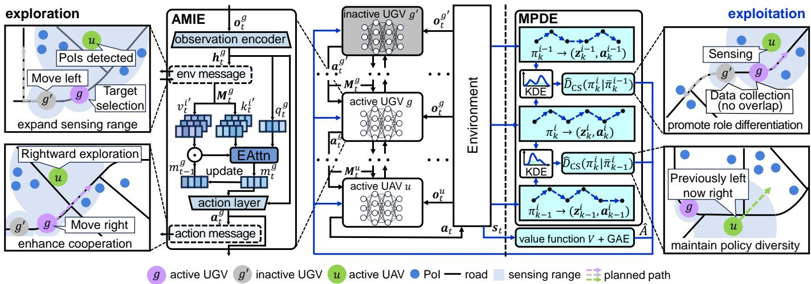  
Fig. 2: Proposed solution: HADRL-VCS.

UV policy divergence, measuring how distinct a UV i’s current policy is from that of the previously updated UV. The second term $\hat { D } _ { \mathrm { C S } } ( \pi _ { k } ^ { i } \Vert \bar { \pi } _ { k - 1 } ^ { i } )$ computes the intra-UV policy divergence, reflecting how much the current policy deviates from the same UV’s policy in the previous episode. The balancing coefficient $\lambda \in [ 0 , 1 ]$ controls the trade-off between inter-UV role differentiation and intra-UV policy diversity. Each UV samples its action as $\mathbf { } \mathbf { } \mathbf { } \mathbf { } \mathbf { } \mathbf { } \mathbf { } \mathbf { } \mathbf { } \mathbf { } \mathbf { } \mathbf { } \mathbf { } \mathbf { } \mathbf { } \mathbf { } \mathbf { } \mathbf { } \mathbf { } \mathbf { } \mathbf { } \mathbf { } \mathbf { } \mathbf { } \mathbf { } \mathbf { } \mathbf { } \mathbf { } \mathbf { } \mathbf { } \mathbf { } \mathbf { } \mathbf { } \mathbf { } \mathbf { } \mathbf { } \mathbf { } \mathbf { } \mathbf { } \mathbf { } \mathbf { } \mathbf { } \mathbf { } \mathbf { } \mathbf { } \mathbf { } \mathbf { } \mathbf { } \mathbf { } \mathbf { } \mathbf { } \mathbf { } \mathbf { } \mathbf { } \mathbf { } \mathbf { } \mathbf { } \mathbf { } \mathbf { } \mathbf { } \mathbf { } \mathbf { } \mathbf { } \mathbf { } \mathbf { } \mathbf { } \mathbf { } \mathbf { } \mathbf { } \mathbf { } \mathbf { } \mathbf { } \mathbf { } \mathbf { } \mathbf { } \mathbf { } \mathbf { } \mathbf { } \mathbf { } \mathbf { } \mathbf { } \mathbf { } \mathbf { } \mathbf { } \mathbf { } \mathbf { } \mathbf { } \mathbf { } \mathbf { } \mathbf { } \mathbf { } \Sigma \mathbf { } \mathbf { } \Sigma \mathbf { } \mathbf { } \mathbf { } \Sigma \mathbf { } \mathbf { } \mathbf { } \Sigma \mathbf { } \mathbf { } \Sigma \mathbf { } \mathbf { } \Sigma \mathbf { } \mathbf { } \Sigma \mathbf { } \mathbf { } \Sigma \mathbf { } \mathbf { } \Sigma \mathbf { } \Sigma \mathbf { } \Sigma \mathbf { } \mathbf { } \Sigma \mathbf { } \Sigma \mathbf { } \Sigma \mathbf { } \Sigma \mathbf { } \Sigma \mathbf { } \Sigma \mathbf { } \Sigma \mathbf { } \Sigma \mathbf { } \Sigma \Sigma \mathbf { } \Sigma \mathbf { } \Sigma \Sigma \mathbf { } \Sigma \Sigma \mathbf { } \Sigma \Sigma \mathbf { } \Sigma \Sigma \Sigma \mathbf { } \Sigma \Sigma \Sigma \mathbf { } \Sigma \Sigma \Sigma \Sigma \mathbf \Sigma \Sigma \Sigma \Sigma \Sigma \Sigma \mathbf { } \Sigma \Sigma \Sigma \Sigma \Sigma \Sigma \mathbf \Sigma \Sigma \Sigma \Sigma \Sigma \Sigma \Sigma \Sigma \Sigma \mathbf \Sigma \Sigma \Sigma \Sigma \Sigma \Sigma \Sigma \Sigma \Sigma \Sigma \Sigma \Sigma \Sigma \Sigma \Sigma \Sigma \mathbf \Sigma \Sigma \Sigma \Sigma$ , where $\pmb { z } _ { t } ^ { i } = ( \pmb { o } _ { t } ^ { i } , \pmb { M } _ { t } ^ { i } )$ denotes a representation that integrates the local observation ${ \ o } _ { t } ^ { i }$ and the received message $\pmb { M } _ { t } ^ { i }$ from other UVs.

Conditional Cauchy-Schwarz divergence is used as $\hat { D } _ { \mathrm { C S } } ( \pi \| \bar { \pi } )$ , because its inherent bounded nature offers a more stable optimization objective when maximizing policy differences compared to unbounded measures [33]. We estimate this divergence non-parametrically from sampled trajectories using a Kernel Density Estimation, which quantifies the dissimilarity between the conditional action distributions induced by the two policies, structured as:

$$
\begin{array} { r l } & { \hat { D } _ { \mathrm { C S } } ( \pi \| \bar { \pi } ) = f _ { \mathrm { s e l f } } \big ( \mathcal { Z } ^ { \pi } , \mathcal { A } ^ { \pi } \big ) + f _ { \mathrm { s e l f } } \big ( \mathcal { Z } ^ { \bar { \pi } } , \mathcal { A } ^ { \bar { \pi } } \big ) } \\ & { \quad \quad - f _ { \mathrm { c r o s s } } \big ( \mathcal { Z } ^ { \pi } , \mathcal { A } ^ { \pi } , \mathcal { Z } ^ { \bar { \pi } } , \mathcal { A } ^ { \bar { \pi } } \big ) . } \end{array}\tag{22}
$$

where ${ \mathcal { Z } } ^ { \pi }$ and ${ \mathcal { A } } ^ { \pi }$ denote the set of representation-action pairs sampled from policy π. The self-similarity term $f _ { \mathrm { s e l f } } ( \cdot )$ measures the consistency of representation-action pairs within a single policy, while the cross-similarity term $f _ { \mathrm { c r o s s } } ( \cdot )$ quantifies the bidirectional correlation between trajectories generated by two different policies. By maximizing the overall measure $\hat { D } _ { \mathrm { C S } } .$ , a UV is encouraged to increase its behavioral distinction relative to the compared policy. The specific formulations of $f _ { \mathrm { s e l f } ( \cdot ) }$ and $f _ { \mathrm { c r o s s } ( \cdot ) }$ are given in [34].

To jointly achieve both inter-UV differentiation and intra-UV exploration stability, the intrinsic objective in MPDE integrates two complementary divergence terms. The first term, $\hat { D } _ { \mathrm { C S } } ( \pi _ { k } ^ { i } \| \bar { \pi } _ { k } ^ { i - 1 } )$ , promotes inter-UV role differentiation by encouraging UVs to develop distinct and complementary strategies. For example, UAVs are guided to explore regions not yet visited by others, while UGVs focus on collecting data without overlapping with others. The second term, $\hat { D } _ { \mathrm { C S } } ( \pi _ { k } ^ { i } \Vert \bar { \pi } _ { k - 1 } ^ { i } )$ maintains intra-UV policy diversity by driving each UV to deviate from its own prior behavior. This not only helps

UVs avoid early convergence to repetitive actions but also compels them to continuously explore and adapt to the current division of labor, searching for the optimal strategy within their evolving role. Through this mechanism, UAVs and UGVs develop complementary and differentiated policies, leading to an effective and stable division of labor under heterogeneous mobility, sensing capabilities, and task responsibilities.

## C. Algorithm Description

The pseudo-codes of HADRL-VCS are presented in Algorithm 1. At the beginning of training, the actor network of each UV and the global value function network are randomly initialized. Each actor network contains a shared observation encoder that consists of three fully connected layers for feature extraction, AMIE module that integrates contextual and temporal information using attentive message aggregation and recurrent memory update, and an output layer for action generation implemented as another fully connected layer. The global value function network follows a similar structure, consisted of three fully connected layers for feature extraction and another fully connected layer that outputs the state value.

Each training episode consists of two phases: exploration and exploitation. During exploration, each UV obtains its local observation and encodes it into a hidden state through the shared observation encoder. They are then exchanged among neighboring UVs, enabling each UV to gather additional environmental information beyond its observable range. Inactive UVs then share their recent action information to neighbors, while active UVs follow a predefined ordering to make decisions sequentially.

For each UV i, the memory state $\boldsymbol { m } _ { t } ^ { i }$ is updated through AMIE in Eqn. (20). Then, it selects a new action and shares that action with its neighbors (so later active UVs can incorporate it), and thereby promotes mutual intention understanding. In contrast, inactive UVs continue to execute their previously selected multi-step actions. Once all active UVs have generated their actions, the joint action set $\{ \boldsymbol { a } _ { t } ^ { i } \} _ { i \in \mathcal { I } }$ is executed in the environment to obtain the next global state and the corresponding rewards $\{ r _ { t } ^ { i } \} _ { i \in \mathbb { Z } }$ . All transition tuples $( o _ { t } ^ { i } , M _ { t } ^ { i } , a _ { t } ^ { i } , r _ { t } ^ { i } )$ , along with the global state $s _ { t } ,$ are stored in the experience buffer $\mathcal { D } .$

Algorithm 1: HADRL-VCS   
1 Initialize policy $\{ \pi _ { 0 } ^ { i } , \forall i \in \mathcal { T } \}$ , global value function V   
randomly and experience buffer D.   
2 for episode $k = 0 , 1 , \ldots , K - 1$ do   
3 /\* Exploration \*/   
4 for timeslot $t = 0 , 1 , \dots , T - 1$ do   
5 Each UV i gets $o _ { t } ^ { i } ,$ and computes its hidden   
state via the shared encoder $h _ { t } ^ { i }  \varphi ( o _ { t } ^ { i } )$   
6 Each UV i exchanges its hidden state with its   
neighbors $n ^ { \prime } ( i )$ , receiving $\{ h _ { t } ^ { i ^ { \prime } } | i ^ { \prime } \in n ^ { \prime } ( i ) \}$   
7 Inactive UVs share recent action information   
$\{ \pmb { a } _ { t } ^ { i ^ { \prime } } | \omega _ { t } ^ { i ^ { \prime } } = 0 , i ^ { \prime } \in n ^ { \prime } ( i ) \}$ to neighbors.   
8 Generate a permutation representing the   
decision order of active UVs $i _ { \omega , 1 : m } .$   
9 for UV $i _ { \omega } = i _ { \omega , 1 } , \ldots , i _ { \omega , m }$ do   
10 Update memory state by Eqn. (20).   
11 Select an action ${ \pmb a } _ { t } ^ { i _ { \omega } } \sim \pi _ { k } ^ { i _ { \omega } } ( \cdot | { \pmb o } _ { t } ^ { i _ { \omega } } , M _ { t } ^ { i _ { \omega } } ) .$   
and share it to other nearby active UVs.   
12 end for   
13 Execute the action $\pmb { a } _ { t } = \{ \pmb { a } _ { t } ^ { i } \} _ { i \in \mathbb { Z } }$ in the   
environment, and get reward $\begin{array} { r } { r _ { t } = \{ r _ { t } ^ { i } \} _ { i \in \mathcal { T } } . } \end{array}$   
14 Store transition tuples $\left( \{ \pmb { o } _ { t } ^ { i } , { \cal M } _ { t } ^ { i } , \pmb { a } _ { t } ^ { i } , r _ { t } ^ { i } \} _ { i \in \mathbb { Z } } , \pmb { s } _ { t } \right)$   
into experience buffer D.   
15 end for   
16 /\* Exploitation \*/   
17 Sample a random minibatch of size D from D.   
18 Compute GAE advantage Aˆ based on V .   
19 Draw a random permutation of UVs $i _ { 1 : I }$   
20 Set $A _ { \mathrm { m o d } } ^ { i _ { 1 } } = { \hat { A } } .$   
21 for $U V i = i _ { 1 } , \ldots , i _ { I }$ do   
22 Compute intrinsic objective by Eqn. (21).   
23 Compute extrinsic PPO objective by Eqn. (23).   
24 Compute the overall optimization objective by   
Eqn. (24) and update UV’s policy $\pi _ { k } ^ { i } .$   
25 Update the modified advantage by Eqn. (25).   
26 end for   
27 Update value function by Eqn. (26).   
28 end for

During exploitation, a random mini-batch of transitions is sampled from D to update the policy and value networks. The advantage function Aˆ is first estimated using the global value function V through generalized advantage estimation (GAE [35]). The UVs are then updated sequentially according to a random permutation $i _ { 1 : I }$ to avoid update bias across UVs and achieve better coordination [36]. By using MPDE, each UV computes an intrinsic objective defined in Eqn. (21) and an extrinsic PPO clipping objective as:

$$
\begin{array} { r } { \mathcal { L } _ { \mathtt { P P O } } ^ { i _ { m } } = \mathbb { E } \left[ \operatorname* { m i n } \left\{ \rho _ { k } ^ { i _ { m } } A _ { \mathrm { m o d } } ^ { i _ { 1 : m } } , \mathrm { c l i p } \left( \rho _ { k } ^ { i _ { m } } , 1 \pm \epsilon \right) A _ { \mathrm { m o d } } ^ { i _ { 1 : m } } \right\} \right] . } \end{array}\tag{23}
$$

where $\begin{array} { r l r } { \rho _ { k } ^ { i _ { m } } } & { { } = } & { \frac { \pi ^ { i _ { m } } ( { \pmb a } _ { t } ^ { i _ { m } } | { \pmb z } _ { t } ^ { i _ { m } } ) } { \pi _ { k } ^ { i _ { m } } ( { \pmb a } _ { t } ^ { i _ { m } } | { \pmb z } _ { t } ^ { i _ { m } } ) } } \end{array}$ is the importance sampling ratio that corrects for distributional shift between the current and reference policies; $\pi _ { k } ^ { i _ { m } }$ denotes the reference (pre-update) policy of $\mathrm { ~ U ~ V ~ } \ i _ { m }$ used when forming the ratio at the k-th update; and $A _ { \mathrm { m o d } } ^ { i _ { 1 : m } }$ is the modified advantage function that cumulatively incorporates the policy ratio product of all previously updated UVs $i _ { 1 : m - 1 }$ relative to the initial GAE estimate Aˆ. Here $i _ { m }$ indicates the m-th UV selected for update in the current episode. The overall optimization goal for each UV is then given by the combination of the intrinsic and extrinsic objectives, as:

TABLE II: Simulation settings
<table><tr><td>Notation Value</td><td></td><td>Notation</td><td>Value</td><td>Notation</td><td>Value</td><td>Notation</td><td>Value</td></tr><tr><td>a</td><td>9.6</td><td>T</td><td>10s</td><td> $\overline { { { \boldsymbol { v } } ^ { u } } }$ </td><td>40km/h</td><td> $\overline { { { e _ { 0 } ^ { u } } } }$ </td><td>41.4Wh</td></tr><tr><td>b</td><td>0.16</td><td>fc</td><td>3.5GHz</td><td> $v ^ { g }$ </td><td>20km/h</td><td> $\eta _ { \mathrm { L o S } }$ </td><td>1dB</td></tr><tr><td>T</td><td>200</td><td>B</td><td>20MHz</td><td> $\underline { { e } } _ { 0 } ^ { u }$ </td><td>6kWh</td><td> $\underline { { \eta _ { \mathrm { N L o S } } } }$ </td><td>20dB</td></tr></table>

$$
\begin{array} { r } { \mathcal { L } _ { \mathrm { t o t a l } } ^ { i _ { m } } = \mathcal { L } _ { \mathrm { M P D E } } ^ { i _ { m } } + \mathcal { L } _ { \mathrm { P P O } } ^ { i _ { m } } . } \end{array}\tag{24}
$$

After the update of a UV $i _ { m } \ ' _ { \mathrm { s } }$ policy (from $\pi _ { k } ^ { i _ { m } }$ to $\pi _ { k + 1 } ^ { i _ { m } } ) .$ the modified advantage is propagated to the next UV in the permutation by:

$$
A _ { \mathrm { m o d } } ^ { i _ { 1 : m + 1 } } = \frac { \pi _ { k + 1 } ^ { i _ { m } } ( { \pmb a } _ { t } ^ { i _ { m } } | z _ { t } ^ { i _ { m } } ) } { \pi _ { k } ^ { i _ { m } } ( { \pmb a } _ { t } ^ { i _ { m } } | z _ { t } ^ { i _ { m } } ) } A _ { \mathrm { m o d } } ^ { i _ { 1 : m } } ,\tag{25}
$$

which allows later UVs to adapt their policy optimization to the updated behaviors of preceding UVs.

Finally, the global value function is optimized by minimizing the clipped value loss:

$$
\begin{array} { r l } & { { \mathcal { L } } _ { \mathrm { c r i t i c } } = \mathbb { E } \bigg [ \operatorname* { m a x } \bigg \{ ( V ( s _ { t } ) - \hat { R } _ { t } ) ^ { 2 } , } \\ & { \qquad ( \mathrm { c l i p } ( V ( s _ { t } ) , V _ { \mathrm { o l d } } ( s _ { t } ) \pm \epsilon _ { 1 } ) - \hat { R } _ { t } ) ^ { 2 } \bigg \} \bigg ] . } \end{array}\tag{26}
$$

## VI. EXPERIMENTAL RESULTS

We conduct two realistic simulations on real-world urban maps from Guangzhou, China, and Madrid, Spain. The landscape data, including road networks and building footprints, are obtained from OpenStreetMap and pre-processed by removing low-rise buildings that do not obstruct UAV flight, evenly deploying UGV stops along roads, and defining map boundaries. In Guangzhou, the selected area spans longitudes from 113.3268 to 113.3406 and latitudes from 23.1357 to 23.1508, covering approximately 2.48 million square meters. In Madrid, the area ranges from -3.6457 to -3.6279 in longitude and from 40.5371 to 40.5481 in latitude, covering approximately 2.76 million square meters. PoIs are synthetically generated based on building geometry. For each building, the number of PoIs is determined according to its footprint area, and the PoIs are then randomly positioned on rooftops or exterior walls. This results in 215 PoIs in Guangzhou and 257 PoIs in Madrid. The initial data volume of each PoI is independently sampled from a uniform distribution $d _ { 0 } ^ { p } \sim \mathcal { U } ( 0 . 8 \mathrm { G B } , 1 . 2 \mathrm { G B } ) ,$ ), with all PoIs having data volumes within this predefined range.

In our experiments, the UGV and UAV parameters are configured based on the Robione Facility Robot [37] and DJI Air 2S [38] technical reports, respectively. The key simulation settings are summarized in Table II. We employed PyTorch as the implementation framework and trained all models on Ubuntu 20.04.5 LTS with GeForce RTX A6000 GPUs. Results were assessed using the data collection ratio η, geographic fairness $f ,$ sensing range expansion ratio ψ, overlap ratio $\kappa ,$ and ultimately the efficiency ξ.

TABLE III: Impact of decision sequence
<table><tr><td rowspan=1 colspan=1>Scenario</td><td rowspan=1 colspan=1>Sequence</td><td rowspan=1 colspan=1>η</td><td rowspan=1 colspan=1>f</td><td rowspan=1 colspan=1>ψ</td><td rowspan=1 colspan=1>κ</td><td rowspan=1 colspan=1>ξ</td></tr><tr><td rowspan=6 colspan=1>Guangzhou</td><td rowspan=6 colspan=1>static-uav-firststatic-ugv-firststatic-randomdynamic-uav-firstdynamic-ugv-firstdynamic-random</td><td rowspan=1 colspan=1>0.9266</td><td rowspan=1 colspan=1>0.938</td><td rowspan=1 colspan=1>0.9096</td><td rowspan=1 colspan=1>0.1583</td><td rowspan=1 colspan=1>9.8629</td></tr><tr><td rowspan=5 colspan=1>0.92020.93090.93440.92050.9454</td><td rowspan=1 colspan=1>0.9226</td><td rowspan=1 colspan=1>0.894</td><td rowspan=1 colspan=1>0.1591</td><td rowspan=1 colspan=1>9.415</td></tr><tr><td rowspan=1 colspan=1>0.9358</td><td rowspan=1 colspan=1>0.9141</td><td rowspan=1 colspan=1>0.1581</td><td rowspan=1 colspan=1>10.0231</td></tr><tr><td rowspan=3 colspan=1>0.94180.93140.952</td><td rowspan=1 colspan=1>0.9222</td><td rowspan=1 colspan=1>0.1577</td><td rowspan=1 colspan=1>10.1562</td></tr><tr><td rowspan=1 colspan=1>0.9082</td><td rowspan=1 colspan=1>0.1588</td><td rowspan=1 colspan=1>9.6543</td></tr><tr><td rowspan=1 colspan=1>0.9335</td><td rowspan=1 colspan=1>0.1572</td><td rowspan=1 colspan=1>10.6163</td></tr><tr><td rowspan=6 colspan=1>Madrid</td><td rowspan=6 colspan=1>static-uav-firststatic-ugv-firststatic-randomdynamic-uav-firstdynamic-ugv-firstdynamic-random</td><td rowspan=6 colspan=1>0.91970.91490.92480.92730.91580.9383</td><td rowspan=1 colspan=1>0.927</td><td rowspan=1 colspan=1>0.9132</td><td rowspan=1 colspan=1>0.1482</td><td rowspan=1 colspan=1>9.6978</td></tr><tr><td rowspan=2 colspan=1>0.91860.9362</td><td rowspan=2 colspan=1>0.90290.9173</td><td rowspan=1 colspan=1>0.1495</td><td rowspan=1 colspan=1>9.4405</td></tr><tr><td rowspan=1 colspan=1>0.1472</td><td rowspan=1 colspan=1>9.9187</td></tr><tr><td rowspan=1 colspan=1>0.9404</td><td rowspan=1 colspan=1>0.9303</td><td rowspan=1 colspan=1>0.1461</td><td rowspan=1 colspan=1>10.1511</td></tr><tr><td rowspan=1 colspan=1>0.9317</td><td rowspan=1 colspan=1>0.9078</td><td rowspan=1 colspan=1>0.1486</td><td rowspan=1 colspan=1>9.6517</td></tr><tr><td rowspan=1 colspan=1>0.9507</td><td rowspan=1 colspan=1>0.9356</td><td rowspan=1 colspan=1>0.1449</td><td rowspan=1 colspan=1>10.5494</td></tr></table>

TABLE IV: Impact of λ
<table><tr><td rowspan=1 colspan=2>Dataset</td><td rowspan=1 colspan=1>λ</td><td rowspan=1 colspan=1>η</td><td rowspan=1 colspan=1>f</td><td rowspan=1 colspan=1>ψ</td><td rowspan=1 colspan=1>κ</td><td rowspan=1 colspan=1>ξ</td></tr><tr><td rowspan=9 colspan=2>Guangzhou</td><td rowspan=1 colspan=1>0.1</td><td rowspan=1 colspan=1>0.9296</td><td rowspan=1 colspan=1>0.9431</td><td rowspan=1 colspan=1>0.9227</td><td rowspan=1 colspan=1>0.1617</td><td rowspan=1 colspan=1>10.0555</td></tr><tr><td rowspan=1 colspan=1>0.3</td><td rowspan=1 colspan=1>0.9401</td><td rowspan=1 colspan=1>0.9497</td><td rowspan=1 colspan=1>0.9297</td><td rowspan=1 colspan=1>0.1567</td><td rowspan=1 colspan=1>10.4648</td></tr><tr><td rowspan=4 colspan=1>0.350.40.45</td><td rowspan=2 colspan=1>0.94030.9431</td><td rowspan=1 colspan=1>0.9507</td><td rowspan=1 colspan=1>0.9312</td><td rowspan=1 colspan=1>0.1561</td><td rowspan=1 colspan=1>10.5028</td></tr><tr><td rowspan=3 colspan=1>0.95140.952</td><td rowspan=2 colspan=1>0.9324</td><td rowspan=2 colspan=1>0.1557</td><td rowspan=2 colspan=1>10.5633</td></tr><tr><td rowspan=2 colspan=1>0.9454</td></tr><tr><td rowspan=1 colspan=1>0.9335</td><td rowspan=1 colspan=1>0.1553</td><td rowspan=1 colspan=1>10.6163</td></tr><tr><td rowspan=1 colspan=1></td><td rowspan=1 colspan=1>0.5</td><td rowspan=1 colspan=1>0.9425</td><td rowspan=1 colspan=1>0.9504</td><td rowspan=1 colspan=1>0.9317</td><td rowspan=1 colspan=1>0.1562</td><td rowspan=1 colspan=1>10.5331</td></tr><tr><td rowspan=1 colspan=1></td><td rowspan=1 colspan=1>0.7</td><td rowspan=1 colspan=1>0.9275</td><td rowspan=1 colspan=1>0.9435</td><td rowspan=1 colspan=1>0.9222</td><td rowspan=1 colspan=1>0.1586</td><td rowspan=1 colspan=1>10.1371</td></tr><tr><td rowspan=1 colspan=1>0.9</td><td rowspan=1 colspan=1>0.9208</td><td rowspan=1 colspan=1>0.9367</td><td rowspan=1 colspan=1>0.9137</td><td rowspan=1 colspan=1>0.1601</td><td rowspan=1 colspan=1>9.8163</td></tr><tr><td rowspan=8 colspan=2>Madrid</td><td rowspan=1 colspan=1>0.1</td><td rowspan=1 colspan=1>0.9282</td><td rowspan=1 colspan=1>0.9441</td><td rowspan=1 colspan=1>0.9265</td><td rowspan=1 colspan=1>0.1518</td><td rowspan=1 colspan=1>10.0492</td></tr><tr><td rowspan=7 colspan=1>0.30.350.40.450.50.70.9</td><td rowspan=1 colspan=1>0.9352</td><td rowspan=1 colspan=1>0.9485</td><td rowspan=1 colspan=1>0.9328</td><td rowspan=1 colspan=1>0.1468</td><td rowspan=1 colspan=1>10.3853</td></tr><tr><td rowspan=1 colspan=1>0.9367</td><td rowspan=2 colspan=1>0.94960.9507</td><td rowspan=1 colspan=1>0.9344</td><td rowspan=1 colspan=1>0.1457</td><td rowspan=1 colspan=1>10.4687</td></tr><tr><td rowspan=2 colspan=1>0.93830.9361</td><td rowspan=1 colspan=1>0.9491</td><td rowspan=1 colspan=1>0.9356</td><td rowspan=1 colspan=1>0.1449</td><td rowspan=1 colspan=1>10.5494</td></tr><tr><td></td><td rowspan=1 colspan=1>0.9327</td><td rowspan=1 colspan=1>0.1455</td><td rowspan=1 colspan=1>10.4383</td></tr><tr><td rowspan=1 colspan=1>0.934</td><td rowspan=1 colspan=1>0.9474</td><td rowspan=1 colspan=1>0.9298</td><td rowspan=1 colspan=1>0.1463</td><td rowspan=2 colspan=1>10.32839.9034</td></tr><tr><td rowspan=1 colspan=1>0.9256</td><td rowspan=1 colspan=1>0.9409</td><td rowspan=1 colspan=1>0.9183</td><td rowspan=1 colspan=1>0.1493</td></tr><tr><td rowspan=1 colspan=1>0.9199</td><td rowspan=1 colspan=1>0.9362</td><td rowspan=1 colspan=1>0.9082</td><td rowspan=1 colspan=1>0.1514</td><td rowspan=1 colspan=1>9.6784</td></tr></table>

## A. Hyperparameter Tuning

We evaluate the impact of decision sequence, which determines the order that active UVs make decisions. We set the numbers of UAVs U = 12, the numbers of UGVs G = 6, UAV sensing range 60m, and UGV sensing range 30m. We test six configurations that combine two types of decision sequences, where static sequences remain fixed throughout training and dynamic ones are re-sampled at each timeslot, together with three ordering strategies: UAV-first, UGV-first, and mixed random. As shown in Table III, the dynamic-random sequence consistently achieves the best performance across all metrics in both scenarios. We see two trends in the results: sequences with dynamic ordering outperform their static counterparts, and within each category, random sequences achieve higher performance than the fixed UAV-first or UGV-first orders. For example, in Guangzhou scenario, the attained efficiency of dynamic-random, dynamic-uav-first, and dynamic-ugv-first is 10.6163, 10.1562, and 9.6543, representing improvements of 5.95%, 1.93%, and 2.55% over their corresponding static sequences, respectively. To analyze the convergence behavior, we plot the learning curves for the static-random and dynamicrandom sequences in both Guangzhou and Madrid scenarios. As shown in Fig. 3, static-random starts with slightly higher rewards in the early stage but converges earlier to a suboptimal solution, whereas dynamic-random ultimately achieves a higher cumulative reward. This is because regenerating the decision order continuously changes the direction of actioninformation flow, enabling UVs to more fully explore and utilize inter-UV information exchange. Randomizing the order further enriches interaction patterns, allowing UVs to adapt to various information flow directions and better leverage others’ actions, thereby enhancing information utilization and coordination.

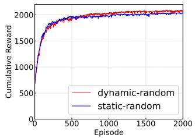  
(a) Guangzhou

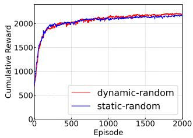  
(b) Madrid  
Fig. 3: Convergence comparison of static-random and dynamic-random sequences.

TABLE V: Ablation study
<table><tr><td>Dataset</td><td>Method</td><td>η</td><td>f</td><td>ψ</td><td>κ</td><td>3</td></tr><tr><td rowspan="4">Guangzhou</td><td>HADRL-VCS</td><td>0.9454</td><td>0.952</td><td>0.9335</td><td>0.1553</td><td>10.6163</td></tr><tr><td>HADRL-VCS w/o MPDE</td><td>0.9201</td><td>0.9352</td><td>0.9103</td><td>0.1617</td><td>9.8063</td></tr><tr><td>HADRL-VCS w/o AMIE</td><td>0.8931</td><td>0.9118</td><td>0.8932</td><td>0.1585</td><td>9.0027</td></tr><tr><td>HADRL-VCS w/o both</td><td>0.8677</td><td>0.8804</td><td>0.8676</td><td>0.1682</td><td>8.0916</td></tr><tr><td rowspan="4">Madrid</td><td>HADRL-VCS</td><td>0.9383</td><td>0.9507</td><td>0.9356</td><td>0.1449</td><td>10.5494</td></tr><tr><td>HADRL-VCS w/o MPDE</td><td>0.9167</td><td>0.9332</td><td>0.9034</td><td>0.1524</td><td>9.662</td></tr><tr><td>HADRL-VCS w/o AMIE</td><td>0.8902</td><td>0.9121</td><td>0.8937</td><td>0.1507</td><td>8.9981</td></tr><tr><td>HADRL-VCS w/o both</td><td>0.8639</td><td>0.8836</td><td>0.8649</td><td>0.1596</td><td>8.0793</td></tr></table>

Then, we evaluate the impact of the balancing coefficient λ in MPDE, which regulates the trade-off between inter-UV role differentiation and intra-UV policy diversity. We vary λ from 0.1 to 0.9 while keeping other parameters constant. As shown in Table IV, the optimal values are λ = 0.45 in Guangzhou and $\lambda = 0 . 4$ in Madrid. In both scenarios, the performance metrics η, f, ψ, and ξ first increase and then decline with λ, whereas the overlap ratio κ shows the opposite trend. This result indicates that both inter-UV role differentiation and intra-UV policy diversity are essential for effective cooperation. A small λ leads to insufficient role differentiation and overlapping behaviors, whereas a large λ causes unstable exploration and degraded learning consistency, highlighting the need for a balanced trade-off. The slight difference in optimal λ reflects differences in the urban environments. Madrid exhibits a more complex road topology with a more spatially dispersed PoI layout, which requires stronger exploration to ensure sufficient coverage, resulting in a slightly smaller optimal λ. In contrast, Guangzhou presents relatively higher PoI concentrations in certain areas, where clearer role differentiation can be exploited earlier, leading to a marginally larger optimal λ.

## B. Ablation Study

We gradually remove two key modules, AMIE and MPDE. We set $U \ = \ 1 2 , \ G \ = \ 6 .$ , the UAV sensing range 60m, and the UGV sensing range 30m. In Table V, both modules significantly impact the overall efficiency ξ and other metrics. For example, in Guangzhou, when removing AMIE, ξ drops by 15.19%, because AMIE enables UVs to gather environmental information beyond their individual sensing capabilities, thereby expanding their collective sensing range. This allows

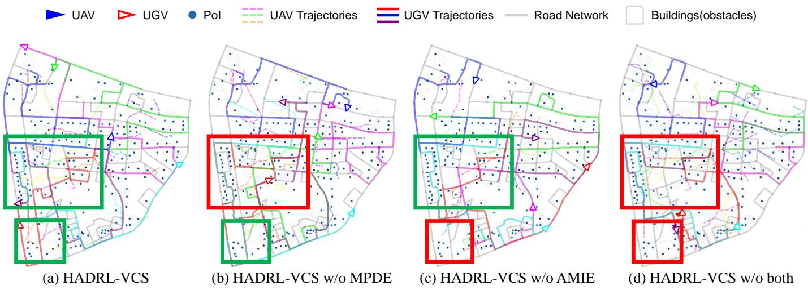  
Fig. 4: UAV-UGV trajectory comparison under different ablation settings in Guangzhou.

UGVs to quickly identify the data distribution in the environment and make better decisions. Additionally, the sequential decision-making process and action information sharing help UVs understand each other’s behavioral tendencies, leading to improved collaboration and more efficient sensing and data collection.

The benefits introduced by MPDE are also evident. For example, in Madrid, when removing MPDE, ξ decreases by 8.45%. This is because MPDE encourages cooperative role differentiation and individual exploration among UVs, enabling them to develop complementary yet distinct strategies. Furthermore, it also prevents UVs from prematurely converging to local optima, and compels them to continuously explore and adapt to the current division of labor.

Fig. 4 compares the UAV–UGV trajectories under different ablation settings in the Guangzhou scenario, with two representative regions highlighted for comparison. In the central-left region, HADRL-VCS and HADRL-VCS w/o AMIE exhibit relatively dispersed trajectories, whereas HADRL-VCS w/o MPDE and HADRL-VCS w/o both show noticeably higher trajectory overlap, leading to more redundant behaviors among UVs, indicating that MPDE promotes role differentiation and reduces redundancy. In the lower-left region, both HADRL-VCS and HADRL-VCS w/o MPDE successfully collect the remote PoIs, as UAV-discovered information can be utilized by UGVs through AMIE. In contrast, when AMIE is removed, these PoIs remain largely uncollected, since the lack of effective information exchange prevents UGVs from leveraging UAV-sensed information for data collection. They exhibit a clear cross effect: AMIE provides shared information, and MPDE ensures it is utilized in a coordinated manner. Without MPDE, shared information may lead to overlap; without AMIE, sensed information cannot be effectively exploited. Together, they enable more efficient sensing and coordinated data collection.

## C. Comparing with Five Baselines

To ensure fair comparison, all baselines are implemented under the same asynchronous execution setting as HADRL-VCS, where UGVs perform multi-step movements between designated stops and remain inactive until the movement is completed, selecting new actions only when active. The compared baselines are described as follows:

• MASIA [39]: It is a SOTA multi-agent information exchange method that employs a permutation-invariant encoder to aggregate messages into a compact representation, which is self-supervisedly optimized through state reconstruction and future state prediction for augmenting agents’ local policies.

• RoMAT [20]: It is a SOTA MADRL method that models multi-agent decision-making as a sequence prediction task, employing a self-attention mechanism to capture inter-agent collaboration and introducing a role adapter and feature alignment layer to accommodate heterogeneous agents.

• HAPPO [18]: It is a classical MADRL method that ensures monotonic improvement by employing a sequential update scheme, which updates heterogeneous agents one by one, with each step accounting for prior agent changes.

• LUDC [40]: It is a SOTA UAV-UGV cooperative data collection scheme, utilizes MADDPG and employs a Gaussian Mixture Model to partition the task area for UAVs and UGVs.

• Random: It controls UAVs and UGVs with actions evenly sampled from their corresponding action space.

1) Impact of No. of UAVs and UGVs: We first show the impact of the number of UAVs and UGVs by fixing $S _ { u } = 6 0 \mathrm { m }$ and $S _ { g } = 3 0 \mathrm { m } .$ , while varying U from 4 to 20 and G from 2 to 10. As shown in Fig. 5 and Fig. 6, we see that the performance metrics $\eta , f , \psi$ and ξ increase when more UAVs and UGVs are deployed. Specifically, we notice a relatively rapid growth before $U = 1 2$ and $G = 6 \AA$ . However, the rate of increment becomes more marginal, since further additions are not needed and most PoIs are effectively covered already. This trend is also reflected in κ, which continues to increase and becomes more rapid after U = 12 and G = 6. Furthermore, HADRL-VCS consistently outperforms all other baselines, mainly due to the effectiveness of MPDE in balancing exploration and role differentiation among UAVs and UGVs. When fewer UAVs and UGVs are used, MPDE plays a more significant role, motivating them to actively explore the environment and prioritize data-rich areas for collection. As more UAVs and UGVs are deployed, the influence of role differentiation becomes relatively stronger, guiding UAVs to explore unvisited regions while UGVs focus on non-overlapping data collection, forming complementary strategies that further boost performance. Furthermore, AMIE enables UAVs and UGVs to exchange information and make sequential decisions, thereby extending their sensing range, helping them infer the intentions of others and enhancing collaboration.

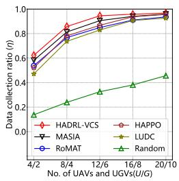  
(a) η

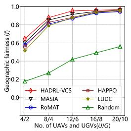  
(b) f

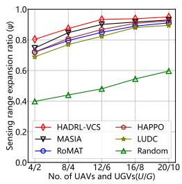  
(c) ψ  
Fig. 5: Impact of No. of UAVs and UGVs in Guangzhou.

(d) κ  
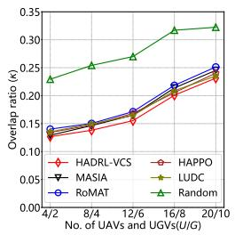

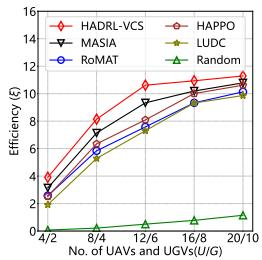

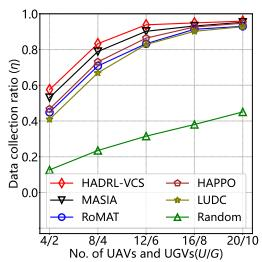  
(a) η

(e) ξ  
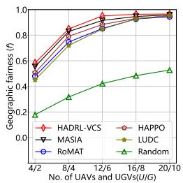  
(b) f

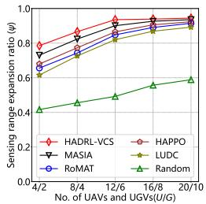  
(c) ψ  
Fig. 6: Impact of No. of UAVs and UGVs in Madrid.

(d) κ  
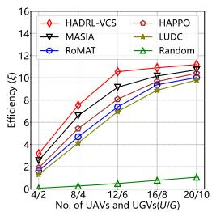

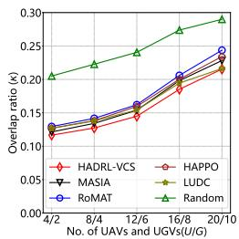  
(e) ξ

Besides, we see that LUDC exhibits an increase with more UAVs and UGVs as well. This is because fewer UAVs and UGVs refers to a minimal demand of task division, and LUDC’s area partitioning cannot be fully utilized. When more UAVs and UGVs are used, LUDC can achieve workload balancing, enabling them to operate in different regions for sensing and data collection, which also results in relatively lower κ and a slower increase compared with other baselines.

2) Impact of UGV Sensing Range: We fix $U = 1 2 , G = 6 .$ $S _ { u } = 6 0 \mathrm { m }$ and vary the UGV sensing range $S _ { g }$ from 10m to 50m. As shown in Fig. 7 and Fig. 8, we see that $\eta , f$ and ξ all increase but ψ decreases with longer UGV sensing range. This is because a longer UGV sensing range allows to cover more PoIs during each timeslot. However, the relative contribution of UAVs in expanding the sensing range diminishes, resulting in a decrease of ψ. Meanwhile, κ gradually increases, with a slow growth when $S _ { g }$ is small and a more rapid increase as $S _ { g }$ becomes larger, since a larger sensing range makes overlapping coverage more likely. Besides, we see that HADRL-VCS and MASIA outperform other methods when the UGV sensing range is small (from 10m to 30m). This is because both methods enable UGVs to leverage information from UAVs to expand their sensing range. When the UGV sensing range is 10m, RoMAT outperforms HAPPO, since RoMAT can also utilize information from UAVs. However, this improvement becomes limited because treating multi-agent decision-making as a sequence prediction task can cause forgetting of longterm dependencies, especially for UGVs whose decisions occur less frequently. In contrast, AMIE combines newly received messages with past memory, allowing UGVs to retain crucial historical cues and mitigate forgetting over long decision intervals. Finally, we find that Random method remains largely unchanged in η and $f ,$ as it randomly selects actions without utilizing UGV sensing range information, thus not affected by changes in UGV sensing range.

3) Impact of UAV Sensing Range: We fix $\ U \ = \ 1 2$ $G \ = \ 6 S _ { g } \ = \ 3 0 \mathrm { m }$ and vary the UAV sensing range $S _ { u }$ from 20m to 100m. As shown in Fig. 9 and Fig. 10, we see that $\eta , f , \psi$ and ξ increase with longer UAV sensing range, while $\psi$ shows a more pronounced trend. Meanwhile, κ also increases, and the growth becomes more rapid as the sensing range expands. Longer UAV sensing range allows to cover more PoIs, and UGVs can expand their sensing range by leveraging information from UAVs, enabling them to better understand the data distribution in the environment and focus on efficient data collection rather than exploration. Furthermore, we see that HADRL-VCS consistently outperforms other baselines. This is mainly due to AMIE, which enables UVs to aggregate newly received messages with past memory, allowing UGVs to effectively leverage information from UAVs to expand their sensing range and improve collaboration. The significant improvements indicate sufficient utilization of UAV-provided information. Furthermore, MPDE also contributes to the performance improvement by promoting role differentiation among UVs. As the UAV sensing range increases, they can better explore unvisited regions, allowing UGVs to focus on data collection and reducing redundant coverage. Besides, we find that HAPPO, LUDC, and Random exhibit relatively smaller improvements in η and f with longer UAV sensing range. This is because they lack information exchange mechanisms and cannot leverage information from UAVs to enhance UGV sensing range and decision-making.

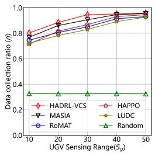  
(a) η

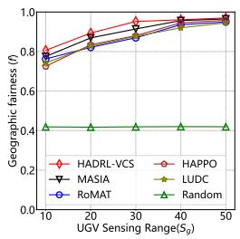  
(b) f

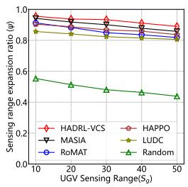  
(c) ψ  
Fig. 7: Impact of UGV sensing range in Guangzhou.

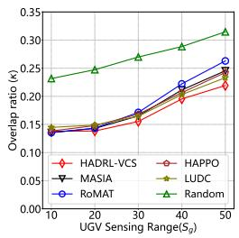  
(d) κ

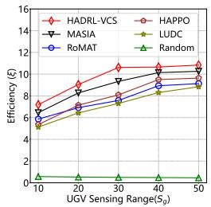  
(e) ξ

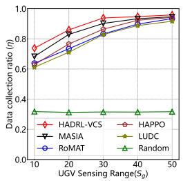

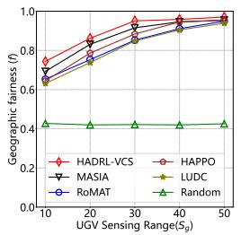  
(a) η

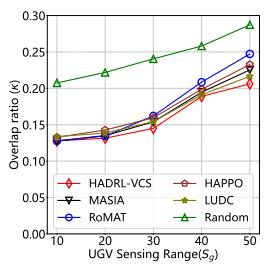

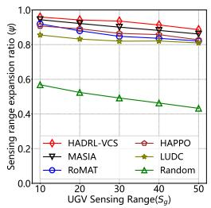  
(b) f

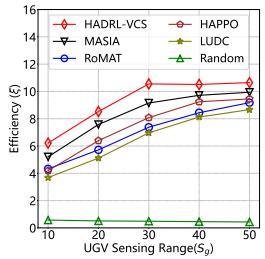  
(c) ψ  
(d) κ  
(e) ξ

Fig. 8: Impact of UGV sensing range in Madrid.  
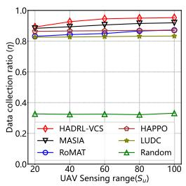

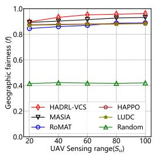  
(a) η

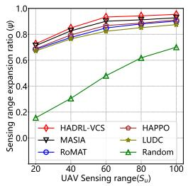  
(b) f

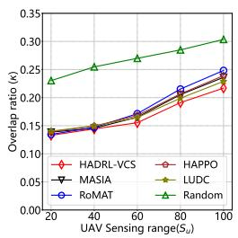

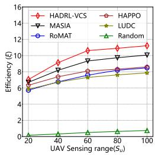  
(c) ψ  
(d) κ  
(e) ξ

Fig. 9: Impact of UAV sensing range in Guangzhou.  
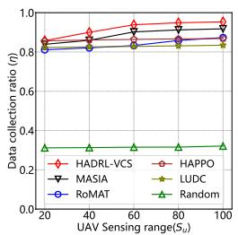  
(a) η

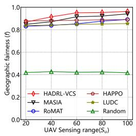  
(b) f

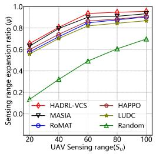  
(c) ψ

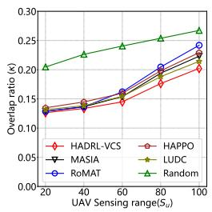  
(d) κ

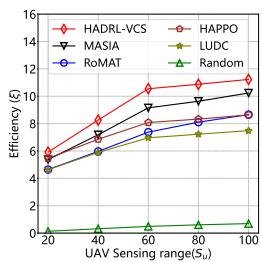  
Fig. 10: Impact of UAV sensing range in Madrid.  
(e) ξ

The detailed numerical results corresponding to Fig. 5–10 are provided in Appendix A1 for completeness.

## D. Convergence Analysis

1) Convergence Comparison with Baselines: We set $U =$ 12, $G = 6 \AA$ , the UAV sensing range to 60m, and the UGV sensing range to 30m, and examine the training convergence behavior of HADRL-VCS and the compared baselines in Guangzhou and Madrid scenarios. As shown in Fig. 11, HADRL-VCS achieves the highest final cumulative reward in both scenarios, demonstrating its ability to learn more effective cooperative sensing and data collection strategies. RoMAT improves rapidly in the early stage, as its shared policy backbone enables faster initial learning for UAVs and UGVs. However, its performance growth gradually slows down and noticeable fluctuations appear during later training, since the shared policy makes it difficult to accommodate heterogeneous behaviors. In addition, HAPPO shows a significant reward drop around episode 800 in Guangzhou, with a similar phenomenon observed in Madrid, reflecting the non-stationarity in heterogeneous multi-agent learning due to heterogeneous rewards, partial observations, and mismatched decision frequencies. In contrast, HADRL-VCS exhibits smooth learning curves, indicating its effectiveness in alleviating non-stationarity. This mainly benefits from the joint design of AMIE and MPDE. Specifically, AMIE enables UVs to exchange environmental and action information through attentive memory updates, allowing each UV to incorporate others’ observations and actions into its decision-making process, which helps mitigate non-stationarity [41]. Meanwhile, MPDE encourages complementary behaviors among UVs and reduces policy conflicts, improving training stability.

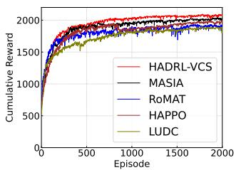  
(a) Guangzhou

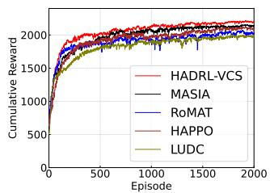  
(b) Madrid  
Fig. 11: Convergence curves of HADRL-VCS and baselines.

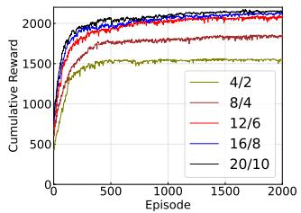  
(a) Guangzhou

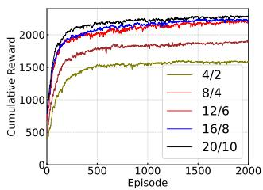  
(b) Madrid

Fig. 12: Convergence curves under different No. of UAVs and UGVs.  
TABLE VI: Impact of message loss probability on HADRL-VCS performance
<table><tr><td rowspan=1 colspan=1>Scenario</td><td rowspan=1 colspan=1>Ploss</td><td rowspan=1 colspan=1>η</td><td rowspan=1 colspan=1>f</td><td rowspan=1 colspan=1>ψ</td><td rowspan=1 colspan=1>κ</td><td rowspan=1 colspan=1>ξ</td></tr><tr><td rowspan=4 colspan=1>Guangzhou</td><td rowspan=4 colspan=1>00.10.20.30.4</td><td rowspan=1 colspan=1>0.9454</td><td rowspan=1 colspan=1>0.952</td><td rowspan=1 colspan=1>0.9335</td><td rowspan=1 colspan=1>0.1553</td><td rowspan=3 colspan=1>10.616310.34779.9645</td></tr><tr><td rowspan=2 colspan=1>0.93830.9291</td><td rowspan=2 colspan=1>0.94370.9312</td><td rowspan=1 colspan=1>0.9284</td><td rowspan=1 colspan=1>0.1561</td></tr><tr><td rowspan=1 colspan=1>0.9236</td><td rowspan=1 colspan=1>0.1568</td></tr><tr><td rowspan=1 colspan=1>0.92140.9135</td><td rowspan=1 colspan=1>0.92360.9148</td><td rowspan=1 colspan=1>0.91730.9116</td><td rowspan=1 colspan=1>0.15770.1589</td><td rowspan=1 colspan=1>9.69429.4199</td></tr><tr><td rowspan=5 colspan=1>Madrid</td><td rowspan=2 colspan=1>00.1</td><td rowspan=1 colspan=1>0.9383</td><td rowspan=1 colspan=1>0.9507</td><td rowspan=1 colspan=1>0.9356</td><td rowspan=2 colspan=1>0.1449</td><td rowspan=2 colspan=1>10.549510.2730</td></tr><tr><td rowspan=1 colspan=1>0.9302</td><td rowspan=1 colspan=1>0.9436</td><td rowspan=1 colspan=1>0.9287</td><td rowspan=1 colspan=1>0.1457</td></tr><tr><td rowspan=1 colspan=1>0.2</td><td rowspan=1 colspan=1>0.9219</td><td rowspan=1 colspan=1>0.9324</td><td rowspan=1 colspan=1>0.9223</td><td rowspan=1 colspan=1>0.1473</td><td rowspan=1 colspan=1>9.9399</td></tr><tr><td rowspan=1 colspan=1>0.3</td><td rowspan=1 colspan=1>0.9084</td><td rowspan=1 colspan=1>0.9203</td><td rowspan=1 colspan=1>0.9135</td><td rowspan=1 colspan=1>0.1486</td><td rowspan=1 colspan=1>9.5310</td></tr><tr><td rowspan=1 colspan=1>0.4</td><td rowspan=1 colspan=1>0.8997</td><td rowspan=1 colspan=1>0.9152</td><td rowspan=1 colspan=1>0.9024</td><td rowspan=1 colspan=1>0.1506</td><td rowspan=1 colspan=1>9.2316</td></tr></table>

2) Convergence under Different No. of UAVs and UGVs: Fig. 12 shows the training convergence behavior of HADRL-VCS in Guangzhou and Madrid scenarios with varying numbers of UAVs and UGVs. The final cumulative reward increases with more UVs deployed, with more pronounced gains from $4 / 2$ to $1 2 / 6 ,$ while the improvement becomes marginal afterwards. Meanwhile, the convergence speed becomes slightly slower as more UVs are introduced, since the enlarged joint action space increases coordination complexity during training. Nevertheless, the learning curves still converge within a reasonable number of training episodes. In addition, convergence in the Madrid scenario is generally slower than in Guangzhou, due to its more complex road topology and larger number of PoIs, which together lead to a more complex state space and a more challenging learning process. Overall, the learning curves remain stable in both scenarios, indicating that HADRL-VCS can learn effective cooperative strategies under different numbers of UVs and environmental complexities.

## E. Robustness under Imperfect Information Exchange

Tables VI and VII present the impact of message loss and communication latency on the performance of HADRL-VCS.

TABLE VII: Impact of communication latency on HADRL-VCS performance
<table><tr><td rowspan=1 colspan=1>Scenario</td><td rowspan=1 colspan=1> $l _ { \mathrm { c o m m } }$ </td><td rowspan=1 colspan=1> $\eta$ </td><td rowspan=1 colspan=1>f</td><td rowspan=1 colspan=1>ψ</td><td rowspan=1 colspan=1>κ</td><td rowspan=1 colspan=1> $\overline { { \xi } }$ </td></tr><tr><td rowspan=5 colspan=1>Guangzhou</td><td rowspan=5 colspan=1>01234</td><td rowspan=1 colspan=1>0.9454</td><td rowspan=1 colspan=1>0.952</td><td rowspan=1 colspan=1>0.9335</td><td rowspan=1 colspan=1>0.1553</td><td rowspan=2 colspan=1>10.616310.2548</td></tr><tr><td rowspan=1 colspan=1>0.9365</td><td rowspan=1 colspan=1>0.9423</td><td rowspan=1 colspan=1>0.9254</td><td rowspan=1 colspan=1>0.1559</td></tr><tr><td rowspan=2 colspan=1>0.91590.9033</td><td rowspan=1 colspan=1>0.9286</td><td rowspan=1 colspan=1>0.9132</td><td rowspan=1 colspan=1>0.1568</td><td rowspan=1 colspan=1>9.6656</td></tr><tr><td rowspan=1 colspan=1>0.9215</td><td rowspan=1 colspan=1>0.9049</td><td rowspan=1 colspan=1>0.1574</td><td rowspan=1 colspan=1>9.3358</td></tr><tr><td rowspan=1 colspan=1>0.8985</td><td rowspan=1 colspan=1>0.9123</td><td rowspan=1 colspan=1>0.8967</td><td rowspan=1 colspan=1>0.1582</td><td rowspan=1 colspan=1>9.0795</td></tr><tr><td rowspan=5 colspan=1>Madrid</td><td rowspan=1 colspan=1>0</td><td rowspan=1 colspan=1>0.9383</td><td rowspan=1 colspan=1>0.9507</td><td rowspan=1 colspan=1>0.9356</td><td rowspan=1 colspan=1>0.1449</td><td rowspan=1 colspan=1>10.5495</td></tr><tr><td rowspan=1 colspan=1>1</td><td rowspan=1 colspan=1>0.9285</td><td rowspan=1 colspan=1>0.9436</td><td rowspan=1 colspan=1>0.9282</td><td rowspan=1 colspan=1>0.1453</td><td rowspan=1 colspan=1>10.1932</td></tr><tr><td rowspan=1 colspan=1>2</td><td rowspan=1 colspan=1>0.9124</td><td rowspan=1 colspan=1>0.9301</td><td rowspan=1 colspan=1>0.9161</td><td rowspan=1 colspan=1>0.1467</td><td rowspan=1 colspan=1>9.6439</td></tr><tr><td rowspan=1 colspan=1>3</td><td rowspan=1 colspan=1>0.9027</td><td rowspan=1 colspan=1>0.9184</td><td rowspan=1 colspan=1>0.9064</td><td rowspan=1 colspan=1>0.1486</td><td rowspan=1 colspan=1>9.3292</td></tr><tr><td rowspan=1 colspan=1>4</td><td rowspan=1 colspan=1>0.8943</td><td rowspan=1 colspan=1>0.9133</td><td rowspan=1 colspan=1>0.8963</td><td rowspan=1 colspan=1>0.1497</td><td rowspan=1 colspan=1>9.0661</td></tr></table>

As the message loss probability $p _ { \mathrm { l o s s } }$ increases, the performance metrics $\eta , f , \psi ,$ and ξ gradually decrease, while the overlap ratio κ slightly increases. For example, when $p _ { \mathrm { l o s s } }$ increases from 0 to 0.4 in Guangzhou, the efficiency $\xi$ decreases from 10.6163 to 9.4199. Nevertheless, the degradation remains moderate in both scenarios, which is attributed to AMIE, where attention prioritizes relevant messages and memory preserves historical context, enabling UVs to utilize both current and past information even under message loss. The increase in κ indicates that UVs tend to maintain slightly higher sensing overlap under unreliable communication, which helps sustain cooperative sensing and data collection and reflects resilient coordination under degraded communication conditions [42]. A similar trend is observed with communication latency. As the delay $l _ { \mathrm { c o m m } }$ increases, the performance metrics gradually decrease, with efficiency $\xi$ dropping from 10.6163 to 9.0795 in Guangzhou as $l _ { \mathrm { c o m m } }$ increases from 0 to 4 timeslots. Despite this degradation, the overall performance remains stable in both scenarios, indicating that HADRL-VCS can maintain effective cooperation under imperfect information exchange.

## F. UAV-UGV Trajectory Visualization

As shown in Fig. 13, we see clear collaboration between UGVs and UAVs. For example, in Madrid between timeslots 40 and 80, the UGV (red trajectory) deploys a UAV (green trajectory) to explore the upper-left area outside the UGV’s sensing range and exchanges this information with the UGV. After, the UGV realizes the presence of multiple PoIs densely distributed there, and decides to move over for data collection. Second, we see that the UGVs are able to avoid competition and achieve cooperative behavior. For example, in Guangzhou at timeslot 120, two UGVs (cyan and red trajectory) meet at an intersection in the lower-left part of the map. Through information exchanged with UAVs, both UGVs become aware of a data-rich area in that region. Instead of competing for the same area, they coordinate their actions: by timeslot 160, the red UGV moves toward the data-dense lower-left region, while the cyan UGV heads to the right side of the map. This cooperative behavior is enabled by AMIE, which transmits action information according to the decision order, allowing UVs to infer each other’s behavioral tendencies. After recognizing the red UGV’s planned movement, the cyan UGV chooses to explore the right side of the map instead, thereby avoiding competition and improving overall task efficiency.

Also, UAVs contribute to expanding the overall sensing range. For example, in Guangzhou, when UGVs pause for data collection, nearby UAVs actively sense surrounding PoIs. As a result, most PoIs turn red, indicating that they have already been sensed before being collected by the UGVs. Meanwhile, UGV trajectories exhibit clear regional division in Guangzhou. That is, the red UGV mainly operates in the lower-left area, while the green one focuses on the upper-right. Similar patterns can be observed in Madrid. Such coordinated division of labor is given by MPDE, which adaptively guides UVs toward complementary roles. At timeslot 200, in both scenarios, most PoIs nearly disappear, since their data have been successfully collected, resulting in a high data collection ratio (94.54% in Guangzhou and 93.83% in Madrid). In addition, we implemented a simulator using Unreal Engine 5.2.1, as shown in Fig. 14. The simulator provides an integrated environment for scenario construction, policy training, and performance evaluation, enabling the learning and assessment of UAV–UGV cooperative strategies within the considered VCS setting. It supports agent–environment interaction during training, allowing policies to be learned and evaluated in a unified framework. In this snapshot, an orange UAV guides a cyan UGV toward newly discovered PoIs marked by red star symbols.

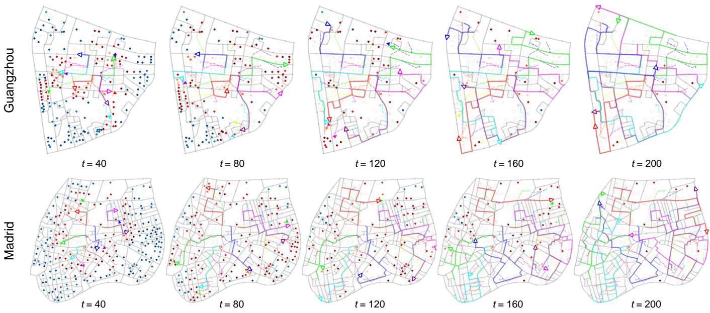  
Fig. 13: UAV-UGV trajectory visualization in Guangzhou and Madrid scenarios.

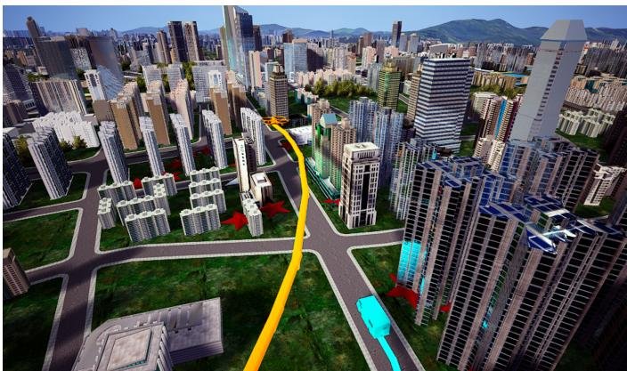  
Fig. 14: Implemented simulator (Guangzhou).

TABLE VIII: Performance comparison under hotspot-aware PoI distribution
<table><tr><td>Dataset</td><td>Method</td><td>η</td><td>f</td><td>ψ</td><td>κ</td><td>ξ</td></tr><tr><td rowspan="6">Guangzhou</td><td>HADRL-VCS</td><td>0.9527</td><td>0.9493</td><td>0.9252</td><td>0.1621</td><td>10.4394</td></tr><tr><td>MASIA</td><td>0.9134</td><td>0.9145</td><td>0.8935</td><td>0.1736</td><td>9.1322</td></tr><tr><td>HAPPO</td><td>0.8762</td><td>0.8773</td><td>0.8567</td><td>0.1768</td><td>7.9201</td></tr><tr><td>RoMAT</td><td>0.8595</td><td>0.8647</td><td>0.8438</td><td>0.1815</td><td>7.4888</td></tr><tr><td>LUDC</td><td>0.8448</td><td>0.8684</td><td>0.8285</td><td>0.1772</td><td>7.3118</td></tr><tr><td>Random</td><td>0.4313</td><td>0.4622</td><td>0.4625</td><td>0.2951</td><td>0.7025</td></tr><tr><td rowspan="6">Madrid</td><td>HADRL-VCS</td><td>0.9478</td><td>0.9451</td><td>0.9313</td><td>0.1516</td><td>10.3964</td></tr><tr><td>MASIA</td><td>0.9109</td><td>0.9092</td><td>0.8942</td><td>0.1603</td><td>9.0262</td></tr><tr><td>HAPPO</td><td>0.8752</td><td>0.8783</td><td>0.8601</td><td>0.1657</td><td>7.9703</td></tr><tr><td>RoMAT</td><td>0.8437</td><td>0.8473</td><td>0.8423</td><td>0.1682</td><td>7.2604</td></tr><tr><td>LUDC</td><td>0.8393</td><td>0.8438</td><td>0.8169</td><td>0.1645</td><td>6.9500</td></tr><tr><td>Random</td><td>0.3421</td><td>0.4496</td><td>0.4668</td><td>0.2503</td><td>0.5360</td></tr></table>

## G. Temporal Adaptation to Sudden PoI Changes

Fig. 15 illustrates the UAV–UGV trajectories in the Guangzhou scenario under dynamic PoI arrivals during task execution. At $ { t } \ = \ 4 0$ and $t \ = \ 8 0 .$ , UAVs and UGVs perform normal sensing and data collection on the original PoIs. $\mathrm { A t } ~ t = 1 2 0$ , new PoIs emerge in four regions marked by blue boxes, representing sudden environmental changes. By $t = 1 5 0$ , all newly emerged PoIs have been discovered, and the boxes turn red to indicate successful sensing. The UGVs then adjust their trajectories to complete data collection, and by t = 200, both newly emerged and original PoIs are largely collected. The final performance reaches $\eta = 0 . 9 3 7 7 .$ $f = 0 . 9 4 4 1$ , ψ = 0.9483, κ = 0.1581, and $\xi = 1 0 . 0 2 7 6$ . This adaptability is enabled by AMIE, which integrates incoming information with historical context, allowing UVs to rapidly discover newly appeared PoIs and adjust sensing and data collection decisions in an online manner.

## H. Performance under Hotspot-Aware PoI Distribution

To evaluate the proposed framework under hotspot-aware sensing demand, we construct a hotspot-aware PoI distribution for Guangzhou and Madrid based on real-world urban traffic statistics. Specifically, traffic accident records in Madrid [43] and traffic congestion data in Guangzhou [44], sampled every

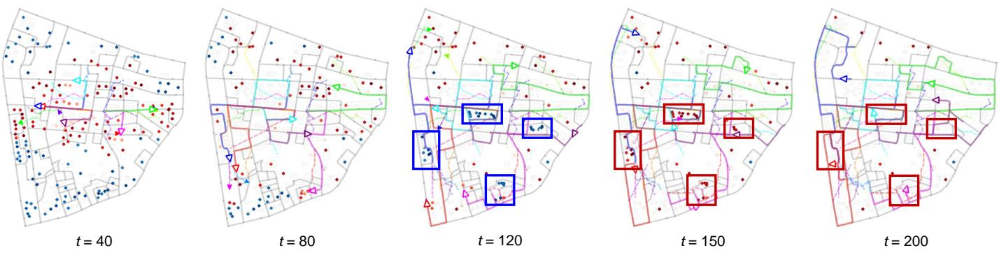  
Fig. 15: UAV-UGV trajectory visualization under sudden PoI changes in Guangzhou scenario.

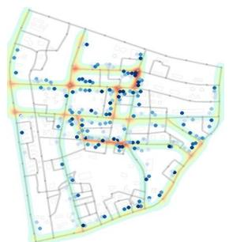  
(a) PoI distribution (Guangzhou)

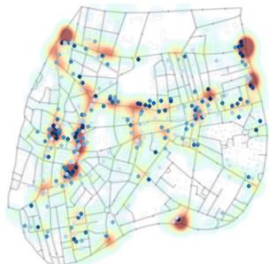  
(b) PoI distribution (Madrid)

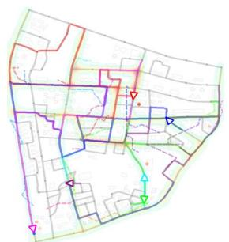  
(c) UAV-UGV trajectories (Guangzhou)

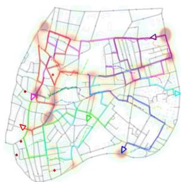  
(d) UAV-UGV trajectories (Madrid)  
Fig. 16: Hotspot-aware PoI distributions and UAV–UGV trajectories.

10 minutes from the Gaode platform over one week, are used to characterize the spatial intensity of traffic events, which typically concentrate at certain intersections or road segments and naturally form urban hotspots. PoI locations are generated according to the spatial density estimated via Gaussian kernel density estimation from these statistics, while remaining deployed on building rooftops or exterior walls as defined in Section III. The initial data demand follows the same spatial distribution and is sampled within 0.8–1.2 GB, with the total number of PoIs unchanged (215 in Guangzhou and 257 in Madrid) to ensure consistency with the uniform setting. As shown in Table VIII, HADRL-VCS achieves the best performance across all metrics under the hotspot-aware distribution. Fig. 16 shows that PoIs in Guangzhou are more concentrated in central areas, whereas Madrid exhibits a more dispersed spatial pattern. Despite these differences, the UAV–UGV trajectories indicate that dense regions are effectively covered, while PoIs in other areas are progressively discovered and collected through UAV–UGV cooperation. This can be attributed to AMIE, which enables UAVs to discover PoIs beyond UGV sensing ranges and propagate this information through message exchange. Overall, the results demonstrate that HADRL-VCS maintains strong sensing and data collection performance under both uniform and hotspot-aware PoI distributions.

TABLE IX: Computational complexity by time cost (seconds)
<table><tr><td rowspan=1 colspan=1></td><td rowspan=1 colspan=3>Guangzhou</td><td rowspan=1 colspan=3>Madrid</td></tr><tr><td rowspan=1 colspan=1>Method</td><td rowspan=1 colspan=1>Step</td><td rowspan=1 colspan=1>Episode</td><td rowspan=1 colspan=1>Update</td><td rowspan=1 colspan=1>Step</td><td rowspan=1 colspan=1>Episode</td><td rowspan=1 colspan=1>Update</td></tr><tr><td rowspan=1 colspan=1>HADRL-VCS</td><td rowspan=1 colspan=1>0.2501</td><td rowspan=1 colspan=1>50.03</td><td rowspan=1 colspan=1>3.498</td><td rowspan=1 colspan=1>0.2963</td><td rowspan=1 colspan=1>59.27</td><td rowspan=1 colspan=1>3.753</td></tr><tr><td rowspan=2 colspan=1>MASIARoMAT</td><td rowspan=1 colspan=1>0.2376</td><td rowspan=1 colspan=1>47.62</td><td rowspan=1 colspan=1>4.042</td><td rowspan=1 colspan=1>0.2817</td><td rowspan=1 colspan=1>56.37</td><td rowspan=1 colspan=1>4.231</td></tr><tr><td rowspan=1 colspan=1>0.2135</td><td rowspan=1 colspan=1>42.87</td><td rowspan=1 colspan=1>2.896</td><td rowspan=1 colspan=1>0.2582</td><td rowspan=1 colspan=1>51.64</td><td rowspan=1 colspan=1>3.032</td></tr><tr><td rowspan=1 colspan=1>HAPPO</td><td rowspan=1 colspan=1>0.2052</td><td rowspan=1 colspan=1>41.07</td><td rowspan=1 colspan=1>2.472</td><td rowspan=1 colspan=1>0.2472</td><td rowspan=1 colspan=1>49.43</td><td rowspan=1 colspan=1>2.586</td></tr><tr><td rowspan=1 colspan=1>LUDC</td><td rowspan=1 colspan=1>0.2308</td><td rowspan=1 colspan=1>46.16</td><td rowspan=1 colspan=1>3.285</td><td rowspan=1 colspan=1>0.2729</td><td rowspan=1 colspan=1>54.58</td><td rowspan=1 colspan=1>3.434</td></tr><tr><td rowspan=1 colspan=1>Random</td><td rowspan=1 colspan=1>0.1643</td><td rowspan=1 colspan=1>32.86</td><td rowspan=1 colspan=1>1</td><td rowspan=1 colspan=1>0.1871</td><td rowspan=1 colspan=1>37.42</td><td rowspan=1 colspan=1>1</td></tr></table>

## I. Computational Complexity Analysis

Compared with other baselines, HADRL-VCS incurs additional computational cost due to AMIE and MPDE. During execution, AMIE performs attentive aggregation over neighboring UV messages. Let N denote the average number of neighbors and $d _ { m }$ the message dimension. The per-timeslot computational complexity is $O ( I { \cdot } N { \cdot } d _ { m } ^ { 2 } )$ , with communication overhead $O ( I \cdot N \cdot d _ { m } )$ . In the worst case of fully connected communication, the complexity becomes $O ( I ^ { 2 } \cdot { \not d } _ { m } ^ { 2 } )$ . However, in most practical deployments where communication is distance-limited, N remains bounded, and the execution cost scales approximately linearly with the number of UVs. MPDE introduces an additional $O ( I \cdot T ^ { 2 } )$ complexity per episode due to kernel-based divergence estimation, reflecting a trade-off between policy diversity and computational efficiency [45]. This overhead is confined to training and does not affect online execution. The scalability of HADRL-VCS is determined by the communication topology. Under locally connected interaction graphs, the computational cost remains manageable for moderately large swarms. The empirical runtime results in Table IX further show that HADRL-VCS operates within the same computational scale as the baselines while achieving superior performance.

## VII. DISCUSSION ON IMPERFECT COMMUNICATION

The proposed framework is applicable under diverse communication conditions. For sensing interruptions, UVs leverage historical information via the AMIE mechanism to maintain stable decision-making under temporary sensing unavailability. Channel impairments such as interference and shadow fading can be mitigated by incorporating established link-level techniques, including transmit power control [46] and adaptive modulation and coding [47]. For communication delays and asynchronous message arrivals, delay-aware communication strategies [48] can be seamlessly integrated to handle delayed information without requiring strict time synchronization, where agents make decisions based on the available (possibly partial) information at each timeslot without requiring fully synchronized message reception.

## VIII. CONCLUSION AND FUTURE WORK

In this paper, we consider a UAV-carrier-enabled VCS scenario where UAVs and UGVs collaborate to achieve environmental sensing and data collection. We propose HADRL-VCS, a heterogeneous MADRL framework, to maximize the overall data collection efficiency. An attentive memory-integrated information exchange mechanism is proposed that enables UVs to capture temporal dependencies and contextual relevance from the exchanged messages, allowing them to effectively expand their collective sensing range and improve coordination. We also propose a mutual policy divergence-driven exploration strategy to encourage complementary role differentiation and sustained behavioral diversity among heterogeneous UVs, thereby promoting cooperation and balanced task allocation. Extensive experiments based on realistic simulations using real-world urban maps from Guangzhou and Madrid demonstrate that HADRL-VCS consistently outperforms five baselines in terms of data collection ratio, geographic fairness, sensing range expansion ratio, overlap ratio, and efficiency, validating its effectiveness in cooperative sensing and data collection. In the future, we plan to investigate adaptive tuning mechanisms for the exploration balancing coefficient and extend the framework toward more realistic settings by incorporating dynamic obstacles and sim-to-real transfer.

## REFERENCES

[1] A. Fresa, N. Ferrarese, Y. Liu et al., “Profiling-and learning-based co-design of communication and compute in scalable robotics,” IEEE Journal on Selected Areas in Communications, vol. 43, no. 10, pp. 3519– 3531, 2025.

[2] L. Xie, S. Song, Y. C. Eldar et al., “Collaborative sensing in perceptive mobile networks: Opportunities and challenges,” IEEE wireless commu nications, vol. 30, no. 1, pp. 16–23, 2023.

[3] Z. Wang, A. E. Kalør, Y. Zhou et al., “Ultra-low-latency edge inference for distributed sensing,” IEEE Transactions on Wireless Communications, 2025.

[4] Y. Fu, X. Qin, X. Zhang et al., “Hybrid recruitment scheme based on deep learning in vehicular crowdsensing,” IEEE Transactions on Intelligent Transportation Systems, vol. 24, no. 10, pp. 10 735–10 748, 2023.

[5] X. Lou, J. Zhang, Y. Du et al., “Leveraging joint-action embedding in multiagent reinforcement learning for cooperative games,” IEEE Transactions on Games, vol. 16, no. 2, pp. 470–482, 2024.

[6] X. He and C. Lv, “Robotic control in adversarial and sparse reward environments: A robust goal-conditioned reinforcement learning approach,” IEEE Transactions on Artificial Intelligence, vol. 5, no. 1, pp. 244–253, 2024.

[7] S. Zhai, H. Bai, Z. Lin et al., “Fine-tuning large vision-language models as decision-making agents via reinforcement learning,” NeurIPS’24, vol. 37, pp. 110 935–110 971, 2024.

[8] C. Tu, Z. Yu, J. Huang et al., “Adaptive role learning with evolutionary multi-agent reinforcement learning for uav-vehicle collaboration in sparse mobile crowdsensing,” IEEE Internet of Things Journal, vol. 12, no. 18, pp. 38 755–38 771, 2025.

[9] S. Su, L. Wang, Z. Yu et al., “Crowdsensing for emergency response in unknown environments: a rapid strategic sensing approach,” IEEE Transactions on Mobile Computing, vol. 24, no. 11, pp. 12 019–12 034, 2025.

[10] Y. Wang, J. Wu, X. Hua et al., “Air-ground spatial crowdsourcing with uav carriers by geometric graph convolutional multi-agent deep reinforcement learning,” in ICDE’23. IEEE, 2023, pp. 1790–1802.

[11] H. Qi, M. Liwang, X. Wang et al., “Accelerating stable matching between workers and spatial-temporal tasks for dynamic mcs: A stagewise service trading approach,” IEEE Transactions on Mobile Computing, vol. 25, no. 2, pp. 2878–2894, 2026.

[12] W. You, T. Peng, Z. Xie et al., “Online task allocation based on lyapunov optimization and fuzzy control system in vehicular mobile crowdsensing,” IEEE Transactions on Vehicular Technology, vol. 74, no. 11, pp. 17 123–17 135, 2025.

[13] B. Guo, M. Liwang, X. Xia et al., “Seamless graph task scheduling over dynamic vehicular clouds: A hybrid methodology for integrating pilot and instantaneous decisions,” IEEE Transactions on Services Computing, vol. 18, no. 3, pp. 1753–1768, 2025.

[14] Y. Ye, Y. Tian, C. H. Liu et al., “Aoi-aware air-ground mobile crowdsensing by multi-agent curriculum learning with collaborative observation augmentation,” IEEE Transactions on Mobile Computing, vol. 24, no. 11, pp. 11 675–11 687, 2025.

[15] Y. Zhao, C. H. Liu, T. Yi et al., “Energy-efficient ground-air-space vehicular crowdsensing by hierarchical multi-agent deep reinforcement learning with diffusion models,” IEEE Journal on Selected Areas in Communications, vol. 42, no. 12, pp. 3566–3580, 2024.

[16] C. S. de Witt, T. Gupta, D. Makoviichuk et al., “Is independent learning all you need in the starcraft multi-agent challenge?” CoRR, vol. abs/2011.09533, 2020.

[17] C. Yu, A. Velu, E. Vinitsky et al., “The surprising effectiveness of MAPPO in cooperative multi-agent games,” CoRR, vol. abs/2103.01955, 2021.

[18] Y. Zhong, J. G. Kuba, X. Feng et al., “Heterogeneous-agent reinforcement learning,” Journal of Machine Learning Research, vol. 25, no. 32, pp. 1–67, 2024.

[19] M. Wen, J. Kuba, R. Lin et al., “Multi-agent reinforcement learning is a sequence modeling problem,” NeurIPS’22, vol. 35, pp. 16 509–16 521, 2022.

[20] D. Wang, F. Zhong, M. Li et al., “Romat: Role-based multi-agent transformer for generalizable heterogeneous cooperation,” Neural Networks, vol. 174, p. 106129, 2024.

[21] S. Hu, L. Shen, Y. Zhang et al., “Learning multi-agent communication from graph modeling perspective,” in ICLR’24, 2024, pp. 12 963–12 978.

[22] S. Ding, W. Du, L. Ding et al., “Robust multi-agent communication with graph information bottleneck optimization,” IEEE Transactions on Pattern Analysis and Machine Intelligence, vol. 46, no. 5, pp. 3096–3107, 2023.

[23] M. Bettini, A. Shankar, and A. Prorok, “Heterogeneous multi-robot reinforcement learning,” AAMAS’23, 2023.

[24] Y. L. Lo, B. Sengupta, J. Foerster et al., “Learning multi-agent communication with contrastive learning,” ICLR’24, 2024.

[25] Y. Fu, C.-X. Wang, X. Mao et al., “Spectrum-energy-economy efficiency analysis of b5g wireless communication systems with separated indoor/outdoor scenarios,” IEEE Transactions on Wireless Communications, vol. 22, no. 12, pp. 9718–9731, 2023.

[26] C. Wang, J. Wang, Z. Ma et al., “Integrated learning-based framework for autonomous quadrotor uav landing on a collaborative moving ugv,” IEEE Transactions on Vehicular Technology, vol. 73, no. 11, pp. 16 092– 16 107, 2024.

[27] H. Yin and S. Alamouti, “Ofdma: A broadband wireless access technology,” in 2006 IEEE sarnoff symposium. IEEE, 2006, pp. 1–4.

[28] H. Zhao, H. Wang, W. Wu et al., “Deployment algorithms for uav airborne networks toward on-demand coverage,” IEEE Journal on Selected Areas in Communications, vol. 36, no. 9, pp. 2015–2031, 2018.

[29] L. Qiao, M. B. Mashhadi, Z. Gao et al., “Latency-aware generative semantic communications with pre-trained diffusion models,” IEEE Wireless Communications Letters, vol. 13, no. 10, pp. 2652–2656, 2024.

[30] X. Kong, C. Ni, G. Duan et al., “Energy consumption optimization of uav-assisted traffic monitoring scheme with tiny reinforcement learning,” IEEE Internet of Things Journal, vol. 11, no. 12, pp. 21 135–21 145, 2024.

[31] G. Huang, X. Yuan, K. Shi et al., “A 3-d multi-object path planning method for electric vehicle considering the energy consumption and distance,” IEEE Transactions on Intelligent Transportation Systems, vol. 23, no. 7, pp. 7508–7520, 2022.

[32] R. K. Jain, D.-M. W. Chiu, W. R. Hawe et al., “A quantitative measure of fairness and discrimination,” Eastern Research Laboratory, Digital Equipment Corporation, Hudson, MA, vol. 21, no. 1, pp. 2022–2023, 1984.

[33] H. Dou, L. Dang, Z. Luan et al., “Measuring mutual policy divergence for multi-agent sequential exploration,” NeurIPS’24, vol. 37, pp. 76 265– 76 288, 2024.

[34] S. Yu, H. Li, S. Løkse et al., “The conditional cauchy-schwarz divergence with applications to time-series data and sequential decision making,” IEEE Transactions on Pattern Analysis and Machine Intelligence, vol. 47, no. 7, pp. 5901–5917, 2025.

[35] J. Schulman, P. Moritz, S. Levine et al., “High-dimensional continuous control using generalized advantage estimation,” in ICLR’16, 2016.

[36] Z. Liu, Q. Lin, C. Yu et al., “Offline multi-agent reinforcement learning via in-sample sequential policy optimization,” in AAAI’25, vol. 39, no. 18, 2025, pp. 19 068–19 076.

[37] Robeff-Technology, “robione facility robot datasheet,” https://www.robeff.com/.

[38] DJ-Innovations, “Dji air 2s product information,” https://www.dji.com/cn/support/product/air-2s.

[39] C. Guan, F. Chen, L. Yuan et al., “Efficient communication via selfsupervised information aggregation for online and offline multiagent reinforcement learning,” IEEE Transactions on Neural Networks and Learning Systems, vol. 36, no. 5, pp. 9044–9056, 2024.

[40] X. Fu, C. Deng, and A. Guerrieri, “Low-aoi data collection in integrated uav-ugv-assisted iot systems based on deep reinforcement learning,” Computer Networks, vol. 259, p. 111044, 2025.

[41] X. Zhang, H. Zhao, J. Wei et al., “Cooperative trajectory design of multiple uav base stations with heterogeneous graph neural networks,” IEEE Transactions on Wireless Communications, vol. 22, no. 3, pp. 1495–1509, 2023.

[42] O. S. Oubbati, J. Alotaibi, F. Alromithy et al., “A uav-ugv cooperative system: Patrolling and energy management for urban monitoring,” IEEE Transactions on Vehicular Technology, vol. 74, no. 9, pp. 13 521–13 536, 2025.

[43] Ayuntamiento de Alcobendas, “Alcobendas open data portal,” https://datos.alcobendas.org/dataset/.

[44] AutoNavi (Gaode Map), “Amap traffic report platform,” https://report.amap.com/.

[45] A. I. Ameur, O. S. Oubbati, A. Rachedi et al., “Intelligent uav caching and energy management in 6g networks,” IEEE Transactions on Network Science and Engineering, vol. 13, pp. 3175–3192, 2026.

[46] B. Xu, J. Zhang, Q. Lin et al., “Deep unfolding beamforming and power control designs for multi-port matching networks,” IEEE Transactions on Wireless Communications, vol. 24, no. 2, pp. 1401–1414, 2025.

[47] T. Wang, X. Gu, H. Chen et al., “Joint adaptive modulation coding and power optimization in heterogeneous networks based on constrained deep reinforcement learning,” IEEE Transactions on Wireless Communications, vol. 25, pp. 4186–4199, 2026.

[48] T. Yuan, H.-M. Chung, J. Yuan et al., “Dacom: Learning delayaware communication for multi-agent reinforcement learning,” AAAI’23, vol. 37, no. 10, pp. 11 763–11 771, 2023.

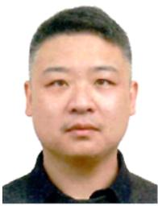

Chi Harold Liu (SM’15-F’26) receives a Ph.D. degree in Electronic Engineering from Imperial College, UK in 2010, and a B.Eng. degree in Electronic and Information Engineering from Tsinghua University, China in 2006. Prof. Liu is currently a Cheung Kong Scholar Program Distinguished Professor, Vice Dean at the School of Computer Science and Technology, Beijing Institute of Technology, China. Before that, he worked for IBM Research - China and Deutsche Telekom Laboratories, Berlin, Germany, and IBM T. J. Watson Research Center, USA. He received the IBM First Plateau Invention Achievement Award in 2012, IEEE DataCom Best Paper Award in 2016, ACM SigKDD Best Paper Runner-up Award in 2021, ACM MobiCom Best Community Paper Runner-up Award in 2021, First Class Scientific Award of China Institute of Electronics in 2023, Gold Medal for Invention Performance Award Nuremburg in 2025, Gold Meal for International Exhibition of Inventions Geneva in 2026, and First Class Teaching Award of China Institute of Electronics in 2025. His current research interests include the Industrial Big Data and Embodied AI. He is a Fellow of IEEE, IET, British Computer Society, and Royal Society of the Arts.

  
Qiran Zhao receives B.Sc. degrees in Computer Science from Beijing Institute of Technology, China. He is currently working toward a MEng degree under the supervision of Prof. Chi Harold Liu. He is now working on the problems of mobile crowdsensing and deep reinforcement learning.

Jianxin Zhao receives his BEng and MEng degrees from the School of Software at Beijing Institute of Technology, China, and Ph.D. degree from Computer Lab at the University of Cambridge. He is currently an Assistant Professor at the School of Computer Science and Technology, Beijing Institute of Technology, China. His main research interests are mobile crowdsensing and deep reinforcement learning.

Guozheng Li received his Ph.D. degree in Computer Science from the School of EECS, Peking University in 2021. He is currently an Assistant Professor with the School of Computer Science and Technology, Beijing Institute of Technology, China. His major research interests include IoT, data visualization and human-computer interaction. He is the recipient of the Gold Medal for Invention Performance Award at Nuremburg International Trade Fair, Germany in 2025.

Guangpeng Qi is the Vice President of INSPUR Group and Chairman of INSPUR Yunzhou Industrial Internet. He was formerly the Chairman of INSPUR Group Shandong District and Digital Shandong Company, and Vice President of INSPUR Cloud. He has been engaged in digital fields including cloud computing, Internet+Governmental Services, and Industrial Internet. He has participated in the development of INSPUR Government Service Integration Platform, Government Big Data Center, Government Cloud Platform and other series of products. He

receives the honors of 2023-2024 Industrial Internet Pilot, Cloud Computing Industry Leader, and Shandong Youth “Internet +” Top Ten Leaders.

Xu Ji is currently the Deputy General Manager of the Intelligent Manufacturing Department at Xiaomi Corporation. He received dual master’s degrees in Geophysics and Computer Science from the University of Utah and is a recipient of the Beijing Overseas High-Level Talent Program. He previously served as Vice President at Sina, Senior Director at Zynga China and Yahoo Beijing R&D Center, and Senior Research Manager at Microsoft Research Asia, where he worked on AI-driven recommendation systems, mobile game AI, search algorithms, advertising technologies, and multimedia AI.

  
and Information Technology.

Duo Xu is currently the Vice President of the Mobile Phone Department and General Manager of the Intelligent Manufacturing Department at Xiaomi Corporation, and a member of the National Intelligent Manufacturing Expert Committee. He is responsible for the development of intelligent manufacturing systems and smart production lines within the group. His work focuses on manufacturing process optimization, automation systems, and intelligent production technologies. His related work has been included in demonstration projects of the Ministry of Industry

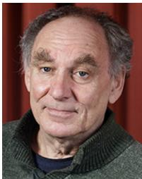

Jon Crowcroft (Fellow, IEEE) received the degree in physics from the Trinity College, University of Cambridge, Cambridge, U.K., in 1979, and the M.Sc. and Ph.D. degrees in computing from the University College London, London, U.K., in 1981 and 1993, respectively. From 2016 to 2018, he was the Programme Chair with The Alan Turing Institute, U.K. National Data Science and AI Institute, London, U.K. He is currently a Researcher with The Alan Turing Institute. Since October 2001, he has been a Marconi Professor of communications systems with the De-

partment of Computer Science and Technology, University of Cambridge. His research interests include internet support for multimedia communications, scalable multicast routing, practical approaches to traffic management, the design of deployable end-to-end protocols, opportunistic communications, social networks, privacypreserving analytics, and techniques and algorithms to scale infrastructure-free mobile systems. He is a fellow of the Royal Society, ACM, British Computer Society, IET, and the Royal Academy of Engineering.