# UAV Trajectory Monitoring for Integrated Sensing and Communications System

Shaoqiang Yan , Hongliang Luo , Ping Yang, Jianwei Zhao , and Feifei Gao , Fellow, IEEE

Abstract—In this paper, we present a framework to enable unmanned aerial vehicle (UAV) trajectory monitoring for an integrated sensing and communications (ISAC) system. Specifically, the base station (BS) first performs beam-scanning to acquire the echo signals from dynamic targets. Static environmental clutter is subsequently filtered out to enable real-time target detection. Next, we propose a phase-rotated discrete Fourier transform (PRDFT) algorithm to estimate the targets’ motion parameters, including distance, horizontal angle, pitch angle, radial velocity, horizontal angular velocity, and pitch angular velocity. We then convert the estimated parameters into a common Cartesian coordinate system to extract the targets’ positional and velocity features. To associate the targets with their corresponding trajectories, we propose a position wave gate and velocity differences nearest neighbor (WGVDNN) algorithm that matches targets based on similar position and velocity features relative to the trajectories. Afterward, we apply the interactive multiple model unscented Kalman filter (IMMUKF) algorithm to identify the targets’ motion model and predict their positions in the next time slot, thereby directing the beam to track the discovered ones. Simulation results demonstrate that the proposed framework effectively enables the real-time discovery of new targets and the continuous tracking of the discovered targets, thereby monitoring the complete trajectories of all targets.

Index Terms—Integrated sensing and communications, UAV trajectory monitoring, trajectory information management, single base station.

## I. INTRODUCTION

L OW-ALTITUDE economy (LAE) encompasses all kindsof economic activities in the airspace below 1,000 meters with unmanned aerial vehicles (UAVs) or manned vehicles [1], [2]. As an emerging field, the LAE is reshaping industry applications such as logistics and transportation, environmental monitoring, medical rescue, urban management, and aerial tourism [3], [4], [5]. With the rapid development of the LAE, the large-scale application of UAVs has become an inevitable trend, which also raises higher requirements for UAV monitoring.

UAV monitoring primarily consists of two core aspects: one is the state monitoring of the cooperative UAV itself, including the equipment type, operation status, etc.; the other is the realtime monitoring of the non-cooperative UAV flight trajectory, i.e., UAV trajectory monitoring. Among them, UAV trajectory monitoring is crucial to ensure the safety and compliance of low-altitude flight activities and promote the rational utilization of airspace resources [6], [7].

Traditional UAV trajectory monitoring mainly relies on radar systems, which are realized by sensing the target’s motion parameters (e.g., distance, horizontal angle, radial velocity, etc.) [8], [9]. Nevertheless, radar systems face limitations such as difficulties in large-scale deployment and high costs [10], [11]. The integrated sensing and communications (ISAC) technology framework provides new ideas to address this challenge. ISAC combines wireless communication and sensing capabilities into a unified system, which enables base stations (BSs) to provide seamless communication services to users while achieving radar-like high-precision sensing of dynamic targets [12], [13]. The key advantage of ISAC lies in its ability to leverage existing BS infrastructure for UAV trajectory monitoring at a significantly reduced cost [14], [15], [16], [17].

Current ISAC research focuses on two sensing tasks: target discovery and target tracking [18], [19]. Target discovery involves searching for new targets by performing beam-scanning to acquire echo signals from dynamic targets, filtering out static environmental clutter to detect the presence of these targets, and estimating their motion parameters. For example, Luo et al. propose a practical ISAC sensing scheme to detect the presence of dynamic targets and estimate their angles, distances, and velocities in a cluttered environment [20]. Sun and Zhang use a four-dimensional (4D) massive multiple input and multiple output (MIMO) radar-based ISAC technique to discover dynamic targets in a complex traffic environment and estimate their positions, horizontal angles, pitch angles, and radial velocities [21]. Li et al. propose a two-stage algorithm to discover multiple moving targets and estimate their positions and velocities [22]. Luo et al. propose a plane fitting method to obtain the horizontal and pitch angular velocities of dynamic targets in an ISAC system [23].

On the other side, target tracking refers to the continuous monitoring of dynamic targets after their discovery by predicting their position and employing beam-tracking [24], [25], [26], [27]. For example, Liu et al. propose a beam-tracking method to predict the motion state of multiple targets [28]. Du et al. propose a beam-tracking method based on an extended Kalman filter to enhance the accuracy of target tracking [29]. Cui et al. propose a novel ISAC-assisted beamtracking solution in multipath channels to predict dynamic targets’ motion state [30]. Meng et al. utilize an intelligent surface to dynamically adapt the beam direction towards dynamic targets [31]. Liu et al. propose an ISAC-based multitarget tracking approach that simultaneously localizes and predicts the positions of drones [32].

To achieve effective UAV trajectory monitoring, a practical ISAC BS should not only incorporate basic target discovery and tracking functions but also manage the trajectories of dynamic targets through feature extraction and trajectory association. Here, feature extraction refers to spatial registration of the motion parameters estimated under different arrays to obtain the key features of dynamic targets, such as positional features. Trajectory association involves matching the targets with their corresponding trajectories based on the extracted features, including the generation of new trajectories, the updating of existing ones, or the termination of certain trajectories.

However, most existing studies overlook neither feature extraction nor trajectory association, resulting in the inability to achieve complete UAV trajectory monitoring [20], [21], [22], [23], [24], [25], [26], [27], [28], [29], [30], [31], [32], [33]. Additionally, when two unassociated trajectories intersect or come close to each other, the likelihood of erroneous associations between targets and trajectories increases significantly [34]. Nonetheless, this issue has not yet been addressed to the best of our knowledge.

In this paper, we propose a novel framework for UAV trajectory monitoring within an ISAC system. The contributions of this paper are summarized as follows:

• We design an inter-array cooperative approach for the BS to facilitate the real-time discovery of new targets while ensuring continuous tracking of the discovered targets.

We suppress static environmental clutter in the echo signals and detect the presence of dynamic targets. Then, we propose a phase-rotated discrete Fourier transform (PRDFT) algorithm to estimate the 6D motion parameters of the detected targets, including distance, horizontal angle, pitch angle, radial velocity, horizontal angular velocity, and pitch angular velocity.

• We extract the position and velocity features of the targets and propose a position wave gate and velocity difference nearest neighbor (WGVDNN) algorithm to associate the targets with their corresponding trajectory.

• We employ the interactive multiple model unscented Kalman filter (IMMUKF) algorithm to identify the targets’ motion model and predict their next position.

The rest of the paper is organized as follows: Section II presents the problem formulation, including the BS model, the BS sensing cycle, and the received echo signals model. Section III describes the processing of the echo signals, including clutter filtering, target detection, and parameter estimation, while also presenting the processing flow to discover new targets. Section IV addresses the management of trajectory data, including feature extraction, trajectory association, and trajectory prediction, while also presenting the processing flow to track the discovered targets. Section V presents the simulation results, while Section VI concludes the paper.

Notation: Lower-case and upper-case boldface letters a and A denote a vector and a matrix; $\mathbf { a } ^ { T }$ and $\mathbf { a } ^ { H }$ denote the transpose and the conjugate transpose of vector a, respectively; a[n] denotes the n-th element of the vector a; $\mathbf { A } [ i , j ]$ denotes the $( i , j )$ -th element of the matrix A; $\mathbf { A } [ i _ { 1 } \ : \ i _ { 2 } , : ]$ is the submatrix composed of all columns elements in rows $i _ { 1 }$ to $i _ { 2 }$ of the matrix A; $\mathbf { A } [ : , j _ { 1 } : j _ { 2 } ]$ is the submatrix composed of all rows elements in columns $j _ { 1 }$ to j2 of the matrix $\mathbf { A } ; \mathbf { \alpha | \cdot | }$ represents the absolute value function; $\left\| \cdot \right\|$ represents the norm function; R and C represent the real field and the complex field, respectively; dac denotes rounding a to the nearest integer; diag{a} denotes creating a matrix with the elements as a on the main diagonal.

## II. PROBLEM FORMULATION

In Fig. 1, we present the ISAC sensing scenario and the proposed trajectory monitoring framework. Specifically, to continuously monitor the dynamic targets’ trajectory, the BS sequentially searches for new targets or tracks the discovered targets by managing the sensing beam within each sensing cycle. Then, the BS can obtain the echo signals from dynamic targets and static environments, which will be transmitted via optical fiber to the data center for further processing.

## A. BS Model

Consider an ISAC BS that adopts orthogonal frequency division multiplexing (OFDM) modulation and is equipped with three same arrays, each responsible for $1 / 3$ of the BS’s sensing area. Moreover, each array comprises a hybrid unit (HU) and a radar unit (RU), both equipped with a massive MIMO uniform planar array (UPA). The HU is responsible for transmitting and receiving communications signals as well as sending downlink sensing signals, while the RU is dedicated to receiving the sensing signals. Both HU-UPA and RU-UPA are mounted onto the $y = 0$ plane of their respective arrays. Since the distance to the target is significantly greater than the distance between the UPAs, we assume that both the UPAs are co-located and parallel [31]. Moreover, the HU-UPA and the RU-UPA are equipped with $N _ { H } ~ = ~ N _ { H } ^ { x } \times N _ { H } ^ { z }$ and $N _ { R } ~ = ~ N _ { R } ^ { x } \times N _ { R } ^ { z }$ antenna elements, respectively. The antenna spacings along the x-axis and z-axis are $\begin{array} { r } { d _ { x } = d = \frac { \lambda } { 2 } } \end{array}$ and $\begin{array} { r } { d _ { z } = d = \frac { \lambda } { 2 } } \end{array}$ , where $\lambda$ is the wavelength. Without loss of generality, we denote the position of the a -th antenna element in the HU-UPA as $[ \bar { d } \cdot a _ { H } ^ { x } , 0 , d \cdot a _ { H } ^ { z } ] ^ { T }$ , where $a _ { H } ^ { x } \in \{ 0 , 1 , \ldots , N _ { H } ^ { x } - 1 \}$ and $a _ { H } ^ { z } \in \{ 0 , 1 , \ldots , N _ { H } ^ { z } - 1 \}$ are the antenna indices along the $\mathbf { X } ^ { - }$ axis and z-axis, respectively. Similarly, we denote the position of the $a _ { R } \mathbf { \cdot }$ -th antenna element in RU-UPA as $[ d \cdot a _ { R } ^ { x } , 0 , \stackrel { \textstyle - } { d } \cdot a _ { R } ^ { z } ] ^ { T }$ with $a _ { R } ^ { x } \in \{ 0 , 1 , \ldots , N _ { R } ^ { x } - 1 \}$ and $a _ { R } ^ { z } \in \{ 0 , 1 , \ldots , N _ { R } ^ { z } - \overset { \sim } { 1 } \}$

## B. BS Sensing Cycle

In Fig. 2, we display the L sensing cycles for the dynamic management of the sensing beam. Here, we divide the sensing area of each array into $N _ { \mathrm { m } }$ sub-areas based on the angular field. Within the l-th sensing cycle, the BS first utilizes a wide beam to perform rough scanning of each sub-area with each array sequentially, where $l = 1 , 2 , \ldots , L$ . Then, the BS detects whether new targets have existed. If new targets exist, then the BS employs a narrow beam to conduct fine scanning of the sub-areas containing the new targets. Next, the BS detects the presence of targets that have already established a trajectory. If such targets exist, then the BS sequentially uses a narrow beam to track them; otherwise, the BS ends the current sensing cycle.

A sensing cycle  
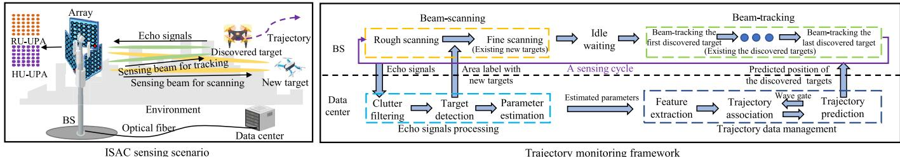  
Fig. 1. The ISAC sensing scenario and the proposed trajectory monitoring framework in ISAC system.

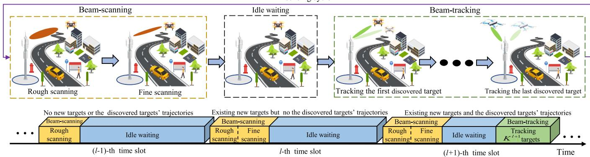  
Fig. 2. The sensing cycle for dynamically managing the sensing beam.

Since the number of targets and the sensing tasks varies in each sensing cycle, the duration of beam-scanning and beamtracking also changes. For ease of processing, we incorporate an idle waiting process after the beam-scanning to ensure that the duration of each sensing cycle remains a fixed value T. Moreover, we set the duration of a sensing cycle as one time slot.

## C. Echo Signal Model

Consider that there are K dynamic targets in the BS’s sensing area during the l-th time slot, the BS needs to sequentially transmit signals using the sensing beam from each array. Assume that there are $K ^ { \bar { i } }$ dynamic targets in the i-th array’s sensing area, where $i = { 1 , 2 , 3 }$ and $\textstyle { \bar { K } } = \sum _ { i = 1 } ^ { 3 } K ^ { i }$ Let us denote the direction in which the sensing beam from the i-th array points as $( \theta ^ { i } , \phi ^ { i } )$ , where $\theta ^ { i }$ and $\phi ^ { i }$ are horizontal angle and pitch angle, respectively. Then, the array emits OFDM signals with M subcarriers in total, where the lowest frequency and the subcarrier spacing are $f _ { 0 }$ and $\Delta f ,$ respectively. The transmission bandwidth is $W = M \cdot \Delta f$ and the frequency of the m-th subcarrier is $f _ { m } = f _ { 0 } + m \Delta f .$ where $m = 0 , 1 , \ldots , M - 1$ . Moreover, the OFDM frame contains N consecutive symbols, with the symbol interval being $T _ { s } ~ = ~ T _ { s } ^ { \prime } + T _ { g } ,$ where $\begin{array} { r } { T _ { s } ^ { \prime } \ = \ \frac { 1 } { \Delta f } } \end{array}$ and $T _ { g }$ are the OFDM symbol duration and guard interval, respectively. The starting time of the n-th OFDM symbol in one frame is $t _ { n } = n T _ { s }$ , where $n = 0 , 1 , \ldots , N - 1$ . Then, we represent the transmission signals of the sensing beam on the m-th subcarrier of the n-th OFDM symbol for the direction $( \theta ^ { i } , \phi ^ { i } )$ as

$$
{ \bf x } _ { \theta ^ { i } , \phi ^ { i } , n , m } = \sqrt { \frac { 1 } { N _ { H } } } { \bf a } _ { H } \left( \Psi ( \theta ^ { i } , \phi ^ { i } ) , \Omega ( \theta ^ { i } , \phi ^ { i } ) \right) s _ { \theta ^ { i } , \phi ^ { i } , n , m } ,\tag{1}
$$

where $\Psi ( \theta ^ { i } , \phi ^ { i } ) ~ = ~ \cos \theta ^ { i } \cos \phi ^ { i }$ and $\Omega ( \theta ^ { i } , \phi ^ { i } ) \ =$ sin $\phi ^ { i }$ Moreover, $^ { S } \theta ^ { i } , \phi ^ { i } , n , m$ is the modulated symbol and ${ \bf a } _ { H } ( \Psi , \Omega )$ is the transmitting steering vector of the HU-UPA, given by

$$
\mathbf { a } _ { H } ( \Psi , \Omega ) = \mathbf { a } _ { H } ^ { x } ( \Psi ) \otimes \mathbf { a } _ { H } ^ { z } ( \Omega ) \in \mathbb { C } ^ { N _ { H } \times 1 } ,\tag{2}
$$

where $\otimes$ denotes the Kronecker product, and

$$
\begin{array} { r l } & { { \mathbf { a } } _ { H } ^ { x } ( \Psi ) = \left[ 1 , e ^ { j \frac { 2 \pi f _ { 0 } d \Psi } { c } } , \ldots , e ^ { j \frac { 2 \pi f _ { 0 } d \Psi } { c } ( N _ { H } ^ { x } - 1 ) } \right] ^ { T } \in \mathbb { C } ^ { N _ { H } ^ { x } \times 1 } , } \\ & { { \mathbf { a } } _ { H } ^ { z } ( \Omega ) = \left[ 1 , e ^ { j \frac { 2 \pi f _ { 0 } d \Omega } { c } } , \ldots , e ^ { j \frac { 2 \pi f _ { 0 } d \Omega } { c } ( N _ { H } ^ { z } - 1 ) } \right] ^ { T } \in \mathbb { C } ^ { N _ { H } ^ { z } \times 1 } . } \end{array}\tag{3}
$$

For convenience, we define the k-th dynamic target within the i-th array’s sensing area as the (i, k)-th dynamic target. Then, we represent the 6D motion parameters of the $( i , k ) .$ th dynamic target, i.e., distance, horizontal angle, pitch angle, radial velocity, horizontal angular velocity, and pitch angular velocity, as $\mathbf { s } _ { k } ^ { i } = [ r _ { k } ^ { i } , \theta _ { k } ^ { i } , \phi _ { k } ^ { i } , \bar { v _ { r , k } ^ { i } } , \omega _ { \theta , k } ^ { i } , \omega _ { \phi , k } ^ { i } ] ^ { T } [ 2 \bar { 0 } ]$ , where $k =$ $1 , 2 , . . . , K ^ { i }$ . Similarly, the 6D motion parameters of the $( i , k ) .$ th dynamic target at the n-th OFDM symbol are denoted as $\mathbf { s } _ { k , n } ^ { i } = [ r _ { k , n } ^ { i } , \theta _ { k , n } ^ { i } , \phi _ { k , n } ^ { i } , v _ { r , k , n } ^ { i } , \omega _ { \theta , k , n } ^ { i } , \omega _ { \phi , k , n } ^ { i } ] ^ { T }$ , which can be calculated by

$$
\left[ \begin{array} { c } { r _ { k , n } ^ { i } } \\ { \theta _ { k , n } ^ { i } } \\ { \phi _ { k , n } ^ { i } } \\ { v _ { r , k , n } ^ { i } } \\ { \omega _ { \theta , k , n } ^ { i } } \\ { \omega _ { \phi , k , n } ^ { i } } \end{array} \right] = \left[ \begin{array} { c c c c c } { 1 0 0 0 - n T _ { s } } & { 0 } & { 0 } \\ { 0 1 0 } & { 0 } & { - n T _ { s } } & { 0 } \\ { 0 0 1 } & { 0 } & { 0 } & { - n T _ { s } } \\ { 0 0 0 } & { 1 } & { 0 } & { 0 } \\ { 0 0 0 } & { 0 } & { 1 } & { 0 } \\ { 0 0 0 } & { 0 } & { 0 } & { 1 } \end{array} \right] \left[ \begin{array} { c } { r _ { k } ^ { i } } \\ { \theta _ { k } ^ { i } } \\ { \phi _ { k } ^ { i } } \\ { v _ { r , k } ^ { i } } \\ { \omega _ { \theta , k } ^ { i } } \\ { \omega _ { \phi , k } ^ { i } } \end{array} \right] .\tag{4}
$$

Denote the path from the $a _ { H }$ -th antenna of HU-UPA to the k-th dynamic target and then back to the aR-th antenna of RU-UPA as the $( a _ { H } , k , a _ { R } )$ -th propagation path, where $a _ { H } = 0 , 1 , \dots , N _ { H } - 1$ and $a _ { R } = 0 , 1 , \ldots , N _ { R } - 1$ . Then the frequency-domain sensing echo channel of the $( a _ { H } , k , a _ { R } ) – \mathrm { t h }$ propagation path on the m-th subcarrier of the n-th OFDM symbol at the i-th array can be represented as

$$
\begin{array} { r } { h _ { a _ { H } , k , a _ { R } } ^ { n , m , i } = \alpha _ { k } ^ { i } e ^ { - j 4 \pi f _ { m } \frac { r _ { k } ^ { i } } { c } } e ^ { j 4 \pi f _ { 0 } \frac { v _ { r , k } ^ { i } n T _ { s } } { c } } } \\ { \times e ^ { j 2 \pi f _ { 0 } \frac { ( a _ { H } ^ { x } + a _ { R } ^ { x } ) d \Psi _ { k , n } ^ { i } + ( a _ { H } ^ { z } + a _ { R } ^ { z } ) d \Omega _ { k , n } ^ { i } } { c } } , } \end{array}\tag{5}
$$

where $\Psi _ { k , n } ^ { i } ~ = ~ \cos ( \phi _ { k } ^ { i } - \omega _ { \phi , k } ^ { i } n T _ { s } ) \cos ( \theta _ { k } ^ { i } - \omega _ { \theta , k } ^ { i } n T _ { s } )$ and $\Omega _ { k , n } ^ { i } = \sin ( \phi _ { k } ^ { i } - \omega _ { \phi , k } ^ { i } n T _ { s } )$ . Moreover, c is the speed of light and $\begin{array} { r } { \alpha _ { k } ^ { i } = \sqrt { \frac { \lambda ^ { 2 } } { ( 4 \pi ) ^ { 3 } ( r _ { k } ^ { i } ) ^ { 4 } } } \sigma _ { k } ^ { i } } \end{array}$ is the channel fading factor, where $\sigma _ { k } ^ { i }$ is the radar cross section (RCS) of the target. Then, the overall frequency domain sensing echo channel matrix of the $( i , k )$ -th dynamic target on the m-th subcarrier of the n-th OFDM symbol can be expressed as $\mathbf { H } _ { k , n , m } ^ { i } \in { \mathbb { C } } ^ { N _ { H } \times N _ { R } }$ , with the $( a _ { H } , a _ { R } )$ -th element being $\mathbf { H } _ { k , n , m } ^ { i } [ a _ { H } , a _ { R } ] = h _ { a _ { H } , k , a _ { R } } ^ { n , m , i } .$ Additionally, based on $( 5 ) , \mathbf { H } _ { k , n , m } ^ { i }$ can be decomposed as

$$
\begin{array} { r } { \mathbf { H } _ { k , n , m } ^ { i } = \alpha _ { k } ^ { i } e ^ { - j 4 \pi f _ { m } \frac { r _ { k } ^ { i } } { c } } e ^ { j 4 \pi f _ { 0 } \frac { v _ { r , k } ^ { i } n T _ { s } } { c } } \phantom { x x x x x x x x x x x x x x x x x x x x x x x x x x x x x x x x x x x x x x x x } } \\ { \times \mathbf { a } _ { R } ( \Psi _ { k , n } ^ { i } , \Omega _ { k , n } ^ { i } ) \mathbf { a } _ { H } ^ { T } ( \Psi _ { k , n } ^ { i } , \Omega _ { k , n } ^ { i } ) , } \end{array}\tag{6}
$$

where ${ \bf a } _ { R } ( \Psi , \Omega )$ is the array steering vector of the RU-UPA in the direction (Ψ, Ω), given by

$$
\mathbf { a } _ { R } ( \Psi , \Omega ) = \mathbf { a } _ { R } ^ { x } ( \Psi ) \otimes \mathbf { a } _ { R } ^ { z } ( \Omega ) \in \mathbb { C } ^ { N _ { R } \times 1 } .\tag{7}
$$

Here, $\mathbf { a } _ { R } ^ { x } ( \Psi )$ and ${ \bf a } _ { R } ^ { z } ( \Omega )$ have the same form with $\mathbf { a } _ { H } ^ { x } ( \Psi )$ and $\mathbf { a } _ { H } ^ { z } ( \Psi )$ in (3). Based on (6), the echo channel of all dynamic targets within the i-th array’s sensing area on the m-th subcarrier of the n-th OFDM symbol can be represented as

$$
\mathbf { H } _ { n , m } ^ { \mathrm { t a r } , i } = \sum _ { k = 1 } ^ { K ^ { i } } \mathbf { H } _ { k , n , m } ^ { i } .\tag{8}
$$

Let us divide the static environmental clutter area within each array’s sensing area into U static environmental clutter scattering units. Then we represent the position of the uth static environmental clutter scattering unit within the i-th array’s sensing area as $( r _ { u } ^ { i } , \theta _ { u } ^ { i } , \phi _ { u } ^ { i } )$ , where $r _ { u } ^ { i } , \ \theta _ { u } ^ { i }$ and $\phi _ { u } ^ { i }$ denote distance, horizontal angle, and pitch angle, respectively. Then, we model the static environmental clutter channel on the m-th subcarrier of the n-th OFDM symbol at the i-th array as

$$
{ \bf { H } } _ { n , m } ^ { \mathrm { e n v } , i } = \sum _ { u = 1 } ^ { U } \beta _ { u } ^ { i } e ^ { - j 4 \pi f _ { m } \frac { r _ { u } ^ { i } } { c } } { \bf { a } } _ { R } ( \Psi _ { u } ^ { i } , \Omega _ { u } ^ { i } ) { \bf { a } } _ { H } ^ { T } ( \Psi _ { u } ^ { i } , \Omega _ { u } ^ { i } ) ,\tag{9}
$$

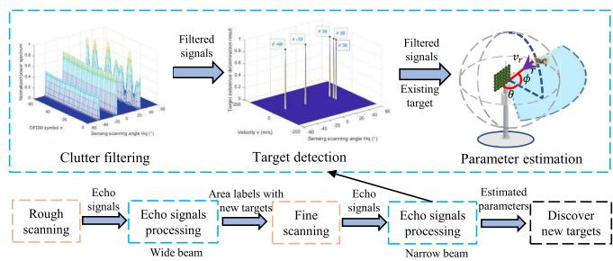  
Fig. 3. The process of discovering new targets.

where $\Psi _ { u } ^ { i } = \cos \phi _ { u } ^ { i } \cos \theta _ { u } ^ { i }$ and $\Omega _ { u } ^ { i } = \sin { \phi _ { u } ^ { i } }$ . Moreover, $\beta _ { u } ^ { i } =$ $\sqrt { \frac { \lambda ^ { 2 } } { ( 4 \pi ) ^ { 3 } ( r _ { u } ^ { i } ) ^ { 4 } } } \sigma _ { u } ^ { i }$ is the channel fading factor, where $\boldsymbol { \sigma } _ { u } ^ { i }$ is the RCS of the static environmental clutter scattering unit.

Then, the overall sensing echo channel on the m-th subcarrier of the n-th OFDM symbol at the i-th array can be represented as

$$
\mathbf { H } _ { n , m } ^ { \mathrm { s e n } , i } = \mathbf { H } _ { n , m } ^ { \mathrm { t a r } , i } + \mathbf { H } _ { n , m } ^ { \mathrm { e n v } , i } .\tag{10}
$$

According to (1) and (10), the received echo signals from the (i, k)-th dynamic target on the m-th subcarrier of the n-th OFDM symbol can be represented as

$$
\begin{array} { r l } & { \mathbf { y } _ { k , n , m } ^ { i } = \mathbf { H } _ { n , m } ^ { \mathrm { s e n } , i } \mathbf { x } _ { \theta ^ { i } , \phi ^ { i } , n , m } + \mathbf { n } _ { k , n , m } ^ { i } } \\ & { \qquad = \mathbf { H } _ { n , m } ^ { \mathrm { t a r } , i } \mathbf { x } _ { \theta ^ { i } , \phi ^ { i } , n , m } + \mathbf { H } _ { n , m } ^ { \mathrm { e n v } , i } \mathbf { x } _ { \theta ^ { i } , \phi ^ { i } , n , m } + \mathbf { n } _ { k , n , m } ^ { i } , } \end{array}
$$

where $\mathbf { n } _ { k , n , m } ^ { i }$ represents additive white Gaussian noise.

(11)

## III. NEW TARGETS DISCOVERING AND ECHO SIGNALS PROCESSING

Fig. 3 shows the complete process of discovering new targets. The BS first uses a wide beam to perform rough scanning of all sub-areas within each array’s sensing area. By processing the received echo signals, we identify the sub-areas in which new targets are located. Then, we send the labels of these sub-areas to the BS for fine scanning with a narrow beam. Based on the received echo signals, we conduct clutter filtering, target detection, and parameter estimation, thereby obtaining the precise motion parameters of the targets. Since rough scanning is rather standard [35], we here assume that the rough scanning has been completed and will only focus on the echo signals processing for the narrow beam.

## A. Clutter Filtering

Let us define equivalent dynamic target echo signals and equivalent static environment echo signals from the $( i , k ) \ – \mathrm { t h }$ dynamic target on the m-th subcarrier of the n-th OFDM symbol as $\mathbf { y } _ { k , n , m } ^ { \mathrm { t a r } , i } = \mathbf { H } _ { n , m } ^ { \mathrm { t a r } , i } \mathbf { x } _ { \theta _ { k } ^ { i } , \phi _ { k } ^ { i } , n , m }$ and ${ \bf y } _ { k , n , m } ^ { \mathrm { e n v } , i } =$ $\mathbf { H } _ { n , m } ^ { \mathrm { e n v } , i } \mathbf { x } _ { \theta _ { k } ^ { i } , \phi _ { k } ^ { i } , n , m }$ , respectively. Then, we can rewrite (11) as

$$
\begin{array} { r } { \mathbf { y } _ { k , n , m } ^ { i } = \mathbf { y } _ { k , n , m } ^ { \mathrm { t a r } , i } + \mathbf { y } _ { k , n , m } ^ { \mathrm { e n v } , i } + \mathbf { n } _ { k , n , m } ^ { i } . } \end{array}\tag{12}
$$

Let us reformat the received echo signals $\mathbf { y } _ { k , n , m } ^ { i }$ into a $N _ { R } ^ { x } \times N _ { R } ^ { z }$ matrix ${ \bf Y } _ { k , n , m } ^ { i } = { \bf Y } _ { k , n , m } ^ { \mathrm { t a r } , i } + { \bf Y } _ { k , n , m } ^ { \mathrm { e n v } , i } + { \bf N } _ { k , n , m } ^ { i } ,$ where $\begin{array} { r l r } { { \bf Y } _ { k , n , m } ^ { \mathrm { t a r } , i } } & { \in } & { \mathbb { C } ^ { N _ { R } ^ { x } \times N _ { R } ^ { z } } , \ : \ : { \bf Y } _ { k , n , m } ^ { \mathrm { e n v } , i } \in \bar { \mathbb { C } } ^ { N _ { R } ^ { x } \times N _ { R } ^ { z } } } \end{array}$ , and $\mathbf { N } _ { k , n , m } ^ { i } \ \in \ \mathbb { C } ^ { N _ { R } ^ { x } \times N _ { R } ^ { z } }$ are the corresponding matrices built from $\mathbf { y } _ { k , n , m } ^ { \mathrm { t a r } , i } , \mathbf { y } _ { k , n , m } ^ { \mathrm { e n v } , i }$ , and $\mathbf { n } _ { k , n , m } ^ { i } .$ , respectively. Next, we stack $\mathbf { Y } _ { k , n , m } ^ { i }$ of all N symbols and all M subcarriers into an echo tensor $\mathbf { Y } _ { k } ^ { \mathrm { c u b e } , i } \in \mathbb { C } ^ { N \times M \times N _ { R } ^ { x } \times N _ { R } ^ { z } }$ with the sub-matrix ${ \bf Y } _ { k } ^ { \mathrm { c u b e } , i } [ n , m , : , \ddot { : } ] = { \bf Y } _ { k , n , m } ^ { i }$ . Note that

$$
\begin{array} { r l } & { { \bf Y } _ { k } ^ { \mathrm { c u b e } , i } [ n , m , a _ { R } ^ { x } , a _ { R } ^ { z } ] = { \bf Y } _ { k , n , m } ^ { i } [ a _ { R } ^ { x } , a _ { R } ^ { z } ] } \\ & { = { \bf Y } _ { k , n , m } ^ { \mathrm { t a r } , i } [ a _ { R } ^ { x } , a _ { R } ^ { z } ] + { \bf Y } _ { k , n , m } ^ { \mathrm { e n v } , i } [ a _ { R } ^ { x } , a _ { R } ^ { z } ] + { \bf N } _ { k , n , m } ^ { i } [ a _ { R } ^ { x } , a _ { R } ^ { z } ] . } \end{array}\tag{13}
$$

Let us adopt the moving target indicator (MTI) technology [36] to suppress the static environmental clutter in ${ \bf Y } _ { k } ^ { \mathrm { c u b e } , i } , \mathrm { i } . \mathrm { e } .$

$$
\begin{array} { r } { \check { \mathbf { Y } } _ { k } ^ { \mathrm { c u b e } , i } = { \mathbf { Y } } _ { k } ^ { \mathrm { c u b e } , i } [ 1 : N - 1 , : , : , : ] - { \mathbf { Y } } _ { k } ^ { \mathrm { c u b e } , i } [ 2 : N , : , : , : ] . } \end{array}\tag{14}
$$

$\begin{array} { r l } { \mathrm { T h e } } & { { } \ ( n , m , a _ { R } ^ { x } , a _ { R } ^ { z } ) \ – \mathrm { t h } } \end{array}$ element in Yˇ cube,i ∈ $\mathbb { C } ^ { ( N - 1 ) \times \dot { M } \times ^ { r _ { R } } \times \dot { N } _ { R } ^ { z } }$ can be represented as (15), shown at the bottom of the page. Based on (9), we know ${ \bf { H } } _ { n , m } ^ { \mathrm { { e n v } } , i }$ is uncorrelated with OFDM symbol. Moreover, since the reference signals $^ { S } \theta _ { k } ^ { i } , \phi _ { k } ^ { i } , n , m$ of different OFDM symbols are equal, i.e., $s _ { \theta _ { k } ^ { i } , \phi _ { k } ^ { i } , n , m } \ = \ s _ { \theta _ { k } ^ { i } , \phi _ { k } ^ { i } , n + 1 , m } ,$ we can obtain (16), shown at the bottom of the page. Furthermore, there is

$$
\begin{array} { r } { \mathbf { Y } _ { k , n , m } ^ { \mathrm { e n v } , i } [ a _ { R } ^ { x } , a _ { R } ^ { z } ] - \mathbf { Y } _ { k , n + 1 , m } ^ { \mathrm { e n v } , i } [ a _ { R } ^ { x } , a _ { R } ^ { z } ] = 0 . } \end{array}\tag{17}
$$

Based on (1), (6), and (10), we decompose ${ \bf Y } _ { k , n , m } ^ { \mathrm { t a r } , i } [ a _ { R } ^ { x } , a _ { R } ^ { z } ]$ as (18), shown at the bottom of the page, where $\mathcal { G } _ { k , n } ^ { i }$ and $v _ { k , a _ { R } ^ { x } , a _ { R } ^ { z } } ^ { v i r , i }$ are defined as (19) and (20), shown at the bottom of the page. Since the distance between the target and the BS is usually much larger than the displacement distance of the target in N OFDM symbols, it is usually assumed that $\mathcal { G } _ { k } ^ { i } \ = \ \mathcal { G } _ { k , 0 } ^ { i } \ \approx \ \mathcal { G } _ { k , 1 } ^ { i } \ \approx \ . . . \ \approx \ \mathcal { G } _ { k , n } ^ { i } \ [ 2 3 ]$ . Then, we can obtain (21), shown at the bottom of the page, where $\begin{array} { r } { \varrho _ { k } ^ { i } = \mathcal G _ { k } ^ { i } \left( 1 - e ^ { j 4 \pi f _ { 0 } } \frac { v _ { k , a _ { R } ^ { x } , a _ { R } ^ { z } } ^ { v i r , i } T _ { s } } { c } \right) . } \end{array}$

Suppose that the noise vectors $\mathbf { n } _ { k , n , m } ^ { i }$ of different OFDM symbols are independent of each other, we denote

$$
\begin{array} { r } { \check { n } _ { k , n , m , a _ { R } ^ { x } , a _ { R } ^ { z } } ^ { i } = { \bf N } _ { k , n , m } [ a _ { R } ^ { x } , a _ { R } ^ { z } ] - { \bf N } _ { k , n + 1 , m } [ a _ { R } ^ { x } , a _ { R } ^ { z } ] . } \end{array}\tag{22}
$$

Based on (17), (21), and (22), we can rewrite $\check { \mathbf { Y } } _ { k } ^ { \mathrm { c u b e } , i } [ n , m , a _ { R } ^ { x } , a _ { R } ^ { z } ]$ as (23), shown at the bottom of the next page.

## B. Target Detection

When the dynamic targets are present, the echo signal received by each antenna contains information related to these

$$
\begin{array} { r l } & { \bar { Y } _ { k } ^ { \mathrm { c u b c } , \mathrm { i } } [ n , m , a _ { R } ^ { x } , a _ { R } ^ { z } ] = { \mathbf { Y } } _ { k } ^ { \mathrm { c u b c } , \mathrm { i } } [ n , m , a _ { R } ^ { x } , a _ { R } ^ { z } ] - { \mathbf { Y } } _ { k } ^ { \mathrm { c u b c } , \mathrm { i } } [ n + 1 , m , a _ { R } ^ { x } , a _ { R } ^ { z } ] } \\ & { \phantom { \bar { Y } } = { \mathbf { Y } } _ { k , n , m } ^ { \mathrm { u n } , \mathrm { i } } [ a _ { R } ^ { x } , a _ { R } ^ { z } ] + { \mathbf { Y } } _ { k , n , m } ^ { \mathrm { e u r } , \mathrm { i } } [ a _ { R } ^ { x } , a _ { R } ^ { z } ] + { \mathbf { N } } _ { k , n , m } ^ { \mathrm { i } } [ a _ { R } ^ { x } , a _ { R } ^ { z } ] - { \mathbf { Y } } _ { k , n + 1 , m } ^ { \mathrm { u n } , \mathrm { i } } [ a _ { R } ^ { x } , a _ { R } ^ { \bar { z } } ] - { \mathbf { Y } } _ { k , n + 1 , m } ^ { \mathrm { e u r } , \mathrm { i } } [ a _ { R } ^ { x } , a _ { R } ^ { \bar { z } } ] } \\ & { \phantom { \bar { Y } } - { \mathbf { Y } } _ { k , n + 1 , m } ^ { \mathrm { i } } [ a _ { R } ^ { x } , a _ { R } ^ { z } ] . } \end{array}\tag{15}
$$

$$
\begin{array} { r } { \mathbf { y } _ { k , n , m } ^ { \mathrm { s u r } , i } - \mathbf { y } _ { k , n + 1 , m } ^ { \mathrm { s u r } , i } = \mathbf { H } _ { n , m } ^ { \mathrm { e n } , i } \sqrt { \frac { 1 } { N _ { H } } } \mathbf { a } _ { H } \left( \Psi ( \theta _ { k } ^ { i } , \phi _ { k } ^ { i } ) , \Omega ( \theta _ { k } ^ { i } , \phi _ { k } ^ { i } ) \right) s _ { \theta _ { k } ^ { i } , \phi _ { k } ^ { i } , n , m } - \mathbf { H } _ { n , m } ^ { \mathrm { e n } , i } \sqrt { \frac { 1 } { N _ { H } } } \mathbf { a } _ { H } \left( \Psi ( \theta _ { k } ^ { i } , \phi _ { k } ^ { i } ) , \Omega ( \theta _ { k } ^ { i } , \phi _ { k } ^ { i } ) \right) s _ { \theta _ { k } ^ { i } , \phi _ { k } ^ { i } , n + 1 , m } } \\ { = 0 . \qquad \quad \qquad ( 1 6 ) } \end{array}
$$

$$
{ \bf Y } _ { k , n , m } ^ { \mathrm { t a r } , i } [ a _ { R } ^ { x } , a _ { R } ^ { z } ] = { \mathcal G } _ { k , n } ^ { i } e ^ { - j 4 \pi f _ { m } \frac { r _ { k } ^ { i } } { c } } e ^ { j \frac { 2 \pi f _ { 0 } d } { c } \sin { \phi _ { k } ^ { i } } a _ { R } ^ { z } } e ^ { j \frac { 2 \pi f _ { 0 } d } { c } \cos { \phi _ { k } ^ { i } } \cos { \theta _ { k } ^ { i } } a _ { R } ^ { x } } e ^ { j 4 \pi f _ { 0 } \frac { v _ { k , a _ { R } ^ { x } , a _ { R } ^ { z } } ^ { v i r , i } a _ { R } ^ { z } } { c } n \pi _ { s } } .\tag{18}
$$

$$
\begin{array} { r } { v _ { k , a _ { R } ^ { \ast } , a _ { R } ^ { \ast } } ^ { \mathrm { v i r } , i } = v _ { r , k } ^ { i } - \cfrac { d } { 4 } \big [ ( N _ { H } ^ { z } - 1 ) \cos \phi _ { k } ^ { i } - ( N _ { H } ^ { x } - 1 ) \sin \phi _ { k } ^ { i } \cos \theta _ { k } ^ { i } \big ] \omega _ { \phi , k } ^ { i } - \cfrac { d } { 2 } \big ( a _ { R } ^ { z } \cos \phi _ { k } ^ { i } - a _ { R } ^ { x } \sin \phi _ { k } ^ { i } \cos \theta _ { k } ^ { i } \big ) \omega _ { \phi , k } ^ { i } } \\ { + \cfrac { d } { 4 } ( N _ { H } ^ { x } - 1 ) \cos \phi _ { k } ^ { i } \sin \theta _ { k } ^ { i } \omega _ { \theta , k } ^ { i } + \cfrac { d } { 2 } a _ { R } ^ { x } \cos \phi _ { k } ^ { i } \sin \theta _ { k } ^ { i } \omega _ { \theta , k } ^ { i } . } \end{array}\tag{19}
$$

$$
{ \mathcal G } _ { k , n } ^ { i } = \alpha _ { k } ^ { i } s _ { \theta _ { k } ^ { i } , \phi _ { k } ^ { i } , n , m } \sqrt { \frac { 1 } { N _ { H } } } \frac { \sin \left[ \frac { \pi f _ { 0 } d } { c } ( \cos \theta _ { k , n } ^ { i } \cos \phi _ { k , n } ^ { i } - \cos \theta _ { k , 0 } ^ { i } \cos \phi _ { k , 0 } ^ { i } ) N _ { H } ^ { 2 } \right] } { \sin \left[ \frac { \pi f _ { 0 } d } { c } ( \cos \theta _ { k , n } ^ { i } \cos \phi _ { k , n } ^ { i } - \cos \theta _ { k , 0 } ^ { i } \cos \phi _ { k , 0 } ^ { i } ) \right] } \frac { \sin \left[ \frac { \pi f _ { 0 } d } { c } ( \sin \phi _ { k , n } ^ { i } - \sin \phi _ { k , 0 } ^ { i } ) N _ { H } ^ { 2 } \right] } { \sin \left[ \frac { \pi f _ { 0 } d } { c } ( \sin \phi _ { k , n } ^ { i } - \sin \phi _ { k , 0 } ^ { i } ) \right] } .\tag{20}
$$

$$
\begin{array} { r l } { \mathbf { Y } _ { k , n , m } ^ { \mathrm { t a r } , i } [ a _ { R } ^ { x } , a _ { R } ^ { z } ] - \mathbf { Y } _ { k , n + 1 , m } ^ { \mathrm { t a r } , i } [ a _ { R } ^ { x } , a _ { R } ^ { z } ] = \mathcal { G } _ { k , n } ^ { i } e ^ { - j 4 \pi f _ { m } \frac { r _ { k } ^ { i } } { c } } e ^ { j \frac { 2 \pi f _ { 0 } d } { c } \sin \phi _ { k } ^ { i } a _ { R } ^ { z } } e ^ { j \frac { 2 \pi f _ { 0 } d } { c } \cos \phi _ { k } ^ { i } a _ { R } ^ { z } } e ^ { j 4 \pi f _ { 0 } } \frac { \sin ^ { \frac { \theta } { \theta } _ { k } ^ { \alpha } } a _ { R } ^ { z } } { c } e ^ { j 4 \pi f _ { 0 } } \frac { \sin ^ { \frac { \theta } { \theta } _ { k } ^ { \alpha } } a _ { R } ^ { z } } { c } \frac { \sin ^ { \frac { \theta } { \theta } _ { k } ^ { \alpha } } a _ { R } ^ { z } } { c } - \mathcal { G } _ { k , n + 1 } ^ { i } } & \\ { \times \ e ^ { - j 4 \pi f _ { m } \frac { r _ { k } ^ { i } } { c } } e ^ { j \frac { 2 \pi f _ { 0 } d } { c } \sin \phi _ { k } ^ { i } a _ { R } ^ { z } } e ^ { j \frac { 2 \pi f _ { 0 } d } { c } \cos \phi _ { k } ^ { i } \cos \phi _ { k } ^ { i } \cos \phi _ { k } ^ { i } a _ { R } ^ { z } } e ^ { j 4 \pi f _ { 0 } \frac { \sin ^ { \frac { \theta } { \theta } _ { k } ^ { \alpha } } a _ { R } ^ { z } } { c } \frac { e ^ { j 4 \pi } } { c } ( n + 1 ) T _ { s } } } & \\  = \frac { \theta _ { k } ^ { i } }  \rho _ { k } ^ { i } e ^ { - j 4 \pi f _ { m } \frac { r _ { k } ^ { i } } { c } } e  \end{array}\tag{21}
$$

Authorized licensed use limited to: LNM Institute of Information Technology. Downloaded on July 05,2026 at 10:42:57 UTC from IEEE Xplore. Restrictions apply.

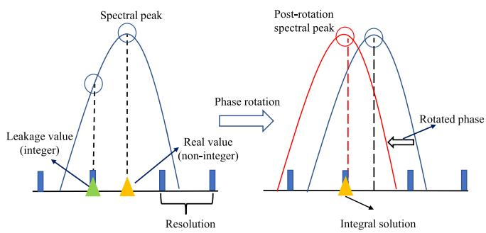  
Fig. 4. The schematic diagram of the PRDFT algorithm.

targets. For simplicity, we focus on the first antenna and define $\mathbf { G } _ { k } ^ { i } \ = \ \mathring { \mathbf { Y } } _ { k } ^ { \mathrm { c u b e } , i } [ : , : , 1 , 1 ] \ \in \ \mathbb { C } ^ { ( N - 1 ) \times M }$ as the filtered echo signals of the (i, k)-th target from the first antenna. By performing two-dimensional fast Fourier transform (2D-FFT) [20] on $\mathbf { G } _ { k } ^ { i }$ , we can obtain the target’s range-Doppler spectrum as

$$
\mathbf { G } _ { k } ^ { \mathrm { R D } , i } = \mathrm { F F T } _ { \mathrm { r o w } } \left( \mathrm { I F F T } _ { \mathrm { c o l } } \left( \mathbf { G } _ { k } ^ { i } , M \right) , N - 1 \right) ,\tag{24}
$$

where $\mathrm { I F F T } _ { \mathrm { c o l } } \left( \mathbf { G } _ { k } ^ { i } , M \right)$ indicates executing M-point inverse fast Fourier transform (IFFT) on each column of $\mathbf { G } _ { k } ^ { i }$ and $\mathrm { F F T } _ { \mathrm { r o w } } \left( \mathbf { A } , N - 1 \right)$ denotes applying (N − 1)-point FFT on each row of A.

From (23), it can be inferred that the presence of a dynamic target will lead to a spectral peak in $\mathbf { G } _ { k } ^ { \mathrm { R D } , i }$ i. To further overcome the effects of noise on the spectral peak, it is necessary to establish an appropriate detection threshold. Therefore, we take ${ \bf G } _ { k } ^ { \mathrm { R D } , i }$ as input, set the appropriate reference cells, protection cells, and false alarm probability, and apply the 2D cell average conventional constant false alarm rate (2D-CA-CFAR) algorithm whose specific steps are outlined in [37]. Then we can obtain the target’s detection threshold $\mathcal { T } _ { k } ^ { i }$ as the output. If the spectral peak in ${ \bf G } _ { k } ^ { \mathrm { R D } , i }$ exceeds the detection threshold $\mathcal { T } _ { k } ^ { i }$ , then the target is determined to exist, and we proceed to estimate its motion parameters.

## C. Parameter Estimation

We here propose a low-computational-complexity algorithm to estimate the motion parameters of the dynamic targets based on the phase-rotated discrete Fourier transform (PRDFT), which can effectively reduce the leakage caused by the integer resolution of the DFT algorithm, as shown in Fig. 4.

1) Distance Estimation: Let us transform $\breve { \mathbf { Y } } _ { k } ^ { \mathrm { c u b e } , i }$ into a distance matrix $\Gamma _ { k } ^ { \mathrm { r } , i } \in \mathbb { C } ^ { M \times ( N - 1 ) N _ { R } ^ { x } N _ { R } ^ { z } }$ . Based on (23), $\Gamma _ { k } ^ { \mathrm { r } , i }$ can be expressed as

$$
\Gamma _ { k } ^ { \mathrm { r } , i } = \mathbf { k } _ { k } ^ { \mathrm { r } , i } \cdot \boldsymbol { \gamma } _ { k } ^ { \mathrm { r } , i } + \mathbf { N } _ { k } ^ { \mathrm { r } , i } ,\tag{25}
$$

where $\begin{array} { r } { \mathbf { k } _ { k } ^ { \mathrm { r } , i } = \left\lceil 1 , e ^ { - j \frac { 4 \pi r _ { k } ^ { i } \Delta f } { c } } , \dots , e ^ { - j \frac { 4 \pi r _ { k } ^ { i } \Delta f } { c } ( M - 1 ) } \right\rceil ^ { T } \in \mathbb { C } ^ { M \times 1 } } \end{array}$ is the distance steering vector, $\gamma _ { k } ^ { \mathrm { r } , i } \in \mathbb { C } ^ { 1 \times ( N - 1 ) \vec { N } _ { R } ^ { x } N _ { R } ^ { z } }$ is the distance compensation vector, and $\mathbf { N } _ { k } ^ { \mathrm { r } , i } \in { \mathbb { C } } ^ { M \times ( N - 1 ) N _ { R } ^ { x } N _ { R } ^ { z } }$ is the noise matrix.

Define the $M \times M$ normalized inverse discrete Fourier transform (IDFT) matrix as $\Xi ^ { \mathrm { r } }$ whose $( p , q ) \ – \mathrm { t h }$ element is $\Xi ^ { \mathrm { r } } [ p , q ] = \sqrt { M } e ^ { j \frac { 2 \pi } { M } p q } , p , q = 1 , 2 , \ldots , \bar { M }$ . Then, the IDFT of $\mathbf { k } _ { k } ^ { \mathrm { r } , i }$ can be expressed as $\dot { \mathbf { k } } _ { k } ^ { \mathrm { r } , i } = \Xi ^ { \mathrm { r } } \mathbf { k } _ { k } ^ { \mathrm { r } , i }$ whose q-th element is

$$
\begin{array} { l } { { \displaystyle { { \hat { \mathbf { k } } } _ { k } ^ { \mathsf { r } , i } } [ q ] = \sqrt { M } \sum _ { m = 0 } ^ { M - 1 } e ^ { - j \left( \frac { 4 \pi r _ { k } ^ { i } \Delta f } { c } m - \frac { 2 \pi } { M } m q \right) } } } \\ { { \displaystyle ~ = \sqrt { M } \frac { \sin \left( \frac { M } { 2 } \left( \frac { 4 \pi r _ { k } ^ { i } \Delta f } { c } - \frac { 2 \pi } { M } q \right) \right) } { \sin \left( \frac { 1 } { 2 } \left( \frac { 4 \pi r _ { k } ^ { i } \Delta f } { c } - \frac { 2 \pi } { M } q \right) \right) } e ^ { - j \frac { M - 1 } { 2 } \left( \frac { 4 \pi r _ { k } ^ { i } \Delta f } { c } - \frac { 2 \pi } { M } q \right) } } . }  \end{array}\tag{26}
$$

As $M  \infty$ , there always exists an integer $\begin{array} { r } { \tilde { q } \ = \ \frac { 2 M r _ { k } ^ { i } \Delta f } { c } , } \end{array}$ such that ${ \dot { \bf k } } _ { k } ^ { \mathrm { r } , i } [ \tilde { q } ] \ = \ \sqrt { M ^ { 3 } }$ while the other elements in $\dot { \mathbf { k } } _ { k } ^ { \mathrm { r } , i }$ are zero; namely, $\dot { \mathbf { k } } _ { k } ^ { \mathrm { r } , i }$ is ideally sparse and all powers are concentrated on the q˜-th element [38]. Since ${ \underline { { 2 M { \hat { r } } _ { k } ^ { i } } } } \Delta f$ is not always an integer, the power will leak from the $\left\lceil \frac { 2 M r _ { k } ^ { i } \Delta f } { c } \right\rfloor$ -th element to the surrounding element.

Based on the above discussion, we formulate the IDFT of the filtered signals from the (i, k)-th target as $\mathcal { V } _ { k } ^ { \mathrm { r } , i } = \Xi ^ { \mathrm { r } } \Gamma _ { k } ^ { \mathrm { r } , i }$ Recording the position of the spectral peak of $| \mathcal { V } _ { k } ^ { \mathrm { r } , i } |$ as $q _ { k } ^ { \mathrm { r } , i }$ we can obtain the initial estimation of the $( i , k ) \ – \mathrm { t h }$ target’s distance as

$$
\tilde { r } _ { k } ^ { \mathrm { i n i } , i } = \frac { c } { 2 M \Delta f } q _ { k } ^ { \mathrm { r } , i } .\tag{27}
$$

Due to the limited accuracy of the IDFT [39], we further perform a fine estimation. Let us define the phase rotation matrix as $\Phi ^ { \boldsymbol { \mathsf { r } } } = \mathrm { d i a g } \{ [ 1 , e ^ { j \eta ^ { \mathrm { r } } } , \dots , e ^ { j ( M - 1 ) \eta ^ { \mathrm { r } } } ] \}$ , where $\eta ^ { \mathrm { { r } } } \in$ $[ - \pi / M , \pi / M ]$ is the corresponding rotation phase. Then, the IDFT of the rotated distance steering vector is $\mathbf { k } _ { k } ^ { \mathrm { { r } } , i } = \Xi ^ { \mathrm { { r } } } \Phi ^ { \mathrm { { r } } } \mathbf { k } _ { k } ^ { \mathrm { { r } } , i }$ whose q-th element is

$$
\begin{array} { r } { \dot { \mathbf { k } } _ { k } ^ { \mathrm { r } , i } [ q ] = \sqrt { M } \frac { \sin \left( \frac { M } { 2 } \left( \frac { 4 \pi r _ { k } ^ { i } \Delta f } { c } - \eta ^ { \mathrm { r } } - \frac { 2 \pi } { M } q \right) \right) } { \sin \left( \frac { 1 } { 2 } \left( \frac { 4 \pi r _ { k } ^ { i } \Delta f } { c } - \eta ^ { \mathrm { r } } - \frac { 2 \pi } { M } q \right) \right) } } \\ { \times e ^ { - j \frac { M - 1 } { 2 } \left( \frac { 4 \pi r _ { k } ^ { i } \Delta f } { c } - \eta ^ { \mathrm { r } } - \frac { 2 \pi } { M } q \right) } . } \end{array}\tag{28}
$$

Clearly, there exists a rotation phase $\eta _ { k } ^ { \mathrm { r } , i }$ that makes $\begin{array} { r l r } { \frac { 4 \pi r _ { k } ^ { i } \Delta f } { c } = } & { { } } & { } \end{array}$ $\begin{array} { r } { \eta _ { k } ^ { \mathrm { r } , i } + \frac { 2 \pi } { M } q _ { k } ^ { \mathrm { r } , i } } \end{array}$ . Then, the rotated vector $\check { \mathbf { k } } _ { k } ^ { \mathrm { r } , i }$ would have one and only one non-zero element. In this case, $\eta _ { k } ^ { \mathrm { r } , i }$ is the optimal rotation phase, which can be located by

$$
\eta _ { k } ^ { \mathrm { r } , i } = \arg \operatorname* { m a x } _ { \eta ^ { \mathrm { r } } \in \left[ - \frac { \pi } { M } , \frac { \pi } { M } \right] } \left. \Xi ^ { \mathrm { r } } [ q _ { k } ^ { \mathrm { r } , i } , : ] \Phi ^ { \mathrm { r } } \mathbf { T } _ { k } ^ { \mathrm { r } , i } \right. ,\tag{29}
$$

where $\Xi _ { k } ^ { \mathrm { r } , i } [ q _ { k } ^ { \mathrm { r } , i } , : ]$ is the $q _ { k } ^ { \mathrm { r } , i }$ -th row of $\Xi _ { k } ^ { \mathrm { r } , i }$

Then, we can obtain the fine estimation of the (i, k)-th target’s distance as

$$
\widetilde { r } _ { k } ^ { i } = \frac { c } { 2 M \Delta f } { q } _ { k } ^ { \mathrm { r } , i } + \frac { c } { 4 \pi \Delta f } { \eta } _ { k } ^ { \mathrm { r } , i } .\tag{30}
$$

$$
\begin{array} { r } { \check { \mathbf { Y } } _ { k } ^ { \mathrm { c u b e } , j } [ n , m , a _ { R } ^ { x } , a _ { R } ^ { z } ] = \rho _ { k } ^ { i } e ^ { - j 4 \pi f _ { m } \frac { r _ { k } ^ { i } } { c } } e ^ { j \frac { 2 \pi f _ { 0 } d } { c } \sin \phi _ { k } ^ { i } a _ { R } ^ { z } } e ^ { j \frac { 2 \pi f _ { 0 } d } { c } \cos \phi _ { k } ^ { i } \cos \theta _ { k } ^ { i } a _ { R } ^ { x } } e ^ { j 4 \pi f _ { 0 } \frac { \sin ^ { i } a _ { R } ^ { z } } { c } a _ { R } T _ { s } } + \tilde { n } _ { k , n , m , a _ { R } ^ { x } , a _ { R } ^ { z } } ^ { i } . } \end{array}\tag{23}
$$

2) Angle Estimation: Let us transform $\check { \mathbf { Y } } _ { k } ^ { \mathrm { c u b e } , i }$ into a pitch angle matrix $\mathbf { \Gamma } _ { k } ^ { \phi , i } \in \mathbb { C } ^ { N _ { R } ^ { z } \times ( N - 1 ) M N _ { R } ^ { x } }$ and a horizontal angle matrix $\Gamma _ { k } ^ { \theta , i } \in \tilde { \mathbb { C } } ^ { N _ { R } ^ { x } \times ( N - 1 ) M N _ { R } ^ { z } }$ . Based on $( 2 3 ) , \mathbf { T } _ { k } ^ { \phi , i }$ and $\bar { \mathbf { r } _ { k } ^ { \theta , i } }$ can be expressed as

$$
\Gamma _ { k } ^ { \phi , i } = \mathbf { k } _ { k } ^ { \phi , i } \cdot \gamma ^ { \phi , i } + \mathbf { N } _ { k } ^ { \phi , i } ,\tag{31}
$$

$$
\Gamma _ { k } ^ { \theta , i } = \mathbf { k } _ { k } ^ { \theta , i } \cdot \boldsymbol { \gamma } _ { k } ^ { \theta , i } + \mathbf { N } _ { k } ^ { \theta , i } ,\tag{32}
$$

where $\gamma _ { k } ^ { \phi , i } \in \mathbb { C } ^ { 1 \times ( N - 1 ) M N _ { R } ^ { x } } , \mathbf { N } _ { k } ^ { \phi , i } \in \mathbb { C } ^ { N _ { R } ^ { x } \times ( N - 1 ) M N _ { R } ^ { z } }$ , and $\begin{array} { r l r } { { \bf k } _ { k } ^ { \phi , i } } & { { } = } & { \left[ 1 , e ^ { - j \frac { 2 \pi f _ { 0 } d \sin \phi _ { k } ^ { i } } { c } } , \ldots , e ^ { - j \frac { 2 \pi f _ { 0 } d \sin \phi _ { k } ^ { i } } { c } ( N _ { R } ^ { z } - 1 ) } \right] ^ { T } \quad \in \quad \epsilon ^ { } } \end{array}$ $\mathbb { C } ^ { N _ { R } ^ { z } \times 1 }$ Moreover, $\begin{array} { r l r l r l r } { \gamma _ { k } ^ { \theta , i } } & { { } } & { \in } & { { } } & { } & { { } \mathbb { C } ^ { 1 \times ( N - \bar { 1 } ) M N _ { R } ^ { z } } } \end{array}$ $\begin{array} { r l r l r l r l r l r l } { { \bf N } _ { k } ^ { \theta , i } } & { { } } & { } & { \in } & { } & { { } } & { \mathbb { C } ^ { N _ { R } ^ { x } \times ( \dot { N } ^ { * } - 1 ) M N _ { R } ^ { z } } , } & { } & { \mathrm { a n d } } & { } & { { } { \bf k } _ { k } ^ { \theta , i } } & { } & { = } & { { } } \end{array}$ $\begin{array} { r l r } { \left[ 1 , e ^ { - j \frac { 2 \pi f _ { 0 } d \cos \phi _ { k } ^ { i } \cos \theta _ { k } ^ { i } } { c } } , \dots , e ^ { - j \frac { 2 \pi f _ { 0 } d \cos \phi _ { k } ^ { i } \cos \theta _ { k } ^ { i } } { c } ( N _ { R } ^ { x } - 1 ) } \right] ^ { T } } & { { } } & { \in } \end{array}$ $\dot { \mathbb { C } } ^ { N _ { R } ^ { x } \times 1 }$ . With similar steps from (25) to (29), we can obtain the estimation of the (i, k)-th target’s pitch angle and horizontal angle as

$$
\tilde { \phi } _ { k } ^ { i } = \arcsin \left( \frac { c } { N _ { R } ^ { z } f _ { 0 } d } q _ { k } ^ { \phi , i } - \frac { c } { 2 \pi f _ { 0 } d } \eta _ { k } ^ { \phi , i } \right) ,\tag{33}
$$

$$
\tilde { \theta } _ { k } ^ { i } = \operatorname { a r c c o s } \left( \left( \frac { c } { N _ { R } ^ { x } f _ { 0 } d } q _ { k } ^ { \theta , i } - \frac { c } { 2 \pi f _ { 0 } d } \eta _ { k } ^ { \theta , i } \right) / \cos \tilde { \phi } _ { k } ^ { i } \right) ,\tag{34}
$$

where $q _ { k } ^ { \phi , i }$ and $q _ { k } ^ { \theta , i }$ are the spectral peak’s position of the horizontal angle and pitch angle, respectively. Moreover, $\eta _ { k } ^ { \phi , i }$ and $\eta _ { k } ^ { \theta , i }$ are the corresponding optimal rotation phase, respectively.

3) Radial Velocity and Angular Velocities Estimation: Note from (23) and (19) that each antenna observes a virtual velocity composed of the target’s radial velocity, horizontal angular velocity, and pitch angular velocity. Furthermore, the virtual velocities observed from different antennas are different.

Let us transform $\check { \mathbf { Y } } _ { k } ^ { \mathrm { c u b e } , i } [ a _ { R } ^ { x } , a _ { R } ^ { z } , : , : ] \in \mathbb { C } ^ { ( N - 1 ) \times M \times N _ { R } ^ { x } \times N _ { R } ^ { z } }$ into a virtual velocity matrix $\mathbf { T } _ { k , a _ { B } ^ { x } , a _ { B } ^ { z } } ^ { \bar { , i } } \in \mathbb { C } ^ { ( N - 1 ) \times M }$ , where $a _ { R } ^ { x } \in \{ 0 , 1 , \ldots , N _ { R } ^ { x } - 1 \}$ and $a _ { R } ^ { z } \in \{ 0 , 1 , \ldots , N _ { R } ^ { z } - 1 \}$ . Based on (23), $\Gamma _ { k , a _ { R } ^ { x } , a _ { R } ^ { z } } ^ { \mathrm { v } , i }$ can be expressed as

$$
\begin{array} { r } { \mathbf { { r } } _ { k , a _ { R } ^ { x } , a _ { R } ^ { z } } ^ { \mathrm { v } , i } = \mathbf { k } _ { k , a _ { R } ^ { x } , a _ { R } ^ { z } } ^ { \mathrm { v } , i } \cdot \gamma _ { k , a _ { R } ^ { x } , a _ { R } ^ { z } } ^ { \mathrm { v } , i } + \mathbf { N } _ { k , a _ { R } ^ { x } , a _ { R } ^ { z } } ^ { \mathrm { v } , i } , } \end{array}\tag{35}
$$

where

$$
\begin{array} { r } { \gamma _ { k , a _ { R } ^ { x } , a _ { R } ^ { z } } ^ { \mathrm { v } , i } \qquad \in \qquad \mathbb { C } ^ { 1 \times M } , \qquad \mathbf { k } _ { k , a _ { R } ^ { x } , a _ { R } ^ { z } } ^ { \mathrm { v } , i } } \end{array}
$$

$$
\left[ 1 , e ^ { - j \frac { 4 \pi f _ { 0 } v _ { k , a _ { R } ^ { x } , a _ { R } ^ { z } } ^ { v i r , i } { c } _ { R } ^ { T s } } { c } } , \dots , e ^ { - j \frac { 4 \pi f _ { 0 } v _ { k , a _ { R } ^ { x } , a _ { R } ^ { z } } ^ { v i r , i } { T s } } { c } ( N - 2 ) } \right] ^ { T }
$$

$\bar { \mathbb { C } } ^ { ( N - 1 ) \times 1 }$ , and $\mathbf { N } _ { k , a _ { B } ^ { x } , a _ { B } ^ { z } } ^ { \mathrm { v } , i } \in \mathbb { C } ^ { ( N - 1 ) \times M }$ . Then, with similar steps from (25) to (29), we can obtain the (i, k)-th target’s estimated virtual velocity from the $( a _ { R } ^ { x } , a _ { R } ^ { z } )$ -th antenna as

$$
\widetilde { v } _ { k , a _ { R } ^ { x } , a _ { R } ^ { z } } ^ { \mathrm { v i r } , i } = \frac { c } { 2 N f _ { 0 } T _ { s } } q _ { k } ^ { \mathrm { v } , i } - \frac { c } { 4 \pi f _ { 0 } T _ { s } } \eta _ { k } ^ { \mathrm { v } , i } ,\tag{36}
$$

where $q _ { k } ^ { \mathrm { v } , i }$ is the position of the spectral peak of the virtual velocity and $\bar { \eta } _ { k } ^ { \mathrm { v } , i }$ is the corresponding optimal rotation phase. By traversing each antenna, we can further obtain the virtual velocity observed from each antenna, recorded as $( a _ { R } ^ { x } , a _ { R } ^ { z } , \tilde { v } _ { k , a _ { R } ^ { x } , a _ { R } ^ { z } } ^ { \mathrm { v i r } , i } )$ . Let us rewrite (19) as

$$
v _ { k , a _ { R } ^ { x } , a _ { R } ^ { z } } ^ { \mathrm { v i r } , i } = A _ { k } ^ { i } + B _ { k } ^ { i } \cdot a _ { R } ^ { x } + C _ { k } ^ { i } \cdot a _ { R } ^ { z } ,\tag{37}
$$

which indicates that the triplet $( a _ { R } ^ { x } , a _ { R } ^ { z } , v _ { k , a _ { R } ^ { x } , n _ { R } ^ { z } } ^ { \mathrm { v i r } , i } )$ can form a plane in three-dimensional (3D) space. Therefore, we can apply the least squares (LS) method to fit a plane as $\{ ( a _ { R } ^ { x } , a _ { R } ^ { z } , \tilde { v } _ { k , a _ { D } ^ { x } , a _ { D } ^ { z } } ^ { \mathrm { v i r } , i } ) \quad \mid \quad a _ { R } ^ { x } \ = \ 0 , 1 , \ldots , N _ { R } ^ { x } \ - \ 1 ; a _ { R } ^ { \bar { z } } \ =$ $0 , 1 , \ldots , N _ { R } ^ { z } - 1 \} ^ { r } .$ . Recording the results of the plane fitting parameters as $\tilde { A } _ { k } ^ { i } , \tilde { B } _ { k } ^ { i }$ , and $\tilde { C } _ { k } ^ { i }$ . Based on (19), the pitch angular velocity, horizontal angular velocity, and radial velocity of the (i, k)-th dynamic target can be estimated as

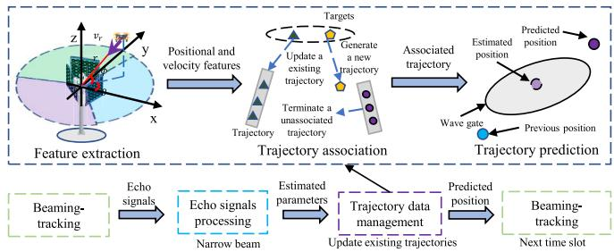  
Fig. 5. The process of tracking the discovered targets.

$$
\tilde { \omega } _ { \phi , k } ^ { i } = - \frac { 2 \tilde { C } _ { k } ^ { i } } { d \cos \tilde { \phi } _ { k } ^ { i } } ,\tag{38}
$$

$$
\tilde { \omega } _ { \theta , k } ^ { i } = \frac { 2 \tilde { B } _ { k } ^ { i } / d - \sin \tilde { \phi } _ { k } ^ { i } \cos \tilde { \theta } _ { k } ^ { i } \tilde { \omega } _ { \phi , k } ^ { i } } { \cos \tilde { \phi } _ { k } ^ { i } \sin \tilde { \theta } _ { k } ^ { i } } ,\tag{39}
$$

$$
\tilde { v } _ { r , k } ^ { i } = \tilde { A } _ { k } ^ { i } + { \frac { d } { 4 } } \left[ ( N _ { H } ^ { \varepsilon } - 1 ) \mathrm { c o s } \tilde { \phi } _ { k } ^ { i } - ( N _ { H } ^ { x } - 1 ) \mathrm { s i n } \tilde { \phi } _ { k } ^ { i } \mathrm { c o s } \tilde { \theta } _ { k } ^ { i } \right]
$$

$$
\times \tilde { \omega } _ { \phi , k } ^ { i } - \frac { d } { 4 } ( N _ { H } ^ { x } - 1 ) \mathrm { c o s } \tilde { \phi } _ { k } ^ { i } \mathrm { s i n } \tilde { \theta } _ { k } ^ { i } \tilde { \omega } _ { \theta , k } ^ { i } .\tag{40}
$$

Based on (30), (33), (34), (38), (39), and (40), we can obtain the (i, k)-th dynamic target’s estimated motion parameters as

$$
\begin{array} { r } { \tilde { { \bf s } } _ { k } ^ { i } = \left[ \tilde { r } _ { k } ^ { i } , \tilde { \theta } _ { k } ^ { i } , \tilde { \phi } _ { k } ^ { i } , \tilde { v } _ { r , k } ^ { i } , \tilde { \omega } _ { \theta , k } ^ { i } , \tilde { \omega } _ { \phi , k } ^ { i } \right] ^ { T } . } \end{array}\tag{41}
$$

Then, by sequentially processing the echo signals received from each array’s targets, we can obtain all K dynamic targets motion parameters.

4) Complexity Analysis: In practical applications, we can adopt FFT to replace DFT, thereby accelerating the computational process [38], [39]. In the distance estimation, the complexity of the FFT, spectral peak search, and phase rotation via (29) are $O ( M l o g M ) , O ( M )$ , and $O ( G M )$ , respectively, where G represents the number of grid points to search $\eta _ { k } ^ { \check { \Gamma } , i }$ within $[ - \pi / M , \pi / M ]$ . Thus, the computational complexity of the PRDFT algorithm is $O ( M l o g M + M + G M )$ . Note that the computational complexity of the conventional subspace algorithms, such as the estimation of signal parameters via rotational invariance techniques (ESPRIT) algorithm, is $O ( M ^ { 3 } )$ [23], which is significantly higher than that of the proposed algorithm.

## IV. DISCOVERED TARGETS TRACKING AND TRAJECTORY DATA MANAGEMENT

Fig. 5 presents the overall process of tracking the discovered targets. The BS first directs the narrow sensing beam at the discovered target through beam-tacking. Next, we process the received echo signals to obtain the estimated motion parameters of the targets through clutter filtering, target detection, and parameter estimation. Subsequently, we manage the trajectory data through feature extraction, trajectory association, and trajectory prediction. Then, we can obtain the predicted positions of the discovered targets, which will guide the beam-tracking in the next time slot.

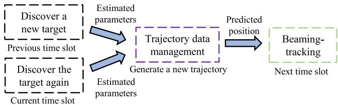  
Fig. 6. The process of transitioning from discovering a new target to tracking it.

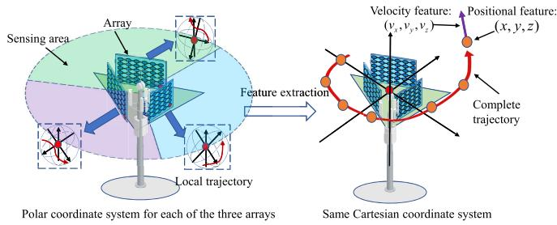  
Fig. 7. The schematic diagram of feature extraction.

Moreover, Fig. 6 illustrates the process of transitioning from discovering a new target to tracking this target. Note that since the newly discovered target in the current time slot has not yet formed a trajectory, we cannot utilize a priori information to predict its next position and track it. Therefore, we need to discover the same new target twice through beam-scanning in two consecutive time slots and manage the trajectory data to generate a corresponding new trajectory. Then, we can predict the target’s next positions and guide the beam-tracking in the next time slot.

## A. Feature Extraction

Consider that the estimated motion parameters of the targets from (41) have their respective polar coordinate systems within each array, we need to transform the motion parameters into a common Cartesian coordinate system and extract the positional and velocity features of the targets, as shown in Fig. 7. Let us represent the common Cartesian coordinate system as $\mathcal { C } ^ { 0 }$ , and represent the i-th array’s Cartesian coordinate system as ${ \mathcal { C } } ^ { i }$ . Then, we represent the observed position of the (i, k)-th dynamic target within ${ \mathcal { C } } ^ { i }$ as $\tilde { \mathbf { p } } _ { k } ^ { i } = [ \tilde { x } _ { k } ^ { i } , \tilde { y } _ { k } ^ { i } , \tilde { z } _ { k } ^ { i } ] ^ { T }$ , which can be calculated as

$$
\tilde { x } _ { k } ^ { i } = \tilde { r } _ { k } ^ { i } \cos { \tilde { \theta } _ { k } ^ { i } } \cos { \tilde { \phi } _ { k } ^ { i } } ,\tag{42a}
$$

$$
\tilde { y } _ { k } ^ { i } = \tilde { r } _ { k } ^ { i } \sin { \tilde { \theta } _ { k } ^ { i } } \cos { \tilde { \phi } _ { k } ^ { i } } ,\tag{42b}
$$

$$
\tilde { z } _ { k } ^ { i } = \tilde { r } _ { k } ^ { i } \sin \tilde { \phi } _ { k } ^ { i } .\tag{42c}
$$

Moreover, we represent the observed velocity of the (i, k)-th dynamic target within ${ \mathcal { C } } ^ { i }$ as $\tilde { \mathbf { v } } _ { k } ^ { i } = [ \tilde { v } _ { x , k } ^ { i } , \tilde { v } _ { y , k } ^ { i } , \tilde { v } _ { z , k } ^ { i } ] ^ { T }$ , which can be calculated by differentiating $\tilde { \mathbf { p } } _ { k } ^ { i }$ as

$$
\begin{array} { r l r } & { } & { \tilde { v } _ { x , k } ^ { i } = \tilde { v } _ { r , k } ^ { i } \cos \tilde { \theta } _ { k } ^ { i } \cos \tilde { \phi } _ { k } ^ { i } - \tilde { r } _ { k } ^ { i } \tilde { \omega } _ { \theta , k } ^ { i } \sin \tilde { \theta } _ { k } ^ { i } \cos \tilde { \phi } _ { k } ^ { i } } \\ & { } & { - \tilde { r } _ { k } ^ { i } \tilde { \omega } _ { \phi , k } ^ { i } \cos \tilde { \theta } _ { k } ^ { i } \sin \tilde { \phi } _ { k } ^ { i } , \quad } \end{array}\tag{43a}
$$

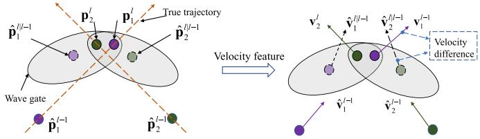  
Fig. 8. The schematic diagram of trajectory association based on the WGVDNN algorithm.

$$
\begin{array} { r l } & { \tilde { v } _ { y , k } ^ { i } = - \tilde { v } _ { r , k } ^ { i } \sin \tilde { \theta } _ { k } ^ { i } \cos \tilde { \phi } _ { k } ^ { i } + \tilde { r } _ { k } ^ { i } \tilde { \omega } _ { \theta , k } ^ { i } \cos \tilde { \theta } _ { k } ^ { i } \cos \tilde { \phi } _ { k } ^ { i } } \\ & { \qquad - \tilde { r } _ { k } ^ { i } \tilde { \omega } _ { \phi , k } ^ { i } \sin \tilde { \theta } _ { k } ^ { i } \sin \tilde { \phi } _ { k } ^ { i } , } \\ & { \tilde { v } _ { z , k } ^ { i } = - \tilde { v } _ { r , k } ^ { i } \sin \tilde { \phi } _ { k } ^ { i } + \tilde { r } _ { k } ^ { i } \tilde { \omega } _ { \phi , k } ^ { i } \cos \tilde { \phi } _ { k } ^ { i } . } \end{array}\tag{43b}
$$

(43c)

Denote the position of the origin of ${ \mathcal { C } } ^ { i }$ within $\mathcal { C } ^ { 0 }$ as $( x _ { 0 } ^ { i } , y _ { 0 } ^ { i } , z _ { 0 } ^ { i } )$ , and denote the angle rotation from the Cartesian coordinate system ${ \mathcal { C } } ^ { i }$ to $\mathcal { C } ^ { 0 }$ around the z-axis as $\gamma ^ { i , 0 }$ . Then, we represent the rotation matrix and the translation vector for transforming the Cartesian coordinate system ${ \mathcal { C } } ^ { i }$ to $\mathcal { C } ^ { 0 }$ as $\mathbf { R } ^ { i , 0 } = \left\lceil \begin{array} { c c c } { \cos ( \xi ^ { i , 0 } ) - \sin ( \xi ^ { i , 0 } ) } & { 0 } \\ { \sin ( \xi ^ { i , 0 } ) } & { \cos ( \xi ^ { i , 0 } ) } & { 0 } \\ { 0 } & { 0 } & { 1 } \end{array} \right\rceil$ and $\mathbf { t } ^ { i , 0 } = \left[ \begin{array} { l } { \Delta x _ { 0 } ^ { i } } \\ { \Delta y _ { 0 } ^ { i } } \\ { \Delta z _ { 0 } ^ { i } } \end{array} \right]$

Let us denote the $k ^ { \prime } .$ -th dynamic target’s position and velocity observed from the BS as $\tilde { { \bf p } } _ { k ^ { \prime } } = \overline { { [ \tilde { x } _ { k ^ { \prime } } , \tilde { y } _ { k ^ { \prime } } , \tilde { z } _ { k ^ { \prime } } ] ^ { T } } }$ and $\tilde { \bf v } _ { k ^ { \prime } } ~ = ~ [ \tilde { v } _ { x , k ^ { \prime } } , \tilde { v } _ { y , k ^ { \prime } } , \tilde { v } _ { z , k ^ { \prime } } ] ^ { T }$ , respectively, $k ^ { \prime } = 1 , 2 , \ldots , K$ Moreover, we set the relationship from the $( i , k )$ -th target to the k0-th target as $k ^ { \prime } = ( i - 1 ) K ^ { i } + k$ . Based on $\mathbf { R } ^ { i , 0 }$ and $\mathbf { t } ^ { i , 0 }$ we can calculate $\tilde { \mathbf { p } } _ { k ^ { \prime } }$ and $\tilde { \mathbf { v } } _ { k ^ { \prime } }$ as

$$
\tilde { \mathbf { p } } _ { k ^ { \prime } } = \mathbf { R } ^ { i , 0 } \tilde { \mathbf { p } } _ { k } ^ { i } + \mathbf { t } ^ { i , 0 } ,
$$

$$
\tilde { \mathbf { v } } _ { k ^ { \prime } } = \mathbf { R } ^ { i , 0 } \tilde { \mathbf { v } } _ { k } ^ { i } .\tag{44}
$$

(45)

## B. Trajectory Association

Note that the targets from (44) and (45) have not yet been matched to their corresponding trajectory. Thus, we propose a position wave gate and velocity differences nearest neighbor algorithm (WGVDNN) to identify the targets with similar positions and velocities relative to the trajectories, facilitating their association with the correct trajectories, as illustrated in Fig. 8.

Assume that there are J existing trajectories during the l-th time slot. Moreover, we define the observed position of the $k ^ { \prime } \mathrm { - t h }$ target at the l-th time slot as $\tilde { \mathbf { p } } _ { k ^ { \prime } } ^ { l } = [ \tilde { x } _ { k ^ { \prime } } ^ { l } , \tilde { y } _ { k ^ { \prime } } ^ { l } , \tilde { z } _ { k ^ { \prime } } ^ { l } ] ^ { T }$ and define the predicted position of the j-th trajectory at the l-th time slot based on the previous time slot as $\hat { \mathbf { p } } _ { j } ^ { \overline { { l } } | l - 1 }$ = $[ \hat { x } _ { j } ^ { l | l - 1 } , \hat { y } _ { j } ^ { l | l - 1 } , \hat { z } _ { j } ^ { l | l - 1 } ] ^ { T } , \ j \ = \ 1 , 2 , \ldots , J .$ . Then, we limit the range between the target and the trajectory by

$$
\left( \tilde { \mathbf { p } } _ { k ^ { \prime } } ^ { l } - \hat { \mathbf { p } } _ { j } ^ { l | l - 1 } \right) ^ { T } \mathbf { S } ^ { - 1 } \left( \tilde { \mathbf { p } } _ { k ^ { \prime } } ^ { l } - \hat { \mathbf { p } } _ { j } ^ { l | l - 1 } \right) \leq \lambda ,\tag{46}
$$

where λ is the position wave gate that follows a $\chi ^ { 2 }$ distribution and $\mathbf { S } \in \mathbb { C } ^ { 3 \times 3 }$ is the error covariance matrix. By traversing each trajectory within (46), we can obtain $J ^ { \prime }$ trajectories that are relevant to the $k ^ { \prime } \mathrm { - t h }$ target.

Consider that when two trajectories intersect or come close to each other, there may be situations where the positions are similar but the velocities differ significantly. Such discrepancies can easily lead to incorrect associations between targets and trajectories if the association relies only on the smallest positional difference within the wave gate. Instead, the proposed algorithm prioritizes the target with the smallest velocity difference within the position wave gate for the correct association. We define the observed velocity of the k0-th target at the l-th time slot as $\tilde { \mathbf { v } } _ { k ^ { \prime } } ^ { l } = [ \tilde { v } _ { x , k ^ { \prime } } ^ { l } , \tilde { v } _ { y , k ^ { \prime } } ^ { l } , \tilde { v } _ { z , k ^ { \prime } } ^ { l } ] ^ { T }$ , and define the predicted velocity of the $j ^ { \prime } { \cdot } \mathrm { t h }$ trajectory at the lth time slot based on the previous time slot as $\hat { \mathbf { v } } _ { j ^ { \prime } } ^ { l | l - 1 } =$ $[ \hat { v } _ { x , j ^ { \prime } } ^ { l | l - 1 } , \hat { v } _ { y , j ^ { \prime } } ^ { l | l - 1 } , \hat { v } _ { z , j ^ { \prime } } ^ { l | l - 1 } ] ^ { T } , j ^ { \prime } = 1 , 2 , . . . , J ^ { \prime } .$ . The trajectory with the smallest velocity difference from the target can be identified by

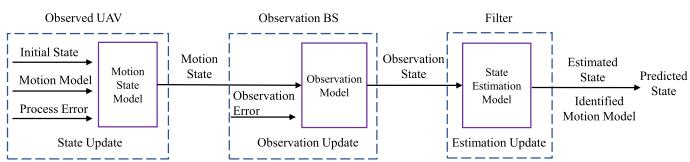  
Fig. 9. The process of trajectory prediction.

$$
j ^ { * } = \arg \operatorname* { m i n } _ { j ^ { \prime } } \| \tilde { \mathbf { v } } _ { k ^ { \prime } } ^ { l } - \hat { \mathbf { v } } _ { j ^ { \prime } } ^ { l | l - 1 } \| .\tag{47}
$$

Then, we associate the k0-th target to the $j ^ { * }$ -th trajectory, referred to as target-to-trajectory association, and update the target’s position and velocity at the current time slot.

Note that some targets cannot be associated with any trajectory through (46) and (47) when the relevant trajectories for the target do not exist. We refer to these targets as remaining targets, and denote the number of them at the l-th time slot as $\mathcal { K } ^ { l }$ . We then check whether the remaining targets from the current time slot can be associated with the remaining targets from the previous time slot to generate a new trajectory. Let us denote the observed position and velocity of the ρ-th remaining target at the l-th time slot as $\mathbf { p } _ { \rho } ^ { l }$ and $\mathbf { v } _ { \rho } ^ { l } ,$ respectively, $\rho = 1 , 2 , . . , \mathcal { K } ^ { l }$ . Moreover, we denote the observed position and velocity of the τ -th remaining target at the $( l \mathrm { ~ - ~ } 1 ) { \ - } \mathtt { t h }$ time slot as $\mathbf { p } _ { \tau } ^ { l - 1 }$ and $\mathbf { v } _ { \tau } ^ { l - 1 }$ , respectively, $\tau = 1 , 2 , . . , \mathcal { K } ^ { l - 1 }$ . By the steps similar to (46) and (47), we identify the target with the smallest velocity difference from the $\rho \mathrm { - }$ th remaining target within the position wave gate. Then, we associate those targets, referred to as target-to-target association, and generate a new trajectory.

In addition, some trajectories may fail to be associated, indicating that the corresponding target does not exist. In this case, we terminate these trajectories without further processing.

## C. Trajectory Prediction

Based on the trajectory association, we can obtain the updated trajectories and the generated trajectories. Then, we further predict the position of these trajectories corresponding to the targets at the next time slot, with the process flow shown in Fig. 9. Since the tracking processes for all targets are similar, we will omit the labels about the targets in the following discussion.

1) UAV Motion State Models: Let us represent the motion state of the target at the l-th time slot as $\begin{array} { r l } { \mathbf { x } ^ { l } } & { { } = } \end{array}$ $[ x ^ { l } , y ^ { l } , z ^ { l } , v _ { x } ^ { l } , v _ { y } ^ { l } , v _ { z } ^ { l } , a _ { x } ^ { l } , a _ { y } ^ { \breve { l } } , a _ { z } ^ { l } ] ^ { \mathrm { T } }$ , where each component corresponds to position, velocity, and acceleration along the Cartesian coordinate axes, respectively. Then, the discrete-time state transition equation of the target can be expressed as

$$
\mathbf { x } ^ { l + 1 } = \mathbf { F } \mathbf { x } ^ { l } + \mathbf { w } ,\tag{48}
$$

where $\mathbf { F } \in \mathbb { R } ^ { 9 \times 9 }$ is the state transition matrix and $\mathbf { w } \in \mathbb { R } ^ { 9 \times 1 }$ is the process noise.

We here employ three 3D motion models to describe the target’s motion of the next time slot, including the constant velocity (CV) motion model, the constant acceleration (CA) motion model, and the coordinated spiral (CS) motion model [40], [41], [42]. The state transition matrix of the CV motion model can be expressed as

$$
\mathbf { F } _ { \mathrm { C V } } = \left[ \begin{array} { l l l } { \mathbf { I } _ { 3 } } & { \mathbf { I } _ { 3 } \Delta T } & { \mathbf { 0 } _ { 3 } } \\ { \mathbf { 0 } _ { 3 } } & { \mathbf { I } _ { 3 } } & { \mathbf { 0 } _ { 3 } } \\ { \mathbf { 0 } _ { 3 } } & { \mathbf { 0 } _ { 3 } } & { \mathbf { 0 } _ { 3 } } \end{array} \right] ,\tag{49}
$$

where $\mathbf { I } _ { 3 }$ denotes a $3 \times 3$ identity matrix, ${ \bf 0 } _ { 3 }$ indicates a $3 \times 3$ zero matrix, and $\Delta T$ represents the tracked time interval. With the proposed sensing cycle, $\Delta T$ equals the duration of one time slot T.

Moreover, the state transition matrix of the CA motion model can be expressed as

$$
\mathbf { F } _ { \mathrm { C A } } = \left[ \begin{array} { c c c } { \mathbf { I } _ { 3 } } & { \mathbf { I } _ { 3 } \Delta T \ \mathbf { I } _ { 3 } \Delta T ^ { 2 } / 2 } \\ { \mathbf { 0 } _ { 3 } } & { \mathbf { I } _ { 3 } } & { \mathbf { I } _ { 3 } \Delta T } \\ { \mathbf { 0 } _ { 3 } } & { \mathbf { 0 } _ { 3 } } & { \mathbf { I } _ { 3 } . } \end{array} \right] .\tag{50}
$$

Additionally, based on the 2D constant turn rate motion model [43], [44], we propose the 3D CS motion model whose state transition matrix can be expressed as

$$
\mathbf { F } _ { \mathrm { C S } } = \left[ \begin{array} { l l l } { \mathbf { I } _ { 3 } } & { \mathbf { A } _ { \omega ^ { \prime } } } & { \mathbf { 0 } _ { 3 } } \\ { \mathbf { 0 } _ { 3 } } & { \mathbf { B } _ { \omega ^ { \prime } } } & { \mathbf { 0 } _ { 3 } } \\ { \mathbf { 0 } _ { 3 } } & { \mathbf { 0 } _ { 3 } } & { \mathbf { 0 } _ { 3 } } \end{array} \right] ,\tag{51}
$$

where $\begin{array} { r l r } { { \bf A } _ { \omega ^ { \prime } } } & { = } & { \left[ \frac { \sin \omega ^ { \prime } \triangle T } { \omega ^ { \prime } } \frac { 1 - \cos \omega ^ { \prime } \triangle T } { \omega ^ { \prime } } \frac { 0 } { 0 } \right] } \\ { \frac { 1 - \cos \omega ^ { \prime } \triangle T } { \omega ^ { \prime } } } & { \frac { \sin \omega ^ { \prime } \triangle T } { \omega ^ { \prime } } \Delta } \\ & { } & { 0 \Delta T } \end{array}$ and $\begin{array} { r l } { \mathbf { B } _ { \omega ^ { \prime } } } & { { } = } \end{array}$ $\begin{array} { r } { \left\lceil \cos ( \omega ^ { \prime } \Delta T ) - \sin ( \omega ^ { \prime } \Delta T ) \ 0 \right\rceil } \\ { \left\lceil \sin ( \omega ^ { \prime } \Delta T ) \cos ( \omega ^ { \prime } \Delta T ) \ 0 \right\rceil } \\ { 0 \qquad 0 \qquad 1 \qquad } \end{array}$ . Moreover, $\omega ^ { \prime }$ denotes the angular velocity in the horizontal direction.

2) BS Observation Model: Since the target’s position and velocity can be observed from (40), we represent the motion state of the target at the l-th time slot as $\begin{array} { r l } { \mathbf { z } ^ { l } } & { { } = } \end{array}$ $[ x ^ { l } , y ^ { l } , z ^ { l } , v _ { x } ^ { l } , v _ { y } ^ { l } , v _ { z } ^ { l } ] ^ { \mathrm { T } }$ and the observation matrix as

$$
\mathbf { H } = \left[ \mathbf { I } _ { 3 } \ { \mathbf { 0 } } _ { 3 } \ { \mathbf { 0 } } _ { 3 } \right] \in \mathbb { R } ^ { 6 \times 9 } .\tag{52}
$$

Then, the state observation equation of the BS can be represented as

$$
\mathbf { z } ^ { l } = \mathbf { H } \mathbf { x } ^ { l } + \mathbf { v } ,\tag{53}
$$

where $\mathbf { v } \in \mathbb { R } ^ { 6 \times 1 }$ denotes the observation noise.

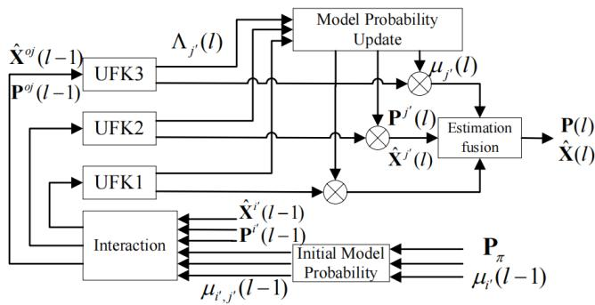  
Fig. 10. The schematic diagram of IMMUKF algorithm.

3) Filter State Estimation Model: Due to the uncertainty of the target’s motion model, we employ an interacting multiple models algorithm based on the unscented Kalman filter (IMMUKF) to identify the target’s motion model and estimate the target’s motion state [43], as shown in Fig. 10.

Assume that the number of the motion models is $N _ { \mathrm { m } }$ . Let us initialize the target’s estimated state and covariance under the b-th motion model at the (l − 1)-th time slot as

$$
\begin{array} { r l } & { \hat { \mathbf { x } } _ { 0 b } ^ { l - 1 } = \displaystyle \sum _ { g = 1 } ^ { N _ { \mathrm { m } } } \mu _ { g , b } ^ { l - 1 } \hat { \mathbf { x } } _ { g } ^ { l - 1 } , } \\ & { \mathbf { P } _ { 0 b } ^ { l - 1 } = \displaystyle \sum _ { g = 1 } ^ { N _ { \mathrm { m } } } \mu _ { g , b } ^ { l - 1 } \left[ \mathbf { P } _ { g } ^ { l - 1 } + \left( \hat { \mathbf { x } } _ { g } ^ { l - 1 } - \hat { \mathbf { x } } _ { 0 b } ^ { l - 1 } \right) \left( \hat { \mathbf { x } } _ { g } ^ { l - 1 } - \hat { \mathbf { x } } _ { 0 b } ^ { l - 1 } \right) ^ { T } \right] , } \end{array}\tag{54}
$$

(55)

where $\hat { \mathbf { x } } _ { g } ^ { l - 1 }$ and $\hat { \mathbf { P } } _ { g } ^ { l - 1 }$ are the target’s estimated state and the covariance under the $g \cdot$ -th motion model, respectively, $g , b = 1 , 2 , \ldots , N _ { \mathrm { m } }$ . Moreover, $\begin{array} { r } { \mu _ { g , b } ^ { l - 1 } \ = \ \frac { \mathbf { P } _ { \pi } [ g , b ] \mathbf { \bar { w } } ^ { l - 1 } [ g ] } { \sum _ { a = 1 } ^ { N _ { \mathrm { m } } } \mathbf { P } _ { \pi } [ g , b ] \mathbf { w } ^ { l - 1 } [ g ] } } \end{array}$ is the interaction probability from the g-th motion model to the b-th motion model, where $\mathbf { w } ^ { l - 1 } [ g ]$ is the $g \mathrm { - t h }$ element of the model probability vector $\mathbf { w } ^ { l - 1 } \in \mathbb { R } ^ { N _ { \mathrm { m } } \times 1 }$ , representing the probability that the $g _ { \overline { { } } }$ -th motion model is the true motion model of the target. Additionally, $\mathbf { P } _ { \pi } [ g , b ]$ is the $( g , b )$ -th element of the motion model transition probability matrix $\dot { \mathbf { P } } _ { \pi } \in \mathbb { R } ^ { N _ { \mathrm { m } } \times N _ { \mathrm { m } } }$ representing the transition probability from the g-th motion model to the b-th motion model.

Then, we take $\hat { \mathbf { x } } _ { 0 b _ { . } } ^ { l - 1 } , \mathbf { P } _ { 0 b } ^ { l - 1 }$ , and the target’s observed state at the l-th time slot $\mathbf { z } ^ { l }$ as inputs, and employ the UKF filter to obtain the target’s estimated state $\hat { \mathbf { x } } _ { b } ^ { l } .$ , the covariance $\mathbf { P } _ { b } ^ { l } ,$ and the likelihood probability $\Lambda _ { b } ^ { l }$ under the b-th motion model at the l-th time slot. The specific steps are available in [43].

Based on $\mathbf { P } _ { \pi } , \mathbf { w } ^ { l - 1 }$ , and $\Lambda _ { b } ^ { l } .$ , we further update the model probability vector at the l-th time slot as $\mathbf { w } ^ { l }$ whose b-th element can be expressed as

$$
\mathbf { w } ^ { l } [ b ] = \frac { \Lambda _ { b } ^ { l } \sum _ { g = 1 } ^ { N _ { \mathrm { m } } } \mathbf { P } _ { \pi } [ g , b ] \mathbf { w } ^ { l - 1 } [ g ] } { \sum _ { b = 1 } ^ { N _ { \mathrm { m } } } \Lambda _ { b } ^ { l } \sum _ { g = 1 } ^ { N _ { \mathrm { m } } } \mathbf { P } _ { \pi } [ g , b ] \mathbf { w } ^ { l - 1 } [ g ] } .\tag{56}
$$

Moreover, the motion model’s label of the target can be identified as

$$
b ^ { * } = \arg \operatorname* { m a x } _ { b } \left| \mathbf { w } ^ { l } [ b ] \right| .\tag{57}
$$

We then obtain the fused state $\hat { \mathbf { x } } ^ { l }$ and the covariance $\mathbf { P } ^ { l }$ at the l-th time slot as

$$
\begin{array} { r l } & { \hat { \mathbf { x } } ^ { l } = \displaystyle \sum _ { b = 1 } ^ { N _ { \mathrm { m } } } \mathbf { w } ^ { l } [ b ] \hat { \mathbf { x } } _ { b } ^ { l } , } \\ & { \mathbf { P } ^ { l } = \displaystyle \sum _ { b = 1 } ^ { N _ { \mathrm { m } } } \mathbf { w } ^ { l } [ b ] \left[ \mathbf { P } _ { b } ^ { l } + \left( \hat { \mathbf { x } } _ { b } ^ { l } - \hat { \mathbf { x } } ^ { l } \right) \left( \hat { \mathbf { x } } _ { b } ^ { l } - \hat { \mathbf { x } } ^ { l } \right) ^ { T } \right] . } \end{array}\tag{58}
$$

(59)

Denote the predicted state of the target at the $( l + 1 ) \cdot$ th time slot based on the l-th time slot as $\hat { \textbf { x } } ^ { l + 1 | l } =$ $[ \hat { x } ^ { l + 1 | l } , \hat { y } ^ { l + 1 | l } , \hat { z } ^ { l + 1 | l } , \hat { v } _ { x } ^ { l + 1 | l } , \hat { v } _ { y } ^ { l + 1 | l } , \hat { v } _ { z } ^ { l + 1 | l } , \hat { a } _ { x } ^ { l + 1 | l } , \hat { a } _ { y } ^ { l + 1 | l } , \hat { a } _ { z } ^ { l + 1 | l } ] ^ { T } ,$ which can be calculated by $\hat { \mathbf { x } } ^ { l + 1 | l } = \mathbf { F } _ { b ^ { * } } \hat { \mathbf { x } } ^ { l } + \mathbf { \bar { w } }$ , where $\mathbf { F } _ { b ^ { * } }$ is the $ b ^ { * } { \mathrm { - t h } }$ motion model’s state transition matrix. Note that the target’s predicted state $\hat { \mathbf { x } } ^ { l + 1 | l }$ contains the predicted position $\hat { \mathbf { p } } ^ { l + 1 | l } \stackrel { \cdot } { = } \lceil \hat { x } ^ { l + 1 | l } , \hat { y } ^ { l + 1 | l } , \hat { z } ^ { l + 1 | l } \rceil ^ { T }$ and the predicted velocity $\hat { \dot { \mathbf { v } } } ^ { l + 1 | l } = [ \hat { v } _ { x } ^ { l + 1 | l } , \hat { v } _ { y } ^ { l + 1 | l } , \hat { v } _ { z } ^ { l + 1 | l } ] ^ { T }$ , which will be used for trajectory association at the next time slot. Moreover, based on the target’s predicted position $\hat { \mathbf { p } } ^ { l + 1 | l }$ , we can guide the beam-tracking in the next time slot.

## V. SIMULATION RESULTS

In the simulation, we set the minimum carrier frequency as $f _ { 0 } = 3 0 ~ \mathrm { G H z }$ , the subcarrier frequency interval as $\Delta f = 2 4 0$ kHz, the antenna spacing as $\begin{array} { r } { d = \frac { \bar { \lambda } } { 2 } } \end{array}$ , the number of subcarriers as $M = 2 5 6$ , the number of OFDM symbols as $N = 6 4$ , the number of antennas in HU-UPA as $N _ { H } ^ { x } = 6 4$ and $N _ { H } ^ { z } = 6 4$ , and the number of antennas in $\mathrm { R U - U P A }$ as $N _ { R } ^ { x } = 1 2 8$ and $N _ { R } ^ { z } = 1 2 8$

## A. Performance of Parameter Estimation

Denote the root mean square error (RMSE) of the motion parameters as $\begin{array} { r } { \mathrm { R M S E } _ { \tilde { \mathbf { s } } } = \sqrt { \frac { \sum _ { i ^ { \prime } = 1 } ^ { N _ { \mathrm { m c } } } ( \tilde { \mathbf { s } } _ { i } - \mathbf { s } ) ^ { 2 } } { N _ { \mathrm { m c } } } } } \end{array}$ , where $N _ { \mathrm { m c } }$ is the number of the Monte Carlo runs, $\mathbf { s } ~ = ~ [ r , \theta , \phi , v _ { r } , \omega _ { \theta } , \omega _ { \phi } ] ^ { T }$ is the true motion parameters of the target, and $\begin{array} { r l } { \tilde { \bf s } _ { i ^ { \prime } } } & { { } = } \end{array}$ $[ \tilde { r } _ { i ^ { \prime } } , \tilde { \theta } _ { i ^ { \prime } } , \tilde { \phi } _ { i ^ { \prime } } , \tilde { v } _ { r , i ^ { \prime } } , \tilde { \omega } _ { \theta , i ^ { \prime } } , \tilde { \omega } _ { \phi , i ^ { \prime } } ] ^ { T }$ is the estimated motion parameters of the target in the i0-th Monte Carlo run. We take the estimation of the target with motion parameters $( r = 2 4 0 ~ m$ $\theta = 1 0 0 ^ { \circ } , \phi = 1 0 ^ { \circ } , v _ { r } = 6 m / s , \omega _ { \theta } = 8 ^ { \circ } / s , \omega _ { \phi } = 8 ^ { \circ } / s )$ as an example, and investigate the performance of different algorithms on parameter estimation. Fig. 11 illustrates the RMSE of the motion parameters estimated by the DFT algorithm, the PRDFT algorithm, and the ESPRIT algorithm under different signal-to-noise ratio (SNR) conditions. The SNR is defined as $\begin{array} { r } { \mathrm { S N R } \ : = \ : 1 0 \ : \cdot \ : \log _ { 1 0 } \left( \frac { P _ { \mathrm { s i g n a l } } } { P _ { \mathrm { n o i s e } } } \right) } \end{array}$ , where $P _ { \mathrm { s i g n a l } }$ is the power of the signal and $P _ { \mathrm { n o i s e } }$ is the power of the noise. It can be seen that the accuracy of the DFT algorithm is less affected by SNR variation due to its resolution limitations. In contrast, the PRDFT algorithm continuously searches for a better solution through phase rotation, which gradually enhances its accuracy with the increase of the SNR. Moreover, the accuracy of the PRDFT algorithm is similar to that of the ESPRIT algorithm, and both algorithms are orders of magnitude more accurate than the DFT algorithm. However, the lower complexity of the PRDFT algorithm makes it more advantageous for UAV trajectory monitoring.

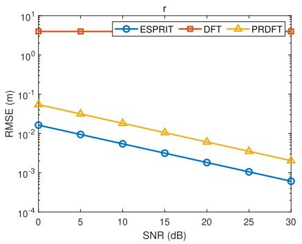  
(a)

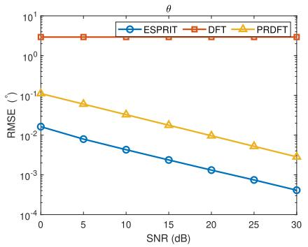  
(b)

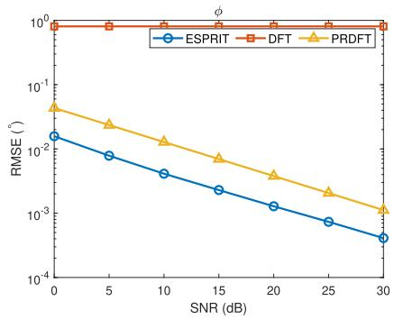  
(c)

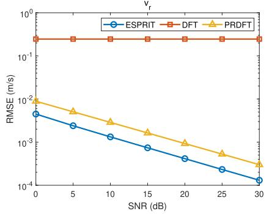  
(d)

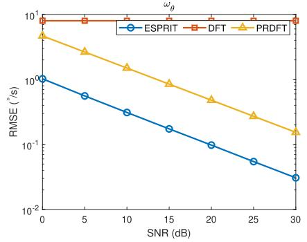  
(e)

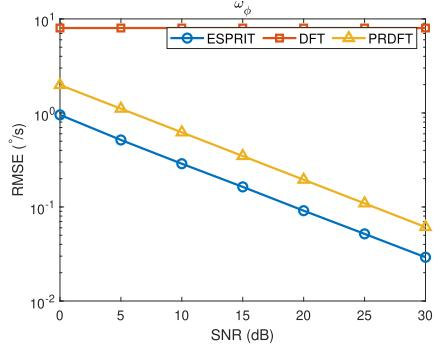  
(f)  
Fig. 11. (a) The RMSE of the distance estimation; (b) The RMSE of the horizontal angle estimation; (c) The RMSE of the pitch angle estimation; (d) The RMSE of the radial velocity estimation; (e) The RMSE of the horizontal angular velocity; (f) The RMSE of the pitch angular velocity estimation.

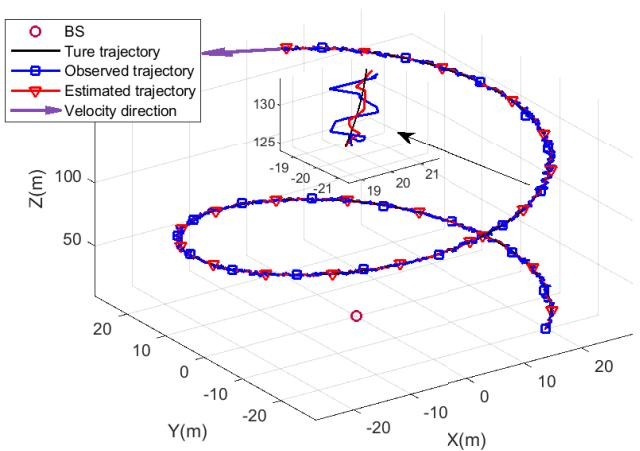  
Fig. 12. The performance of the trajectory monitoring in the cross-array scenario.

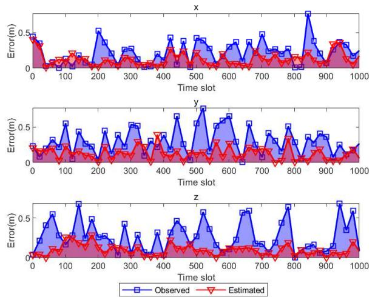  
Fig. 13. The error of the observed position and the estimated position with respect to the true position.

## B. Performance of Single-Target Cross-Array for Trajectory Monitoring

We set a dynamic target moving according to the CS motion model whose horizontal angular velocity is $\omega ^ { \prime } = \textstyle { \frac { \pi } { 6 } }$ rad/s, with an initial state $\mathbf { x } ^ { 0 } = [ 2 0 , - 2 0 , 1 0 , 1 0 , \dot { 1 0 } , 1 0 , 0 , 0 , 0 , 0 ] ^ { \mathrm { T } }$ , over a duration of 1000 time slots.

Fig. 12 illustrates the true trajectory of the target, the observed trajectory by the BS, and the estimated trajectory by the IMMUKF filter in the cross-array scenario. It can be seen that although the target moves within the sensing area of different arrays, we can still monitor the complete trajectory of the target. The reason is that we spatially align the motion parameters from each array to the same Cartesian coordinate system, which in turn preserves the complete trajectory information for subsequent trajectory association, trajectory prediction, and beam-tracking. Fig. 13 shows the error of the observed position and the estimated position concerning the true position of the target at each time slot. Fig. 14 shows the error of the observed velocity and the estimated velocity with respect to the true velocity of the target at each time slot. The RMSE of the observed position and velocity in the direction of the three axes over the whole process are 0.2966 m, 0.3123 m, 0.2967 m, 0.1172 m/s, 0.1159 m/s, and 0.1172 m/s, respectively. Moreover, the RMSE of the estimated position and velocity in the direction of the three axes over the whole process are 0.0968 m, 0.1022 m, 0.0839 m, 0.0464 m/s, 0.0509 m/s, and 0.0332 m/s, respectively. It can be seen that the estimated position and velocity have better accuracy than the observed ones, ensuring the reliability of the predicted position required for subsequent beam-tracking.

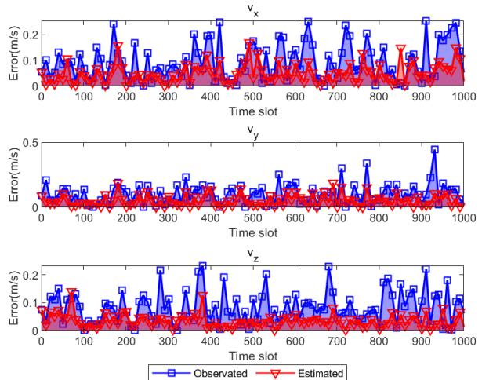  
Fig. 14. The error of the observed velocity and the estimated velocity with respect to the true velocity.

## C. Performance of Multi-Motion Model for Trajectory Monitoring

We set a target with an initial state vector as $\begin{array} { r l } { \mathbf { x } ^ { 0 } } & { { } = } \end{array}$ $[ 1 0 , 1 0 , 1 0 , 1 0 , \bar { 1 0 , } 1 0 , 1 , 1 , 1 ] ^ { T }$ , which will switch sequentially between three different motion modes: the CA model, the CS model, and the CV model. Moreover, the duration of each motion model is 333 time slots, the motion model transition probability matrix is $\begin{array} { r l r } { { \bf P } _ { \pi } } & { = } & { \left\lceil \begin{array} { l } { 0 . 8 \mathrm { ~ 0 . 1 ~ 0 . 1 } } \\ { 0 . 1 \mathrm { ~ 0 . 8 ~ 0 . 1 } } \\ { 0 . 1 \mathrm { ~ 0 . 1 ~ 0 . 8 } } \end{array} \right\rceil } \end{array}$ , the initial motion model probability is $\mathbf { w } ^ { 0 } \overset {  } { = } [ 1 / 3 , 1 / 3 , \overset {  } { 1 } / 3 ] ^ { T }$ the covariance matrix of the process noise w is ${ \textbf { Q } } =$ $\left[ \begin{array} { l l l } { 0 . 1 \mathbf { I } _ { 3 } } & { \mathbf { 0 } _ { 3 } } & { \mathbf { 0 } _ { 3 } } \\ { \mathbf { 0 } _ { 3 } } & { 0 . 0 1 \mathbf { I } _ { 3 } } & { \mathbf { 0 } _ { 3 } } \\ { \mathbf { 0 } _ { 3 } } & { \mathbf { 0 } _ { 3 } } & { 0 . 0 0 1 \mathbf { I } _ { 3 } } \end{array} \right]$ , and the covariance matrix of the observation noise v is $\begin{array} { r } { \mathbf { \dot { R } } = \left\lceil \mathbf { 0 . 1 I _ { 3 } } \ \mathbf { 0 _ { 3 } } \right\rceil } \\ { \mathbf { 0 . } \qquad \ 0 . 0 1 \mathbf { I _ { 3 } } } \end{array}$

Fig. 15 illustrates the true trajectory of the target, the observed trajectory by the BS, the estimated trajectory by the UKF filter, and the estimated trajectory by the IMMUKF filter in the multi-motion model scenario. Fig. 16 shows the identification probability of the target’s motion model. Due to the presence of noise, the model identification probability fluctuates continuously and there is a delay during the switching process. Moreover, the similarities between the CV and CA motion models lead to similar fluctuations in their identification probabilities. However, based on the highest model probability, we can accurately identify the target’s motion model, thereby maintaining continuous and accurate trajectory monitoring.

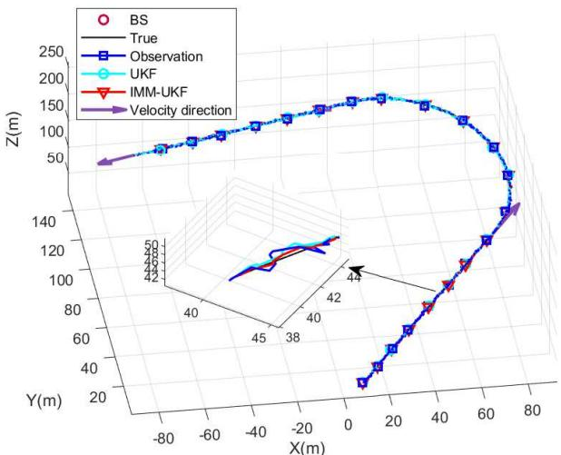  
Fig. 15. The performance of trajectory monitoring in the multi-motion model scenario.

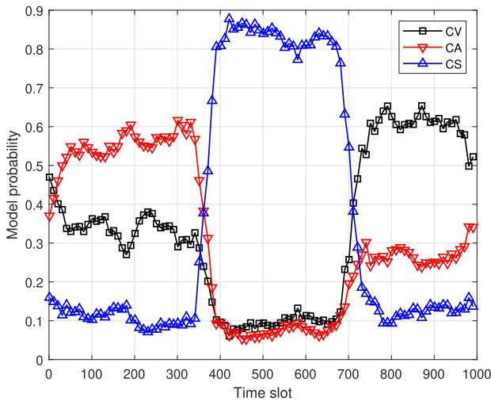  
Fig. 16. The performance of motion model identification.

## D. Performance of Intersected Trajectories Association

We set six targets, with specific parameters listed in Table I’s target $1 \sim 6 ,$ to form three sets of crossed trajectories during their movement.

Fig. 17 and Fig. 18 show the association results of the traditional nearest neighbor association algorithm based on wave gate (WGNN) and the proposed WGVDNN algorithm across three sets of crossed trajectories. It can be seen that when two trajectories intersect, interference from other targets close to the trajectory’s position occurs. In this case, the WGNN algorithm, which relies solely on positional information, incorrectly associates the trajectories. In contrast, the

TABLE I  
TARGET PARAMETERS
<table><tr><td>Target</td><td>Start Time Slot</td><td>Time Slot</td><td>Model</td><td>Motion Motion Flight At- titude</td><td>Initial Motion State</td></tr><tr><td>1</td><td>0</td><td>1000</td><td>CV</td><td></td><td> $[ - 1 0 , 2 0 , 4 0 , 0 , 0 , - 1 0 , 0 , 0 , 0 ] ^ { T }$ </td></tr><tr><td>2</td><td>0</td><td>1000</td><td>CV</td><td></td><td> $\{ 0 , 2 0 , 3 0 , - 1 0 , 0 , 0 , 0 , 0 , 0 \} ^ { T }$ </td></tr><tr><td>3</td><td>0</td><td>1000</td><td>CA</td><td></td><td> $\bar { [ - 1 0 , 1 0 , 2 0 , 1 0 , 0 , 0 , 0 , 0 , 0 ] ^ { T } }$ </td></tr><tr><td>4</td><td>0</td><td>1000</td><td>CA</td><td></td><td>[10, −10, 20, 0, 10, 0, 0, 0, 0]T</td></tr><tr><td>5</td><td>0</td><td>1000</td><td>CS</td><td></td><td>[20, 20, 30, 10, 10, 10, 0, 0, 0]T</td></tr><tr><td>6</td><td>0</td><td>1000</td><td>CS</td><td></td><td>[0, 40, 30, 10, 10, 10, 0, 0, 0]T</td></tr><tr><td>7</td><td>0</td><td>1000</td><td>CV</td><td>VUA</td><td>[10, 10, 10, 0, 0, 0, 0, 0, 0]T</td></tr><tr><td>8</td><td>50</td><td>1000</td><td>CV</td><td>HUA</td><td>[20, 20, 20, 10, 10, 0, 0, 0, 0]T</td></tr><tr><td>9</td><td>100</td><td>1000</td><td>CV</td><td>OFUA</td><td>[30, 30, 30, 10, 10, 10, 0, 0, 0]T</td></tr><tr><td>10</td><td>150</td><td>1000</td><td>CA</td><td>VUA</td><td>[−10, −10, 10, 0, 0, 0, 0, 0, 10]T</td></tr><tr><td>11</td><td>200</td><td>1000</td><td>CA</td><td>HUAA</td><td>[−20, −20, 20, 10, 10, 0, 0.1, 0.1, 0]7</td></tr><tr><td>12</td><td>250</td><td>1000</td><td>CA</td><td>OFUAA</td><td> $\bar { [ - 3 0 , - 3 0 , 3 0 , 0 , 0 , 0 , 0 . 1 , 0 . 1 , 0 . 1 ] ^ { T } }$ </td></tr><tr><td>13</td><td>300</td><td>1000</td><td>CS</td><td>HUT</td><td>[−20, 20, 20, 10, 10, 0, 0, 0, 0]T</td></tr><tr><td>14</td><td>350</td><td>1000</td><td>CS</td><td>SUA</td><td> $[ 3 0 , - 3 0 , 3 0 , 1 0 , 1 0 , 1 0 , 0 , 0 , 0 ] ^ { T }$ </td></tr></table>

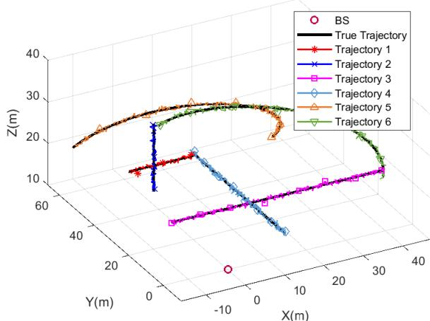  
Fig. 17. The performance of the WGNN algorithm.

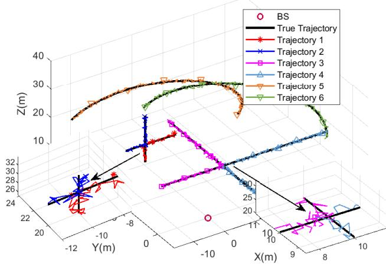  
Fig. 18. The performance of the WVDGNN algorithm.

WGVDNN algorithm, which is based on the smallest velocity difference, correctly associates all three sets of trajectories.

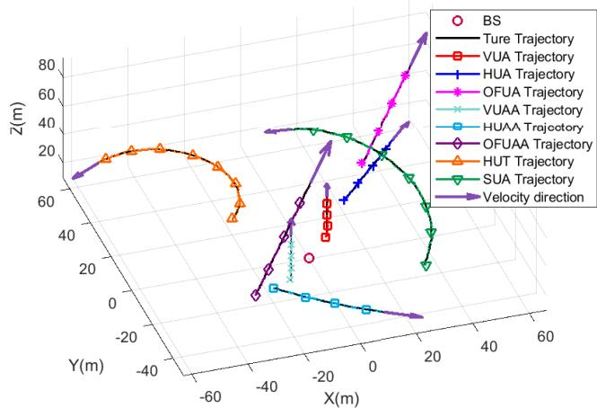  
Fig. 19. The performance of the trajectory monitoring in the multi-target multi-flight attitude scenario.

## E. Performance of Multi-Target Multi-Flight Attitude for Trajectory Monitoring

We set the motion process of the eight targets with eight typical flight attitudes of UAVs, including vertical uniform ascent (VUA), horizontal uniform advance (HUA), oblique flight uniform ascent (OFUA), vertical uniform acceleration ascent (VUAA), horizontal uniform acceleration advance (HUAA), oblique flight uniform acceleration ascent (OFUAA), horizontal uniform turn (HUT), and spiral uniform ascent (SUA). The detailed parameters are shown in target 8 ∼ 14 of Table I.

Fig. 19 shows the performance of trajectory monitoring for multiple targets under different flight attitudes. It can be seen that although the targets have different flight attitudes and start time slots, the BS can continue to track the discovered targets while discovering new targets under the proposed framework, and generate complete trajectories for all of these targets.

## VI. CONCLUSION

In this paper, we propose a novel framework for UAV trajectory monitoring. Specifically, we search for new targets in real-time through beam-scanning while continuously directing the sensing beam at the discovered targets through beamtracking, thereby obtaining echo signals from all dynamic targets. Then, we filter out the static environmental clutter and detect the presence of new targets. Next, we use the proposed PRDFT algorithm to estimate the 6D motion parameters of dynamic targets. We then extract the positional and velocity features of the targets and adopt the proposed WGVDNN algorithm to associate the targets with their corresponding trajectories. We subsequently apply the IMMUKF algorithm to identify the motion model of the targets and predict their positions, thereby guiding the next beam-tracking for the discovered targets. Simulation results demonstrate that the proposed framework can effectively monitor the complete trajectories of all targets. Moreover, the proposed framework demonstrates distinct advantages under high-dynamic conditions where its real-time beam-scanning and beam-tracking mechanism maintains sensing continuity, while simultaneously preserving robustness in static scenarios through clutter suppression. Furthermore, the framework is inherently extendable to multi-BS cooperative networks, which expands coverage and enhances trajectory monitoring accuracy for large-scale deployments.

## REFERENCES

[1] Y. Jiang et al., “6G non-terrestrial networks enabled low-altitude economy: Opportunities and challenges,” 2023, arXiv:2311.09047.

[2] B. Zheng and F. Liu, “Random signal design for joint communication and SAR imaging towards low-altitude economy,” IEEE Wireless Commun. Lett., vol. 13, no. 10, pp. 2662–2666, Oct. 2024.

[3] G. Cheng, X. Song, Z. Lyu, and J. Xu, “Networked ISAC for lowaltitude economy: Transmit beamforming and UAV trajectory design,” 2024, arXiv:2405.07568.

[4] L. Li, W. Chen, Z. Chen, T. Hu, W. Mei, and B. Ning, “Enhancing terahertz communications coverage with ISAC-assisted beam management,” IEEE Wireless Commun., vol. 31, no. 1, pp. 34–40, Feb. 2024.

[5] H. Luo, F. Gao, H. Lin, S. Ma, and H. V. Poor, “YOLO: An efficient terahertz band integrated sensing and communications scheme with beam squint,” IEEE Trans. Wireless Commun., vol. 23, no. 8, pp. 9389–9403, Aug. 2024.

[6] J. Zhao, F. Gao, W. Jia, W. Yuan, and W. Jin, “Integrated sensing and communications for UAV communications with jittering effect,” IEEE Wireless Commun. Lett., vol. 12, no. 4, pp. 758–762, Apr. 2023.

[7] M. Giordani and M. Zorzi, “Non-terrestrial networks in the 6G era: Challenges and opportunities,” IEEE Netw., vol. 35, no. 2, pp. 244–251, Mar. 2021.

[8] Z. Zhang, Y. Zhang, J. Zhang, and F. Gao, “Adversarial trainingaided time-varying channel prediction for TDD/FDD systems,” China Commun., vol. 20, no. 6, pp. 100–115, Jun. 2023.

[9] K. Zhang, Z. Li, W. Yuan, Y. Cai, and F. Gao, “Radar sensing via OTFS signaling,” China Commun., vol. 20, no. 9, pp. 34–45, Sep. 2023.

[10] K. Meng et al., “UAV-enabled integrated sensing and communication: Opportunities and challenges,” IEEE Wireless Commun., vol. 31, no. 2, pp. 97–104, Apr. 2023.

[11] S. Lu et al., “Integrated sensing and communications: Recent advances and ten open challenges,” IEEE Internet Things J., vol. 11, no. 11, pp. 19094–19120, Jun. 2024.

[12] F. Liu et al., “Integrated sensing and communications: Toward dualfunctional wireless networks for 6G and beyond,” IEEE J. Sel. Areas Commun., vol. 40, no. 6, pp. 1728–1767, Jun. 2022.

[13] K. Meng, Q. Wu, S. Ma, W. Chen, and T. Q. S. Quek, “UAV trajectory and beamforming optimization for integrated periodic sensing and communication,” IEEE Wireless Commun. Lett., vol. 11, no. 6, pp. 1211–1215, Jun. 2022.

[14] Z. Zhang, W. Chen, Q. Wu, Z. Li, X. Zhu, and J. Yuan, “Intelligent omni surfaces assisted integrated multi-target sensing and multiuser MIMO communications,” IEEE Trans. Commun., vol. 72, no. 8, pp. 4591–4606, Aug. 2024.

[15] B. Lin, C. Zhao, F. Gao, G. Y. Li, J. Qian, and H. Wang, “Environment reconstruction based on multi-user selection and multimodal fusion in ISAC,” IEEE Trans. Wireless Commun., vol. 23, no. 10, pp. 15083–15095, Jul. 2024.

[16] Y. Zhang, J. Wang, Q. Li, J. Chen, H. Feng, and S. He, “Joint communication, sensing, and computing in space-air-ground integrated networks: System architecture and handover procedure,” IEEE Veh. Technol. Mag., vol. 19, no. 2, pp. 70–78, Jun. 2024.

[17] Y. Jiang, F. Gao, and S. Jin, “Electromagnetic property sensing: A new paradigm of integrated sensing and communication,” IEEE Trans. Wireless Commun., vol. 23, no. 10, pp. 13471–13483, Oct. 2024.

[18] C. Chaccour, M. N. Soorki, W. Saad, M. Bennis, P. Popovski, and M. Debbah, “Seven defining features of terahertz (THz) wireless systems: A fellowship of communication and sensing,” IEEE Commun. Surveys Tuts., vol. 24, no. 2, pp. 967–993, 2nd Quart., 2022.

[19] Z. Wei, F. Liu, C. Masouros, N. Su, and A. P. Petropulu, “Toward multifunctional 6G wireless networks: Integrating sensing, communication, and security,” IEEE Commun. Mag., vol. 60, no. 4, pp. 65–71, Apr. 2022.

[20] H. Luo et al., “Integrated sensing and communications in clutter environment,” IEEE Trans. Wireless Commun., vol. 23, no. 9, pp. 10941–10956, Sep. 2024.

[21] S. Sun and Y. D. Zhang, “4D automotive radar sensing for autonomous vehicles: A sparsity-oriented approach,” IEEE J. Sel. Topics Signal Process., vol. 15, no. 4, pp. 879–891, Jun. 2021.

[22] Y. Li, X. Wang, and Z. Ding, “Multi-target position and velocity estimation using OFDM communication signals,” IEEE Trans. Commun., vol. 68, no. 2, pp. 1160–1174, Feb. 2020.

[23] H. Luo, F. Gao, F. Liu, and S. Jin, “6D radar sensing and tracking in monostatic integrated sensing and communications system,” 2023, arXiv:2312.16441.

[24] Z. Liu, X. Liu, Y. Liu, V. C. M. Leung, and T. S. Durrani, “UAV assisted integrated sensing and communications for Internet of Things: 3D trajectory optimization and resource allocation,” IEEE Trans. Wireless Commun., vol. 23, no. 8, pp. 8654–8667, Aug. 2024.

[25] Y. Pan et al., “Cooperative trajectory planning and resource allocation for UAV-enabled integrated sensing and communication systems,” IEEE Trans. Veh. Technol., vol. 73, no. 5, pp. 6502–6516, May 2024.

[26] X. Jing, F. Liu, C. Masouros, and Y. Zeng, “ISAC from the sky: UAV trajectory design for joint communication and target localization,” IEEE Trans. Wireless Commun., vol. 23, no. 10, pp. 12857–12872, Oct. 2024.

[27] J. Wu, W. Yuan, and L. Hanzo, “When UAVs meet ISAC: Realtime trajectory design for secure communications,” IEEE Trans. Veh. Technol., vol. 72, no. 12, pp. 16766–16771, Jun. 2023.

[28] F. Liu, W. Yuan, C. Masouros, and J. Yuan, “Radar-assisted predictive beamforming for vehicular links: Communication served by sensing,” IEEE Trans. Wireless Commun., vol. 19, no. 11, pp. 7704–7719, Nov. 2020.

[29] Z. Du et al., “Integrated sensing and communications for V2I networks: Dynamic predictive beamforming for extended vehicle targets,” IEEE Trans. Wireless Commun., vol. 22, no. 6, pp. 3612–3627, Jun. 2022.

[30] Y. Cui et al., “Seeing is not always believing: ISAC-assisted predictive beam tracking in multipath channels,” IEEE Wireless Commun. Lett., vol. 13, no. 1, pp. 14–18, Jan. 2024.

[31] X. Meng, F. Liu, C. Masouros, W. Yuan, Q. Zhang, and Z. Feng, “Vehicular connectivity on complex trajectories: Roadway-geometry aware ISAC beam-tracking,” IEEE Trans. Wireless Commun., vol. 22, no. 11, pp. 7408–7423, Nov. 2023.

[32] R. Liu et al., “Integrated sensing and communication based outdoor multi-target detection, tracking, and localization in practical 5G networks,” Intell. Converged Netw., vol. 4, no. 3, pp. 261–272, Sep. 2023.

[33] D. Galappaththige, S. Zargari, C. Tellambura, and G. Y. Li, “Nearfield ISAC: Beamforming for multi-target detection,” IEEE Wireless Commun. Lett., vol. 13, no. 7, pp. 1938–1942, Jul. 2024.

[34] H. Luo et al., “Integrated sensing and communications framework for 6G networks,” 2024, arXiv:2405.19925.

[35] Z. Ye, C. Yu, H. Zhu, Y. He, M. Gao, and G. Yu, “ISACassisted collision avoidance mechanism for vehicle-to-infrastructure systems,” IEEE Trans. Intell. Vehicles, vol. 9, no. 10, pp. 6242–6257, Oct. 2024.

[36] B. Guo, D. Vu, L. Xu, M. Xue, and J. Li, “Ground moving target indication via multichannel airborne SAR,” IEEE Trans. Geosci. Remote Sens., vol. 49, no. 10, pp. 3753–3764, Oct. 2011.

[37] C. Kuang, C. Wang, B. Wen, Y. Hou, and Y. Lai, “An improved CA-CFAR method for ship target detection in strong clutter using UHF radar,” IEEE Signal Process. Lett., vol. 27, pp. 1445–1449, 2020.

[38] R. Cao, B. Liu, F. Gao, and X. Zhang, “A low-complex one-snapshot DOA estimation algorithm with massive ULA,” IEEE Commun. Lett., vol. 21, no. 5, pp. 1071–1074, May 2017.

[39] Y. Wu, C. Han, and Z. Chen, “DFT-spread orthogonal time frequency space system with superimposed pilots for terahertz integrated sensing and communication,” IEEE Trans. Wireless Commun., vol. 22, no. 11, pp. 7361–7376, Nov. 2023.

[40] C. Sun, J. Leng, and B. Lu, “Interactive left-turning of autonomous vehicles at uncontrolled intersections,” IEEE Trans. Autom. Sci. Eng., vol. 21, no. 1, pp. 204–214, Jan. 2024.

[41] Z.-G. Liu, Z.-K. Wang, Y.-B. Yang, and Y. Lu, “A data-driven maneuvering target tracking method aided with partial models,” IEEE Trans. Veh. Technol., vol. 73, no. 1, pp. 414–425, Jan. 2024.

[42] Z. Sun, X. Li, G. Cui, W. Yi, and L. Kong, “A fast approach for detection and parameter estimation of maneuvering target with complex motions in coherent radar system,” IEEE Trans. Veh. Technol., vol. 70, no. 10, pp. 10278–10292, Oct. 2021.

[43] C. Nie, Z. Ju, Z. Sun, and H. Zhang, “3D object detection and tracking based on LiDAR-camera fusion and IMM-UKF algorithm towards highway driving,” IEEE Trans. Emerg. Topics Comput. Intell., vol. 7, no. 4, pp. 1242–1252, Aug. 2023.

[44] J. Zhang, W. Xiao, B. Coifman, and J. P. Mills, “Vehicle tracking and speed estimation from roadside LiDAR,” IEEE J. Sel. Topics Appl. Earth Observ. Remote Sens., vol. 13, pp. 5597–5608, 2020.

  
Shaoqiang Yan received the B.Eng. degree from the University of Science and Technology Beijing, Beijing, China, in 2020. He is currently pursuing the Ph.D. degree with the Rocket Force University of Engineering, Xi’an, China.

His research interests include integrated sensing and communications (ISAC), intelligent computing, and reinforcement learning.

Hongliang Luo received the B.Eng. degree from Xidian University, Xi’an, China, in 2023. He is currently pursuing the Ph.D. degree with the Department of Automation, Tsinghua University, Beijing, China.

His research interests include wireless communication, radar sensing, array signal processing, massive MIMO, and beamforimg design.

Ping Yang received the B.S. degree from Southwest University, Chongqing, China, in 1992, and the Ph.D. degree from the Rocket Force University of Engineering, Xi’an, China, in 2010.

Her research interests include integrated sensing and communications (ISAC), intelligent computing, reinforcement learning, convex optimization, and machine learning.

Jianwei Zhao received the B.E. and M.E. degrees in signal and information processing from the Rocket Force University of Engineering, Xi’an, China, in 2012 and 2014, respectively, and the Ph.D. degree from the Department of Automation, Tsinghua University, Beijing, China, and the Ph.D. degree in signal and information processing from the Rocket Force University of Engineering.

He is currently a Professor with the Rocket Force University of Engineering. He has authored/coauthored more than 20 refereed IEEE journal articles

that are cited more than 700 times in Google Scholar. His research interests include signal processing for communications, array signal processing, convex optimizations, and artificial intelligence-assisted communications.

Feifei Gao (Fellow, IEEE) received the B.Eng. degree from Xi’an Jiaotong University, Xi’an, China, in 2002, the M.Sc. degree from McMaster University, Hamilton, ON, Canada, in 2004, and the Ph.D. degree from the National University of Singapore, Singapore, in 2007.

Since 2011, he has been with the Department of Automation, Tsinghua University, Beijing, China, where he is currently a tenured Full Professor. He has authored/co-authored more than 200 refereed IEEE journal articles and more than 150 IEEE conference proceeding papers that are cited more than 18000 times in Google Scholar. His research interests include signal processing for communications, array signal processing, convex optimizations, and artificial intelligence assisted communications. He served as the Symposium Co-Chair for the 2019 IEEE Conference on Communications (ICC), the 2018 IEEE Vehicular Technology Conference Spring (VTC), the 2015 IEEE Conference on Communications (ICC), the 2014 IEEE Global Communications Conference (GLOBECOM), the 2014 IEEE Vehicular Technology Conference Fall (VTC), and a technical committee member for more than 50 IEEE conferences. He served as an Editor for IEEE TRANSACTIONS ON WIRELESS COMMUNI-CATIONS, IEEE JOURNAL OF SELECTED TOPICS IN SIGNAL PROCESSING (Lead Guest Editor), IEEE TRANSACTIONS ON COGNITIVE COMMUNICA-TIONS AND NETWORKING, IEEE SIGNAL PROCESSING LETTERS (Senior Editor), IEEE COMMUNICATIONS LETTERS (Senior Editor), IEEE WIRE-LESS COMMUNICATIONS LETTERS, and China Communications.