# UAV Trajectory Planning for Data Collection from Time-Constrained IoT Devices

Moataz Samir, Sanaa Sharafeddine , Chadi M. Assi , Tri Minh Nguyen , and Ali Ghrayeb

Abstract— The global evolution of wireless technologies and intelligent sensing devices are transforming the realization of smart cities. Among the myriad of use cases, there is a need to support applications whereby low-resource IoT devices need to upload their sensor data to a remote control centre by target hard deadlines; otherwise, the data becomes outdated and loses its value, for example, in emergency or industrial control scenarios. In addition, the IoT devices can be either located in remote areas with limited wireless coverage or in dense areas with relatively low quality of service. This motivates the utilization of UAVs to offload traffic from existing wireless networks by collecting data from time-constrained IoT devices with performance guarantees. To this end, we jointly optimize the trajectory of a UAV and the radio resource allocation to maximize the number of served IoT devices, where each device has its own target data upload deadline. The formulated optimization problem is shown to be mixed integer non-convex and generally NP-hard. To solve it, we first propose the high-complexity branch, reduce and bound (BRB) algorithm to find the global optimal solution for relatively small scale scenarios. Then, we develop an effective sub-optimal algorithm based on successive convex approximation in order to obtain results for larger networks. Next, we propose an extension algorithm to further minimize the UAV’s flight distance for cases where the initial and final UAV locations are known a priori. We demonstrate the favourable characteristics of the algorithms via extensive simulations and analysis as a function of various system parameters, with benchmarking against two greedy algorithms based on distance and deadline metrics.

Index Terms— Unmanned aerial vehicle (UAV), IoT devices, timely data collection, resource allocation.

## I. INTRODUCTION

world; this massively relies on information and communications technologies to gather information which is critical for the efficient use of existing assets and resources. To deliver the grand envisioned promises, there is a need to embrace

This rush to digitization has resulted in a significant growth in internet connected things, whose number is projected to reach 500 billion by 2025 [1], generating data at an exponential rate and ever unprecedented. For example, it is reported that modernizing the power grid will generate a 1000 petabytes of data per year, much more data than what cellular operators carry in their networks per year [2]. Many industries are currently running pilot projects for self-driving cars, such as Waymo, a recent initiative by Walmart, Uber’s self-driving taxis and trucks, Drive-Me by Volvo, among many others and it is reported that an autonomous vehicle will generate data at a rate of 1GB/sec [3]. Cities are also tapping into this technology to improve the efficiency of various citizen-oriented services, e.g., through the deployment of a large-scale system of sensors to better manage traffic, monitor congestion, and optimize the use of traffic and street lights.

a myriad of network connected devices (wearables, smart home appliances, embedded sensors, traffic and street lights, connected vehicles, cameras, etc.) deployed in very large numbers, spanning various verticals (health, transportation, energy, industrial, etc.), leaping us to the realm of the Internet of Everything (IoE). For example, multiple sensors, meters, and street lights may be combined to improve infrastructure, services, and public utilities in cities. Other example use cases include critical applications such as disaster management, search and rescue operations and border monitoring, where a large number of Internet of Things (IoT) devices are distributed across different geographical areas for detection and measurement purposes.

Owing to the IoT devices’ massive integration into the ICT ecosystem and the sheer volume of data they generate, their heterogeneous requirements in terms of quality of service (latency, reliability, higher rates, security, etc.) required by various verticals, combined with often their limited capabilities, current cellular systems may not be suited for their operation. Hence, major rethinking to the way current networks operate is underway [4] to accommodate the hyper connectivity expected in the realm of IoTs. While many emerging technologies (e.g., mmWave, small cells, ultra densification, novel radio access (NOMA), etc.) are contemplated for networks of the future, each technology may have its own drawbacks [4]. Being agile, flexible and mobile, unmanned aerial vehicles (UAVs) have recently received much attention and been explored among the enabling and supporting technologies for 5G wireless systems and beyond. Indeed, UAVs can play a central role in the context of smart cities with dense deployment of sensors; UAVs can be used as a gathering entity of the collected information from various IoT devices with for instance limited communication capabilities. UAVs can also provide a computing hub at the edge to run several data analytics on the collected data, therefore achieving the low latency required by several critical IoT applications. Owing to their mobility, UAVs can flexibly move to enable a line of sight (LoS) communication or come in close proximity to the ground devices, therefore, achieving higher throughput rates and conserving the energy of less capable devices. In summary, the benefits UAVs bring to current networks are enormous, and as such, they are considered among the contending enabling technologies for building networks of the future.

In line with the discussion above, this paper considers a data collection problem where a deployable UAV (for instance in the context of offloading) can be dispatched to gather data collected by IoT devices in a smart city environment. In particular, timely data collection becomes very critical in scenarios that involve IoT devices with limited buffer sizes deployed for instance for continuous measurements, and thus data has to be extracted before it loses its value or being overwritten by newly incoming data. Other scenarios include situations (such as in emergency rescue operations, disaster monitoring and target tracking) where the accumulated data reveals current conditions of the respective field for alert and notification services and thus enjoys a restricted lifetime beyond which it loses its significance. For instance, during a natural disaster, specific vital data needs to be collected in time for systematic evaluations of the current situation in a given area. The timeliness of the transmitted data for these scenarios is essential, since outdated data may have no useful value.

## A. Related Work

The existing literature has addressed various challenges in UAV communication systems. The UAV channel model in terms of channel characteristic of air-to-ground (A2G) is studied in various environments [5]–[7]. The most widely A2G model is proposed in [8]; we refer the interested reader to [9] where different propagation models are investigated based on channel measurements. In the context of energy efficiency, significant work has been devoted to minimize the UAV energy consumption, such as [10], or sensor network energy to prolong the network lifetime such as [11]. Other works have focused on the optimal deployment/placement of UAVs to maximize the coverage probability and capacity [12]. Furthermore, researchers tried to minimize the total aviation or flight time while guaranteeing the UAV mission objective as discussed in [13].

Optimizing the trajectory of the UAV is another important research challenge. In particular, optimizing the trajectory of the UAV depends on many factors. For instance, the work in [14], maximized the minimum rate among ground users by optimizing the trajectory and user scheduling for a single-UAV. In [15], the authors characterized the capacity region of a UAV-enabled two-user broadcast channel by optimizing the UAV trajectory jointly with transmit power or rate. The authors showed that for a sufficiently long flight duration, the optimal UAV trajectory with different multiple access schemes will achieve almost the same capacity. In [16], the authors characterized the capacity region of a UAV for multiple users by jointly optimizing the UAV trajectory and radio resource allocation for multiple access techniques. The authors showed that the capacity region achieved for multiple users by non-orthogonal multiple access significantly outperforms the rate regions by orthogonal multiple access, while frequency division multiple access achieves higher rate region than that by time-division multiple access. The work in [17] jointly optimized the trajectory, multi-user scheduling and power control for multiple UAVs to maximize the minimum rate of ground users. In [18], the authors optimized the UAV’s trajectory to minimize the time to completely disseminate a common file to a number of distributed ground terminals. In [19], the UAV trajectory, bandwidth resources, and user partitioning between a ground base station and UAV are optimized to maximize the minimum quality of service (QoS) for ground users located at the cell edge. In [20], UAV trajectory and ground terminal transmit power are jointly optimized for both circular and straight trajectories to reveal a fundamental trade-off between the UAV propulsion energy consumption and ground terminal communication energy consumption. In [21], the authors max imized the throughput by optimizing the UAV trajectory jointly with the transmitted power for a mobile relay node mounted on a UAV, subject to the UAV mobility constraints. In [22], the UAV placement, radio resource allocation, and decoding order of the non-orthogonal multiple access transmission scheme are optimized to maximize the sum achievable rate of all users. In [23], the authors applied SCA and the Lagrange duality to maximize the minimum average rate by optimizing the trajectory of UAV and spectrum allocation. On the other hand, data collection using UAVs has been addressed in several prior work. For example, the authors in [24] proposed a data collection framework for UAV-assisted wireless system to maximize the system throughput. To increase the efficiency of data collection and increase the sensors’ lifetime, the authors proposed a priority access and routing algorithm framework upon dividing the sensors into multiple groups, each associated with a certain priority. The authors of [11] optimized the UAV’s trajectory and sensors’ wake-up schedule to minimize the maximum energy consumption of all sensors to increase the network lifetime. The authors applied successive convex approximation, SCA method, to solve the optimization problem sub-optimally. Multiple UAVs are also considered in the same work while considering a fading channel. In [25], the authors deployed multiple UAVs for collecting data from ground IoT devices, where the total uplink transmit power of these IoT devices is minimized in a time-varying network by optimizing the UAV’s trajectory and IoT power control. In [26], the authors proposed a greedy algorithm to optimize the trajectory of the UAV to minimize the mean square error for estimation parameters by sensor nodes. In [27], the authors proposed a solution for energy-efficient data collection by optimizing the trajectory of UAV jointly with optimized the selection of cluster head along with establishing forwarding trees between sensor-nodes and cluster head.

Recently, few works have been conducted to address the time-sensitive data collection. The authors in [28] proposed two UAV trajectory to minimize the maximum and average age-of-information. The authors adapt a dynamic programming (DP) method and genetic algorithm (GA) to obtain the UAV trajectory. The authors in [29], optimized the UAV trajectory, service time allocation and the UAV energy to minimize July 05,2026 at 12:51:23 UTC from IEEE Xplore. Restrictions apply.

the average peak age-of-information between a source and destination, where an iterative algorithm is proposed to solve the optimization problem. In this work, we are interested in further exploring the impact of the deadlines on the trajectory of UAV and the allocation of radio resources. Specifically, we aim to jointly optimize the trajectory of a UAV and the radio resource allocation when imposing a deadline on data packets that need to be collected before expiry.

## B. Our Contributions

Compared to the surveyed related work, here we address the problem of timely data collection from IoT devices where the collected data has deadlines and needs to be collected before the data loses its meaning or becomes irrelevant. Moreover, we adopt a Rician channel model, which encompasses a wider range of channel models, and hence makes the proposed solution more realistic. Our objective is to find the most suitable trajectory for a UAV to collect data from the maximum possible number of devices while ensuring a minimum amount of data uploaded per device. This turns out to be a challenging problem, which we model mathematically as a non-convex optimization problem. We develop an optimal solution following a well designed branch, reduce and bound (BRB) algorithm. However, given its complexity and lack of scalability, we develop a low complexity method (based on SCA method) where we first find a trajectory that maximizes the number of served devices. Then, the UAV is deployed along the designed trajectory and at each time slot collects accurate channel state information (CSI) knowledge to allocate radio resources to serve the IoT devices. Next, we elaborate a method that further optimizes the trajectory $( \mathrm { i . e . }$ , find the shortest) for serving the same number of IoT devices within their information deadlines. Finally, we compare our results with two greedy methods as benchmarks based on distance and deadline metrics.

The rest of this paper is organized as follows. Section II presents the system model followed by the problem formulation in section III. We propose an optimal solution for data collection in Section IV. A sub-optimal solution along with enhanced algorithm are proposed in section V. Section VI proposes enhanced algorithm for minimizing UAV flight distance. Simulation results are presented in section VII. Finally, conclusions are drawn in section VIII, and future research directions are highlighted.

## II. SYSTEM MODEL

We consider a smart city environment comprising a set M of M IoT devices with limited capabilities distributed over a given area and continuously collecting time-sensitive data. This data is assumed to carry useful information as long as it is uploaded within a given target deadline, beyond which it loses its significance and becomes irrelevant. The system model is depicted in Fig. 1, where a UAV is dispatched on a regular basis to serve as many IoT devices as possible by completely collecting information from each device i before its expiry deadline $\delta _ { i } .$ . The locations of the IoT devices together with their corresponding data sizes, the data generation time, $\tau _ { i } ,$ and target deadlines are assumed to be known by the UAV, through a central controller, prior to the launch of the UAV for every data collection mission. The mission duration, referred to as flight time, is fixed to T and divided into $N$ equal time slots, indexed by $n = 1 , \ldots , N$ , each of length $\delta _ { t }$ . Technically, $\delta _ { t }$ is sufficiently small such that we can assume the location change of the UAV within $\delta _ { t }$ is negligible, compared to the distances from all IoT devices to the UAV.

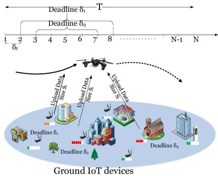  
Fig. 1. System model: timely data collection in a smart city environment using UAV. For illustration, an example of the time line representation for two IoT devices with two deadlines. With respect to the time line, we have the first IoT device with the data generation of second time slot, $\tau _ { 1 } = 2 .$ , with the deadline of eighth time slot, $\bar { \delta } _ { 1 } = 8 ,$ , while the second IoT device with the data generation of third time slot, $\tau _ { 2 } = 3$ , and the deadline of seventh time slot, $\delta _ { 1 } = 7 .$

The UAV is assumed to fly at a fixed altitude H in meters above ground level, e.g., that is imposed by the regulatory authority for safety considerations; the UAV’s location in time slot n is given by $( x ^ { n } , \ y ^ { n }$ , H). Orthogonal transmission is employed in the uplink to allow multiple IoT devices to simultaneously upload their data to the UAV. Given the location $( x _ { i } , \ y _ { i } , \ 0 )$ of each IoT device $i \in \mathcal { M }$ at ground level and the current UAV location $( x ^ { n } , y ^ { n } , H )$ in time slot $n ,$ the distance $d _ { i } ^ { n }$ between the UAV and the IoT device is calculated as follows

$$
d _ { i } ^ { n } = \sqrt { ( x _ { i } - x ^ { n } ) ^ { 2 } + ( y _ { i } - y ^ { n } ) ^ { 2 } + H ^ { 2 } } , \quad n = 1 , 2 , \ldots N ,\tag{1}
$$

In practice, the speed of a UAV is limited to a maximum value $v _ { m a x }$ in m/s and, thus, its travel distance in one time slot is constrained as follows

$$
( x ^ { n + 1 } - x ^ { n } ) ^ { 2 } + ( y ^ { n + 1 } - y ^ { n } ) ^ { 2 } \leq ( v _ { m a x } \delta _ { t } ) ^ { 2 } , \ n = 1 , \ldots , N - 1 ,\tag{2}
$$

We also assume the channel between the IoT devices and the UAV follows a Rician fading channel model with a factor $K ,$ , where the channel coefficient $h _ { i } ^ { n }$ can be written as

$$
h _ { i } ^ { n } = \widehat { h } _ { i } ^ { n } \Delta _ { i } ^ { n }\tag{3}
$$

where $\widehat { h } _ { i } ^ { n }$ and $\Delta _ { i } ^ { n }$ respectively represent the small-scale fading and path-loss coefficients. In particular, we can write the path-loss coefficient as $\Delta _ { i } ^ { n } ~ = ~ \gamma _ { 0 } ( d _ { i } ^ { n } ) ^ { - \alpha }$ , where $\gamma _ { 0 }$ is the average channel power gain at a reference distance $d _ { 0 } = 1 m ,$ α is the path-loss exponent that usually has a value greater than 2 for Rician fading channel. The small scale fading $\dot { h _ { i } ^ { n } }$ is composed of line-of-sight (LoS) component $\overline { { h } } _ { i } ^ { n }$ , where $\left| \overline { { h } } _ { i } ^ { n } \right| = 1$ and a random Non-line-of-sight (NLoS) component $\bar { h } _ { i } ^ { n }$ , where $\widetilde { h } _ { i } ^ { n } \sim \mathcal { C N } ( 0 , 1 )$ . The small scale fading $\widehat { h } _ { i } ^ { n }$ is given by

$$
\widehat { h } _ { i } ^ { n } = \Big ( \sqrt { \frac { K } { K + 1 } } \overline { { { h } } } _ { i } ^ { n } + \sqrt { \frac { 1 } { K + 1 } } \widetilde { h } _ { i } ^ { n } \Big ) ,\tag{4}
$$

Each IoT device i is assumed to transmit with constant power $P$ leading to a received power at the UAV $\begin{array} { l l } { P _ { i } ^ { n } } & { = } \end{array}$ $| h _ { i } ^ { n } | ^ { 2 } ~ P$ in time slot n. The signal-to-noise ratio (SNR) of each IoT device is $\Upsilon _ { i , n } = P | \widehat { h } _ { i } ^ { n } | ^ { 2 } \Delta _ { i } ^ { n } / \sigma ^ { 2 }$ , where $\sigma ^ { 2 }$ is the thermal <sup>Υ = Δ</sup>noise power which is linearly proportional to the allocated bandwidth [30]. Thus, the instantaneous achievable rate for each IoT device i in time slot n is given by

$$
\begin{array} { r } { r _ { i } ^ { n } ( b _ { i } ^ { n } , x ^ { n } , y ^ { n } ) = b _ { i } ^ { n } \log _ { 2 } ( 1 + \Upsilon _ { i , n } ) , } \end{array}\tag{5}
$$

where $b _ { i } ^ { n }$ is the fraction of spectrum allocated to IoT device i in time slot n and it is equivalent to a number of resource blocks. In practice, for large numbers of resources, $b _ { i } ^ { n }$ is approximately continuous between 0 and 1. Thus, the allocation of the radio resources should meet the below constraints

$$
\sum _ { i \in \mathcal { M } } b _ { i } ^ { n } \leq 1 , \forall n .
$$

$$
0 \leq b _ { i } ^ { n } \leq 1 , \forall n , i \in \mathcal { M } .\tag{6}
$$

(7)

We should note that our model assumes a frequency non selective, or flat, channel which, unlike frequency selective channel, only the fraction of radio spectrum allocated to each IoT device is of interest, rather than which fraction of the radio spectrum. Hence, our allocation constraint decides on the amount of resource blocks that need to be allocated to achieve the service amount for each served device. We define the service amount as the amount of data that one IoT device delivers to the UAV within a given deadline during a data collection mission. The service amount concept has been proposed in multiple previous works especially in scenarios with mobility [31]–[33], where the instantaneous achievable rate is time-variant and does not exhibit the service quality of the corresponding transmitting device. Similarly, in our system model, the instantaneous achievable rate of one IoT device is not only based on the device itself but varies according to the data deadlines of the other IoT devices to be served. Consequently, we utilize the service amount concept to represent the service quality of each IoT device. The service amount $S _ { i } ( b _ { i } ^ { n } , x ^ { n } , y ^ { n } )$ provided by each IoT device i over flight time T can be computed based on the summation of the instantaneous achievable rates throughout the information lifetime, where the rate of a given device is set to 0 as soon as its data deadline passes. The service amount $S _ { i } ( b _ { i } ^ { n } , x ^ { n } , y ^ { n } )$ computed in bits/Hz, can be written as

$$
S _ { i } ( b _ { i } ^ { n } , x ^ { n } , y ^ { n } ) = \delta _ { t } \sum _ { n = 1 } ^ { N } s _ { i } ^ { n } , \forall i \in \mathcal { M } ,\tag{8}
$$

where

$$
s _ { i } ^ { n } = \left\{ \begin{array} { l l } { r _ { i } ^ { n } ( b _ { i } ^ { n } , x ^ { n } , y ^ { n } ) , } & { \mathrm { i f ~ } \tau _ { i } \leq n \leq \delta _ { i } } \\ { 0 , } & { \mathrm { o t h e r w i s e } } \end{array} \right.\tag{9}
$$

## III. PROBLEM FORMULATION

The objective of this work is to optimize the UAV trajectory and allocation of resources to maximize the total number of served IoT devices within a flight mission duration T based on a given set of target time constraints. To serve device i, its data $S _ { i }$ should be completely collected by the UAV throughout the lifetime. To mathematically formulate the problem, we define a binary variable $\kappa _ { i } \in \{ 0 , 1 \} , \forall i \in \mathcal { M }$ , that is asserted if the UAV can successfully serve device i with a minimum service amount $S _ { i } ^ { m i n . }$ otherwise, it is set to 0, where $S _ { i } ^ { m i n }$ is defined as the minimum amount of information (bits/Hz) that need to be uploaded by device i. Let us denote $\mathbf { X } \ = \ \{ x _ { n } , \forall n \}$ $\mathbf { Y } = \{ y _ { n } , \forall n \} , \mathbf { K } = \{ k _ { i } , i \in \mathcal { M } \}$ and $\mathbf { B } = \{ b _ { i } ^ { n } , \in \mathcal { M } , n \}$ <sup>= = =</sup>The formulated optimization problem is given in (10) with the objective to maximize the number of served IoT devices.

$$
( \mathcal { P } _ { 1 } ) : \operatorname* { m a x } _ { { \bf X } , { \bf Y } , { \bf B } , { \bf K } } \sum _ { i \in \mathcal { M } } \kappa _ { i }\tag{10a}
$$

$$
\begin{array} { r } { \mathrm { s . t . } \quad S _ { i } ( b _ { i } ^ { n } , x ^ { n } , y ^ { n } ) \geq \kappa _ { i } S _ { i } ^ { m i n } , \quad \forall n , i \in \mathcal { M } , } \end{array}
$$

$$
\kappa _ { i } \in \{ 0 , 1 \} , i \in \mathcal { M } ,\tag{10b}
$$

$$
0 \leq b _ { i } ^ { n } \leq \kappa _ { i } , \forall n , i \in \mathcal { M } ,\tag{10c}
$$

$$
( 2 ) , ( 6 ) ,\tag{10d}
$$

$$
[ x ^ { 0 } \ y ^ { 0 } ] = [ x _ { s } \ y _ { s } ] ,\tag{10e}
$$

(10f )

$$
[ x ^ { N } ~ y ^ { N } ] = [ x _ { e } ~ y _ { e } ] ,\tag{10g}
$$

Constraint (10b) guarantees that each served IoT device uploads the minimum amount of data $S _ { i } ^ { m i n }$ . Constraint (10d) prevents the UAV from wasting radio resources on IoT devices that cannot be served within their deadline. As a result, the share resources $b _ { i } ^ { n }$ in (7) is upper bounded by $\kappa _ { i }$ that is set to 0 if device i is not selected to be served. Constraints (10f) and $( 1 0 \mathrm { g } )$ indicate the initial position of the UAV’s trajectory located at $\left[ x _ { s } \ y _ { s } \right]$ and the final position at $\left[ x _ { e } ~ y _ { e } \right]$ . In fact, the operator may decide on those positions based on multiple factors such as the location of their managed property, legislation and/or UAV’s charging stations.

Clearly, the solution of $\mathcal { P } _ { 1 } .$ , which yields a trajectory for the UAV during a time frame $T ,$ , relies on the knowledge of the instantaneous channel at each time slot during the flight. Given that by the time a trajectory is designed, there is no possible way of obtaining the channel conditions in future slots; hence, we overcome this obstacle by assuming a path loss model for the channel and solve $\mathcal { P } _ { 1 }$ to obtain a trajectory which maximizes the number of IoT devices which can be served. Then, we utilize the obtained trajectory to fly the UAV; but, at each time slot during its flight, the UAV obtains correct instantaneous CSI, and then assigns resources for the IoT devices to meet their service rate, at that slot. The process is repeated throughout the trajectory of the UAV. More details will be presented in the sequel.

We also observe that $\mathcal { P } _ { 1 }$ is a mixed integer non-linear program (MINLP), which is generally NP-hard, due to the existence of the binary variable $\kappa _ { i }$ in (10c) and non-convex constraint (10b) [17], even if the binary variable $\kappa _ { i }$ is relaxed to take any value between 0 and 1. The relaxed version of $\mathcal { P } _ { 1 }$ is, nevertheless, non-convex due to the trajectory variables $x ^ { n }$ and $y ^ { n }$ in (10b). To the best of our knowledge, there is no solver for $\mathcal { P } _ { 1 }$

## IV. GLOBAL OPTIMIZATION SOLUTION

In this section, we present a solution to optimally solve the problem $\mathcal { P } _ { 1 }$ using a customized branch, reduce and bound (BRB) algorithm [34]. Although the optimization problem is monotonically increasing with respect to $\kappa _ { i } ,$ it is yet hard to be solved by the BRB algorithm due to the July 05,2026 at 12:51:23 UTC from IEEE Xplore. Restrictions apply.

non-convex constraint in (10b), with respect to their variables. In what follows, we transform $\mathcal { P } _ { 1 }$ into another equivalent and monotonically increasing optimization form, based on which a BRB algorithm is customized to solve our optimization problem optimally.

## A. Equivalent Formulation

Consider the following optimization problem

$$
\begin{array} { r } { \mathcal { P } \mathrm { 1 } _ { O } : \displaystyle \operatorname* { m a x } _ { \mathrm { \bf { X } , Y , B , U } } \displaystyle \sum _ { i \in \mathcal { M } } \mathbb { 1 } \left[ \operatorname* { m a x } \left\{ \delta _ { t } \sum _ { n = \tau _ { i } } ^ { \delta _ { i } } b _ { i } ^ { n } u _ { i } ^ { n } - S _ { i } ^ { m i n } , 0 \right\} \right] ( 1 1 \mathrm { a } ) } \\ { \mathrm { s . t . ~ } u _ { i } ^ { n } \leq \log _ { 2 } \Big ( 1 + \Upsilon _ { i , n } ( x ^ { n } , y ^ { n } ) \Big ) , \forall i \in \mathcal { M } , } \\ { n = \tau _ { i } , . . . , \delta _ { i } , ( 1 1 \mathrm { b } ) } \\ { ( 2 ) , ( 6 ) , ( 7 ) , ( 1 0 f ) , ( 1 0 g ) } \end{array}
$$

where  x is the indicator function that equals unity if $x > 0 ,$ and zero otherwise. To propose the optimal solution for our optimization, we propose the following lemma

Lemma 1: By introducing the slack variable $\mathbf { U } = \{ u _ { i } ^ { n } \ge $ $0 , \forall n \} , \ P _ { 1 }$ is equivalent to the monotonic formulation ${ \mathcal { P } } 1 _ { O } ,$ <sup>0</sup>i.e., $\mathcal { P } _ { 1 }$ and ${ \mathcal { P } } 1 _ { O }$ have the same objective and solution set. Proof: The proof is in Appendix A.

## B. Proposed BRB Solution

It can be seen that, when the variables $b _ { i } ^ { n }$ and $u _ { i } ^ { n } , i \in$ ${ \mathcal { M } } , \forall \delta _ { i }$ are fixed, our optimization problem ${ \mathcal { P } } 1 _ { O }$ becomes a feasibility checking for a convex monotonic optimization problem [35]. Consequently, the BRB method can be applied to optimally solve the problem. In the BRB algorithm, a set of N non-overlapping hyper-rectangles that cover the optimization problem in (11a) is maintained, where one of the hyper-rectangles includes the optimal solution.

We define the hyper-rectangle $\begin{array} { r } { \boldsymbol { \mathcal { A } } = \left[ \underline { { \mathbf { A } } } , \bar { \mathbf { A } } \right] } \end{array}$ that contains <sup>= [ ]</sup>all feasible solutions for our optimization problem, where $\underline { { \mathbf { A } } }$ and A are the lower bound and the upper bound vector that hold the lowest and the highest values for the variables $u _ { i } ^ { n }$ and $b _ { i } ^ { n } .$ , respectively. In fact $u _ { i } ^ { n }$ is bounded $0 \leq u _ { i } ^ { n } \leq$ $\log _ { 2 } ( 1 + \Upsilon _ { i , n } ^ { m a x } ) , i \ \in \ \mathcal { M } , \forall \delta _ { i }$ , where $\Upsilon _ { i , n } ^ { m a x }$ <sup>0</sup>is the maxi-<sup>log (1 + Υ ) Υ</sup>mum signal-to-noise ratio when the UAV is hovering right above the IoT device i at time slot n and is computed as $\Upsilon _ { i , n } ^ { m a x } = \frac { P \gamma _ { 0 } | \widehat { h } _ { i } ^ { n } | ^ { 2 } } { \sigma ^ { 2 } H ^ { 2 } } ,$

In principle, three operations are conducted for each iteration in the BRB method to improve the lower and upper bounds; namely, Branching, Reduction and Bounding. First, the branching operation is applied to divide the selected hyper-rectangle A that contains the largest upper bound into two equal smaller hyper-rectangles using one of the partition methods (such as bisection method), and checks the feasibility of each hyper-rectangle through one of the optimization solvers (such as SDPT3) can solve it. Second, the reduction operation is applied to the hyper-rectangles to remove the parts that cannot satisfy the feasible solution to find a smaller hyperrectangle. Third, a bounding operation is performed to search for the optimal solution by updating the upper and lower bounds. The algorithm proceeds until the difference between the lower and upper bounds is smaller than a predefined accuracy $\varepsilon _ { o } .$ These operations are illustrated in more details in [34]. Algorithm 1, referred to as BRB-optimal, summarizes the BRB solution of (11) to determine the optimal UAV trajectory that allows the maximum number of IoT devices to be served.

```latex
Algorithm 1 BRB-Optimal: Proposed to Optimally Solve the
Data Collection Problem
1: Inputs: The hyper-rectangle A, the error tolerance $\varepsilon _ { o } ,$ the mini
mum service amount $S _ { i } ^ { m i n }$ and the deadline $\delta _ { i } .$
2: Initialization:
3: Apply the reduction procedure to our initial hyper-rectangle A to
obtain the new reduction hyper-rectangle red(A).
4: Update the hyper-rectangle box $B _ { 1 } \ \stackrel { - } { = } \ \operatorname { r e d } ( A )$ and set iteration
number $m = \mathrm { { 1 } } .$
5: Branch $B _ { 1 }$ into two smaller hyper-rectangle boxes $B _ { 1 } ^ { ( j ) }$
$\forall j = 1 : 2 .$
6: Update the set of hyper-rectangles boxes $D _ { 1 } { = } \{ B _ { 1 } ^ { ( j ) } \}$ and the
lower bound ${ \psi _ { m } = \dot { L } \hat { B } ( B _ { 1 } ) }$
7: while $\begin{array} { r } { \Big ( \operatorname* { m a x } _ { B _ { m } ^ { ( j ) } \in D _ { m } } \Big ( U B ( B _ { m } ^ { ( j ) } ) \Big ) - \psi _ { m } \geq \varepsilon _ { o } \Big ) } \end{array}$ do
8: Select the hyper-rectangle box that has the maximum upper
bound $B _ { m } = \arg \operatorname* { m a x } \{ U { \cal B } ( B _ { m } ^ { ( j ) } ) | B _ { m } \in D _ { m } ) \}$ for branching.
9: Branch $B _ { m }$ into two smaller hyper-rectangles $B _ { m } ^ { ( 1 ) } , B _ { m } ^ { ( 2 ) }$ using
bisection method along with the longest edge of $B _ { m } .$ 
//Branching operation//.
10: Compute the lower bound for both hyper-rectangles and apply
the reduction procedure to the feasible hyper-rectangles to obtain
red( ${ B } _ { m } ^ { ( 1 ) } )$ and red $B _ { m } ^ { ( 2 ) } )$ <sup></sup> //Reduction operation//
11: Compute the maximum lower bound for both reduced
hyper-rectangles red $( B _ { m } ^ { ( 1 ) } )$ and red $B _ { m } ^ { ( 2 ) } )$ <sup></sup> //Bounding
operation//.
12: Update $\psi _ { m + 1 } = \operatorname * { m a x } ( L B ( r e d ( B _ { m } ^ { ( 1 ) } ) ) , L B \ ( r e d ( B _ { m } ^ { ( 2 ) } ) ) , \psi _ { m } )$
<sup>= max( ( ( )) ( ( )) )</sup>13: Remove the hyper-rectangle box that do not contain the
optimal solution and update the set of hyper-rectangles
boxes $\begin{array} { c c c c c } { { D _ { m + 1 } } } & { { = } } & { { D _ { m } \backslash \{ \stackrel { . } { B } _ { i } | \psi _ { m + 1 } } } & { { > } } & { { U B ( r e \bar { d } ( B _ { i } ) ) \} , \forall i \stackrel { . } { \ = } } } \end{array}$
$1 , \ldots$ cardinal $\left( D _ { m } \right)$
$1 4 \colon \quad m = m + 1 .$
<sup>=</sup>15: end while
16: Output The global optimal solution for maximizing the number
of served IoT devices.
```

## C. Convergence Analysis

Algorithm 1 is guaranteed to compute the global optimal solution for maximizing the number of served IoT devices for $\mathcal { P } _ { 1 }$ and its convergence can be proved based on [34], which can be explained as follows. The BRB operations iteratively update and improve the lower and upper bounds of the objective equation(11a). Specifically, in each iteration the lower bound is non-decreasing by updating the step 10, while the upper bound is non-increasing by reduction and bound operations. Due to the monotonic property, after a number of iterations, the gap between the upper and lower bounds of the box that contains an optimal solution is less than or equal to a predefined accuracy level $\varepsilon _ { o }$

## V. LOW-COMPLEXITY SUBOPTIMAL SOLUTION

Since our trajectory optimization is time-sensitive as it depends on the deadlines of the data, the BRB method does not lend itself as an efficient approach and requires a long time to achieve optimal solution especially with a large number of IoT devices. In general, The BRB method is used to generate optimal solutions for relatively small-scale scenarios and also serves as a benchmark for other approaches (as will be shown in our numerical evaluation in the sequel). Motivated by this, we aim to solve the problem for practical network scenarios with a larger number of IoT devices, a lowcomplexity algorithm is presented to maximize the number of served IoT devices in the next section.

A. SCA-Algorithm for Maximizing the Number of Served IoT Devices

In this section, we attempt to solve $\mathcal { P } _ { 1 }$ based on convex approximation methods and multiple equivalent transformations to generate a more efficient but sub-optimal solution. To solve our optimization, the non-convex constraint in (10b) is approximated into another equivalent convex equation form and SCA method is applied to solve it iteratively.

As mentioned earlier, $\mathcal { P } _ { 1 }$ is integer non-convex program and difficult to solve. Here, the main difficulty of solving $\mathcal { P } _ { 1 }$ is to deal with the binary variable $\kappa _ { i }$ which appears in the objective function of $( \mathcal { P } _ { 1 } )$ . Moreover, even if we relax the binary variable $\kappa _ { i }$ to make it continuous between $\cdot _ { 0 } \cdot \mathrm { \ }$ and $\cdot _ { 1 } \cdot$ , the relaxed version of $\mathcal { P } _ { 1 }$ is still non-convex. The non-convexity of $\mathcal { P } _ { 1 }$ is due to the existence of the non-convex non-concave service amount $S _ { i }$ a function of the UAV’s trajectory, which appears in the constraint (10b). To tackle the problem, we introduce slack variables $\mathbf { G } = \{ g _ { i } ^ { n } \geq 0 , \forall n , i \in$ $\mathcal { M } \}$ and $\mathbf { C } = \{ c _ { i } ^ { n } \geq 0 , \forall n , i \in \mathcal { M } \}$ . Then, we relax the binary variable $\kappa _ { i }$ in equation (10c) between 0 and 1. Next, we employ an approximate to function $\log _ { 2 } ( 1 + \Upsilon _ { i , n } )$ by convex approximation with respect to $( x _ { i } ^ { n } - x ^ { \bar { n } } ) ^ { 2 } + ( y _ { i } ^ { n } - y ^ { n } ) ^ { 2 }$ [36], where at the $r ^ { t h }$ iteration, the following inequality can be obtained,

$$
\begin{array} { r l r } { \log _ { 2 } ( 1 + \Upsilon _ { i , n } ) \ge - A _ { i } ^ { r , n } \Big ( ( x _ { i } - x ^ { n } ) ^ { 2 } + ( y _ { i } - y ^ { n } ) ^ { 2 } } & { } & \\ { - ( x _ { i } - x ^ { r , n } ) ^ { 2 } - ( y _ { i } - y ^ { r , n } ) ^ { 2 } \Big ) + B _ { i } ^ { r , n } , } & { } & \\ { \triangleq \zeta _ { i } ^ { n , r } ( x ^ { n } , y ^ { n } ) , } & { } &  ( \} \end{array}\tag{12}
$$

where

$$
= \frac { \alpha ( P \gamma _ { 0 } | \widehat { h } _ { i } ^ { n } | ^ { 2 } / \sigma ^ { 2 } ) \log _ { 2 } e } { 2 \Big ( ( H ^ { 2 } + ( x _ { i } - x ^ { r , n } ) ^ { 2 } + ( y _ { i } - y ^ { r , n } ) ^ { 2 } ) ^ { \alpha / 2 } + ( P \gamma _ { 0 } | \widehat { h } _ { i } ^ { n } | ^ { 2 } / \sigma ^ { 2 } ) \Big ) }
$$

$$
\cdot \frac { 1 } { \Big ( H ^ { 2 } + ( x _ { i } - x ^ { r , n } ) ^ { 2 } + ( y _ { i } - y ^ { r , n } ) ^ { 2 } \Big ) } , \forall n , i \in \mathcal { M } ,\tag{13}
$$

$$
= \log _ { 2 } \left( 1 + \frac { P \gamma _ { 0 } \lvert \widehat { h } _ { i } ^ { n } \rvert ^ { 2 } } { \sigma ^ { 2 } \left( H ^ { 2 } + ( x _ { i } - x ^ { r , n } ) ^ { 2 } + ( y _ { i } - y ^ { r , n } ) ^ { 2 } \right) ^ { \alpha / 2 } } \right)\tag{14}
$$

To this end, we can reformulate $\mathcal { P } _ { 1 }$ as

$$
\mathcal { P } 1 _ { L } : ~ \operatorname* { m a x } _ { \mathbf { X } , \mathbf { Y } , \mathbf { B } , \atop \mathbf { K } , \mathbf { G } , \mathbf { C } } \sum _ { i \in \mathcal { M } } \kappa _ { i }\tag{15a}
$$

$$
\mathrm { s . t . ~ } \delta _ { t } \sum _ { n = \tau _ { i } } ^ { \delta _ { i } } c _ { i } ^ { n } \geq \kappa _ { i } S _ { i } ^ { m i n } , \quad i \in \mathcal { M } ,\tag{15b}
$$

$$
c _ { i } ^ { n } \leq b _ { i } ^ { n } g _ { i } ^ { n } , i \in \mathcal { M } , n = \tau _ { i } , \dots , \delta _ { i } ,\tag{15c}
$$

$$
g _ { i } ^ { n } \leq \zeta _ { i } ^ { n , r } ( x ^ { n } , y ^ { n } ) , i \in \mathcal { M } , n = \tau _ { i } , \ldots , \delta _ { i } ,\tag{15d}
$$

$$
0 \leq \kappa _ { i } \leq 1 , i \in \mathcal { M } ,
$$

$$
0 \leq b _ { i } ^ { n } \leq \kappa _ { i } , \forall n , i \in \mathcal { M } ,\tag{15e}
$$

(15f )

$$
( 2 ) , ( 6 ) , ( 1 0 f ) , ( 1 0 g ) ,\tag{15g}
$$

Examining constraint (15c), the non-convexity factor $b _ { i } ^ { n } g _ { i } ^ { n }$ is on the greater side of the inequality. To deal with this constraint, we simply replace the right side of (15c) by an equivalent Difference of Convex (DC) function $b _ { i } ^ { n } g _ { i } ^ { n } \ =$ $( b _ { i } ^ { n } + g _ { i } ^ { n } ) ^ { 2 } - ( b _ { i } ^ { n } - g _ { i } ^ { n } ) ^ { 2 }$ , and linearize the concave term 4 $\frac { ( b _ { i } ^ { n } + g _ { i } ^ { n } ) ^ { 2 } } { \ l }$ of the constraint at iteration r. Hence, the con-4 4straint (15c) is approximated as

$$
\begin{array} { r } { - \frac { ( b _ { i } ^ { r , n } + g _ { i } ^ { r , n } ) ^ { 2 } } { 4 } - \frac { ( b _ { i } ^ { r , n } - g _ { i } ^ { r , n } ) ( b _ { i } ^ { n } - b _ { i } ^ { r , n } + g _ { i } ^ { n } - g _ { i } ^ { r , n } ) } { 2 } } \\ { + \frac { ( b _ { i } ^ { n } - g _ { i } ^ { n } ) ^ { 2 } } { 4 } + c _ { i } ^ { n } \leq 0 } \end{array}\tag{16}
$$

Using the above approximation, $\mathcal { P } 1 _ { L }$ transforms into a convex problem, and can be optimally solved by updating parameter $\zeta _ { i } ^ { n , r } ( x ^ { n } , y ^ { n } )$ iteratively. Algorithm 2, summarizes <sup>( )</sup>the SCA-based sub-optimal solution to find the maximum number of served IoT devices during a data collection mission. The solution of $\mathcal { P } _ { 1 }$ results in a trajectory that maximizes the number of served IoT devices during the flight time period. Now, $\mathcal { P } _ { 1 }$ assumes a path loss model (no fading) for the channel; to deal with the unknown CSI, we present the following approach. The UAV uses the obtained designed trajectory, and during its deployment it obtains accurate knowledge of the CSI at each time slot and attempts to serve the devices within its coverage along its trajectory. Namely, using the solution of $P 1 _ { L }$ with path loss model, let $\boldsymbol { \mathcal { M } ^ { \prime } } _ { n }$ be the set of IoT devices served by the UAV at time slot n and let $s _ { i , p l } ^ { n }$ be the service rate each IoT device i received at time slot n using $P 1 _ { L }$ . Now, during the operation phase of the UAV, we would ideally like each IoT $i \in \mathcal { M } _ { n } ^ { \prime }$ to receive at least a rate equals $s _ { i , p l } ^ { n } , \forall n$ However, given that the channel has a fading component now, it is likely that some devices may not receive their required rate at some time slot. Let $\mathcal { M ^ { \prime \prime } } _ { n } \subseteq \mathcal { M ^ { \prime } } _ { n }$ be the set of devices that, at each slot $n ,$ are unable to receive a rate $s _ { i } ^ { n } \geq s _ { i , p l } ^ { n } .$ Then, at each slot $n ,$ we solve a problem of resource allocation to maximize the number of served IoT devices as follows

$$
( \mathcal { P } _ { E } ) : \ \operatorname* { m a x } _ { \mathbf { B } , \mathbf { K } } \sum _ { i \in \mathcal { M } ^ { \prime } { n } } \kappa _ { i }\tag{17a}
$$

$$
\mathrm { s . t . } \quad \delta _ { t } s _ { i } ^ { n } \big ( b _ { i } ^ { n } \big ) \geq \kappa _ { i } \big ( s _ { i , p l } ^ { n } + \beta _ { i } \Theta _ { i } ^ { n - 1 } - \lambda _ { i } ^ { n - 1 } \big ) , \forall i \in \mathcal { M } ^ { \prime } { } _ { n } ,\tag{17b}
$$

$$
0 \leq \kappa _ { i } \leq 1 , i \in \mathcal { M } ^ { \prime } { } _ { n } ,
$$

$$
\sum b _ { i } ^ { n } \leq 1 .\tag{17c}
$$

(17d)

$$
0 \leq b _ { i } ^ { n } \leq 1 , \forall n , i \in \mathcal { M } ^ { \prime } { } _ { n } ,\tag{17e}
$$

where $\beta _ { i }$ is a binary value that takes a value of 1 if data of IoT i is within its deadline and 0 otherwise. If $\mathcal { M } ^ { \prime \prime } = \emptyset$ , then all IoT devices at slot n would receive their minimum service rate. On the one hand, if at least one device i obtains $s _ { i } ^ { n } < s _ { i , p l } ^ { n } ,$ then we compute the service amount deficit $( \Theta _ { i } ^ { n } = s _ { i , p l } ^ { n } - s _ { i } ^ { n } )$ for this device and attempt to allocate a surplus service amount in subsequent time slots. On the other hand, for admitted IoT device $i \ ( \mathrm { i . e . } \ s _ { i } ^ { n } > s _ { i . p l } ^ { n } )$ , we compute the service rate surplus $( \lambda _ { i } ^ { n } = s _ { i } ^ { n } - s _ { i , p l } ^ { n } )$ for this device and subtract it from future slots. Indeed, to compensate, the UAV needs in subsequent time slots to allocate more radio resources for IoT device in deficit to meet their service amount target. It is obvious that $\mathcal { P } _ { E }$ is a convex problem and several optimization solvers can solve it optimally. It is also clear that the UAV will exploit its knowledge of accurate CSI at each slot to resolve $\mathcal { P } _ { E }$

```latex
Algorithm 2 Sub-optimal: Proposed SCA for Solving $\mathcal { P } 1 _ { L }$
and $\mathcal { P } 2 _ { L }$
1: Inputs: The error tolerance <sup>ε</sup>, the minimum service amount $S _ { i } ^ { m i n }$
and the deadlines $\delta _ { i } .$
2: Initialization:
3: Set the initial trajectory $x ^ { r , n } \ y ^ { r , n } ,$ , ∀<sup>n</sup> the resource allocation $b _ { i } ^ { r , n }$
∀<sup>n</sup>, ∀<sup>i</sup> and iteration number $r = 1 ,$
4: while (Obj $( r - 1 ) - \mathrm { O b j } \left( r \right) ) \geq \varepsilon$ do
<sup>1</sup>5: For SCA-algorithm problem $\mathcal { P } 1 _ { L } \colon$ solve the convex prob
lem (15) to obtain the trajectory $x ^ { r + 1 , n } \ y ^ { r + 1 , n }$ , ∀<sup>n</sup> and $b _ { i } ^ { r ^ { \star } + 1 , n }$
$\forall n , \forall i \in { \mathcal { M } }$
For SCA-distance problem $\mathcal { P } 2 _ { L } \dot { . }$ solve the convex problem (20)
with the updated subset $\mathcal { M } ^ { \prime }$ <sup>2</sup>devices to obtain the trajectory
$x ^ { r + 1 , n } \ y ^ { r + 1 , n } ,$ , ∀<sup>n</sup> and $b _ { i } ^ { r + 1 , n } , \forall n , \forall i \in \mathcal { M } ^ { \prime } .$
7: Update the $\mathrm { U A V } _ { \mathrm { \Delta } }$ trajectory $x ^ { r , n } \ y ^ { r , n } , \forall n ,$
8: Update the resource allocation $b _ { i } ^ { r , \bar { n } } , \forall i ,$
9: Update $r = r + 1 .$
10: end while
11: Output:
12: For SCA-algorithm problem ${ \mathcal { P } } 1 _ { L } ,$ , the output is the sub-optimal
solution for maximizing the number of served IoT devices $\mathcal { M } ^ { \prime }$
13: For SCA-distance problem $\mathcal { P } 2 _ { L }$ , the output is the sub-optimal
<sup>2</sup>solution for minimizing the flight distance.
```

## B. Complexity Analysis

In this section, the complexity analysis is discussed. For the optimal algorithm based on the BRB method, which is Algorithm 1, the BRB algorithm requires an extremely long time to achieve the optimal solution especially with a large number of IoT devices. This is due to the fact that BRB is an exhaustive search approach and depends on the problem size, i,e., the number of IoT devices, the service amount and the allocated resources. Furthermore, at each iteration, a feasibility optimization problem is solved. For the SCAalgorithm, the overall complexity of $\mathcal { P } 1 _ { L }$ depends on the solver that is employed to solve $\mathcal { P } 1 _ { L } .$ In particular, $\mathcal { P } 1 _ { L }$ is a convex problem and, thus, several interior-point solvers can be employed to solve it. Therefore, we employ the number of Newton steps, denoted by $C _ { s } ,$ as a metric to measure its complexity. In fact, the Newton steps depends on the problem size and the number of recursive iterations till convergence from a given initial point. Based on [37], [38], the worst-case $C _ { s }$ to reach a local solution in $\mathcal { P } 1 _ { L }$ can be expressed as

$$
C _ { s } \sim \sqrt { \mathrm { p r o b l e m ~ s i z e } }\tag{18}
$$

where the problem size is the total number of variables of the optimization problem. First we remark that, in the worst case, $\mathcal { P } 1 _ { L }$ must iteratively solve and update the variables. Precisely, there are $3 M N + 2 N + M$ variables in $\mathcal { P } 1 _ { L } .$ <sup>3 + 2 +</sup>Thus, in each iteration, the complexity of solving $\mathcal { P } 1 _ { L }$ is approximately $\sqrt { 3 M N + 2 N + M }$ , which induces an overall complexity of $I \sqrt { 3 M N + 2 N + M }$ in the worst-case, where <sup>3 + 2 +</sup>I is a finite number of iterations that depends on the value of error tolerance ε.

## VI. MINIMIZING UAV FLIGHT DISTANCE

In practice, it is essential to minimize the UAV flight distance while satisfying all other problem constraints. Two operation modes are typically considered for the UAV [39]: hovering mode in which the UAV hangs in one spot to collect data from IoT devices and forward flight mode in which the UAV moves from one location to another. Short flight distance infers an efficient trajectory that saves time and forward flight energy (propulsion). As a matter of fact, solving $\mathcal { P } _ { 1 }$ allows the UAV to go back and forth to concurrently collect data from distant IoT devices. Doing so incurs additional propulsion energy consumption that can be saved by minimizing the UAV flight distance. In attempt to conserve propulsion energy, we use the output generated by the solution of $\mathcal { P } _ { 1 }$ that includes the maximum number of IoT devices M that may be served by one UAV while meeting their data deadlines, and minimize the distance traveled by the UAV to satisfy the same number of devices with optimized radio resource allocation. Given the initial and the final locations of the UAV trajectory, we formulate the optimization problem with the objective to minimize the flight distance as the below

$$
\mathcal { P } 2 : \operatorname* { m i n } _ { \mathbf { X } , \mathbf { Y } , \mathbf { B } } \sum _ { n = 0 } ^ { N - 1 } d \Big ( ( x ^ { n + 1 } , y ^ { n + 1 } ) , ( x ^ { n } , y ^ { n } ) \Big ) ,\tag{19a}
$$

$$
\begin{array} { r } { \mathrm { s . t . } ~ S _ { i } ( b _ { i } ^ { n } , x ^ { n } , y ^ { n } ) \geq S _ { i } ^ { m i n } , \quad i \in \mathcal { M } ^ { \prime } , n , } \end{array}
$$

$$
0 \leq b _ { i } ^ { n } \leq 1 , \forall n , i \in \mathcal { M } ^ { \prime } ,\tag{19b}
$$

$$
( 2 ) , ( 6 ) , ( 1 0 f ) , ( 1 0 g ) .\tag{19c}
$$

(19d)

where $d ( . , . )$ is the distance between two way-points. The characteristics of $\mathcal { P } 2$ deserve more elaboration. In $\mathcal { P } 1$ , we aim at maximizing the number of served IoT devices. This means that in some scenario, the UAV wastes time and energy while serving the maximum number of served IoT devices. On the contrary, P guarantees that the UAV must minimize the traveling distance when the maximum number of IoT devices is achieved.

This problem is essentially equivalent to a well-known problem called Traveling Salesman Problem (TSP), which is known to be NP-hard. One straightforward approach for solving P is to find the nearest device (known as the greedy or nearest neighbor algorithm) under deadline constraint. However, serving devices once at a time is an inefficient approach. Therefore, we propose an efficient suboptimal solution to P based on SCA algorithm. Similar to $\mathcal { P } 1$ , P is non-convex problem because the non-concave non-convex function $S _ { i }$ in constraint (19b). By introducing convex approximation in (15d) and the slack variables $\mathbf { W } = w _ { i } ^ { n } \geq$ $0 , \forall n , i \in \mathcal { M } ^ { \prime }$ and $\mathbf { Z } \ = \ Z _ { i } ^ { n } \ \ge \ 0 , \forall n , i \in \mathcal { M } ^ { \prime }$ , P can be solved by iteratively solving the following approximated convex problem formulated at the $r + 1$ iteration index as

$$
\mathcal { P } 2 _ { L } : \operatorname* { m i n } _ { \mathbf { X } , \mathbf { Y } , \mathbf { B } , \mathbf { \Lambda } } \sum _ { n = 0 } ^ { N - 1 } d \Big ( ( x ^ { n + 1 } , y ^ { n + 1 } ) , ( x ^ { n } , y ^ { n } ) \Big ) ,\tag{20a}
$$

$$
\mathrm { s . t . ~ } \delta _ { t } \sum _ { n = \tau _ { i } } ^ { \delta _ { i } } z _ { i } ^ { n } \geq S _ { i } ^ { m i n } , \quad i \in \mathcal { M } ^ { \prime } ,\tag{20b}
$$

$$
z _ { i } ^ { n } \le b _ { i } ^ { n } w _ { i } ^ { n } , i \in \mathcal { M } ^ { \prime } , n = \tau _ { i } , \ldots , \delta _ { i } ,\tag{20c}
$$

$$
w _ { i } ^ { n } \leq \zeta _ { i } ^ { n , r } ( x ^ { n } , y ^ { n } ) , \ i \in \mathcal { M } ^ { \prime } , n = \tau _ { i } , \ldots , \delta _ { i } ,\tag{20d}
$$

$$
0 \leq b _ { i } ^ { n } \leq 1 , \forall n , i \in \mathcal { M } ^ { \prime } ,\tag{20e}
$$

$$
( 2 ) , ( 6 ) , ( 1 0 f ) , ( 1 0 g ) .\tag{20f}
$$

Algorithm 2, presents SCA-Distance to sub-optimally minimize flight distance and determine resource allocation among served IoT devices.

## VII. SIMULATION AND NUMERICAL ANALYSIS

In this section, we evaluate the performance of the proposed algorithms numerically. The main input parameters that are used in this simulation are listed in Table I. We assume a geographical area of size $0 . 8 \ \times \ 0 . 8 \mathrm { { k m ^ { 2 } } }$ in which 1UAV is dispatched to collect data from IoT devices. We assume that the required minimum service amount for all IoT devices is identical, and all IoT devices can communicate with the UAV within the given area. The data generation, deadlines and locations of the IoT devices are generated based on a normal distribution, these deadlines and locations’ samples are then used to identify the UAV trajectory and maximize the number of served IoT devices. For sake of illustration, we assume the flight duration in the simulations is sampled every 1secs, unless mentioned otherwise. We also comparewith two greedy ones, whose details are in Appendix B.

## A. Optimal Solution

We start by first studying the performance of our designed BRB. To show its convergence towrds the optimal solution, we consider a small scenario with a 3 IoT devices and a short flying duration $( N \mathrm { ~ = ~ } 1 5$ time slots sampled every 5secs). As shown in Fig. 2, BRB requires a high number of iterations to converge, and the optimal solution falls between the upper and lower bounds. BRB spends a large amount of time to close the gap between the upper and lower bounds. This clearly demonstrates that when considering a larger number of IoT devices, the BRB method will take much more time to find the optimal amount of service for all devices, which may not be an effective and practical solution to meet the IoT deadlines. Here, the maximum number of served IoT devices is computed by $\left\lfloor \frac { \sum _ { \forall i \in \mathcal { M } } S _ { i } } { S _ { i } ^ { m i n } } \right\rfloor$ , where . denote the floor function.

## B. Sub-Optimal Proposed Solution

The CVX toolbox and numerical convex optimization solver SDPT3 are used to solve our optimization sub-optimally. We set the UAV’s initial and final locations at and , respectively.

TABLE I  
SIMULATION PARAMETERS
<table><tr><td rowspan=1 colspan=1>Parameter</td><td rowspan=1 colspan=1>Value</td></tr><tr><td rowspan=1 colspan=1>IoT device transmission power, $\mathcal { T }$ </td><td rowspan=1 colspan=1> $0 . 1 \mathrm { m W }$ </td></tr><tr><td rowspan=1 colspan=1>UAV altitude, H</td><td rowspan=1 colspan=1>100m</td></tr><tr><td rowspan=1 colspan=1>Channel power gain, γ0</td><td rowspan=1 colspan=1>-50 dB</td></tr><tr><td rowspan=1 colspan=1>Noise power, $\sigma ^ { 2 }$ </td><td rowspan=1 colspan=1>-110dBm</td></tr><tr><td rowspan=1 colspan=1>UAV max speed, $\underline { { v _ { m a x } } }$ </td><td rowspan=1 colspan=1> $\mathrm { 5 0 m / s }$ </td></tr><tr><td rowspan=1 colspan=1>Pathloss exponent, α</td><td rowspan=1 colspan=1> $\overline { { 2 . 7 } }$ </td></tr><tr><td rowspan=1 colspan=1>The error tolerance ε</td><td rowspan=1 colspan=1> $\overline { { 1 0 ^ { - 3 } } }$ </td></tr></table>

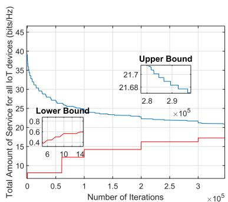  
Fig. 2. BRB-optimal algorithm to maximize the number of served IoT devices.

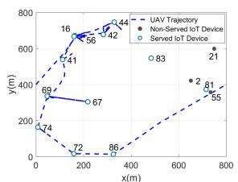  
(a) Path-loss channel.

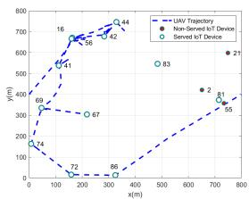  
(b) Rician channel $K = 3 ,$  
Fig. 3. UAV trajectory to maximize the number of served IoT devices.

We start by solving $\mathcal { P } 1 _ { L }$ where we assume a path loss model for the air to ground (A2G) channel. Fig. 3a, depicts the UAV trajectory for collecting data from IoT devices (for a network of 15 devices) over a period $N = 9 0$ time slots and a minimum requirement $S _ { i } ^ { m i n } = 2 5 ~ b i t s / H _ { z }$ . The values of the deadlines (in time slots) are depicted next to each IoT device in the Fig. 3; the maximum deadline is equal to 90 time slots. We observe that the total number of served IoT devices, through this trajectory, within this time period is equal $\tan ^ { 6 6 } 1 2 ^ { \circ }$ i.e., of the total number of devices. To see the impact of the A2G channel on the performance, we next assume that at the time of trajectory design, the operator gained accurate knowledge of the CSI for all subsequent time slots (somehow unrealistic, but serve the purpose of the study). We assume a realistic Rician channel model with $K = 3 ; \mathrm { F i g }$ . 3b shows the trajectory the UAV will take to serve the maximum number of IoT devices. Clearly, the trajectory is different from that of Fig. 3a; here, the UAV flies closer to each device in order to compensate for the fading on the channel and serve the device with the required service amount. This explains the difference in the obtained trajectory, however, we notice as well that the UAV serves exactly the same IoT devices as in the simple A2G channel. This shows minor effect on the number of served devices.

To better understand the impact of the channel, we next take the trajectory obtained with the path loss model, and fly the UAV on that trajectory, but this time at each slot, use a Rician channel and vary the value of K. The reason for doing this is to assess the impact of the channel as we operate the UAV. We look at each of the 12 IoT devices and measure their achieved service amount. Here the service amount is computed by replacing the channel in Equation 8, using the values for $b , \ x ,$ and $y$ after solving $\mathcal { P } 1 _ { L }$ . The results are depicted in Fig. 4a. We observe that for smaller values of $K ,$ , not all IoT devices (of the 12) would receive the minimum required service amount (e.g., devices 4, 7, and 10 received slightly below the minimum), however as the value of K increases, the impact of the fading diminishes, the line of sight becomes the dominant and all devices get served. To overcome this issue, we turn our attention to evaluate Enhanced-algorithm in problem $\mathcal { P } _ { E }$ . Here, again the UAV will fly using the trajectory of $\mathcal { P } 1 _ { L }$ (i.e., using the simple A2G channel), but as the UAV operates, at each time slot, it collects accurate CSI from the location, and allocates radio resources to serve the IoT devices served by the path loss trajectory with their service amounts. The results are depicted in Fig. 4b, where we show the service amount attained by each IoT device, for the path loss channel, the Rician $( K \ : = \ : 3 )$ and Rayleigh $( K = 0 )$ channel with knowledge of CSI at each slot. Surprisingly, $\mathcal { P } _ { E }$ is always able to allocate resources so that devices attain their minimum amount; this is possible through keeping track of the surplus and deficit in service amount for each device along the trajectory, so any IoT in deficit will be compensated in subsequent slots if possible.

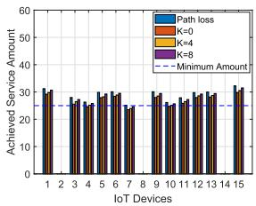  
(a) SCA-algorithm over Rician channel, varying K.

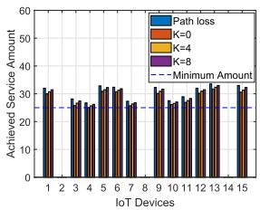  
Fig. 4. Achieved service amount per IoT device.  
(b) Enhanced-algorithm with CSI knowledge.

We present in Fig. 5a the per IoT allocation of resources. It is observed that at each slot, the UAV allocates radio resources unequally among the devices, depending on the deadlines and their locations. We also observe that while serving the devices, the UAV may allocate the resources in multiple, not contiguous, time slots (such as the first IoT device) or in a one-time slot (such as fifth IoT device). Further, the UAV may not be able to meet the deadlines of all devices. Although the UAV was able to meet the deadline of the farthest ones, our proposed solution puts more effort to fulfill the requirements of the nearest devices within the deadlines instead of wasting time to fulfill the requirements of farther ones. To better understand our results, as shown in Fig. 5b, in the first time slot the UAV increased its speed to reach the first subset of devices then decelerates to allow enough time for their data upload before their deadlines expire. It then accelerates again to reach another subset of devices to collect their data. The percentage of served IoT devices is another performance metric we study. Fig. 6a depicts this metric versus the service amount, and for different deadlines (in time slots and for a network of 20 devices). Clearly, as we increase the minimum service amount $S _ { i } ^ { m i n }$ per IoT device, the UAV will spend more time and radio resources for collecting the data from one device before flying to another device to collect its data. Furthermore, with less strict deadlines, the UAV will have extra time and enough resources to serve more devices compared to tighter deadlines. Fig. 6b depicts the percentage of served IoT devices versus the network size (maximum number of IoT devices located in the same area); when the required minimum service amount $S _ { i } ^ { m i n } = 2 0$ bits/Hz, as can <sup>= 20</sup>be seen, the percentage of served IoT devices decreases by increasing the number of IoT devices within the same area. Since the radio resources and flying time are limited, whenever more devices are considered within the same area, then less radio resources are being allocated for each IoT device. In turn, by increasing the deadlines, the percentage of served IoT devices will increase as expected since the UAV will have extra time to allocate more resources. Next, we study the performance of $\mathcal { P } 2 _ { L }$ , whose objective is to find an efficient trajectory for serving the IoT devices. By inspecting Figs 3a and 3b, we observe a long trajectory with many detours taken by the UAV to be able to collect information from the largest number of devices. $\mathcal { P } 2 _ { L }$ attempts to find a more efficient trajectory and Fig. 7a depicts the obtained trajectory (assuming a path loss channel) for serving the same devices. This trajectory is indeed more efficient since the UAV avoids flying back and forth to serve the same device at different time slots.

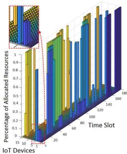  
(a) Resource allocation for each IoT device.

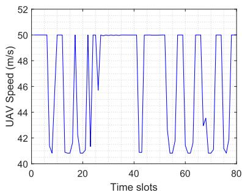  
(b) UAV speed versus time slots  
Fig. 5. Performance of proposed SCA-algorithm.

It should be noted that owing to the flexibility of the UAV (rotary-wing UAV), the UAV is able to hover in one place while collecting data from multiple devices, achieving the same number of served IoT devices with a minimum movement. As shown in Fig. 7b, the UAV increases its speed to serve a subset of devices before decreases its speed for a certain time for collecting data, then it increases its speed again to serve another subset of devices. Now, when the trajectory July 05,2026 at 12:51:23 UTC from IEEE Xplore. Restrictions apply.

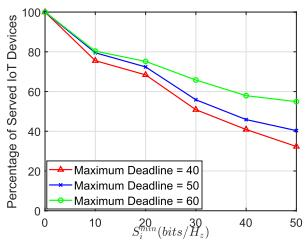  
(a) Smin.

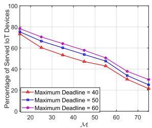  
(b) Network sizes.

Fig. 6. Percentage of served IoT devices for SCA-algorithm.  
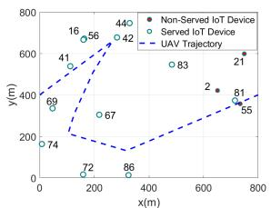  
(a) UAV Trajectory

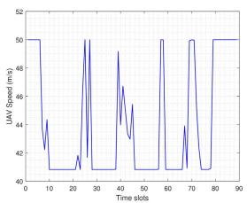  
Fig. 7. Performance of proposed SCA-distance.  
(b) UAV Speed.

is optimized, we fly the UAV and study whether the UAV is able to allocate resources at each slot for the corresponding devices, taking into account accurate CSI knowledge from that location. Here, during the flight of the UAV, the UAV collects information about the channel status, and re-optimizes the allocation of resources, keeping track of the deficit and surplus for each IoT along the path. We show in Fig. 7a the results for different channel realizations. When the fading component is high $( K = 1 )$ , we observe, in some of our simulations, the UAV fails to serve all IoT devices, however when $K = 6 .$ and the path loss becomes dominant, all devices are served. Further inspecting Fig. 7a, we observe that the UAV may hover far away from some devices and when the condition of the channel is degraded, the UAV does not have enough spectral resources to meet the requirement of the devices. Hence, we conclude a tradeoff between the enhanced trajectory and the achieved performance in terms of number of served devices. One can observe that, although we serve the maximum number of IoT devices over the period N , it is obvious that the UAV trajectory is not an efficient trajectory. In order to enhance the trajectory, we follow SCA-distance algorithm proposed in Algorithm 2 to minimize the flight distance. This achieves the same number of served IoT devices with much better trajectory. It can be seen in Fig. 7a, that the same number of IoT devices with the same deadlines can be served with an enhanced trajectory without having to fly back and forth.

Next, we compare the energy of both trajectories for SCA-distance ans SCA-algorithm for the same configuration. We use the same energy model and the corresponding typical parameters mentioned in [39]. As shown in Fig. 9, it can be observed that the proposed SCA-distance shows a lower energy consumption compared to SCA-algorithm, because the former allows the UAV to go back and forth to concurrently collect data from distant IoT devices. Doing so incurs additional propulsion energy consumption that can be saved by minimizing the UAV flight distance as shown for SCAdistance.

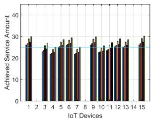

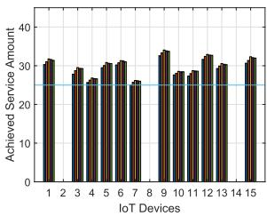  
(a) $K = 1 .$  
(b) $K = 6$

Fig. 8. Achieved service amount over different channel realizations for the Enhanced-algorithm.  
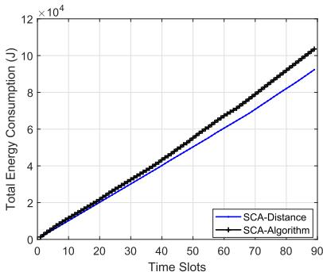  
Fig. 9. Total energy consumption of the UAV.

## C. Comparison with Greedy Solutions

Here, we evaluate the performance of two greedy methods for determining the UAV trajectory, and compare them to our proposed solution. The two greedy methods work as follows. A trajectory is computed either based on the shortest distance, i.e., the IoT device closest to the current location is selected to be served, or based on the data deadline, i.e., the UAV flies from its location to serve the IoT device with the strictest latency. Once a trajectory is decided, the UAV follows the designed path and at each time slot, it allocates the radio resource to maximize the service rate of each device. The details of the algorithms are presented in Appendix B. We compare the performance of these methods with our SCA-algorithm and SCA-distance methods. The results are presented in Fig. 10.

In this evaluation, we fix the flying time (N time slots), the locations of IoT devices and the deadlines; we consider a network of $\mathcal { M } = 2 0$ devices, a minimum service amount $S _ { i } ^ { m i n } ~ = ~ 6 0 ~$ bits/Hz, and a maximum deadline of 90 time slots. Our proposed algorithms are validated in free trajectory (i.e. the initial location is determined at while the final location is not set) for a fair comparison. The trajectory of sub-optimal solution is shown in Fig. 10.a, where the UAV exploits its mobility as well as the efficient allocation of radio resources to adapt its trajectory to fly closer to a subset of devices to meet their deadlines. It can be seen while considering these parameters, the UAV is able to serve $^ { 6 6 } 1 5 ^ { , 5 }$ devices out of “20” ( ). The same percentage can be achieved with the enhanced proposed trajectory, SCA-distance, as shown in Fig. 10.b, where the trajectory is further optimized to serve the same number of IoT devices.

In contrast, both greedy approaches optimize the trajectory of the UAV differently while allocating the whole resources to one IoT device at a time, as explained in Algorithm 3 in Appendix B. It can be observed from Fig. 10.c, while considering the maximum speed of the UAV, devices locations and the expected traveling time, the UAV adapts its trajectory to serve the closest IoT device regardless of its deadline. It can also be observed that the UAV misses the most urgent device while maximizing the number of served ones. The UAV is able to serve only 11 IoT devices ( ), and this is due to the fact that along its trajectory, the UAV allocates its radio resources to serve only one device at a time. In Fig. 10.d, while considering the most urgent deadline, the maximum speed and the expected traveling time, the UAV adjusts its trajectory to serve the most urgent IoT device regardless of its location. Following this greedy method, the UAV was only able to collect data from of the IoT devices, and this is due to the fact that the UAV wastes more time in flying to reach the device with the strictest deadline and hence ends up with little time to collect data.

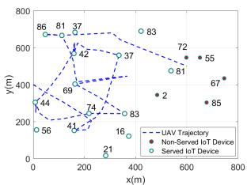  
(a) SCA-algorithm.

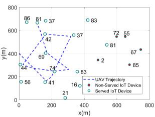  
(b) SCA-distance.

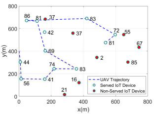  
(c) Greedy distance-based.

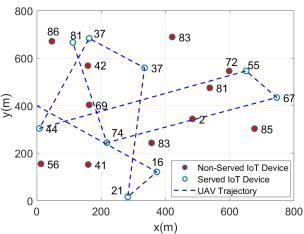  
(d) Greedy deadline-based  
Fig. 10. Optimizing the UAV trajectory to maximize the number of served IoT devices for alternative solutions.

In Fig. 11a, we compare the effect of deadlines on the performance of the proposed solutions with the greedy as well as a static benchmark scheme over a period of $N =$ time slots and minimum service amount $S _ { i } ^ { m i n } ~ = ~ 2 0 ~$ $b i t s / H _ { z }$ . For the static UAV scheme, the UAV is located in the middle of the given area (i.e. located at ). The comparison is investigated in different environments, the dense environment $( \mathrm { i . e . } \ \mathcal { M } = 4 0 $ devices) and sparse environment $( \mathrm { i . e . } \ \mathcal { M } = 1 0 \mathrm { d e v i c e s } )$ . It can be observed that while increasing the maximum deadline the SCA-algorithm achieves higher performance compared to the other approaches. The UAV then is able to optimize both its trajectory and radio resources to fly closer to multiple IoT devices to serve them simultaneously to maximize the served IoT devices. We also observe that when the deadline is very tight, the static achieves best performance since the UAV does not waste any time flying, but rather spends all its time serving the IoT devices. However, as the deadline starts increasing, the percentage of served devices starts to increase, especially in the proposed method as well as the greedy methods, both for sparse and dense networks. Our proposed method indeed achieves superior performance against the other methods because concurrently the trajectory as well as the allocation of radio resources are optimized to serve the maximum number of devices. In contrast, the greedy methods follow each a trajectory that is somehow oblivious to the objective of serving the largest number of devices. In both greedy methods, as explained above, the UAV flies either to the closest device or to the device with the strictest deadline, and allocates all resources to serve that device. Along the process, some time gets lost due to the abundance of radio resources which could be used to serve more devices. It is also shown in Fig. 11a that the distance-based greedy approach achieves better performance than the deadline-based since the latter makes the UAV waste more time to fly closer to the IoT device with strictest deadline.

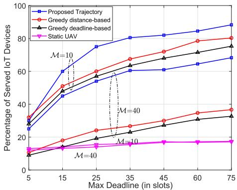  
(a) Versus max deadline (in slots).

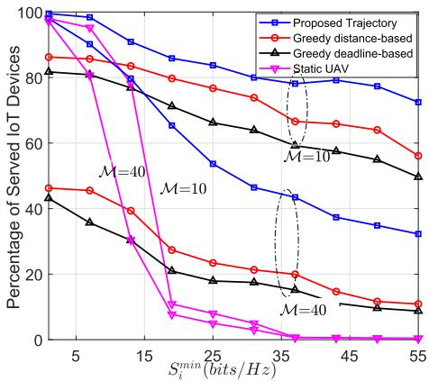  
(b) Versus the minimum service amount $S _ { i } ^ { m i n }$  
Fig. 11. Percentage of served IoT devices for SCA-distance compared to alternative solutions.

Next, we study the impact of the minimum service amount $S _ { i } ^ { m i n }$ on the performance of the different possible solutions with maximum deadline 90 time slots and over a period of $N = 9 0$ time slots. As shown in Fig. 11b, with the lower service amount, optimizing the radio resources is sufficient to maximize the number of served IoT devices as illustrated for the static and SCA-algorithm. We also observe that, with increasing the minimum service amount, it is obvious that the static UAV will not be able to collect the required data by only optimizing the radio resources. Optimizing the UAV trajectory becomes more crucial for achieving better communication channels to increase the transmission rate with larger minimum service amount. For example, in the sparse environment (i.e. $\mathcal { M } = 1 0$ devices) to achieve the minimum service amount of $2 0 ~ b i t s / H _ { z }$ , the percentage of served devices for our proposed solution is almost of the total number of devices with July 05,2026 at 12:51:23 UTC from IEEE Xplore. Restrictions apply

optimizing the resources and the UAV trajectory compared to. On the other hand, by increasing the number of devices (i.e. increase the density), optimizing the resources becomes significant to serve more devices. By comparing the greedy approaches with the proposed algorithm with increasing the minimum service amount, our proposed solution achieves higher performance since the trajectory and radio resources are jointly optimized.

## VIII. CONCLUSION AND FUTURE WORK

This paper studied the time constrained data collection from IoT devices. Since IoT devices have different QoS requirements within certain deadlines, the UAV trajectory and radio resource allocation are optimized to collect a differentiated amount of data from IoT devices. We formulated our optimization problem to maximize the number of served IoT devices while guaranteeing the minimal amount of data uploaded from each served device within the given deadline. Although our problem is non-convex, we solved it optimally by BRB algorithm. By convexifying our problem we provided a low complexity solution to solve our problem efficiently, then we extended the solution to generate an enhanced trajectory in order to minimize the distance traveled by the UAV while serving the IoT devices. Under variable deadlines and minimum service amounts, our proposed solution outperformed alternative solutions including distance- and deadline-based greedy approaches, and static UAV placement in terms of the percentage of served IoT devices (average improvement of - ). Our results showed that one UAV alone is not enough to meet the requirements of all IoT devices in a timely manner; a future extension of this work could be a joint optimization of trajectories and radio resources allocation of multiple UAVs. On the other hand, recall that the performance of timely data collection in this paper was investigated for orthogonal multiple access (OMA), therefore, non-orthogonal multiple access (NOMA) based UAV should also be considered in future work to accommodate large number of IoT devices. Moreover, studying the UAV and IoT energy consumption for time-constrained data collection scenario will be another direction that we will explore.

## APPENDIX A

PROOF OF THE EQUIVALENCE BETWEEN $\mathcal { P } _ { 1 }$ AND ${ \mathcal { P } } 1 _ { O }$

To prove that $\mathcal { P } _ { 1 }$ and ${ \mathcal { P } } 1 _ { O }$ are equivalent, we must prove that any feasible solution of $\mathcal { P } _ { 1 }$ is also a feasible solution of ${ \mathcal { P } } 1 _ { O }$ . Conversely, from any feasible solution of ${ \mathcal { P } } 1 _ { O } $ , we can always find a feasible solution of $\mathcal { P } _ { 1 }$ . Assume that $\breve { \mathrm { X } } , \breve { \mathrm { Y } } , \breve { \mathrm { B } } .$ U is a feasible solution set of <sup>˘</sup> ${ \mathcal { P } } 1 _ { O } .$ . It is easy to remark that <sup>1</sup>since X,<sup>˘</sup> Y,<sup>˘</sup> B,<sup>˘</sup> U satisfy all constraints<sup>˘</sup> $( 1 0 \mathrm { c } ) { \cdot } ( 1 0 \mathrm { g } )$ of $\mathcal { P } _ { 1 }$ Now, we need to prove X,<sup>˘</sup> Y,<sup>˘</sup> B,<sup>˘</sup> U also satisfy (10b). We can<sup>˘</sup> prove it as follows

$$
\begin{array} { r l r } { \mathrm { S i n c e : } } & { \check { \mathbf { u } } _ { i } ^ { n } \le \log _ { 2 } \Big ( 1 + \Upsilon _ { i , n } \big ( \check { \mathbf { x } } ^ { n } , \check { \mathbf { y } } ^ { n } \big ) \Big ) , } & \\ & { } & { \Rightarrow \check { \mathbf { b } } _ { i } ^ { n } \check { \mathbf { u } } _ { i } ^ { n } \le \check { \mathbf { b } } _ { i } ^ { n } \log _ { 2 } \Big ( 1 + \Upsilon _ { i , n } \big ( \check { \mathbf { x } } ^ { n } , \check { \mathbf { y } } ^ { n } \big ) \Big ) , } \\ & { } & { \Rightarrow \delta _ { t } \displaystyle \sum _ { n = \tau _ { i } } ^ { \delta _ { i } } \check { \mathbf { b } } _ { i } ^ { n } \check { \mathbf { u } } _ { i } ^ { n } \le \delta _ { t } \displaystyle \sum _ { n = \tau _ { i } } ^ { \delta _ { i } } \check { \mathbf { b } } _ { i } ^ { n } \log _ { 2 } \Big ( 1 + \Upsilon _ { i , n } \big ( \check { \mathbf { x } } ^ { n } , \check { \mathbf { y } } ^ { n } \big ) \Big ) , } & \\ & { } & { ( 2 1 ) } \end{array}
$$

```latex
Algorithm 3 Greedy Approaches for Data Collection
1: Inputs: The UAV initial location $x ^ { 0 }$ and $y ^ { 0 } .$ , the minimum service
amount $S _ { i } ^ { m i n }$ , the deadline $\delta _ { i } .$ , the maximum speed of the UAV
$v _ { m a x } ,$ and the location of all IoT devices $x _ { i } , y _ { i } ;$
2: Initialization:
3: For Distance-based approach: Sort all IoT devices based on
the distance to the current location of the UAV, $d _ { i , U } .$ , where the
closest IoT device is at the top of the list, and set the updated
time $N ^ { \prime } = N$
<sup>=</sup>4: For Deadline-based approach: Sort all IoT devices based on their
deadline, where the most urgent device (minimum deadline) is at
the top of the list, and set the updated time $N ^ { \prime } = N .$
5: for $i \in \mathcal { M }$ do
6: For Distance-based approach: Select the closest unmarked
IoT device to the current location of the UAV.
7: For Deadline-based approach: Select the most urgent
unmarked IoT device.
8: while $\begin{array} { r l r } { ( S _ { i } \{ b _ { i } ^ { n } , x ^ { n } , y ^ { n } \} } & { { } \geq } & { S _ { i } ^ { m i n } } \end{array}$ and $\smash { N ^ { \prime } \mathrm { ~  ~ { ~ > ~ } ~ } 0 }$ and
$\frac { d _ { i , U } } { N ^ { \prime } } \leq v _ { m a x } )$ do
9: Find the minimum time to serve the IoT device and update
the flying time $N ^ { \prime }$
10: Update the UAV location with the current location of the
IoT device.
11: end while
12: Mark the IoT device, and updated time $N ^ { \prime } .$
13: end for
14: Output
15: For Distance-based approach: The sub-optimal solution for
maximizing the number of served IoT devices based on distance.
16: For Deadline-based approach: The sub-optimal solution for
maximizing the number of served IoT devices based on deadline.
```

Let us denote $\begin{array} { r l } { \delta _ { t } \sum _ { n = \tau _ { i } } ^ { \delta _ { i } } \check { \mathfrak { b } } _ { i } ^ { n } \log _ { 2 } \Big ( 1 + \Upsilon _ { i , n } ( \check { \mathbf { x } } ^ { n } , \check { \mathbf { y } } ^ { n } ) \Big ) } & { = } \end{array}$ $S _ { i } ( \breve { \mathbf { b } } _ { i } ^ { n } , \breve { \mathbf { x } } ^ { n } , \breve { \mathbf { y } } ^ { n } )$ , then we obtain $S _ { i } ( \check { \mathbf { b } } _ { i } ^ { n } , \check { \mathbf { x } } ^ { n } , \check { \mathbf { y } } ^ { n } ) \quad \mathrm { ~ \geq ~ }$ $\delta _ { t } \sum _ { n = \tau _ { i } } ^ { \delta _ { i } } \breve { \mathbf { b } } _ { i } ^ { n } \breve { \mathbf { u } } _ { i } ^ { n }$ . At this point $\delta _ { t } \sum _ { n = \tau _ { i } } ^ { \delta _ { i } } \tilde { \mathbf { b } } _ { i } ^ { n } \tilde { \mathbf { u } } _ { i } ^ { n }$ can take either one of two values, for instance, $\begin{array} { r } { \delta _ { t } \sum _ { n = \tau _ { i } } ^ { \tilde { \delta } _ { i } } \breve { \mathbf { b } } _ { i } ^ { n } \breve { \mathbf { u } } _ { i } ^ { n } \geq S _ { i } ^ { m i n } } \end{array}$ or $\delta _ { t } \sum _ { n = \tau _ { i } } ^ { \delta _ { i } } \breve { \mathbf { b } } _ { i } ^ { n } \breve { \mathbf { u } } _ { i } ^ { n } < S _ { i } ^ { m i n }$ . Based on this, we can determine K<sup>˘</sup> as a function of $\breve { \mathrm { X } } , \breve { \mathrm { Y } } , \breve { \mathrm { B } } ,$ U to satisfy (10b). In particular<sup>˘</sup>

$$
\begin{array} { r l r l r l r } { \mathrm { I f } { : } } & { { } \delta _ { t } \displaystyle \sum _ { n = \tau _ { i } } ^ { \delta _ { i } } \check { \mathbf { b } } _ { i } ^ { n } \check { \mathbf { u } } _ { i } ^ { n } \geq S _ { i } ^ { m i n } , } & { } & { \Rightarrow } & { } & { \kappa _ { i } ^ { \setminus } = 1 } \\ { \mathrm { I f } { : } } & { { } \delta _ { t } \displaystyle \sum _ { n = \tau _ { i } } ^ { \delta _ { i } } \check { \mathbf { b } } _ { i } ^ { n } \check { \mathbf { u } } _ { i } ^ { n } < S _ { i } ^ { m i n } , } & { } & { \Rightarrow } & { } & { \kappa _ { i } ^ { \setminus } = 0 } \end{array}\tag{22}
$$

In conclusion, we can determine X,<sup>˘</sup> Y,<sup>˘</sup> B,<sup>˘</sup> K from<sup>˘</sup> $\breve { \mathrm { X } } , \breve { \mathrm { Y } } , \breve { \mathrm { B } } ,$ , U<sup>˘</sup> to satisfy (10b). On the other hand, assume that $\ddot { \mathrm { X } } , \ddot { \mathrm { Y } } , \ddot { \mathrm { B } } ,$ K is a <sup>¨</sup> feasible set of solution of $\mathcal { P } _ { 1 }$ . It is easy to remark that since $\ddot { \mathrm { X } } ,$ Ÿ, B, <sup>¨</sup> K satisfy all constraints (2), (6), (7), (10f), (10g) of <sup>¨</sup> ${ \mathcal { P } } 1 _ { O }$ <sup>1</sup>Now, we need to prove X, Ÿ,<sup>¨</sup> B,<sup>¨</sup> K also satisfy (11b). Since<sup>¨</sup> we got $\begin{array} { r } { \delta _ { t } \sum _ { n = \tau _ { i } } ^ { \delta _ { i } } \ddot { \mathbf { b } } _ { i } ^ { n } \log _ { 2 } \Big ( 1 + \Upsilon _ { i , n } ( \ddot { \mathbf { x } } ^ { n } , \ddot { \mathbf { y } } ^ { n } ) \Big ) \geq \kappa \ddot { \mathbf { \xi } } _ { i } S _ { i } ^ { m i n } } \end{array}$ . Let us denote $\ddot { \mathbf { u } } _ { i } ^ { n } = \log _ { 2 } \Big ( 1 + \Upsilon _ { i , n } ( \ddot { \mathbf { x } } ^ { n } , \ddot { \mathbf { y } } ^ { n } ) \Big )$ , then this notation makes (11b) satisfied. Let us assume X,<sup>˝</sup> Y,<sup>˝</sup> B,<sup>˝</sup> K is the<sup>˝</sup> optimum solution of $\mathcal { P } _ { 1 }$ . We have to prove that X,<sup>˝</sup> Y,<sup>˝</sup> B,<sup>˝</sup> $\tilde { \mathrm { K } }$ is the optimum solution of ${ \mathcal { P } } 1 _ { O }$ . This can be shown by contradiction. Assuming $\tilde { \mathrm { X } } , \tilde { \mathrm { Y } } .$ <sup>1</sup>, B,<sup>˝</sup> U is not the optimum<sup>˝</sup> solution of ${ \mathcal { P } } 1 _ { O } ,$ this means that there exists another solution <sup>1</sup>denoted by X,<sup>¯</sup> Y,<sup>¯</sup> B,<sup>¯</sup> K which results in a larger objective<sup>¯</sup> function of ${ \mathcal { P } } 1 _ { O }$ . This means that there exists an index $i _ { 1 }$ which makes $\begin{array} { r } { \delta _ { t } \sum _ { n = \tau _ { i _ { 1 } } } ^ { \delta _ { i _ { 1 } } } \bar { \mathfrak { b } } _ { i _ { 1 } } ^ { n } \bar { \mathfrak { u } } _ { i _ { 1 } } ^ { n } - S _ { i _ { 1 } } ^ { m i n } \ \geq \ 0 , } \end{array}$ , while it is $\begin{array} { r } { \delta _ { t } \sum _ { n = \tau _ { i _ { 1 } } } ^ { \delta _ { i _ { 1 } } } \tilde { \mathbf { b } } _ { i _ { 1 } } ^ { n } \tilde { \mathbf { u } } _ { i _ { 1 } } ^ { n } - S _ { i _ { 1 } } ^ { m i n ^ { * } } < 0 . } \end{array}$ Now, from $i _ { 1 }$ we can determine July 05,2026 at 12:51:23 UTC from IEEE Xplore. Restrictions apply.

$\kappa { ^ - } _ { i _ { 1 } } = 1$ , while $\kappa { \bf \tilde { \rho } } _ { i _ { 1 } } = 0 ,$ thus, $\begin{array} { r } { \sum _ { i \in \mathcal { M } } \kappa _ { i } ^ { - } > \sum _ { i \in \mathcal { M } } \kappa _ { i } ^ { - } } \end{array}$ . This means that there is at least one more served IoT device, which contradicts the assumption of optimality. This completes this part of the proof. Similarly, we can prove any optimum solution of ${ \mathcal { P } } 1 _ { O }$ is also optimum of $\mathcal { P } _ { 1 }$ . This completes the proof.

## APPENDIX B

## GREEDY LOCATION/DEADLINE-BASED ALGORITHMS

In this Appendix, we summarize two greedy approaches as benchmarks to solve our trajectory optimization problem. Two approaches have been devised to find the trajectory of the UAV. The first approach is based on the minimum distance, where the UAV flies and hovers above the closest IoT device and allocate all resources to the IoT device if and only if the UAV speed, flying time, and minimum service constraints are satisfied. It is worth mentioning that by knowing the locations of the IoT devices the above constraints could be checked without applying an optimization checking at the intermediate steps. The UAV keeps repeating the process either until no more IoT devices can be served or mission time is over. The second approach decides the trajectory of the UAV by allocating all the resources to serve the IoT device with the shortest deadline if and only if the above constraints are satisfied. The two approaches are described in Algorithm 3.

## REFERENCES

[1] J. Camhi. Former Cisco CEO John Chambers Predicts 500 Billion Connected Devices by 2025. [Online]. Available: https://www. businessinsider.com/former-cisco-ceo-500-billion-connected-devicesby-2025-2015-11?r=US&IR=T&IR=T

[2] M. Chiang and T. Zhang, “Fog and IoT: An overview of research opportunities,” IEEE Internet Things J., vol. 3, no. 6, pp. 854–864, Dec. 2016.

[3] A. D. Angelica. Google’s Self-Driving Car Gathers Nearly 1 GB/sec. [Online]. Available: https://www.kurzweilai.net/googles-self-drivingcar-gathers-nearly-1-gbsec

[4] M. Mozaffari, W. Saad, M. Bennis, Y.-H. Nam, and M. Debbah, “A tutorial on UAVs for wireless networks: Applications, challenges, and open problems,” IEEE Commun. Surveys Tuts., vol. 21, no. 3, pp. 2334–2360, 3rd Quart., 2019.

[5] J. Holis and P. Pechac, “Elevation dependent shadowing model for mobile communications via high altitude platforms in built-up areas,” IEEE Trans. Antennas Propag., vol. 56, no. 4, pp. 1078–1084, Apr. 2008.

[6] R. Sun, D. W. Matolak, and W. Rayess, “Air-ground channel characterization for unmanned aircraft systems—Part IV: Airframe shadowing,” IEEE Trans. Veh. Technol., vol. 66, no. 9, pp. 7643–7652, Sep. 2017.

[7] Q. Feng, E. K. Tameh, A. R. Nix, and J. McGeehan, “WLCp2-06: Modelling the likelihood of line-of-sight for air-to-ground radio propagation in urban environments,” in Proc. IEEE GLOBECOM, Nov./Dec. 2006, pp. 1–5.

[8] A. Al-Hourani, S. Kandeepan, and A. Jamalipour, “Modeling air-toground path loss for low altitude platforms in urban environments,” in Proc. IEEE Global Commun. Conf. (GLOBECOM), Dec. 2014, pp. 2898–2904.

[9] W. Khawaja, I. Guvenc, D. W. Matolak, U.-C. Fiebig, and N. Schneckenburger, “A survey of air-to-ground propagation channel modeling for unmanned aerial vehicles,” IEEE Commun. Surveys Tuts., vol. 21, no. 3, pp. 2361–2391, 3rd Quart., 2019.

[10] Y. Zeng and R. Zhang, “Energy-efficient UAV communication with trajectory optimization,” IEEE Trans. Wireless Commun., vol. 16, no. 6, pp. 3747–3760, Jun. 2017.

[11] C. Zhan, Y. Zeng, and R. Zhang, “Energy-efficient data collection in UAV enabled wireless sensor network,” IEEE Wireless Commun. Lett., vol. 7, no. 3, pp. 328–331, Jun. 2018.

[12] M. Alzenad, A. El-Keyi, and H. Yanikomeroglu, “3-D placement of an unmanned aerial vehicle base station for maximum coverage of users with different QoS requirements,” IEEE Wireless Commun. Lett., vol. 7, no. 1, pp. 38–41, Feb. 2018.

[13] J. Gong, T.-H. Chang, C. Shen, and X. Chen, “Aviation time minimization of UAV for data collection from energy constrained sensor networks,” in Proc. IEEE WCNC, Apr. 2018, pp. 1–6.

[14] Q. Wu, Y. Zeng, and R. Zhang, “Joint trajectory and communication design for UAV-enabled multiple access,” in Proc. IEEE GLOBECOM, Dec. 2017, pp. 1–6.

[15] Q. Wu, J. Xu, and R. Zhang, “Capacity characterization of UAV-enabled two-user broadcast channel,” IEEE J. Sel. Areas Commun., vol. 36, no. 9, pp. 1955–1971, Sep. 2018.

[16] P. Li and J. Xu, “Fundamental rate limits of UAV-enabled multiple access channel with trajectory optimization,” 2019, arXiv:1904.08305. [Online]. Available: https://arxiv.org/abs/1904.08305

[17] Q. Wu, Y. Zeng, and R. Zhang, “Joint trajectory and communication design for multi-UAV enabled wireless networks,” IEEE Trans. Wireless Commun., vol. 17, no. 3, pp. 2109–2121, Mar. 2018.

[18] Y. Zeng, X. Xu, and R. Zhang, “Trajectory design for completion time minimization in UAV-enabled multicasting,” IEEE Trans. Wireless Commun., vol. 17, no. 4, pp. 2233–2246, Apr. 2018.

[19] J. Lyu, Y. Zeng, and R. Zhang, “Spectrum sharing and cyclical multiple access in UAV-aided cellular offloading,” in Proc. IEEE GLOBECOM, Dec. 2017, pp. 1–6.

[20] D. Yang, Q. Wu, Y. Zeng, and R. Zhang, “Energy tradeoff in ground-to-UAV communication via trajectory design,” IEEE Trans. Veh. Technol., vol. 67, no. 7, pp. 6721–6726, Jul. 2018.

[21] Y. Zeng et al., “Throughput maximization for UAV-enabled mobile relaying systems,” IEEE Trans. Commun., vol. 64, no. 12, pp. 4983–4996, Dec. 2016.

[22] T. M. Nguyen, W. Ajib, and C. Assi, “A novel cooperative NOMA for designing UAV-assisted wireless backhaul networks,” IEEE J. Sel. Areas Commun., vol. 36, no. 11, pp. 2497–2507, Nov. 2018.

[23] Q. Wu and R. Zhang, “Common throughput maximization in UAVenabled OFDMA systems with delay consideration,” IEEE Trans. Wireless Commun., vol. 66, no. 12, pp. 6614–6627, Dec. 2018.

[24] S. Say, H. Inata, J. Liu, and S. Shimamoto, “Priority-based data gathering framework in UAV-assisted wireless sensor networks,” IEEE Sensors J., vol. 16, no. 14, pp. 5785–5794, Jul. 2016.

[25] M. Mozaffari, W. Saad, M. Bennis, and M. Debbah, “Mobile unmanned aerial vehicles (UAVs) for energy-efficient Internet of Things communications,” IEEE Trans. Wireless Commun., vol. 16, no. 11, pp. 7574–7589, Nov. 2017.

[26] C. Zhan, Y. Zeng, and R. Zhang, “Trajectory design for distributed estimation in UAV-enabled wireless sensor network,” IEEE Trans. Veh. Technol., vol. 67, no. 10, pp. 10155–10159, Oct. 2018.

[27] D. Ebrahimi, S. Sharafeddine, P.-H. Ho, and C. Assi, “UAV-aided projection-based compressive data gathering in wireless sensor networks,” IEEE Internet Things J., vol. 6, no. 2, pp. 1893–1905, Apr. 2019.

[28] J. Liu, X. Wang, B. Bai, and H. Dai, “Age-optimal trajectory planning for UAV-assisted data collection,” in Proc. IEEE Int. Conf. Comput. Commun. Workshops (INFOCOM), Apr. 2018, pp. 553–558.

[29] M. A. Abd-Elmagid and H. S. Dhillon, “Average peak age-ofinformation minimization in UAV-assisted IoT networks,” IEEE Trans Veh. Technol., vol. 68, no. 2, pp. 2003–2008, Feb. 2019.

[30] M. Mozaffari, W. Saad, M. Bennis, and M. Debbah, “Optimal transport theory for cell association in UAV-enabled cellular networks,” IEEE Commun. Lett., vol. 21, no. 9, pp. 2053–2056, Sep. 2017.

[31] K. Xiong, Y. Zhang, P. Fan, H.-C. Yang, and X. Zhou, “Mobile service amount based link scheduling for high-mobility cooperative vehicular networks,” IEEE Trans. Veh. Technol., vol. 66, no. 10, pp. 9521–9533, Oct. 2017.

[32] K. Xiong, P. Fan, Y. Zhang, and K. B. Letaief, “Towards 5G high mobility: A fairness-adjustable time-domain power allocation approach,” IEEE Access, vol. 5, pp. 11817–11831, 2017.

[33] X. Chen, J. Lu, P. Fan, and K. B. Letaief, “Massive MIMO beamforming with transmit diversity for high mobility wireless communications,” IEEE Access, vol. 5, pp. 23032–23045, 2017.

[34] H. Tuy, F. Al-Khayyal, and P. T. Thach, Monotonic Optimization: Branch and Cut Methods. Boston, MA, USA: Springer, 2005, pp. 39–78.

[35] T. M. Nguyen, A. Yadav, W. Ajib, and C. Assi, “Centralized and distributed energy efficiency designs in wireless backhaul HetNets,” IEEE Trans. Wireless Commun., vol. 16, no. 7, pp. 4711–4726, Jul. 2017.

[36] F. Zhou, Y. Wu, R. Q. Hu, and Y. Qian, “Computation rate maximization in UAV-enabled wireless-powered mobile-edge computing systems,” IEEE J. Sel. Areas Commun., vol. 36, no. 9, pp. 1927–1941, Sep. 2018.

[37] M. A. Arfaoui, A. Ghrayeb, and C. M. Assi, “Secrecy performance of multi-user MISO VLC broadcast channels with confidential messages,” IEEE Trans. Wireless Commun., vol. 17, no. 11, pp. 7789–7800, Nov. 2018.

[38] S. Boyd. (2002). Advances in Convex Optimization: Interior-point Methods, Cone Programming, and Applications. [Online]. Available: http://www.dii.unisi.it/\~control/seminars/boyd/notes/cdc02.pdf

[39] H. Sallouha, M. M. Azari, and S. Pollin, “Energy-constrained UAV trajectory design for ground node localization,” in Proc. IEEE GLOBE-COM, Jun. 2018, pp. 1–7.