# UAV Trajectory Planning for IoT Data Collection and Offloading With Energy Constraints

Teng-Wu Chang , Jang-Ping Sheu , Life Fellow, IEEE, and Nguyen Van Cuong , Member, IEEE

Abstract—This work studies unmanned aerial vehicles (UAVs) for data collection and offloading. The UAV collects data from different types of Internet of Things (IoT) devices on the ground and offloads the collected data to their corresponding edge servers. Due to limited energy, the UAV must replace its battery at a battery station before the energy is exhausted. We aim to minimize the total completion time by optimizing the UAV trajectory. The formulated problem is an NP-hard problem, which is intractable in finding optimal solutions in large-scale cases. To solve the problem, we propose an efficient solution with a three-stage heuristic time minimization trajectory planning (TMTP) algorithm. In the first stage, we simplify the problem as a traveling salesperson problem (TSP) with precedence constraints and solve it to find the main visiting order. In the second stage, we propose a dynamic programming-based algorithm to insert battery stations in the trajectory to satisfy the energy constraints. In the last stage, we refine sub-trajectories and reinsert battery stations by an iterative algorithm to further reduce the previous time cost. Simulation results demonstrate that our proposed algorithms are more efficient than the baselines while evaluating the objective and the running time.

Index Terms—UAV, IoT data collection, trajectory planning, energy constraints, precedence constraints.

## I. INTRODUCTION

in mobility and flexibility are extensively used for various applications, including delivery, aerial surveillance, inspection, and particularly wireless communications [1]. One notable application of UAVs in wireless communications is their role as aerial relays or base stations, offering reliable, cost-effective, and readily available wireless communication services in the targeted regions [2], [3], [4], [5]. In these scenarios, the UAV trajectory planning problem can typically be formulated similarly to the traveling salesperson problem (TSP) [3], [6] or a variant known as the pickup and delivery problem (PDP) [4], [5], which is also referred to as TSP with precedence constraints [7]. Edge computing systems aided by

UAVs are also being increasingly studied. In an edge computing scenario, IoT devices may be situated in distant locations where terrestrial communications networks are unavailable. In this context, UAVs are employed as data collectors. The UAV can intermittently approach the IoT devices to collect data through direct single-hop communications and offload the data to the edge servers.

In IoT networks, as the number of IoT devices increases, handling the significant data amounts from these nodes may sometimes require multiple edge servers to share the workload. In this scenario, an essential technique in edge computing to improve the quality of the computation experience is to use a task offloading strategy to distribute edge computing tasks to different edge servers based on the attributes of the task data and the computational capabilities of each edge server [8], [9], [10], [11]. In larger areas with limited communication range, UAVs must adjust their flight paths and positions to approach each IoT device and edge server to complete the tasks. UAVs can act as relays between several pairs of devices [12], [13]. The precedence constraints allow the UAV to avoid revisiting devices and transform the original TSP problem into a PDP problem. Optimizing the trajectory is critical to obtain an optimal completion of services.

Another issue with using UAVs for collecting IoT data is their limited battery capacities, which restrict their operational duration. Several studies have shown that UAVs can recharge or replace batteries at battery stations to serve in missions that require extended flights. The UAVs can recharge by returning to the depot or heading to the nearest charging station [14], [15]. In such a situation, an optimal distribution strategy of UAV charging stations can effectively expand the operational range of UAVs [16]. Planning UAV trajectories becomes more challenging in the presence of multiple charging stations that can be placed anywhere in the target area [17]. However, an efficient solution for this issue has not been studied adequately in the literature.

In this work, we assume that the data collected from each IoT device has been predetermined to be offloaded at its corresponding edge server. Then, we focus on studying a single UAV tasked with collecting data from all IoT devices on the ground and delivering it to their corresponding edge servers with energy constraints. In this scenario, due to variations in computational capabilities among different edge servers, data from each IoT device is directed to a designated edge server for processing, with each edge server capable of managing data from multiple IoT devices. Each node, excluding the battery stations, is limited to a single visit to reduce the task completion time. The UAV needs to collect the data of all IoT devices and then offload the collected data to their associated edge server. These constraints are referred to as multiple many-to-one precedence constraints. In addition, before the battery depletes, the UAV can visit any battery station to replace it. The remaining energy must not drop to zero or a predetermined energy level throughout the UAV’s trajectory, which we call an energy constraint. This work conducts trajectory optimization under precedence and energy constraints.

The main contributions of our work are summarized as follows:

We examine the practical use of UAVs for data collection and offloading with energy constraints. The problem is formulated as a mixed-integer linear programming (MILP) problem that is intractable when the number of nodes is high.

• We design a three-stage time minimization trajectory planning (TMTP) algorithm to solve the problem efficiently. We first find the visiting order of IoT devices by solving the TSP, and then insert the edge servers to satisfy the precedence constraints. A dynamic programmingbased method is proposed to insert battery stations while satisfying the energy constraints. A novel iterative algorithm is proposed to refine sub-trajectories and reinsert battery stations, improving further task completion time.

We provide numerous simulation results to validate the effectiveness of our algorithm by comparing the performance with existing methods in the literature.

The remainder of this paper is organized as follows. Section II reviews the related work. Section III presents the system model and problem formulation. Section IV describes our proposed algorithms. Section V provides simulation results. Finally, Section VI concludes the paper.

## II. RELATED WORK

The use of UAVs in collecting and offloading data from IoT devices to single or multiple servers has been studied in several works in the literature. For a single-server scenario, in [18], the authors designed a UAV-assisted IoT data collection mechanism considering mission time and age of information (AoI) performance in the mission. They then designed a generalized AoI expectation function to achieve iterative optimization of UAV flight paths. In [19], the authors aimed to jointly optimize the trajectory of the UAV and resource allocation under a deadline for data packet collection. They proposed a reduced and bounded algorithm for the optimal global solution and an extension algorithm to minimize the UAV’s flying distance. In the case of multiple edge servers, after the UAVs collect data from the IoT device, they must offload the data to the corresponding edge servers. The UAV has to decide which server to offload based on multiple factors such as computing capacity, distance, and energy consumption. In [20], a UAV was used as a ferry to collect data from different points and deliver it to one or multiple offloading destinations. A genetic algorithm-based solution was proposed to find a flying path with a minimum cost under communication and task deadline constraints. In [21], a single UAV was employed as a relay to collect data from a base station and forward it to receivers at different locations. The goal was to minimize UAV energy consumption and signal-to-noise ratio outages by optimizing ferrying distances. In [8], the authors investigated the problem of energy reduction on UAV-enhanced edge computing networks. The energy consumption was minimized by jointly considering offloading decisions, transmitted bits allocations, and UAV trajectory optimization. In [9], the energy consumption was also minimized along with task comple tion time by jointly developing communication resources allocation, UAV trajectory, and task distribution. In [22], multi purpose UAVs were used for delivering packages from a source to a destination and data from IoT devices to terrestrial base stations. They designed algorithms to maximize the delivered data amount or minimize travel time by optimizing the UAV’s trajectory with the energy consumption constraint. In [23], multiple UAVs collaborated to relay data from subnets of sensor nodes to a base station. Given a maximum energy capacity, UAVs’ trajectories, UAV pairing, and hovering time were designed to optimize the freshness of the data. Relaying data to the base station via multiple UAVs was also examined in [24], where data delivery path, working mode selection, and bandwidth allocation were optimized to minimize data transmission time and UAVs’ energy consumption. In [25], data from sensor nodes was first collected at aggregators and then relayed to a station by the UAVs. All UAVs started at a common station but were assigned to serve different groups of aggregators. The objective was to minimize the energy consumption of the network by optimizing the trajectories of UAVs, the transmit power of data aggregators, and the location of the station. In [26], constraints on timeliness of data, collision avoidance, and energy consumption were handled while planning the trajectory of a UAV that was used to collect data over areas of interest and forward the data to the base station. Most of the above works assumed that regardless of the distance, the UAV could instantly transmit data from an IoT device to any edge server for computation. Requiring the UAV to arrive at the above nodes for data transmission may consume more moving energy and make the problem more difficult. In their works, the replacement of the UAV battery was also not considered.

Some studies formulated the UAV-enabled data collection and delivery problem as classic TSP or PDP problems. In [27], a TSP-based algorithm was designed to find the optimal traveling path of a mobile agent that was used to gather data from sensor nodes. They suggested that the sink should visit sensors in their overlapping region. The authors in [28] investigated using a UAV for data collection in wireless sensor networks. Their work derived a suboptimal clustering-TSP solution based on decomposing the problem into three subproblems and proposed a procedure to solve each subproblem separately. In [3], the authors studied a UAV-assisted edge computing system considering the deadline of sensor data. They proposed an algorithm based on genetic algorithms for path planning in data collection, which aimed to achieve the maximum data processing rate and the minimum cost of the UAV flight. Some works used UAVs as a data relay between pairs of ground users, and these problems can be considered one-to-one PDP problems [12], [13]. In [12], the authors aimed to minimize the completion time of the UAV mission through an iterative algorithm based on block coordinate descent techniques. In [13], the authors further considered the joint optimization of energy and trajectory based on path discretization and solved it using an iterative algorithm. The paper in [29] investigated a many-to-many PDP problem, in which each item may have multiple PDP locations, and any location may be a PDP location for multiple items. To solve this problem, the authors constructed a truck-drone cooperative delivery model and solved it with an evolutionary algorithm. However, their work did not consider task offloading issues with multiple edge servers as studied in our work.

Several previous works have considered the limited battery capacity of vehicles by including the possibility of charging the battery at charging stations in route planning. For example, the system model in [15] considered recharging for electric vehicles used in the TSP with time windows. To minimize the final trajectory distance, the authors designed a hybrid algorithm that employed the simulated annealing algorithm and tabu search. In [30], the authors focused on a single UAV routing problem with energy constraints while assuming that the UAV can refuel the energy at any depot. They proposed fast construction and improvement heuristics to solve the routing problem. In [31], the authors designed an iterative cooperative path planning algorithm with a constant approximation ratio for multi-UAVs servicing many ground users. Their work also considered the limit on the battery capacity of the UAV and allowed the UAV to travel to charging stations when planning their route. In [32], a swarm of UAVs was scheduled to visit the cluster head of the sensor nodes for data collection before reaching a common endpoint. A Deep Q-networkbased solution was proposed to solve the UAV path planning problem, which aimed to minimize the energy consumption. A single UAV was dispatched in [33] to collect data from sensor nodes and transmit the collected data to a data center. They assumed that charging stations could be placed in the network to replenish the UAV’s battery. By optimizing the charging station placements and the UAV trajectory, the age of information was minimized in their work. Note that most of the above UAV energy-limited problems only considered the UAV energy limitations and charging issues in the route, but did not consider scenarios with either precedence constraints or multiple targets of data delivery. In the context of the PDP problem, precedence constraints are necessary and practical, but may make the original problem more complex. In particular, none of the above papers addressed the many-to-one PDP problems with the battery replacement issue in UAV-enhanced wireless networks.

## III. SYSTEM MODEL AND PROBLEM FORMULATION

## A. System Model

This work employs a single UAV for data collection from IoT devices with precedence and energy constraints. The precedence constraint means that the UAV must collect data from all IoT devices in a certain group before offloading data to the corresponding edge server. The energy constraint requires the UAV to replace the battery at some battery stations before it runs out. We assume the UAV takes off from a depot and must return to that location after completing the mission, as illustrated in Fig. 1.

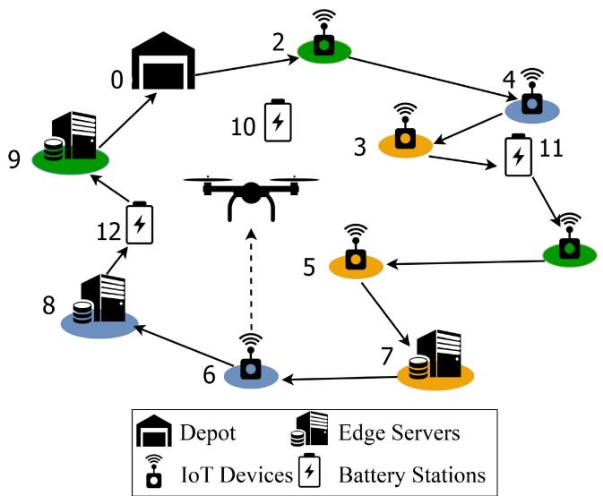  
Fig. 1. Illustration of UAV-enabled IoT data collection and offloading with energy constraints.

Let $V _ { 1 } = \{ 1 , 2 , \dots , M \}$ denote the set of M IoT devices, $V _ { 2 } \ = \ \{ ( M + 1 ) , ( M + 2 ) , \ldots , N \}$ be the set of (N-M) edge servers, and $V _ { 3 } = \{ ( N + 1 ) , ( N + 2 ) , \ldots , ( N + L ) \}$ represent the set of L battery stations. Note that IoT devices and edge servers can only be visited once. However, the battery station can be visited more than once if necessary. For ease of presenting our problem formulation, let $V = \{ 0 \} \cup V _ { 1 } \cup V _ { 2 } \cup$ ∪ $V _ { 3 } .$ , where the number “0” represents the depot. We use $I _ { m }$ to represent a set of IoT devices whose data will be offloaded to an edge server m. For $n \in V _ { 1 }$ and $m \in V _ { 2 }$ , let $d _ { n }$ and $d _ { m }$ denote the amount of data to collect from an IoT device n and the amount of data to be loaded onto an edge server m. The amount of data to be offloaded to an edge server $m ,$ denoted as $d _ { m }$ , can be computed as the sum of the data from the IoT devices in $I _ { m }$ . That is,

$$
d _ { m } = \sum _ { n \in I _ { m } } d _ { n } ,\tag{1}
$$

for all $m \in V _ { 2 }$ . To maintain a high-speed and reliable transmission link, data collection and offloading actions require the UAV to hover above the respective node to proceed. In this case, the communications channel is dominated by a lineof-sight (LoS) link, and the IoT device-to-UAV (as well as UAV-to-edge server) data transmission rate can be expressed as [2], [9], [13], [33], [34], [35]

$$
R = B \log _ { 2 } \biggl ( 1 + \frac { P _ { \mathrm { t } } \beta H ^ { - \alpha } } { B N _ { 0 } } \biggr ) ,\tag{2}
$$

where B indicates the channel bandwidth, $P _ { \mathrm { t } }$ accounts for the transmit power, $\beta$ represents the average reference channel power gain, H denotes the UAV’s constant flying altitude, α denotes the path loss exponent, and $N _ { 0 }$ is the noise power spectral density. Note that the small-scale fading is ignored in (2) since its impact on the transmission rate is significantly small when the UAV is above the ground devices, as illustrated in [2]. For ease of exposition, we suppose that the UAV and IoT devices have the same transmission rate. The hovering time of the UAV for data collection or offloading can be computed as

$$
t _ { i } ^ { \mathrm { d a t a } } = \frac { d _ { i } } { R } ,\tag{3}
$$

where i can either be an IoT device or an edge server, i.e., $i \in \{ V _ { 1 } \cup V _ { 2 } \}$

## B. Problem Formulation

Let us define a binary variable $x _ { i , j }$ , where $x _ { i , j } = 1$ if the UAV flies from node i to node j on the trajectory and $x _ { i , j } = 0 _ { : }$ otherwise. Formulating the problem is challenging because of the energy constraint. Note that some battery stations may be visited more than once, while others may not be visited. To handle this, we define a set of dummy nodes $V _ { 3 } ^ { \prime } ,$ each representing a possible visit of the UAV to any battery station. The UAV may need to visit one of the battery stations after leaving the depot, any IoT device, or any edge server. After replacing the battery, we assume the UAV’s energy is always sufficient to visit the next IoT device or edge server. In other words, the UAV does not need to visit consecutive battery stations. Therefore, the UAV may visit up to $N + 1$ times a certain battery station. The maximum number of dummy nodes in $V _ { 3 } ^ { \prime }$ can be determined as $L \times ( N + 1 )$ , where L is the number of battery stations. To this end, the set of battery stations $V _ { 3 }$ is replaced by the set of dummy nodes $V _ { 3 } ^ { \prime } ,$ i.e., $V = \{ \boldsymbol { 0 } \} \cup V _ { 1 } \cup { \bar { V } } _ { 2 } \cup V _ { 3 } ^ { \prime } .$ The number of nodes in the problem is $N ^ { \prime } \triangleq ( L + 1 ) \times ( N + 1 )$

To formulate the precedence constraints, we adopt the Miller-Tucker-Zemlin (MTZ) method proposed in [36] for the classical formulation of the TSP problem. Specifically, we introduce auxiliary variables $u _ { i } .$ , for all $i = 1 , \ldots , N ^ { \prime }$ , to track the visiting order of each node i. In this case, $u _ { i } < u _ { j }$ implies that node i is visited before node j on the path. The precedence constraint for each group of IoT devices requires the UAV to collect data from all IoT devices in the group before offloading it to the corresponding edge server. This is equivalent to

$$
u _ { m } - u _ { n } \geq 1 , \forall n \in I _ { m } , m \in V _ { 2 } .\tag{4}
$$

Regarding the energy constraint, we define $p _ { \mathrm { h } }$ and $p _ { \mathrm { f } }$ as the UAV’s hovering and flying power consumption rates, respectively. Let $z _ { i } ^ { \mathrm { o u t } }$ denote the remaining energy of the UAV leaving the node i, and $z _ { i } ^ { \mathrm { i n } }$ denote the remaining energy of the UAV arriving at the node $i , i \in V .$ The maximum battery capacity of the UAV is given as Q. We must have

$$
0 \leq z _ { i } ^ { \mathrm { i n } } \leq Q \mathrm { a n d } 0 \leq z _ { i } ^ { \mathrm { o u t } } \leq Q ,\tag{5}
$$

for all $i \in V .$ Let $q _ { i } \triangleq ( x _ { i } , y _ { i } , 0 )$ be the location of node i in V. The UAV is assumed to fly at a fixed speed v. The traveling time between two nodes $i , j$ is defined as

$$
t _ { i , j } = \frac { \| q _ { i } - q _ { j } \| } { v } ,\tag{6}
$$

for all $i , j \in V .$ The energy consumption for flying from node i to node j can be calculated as $p _ { \mathrm { f } } \times t _ { i , j } \times x _ { i , j }$ . It must hold that

$$
z _ { j } ^ { \mathrm { i n } } = z _ { i } ^ { \mathrm { o u t } } - p _ { \mathrm { f } } \times t _ { i , j } \times x _ { i , j } ,\tag{7}
$$

for all $i , j \in V .$ Once the UAV arrives on IoT devices or edge servers, it hovers for a specific time for data transmission. This behavior’s energy consumption depends on the hovering time, which is defined in (3). It is worth noting that the communication power consumption is negligible compared to the propulsion power consumption [23], [24], [32] and, thus, is not considered in this paper. When the UAV leaves a battery station, the remaining energy will be refreshed to the maximum capacity. The above requirements can be expressed by

$$
z _ { i } ^ { \mathrm { o u t } } = \left\{ \begin{array} { l l } { z _ { i } ^ { \mathrm { i n } } - p _ { \mathrm { h } } \times t _ { i } ^ { \mathrm { d a t a } } , } & { i \in \{ V _ { 1 } \cup V _ { 2 } \} , } \\ { Q , } & { i \in V _ { 3 } . } \end{array} \right.\tag{8}
$$

Note that each battery replacement at the battery station consumes a constant time C. The objective of the problem is to minimize the completion time, which can be expressed as the sum of the traveling time and the time spent on replacing the battery. Note that we do not consider the data collection and offloading time in the objective since the total data collection and offloading time is fixed, regardless of the visiting order in the UAV trajectory. The problem can be formulated as

$$
\operatorname* { m i n } _ { x _ { i , j } , u _ { i } , \quad } \left( \sum _ { \substack { i , j \in V , i \neq j } } t _ { i , j } x _ { i , j } + \sum _ { \substack { i \in V , j \in V _ { 3 } ^ { \prime } } } x _ { i , j } C \right)\tag{, (9a}
$$

$$
\mathrm { s u b j e c t ~ t o } \qquad ( 4 ) , ( 5 ) , ( 7 ) , ( 8 ) ,
$$

$$
x _ { i , j } \in \{ 0 , 1 \} , \quad \forall i , j \in V ,\tag{9b}
$$

(9c)

$$
\sum _ { j \in V , i \neq j } x _ { i , j } = 1 , \quad \forall i \notin V _ { 3 } ^ { \prime } ,\tag{9d}
$$

$$
\sum _ { j \in V , i \neq j } x _ { i , j } \leq 1 , \quad \forall i \in V _ { 3 } ^ { \prime } ,\tag{9e}
$$

$$
\sum _ { i \in V , i \neq j } x _ { i , j } = \sum _ { i \in V , i \neq j } x _ { j , i } , \quad \forall j \in V ,\tag{9f}
$$

$$
u _ { i } - u _ { j } + N ^ { \prime } \big ( x _ { i , j } - 1 \big ) \le - 1 , ~ \forall i \ge 1 ,
$$

$$
j \geq 1 , i \neq j ,\tag{9g}
$$

$$
x _ { i , j } = 0 , \quad \forall \ i , j \in \ V _ { 3 } ^ { \prime } ,
$$

$$
z _ { 0 } ^ { \mathrm { o u t } } = Q ,\tag{9h}
$$

(9i)

$$
1 \leq u _ { i } \leq N ^ { \prime } , \ \forall i \geq 1 .\tag{9j}
$$

The constraint in (9d) ensures that all IoT devices and edge servers must be visited exactly once. The constraint in (9e) guarantees that each dummy node can be visited at most once. Note that multiple visits to a battery station are allowed via association with multiple dummy nodes. The number of incoming and outgoing must be the same for each node as indicated by the constraint in (9f). The constraint in (9g) is used for the elimination of subtours following the MTZ formulation, and the constraint in (9h) makes sure that the UAV will not consecutively visit two battery stations. Finally, the constraints in (9i) and (9j) account for the initial energy of the UAV and the bounds of the auxiliary variable $u _ { i } ,$ respectively.

The problem in (9) is a mixed-integer linear programming (MILP) optimization problem, which is an NP-hard problem. Finding its globally optimal solution is impractical in largescale situations. For example, given $N = 1 0 0$ and $L = 4 ,$ the total number of nodes in the formulated problem is up to $N ^ { \prime } = ( L + 1 ) \times ( N + 1 ) = 5 0 5$ , which is intractable to be solved using exact algorithms. One can follow the alternating optimization approach to decompose the problem into subproblems and solve them iteratively. However, the combinatorial nature of binary variables makes it intractable to solve exactly after decomposition. To deal with this, we propose a three-stage heuristic algorithm to find a feasible solution to the above problem efficiently.

## IV. TIME MINIMIZATION TRAJECTORY PLANNING (TMTP) ALGORITHM

This section describes our proposed time minimization trajectory planning (TMTP) algorithm, which is composed of three stages. In the first stage, we propose a Trajectory with a Precedence Constraints Algorithm to generate the visiting order of IoT devices and edge servers without considering the energy constraint. In the second stage, we propose a Battery Station Selection Algorithm to insert battery stations and find a feasible trajectory under the energy constraint. In the last stage, we design a Trajectory Refining Algorithm to reduce further the trajectory’s completion time obtained in the previous stage.

## A. Trajectory With Precedence Constraints Algorithm

In this stage, we generate a UAV visiting order $\pi =$ $\left\{ \pi _ { 0 } , \pi _ { 1 } , \pi _ { 2 } , \ldots , \pi _ { N } , \pi _ { N + 1 } \right\}$ with precedence constraints only, without considering the energy constraint. After completing the mission, the UAV must return to the depot, i.e., $\pi _ { N + 1 } = \pi _ { 0 }$ . By temporarily disabling the energy constraint, the problem can be viewed as a multiple many-to-one PDP problem, which is also an NP-hard problem. We propose a simple algorithm to find a suboptimal solution. First, we find a minimum distance visiting order $\left\{ \pi _ { 0 } , \pi _ { 1 } , \pi _ { 2 } , \ldots , \pi _ { M } , \pi _ { M + 1 } \right\}$ serving IoT devices only. The problem reduces to the classical TSP problem, which is also an NP-hard problem. Finding the exact solution of such a problem cannot be done in polynomial time [37]. Here, we follow the method proposed in [38] to formulate the TSP problem as an MILP problem, which can be efficiently solved by state-of-the-art optimization solvers, e.g., Gurobi [39], for a moderate number of nodes. For a large-scale case, the TSP problem can be solved efficiently by numerous approximation algorithms proposed in the literature, for example, the Christofides algorithm in [40]. Note that all approaches above aim to obtain a suboptimal solution to the TSP problem. Next, we follow a greedy approach to insert edge servers into the resulting TSP visiting order while considering the precedence constraints. Precisely, for each group of IoT devices, we determine the last node of the group visited in the visiting order and mark it as $p _ { m }$ . Intuitively, we place the edge server at the position where the flying path passing through it costs the minimum total distance. Note that the edge server can only be inserted into the position after $p _ { m }$ in the visiting order. The procedure is summarized in Algorithm 1. Inserting $( N - M )$ edge servers requires the worst complexity of $\mathcal { O } ( N ( N - M ) )$ ).

Algorithm 1 Trajectory With Precedence Constraints   
Algorithm   
Input: $\overline { { V _ { 1 } , V _ { 2 } } } .$ , and $I _ { m } , \forall m \in V _ { 2 } .$   
Output: The trajectory π with precedence constraints.   
1: Solve TSP problem for all IoT devices (i.e., all nodes in   
$V _ { 1 } )$ to obtain visiting order π with $\pi _ { \mathrm { e n d } }$ as the end node.   
2: for each group $I _ { m }$ do   
3: Find node $p _ { m } \in I _ { m }$ that is last visited in $\pi .$   
4: Compute $C _ { n }$ as the cost if edge server m is inserted   
to position $n \in [ p _ { m } + 1 , \pi _ { \mathrm { e n d } } ]$   
5: Find $n ^ { * } = a r g m i n _ { n } C _ { n } .$   
6: Insert edge server m to position $n ^ { * }$ in $\pi .$   
7: end for   
8: Return π

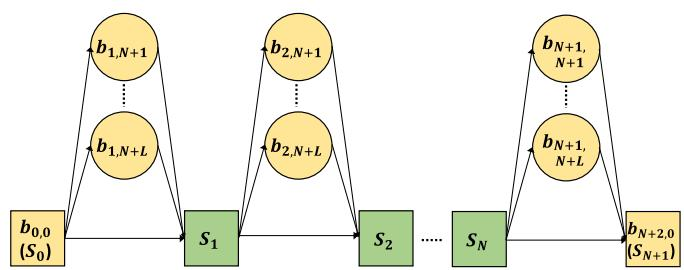  
Fig. 2. Any state $b _ { i , j }$ can be inserted between state $s _ { i - 1 }$ and $s _ { i }$ to satisfy the energy constraints, for $1 \leq i \leq N + 1$ and $N + 1 \leq \bar { j } \leq N { \dot { + } } L$

## B. Battery Station Selection Algorithm

In the second stage, we consider the energy constraints that were skipped in the previous stage. The main idea is based on a dynamic programming approach to insert battery stations into the trajectory and produce a feasible visiting order for our problem. We define $s _ { i } ,$ for all $0 \leq i \leq N + 1$ , as the state when the UAV visits the position $\pi _ { i }$ in the trajectory. Then, $S =$ $\{ s _ { 0 } , s _ { 1 } , \ldots , s _ { N + 1 } \}$ is the sequence of states representing the visiting order π. Furthermore, let $b _ { i , j }$ denote the state where the UAV leaves from $s _ { i - 1 }$ to change the battery at station $j ,$ and then goes to $s _ { i } ,$ as illustrated in Fig. 2. Since the UAV is required to return to the depot after the mission, we have $s _ { 0 } = s _ { N + 1 } , \ b _ { 0 , 0 } = s _ { 0 }$ , and $b _ { N + 2 , 0 } = s _ { N + 1 }$ . We need to insert the battery stations in the trajectory, i.e., adding states $b _ { i , j }$ into the state sequence $S ,$ to ensure that the UAV’s energy never drains out on the way while aiming to minimize the total flight time.

Let $T ( b _ { k , l } , b _ { i , j } )$ , for all $k \ < \ i$ and $l \ < \ j ,$ denote the travel time from state $b _ { k , l }$ passing through intermediate nodes between $\pi _ { k }$ and $\pi _ { i - 1 }$ and arriving the state $b _ { i , j } . \ T ( b _ { k , l } , b _ { i , j } )$ can be computed as

$$
\begin{array} { r } { T \big ( b _ { k , l } , b _ { i , j } \big ) = \left\{ \begin{array} { l l } { t _ { l , j } , \mathrm { i f } \ \{ k = l = 0 , i = 1 \} \ \mathrm { o r } } \\ { \qquad \{ k = N + 1 , i = N + 2 , j = 0 \} , } \\ { t _ { l , \pi _ { k } } + \sum _ { n = k } ^ { i - 2 } t _ { \pi _ { n } , \pi _ { n + 1 } } + t _ { \pi _ { i - 1 } , j } , } \\ { \mathrm { o t h e r w i s e , } } \end{array} \right. } \end{array}\tag{10}
$$

where $\{ k = l = 0 , i = 1 \}$ indicates the case where the UAV starts from the depot and goes to an IoT device before visiting a certain battery station, and $\{ k = N + 1 , i = N + 2 ,$ j $= 0 \}$ accounts for the case where the UAV returns to the depot from a certain battery station. The energy consumption $E ( b _ { k , l } , b _ { i , j } )$ that corresponds to the time cost $T ( b _ { k , l } , b _ { i , j } )$ can be computed as

$$
\begin{array} { l }  { \displaystyle { \cal E } \big ( b _ { k , l } , b _ { i , j } \big ) = p _ { \mathrm { f } } T \big ( b _ { k , l } , b _ { i , j } \big ) + \left\{ \begin{array} { l l } { { \displaystyle \sum _ { n = k } ^ { i - 1 } p _ { \mathrm { h } } \frac { d _ { \pi _ { n } } } { R _ { \pi _ { n } } } } } _ { \pi _ { n } \in V _ { 1 } } } } \\ { \right\{ \displaystyle ~ + \left\{ \begin{array} { l l } { { \displaystyle \sum _ { m = k } ^ { i - 1 } p _ { \mathrm { h } } \frac { d _ { \pi _ { m } } } { R _ { \pi _ { m } } } } } _ { \pi _ { m } \in V _ { 2 } } , } } \end{\right\array} } \end{array} \end{array} \end{array}\tag{1}
$$

where $p _ { \mathrm { f } }$ and $p _ { \mathrm { h } }$ denote the energy consumption rates for flying and hovering modes, respectively. The terms on the right-hand side of (11) account for moving energy consumption, hovering energy consumption for data collection at IoT devices, and hovering energy consumption for data offloading at edge servers, respectively. Note that the hovering time depends on data size $d _ { \pi }$ and transmission rate $R _ { \pi }$

The dynamic programming approach is employed as follows. Let dp[i ][j ] denote the minimum time cost from the initial state $s _ { 0 }$ (or $b _ { 0 , 0 } )$ to state $b _ { i , j }$ , for all $i , j .$ Our goal is to find the optimal result of $d p [ N + \tilde { 2 } ] [ 0 ]$ , which is the minimum trajectory time from state s0 passing through all states $s _ { i } , 1 \leq$ $i \leq N ,$ and returning to state $s _ { N + 1 } \ ( \mathbf { o r \ } b _ { N + 2 , 0 } )$ under energy constraints. Specifically, we can compute the optimal time cost at state $b _ { i , j }$ as

$$
\begin{array} { r l r } & { } & { d p [ i ] [ j ] = \underset { N + 1 \leq l \leq l } { \operatorname* { m i n } } \quad \big \{ d p [ k ] [ l ] + T \big ( b _ { k , l } , b _ { i , j } \big ) + C _ { i } , } \\ & { } & { \quad N + 1 \leq l \leq N + L } \\ & { } & { \quad \mathrm { s u c h ~ t h a t ~ } ~ E \big ( b _ { k , l } , b _ { i , j } \big ) \leq Q \big \} , \qquad ( \mathrm { ~ l ~ } , l ) } \end{array}\tag{12}
$$

for all $1 \leq i \leq N + 2$ and $N + 1 \leq j \leq N + L .$ where $C _ { N + 2 } =$ 0 and $C _ { i } = C$ for all $i < N + 2$ are battery replacement time at the state $b _ { i , j }$ . In (12), dp[k][l] is the optimal solution from the depot $b _ { 0 , 0 }$ to the state $b _ { k , l }$ and $T ( b _ { k , l } , b _ { i , j } )$ is the travel time cost from $b _ { k , l }$ to $b _ { i , j }$

Algorithm 2 presents details of our proposed dynamic programming-based algorithm. We first initialize an array dp to store the task completion time. Select\_b and Select\_p are defined to store the index of the selected battery station and the position on the trajectory where the battery station is inserted, respectively. Next, we compute the bottom-up values of dp[i][j] and find $b _ { k , l }$ minimizing dp[i][j] while satisfying energy consumption $\dot { E ( b _ { k , l } , b _ { i , j } ) } \le Q$ . We obtain the final trajectory by tracing back the selections stored in Select\_b and Select\_p. The time complexity of Algorithm (2) can be computed as $\mathcal { O } ( N ^ { 2 } L ^ { 2 } )$

## C. Trajectory Refining Algorithm

The resulting trajectory in the second stage is a feasible solution for which the main path relies on solving the TSP problem in the first stage. Due to the insertion of edge servers and battery stations after that, the visiting order is more feasible and could be further improved to minimize the completion time. An example is shown in Fig. 3, where the trajectory after stage 1 (blue path) has been inserted with two battery stations (i.e., between node 2 and node 3 and between node 6 and node 7) in stage 2, resulting in a new trajectory (red path). We can see that the visiting order in the segment between battery station 8 and battery station 9 can be changed to minimize the time cost further. Furthermore, the energy constraint of the segment will still hold as long as the new visit order has a shorter time cost.

Algorithm 2 Battery Station Selection Algorithm   
Input: Trajectory without energy constraints π.   
Output: Trajectory with energy constraints πˆ.   
1: Initialize:   
2: Set $d p [ 0 ] [ 0 ] = 0 , d p [ i ] [ j ] = \infty , \forall i > 0 , j > 0 .$   
3: Set $C _ { 0 } = 0 , C _ { i } = C , \forall i > 0 .$   
4: Set $S e l e c t \_ p [ i ] [ j ] = 0 , S e l e c t \_ b [ i ] [ j ] = 0 , \forall i , j .$   
5: for i = 1 to N + 1 do   
6: for $j = N + 1 \mathrm { \ t o \ } N + L$ do   
7: for k = 0 to i − 1 do   
8: for $l = N + 1$ to $N + L$ do   
9: Compute $T ( b _ { k , l } , b _ { i , j } )$ and $E ( b _ { k , l } , b _ { i , j } )$   
using (10) and (11).   
10: if $\tilde { d p } [ k ] [ l ] + T ( b _ { k , l } , b _ { i , j } ) < d p [ i ] [ j ]$ and   
$E ( b _ { k , l } , b _ { i , j } ) \leq Q$ then   
11: $d \dot { p } [ i ] [ j ] = d p [ k ] [ l ] + T ( b _ { k , l } , b _ { i , j } ) + C _ { i }$   
12: Select \_p[i ][j ] = k   
13: Select \_b[i ][j ] = l   
14: end if   
15: end for   
16: end for   
17: end for   
18: end for   
19: Set $\hat { \pi } = \pi , i = ( N + 2 ) , j = 0$   
20: while $i > 0$ do // trace back to get trajectory   
21: Insert $S e l e c t \_ b [ i ] [ j ]$ into position Select \_p[i ][j ] of πˆ.   
22: Set $i = S e l e c t \_ p [ i ] [ j ] , \ j = S e l e c t \_ b [ i ] [ j ] .$   
23: end while   
24: Return πˆ

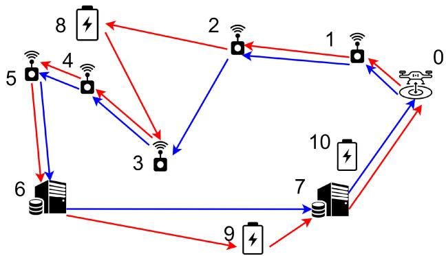  
Fig. 3. Trajectory after stage 1 (blue) and trajectory after stage 2 (red).

Inspired by the above observation, we divide the trajectory into multiple sub-trajectories at battery stations and refine each sub-trajectory while ensuring precedence and energy constraints. Specifically, we separate the trajectory sequence πˆ obtained in the second stage into multiple sub-trajectories partitioned by battery stations. Let W be the number of subtrajectories. Each sub-trajectory is denoted as $\sigma _ { i } , 0 \leq i <$ W, and is refined individually using Algorithm 1. After each sub-trajectory $\sigma _ { i }$ is refined, we concatenate all $\sigma _ { i } ^ { * }$ to get a complete trajectory $\hat { \pi } ^ { \prime }$ satisfying the energy and precedence constraints. If the trajectory cost of $\hat { \pi } ^ { \prime }$ is not better than that of the previous trajectory, we use trajectory $\hat { \pi } ^ { \prime }$ as the final result. Otherwise, we temporarily remove the battery stations and then apply Algorithm 2 to insert new battery stations, aiming to improve the trajectory cost further. Let us denote the resulting trajectory by $\hat { \pi } ^ { \prime \prime }$ . If the trajectory cost of $\hat { \pi } ^ { \prime \prime }$ is not better than ${ \hat { \pi } } ^ { \prime } ,$ , we will output it as the final result. Otherwise, we use $\hat { \pi } ^ { \prime \prime }$ as the input trajectory in the next iteration, where we repeat the above procedure, starting with splitting it into sub-trajectories. The proposed algorithm in this stage is summarized in Algorithm 3. The algorithm stops when the new trajectory has no improvement in the completion time compared to the previous trajectory.

Algorithm 3 Iterative Algorithm for Refining Trajectory   
Input: πˆ   
Output: $\pi ^ { * }$   
1: while true do   
2: Separate $\hat { \pi }$ by battery stations and get W sub  
trajectories $\sigma _ { i } ,$ for all $0 \leq i < W$   
3: for $i = 0$ to $( W - 1 )$ do   
4: Apply Algorithm 1 for sub-trajectory $\sigma _ { i } ,$   
obtain $\sigma _ { i } ^ { * }$   
5: end for   
6: Concatenate all sub-trajectories $\sigma _ { i } ^ { * }$ get trajectory $\hat { \pi } ^ { \prime } .$   
7: if $\hat { \pi } ^ { \prime } = \hat { \pi }$ then // if trajectory is not improved   
8: $\pi ^ { * } = \hat { \pi } ^ { \prime }$   
9: break   
10: end if   
11: Remove battery stations in $\hat { \pi } ^ { \prime }$ to get πˆtemp.   
12: Apply Algorithm 2 for πˆtemp to insert battery sta  
tions, obtain $\hat { \pi } ^ { \prime \prime } .$   
13: if $\hat { \pi } ^ { \prime \prime } = \hat { \pi } ^ { \prime }$ then // if trajectory is not improved   
14: $\pi ^ { * } = \hat { \pi } ^ { \prime \prime }$   
15: break   
16: end if   
17: $\hat { \pi } = \hat { \pi } ^ { \prime \prime }$   
18: end while   
19: Return $\pi ^ { * }$

An example of refining trajectories in stage 3 is illustrated in Fig. 4. Suppose the feasible trajectory πˆ after stage 2 is {0, 1, 2, 8, 3, 4, 5, 6, 9, 7, 0} as shown by the red path in Fig. 3. We first separate the trajectory πˆ by battery stations into {0, 1, 2, 8}, {8, 3, 4, 5, 6, 9}, and {9, 7, 0}. Then, we apply the algorithm in stage 1 for each sub-trajectory. In this example, suppose sub-trajectories {0, 1, 2, 8} and {9, 7, 0} are unchanged, but {8, 3, 4, 5, 6, 9} is changed to {8, 5, 4, 3, 6, 9}. By concatenating the three sub-trajectories, we get the new trajectory $\hat { \pi } ^ { \prime } = \{ 0 , 1 , 2 , 8 , 5 , 4 , 3 , 6 , 9 , 7 , 0 \}$ as shown by the blue path in Fig. 4, which is better than the original trajectory πˆ. Next, we remove the battery stations from $\hat { \pi } ^ { \prime }$ and get a new trajectory without the battery stations, which is {0, 1, 2, 5, 4, 3, 6, 7, 0}. By applying the stage 2 algorithm to insert the battery stations, we get a new trajectory $\hat { \pi } ^ { \prime \prime } = \{ 0 , 1 , 2 , 8 , 5 , 4 , 3 , 6 , 7 , 1 0 , 0 \}$ as shown by the red path in Fig. 4. In the new trajectory, the UAV flies to battery station 10 rather than battery station 9 at the end of the second subtrajectory since the sub-trajectory has been shortened after refinement, and the UAV’s remaining battery is sufficient to reach station 10 for a battery replacement. Iteratively, we can segment the new sub-trajectory of $\hat { \pi } ^ { \prime \prime }$ and repeat the previous steps for refinement until the trajectory cannot be improved anymore.

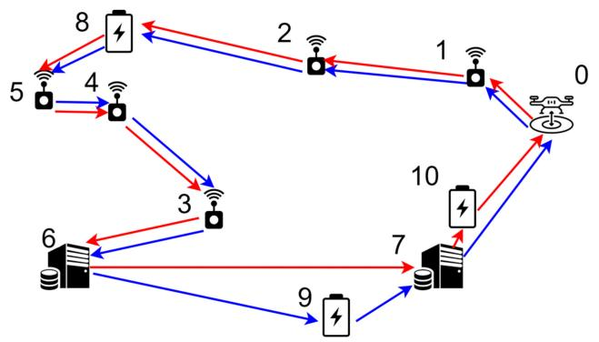  
Fig. 4. Trajectories after refining sub-trajectories (blue) and refining battery stations’ positions (red) in stage 3.

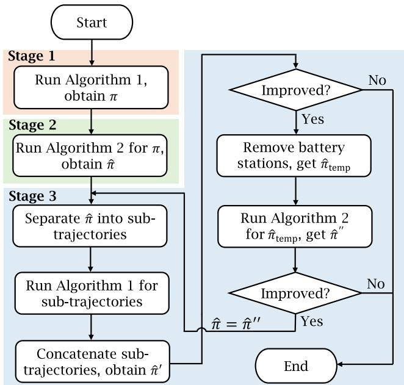  
Fig. 5. The flowchart summarizes the proposed TMTP algorithm.

The flowchart in Fig. 5 summarizes the steps of the proposed TMTP framework, which are organized into three stages. Each framework stage corresponds to a particular algorithm, which has been presented in detail in previous sections. In particular, Algorithm 3 in stage 3 refines the trajectory by splitting it into subtrajectories and iteratively solving them using Algorithm 1 and Algorithm 2. Note that Algorithm 3 is terminated if the new trajectory is not improved from the previous trajectory, and because the objective is limited, the convergence of the algorithm is guaranteed.

## V. SIMULATION RESULTS

This section presents simulation results to evaluate the performance of the proposed TMTP algorithm. Unless mentioned otherwise, 100 IoT devices and edge servers are uniformly deployed in an area of 8000 m × 8000 m. The ratio of IoT devices to edge servers is fixed at 9:1, and 3 battery stations are evenly distributed throughout the region. The maximum battery capacity Q is set to 2.7 kJ. Following the energy consumption model in [35], [41], we set the power consumption rates of flying and hovering modes to $p _ { \mathrm { f } } = 1 7 8$ J/s and $p _ { \mathrm { h } } = 1 6 9 ~ \mathrm { J / s } .$ , respectively. The UAV flying speed is 10 m/s [35], and the UAV flying height is set at $H = 1 0 0 \textrm { m }$ The battery replacement process at the station typically takes multiple steps, such as landing, swapping batteries, and taking off. Here, we assume a constant battery replacement time to $C \ = \ 2 4 0$ seconds. For communications, we set $\begin{array} { r l } { P _ { \mathrm { t } } } & { { } = } \end{array}$ ${ \mathrm { 0 . 1 ~ W , ~ } } B = 1 \mathrm { ~ M H z , ~ } \alpha = 2 , \beta = - 6 0 \mathrm { ~ d B } ,$ and $N _ { 0 } \ =$ −174 dBm/Hz [42]. The data amounts of the IoT devices are randomly selected in a range of [1, 5] Mbits [43]. In our TMTP scheme, we employ the Gurobi [39] solver to solve the MILP-formulated TSP problem in the first stage. The results average 200 placement realizations of IoT devices and edge servers. The simulation is implemented in Python and runs on a computer with an Intel Core i7-10700F @2.9 GHz processor and 32 GB of memory.

Notice that various existing algorithms have been designed to optimize UAV trajectory planning for IoT data collection, as surveyed in Section II. However, most of them do not jointly solve the precedence and energy constraints with battery replacement. Among them, some solutions are based on reinforcement learning algorithms, e.g., [9], [17], which often incur a significant computational cost during training and may therefore be impractical for applications with limited training data and resources. Such algorithms typically perform well only for a specific configuration of network parameters, and any change in these parameters may necessitate retraining. Here, we follow more practical and adaptable algorithms in [7], [30] and implement four baselines, namely, Greedy, ACS-SA, Greedy-2opt, and ACS-SA-2opt as follows:

Greedy: From the depot, the UAV chooses the closest nodes with precedence constraints to visit IoT devices and edge servers. We insert the nearest battery station on the trajectory with the precedence constraint before the battery runs out.

ACS-SA [7]: ACS-SA is an algorithm proposed in [7] that combines the Ant Colony System (ACS) and Simulated Annealing (SA) to solve the TSP problem with the precedence constraint. We use this algorithm to generate the UAV trajectory with the precedence constraints. Then, the above greedy method is employed to insert the nearest battery stations to satisfy the energy constraints.

Greedy-2opt [30]: We first use the greedy strategy to generate a trajectory with precedence constraints and then use the proposed 2-opt algorithm [30] to insert battery stations into the trajectory. Note that the 2-opt algorithm does not consider the precedence constraints.

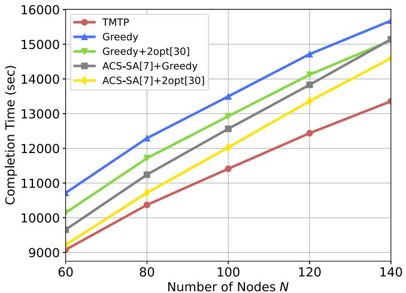  
Fig. 6. Completion time versus number of nodes N.

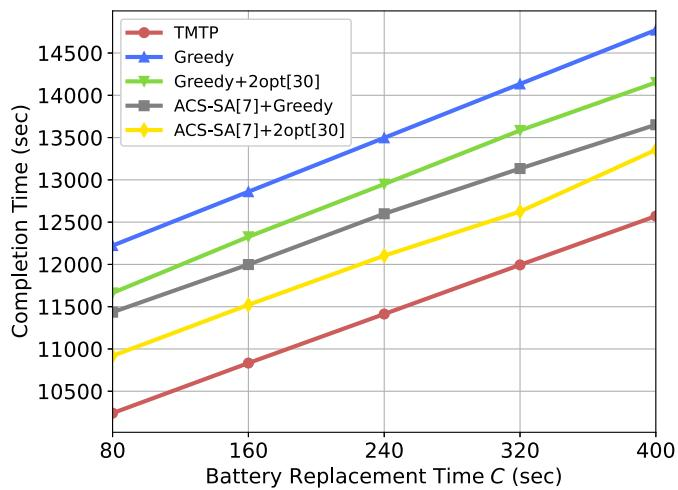  
Fig. 7. Completion time versus battery replacement time C.

ACS-SA-2opt: We combine ACS-SA and 2-opt methods to solve our problem. The ACS-SA algorithm generates a visiting order that satisfies the precedence constraints, and the 2-opt method is used to insert battery stations under energy constraints.

In Fig. 6, we compare the performance in terms of comple tion time with the number of total visit nodes N. As expected, the completion time increases as the number of nodes increases in all methods. The Greedy method performs the worst since visiting the nearest node cannot optimally minimize the longterm cost. The results indicate that the ACS-SA algorithm can find a better UAV trajectory with a precedence constraint than the greedy strategy. On the other hand, the 2-opt algorithm [30] is more efficient than the greedy strategy of inserting battery stations into the UAV trajectory. In general, our proposed TMTP algorithm outperforms all baselines since it considers long-term cost while selecting the next visit, the precedence constraint, and the insertion of the battery.

In Fig. 7, we examine the completion time with different battery replacement time settings. Our TMTP algorithm performs better than all other baselines in this test. Also, as the battery replacement time increases, we can observe that the completion time increases in all schemes since the UAV spends longer durations replacing batteries at battery stations. Our proposed algorithm, with the battery station insertion strategy, can adjust the timing of battery replacements according to the battery replacement time. It can thus reduce the frequency of visiting battery stations.

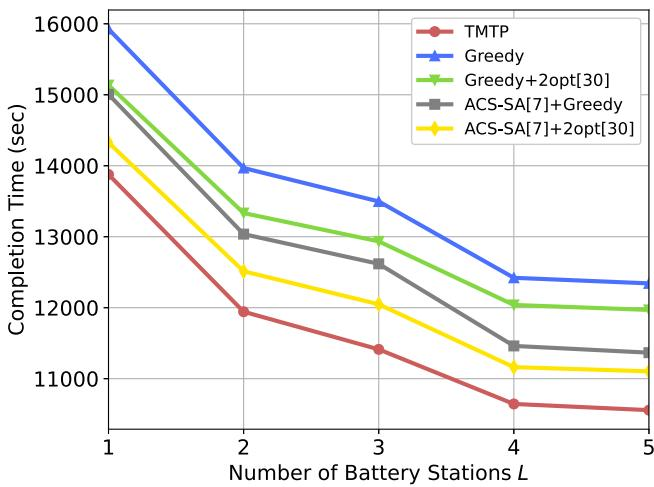

(a) Completion time versus number of battery stations L.  
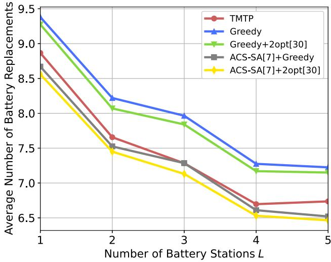  
(b) Average number of battery replacements versus number of battery stations L  
Fig. 8. Comparison under different settings of the number of battery stations L.

In Fig. 8a, we examine the completion time with respect to the number of battery stations. The result shows that the completion time decreases as more battery stations are available in all schemes, since the UAV does not need to move long distances to replace the battery. The decrease is significant when the number of battery stations is still small because the UAV could save a lot of distance if one more battery station is added to the network. However, it gradually saturates when battery stations are deployed so densely that the UAV has multiple choices to replace the battery at similar costs, i.e., from L = 4 to L = 5. Our TMTP algorithm also dominates all the other methods in this test. It is worth noting that setting up more battery stations is costly in practice. Our algorithm demonstrates the advantage of saving costs by reducing the number of battery stations needed. The average number of battery replacements corresponding to this test is shown in Fig. 8b. As more battery stations are available in the network, the UAV does not need to spend much energy moving to the stations, thus increasing its endurance and reducing the number of battery replacements required for all schemes.

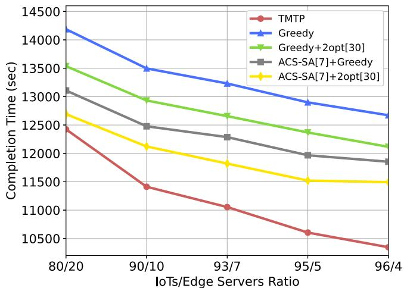  
Fig. 9. Completion time versus the number of IoT devices/the number of edge servers ratio.

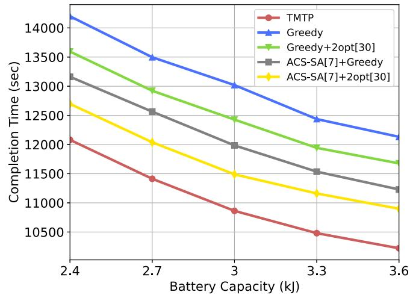  
Fig. 10. Completion time versus battery capacity.

In Fig. 9, we compare the completion time performance while varying the ratio between the number of IoT devices and the number of edge servers. As the ratio increases, the number of edge servers decreases, which implies fewer precedence constraints in the problem. This results in a reduction in the completion time in all methods. Our proposed TMTP algorithm maintains advantages over other methods, thus outperforming all baselines in this test.

In Fig. 10, we compare the completion time in different UAV battery capacity settings. When the battery capacity is higher, the UAV visits the battery stations less frequently, leading to a decrease in the completion time for all schemes. Our TMTP algorithm with a dynamic programming-based battery station replacement strategy continues to demonstrate significant superiority over other methods.

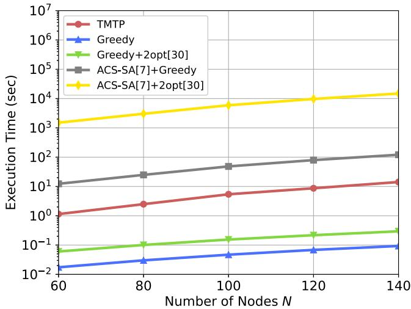  
Fig. 11. Execution time versus number of nodes N.

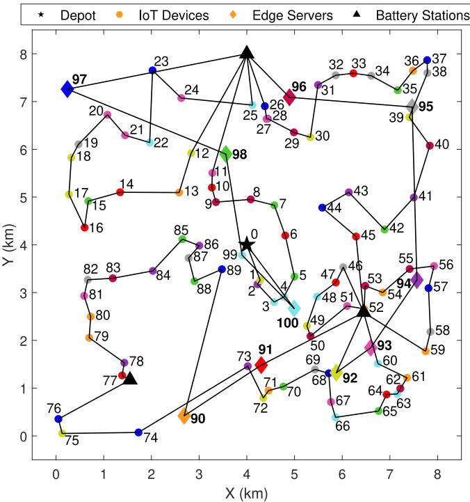  
Fig. 12. A realization of UAV trajectory generated by the proposed TMTP algorithm with 90 IoT devices, 10 edge servers, and 3 battery stations. Note that different groups, each including an edge server and its associated IoTs, are marked by different colors.

In Fig. 11, we compare the execution time of our method with the baselines for the test shown in Fig. 6. The Greedy scheme with the nearest-node selection strategy is the fastest, but achieves the poorest performance among all methods. The ACS-SA and ACS-SA-2opt algorithms are based on the ant colony algorithms that take a long time to converge. In particular, our proposed solution employs a state-of-the-art solver in the first stage and low-complexity algorithms in the second and third stages. Therefore, its running time is significantly faster than the two above algorithms.

In Fig. 12, we show a realization of the trajectory obtained by our proposed scheme in a test with 90 IoT devices, 10 edge servers, and 3 battery stations. The IoT devices and edge servers are numbered by their visiting order on the UAV trajectory. For readability, the order excludes the battery stations. The precedence constraints are satisfied, as we can see that the UAV only visits an edge server after collecting data from all IoT devices associated with that edge server. We can also see that the UAV tends to collect data from IoT devices in all groups early and offload the data collected to edge servers later in the mission period. This strategy may save on traveling costs compared to individually serving IoT device groups. It is also observed that some battery stations can be visited more frequently if they are placed near more nodes. In contrast, some battery stations may have fewer visits if not many nodes surround them.

## VI. CONCLUSION

This work focused on studying a single UAV collecting data from IoT devices on the ground and offloading the collected data to their respective edge servers. We formulated the problem as a multiple many-to-one pickup and delivery problem with precedence and energy constraints. We then proposed a three-stage algorithm to solve the problem efficiently. In the first stage, we generated the initial visiting order of devices by solving the TSP of IoT devices and inserting edge servers. In the second stage, we designed a dynamic programming-based method to insert battery stations and obtain a feasible trajectory solution. In the last stage, we refined the trajectory by optimizing sub-trajectories and reinserting battery stations into the trajectory iteratively. Numerous simulation results verified that the proposed method outperforms the existing algorithms in total completion time of the UAV and the execution time of the algorithms.

## REFERENCES

[1] M. Mozaffari, W. Saad, M. Bennis, Y.-H. Nam, and M. Debbah, “A tutorial on UAVs for wireless networks: Applications, challenges, and open problems,” IEEE Commun. Surveys Tuts., vol. 21, no. 3, pp. 2334–2360, 3rd Quart., 2019.

[2] C. You and R. Zhang, “3D trajectory optimization in Rician fading for UAV-enabled data harvesting,” IEEE Trans. Wireless Commun., vol. 18, no. 6, pp. 3192–3207, Jun. 2019.

[3] J. Bai, G. Huang, S. Zhang, Z. Zeng, and A. Liu, “GA-DCTSP: An intelligent active data processing scheme for UAV-enabled edge computing,” IEEE Internet Things J., vol. 10, no. 6, pp. 4891–4906, Mar. 2023.

[4] K. Ines, L. Anis, A. Cedric, and H. Mohamed, “UAVs trajectory optimization for data pick up and delivery with time window,” Drones, vol. 5, no. 2, p. 27, 2021.

[5] Y. Ding, B. Xin, and J. Chen, “Precedence-constrained path planning of messenger UAV for air-ground coordination,” Control Theory Technol. vol. 17, no. 1, pp. 13–23, 2019.

[6] Y. Zeng, X. Xu, and R. Zhang, “Trajectory design for completion time minimization in UAV-enabled multicasting,” IEEE Trans. Wireless Commun., vol. 17, no. 4, pp. 2233–2246, Apr. 2018.

[7] R. Skinderowicz, “An improved ant colony system for the sequential ordering problem,” Comput. Oper. Res., vol. 86, pp. 1–17, Oct. 2017.

[8] H. Guo and J. Liu, “UAV-enhanced intelligent offloading for Internet of Things at the edge,” IEEE Trans. Ind. Informat., vol. 16, no. 4, pp. 2737–2746, Apr. 2020.

[9] N. Zhao, Z. Ye, Y. Pei, Y.-C. Liang, and D. Niyato, “Multi-agent deep reinforcement learning for task offloading in UAV-assisted mobile edge computing,” IEEE Trans. Wireless Commun., vol. 21, no. 9, pp. 6949–6960, Sep. 2022.

[10] M. A. Messous, H. Hellwagner, S.-M. Senouci, D. Emini, and D. Schnieders, “Edge computing for visual navigation and mapping in a UAV network,” in Proc. IEEE Int. Conf. Commun. (ICC), 2020, pp. 1–6.

[11] J. Zhang et al., “Stochastic computation offloading and trajectory scheduling for UAV-assisted mobile edge computing,” IEEE Internet Things J., vol. 6, no. 2, pp. 3688–3699, Apr. 2019.

[12] J. Zhang, Y. Zeng, and R. Zhang, “UAV-enabled radio access network: Multi-mode communication and trajectory design,” IEEE Trans. Signal Process., vol. 66, no. 20, pp. 5269–5284, Oct. 2018.

[13] Z. Sun, D. Yang, L. Xiao, L. Cuthbert, F. Wu, and Y. Zhu, “Joint energy and trajectory optimization for UAV-enabled relaying network with multi-pair users,” IEEE Trans. Cogn. Commun. Netw., vol. 7, no. 3, pp. 939–954, Sep. 2021.

[14] X.-X. Shao, Y.-J. Gong, Z.-H. Zhan, and J. Zhang, “Bipartite cooperative coevolution for energy-aware coverage path planning of UAVs,” IEEE Trans. Artif. Intell., vol. 3, no. 1, pp. 29–42, Feb. 2022.

[15] D. Cattrysse, ˙I. Küçükoglu, and R. Dewil, “Hybrid simulated annealing ˘ and tabu search method for the electric travelling salesman problem with time windows and mixed charging rates,” Expert Syst. Appl., vol. 134, pp. 279–303, Nov. 2019.

[16] H. Huang and A. V. Savkin, “Deployment of charging stations for drone delivery assisted by public transportation vehicles,” IEEE Trans. Intell. Transp. Syst., vol. 23, no. 9, pp. 15043–15054, Sep. 2022.

[17] M. Fan et al., “Deep reinforcement learning for UAV routing in the presence of multiple charging stations,” IEEE Trans. Veh. Technol., vol. 72, no. 5, pp. 5732–5746, May 2023.

[18] X. Huang and X. Fu, “Fresh data collection for UAV-assisted IoT based on aerial collaborative relay,” IEEE Sensors J., vol. 23, no. 8, pp. 8810–8825, Apr. 2023.

[19] M. Samir, S. Sharafeddine, C. M. Assi, T. M. Nguyen, and A. Ghrayeb, “UAV trajectory planning for data collection from time-constrained IoT devices,” IEEE Trans. Wireless Commun., vol. 19, no. 1, pp. 34–46, Jan. 2020.

[20] J. Joseph, M. Radmanesh, M. N. Sadat, R. Dai, and M. Kumar, “UAV path planning for data ferrying with communication constraints,” in Proc. IEEE Annu. Consum. Commun. Netw. Conf. (CCNC), 2020, pp. 1–9.

[21] T. Shafique, H. Tabassum, and E. Hossain, “End-to-end energyefficiency and reliability of UAV-assisted wireless data ferrying,” IEEE Trans. Commun., vol. 68, no. 3, pp. 1822–1837, Mar. 2020.

[22] Y. Qin, M. A. Kishk, and M.-S. Alouini, “Stochastic geometrybased trajectory design for multi-purpose UAVs: Package and data delivery,” IEEE Trans.Veh. Technol., vol. 73, no. 3, pp. 4136–4150, Mar. 2024.

[23] M. Ren, X. Fu, P. Pace, G. Aloi, and G. Fortino, “Collaborative data acquisition for UAV-aided IoT based on time-balancing scheduling,” IEEE Internet Things J., vol. 11, no. 8, pp. 13660–13676, Apr. 2024.

[24] L. Zhai, X. Zhu, and C. Cheng, “Energy efficient data evacuation path for multi-UAV system based on multi-objective optimization method,” IEEE Trans. Veh. Technol., vol. 74, no. 5, pp. 7364–7377, May 2025.

[25] A. A. Amer, R. Ahmed, I. S. Fahim, and T. Ismail, “Energy optimization and trajectory planning for constrained multi-UAV data collection in WSNs,” IEEE Access, vol. 12, pp. 9047–9061, 2024.

[26] J. Zheng and K. Liu, “3D UAV trajectory planning with obstacle avoidance for UAV-enabled time-constrained data collection systems,” IEEE Trans. Veh. Technol., vol. 74, no. 1, pp. 1460–1474, Jan. 2025.

[27] C.-F. Cheng and C.-F. Yu, “Data gathering in wireless sensor networks: A combine-TSP-reduce approach,” IEEE Trans. Veh. Technol., vol. 65, no. 4, pp. 2309–2324, Apr. 2016.

[28] M. B. Ghorbel, D. Rodríguez-Duarte, H. Ghazzai, M. J. Hossain, and H. Menouar, “Joint position and travel path optimization for energy efficient wireless data gathering using unmanned aerial vehicles,” IEEE Trans. Veh. Technol., vol. 68, no. 3, pp. 2165–2175, Mar. 2019.

[29] Y. Lu, C. Yang, and J. Yang, “A multi-objective humanitarian pickup and delivery vehicle routing problem with drones,” Ann. Oper. Res., vol. 319, pp. 291–353, Jul. 2022.

[30] K. Sundar and S. Rathinam, “Algorithms for routing an unmanned aerial vehicle in the presence of refueling depots,” IEEE Trans. Autom. Sci. Eng., vol. 11, no. 1, pp. 287–294, Jan. 2014.

[31] K. Wang, X. Zhang, L. Duan, and J. Tie, “Multi-UAV cooperative trajectory for servicing dynamic demands and charging battery,” IEEE Trans. Mobile Comput., vol. 22, no. 3, pp. 1599–1614, Mar. 2023.

[32] H. Zhang et al., “UAV swarm path planning for sensor data collection via double pre-partitioned deep Q-network,” IEEE Sensors J., early access, Apr. 17, 2025, doi: 10.1109/JSEN.2025.3555602.

[33] J. Liu, F. Yang, X. Wang, L. Qu, M. Jin, and H. Dai, “Joint optimization of charging station placement and UAV trajectory for fresh data collection,” IEEE Internet Things J., vol. 11, no. 14, pp. 25057–25073, Jul. 2024.

[34] Q. Wu, Y. Zeng, and R. Zhang, “Joint trajectory and communication design for multi-UAV enabled wireless networks,” IEEE Trans. Wireless Commun., vol. 17, no. 3, pp. 2109–2121, Mar. 2018.

[35] S. Shen, K. Yang, K. Wang, G. Zhang, and H. Mei, “Number and operation time minimization for multi-UAV-enabled data collection system with time windows,” IEEE Internet Things J., vol. 9, no. 12, pp. 10149–10161, Jun. 2022.

[36] C. E. Miller, A. W. Tucker, and R. A. Zemlin, “Integer programming formulations and traveling salesman problems,” J. Assoc. Comput. Mach., vol. 7, no. 4, pp. 326–329, 1960.

[37] T. H. Cormen, C. E. Leiserson, R. L. Rivest, and C. Stein, Introduction to Algorithms, 3rd ed. Cambridge, MA, USA: MIT Press, 2009.

[38] G. Dantzig, R. Fulkerson, and S. Johnson, “Solution of a large-scale traveling-salesman problem,” Oper. Res., vol. 2, no. 4, pp. 393–410, 1954.

[39] “Gurobi optimizer.” 2024. Accessed: May 3, 2025. [Online]. Available: https://www.gurobi.com

[40] J. A. Hoogeveen, “Analysis of Christofides’ heuristic: Some paths are more difficult than cycles,” Oper. Res. Lett., vol. 10, no. 5, pp. 291–295, 1991.

[41] Y. Zeng, J. Xu, and R. Zhang, “Energy minimization for wireless communication with rotary-wing UAV,” IEEE Trans. Wireless Commun., vol. 18, no. 4, pp. 2329–2345, Apr. 2019.

[42] H.-A. Kuo, J.-P. Sheu, and N. Van Cuong, “Profit maximization for UAV trajectory planning in time-constrained data collection,” in Proc. IEEE Int. Conf. Commun. (ICC), 2023, pp. 5413–5418.

[43] J. Gong, T.-H. Chang, C. Shen, and X. Chen, “Flight time minimization of UAV for data collection over wireless sensor networks,” IEEE J. Sel. Areas Commun., vol. 36, no. 9, pp. 1942–1954, Sep. 2018.

Teng-Wu Chang received the B.S. degree in industrial engineering and the M.S. degree in information systems and applications from National Tsing Hua University, Hsinchu, Taiwan, in 2021 and 2024, respectively. He is currently a Software Engineer with Andes Technology Corporation. His research interests include UAV communications and wireless sensor networks.

Jang-Ping Sheu (Life Fellow, IEEE) received the B.S. degree in computer science from Tamkang University, Taiwan, China, in 1981, and the M.S. and Ph.D. degrees in computer science from National Tsing Hua University, Taiwan, in 1983 and 1987, respectively, where he is currently a Chair Professor with the Department of Computer Science and the Director of the Joint Research Center of Delta-NTHU, National Tsing Hua University. He served as an Associate Dean with the College of Electrical and Computer Science, National Tsing Hua University

from 2016 to 2017, where he served as the Director with the Computer and Communication Research Center from 2009 to 2015. He was a Director with the Computer Center, National Central University from 2003 to 2006, and the Department of Computer Science and Information Engineering from 1997 to 1999. His current research interests include wireless communications, mobile computing, Internet of Things, and UAV-assisted communication systems. He was an Associate Editor of the IEEE TRANSACTIONS ON PARALLEL AND DISTRIBUTED SYSTEMS and International Journal of Sensor Networks. He is an Advisory Board Member of International Journal of Ad Hoc and Ubiquitous Computing and International Journal of Vehicle Information and Communication Systems. He received the Distinguished Research Awards of the National Science Council of the Republic of China from 1993 to 1998. He received the Distinguished Engineering Professor Award from the Chinese Institute of Engineers in 2003. He received the K.-T. Li Research Breakthrough Award of the Institute of Information and Computing Machinery (IICM) in 2007. He received the Y. Z. Hsu Scientific Chair Professor Award and the Pan Wen Yuan Outstanding Research Award in 2009 and 2014, respectively. He received the Academic Award in Engineering from the Ministry of Education in 2016. He received the Medal of Honor in Information Sciences from the IICM 2017. He received the TECO award and the Chinese Institute of Electrical Engineering Fellow in 2019 and 2021. He is a member of the Phi Tau Phi Society.

Nguyen Van Cuong (Member, IEEE) received the B.S. degree in telecommunication-electronics engineering technology from DaLat University, Vietnam, in 2011, and the Ph.D. degree in communications engineering from National Tsing Hua University, Taiwan, in 2023, where he is currently a Postdoctoral Research Fellow with the Department of Computer Science. His research interests include wireless communications, Internet of Things and sensor networks, UAV communications, integrated sensing and communications, and machine learning for communications.