# URLLC-Aware Trajectory Plan and Beamforming Design for NOMA-Aided UAV Integrated Sensing, Communication, and Computation Networks

Peng Qin , Member, IEEE, Yang Fu , Zhigang Yu, Jing Zhang , and Xiongwen Zhao , Senior Member, IEEE

Abstract—Next-generation wireless network should complete integrated sensing, communication, and computation (ISCC) functionalities. To unlock the mutual gains of ISCC, non-orthogonal multiple access (NOMA) and unmanned aerial vehicle (UAV) are appealing techniques that can be invoked. In this work, we design a NOMA-aided UAV ISCC network, where UAV is dispatched as a multi-functional aerial node to perform edge computing for users, whilst radiating integrated sensing and communication beam to sense targets and further offload to a fog node. The objective is to maximize the computation throughput by jointly optimizing UAV trajectory planning, beamforming design and computing resource allocation while satisfying sensing quality, power consumption as well as ultra-reliable low latency communications (URLLC) requirements. We then propose a deep reinforcement learning (DRL)- based algorithm named SAC-TPBD to dynamically modify the UAV trajectory and transmission beamformer according to real-time user queue backlogs and URLLC constraint deviations, thereby realizing URLLC awareness. Evaluations demonstrate that compared to the state-of-the-art methods based on convex approximation techniques, the proposed SAC-TPBD achieves comparable computation performance and beampattern gains with higher implementation efficiency, and the queue backlog can be significantly reduced thanks to the URLLC awareness. Moreover, our approach outperforms baseline DRL schemes in terms of convergence and training stability.

Index Terms—Integrated sensing communication and computation (ISCC), UAV trajectory plan, beamforming design, non-orthogonal multiple access (NOMA), URLLC-aware, deep reinforcement learning (DRL).

# I. INTRODUCTION

M OTIVATED by emerging intelligent applications, e.g.,smart industry, autonomous driving, and environmental smart industry,autonomous driving,and environmental

Received 29 February 2024; revised 30 August 2024; accepted 11 September 2024. Date of publication 16 September 2024; date of current version 16 January 2025. This work was supported in part by the National Natural Science Foundation of China under Grant 62201212, in part by the Natural Science Foundation of Hebei Province under Grant F2022502017, in part by the Fundamental Research Funds for the Central Universities under Grant 2023JC003, in part by the National Key R&D Program of China under Grant 2021YFB2900500, and in part by Baoding Fundamental Research Project under Grant 2272P003. The review of this article was coordinated by Dr. Maged Elkashlan. (Corresponding authors: Peng Qin; Yang Fu.)

Peng Qin, Yang Fu, and Xiongwen Zhao are with the School of Electrical and Electronic Engineering, North China Electric Power University, Beijing 102206, China (e-mail: qinpeng@ncepu.edu.cn; 120222201193@ ncepu.edu.cn).

Zhigang Yu and Jing Zhang are with the China Academy of Electronics and Information Technology, Beijing 100041, China.

Digital Object Identifier 10.1109/TVT.2024.3460813

monitoring, next-generation wireless networks are envisioned to accomplish multiple functionalities, such as ultra-reliable connectivity, high-precision sensing, as well as low-latency computation [1], [2]. Integrated sensing and communication (ISAC) technique is a critical promoter for sharing scarce spectrum, energy and hardware resources, thereby enhancing the efficiency for both sensing and communication. Besides, ISAC introduces coordination benefits between the two functionalities to further facilitate the dual performance [3], [4]. In the meantime, mobile edge computing (MEC) is another appealing scheme that provides distributed computation services to mobile terminals, which significantly reduces end-to-end latency and backhaul traffic loads. Moreover, fog-aided MEC possesses more powerful and flexible computation capability, which is able to satisfy the growing computational demand through the collaboration of multiple layers [5]. Towards this end, endowing future network nodes with integrated sensing, communication, and computation (ISCC) capabilities, whilst fully pursing the mutual performance gains have attracted tremendous research interests [6].

However, the naive coexistence of sensing, communication, and computation functionalities without appropriate network design as well as resource management typically faces intrinsic performance conflicts [7], [8], [9]. To be specific, there normally exist non-line-of-sight (NLoS) links between terrestrial network and service objects, which may introduce severe pathloss and clutters to the radiated ISAC signals, thus posing unfavorable impacts on both sensing and communication quality of service (QoS). Furthermore, it inherently leads to contradictory performance tradeoffs among multiple functionalities due to the fixed node deployment and limited network resource. For instance, if the targets are far from network nodes, more power has to be allocated to radar sensing, thereby limiting the throughput of downlink transmission. To make matters worse, when surrounding users offload computation tasks to the network node which is performing ISAC functionalities, the sensing echo signals will be seriously interfered by task offloading information and vice versa, which causes undesirable inter-functionality interference and dramatically degrades the system performance.

Therefore, to strike an efficient balance among multiple functionalities, as well as cope with the above intrinsic conflicts, advanced communication technologies can be invoked. Promoted by the unmanned aerial vehicle (UAV)’s flexibility, full controlled mobility, and strong LoS characteristics, it can act as cost-effective aerial platform to offer ISCC services [10].

UAV-enabled wireless communication has been widely investigated over the past decade [11], [12]. For example, study [11] put forward an aerial platform-based network model, in which UAVs were dispatched as mobile access points to communicate with terrestrial devices. Then the UAV maneuver and resource assignment were jointly scheduled to maximize network energy efficiency. Next, UAV equipped with on-board server can carry out aerial edge computing,1 thereby complementing terrestrial MEC networks [14], [15]. Additionally, the integration of multi-antenna techniques brings spatial multiplexing and beamforming gains to UAV-enabled networks, which is promising for both sensing and communication [16]. In this case, the joint optimization of UAV maneuver and beamformer provides larger degrees of freedom (DoFs) for enhancing ISAC performance [17]. Study [18] elaborated a joint UAV trajectory planning and beamforming design (TPBD) problem to improve the transmission rate, whilst guaranteeing the sensing beampattern requirements.

Recently, the potential of adopting non-orthogonal multiple access (NOMA) to expand the ISCC performance tradeoff region has attracted intensive attentions [19]. On the one hand, NOMA admits more than one users to occupy the same spectrum resource, which is capable of achieving higher uplink transmission capacity and thus higher computation performance upper bound. On the other hand, by exploiting successive interference cancellation (SIC), the computation offloading signals can be removed when decoding the sensing echo signals, thereby effectively alleviating the inter-functionality interference and improving sensing quality. Among prior research that have evaluated the likely gains of NOMA in multi-functional systems, study [20] considered a multicast-unicast ISAC framework, where NOMA was applied to promote twofold frequency sharing between both sensing and communication functionalities as well as between multicast and unicast signals. Another literature [21] proposed a NOMA-aided multi-tier ISCC system to achieve computing-sensing tradeoffs by jointly optimizing transmission beamformer and computational resource allocation, then the superior feature of NOMA in terms of capacity improvement and interference alleviation were demonstrated. Nevertheless, the above separate research progress fails to seamlessly combine UAV, NOMA, and ISCC functionalities. Although recent work [22] investigated a UAV ISCC system, and combined NOMA to decode the communication signals. However, the sensing is only performed by ground terminals and the beamforming at UAV is omitted. The cooperation between edge UAV and fog node is also ignored. How to tackle the intrinsic conflicts among sensing, communication and computation metrics, and fully release the coordination gains of ISCC needs to be further explored. This work is thus motivated to fill this research gap by proposing a NOMA-aided UAV ISCC network, and developing resource management scheme to realize efficient integration as well as performance optimization of multiple functionalities.

More specifically, UAV is dispatched as a multi-functional aerial node to perform edge computing for ground users, while radiating information-embedded ISAC beam to sense prospective targets and further transmit partial tasks to a fog node with powerful computation capability. In addition, we surpass the traditional average-based performance metric and capture the ultrareliable low latency communications (URLLC) requirements to support the offloading of delay-sensitive computation tasks. Particularly, the target is to maximize the computed task amount by jointly determining UAV trajectory planning, beamforming design and computational resource assignment, constrained by sensing quality, URLLC demand and power consumption.

We face several nontrivial challenges in solving the problem at hand. First, the vast majority of existing works concentrate on optimizing the time-mean QoS metrics, which are not able to ensure the URLLC constraints since the neglect of extreme events that may endanger the overall system. To this end, we describe the tail of the queuing delay distribution by appling extreme value theory and Lyapunov optimization, whilst converting the long-term URLLC constraints [23]. Second, since the UAV is outfitted with multiple antennas, the reasonable design of ISAC beamforming and resource assignment, together with UAV trajectory planning, is a very challenging issue. Related research is still in its infancy stage. Study [24] derived the closed-form optimal beamforming vector, then successive convex approximation (SCA) was utilized to obtain the UAV trajectory. As a further advance, another study [25] leveraged the combine power of semidefinite relaxation (SDR), convex upper bound approximation and alternating optimization to derive the suboptimal solution of the highly non-convex issue. Nonetheless, the above methods based on traditional optimization techniques are not applicable to our problem owing to the URLLC constraints. Besides, the non-convex optimization depends on sophisticated approximation techniques, and the computational complexity is high when the system scale increases, resulting in the violation of the stringent delay requirements. Last but not least, deep reinforcement learning (DRL) has been leveraged to deal with complicated decision issues in wireless systems, e.g., channel prediction [26], beamforming design [27], caching update optimization [28], and UAV trajectory planning [29]. However, the dilemma of effectively training the DRL agent is induced due to the tremendous state and action spaces, as well as multi-modal rewards [30]. Consequently, how to develop a DRL framework with strong adaptability and scalability to the joint UAV TPBD issue, in which the UAV’s trajectory variables and transmission beamforming vectors are highly coupled, is another challenge.

In this paper, we carry out effective ISCC network design by seamlessly combining NOMA and UAV techniques. Besides, the corresponding multi-domain resource coordination strategy is developed based on DRL, so as to enhance the performance of sensing, communication, and computation. The main contributions are summarized as follows:

1) To tackle the inherent performance conflicts among multiple functions, A novel NOMA-aided UAV ISCC network model is proposed, where UAV is equipped with multiple antennas and edge server to offer sensing, communication

1According to the reports in [13], the interest from the industry in connected aircraft encourages onboard processing through tiny (e.g., 1×1×1.5-inch) computing nodes.

and computation services for ground objects, and NOMA is exploited to improve computation offloading capacity as well as suppress inter-functionality interference. The joint UAV TPBD and computational resource assignment problem is then formulated to maximize the system computation task amount, constrained by sensing performance, URLLC requirements, and power consumption.

2) To cope with the intractable issue coupled with longterm URLLC constraints, we decouple the original issue into two subproblems based on Lyapunov optimization. The first is the joint optimization of UAV trajectory and beamforming vector, for which we develop a soft actorcritic-based UAV trajectory planning and beamforming design algorithm (SAC-TPBD). To address the dilemma of DRL training, reasonable framework design enables SAC-TPBD to adaptively modify the flight trajectory and transmission beamforming based on real-time queue backlogs as well as URLLC constraint deviations, thereby achieving URLLC awareness. The second subproblem is computational resource assignment, which is effectively tackled by convex optimization with the implementation of DRL.

3) Comprehensive experimental evaluations are performed to compare the proposed SAC-TPBD approach to state-ofthe-art UAV TPBD schemes based on convex approximation and baseline DRL methods. Simulation results unveil that our approach can achieve comparable system computation performance and beampattern gains with much higher implementation efficiency, as compared to the benchmark traditional convex approximation algorithms. Moreover, the task queue backlogs are significantly reduced by dynamically adjusting the UAV trajectory to fly close to the offloading users, thereby guaranteeing the URLLC constraints. Additionally, the proposed SACbased algorithm converges more rapidly and possesses lower reward variance compared to the baseline DRL methods.

Notations: The normal font, bold lowercase letter, and bold uppercase letter are utilized to indicate matrix, vector, and scalar, respectively. -x- represents the norm of a vector x. $\mathbf { X } ^ { \mathrm { H } } , \mathbf { X } ^ { \mathrm { T } }$ , and $\mathbf { X } ^ { - 1 }$ are the conjugate transpose, conjugate, and inverse of a matrix X, respectively. $\mathbb { C } ^ { M \times N }$ specifies the space of $M \times N$ complex matrices. E · denotes the statistical expectation, and the statistical variance is denoted by D · . CN µ, Σ represents [ ] ( )the circularly symmetric complex Gaussian distribution with mean vector µ and covariance matrix Σ. $\mathbf { 1 } _ { N }$ and ${ \mathbf { I } } _ { N }$ specify the N -by-1 all-ones vector and the N -by-N identity matrix, respectively.

# II. SYSTEM MODEL

As presented in Fig. 1, we propose a NOMA-aided UAV ISCC network model comprising a UAV, a fog node, and multiple offloading users as well as sensing targets. The UAV is dispatched as a multi-functional aerial node to perform sensing, communication and computation services. Specifically, the URLLC tasks of the ground users are offloaded to the UAV for edge processing, and the UAV transmits ISAC beam to sense the prospective targets, whilst further offloading partial tasks to the fog node. Additionally, we presume that the URLLC tasks are always offloaded to the edge server due to the users’ limited computing capabilities. Since the blockage between the users and the fog node may induce heavy fading in the direct link, the users prefer to offload to the UAV with strong LoS characteristic [31].

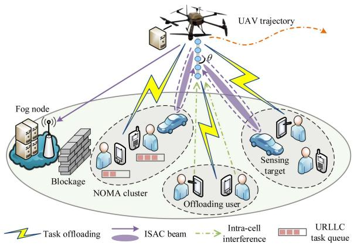

flowchart

```mermaid
graph TD
    A["Fog node"] --> B["Blockage"]
    B --> C["NOMA cluster"]
    C --> D["Ov"]
    D --> E["Sensing target"]
    E --> F["URLC task queue"]
    F --> G["Intra-cell interference"]
    G --> H["ISAC beam"]
    H --> I["Task offloading"]
    I --> J["UAV trajectory"]
    J --> K["ρ"]
    K --> L["Offloading user"]
    L --> M["Car with sensors"]
    M --> N["Mobile devices"]
    N --> O["Mobile devices"]
    O --> P["Mobile devices"]
    P --> Q["Mobile devices"]
    Q --> R["Mobile devices"]
    R --> S["Mobile devices"]
    S --> T["Mobile devices"]
    T --> U["Mobile devices"]
    U --> V["Mobile devices"]
    V --> W["Mobile devices"]
    W --> X["Mobile devices"]
    X --> Y["Mobile devices"]
    Y --> Z["Mobile devices"]
    Z --> AA["Mobile devices"]
    AA --> AB["Mobile devices"]
    AB --> AC["Mobile devices"]
    AC --> AD["Mobile devices"]
    AD --> AE["Mobile devices"]
    AE --> AF["Mobile devices"]
    AF --> AG["Mobile devices"]
    AG --> AH["Mobile devices"]
    AH --> AI["Mobile devices"]
    AI --> AJ["Mobile devices"]
    AJ --> AK["Mobile devices"]
    AK --> AL["Mobile devices"]
    AL --> AM["Mobile devices"]
    AM --> AN["Mobile devices"]
    AN --> AO["Mobile devices"]
    AO --> AP["Mobile devices"]
    AP --> AQ["Mobile devices"]
    AQ --> AR["Mobile devices"]
    AR --> AS["Mobile devices"]
    AS --> AT["Mobile devices"]
    AT --> AU["Mobile devices"]
    AU --> AV["Mobile devices"]
    AV --> AW["Mobile devices"]
    AW --> AX["Mobile devices"]
    AX --> AY["Mobile devices"]
    AY --> AZ["Mobile devices"]
    AZ --> BA["Mobile devices"]
    BA --> BB["Mobile devices"]
    BB --> BC["Mobile devices"]
    BC --> BD["Mobile devices"]
    BD --> BE["Mobile devices"]
    BE --> BF["Mobile devices"]
    BF --> BG["Mobile devices"]
    BG --> BH["Mobile devices"]
    BH --> BI["Mobile devices"]
    BI --> BJ["Mobile devices"]
    BJ --> BK["Mobile devices"]
    BK --> BL["Mobile devices"]
    BL --> BM["Mobile devices"]
    BM --> BN["Mobile devices"]
    BN --> BO["Mobile devices"]
    BO --> BP["Mobile devices"]
    BP --> BQ["Mobile devices"]
    BQ --> BR["Mobile devices"]
    BR --> BS["Mobile devices"]
    BS --> BT["Mobile devices"]
    BT --> BU["Mobile devices"]
    BU --> BV["Mobile devices"]
    BV --> BW["Mobile devices"]
    BW --> BX["Mobile devices"]
    BX --> BY["Mobile devices"]
    BY --> BZ["Mobile devices"]
```

Fig. 1. NOMA-aided UAV ISCC network model.

For the sake of exploiting a capacity-achieving scheme for both communication and sensing, NOMA technique is utilized to divide the frequency resource into M orthogonal subchannels, while partitioning the service objects (including users and targets) into M clusters, denoted by $\mathcal { C } = \mathcal { C } _ { 1 } \cup \mathcal { C } _ { 2 } \cup \cdot \cdot \cdot \cup \mathcal { C } _ { M }$ . =In this way, objects associated to the same cluster reuse one spectrum to offload tasks toward the UAV, and different clusters occupy orthogonal subchannels with no interference. For the clustering strategy, it has been already investigated by several existing works [32], [33], e.g., the channel conditions-based method, we thus do not focus on the clustering scheme in this paper. Particularly, it is assumed that each cluster can contain at most one sensing target, so as to mitigate the interference from target echo signal to task offloading. Without loss of generality, there are K  1 service objects in each cluster, i.e., $\mathcal { C } _ { m } = \{ U _ { m , 0 } , U _ { m , 1 } , U _ { m , 2 } , . . . , U _ { m , K } \}$ , where $U _ { m , 0 }$ represents =the sensing target and $U _ { m , 1 } , . . . , U _ { m , K }$ indicate task offloading users.

The whole flight period T is evenly divided into T time slots with length τ of each slot, and the index is denoted by $t \in \mathcal { T } = \{ 1 , 2 , . . . , T \}$ . Moreover, the quasi-static scenario is in-=vestigated, in which τ can be small enough, such that the UAV’s position and transmission signal are approximately unchanged in a slot. Let $\mathbf { l } ( t ) = [ x ( t ) , \mathbf { \bar { y } } ( t ) ] ^ { \mathrm { T } }$ represent the horizontal co-( ) = [ ( ) ( )]ordinate of UAV in time slot t, and the UAV flight altitude is assumed to be a constant Z [25]. To describe the UAV’s flight trajectory more conveniently, we leverage polar coordinate $\mathbf { v } ( t ) = \bar { \left[ v ( t ) , \varphi ( t ) \right] } ^ { \mathrm { T } }$ to express the velocity of the UAV in time t, ( ) =where $v ( t ) = \| \mathbf { v } ( t ) \| \leq v ^ { \operatorname* { m a x } }$ denotes the speed, vmax implies ( ) = ( )the maximum speed, and $- \pi \leq \varphi ( t ) \leq \pi$ is the direction angle. ( )As a result, the UAV movement is written as

$$
\mathbf {l} (t + 1) = \mathbf {l} (t) + \mathbf {v} (t) \cdot \tau . \tag {1}
$$

Furthermore, the position of service object $U _ { m , k }$ in slot t is expressed as $\mathbf { u } _ { m , k } = \left[ x _ { m , k } , y _ { m , k } \right] ^ { \mathrm { T } }$ , hence the distance be-= [ ]tween the service object and the UAV is givien by $d _ { m , k } ( t ) =$ $\sqrt { \left\| \mathbf { l } ( t ) - \mathbf { u } _ { m , k } \right\| ^ { 2 } + Z ^ { 2 } }$ . Moreover, the fog node is located at $\mathbf { u } ^ { \mathrm { f } } = \left[ x ^ { \mathrm { f } } , y ^ { \mathrm { f } } \right] ^ { \mathrm { T } }$ , then the task offloading distance from the UAV to the fog server is $d ^ { \mathrm { f } } ( t ) = \sqrt { \| \mathbf { l } ( t ) - \mathbf { u } ^ { \mathrm { f } } \| ^ { 2 } + Z ^ { 2 } }$ .

# A. Antennas and Signal Model

The UAV is outfitted with a uniform linear array (ULA) that are deployed vertically to the ground, and the number of antennas is N. Note that, the vertically ULA deployment is adopted since the angle of departure (AoD) of the transmitted ISAC beams, i.e., θ in Fig. 1, is unrelated to the UAV’s orientation, such that we only concern about the UAV’s location during trajectory planning [34]. In addition, each offloading user possesses one antenna, and the fog node is a single-antenna node.

The information stream offloaded from user $U _ { m , k } , k =$ $1 , . . . , K$ , to the UAV is written as $s _ { m , k } ^ { \mathrm { u } } ( t ) \sim \mathcal { C N } ( 0 , 1 )$ =, and let $P ^ { \mathrm { u } }$ ( ) ( )represent the user transmission power.2 Afterwards, the superposed signal received by the UAV from all the users in cluster $\mathcal { C } _ { m }$ can be given by

$$
\mathbf {y} _ {m} ^ {\mathrm{u}} (t) = \sum_ {k = 1} ^ {K} \sqrt {P ^ {\mathrm{u}}} \mathbf {h} _ {m, k} ^ {\mathrm{u}} (t) s _ {m, k} ^ {\mathrm{u}} (t), \tag {2}
$$

where $\mathbf { h } _ { m , k } ^ { \mathrm { u } } ( t ) = \sqrt { g _ { m , k } ^ { \mathrm { u } } ( t ) } \cdot \mathbf { a } ( \mathrm { l } ( t ) , \mathbf { u } _ { m , k } ) \in \mathbb { C } ^ { N \times 1 }$ is the channel vector between user $U _ { m , k }$ and the UAV in slot t, and $g _ { m , k } ^ { \mathrm { u } } ( t )$ represents the channel gain of ground-to-air link. Be-(sides, $\mathbf { a } ( 1 ( t ) , \mathbf { u } _ { m , k } )$ is the steering vector from the UAV towards ( ( )service object $U _ { m , k }$ , which is written as

$$
\mathbf {a} \left(\mathbf {l} (t), \mathbf {u} _ {m, k}\right) =
$$

$$
\left[ 1, \mathrm{e} ^ {j 2 \pi \frac {d \mathrm{a}}{\lambda^ {\mathrm{s}}} \cos \theta (\mathbf {l} (t), \mathbf {u} _ {m, k})}, \dots , \mathrm{e} ^ {j 2 \pi \frac {d \mathrm{a}}{\lambda^ {\mathrm{s}}} (N - 1) \cos \theta (\mathbf {l} (t), \mathbf {u} _ {m, k})} \right] ^ {\mathrm{T}}, \tag {3}
$$

where $\lambda ^ { s }$ and $d ^ { \mathrm { a } }$ represent signal wavelength and antenna spacing, respectively. $\theta ( \mathbf { l } ( t ) , \mathbf { u } _ { m , k } )$ is the AoD corresponding to object $U _ { m , k }$ ( ( ), calculated by

$$
\theta \left(\mathbf {l} (t), \mathbf {u} _ {m, k}\right) = \arccos \frac {Z}{\sqrt {\| \mathbf {l} (t) - \mathbf {u} _ {m , k} \| ^ {2} + Z ^ {2}}}. \tag {4}
$$

In the proposed system, UAV radiates ISAC beam to sense the targets, while the computation offloading signal is embedded into the beam for further transmitting to the fog node [21]. To be specific, define $s ^ { \mathrm { e } } ( t ) \sim \mathcal { C N } ( 0 , 1 )$ as the offloading information 2The proposed network is capable of beneficially adjusting the users’ channel conditions via maneuverable UAV deployment, whilst the clustering strategy prefers to increase the channel variance among the users who occupy the identical spectrum. The synergy of trajectory design and dynamic clustering provides a flexible fashion to improve the power differences and ensure the successful SIC decoding. Therefore, we postulate the constant user transmission power similar to [12], [14], [21]. A promising extension of our work is the dynamic user power control, which calls for a multi-agent learning framework by treating each user as an agent to learn transmission power optimization [10].

from the edge UAV to the fog node, then the transmission ISAC signal is calculated by

$$
\mathbf {x} (t) = \mathbf {w} (t) s ^ {\mathrm{e}} (t), \tag {5}
$$

where $\mathbf { w } ( t ) \in \mathbb { C } ^ { N \times 1 }$ indicates the transmission beamforming ( )vector in time slot t. For radar sensing, we presume that the UAV possesses preceding information of the target, i.e., the horizontal coordinate $\mathbf { u } _ { m , 0 }$ of the potential target in an arbitrary cluster $\mathcal { C } _ { m }$ is known in advance. Practically, the prior knowledge3 can be obtained via the estimation results in the previous frames for radar sensing [35]. Consequently, the target echo received by the UAV from object $U _ { m , 0 }$ is given by

$$
\mathbf {y} _ {m} ^ {\mathrm{s}} (t) = \beta_ {m} (t) \mathbf {a} (\mathbf {l} (t), \mathbf {u} _ {m, 0}) \mathbf {a} ^ {\mathrm{H}} (\mathbf {l} (t), \mathbf {u} _ {m, 0}) \mathbf {x} (t), \tag {6}
$$

where $\beta _ { m } ( t ) = \sqrt { g _ { m } ^ { \mathrm { s } } ( t ) } \cdot \widetilde { \beta } _ { m }$ contains both round-trip channel gain $g _ { m } ^ { \mathrm { s } } ( t )$ and complex reflection factor ${ \widetilde { \beta } } _ { m }$ of target $U _ { m , 0 }$ ( )in slot t. For simplifying expression, we define ${ \bf { H } } _ { m } ^ { \mathrm { s } } ( t ) =$ $\begin{array} { r } { \beta _ { m } ( t ) \mathbf { a } ( \mathbf { l } ( t ) , \mathbf { u } _ { m , 0 } ) \mathbf { a } ^ { \mathrm { H } } \bar { ( \mathbf { l } ( t ) , \mathbf { u } _ { m , 0 } ) } \in \mathbb { C } ^ { N \times N } } \end{array}$ .

( ) ( ( ) ) ( ( ) )Consequently, the total received signal at the UAV from cluster $\mathcal { C } _ { m }$ is given $\mathrm { b y ^ { 4 } }$

$$
\mathbf {y} _ {m} ^ {\mathrm{e}} = \mathbf {y} _ {m} ^ {\mathrm{u}} (t) + \mathbf {y} _ {m} ^ {\mathrm{s}} (t) + \mathbf {n} _ {m} ^ {\mathrm{e}} (t), \tag {7}
$$

where $\mathbf { n } _ { m } ^ { \mathrm { e } } ( t ) \sim \mathcal { C N } ( \mathbf { 0 } , \sigma ^ { 2 } \cdot \mathbf { I } _ { N } )$ is the additive Gaussian noise, and $\sigma ^ { 2 }$ ( ) (is the noise power.

Furthermore, the computation offloading signal received by the fog node is

$$
y ^ {\mathrm{f}} (t) = \left[ h ^ {\mathrm{f}} (t) \mathbf {a} \left(\mathbf {l} (t), \mathbf {u} ^ {\mathrm{f}}\right) \right] ^ {\mathrm{H}} \mathbf {x} (t) + n ^ {\mathrm{f}} (t), \tag {8}
$$

where $h ^ { \mathrm { f } } ( t ) = { \sqrt { g ^ { \mathrm { f } } ( t ) } } , g ^ { \mathrm { f } } ( t )$ denotes the channel power gain ( ) = ( ) ( )between the UAV and the fog node, $\mathbf { a } ( \mathbf { l } ( t ) , \mathbf { u } ^ { \mathrm { f } } )$ specifies the (steering vector towards the fog node, and $n ^ { \mathrm { f } } ( t ) \sim \mathcal { C } \mathcal { N } ( 0 , \sigma ^ { 2 } )$ is the complex noise at the receiver.

# B. Communication and Sensing Model

Herein, the channel model is first presented. For the groundto-UAV communication, we take both LoS and non-LoS (NLoS) links into account, and leverage the probabilistic channel model. Therefore, the channel power gain $g _ { m , k } ^ { \mathrm { u } } ( t )$ is calculated by [37]

$$
\begin{array}{l} g _ {m, k} ^ {\mathrm{u}} (t) = p _ {m, k} ^ {\mathrm{LoS}} (t) g _ {m, k} ^ {\mathrm{LoS}} (t) + \left[ 1 - p _ {m, k} ^ {\mathrm{LoS}} (t) \right] g _ {m, k} ^ {\mathrm{NLoS}} (t) \\ = \bar {p} _ {m, k} ^ {\mathrm{LoS}} (t) g _ {0} d _ {m, k} ^ {- \varsigma} (t), \tag {9} \\ \end{array}
$$

where $p _ { m , k } ^ { \mathrm { L o S } } ( t )$ denotes the possibility of LoS connection, $g _ { m , k } ^ { \mathrm { L o S } } ( t )$ and $g _ { m , k } ^ { \mathrm { N L o S } } ( t )$ are the gains of LoS and NLoS link, ( )respectively, $\bar { p } _ { m , k } ^ { \mathrm { L o S } } ( t )$ )is the regularized LoS probability, g0 is ¯ ( )the channel gain at reference distance 1m, and ς represents the pathloss exponent. According to [37], $\bar { p } _ { m , k } ^ { \mathrm { L o S } } ( t )$ can be set ¯ ( )as the value related to the most probable UAV elevation angle. Analogously, the round-trip gain $g _ { m } ^ { \mathrm { s } } ( t )$ corresponding to ( )radar sensing and the channel power gain towards the fog node $g ^ { \mathrm { f } } ( t )$ are given by $g _ { m } ^ { \mathrm { s } } ( t ) = \bar { p } _ { m , 0 } ^ { \mathrm { L o S } } ( t ) g _ { 0 } [ 2 d _ { m , 0 } ( t ) ] ^ { - \varsigma }$ and $g ^ { \mathrm { f } } ( t ) = \bar { p } ^ { \mathrm { f , L o S } } ( t ) g _ { 0 } { [ d ^ { \mathrm { f } } ( t ) ] } ^ { - \varsigma }$ , respectively.5

( ) = ¯ ( ) [ ( )]Next, we derive the achievable task offloading rate. Similarly to previous works [14], the SIC principle based on channel state is invoked to mitigate the intra-cell interference. In the meantime, considering the round-trip pathloss suffered by sensing signal, $\mathbf { y } _ { m } ^ { \mathrm { s } } ( t )$ is lastly decoded so as to ensure the strength ( )of the target echo [21]. More specifically, we assume that the channel gains follow the order $g _ { m , 1 } ^ { \mathrm { u } } ( t ) > g _ { m , 2 } ^ { \mathrm { u } } ( t ) > \cdots >$ $g _ { m , K } ^ { \mathrm { u } } ( t )$ for cluster $\mathcal { C } _ { m }$ ( ) ( )in slot t. Hence, the offloading signal $s _ { m , k } ^ { \mathrm { u } } ( t )$ )of user $U _ { m , k }$ is decoded after all the signals of users $U _ { m , 1 } , . . . , U _ { m , k - 1 }$ are cancelled, and the information streams $s _ { m , j } ^ { \mathrm { u } } ( t ) , j = k + 1 , . . . , K$ as well as the target echo are regarded ( ) = +as interference. As a consequence, the effective signal received at the UAV from user $U _ { m , k }$ is calculated $\mathrm { b y } ^ { 6 }$

$$
\mathbf {y} _ {m, k} ^ {\mathrm{e}} (t) = \sqrt {P ^ {\mathrm{u}}} \mathbf {h} _ {m, k} ^ {\mathrm{u}} (t) s _ {m, k} ^ {\mathrm{u}} (t) +
$$

$$
\underbrace {\sum_ {j = k + 1} ^ {K} \sqrt {P ^ {\mathrm{u}}} \mathbf {h} _ {m , j} ^ {\mathrm{u}} (t) s _ {m , j} ^ {\mathrm{u}} (t) + \mathbf {H} _ {m} ^ {\mathrm{s}} (t) \mathbf {w} (t) s ^ {\mathrm{e}} (t) + \mathbf {n} _ {m} ^ {\mathrm{e}} (t)} _ {\text { intra - cell   interference   plus   noise } \mathbf {z} _ {m, k} ^ {\mathrm{e}} (t)}. \tag {10}
$$

Denote the covariance matrix of interference plus noise ${ \bf z } _ { m , k } ^ { \mathrm { e } } ( t )$ as $\mathbf { R } _ { \mathbf { z } _ { m , k } ^ { \mathrm { c } } } ( t )$ , which is written as

$$
\begin{array}{l} \mathbf {R} _ {\mathbf {z} _ {m, k} ^ {\mathrm{e}} (t)} = \mathbb {E} \left\{\mathbf {z} _ {m, k} ^ {\mathrm{e}} (t) \left[ \mathbf {z} _ {m, k} ^ {\mathrm{e}} (t) \right] ^ {\mathrm{H}} \right\} \\ = \sum_ {j = k + 1} ^ {K} P ^ {\mathrm{u}} \mathbf {h} _ {m, j} ^ {\mathrm{u}} (t) \left[ \mathbf {h} _ {m, j} ^ {\mathrm{u}} (t) \right] ^ {\mathrm{H}} \\ + \mathbf {H} _ {m} ^ {\mathrm{s}} (t) \mathbf {w} (t) [ \mathbf {H} _ {m} ^ {\mathrm{s}} (t) \mathbf {w} (t) ] ^ {\mathrm{H}} + \sigma^ {2} \cdot \mathbf {I} _ {N}. \tag {11} \\ \end{array}
$$

We utilize minimum mean square error (MMSE) receiver [39] to decode the signal from each user, then the task offloading rate of user $U _ { m , k }$ can be calculated by

$$
R _ {m, k} ^ {\mathrm{u}} (t) = B _ {m} \log_ {2} \left\{1 + P ^ {\mathrm{u}} \left[ \mathbf {h} _ {m, k} ^ {\mathrm{u}} (t) \right] ^ {\mathrm{H}} \mathbf {R} _ {\mathbf {z} _ {m, k} ^ {\mathrm{e}} (t)} ^ {- 1} \mathbf {h} _ {m, k} ^ {\mathrm{u}} (t) \right\}, \tag {12}
$$

where $B _ { m }$ indicates the bandwidth of the m-th subchannel.

According to the signal expression in (8), the transmission rate for further offloading from the UAV to the fog node can be

5Please notice that the sensing and communication channels are consistent, both incorporating the impact of LoS and NLoS links on large-scale channel gain. For small-scale fading, the multi-path effects can be averaged out in each slot [38], thus it is dominated by the steer vectors. In addition, it is worth noting that the channel model does not impact the following analysis and problem solution, which will be illustrated in the simulations.

6If imperfect SIC is considered, we add $\begin{array} { r } { \sum _ { j = 1 } ^ { k - 1 } \sqrt { o P ^ { \mathrm { u } } } \mathbf { h } _ { m , j } ^ { \mathrm { u } } ( t ) s _ { m , j } ^ { \mathrm { u } } ( t ) } \end{array}$ j=1 to ${ \bf y } _ { m , k } ^ { \mathrm { e } } ( t )$ , where $0 \leq o \leq 1$ oP t s t is a constant capturing the impact of imperfect SIC. t oSince this only affects the calculation of offloading rate and sensing SNR, our subsequent analysis is still valid.

derived as

$$
R ^ {\mathrm{e}} (t) = B \log_ {2} \left\{1 + \left| \left[ h ^ {\mathrm{f}} (t) \mathbf {a} (\mathbf {l} (t), \mathbf {u} ^ {\mathrm{f}}) \right] ^ {\mathrm{H}} \mathbf {w} (t) \right| ^ {2} / \sigma^ {2} \right\}. \tag {13}
$$

where B denotes the network total bandwidth, which is evenly allocated to the NOMA clusters, i.e., $B _ { m } = B / M$ .

=After removing all the users’ computation signals via SIC, the UAV can directly decode the target echo in (6) [39], thus the decoded signal is only superimposed with white noise ${ \bf n } _ { m } ^ { \mathrm { e } } ( t )$ . ( )Notice that, clutter interference is negligible in our scenario owing to the high-quality LoS link provided by the UAV [24]. Thus, we adopt the signal-to-noise-ratio (SNR) of the radar reflection signal as the sensing performance metric [20], which is

$$
\gamma_ {m} ^ {\mathrm{s}} (t) = \left[ \mathbf {H} _ {m} ^ {\mathrm{s}} (t) \mathbf {w} (t) \right] ^ {\mathrm{H}} \left[ \sigma^ {2} \cdot \mathbf {I} _ {N} \right] ^ {- 1} \mathbf {H} _ {m} ^ {\mathrm{s}} (t) \mathbf {w} (t). \tag {14}
$$

Considering that sensing should be executed on demand during communication rather than continuously, thereby catering for various targets’ motion state and avoiding radio resource waste. To this end, we introduce a binary sensing indicator $\Delta _ { m } ( t )$ with $\Delta _ { m } ( t ) = 1$ representing that target $U _ { m , 0 }$ Δ ( )should be sensed at Δslot $t ,$ ) = otherwise $\Delta _ { m } ( t ) = 0$ . An intuitive fashion to set $\Delta _ { m } ( t )$ Δ ( ) = Δ ( )is based on the variations of sensing parameters [25]. Define $\gamma _ { m } ^ { \mathrm { s , t h } }$ as the sensing SNR threshold of $U _ { m , 0 } ,$ , then the sensing performance constraint is given by $\Delta _ { m } ( t ) \gamma _ { m } ^ { \mathrm { s } } ( t ) \geq \Delta _ { m } ( t ) \gamma _ { m } ^ { \mathrm { s , t h } }$ .

# C. Task Queue Model and URLLC Constraints

Each user keeps a queue buffer to cache the tasks to be offloaded to the UAV obeying a first-arrive first-depart policy. Denote the queue backlog of user $U _ { m , k }$ as $Q _ { m , k } ( t )$ , which is updated by

$$
Q _ {m, k} (t + 1) = \max \left\{Q _ {m, k} (t) - Y _ {m, k} (t) + A _ {m, k} (t), 0 \right\}, \tag {15}
$$

where $A _ { m , k } ( t )$ is the instant arrival task for the user in slot t, and $Y _ { m , k } ( t )$ ( )denotes the amount of task departing the queue buffer ( )calculated by

$$
Y _ {m, k} (t) = \min \left\{\tau R _ {m, k} ^ {\mathrm{u}} (t), Q _ {m, k} (t) + A _ {m, k} (t) \right\}. \tag {16}
$$

So as to guarantee that the computation tasks can be offloaded to the edge UAV for further processing as soon as possible, we impose URLLC restraints on the queuing delay of the task buffer. According to Little’s law, the queuing delay of $Q _ { m , k } ( t )$ in slot t is derived as

$$
\delta_ {m, k} (t) = \frac {Q _ {m , k} (t)}{\widetilde {A} _ {m , k} (t - 1)}, \tag {17}
$$

where $\begin{array} { r } { \widetilde { A } _ { m , k } ( t - 1 ) = \frac { 1 } { t } \sum _ { i = 0 } ^ { t - 1 } A _ { m , k } ( i ) } \end{array}$ specifies the time-( ) = ( )average task arrival rate. Subsequently, by introducing $\delta ^ { \mathrm { m a x } }$ as the queuing delay bound, we obtain the following probabilistic restraint:

$$
\lim _ {T \rightarrow \infty} \frac {1}{T} \sum_ {t = 1} ^ {T} \operatorname * {P r} \left[ \frac {Q _ {m , k} (t)}{\widetilde {A} _ {m , k} (t - 1)} > \delta^ {\max} \right] \leq v _ {m, k}, \tag {18}
$$

where $v _ { m , k } \ll 1$ is the tolerable queuing delay violation probability.

In addition, ensuring URLLC needs the description of the queuing delay distribution tail. Towards this end, we adoptthe extreme value theory to elaborate the extreme event, i.e., $Q _ { m , k } ( t ) > \widetilde { A } _ { m , k } ( t - 1 ) \widetilde { \delta } ^ { \operatorname* { m a x } }$ [40]. Define the excess backlog ( ) ( )of queue Qm,k t in slot t as Vm,k t | Qm,k(t)>Am,k(t−1)δmax $Q _ { m , k } ( t )$ $V _ { m , k } ( t ) | _ { Q _ { m , k } ( t ) > \widetilde A _ { m , k } ( t - 1 ) \delta ^ { \operatorname* { m a x } } } =$ $Q _ { m , k } ( t ) - \widetilde { A } _ { m , k } ( t - 1 ) \delta ^ { \operatorname* { m a x } }$ . According to the Pickands-( ) ( )Balkema-de Haan Theorem, we can employ a generalized Pareto distribution (GPD) $G ( v _ { m , k } ; \chi _ { m , k } , \xi _ { m , k } )$ to estimate the cumu-( ; )lative distribution function of the excess value, where $\chi _ { m , k } > 0$ and $\xi _ { m , k } < \frac { 1 } { 2 }$ represent the scale factor and the shape factor, respectively. They jointly determine the characteristics of the GPD. Accordingly, the mean and variance of $V _ { m , k } ( t )$ can be estimated as

$$
\mathbb {E} \left[ V _ {m, k} (t) \mid Q _ {m, k} (t) > \widetilde {A} _ {m, k} (t - 1) \delta^ {\max} \right] \approx \frac {\chi_ {m , k}}{1 - \xi_ {m , k}}, \tag {19}
$$

$$
\begin{array}{l} \mathbb {D} \left[ V _ {m, k} (t) | Q _ {m, k} (t) > \widetilde {A} _ {m, k} (t - 1) \delta^ {\max} \right] \\ \approx \frac {\chi_ {m , k} ^ {2}}{\left(1 - \xi_ {m , k}\right) ^ {2} \left(1 - 2 \xi_ {m , k}\right)}. \tag {20} \\ \end{array}
$$

Notice that, as the factors $\chi _ { m , k }$ and $\xi _ { m , k }$ decrease, the mean and variance of the GPD decline, resulting in a smaller excess backlog. Therefore, we subsescale and shape factors, i.e., $\chi _ { m , k } \leq \chi _ { m , k } ^ { \mathrm { t h } }$ se thrand $\xi _ { m , k } \leq \xi _ { m , k } ^ { \mathrm { t h } } .$ Afterwards, the mean and second moment of the excess value are constrained by

$$
\begin{array}{l} \widetilde {V} _ {m, k} = \lim _ {T \rightarrow \infty} \frac {1}{T} \sum_ {t = 1} ^ {T} \mathbb {E} \left[ V _ {m, k} (t) | Q _ {m, k} (t) \right. \\ \left. > \widetilde {A} _ {m, k} (t - 1) \delta^ {\max} \right] \leq \frac {\chi_ {m , k} ^ {\mathrm{th}}}{1 - \xi_ {m , k} ^ {\mathrm{th}}}, \tag {21} \\ \end{array}
$$

$$
\widetilde {W} _ {m, k} = \lim _ {T \rightarrow \infty} \frac {1}{T} \sum_ {t = 1} ^ {T} \mathbb {E} \left[ W _ {m, k} (t) | Q _ {m, k} (t) \right.
$$

$$
\left. > \widetilde {A} _ {m, k} (t - 1) \delta^ {\max} \right] \leq \frac {2 \left(\chi_ {m , k} ^ {\mathrm{th}}\right) ^ {2}}{\left(1 - \xi_ {m , k} ^ {\mathrm{th}}\right) \left(1 - 2 \xi_ {m , k} ^ {\mathrm{th}}\right)}, \tag {22}
$$

where $W _ { m , k } ( t ) = [ V _ { m , k } ( t ) ] ^ { 2 }$ . In summary, (18), (21) and (22) ( ) = [ ( )]are the long-term URLLC constraints for users’ task offloading, which take into account both the requirement violation probability as well as the occurrence probability of the extreme cases.

# D. Computation Model

For computation model, the UAV and the fog node could execute edge/fog computing to process the tasks. Note that partial offloading mode is considered in our work, i.e., the tasks offloaded by the users can be divided into two parts, which are implemented at the UAV and the fog node, respectively [30]. Define $f _ { m , k } ^ { \mathrm { e } } ( t )$ as the edge computational resource assigned to user $U _ { m , k }$ ( )in slot t, i.e., CPU frequency (cycle/s), then the computed task amount of user $U _ { m , k }$ at the UAV is derived as

$$
C _ {m, k} ^ {\mathrm{e}} (t) = \frac {\tau f _ {m , k} ^ {\mathrm{e}} (t)}{\lambda_ {m , k}}, \tag {23}
$$

where $\lambda _ { m , k }$ is the required computational density (cycles/bit).

Analogously, denote the fog CPU frequency assigned to user $U _ { m , k } \mathrm { a s } f _ { m , k } ^ { \mathrm { f } } ( t )$ , thus the computed task amount at the fog node ( )is calculated by

$$
C _ {m, k} ^ {\mathrm{f}} (t) = \frac {\tau f _ {m , k} ^ {\mathrm{f}} (t)}{\lambda_ {m , k}}. \tag {24}
$$

The computational resource allocation needs to satisfy the following causality constraints:

$$
C _ {m, k} ^ {\mathrm{e}} (t) + C _ {m, k} ^ {\mathrm{f}} (t) \leq Y _ {m, k} (t), \tag {25}
$$

$$
\sum_ {m = 1} ^ {M} \sum_ {k = 1} ^ {K} C _ {m, k} ^ {\mathrm{f}} (t) \leq Y ^ {\mathrm{e}} (t), \tag {26}
$$

where (25) indicates that the sum computed task amount at edge server as well as fog server cannot exceed the task offloading throughput. (26) ensures that the overall computation throughput at the fog node is upper bounded by the amount of tasks further offloaded by the UAV $Y ^ { \mathrm { e } } ( t )$ , and $Y ^ { \mathrm { e } } ( t ) =$ min $\begin{array} { r } { \{ \tau R ^ { \mathrm { { e } } } ( t ) , \sum _ { m = 1 } ^ { M } \sum _ { k = 1 } ^ { K } Y _ { m , k } ( t ) \} } \end{array}$ .

in ( ) ( )Since the effective utilization of UAV depends on the onboard energy, we restrict the power consumption of the UAV, which mainly includes ISAC beam transmitting consumption and edge computing consumption.7 Then we have

$$
\left\| \mathbf {w} (t) \right\| ^ {2} + \sum_ {m = 1} ^ {M} \sum_ {k = 1} ^ {K} \kappa \left[ f _ {m, k} ^ {\mathrm{e}} (t) \right] ^ {3} \leq P ^ {\max}, \tag {27}
$$

where κ denotes the computation power factor, and $P ^ { \mathrm { m a x } }$ represents the UAV power budget.

Remark 1: (Integration of NOMA into UAV ISCC network) First, NOMA allows multiple users to simultaneously offload tasks to the UAV sharing identical spectrum, improving communication capacity and thus computation throughput upper bound, see (12) and (25). Second, by carrying out SIC, the UAV decodes sensing echo freeing from computation offloading signals, realizing high-quality sensing, see (14). Third, the UAV trajectory design enhances the channel condition of NOMA, which is beneficial for the ISCC performance.

# III. PROBLEM FORMULATION AND DECOMPOSITION

This section formulates the computation throughput maximization issue to jointly determine UAV trajectory planning, beamforming design and computing resource allocation.

# A. Problem Formulation

Recall that the UAV velocity and beamforming vector in slot t are denoted as $\mathbf { v } ( t )$ and ${ \bf w } ( t )$ , respectively. Define $\mathbf { f } ( t ) =$ $\left[ f _ { m , k } ^ { \mathrm { e } } ( t ) , f _ { m , k } ^ { \mathrm { f } } ( t ) : \forall m , \forall k \right] ^ { \mathrm { T } }$ as the computing resource allocation of edge node as well as fog node. We aim to maximize the weighted sum computed task amount of the NOMA-aided UAV ISCC network, the objective function in time slot t is

$$
\psi (t) = \sum_ {m = 1} ^ {M} \sum_ {k = 1} ^ {K} \omega_ {m, k} \left[ C _ {m, k} ^ {\mathrm{e}} (t) + C _ {m, k} ^ {\mathrm{f}} (t) \right], \tag {28}
$$

where $\omega _ { m , k }$ is the weight for indicating the priority of user $U _ { m , k }$ . Consequently, the long-term optimization issue is formulated as

$$
\mathbf {P 1}: \max _ {\{\mathbf {v} (t), \mathbf {w} (t), \mathbf {f} (t) \} _ {\forall t}} \lim _ {T \to \infty} \frac {1}{T} \sum_ {t = 1} ^ {T} \psi (t),
$$

$$
\mathrm{s.t.} C _ {1}: \Delta_ {m} (t) \gamma_ {m} ^ {\mathrm{s}} (t) \geq \Delta_ {m} (t) \gamma_ {m} ^ {\mathrm{s,th}}, \forall m, \forall t,
$$

$$
\begin{array}{l} C _ {2}: \lim _ {T \to \infty} \frac {1}{T} \sum_ {t = 1} ^ {T} \operatorname * {P r} \left[ \frac {Q _ {m , k} (t)}{\widetilde {A} _ {m , k} (t - 1)} > \delta^ {\max} \right] \\ \leq v _ {m, k}, \forall m, \forall k, \\ \end{array}
$$

$$
C _ {3}: \widetilde {V} _ {m, k} \leq \frac {\chi_ {m , k} ^ {\mathrm{th}}}{1 - \xi_ {m , k} ^ {\mathrm{th}}}, \forall m, \forall k,
$$

$$
C _ {4}: \widetilde {W} _ {m, k} \leq \frac {2 \left(\chi_ {m , k} ^ {\text { th }}\right) ^ {2}}{\left(1 - \xi_ {m , k} ^ {\text { th }}\right) \left(1 - 2 \xi_ {m , k} ^ {\text { th }}\right)}, \forall m, \forall k,
$$

$$
C _ {5}: \| \mathbf {w} (t) \| ^ {2} + \sum_ {m = 1} ^ {M} \sum_ {k = 1} ^ {K} \kappa \left[ f _ {m, k} ^ {\mathrm{e}} (t) \right] ^ {3} \leq P ^ {\max}, \forall t,
$$

$$
C _ {6}: \mathbf {l} (t + 1) = \mathbf {l} (t) + \mathbf {v} (t) \cdot \tau , \| \mathbf {v} (t) \| \leq v ^ {\max}, \forall t,
$$

$$
C _ {7}: \mathbf {l} (1) = \hat {\mathbf {l}} ^ {\mathrm{I}},
$$

$$
C _ {8}: C _ {m, k} ^ {\mathrm{e}} (t) + C _ {m, k} ^ {\mathrm{f}} (t) \leq Y _ {m, k} (t), \forall m, \forall k, \forall t,
$$

$$
C _ {9}: \sum_ {m = 1} ^ {M} \sum_ {k = 1} ^ {K} C _ {m, k} ^ {\mathrm{f}} (t) \leq Y ^ {\mathrm{e}} (t), \forall t, \tag {29}
$$

where $C _ { 1 }$ is the sensing SNR constraint, $C _ { 2 } \sim C _ { 4 }$ are the longterm URLLC constraints, and $C _ { 5 }$ specifies the UAV power consumption constraint. $C _ { 6 }$ and $C _ { 7 }$ restrict the flight trajectory of the UAV, where $\hat { \mathrm { l } } ^ { \mathrm { I } }$ denotes the initial location. $C _ { 8 }$ and $C _ { 9 }$ represent the causality constraints of edge/fog computing. Nevertheless, it is intractable to directly address problem P1 owing to the time-average-steady-state form of the objective function and the URLLC restraints.

# B. Problem Transformation

In light of Lyapunov optimization, we transform the longterm URLLC constraints via the concept of virtual queue [10]. Specifically, we introduce virtual queues $J _ { m , k } ^ { ( Q ) } ( t ) , \bar { J _ { m , k } ^ { ( V ) } } ( t )$ and $J _ { m , k } ^ { ( W ) } ( t )$ corresponding to the constraints $C _ { 2 } \sim C _ { 4 }$ , whose val-( )ues specify the deviations from the predefined requirements of the occurrence probabilities of the extreme case, the long-term conditional mean of the excess backlog as well as its second moment, respectively. The virtual queues are evolved as

$$
\begin{array}{l} J _ {m, k} ^ {(Q)} (t + 1) = \max \left\{J _ {m, k} ^ {(Q)} (t) \right. \\ \left. + \mathbb {1} \left\{Q _ {m, k} (t + 1) > \widetilde {A} _ {m, k} (t) \delta^ {\max} \right\} - v _ {m, k}, 0 \right\}, \tag {30} \\ \end{array}
$$

$$
J _ {m, k} ^ {(V)} (t + 1) = \max \left\{J _ {m, k} ^ {(V)} (t) + \left(V _ {m, k} (t + 1) - \frac {\chi_ {m , k} ^ {\mathrm{th}}}{1 - \xi_ {m , k} ^ {\mathrm{th}}}\right) \right.
$$

$$
\times \mathbb {1} \left\{Q _ {m, k} (t + 1) > \widetilde {A} _ {m, k} (t) \delta^ {\max} \right\}, 0 \Bigg \}, \tag {31}
$$

$$
J _ {m, k} ^ {(W)} (t + 1) = \max \left\{J _ {m, k} ^ {(W)} (t) + \left(W _ {m, k} (t + 1) \right. \right.
$$

$$
- \left. \frac {2 \left(\chi_ {m , k} ^ {\text {th}}\right) ^ {2}}{\left(1 - \xi_ {m , k} ^ {\text {th}}\right) \left(1 - 2 \xi_ {m , k} ^ {\text {th}}\right)}\right)
$$

$$
\left. \times \mathbb {1} \left\{Q _ {m, k} (t + 1) > \widetilde {A} _ {m, k} (t) \delta^ {\max} \right\}, 0 \right\}. \tag {32}
$$

where $\mathbb { 1 } \{ x \} = 1$ if case $x$ is true; otherwise $\mathbb { 1 } \{ x \} = 0$ . Hence, = =ensuring the URLLC constraints is equal to minimizing the backlog of the virtual queues in a best effort manner.

Besides, we tighten the UAV power consumption constraint $C _ { 5 }$ so as to facilitate problem decomposition. Define d P maxcomp as the maximum power related to beamformi $P _ { \mathrm { t r a n } } ^ { \mathrm { m a x } }$ computing, respectively, then $C _ { 5 }$ is transformed into $\| \mathbf { w } ( t ) \| ^ { 2 } \leq$ $P _ { \mathrm { t r a n } } ^ { \mathrm { m a x } }$ , ∀t and $\begin{array} { r } { \sum _ { m = 1 } ^ { M } \sum _ { k = 1 } ^ { K } \kappa [ f _ { m , k } ^ { \mathrm { e } } ( t ) ] ^ { 3 } \leq P _ { \mathrm { c o m p } } ^ { \mathrm { m a x } } , \forall t } \end{array}$ .

[ ( )]Afterwards, P1 can be converted into a series of single-slot determinable subproblems, which are addressed to maximize the computation throughput while controlling the URLLC constraint deficits. It can be reformulated as

$$
\begin{array}{l} \mathbf {P 2}: \max _ {\mathbf {v} (t), \mathbf {w} (t), \mathbf {f} (t)} \psi (t) - \eta \cdot \sum_ {m = 1} ^ {M} \sum_ {k = 1} ^ {K} \Bigg \{\left[ \eta^ {(Q)} J _ {m, k} ^ {(Q)} (t) + \eta^ {(V)} J _ {m, k} ^ {(V)} (t) \right. \\ \left. \left. + \eta^ {(W)} J _ {m, k} ^ {(W)} (t) \right] \times \mathbb {1} \left\{Q _ {m, k} (t + 1) > \widetilde {A} _ {m, k} (t) \delta^ {\max} \right\} \right\}, \\ \end{array}
$$

$$
\mathrm{s.t.} C _ {1}, C _ {6} \sim C _ {9},
$$

$$
C _ {5} ^ {\prime}: \| \mathbf {w} (t) \| ^ {2} \leq P _ {\text { tran }} ^ {\max}, \quad \forall t,
$$

$$
C _ {5} ^ {\prime \prime}: \sum_ {m = 1} ^ {M} \sum_ {k = 1} ^ {K} \kappa \left[ f _ {m, k} ^ {\mathrm{e}} (t) \right] ^ {3} \leq P _ {\text { comp }} ^ {\max}, \quad \forall t, \tag {33}
$$

where $\eta$ is leveraged to balance the computed task amount and the URLLC constraint deficits. $\eta ^ { ( Q ) } , \stackrel { \cdot } { \eta } ^ { ( V ) }$ and $\eta ^ { ( W ) }$ are used to adjust the order of magnitudes. By solving P2 in each slot, we are able to asymptotically obtain the solution to P1 with performance gap $\mathcal { O } ( \eta )$ , i.e., a small η reduces the gap but ( )increases the risk of violating URLLC constraints.

# C. Problem Decomposition and Computing Resource Allocation

We further decompose P2 into two subproblems, which are solved in sequence to yield the joint optimization result. To be specific, from the causality constraints $C _ { 8 }$ and $C _ { 9 }$ , it is observed that the computed task amount is bounded by the available transmission throughput, such that a higher task offloading capacity leads to a higher computation performance upper bound. Accordingly, the UAV first selects flight velocity and beamforming vector to maximize the transmission throughput, whilst ensuring the URLLC constraints in SP1, which can be recast as

$$
\mathbf {S P 1}: \max _ {\mathbf {v} (t), \mathbf {w} (t)} \varpi (t),
$$

$$
\text { s.t. } \quad C _ {1},   C _ {5} ^ {\prime},   C _ {6},   C _ {7}, \tag {34}
$$

where

$$
\begin{array}{l} \varpi (t) = \sum_ {m = 1} ^ {M} \sum_ {k = 1} ^ {K} \left\{\omega_ {m, k} Y _ {m, k} (t) - \eta \cdot \left[ \eta^ {(Q)} J _ {m, k} ^ {(Q)} (t) + \eta^ {(V)} \right. \right. \\ \times \left. J _ {m, k} ^ {(V)} (t) + \eta^ {(W)} J _ {m, k} ^ {(W)} (t) \right] \\ \times \mathbb {1} \left\{Q _ {m, k} (t + 1) > \widetilde {A} _ {m, k} (t) \delta^ {\max} \right\} \\ + Y ^ {\mathrm{e}} (t). \tag {35} \\ \end{array}
$$

It is still intractable to solve SP1 since the UAV’s trajectory variable and beamforming vector are highly-coupled, and the utility function as well as restraint $C _ { 1 }$ are non-convex. Furthermore, the stringent delay demands of the users’ URLLC tasks make the issue has to be handled efficiently. Towards this end, we design a DRL-based scheme in Section IV to tackle SP1 in a slot-by-slot manner.

On the other hand, with given UAV location and beamformer result in each time slot, SP2 aims to optimize the computing resource allocation, thereby maximizing the weighted sum computed task amount, which is formulated as

$$
\mathbf {S P 2}: \max _ {\mathbf {f} (t)} \psi (t),
$$

$$
\text { s.t. } \quad C _ {5} ^ {\prime \prime}, C _ {8}, C _ {9}. \tag {36}
$$

Note that $Y _ { m , k } ( t )$ and $Y ^ { \mathrm { e } } ( t )$ in $C _ { 8 }$ and $C _ { 9 }$ are constants after ( ) ( )tackling SP1. Therefore, SP2 is a strict convex optimization issue, which can be effectively addressed via interior-point method (IPM).

# IV. SOFT ACTOR-CRITIC-BASED UAV TRAJECTORY PLANNING AND BEAMFORMING DESIGN SOLUTION

To cope with SP1, we propose an efficient UAV trajectory planning and beamforming design approach using the stateof-the-art DRL framework, namely SAC [41]. It is worth noting that in several previous works [18], [25], UAV maneuver and beamforming were optimized via traditional optimization schemes. Nevertheless, these methods are not applicable to our problem due to the URLLC constraints. Additionally, the traditional methods require sophisticated approximation techniques, and may be computing intensive with the number of decision variables and flight period ascending. To this end, we improve the SAC approach via reasonable framework design to enable it to adapt to our scenario. With the trained SAC model, our solution is capable of making decisions in short time, fulfilling the fast response and real-time performance requirements of URLLC scenarios. Next, we first illustrate the Markov decision progress (MDP) reformulation.

# A. MDP Reformulation

SP1 can be reformulated as an MDP, where the UAV is deemed as the agent, and the basic components of the MDP are elaborated below.

1) State Space: We denote $s ( t )$ as the state set of the UAV ( )in slot t, which indicates the information that the UAV needs to gather. Firstly, the state set includes the historical state of the UAV, i.e., the velocity and beamformer in slot t − 1. Secondly, the UAV can attain the locations of its own and all service objects through the GPS sensors. Finally, the backlogs of the task queues and the virtual queues should be collected to enable the UAV to control the queuing delay of the offloading users. Thus, we can obtain

$$
s (t) = \left\{\mathbf {v} (t - 1), \mathbf {w} (t - 1), \mathbf {l} (t), \left\{\mathbf {u} _ {m, k}, Q _ {m, k} (t), \right. \right.
$$

$$
\left. \left. J _ {m, k} ^ {(Q)} (t), J _ {m, k} ^ {(V)} (t), J _ {m, k} ^ {(W)} (t) \right\} _ {\forall m, \forall k} \right\}. \tag {37}
$$

Notice that the real parts and imaginary parts of the elements in $\mathbf { w } ( t - 1 )$ should be respectively input into the neural network, ( )then the dimension of $s ( t )$ is $6 M K + 2 M + 2 N + 4$ .

( )2) Action Space: We utilize $\mathbf { v } ( t ) = [ v ( t ) , \varphi ( t ) ] ^ { \mathrm { T } }$ to express ( ) = [ ( ) ( )]the speed and direction angle of the UAV. Moreover, a $2 N + 1$ dimensional vector $\left[ a _ { 1 } ^ { \mathrm { w } } ( t ) , \dot { \textrm { \ i } } . . . , a _ { 2 N } ^ { \mathrm { w } } ( t ) , a _ { 2 N + 1 } ^ { \mathrm { w } } ( t ) \right] ^ { \mathrm { T } }$ +is invoked to [ ( ) ( ) ( )]specify the beamforming decision, where the first 2N components are corresponded to the real parts and imaginary components of the elements in $\mathbf { w } ( t )$ , and the final component $a _ { 2 N + 1 } ^ { \mathrm { w } } ( t ) \in [ 0 , 1 ]$ ( )indicates the ratio between the $\mathrm { U A V } _ { \mathrm { \Delta } }$ trans-( ) [ ]mission power and the maximum power $P _ { \mathrm { t r a n } } ^ { \mathrm { m a x } }$ . Therefore, the action space in slot t is given by

$$
a (t) = \left\{v (t), \varphi (t), a _ {1} ^ {\mathrm{w}} (t), \dots , a _ {2 N + 1} ^ {\mathrm{w}} (t) \right\}. \tag {38}
$$

Accordingly, we can calculate the beamforming vector as follows:

$$
\begin{array}{l} \mathbf {w} (t) = \frac {\left[ a _ {1} ^ {\mathrm{w}} (t) + j a _ {2} ^ {\mathrm{w}} (t) , \dots , a _ {2 N - 1} ^ {\mathrm{w}} (t) + j a _ {2 N} ^ {\mathrm{w}} (t) \right] ^ {\mathrm{T}}}{\left\| \left[ a _ {1} ^ {\mathrm{w}} (t) + j a _ {2} ^ {\mathrm{w}} (t) , \dots , a _ {2 N - 1} ^ {\mathrm{w}} (t) + j a _ {2 N} ^ {\mathrm{w}} (t) \right] ^ {\mathrm{T}} \right\|} \\ \times \sqrt {a _ {2 N + 1} ^ {\mathrm{w}} (t) P _ {\text { tran }} ^ {\max}}. \tag {39} \\ \end{array}
$$

The above action space characterization trick effectively converts the complex beamforming vector into action values which are suitable for DNN output.

3) Reward Design: Through reward design, we can transform the hard-to-optimize objective into maximizing the accumulative reward of the agent. Based on the formulation of SP1, our first consideration is to maximize $\varpi ( t )$ . We also penalize the ( )action that violates the sensing SNR constraint. Therefore, the reward in slot t is

$$
r (t) = \varpi (t) - \mu^ {\mathrm{s}} (t) \zeta^ {\mathrm{s}}, \tag {40}
$$

where $\mu ^ { \mathrm { s } } ( t ) = \{ 0 , 1 \}$ indicates whether the UAV violates ( ) =the radar performance constraint, i.e., if $\Delta _ { m } ( t ) \gamma _ { m } ^ { \mathrm { s } } ( t ) <$ $\Delta _ { m } ( t ) \gamma _ { m } ^ { \mathrm { s , t h } }$ , ∃m, then $\mu ^ { \mathrm { s } } ( t ) = 1$ Δ ( ) ( ), and the UAV receives penalty Δ ( )ζs ; otherwise $\mu ^ { \mathrm { s } } ( t ) = 0$ .

# B. Preliminaries

Theoretically, DRL algorithms for continuous action space are capable of addressing the formulated issue, e.g., deep deterministic policy gradient (DDPG), Twin Delayed DDPG (TD3), Proximal Policy Optimization (PPO), and SAC. However, SAC outperforms other aforementioned DRL frameworks owing to the following three aspects: 1) DDPG and TD3 converge to deterministic policy, i.e., they only output an action under each state, which is inefficient in the training phase. As a remedy, SAC applies stochastic policy to yield probability distribution of feasible actions, thereby promoting the exploration of action space. 2) SAC aims to maximize the accumulative reward plus entropy so as to render diverse suitable policies, such that it can adapt to the MDP with multi-modal rewards, and further improve learning stability as well as policy generalization. 3) Compared to PPO, SAC pertains to off-policy training and it can achieve higher sample efficiency via experience replay. As a result, we develop our solution for SP1 based on SAC framework, and the performance comparison will be discussed in Section V.

In SAC, soft Q value is utilized to evaluate the policy, which is comprised of reward and expected entropy, that is,

$$
q (s (t), a (t)) = r (t) + \rho \mathbb {E} _ {s (t + 1)} [ v ^ {\text { soft }} (s (t + 1)) ], \tag {41}
$$

where

$$
v ^ {\text { soft }} (s (t)) = \mathbb {E} _ {a (t)} [ q (s (t), a (t)) - \alpha \ln (\pi (a (t) | s (t))) ], \tag {42}
$$

denotes the soft state value, ρ is the discount factor, α represents the temperature parameter that modifies the weight coefficient of the entropy, and $\pi ( a ( t ) | s ( t ) )$ is the policy.

( ( ) ( ))Subsequently, SAC updates the policy to obtain the policy distribution that is similar to the soft Q value distribution. Specifically, we use Kullback-Leibler (KL) divergence to describe the similarity between two continuous distributions $f _ { 1 } ( x )$ and $f _ { 2 } ( x )$ , which is defined as

$$
D _ {\mathrm{KL}} \left(f _ {1} (x) \| f _ {2} (x)\right) = \int_ {- \infty} ^ {\infty} f _ {1} (x) \ln \left(\frac {f _ {1} (x)}{f _ {2} (x)}\right) d x, \tag {43}
$$

The smaller the $D _ { \mathrm { K L } }$ is, the similar the two distributions are. Hence, the policy π is modified via minimizing the KL divergence between $\pi ( \cdot | s ( t ) )$ and $q ( s ( t ) , \cdot )$ , i.e.,

$$
\min _ {\pi^ {\prime}} D _ {\mathrm{KL}} \left[ \pi^ {\prime} (\cdot | s (t)) \left\| \exp \left(\frac {1}{\alpha} q (s (t), \cdot)\right) / Z ^ {\pi} (s (t)) \right], \right. \tag {44}
$$

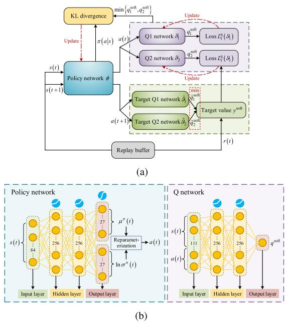  
Fig. 2. Architecture of SAC. (a) Framework of SAC. (b) Structure of SAC.

where $Z ^ { \pi } ( s ( t ) )$ is the normalization factor. Besides, updating the new policy according to (44) results in an increased soft Q value.

# C. Architecture of SAC

Fig. 2(a) showcases the framework of SAC composed of five deep neural networks (DNNs). To be specific, a policy network with parameters φ outputs probability distribution of continuous actions $\pi ( \cdot | s ( t ) ; \phi )$ according to the environment state, then the ( ( ); )real action can be obtained by sampling from the distribution, i.e., $a ( t ) \sim \pi ( a ( t ) | s ( t ) ; \phi )$ . Two Q networks with weights $\vartheta _ { 1 }$ and $\vartheta _ { 2 }$ ) ( ( ) ( ); )estimate the soft Q values according to the current state as well as decision, and the approximated Q values are expressed as $\begin{array} { r l } {  { q ( s ( t ) , a ( t ) ; \vartheta _ { 1 } ) } \quad } & { { } } \end{array}$ and $\boldsymbol { q } ( s ( t ) , \boldsymbol { a } ( t ) ; \vartheta _ { 2 } )$ , respectively. ( ( ) ( ); ) ( ( ) ( ); )Note that the overestimation trouble can be alleviated by using twin Q networks. Additionally, two target Q networks denoted by $\hat { q } ( s ( t ) , a ( t ) ; \hat { \vartheta } _ { 1 } )$ and $\hat { q } ( s ( t ) , a ( t ) ; \hat { \vartheta } _ { 2 } )$ share the same structure ˆ( ( ) ( ); ) ˆ( ( ) ( ); )as the Q networks, but the update of the parameters $\hat { \boldsymbol { \vartheta } } _ { 1 }$ and $\hat { \vartheta } _ { 2 }$ is much slower than that of $\vartheta _ { 1 }$ and $\vartheta _ { 2 } .$ , thereby preventing training oscillation.

Next, we illustrate the structure of DNNs. As shown in Fig. 2(b), there are 1 input layer, 2 hidden layers, and 2 output layers in the policy network. The two output layers yield the mean value $\mu ^ { \pi } ( t )$ and the logarithm of the standard deviation ln $\sigma ^ { \pi } ( t )$ ( )of the policy distribution $\pi ( \cdot | s ( t ) ; \phi )$ . Afterwards, the ln ( ) ( ( ); )reparameterization trick [41] is utilized to obtain the action during the training of the DNNs, i.e.,

$$
a (t) = \tanh \left[ \mu^ {\pi} (t) + \sigma^ {\pi} (t) \odot \varepsilon \right], \tag {45}
$$

where is the activation function that restricts the action value to (-1,1),  represents the Hadamard product, and ε is a random vector that obeys standard normal distribution. The reparameterization trick ensures the differentiability of the loss function, thereby facilitating the gradient descent. Additionally, the Q network of SAC are fully connected structure, whose input dimension equals the sum of the cardinalities of the action set and the state set, and the output is the estimation of soft Q value with dimension of 1. Besides, all hidden layers of the DNNs are activated by LeakyReLU.

# D. Training of DNNs

During the training phase of ${ \mathrm { S A C } } ,$ the UAV agent collects historical transitions, in form of $\langle s ( t ) , a ( t ) , r ( t ) , s ( t + 1 ) \rangle$ , and ( ) ( ) ( ) ( + )stores them into the replay buffer B. Subsequently, experience replay technique is employed to randomly choose a mini-batch of I transitions to update the weights of the DNNs as well as the temperature parameter. Based on (44), we update the policy network via optimizing the KL divergence between the action distribution $\pi ( \cdot | s ( t ) ; \phi )$ and the soft Q value distribution $q ( s ( t ) , \cdot ; \vartheta _ { \iota } ) , \iota = 1 , 2$ ( ); ). Therefore, the loss function is calculated (by

$$
\tilde {L} ^ {\mathrm{p}} (\phi) = \frac {1}{I} \sum_ {i = 1} ^ {I} \left[ \alpha \ln \pi (a (i) | s (i); \phi) - \min _ {\iota = 1, 2} q (s (i), a (i); \vartheta_ {\iota}) \right], \tag {46}
$$

where $a ( i )$ is yielded via reparameterization. Since the satura-( )tion area of the activation function tanh may result in gradient vanishing, which poses negative impact on UAV trajectory training [10]. Thus, we design pre-activation penalty to modify the policy loss below

$$
L ^ {\mathrm{p}} = \tilde {L} ^ {\mathrm{p}} + \zeta^ {\mathrm{p}} \left[ \max \left\{\varrho - \nu , 0 \right\} + \max \left\{- \varrho - \nu , 0 \right\} \right] ^ {2}, \tag {47}
$$

where $\zeta ^ { \mathrm { p } }$ is the factor of pre-activation penalty, $\varrho = \mu ^ { \pi } ( t ) +$ $\sigma ^ { \pi } ( t ) \odot \varepsilon$ = ( ) +is the pre-activation value, and ν is the saturation ( )value of tanh.

For the Q networks, we are able to derive the soft target Q value of the i-th transition tuple as

$$
\begin{array}{l} y ^ {\text { soft }} (i) = r (i) + \rho \left[ \min _ {\iota = 1, 2} \hat {q} \left(s (i + 1), a (i + 1); \hat {\vartheta} _ {\iota}\right) \right. \\ \left. - \alpha \ln \pi (a (i + 1) | s (i + 1); \phi) \right], \tag {48} \\ \end{array}
$$

then the mean square error between the soft Q values estimated by the Q networks and the soft target Q value is calculated by

$$
L _ {\iota} ^ {\mathrm{q}} \left(\vartheta_ {\iota}\right) = \frac {1}{I} \sum_ {i = 1} ^ {I} \left[ q (s (i), a (i); \vartheta_ {\iota}) - y ^ {\text { soft }} (i) \right] ^ {2}, \quad \iota = 1, 2, \tag {49}
$$

Moreover, we train the target Q networks via tardily following the Q networks, $\mathrm { i . e . , } \hat { \vartheta } _ { \iota } \gets \epsilon \vartheta _ { \iota } + ( 1 - \epsilon ) \hat { \vartheta } _ { \iota } , \iota = 1 , 2$ , where $\epsilon \ll$ 1 is the smoothing coefficient.

Furthermore, the temperature parameter α should be modified during the learning process to adjust the exploration level, i.e., the entropy weight. The temperature coefficient α is adjusted via minimizing the loss function below:

$$
L ^ {\mathrm{t}} (\alpha) = \mathbb {E} _ {a (t)} \left[ - \alpha \ln \pi (a (t) | s (t)) - \alpha H _ {0} \right], \tag {50}
$$

where $H _ { 0 }$ is equal to the negative value of the action dimension. According to (46), (49) and (50), the weights of the DNNs as well as the temperature parameter are updated by performing stochastic gradient descent on the loss functions.

Algorithm 1: SAC-Based UAV Trajectory Planning and Beamforming Design Algorithm (SAC-TPBD).   
1: Input: NOMA-aided UAV ISCC network environment, architecture of SAC, number of episodes $Ep, T, \eta, \zeta^s, |\mathcal{B}|, I, \rho.$ 2: Output: Well-trained SAC framework, which can output optimal $\{\mathbf{v}(t), \mathbf{w}(t), \mathbf{f}(t)\}_{\forall t}.$ 3: Initialize: DNN parameters $\phi, \vartheta_1, \vartheta_2$ , temperature parameter $\alpha$ , replay buffer $\mathcal{B}$ , minimum entropy $H_0$ .
4: for $ep = 1, 2, \ldots, EP$ do
5:    for $t = 1, 2, \ldots, T$ do
6:    Get state $s(t)$ using (37) and choose action $a(t) \sim \pi(a(t)|s(t); \phi; \mu^\pi(t); \sigma^\pi(t))$ .
7:    Obtain $\mathbf{f}(t)$ by solving SP2 via IPM.
8:    Update $Q_{m,k}(t), J_{m,k}^{(Q)}(t), J_{m,k}^{(V)}(t)$ and $J_{m,k}^{(W)}(t)$ using (15), (30), (31) and (32).
9:    Calculate reward $r(t)$ using (40) and transition to the next state $s(t + 1)$ .
10:    Store the transition $\langle s(t), a(t), r(t), s(t + 1) \rangle$ in the replay buffer $\mathcal{B}$ .
11:    Sample several mini-batches of $I$ training data from the replay buffer $\mathcal{B}$ .
12:    Update the parameters $\phi$ of the policy network by minimizing $L^p(\phi)$ in (47).
13:    Adjust the parameters $\vartheta_1$ and $\vartheta_2$ of the two Q networks via minimizing $L_\iota^q(\vartheta_\iota), \iota = 1, 2$ in (49).
14:    Update $\alpha$ by minimizing $L^t(\alpha)$ in (50).
15:    Slowly update the target Q networks.
16:    end for
17: end for

# E. SAC-Based UAV Trajectory Planning and Beamforming Design Algorithm

The proposed SAC-based UAV trajectory planning and beamforming design algorithm (SAC-TPBD) is presented in Algorithm 1. In each training episode, the UAV interacts with the environment to collect experience tuples, then the historical transitions are randomly sampled to train the DNNs via back propagating the loss. After acquiring the well-trained SAC framework by Algorithm 1, the policy network only needs to forward propagation so as to output the UAV velocity and beamforming decisions [42]. Hence, the proposed approach can rapidly solve the challenging issue in the implementation phase, which enables the UAV to adapt to the high network dynamics, thereby satisfying the delay-sensitive requirements.

The computational complexity of Algorithm 1 is analyzed below. The policy and Q networks all have four layers, the number of neurons of the c-th layer of policy network and the d-th layer of Q network are $U _ { c }$ and $V _ { d } ,$ respectively. Therefore, the training complexity is calculated by $\begin{array} { r l } { \mathcal { O } ( E \dot { P } \cdot T ( \sum _ { c = 2 } ^ { 3 } ( U _ { c - 1 } U _ { c } + } & { { } } \end{array}$ $\begin{array} { r } { U _ { c } U _ { c + 1 } ) + \sum _ { d = 2 } ^ { 3 } ( V _ { d - 1 } V _ { d } + V _ { d } V _ { d + 1 } ) ) ) } \end{array}$ ( ( +. The implementation ) +complexity is $\bar { \mathcal { O } } ( T U _ { 1 } U _ { 4 } ) = \mathcal { O } ( T | s | | a | )$ ), where $| s |$ and |a| are the dimensions of state and action, respectively. Additionally, the traditional optimization-based TPBD method in [18] (whose performance is also compared in Section V) possesses the complexity of $\mathcal { O } ( I ^ { \operatorname* { m a x } } ( ( \bar { T } N ^ { 2 } ) ^ { 3 . 5 } + ( 2 T ) ^ { 3 . 5 } ) )$ , where Imax is ( (( ) + ( ) ))the iteration number for alternatively optimizing beamforming and UAV trajectory. Such complexity is much higher than that of our approach.

TABLE I EXPERIMENTAL PARAMETERS 

<table><tr><td>Parameters</td><td>Value</td></tr><tr><td>Number of antennas at the UAV N</td><td>12 [18]</td></tr><tr><td>Noise power  $\sigma^2$ </td><td>-90 dBm [24]</td></tr><tr><td>Reference channel gain  $g_0$ </td><td>-30 dB [24]</td></tr><tr><td>Pathloss exponent  $\varsigma$ </td><td>2 [24]</td></tr><tr><td>Total bandwidth B</td><td>1 MHz [10]</td></tr><tr><td>Sensing SNR threshold  $\gamma_{m}^{s,\text{th}}$ </td><td>47 dB [21]</td></tr><tr><td>UAV initial position  $\hat{\mathbf{l}}$ </td><td>(100,250)</td></tr><tr><td>User task arrival  $A_{m,k}(t)$ </td><td> $[2.6,3.6]\times 10^{5}$  bit [23]</td></tr><tr><td>UAV power budget  $P^{\max}$ </td><td>0.5 W [18]</td></tr><tr><td>Learning rate</td><td>0.0003</td></tr><tr><td>Soft update coefficient  $\epsilon$ </td><td>0.005</td></tr><tr><td>Replay buffer capacity  $|\mathcal{B}|$ </td><td> $10^{6}$ </td></tr><tr><td>Batch size I</td><td>256</td></tr><tr><td>Discount factor  $\rho$ </td><td>0.99</td></tr><tr><td>Penalty  $\zeta^s$ </td><td>1</td></tr></table>

Particularly, SAC-TPBD can achieve URLLC awareness, i.e., the UAV can adjust the flight trajectory and transmission beamforming based on real-time queue backlogs as well as URLLC constraint deviations. The main reason lies in that the occurrence probabilities of the extreme case, the long-term conditional mean of the excess value as well as its second moment are taken into account in the reward design. When the weighted sum of the virtual queue backlogs in (35) becomes large, the UAV is motivated to modify the policy in response to the declined reward, thereby promoting effective task offloading and guaranteeing the URLLC constraints.

# V. PERFORMANCE EVALUATION

In this part, extensive experimental results are presented to illustrate the performance of the developed solution. In the simulation, an area of 400 m× 400 m with 8-16 offloading users, 4-8 sensing targets and a fog node is considered. The channel condition-based method [32] is adopted to obtain realtime clustering result. Unless emphasized otherwise, the default parameters are shown as follows, which are based on the existing works [18], [21], [23], [24]. T and τ are 40 and 0.5s, respectively. $v ^ { \mathrm { m a x } }$ is set as 30 m/s, Z is 100m, and $d ^ { \mathrm { a } } = \lambda ^ { \mathrm { s } } / 2 [ 1 8 ]$ . For the =communication and sensing model, P u is 23 dBm, $\bar { p } _ { m , k } ^ { \mathrm { L o S } } ( t )$ is 1 [37], and $\vert \widetilde { \beta } _ { m } \vert = 1 ~ [ 2 1 ]$ . For the computation model, $\lambda _ { m , k }$ =and κ are 1000 cycle/bit and $1 0 ^ { - 2 6 }$ , respectively. Moreover, the parameter settings related to the URLLC constraints are δmax 0.3s, $v _ { m , k } = 0 . 0 3 , \ : \chi _ { m , k } ^ { \mathrm { t h } } = 5 { \times } 1 0 ^ { 5 }$ bit, and $\xi _ { m , k } ^ { \mathrm { t h } } = 0 . 3 ~ [ 2 3 ]$ . = =We consider continuous sensing with $\{ \Delta _ { m } ( t ) = 1 , \forall m , \forall t \}$ to Δ ( ) =draw fundamental insights [25]. Table I lists the remaining parameters, and the hyperparameters of SAC are also presented. Additionally, Fig. 2(b) plots the specific structure of DNNs.

To validate the effectivity of the designed SAC-TPBD solution, the following baseline methods are invoked for comparison:8

1) Fly-and-Hover Method [43]: The UAV moves directly from the initial position to the optimal hovering position. According to [43], the beamforming design under any given UAV location can be optimized by adopting SDR, then 2D full search is used to find the optimal hovering location. Furthermore, the computational resource allocation is optimized by solving SP2.   
2) Baseline TPBD Method [18]: A state-of-the-art UAV TPBD method in [18] is compared. Specifically, trustregion-based SCA is utilized to optimize the UAV trajectory with given beamforming design, and the beamforming vector is obtained via SDR. Afterwards, the two set of variables are optimized in an iterative manner using the alternating optimization. However, this baseline method neglects URLLC constraints and requires complicated mathematical derivations.   
3) Baseline DRL Method [41]: The proposed SAC-based approach is compared with several effective DRL method, i.e., DDPG, TD3, and PPO, which have been widely used in wireless network optimization. Among them, DDPG maps the current state to a certain action, and TD3 applies some tricks, e.g., twin networks, smoothing regularization as well as delaying policy updating, to enhance the training performance of DDPG. Furthermore, PPO updates the actor-critic framework via advantage estimator and KL penalty.   
4) Fog Node-Only Computing Method: The UAV only acts as an aerial relay between the users and the fog node, and all the computation tasks are processed at the fog node.   
5) Orthogonal Multiple Access (OMA) Method [10]: Based on OFDMA protocol, network spectrum resource is divided into multiple orthogonal subchannels and evenly allocated to the service objects. Besides, the flight trajectory, beamforming vector and computational resource assignment are optimized by the proposed approach.   
6) Space-Division Multiple Access (SDMA) Method [25]: In this benchmark method, the UAV decodes the users’ offloading signal without SIC, hence each user suffers from the co-frequency interference caused by all other offloading users within the same cluster.

Fig. 3 displays the computed task amount versus the radar SNR threshold. As can be observed, the computed tasks decreases as the sensing requirement ascends, which demonstrates the computing-sensing tradeoff in the proposed ISCC system. Specifically, so as to achieve higher sensing SNR, the UAV has to allocate more power to concentrate at the angle of the targets, such that less power is utilized to transmit to the fog node, resulting in a lower offloading rate and thus a lower computed

8Since the formulated problem P1 is highly non-convex coupled with longterm URLLC constraints, it is challenging to acquire the globally optimal solution and analyze the optimality gap. As an alternative, we compare the proposed DRL-based approach with conventional mathematical optimization which possesses certain performance guarantees, thereby illustrating that our SAC-TPBD converges to a high-quality suboptimal solution.

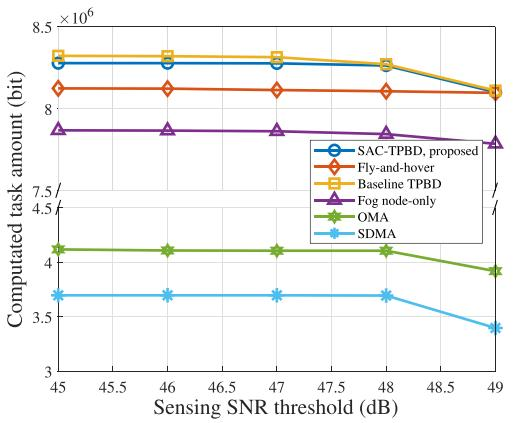

line

| Sensing SNR threshold (dB) | SAC-TPBD, proposed | Fly-and-hover | Baseline TPBD | Fog node-only | OMA | SDMA |
| -------------------------- | ------------------ | ------------- | ------------- | ------------- | --- | ---- |
| 45                         | 8.3                | 8.1           | 8.3           | 7.9           | 4.1 | 3.6  |
| 46                         | 8.3                | 8.1           | 8.3           | 7.9           | 4.1 | 3.6  |
| 47                         | 8.3                | 8.1           | 8.3           | 7.9           | 4.1 | 3.6  |
| 48                         | 8.2                | 8.1           | 8.2           | 7.9           | 4.1 | 3.6  |
| 49                         | 8.1                | 8.1           | 8.1           | 7.8           | 3.9 | 3.4  |

Fig. 3. Computed task amount versus sensing SNR threshold.

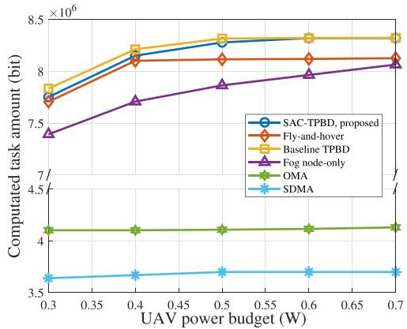

line

| UAV power budget (W) | SAC-TPBD, proposed | Fly-and-hover | Baseline TPBD | Fog node-only | OMA | SDMA |
| --------------------- | ------------------ | ------------- | ------------- | ------------- | --- | ---- |
| 0.3                   | 7.8                | 7.6           | 7.9           | 7.4           | 4.1 | 3.6  |
| 0.4                   | 8.2                | 8.1           | 8.3           | 7.7           | 4.1 | 3.6  |
| 0.5                   | 8.3                | 8.1           | 8.4           | 7.9           | 4.1 | 3.6  |
| 0.6                   | 8.4                | 8.1           | 8.4           | 8.0           | 4.1 | 3.6  |
| 0.7                   | 8.4                | 8.1           | 8.4           | 8.1           | 4.1 | 3.6  |

Fig. 4. Computed task amount versus UAV power budget.

task amount. In addition, the proposed SAC-TPBD significantly outperforms most benchmark methods, and the performance is very close to that of baseline TPBD. The reason is that compared to the fly-and-hover method, the UAV trajectory is properly optimized to improve the communication throughput. For fog node-only method, the UAV computational capability is not fully leveraged, resulting in lower computation throughput. The computation performance of OMA is also lower than that of SAC-TPBD since the proposed framework invokes NOMA to enhance the spectrum efficiency, thereby achieving higher task offloading rate. SDMA performs worse due to the lack of SIC, and the intolerable interference to both sensing and communication reduces the receiving SINR at the UAV. Since baseline TPBD unilaterally maximizes the system communication rate without considering the URLLC constraints, it may acquire higher computation performance.

Fig. 4 showcases the computed task amount versus the UAV power budget. We can find that with the increasing of the maximum power, better computation performance can be achieved. This is because more edge resources are available for beamforming and computing at the UAV. Besides, the phenomenon that the computed task amount obtained by different methods is bounded by different values can be observed. This is owing to the fact that the processed task amount is constrained by the users’ offloading throughput, and the proposed approach jointly optimizes UAV trajectory and beamforming, thereby extending the feasible region for computation performance enhancement. Furthermore, the curves of OMA and SDMA ascend marginally since the achievable communication rate is low, which conversely reveals that NOMA is able to attain a higher uplink capacity, whilst improving the upper bound of the computation throughput. Particularly, the proposed approach achieves outstanding performance compared with baselines. When the UAV power budget is 0.5W, SAC-TPBD outperforms fly-and-hover, fog node-only, OMA, and SDMA by 1.96%, 4.99%, 50.4%, and 55.3%, respectively, and the computed task amount is only 0.45% lower than that of baseline TPBD.

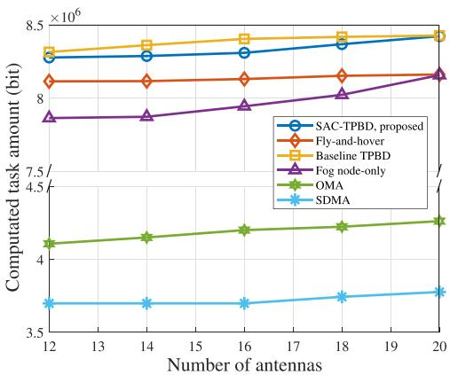

line

| Number of antennas | SAC-TPBD, proposed | Fly-and-hover | Baseline TPBD | Fog node-only | OMA | SDMA |
| ------------------ | ------------------ | ------------- | ------------- | ------------- | --- | ---- |
| 12                 | 8.3e6              | 8.1e6         | 8.4e6         | 7.9e6         | 4.1e6 | 3.7e6 |
| 14                 | 8.3e6              | 8.1e6         | 8.4e6         | 7.9e6         | 4.1e6 | 3.7e6 |
| 16                 | 8.3e6              | 8.1e6         | 8.4e6         | 7.9e6         | 4.2e6 | 3.7e6 |
| 18                 | 8.4e6              | 8.1e6         | 8.4e6         | 8.0e6         | 4.2e6 | 3.7e6 |
| 20                 | 8.5e6              | 8.1e6         | 8.4e6         | 8.2e6         | 4.3e6 | 3.8e6 |

Fig. 5. Computed task amount versus number of antennas.

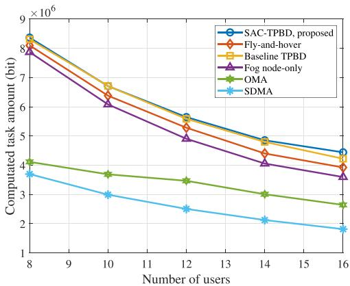

line

| Number of users | SAC-TPBD, proposed | Fly-and-hover | Baseline TPBD | Fog node-only | OMA | SDMA |
| --------------- | ------------------ | ------------- | ------------- | ------------- | --- | ---- |
| 8               | 8.5e6              | 8.3e6         | 8.4e6         | 8.0e6         | 4.1e6 | 3.7e6 |
| 10              | 7.0e6              | 6.5e6         | 6.8e6         | 6.2e6         | 3.8e6 | 3.0e6 |
| 12              | 5.5e6              | 5.2e6         | 5.6e6         | 5.0e6         | 3.5e6 | 2.5e6 |
| 14              | 4.8e6              | 4.5e6         | 4.9e6         | 4.3e6         | 3.1e6 | 2.1e6 |
| 16              | 4.3e6              | 4.0e6         | 4.4e6         | 3.8e6         | 2.7e6 | 1.8e6 |

Fig. 6. Computed task amount versus number of users.

Fig. 5 depicts the computed task amount versus the number of antennas at the UAV. We can observe that, when the number of antennas becomes large, the computation throughput derived by SAC-TPBD, baseline TPBD and fog-node only method all increases, while that by the fly-and-hover remains unchanged. The rationale behind this phenomenon is that, trajectory optimization enables the UAV to radiate narrower ISAC beams achieved by more antennas, thereby improving the task offloading as well as radar sensing gains. Similar to the above discussion, the computed task amount of OMA and SDMA cannot change obviously due to the limitation of user communication rate. Moreover, the proposed approach always achieves outstanding performance regardless of the number of antennas, that is, the performance loss is only 0.62% compared to baseline TPBD, and the computation throughput is 2.38%, 4.33%, 49.7%, and 55.3% higher than the other four benchmark methods, respectively.

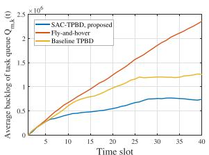

line

| Time slot | SAC-TPBD, proposed | Fly-and-hover | Baseline TPBD |
| --------- | ------------------ | ------------- | ------------- |
| 0         | 0                  | 0             | 0             |
| 5         | 0.3                | 0.4           | 0.4           |
| 10        | 0.4                | 0.8           | 0.6           |
| 15        | 0.5                | 1.2           | 0.9           |
| 20        | 0.6                | 1.5           | 1.1           |
| 25        | 0.7                | 1.8           | 1.2           |
| 30        | 0.7                | 2.0           | 1.3           |
| 35        | 0.7                | 2.2           | 1.3           |
| 40        | 0.7                | 2.4           | 1.3           |

(a)

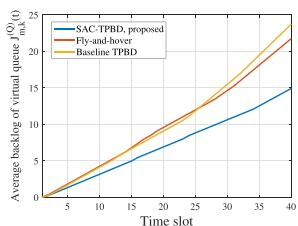

line

| Time slot | SAC-TPBD, proposed | Fly-and-hover | Baseline TPBD |
| --------- | ------------------ | -------------- | ------------- |
| 0         | 0                  | 0              | 0             |
| 5         | 2                  | 3              | 4             |
| 10        | 4                  | 6              | 7             |
| 15        | 6                  | 9              | 10            |
| 20        | 8                  | 12             | 13            |
| 25        | 10                 | 15             | 16            |
| 30        | 12                 | 18             | 19            |
| 35        | 14                 | 21             | 22            |
| 40        | 15                 | 23             | 24            |

(b)

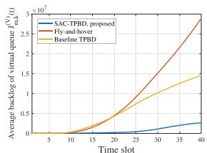

line

| Time slot | SAC-TPBD, proposed | Fly-and-hover | Baseline TPBD |
| --------- | ------------------ | ------------- | ------------- |
| 5         | 0                  | 0             | 0             |
| 10        | 0                  | 0             | 0             |
| 20        | 0                  | 0.5           | 0.5           |
| 30        | 0.1                | 1.5           | 1.0           |
| 40        | 0.2                | 2.8           | 1.5           |

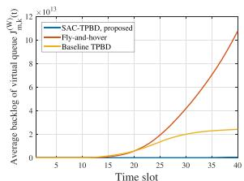

line

| Time slot | SAC-TPBD, proposed | Fly-and-hover | Baseline TPBD |
| --------- | ------------------ | ------------- | ------------- |
| 5         | 0                  | 0             | 0             |
| 10        | 0                  | 0             | 0             |
| 15        | 0                  | 0             | 0             |
| 20        | 0                  | 0             | 0             |
| 25        | 0                  | 1             | 0             |
| 30        | 0                  | 4             | 0             |
| 35        | 0                  | 8             | 0             |
| 40        | 0                  | 11            | 0             |

(d) Average backlog of J(W） $J _ { m , k } ^ { ( W ) }$ (t).

Fig. 7. Presentation of URLLC awareness. (a) Average backlog of $Q _ { m , k } ( t )$ . (b) Average backlog of $J _ { m , k } ^ { ( Q ) } ( t )$ . (c) Average backlog of $J _ { m , k } ^ { ( V ) } ( t )$ . (d) Average backlog of $J _ { m , k } ^ { ( W ) } ( t )$ .   
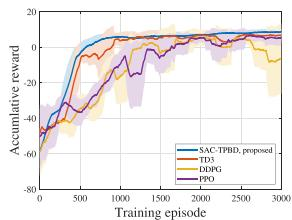

line

| Training episode | SAC TPBD, proposed | TD3 | DDPG | DPO |
| ---------------- | ------------------ | --- | ---- | --- |
| 0                | -60                | -60 | -60  | -60 |
| 500              | -20                | -10 | -15  | -25 |
| 1000             | 5                  | 5   | 5    | 5   |
| 1500             | 10                 | 10  | 10   | 10  |
| 2000             | 15                 | 15  | 15   | 15  |
| 2500             | 20                 | 20  | 20   | 20  |
| 3000             | 20                 | 20  | 20   | 20  |

(a)

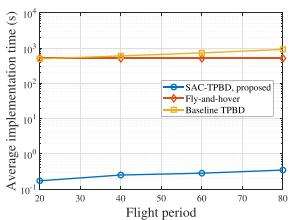

line

| Flight period | SAC-TPBD, proposed | Fly-and-hover | Baseline TPBD |
| ------------- | ------------------ | ------------- | ------------- |
| 20            | 10^-1              | 10^3          | 10^3          |
| 40            | 10^-1              | 10^3          | 10^3          |
| 60            | 10^-1              | 10^3          | 10^3          |
| 80            | 10^-1              | 10^3          | 10^3          |

(b)   
Fig. 8. Algorithm convergence comparison. (a) Accumulative reward versus training episode. (b) Average implementation time versus flight period.

Fig. 6 shows the impacts of the number of offloading users on the system performance. It can be seen from each curve that the computed task amount declines with the number of users. This is owing to the limited bandwidth has to be allocated to serve more users, resulting in stronger interference and thus lower offloading rate. Moreover, the proposed approach consistently outperforms fly-and-hover, OMA, SDMA schemes when the number of users increases. This corroborates that our SAC-TPBD is able to beneficially adjusting the channel quality of NOMA via maneuverable UAV deployment, thereby offering adaptive non-orthogonal transmissions with efficient spectral utilization.

Fig. 7 demonstrates the URLLC awareness realized by the proposed SAC-TPBD approach. As illustrated in Fig. 7(a), since traditional methods only maximize the system rate, but neglect the URLLC constraints, they lead to large task queue backlog. In comparison, our scheme can significantly reduce the queue backlog by dynamically adjusting the UAV trajectory and beamforming vector based on real-time queue information. In particular, the proposed approach outperforms baseline TPBD by 60.6% in reducing the average queue buffer backlog. Besides, Fig. 7(b)–(d) plot the average backlog of three types of virtual queues. It can be observed that SAC-TPBD is able to stabilize the URLLC constraint deficits, thereby suppressing the tail of the queuing delay distribution. From Figs. 3–7 we can conclude that, SAC-TPBD strikes a well balance between computation performance as well as URLLC constraint deviations, thereby achieving superior overall performance.

In Fig. 8, we describe the algorithm convergence. Fig. 8(a) presents the learning curves of the proposed approach as well as the baseline DRL methods. To be specific, the time-average reward (given by curves) and standard deviation (given by shaded areas) are applied to evaluate the training performance. Evidently, the proposed SAC not only converges more rapidly, but also learns more stably compared to the baselines. This fact indicates that SAC adopts the stochastic policy gradient to explore the action space with high efficiency, such that the proper TPBD policy can be learned quickly. On-policy PPO performs worse than our approach due to the experience from the other episodes is unavailable for training the current policy, resulting in low sample efficiency. Subsequently, we provide the algorithm implementation time in Fig. 8(b) to validate the computing efficiency.9 We can observe that the running time of SAC-TPBD is three orders of magnitude lower than that of traditional methods. Meanwhile, the increment of the implementation time is negligible when the flight period increases. Besides, the well-trained DRL agent takes only about $5 \times 1 0 ^ { - 3 }$ seconds to make an optimization decision, which is much lower than the slot duration, thereby verifying the applicability of our scheme in URLLC scenarios.

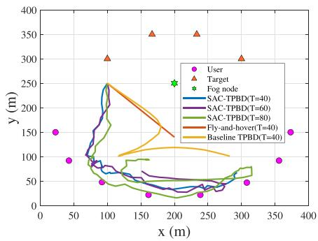

line

| x (m) | User | Target | Fog node |
|-------|------|--------|----------|
| 50    | 150  | -      | -        |
| 100   | 50   | 300    | -        |
| 150   | 25   | 350    | -        |
| 200   | 100  | 350    | 250      |
| 250   | 50   | -      | -        |
| 300   | 150  | 300    | -        |
| 350   | 150  | -      | -        |

Fig. 9. UAV trajectories under different flight periods for various schemes.

Fig. 9 showcases the UAV trajectories under different flight periods. On the one hand, for fly-and-hover as well as baseline TPBD methods, the objective is to maximize the sum transmission rate of user-to-UAV links and UAV-to-fog node link, thus the UAV selects a compromise hovering position/flight trajectory between the users and the fog node. For the sake of guaranteeing the URLLC constraints, the UAV trajectory obtained by SAC-TPBD tends to be closer to the users, such

9Due to the significant differences in magnitude of the results, we apply logarithmic coordinates for ease of presentation.

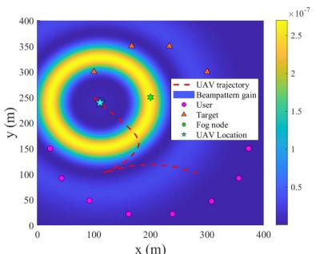

heatmap

| x (m) | y (m) | Value (×10⁻⁷) |
|-------|-------|---------------|
| 0     | 0     | 0             |
| 100   | 100   | 0.5           |
| 200   | 200   | 1             |
| 300   | 300   | 2.5           |
| 400   | 400   | 2.5           |

(a)

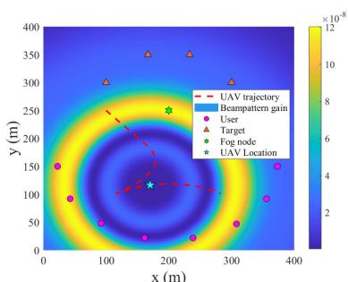

heatmap

| x (m) | y (m) | Value (×10⁻⁸) |
|-------|-------|---------------|
| 0     | 0     | 0             |
| 100   | 100   | 4             |
| 200   | 200   | 8             |
| 300   | 300   | 12            |
| 400   | 400   | 16            |

(b)

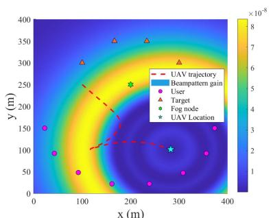

heatmap

| X (m) | Y (m) | Value (×10⁻⁸) |
|---|---|---|
| 0 | 0 | 1 |
| 50 | 50 | 3 |
| 100 | 100 | 4 |
| 150 | 150 | 5 |
| 200 | 200 | 6 |
| 250 | 250 | 7 |
| 300 | 300 | 8 |
| 350 | 350 | 7 |
| 400 | 400 | 6 |

(c）

Fig. 10. Receiving beampattern gains in different time slots for baseline TPBD scheme. (a)  = 2. (b)  = 20. (c)  = 40.   
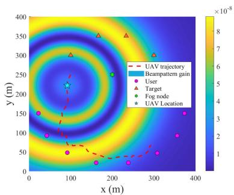

heatmap

| x (m) | y (m) | Value (×10⁻⁸) |
|-------|-------|---------------|
| 0     | 0     | 1             |
| 50    | 50    | 3             |
| 100   | 100   | 5             |
| 150   | 150   | 7             |
| 200   | 200   | 8             |
| 250   | 250   | 6             |
| 300   | 300   | 4             |
| 350   | 350   | 3             |
| 400   | 400   | 2             |

(a)

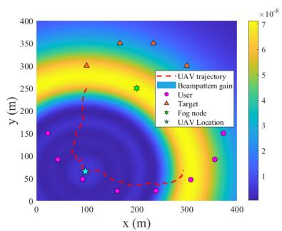

heatmap

| x (m) | y (m) | Value (×10⁸) |
|-------|-------|--------------|
| 0     | 0     | 1            |
| 50    | 100   | 2            |
| 100   | 200   | 3            |
| 150   | 300   | 4            |
| 200   | 400   | 5            |
| 250   | 350   | 6            |
| 300   | 300   | 7            |
| 350   | 250   | 6            |
| 400   | 200   | 5            |
| 450   | 150   | 4            |
| 500   | 100   | 3            |
| 550   | 50    | 2            |
| 600   | 0     | 1            |

(b)

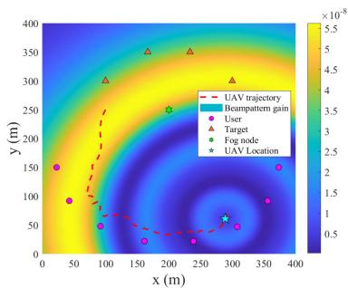

heatmap

| x (m) | y (m) | Value (×10⁻⁸) |
|---|---|---|
| 0 | 150 | 1.5 |
| 50 | 90 | 3.0 |
| 100 | 40 | 4.5 |
| 150 | 25 | 5.0 |
| 200 | 250 | 5.5 |
| 250 | 350 | 5.5 |
| 300 | 50 | 3.5 |
| 350 | 150 | 1.5 |
| 400 | 150 | 1.5 |
The chart displays a color-coded contour map with markers for UAV trajectory, Beampattern gain, Target, Fog node, and UAV Location. The legend indicates 'User' (red circle), 'Target' (red triangle), 'Fog node' (green star), and 'UAV Location' (blue star). The dashed red line represents the UAV trajectory path.

（c）  
Fig. 11. Receiving beampattern gains in different time slots for the proposed SAC-TPBD. (a)  = 2. (b)  = 20. (c)  = 40.

that the backlogged tasks can be offloaded to the aerial server as soon as possible. On the other hand, when the flight period becomes large, the UAV has disposition to extend the trajectory and fly cyclically over the users.

Figs. 10 and 11 present the receiving beampattern gains10 in different time slots for baseline TPBD and SAC-TPBD schemes, respectively. It is observed that the UAV’s ISAC beam of our method is reasonably radiated towards the fog node as well as the targets, in order to effectively execute task offloading whilst ensuring the sensing requirements. For instance, in Fig. 11(b), the beamforming is mainly steered towards the fog node to maximize the computation performance, whilst partial transmission power is allocated to the targets, such that the sensing SNR constraints are guaranteed. In summary, compared to the benchmark convex approximation-based algorithms, our proposed SAC-TPBD is able to realize a comparable beamforming performance with much higher implementation efficiency, which confirms the effectivity of utilizing DRL to solve the joint UAV TPBD issue.

Considering that perfect channel state information (CSI) may not be acquired in practical implementations, Fig. 12 examines the impact of imperfect CSI using the boxplot of computed task amount. The relationship between the estimated channel h and actual channel h is $\mathbf { h } = \bar { \mathbf { h } } + \mathbf { e } [ 4 4 ]$ , and h can be a sensing and = +communication channel, e is the estimation error bounded by $\| \mathbf { e } \| \leq e .$ . In Fig. 12, the normalized error is defined as $e ^ { 2 } / \Vert \mathbf { h } \Vert ^ { 2 }$ ,

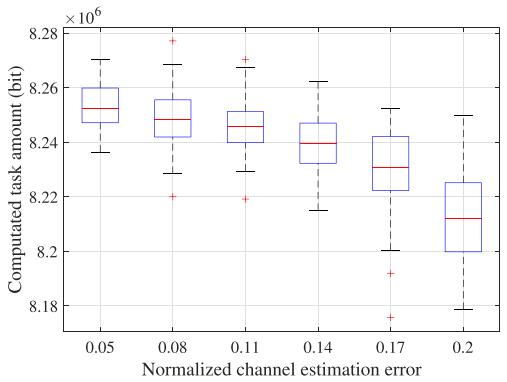

boxplot

| Normalized channel estimation error | Computed task amount (bit) |
| ----------------------------------- | -------------------------- |
| 0.05                                | 8.26                       |
| 0.08                                | 8.24                       |
| 0.11                                | 8.24                       |
| 0.14                                | 8.24                       |
| 0.17                                | 8.23                       |
| 0.2                                 | 8.22                       |

Fig. 12. Impact of imperfect CSI on computed task amount.

the imperfect CSI is invoked to train the proposed SAC-TPBD, and the result in each box contains 50 channel realizations. It can be seen that with the increasing of channel estimation error, the computation throughput first declines slightly then degrades remarkably, indicating that the imperfect CSI affects the UAV trajectory and beamforming decisions. Furthermore, the DRL agent learns to fit the environment and ensure satisfactory network performance when the normalized error is less than 0.11, showing a certain degree of adaptability to imperfect CSI. In the future, our approach can be integrated with robust designs, e.g., sharpness-aware minimization [45], to enhance the policy generalization when the channel estimation error ascends.

In Fig. 13, we extend the proposed approach to Rician fading channel model, where the sensing and communication

10The receiving beampattern gain for any point located at u( ) is defined as $g ( t ) \cdot | \mathbf { a } ^ { \mathrm { H } } ( 1 ( t ) , \mathbf { u } ( t ) ) \mathbf { w } ( t ) | ^ { 2 }$ , where $g ( t )$ tdenotes the channel gain between the g t t , tpoint and the UAV.

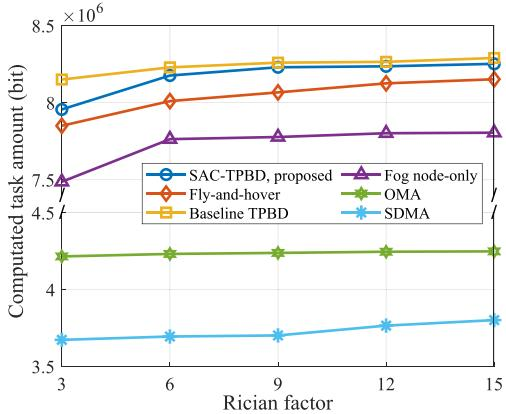

line

| Rician factor | SAC-TPBD, proposed | Fly-and-hover | Baseline TPBD | Fog node-only | OMA | SDMA |
| ------------- | ------------------ | ------------- | ------------- | ------------- | --- | ---- |
| 3             | 7.9                | 7.8           | 8.1           | 7.5           | 4.2 | 3.7  |
| 6             | 8.1                | 8.0           | 8.2           | 7.7           | 4.2 | 3.7  |
| 9             | 8.2                | 8.1           | 8.2           | 7.7           | 4.2 | 3.7  |
| 12            | 8.2                | 8.1           | 8.2           | 7.7           | 4.2 | 3.8  |
| 15            | 8.2                | 8.1           | 8.2           | 7.7           | 4.2 | 3.8  |

Fig. 13. Extension to Rician fading channel model.

channels are expressed as $\begin{array} { r } { \mathbf { h } = \sqrt { \frac { \Lambda } { 1 + \Lambda } } \mathbf { h } ^ { \mathrm { L o S } } + \sqrt { \frac { 1 } { 1 + \Lambda } } \mathbf { h } ^ { \mathrm { N L o S } } , \Lambda } \end{array}$ hLoS is the Rician factor, $\mathbf { h } ^ { \mathrm { L o S } }$ and $\mathbf { h } ^ { \mathrm { N L o S } }$ are LoS and NLoS component, respectively [31]. We can observe that the computed task amount increases as  grows. This is owing to the enhanced ΛLoS propagation is beneficial for target sensing and task offloading. Moreover, the performance of our SAC-TPBD is close to baseline TPBD and significantly higher than other methods, corroborating the extensibility of the proposed approach for different channel models.

To conclude, we summarize the insights brought by the above performance comparison. By comparing to benchmark solution methods (fly-and-hover, baseline TPBD and DRL), we verify the superiority of our approach in terms of computation throughput, URLLC constraint guarantee, and training/implementation efficiency. By comparing to benchmark ISCC framework (fog node-only), the performance gain introduced by edge-fog cooperative computing is delineated. By comparing to benchmark multiple access technology (OMA and SDMA), we understand the significance of NOMA in enhancing the ISCC performance and suppressing inter-functionality interference.

# VI. CONCLUSION

In this article, the resource management and performance optimization issue for the NOMA-aided UAV ISCC network was elaborated. Specifically, the joint UAV trajectory planning, beamforming design and computational resource assignment issue was formulated to maximize the system computed task amount, satisfying the sensing SNR, power budget, and longterm URLLC constraints. Afterwards, SAC-TPBD approach was proposed to strike a superior tradeoff between computation performance and URLLC constraint deviations through effective DRL framework design, thereby achieving URLLC awareness. Numerical results unveiled that compared to baseline TPBD method which unilaterally maximized the system communication rate via convex approximation techniques, the performance loss of the proposed SAC-TPBD was only 0.62%. Furthermore, our approach outperformed the baseline by 60.6% in reducing the average task queue backlog, and slashed the running time by three orders of magnitude. In addition, it possessed better convergence and training stability, as compared to the baseline DRL schemes, i.e., DDPG, TD3, and PPO.

# REFERENCES

[1] P. Zhang et al., “Toward intelligent and efficient 6G networks: JCSC enabled on-purpose machine communications,” IEEE Wireless Commun., vol. 30, no. 1, pp. 150–157, Feb. 2023.   
[2] K. B. Letaief, Y. Shi, J. Lu, and J. Lu, “Edge artificial intelligence for 6G: Vision, enabling technologies, and applications,” IEEE J. Select. Areas Commun., vol. 40, no. 1, pp. 5–36, Jan. 2022.   
[3] F. Dong, F. Liu, Y. Cui, W. Wang, K. Han, and Z. Wang, “Sensing as a service in 6G perceptive networks: A unified framework for ISAC resource allocation,” IEEE Trans. Wirel. Commun., vol. 22, no. 5, pp. 3522–3536, May 2023.   
[4] F. Liu et al., “Integrated sensing and communications: Toward dualfunctional wireless networks for 6G and beyond,” IEEE J. Select. Areas Commun., vol. 40, no. 6, pp. 1728–1767, Jun. 2022.   
[5] P. Mach and Z. Becvar, “Mobile edge computing: A survey on architecture and computation offloading,” IEEE Commun. Surveys Tuts., vol. 19, no. 3, pp. 1628–1656, Thirdquarter 2017.   
[6] Y. Cui, F. Liu, X. Jing, and J. Mu, “Integrating sensing and communications for ubiquitous IoT: Applications, trends, and challenges,” IEEE Netw., vol. 35, no. 5, pp. 158–167, Sep./Oct. 2021.   
[7] L. Zhao, D. Wu, L. Zhou, and Y. Qian, “Radio resource allocation for integrated sensing, communication, and computation networks,” IEEE Trans. Wireless Commun., vol. 21, no. 10, pp. 8675–8687, Oct. 2022.   
[8] A. Liu et al., “A survey on fundamental limits of integrated sensing and communication,” IEEE Commun. Surveys Tuts., vol. 24, no. 2, pp. 994–1034, Secondquarter 2022.   
[9] H. Zhang, B. Zong, and J. Xie, “Power and bandwidth allocation for multitarget tracking in collocated MIMO radar,” IEEE Trans. Veh. Technol., vol. 69, no. 9, pp. 9795–9806, Sep. 2020.   
[10] P. Qin, Y. Fu, Y. Xie, K. Wu, X. Zhang, and X. Zhao, “Multi-agent learning-based optimal task offloading and UAV trajectory planning for AGIN-power IoT,” IEEE Trans. Commun., vol. 71, no. 7, pp. 4005–4017, Jul. 2023.   
[11] P. Qin et al., “Joint trajectory plan and resource allocation for UAVenabled C-NOMA in air-ground integrated 6G heterogeneous network,” IEEE Trans. Netw. Sci. Eng., pp. 1–13, vol. 10, no. 6, pp. 3421–3434, Nov./Dec. 2023.   
[12] Z. Zhang, C. Xu, Z. Li, X. Zhao, and R. Wu, “Deep reinforcement learning for aerial data collection in hybrid-powered NOMA-IoT networks,” IEEE Internet Things J., vol. 10, no. 2, pp. 1761–1774, Jan. 2023.   
[13] 5 connected aircraft trends for 2019 & beyond, 2019. [Online]. Available: https://aerospace.honeywell.com/us/en/about-us/blogs/ 5-connected-aircraft-trends-for-2019-and-beyond   
[14] P. Qin, Y. Fu, X. Zhao, K. Wu, J. Liu, and M. Wang, “Optimal task offloading and resource allocation for C-NOMA heterogeneous air-ground integrated power Internet of Things networks,” IEEE Trans. Wireless Commun., vol. 21, no. 11, pp. 9276–9292, Nov. 2022.   
[15] J. Yao and N. Ansari, “QoS-aware machine learning task offloading and power control in Internet of Drones,” IEEE Internet Things J., vol. 10, no. 7, pp. 6100–6110, Apr. 2023.   
[16] Z. Xiao et al., “A survey on millimeter-wave beamforming enabled UAV communications and networking,” IEEE Commun. Surveys Tuts., vol. 24, no. 1, pp. 557–610, Firstquarter 2022.   
[17] Z. Xiao, H. Dong, L. Bai, D. O. Wu, and X.-G. Xia, “Unmanned aerial vehicle base station (UAV-BS) deployment with millimeter-wave beamforming,” IEEE Internet Things J., vol. 7, no. 2, pp. 1336–1349, Feb. 2020.   
[18] Z. Lyu, G. Zhu, and J. Xu, “Joint maneuver and beamforming design for UAV-enabled integrated sensing and communication,” IEEE Trans. Wireless Commun., vol. 22, no. 4, pp. 2424–2440, Apr. 2023.   
[19] Y. Liu et al., “Evolution of NOMA toward next generation multiple access (NGMA) for 6G,” IEEE J. Select. Areas Commun., vol. 40, no. 4, pp. 1037–1071, Apr. 2022.   
[20] X. Mu, Y. Liu, L. Guo, J. Lin, and L. Hanzo, “NOMA-aided joint radar and multicast-unicast communication systems,” IEEE J. Select. Areas Commun., vol. 40, no. 6, pp. 1978–1992, Jun. 2022.   
[21] Z. Wang, X. Mu, Y. Liu, X. Xu, and P. Zhang, “NOMA-aided joint communication, sensing, and multi-tier computing systems,” IEEE J. Select. Areas Commun., vol. 41, no. 3, pp. 574–588, Mar. 2023.   
[22] H. Xie, T. Zhang, X. Xu, D. Yang, and Y. Liu, “Joint sensing, communication and computation in UAV-assisted systems,” IEEE Internet Things J., vol. 11, no. 18, pp. 29412–29426, Sep. 2024.

[23] M. K. Abdel-Aziz, S. Samarakoon, C.-F. Liu, M. Bennis, and W. Saad, “Optimized age of information tail for ultra-reliable low-latency communications in vehicular networks,” IEEE Trans. Commun., vol. 68, no. 3, pp. 1911–1924, Mar. 2020.   
[24] K. Meng, Q. Wu, S. Ma, W. Chen, K. Wang, and J. Li, “Throughput maximization for UAV-enabled integrated periodic sensing and communication,” IEEE Trans. Wireless Commun., vol. 22, no. 1, pp. 671–687, Jan. 2023.   
[25] C. Deng, X. Fang, and X. Wang, “Beamforming design and trajectory optimization for UAV-empowered adaptable integrated sensing and communication,” IEEE Trans. Wireless Commun., vol. 22, no. 11, pp. 8512–8526, Nov. 2023.   
[26] M. Chu, A. Liu, V. K. N. Lau, C. Jiang, and T. Yang, “Deep reinforcement learning based end-to-end multiuser channel prediction and beamforming,” IEEE Trans. Wireless Commun., vol. 21, no. 12, pp. 10271–10285, Dec. 2022.   
[27] Z. Zhang, J. Hou, X. Chu, H. Zhou, G. Wei, and J. Zhang, “Multiagent deep reinforcement learning based downlink beamforming in heterogeneous networks,” IEEE Trans. Wireless Commun., vol. 22, no. 6, pp. 4247–4263, Jun. 2023.   
[28] X. Wu, X. Li, J. Li, P. C. Ching, V. C. M. Leung, and H. V. Poor, “Caching transient content for IoT sensing: Multi-agent soft actor-critic,” IEEE Trans. Wireless Commun., vol. 69, no. 9, pp. 5886–5901, Sep. 2021.   
[29] S. Chai and V. K. Lau, “Mixed-timescale request-driven user association, trajectory and radio resource control for cache-enabled multi-UAV networks,” IEEE Trans. Signal Process., vol. 70, pp. 4997–5011, 2022.   
[30] P. Qin, S. Wang, Z. Lu, Y. Xie, and X. Zhao, “Deep reinforcement learningbased energy minimization task offloading and resource allocation for air ground integrated heterogeneous networks,” IEEE Syst. J., vol. 17, no. 3, pp. 4958–4968, Sep. 2023.   
[31] J. Zhao, L. Yu, K. Cai, Y. Zhu, and Z. Han, “RIS-aided ground-aerial NOMA communications: A distributionally robust DRL approach,” IEEE J. Select. Areas Commun., vol. 40, no. 4, pp. 1287–1301, Apr. 2022.   
[32] Y. Fu, M. Zhang, L. Salaün, C. W. Sung, and C. S. Chen, “Zero-forcing oriented power minimization for multi-cell MISO-NOMA systems: A joint user grouping, beamforming, and power control perspective,” IEEE J. Select. Areas Commun., vol. 38, no. 8, pp. 1925–1940, Aug. 2020.   
[33] T. Zhang, Z. Wang, Y. Liu, W. Xu, and A. Nallanathan, “Caching placement and resource allocation for cache-enabling UAV NOMA networks,” IEEE Trans. Veh. Technol., vol. 69, no. 11, pp. 12897–12911, Nov. 2020.   
[34] X. Yuan, Y. Hu, and A. Schmeink, “Joint design of UAV trajectory and directional antenna orientation in UAV-enabled wireless power transfer networks,” IEEE J. Select. Areas Commun., vol. 39, no. 10, pp. 3081–3096, Oct. 2021.   
[35] C. Liu et al., “Learning-based predictive beamforming for integrated sensing and communication in vehicular networks,” IEEE J. Select. Areas Commun., vol. 40, no. 8, pp. 2317–2334, Aug. 2022.   
[36] C. Baquero Barneto et al., “Full-duplex OFDM radar with LTE and 5G NR waveforms: Challenges, solutions, and measurements,” IEEE Trans. Microw. Theory Techn., vol. 67, no. 10, pp. 4042–4054, Oct. 2019.   
[37] Y. Zeng, J. Xu, and R. Zhang, “Energy minimization for wireless communication with rotary-wing UAV,” IEEE Trans. Wireless Commun., vol. 18, no. 4, pp. 2329–2345, Apr. 2019.   
[38] C. You and R. Zhang, “Hybrid offline-online design for UAV-enabled data harvesting in probabilistic LoS channels,” IEEE Trans. Wireless Commun., vol. 19, no. 6, pp. 3753–3768, Jun. 2020.   
[39] D. Tse and P. Viswanath, Fundamentals of Wireless Communication. Cambridge, U.K.: Cambridge Univ. Press, 2005.   
[40] S. Coles, An Introduction to Statistical Modeling of Extreme Values. London, U.K.: Springer, 2001.   
[41] C. Zhong et al., “Deep reinforcement learning-based optimization for IRSassisted cognitive radio systems,” IEEE Trans. Commun., vol. 70, no. 6, pp. 3849–3864, Jun. 2022.   
[42] H. Guo, X. Zhou, J. Wang, J. Liu, and A. Benslimane, “Intelligent task offloading and resource allocation in digital twin based aerial computing networks,” IEEE J. Select. Areas Commun., vol. 41, no. 10, pp. 3095–3110, Oct. 2023.   
[43] X. Yu, J.-C. Shen, J. Zhang, and K. B. Letaief, “Alternating minimization algorithms for hybrid precoding in millimeter wave MIMO systems,” IEEE J. Sel. Top. Signal Process., vol. 10, no. 3, pp. 485–500, Apr. 2016.   
[44] X. Li et al., “UAV-enabled multi-pair massive MIMO-NOMA relay systems with low-resolution ADCs/DACs,” IEEE Trans. Veh. Technol, vol. 73, no. 2, pp. 2171–2186, Feb. 2024.   
[45] J. Kwon, J. Kim, H. Park, and I. K. Choi, “ASAM: Adaptive sharpnessaware minimization for scale-invariant learning of deep neural networks,” in Proc. 38th Int. Conf. Mach. Learn., 2021, vol. 139, pp. 5905–5914.

natural_image

Portrait photo of a smiling man wearing a checkered shirt (no text or symbols visible)

Peng Qin (Member, IEEE) received the B.S. and Ph.D. degrees in information and communication engineering from the Huazhong University of Science and Technology, Wuhan, China, in 2009 and 2014, respectively. From 2012 to 2013, he was a Visiting Scholar with the University of Victoria, Victoria, BC, Canada. He is currently an Associate Professor with the School of Electrical and Electronic Engineering, North China Electric Power University, Beijing, China. His research interests include resource allocation in Internet of Things, network intelligence, smart grid communications, space air ground integrated networks, and vehicular networks. He was the recipient of the International Communications Signal Processing and Systems Conference Best Paper Award, and International Conference on Artificial Intelligence in China Best Paper Award in 2019, 2020, 2021, and 2022, respectively.

natural_image

Portrait of a young man wearing glasses and a collared shirt (no text or symbols visible)

Yang Fu received the B.S. degree in 2022 from North China Electric Power University, Beijing, China, where he is currently working toward the Ph.D. degree with the School of Electrical and Electronic Engineering. His research interests include resource allocation in smart grid communications, space air ground integrated networks, vehicular networks, and the Internet of Things.

natural_image

Portrait of a man wearing glasses and a suit (no text or symbols visible)

Zhigang Yu received the B.S. degree in communication engineering from Xidian University, Xi’an, China, in 2011, and the Ph.D. degree in computer science and technology from Tsinghua University, Beijing, China, in 2016. He is currently a Senior Engineer with the China Academy of Electronic Science and Technology. His research interests include space-ground integrated network and space-based intelligent computing.

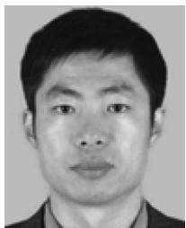

natural_image

Portrait photo of a man (no text or symbols visible)

Jing Zhang received the graduation degree from the Xidian University of Communication Engineering, Xi’an, China, in 1996. From 2014 to 2017, he was the Chief of Application Group of New Generation Mobile Communication Technology System under the CETC. Since 2018, he has been a Member of the Expert Group on Management of National Key Research and Development Programs for Broadband Communications and New Networks. He is currently a Professor with China Academy of Electronics and Information Technology, Beijing, China. His research

interests include 5G URLLC in industrial time sensitive network, mobile edge computing, 5G satellite network-based architectures, LEO satellite RAT in 5G, MIMO, and channel coding.

natural_image

Portrait of a man wearing glasses and a dark jacket (no text or symbols visible)

Xiongwen Zhao (Senior Member, IEEE) received the Ph.D. degree (Hons.) from the Helsinki University of Technology, Espoo, Finland, in 2002. He is currently a Full Professor with North China Electric Power University, Beijing, China. He has more than 300 publications, in which 110 articles are indexed by SCI. He is a Fellow of Chinese Institute of Electronics, China Institute of Communications, and IET. He was the recipient of the IEEE Vehicular Technology Society Neal Shepherd Memorial Best Propagation Paper Award in 2014. He was the TPC Chair, and

Keynote Speaker for numerous international and national conferences. He is an Associate Editor for IEEE ANTENNAS AND WIRELESS PROPAGATION LETTERS, and IET Communications.