# USV Fleet-Assisted Collaborative Computation Offloading for Smart Maritime Services: An Energy-Efficient Design

Hui Zeng , Student Member, IEEE, Zhou Su , Senior Member, IEEE, Qichao Xu , Ruidong Li , Senior Member, IEEE, Yuntao Wang , Minghui Dai , Tom H. Luan , Senior Member, IEEE, Xin Sun, and Donglan Liu

Abstract—Unmanned aerial vehicles (UAVs) empowered with artificial intelligence (AI) have become a new paradigm for ondemand and intelligent marine monitoring. To enable diverse AI applications, numerous computation-intensive tasks (e.g., image recognition, video processing, path planning, etc.) that cannot be locally executed by UAVs need to be timely and effectively offloaded. Multiple unmanned surface vehicles (USVs) integrated into a USV fleet is appealingly advocated to provide abundant computation resources for computation tasks. In this paper, we propose an energy-efficient USV fleets-assisted collaborative computation offloading scheme for smart maritime services. Specifically, we first propose a collaborative computation offloading framework, where UAVs act as the requesters of computation offloading services, and USV fleets are the helpers. Then, the first-price sealed reverse auction with reserve price is utilized to incentivize USV fleets to assist in executing computation tasks of UAVs, where the reserve price guarantees the satisfied benefits of UAVs. Afterwards, to minimize the energy consumption of executing tasks within the USV fleet under the delay constraint, the joint allocation optimization scheme for computation subtasks and computation capacities is proposed based on the Block Coordinate Descent (BCD) and Alternating Direction Method of Multipliers (ADMM). Simulation results demonstrate that the proposed scheme improves the expected revenue and participation degree of the USV fleet and reduces the overall energy consumption of computation offloading compared to conventional schemes.

Manuscript received 20 January 2023; revised 13 June 2023; accepted 17 August 2023. Date of publication 27 February 2024; date of current version 17 October 2024. This work was supported in part by the National Key Research and Development Program of China under Grant 2022YFB3104500, in part by the NSFC under Grant U22A2029, Grant U20A20175, and Grant 62371280, and in part by the Fundamental Research Funds for the Central Universities. An earlier version of this paper was presented at the International Wireless Communications Mobile Computing (IWCMC), 2022 [DOI: 10.1109/IWCMC55113.2022.9825034]. The review of this article was coordinated by Prof. Yi Qian. (Corresponding author: Zhou Su.)

Hui Zeng and Qichao Xu are with the School of Mechatronic Engineering and Automation, Shanghai University, Shanghai 200444, China (e-mail: huizeng@shu.edu.cn; xqc690926910@shu.edu.cn).

Zhou Su, Yuntao Wang, and Tom H. Luan are with the School of Cyber Science and Engineering, Xi’an Jiaotong University, Xi’an 710049, China (email: zhousu@ieee.org; yuntao.wang@xjtu.edu.cn; tom.luan@xjtu.edu.cn).

Ruidong Li is with the Institute of Science and Engineering, Kanazawa University, Kanazawa 920-1192, Japan (e-mail: liruidong@ieee.org).

Minghui Dai is with the State Key Laboratory of Internet of Things for Smart City, and Department of Computer and Information Science, University of Macau Macau, China (e-mail: minghuidai@um.edu.mo).

Xin Sun is with State Grid Zhejiang Electric Power Research Institute, Hangzhou 310011, China (e-mail: advancesun@163.com).

Donglan Liu is with State Grid Shandong Electric Power Research Institute, Jinan 250003, China (e-mail: liudonglan2006@126.com).

Digital Object Identifier 10.1109/TVT.2024.3359310

Index Terms—Collaborative computation offloading, energy consumption optimization, smart maritime services, unmanned aerial vehicle.

# I. INTRODUCTION

W ITH the rapid development of communication technol-ogy and artificial intelligence, the application prospects ogy and artificial intelligence, the application prospects of unmanned aerial vehicles (UAVs) and unmanned surface vehicles (USVs) in maritime communication networks have attracted extensive attention [2]. UAVs have the characteristics of fast speed, flexible activities, and easy deployment, which can cooperate with USVs to quickly travel to the specified sea area for environmental monitoring and disaster rescue [3]. In the maritime accidents (e.g., ship collision, oil spill, personnel search and rescue, etc.), UAVs equipped with artificial intelligence will hover over the accident sites for environmental sensing and generate a large number of computation-intensive tasks such as automatic navigation and video processing. However, it is difficult for UAVs to execute heavy computation tasks independently. On the one hand, the limited battery capacities of UAVs cannot meet the energy consumption requirements for completing computation-intensive tasks due to the size constraint [4]. On the other hand, considering the limited computation capacities, UAVs cannot complete the computation tasks in time [5], [6]. Thus, how to assist UAVs to effectively execute computationintensive tasks becomes an urgent issue.

Fortunately, besides conducting activities such as biological information collection, maritime rescue, and towing of vessels, USV fleets can provide abundant computation resources for UAVs. Inspired by swarming behaviors, it is promising to group multiple USVs into a USV fleet [7], and feasibly coordinate their available computation resources to assist the resourcelimited UAVs in executing computation-intensive tasks, with the following advantages. 1) Computation capacities are shared among the members of a USV fleet, which can provide stronger computation capacity than a single USV [8]. Thus, the USV fleet can execute the computation tasks assigned from UAVs in time, resulting in the reduced overall delay. 2) Members within the USV fleet can dynamically adjust the computation offloading strategy based on the specific requirements (e.g., data size and delay threshold) of the computation tasks. 3) The cost of transmitting the computation tasks to maritime cloud servers via remote communication routes, such as satellite links, is considerably high, and the overall delay is also large [9]. While utilizing USV fleets to assist UAVs in executing computation tasks is less expensive and has lower overall latency.

However, computation offloading of UAVs assisted by USV fleets faces the following challenges [10], [11]. First, it is difficult for UAVs to choose the optimal USV fleet. Due to privacy and security considerations, USV fleets do not share specific information such as computation capabilities and connectivity status with UAVs. Second, it still suffers a high cost for USV fleets to execute computation tasks, as USV fleets consume a lot of storage and computation capacities for executing the tasks. Without sufficient incentives, USV fleets will not take the initiative to execute computation tasks for UAVs. Third, collaborative computation offloading among members within the USV fleet consumes a significant amount of energy (including both local execution energy and transmission energy), which limits the overall endurance level of the USV fleet. Hence, how to develop a collaborative computation offloading scheme to encourage USV fleets to execute computation tasks and minimize the overall energy consumption remains a vital issue.

Existing literatures [12], [13], [14] have investigated matching game and UAV cooperative offloading techniques to enhance the efficiency of UAV-oriented computation offloading and reduce the overall energy consumption. For example, in [12], UAVs and ground vehicles are optimally paired through matching game to enhance computation offloading efficiency in a way that maximizes the utilities of both parties. In [13], a framework for multiple UAVs to execute tasks collaboratively is proposed, in which the optimal offloading scheme is solved by deep reinforcement learning algorithms. Yet these efforts cannot be implemented in the computation offloading of the maritime scenario. Specifically, critical information (e.g., transmission power, computation resource, and connectivity status) cannot be shared between UAVs and USV fleets for privacy and security protection, thus resulting in less effective pairing for matching game. Due to limitations in computation power and battery capacity, UAVs can only provide time-limited assistance to other UAVs when faced with computation-intensive tasks. In [14], although the joint trajectory and energy efficiency computation offloading scheme for marine Internet of Things is investigated, the characteristics (e.g., connectivity and number of members) of USV fleets are not considered. Thus, it is still an open issue to develop a novel collaborative computation offloading scheme for UAVs and USV fleets.

In this paper, we propose an energy-efficient USV fleetassisted collaborative computation offloading scheme for smart maritime services. Specifically, the framework of collaborative computation offloading is first proposed, where UAVs and USV fleets are the requesters and helpers of computation offloading service, respectively. Then, we design a first-price sealed reverse auction to encourage USV fleets to proactively participate in the computation offloading service requested by UAVs, where the satisfactory benefits of UAVs are guaranteed through the reserve price. The symmetric equilibrium bids of USV fleets are derived such that their expected revenues are maximized. Furthermore, a joint allocation optimization scheme for computation subtasks and computation capacities is devised to minimize the overall energy consumption of computation offloading. Additionally, to reduce the computational complexity, the joint allocation optimization problem is decomposed into two suboptimization problems by the Block Coordinate Descent (BCD) method, where each suboptimization problem is solved by the improved Alternating Direction Method of Multipliers (ADMM).

The main contributions of this paper are as follows:

1) Incentives for collaborative computation offloading. A first-price sealed reverse auction with reserve price is designed to encourage USV fleets to proactively participate in the computation offloading service requested by UAVs, where the satisfactory benefits of UAVs are guaranteed through the reserve price. The symmetric equilibrium bids of USV fleets are derived such that their expected revenues are maximized.

2) Energy consumption minimization problem formulation under collaborative computation offloading. Energy consumption minimization is devised as a joint allocation optimization scheme for computation subtasks and computation capacities, where computation subtasks allocation decision and computation capacities allocation decision are determined by the leader and members of USV fleet, respectively.

3) The solution for energy consumption minimization problem. To solve the strong coupling of computation subtasks allocation decision and computation capacities allocation decision, the joint allocation optimization problem for computation subtasks and computation capacities is decomposed into two suboptimization problems, which utilizes the BCD method to ensure the convergence of the algorithm. Additionally, by using the ADMM improved with dynamic penalty coefficients, each suboptimization problem is solved to reduce the computational complexity.

The remainder of this paper is organized as follows. Section II reviews the related works. We present the system model in Section III. The incentives for USV fleetsassisted collaborative computation offloading are proposed in Section IV. The energy consumption optimization for collaborative computation offloading in the USV fleet is presented in Section V. The performance is evaluated in Section VI, and we conclude this paper in Section VII.

# II. RELATED WORK

In this section, we review the related works including computation offloading in wireless networks, incentives for computation offloading and energy consumption optimization in computation offloading.

# A. Computation Offloading in Wireless Networks

Recently, computation offloading in wireless networks has received extensive attention from industry and academia. Zhao et al. [15] investigated a UAV-oriented computation offloading scheme to optimize the system cost, in which UAVs assisted edge servers to perform tasks under latency constraints. Sahni et al. [16] jointly optimized computation offloading and network flow allocation to minimize the overall latency of executing all tasks, where the decision variables included the offloading ratio, network routing, and the timing of network flow. To reduce the computation capacity constraint of edge servers, Guo et al. [17] investigated the joint problem about offloading strategy and bandwidth allocation, which was transformed into a segmented convex programming to solve. Ding et al. [18] proposed a hop-count priority based scheduling scheme to reduce the worstcase transmission delay in a two-dimensional mesh networks. Considering the dynamic resources of devices and selfishness of users, Yang et al. [19] studied an incentive-based computation offloading scheme to minimize the system overhead.

The above researches have mainly discussed computation offloading schemes of UAVs and mobile edge servers in wireless network, but the research on the computation offloading scheme of multi-party cooperation in the maritime scenario is insufficient. Unlike the above researches, we study USV fleet-assisted collaborative computation offloading for smart maritime services, in which UAVs request USV fleets to execute computation tasks collaboratively, thereby improving the efficiency of computation offloading.

# B. Incentives for Computation Offloading

There have been a lot of works on incentives for computation offloading. Zheng et al. [20] proposed an offloading decision scheme based on a mean-field game to improve the offloading efficiency of computation tasks for smart mobile devices, where the mean-field game had an advantage in reducing the complexity of finding the optimal offloading decision. Aiming to enhance the offloading efficiency and reduce the energy consumption of UAVs in disaster rescue, Wang et al. [21] designed a novel information sharing scheme in which the optimal offloading strategy and optimal payment for UAVs and vehicles were sought through Stackelberg game and deep reinforcement learning. An et al. [22] presented a stochastic optimal bidding strategy to balance the uncertainty of distributed energy supply and demand in microgrids, where the stochastic bidding strategy was designed as a two-stage dynamic programming to minimize the system operation cost. To motivate small customers to join energy trading, Ghorani et al. [23] proposed a novel optimal bidding scheme, which was obtained by constructing and analyzing the behavior of risk-neutral and risk-averse agents. Wang et al. [24] proposed a game-based task migration scheme, which minimized the total overhead of computation offloading by analyzing the offloading scheme and migration scheme.

Although there have been a large number of computation offloading schemes based on incentive mechanism, the characteristics of USV fleets including the number of internal members, computation capacities, and connectivity are not fully considered in existing works. Thus, the incentive strategies for UAVs and USV fleets need to be further discussed.

# C. Energy Consumption Optimization in Computation Offloading

In order to reduce the cost of computation offloading, various works have been focused on the energy consumption optimization of executing tasks. Bi et al. [25] investigated a novel partial computation offloading scheme to balance the resource consumption of mobile devices and the communication cost of the network, which jointly optimized the processing rate of mobile devices, the offloading ratio of tasks, and the channel bandwidth. Ji et al. [26] studied a UAV-based computation offloading scheme, which minimized the weighted sum of energy consumption of UAVs and smart devices through integrated optimization of UAV trajectory and computation resources. Considering different processing modes of cloud servers, edge servers and smart devices, Chen et al. [27] designed a novel computation offloading scheme to achieve energy savings. Zhang et al. [28] proposed a deep reinforcement learning-based scheduling scheme to minimize the energy cost, where the joint offloading and resource allocation problems were solved by deep neural networks and convex optimization algorithms. To reduce the energy consumption of system operation, Ren et al. [29] studied a deep reinforcement learning-based computation offloading scheme in which a greedy algorithm with computation capacity constraint was designed to solve the optimal decision for offloading requests.

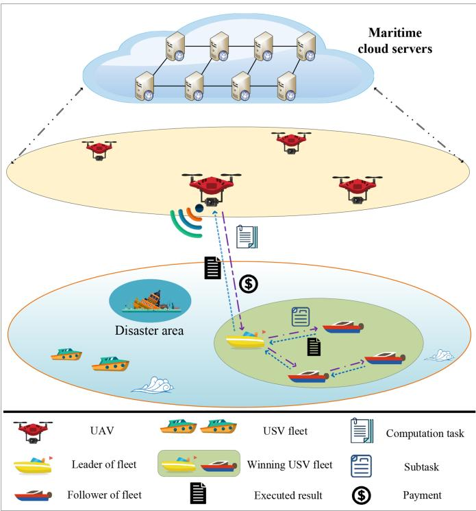

flowchart

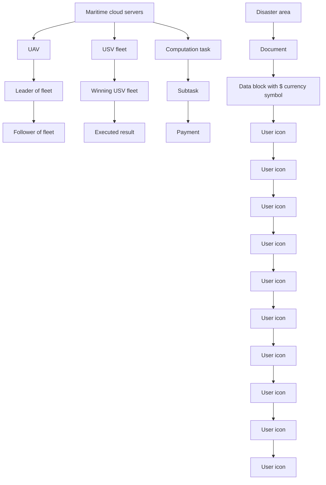

Fig. 1. USV fleet-assisted collaborative computation offloading.

Although extensive research efforts have been done on the optimization of energy consumption in computation offloading, little concern has been given to the energy consumption optimization for tasks executed collaboratively by members of the USV fleet. We formulate and solve the joint allocation optimization problem regarding computation tasks and computation capacities among members of the USV fleet.

# III. SYSTEM MODEL

In this section, we introduce the system model including network model, mobile model, communication model, and USV fleet model.

# A. Network Model

As shown in Fig. 1, the network model for USV fleet-assisted collaborative computation offloading consists of UAVs, USV fleets, and maritime cloud servers.

UAVs: UAVs undertake tasks such as disaster rescue, pollution assessment and sea surveillance. The set of UAVs is denoted as $\mathcal { M } = \{ 1 , 2 , \dotsc , m , \dotsc , M \}$ . In the maritime accidents (e.g., =personnel search and rescue, ship collision, oil spill, etc.), UAVs will hover over the accident sites for environmental sensing and encapsulate the collected image and video information into computation tasks. To save energy and improve the execution efficiency of computation tasks, UAVs transmit the computation tasks to the surrounding USV fleets.

USV fleets: During the cruise, USV fleets execute the computation tasks of UAVs to gain profits, and the set of USV fleets is represented as $\mathcal { T } = \{ 1 , 2 , \dots , i , \dots , I \}$ . USV fleets are clusters =of multiple USVs, which are capable of providing abundant computation resources. Specifically, the leader of the USV fleet splits the received computation tasks into multiple subtasks and distributes the subtasks to other members within the fleet for collaborative execution. The set of members in USV fleet i is represented as $\mathcal { L } _ { i } = \{ 1 , 2 , \ldots , l , \ldots , L _ { i } \}$ .

=Maritime cloud servers: The maritime cloud servers, which communicate through satellite links, authenticate the identities of UAVs and USV fleets and store the transaction records of computation offloading service. We assume that UAVs, USV fleets, and maritime cloud servers are trusted. The maritime cloud servers are deployed by the cloud server providers (e.g., governments and enterprises), which can protect the security and privacy of data services through firewall, encryption technology and access control. UAVs and USV fleets are only eligible to participate in computation offloading if they are authenticated from maritime cloud servers.

# B. Mobile Model

The three-dimensional Cartesian coordinate system is used to represent the position coordinates of UAVs and USV fleets. For convenience of presentation, cruise time T is split into T equal-length time slots, where t is the length of a time slot. ΔThe t-th time slot is abbreviated as t, and $t \in \{ 1 , 2 , \ldots , T \}$ . To reduce the propulsion energy consumption of UAVs, the fixedaltitude flight mode is applied to UAVs [30]. The flying altitudes of UAVs are set as a fixed value $H _ { 0 } ,$ , and the flying velocity is a two-dimensional vector. Specifically, the velocity of UAV m is expressed as

$$
\mathbf {V} _ {m} (t) = \{V _ {m} (t) \cos \theta_ {m} (t), V _ {m} (t) \sin \theta_ {m} (t) \}, \tag {1}
$$

where $V _ { m } ( t )$ is the velocity magnitude of UAV m in the time slot t, and $\theta _ { m } ( t ) \in [ 0 , 2 \pi ]$ is the heading angle of UAV m in ( ) [ ]the time slot t, i.e., the clockwise angle between the moving direction and the due east direction.

The position of UAV m in the time slot t is denoted as $( x _ { m } ( t ) , y _ { m } ( t ) , z _ { m } ( t ) )$ . As such, the position updating formula of UAV m is denoted as

$$
\left\{ \begin{array}{l} x _ {m} (t + 1) = x _ {m} (t) + V _ {m} (t) \cos \theta_ {m} (t) \Delta t, \\ y _ {m} (t + 1) = y _ {m} (t) + V _ {m} (t) \sin \theta_ {m} (t) \Delta t, \\ z _ {m} (t + 1) = z _ {m} (t) = H _ {0}. \end{array} \right. \tag {2}
$$

Similarly, the velocity of USV fleet i is also represented by a two-dimensional vector, which is expressed as

$$
\mathbf {V} _ {i} (t) = \{V _ {i} (t) \cos \theta_ {i} (t), V _ {i} (t) \sin \theta_ {i} (t) \}, \tag {3}
$$

where $V _ { i } ( t )$ and $\theta _ { i } ( t )$ are the velocity magnitude and head-( ) ( )ing angle of USV fleet i in the time slot t, respectively. $( \bar { x _ { i } } ( t ) , \bar { y } _ { i } ( t ) , z _ { i } ( t ) )$ is denoted by the coordinate of USV fleet i in ( ( ) ( ) ( ))the time slot t. Correspondingly, the position updating formula of USV fleet i is calculated as

$$
\left\{ \begin{array}{l} x _ {i} (t + 1) = x _ {i} (t) + V _ {i} (t) \cos \theta_ {i} (t) \Delta t, \\ y _ {i} (t + 1) = y _ {i} (t) + V _ {i} (t) \sin \theta_ {i} (t) \Delta t, \\ z _ {i} (t + 1) = z _ {i} (t) = 0. \end{array} \right. \tag {4}
$$

# C. Communication Model

The communication model consists of UAV-to-USV communication and USV-to-USV communication.

1) UAV-to-USV Communication: Given the maritime environment, the Line-of-Sight mode is adopted for UAV-to-USV fleet communication, which is essentially UAV-to-USV communication.

When the computation tasks are transmitted from UAV m to USV $j ^ { \prime } { } _ { ; }$ , the power received by USV $j ^ { \prime }$ from UAV m is calculated by

$$
P _ {j ^ {\prime}} ^ {m} (t) = P _ {m} ^ {t r a n} \tilde {G} (d _ {j ^ {\prime}} ^ {m} (t)) ^ {- \eta_ {j ^ {\prime}, m}}, \tag {5}
$$

where $d _ { j ^ { \prime } } ^ { m } ( t )$ means the distance between UAV m and USV $j ^ { \prime }$ ( )in the time slot t. $P _ { m } ^ { t r a n }$ denotes the transmission power of UAV m. $\tilde { G }$ is the fixed gain factor determined by antennas. $\eta _ { j ^ { \prime } , m }$ is the path loss exponent.

Let $\psi _ { j ^ { \prime } , m }$ be the binary variable that indicates the communication state between UAV m and USV $j ^ { \prime } . \psi _ { j ^ { \prime } , m } = 1$ 1 indicates the link is built, and $\psi _ { j ^ { \prime } , m } = 0$ = otherwise. The interference received by USV $j ^ { \prime }$ =from other UAVs is calculated by

$$
I _ {j ^ {\prime}} ^ {m} (t) = \sum_ {n = 1, n \neq m} ^ {N _ {U A V}} \psi_ {j ^ {\prime}, n} P _ {j ^ {\prime}} ^ {n} (t), \tag {6}
$$

where $N _ { U A V }$ denotes the amount of all UAVs.

Referring to the Shannon’s theorem [31], [32], the transmission rate from UAV m to USV $j ^ { \prime }$ in the time slot t is expressed as

$$
r _ {j ^ {\prime}} ^ {m} (t) = B _ {j ^ {\prime}} ^ {m} \log_ {2} \left(1 + \frac {P _ {j ^ {\prime}} ^ {m} (t)}{I _ {j ^ {\prime}} ^ {m} (t) + \sigma^ {2}}\right), \tag {7}
$$

where $B _ { j ^ { \prime } } ^ { m }$ means the channel bandwidth assigned to UAV m and USV $j ^ { \prime } . \sigma ^ { 2 }$ is the power of Gaussian white noise.

2) USV-to-USV Communication: USV-to-USV communication is designed as a communication mode for members in the USV fleet. When the tasks are forwarded from USV $j ^ { \prime }$ to USV $j ,$ the power received by USV j from USV $j ^ { \prime }$ is calculated by

$$
P _ {j} ^ {j ^ {\prime}} (t) = P _ {j ^ {\prime}} ^ {t r a n} \tilde {G} (d _ {j} ^ {j ^ {\prime}} (t)) ^ {- \phi_ {j, j ^ {\prime}}}, \tag {8}
$$

where $d _ { j } ^ { j ^ { \prime } } ( t )$ denotes the distance between USV j and USV j in ( )the time slot t. $P _ { j ^ { \prime } } ^ { t r a n }$ indicates the transmission power of USV $j ^ { \prime } ,$ , and $\phi _ { j , j ^ { \prime } }$ is the path loss exponent.

Let the binary variable $\vartheta _ { j , j ^ { \prime } }$ denote whether the communication link between USV j and USV j is built, and $\vartheta _ { j , j ^ { \prime } } = 1$ represents the link is built, otherwise $\vartheta _ { j , j ^ { \prime } } = 0$ =. Then, the inter-=ference received by USV j is calculated by

$$
I _ {j} ^ {j ^ {\prime}} (t) = \sum_ {n = 1, n \neq j ^ {\prime}} ^ {N _ {U S V}} \vartheta_ {j, n} P _ {j} ^ {n} (t), \tag {9}
$$

where $N _ { U S V }$ denotes the amount of all USVs.

Thus, the transmission rate from USV $j ^ { \prime }$ to USV j in the time slot t is expressed as

$$
r _ {j} ^ {j ^ {\prime}} (t) = B _ {j} ^ {j ^ {\prime}} \log_ {2} \left(1 + \frac {P _ {j ^ {\prime}} ^ {j} (t)}{I _ {j} ^ {j ^ {\prime}} (t) + \sigma^ {2}}\right), \tag {10}
$$

where $B _ { j } ^ { j ^ { \prime } }$ denotes the assigned channel bandwidth.

# D. USV Fleet Model

1) USV Fleet Building Model: The formation pattern of each USV fleet is conceived as a leader-follower mode, where the member with the strongest capability (e.g., sensing equipment, power level, etc.) is chosen to be the leader, and the followers navigate according to the leader’s instructions (e.g., heading angle, sailing speed, formation type, etc.) [33]. To guarantee the safety of navigation, it is important to maintain a suitable distance between adjacent members of the USV fleet, which can ensure communication while avoiding collision. Given that internal members of the USV fleet are in the same plane, the constraints of distance and angle between adjacent internal members are discussed in the x-y coordinate system.

In the time slot t, the distance between USV j and USV $j ^ { \prime }$ is calculated by

$$
d _ {j} ^ {j ^ {\prime}} (t) = \sqrt {(x _ {j} (t) - x _ {j ^ {\prime}} (t)) ^ {2} + (y _ {j} (t) - y _ {j ^ {\prime}} (t)) ^ {2}}, \tag {11}
$$

where $( x _ { j } ( t ) , y _ { j } ( t ) )$ and $( x _ { j ^ { \prime } } ( t ) , y _ { j ^ { \prime } } ( t ) )$ are the coordinates of USV $j$ ( (and $\mathrm { U S V } ~ j ^ { \prime }$ ) ( ( ) ( ))in the x-y coordinate system, respectively.

For the adjacent members, the angle between $\mathrm { U S V } \ j$ and USV $j ^ { \prime }$ is the angle between the vector constituted by both parties and the x-axis, which is defined as

$$
\theta_ {j} ^ {j ^ {\prime}} (t) = \tan^ {- 1} \{[ y _ {j} (t) - y _ {j ^ {\prime}} (t) ] / [ x _ {j} (t) - x _ {j ^ {\prime}} (t) ] \}, \tag {12}
$$

where $\begin{array} { r } { \theta _ { j } ^ { j ^ { \prime } } ( t ) \in \left( - \frac { \pi } { 2 } , \frac { \pi } { 2 } \right) } \end{array}$

( ) (  )We assume the collision range and communication range of USV $j$ are both circular areas with radii of $R A _ { i } ^ { c o l }$ and $R A _ { j } ^ { c o m }$ , respectively. The communication distance and collision distance between USV $j$ and USV $j ^ { \prime }$ are defined as

$$
R A _ {j, j ^ {\prime}} ^ {c o m} = \min \{R A _ {j} ^ {c o m}, R A _ {j ^ {\prime}} ^ {c o m} \}, \tag {13}
$$

$$
R A _ {j, j ^ {\prime}} ^ {c o l} = \max \{R A _ {j} ^ {c o l}, R A _ {j ^ {\prime}} ^ {c o l} \}. \tag {14}
$$

Thus, constraints on the distance and the angle between USV j and USV $j ^ { \prime }$ are shown as

$$
R A _ {j, j ^ {\prime}} ^ {c o l} <   d _ {j} ^ {j ^ {\prime}} (t) \leq R A _ {j, j ^ {\prime}} ^ {c o m}, \tag {15}
$$

$$
\theta_ {\min} \leq \theta_ {j} ^ {j ^ {\prime}} (t) \leq \theta_ {\max}, \tag {16}
$$

where $t \in \{ 1 , 2 , \dots , T \} . \theta _ { \mathrm { m i n } }$ and $\theta _ { \mathrm { m a x } }$ denote the minimal and maximal angle thresholds, respectively. Constraint (15) guarantees that adjacent members can maintain communication with each other without the risk of collision. Constraint (16) assures that the deviation of the heading angle of adjacent members cannot be too large to prevent members from leaving the USV fleet.

2) Connectivity of USV Fleet: For the set $\mathcal { L } _ { i }$ of the internal members in USV fleet i, member 1 is represented as the leader, and $L _ { i }$ is the number of internal members including the leader. Using multi-hop technology, $N _ { j } ^ { h o p } ( t )$ is rep-( )resented as the set of nodes with the fewest hops through which the leader transmits the computation tasks to member j in the time slot t. The number of hops that the leader builds the communication link with other members directly determines $\{ | N _ { 1 } ^ { h o p } ( t ) | , \dots , | N _ { j } ^ { h o p } ( t ) | , \dots , | N _ { L _ { i } } ^ { h o p } ( t ) | \}$ e vector is used $\mathcal { N } ^ { h o p } ( t ) =$ with other members in the time slot t, where $| N _ { j } ^ { h o p } ( t ) |$ is the number of elements in set $N _ { j } ^ { h o p } ( t )$ ( ). The overall connectivity of ( )the USV fleet is expressed as the average of all minimum hops, which is calculated by

$$
\left| N _ {i, a v e} ^ {h o p} \right| = \frac {1}{T \cdot L _ {i}} \sum_ {t = 1} ^ {T} \sum_ {j = 1} ^ {L _ {i}} \left| N _ {j} ^ {h o p} (t) \right|. \tag {17}
$$

For the convenience of discussion, the connectivity of the USV fleet is divided into three cases, which are expressed as

$$
C o n = \left\{ \begin{array}{l l} \text { Strong   connectivity }, & \varphi_ {1} \leq | N _ {i, a v e} ^ {h o p} | <   \varphi_ {2}, \\ \text { Moderate   connectivity }, & \varphi_ {2} \leq | N _ {i, a v e} ^ {h o p} | <   \varphi_ {3}, \\ \text { Weak   connetivity }, & | N _ {i, a v e} ^ {h o p} | \geq \varphi_ {3}, \end{array} \right. \tag {18}
$$

where $\varphi _ { 1 } , \varphi _ { 2 }$ , and ϕ3 are weight coefficients. For instance, strong connectivity implies that the leader is closely connected with other members, i.e., hop counts of the links between the leader and other members are low.

# IV. INCENTIVES FOR USV FLEETS-ASSISTED COLLABORATIVE COMPUTATION OFFLOADING

# A. Framework Design

The framework of collaborative computation offloading is designed as two layers. In the upper layer, the UAV issues computation offloading requests to surrounding USV fleets, which include information about the generated computation tasks and the reserve price. In the lower layer, USV fleets evaluate computation tasks and their owned computation resources, and then offer the bids to the UAV. The USV fleet with the lowest bidding is eligible to execute the computation tasks issued by the UAV. Additionally, members of the USV fleet execute computation tasks collaboratively to reduce overall energy consumption within the delay threshold. As shown in Fig. 2, the flow of collaborative computation offloading is illustrated below.

1) First, the UAV issues computation task requests to the surrounding USV fleets, which include the data size of tasks, the delay threshold and the reserve price (step 1 ).   
2) The USV fleets offer the bids based on storage space and computation resource, and the USV fleet with the lowest bidding wins (step 2 ).   
3) The UAV sends the computation tasks to the winning USV fleet (step 3 ).   
4) The leader splits the computation tasks into multiple subtasks, which are distributed to the followers (step 4 ).   
5) The followers execute the subtasks according to computation capabilities and the delay threshold, and return the computation results to the leader (step 5 ).   
6) Lastly, the leader aggregates all execution results and sends the execution results of the entire computation tasks to the UAV (step 6 ).

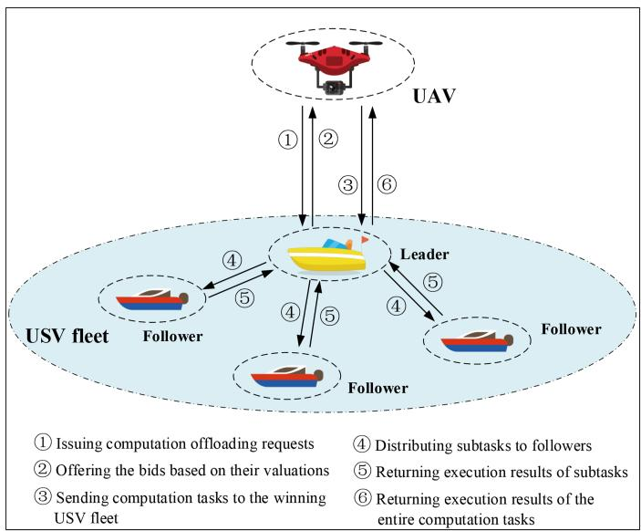

flowchart

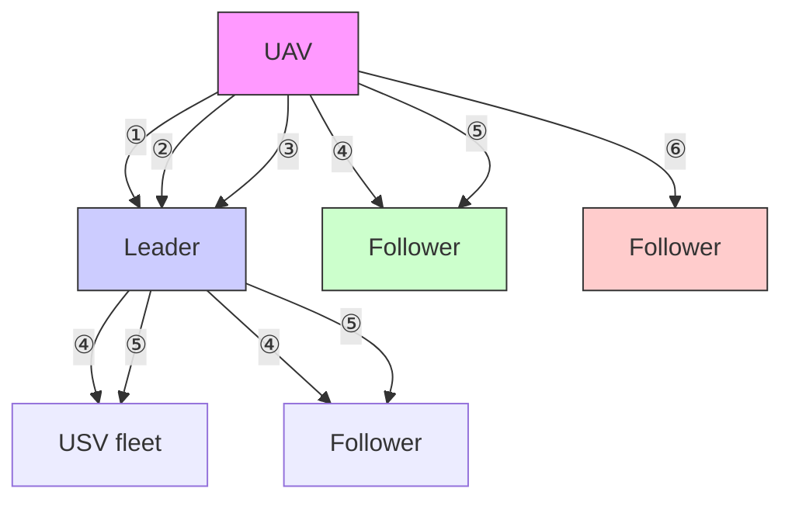

Fig. 2. Diagram of the framework for collaborative computation offloading.

Let $\mathcal { Q } = \{ 1 , 2 , \ldots , q , \ldots , Q \}$ be the set of computation tasks =issued by the UAV. Specifically, computation task q is expressed as $C T _ { q } \overset { \Delta } { = } < s _ { q } , f _ { q } , T _ { q } >$ , where $s _ { q }$ indicates the data size of =computation task q (in bits), $f _ { q }$ means the number of cycles required to execute a unit computation task q (in cycles per bit), and $T _ { q }$ denotes the delay threshold for completing computation task q (in seconds). To facilitate the subsequent representation, delay threshold $T _ { q }$ is directly represented as the number of corresponding time slots, i.e., $\begin{array} { r } { T _ { q } \triangleq \lfloor \frac { T _ { q } } { \Delta t } \rfloor } \end{array}$ , where ·	 is the floor function.

# B. Valuation of UAVs

Before bidding, the UAV calculates the reserve price, which is determined by the UAV’s valuation regarding the tasks. In other words, the valuation of the UAV is equivalent to the reserve price, and the former is influenced by the delay threshold and transmission rate. The total valuation of UAV m regarding task q is expressed as

$$
V _ {m, q} ^ {U A V} = \sum_ {n = 1} ^ {2} V _ {n} ^ {U A V}, \tag {19}
$$

where $V _ { n } ^ { U A V } ( n = 1 , 2 )$ denote the two valuation components ( = )of UAV m, which are discussed as follows.

1) Delay Threshold: The lower delay threshold means that the task is more urgent, so delay threshold valuation of UAV m regarding task q is given as

$$
V _ {1} ^ {U A V} = \alpha_ {1} \log_ {2} \left(1 + \frac {T _ {m} ^ {U A V}}{T _ {q}}\right), \tag {20}
$$

where $\alpha _ { 1 }$ is the weighting parameter. $T _ { m } ^ { U A V }$ means the cruising time of UAV m.

2) Transmission Rate: When the transmission rate is higher, it means that the UAV occupies more bandwidth resources, thus the corresponding valuation of UAV m is denoted by

$$
V _ {2} ^ {U A V} = \alpha_ {2} \log_ {2} \left(1 + \frac {r _ {m} ^ {U A V}}{r _ {\max} ^ {U A V}}\right), \tag {21}
$$

where $\alpha _ { 2 }$ is the weighting parameter. UA $r _ { m } ^ { U A V }$ denotes the rate of transmitting task q for UAV m. r max $r _ { \operatorname* { m a x } } ^ { U A V }$ 1 indicates the maximal transmission rate of UAV m.

# C. Valuation of USV Fleets

USV fleets in the communication coverage of the UAV are eligible for bidding. The valuation of USV fleets is reflected in both storage space and computation resource. The total valuation of USV fleet i regarding task q is expressed as

$$
V _ {i, q} ^ {\text { Fleet }} = \sum_ {n = 1} ^ {2} V _ {n} ^ {\text { Fleet }}, \tag {22}
$$

where $V _ { n } ^ { F l e e t } ( n = 1 , 2 )$ denote the two valuation components ( = )of USV fleet i, which are explained in the following.

1) Storage Space: The larger data size of the task occupies, the more storage space the USV fleet is required to supply. The storage space valuation of USV fleet i regarding task q is denoted by

$$
V _ {1} ^ {\text { Fleet }} = \xi \cdot s _ {q}, \tag {23}
$$

where $\xi$ represents unit storage cost.

2) Computation Resource: Connectivity and computation capacities are also important factors affecting computation resource of the USV fleet. Computation resource valuation of USV fleet i is calculated by

$$
V _ {2} ^ {\text { Fleet }} = \kappa \log_ {2} \left(1 + \frac {\sum_ {j = 1} ^ {L _ {i}} \sum_ {t = 1} ^ {T _ {q}} C _ {j} (t) | N _ {j} ^ {\text { hop }} (t) |}{L _ {i}}\right), \tag {24}
$$

where κ is the weighting parameter. $C _ { j } ( t )$ represents the com-( )putation capacity of member j within USV fleet i in the time slot t.

# D. Optimal Bidding Strategy of USV Fleets

Critical information including data size, delay threshold, and the reserve price is issued by UAV m to surrounding USV fleets. USV fleets bid against each other based on the first-price sealed reverse auction with reserve price. The winner is the USV fleet with the lowest bidding, who gets to earn revenue by executing the tasks issued by UAV m. Only USV fleets that bid less than the reserved price (i.e., the valuation of the UAV) can participate in the auction.

Then, the revenue of USV fleet i is calculated by

$$
U _ {i, q} ^ {\text { Fleet }} = \left\{ \begin{array}{c c} b _ {i} - x _ {i}, & b _ {i} <   \min _ {i ^ {\prime} \neq i} b _ {i ^ {\prime}}, b _ {i} \leq \hat {S}, \\ 0, & \text { else }, \end{array} \right. \tag {25}
$$

where $x _ { i }$ denotes the valuation $V _ { i , q } ^ { F l e e t }$ i,q of USV fleet i regarding task $q . \ b _ { i }$ indicates the bidding of USV fleet i. $b _ { i ^ { \prime } }$ denotes the bidding of other USV fleet $i ^ { \prime } . \hat { S }$ represents the reserve price (i.e., the valuation $V _ { m , q } ^ { U A V }$ ˆof UAV m).

Theorem 1: In the first-price sealed reverse auction with reserve price, the symmetric equilibrium bidding strategy for each USV fleet is given by

$$
\beta (x _ {i}) = E [ \min (X _ {- i} ^ {*}, \hat {S}) \bigg | X _ {- i} ^ {*} > x _ {i} ], \tag {26}
$$

where $\beta ( \cdot )$ means the symmetric equilibrium bidding strategy. $X _ { - i } ^ { * }$ ( )i represents the minimal valuation of all USV fleets excluding USV fleet $i , E [ \cdot ]$ denotes the mathematical expectation.

[ ]Proof: The proof includes existence and uniqueness of the equilibrium.

1) Existence of the Equilibrium: Assume that USV fleet i offers the bidding $b _ { i }$ based on the valuation $x _ { i }$ . Other USV fleet $i ^ { \prime } \neq$ i bids in accordance with the symmetric, differentiable, and =increasing equilibrium strategy $\beta ( \cdot )$ . USV fleet i wins if and only if USV fleet i offers the lowest bidding $\begin{array} { r } { ( \mathrm { i . e . , } b _ { i } < \operatorname* { m i n } _ { i ^ { \prime } \neq i } b _ { i ^ { \prime } } ) . } \end{array}$ S denotes the reserve price, and $x _ { i } \leq \hat { S }$ is satisfied. $X _ { - i } ^ { * }$ represents the minimal valuation of all USV fleets excluding USV fleet $i .$

In the first-price sealed reverse auction, USV fleet i wins if condition $\beta ( \bar { X ^ { * } } _ { - i } ) > b _ { i } ( \mathrm { i . e . , } X _ { - i } ^ { * } > \beta ^ { - 1 } ( b _ { i } ) )$ is satisfied. Then, ( ) ( )the expected revenue of USV fleet i is given as

$$
\begin{array}{l} E _ {i} (b _ {i}) = P \{\beta (X _ {- i} ^ {*}) > b _ {i} \} \cdot (b _ {i} - x _ {i}) \\ = \left[ 1 - G (\beta^ {- 1} (b _ {i})) \right] \cdot (b _ {i} - x _ {i}), \tag {27} \\ \end{array}
$$

where $G ( \cdot )$ denotes the distribution function of random variable as $X _ { - i } ^ { * } . \stackrel { \cdot } { \beta } ^ { - 1 } ( \cdot )$ means the inverse function of $\beta ( \cdot )$ .

( ) ( )Based on (27), let the first order derivative of expected revenue $E _ { i } ( b _ { i } )$ be zero. We derive

$$
\frac {- g (\beta^ {- 1} (b _ {i}))}{\beta^ {\prime} (\beta^ {- 1} (b _ {i}))} \cdot (b _ {i} - x _ {i}) + [ 1 - G (\beta^ {- 1} (b _ {i})) ] = 0, \tag {28}
$$

where $\beta ^ { \prime } ( \cdot )$ denotes the first derivative of $\beta ( \cdot ) . g ( \cdot )$ indicates the ( )probability density corresponding to $G ( \cdot )$ .

( )By solving (28), the symmetric equilibrium bidding strategy of USV fleet i is given by

$$
\beta (x _ {i}) = \frac {1}{(1 - G (x _ {i}))} \left\{[ \hat {S} \cdot (1 - G (\hat {S})) ] + \int_ {x _ {i}} ^ {\hat {S}} y \cdot g (y) d y \right\}, \tag {29}
$$

that is

$$
\beta (x _ {i}) = E [ \min (X _ {- i} ^ {*}, \hat {S}) \bigg | X _ {- i} ^ {*} > x _ {i} ]. \tag {30}
$$

2) Uniqueness of the Equilibrium: We prove the uniqueness of the equilibrium by contradiction. Assume that all USV fleets excluding USV fleet i use the strategy $\beta ( \cdot )$ to bid, i.e., only USV ( )fleet i does not adopt the bidding strategy $\beta ( \cdot )$ .

Let the bidding of USV fleet i be $b _ { i }$ ( ). The valuation of USV fleet i is $x _ { i }$ . Here, $x _ { i } \neq \beta ^ { - 1 } ( b _ { i } )$ . For the convenience of discussion, we set $\tilde { x } _ { i } = \beta ^ { - 1 } ( b _ { i } ) ( \mathrm { i . e . , } b _ { i } = \beta ( \tilde { x } _ { i } ) )$ ). Then the expected ˜ = ( ) =revenue of USV fleet i is rewritten as

$$
\begin{array}{l} E _ {i} \left(\beta \left(\tilde {x} _ {i}\right), x _ {i}\right) = P \left\{\beta \left(X _ {- i} ^ {*}\right) > b _ {i} \right\} \cdot \left(b _ {i} - x _ {i}\right) \\ = \int_ {\tilde {x} _ {i}} ^ {\hat {S}} y g (y) d y - x _ {i} \cdot [ 1 - G (\tilde {x} _ {i}) ] \\ + \hat {S} \cdot (1 - G (\hat {S})). \tag {31} \\ \end{array}
$$

Based on the integral mean value theorem, since $G ( \cdot )$ is ( )a monotonically increasing continuous function, (31) can be transformed into

$$
\begin{array}{l} E _ {i} (\beta (x _ {i}), x _ {i}) - E _ {i} (\beta (\tilde {x} _ {i}), x _ {i}) = (\tilde {x} _ {i} - x _ {i}) \\ \times G (\tilde {x} _ {i}) - \left(\tilde {x} _ {i} - x _ {i}\right) \cdot G (\zeta), \tag {32} \\ \end{array}
$$

where $\zeta$ is between $x _ { i }$ and ${ \tilde { x } } _ { i }$

Whether $\tilde { x } _ { i } \leq x _ { i }$ or $\tilde { x } _ { i } \geq x _ { i }$ holds, we have

$$
E _ {i} (\beta (x _ {i}), x _ {i}) \geq E _ {i} (\beta (\tilde {x} _ {i}), x _ {i}). \tag {33}
$$

If all other USV fleets adopt the bidding strategy $\beta ( \cdot )$ , USV ( )fleet i cannot benefit from giving the price other than $\beta ( x _ { i } )$ . Combined with the above analysis, $\beta ( \cdot )$ ( )is proved to be a ( )symmetric equilibrium strategy. Theorem 1 is proved.

Let N USV fleets bid with valuations obeying a uniform distribution $U ( V _ { \operatorname* { m i n } } ^ { F l e e t } , V _ { \operatorname* { m a x } } ^ { F l e e t } )$ , where $V _ { \mathrm { m i n } } ^ { F l e e t }$ and $\bar { V } _ { \mathrm { m a x } } ^ { F l e e t }$ represent ( )the minimal and maximal valuations of USV fleets, respectively. Thus, the expected revenue of USV fleet i with valuation $x _ { i }$ is calculated by

$$
\begin{array}{l} E R _ {i} (x _ {i}, \hat {S}) = P \left\{\beta \left(X _ {- i} ^ {*}\right) > \beta (x _ {i}) \right\} \cdot [ \beta (x _ {i}) - x _ {i} ] \\ = \frac {\left(V _ {\max} ^ {F l e e t} - x _ {i}\right) ^ {N} - \left(V _ {\max} ^ {F l e e t} - \hat {S}\right) ^ {N}}{N \cdot \left(V _ {\max} ^ {F l e e t} - V _ {\min} ^ {F l e e t}\right) ^ {N - 1}}. \tag {34} \\ \end{array}
$$

# V. ENERGY CONSUMPTION OPTIMIZATION FOR COLLABORATIVE COMPUTATION OFFLOADING IN THE USV FLEET

# A. Splitting of Computation Tasks

The winning UAV fleet is eligible to receive and execute the computation tasks sent by UAVs. Specifically, the leader of the USV fleet will receive the computation tasks sent by the UAV, divide the computation tasks into subtasks of different data sizes, and send these subtasks to other members of the USV fleet to assist in execution.

For the convenience of discussion, a computation task can be split into multiple subtasks of any size. Specifically, computation task q is split into $T _ { q } \times J$ computation subtasks, which is expressed as

$$
C T _ {q} = \left( \begin{array}{c c c c c} C S _ {1} ^ {q} (1) & \dots & C S _ {j} ^ {q} (1) & \dots & C S _ {J} ^ {q} (1) \\ \vdots & \ddots & \vdots & \ddots & \vdots \\ C S _ {1} ^ {q} (t) & \dots & C S _ {j} ^ {q} (t) & \dots & C S _ {J} ^ {q} (t) \\ \vdots & \ddots & \vdots & \ddots & \vdots \\ C S _ {1} ^ {q} \left(T _ {q}\right) & \dots & C S _ {j} ^ {q} \left(T _ {q}\right) & \dots & C S _ {J} ^ {q} \left(T _ {q}\right) \end{array} \right), \tag {35}
$$

where $C S _ { 1 } ^ { q } ( t )$ and $C S _ { j } ^ { q } ( t )$ represent the computation sub-( ) ( )task executed by the leader itself and the computation subtask that the leader requests the member $j$ to execute in the time slot t, respectively. Specifically, $C S _ { j } ^ { q } ( t )$ is denoted as $C S _ { j } ^ { q } ( t ) \triangleq < s _ { j } ^ { q } ( t ) , f _ { j } ^ { q } >$ , which satisfies the following properties

$$
\left\{ \begin{array}{l} \sum_ {j = 1} ^ {J} \sum_ {t = 1} ^ {T _ {q}} s _ {j} ^ {q} (t) = s _ {q}, \\ f _ {j} ^ {q} = f _ {q}, \end{array} \right. \tag {36}
$$

where $s _ { j } ^ { q } ( t )$ is the data size of computation task $C S _ { j } ^ { q } ( t )$ executed by member j in the time slot t. $f _ { j } ^ { q }$ of computation subtask $C S _ { j } ^ { q } ( t )$ is constant.

# B. Energy Consumption Formulation

The energy consumption generated by the local execution and collaborative execution of computation subtasks is discussed as below. The allocation factor $R _ { j } ^ { \bar { q } } ( t )$ is expressed as the allocation scale factor for the leader to allocate task q to member $^ { \cdot } j ,$ i.e., the data size $s _ { j } ^ { q } ( t )$ of the computation task that the leader allocates ( )to member j in the time slot t is given by

$$
s _ {j} ^ {q} (t) = R _ {j} ^ {q} (t) s _ {q}, \tag {37}
$$

where $\begin{array} { r } { \sum _ { j = 1 } ^ { J } \sum _ { t = 1 } ^ { T _ { q } } R _ { j } ^ { q } ( t ) = 1 } \end{array}$

( ) =1) Energy Consumption in Local Execution: Since the leader allocates subtasks, the leader executes the subtask $C S _ { 1 } ^ { q } ( t )$ lo-( )cally without generating transmission delay and transmission energy consumption, which are expressed as

$$
T _ {1, q} ^ {\text { tran }} (t) = 0, \tag {38}
$$

$$
E _ {1, q} ^ {\text { tran }} (t) = 0. \tag {39}
$$

Energy consumption in local execution refers to the energy consumption generated by the leader’s own execution of subtasks. The local execution latency of computation subtasks in the time slot t is expressed as

$$
T _ {1, q} ^ {l o c} (t) = \frac {R _ {1} ^ {q} (t) s _ {q}}{C _ {1} ^ {q} (t) / f _ {q}}, \tag {40}
$$

where $C _ { 1 } ^ { q } ( t )$ represents the computation capacity (in cycles per ( )second) that the leader allocates to computation task $q$ in the time slot t.

Based on the energy consumption formula [30], the energy consumption generated by the leader executing the computation task $q$ in the time slot t is denoted as

$$
E _ {1, q} ^ {l o c} (t) = \tau_ {1} [ C _ {1} ^ {q} (t) ] ^ {3} T _ {1, q} ^ {l o c} (t)
$$

$$
= \tau_ {1} [ C _ {1} ^ {q} (t) ] ^ {2} R _ {1} ^ {q} (t) s _ {q} f _ {q}, \tag {41}
$$

where $\tau _ { 1 }$ is related to the chip associated with the leader’s CPU.

2) Energy Consumption in Collaborative Execution: Energy consumption in collaborative execution includes transmission energy consumption and local execution energy consumption of members, which is described in detail below. In the time slot $t ,$ the transmission delay of computation subtask $C S _ { j } ^ { q } ( t )$ from the leader to member j is expressed as

$$
T _ {j, q} ^ {\text { tran }} (t) = \sum_ {j ^ {\prime} \in N _ {j} ^ {\text { hop }} (t)} \frac {R _ {j} ^ {q} (t) s _ {q}}{r _ {j ^ {\prime}} ^ {j ^ {\prime} + 1} (t)}, \tag {42}
$$

where $r _ { j ^ { \prime } } ^ { j ^ { \prime } + 1 } ( t )$ represents the transmission rate at which member $j ^ { \prime }$ ( )transmits computation subtasks to member $j ^ { \prime } + 1$ .

+The transmission energy consumption is related to the transmission time and transmission power, and the energy consumption consumed by the transmission of computation subtasks from the leader to member $j$ is expressed as

$$
E _ {j, q} ^ {\text { tran }} (t) = \sum_ {j ^ {\prime} \in N _ {j} ^ {\text { hop }} (t)} \frac {P _ {j ^ {\prime}} ^ {\text { tran }} R _ {j} ^ {q} (t) s _ {q}}{r _ {j ^ {\prime}} ^ {j ^ {\prime} + 1} (t)}, \tag {43}
$$

where $P _ { j ^ { \prime } } ^ { t r a n }$ represents the transmission power of member $j ^ { \prime }$

In the time slot t, the delay of member $j$ executing the allocated computation subtask is calculated by

$$
T _ {j, q} ^ {l o c} = \frac {R _ {j} ^ {q} (t) s _ {q}}{C _ {j} ^ {q} (t) / f _ {q}}, \tag {44}
$$

where $C _ { j } ^ { q } ( t )$ is the computation capacity allocated to the com-( )putation task $q$ by member $j .$ The local execution energy consumption is that the member j executes the computation subtasks sent from the leader. In the time slot t, the energy consumed by member $j$ to execute the assigned computation subtask is expressed as

$$
\begin{array}{l} E _ {j, q} ^ {l o c} (t) = \tau_ {j} [ C _ {j} ^ {q} (t) ] ^ {3} T _ {j, q} ^ {l o c} (t) \\ = \tau_ {j} [ C _ {j} ^ {q} (t) ] ^ {2} R _ {j} ^ {q} (t) s _ {q} f _ {q}, \tag {45} \\ \end{array}
$$

where $\tau _ { j }$ represents the correlation coefficient of the CPU chip of member $j$ .

Thus, in the time slot t, the total energy consumption of computation subtask $C S _ { j } ^ { q } ( t )$ from the leader to member $j$ is expressed as

$$
E _ {j, q} ^ {*} (t) = E _ {j, q} ^ {\text { tran }} (t) + E _ {j, q} ^ {\text { loc }} (t). \tag {46}
$$

Combining the above discussion, the overall energy consumption of executing all computation tasks is expressed as

$$
E ^ {s u m} = \sum_ {q = 1} ^ {Q} \sum_ {j = 1} ^ {J} \sum_ {t = 1} ^ {T _ {q}} E _ {j, q} ^ {*} (t). \tag {47}
$$

# C. Optimization Problem of Overall Energy Consumption

The purpose of our design is to minimize the energy consumed by the entire USV fleet to execute computation tasks under the constraint of the completion delay threshold. Specifically, the energy minimization problem is formulated as the minimization of the total energy consumed by executing a series of computation subtasks.

For all the computation task, the energy consumption minimization problem of collaborative computation offloading is expressed as

$$
\mathbf {P 1}: \min _ {\{R _ {j} ^ {q} (t), C _ {j} ^ {q} (t) \}} E ^ {s u m} = \min _ {\{R _ {j} ^ {q} (t), C _ {j} ^ {q} (t) \}} \sum_ {q = 1} ^ {Q} \sum_ {j = 1} ^ {J} \sum_ {t = 1} ^ {T _ {q}} E _ {j, q} ^ {*} (t)
$$

$$
\text { s.t. } \quad \mathrm{C1}: R _ {j} ^ {q} (t) \in [ 0, 1 ], \forall j, q, t,
$$

$$
\mathrm{C2}: \sum_ {j = 1} ^ {J} \sum_ {t = 1} ^ {T _ {q}} R _ {j} ^ {q} (t) = 1, \forall q,
$$

$$
\mathrm{C} 3: 0 \leq \sum_ {q = 1} ^ {Q} C _ {j} ^ {q} (t) = C _ {j} (t), \forall j, t,
$$

$$
\mathrm{C} 4: T _ {j, q} ^ {\text { tran }} (t) + T _ {j, q} ^ {\text { loc }} (t) \leq \Delta t, \forall j, q, t,
$$

$$
\mathrm{C} 5: P _ {j} ^ {\min} (t) \leq P _ {j} ^ {t r a n} (t) \leq P _ {j} ^ {\max} (t), \forall j, t. \tag {48}
$$

In (48), the objective function $E ^ { s u m }$ represents the overall energy consumption of executing all tasks. $\{ { \bar { R } } _ { j } ^ { q } ( t ) \}$ and $\{ C _ { j } ^ { q } ( t ) \}$ ( ) ( )are the decision variables of the optimization problem, where $\{ R _ { j } ^ { q } ( t ) \}$ is the allocation factor of task $q$ allocated to member $j$ by the leader in the time slot $t ,$ and $\{ C _ { j } ^ { q } ( t ) \}$ represents the allocated computation capacity of member $j$ )to execute task $q$ in the time slot $t .$ Constraint  indicates the decision variable $\{ R _ { j } ^ { q } ( t ) \}$ C1is a continuous variable in the interval 0, 1 . Constraint $\mathrm { C 2 } ^ { \mathrm { \cdot } }$ ( ) [ ]means that the sum of the allocation decision variables $\{ R _ { j } ^ { q } ( t ) \}$ of the leader for task $q$ is equal to 1. Constraint ( )indicates that for a fixed time slot $t ,$ C3 the sum of the computation capacities allocated by member $j$ is equal to $C _ { j } ( t )$ . Constraint ( ) means that all members need to complete the allocated C4subtasks within each time slot. Constraint  represents the C5limitation of the transmission power of member $j$ .

# D. Joint Allocation Optimization Scheme for Computation Subtasks and Computation Capacities

Since the two sets of decision variables $\{ R _ { j } ^ { q } ( t ) \}$ and $\{ C _ { i } ^ { q } ( t ) \}$ ( )are coupled with each other in the objective function $E ^ { s u m }$ ( )and constraint , the optimization problem P1 proposed in this C4paper is not a typical convex optimization problem. In order to solve the above complex optimization problem, we convert P1 approximation into two convex suboptimization problems, which are the suboptimization problem for the leader to allocate computation subtasks under the fixed strategy for the members to allocate computation capacities and the suboptimization problem for members to allocate computation capacities under the fixed strategy for the leader to allocate computation subtasks. Next, we discuss the transformation of the optimization problem P1 into two suboptimization problems.

1) The Suboptimization Problem for the Leader to Allocate Computation Subtasks: The suboptimization problem of the leader allocating computation subtasks is to minimize the energy consumption $E ^ { s u m }$ by changing the decision variable $\{ R _ { j } ^ { q } ( t ) \}$ ( )under the condition of fixed computation capacities allocation decision $\{ C _ { j } ^ { q } ( t ) \}$ .

( )The suboptimization problem on the allocation of computation subtasks for the leader is expressed as

$$
\mathbf {P 2}: \min _ {\{R _ {j} ^ {q} (t) \}} E ^ {s u m} (R _ {j} ^ {q} (t)) = \min _ {\{R _ {j} ^ {q} (t) \}} \sum_ {q = 1} ^ {Q} \sum_ {j = 1} ^ {J} \sum_ {t = 1} ^ {T _ {q}} E _ {j, q} ^ {*} (t)
$$

${ \mathrm { s . t . ~ C 1 } } \sim { \mathrm { C 3 } } , { \mathrm { C 5 } } ,$

$$
\mathrm{C} 4 ^ {\prime}: R _ {j} ^ {q} (t) \leq \Delta t / \left(\frac {s _ {q}}{C _ {j} ^ {q} (t) / f _ {q}} + \sum_ {j ^ {\prime} \in N _ {j} ^ {h o p} (t)} \frac {s _ {q}}{r _ {j ^ {\prime}} ^ {j ^ {\prime} + 1} (t)}\right),
$$

$$
\forall j, q, t. \tag {49}
$$

In this suboptimization problem, $Q , J$ and $T _ { q }$ denote the number of tasks, the number of members, and the number of time slots, respectively. According to (47), objective function $E ^ { s u m } ( R _ { j } ^ { q } ( t ) )$ is a convex function with respect to decision variable $\{ R _ { j } ^ { q } ( t ) \}$ , constraints C3 and C5 are both inherent ( )preconditions. Conditions $\mathrm { C 1 , C 2 }$ , and $\mathrm { C 4 ^ { \prime } }$ are important constraints on $\{ R _ { j } ^ { q } ( t ) \}$ C1 C2 C4, which directly affect the value of objective function $E ^ { s u \bar { m } } ( R _ { j } ^ { q } ( t ) )$ . Constraint  is derived from (42), ( ( )) C4(44) and constraint  of (48). Specifically, sqCq (t)/fq $\frac { s _ { q } } { C _ { j } ^ { q } ( t ) / f _ { q } }$ denotes the time for member $j$ to execute task $q$ (refer to (44)), $\frac { s _ { q } } { r _ { j ^ { \prime } } ^ { j ^ { \prime } + 1 } ( t ) }$ rj+1 (t) sq expresses the time for member $j ^ { \prime }$ to transmit task $q$ to member $j ^ { \prime } + 1$ (refer to (42)), and $\Delta t$ is the length of each time slot. To + Δenhance the optimization speed and reduce the computational complexity, the Alternating Direction Method of Multipliers (ADMM) is utilized to solve the optimal subtasks allocation decision $\{ R _ { j } ^ { q } ( t ) \}$ , which is discussed in detail as follows.

( )For the convenience of subsequent presentation, the overall allocation of computation subtasks for the leader is represented by vector $\mathbf { R } = \{ \hat { R } _ { i } ^ { q } ( t ) , \forall q , j , t \}$ . Additionally, we need to con-= ( )vert the multi-block ADMM into the 2-block ADMM to ensure the convergence of the algorithm [34]. Correspondingly, the inequality constraints and equality constraints on variables are transformed into

$$
\left\{ \begin{array}{l} \Omega_ {1} = \{\mathbf {R} \in \mathbb {R} ^ {Q \times J \times T _ {q}} | \mathrm{C} 2 \}, \\ \Omega_ {2} = \{\mathbf {R} \in \mathbb {R} ^ {Q \times J \times T _ {q}} | \mathrm{C} 1 \cap \mathrm{C} 4 ^ {\prime} \}, \end{array} \right. \tag {50}
$$

where $\Omega _ { 1 }$ and $\Omega _ { 2 }$ are equality-constrained convex sets and Ω Ωinequality-constrained convex sets with respect to vector $\mathbf { R } ,$ respectively. Thus the suboptimization problem can be rewritten as

$$
\mathbf {P 2} ^ {\prime}: \min _ {\{\mathbf {R}, \mathbf {y} _ {1} \}} E ^ {s u m} (\mathbf {R}) + g _ {1} (\mathbf {R}) + g _ {2} (\mathbf {y} _ {1})
$$

${ \mathrm { s . t . } } \quad { \mathrm { C 6 : } } { \mathbf { R } } - { \mathbf { y } } _ { 1 } = 0 ,$

$$
\mathrm{C} 7: \mathbf {R} \in \Omega_ {1}, \mathbf {y} _ {1} \in \Omega_ {2}, \tag {51}
$$

where $\mathbf { y } _ { 1 }$ is the added auxiliary decision variable. $g _ { 1 } ( \mathbf { R } )$ and $g _ { 2 } ( \mathbf { y } _ { 1 } )$ ( )are the index functions corresponding to convex sets $\Omega _ { 1 }$ (and $\Omega _ { 2 }$ , respectively, which are expressed as

$$
g _ {1} (\mathbf {R}) = \left\{ \begin{array}{l l} 0, & \mathbf {R} \in \Omega_ {1}, \\ + \infty , & \text { else }, \end{array} \right. \tag {52}
$$

$$
g _ {2} (\mathbf {y} _ {1}) = \left\{ \begin{array}{l l} 0, & \mathbf {y} _ {1} \in \Omega_ {2}, \\ + \infty , & \text { else }. \end{array} \right. \tag {53}
$$

Additionally, the augmented Lagrangian function is calculated as

$$
L _ {\rho_ {1}} ^ {1} (\mathbf {R}, \mathbf {y} _ {1}, \lambda_ {1}) = E ^ {s u m} (\mathbf {R}) + g _ {1} (\mathbf {R}) + g _ {2} (\mathbf {y} _ {1})
$$

$$
+ \lambda_ {1} ^ {T} (\mathbf {R} - \mathbf {y} _ {1}) + (\rho_ {1} / 2) \| \mathbf {R} - \mathbf {y} _ {1} \| _ {2} ^ {2}, \tag {54}
$$

where $\rho _ { 1 }$ is the penalty coefficient. || · ||2 is Euclidean norm. $\lambda _ { 1 } \in \dot { \mathbb { R } ^ { Q \times J \times T _ { q } } }$ is the dual variable.

To enhance the robustness of the ADMM algorithm convergence, we design the fixed penalty coefficients as dynamic, and the algorithm ensures that convergence can be achieved with different preliminary penalty coefficients [35]. The iterative sequence of the optimal allocation strategy for computation subtasks based on ADMM is expressed as

$$
\begin{array}{l} \mathbf {R} ^ {k + 1} = \underset {\mathbf {R} \in \Omega_ {1}} {\arg \min} L _ {\rho_ {1} ^ {k}} ^ {1} (\mathbf {R}, \mathbf {y} _ {1} ^ {k}, \lambda_ {1} ^ {k}) \\ = \underset {\mathbf {R} \in \Omega_ {1}} {\arg \min} \left(E ^ {s u m} (\mathbf {R}) + \left(\rho_ {1} ^ {k} / 2\right) \left| \left| \mathbf {R} - \mathbf {y} _ {1} ^ {k} + \left(1 / \rho_ {1} ^ {k}\right) \lambda_ {1} ^ {k} \right| \right| _ {2} ^ {2}\right), \tag {55} \\ \end{array}
$$

$$
\mathbf {y} _ {1} ^ {k + 1} = \underset {\mathbf {y} _ {1} \in \Omega_ {2}} {\arg \min} L _ {\rho_ {1} ^ {k}} ^ {1} (\mathbf {R} ^ {k + 1}, \mathbf {y} _ {1}, \lambda_ {1} ^ {k})
$$

$$
= \underset {\mathbf {y} _ {1} \in \Omega_ {2}} {\arg \min} \left((\rho_ {1} ^ {k} / 2) | | \mathbf {R} ^ {k + 1} - \mathbf {y} _ {1} + \left(1 / \rho_ {1} ^ {k}\right) \lambda_ {1} ^ {k} | | _ {2} ^ {2}\right), \tag {56}
$$

$$
\rho_ {1} ^ {k + 1} = \left\{ \begin{array}{l l} \rho_ {1} ^ {k}, & \Delta s _ {1} ^ {k + 1} \leq \Delta s _ {1} ^ {k}, \\ \delta_ {1} \rho_ {1} ^ {k}, & \text { else }, \end{array} \right. \tag {57}
$$

$$
\tilde {\lambda} _ {1} ^ {k + 1} = \lambda_ {1} ^ {k} + \rho_ {1} ^ {k + 1} (\mathbf {R} ^ {k + 1} - \mathbf {y} _ {1} ^ {k + 1}), \tag {58}
$$

$$
\lambda_ {1} ^ {k + 1} = \left\{ \begin{array}{c c} \tilde {\lambda} _ {1} ^ {k + 1}, & \lambda_ {1, \max} ^ {k + 1} \leq \omega , \\ \tilde {\lambda} _ {1} ^ {k + 1} / \lambda_ {1, \max} ^ {k + 1}, & \text { else }, \end{array} \right. \tag {59}
$$

where $\mathbf { R } , \mathbf { y } , \lambda _ { 1 }$ $\mathbf { R } ^ { k } , \mathbf { y } _ { 1 } ^ { k } , \lambda _ { 1 } ^ { k }$ 1 , and $\rho _ { 1 }$ 1 1 , respectively. and $\rho _ { 1 } ^ { k }$ are the results of the k-th iteration of $\Delta s _ { 1 } ^ { k } = \vert \vert \mathbf { R } ^ { k } - \mathbf { y } _ { 1 } ^ { k } \vert \vert _ { 2 } . \lambda _ { 1 , \operatorname* { m a x } } ^ { k + 1 } =$ max $\{ | \widetilde { \lambda } _ { 1 } ^ { k + 1 } ( 1 ) | , | \widetilde { \lambda } _ { 1 } ^ { k + 1 } ( 2 ) | , \dots , | \widetilde { \lambda } _ { 1 } ^ { k + 1 } ( N ^ { * } ) | \}$ , where $N ^ { * } = Q$ =· $J \cdot T _ { q }$ and $| \cdot |$ ) ( ) ( )is the modulus of the function. $\delta _ { 1 }$ =is a real number and satisfies $\delta _ { 1 } > 1$ . ω is a fixed larger positive number.

# Algorithm 1: Optimal Allocation Algorithm for Computation Subtasks Based on ADMM.

1: Input: $\overline { { P _ { \underline { { j } } } ^ { t r a n } ( t ) , { \bf C } , { \bf R } ^ { 0 } , \rho _ { 1 } ^ { 0 } , \varepsilon _ { p r i } ^ { 1 } , \varepsilon _ { d u a l } ^ { 1 } } } ;$   
2: Output: $\mathbf { \bar { R } ^ { \prime } } ;$   
3: repeat   
4: The primal variable $\mathbf { R } ^ { k + 1 }$ is updated via (55);   
5: The auxiliary variable $\mathbf { y } _ { 1 } ^ { k + 1 }$ is updated via (56);   
6: The penalty coefficient $\bar { \rho } _ { 1 } ^ { k + 1 }$ is updated via (57);   
$\lambda _ { 1 } ^ { k + 1 }$   
8: $k = k + 1 ;$   
=  9: until $| | s _ { 1 , p r i } ^ { k + 1 } | | _ { 2 } \leq \varepsilon _ { p r i } ^ { 1 }$ and $| | s _ { 1 , d u a l } ^ { k + 1 } | | _ { 2 } \leq \varepsilon _ { d u a l } ^ { 1 } ;$   
10: $\mathbf { R } ^ { \prime } = \mathbf { R } ^ { k + 1 } \mathbf { \mathop { : } }$   
=11: Return: Optimal allocation decision $\mathbf { R ^ { \prime } }$ of computation subtasks for given $\mathbf { C } .$

Considering that the objective function $E ^ { s u m } ( \mathbf { R } )$ of problem $\mathbf { P 2 ^ { \prime } }$ ( )is a convex function, and the non-augmented Lagrangian function ${ \cal L } _ { 0 } ^ { 1 } ( { \bf R } , { \bf y } _ { 1 } , \lambda _ { 1 } )$ has a saddle point, the constraints on the ( )primal and dual residuals are expressed as

$$
\left\{ \begin{array}{l} \left| \left| s _ {1, p r i} ^ {k + 1} \right| \right| _ {2} = \left| \left| \mathbf {R} ^ {k + 1} - \mathbf {y} _ {1} ^ {k + 1} \right| \right| _ {2} \leq \varepsilon_ {p r i} ^ {1}, \\ \left| \left| s _ {1, d u a l} ^ {k + 1} \right| \right| _ {2} = \rho_ {1} ^ {0} \left| \left| \mathbf {y} _ {1} ^ {k + 1} - \mathbf {y} _ {1} ^ {k} \right| \right| _ {2} \leq \varepsilon_ {d u a l} ^ {1}, \end{array} \right. \tag {60}
$$

where ε1pri $\varepsilon _ { p r i } ^ { 1 }$ and $\varepsilon _ { d u a l } ^ { 1 }$ represent primal tolerance and dual tolerance, respectively. The stopping critical conditions (60) are satisfied, and variables R and $\mathbf { y } _ { 1 }$ can converge to optimal values [36]. The optimal allocation algorithm for computation subtasks is shown in Algorithm 1.

2) The Suboptimization Problem $f o r$ the Members to Allocate Computation Capacities: The suboptimization problem of members allocating computation capacities is to minimize energy consumption $E ^ { s u m }$ by changing members’ computation capacities allocation decisions $\{ C _ { j } ^ { q } ( t ) \bar  \}$ under the condition of ( )fixed computation subtasks allocation decisions $\{ R _ { j } ^ { q } ( t ) \}$ .

( )The suboptimization problem of the computation capacities allocation for the members is expressed as

$$
\mathbf {P 3}: \min _ {\{C _ {j} ^ {q} (t) \}} E ^ {s u m} (C _ {j} ^ {q} (t)) = \min _ {\{C _ {j} ^ {q} (t) \}} \sum_ {q = 1} ^ {Q} \sum_ {j = 1} ^ {J} \sum_ {t = 1} ^ {T _ {q}} E _ {j, q} ^ {*} (t)
$$

${ \mathrm { s . t . ~ C 1 } } \sim { \mathrm { C 3 } } , { \mathrm { C 5 } } ,$

$$
\mathrm{C} 4 ^ {\prime \prime}: C _ {j} ^ {q} (t) \geq s _ {q} \cdot R _ {j} ^ {q} (t) / (\Delta t / R _ {j} ^ {q} (t)
$$

$$
\left. - \sum_ {j ^ {\prime} \in N _ {j} ^ {h o p} (t)} \frac {s _ {q}}{r _ {j ^ {\prime}} ^ {j ^ {\prime} + 1} (t)}\right), \quad \forall j, q, t. \tag {61}
$$

The objective function $E ^ { s u m } ( C _ { j } ^ { q } ( t ) )$ in this suboptimization problem is a convex function of the variable $C _ { j } ^ { q } ( t )$ , where con-( )straints , ,  are fixed preconditions, and constraints and $\mathrm { { C 4 ^ { \prime \prime } } }$ C1 C2 C5are convex sets on variable $C _ { j } ^ { q } ( t )$ C3. Also in order to obtain C4 ( )the computational complexity at the polynomial level, we use the ADMM to solve the optimal computation capacities allocation decision. Let vector $\bar { \mathbf { C } } = \{ C _ { i } ^ { q } ( t ) , \forall q , j , t \}$ denote the overall = ( )allocation decision of computation capacities for the members. Since the decision variable C is a $Q \times J \times T _ { q }$ dimensional decision variable, in order to ensure convergence, we convert multi-block ADMM into 2-block ADMM.

For the convenience of discussion, we convert the constraints of P3 into the following two convex sets.

$$
\left\{ \begin{array}{l} \Omega_ {3} = \{\mathbf {C} \in \mathbb {R} ^ {Q \times J \times T _ {q}} | \mathrm{C} 3 \}, \\ \Omega_ {4} = \{\mathbf {C} \in \mathbb {R} ^ {Q \times J \times T _ {q}} | \mathrm{C} 4 ^ {\prime \prime} \}. \end{array} \right. \tag {62}
$$

The suboptimization problem P3 is transformed into

$$
\mathbf {P 3} ^ {\prime}: \min _ {\{\mathbf {C}, \mathbf {y} _ {2} \}} E ^ {s u m} (\mathbf {C}) + g _ {3} (\mathbf {C}) + g _ {4} (\mathbf {y} _ {2})
$$

$$
\text { s.t. } \quad \mathrm{C8}: \mathbf {C} - \mathbf {y} _ {2} = 0,
$$

$$
\mathrm{C} 9: \mathbf {C} \in \Omega_ {3}, \mathbf {y} _ {2} \in \Omega_ {4}, \tag {63}
$$

where $\mathbf { y } _ { 2 }$ is the added auxiliary decision variable. $g _ { 3 } ( \mathbf { C } )$ and $g _ { 4 } ( \mathbf { y } _ { 2 } )$ ( )are the index functions corresponding to convex sets $\Omega _ { 3 }$ (and $\Omega _ { 4 }$ , respectively, which are represented as follows.

$$
g _ {3} (\mathbf {C}) = \left\{ \begin{array}{l l} 0, & \mathbf {C} \in \Omega_ {3}, \\ + \infty , & \text { else }, \end{array} \right. \tag {64}
$$

$$
g _ {4} (\mathbf {y} _ {2}) = \left\{ \begin{array}{l l} 0, & \mathbf {y} _ {2} \in \Omega_ {4}, \\ + \infty , & \text { else }. \end{array} \right. \tag {65}
$$

Thus, the augmented Lagrangian function corresponding to the optimization problem $\bar { \bf P 3 ^ { \prime } }$ can be expressed as

$$
L _ {\rho_ {2}} ^ {2} (\mathbf {C}, \mathbf {y} _ {2}, \lambda_ {2}) = E ^ {s u m} (\mathbf {C}) + g _ {3} (\mathbf {C}) + g _ {4} (\mathbf {y} _ {2})
$$

$$
+ \lambda_ {2} ^ {T} (\mathbf {C} - \mathbf {y} _ {2}) + (\rho_ {2} / 2) | | \mathbf {C} - \mathbf {y} _ {2} | | _ {2} ^ {2}, \tag {66}
$$

where $\rho _ { 2 }$ is the penalty coefficient and $\lambda _ { 2 } \in \mathbb { R } ^ { Q \times J \times T _ { q } }$ is the dual variable. Moreover, the iterative steps of the optimal allocation decision of computation capacities based on ADMM are expressed as

$$
\begin{array}{l} \mathbf {C} ^ {k + 1} = \underset {\mathbf {C} \in \Omega_ {3}} {\arg \min} L _ {\rho_ {2} ^ {k}} ^ {2} (\mathbf {C}, \mathbf {y} _ {2} ^ {k}, \lambda_ {2} ^ {k}) \\ = \underset {\mathbf {C} \in \Omega_ {3}} {\arg \min} E ^ {s u m} (\mathbf {C}) + \left(\rho_ {2} ^ {k} / 2\right) \left| \left| \mathbf {C} - \mathbf {y} _ {2} ^ {k} + \left(1 / \rho_ {2} ^ {k}\right) \lambda_ {2} ^ {k} \right| \right| _ {2} ^ {2}, \tag {67} \\ \end{array}
$$

$$
\mathbf {y} _ {2} ^ {k + 1} = \underset {\mathbf {y} _ {2} \in \Omega_ {4}} {\arg \min} L _ {\rho_ {2} ^ {k}} ^ {2} (\mathbf {C} ^ {k + 1}, \mathbf {y} _ {2}, \lambda_ {2} ^ {k})
$$

$$
= \underset {\mathbf {y} _ {2} \in \Omega_ {4}} {\arg \min} (\rho_ {2} ^ {k} / 2) | | \mathbf {C} ^ {k + 1} - \mathbf {y} _ {2} + (1 / \rho_ {2} ^ {k}) \lambda_ {2} ^ {k} | | _ {2} ^ {2}, \tag {68}
$$

$$
\rho_ {2} ^ {k + 1} = \left\{ \begin{array}{l l} \rho_ {2} ^ {k}, & \Delta s _ {2} ^ {k + 1} \leq \Delta s _ {2} ^ {k}, \\ \delta_ {2} \rho_ {2} ^ {k}, & \text { else }, \end{array} \right. \tag {69}
$$

$$
\tilde {\lambda} _ {2} ^ {k + 1} = \lambda_ {2} ^ {k} + \rho_ {2} ^ {k + 1} \left(\mathbf {C} ^ {k + 1} - \mathbf {y} _ {2} ^ {k + 1}\right), \tag {70}
$$

$$
\lambda_ {2} ^ {k + 1} = \left\{ \begin{array}{l l} \tilde {\lambda} _ {2} ^ {k + 1}, & \lambda_ {2, \max} ^ {k + 1} \leq \omega , \\ \tilde {\lambda} _ {2} ^ {k + 1} / \lambda_ {2, \max} ^ {k + 1}, & \text { else }, \end{array} \right. \tag {71}
$$

where $\mathbf { C } ^ { k } , \mathbf { y } _ { 2 } ^ { k } , \lambda _ { 2 } ^ { k }$ and $\rho _ { 2 } ^ { k }$ are the results of the k-th iteration of variables $\mathbf { C } , \mathbf { y } _ { 2 } , \lambda _ { 2 }$ , and $\rho _ { 2 } .$ respectively. $\begin{array} { r } { \Delta s _ { 2 } ^ { k } = | | \mathbf { C } ^ { k } - \mathbf { y } _ { 2 } ^ { k } | | _ { 2 } . } \end{array}$ $\lambda _ { 2 , \operatorname* { m a x } } ^ { k + 1 } = \operatorname* { m a x } \{ | \tilde { \lambda } _ { 2 } ^ { k + 1 } ( 1 ) | , | \tilde { \lambda } _ { 2 } ^ { k + \bar { 1 } } ( 2 ) | , \ldots , | \tilde { \lambda } _ { 2 } ^ { k + 1 } ( \ddot { N } ^ { * } ) | \}$ . δ2 is a = max ( )real number and satisfies $\delta _ { 2 } > 1$ (.

The ADMM convergence of the problem P3 is similar to the proof method for the problem $\mathbf { P 2 }$ . Since the objective function $E ^ { s u m } ( \mathbf { C } )$ is a convex function with respect to variable C, and ( )the non-augmented Lagrangian function $L _ { 0 } ^ { 2 } ( { \bf C } , { \bf y } _ { 2 } , \lambda _ { 2 } )$ has a ( )saddle point, the convergence of ADMM can be guaranteed only by satisfying the accuracy requirements of the primal residual and the dual residual. The accuracy requirements of the primal residual and dual residual corresponding to problem P3 are

Algorithm 2: Optimal Allocation Algorithm for Computation Capacities Based on ADMM.   
1: Input: $P_{j}^{tran}(t)$ , R, $C^{0}$ , $\rho_{2}^{0}$ , $\varepsilon_{pri}^{2}$ , $\varepsilon_{dual}^{2}$ ;
2: Output: $C'$ ;
3: repeat
4: The primal variable $C^{k+1}$ is updated via (67);
5: The auxiliary variable $y_{2}^{k+1}$ is updated via (68);
6: The penalty coefficient is $\rho_{2}^{k+1}$ updated via (69);
7: The dual variable $\lambda_{2}^{k+1}$ is updated via (70) and (71);
8: $k = k + 1$ ;
9: until $||s_{2,pri}^{k+1}||_{2} \leq \varepsilon_{pri}^{2}$ and $||s_{2,dual}^{k+1}||_{2} \leq \varepsilon_{dual}^{2}$ ;
10: $C' = C^{k+1}$ ;
11: Return: Optimal allocation decision $C'$ of computation capacities for given R.

Algorithm 3: Joint Optimal Allocation Algorithm for Computation Subtasks and Computation Capacities Based on BCD.   
1: Input: $P_{j}^{tran}(t)$ , $R^{0}$ , $C^{0}$ , $\varepsilon_{3}$ ;
2: Output: $R^{*}$ , $C^{*}$ ;
3: $\hat{R}^{0} = R^{0}$ and $\hat{C}^{0} = C^{0}$ ;
4: repeat
5: The optimal allocation decision $\hat{R}^{k+1}$ of problem P2 with given variable $\hat{C}^{k}$ is obtained by Algorithm 1;
6: The optimal allocation decision $\hat{C}^{k+1}$ of problem P3 with given variable $\hat{R}^{k+1}$ is obtained by Algorithm 2;
7: $k = k + 1$ ;
8: until $||[E^{sum}]^{k+1} - [E^{sum}]^{k}||_{2} < \varepsilon_{3}$ ;
9: $R^{*} = \hat{R}^{k+1}$ and $C^{*} = \hat{C}^{k+1}$ ;
10: Return: Optimal allocation decision $R^{*}$ of computation subtasks and optimal allocation decision $C^{*}$ of computation capacities.

expressed as follows

$$
\left\{ \begin{array}{l} \left| \left| s _ {2, p r i} ^ {k + 1} \right| \right| _ {2} = \left| \left| \mathbf {C} ^ {k + 1} - \mathbf {y} _ {2} ^ {k + 1} \right| \right| _ {2} \leq \varepsilon_ {p r i} ^ {2}, \\ \left| \left| s _ {2, d u a l} ^ {k + 1} \right| \right| _ {2} = \rho_ {2} ^ {0} \left| \left| \mathbf {y} _ {2} ^ {k + 1} - \mathbf {y} _ {2} ^ {k} \right| \right| _ {2} \leq \varepsilon_ {d u a l} ^ {2}, \end{array} \right. \tag {72}
$$

where $\varepsilon _ { p r i } ^ { 2 }$ and $\varepsilon _ { d u a l } ^ { 2 }$ are the primal tolerance and dual tolerance, respectively. The optimal allocation algorithm for computation capacities is shown in Algorithm 2.

3) Joint Optimal Allocation Scheme for Computation Subtasks and Computation Capacities Based on BCD: To minimize the overall energy consumption, the joint optimal allocation scheme for computation subtasks and computation capacities proposed in this paper uses the Block Coordinate Descent (BCD) method to realize the outer loop iteration, i.e., the optimal allocation decision of computation subtasks is obtained by Algorithm 1, and the optimal allocation decision of computation capacities is obtained by Algorithm 2. This loop ends until the overall error is less than the tolerance error to achieve convergence. The joint optimal allocation algorithm for computation subtasks and computation capacities based on BCD is shown in Algorithm 3.

# E. Convergence and Computational Complexity Analysis

1) Convergence Analysis: Convergence analysis needs to be discussed from both the inner loop and the outer loop. The inner loop is to discuss the problems P2 and P3, that is, to discuss the convergence of ADMM, as long as the primal residual and the dual residual are satisfied, the convergence of ADMM can be guaranteed. For the outer loop, the convergence is guaranteed by the BCD method. According to [37], the optimization problem P1 satisfies the following inequalities

$$
E ^ {s u m} (\mathbf {R} ^ {k}, \mathbf {C} ^ {k}) \stackrel {{(\mathbf {P 2})}} {\leq} E ^ {s u m} (\mathbf {R} ^ {k + 1}, \mathbf {C} ^ {k})
$$

$$
\stackrel {(\mathbf {P 3})} {\leq} E ^ {s u m} (\mathbf {R} ^ {k + 1}, \mathbf {C} ^ {k + 1}), \tag {73}
$$

where $E ^ { s u m } ( \mathbf R ^ { k + 1 } , \mathbf C ^ { k } )$ and $E ^ { s u m } ( \mathbf R ^ { k + 1 } , \mathbf C ^ { k + 1 } )$ are de-( ) ( )creased by the suboptimization algorithm of P2 and P3, respectively. The above inequality shows that the overall energy consumption gradually decreases as the number of the outer loop increases, so the joint optimal allocation scheme of problem P1 is feasible.

2) Computational Complexity Analysis: For the suboptimization problem P2, we use the ADMM to optimize the subtasks allocation decision. Since the ADMM utilizes a parallel algorithm, its corresponding computational complexity is $\mathcal { O } ( Q J \bar { T } _ { q } / \varepsilon _ { 1 } ^ { 2 } )$ , where $Q J T _ { q }$ is the number of decision vari-( )ables of the leader, and $\varepsilon _ { 1 } =$ min $\{ \varepsilon _ { p r i } ^ { 1 } , \varepsilon _ { d u a l } ^ { 1 } \}$ is the tolerance = minaccuracy of ADMM [38]. Similarly, the computational complexity of suboptimization problem P3 is $\mathcal { O } ( Q ^ { \mathrm { ~ J ~ } } T _ { q } / \varepsilon _ { 2 } ^ { 2 } )$ , where $Q J T _ { q }$ ( )is the number of decision variables of all members and $\varepsilon _ { 2 } =$ min $\{ \varepsilon _ { p r i } ^ { 2 } , \varepsilon _ { d u a l } ^ { 2 } \}$ is the tolerance accuracy of ADMM. = minFor the optimization problem P1, we utilize the BCD method to ensure the convergence of the outer loop, and utilize the ADMM to ensure the convergence of the inner loop, i.e., use the ADMM to ensure the convergence of the suboptimization problems P2 and P3. Thus, the overall computational complexity is $\mathcal { O } ( ( 1 / \varepsilon _ { 3 } ) Q J T _ { q } ( 1 / \varepsilon _ { 1 } ^ { 2 } + 1 / \varepsilon _ { 2 } ^ { 2 } ) )$ , where $\mathcal { O } ( 1 / \varepsilon _ { 3 } )$ is the (( ) ( + )) (computational complexity of the BCD method [39].

# VI. PERFORMANCE EVALUATION

# A. Simulation Setup

We simulate a experimental environment similar to the maritime scenario. The Matlab is adopted to simulate the performance of our proposed schemes. And the results are obtained on a PC with an i5 CPU at a processing rate of 2.90 GHzand 16 RAM. 10 UAVs and 20 USV fleets are randomly GBdeployed in an area of 40 $\times 4 0$ using a Monte Carlo km kmdeployment scheme [40], where the number of members of the USV fleets is randomly selected from the interval of 5 to 25. The transmission power of UAVs and USVs are 0.5  and 1 , respectively. The path loss exponents $\eta _ { j ^ { \prime } , m }$ and $\phi _ { j , j ^ { \prime } }$ Ware set as 4. The communication distance and collision distance between adjacent members of USV fleets are set as 800 and 200 , respectively. Angle thresholds $\theta _ { \mathrm { m i n } }$ and $\theta _ { \mathrm { m a x } }$ m mare denoted by $\pi / 4$ and $\pi / 2$ , respectively. The computation capacities of all USVs obey a uniform distribution from 2  to 4 . The power of Gaussian white noise $\sigma ^ { 2 }$ GHz GHzis 10−9 . Table I lists other parameters required for simulation [41].

TABLE I SIMULATION PARAMETERS 

<table><tr><td>Parameters</td><td>Values</td></tr><tr><td> $f_{q}$ </td><td> $10^{3}$ cycles/bit</td></tr><tr><td> $\bar{G}$ </td><td> $-31.5$ dB</td></tr><tr><td> $\xi$ </td><td> $0.05$ </td></tr><tr><td> $\vartheta$ </td><td> $0.5$ </td></tr><tr><td> $\kappa$ </td><td> $0.1$ </td></tr><tr><td> $\omega$ </td><td> $10^{4}$ </td></tr><tr><td> $B_{j'}^{m}, B_{j}^{j'}$ </td><td> $\{2, 4\}$ MHz</td></tr><tr><td> $\tau_{1}, \tau_{j}$ </td><td> $\{1, 1\} \times 10^{-28}$ </td></tr><tr><td> $\alpha_{1}, \alpha_{2}$ </td><td> $0.8, 1$ </td></tr><tr><td> $\delta_{1}, \delta_{2}$ </td><td> $1.005, 1.005$ </td></tr><tr><td> $\rho_{1}^{0}, \rho_{2}^{0}$ </td><td> $0.9, 0.9$ </td></tr><tr><td> $\varphi_{1}, \varphi_{2}, \varphi_{3}$ </td><td> $1, 3, 5$ </td></tr><tr><td> $\varepsilon_{pri}^{1}, \varepsilon_{dual}^{1}, \varepsilon_{pri}^{2}, \varepsilon_{dual}^{2}, \varepsilon_{3}$ </td><td> $\{1, 1, 1, 1, 1\} \times 10^{-4}$ </td></tr></table>

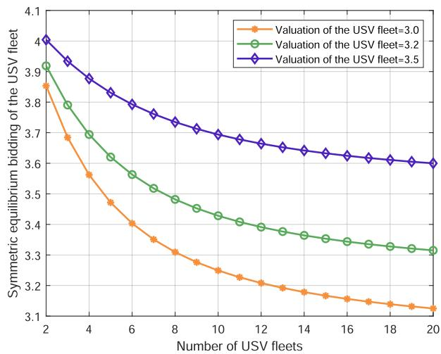

line

| Number of USV fleets | Valuation of the USV fleet=3.0 | Valuation of the USV fleet=3.2 | Valuation of the USV fleet=3.5 |
| -------------------- | ------------------------------ | ------------------------------ | ------------------------------ |
| 2                    | 3.85                           | 3.90                           | 4.00                           |
| 4                    | 3.68                           | 3.70                           | 3.88                           |
| 6                    | 3.50                           | 3.58                           | 3.80                           |
| 8                    | 3.35                           | 3.48                           | 3.72                           |
| 10                   | 3.28                           | 3.42                           | 3.68                           |
| 12                   | 3.22                           | 3.40                           | 3.65                           |
| 14                   | 3.18                           | 3.38                           | 3.63                           |
| 16                   | 3.16                           | 3.36                           | 3.62                           |
| 18                   | 3.14                           | 3.34                           | 3.61                           |
| 20                   | 3.12                           | 3.32                           | 3.60                           |

Fig. 3. Symmetric equilibrium bidding of the USV fleet versus number of USV fleets.

To demonstrate the superiority, we compare the proposed schemes with the following other benchmark schemes.

- Random Bidding Scheme (RBS): In RBS, USV fleets give random bids for UAVs in a suitable price range whose upper and lower bounds are the valuation of the UAV (i.e., the reserve price) and the valuations of USV fleets, respectively. [22].   
Greedy Bidding Scheme (GBS): In GBS, USV fleets estimate the impact of their valuation and number of bidders, and are willing to take risks for the greater benefits [23].   
Computation Capacity Priority Scheme (CCPS): In this scheme, the leader of the USV fleet gives priority to allocating subtasks to members with strong computation capacity for executing [29].   
- Hop Count Priority Scheme (HCPS): In this scheme, the leader of the USV fleet gives priority to allocating subtasks to members with fewer hops for executing [18].

# B. Simulation Results

Fig. 3 depicts the symmetrical equilibrium bidding of the USV fleet versus numbers of USV fleets, where the number of USV fleets varies from 2 to 20. As shown in the figure, the symmetrical equilibrium bidding of the USV fleet decreases as the number of USV fleets increases. The reason is that the increase in the number of USV fleets enhances the competition among USV fleets, while the USV fleet can only increase its winning probability by appropriately reducing its symmetrical equilibrium bidding. In addition, the symmetric equilibrium bidding proposed by the USV fleet with the larger valuation is higher, and as the number of USV fleets increases, the symmetric equilibrium bidding of the USV fleet gradually approaches its valuation.

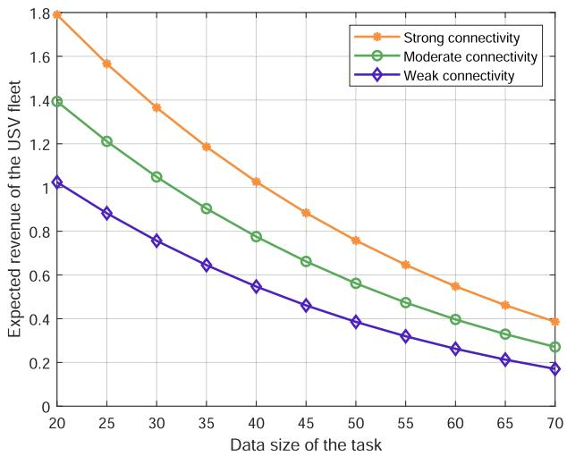

line

| Data size of the task | Strong connectivity | Moderate connectivity | Weak connectivity |
| --------------------- | ------------------- | --------------------- | ----------------- |
| 20                    | 1.8                 | 1.4                   | 1.0               |
| 25                    | 1.6                 | 1.2                   | 0.9               |
| 30                    | 1.4                 | 1.1                   | 0.8               |
| 35                    | 1.2                 | 0.9                   | 0.7               |
| 40                    | 1.0                 | 0.8                   | 0.6               |
| 45                    | 0.9                 | 0.7                   | 0.5               |
| 50                    | 0.8                 | 0.6                   | 0.4               |
| 55                    | 0.7                 | 0.5                   | 0.3               |
| 60                    | 0.6                 | 0.4                   | 0.25              |
| 65                    | 0.5                 | 0.35                  | 0.2               |
| 70                    | 0.4                 | 0.3                   | 0.15              |

(a)

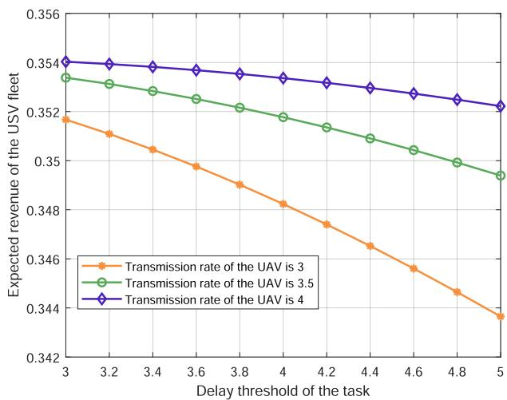

line

| Delay threshold of the task | Transmission rate of the UAV is 3 | Transmission rate of the UAV is 3.5 | Transmission rate of the UAV is 4 |
| --------------------------- | ---------------------------------- | ------------------------------------ | ---------------------------------- |
| 3                           | 0.352                              | 0.353                                | 0.354                              |
| 3.2                         | 0.351                              | 0.353                                | 0.354                              |
| 3.4                         | 0.350                              | 0.352                                | 0.354                              |
| 3.6                         | 0.349                              | 0.352                                | 0.354                              |
| 3.8                         | 0.348                              | 0.351                                | 0.354                              |
| 4                           | 0.347                              | 0.351                                | 0.354                              |
| 4.2                         | 0.346                              | 0.350                                | 0.353                              |
| 4.4                         | 0.345                              | 0.349                                | 0.353                              |
| 4.6                         | 0.344                              | 0.348                                | 0.352                              |
| 4.8                         | 0.343                              | 0.347                                | 0.352                              |
| 5                           | 0.342                              | 0.346                                | 0.352                              |

(b)   
Fig. 4. Comparison on expected revenue of the USV fleet with different data size and delay threshold of the task. (a) Different data size of the task. (b) Different delay threshold of the task.

Fig. 4 shows comparison on expected revenue of the USV fleet with different data size and delay threshold of the task. In Fig. 4(a), the expected revenue of the USV fleet decreases with the increase of data size of the task, because the increase of data size means the valuation of the USV fleet becomes larger, resulting in its bidding is too high, so its corresponding expected revenue is reduced. Since the lower bidding of the USV fleet leads to an increase in the probability of winning, the USV fleet with strong connectivity has a lower valuation and offers a lower bidding, which results in the relatively higher expected revenue. In Fig. 4(b), the expected revenue of the USV fleet decreases with the increase of delay threshold of the task. The reason is that the increase of delay threshold causes the valuation of the UAV (i.e., the reserve price) to become smaller, and its constraints on the symmetrical equilibrium bidding of the USV fleet are strengthened. The high transmission rate of the UAV increases the valuation of the UAV, which raises the expected revenue of the USV fleet.

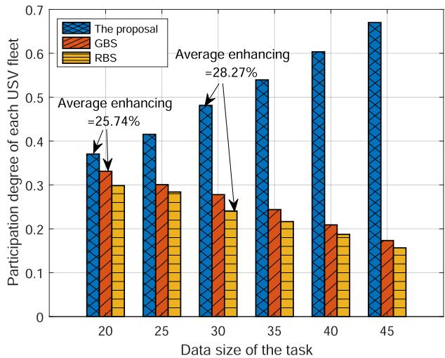

bar

| Data size of the task | The proposal | GBS   | RBS   |
| --------------------- | ------------ | ----- | ----- |
| 20                    | 0.37         | 0.33  | 0.30  |
| 25                    | 0.42         | 0.30  | 0.29  |
| 30                    | 0.48         | 0.28  | 0.24  |
| 35                    | 0.54         | 0.25  | 0.22  |
| 40                    | 0.61         | 0.21  | 0.19  |
| 45                    | 0.68         | 0.18  | 0.16  |

(a)

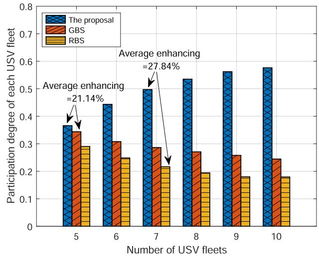

bar

| Number of USV fleets | The proposal | GBS | RBS |
|---|---|---|---|
| 5 | 0.37 | 0.35 | 0.29 |
| 6 | 0.44 | 0.31 | 0.25 |
| 7 | 0.50 | 0.29 | 0.22 |
| 8 | 0.54 | 0.27 | 0.19 |
| 9 | 0.57 | 0.26 | 0.18 |
| 10 | 0.58 | 0.25 | 0.18 |
Average enhancing =21.14%

(b)   
Fig. 5. Participation degree comparison of the three schemes with different data size of the task and the number of USV fleets. (a) Different data size of the task. (b) Different number of USV fleets.

Fig. 5 demonstrates the participation degree comparison of the three schemes with different data size of the task and number of USV fleets, where the participation degree is determined by the ratio of each scheme’s expected revenue to the sum of all expected revenues. In Fig. 5(a), under different data size of tasks, the participation degree of the proposed scheme enhances on average by 28.27% and 25.74% over RBS and GBS, respectively. The reason is that the proposed scheme is optimized under the constraints of the UAV’s valuation (including data size of the task), so the constraint impact caused by the increase of the data size is minimal. And with the increase of data size of the task, the participation degree of the proposed scheme gradually increases. From Fig. 5(b), under different number of USV fleets, the participation degree of the proposed scheme enhances on average by 27.84% and 21.14% over RBS and GBS, respectively. The reasons are as follows. RBS conducts random bidding in a reasonable bidding range without any optimization, so the expected revenue of RBS is the lowest. GBS bids based on factors such as the number of bidders and its own valuation, but its bidding scheme is only partially optimized, so its expected revenue is lower than the proposed scheme.

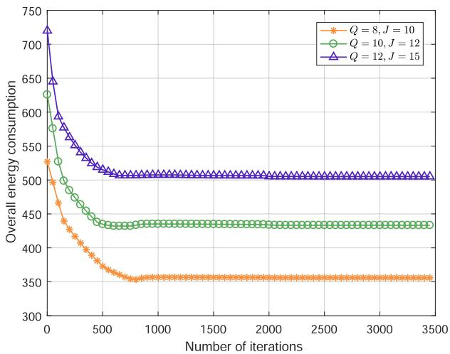

line

| Number of iterations | Q = 8, J = 10 | Q = 10, J = 12 | Q = 12, J = 15 |
| -------------------- | ------------- | -------------- | -------------- |
| 0                    | 530           | 630            | 720            |
| 500                  | 360           | 440            | 520            |
| 1000                 | 360           | 440            | 510            |
| 1500                 | 360           | 440            | 510            |
| 2000                 | 360           | 440            | 510            |
| 2500                 | 360           | 440            | 510            |
| 3000                 | 360           | 440            | 510            |
| 3500                 | 360           | 440            | 510            |

Fig. 6. Convergence of the proposed optimization scheme in terms of number of tasks and number of members.

Fig. 6 depicts the convergence of the proposed optimization scheme in terms of number of tasks and number of members. As shown in Fig. 6, the proposed optimization scheme can achieve the ideal convergence effect under different number of tasks and number of members. When the number of iterations reaches 1500, the overall energy consumption curve achieves an ideal convergence effect, especially the first 800 iterations have a very obvious downward trend in overall energy consumption. The reason is that we adopt the BCD method based on ADMM, which improves the convergence effect through parallel operation. Thus, the proposed optimization scheme has excellent convergence stability.

Fig. 7 shows the overall energy consumption of executing tasks versus number of tasks, where number of tasks varies from 8 to 20. From Fig. 7(a) and (b), the overall energy consumption of executing tasks increases with the increase of number of tasks. The proposed optimization scheme is better than CCPS and HCPS, because the proposed optimization scheme jointly optimizes subtasks allocation and computation capacities allocation, while CCPS only optimizes subtasks allocation according to the computation capacities of the members, and HCPS optimizes subtasks allocation according to the hop count among inner members of the USV fleet, so the energy consumptions of CCPS and HCPS are higher than that of the proposed optimization scheme. Obviously, the USV fleet with stronger connectivity generates lower overall energy consumption, because the transmission energy consumption will be lower when the subtasks are forwarded among the members due to the few hops. On the whole, the overall energy consumption increases as the number of tasks increases.

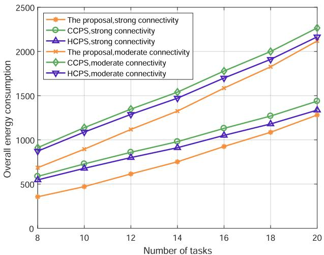

line

| Number of tasks | The proposal, strong connectivity | CCPS, strong connectivity | HCPS, strong connectivity | The proposal, moderate connectivity | CCPS, moderate connectivity | HCPS, moderate connectivity |
| --------------- | ---------------------------------- | ------------------------- | ------------------------- | ----------------------------------- | --------------------------- | --------------------------- |
| 8               | 650                                | 900                       | 550                       | 350                                 | 900                         | 900                         |
| 10              | 750                                | 1100                      | 650                       | 450                                 | 1100                        | 1100                        |
| 12              | 850                                | 1300                      | 750                       | 550                                 | 1300                        | 1300                        |
| 14              | 950                                | 1500                      | 850                       | 650                                 | 1500                        | 1500                        |
| 16              | 1050                               | 1700                      | 950                       | 750                                 | 1700                        | 1700                        |
| 18              | 1150                               | 1900                      | 1050                      | 850                                 | 1900                        | 1900                        |
| 20              | 1250                               | 2100                      | 1150                      | 950                                 | 2100                        | 2100                        |

(a)

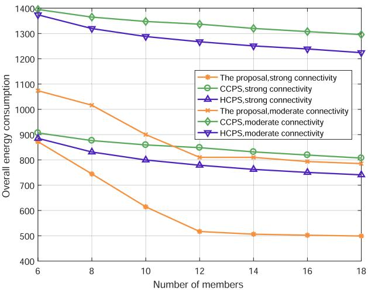

line

| Number of members | The proposal,strong connectivity | CCPS,strong connectivity | HCPS,strong connectivity | The proposal,moderate connectivity | CCPS,moderate connectivity | HCPS,moderate connectivity |
| ----------------- | ---------------------------------- | ------------------------ | ------------------------ | ----------------------------------- | -------------------------- | -------------------------- |
| 6                 | 1080                               | 900                      | 880                      | 1400                                | 1380                       | 1380                       |
| 8                 | 750                                | 880                      | 840                      | 1020                                | 1360                       | 1320                       |
| 10                | 620                                | 860                      | 810                      | 900                                 | 1340                       | 1290                       |
| 12                | 520                                | 840                      | 790                      | 820                                 | 1320                       | 1270                       |
| 14                | 510                                | 820                      | 770                      | 800                                 | 1300                       | 1250                       |
| 16                | 510                                | 810                      | 760                      | 790                                 | 1280                       | 1230                       |
| 18                | 510                                | 800                      | 750                      | 780                                 | 1260                       | 1220                       |

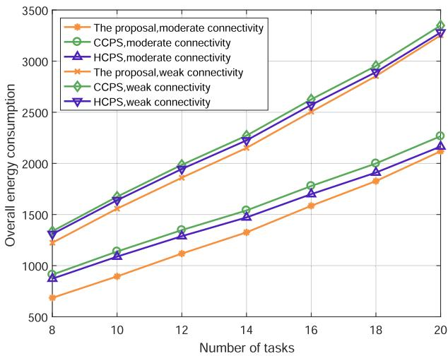

line

| Number of tasks | The proposal,moderate connectivity | CCPS,moderate connectivity | HCPS,moderate connectivity | The proposal,weak connectivity | CCPS,weak connectivity | HCPS,weak connectivity |
| --------------- | ----------------------------------- | -------------------------- | -------------------------- | ------------------------------ | ---------------------- | ---------------------- |
| 8               | 1250                                | 1300                       | 900                        | 700                            | 1350                   | 1300                   |
| 10              | 1600                                | 1700                       | 1100                       | 900                            | 1650                   | 1600                   |
| 12              | 1900                                | 2000                       | 1300                       | 1100                           | 2000                   | 1950                   |
| 14              | 2200                                | 2300                       | 1500                       | 1300                           | 2350                   | 2300                   |
| 16              | 2550                                | 2650                       | 1750                       | 1550                           | 2650                   | 2600                   |
| 18              | 2900                                | 3000                       | 2000                       | 1850                           | 2950                   | 2900                   |
| 20              | 3350                                | 3450                       | 2250                       | 2150                           | 3350                   | 3300                   |

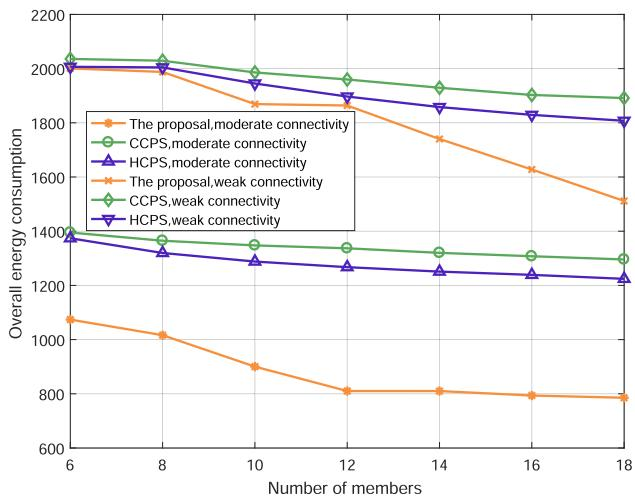

line

| Number of members | The proposal, moderate connectivity | CCPS, moderate connectivity | HCPS, moderate connectivity | The proposal, weak connectivity | CCPS, weak connectivity | HCPS, weak connectivity |
| ----------------- | ------------------------------------ | --------------------------- | --------------------------- | ------------------------------- | ----------------------- | ----------------------- |
| 6                 | 2000                                 | 2000                        | 1400                        | 1080                            | 2050                    | 2000                    |
| 8                 | 2000                                 | 2000                        | 1350                        | 1020                            | 2050                    | 2000                    |
| 10                | 1900                                 | 1950                        | 1300                        | 900                             | 2000                    | 1950                    |
| 12                | 1850                                 | 1900                        | 1280                        | 820                             | 1950                    | 1900                    |
| 14                | 1750                                 | 1850                        | 1260                        | 820                             | 1900                    | 1850                    |
| 16                | 1650                                 | 1800                        | 1240                        | 820                             | 1850                    | 1800                    |
| 18                | 1550                                 | 1750                        | 1220                        | 820                             | 1800                    | 1750                    |

Fig. 7. Overall energy consumption of executing tasks versus number of tasks. (a) Comparison of different schemes for strong connectivity and moderate connectivity. (b) Comparison of different schemes for moderate connectivity and weak connectivity.   
Fig. 8. Overall energy consumption of executing tasks versus number of members. (a) Comparison of different schemes for strong connectivity and moderate connectivity. (b) Comparison of different schemes for moderate connectivity and weak connectivity.

Fig. 8 shows overall energy consumption of executing tasks versus number of members, where number of members changed from 6 to 18. From Fig. 8(a) and (b), the overall energy consumption decreases as number of members increases, because the increase in the number of members provides more options for the optimization scheme to reduce energy consumption. In the three different connectivity situations, the overall energy consumption of the proposed optimization scheme is lower than that of CCPS and HCPS, while the energy consumption of HCPS is slightly lower than that of CCPS. This is because the increase in the number of members can effectively improve the connectivity of the USV fleet, and the improvement is more significant for HCPS, which optimizes subtasks allocation based on hop count. When the number of member is 12, the reduction in energy consumption becomes smaller. The reason is that the number of members has reached saturation in executing tasks, so the subsequent increase in the number of members cannot significantly reduce the overall energy consumption.

# VII. CONCLUSION

In this paper, we have proposed an energy-efficient USV fleets-assisted collaborative computation offloading scheme for smart maritime services. Firstly, the framework of collaborative computation offloading has been proposed, where UAVs and USV fleets are the requesters and helpers of computation offloading service, respectively. Then, we have designed a first-price sealed reverse auction to encourage USV fleets to participate in the computation offloading service requested by UAVs, where the satisfactory benefits of UAVs are guaranteed through the reserve price. The symmetric equilibrium bids of USV fleets have been derived such that their expected revenues are maximized. Additionally, a joint allocation optimization scheme for computation subtasks and computation capacities has been devised to minimize the energy consumption of computation offloading. Furthermore, to reduce the computational complexity, the joint allocation optimization problem has been decomposed into two suboptimization problems by the BCD method, where each suboptimization problem is solved by the

ADMM improved with dynamic penalty coefficients. Simulation results have shown that the proposed scheme can significantly improve the expected revenue and participation degree of the USV fleet and reduce the overall energy consumption of computation offloading compared with conventional schemes. In the future, we will investigate the joint optimal allocation of caching, communication and computation capacities for UAVs and USV fleets.

# REFERENCES

[1] H. Zeng et al., “Collaborative computation offloading for UAVs and USV fleets in communication networks,” in Proc. IEEE Int. Wireless Commun. Mobile Comput., 2022, pp. 949–954.   
[2] Y. Wang, W. Feng, J. Wang, and T. Q. S. Quek, “Hybrid satellite-UAVterrestrial networks for 6G ubiquitous coverage: A maritime communications perspective,” IEEE J. Sel. Areas Commun., vol. 39, no. 11, pp. 3475–3490, Nov. 2021.   
[3] Q. Xu, Z. Su, R. Lu, and S. Yu, “Ubiquitous transmission service: Hierarchical wireless data rate provisioning in space-air-ocean integrated networks,” IEEE Trans. Wireless Commun., vol. 21, no. 9, pp. 7821–7836, Sep. 2022, doi: 10.1109/TWC.2022.3162400.   
[4] H.-T. Ye, X. Kang, J. Joung, and Y.-C. Liang, “Optimization for wirelesspowered IoT networks enabled by an energy-limited UAV under practical energy consumption model,” IEEE Wireless Commun. Lett., vol. 10, no. 3, pp. 567–571, Mar. 2021.   
[5] Y. Liu, J. Yan, and X. Zhao, “Deep reinforcement learning based latency minimization for mobile edge computing with virtualization in maritime UAV communication network,” IEEE Trans. Veh. Technol., vol. 71, no. 4, pp. 4225–4236, Apr. 2022.   
[6] Y. Wang, Y. Pan, M. Yan, Z. Su, and T. H. Luan, “A survey on ChatGPT: AI-generated contents, challenges, and solutions,” IEEE Open J. Comput. Soc., vol. 4, pp. 280–302, 2023.   
[7] Y. Zhao, Y. Ma, and S. Hu, “USV formation and path-following control via deep reinforcement learning with random braking,” IEEE Trans. Neural Netw. Learn. Syst., vol. 32, no. 12, pp. 5468–5478, Dec. 2021.   
[8] K. Cui, W. Sun, and W. Sun, “Joint computation offloading and resource management for USVs cluster of fog-cloud computing architecture,” in Proc. IEEE Int. Conf. Smart Internet Things, 2019, pp. 92–99.   
[9] X. Li, W. Feng, Y. Chen, C. Wang, and N. Ge, “Maritime coverage enhancement using UAVs coordinated with hybrid satellite-terrestrial networks,” IEEE Trans. Commun., vol. 68, no. 4, pp. 2355–2369, Apr. 2020.   
[10] M. Dai, Y. Wu, L. Qian, Z. Su, B. Lin, and N. Chen, “UAV-assisted multi-access computation offloading via hybrid NOMA and FDMA in marine networks,” IEEE Trans. Netw. Sci. Eng., vol. 10, no. 1, pp. 113–127, Jan./Feb. 2023, doi: 10.1109/TNSE.2022.3205303.   
[11] Q. Ai, X. Qiao, Y. Liao, and Q. Yu, “Joint optimization of USVs communication and computation resource in IRS-aided wireless inland ship MEC networks,” IEEE Trans. Green Commun. Netw., vol. 6, no. 2, pp. 1023–1036, Jun. 2022.   
[12] M. Dai, Z. Su, Q. Xu, and N. Zhang, “Vehicle assisted computing offloading for unmanned aerial vehicles in smart city,” IEEE Trans. Intell. Transp. Syst., vol. 22, no. 3, pp. 1932–1944, Mar. 2021.   
[13] Y. Liu, S. Xie, and Y. Zhang, “Cooperative offloading and resource management for UAV-enabled mobile edge computing in power IoT system,” IEEE Trans. Veh. Technol., vol. 69, no. 10, pp. 12229–12239, Oct. 2020.   
[14] L. P. Qian, H. Zhang, Q. Wang, Y. Wu, and B. Lin, “Joint multi-domain resource allocation and trajectory optimization in UAV-assisted maritime IoT networks,” IEEE Internet Things J., vol. 10, no. 1, pp. 539–552, Jan. 2023, doi: 10.1109/JIOT.2022.3201017.   
[15] L. Zhao, K. Yang, Z. Tan, X. Li, S. Sharma, and Z. Liu, “A novel cost optimization strategy for SDN-enabled UAV-assisted vehicular computation offloading,” IEEE Trans. Intell. Transp. Syst., vol. 22, no. 6, pp. 3664–3674, Jun. 2021.   
[16] Y. Sahni, J. Cao, L. Yang, and Y. Ji, “Multi-hop multi-task partial computation offloading in collaborative edge computing,” IEEE Trans. Parallel Distrib. Syst., vol. 32, no. 5, pp. 1133–1145, May 2021.   
[17] K. Guo, M. Yang, Y. Zhang, and J. Cao, “Joint computation offloading and bandwidth assignment in cloud-assisted edge computing,” IEEE Trans. Cloud Comput., vol. 10, no. 1, pp. 451–460, Jan.–Mar. 2022.

[18] Y. Ding and W. Zhang, “Hop-based priority scheduling to improve worstcase inter-core communication latency,” in Proc. IEEE 12th Int. Conf. Embedded Ubiquitous Comput., 2014, pp. 52–57.   
[19] Y. Yang, C. Long, J. Wu, S. Peng, and B. Li, “D2D-enabled mobile-edge computation offloading for multiuser IoT network,” IEEE Internet Things J., vol. 8, no. 16, pp. 12490–12504, Aug. 2021.   
[20] R. Zheng, H. Wang, M. De Mari, M. Cui, X. Chu, and T. Q. S. Quek, “Dynamic computation offloading in ultra-dense networks based on mean field games,” IEEE Trans. Wireless Commun., vol. 20, no. 10, pp. 6551–6565, Oct. 2021.   
[21] Y. Wang, Z. Su, Q. Xu, R. Li, T. H. Luan, and P. Wang, “A secure and intelligent data sharing scheme for UAV-assisted disaster rescue,” IEEE/ACM Trans. Netw., vol. 31, no. 6, pp. 2422–2438, Dec. 2023, doi: 10.1109/TNET.2022.3226458.   
[22] D. An, Q. Yang, W. Yu, X. Yang, X. Fu, and W. Zhao, “Sto2Auc: A stochastic optimal bidding strategy for microgrids,” Internet Things J., vol. 4, no. 6, pp. 2260–2274, Dec. 2017.   
[23] R. Ghorani, M. Fotuhi-Firuzabad, and M. Moeini-Aghtaie, “Optimal bidding strategy of transactive agents in local energy markets,” IEEE Trans. Smart Grid, vol. 10, no. 5, pp. 5152–5162, Sep. 2019.   
[24] H. Wang, T. Lv, Z. Lin, and J. Zeng, “Energy-delay minimization of task migration based on game theory in MEC-assisted vehicular networks,” IEEE Trans. Veh. Technol., vol. 71, no. 8, pp. 8175–8188, Aug. 2022.   
[25] J. Bi, H. Yuan, S. Duanmu, M. Zhou, and A. Abusorrah, “Energy-optimized partial computation offloading in mobile-edge computing with genetic simulated-annealing-based particle swarm optimization,” IEEE Internet Things J., vol. 8, no. 5, pp. 3774–3785, Mar. 2021.   
[26] J. Ji, K. Zhu, C. Yi, and D. Niyato, “Energy consumption minimization in UAV-assisted mobile-edge computing systems: Joint resource allocation and trajectory design,” IEEE Internet Things J., vol. 8, no. 10, pp. 8570–8584, May 2021.   
[27] X. Chen, J. Zhang, B. Lin, Z. Chen, K. Wolter, and G. Min, “Energyefficient offloading for DNN-based smart IoT systems in cloud-edge environments,” IEEE Trans. Parallel Distrib. Syst., vol. 33, no. 3, pp. 683–697, Mar. 2022.   
[28] X. Zhang, X. Zhang, and W. Yang, “Joint offloading and resource allocation using deep reinforcement learning in mobile edge computing,” IEEE Trans. Netw. Sci. Eng., vol. 9, no. 5, pp. 3454–3466, Sep./Oct. 2022.   
[29] Y. Ren, Y. Sun, and M. Peng, “Deep reinforcement learning based computation offloading in fog enabled industrial Internet of Things,” IEEE Trans. Ind. Inform., vol. 17, no. 7, pp. 4978–4987, Jul. 2021.   
[30] F. Zhou, Y. Wu, R. Q. Hu, and Y. Qian, “Computation rate maximization in UAV-enabled wireless-powered mobile-edge computing systems,” IEEE J. Sel. Areas Commun., vol. 36, no. 9, pp. 1927–1941, Sep. 2018.   
[31] Y. Wang et al., “Task offloading for post-disaster rescue in unmanned aerial vehicles networks,” IEEE/ACM Trans. Netw., vol. 30, no. 4, pp. 1525–1539, Aug. 2022.   
[32] S. Zhang, H. Zhang, B. Di, and L. Song, “Cellular UAV-to-X communications: Design and optimization for multi-UAV networks,” IEEE Trans. Wireless Commun., vol. 18, no. 2, pp. 1346–1359, Feb. 2019.   
[33] S. He, M. Wang, S.-L. Dai, and F. Luo, “Leader-follower formation control of USVs with prescribed performance and collision avoidance,” IEEE Trans. Ind. Inform., vol. 15, no. 1, pp. 572–581, Jan. 2019.   
[34] Q. Yang, G. Chen, and T. Wang, “ADMM-based distributed algorithm for economic dispatch in power systems with both packet drops and communication delays,” IEEE/CAA J. Automatica Sinica, vol. 7, no. 3, pp. 842–852, May 2020.   
[35] X. Yu, G. Cui, J. Yang, J. Li, and L. Kong, “Quadratic optimization for unimodular sequence design via an ADPM framework,” IEEE Trans. Signal Process., vol. 68, pp. 3619–3634, 2020.   
[36] J. Zhang et al., “Stochastic computation offloading and trajectory scheduling for UAV-assisted mobile edge computing,” IEEE Internet Things J., vol. 6, no. 2, pp. 3688–3699, Apr. 2019.   
[37] Q. Wu, Y. Zeng, and R. Zhang, “Joint trajectory and communication design for multi-UAV enabled wireless networks,” IEEE Trans. Wireless Commun., vol. 17, no. 3, pp. 2109–2121, Mar. 2018.   
[38] A. Makhdoumi and A. Ozdaglar, “Convergence rate of distributed ADMM over networks,” IEEE Trans. Autom. Control, vol. 62, no. 10, pp. 5082–5095, Oct. 2017.   
[39] M. Hong, X. Wang, M. Razaviyayn, and Z. Luo, “Iteration complexity analysis of block coordinate descent methods,” Math. Program., vol. 163, pp. 85–114, May 2017.

[40] N. T. Boardman and K. M. Sullivan, “Time-based node deployment policies for reliable wireless sensor networks,” IEEE Trans. Rel., vol. 70, no. 3, pp. 1204–1217, Sep. 2021.   
[41] C. Zeng, J.-B. Wang, C. Ding, H. Zhang, M. Lin, and J. Cheng, “Joint optimization of trajectory and communication resource allocation for unmanned surface vehicle enabled maritime wireless networks,” IEEE Trans. Commun., vol. 69, no. 12, pp. 8100–8115, Dec. 2021.

natural_image

Portrait photo of a man wearing glasses and a light blue shirt against a blue background (no text or symbols visible)

Hui Zeng (Student Member, IEEE) is currently working toward the Ph.D. degree with the School of Mechatronic Engineering and Automation, Shanghai University, Shanghai, China. His research interests include the general area of wireless network architecture and vehicular networks.

natural_image

Portrait of a smiling man wearing glasses and a light blue shirt (no text or symbols visible)

Zhou Su (Senior Member, IEEE) has authored or coauthored technical papers, including top journals and top conferences, such as IEEE JOURNAL ON SE-LECTED AREAS IN COMMUNICATIONS, IEEE TRANS-ACTIONS ON INFORMATION FORENSICS AND SECU-RITY, IEEE TRANSACTIONS ON DEPENDABLE AND SECURE COMPUTING, IEEE TRANSACTIONS ON MO-BILE COMPUTING, IEEE/ACM TRANSACTIONS ON NETWORKING, and INFOCOM. His research interests include multimedia communication, wireless communication, and network traffic. Dr. Su is an Associate Editor for IEEE INTERNET OF THINGS JOURNAL, IEEE OPEN JOURNAL OF THE COMPUTER SOCIETY, and IET Communications. He was the recipient of the Best Paper Award of International Conference IEEE ICC 2020, IEEE BigdataSE 2019, and IEEE CyberSciTech 2017.

natural_image

Portrait of a man wearing glasses and a suit (no text or symbols visible)

Qichao Xu received the Ph.D. degree from the School of Mechatronic Engineering and Automation, Shanghai University, Shanghai, China, in 2019. He is currently an Associate Professor with Shanghai university. He has authored or coauthored more than 50 papers in some respected journals, such as IEEE TRANSACTIONS ON INFORMATION FORENSICS AND SECURITY, IEEE TRANSACTIONS ON DEPENDABLE AND SECURE COMPUTING, IEEE TRANSACTIONS ON WIRELESS COMMUNICATIONS, IEEE TRANSACTIONS ON INDUSTRIAL INFORMATICS, and IEEE TRANSAC-TIONS ON VEHICULAR TECHNOLOGY. His research interests include trust and security, the general area of wireless network architecture, Internet of Things, vehicular networks, and resource allocation. He was the recipient of the Best Paper Awards from several international conferences, including IEEE IWCMC 2022, IEEE MSN 2020, EAI MONAMI 2020, IEEE Comsoc GCCTC 2018, IEEE CyberSciTech 2017, and WiCon 2016.

natural_image

Portrait of a man wearing glasses and a striped shirt (no text or symbols visible)

Ruidong Li (Senior Member, IEEE) received the bachelor’s degree in engineering from the Department of Information Science and Electronic Engineering, Zhejiang University, Zhejiang, China, in 2001, and the master’s and doctorate of engineering degrees in computer science from the University of Tsukuba, Tsukuba, Japan. From 2008 to 2021, he was a Senior Researcher with the National Institute of Information and Communications Technology, Tokyo, Japan. He is currently an Associate Professor with Kanazawa University, Kanazawa, Japan. He has been involved in designing, implementing, evaluating, and optimizing future network architecture.

natural_image

Portrait of a man wearing glasses and a suit (no text or symbols visible)

Yuntao Wang received the Ph.D. degree in cyberspace security from Xi’an Jiaotong University, Xi’an, China, in 2022. He is currently an Assistant Professor with the School of Cyber Science and Engineering, Xi’an Jiaotong University. His research interests include security and privacy in intelligent IoT, network games, and blockchain.

natural_image

Portrait of a young man in formal attire against a blue background (no text or symbols visible)

Minghui Dai received the Ph.D. degree from Shanghai University, Shanghai, China, in 2021. He is currently a Postdoctoral Fellow with the State Key Laboratory of Internet of Things for Smart City, University of Macau, Macau, China. His research interests include the general area of wireless network architecture and vehicular networks.

natural_image

Portrait of a man wearing glasses and a striped shirt (no text or symbols visible)

Tom H. Luan (Senior Member, IEEE) received the Ph.D. degree from the University of Waterloo, Waterloo, ON, Canada, in 2012. He is currently a Professor with the School of Cyber Science and Engineering, Xi’an Jiaotong University, Xi’an, China. He has authored or coauthored more than 40 journal articles and 30 technical articles in conference proceedings. His research interests include content distribution and media streaming in vehicular ad hoc networks, peerto-peer networking, the protocol design and performance evaluation of wireless cloud computing, and edge computing. He awarded one U.S. patent. He was a TPC Member for IEEE Globecom, ICC, and PIMRC.

natural_image

Portrait of a man in formal business attire (no visible text or symbols)

Xin Sun received the master’s degree in system analysis and integration from Zhejiang University, Hangzhou, China, in 2006. He is currently engaged in cyberspace security work with State Grid Zhejiang Electric Power Research Institute, Zhejiang, China. His research interests include several areas in industrial control system security and IoT security.

natural_image

Portrait photo of a woman in business attire (no text or symbols visible)

Donglan Liu received the master’s degree in computer software and theory from Shandong University, Jinan, China, in 2013. She is currently engaged in network security work with the State Grid Shandong Electric Power Research Institute, Jinan, China. Her research interests include several areas in network security, Internet of Things security, and data security.